# 🚀 Product Hunt Daily Top 30 (2026-06-15)

## 오늘의 요약
오늘의 트렌드는 AI를 활용한 업무 자동화와 개인화된 데이터 관리 도구가 주를 이루었습니다. 특히 이메일 작성, 디자인 분석, 데이터 분석 등 특정 업무 맥락을 이해하고 실행하는 AI 에이전트 서비스가 눈에 띄었습니다. 또한, 보안과 프라이버시를 강조하며 AI 대화 기록이나 워크스페이스 데이터를 안전하게 관리하려는 시도도 함께 관찰되었습니다.

### 오늘의 핵심 포인트
- 사용자의 말투나 업무 맥락을 학습하여 이메일 및 데이터 분석을 자동화하는 지능형 AI 에이전트가 주목받았습니다.
- AI 서비스 간의 데이터 호환성 및 보안을 위해 대화 기록을 암호화하여 저장하거나 워크스페이스를 백업하는 솔루션이 등장했습니다.
- 디자인 추출, 미디어 변환, 알레르기 정보 번역 등 특정 목적에 특화된 실용적인 생산성 도구들이 다양하게 출시되었습니다.

**오늘의 태그**: AI 에이전트, 생산성 도구, 데이터 보안, 업무 자동화

## 1. [Slashy](https://www.producthunt.com/products/slashy-3)
**Votes**: 276 | **도입 난이도**: 중 | **신뢰도**: 상
**Tagline**: The AI assistant that does email for you
**서비스 링크**: https://www.producthunt.com/r/723Q6GNIWDBMQM

**태그**: AI, Productivity, Email, Automation, AI Tool, CRM

### 📌 이 서비스 한눈에 보기
사용자의 말투를 학습하여 이메일 작성부터 일정 관리까지 대신해 주는 AI 기반 이메일 비서

### 🔑 주요 기능
- 사용자 고유의 말투를 반영한 이메일 초안 작성
- 이메일, 캘린더, CRM, 회의록 연동을 통한 업무 맥락 파악
- 미처리 업무(팔로업) 추적 및 인박스 제로(Inbox Zero) 지원

### 🙋 사용자에게 어떤 점이 좋은가
이메일 작성과 정리 시간을 획기적으로 줄여주며, 외부에서도 슬랙이나 아이메시지를 통해 간편하게 업무를 처리할 수 있습니다.

### ✅ 지금 바로 써볼 기능
- 기존 이메일 계정 연동 및 말투 학습시키기
- 회의 준비 및 팔로업 이메일 초안 생성 요청하기
- 모바일(iMessage/Slack)을 통한 빠른 답장 기능 테스트하기

### ⚠️ 사용 전 확인할 점
- 개인 이메일, CRM, 캘린더 등 민감한 데이터 접근에 따른 보안 검토 필요
- AI가 생성한 답변의 정확성 및 톤앤매너 최종 확인 필요

### 🧭 확인이 더 필요한 정보
데이터 연동 범위와 보안 프로토콜에 대한 구체적인 정보 확인이 필요합니다.

### 📸 스크린샷 및 갤러리
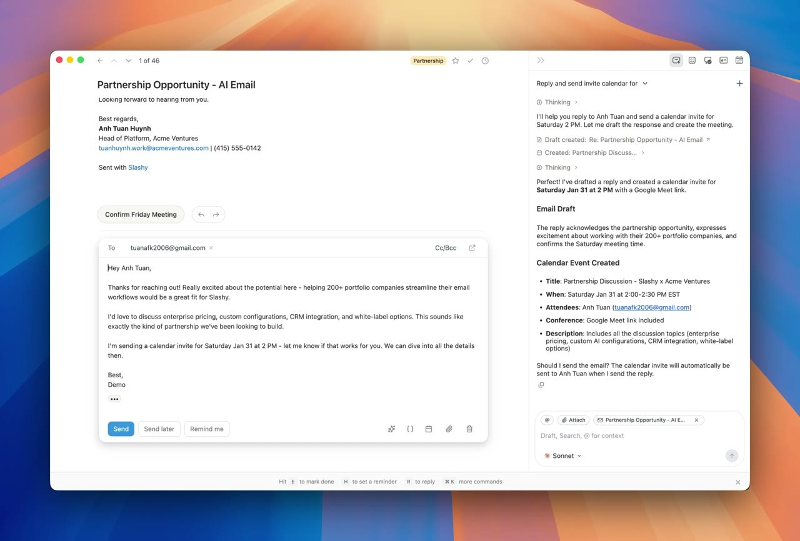
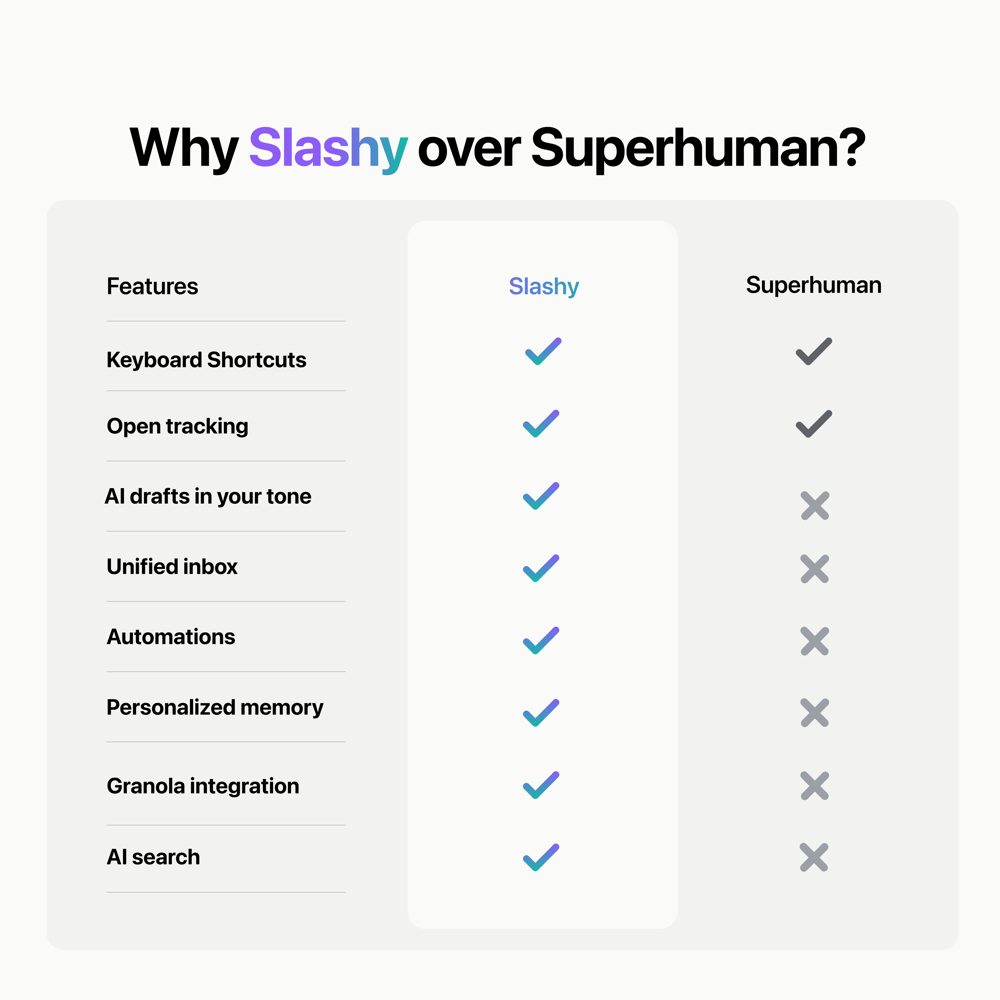

### 🎬 관련 영상
- [🎥 영상 보기](https://ph-files.imgix.net/3f2e189c-82d3-4379-81cf-883b8b5db6bd.jpeg?auto=format)

---

## 2. [Taste Lab](https://www.producthunt.com/products/taste-lab)
**Votes**: 237 | **도입 난이도**: 하 | **신뢰도**: 상
**Tagline**: Extract any website's design DNA
**서비스 링크**: https://www.producthunt.com/r/KOJGXLNJOQGWQI

**태그**: DesignTool, AI, Frontend, Productivity, Agent, AI Tool, Design

### 📌 이 서비스 한눈에 보기
웹사이트의 디자인 요소와 설계 의도를 즉시 추출하는 AI 디자인 분석 도구

### 🔑 주요 기능
- AI 에이전트를 통한 웹사이트 디자인 DNA 자동 추출
- 컬러, 타이포그래피, 간격 등 상세 디자인 시스템 분석
- 디자인 결정 근거(Reasoning) 제공을 통한 인사이트 확보

### 🙋 사용자에게 어떤 점이 좋은가
참고하고 싶은 웹사이트의 디자인 시스템을 수동으로 분석할 필요 없이, 즉시 프로젝트에 적용 가능한 데이터로 변환해 줍니다.

### ✅ 지금 바로 써볼 기능
- 영감을 주는 웹사이트 URL 입력하기
- 추출된 디자인 가이드라인 확인하기
- 새로운 프로젝트의 디자인 시스템 구축에 활용하기

### ⚠️ 사용 전 확인할 점
- 추출된 데이터가 실제 코드와 100% 일치하지 않을 수 있음
- AI의 디자인 의도 해석이 주관적일 수 있음

### 🧭 확인이 더 필요한 정보
AI 에이전트가 구동되는 구체적인 방식과 지원하는 웹 프레임워크 범위에 대한 정보가 필요합니다.

### 📸 스크린샷 및 갤러리
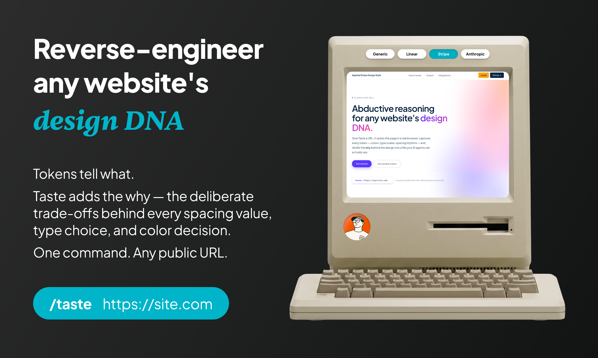
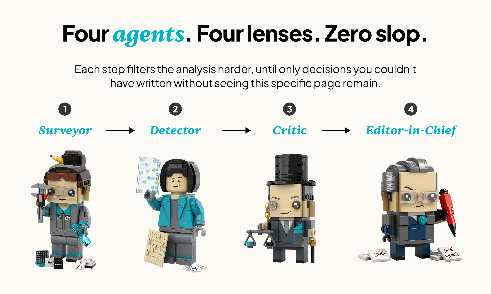
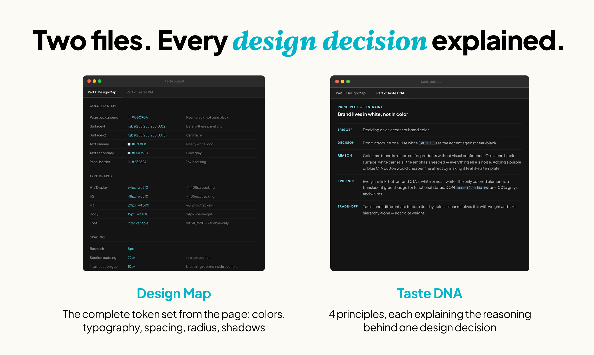

### 🎬 관련 영상
- [🎥 영상 보기](https://ph-files.imgix.net/43e4cbf1-023f-4af9-bfd8-7191242fd71d.jpeg?auto=format)

---

## 3. [Permute 4.0](https://www.producthunt.com/products/permute)
**Votes**: 141 | **도입 난이도**: 하 | **신뢰도**: 상
**Tagline**: The ultimate media converter for macOS
**서비스 링크**: https://www.producthunt.com/r/7DGX3DO3UNS2TC

**태그**: MediaConverter, macOS, Productivity, Video, Vision

### 📌 이 서비스 한눈에 보기
macOS를 위한 강력하고 간편한 올인원 미디어 포맷 변환 도구

### 🔑 주요 기능
- 거의 모든 종류의 이미지, 오디오, 비디오 포맷 변환 지원
- 여러 영상을 하나로 합치는 병합 기능 제공
- 자막 트랙 추가 등 부가적인 편집 기능 탑재

### 🙋 사용자에게 어떤 점이 좋은가
다양한 미디어 파일 형식을 일일이 찾을 필요 없이 하나의 앱으로 간편하게 변환하고 관리할 수 있습니다.

### ✅ 지금 바로 써볼 기능
- 파일 형식 간 변환 테스트
- 여러 영상 파일 병합해보기
- 자막 트랙 추가 기능 활용하기

### ⚠️ 사용 전 확인할 점
- macOS 전용 소프트웨어이므로 다른 OS에서는 사용 불가
- 모든 파일 형식이 완벽하게 지원되는지 사전 확인 필요

### 🧭 확인이 더 필요한 정보
구체적인 변환 속도나 지원하는 상세 파일 확장자 목록은 명시되지 않았습니다.

### 📸 스크린샷 및 갤러리
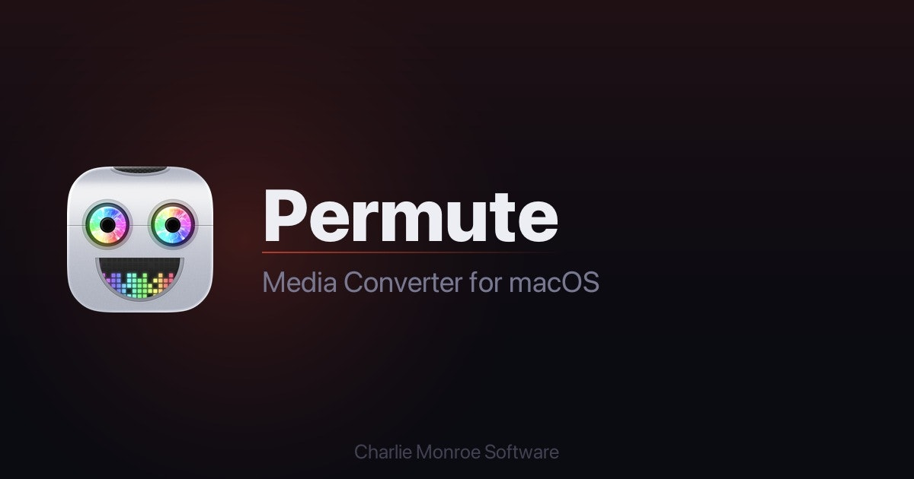
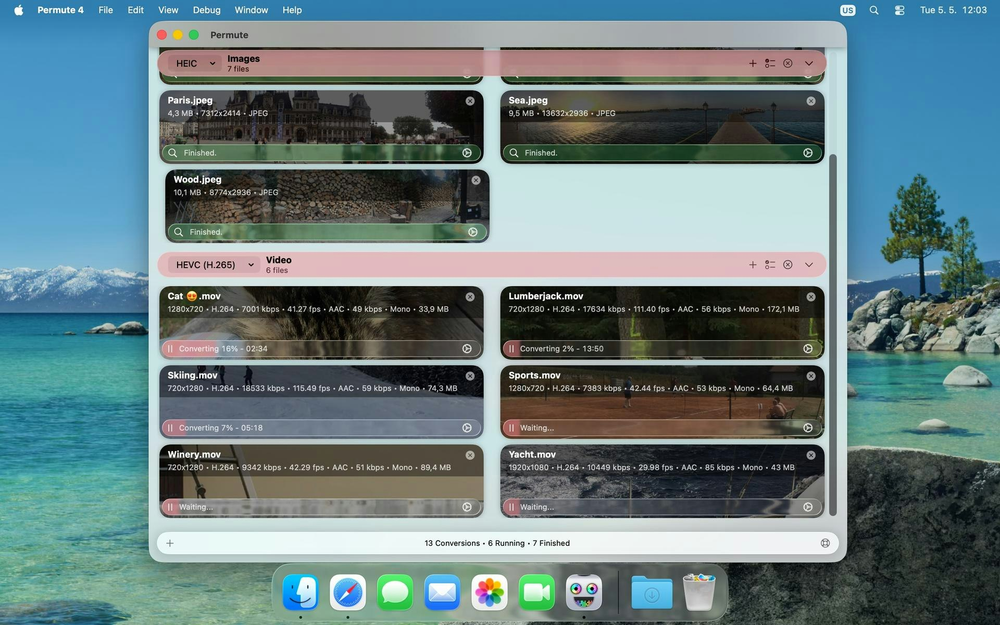
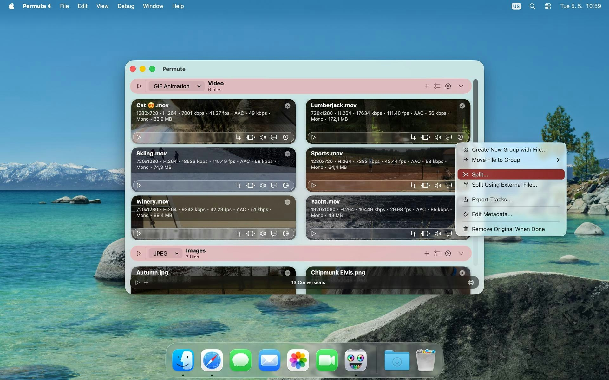

---

## 4. [Athenic 2.0](https://www.producthunt.com/products/athenic-ai)
**Votes**: 138 | **도입 난이도**: 하 | **신뢰도**: 상
**Tagline**: A faster, smarter Athenic. Analyze on autopilot.
**서비스 링크**: https://www.producthunt.com/r/RPHLNAADRGEJ3M

**태그**: AI Agent, Data Analytics, Automation, Business Intelligence, Agent, AI Tool, Chat

### 📌 이 서비스 한눈에 보기
데이터 연결부터 분석, 자동화까지 AI가 알아서 처리하는 지능형 데이터 에이전트

### 🔑 주요 기능
- 자연어 채팅을 통한 간편한 데이터 분석 기능
- 대시보드, 리포트 생성 및 업무 자동화 지원
- 스타트업부터 대기업까지 아우르는 확장성

### 🙋 사용자에게 어떤 점이 좋은가
복잡한 SQL이나 데이터 도구 숙련도 없이도 일상 언어로 원하는 분석 결과와 자동화된 업무 흐름을 즉시 만들 수 있습니다.

### ✅ 지금 바로 써볼 기능
- 데이터 소스 연결하기
- 자연어로 데이터 질문 던지기
- 분석 결과 기반의 자동화 워크플로우 설정하기

### ⚠️ 사용 전 확인할 점
- AI가 생성한 분석 결과의 정확성 검증 필요
- 데이터 보안 및 권한 설정 확인 필요

### 🧭 확인이 더 필요한 정보
지원 가능한 구체적인 데이터 소스 종류와 보안 프로토콜에 대한 정보가 추가로 필요합니다.

### 📸 스크린샷 및 갤러리
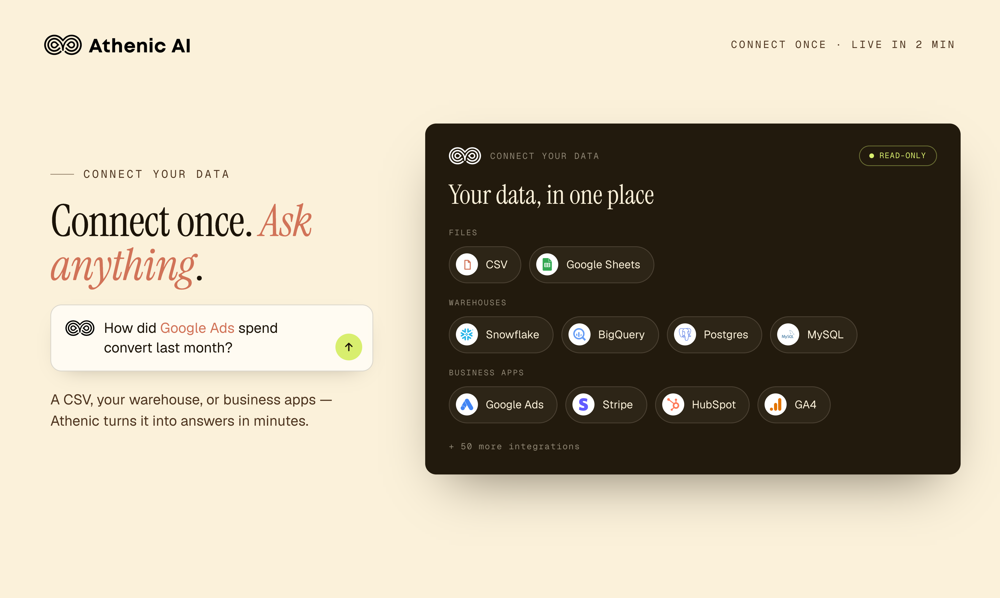
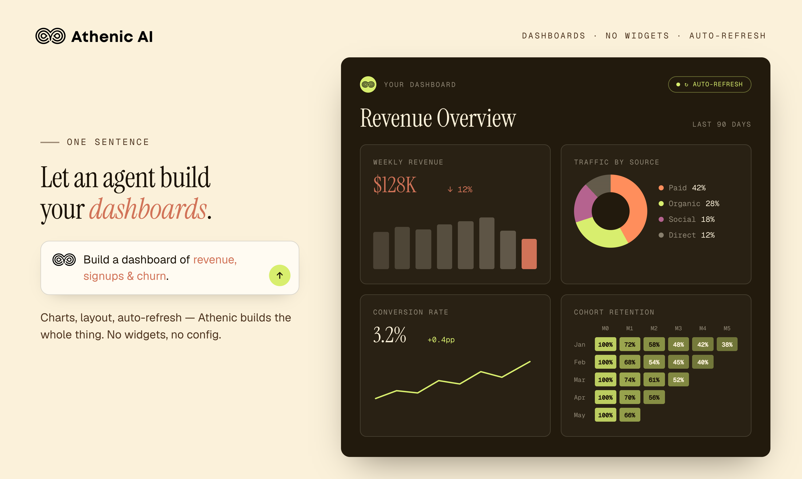
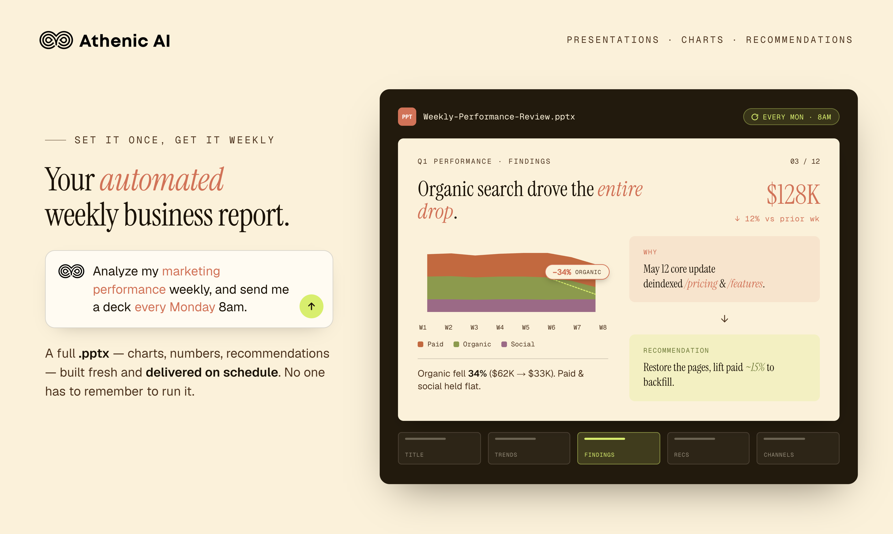

### 🎬 관련 영상
- [🎥 영상 보기](https://ph-files.imgix.net/4647ce34-5aff-4dd3-8e7f-8947c791bfa5.jpeg?auto=format)

---

## 5. [Cloudback for Linear](https://www.producthunt.com/products/cloudback)
**Votes**: 121 | **도입 난이도**: 하 | **신뢰도**: 상
**Tagline**: Automated backup and restore for Linear workspaces
**서비스 링크**: https://www.producthunt.com/r/AJD3WYKDXZTMGK

**태그**: DevTool, Backup, Productivity, SaaS

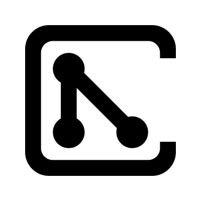

### 📌 이 서비스 한눈에 보기
Linear 워크스페이스의 모든 데이터를 안전하게 자동 백업하고 손쉽게 복구하는 솔루션

### 🔑 주요 기능
- Linear의 이슈, 프로젝트, 문서 등 23개 데이터 카테고리 자동 스냅샷 백업
- 의존성을 고려한 정교한 복구 기능으로 새로운 워크스페이스로 데이터 이전 가능
- AES-256 암호화 및 SOC 2 Type II 인증을 통한 강력한 보안성

### 🙋 사용자에게 어떤 점이 좋은가
워크스페이스 데이터 유실이나 구조 변경 시, 복잡한 과정 없이 기존 데이터를 안전하게 보존하고 새로운 환경으로 즉시 복구할 수 있습니다.

### ✅ 지금 바로 써볼 기능
- 현재 사용 중인 Linear 워크스페이스 백업 설정
- 데이터 카테고리별 백업 범위 확인
- 복구 시 의존성 유지 기능 테스트

### ⚠️ 사용 전 확인할 점
- 복구 시 타겟 워크스페이스와의 데이터 충돌 가능성 확인 필요
- 고객 관리 키(RSA Lockbox) 사용 시 키 분실에 대한 책임 소재 확인

### 🧭 확인이 더 필요한 정보
백업 데이터의 용량 제한이나 복구 시 소요되는 구체적인 시간(RTO)에 대한 정보는 명시되어 있지 않습니다.

### 📸 스크린샷 및 갤러리
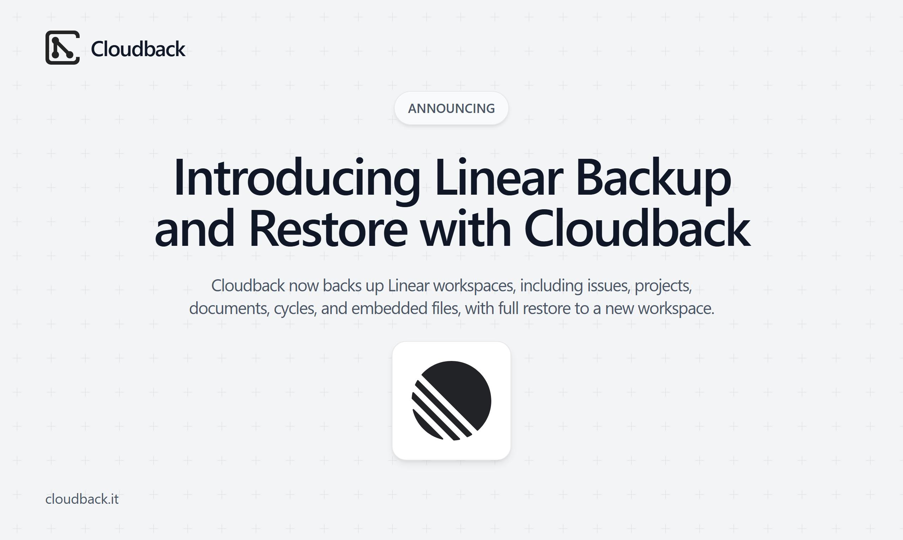
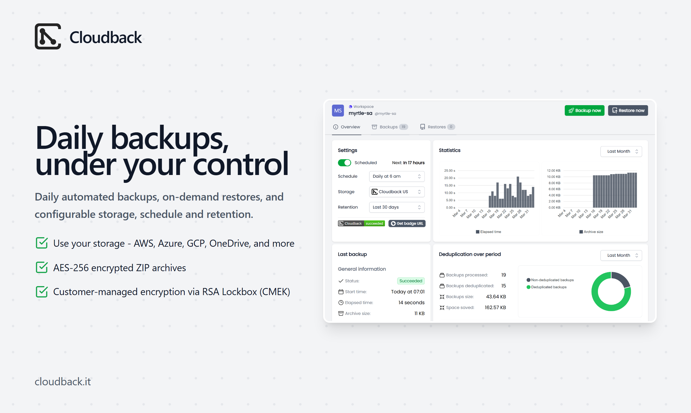
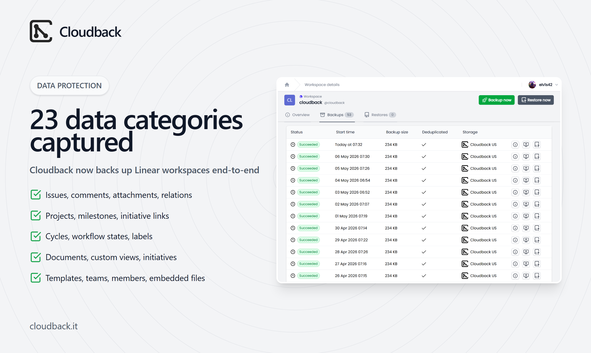

---

## 6. [Memoriq](https://www.producthunt.com/products/memoriq)
**Votes**: 106 | **도입 난이도**: 중 | **신뢰도**: 상
**Tagline**: Your private AI memory for ChatGPT, Claude, Gemini and Grok
**서비스 링크**: https://www.producthunt.com/r/FGPLN55XYVVARV

**태그**: AI, Privacy, KnowledgeManagement, OpenSource, AI Tool, Chat

### 📌 이 서비스 한눈에 보기
중요한 AI 대화 내용을 안전하게 보관하고 검색할 수 있는 개인용 암호화 메모리

### 🔑 주요 기능
- 종단간 암호화(E2EE)를 통한 프라이빗한 대화 저장소
- ChatGPT, Claude, Gemini, Grok 등 다양한 AI 서비스와 호환
- 오픈 소스 및 셀프 호스팅 지원으로 데이터 주권 확보

### 🙋 사용자에게 어떤 점이 좋은가
흩어져 있는 AI와의 소중한 대화 기록을 한곳에 모아 관리하고, 클라우드 유출 걱정 없이 안전하게 지식 자산화할 수 있습니다.

### ✅ 지금 바로 써볼 기능
- 주요 AI 서비스의 핵심 대화 내용 저장하기
- 암호화된 보관함 내에서 필요한 정보 검색하기
- 자신의 서버에 셀프 호스팅하여 데이터 완전 제어하기

### ⚠️ 사용 전 확인할 점
- 셀프 호스팅 시 서버 관리 및 보안 설정에 대한 사용자 숙련도 필요
- 직접 관리하는 방식이므로 계정 분실 시 데이터 복구의 어려움 가능성

### 🧭 확인이 더 필요한 정보
다양한 AI 플랫폼과의 구체적인 연동 방식(API 연동 또는 수동 저장 등)에 대한 상세 정보가 필요합니다.

### 📸 스크린샷 및 갤러리

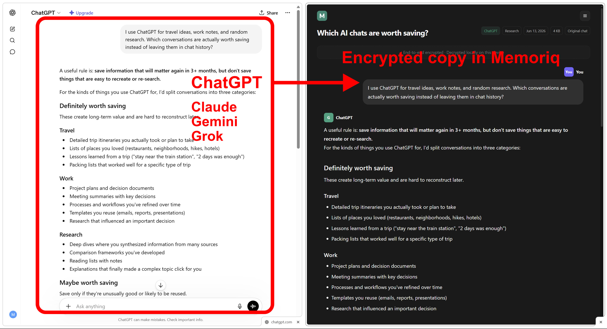
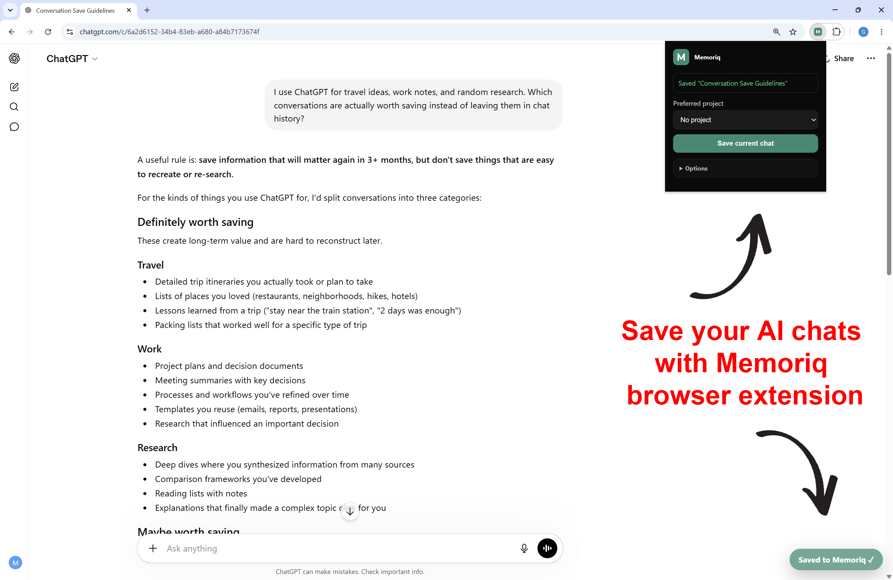

---

## 7. [Conan](https://www.producthunt.com/products/conan)
**Votes**: 99 | **도입 난이도**: 하 | **신뢰도**: 상
**Tagline**: A native Mac cockpit for Claude Code
**서비스 링크**: https://www.producthunt.com/r/YCRXMCPH3NBX33

**태그**: DevTool, macOS, AI-Agent, Monitoring, Prompting

### 📌 이 서비스 한눈에 보기
Claude Code의 모든 동작 과정을 실시간으로 모니터링할 수 있는 macOS 전용 대시보드

### 🔑 주요 기능
- Claude Code를 위한 네이티브 macOS 애플리케이션
- 프롬프트, 도구 호출, 스킬 실행 등을 실시간 HUD로 시각화
- 토큰 사용량 및 모든 작업 과정을 실시간으로 추적

### 🙋 사용자에게 어떤 점이 좋은가
터미널 기반의 Claude Code 작업 과정을 시각적인 HUD로 변환하여, AI의 동작 상태와 리소스 사용량을 직관적으로 파악할 수 있습니다.

### ✅ 지금 바로 써볼 기능
- Claude Code와 연동하여 실시간 HUD 활성화하기
- 도구 호출 및 토큰 소모량 모니터링하기

### ⚠️ 사용 전 확인할 점
- Claude Code CLI 환경이 사전에 설치되어 있어야 함
- macOS 전용 앱이므로 타 OS에서는 사용 불가

### 🧭 확인이 더 필요한 정보
Claude Code의 CLI 환경과 어떻게 기술적으로 연동되는지에 대한 상세 구현 방식은 명시되지 않았습니다.

### 📸 스크린샷 및 갤러리

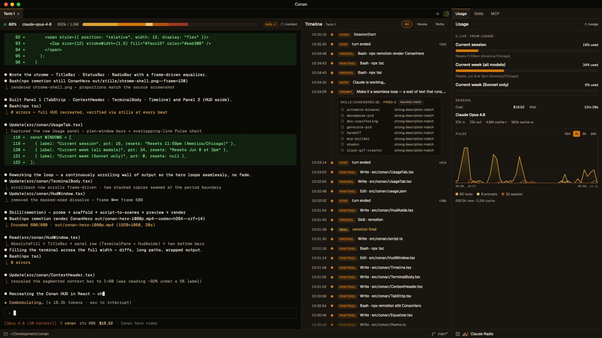

### 🎬 관련 영상
- [🎥 영상 보기](https://ph-files.imgix.net/2a7d1858-9ae5-4e12-b98e-d1957c1555ae.jpeg?auto=format)

---

## 8. [Allergo](https://www.producthunt.com/products/allergo-allergy-translation-cards)
**Votes**: 96 | **도입 난이도**: 하 | **신뢰도**: 상
**Tagline**: Translate your allergies, anywhere.
**서비스 링크**: https://www.producthunt.com/r/WJYHGPH6R7XFWF

**태그**: Travel, Health, Accessibility, Localization, AI Tool, Design

### 📌 이 서비스 한눈에 보기
전 세계 어디서든 알레르기 정보를 현지어로 즉시 전달하는 디지털 카드 서비스

### 🔑 주요 기능
- 75개 이상의 언어 및 국가별 맞춤형 알레르기 번역 카드 생성
- Apple Wallet 연동을 통한 오프라인 환경에서의 빠른 접근성
- 대화 보조 기능 및 긴급 상황을 위한 SOS 번역 기능 제공

### 🙋 사용자에게 어떤 점이 좋은가
해외 여행 중 언어 장벽으로 인한 식단 사고를 방지하고, 현지인에게 자신의 알레르기 정보를 정확하고 빠르게 전달할 수 있습니다.

### ✅ 지금 바로 써볼 기능
- 자신의 알레르기 정보를 담은 번역 카드 생성하기
- 생성된 카드를 Apple Wallet에 추가하여 저장하기
- 현지 상황에 맞는 대화 보조 기능 활용해보기

### ⚠️ 사용 전 확인할 점
- 전문 번역 및 원어민 검증 기능은 향후 업데이트 예정이므로 완전한 의학적 보증으로 간주하기 어려움
- 디지털 카드에 의존할 경우 기기 배터리나 네트워크 상황에 따른 변수 존재

### 🧭 확인이 더 필요한 정보
전문 번역 및 원어민 검증 기능이 업데이트되기 전까지는 번역의 정확도를 직접 확인해야 합니다.

### 📸 스크린샷 및 갤러리
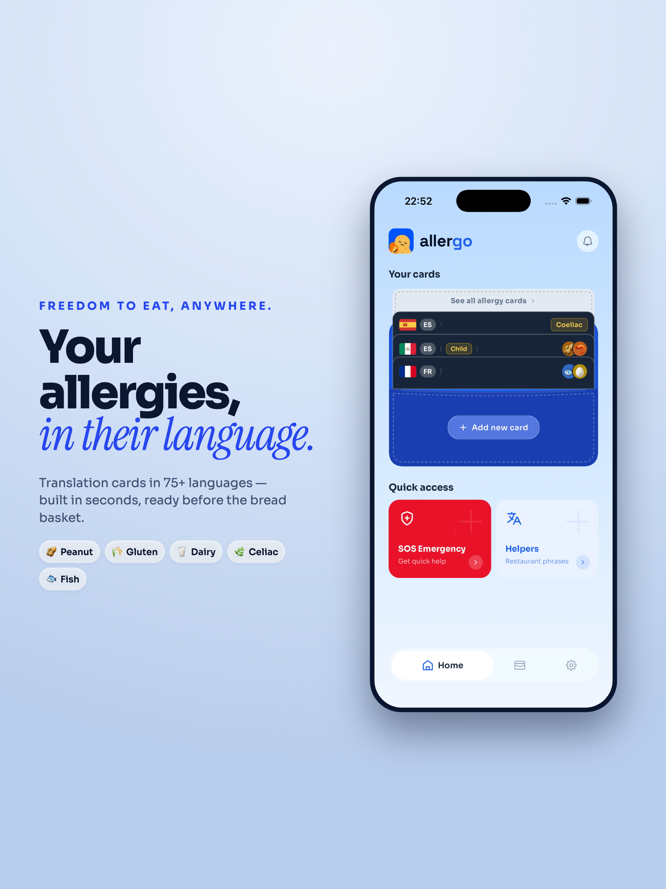
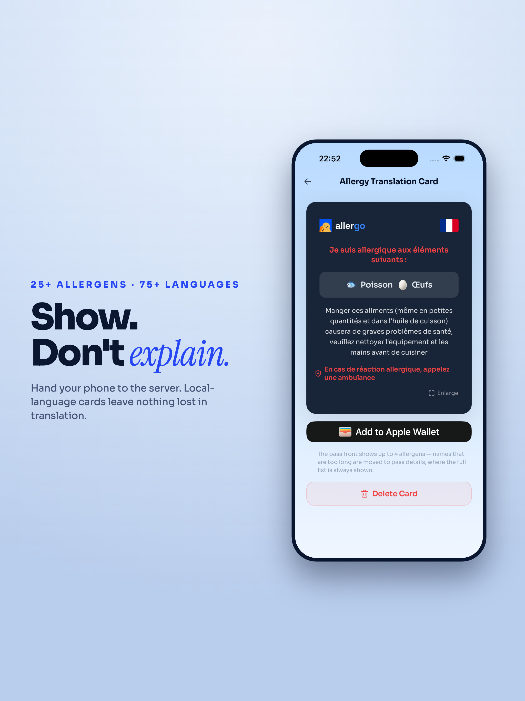
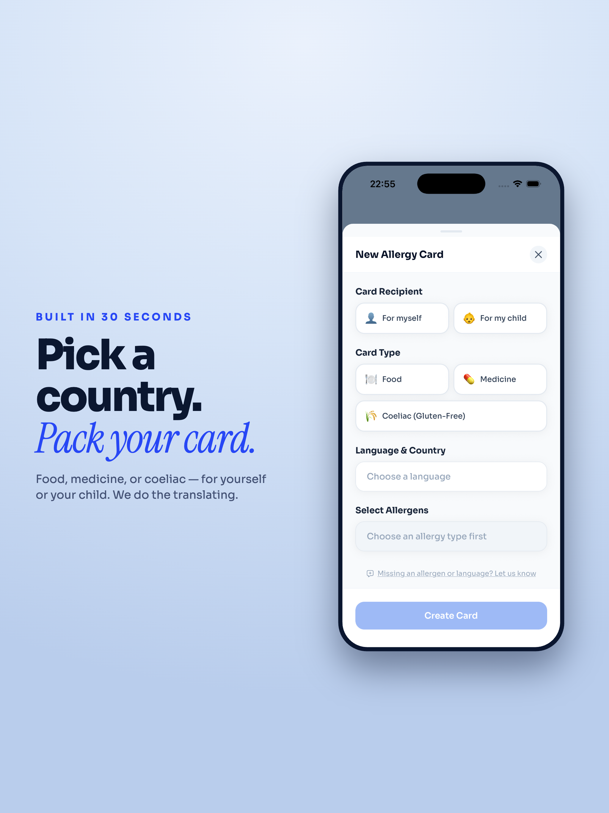

---

## 9. [Reverie.fm](https://www.producthunt.com/products/reverie-fm)
**Votes**: 92 | **도입 난이도**: 하 | **신뢰도**: 상
**Tagline**: A fully private & offline location based music journal app
**서비스 링크**: https://www.producthunt.com/r/ETIUC5Z6WKYK2T

**태그**: Lifestyle, Music, Journaling, Privacy, iOS

### 📌 이 서비스 한눈에 보기
특정 장소와 음악을 연결하여 나만의 음악 지도를 만드는 프라이빗 로컬 저널 앱

### 🔑 주요 기능
- 지도 기반의 음악 핀 기능: 특정 위치에 노래를 기록하여 추억을 시각화
- 완벽한 프라이버시와 오프라인 환경: 데이터가 로컬에 저장되는 안전한 구조
- Apple Music 연동: Apple Music 사용자를 위한 개인적인 사운드트랙 아틀라스

### 🙋 사용자에게 어떤 점이 좋은가
특정 장소에서 들었던 음악과 그때의 감정을 기록하여, 여행이나 일상의 소중한 순간을 음악과 함께 지도 위에 보관할 수 있습니다.

### ✅ 지금 바로 써볼 기능
- Apple Music 계정 연결하기
- 추억이 담긴 장소에 노래 핀으로 기록하기
- 장소별 무드와 메모 추가하기

### ⚠️ 사용 전 확인할 점
- Apple Music 구독 및 라이브러리 사용 필수
- 데이터가 로컬에 저장되므로 기기 변경 시 데이터 이전 방식 확인 필요

### 🧭 확인이 더 필요한 정보
데이터 백업 및 타 기기 동기화 방식에 대한 구체적인 설명이 부족합니다.

### 📸 스크린샷 및 갤러리

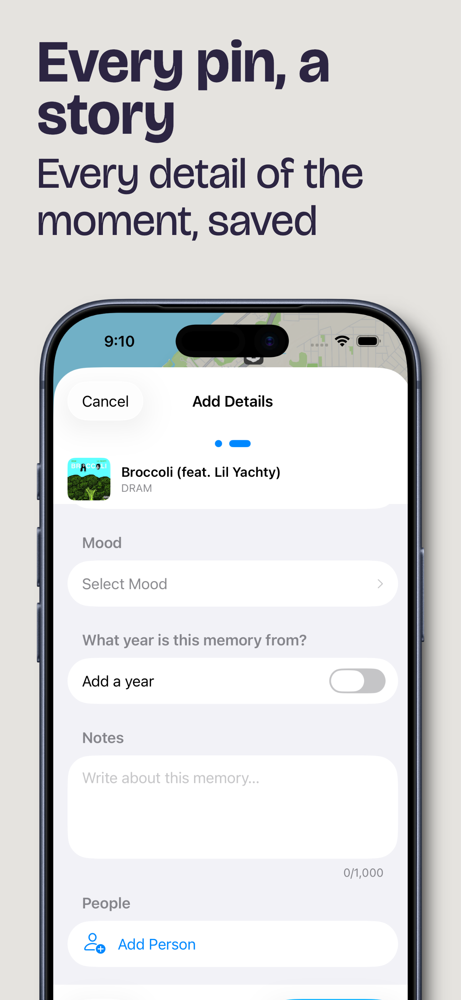
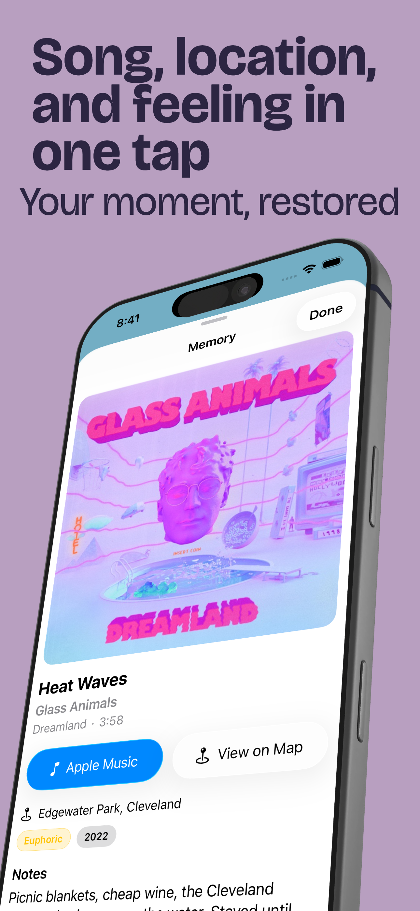

---

## 10. [Pool](https://www.producthunt.com/products/pool-4)
**Votes**: 64 | **도입 난이도**: 하 | **신뢰도**: 상
**Tagline**: Save anything with a screenshot. 
**서비스 링크**: https://www.producthunt.com/r/EL6DFVOIIE4N2C

**태그**: Productivity, Organization, Screenshot, KnowledgeManagement

### 📌 이 서비스 한눈에 보기
흩어져 있는 스크린샷을 체계적인 정보로 변환하여 관리하는 스크린샷 기반 저장 및 정리 도구

### 🔑 주요 기능
- 스크린샷을 단순 이미지가 아닌 구조화된 콘텐츠로 변환
- 자동 카테고리 분류 및 원본 링크 탐색 기능
- 풀(Pool) 단위의 정리 및 친구와의 공유 기능

### 🙋 사용자에게 어떤 점이 좋은가
카메라 롤에 쌓여만 가고 잊혀지는 스크린샷을 검색 가능하고 활용 가능한 정보로 바꿔줍니다.

### ✅ 지금 바로 써볼 기능
- 자주 캡처하는 정보를 Pool에 담아보기
- 자동 분류 기능으로 스크린샷 정리하기
- 공유 기능을 통해 친구와 정보 나누기

### ⚠️ 사용 전 확인할 점
- 스크린샷 내 텍스트 인식 정확도에 따른 관리 효율 차이
- 개인적인 스크린샷이 포함될 경우의 보안 및 프라이버시 고려

### 🧭 확인이 더 필요한 정보
스크린샷 내 데이터 추출 방식 및 개인정보 보호 정책에 대한 구체적인 정보가 필요합니다.

### 📸 스크린샷 및 갤러리

---

## 11. [Tinfoil Pigeons](https://www.producthunt.com/products/tinfoil-pigeons)
**Votes**: 58 | **도입 난이도**: 하 | **신뢰도**: 상
**Tagline**: See the aircraft flying over you on a retro radar scope
**서비스 링크**: https://www.producthunt.com/r/PFDDIY5D2NHQRY

**태그**: Lifestyle, Utility, Aviation, AI Tool, DevTool

### 📌 이 서비스 한눈에 보기
레트로 감성의 레이더 스코프로 실시간 항공기 위치를 확인하는 앱

### 🔑 주요 기능
- 레트로 스타일의 레이더 스코프 인터페이스 제공
- 우편번호 입력을 통한 실시간 상공 항공기 탐지
- 항공기 선택 시 상세 정보 확인 가능

### 🙋 사용자에게 어떤 점이 좋은가
내 머리 위를 지나가는 비행기가 무엇인지 궁금할 때, 직관적이고 감각적인 UI로 실시간 정보를 확인할 수 있습니다.

### ✅ 지금 바로 써볼 기능
- 현재 위치의 우편번호 입력하기
- 레이더에 포착된 항공기 탭하여 정보 확인하기
- 실시간 비행 경로 관찰하기

### ⚠️ 사용 전 확인할 점
- 실시간 데이터 업데이트 속도에 따른 오차 가능성
- 위치 기반 서비스이므로 정확한 우편번호 입력 필요

### 🧭 확인이 더 필요한 정보
제공되는 항공기 상세 정보의 범위와 정확도는 테스트를 통해 확인이 필요합니다.

### 📸 스크린샷 및 갤러리

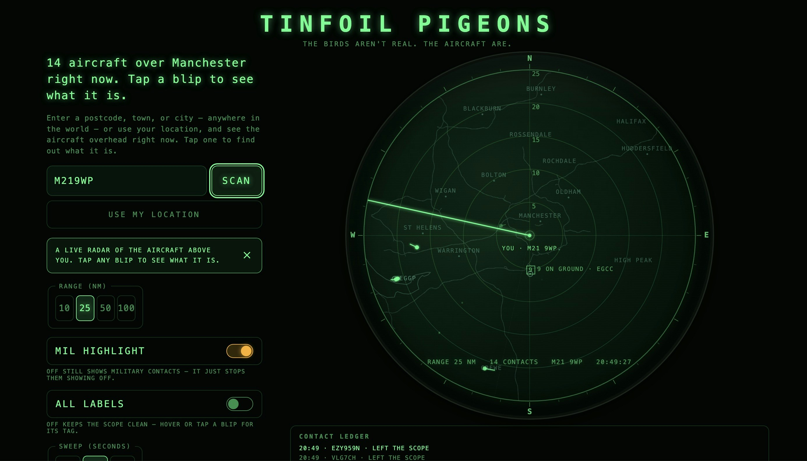
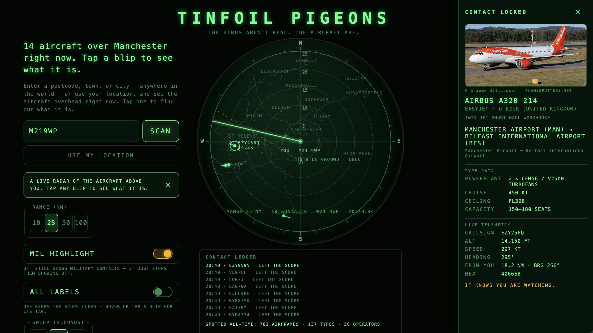

---

## 12. [Momentra](https://www.producthunt.com/products/momentra-aesthetic-camera)
**Votes**: 56 | **도입 난이도**: 하 | **신뢰도**: 상
**Tagline**: A cozy camera app for beautifully framed memories
**서비스 링크**: https://www.producthunt.com/r/K6NMBR7L2VP22L

**태그**: Photography, Aesthetic, Mobile App, Social Media

### 📌 이 서비스 한눈에 보기
일상의 사진을 감성적인 프레임으로 담아내는 코지(Cozy) 스타일 카메라 앱

### 🔑 주요 기능
- Postcard, Retro Wave 등 7가지 독창적인 예술적 프레임 스타일 제공
- 직접 촬영하거나 기존 사진을 불러와 즉시 스타일링 가능
- 다이어리 꾸미기나 SNS 공유에 최적화된 감성적인 디자인

### 🙋 사용자에게 어떤 점이 좋은가
평범한 일상 사진을 별도의 복잡한 편집 없이도 잡지나 엽서 같은 감성적인 결과물로 변환하여 SNS에 공유하기 좋습니다.

### ✅ 지금 바로 써볼 기능
- 7가지 다양한 프레임 스타일 적용해보기
- 기존 사진을 불러와 프레임 스타일링하기
- 완성된 결과물을 기기에 저장하거나 SNS에 공유하기

### ⚠️ 사용 전 확인할 점
- 특정 예술적 스타일 위주의 앱이므로 정교한 사진 보정 기능은 부족할 수 있음
- 프레임 스타일 외의 세부적인 사진 편집 기능 제공 여부는 미정

### 🧭 확인이 더 필요한 정보
상세한 편집 도구(밝기, 대비 등)의 포함 여부와 유료 구독 모델 존재 여부가 명시되지 않았습니다.

### 📸 스크린샷 및 갤러리

---

## 13. [LabelLens](https://www.producthunt.com/products/labellens)
**Votes**: 26 | **도입 난이도**: 하 | **신뢰도**: 상
**Tagline**: See Beyond the Label
**서비스 링크**: https://www.producthunt.com/r/DD7UDEU5DJ5OOB

**태그**: AI, Health, FoodTech, ConsumerApp, AI Tool

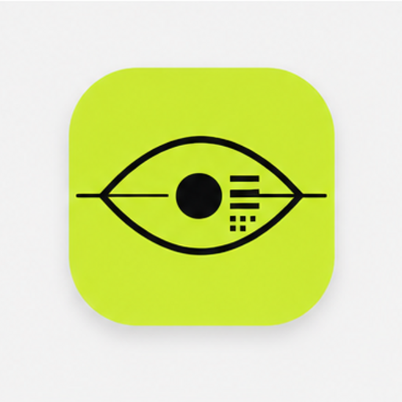

### 📌 이 서비스 한눈에 보기
AI를 통해 복잡한 식품 성분표를 한눈에 이해하기 쉬운 건강 정보로 변환해주는 서비스

### 🔑 주요 기능
- AI 기반의 간편한 식품 라벨 분석 기능
- 첨가물 탐지 및 감미료 분석을 통한 성분 상세 분석
- 직관적인 건강 점수 및 영양 정보 제공

### 🙋 사용자에게 어떤 점이 좋은가
복잡한 성분표를 직접 해석할 필요 없이, 구매 전 제품의 실질적인 건강 상태를 즉각적으로 확인할 수 있습니다.

### ✅ 지금 바로 써볼 기능
- 식품 라벨 사진 업로드하여 분석하기
- 첨가물 및 감미료 포함 여부 확인하기
- 제품별 건강 점수 비교하기

### ⚠️ 사용 전 확인할 점
- AI 분석 결과이므로 의학적 진단이나 전문적인 영양 상담을 대체할 수 없음
- 사진 촬영 상태에 따라 분석 정확도가 달라질 수 있음

### 🧭 확인이 더 필요한 정보
분석 알고리즘의 구체적인 기준과 건강 점수 산출 방식에 대한 상세 정보가 필요합니다.

### 📸 스크린샷 및 갤러리
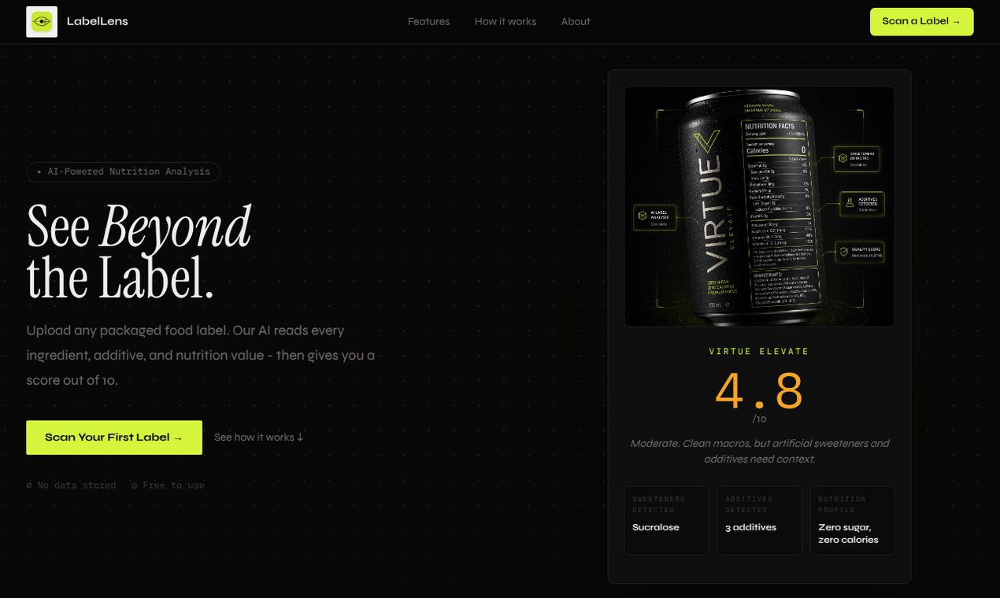
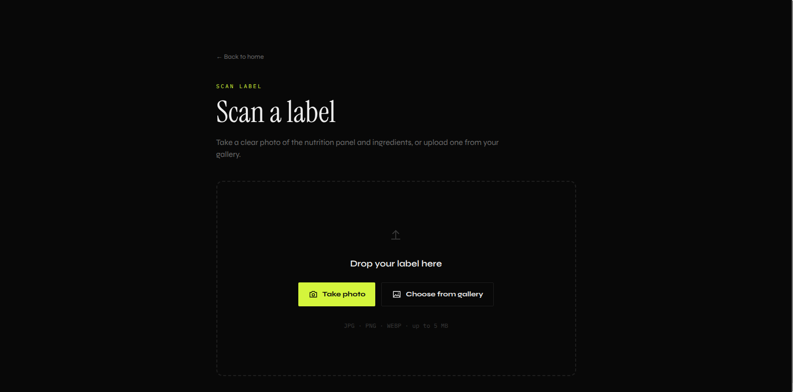
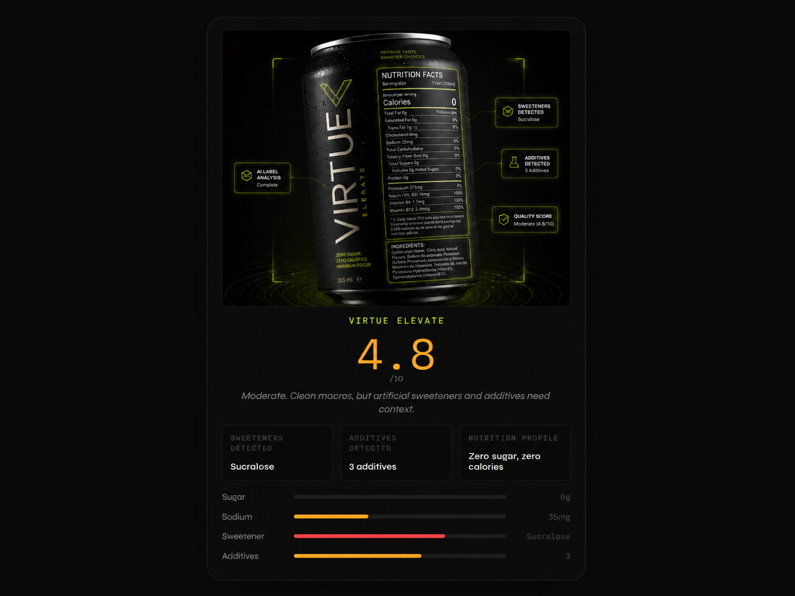

---

## 14. [Baroque ](https://www.producthunt.com/products/baroque)
**Votes**: 18 | **도입 난이도**: 중 | **신뢰도**: 상
**Tagline**: The canvas where AI designs your whole product
**서비스 링크**: https://www.producthunt.com/r/CWLHAR6734Z63I

**태그**: DesignTool, AI, ProductDesign, UIUX, AI Tool, Design

### 📌 이 서비스 한눈에 보기
천편일률적인 AI 디자인에서 벗어나 제품 전체의 일관된 미감을 구현하는 올인원 디자인 캔버스

### 🔑 주요 기능
- 단순한 화면 생성을 넘어 제품 전체를 아우르는 통합 캔버스 제공
- 기존 AI 도구의 정형화된 레이아웃을 탈피한 독창적인 디자인 감각
- 재생산(Recreate), 리믹스(Remix), 신규 제작을 지원하는 유연한 워크플로우

### 🙋 사용자에게 어떤 점이 좋은가
개별 화면 단위가 아닌 제품 전체의 일관된 디자인 시스템을 구축할 수 있어, 디자인 작업의 효율성과 심미적 완성도를 동시에 높여줍니다.

### ✅ 지금 바로 써볼 기능
- 기존 디자인을 불러와 리믹스해보기
- 제품 전체 레이아웃을 하나의 캔버스에서 구성하기
- AI가 제안하는 독창적인 디자인 스타일 적용해보기

### ⚠️ 사용 전 확인할 점
- 제품의 구체적인 디자인 시스템 수출(Export) 기능 확인 필요
- 사용자 숙련도에 따른 디자인 제어 난이도 차이 가능성

### 🧭 확인이 더 필요한 정보
제품의 구체적인 협업 기능 및 개발 단계로의 연동 방식에 대한 정보가 부족합니다.

### 📸 스크린샷 및 갤러리
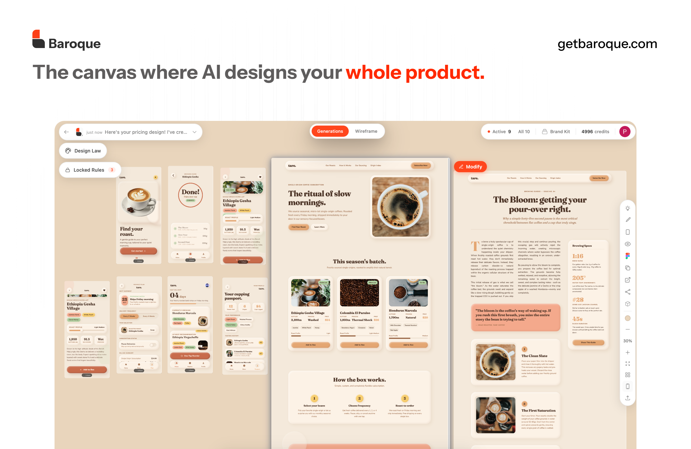
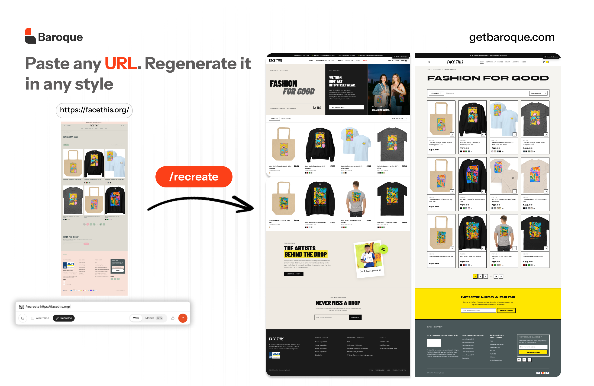
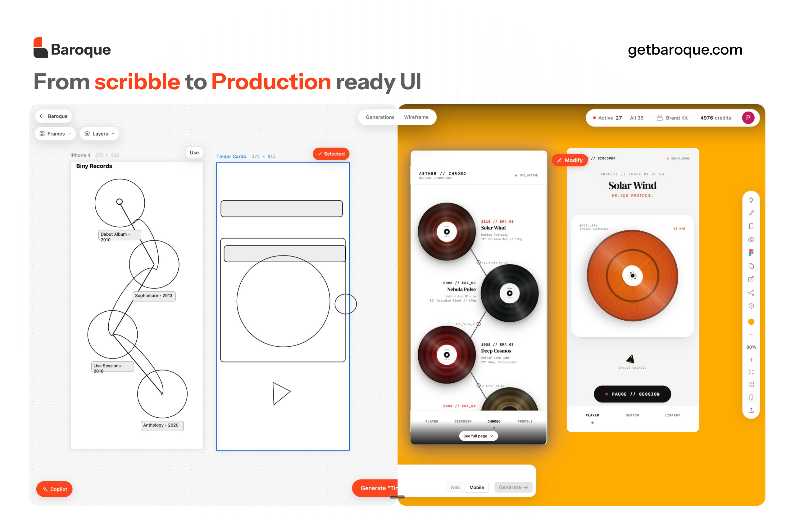

### 🎬 관련 영상
- [🎥 영상 보기](https://ph-files.imgix.net/7a5b67df-a57e-4d2c-948a-b95e17dc0ff7.jpeg?auto=format)

---

## 15. [1ClickReport — Marketing AI in Claude](https://www.producthunt.com/products/1click-report)
**Votes**: 16 | **도입 난이도**: 중 | **신뢰도**: 상
**Tagline**: Run Google Ads, Meta & GA4 from Claude — you approve
**서비스 링크**: https://www.producthunt.com/r/WGMQ6QVNOLYMIC

**태그**: MarketingAI, Automation, AdTech, Claude, Analytics, Agent, AI Tool, Chat, Marketing, Email

### 📌 이 서비스 한눈에 보기
Claude를 통해 구글/메타 광고를 분석부터 실행까지 한 번에 해결하는 AI 마케팅 자동화 도구

### 🔑 주요 기능
- MCP 통합을 통한 Google Ads, Meta, GA4, Stripe 등 주요 플랫폼 데이터 연동
- 단순 리포팅을 넘어 광고 생성, 일시 중지, 예산 조정 등 실질적인 액션 수행
- 24/7 모니터링 에이전트를 통한 CPA 임계치 관리 및 자동 알림 기능

### 🙋 사용자에게 어떤 점이 좋은가
마케터가 매번 대시보드를 확인하고 수동으로 광고를 수정할 필요 없이, Claude와의 채팅만으로 데이터 분석과 광고 운영을 동시에 처리할 수 있습니다.

### ✅ 지금 바로 써볼 기능
- 7일 무료 체험을 통한 데이터 연동 테스트
- CPA 임계치 기반의 24/7 모니터링 규칙 설정
- AI 대시보드 생성 기능을 통한 빠른 데이터 시각화

### ⚠️ 사용 전 확인할 점
- 모든 변경 사항은 사용자의 최종 승인이 필요하므로 승인 프로세스 관리가 필요함
- 광고 계정 권한 부여 및 데이터 연동 시 보안 검토 필요

### 🧭 확인이 더 필요한 정보
2025년 11월 베타 버전 언급이 있어, 현재 제공되는 기능의 안정성과 최신 업데이트 상태 확인이 필요합니다.

### 📸 스크린샷 및 갤러리
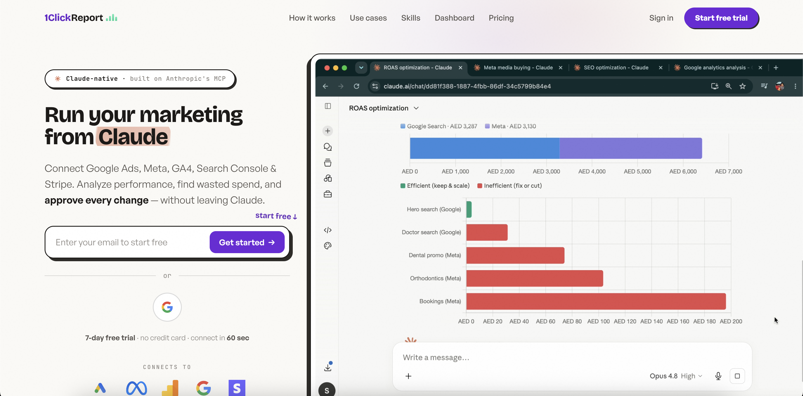
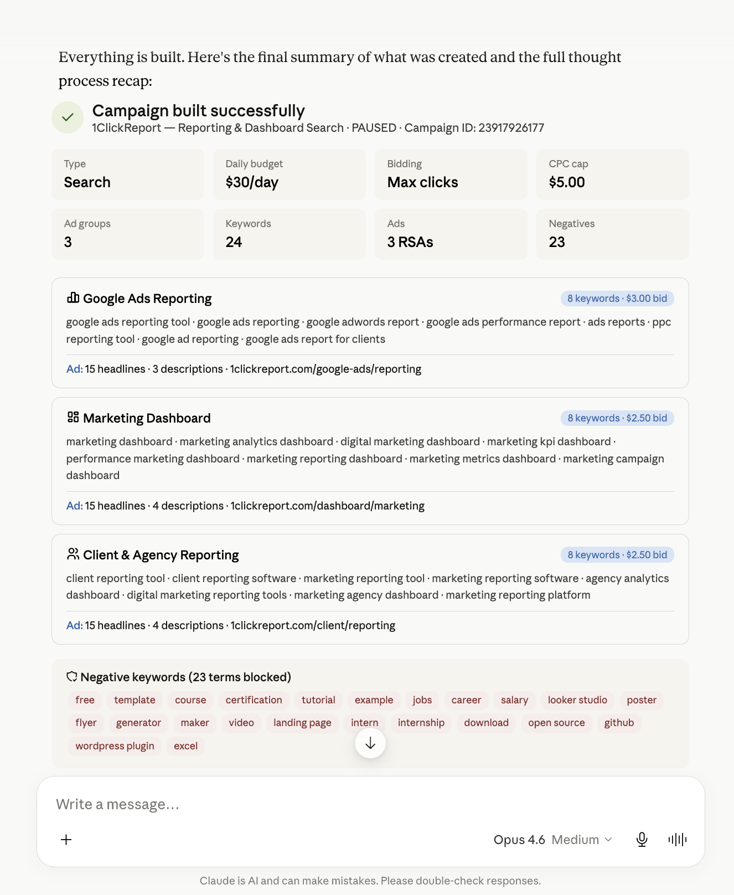
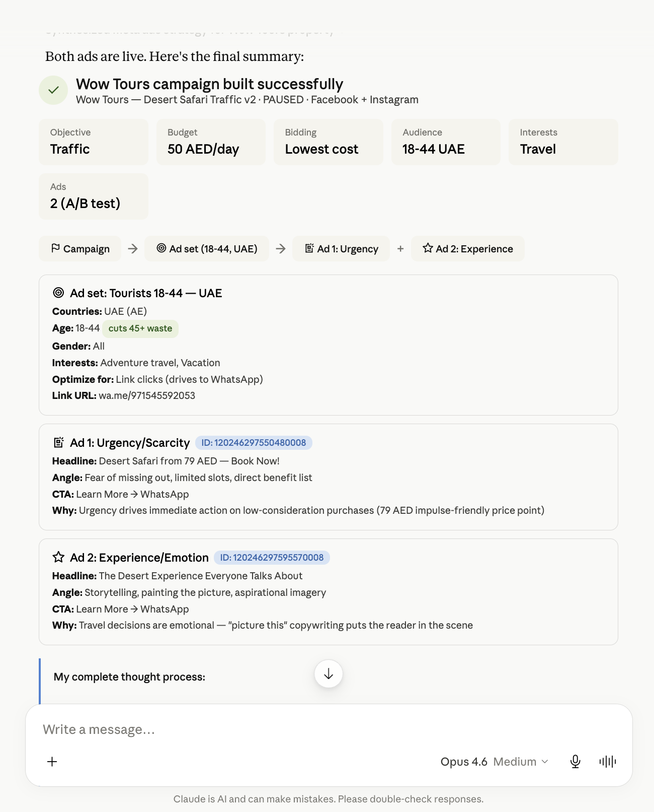

### 🎬 관련 영상
- [🎥 영상 보기](https://ph-files.imgix.net/e30446c4-61e1-4640-85ce-980abea92b24.jpeg?auto=format)

---

## 16. [Chessie](https://www.producthunt.com/products/chessie)
**Votes**: 11 | **도입 난이도**: 하 | **신뢰도**: 상
**Tagline**: Scan chess matches. Find better moves. Increase your elo.
**서비스 링크**: https://www.producthunt.com/r/NYAQRBBXEKHRTE

**태그**: Chess, AI, Analysis, Mobile

### 📌 이 서비스 한눈에 보기
체스판 스캔을 통해 최적의 수를 제안받는 오프라인 체스 분석 도구

### 🔑 주요 기능
- 체스판 스캔 및 분석 기능
- Stockfish 엔진 기반의 상위 10개 수 제안
- 인터넷 연결 없이 작동하는 오프라인 환경 지원

### 🙋 사용자에게 어떤 점이 좋은가
실제 체스판의 상황을 즉시 스캔하여 최선의 수를 확인할 수 있어 실력 향상과 레이팅(Elo) 상승에 도움을 줍니다.

### ✅ 지금 바로 써볼 기능
- 체스판 스캔 기능 테스트
- Stockfish 엔진 기반 수 제안 확인
- 오프라인 환경에서의 작동 여부 점검

### ⚠️ 사용 전 확인할 점
- 스캔 정확도가 체스판의 조명이나 각도에 영향을 받을 수 있음
- 오프라인 환경이므로 엔진 업데이트나 추가 기능 사용에 제한이 있을 수 있음

### 🧭 확인이 더 필요한 정보
스캔 기능이 모바일 카메라를 통한 실시간 인식 방식인지에 대한 구체적인 인터페이스 정보가 필요합니다.

### 📸 스크린샷 및 갤러리

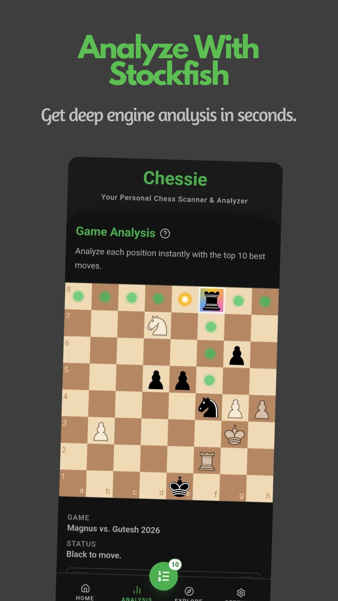

### 🎬 관련 영상
- [🎥 영상 보기](https://ph-files.imgix.net/72cfa510-c65b-44a6-affa-c47717ae31cb.jpeg?auto=format)

---

## 17. [DualChess](https://www.producthunt.com/products/dualchess)
**Votes**: 10 | **도입 난이도**: 하 | **신뢰도**: 상
**Tagline**: Chess — but a mini-game decides every capture
**서비스 링크**: https://www.producthunt.com/r/ZGTWORPFDLJIWV

**태그**: Gaming, Strategy, Multiplayer, Web-based, AI Tool

### 📌 이 서비스 한눈에 보기
전략과 순발력이 결합된, 미니게임으로 승패를 결정하는 이색 체스 게임

### 🔑 주요 기능
- 기물 잡기 시 퐁, 퍼즐 등 다양한 미니게임을 통해 승패 결정
- 실력 차이를 극복할 수 있는 변수 창출로 초보자도 즐거운 플레이 가능
- 온라인 대전, AI 대전(4단계), 글로벌 리더보드 지원

### 🙋 사용자에게 어떤 점이 좋은가
전략적인 체스 플레이에 긴장감 넘치는 피지컬 요소를 더해, 기존 체스의 정적인 느낌을 탈피하고 색다른 재미를 제공합니다.

### ✅ 지금 바로 써볼 기능
- 다양한 미니게임 방식 경험해보기
- AI 레벨별 대전으로 게임 밸런스 확인하기
- 글로벌 리더보드에 도전하기

### ⚠️ 사용 전 확인할 점
- 순발력 위주의 미니게임 특성상 실력 차이가 전략을 압도할 수 있음
- 브라우저 기반 게임이므로 네트워크 환경에 따라 반응 속도 차이 발생 가능

### 🧭 확인이 더 필요한 정보
미니게임 결과가 체스 판의 전략적 위치에 미치는 구체적인 영향력 범위는 확인이 필요합니다.

### 📸 스크린샷 및 갤러리

---

## 18. [Hive](https://www.producthunt.com/products/hive-13)
**Votes**: 8 | **도입 난이도**: 중 | **신뢰도**: 상
**Tagline**: Babysits your agents from idea to PR, letting you think
**서비스 링크**: https://www.producthunt.com/r/MH6KTLT7GODAFU

**태그**: DevTool, AI-Agent, Automation, Workflow, Agent

### 📌 이 서비스 한눈에 보기
아이디어만 던지면 코딩 에이전트가 PR까지 자율적으로 수행하는 터미널 기반 워크플로우 오케스트레이터

### 🔑 주요 기능
- Claude, Codex 등 최신 SOTA 코딩 에이전트의 작업 자동화 및 오케스트레이션
- 아이디어 단계부터 Pull Request(PR) 생성까지 비동기적·자율적 프로세스 제공
- 터미널 환경에서 여러 에이전트의 작업을 통합 관리하여 개발자의 개입 최소화

### 🙋 사용자에게 어떤 점이 좋은가
여러 개의 에이전트 터미널을 일일이 모니터링할 필요 없이, 개발자는 핵심적인 제품 결정만 내리며 생산성을 극대화할 수 있습니다.

### ✅ 지금 바로 써볼 기능
- 터미널 환경에 Hive 설치 및 에이전트 연동
- 간단한 기능 구현 아이디어를 입력하여 자율 작업 흐름 테스트
- 생성된 PR의 코드 품질 및 의사결정 일치 여부 검토

### ⚠️ 사용 전 확인할 점
- 에이전트가 생성한 코드의 품질과 보안에 대한 최종 검토 필수
- 사용하는 LLM(Claude, Codex 등) API 비용 발생 가능성

### 🧭 확인이 더 필요한 정보
에이전트 간의 충돌 해결 방식이나 복잡한 프로젝트 구조에서의 관리 역량에 대한 구체적 정보가 필요합니다.

### 📸 스크린샷 및 갤러리
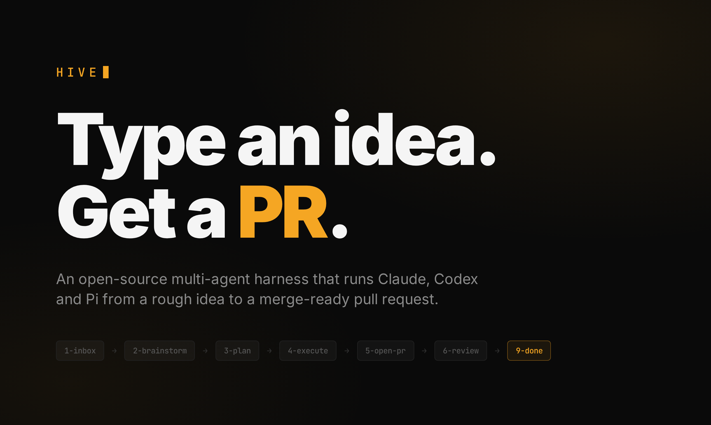
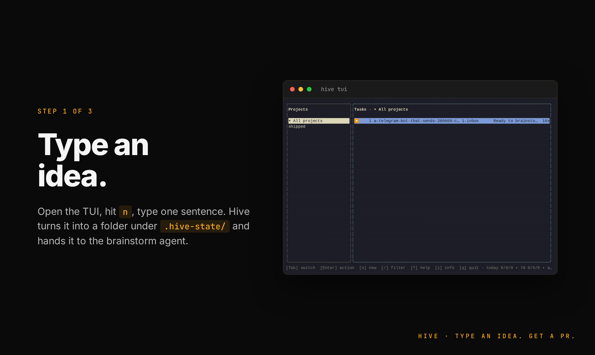
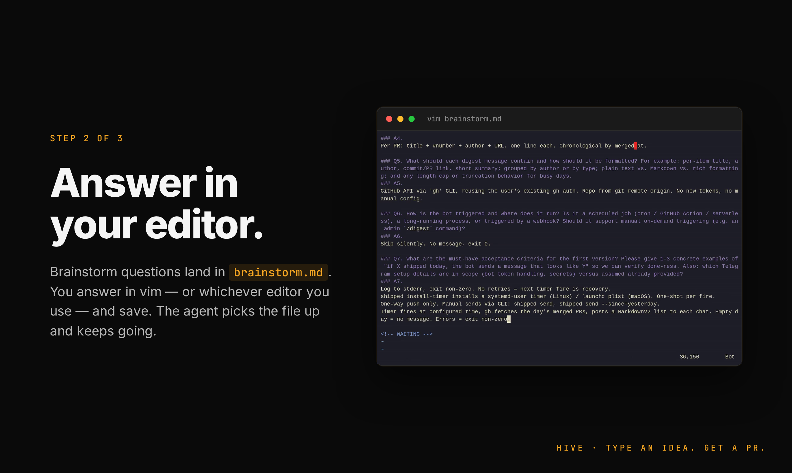

### 🎬 관련 영상
- [🎥 영상 보기](https://ph-files.imgix.net/31b459cd-d5e4-4c71-a298-41b5e2b58a10.jpeg?auto=format)

---

## 19. [Web Researcher MCP](https://www.producthunt.com/products/web-researcher-mcp)
**Votes**: 7 | **도입 난이도**: 하 | **신뢰도**: 상
**Tagline**: The AI research assistant that cites real sources honestly
**서비스 링크**: https://www.producthunt.com/r/QFPT72SXZ45KRI

**태그**: AI, Research, Data-Verification, Productivity, AI Tool

### 📌 이 서비스 한눈에 보기
신뢰할 수 있는 출처와 정확한 인용을 제공하는 AI 웹 리서치 어시스턴트

### 🔑 주요 기능
- 학술지, 법원 데이터베이스, 뉴스 등 특정 신뢰 사이트 지정 검색 가능
- 단순 스니펫이 아닌 전체 소스 분석을 통한 심층 리서치
- 환각 현상(Hallucination)을 방지하는 검증 가능한 실시간 링크 및 인용 제공

### 🙋 사용자에게 어떤 점이 좋은가
AI가 가짜 출처를 만들어내는 문제를 해결하여, 전문적인 연구나 법률/의학적 자료 조사 시 신뢰할 수 있는 근거를 확보할 수 있습니다.

### ✅ 지금 바로 써볼 기능
- 신뢰할 수 있는 특정 도메인(학술지 등) 지정 검색 테스트
- 제공된 인용 링크의 유효성 및 원문 일치 여부 확인
- 복잡한 주제에 대한 심층 분석 기능 활용

### ⚠️ 사용 전 확인할 점
- 검색 범위 설정에 따라 결과의 포괄성이 달라질 수 있음
- MCP(Model Context Protocol) 환경에 대한 사전 이해 필요

### 🧭 확인이 더 필요한 정보
구체적인 지원 브라우저 환경이나 MCP 호환 대상 모델에 대한 정보가 명시되지 않았습니다.

### 📸 스크린샷 및 갤러리
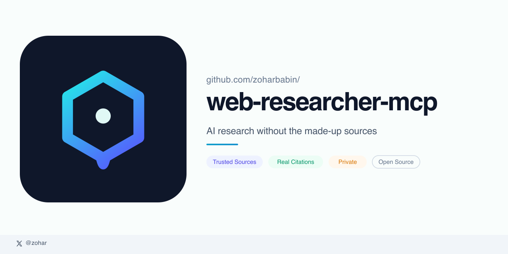

### 🎬 관련 영상
- [🎥 영상 보기](https://ph-files.imgix.net/04e7867c-e1a2-48f6-8899-5fb960dfecb5.jpeg?auto=format)

---

## 20. [Roast My Resume](https://www.producthunt.com/products/roast-my-resume-4)
**Votes**: 7 | **도입 난이도**: 하 | **신뢰도**: 상
**Tagline**: AI roasts your resume. You screenshot the trauma.
**서비스 링크**: https://www.producthunt.com/r/NEEHSWK7GD6RLR

**태그**: AI, Career, Humor, Productivity, AI Tool

### 📌 이 서비스 한눈에 보기
AI의 독설로 이력서의 허점을 유쾌하게 파헤치는 서비스

### 🔑 주요 기능
- 배틀 랩 스타일의 강렬하고 유머러스한 AI 피드백
- 익명성이 보장되는 간편한 사용 방식
- 공유 가능한 형태의 결과물(Share Card) 제공

### 🙋 사용자에게 어떤 점이 좋은가
자신의 이력서에 담긴 과장이나 허점을 유머러스하게 점검하며 객관적인 시각을 가질 수 있습니다.

### ✅ 지금 바로 써볼 기능
- 이력서 내용 붙여넣기
- AI의 독설 피드백 확인하기
- 결과물 스크린샷 찍어 공유하기

### ⚠️ 사용 전 확인할 점
- 비판적인 어조가 감정적 상처를 줄 수 있음
- 전문적인 커리어 컨설팅이 아닌 유머 중심의 서비스임

### 🧭 확인이 더 필요한 정보
서비스의 구체적인 데이터 저장 및 개인정보 처리 방침에 대한 정보가 부족합니다.

### 📸 스크린샷 및 갤러리
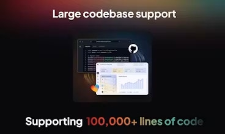

---

## 21. [Errant](https://www.producthunt.com/products/errant)
**Votes**: 6 | **도입 난이도**: 하 | **신뢰도**: 상
**Tagline**: Stop rotting in bed and start side-questing
**서비스 링크**: https://www.producthunt.com/r/DNNKIBGO4WWY3T

**태그**: Lifestyle, Gamification, Social, Productivity

### 📌 이 서비스 한눈에 보기
일상의 과제를 게임처럼 즐기며 친구들과 함께 현실 세계의 퀘스트를 수행하는 라이프스타일 게임 앱

### 🔑 주요 기능
- 매일 주어지는 다양한 카테고리(사교, 창의성, 모험 등)의 IRL(현실) 사이드 퀘스트
- 퀘스트 수행 후 인증샷을 통한 XP(경험치) 획득 및 프라이빗 피드 공유
- 친구들과 함께하거나 혼자 수행하며 일상의 활력을 찾는 게이미피케이션

### 🙋 사용자에게 어떤 점이 좋은가
무기력한 일상에서 벗어나 게임을 하듯 재미있게 새로운 활동을 시도하고 친구들과 유대감을 쌓을 수 있습니다.

### ✅ 지금 바로 써볼 기능
- 매일 주어지는 오늘의 퀘스트 확인하기
- 퀘스트 수행 후 인증샷 업로드하여 XP 쌓기
- 친구들을 초대하여 프라이빗 피드 만들기

### ⚠️ 사용 전 확인할 점
- 현실 세계의 활동을 기반으로 하므로 물리적 이동이나 비용이 발생할 수 있음
- 개인정보 및 위치 정보가 포함된 인증샷 공유 시 주의 필요

### 🧭 확인이 더 필요한 정보
퀘스트의 난이도 조절 방식이나 친구 초대 방식 등 구체적인 소셜 기능의 범위는 확인이 필요합니다.

### 📸 스크린샷 및 갤러리

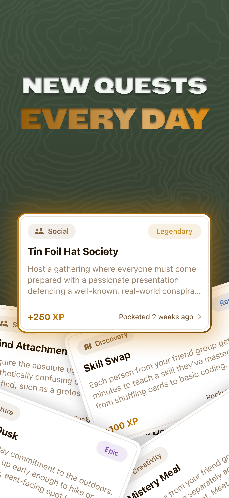

---

## 22. [HTTP Status Code Quiz ](https://www.producthunt.com/products/json-dev-tools)
**Votes**: 6 | **도입 난이도**: 하 | **신뢰도**: 상
**Tagline**: A 10-question quiz to learn HTTP status codes the fast way
**서비스 링크**: https://www.producthunt.com/r/ZN7FHFMKVMLS3Y

**태그**: DevTool, Education, Quiz

### 📌 이 서비스 한눈에 보기
개발자 면접 대비를 위한 빠르고 간편한 HTTP 상태 코드 퀴즈 도구

### 🔑 주요 기능
- 로그인 없이 즉시 이용 가능한 10문제 구성의 퀴즈
- 401 vs 403 등 혼동하기 쉬운 상태 코드 집중 학습
- 스트릭(연속 기록) 및 공유 가능한 랭킹 시스템 제공

### 🙋 사용자에게 어떤 점이 좋은가
주니어 개발자와 학생이 면접에서 자주 등장하는 HTTP 상태 코드를 쉽고 재미있게 복습할 수 있습니다.

### ✅ 지금 바로 써볼 기능
- 10문제 퀴즈 바로 시작하기
- 자신의 랭킹 확인 및 공유하기
- 헷gt 틀린 문제 다시 풀어보기

### ⚠️ 사용 전 확인할 점
- 문제 수가 10개로 제한되어 있어 심화 학습에는 한계가 있을 수 있음
- 계정 생성이 없으므로 기기 변경 시 기록 유지가 어려울 수 있음

### 🧭 확인이 더 필요한 정보
사용자 데이터 저장 방식이나 랭킹 시스템의 실시간 반영 여부는 명시되지 않았습니다.

### 📸 스크린샷 및 갤러리
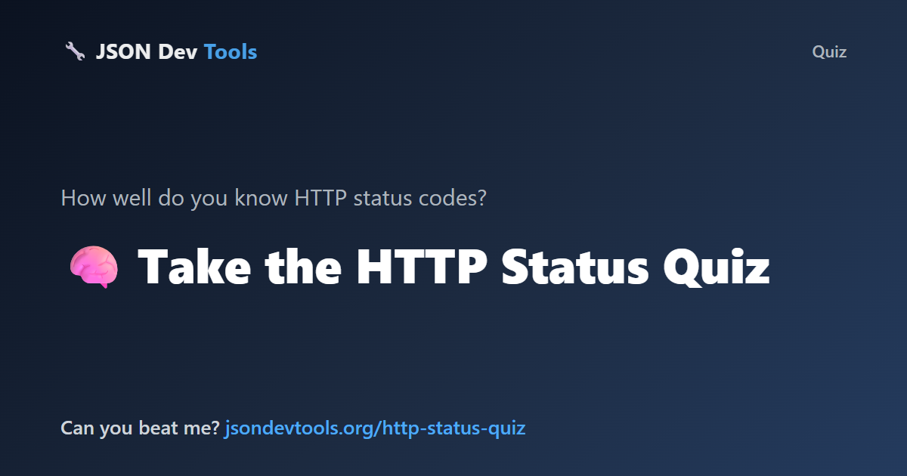
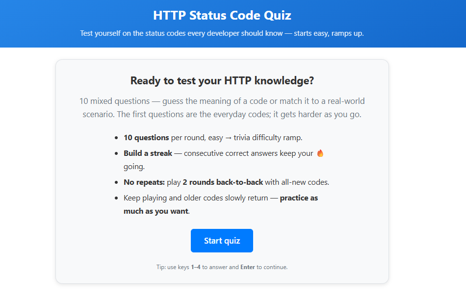

---

## 23. [Cenvero Fleet](https://www.producthunt.com/products/cenvero-fleet)
**Votes**: 6 | **도입 난이도**: 중 | **신뢰도**: 상
**Tagline**: Self-hosted fleet management with files & Ai agentic control
**서비스 링크**: https://www.producthunt.com/r/LFZ3ZO6YU56ADF

**태그**: DevOps, Self-Hosted, Automation, AI-Agent, Infrastructure, Agent, AI Tool, DevTool

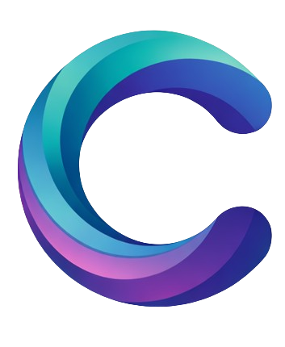

### 📌 이 서비스 한눈에 보기
SaaS 종속성 없이 AI 에이전트와 파일 관리가 가능한 오픈소스 셀프 호스팅 플릿 관리 플랫폼

### 🔑 주요 기능
- 단일 Go 바이너리로 실행되는 간편한 셀프 호스팅 환경
- VPN 없이 NAT 환경에서도 작동하는 암호화된 SSH 연결 (Direct/Reverse)
- AI 에이전트(Claude Code 등)가 직접 제어 가능한 에이전틱 컨트롤 기능

### 🙋 사용자에게 어떤 점이 좋은가
클라우드 종속성 없이 인프라를 직접 제어하면서, AI 에이전트를 활용해 원격 노드들을 자동화된 방식으로 관리할 수 있습니다.

### ✅ 지금 바로 써볼 기능
- 단일 바이너리 설치를 통한 환경 구축
- SSH를 이용한 원격 노드(Linux, macOS, Windows) 연결 테스트
- AI 에이전트와 연동한 자동화 워크플로우 실험

### ⚠️ 사용 전 확인할 점
- 셀프 호스팅 방식이므로 서버 보안 및 백업 책임이 사용자에게 있음
- 직접적인 SSH 노출에 따른 보안 설정 숙련도 필요

### 🧭 확인이 더 필요한 정보
대규모 노드 운영 시 단일 바이너리 방식의 리소스 효율성과 안정성에 대한 구체적인 데이터가 필요합니다.

### 📸 스크린샷 및 갤러리
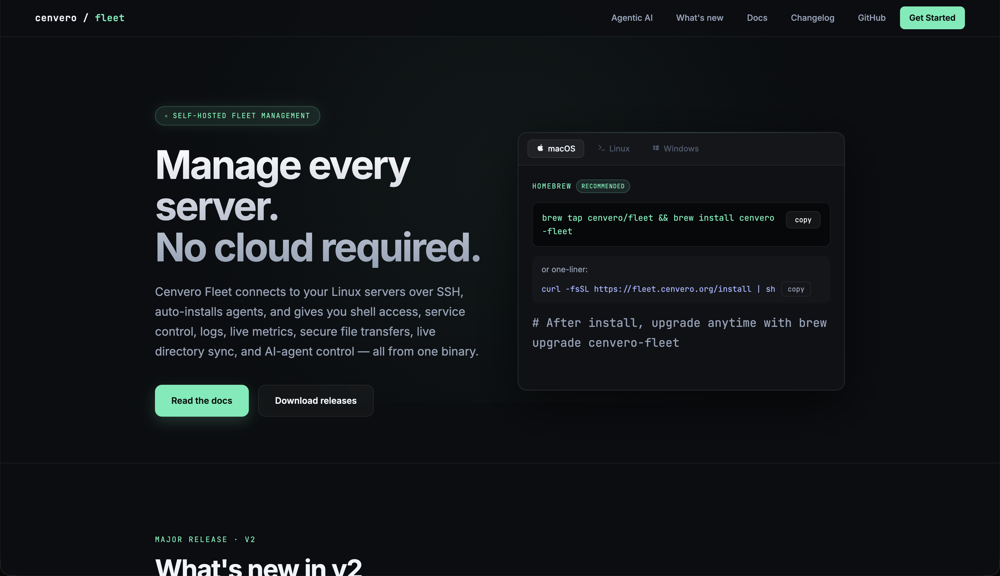
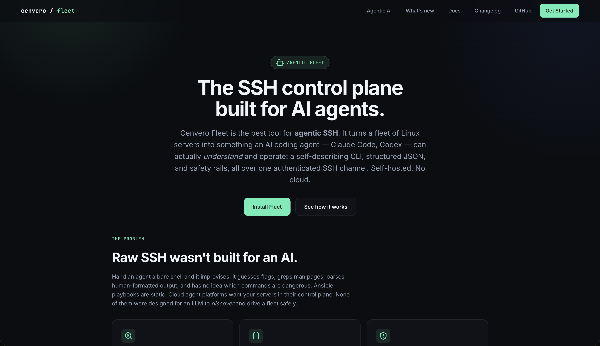
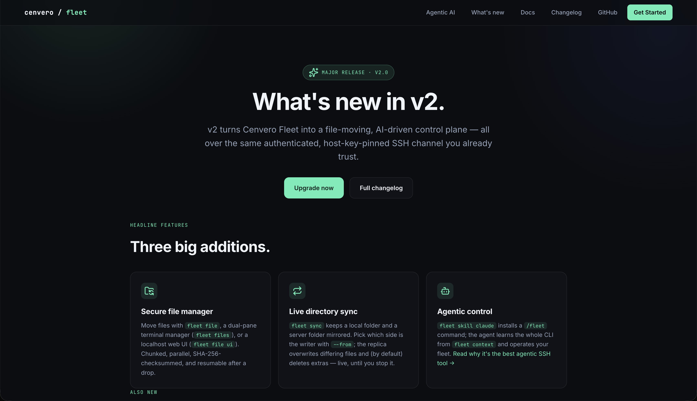

---

## 24. [GrepCut](https://www.producthunt.com/products/grepcut)
**Votes**: 6 | **도입 난이도**: 하 | **신뢰도**: 상
**Tagline**: Describe the edit. GrepCut Agent builds it.
**서비스 링크**: https://www.producthunt.com/r/A67J2URBIXXPWB

**태그**: VideoEditing, AI, Automation, Creativity, Agent, AI Tool, Video

### 📌 이 서비스 한눈에 보기
자연어 명령만으로 복잡한 영상 편집 과정을 자동화하는 AI 에이전트 기반 비디오 에디터

### 🔑 주요 기능
- 자연어 설명을 통한 직관적인 타임라인 편집
- 의미 기반의 미디어 검색 및 클립 추출 기능
- 자막 생성 및 시각적 컴포넌트 자동 생성

### 🙋 사용자에게 어떤 점이 좋은가
수동으로 클립을 찾고 효과를 쌓는 반복적인 편집 작업 시간을 획기적으로 단축할 수 있습니다.

### ✅ 지금 바로 써볼 기능
- 원하는 편집 스타일을 자연어로 설명해보기
- 의미 기반 검색 기능을 활용해 특정 장면 찾기
- AI가 생성한 시각적 컴포넌트 적용해보기

### ⚠️ 사용 전 확인할 점
- 에이전트의 편집 결과가 사용자의 의도와 다를 수 있음
- 복잡한 정밀 편집 시 수동 작업과의 병행 필요성

### 🧭 확인이 더 필요한 정보
현재 제공되는 에이전트의 편집 정밀도와 지원하는 파일 포맷에 대한 구체적인 정보가 필요합니다.

### 📸 스크린샷 및 갤러리
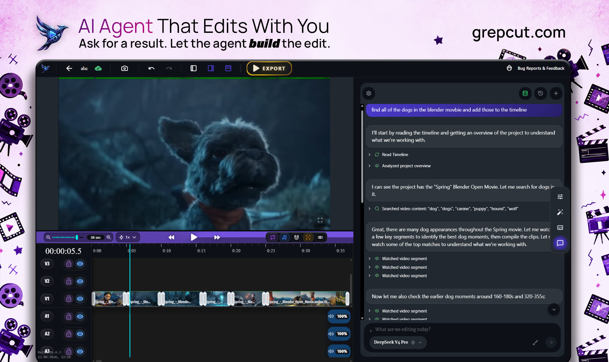
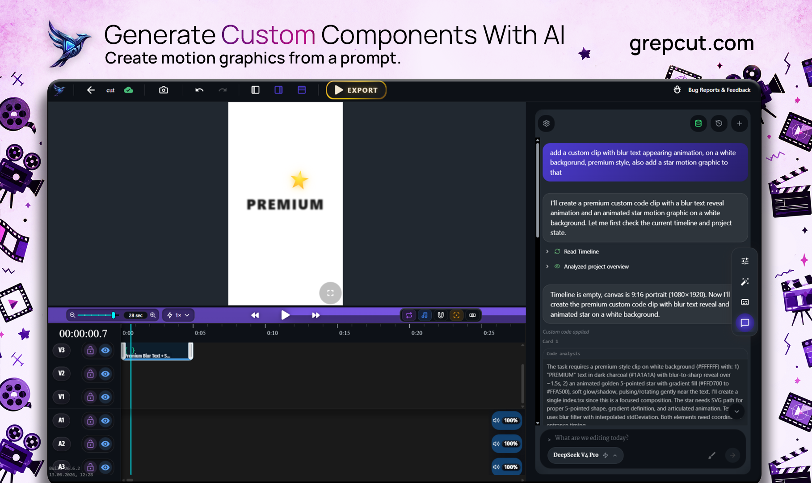
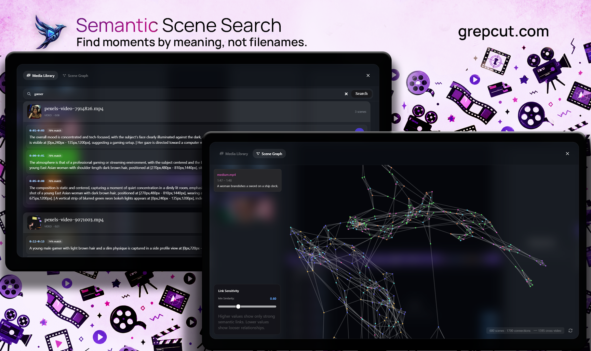

### 🎬 관련 영상
- [🎥 영상 보기](https://ph-files.imgix.net/8462d271-9fd3-4ed0-9893-4cb611cc38ea.jpeg?auto=format)

---

## 25. [Scriptly Store](https://www.producthunt.com/products/scripthq-by-strivio)
**Votes**: 6 | **도입 난이도**: 하 | **신뢰도**: 상
**Tagline**: Building the Future of Digital Assets.
**서비스 링크**: https://www.producthunt.com/r/D6VO4BGXFP5UKG

**태그**: Design, Development, SaaS, Templates, AI, AI Tool, Prompting

### 📌 이 서비스 한눈에 보기
랜딩 페이지부터 AI 프롬프트까지, 디지털 자산 구축을 위한 올인원 템플릿 스토어

### 🔑 주요 기능
- SaaS 템플릿, UI 키트 등 고품질 디지털 에셋 제공
- 개발 스크립트 및 AI 프롬프트 등 실무 중심의 리소스 구성
- 아이디어 구상부터 제품 구현까지 단계별 자산 활용 가능

### 🙋 사용자에게 어떤 점이 좋은가
제품 개발 및 디자인 시간을 획기적으로 단축할 수 있는 검증된 템플릿과 스크립트를 즉시 활용할 수 있습니다.

### ✅ 지금 바로 써볼 기능
- 필요한 UI 키트 및 템플릿 카테고리 탐색
- 프로젝트에 적합한 개발 스크립트 다운로드
- AI 프롬프트 활용을 통한 작업 효율화 테스트

### ⚠️ 사용 전 확인할 점
- 제공되는 템플릿의 라이선스 범위 확인 필요
- 사용자의 기술 스택과 다운로드한 스크립트의 호환성 검토

### 🧭 확인이 더 필요한 정보
구체적인 제품 가격 정책 및 라이선스 세부 사항은 공식 스토어에서 확인이 필요합니다.

### 📸 스크린샷 및 갤러리
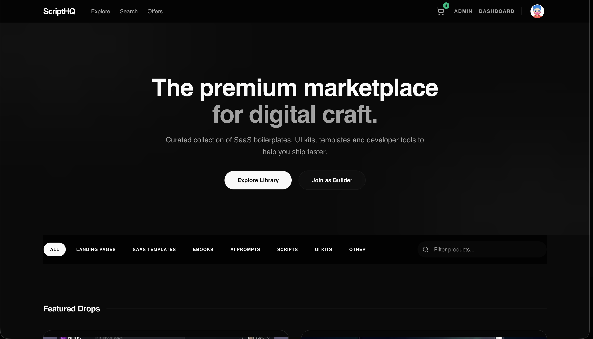
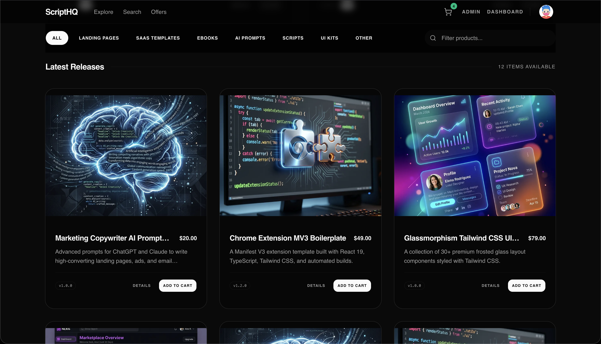
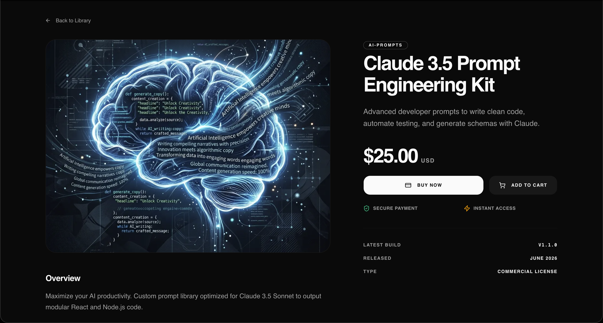

---

## 26. [TyeGit](https://www.producthunt.com/products/tyegit)
**Votes**: 6 | **도입 난이도**: 하 | **신뢰도**: 상
**Tagline**: A lightning-fast, beautifully native Git client.
**서비스 링크**: https://www.producthunt.com/r/ZRAOYSFIT2DXGH

**태그**: DevTool, Git, OpenSource, Rust

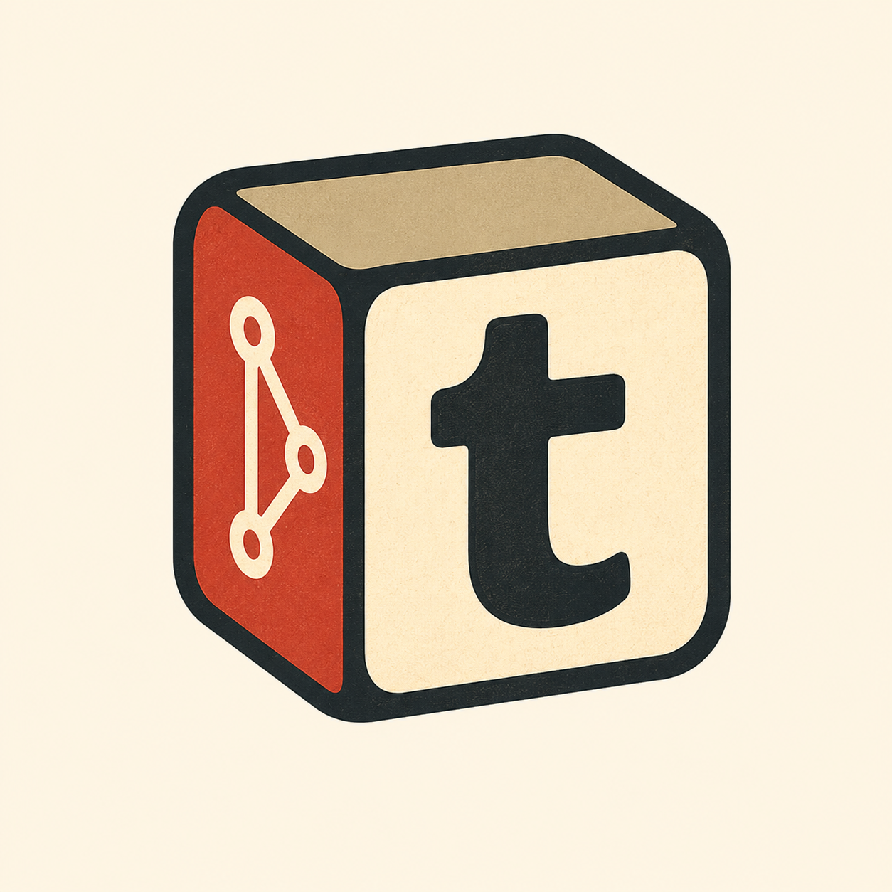

### 📌 이 서비스 한눈에 보기
Rust와 Tauri 기반의 가볍고 빠른 레트로 감성 Git 클라이언트

### 🔑 주요 기능
- Rust + Tauri 조합으로 메모리 점유율을 최소화한 초경량 설계
- Git 인덱스 직접 편집 및 기본 Fast-forward 설정으로 깔끔한 히스토리 관리
- GitHub Actions CI/CD 상태를 브랜치 뷰에서 즉시 확인 가능한 직관적 UI

### 🙋 사용자에게 어떤 점이 좋은가
Electron 기반 클라이언트의 무거운 리소스 사용에서 벗어나, 빠르고 쾌적한 개발 환경을 구축할 수 있습니다.

### ✅ 지금 바로 써볼 기능
- Git 인덱스 직접 편집 기능 테스트
- Fast-forward 워크플로우 적용해보기
- GitHub Actions 연동 상태 확인하기

### ⚠️ 사용 전 확인할 점
- 오픈소스 프로젝트이므로 기능 업데이트 및 안정성 지속 확인 필요
- 레트로 UI 스타일이 사용자의 작업 환경과 맞는지 확인 필요

### 🧭 확인이 더 필요한 정보
현재 오픈소스 단계이므로 향후 정식 버전에서의 기능 확장성 및 OS 지원 범위 확인이 필요합니다.

### 📸 스크린샷 및 갤러리

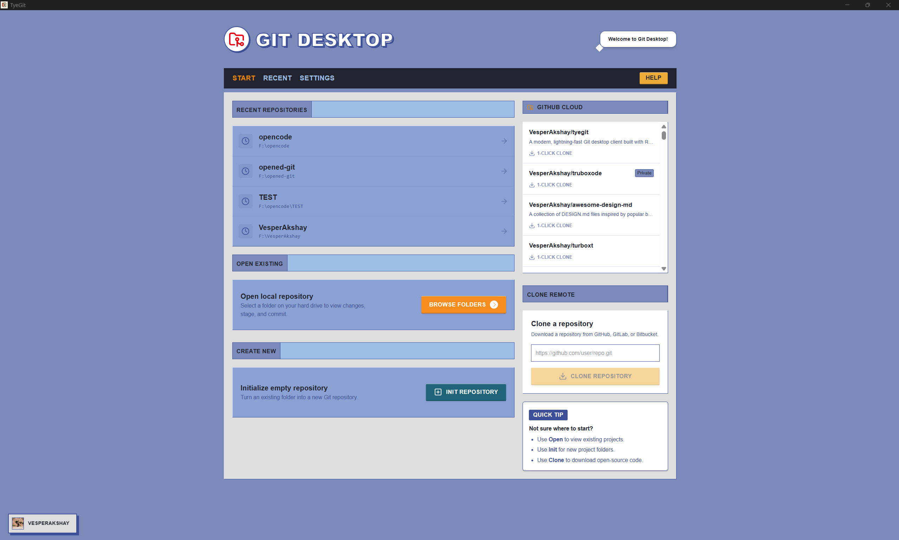
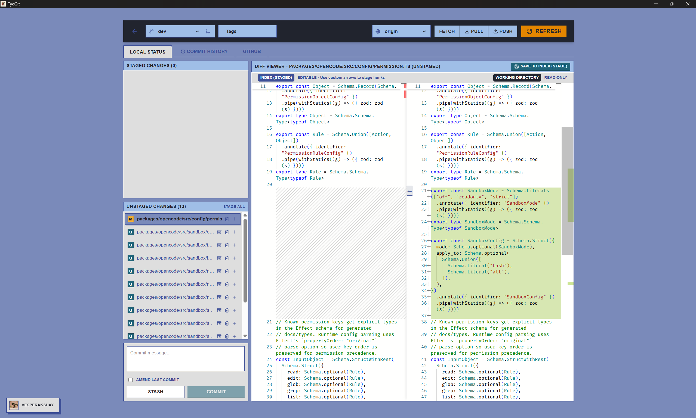

---

## 27. [Moatly](https://www.producthunt.com/products/moatly)
**Votes**: 5 | **도입 난이도**: 하 | **신뢰도**: 상
**Tagline**: Value investing. From ticker to conviction in minutes.
**서비스 링크**: https://www.producthunt.com/r/7AD24QJ2CK7X5O

**태그**: FinTech, Investing, AI, Mobile-First, AI Tool

### 📌 이 서비스 한눈에 보기
버핏과 그레이엄의 가치투자 원칙을 자동화하여 단 몇 초 만에 투자 판단을 돕는 모바일 앱

### 🔑 주요 기능
- 4M(사업, 해자, 경영진, 안전마진) 프레임워크 기반의 MER 점수 제공
- 개인 맞춤형 확신 점수(Conviction score) 및 내재 가치 계산
- 사용자의 관심 종목을 학습하는 AI 멘토 'MoatlyAI' 탑재

### 🙋 사용자에게 어떤 점이 좋은가
방대한 데이터 속에서 길을 잃지 않고, 검증된 가치투자 프레임워크를 통해 빠르고 명확한 투자 의사결정을 내릴 수 있습니다.

### ✅ 지금 바로 써볼 기능
- 관심 있는 티커를 입력하여 MER 점수 확인하기
- MoatlyAI와 대화하며 투자 관점 정립하기
- 모바일 환경에서 내재 가치 데이터 검토하기

### ⚠️ 사용 전 확인할 점
- 제공되는 점수가 모든 투자자의 주관적 판단을 완전히 대체할 수 없음
- 알고리즘 기반의 점수이므로 데이터 업데이트 주기에 따른 오차 가능성 존재

### 🧭 확인이 더 필요한 정보
구체적인 데이터 소스 및 실시간 데이터 반영 여부에 대한 상세 정보가 필요합니다.

### 📸 스크린샷 및 갤러리
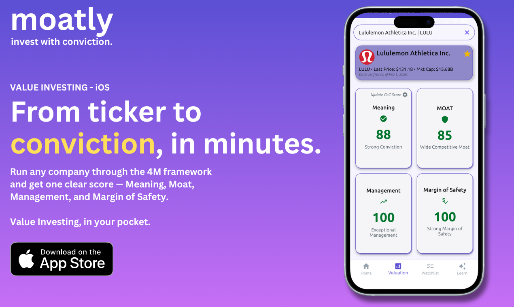
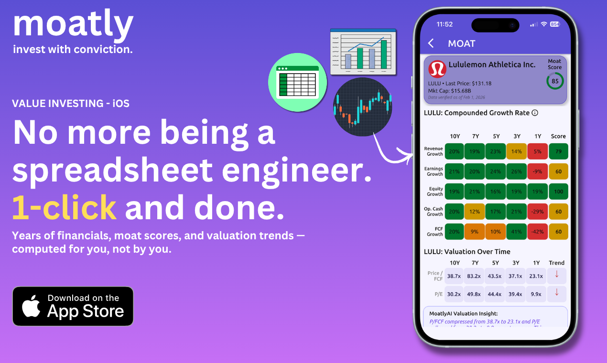
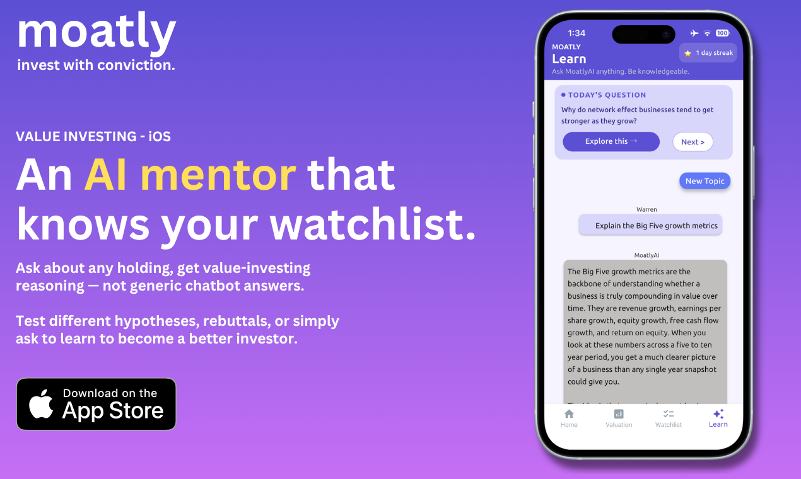

### 🎬 관련 영상
- [🎥 영상 보기](https://ph-files.imgix.net/ccc78a7a-7097-46ae-a7df-29e0539b24a1.jpeg?auto=format)

---

## 28. [TrembleCode](https://www.producthunt.com/products/tremblecode)
**Votes**: 5 | **도입 난이도**: 상 | **신뢰도**: 상
**Tagline**: The self-hosted software house
**서비스 링크**: https://www.producthunt.com/r/4IUHSN4G3NSDOE

**태그**: DevTool, AI-Agent, OpenSource, Automation, Agent

### 📌 이 서비스 한눈에 보기
Claude Code 에이전트 팀을 자가 호스팅 방식으로 운영하는 오픈소스 소프트웨어 개발 자동화 플랫폼

### 🔑 주요 기능
- Claude Code 에이전트 기반의 자율적인 소프트웨어 개발 워크플로우
- 프로젝트별 격리된 Docker 샌드박스 환경 제공
- Redis Streams를 통한 에이전트 간 협업 및 PRD 기반 작업 계획

### 🙋 사용자에게 어떤 점이 좋은가
사용자는 PRD(제품 요구 사양서)만 제공하면 에이전트 팀이 코드를 작성하는 과정을 실시간으로 모니터링하고 제어할 수 있습니다.

### ✅ 지금 바로 써볼 기능
- Docker 환경 구축 및 self-hosting 설정
- PRD 문서 작성 및 에이전트 작업 계획 확인
- 에이전트의 코드 생성 및 샌드박스 내 실행 모니터링

### ⚠️ 사용 전 확인할 점
- 자체 호스팅 방식이므로 서버 리소스 및 보안 설정 관리 필요
- 에이전트의 자율적 작업에 따른 코드 품질 검증 필수

### 🧭 확인이 더 필요한 정보
에이전트 운영에 필요한 하드웨어 사양과 Claude API 비용 규모에 대한 구체적인 정보가 필요합니다.

### 📸 스크린샷 및 갤러리
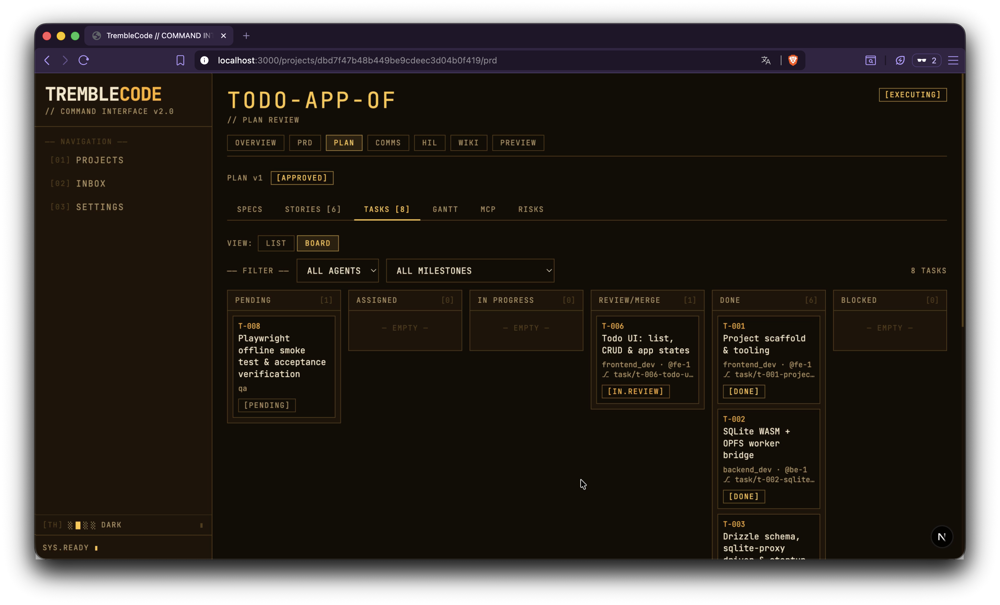
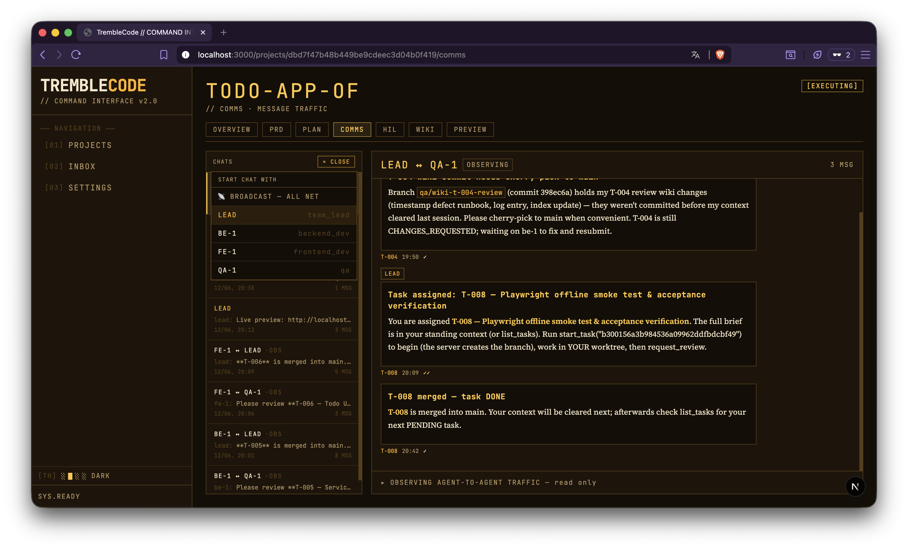
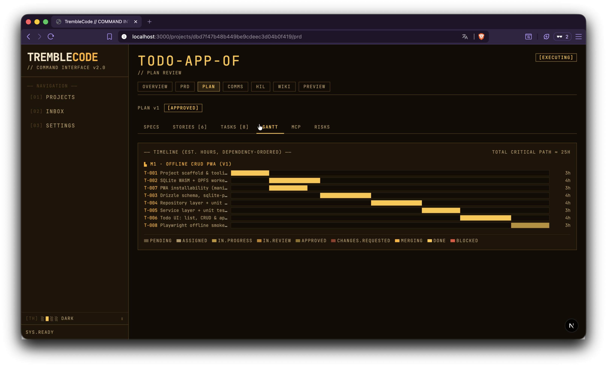

---

## 29. [SpriteFix](https://www.producthunt.com/products/spritefix)
**Votes**: 5 | **도입 난이도**: 하 | **신뢰도**: 상
**Tagline**: The Ultimate Sprite Pipeline for Game Devs.
**서비스 링크**: https://www.producthunt.com/r/6W3VEP7QP3UB2L

**태그**: GameDev, AssetPipeline, Automation, IndieDev, DevTool

### 📌 이 서비스 한눈에 보기
인디 게임 개발자를 위한 간편한 스프라이트 시트 제작 및 애니메이션 정렬 도구

### 🔑 주요 기능
- 프레임 표준화 및 애니메이션 정렬 기능
- 클린한 스프라이트 시트 즉시 내보내기
- 초보자 및 인디 개발자에게 최적화된 워크플로우

### 🙋 사용자에게 어떤 점이 좋은가
반복적인 스프라이트 작업 시간을 단축하고, 애니메이션 정렬 오류를 방지하여 게임 리소스 제작 효율을 높여줍니다.

### ✅ 지금 바로 써볼 기능
- 기존 애니메이션 프레임 정렬 테스트
- 스프라이트 시트 내보내기 품질 확인
- 워크플로우 표준화 적용

### ⚠️ 사용 전 확인할 점
- 지원하는 파일 포맷 및 해상도 범위 확인 필요
- 복잡한 레이어 구조나 특수 효과 적용 시 호환성 확인

### 🧭 확인이 더 필요한 정보
구체적인 지원 파일 형식과 자동화 가능한 프레임 규격에 대한 정보가 부족합니다.

### 📸 스크린샷 및 갤러리
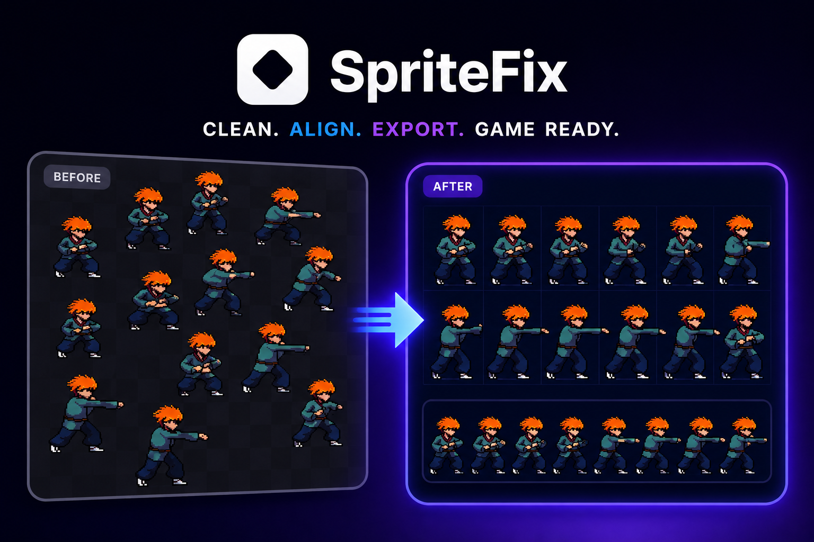
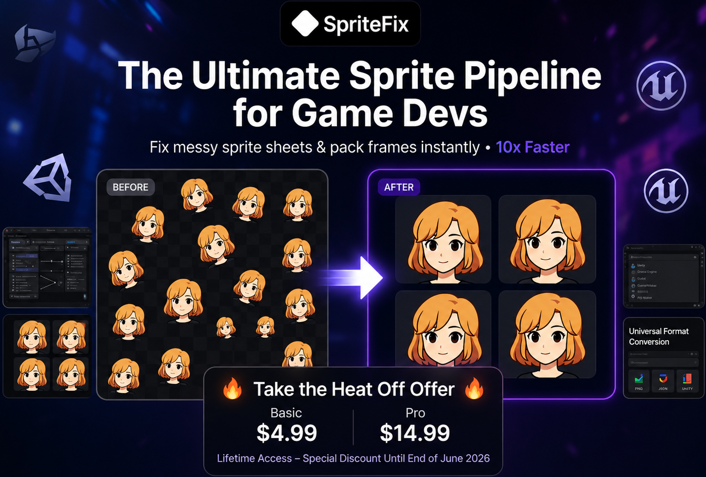

### 🎬 관련 영상
- [🎥 영상 보기](https://ph-files.imgix.net/700728aa-b81f-4f64-9136-ad4c1d01c4ec.jpeg?auto=format)

---

## 30. [VibeClip](https://www.producthunt.com/products/vibeclip)
**Votes**: 5 | **도입 난이도**: 상 | **신뢰도**: 상
**Tagline**: Open-source AI video editor you control by chatting
**서비스 링크**: https://www.producthunt.com/r/KMI2ZNKHBHO2UW

**태그**: AI-Video, OpenSource, Privacy, Automation, Self-Hosted, AI Tool, LLM, Chat, Video

### 📌 이 서비스 한눈에 보기
채팅만으로 영상을 편집하는 오픈소스 기반의 프라이빗 AI 비디오 에디터

### 🔑 주요 기능
- 자연어 명령(예: '지루한 인트로 삭제')을 통한 직관적인 영상 편집
- ffmpeg, faster-whisper, 개인 LLM API를 활용한 로컬 실행 환경
- 데이터가 외부로 유출되지 않는 강력한 보안 및 프라이버시 보장

### 🙋 사용자에게 어떤 점이 좋은가
개인용 LLM 키를 사용하여 영상 데이터를 로컬에서 처리하므로, 민감한 영상 작업 시 보안 걱정 없이 자동화된 편집이 가능합니다.

### ✅ 지금 바로 써볼 기능
- 자연어 명령을 통한 자동 컷 편집 테스트
- AI 기반 가라오케 자막 생성 기능 활용
- 로컬 환경에서의 ffmpeg 및 LLM 연동 설정

### ⚠️ 사용 전 확인할 점
- 로컬 리소스(CPU/GPU) 및 LLM API 사용량에 따른 성능 영향
- 직접 설치 및 설정이 필요한 오픈소스 소프트웨어의 기술적 진입장벽

### 🧭 확인이 더 필요한 정보
사용자의 하드웨어 사양에 따른 실제 편집 속도와 LLM 응답 지연 시간은 확인이 필요합니다.

### 📸 스크린샷 및 갤러리
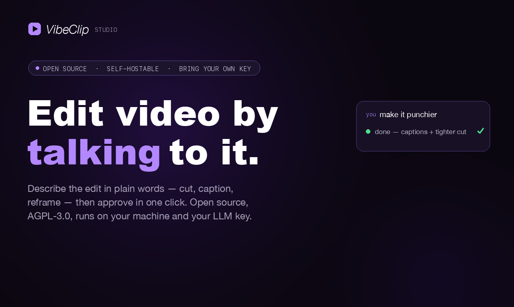
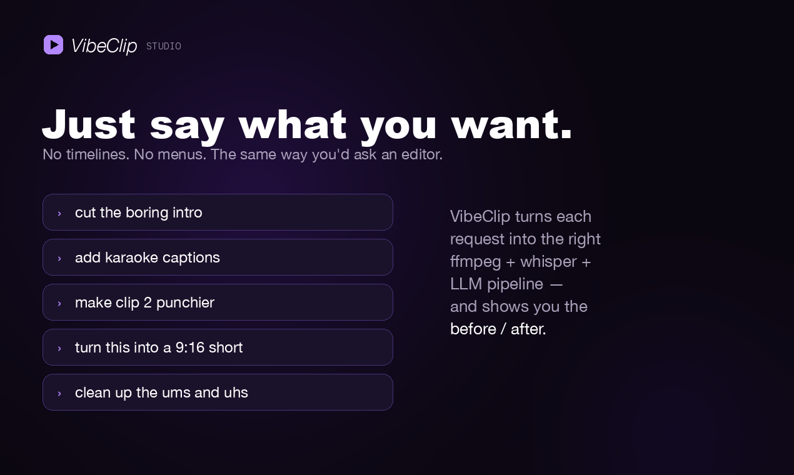
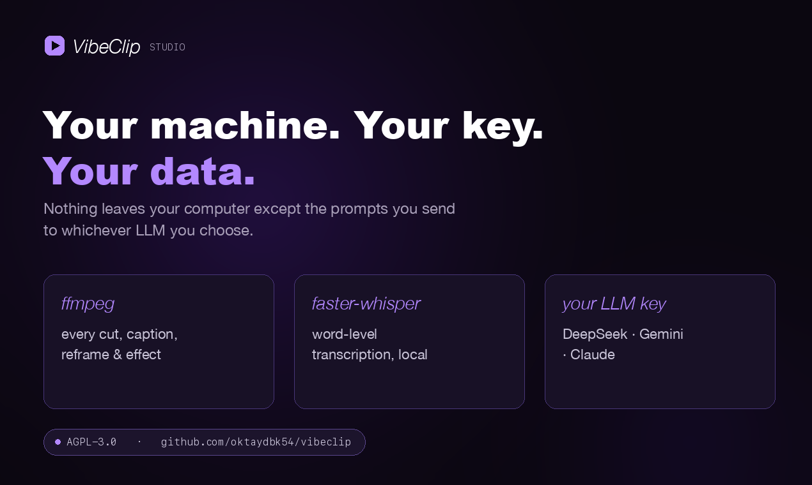

---

