# 🚀 Product Hunt Daily Top 30 (2026-06-16)

## 오늘의 요약
오늘의 트렌드는 AI 에이전트의 실질적인 활용과 운영 효율화에 집중되었습니다. 단순한 챗봇을 넘어 특정 워크플로우(채용, 영상 편집, 마케팅, 영업)를 자동화하거나, 에이전트 개발 및 모니터링을 돕는 인프라 솔루션들이 눈에 띄었습니다. 또한, AI 작업 대기 시간이나 개발 프로세스를 수익화하거나 자동화하는 등 실무 밀착형 도구들이 주목받았습니다.

### 오늘의 핵심 포인트
- 사용자의 기존 작업 환경(메신저, 영상 편집 툴 등)에 자연스럽게 녹아드는 AI 에이전트 통합 솔루션이 강세를 보였습니다.
- 에이전트의 성능 모니터링, 인프라 관리, 마케팅 콘텐츠 자동 생성 등 에이전트 생태계의 운영 효율을 높이는 도구들이 등장했습니다.
- 반복적인 구직, 디자인 수정, 영업 리드 발굴 등 인간의 번거로운 수동 작업을 대체하는 자동화 기술이 핵심 가치로 제시되었습니다.

**오늘의 태그**: AI 에이전트, 업무 자동화, 개발자 도구, 생산성 혁신

## 1. [Novu Connect](https://www.producthunt.com/products/novu)
**Votes**: 301 | **도입 난이도**: 중 | **신뢰도**: 상
**Tagline**: Ship agents where your users already work
**서비스 링크**: https://www.producthunt.com/r/YKCLFF3LPLDFWW

**태그**: AI, Automation, DevTool, Messaging, SaaS, Agent, AI Tool, Email

### 📌 이 서비스 한눈에 보기
사용자가 사용하는 메신저 채널에 AI 에이전트를 즉시 배포할 수 있는 커뮤니케이션 레이어 솔루션

### 🔑 주요 기능
- Slack, Teams, WhatsApp 등 다양한 채널 통합 관리
- 사용자 로직과 채널 간의 통신 계층 분리
- 양방향 대화, 아이덴티티 식별, 스레딩 및 라우팅 자동화

### 🙋 사용자에게 어떤 점이 좋은가
개발자가 각 채널별 연동 작업을 직접 할 필요 없이, 기존 AI 에이전트를 사용자가 익숙한 메신저 환경에 바로 연결할 수 있습니다.

### ✅ 지금 바로 써볼 기능
- 기존 AI 에이전트 로직 준비
- 연동할 메시징 채널 선정
- Novu Connect를 통한 채널 통합 테스트

### ⚠️ 사용 전 확인할 점
- 에이전트 자체의 로직이나 모델 성능은 사용자가 직접 관리해야 함
- 채널별 특화된 기능 구현 시 추가적인 설정이 필요할 수 있음

### 🧭 확인이 더 필요한 정보
에이전트 로직을 연동하는 구체적인 SDK나 API 방식에 대한 상세 문서 확인이 필요합니다.

### 📸 스크린샷 및 갤러리
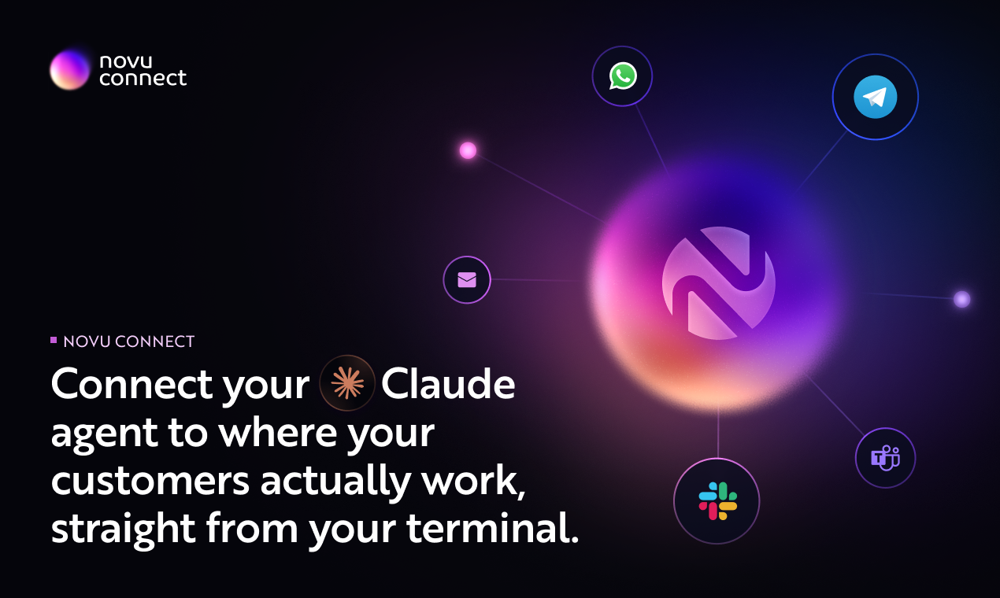
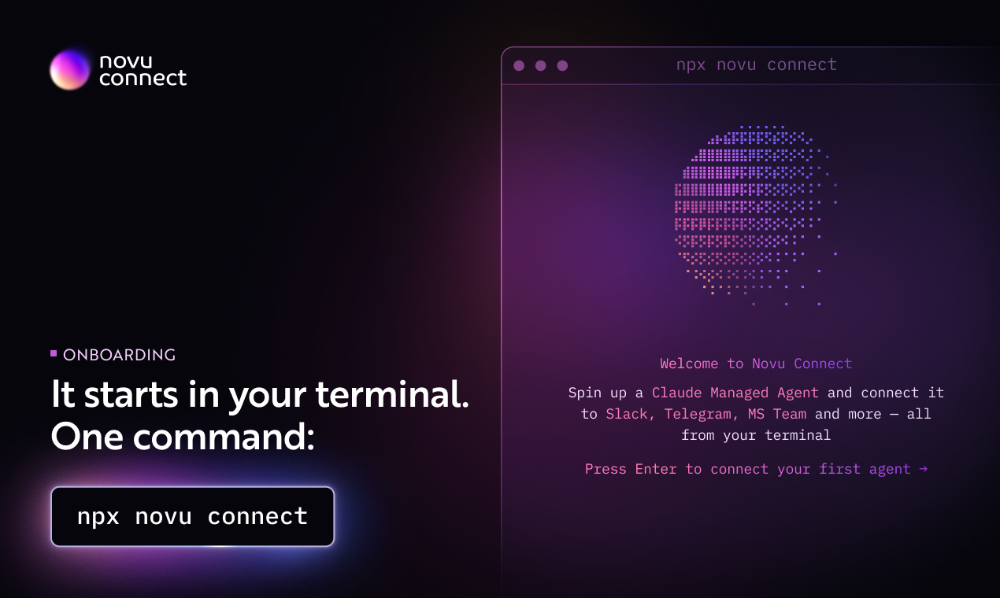
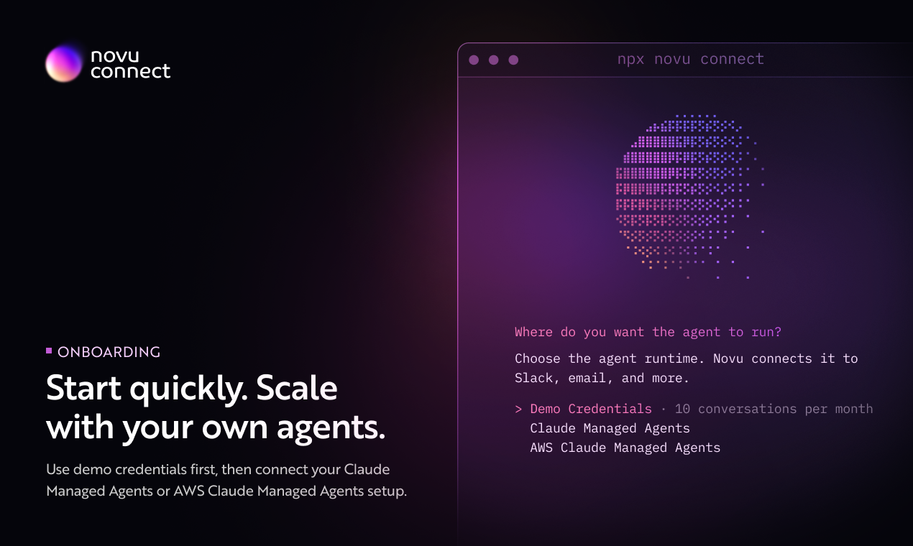

### 🎬 관련 영상
- [🎥 영상 보기](https://ph-files.imgix.net/da3d960c-d916-4cf6-831a-927599cfdeac.jpeg?auto=format)

---

## 2. [Wobo 2.0](https://www.producthunt.com/products/wobo-ai)
**Votes**: 221 | **도입 난이도**: 하 | **신뢰도**: 상
**Tagline**: Tinder for jobs: swipe right and AI applies for you
**서비스 링크**: https://www.producthunt.com/r/4YVEDAOI6CJSFN

**태그**: AI, JobSearch, Automation, Productivity, AI Tool

### 📌 이 서비스 한눈에 보기
스와이프 한 번으로 AI가 맞춤형 채용 지원을 대신해주는 개인 AI 리크루터

### 🔑 주요 기능
- 사용자 배경에 맞춘 사전 검증된 채용 공고 매칭
- 개별 기업 사이트에 직접 접속하여 자동 지원 프로세스 수행
- 사용자의 말투를 반영한 맞춤형 이력서 및 자기소개서 작성

### 🙋 사용자에게 어떤 점이 좋은가
번거로운 입사 지원 양식 작성과 반복적인 구직 활동 시간을 획기적으로 줄여주며, 면접 기회 확보에 집중할 수 있게 합니다.

### ✅ 지금 바로 써볼 기능
- 자신의 이력서 및 프로필 데이터 업로드
- AI가 생성한 답변이 본인의 목소리를 잘 반영하는지 검토
- 매칭된 채용 공고 스와이프 및 지원 확인

### ⚠️ 사용 전 확인할 점
- AI가 작성한 답변이 실제 면접 시 본인의 역량과 차이가 날 수 있음
- 자동 지원 과정에서 발생할 수 있는 데이터 오류 확인 필요

### 🧭 확인이 더 필요한 정보
지원 과정에서 사용자의 개입이 어느 정도 필요한지, 그리고 지원 완료 후의 피드백 관리 방식에 대한 정보가 더 필요합니다.

### 📸 스크린샷 및 갤러리

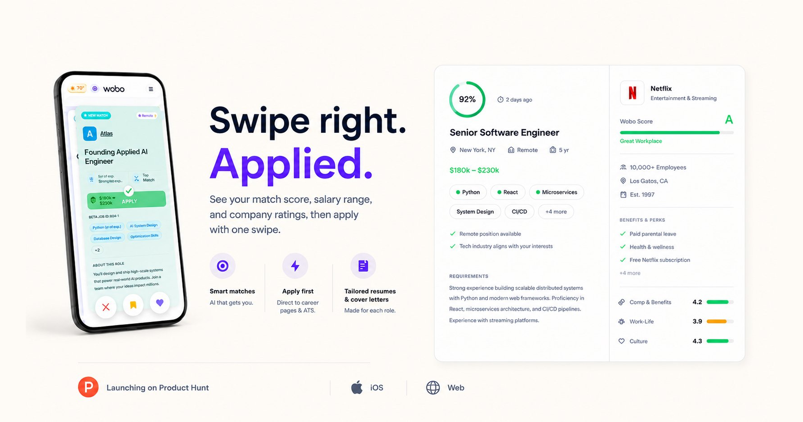
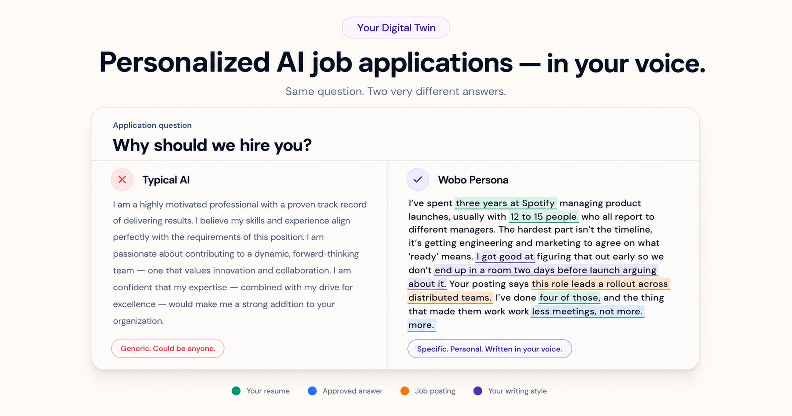

### 🎬 관련 영상
- [🎥 영상 보기](https://ph-files.imgix.net/b254b9c8-052d-419d-a8b1-3fb196fd0d55.jpeg?auto=format)

---

## 3. [AutoEdit](https://www.producthunt.com/products/autoedit)
**Votes**: 201 | **도입 난이도**: 하 | **신뢰도**: 상
**Tagline**: Your Claude AI Video Editor for Premiere Pro
**서비스 링크**: https://www.producthunt.com/r/FKEBR24CKXQXUO

**태그**: VideoEditing, AI, Automation, PremierePro, Productivity, AI Tool, Video

### 📌 이 서비스 한눈에 보기
Claude AI를 활용해 프리미어 프로 내에서 반복적인 컷 편집 작업을 자동화하는 플러그인

### 🔑 주요 기능
- Claude AI 기반의 지능적인 영상 내용 이해 및 자동 편집
- 무음 구간, 추임새(filler words), NG 장면 및 중복 구간 자동 제거
- 자막 생성 및 타임라인 구조화 기능 제공

### 🙋 사용자에게 어떤 점이 좋은가
단순 반복적인 러프 컷 작업 시간을 획기적으로 단축하여 편집자가 창의적인 결정에만 집중할 수 있게 돕습니다.

### ✅ 지금 바로 써볼 기능
- 원본 푸티지를 불러와 자동 컷 편집 기능 테스트
- 생성된 자막 및 타임라인 구조 검토
- AI가 제거한 구간 중 유지해야 할 부분 재조정

### ⚠️ 사용 전 확인할 점
- AI가 맥락을 오판하여 중요한 장면을 삭제할 가능성
- 프리미어 프로 버전과의 호환성 확인 필요

### 🧭 확인이 더 필요한 정보
Claude AI 모델의 구체적인 버전 및 API 연동 방식에 대한 정보가 필요합니다.

### 📸 스크린샷 및 갤러리
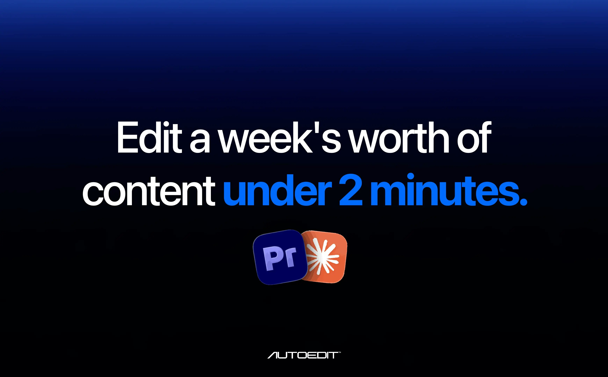
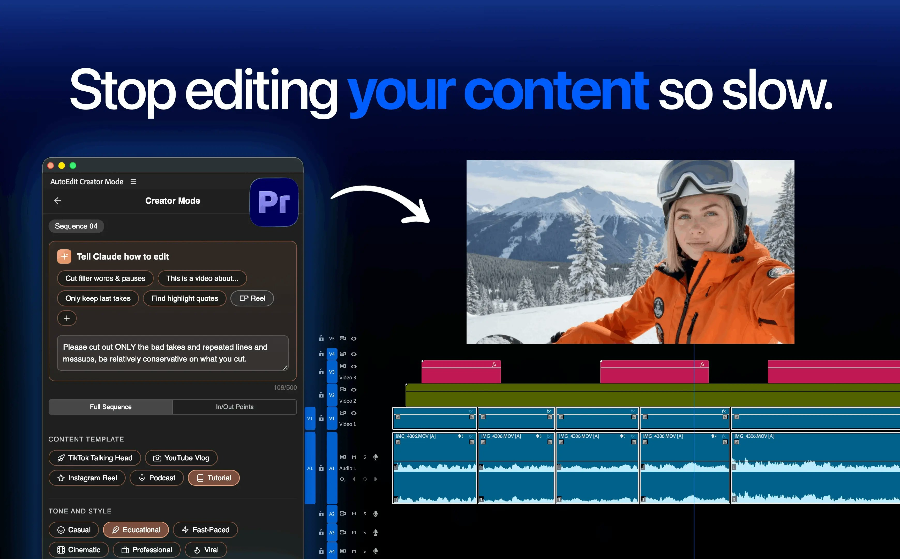
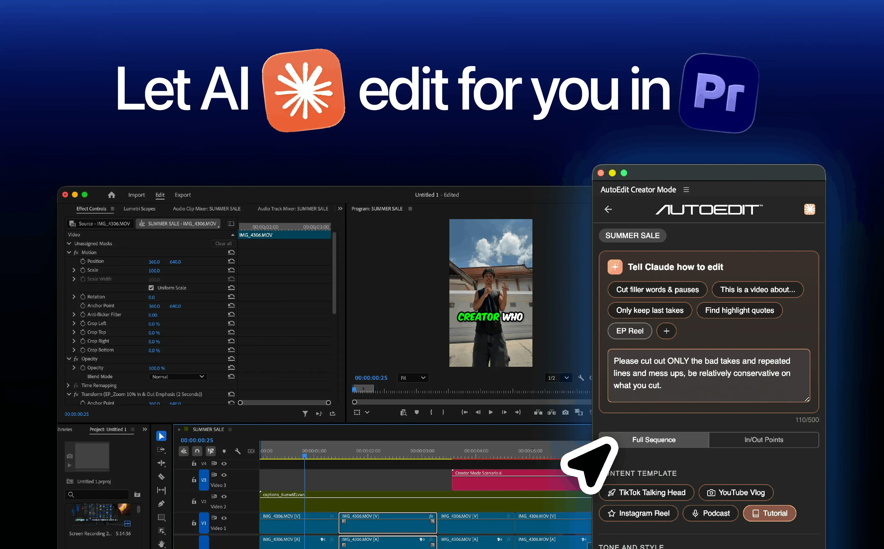

### 🎬 관련 영상
- [🎥 영상 보기](https://ph-files.imgix.net/e546a5bd-585e-46ef-afbc-480164b1e9bb.jpeg?auto=format)

---

## 4. [Kickbacks.ai](https://www.producthunt.com/products/kickbacks-ai)
**Votes**: 196 | **도입 난이도**: 하 | **신뢰도**: 상
**Tagline**: Get paid to wait for Claude Code to finish
**서비스 링크**: https://www.producthunt.com/r/6UFCMNIYCIPIVY

**태그**: DevTool, PassiveIncome, AI-Agent, Agent, AI Tool

### 📌 이 서비스 한눈에 보기
AI 에이전트 작업 대기 시간을 수익화하는 개발자용 광고 플랫폼

### 🔑 주요 기능
- AI 에이전트(Claude Code 등)의 작업 완료 대기 시간을 활용한 수익 창출
- 터미널 내 작은 스폰서 문구 노출을 통한 광고 모델
- 발생한 광고 수익의 50%를 사용자에게 배분

### 🙋 사용자에게 어떤 점이 좋은가
개발 중 발생하는 불필요한 대기 시간을 활용해 소소한 수익을 얻을 수 있습니다.

### ✅ 지금 바로 써볼 기능
- Claude Code 등 AI 에이전트 도구와 연동 시도
- 터미널 내 광고 노출 방식 및 UI 확인
- 수익 정산 방식 및 최소 출금 금액 확인

### ⚠️ 사용 전 확인할 점
- 터미널 작업 환경의 시각적 방해 요소가 될 수 있음
- 광고 수익 모델 특성상 수익 규모가 매우 작을 수 있음

### 🧭 확인이 더 필요한 정보
지원하는 AI 에이전트 도구의 종류와 구체적인 연동 방식에 대한 정보가 더 필요합니다.

### 📸 스크린샷 및 갤러리

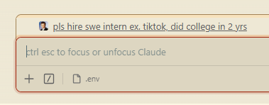

---

## 5. [PandaProbe Cloud](https://www.producthunt.com/products/pandaprobe-cloud)
**Votes**: 162 | **도입 난이도**: 하 | **신뢰도**: 상
**Tagline**: agent engineering, fully managed.
**서비스 링크**: https://www.producthunt.com/r/EFZITJ632XZJX3

**태그**: AI-Agents, Observability, DevOps, MLOps, Agent

### 📌 이 서비스 한눈에 보기
인프라 관리 없이 에이전트의 성능을 추적하고 모니터링할 수 있는 완전 관리형 엔지니어링 플랫폼

### 🔑 주요 기능
- 인프라 구축 부담이 없는 완전 관리형(Fully Managed) 서비스
- 에이전트 개발을 위한 풀스택 트레이싱 및 모니터링 제공
- 에이전트 성능 평가(Evals)를 통한 품질 관리

### 🙋 사용자에게 어떤 점이 좋은가
운영 오버헤드 없이 에이전트의 동작을 추적하고 성능을 검증할 수 있어, 개발 팀이 인프라 관리 대신 에이전트 로직 고도화에만 집중할 수 있게 해줍니다.

### ✅ 지금 바로 써볼 기능
- 에이전트 실행 로그 및 트레이싱 기능 테스트
- 에이전트 성능 평가(Evals) 워크플로우 설정
- 기존 에이전트 시스템과의 통합 가능성 확인

### ⚠️ 사용 전 확인할 점
- 완전 관리형 서비스이므로 데이터 보안 및 프라이버시 정책 확인 필요
- 자체 인프라 구축 대비 커스텀 설정의 자유도 제한 가능성

### 🧭 확인이 더 필요한 정보
구체적인 데이터 보안 정책 및 기존 에이전트 프레임워크와의 호환성 범위에 대한 정보가 더 필요합니다.

### 📸 스크린샷 및 갤러리
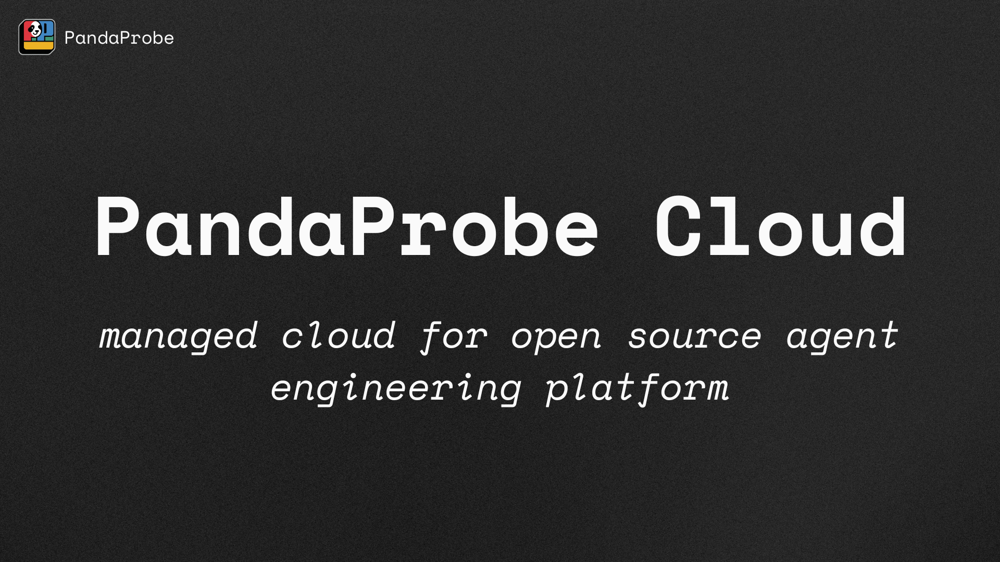
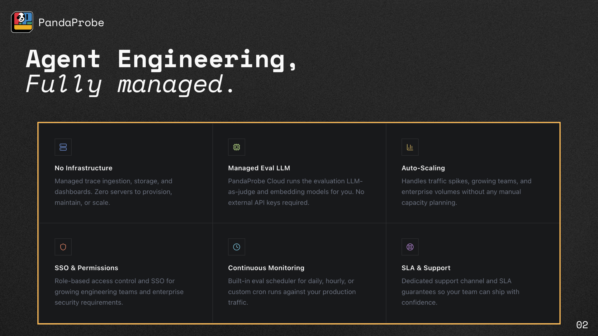
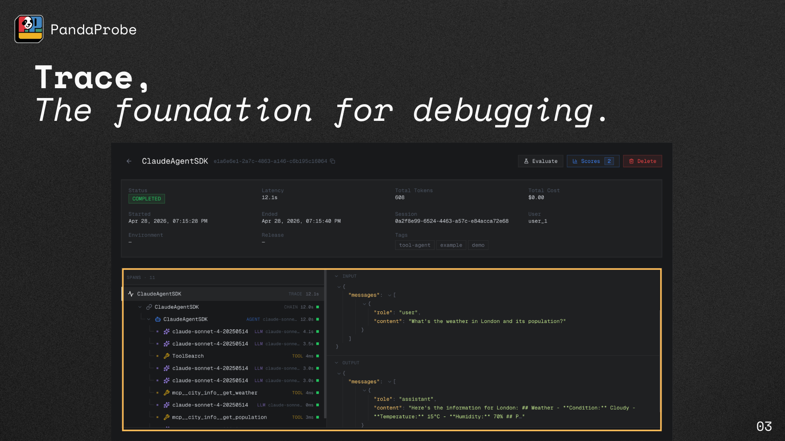

### 🎬 관련 영상
- [🎥 영상 보기](https://ph-files.imgix.net/1118476f-2a86-4955-98c1-b3e8246b3967.jpeg?auto=format)

---

## 6. [Notra Image Generation](https://www.producthunt.com/products/notra-3)
**Votes**: 161 | **도입 난이도**: 하 | **신뢰도**: 상
**Tagline**: Turn merged PRs into on-brand marketing visuals
**서비스 링크**: https://www.producthunt.com/r/K25AMX5IAKYYMJ

**태그**: DevTool, Marketing Automation, Content Generation, Vision, Marketing

### 📌 이 서비스 한눈에 보기
개발 완료된 PR을 브랜드 맞춤형 마케팅 비주얼과 콘텐츠로 자동 변환해주는 도구

### 🔑 주요 기능
- 머지된 PR(Pull Request) 데이터를 기반으로 자동 콘텐츠 생성
- 브랜드 톤앤매너를 반영한 마케팅 비주얼 제작
- 변경 사항을 릴리스 노트, 출시 포스트, 소셜 업데이트로 변환

### 🙋 사용자에게 어떤 점이 좋은가
개발 작업이 완료된 후 매번 수동으로 작성해야 했던 홍보 문구와 이미지 제작 시간을 획기적으로 줄여줍니다.

### ✅ 지금 바로 써볼 기능
- GitHub/GitLab 등 코드 저장소 연동하기
- 브랜드 보이스(Voice) 설정하기
- 생성된 소셜 미디어 포스트 검토 및 게시하기

### ⚠️ 사용 전 확인할 점
- 코드 변경 사항이 마케팅용으로 적합하지 않을 경우 품질 저하 가능성
- 브랜드 가이드라인과 생성된 비주얼 간의 일치 여부 확인 필요

### 🧭 확인이 더 필요한 정보
지원하는 코드 저장소 플랫폼의 종류와 구체적인 이미지 생성 엔진에 대한 정보가 필요합니다.

### 📸 스크린샷 및 갤러리
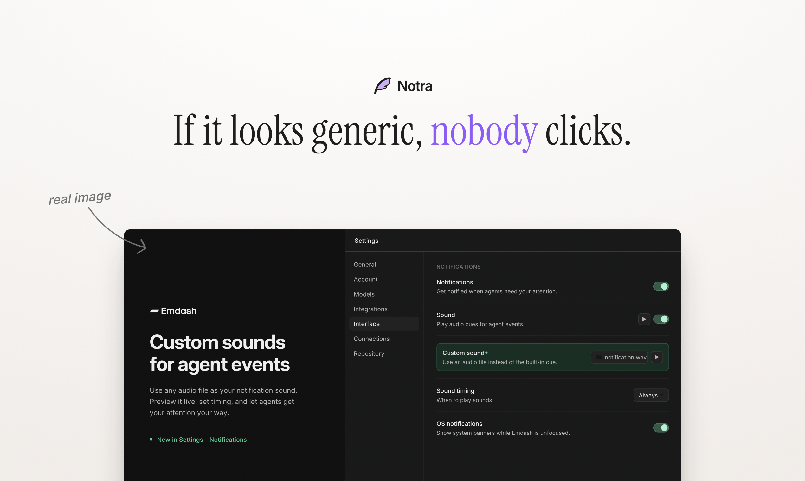
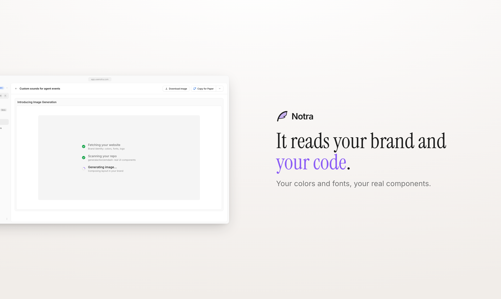
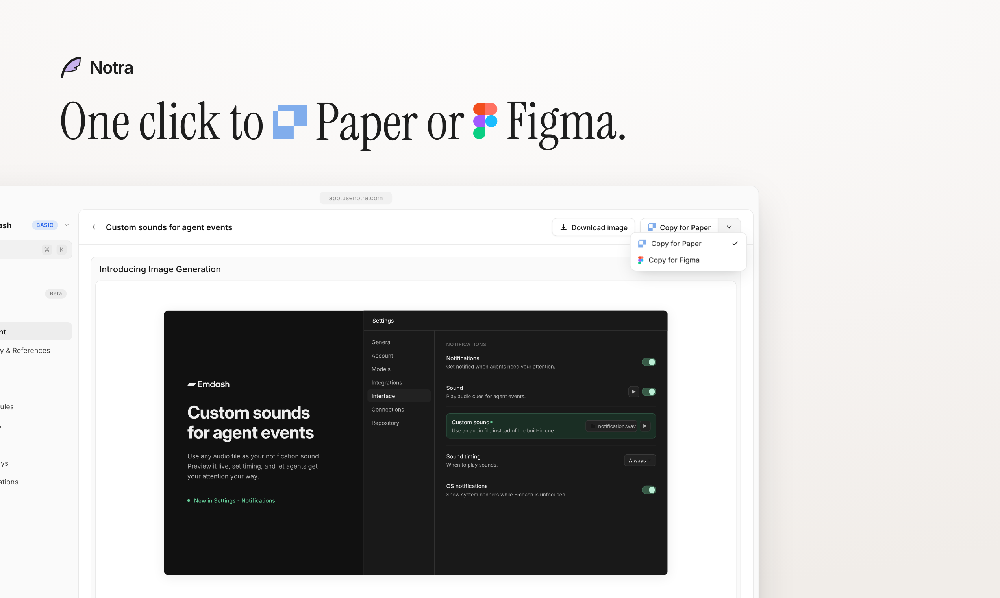

### 🎬 관련 영상
- [🎥 영상 보기](https://ph-files.imgix.net/e492532d-e4b1-42dd-bda1-ba5f6d1a9111.jpeg?auto=format)

---

## 7. [MockPilot](https://www.producthunt.com/products/mockpilot)
**Votes**: 118 | **도입 난이도**: 하 | **신뢰도**: 상
**Tagline**: Turn live websites into editable mockups
**서비스 링크**: https://www.producthunt.com/r/D65V7XL2EQS53Y

**태그**: DesignTool, AI, Prototyping, OpenSource, WebDev, AI Tool, Design

### 📌 이 서비스 한눈에 보기
실제 웹사이트를 자연어로 편집 가능한 목업으로 변환해주는 AI 디자인 도구

### 🔑 주요 기능
- 라이브 웹페이지를 즉시 편집 가능한 데스크톱 목업으로 캡처
- 자연어 명령을 통한 직관적인 디자인 수정 (디자인/코딩 기술 불필요)
- 타이포그래피, 색상, 아이콘 등을 자동으로 추출하여 에셋 라이브러리 구축

### 🙋 사용자에게 어떤 점이 좋은가
디자인 기술 없이도 기존 웹사이트를 기반으로 빠르게 프로토타입을 수정하거나 새로운 레이아웃을 실험할 수 있습니다.

### ✅ 지금 바로 써볼 기능
- 원하는 웹사이트 URL을 입력하여 페이지 캡처하기
- AI 채팅창에 자연어로 디자인 변경 요청해보기
- 추출된 에셋 라이브러리 확인 및 HTML 내보내기 테스트

### ⚠️ 사용 전 확인할 점
- 데스크톱 설치형 소프트웨어이므로 macOS 또는 Windows 환경 확인 필요
- 복잡한 레이아웃의 경우 AI의 편집 정확도가 달라질 수 있음

### 🧭 확인이 더 필요한 정보
현재 오픈 소스 버전의 기능 범위와 향후 클라우드 협업 기능 지원 여부에 대한 정보가 명시되지 않았습니다.

### 📸 스크린샷 및 갤러리
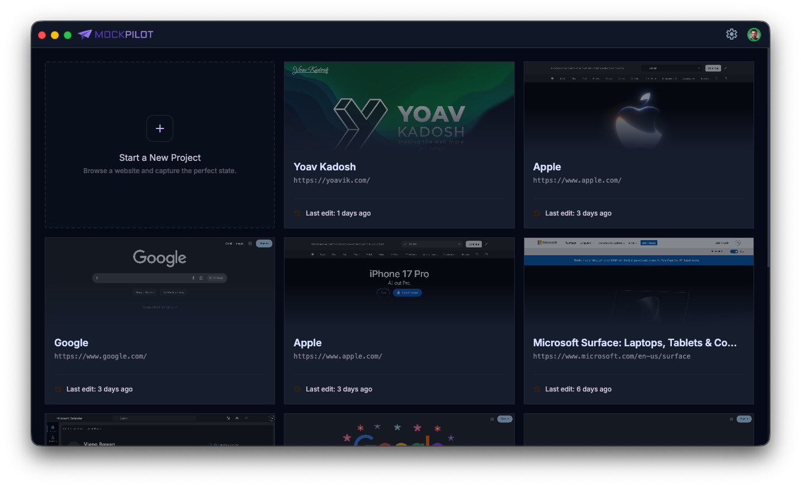
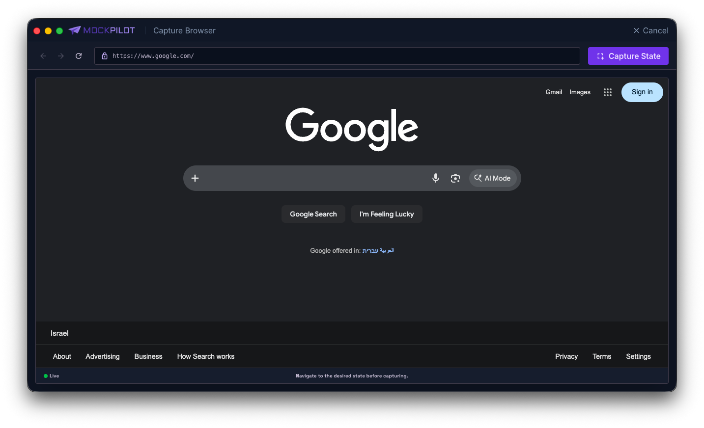
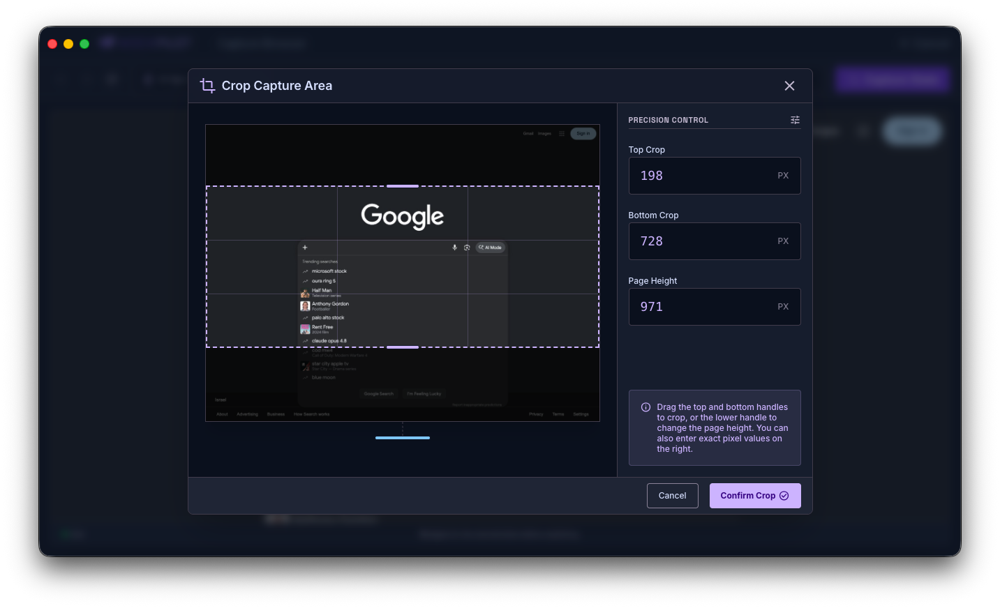

---

## 8. [Sulsaly](https://www.producthunt.com/products/sulsaly)
**Votes**: 113 | **도입 난이도**: 하 | **신뢰도**: 상
**Tagline**: #1 Agentic AI sales leads &outreach platform for MENA Region
**서비스 링크**: https://www.producthunt.com/r/3JHSMSEQPY6EEK

**태그**: SalesTech, AI, Automation, LeadGeneration, MENA, Agent, AI Tool, Sales, Email

### 📌 이 서비스 한눈에 보기
중동 지역 특화 AI 에이전트를 활용한 초고속 영업 리드 발굴 및 자동화 플랫폼

### 🔑 주요 기능
- 중동(MENA) 지역에 특화된 5,000만 개 이상의 검증된 B2B 연락처 보유
- LinkedIn, WhatsApp, 이메일을 통한 개인화된 아웃리치 자동화
- 의사결정권자 식별 및 영업 프로세스 가속화

### 🙋 사용자에게 어떤 점이 좋은가
중동 시장 진출을 원하는 기업이 현지 의사결정권자를 빠르게 찾고, 현지에서 활발한 WhatsApp 등을 통해 효율적으로 영업을 전개할 수 있습니다.

### ✅ 지금 바로 써볼 기능
- 5,000만 개 데이터베이스 내 타겟 의사결정권자 검색
- WhatsApp 및 LinkedIn 자동화 워크플로우 설정
- 개인화된 아웃리치 메시지 템플릿 테스트

### ⚠️ 사용 전 확인할 점
- 중동 지역 외 타 지역 데이터의 정확도 및 커버리지 확인 필요
- 자동화된 메시지 발송에 따른 플랫폼(LinkedIn, WhatsApp) 계정 정책 준수 여부

### 🧭 확인이 더 필요한 정보
사용자의 특정 산업군에 대한 데이터 정밀도와 자동화 도구의 API 연동 범위 확인이 필요합니다.

### 📸 스크린샷 및 갤러리
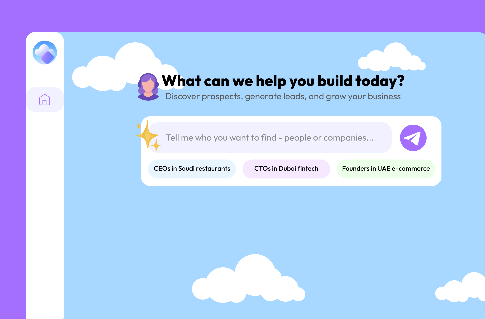

### 🎬 관련 영상
- [🎥 영상 보기](https://ph-files.imgix.net/133f13ba-d44b-453b-9f0d-21b9af8a2a15.jpeg?auto=format)

---

## 9. [Synopsule](https://www.producthunt.com/products/synopsule)
**Votes**: 108 | **도입 난이도**: 하 | **신뢰도**: 상
**Tagline**: On device private AI meeting transcripts
**서비스 링크**: https://www.producthunt.com/r/EO44MRSZGFO2ED

**태그**: Productivity, AI, Privacy, Transcription, AI Tool

### 📌 이 서비스 한눈에 보기
개인정보 유출 걱정 없는 온디바이스 AI 회의 기록 및 요약 서비스

### 🔑 주요 기능
- Whisper 모델을 활용한 Mac 및 iPhone 온디바이스 녹음/전사
- 화자 분리 기능 및 사용자 요청 시에만 수행되는 요약 기능
- 계정 생성이나 클라우드 업로드 없는 강력한 프라이버시 보호

### 🙋 사용자에게 어떤 점이 좋은가
데이터가 외부 서버로 전송되지 않아 보안이 중요한 회의 내용을 안심하고 기록할 수 있으며, 한 번의 구매로 Mac과 iPhone에서 모두 사용 가능합니다.

### ✅ 지금 바로 써볼 기능
- Mac/iPhone에서 대화 녹음 및 실시간 전사 확인하기
- 화자별로 구분된 대화 기록 검토하기
- 필요할 때만 요약 기능을 호출하여 핵심 내용 파악하기

### ⚠️ 사용 전 확인할 점
- 온디바이스 처리 방식이므로 기기 성능에 따라 처리 속도 차이가 있을 수 있음
- 클라우드 기반 서비스 대비 대규모 데이터 처리 시 기기 리소스 사용량 확인 필요

### 🧭 확인이 더 필요한 정보
기기 사양에 따른 Whisper 모델 구동 최적화 수준과 배터리 소모량에 대한 정보가 추가로 필요합니다.

### 📸 스크린샷 및 갤러리
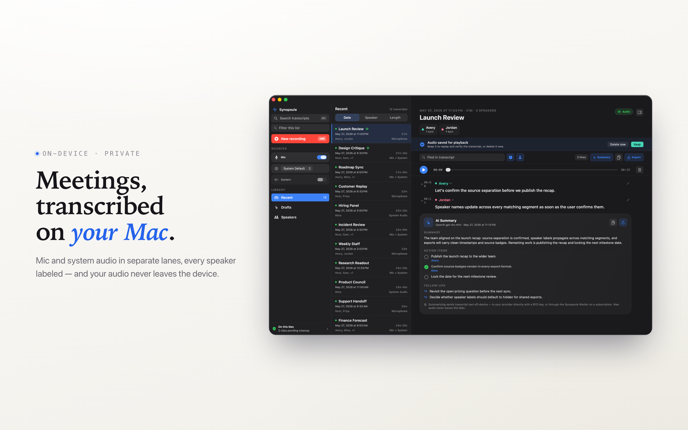
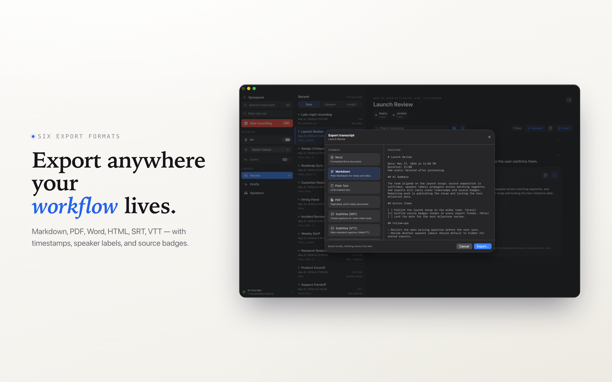
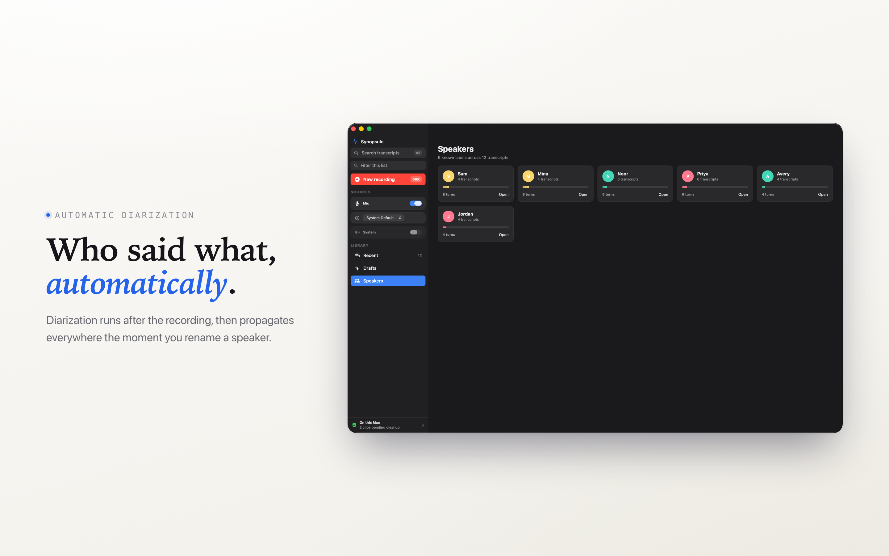

### 🎬 관련 영상
- [🎥 영상 보기](https://ph-files.imgix.net/bcbfff18-5270-49d7-b68a-25bb54ef1117.jpeg?auto=format)

---

## 10. [Reignat](https://www.producthunt.com/products/reignat)
**Votes**: 108 | **도입 난이도**: 하 | **신뢰도**: 상
**Tagline**: Privacy-friendly web analytics platform built for makers
**서비스 링크**: https://www.producthunt.com/r/YWE5HSZ4L4O2HI

**태그**: Analytics, Privacy, SaaS, AI, Startup-Tool, AI Tool

### 📌 이 서비스 한눈에 보기
개인정보를 보호하면서도 복잡함 없이 핵심 인사이트를 제공하는 메이커용 웹 분석 플랫폼

### 🔑 주요 기능
- 개인정보 보호를 중시하는 프라이버시 친화적 분석 환경
- 방문자, 트래픽 소스, 퍼널, 사용자 여정 등 실시간 데이터 추적
- 성장 의사결정을 돕는 AI 기반의 인사이트 제공

### 🙋 사용자에게 어떤 점이 좋은가
복잡한 기존 분석 도구 대신, 스타트업과 1인 창업자가 제품 성장에 필요한 핵심 지표를 빠르고 직관적으로 파악할 수 있습니다.

### ✅ 지금 바로 써볼 기능
- 실시간 대시보드를 통한 트래픽 현황 모니터링
- AI 인사이트 기능을 활용한 트렌드 및 기회 포착
- 사용자 여정(User Journey) 분석을 통한 퍼널 최적화

### ⚠️ 사용 전 확인할 점
- 전통적인 분석 도구 대비 세부적인 데이터 커스텀 기능의 제한 가능성
- AI 인사이트의 정확도는 데이터 양에 따라 달라질 수 있음

### 🧭 확인이 더 필요한 정보
구체적인 데이터 보관 정책 및 타 서비스와의 연동 범위에 대한 정보가 필요합니다.

### 📸 스크린샷 및 갤러리

---

## 11. [Fonda](https://www.producthunt.com/products/fonda)
**Votes**: 107 | **도입 난이도**: 하 | **신뢰도**: 상
**Tagline**: Your AI co-founder that remembers decisions + plans for you
**서비스 링크**: https://www.producthunt.com/r/IUSWOJD46TP74Z

**태그**: AI, Startup, Productivity, Entrepreneurship, AI Tool, Chat

### 📌 이 서비스 한눈에 보기
아이디어 검증부터 실행까지 돕는 체계적인 AI 공동 창업자

### 🔑 주요 기능
- 단순 채팅이 아닌 14단계의 구조화된 스타트업 빌딩 여정 제공
- 과거의 결정, 인터뷰, 피벗 내용을 모두 기억하는 맥락 유지 능력
- 아이디어 검증, 랜딩 페이지 제작, MVP 계획 수립 등 실행 중심의 워크플로우

### 🙋 사용자에게 어떤 점이 좋은가
막연한 아이디어를 구체적인 사업 모델로 발전시키고, 잘못된 방향으로 시간을 낭비하지 않도록 명확한 다음 단계를 제시해 줍니다.

### ✅ 지금 바로 써볼 기능
- 14단계 여정(Discover, Validate, Launch, Scale) 시작하기
- 현재 보유한 아이디어의 타당성 검증하기
- 검증된 아이디어를 바탕으로 MVP 계획 수립하기

### ⚠️ 사용 전 확인할 점
- AI의 제안이 실제 시장의 복잡성을 완벽히 대체할 수 있는지 확인 필요
- 구체적인 유료 플랜 및 기능 제한 범위 확인 필요

### 🧭 확인이 더 필요한 정보
제공되는 랜딩 페이지 및 MVP 플랜의 자동화 수준과 커스텀 가능 여부에 대한 상세 정보가 필요합니다.

### 📸 스크린샷 및 갤러리

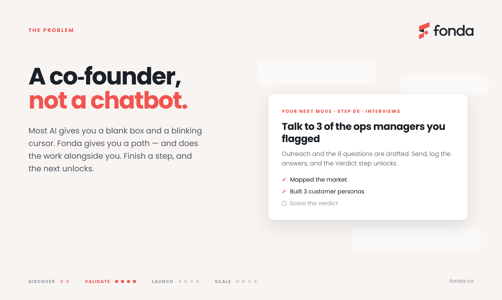
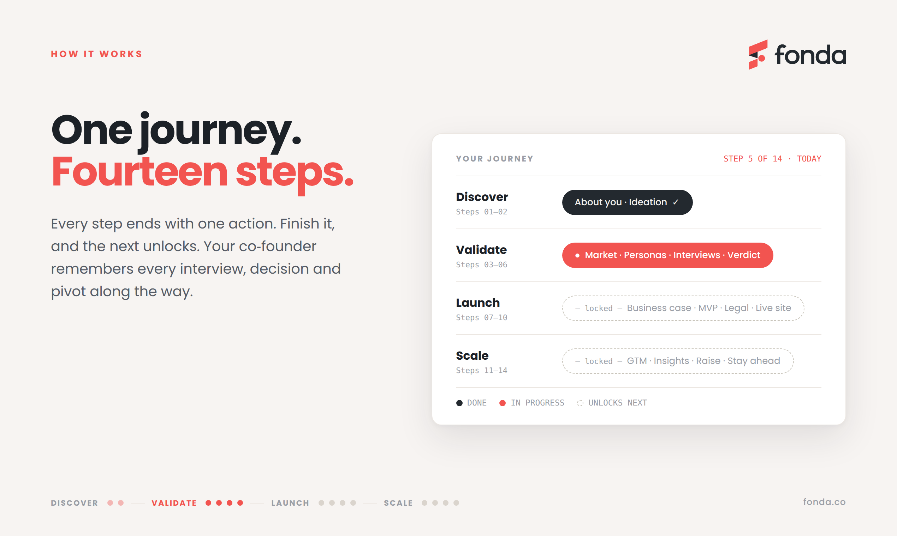

### 🎬 관련 영상
- [🎥 영상 보기](https://ph-files.imgix.net/aefa38d4-aead-42c8-9553-9e5d951e4fc4.jpeg?auto=format)

---

## 12. [AEVS](https://www.producthunt.com/products/aevs-by-fetch-ai)
**Votes**: 104 | **도입 난이도**: 하 | **신뢰도**: 상
**Tagline**: proof-of-execution for AI agents
**서비스 링크**: https://www.producthunt.com/r/RNU637CB76TRTW

**태그**: AI-Agent, DevTool, Observability, Security, Agent, AI Tool, Chat

### 📌 이 서비스 한눈에 보기
AI 에이전트의 작업 실행 과정을 투명하고 변조 불가능하게 기록하는 검증 SDK

### 🔑 주요 기능
- 에이전트의 모든 툴 호출(Tool Call)을 기록하는 드롭인(Drop-in) SDK
- 도구, 입력값, 출력값, 상태, 실행 시간을 포함한 검증 가능한 영수증 생성
- 채팅 기록이나 취약한 로그에 의존하지 않는 신뢰할 수 있는 실행 증거 제공

### 🙋 사용자에게 어떤 점이 좋은가
AI 에이전트가 실제로 어떤 작업을 수행했는지 명확한 증거를 확보할 수 있어, 결과에 대한 추적성과 신뢰성을 높여줍니다.

### ✅ 지금 바로 써볼 기능
- 기존 AI 에이전트 워크플로우에 SDK 통합 테스트
- 툴 호출 기록의 무결성 및 영수증 생성 확인
- 실행 로그와 실제 결과 간의 대조 검증

### ⚠️ 사용 전 확인할 점
- SDK 도입 시 발생하는 오버헤드 및 성능 영향 확인 필요
- 기록되는 데이터의 보안 및 개인정보 보호 정책 검토

### 🧭 확인이 더 필요한 정보
현재 제공되는 SDK의 구체적인 언어 지원 범위와 기존 시스템과의 호환성 수준을 확인해야 합니다.

### 📸 스크린샷 및 갤러리
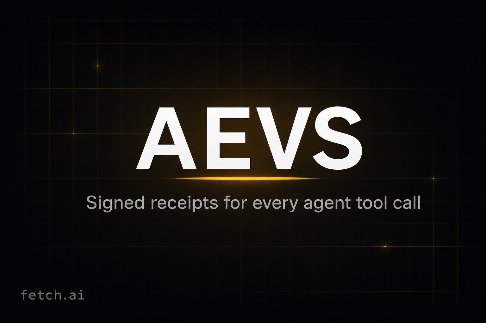
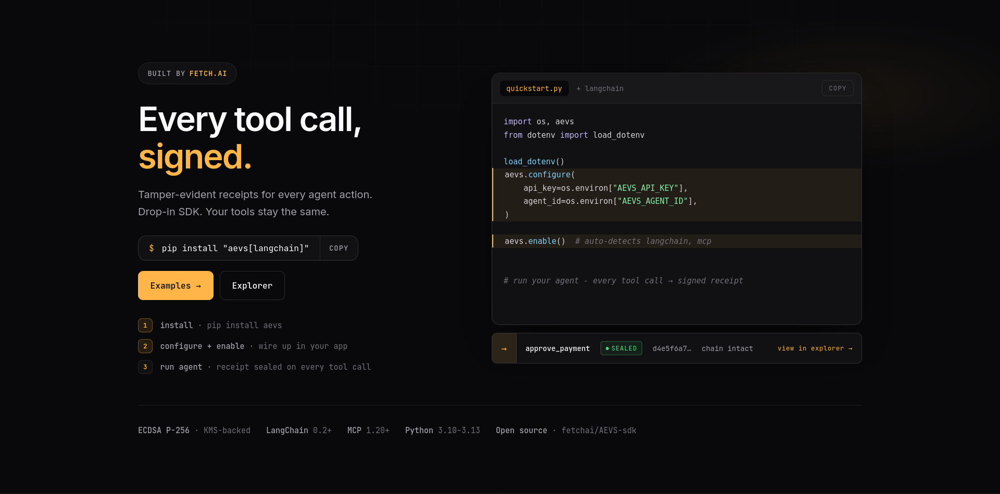
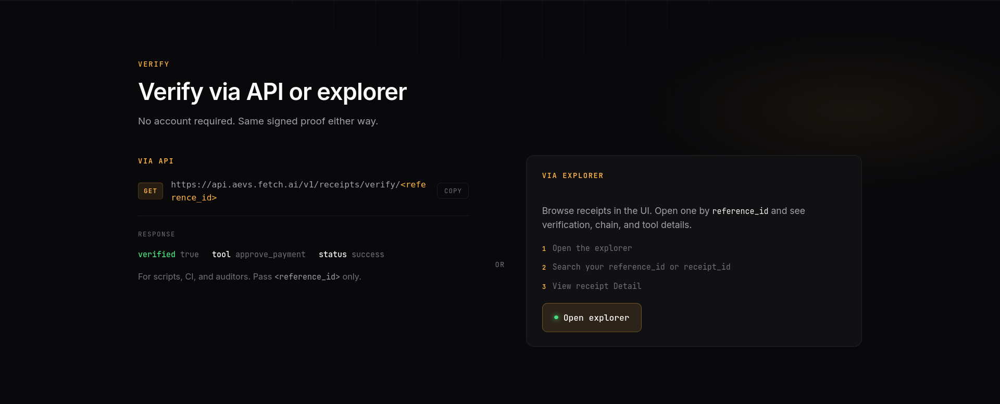

### 🎬 관련 영상
- [🎥 영상 보기](https://ph-files.imgix.net/36b6e0cb-df3e-41b9-b251-0fef66ce8117.jpeg?auto=format)

---

## 13. [Dropmatico](https://www.producthunt.com/products/dropmatico)
**Votes**: 102 | **도입 난이도**: 하 | **신뢰도**: 상
**Tagline**: Drop. Pick. Done.
**서비스 링크**: https://www.producthunt.com/r/CZC6HFUJFJLART

**태그**: DesignTool, Automation, Productivity, SocialMedia, E-commerce, Chat, Vision

### 📌 이 서비스 한눈에 보기
한 번의 작업으로 34개 이상의 플랫폼 맞춤형 이미지를 생성하는 워크플로우 자동화 도구

### 🔑 주요 기능
- 90개 이상의 프리셋을 통한 이미지 리사이징, 압축, 변환 통합 처리
- 인스타그램, 링크드인, 아마존, 쇼피파이 등 34개 플랫폼 최적화 지원
- 단 한 번의 작업(One pass)으로 모든 플랫폼용 이미지 생성 가능

### 🙋 사용자에게 어떤 점이 좋은가
여러 소셜 미디어와 이커머스 플랫폼에 이미지를 업로드할 때 발생하는 반복적인 편집 작업을 획기적으로 줄여줍니다.

### ✅ 지금 바로 써볼 기능
- 자주 사용하는 플랫폼별 프리셋 설정하기
- 한 장의 원본 이미지를 여러 플랫폼 규격으로 일괄 변환하기
- 이미지 압축 및 포맷 변환 기능 테스트하기

### ⚠️ 사용 전 확인할 점
- 플랫폼별 세부 디자인 가이드라인 준수 여부 확인 필요
- 대량 작업 시 처리 속도 및 워크플로우 효율성 검증 필요

### 🧭 확인이 더 필요한 정보
구체적인 요금제 체계와 대량 이미지 처리 시의 제한 사항에 대한 정보가 부족합니다.

### 📸 스크린샷 및 갤러리
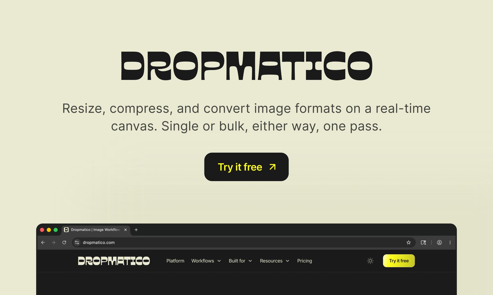
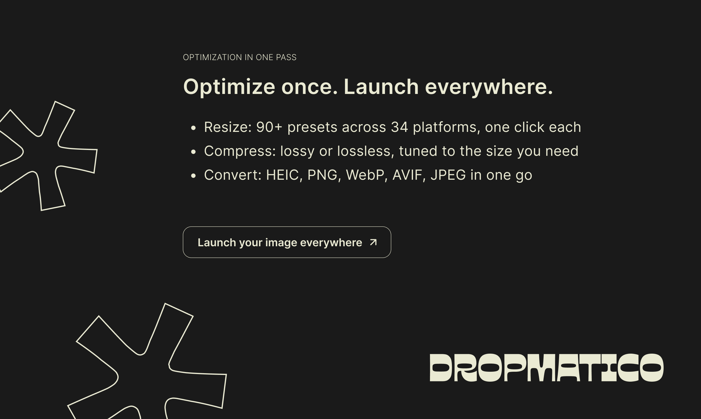
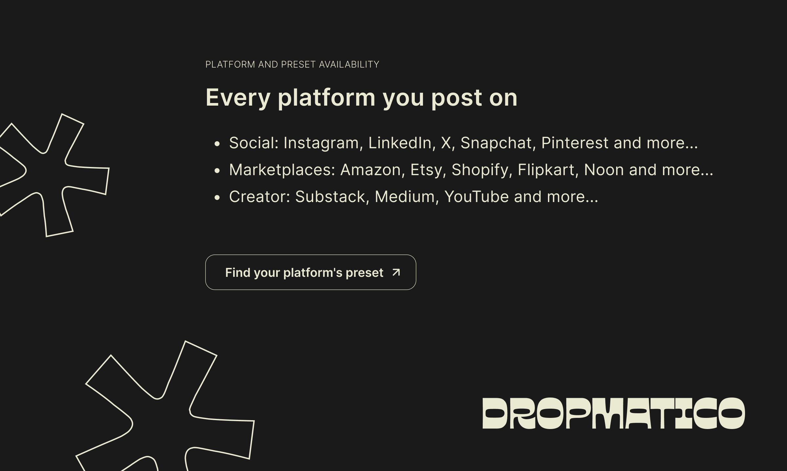

### 🎬 관련 영상
- [🎥 영상 보기](https://ph-files.imgix.net/902f27bb-3768-43bd-a509-2421ebfd04b5.jpeg?auto=format)

---

## 14. [MiMo Code](https://www.producthunt.com/products/mimo-3)
**Votes**: 101 | **도입 난이도**: 중 | **신뢰도**: 상
**Tagline**: A coding agent with explicit long-term memory architecture
**서비스 링크**: https://www.producthunt.com/r/FIW46O6GVDDJZP

**태그**: DevTool, AI Agent, OpenSource, Coding, Agent, Automation, AI Tool

### 📌 이 서비스 한눈에 보기
장기적인 프로젝트 수행에 최적화된 메모리 아키텍처 기반의 오픈소스 AI 코딩 에이전트

### 🔑 주요 기능
- 독립적인 체크포인트 서브에이전트를 통한 무제한 컨텍스트 관리
- 샌드박스 워크플로우를 통한 안전한 코드 실행 환경 제공
- 스케줄링된 유지보수를 통한 지속적인 모델 진화 및 최적화

### 🙋 사용자에게 어떤 점이 좋은가
복잡하고 긴 호흡이 필요한 코딩 작업에서도 문맥을 놓치지 않고 일관성 있는 결과물을 얻을 수 있습니다.

### ✅ 지금 바로 써볼 기능
- 터미널 환경에 OpenCode 기반 에이전트 설치 및 설정
- 장기적인 작업(Long-horizon tasks) 시나리오 테스트
- 샌드박스 내에서의 코드 실행 및 워크플로우 검증

### ⚠️ 사용 전 확인할 점
- 터미널 기반 도구이므로 CLI 환경 숙련도 필요
- 오픈소스 프로젝트로서 초기 설정 및 유지보수 비용 발생 가능성

### 🧭 확인이 더 필요한 정보
구체적인 시스템 리소스 요구사항과 설치 방법이 명시되지 않았습니다.

### 📸 스크린샷 및 갤러리
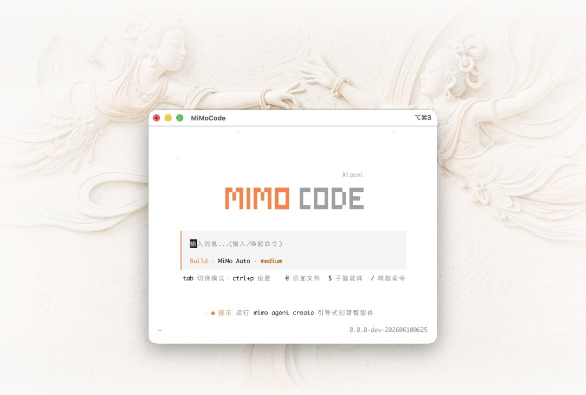
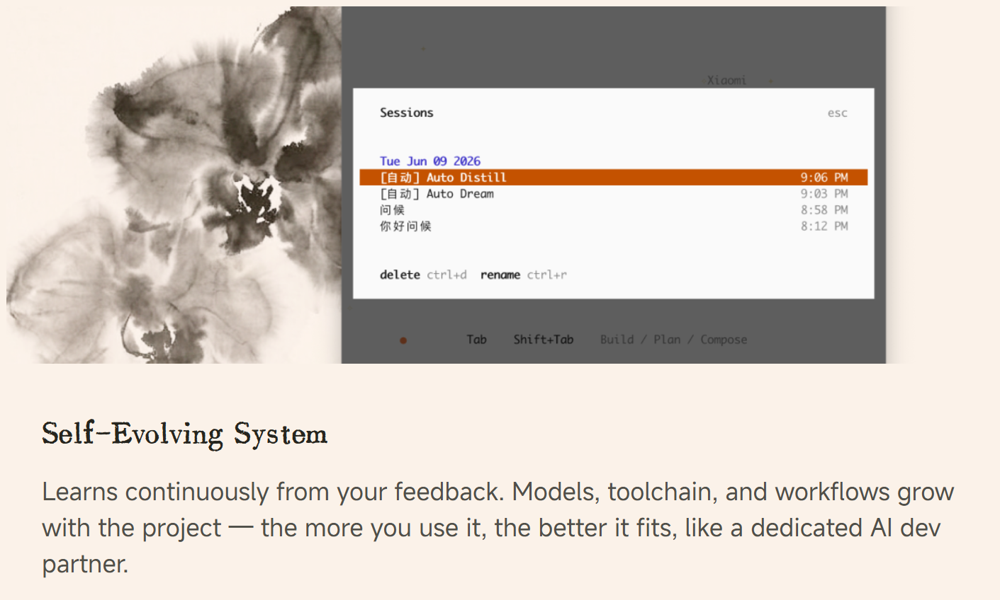
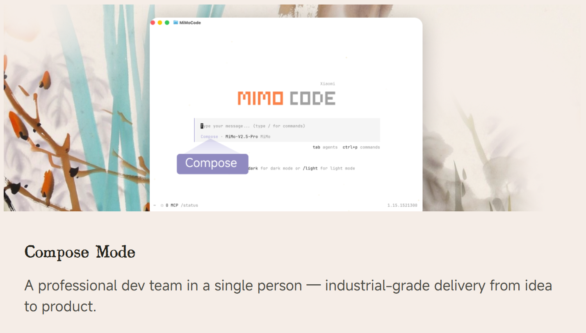

---

## 15. [Tinfoil Pigeons](https://www.producthunt.com/products/tinfoil-pigeons)
**Votes**: 100 | **도입 난이도**: 하 | **신뢰도**: 상
**Tagline**: See the aircraft flying over you on a retro radar scope
**서비스 링크**: https://www.producthunt.com/r/PFDDIY5D2NHQRY

**태그**: Lifestyle, Utility, Aviation, AI Tool, DevTool

### 📌 이 서비스 한눈에 보기
레트로 감성의 레이더 스코프로 실시간 항공기 위치를 확인하는 앱

### 🔑 주요 기능
- 레트로 스타일의 레이더 스코프 인터페이스 제공
- 우편번호 입력을 통한 실시간 상공 항공기 탐지
- 항공기 선택 시 상세 정보 확인 가능

### 🙋 사용자에게 어떤 점이 좋은가
내 머리 위를 지나가는 비행기가 무엇인지 궁금할 때, 직관적이고 감각적인 UI로 실시간 정보를 확인할 수 있습니다.

### ✅ 지금 바로 써볼 기능
- 현재 위치의 우편번호 입력하기
- 레이더에 포착된 항공기 탭하여 정보 확인하기
- 실시간 비행 경로 관찰하기

### ⚠️ 사용 전 확인할 점
- 실시간 데이터 업데이트 속도에 따른 오차 가능성
- 위치 기반 서비스이므로 정확한 우편번호 입력 필요

### 🧭 확인이 더 필요한 정보
제공되는 항공기 상세 정보의 범위와 정확도는 테스트를 통해 확인이 필요합니다.

### 📸 스크린샷 및 갤러리

---

## 16. [Verol](https://www.producthunt.com/products/verol)
**Votes**: 87 | **도입 난이도**: 하 | **신뢰도**: 상
**Tagline**: Stop AI hallucinations
**서비스 링크**: https://www.producthunt.com/r/MW5E43FOUBRG6R

**태그**: AI, Productivity, Fact-Checking, Browser Extension, AI Tool, LLM, Chat

### 📌 이 서비스 한눈에 보기
LLM의 환각 현상을 방지하기 위해 실시간 웹 검증과 출처 확인을 제공하는 독립적 검증 레이어

### 🔑 주요 기능
- ChatGPT, Claude, Gemini 등 주요 LLM에 대한 독립적인 검증 레이어 추가
- 실시간 웹 검색 및 백엔드 파이프라인을 통한 답변 분석 및 사실 확인
- 신뢰도 지표(Confidence metrics)와 클릭 가능한 출처 제공

### 🙋 사용자에게 어떤 점이 좋은가
AI의 답변이 사실인지 매번 의심할 필요 없이, 검증된 근거와 신뢰도 점수를 통해 정보의 정확성을 즉시 확인할 수 있습니다.

### ✅ 지금 바로 써볼 기능
- 5회의 무료 실행 기능을 통해 검증 정확도 테스트하기
- LLM 답변의 신뢰도 지표와 출처 확인 기능 사용해보기
- 주요 AI 모델(ChatGPT, Claude 등)과의 연동성 확인하기

### ⚠️ 사용 전 확인할 점
- 무료 사용 횟수(5회) 제한이 있으므로 테스트 후 유료 플랜 고려 필요
- 실시간 웹 검색 기반이므로 검색 결과의 품질에 따라 검증 결과가 달라질 수 있음

### 🧭 확인이 더 필요한 정보
제공되는 '신뢰도 지표'의 구체적인 산출 알고리즘과 검증 로직에 대한 상세 정보가 필요합니다.

### 📸 스크린샷 및 갤러리
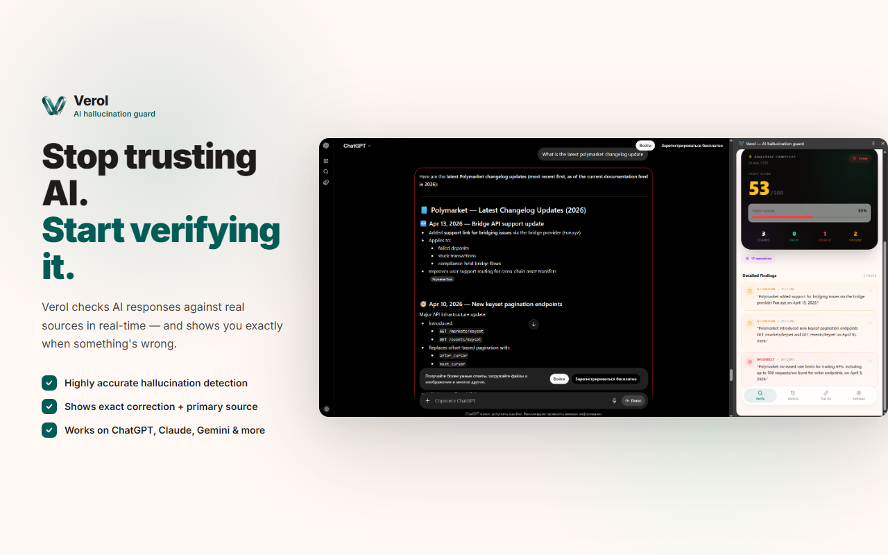
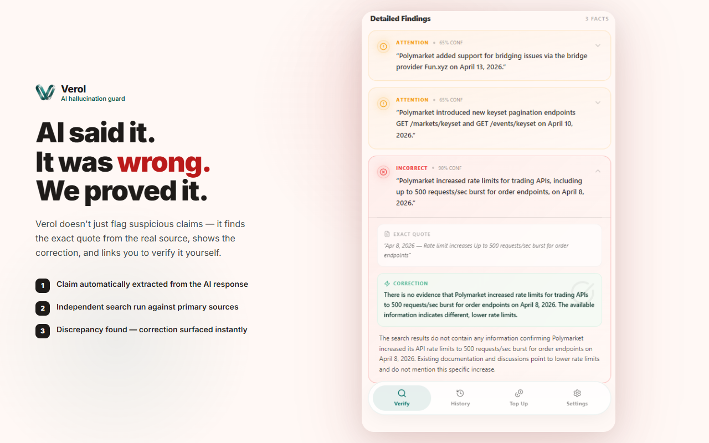
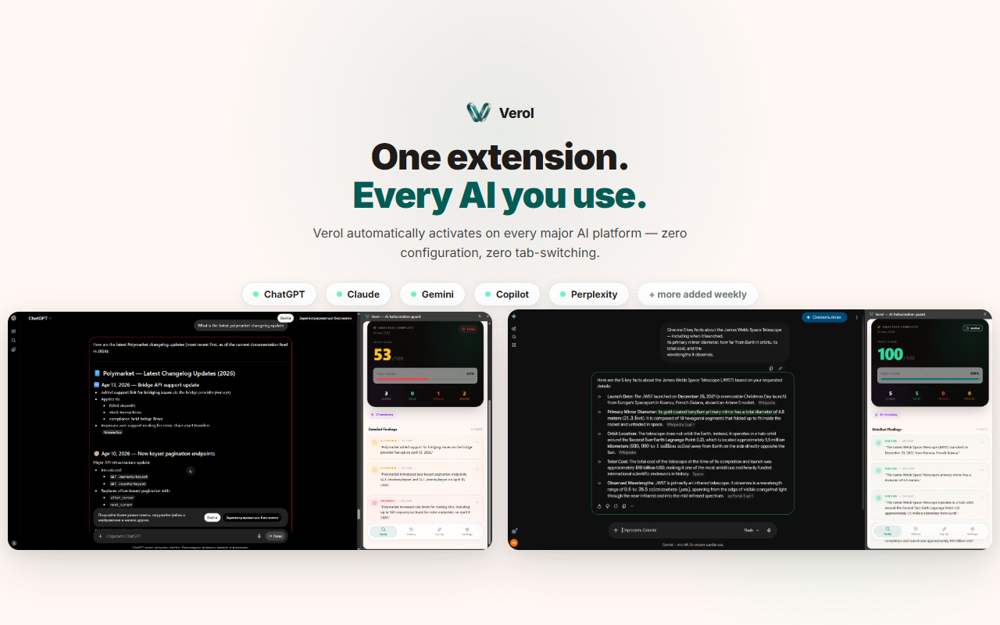

### 🎬 관련 영상
- [🎥 영상 보기](https://ph-files.imgix.net/fc1d3ad1-9375-42c3-80bd-0303e37f96d6.jpeg?auto=format)

---

## 17. [Relay](https://www.producthunt.com/products/relay-20)
**Votes**: 86 | **도입 난이도**: 하 | **신뢰도**: 상
**Tagline**: Paste a site & get an AI receptionist that learns from calls
**서비스 링크**: https://www.producthunt.com/r/XAE4C4TNQIMRPV

**태그**: AI, Automation, CustomerService, Scheduling, AI Tool

### 📌 이 서비스 한눈에 보기
웹사이트 링크만으로 24시간 예약 및 응대가 가능한 AI 전화 비서를 구축하세요.

### 🔑 주요 기능
- 웹사이트 URL 입력만으로 즉시 AI 전화 응대 시스템 생성
- Google Calendar, Calendly 등 주요 일정 관리 도구와 자동 연동
- 비즈니스 데이터 기반의 정확한 답변 및 통화 학습 기능

### 🙋 사용자에게 어떤 점이 좋은가
직원이 없는 시간에도 놓치는 예약 없이 24시간 자동 응대가 가능하며, 기존 일정 관리 툴과 연동되어 업무 효율을 극대화합니다.

### ✅ 지금 바로 써볼 기능
- 자사 웹사이트 링크를 입력하여 AI 비서 생성하기
- 사용 중인 캘린더(Google, Outlook 등) 연동하기
- AI의 답변 정확도를 높이기 위한 데이터 학습 및 승인 프로세스 확인하기

### ⚠️ 사용 전 확인할 점
- AI가 비즈니스 정보를 정확히 학습했는지 초기 검증 필요
- 전화 통화 품질 및 네트워크 환경에 따른 응답 지연 가능성

### 🧭 확인이 더 필요한 정보
지원하는 통신망(전화번호 제공 방식) 및 구체적인 통화 요금 체계에 대한 정보가 명시되지 않았습니다.

### 📸 스크린샷 및 갤러리

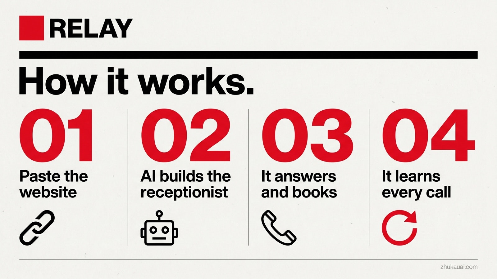
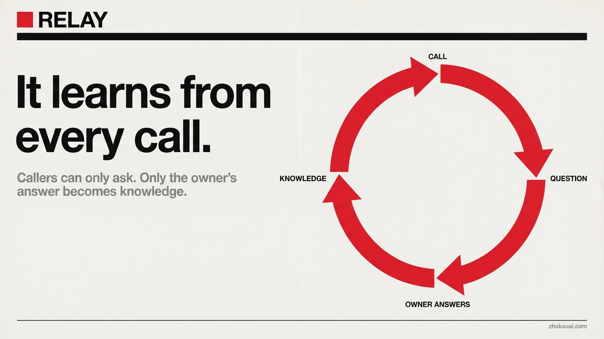

### 🎬 관련 영상
- [🎥 영상 보기](https://ph-files.imgix.net/c1e263c4-be83-4324-8fd7-f7ebadebe74c.jpeg?auto=format)

---

## 18. [Momentra](https://www.producthunt.com/products/momentra-aesthetic-camera)
**Votes**: 85 | **도입 난이도**: 하 | **신뢰도**: 상
**Tagline**: A cozy camera app for beautifully framed memories
**서비스 링크**: https://www.producthunt.com/r/K6NMBR7L2VP22L

**태그**: Photography, Aesthetic, Mobile App, Social Media

### 📌 이 서비스 한눈에 보기
일상의 사진을 감성적인 프레임으로 담아내는 코지(Cozy) 스타일 카메라 앱

### 🔑 주요 기능
- Postcard, Retro Wave 등 7가지 독창적인 예술적 프레임 스타일 제공
- 직접 촬영하거나 기존 사진을 불러와 즉시 스타일링 가능
- 다이어리 꾸미기나 SNS 공유에 최적화된 감성적인 디자인

### 🙋 사용자에게 어떤 점이 좋은가
평범한 일상 사진을 별도의 복잡한 편집 없이도 잡지나 엽서 같은 감성적인 결과물로 변환하여 SNS에 공유하기 좋습니다.

### ✅ 지금 바로 써볼 기능
- 7가지 다양한 프레임 스타일 적용해보기
- 기존 사진을 불러와 프레임 스타일링하기
- 완성된 결과물을 기기에 저장하거나 SNS에 공유하기

### ⚠️ 사용 전 확인할 점
- 특정 예술적 스타일 위주의 앱이므로 정교한 사진 보정 기능은 부족할 수 있음
- 프레임 스타일 외의 세부적인 사진 편집 기능 제공 여부는 미정

### 🧭 확인이 더 필요한 정보
상세한 편집 도구(밝기, 대비 등)의 포함 여부와 유료 구독 모델 존재 여부가 명시되지 않았습니다.

### 📸 스크린샷 및 갤러리

---

## 19. [VEXI](https://www.producthunt.com/products/vexi)
**Votes**: 84 | **도입 난이도**: 하 | **신뢰도**: 상
**Tagline**: Open-source AI coding agent for your terminal
**서비스 링크**: https://www.producthunt.com/r/JK6V57BJLNNJ2F

**태그**: DevTool, AI, CLI, OpenSource, Automation, Agent, AI Tool, API

### 📌 이 서비스 한눈에 보기
터미널 환경에 최적화된 오픈소스 AI 코딩 에이전트

### 🔑 주요 기능
- 터미널 기반의 가볍고 빠른 CLI 환경 제공
- 사용자 개인 API 키(OpenAI, Anthropic 등)를 통한 유연한 모델 연결
- 코딩, 디버깅, 리팩토링 및 자동화를 지원하는 멀티링구얼 에이전트

### 🙋 사용자에게 어떤 점이 좋은가
개발자가 익숙한 터미널을 떠나지 않고도 AI의 도움을 받아 작업 속도를 높이고 자동화 워크플로우를 구축할 수 있습니다.

### ✅ 지금 바로 써볼 기능
- CLI 설치 및 환경 설정
- 개인 API 키 연결 및 모델 테스트
- 기존 코드베이스에 대한 리팩토링 및 디버깅 명령 실행

### ⚠️ 사용 전 확인할 점
- 개인 API 키를 직접 사용하므로 사용량에 따른 비용 발생 주의
- 오픈소스 도구로서 로컬 환경 설정 및 의존성 확인 필요

### 🧭 확인이 더 필요한 정보
지원하는 프로그래밍 언어의 범위와 복잡한 프로젝트에서의 안정성은 직접 테스트가 필요합니다.

### 📸 스크린샷 및 갤러리
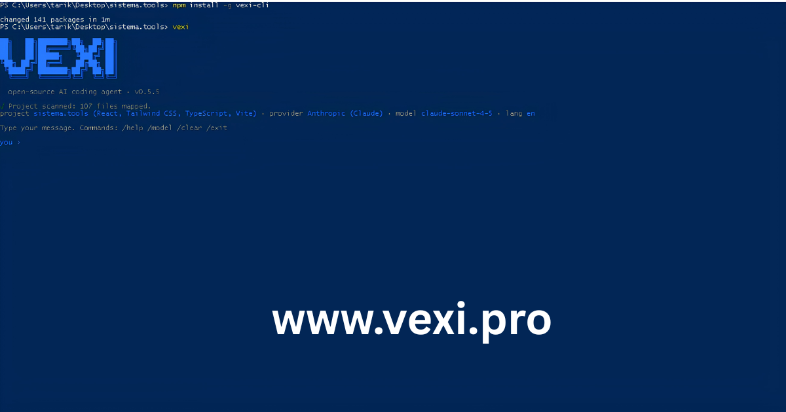
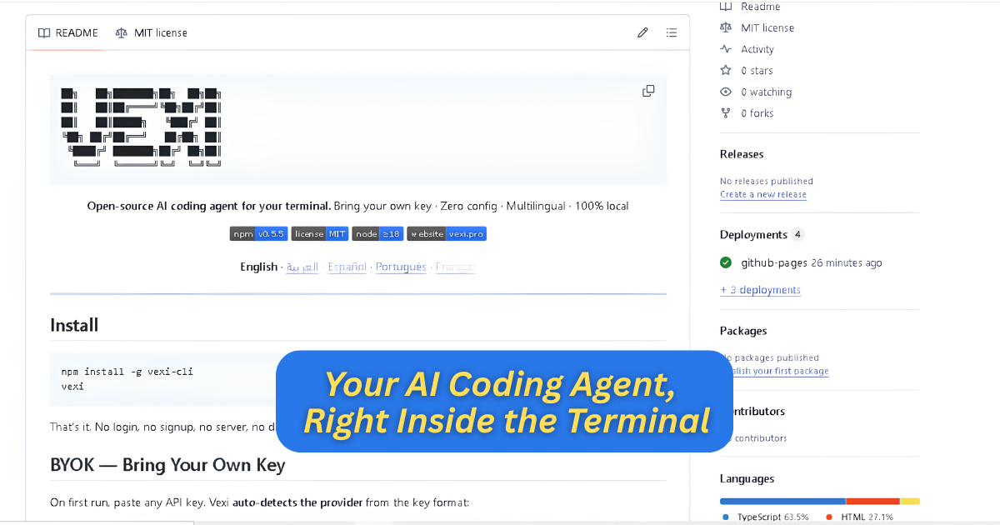
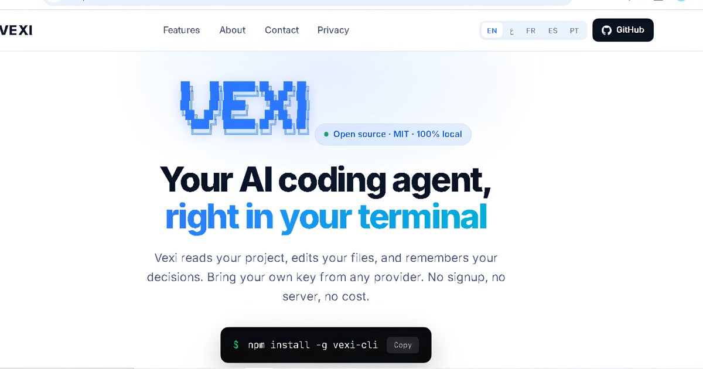

---

## 20. [stackd.cc](https://www.producthunt.com/products/stackd-cc)
**Votes**: 84 | **도입 난이도**: 하 | **신뢰도**: 상
**Tagline**: The answer to "what's your AI stack?"
**서비스 링크**: https://www.producthunt.com/r/H4E3NC57JDAGO6

**태그**: AI, TechStack, Trend, DeveloperTools, AI Tool

### 📌 이 서비스 한눈에 보기
실제 빌더들이 사용하는 최신 AI 도구 조합을 실시간으로 확인할 수 있는 스택 리더보드

### 🔑 주요 기능
- 실제 사용자들이 구축한 AI 기술 스택 공유
- 도구 간의 조합(Pairing) 및 트렌드 파악 가능
- 실시간 리더보드를 통한 인기 AI 도구 탐색

### 🙋 사용자에게 어떤 점이 좋은가
어떤 AI 도구를 함께 사용해야 시너지가 나는지, 현재 업계에서 어떤 스택이 유행하는지 빠르게 파악하여 기술 선택의 시행착오를 줄여줍니다.

### ✅ 지금 바로 써볼 기능
- 현재 가장 인기 있는 AI 스택 리더보드 확인하기
- 트렌드에 맞는 새로운 도구 조합 탐색하기
- 자신의 스택과 비교해보기

### ⚠️ 사용 전 확인할 점
- 사용자 데이터의 신뢰성 및 편향성 가능성
- 실제 업무 환경과의 차이가 있을 수 있음

### 🧭 확인이 더 필요한 정보
사용자들의 스택이 얼마나 정기적으로 업데이트되는지, 데이터의 신뢰도가 어느 정도인지 확인이 필요합니다.

### 📸 스크린샷 및 갤러리
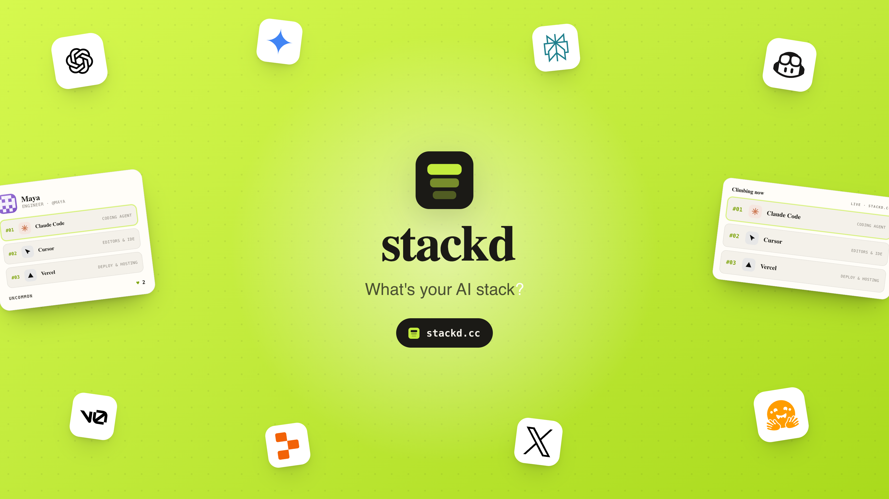
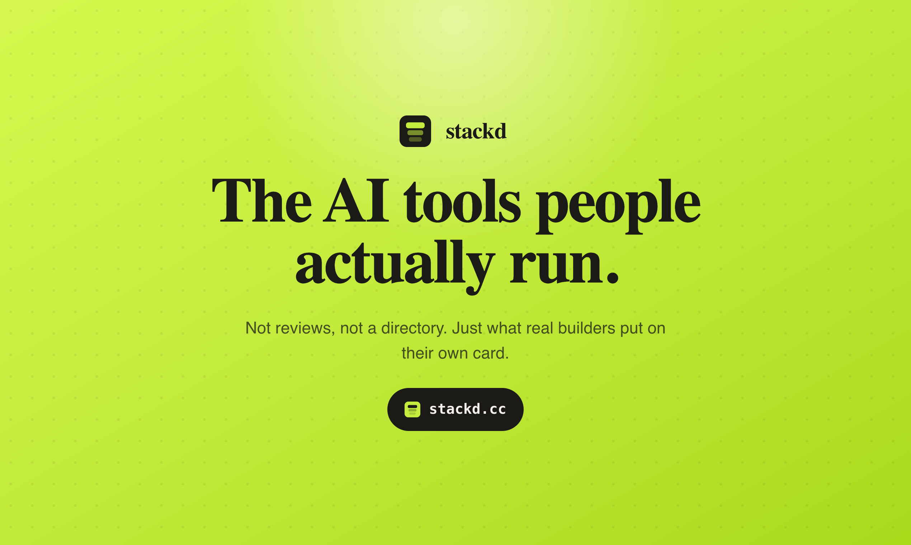
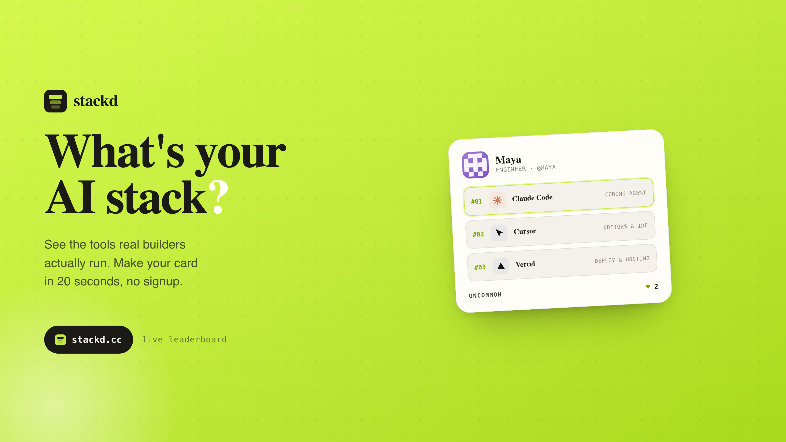

---

## 21. [EmailFlow.AI](https://www.producthunt.com/products/emailflow-ai-b2b-lead-generation)
**Votes**: 84 | **도입 난이도**: 하 | **신뢰도**: 상
**Tagline**: Like Claude Design for Email Newsletters
**서비스 링크**: https://www.producthunt.com/r/UVAVAR2QCINYUM

**태그**: AI, EmailMarketing, Automation, SaaS, AI Tool, Prompting, Design, Email

### 📌 이 서비스 한눈에 보기
텍스트 프롬프트만으로 브랜드 맞춤형 뉴스레터를 생성하고 자동 발송까지 해결하는 AI 이메일 마케팅 도구

### 🔑 주요 기능
- 웹사이트 스캔을 통한 로고, 색상, 브랜드 보이스 자동 반영
- 12,000개 이상의 템플릿과 시각적 자동화 기능 제공
- 구독자 수 기반이 아닌 고정 가격 정책 및 강력한 무료 플랜

### 🙋 사용자에게 어떤 점이 좋은가
브랜드 디자인 역량이 부족해도 텍스트 입력만으로 전문적인 뉴스레터를 제작할 수 있으며, 구독자 수에 따른 비용 부담 없이 자동화된 캠페인 운영이 가능합니다.

### ✅ 지금 바로 써볼 기능
- 웹사이트 스캔을 통한 브랜드 스타일 자동 추출 기능 테스트
- 무료 플랜(월 5,000통 발송)을 통한 초기 캠페인 실행
- 프롬프트를 활용한 뉴스레터 디자인 생성 실험

### ⚠️ 사용 전 확인할 점
- 무료 플랜의 경우 구독자 수 제한(500명)이 있음
- 도메인 인증 및 발송 설정 등 초기 셋업 과정 필요

### 🧭 확인이 더 필요한 정보
제공되는 12,000개 이상의 템플릿이 모든 산업군에 최적화되어 있는지 확인이 필요합니다.

### 📸 스크린샷 및 갤러리
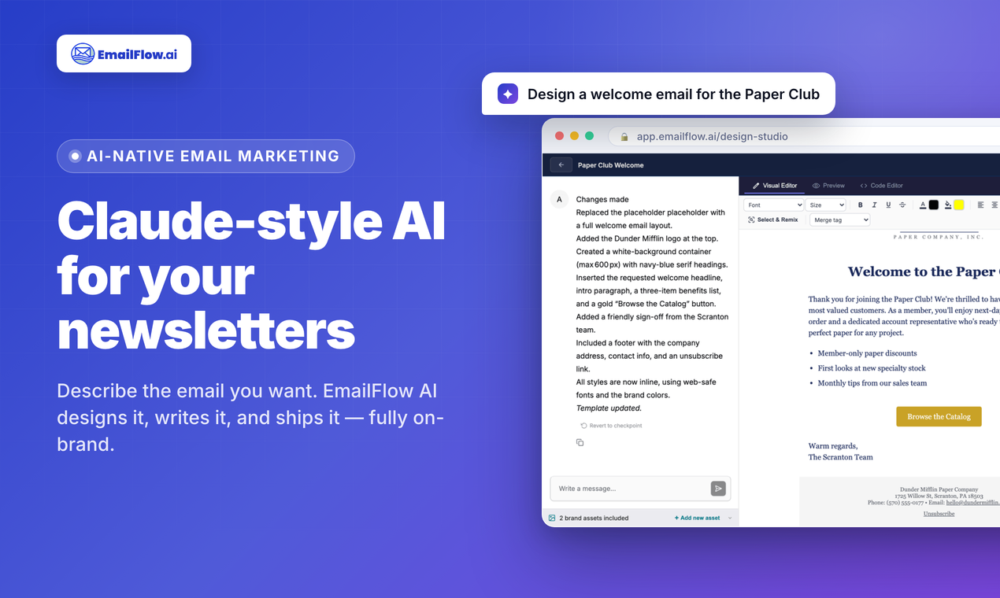
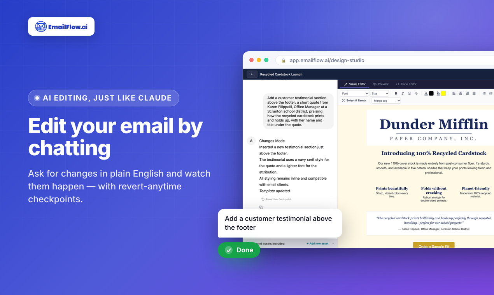
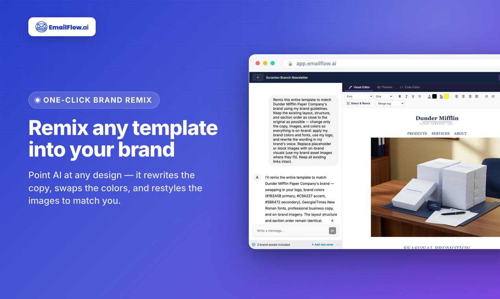

---

## 22. [ColibotAI](https://www.producthunt.com/products/colibotai)
**Votes**: 83 | **도입 난이도**: 중 | **신뢰도**: 상
**Tagline**: Translate, summarize & explain any text on-device
**서비스 링크**: https://www.producthunt.com/r/4AQBOHI3LQ7N3A

**태그**: Productivity, Privacy, AI, BrowserExtension, LocalLLM, AI Tool, Analytics

### 📌 이 서비스 한눈에 보기
개인정보 유출 걱정 없이 원하는 AI 모델을 직접 선택해 텍스트를 처리하는 로컬 중심 AI 확장 프로그램

### 🔑 주요 기능
- 사용자가 직접 엔진 선택 가능 (Chrome 내장 AI, API 키, 로컬 모델)
- 데이터가 서버로 전송되지 않는 강력한 프라이버시 보호
- 계정 생성이나 트래킹 없이 로컬에 저장되는 검색 가능한 노트 기능

### 🙋 사용자에게 어떤 점이 좋은가
민감한 문서를 다룰 때 데이터 유출 걱정 없이 번역, 요약, 설명을 수행할 수 있으며, 비용 효율적인 로컬 모델 활용이 가능합니다.

### ✅ 지금 바로 써볼 기능
- Chrome 내장 AI를 활용한 무료 텍스트 요약 테스트
- Ollama 또는 LM Studio를 연동한 완전 로컬 환경 구축
- 자신의 API 키(Claude, GPT 등)를 연결하여 성능 비교

### ⚠️ 사용 전 확인할 점
- 로컬 모델 사용 시 사용자의 컴퓨터 사양(GPU/RAM)에 따라 성능 차이 발생
- API 키 직접 입력 방식이므로 키 관리 및 보안 주의 필요

### 🧭 확인이 더 필요한 정보
사용자의 하드웨어 사양에 따른 최적의 로컬 모델 설정 방법은 별도의 확인이 필요합니다.

### 📸 스크린샷 및 갤러리
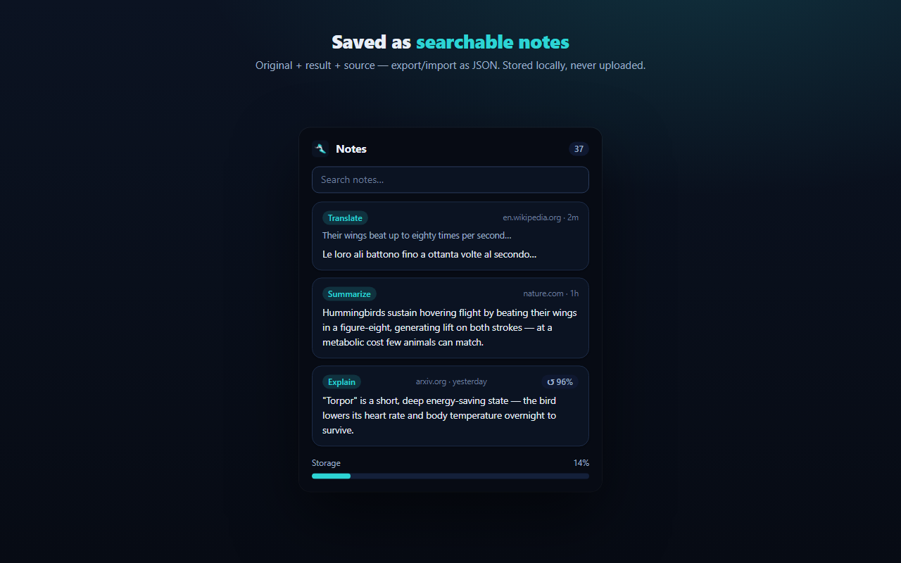
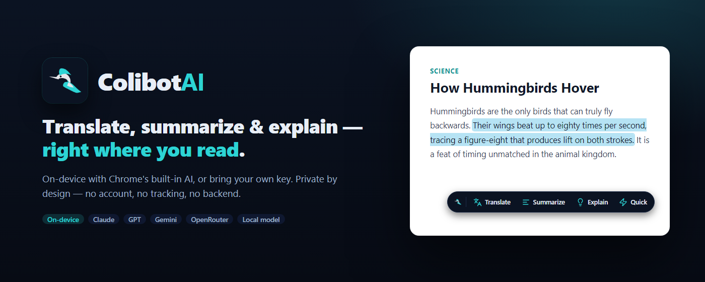
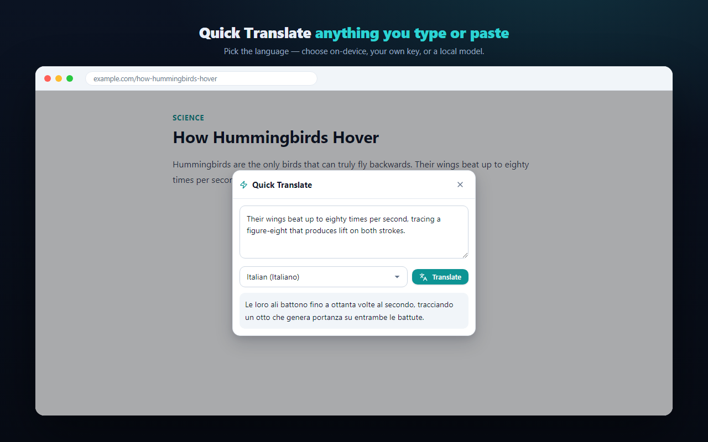

---

## 23. [IdleDev](https://www.producthunt.com/products/idledev)
**Votes**: 79 | **도입 난이도**: 하 | **신뢰도**: 상
**Tagline**: Get paid while your AI agent thinks
**서비스 링크**: https://www.producthunt.com/r/S4SZDJ3O47DUCR

**태그**: DevTool, PassiveIncome, ClaudeCode, Agent, AI Tool, Prompting

### 📌 이 서비스 한눈에 보기
코딩 중 Claude Code 상태 표시줄에 광고를 노출하여 수익을 창출하는 개발자용 도구

### 🔑 주요 기능
- Claude Code 상태 표시줄에 광고를 삽입하는 방식
- 광고 수익의 65%를 사용자에게 배분
- 팝업이나 브라우저 없이 개발 흐름을 방해하지 않는 설계

### 🙋 사용자에게 어떤 점이 좋은가
개발 업무 흐름을 방해하지 않으면서, 코딩 중 발생하는 유휴 시간을 활용해 소소한 수익을 얻을 수 있습니다.

### ✅ 지금 바로 써볼 기능
- 30초 내 설치 프로세스 경험하기
- Claude Code 환경에서의 광고 노출 확인하기

### ⚠️ 사용 전 확인할 점
- 광고 노출이 개발 집중도에 미칠 수 있는 심리적 영향
- 수익 규모가 사용자의 기대치에 미치지 못할 가능성

### 🧭 확인이 더 필요한 정보
광고 노출 방식이 구체적으로 어떤 형태의 시각적 요소를 차지하는지 확인이 필요합니다.

### 📸 스크린샷 및 갤러리
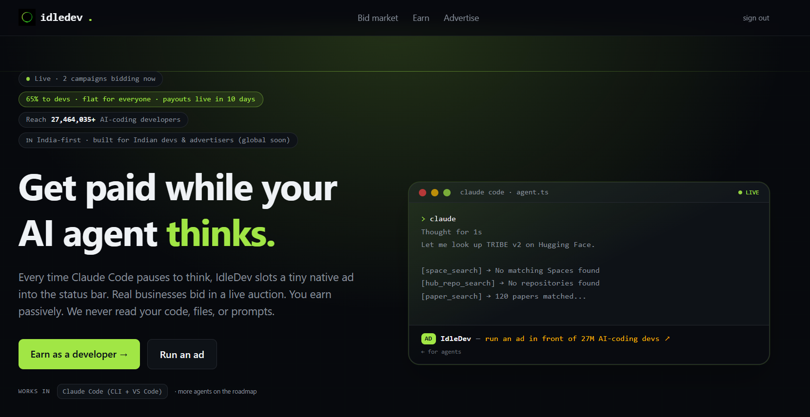
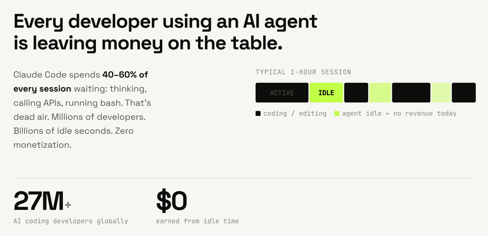
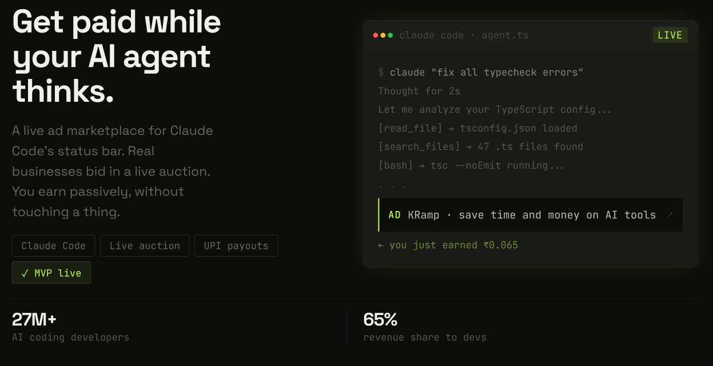

---

## 24. [Notchcode](https://www.producthunt.com/products/notchcode)
**Votes**: 79 | **도입 난이도**: 하 | **신뢰도**: 상
**Tagline**: Claude Code + Codex agents in your notch
**서비스 링크**: https://www.producthunt.com/r/Z7CAMPJRG5BQFM

**태그**: DevTool, AI-Agent, Productivity, OpenSource, Agent, AI Tool

### 📌 이 서비스 한눈에 보기
맥북 노치(Notch)를 활용해 AI 코딩 에이전트의 상태를 실시간으로 모니터링하는 툴

### 🔑 주요 기능
- 노치 영역을 활용한 AI 에이전트(Claude Code, Codex)의 시각적 상태 표시
- 에이전트의 입력 필요 시 노치 발광 및 원터치 터미널 포커싱 기능
- 로컬 실행 기반의 높은 보안성 및 오픈소스(MIT) 라이선스

### 🙋 사용자에게 어떤 점이 좋은가
여러 개의 AI 에이전트를 동시에 실행할 때 발생하는 작업 흐름의 단절을 방지하고, 에이전트의 상태를 직관적으로 파악할 수 있습니다.

### ✅ 지금 바로 써볼 기능
- Claude Code 또는 Codex 에이전트 설치 및 설정
- 노치 영역을 통한 에이전트 알림 및 터미널 전환 테스트
- 주간 에이전트 사용량 리포트 확인

### ⚠️ 사용 전 확인할 점
- 노치/필 디자인이 적용된 특정 하드웨어 환경에 최적화되어 있음
- 에이전트 세션이 많아질 경우 시각적 피로도가 발생할 수 있음

### 🧭 확인이 더 필요한 정보
사용자의 특정 터미널 환경이나 OS 버전에서의 호환성 세부 사항은 추가 확인이 필요합니다.

### 📸 스크린샷 및 갤러리
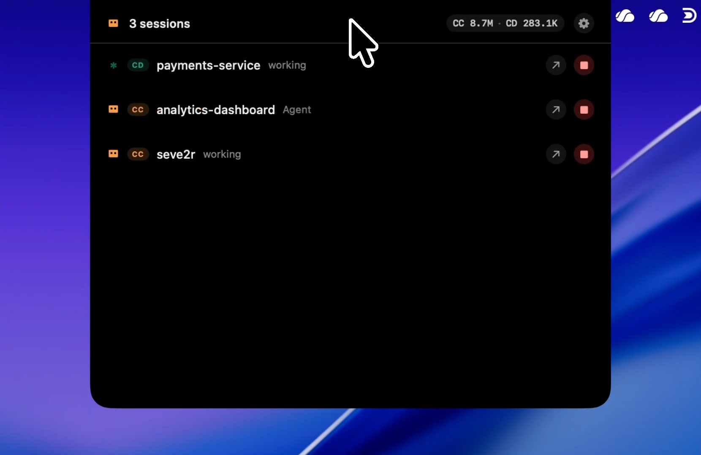
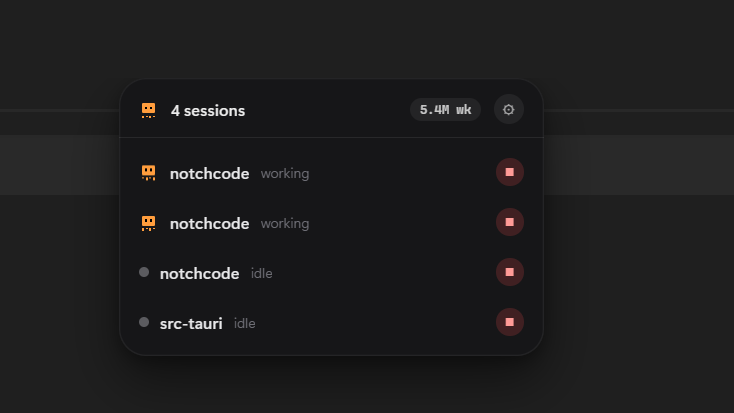

### 🎬 관련 영상
- [🎥 영상 보기](https://ph-files.imgix.net/0170ac0e-7c80-4e0c-b3a4-93923cf8eae4.jpeg?auto=format)

---

## 25. [termique](https://www.producthunt.com/products/termique)
**Votes**: 78 | **도입 난이도**: 하 | **신뢰도**: 상
**Tagline**: SSH without the usual friction
**서비스 링크**: https://www.producthunt.com/r/OMH7ZVGW6XHI5Z

**태그**: DevTool, SSH, Terminal, Productivity, AI Tool

### 📌 이 서비스 한눈에 보기
AI 지원과 강력한 보안을 결합한 멀티 플랫폼 SSH 관리자 및 터미널 클라이언트

### 🔑 주요 기능
- macOS, Windows, Linux를 모두 지원하는 크로스 플랫폼 터미널
- AI 기반 명령 제안 및 SFTP 기능 통합
- AES-GCM 암호화를 통한 안전한 자격 증명 관리

### 🙋 사용자에게 어떤 점이 좋은가
복잡한 SSH 설정과 명령어를 AI의 도움을 받아 간소화하고, 보안이 강화된 환경에서 편리하게 서버를 관리할 수 있습니다.

### ✅ 지금 바로 써볼 기능
- AI 어시스턴트를 활용한 명령어 생성 테스트
- 호스트 그룹 기능을 통한 서버 목록 정리
- SFTP 기능을 통한 파일 전송 워크플로우 확인

### ⚠️ 사용 전 확인할 점
- AI 기능 사용 시 데이터 프라이버시 정책 확인 필요
- 무료 버전의 기능 제한 범위 확인 필요

### 🧭 확인이 더 필요한 정보
무료 버전과 유료 버전 간의 구체적인 기능 차이 및 AI 사용량 제한에 대한 정보가 명시되지 않았습니다.

### 📸 스크린샷 및 갤러리
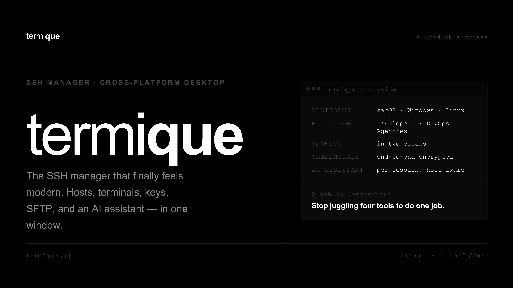
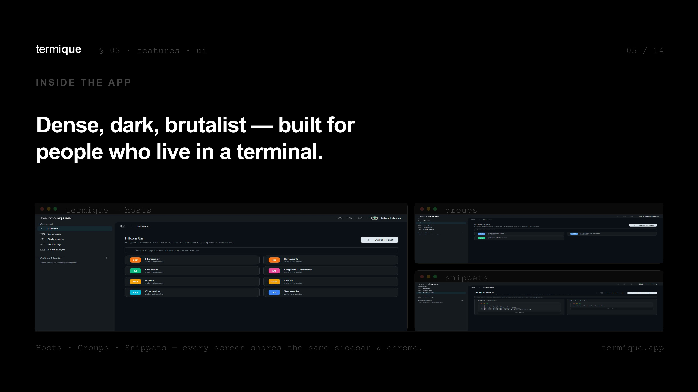
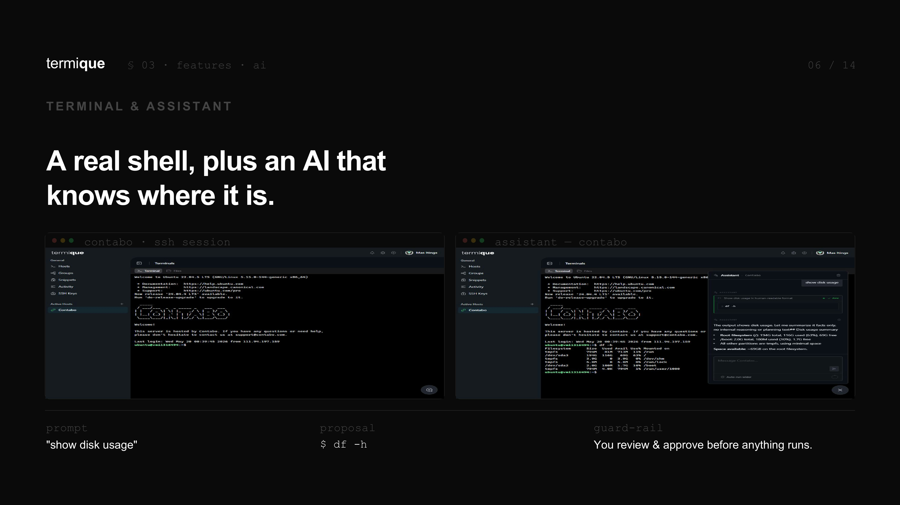

---

## 26. [Ultramemory](https://www.producthunt.com/products/ultramemory-remembers-everything)
**Votes**: 78 | **도입 난이도**: 하 | **신뢰도**: 상
**Tagline**: Private AI memory for your Mac with no cloud or account
**서비스 링크**: https://www.producthunt.com/r/LW5P7FCA2CVS5P

**태그**: Productivity, AI, Privacy, Mac, OpenSource, AI Tool, Email

### 📌 이 서비스 한눈에 보기
클라우드 없이 내 Mac에 저장된 모든 데이터를 안전하게 검색하고 질문할 수 있는 로컬 AI 메모리

### 🔑 주요 기능
- 이메일, 슬랙, 파일, 스크린샷 등 개인 데이터를 통합 검색 가능
- 클라우드나 계정 없이 Mac 로컬 환경에서만 작동하는 강력한 프라이버시
- 출처(Citation)를 제공하여 답변의 정확성을 직접 확인할 수 있는 기능

### 🙋 사용자에게 어떤 점이 좋은가
개인적인 업무 데이터나 민감한 정보가 포함된 파일들을 외부 유출 걱정 없이 AI로 분석하고 빠르게 찾아낼 수 있습니다.

### ✅ 지금 바로 써볼 기능
- 기존 업무 파일 및 스크린샷 데이터 연동하기
- 자연어 질문을 통해 필요한 정보 찾아보기
- 제공되는 인용구를 통해 답변의 근거 확인하기

### ⚠️ 사용 전 확인할 점
- 로컬 실행 방식이므로 Mac의 시스템 리소스(CPU/RAM) 사용량 확인 필요
- 데이터 양이 방대할 경우 초기 인덱싱 시간에 영향이 있을 수 있음

### 🧭 확인이 더 필요한 정보
로컬 환경에서의 구체적인 하드웨어 사양 요구사항과 데이터 인덱싱 속도에 대한 정보가 필요합니다.

### 📸 스크린샷 및 갤러리
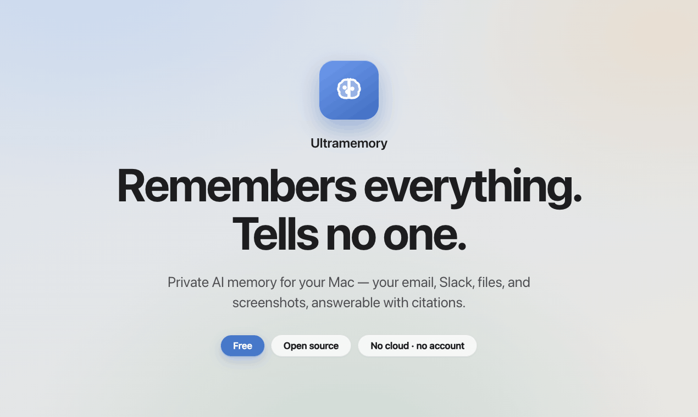
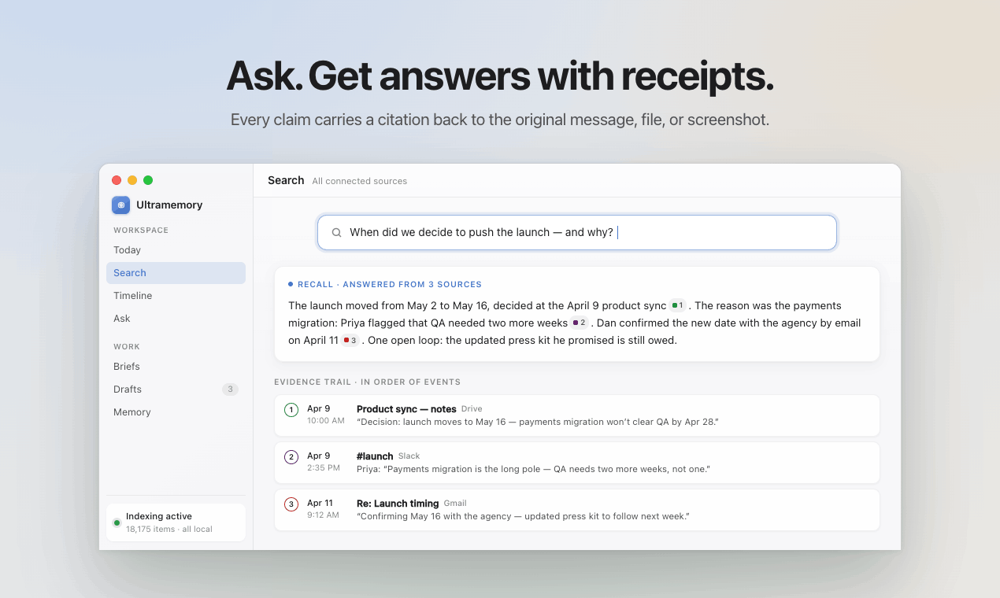
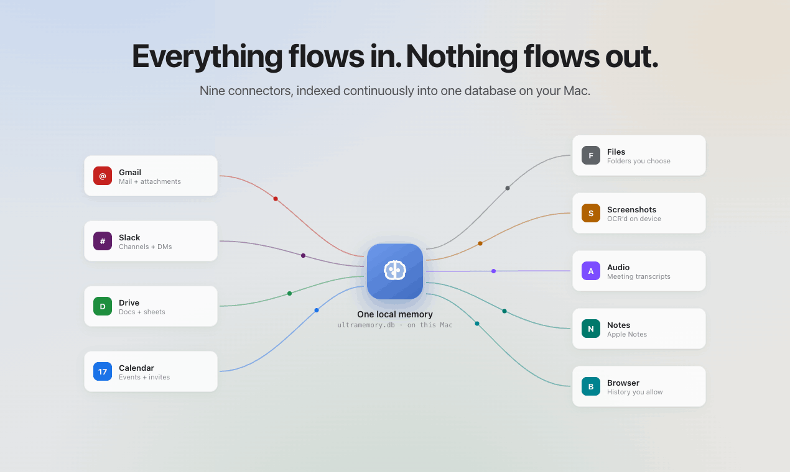

### 🎬 관련 영상
- [🎥 영상 보기](https://ph-files.imgix.net/b174db4b-b02d-4aa4-9a09-d0e5366cb3b3.jpeg?auto=format)

---

## 27. [AgentBrush](https://www.producthunt.com/products/agentbrush)
**Votes**: 78 | **도입 난이도**: 하 | **신뢰도**: 상
**Tagline**: Your coding agent's missing tool: image generation
**서비스 링크**: https://www.producthunt.com/r/C2Q4EVA2DFA7GS

**태그**: DevTool, AI-Agent, DesignAutomation, Workflow, Agent, Vision

### 📌 이 서비스 한눈에 보기
코딩 에디터 내에서 브랜드 일관성을 유지하며 이미지를 생성하는 MCP 서버

### 🔑 주요 기능
- Claude Code, Cursor, Windsurf 등 주요 AI 에디터와 연동되는 MCP 서버
- 한 번의 브랜드 설정으로 아이콘, OG 카드, 마스코트 등 일관된 스타일 유지
- 에디터를 벗어나지 않고 코드 저장소 내에 직접 이미지 생성 및 저장

### 🙋 사용자에게 어떤 점이 좋은가
개발자가 디자인 툴로 이동하는 번거로움 없이, 개발 흐름을 유지하며 프로젝트에 필요한 그래픽 자산을 즉시 확보할 수 있습니다.

### ✅ 지금 바로 써볼 기능
- 사용 중인 AI 에디터(Cursor, Windsurf 등)에 MCP 서버로 등록하기
- 프로젝트 고유의 브랜드 가이드라인 입력하기
- 생성된 이미지를 리포지토리에 바로 적용해보기

### ⚠️ 사용 전 확인할 점
- MCP 서버 설치 및 환경 설정 과정이 필요함
- 이미지 생성 모델의 품질이나 스타일 제어 범위 확인 필요

### 🧭 확인이 더 필요한 정보
지원하는 구체적인 이미지 생성 모델과 상세한 설정 방법은 공식 문서를 통해 확인이 필요합니다.

### 📸 스크린샷 및 갤러리
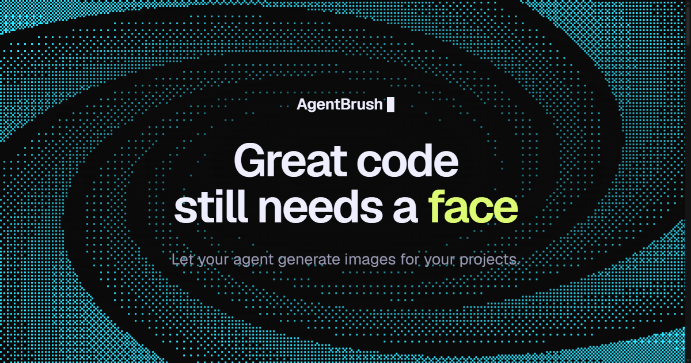

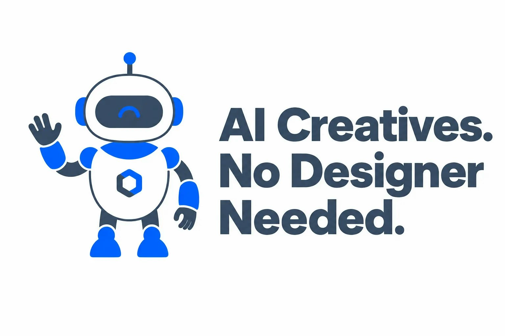

---

## 28. [Capecho](https://www.producthunt.com/products/capecho)
**Votes**: 77 | **도입 난이도**: 하 | **신뢰도**: 상
**Tagline**: Capture new words with context & remember them with SRS
**서비스 링크**: https://www.producthunt.com/r/FBBS2ZPS23Q2L4

**태그**: LanguageLearning, AI, Productivity, OCR, Education, AI Tool

### 📌 이 서비스 한눈에 보기
OCR과 AI를 활용해 문맥 속 단어를 쉽고 빠르게 학습하는 스마트 단어장

### 🔑 주요 기능
- OCR 기술을 통한 간편한 단어 캡처
- AI를 활용한 문맥 이해 및 의미 파악
- FSRS 알고리즘 기반의 효율적인 망각 방지 복습

### 🙋 사용자에게 어떤 점이 좋은가
읽고 있는 텍스트에서 모르는 단어를 즉시 추출하고, AI의 도움을 받아 문맥과 함께 학습하여 기억력을 극대화할 수 있습니다.

### ✅ 지금 바로 써볼 기능
- OCR로 모르는 단어 캡처해보기
- AI가 제공하는 문장 의미 확인하기
- FSRS 기반 복습 스케줄 경험하기

### ⚠️ 사용 전 확인할 점
- OCR 성능에 따른 텍스트 인식 정확도 차이
- AI 분석 결과의 문맥적 정확성 확인 필요

### 🧭 확인이 더 필요한 정보
지원하는 언어 범위와 모바일/데스크톱 플랫폼 지원 여부에 대한 정보가 추가로 필요합니다.

### 📸 스크린샷 및 갤러리
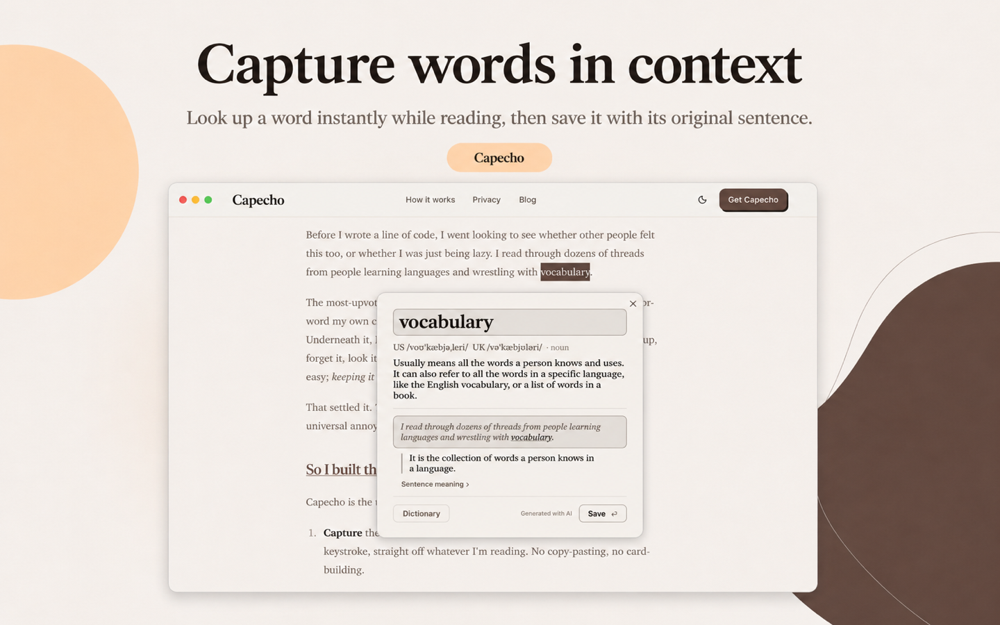
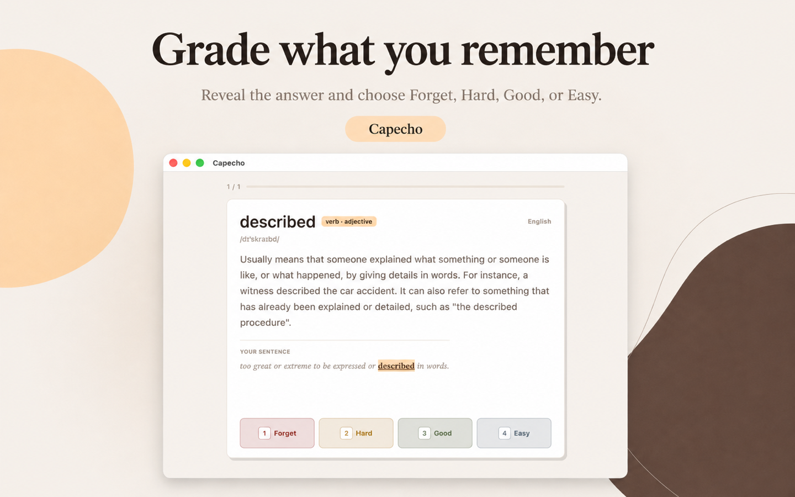
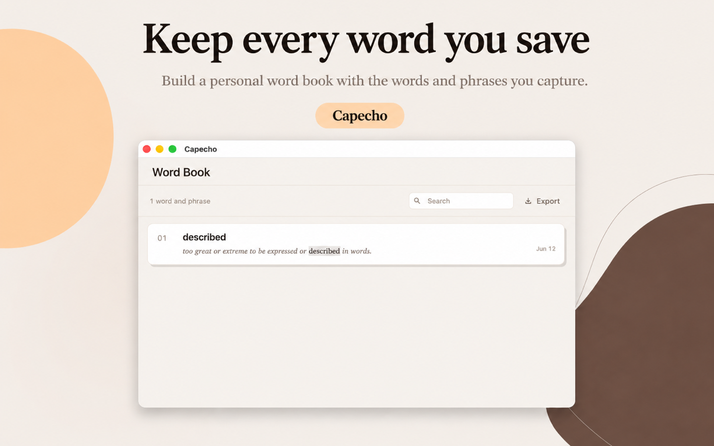

---

## 29. [Pass Quick Access](https://www.producthunt.com/products/pass-quick-access)
**Votes**: 77 | **도입 난이도**: 하 | **신뢰도**: 상
**Tagline**: Native quick access and SSH agent for Proton Pass for macOS
**서비스 링크**: https://www.producthunt.com/r/M7KTG4DV5M4HWN

**태그**: Productivity, Security, macOS, DeveloperTool, OpenSource, Agent, DevTool

### 📌 이 서비스 한눈에 보기
macOS 환경에서 Proton Pass를 더 빠르고 안전하게 사용할 수 있는 네이티브 퀵 액세스 및 SSH 에이전트 도구

### 🔑 주요 기능
- 단축키로 즉시 호출 가능한 macOS 네이티브 퀵 액세스 창 제공
- Touch ID를 활용한 보안성이 강화된 SSH 키 관리(SSH Agent)
- 키보드 중심의 빠른 검색 및 로그인 정보(ID, PW, OTP) 복사 기능

### 🙋 사용자에게 어떤 점이 좋은가
별도의 창 전환 없이 단축키만으로 로그인 정보를 빠르게 가져올 수 있으며, 개발자에게 유용한 SSH 키 보안 관리를 간편하게 해결해 줍니다.

### ✅ 지금 바로 써볼 기능
- 단축키를 설정하여 앱 간 전환 없이 로그인 정보 검색하기
- Touch ID를 연동하여 SSH 키 보안 관리 시작하기
- 키보드 중심의 워크플로우로 작업 속도 높이기

### ⚠️ 사용 전 확인할 점
- Proton Pass 계정이 이미 있어야 사용 가능함
- macOS 전용 도구이므로 타 운영체제에서는 사용 불가

### 🧭 확인이 더 필요한 정보
Proton Pass의 모든 기능이 이 앱을 통해 동기화되는지, 혹은 특정 기능에 특화되어 있는지에 대한 상세 범위 확인이 필요합니다.

### 📸 스크린샷 및 갤러리
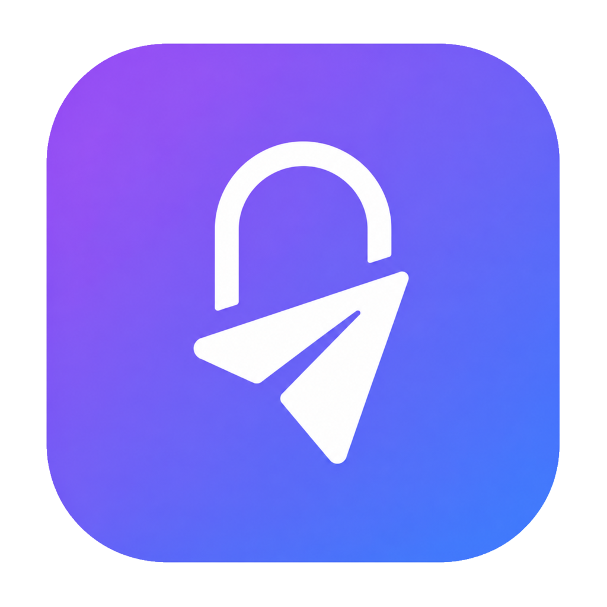
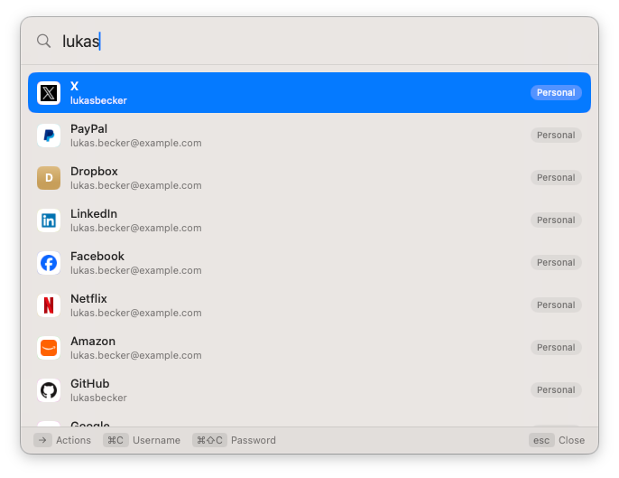
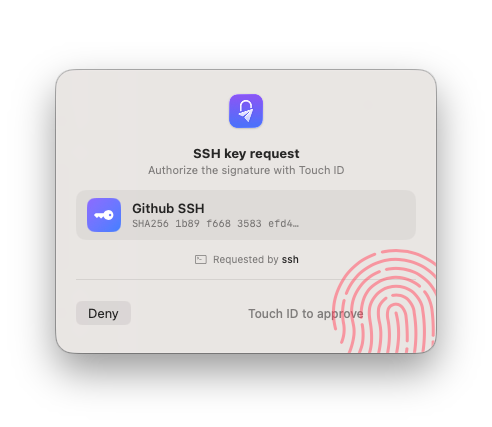

---

## 30. [Outify](https://www.producthunt.com/products/outify-2)
**Votes**: 57 | **도입 난이도**: 중 | **신뢰도**: 상
**Tagline**: The AI that turns outbound into revenue
**서비스 링크**: https://www.producthunt.com/r/KVCAF2Q6GBDCO5

**태그**: SalesTech, AI, Automation, LeadGeneration, AI Tool, Email

### 📌 이 서비스 한눈에 보기
제품과 시장을 이해하고 잠재 고객 발굴부터 계약 체결까지 자동화하는 AI 영업 에이전트

### 🔑 주요 기능
- 제품, 고객, 경쟁사 정보를 학습하여 맞춤형 아웃바운드 전략 수립
- 단순 이메일 발송을 넘어 계약 성사 시점까지 추적하는 'Deal Chaser' 기능
- 파이프라인 구축부터 영업 프로세스 전반의 자동화

### 🙋 사용자에게 어떤 점이 좋은가
영업 담당자가 단순 반복적인 아웃바운드 업무에서 벗어나, 실제 매출로 이어지는 계약 체결에만 집중할 수 있도록 돕습니다.

### ✅ 지금 바로 써볼 기능
- 제품 및 타겟 고객 데이터 입력하기
- AI가 생성한 아웃바운드 시나리오 검토하기
- Deal Chaser를 통한 자동 팔로업 설정하기

### ⚠️ 사용 전 확인할 점
- AI가 생성한 메시지의 톤앤매너가 브랜드 이미지와 일치하는지 확인 필요
- 자동화된 프로세스로 인한 스팸 분류 가능성 주의

### 🧭 확인이 더 필요한 정보
현재 제공되는 구체적인 자동화 채널(이메일, LinkedIn 등)과 연동 가능한 CRM 범위가 명시되지 않았습니다.

### 📸 스크린샷 및 갤러리
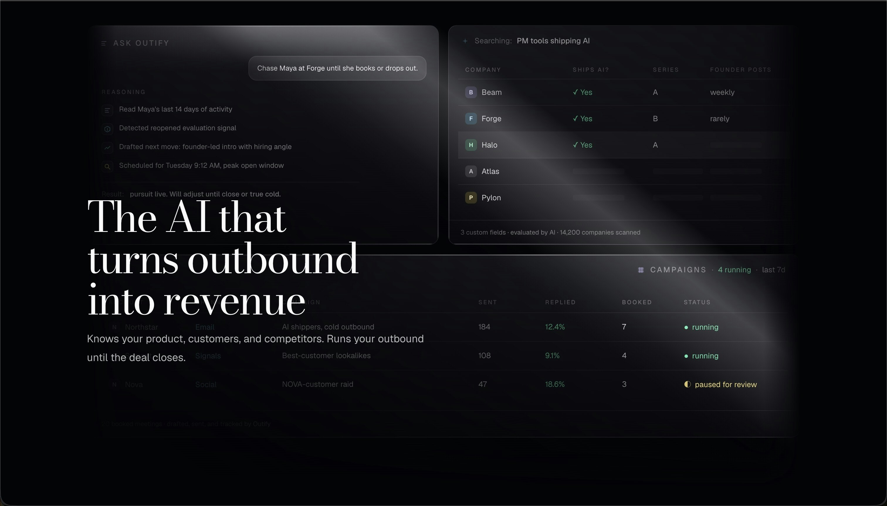
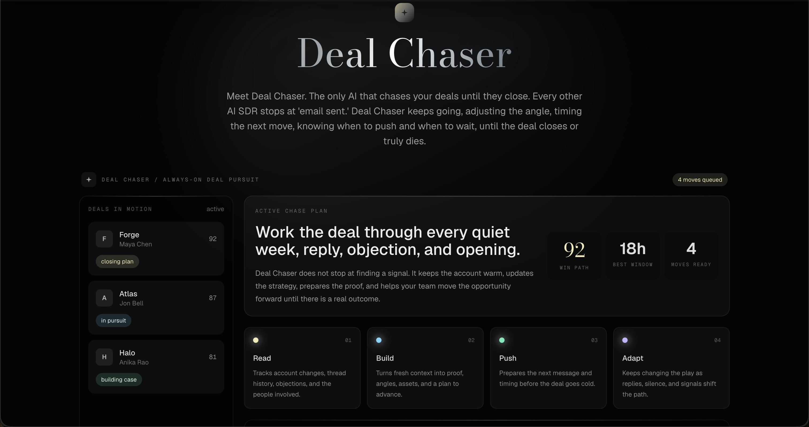
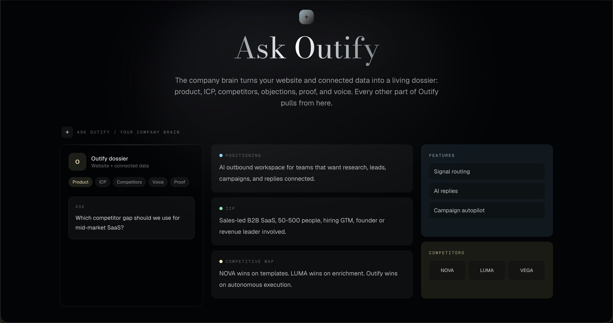

---

