# 🚀 Product Hunt Daily Top 30 (2026-06-17)

## 오늘의 요약
오늘의 트렌드는 사용자의 작업 맥락을 실시간으로 파악하여 즉각적인 도움을 주는 '맥락 인식형 AI'와 개발 워크플로우를 혁신하는 'AI 코딩 에이전트' 도구들이 주를 이루었습니다. 또한, 단순한 챗봇을 넘어 협업 툴이나 데스크톱 환경에 깊숙이 통합되어 업무 자동화를 실현하는 서비스들이 주목받았습니다.

### 오늘의 핵심 포인트
- 사용자의 화면과 작업 맥락을 이해하여 별도의 설명 없이도 업무를 보조하는 지능형 AI 비서 서비스가 강세를 보였습니다.
- AI 코딩 에이전트가 외부 라이브러리 소스 코드까지 탐색하거나 모델 속도를 가속하는 등 개발 생산성 극대화 도구들이 등장했습니다.
- 고객 지원 자동화 및 협업 플랫폼 연동을 통해 인력 운영의 효율성을 높이는 AI 에이전트 솔루션이 주목받았습니다.

**오늘의 태그**: AI_Agent, Productivity, AI_Coding, Automation, Context_Aware

## 1. [Goldfish](https://www.producthunt.com/products/goldfish-early-access)
**Votes**: 391 | **도입 난이도**: 하 | **신뢰도**: 상
**Tagline**: Press Option. It knows your work and replies like you
**서비스 링크**: https://www.producthunt.com/r/P4WFRWL26YL6CK

**태그**: Productivity, AI Assistant, Mac, Automation, AI Tool

### 📌 이 서비스 한눈에 보기
맥(Mac) 전체의 작업 맥락을 이해하여 별도의 설명 없이도 맞춤형 답변을 제공하는 AI 비서

### 🔑 주요 기능
- 맥 시스템 전반의 작업 내용을 프라이빗하게 기억하는 맥락 인식 기능
- 복사 및 붙여넣기 없이 Option 키 하나로 즉시 실행되는 워크플로우
- 문장 재작성, 스레드 요약, 정보 회상 등 다양한 글쓰기 및 정보 관리 지원

### 🙋 사용자에게 어떤 점이 좋은가
매번 AI에게 상황을 설명해야 하는 번거로움을 없애고, 현재 작업 중인 맥 환경의 맥락을 바탕으로 즉각적인 업무 보조를 받을 수 있습니다.

### ✅ 지금 바로 써볼 기능
- Option 키를 눌러 현재 작성 중인 글의 초안 작성하기
- 긴 대화 스레드나 문서 요약 요청하기
- 최근 작업 내용을 바탕으로 특정 정보 빠르게 찾아내기

### ⚠️ 사용 전 확인할 점
- 시스템 전체의 맥락을 읽는 방식이므로 개인정보 보호 및 보안 정책 확인 필요
- Mac 환경에 특화된 기능으로 타 OS에서의 사용 제한 가능성

### 🧭 확인이 더 필요한 정보
데이터가 로컬에서만 처리되는지 혹은 클라우드로 전송되는지에 대한 구체적인 보안 메커니즘 확인이 필요합니다.

### 📸 스크린샷 및 갤러리
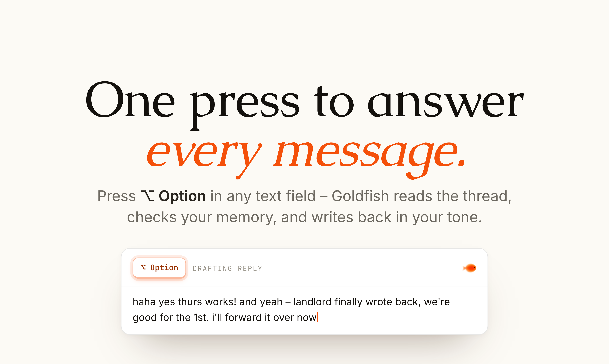
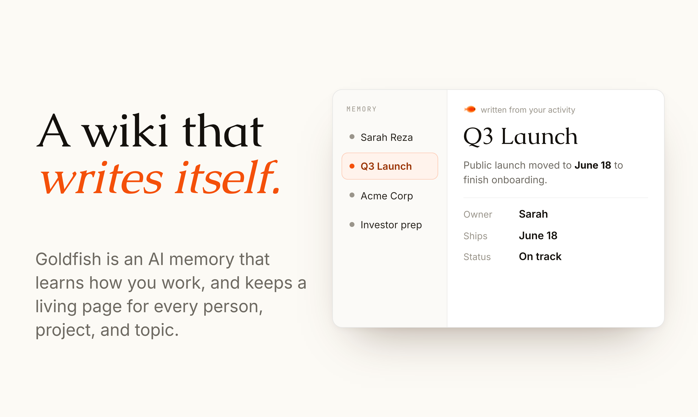
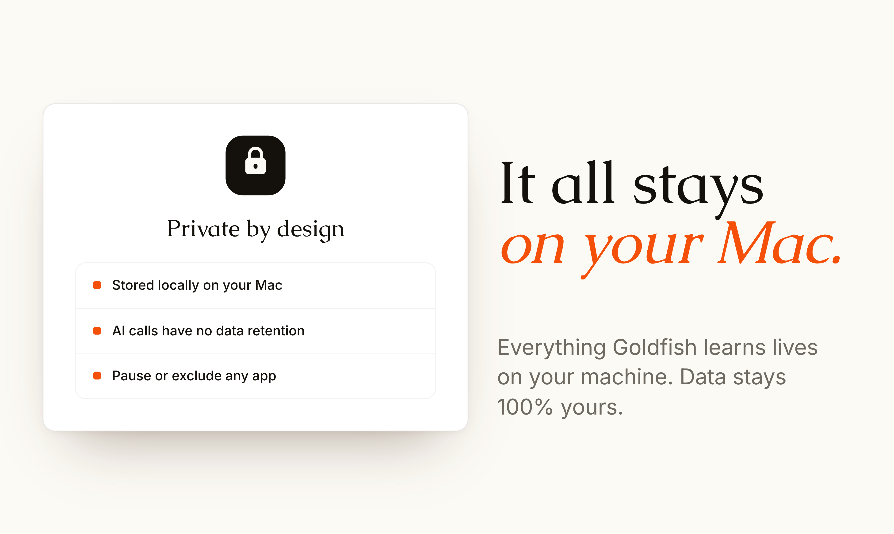

### 🎬 관련 영상
- [🎥 영상 보기](https://ph-files.imgix.net/1f06c367-3bc4-4bb1-a08f-29c5d5b66826.jpeg?auto=format)

---

## 2. [Invoko](https://www.producthunt.com/products/invoko)
**Votes**: 309 | **도입 난이도**: 하 | **신뢰도**: 상
**Tagline**: A little hand on your Mac
**서비스 링크**: https://www.producthunt.com/r/CKKHYA5Y262PSX

**태그**: AI Assistant, Productivity, Mac, Automation, AI Tool

### 📌 이 서비스 한눈에 보기
작업 중 화면 위에서 바로 대화하며 업무를 돕는 AI 데스크톱 비서

### 🔑 주요 기능
- 화면 어디든 배치 가능한 플로팅 AI 인터페이스
- 작업 중 실시간 질문 및 정보 확인 가능
- 다양한 앱을 넘나드는 작업 자동화 지원

### 🙋 사용자에게 어떤 점이 좋은가
별도의 창 전환 없이 작업 흐름을 유지하며 AI의 도움을 받을 수 있어 업무 생산성이 향상됩니다.

### ✅ 지금 바로 써볼 기능
- 화면 위 원하는 위치에 Invoko 배치하기
- 현재 작업 중인 화면 내용에 대해 질문하기
- 앱 간 작업 수행 요청해보기

### ⚠️ 사용 전 확인할 점
- 화면 공유 및 데이터 접근에 따른 개인정보 보호 확인 필요
- Mac 전용 도구이므로 OS 호환성 확인 필요

### 🧭 확인이 더 필요한 정보
지원하는 구체적인 앱 자동화 범위와 데이터 보안 정책에 대한 상세 정보가 필요합니다.

### 📸 스크린샷 및 갤러리
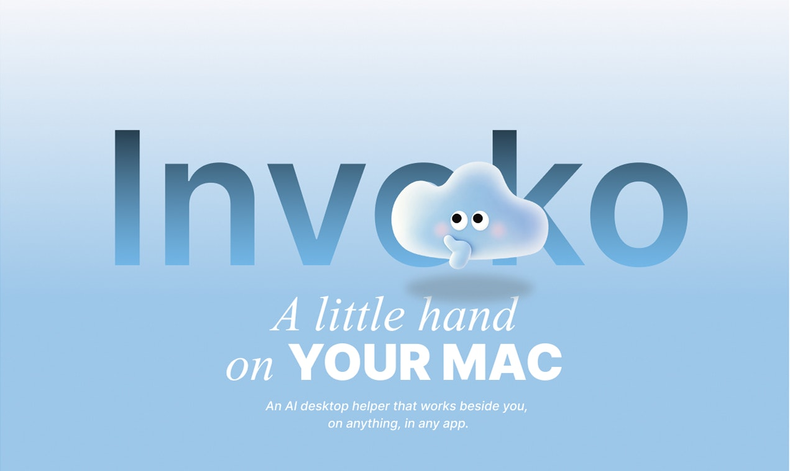
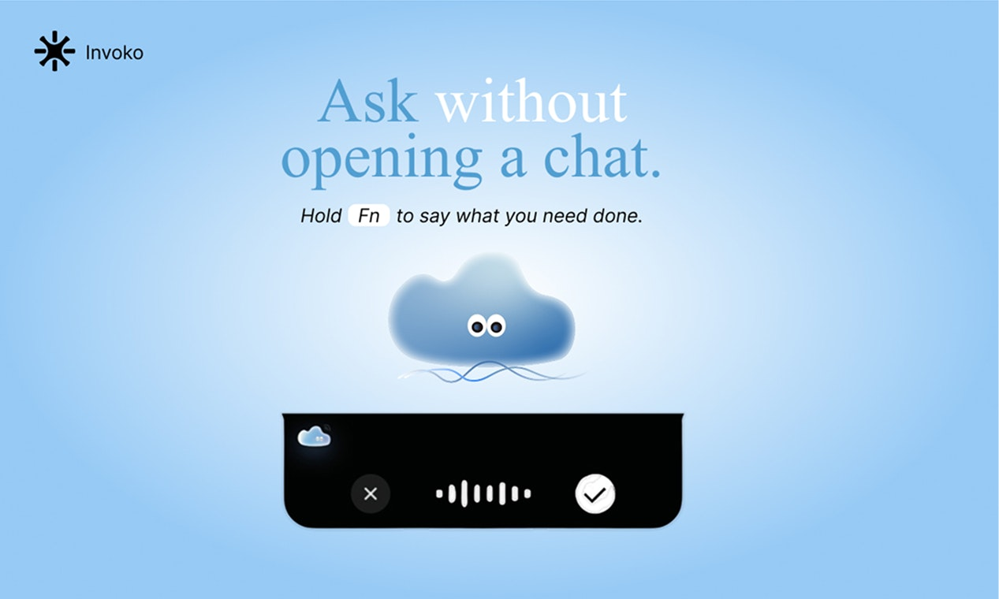
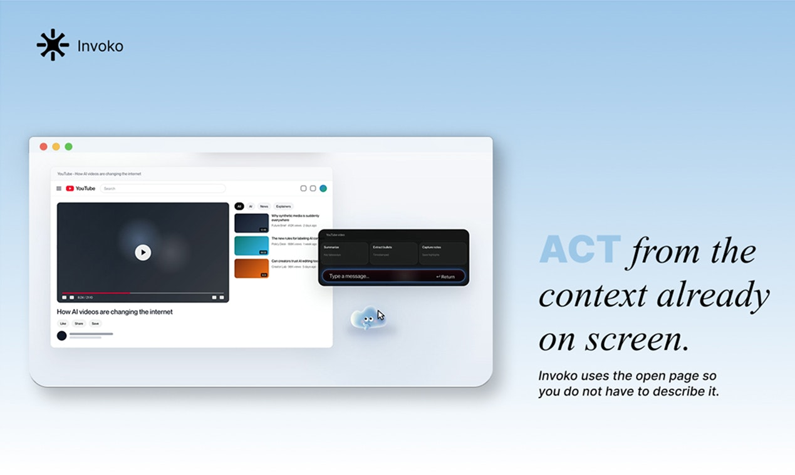

---

## 3. [MakersClaw](https://www.producthunt.com/products/makersclaw)
**Votes**: 267 | **도입 난이도**: 하 | **신뢰도**: 상
**Tagline**: Hire AI employees that live in your Slack, Teams, Telegram
**서비스 링크**: https://www.producthunt.com/r/7T4D2IUJO2CB3U

**태그**: AI Agent, Automation, SaaS, Collaboration Tool, AI Tool, Sales

### 📌 이 서비스 한눈에 보기
슬랙, 팀즈 등 협업 툴 내에서 24시간 독립적으로 작동하는 AI 직원을 고용하세요.

### 🔑 주요 기능
- 슬랙, 팀즈, 텔레그램 등 기존 협업 플랫폼에 원클릭으로 연동
- 독립적인 컨테이너와 메모리를 가진 24/7 상시 가동 AI 에이전트
- 고객 지원, 영업, 리서치, SEO 등 특정 목적에 맞춘 사전 구축 및 커스텀 가능

### 🙋 사용자에게 어떤 점이 좋은가
별도의 복잡한 대시보드 없이 평소 사용하는 메신저 안에서 업무를 자동화하고, 필요할 때만 비용을 지불하여 효율적으로 인력을 운영할 수 있습니다.

### ✅ 지금 바로 써볼 기능
- 사용 중인 협업 툴(Slack/Teams/Telegram)에 원클릭 연동하기
- 지원(Support) 또는 영업(Sales) 등 특정 업무용 AI 에이전트 설정하기
- 필요한 도구 사용 시 발생하는 호출 비용 구조 확인하기

### ⚠️ 사용 전 확인할 점
- 사용하는 도구에 따른 호출당 비용(Pay per call)이 예상보다 높을 수 있음
- AI 에이전트가 독립적인 컨테이너에서 작동하므로 보안 및 데이터 관리 정책 확인 필요

### 🧭 확인이 더 필요한 정보
사용자가 직접 작성하는 커스텀 에이전트의 구현 난이도와 구체적인 호출 비용 산정 방식에 대한 정보가 더 필요합니다.

### 📸 스크린샷 및 갤러리
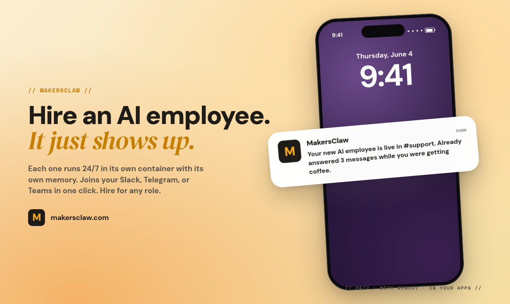
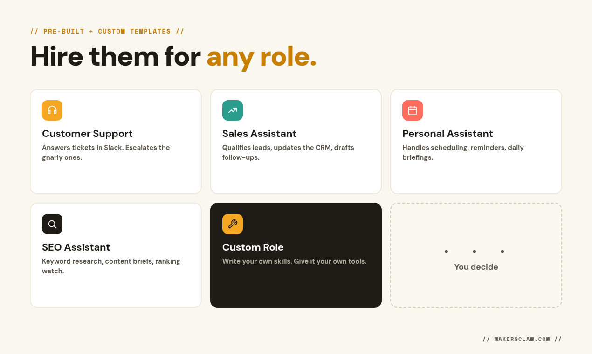
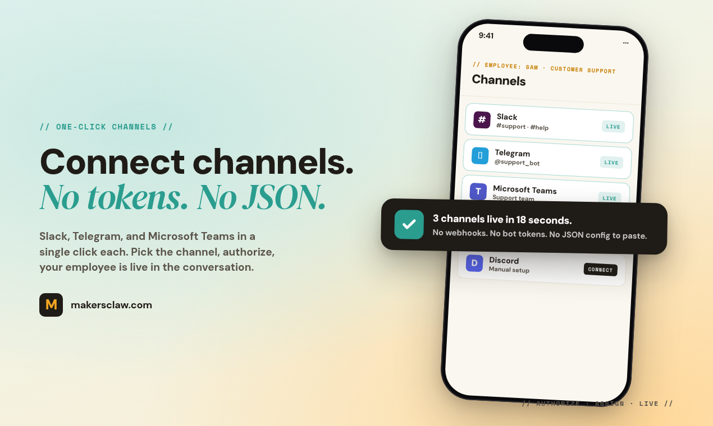

---

## 4. [PeakRoutine](https://www.producthunt.com/products/peak-routine)
**Votes**: 165 | **도입 난이도**: 중 | **신뢰도**: 상
**Tagline**: Personalized health coaching powered by your biomarkers
**서비스 링크**: https://www.producthunt.com/r/ZVIUG5CKIUEZDF

**태그**: HealthTech, AI, Personalized, Wellness, DataAnalytics, AI Tool

### 📌 이 서비스 한눈에 보기
생체 지표 분석을 통해 개인 맞춤형 건강 습관을 제안하는 AI 코칭 서비스

### 🔑 주요 기능
- 수면, 운동, 영양 등 다양한 건강 데이터의 상관관계 분석
- 범용적인 계획이 아닌 개인의 생물학적 특성에 맞춘 맞춤형 가이드
- 데이터 기반의 선제적인 AI 코칭 및 습관 형성 지원

### 🙋 사용자에게 어떤 점이 좋은가
자신의 신체 데이터를 바탕으로 막연한 건강 관리가 아닌, 나에게 딱 맞는 구체적인 행동 지침을 얻을 수 있습니다.

### ✅ 지금 바로 써볼 기능
- 다양한 건강 데이터(수면, 식단, 운동 등) 연동하기
- 데이터 간의 상관관계 분석 결과 확인하기
- AI가 제안하는 개인 맞춤형 습관 형성 시작하기

### ⚠️ 사용 전 확인할 점
- 정확한 분석을 위해 지속적이고 다양한 데이터 입력이 필요함
- 의학적 진단이 아닌 건강 관리 보조 도구로 활용해야 함

### 🧭 확인이 더 필요한 정보
어떤 외부 웨어러블 기기나 앱과 연동이 가능한지에 대한 구체적인 정보가 필요합니다.

### 📸 스크린샷 및 갤러리
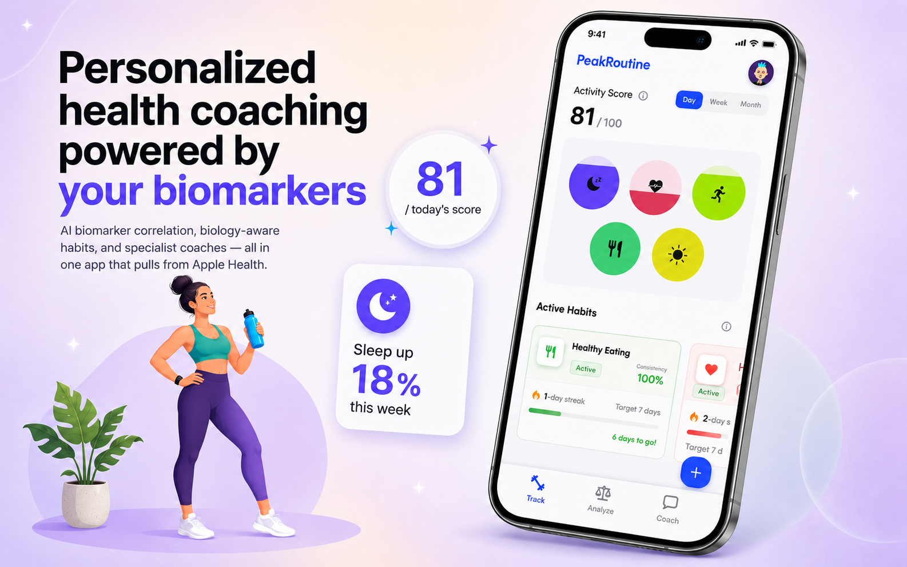
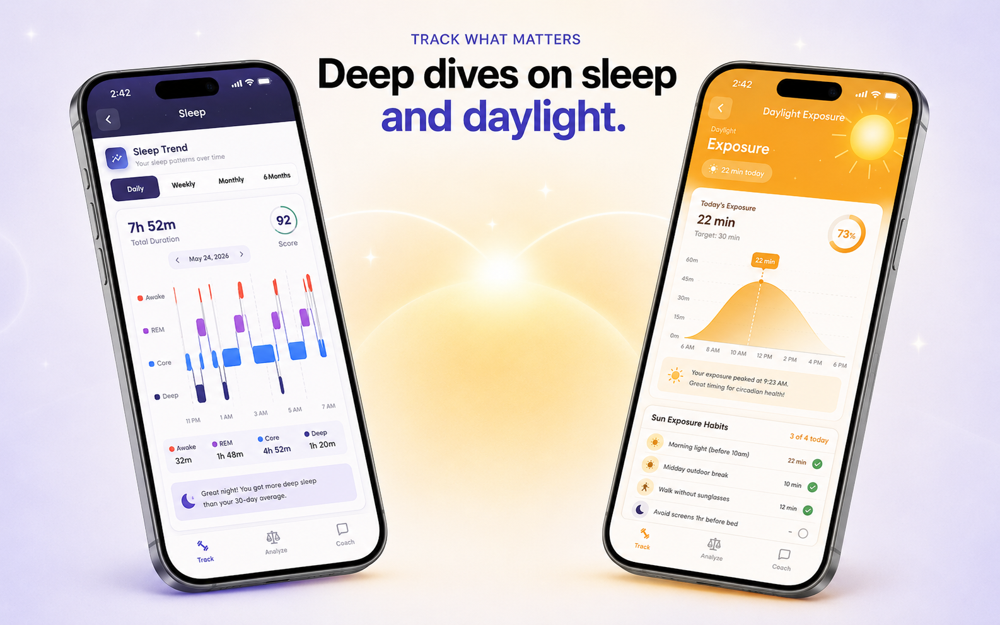
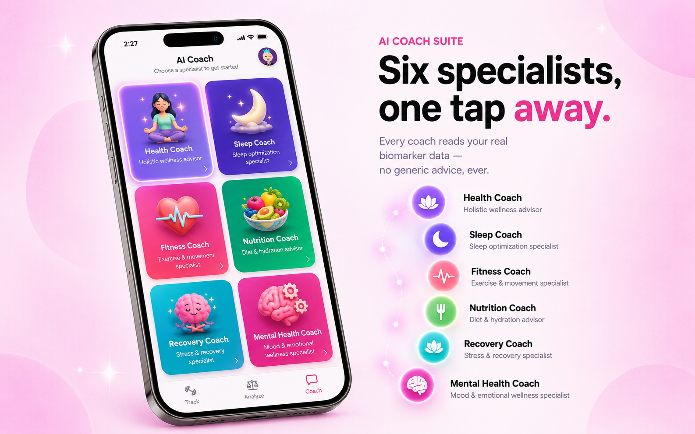

### 🎬 관련 영상
- [🎥 영상 보기](https://ph-files.imgix.net/6f27b43b-258a-4f34-a163-ed5ca75573d2.jpeg?auto=format)

---

## 5. [Edgee Turbo Models](https://www.producthunt.com/products/edgee)
**Votes**: 149 | **도입 난이도**: 하 | **신뢰도**: 상
**Tagline**: Use Claude Code with Kimi K2.7 Code, MiniMax M2.7, and more
**서비스 링크**: https://www.producthunt.com/r/RA45EQ767HXQGH

**태그**: DevTool, AI-Coding, Productivity

### 📌 이 서비스 한눈에 보기
Claude Code 환경에서 최신 오픈소스 모델을 최대 4배 빠른 속도로 사용할 수 있는 구독형 가속 서비스

### 🔑 주요 기능
- Claude Code와 Kimi K2.7, MiniMax M2.7 등 최신 오픈소스 모델 연동
- 최대 200 tok/s에 달하는 압도적인 생성 속도 제공
- 코드 변경 없이 몇 분 만에 설정 가능한 간편한 도입 방식

### 🙋 사용자에게 어떤 점이 좋은가
개발자가 기존 Claude Code 워크플로우를 유지하면서도 더 빠르고 강력한 오픈소스 모델을 저렴한 월 정액제로 활용할 수 있습니다.

### ✅ 지금 바로 써볼 기능
- Claude Code 환경에 Edgee Turbo 모델 연결하기
- Kimi K2.7 및 MiniMax M2.7 모델 성능 테스트하기
- 월 $29 구독을 통한 속도 향상 체감하기

### ⚠️ 사용 전 확인할 점
- 사용 중인 Claude Code 버전과의 호환성 확인 필요
- 월 $29 정액제 모델의 사용량 제한 정책 확인 필요

### 🧭 확인이 더 필요한 정보
제공되는 오픈소스 모델들의 구체적인 API 연동 방식과 데이터 보안 정책에 대한 추가 확인이 필요합니다.

### 📸 스크린샷 및 갤러리
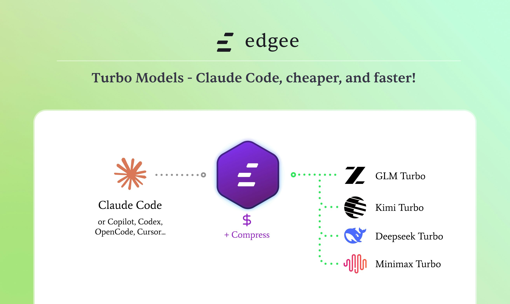
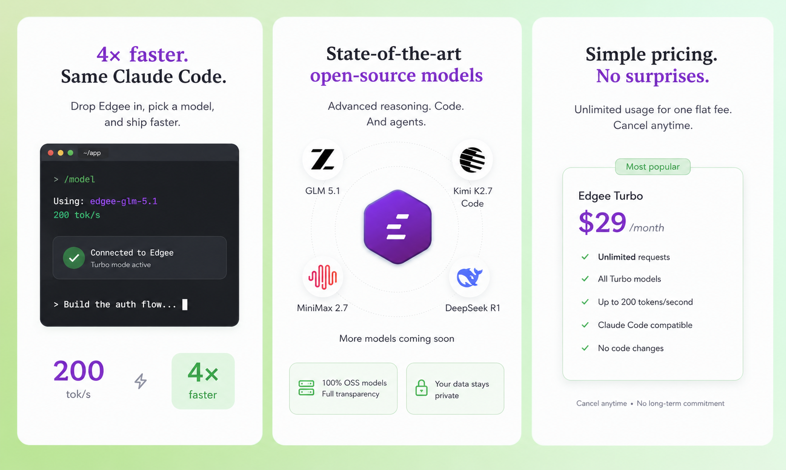
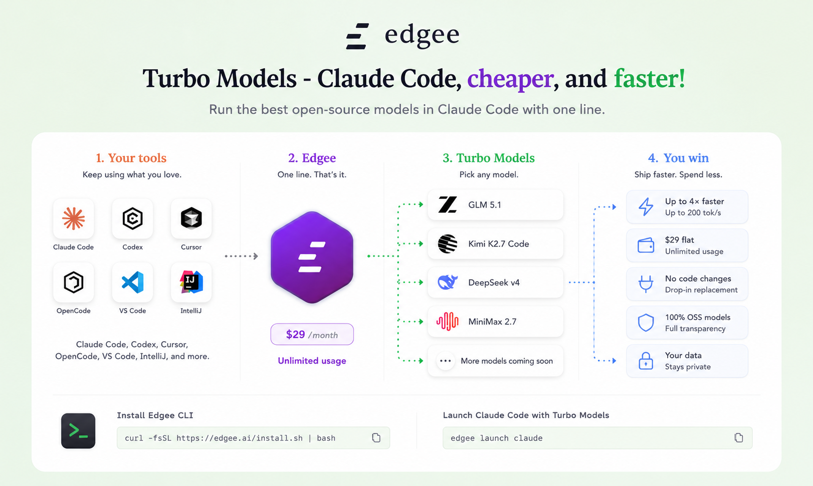

### 🎬 관련 영상
- [🎥 영상 보기](https://ph-files.imgix.net/f0631590-f32c-41dd-8d91-841d5e643a61.jpeg?auto=format)

---

## 6. [Zoona AI](https://www.producthunt.com/products/sparrowdesk)
**Votes**: 138 | **도입 난이도**: 하 | **신뢰도**: 상
**Tagline**: Automated support that learns from docs + past conversations
**서비스 링크**: https://www.producthunt.com/r/NOKJBALHGBNUSR

**태그**: AI, Customer Support, Automation, SaaS, AI Tool

### 📌 이 서비스 한눈에 보기
문서와 대화 기록을 학습하여 티켓의 60% 이상을 자동 해결하는 차세대 AI 고객 지원 솔루션

### 🔑 주요 기능
- 기존 문서 및 과거 대화 데이터를 활용한 자동 학습 기능
- 티켓 유입 즉시 문제 해결을 통한 백로그 및 업무 과부하 방지
- 상담원 전환 시 맥락(Context)을 유지하여 고객 반복 설명 방지

### 🙋 사용자에게 어떤 점이 좋은가
반복적인 고객 문의를 자동화하여 팀의 번아웃을 방지하고, 인력 충원 없이도 서비스 규모 확장에 유연하게 대응할 수 있습니다.

### ✅ 지금 바로 써볼 기능
- 기존 고객 지원 문서(Docs) 업로드 및 학습 테스트
- 과거 대화 데이터 연동을 통한 자동 응답 정확도 확인
- 상담원 핸드오프(Hand-off) 시 맥락 전달 기능 검증

### ⚠️ 사용 전 확인할 점
- 학습 데이터의 품질에 따라 자동 응답의 정확도가 결정될 수 있음
- 복잡하거나 예외적인 문의에 대한 처리 한계 확인 필요

### 🧭 확인이 더 필요한 정보
60% 이상의 티켓 해결률이 특정 산업군이나 데이터 규모에 따라 어떻게 변동되는지 확인이 필요합니다.

### 📸 스크린샷 및 갤러리
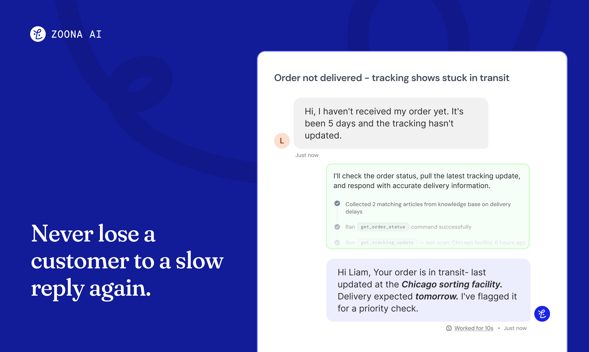
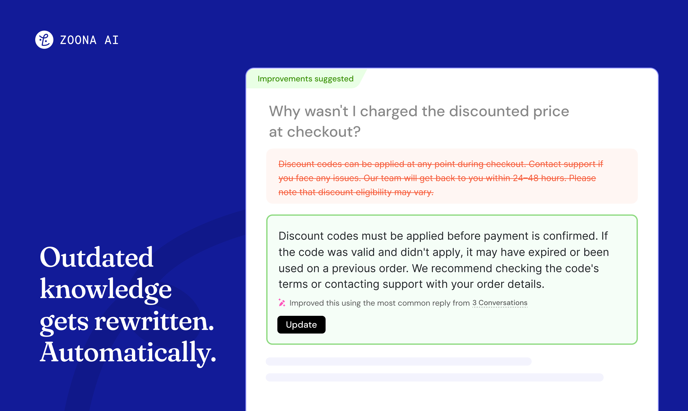
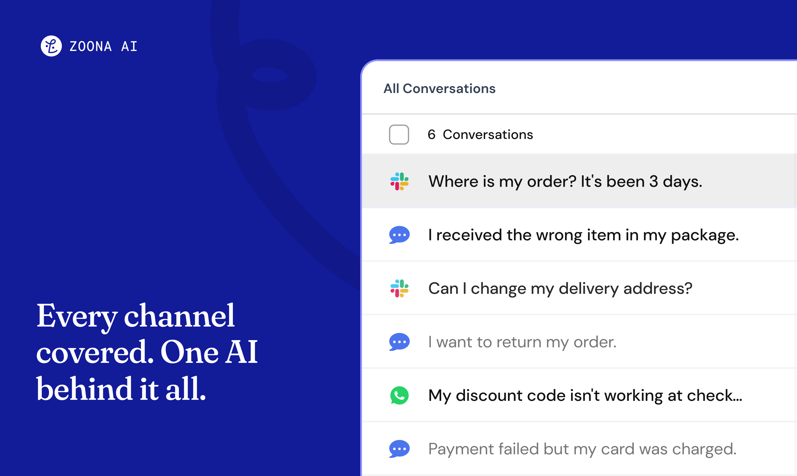

### 🎬 관련 영상
- [🎥 영상 보기](https://ph-files.imgix.net/1871a4da-8c50-4bb2-a294-c71b0808037a.jpeg?auto=format)

---

## 7. [GitHits beta 0.9](https://www.producthunt.com/products/githits)
**Votes**: 128 | **도입 난이도**: 하 | **신뢰도**: 상
**Tagline**: Give your AI coding agent access to open-source code
**서비스 링크**: https://www.producthunt.com/r/MKOAUFLRC2WD5V

**태그**: DevTool, AI-Agent, OpenSource, CLI, Agent, AI Tool

### 📌 이 서비스 한눈에 보기
AI 코딩 에이전트가 의존성 라이브러리의 소스 코드까지 직접 탐색할 수 있게 돕는 도구

### 🔑 주요 기능
- 의존성 라이브러리의 실제 구현 사례 및 소스 코드 접근성 제공
- 패키지 검사, 문서화 및 종속성 소스 탐색 기능
- 에이전트의 추측성 오류(guessing/looping)를 줄이기 위한 버전별 인덱싱

### 🙋 사용자에게 어떤 점이 좋은가
AI 에이전트가 사용하는 외부 라이브러리의 내부 로직을 직접 읽고 이해할 수 있어, 코드 생성의 정확도를 높이고 디버깅 시간을 단축합니다.

### ✅ 지금 바로 써볼 기능
- npx githits@latest init 명령어로 초기 설정하기
- AI 에이전트의 의존성 탐색 기능 테스트하기
- 현재 프로젝트의 의존성 인덱싱 실행하기

### ⚠️ 사용 전 확인할 점
- 베타 버전(0.9)이므로 기능의 안정성 확인 필요
- 대규모 의존성 인덱싱 시 리소스 소모 가능성

### 🧭 확인이 더 필요한 정보
현재 베타 버전이므로 전체적인 인덱싱 속도와 대규모 프로젝트에서의 성능 최적화 정도를 확인해야 합니다.

### 📸 스크린샷 및 갤러리
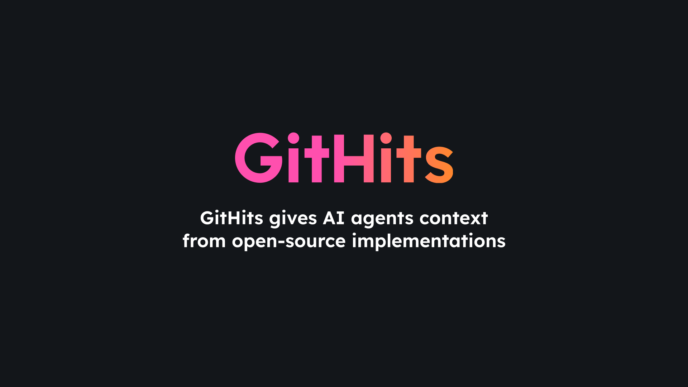
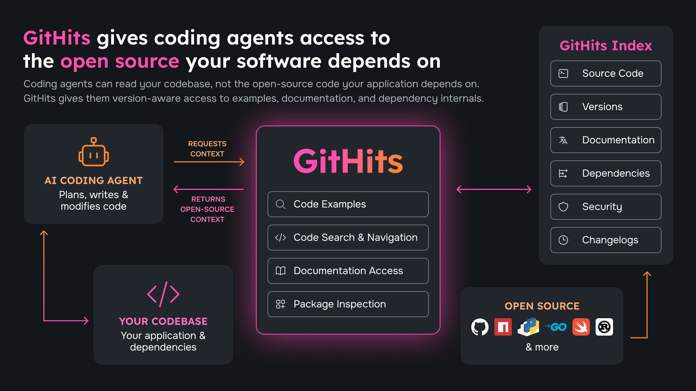
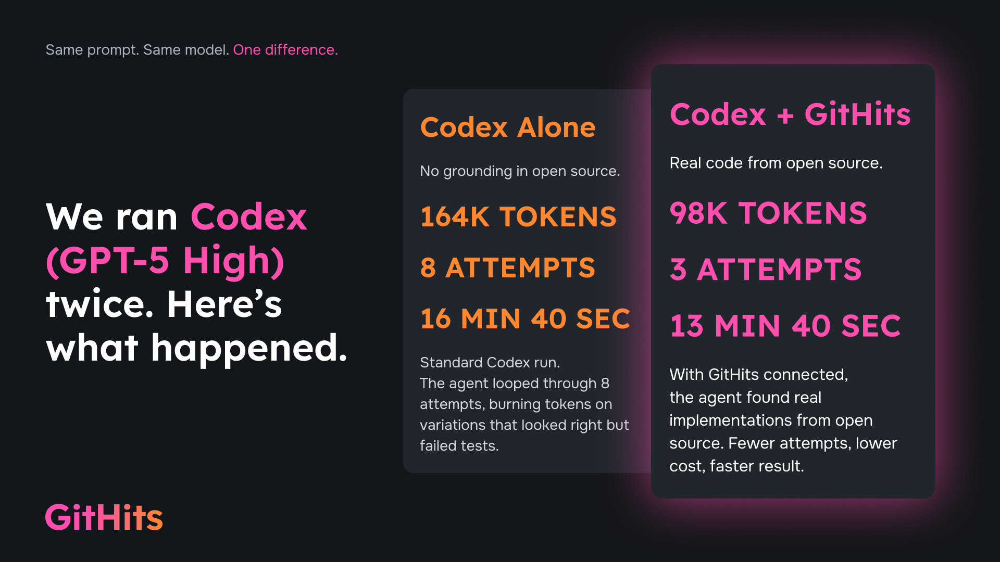

### 🎬 관련 영상
- [🎥 영상 보기](https://ph-files.imgix.net/3e26c941-fc9f-4c21-a5cb-f463cbe8a290.jpeg?auto=format)

---

## 8. [Stride](https://www.producthunt.com/products/stride-10)
**Votes**: 115 | **도입 난이도**: 중 | **신뢰도**: 상
**Tagline**: The AI workspace that plans, designs and ships with you.
**서비스 링크**: https://www.producthunt.com/r/G5J5MQCMRAFBSI

**태그**: AI-Native, DevTools, Productivity, Automation, Workflow, AI Tool, Design, DevTool

### 📌 이 서비스 한눈에 보기
기획부터 배포까지 모든 개발 단계를 하나의 워크스페이스에서 해결하는 AI 네이티브 협업 툴

### 🔑 주요 기능
- 기획, 디자인, 검증, 배포를 아우르는 통합 워크스페이스 제공
- 실제 프로젝트 데이터 기반의 AI 작업 수행
- Claude Code 및 MCP(Model Context Protocol) 연동을 통한 실질적인 작업 자동화

### 🙋 사용자에게 어떤 점이 좋은가
여러 도구를 번갈아 사용할 필요 없이 하나의 환경에서 아이디어를 제품으로 빠르게 전환할 수 있습니다.

### ✅ 지금 바로 써볼 기능
- 프로젝트 데이터 연동 및 AI 작업 흐름 테스트
- Claude Code 및 MCP를 활용한 자동화 기능 확인
- 기획부터 배포까지의 엔드투엔드 워크플로우 경험

### ⚠️ 사용 전 확인할 점
- 실제 프로젝트 데이터 사용 시 보안 및 권한 관리 확인 필요
- 외부 도구(Claude Code, Codex 등)와의 연동 설정 숙련도 요구

### 🧭 확인이 더 필요한 정보
구체적인 협업 기능의 범위와 외부 도구와의 상세 연동 방식에 대한 추가 확인이 필요합니다.

### 📸 스크린샷 및 갤러리
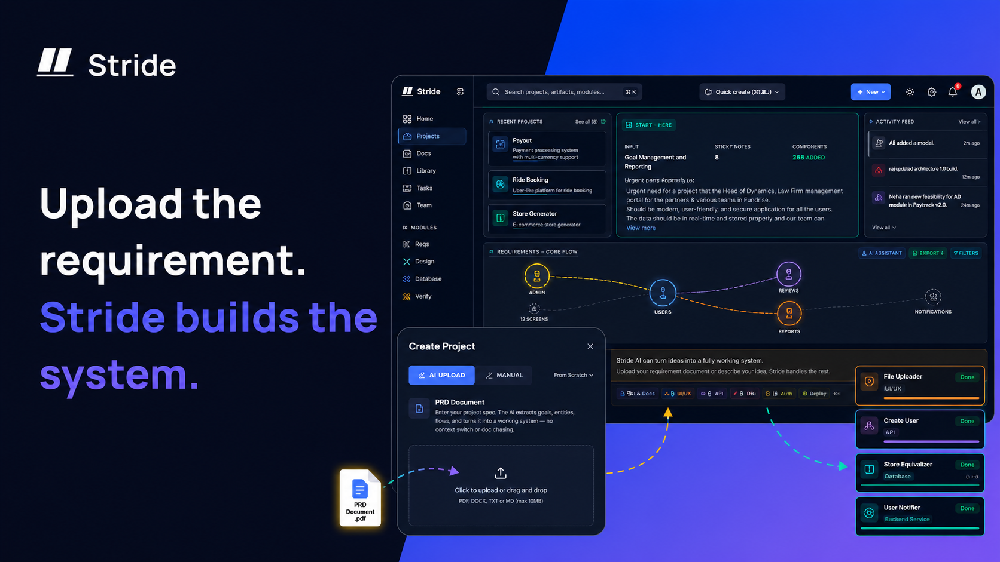
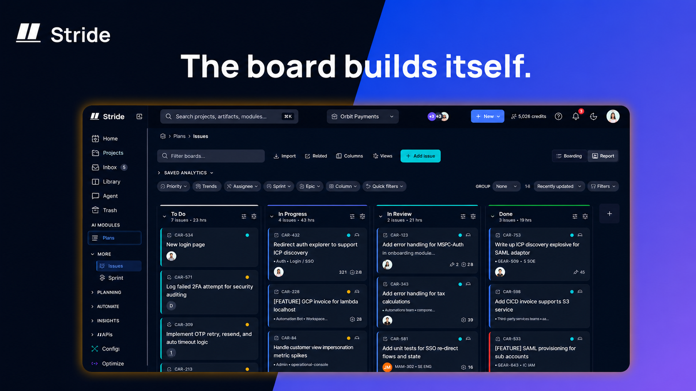
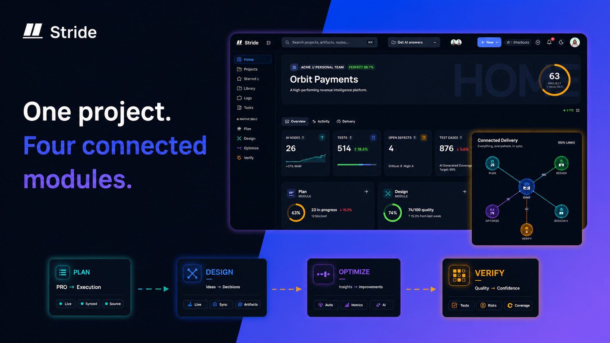

### 🎬 관련 영상
- [🎥 영상 보기](https://ph-files.imgix.net/3129ca1d-d49c-4a12-bb63-c506b7bea39f.jpeg?auto=format)

---

## 9. [Dirac](https://www.producthunt.com/products/dirac-3)
**Votes**: 103 | **도입 난이도**: 하 | **신뢰도**: 상
**Tagline**: The AI inbox that briefs founders every morning
**서비스 링크**: https://www.producthunt.com/r/HR3TS5ETG3GBID

**태그**: AI, Productivity, Automation, Email, AI Tool

### 📌 이 서비스 한눈에 보기
매일 아침 창업자에게 꼭 필요한 의사결정 사항만 요약해 전달하는 AI 이메일 관리 도구

### 🔑 주요 기능
- 이메일 스레드 자동 스캔 및 핵심 요약 제공
- 사용자의 말투를 반영한 답장 초안 작성
- 중요도가 낮은 80%의 이메일을 백그라운드에서 자동 처리

### 🙋 사용자에게 어떤 점이 좋은가
단순 반복적인 이메일 업무 시간을 줄여 창업자가 제품 개발과 비즈니스 성장에만 집중할 수 있도록 돕습니다.

### ✅ 지금 바로 써볼 기능
- AI가 작성한 답장 초안 검토 및 발송
- 매일 아침 제공되는 데일리 브리프 확인
- 의사결정이 필요한 핵심 이슈 선별

### ⚠️ 사용 전 확인할 점
- AI가 작성한 답장의 정확성 및 톤앤매너 검수 필요
- 중요한 이메일이 자동 처리 과정에서 누락될 가능성 확인 필요

### 🧭 확인이 더 필요한 정보
현재 지원하는 이메일 서비스(Gmail, Outlook 등)와 보안 정책에 대한 구체적인 정보가 필요합니다.

### 📸 스크린샷 및 갤러리
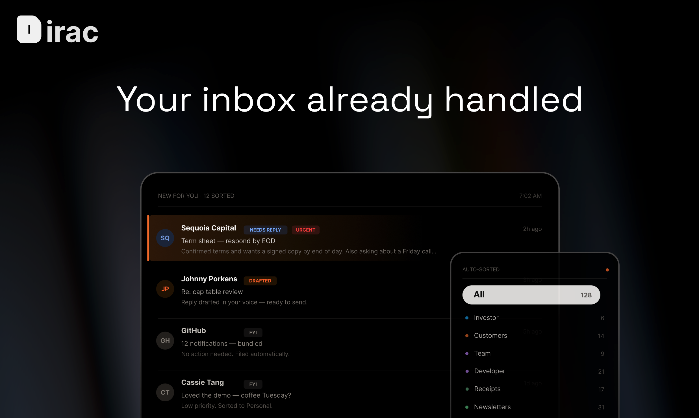
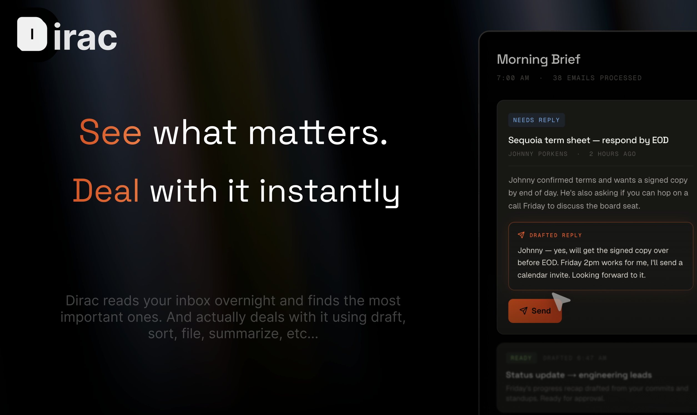
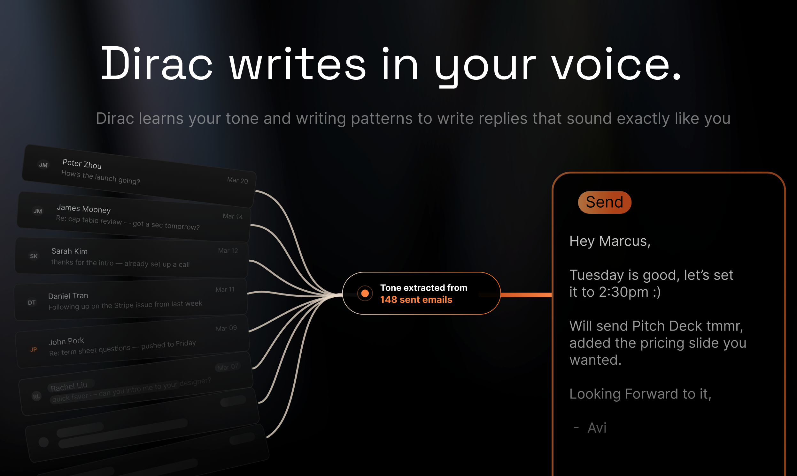

### 🎬 관련 영상
- [🎥 영상 보기](https://ph-files.imgix.net/4ceb137a-b0ff-4792-9a83-d50ab0e973fb.jpeg?auto=format)

---

## 10. [MindReader v1](https://www.producthunt.com/products/mindreader-v1)
**Votes**: 101 | **도입 난이도**: 상 | **신뢰도**: 중
**Tagline**: Read minds (simulated fMRI data, channeled to neuro-metrics)
**서비스 링크**: https://www.producthunt.com/r/HEBBP5MHRLOSYY

**태그**: NeuroTech, OpenSource, DataScience, Simulation, AI Tool, Sales

### 📌 이 서비스 한눈에 보기
콘텐츠에 대한 뇌의 반응을 시뮬레이션하여 신경학적 지표를 제공하는 오픈소스 도구

### 🔑 주요 기능
- 콘텐츠 입력 시 뇌의 부위별 반응을 시뮬레이션하는 fMRI 데이터 기반 기술
- Meta FAIR의 TRIBE v2 및 35년 연구 데이터 기반 구축
- 오픈소스 프로젝트로 연구 및 실험적 목적에 최적화

### 🙋 사용자에게 어떤 점이 좋은가
콘텐츠가 인간의 뇌에 미치는 영향을 데이터로 시뮬레이션하여, 데이터셋 평가나 실험적인 제품 개발에 활용할 수 있습니다.

### ✅ 지금 바로 써볼 기능
- 오픈소스 코드 분석 및 로컬 환경 구축
- 자체 콘텐츠를 활용한 뇌 반응 시뮬레이션 테스트
- 학술적/실험적 협업 가능성 검토

### ⚠️ 사용 전 확인할 점
- 실제 fMRI가 아닌 시뮬레이션 데이터이므로 실제 뇌 반응과 차이가 있을 수 있음
- 전문적인 신경과학 지식과 기술적 이해도가 요구됨

### 🧭 확인이 더 필요한 정보
실제 뇌 스캔 데이터가 아닌 시뮬레이션 모델의 정확도와 구체적인 활용 가이드라인 확인이 필요합니다.

### 📸 스크린샷 및 갤러리
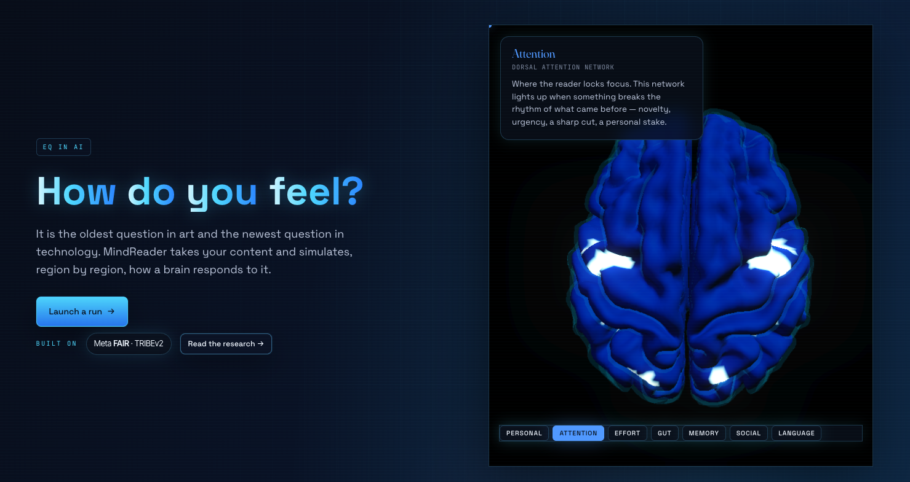
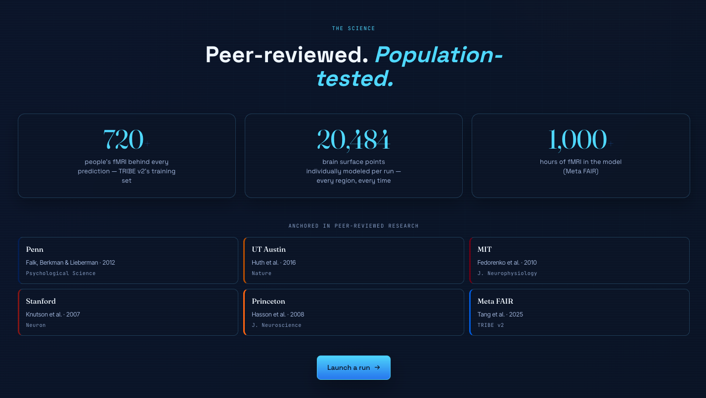
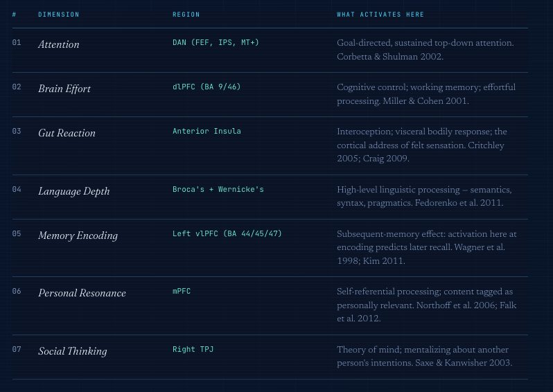

### 🎬 관련 영상
- [🎥 영상 보기](https://ph-files.imgix.net/0c213c1a-6f5a-434e-b2c8-b9ff9df0a748.gif?auto=format)

---

## 11. [Revyl](https://www.producthunt.com/products/revyl)
**Votes**: 96 | **도입 난이도**: 중 | **신뢰도**: 상
**Tagline**: The mobile source of truth
**서비스 링크**: https://www.producthunt.com/r/JPD7O7CLK67XUG

**태그**: DevTool, Mobile, Observability, Debugging

### 📌 이 서비스 한눈에 보기
실제 클라우드 기기 환경에서 앱의 동작을 완벽하게 관찰하고 디버깅할 수 있는 모바일 개발 도구

### 🔑 주요 기능
- 실제 클라우드 기기 기반의 스텝별 실행 추적 및 성능 데이터(CPU, 메모리, FPS) 제공
- 네트워크 워터폴 분석 및 런마다 발생하는 상태/파일 시스템 차이점(diffing) 확인 가능
- Atlas를 통한 화면/플로우 자동 매핑 및 개발 루프를 위한 핫 리로드 기능

### 🙋 사용자에게 어떤 점이 좋은가
에뮬레이터가 아닌 실제 기기 환경에서의 성능과 동작을 정밀하게 추적하여, 배포 전 잠재적인 버그와 성능 저하를 사전에 방지할 수 있습니다.

### ✅ 지금 바로 써볼 기능
- Atlas 기능을 활용한 앱 화면 및 플로우 자동 매핑 테스트
- 실제 기기에서의 성능 데이터(CPU, FPS)와 네트워크 워터폴 분석
- revyl dev를 통한 핫 리로드 및 디바이스 제어 워크플로우 적용

### ⚠️ 사용 전 확인할 점
- 클라우드 기기 환경과 실제 사용자 기기 환경 간의 미세한 차이 존재 가능성
- 상태 및 파일 시스템 디프(diffing) 분석 시 데이터 양에 따른 복잡도 증가

### 🧭 확인이 더 필요한 정보
지원하는 모바일 OS(iOS/Android)의 범위와 특정 프레임워크(React Native, Flutter 등)와의 호환성 확인이 필요합니다.

### 📸 스크린샷 및 갤러리
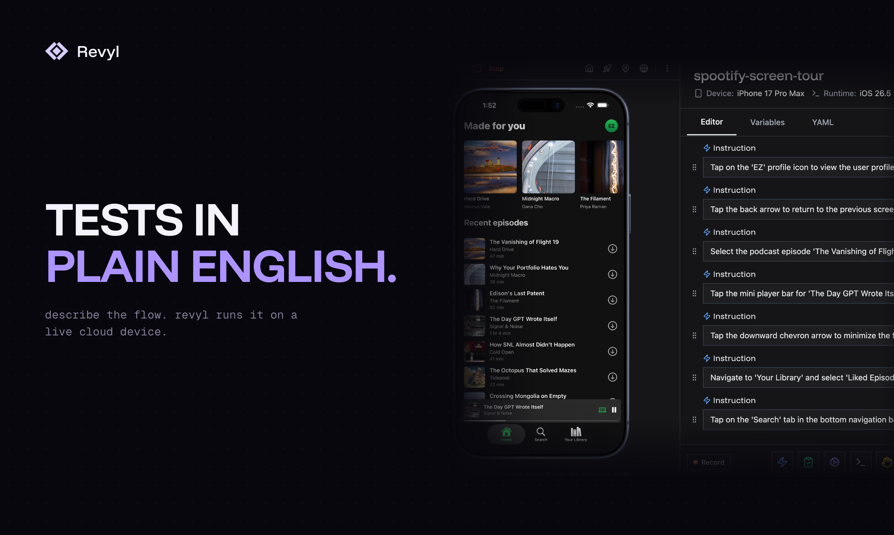
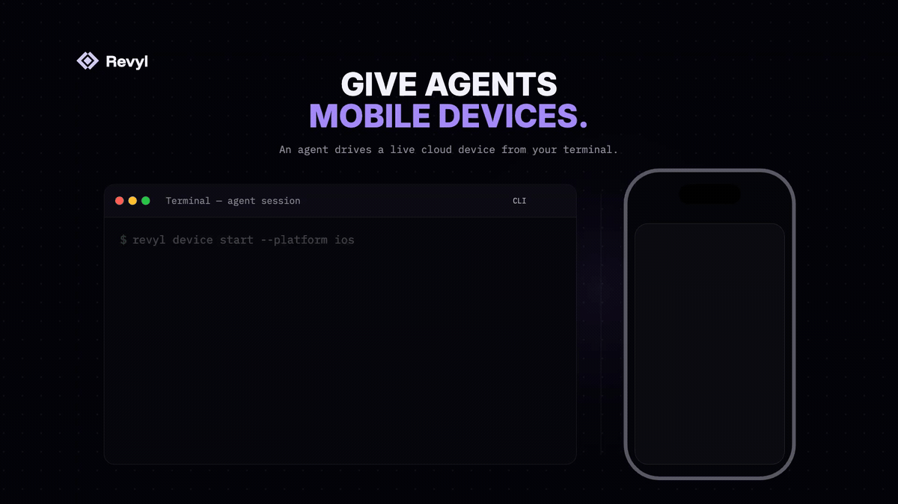
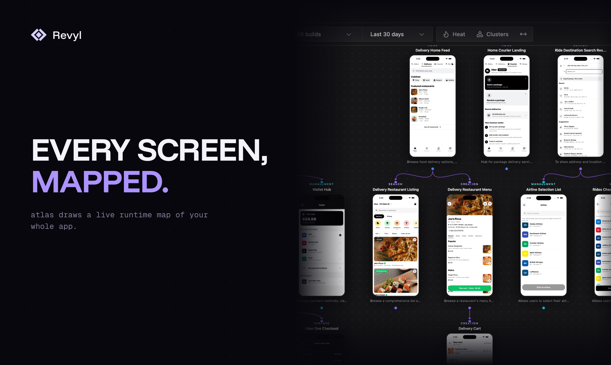

### 🎬 관련 영상
- [🎥 영상 보기](https://ph-files.imgix.net/0d1ffb6a-c554-45c5-b768-266c9d62c490.jpeg?auto=format)

---

## 12. [Voice Calls in Chatwoot](https://www.producthunt.com/products/chatwoot)
**Votes**: 90 | **도입 난이도**: 중 | **신뢰도**: 상
**Tagline**: Calls, chats, and emails all in one support inbox
**서비스 링크**: https://www.producthunt.com/r/BALOCG7OXRTTET

**태그**: CustomerSupport, Communication, SaaS, AI, CRM, AI Tool, Chat, Email

### 📌 이 서비스 한눈에 보기
채팅창을 떠나지 않고 전화 상담까지 한 번에 해결하는 통합 고객 지원 솔루션

### 🔑 주요 기능
- 브라우저 기반의 인바운드 및 아웃바운드 음성 통화 지원
- Twilio 연동 및 WhatsApp 통화 기능 제공
- 통화 녹음, 자동 전사(Transcripts), AI 요약 기능 탑재

### 🙋 사용자에게 어떤 점이 좋은가
상담원이 여러 창을 오갈 필요 없이 채팅과 전화를 한 곳에서 관리하여 업무 효율을 높이고 고객 맥락을 즉시 파악할 수 있습니다.

### ✅ 지금 바로 써볼 기능
- Twilio 연동을 통한 음성 통화 설정
- AI 요약 및 전사 기능 테스트
- 기존 채팅 상담 이력과 통화 기록 통합 확인

### ⚠️ 사용 전 확인할 점
- Twilio 등 외부 서비스 연동 시 추가 비용 발생 가능성
- 브라우저 기반 통화 환경에 따른 네트워크 안정성 확인 필요

### 🧭 확인이 더 필요한 정보
Twilio 외의 다른 VoIP 서비스와의 호환성 및 구체적인 요금 체계는 확인이 필요합니다.

### 📸 스크린샷 및 갤러리
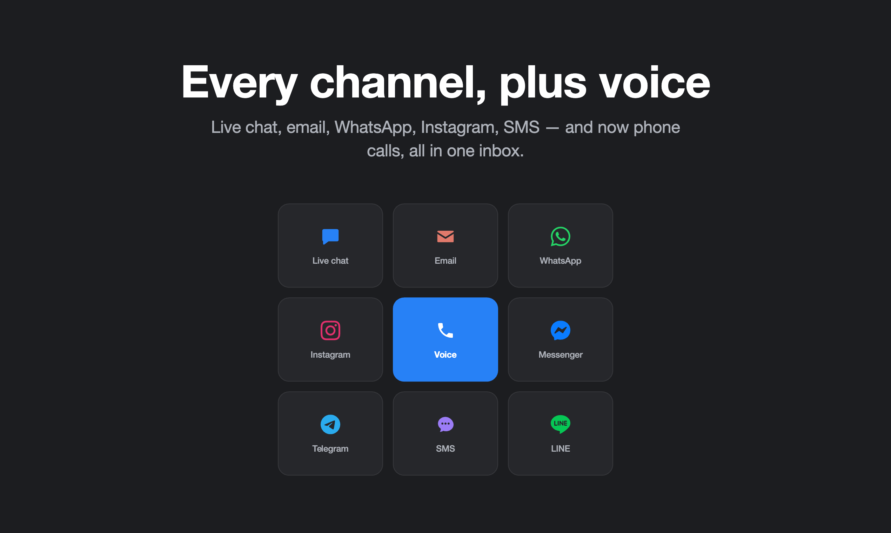
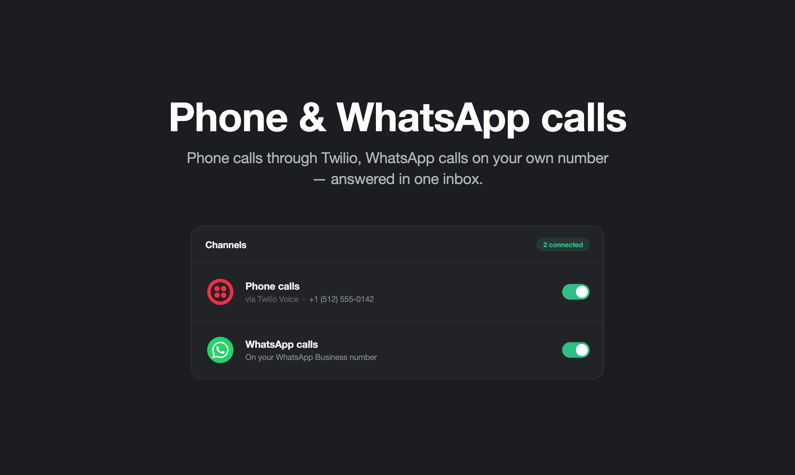
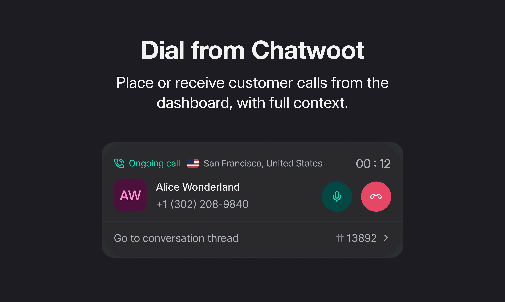

### 🎬 관련 영상
- [🎥 영상 보기](https://ph-files.imgix.net/5f3ba9c7-edf5-4e5b-85ab-5c0e1c51ec38.jpeg?auto=format)

---

## 13. [Kraina](https://www.producthunt.com/products/kraina)
**Votes**: 88 | **도입 난이도**: 하 | **신뢰도**: 상
**Tagline**: Turn your outdoor activities into a territory game.
**서비스 링크**: https://www.producthunt.com/r/YLEC52WELABAAJ

**태그**: Outdoor, Gamification, Exploration, Map, AI Tool

### 📌 이 서비스 한눈에 보기
야외 활동을 영토 확장 게임처럼 즐기는 지도 기반 탐험 앱

### 🔑 주요 기능
- 단순 경로 기록을 넘어 루프를 그려 내부 영토를 확보하는 방식
- 방문하지 않으면 안개가 끼듯 사라지는 'Rolling Fog' 시스템
- 미션과 챌린지 존을 통한 목적 있는 탐험 유도

### 🙋 사용자에게 어떤 점이 좋은가
단순한 운동 기록을 넘어, 실제 지형을 탐험하고 영토를 관리하는 게임적 재미를 통해 야외 활동의 동기를 부여합니다.

### ✅ 지금 바로 써볼 기능
- 루프를 그려 새로운 영토 확보하기
- 사라지는 지역을 다시 방문하여 영토 재탈환하기
- 설정된 미션과 챌린지 존 도전하기

### ⚠️ 사용 전 확인할 점
- 실제 지형과 앱 내 영토 개념 간의 괴리가 발생할 수 있음
- 지속적인 야외 활동과 GPS 사용이 필수적임

### 🧭 확인이 더 필요한 정보
웹과 iPhone 버전이 출시되었으나, 안드로이드 지원 여부 및 상세 게임 규칙은 명시되지 않았습니다.

### 📸 스크린샷 및 갤러리

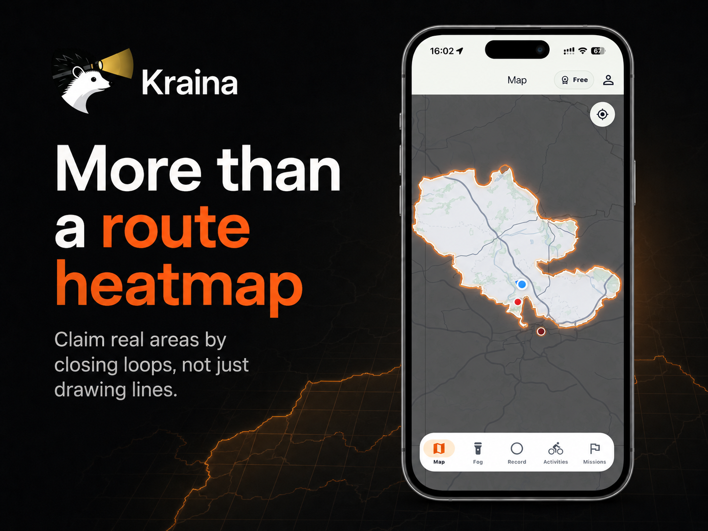
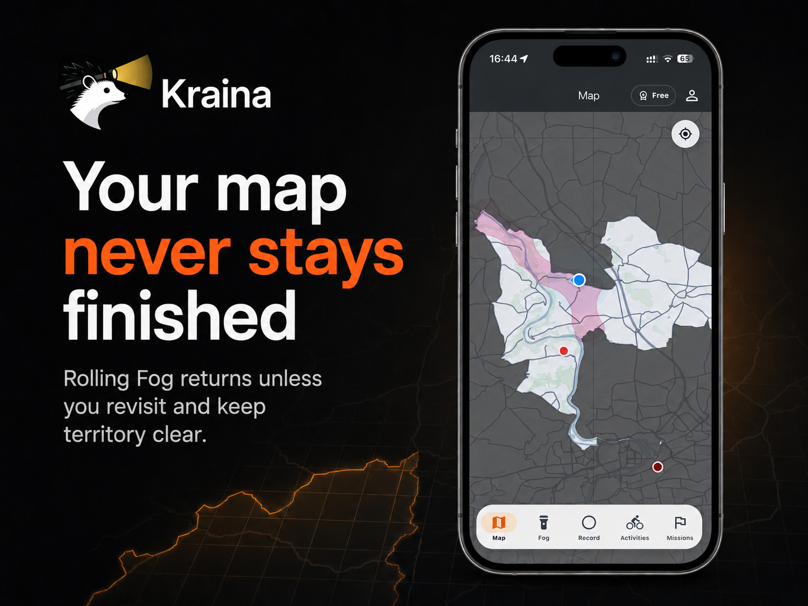

### 🎬 관련 영상
- [🎥 영상 보기](https://ph-files.imgix.net/56b92c68-dcca-4d0f-a8f3-5ab68ef07b08.jpeg?auto=format)

---

## 14. [Tadka](https://www.producthunt.com/products/tadka)
**Votes**: 88 | **도입 난이도**: 하 | **신뢰도**: 상
**Tagline**: Ship 10x more ad creative, without hiring a design team.
**서비스 링크**: https://www.producthunt.com/r/43QSIX57YNBU4N

**태그**: AdTech, Automation, Marketing, AI-Creative, AI Tool, Design

### 📌 이 서비스 한눈에 보기
단 하나의 브리프만으로 수백 개의 맞춤형 광고 소재를 자동 생성하고 성과를 최적화하는 툴

### 🔑 주요 기능
- 하나의 브리프를 기반으로 수백 개의 브랜드 맞춤형 광고 소재 생성
- 타겟 오디언스에 최적화된 광고 크리에이티브 자동 제작
- 성과 데이터를 바탕으로 승리하는 소재를 학습하는 기능

### 🙋 사용자에게 어떤 점이 좋은가
디자인 팀 없이도 메타 및 구글 캠페인에 필요한 대량의 광고 소재를 빠르게 확보하여 광고 효율을 극대화할 수 있습니다.

### ✅ 지금 바로 써볼 기능
- 브리프 입력 및 자동 생성 기능 테스트
- 브랜드 스타일 가이드 적용 확인
- 생성된 소재의 성과 분석 기능 확인

### ⚠️ 사용 전 확인할 점
- 자동 생성된 소재의 브랜드 일관성 및 품질 검수 필요
- 광고 매체(Meta, Google)와의 직접적인 연동 방식 확인 필요

### 🧭 확인이 더 필요한 정보
구체적인 생성 가능한 소재의 규격과 브랜드 가이드라인 커스텀 수준에 대한 정보가 더 필요합니다.

### 📸 스크린샷 및 갤러리

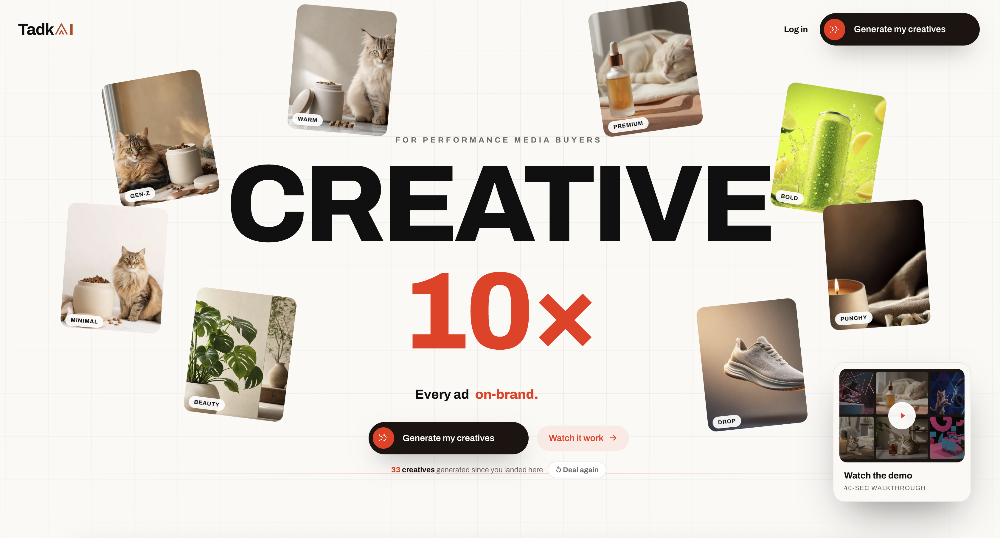
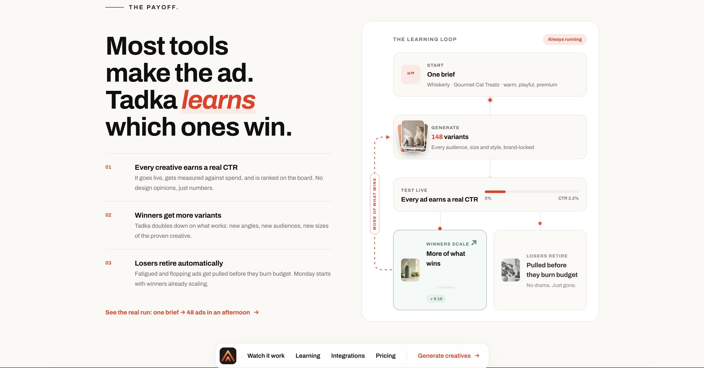

---

## 15. [Vidrunner](https://www.producthunt.com/products/lasso-5)
**Votes**: 87 | **도입 난이도**: 하 | **신뢰도**: 상
**Tagline**: Publish YouTube videos faster with AI
**서비스 링크**: https://www.producthunt.com/r/XW2HIETNMEUAVB

**태그**: AI, YouTube, Automation, ContentCreation, AI Tool, Video

### 📌 이 서비스 한눈에 보기
AI를 활용해 유튜브 영상의 타임스탬프, 태그, 상품 링크를 순식간에 생성하는 자동화 도구

### 🔑 주요 기능
- 유튜브 URL 입력만으로 정확한 타임스탬프 자동 생성
- 검색 최적화를 위한 키워드 중심의 태그 추출
- 영상 내용 기반의 아마존 제품 링크 생성 기능

### 🙋 사용자에게 어떤 점이 좋은가
영상 편집 후 반복적인 메타데이터 작업 시간을 획기적으로 단축하여 업로드 효율을 높여줍니다.

### ✅ 지금 바로 써볼 기능
- 유튜브 URL 붙여넣기
- 필요한 정보(타임스탬프, 태그 등) 선택
- 생성된 결과물 복사하여 유튜브에 적용

### ⚠️ 사용 전 확인할 점
- AI 생성 결과물이 영상 내용과 일치하는지 최종 검토 필요
- 무료 플랜의 사용량 제한 여부 확인 필요

### 🧭 확인이 더 필요한 정보
무료 플랜의 구체적인 사용 범위와 유료 플랜의 기능 차이에 대한 정보가 명시되지 않았습니다.

### 📸 스크린샷 및 갤러리
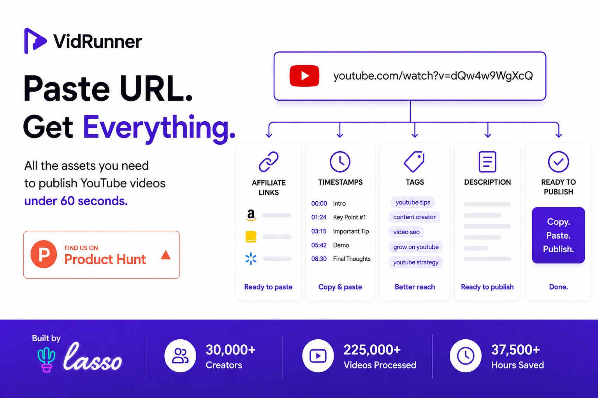

---

## 16. [DevCleaner](https://www.producthunt.com/products/devcleaner-reclaim-gbs-from-dev-tools)
**Votes**: 83 | **도입 난이도**: 하 | **신뢰도**: 상
**Tagline**: Free the gigabytes your dev tools and AI apps hoard
**서비스 링크**: https://www.producthunt.com/r/WKPVLESQQFBACY

**태그**: DevTool, Mac, Storage Management, Productivity, AI Tool

### 📌 이 서비스 한눈에 보기
개발 도구와 AI 앱이 차지하는 불필요한 저장 공간을 안전하게 정리해 주는 맥용 메뉴바 유틸리티

### 🔑 주요 기능
- Xcode, Gradle, npm 등 22개 개발 생태계 및 AI 앱(Cursor, Claude, Ollama) 데이터 정리
- 삭제 항목별 위험도(Risk-rated) 제공으로 안전한 삭제 지원
- 계정 생성 없이 사용 가능한 가벼운 4MB 용량의 메뉴바 앱

### 🙋 사용자에게 어떤 점이 좋은가
개발 환경 구축 과정에서 쌓이는 대용량 캐시와 불필요한 파일을 손쉽게 관리하여 맥의 저장 공간을 확보할 수 있습니다.

### ✅ 지금 바로 써볼 기능
- 메뉴바에서 DevCleaner 실행하기
- 위험도 등급을 확인하며 불필요한 개발 데이터 삭제하기
- AI 앱 및 개발 도구별 점유 용량 확인하기

### ⚠️ 사용 전 확인할 점
- 위험도 등급을 참고하되, 중요한 프로젝트 파일이 포함되어 있는지 사용자가 최종 확인 필요
- 삭제 시 특정 개발 환경의 설정이 초기화될 수 있음

### 🧭 확인이 더 필요한 정보
22개의 개발 생태계가 구체적으로 어떤 항목들을 포함하는지 상세 목록 확인이 필요합니다.

### 📸 스크린샷 및 갤러리
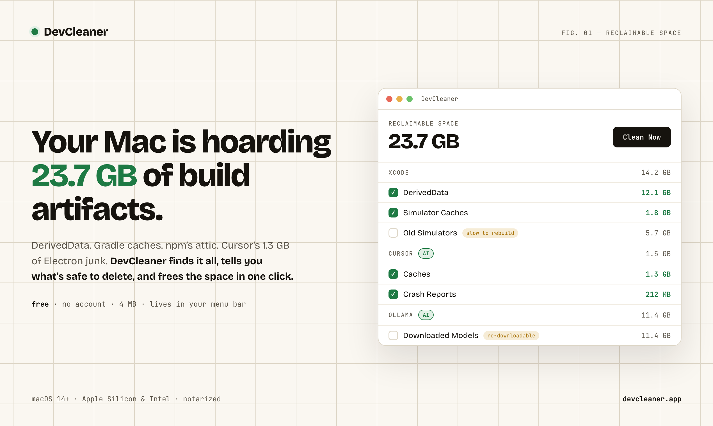
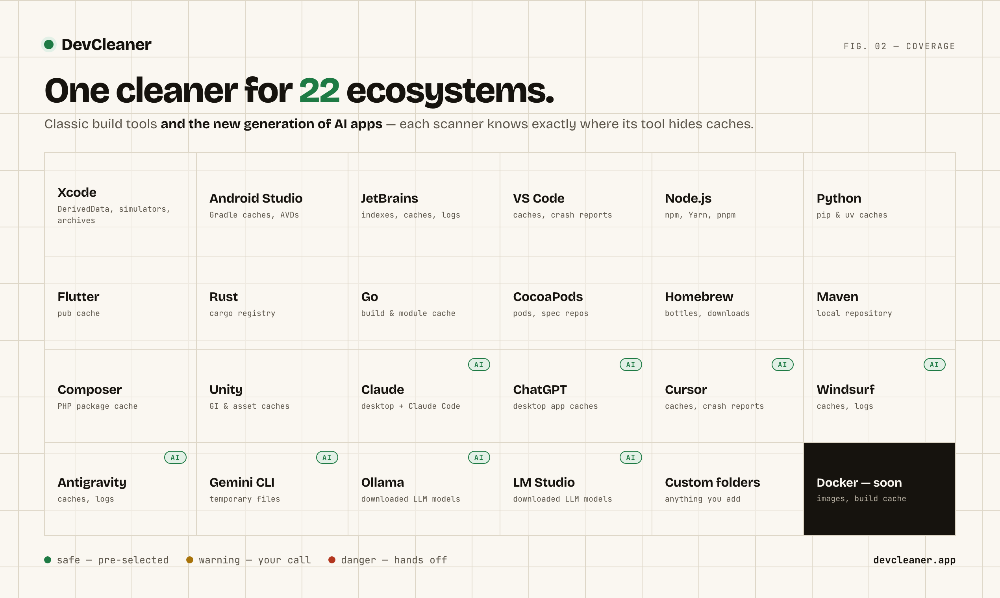
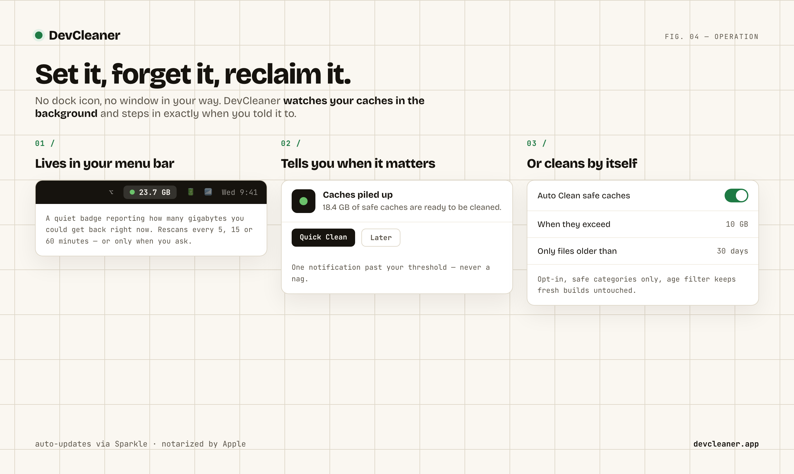

### 🎬 관련 영상
- [🎥 영상 보기](https://ph-files.imgix.net/0c30bcb4-bc46-4028-b8a6-7fba13012a18.jpeg?auto=format)

---

## 17. [Glint](https://www.producthunt.com/products/glint-9)
**Votes**: 82 | **도입 난이도**: 하 | **신뢰도**: 상
**Tagline**: Claude Code activity, right where you want it.
**서비스 링크**: https://www.producthunt.com/r/KNUFFPZKPUJI5O

**태그**: DevTool, macOS, AI-Assistant, Productivity, Agent

### 📌 이 서비스 한눈에 보기
Claude Code의 실시간 작업 상태와 리소스 사용량을 macOS 메뉴 바에서 한눈에 확인하는 가벼운 모니터링 도구

### 🔑 주요 기능
- Claude Code 세션의 실시간 상태, 사용 중인 툴, 토큰 소모량 등을 시각화
- 메뉴 바, 노치 근처, 플로팅 필 등 사용자 맞춤형 UI 제공
- 로컬 파일(~/.claude)을 읽는 방식으로 데이터 보안 유지

### 🙋 사용자에게 어떤 점이 좋은가
터미널을 계속 확인하지 않아도 Claude Code의 작업 진행 상황과 토큰 사용량을 직관적으로 파악할 수 있어 작업 흐름이 끊기지 않습니다.

### ✅ 지금 바로 써볼 기능
- 메뉴 바 위치 설정 및 UI 스타일 커스텀
- 실시간 토큰 소모량 및 컨텍스트 윈도우 모니터링
- 서브 에이전트 및 작업 플랜 확인

### ⚠️ 사용 전 확인할 점
- 현재 Claude Code 전용이며, 타 서비스(Codex, Kiro 등) 지원은 로드맵 단계임
- macOS 전용 앱임

### 🧭 확인이 더 필요한 정보
다른 AI 제공자(Codex, Kiro 등)에 대한 지원 시점과 구체적인 기능 범위는 아직 확정되지 않았습니다.

### 📸 스크린샷 및 갤러리
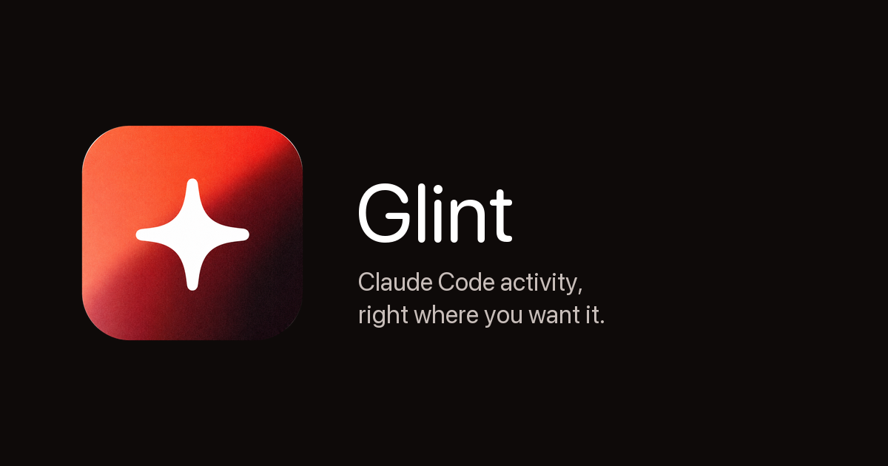

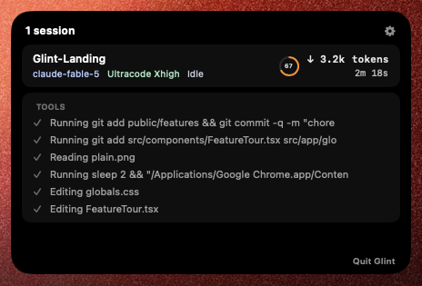

---

## 18. [Avocado](https://www.producthunt.com/products/avocado-studio)
**Votes**: 82 | **도입 난이도**: 중 | **신뢰도**: 상
**Tagline**: AI-native content operations for any Next.js website
**서비스 링크**: https://www.producthunt.com/r/XQGC4SRBDJUTU6

**태그**: Next.js, AI-Native, ContentOps, DevTool, Self-Hosted, Agent, Automation, AI Tool, Design

### 📌 이 서비스 한눈에 보기
기존 Next.js 스택을 유지하며 AI 편집 및 워크플로우를 통합하는 콘텐츠 운영 도구

### 🔑 주요 기능
- 기존 CMS, DAM, 디자인 시스템을 교체할 필요 없는 유연한 통합
- AI 네이티브 편집 기능 및 에이전트 기반 워크플로우 제공
- 셀프 호스팅 가능 및 사용자 정의 AI 모델(BYO AI) 지원

### 🙋 사용자에게 어떤 점이 좋은가
새로운 CMS를 구축하는 번거로움 없이 현재 사용 중인 Next.js 환경에 AI 기능을 즉시 도입할 수 있습니다.

### ✅ 지금 바로 써볼 기능
- 라이브 데모를 통한 편집 인터페이스 확인
- 현재 사용 중인 Next.js 스택과의 호환성 검토
- 자체 AI 모델 연결 가능 여부 테스트

### ⚠️ 사용 전 확인할 점
- Next.js 프레임워크에 특화되어 있어 타 프레임워크 사용 시 제약이 있을 수 있음
- 셀프 호스팅 시 인프라 관리 및 보안 설정 필요

### 🧭 확인이 더 필요한 정보
현재 제공되는 기능이 기존 CMS와 어떤 방식으로 데이터 동기화를 이루는지에 대한 상세 기술 문서 확인이 필요합니다.

### 📸 스크린샷 및 갤러리
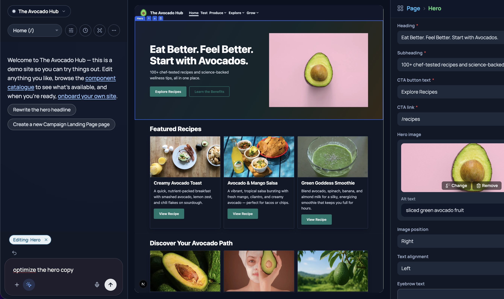
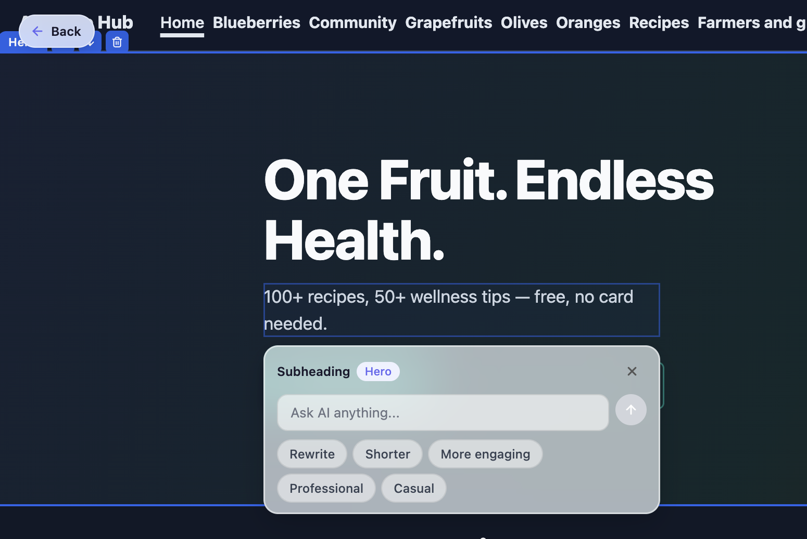
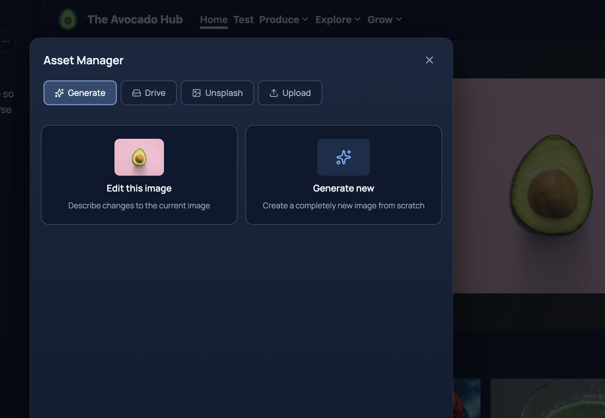

### 🎬 관련 영상
- [🎥 영상 보기](https://ph-files.imgix.net/56201a87-069e-4f33-91b0-9f8889608ac1.jpeg?auto=format)

---

## 19. [ClientJam](https://www.producthunt.com/products/clientjam)
**Votes**: 81 | **도입 난이도**: 하 | **신뢰도**: 상
**Tagline**: AI-powered lead generation for designers and agencies
**서비스 링크**: https://www.producthunt.com/r/NCFKAVYMUAEIUQ

**태그**: Lead Generation, AI Sales, Automation, Marketing Tool, AI Tool, Design, Email

### 📌 이 서비스 한눈에 보기
단순한 잠재 고객 리스트를 넘어, 사이트 진단을 통해 즉시 발송 가능한 맞춤형 제안서를 만들어주는 AI 영업 도구

### 🔑 주요 기능
- URL 분석을 통한 실시간 웹사이트 감사(SSL, 모바일, 속도, SEO) 및 문제점 도출
- 사이트의 결함을 기반으로 한 맞춤형 이메일 초안 자동 생성
- 지역별 잠재 고객 발굴(City Prospector) 및 리드 우선순위 점수 제공

### 🙋 사용자에게 어떤 점이 좋은가
단순 연락처 확보를 넘어 고객의 페인 포인트를 정확히 짚어내는 제안서를 자동 생성하므로, 영업 성공률을 높이고 제안서 작성 시간을 획기적으로 줄여줍니다.

### ✅ 지금 바로 써볼 기능
- 타겟 고객의 웹사이트 URL을 입력하여 사이트 감사 리포트 생성하기
- 도출된 문제점을 바탕으로 생성된 3가지 이메일 초안 검토하기
- City Prospector 기능을 사용하여 특정 지역의 잠재 고객 리스트 확보하기

### ⚠️ 사용 전 확인할 점
- AI가 생성한 이메일이 실제 고객의 상황과 일치하는지 최종 검토 필요
- 자동화된 대량 발송 시 스팸으로 분류될 위험성 고려

### 🧭 확인이 더 필요한 정보
제공되는 리드의 데이터 정확도와 이메일 발송 자동화 기능의 범위는 명시되지 않았습니다.

### 📸 스크린샷 및 갤러리
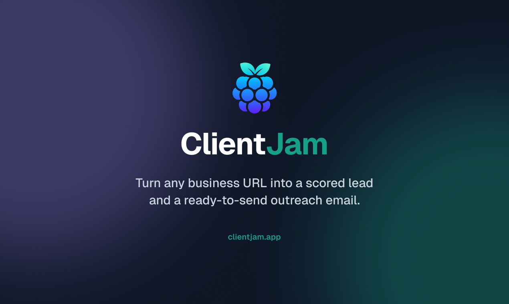
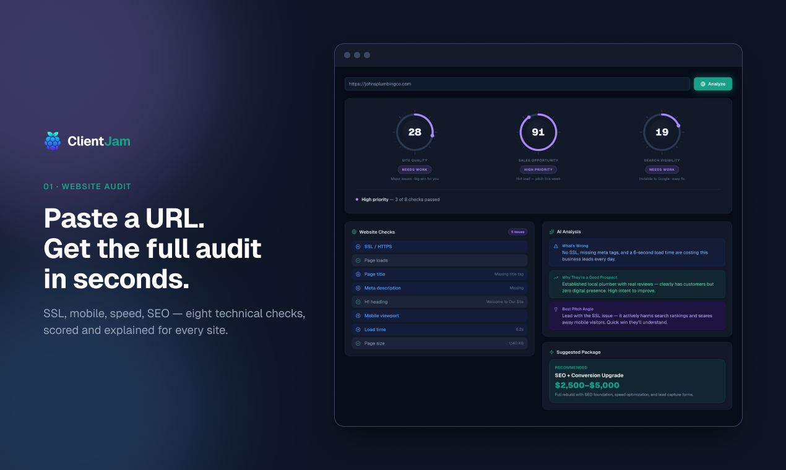
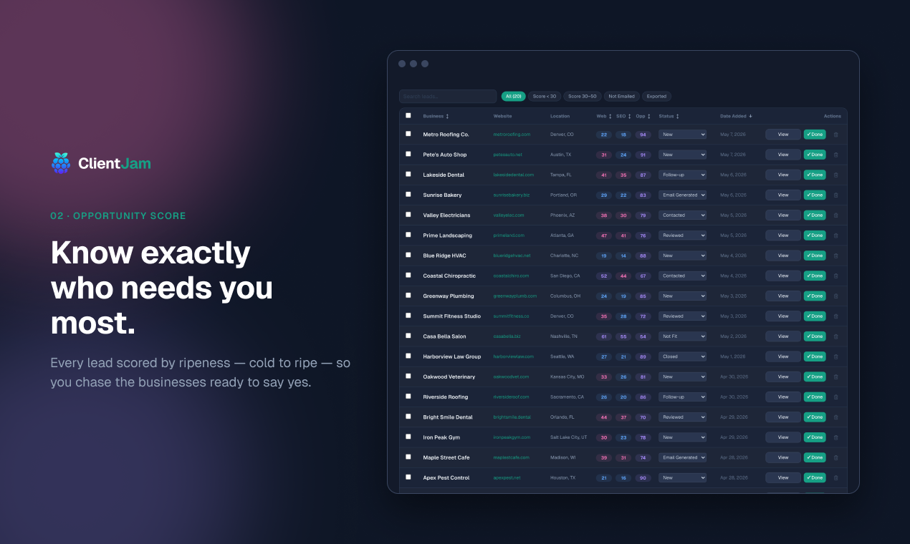

---

## 20. [whoburnedmore](https://www.producthunt.com/products/whoburnedmore)
**Votes**: 78 | **도입 난이도**: 하 | **신뢰도**: 상
**Tagline**: Spotify Wrapped for Claude, Codex & a Public leaderboard.
**서비스 링크**: https://www.producthunt.com/r/SS6QGMLAGFNQU3

**태그**: DevTool, Analytics, AI-Coding, OpenSource, AI Tool

### 📌 이 서비스 한눈에 보기
여러 AI 코딩 도구의 사용량을 한눈에 확인하고 순위를 경쟁하는 대시보드

### 🔑 주요 기능
- Claude Code, Cursor 등 12개 이상의 AI 코딩 도구 통합 분석
- 토큰 사용량, 비용, 도구 활용도 등 상세 대시보드 제공
- 전 세계 사용자들과 실력을 비교할 수 있는 공개 리더보드 운영

### 🙋 사용자에게 어떤 점이 좋은가
자신의 AI 코딩 패턴과 비용을 직관적으로 파악하고, 다른 개발자들과의 사용량을 비교하며 동기부여를 얻을 수 있습니다.

### ✅ 지금 바로 써볼 기능
- 터미널에서 `npx whoburnedmore` 명령어로 즉시 실행하기
- 자신의 AI 코딩 사용량 대시보드 확인하기
- 공개 리더보드에서 자신의 순위 확인하기

### ⚠️ 사용 전 확인할 점
- 로컬 환경에서 명령어를 실행해야 하므로 보안 및 권한 확인 필요
- 다양한 도구의 데이터를 수집하는 방식에 따른 데이터 정확도 차이 가능성

### 🧭 확인이 더 필요한 정보
지원되는 12개 이상의 도구 목록과 데이터 수집 방식에 대한 상세 명세가 필요합니다.

### 📸 스크린샷 및 갤러리
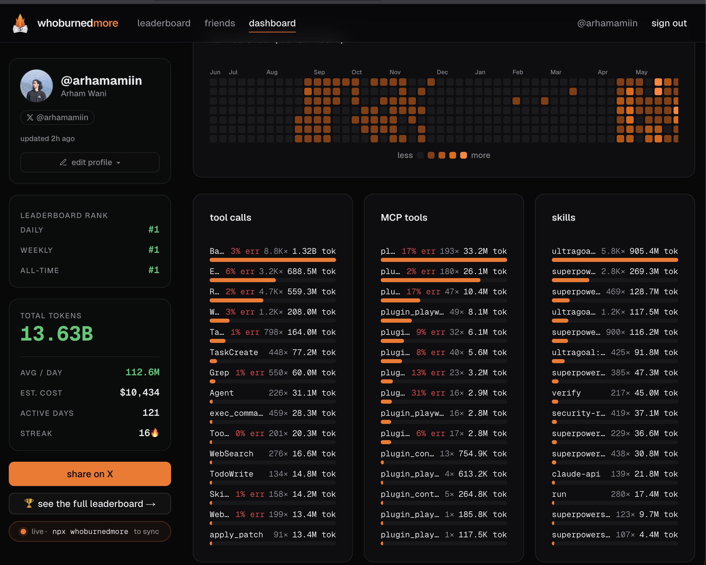
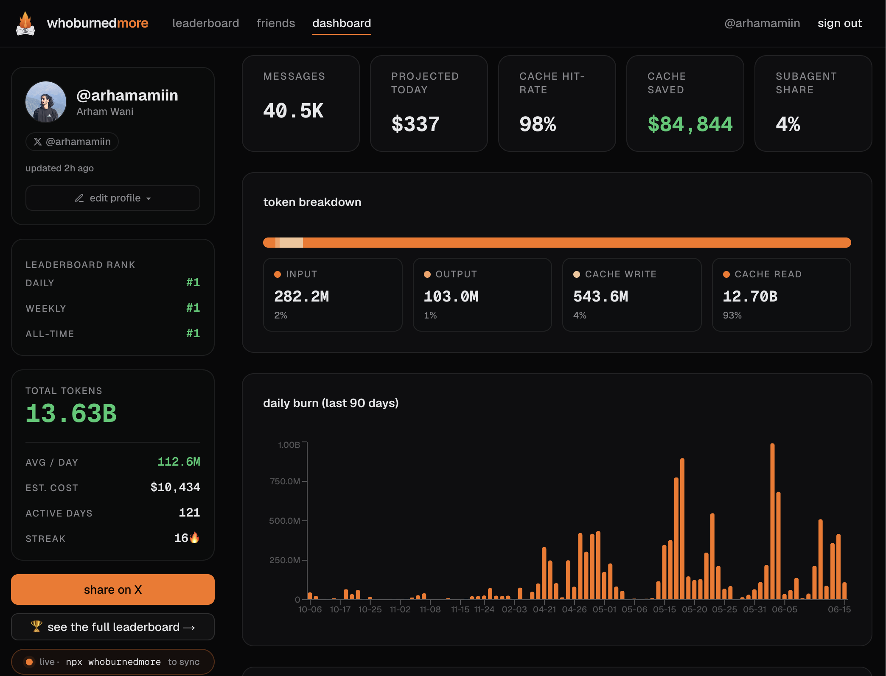

### 🎬 관련 영상
- [🎥 영상 보기](https://ph-files.imgix.net/8edfe71e-e87b-430e-b7df-651c2bf5f17c.jpeg?auto=format)

---

## 21. [1000Yen Eats](https://www.producthunt.com/products/1000yen-eats)
**Votes**: 77 | **도입 난이도**: 하 | **신뢰도**: 상
**Tagline**: Find a real meal under ¥1,000 anywhere in Japan
**서비스 링크**: https://www.producthunt.com/r/OXYTVGFVZG3NZ3

**태그**: Travel, Food & Drink, Japan, Utility

### 📌 이 서비스 한눈에 보기
일본 전역 25,000개 이상의 1,000엔 이하 가성비 맛집 지도

### 🔑 주요 기능
- 일본 78개 도시, 25,000개 이상의 저렴한 식당 데이터 제공
- 음식 종류별 필터링 및 거리/가격순 정렬 기능
- 로그인, 광고, 트래킹 없는 개인정보 보호 중심 서비스

### 🙋 사용자에게 어떤 점이 좋은가
일본 여행이나 체류 중 예산에 맞는 확실한 한 끼 식사 장소를 빠르고 간편하게 찾을 수 있습니다.

### ✅ 지금 바로 써볼 기능
- 방문 예정인 도시의 식당 목록 확인하기
- 가장 가까운 가성비 맛집 필터링해보기
- 오프라인 모드를 활용해 여행 전 미리 저장하기

### ⚠️ 사용 전 확인할 점
- 실제 매장의 메뉴 가격 변동 가능성
- 데이터 업데이트 주기에 따른 정보 차이

### 🧭 확인이 더 필요한 정보
제공되는 데이터가 실시간 영업 여부나 최신 메뉴 가격을 완벽히 반영하는지 확인이 필요합니다.

### 📸 스크린샷 및 갤러리

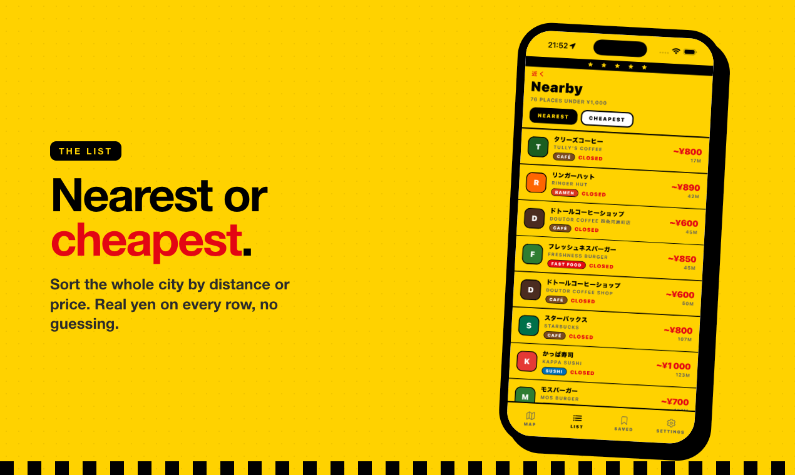

---

## 22. [Mood](https://www.producthunt.com/products/mood-5)
**Votes**: 76 | **도입 난이도**: 하 | **신뢰도**: 상
**Tagline**: A quiet record of how you feel
**서비스 링크**: https://www.producthunt.com/r/5G6MORWUR5RUOD

**태그**: MentalHealth, Journaling, Minimalism, MoodTracker

### 📌 이 서비스 한눈에 보기
매일의 감정을 탭과 레이블로 기록하는 간결한 감정 기록 서비스

### 🔑 주요 기능
- 직관적인 탭과 레이블 방식의 기록
- 픽셀 기반의 시각적 감정 기록
- 매일의 변화를 추적하는 데일리 로그

### 🙋 사용자에게 어떤 점이 좋은가
복잡한 일기 작성 대신 간단한 조작만으로 자신의 감정 상태를 빠르고 간편하게 기록할 수 있습니다.

### ✅ 지금 바로 써볼 기능
- 오늘의 기분 탭하기
- 감정에 레이블 지정하기
- 픽셀로 기록된 감정 변화 확인하기

### ⚠️ 사용 전 확인할 점
- 상세한 일기 기능보다는 요약된 기록에 특화되어 있음
- 데이터 시각화 방식이 사용자 취향에 따라 다를 수 있음

### 🧭 확인이 더 필요한 정보
구체적인 데이터 저장 방식이나 플랫폼 지원 범위(iOS/Android)에 대한 정보가 부족합니다.

### 📸 스크린샷 및 갤러리
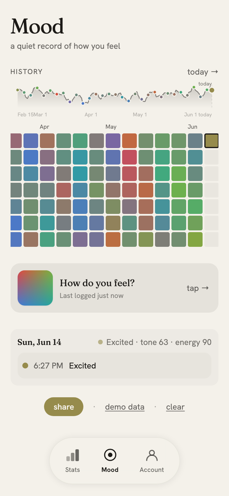
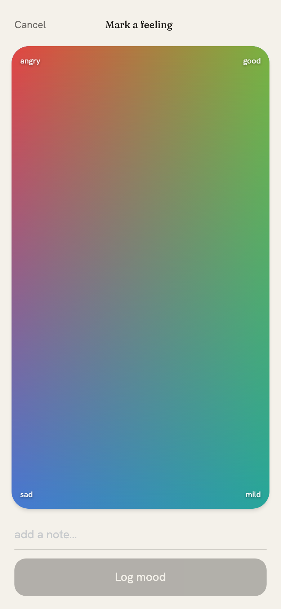
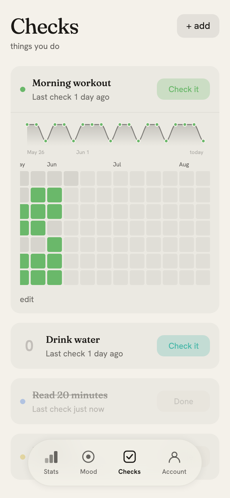

---

## 23. [agentbrowse](https://www.producthunt.com/products/agentbrowse)
**Votes**: 76 | **도입 난이도**: 하 | **신뢰도**: 상
**Tagline**: Give your AI coding agent the web as a command line
**서비스 링크**: https://www.producthunt.com/r/BLZFXYRX6TUME2

**태그**: DevTool, AI-Agent, Automation, Web-Automation, Agent, AI Tool

### 📌 이 서비스 한눈에 보기
AI 코딩 에이전트가 웹 브라우저를 터미널처럼 자유롭게 제어할 수 있게 해주는 도구

### 🔑 주요 기능
- 웹사이트를 CLI 환경처럼 변환하여 AI 에이전트의 브라우징 능력 강화
- 클릭, 폼 입력, 로그인, 스냅샷 및 마크다운 변환 기능 제공
- Claude Code, Cursor, Windsurf 등 주요 AI 코딩 도구와 즉시 연동

### 🙋 사용자에게 어떤 점이 좋은가
터미널 환경에 특화된 AI 에이전트가 웹 페이지의 정보를 읽거나 조작할 때 발생하는 번거로움을 해결하여 개발 워크플로우를 자동화합니다.

### ✅ 지금 바로 써볼 기능
- 사용 중인 AI 코딩 에이전트(Cursor, Windsurf 등)에 연동하기
- 웹 페이지를 마크다운으로 변환하여 AI에게 데이터 전달하기
- 로그인이 필요한 웹 서비스 자동화 테스트해보기

### ⚠️ 사용 전 확인할 점
- 웹사이트 구조 변경 시 자동화 동작의 안정성 확인 필요
- 로그인 및 개인정보가 포함된 웹사이트 사용 시 보안 주의

### 🧭 확인이 더 필요한 정보
다양한 에이전트 도구와의 구체적인 설정 방법 및 보안 프로토콜에 대한 상세 정보가 필요합니다.

### 📸 스크린샷 및 갤러리
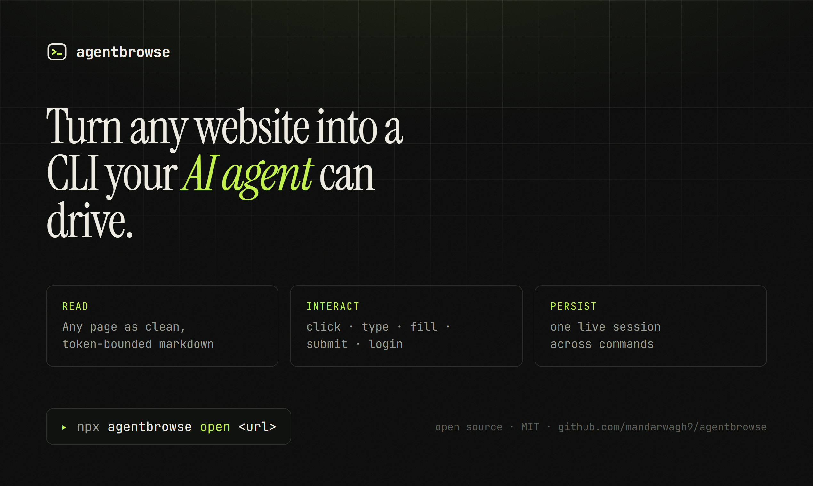
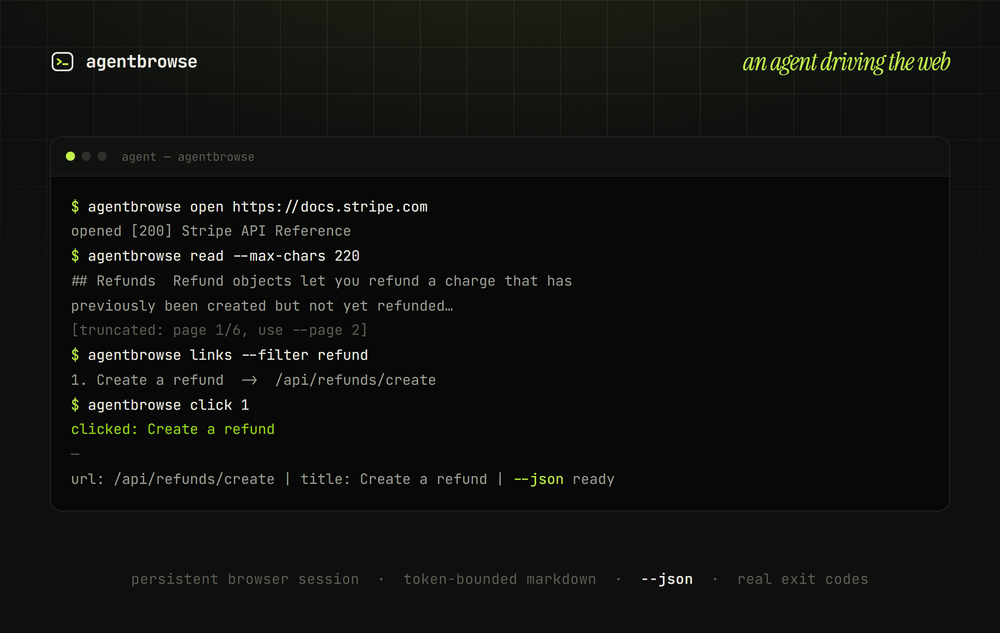

### 🎬 관련 영상
- [🎥 영상 보기](https://ph-files.imgix.net/ff975f3b-4312-4661-8fae-c4ca3674f26d.jpeg?auto=format)

---

## 24. [Fantasma](https://www.producthunt.com/products/fantasma)
**Votes**: 76 | **도입 난이도**: 하 | **신뢰도**: 상
**Tagline**: Landing page builder for Ghost CMS
**서비스 링크**: https://www.producthunt.com/r/ZCFQH3TDEZM3DS

**태그**: NoCode, CMS, WebDesign, GhostCMS

### 📌 이 서비스 한눈에 보기
Ghost CMS를 위한 코드 없는 시각적 랜딩 페이지 빌더

### 🔑 주요 기능
- Hero, FAQ, Feature Grid 등 Ghost 기본 테마에 없는 섹션 제공
- 테마 파일 수정 없이 시각적 편집 방식으로 페이지 구축
- 표준 ZIP 파일 내보내기 또는 Ghost(Pro) 직접 게시 지원

### 🙋 사용자에게 어떤 점이 좋은가
개발 지식 없이도 Ghost CMS 환경에서 전문적인 랜딩 페이지를 빠르게 제작하고 클라이언트에게 전달할 수 있습니다.

### ✅ 지금 바로 써볼 기능
- 제공되는 섹션 템플릿 탐색하기
- 시각적 편집 도구로 페이지 레이아웃 구성하기
- 결과물을 ZIP 파일로 내보내어 호환성 확인하기

### ⚠️ 사용 전 확인할 점
- Ghost(Pro) 환경과 일반 Ghost 설치 환경 간의 게시 방식 차이 확인 필요
- 내보낸 파일의 커스텀 수정 범위 확인

### 🧭 확인이 더 필요한 정보
Ghost(Pro) 직접 게시 시의 상세 비용 체계나 제약 사항에 대한 정보가 명시되지 않았습니다.

### 📸 스크린샷 및 갤러리
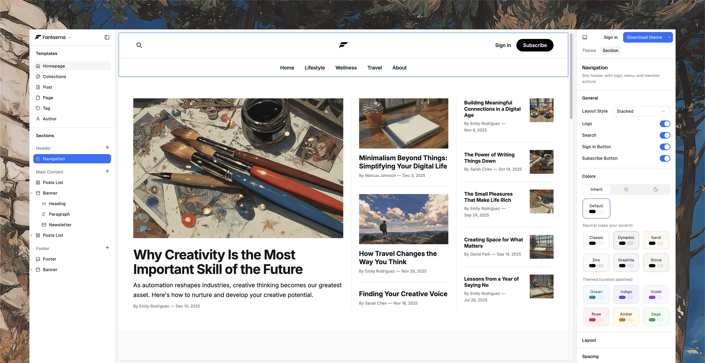
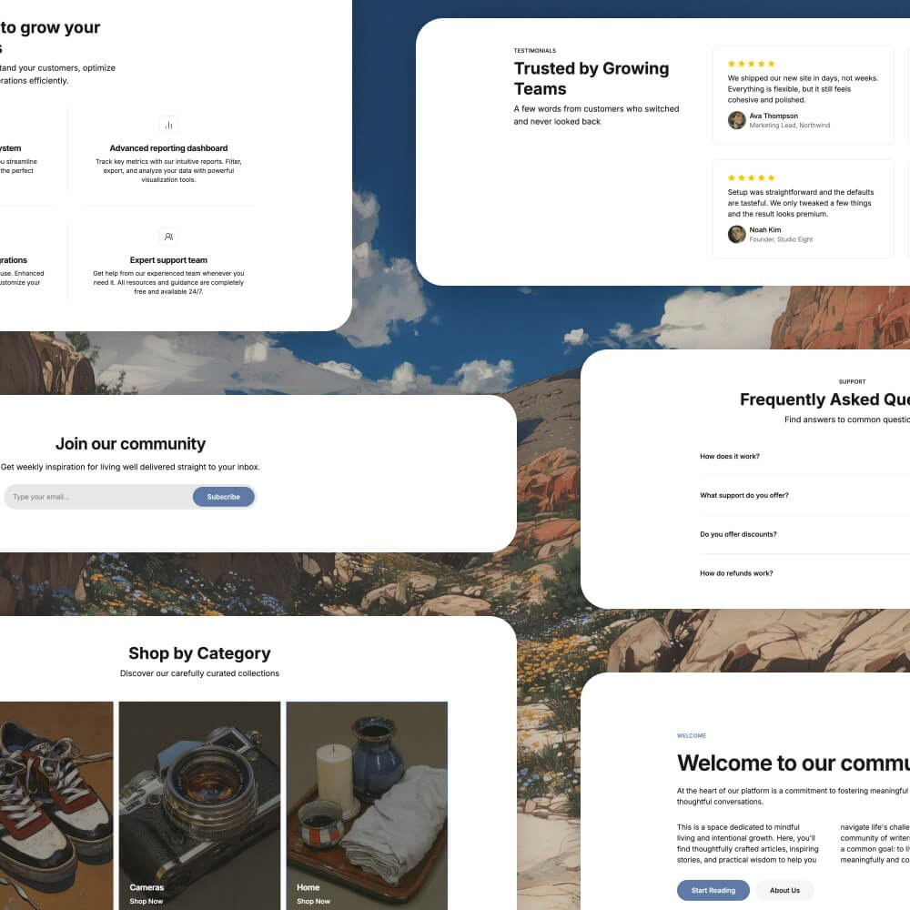
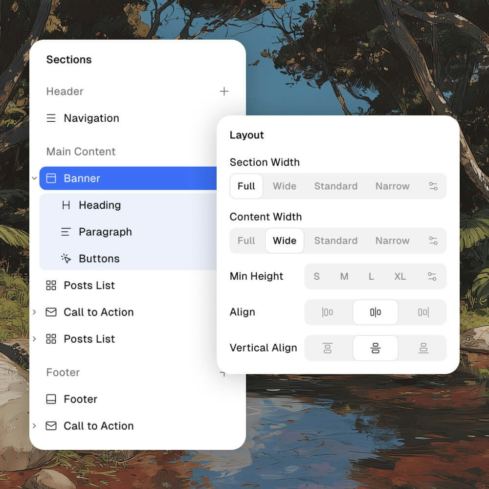

### 🎬 관련 영상
- [🎥 영상 보기](https://ph-files.imgix.net/35299005-8c48-4d3a-a8cd-64af9ea599c7.jpeg?auto=format)

---

## 25. [Dinamo Notebook](https://www.producthunt.com/products/dinamo-notebook)
**Votes**: 75 | **도입 난이도**: 하 | **신뢰도**: 상
**Tagline**: Professional football/soccer analysis, right in your browser
**서비스 링크**: https://www.producthunt.com/r/I62BM4JN3ERHDI

**태그**: SportsAnalytics, VideoAnalysis, Productivity, NoSubscription, AI Tool, API

### 📌 이 서비스 한눈에 보기
브라우저에서 즉시 실행 가능한 전문적인 축구 전술 분석 및 리포트 생성 도구

### 🔑 주요 기능
- 유튜브, 트위치 등 웹 영상 및 로컬 파일 분석 지원
- 타임스탬프 노트, 플레이어 태깅, 전술 다이어그램 기능 제공
- 구독 없이 로컬에서 작동하는 개인정보 보호 중심 설계

### 🙋 사용자에게 어떤 점이 좋은가
별도의 무거운 소프트웨어 설치 없이 브라우저만으로 전문적인 경기 분석과 리포트 작성이 가능합니다.

### ✅ 지금 바로 써볼 기능
- 분석할 경기 영상 불러오기
- 타임스탬프와 전술 다이어그램을 활용한 노트 작성
- 완성된 분석 내용을 PDF나 GIF로 내보내기

### ⚠️ 사용 전 확인할 점
- AI 기능 사용 시 개인 API 키가 필요할 수 있음
- 브라우저 기반이므로 고해상도 대용량 파일 처리 시 시스템 리소스 영향 확인 필요

### 🧭 확인이 더 필요한 정보
사용자의 하드웨어 사양에 따른 영상 처리 성능 및 AI API 연동 방식에 대한 구체적인 정보가 필요합니다.

### 📸 스크린샷 및 갤러리
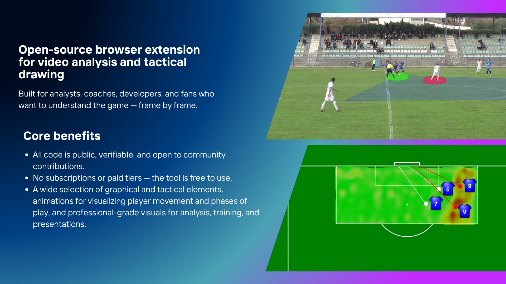
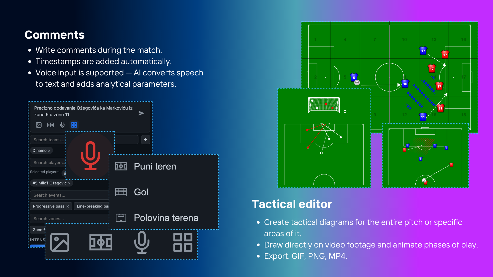
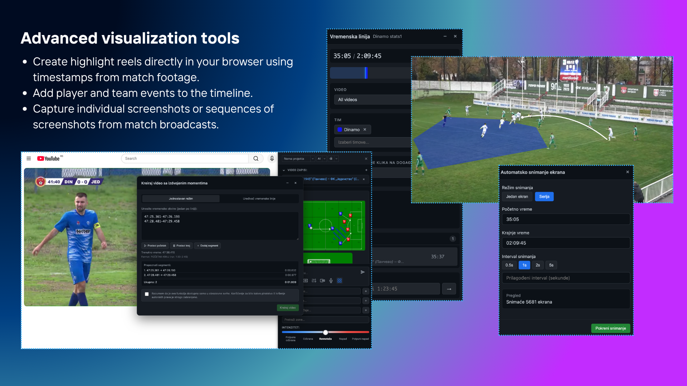

---

## 26. [FableWatch](https://www.producthunt.com/products/fablewatch)
**Votes**: 74 | **도입 난이도**: 하 | **신뢰도**: 상
**Tagline**: Know the second Fable 5 is back
**서비스 링크**: https://www.producthunt.com/r/YNSTJGL6ADQGYA

**태그**: Automation, Monitoring, Alerting, DevTool, AI Tool, API, Email

### 📌 이 서비스 한눈에 보기
Claude Fable 5의 재가동 여부를 실시간으로 알려주는 자동화 모니터링 서비스

### 🔑 주요 기능
- 60초 간격의 자동 API 핑(Ping) 테스트
- 서비스 재개 시 즉각적인 알림 제공
- 이메일, 문자, 전화 등 다양한 채널을 통한 긴급 알림

### 🙋 사용자에게 어떤 점이 좋은가
특정 모델의 가용성을 실시간으로 확인해야 하는 사용자에게 서비스 재개 시점을 놓치지 않게 해줍니다.

### ✅ 지금 바로 써볼 기능
- 알림 수신 채널 설정하기
- 모니터링 주기 확인하기

### ⚠️ 사용 전 확인할 점
- API 호출 빈도에 따른 비용이나 제한 사항 확인 필요
- 알림 채널(전화 등)의 정확도 및 도달 가능성 검토

### 🧭 확인이 더 필요한 정보
대상 모델인 'claude-fable-5'의 구체적인 API 명세와 연동 방식에 대한 정보가 부족합니다.

### 📸 스크린샷 및 갤러리
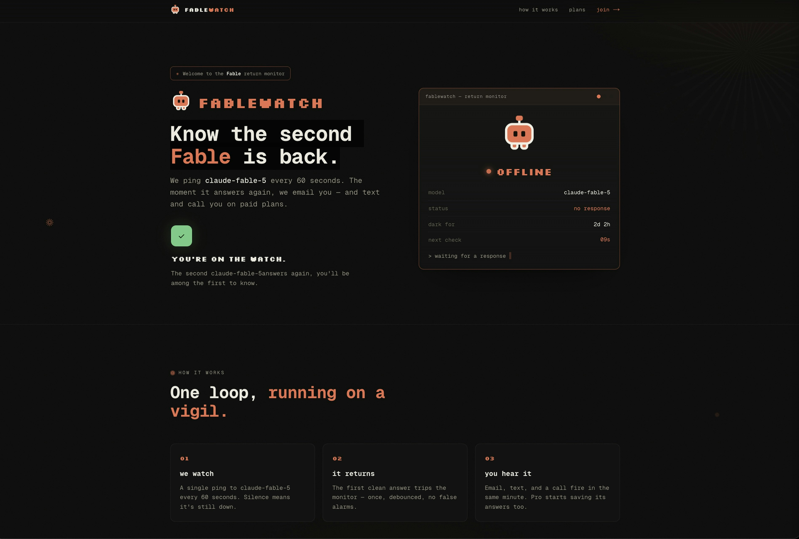

---

## 27. [How Hueman Are You?](https://www.producthunt.com/products/how-hueman-are-you)
**Votes**: 74 | **도입 난이도**: 하 | **신뢰도**: 상
**Tagline**: Find the odd tile before the clock runs out
**서비스 링크**: https://www.producthunt.com/r/DLRIXWPSUODA3H

**태그**: Puzzle, Casual Game, Daily Challenge, AI Tool

### 📌 이 서비스 한눈에 보기
매일 새로운 색상 퍼즐을 푸는 전 세계 공통 데일리 컬러 게임

### 🔑 주요 기능
- 매일 자정(UTC)에 업데이트되는 새로운 퍼즐
- 전 세계 사용자가 동일한 문제를 푸는 소셜 퍼즐 경험
- 2분 내외로 즐길 수 있는 가벼운 데일리 루틴

### 🙋 사용자에게 어떤 점이 좋은가
바쁜 아침 시간에 짧고 간편하게 두뇌를 깨울 수 있는 색상 맞추기 퍼즐을 제공합니다.

### ✅ 지금 바로 써볼 기능
- 매일 자정 새로운 퍼즐 도전하기
- 친구들과 동일한 퍼즐 결과 공유하기

### ⚠️ 사용 전 확인할 점
- 매일 한 번만 제공되는 퍼즐이므로 반복 플레이가 제한적일 수 있음

### 🧭 확인이 더 필요한 정보
현재 제품의 플랫폼(웹 또는 모바일 앱)에 대한 구체적인 정보가 명시되지 않았습니다.

### 📸 스크린샷 및 갤러리

### 🎬 관련 영상
- [🎥 영상 보기](https://ph-files.imgix.net/b1565b94-d1bb-4c2f-8509-82352ebe304b.jpeg?auto=format)

---

## 28. [Keyboard Copilot](https://www.producthunt.com/products/keyboard-copilot-ios-ai-keyboard)
**Votes**: 73 | **도입 난이도**: 하 | **신뢰도**: 상
**Tagline**: AI keyboard that rephrases, translates, and more in any app
**서비스 링크**: https://www.producthunt.com/r/YDOOEPKUSX2SDG

**태그**: Productivity, AI, Writing, Workflow, Automation, AI Tool

### 📌 이 서비스 한눈에 보기
어떤 앱에서도 즉시 AI 기능을 사용할 수 있는 워크플로우 통합형 키보드

### 🔑 주요 기능
- 앱 전환 없이 키보드 내에서 즉시 AI 기능 실행
- 문장 재작성, 번역, 문법 교정, 톤 변경 등 다양한 텍스트 작업 지원
- 사용자 흐름을 방해하지 않는 빠르고 네이티브한 사용자 경험

### 🙋 사용자에게 어떤 점이 좋은가
작업 중 다른 AI 도구로 창을 옮길 필요가 없어 생산성 저하를 방지하고 타이핑 흐름을 유지할 수 있습니다.

### ✅ 지금 바로 써볼 기능
- 작성 중인 메시지의 톤 변경해보기
- 외국어 문장 즉시 번역 및 교정하기
- 답장 자동 생성 기능 테스트하기

### ⚠️ 사용 전 확인할 점
- 키보드 입력 데이터가 AI 모델로 전송되므로 개인정보 및 보안 주의 필요
- 모든 운영체제나 특정 앱 환경에서의 완벽한 호환성 확인 필요

### 🧭 확인이 더 필요한 정보
구체적인 지원 운영체제(OS) 및 개인정보 보호 정책에 대한 상세 정보가 필요합니다.

### 📸 스크린샷 및 갤러리
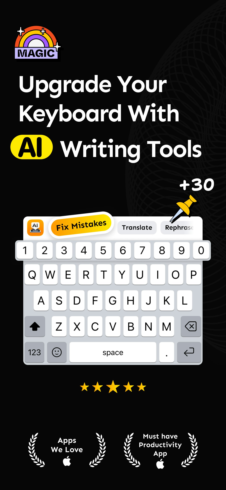
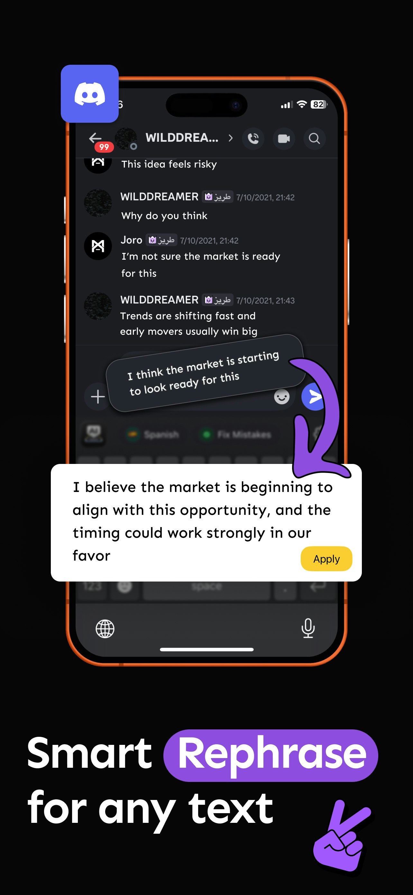

---

## 29. [Publia](https://www.producthunt.com/products/publia)
**Votes**: 73 | **도입 난이도**: 하 | **신뢰도**: 상
**Tagline**: What AI makes, Publia ships.
**서비스 링크**: https://www.producthunt.com/r/VJNUQGUDSRRWGA

**태그**: DevTool, AI, Deployment, Automation, NoCode, AI Tool

### 📌 이 서비스 한눈에 보기
AI가 생성한 결과물을 즉시 실제 웹 페이지로 배포해 주는 초간편 호스팅 서비스

### 🔑 주요 기능
- AI(Claude, Codex 등)와 연동하여 명령어 한 줄로 웹 페이지 배포 가능
- 별도의 서버 설정이나 복잡한 환경 구축 없이 즉시 라이브 링크 생성
- 터미널(CLI) 푸시 또는 웹 대시보드(Drag & Drop)를 통한 유연한 업로드 방식 지원

### 🙋 사용자에게 어떤 점이 좋은가
AI로 만든 코드나 결과물을 웹에 올리는 번거로운 과정을 생략하고, 즉시 공유 가능한 URL을 얻을 수 있습니다.

### ✅ 지금 바로 써볼 기능
- CLI를 통한 AI 스킬(getpublia/skills) 설치 및 연동 테스트
- 로컬 파일을 publia.ai에 드래그하여 즉시 배포해 보기

### ⚠️ 사용 전 확인할 점
- 현재 초기 단계(Early stage) 서비스로 기능적 완성도 확인 필요
- 사용자 정의 도메인 지원 여부 및 상세 설정 기능 미비 가능성

### 🧭 확인이 더 필요한 정보
서비스의 상세 기능 범위와 향후 확장될 자동화 기능에 대한 구체적인 정보가 부족합니다.

### 📸 스크린샷 및 갤러리
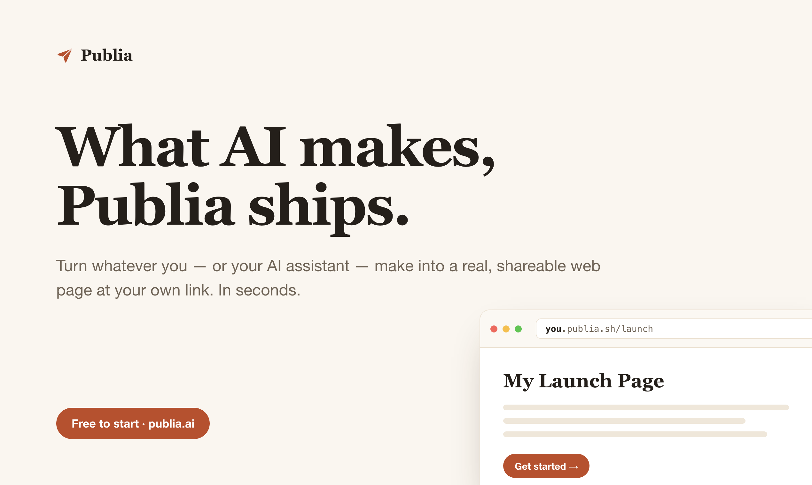
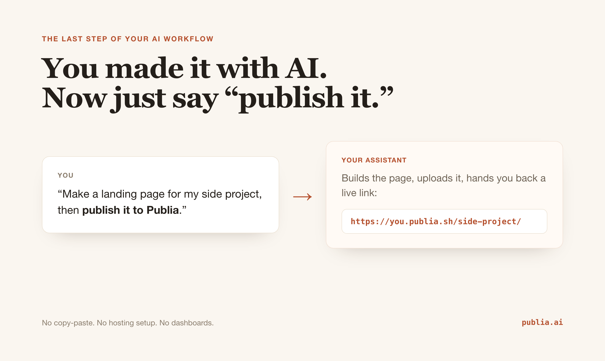
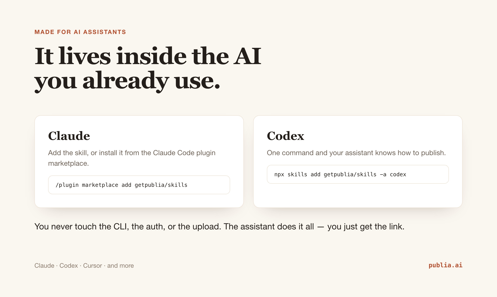

---

## 30. [LLM Gateway Chat](https://www.producthunt.com/products/llm-gateway)
**Votes**: 73 | **도입 난이도**: 하 | **신뢰도**: 상
**Tagline**: One balance. Every model. Chat, image, video & audio.
**서비스 링크**: https://www.producthunt.com/r/OCTGOECVVD5JXK

**태그**: AI, LLM, Productivity, Multimodal, Chat, Video, Vision

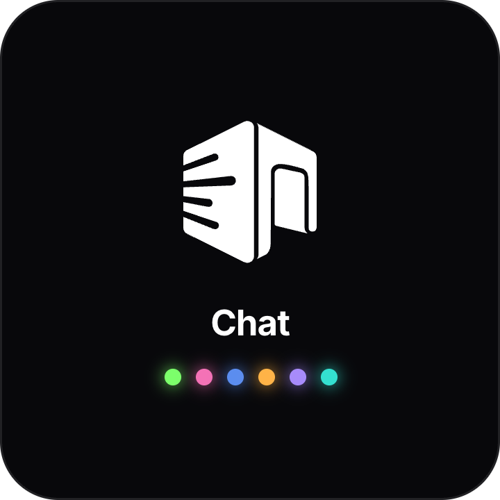

### 📌 이 서비스 한눈에 보기
210개 이상의 다양한 AI 모델을 하나의 계정으로 자유롭게 전환하며 사용하는 통합 플레이그라운드

### 🔑 주요 기능
- GPT, Claude, Gemini 등 210개 이상의 다양한 모델 통합 지원
- 대화 도중 모델 전환 및 답변 사이드 바이 사이드 비교 기능
- 텍스트 외 이미지, 비디오, 오디오 스튜디오 기능 제공

### 🙋 사용자에게 어떤 점이 좋은가
여러 AI 서비스의 개별 구독 없이 하나의 결제로 다양한 모델을 테스트하고 비교할 수 있어 비용과 번거로움을 줄여줍니다.

### ✅ 지금 바로 써볼 기능
- 동일한 질문에 대한 모델별 답변 비교하기
- 대화 흐름을 유지하며 모델 교체해보기
- 멀티모달(이미지/비디오/오디오) 스튜디오 기능 테스트하기

### ⚠️ 사용 전 확인할 점
- 사용량에 따른 비용 관리 필요 (구독형 및 종량제 혼합)
- 모델별 성능 차이에 따른 결과물 품질 편차

### 🧭 확인이 더 필요한 정보
구체적인 모델별 API 호출 제한이나 상세 요금 체계에 대한 확인이 필요합니다.

### 📸 스크린샷 및 갤러리
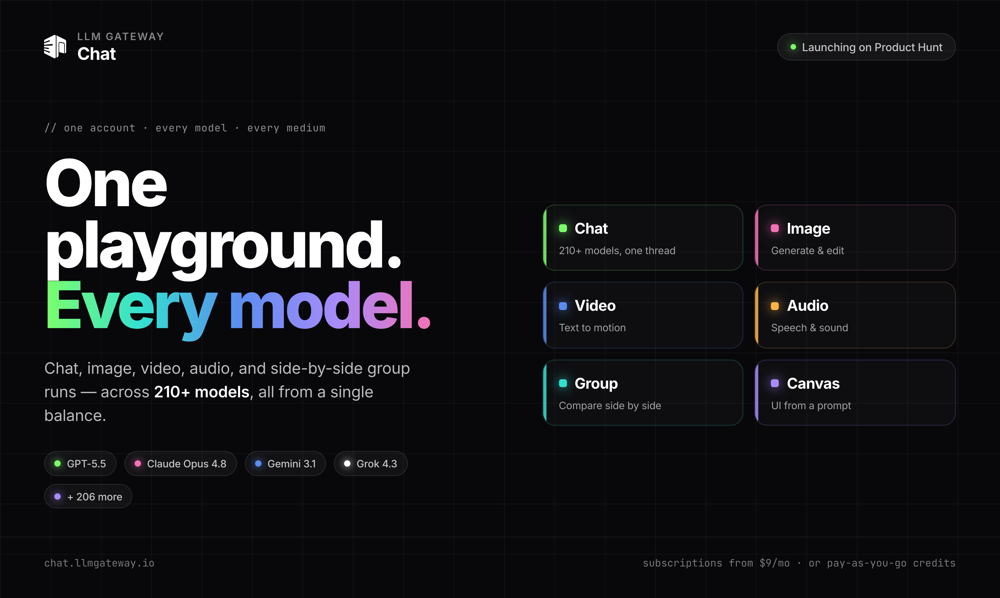
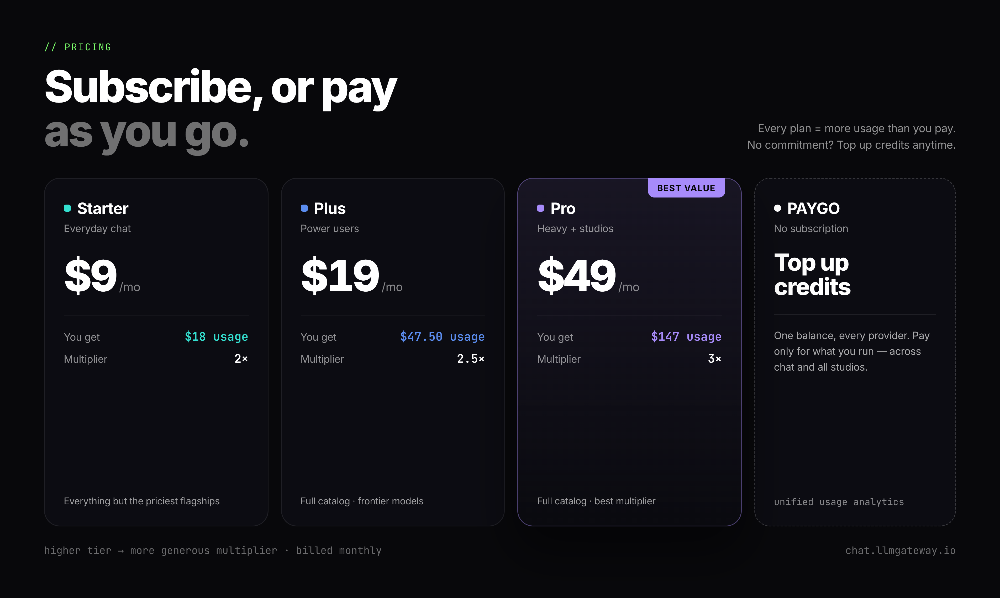
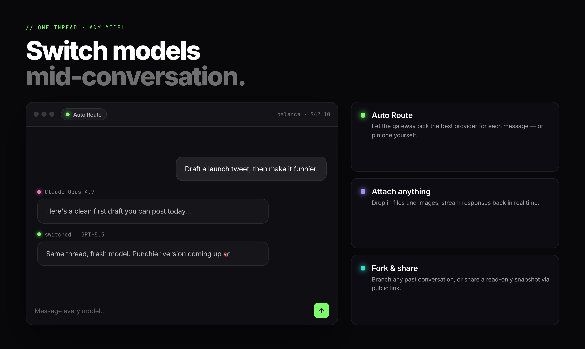

---

