# 🚀 Product Hunt Daily Top 30 (2026-06-18)

## 오늘의 요약
오늘의 트렌드는 AI 에이전트가 단순한 보조를 넘어 개발 워크플로우, 디자인, 이메일 관리 등 전문적인 영역에서 자율적으로 업무를 수행하는 방향으로 진화하고 있습니다. 또한, 사용자의 맥락을 이해하는 지능형 인터페이스와 멀티 플랫폼 대응을 위한 효율적인 제작 도구들이 주목받았습니다.

### 오늘의 핵심 포인트
- AI 에이전트가 코드 리뷰, API 연동, 디자인 자동화 등 반복적이고 복잡한 업무를 스스로 처리하는 기술이 강화되었습니다.
- 사용자의 화면 맥락이나 개인의 특성(ADHD 등)을 고려한 맞춤형 지능형 서비스가 등장하며 사용자 경험의 개인화가 심화되었습니다.
- 로컬 실행을 통한 보안 강화 및 멀티 플랫폼 콘텐츠 제작을 위한 효율적인 워크플로우 도구들이 실용적인 가치를 제공하고 있습니다.

**오늘의 태그**: AI 에이전트, 워크플로우 자동화, 지능형 UX, 생산성 도구

## 1. [Framer 3.0](https://www.producthunt.com/products/framer)
**Votes**: 361 | **도입 난이도**: 중 | **신뢰도**: 상
**Tagline**: With Agents, Branching, Community, and an all-new design
**서비스 링크**: https://www.producthunt.com/r/64HL7FCICRJ4CQ

**태그**: DesignTool, AI, Collaboration, NoCode, WebDesign, Agent, AI Tool, Design

### 📌 이 서비스 한눈에 보기
AI 에이전트와 협업 기능이 강화된 차세대 웹 디자인 및 제작 플랫폼

### 🔑 주요 기능
- AI 에이전트를 통한 디자인, 글쓰기, 데이터 분석 및 사이트 관리 자동화
- 팀 단위의 아이디어 실험을 위한 브랜칭(Branching) 기능 도입
- 크리에이터 간 공유와 수익 창출이 가능한 커뮤니티 생태계 구축

### 🙋 사용자에게 어떤 점이 좋은가
AI를 통해 제작 시간을 단축하고, 브랜칭 기능을 통해 팀원들과 안전하게 디자인 실험을 진행할 수 있습니다.

### ✅ 지금 바로 써볼 기능
- AI 에이전트를 활용한 사이트 초안 생성
- 브랜칭 기능을 통한 팀 협업 워크플로우 테스트
- 커뮤니티를 통한 크리에이터 생태계 탐색

### ⚠️ 사용 전 확인할 점
- AI 생성 결과물의 품질 검수 필요
- 브랜칭 기능 사용 시 팀 내 워크플로우 변화 적응 필요

### 🧭 확인이 더 필요한 정보
AI 에이전트의 구체적인 자동화 범위와 커뮤니티 수익 모델의 상세 정책 확인이 필요합니다.

### 📸 스크린샷 및 갤러리
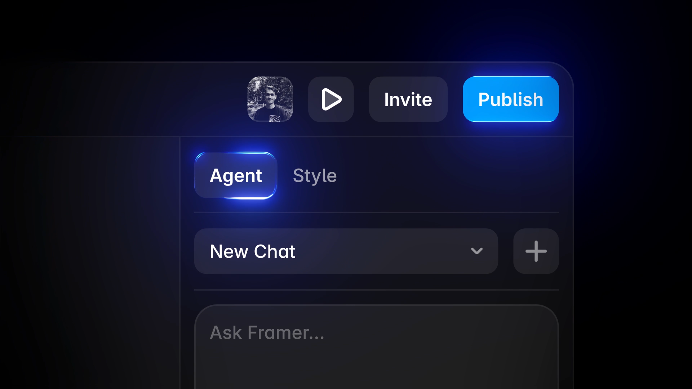
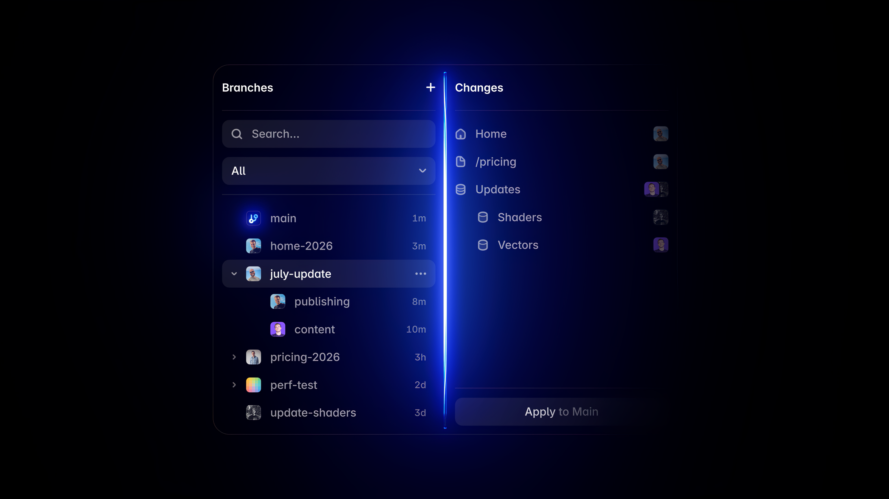
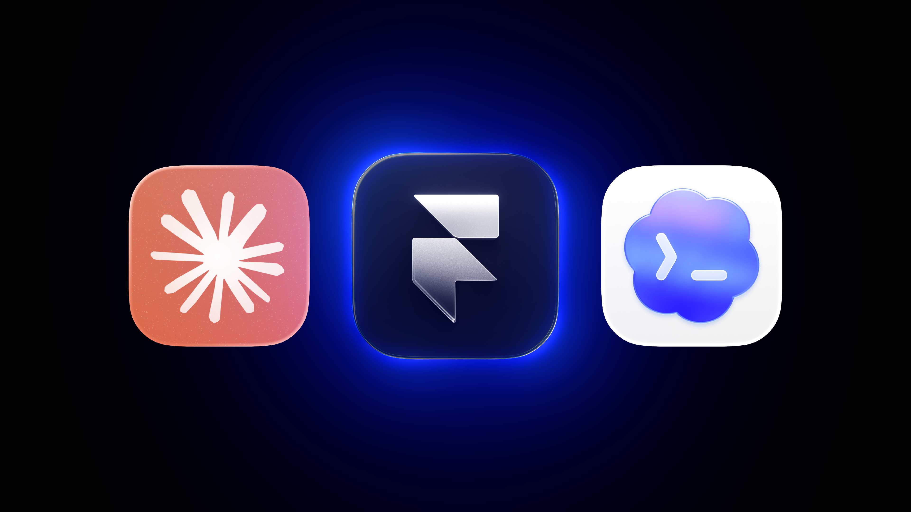

### 🎬 관련 영상
- [🎥 영상 보기](https://ph-files.imgix.net/3eb7df14-d02c-4619-94c2-657f8484765b.jpeg?auto=format)

---

## 2. [Swytchcode CLI](https://www.producthunt.com/products/swytchcode)
**Votes**: 283 | **도입 난이도**: 중 | **신뢰도**: 상
**Tagline**: Give agents reliable access to 2,000+ APIs w/ durable state
**서비스 링크**: https://www.producthunt.com/r/XGLQDUQRILY2VD

**태그**: DevTool, AI-Agents, API, Automation, Agent, AI Tool

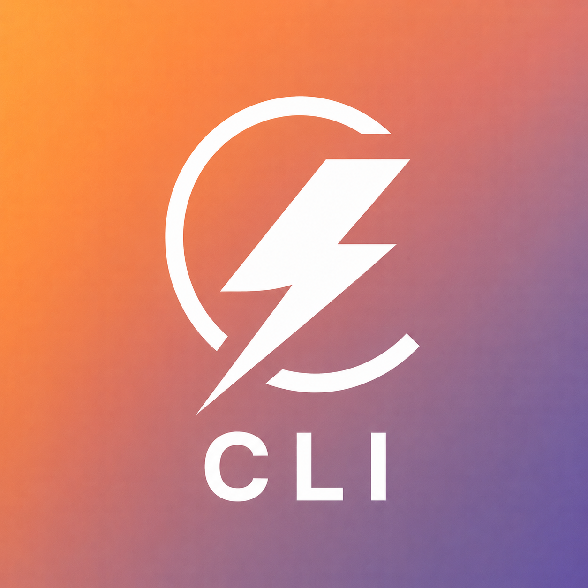

### 📌 이 서비스 한눈에 보기
복잡한 API 연동 로직 없이 AI 에이전트에게 안정적인 API 실행 권한을 부여하는 CLI 도구

### 🔑 주요 기능
- 2,000개 이상의 API에 대한 신뢰할 수 있는 접근 제공
- 재시도(Retries), 멱등성(Idempotency), 정책 준수 기능 내장
- 에이전트 실행을 위한 내구성이 있는 상태 관리(Durable State) 지원

### 🙋 사용자에게 어떤 점이 좋은가
에이전트 개발 시 발생하는 복잡한 API 통신 및 예외 처리 로직을 생략하고, 핵심 비즈니스 로직 개발에만 집중할 수 있습니다.

### ✅ 지금 바로 써볼 기능
- CLI 설치 및 환경 설정
- 기존 에이전트 워크플로우에 Swytchcode API 연동 테스트
- 재시도 및 멱등성 정책 설정 확인

### ⚠️ 사용 전 확인할 점
- CLI 기반 도구이므로 개발 환경과의 호환성 확인 필요
- 외부 API 호출을 대행하므로 보안 및 권한 관리 정책 검토 필요

### 🧭 확인이 더 필요한 정보
제공되는 2,000개 이상의 API 목록과 구체적인 보안 정책에 대한 상세 정보가 필요합니다.

### 📸 스크린샷 및 갤러리
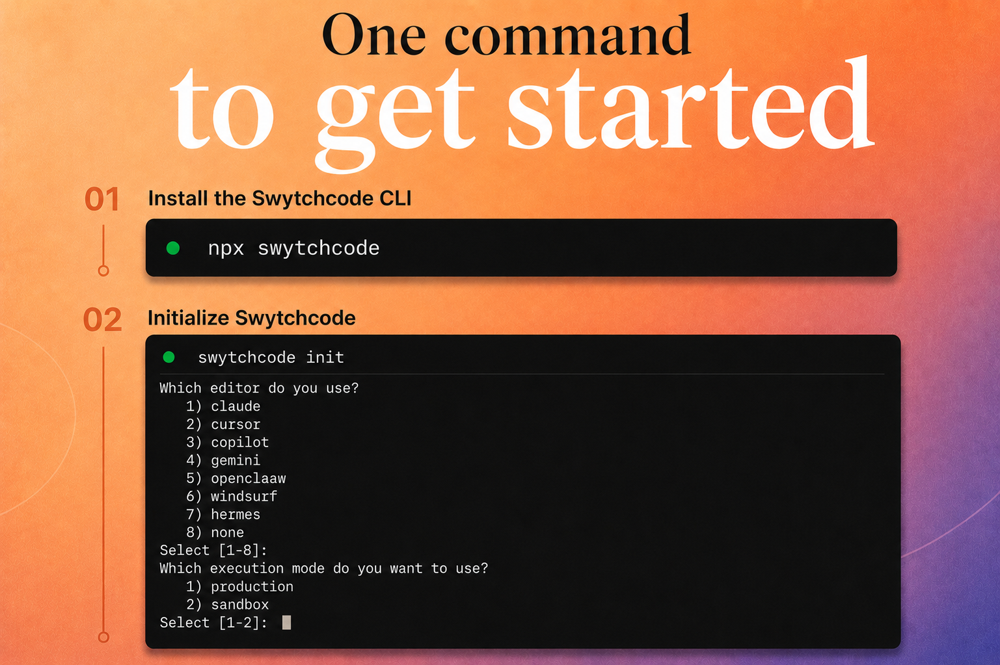
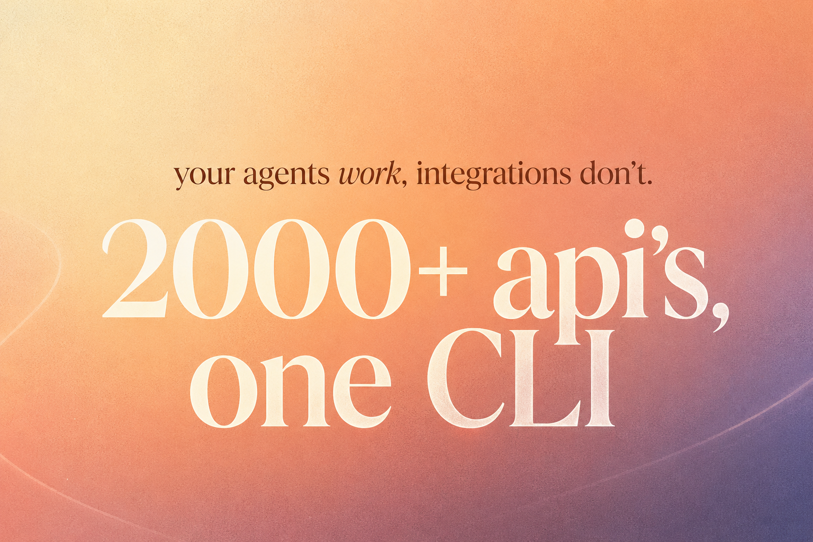
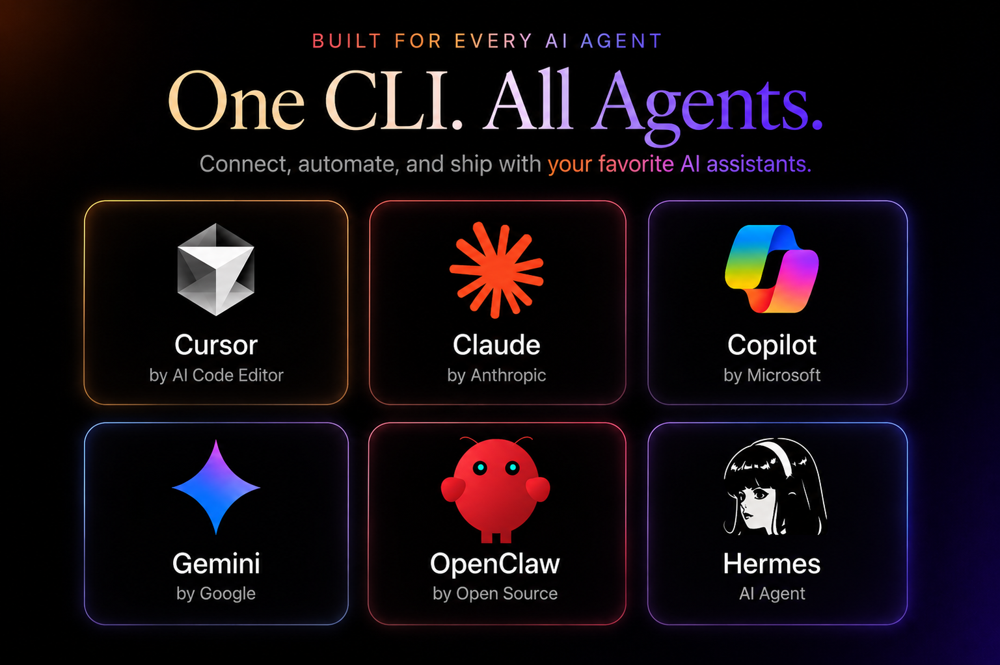

### 🎬 관련 영상
- [🎥 영상 보기](https://ph-files.imgix.net/a058ec04-16f0-4e8d-ab55-0badf390f72f.jpeg?auto=format)

---

## 3. [Daemons by Charlie Labs](https://www.producthunt.com/products/daemons-by-charlie-labs)
**Votes**: 189 | **도입 난이도**: 중 | **신뢰도**: 상
**Tagline**: Keep PRs, issues, CI, and docs moving with AI agents
**서비스 링크**: https://www.producthunt.com/r/6N2SY23DZALOT6

**태그**: DevTool, AI-Agent, Automation, Workflow, Agent, AI Tool, Prompting

### 📌 이 서비스 한눈에 보기
코드 작성 이후의 반복적인 관리 업무를 자동화하는 상시 가동형 AI 에이전트

### 🔑 주요 기능
- PR, 이슈, CI, 문서, Sentry 에러 등 개발 워크플로우 전반 모니터링
- 사람의 프롬프트 없이도 스스로 동작하는 상시 가동형(Always-on) AI 에이전트
- GitHub, Linear, Slack 등 기존 협업 툴에 리뷰 가능한 업데이트 제공

### 🙋 사용자에게 어떤 점이 좋은가
개발자가 코딩에 집중할 수 있도록, 코드 작성 이후 발생하는 반복적인 리뷰 및 관리 업무를 AI가 대신 처리해 줍니다.

### ✅ 지금 바로 써볼 기능
- 저장소 내 반복적인 리뷰 역할 정의하기
- GitHub 및 Slack 연동 설정하기
- CI/CD 및 에러 모니터링 자동화 적용하기

### ⚠️ 사용 전 확인할 점
- AI가 생성한 업데이트에 대한 인간의 최종 검토 필요
- 기존 워크플로우(GitHub, Slack 등)에 알림이 과도하게 발생할 가능성

### 🧭 확인이 더 필요한 정보
에이전트가 수행할 수 있는 구체적인 역할의 범위와 보안 정책에 대한 상세 정보가 필요합니다.

### 📸 스크린샷 및 갤러리
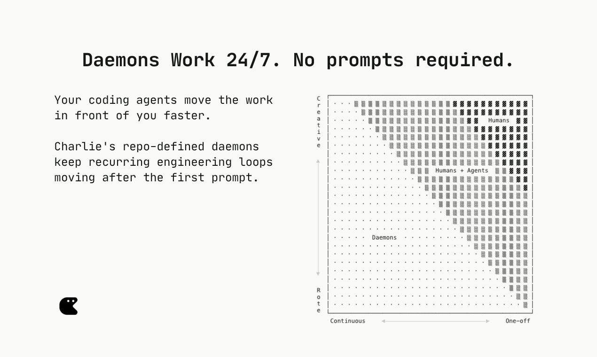
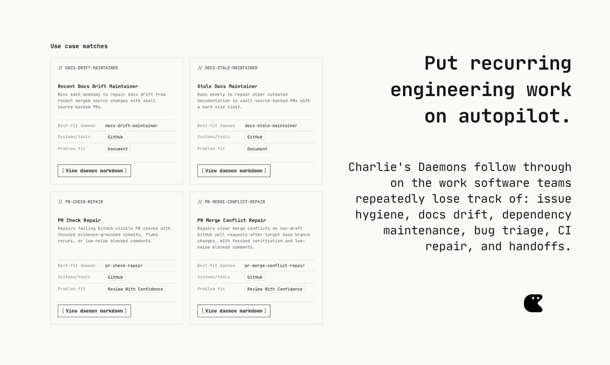
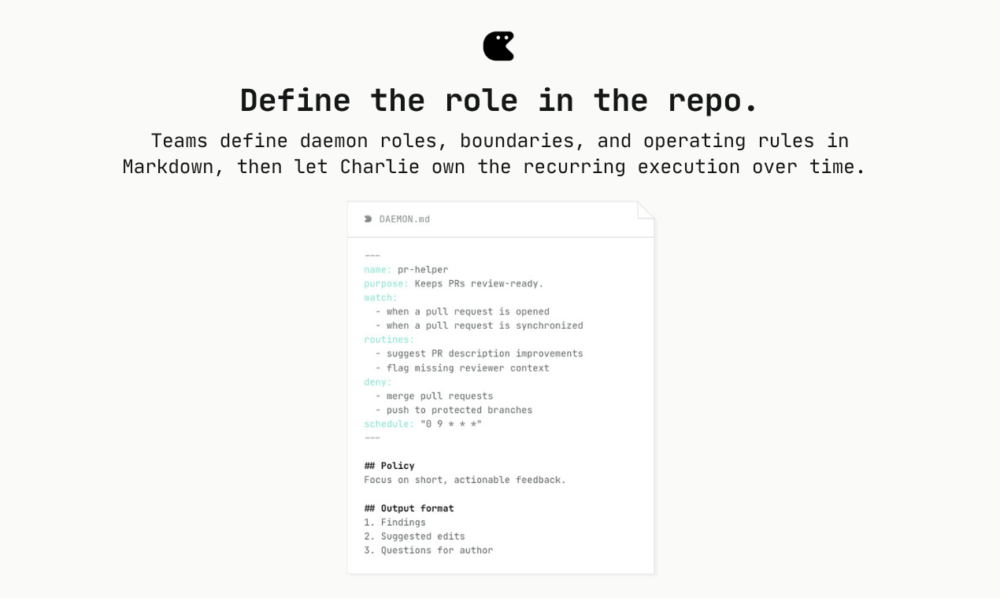

---

## 4. [Quartz](https://www.producthunt.com/products/quartz-3)
**Votes**: 179 | **도입 난이도**: 하 | **신뢰도**: 상
**Tagline**: AI email client built for focus. Runs locally on your Mac
**서비스 링크**: https://www.producthunt.com/r/34MN5LM7CS4KI2

**태그**: Productivity, AI, Email, Privacy, macOS, AI Tool

### 📌 이 서비스 한눈에 보기
개인정보 유출 걱정 없이 맥(Mac)에서 로컬로 구동되는 AI 기반 집중형 이메일 클라이언트

### 🔑 주요 기능
- 중요도에 따른 자동 이메일 분류 및 학습 기능
- 사용자의 말투를 반영한 AI 답장 초안 작성
- Mac 로컬 실행을 통한 강력한 보안 및 종단간 암호화

### 🙋 사용자에게 어떤 점이 좋은가
이메일 홍수 속에서 중요한 메시지에만 집중할 수 있게 해주며, 데이터가 외부 AI 서버로 전송되지 않아 보안이 중요한 전문가에게 적합합니다.

### ✅ 지금 바로 써볼 기능
- Gmail 계정 연동 및 초기 학습 시작
- AI가 제안하는 답장 초안 검토 및 스타일 조정
- 중요도 기반의 인박스 정리 상태 확인

### ⚠️ 사용 전 확인할 점
- Mac 전용 앱이므로 macOS 환경에서만 사용 가능
- 로컬 리소스(CPU/RAM) 사용량에 따른 시스템 성능 영향 가능성

### 🧭 확인이 더 필요한 정보
현재 macOS 전용으로 명시되어 있으나, 타 운영체제 지원 여부나 구체적인 시스템 요구 사양은 확인이 필요합니다.

### 📸 스크린샷 및 갤러리
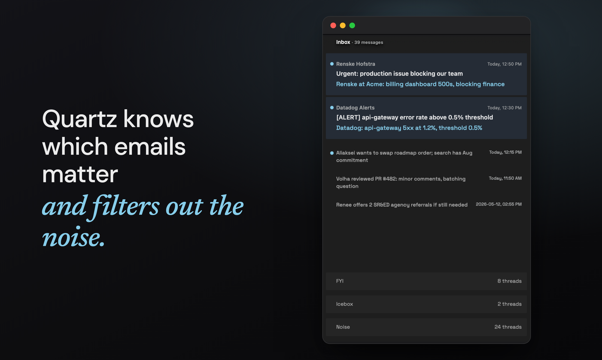
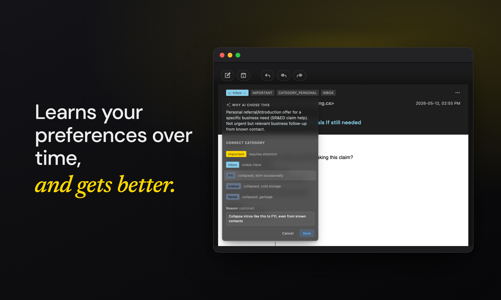
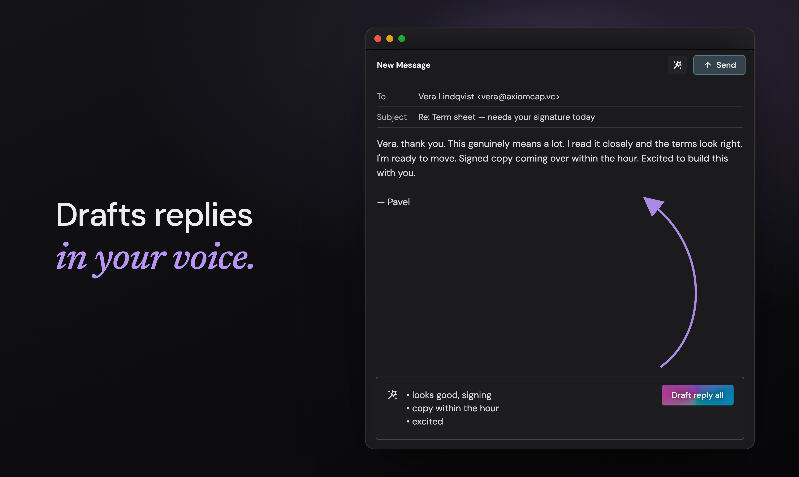

### 🎬 관련 영상
- [🎥 영상 보기](https://ph-files.imgix.net/4cb314f4-ce4a-425e-bfd8-db5cbed1f5b1.jpeg?auto=format)

---

## 5. [Android 17](https://www.producthunt.com/products/android)
**Votes**: 162 | **도입 난이도**: 중 | **신뢰도**: 상
**Tagline**: Android becomes an intelligence system
**서비스 링크**: https://www.producthunt.com/r/DPQ4UERYTICR5L

**태그**: OS, Intelligence, UX, Privacy, API

### 📌 이 서비스 한눈에 보기
단순 운영체제를 넘어 지능형 시스템으로 진화하는 Android 17

### 🔑 주요 기능
- AppFunctions 및 Android MCP를 통한 지능형 기능 통합
- 사용자 경험 중심의 Adaptive-first 및 App Bubbles 도입
- 강화된 개인정보 보호 제어 및 시스템 성능 최적화

### 🙋 사용자에게 어떤 점이 좋은가
앱 간의 경계가 허물어지고 지능형 기능이 강화되어, 사용자가 더 직관적이고 연속성 있는 디지털 경험을 누릴 수 있습니다.

### ✅ 지금 바로 써볼 기능
- 새로운 App Bubbles 인터페이스 활용하기
- 강화된 개인정보 보호 설정 확인하기
- 연속성 있는 작업 흐름(Continue On) 테스트하기

### ⚠️ 사용 전 확인할 점
- 새로운 시스템 요구사항에 따른 앱 호환성 확인 필요
- 지능형 기능 활성화 시 배터리 및 리소스 사용량 변화 가능성

### 🧭 확인이 더 필요한 정보
지능형 시스템 전환에 따른 구체적인 하드웨어 요구 사양과 기존 앱과의 호환성 수준은 추가 확인이 필요합니다.

### 📸 스크린샷 및 갤러리

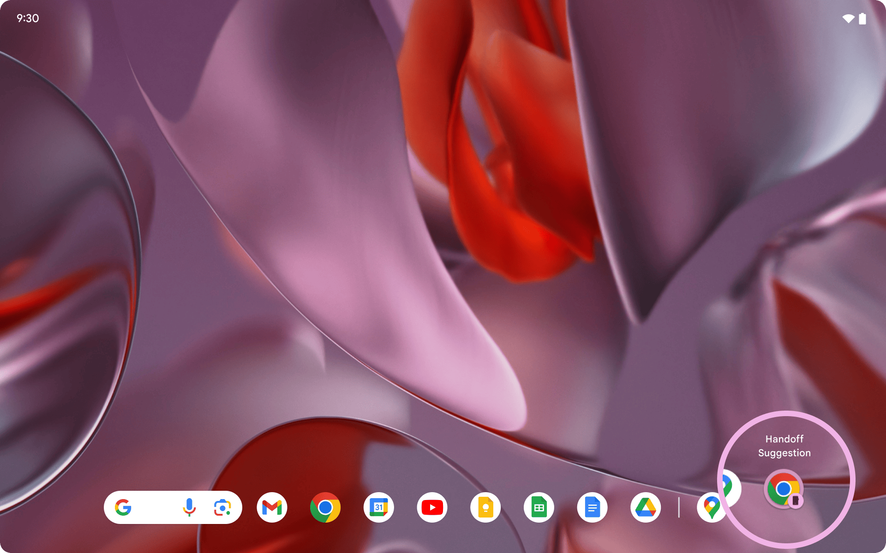

### 🎬 관련 영상
- [🎥 영상 보기](https://ph-files.imgix.net/2e141e0c-b782-4e72-9d5a-794fb6a742f8.jpeg?auto=format)

---

## 6. [Dopami](https://www.producthunt.com/products/dopami)
**Votes**: 134 | **도입 난이도**: 하 | **신뢰도**: 상
**Tagline**: Household chores without the mental load for ADHD
**서비스 링크**: https://www.producthunt.com/r/FBPTZIGWMZDYLT

**태그**: Productivity, ADHD, LifeHack, Household

### 📌 이 서비스 한눈에 보기
ADHD 사용자를 위해 가사 노동의 심리적 부담을 줄여주는 맞춤형 미션 제안 서비스

### 🔑 주요 기능
- ADHD 특성을 고려한 가사 관리 솔루션
- 상황별(장소, 시간, 에너지 수준) 맞춤형 미션 제안
- 공동 생활(가족, 룸메이트)을 위한 공유 맥락 기반 작업 할당

### 🙋 사용자에게 어떤 점이 좋은가
막막하게 느껴지는 집안일을 작은 단위의 미션으로 쪼개어 제안함으로써, 실행 결정을 내리는 데 드는 정신적 에너지를 아껴줍니다.

### ✅ 지금 바로 써볼 기능
- 현재 나의 에너지 수준에 맞는 미션 확인하기
- 특정 장소(방)별로 할 수 있는 작은 작업 찾아보기
- 함께 사는 구성원과 공유 맥락 설정하기

### ⚠️ 사용 전 확인할 점
- 사용자의 실제 에너지 상태를 정확히 반영하는지에 대한 개인적 검증 필요
- 공동 사용 시 구성원 간의 데이터 동기화 및 참여도 차이 발생 가능성

### 🧭 확인이 더 필요한 정보
구체적인 플랫폼 형태(모바일 앱, 웹 등)와 실시간 협업 기능의 상세 범위는 명시되지 않았습니다.

### 📸 스크린샷 및 갤러리
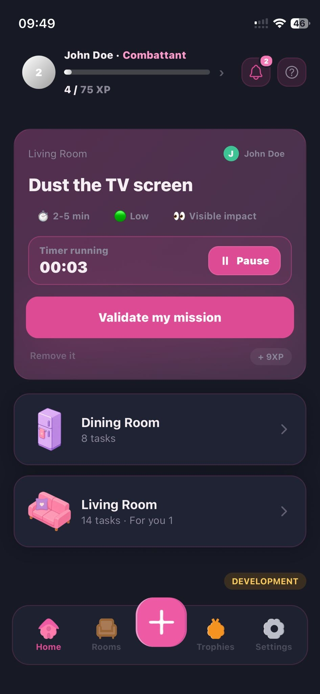

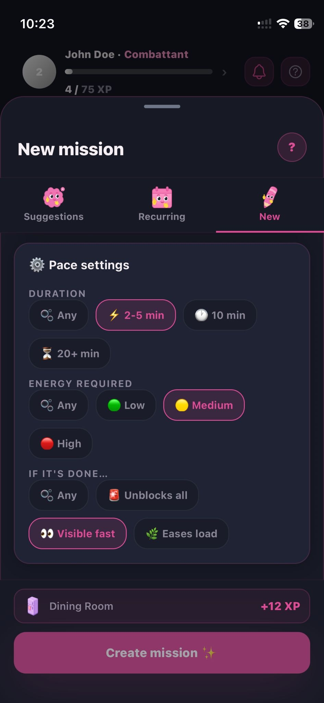

### 🎬 관련 영상
- [🎥 영상 보기](https://ph-files.imgix.net/b8621249-41c4-4eae-85b9-c91ee948d5da.jpeg?auto=format)

---

## 7. [Tapfree for Chrome](https://www.producthunt.com/products/tapfree-for-android-2)
**Votes**: 120 | **도입 난이도**: 하 | **신뢰도**: 상
**Tagline**: Voice dictation that adapts to what’s on your screen
**서비스 링크**: https://www.producthunt.com/r/JWZ6X5DYJU2KA2

**태그**: Productivity, ChromeExtension, Voice-to-Text, Writing-Tool, AI Tool, Email

### 📌 이 서비스 한눈에 보기
화면 맥락을 이해하여 오타 없이 자연스러운 작성을 돕는 크롬 전용 음성 키보드

### 🔑 주요 기능
- 크롬 텍스트 필드 및 ChromeOS 최적화 음성 입력
- 단순 받아쓰기를 넘어 화면 맥락을 이해하는 지능형 입력
- 자연스러운 대화형 말투를 유지하며 서식 오류 최소화

### 🙋 사용자에게 어떤 점이 좋은가
키보드 타이핑 대신 말로 메시지, 문서, 이메일을 빠르게 작성할 수 있어 손의 자유와 작업 속도를 높여줍니다.

### ✅ 지금 바로 써볼 기능
- 크롬 확장 프로그램 설치 및 권한 설정
- 이메일 및 문서 작성 시 음성 입력 테스트
- 화면 맥락 인식 기능 확인

### ⚠️ 사용 전 확인할 점
- 크롬 브라우저 환경에 국한된 사용성
- 음성 인식 정확도를 위한 마이크 환경 의존성

### 🧭 확인이 더 필요한 정보
지원하는 언어 범위와 개인정보 보호를 위한 데이터 처리 방식에 대한 구체적인 정보가 필요합니다.

### 📸 스크린샷 및 갤러리
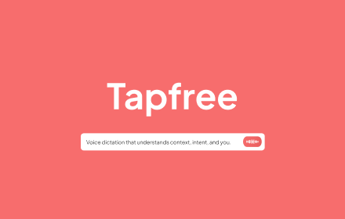
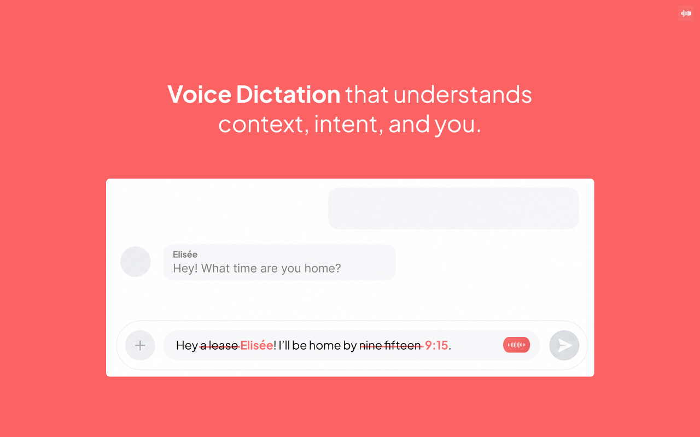
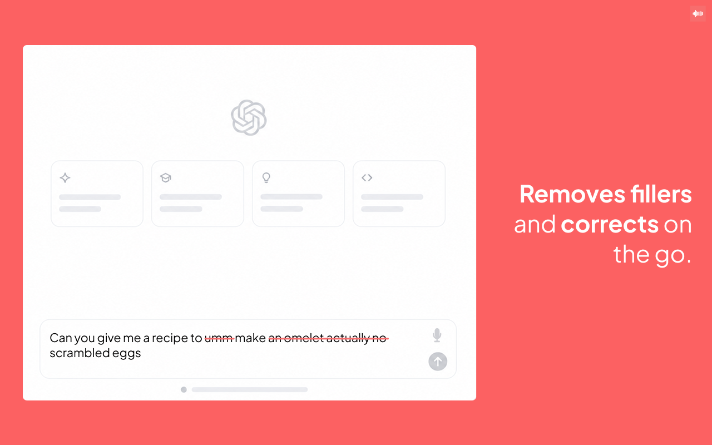

---

## 8. [Dualora](https://www.producthunt.com/products/dualora-dual-size-recorder)
**Votes**: 103 | **도입 난이도**: 하 | **신뢰도**: 상
**Tagline**: Record in both 16:9 and 9:16 at the same time
**서비스 링크**: https://www.producthunt.com/r/VF4QYEKCY2WWNZ

**태그**: Video, ContentCreation, Workflow, Mobile, Automation, AI Tool

### 📌 이 서비스 한눈에 보기
촬영과 동시에 16:9와 9:16 비율로 동시 녹화하여 편집 시간을 획기적으로 줄여주는 도구

### 🔑 주요 기능
- 가로(16:9)와 세로(9:16) 프레임을 실시간으로 동시에 확인하며 촬영 가능
- 촬영 후 별도의 크롭 작업 없이 두 가지 비율의 파일을 즉시 추출
- 유튜브와 쇼츠/릴스 등 멀티 플랫폼 크리에이터를 위한 워크플로우 최적화

### 🙋 사용자에게 어떤 점이 좋은가
재촬영이나 번거로운 후편집 과정 없이 한 번의 촬영으로 다양한 플랫폼용 영상을 동시에 확보할 수 있습니다.

### ✅ 지금 바로 써볼 기능
- Split View 또는 PiP 모드로 실시간 프레임 확인하기
- 한 번의 녹화로 두 가지 비율 파일 동시 생성하기
- 촬영 직후 바로 플랫폼별로 파일 내보내기

### ⚠️ 사용 전 확인할 점
- 동시 녹화 시 화질 저하나 프레임 손실 여부 확인 필요
- 스마트폰 기종에 따른 화면 비율 및 인터페이스 최적화 차이

### 🧭 확인이 더 필요한 정보
지원하는 최대 해상도 및 저장 공간 요구 사항에 대한 정보가 명시되지 않았습니다.

### 📸 스크린샷 및 갤러리
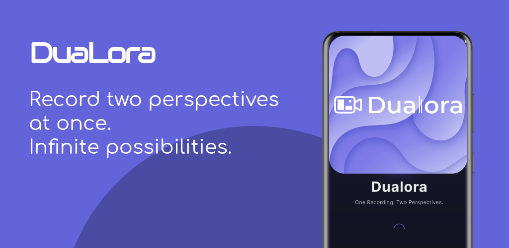
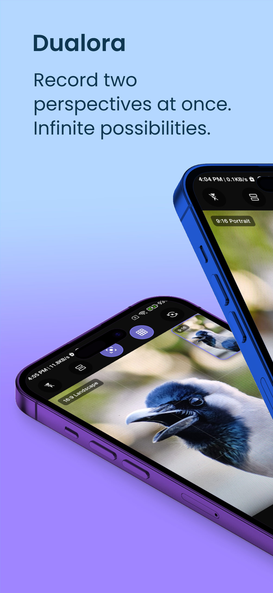
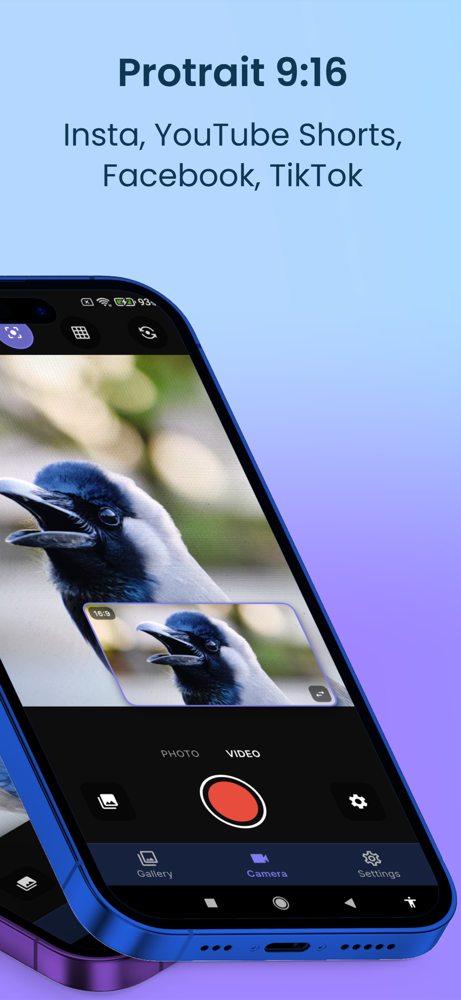

---

## 9. [Deep Work Plan](https://www.producthunt.com/products/deep-work-plan)
**Votes**: 100 | **도입 난이도**: 중 | **신뢰도**: 상
**Tagline**: Models matter. Context matters more. Give your agent a plan.
**서비스 링크**: https://www.producthunt.com/r/TNPX5PAZNXT24I

**태그**: DevTool, AI-Agent, OpenSource, Workflow, Agent, AI Tool, Chat

### 📌 이 서비스 한눈에 보기
AI 에이전트가 맥락을 잃지 않고 계획대로 코딩할 수 있도록 돕는 오픈소스 워크플로우 프레임워크

### 🔑 주요 기능
- 코드 저장소 내에 명세(Spec)를 직접 작성하여 에이전트의 작업 가이드 제공
- 원자적 작업 단위, 수락 기준, 검증 게이트를 통한 체계적인 개발 프로세스
- 컨텍스트 초기화에도 작업 상태가 유지되어 중단된 지점부터 재개 가능

### 🙋 사용자에게 어떤 점이 좋은가
AI 에이전트가 작업 도중 맥락을 놓치거나 엉뚱한 코드를 작성하는 문제를 방지하고, 사람이 검증 가능한 수준의 결과물을 일관되게 얻을 수 있습니다.

### ✅ 지금 바로 써볼 기능
- 기존 코드 저장소에 Deep Work Plan 구조 적용해보기
- 에이전트용 작업 명세(Spec) 작성 및 검증 게이트 설정
- 장기적인 작업 흐름(Long runs) 테스트

### ⚠️ 사용 전 확인할 점
- 에이전트가 계획을 따르도록 하는 초기 설정 및 명세 작성 비용 발생
- 사용하는 AI 모델의 성능에 따라 계획 이행 능력이 달라질 수 있음

### 🧭 확인이 더 필요한 정보
특정 AI 에이전트 프레임워크와의 호환성 및 구체적인 연동 방식에 대한 상세 정보가 필요합니다.

### 📸 스크린샷 및 갤러리
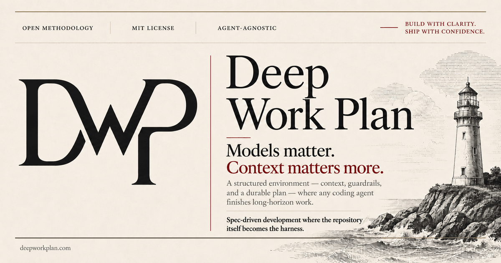
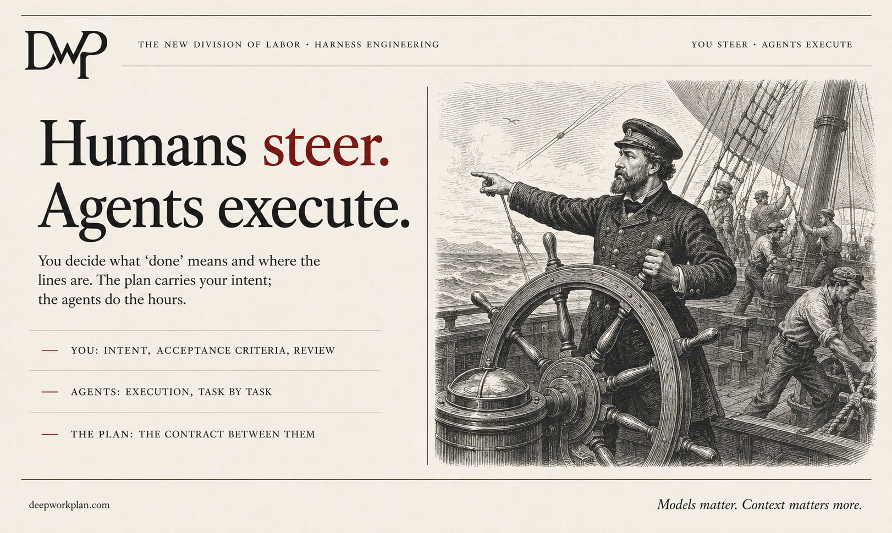
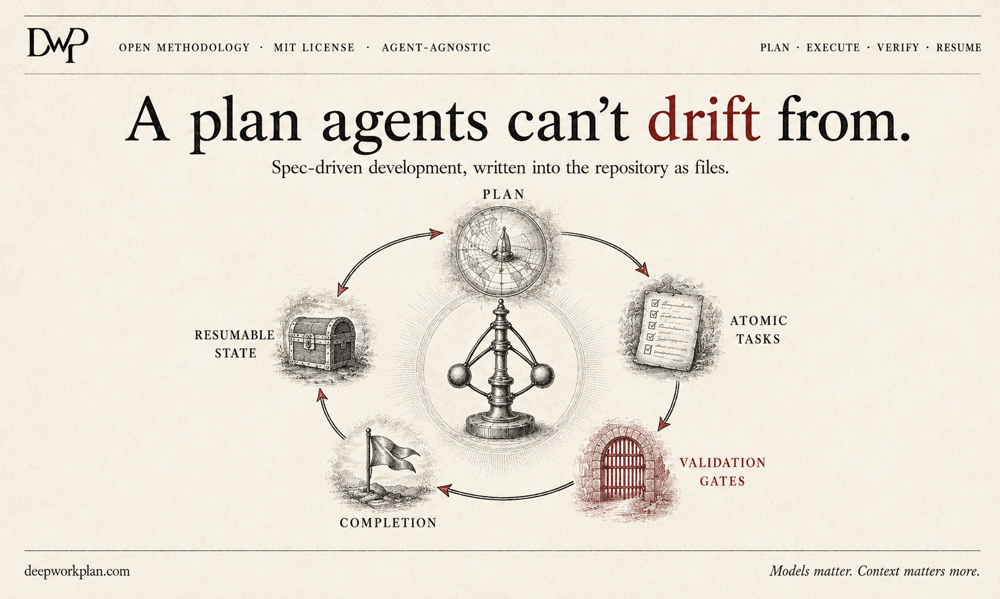

---

## 10. [memi](https://www.producthunt.com/products/memoire)
**Votes**: 97 | **도입 난이도**: 중 | **신뢰도**: 상
**Tagline**: The AI agent harness for product design teams
**서비스 링크**: https://www.producthunt.com/r/DEFEOZOV5TL4MK

**태그**: DesignTool, AI-Agent, macOS, ProductDesign, Workflow, Agent, AI Tool, Design, DevTool

### 📌 이 서비스 한눈에 보기
디자인 스펙과 피그마 파일을 기반으로 AI 에이전트가 협업하는 macOS 전용 제품 디자인 워크벤치

### 🔑 주요 기능
- Claude, Codex, Hermes 등 강력한 AI 모델 통합
- 사용자의 스펙, 리서치 데이터, Figma 파일을 기반으로 작동하는 맞춤형 환경
- 제품 디자인 팀을 위한 전용 macOS 워크벤치

### 🙋 사용자에게 어떤 점이 좋은가
디자인 문서와 피그마 파일을 AI가 직접 이해하므로, 기획부터 디자인 구현까지의 워크플로우를 자동화하고 효율을 높일 수 있습니다.

### ✅ 지금 바로 써볼 기능
- Figma 파일 연동 및 AI 분석 테스트
- 기존 제품 스펙/리서치 데이터 입력 및 결과 확인
- macOS 환경에서의 워크플로우 적합성 검토

### ⚠️ 사용 전 확인할 점
- macOS 전용 툴이므로 타 OS 사용자는 사용 불가
- 외부 AI 모델(Claude 등) 사용에 따른 데이터 보안 및 프라이버시 검토 필요

### 🧭 확인이 더 필요한 정보
AI 모델이 피그마 파일의 변경 사항을 실시간으로 반영하는지, 혹은 특정 시점의 스냅샷만 활용하는지 확인이 필요합니다.

### 📸 스크린샷 및 갤러리
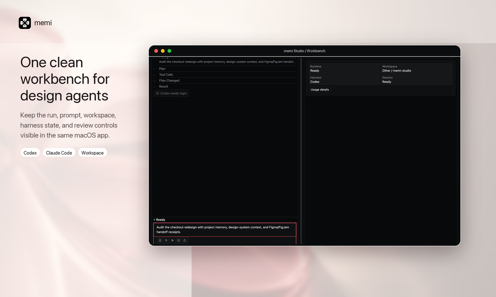
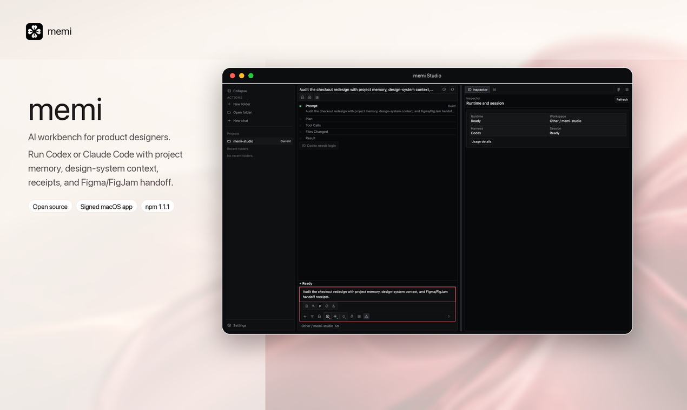
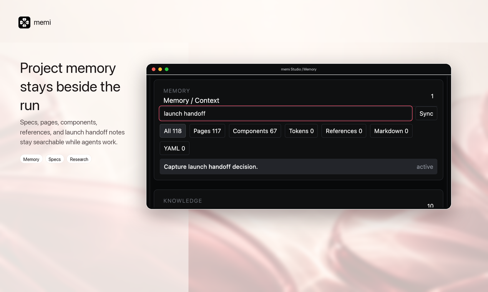

---

## 11. [Mirlo](https://www.producthunt.com/products/mirlo)
**Votes**: 93 | **도입 난이도**: 하 | **신뢰도**: 상
**Tagline**: Social media for real connections. No likes, no algorithm.
**서비스 링크**: https://www.producthunt.com/r/JNY45JPBOBQUX6

**태그**: Social Media, Privacy, Minimalism, iOS

### 📌 이 서비스 한눈에 보기
알고리즘과 중독적 요소 없이 진정한 인간관계에만 집중하는 유럽 기반 소셜 앱

### 🔑 주요 기능
- 좋아요, 댓글, 무한 스크롤 등 중독을 유발하는 기능 배제
- 상호 연결된 관계 사이의 프라이빗한 대화 중심
- 광고 및 데이터 판매 없는 구독 기반의 클린한 운영 모델

### 🙋 사용자에게 어떤 점이 좋은가
소셜 미디어의 피로감에서 벗어나, 타인의 시선이나 알고리즘의 간섭 없이 소중한 사람들과의 대화에만 집중할 수 있습니다.

### ✅ 지금 바로 써볼 기능
- 14일 무료 체험을 통한 서비스 경험
- 지인과의 상호 연결 설정
- 프라이빗한 대화 기능 활용

### ⚠️ 사용 전 확인할 점
- 광고 없는 대신 구독료가 발생하는 유료 모델
- 현재 iOS 기반으로 유럽 일부 국가 위주로 서비스 중

### 🧭 확인이 더 필요한 정보
향후 서비스 지역 확대 계획 및 구독 가격 정책에 대한 구체적인 정보가 필요합니다.

### 📸 스크린샷 및 갤러리

---

## 12. [Typerino](https://www.producthunt.com/products/typerino)
**Votes**: 93 | **도입 난이도**: 하 | **신뢰도**: 상
**Tagline**: Screenwriting and playwriting for movies, television, stage.
**서비스 링크**: https://www.producthunt.com/r/7RVXX2IGKRAB3W

**태그**: Writing, Creative, Productivity

### 📌 이 서비스 한눈에 보기
복잡한 문법 없이 타이핑만으로 업계 표준 형식을 완성하는 시나리오 및 희곡 집필 도구

### 🔑 주요 기능
- 영화, TV, 연극 등 매체별 업계 표준 포맷 지원
- 마크다운이나 별도 구문 없이 직관적인 타이핑 방식 제공
- Mac 및 Windows 환경 지원

### 🙋 사용자에게 어떤 점이 좋은가
복잡한 서식 설정에 신경 쓰지 않고 오직 글쓰기에만 집중할 수 있어 창작 흐름을 유지하기 좋습니다.

### ✅ 지금 바로 써볼 기능
- 14일 무료 체험을 통한 워크플로우 적합성 테스트
- 작성 중인 시나리오를 내보내기(Export)하여 포맷 확인
- 사용 중인 OS(Mac/Windows)에서의 안정성 체크

### ⚠️ 사용 전 확인할 점
- 14일 무료 체험 종료 후 유료 결제 필요 ($11.99/mo 또는 $99/year)
- 특수 문법을 선호하는 사용자에게는 지나치게 단순할 수 있음

### 🧭 확인이 더 필요한 정보
클라우드 동기화 기능이나 모바일 지원 여부에 대한 정보가 명시되지 않았습니다.

### 📸 스크린샷 및 갤러리
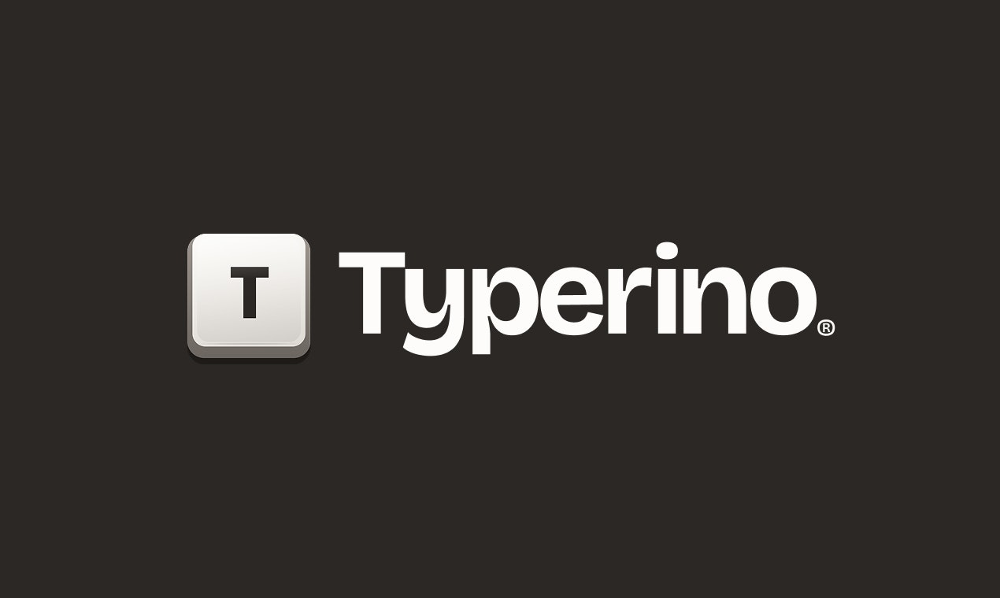
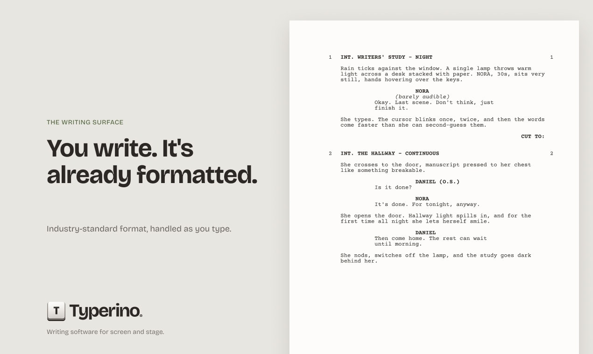
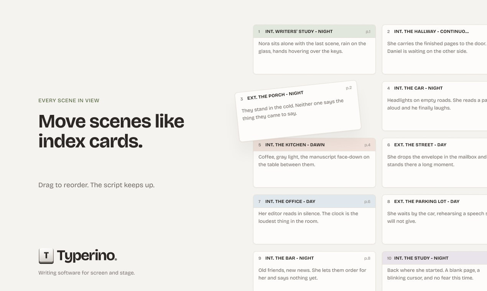

---

## 13. [Wolfram Language 15](https://www.producthunt.com/products/wolfram-mathematica)
**Votes**: 91 | **도입 난이도**: 상 | **신뢰도**: 상
**Tagline**: Computational language built for humans and AI agents
**서비스 링크**: https://www.producthunt.com/r/3NQNKLV5OK7622

**태그**: AI, DataScience, ScientificComputing, DevTool, Agent, AI Tool, LLM, Video

### 📌 이 서비스 한눈에 보기
AI 에이전트와 인간의 협업을 위해 설계된 차세대 계산 언어

### 🔑 주요 기능
- LLM 및 AI 에이전트 최적화 기능 강화
- 수치 계산, 기하학, 과학(천문, 화학, 생명과학) 등 방대한 도메인 지식 통합
- 노트북 인터페이스 및 시각화 도구의 고도화

### 🙋 사용자에게 어떤 점이 좋은가
복잡한 과학적 계산과 데이터 시각화를 AI와 함께 자동화하여 연구 및 개발 생산성을 극대화할 수 있습니다.

### ✅ 지금 바로 써볼 기능
- LLM 연동을 통한 AI 에이전트 워크플로우 구축
- 과학적 모델링 및 시각화 기능 테스트
- 기존 코드의 컴파일러 및 평가 엔진 최적화 적용

### ⚠️ 사용 전 확인할 점
- 고도의 전문 지식이 필요한 도메인이 많아 학습 곡선이 높을 수 있음
- 기존 워크플로우와의 호환성 및 리소스 요구량 확인 필요

### 🧭 확인이 더 필요한 정보
구체적인 버전별 상세 변경 사항과 기존 사용자 대상의 마이그레이션 가이드 확인이 필요합니다.

### 📸 스크린샷 및 갤러리
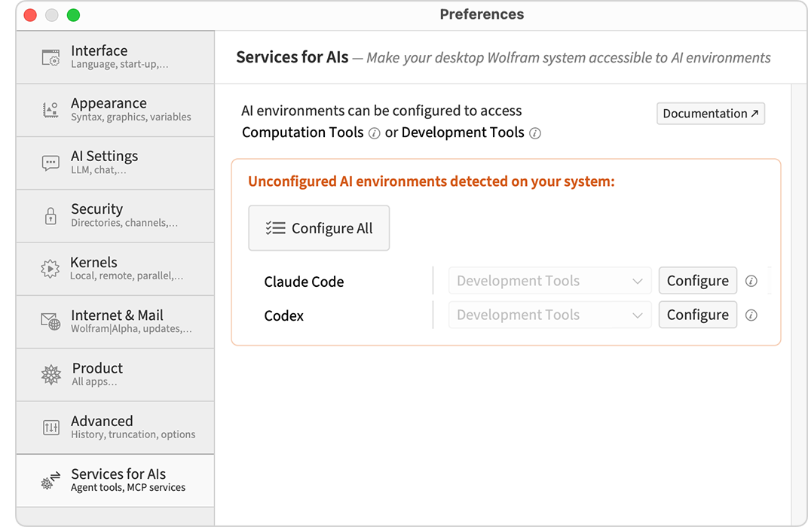
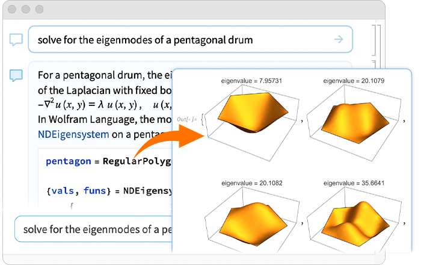
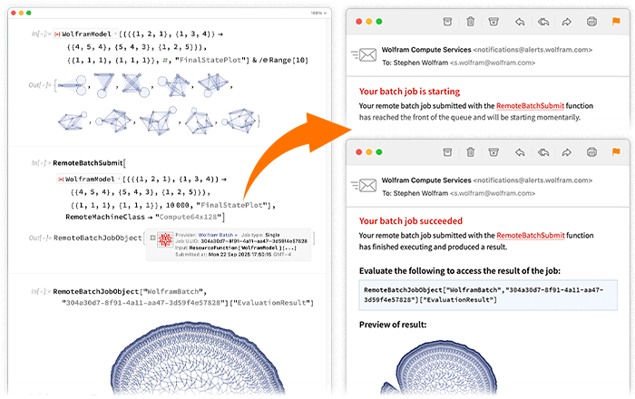

### 🎬 관련 영상
- [🎥 영상 보기](https://ph-files.imgix.net/5489623d-36f7-4fec-b6f0-328ab23ebcaa.jpeg?auto=format)

---

## 14. [Redactify](https://www.producthunt.com/products/redactify)
**Votes**: 91 | **도입 난이도**: 하 | **신뢰도**: 상
**Tagline**: Automated profanity censoring for video & audio
**서비스 링크**: https://www.producthunt.com/r/TSJ3B6FFBRFCJR

**태그**: VideoEditing, Automation, ContentCreation, AI, Video

### 📌 이 서비스 한눈에 보기
영상 및 오디오 내 비속어를 자동으로 감지하여 블러 처리 및 비프음 삽입을 도와주는 자동 검열 도구

### 🔑 주요 기능
- AI를 활용한 자동 비속어 감지 및 비프음 처리
- 입 모양 블러 처리를 통한 시각적 검열 기능
- 틱톡, 유튜브, 트위치 등 소셜 미디어 플랫폼 최적화

### 🙋 사용자에게 어떤 점이 좋은가
콘텐츠 제작자가 수동으로 편집하는 번거로움 없이 빠르게 클린한 영상을 제작하여 플랫폼 가이드라인을 준수할 수 있습니다.

### ✅ 지금 바로 써볼 기능
- 자동 비프음 삽입 기능 테스트
- 입 모양 블러 처리 정확도 확인
- 플랫폼별 내보내기 기능 확인

### ⚠️ 사용 전 확인할 점
- AI 감지 오류로 인한 오작동 가능성
- 영상 편집 워크플로우와의 통합 방식 확인 필요

### 🧭 확인이 더 필요한 정보
구체적인 지원 언어 범위와 자동화 처리 속도에 대한 정보가 필요합니다.

### 📸 스크린샷 및 갤러리

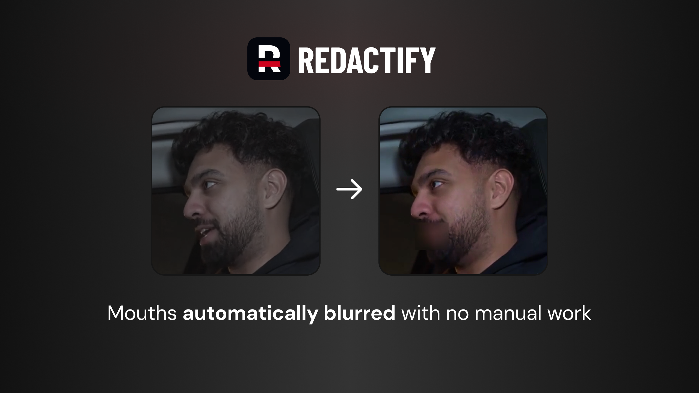
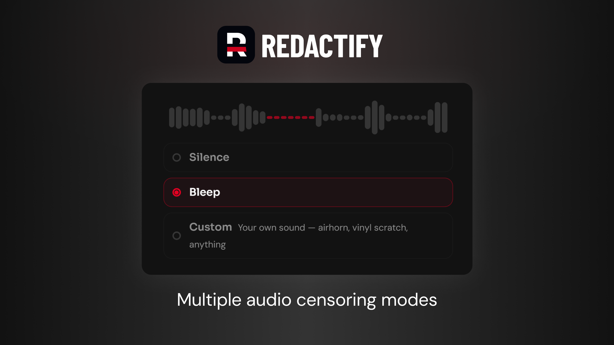

### 🎬 관련 영상
- [🎥 영상 보기](https://ph-files.imgix.net/ce3acac6-2460-4e0c-8795-138a2f4599a3.jpeg?auto=format)

---

## 15. [Tyto by ai-coustics](https://www.producthunt.com/products/tyto)
**Votes**: 89 | **도입 난이도**: 하 | **신뢰도**: 상
**Tagline**: Audio insight that predicts voice AI performance
**서비스 링크**: https://www.producthunt.com/r/S35MFFM4CUKDUW

**태그**: AI, Audio, Voice-AI, Analytics, DevTool, Agent, AI Tool

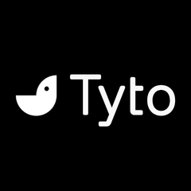

### 📌 이 서비스 한눈에 보기
음성 AI 에이전트의 성능 저하를 사전에 예측하는 실시간 오디오 분석 도구

### 🔑 주요 기능
- 실시간 오디오 스트림 분석을 통한 하위 프로세스 실패 예측
- 소음, 잔향, 음량, 간섭 음성 등 6가지 차원의 상세 분석 점수 제공
- 가볍고 효율적인 모델 설계로 실시간 스트리밍 환경에 최적화

### 🙋 사용자에게 어떤 점이 좋은가
음성 AI 서비스 운영 시, 입력되는 오디오 품질로 인해 발생할 수 있는 에이전트의 오작동을 미리 감지하고 대응할 수 있습니다.

### ✅ 지금 바로 써볼 기능
- 제공된 데모 링크를 통한 실시간 분석 성능 테스트
- 6가지 분석 차원(소음, 잔향 등)의 점수 체계 확인
- 현재 운영 중인 음성 서비스 환경과의 호환성 검토

### ⚠️ 사용 전 확인할 점
- 실시간 스트림에 적용 시 시스템 부하 및 지연 시간 영향 확인 필요
- 예측 점수가 실제 에이전트 성능 저하와 얼마나 일치하는지에 대한 검증 필요

### 🧭 확인이 더 필요한 정보
모델의 구체적인 연산량과 실제 프로덕션 환경에서의 통합 방식에 대한 정보가 더 필요합니다.

### 📸 스크린샷 및 갤러리

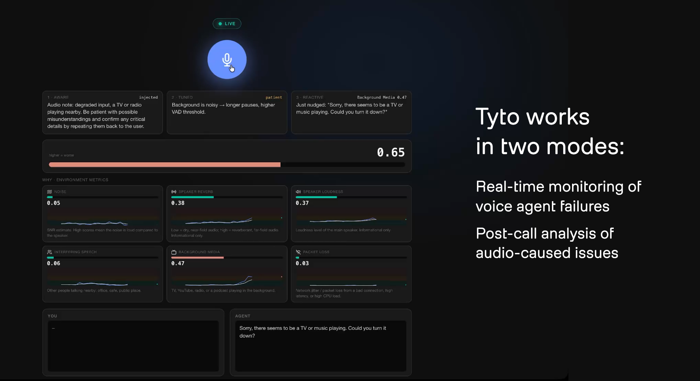
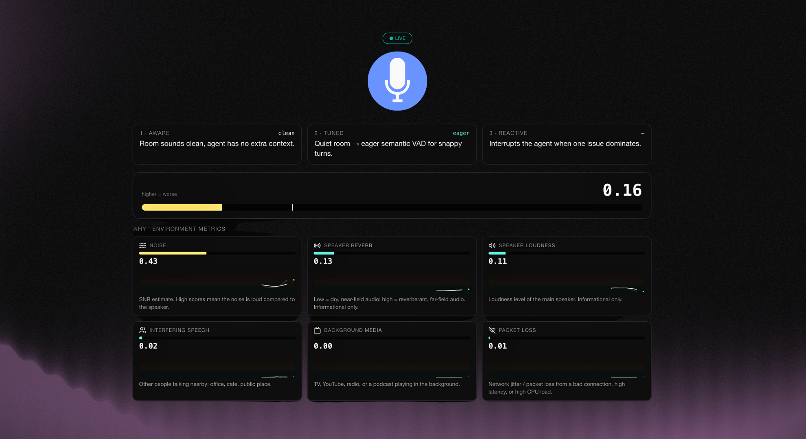

### 🎬 관련 영상
- [🎥 영상 보기](https://ph-files.imgix.net/a1fda7fa-f59c-4d5e-a7e7-af1789dff2d0.jpeg?auto=format)

---

## 16. [ClipDone](https://www.producthunt.com/products/clipdone)
**Votes**: 86 | **도입 난이도**: 하 | **신뢰도**: 상
**Tagline**: Automatic short-form video editing
**서비스 링크**: https://www.producthunt.com/r/ZR32M4EYACOZKM

**태그**: VideoEditing, Automation, ContentCreation, AI, AI Tool, Video, Marketing

### 📌 이 서비스 한눈에 보기
촬영한 원본 영상을 클릭 몇 번으로 완성된 숏폼 영상으로 변환해주는 자동 편집 도구

### 🔑 주요 기능
- 원본 영상을 업로드하면 자동으로 편집되는 자동화 워크플로우
- 자막, B-roll(보조 영상), 애니메이션 자동 삽입 기능
- 수동 편집의 시간과 비용을 절감하는 데 최적화

### 🙋 사용자에게 어떤 점이 좋은가
직접 카메라 앞에서 말하는 콘텐츠를 제작하는 크리에이터나 마케터가 편집 시간을 획기적으로 줄이고 즉시 게시 가능한 결과물을 얻을 수 있습니다.

### ✅ 지금 바로 써볼 기능
- 보유 중인 원본 영상 업로드해보기
- 자동 생성된 자막 및 B-roll 스타일 확인하기
- 완성된 숏폼 영상의 편집 품질 검토하기

### ⚠️ 사용 전 확인할 점
- 자동 편집 특성상 사용자의 의도와 다른 장면이 선택될 수 있음
- 원본 영상의 품질에 따라 최종 결과물의 완성도가 달라질 수 있음

### 🧭 확인이 더 필요한 정보
자동 편집의 세부 커스텀 기능 범위와 지원하는 영상 포맷에 대한 정보가 추가로 필요합니다.

### 📸 스크린샷 및 갤러리
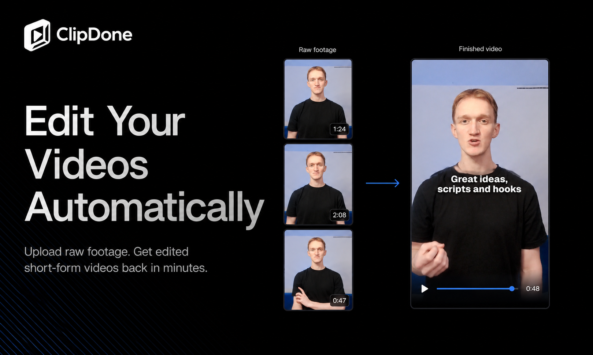
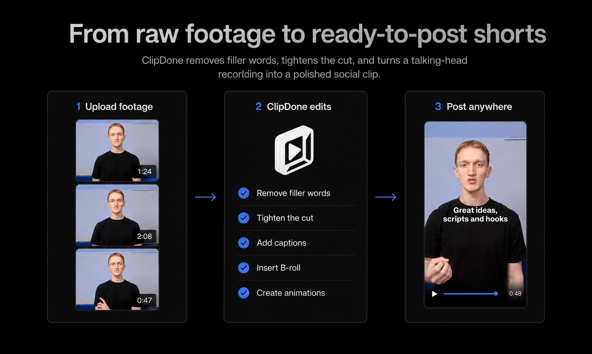
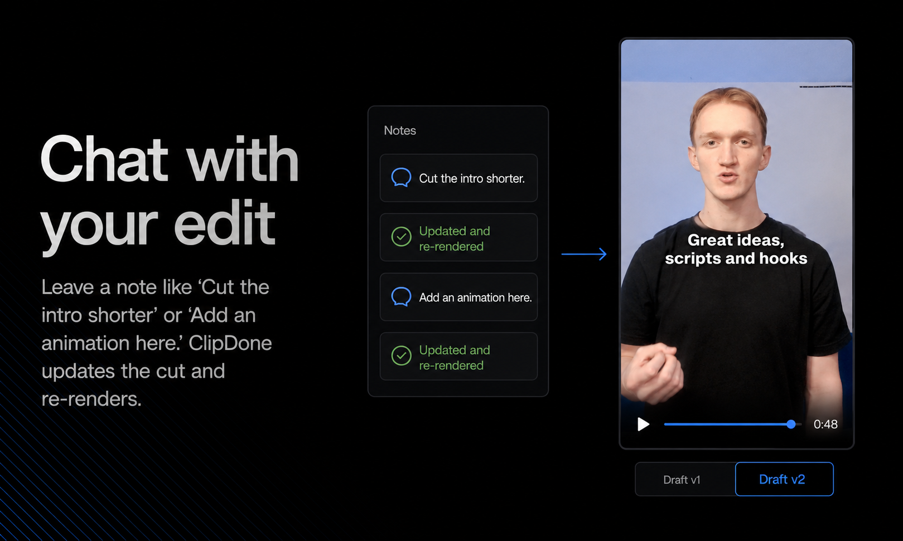

### 🎬 관련 영상
- [🎥 영상 보기](https://ph-files.imgix.net/a6f09d61-208b-4652-af32-ac8483e05bce.jpeg?auto=format)

---

## 17. [Locus Founder](https://www.producthunt.com/products/locus-founder)
**Votes**: 85 | **도입 난이도**: 하 | **신뢰도**: 상
**Tagline**: Text an AI agent and it builds + runs your business
**서비스 링크**: https://www.producthunt.com/r/5EPNMKHP73F6IK

**태그**: AI Agent, Automation, Entrepreneurship, NoCode, Agent, AI Tool, Design, DevTool

### 📌 이 서비스 한눈에 보기
텍스트 메시지만으로 비즈니스 기획부터 운영까지 자동 수행하는 AI 창업 에이전트

### 🔑 주요 기능
- 인터뷰를 통한 브랜드 디자인 및 풀스택 앱 구축
- 결제 시스템(Stripe) 연동 및 제품 소싱 자동화
- 광고 생성 및 배포를 포함한 비즈니스 운영 전반 관리

### 🙋 사용자에게 어떤 점이 좋은가
아이디어만 있다면 복잡한 코딩이나 운영 프로세스 없이도 실제 수익을 창출하는 비즈니스를 빠르게 실행할 수 있습니다.

### ✅ 지금 바로 써볼 기능
- AI 인터뷰를 통한 비즈니스 아이디어 구체화
- 자동 생성된 브랜드 및 앱 스택 검토
- 결제 및 광고 자동화 설정 승인

### ⚠️ 사용 전 확인할 점
- AI가 제안하는 지출 및 의사결정에 대한 사용자 검토 필수
- 실제 제품 소싱 및 물류 과정에서의 물리적 제약 가능성

### 🧭 확인이 더 필요한 정보
구체적인 제품 카테고리(물리적 제품 vs 디지털 제품)에 따른 운영 범위의 차이를 확인해야 합니다.

### 📸 스크린샷 및 갤러리
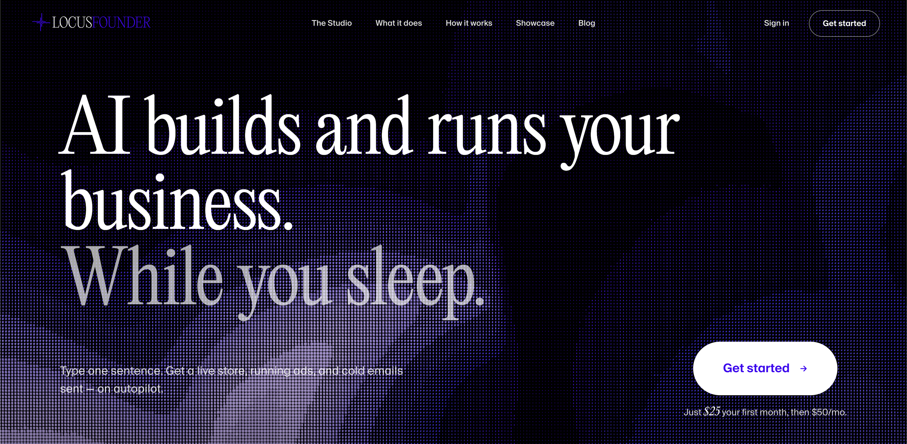
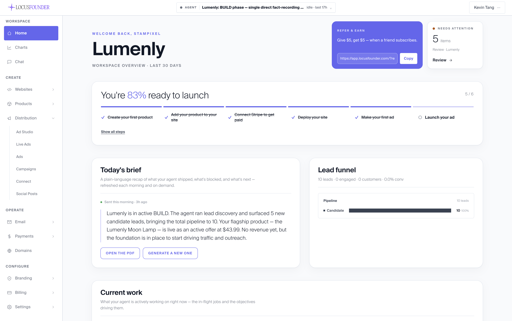
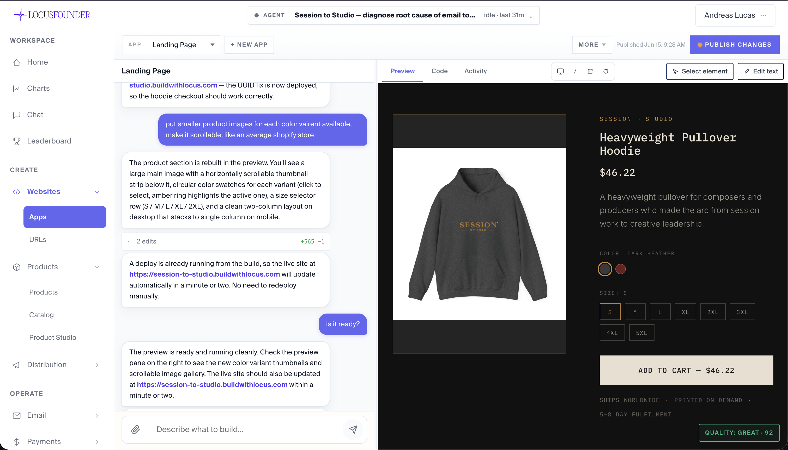

### 🎬 관련 영상
- [🎥 영상 보기](https://ph-files.imgix.net/7314ca3a-f4e7-4d60-b302-e81664bb1576.jpeg?auto=format)

---

## 18. [Cilantro](https://www.producthunt.com/products/cilantro)
**Votes**: 84 | **도입 난이도**: 하 | **신뢰도**: 상
**Tagline**: Watches your accounts and tells you what changed
**서비스 링크**: https://www.producthunt.com/r/DMJN5IXQA3M22J

**태그**: FinTech, Automation, PersonalFinance, Sales

### 📌 이 서비스 한눈에 보기
복잡한 예산 관리 없이 계좌의 변화만 콕 집어 알려주는 자동 모니터링 서비스

### 🔑 주요 기능
- 계좌 연결 한 번으로 이상 결제 및 요금 인상 자동 감지
- 태깅이나 예산 설정이 필요 없는 자동화된 리포트 제공
- 데이터 판매나 광고 없는 읽기 전용(Read-only) 보안 중심 설계

### 🙋 사용자에게 어떤 점이 좋은가
매번 가계부를 쓰거나 지출을 확인하는 번거로움 없이, 계좌에서 일어난 유의미한 변화만 빠르게 파악할 수 있습니다.

### ✅ 지금 바로 써볼 기능
- 은행 계좌 연결하기
- 주간 변화 요약 리포트 확인하기
- 이상 결제 및 자동 결제 항목 검토하기

### ⚠️ 사용 전 확인할 점
- 읽기 전용 권한이지만 계좌 정보 접근에 대한 보안 정책 확인 필요
- 수동 태깅이나 세부 예산 관리 기능은 제공되지 않음

### 🧭 확인이 더 필요한 정보
지원하는 은행 및 금융 기관의 범위가 어디까지인지 확인이 필요합니다.

### 📸 스크린샷 및 갤러리
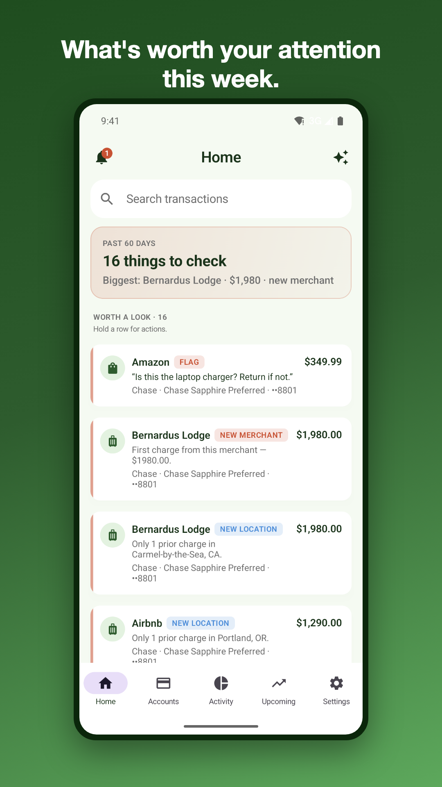
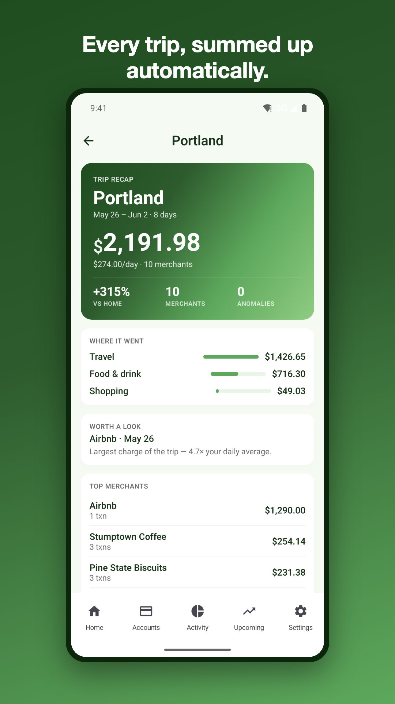
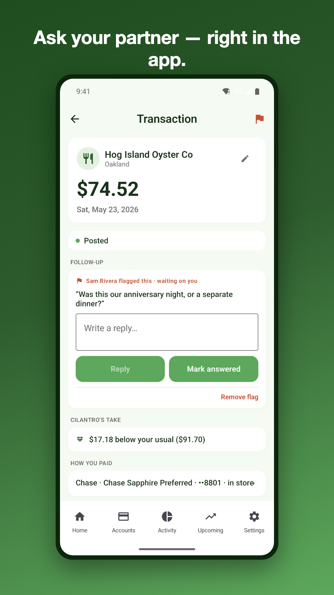

---

## 19. [Snapchat SPECS](https://www.producthunt.com/products/snapchat)
**Votes**: 83 | **도입 난이도**: 상 | **신뢰도**: 중
**Tagline**: Powerful computer built into lightweight see-through glasses
**서비스 링크**: https://www.producthunt.com/r/5WW66DFQBH6RCJ

**태그**: AR, Wearable, SmartGlasses, Computing, Chat

### 📌 이 서비스 한눈에 보기
일상의 순간을 놓치지 않으면서 컴퓨팅 경험을 제공하는 초경량 투명 스마트 글래스

### 🔑 주요 기능
- 가벼운 투명 렌즈를 통한 증강 현실(AR) 환경 제공
- 주변 환경과 상호작용하는 강력한 컴퓨팅 성능
- 현실에 집중하면서도 작업과 놀이가 가능한 사용자 경험

### 🙋 사용자에게 어떤 점이 좋은가
스마트폰을 계속 들여다보지 않고도 눈앞의 현실 세계에서 정보를 확인하거나 작업을 수행할 수 있습니다.

### ✅ 지금 바로 써볼 기능
- 주변 환경과의 상호작용 기능 테스트
- 착용감 및 시야 확보 확인
- 일상 작업(학습, 업무) 활용 가능성 검토

### ⚠️ 사용 전 확인할 점
- 투명 렌즈의 밝기 및 시인성 제약 가능성
- 컴퓨팅 성능에 따른 배터리 지속 시간 및 발열 문제

### 🧭 확인이 더 필요한 정보
상세한 하드웨어 스펙, 배터리 수명 및 구체적인 앱 생태계에 대한 정보가 부족합니다.

### 📸 스크린샷 및 갤러리

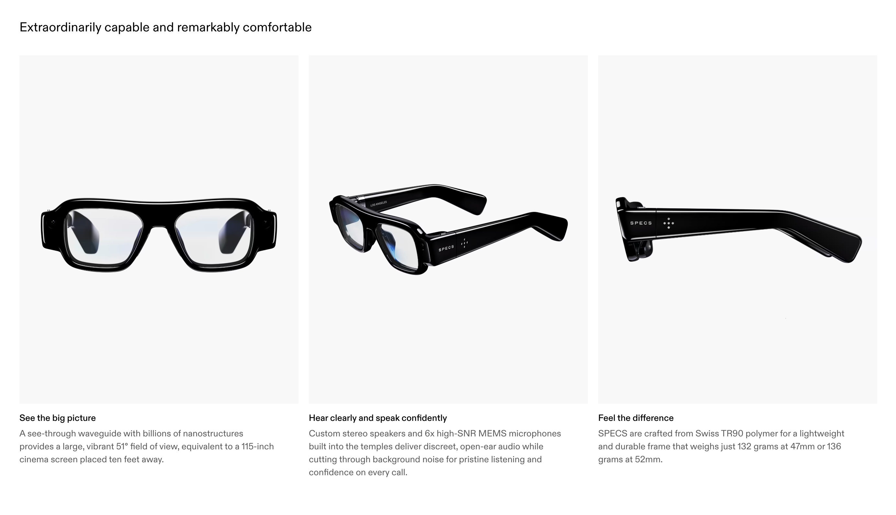

### 🎬 관련 영상
- [🎥 영상 보기](https://ph-files.imgix.net/1d9a5e01-6003-408f-9f63-ab99c623f791.jpeg?auto=format)

---

## 20. [ClawEase](https://www.producthunt.com/products/clawease)
**Votes**: 79 | **도입 난이도**: 하 | **신뢰도**: 상
**Tagline**: An AI business operator that books appointments for SMBs.
**서비스 링크**: https://www.producthunt.com/r/5EIZXI5AMTEQZA

**태그**: AI, Automation, SMB, Scheduling, CustomerService, AI Tool

### 📌 이 서비스 한눈에 보기
문의 응대부터 예약 확정까지 자동으로 처리하는 SMB 전용 AI 비즈니스 운영자

### 🔑 주요 기능
- 전화, WhatsApp, 웹 폼을 통한 고객 문의 자동 캡처
- 실시간 일정 확인 및 예약 자동 등록 기능
- 예약 확정 메시지 자동 발송을 통한 관리 업무 감소

### 🙋 사용자에게 어떤 점이 좋은가
예약 중심의 소규모 비즈니스 운영자가 반복적인 행정 업무에서 벗어나 고객 응대 속도를 높이고 예약 전환율을 개선할 수 있습니다.

### ✅ 지금 바로 써볼 기능
- 기존 예약 시스템과의 연동 가능 여부 확인
- WhatsApp 및 전화 연동 테스트
- 문의 캡처 및 자동 응답 워크플로우 설정

### ⚠️ 사용 전 확인할 점
- AI의 예약 오류 가능성에 대한 검토 필요
- 기존에 사용 중인 캘린더/스케줄링 도구와의 호환성 확인

### 🧭 확인이 더 필요한 정보
현재 지원하는 언어 범위와 기존 스케줄링 소프트웨어와의 구체적인 통합 방식에 대한 정보가 필요합니다.

### 📸 스크린샷 및 갤러리
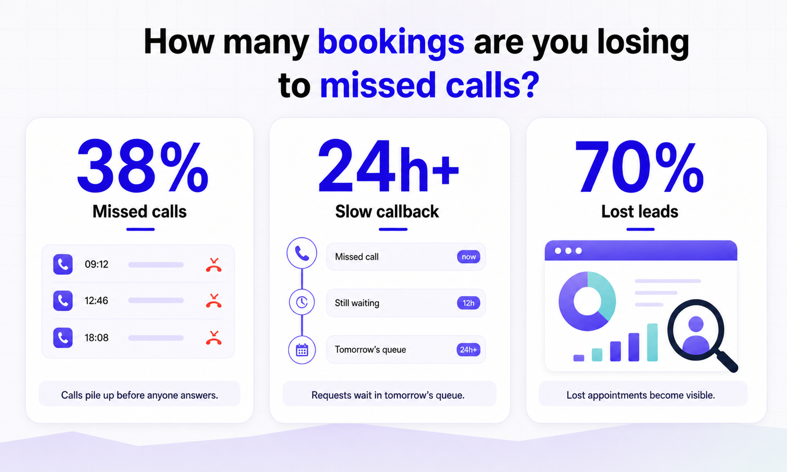
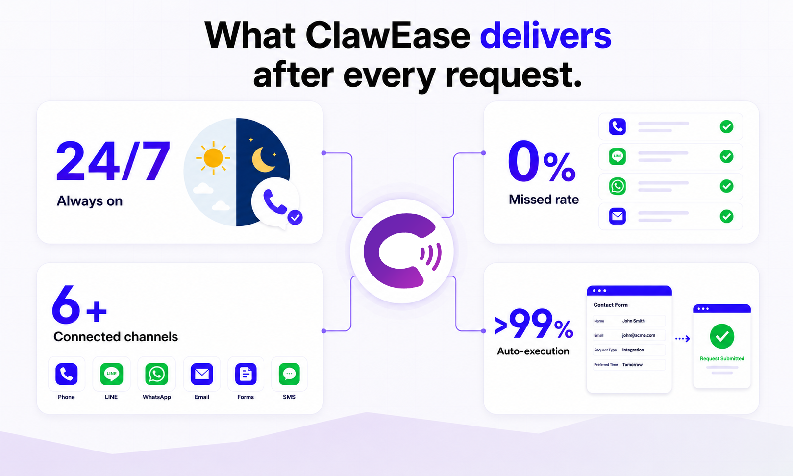
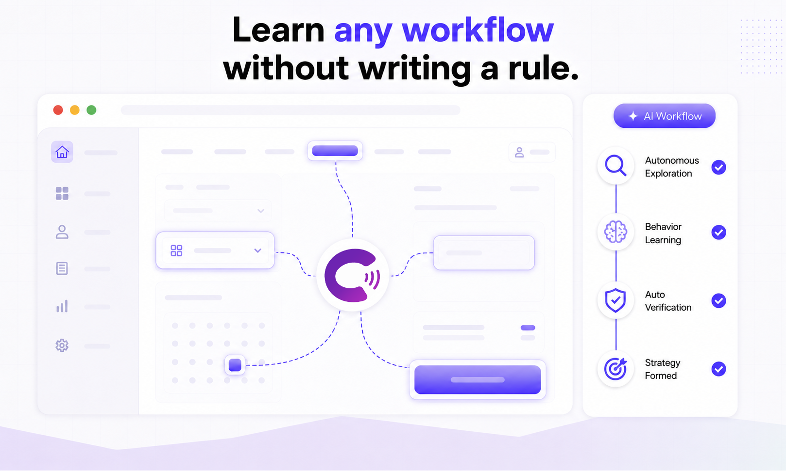

---

## 21. [ClawEase](https://www.producthunt.com/products/clawease)
**Votes**: 79 | **도입 난이도**: 하 | **신뢰도**: 상
**Tagline**: An AI business operator that books appointments for SMBs.
**서비스 링크**: https://www.producthunt.com/r/5EIZXI5AMTEQZA

**태그**: AI, Automation, SMB, Scheduling, CustomerService, AI Tool

### 📌 이 서비스 한눈에 보기
문의 응대부터 예약 확정까지 자동으로 처리하는 SMB 전용 AI 비즈니스 운영자

### 🔑 주요 기능
- 전화, WhatsApp, 웹 폼을 통한 고객 문의 자동 캡처
- 실시간 일정 확인 및 예약 자동 등록 기능
- 예약 확정 메시지 자동 발송을 통한 관리 업무 감소

### 🙋 사용자에게 어떤 점이 좋은가
예약 중심의 소규모 비즈니스 운영자가 반복적인 행정 업무에서 벗어나 고객 응대 속도를 높이고 예약 전환율을 개선할 수 있습니다.

### ✅ 지금 바로 써볼 기능
- 기존 예약 시스템과의 연동 가능 여부 확인
- WhatsApp 및 전화 연동 테스트
- 문의 캡처 및 자동 응답 워크플로우 설정

### ⚠️ 사용 전 확인할 점
- AI의 예약 오류 가능성에 대한 검토 필요
- 기존에 사용 중인 캘린더/스케줄링 도구와의 호환성 확인

### 🧭 확인이 더 필요한 정보
현재 지원하는 언어 범위와 기존 스케줄링 소프트웨어와의 구체적인 통합 방식에 대한 정보가 필요합니다.

### 📸 스크린샷 및 갤러리

---

## 22. [Vitrine](https://www.producthunt.com/products/vitrine)
**Votes**: 78 | **도입 난이도**: 하 | **신뢰도**: 상
**Tagline**: Turn any photo into a beautiful wallpaper
**서비스 링크**: https://www.producthunt.com/r/VK73F7Q5YXXFCO

**태그**: DesignTool, Mac, Wallpaper, Creative, Automation, Vision

### 📌 이 서비스 한눈에 보기
어떤 사진이든 감각적인 플루티드 글래스(세로 홈 유리) 스타일의 맥 데스크탑 배경화면으로 변환해주는 도구

### 🔑 주요 기능
- 사진을 세로 유리 질감으로 굴절시켜 독특한 텍스처 생성
- Metal 엔진을 활용한 실시간 렌더링으로 즉각적인 결과 확인
- 드래그 앤 드롭 방식의 간편한 워크플로우

### 🙋 사용자에게 어떤 점이 좋은가
개인 소장 사진을 단순한 배경화면이 아닌, 세련된 인테리어 소품 같은 데스크탑 디자인으로 빠르게 바꿀 수 있습니다.

### ✅ 지금 바로 써볼 기능
- 좋아하는 사진을 앱에 드래그 앤 드롭하기
- 실시간으로 변하는 유리 굴절 효과 확인하기
- 고해상도로 내보내어 맥 배경화면으로 설정하기

### ⚠️ 사용 전 확인할 점
- Mac 전용 소프트웨어로 다른 OS에서는 사용 불가
- 원본 사진의 구도에 따라 굴절 효과의 느낌이 다를 수 있음

### 🧭 확인이 더 필요한 정보
지원하는 최대 내보내기 해상도와 시스템 리소스 점유율에 대한 정보가 명시되지 않았습니다.

### 📸 스크린샷 및 갤러리

---

## 23. [MCP 2000](https://www.producthunt.com/products/mcp-2000)
**Votes**: 77 | **도입 난이도**: 하 | **신뢰도**: 상
**Tagline**: AI Drum Machine MPC in your browser
**서비스 링크**: https://www.producthunt.com/r/Y5RQD6YTBBAGKQ

**태그**: AI, MusicProduction, WebTool, BeatMaking, AI Tool, Prompting

### 📌 이 서비스 한눈에 보기
텍스트 프롬프트로 샘플 생성부터 비트 메이킹까지 한 번에 해결하는 브라우저 기반 AI 드럼 머신

### 🔑 주요 기능
- 텍스트 입력을 통한 즉각적인 AI 샘플 생성 기능
- 4x4 패드 그리드를 활용한 직관적인 퍼커션 시퀀싱
- 설치나 플러그인이 필요 없는 웹 브라우저 기반 환경

### 🙋 사용자에게 어떤 점이 좋은가
샘플을 찾기 위해 헤매는 시간 없이 아이디어를 즉시 음악으로 구현할 수 있으며, 별도의 장비나 소프트웨어 설치 없이 어디서든 비트 메이킹이 가능합니다.

### ✅ 지금 바로 써볼 기능
- 원하는 스타일의 드럼 키트 프롬프트 입력해보기
- 생성된 샘플을 패드에 배치하여 핑거 드러밍 해보기
- 효과(Effects) 기능을 활용해 비트 질감 조절하기

### ⚠️ 사용 전 확인할 점
- 브라우저 기반이므로 고사양 오디오 작업 시 브라우저 성능에 영향을 받을 수 있음
- 텍스트 프롬프트의 정교함에 따라 생성되는 샘플의 품질이 달라질 수 있음

### 🧭 확인이 더 필요한 정보
현재 상세한 오디오 출력 품질이나 파일 내보내기(Export) 기능에 대한 정보는 명시되어 있지 않습니다.

### 📸 스크린샷 및 갤러리
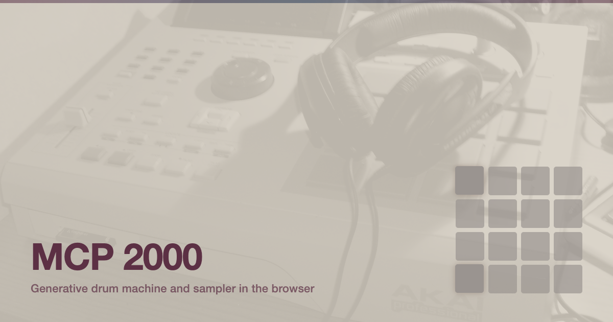
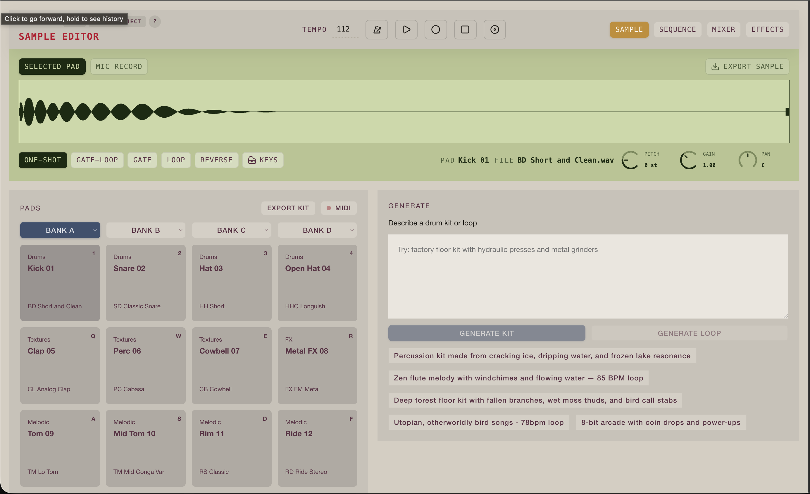
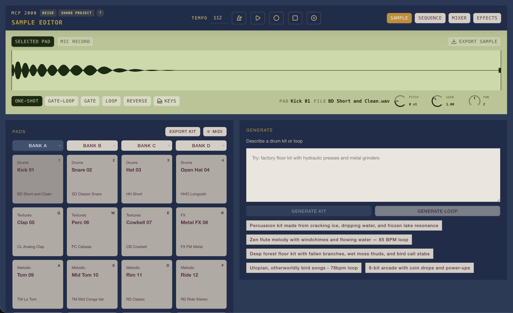

---

## 24. [SuperGoal ](https://www.producthunt.com/products/supergoal)
**Votes**: 75 | **도입 난이도**: 하 | **신뢰도**: 상
**Tagline**: World cup in your menu bar
**서비스 링크**: https://www.producthunt.com/r/2WQNWVFIFWYAJP

**태그**: Mac App, Sports, Utility

### 📌 이 서비스 한눈에 보기
맥 메뉴 바에서 실시간으로 2026 월드컵 소식을 확인하는 초경량 앱

### 🔑 주요 기능
- 맥 메뉴 바에 상주하는 간편한 인터페이스
- 실시간 스코어, 경기 일정, 조별 순위 제공
- 사용자 취향에 맞춘 커스텀 테마 지원

### 🙋 사용자에게 어떤 점이 좋은가
별도의 브라우저 창을 열지 않고도 메뉴 바에서 즉시 경기 상황을 확인할 수 있어 업무 흐름을 방해받지 않습니다.

### ✅ 지금 바로 써볼 기능
- 메뉴 바에 앱 설치 및 고정하기
- 관심 있는 팀 즐겨찾기 설정
- 개인 취향에 맞는 테마 적용하기

### ⚠️ 사용 전 확인할 점
- macOS 전용 앱이므로 다른 OS에서는 사용 불가
- 실시간 스코어 업데이트를 위한 네트워크 연결 필요

### 🧭 확인이 더 필요한 정보
현재 제공되는 데이터의 업데이트 속도와 상세 통계 포함 여부는 확인이 필요합니다.

### 📸 스크린샷 및 갤러리
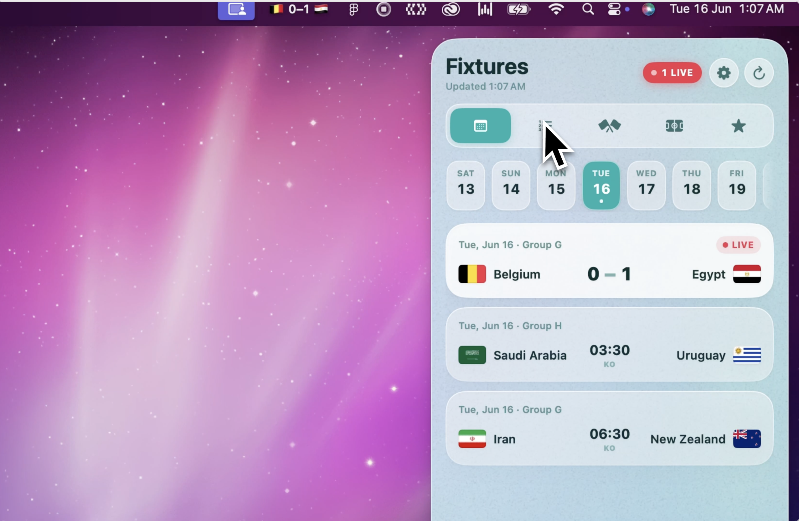
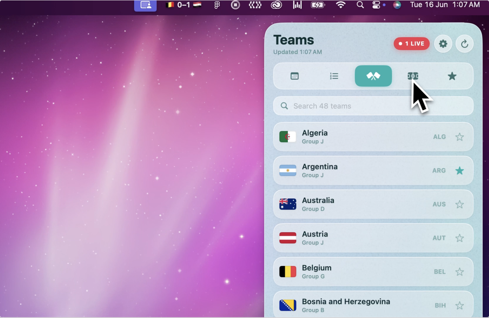
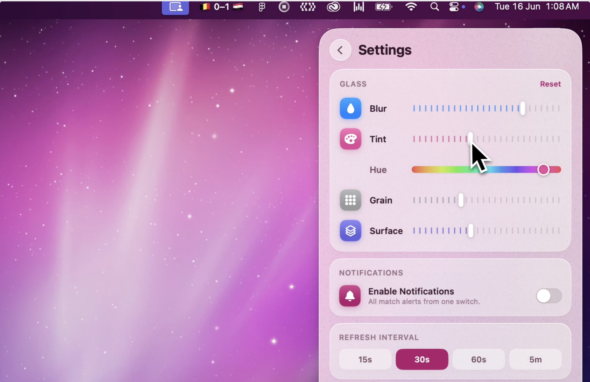

### 🎬 관련 영상
- [🎥 영상 보기](https://ph-files.imgix.net/e67e724f-f6d5-4217-8e03-1e554e85bc5c.jpeg?auto=format)

---

## 25. [PaneFlow](https://www.producthunt.com/products/paneflow)
**Votes**: 75 | **도입 난이도**: 중 | **신뢰도**: 상
**Tagline**: Let AI agents build real animated slideshows
**서비스 링크**: https://www.producthunt.com/r/5SJPWIHHO74ECK

**태그**: AI-Agent, Design-Automation, Productivity, Developer-Tools, Agent, AI Tool, Video, DevTool

### 📌 이 서비스 한눈에 보기
AI 에이전트가 직접 애니메이션 슬라이드쇼를 제작하고 편집 가능한 프로젝트로 변환해주는 도구

### 🔑 주요 기능
- MCP 서버 지원으로 Claude, Cursor 등 AI 에이전트와 연동 가능
- 단순 이미지가 아닌 레이아웃과 브랜드가 적용된 편집 가능한 프로젝트 생성
- 코드, 비디오, PDF 등 다양한 형식으로 내보내기 지원

### 🙋 사용자에게 어떤 점이 좋은가
AI 에이전트에게 명령만 내리면 디자인 작업이 완료된 슬라이드 결과물을 얻을 수 있어 제작 시간을 획기적으로 단축합니다.

### ✅ 지금 바로 써볼 기능
- Claude나 Cursor에 MCP 서버 연결하기
- 새로 추가된 50종의 템플릿 적용해보기
- 생성된 결과물을 코드나 비디오로 내보내기

### ⚠️ 사용 전 확인할 점
- AI 에이전트 활용을 위한 기본적인 MCP 설정 지식 필요
- 복잡한 커스텀 디자인 요구 시 수동 편집 작업이 필요할 수 있음

### 🧭 확인이 더 필요한 정보
사용자의 기존 디자인 워크플로우와의 호환성 및 상세 편집 기능의 자유도는 직접 확인이 필요합니다.

### 📸 스크린샷 및 갤러리

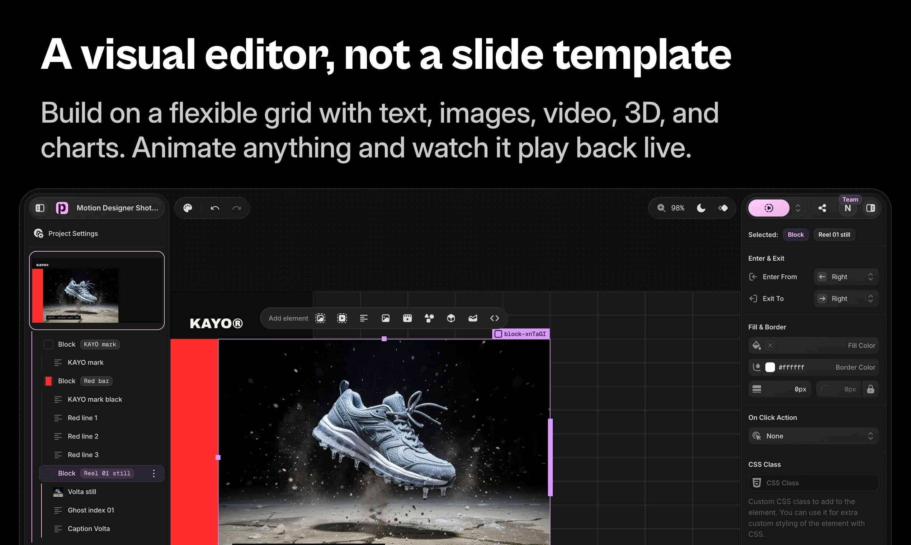
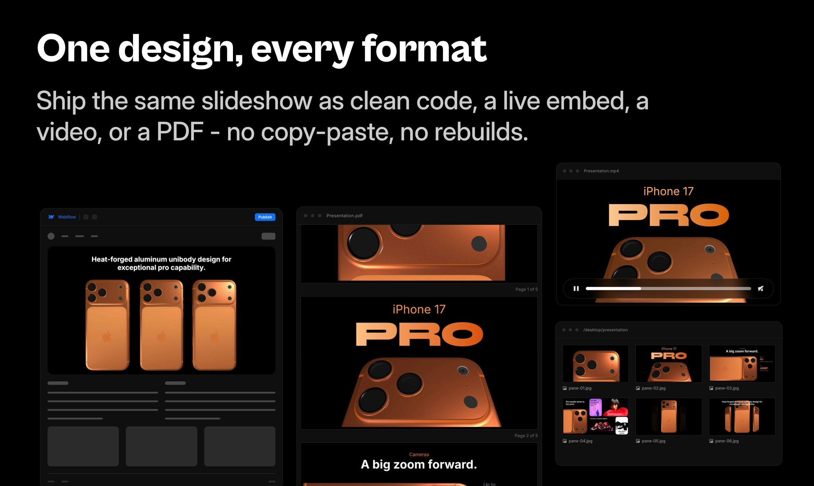

### 🎬 관련 영상
- [🎥 영상 보기](https://ph-files.imgix.net/0af874db-e10a-4fa8-ac94-c3ad4e6ef93a.jpeg?auto=format)

---

## 26. [NotchSpace](https://www.producthunt.com/products/notchspace-2)
**Votes**: 73 | **도입 난이도**: 하 | **신뢰도**: 상
**Tagline**: Turn your Mac notch into an intelligent active workspace
**서비스 링크**: https://www.producthunt.com/r/SKHYPBWX2QTPGS

**태그**: Productivity, macOS, Utility, Workflow

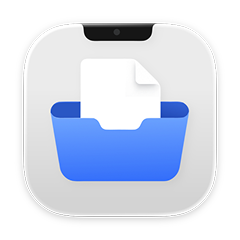

### 📌 이 서비스 한눈에 보기
맥북 노치 영역을 활용하여 생산성을 높이는 지능형 워크스페이스 도구

### 🔑 주요 기능
- 노치 영역을 활용한 퀵 앱 런처 기능
- 메뉴 바 정리 및 재배치를 위한 매니저 기능
- 파일, 텍스트, 링크 등을 임시로 담아 옮길 수 있는 워크스페이스 레이어

### 🙋 사용자에게 어떤 점이 좋은가
맥북 상단 공간을 효율적으로 활용하여 앱 간 데이터 이동과 메뉴 바 관리를 직관적으로 수행할 수 있습니다.

### ✅ 지금 바로 써볼 기능
- 자주 사용하는 앱을 런처에 등록하기
- 복잡한 메뉴 바 정리하기
- 앱 간 데이터 이동을 위한 임시 저장소로 활용하기

### ⚠️ 사용 전 확인할 점
- 노치 모델이 없는 맥 사용자에게는 해당 없음
- 사용자가 직접 관리해야 하는 수동 방식(No auto-capture)

### 🧭 확인이 더 필요한 정보
macOS 버전별 호환성 및 특정 하드웨어에서의 레이아웃 최적화 여부를 확인해야 합니다.

### 📸 스크린샷 및 갤러리
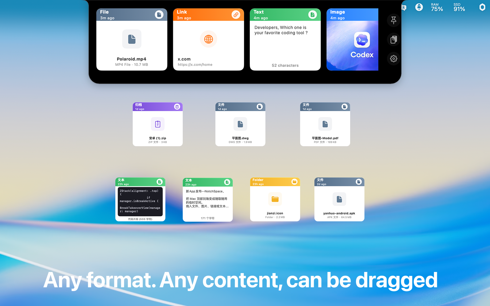
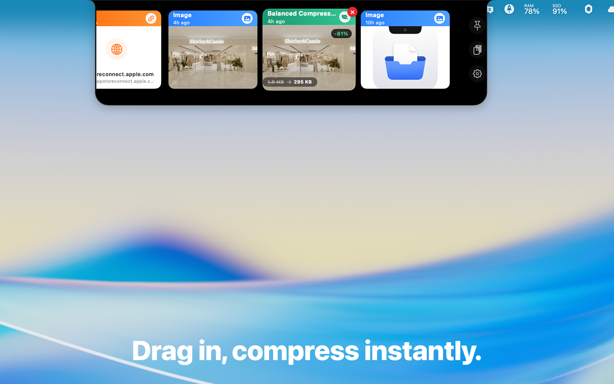
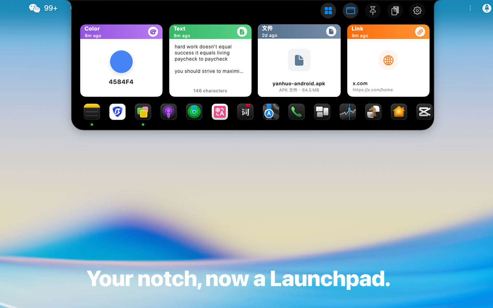

### 🎬 관련 영상
- [🎥 영상 보기](https://ph-files.imgix.net/72d56a46-6124-4003-a3ae-5882ede72980.jpeg?auto=format)

---

## 27. [Henji](https://www.producthunt.com/products/henji)
**Votes**: 73 | **도입 난이도**: 하 | **신뢰도**: 상
**Tagline**: AI replies that are trained to sound like you
**서비스 링크**: https://www.producthunt.com/r/GKWTXCHNHEP5G2

**태그**: Productivity, AI, Communication, Slack, AI Tool

### 📌 이 서비스 한눈에 보기
사용자의 말투와 습관을 학습하여 자연스러운 답장을 생성하는 AI 커뮤니케이션 도구

### 🔑 주요 기능
- 사용자의 고유한 말투, 리듬, 이모지 사용 습관을 학습하는 개인화된 AI
- 생각은 사용자가 하고, 글쓰기 작업만 대신 처리하여 재수정 번거로움 최소화
- 키워드 입력만으로 완성도 높은 답장 생성 (Slack 우선 지원)

### 🙋 사용자에게 어떤 점이 좋은가
매일 쏟아지는 메시지에 일일이 답장하는 시간을 줄여주면서도, AI 특유의 딱딱함 없이 본인의 목소리로 소통할 수 있습니다.

### ✅ 지금 바로 써볼 기능
- Slack에 연동하여 메시지 답장 기능 테스트하기
- 자신의 말투를 학습시키기 위해 다양한 키워드와 메시지 입력하기

### ⚠️ 사용 전 확인할 점
- 현재 Slack 위주로 서비스가 시작되어 다른 플랫폼 확장 여부 확인 필요
- 학습 데이터가 쌓이기 전까지는 초기 말투 재현도가 낮을 수 있음

### 🧭 확인이 더 필요한 정보
현재 지원되는 플랫폼 범위와 향후 확장 계획에 대한 구체적인 정보가 필요합니다.

### 📸 스크린샷 및 갤러리
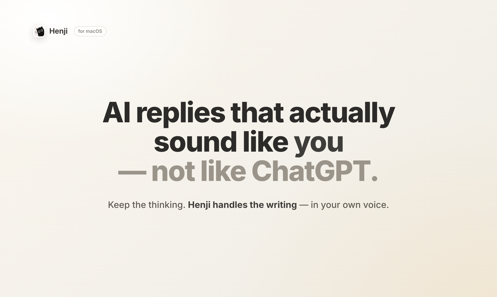
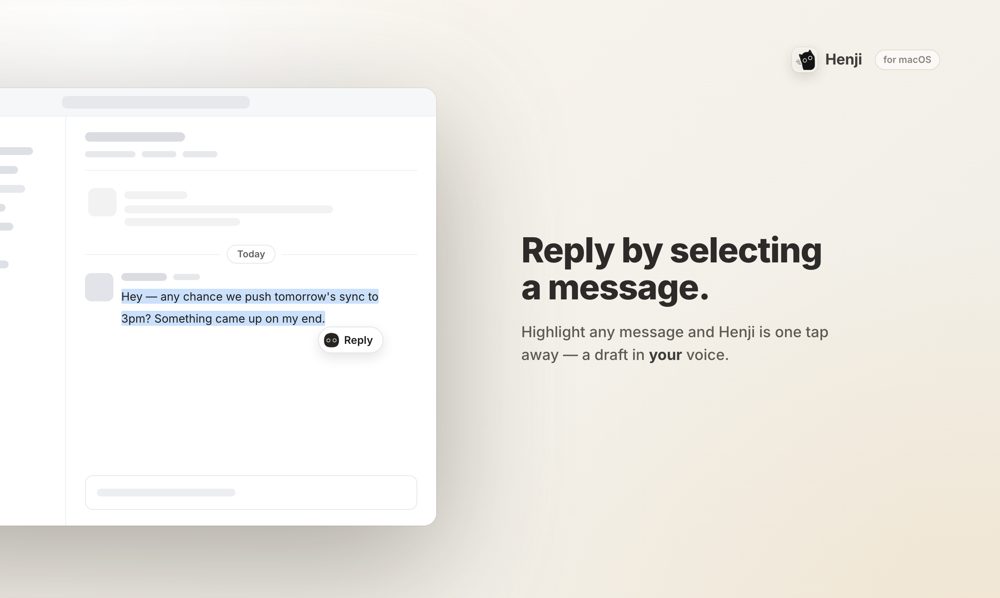
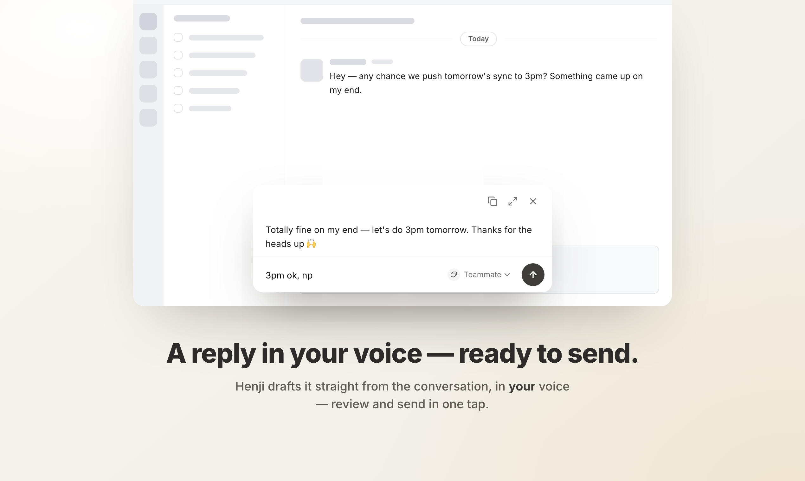

### 🎬 관련 영상
- [🎥 영상 보기](https://ph-files.imgix.net/6e68da47-c549-4db8-a61e-b051b7a29383.jpeg?auto=format)

---

## 28. [idmly](https://www.producthunt.com/products/idmly)
**Votes**: 72 | **도입 난이도**: 하 | **신뢰도**: 상
**Tagline**: Turn any HTML/CSS design into an editable InDesign file
**서비스 링크**: https://www.producthunt.com/r/SPJ63PXK75KT26

**태그**: DesignTool, Automation, Workflow, AI Tool, Design

### 📌 이 서비스 한눈에 보기
HTML/CSS 디자인을 편집 가능한 어도비 인디자인 파일로 즉시 변환해주는 도구

### 🔑 주요 기능
- HTML/CSS 디자인을 레이어가 살아있는 네이티브 인디자인 파일로 변환
- 텍스트 프레임, 이름 지정된 단락 스타일, 벡터 차트 등 편집 가능한 요소 유지
- 모든 CSS 프레임워크와 호환되며 단순 PDF 병합이 아닌 실제 편집 기능 제공

### 🙋 사용자에게 어떤 점이 좋은가
웹 디자인을 인쇄용 레이아웃으로 옮길 때 발생하는 수동 재작업 시간을 획기적으로 단축할 수 있습니다.

### ✅ 지금 바로 써볼 기능
- 첫 두 페이지 무료 기능을 통해 변환 품질 테스트하기
- 보유 중인 HTML 디자인을 인디자인 파일로 변환해보기

### ⚠️ 사용 전 확인할 점
- 복잡한 레이아웃의 경우 CSS 프레임워크에 따른 변환 정확도 차이가 있을 수 있음
- 무료 버전은 페이지 수 제한이 있음

### 🧭 확인이 더 필요한 정보
특정 복잡한 CSS 속성이 인디자인의 네이티브 기능으로 얼마나 완벽하게 매핑되는지 확인이 필요합니다.

### 📸 스크린샷 및 갤러리
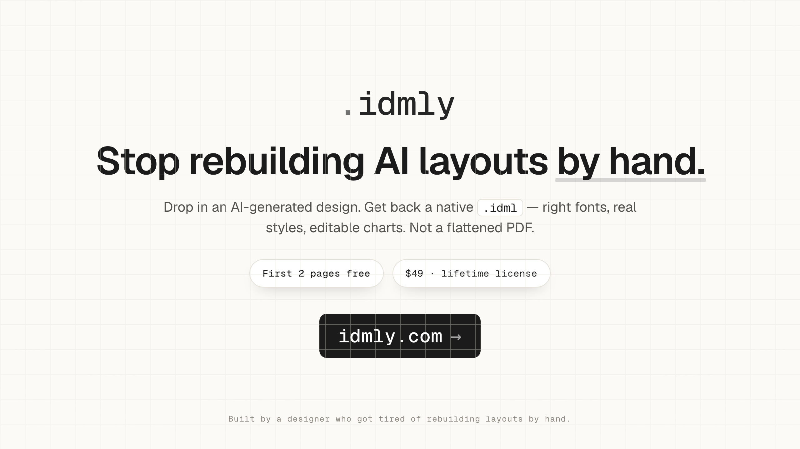
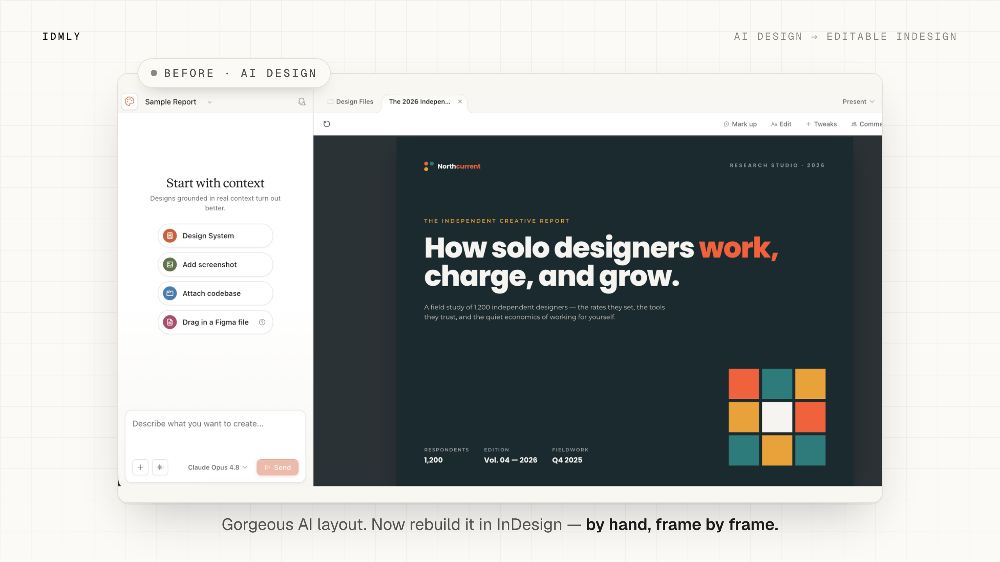
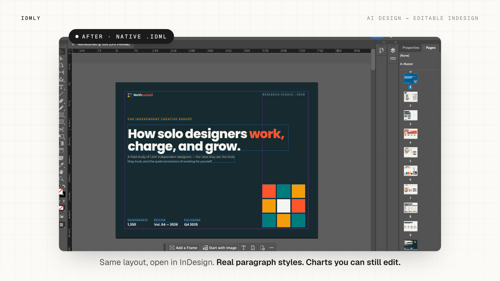

### 🎬 관련 영상
- [🎥 영상 보기](https://ph-files.imgix.net/bb885fb5-f9d7-4be2-8cd4-634b2a217bec.jpeg?auto=format)

---

## 29. [Infinite](https://www.producthunt.com/products/infinite-the-growth-engineering-agent)
**Votes**: 71 | **도입 난이도**: 중 | **신뢰도**: 상
**Tagline**: OS runtime unifying GA4, PostHog, + Stripe into a local db
**서비스 링크**: https://www.producthunt.com/r/2IHXC2OCH4T3CY

**태그**: DataAnalytics, OpenSource, GrowthHacking, Privacy, DevTool, LLM

### 📌 이 서비스 한눈에 보기
여러 곳에 흩어진 성장 데이터(GA4, Stripe 등)를 로컬 DB로 통합하여 한눈에 분석하는 오픈소스 툴

### 🔑 주요 기능
- GA4, PostHog, Stripe 등 다양한 플랫폼의 데이터를 하나의 로컬 DB로 통합
- 트래픽, 가입, 매출 간의 상관관계를 단일 환경에서 분석 가능
- 데이터가 사용자 기기에만 저장되는 높은 보안성과 프라이버시

### 🙋 사용자에게 어떤 점이 좋은가
여러 대시보드를 오갈 필요 없이 모든 성장 지표를 한 곳에서 연결하여 분석할 수 있으며, 데이터 유출 걱정 없이 로컬 환경에서 안전하게 작업할 수 있습니다.

### ✅ 지금 바로 써볼 기능
- 주요 데이터 소스(GA4, Stripe 등) 연동 설정하기
- 로컬 DB에 적재된 데이터로 통합 쿼리 실행하기
- 사용 중인 LLM을 연결하여 데이터 인사이트 질문하기

### ⚠️ 사용 전 확인할 점
- 로컬 환경에 데이터를 수집하므로 데이터 양이 많아질 경우 하드웨어 리소스 사용량 확인 필요
- 각 플랫폼의 API 연동 및 데이터 동기화 설정에 대한 기술적 이해 필요

### 🧭 확인이 더 필요한 정보
데이터 소스별 구체적인 동기화 주기 및 로컬 DB 엔진의 종류에 대한 정보가 명시되지 않았습니다.

### 📸 스크린샷 및 갤러리
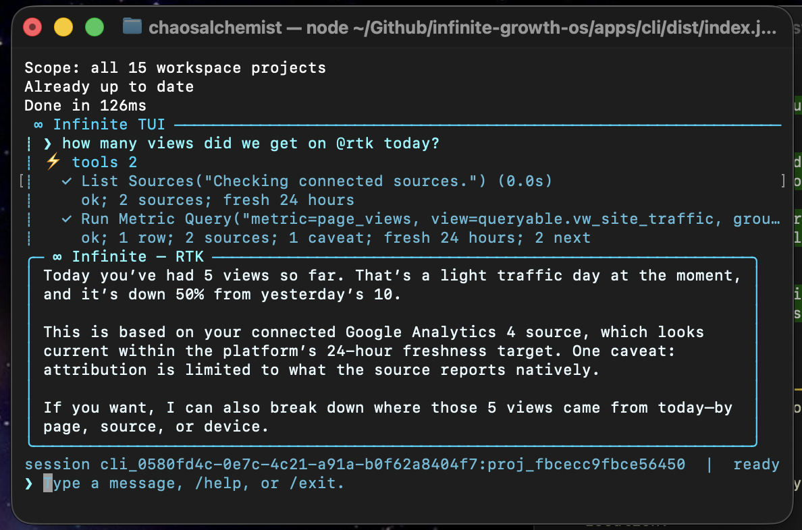
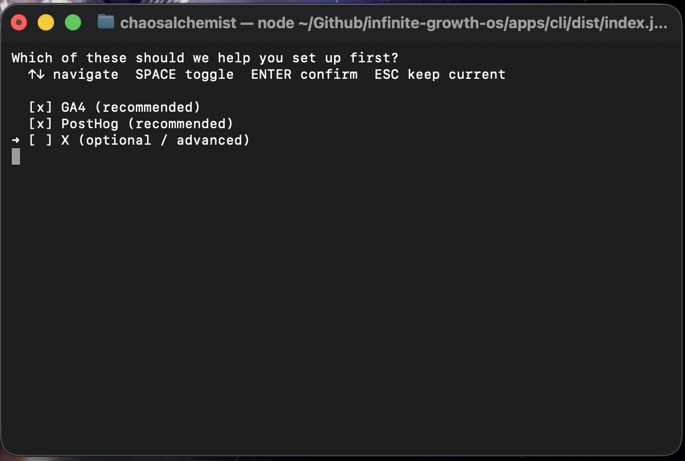
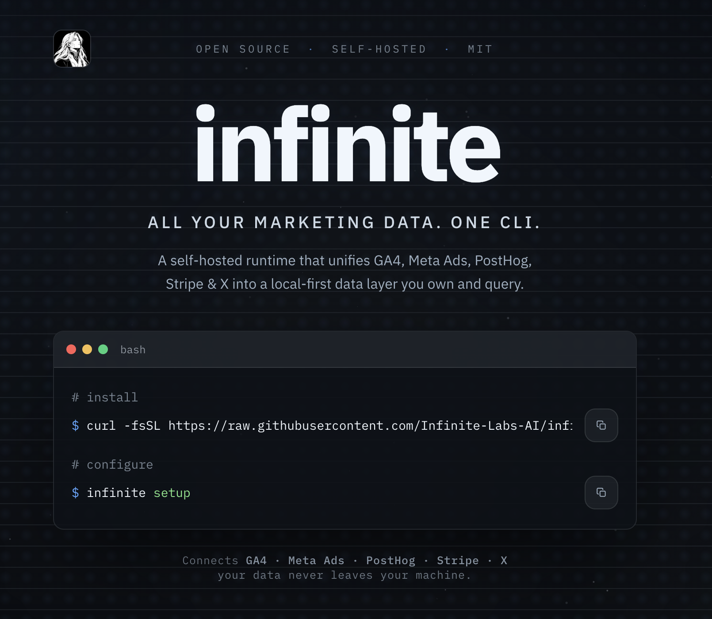

---

## 30. [StickerWords](https://www.producthunt.com/products/stickerwords)
**Votes**: 71 | **도입 난이도**: 하 | **신뢰도**: 상
**Tagline**: Learn new words from the world around you
**서비스 링크**: https://www.producthunt.com/r/OYBZCTOPFGZE23

**태그**: LanguageLearning, Education, MobileApp, Productivity

### 📌 이 서비스 한눈에 보기
주변 사물을 촬영하여 즉석에서 단어를 배우고 암기하는 실생활 밀착형 언어 학습 앱

### 🔑 주요 기능
- 사진 촬영을 통한 직관적인 단어 학습
- 개인별 맞춤형 어휘 목록 저장 기능
- 망각 곡선을 고려한 간격 반복(Spaced Repetition) 복습 시스템

### 🙋 사용자에게 어떤 점이 좋은가
일상 속 사물을 학습 도구로 활용하여 별도의 교재 없이도 자연스럽게 어휘력을 확장할 수 있습니다.

### ✅ 지금 바로 써볼 기능
- 주변에 보이는 사물 촬영하여 단어 학습하기
- 저장된 단어의 예문 확인하기
- 간격 반복 기능을 통한 복습 루틴 만들기

### ⚠️ 사용 전 확인할 점
- 사진의 화질이나 사물의 복잡도에 따라 인식 정확도가 달라질 수 있음
- 학습 대상 언어의 종류와 지원 범위 확인 필요

### 🧭 확인이 더 필요한 정보
지원하는 대상 언어의 종류와 정확한 인식 기술 수준에 대한 정보가 추가로 필요합니다.

### 📸 스크린샷 및 갤러리

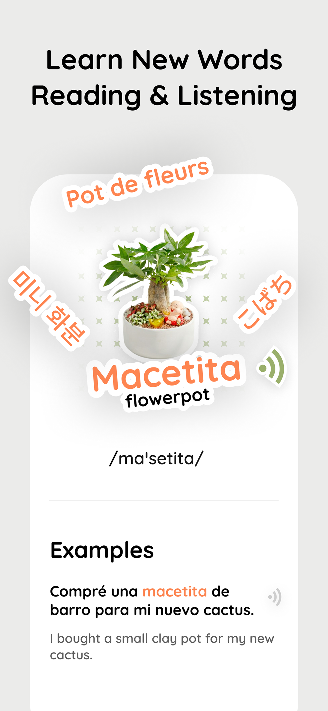

---

