# 🚀 Product Hunt Daily Top 30 (2026-06-19)

## 오늘의 요약
오늘의 트렌드는 단순한 보조를 넘어 사용자의 개입을 최소화하고 업무를 완결하는 '자율형 AI 에이전트'의 부상이 두드러졌습니다. 또한, 실시간 웹 데이터 추출 및 소셜 미디어 분석을 통해 신선한 인사이트를 제공하는 데이터 활용 도구들이 주목받았습니다. 보안을 강조한 로컬 실행 방식이나 기존 협업 툴에 통합된 형태의 AI 솔루션들이 실질적인 업무 효율화를 목표로 등장했습니다.

### 오늘의 핵심 포인트
- 단순 명령 수행을 넘어 업무 흐름을 스스로 파악하고 초안을 완성하는 프로액티브(Proactive) AI 에이전트가 핵심 트렌드로 나타났습니다.
- 정적인 데이터베이스 대신 실시간 웹 스캐닝과 소셜 미디어 분석을 통해 즉각적이고 신선한 비즈니스 인사이트를 제공하는 도구들이 주목받았습니다.
- 클라우드 의존도를 낮춘 로컬 기반 보안 솔루션과 Microsoft Teams와 같은 기존 업무 환경에 깊숙이 통합된 AI 도구들이 실용성을 강조하고 있습니다.

**오늘의 태그**: AI 에이전트, 업무 자동화, 실시간 데이터, 생산성 도구

## 1. [Upstream](https://www.producthunt.com/products/upstream-3)
**Votes**: 458 | **도입 난이도**: 하 | **신뢰도**: 상
**Tagline**: The inbox designed for humans and agents
**서비스 링크**: https://www.producthunt.com/r/RWE7MKUX4XZRYA

**태그**: Productivity, AI, Email, Automation, Agent, AI Tool, Design

### 📌 이 서비스 한눈에 보기
AI 에이전트가 이메일 정리와 초안 작성을 대신해주는 사용자 중심의 스마트 인박스

### 🔑 주요 기능
- AI 에이전트의 자동 메시지 분류 및 정리 기능
- 답장 초안 자동 생성 및 반복적인 업무 자동화
- 사용자 경험(UX)에 집중한 빠르고 직관적인 클라이언트 인터페이스

### 🙋 사용자에게 어떤 점이 좋은가
이메일 관리의 번거로운 반복 작업을 AI가 대신 처리해주어, 사용자는 중요한 의사결정에만 집중할 수 있습니다.

### ✅ 지금 바로 써볼 기능
- AI 에이전트의 메시지 분류 정확도 테스트
- 자동 생성된 답장 초안의 품질 확인
- 기존 이메일 워크플로우와의 속도 및 편의성 비교

### ⚠️ 사용 전 확인할 점
- AI가 생성한 답장의 정확성 및 톤앤매너 검토 필요
- 개인정보 및 이메일 데이터 보안 정책 확인 필요

### 🧭 확인이 더 필요한 정보
현재 제공되는 AI 에이전트가 지원하는 이메일 서비스(Gmail, Outlook 등)의 종류와 연동 범위를 확인해야 합니다.

### 📸 스크린샷 및 갤러리
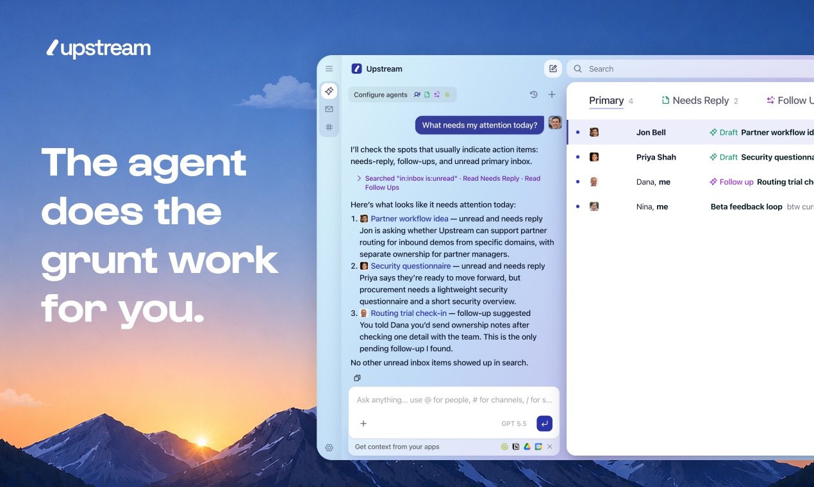
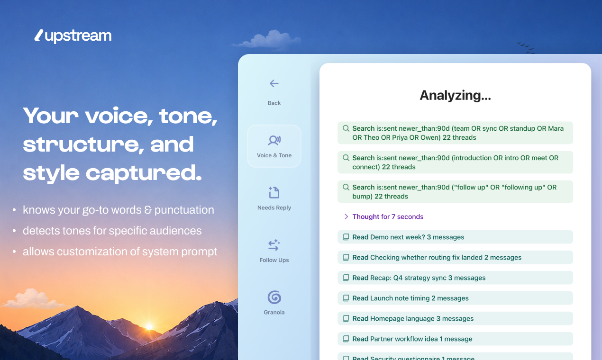
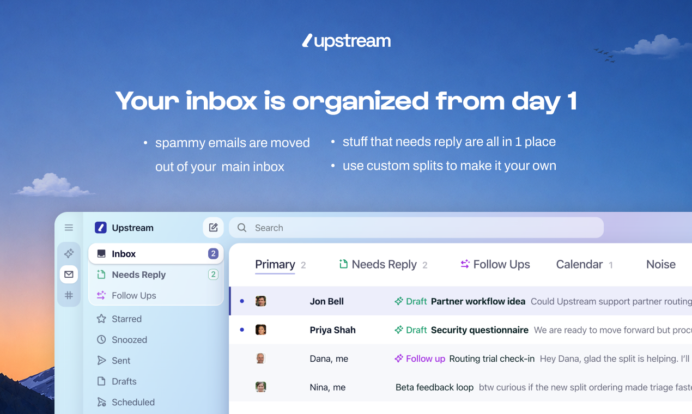

### 🎬 관련 영상
- [🎥 영상 보기](https://ph-files.imgix.net/f7e66f1f-c3d0-4387-993e-bbe32a668803.jpeg?auto=format)

---

## 2. [Honestly](https://www.producthunt.com/products/honestly)
**Votes**: 344 | **도입 난이도**: 하 | **신뢰도**: 상
**Tagline**: See what Reddit and TikTok honestly think about your product
**서비스 링크**: https://www.producthunt.com/r/K3BBXOWI6EMJ53

**태그**: Social Listening, Market Research, Analytics, AI, Agent, AI Tool

### 📌 이 서비스 한눈에 보기
Reddit과 TikTok 등 소셜 미디어의 실제 사용자 반응을 분석하여 실질적인 인사이트를 제공하는 도구

### 🔑 주요 기능
- Reddit, TikTok, X, YouTube 등 주요 소셜 플랫폼의 대화 데이터 수집
- AI와 봇이 아닌 실제 사용자의 검증된 의견 식별
- 수집된 방대한 데이터를 팀이 즉시 활용 가능한 인사이트로 변환

### 🙋 사용자에게 어떤 점이 좋은가
마케팅과 제품 개발 팀이 가짜 리뷰나 봇의 노이즈를 제거하고, 실제 고객의 생생한 피드백을 빠르게 파악할 수 있습니다.

### ✅ 지금 바로 써볼 기능
- 자사 제품 관련 소셜 미디어 언급량 확인하기
- 플랫폼별 사용자 감성 및 주요 피드백 분석하기
- 수집된 인사이트를 제품 로드맵에 반영하기

### ⚠️ 사용 전 확인할 점
- 데이터 수집 범위가 특정 소셜 플랫폼에 국한될 수 있음
- 수집된 데이터의 맥락을 해석할 때 인간의 검토가 필요할 수 있음

### 🧭 확인이 더 필요한 정보
구체적인 데이터 분석 알고리즘의 정교함과 실시간 업데이트 주기에 대한 정보가 필요합니다.

### 📸 스크린샷 및 갤러리

### 🎬 관련 영상
- [🎥 영상 보기](https://ph-files.imgix.net/238474ac-6788-4c07-9931-a3148263e2c8.jpeg?auto=format)

---

## 3. [Tabstack Dev Tools](https://www.producthunt.com/products/tabstack)
**Votes**: 276 | **도입 난이도**: 하 | **신뢰도**: 상
**Tagline**: Ditch your scraper. Make one API call with any tool.
**서비스 링크**: https://www.producthunt.com/r/BTEFHM3YD7BEYD
**재등장**: 최근 7일 내 재등장 (마지막 등장 6일 전)

**태그**: DevTool, Automation, WebScraping, API, Agent, AI Tool, LLM

### 📌 이 서비스 한눈에 보기
복잡한 스크래퍼 없이 API 호출 한 번으로 웹 데이터를 구조화된 JSON이나 마크다운으로 변환해주는 개발자 도구

### 🔑 주요 기능
- 브라우저나 LLM 파이프라인 구축 없이 단일 API로 웹 데이터 추출
- 구조화된 JSON, 클린 마크다운, 인용된 리서치 데이터 제공
- MCP 서버, CLI, Raycast, Agent Skill 등 기존 워크플로우와 즉시 연동 가능

### 🙋 사용자에게 어떤 점이 좋은가
별도의 스크래핑 인프라를 구축할 필요 없이, 기존 개발 환경에서 API 호출만으로 정제된 웹 데이터를 즉시 활용할 수 있습니다.

### ✅ 지금 바로 써볼 기능
- API 키 발급 후 3분 내 첫 호출 테스트
- CLI 또는 Raycast 확장 프로그램에 연동하여 워크플로우 자동화
- MCP 서버를 통한 AI 에이전트 스킬로 등록

### ⚠️ 사용 전 확인할 점
- 구체적인 호출당 비용(Pricing) 모델 확인 필요
- 대규모 데이터 추출 시 속도 및 제한 사항 확인 필요

### 🧭 확인이 더 필요한 정보
제공되는 API의 구체적인 호출 제한(Rate Limit)과 상세 가격 정책에 대한 정보가 명시되지 않았습니다.

### 📸 스크린샷 및 갤러리
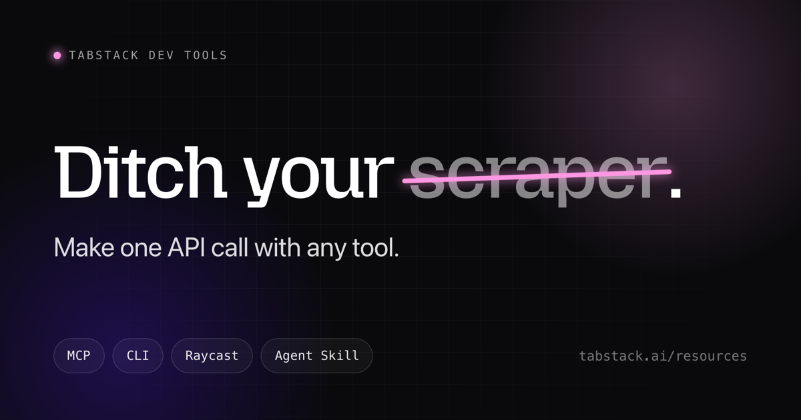
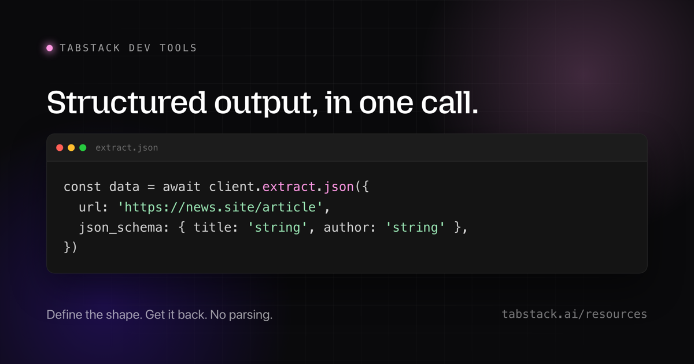
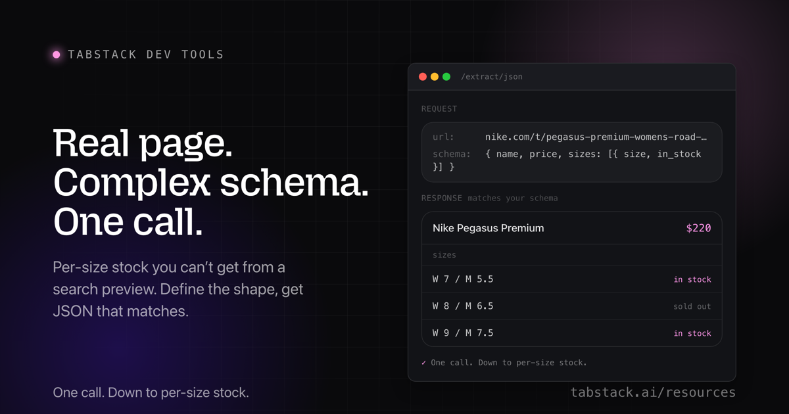

### 🎬 관련 영상
- [🎥 영상 보기](https://ph-files.imgix.net/42461806-e8b7-4ef6-a7e8-417bd56975e8.jpeg?auto=format)

---

## 4. [Jesse](https://www.producthunt.com/products/jesse-2)
**Votes**: 245 | **도입 난이도**: 하 | **신뢰도**: 상
**Tagline**: Stop building Apollo/Clay lists. Search the live internet.
**서비스 링크**: https://www.producthunt.com/r/5ZOJC6SLGDVPKM

**태그**: SalesTech, LeadGeneration, SearchEngine, AI, AI Tool, Marketing, Sales

### 📌 이 서비스 한눈에 보기
정체된 데이터베이스 대신 실시간 웹 검색을 통해 즉각적인 영업 기회를 발굴하는 AI 검색 엔진

### 🔑 주요 기능
- 기존의 오래된 데이터베이스 방식에서 벗어난 실시간 인터넷 스캐닝 기술
- 자연어 질문을 통해 특정 조건에 맞는 잠재 고객을 즉시 탐색
- 데이터 스크래핑 및 저장 방식이 아닌 실시간 웹 검색 기반의 신선한 리드 제공

### 🙋 사용자에게 어떤 점이 좋은가
영업팀이 더 이상 업데이트되지 않은 낡은 리스트를 뒤지는 대신, 현재 시장에서 발생하는 실시간 수요를 즉각적으로 포착할 수 있습니다.

### ✅ 지금 바로 써볼 기능
- 자연어 쿼리를 활용한 특정 타겟 시장 검색 테스트
- 현재 영업 프로세스에 실시간 리드 반영 가능성 검토

### ⚠️ 사용 전 확인할 점
- 실시간 검색 결과의 정확도 및 데이터 정제 수준 확인 필요
- 대량의 리드 추출 시 검색 엔진의 성능 및 속도 제한 가능성

### 🧭 확인이 더 필요한 정보
실시간 검색 결과가 제공하는 데이터의 구체적인 필드(연락처 등)와 데이터의 신뢰도 수준을 확인해야 합니다.

### 📸 스크린샷 및 갤러리
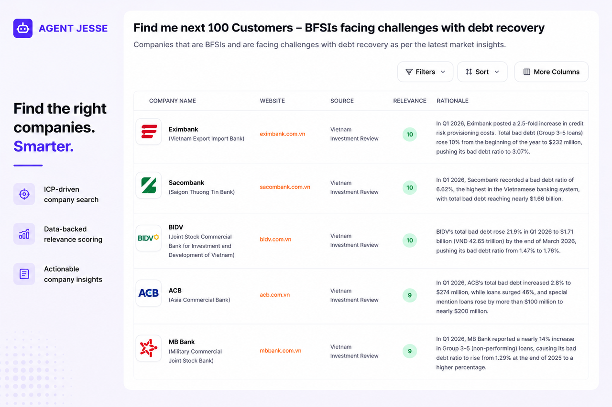
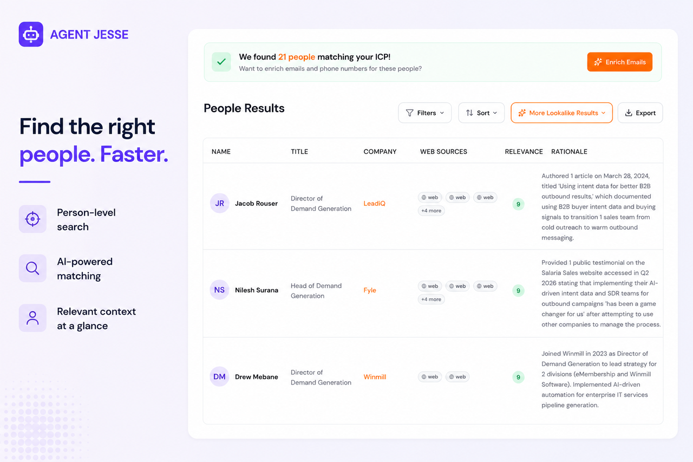
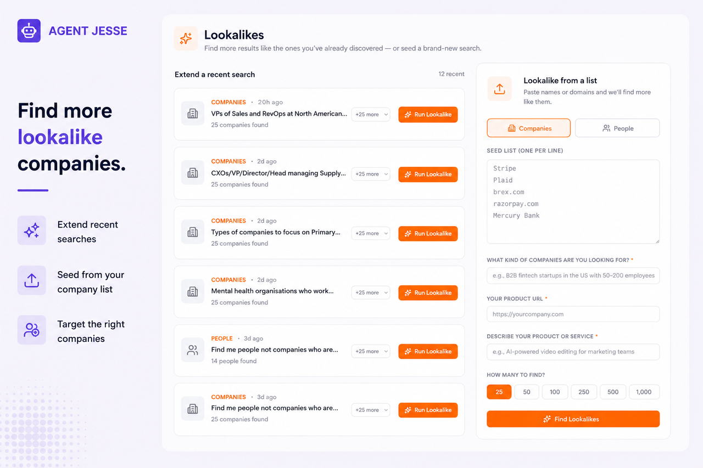

### 🎬 관련 영상
- [🎥 영상 보기](https://ph-files.imgix.net/99b71263-e7b1-4a10-adee-0eff55de484a.jpeg?auto=format)

---

## 5. [Elvin](https://www.producthunt.com/products/elvin)
**Votes**: 200 | **도입 난이도**: 중 | **신뢰도**: 상
**Tagline**: Proactive AI that finds and finishes work before you ask
**서비스 링크**: https://www.producthunt.com/r/B4Z3RFN4UB4DP6

**태그**: AI Agent, Automation, Productivity, Workflow, AI Tool

### 📌 이 서비스 한눈에 보기
사용자가 요청하기 전에 업무를 미리 찾아내고 초안까지 완성하는 선제적 AI 에이전트

### 🔑 주요 기능
- 단순한 명령 수행을 넘어 업무 흐름을 스스로 파악하는 프로액티브(Proactive) AI
- 메시지, 회의, 문서 등 흩어진 맥락을 수집하여 실행 가능한 작업으로 변환
- 사용자의 최종 승인 전까지는 스스로 초안과 후속 조치를 준비하는 협업 방식

### 🙋 사용자에게 어떤 점이 좋은가
단순 반복적인 업무 조율과 정보 취합 시간을 줄여주며, 사용자는 AI가 준비한 결과물을 검토하고 승인하는 역할에만 집중할 수 있습니다.

### ✅ 지금 바로 써볼 기능
- 기존 업무 툴(메시지, 문서 등)과의 연동 설정
- AI가 생성한 업무 초안 및 후속 조치 검토
- AI의 자동화 범위와 승인 프로세스 최적화

### ⚠️ 사용 전 확인할 점
- AI가 맥락을 잘못 해석하여 잘못된 초안을 생성할 가능성
- 다양한 툴 간의 데이터 접근 권한 설정 및 보안 문제

### 🧭 확인이 더 필요한 정보
현재 지원하는 구체적인 외부 툴(SaaS) 목록과 데이터 보안 정책에 대한 확인이 필요합니다.

### 📸 스크린샷 및 갤러리

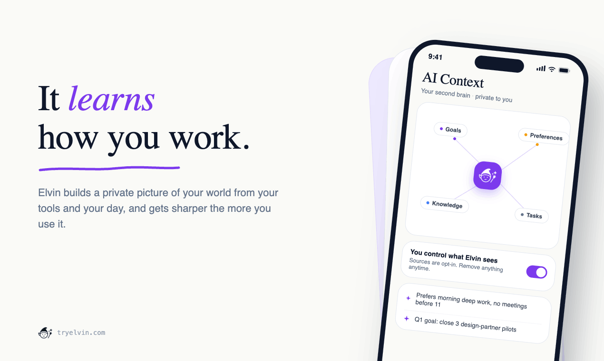
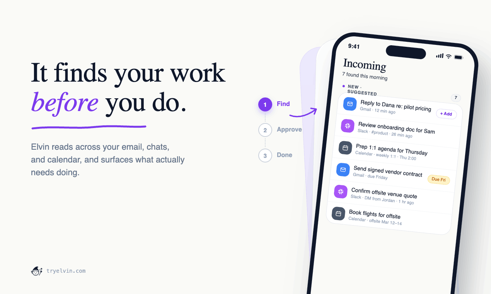

### 🎬 관련 영상
- [🎥 영상 보기](https://ph-files.imgix.net/ec874203-1cbf-456b-9939-4639ef163e99.jpeg?auto=format)

---

## 6. [Viktor for Microsoft Teams](https://www.producthunt.com/products/viktor)
**Votes**: 175 | **도입 난이도**: 중 | **신뢰도**: 상
**Tagline**: The most powerful AI employee, now in Microsoft Teams
**서비스 링크**: https://www.producthunt.com/r/2YO4MFPVTIMJC6

**태그**: Automation, AI Agent, Productivity, SaaS, Teams, AI Tool

### 📌 이 서비스 한눈에 보기
Microsoft Teams 내에서 단순 초안 작성을 넘어 실질적인 업무를 완결하는 자율형 AI 직원

### 🔑 주요 기능
- 3,000개 이상의 도구와 연동되는 강력한 업무 실행 능력
- 단순 보조(Copilot)를 넘어 보고서 작성, 정산, 승인 등 실무 완결형 워크플로우 제공
- Microsoft Teams 환경 내에서 직접 구동되는 업무 자동화

### 🙋 사용자에게 어떤 점이 좋은가
반복적인 운영 업무와 복잡한 프로세스를 AI에게 맡겨 사용자가 의사결정에만 집중할 수 있게 합니다.

### ✅ 지금 바로 써볼 기능
- 무료 크레딧($100)을 활용한 실무 워크플로우 테스트
- 기존에 사용 중인 3,000개 이상의 도구와의 연동성 확인
- 반복적인 운영 업무(Recurring ops) 자동화 설정

### ⚠️ 사용 전 확인할 점
- 자율적 업무 수행에 따른 결과물 검토 필요
- 3,000개 이상의 도구 중 사용 중인 특정 툴과의 호환성 확인 필요

### 🧭 확인이 더 필요한 정보
자율적인 업무 수행 시 발생할 수 있는 보안 및 권한 관리 범위에 대한 확인이 필요합니다.

### 📸 스크린샷 및 갤러리

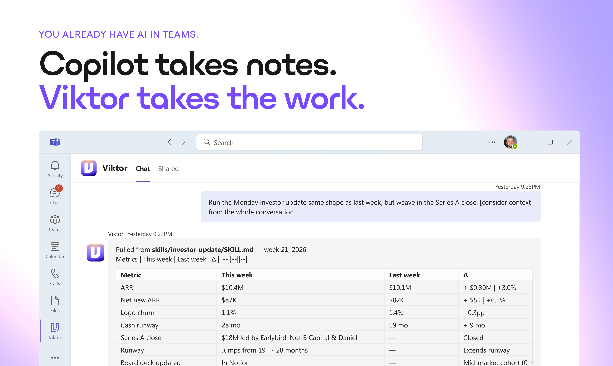

### 🎬 관련 영상
- [🎥 영상 보기](https://ph-files.imgix.net/826ee3bc-4267-42a8-b77c-fbf1f6c07760.jpeg?auto=format)

---

## 7. [Agentic videos by D-ID](https://www.producthunt.com/products/d-id)
**Votes**: 167 | **도입 난이도**: 중 | **신뢰도**: 상
**Tagline**: Interactive videos that talk back 
**서비스 링크**: https://www.producthunt.com/r/U6TALWDWNUDFNC

**태그**: AI Video, Interactive, Content Creation, EdTech, Analytics, Agent, AI Tool, Video

### 📌 이 서비스 한눈에 보기
시청자와 실시간으로 대화하며 상호작용하는 차세대 AI 인터랙티브 비디오 솔루션

### 🔑 주요 기능
- 단순 시청을 넘어 질문과 답변이 가능한 양방향 비디오 경험 제공
- D-ID의 고도로 표현력 있는 AI 아바타 기술 활용
- 시청자의 질문과 반응을 통한 심도 있는 데이터 및 인사이트 확보

### 🙋 사용자에게 어떤 점이 좋은가
콘텐츠 제작자는 시청자의 의도와 지식 수준을 정확히 파악할 수 있으며, 시청자는 개인화된 맞춤형 학습 및 경험을 누릴 수 있습니다.

### ✅ 지금 바로 써볼 기능
- 기존 영상에 인터랙티브 기능 적용해보기
- AI 아바타의 표현력 및 응답 속도 테스트
- 시청자 질문 데이터를 통한 콘텐츠 개선 전략 수립

### ⚠️ 사용 전 확인할 점
- 실시간 응답 시 발생할 수 있는 지연 시간(Latency) 확인 필요
- 질문 내용에 따른 AI 답변의 정확성 및 적절성 검토

### 🧭 확인이 더 필요한 정보
현재 제공되는 아바타의 감정 표현 범위와 기술적 지원 언어에 대한 상세 정보 확인이 필요합니다.

### 📸 스크린샷 및 갤러리

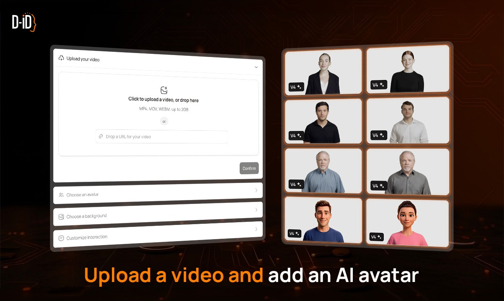

### 🎬 관련 영상
- [🎥 영상 보기](https://ph-files.imgix.net/7ff89d9c-1249-4a07-8da8-8c2d599f8844.jpeg?auto=format)

---

## 8. [Juno](https://www.producthunt.com/products/juno-16)
**Votes**: 130 | **도입 난이도**: 하 | **신뢰도**: 상
**Tagline**: Free, local AI powered Voice to Text w/ live transcriptions
**서비스 링크**: https://www.producthunt.com/r/733D7655G5YMUK

**태그**: Productivity, AI, Voice-to-Text, OpenSource, Mac, AI Tool

### 📌 이 서비스 한눈에 보기
개인정보 걱정 없는 로컬 기반의 실시간 AI 음성 받아쓰기 및 텍스트 편집 도구

### 🔑 주요 기능
- Mac 전용 로컬 실행 방식으로 보안 및 오프라인 환경 지원
- 실시간 전사(Live Transcription) 및 자연스러운 텍스트 정제 기능
- 메일, 슬랙, 커서 등 기존 앱에서 바로 사용하는 워크플로우

### 🙋 사용자에게 어떤 점이 좋은가
로그인이나 클라우드 전송 없이 내 컴퓨터에서 직접 작동하므로 보안이 중요한 작업 시 유용하며, 말하는 대로 텍스트를 깔끔하게 정리해 줍니다.

### ✅ 지금 바로 써볼 기능
- 자주 사용하는 앱(Slack, Mail 등)에서 음성 입력 테스트하기
- 텍스트 재작성(Rewrite) 기능을 통한 문장 다듬기
- 음성 명령을 통한 메모 및 알람 생성 기능 활용하기

### ⚠️ 사용 전 확인할 점
- Mac 전용 앱이므로 macOS 환경에서만 사용 가능
- 로컬 리소스를 사용하므로 하드웨어 성능에 따른 영향 가능성

### 🧭 확인이 더 필요한 정보
로컬 실행 시 하드웨어 사양에 따른 처리 속도 및 배터리 소모 정도를 확인해야 합니다.

### 📸 스크린샷 및 갤러리

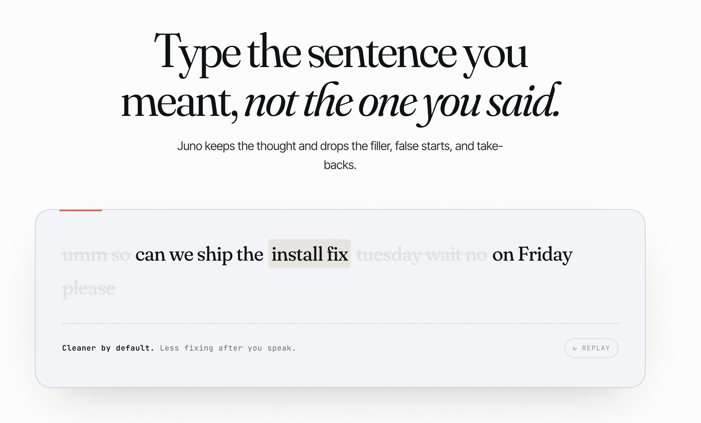
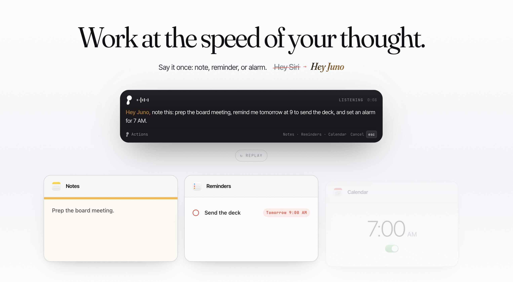

### 🎬 관련 영상
- [🎥 영상 보기](https://ph-files.imgix.net/4189d3e0-31cf-4f83-b33f-c0af98697787.jpeg?auto=format)

---

## 9. [VoiceOS](https://www.producthunt.com/products/voiceos)
**Votes**: 126 | **도입 난이도**: 하 | **신뢰도**: 상
**Tagline**: A voice assistant that's a real JARVIS for your computer
**서비스 링크**: https://www.producthunt.com/r/UWVLVNXZGBLPDS

**태그**: Automation, Productivity, Voice-AI, OS-Integration

### 📌 이 서비스 한눈에 보기
컴퓨터 전체를 제어하는 강력한 음성 기반 워크플로우 자동화 도구

### 🔑 주요 기능
- 자연어 명령을 통한 시스템 전반의 즉각적인 작업 실행
- 앱 간 이동을 최소화하여 집중력과 생산성 극대화
- Mac 및 Windows 운영체제 통합 지원

### 🙋 사용자에게 어떤 점이 좋은가
여러 앱을 번갈아 가며 작업할 필요 없이 음성만으로 복잡한 워크플로우를 실행하여 작업 흐름을 끊김 없이 유지할 수 있습니다.

### ✅ 지금 바로 써볼 기능
- 자연어 명령으로 워크플로우 실행해보기
- 시스템 전반에서의 명령 작동 여부 테스트
- 실행 전 확인 단계(Confirmation step) 설정 및 테스트

### ⚠️ 사용 전 확인할 점
- 음성 인식 정확도에 따른 명령 실행 오류 가능성
- 시스템 권한 허용에 따른 보안 및 개인정보 관리 필요

### 🧭 확인이 더 필요한 정보
구체적인 지원 앱 목록과 복잡한 워크플로우의 자동화 수준은 추가 확인이 필요합니다.

### 📸 스크린샷 및 갤러리

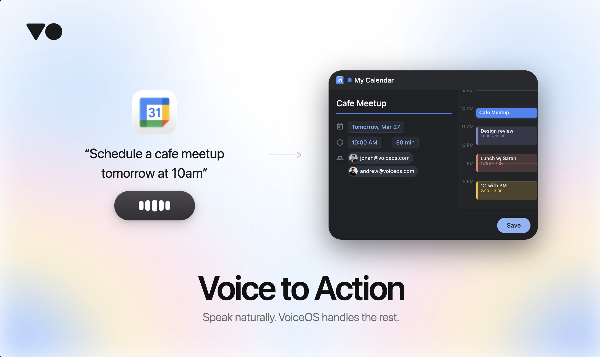

### 🎬 관련 영상
- [🎥 영상 보기](https://ph-files.imgix.net/96fb0070-7f32-410b-9ca4-aa3e82c264dd.jpeg?auto=format)

---

## 10. [Buddy](https://www.producthunt.com/products/buddy-free-figma-agent)
**Votes**: 125 | **도입 난이도**: 하 | **신뢰도**: 상
**Tagline**: Free Figma agent + Import anything to Figma
**서비스 링크**: https://www.producthunt.com/r/ZDGAVNLIA2I6XU

**태그**: DesignTool, AI, Figma, Automation, Productivity, Agent, AI Tool, Chat, Design

### 📌 이 서비스 한눈에 보기
ChatGPT를 활용해 피그마 내에서 디자인 작업과 웹 클로닝을 자동화하는 AI 디자인 에이전트

### 🔑 주요 기능
- ChatGPT 계정 연동을 통한 별도의 AI 크레딧 비용 없는 무료 사용
- 웹사이트 클로닝, Claude 아티팩트 및 스크린샷을 편집 가능한 피그마 레이어로 변환
- 화면 생성, 플로우 설계, 디자인 시스템 유지 및 파일 정리 자동화

### 🙋 사용자에게 어떤 점이 좋은가
이미 결제 중인 AI 모델을 피그마에 직접 연결하여 추가 비용 없이 디자인 워크플로우를 획기적으로 단축할 수 있습니다.

### ✅ 지금 바로 써볼 기능
- 웹사이트 URL을 입력하여 레이어로 변환하기
- 스크린샷을 업로드하여 편집 가능한 디자인으로 만들기
- ChatGPT 연동 후 디자인 시스템 기반의 화면 생성 테스트하기

### ⚠️ 사용 전 확인할 점
- 사용자의 개인 ChatGPT 계정 보안 및 데이터 연동 확인 필요
- AI 생성 결과물의 디자인 시스템 정합성 검토 필요

### 🧭 확인이 더 필요한 정보
ChatGPT 연동 시 사용되는 API 비용이나 데이터 프라이버시 정책에 대한 상세 정보 확인이 필요합니다.

### 📸 스크린샷 및 갤러리

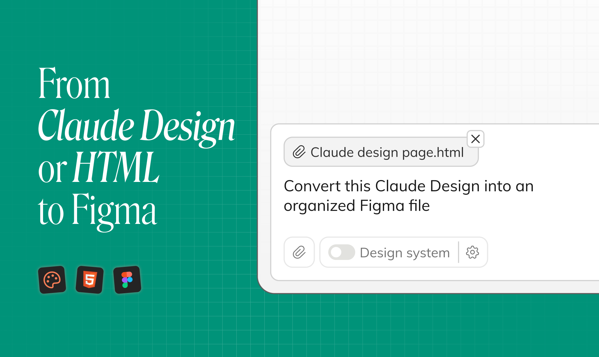

### 🎬 관련 영상
- [🎥 영상 보기](https://ph-files.imgix.net/891d5e87-0fe0-41d8-884e-f7adfb319ace.jpeg?auto=format)

---

## 11. [Otty](https://www.producthunt.com/products/otty)
**Votes**: 119 | **도입 난이도**: 하 | **신뢰도**: 상
**Tagline**: A Mac native and beautiful terminal emulator
**서비스 링크**: https://www.producthunt.com/r/2MC43OD6SYQ37P

**태그**: DevTool, macOS, Terminal, AI-Friendly, Agent, Design

### 📌 이 서비스 한눈에 보기
macOS 네이티브 환경에 최적화된 빠르고 아름다운 GPU 가속 터미널 에뮬레이터

### 🔑 주요 기능
- macOS 네이티브 설계로 구현한 매끄러운 사용자 경험과 미니멀한 디자인
- GPU 가속을 통한 빠르고 끊김 없는 텍스트 렌더링
- Claude Code, Codex 등 AI 코드 에이전트와 병렬 작업 시 최적화된 가독성

### 🙋 사용자에게 어떤 점이 좋은가
터미널 작업 시 발생하는 미세한 지연 시간을 줄이고, 여러 AI 에이전트를 동시에 실행하는 복잡한 개발 환경에서도 명확한 시각적 피드백을 제공합니다.

### ✅ 지금 바로 써볼 기능
- macOS 환경에서 네이티브 성능 체감하기
- AI 코드 에이전트와 함께 멀티태스킹 환경 구축하기
- 미니멀한 UI 테마 설정 및 커스텀하기

### ⚠️ 사용 전 확인할 점
- macOS 전용 제품이므로 Windows나 Linux 사용자는 사용 불가
- GPU 가속 사용에 따른 시스템 리소스 점유율 확인 필요

### 🧭 확인이 더 필요한 정보
상세한 시스템 요구 사양 및 타 터미널과의 구체적인 성능 비교 데이터는 제공되지 않았습니다.

### 📸 스크린샷 및 갤러리
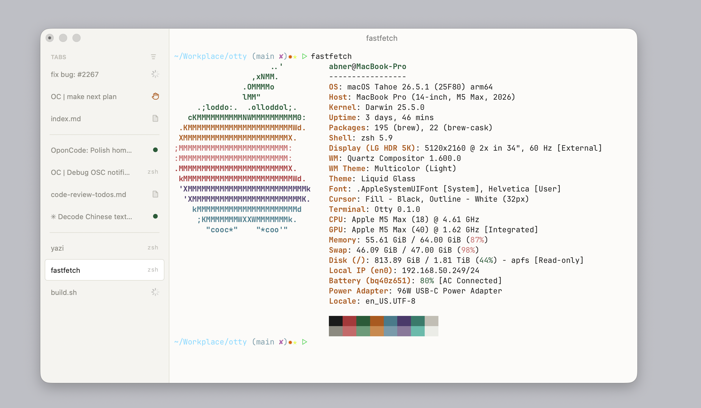
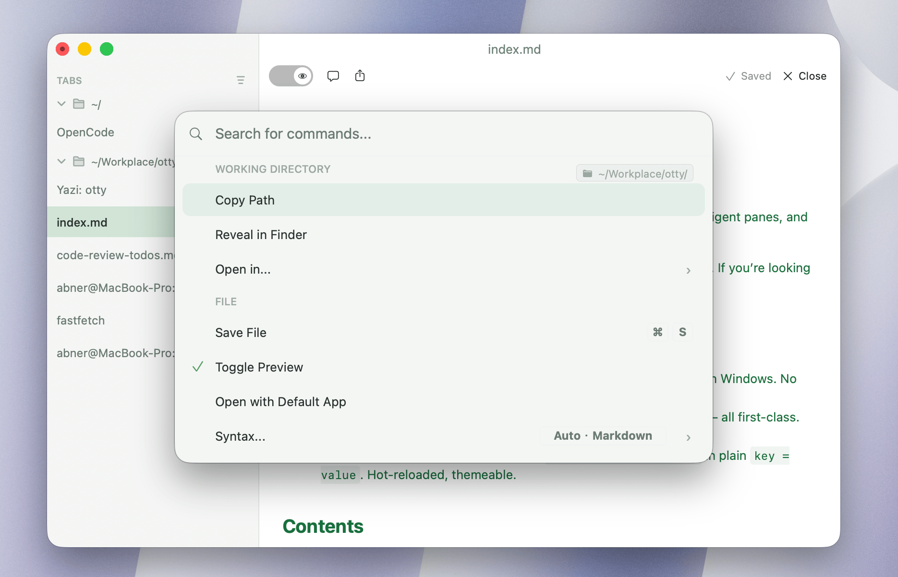
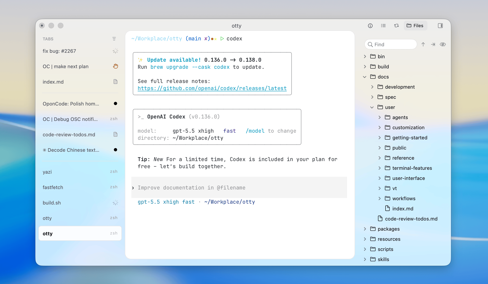

---

## 12. [Adapt](https://www.producthunt.com/products/adapt-3)
**Votes**: 115 | **도입 난이도**: 중 | **신뢰도**: 상
**Tagline**: The AI company brain that gets work done
**서비스 링크**: https://www.producthunt.com/r/KAFR42VPDW36WZ

**태그**: AI, Slack, Automation, KnowledgeManagement, Productivity, Agent, AI Tool

### 📌 이 서비스 한눈에 보기
Slack을 팀 전체의 지식 저장소이자 업무 자동화 허브로 변환하는 AI 워크스페이스

### 🔑 주요 기능
- Slack 내에서 @Adapt 태그를 통해 질문 답변 및 앱 구축 가능
- 모든 툴과 연결되어 축적된 데이터를 기반으로 하는 공유 기업 브레인 구축
- 에이전트 추적, 스킬 공유, 스케줄링 관리가 가능한 전용 웹 앱 제공

### 🙋 사용자에게 어떤 점이 좋은가
팀의 파편화된 지식을 하나로 모으고, Slack을 떠나지 않고도 복잡한 업무를 자동화할 수 있습니다.

### ✅ 지금 바로 써볼 기능
- Slack에 Adapt 설치 및 기존 업무 툴 연동하기
- 팀 공용 지식 베이스 구축을 위한 데이터 연결
- 반복 업무 자동화를 위한 커스텀 스킬 설정

### ⚠️ 사용 전 확인할 점
- 기업 내부 데이터가 AI 모델에 학습되거나 공유되는 보안 정책 확인 필요
- 연동된 툴의 권한 설정에 따른 데이터 접근 범위 관리 필요

### 🧭 확인이 더 필요한 정보
현재 구체적인 보안 프로토콜 및 데이터 처리 방식에 대한 상세 정보가 명시되지 않았습니다.

### 📸 스크린샷 및 갤러리
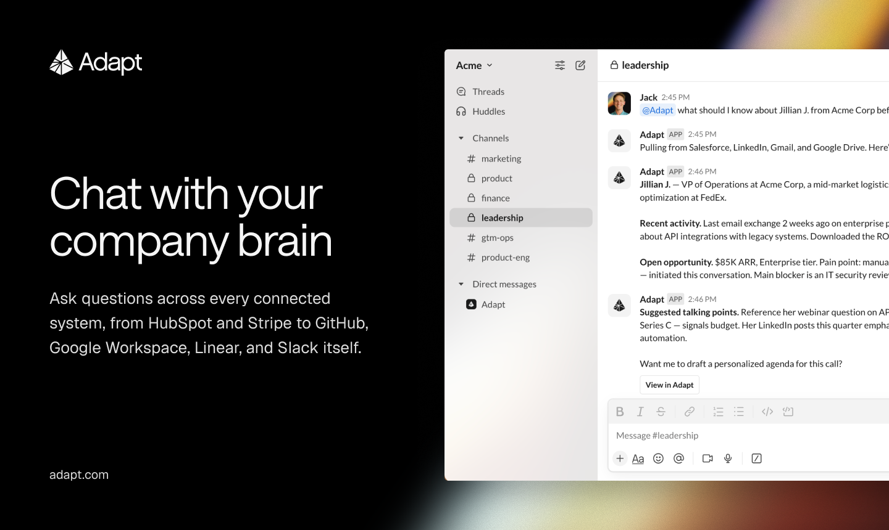
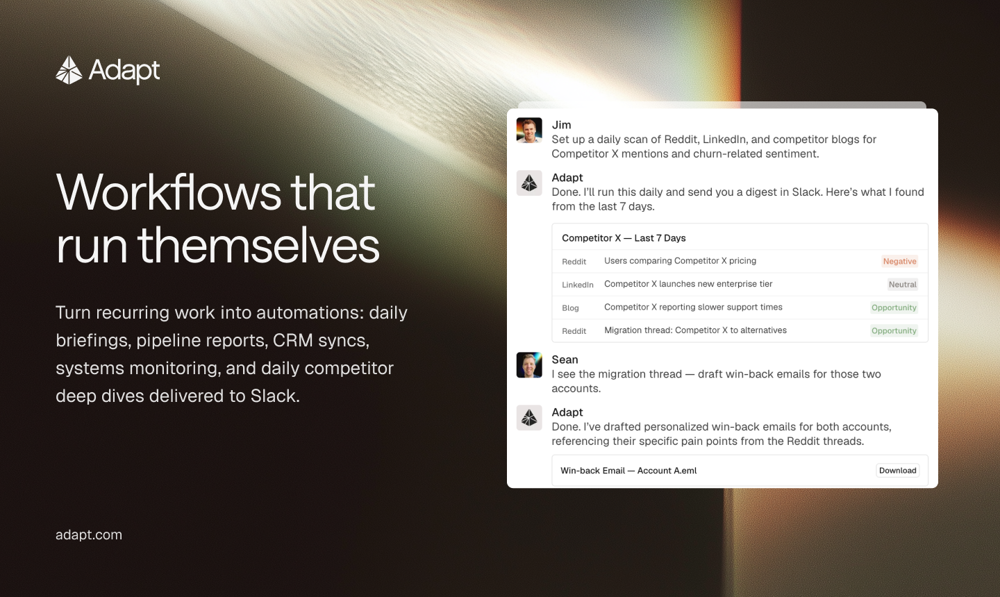
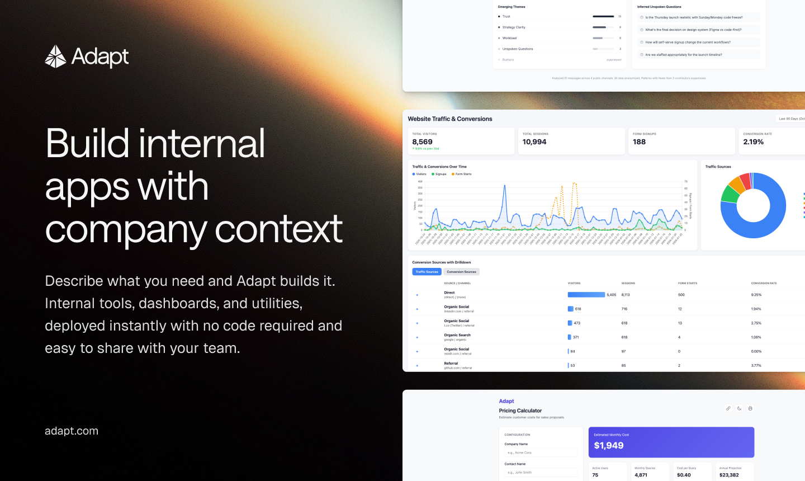

### 🎬 관련 영상
- [🎥 영상 보기](https://ph-files.imgix.net/23278ef1-99b2-4990-94e3-f49fb11436f8.jpeg?auto=format)

---

## 13. [Retool](https://www.producthunt.com/products/retool)
**Votes**: 108 | **도입 난이도**: 중 | **신뢰도**: 상
**Tagline**: Build anywhere. Govern in Retool.
**서비스 링크**: https://www.producthunt.com/r/UYZGXGCDJD22K6

**태그**: LowCode, DevTool, Governance, InternalTools

### 📌 이 서비스 한눈에 보기
어디서든 개발하고 Retool에서 통합 관리하는 프로덕션급 앱 빌더

### 🔑 주요 기능
- 자연어 설명만으로 프로덕션 수준의 앱 구축 가능
- 외부에서 개발한 앱을 가져와 즉시 배포 및 통합 가능
- 인증, 감사 로그 등 중앙 집중식 거버넌스 기능 제공

### 🙋 사용자에게 어떤 점이 좋은가
개발 생산성을 높이면서도 보안과 관리 체계를 한 곳에서 통합 운영할 수 있어 운영 효율성이 극대화됩니다.

### ✅ 지금 바로 써볼 기능
- 자연어 기반 앱 생성 기능 테스트
- 기존 외부 앱의 Retool 배포 시도
- 인증 및 감사 로그 설정 확인

### ⚠️ 사용 전 확인할 점
- 외부 앱 통합 시 기존 환경과의 호환성 확인 필요
- 중앙 관리 방식에 따른 권한 설정 복잡도 고려

### 🧭 확인이 더 필요한 정보
외부 앱을 가져올 때의 구체적인 기술적 제약 사항과 보안 프로토콜에 대한 확인이 필요합니다.

### 📸 스크린샷 및 갤러리
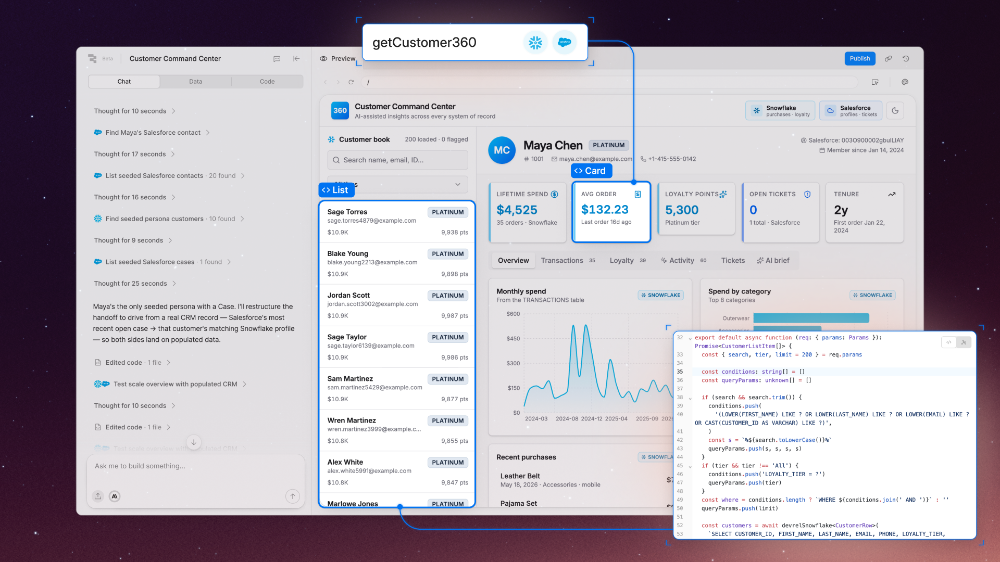
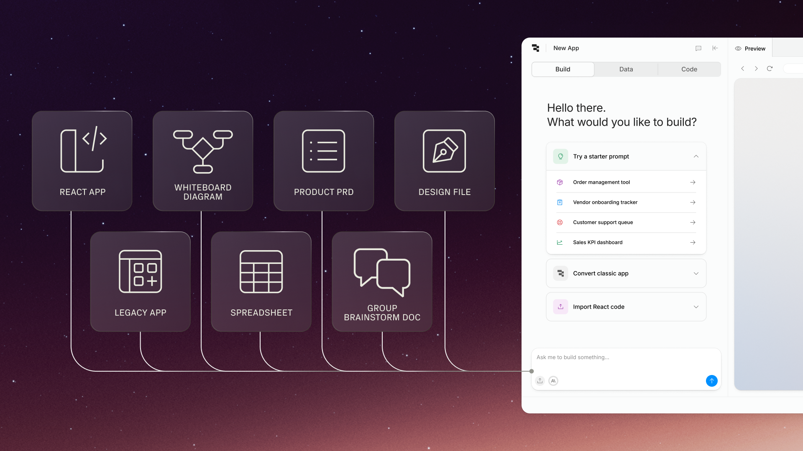
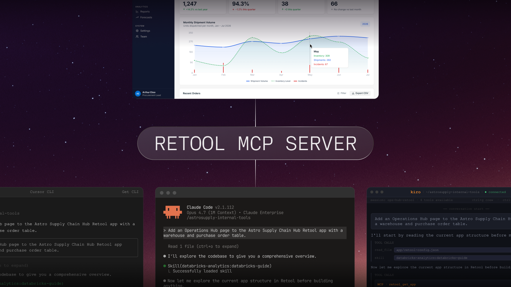

### 🎬 관련 영상
- [🎥 영상 보기](https://ph-files.imgix.net/267d67bd-50b0-43ba-aec7-1c79e46ea9b6.jpeg?auto=format)

---

## 14. [Ploy.ai](https://www.producthunt.com/products/ploy-ai)
**Votes**: 106 | **도입 난이도**: 중 | **신뢰도**: 상
**Tagline**: Ploy turns your website into your company's growth engine.
**서비스 링크**: https://www.producthunt.com/r/6YLZBZ7XZ6OWNN

**태그**: MarketingAutomation, AI-Agent, GrowthHacking, SaaS, Agent, AI Tool, Design, Marketing, CRM

### 📌 이 서비스 한눈에 보기
웹사이트를 스스로 최적화하고 광고 및 데이터 동기화까지 수행하는 AI 에이전트 마케팅 플랫폼

### 🔑 주요 기능
- 웹사이트 데이터 자동 수집 및 페이지 디자인 생성
- 광고 캠페인 실행 및 콘텐츠 개인화 자동화
- CRM 데이터 동기화를 통한 지속적인 성장 엔진 역할

### 🙋 사용자에게 어떤 점이 좋은가
마케팅 운영 업무를 자동화하여 사용자가 잠든 사이에도 트래픽 개선과 성과 창출이 가능합니다.

### ✅ 지금 바로 써볼 기능
- 기존 웹사이트 데이터 연동 및 분석
- AI 자동 생성 페이지 디자인 확인
- CRM 데이터 동기화 설정

### ⚠️ 사용 전 확인할 점
- AI가 생성하는 콘텐츠의 브랜드 일관성 검토 필요
- 광고 캠페인 자동 실행에 따른 비용 관리 주의

### 🧭 확인이 더 필요한 정보
현재 지원하는 구체적인 광고 채널 범위와 CRM 연동 가능 목록에 대한 확인이 필요합니다.

### 📸 스크린샷 및 갤러리

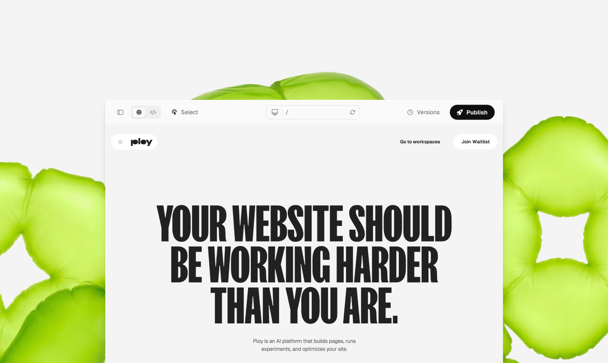

### 🎬 관련 영상
- [🎥 영상 보기](https://ph-files.imgix.net/e83b9905-b13b-432a-abe7-76119c45d47c.jpeg?auto=format)

---

## 15. [Tiles: Map Your Adventures](https://www.producthunt.com/products/tiles-map-your-adventures)
**Votes**: 103 | **도입 난이도**: 하 | **신뢰도**: 상
**Tagline**: Turn Apple Health workouts into a private route map
**서비스 링크**: https://www.producthunt.com/r/JUKG4MV26LBST2

**태그**: HealthTech, Mapping, Privacy, Outdoor

### 📌 이 서비스 한눈에 보기
애플 건강 데이터를 기반으로 나만의 탐험 경로를 시각화하는 프라이빗 지도 서비스

### 🔑 주요 기능
- 애플 건강, GPX, FIT, CSV 등 다양한 운동 데이터 통합 시각화
- 계정 생성 없이 이용 가능한 로컬 퍼스트(Local-first) 방식의 프라이버시 보호
- 활동 기록을 통해 미탐사 지역을 발견하고 성취를 공유하는 기능

### 🙋 사용자에게 어떤 점이 좋은가
운동 기록을 단순한 수치가 아닌 시각적인 지도로 변환하여, 내가 지나온 경로와 아직 가보지 못한 곳을 직관적으로 파악할 수 있습니다.

### ✅ 지금 바로 써볼 기능
- 애플 건강 데이터 연동하기
- 기존 GPX/FIT 파일 업로드하여 지도 생성하기
- 나만의 활동 경로 확인 및 미탐사 지역 찾기

### ⚠️ 사용 전 확인할 점
- 로컬 퍼스트 방식이므로 기기 변경 시 데이터 관리 방식 확인 필요
- 데이터 파일 형식(CSV, GPX 등)에 따른 시각화 정확도 차이 가능성

### 🧭 확인이 더 필요한 정보
데이터가 로컬에만 저장되는 방식이므로 기기 분실 시 데이터 복구 가능 여부를 확인해야 합니다.

### 📸 스크린샷 및 갤러리

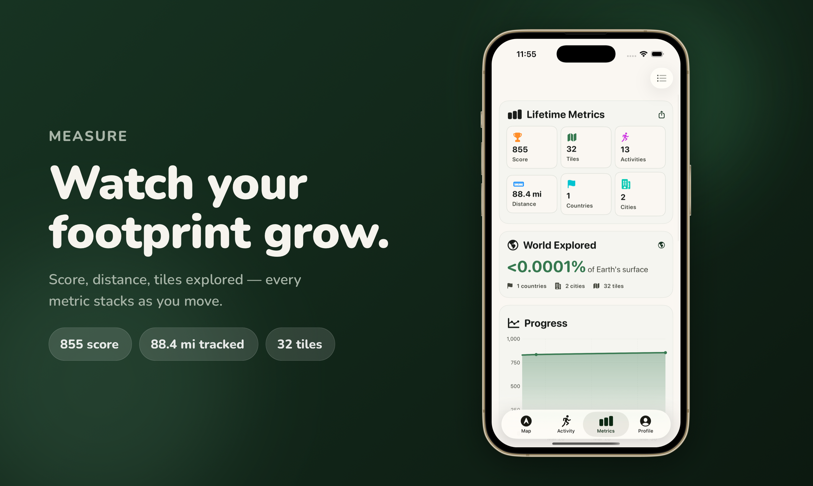

### 🎬 관련 영상
- [🎥 영상 보기](https://ph-files.imgix.net/a5dafa22-c906-42c4-8878-72027909b7bf.jpeg?auto=format)

---

## 16. [Genie Mentions](https://www.producthunt.com/products/genie-mentions)
**Votes**: 100 | **도입 난이도**: 하 | **신뢰도**: 상
**Tagline**: AI that gets you *and* the people in your life, together
**서비스 링크**: https://www.producthunt.com/r/EOHUM3X33AV6WR

**태그**: Social, AI, Personalization, AI Tool, Chat

### 📌 이 서비스 한눈에 보기
지인들의 소식과 취향을 연결하여 당신의 사회적 관계를 깊이 이해하는 AI 소셜 어시스턴트

### 🔑 주요 기능
- 개인뿐만 아니라 주변 지인들의 맥락까지 파악하는 관계 중심형 AI
- 친구들의 주요 변화, 여행, 꿈 등 삶의 중요한 순간들을 업데이트
- 단순 업무용 AI가 아닌, 개인의 사회적 세계를 위한 맞춤형 정보 제공

### 🙋 사용자에게 어떤 점이 좋은가
친구들의 근황을 놓치지 않고 파악하여 더 의미 있는 사회적 상호작용을 할 수 있도록 도와줍니다.

### ✅ 지금 바로 써볼 기능
- Genie를 태그하여 주변 소식 업데이트 받기
- 지인들의 취향과 활동 기반의 개인화된 피드 탐색하기

### ⚠️ 사용 전 확인할 점
- 지인들의 개인 정보 및 활동 데이터 공유에 대한 프라이버시 정책 확인 필요
- 사회적 관계 데이터 활용에 따른 데이터 보안 검토

### 🧭 확인이 더 필요한 정보
구체적인 데이터 수집 방식과 지인 간의 정보 공유 범위에 대한 상세 설명이 필요합니다.

### 📸 스크린샷 및 갤러리

### 🎬 관련 영상
- [🎥 영상 보기](https://ph-files.imgix.net/d5307e2a-7618-49f7-9088-9d6b0b5ee679.jpeg?auto=format)

---

## 17. [Cliptop](https://www.producthunt.com/products/cliptop)
**Votes**: 100 | **도입 난이도**: 하 | **신뢰도**: 상
**Tagline**: Clipboard history for Mac, right under the notch.
**서비스 링크**: https://www.producthunt.com/r/I2U3QKRDNBKL6C

**태그**: Productivity, Mac, Utility, Workflow, Vision, DevTool

### 📌 이 서비스 한눈에 보기
맥북 노치에서 바로 사용하는 빠르고 직관적인 로컬 클립보드 관리 도구

### 🔑 주요 기능
- 맥북 노치 및 메뉴 바를 활용한 접근성 높은 UI
- 텍스트, 링크, 코드, 이미지, 파일 등 다양한 형식 지원
- 로컬 우선(Local-first) 방식으로 빠르고 안전한 데이터 관리

### 🙋 사용자에게 어떤 점이 좋은가
작업 흐름을 끊지 않고 노치에서 즉시 클립보드 내역을 검색하거나 복사할 수 있어 생산성이 향상됩니다.

### ✅ 지금 바로 써볼 기능
- 노치/메뉴 바를 통한 빠른 검색 기능 테스트
- 핀보드에 자주 쓰는 항목 저장해보기
- 다양한 파일 및 코드 형식의 미리보기 기능 확인

### ⚠️ 사용 전 확인할 점
- 로컬 저장 방식이므로 기기 변경 시 데이터 이전 방식 확인 필요
- 노치 위치를 활용하므로 화면 상단 공간 점유

### 🧭 확인이 더 필요한 정보
기기 간 동기화 지원 여부 및 상세한 보안 정책에 대한 정보가 명시되지 않았습니다.

### 📸 스크린샷 및 갤러리
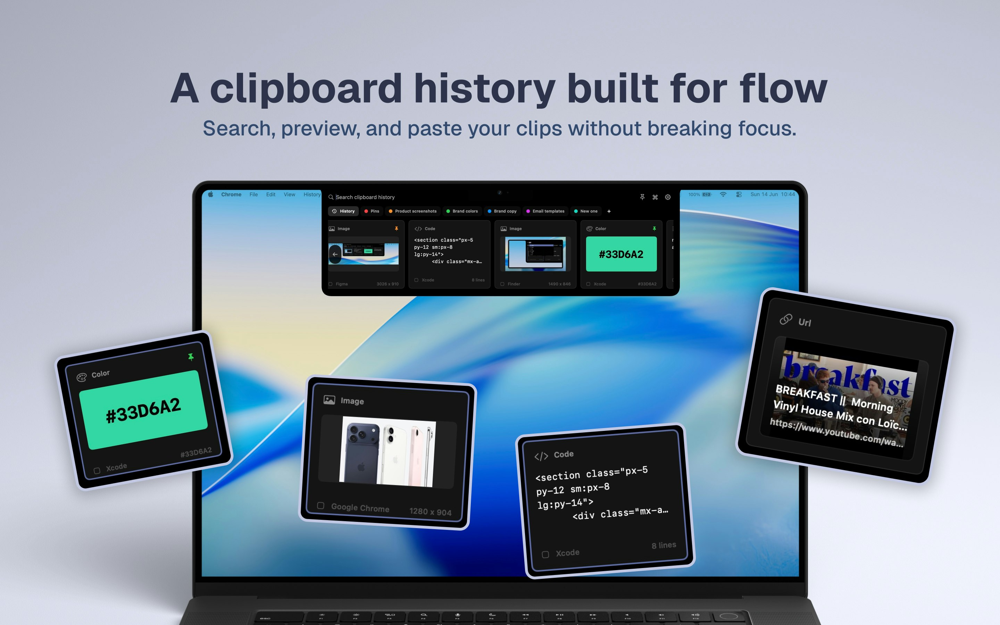
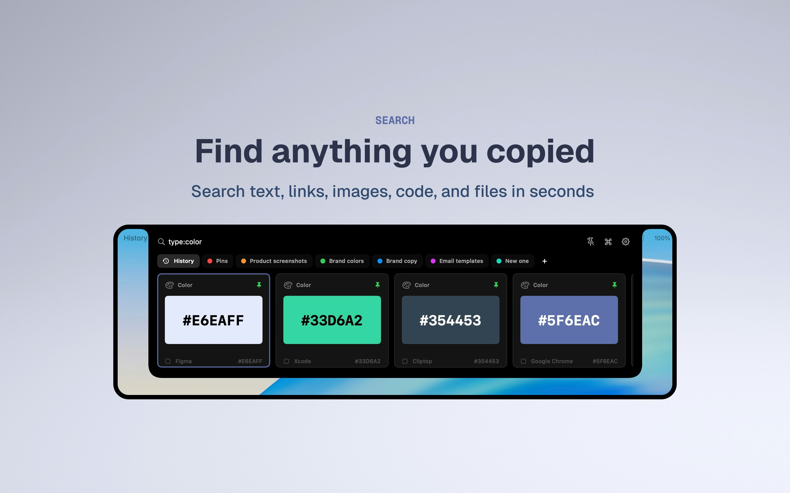
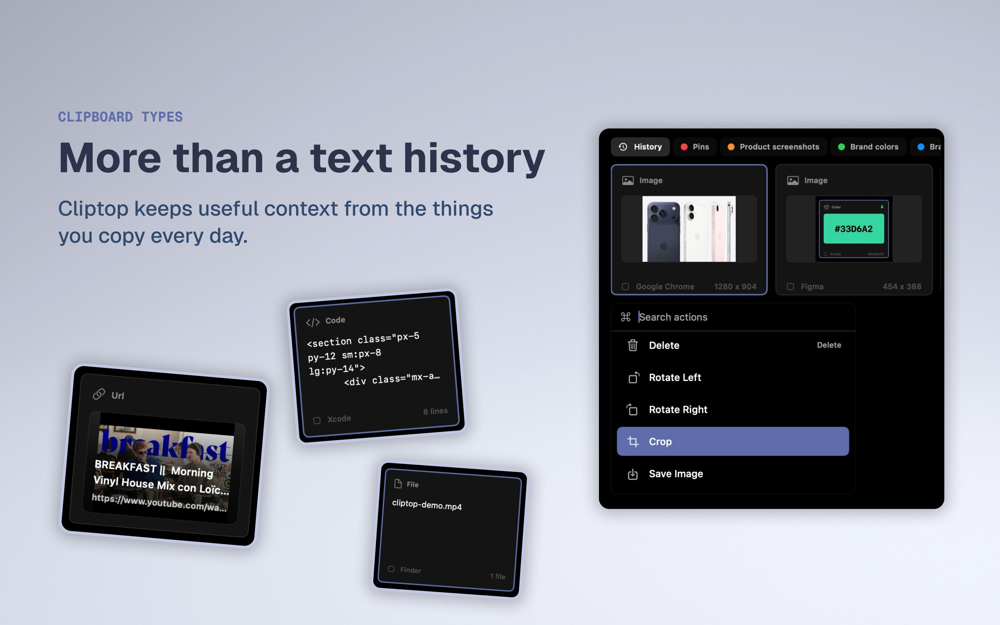

---

## 18. [Locofy: design-to-code agents](https://www.producthunt.com/products/locofy-ai)
**Votes**: 100 | **도입 난이도**: 중 | **신뢰도**: 상
**Tagline**: Agentic frontend layer between Figma and Cursor & Claude
**서비스 링크**: https://www.producthunt.com/r/JE4ZUKK4BNVZBB

**태그**: DevTool, Frontend, Automation, AI-Agent, Design-to-Code, Agent, LLM, Design

### 📌 이 서비스 한눈에 보기
Figma 디자인을 Cursor 및 Claude와 연동 가능한 정교한 프론트엔드 코드로 변환하는 에이전트 기반 도구

### 🔑 주요 기능
- Figma 디자인을 구조화되고 반응형인 픽셀 퍼펙트 코드로 자동 변환
- 디자인 인식 모델과 LLM을 결합하여 UI 정밀도 문제 해결
- CLI, Cursor, Claude Code 등 개발 환경과 직접 연동되는 워크플로우

### 🙋 사용자에게 어떤 점이 좋은가
코딩 에이전트가 어려워하는 UI 구현의 정확도를 높여주어, 개발자가 로직에만 집중할 수 있는 탄탄한 프론트엔드 기반을 제공합니다.

### ✅ 지금 바로 써볼 기능
- Figma 디자인 파일을 Locofy로 변환해보기
- 생성된 코드를 Cursor나 Claude 환경에 적용해보기
- CLI를 통한 워크플로우 통합 테스트하기

### ⚠️ 사용 전 확인할 점
- 기존 코드베이스와의 호환성 및 스타일 일치 여부 확인 필요
- 복잡한 디자인 구조가 코드로 변환될 때의 정확도 검증 필요

### 🧭 확인이 더 필요한 정보
지원하는 프레임워크(React, Vue 등)의 종류와 상세한 CLI 명령어 체계에 대한 정보가 추가로 필요합니다.

### 📸 스크린샷 및 갤러리

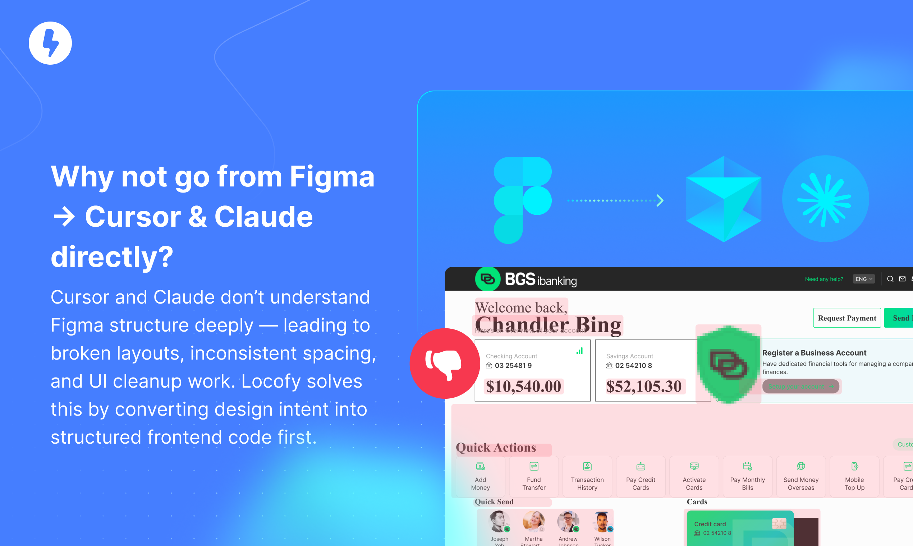

### 🎬 관련 영상
- [🎥 영상 보기](https://ph-files.imgix.net/0f8e0250-7c11-472e-8cb4-33ebf4c29c02.jpeg?auto=format)

---

## 19. [Labs AI](https://www.producthunt.com/products/labs-ai-text-to-speech)
**Votes**: 92 | **도입 난이도**: 하 | **신뢰도**: 상
**Tagline**: Turn any text into natural AI voiceovers on iPhone
**서비스 링크**: https://www.producthunt.com/r/CAU7NAIIUMTRQT

**태그**: AI Voiceover, Content Creation, Mobile App, Productivity, AI Tool

### 📌 이 서비스 한눈에 보기
아이폰에서 5분 만에 전문적인 AI 성우 목소리를 생성하는 모바일 최적화 도구

### 🔑 주요 기능
- ElevenLabs 기술 기반의 100개 이상의 고품질 AI 목소리 제공
- 50개 이상의 언어 지원 및 음성 복제(Voice Cloning) 기능
- 모바일 퍼스트 설계로 스튜디오 없이 어디서든 스크립트 작성 및 내보내기 가능

### 🙋 사용자에게 어떤 점이 좋은가
유튜버, 틱톡커, 팟캐스트 제작자가 별도의 마이크나 녹음 장비 없이 스마트폰만으로 고품질 오디오 콘텐츠를 즉시 제작할 수 있습니다.

### ✅ 지금 바로 써볼 기능
- 원하는 스크립트 입력하여 목소리 생성해보기
- 다양한 언어 및 음성 스타일 테스트하기
- 생성된 오디오 파일 내보내기 및 콘텐츠 활용하기

### ⚠️ 사용 전 확인할 점
- ElevenLabs API 사용에 따른 추가 비용 발생 가능성 확인 필요
- 모바일 환경에서의 편집 기능 제약 확인 필요

### 🧭 확인이 더 필요한 정보
무료 버전의 사용량 제한이나 유료 플랜의 구체적인 가격 정책에 대한 정보가 필요합니다.

### 📸 스크린샷 및 갤러리

---

## 20. [Speed Reader](https://www.producthunt.com/products/speed-reader-2)
**Votes**: 88 | **도입 난이도**: 하 | **신뢰도**: 상
**Tagline**: Read 2–5x faster with zero effort
**서비스 링크**: https://www.producthunt.com/r/RXN6M7UQ5PKNMQ

**태그**: Productivity, macOS, Reading Tool

### 📌 이 서비스 한눈에 보기
macOS에서 RSVP 방식을 통해 독서 속도를 2~5배 높여주는 스피드 리더 앱

### 🔑 주요 기능
- RSVP(한 번에 한 단어씩 표시) 기술로 안구 이동 없는 빠른 독서 지원
- PDF, EPUB, DOCX, URL 및 OCR 스크린 캡처 등 다양한 파일 형식 지원
- 맥북 노치 위젯을 포함한 4가지 디스플레이 모드 제공

### 🙋 사용자에게 어떤 점이 좋은가
문서나 웹 페이지의 핵심 내용을 빠르게 훑어 읽어야 하는 사용자에게 효율적인 독서 환경을 제공합니다.

### ✅ 지금 바로 써볼 기능
- 다양한 문서 포맷(PDF, EPUB 등) 불러오기
- 맥북 노치 위젯 모드로 독서 환경 설정하기
- OCR 기능을 활용한 화면 텍스트 읽기

### ⚠️ 사용 전 확인할 점
- RSVP 방식 특성상 문맥 파악이나 깊이 있는 독서에는 적합하지 않을 수 있음
- macOS 전용 앱이므로 타 운영체제 사용 불가

### 🧭 확인이 더 필요한 정보
구체적인 구독 모델이나 라이선스 비용에 대한 정보가 명시되지 않았습니다.

### 📸 스크린샷 및 갤러리
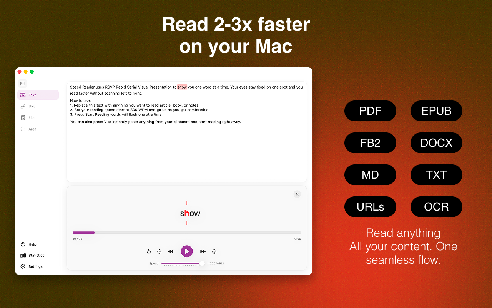
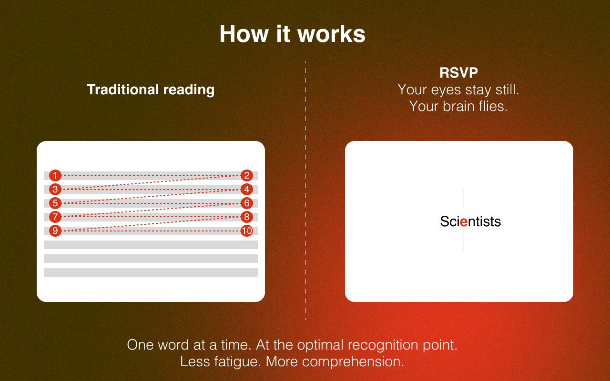
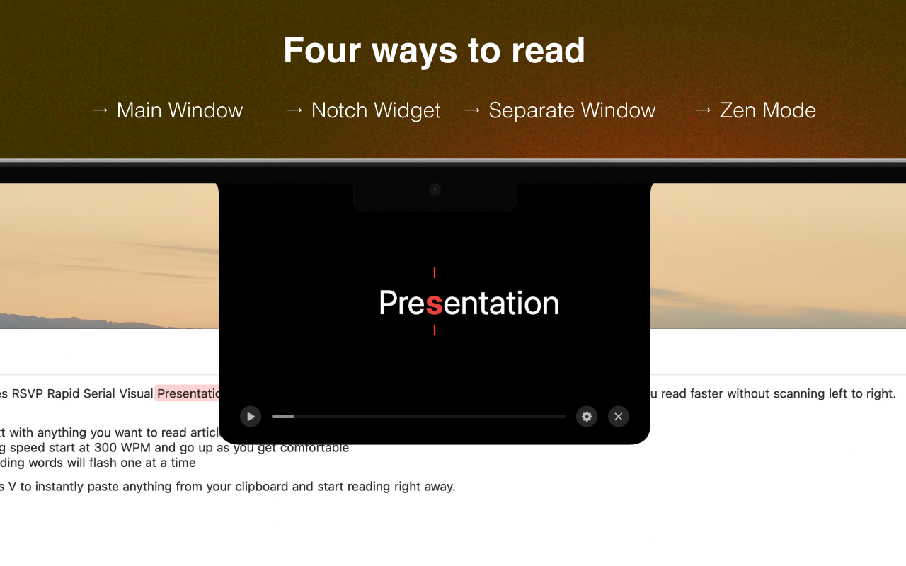

---

## 21. [CADAM](https://www.producthunt.com/products/cadam)
**Votes**: 83 | **도입 난이도**: 중 | **신뢰도**: 상
**Tagline**: AI Tinkercad
**서비스 링크**: https://www.producthunt.com/r/GFGV4E7CJ3BUDV

**태그**: AI, 3D Modeling, Open Source, CAD, Generative AI, AI Tool, Prompting, Vision

### 📌 이 서비스 한눈에 보기
자연어와 이미지를 통해 파라메트릭 3D 모델을 생성하는 오픈소스 AI CAD 플랫폼

### 🔑 주요 기능
- 텍스트 프롬프트를 통한 3D 모델 자동 생성
- 이미지 참조를 통한 모델링 지원
- 수정이 용이한 파라메트릭 방식의 모델 생성

### 🙋 사용자에게 어떤 점이 좋은가
복잡한 CAD 설계 과정 없이 말이나 사진만으로 빠르게 3D 모델 초안을 만들 수 있어 아이디어 시각화에 유용합니다.

### ✅ 지금 바로 써볼 기능
- 텍스트 프롬프트로 기본 3D 모델 생성해보기
- 이미지를 업로드하여 모델 변환 테스트하기
- 생성된 파라메트릭 모델의 구조 확인하기

### ⚠️ 사용 전 확인할 점
- 생성된 모델의 정밀도가 전문 설계 작업에 적합한지 확인 필요
- 오픈소스 프로젝트로서의 기술적 숙련도 요구 가능성

### 🧭 확인이 더 필요한 정보
현재 제공되는 모델의 정밀도 수준과 구체적인 편집 기능 범위에 대한 정보가 부족합니다.

### 📸 스크린샷 및 갤러리

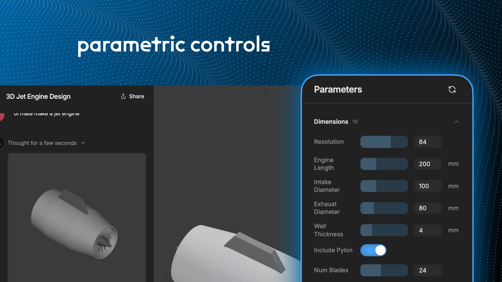

### 🎬 관련 영상
- [🎥 영상 보기](https://ph-files.imgix.net/0af15ab5-2275-4a08-9d07-82eddcc9a29b.jpeg?auto=format)

---

## 22. [DeskArcade](https://www.producthunt.com/products/deskarcade)
**Votes**: 81 | **도입 난이도**: 하 | **신뢰도**: 상
**Tagline**: An arcade in your menu bar - playable over anything
**서비스 링크**: https://www.producthunt.com/r/FQZ4PAKNABOXVS

**태그**: macOS, Productivity, Gaming, Utility, AI Tool

### 📌 이 서비스 한눈에 보기
업무 중 짧은 휴식을 위한 macOS 메뉴 바 전용 미니 게임 모음집

### 🔑 주요 기능
- macOS 메뉴 바에 상주하는 투명 레이어 방식의 아케이드 게임
- 단축키(⌘⌥B)로 즉시 실행하고 즉시 종료하는 빠른 플레이 환경
- 기존 작업 중인 앱에 영향을 주지 않는 독립적인 실행 구조

### 🙋 사용자에게 어떤 점이 좋은가
업무 흐름을 방해하지 않으면서 90초 내외의 짧은 휴식을 통해 리프레시할 수 있습니다.

### ✅ 지금 바로 써볼 기능
- 단축키(⌘⌥B)를 통한 빠른 게임 실행
- 90초 제한 시간을 활용한 짧은 휴식
- 메뉴 바를 통한 간편한 앱 관리

### ⚠️ 사용 전 확인할 점
- 투명 레이어 방식이므로 화면 가림 현상이 발생할 수 있음
- 90초라는 짧은 플레이 시간 제한

### 🧭 확인이 더 필요한 정보
게임 종류의 다양성 및 특정 macOS 버전과의 호환성 여부는 명시되지 않았습니다.

### 📸 스크린샷 및 갤러리
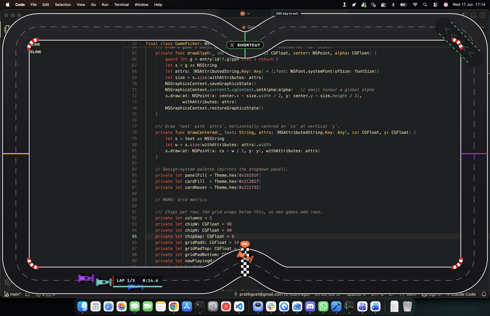
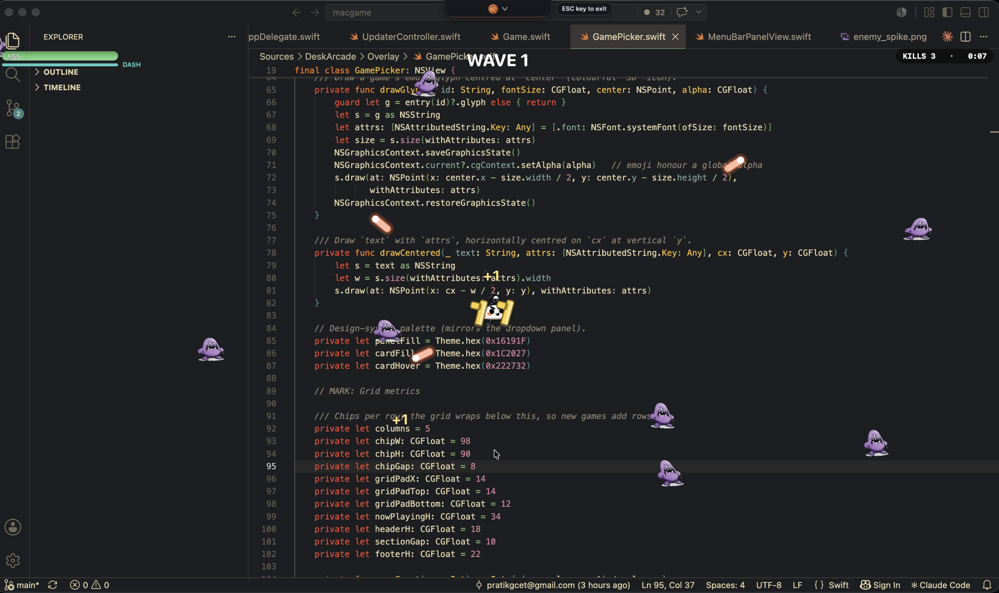
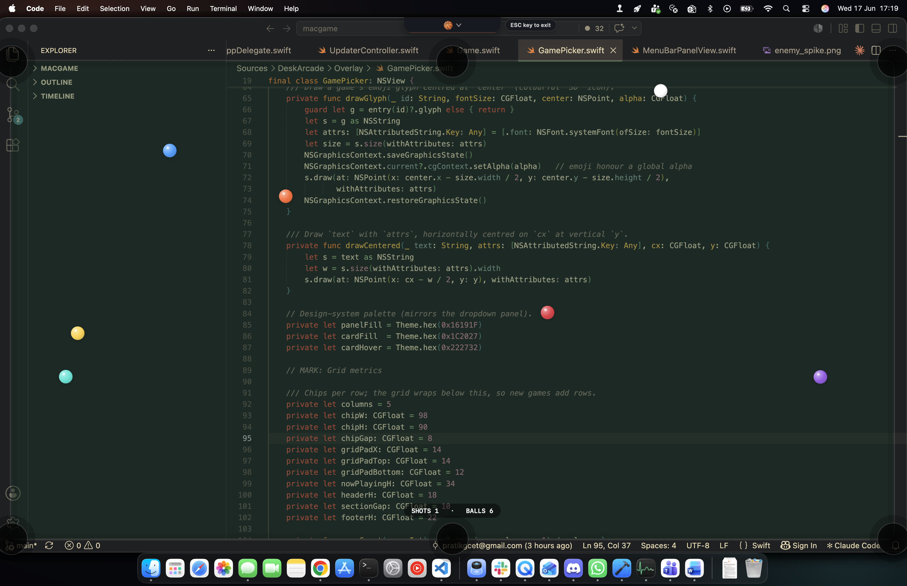

### 🎬 관련 영상
- [🎥 영상 보기](https://ph-files.imgix.net/2841c18c-ef60-4ed1-b8e1-6a53196ee3b4.jpeg?auto=format)

---

## 23. [LayerProof Bristol](https://www.producthunt.com/products/layerproof-social-content-generation)
**Votes**: 79 | **도입 난이도**: 하 | **신뢰도**: 상
**Tagline**: Agentic reports your clients want to read
**서비스 링크**: https://www.producthunt.com/r/PFAAL5PZEZBCNW
**재등장**: 최근 7일 내 재등장 (마지막 등장 7일 전)

**태그**: Reporting, Automation, NoCode, Productivity, Agent, Chat

### 📌 이 서비스 한눈에 보기
데이터와 파일을 대화형 인터랙티브 리포트로 즉시 변환해주는 에이전트 기반 리포팅 도구

### 🔑 주요 기능
- 파일이나 데이터를 업로드하여 즉시 리포트 생성 가능
- 채팅을 통해 리포트의 형태와 내용을 자유롭게 조정
- 클릭 한 번으로 웹 페이지로 즉시 발행 및 공유

### 🙋 사용자에게 어떤 점이 좋은가
에이전시나 프리랜서가 정적인 보고서 대신 고객이 직접 탐색할 수 있는 생동감 있는 결과물을 빠르게 전달할 수 있습니다.

### ✅ 지금 바로 써볼 기능
- 보유 중인 데이터 파일 업로드해보기
- 채팅 기능을 활용해 리포트 스타일 수정하기
- 생성된 웹 페이지 링크 공유해보기

### ⚠️ 사용 전 확인할 점
- 데이터 보안 및 개인정보 보호 정책 확인 필요
- 복잡한 데이터 구조에 대한 처리 능력 검증 필요

### 🧭 확인이 더 필요한 정보
데이터 소스 연동 범위 및 상세 보안 프로토콜에 대한 정보가 부족합니다.

### 📸 스크린샷 및 갤러리
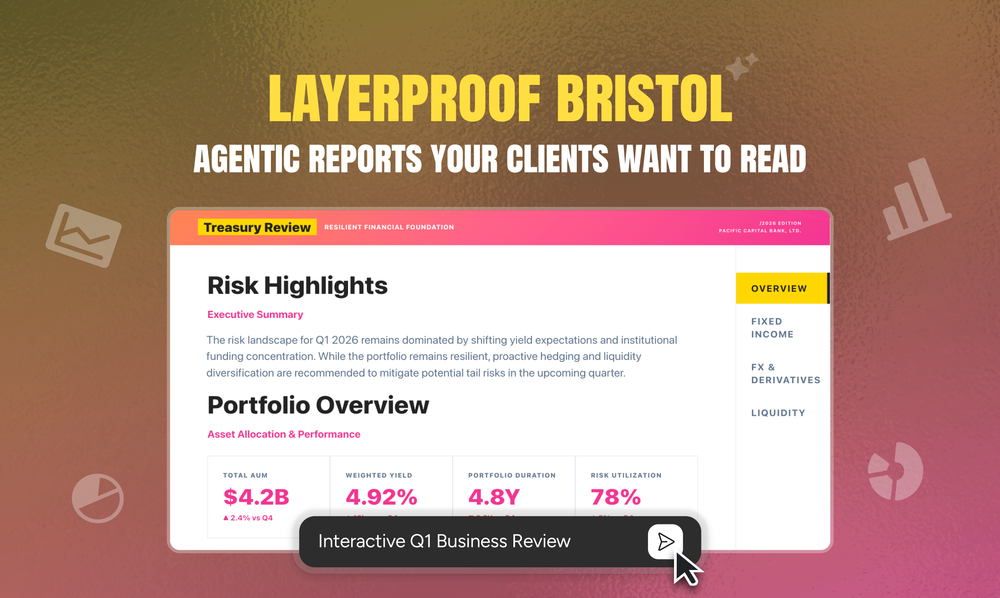
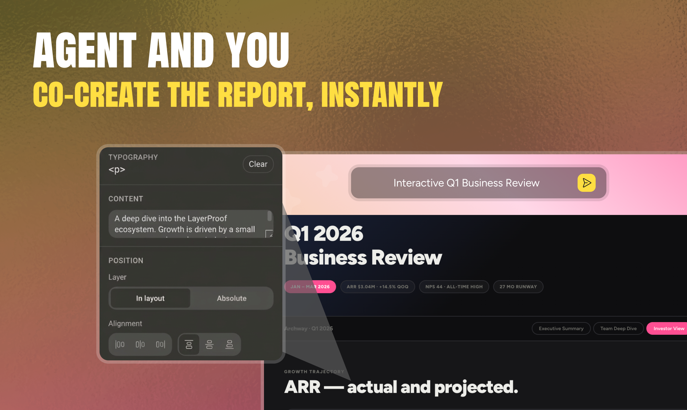
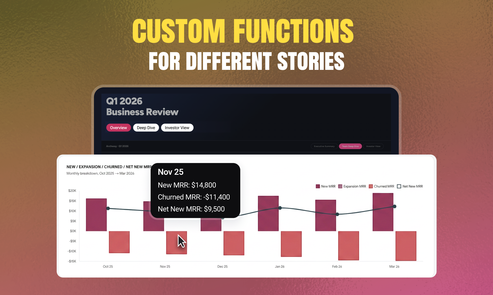

---

## 24. [InstantDelay](https://www.producthunt.com/products/instantdelay)
**Votes**: 76 | **도입 난이도**: 하 | **신뢰도**: 상
**Tagline**: Add, remove, or adjust stream delay while already live
**서비스 링크**: https://www.producthunt.com/r/LPLF5BSHILDNSF

**태그**: Streaming, OBS, Productivity, LiveStream

### 📌 이 서비스 한눈에 보기
방송 중 재시작 없이 실시간으로 스트림 지연 시간을 조절할 수 있는 도구

### 🔑 주요 기능
- 라이브 방송 중 지연 시간(Delay) 추가, 제거 및 조정 가능
- OBS 및 Streamlabs 사용자 최적화
- 토너먼트, 서브아톤, 멀티 스트리밍 등 경쟁적 환경에 특화

### 🙋 사용자에게 어떤 점이 좋은가
방송을 끄고 다시 켤 필요 없이 즉각적으로 지연 시간을 변경할 수 있어, 돌발 상황이나 이벤트 시 방송 흐름을 끊지 않고 대응할 수 있습니다.

### ✅ 지금 바로 써볼 기능
- 사용 중인 OBS/Streamlabs와의 호환성 확인
- 핫키(Hotkeys) 설정을 통한 빠른 제어 환경 구축
- Instant Mode 및 Overlay Mode 테스트

### ⚠️ 사용 전 확인할 점
- 지연 시간 변경 시 방송 프레임 드랍이나 끊김 발생 여부 확인 필요
- 사용 중인 방송 소프트웨어 버전과의 호환성 체크

### 🧭 확인이 더 필요한 정보
구체적인 시스템 리소스 점유율이나 지연 시간 변경 시의 기술적 안정성에 대한 정보가 부족합니다.

### 📸 스크린샷 및 갤러리

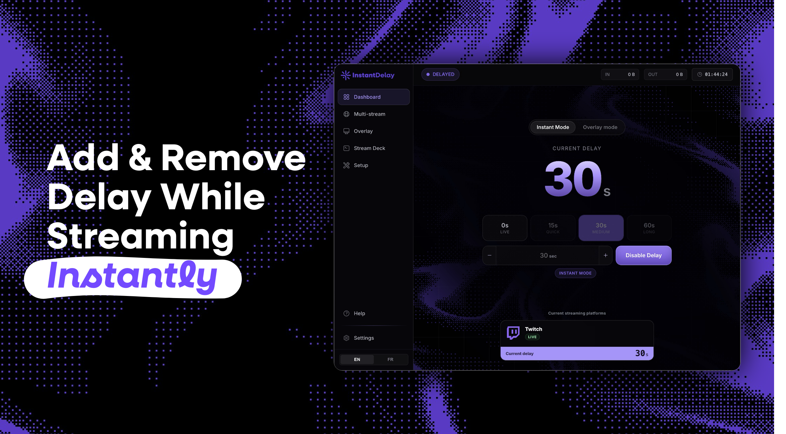
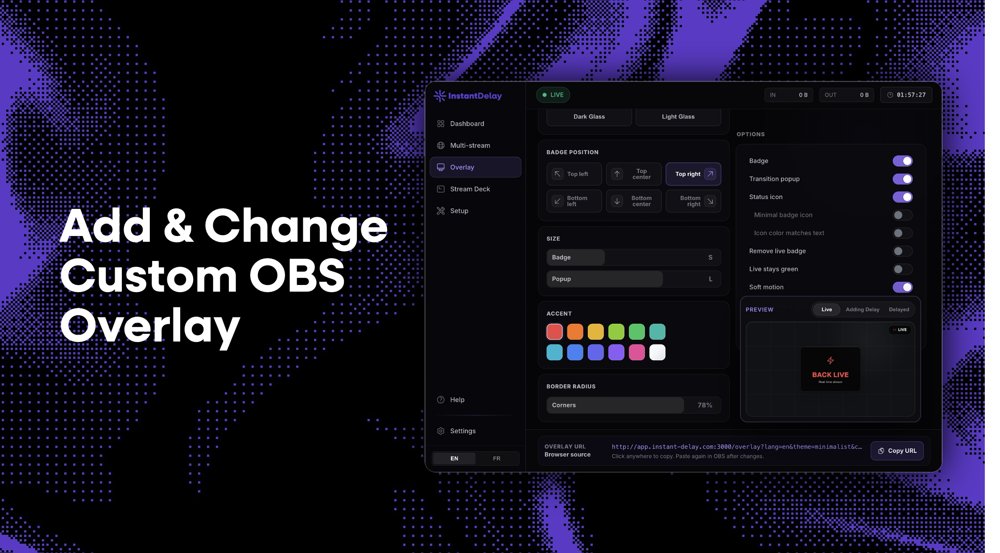

---

## 25. [Tine](https://www.producthunt.com/products/tine-2)
**Votes**: 76 | **도입 난이도**: 중 | **신뢰도**: 상
**Tagline**: An AI desktop cursor that does the work for you
**서비스 링크**: https://www.producthunt.com/r/CEVIQFIDYC4BSZ

**태그**: AI, Automation, Productivity, Mac, AI Tool, Chat

### 📌 이 서비스 한눈에 보기
화면 전체를 이해하고 직접 마우스를 움직여 업무를 수행하는 AI 데스크톱 커서

### 🔑 주요 기능
- 맥북 노치에 상주하며 화면과 활성 앱의 맥락을 실시간으로 파악
- 채팅창에 복사-붙여넣기할 필요 없이 실제 앱 내에서 직접 동작 수행
- 음성 명령을 통해 슬랙 포스팅, 노트 작성, 리서치, 폼 입력 등 자동화

### 🙋 사용자에게 어떤 점이 좋은가
단순한 챗봇을 넘어 사용자의 화면 맥락을 그대로 활용하므로, 반복적인 데이터 입력이나 앱 간 이동 업무를 획기적으로 줄여줍니다.

### ✅ 지금 바로 써볼 기능
- 음성 명령으로 복잡한 폼 자동 채우기 시도
- 여러 앱을 오가는 반복적인 리서치 및 정리 작업 맡기기
- 실시간 화면 인식 기반의 작업 정확도 테스트

### ⚠️ 사용 전 확인할 점
- 화면 전체를 모니터링하므로 개인정보 및 보안 민감 데이터 노출 주의
- 사용자가 마우스를 잡는 순간 제어권이 전환되므로 작업 흐름 끊김 가능성

### 🧭 확인이 더 필요한 정보
온디바이스(on-device) 실행을 강조하고 있으나, 실제 데이터 처리 및 모델 구동 시의 리소스 점유율 확인이 필요합니다.

### 📸 스크린샷 및 갤러리

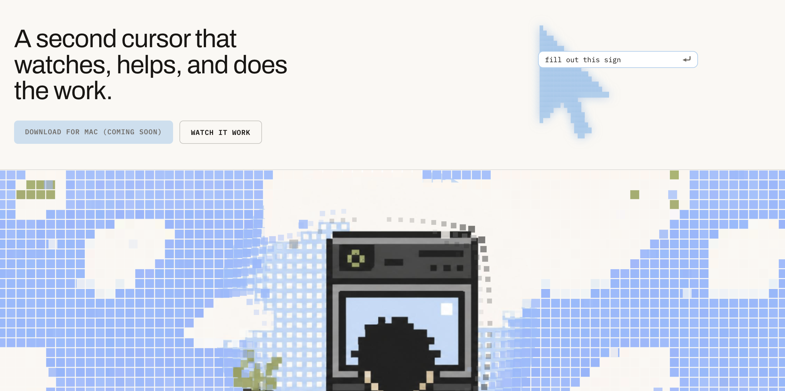
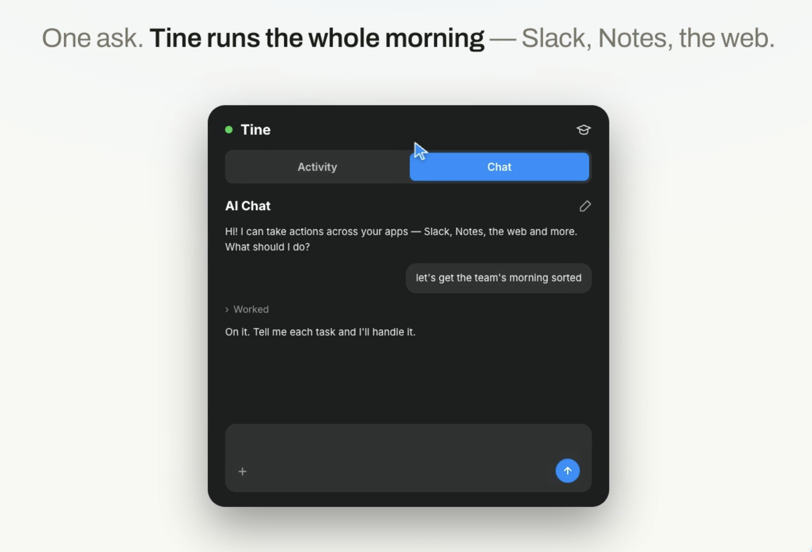

---

## 26. [Grayscale for Safari](https://www.producthunt.com/products/grayscale-for-safari)
**Votes**: 75 | **도입 난이도**: 하 | **신뢰도**: 상
**Tagline**: Turn Safari black & white and browse with less distraction
**서비스 링크**: https://www.producthunt.com/r/XGI4U3VHDRUJVZ

**태그**: Productivity, Safari, Focus, Minimalism, Automation, AI Tool

### 📌 이 서비스 한눈에 보기
웹 서핑 중 시각적 자극을 줄여 집중력을 높여주는 Safari 전용 흑백 모드 확장 프로그램

### 🔑 주요 기능
- Safari 브라우저를 흑백 모드로 전환하여 시각적 유혹 감소
- Mac, iPhone, iPad 등 모든 Apple 기기에서 사용 가능
- 전체 적용 후 특정 사이트만 컬러로 유지하는 화이트리스트 기능 제공

### 🙋 사용자에게 어떤 점이 좋은가
화려한 색상과 썸네일로 인한 주의 분산을 막아주어, 웹 서핑 중 더 차분하고 의도적인 브라우징이 가능합니다.

### ✅ 지금 바로 써볼 기능
- 전체 모드를 활성화하여 웹 환경의 변화 체감하기
- 색상이 꼭 필요한 사이트를 화이트리스트에 등록하기
- 모바일 기기(iPhone/iPad)에 설치하여 이동 중 집중력 유지하기

### ⚠️ 사용 전 확인할 점
- 이미지나 영상의 색상 정보가 중요한 사이트에서는 가독성이 떨어질 수 있음
- 브라우저 확장 프로그램 설치에 따른 시스템 리소스 사용 여부 확인 필요

### 🧭 확인이 더 필요한 정보
사용자의 기기 사양이나 특정 웹사이트 레이아웃에 따른 성능 저하 여부는 명시되지 않았습니다.

### 📸 스크린샷 및 갤러리

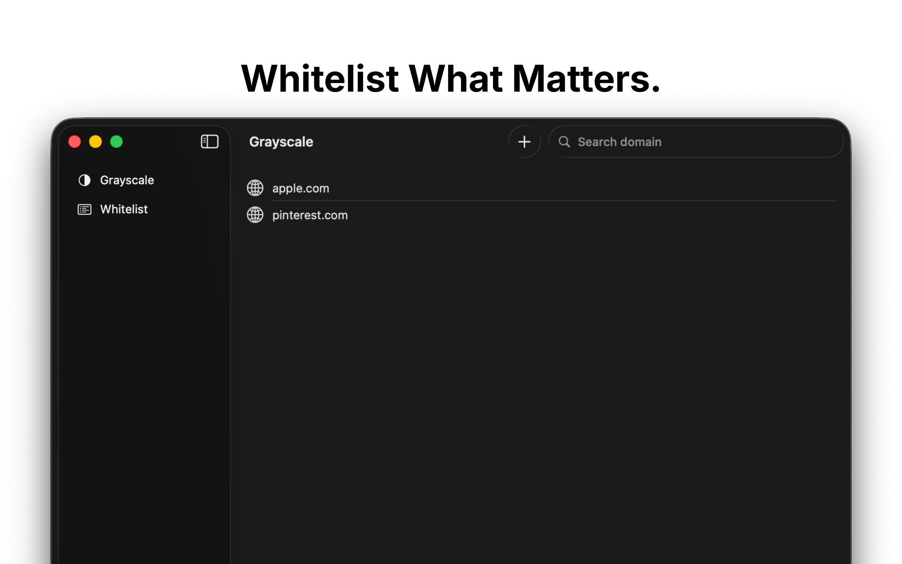
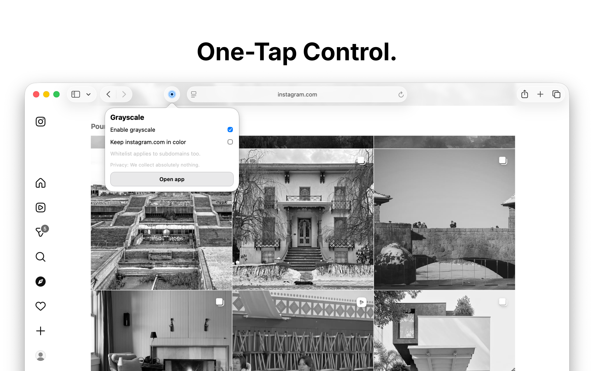

---

## 27. [Refuse](https://www.producthunt.com/products/refuse)
**Votes**: 75 | **도입 난이도**: 하 | **신뢰도**: 상
**Tagline**: Block vulnerable package installs for you and your AI
**서비스 링크**: https://www.producthunt.com/r/KY2ABBC7B4TE5Y

**태그**: DevTool, Security, OpenSource, Automation, Agent, AI Tool

### 📌 이 서비스 한눈에 보기
패키지 설치 단계에서 취약점을 즉시 차단하는 오픈소스 보안 게이트웨이

### 🔑 주요 기능
- npm, pip, cargo 등 15개 이상의 주요 패키지 매니저 지원
- 취약한 패키지가 디스크에 저장되기 전 실시간 차단
- AI 코딩 에이전트의 자동 설치로 인한 보안 위협 방지

### 🙋 사용자에게 어떤 점이 좋은가
개발자나 AI 에이전트가 실수로 취약한 라이브러리를 설치하는 것을 실시간으로 막아 보안 사고를 미연에 방지합니다.

### ✅ 지금 바로 써볼 기능
- Docker를 이용한 환경 구축
- 주요 패키지 매니저 연동 테스트
- AI 코딩 에이전트 환경에서의 차단 동작 확인

### ⚠️ 사용 전 확인할 점
- 차단 정책 설정 시 정상적인 개발 흐름이 방해받을 가능성
- 지원되는 패키지 매니저 외의 환경에서의 적용 여부

### 🧭 확인이 더 필요한 정보
지원되는 13개 이상의 패키지 매니저 전체 목록과 구체적인 차단 로직에 대한 상세 정보가 필요합니다.

### 📸 스크린샷 및 갤러리
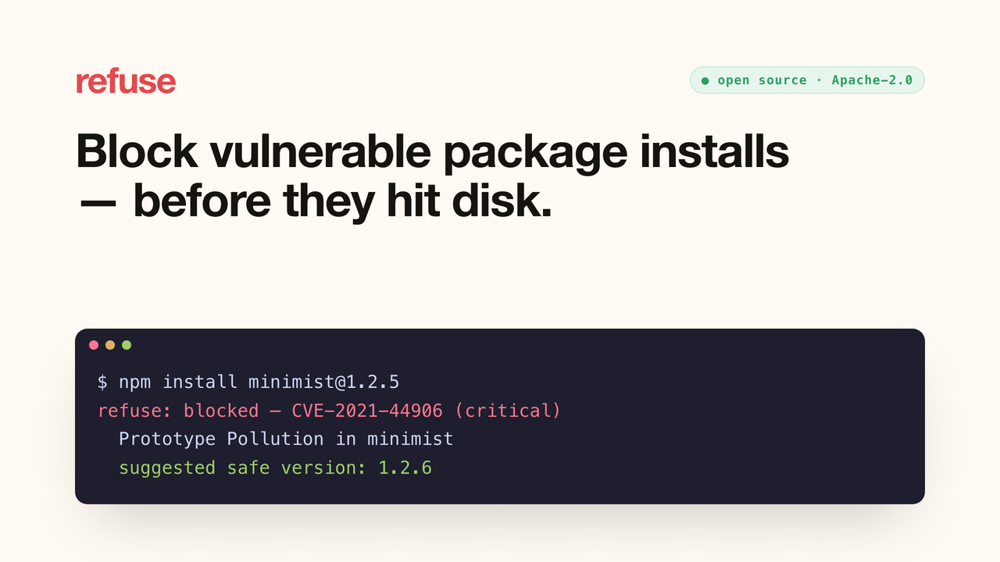
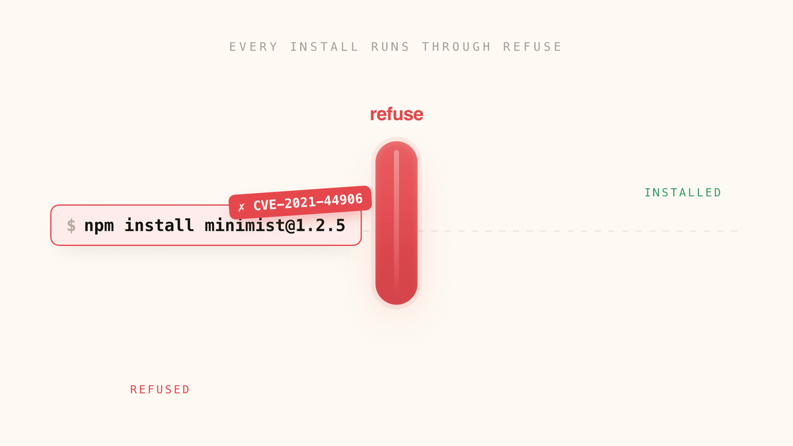
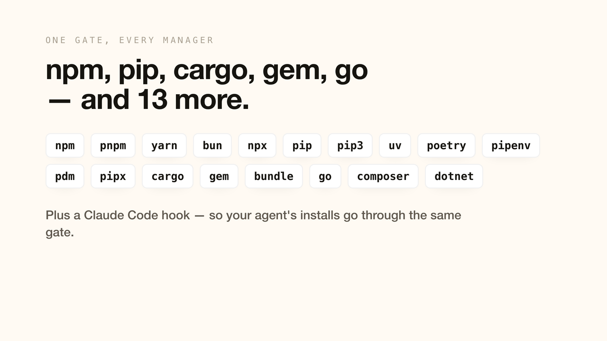

---

## 28. [Tabnxt](https://www.producthunt.com/products/tabnxt)
**Votes**: 73 | **도입 난이도**: 하 | **신뢰도**: 상
**Tagline**: AI tab manager that suspends background RAM hogs
**서비스 링크**: https://www.producthunt.com/r/2IXAZALQXWNKHW

**태그**: Productivity, Browser Extension, AI, Optimization, AI Tool

### 📌 이 서비스 한눈에 보기
AI 기반 자동 탭 관리로 브라우저 속도와 RAM 사용량을 최적화하는 도구

### 🔑 주요 기능
- 비활성 탭 자동 일시 중지로 RAM 사용량 최대 80% 절감
- AI를 활용한 40개 이상의 탭 자동 워크스페이스 그룹화
- 나중에 다시 볼 페이지를 위한 스누즈(Snooze) 기능 제공

### 🙋 사용자에게 어떤 점이 좋은가
수많은 탭을 띄워 놓아 브라우저가 느려지는 문제를 해결하고, 효율적인 작업 공간을 자동으로 구성해 줍니다.

### ✅ 지금 바로 써볼 기능
- 자동 일시 중지 기능을 통한 RAM 절약 효과 확인
- AI 워크스페이스 그룹화 기능으로 탭 정리하기
- 스누즈 기능을 활용한 페이지 보관하기

### ⚠️ 사용 전 확인할 점
- 탭 일시 중지 시 페이지 새로고침이 발생할 수 있음
- AI 그룹화 결과가 사용자의 의도와 다를 수 있음

### 🧭 확인이 더 필요한 정보
80% RAM 절감 수치가 모든 환경에서 동일하게 적용되는지 확인이 필요합니다.

### 📸 스크린샷 및 갤러리
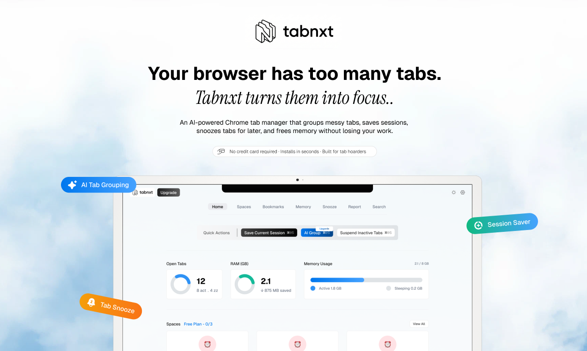
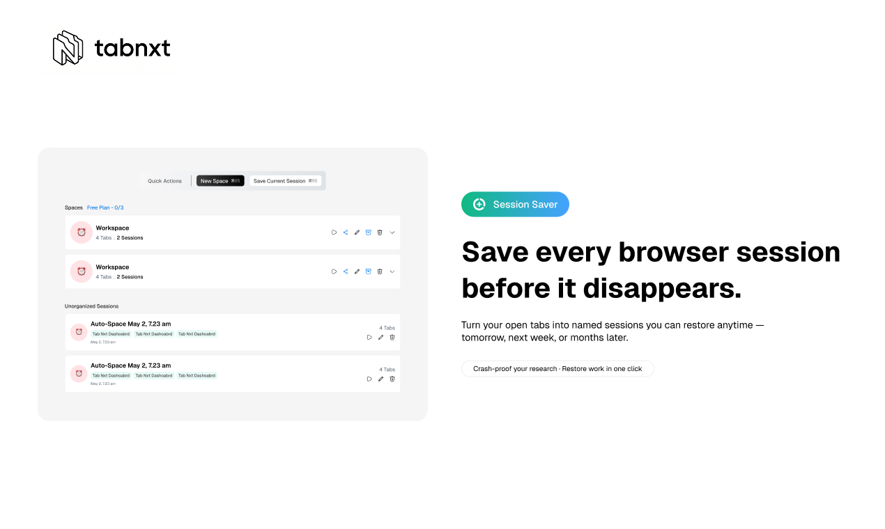
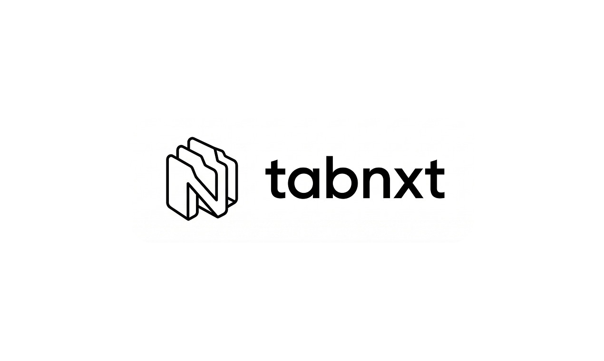

---

## 29. [Splice](https://www.producthunt.com/products/splice-3)
**Votes**: 73 | **도입 난이도**: 하 | **신뢰도**: 상
**Tagline**: Emojis and GIFs, Anywhere on Your Mac
**서비스 링크**: https://www.producthunt.com/r/G4OCLXZBSQGRVE

**태그**: Productivity, macOS, Utility

### 📌 이 서비스 한눈에 보기
macOS 어디서든 디스코드 스타일의 빠른 이모지와 GIF 입력을 지원하는 생산성 도구

### 🔑 주요 기능
- ':' 입력으로 즉시 검색 가능한 디스코드 방식의 워크플로우
- 사용자 정의 키워드 및 즐겨찾기 기능을 통한 빠른 입력
- macOS 전역에서 끊김 없는 이모지 및 GIF 삽입

### 🙋 사용자에게 어떤 점이 좋은가
별도의 메뉴를 열 필요 없이 타이핑 흐름을 유지하며 이모지와 GIF를 빠르게 입력할 수 있어 작업 효율이 높아집니다.

### ✅ 지금 바로 써볼 기능
- ':' 입력하여 이모지 검색해보기
- 자주 쓰는 이모지 즐겨찾기에 등록하기
- 커스텀 키워드 설정하여 빠른 입력 테스트하기

### ⚠️ 사용 전 확인할 점
- macOS 시스템 전역에서 작동하므로 특정 앱과의 단축키 충돌 가능성 확인 필요
- 백그라운드 실행에 따른 시스템 리소스 점유 여부

### 🧭 확인이 더 필요한 정보
앱별 특화 동작(app-specific behavior)이 구체적으로 어떤 앱에서 어떻게 작동하는지 명시되지 않았습니다.

### 📸 스크린샷 및 갤러리
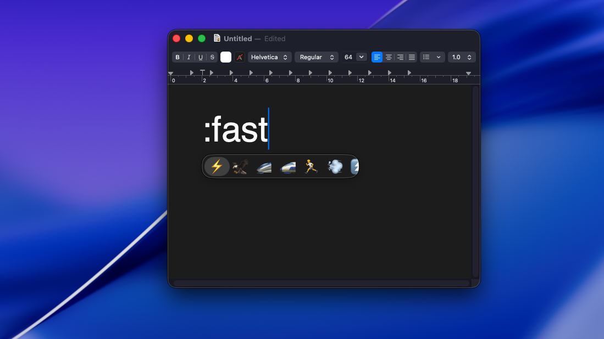
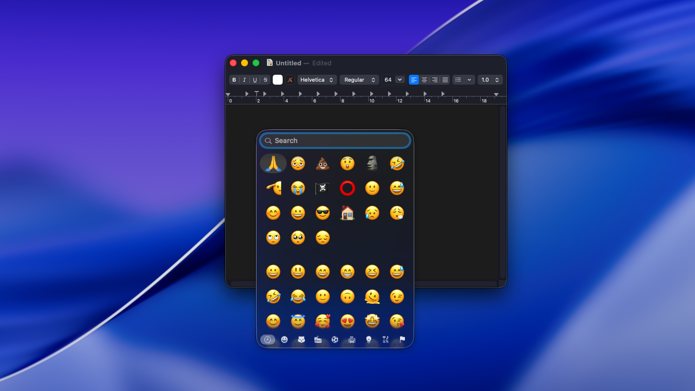
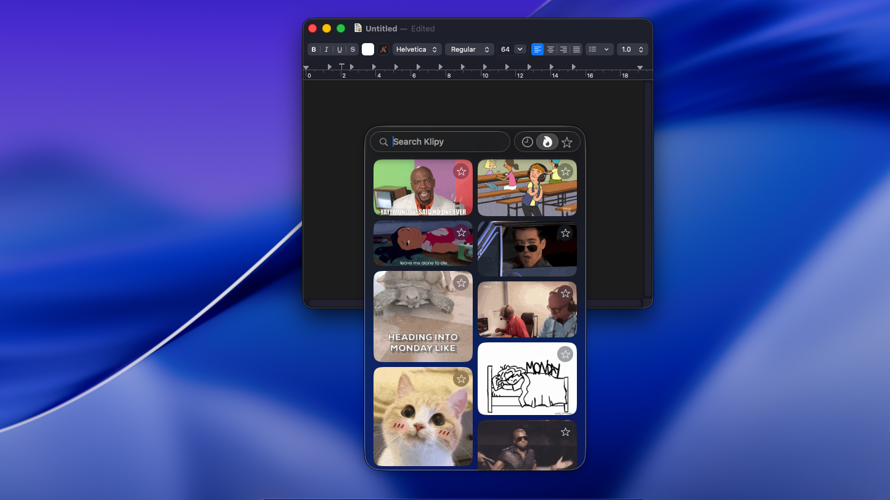

---

## 30. [Merlin by Encord](https://www.producthunt.com/products/merlin-by-encord)
**Votes**: 73 | **도입 난이도**: 하 | **신뢰도**: 상
**Tagline**: Manage your AI data infrastructure in a single conversation
**서비스 링크**: https://www.producthunt.com/r/WQEQE5JU7UXATM

**태그**: AI-Infrastructure, Agentic-AI, Data-Management, DevTools, Agent, AI Tool, Prompting, DevTool

### 📌 이 서비스 한눈에 보기
대화만으로 AI 데이터 인프라를 구축하고 관리하는 에이전트 기반 지능형 레이어

### 🔑 주요 기능
- 프롬프트 하나로 프로젝트 설정 및 데이터 인프라 관리 가능
- 모델 성능에 영향을 주는 데이터 지표 및 커버리지 격차(coverage gaps) 즉시 확인
- Claude, Codex 등 에이전트 코딩 플랫폼 및 MCP를 통한 통합 환경 제공

### 🙋 사용자에게 어떤 점이 좋은가
복잡한 데이터 인프라 설정 과정을 대화형 인터페이스로 단순화하여, 개발자가 모델 개선에만 집중할 수 있도록 돕습니다.

### ✅ 지금 바로 써볼 기능
- MCP를 통해 Claude나 Codex 환경에서 Merlin 연결하기
- 프롬프트를 사용하여 데이터 프로젝트 초기 설정해보기
- 데이터 커버리지 격차 분석을 통한 모델 이슈 진단하기

### ⚠️ 사용 전 확인할 점
- 현재 베타 버전이므로 기능의 안정성 확인 필요
- Slack 등 일부 통합 기능은 아직 출시 예정 단계임

### 🧭 확인이 더 필요한 정보
현재 베타 단계로, 특정 에이전트 플랫폼에서의 상세 기능 지원 범위와 안정성이 확인이 필요합니다.

### 📸 스크린샷 및 갤러리

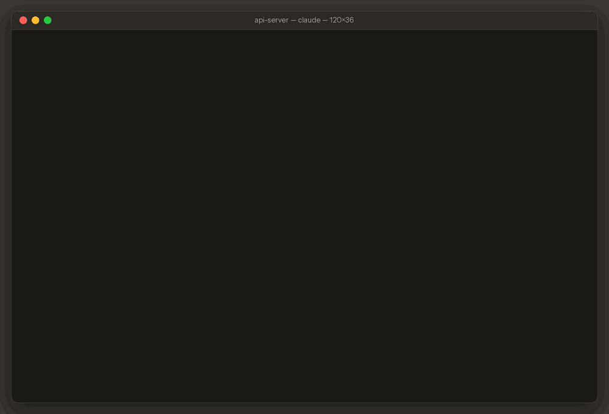

---

