# 🚀 Product Hunt Daily Top 30 (2026-06-20)

## 오늘의 요약
오늘의 트렌드는 기존의 API나 워크플로우를 AI 에이전트가 즉시 활용할 수 있는 형태로 변환하거나, AI와 결합하여 개발 및 그래픽 작업 효율을 극대화하는 도구들이 주를 이루었습니다. 또한, 서버를 거치지 않는 직접 전송이나 초고속 스캔 기술처럼 사용자 편의성과 보안을 강조한 혁신적인 솔루션들도 주목받았습니다.

### 오늘의 핵심 포인트
- 기존 API를 MCP 서버로 변환하거나 AI 에이전트용 인덱스를 제공하는 등 AI 에이전트의 활용성을 높이는 도구들이 핵심 트렌드로 나타났습니다.
- 실시간 코드 시각화 및 브라우저 간 직접 파일 전송과 같이 작업 속도와 보안을 동시에 잡으려는 시도들이 돋보였습니다.
- AI 자동화 기술이 게임 엔진(UE5)이나 헬스케어 등 전문적인 산업 분야의 워크플로우에 깊숙이 통합되고 있습니다.

**오늘의 태그**: AI 에이전트, 개발 생산성, API 통합, 자동화, 차세대 기술

## 1. [Claude Code Artifacts](https://www.producthunt.com/products/claude-redesigned)
**Votes**: 302 | **도입 난이도**: 하 | **신뢰도**: 상
**Tagline**: Preview and share your coding work live as it happens
**서비스 링크**: https://www.producthunt.com/r/ZKUSXUIDPQQBDF

**태그**: DevTool, Collaboration, Real-time

### 📌 이 서비스 한눈에 보기
코딩 작업 과정을 실시간 인터랙티브 결과물로 미리 보고 팀과 즉시 공유하는 기능

### 🔑 주요 기능
- Claude Code 세션 컨텍스트를 반영한 실시간 아티팩트 미리보기
- 작업 중인 코드를 대화형 결과물로 즉시 시각화
- 팀원들과 작업 진행 상황을 실시간으로 공유 가능

### 🙋 사용자에게 어떤 점이 좋은가
코드를 직접 실행하거나 배포하기 전, 작업 중인 결과물을 즉각적으로 확인하고 검증할 수 있어 개발 사이클이 빨라집니다.

### ✅ 지금 바로 써볼 기능
- Claude Code 내에서 실시간 미리보기 기능 활성화하기
- 생성된 아티팩트를 팀원에게 공유하여 피드백 받기
- 컨텍스트가 반영된 인터랙티브 요소 테스트하기

### ⚠️ 사용 전 확인할 점
- 실시간 미리보기가 실제 운영 환경과 동일한 성능을 보장하는지 확인 필요
- 공유된 아티팩트의 보안 및 데이터 노출 범위 검토

### 🧭 확인이 더 필요한 정보
현재 제공되는 아티팩트가 지원하는 프로그래밍 언어 및 프레임워크의 범위는 명시되지 않았습니다.

### 📸 스크린샷 및 갤러리

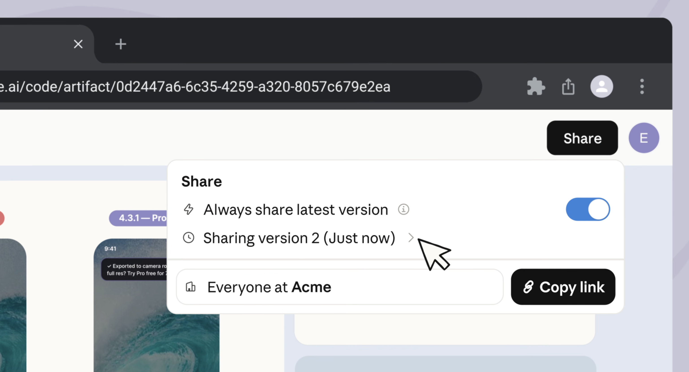

### 🎬 관련 영상
- [🎥 영상 보기](https://ph-files.imgix.net/50f9a50a-a13b-4abb-834b-e383ecf1313b.jpeg?auto=format)

---

## 2. [Zernio WhatsApp API](https://www.producthunt.com/products/zernio)
**Votes**: 257 | **도입 난이도**: 중 | **신뢰도**: 상
**Tagline**: One API for WhatsApp: messaging, calling, and AI agents
**서비스 링크**: https://www.producthunt.com/r/RMPHN65GSOSYIO

**태그**: DevTool, Automation, AI, Communication, API, Agent, AI Tool, Chat

### 📌 이 서비스 한눈에 보기
메시징부터 AI 에이전트 통화까지 가능한 올인원 WhatsApp Business API 통합 솔루션

### 🔑 주요 기능
- 공식 WhatsApp Business API 기반의 메시징, 브로드캐스트, 그룹 채팅 지원
- AI 에이전트로 라우팅 가능한 인채팅 폼 및 음성 통화 기능
- 53개국 번호 지원 및 개발자를 위한 REST API, SDK, CLI, MCP 서버 제공

### 🙋 사용자에게 어떤 점이 좋은가
개발자가 복잡한 WhatsApp 기능을 단일 API로 통합하여 AI 챗봇이나 자동화 에이전트를 신속하게 구축할 수 있습니다.

### ✅ 지금 바로 써볼 기능
- 제공되는 SDK를 활용한 기본 메시징 연동 테스트
- AI 에이전트 라우팅을 위한 통화 기능 실험
- MCP 서버를 통한 개발 환경 설정

### ⚠️ 사용 전 확인할 점
- 공식 API 사용을 위한 WhatsApp 비즈니스 계정 및 번호 준비 필요
- 국가별 번호 가용성 및 규제 사항 확인 필요

### 🧭 확인이 더 필요한 정보
사용량에 따른 구체적인 과금 체계(Zero markup 외의 기본 비용 등)에 대한 상세 정보가 필요합니다.

### 📸 스크린샷 및 갤러리
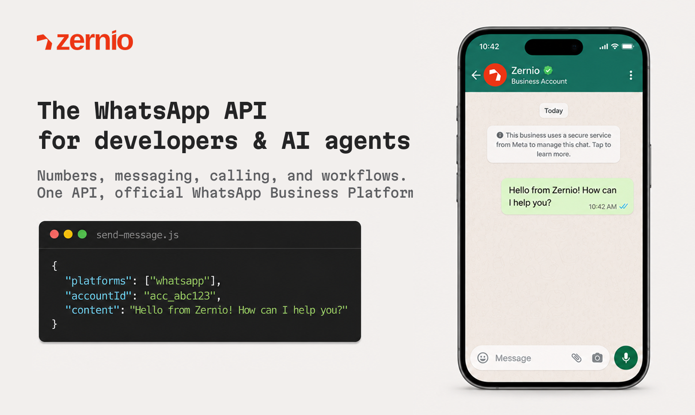
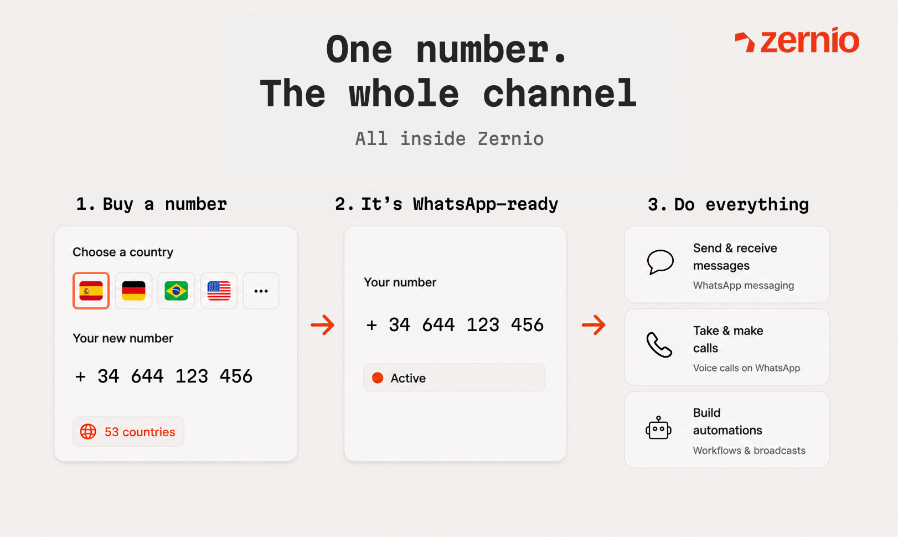
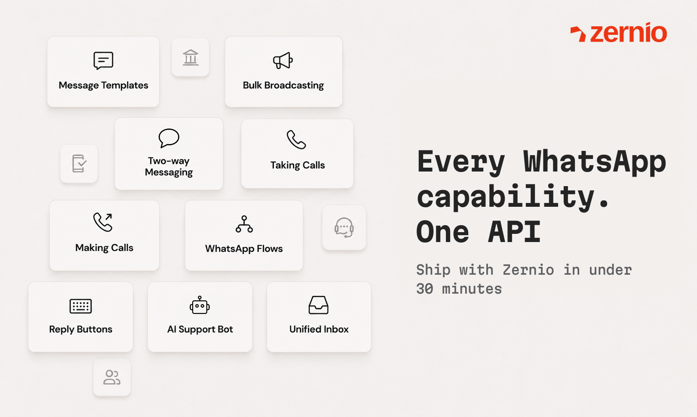

---

## 3. [Midjourney Scanner](https://www.producthunt.com/products/midjourney)
**Votes**: 182 | **도입 난이도**: 하 | **신뢰도**: 중
**Tagline**: 60 second ultrasound-based full-body scanner that beats MRI
**서비스 링크**: https://www.producthunt.com/r/L2ODKKSIMUBB4N

**태그**: HealthTech, Wellness, BodyScanning, PreventiveCare, AI Tool

### 📌 이 서비스 한눈에 보기
60초 만에 전신을 스캔하는 초음파 기반의 빠르고 편안한 건강 모니터링 솔루션

### 🔑 주요 기능
- 60초 내외의 빠른 스캔 속도와 비침습적 초음파 기술 활용
- 방사선 노출 걱정 없는 안전하고 스트레스 없는 스캔 환경
- 스파 시설과 결합하여 일상 속에서 정기적인 건강 데이터 축적 가능

### 🙋 사용자에게 어떤 점이 좋은가
병원 방문의 번거로움 없이 스파를 즐기듯 일상에서 쉽고 저렴하게 전신 건강 상태를 체크하고 데이터 라이브러리를 구축할 수 있습니다.

### ✅ 지금 바로 써볼 기능
- 스파 시설 방문을 통한 스캔 경험하기
- 정기적인 스캔을 통한 개인 건강 데이터 라이브러리 구축
- 축적된 데이터를 통한 조기 건강 이상 징후 확인

### ⚠️ 사용 전 확인할 점
- MRI와 비교했을 때 정밀도나 진단 목적의 차이 확인 필요
- 의료 기기로서의 공식적인 진단 권위 및 규제 준수 여부 확인

### 🧭 확인이 더 필요한 정보
MRI를 대체할 수 있는 수준의 임상적 정밀도와 의료적 진단 가치에 대한 구체적인 데이터가 필요합니다.

### 📸 스크린샷 및 갤러리

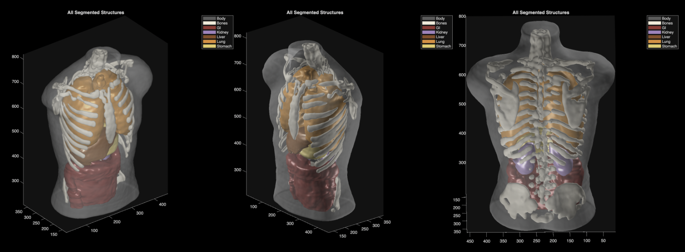

### 🎬 관련 영상
- [🎥 영상 보기](https://ph-files.imgix.net/38f328ef-34b8-43e0-861b-fd883e9ca3a2.jpeg?auto=format)

---

## 4. [Firecrawl Research Index](https://www.producthunt.com/products/extract-by-firecrawl)
**Votes**: 170 | **도입 난이도**: 하 | **신뢰도**: 상
**Tagline**: An index for agents pushing the frontier of AI/ML research
**서비스 링크**: https://www.producthunt.com/r/WV2Z2GVPLLUUE3
**재등장**: 최근 7일 내 재등장 (마지막 등장 5일 전)

**태그**: AI/ML, ResearchTool, DataIndex, DeveloperTools, Agent, AI Tool, DevTool

### 📌 이 서비스 한눈에 보기
최신 AI/ML 논문과 코드를 실시간으로 연결하는 에이전트용 전문 연구 인덱스

### 🔑 주요 기능
- 300만 개 이상의 arXiv 논문 데이터 포함
- 주요 연구 저장소의 GitHub 아티팩트 통합 제공
- 매일 업데이트되는 데이터로 최신 연구 트렌드 반영

### 🙋 사용자에게 어떤 점이 좋은가
연구용 AI 에이전트가 최신 논문과 구현 코드를 누락 없이 검색하고 학습할 수 있도록 돕습니다.

### ✅ 지금 바로 써볼 기능
- arXiv 데이터셋을 활용한 연구 에이전트 구축
- GitHub 연동을 통한 코드-논문 매핑 테스트
- 일일 업데이트 데이터의 최신성 확인

### ⚠️ 사용 전 확인할 점
- 에이전트가 활용할 수 있는 API 형태의 제공 여부 확인 필요
- 데이터 업데이트 주기에 따른 실시간성 차이 고려

### 🧭 확인이 더 필요한 정보
구체적인 API 사용 방법 및 데이터 접근 방식(Pricing/Access)에 대한 정보가 명시되지 않았습니다.

### 📸 스크린샷 및 갤러리
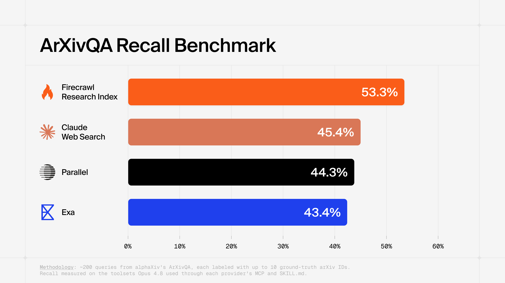
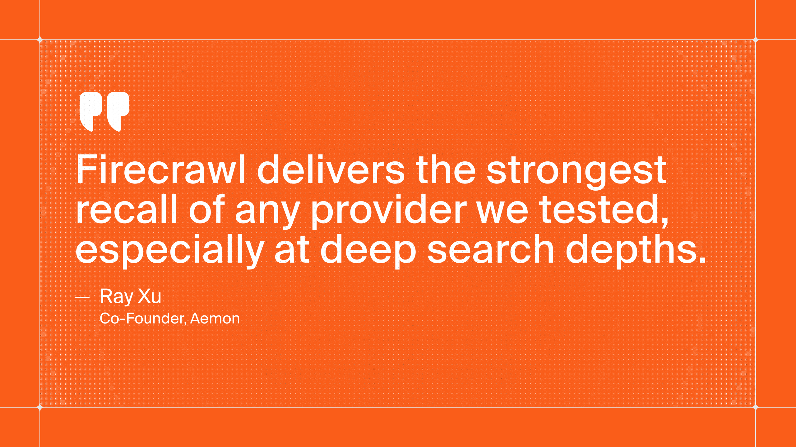

### 🎬 관련 영상
- [🎥 영상 보기](https://ph-files.imgix.net/3b6005b7-8e4b-47bd-807e-c1b3f39777ac.jpeg?auto=format)

---

## 5. [API to MCP](https://www.producthunt.com/products/api-to-mcp)
**Votes**: 154 | **도입 난이도**: 하 | **신뢰도**: 상
**Tagline**: Turn any API into an MCP server for AI agents
**서비스 링크**: https://www.producthunt.com/r/IE7RIXXZEK4WSO

**태그**: DevTool, AI-Agent, Automation, API, Agent, AI Tool, Chat

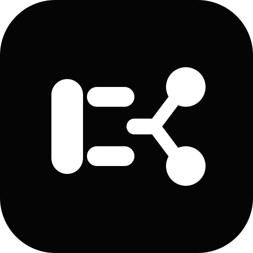

### 📌 이 서비스 한눈에 보기
모든 종류의 API를 AI 에이전트용 MCP 서버로 즉시 변환해주는 자동화 도구

### 🔑 주요 기능
- REST, GraphQL, SaaS 등 다양한 API를 호스팅 가능한 MCP 서버로 변환
- 대시보드 기반의 시각적 빌드 또는 AI 에이전트를 통한 자동 생성/배포 지원
- ChatGPT, Claude, Cursor 등 주요 AI 도구와 OAuth 및 보안 인증을 통한 간편한 연결

### 🙋 사용자에게 어떤 점이 좋은가
복잡한 코딩 없이 기존 API를 AI 에이전트가 즉시 사용할 수 있는 도구로 만들어 업무 자동화 효율을 극대화할 수 있습니다.

### ✅ 지금 바로 써볼 기능
- 기존에 사용 중인 API 문서를 업로드하여 MCP 서버 생성 테스트하기
- 생성된 MCP 서버를 Claude나 Cursor에 연결하여 에이전트 기능 확인하기
- 대시보드에서 워크플로우 및 보안 인증 설정해보기

### ⚠️ 사용 전 확인할 점
- 외부 API를 중계하는 방식이므로 데이터 보안 및 권한 관리 정책 확인 필요
- 호스팅 서비스의 안정성과 API 호출 제한(Rate Limit) 고려 필요

### 🧭 확인이 더 필요한 정보
구체적인 호스팅 비용 체계와 대규모 트래픽 처리 성능에 대한 정보가 명시되지 않았습니다.

### 📸 스크린샷 및 갤러리
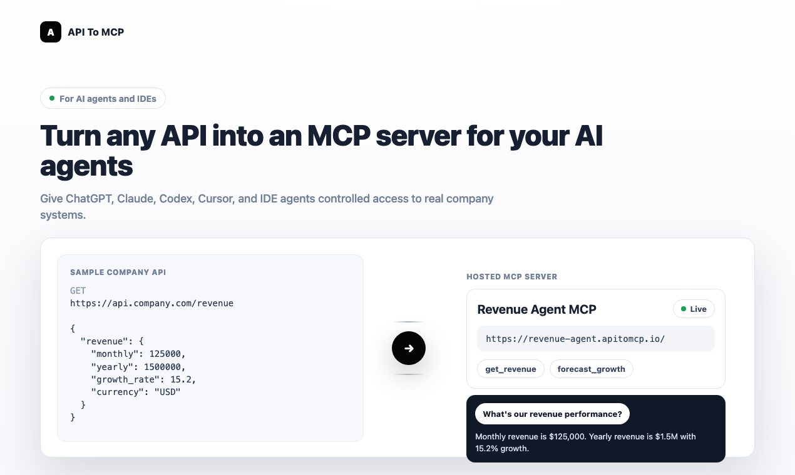
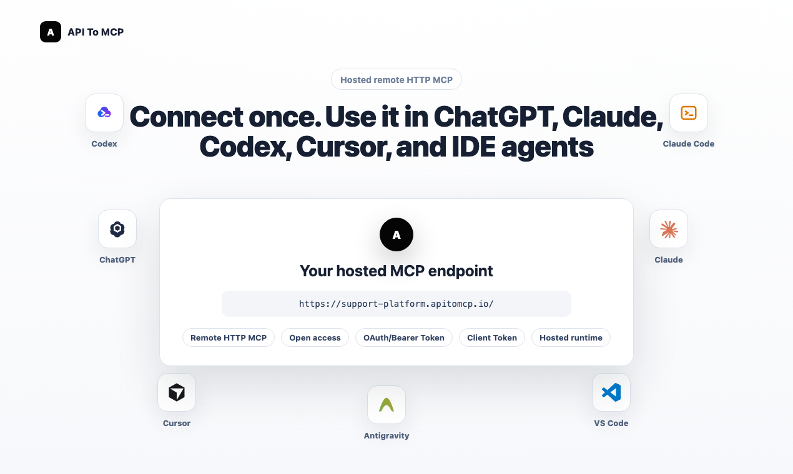
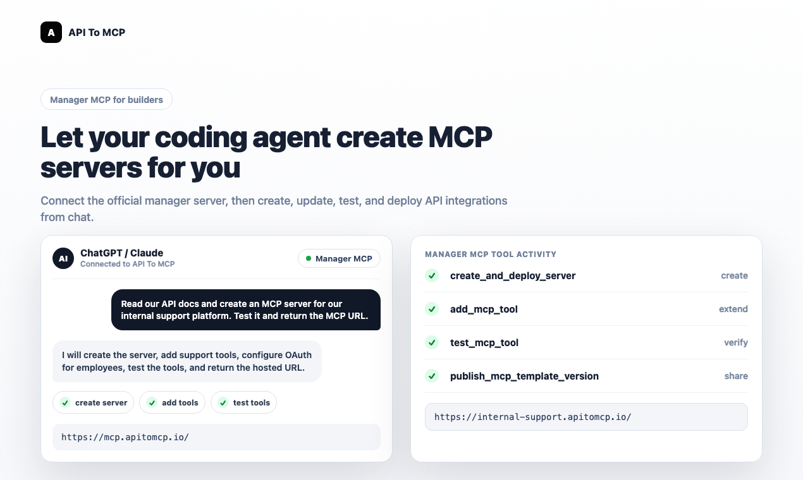

---

## 6. [frontpage.sh](https://www.producthunt.com/products/frontpage-sh-8-squares-forever-for-sale)
**Votes**: 132 | **도입 난이도**: 하 | **신뢰도**: 상
**Tagline**: A perpetual auction for eight ad squares
**서비스 링크**: https://www.producthunt.com/r/DUI4XR4AMJQUZK

**태그**: Web3, Auction, Advertising, Automation, Agent, AI Tool

### 📌 이 서비스 한눈에 보기
8개의 광고 슬롯을 대상으로 하는 영구적 경매 및 수익 공유 플랫폼

### 🔑 주요 기능
- 8개의 광고 슬롯을 차지하기 위한 지속적인 경매 시스템
- 경매 낙찰 시 이전 가격의 배수를 지불하며, 상위 입찰자 발생 시 최대 1.5배 수익 구조
- 수익의 80%는 페이지 홍보를 위한 풀(Pool)로 재투자

### 🙋 사용자에게 어떤 점이 좋은가
별도의 계정 생성 없이 간단한 호출만으로 광고 슬롯을 점유하고, 경매를 통해 수익을 창출할 수 있는 실험적인 모델입니다.

### ✅ 지금 바로 써볼 기능
- Tempo 네트워크를 통한 USDC 지갑 준비
- HTTP 호출을 통한 입찰 프로세스 테스트
- 경매 메커니즘 및 수익 구조 이해

### ⚠️ 사용 전 확인할 점
- 경매 방식 특성상 원금 손실 가능성 존재
- 수익률(1.5배)은 시장 상황 및 입찰 경쟁에 따라 변동적임

### 🧭 확인이 더 필요한 정보
수익 구조와 경매 규칙이 실시간 시장 상황에 따라 어떻게 변동될지에 대한 구체적인 메커니즘 확인이 필요합니다.

### 📸 스크린샷 및 갤러리
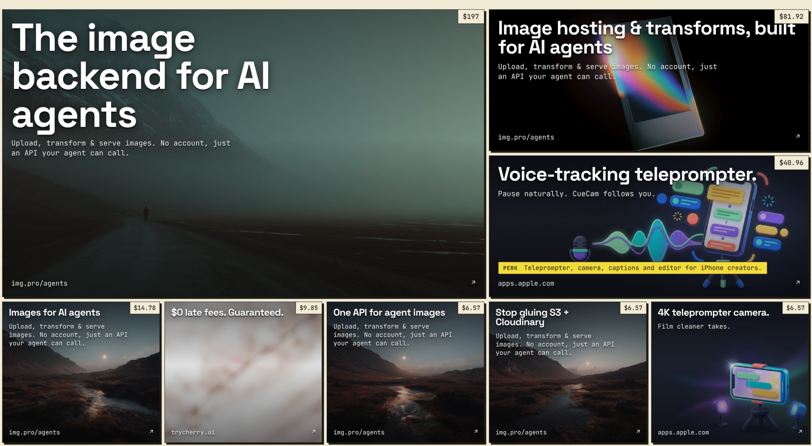
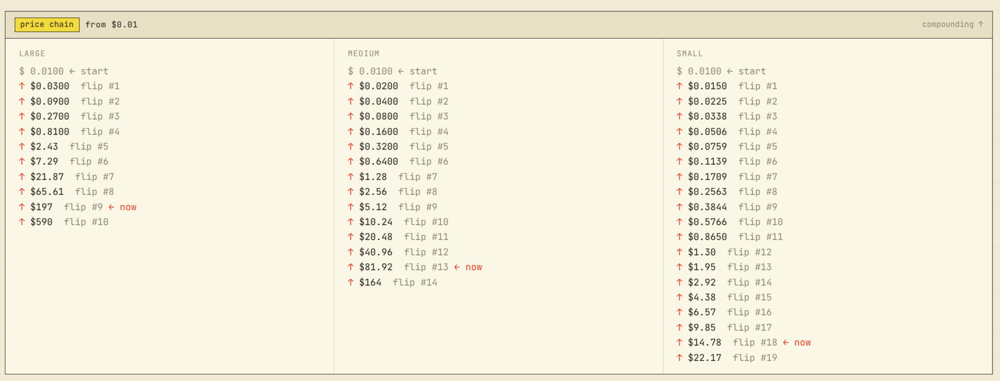
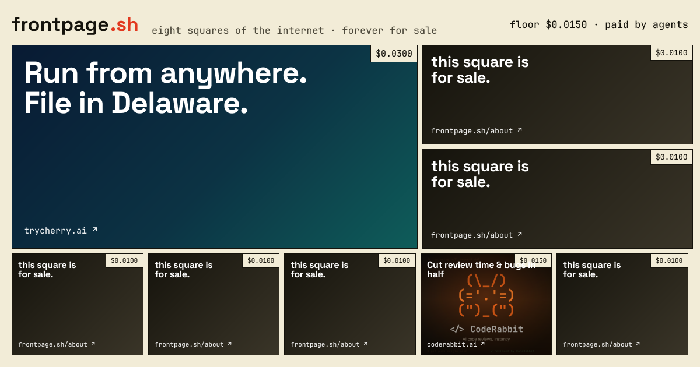

### 🎬 관련 영상
- [🎥 영상 보기](https://ph-files.imgix.net/6d949029-9188-47fc-be5e-d20f422dafd0.jpeg?auto=format)

---

## 7. [Unreal Engine 5.8](https://www.producthunt.com/products/unreal-engine)
**Votes**: 130 | **도입 난이도**: 상 | **신뢰도**: 상
**Tagline**: Build unreal games with AI agents
**서비스 링크**: https://www.producthunt.com/r/3FHIEYAZL5HDRV

**태그**: GameDev, AI, Graphics, Automation, Agent, AI Tool

### 📌 이 서비스 한눈에 보기
AI 에이전트 자동화와 차세대 그래픽 기술이 결합된 UE5 라이프사이클의 최종 진화형

### 🔑 주요 기능
- 기존 하이트필드를 대체하는 실험적인 3D 메시 터레인 도입
- 현세대 콘솔을 위한 프로덕션 레벨의 MegaLights 기술
- AI 에이전트 자동화를 위한 네이티브 MCP 플러그인 탑재

### 🙋 사용자에게 어떤 점이 좋은가
더욱 정교한 지형 제작과 강력한 조명 효과를 통해 차세대 게임 그래픽을 구현할 수 있으며, AI 자동화로 개발 워크플로우를 혁신할 수 있습니다.

### ✅ 지금 바로 써볼 기능
- 3D 메시 터레인 실험적 기능 테스트
- MegaLights를 활용한 콘솔 최적화 작업
- MCP 플러그인을 통한 AI 에이전트 워크플로우 구축

### ⚠️ 사용 전 확인할 점
- 3D 메시 터레인은 실험적 기능이므로 안정성 확인 필요
- MegaLights 사용 시 하드웨어 요구 사양 검토 필요

### 🧭 확인이 더 필요한 정보
3D 메시 터레인의 실제 프로덕션 환경 적용 가능 여부와 하드웨어 요구 사양에 대한 추가 확인이 필요합니다.

### 📸 스크린샷 및 갤러리
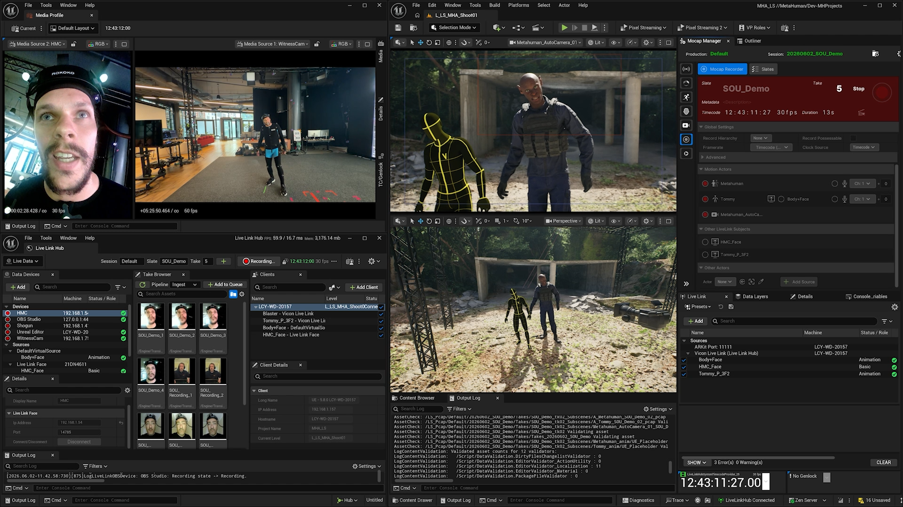
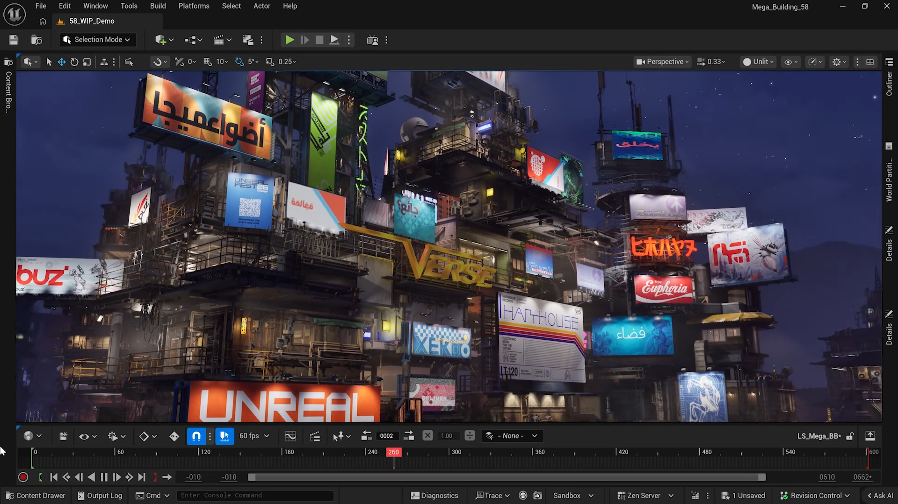

### 🎬 관련 영상
- [🎥 영상 보기](https://ph-files.imgix.net/3af3c731-8b7d-4abe-a6d3-45057c0f4b01.jpeg?auto=format)

---

## 8. [just f***ing send it](https://www.producthunt.com/products/just-f-ing-send-it)
**Votes**: 121 | **도입 난이도**: 하 | **신뢰도**: 상
**Tagline**: Send any file, any size, straight from browser to browser
**서비스 링크**: https://www.producthunt.com/r/V6QE5VS5YMFTVZ

**태그**: Productivity, FileSharing, Privacy, WebRTC, AI Tool, DevTool

### 📌 이 서비스 한눈에 보기
서버 저장 없이 브라우저 간 직접 전송으로 대용량 파일을 즉시 공유하는 도구

### 🔑 주요 기능
- WebRTC 기술을 이용한 브라우저 간 직접 스트리밍 (P2P)
- 서버에 파일이 저장되지 않는 높은 보안성 및 프라이버시
- 계정 생성이나 파일 업로드 과정 없는 간편한 코드 공유 방식

### 🙋 사용자에게 어떤 점이 좋은가
클라우드 업로드 대기 시간 없이 대용량 파일을 즉시 전달할 수 있으며, 서버에 데이터가 남지 않아 보안이 중요한 파일 공유에 유용합니다.

### ✅ 지금 바로 써볼 기능
- 대용량 폴더를 짧은 코드로 즉시 공유해보기
- 보안이 필요한 파일을 브라우저 간 직접 전송해보기

### ⚠️ 사용 전 확인할 점
- 양쪽 사용자의 브라우저가 모두 열려 있어야 전송이 유지됨
- 네트워크 환경에 따라 P2P 연결 속도 차이가 발생할 수 있음

### 🧭 확인이 더 필요한 정보
네트워크 환경(방화벽 등)에 따른 WebRTC 연결 성공률과 최대 전송 속도에 대한 정보가 필요합니다.

### 📸 스크린샷 및 갤러리
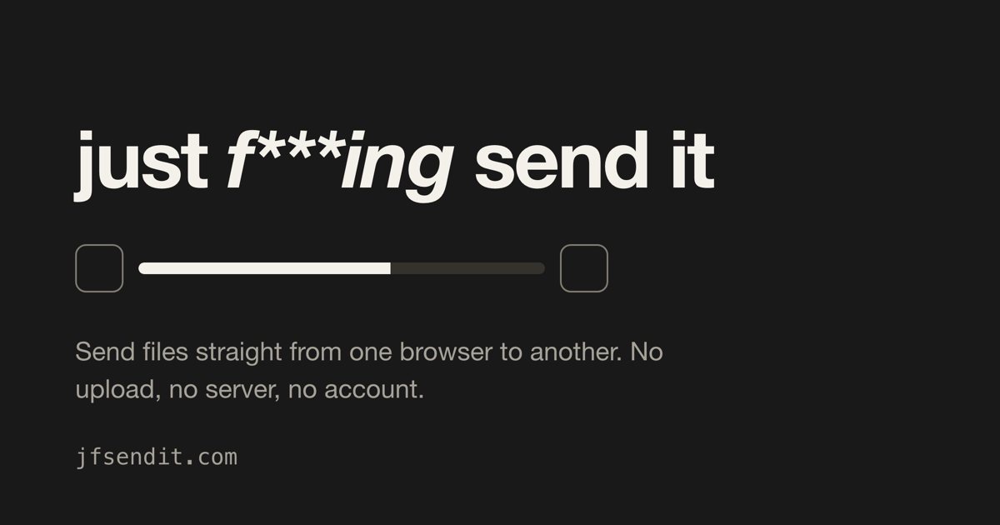

---

## 9. [Ask Ad Manager by Google Ads](https://www.producthunt.com/products/ask-ad-manager)
**Votes**: 115 | **도입 난이도**: 하 | **신뢰도**: 상
**Tagline**: Gemini-powered AI agent for insights & faster ad decisions
**서비스 링크**: https://www.producthunt.com/r/3M4IRQFW4PZQEO

**태그**: AI Agent, Advertising, Analytics, Automation, Agent, AI Tool

### 📌 이 서비스 한눈에 보기
Gemini AI를 활용해 광고 성과 분석과 의사결정을 가속화하는 퍼블리셔용 AI 에이전트

### 🔑 주요 기능
- Gemini 기반의 강력한 AI 에이전트 기술 적용
- 광고 성과에 대한 심층적인 인사이트 제공
- 데이터 분석 및 의사결정 프로세스 단축

### 🙋 사용자에게 어떤 점이 좋은가
복잡한 광고 데이터를 일일이 분석할 필요 없이, AI를 통해 핵심 인사이트를 빠르게 파악하고 전략적인 결정을 내릴 수 있습니다.

### ✅ 지금 바로 써볼 기능
- 현재 운영 중인 광고 데이터 연동하기
- AI 에이전트에게 성과 분석 질문 던지기
- 도출된 인사이트를 바탕으로 광고 전략 수정하기

### ⚠️ 사용 전 확인할 점
- AI가 생성한 인사이트의 정확성을 최종 검토 필요
- 데이터 보안 및 프라이버시 정책 확인 필요

### 🧭 확인이 더 필요한 정보
구체적인 데이터 연동 범위와 퍼블리셔별 맞춤형 기능 제공 여부에 대한 정보가 더 필요합니다.

### 📸 스크린샷 및 갤러리
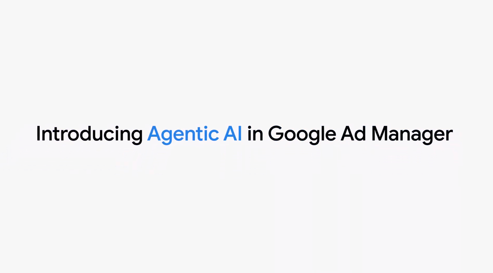
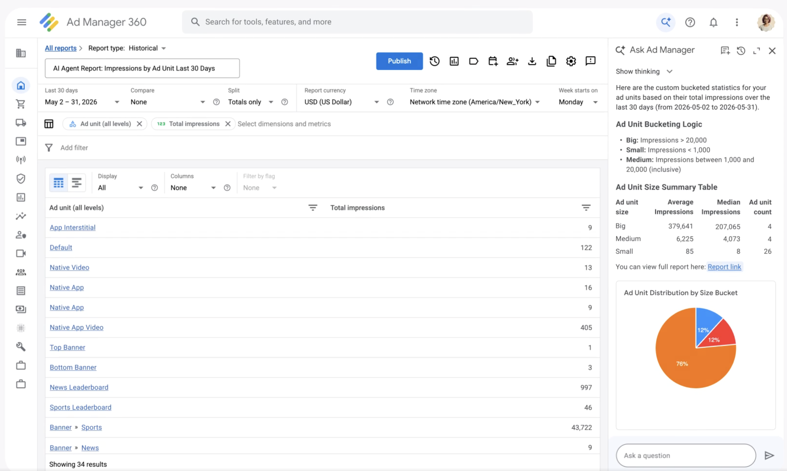
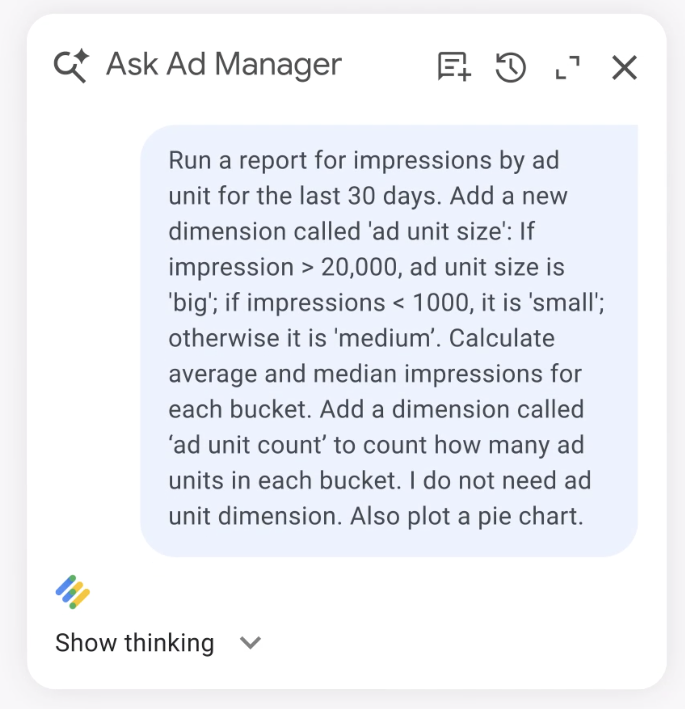

### 🎬 관련 영상
- [🎥 영상 보기](https://ph-files.imgix.net/bb317a9b-9c5a-4480-b8b4-3a7a2cc5e38b.jpeg?auto=format)

---

## 10. [Blazly Backlinker](https://www.producthunt.com/products/blazly-backlinker)
**Votes**: 108 | **도입 난이도**: 하 | **신뢰도**: 상
**Tagline**: Automate your entire backlink generation
**서비스 링크**: https://www.producthunt.com/r/D7OAKSUZIQSYFA

**태그**: Marketing, Automation, SEO, GrowthHacking, AI Tool, Email

### 📌 이 서비스 한눈에 보기
키워드 입력만으로 백링크 발굴부터 아웃리치까지 자동화하는 마케팅 워크플로우 도구

### 🔑 주요 기능
- 웹사이트와 키워드 기반의 자동 백링크 기회 발굴
- 검증된 연락처 확보 및 개인화된 아웃리치 이메일 생성
- 프로스펙팅부터 게스트 포스팅까지 통합된 자동화 워크플로우

### 🙋 사용자에게 어떤 점이 좋은가
수동으로 진행하던 복잡한 백링크 작업(스프레드시트 관리, 연락처 찾기, 팔로업 등)을 자동화하여 마케팅 운영 효율을 극대화할 수 있습니다.

### ✅ 지금 바로 써볼 기능
- 타겟 키워드 및 웹사이트 정보 입력
- 자동 생성된 백링크 기회 리스트 검토
- 개인화된 아웃리치 이메일 발송

### ⚠️ 사용 전 확인할 점
- 자동 생성된 이메일의 품질이 실제 수락률로 이어지는지 확인 필요
- 발굴된 백링크 사이트의 권위(Authority)와 품질 검증 필요

### 🧭 확인이 더 필요한 정보
자동화된 아웃리치 과정에서 발생할 수 있는 스팸 필터링 이슈나 사이트 품질 관리 방식에 대한 구체적 정보가 부족합니다.

### 📸 스크린샷 및 갤러리
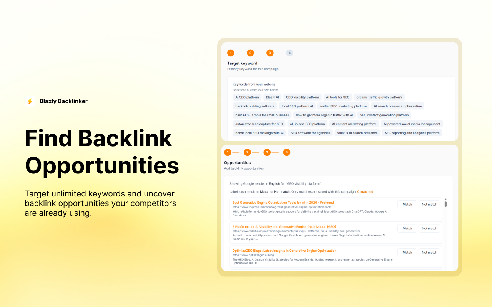
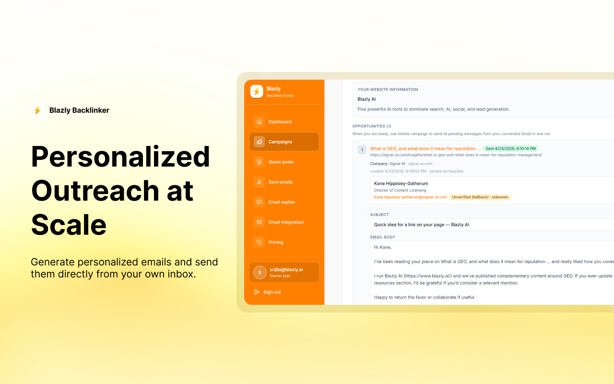
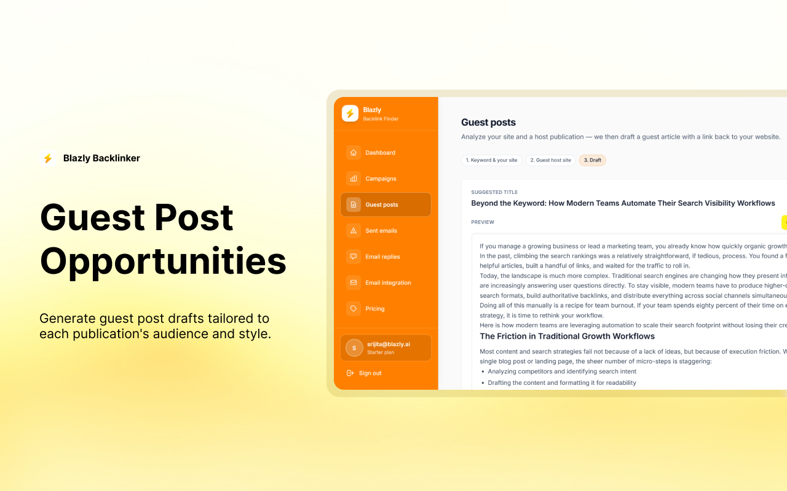

### 🎬 관련 영상
- [🎥 영상 보기](https://ph-files.imgix.net/b6d71518-3b0a-4142-b6af-8e0311e580f9.jpeg?auto=format)

---

## 11. [QuackScreen](https://www.producthunt.com/products/quackscreen)
**Votes**: 90 | **도입 난이도**: 하 | **신뢰도**: 상
**Tagline**: Capture, drag, share all from the MacBook notch
**서비스 링크**: https://www.producthunt.com/r/PVDNE6AYKCSLZQ

**태그**: Productivity, macOS, Utility, AI Tool

### 📌 이 서비스 한눈에 보기
맥북 노치에서 바로 실행하는 빠르고 간편한 화면 캡처 및 공유 도구

### 🔑 주요 기능
- 맥북 노치 영역을 활용한 직관적인 인터페이스
- 화면 녹화 및 스크린샷 기능 제공
- 메뉴 바에서 앱으로 바로 드래그 앤 드롭 가능한 공유 방식

### 🙋 사용자에게 어떤 점이 좋은가
별도의 창을 열 필요 없이 노치에서 즉시 캡처하고, 드래그 한 번으로 슬랙이나 메일 등에 바로 전달할 수 있어 작업 흐름이 끊기지 않습니다.

### ✅ 지금 바로 써볼 기능
- 노치 메뉴를 통한 빠른 화면 녹화 시도
- 캡처된 클립을 슬랙이나 파인더로 드래그 앤 드롭하기

### ⚠️ 사용 전 확인할 점
- macOS 26+ 및 Apple Silicon 환경에서만 작동함
- 노치 디자인이 없는 맥북 모델에서는 사용이 제한적일 수 있음

### 🧭 확인이 더 필요한 정보
설명에 기재된 macOS 26+ 버전이 현재 배포 중인 macOS 버전과 일치하는지 확인이 필요합니다.

### 📸 스크린샷 및 갤러리
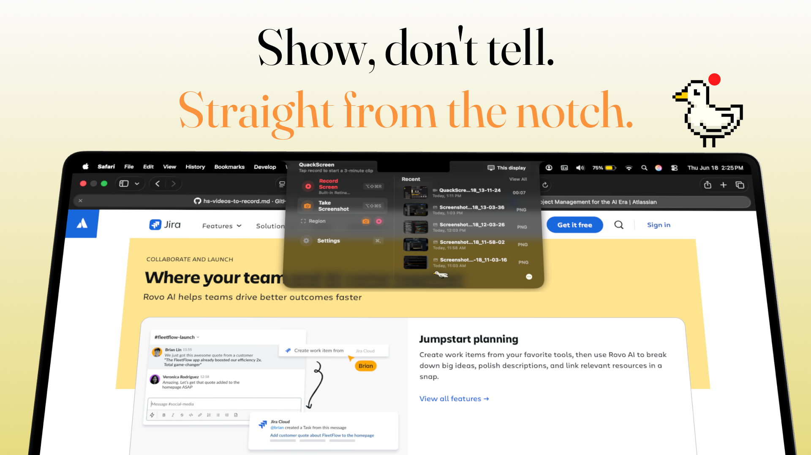
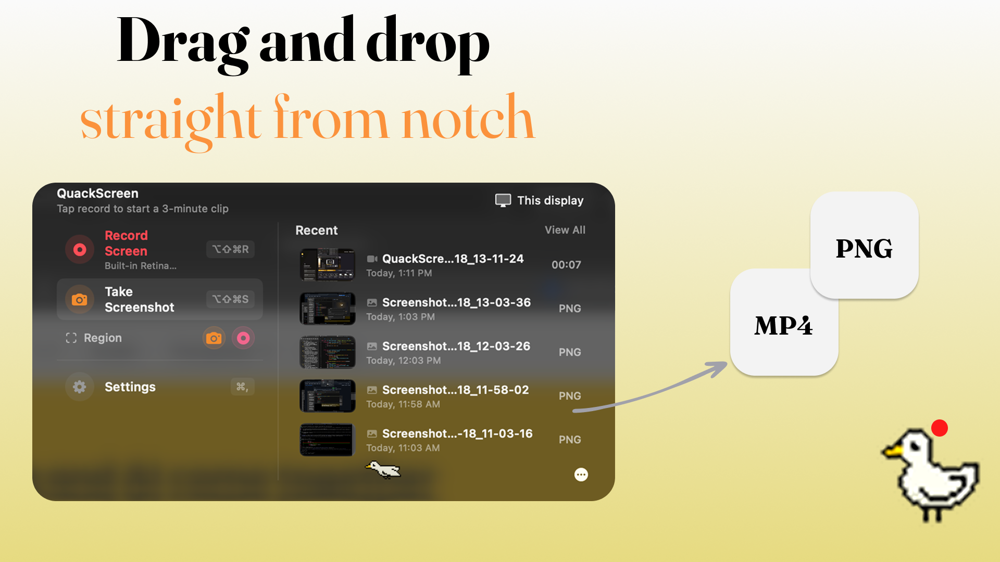
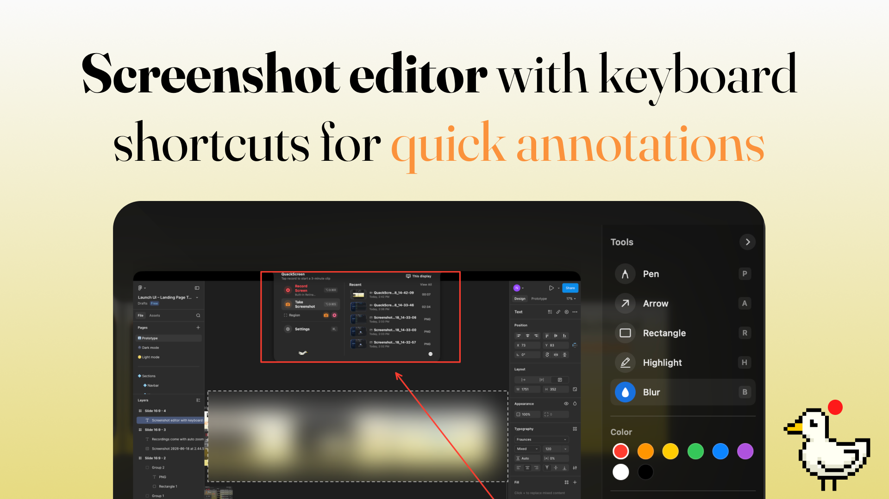

---

## 12. [Darkmoon](https://www.producthunt.com/products/darkmoon)
**Votes**: 88 | **도입 난이도**: 상 | **신뢰도**: 상
**Tagline**: Autonomous penetration testing platform
**서비스 링크**: https://www.producthunt.com/r/IGCLIJUOUCKHWR

**태그**: Cybersecurity, AI, Automation, DevSecOps, OpenSource, Agent, AI Tool, Design, API, Security

### 📌 이 서비스 한눈에 보기
전문가급 보안 도구와 18개의 AI 에이전트를 결합한 자율형 침투 테스트 플랫폼

### 🔑 주요 기능
- 웹 레이어를 넘어 AD, Kubernetes, 클라우드, 네트워크 등 인프라 전반을 아우르는 공격 범위
- 18개의 특화된 AI 에이전트와 80개 이상의 오펜시브 보안 도구 통합
- MITRE 프레임워크 기반의 증거 중심 결과 및 즉시 사용 가능한 리포트 제공

### 🙋 사용자에게 어떤 점이 좋은가
전문적인 침투 테스트 과정을 자동화하여 인프라 전반의 취약점과 공격 경로를 신속하게 식별할 수 있습니다.

### ✅ 지금 바로 써볼 기능
- 자사 인프라(Cloud/K8s)에 대한 취약점 스캔 실행
- AI 에이전트가 생성하는 공격 경로(Attack Path) 분석
- 생성된 리포트의 실무 적용 가능성 검토

### ⚠️ 사용 전 확인할 점
- 자율형 공격 도구이므로 테스트 환경 격리 및 사전 승인 필수
- 전문적인 보안 지식 없이는 AI가 생성한 결과의 정확도 판단이 어려울 수 있음

### 🧭 확인이 더 필요한 정보
자체 호스팅 방식의 구체적인 시스템 요구 사양과 설치 난이도에 대한 정보가 필요합니다.

### 📸 스크린샷 및 갤러리
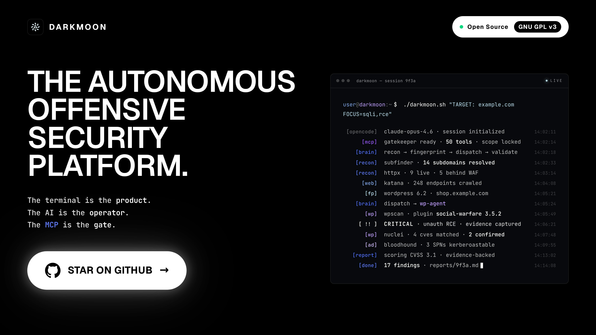
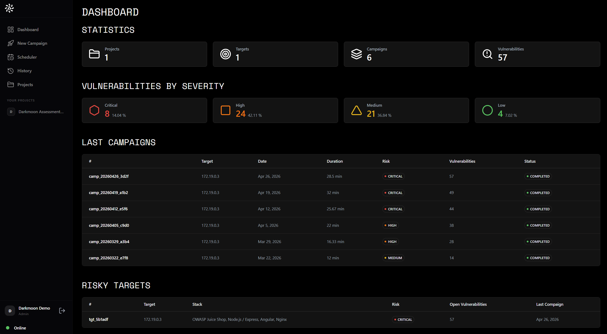
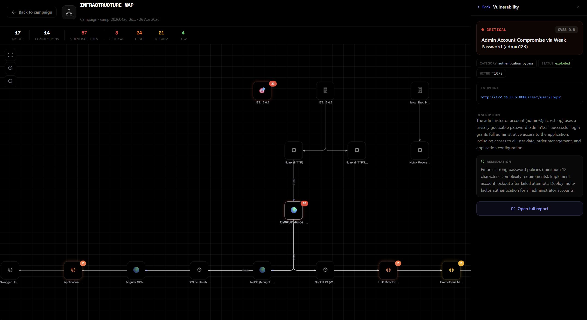

### 🎬 관련 영상
- [🎥 영상 보기](https://ph-files.imgix.net/c1e503e9-6843-4bc7-acd5-64f9882d74b4.jpeg?auto=format)

---

## 13. [Screen Ruler](https://www.producthunt.com/products/screen-ruler)
**Votes**: 87 | **도입 난이도**: 하 | **신뢰도**: 상
**Tagline**: Edit anything on the web with change tracking
**서비스 링크**: https://www.producthunt.com/r/ZUN64WP6WVM4J6

**태그**: DevTool, WebDesign, Frontend, ChromeExtension

### 📌 이 서비스 한눈에 보기
웹 페이지 요소의 수치 측정부터 실시간 CSS 편집 및 변경 이력 관리까지 가능한 크롬 확장 프로그램

### 🔑 주요 기능
- 라이브 웹 페이지 요소의 정밀한 측정 및 검사 기능
- 클릭 한 번으로 매칭된 CSS 값을 확인하고 즉시 인라인 편집 가능
- hover, focus 상태 및 @media 쿼리 내 요소까지 지원

### 🙋 사용자에게 어떤 점이 좋은가
디자이너와 개발자가 웹 UI를 실시간으로 테스트하고, CSS 변경 사항을 즉각적으로 시뮬레이션하며 검증할 때 매우 유용합니다.

### ✅ 지금 바로 써볼 기능
- 웹 요소 클릭하여 CSS 값 확인하기
- 인라인 편집 기능을 통한 UI 레이아웃 수정 테스트
- 변경 이력(Change tracking) 기능을 통한 수정 사항 검토

### ⚠️ 사용 전 확인할 점
- 브라우저 확장 프로그램이므로 로컬 환경이 아닌 실제 운영 중인 웹 페이지에 직접 적용되는 방식임
- 편집된 내용은 브라우저 세션 내에서만 유지되며 영구 저장되지 않음

### 🧭 확인이 더 필요한 정보
편집된 CSS를 실제 코드베이스에 반영하거나 내보내는 기능의 구체적인 방식은 명시되어 있지 않습니다.

### 📸 스크린샷 및 갤러리
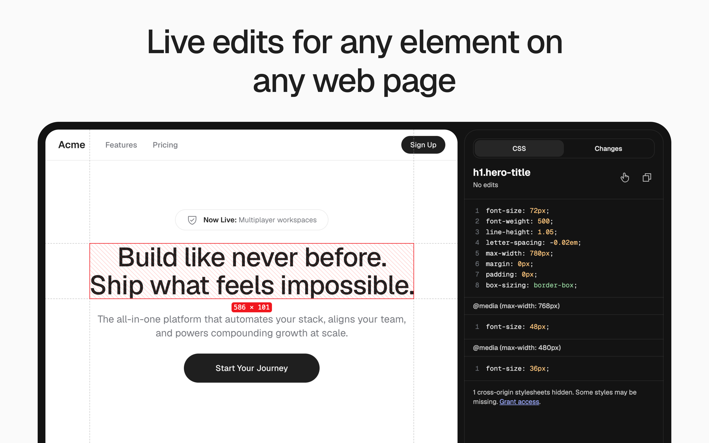
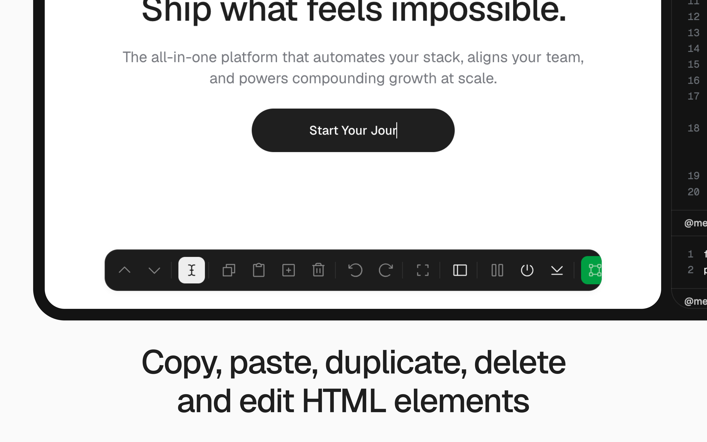
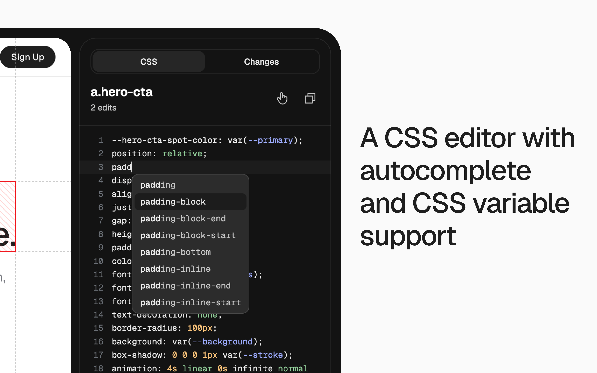

---

## 14. [MeshPilot](https://www.producthunt.com/products/meshpilot)
**Votes**: 86 | **도입 난이도**: 중 | **신뢰도**: 상
**Tagline**: Your AI workspace for terminals, tasks, and agents
**서비스 링크**: https://www.producthunt.com/r/SWHLL43IMABPKD

**태그**: DevTool, AI, Automation, Productivity, Agent, AI Tool

### 📌 이 서비스 한눈에 보기
터미널, 작업 보드, AI 에이전트를 하나로 통합한 개발자용 AI 워크스페이스

### 🔑 주요 기능
- 터미널, 비주얼 캔버스, 태스크 보드가 통합된 단일 개발 환경 제공
- 음성 명령 및 AI 에이전트를 통한 실질적인 작업 자동화 지원
- 세션 간 맥락을 유지하는 지속적인 메모리 기능 탑재

### 🙋 사용자에게 어떤 점이 좋은가
여러 도구를 오가는 번거로움 없이 하나의 앱에서 프로젝트 계획부터 실행까지 관리할 수 있어 개발 흐름이 끊기지 않습니다.

### ✅ 지금 바로 써볼 기능
- 통합 터미널과 캔버스 환경 설정하기
- AI 에이전트에게 실무 작업 할당해보기
- 지속적 메모리 기능을 활용한 프로젝트 맥락 저장하기

### ⚠️ 사용 전 확인할 점
- 통합 환경 특성상 기존 개별 도구들과의 호환성 확인 필요
- AI 에이전트의 작업 수행 시 보안 및 권한 관리 주의

### 🧭 확인이 더 필요한 정보
현재 제공되는 AI 에이전트의 구체적인 작업 수행 범위와 보안 정책에 대한 정보가 부족합니다.

### 📸 스크린샷 및 갤러리
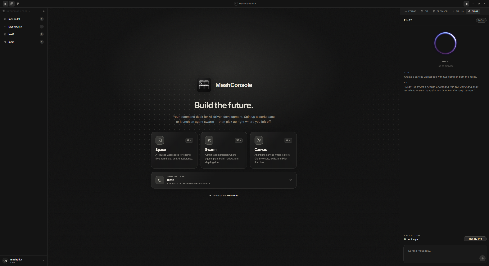
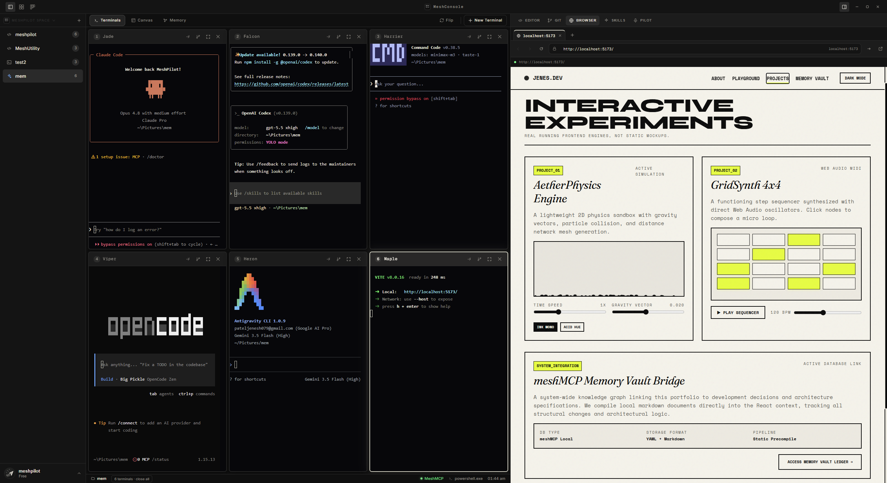
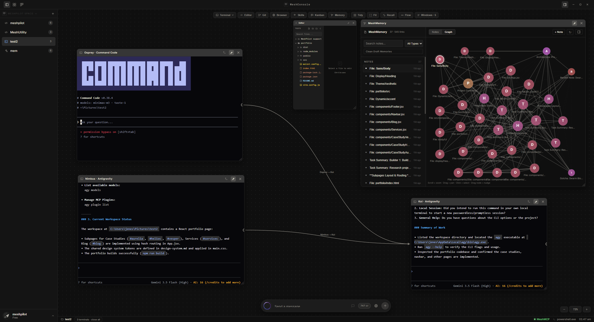

---

## 15. [Foglamp](https://www.producthunt.com/products/foglamp)
**Votes**: 84 | **도입 난이도**: 하 | **신뢰도**: 상
**Tagline**: Ship AI agents you can actually see
**서비스 링크**: https://www.producthunt.com/r/AEJPWN3FQVSSGD

**태그**: DevTool, AI, Observability, OpenSource, Vercel, Agent, AI Tool

### 📌 이 서비스 한눈에 보기
Vercel AI SDK 기반 AI 에이전트의 비용과 성능을 실시간으로 모니터링하는 오픈소스 관측성 도구

### 🔑 주요 기능
- Vercel AI SDK(generateText/streamText)와 완벽하게 통합되는 오픈소스 레이어
- 비용, 지연 시간(Latency), 토큰 사용량, 분산 트레이싱 등 핵심 지표 제공
- AI 에이전트의 성능 평가(Evals) 및 알림(Alerts) 기능 지원

### 🙋 사용자에게 어떤 점이 좋은가
AI 에이전트 개발 시 발생하는 복잡한 호출 과정을 시각화하여, 비용 최적화와 성능 디버깅을 단 두 줄의 코드로 해결할 수 있습니다.

### ✅ 지금 바로 써볼 기능
- Vercel AI SDK 프로젝트에 Foglamp 연동하기
- 실시간 토큰 사용량 및 비용 대시보드 확인하기
- 에이전트 응답 지연 시간 및 트레이싱 분석하기

### ⚠️ 사용 전 확인할 점
- Vercel AI SDK를 사용하지 않는 환경에서는 도입이 어려울 수 있음
- 오픈소스 프로젝트이므로 자체 호스팅 또는 관리 책임이 발생할 수 있음

### 🧭 확인이 더 필요한 정보
현재 제공되는 구체적인 데이터 보관 기간 및 대규모 트래픽 시의 확장성 정책은 명시되어 있지 않습니다.

### 📸 스크린샷 및 갤러리
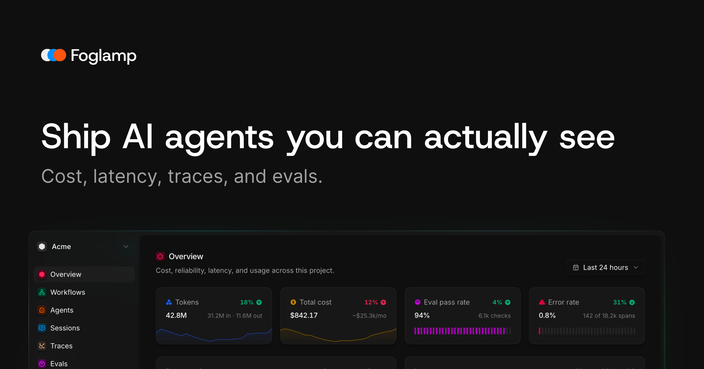

### 🎬 관련 영상
- [🎥 영상 보기](https://ph-files.imgix.net/2f82f3db-f532-4326-ba35-0029fccfbf28.jpeg?auto=format)

---

## 16. [Mutter AI Dictation](https://www.producthunt.com/products/mutter-ai-dictation)
**Votes**: 81 | **도입 난이도**: 하 | **신뢰도**: 상
**Tagline**: Private AI dictation that lets you operate offline.
**서비스 링크**: https://www.producthunt.com/r/BUDNXXKQARSEZ2

**태그**: Productivity, AI, Dictation, Privacy, Mac, AI Tool

### 📌 이 서비스 한눈에 보기
개인정보 유출 걱정 없이 오프라인에서 빠르게 글을 완성하는 AI 받아쓰기 도구

### 🔑 주요 기능
- 음성 입력을 정제된 글로 변환하는 AI 기능
- 타이핑보다 약 3배 빠른 작업 속도 제공
- 민감한 데이터를 보호하는 100% 온디바이스(On-device) 모드 지원

### 🙋 사용자에게 어떤 점이 좋은가
아이디어를 말로 내뱉으면 완성된 글로 다듬어주어 문서 작성 시간을 획기적으로 단축할 수 있습니다. 특히 보안이 중요한 작업 시 오프라인 모드를 통해 데이터 유출 걱정 없이 사용할 수 있습니다.

### ✅ 지금 바로 써볼 기능
- 음성으로 초안 작성하기
- 온디바이스 모드로 보안 환경 설정하기
- 타이핑 대비 작업 속도 비교해보기

### ⚠️ 사용 전 확인할 점
- Mac 전용 환경(macOS)에서의 구동 여부 확인 필요
- 온디바이스 모드 사용 시 하드웨어 리소스 점유율 확인 필요

### 🧭 확인이 더 필요한 정보
지원하는 운영체제 범위와 구체적인 하드웨어 사양에 대한 정보가 추가로 필요합니다.

### 📸 스크린샷 및 갤러리
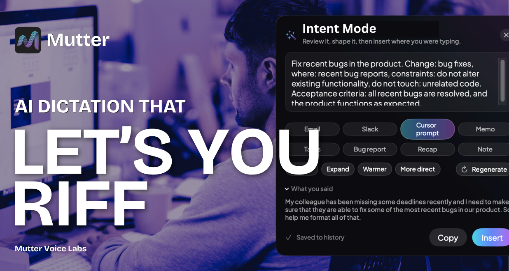
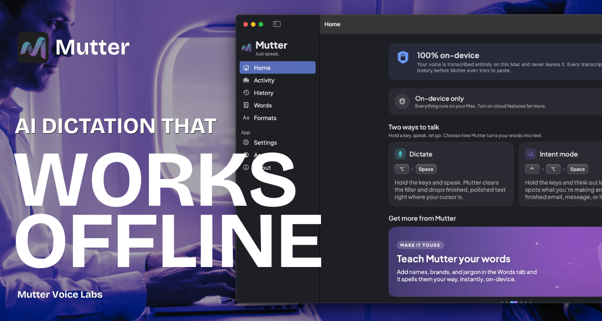
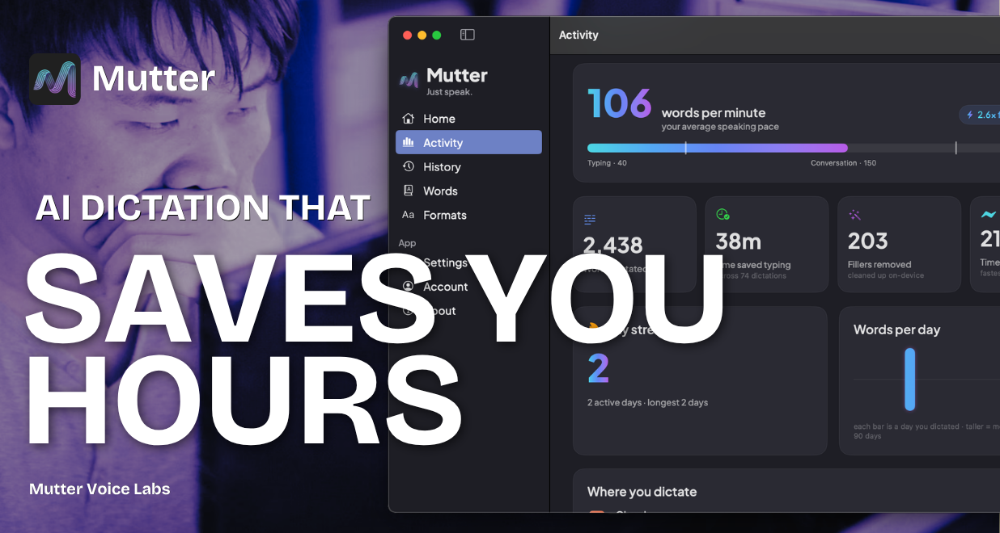

---

## 17. [Narration Room](https://www.producthunt.com/products/narration-room)
**Votes**: 78 | **도입 난이도**: 하 | **신뢰도**: 상
**Tagline**: Turn source text into editable multi-voice scripts
**서비스 링크**: https://www.producthunt.com/r/E2XGH7YXKZDAJE

**태그**: ContentCreation, AI, Productivity, macOS, AudioTool, AI Tool

### 📌 이 서비스 한눈에 보기
단순 TTS를 넘어 텍스트를 편집 가능한 멀티 보이스 스크립트로 변환하는 맥 전용 오디오 제작 도구

### 🔑 주요 기능
- 텍스트를 편집 가능한 멀티 보이스 스크립트로 변환하는 워크플로우
- 40개 이상의 온디바이스 보이스와 시각적 타임라인 기반의 정교한 편집
- PDF, Word, Markdown 등 다양한 문서 포맷 지원 및 오프라인 로컬 작업 가능

### 🙋 사용자에게 어떤 점이 좋은가
콘텐츠 제작자가 텍스트를 입력하면 자동으로 대본을 구성하고, 목소리 배정 및 타이밍 조절을 통해 완성도 높은 오디오 결과물을 빠르게 추출할 수 있습니다.

### ✅ 지금 바로 써볼 기능
- 문서 파일(PDF/Word)을 불러와 스크립트 자동 생성 기능 테스트
- 타임라인을 활용한 보이스 배정 및 전달 방식(delivery) 조정
- 오프라인 환경에서의 로컬 보이스 구동 확인

### ⚠️ 사용 전 확인할 점
- macOS 전용 네이티브 앱이므로 다른 OS 사용자는 사용 불가
- 로컬 기반이므로 하드웨어 사양에 따른 성능 차이가 있을 수 있음

### 🧭 확인이 더 필요한 정보
제공되는 40여 개의 보이스가 한국어를 완벽하게 지원하는지 확인이 필요합니다.

### 📸 스크린샷 및 갤러리
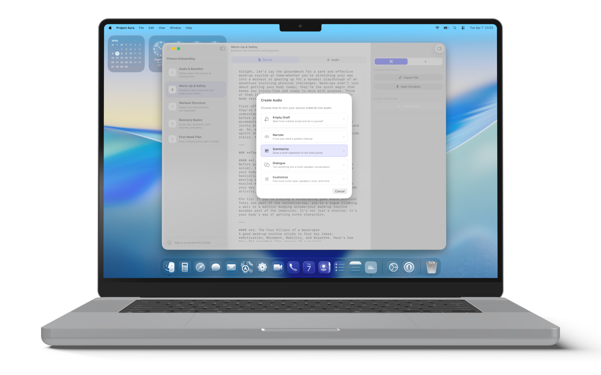
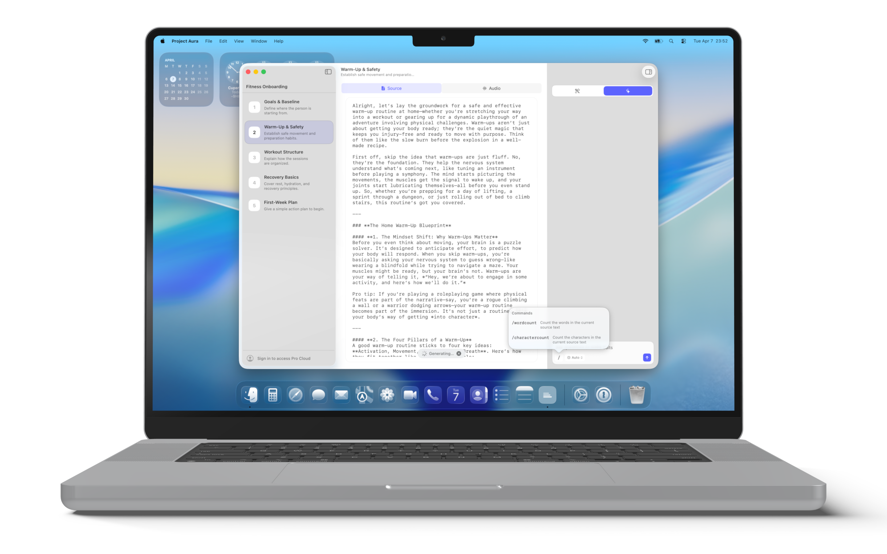
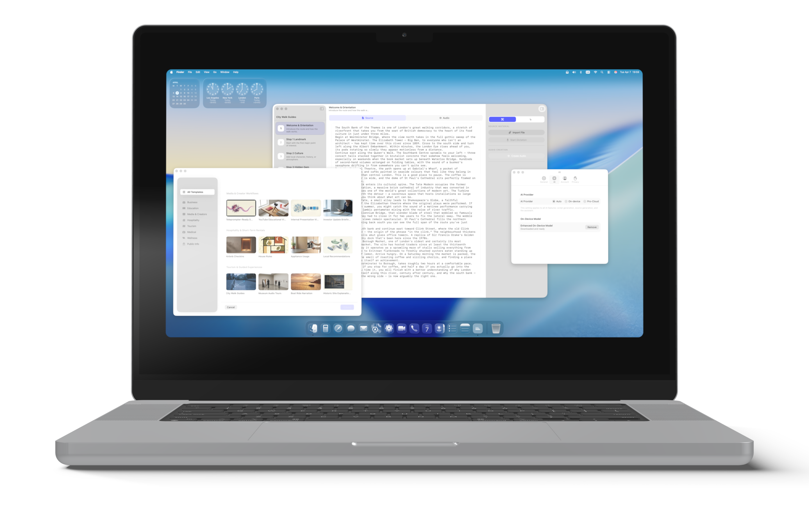

### 🎬 관련 영상
- [🎥 영상 보기](https://ph-files.imgix.net/4962510a-8c7e-4637-bcad-c76289325f7a.jpeg?auto=format)

---

## 18. [Portia](https://www.producthunt.com/products/portia-2)
**Votes**: 76 | **도입 난이도**: 하 | **신뢰도**: 상
**Tagline**: The ultimate 1-click hunter for blocked macOS ports
**서비스 링크**: https://www.producthunt.com/r/I2IG3PTJZNHJNJ

**태그**: DevTool, macOS, Productivity

### 📌 이 서비스 한눈에 보기
macOS에서 포트 점유 프로세스를 즉시 찾아 해결하는 원클릭 유틸리티

### 🔑 주요 기능
- 포트를 점유 중인 프로세스를 즉각 식별
- 리소스 소모가 없는 제로 아이들(Zero idle) CPU 설계
- 별도의 쉘 플러그인이 필요 없는 네이티브 macOS 앱

### 🙋 사용자에게 어떤 점이 좋은가
개발 중 포트 충돌로 인해 서버 실행이 막힐 때, 복잡한 터미널 명령어 없이 클릭 한 번으로 문제를 해결할 수 있습니다.

### ✅ 지금 바로 써볼 기능
- 포트 충돌 발생 시 즉시 실행
- 점유 중인 프로세스 식별 기능 테스트
- 네이티브 환경에서의 리소스 사용량 확인

### ⚠️ 사용 전 확인할 점
- 프로세스 종료 시 시스템 필수 프로세스인지 확인 필요
- macOS 전용 도구이므로 타 OS 사용 불가

### 🧭 확인이 더 필요한 정보
프로세스 강제 종료 기능의 자동화 범위와 권한 요구 사항에 대한 상세 정보가 필요합니다.

### 📸 스크린샷 및 갤러리
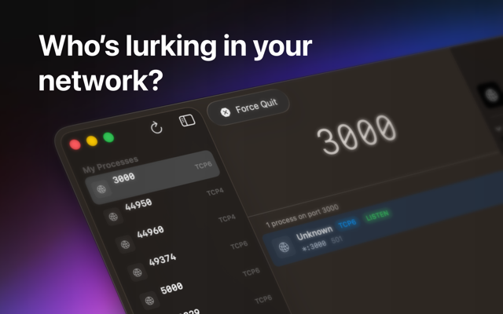
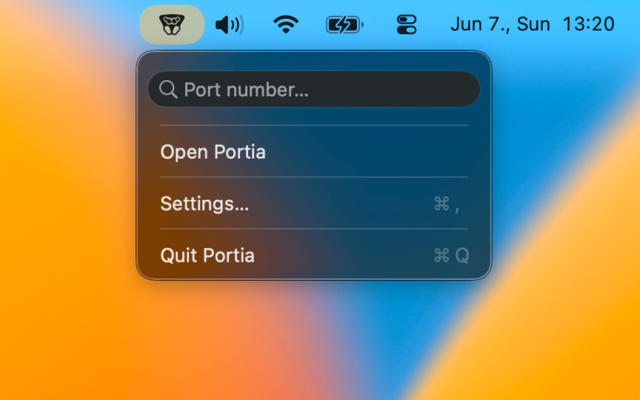
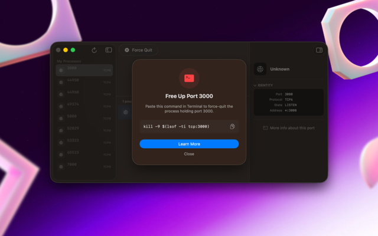

### 🎬 관련 영상
- [🎥 영상 보기](https://ph-files.imgix.net/302ffe0b-17e7-4631-b4a8-e275ee745177.jpeg?auto=format)

---

## 19. [Prism](https://www.producthunt.com/products/prism-28)
**Votes**: 74 | **도입 난이도**: 하 | **신뢰도**: 상
**Tagline**: Al Companion for macOS
**서비스 링크**: https://www.producthunt.com/r/GNAHQVTF4YJAVE

**태그**: Productivity, macOS, AI-Assistant, Automation, Education, AI Tool, Chat

### 📌 이 서비스 한눈에 보기
macOS 환경에 최적화된 올인원 AI 워크스페이스

### 🔑 주요 기능
- 다양한 AI 모델을 지원하는 네이티브 macOS 워크스페이스
- 브라우저 자동화, 시스템 전역 글쓰기, 파일 생성 등 강력한 생산성 도구
- 학습용 퀴즈 및 플래시카드, MCP 레지스트리 등 특화 기능 제공

### 🙋 사용자에게 어떤 점이 좋은가
macOS 사용자에게 별도의 브라우저 창을 오가는 번거로움 없이 시스템 전반에서 AI를 활용할 수 있는 통합 환경을 제공합니다.

### ✅ 지금 바로 써볼 기능
- 시스템 전역 글쓰기 기능으로 작업 흐름 통합하기
- 학습 도구(퀴즈/플래시카드)를 활용한 스터디 모드 경험하기
- 브라우저 자동화 기능을 통한 반복 작업 테스트하기

### ⚠️ 사용 전 확인할 점
- macOS 전용 앱이므로 타 운영체제 사용자는 활용 불가
- 다양한 기능이 통합되어 있어 초기 설정 및 학습 곡선이 존재할 수 있음

### 🧭 확인이 더 필요한 정보
로컬 우선 방식이 구체적으로 어느 정도 범위의 데이터 보안을 보장하는지 확인이 필요합니다.

### 📸 스크린샷 및 갤러리

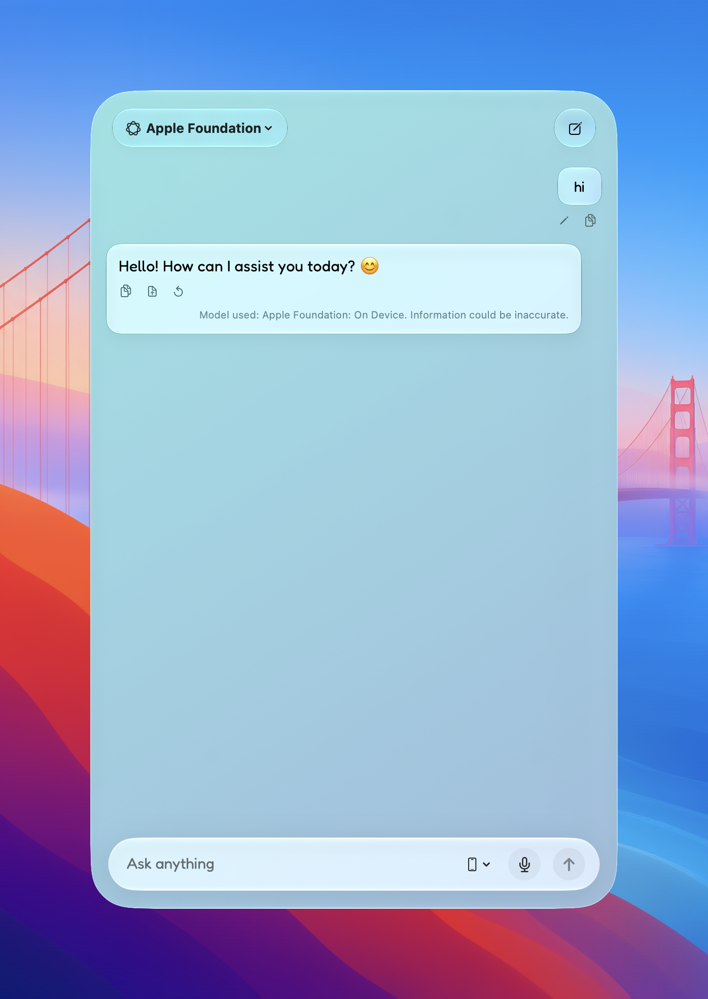

### 🎬 관련 영상
- [🎥 영상 보기](https://ph-files.imgix.net/552116df-d283-4ff9-a849-a1bd8d21e6a0.jpeg?auto=format)

---

## 20. [Pitchbar](https://www.producthunt.com/products/pitchbar)
**Votes**: 73 | **도입 난이도**: 하 | **신뢰도**: 상
**Tagline**: Track World Cup 2026 scores from your macOS menubar
**서비스 링크**: https://www.producthunt.com/r/QGFP6DFY3JLK2R

**태그**: macOS, Sports, Utility

### 📌 이 서비스 한눈에 보기
macOS 메뉴바에서 실시간으로 2026 월드컵 스코어를 확인할 수 있는 가벼운 앱

### 🔑 주요 기능
- macOS 메뉴바를 활용한 실시간 스코어 트래킹
- 진행 중인 경기 및 경기 전 정보 섹션 커스텀 가능
- 가볍고 무료로 제공되는 경량 애플리케이션

### 🙋 사용자에게 어떤 점이 좋은가
별도의 브라우저 창을 열지 않고도 메뉴바에서 즉시 경기 상황을 확인할 수 있어 업무나 작업 흐름을 방해받지 않습니다.

### ✅ 지금 바로 써볼 기능
- 메뉴바 섹션 커스텀 설정하기
- 실시간 스코어 알림 확인하기
- 경기 전 정보 섹션 활성화하기

### ⚠️ 사용 전 확인할 점
- macOS 전용 앱이므로 다른 OS에서는 사용 불가
- 실시간 데이터 업데이트를 위한 네트워크 연결 필요

### 🧭 확인이 더 필요한 정보
상세한 커스텀 옵션의 범위와 데이터 업데이트 주기에 대한 구체적인 정보가 부족합니다.

### 📸 스크린샷 및 갤러리
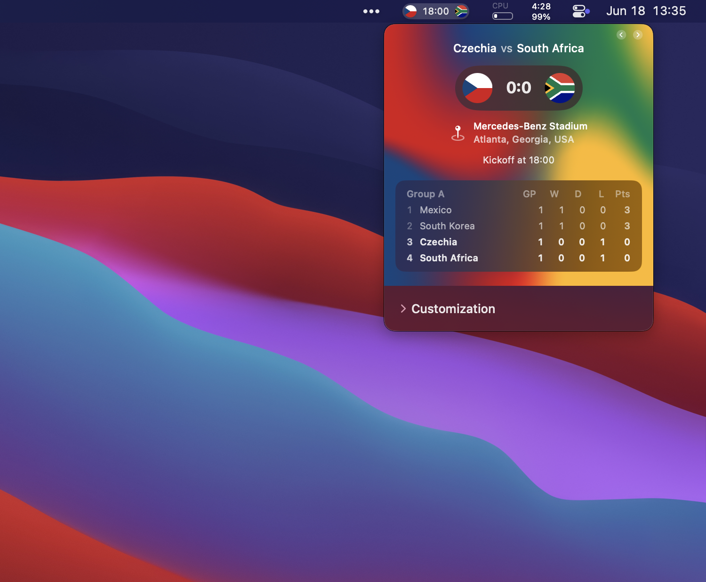
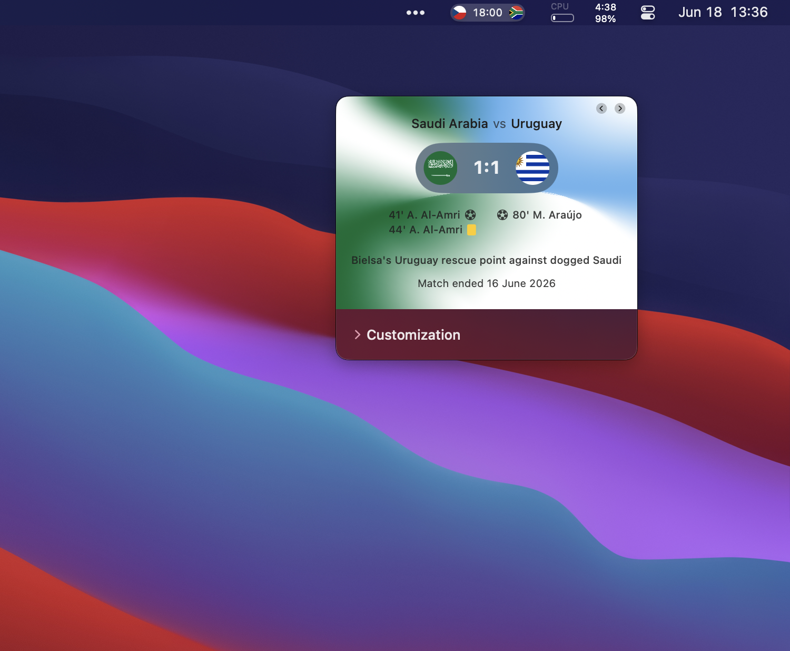
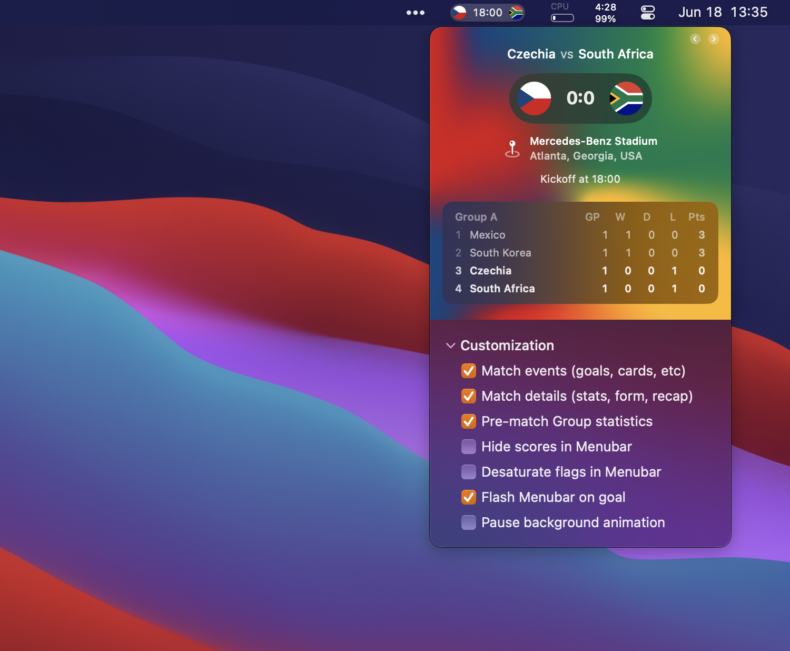

### 🎬 관련 영상
- [🎥 영상 보기](https://ph-files.imgix.net/0abfc8b4-cc57-47e8-ad89-c3b68d9dccd9.jpeg?auto=format)

---

## 21. [Upsolve AI](https://www.producthunt.com/products/upsolve-ai)
**Votes**: 72 | **도입 난이도**: 중 | **신뢰도**: 상
**Tagline**: Build grounded, governed, trustworthy data agents
**서비스 링크**: https://www.producthunt.com/r/2FSGN5X6IIEG7R

**태그**: AI, DataAnalytics, AgenticAI, DevTool, Governance, Agent, AI Tool, Analytics

### 📌 이 서비스 한눈에 보기
신뢰할 수 있는 데이터 분석을 위한 거버넌스 기반 AI 에이전트 구축 플랫폼

### 🔑 주요 기능
- 근거 중심(Grounded)의 데이터 에이전트 구축 및 배포
- 데이터 분석을 위한 전용 컨텍스트 레이어(Agent Context Studio) 제공
- 에이전트의 신뢰성과 거버넌스를 위한 평가 기능 탑재

### 🙋 사용자에게 어떤 점이 좋은가
데이터 기반의 AI 에이전트를 만들 때 발생할 수 있는 환각 현상을 방지하고, 기업 환경에 맞는 통제 가능한 분석 자동화를 구현할 수 있습니다.

### ✅ 지금 바로 써볼 기능
- Agent Context Studio를 통한 컨텍스트 설정 테스트
- 에이전트의 답변 정확도 및 거버넌스 기능 확인
- 데이터 에이전트 배포 및 평가 워크플로우 실습

### ⚠️ 사용 전 확인할 점
- 데이터 에이전트 구축을 위한 기초적인 데이터 엔지니어링 지식 필요
- 플랫폼 내 데이터 보안 및 거버넌스 설정 방식 확인 필요

### 🧭 확인이 더 필요한 정보
구체적인 데이터 소스 연동 범위와 기술적 요구 사양에 대한 정보가 부족합니다.

### 📸 스크린샷 및 갤러리
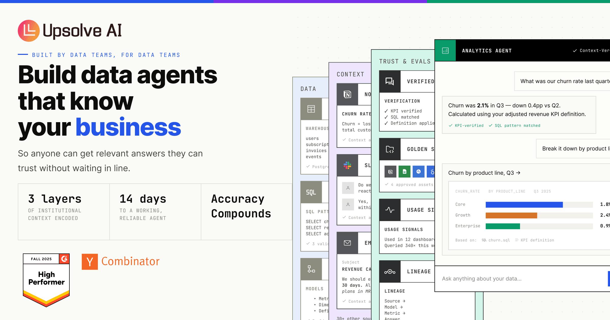
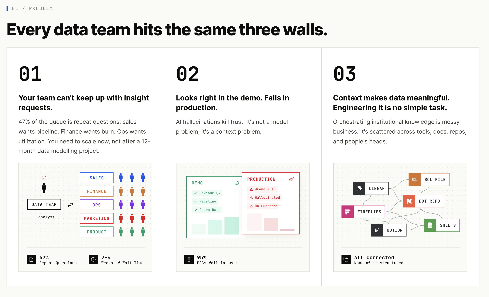
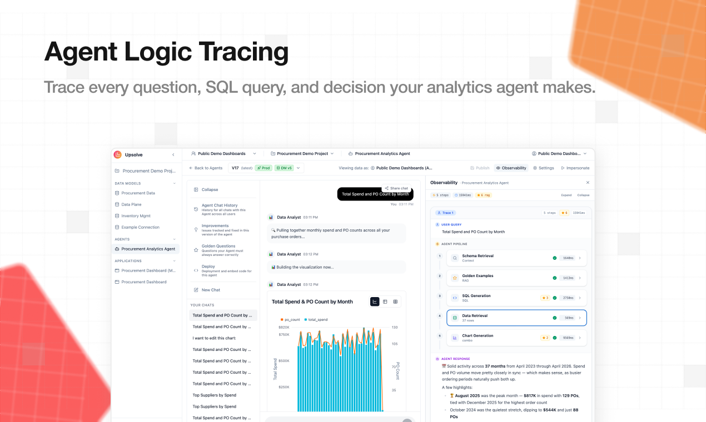

### 🎬 관련 영상
- [🎥 영상 보기](https://ph-files.imgix.net/3838f8f6-ef7c-4084-a220-e43a19bf6909.jpeg?auto=format)

---

## 22. [Snap Deck HQ](https://www.producthunt.com/products/snap-deck-hq)
**Votes**: 67 | **도입 난이도**: 하 | **신뢰도**: 상
**Tagline**: Everything you need in one native macOS command bar
**서비스 링크**: https://www.producthunt.com/r/YKPO2RVI7H4EH4

**태그**: Productivity, macOS, Automation, AI Tool, Vision, DevTool

### 📌 이 서비스 한눈에 보기
macOS 환경에서 마우스 없이 모든 작업을 처리하는 지능형 올인원 커맨드 팔레트

### 🔑 주요 기능
- 단축키(⌃⌥Space) 기반의 네이티브 macOS 커맨드 바
- 클립보드 관리, AI 텍스트 도구, 파일/이미지 편집 기능 통합
- 100% 로컬 온디바이스 처리를 통한 강력한 개인정보 보호

### 🙋 사용자에게 어떤 점이 좋은가
여러 앱을 오가는 번거로움 없이 하나의 인터페이스에서 파일 관리부터 AI 작업까지 해결하여 작업 흐름을 끊김 없이 유지할 수 있습니다.

### ✅ 지금 바로 써볼 기능
- 스마트 클립보드로 과거 복사 기록 검색 및 활용하기
- AI 텍스트 도구로 텍스트 요약 및 코드 포맷팅 시도하기
- 이미지 리사이즈 및 OCR 기능을 통한 파일 작업 자동화하기

### ⚠️ 사용 전 확인할 점
- 네이티브 앱이므로 macOS 버전 호환성 확인 필요
- 로컬 처리 방식이므로 복잡한 AI 작업 시 시스템 리소스 사용량 체크 필요

### 🧭 확인이 더 필요한 정보
구체적인 시스템 요구 사양 및 AI 모델의 성능 수준은 명시되어 있지 않습니다.

### 📸 스크린샷 및 갤러리
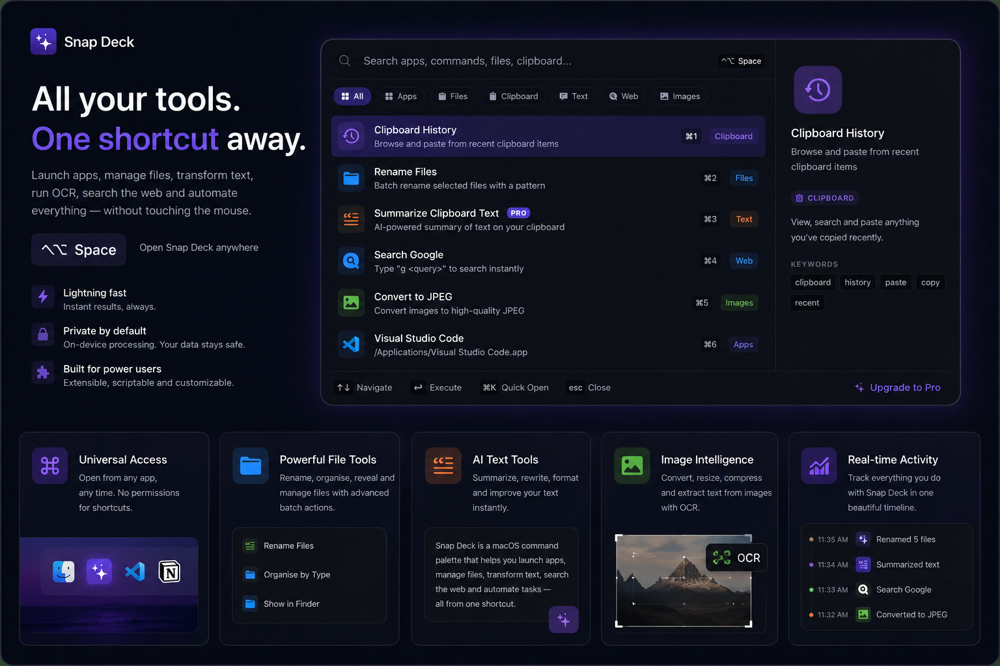
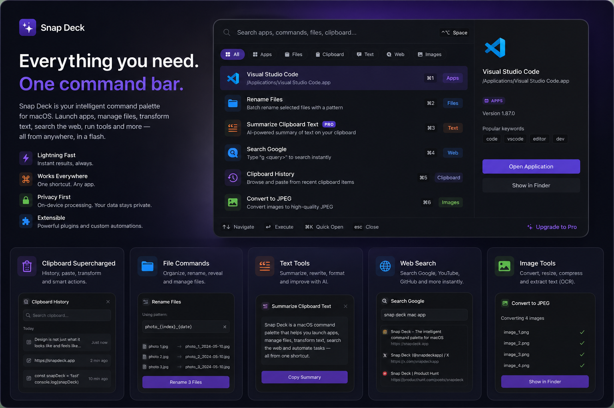
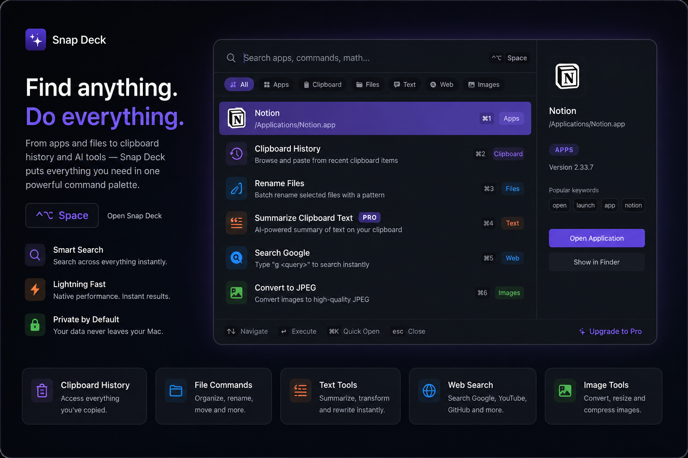

---

## 23. [Linking Your AI](https://www.producthunt.com/products/linking-your-ai)
**Votes**: 51 | **도입 난이도**: 중 | **신뢰도**: 상
**Tagline**: Your Al Assistant: On your computer, with your notes.
**서비스 링크**: https://www.producthunt.com/r/2QRKFRMMKI3CQZ

**태그**: AI Assistant, Personal Knowledge Management, Automation, Privacy, AI Tool

### 📌 이 서비스 한눈에 보기
개인 메모를 기반으로 작동하는 프라이빗 AI 어시스턴트 시스템

### 🔑 주요 기능
- 사용자의 개인 메모를 활용하여 맞춤형 답변 제공
- 설치 즉시 사용 가능한 23가지 스킬과 8가지 자동화 시스템 제공
- 사용자 필요에 따라 시스템을 직접 커스텀 및 재구성 가능

### 🙋 사용자에게 어떤 점이 좋은가
특정 AI 도구에 종속되지 않고 자신의 데이터를 소유하며, 개인화된 자동화 워크플로우를 구축할 수 있습니다.

### ✅ 지금 바로 써볼 기능
- 가이드에 따라 초기 설정 진행하기
- 기본 제공되는 23가지 스킬 테스트하기
- 데일리 브리프 자동화 시스템 적용하기

### ⚠️ 사용 전 확인할 점
- 개인 메모를 활용하므로 데이터 보안 및 프라이버시 설정 확인 필요
- 사용자 맞춤형 설정 과정에서 초기 학습 곡선이 존재할 수 있음

### 🧭 확인이 더 필요한 정보
로컬 설치형인지 클라우드 기반인지에 따른 구체적인 데이터 처리 방식 확인이 필요합니다.

### 📸 스크린샷 및 갤러리
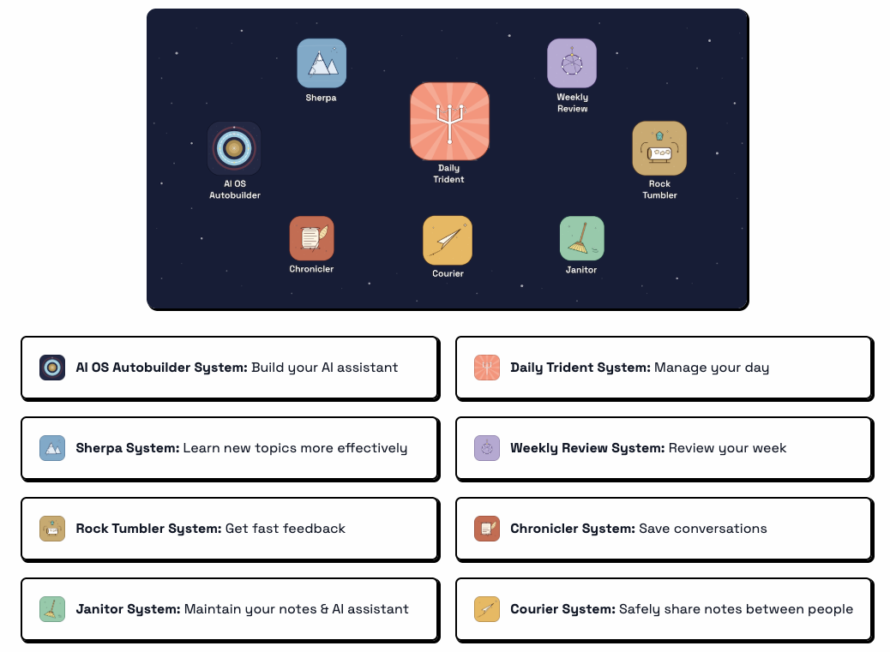
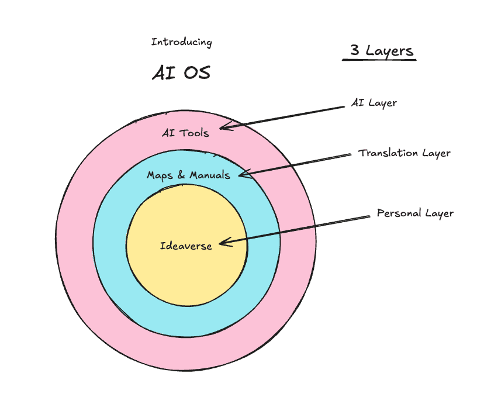
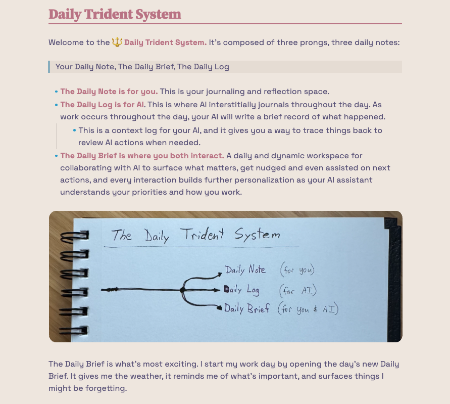

### 🎬 관련 영상
- [🎥 영상 보기](https://ph-files.imgix.net/552a5a75-603b-4d25-b02e-411b103bbeab.jpeg?auto=format)

---

## 24. [Capsule](https://www.producthunt.com/products/capsule-15)
**Votes**: 51 | **도입 난이도**: 하 | **신뢰도**: 상
**Tagline**: Keep the best memories before they fade
**서비스 링크**: https://www.producthunt.com/r/5DFOARVMDS6TZZ

**태그**: Memory, AI, Storytelling, Family, AI Tool, Video

### 📌 이 서비스 한눈에 보기
단순한 사진 저장을 넘어 소중한 순간의 목소리와 이야기를 담아내는 디지털 메모리 캡슐

### 🔑 주요 기능
- 사진과 영상에 목소리를 입혀 생생한 스토리텔링 가능
- AI를 활용한 코믹 스트립 생성 및 맞춤형 음악 제작 기능
- 단순한 데이터 저장이 아닌 감정과 기억 중심의 큐레이션

### 🙋 사용자에게 어떤 점이 좋은가
단순히 쌓여가는 사진 덤프에서 벗어나, 가족의 목소리나 특별한 순간의 맥락을 영구적으로 보존할 수 있습니다.

### ✅ 지금 바로 써볼 기능
- 가장 소중한 사진에 직접 목소리 녹음해보기
- AI 기능을 활용해 추억을 코믹 스트립으로 변환하기
- 가족과 함께 공유할 수 있는 디지털 스토리 만들기

### ⚠️ 사용 전 확인할 점
- AI 생성 콘텐츠의 품질이 사용자의 기대와 다를 수 있음
- 데이터 저장 용량 및 공유 방식에 대한 구체적 정책 확인 필요

### 🧭 확인이 더 필요한 정보
AI 기능의 구체적인 생성 범위와 데이터 보안/프라이버시 정책에 대한 정보가 더 필요합니다.

### 📸 스크린샷 및 갤러리

### 🎬 관련 영상
- [🎥 영상 보기](https://ph-files.imgix.net/67c791cb-9204-400f-a74e-c1803f428972.jpeg?auto=format)

---

## 25. [Thetis](https://www.producthunt.com/products/thetis)
**Votes**: 23 | **도입 난이도**: 중 | **신뢰도**: 상
**Tagline**: Tax residency tracking for global individuals
**서비스 링크**: https://www.producthunt.com/r/ST6FGRHQQR433Z

**태그**: TaxTech, DigitalNomad, FinTech, Automation

### 📌 이 서비스 한눈에 보기
전 세계를 이동하는 디지털 노마드를 위한 자동 세무 거주지 관리 및 신고 서비스

### 🔑 주요 기능
- 국가별 체류 일수 및 세무 거주지 임계값 자동 추적
- 세금 최적화를 위한 전략적 인사이트 제공
- 세금 납부 의무가 있는 국가에 대한 간편한 신고 지원

### 🙋 사용자에게 어떤 점이 좋은가
여러 국가를 이동하며 생활할 때 발생할 수 있는 복잡한 세금 문제를 자동화하여, 의도치 않은 세금 부과를 방지하고 절세 기회를 찾아줍니다.

### ✅ 지금 바로 써볼 기능
- 현재 체류 중인 국가의 거주자 기준 확인
- 누적 체류 일수 트래킹 설정
- 세금 최적화 제안 검토

### ⚠️ 사용 전 확인할 점
- 국가별로 상이한 복잡한 세법이 완벽히 반영되는지 확인 필요
- 실제 세금 신고 시 법적 책임은 사용자에게 있음

### 🧭 확인이 더 필요한 정보
구체적인 국가별 지원 범위와 실제 세무 대행의 법적 효력 범위에 대한 확인이 필요합니다.

### 📸 스크린샷 및 갤러리

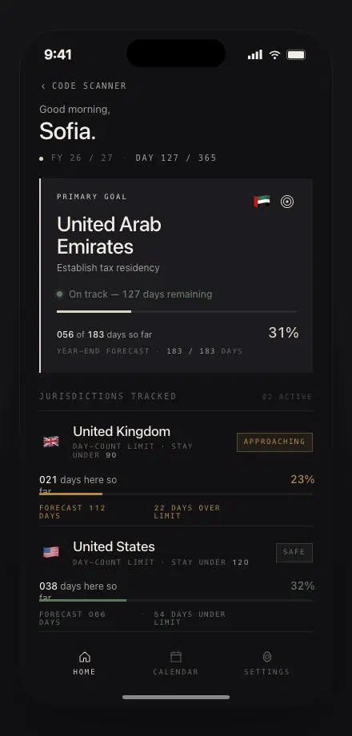

---

## 26. [invoicemon](https://www.producthunt.com/products/invoicemon)
**Votes**: 19 | **도입 난이도**: 하 | **신뢰도**: 상
**Tagline**: A complete invoicing workflow in your browser
**서비스 링크**: https://www.producthunt.com/r/EYZNNQT7DYLFAG

**태그**: Productivity, Freelance, Privacy, SaaS, Automation, AI Tool, Design, Email

### 📌 이 서비스 한눈에 보기
계정 생성 없이 브라우저에서 즉시 시작하는 프라이빗 인보이스 관리 도구

### 🔑 주요 기능
- 로컬 퍼스트 방식의 데이터 보안 및 개인정보 보호
- 계정 생성 없이 브라우저 내에서 인보이스 생성 및 PDF 저장 가능
- 비즈니스 라이선스 제공 시 클라우드 동기화 및 AI 이메일 초안 기능 지원

### 🙋 사용자에게 어떤 점이 좋은가
프리랜서나 소규모 사업자가 복잡한 가입 절차 없이 빠르고 안전하게 송장을 관리할 수 있습니다.

### ✅ 지금 바로 써볼 기능
- 브라우저에서 즉시 인보이스 생성해보기
- 생성된 PDF 파일 로컬 저장 테스트
- 비즈니스 기능(클라우드 동기화 등) 필요성 검토

### ⚠️ 사용 전 확인할 점
- 기본 모드에서는 데이터가 기기에만 저장되므로 기기 분실 시 데이터 유실 위험이 있음
- 멀티 디바이스 사용 및 클라우드 백업을 위해서는 유료 라이선스가 필요함

### 🧭 확인이 더 필요한 정보
무료 버전과 비즈니스 라이선스 간의 구체적인 기능 차이와 가격 정책 확인이 필요합니다.

### 📸 스크린샷 및 갤러리
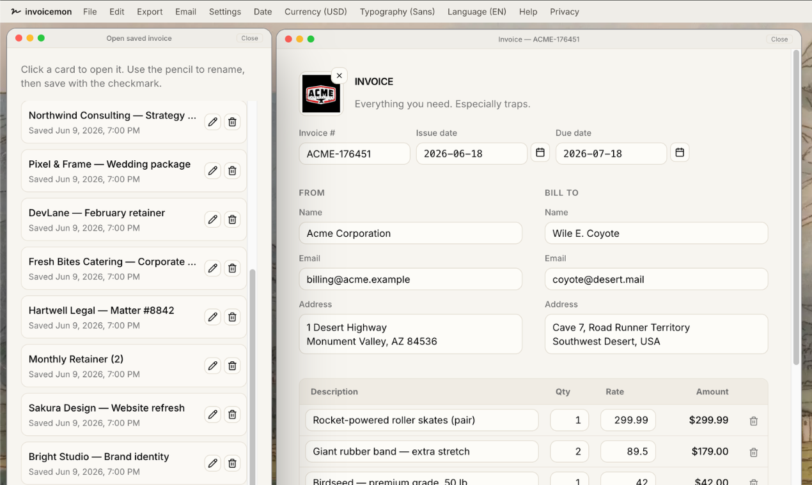
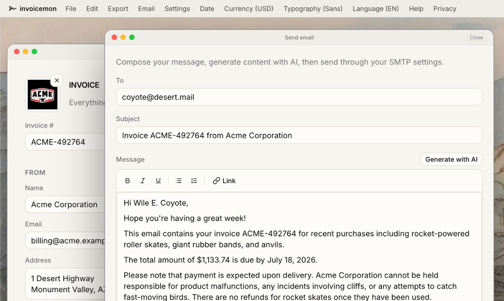
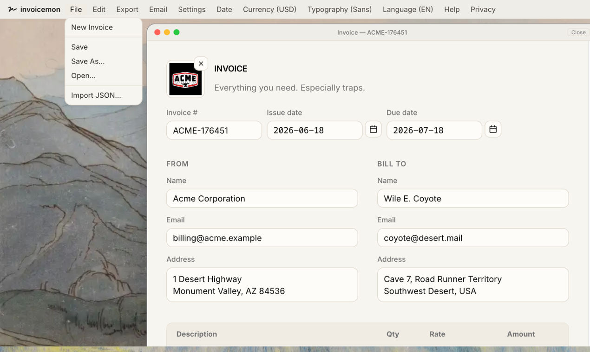

### 🎬 관련 영상
- [🎥 영상 보기](https://ph-files.imgix.net/63a09ef3-dbc6-4940-b15a-e652d7cb7c5f.jpeg?auto=format)

---

## 27. [FastCoach](https://www.producthunt.com/products/fastcoach)
**Votes**: 18 | **도입 난이도**: 중 | **신뢰도**: 상
**Tagline**: Turn any YouTuber into your personal digital mentor
**서비스 링크**: https://www.producthunt.com/r/ATFTRZ56MABCNE

**태그**: AI, Productivity, Education, ContentCuration, AI Tool, Video, API

### 📌 이 서비스 한눈에 보기
좋아하는 유튜버의 영상을 기반으로 맞춤형 답변을 제공하는 개인용 디지털 멘토 서비스

### 🔑 주요 기능
- 긴 영상 시청 없이 질문을 통해 핵심 답변 추출
- 좋아하는 코치의 영상 콘텐츠를 지식 베이스로 활용
- 1회 결제 및 개인 API 키 사용 방식의 경제적 모델

### 🙋 사용자에게 어떤 점이 좋은가
긴 팟캐스트나 영상을 처음부터 끝까지 볼 필요 없이, 필요한 정보만 즉시 찾아 학습 시간을 획기적으로 단축할 수 있습니다.

### ✅ 지금 바로 써볼 기능
- 자주 보는 유튜버의 영상 링크 입력하기
- 구체적인 질문을 던져 답변 정확도 테스트하기
- 개인 API 키 설정 및 연동하기

### ⚠️ 사용 전 확인할 점
- 사용자의 개인 API 키를 직접 등록해야 하는 설정 과정 필요
- 영상 콘텐츠의 내용에 따라 답변의 질이 결정됨

### 🧭 확인이 더 필요한 정보
사용자가 직접 API 키를 가져와야 하므로, 지원하는 모델 종류와 구체적인 비용 구조 확인이 필요합니다.

### 📸 스크린샷 및 갤러리
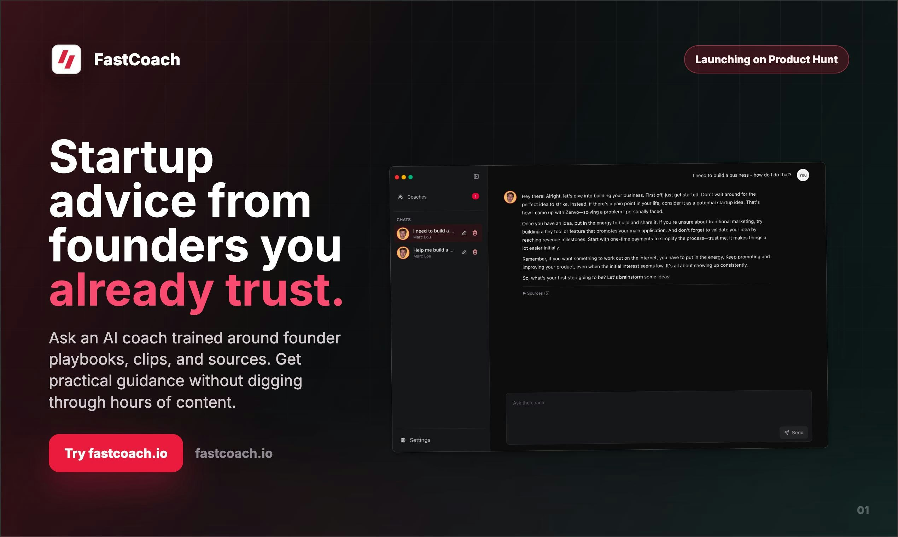
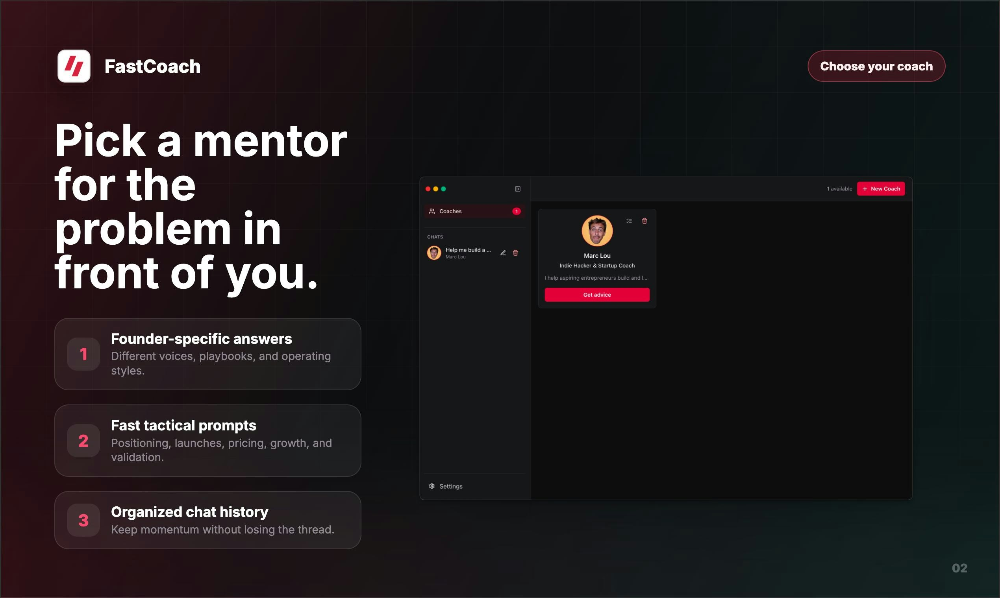
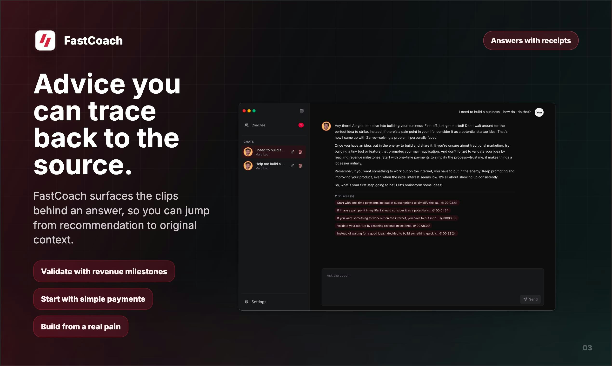

### 🎬 관련 영상
- [🎥 영상 보기](https://ph-files.imgix.net/d0978bd7-5e4b-44a7-93b8-68908d97eb86.jpeg?auto=format)

---

## 28. [Bekon](https://www.producthunt.com/products/bekon)
**Votes**: 12 | **도입 난이도**: 중 | **신뢰도**: 상
**Tagline**: The execution layer for AI visibility
**서비스 링크**: https://www.producthunt.com/r/VRE5YMKSYFR7G3

**태그**: AI-SEO, Marketing-Automation, Analytics, Content-Ops, AI Tool, Chat, Prompting

### 📌 이 서비스 한눈에 보기
AI 모델 답변 내 브랜드 노출도를 분석하고 즉각적인 콘텐츠 수정 및 배포까지 지원하는 실행형 솔루션

### 🔑 주요 기능
- ChatGPT, Gemini, Claude 등 주요 AI 모델에서의 브랜드 노출도 추적
- 실제 고객 질문 기반의 경쟁사 벤치마킹 및 문제 원인 진단
- 문제 해결을 위한 콘텐츠 생성 및 Cloudflare 등을 통한 원클릭 배포

### 🙋 사용자에게 어떤 점이 좋은가
단순한 리포트 확인을 넘어, AI 검색 결과에서 브랜드가 누락되는 문제를 자동으로 해결하고 실질적인 노출을 개선할 수 있습니다.

### ✅ 지금 바로 써볼 기능
- 주요 AI 모델별 브랜드 노출 현황 모니터링
- 경쟁사 대비 브랜드 노출 격차 분석
- 진단된 문제에 대한 자동 생성 콘텐츠 배포

### ⚠️ 사용 전 확인할 점
- 자동 배포 기능 사용 시 브랜드 톤앤매너 일치 여부 확인 필요
- Cloudflare 등 외부 통합 서비스 설정 및 권한 관리 필요

### 🧭 확인이 더 필요한 정보
자동 생성된 콘텐츠의 품질과 배포 시 발생할 수 있는 사이트 영향도에 대한 구체적인 검증이 필요합니다.

### 📸 스크린샷 및 갤러리
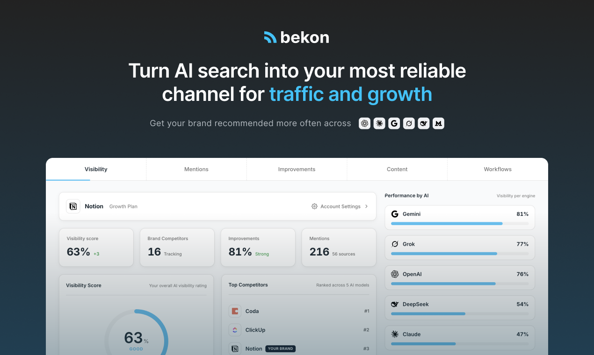
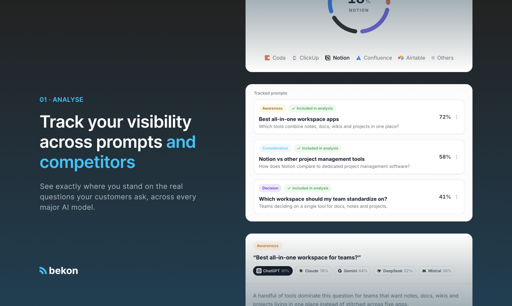
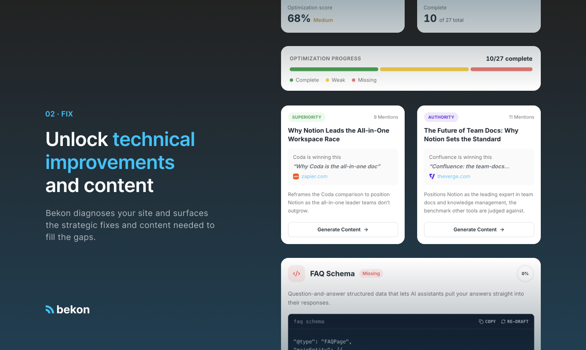

### 🎬 관련 영상
- [🎥 영상 보기](https://ph-files.imgix.net/544e9783-3a4d-41eb-8a8a-6b7bd1d4151b.octet-stream?auto=format)

---

## 29. [GLM-5.2](https://www.producthunt.com/products/z-ai)
**Votes**: 12 | **도입 난이도**: 하 | **신뢰도**: 상
**Tagline**: Built for Long-Horizon Tasks
**서비스 링크**: https://www.producthunt.com/r/GLOGYCOETWNRTX

**태그**: AI, LLM, Productivity

### 📌 이 서비스 한눈에 보기
100만 토큰 컨텍스트를 지원하는 장기 작업 특화 플래그십 모델

### 🔑 주요 기능
- 장기 작업(Long-Horizon Tasks) 수행 능력의 획기적 향상
- 최대 100만 토큰의 대규모 컨텍스트 윈도우 제공
- 이전 모델(GLM-5.1) 대비 성능 대폭 개선

### 🙋 사용자에게 어떤 점이 좋은가
방대한 양의 문서나 긴 대화 기록을 한 번에 처리해야 하는 복잡한 작업에서 탁월한 성능을 발휘합니다.

### ✅ 지금 바로 써볼 기능
- 대규모 문서 데이터 입력 및 분석
- 긴 맥락 유지가 필요한 복잡한 워크플로우 테스트
- 기존 GLM-5.1 모델과의 성능 비교

### ⚠️ 사용 전 확인할 점
- 100만 토큰 사용 시 발생할 수 있는 비용 및 처리 속도 확인 필요
- 모델의 구체적인 추론 성능 및 정확도 검증 필요

### 🧭 확인이 더 필요한 정보
구체적인 API 비용 체계와 실제 처리 속도(Latency)에 대한 정보가 명시되지 않았습니다.

### 📸 스크린샷 및 갤러리
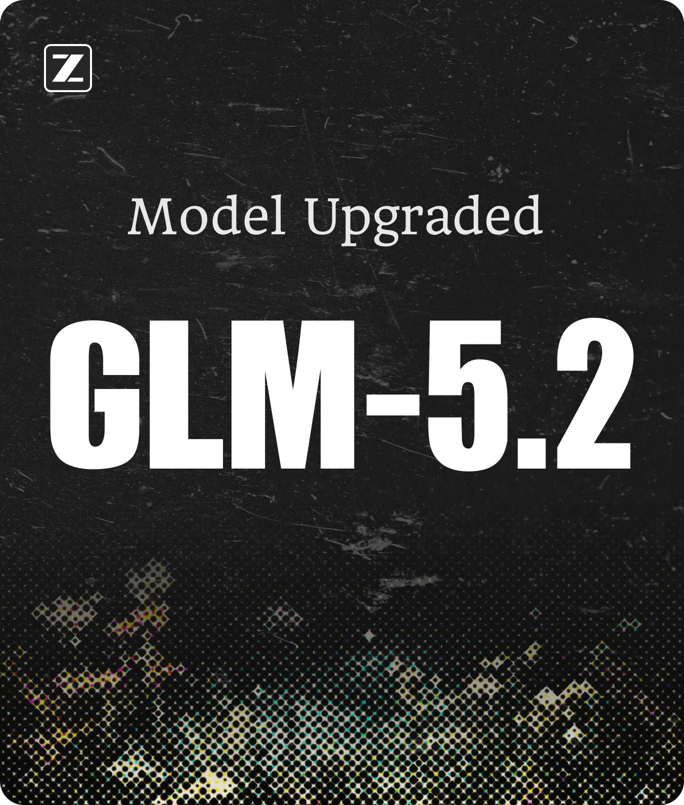
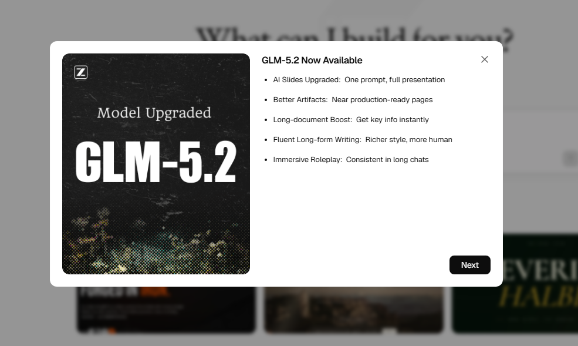
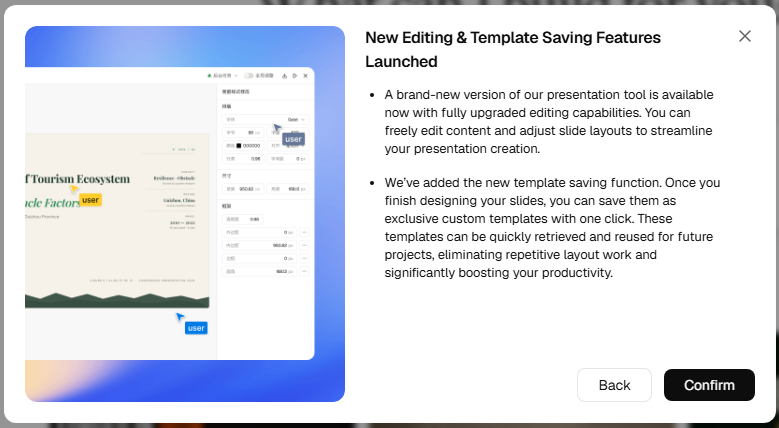

---

## 30. [DearFile](https://www.producthunt.com/products/dearfile)
**Votes**: 10 | **도입 난이도**: 하 | **신뢰도**: 상
**Tagline**:  I hope you never need it.
**서비스 링크**: https://www.producthunt.com/r/CNLAOYID6SPIKP

**태그**: PersonalCare, Privacy, Legacy, DigitalOrganization, AI Tool, Email

### 📌 이 서비스 한눈에 보기
가족을 위해 중요한 정보와 마지막 메시지를 안전하게 남겨두는 디지털 유언장 및 정보 지도

### 🔑 주요 기능
- 계정 정보나 비밀번호 대신, 가족이 찾아야 할 위치와 연락처를 안내하는 '지도' 역할
- 갑작스러운 상황 발생 시 가족이 겪는 혼란을 방지하기 위한 목적
- 복잡한 절차 없이 오후 한 시간 내에 완료할 수 있는 단순함

### 🙋 사용자에게 어떤 점이 좋은가
예기치 못한 상황에서 가족들이 중요한 기록이나 연락처를 찾는 수고를 덜어주며, 소중한 사람들에게 남길 메시지를 미리 정리할 수 있습니다.

### ✅ 지금 바로 써볼 기능
- 가족에게 꼭 알려줘야 할 중요한 정보(위치, 연락처 등) 정리하기
- 사랑하는 이들에게 남길 짧은 메시지 작성하기
- 정보가 안전하게 보관되는지 프라이버시 정책 확인하기

### ⚠️ 사용 전 확인할 점
- 비밀번호나 직접적인 자산 정보가 아닌 '안내' 중심이므로 실제 자산 접근 시 추가 단계가 필요할 수 있음
- 사후에 이 정보가 어떻게 가족에게 전달되는지에 대한 메커니즘 확인 필요

### 🧭 확인이 더 필요한 정보
정보가 사후에 어떤 방식으로 지정된 가족에게 안전하게 전달되는지에 대한 구체적인 기술적 방식이 명시되지 않았습니다.

### 📸 스크린샷 및 갤러리
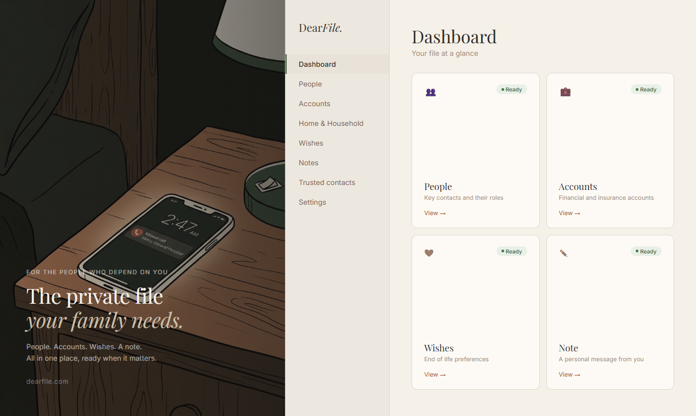
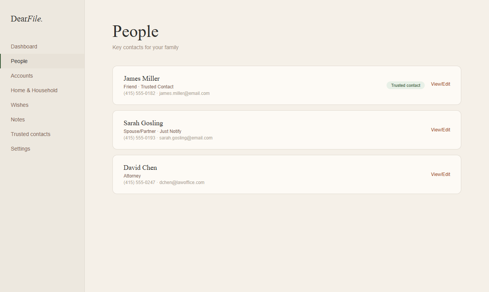
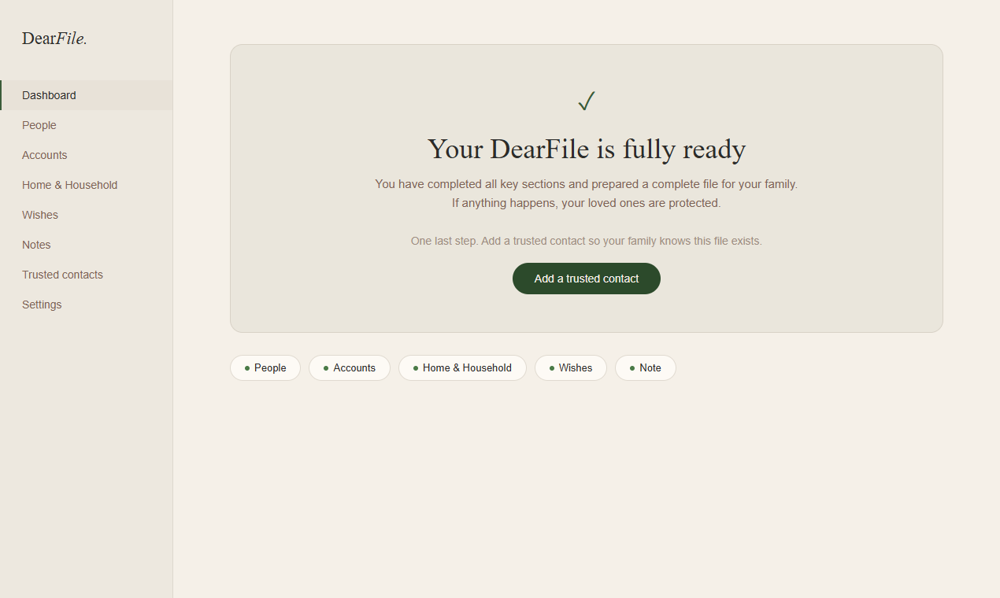

---

