# 🚀 Product Hunt Daily Top 30 (2026-06-21)

## 오늘의 요약
오늘의 트렌드는 단순한 AI 비서를 넘어 팀의 워크플로우에 직접 참여하는 'AI 에이전트'와 '협업 자동화'가 주를 이루었습니다. 또한 AI 에이전트의 맥락 유지를 위한 메모리 레이어나 보안 제어와 같이 AI 기술을 실무 환경에 안정적으로 통합하려는 시도들이 돋보였습니다.

### 오늘의 핵심 포인트
- Slack과 같은 협업 툴 내에서 팀원처럼 상호작용하며 업무를 수행하는 프로액티브 AI 에이전트 솔루션이 주목받았습니다.
- AI 에이전트의 작업 연속성을 위한 메모리 관리와 기업 데이터 보안을 위한 정교한 권한 제어 기술이 핵심 과제로 다뤄졌습니다.
- 초저지연 LLM 모델과 레트로 감성 UI 등 사용자 경험(UX)의 성능과 감성을 동시에 잡으려는 시도들이 나타났습니다.

**오늘의 태그**: AI 에이전트, 협업 툴, 워크플로우 자동화, 데이터 보안, LLM

## 1. [WorkClaw](https://www.producthunt.com/products/workclaw)
**Votes**: 244 | **도입 난이도**: 중 | **신뢰도**: 상
**Tagline**: Collaborative, proactive AI coworkers who work in Slack
**서비스 링크**: https://www.producthunt.com/r/ZQTLJJWTPLMI3Z

**태그**: AI Agent, Collaboration, Automation, SaaS, AI Tool

### 📌 이 서비스 한눈에 보기
Slack과 Teams에서 팀원처럼 협업하며 업무를 수행하는 프로액티브 AI 동료

### 🔑 주요 기능
- Slack 및 Microsoft Teams 환경 내에서 실제 동료처럼 상호작용
- 개별 비서가 아닌 팀 전체와 24/7 협업 가능한 AI 에이전트 구조
- 조직도 내 직함과 관리자를 가진 독립적인 AI 워커(ClawOS) 제공

### 🙋 사용자에게 어떤 점이 좋은가
단순한 1:1 비서를 넘어 팀의 워크플로우에 직접 참여하여 업무를 자동화하고 협업 효율을 극대화할 수 있습니다.

### ✅ 지금 바로 써볼 기능
- 기존 Slack/Teams 채널에 WorkClaw 초대하기
- 팀의 특정 업무 루틴을 학습시켜 전용 직무 부여하기
- 사용 중인 3,000개 이상의 앱 중 필수 도구와 연동 설정하기

### ⚠️ 사용 전 확인할 점
- AI가 조직도 내 관리자 권한을 가질 경우 발생할 수 있는 업무 프로세스 혼선
- 3,000개 이상의 앱 연동 시 데이터 보안 및 접근 권한 관리 필요

### 🧭 확인이 더 필요한 정보
AI가 자율적으로 업무를 수행할 때 발생할 수 있는 오류에 대한 책임 소재와 구체적인 보안 프로토콜 확인이 필요합니다.

### 📸 스크린샷 및 갤러리
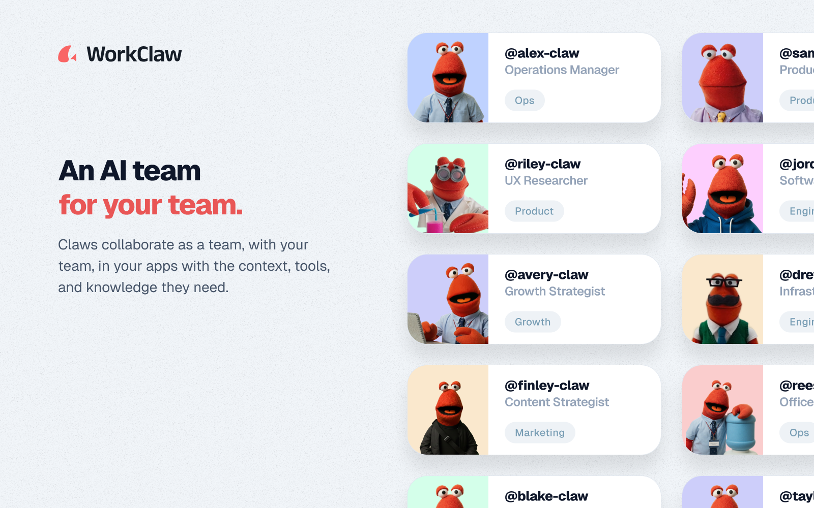
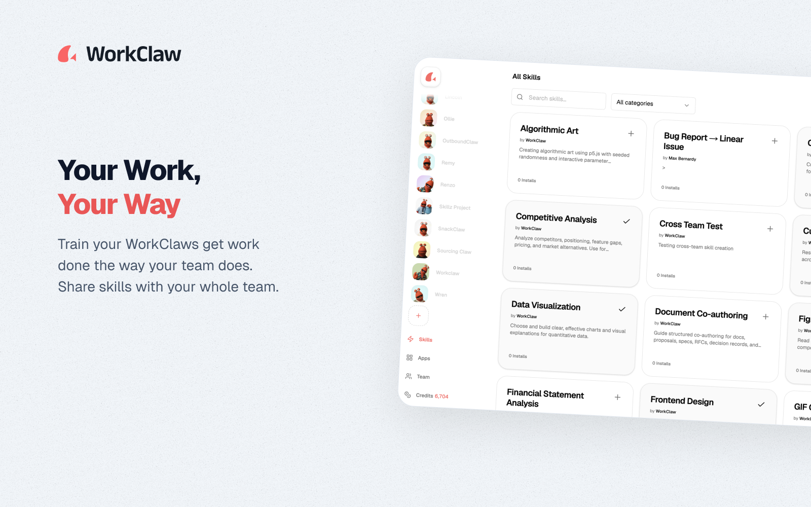
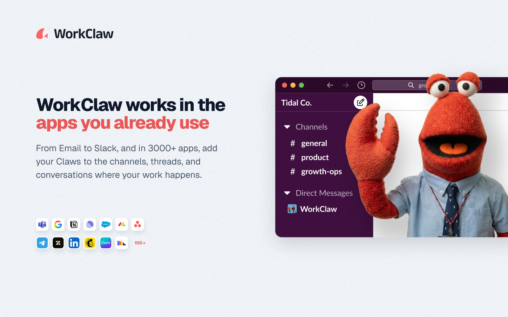

### 🎬 관련 영상
- [🎥 영상 보기](https://ph-files.imgix.net/979e72ba-de5c-4dab-8226-56c410d86dc5.jpeg?auto=format)

---

## 2. [Reframe](https://www.producthunt.com/products/reframe-7)
**Votes**: 166 | **도입 난이도**: 하 | **신뢰도**: 상
**Tagline**: Surf like it's 1999
**서비스 링크**: https://www.producthunt.com/r/TMRUV63DOAKQ46

**태그**: Browser, Retro, OpenSource, macOS

### 📌 이 서비스 한눈에 보기
레트로 감성의 UI와 웨이백 모드를 탑재한 오픈소스 브라우저

### 🔑 주요 기능
- Safari 1.0, Netscape 4.8 등 고전 브라우저의 디자인 재현
- Electron 기반의 macOS 전용 브라우저
- 과거 웹 환경을 경험할 수 있는 내장 'Wayback Mode' 제공

### 🙋 사용자에게 어떤 점이 좋은가
클래식한 웹 브라우저의 디자인과 사용자 경험을 그리워하는 사용자에게 독특한 시각적 즐거움을 제공합니다.

### ✅ 지금 바로 써볼 기능
- 레트로 테마 UI 탐색하기
- Wayback Mode로 과거 웹 감성 체험하기
- macOS 환경에서의 성능 확인하기

### ⚠️ 사용 전 확인할 점
- macOS 전용이므로 타 OS 사용자는 사용 불가
- 최신 웹 표준과의 호환성 여부 확인 필요

### 🧭 확인이 더 필요한 정보
Electron 기반이므로 최신 웹사이트의 기능이 레트로 UI와 충돌 없이 작동하는지 확인이 필요합니다.

### 📸 스크린샷 및 갤러리
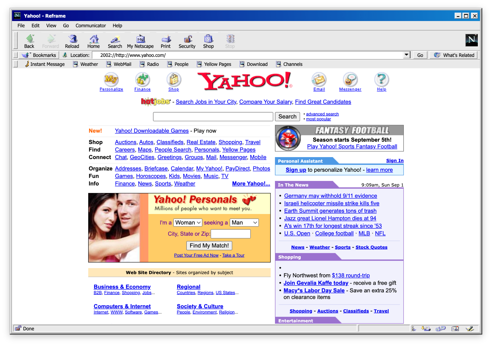

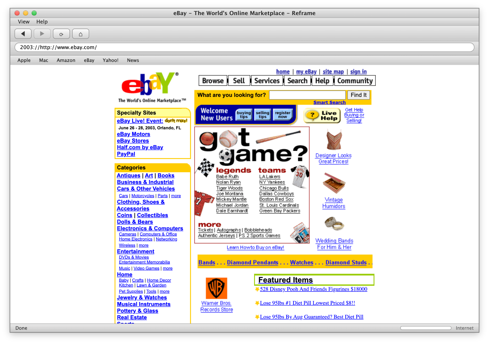

---

## 3. [Slackbot’s MCP Client](https://www.producthunt.com/products/slack)
**Votes**: 155 | **도입 난이도**: 하 | **신뢰도**: 상
**Tagline**: Work across 20+ apps in Slack with multiplayer collaboration
**서비스 링크**: https://www.producthunt.com/r/36XRGPIO7B2ANE

**태그**: Automation, Collaboration, Productivity, SaaS, AI Tool

### 📌 이 서비스 한눈에 보기
Slack 내에서 20개 이상의 앱을 하나의 대화형 인터페이스로 통합하여 협업하는 MCP 클라이언트

### 🔑 주요 기능
- Atlassian, Linear, Canva, Zoom 등 20개 이상의 앱 통합
- 자연어를 통한 도구 간 작업 실행 (문서 서명, 티켓 업데이트 등)
- 결과물을 팀 채널에 즉시 공유하는 멀티플레이어 협업 환경

### 🙋 사용자에게 어떤 점이 좋은가
여러 앱을 번갈아 가며 사용할 필요 없이 Slack 안에서 모든 업무를 처리하고 팀원과 실시간으로 결과를 공유할 수 있습니다.

### ✅ 지금 바로 써볼 기능
- Slack 내에서 자연어로 업무 명령 실행해보기
- 주요 업무용 앱(Linear, Atlassian 등) 연동하기
- 작업 결과를 팀 채널에 공유하여 협업하기

### ⚠️ 사용 전 확인할 점
- 연동된 각 앱의 권한 설정 및 보안 정책 확인 필요
- 복잡한 작업의 경우 자연어 명령의 정확도 검증 필요

### 🧭 확인이 더 필요한 정보
지원되는 20개 이상의 앱 목록과 구체적인 연동 방식에 대한 상세 정보가 필요합니다.

### 📸 스크린샷 및 갤러리
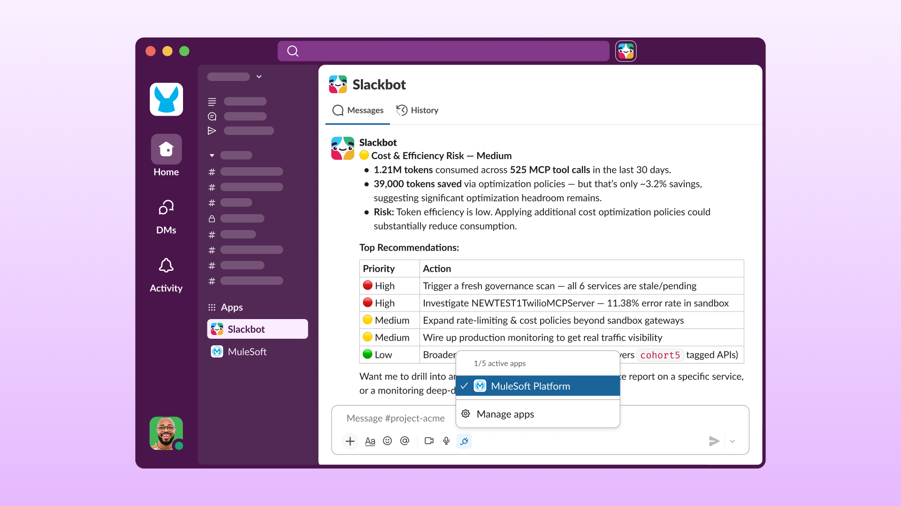
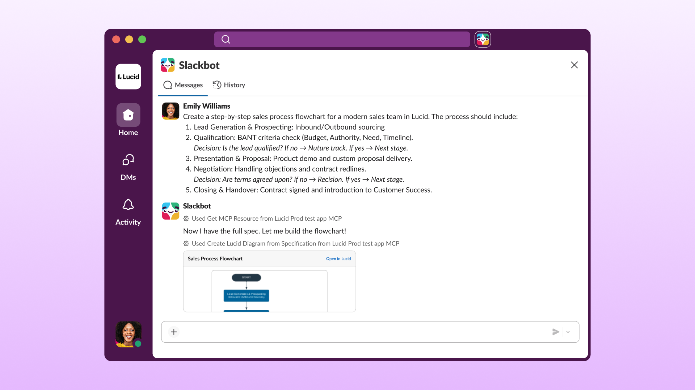
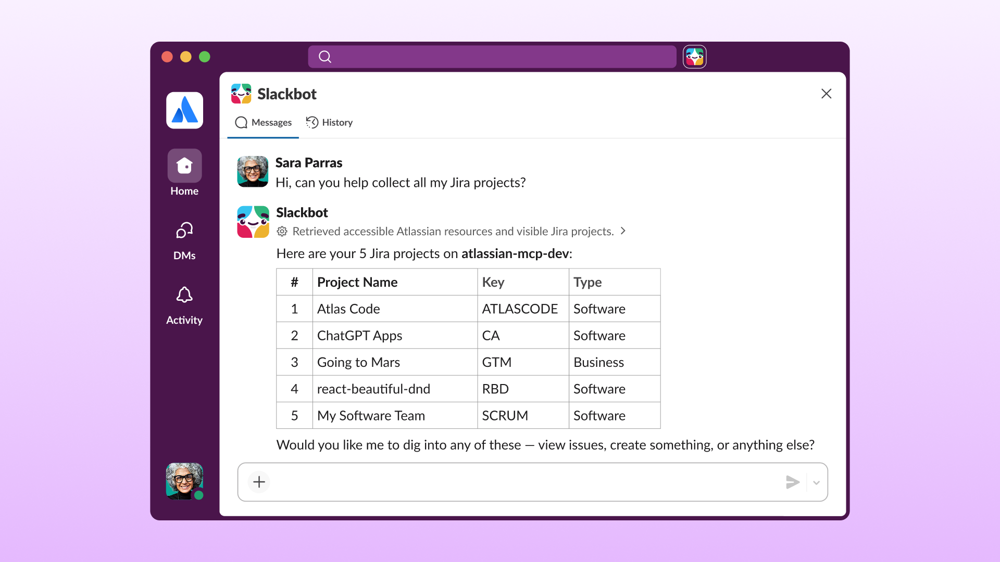

### 🎬 관련 영상
- [🎥 영상 보기](https://ph-files.imgix.net/645c2ee8-8414-4c23-bbc0-71a6ef91da50.jpeg?auto=format)

---

## 4. [Mellum by JetBrains](https://www.producthunt.com/products/jetbrains)
**Votes**: 145 | **도입 난이도**: 중 | **신뢰도**: 상
**Tagline**: Fast LLMs for low-latency and high-performance workflows
**서비스 링크**: https://www.producthunt.com/r/PKS6C7XUTUS4GS

**태그**: AI, LLM, DevTools, HighPerformance, Automation, AI Tool

### 📌 이 서비스 한눈에 보기
초저지연 및 고성능 워크플로우를 위한 JetBrains의 차세대 고속 LLM 모델 제품군

### 🔑 주요 기능
- 초저지연(Ultra-low-latency) 추론에 최적화된 모델 설계
- 고성능 워크플로우를 지원하는 차세대 언어 모델 제품군
- JetBrains에서 개발한 신뢰할 수 있는 AI 모델

### 🙋 사용자에게 어떤 점이 좋은가
실시간 응답이 중요한 애플리케이션이나 빠른 피드백이 필요한 개발 워크플로우에 즉각적인 성능 향상을 제공합니다.

### ✅ 지금 바로 써볼 기능
- 모델의 추론 속도 테스트
- 기존 워크플로우와의 지연 시간 비교
- 모델 성능 및 정확도 검증

### ⚠️ 사용 전 확인할 점
- 모델의 구체적인 파라미터 규모 및 상세 스펙 미공개
- 특정 작업에서의 성능 최적화 여부 확인 필요

### 🧭 확인이 더 필요한 정보
모델의 구체적인 벤치마크 수치와 지원하는 토큰 처리 용량에 대한 정보가 더 필요합니다.

### 📸 스크린샷 및 갤러리
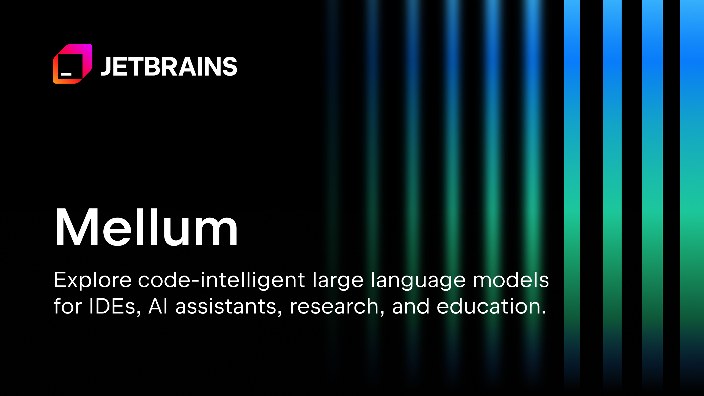
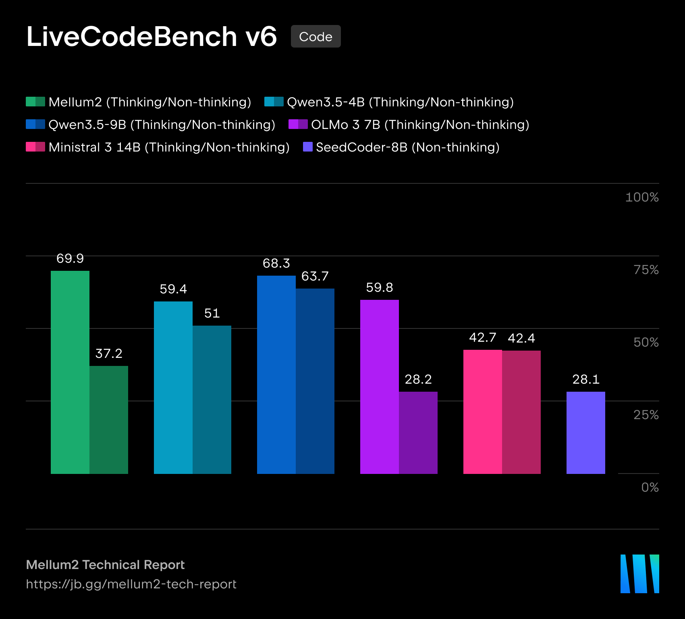
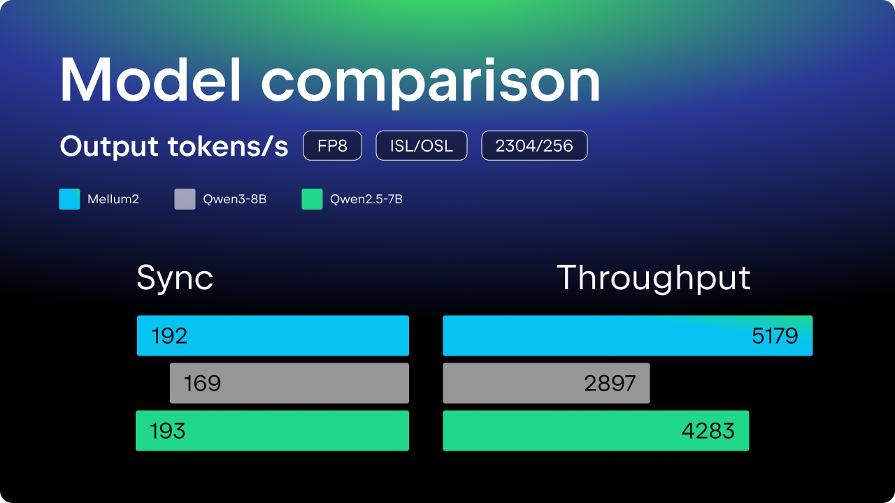

---

## 5. [pumaDB](https://www.producthunt.com/products/pumadb)
**Votes**: 124 | **도입 난이도**: 하 | **신뢰도**: 상
**Tagline**: a small hosted memory layer for AI agents
**서비스 링크**: https://www.producthunt.com/r/FMMENGK6LLSHMT

**태그**: AI, DevTool, Automation, MemoryLayer, Agent, AI Tool, Chat

### 📌 이 서비스 한눈에 보기
AI 에이전트가 세션 간 맥락을 유지할 수 있도록 돕는 가벼운 호스팅 메모리 레이어

### 🔑 주요 기능
- 복잡한 DB나 벡터 스토어 설정 없이 즉시 사용 가능한 공유 메모리 제공
- 에이전트 간의 정보 단절(맥락 손실) 문제 해결
- 메모리, 선호도, 프로젝트 컨텍스트 등 다양한 데이터 저장 및 재사용

### 🙋 사용자에게 어떤 점이 좋은가
별도의 인프라 관리 없이 AI 에이전트에게 지속적인 기억력을 부여하여 작업 연속성을 높일 수 있습니다.

### ✅ 지금 바로 써볼 기능
- 에이전트의 작업 상태(Task State) 저장 테스트
- 세션 간 사용자 선호도 공유 기능 적용
- 프로젝트 컨텍스트 유지 실험

### ⚠️ 사용 전 확인할 점
- 데이터 보안 및 프라이버시 정책 확인 필요
- 대규모 데이터 처리 시 확장성 및 비용 구조 확인 필요

### 🧭 확인이 더 필요한 정보
구체적인 데이터 용량 제한이나 API 호출 제한에 대한 정보가 명시되지 않았습니다.

### 📸 스크린샷 및 갤러리

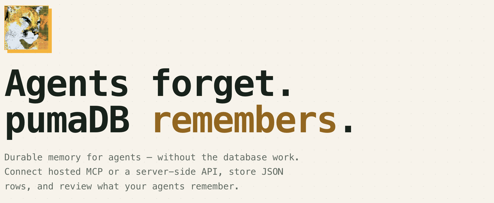
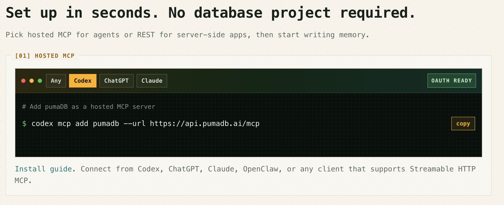

### 🎬 관련 영상
- [🎥 영상 보기](https://ph-files.imgix.net/d3fa017a-80cb-4ac1-9880-bb4543e2ce3c.jpeg?auto=format)

---

## 6. [Are you in the Weights?](https://www.producthunt.com/products/are-you-in-the-weights)
**Votes**: 103 | **도입 난이도**: 하 | **신뢰도**: 상
**Tagline**: Find out if you live forever in the brain of the LLMs
**서비스 링크**: https://www.producthunt.com/r/ZON3VWOEVCG74W

**태그**: AI, LLM, Experimental, Fun, AI Tool

### 📌 이 서비스 한눈에 보기
LLM 모델의 가중치 속에 내 이름이 얼마나 각인되어 있는지 확인하는 실험적 도구

### 🔑 주요 기능
- AI 모델의 파라미터(가중치) 내 데이터 인지력 테스트
- 특정 이름이나 키워드가 모델에 얼마나 강하게 학습되었는지 확인
- LLM의 내부 지식 구조를 탐색하는 흥미로운 인터랙티브 경험

### 🙋 사용자에게 어떤 점이 좋은가
자신의 이름이나 특정 키워드가 AI 모델의 지식 체계에 얼마나 깊게 자리 잡고 있는지 재미있게 확인할 수 있습니다.

### ✅ 지금 바로 써볼 기능
- 자신의 이름을 입력하여 모델의 인지도 확인하기
- 유명인이나 특정 키워드를 입력하여 비교 테스트하기

### ⚠️ 사용 전 확인할 점
- 모델의 학습 데이터 편향에 따른 결과일 수 있음
- 실제 지식의 정확도보다는 모델 내 연관성 수치임

### 🧭 확인이 더 필요한 정보
사용되는 구체적인 LLM 모델 종류와 측정 지표의 기술적 상세 내용은 명시되지 않았습니다.

### 📸 스크린샷 및 갤러리
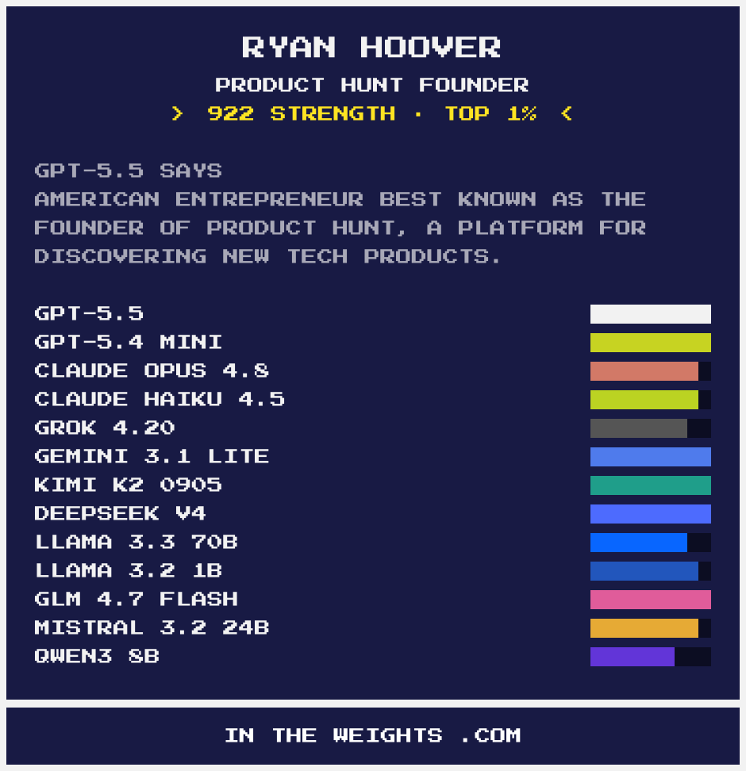

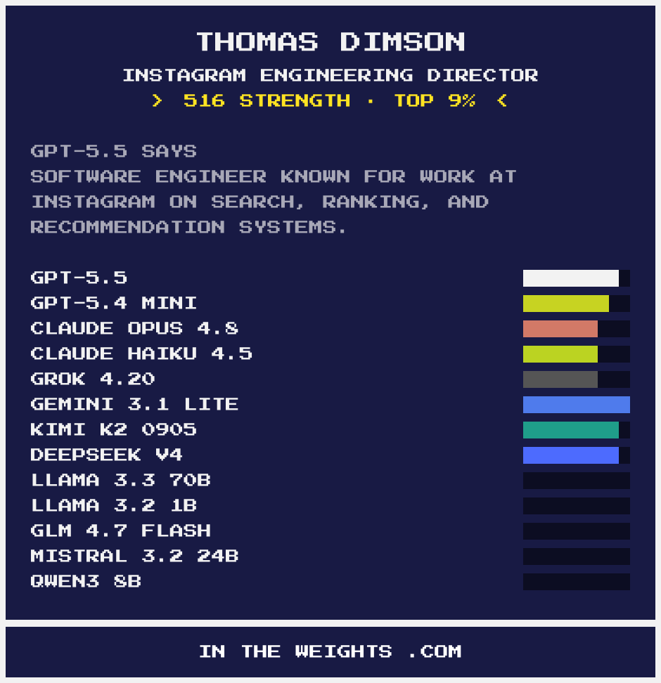

---

## 7. [Foyer](https://www.producthunt.com/products/foyer-4)
**Votes**: 103 | **도입 난이도**: 하 | **신뢰도**: 상
**Tagline**: Build a room of ambient sound that lives in your notch
**서비스 링크**: https://www.producthunt.com/r/NZNMBFU7RM75HD

**태그**: Productivity, Audio, MacBook, AmbientSound, UX, AI Tool

### 📌 이 서비스 한눈에 보기
맥북 노치 공간을 활용한 몰입형 공간 음향 환경 구축 도구

### 🔑 주요 기능
- 사용자 주변에 빛나는 구체 형태로 배치하는 인터랙티브한 앰비언트 사운드
- 실제 공간감을 구현하는 리얼 스페이셜 오디오 기술 적용
- 맥북 노치 영역에 최적화된 직관적인 UI/UX

### 🙋 사용자에게 어떤 점이 좋은가
작업 중 시야를 방해하지 않으면서도, 마치 실제 공간에 있는 듯한 입체적인 백색 소음을 통해 업무 몰입도를 높여줍니다.

### ✅ 지금 바로 써볼 기능
- 다양한 자연음을 배치하여 나만의 사운드 룸 만들기
- 사운드 구체를 드래그하여 입체적인 팬(Pan) 효과 조절하기
- 노치 영역에 배치된 사운드 레이어링 경험하기

### ⚠️ 사용 전 확인할 점
- 맥북 노치 디자인에 특화되어 있어 타 기기에서는 사용성이 다를 수 있음
- 사운드 레이어가 많아질 경우 시스템 리소스 사용량 확인 필요

### 🧭 확인이 더 필요한 정보
정확한 시스템 리소스 점유율 및 타 앱과의 호환성에 대한 정보가 명시되지 않았습니다.

### 📸 스크린샷 및 갤러리
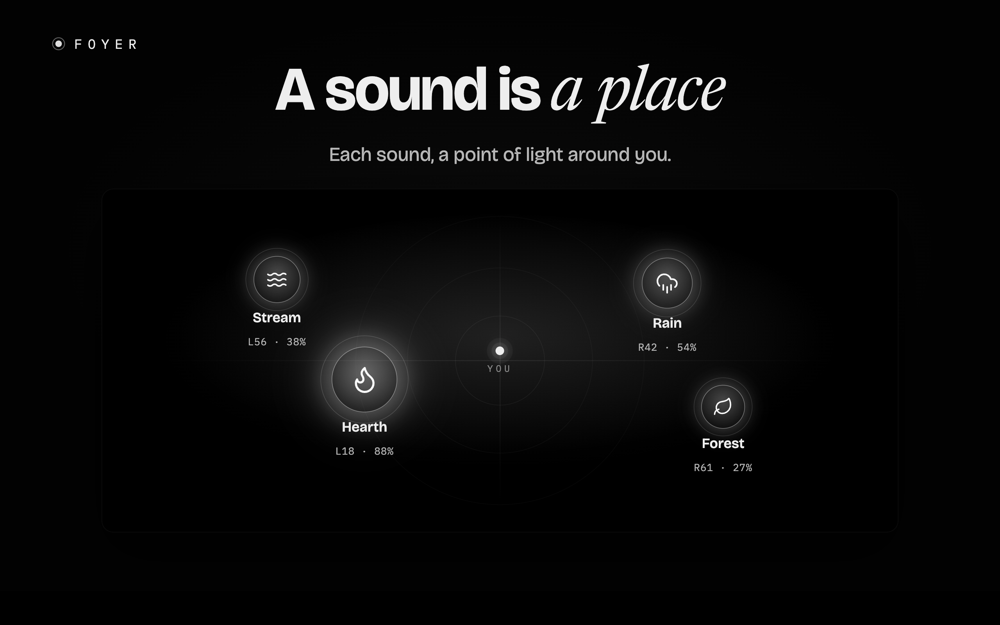
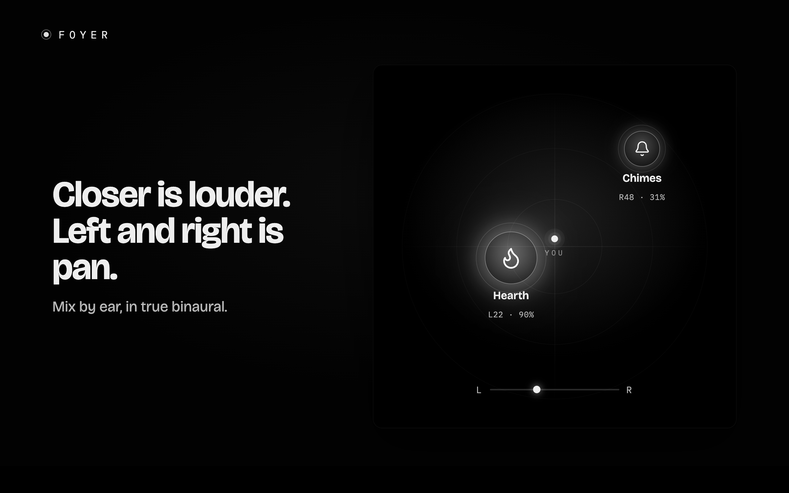
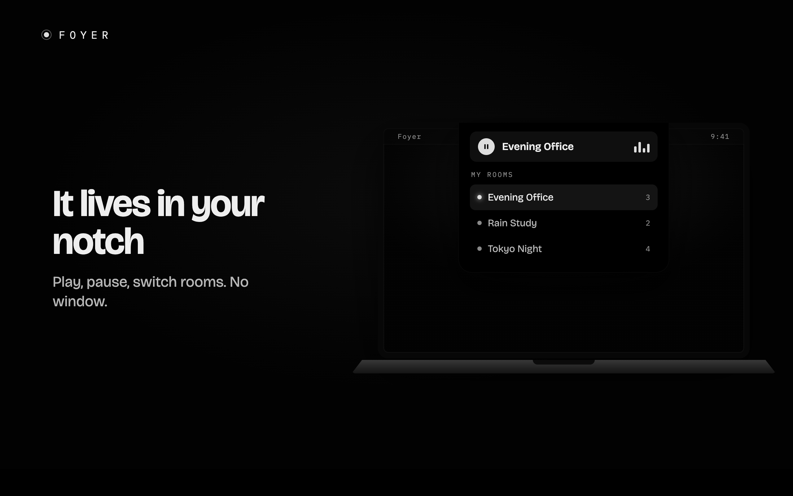

### 🎬 관련 영상
- [🎥 영상 보기](https://ph-files.imgix.net/b7f980f5-5985-4178-9777-dfe2edff351c.jpeg?auto=format)

---

## 8. [Basedash Access Controls](https://www.producthunt.com/products/basedash)
**Votes**: 102 | **도입 난이도**: 중 | **신뢰도**: 상
**Tagline**: Control exactly who can access your company data
**서비스 링크**: https://www.producthunt.com/r/VS5LCFCWY6QOLH
**재등장**: 최근 7일 내 재등장 (마지막 등장 7일 전)

**태그**: Security, Data Management, Collaboration, AI, Automation, AI Tool, Chat

### 📌 이 서비스 한눈에 보기
그룹별 권한 관리를 통해 기업 데이터 보안과 AI 답변 범위를 정교하게 제어하는 기능

### 🔑 주요 기능
- 사용자를 팀, 고객, 리더십 등 목적에 맞는 그룹으로 묶어 통합 관리
- 데이터 소스, 대시보드, 자동화 등 모든 리소스에 대한 세밀한 접근 제어
- 그룹별 AI 컨텍스트 설정 및 행 단위 보안(Row-level security) 적용

### 🙋 사용자에게 어떤 점이 좋은가
데이터 노출 범위를 사용자 역할에 따라 엄격히 분리하여, 보안 사고를 방지하면서도 팀별 맞춤형 데이터 환경을 제공합니다.

### ✅ 지금 바로 써볼 기능
- 기존 사용자들을 팀/외부 고객별 그룹으로 분류하기
- 그룹별로 접근 가능한 데이터 소스 및 대시보드 권한 설정하기
- 그룹별 AI 컨텍스트를 설정하여 답변 범위 테스트하기

### ⚠️ 사용 전 확인할 점
- 복잡한 권한 설정 시 의도치 않은 데이터 접근 차단 가능성
- 행 단위 보안 설정이 모든 데이터 소스에 완벽히 적용되는지 검증 필요

### 🧭 확인이 더 필요한 정보
기존에 설정된 데이터 및 자동화 워크플로우에 대한 소급 적용 방식에 대한 상세 정보가 필요합니다.

### 📸 스크린샷 및 갤러리
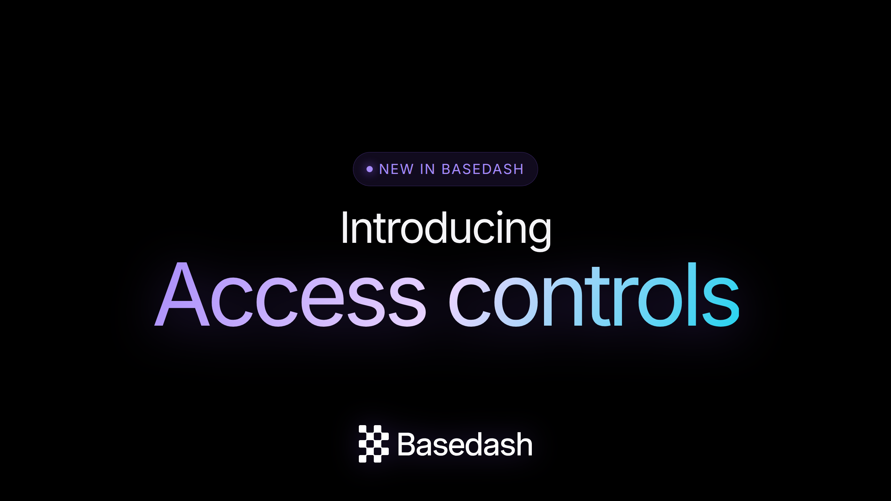
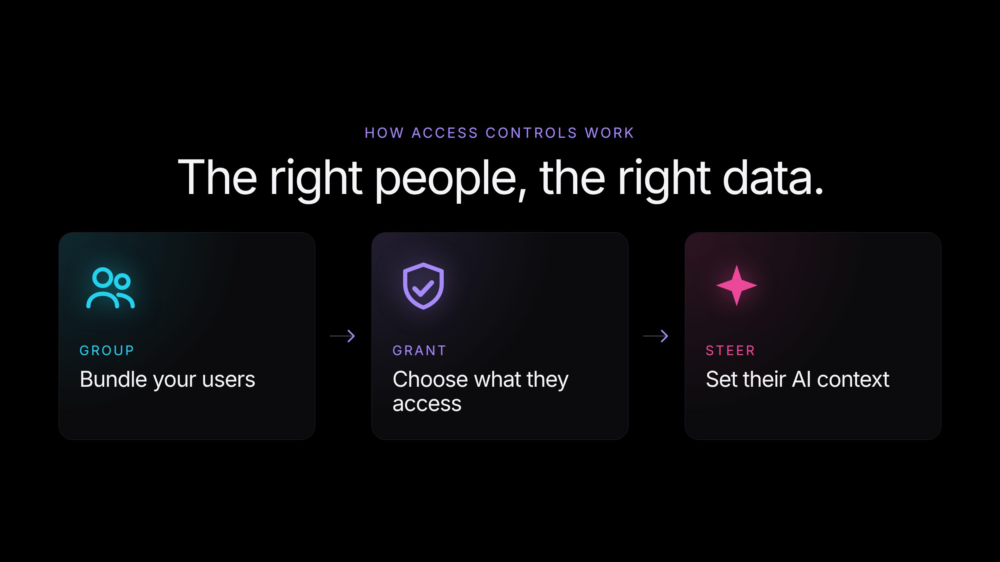
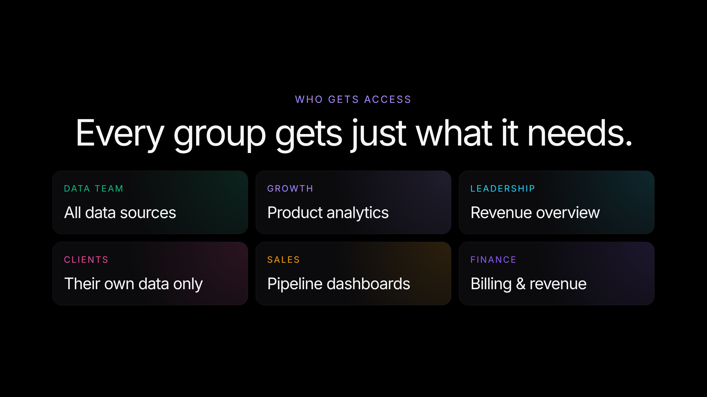

### 🎬 관련 영상
- [🎥 영상 보기](https://ph-files.imgix.net/893c3c1c-2759-4659-bc06-91019cbdde75.jpeg?auto=format)

---

## 9. [ReleaseDock](https://www.producthunt.com/products/releasedock)
**Votes**: 97 | **도입 난이도**: 하 | **신뢰도**: 상
**Tagline**: AI support agent, help center & changelogs in a single inbox
**서비스 링크**: https://www.producthunt.com/r/GISQRZ3MJ3BU57

**태그**: Customer Support, AI Agent, SaaS, Productivity, Agent, AI Tool

### 📌 이 서비스 한눈에 보기
고객 지원, 헬프 센터, 변경 사항 공지를 하나의 인박스에서 관리하는 AI 기반 통합 지원 솔루션

### 🔑 주요 기능
- 통합 지원 인박스: 고객 문의와 공지를 한곳에서 관리
- AI 지원 에이전트: 단순 답변을 넘어 직접적인 액션까지 수행 가능한 지능형 에이전트
- 올인원 고객 경험 도구: 호스팅형 헬프 센터, 체인지로그, 웹 임베드 위젯 제공

### 🙋 사용자에게 어떤 점이 좋은가
제품 개발에 집중해야 할 팀이 고객 지원 인프라 구축에 들이는 시간을 획기적으로 줄여줍니다.

### ✅ 지금 바로 써볼 기능
- 웹사이트에 위젯 임베드하기
- AI 에이전트의 액션 수행 능력 테스트하기
- 파운딩 멤버를 위한 평생 딜(LTD) 혜택 확인하기

### ⚠️ 사용 전 확인할 점
- AI 에이전트의 자동 액션 수행 시 발생할 수 있는 오류 범위 확인 필요
- 현재 제공되는 기능이 팀의 기존 워크플로우와 호환되는지 검토

### 🧭 확인이 더 필요한 정보
AI 에이전트가 구체적으로 어떤 외부 시스템과 연동하여 '액션'을 취할 수 있는지에 대한 상세 정보가 필요합니다.

### 📸 스크린샷 및 갤러리
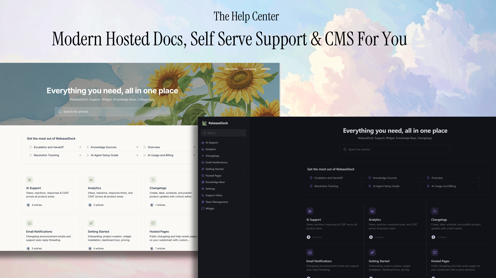
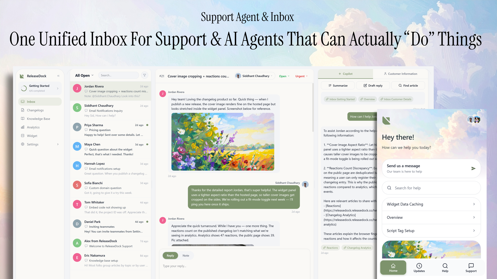

---

## 10. [Pixlie](https://www.producthunt.com/products/pixlie)
**Votes**: 94 | **도입 난이도**: 하 | **신뢰도**: 상
**Tagline**: AI video studio: text & image to video, with real control
**서비스 링크**: https://www.producthunt.com/r/XE3XQRF2QDPSVC

**태그**: AI Video, Content Creation, Creative Tool, Mobile App, Automation, AI Tool, Video, Vision

### 📌 이 서비스 한눈에 보기
단순 생성을 넘어 세밀한 제어가 가능한 AI 비디오 제작 스튜디오

### 🔑 주요 기능
- 텍스트 및 이미지를 활용한 고품질 비디오 생성 기능
- 단순 결과물 도출이 아닌 세밀한 창작 워크플로우 제공
- 클라우드 큐 관리 및 라이브러리 기능을 통한 체계적인 렌더링 추적

### 🙋 사용자에게 어떤 점이 좋은가
단순히 '운에 맡기는' 생성 방식에서 벗어나, 창작자가 의도한 대로 결과물을 조절할 수 있는 전문적인 작업 환경을 제공합니다.

### ✅ 지금 바로 써볼 기능
- Text2Video 기능을 통한 텍스트 기반 영상 생성 테스트
- Image2Video 기능을 활용한 이미지의 영상화 실험
- iOS 앱 설치를 통한 모바일 환경에서의 작업 연속성 확인

### ⚠️ 사용 전 확인할 점
- 클라우드 큐 방식이므로 작업량에 따른 대기 시간이 발생할 수 있음
- 세밀한 제어 기능이 포함되어 있어 단순 생성기보다 학습 곡선이 있을 수 있음

### 🧭 확인이 더 필요한 정보
구체적인 요금제 체계와 생성 가능한 영상의 최대 길이/해상도에 대한 정보가 명시되지 않았습니다.

### 📸 스크린샷 및 갤러리
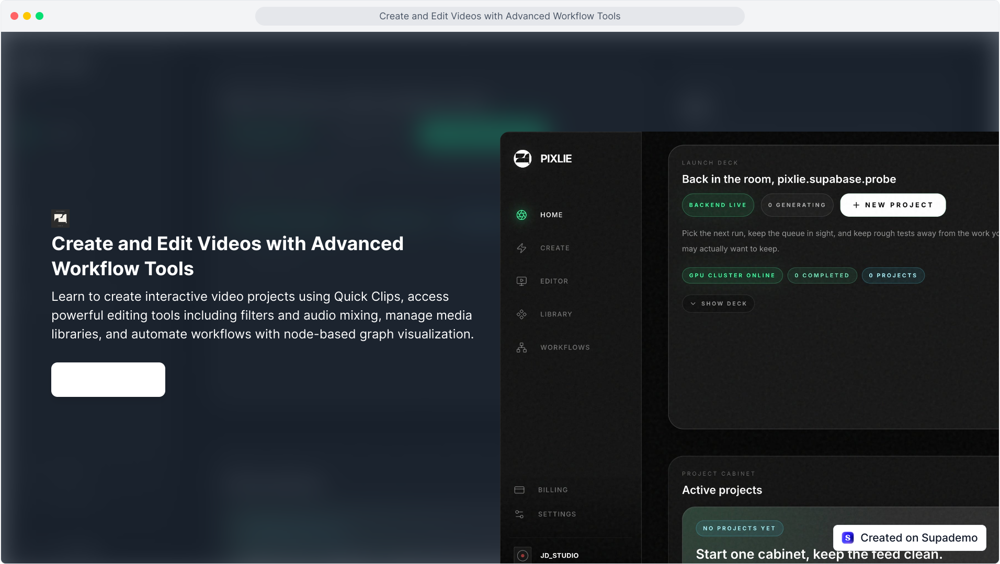
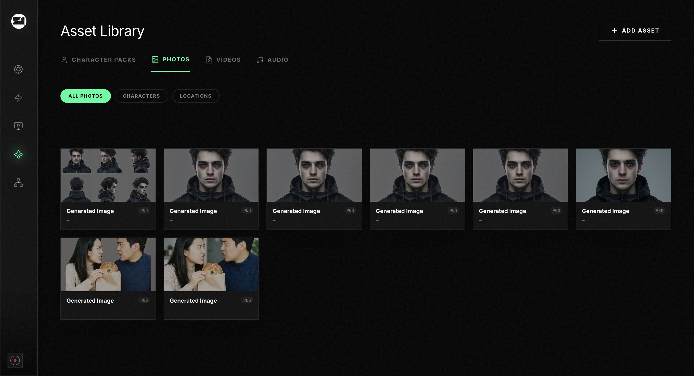
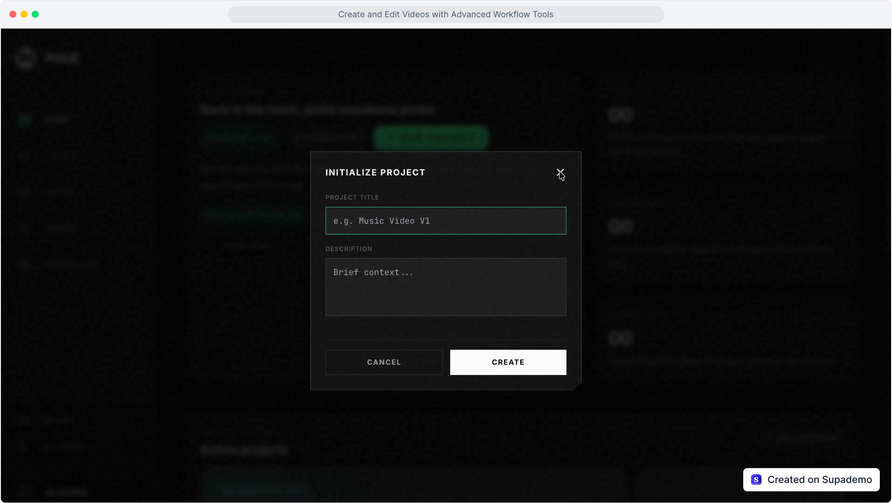

### 🎬 관련 영상
- [🎥 영상 보기](https://ph-files.imgix.net/92f2f666-8a2a-40fb-b44a-fb35d8c87482.jpeg?auto=format)

---

## 11. [GitSync for macOS](https://www.producthunt.com/products/gitsync-for-macos)
**Votes**: 81 | **도입 난이도**: 하 | **신뢰도**: 상
**Tagline**: Visual GitHub management directly from a graphical interface
**서비스 링크**: https://www.producthunt.com/r/DPDOVH7UCL2KWF

**태그**: DevTool, macOS, Git, GitHub, Productivity, Automation

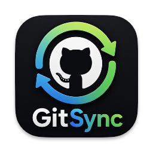

### 📌 이 서비스 한눈에 보기
터미널 없이 GUI로 간편하게 GitHub 워크플로우를 관리하는 macOS 전용 앱

### 🔑 주요 기능
- 그래픽 인터페이스를 통한 직관적인 Git/GitHub 관리
- 로컬 프로젝트와 GitHub 간의 간편한 동기화
- 저장소 클론 및 신규 생성 등 핵심 Git 워크플로우 지원

### 🙋 사용자에게 어떤 점이 좋은가
터미널 명령어를 입력하는 번거로움 없이 마우스 클릭만으로 Git 작업을 수행할 수 있어 작업 효율을 높여줍니다.

### ✅ 지금 바로 써볼 기능
- 로컬 프로젝트를 GitHub에 동기화하기
- 새로운 저장소 생성 및 클론 테스트하기
- GUI 환경에서 Git 워크플로우 실행해보기

### ⚠️ 사용 전 확인할 점
- macOS 전용 앱이므로 다른 운영체제에서는 사용 불가
- 복잡한 Git 명령어나 고급 기능 지원 여부 확인 필요

### 🧭 확인이 더 필요한 정보
상세한 기능 목록과 복잡한 Git 명령 처리 능력이 명시되지 않았습니다.

### 📸 스크린샷 및 갤러리
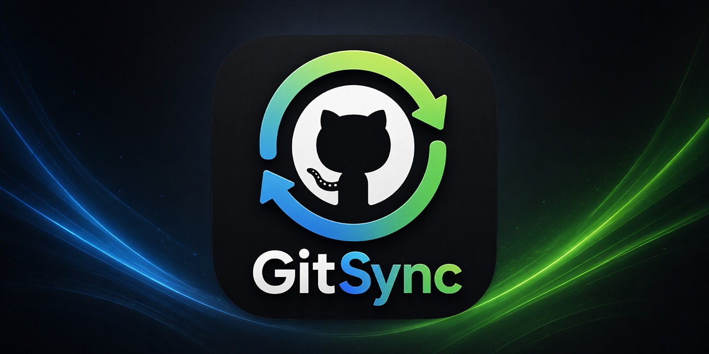
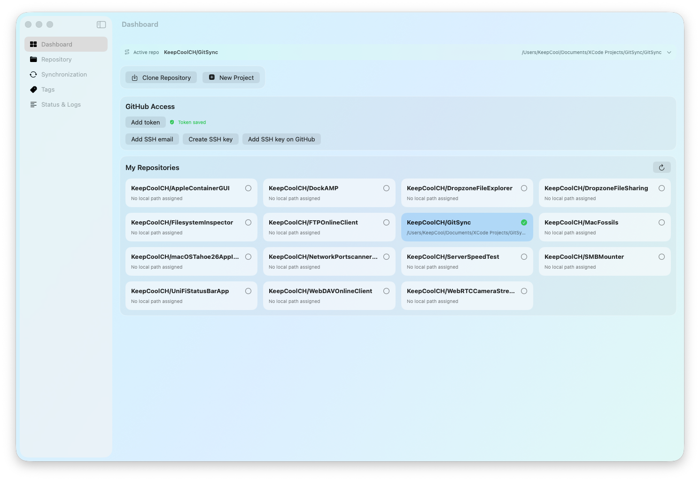
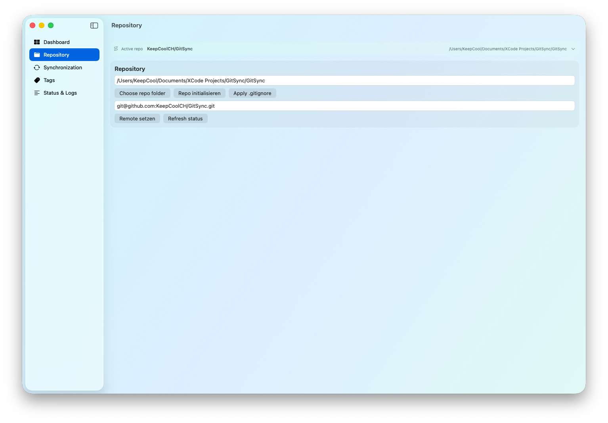

---

## 12. [Free AI Image Upscaler](https://www.producthunt.com/products/azure-cosmos-db)
**Votes**: 12 | **도입 난이도**: 하 | **신뢰도**: 상
**Tagline**: Locally Increase Resolution of Images
**서비스 링크**: https://www.producthunt.com/r/H6DMZEOGT5B6AJ

**태그**: AI, Image Processing, Privacy, WebGPU, AI Tool, Vision

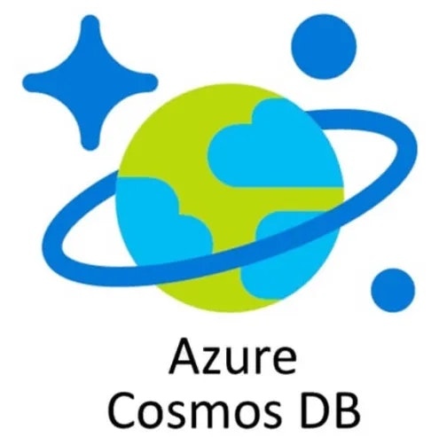

### 📌 이 서비스 한눈에 보기
개인정보 유출 걱정 없는 로컬 기반 AI 이미지 고해상도 업스케일러

### 🔑 주요 기능
- WebGPU를 활용한 클라이언트 사이드 모델 실행
- 파일 업로드 없는 100% 프라이버시 보호
- 서버 저장 공간을 사용하지 않는 로컬 처리 방식

### 🙋 사용자에게 어떤 점이 좋은가
이미지를 서버에 올리지 않고 내 컴퓨터에서 직접 처리하므로, 민감한 사진을 안전하고 빠르게 고화질로 변환할 수 있습니다.

### ✅ 지금 바로 써볼 기능
- 고해상도 변환이 필요한 개인 사진 업로드 테스트
- WebGPU 지원 브라우저 환경 확인
- 로컬 처리 속도 및 결과물 품질 확인

### ⚠️ 사용 전 확인할 점
- 사용자의 하드웨어(GPU) 성능에 따라 처리 속도가 달라질 수 있음
- 브라우저 환경에 따른 WebGPU 지원 여부 확인 필요

### 🧭 확인이 더 필요한 정보
사용자의 하드웨어 사양에 따른 구체적인 처리 속도와 지원 가능한 최대 해상도 범위는 명시되지 않았습니다.

### 📸 스크린샷 및 갤러리

---

## 13. [UISqueezy](https://www.producthunt.com/products/uisqueezy-design-systems-in-sync)
**Votes**: 11 | **도입 난이도**: 하 | **신뢰도**: 상
**Tagline**: Design tokens and Figma variables, always in sync.
**서비스 링크**: https://www.producthunt.com/r/SWBV6EPGNOZ6V6

**태그**: DesignOps, Figma, Automation, DevTools, AI Tool, Design, DevTool

### 📌 이 서비스 한눈에 보기
디자인 토큰과 피그마 변수를 양방향으로 자동 동기화하여 디자인-코드 간 격차를 해소하는 도구

### 🔑 주요 기능
- 디자인 토큰과 피그마 변수 간의 실시간 양방향 동기화
- 컬러, 타이포그래피, 간격, 반경 등 다양한 토큰의 네이티브 피그마 변수 적용
- 코드와 디자인 사이의 복사-붙여넣기 작업 및 데이터 불일치(drift) 방지

### 🙋 사용자에게 어떤 점이 좋은가
디자이너와 개발자가 동일한 토큰 값을 공유함으로써 수동 작업 시간을 줄이고, 디자인 변경 사항을 코드에 즉각 반영하거나 그 반대의 과정을 자동화할 수 있습니다.

### ✅ 지금 바로 써볼 기능
- 피그마 플러그인을 설치하여 기존 파일에 연결하기
- 기존 디자인 토큰을 피그마 변수로 푸시하기
- 피그마에서 수정된 변수를 코드베이스로 가져오기

### ⚠️ 사용 전 확인할 점
- 기존에 구축된 복잡한 디자인 시스템과의 호환성 확인 필요
- 양방향 동기화 시 발생할 수 있는 의도치 않은 덮어쓰기 주의

### 🧭 확인이 더 필요한 정보
지원하는 특정 프레임워크나 프로그래밍 언어에 대한 상세한 코드 추출 방식은 명시되지 않았습니다.

### 📸 스크린샷 및 갤러리
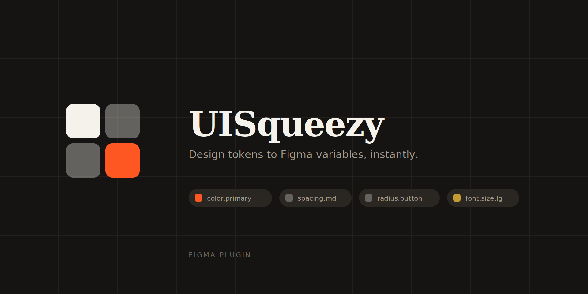
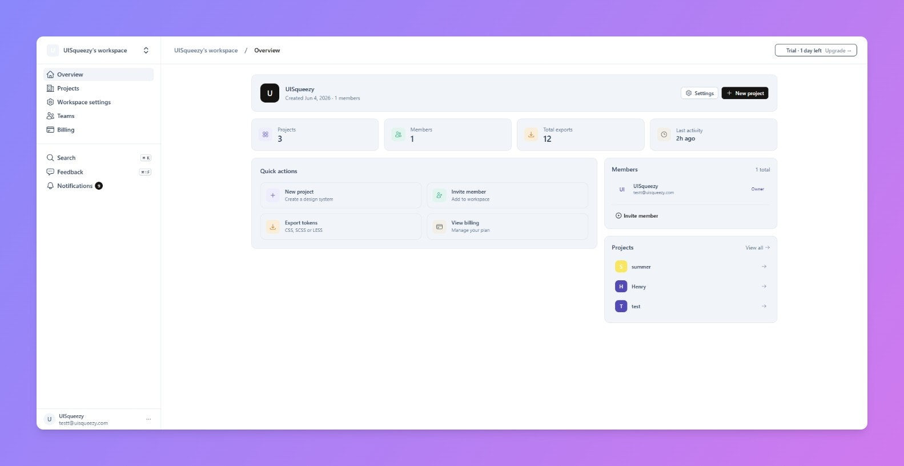
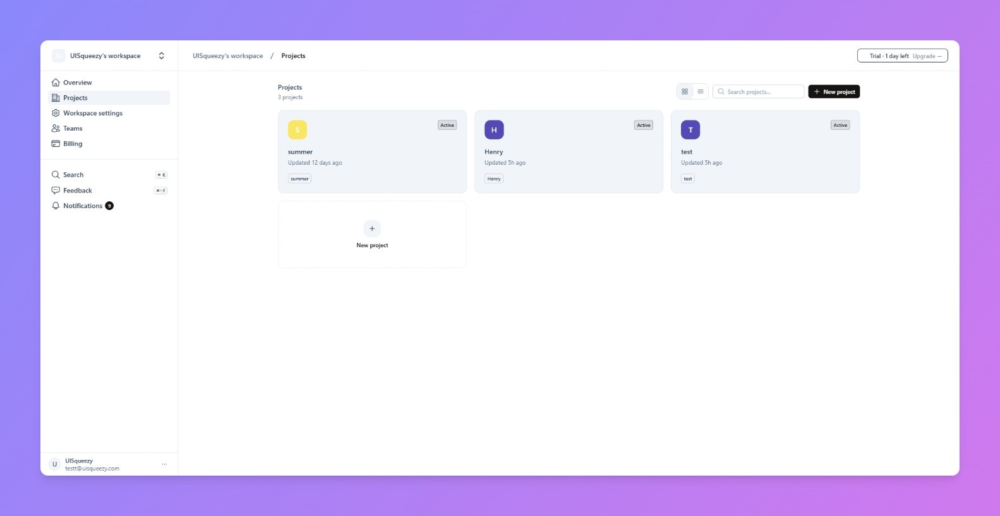

---

## 14. [TokenOps by Lovie](https://www.producthunt.com/products/tokenops-by-lovie)
**Votes**: 11 | **도입 난이도**: 중 | **신뢰도**: 상
**Tagline**: AI unit economics platform for AI companies
**서비스 링크**: https://www.producthunt.com/r/H6KDSQWQ6ZGZNF

**태그**: AI-Ops, FinTech, Analytics, Automation, Agent, AI Tool

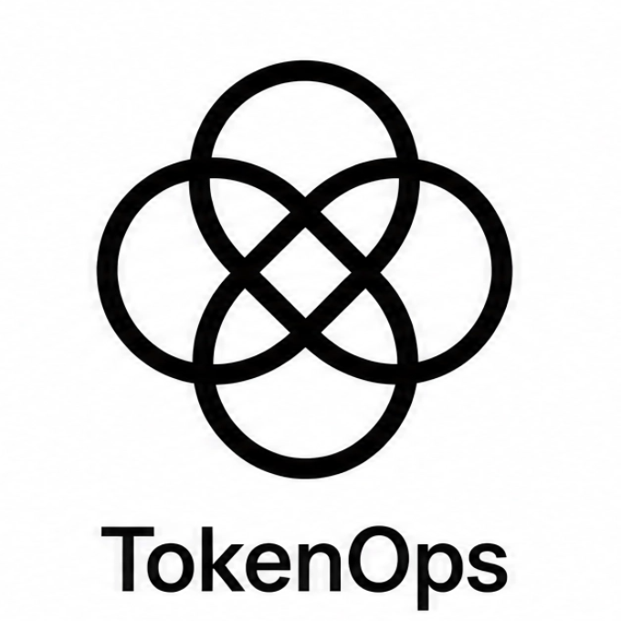

### 📌 이 서비스 한눈에 보기
AI 기업을 위한 통합 유닛 이코노믹스(Unit Economics) 관리 및 자동화 플랫폼

### 🔑 주요 기능
- Anthropic, OpenAI, Azure 등 주요 AI 인프라의 모든 이벤트를 통합 캡처
- 월별 인보이스 정산 및 비용 데이터 자동 대조
- 30개 도구와 연결된 MCP(Model Context Protocol)를 통한 AI 에이전트 기반 금융 질의응답

### 🙋 사용자에게 어떤 점이 좋은가
AI 모델 사용량에 따른 복잡한 비용 구조를 자동 추적하여, 서비스 운영 비용(Unit Economics)을 명확하게 파악하고 관리할 수 있습니다.

### ✅ 지금 바로 써볼 기능
- 주요 AI API 연동 및 데이터 캡처 확인
- 월별 인보이스 정산 기능 테스트
- MCP를 활용한 AI 에이전트 금융 질의 기능 활용

### ⚠️ 사용 전 확인할 점
- 다양한 클라우드/AI 플랫폼 연동 시 데이터 보안 및 권한 설정 확인 필요
- 실시간 데이터 캡처에 따른 추가적인 인프라 부하 또는 비용 발생 가능성

### 🧭 확인이 더 필요한 정보
각 플랫폼별 데이터 정합성 수준과 MCP를 통한 데이터 접근 권한 범위에 대한 확인이 필요합니다.

### 📸 스크린샷 및 갤러리
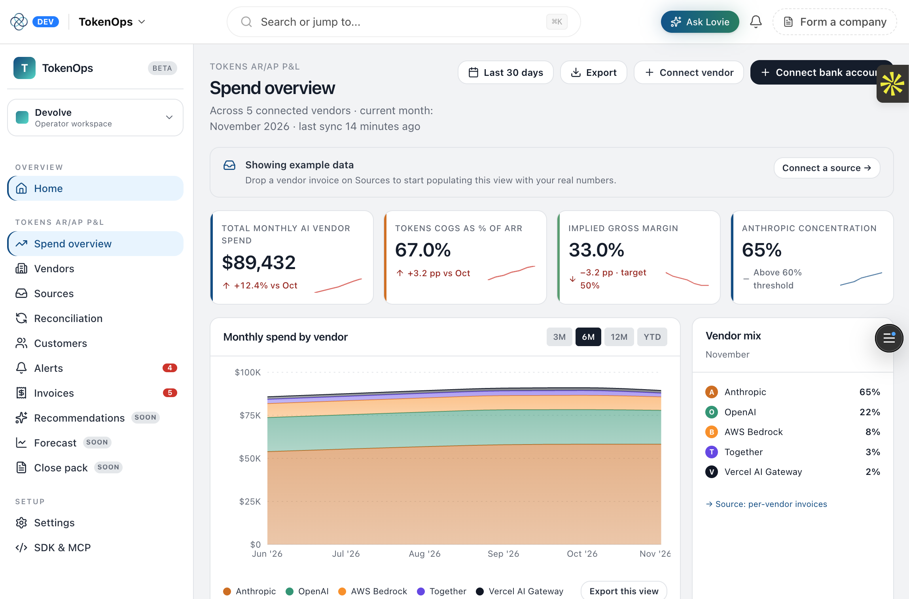
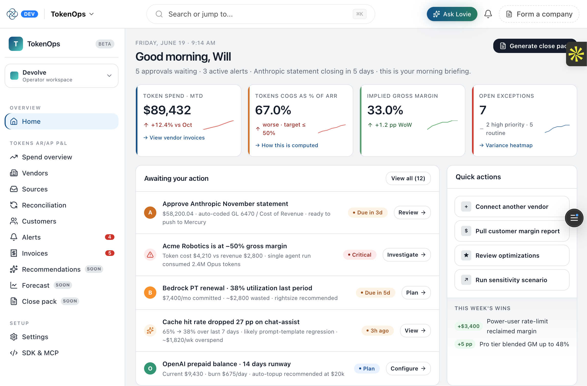

### 🎬 관련 영상
- [🎥 영상 보기](https://ph-files.imgix.net/cd867f5d-7694-4244-b4a3-38750928038f.gif?auto=format)

---

## 15. [Cutio](https://www.producthunt.com/products/cutio)
**Votes**: 9 | **도입 난이도**: 하 | **신뢰도**: 상
**Tagline**: Skip YouTube sponsors with AI, even on TV
**서비스 링크**: https://www.producthunt.com/r/QNLIXMSD5DT7ET

**태그**: Productivity, AI, YouTube, Automation, AI Tool, Video

### 📌 이 서비스 한눈에 보기
AI를 통해 유튜브 광고 및 스폰서 구간을 자동으로 건너뛰어 시청 시간을 절약해주는 서비스

### 🔑 주요 기능
- AI 기반 스폰서 읽기 및 자기 홍보 구간 자동 감지
- 브라우저뿐만 아니라 페어링된 TV에서도 작동
- 공유 캐시 시스템을 통해 분석된 영상의 즉각적인 로딩 지원

### 🙋 사용자에게 어떤 점이 좋은가
유튜브 영상의 불필요한 광고 구간을 일일이 넘길 필요 없이 핵심 콘텐츠만 빠르게 시청할 수 있습니다.

### ✅ 지금 바로 써볼 기능
- 브라우저 확장 프로그램 설치 및 계정 연동
- TV 페어링을 통한 거실 시청 환경 설정
- 공유 캐시를 통한 빠른 영상 스킵 테스트

### ⚠️ 사용 전 확인할 점
- AI 감지 오류로 인해 실제 콘텐츠 구간이 스킵될 가능성
- TV 환경에서의 구체적인 지원 모델 및 연결 방식 확인 필요

### 🧭 확인이 더 필요한 정보
TV 기기와의 구체적인 연결 방식과 지원되는 스마트 TV 모델 범위에 대한 정보가 더 필요합니다.

### 📸 스크린샷 및 갤러리
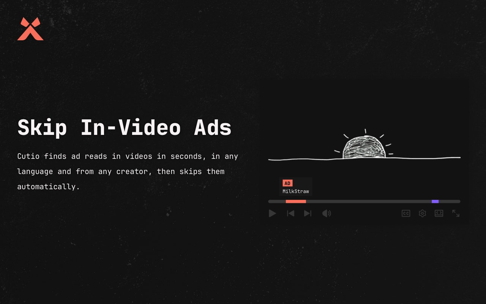
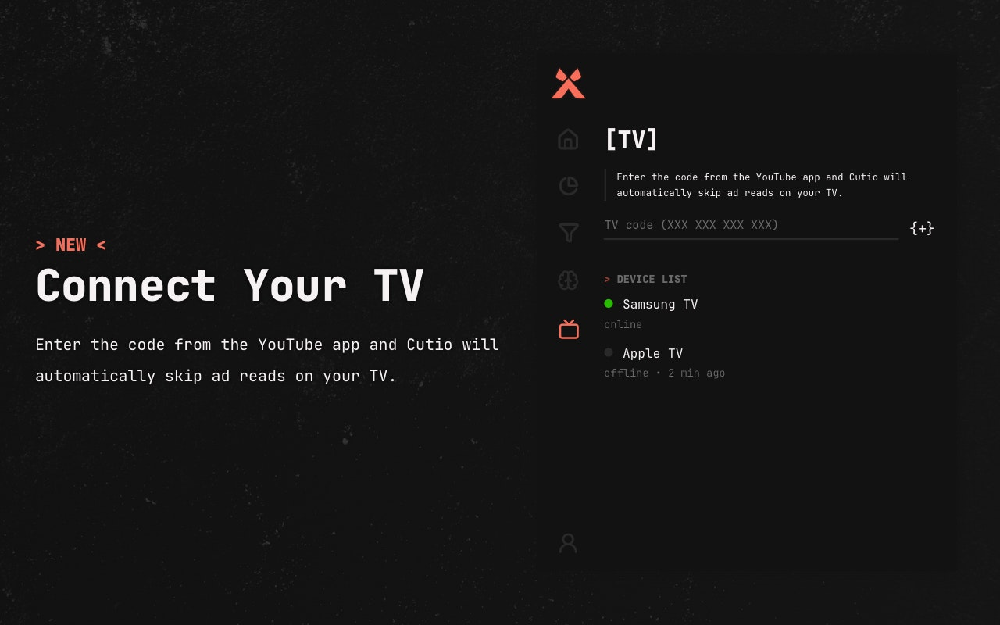
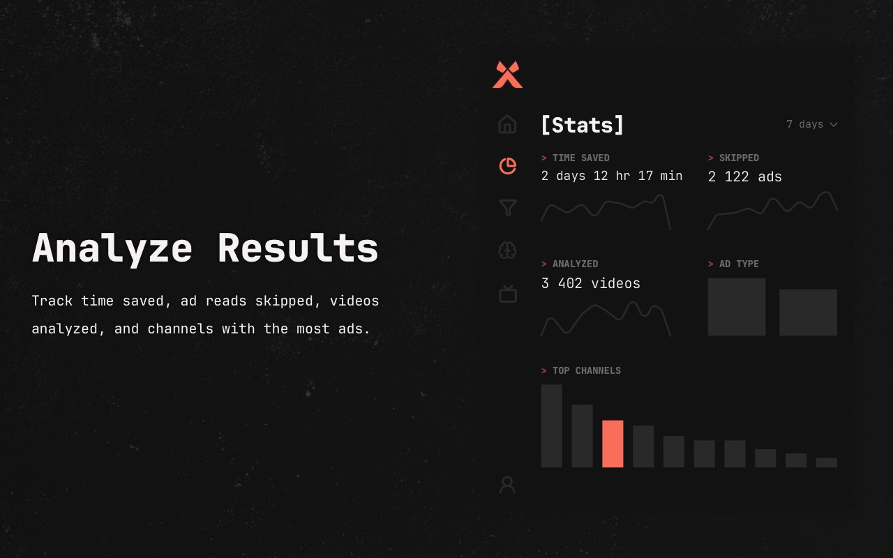

---

## 16. [Journnex](https://www.producthunt.com/products/journnex)
**Votes**: 9 | **도입 난이도**: 하 | **신뢰도**: 상
**Tagline**: Trading journal + prop-firm fee & payout tracker
**서비스 링크**: https://www.producthunt.com/r/IWL32JUDLVDLIM

**태그**: Trading, Analytics, FinTech, Journaling

### 📌 이 서비스 한눈에 보기
매매 분석과 프랍펌 수익 관리를 한 번에 해결하는 스마트 트레이딩 저널

### 🔑 주요 기능
- 수익률(P&L), 승률, R-multiple 등 핵심 매매 지표 분석
- 0–100점 사이의 독자적인 '트레이드 스코어' 제공
- 프랍펌(Prop-firm) 이용자를 위한 수수료 및 출금액 추적 기능

### 🙋 사용자에게 어떤 점이 좋은가
매매 기록을 체계적으로 분석하여 본인만의 매매 전략(Edge)을 발견하고, 프랍펌 운영 시 발생하는 비용과 수익을 직관적으로 관리할 수 있습니다.

### ✅ 지금 바로 써볼 기능
- 자신의 매매 기록을 입력하여 트레이드 스코어 확인하기
- 프랍펌 수수료 대비 실제 수익률 추적하기
- 승률 및 R-multiple 지표를 통한 전략 검토하기

### ⚠️ 사용 전 확인할 점
- 자동화된 데이터 연동 여부에 따라 수동 입력의 번거로움이 있을 수 있음
- 제공되는 트레이드 스코어의 산출 근거에 대한 이해 필요

### 🧭 확인이 더 필요한 정보
거래소와의 API 자동 연동 지원 여부 및 구체적인 데이터 보안 정책 확인이 필요합니다.

### 📸 스크린샷 및 갤러리

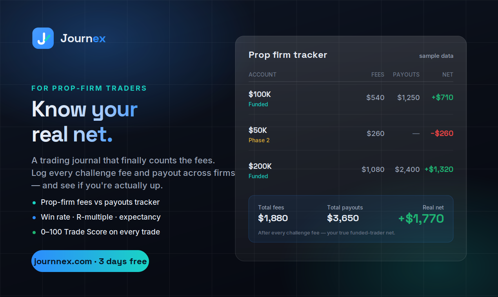

---

## 17. [Math Shield - Focus & Unlock](https://www.producthunt.com/products/math-shield-focus-unlock)
**Votes**: 9 | **도입 난이도**: 하 | **신뢰도**: 상
**Tagline**: Unlock Apps with Math
**서비스 링크**: https://www.producthunt.com/r/GHOAFNQO52OIV2

**태그**: Productivity, Education, Digital Wellbeing, Focus, AI Tool

### 📌 이 서비스 한눈에 보기
수학 문제를 풀어 앱 잠금을 해제하며 학습과 집중력을 동시에 잡는 도구

### 🔑 주요 기능
- 수학 문제 풀이를 통한 앱 접근 제어 방식
- 학습 능력 향상과 디지털 디톡스의 결합
- 아동의 수학 실력 향상 및 성인의 두뇌 훈련 목적

### 🙋 사용자에게 어떤 점이 좋은가
단순한 앱 차단을 넘어 문제를 해결해야 하는 과정을 통해 무의식적인 스마트폰 사용을 방지하고 집중력을 높여줍니다.

### ✅ 지금 바로 써볼 기능
- 자주 사용하는 앱에 수학 잠금 설정하기
- 학습용 또는 집중력 향상용 난이도 설정 확인하기
- 디지털 습관 개선을 위한 사용 패턴 테스트하기

### ⚠️ 사용 전 확인할 점
- 급한 상황에서 수학 문제 풀이가 번거로울 수 있음
- 문제 난이도 조절 기능에 따른 사용자 피로도 발생 가능성

### 🧭 확인이 더 필요한 정보
사용자 맞춤형 난이도 조절 범위와 지원하는 앱의 종류에 대한 구체적인 정보가 필요합니다.

### 📸 스크린샷 및 갤러리

---

## 18. [Amazon Wholesale with Stemar Greene](https://www.producthunt.com/products/amazon-wholesale-with-stemar-greene)
**Votes**: 8 | **도입 난이도**: 하 | **신뢰도**: 중
**Tagline**: Amazon Wholesale Success Starts with the Right Strategy
**서비스 링크**: https://www.producthunt.com/r/YPMEEAMME32NYH

**태그**: E-commerce, Business Strategy, Amazon Wholesale

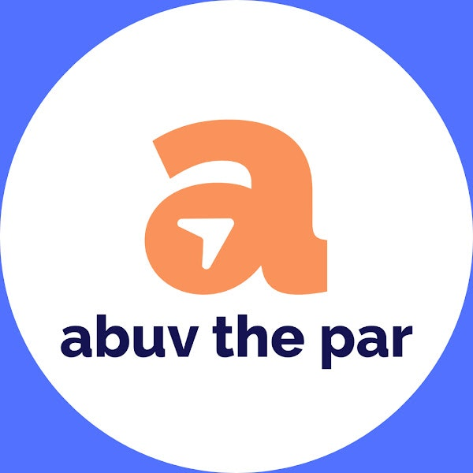

### 📌 이 서비스 한눈에 보기
성공적인 아마존 홀세일 비즈니스를 위한 전략적 성장 가이드

### 🔑 주요 기능
- 수익성 있는 제품 발굴을 넘어선 종합적인 비즈니스 전략 제공
- 강력한 공급업체 관계 구축 방법론 제시
- 효율적인 재고 관리 및 검증된 성장 전략 학습

### 🙋 사용자에게 어떤 점이 좋은가
아마존 홀세일 사업의 기초부터 운영 핵심 요소까지 체계적인 전략을 학습할 수 있습니다.

### ✅ 지금 바로 써볼 기능
- 제공되는 성장 전략 방법론 검토
- 공급업체 관리 및 재고 관리 프로세스 확인
- 비즈니스 모델의 수익성 검증

### ⚠️ 사용 전 확인할 점
- 구체적인 교육 커리큘럼이나 서비스 형태(강의, 컨설팅 등)가 명시되지 않음
- 개별 사용자의 자본 규모에 따른 전략 적용 차이 발생 가능

### 🧭 확인이 더 필요한 정보
해당 제품이 교육 프로그램인지, 컨설팅 서비스인지, 혹은 특정 소프트웨어 도구인지에 대한 구체적인 형태 확인이 필요합니다.

### 📸 스크린샷 및 갤러리
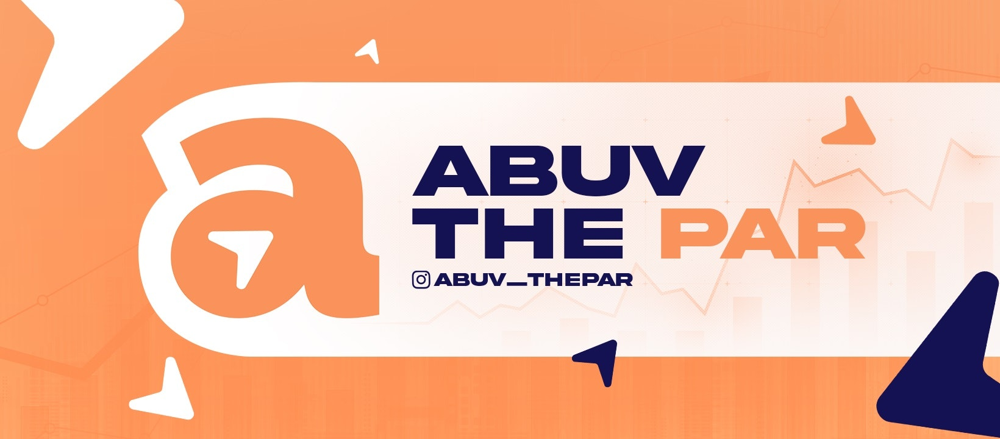

---

## 19. [LocalForge](https://www.producthunt.com/products/localforge)
**Votes**: 8 | **도입 난이도**: 하 | **신뢰도**: 상
**Tagline**: The last line of defence before your code hits git history
**서비스 링크**: https://www.producthunt.com/r/IMWTL4NZYZPBKZ

**태그**: DevTool, Security, Git, AI, AppleSilicon, LLM

### 📌 이 서비스 한눈에 보기
코드 커밋 전 보안 사고를 방지하는 Apple Silicon 전용 오프라인 보안 검사 도구

### 🔑 주요 기능
- Rust 기반 정규식 엔진을 통한 초고속 비밀번호/키 유출 차단
- CoreML과 로컬 LLM(Qwen)을 활용한 지능적 코드 패턴 분석
- Apple Silicon 최적화 및 100% 오프라인 환경으로 데이터 유출 원천 차단

### 🙋 사용자에게 어떤 점이 좋은가
빠른 개발 속도 속에서 실수로 노출될 수 있는 보안 키나 위험한 코드 패턴을 커밋 직전에 자동으로 잡아내어 사고를 예방합니다.

### ✅ 지금 바로 써볼 기능
- Git 커밋 훅(Hook) 설정 및 LocalForge 연동
- Apple Silicon 환경에서의 성능 및 리소스 점유율 확인
- 로컬 LLM 기반의 코드 리뷰 정확도 테스트

### ⚠️ 사용 전 확인할 점
- Apple Silicon 하드웨어에 최적화되어 있어 타 플랫폼 지원 여부 확인 필요
- 로컬 LLM 구동 시 시스템 리소스(CPU/GPU/NPU) 사용량 영향

### 🧭 확인이 더 필요한 정보
타 OS(Windows, Linux) 지원 여부와 구체적인 시스템 요구 사양에 대한 정보가 명시되지 않았습니다.

### 📸 스크린샷 및 갤러리
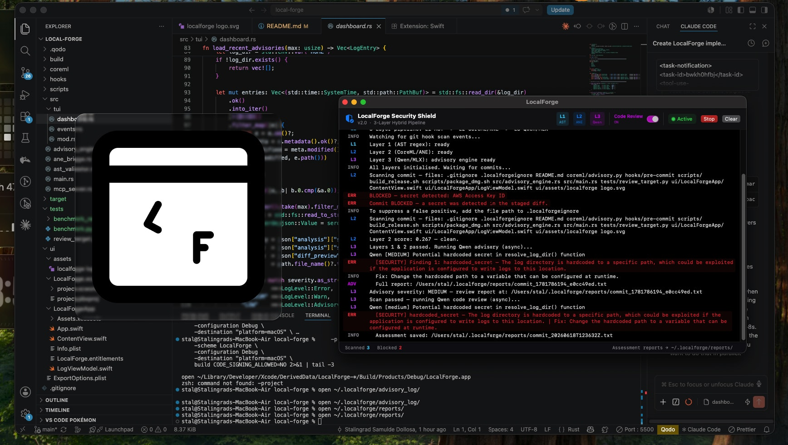
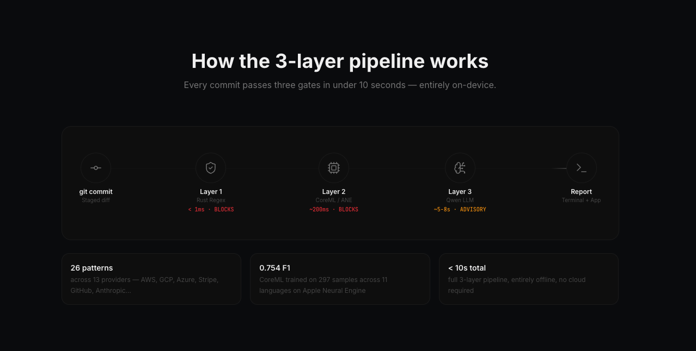
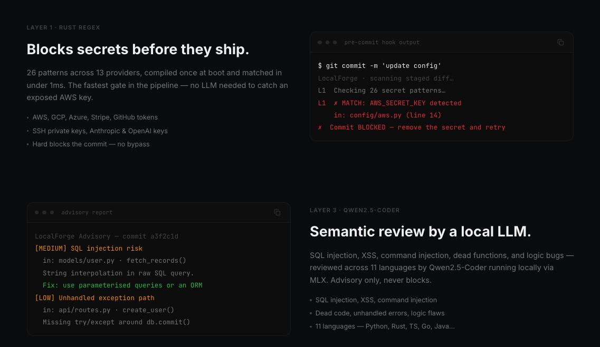

### 🎬 관련 영상
- [🎥 영상 보기](https://ph-files.imgix.net/69569b27-bb36-4631-a623-ac371af2b201.jpeg?auto=format)

---

## 20. [Inksightful](https://www.producthunt.com/products/inksightful)
**Votes**: 8 | **도입 난이도**: 하 | **신뢰도**: 상
**Tagline**: Search your handwritten diaries and notebooks
**서비스 링크**: https://www.producthunt.com/r/O2NQABFWFY6GXE

**태그**: Productivity, AI, Note-taking, OCR, Personal Archive, AI Tool

### 📌 이 서비스 한눈에 보기
손글씨로 쓴 일기와 노트를 검색 가능한 디지털 아카이브로 변환해주는 서비스

### 🔑 주요 기능
- 아이폰 스캔 기능을 통한 간편한 종이 문서 디지털화
- AI 기반의 정교한 손글씨 인식 기술 적용
- 텍스트와 원본 스캔 이미지를 연결하여 출처 확인 가능

### 🙋 사용자에게 어떤 점이 좋은가
수많은 종이 노트 속에 흩어진 아이디어나 과거의 기록을 일일이 넘겨볼 필요 없이 키워드 검색만으로 즉시 찾아낼 수 있습니다.

### ✅ 지금 바로 써볼 기능
- 아이폰으로 오래된 일기장 스캔해보기
- 검색 기능을 통해 특정 키워드 찾아보기
- 텍스트와 원본 스캔본 대조해보기

### ⚠️ 사용 전 확인할 점
- 손글씨의 가독성에 따라 인식 정확도가 달라질 수 있음
- 스캔된 이미지와 텍스트 간의 연결성 확인 필요

### 🧭 확인이 더 필요한 정보
AI의 손글씨 인식 정확도와 지원하는 언어 범위에 대한 구체적인 정보가 필요합니다.

### 📸 스크린샷 및 갤러리

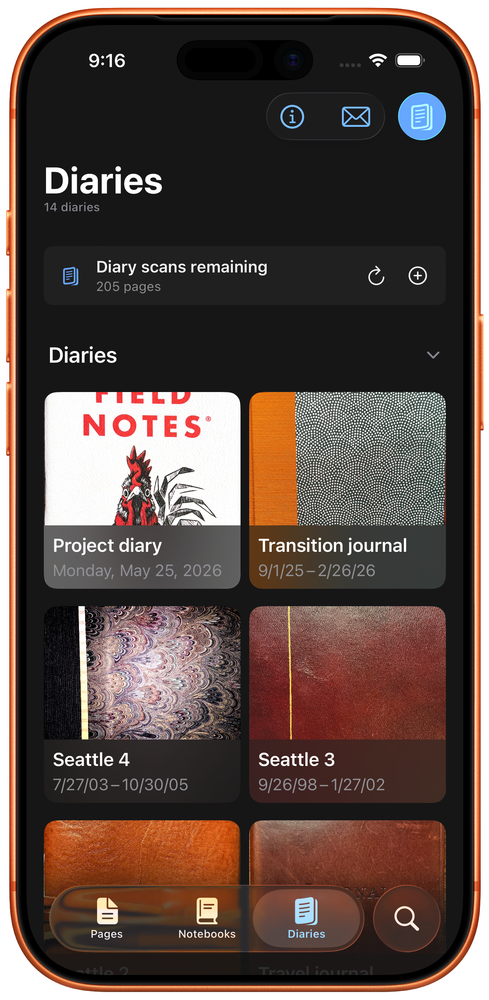
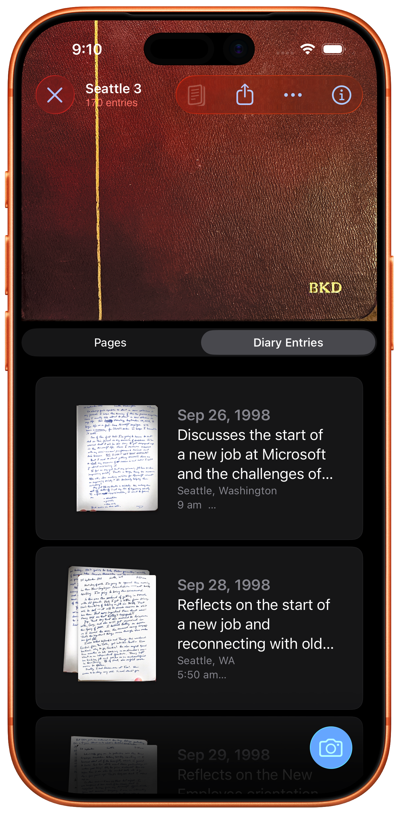

---

## 21. [LocalForge](https://www.producthunt.com/products/localforge)
**Votes**: 8 | **도입 난이도**: 하 | **신뢰도**: 상
**Tagline**: The last line of defence before your code hits git history
**서비스 링크**: https://www.producthunt.com/r/IMWTL4NZYZPBKZ

**태그**: DevTool, Security, Git, AI, AppleSilicon, LLM

### 📌 이 서비스 한눈에 보기
코드 커밋 전 보안 사고를 방지하는 Apple Silicon 전용 오프라인 보안 검사 도구

### 🔑 주요 기능
- Rust 기반 정규식 엔진을 통한 초고속 비밀번호/키 유출 차단
- CoreML과 로컬 LLM(Qwen)을 활용한 지능적 코드 패턴 분석
- Apple Silicon 최적화 및 100% 오프라인 환경으로 데이터 유출 원천 차단

### 🙋 사용자에게 어떤 점이 좋은가
빠른 개발 속도 속에서 실수로 노출될 수 있는 보안 키나 위험한 코드 패턴을 커밋 직전에 자동으로 잡아내어 사고를 예방합니다.

### ✅ 지금 바로 써볼 기능
- Git 커밋 훅(Hook) 설정 및 LocalForge 연동
- Apple Silicon 환경에서의 성능 및 리소스 점유율 확인
- 로컬 LLM 기반의 코드 리뷰 정확도 테스트

### ⚠️ 사용 전 확인할 점
- Apple Silicon 하드웨어에 최적화되어 있어 타 플랫폼 지원 여부 확인 필요
- 로컬 LLM 구동 시 시스템 리소스(CPU/GPU/NPU) 사용량 영향

### 🧭 확인이 더 필요한 정보
타 OS(Windows, Linux) 지원 여부와 구체적인 시스템 요구 사양에 대한 정보가 명시되지 않았습니다.

### 📸 스크린샷 및 갤러리

### 🎬 관련 영상
- [🎥 영상 보기](https://ph-files.imgix.net/69569b27-bb36-4631-a623-ac371af2b201.jpeg?auto=format)

---

## 22. [Eyeball](https://www.producthunt.com/products/eyeball-3)
**Votes**: 7 | **도입 난이도**: 하 | **신뢰도**: 상
**Tagline**: Just a curious eye in your Chrome toolbar
**서비스 링크**: https://www.producthunt.com/r/XJNKW2T5CG6UUU

**태그**: Browser Extension, UI/UX, Privacy

### 📌 이 서비스 한눈에 보기
커서의 움직임을 따라다니는 귀엽고 프라이빗한 크롬 확장 프로그램

### 🔑 주요 기능
- 커서를 따라 움직이는 눈 모양의 인터페이스
- 읽을 수 없는 페이지에서는 중앙에 위치하는 기능
- 클릭 시 깜빡이는 애니메이션 효과

### 🙋 사용자에게 어떤 점이 좋은가
브라우저 환경에 시각적인 재미를 더해주며, 데이터 수집 걱정 없이 안심하고 사용할 수 있는 데스크톱 꾸미기 도구입니다.

### ✅ 지금 바로 써볼 기능
- 크롬 툴바에 설치하여 커서 움직임 관찰하기
- 클릭 시 깜빡이는 인터랙션 확인하기
- 네트워크 트래픽이 발생하지 않는지 체크하기

### ⚠️ 사용 전 확인할 점
- 단순 시각적 요소이므로 생산성 도구로서의 기능은 제한적임
- 브라우저 화면 일부를 차지할 수 있음

### 🧭 확인이 더 필요한 정보
사용자의 커서 위치를 추적하는 방식이 로컬 환경 내에서만 완벽히 격리되어 있는지 확인이 필요합니다.

### 📸 스크린샷 및 갤러리
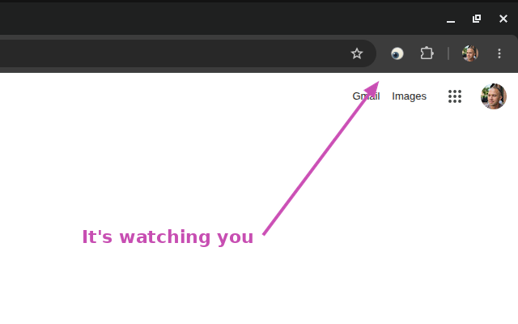

---

## 23. [AudioMint](https://www.producthunt.com/products/audiomint)
**Votes**: 7 | **도입 난이도**: 중 | **신뢰도**: 상
**Tagline**: Route individual browser tabs to any speaker.
**서비스 링크**: https://www.producthunt.com/r/HZFFPGYCXYB3DQ

**태그**: Productivity, AudioTool, DesktopUtility

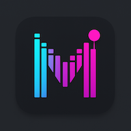

### 📌 이 서비스 한눈에 보기
브라우저 탭별로 오디오를 분리하여 원하는 스피커로 직접 라우팅하는 데스크톱 유틸리티

### 🔑 주요 기능
- 브라우저 탭별 개별 오디오 라우팅 기능
- OS의 오디오 제약 사항을 우회하는 네이티브 데스크톱 앱과 확장 프로그램 조합
- 완전 무료, 로컬 실행 기반의 개인정보 보호

### 🙋 사용자에게 어떤 점이 좋은가
여러 개의 브라우저 탭을 띄워놓고 작업할 때, 특정 탭의 소리만 다른 스피커나 믹서로 보내 작업 환경을 효율적으로 분리할 수 있습니다.

### ✅ 지금 바로 써볼 기능
- 데스크톱 앱과 브라우저 확장 프로그램 설치 및 연동
- 개별 탭의 오디오 출력 장치 변경 테스트
- 가상/물리 믹서와의 연동 확인

### ⚠️ 사용 전 확인할 점
- 데스크톱 앱과 브라우저 확장 프로그램 간의 원활한 연동 필요
- OS 오디오 드라이버 설정에 따른 초기 설정 복잡성 가능성

### 🧭 확인이 더 필요한 정보
지원하는 운영체제(Windows, macOS, Linux)의 종류와 구체적인 시스템 요구 사양에 대한 정보가 필요합니다.

### 📸 스크린샷 및 갤러리
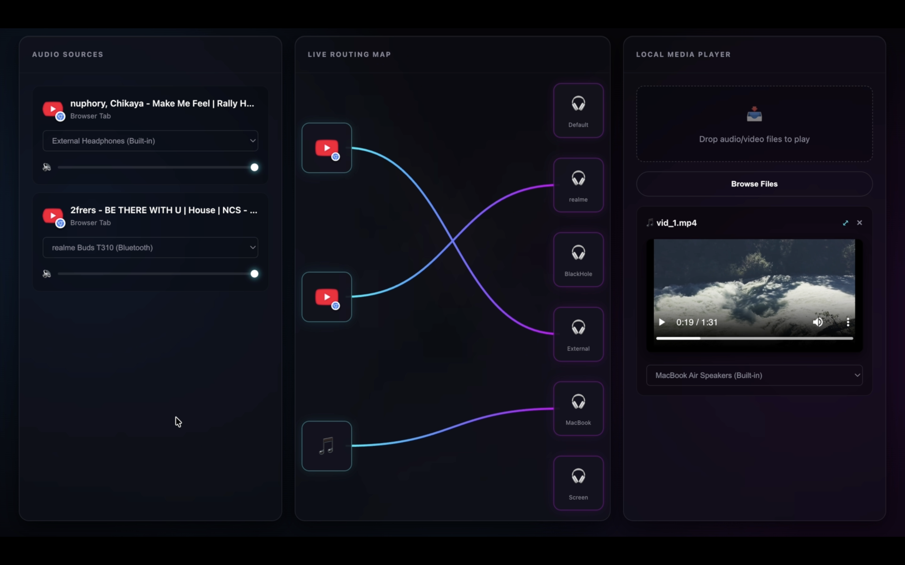
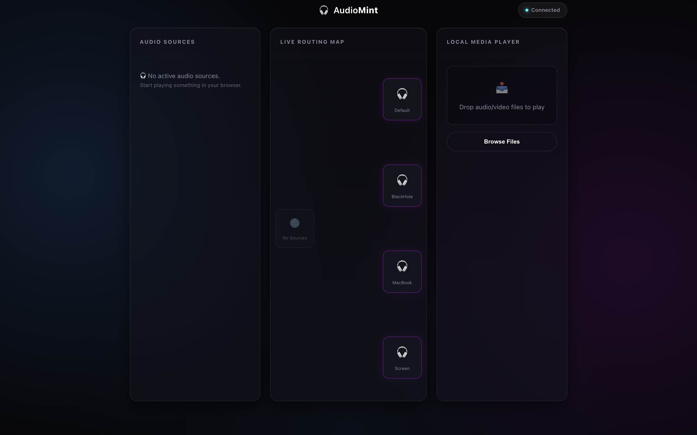
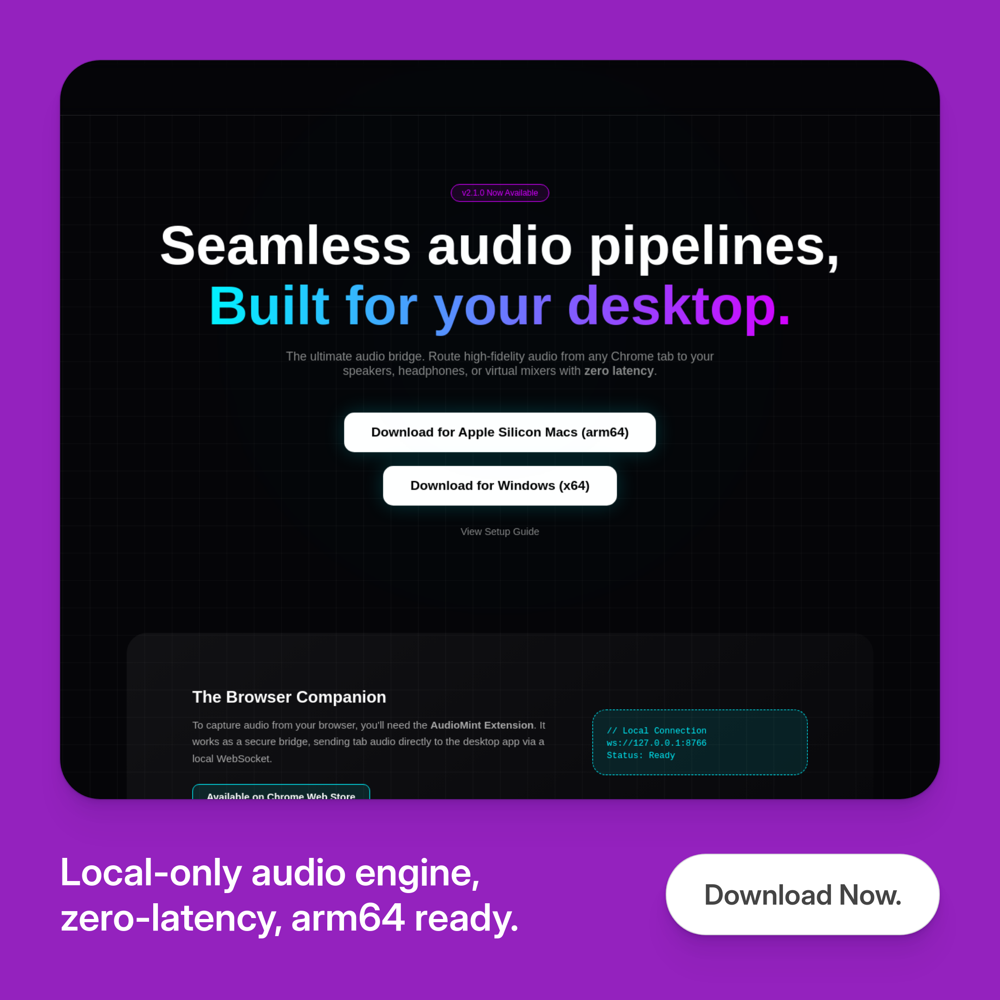

### 🎬 관련 영상
- [🎥 영상 보기](https://ph-files.imgix.net/e59da9ea-b9a4-43a9-80e2-5a7886a498a2.jpeg?auto=format)

---

## 24. [ChewView](https://www.producthunt.com/products/chewview)
**Votes**: 6 | **도입 난이도**: 하 | **신뢰도**: 상
**Tagline**: Pauses your kid's video the second they stop chewing.
**서비스 링크**: https://www.producthunt.com/r/6EYWXOJ5YLPLOU

**태그**: Parenting, Automation, iOS, Video

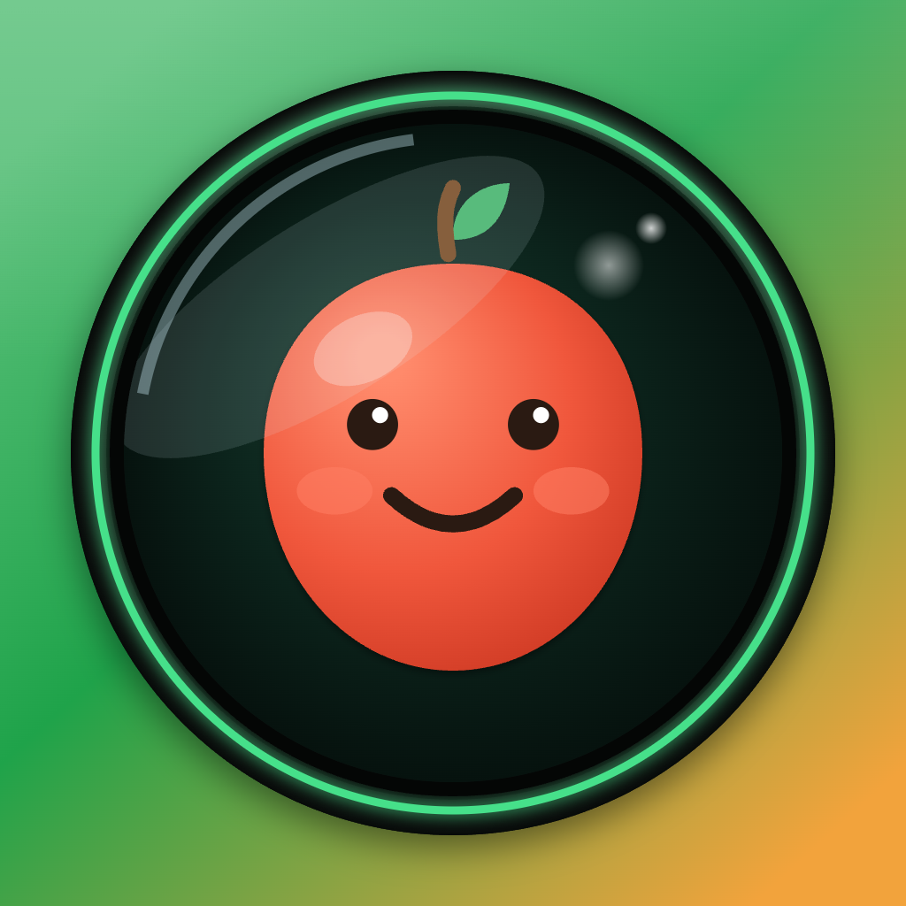

### 📌 이 서비스 한눈에 보기
아이의 저작 활동에 맞춰 영상을 자동으로 멈추고 재생하는 스마트 식사 보조 도구

### 🔑 주요 기능
- 아이의 턱 움직임을 감지하여 영상 재생/일시정지 자동 제어
- 부모의 반복적인 잔소리 없이 식사 습관 유도
- 100% 온디바이스 처리로 카메라 피드가 기기 외부로 유출되지 않는 보안성

### 🙋 사용자에게 어떤 점이 좋은가
식사 시간마다 아이에게 먹으라고 잔소리해야 하는 부모의 스트레스를 줄이고, 아이가 식사에 집중할 수 있는 환경을 만들어 줍니다.

### ✅ 지금 바로 써볼 기능
- 7일 무료 체험을 통해 아이의 식사 패턴에 잘 맞는지 테스트하기
- 아이의 눈높이에 맞는 적절한 위치에 iPhone/iPad 거치하기

### ⚠️ 사용 전 확인할 점
- 카메라가 아이의 턱 움직임을 정확히 인식하기 위한 적절한 조명과 각도 확보 필요
- 아이의 움직임이 너무 격렬할 경우 오작동 가능성

### 🧭 확인이 더 필요한 정보
향후 업데이트 예정인 YouTube 계정 연동 및 플레이리스트 기능의 구체적인 출시 일정은 미정입니다.

### 📸 스크린샷 및 갤러리
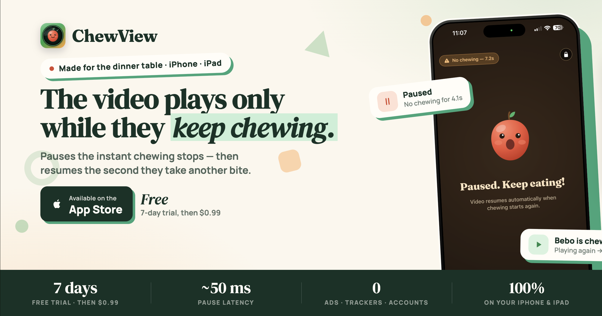
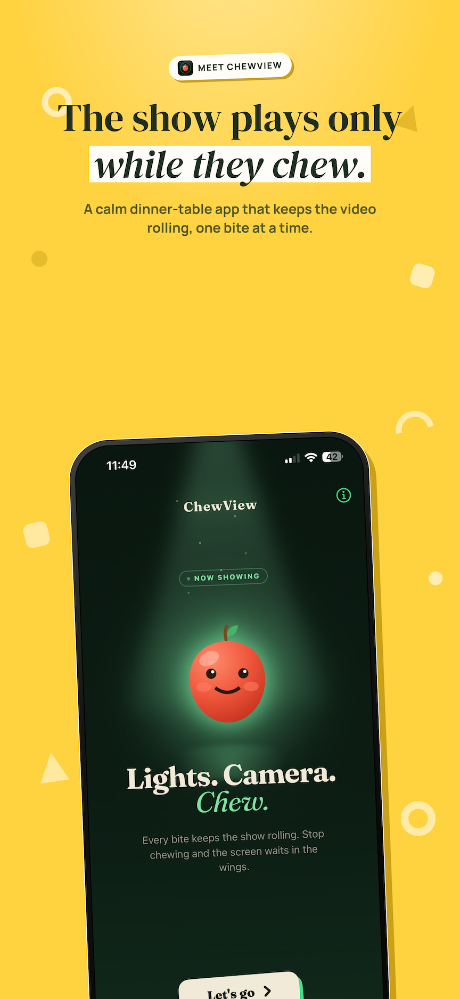
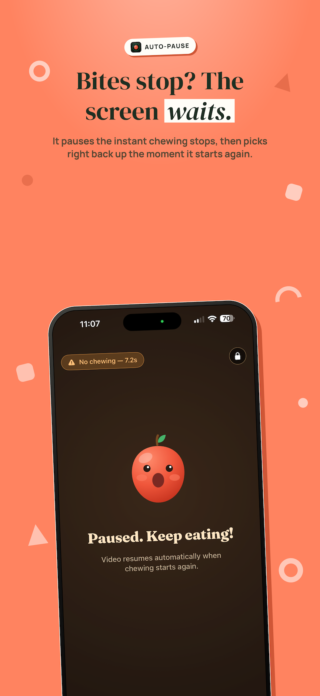

---

## 25. [Soccer Duels](https://www.producthunt.com/products/soccer-duels)
**Votes**: 6 | **도입 난이도**: 하 | **신뢰도**: 상
**Tagline**: Draft legends or prove your lineup beats your friends! 
**서비스 링크**: https://www.producthunt.com/r/KAQZC7QKOKS5TT

**태그**: Gaming, Sports, Multiplayer, Strategy, AI Tool

### 📌 이 서비스 한눈에 보기
축구 지식을 활용해 나만의 라인업을 구성하고 친구와 대결하는 드래프트 게임

### 🔑 주요 기능
- 솔로 드래프트 모드로 최고 점수 도전 및 리더보드 경쟁
- 듀얼 모드를 통한 실시간 턴제 온라인 대결
- 간단한 규칙 속에 전략적 판단이 필요한 게임 플레이

### 🙋 사용자에게 어떤 점이 좋은가
축구 팬들이 자신의 지식을 시험하며 짧은 시간 동안 몰입감 있게 즐길 수 있는 엔터테인먼트를 제공합니다.

### ✅ 지금 바로 써볼 기능
- 솔로 모드로 나만의 베스트 라인업 구성해보기
- 리더보드 순위 확인하며 점수 높이기
- 듀얼 모드에서 다른 유저와 실시간 대결하기

### ⚠️ 사용 전 확인할 점
- 실시간 대결 시 네트워크 환경에 따른 지연 가능성
- 게임의 재미 요소가 개인의 축구 지식 수준에 따라 다를 수 있음

### 🧭 확인이 더 필요한 정보
멀티플레이어 매칭 시스템의 대기 시간 및 구체적인 게임 규칙에 대한 정보가 더 필요합니다.

### 📸 스크린샷 및 갤러리

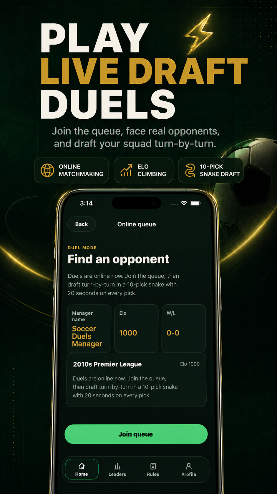

---

## 26. [MonstaReel](https://www.producthunt.com/products/monstareel)
**Votes**: 5 | **도입 난이도**: 하 | **신뢰도**: 상
**Tagline**: Turn any topic into a viral AI reel in 60 seconds
**서비스 링크**: https://www.producthunt.com/r/L5XEBM25ONA4SN

**태그**: AI Video, Content Creation, Automation, Social Media, AI Tool, Video

### 📌 이 서비스 한눈에 보기
주제 입력만으로 60초 만에 숏폼 영상을 완성하는 AI 자동 제작 도구

### 🔑 주요 기능
- 주제 입력 시 스크립트 작성부터 영상 생성까지 자동화
- ElevenLabs 음성 및 AI 비주얼 생성 기능 통합
- 자막 자동 삽입으로 편집 기술 없이 즉시 게시 가능

### 🙋 사용자에게 어떤 점이 좋은가
영상 편집 기술이 없어도 아이디어만 있으면 틱톡, 릴스용 콘텐츠를 빠르게 대량 생산할 수 있습니다.

### ✅ 지금 바로 써볼 기능
- 무료 체험 기능을 통해 생성된 영상 품질 확인하기
- 입력한 주제가 의도한 대로 스크립트화되는지 테스트하기
- 생성된 비주얼과 음성의 조화 확인하기

### ⚠️ 사용 전 확인할 점
- AI 생성 콘텐츠 특성상 결과물의 창의성이나 디테일이 부족할 수 있음
- 무료 체험 이후 유료 플랜 전환 시 비용 정책 확인 필요

### 🧭 확인이 더 필요한 정보
무료 체험 이후 제공되는 기능의 범위와 구체적인 유료 구독 모델에 대한 정보가 필요합니다.

### 📸 스크린샷 및 갤러리
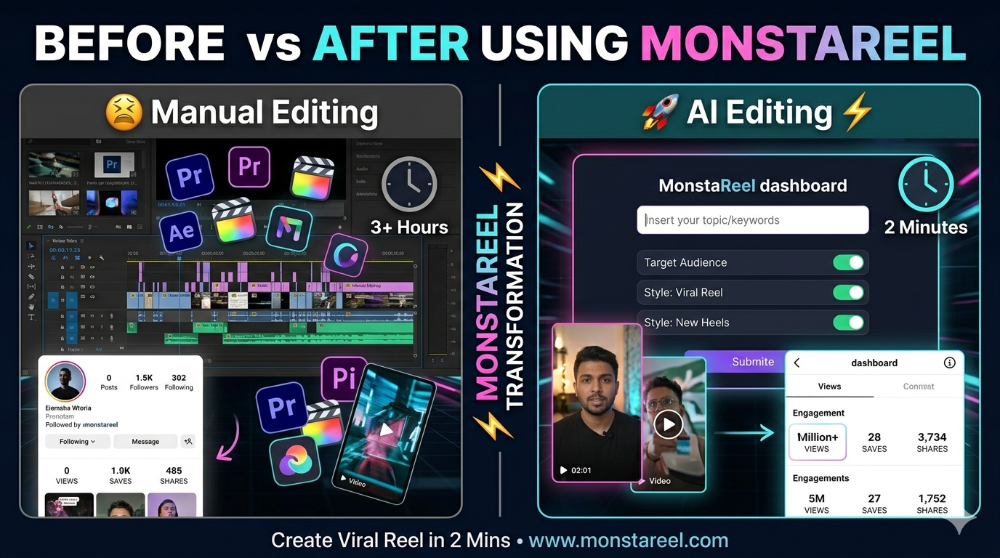
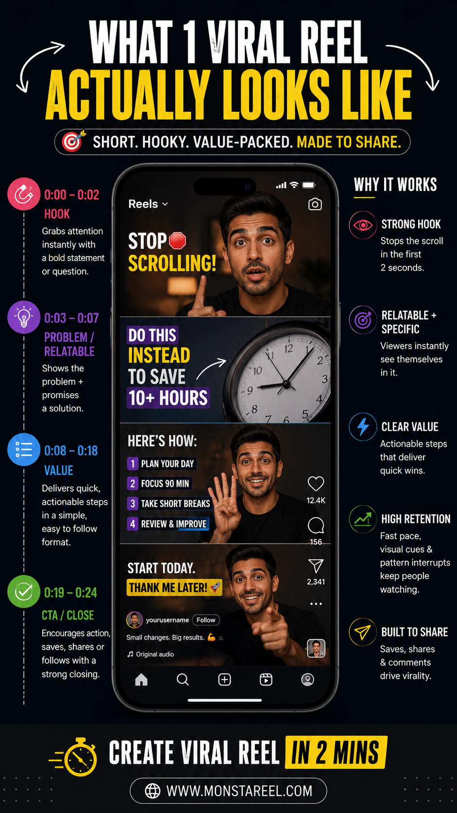
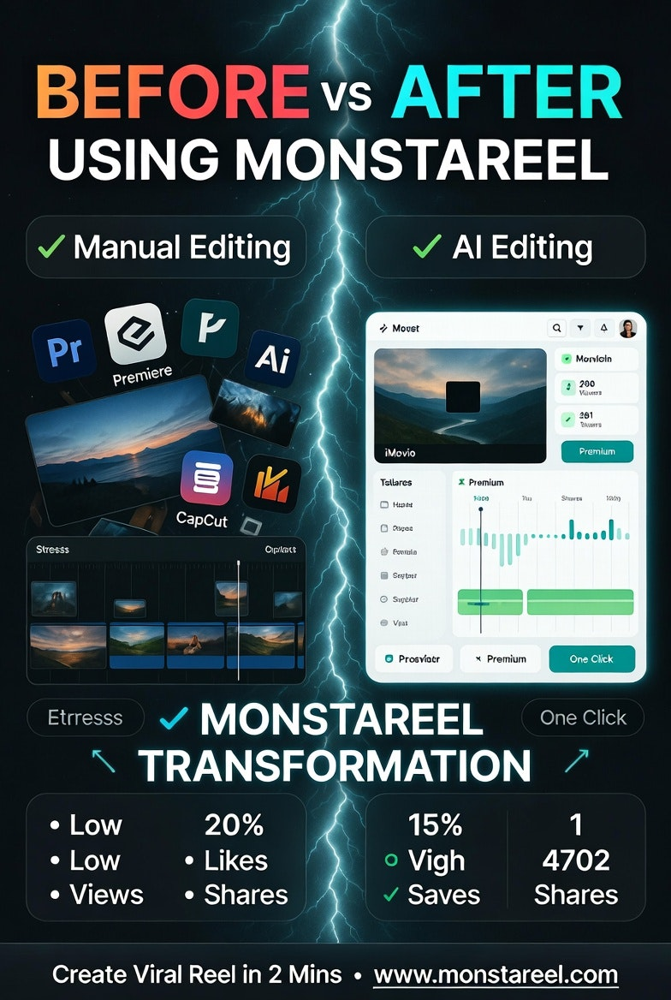

---

## 27. [PacksMC](https://www.producthunt.com/products/packsmc)
**Votes**: 5 | **도입 난이도**: 하 | **신뢰도**: 상
**Tagline**: Upload once. We convert, render, and publish it all.
**서비스 링크**: https://www.producthunt.com/r/JIJTQDPBK2PXRC

**태그**: Minecraft, ContentCreation, Automation, AssetManagement

### 📌 이 서비스 한눈에 보기
한 번의 업로드로 마인크래프트 텍스처 팩을 자동 변환 및 배포하는 크리에이터 플랫폼

### 🔑 주요 기능
- 업로드 시 자동 변환, 렌더링 및 게시 프로세스 제공
- 게임 버전에 따른 자동 분류로 호환성 문제 해결
- 월간 30만 명 이상의 사용자를 보유한 검증된 플랫폼

### 🙋 사용자에게 어떤 점이 좋은가
제작자는 번거로운 작업 없이 텍스처 팩을 쉽게 배포할 수 있고, 사용자는 자신의 게임 버전에 맞는 팩을 오류 없이 즉시 내려받을 수 있습니다.

### ✅ 지금 바로 써볼 기능
- 제작한 텍스처 팩 업로드해보기
- 게임 버전별 자동 분류 기능 확인하기
- 배포된 결과물 렌더링 상태 점검하기

### ⚠️ 사용 전 확인할 점
- 자동 변환 과정에서 디자인 의도가 변형될 가능성 확인 필요
- 특정 커스텀 모드와의 호환성 여부 검토 필요

### 🧭 확인이 더 필요한 정보
자동화된 렌더링 및 변환 프로세스의 세부 품질과 지원 가능한 파일 형식에 대한 정보가 더 필요합니다.

### 📸 스크린샷 및 갤러리
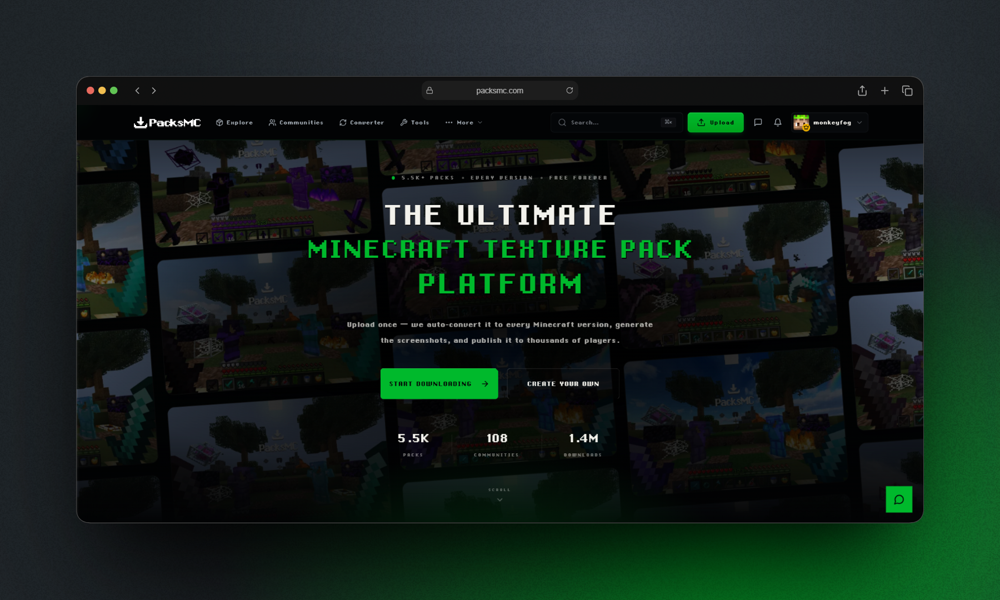
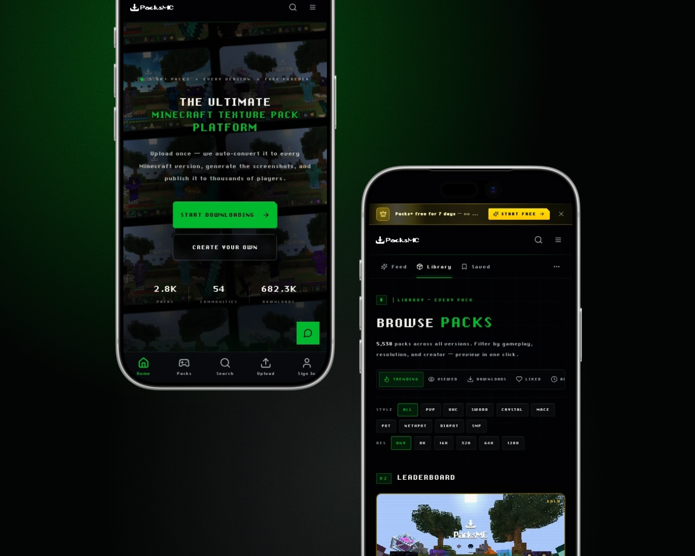
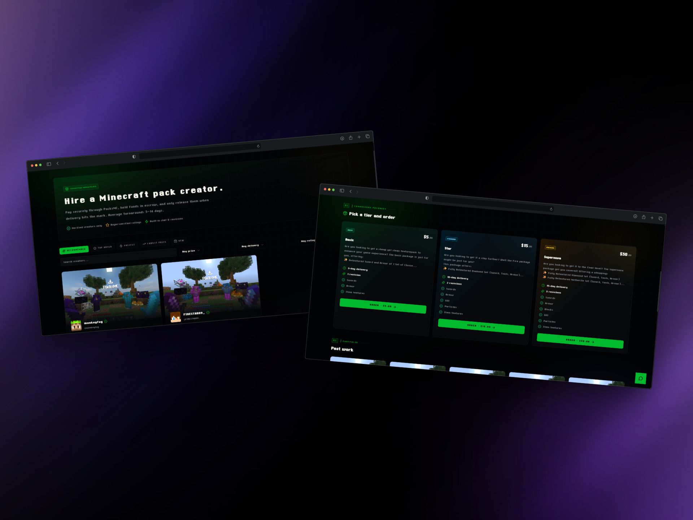

### 🎬 관련 영상
- [🎥 영상 보기](https://ph-files.imgix.net/0416a4b9-dd89-4b29-87e7-16742a0800e8.jpeg?auto=format)

---

## 28. [Video Enhancer](https://www.producthunt.com/products/video-enhancer-2)
**Votes**: 5 | **도입 난이도**: 하 | **신뢰도**: 상
**Tagline**: Denoise, artifacts, restore colors and upscale videos
**서비스 링크**: https://www.producthunt.com/r/UKLVYQ7MC2A6TA

**태그**: VideoEditing, AI, Upscaling, CreativeTool, AI Tool, Video

### 📌 이 서비스 한눈에 보기
AI 기술을 활용해 노이즈 제거부터 고해상도 업스케일링까지 지원하는 온라인 비디오 품질 개선 도구

### 🔑 주요 기능
- 노이즈 제거 및 선명도 향상(Sharpen)
- 압축 아티팩트 제거 및 색상 복원
- 최대 4K 해상도까지 업스케일링 지원

### 🙋 사용자에게 어떤 점이 좋은가
저화질 영상을 고해상도로 변환하거나 손상된 영상 품질을 빠르게 복구하여 시각적 완성도를 높일 수 있습니다.

### ✅ 지금 바로 써볼 기능
- 무료 크레딧을 활용한 첫 영상 업스케일링 테스트
- 노이즈 및 압축 아티팩트 제거 기능 확인
- 색상 복원 기능 적용 결과 비교

### ⚠️ 사용 전 확인할 점
- 무료 크레딧 소진 시 추가 비용 발생 가능성
- 고해상도 작업 시 처리 시간 및 웹 브라우저 성능 영향

### 🧭 확인이 더 필요한 정보
무료 크레딧 제공 범위와 유료 플랜의 상세 가격 정책에 대한 정보가 필요합니다.

### 📸 스크린샷 및 갤러리
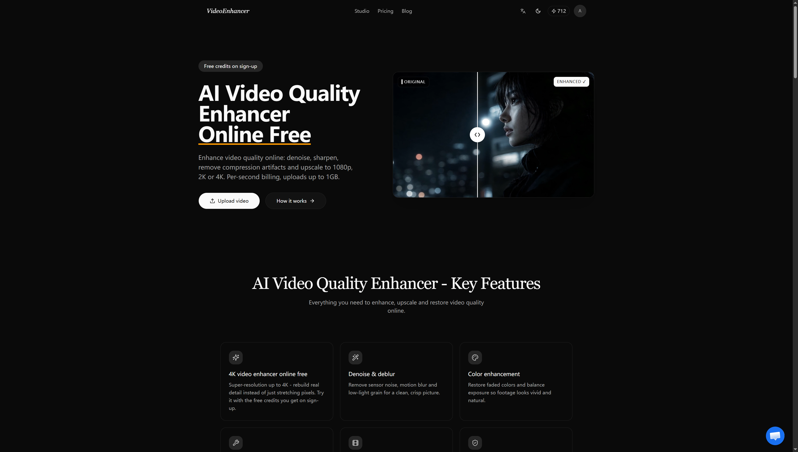

---

## 29. [aislop.com](https://www.producthunt.com/products/aislop-com)
**Votes**: 5 | **도입 난이도**: 하 | **신뢰도**: 상
**Tagline**: A game to test your skill at detecting what's real or slop
**서비스 링크**: https://www.producthunt.com/r/P3MT2X2GONSFN4

**태그**: Game, AI, DailyChallenge, AI Tool

### 📌 이 서비스 한눈에 보기
매일 새로운 5장의 사진으로 AI 생성 이미지와 실제 사진을 구분하는 데일리 퀴즈 게임

### 🔑 주요 기능
- Wordle 방식의 매일 새로운 데일리 챌린지 제공
- AI 생성 이미지(Slop)와 실제 사진을 구분하는 능력 테스트
- 전 세계 사용자와 동일한 문제를 푸는 커뮤니티형 게임

### 🙋 사용자에게 어떤 점이 좋은가
AI 기술이 발전하는 시대에 이미지의 진위 여부를 판별하는 시각적 문해력을 재미있게 키울 수 있습니다.

### ✅ 지금 바로 써볼 기능
- 오늘의 데일리 챌린지 플레이하기
- 친구들과 점수 공유하기
- AI 이미지의 특징 파악하기

### ⚠️ 사용 전 확인할 점
- 게임의 목적이 단순 오락이므로 학습용으로는 깊이가 부족할 수 있음
- 매일 한 번의 기회만 제공되는 방식에 대한 호불호

### 🧭 확인이 더 필요한 정보
추가적인 게임 모드나 멀티플레이 기능의 존재 여부는 명시되지 않았습니다.

### 📸 스크린샷 및 갤러리

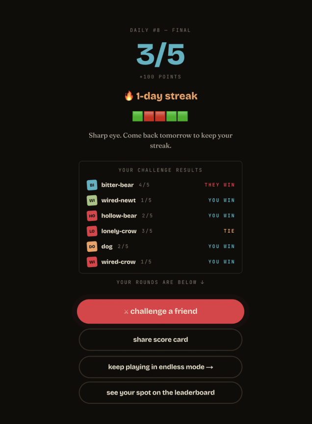

---

## 30. [SupraVera](https://www.producthunt.com/products/supravera)
**Votes**: 5 | **도입 난이도**: 상 | **신뢰도**: 중
**Tagline**: The Sovereign Trust Operating System
**서비스 링크**: https://www.producthunt.com/r/I4PHMI4ND4IBG4

**태그**: Cybersecurity, AI, Identity, Cryptography, TrustTech, AI Tool, Design, Analytics, Security

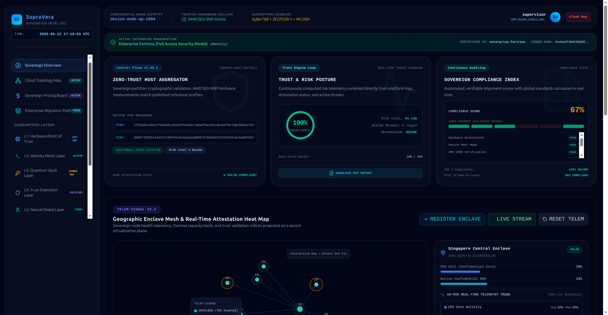

### 📌 이 서비스 한눈에 보기
AI와 양자 내성 암호 기술을 결합하여 실시간으로 신뢰를 검증하는 차세대 보안 운영 체제

### 🔑 주요 기능
- AI 기반 부정행위 탐지 및 행동 위험 분석 기능
- 양자 내성 암호 및 기밀 컴퓨팅을 통한 강력한 보안
- 딥페이크에 저항하는 신원 검증 및 통합 신뢰 커널 아키텍처

### 🙋 사용자에게 어떤 점이 좋은가
기존의 파편화된 보안 도구들을 하나로 통합하여, 디지털 환경에서 실시간으로 신뢰할 수 있는 사용자 신원과 데이터 보안을 제공합니다.

### ✅ 지금 바로 써볼 기능
- 통합 신뢰 커널 아키텍처 구조 파악
- 실시간 위험 점수 산출 방식 검토
- 기존 보안 시스템과의 통합 가능성 확인

### ⚠️ 사용 전 확인할 점
- 고도화된 기술 스택으로 인한 초기 도입 및 운영 복잡성
- 기존 레거시 시스템과의 호환성 여부 확인 필요

### 🧭 확인이 더 필요한 정보
구체적인 시스템 요구 사양 및 기존 보안 솔루션과의 통합 방식에 대한 상세 정보가 필요합니다.

### 📸 스크린샷 및 갤러리
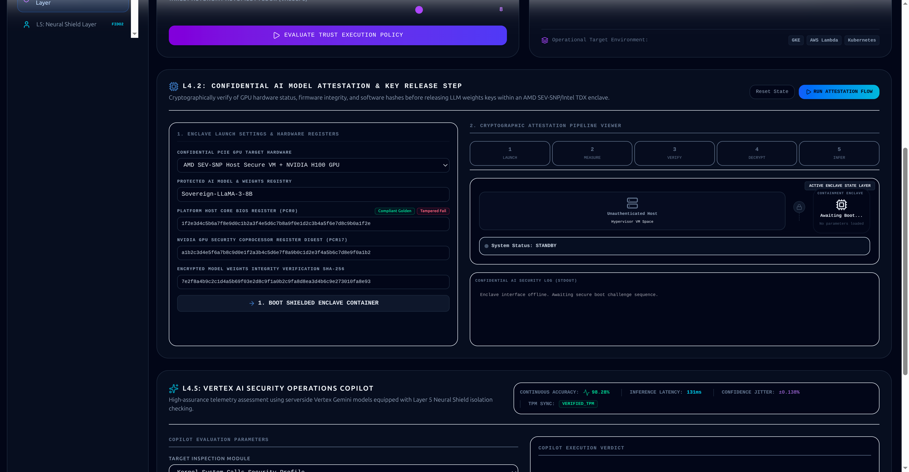
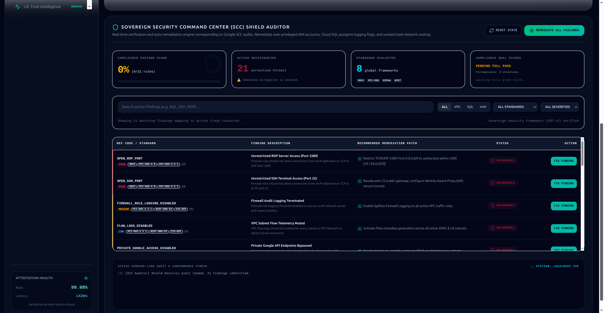
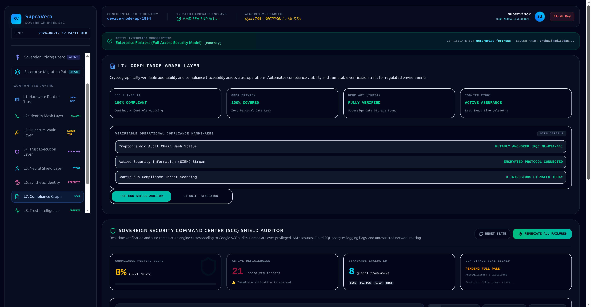

### 🎬 관련 영상
- [🎥 영상 보기](https://ph-files.imgix.net/f7ca817c-c7b8-4429-a376-27f0f54a3b75.jpeg?auto=format)

---

