# 🚀 Product Hunt Daily Top 30 (2026-06-23)

## 오늘의 요약
오늘의 트렌드는 AI 에이전트의 자율성을 극대화하고, 개발 및 업무 프로세스에 AI를 깊숙이 통합하는 도구들이 주를 이루었습니다. 특히 AI가 스스로 코드를 배포하거나, 사용자의 맥락을 파악해 업무를 선제적으로 처리하는 등 단순 보조를 넘어선 '에이전트 중심'의 서비스가 눈에 띕니다.

### 오늘의 핵심 포인트
- AI 에이전트의 개발, 테스트, 배포 과정을 자동화하고 효율화하는 인프라 솔루션이 주목받았습니다.
- 사용자의 화면 활동이나 업무 채널을 분석하여 할 일을 예측하고 정리하는 지능형 비서 서비스가 등장했습니다.
- AI 모델의 성능 검증, 브랜드 일관성 유지, 법률 분석 등 특정 전문 영역에 특화된 AI 도구들이 다양하게 제안되었습니다.

**오늘의 태그**: AI Agent, Automation, Developer Tools, Productivity

## 1. [Skybridge](https://www.producthunt.com/products/skybridge)
**Votes**: 384 | **도입 난이도**: 중 | **신뢰도**: 상
**Tagline**: The full-stack open source React framework for MCP Apps
**서비스 링크**: https://www.producthunt.com/r/WYDUMMA2RJODS7

**태그**: DevTool, React, AI, MCP, OpenSource, AI Tool, Chat

### 📌 이 서비스 한눈에 보기
AI 어시스턴트용 MCP 앱 개발을 위한 풀스택 오픈소스 React 프레임워크

### 🔑 주요 기능
- MCP 서버, 뷰 렌더링, 클라이언트 호환성 등 인프라 및 개발 루프 통합 제공
- 한 번의 코딩으로 다양한 AI 환경에 배포 가능한 'Code once, ship everywhere' 지향
- 테스트 터널 및 테스트 환경을 포함한 개발자 친화적 툴링 제공

### 🙋 사용자에게 어떤 점이 좋은가
복잡한 MCP 인프라 구축 대신 기능 구현에만 집중하여 AI 어시스턴트용 인터랙티브 앱을 빠르게 제작할 수 있습니다.

### ✅ 지금 바로 써볼 기능
- React 기반의 MCP 서버 구축 시도
- 제공되는 테스트 터널을 통한 로컬 개발 환경 검증
- 다양한 AI 클라이언트와의 호환성 테스트

### ⚠️ 사용 전 확인할 점
- 새로운 표준인 MCP 프로토콜에 대한 이해도 필요
- 프레임워크가 특정 환경(AI 어시스턴트)에 특화되어 있어 범용 웹 개발과는 목적이 다름

### 🧭 확인이 더 필요한 정보
현재 제공되는 구체적인 배포 플랫폼 및 클라이언트 호환성 범위에 대한 상세 정보 확인이 필요합니다.

### 📸 스크린샷 및 갤러리
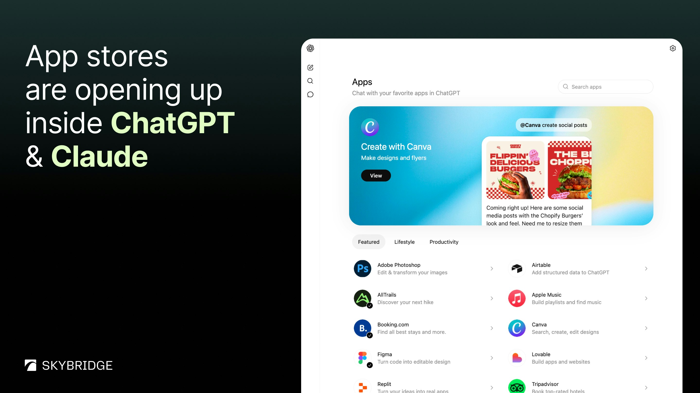
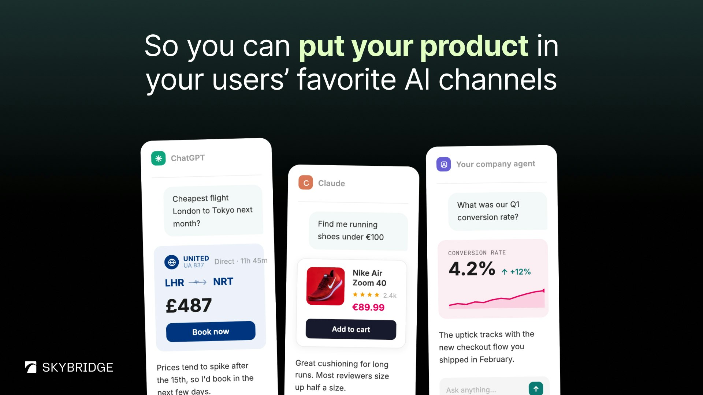
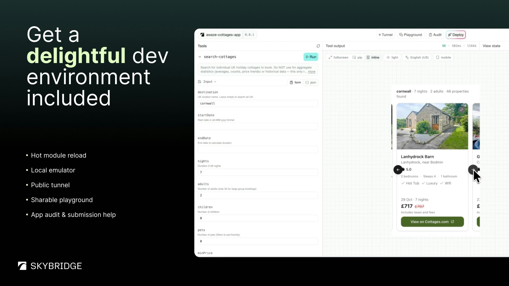

### 🎬 관련 영상
- [🎥 영상 보기](https://ph-files.imgix.net/3f7ee760-61cb-463e-81ea-7be988b689fa.jpeg?auto=format)

---

## 2. [AgentX](https://www.producthunt.com/products/agentx)
**Votes**: 295 | **도입 난이도**: 중 | **신뢰도**: 상
**Tagline**: Evaluate AI agent, pinpoint issues, and fix with one click.
**서비스 링크**: https://www.producthunt.com/r/MAKIXB6C4DMJG6

**태그**: AI-Agent, DevOps, LLMOps, Testing, Observability, Agent, AI Tool, LLM

### 📌 이 서비스 한눈에 보기
AI 에이전트의 성능을 테스트하고 문제 해결 및 최적의 LLM을 제안하는 AI 전용 CI/CD 플랫폼

### 🔑 주요 기능
- 테스트 스위트 생성을 통한 배포 전 사전 검증 및 에러 방지
- 문제 지점 식별부터 해결책 제안까지 제공하는 AI 분석 기능
- 다양한 LLM 제공업체 간의 성능, 비용, 지연 시간 비교 시뮬레이션

### 🙋 사용자에게 어떤 점이 좋은가
AI 에이전트 개발 시 발생할 수 있는 예기치 못한 오류를 배포 전에 차단하고, 비용과 성능을 고려한 최적의 모델 선택을 도와줍니다.

### ✅ 지금 바로 써볼 기능
- 테스트 스위트를 생성하여 현재 에이전트의 안정성 검증하기
- 멀티 LLM 시뮬레이션을 통해 비용 대비 성능 비교하기
- AI 분석 기능을 활용해 식별된 문제에 대한 수정 제안 확인하기

### ⚠️ 사용 전 확인할 점
- 에이전트의 복잡도에 따라 AI가 제안하는 수정 사항의 정확도 차이 발생 가능
- 다양한 LLM 환경에서의 시뮬레이션 시 실제 운영 환경과의 괴리 가능성

### 🧭 확인이 더 필요한 정보
현재 제공되는 구체적인 통합 환경(CI/CD 도구 등) 및 상세 가격 정책에 대한 정보가 부족합니다.

### 📸 스크린샷 및 갤러리
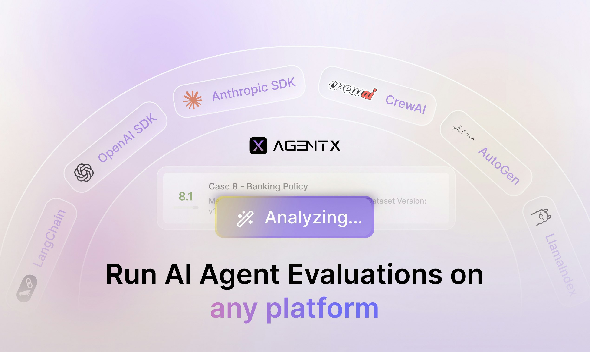
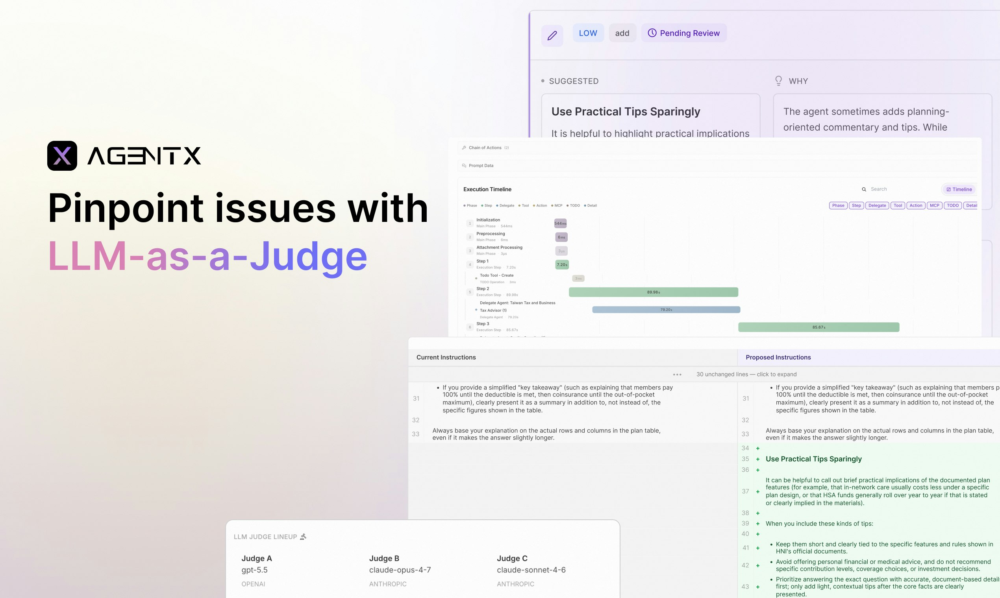
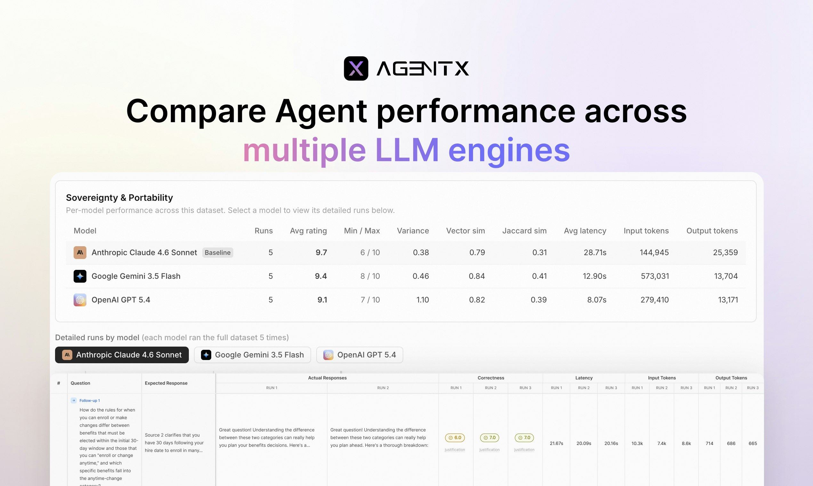

### 🎬 관련 영상
- [🎥 영상 보기](https://ph-files.imgix.net/3499f1d3-208c-46b0-a2ac-33fcd3f229f7.jpeg?auto=format)

---

## 3. [Alai 2.0](https://www.producthunt.com/products/alai)
**Votes**: 228 | **도입 난이도**: 하 | **신뢰도**: 상
**Tagline**: AI design partner for presentations, social posts, and more
**서비스 링크**: https://www.producthunt.com/r/FXYXCM6UIMQ5YE

**태그**: Design, AI, Branding, Marketing, AI Tool

### 📌 이 서비스 한눈에 보기
브랜드 가이드를 완벽하게 반영하는 AI 디자인 파트너

### 🔑 주요 기능
- 브랜드 디자인 시스템을 학습하여 일관된 디자인 생성
- 프레젠테이션, 소셜 미디어, 광고 등 다양한 규격 지원
- 사용자 선택에 따른 AI 모델 최적화 (비용, 품질, 속도 조절 가능)

### 🙋 사용자에게 어떤 점이 좋은가
브랜드 아이덴티티를 유지하면서 다양한 크기의 디자인 에셋을 빠르고 일관되게 제작할 수 있습니다.

### ✅ 지금 바로 써볼 기능
- 브랜드 디자인 시스템 설정하기
- 프레젠테이션 및 소셜 포스트 생성해보기
- 목적에 맞는 AI 모델 선택 및 편집 테스트

### ⚠️ 사용 전 확인할 점
- 사용자가 선택하는 AI 모델에 따라 결과물의 품질과 비용이 달라질 수 있음
- 수동 편집 기능과 AI 생성 기능 간의 조화 확인 필요

### 🧭 확인이 더 필요한 정보
사용자가 직접 선택 가능한 AI 모델의 종류와 구체적인 비용 체계에 대한 정보가 필요합니다.

### 📸 스크린샷 및 갤러리

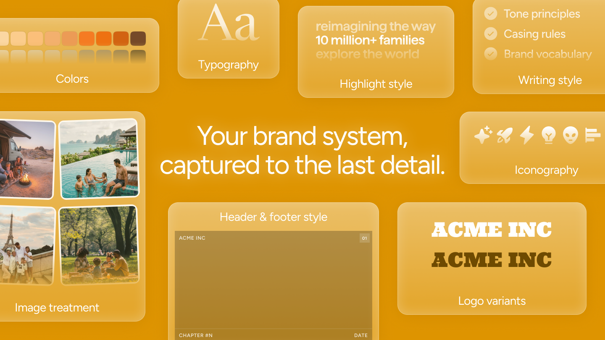
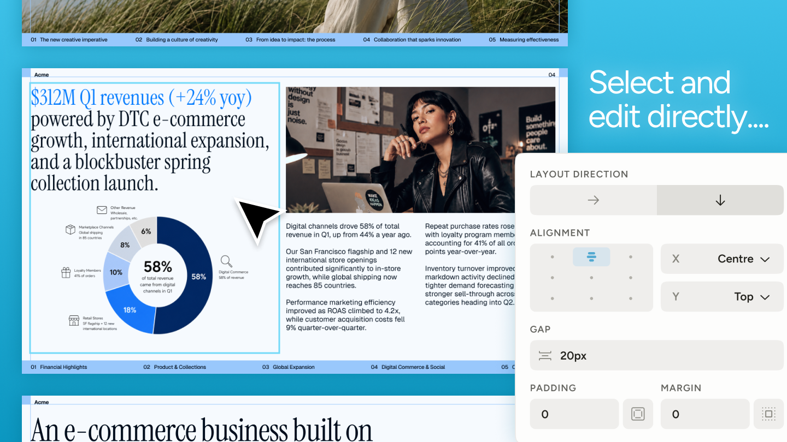

### 🎬 관련 영상
- [🎥 영상 보기](https://ph-files.imgix.net/1a35980e-2e81-4ec3-941b-a033cb736a83.jpeg?auto=format)

---

## 4. [readywhen](https://www.producthunt.com/products/readywhen)
**Votes**: 181 | **도입 난이도**: 중 | **신뢰도**: 상
**Tagline**: Your 24/7 AI Chief of Staff for commitments and follow-ups
**서비스 링크**: https://www.producthunt.com/r/STOAZFU5CH6INJ

**태그**: AI Assistant, Productivity, Automation, Workflow, AI Tool, CRM, Email

### 📌 이 서비스 한눈에 보기
모든 업무 채널의 결정사항과 후속 조치를 자동으로 정리해 주는 24/7 AI 비서

### 🔑 주요 기능
- Slack, 이메일, 회의, 문서 등 흩어진 업무 데이터 통합 관리
- 결정사항과 약속을 자동으로 포착하여 누락 방지
- 다음 단계(이메일 초안, 업데이트 등)를 선제적으로 제안

### 🙋 사용자에게 어떤 점이 좋은가
업무 도구 사이를 오가며 발생하는 파편화된 정보들을 일일이 정리할 필요 없이, 승인만으로 후속 업무를 처리할 수 있습니다.

### ✅ 지금 바로 써볼 기능
- 주요 업무 채널(Slack, Email 등) 연동하기
- AI가 생성한 업무 초안 검토 및 승인하기
- 누락된 팔로업(Follow-up) 항목 확인하기

### ⚠️ 사용 전 확인할 점
- 개인적인 업무 데이터(이메일, 메시지 등)에 대한 접근 권한 필요
- AI가 생성한 초안의 정확성을 사용자가 최종 검토해야 함

### 🧭 확인이 더 필요한 정보
현재 지원하는 구체적인 문서 도구 및 CRM과의 연동 범위는 명시되지 않았습니다.

### 📸 스크린샷 및 갤러리
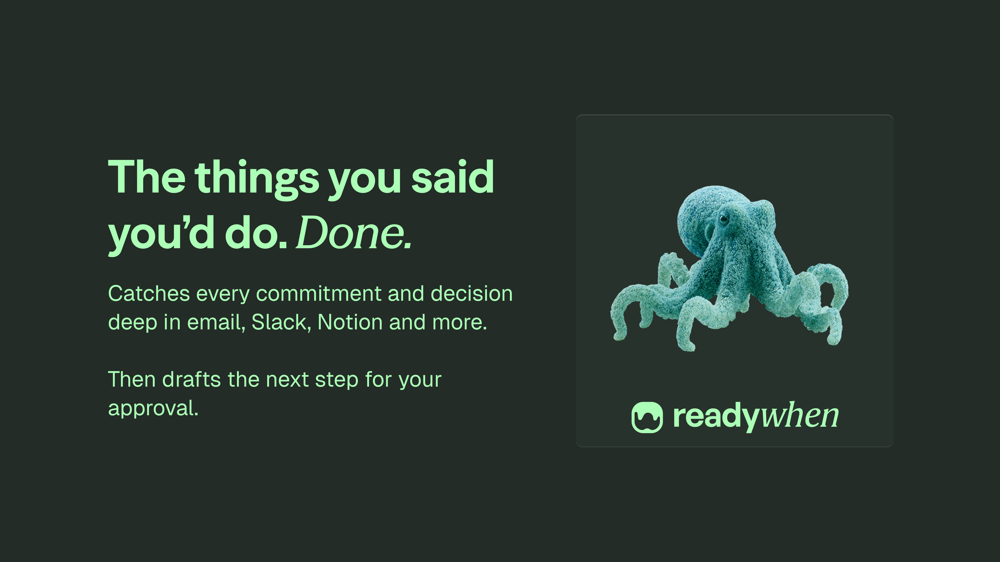
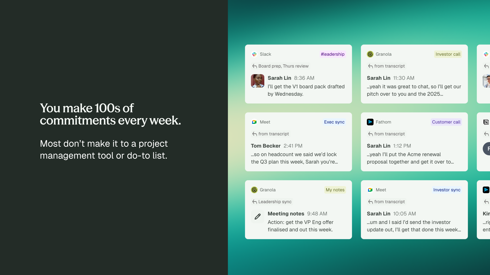
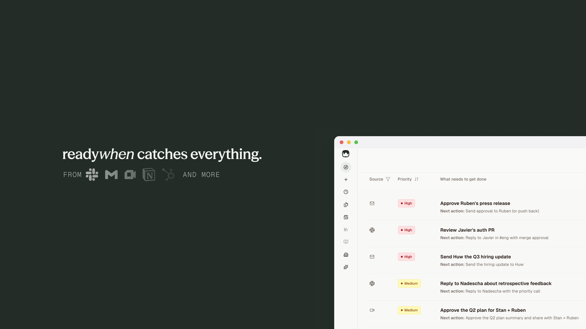

### 🎬 관련 영상
- [🎥 영상 보기](https://ph-files.imgix.net/76c35dfd-2cac-48d2-86a7-794d5ceb6fe9.octet-stream?auto=format)

---

## 5. [HAQQ Legal AI on Mobile](https://www.producthunt.com/products/haqq-mobile-app)
**Votes**: 177 | **도입 난이도**: 하 | **신뢰도**: 상
**Tagline**: Bringing legal understanding to anyone with a phone
**서비스 링크**: https://www.producthunt.com/r/ICAKRVUKEN25TG

**태그**: LegalTech, Mobile, AI, Productivity, AI Tool, Chat

### 📌 이 서비스 한눈에 보기
언제 어디서든 모바일로 계약서를 분석하고 법적 리스크를 확인하는 AI 법률 비서

### 🔑 주요 기능
- 모바일 환경에 최적화된 법률 분석 서비스
- 계약서 업로드 및 질문을 통한 구조화된 법적 답변 제공
- 관할 구역을 고려한 리스크 플래그 및 내보내기 기능

### 🙋 사용자에게 어떤 점이 좋은가
변호사 상담 비용이나 인맥에 의존하지 않고도, 스마트폰만 있으면 복잡한 계약 내용과 법적 위치를 즉시 파악할 수 있습니다.

### ✅ 지금 바로 써볼 기능
- 보유 중인 계약서 업로드하여 분석하기
- 특정 조항에 대한 법적 리스크 질문하기
- 분석된 결과물 내보내기 기능 활용하기

### ⚠️ 사용 전 확인할 점
- AI의 분석 결과가 실제 법적 효력을 갖는 전문 변호사의 자문을 대체할 수 없음
- 사용자의 관할 구역(Jurisdiction) 설정 및 데이터 정확성 확인 필요

### 🧭 확인이 더 필요한 정보
Justinian® 엔진의 구체적인 법률 데이터 범위와 지원하는 국가/언어의 상세 범위 확인이 필요합니다.

### 📸 스크린샷 및 갤러리
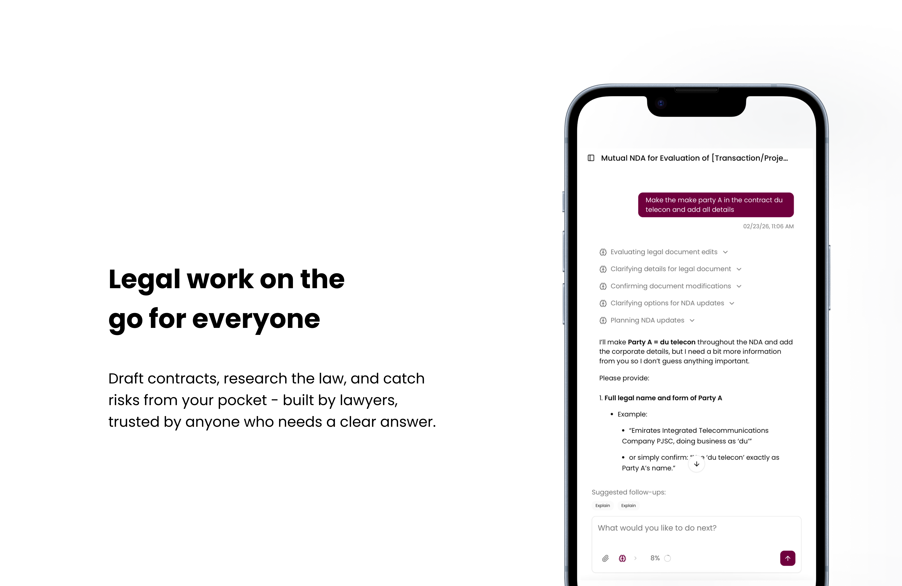
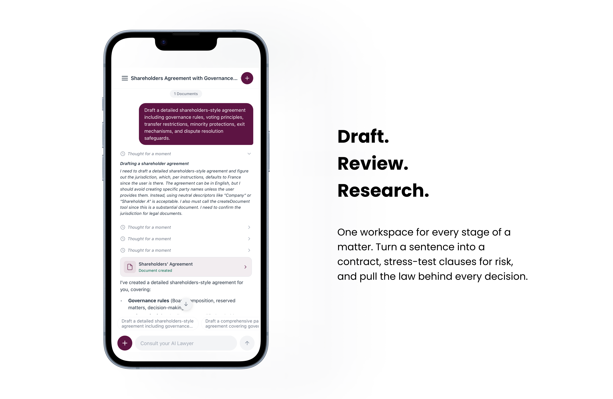
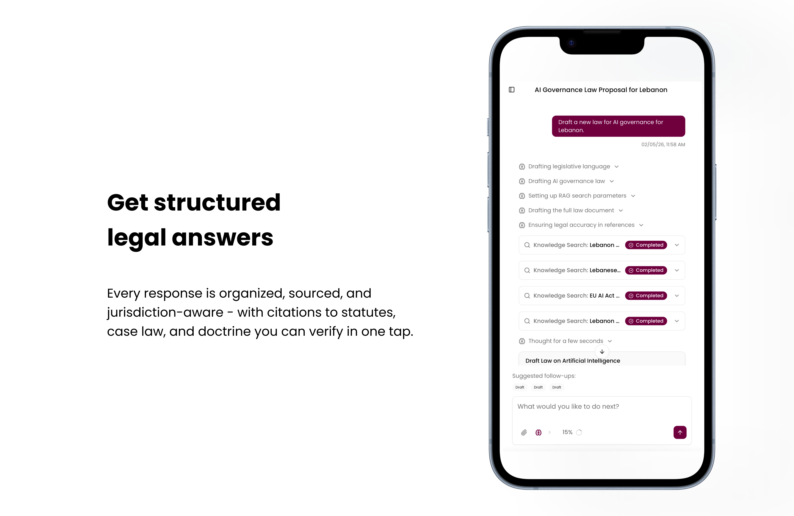

### 🎬 관련 영상
- [🎥 영상 보기](https://ph-files.imgix.net/5596c5d5-7f47-469d-9acd-b90b47d1fc4f.jpeg?auto=format)

---

## 6. [Cloudflare Temporary Accounts](https://www.producthunt.com/products/cloudflare)
**Votes**: 145 | **도입 난이도**: 하 | **신뢰도**: 상
**Tagline**: Let agents deploy before signup
**서비스 링크**: https://www.producthunt.com/r/WFEAPNZTIKAUTV

**태그**: DevTool, Automation, AI, Cloudflare, Agent

### 📌 이 서비스 한눈에 보기
AI 에이전트가 가입 절차 없이 즉시 코드를 배포할 수 있는 임시 계정 기능

### 🔑 주요 기능
- Cloudflare Workers 환경에서 제공되는 임시 계정 기능
- AI 에이전트가 인간의 가입 절차(Wall)를 우회하여 즉시 배포 가능
- wrangler deploy 명령어를 통한 초고속 워커(Worker) 배포

### 🙋 사용자에게 어떤 점이 좋은가
AI 에이전트가 개발 과정에서 발생하는 인증 및 가입 허들을 제거하여, 자동화된 워크플로우 내에서 즉각적인 배포가 가능해집니다.

### ✅ 지금 바로 써볼 기능
- wrangler를 이용한 임시 배포 테스트
- AI 에이전트 워크플로우에 배포 자동화 통합

### ⚠️ 사용 전 확인할 점
- 임시 계정의 유지 기간 및 데이터 보존 정책 확인 필요
- 에이전트가 생성한 리소스의 관리 및 보안 이슈 검토

### 🧭 확인이 더 필요한 정보
임시 계정의 유효 기간과 생성된 리소스의 자동 삭제 정책에 대한 구체적인 정보가 필요합니다.

### 📸 스크린샷 및 갤러리
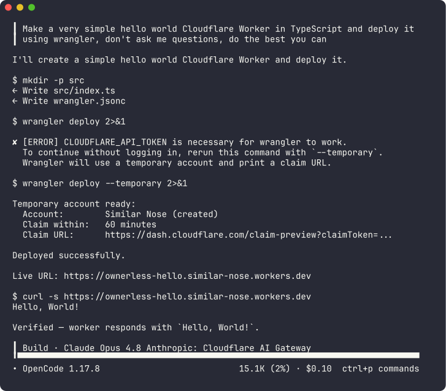
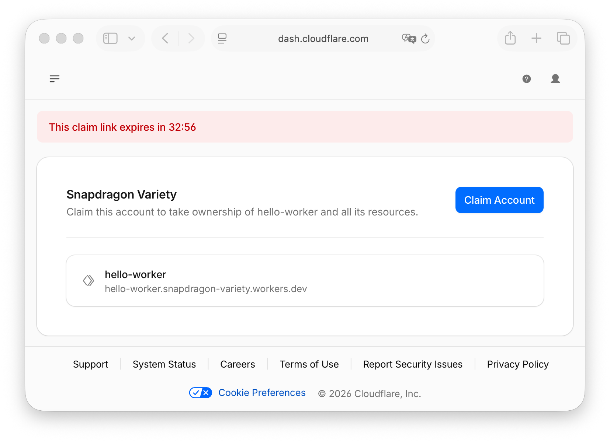
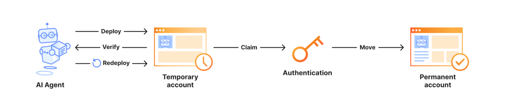

---

## 7. [uwait](https://www.producthunt.com/products/uwait)
**Votes**: 144 | **도입 난이도**: 하 | **신뢰도**: 상
**Tagline**: Get paid while AI thinks
**서비스 링크**: https://www.producthunt.com/r/ET2VD6UMZ3BTIB

**태그**: Browser Extension, Passive Income, AI Tools, AI Tool, Chat

### 📌 이 서비스 한눈에 보기
AI 답변을 기다리는 시간을 수익 창출의 기회로 바꾸는 크롬 확장 프로그램

### 🔑 주요 기능
- ChatGPT나 Claude 사용 시 발생하는 대기 시간(3~8초)을 활용한 광고 노출
- 수익 배분 모델: 사용자 50%, 콘텐츠 제공자(Publisher) 30%, 서비스 운영사 20%
- 맥락에 맞는 엄선된 브랜드 광고를 통해 사용자 경험 저해 최소화

### 🙋 사용자에게 어떤 점이 좋은가
AI를 자주 사용하는 사용자라면 버려지는 대기 시간을 통해 소소한 수익을 얻을 수 있습니다.

### ✅ 지금 바로 써볼 기능
- 크롬 웹 스토어에서 uwait 확장 프로그램 설치하기
- AI 채팅 서비스(ChatGPT, Claude 등)에서 광고 노출 확인하기
- 수익 배분 구조 및 정산 방식 확인하기

### ⚠️ 사용 전 확인할 점
- 광고 노출로 인한 시각적 방해 및 사용자 경험 저하 가능성
- 수익 규모가 대기 시간에 비례하므로 기대 수익이 매우 낮을 수 있음

### 🧭 확인이 더 필요한 정보
수익금의 구체적인 정산 주기와 지급 방식(현금, 포인트 등)에 대한 정보가 필요합니다.

### 📸 스크린샷 및 갤러리
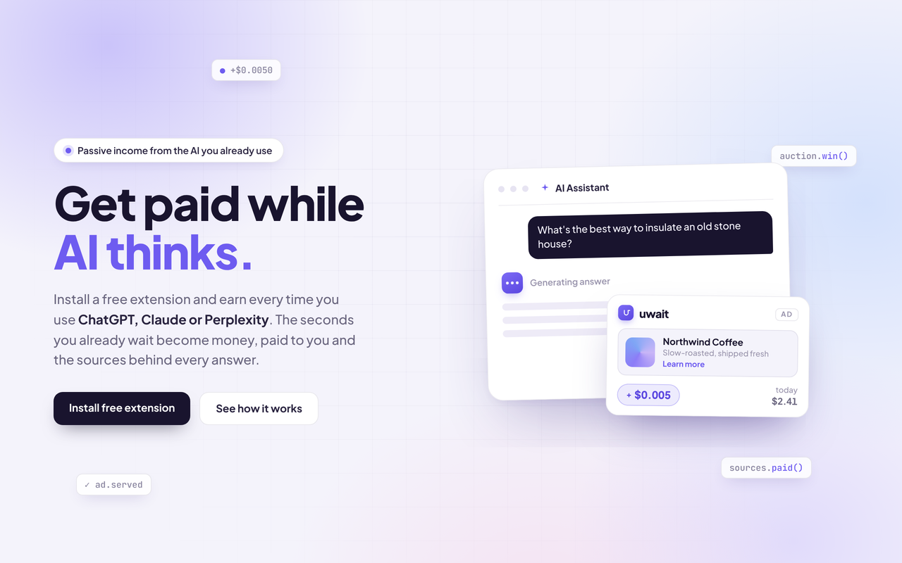
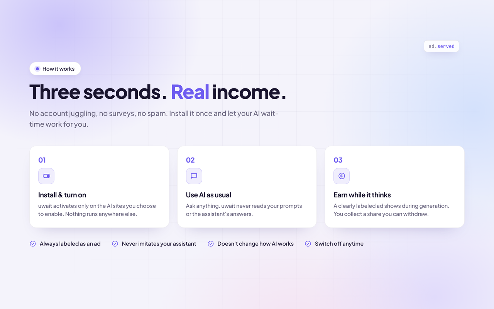
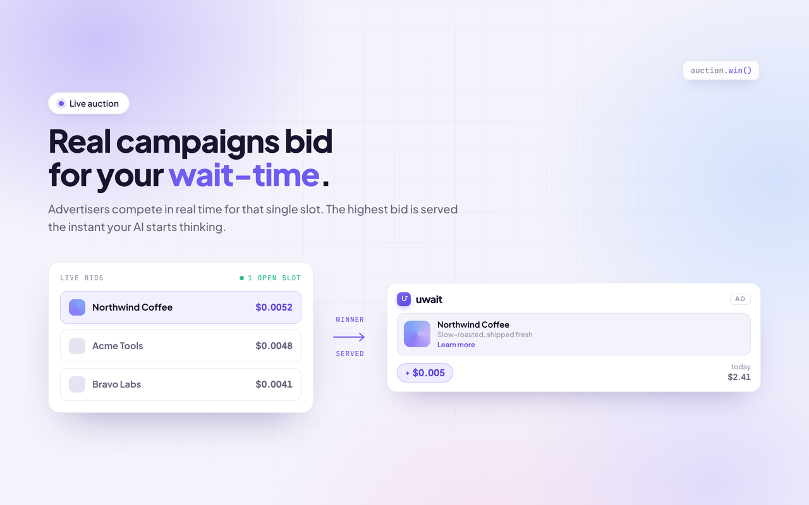

---

## 8. [AirJelly](https://www.producthunt.com/products/airjelly)
**Votes**: 125 | **도입 난이도**: 중 | **신뢰도**: 상
**Tagline**: Your Proactive, Self-Organizing Second Brain
**서비스 링크**: https://www.producthunt.com/r/PMQKFXXQ5WQB2C

**태그**: AI Agent, Productivity, Automation, Task Management, Agent, AI Tool

### 📌 이 서비스 한눈에 보기
사용자의 화면 활동을 관찰하여 할 일을 예측하고 스스로 정리하는 지능형 데스크톱 AI 에이전트

### 🔑 주요 기능
- 화면 활동 기반의 맥락 이해 및 작업 자동화
- 사용자의 의도를 파악하여 다음 할 일을 선제적으로 제안
- 개인적인 상호작용 및 약속을 추적하여 팔로업 관리

### 🙋 사용자에게 어떤 점이 좋은가
사용자가 일일이 기록하지 않아도 AI가 업무 맥락을 파악해 관리해주므로, 단순 반복적인 정리 작업에서 벗어나 핵심 업무에만 집중할 수 있습니다.

### ✅ 지금 바로 써볼 기능
- 데스크톱 설치 및 화면 공유 권한 설정
- 실제 업무 흐름을 통한 AI의 맥락 파악 능력 테스트
- 개인 일정 및 팔로업 자동 생성 기능 확인

### ⚠️ 사용 전 확인할 점
- 화면을 지속적으로 관찰하므로 개인정보 및 보안 정책 확인 필요
- AI의 예측이 사용자의 실제 의도와 다를 수 있는 오작동 가능성

### 🧭 확인이 더 필요한 정보
화면 캡처 데이터의 저장 방식 및 보안 처리 수준에 대한 구체적인 정보가 필요합니다.

### 📸 스크린샷 및 갤러리
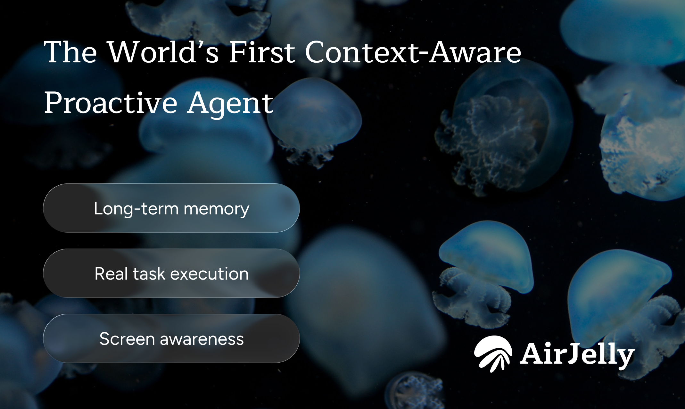

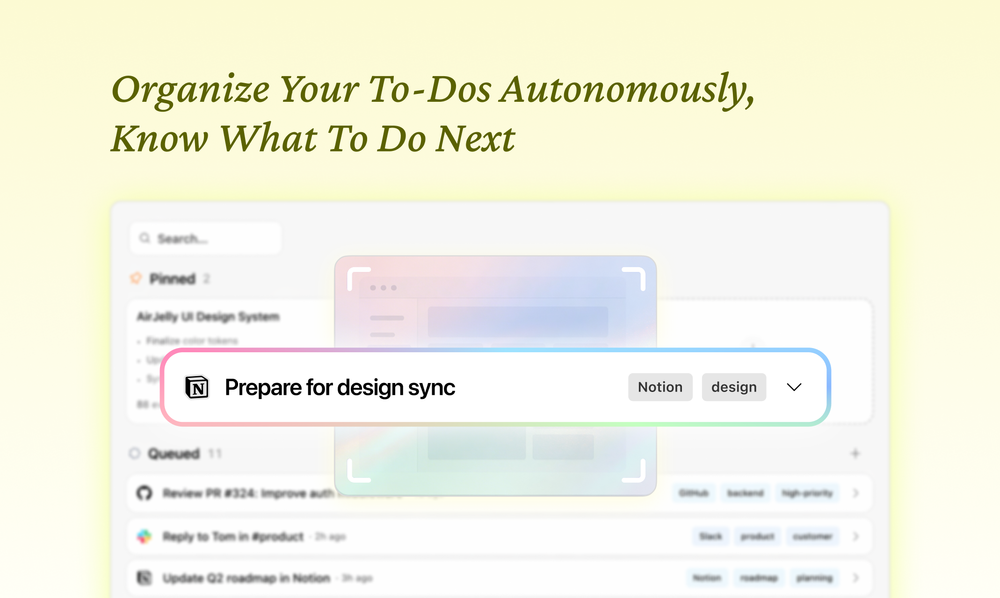

### 🎬 관련 영상
- [🎥 영상 보기](https://ph-files.imgix.net/ad21d0ca-98c9-4f34-9604-10fd3925070c.jpeg?auto=format)

---

## 9. [MediaSeg](https://www.producthunt.com/products/mediaseg)
**Votes**: 113 | **도입 난이도**: 하 | **신뢰도**: 상
**Tagline**: Split large media files into upload-ready chunks on macOS
**서비스 링크**: https://www.producthunt.com/r/CDZ6CXPO4JXUDC

**태그**: macOS, MediaTool, Productivity, Workflow, AI Tool

### 📌 이 서비스 한눈에 보기
대용량 미디어 파일을 화질 저하 없이 업로드 가능한 크기로 분할해주는 macOS 전용 유틸리티

### 🔑 주요 기능
- 대용량 미디어 파일을 업로드 가능한 크기의 청크로 분할
- 파일 품질을 유지하며 분할하는 로컬 macOS 전용 도구
- NotebookLM 등 용량 제한이 있는 업로드 플랫폼 활용에 최적화

### 🙋 사용자에게 어떤 점이 좋은가
용량 제한이 있는 웹 서비스에 대용량 파일을 올릴 때 발생하는 번거로움을 해결하고 작업 시간을 단축해 줍니다.

### ✅ 지금 바로 써볼 기능
- 대용량 영상/오디오 파일 분할 테스트
- NotebookLM 등 용량 제한 플랫폼에 업로드 시도

### ⚠️ 사용 전 확인할 점
- macOS 전용 소프트웨어이므로 타 OS에서는 사용 불가
- 분할된 파일들의 결합(Merge) 기능 포함 여부 확인 필요

### 🧭 확인이 더 필요한 정보
파일 분할 후 다시 하나로 합치는 기능이 제공되는지 명시되어 있지 않습니다.

### 📸 스크린샷 및 갤러리
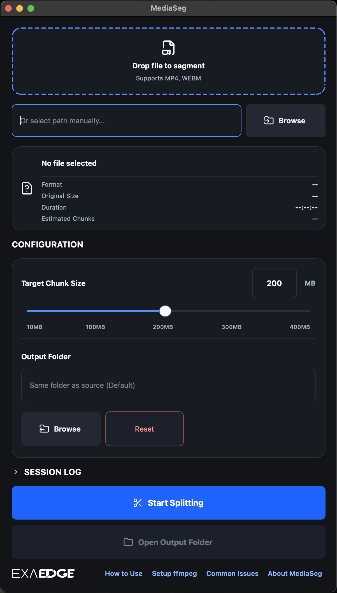
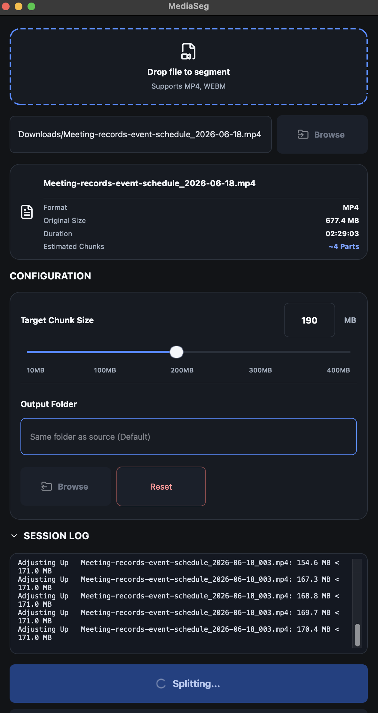
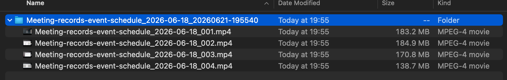

---

## 10. [Selector Forge](https://www.producthunt.com/products/selector-forge)
**Votes**: 111 | **도입 난이도**: 하 | **신뢰도**: 상
**Tagline**: Browser extension for AI-generated resilient selectors
**서비스 링크**: https://www.producthunt.com/r/JB3WOBST7RHX4L

**태그**: DevTool, Automation, Web Scraping, AI, AI Tool

### 📌 이 서비스 한눈에 보기
AI를 활용해 웹 페이지 변경에도 잘 깨지지 않는 강력한 CSS 및 XPath 선택자를 생성하는 브라우저 확장 프로그램

### 🔑 주요 기능
- AI 기반의 의미론적(Semantic) 선택자 생성으로 높은 복원력 제공
- 단일 요소 및 요소 배열(List)에 대한 선택자 생성 지원
- 오픈 소스로 공개되어 투명한 코드 확인 및 활용 가능

### 🙋 사용자에게 어떤 점이 좋은가
웹 자동화나 스크래핑 시 페이지 구조가 바뀌어도 코드가 깨지지 않도록 유지보수 비용을 획기적으로 줄여줍니다.

### ✅ 지금 바로 써볼 기능
- 브라우저에 확장 프로그램 설치하기
- 특정 요소의 의미론적 선택자 생성 테스트하기
- 리스트 형태의 요소들을 위한 배열 선택자 생성해보기

### ⚠️ 사용 전 확인할 점
- AI 생성 방식이므로 생성된 선택자의 정확성을 반드시 검증해야 함
- 복잡한 동적 웹 페이지 환경에서의 동작 여부 확인 필요

### 🧭 확인이 더 필요한 정보
AI 모델이 어떤 알고리즘을 사용하여 '의미론적' 선택자를 생성하는지에 대한 상세 기술 정보는 확인이 필요합니다.

### 📸 스크린샷 및 갤러리
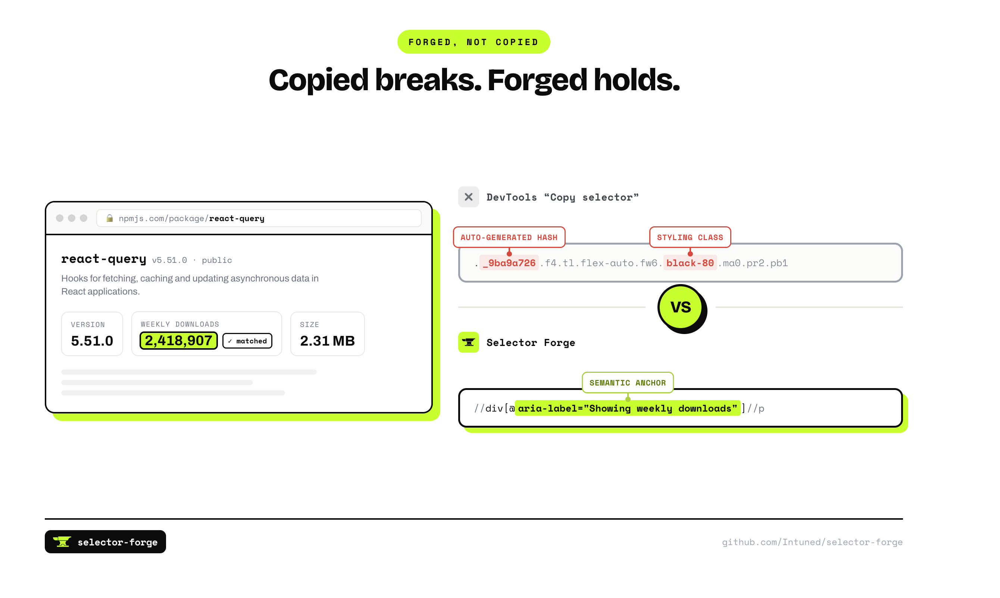
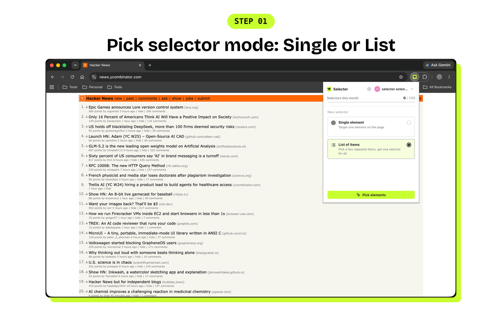
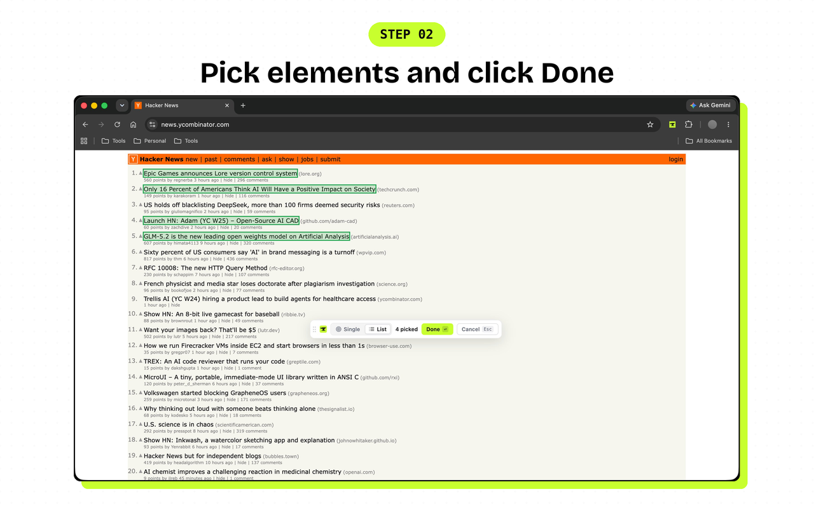

### 🎬 관련 영상
- [🎥 영상 보기](https://ph-files.imgix.net/a3918c44-a5ce-488b-85a2-1a860d453049.jpeg?auto=format)

---

## 11. [Clawd](https://www.producthunt.com/products/clawd-the-context-aware-browser-pet)
**Votes**: 109 | **도입 난이도**: 하 | **신뢰도**: 상
**Tagline**: A context-aware browser mascot with 100% local offline AI
**서비스 링크**: https://www.producthunt.com/r/YMDF4CNQMIWJYC

**태그**: AI, Browser Extension, Privacy, Desktop Pet, AI Tool, Chat

### 📌 이 서비스 한눈에 보기
개인정보 유출 걱정 없는 100% 로컬 기반의 컨텍스트 인식 브라우저 마스코트

### 🔑 주요 기능
- 화면 내용을 인식하고 웹사이트 감정에 반응하는 지능형 마스코트
- 140개 이상의 애니메이션과 페르소나 기반의 음성 채팅 기능
- 데이터가 외부로 유출되지 않는 100% 오프라인 프라이버시 우선 설계

### 🙋 사용자에게 어떤 점이 좋은가
사용자의 브라우징 환경에 생동감을 더하면서도, 모든 AI 연산이 로컬에서 이루어져 보안과 프라이버시를 완벽하게 보호합니다.

### ✅ 지금 바로 써볼 기능
- 다양한 페르소나(Sarcastic, Gen Z 등)를 설정하여 음성 채팅 기능 체험하기
- 웹사이트 감정 변화에 따른 마스코트의 애니메이션 반응 확인하기
- 오프라인 환경에서 AI 기능이 원활하게 작동하는지 테스트하기

### ⚠️ 사용 전 확인할 점
- 로컬 AI 구동을 위한 사용자의 PC 하드웨어 사양 요구사항 확인 필요
- 오프라인 환경 특성상 실시간 웹 데이터 동기화 범위의 제한 가능성

### 🧭 확인이 더 필요한 정보
로컬 구동 시 시스템 리소스(CPU/GPU) 점유율이 어느 정도인지 명시되어 있지 않습니다.

### 📸 스크린샷 및 갤러리
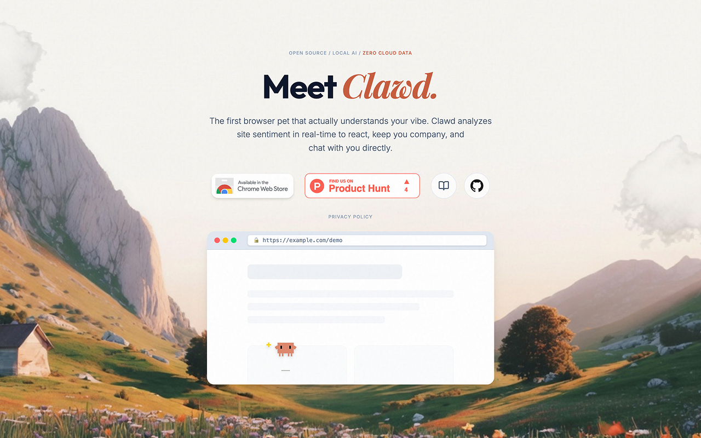
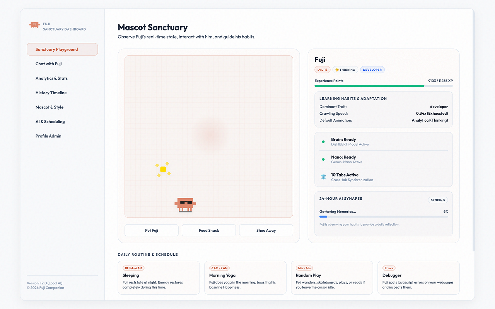
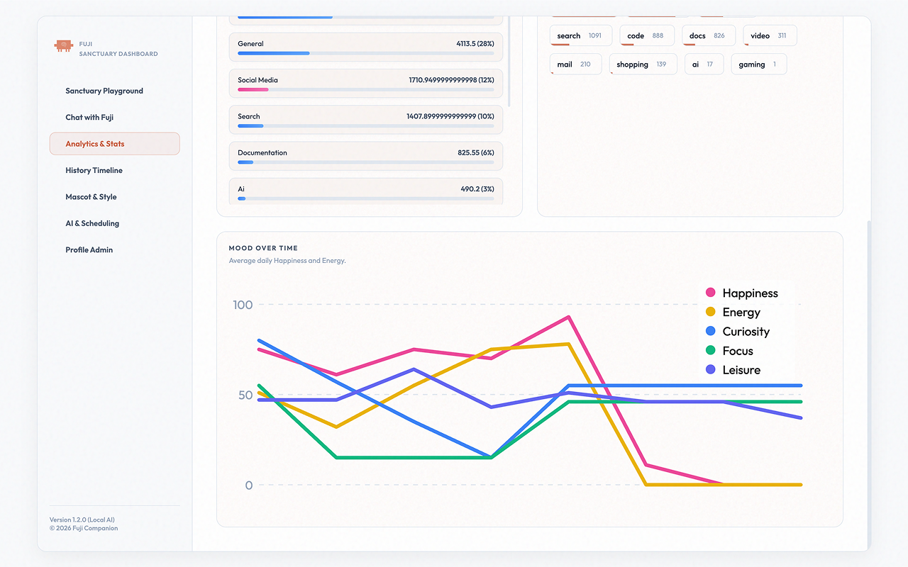

---

## 12. [MD+HTML Reader](https://www.producthunt.com/products/md-html-reader)
**Votes**: 103 | **도입 난이도**: 하 | **신뢰도**: 상
**Tagline**: Review AI-generated Markdown and HTML in a focused workspace
**서비스 링크**: https://www.producthunt.com/r/KENNVT4AGFQKXV

**태그**: DevTool, Productivity, macOS, AI-Workflow, AI Tool, Prompting, API

### 📌 이 서비스 한눈에 보기
AI가 생성한 마크다운과 HTML 문서를 한곳에서 깔끔하게 검토할 수 있는 macOS 전용 워크스페이스

### 🔑 주요 기능
- 산재된 프로젝트 파일 사이에서 문서와 HTML 미리보기를 찾는 번거로움 해결
- 읽기 전용(Read-only) 모드를 통한 집중적인 문서 검토 환경 제공
- 다음 프롬프트 입력이나 커밋 전 최종 확인을 위한 전용 워크스페이스

### 🙋 사용자에게 어떤 점이 좋은가
AI 코딩 도구로 생성된 복잡한 문서와 결과물을 소스 코드와 분리하여 빠르고 정확하게 검토할 수 있습니다.

### ✅ 지금 바로 써볼 기능
- 생성된 마크다운 문서와 HTML 결과물 불러오기
- 읽기 전용 모드에서 문서 내용 검토하기
- 검토 완료 후 프로젝트에 반영하기

### ⚠️ 사용 전 확인할 점
- macOS 전용 앱이므로 다른 운영체제 사용자는 사용 불가
- 읽기 전용 모드이므로 직접적인 문서 편집 기능 여부 확인 필요

### 🧭 확인이 더 필요한 정보
macOS 전용 앱이며, 편집 기능이 포함되어 있는지 혹은 순수 검토용인지에 대한 상세 기능 확인이 필요합니다.

### 📸 스크린샷 및 갤러리
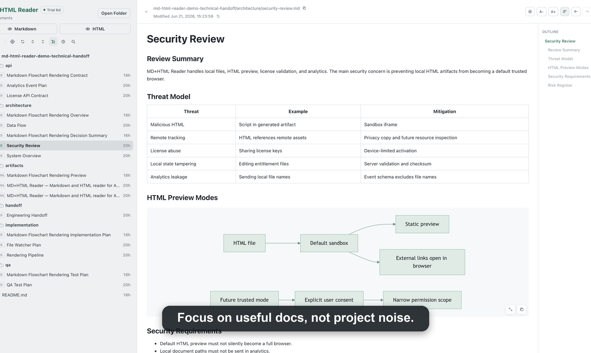
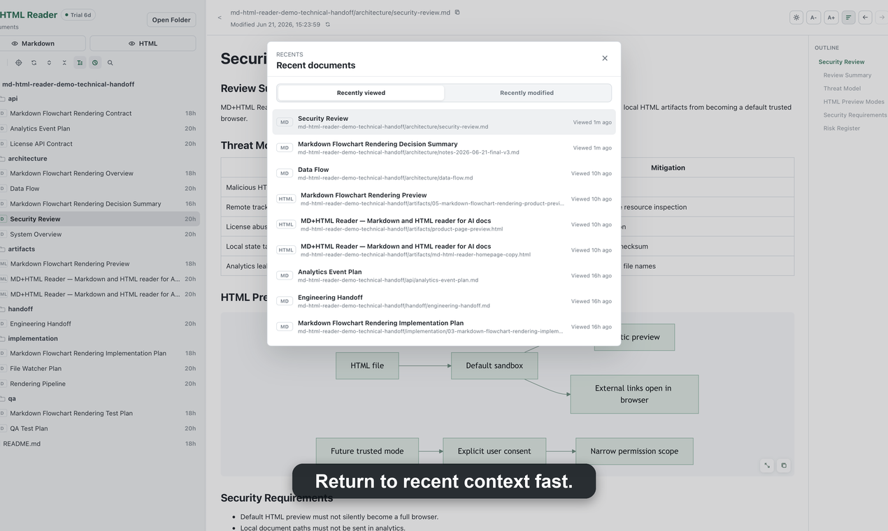
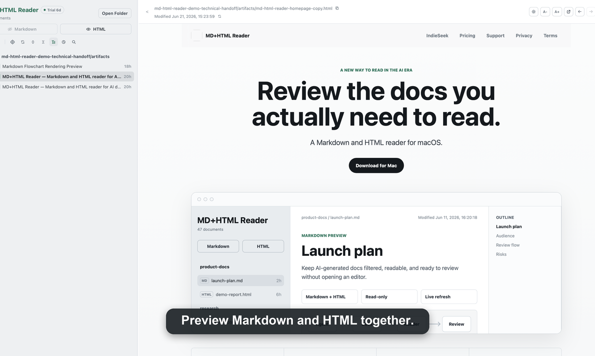

### 🎬 관련 영상
- [🎥 영상 보기](https://ph-files.imgix.net/b7d06897-3379-49f0-bc5a-f07879b00111.jpeg?auto=format)

---

## 13. [OnBrand by SlideSpeak](https://www.producthunt.com/products/onbrand-2)
**Votes**: 102 | **도입 난이도**: 하 | **신뢰도**: 상
**Tagline**: Design context for AI agents
**서비스 링크**: https://www.producthunt.com/r/5XUO6E5A7ZZRXC

**태그**: DesignTool, AI-Agent, Branding, Automation, Agent, AI Tool, Chat, Vision, Design, DevTool

### 📌 이 서비스 한눈에 보기
AI 에이전트가 브랜드 가이드를 준수하여 디자인 결과물을 만들 수 있도록 맥락을 제공하는 도구

### 🔑 주요 기능
- MCP를 통해 AI 에이전트(Claude, ChatGPT 등)에 브랜드 컨텍스트 제공
- 로고, 색상, 아이콘, 슬라이드 규칙 등 브랜드 자산 통합 관리
- 기존 웹사이트나 PPT를 기반으로 design.md 형태의 브랜드 가이드 자동 생성

### 🙋 사용자에게 어떤 점이 좋은가
AI가 생성하는 결과물이 브랜드 정체성과 어긋나는 문제를 해결하여, 일관된 디자인 자산을 빠르게 확보할 수 있습니다.

### ✅ 지금 바로 써볼 기능
- 기존 브랜드 가이드나 웹사이트를 활용해 design.md 생성하기
- Claude나 ChatGPT에 OnBrand 컨텍스트 연결하기
- 브랜드 규칙이 적용된 슬라이드 및 인포그래픽 생성 테스트하기

### ⚠️ 사용 전 확인할 점
- AI 모델의 디자인 구현 능력에 따라 결과물의 완성도가 달라질 수 있음
- MCP 프로토콜 설정 및 AI 도구와의 연동 과정이 필요함

### 🧭 확인이 더 필요한 정보
사용 중인 특정 AI 에이전트 모델과의 호환성 및 상세 연동 방식에 대한 추가 확인이 필요합니다.

### 📸 스크린샷 및 갤러리

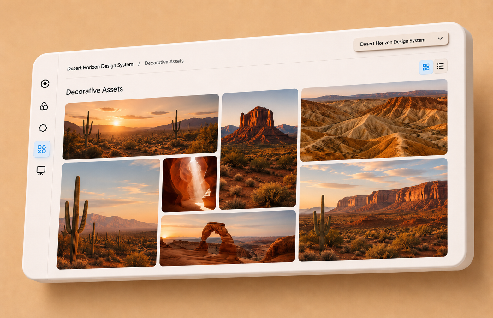

### 🎬 관련 영상
- [🎥 영상 보기](https://ph-files.imgix.net/95e7bb4d-ed52-41bd-a57d-4dc8d5b40b9b.jpeg?auto=format)

---

## 14. [Agentic Document Extraction](https://www.producthunt.com/products/agentic-document-extraction)
**Votes**: 93 | **도입 난이도**: 중 | **신뢰도**: 상
**Tagline**: Make the world's documents computable 
**서비스 링크**: https://www.producthunt.com/r/NRV6TH5TKJQAN5

**태그**: DevTool, Automation, AI, DocumentAI, Enterprise, Agent, AI Tool, API

### 📌 이 서비스 한눈에 보기
기업용 문서 자동화 파이프라인 구축을 위한 에이전트 기반 문서 데이터 추출 솔루션

### 🔑 주요 기능
- 대규모 문서 자동화 파이프라인 구축 지원
- 정확하고 감사 가능한(Auditable) AI 기반 데이터 추출
- API 중심의 개발자 친화적 설계

### 🙋 사용자에게 어떤 점이 좋은가
복잡한 문서 데이터를 컴퓨터가 처리 가능한 구조로 자동 변환하여, 엔터프라이즈급 업무 자동화 효율을 극대화할 수 있습니다.

### ✅ 지금 바로 써볼 기능
- API 연동을 통한 기존 워크플로우 테스트
- 문서 추출 정확도 및 감사 기능 검증
- 대규모 데이터 처리 파이프라인 설계

### ⚠️ 사용 전 확인할 점
- 엔터프라이즈급 기능 위주로 개발자 숙련도에 따라 도입 난이도가 다를 수 있음
- 구체적인 데이터 보안 및 프라이버시 정책 확인 필요

### 🧭 확인이 더 필요한 정보
구체적인 API 가격 정책과 지원 가능한 문서 포맷의 범위가 명시되지 않았습니다.

### 📸 스크린샷 및 갤러리
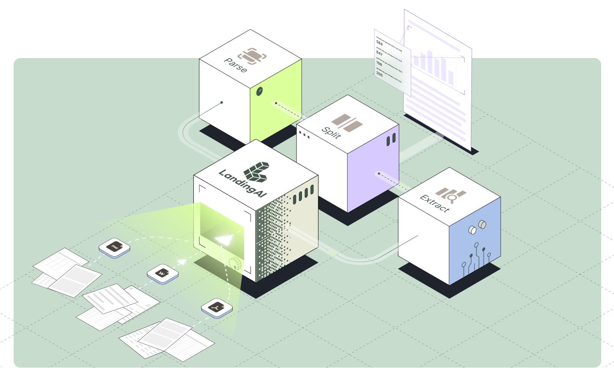
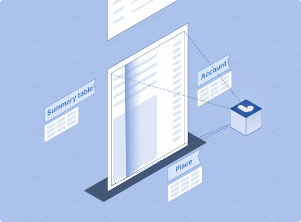
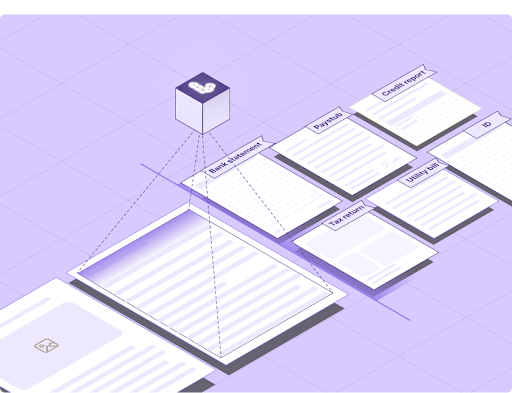

### 🎬 관련 영상
- [🎥 영상 보기](https://ph-files.imgix.net/26b29043-52ec-472d-861b-fe8e35e315f6.jpeg?auto=format)

---

## 15. [AlgoFly AI](https://www.producthunt.com/products/algofly-ai)
**Votes**: 91 | **도입 난이도**: 중 | **신뢰도**: 중
**Tagline**: The all-in-one place to build and deploy vision AI
**서비스 링크**: https://www.producthunt.com/r/CNFAF6CYJHSC6J

**태그**: AI, ComputerVision, DevOps, B2B, AI Tool

### 📌 이 서비스 한눈에 보기
비전 AI 솔루션 구축부터 배포까지 한 번에 해결하는 올인원 플랫폼

### 🔑 주요 기능
- 비전 AI 모델 구축 및 배포를 위한 통합 환경 제공
- 기업 맞춤형 AI 솔루션 구축 지원
- AI 컨설팅 기반의 전문적인 서비스 제공

### 🙋 사용자에게 어떤 점이 좋은가
복잡한 비전 AI 개발 과정을 단순화하여 기업이 빠르게 AI 기술을 실무에 도입할 수 있도록 돕습니다.

### ✅ 지금 바로 써볼 기능
- 비전 AI 구축 프로세스 문의하기
- 기업 맞춤형 솔루션 상담 신청하기
- 배포 자동화 기능 확인하기

### ⚠️ 사용 전 확인할 점
- 컨설팅 기반 서비스이므로 구체적인 자동화 도구의 범위 확인 필요
- 사용자 개별 환경에 따른 커스텀 개발 요구사항 발생 가능성

### 🧭 확인이 더 필요한 정보
제품 설명이 컨설팅 중심이라 구체적인 소프트웨어 기능(SaaS 형태 여부)에 대한 정보가 더 필요합니다.

### 📸 스크린샷 및 갤러리
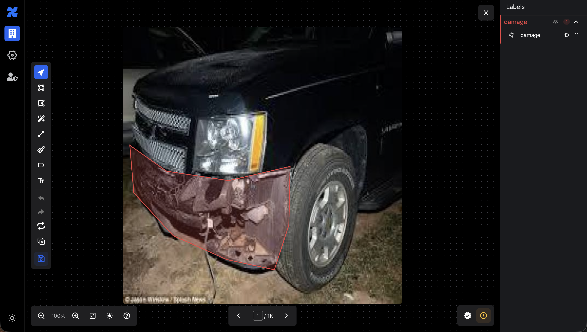
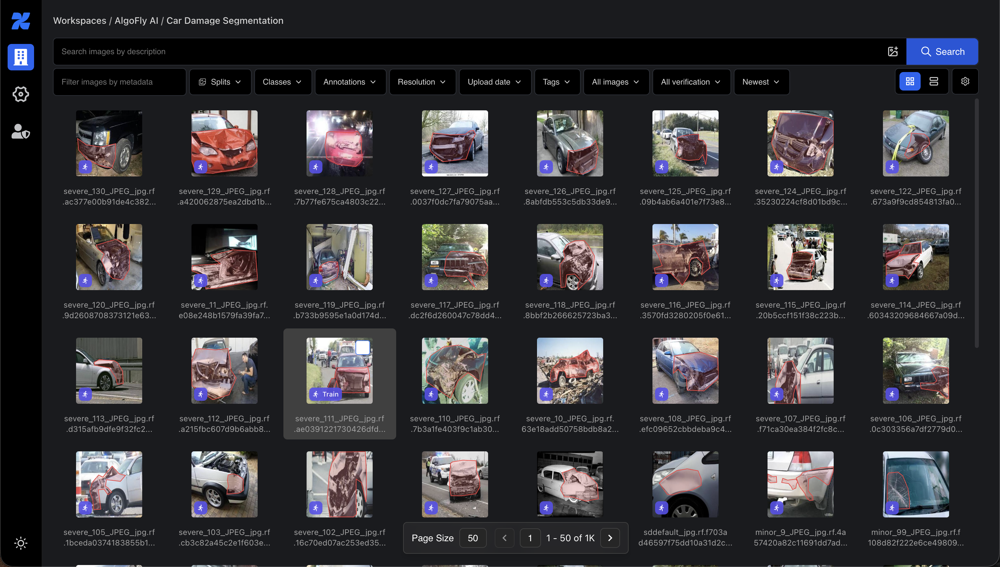
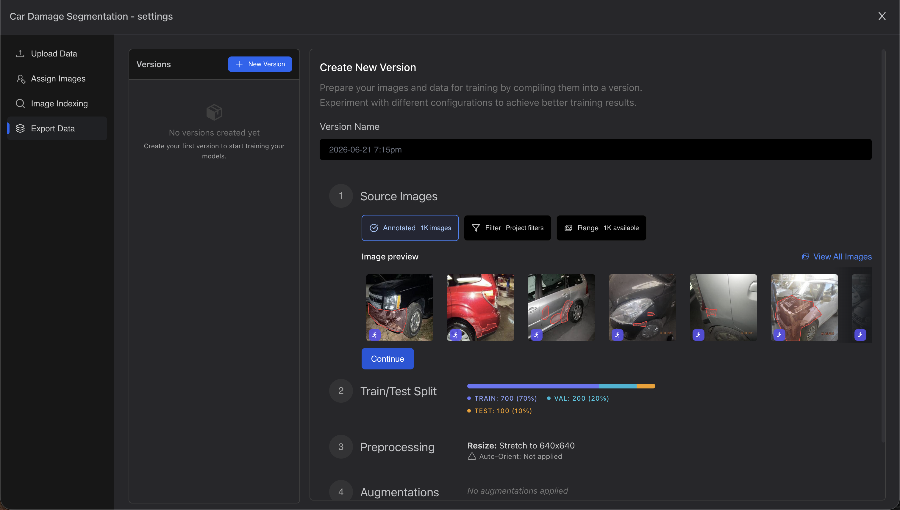

---

## 16. [Photoroom API](https://www.producthunt.com/products/bg-app)
**Votes**: 90 | **도입 난이도**: 하 | **신뢰도**: 상
**Tagline**: Transform product images at scale with one image editing API
**서비스 링크**: https://www.producthunt.com/r/UEY57WD4R765YA

**태그**: DevTool, Automation, E-commerce, API, AI Tool, Vision, Security

### 📌 이 서비스 한눈에 보기
대규모 커머스 환경에 최적화된 자동화 제품 이미지 생성 API

### 🔑 주요 기능
- 대량의 제품 이미지를 일관된 품질로 자동 변환하는 엔터프라이즈급 API
- 원시 이미지를 마켓플레이스용 히어로 샷 및 번들 이미지로 즉시 생성
- 보안 중심 설계로 이미지 미저장 및 모델 학습 미사용 보장

### 🙋 사용자에게 어떤 점이 좋은가
수많은 제품 사진을 일일이 편집할 필요 없이, API 연동만으로 규격화된 카탈로그 이미지를 대량 생산할 수 있습니다.

### ✅ 지금 바로 써볼 기능
- REST API를 통한 기본 이미지 변환 테스트
- 마켓플레이스 규격에 맞춘 자동 편집 워크플로우 구축
- 대량 업로드 및 일괄 처리 성능 확인

### ⚠️ 사용 전 확인할 점
- API 호출량에 따른 비용 구조 확인 필요
- 특정 스타일이나 복잡한 배경 생성 시 결과물 일관성 검토

### 🧭 확인이 더 필요한 정보
구체적인 가격 정책과 초당 처리 가능한 요청 수(Rate Limit)에 대한 정보가 명시되지 않았습니다.

### 📸 스크린샷 및 갤러리

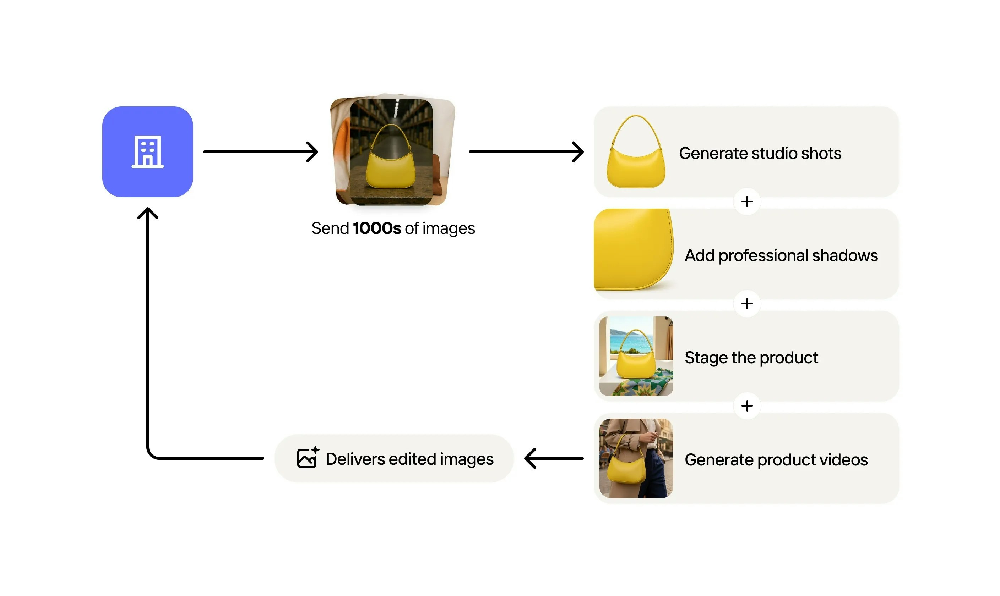

### 🎬 관련 영상
- [🎥 영상 보기](https://ph-files.imgix.net/20c5893c-dcaf-4324-8780-be1450ea87dd.jpeg?auto=format)

---

## 17. [LeadDelta 5.0: AI Warm Intros + AI Inbox](https://www.producthunt.com/products/leaddelta)
**Votes**: 53 | **도입 난이도**: 중 | **신뢰도**: 상
**Tagline**: AI that finds Warm Intro Paths and fixes your LinkedIn Inbox
**서비스 링크**: https://www.producthunt.com/r/W7SEC4MTHQIUOE

**태그**: Networking, AI, SalesTech, Productivity, LinkedIn, Agent, AI Tool

### 📌 이 서비스 한눈에 보기
팀의 인맥을 통합 관리하고 AI로 최적의 소개 경로를 찾아주는 링크드인 네트워킹 솔루션

### 🔑 주요 기능
- 팀 전체의 인맥 관계와 연결 고리를 하나의 워크스페이스로 통합
- 사용자의 말투를 학습하여 메시지 초안 작성 및 라벨링 자동화
- 잠재 고객, 채용 후보자, 투자자를 위한 가장 확실한 소개 경로 탐색

### 🙋 사용자에게 어떤 점이 좋은가
팀이 가진 인맥 자산을 한눈에 파악하고, AI를 통해 가장 자연스럽고 효과적인 방식으로 비즈니스 기회를 연결할 수 있습니다.

### ✅ 지금 바로 써볼 기능
- 팀원들의 링크드인 인맥 데이터 동기화하기
- AI를 활용한 맞춤형 메시지 초안 생성해보기
- 타겟 프로스펙트를 위한 최적의 소개 경로 확인하기

### ⚠️ 사용 전 확인할 점
- 팀원들의 개인적인 인맥 데이터가 공유되므로 보안 및 개인정보 정책 확인 필요
- AI가 작성한 메시지의 경우 발송 전 반드시 최종 검토 필요

### 🧭 확인이 더 필요한 정보
팀 단위 협업 시 데이터 접근 권한 설정 및 보안 범위에 대한 구체적인 정보가 필요합니다.

### 📸 스크린샷 및 갤러리
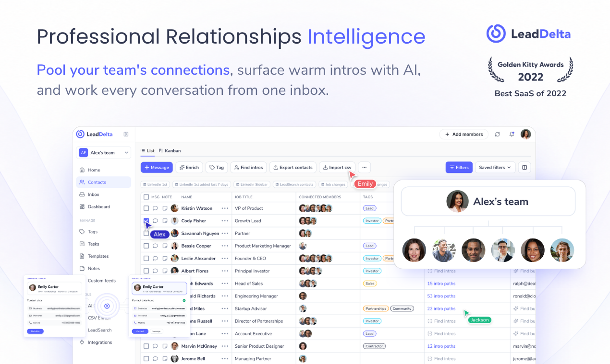
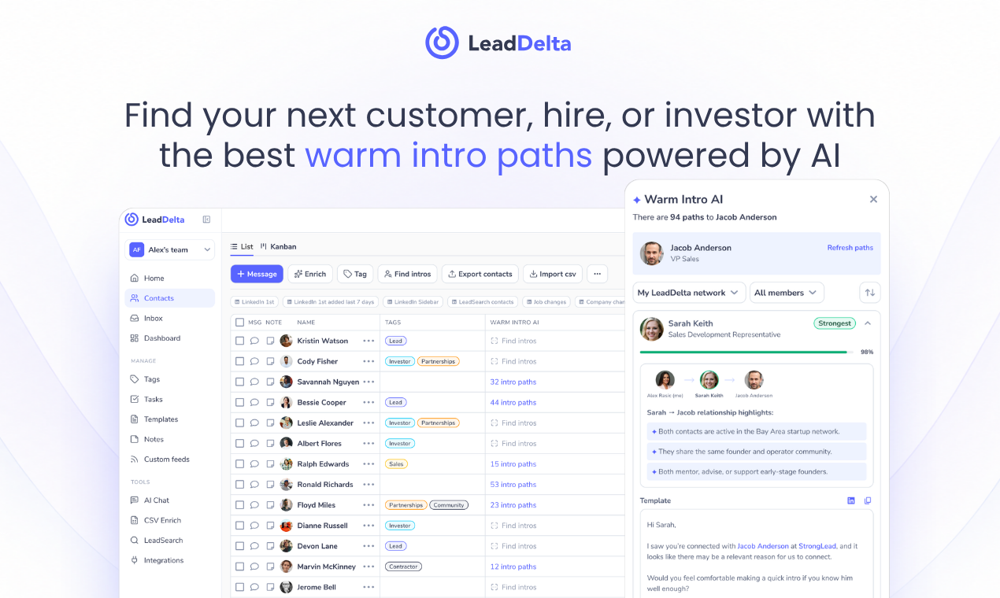
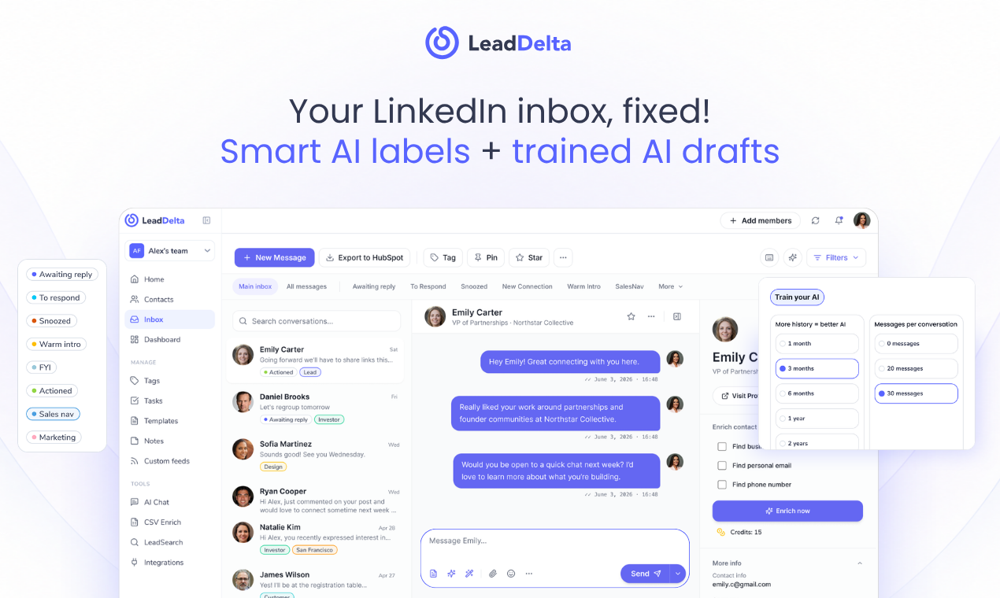

### 🎬 관련 영상
- [🎥 영상 보기](https://ph-files.imgix.net/36d900dc-b2a5-462a-8bcf-b6b38c21713a.gif?auto=format)

---

## 18. [Glossary Extractor](https://www.producthunt.com/products/alconost-localization)
**Votes**: 42 | **도입 난이도**: 하 | **신뢰도**: 상
**Tagline**: Turn your content into a ready-to-use glossary in minutes
**서비스 링크**: https://www.producthunt.com/r/R3XO2DXZF56GXK

**태그**: Localization, Automation, AI, Productivity, AI Tool

### 📌 이 서비스 한눈에 보기
콘텐츠를 업로드하면 몇 분 만에 구조화된 용어집을 생성해 주는 자동화 도구

### 🔑 주요 기능
- 수동 작업 없이 파일 업로드만으로 용어 추출 및 구조화
- 알고리즘 기반 추출과 AI 정제 과정을 결합한 높은 정확도
- 용어 정의, 빈도수 계산 및 다국어 번역 기능 제공

### 🙋 사용자에게 어떤 점이 좋은가
로컬라이제이션 프로젝트 시 반복적인 용어 추출 작업을 자동화하여 작업 시간을 획기적으로 단축할 수 있습니다.

### ✅ 지금 바로 써볼 기능
- 파일 업로드하여 용어 추출 테스트하기
- 추출된 용어의 정의 및 번역 정확도 검토하기
- 생성된 용어집을 실제 프로젝트에 적용하기

### ⚠️ 사용 전 확인할 점
- AI 정제 과정을 거치더라도 최종 결과물에 대한 사용자의 빠른 검토가 필요함
- 파일 형식 지원 범위에 대한 확인 필요

### 🧭 확인이 더 필요한 정보
지원 가능한 파일 형식과 최대 업로드 용량에 대한 정보가 명시되지 않았습니다.

### 📸 스크린샷 및 갤러리
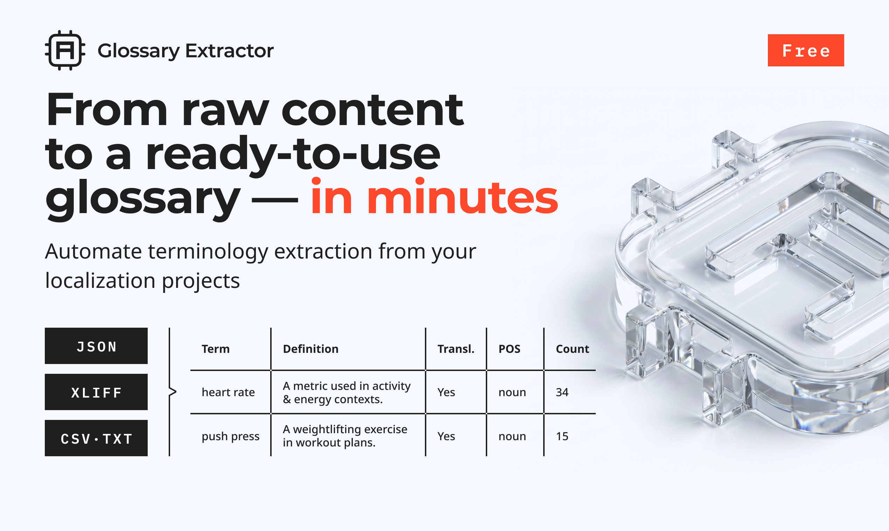
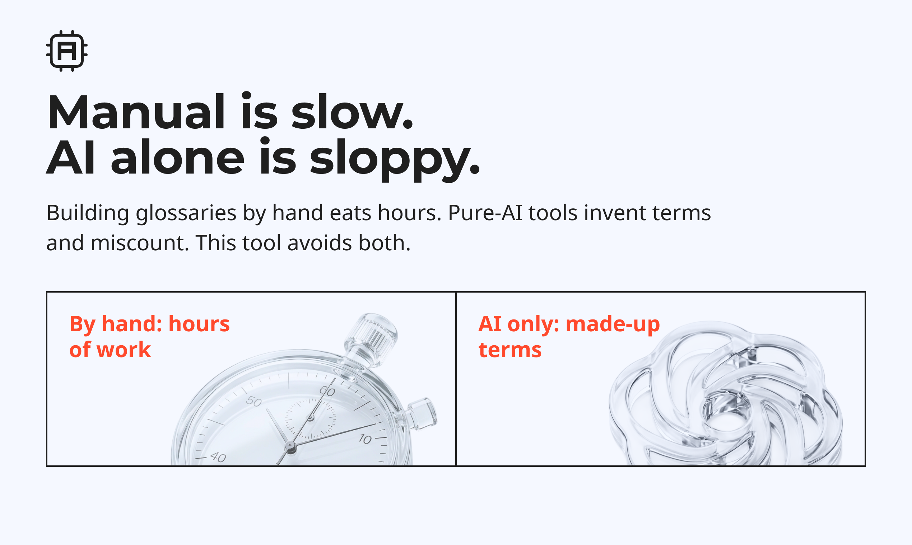
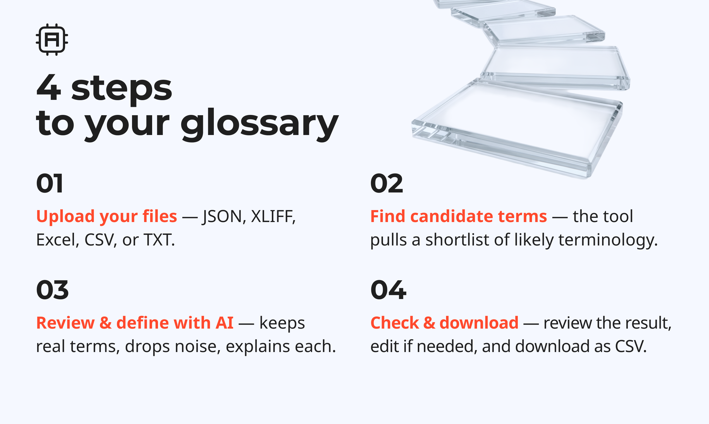

---

## 19. [co/core](https://www.producthunt.com/products/co-core)
**Votes**: 23 | **도입 난이도**: 중 | **신뢰도**: 상
**Tagline**: An AI cooperative. Local models on spare macs.
**서비스 링크**: https://www.producthunt.com/r/DVMRPWCHMKQUVL

**태그**: AI, Infrastructure, Decentralized, Mac, OpenSource, AI Tool, DevTool

### 📌 이 서비스 한눈에 보기
개인용 Mac 자원을 공유하여 클라우드 비용 없이 AI 모델을 구동하는 협동형 인프라

### 🔑 주요 기능
- 개인 소유의 Mac을 활용한 분산형 AI 추론 네트워크 구축
- 대형 클라우드 서비스 의존도를 낮추는 탈중앙화 인프라 실험
- OpenAI 호환 API를 통한 기존 코드와의 높은 호환성

### 🙋 사용자에게 어떤 점이 좋은가
고가의 클라우드 GPU 대여 비용을 절감하면서, 유휴 Mac 자원을 활용해 오픈 소스 모델을 구동할 수 있습니다.

### ✅ 지금 바로 써볼 기능
- 보유 중인 Mac 자원 공유 가능 여부 확인
- 기존 OpenAI 호환 코드의 이식성 테스트
- 네트워크 참여를 통한 인프라 기여 방식 탐색

### ⚠️ 사용 전 확인할 점
- 개인 Mac의 하드웨어 성능 및 가용성에 따른 추론 속도 차이
- 분산 네트워크 환경에서의 보안 및 데이터 프라이버시 문제

### 🧭 확인이 더 필요한 정보
참여자의 Mac 사양에 따른 구체적인 성능 보장 범위와 보상 체계가 명시되지 않았습니다.

### 📸 스크린샷 및 갤러리
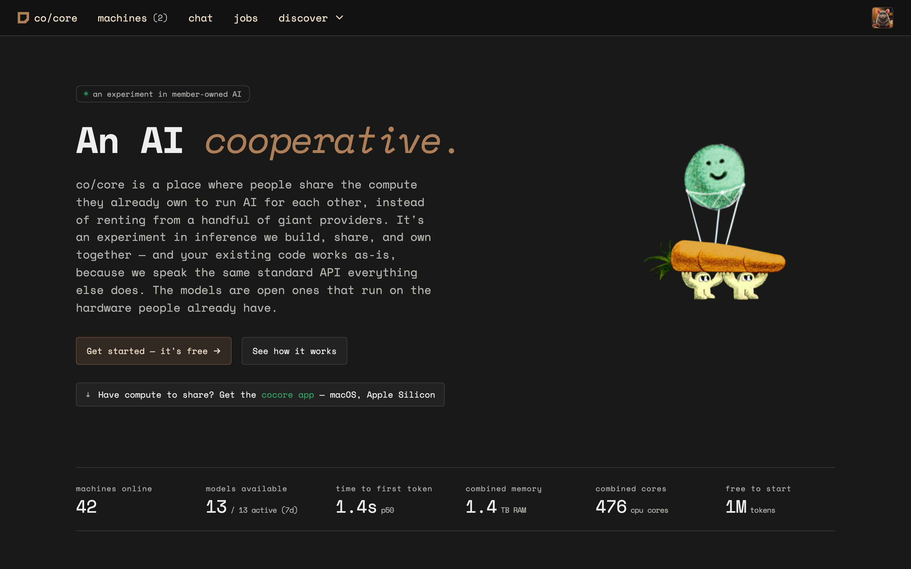
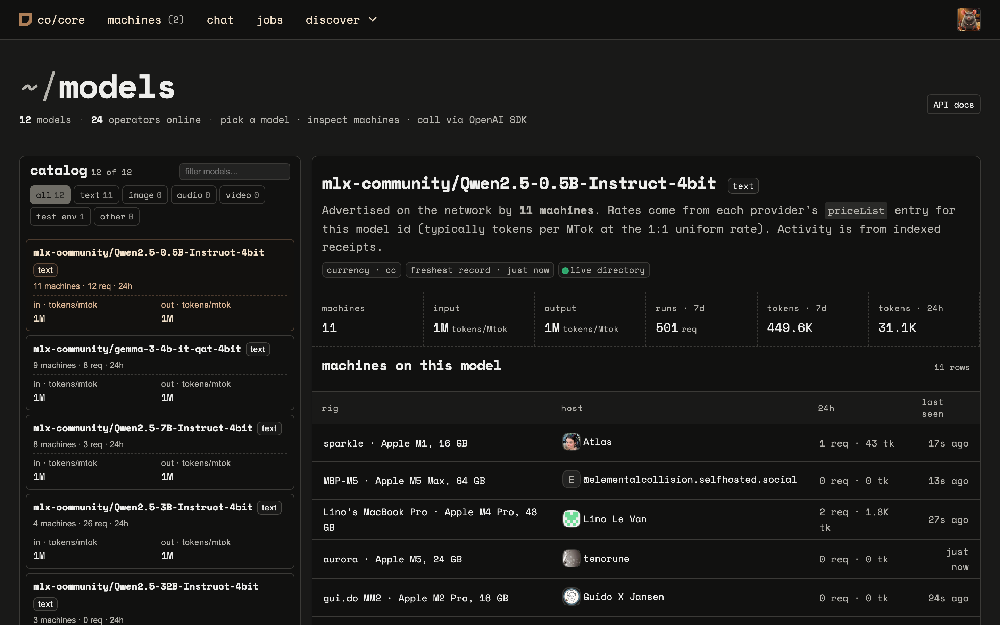
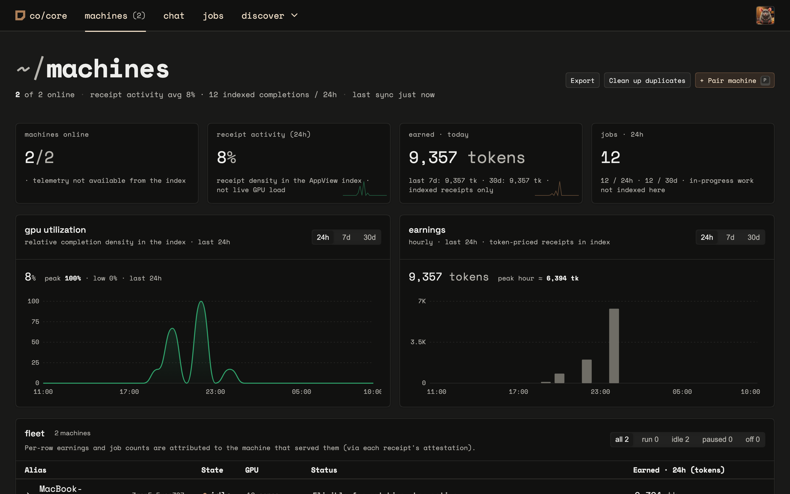

---

## 20. [radiusHQ link in bio and booking in one ](https://www.producthunt.com/products/radiushq)
**Votes**: 19 | **도입 난이도**: 하 | **신뢰도**: 상
**Tagline**: Let clients book you straight from your bio.
**서비스 링크**: https://www.producthunt.com/r/EADSYMTAK5SEVB

**태그**: SaaS, Booking, Productivity, NoCode, AI Tool

### 📌 이 서비스 한눈에 보기
별도의 웹사이트 없이 프로필 링크 하나로 서비스 소개부터 예약까지 한 번에 해결하는 도구

### 🔑 주요 기능
- 브랜드화된 링크 인 바이오(Link-in-bio) 페이지 제공
- 서비스 목록, 가격 공개 및 즉시 예약 기능 통합
- 최대 10명의 전문가를 수용하는 합리적인 팀 플랜 및 공정 로드 라우팅

### 🙋 사용자에게 어떤 점이 좋은가
DM으로 일일이 예약 문의를 주고받는 번거로움을 없애고, 고객이 프로필에서 즉시 예약을 완료할 수 있어 운영 효율이 높아집니다.

### ✅ 지금 바로 써볼 기능
- 무료 티어로 브랜드 페이지 생성하기
- 서비스 항목 및 가격 설정하기
- 소셜 미디어 프로필에 링크 등록하기

### ⚠️ 사용 전 확인할 점
- 팀 플랜의 경우 인원 제한(최대 10명) 확인 필요
- 복잡한 웹사이트 기능이 필요한 경우 기능적 한계가 있을 수 있음

### 🧭 확인이 더 필요한 정보
결제 시스템 연동 방식 및 수수료 정책에 대한 구체적인 정보가 명시되지 않았습니다.

### 📸 스크린샷 및 갤러리
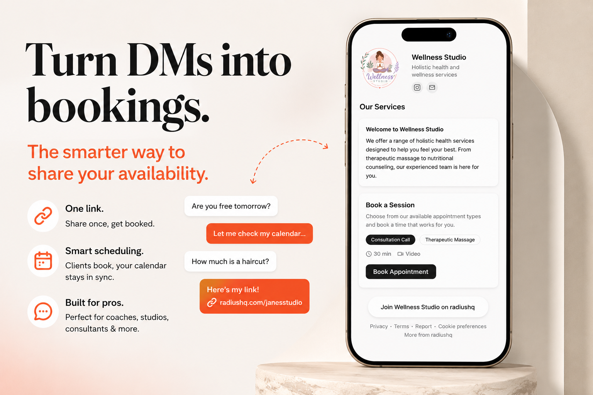
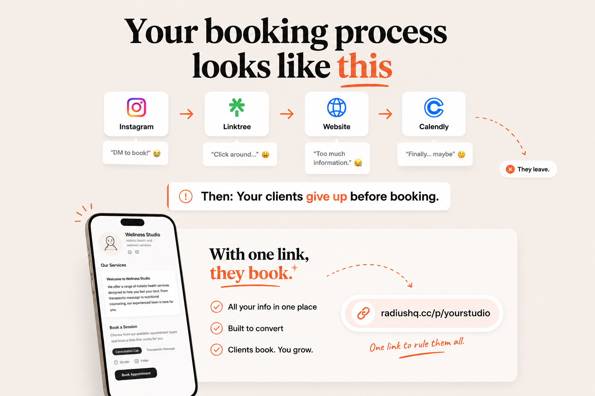
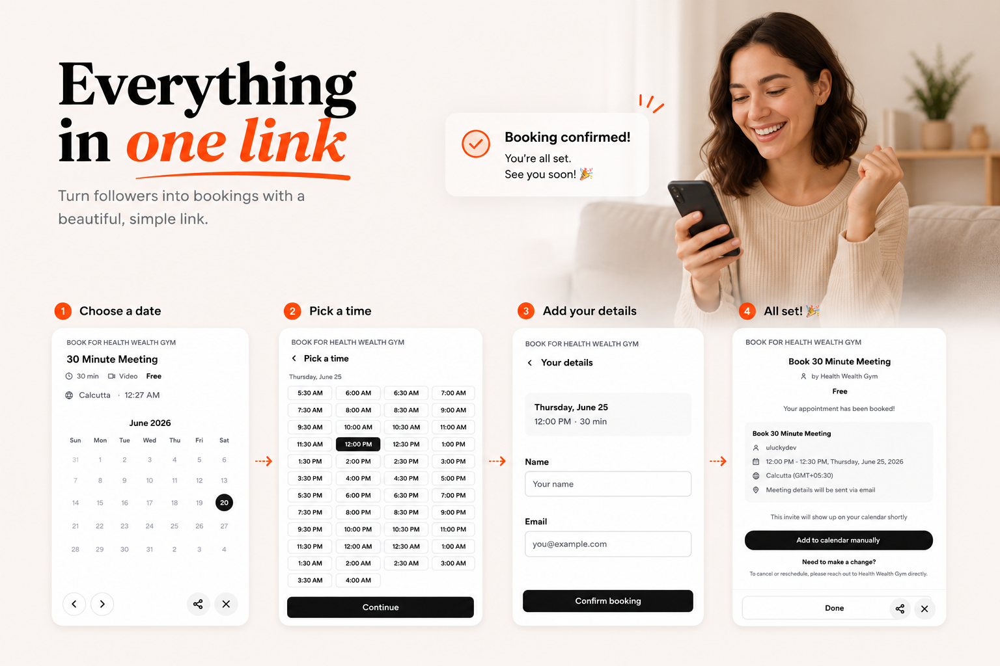

---

## 21. [PrepIt](https://www.producthunt.com/products/prepit)
**Votes**: 18 | **도입 난이도**: 중 | **신뢰도**: 상
**Tagline**: Coffee shop operations software
**서비스 링크**: https://www.producthunt.com/r/5N2GHPUT4G5RRM

**태그**: SaaS, Operations, Cafe Management, Inventory, Automation, AI Tool

### 📌 이 서비스 한눈에 보기
복잡한 스프레드시트 없이 카페 운영의 모든 과정을 하나로 통합 관리하는 솔루션

### 🔑 주요 기능
- 재고 관리, 스케줄링, 레시피 관리 통합
- 배치 준비(Batch prep) 및 일일 운영 프로세스 최적화
- 수동 워크플로우와 스프레드시트 의존도 감소

### 🙋 사용자에게 어떤 점이 좋은가
파편화된 카페 운영 업무를 하나의 시스템으로 통합하여 관리 효율성을 높이고 운영 실수를 줄일 수 있습니다.

### ✅ 지금 바로 써볼 기능
- 기존 레시피 데이터 입력 및 디지털화
- 재고 관리 및 배치 준비 기능 테스트
- 스케줄링 기능 활용

### ⚠️ 사용 전 확인할 점
- 기존 POS 시스템과의 연동 여부 확인 필요
- 매장 규모에 따른 기능 적합성 검토 필요

### 🧭 확인이 더 필요한 정보
현재 제공되는 기능이 특정 규모의 카페에 최적화되어 있는지, 타 시스템과의 연동 기능이 있는지 확인이 필요합니다.

### 📸 스크린샷 및 갤러리
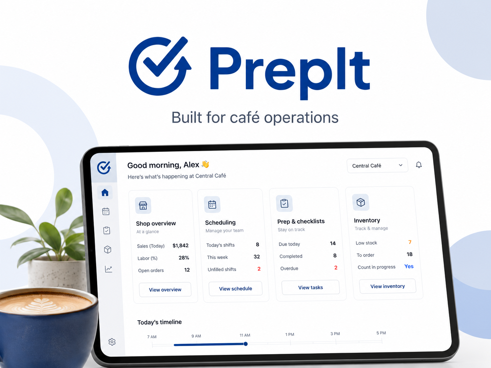
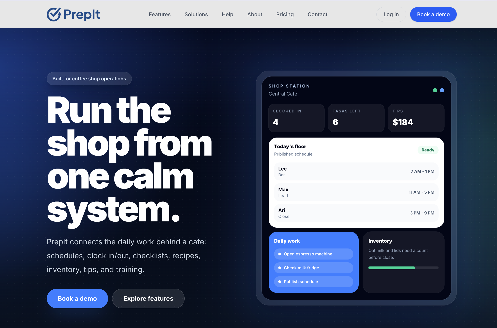

---

## 22. [MonoLisa v3](https://www.producthunt.com/products/monolisa)
**Votes**: 18 | **도입 난이도**: 하 | **신뢰도**: 상
**Tagline**: A typeface built for you, the developers and creatives.
**서비스 링크**: https://www.producthunt.com/r/PYN6VDD2SGPBJB

**태그**: Design, DeveloperTools, Typography, DevTool

### 📌 이 서비스 한눈에 보기
개발자와 디자이너를 위해 최적화된 가독성과 유연성을 갖춘 차세대 타이포그래피 폰트

### 🔑 주요 기능
- UI/디자인용 MonoLisa Text와 코드용 MonoLisa Code의 조화로운 구성
- 사용자 취향에 맞게 조정 가능한 리가처(Ligatures) 구조
- 줄 바꿈 변화 없이 무게감만 조절 가능한 새로운 Grade 축 도입

### 🙋 사용자에게 어떤 점이 좋은가
코드 작성 시 가독성을 높이는 동시에, UI 디자인 작업에서도 일관된 스타일을 유지할 수 있어 개발자와 디자이너 모두에게 유용합니다.

### ✅ 지금 바로 써볼 기능
- MonoLisa Text와 Code를 조합하여 UI 디자인에 적용해보기
- 새로운 Grade 기능을 활용해 코드 가독성 최적화하기
- 사용자 정의 리가처 설정을 통해 개인화된 코딩 환경 구축하기

### ⚠️ 사용 전 확인할 점
- 폰트 설치 및 개발 환경(IDE) 설정에 따른 초기 세팅 필요
- 라이선스 정책에 따른 사용 범위 확인 필요

### 🧭 확인이 더 필요한 정보
제품 설명에 가격 정보가 명시되지 않았으므로 유료 라이선스 여부를 확인해야 합니다.

### 📸 스크린샷 및 갤러리
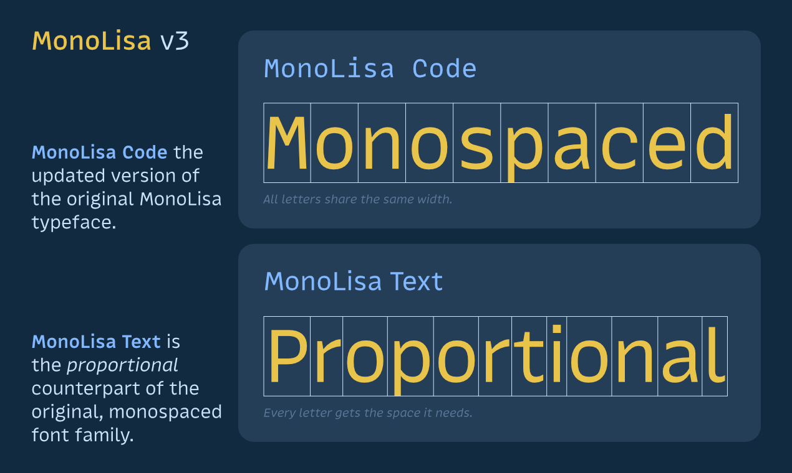
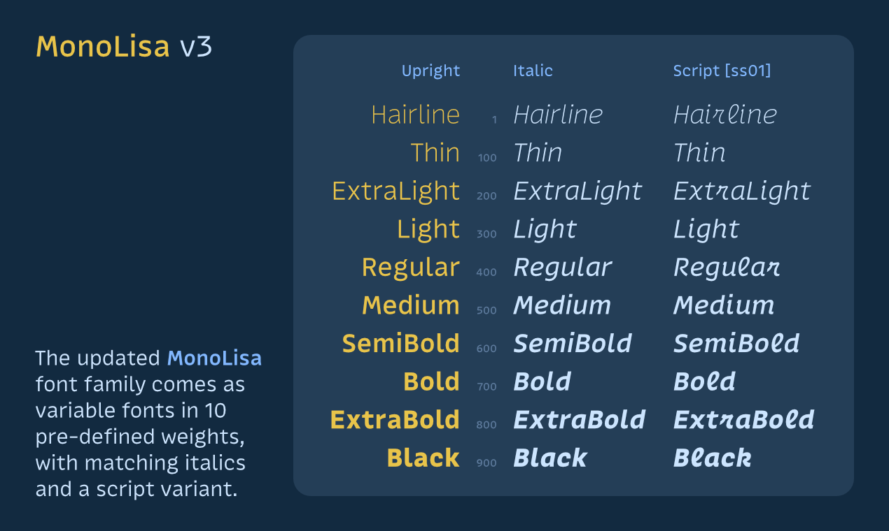
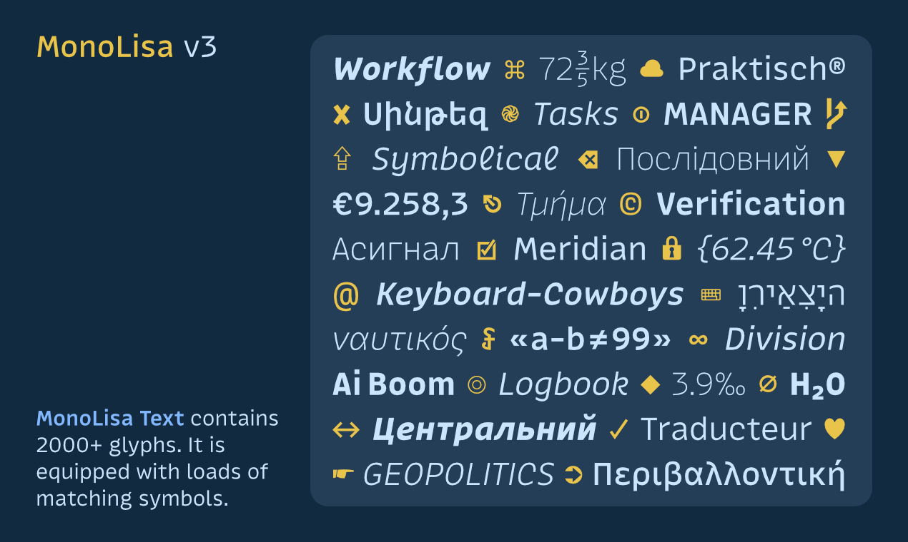

---

## 23. [Treasury AI](https://www.producthunt.com/products/treasury)
**Votes**: 18 | **도입 난이도**: 중 | **신뢰도**: 상
**Tagline**: A Personal CFO for your financial life
**서비스 링크**: https://www.producthunt.com/r/FDCKUTZNDKSKZC

**태그**: FinTech, AI Agent, Personal Finance, Automation, Agent, AI Tool

### 📌 이 서비스 한눈에 보기
복잡한 자산 관리를 대화형 AI로 해결하는 개인 맞춤형 CFO 에이전트

### 🔑 주요 기능
- 자연어 질문을 통한 직관적인 금융 의사결정 지원
- 계좌, 예산, 구독 서비스 등 실시간 금융 데이터 통합 분석
- 현금 흐름 위험, 세금 혜택, 절약 기회에 대한 선제적 알림

### 🙋 사용자에게 어떤 점이 좋은가
스프레드시트 없이도 일상적인 언어로 자신의 재정 상태를 파악하고, 즉각적인 행동 지침을 얻을 수 있습니다.

### ✅ 지금 바로 써볼 기능
- 자신의 소비 패턴 분석을 위한 '돈이 새는 곳' 질문하기
- 특정 지출 계획에 대한 '구매 가능 여부' 확인하기
- 구독 서비스 및 현금 흐름 리스크 점검하기

### ⚠️ 사용 전 확인할 점
- 실제 금융 데이터 연동 시 보안 및 개인정보 보호 수준 확인 필요
- AI의 답변이 법적/전문적 재무 상담을 완전히 대체할 수 없음

### 🧭 확인이 더 필요한 정보
실제 은행 및 금융 기관과의 데이터 연동 방식과 보안 프로토콜에 대한 상세 정보가 필요합니다.

### 📸 스크린샷 및 갤러리
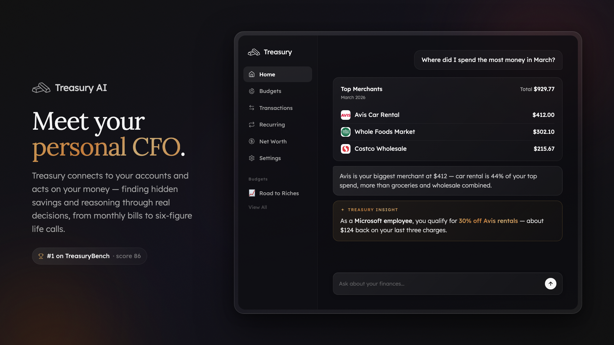
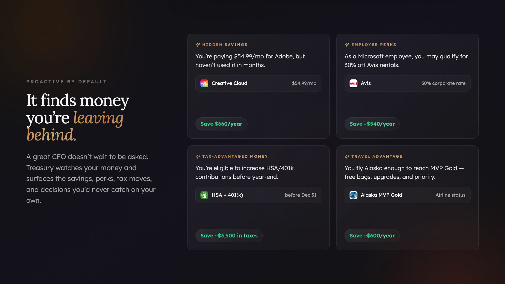
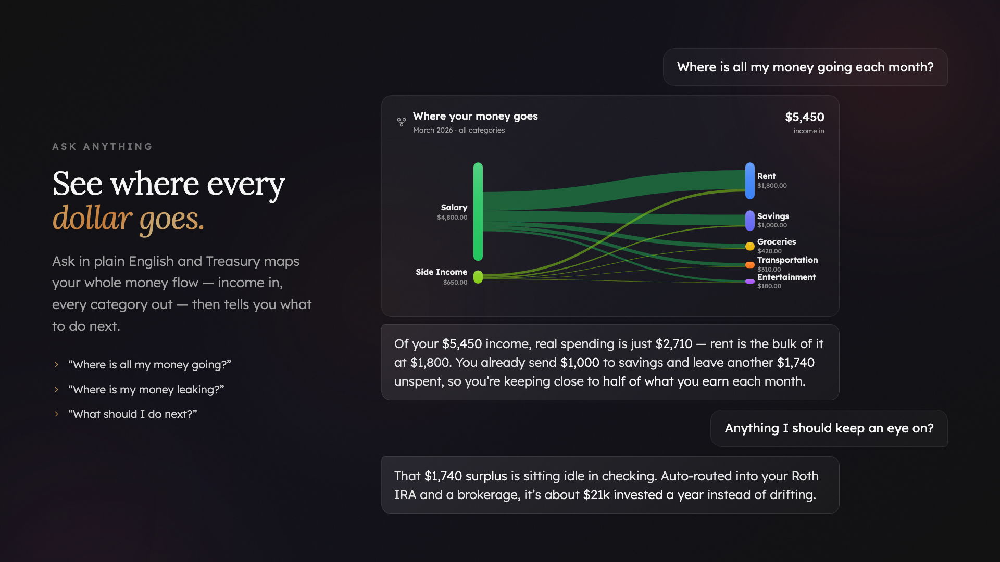

### 🎬 관련 영상
- [🎥 영상 보기](https://ph-files.imgix.net/f694c6a5-d53b-45f8-ab23-c33977928eca.jpeg?auto=format)

---

## 24. [Lemonvite](https://www.producthunt.com/products/lemonvite)
**Votes**: 17 | **도입 난이도**: 하 | **신뢰도**: 상
**Tagline**: Digital invites and RSVPs. Five bucks per event. No ads.
**서비스 링크**: https://www.producthunt.com/r/KJHS7TICME2NS7

**태그**: Productivity, Event Planning, SaaS, AI Tool, Marketing, Email

### 📌 이 서비스 한눈에 보기
광고와 복잡한 결제 없이 이벤트당 5달러로 이용하는 깔끔한 디지털 초대장 서비스

### 🔑 주요 기능
- 이벤트당 5달러의 단일 요금제 (구독 및 추가 비용 없음)
- 초대장에 광고가 없고 게스트에게 마케팅 이메일을 보내지 않음
- 빠른 초대장 제작 및 이메일/SMS 발송, 대시보드를 통한 RSVP 추적 기능

### 🙋 사용자에게 어떤 점이 좋은가
불필요한 광고나 복잡한 코인 결제 시스템 없이, 저렴하고 깔끔하게 모임 초대와 참석 여부를 관리할 수 있습니다.

### ✅ 지금 바로 써볼 기능
- 첫 이벤트 무료 혜택(선착순 50명) 확인하기
- 직접 디자인한 이미지 업로드하여 초대장 만들기
- 이메일 또는 SMS로 초대장 발송해보기

### ⚠️ 사용 전 확인할 점
- 선착순 50명 한정 무료 혜택 조건 확인 필요
- 이벤트당 결제 방식이므로 다수의 이벤트를 운영할 시 비용 고려 필요

### 🧭 확인이 더 필요한 정보
선착순 50명 무료 혜택의 적용 방식과 구체적인 참여 조건에 대한 확인이 필요합니다.

### 📸 스크린샷 및 갤러리
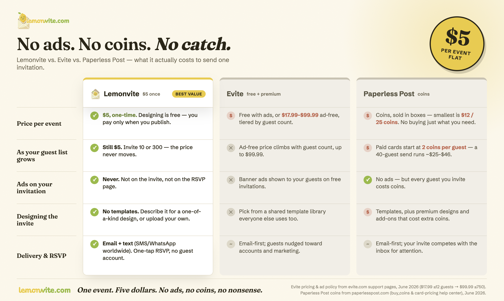

### 🎬 관련 영상
- [🎥 영상 보기](https://ph-files.imgix.net/c0f46aaf-27b5-468d-a882-bde9e82def1d.jpeg?auto=format)

---

## 25. [DEADLINE ](https://www.producthunt.com/products/deadline-2)
**Votes**: 17 | **도입 난이도**: 하 | **신뢰도**: 상
**Tagline**: Finish your novel. Or we start deleting it.
**서비스 링크**: https://www.producthunt.com/r/CUHLURNTMEA3HZ

**태그**: Writing, Productivity, Gamification, Accountability, AI Tool

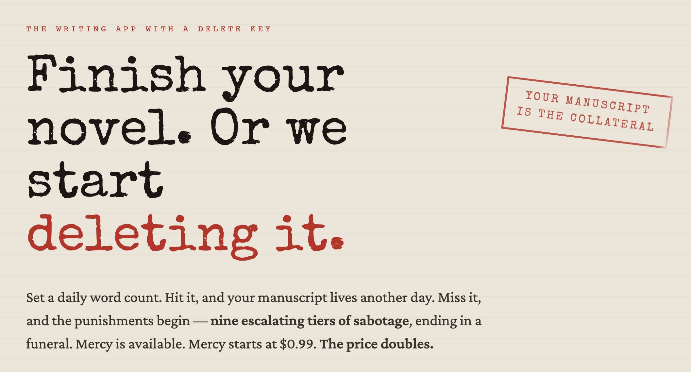

### 📌 이 서비스 한눈에 보기
강력한 압박을 통해 소설 완성을 유도하는 극단적인 글쓰기 책임감 부여 앱

### 🔑 주요 기능
- 일일 목표 글자 수 달성 여부에 따른 단계별 페널티 시스템
- 목표 미달 시 원고 삭제 등 강력한 '사보타주(방해)' 기능 제공
- 사용자의 집착적인 글쓰기 습관 형성을 위한 심리적 압박

### 🙋 사용자에게 어떤 점이 좋은가
글쓰기 미루는 습관을 가진 작가들에게 극단적인 강제성을 부여하여 마감 준수를 돕습니다.

### ✅ 지금 바로 써볼 기능
- 자신의 글쓰기 스타일과 페널티 수위가 맞는지 확인하기
- 원고 손실 위험을 감수할 수 있는지 판단하기
- 유료 결제(Mercy) 시스템 구조 파악하기

### ⚠️ 사용 전 확인할 점
- 목표 미달 시 실제 원고가 삭제될 수 있는 데이터 손실 위험
- 심리적 압박으로 인한 과도한 스트레스 유발 가능성

### 🧭 확인이 더 필요한 정보
페널티의 구체적인 단계별 방식과 원고 백업 정책에 대한 정보가 부족합니다.

### 📸 스크린샷 및 갤러리

### 🎬 관련 영상
- [🎥 영상 보기](https://ph-files.imgix.net/678b42a8-cf06-41ea-8682-f473e350fecc.jpeg?auto=format)

---

## 26. [Second Hand Tokens](https://www.producthunt.com/products/second-hand-tokens)
**Votes**: 12 | **도입 난이도**: 하 | **신뢰도**: 상
**Tagline**: Buy leftovers tokens at 50% off
**서비스 링크**: https://www.producthunt.com/r/6OS52UMY3PFUKN

**태그**: Marketplace, Cost-Saving, DevTools, DevTool

### 📌 이 서비스 한눈에 보기
개발자가 남긴 토큰을 50% 할인된 가격에 구매할 수 있는 마켓플레이스

### 🔑 주요 기능
- 개발자의 미사용 잔여 토큰 거래
- 정가 대비 50% 저렴한 가격
- 토큰 자원 효율화 및 비용 절감

### 🙋 사용자에게 어떤 점이 좋은가
필요한 토큰을 정가보다 훨씬 저렴하게 확보할 수 있어 운영 비용을 획기적으로 줄일 수 있습니다.

### ✅ 지금 바로 써볼 기능
- 잔여 토큰 매물 확인하기
- 필요한 토큰 수량 및 가격 비교하기
- 구매 프로세스 테스트하기

### ⚠️ 사용 전 확인할 점
- 토큰의 유효 기간 및 사용 가능 범위 확인 필요
- 거래 시 보안 및 소유권 이전 방식 확인 필요

### 🧭 확인이 더 필요한 정보
토큰의 종류(API, 클라우드 리소스 등)와 거래 방식에 대한 구체적인 정보가 부족합니다.

### 📸 스크린샷 및 갤러리
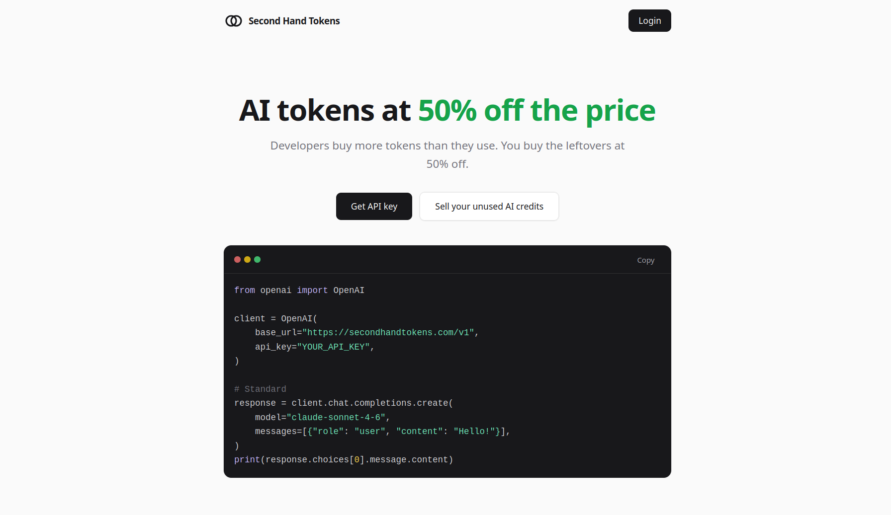
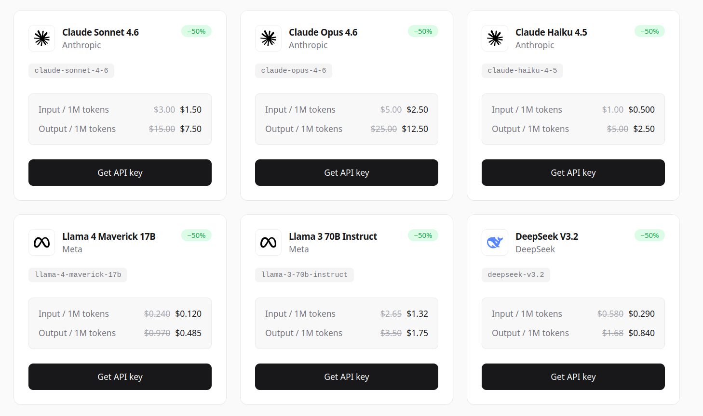

---

## 27. [LivePlant : Plant Identifier](https://www.producthunt.com/products/liveplant-plant-identifier)
**Votes**: 12 | **도입 난이도**: 하 | **신뢰도**: 상
**Tagline**: Snap a photo to identify plants and cure diseases instantly.
**서비스 링크**: https://www.producthunt.com/r/PTR3X542J4NOS3

**태그**: PlantCare, AI, iOS, Lifestyle, AI Tool, Chat

### 📌 이 서비스 한눈에 보기
사진 한 장으로 식물 식별부터 질병 진단까지 해결하는 미니멀한 식물 관리 앱

### 🔑 주요 기능
- AI 기반의 즉각적인 식물 종 식별 기능
- 사진 촬영을 통한 식물 질병 진단 및 해결책 제시
- 불필요한 기능 없이 직관적이고 세련된 iOS 전용 UI

### 🙋 사용자에게 어떤 점이 좋은가
복잡한 과정 없이 사진 촬영만으로 식물의 상태를 빠르게 파악할 수 있어 초보 식물 집사에게 유용합니다.

### ✅ 지금 바로 써볼 기능
- 식물 사진을 찍어 정확한 종 이름 확인하기
- 아픈 식물의 상태를 촬영하여 질병 진단 받기
- 미니멀한 UI를 통해 깔끔한 식물 관리 경험하기

### ⚠️ 사용 전 확인할 점
- AI 진단이므로 실제 식물 상태와 차이가 있을 수 있음
- iOS 전용 앱으로 타 OS 사용자는 이용 불가

### 🧭 확인이 더 필요한 정보
구체적인 유료 구독 모델이나 기능별 가격 정책이 명시되지 않았습니다.

### 📸 스크린샷 및 갤러리
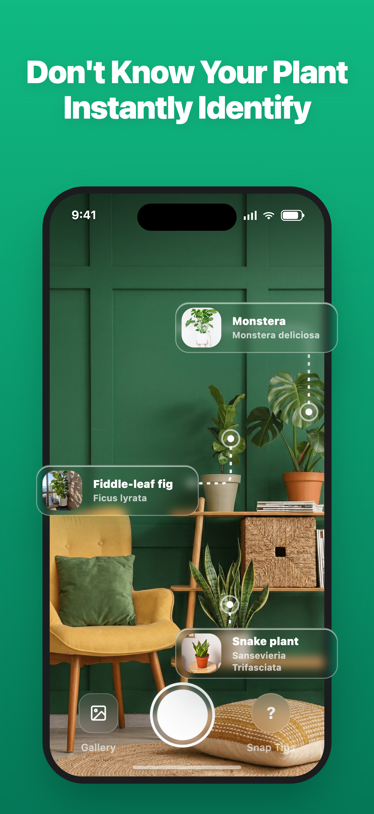
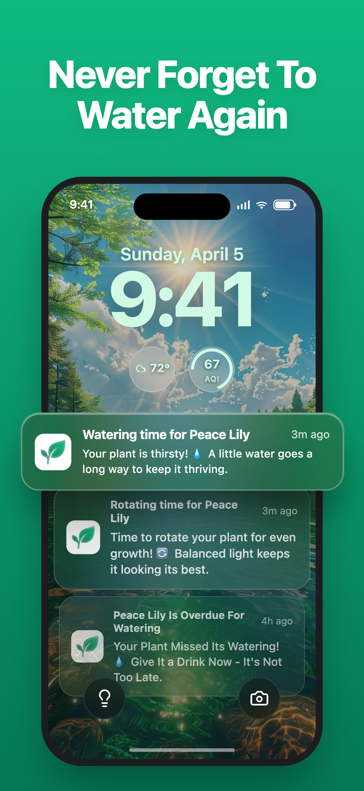
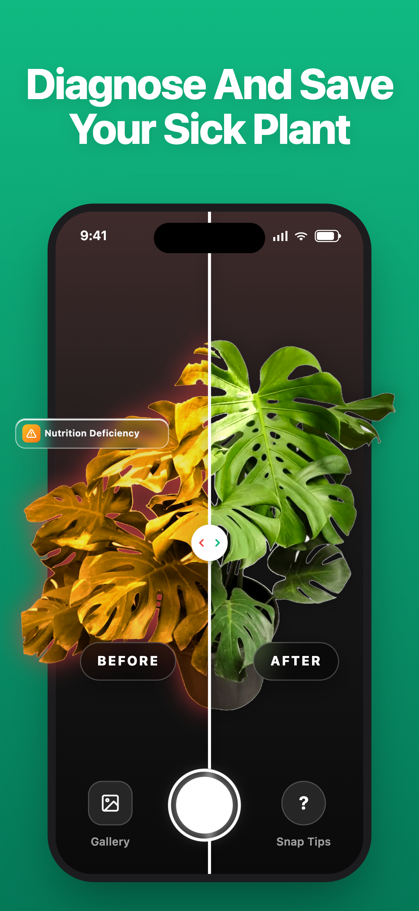

---

## 28. [Spoth](https://www.producthunt.com/products/spoth-2)
**Votes**: 11 | **도입 난이도**: 하 | **신뢰도**: 상
**Tagline**: Drop photo trails on a map — they vanish after a while
**서비스 링크**: https://www.producthunt.com/r/GVSI7KW7NEGX7L

**태그**: Social, Map-based, Real-time, Photo-sharing, AI Tool

### 📌 이 서비스 한눈에 보기
지도 위에 실시간 사진 흔적을 남기고 사라지게 하는 라이브 공유 서비스

### 🔑 주요 기능
- 지도 기반의 실시간 사진 공유 기능 (Trails)
- 시간이 지나면 자동으로 사라지는 휘발성 콘텐츠
- 전 세계 사용자들의 실시간 위치와 현장감 공유

### 🙋 사용자에게 어떤 점이 좋은가
과거의 기록이 아닌 '지금 이 순간'의 현장감을 지도 위에서 생생하게 확인할 수 있습니다.

### ✅ 지금 바로 써볼 기능
- 현재 위치에 사진 트레일 남겨보기
- 지도에서 다른 사용자의 트레일 탐색하기
- 내 트레일을 누가 확인했는지 체크하기

### ⚠️ 사용 전 확인할 점
- 실시간 위치 기반 서비스이므로 개인정보 및 보안 유의 필요
- 콘텐츠가 사라지는 특성상 기록 보관 용도로는 부적합

### 🧭 확인이 더 필요한 정보
사용자 간의 구체적인 소통 방식이나 프라이버시 보호 정책에 대한 상세 정보가 필요합니다.

### 📸 스크린샷 및 갤러리
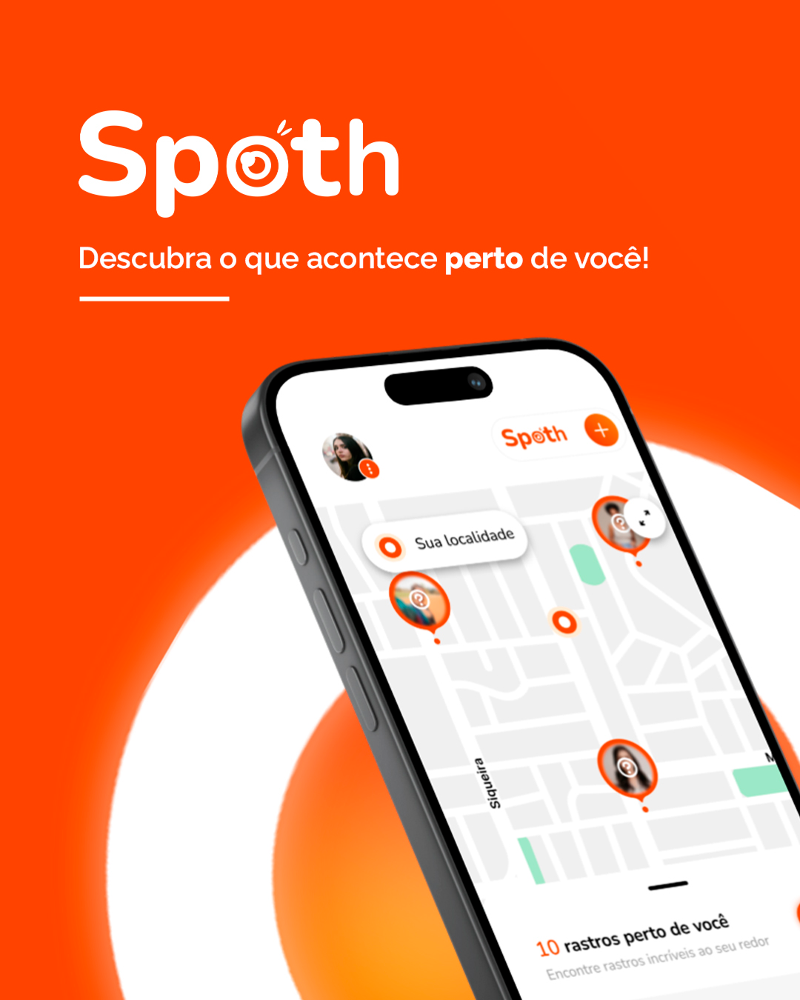

---

## 29. [OpenDream](https://www.producthunt.com/products/opendream)
**Votes**: 11 | **도입 난이도**: 중 | **신뢰도**: 상
**Tagline**: Open, local-first memory for AI agents (with dreaming)
**서비스 링크**: https://www.producthunt.com/r/BB2YBTH7DIMYSR

**태그**: AI-Agent, DevTool, Local-First, Memory-Layer, Agent, Automation, AI Tool

### 📌 이 서비스 한눈에 보기
AI 에이전트의 작업 이력을 안전하게 관리하고 최적의 컨텍스트를 제공하는 로컬 우선 메모리 레이어

### 🔑 주요 기능
- 로컬 우선(Local-first) 방식으로 프로젝트 데이터 보안 유지
- 에이전트 활동을 기록하여 검토 가능한 메모리로 변환
- 다음 작업을 위해 가장 관련성 높은 컨텍스트만 선별적 추출

### 🙋 사용자에게 어떤 점이 좋은가
중요한 프로젝트 데이터를 외부 클라우드에 노출하지 않으면서도, AI 에이전트가 이전 작업 맥락을 정확히 기억하고 활용할 수 있게 돕습니다.

### ✅ 지금 바로 써볼 기능
- Cursor나 Claude Code 등 현재 사용 중인 에이전트 도구에 연동 시도
- 에이전트가 생성한 메모리의 선택/스킵/만료 상태 확인
- 로컬 환경에서의 데이터 관리 효율성 테스트

### ⚠️ 사용 전 확인할 점
- 로컬 환경의 리소스 사용량 및 데이터 관리 책임
- 사용 중인 에이전트 도구와의 구체적인 연동 난이도

### 🧭 확인이 더 필요한 정보
다양한 에이전트 도구들과의 구체적인 통합 방식 및 설치 과정에 대한 상세 정보가 필요합니다.

### 📸 스크린샷 및 갤러리
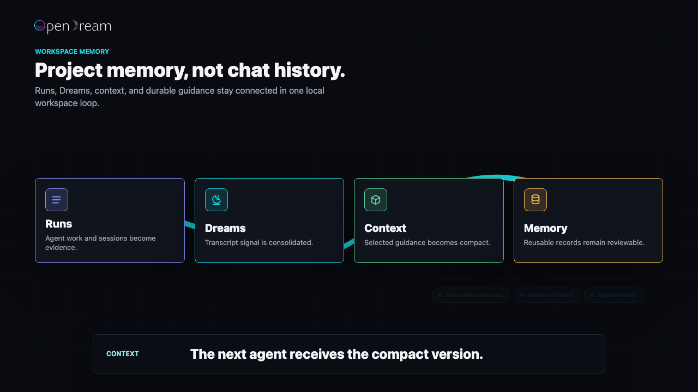
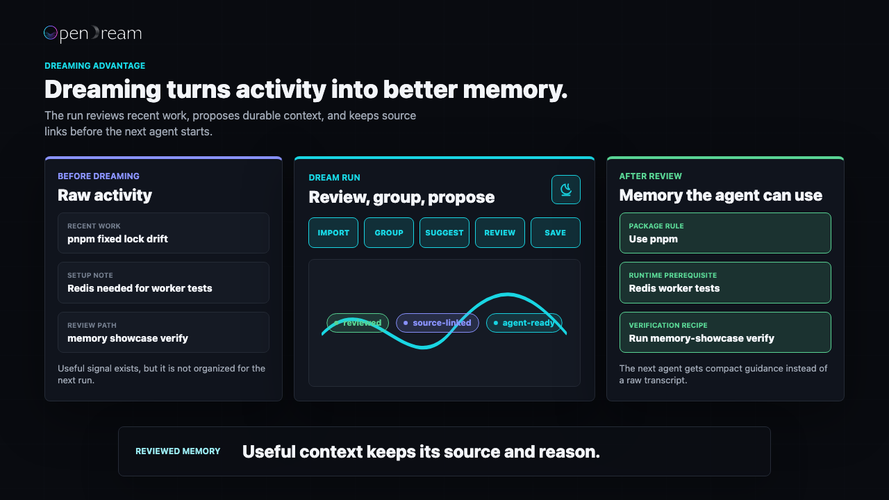
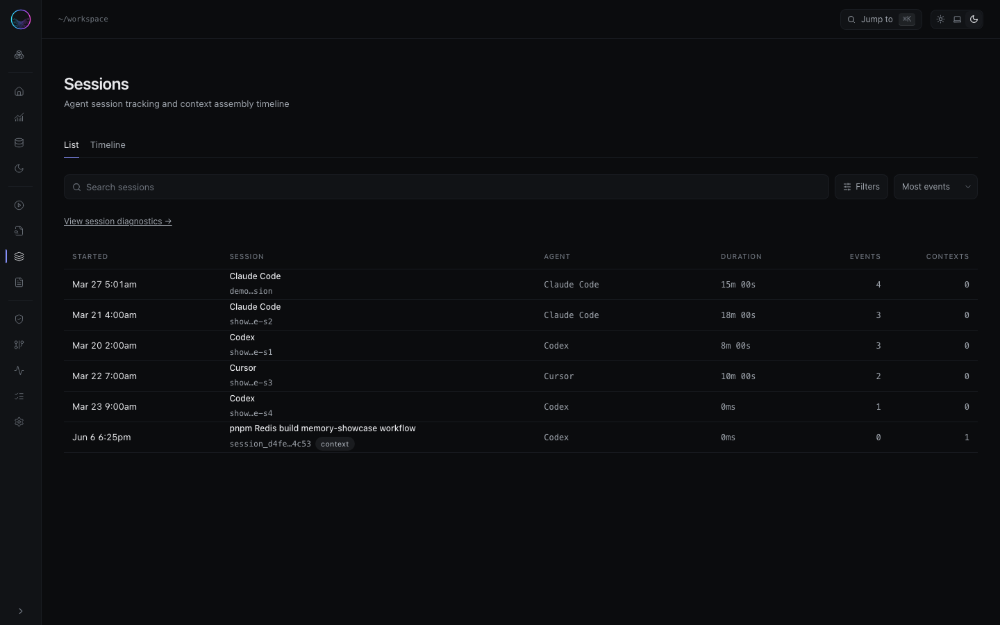

### 🎬 관련 영상
- [🎥 영상 보기](https://ph-files.imgix.net/a363de7e-0324-479a-b334-fb74d64a3e5e.jpeg?auto=format)

---

## 30. [Interview Pilot](https://www.producthunt.com/products/interview-pilot)
**Votes**: 10 | **도입 난이도**: 하 | **신뢰도**: 상
**Tagline**: Live AI Interview Copilot
**서비스 링크**: https://www.producthunt.com/r/HD36ETCY7CKL27

**태그**: AI, Career, Productivity, Interview, AI Tool

### 📌 이 서비스 한눈에 보기
실시간 AI 기술 및 인성 면접 답변을 지원하는 인터뷰 코파일럿

### 🔑 주요 기능
- 실시간 면접 답변 제공 기능
- 기술 및 행동 질문(Behavioral questions) 대응 가능
- Windows 및 Mac 데스크톱 앱 지원

### 🙋 사용자에게 어떤 점이 좋은가
면접 중 즉각적인 답변 가이드를 제공하여 긴장감을 줄이고 질문에 효과적으로 대응할 수 있도록 돕습니다.

### ✅ 지금 바로 써볼 기능
- 데스크톱 앱 설치 및 환경 설정
- 실시간 답변 생성 기능 테스트
- 기술/인성 질문 시나리오 연습

### ⚠️ 사용 전 확인할 점
- 실시간 답변 의존 시 실제 면접 역량 발휘 저해 가능성
- 면접 환경(화면 공유, 카메라 등)에 따른 기술적 제약 가능성

### 🧭 확인이 더 필요한 정보
데스크톱 앱의 구체적인 설치 방법 및 시스템 요구 사양에 대한 정보가 필요합니다.

### 📸 스크린샷 및 갤러리
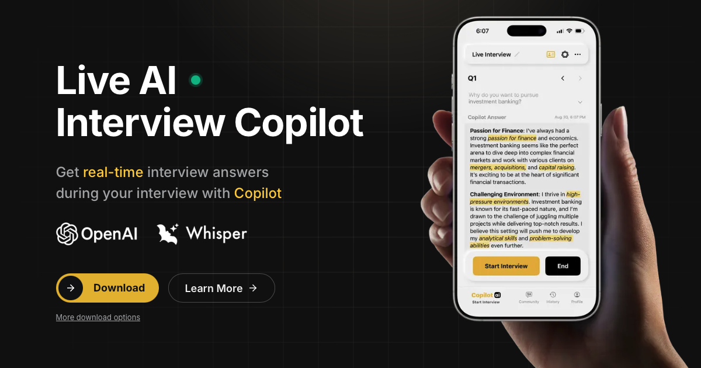
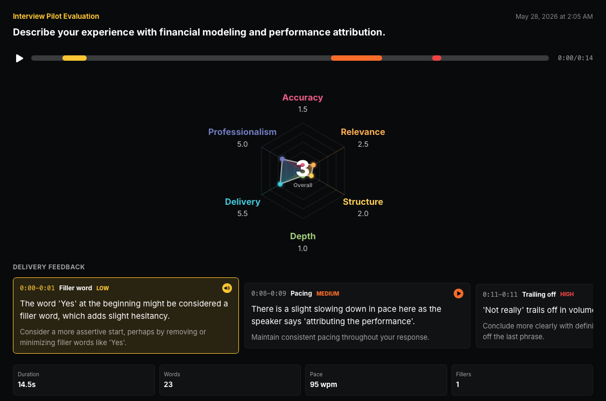
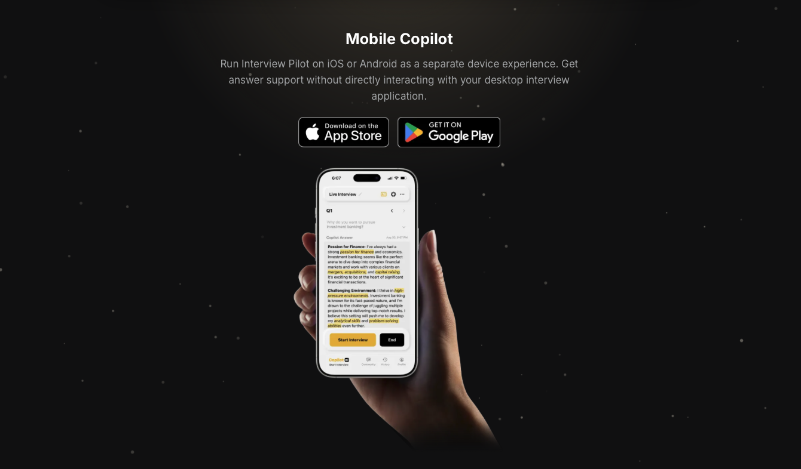

---

