# 🚀 Product Hunt Daily Top 30 (2026-06-24)

## 오늘의 요약
오늘의 트렌드는 AI 에이전트의 운영 효율성을 높이는 인프라와 자동화 도구, 그리고 창의적 콘텐츠 생성을 돕는 AI 솔루션이 주를 이루었습니다. 특히 에이전트의 가시성, 모니터링, 결제 및 음성 인식 최적화와 같이 에이전트 생태계의 실질적인 운영을 지원하는 기술들이 눈에 띄었습니다.

### 오늘의 핵심 포인트
- AI 에이전트의 오류 감지, 모니터링 및 결제 인프라와 같은 운영 최적화 도구들이 등장했습니다.
- 사용자의 말투를 학습하거나 대화만으로 영상을 만드는 등 개인화된 창작 및 생산성 도구가 주목받았습니다.
- 노코드 앱 빌더와 데이터 기반 디자인 도구를 통해 아이디어를 즉각적인 결과물로 전환하는 기술이 강조되었습니다.

**오늘의 태그**: AI 에이전트, 자동화, 생성형 AI, 생산성 도구, 인프라

## 1. [Bluerails Discovery ](https://www.producthunt.com/products/bluerails-discovery)
**Votes**: 432 | **도입 난이도**: 하 | **신뢰도**: 상
**Tagline**: The rails AI agents use to find and pay you
**서비스 링크**: https://www.producthunt.com/r/SES4UURPNBOQ2O

**태그**: AI, MarketingTech, FinTech, Analytics, Agent, AI Tool

### 📌 이 서비스 한눈에 보기
AI 에이전트가 브랜드를 발견하고 결제까지 완료할 수 있도록 돕는 AI 가시성 및 결제 인프라

### 🔑 주요 기능
- 400개 샘플 기반의 검증된 AI 가시성 점수 제공
- AI 에이전트용 체크아웃 및 글로벌 정산 시스템 구축
- 컴플라이언스가 내장된 에이전트 친화적 환경

### 🙋 사용자에게 어떤 점이 좋은가
브랜드가 AI 에이전트의 검색 결과에 노출되는 정도를 확인하고, 향후 에이전트가 직접 결제할 수 있는 기술적 기반을 마련할 수 있습니다.

### ✅ 지금 바로 써볼 기능
- 무료 Discovery 리포트 생성하기
- 브랜드의 AI 가시성 점수 확인하기

### ⚠️ 사용 전 확인할 점
- 에이전트 결제 기능은 향후 출시 예정임
- 현재는 가시성 리포트 중심의 서비스 단계임

### 🧭 확인이 더 필요한 정보
에이전트 결제 및 정산 기능의 구체적인 출시 일정과 지원되는 결제 수단에 대한 정보가 더 필요합니다.

### 📸 스크린샷 및 갤러리
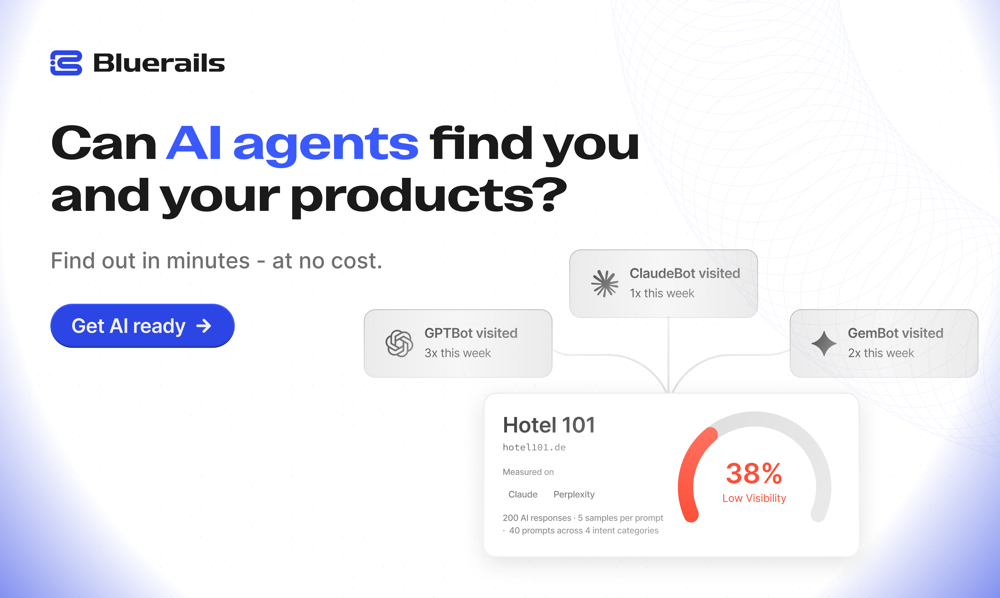
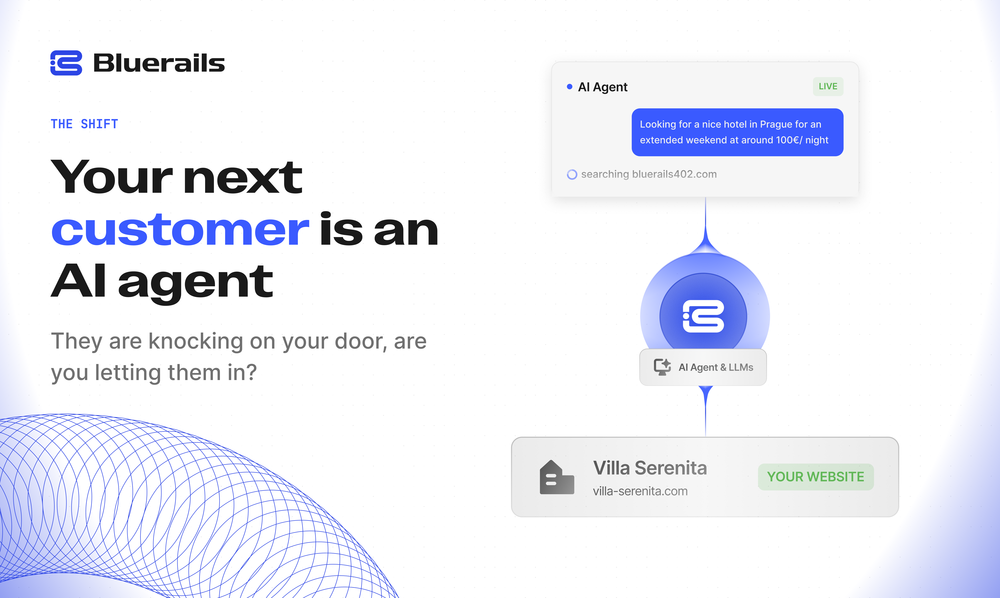
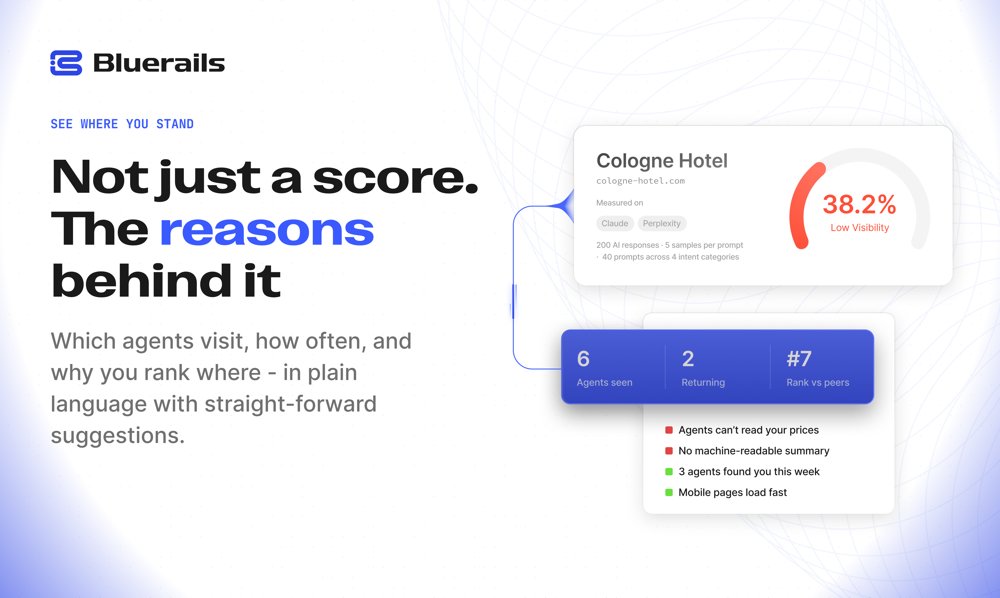

### 🎬 관련 영상
- [🎥 영상 보기](https://ph-files.imgix.net/100643d0-7fb8-4757-bbd1-1aba4ff1566e.jpeg?auto=format)

---

## 2. [Cotypist](https://www.producthunt.com/products/cotypist)
**Votes**: 313 | **도입 난이도**: 하 | **신뢰도**: 상
**Tagline**: Local AI Autocomplete in your voice, anywhere on your Mac
**서비스 링크**: https://www.producthunt.com/r/DAOKZ2ZPDUPEKT

**태그**: Productivity, AI, Mac, Automation, AI Tool, Prompting, API

### 📌 이 서비스 한눈에 보기
사용자의 말투를 학습하여 맥(Mac) 어디에서나 제안하는 로컬 AI 자동 완성 도구

### 🔑 주요 기능
- 사용자의 고유한 말투를 반영한 스마트 자동 완성
- Mail, Slack, Notes 등 모든 Mac 앱에서 사용 가능
- 클라우드 없이 Mac 로컬에서 실행되는 프라이버시 중심 설계

### 🙋 사용자에게 어떤 점이 좋은가
어떤 앱을 사용하든 일관된 문체로 빠르게 타이핑할 수 있어 작업 속도가 향상됩니다. 데이터가 외부로 전송되지 않아 보안 걱정 없이 개인적인 작업에 활용하기 좋습니다.

### ✅ 지금 바로 써볼 기능
- 자주 사용하는 메신저나 문서 앱에 설치하기
- Tab 키를 활용한 자동 완성 흐름 익히기
- 자신의 말투가 얼마나 잘 반영되는지 테스트하기

### ⚠️ 사용 전 확인할 점
- 로컬 실행 방식이므로 Mac의 시스템 리소스(CPU/RAM) 사용량 확인 필요
- 사용자의 말투를 학습하기 위한 초기 데이터 입력 또는 적응 기간 필요

### 🧭 확인이 더 필요한 정보
로컬 실행 시 시스템 성능에 미치는 구체적인 영향과 학습 방식에 대한 상세 정보가 필요합니다.

### 📸 스크린샷 및 갤러리
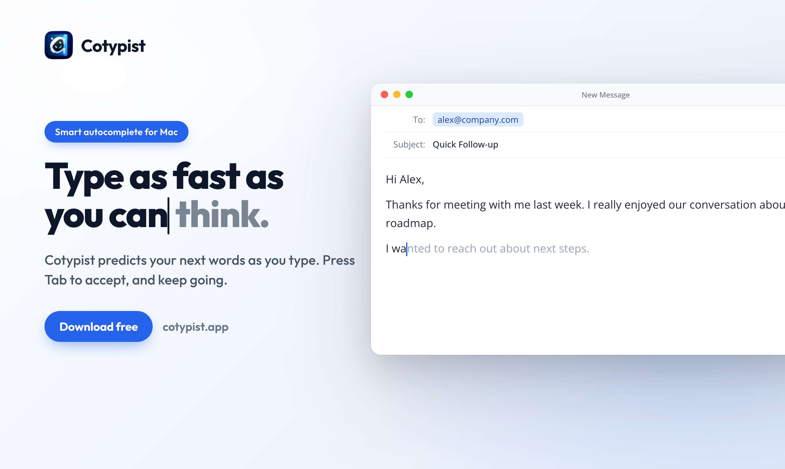
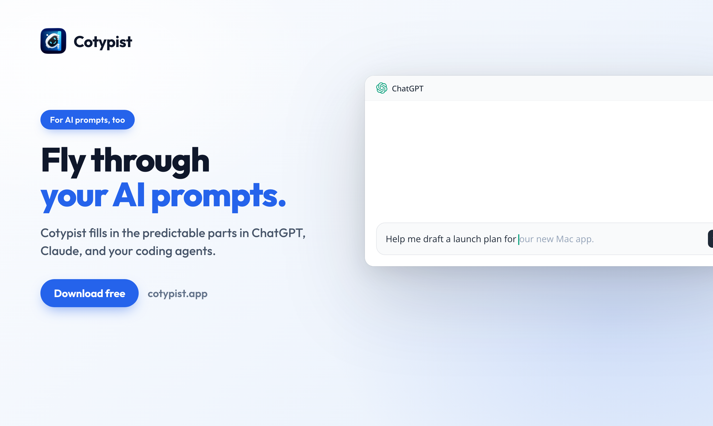
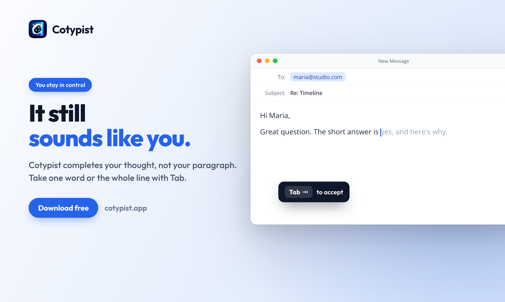

### 🎬 관련 영상
- [🎥 영상 보기](https://ph-files.imgix.net/75e5eaf6-5779-4161-b565-e1fb5c8539ee.jpeg?auto=format)

---

## 3. [Latitude](https://www.producthunt.com/products/latitude-4)
**Votes**: 275 | **도입 난이도**: 중 | **신뢰도**: 상
**Tagline**: Fix what's breaking in your AI agent
**서비스 링크**: https://www.producthunt.com/r/HIY25VKCAQE45I

**태그**: AI-Agent, Observability, OpenSource, DevOps, Automation, Agent, AI Tool

### 📌 이 서비스 한눈에 보기
AI 에이전트의 오류를 자동으로 감지하고 스스로 수정할 수 있게 돕는 오픈소스 모니터링 플랫폼

### 🔑 주요 기능
- 오픈소스 기반의 AI 에이전트 전용 모니터링 플랫폼
- 확장 가능한 환경에서 발생하는 다양한 에이전트 실패 사례 자동 감지
- 코딩 에이전트가 오류를 직접 수정할 수 있는 도구 제공

### 🙋 사용자에게 어떤 점이 좋은가
AI 에이전트 운영 중 발생하는 복잡한 오류를 빠르게 식별하고, 자동화된 수정 프로세스를 통해 유지보수 비용을 절감할 수 있습니다.

### ✅ 지금 바로 써볼 기능
- 에이전트 실패 패턴 감지 기능 테스트
- 코딩 에이전트와의 연동 및 자동 수정 워크플로우 확인
- 오픈소스 코드베이스 검토 및 로컬 환경 설치

### ⚠️ 사용 전 확인할 점
- 에이전트가 스스로 코드를 수정할 때 발생할 수 있는 사이드 이펙트 주의
- 오픈소스 프로젝트이므로 운영 환경 적용 전 안정성 검증 필요

### 🧭 확인이 더 필요한 정보
에이전트의 자동 수정 기능이 구체적으로 어떤 방식으로 코드를 변경하는지에 대한 상세 기술 스펙 확인이 필요합니다.

### 📸 스크린샷 및 갤러리
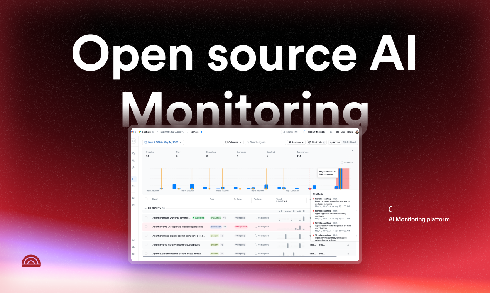
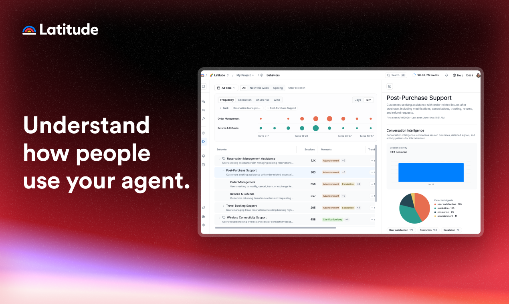
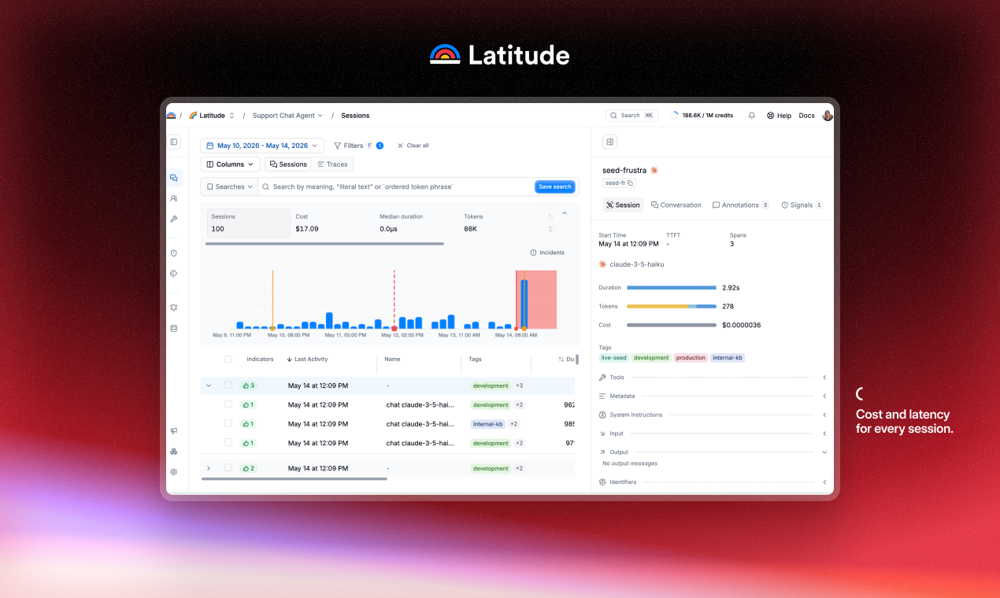

### 🎬 관련 영상
- [🎥 영상 보기](https://ph-files.imgix.net/0fdc8c5f-65d1-4c74-8929-6cfe9676c295.jpeg?auto=format)

---

## 4. [OpenArt Director](https://www.producthunt.com/products/openart)
**Votes**: 254 | **도입 난이도**: 하 | **신뢰도**: 상
**Tagline**: Direct cinematic videos through chat
**서비스 링크**: https://www.producthunt.com/r/VR33AZJYNUFI26

**태그**: AI Video, Storytelling, Creative Tool, Generative AI, AI Tool, Chat, Video

### 📌 이 서비스 한눈에 보기
채팅만으로 일관성 있는 스토리와 캐릭터를 유지하는 시네마틱 AI 영상을 제작하는 디렉터 도구

### 🔑 주요 기능
- 대화형 인터페이스를 통한 직관적인 영상 연출 및 스토리 개발
- 최대 5분 길이의 영상 생성 및 캐릭터·장면·스타일의 일관성 유지
- 단순 클립 생성을 넘어 서사 구조와 연속성을 갖춘 스토리텔링 지원

### 🙋 사용자에게 어떤 점이 좋은가
복잡한 영상 편집 기술 없이도 대화만으로 전문적인 연출이 가능하여, 아이디어를 즉시 영상화할 수 있습니다.

### ✅ 지금 바로 써볼 기능
- 채팅을 통한 스토리 아크(Story Arc) 설계해보기
- 일관된 캐릭터 설정 및 장면 유지 기능 테스트하기
- 음악과 목소리가 포함된 전체 영상 생성 시도하기

### ⚠️ 사용 전 확인할 점
- 5분 길이의 긴 영상 생성 시 연산 시간 및 비용 발생 가능성
- 대화 기반 제어의 정밀도가 사용자의 의도와 일치하는지 확인 필요

### 🧭 확인이 더 필요한 정보
구체적인 영상 생성 비용 체계와 기술적 해상도 사양은 명시되지 않았습니다.

### 📸 스크린샷 및 갤러리
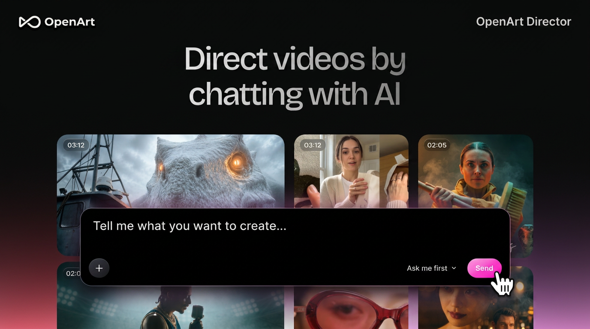
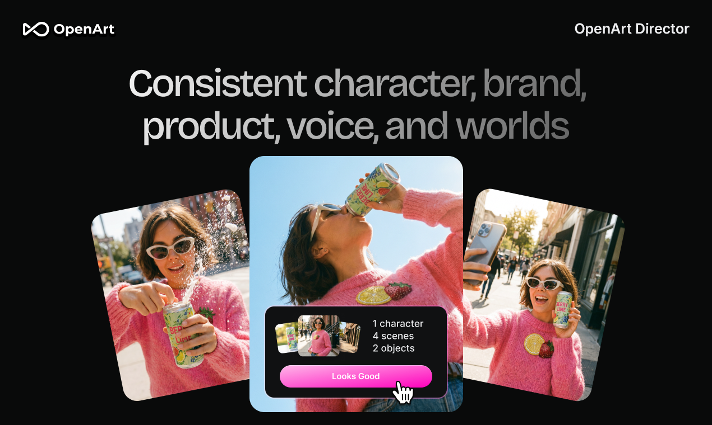
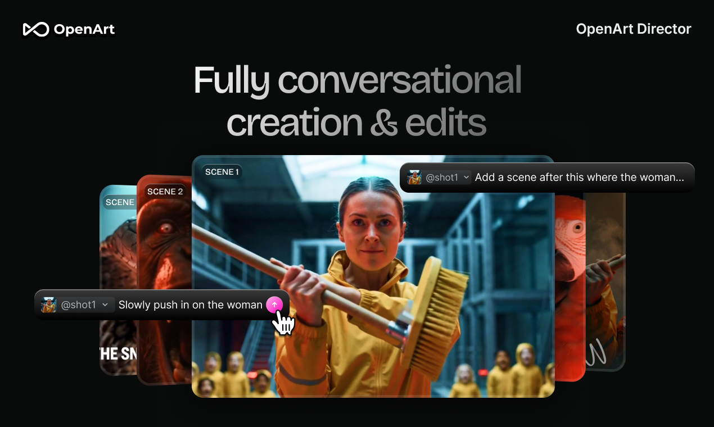

### 🎬 관련 영상
- [🎥 영상 보기](https://ph-files.imgix.net/cc00bf20-c11f-43df-b09e-0b6bc6f94f94.jpeg?auto=format)

---

## 5. [Thumbmagic](https://www.producthunt.com/products/thumbmagic-3)
**Votes**: 254 | **도입 난이도**: 하 | **신뢰도**: 상
**Tagline**: AI thumbnail generator trained on top-performing thumbnails
**서비스 링크**: https://www.producthunt.com/r/5AKQ3XEF4EI36Z

**태그**: AI, ContentCreation, Marketing, Design, AI Tool

### 📌 이 서비스 한눈에 보기
데이터 기반 분석을 통해 클릭을 유도하는 고성능 AI 썸네일 생성 도구

### 🔑 주요 기능
- 단순 템플릿이 아닌 상위 성과 데이터 기반의 생성 방식
- 200개 이상의 고성과 썸네일 분석 모델 적용
- 테크, 금융 등 카테고리별 클릭 유도 최적화

### 🙋 사용자에게 어떤 점이 좋은가
단순히 예쁜 디자인이 아니라 실제 클릭률(CTR)을 높일 수 있는 전략적인 썸네일을 제작할 수 있습니다.

### ✅ 지금 바로 써볼 기능
- 자신의 채널 카테고리에 맞는 데이터 분석 결과 확인하기
- AI가 제안하는 고성능 레이아웃 적용해보기
- 기존 썸네일과 AI 생성 썸네일의 성과 비교하기

### ⚠️ 사용 전 확인할 점
- 데이터 기반 생성 방식이므로 사용자의 독창적인 스타일과 충돌할 수 있음
- 특정 카테고리에 최적화되어 있어 범용적인 디자인과는 차이가 있을 수 있음

### 🧭 확인이 더 필요한 정보
구체적인 지원 카테고리 범위와 생성 가능한 이미지 포맷에 대한 정보가 추가로 필요합니다.

### 📸 스크린샷 및 갤러리

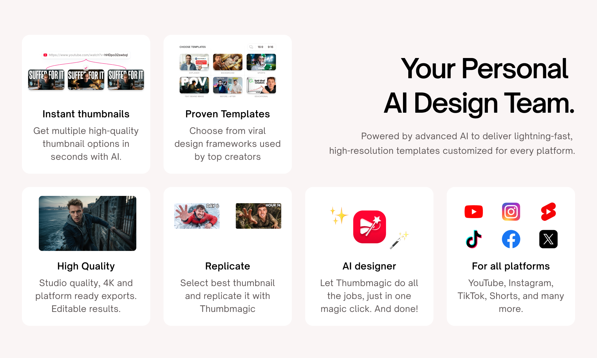

---

## 6. [Hush](https://www.producthunt.com/products/hush-df34eafa-13f7-4d91-856f-162c2a9d81ee)
**Votes**: 157 | **도입 난이도**: 중 | **신뢰도**: 상
**Tagline**: Open-source noise suppression for voice AI agents
**서비스 링크**: https://www.producthunt.com/r/4MK3CBM4G3CRUM

**태그**: AI, OpenSource, Audio, VoiceAI, DevTool, Agent, AI Tool

### 📌 이 서비스 한눈에 보기
음성 AI 에이전트의 청취 정확도를 높여주는 오픈소스 노이즈 제거 솔루션

### 🔑 주요 기능
- 실시간 통화 중 경쟁하는 목소리 및 배경 소음 제거
- 오디오 간섭 차단을 통한 음성 인식 품질 향상
- 오픈소스 기반의 음성 AI 최적화 도구

### 🙋 사용자에게 어떤 점이 좋은가
음성 AI 에이전트가 소음이 있는 환경에서도 사용자 목소리를 정확하게 인식하도록 하여 대화의 품질을 높여줍니다.

### ✅ 지금 바로 써볼 기능
- 오픈소스 코드 저장소 확인
- 실시간 통화 환경에서의 노이즈 제거 성능 테스트
- 기존 음성 AI 에이전트 워크플로우에 통합 테스트

### ⚠️ 사용 전 확인할 점
- 실시간 처리 시 발생할 수 있는 지연 시간(Latency) 확인 필요
- 오픈소스이므로 직접 구축 및 유지보수 역량 필요

### 🧭 확인이 더 필요한 정보
구체적인 기술 스택과 실시간 처리 지연 시간에 대한 정보가 명시되지 않았습니다.

### 📸 스크린샷 및 갤러리
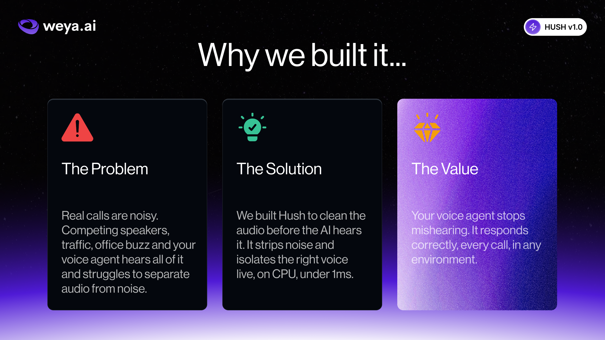
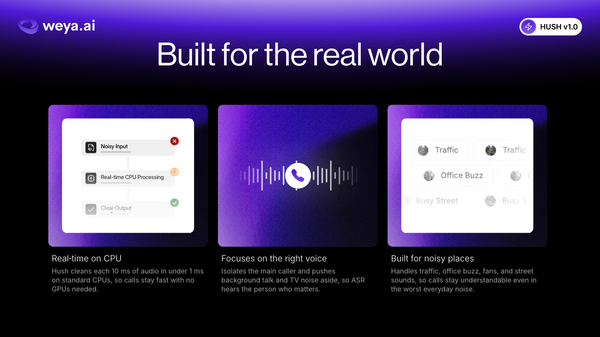
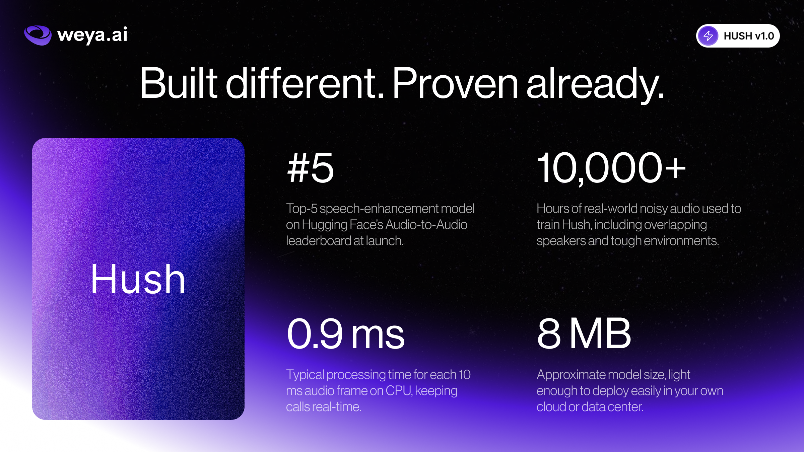

### 🎬 관련 영상
- [🎥 영상 보기](https://ph-files.imgix.net/4ef57971-4698-4f4a-adc9-83da07ccc40f.jpeg?auto=format)

---

## 7. [Steam Machine](https://www.producthunt.com/products/steam-machine)
**Votes**: 151 | **도입 난이도**: 하 | **신뢰도**: 상
**Tagline**: A tiny, powerful PC for big-screen gaming
**서비스 링크**: https://www.producthunt.com/r/V76I2WDPCC2XOW

**태그**: Gaming, Hardware, PC, SteamOS, AI Tool

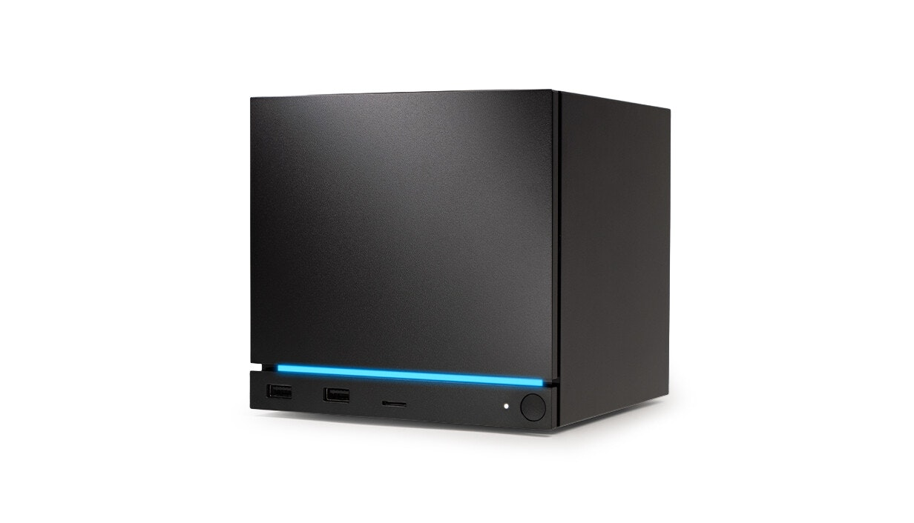

### 📌 이 서비스 한눈에 보기
TV 바로 아래에서 즐기는 4K 고성능 게임용 초소형 PC

### 🔑 주요 기능
- Steam Deck 대비 6배 이상의 강력한 4K 60 FPS 게이밍 성능
- SteamOS 기반의 플러그 앤 플레이 방식과 Steam Controller 최적화
- 사용자 앱 설치 및 OS 변경이 가능한 완전한 PC 기능 제공

### 🙋 사용자에게 어떤 점이 좋은가
거실 TV에 연결하여 복잡한 설정 없이 고사양 AAA 게임을 쾌적하게 즐길 수 있습니다.

### ✅ 지금 바로 써볼 기능
- Steam 라이브러리 동기화 확인
- Steam Controller 페어링 테스트
- 사용 중인 TV/모니터와의 4K 출력 호환성 체크

### ⚠️ 사용 전 확인할 점
- 고성능 작업 시 발열 및 소음 관리 상태 확인 필요
- 하드웨어 크기 대비 성능 유지력 확인

### 🧭 확인이 더 필요한 정보
구체적인 하드웨어 사양(CPU/GPU 모델명)과 상세 가격 정보가 명시되지 않았습니다.

### 📸 스크린샷 및 갤러리

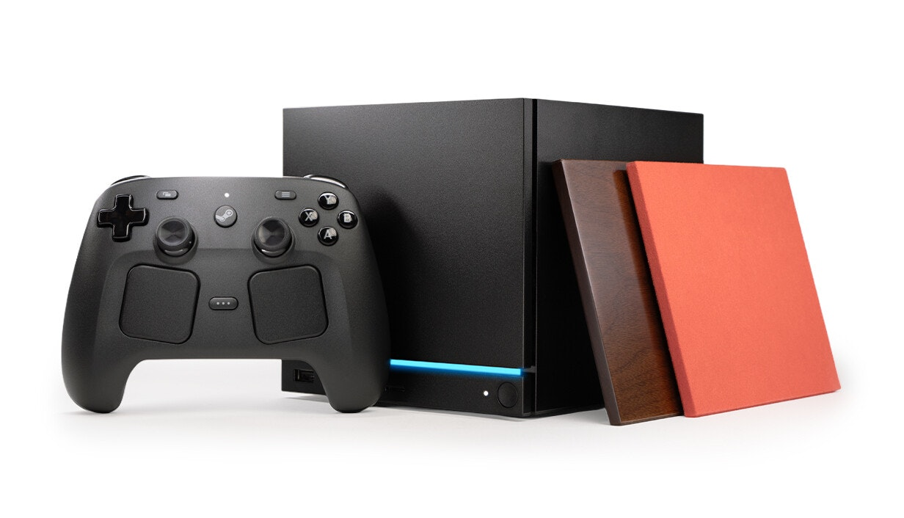
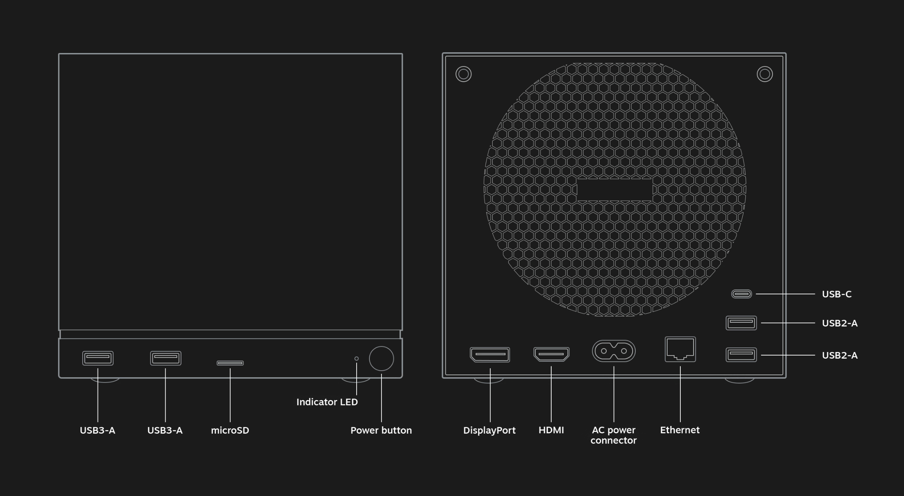

---

## 8. [Jotform AI App Builder](https://www.producthunt.com/products/jotform)
**Votes**: 139 | **도입 난이도**: 하 | **신뢰도**: 상
**Tagline**: Turn ideas into powerful apps within seconds
**서비스 링크**: https://www.producthunt.com/r/RYTOCBF7AC7ESQ

**태그**: NoCode, AI, Automation, Productivity, Agent, AI Tool

### 📌 이 서비스 한눈에 보기
아이디어 설명만으로 앱의 페이지, 워크플로우, 데이터 관리까지 자동 생성하는 AI 앱 빌더

### 🔑 주요 기능
- 자연어 설명을 통한 앱 구조 및 워크플로우 자동 생성
- 대시보드, 차트, 계산기 등 맞춤형 위젯 자동 생성 기능
- 폼, 테이블, AI 에이전트, 커스텀 위젯의 통합 관리

### 🙋 사용자에게 어떤 점이 좋은가
복잡한 코딩 없이도 아이디어를 즉시 기능적인 앱으로 구현할 수 있어 업무 자동화와 데이터 관리 효율을 극대화할 수 있습니다.

### ✅ 지금 바로 써볼 기능
- 아이디어 설명으로 기본 앱 구조 생성해보기
- AI 위젯 크리에이터로 맞춤형 대시보드 만들기
- 생성된 폼과 테이블을 결합하여 워크플로우 구축하기

### ⚠️ 사용 전 확인할 점
- AI 생성 결과물의 세부적인 로직 검증 필요
- 복잡한 비즈니스 로직 구현 시 수동 편집 작업이 필요할 수 있음

### 🧭 확인이 더 필요한 정보
생성된 앱의 외부 서비스 연동 범위와 데이터 보안 정책에 대한 상세 정보가 필요합니다.

### 📸 스크린샷 및 갤러리

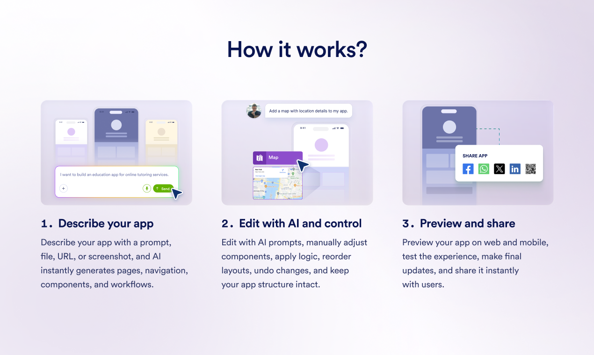

### 🎬 관련 영상
- [🎥 영상 보기](https://ph-files.imgix.net/e7ff07d9-859a-4373-bec4-26055b141d1e.jpeg?auto=format)

---

## 9. [Blazly SEO](https://www.producthunt.com/products/tregno)
**Votes**: 128 | **도입 난이도**: 중 | **신뢰도**: 상
**Tagline**: Dominate SEO with an AI content operating system
**서비스 링크**: https://www.producthunt.com/r/BBXVXSGQVORSYG

**태그**: SEO, AI-Content, Automation, Marketing-Tool, AI Tool

### 📌 이 서비스 한눈에 보기
콘텐츠 기획부터 발행까지 SEO 최적화를 한 곳에서 해결하는 AI 콘텐츠 운영 시스템

### 🔑 주요 기능
- 키워드 발굴 및 SEO 전략 수립부터 대량 블로그 생성까지 통합 관리
- 워크플로우 자동화 및 콘텐츠 휴머나이징(인간화) 기능 제공
- Google Search Console 연동 및 WordPress, Webflow 등 직접 발행 지원

### 🙋 사용자에게 어떤 점이 좋은가
콘텐츠 제작의 전 과정을 하나의 플랫폼에서 자동화하여 마케터의 작업 시간을 획기적으로 단축하고 검색 엔진 노출 가능성을 높여줍니다.

### ✅ 지금 바로 써볼 기능
- 키워드 발굴 및 SEO 전략 수립 기능 테스트
- 대량 블로그 생성 및 워크플로우 자동화 설정
- WordPress 또는 Webflow 연동 및 직접 발행 테스트

### ⚠️ 사용 전 확인할 점
- AI 생성 콘텐츠의 품질이 검색 엔진 가이드라인을 충족하는지 검토 필요
- 플랫폼별(WordPress, Webflow 등) 연동 시 설정 복잡도 확인 필요

### 🧭 확인이 더 필요한 정보
사용자 수에 따른 비용 체계나 API 연동의 상세 범위는 명시되어 있지 않습니다.

### 📸 스크린샷 및 갤러리
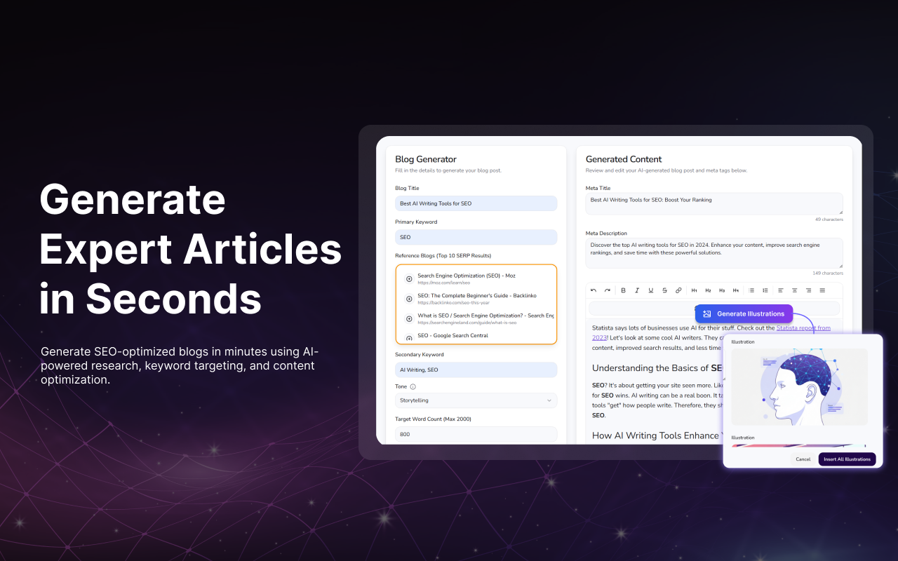
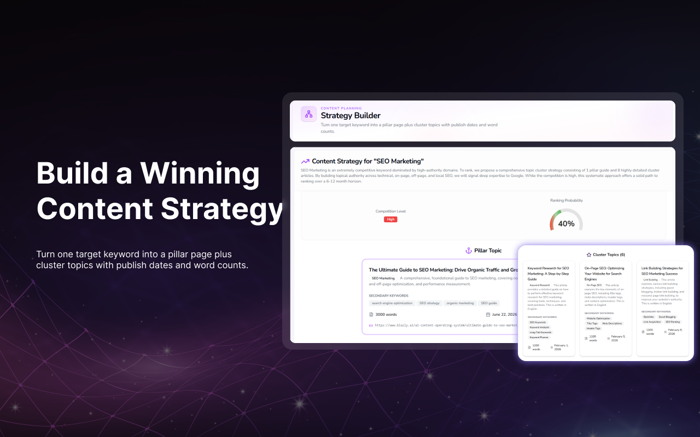
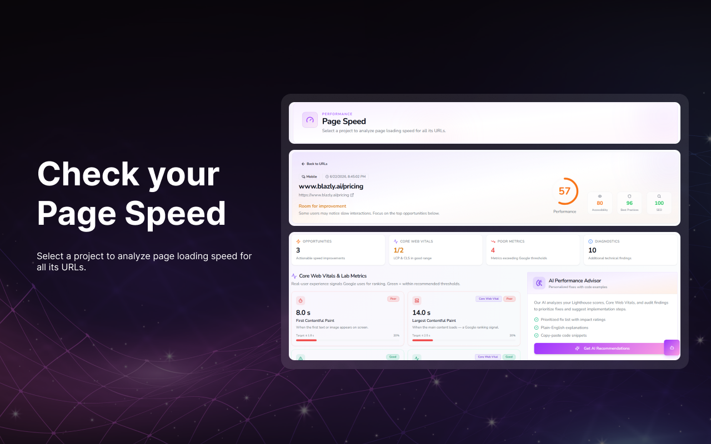

### 🎬 관련 영상
- [🎥 영상 보기](https://ph-files.imgix.net/f6c0fb97-94c6-4f7b-bbfb-1155c2f8427a.jpeg?auto=format)

---

## 10. [Sakana Fugu](https://www.producthunt.com/products/sakana-fugu)
**Votes**: 128 | **도입 난이도**: 중 | **신뢰도**: 상
**Tagline**: One Model to Command Them All
**서비스 링크**: https://www.producthunt.com/r/UC77WTDO7SDCR2

**태그**: AI, Automation, API, Orchestration, DevTool

### 📌 이 서비스 한눈에 보기
단일 API로 전 세계 최적의 AI 모델들을 동적으로 활용하는 지능형 오케스트레이션 플랫폼

### 🔑 주요 기능
- 특정 벤더에 종속되지 않는 프론티어급 모델 성능 제공
- 복잡한 다단계 작업을 위한 동적 모델 오케스트레이션
- 단일 API를 통한 집단 지성 워크플로우 통합

### 🙋 사용자에게 어떤 점이 좋은가
여러 AI 모델을 개별적으로 관리할 필요 없이, 하나의 API로 가장 뛰어난 성능을 내는 모델 조합을 자동 활용할 수 있습니다.

### ✅ 지금 바로 써볼 기능
- 단일 API를 통한 워크플로우 통합 테스트
- 복잡한 다단계 작업(Multi-step tasks) 처리 성능 검증
- 기존 워크플로우에 Fugu 오케스트레이션 적용

### ⚠️ 사용 전 확인할 점
- 동적 모델 전환 시 발생할 수 있는 응답 지연 시간 확인 필요
- 여러 모델을 거치는 과정에서의 비용 구조 파악 필요

### 🧭 확인이 더 필요한 정보
구체적인 API 비용 체계와 지원하는 모델 리스트에 대한 정보가 명시되지 않았습니다.

### 📸 스크린샷 및 갤러리

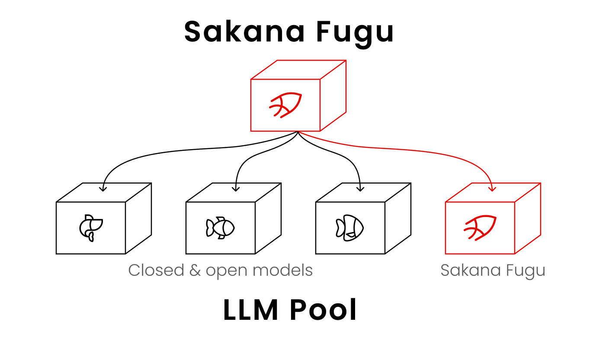
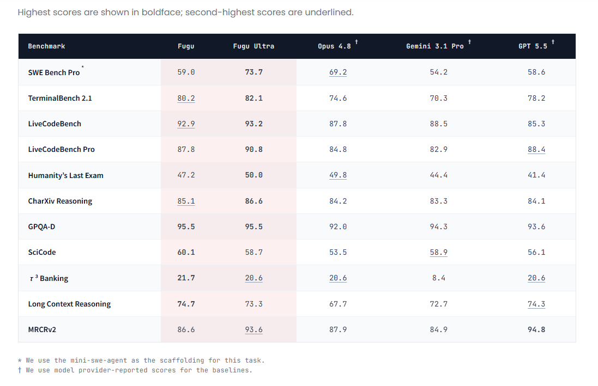

---

## 11. [Conduit](https://www.producthunt.com/products/conduit-12)
**Votes**: 125 | **도입 난이도**: 하 | **신뢰도**: 상
**Tagline**: Fix the tool-list bloat slowing your AI agent
**서비스 링크**: https://www.producthunt.com/r/E7YKWOOJTW5GQE

**태그**: AI-Agent, MCP, DevTool, OpenSource, Optimization, Agent, AI Tool

### 📌 이 서비스 한눈에 보기
MCP 서버로 인한 토큰 낭비와 지연 시간을 획기적으로 줄여주는 AI 에이전트용 로컬 게이트웨이

### 🔑 주요 기능
- 모든 도구 목록을 컨텍스트에 넣는 대신, 검색 기반의 메타 도구 방식으로 토큰 사용량 최적화
- 도구 오버헤드 97% 감소 및 토큰 사용량 약 90% 절감 효과
- 로컬 또는 클라우드 환경 지원 및 OS 키체인을 활용한 보안 관리

### 🙋 사용자에게 어떤 점이 좋은가
다수의 MCP 서버를 사용하는 에이전트 사용자에게 컨텍스트 비용을 줄이고 응답 속도를 높여주는 실질적인 해결책을 제공합니다.

### ✅ 지금 바로 써볼 기능
- 현재 사용 중인 MCP 서버 목록 정리하기
- Conduit를 로컬 게이트웨이로 설정하여 토큰 절감 효과 테스트하기
- 오픈 소스 저장소에서 설치 및 설정 가이드 확인하기

### ⚠️ 사용 전 확인할 점
- 도구 검색 방식 변경에 따른 에이전트의 작업 성공률 변화 모니터링 필요
- 로컬 환경 설정 시 OS 키체인 접근 권한 확인

### 🧭 확인이 더 필요한 정보
특정 에이전트 프레임워크와의 호환성 및 상세 설치 방법은 공식 문서를 통해 추가 확인이 필요합니다.

### 📸 스크린샷 및 갤러리
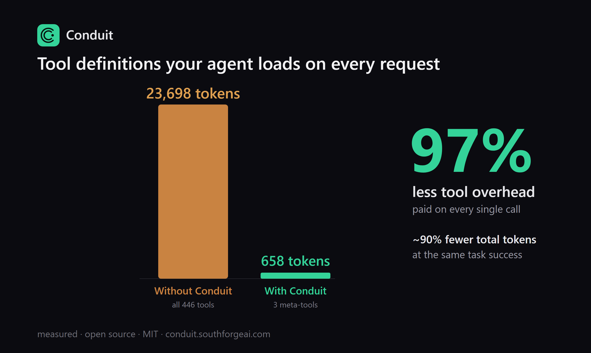
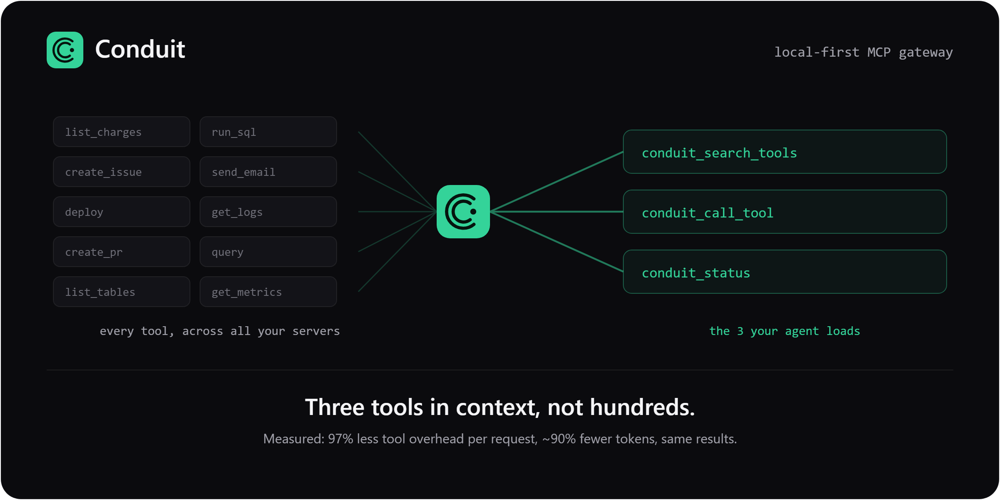
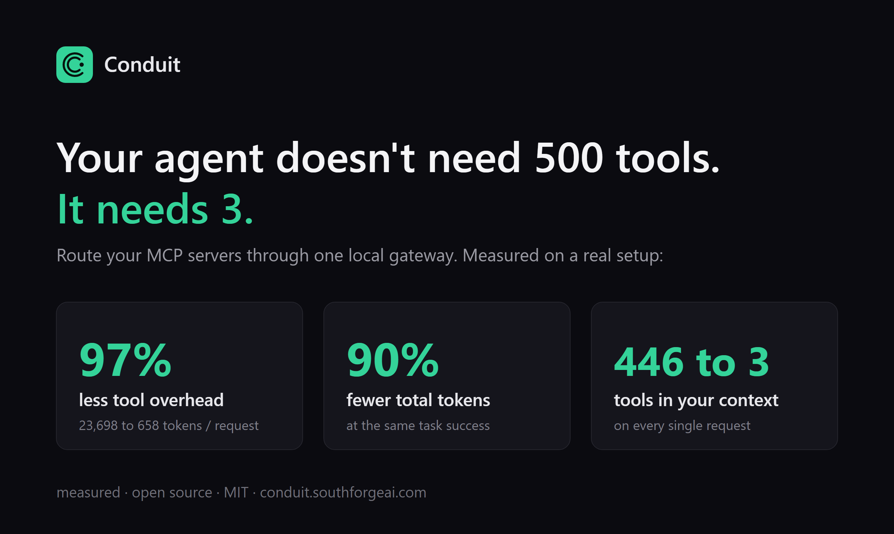

### 🎬 관련 영상
- [🎥 영상 보기](https://ph-files.imgix.net/7adec624-7020-481f-8fc8-3f13abf03bca.jpeg?auto=format)

---

## 12. [Sipcode](https://www.producthunt.com/products/sipcode)
**Votes**: 124 | **도입 난이도**: 하 | **신뢰도**: 상
**Tagline**: Keep Claude Code's context clean for sharper answers
**서비스 링크**: https://www.producthunt.com/r/UPJLB2WHEJ42IF

**태그**: DevTool, AI-Optimization, ClaudeCode

### 📌 이 서비스 한눈에 보기
Claude Code의 컨텍스트를 최적화하여 답변 정확도를 높이는 도구

### 🔑 주요 기능
- 불필요하게 긴 툴 출력값(verbose output)을 압축하여 컨텍스트 노이즈 제거
- 동일 세션 내 중복 읽기 작업을 방지하여 토큰 효율성 증대
- 벤치마크 결과 62.6%의 중간 툴 출력 절감 효과 입증

### 🙋 사용자에게 어떤 점이 좋은가
Claude Code 사용 시 발생하는 불필요한 데이터 노이즈를 줄여 모델이 핵심 정보에만 집중하게 함으로써 답변 품질을 높여줍니다.

### ✅ 지금 바로 써볼 기능
- Claude Code 환경에 Sipcode 적용하기
- 컨텍스트 정제 전후의 답변 품질 차이 비교하기
- 20개 작업 벤치마크 결과와 실제 워크플로우 비교하기

### ⚠️ 사용 전 확인할 점
- 컨텍스트 압축 과정에서 중요한 정보가 누락될 가능성 확인 필요
- Claude Code와의 호환성 및 설정 방식 확인 필요

### 🧭 확인이 더 필요한 정보
실제 사용자 환경에서의 구체적인 설치 방법과 Claude Code와의 통합 방식에 대한 상세 정보가 필요합니다.

### 📸 스크린샷 및 갤러리
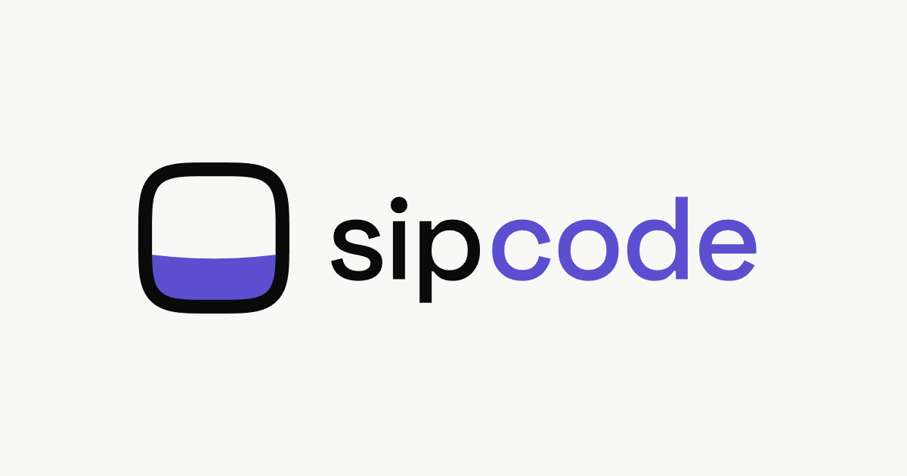
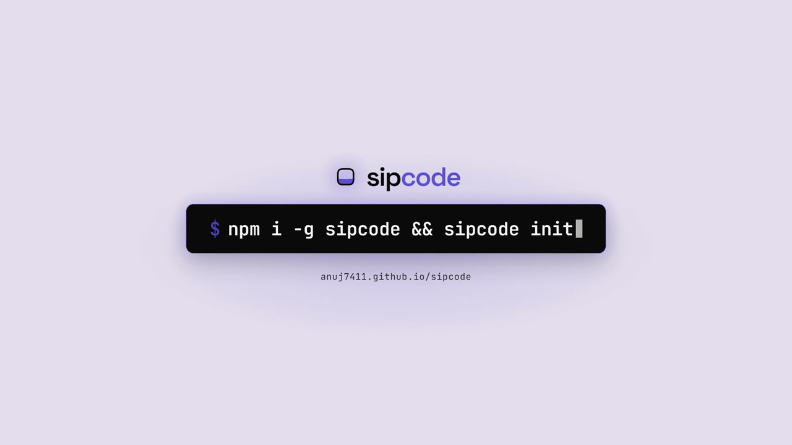

### 🎬 관련 영상
- [🎥 영상 보기](https://ph-files.imgix.net/df45f25b-311a-44b7-9240-15691e29f8b3.jpeg?auto=format)

---

## 13. [BestDefense.io](https://www.producthunt.com/products/bestdefense-io)
**Votes**: 121 | **도입 난이도**: 중 | **신뢰도**: 상
**Tagline**: Pentest and patch every deploy with AI
**서비스 링크**: https://www.producthunt.com/r/GSVGJJLZJK5VKU

**태그**: Cybersecurity, DevSecOps, AI, Automation, AI Tool, DevTool

### 📌 이 서비스 한눈에 보기
AI 기반 실시간 침투 테스트와 자동 패치 생성으로 보안 취약점을 즉각 해결하는 솔루션

### 🔑 주요 기능
- 배포 시마다 자동으로 수행되는 AI 기반 지속적 침투 테스트
- 단순 스캔을 넘어 실제 실행 가능한 취약점 검증 및 오탐 제거
- 개발자가 즉시 적용할 수 있는 자동화된 보안 패치 생성

### 🙋 사용자에게 어떤 점이 좋은가
보안 취약점 탐지에 그치지 않고 실제 수정 코드까지 제공하여, 개발팀이 보안 이슈를 해결하는 시간을 획기적으로 단축해 줍니다.

### ✅ 지금 바로 써볼 기능
- CI/CD 파이프라인에 배포 자동화 연동 테스트
- 실제 취약점 검증(Exploit Validation) 기능 확인
- 생성된 자동 패치의 코드 품질 및 적용 가능성 검토

### ⚠️ 사용 전 확인할 점
- 자동 생성된 패치를 적용하기 전 반드시 코드 리뷰와 테스트가 필요함
- 실행 기반 검증 방식이 시스템 환경에 미칠 수 있는 영향 확인 필요

### 🧭 확인이 더 필요한 정보
현재 지원하는 프로그래밍 언어 및 프레임워크의 범위와 CI/CD 도구와의 호환성 확인이 필요합니다.

### 📸 스크린샷 및 갤러리
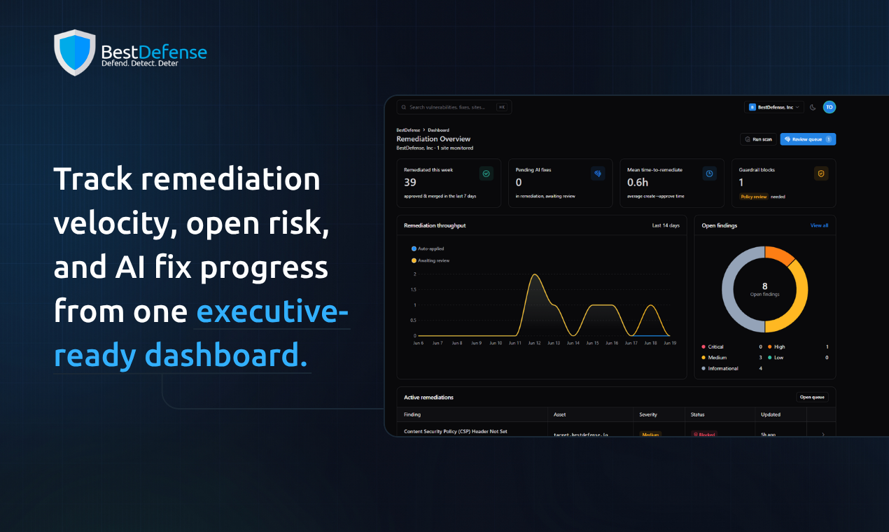
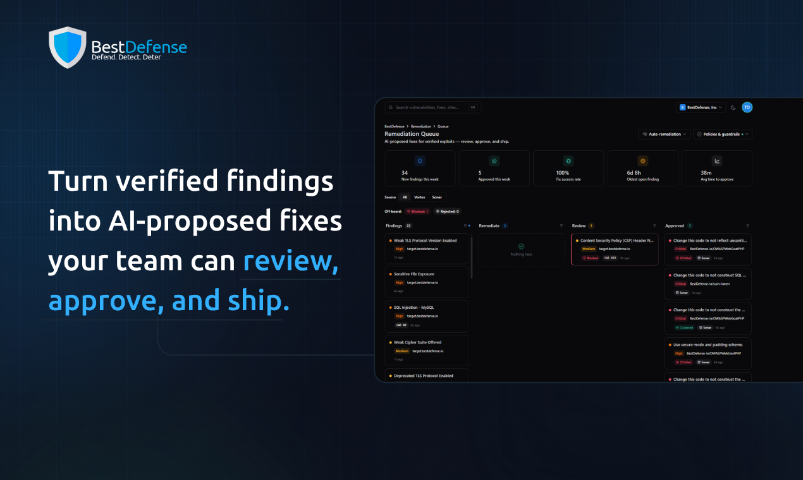
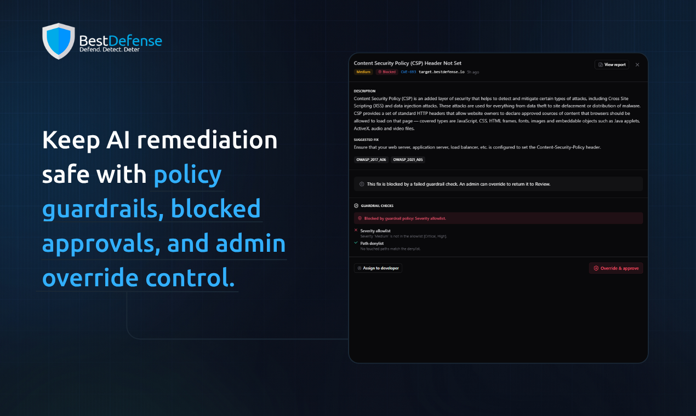

### 🎬 관련 영상
- [🎥 영상 보기](https://ph-files.imgix.net/f3a02edc-c84c-4d27-9010-ff6a1d57cf89.jpeg?auto=format)

---

## 14. [jebi](https://www.producthunt.com/products/jebi-the-terminal-that-thinks-with-you)
**Votes**: 115 | **도입 난이도**: 하 | **신뢰도**: 상
**Tagline**: A supercharged terminal for Mac with built-in local AI
**서비스 링크**: https://www.producthunt.com/r/7C4DCG63GC7CZR

**태그**: DevTool, Terminal, AI, Mac, Productivity, AI Tool, Chat, API

### 📌 이 서비스 한눈에 보기
개인정보 유출 걱정 없는 온디바이스 AI 기반의 강력한 Mac 전용 터미널

### 🔑 주요 기능
- Qwen, Phi-3, Gemma 등 로컬 모델을 활용한 온디바이스 AI 기능
- 명령어 추천 및 에러 발생 시 자동 설명/해결 가이드 제공
- 터미널 내 채팅(/ask) 및 슬래시 명령어(/ls, /ports) 지원

### 🙋 사용자에게 어떤 점이 좋은가
클라우드에 명령어를 보내지 않아 보안이 유지되면서도, AI의 도움으로 터미널 작업 속도와 에러 해결 능력을 획기적으로 높일 수 있습니다.

### ✅ 지금 바로 써볼 기능
- /ask 명령어로 터미널 내 AI 채팅 시작하기
- 에러 발생 시 AI의 해결 가이드 확인하기
- 커스텀 테마와 grain texture로 나만의 터미널 환경 구축하기

### ⚠️ 사용 전 확인할 점
- 로컬 AI 모델 구동을 위한 Mac의 하드웨어 사양(CPU/GPU/RAM) 요구사항 확인 필요
- 클라우드 기반 AI 대비 모델의 지식 범위나 추론 성능 차이 가능성

### 🧭 확인이 더 필요한 정보
로컬 모델 구동 시 시스템 리소스 점유율이 어느 정도인지 확인이 필요합니다.

### 📸 스크린샷 및 갤러리

---

## 15. [prepros](https://www.producthunt.com/products/prepros-7)
**Votes**: 100 | **도입 난이도**: 하 | **신뢰도**: 상
**Tagline**: Run your brand shoots from start to finish
**서비스 링크**: https://www.producthunt.com/r/NSI466FJIDPTUT

**태그**: CreativeTools, Production, Workflow, ProjectManagement

### 📌 이 서비스 한눈에 보기
브랜드 촬영의 기획부터 현장 관리까지 모든 과정을 하나로 통합한 전문 워크스페이스

### 🔑 주요 기능
- 무드보드, 샷리스트, 콜시트 등 촬영 필수 도구 통합 제공
- 예산 관리 및 크루 관리 기능 포함
- 촬영 당일 실시간 트래킹을 위한 전문적인 워크플로우

### 🙋 사용자에게 어떤 점이 좋은가
파편화된 문서와 메신저를 뒤지는 대신, 하나의 툴에서 촬영 준비부터 실행까지 체계적으로 관리할 수 있습니다.

### ✅ 지금 바로 써볼 기능
- 무드보드 및 샷리스트 생성해보기
- 촬영 예산 및 크루 리스트 등록하기
- 촬영 당일 트래킹 워크플로우 테스트하기

### ⚠️ 사용 전 확인할 점
- 촬영 전문 도구이므로 일반적인 협업 툴 대비 특정 목적에 국한될 수 있음
- 실제 현장 적용 시 모바일 환경 최적화 여부 확인 필요

### 🧭 확인이 더 필요한 정보
구체적인 협업 인원 제한이나 가격 정책에 대한 정보가 명시되지 않았습니다.

### 📸 스크린샷 및 갤러리

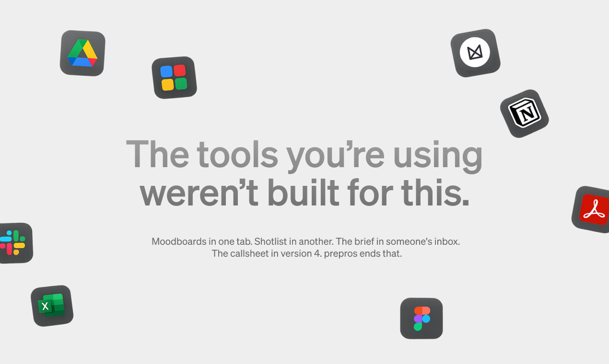

---

## 16. [wildbirds](https://www.producthunt.com/products/wildbirds)
**Votes**: 99 | **도입 난이도**: 하 | **신뢰도**: 상
**Tagline**: Birdwatchers app to share and discover birds socially
**서비스 링크**: https://www.producthunt.com/r/JZW57ZFLJNYBTC

**태그**: Social, Nature, Photography, Lifestyle, AI Tool

### 📌 이 서비스 한눈에 보기
탐조 기록 공유와 커뮤니티 활동을 한곳에서 즐기는 사회적 조류 관찰 플랫폼

### 🔑 주요 기능
- 개인별 조류 관찰 기록(Life List) 관리 및 사진 공유 기능
- 아티클, 팟캐스트 등 큐레이션 콘텐츠를 통한 새로운 사용자 발견 기능
- iPhone, iPad, Android, Web, Mac 등 다양한 플랫폼 지원

### 🙋 사용자에게 어떤 점이 좋은가
자신이 발견한 새를 기록하고 다른 탐조가들과 소통하며, 전문적인 콘텐츠를 통해 탐조 지식을 확장할 수 있습니다.

### ✅ 지금 바로 써볼 기능
- 자신의 조류 관찰 사진 업로드하기
- 디스커버리 기능을 통해 새로운 탐조가 팔로우하기
- 나만의 라이프 리스트(Life List) 구축하기

### ⚠️ 사용 전 확인할 점
- 다양한 기기 지원이 명시되어 있으나, 기기 간 데이터 동기화 방식 확인 필요
- 커뮤니티 기반 서비스이므로 사용자 참여도에 따라 콘텐츠 품질이 달라질 수 있음

### 🧭 확인이 더 필요한 정보
구체적인 유료 구독 모델이나 기능별 요금 체계에 대한 정보가 명시되지 않았습니다.

### 📸 스크린샷 및 갤러리
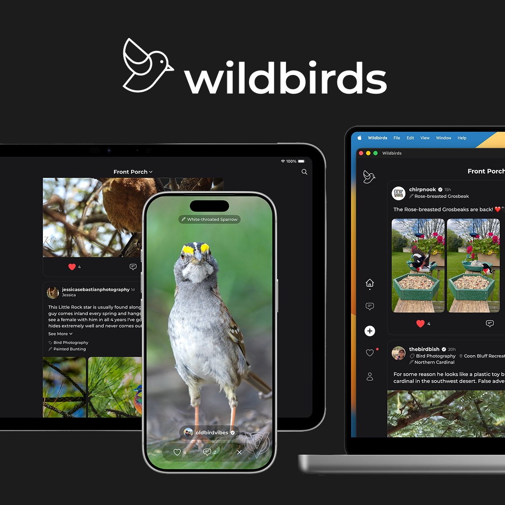
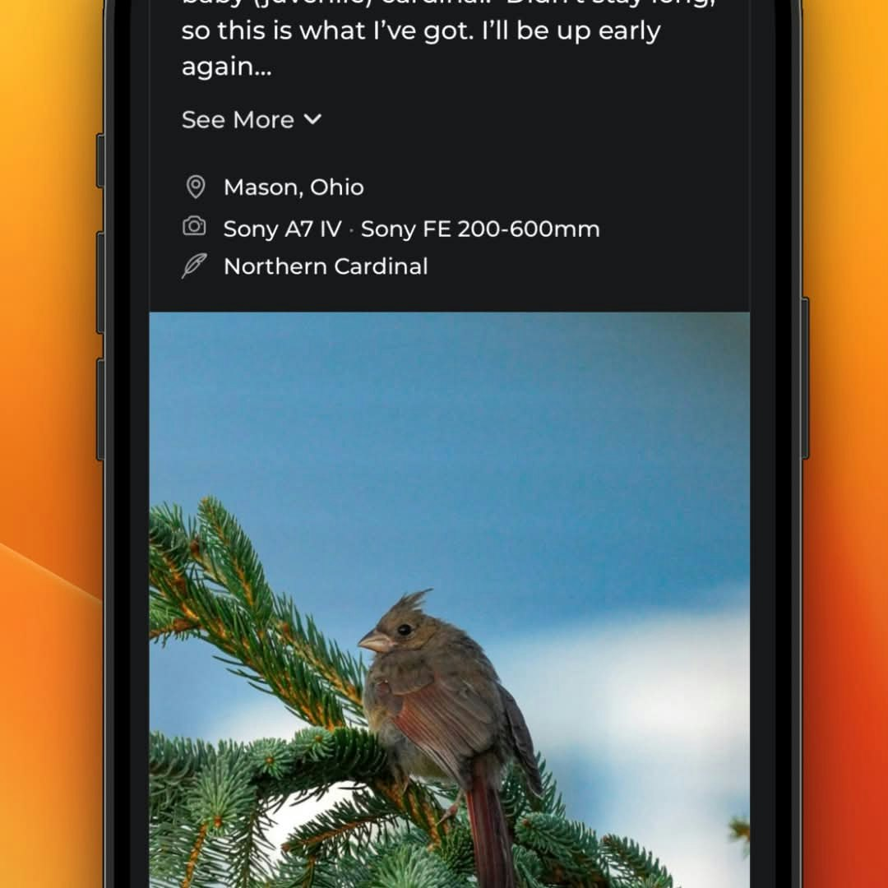
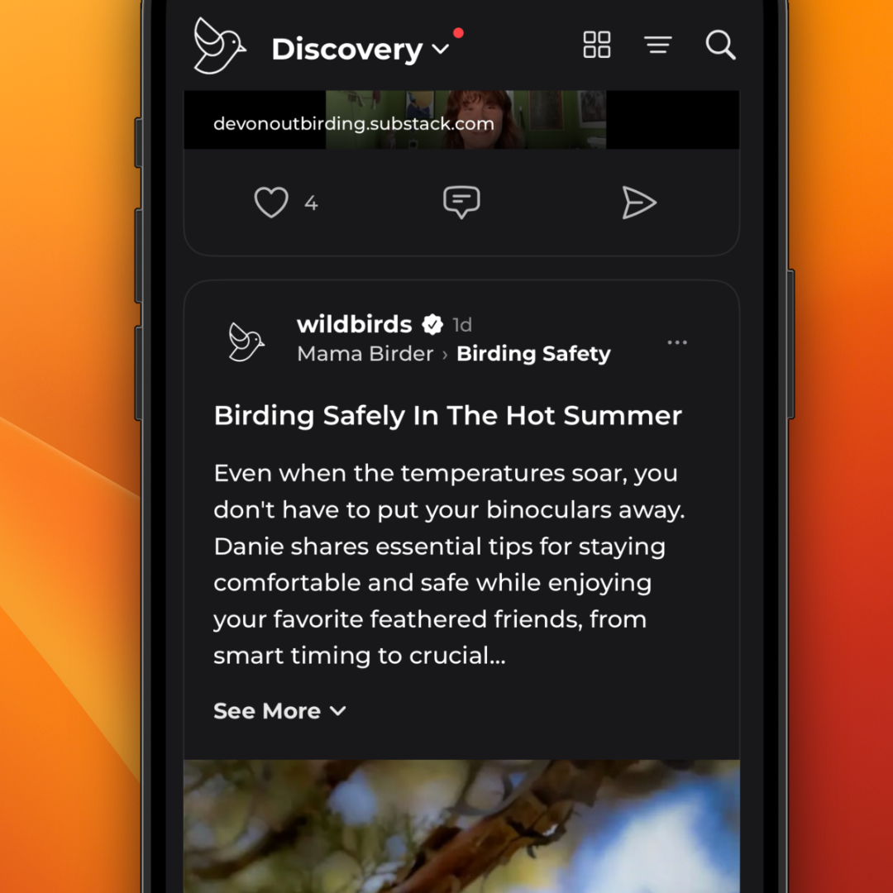

---

## 17. [Buddy AI Note](https://www.producthunt.com/products/buddy-ai-note)
**Votes**: 93 | **도입 난이도**: 하 | **신뢰도**: 상
**Tagline**: Your daily memo that turns notes into a plan
**서비스 링크**: https://www.producthunt.com/r/FZE4MBDNRJ37CJ

**태그**: Productivity, AI Agent, Task Management, Note-taking, Agent, AI Tool, Chat

### 📌 이 서비스 한눈에 보기
메모를 체계적인 실행 계획으로 바꿔주는 AI 기반 데일리 워크스페이스

### 🔑 주요 기능
- 메모와 음성 입력을 바탕으로 한 자동화된 일일 계획 생성
- 사용자의 검토를 거치는 'Plan-then-confirm' 방식의 안전한 실행
- 캘린더 연동 및 리마인더, 집중 시간 설정 등 실무 중심 기능 제공

### 🙋 사용자에게 어떤 점이 좋은가
단순한 기록을 넘어, 적어둔 메모를 즉시 실행 가능한 할 일 목록과 계획으로 변환하여 생산성을 높여줍니다.

### ✅ 지금 바로 써볼 기능
- Google/Outlook 캘린더 동기화하기
- 오늘의 할 일을 음성이나 텍스트로 메모하기
- 생성된 계획을 확인하고 실행 단계로 전환하기

### ⚠️ 사용 전 확인할 점
- AI 에이전트(채팅, 작업 실행 등) 기능은 유료 업그레이드가 필요함
- 자동 실행이 아닌 사용자 확인을 거치는 구조이므로 수동 개입이 필요함

### 🧭 확인이 더 필요한 정보
유료 플랜의 구체적인 가격 정책과 AI 에이전트의 상세 기능 범위는 명시되지 않았습니다.

### 📸 스크린샷 및 갤러리

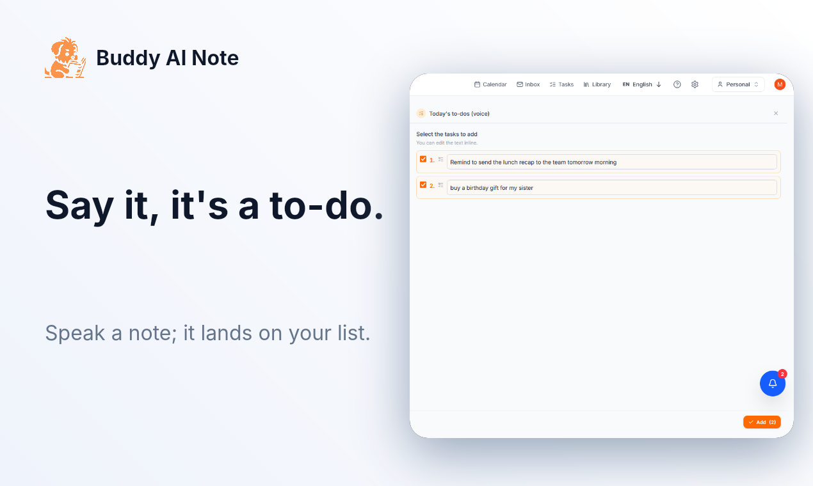
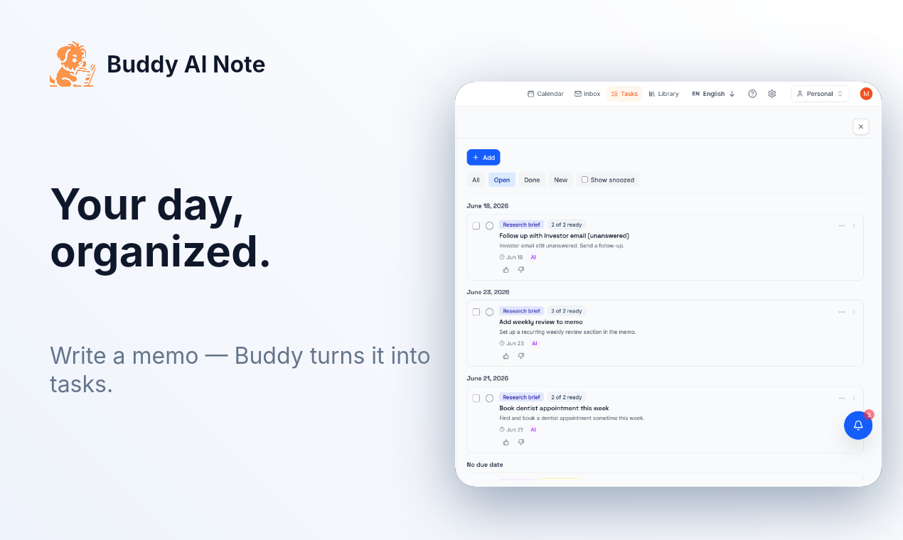

### 🎬 관련 영상
- [🎥 영상 보기](https://ph-files.imgix.net/a4268f78-624d-4acc-94a2-842da47f4e02.jpeg?auto=format)

---

## 18. [NeuralAgent 3.0](https://www.producthunt.com/products/neuralagent)
**Votes**: 92 | **도입 난이도**: 중 | **신뢰도**: 상
**Tagline**: AI that executes UI actions on your computer in ~285ms
**서비스 링크**: https://www.producthunt.com/r/WG2FDIRSMKGHGR

**태그**: Automation, AI Agent, Productivity, Desktop Automation, Agent, AI Tool, Video

### 📌 이 서비스 한눈에 보기
사용자의 화면을 보고 컴퓨터 UI를 직접 제어하여 업무를 자동화하는 초고속 AI 에이전트

### 🔑 주요 기능
- 약 285ms의 초고속 UI 액션 실행 속도
- 화면 인식 및 자가 감독을 통한 작업 계획 및 오류 복구 기능
- 데스크톱 및 브라우저 환경 지원 (Windows & macOS)

### 🙋 사용자에게 어떤 점이 좋은가
반복적인 컴퓨터 작업과 브라우저 업무를 AI가 직접 수행하여 작업 시간을 획기적으로 단축할 수 있습니다.

### ✅ 지금 바로 써볼 기능
- Fast Model을 통한 실시간 UI 제어 테스트
- Fast Model Replays를 활용한 작업 저장 및 재실행
- Smart Model Routing을 통한 작업 효율성 확인

### ⚠️ 사용 전 확인할 점
- 컴퓨터 제어 권한 부여에 따른 보안 및 개인정보 보호 주의
- 복잡한 작업 시 자가 복구 기능의 정확도 확인 필요

### 🧭 확인이 더 필요한 정보
실제 환경에서의 작업 성공률과 시스템 리소스 점유율에 대한 구체적인 정보가 필요합니다.

### 📸 스크린샷 및 갤러리
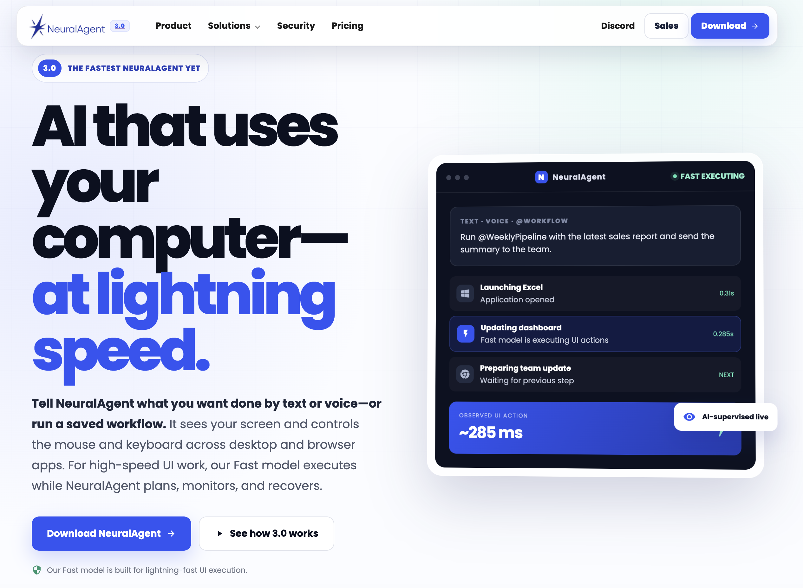
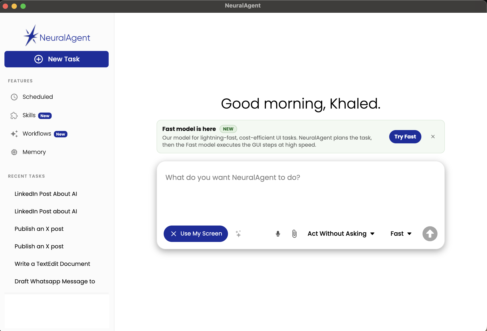
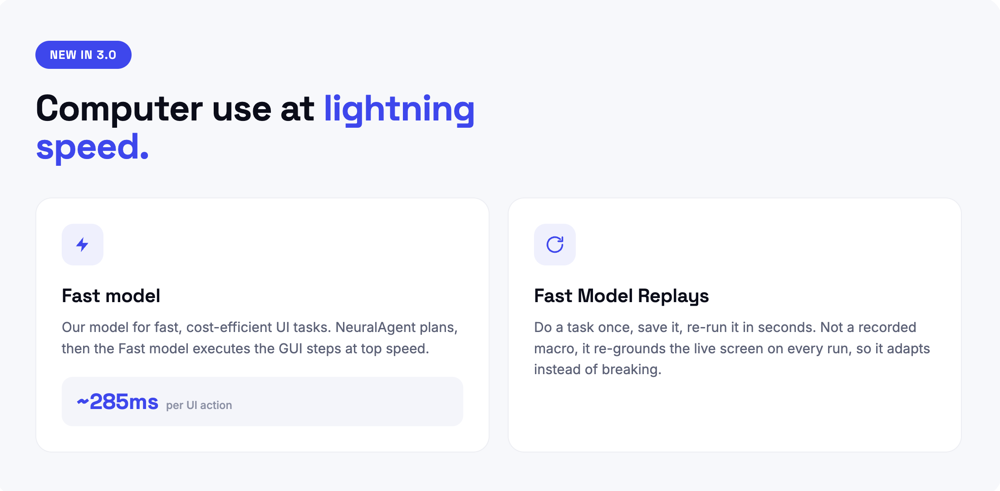

### 🎬 관련 영상
- [🎥 영상 보기](https://ph-files.imgix.net/02f6a421-7b43-4661-be51-756f47472647.jpeg?auto=format)

---

## 19. [Deckwise](https://www.producthunt.com/products/deckwise)
**Votes**: 90 | **도입 난이도**: 하 | **신뢰도**: 상
**Tagline**: AI presentation agent for editable decks
**서비스 링크**: https://www.producthunt.com/r/QOWDQ5T7M7FWMC

**태그**: AI, Productivity, Presentation, Automation, Agent, AI Tool, Design

### 📌 이 서비스 한눈에 보기
아이디어와 자료를 바탕으로 구조화된 슬라이드를 생성하고 실시간으로 편집하는 AI 프레젠테이션 에이전트

### 🔑 주요 기능
- 주제, 노트, 파일 등 다양한 소스를 활용한 자동 슬라이드 구조화
- 단순 생성을 넘어 사용자와 상호작용하며 개선하는 에이전트 방식
- 라쏘(Lasso) 선택 도구를 통한 부분별 재작성, 재디자인, 순서 변경 기능

### 🙋 사용자에게 어떤 점이 좋은가
초안 작성 시간을 획기적으로 줄여주며, 생성된 결과물을 사용자가 원하는 대로 세밀하게 수정할 수 있어 실무 활용도가 높습니다.

### ✅ 지금 바로 써볼 기능
- 가지고 있는 메모나 파일을 업로드하여 자동 개요 생성해보기
- 라쏘 도구로 특정 슬라이드 영역을 선택해 디자인 및 내용 수정해보기
- 에이전트에게 피드백을 주며 슬라이드 완성도 높여보기

### ⚠️ 사용 전 확인할 점
- AI 생성 콘텐츠의 특성상 사실 관계에 대한 최종 검토 필요
- 복잡한 시각적 디자인 요구사항 충족 여부 확인 필요

### 🧭 확인이 더 필요한 정보
현재 제공되는 슬라이드 템플릿의 다양성과 외부 도구(PPT, Google Slides)와의 내보내기 호환성을 확인해야 합니다.

### 📸 스크린샷 및 갤러리
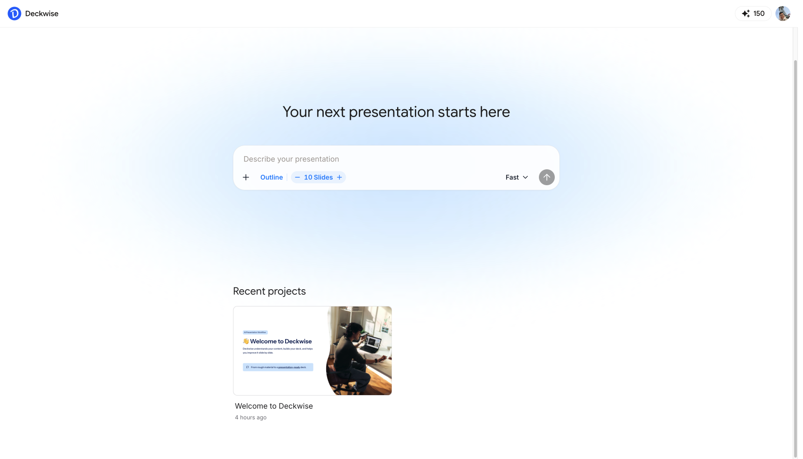
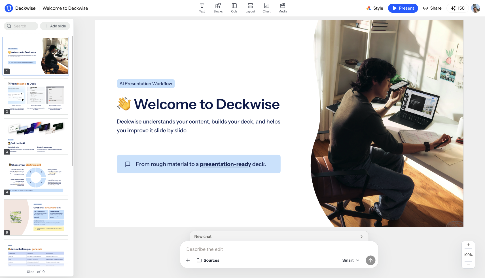
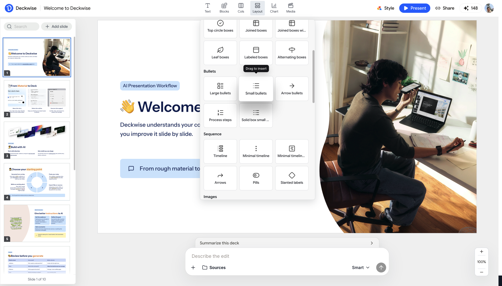

### 🎬 관련 영상
- [🎥 영상 보기](https://ph-files.imgix.net/fbf20994-1e86-454b-af9a-37222b0ef08b.jpeg?auto=format)

---

## 20. [Amnesia](https://www.producthunt.com/products/amnesia-2)
**Votes**: 88 | **도입 난이도**: 하 | **신뢰도**: 상
**Tagline**: A Mac app that asks why you opened that tab
**서비스 링크**: https://www.producthunt.com/r/YTFW54UICGABUJ

**태그**: Productivity, macOS, Focus, TimeManagement, Analytics

### 📌 이 서비스 한눈에 보기
무의식적인 웹 서핑을 방지하고 업무 집중도를 높여주는 macOS용 목적 중심 타이머 앱

### 🔑 주요 기능
- 탭을 열 때마다 원래 목적을 묻는 의도 확인 기능
- 화면상의 작은 타이머를 통한 시간 관리
- 개인화된 일일 리포트(방문 기록, 목적 상실, 시간 낭비 등) 제공

### 🙋 사용자에게 어떤 점이 좋은가
업무 중 습관적으로 SNS나 유튜브로 빠지는 것을 방지하여 집중력을 유지하고, 하루 동안 낭비된 시간을 시각적으로 파악할 수 있습니다.

### ✅ 지금 바로 써볼 기능
- 메뉴 바에 앱을 설치하여 상시 실행하기
- 탭을 열 때 나타나는 질문에 솔직하게 답변하기
- 일일 리포트를 통해 자신의 집중 패턴 분석하기

### ⚠️ 사용 전 확인할 점
- macOS 전용 앱이므로 다른 OS에서는 사용 불가
- 사용자의 주의를 계속 환기하므로 작업 흐름에 따라 번거로울 수 있음

### 🧭 확인이 더 필요한 정보
로컬 퍼스트 방식이므로 데이터 보안은 우수할 것으로 보이나, 구체적인 데이터 저장 방식과 동기화 여부는 확인이 필요합니다.

### 📸 스크린샷 및 갤러리
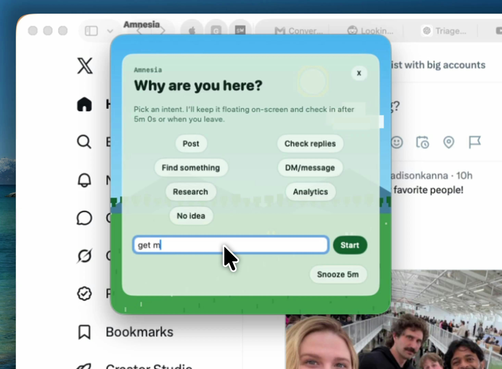

### 🎬 관련 영상
- [🎥 영상 보기](https://ph-files.imgix.net/646b3dad-d4c7-4a29-83dd-4b7fbe3d7dbb.jpeg?auto=format)

---

## 21. [LogStitch](https://www.producthunt.com/products/logstitch)
**Votes**: 85 | **도입 난이도**: 하 | **신뢰도**: 상
**Tagline**: Find AWS Lambda failures fast, right on your Mac
**서비스 링크**: https://www.producthunt.com/r/ZBR3URXNFOL2YA

**태그**: DevTool, AWS, Debugging, MacApp, AI, AI Tool

### 📌 이 서비스 한눈에 보기
Mac 네이티브 환경에서 AWS Lambda 로그를 타임라인별로 통합하여 장애 원인을 빠르게 식별하는 디버깅 도구

### 🔑 주요 기능
- 분산된 Lambda 로그를 하나의 명확한 타임라인으로 통합
- 반복되는 에러 패턴 클러스터링 및 지연 시간(latency) 이상치 탐지
- AI 어시스턴트 연동을 위한 내장 MCP(Model Context Protocol) 서버 제공

### 🙋 사용자에게 어떤 점이 좋은가
CloudWatch의 복잡한 로그 스크롤에서 벗어나, Mac 환경에서 직관적인 타임라인과 패턴 분석을 통해 Lambda 장애 해결 시간을 획기적으로 단축할 수 있습니다.

### ✅ 지금 바로 써볼 기능
- 로그 타임라인 통합 기능으로 에러 흐름 파악하기
- 에러 패턴 클러스터링을 통한 반복 이슈 식별하기
- MCP 서버를 활용해 AI 어시스턴트와 함께 디버깅하기

### ⚠️ 사용 전 확인할 점
- Mac 전용 네이티브 앱이므로 macOS 환경에서만 사용 가능
- 14일 무료 체험 후 유료 전환 필요

### 🧭 확인이 더 필요한 정보
일회성 구매 가격 및 구체적인 라이선스 정책에 대한 정보가 명시되지 않았습니다.

### 📸 스크린샷 및 갤러리
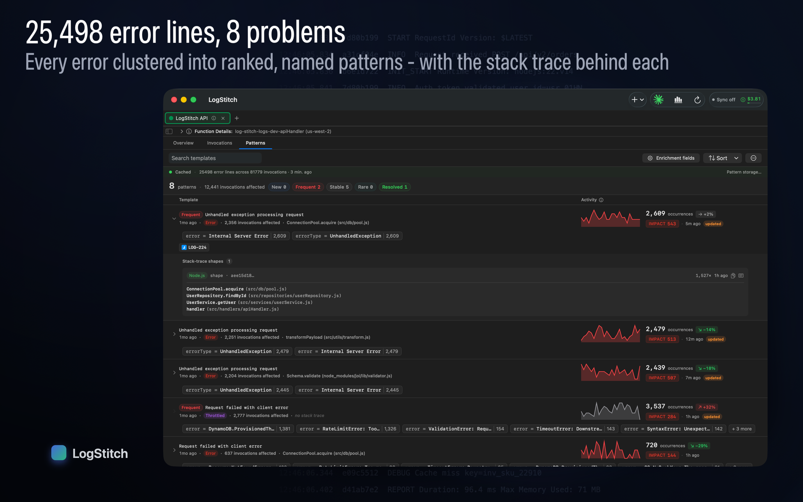
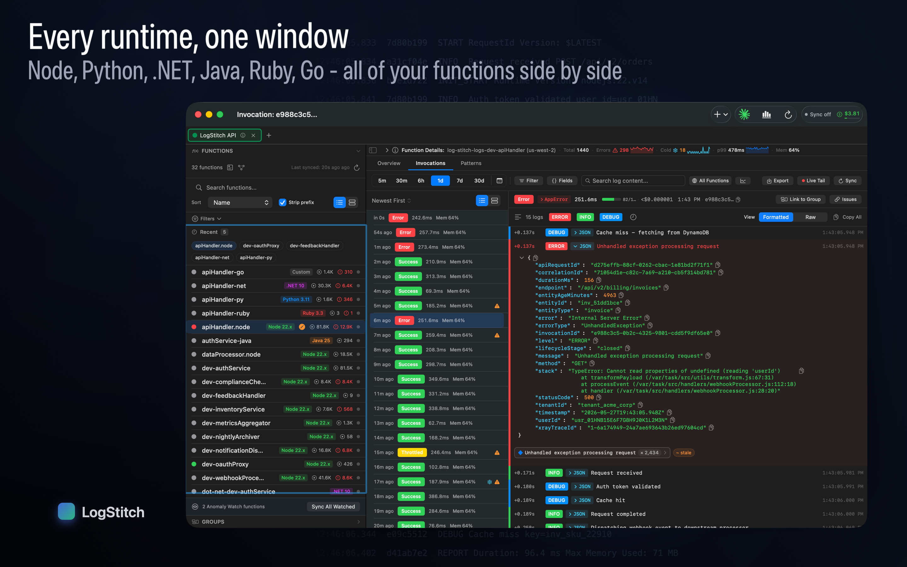
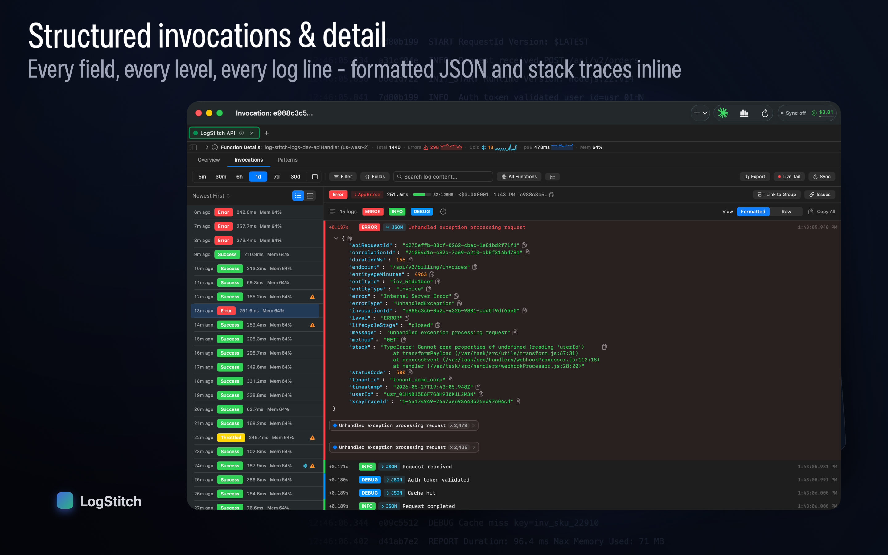

### 🎬 관련 영상
- [🎥 영상 보기](https://ph-files.imgix.net/595646f9-9009-4e3f-982e-442e043127a9.jpeg?auto=format)

---

## 22. [Tufte](https://www.producthunt.com/products/tufte-markdown-graphs)
**Votes**: 83 | **도입 난이도**: 하 | **신뢰도**: 상
**Tagline**: CDN and Node package to generate ASCII graphs inline
**서비스 링크**: https://www.producthunt.com/r/5KPLW3LQB3H5BH

**태그**: DevTool, DataViz, CLI, Documentation, AI Tool, LLM

### 📌 이 서비스 한눈에 보기
CSV 데이터를 터미널과 README용 깔끔한 ASCII 차트로 변환해주는 도구

### 🔑 주요 기능
- Mermaid 스타일의 간단한 `chart` 코드 블록 사용
- 바, 라인, 스파크라인, 산점도 등 다양한 ASCII 차트 지원
- README, 터미널, LLM 환경에서 즉시 시각화 가능한 텍스트 기반 차트 생성

### 🙋 사용자에게 어떤 점이 좋은가
별도의 이미지 파일 없이 텍스트만으로 데이터 시각화가 가능하여, 개발 문서나 터미널 환경에서 데이터 흐름을 직관적으로 공유할 수 있습니다.

### ✅ 지금 바로 써볼 기능
- CSV 데이터를 활용한 기본 바 차트 생성해보기
- README.md 파일에 ASCII 차트 삽입 테스트하기
- 터미널 환경에서의 시각화 결과 확인하기

### ⚠️ 사용 전 확인할 점
- 텍екст 기반 차트이므로 복잡하고 정밀한 데이터 시각화에는 한계가 있음
- 폰트나 터미널 너비에 따라 시각적 정렬이 달라질 수 있음

### 🧭 확인이 더 필요한 정보
지원하는 구체적인 데이터 포맷의 확장성과 대용량 데이터 처리 성능에 대한 정보가 부족합니다.

### 📸 스크린샷 및 갤러리
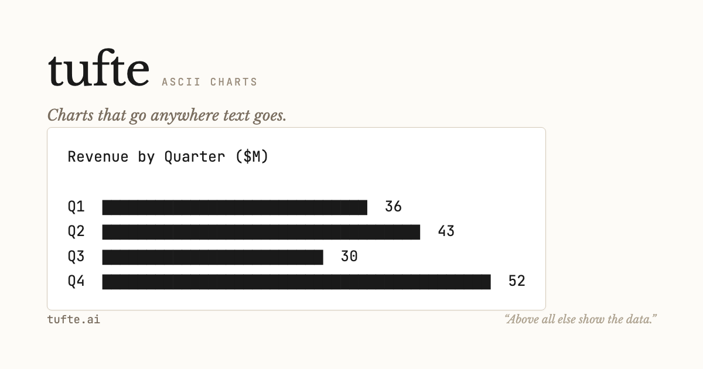
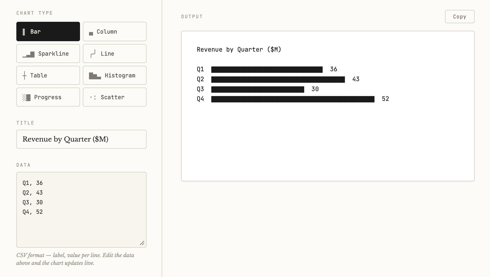
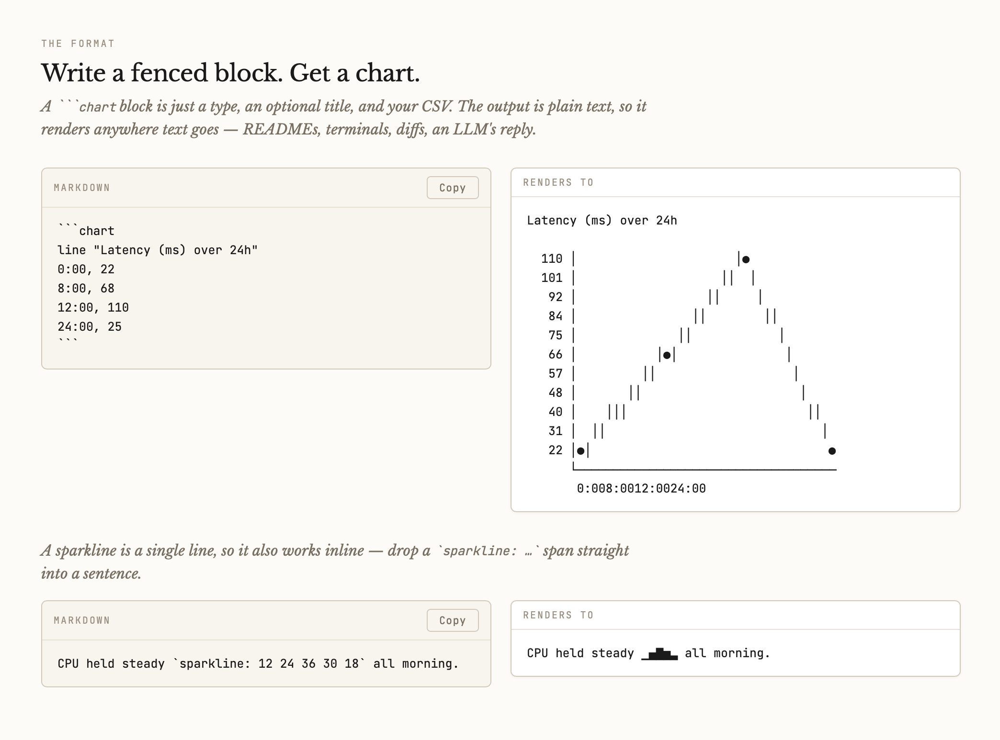

### 🎬 관련 영상
- [🎥 영상 보기](https://ph-files.imgix.net/5e780a47-3e1a-4d68-8066-1e8cbdaef29c.gif?auto=format)

---

## 23. [NanoCorp](https://www.producthunt.com/products/nanocorp)
**Votes**: 80 | **도입 난이도**: 하 | **신뢰도**: 상
**Tagline**: Found a company in one sentence - from website to ads
**서비스 링크**: https://www.producthunt.com/r/MQ3GRFKNDEZZCZ

**태그**: AI Agents, Automation, NoCode, Entrepreneurship, Agent, AI Tool

### 📌 이 서비스 한눈에 보기
웹사이트부터 광고까지, 코딩 없이 자율 운영되는 AI 기업을 구축하는 자동화 플랫폼

### 🔑 주요 기능
- 웹사이트 및 광고 생성부터 운영까지 전 과정을 자동화
- AI 에이전트가 스케줄에 따라 업무를 수행하고 보고하는 자율 운영 시스템
- 코딩 기술 없이도 누구나 AI 기반 비즈니스 런칭 가능

### 🙋 사용자에게 어떤 점이 좋은가
사용자는 복잡한 코딩이나 수동 운영 없이도 24시간 작동하는 자동화된 비즈니스 모델을 구축할 수 있습니다.

### ✅ 지금 바로 써볼 기능
- 무료 플랜으로 비즈니스 아이디어 런칭하기
- AI 에이전트의 업무 스케줄링 설정하기
- 자동 생성된 결과물 검토 및 피드백하기

### ⚠️ 사용 전 확인할 점
- 자율 운영 과정에서 발생할 수 있는 결과물의 정확성 검증 필요
- 비즈니스 모델의 복잡도에 따른 자동화 한계 가능성

### 🧭 확인이 더 필요한 정보
구체적인 비즈니스 도메인(산업 분야)별 최적화 수준과 자동화 범위에 대한 정보가 더 필요합니다.

### 📸 스크린샷 및 갤러리
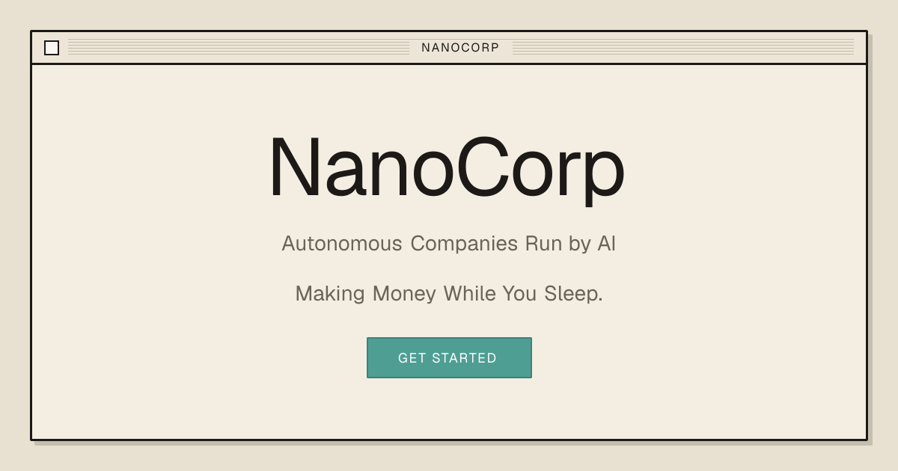
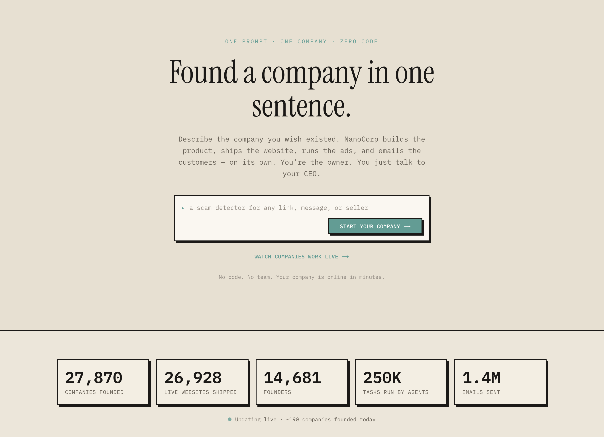
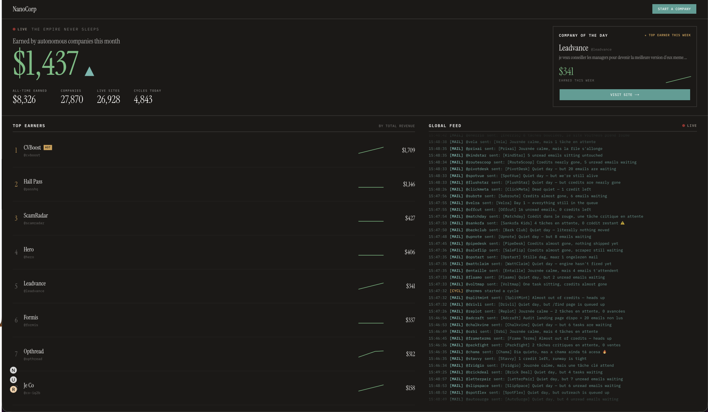

---

## 24. [HotkeyClash](https://www.producthunt.com/products/hotkeyclash)
**Votes**: 78 | **도입 난이도**: 하 | **신뢰도**: 상
**Tagline**: Find where your Mac keyboard shortcuts clash
**서비스 링크**: https://www.producthunt.com/r/42QDVEKNBVOII7

**태그**: macOS, Productivity, OpenSource, DevTool

### 📌 이 서비스 한눈에 보기
macOS 내 중복된 키보드 단축키 충돌을 한눈에 찾아주는 오픈소스 도구

### 🔑 주요 기능
- macOS 시스템, 앱, Karabiner-Elements, skhd 등 모든 등록된 단축키 스캔
- 단축키 간의 충돌 지점을 명확하게 시각화
- 계정 생성이나 데이터 수집(Telemetry)이 없는 프라이버시 중심 설계

### 🙋 사용자에게 어떤 점이 좋은가
여러 앱과 커스텀 설정을 사용하는 맥 사용자라면, 의도치 않게 단축키가 겹쳐 발생하는 작업 흐름의 방해를 즉시 해결할 수 있습니다.

### ✅ 지금 바로 써볼 기능
- 메뉴 바 앱 설치 및 스캔 실행
- 충돌하는 단축키 목록 확인
- 중복된 단축키 재설정 및 최적화

### ⚠️ 사용 전 확인할 점
- 단축키 충돌을 찾아줄 뿐, 자동으로 해결(재설정)해주는 기능은 아님
- 사용자가 직접 각 앱의 설정을 변경해야 함

### 🧭 확인이 더 필요한 정보
단축키 충돌 시 어떤 앱이 우선순위를 갖는지에 대한 상세 동작 방식은 확인이 필요합니다.

### 📸 스크린샷 및 갤러리
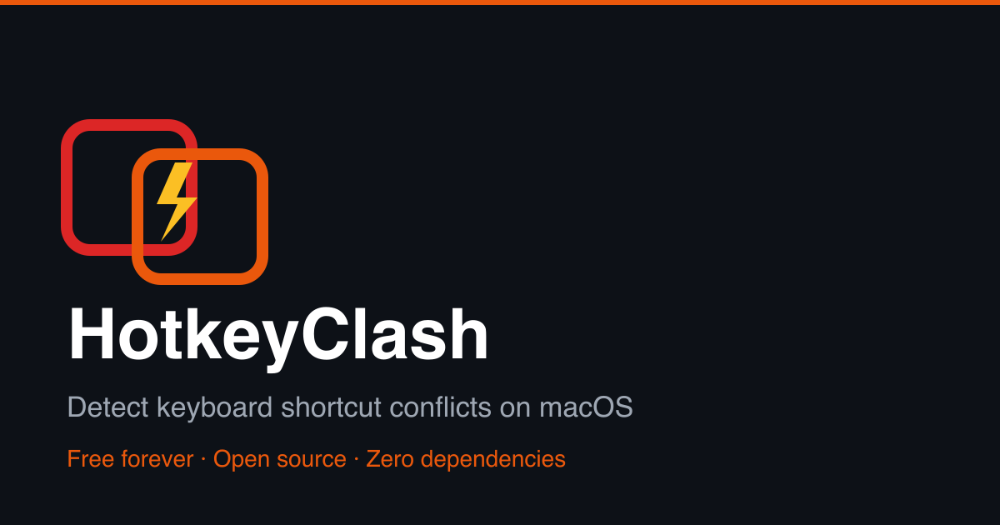
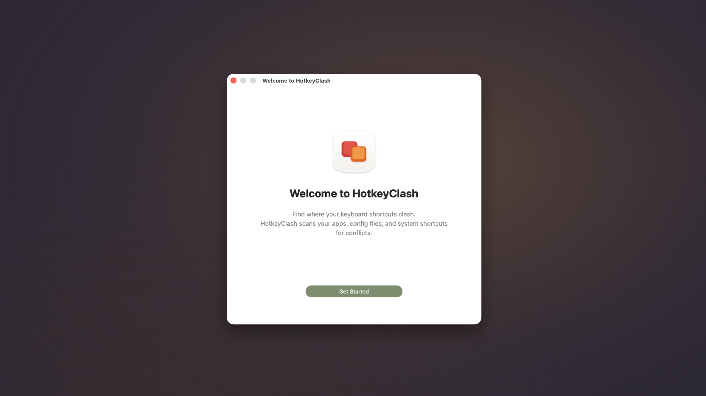
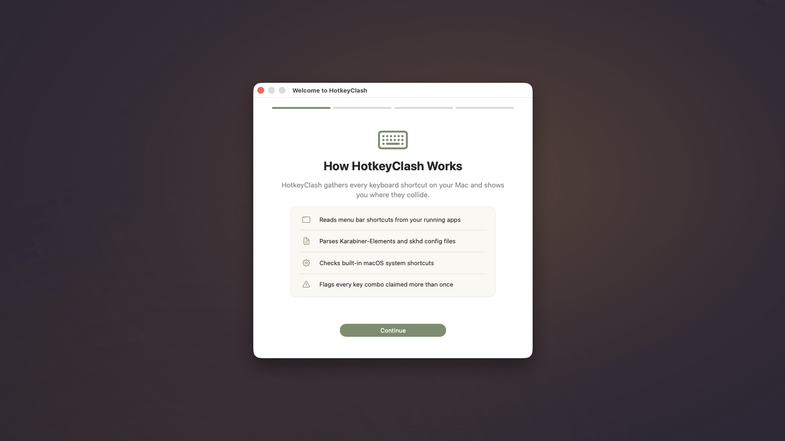

---

## 25. [Rosply](https://www.producthunt.com/products/rosply)
**Votes**: 77 | **도입 난이도**: 중 | **신뢰도**: 상
**Tagline**: AI agent that controls your computer autonomously
**서비스 링크**: https://www.producthunt.com/r/QHCQPMCZKGWEJO

**태그**: AI Agent, Automation, DevTool, OS-Control, Agent, AI Tool

### 📌 이 서비스 한눈에 보기
사용자의 화면을 보고 직접 마우스와 키보드를 제어하여 업무를 수행하는 자율형 AI 에이전트

### 🔑 주요 기능
- 화면 인식 및 마우스/키보드 직접 제어를 통한 자율적 작업 수행
- Windows, Mac, Linux 등 모든 주요 OS 지원
- OpenRouter 연동을 통해 특정 모델에 종속되지 않는 유연한 모델 선택 가능

### 🙋 사용자에게 어떤 점이 좋은가
단순히 코드를 짜는 것을 넘어, AI가 직접 컴퓨터를 조작하여 실질적인 업무 프로세스를 자동화할 수 있습니다.

### ✅ 지금 바로 써볼 기능
- OpenRouter를 통한 선호하는 AI 모델 연결하기
- Claude Code/MCP를 활용한 개발 워크플로우 통합 테스트
- OS별 자동화 작업 수행 능력 검증

### ⚠️ 사용 전 확인할 점
- 화면 제어 권한 부여에 따른 보안 및 개인정보 보호 주의 필요
- AI 모델의 판단 오류로 인한 의도치 않은 시스템 조작 가능성

### 🧭 확인이 더 필요한 정보
사용자의 시스템 환경에 따른 보안 정책 준수 여부와 구체적인 리소스 점유율 확인이 필요합니다.

### 📸 스크린샷 및 갤러리
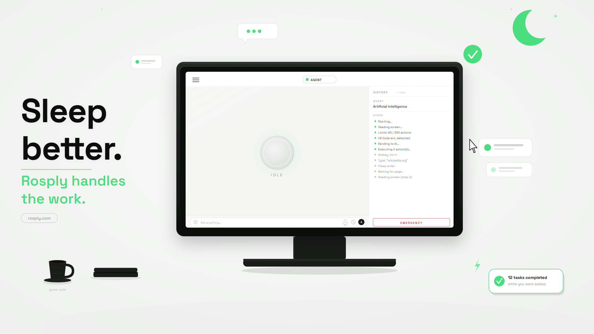
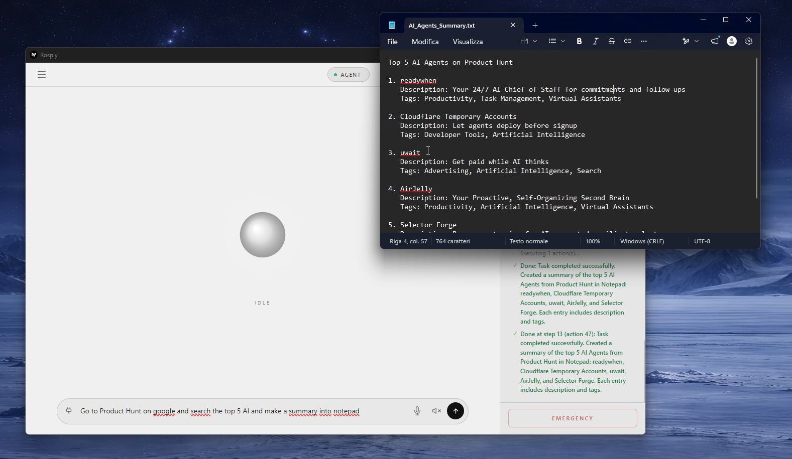

### 🎬 관련 영상
- [🎥 영상 보기](https://ph-files.imgix.net/bc35274a-ce93-41a5-b5e1-4f8ab593b4cb.jpeg?auto=format)

---

## 26. [SnapDeploy](https://www.producthunt.com/products/snapdeploy)
**Votes**: 35 | **도입 난이도**: 하 | **신뢰도**: 상
**Tagline**: Deploy Docker apps for $1/day. No subscription.
**서비스 링크**: https://www.producthunt.com/r/OP5SLKFYSELB3F

**태그**: DevOps, Docker, PaaS, Cloud, Automation, AI Tool, DevTool

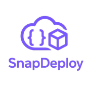

### 📌 이 서비스 한눈에 보기
구독료 부담 없이 하루 1달러로 Docker 앱을 즉시 배포하는 초간편 PaaS

### 🔑 주요 기능
- 월간 구독 없이 24시간 단위 $1 결제로 운영 가능한 유연한 과금 체계
- GitHub 연동을 통한 빌드, SSL, AWS 스케일링 자동화
- AI 기반의 Docker 빌드 오류 자동 수정 기능

### 🙋 사용자에게 어떤 점이 좋은가
고정적인 월 구독료 부담 없이 테스트용 서버나 단기 프로젝트를 위한 인프라를 저렴하고 빠르게 구축할 수 있습니다.

### ✅ 지금 바로 써볼 기능
- GitHub 레포지토리 연결하여 배포 테스트하기
- 무료 티어(일 10회 배포)로 서비스 안정성 확인하기
- AI 빌드 수정 기능이 복잡한 Dockerfile을 잘 처리하는지 검증하기

### ⚠️ 사용 전 확인할 점
- 24시간 단위 과금 방식이므로 장기 운영 시 비용 구조를 사전에 계산해야 함
- AWS 기반 인프라의 세부 설정 제어 범위 확인 필요

### 🧭 확인이 더 필요한 정보
장기 프로젝트 운영 시 자동 갱신 없이 수동 결제 방식이 사용자 편의성에 미칠 영향을 확인해야 합니다.

### 📸 스크린샷 및 갤러리
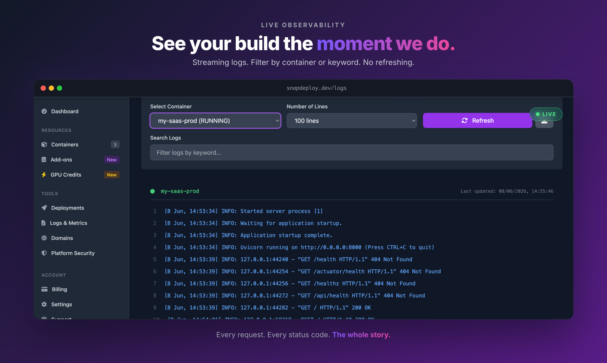
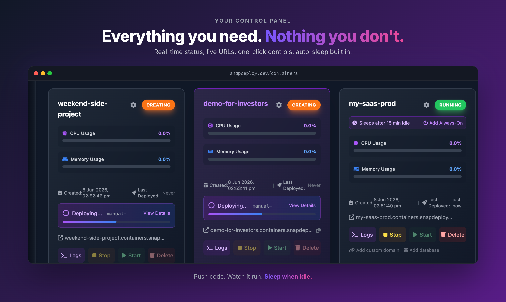
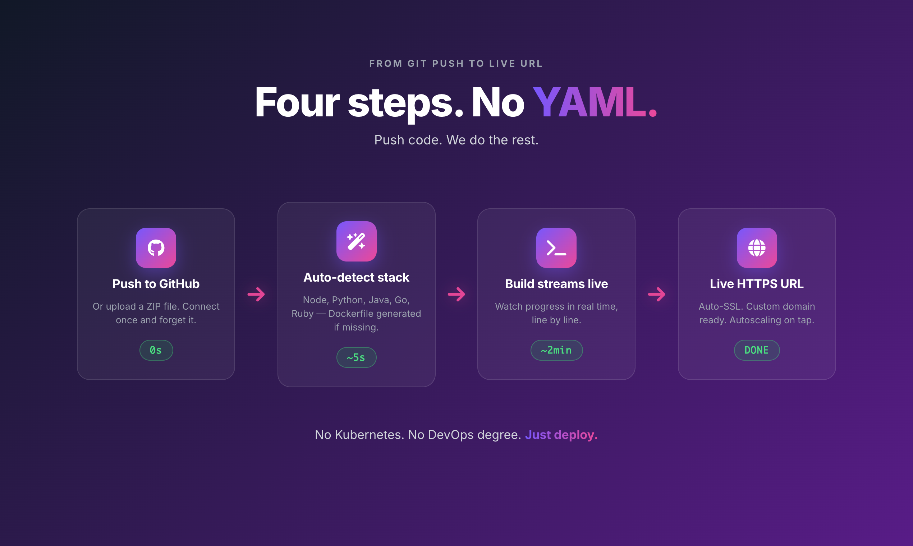

### 🎬 관련 영상
- [🎥 영상 보기](https://ph-files.imgix.net/a4bad210-4375-454c-ba9b-2fb13ba00a9a.jpeg?auto=format)

---

## 27. [Orbl](https://www.producthunt.com/products/orbl)
**Votes**: 34 | **도입 난이도**: 하 | **신뢰도**: 상
**Tagline**: Turn your Mac wallpaper into a live dashboard
**서비스 링크**: https://www.producthunt.com/r/Q6TI55HDSGMIUN

**태그**: macOS, Productivity, Dashboard, DeveloperTools

### 📌 이 서비스 한눈에 보기
맥 배경화면을 실시간 대시보드로 변환하여 업무 효율을 높여주는 네이티브 앱

### 🔑 주요 기능
- 배경화면을 시계, 날씨, 시스템 상태, 외부 데이터(Stripe, GitHub 등)를 보여주는 대시보드로 활용
- Swift 기반 네이티브 앱으로 CPU 점유율이 거의 없는 가벼운 성능
- 계정 생성 없이 로컬에서 작동하는 개인정보 보호 중심 설계

### 🙋 사용자에게 어떤 점이 좋은가
별도의 창을 띄우지 않고도 배경화면에서 주요 지표를 즉시 확인할 수 있어 작업 흐름을 방해받지 않습니다.

### ✅ 지금 바로 써볼 기능
- 시스템 상태 및 날씨 위젯 설정하기
- GitHub 또는 Stripe API를 연동하여 실시간 데이터 확인하기
- 배경화면 레이아웃 최적화하기

### ⚠️ 사용 전 확인할 점
- 외부 데이터 연동 시 읽기 전용 키(read-only key) 보안 관리 필요
- 배경화면이 정보로 가득 차 시각적 피로도가 발생할 수 있음

### 🧭 확인이 더 필요한 정보
외부 서비스(Stripe, GitHub 등) 연동 시 구체적인 API 설정 방법과 데이터 동기화 주기에 대한 확인이 필요합니다.

### 📸 스크린샷 및 갤러리
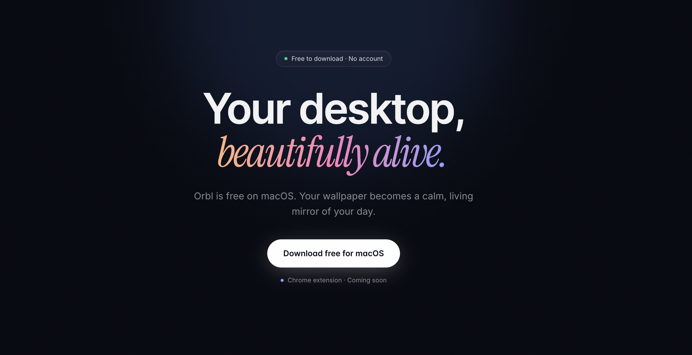
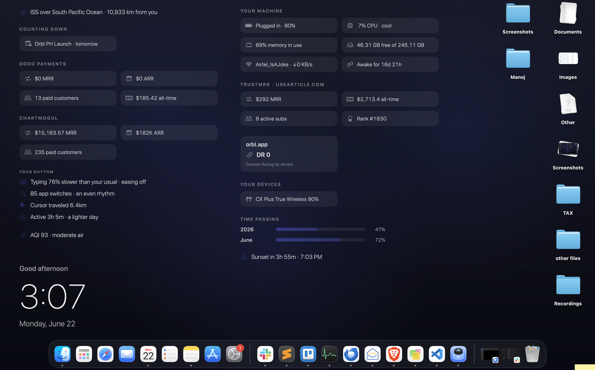
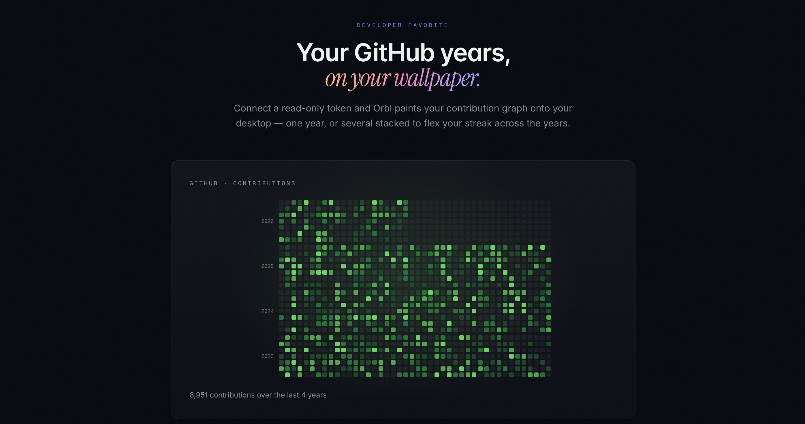

### 🎬 관련 영상
- [🎥 영상 보기](https://ph-files.imgix.net/2e2d0b41-3965-44b3-aad3-a046745f6c7e.jpeg?auto=format)

---

## 28. [TruthAgent](https://www.producthunt.com/products/truthagent)
**Votes**: 29 | **도입 난이도**: 하 | **신뢰도**: 상
**Tagline**: Ask once. Compare multiple AI models. Get one synthesis.
**서비스 링크**: https://www.producthunt.com/r/BEF5QL3NHOWOYB

**태그**: AI, Productivity, LLM, Comparison, Agent, AI Tool

### 📌 이 서비스 한눈에 보기
여러 AI 모델의 토론을 통해 최적의 정답을 도출하는 통합 답변 서비스

### 🔑 주요 기능
- GPT, Claude, Gemini 등 다양한 모델 간의 교차 검증
- 모델 간의 합의점, 충돌 지점, 신뢰도를 포함한 종합 결과 제공
- 단 한 번의 질문으로 여러 모델의 답변을 하나로 요약

### 🙋 사용자에게 어떤 점이 좋은가
여러 AI를 일일이 사용하는 번거로움 없이, 모델 간의 논쟁 과정을 통해 더 객관적이고 정제된 답변을 얻을 수 있습니다.

### ✅ 지금 바로 써볼 기능
- 복잡한 질문을 던져 모델 간의 논쟁 과정 관찰하기
- 제공되는 신뢰도 점수(Confidence score) 확인하기
- 합의된 내용과 충돌하는 내용을 비교하여 최종 판단하기

### ⚠️ 사용 전 확인할 점
- 모델 간의 논쟁이 반드시 정답을 보장하지는 않음
- 여러 모델을 동시에 사용하므로 단일 모델 사용 시보다 응답 시간이 길 수 있음

### 🧭 확인이 더 필요한 정보
사용 가능한 구체적인 모델 리스트와 실시간 응답 속도에 대한 정보가 필요합니다.

### 📸 스크린샷 및 갤러리
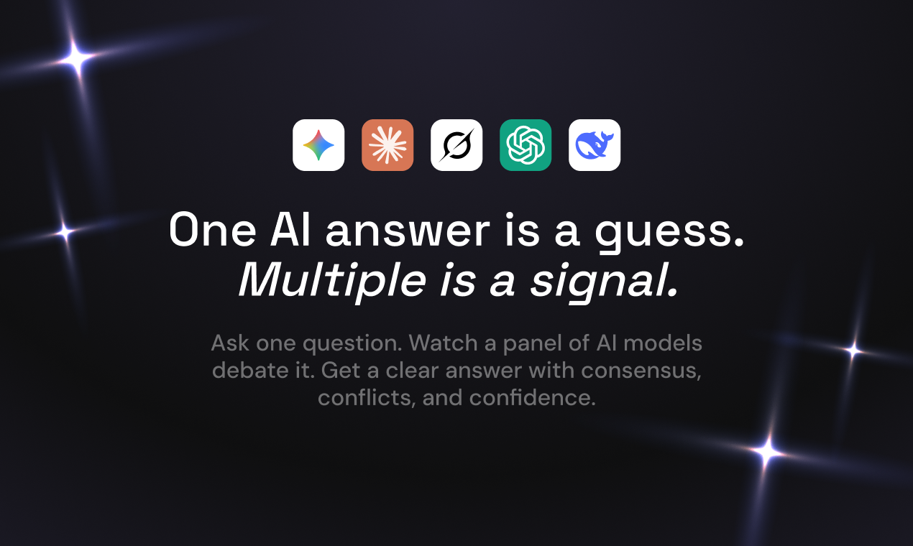
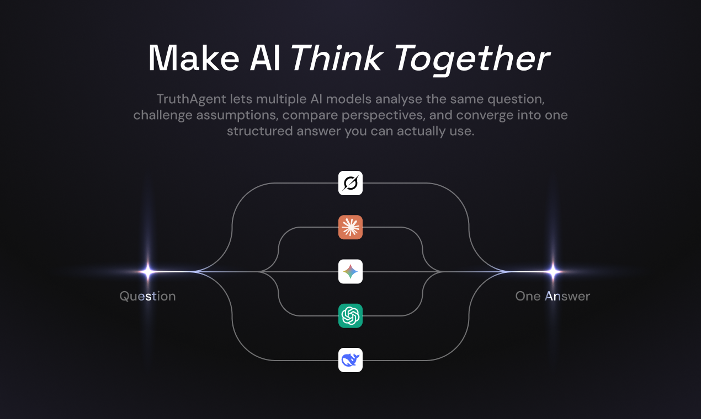
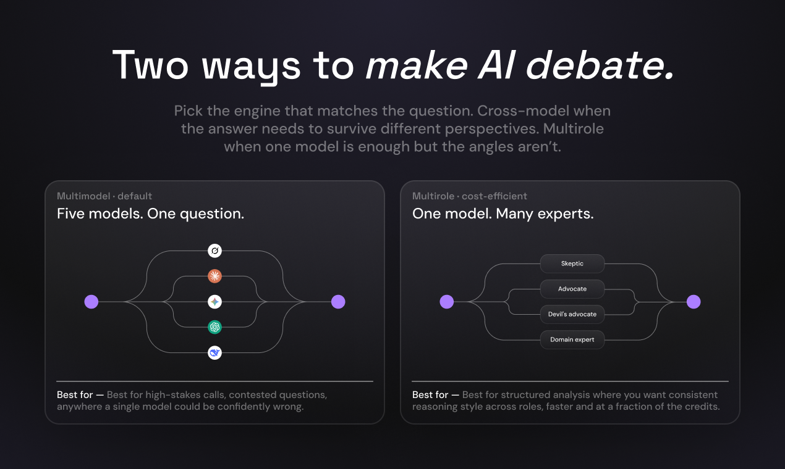

---

## 29. [Pigeon Link](https://www.producthunt.com/products/pigeon-link)
**Votes**: 26 | **도입 난이도**: 하 | **신뢰도**: 상
**Tagline**: The communication app built on what we don't collect.
**서비스 링크**: https://www.producthunt.com/r/LDQ3HIL4E5WKWS

**태그**: Privacy, Communication, Browser-based, No-Code, Chat, Video

### 📌 이 서비스 한눈에 보기
개인정보 수집 없이 링크 하나로 즉시 시작하는 프라이버시 중심의 브라우저 기반 통신 스위트

### 🔑 주요 기능
- 전화번호, 계정 생성, 앱 다운로드 없이 브라우저에서 즉시 사용 가능
- 데이터 추적 및 수집을 배제한 프라이버시 우선 설계
- 음성/영상 통화, 메시징, 라이브 룸 등 다양한 커뮤니케이션 기능 제공

### 🙋 사용자에게 어떤 점이 좋은가
별도의 가입이나 설치 과정이 없어 보안이 중요한 대화나 일회성 미팅 시 매우 빠르고 안전하게 사용할 수 있습니다.

### ✅ 지금 바로 써볼 기능
- 생성된 링크를 공유하여 즉시 영상 통화 시작하기
- 라이브 룸 기능을 활용한 그룹 채팅 참여하기
- 브라우저를 통한 메시징 기능 테스트하기

### ⚠️ 사용 전 확인할 점
- 계정 기반이 아니므로 브라우저 종료 시 대화 기록 유지 여부 확인 필요
- 설치형 앱이 아니므로 브라우저 환경에 따른 기능 제약 가능성

### 🧭 확인이 더 필요한 정보
계정 없이 운영되므로 대화 기록의 영구 저장 방식이나 데이터 휘발성에 대한 확인이 필요합니다.

### 📸 스크린샷 및 갤러리

### 🎬 관련 영상
- [🎥 영상 보기](https://ph-files.imgix.net/358bfc5d-ff2a-41e8-b4e8-fc3a30842be3.jpeg?auto=format)

---

## 30. [RankGoat](https://www.producthunt.com/products/rankgoat)
**Votes**: 25 | **도입 난이도**: 하 | **신뢰도**: 상
**Tagline**: Rank Higher. On Autopilot.
**서비스 링크**: https://www.producthunt.com/r/V6FCYHQ2U5LFCC

**태그**: SEO, Automation, ContentMarketing, AI, AI Tool, Chat

### 📌 이 서비스 한눈에 보기
콘텐츠 작성부터 백링크 확보까지, 구글 및 AI 검색 최적화를 자동화하는 SEO 솔루션

### 🔑 주요 기능
- AI 기반의 자동 콘텐츠 생성 기능
- 신뢰도 높은 사이트로부터의 백링크 확보를 통한 권위 구축
- Google 및 ChatGPT 등 AI 검색 엔진 최적화(ASO/SEO) 지원

### 🙋 사용자에게 어떤 점이 좋은가
직접 글을 쓰거나 백링크를 작업할 필요 없이, 자동화된 프로세스를 통해 검색 엔진 노출과 방문자 유입을 극대화할 수 있습니다.

### ✅ 지금 바로 써볼 기능
- 자동 콘텐츠 생성 기능 테스트
- 백링크 구축 프로세스 확인
- 검색 엔진 노출 결과 모니터링

### ⚠️ 사용 전 확인할 점
- 자동 생성된 콘텐츠의 품질이 브랜드 톤앤매너와 일치하는지 확인 필요
- 백링크 작업 방식이 검색 엔진 가이드라인을 준수하는지 검토 필요

### 🧭 확인이 더 필요한 정보
콘텐츠 생성 및 백링크 작업의 구체적인 자동화 방식과 품질 관리 메커니즘에 대한 정보가 부족합니다.

### 📸 스크린샷 및 갤러리
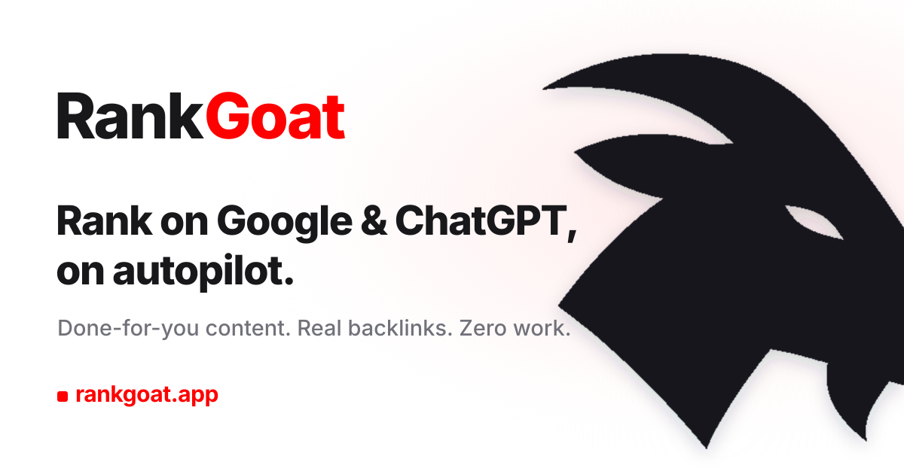

### 🎬 관련 영상
- [🎥 영상 보기](https://ph-files.imgix.net/7a219098-9e70-486e-802c-8b3c43c07af9.jpeg?auto=format)

---

