# 🚀 Product Hunt Daily Top 30 (2026-06-25)

## 오늘의 요약
오늘의 트렌드는 단순한 챗봇을 넘어 사용자의 업무 맥락을 이해하고 자율적으로 과업을 수행하는 'AI 에이전트' 중심의 서비스가 주를 이루었습니다. 특히 인프라 구축, CRM 자동화, 실생활 서비스 연동 등 에이전트의 실행력을 높이고 운영 효율을 극대화하는 솔루션들이 주목받았습니다.

### 오늘의 핵심 포인트
- AI 에이전트가 복잡한 인프라 없이 즉시 배포되거나 실생활 서비스와 연동되는 등 실행 중심의 기술이 강조되었습니다.
- 수동적인 데이터 입력이나 반복적인 업무를 자동화하여 인간의 개입을 최소화하는 방향으로 서비스가 진화하고 있습니다.
- 여러 AI 도구를 통합 관리하거나 사용량 기반으로 과금하는 등 비즈니스 운영 효율을 높이는 플랫폼들이 등장했습니다.

**오늘의 태그**: AI 에이전트, 업무 자동화, SaaS, 인프라, 생산성

## 1. [Propane ](https://www.producthunt.com/products/propane)
**Votes**: 411 | **도입 난이도**: 중 | **신뢰도**: 상
**Tagline**: Automatic customer context for product teams and agents
**서비스 링크**: https://www.producthunt.com/r/3IPLBPLEC7J35W

**태그**: ProductManagement, Automation, Collaboration, CustomerContext, DevOps, Agent, AI Tool, Design

### 📌 이 서비스 한눈에 보기
모든 툴에서 수집된 고객 데이터를 실시간으로 통합하여 제품 팀에 제공하는 자동화 컨텍스트 플랫폼

### 🔑 주요 기능
- 다양한 도구로부터 자동으로 수집되는 실시간 고객 데이터 통합
- 제품 팀과 에이전트 간의 협업을 위한 공유 캔버스 제공
- 코딩 및 디자인 에이전트로 직접 커밋 가능한 워크플로우

### 🙋 사용자에게 어떤 점이 좋은가
파편화된 고객 정보를 일일이 찾을 필요 없이, 팀 전체가 항상 최신 상태의 고객 맥락을 공유하며 제품 개발에 집중할 수 있습니다.

### ✅ 지금 바로 써볼 기능
- 기존 사용 중인 툴과의 데이터 연동 확인
- 공유 캔버스를 활용한 팀 협업 워크플로우 설정
- 에이전트 대상 커밋 기능 테스트

### ⚠️ 사용 전 확인할 점
- 기존 도구들과의 자동 데이터 수집 호환성 확인 필요
- 데이터 보안 및 유지 관리 방식에 대한 검토

### 🧭 확인이 더 필요한 정보
현재 지원하는 구체적인 외부 툴 목록과 데이터 보안 프로토콜에 대한 정보가 부족합니다.

### 📸 스크린샷 및 갤러리
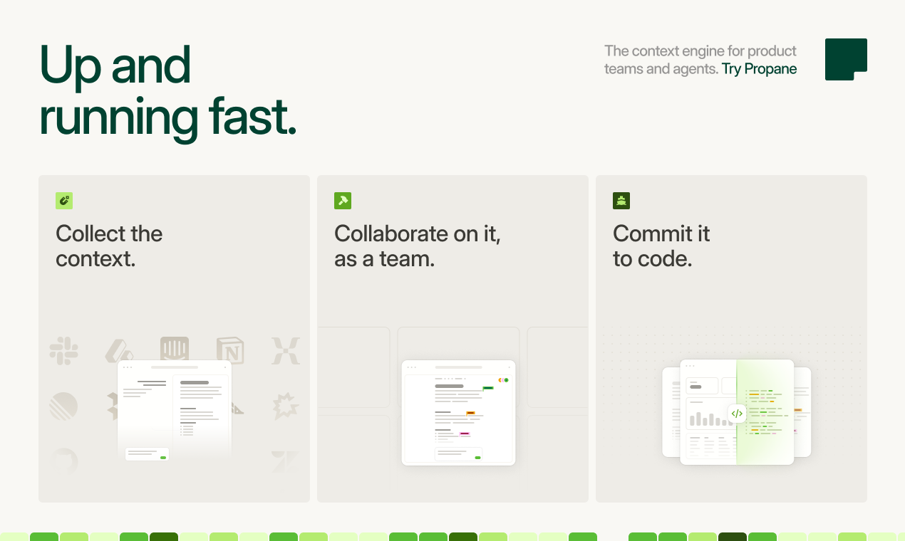
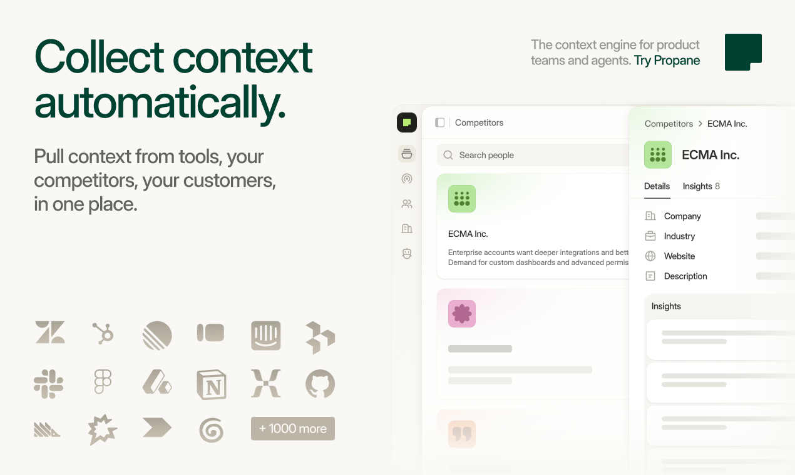
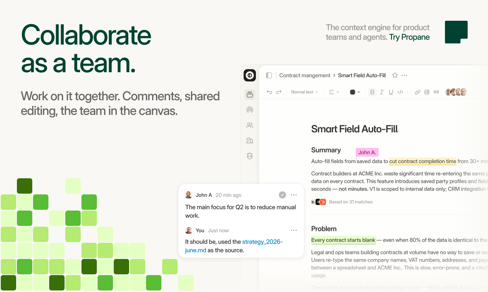

### 🎬 관련 영상
- [🎥 영상 보기](https://ph-files.imgix.net/dd6ecde7-cd00-4535-a074-6be1197c5856.jpeg?auto=format)

---

## 2. [Tencent EdgeOne Makers](https://www.producthunt.com/products/tencent-edgeone-2)
**Votes**: 341 | **도입 난이도**: 하 | **신뢰도**: 상
**Tagline**: Ship AI agents like web apps, in minutes.
**서비스 링크**: https://www.producthunt.com/r/F44CDFG34U37A3

**태그**: AI, EdgeComputing, DevOps, Serverless, Agent, Automation, AI Tool

### 📌 이 서비스 한눈에 보기
복잡한 인프라 구축 없이 AI 에이전트를 웹 앱처럼 즉시 배포할 수 있는 엣지 플랫폼

### 🔑 주요 기능
- 에이전트 런타임, 메모리, 샌드박스 도구 등 AI 에이전트 특화 기능 내장
- 기존 CLI, Git, CI/CD 워크플로우를 통한 간편한 배포 환경 제공
- 모델 게이트웨이, 서버리스 함수, 스토리지 등 통합 인프라 제공

### 🙋 사용자에게 어떤 점이 좋은가
인프라 관리 부담 없이 개발자가 선호하는 프레임워크로 AI 에이전트를 빠르게 제품화할 수 있습니다.

### ✅ 지금 바로 써볼 기능
- 기존 프레임워크를 이용한 에이전트 배포 테스트
- 내장된 샌드박스 도구 및 메모리 기능 검증
- CI/CD 파이프라인 연동 확인

### ⚠️ 사용 전 확인할 점
- 엣지 플랫폼 특성에 따른 특정 모델/프레임워크 지원 범위 확인 필요
- 복잡한 인프라 통합 시 발생하는 비용 구조 확인 필요

### 🧭 확인이 더 필요한 정보
지원하는 구체적인 프레임워크 목록과 모델 게이트웨이의 호환 범위를 확인해야 합니다.

### 📸 스크린샷 및 갤러리
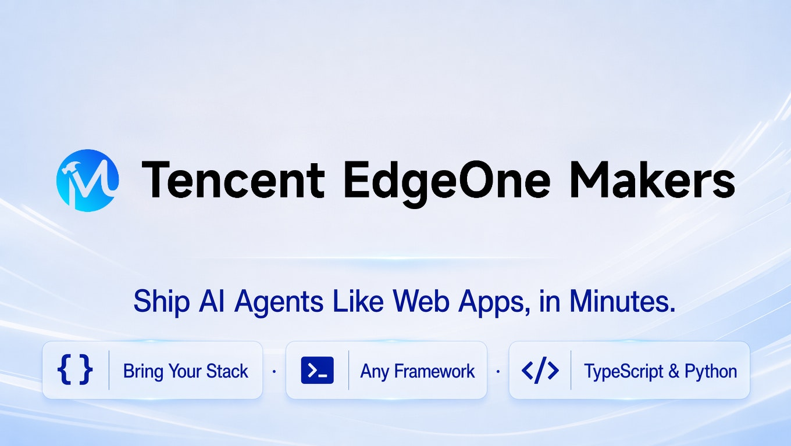
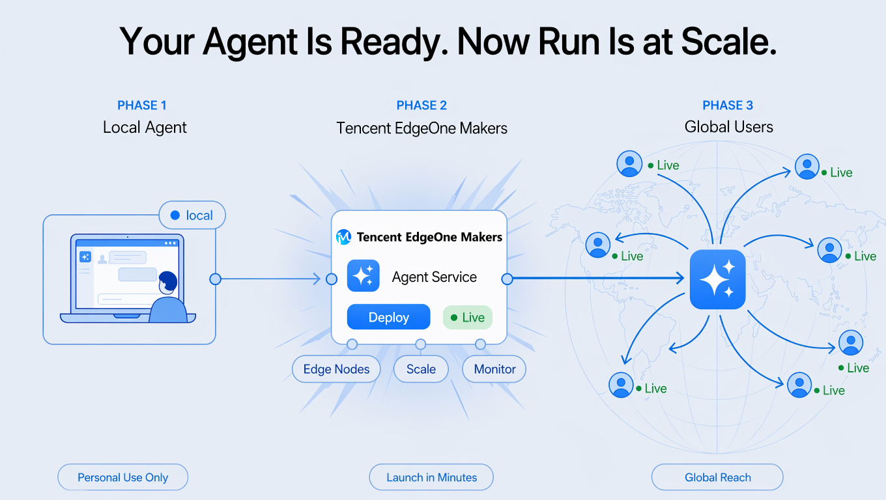
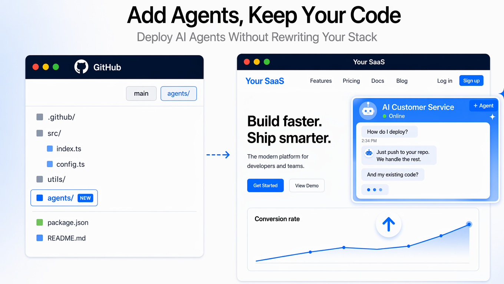

### 🎬 관련 영상
- [🎥 영상 보기](https://ph-files.imgix.net/6db6522e-3369-4fba-97d3-b95a57742342.jpeg?auto=format)

---

## 3. [Crewdle AI](https://www.producthunt.com/products/crewdle)
**Votes**: 231 | **도입 난이도**: 하 | **신뢰도**: 상
**Tagline**: Use every business AI tool without every subscription
**서비스 링크**: https://www.producthunt.com/r/L4PREZKBAKAZYE

**태그**: SaaS, AI, Automation, BusinessTools, CostOptimization, Agent, AI Tool, Chat

### 📌 이 서비스 한눈에 보기
여러 AI 도구의 구독료 부담 없이 사용량 기반으로 통합 관리하는 비즈니스 AI 플랫폼

### 🔑 주요 기능
- 채팅, 에이전트, 자동화, 콘텐츠 생성 등 다양한 AI 기능을 하나의 플랫폼에서 제공
- 매달 고정 비용이 발생하는 구독 방식 대신 사용한 만큼만 지불하는 과금 체계
- 복잡한 기술 설정이나 엔터프라이즈급 복잡성 없이 소규모 비즈니스에 최적화

### 🙋 사용자에게 어떤 점이 좋은가
여러 AI 서비스를 개별 구독할 필요가 없어 비용을 절감할 수 있으며, 흩어진 도구들을 한 곳에서 관리할 수 있어 운영 효율이 높아집니다.

### ✅ 지금 바로 써볼 기능
- 필요한 AI 기능(채팅, 자동화 등)이 플랫폼 내에 모두 포함되어 있는지 확인
- 사용량 기반 과금 모델이 현재 비즈니스 규모에 경제적인지 검토
- 기존에 사용하던 개별 AI 도구들을 대체할 수 있는지 기능 테스트

### ⚠️ 사용 전 확인할 점
- 사용량이 급증할 경우 예상치 못한 비용이 발생할 수 있음
- 특정 전문 분야의 개별 유료 도구와 기능적 차이가 있을 수 있음

### 🧭 확인이 더 필요한 정보
구체적인 사용량 기반 과금 산정 방식과 제공되는 개별 AI 모델의 종류에 대한 상세 정보가 필요합니다.

### 📸 스크린샷 및 갤러리
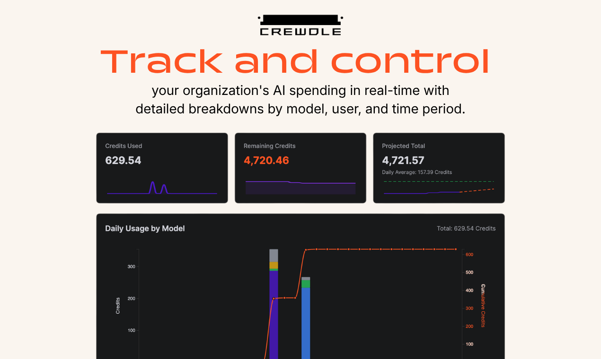
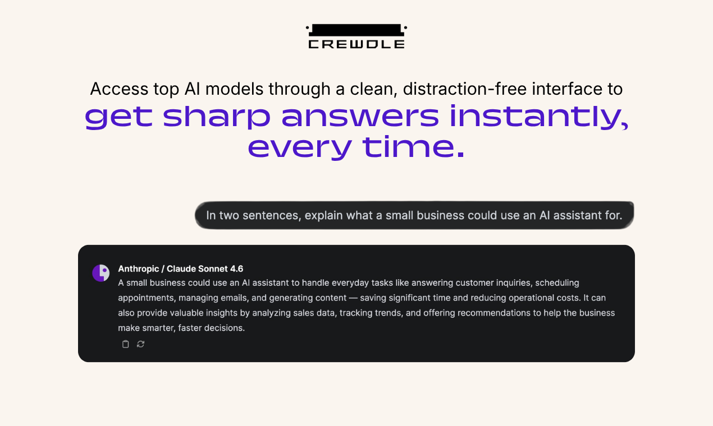
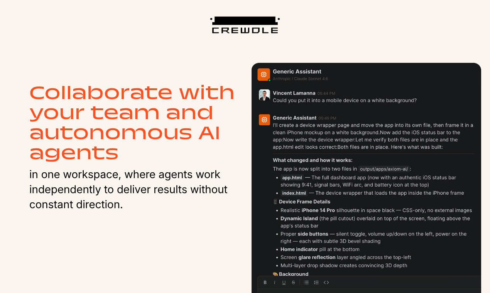

### 🎬 관련 영상
- [🎥 영상 보기](https://ph-files.imgix.net/eff944d7-9801-4530-b88d-853c9f1d40e0.jpeg?auto=format)

---

## 4. [Stripe.Directory](https://www.producthunt.com/products/stripe)
**Votes**: 207 | **도입 난이도**: 하 | **신뢰도**: 상
**Tagline**: New way for you & agents to search for businesses on Stripe
**서비스 링크**: https://www.producthunt.com/r/ZRMWJBK7PEAKQ3

**태그**: DevTool, Automation, Stripe, AI-Agent, Discovery, Agent, AI Tool

### 📌 이 서비스 한눈에 보기
개발자와 AI 에이전트를 위한 Stripe 생태계 통합 검색 및 발견 레이어

### 🔑 주요 기능
- Stripe Apps, Projects.dev, mpp.dev 등 다양한 서비스 통합 검색 지원
- 개발자 및 AI 에이전트가 비즈니스를 수동으로 찾을 필요 없는 자동화된 탐색 환경 제공
- Stripe 기반 서비스들을 손쉽게 발견하고 워크플로우에 통합 가능

### 🙋 사용자에게 어떤 점이 좋은가
Stripe 생태계 내의 다양한 솔루션을 일일이 검색할 필요 없이, 개발 과정에서 필요한 서비스를 즉각적으로 찾아 연결할 수 있습니다.

### ✅ 지금 바로 써볼 기능
- Stripe Directory에서 필요한 서비스 검색해보기
- AI 에이전트와 연동 가능한 서비스 목록 확인하기
- 발견한 서비스를 현재 프로젝트에 통합 검토하기

### ⚠️ 사용 전 확인할 점
- 검색되는 서비스의 신뢰성 및 보안 수준은 개별 제공사에 따라 다를 수 있음
- Stripe 생태계 외부 서비스와의 호환성 여부 확인 필요

### 🧭 확인이 더 필요한 정보
제공되는 서비스들의 구체적인 카테고리 범위와 API 연동 편의성에 대한 상세 정보가 추가로 필요합니다.

### 📸 스크린샷 및 갤러리
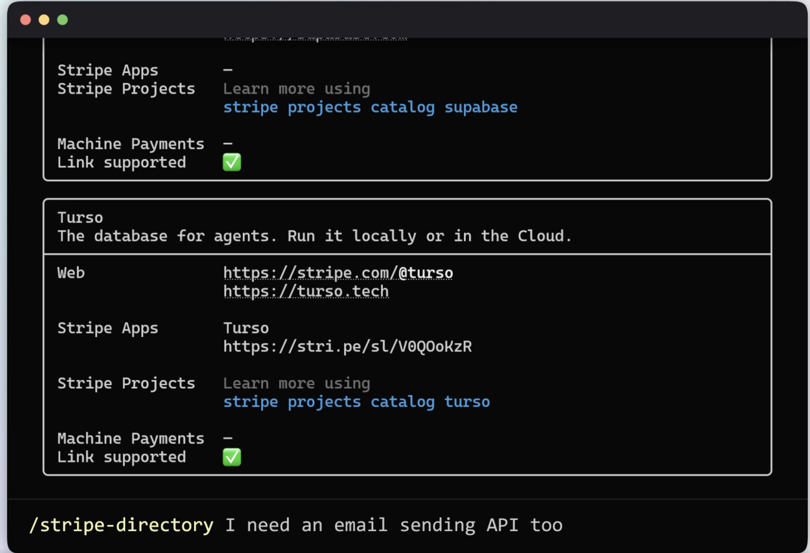
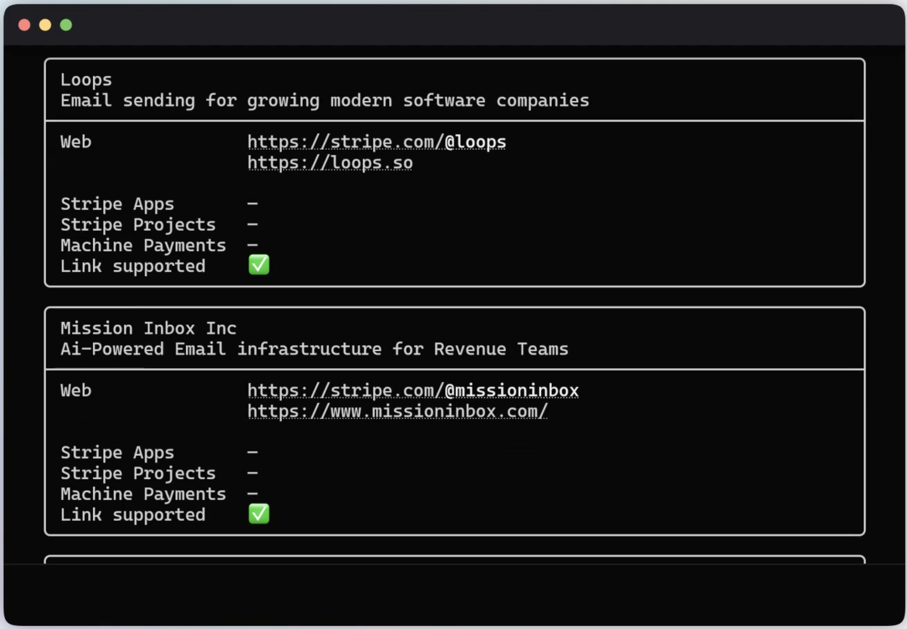

### 🎬 관련 영상
- [🎥 영상 보기](https://ph-files.imgix.net/99a04dfa-2e73-4fc2-ba9b-aff9c1b8d613.jpeg?auto=format)

---

## 5. [Mindstone Rebel](https://www.producthunt.com/products/mindstone-rebel)
**Votes**: 160 | **도입 난이도**: 중 | **신뢰도**: 상
**Tagline**: AI workspace for agents that know your work and ask first
**서비스 링크**: https://www.producthunt.com/r/AIENRBZHILH3YP

**태그**: AI Agent, Productivity, Automation, Workspace, Agent, AI Tool

### 📌 이 서비스 한눈에 보기
사용자의 업무 맥락을 이해하고 승인 기반의 실행을 지원하는 에이전트 중심 AI 워크스페이스

### 🔑 주요 기능
- 메모, 회의, 파일, 자동화 도구를 통합하여 업무 맥락을 학습하는 AI 환경 제공
- 에이전트가 자율적으로 업무를 수행하되, 민감한 작업은 사용자 승인을 거치는 안전 장치 포함
- Fair Source 라이선스와 모델 선택권을 제공하는 이식성 높은 워크플로우

### 🙋 사용자에게 어떤 점이 좋은가
단순 질의응답을 넘어 사용자의 실제 업무 데이터와 도구를 연결하여, 에이전트가 실질적인 업무를 보조할 수 있게 합니다.

### ✅ 지금 바로 써볼 기능
- 기존 업무 파일 및 메모 데이터 연결하기
- 에이전트의 자동화 워크플로우 설정하기
- 민감한 작업에 대한 승인 프로세스 테스트하기

### ⚠️ 사용 전 확인할 점
- 데스크톱 설치형 앱이므로 로컬 환경 및 보안 정책 확인 필요
- 에이전트의 자율적 행동에 따른 데이터 처리 및 권한 관리 주의

### 🧭 확인이 더 필요한 정보
데스크톱 앱의 구체적인 OS 지원 범위와 데이터 로컬 저장 방식에 대한 상세 정보가 필요합니다.

### 📸 스크린샷 및 갤러리
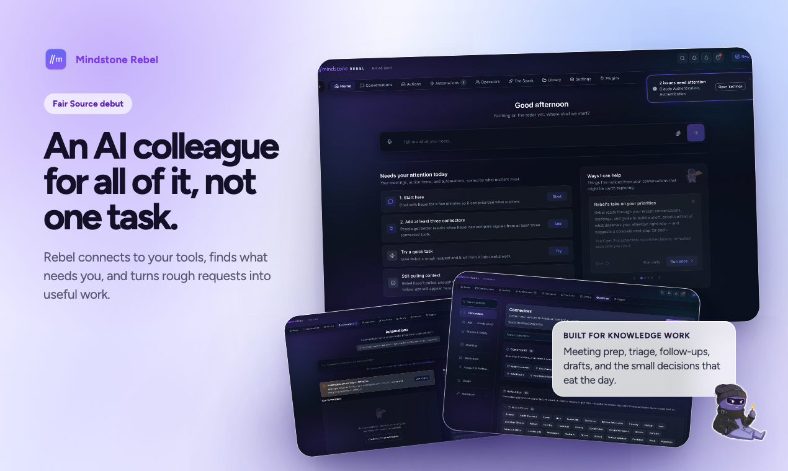

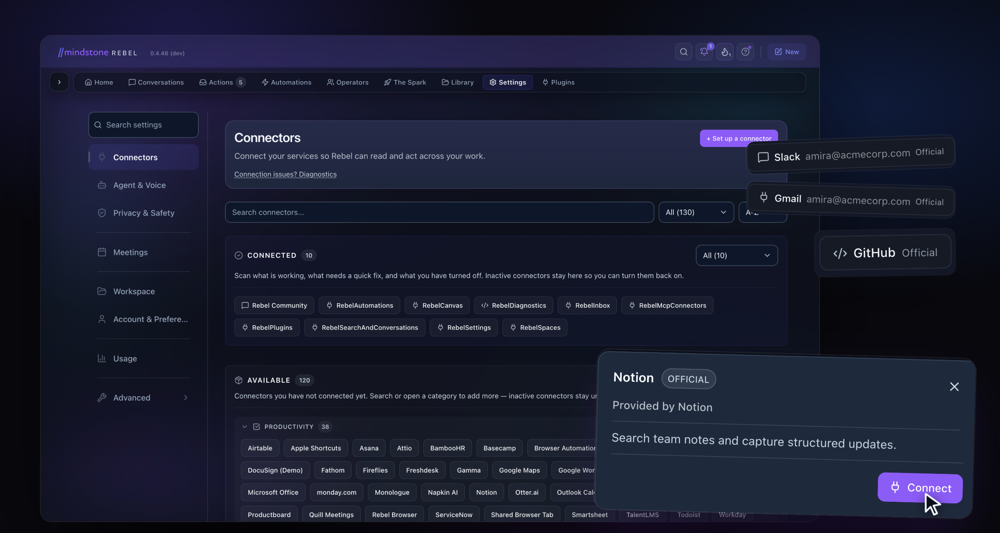

### 🎬 관련 영상
- [🎥 영상 보기](https://ph-files.imgix.net/f0cf517a-f2ce-4e64-9b71-20a8e83dc691.jpeg?auto=format)

---

## 6. [Customer Relationship Agents by Clarify](https://www.producthunt.com/products/clarify-6)
**Votes**: 158 | **도입 난이도**: 중 | **신뢰도**: 상
**Tagline**: The M in CRM shouldn't be you
**서비스 링크**: https://www.producthunt.com/r/SYIA53AFDR3GPE

**태그**: CRM, Automation, AI Agents, SalesTech, Agent

### 📌 이 서비스 한눈에 보기
수동 CRM 업무를 완전히 자동화하여 영업 담당자의 개입을 최소화하는 AI 에이전트 솔루션

### 🔑 주요 기능
- 파이프라인 요약, 리드 보강, 데이터 정제 등 반복적인 CRM 업무 자동화
- 스케줄 또는 특정 신호(Signal)에 따라 자율적으로 작동하는 에이전트
- 완전 자율 모드와 사용자 승인 모드 중 선택 가능한 워크플로우

### 🙋 사용자에게 어떤 점이 좋은가
단순 데이터 입력 및 관리 업무에서 해방되어 영업 전략 수립과 고객 응대 같은 핵심 업무에만 집중할 수 있습니다.

### ✅ 지금 바로 써볼 기능
- 제공되는 템플릿을 활용한 자동화 시나리오 설정
- 자연어 설명을 통한 맞춤형 에이전트 구축 테스트
- 승인 모드를 통한 자동화 결과물의 정확도 검증

### ⚠️ 사용 전 확인할 점
- 에이전트가 기존 스택과 연동될 때 발생할 수 있는 데이터 정합성 문제
- 자율 모드 설정 시 의도치 않은 데이터 변경 가능성

### 🧭 확인이 더 필요한 정보
현재 지원하는 구체적인 외부 툴(SaaS) 연동 범위와 데이터 보안 정책에 대한 확인이 필요합니다.

### 📸 스크린샷 및 갤러리
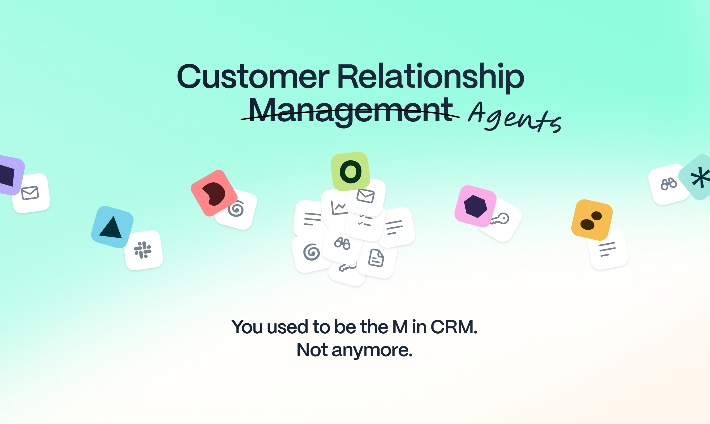
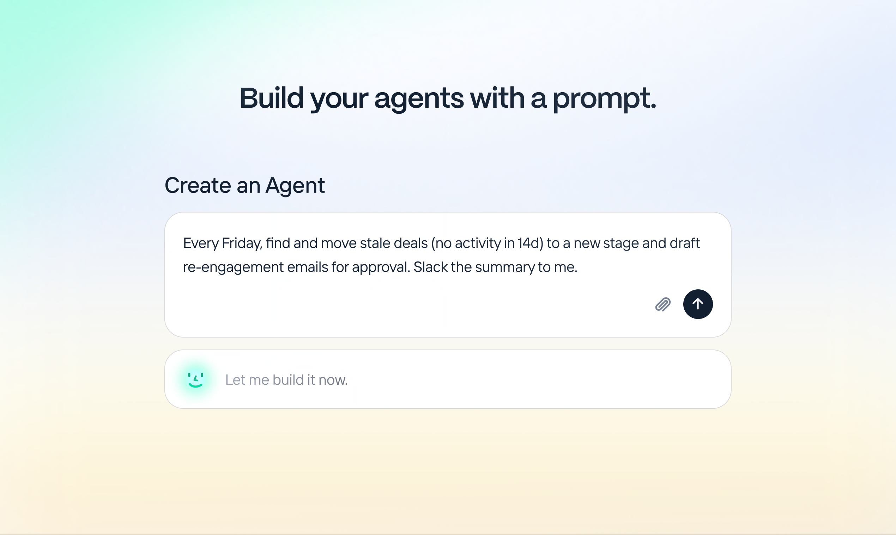
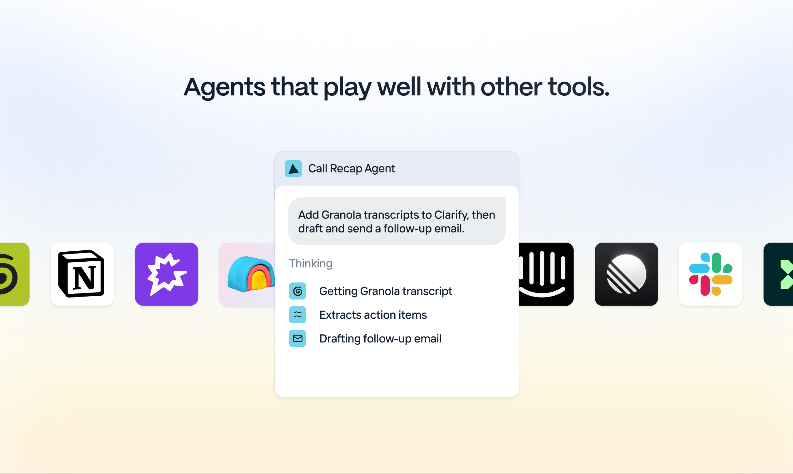

### 🎬 관련 영상
- [🎥 영상 보기](https://ph-files.imgix.net/2f6380ef-24a9-4647-a487-e1d2373608b7.jpeg?auto=format)

---

## 7. [Buy by Agentcard](https://www.producthunt.com/products/agent-card)
**Votes**: 147 | **도입 난이도**: 하 | **신뢰도**: 상
**Tagline**: Order DoorDash from Claude
**서비스 링크**: https://www.producthunt.com/r/OYV6A53YD3NOX7

**태그**: Automation, AI, Lifestyle, Agentic-AI, Agent

### 📌 이 서비스 한눈에 보기
Claude와 같은 AI 모델을 통해 말 한마디로 DoorDash 음식을 주문하는 자동화 서비스

### 🔑 주요 기능
- LLM(Claude, Openclaw 등)과 Agentcard를 연동하여 자연어로 주문 가능
- 사용자의 요청을 받으면 주문 프로세스를 자동으로 처리
- agentcard.sh를 통해 간편하게 설치 및 첫 주문 무료 체험 가능

### 🙋 사용자에게 어떤 점이 좋은가
복잡한 앱 조작 없이 채팅 인터페이스만으로 식사 주문을 해결할 수 있어 매우 편리합니다.

### ✅ 지금 바로 써볼 기능
- agentcard.sh 접속하여 설치하기
- Claude 또는 Openclaw에 Agentcard 연동하기
- 첫 무료 주문 기능 테스트하기

### ⚠️ 사용 전 확인할 점
- AI가 주문 내용을 잘못 이해할 경우 결제 및 배송 오류가 발생할 수 있음
- 연동하는 AI 모델의 API 환경에 따라 설정 과정이 필요할 수 있음

### 🧭 확인이 더 필요한 정보
사용자의 결제 수단이 어떻게 안전하게 연동되고 관리되는지에 대한 구체적인 정보가 필요합니다.

### 📸 스크린샷 및 갤러리
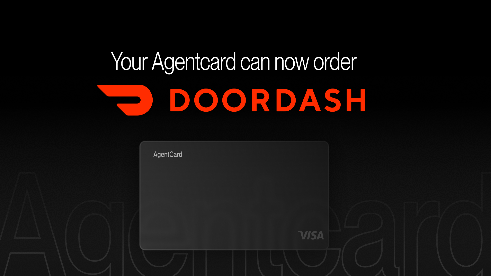
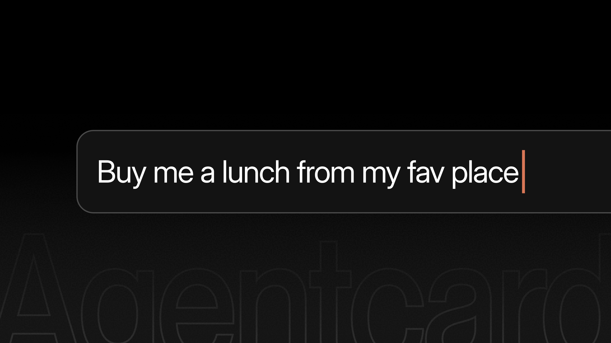
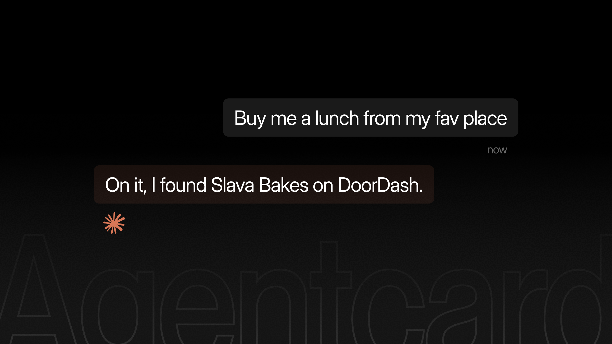

### 🎬 관련 영상
- [🎥 영상 보기](https://ph-files.imgix.net/7fb65fbd-e171-4d79-8831-d5ef44021f50.jpeg?auto=format)

---

## 8. [StaleMate PR](https://www.producthunt.com/products/stalemate-pr)
**Votes**: 127 | **도입 난이도**: 하 | **신뢰도**: 상
**Tagline**: Your menu bar turns red when PRs pile up
**서비스 링크**: https://www.producthunt.com/r/F34P2GOIRK3EBU

**태그**: DevTool, macOS, Productivity, GitHub, GitLab

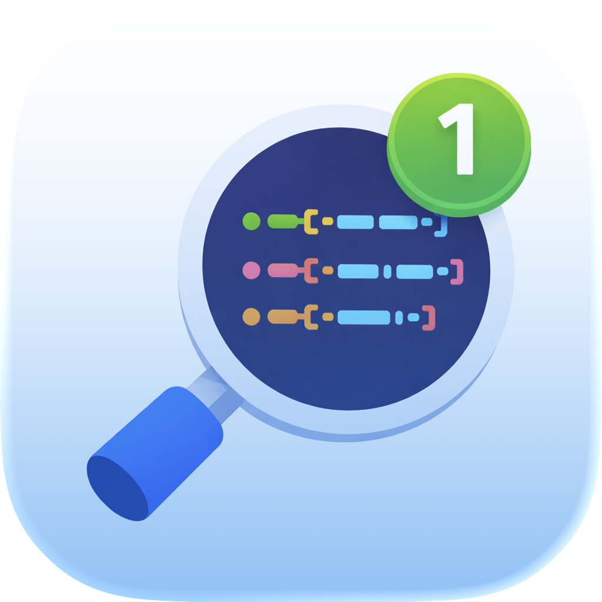

### 📌 이 서비스 한눈에 보기
GitHub/GitLab PR 상태를 메뉴 바 색상으로 직관적으로 알려주는 macOS 전용 모니터링 도구

### 🔑 주요 기능
- GitHub 및 GitLab의 Pull Request 상태 실시간 모니터링
- 상태에 따라 변하는 메뉴 바 아이콘 (초록/노랑/빨강) 시각화
- 최대 5개의 독립적인 모니터링 환경 지원

### 🙋 사용자에게 어떤 점이 좋은가
개발자가 브라우저를 계속 확인하지 않아도 PR 적체 상황을 즉각 인지하여 리뷰 흐름을 관리할 수 있습니다.

### ✅ 지금 바로 써볼 기능
- GitHub/GitLab 계정 연동하기
- 최대 5개까지 가능한 모니터링 설정 활용하기
- 메뉴 바 색상 변화를 통한 워크플로우 최적화

### ⚠️ 사용 전 확인할 점
- macOS 전용 앱이므로 다른 OS에서는 사용 불가
- 유료 기능 여부 및 상세 가격 정책 확인 필요

### 🧭 확인이 더 필요한 정보
상세한 가격 정책과 유료 플랜의 구체적인 기능 범위가 명시되지 않았습니다.

### 📸 스크린샷 및 갤러리
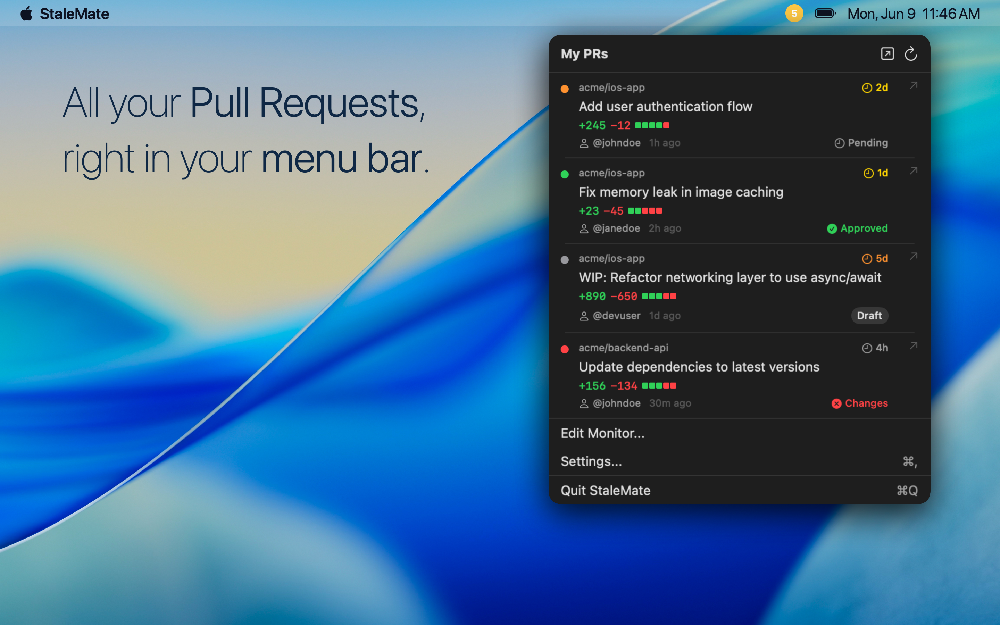
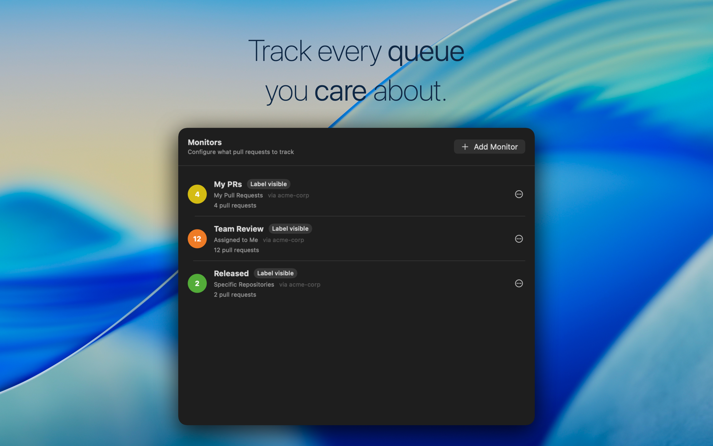
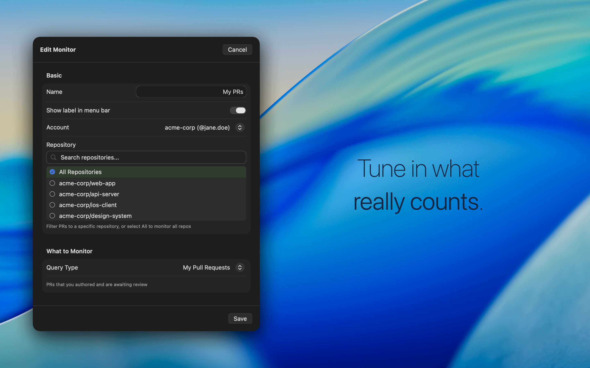

---

## 9. [FUTO Swipe](https://www.producthunt.com/products/futo-swipe)
**Votes**: 120 | **도입 난이도**: 중 | **신뢰도**: 상
**Tagline**: Open models for on-device swipe typing
**서비스 링크**: https://www.producthunt.com/r/N2BVTQ5XIEHUH2

**태그**: AI, Mobile, OpenSource, NLP, AI Tool, DevTool

### 📌 이 서비스 한눈에 보기
기기 내에서 빠르고 정확하게 작동하는 오픈 소스 스와이프 타이핑 모델

### 🔑 주요 기능
- 레이아웃에 구애받지 않는 인코더와 경량화된 컨텍스트 언어 모델 탑재
- 매우 작은 점유율로 기기 내(on-device)에서 효율적인 실행 가능
- 학습에 사용된 100만 개의 스와이프 데이터셋 공개

### 🙋 사용자에게 어떤 점이 좋은가
별도의 서버 연결 없이 스마트폰 등 기기 자체에서 빠르고 정확한 스와이프 입력 기능을 구현할 수 있습니다.

### ✅ 지금 바로 써볼 기능
- 공개된 모델 구조 및 데이터셋 검토
- 자체 키보드 앱에 모델 통합 테스트
- 저사양 기기에서의 구동 효율성 확인

### ⚠️ 사용 전 확인할 점
- 모델이 특정 언어나 키보드 레이아웃에 얼마나 최적화되어 있는지 확인 필요
- 온디바이스 실행 시 배터리 소모량 및 리소스 점유율 체크 필요

### 🧭 확인이 더 필요한 정보
현재 제공되는 모델이 지원하는 구체적인 언어 종류와 키보드 레이아웃 범위를 확인해야 합니다.

### 📸 스크린샷 및 갤러리
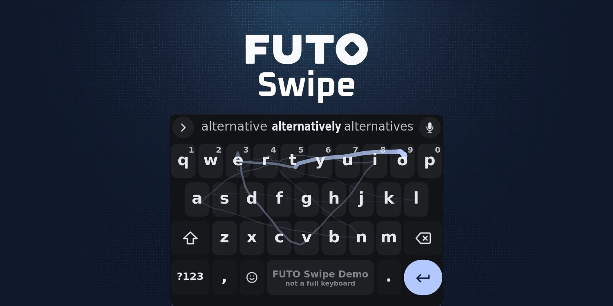
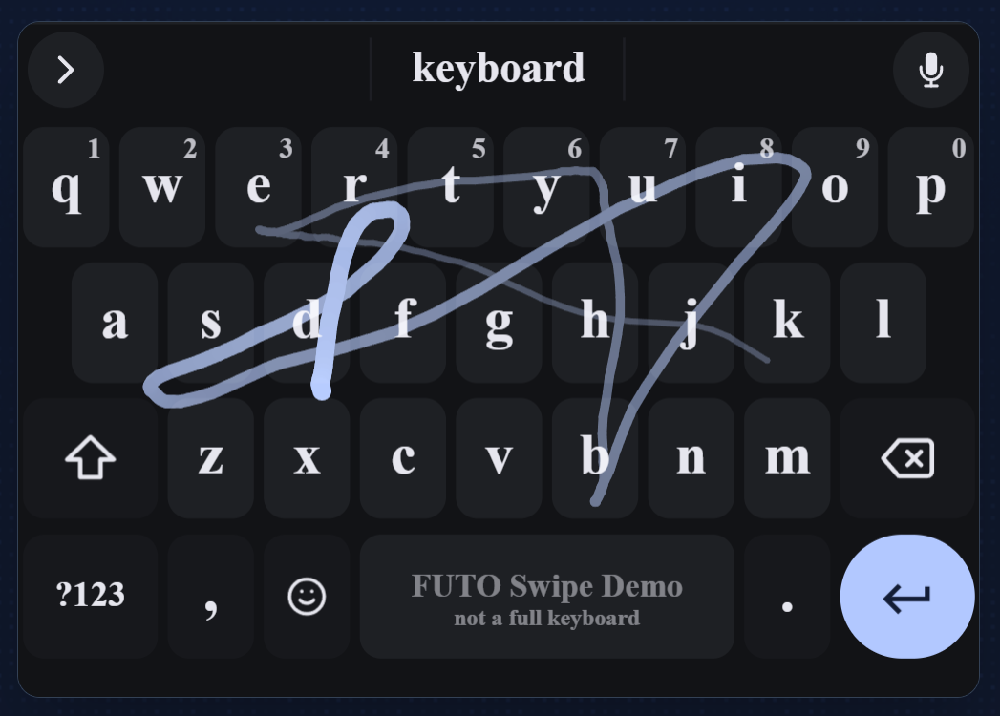

---

## 10. [Ruby](https://www.producthunt.com/products/ruby-7)
**Votes**: 115 | **도입 난이도**: 하 | **신뢰도**: 상
**Tagline**: Ask better questions, live on every call
**서비스 링크**: https://www.producthunt.com/r/YEMCTCUYJDIQ2T

**태그**: AI Assistant, Productivity, Meeting Tool, Real-time

### 📌 이 서비스 한눈에 보기
실시간 대화 흐름을 분석하여 최적의 질문을 제안하는 AI 회의 어시스턴트

### 🔑 주요 기능
- 실시간 대화 모니터링을 통한 적기 질문 제안
- 대화 전 목표 설정 및 청취 포인트 가이드 제공
- 회의 종료 후 자동 요약 리캡 생성

### 🙋 사용자에게 어떤 점이 좋은가
중요한 미팅 중 놓치기 쉬운 핵심 질문을 실시간으로 가이드해주어 대화의 주도권을 잡고 생산성을 높여줍니다.

### ✅ 지금 바로 써볼 기능
- 대화 전 목표 설정 기능 활용하기
- 실시간 질문 알림(Pill) 기능 테스트하기
- 회의 후 자동 생성된 리캡 확인하기

### ⚠️ 사용 전 확인할 점
- 실시간 음성 인식 및 데이터 보안 정책 확인 필요
- 대화 맥락에 따른 질문 제안의 정확도 차이 가능성

### 🧭 확인이 더 필요한 정보
지원하는 화상 회의 플랫폼(Zoom, Google Meet 등)과의 연동 방식 및 보안 수준에 대한 정보가 추가로 필요합니다.

### 📸 스크린샷 및 갤러리

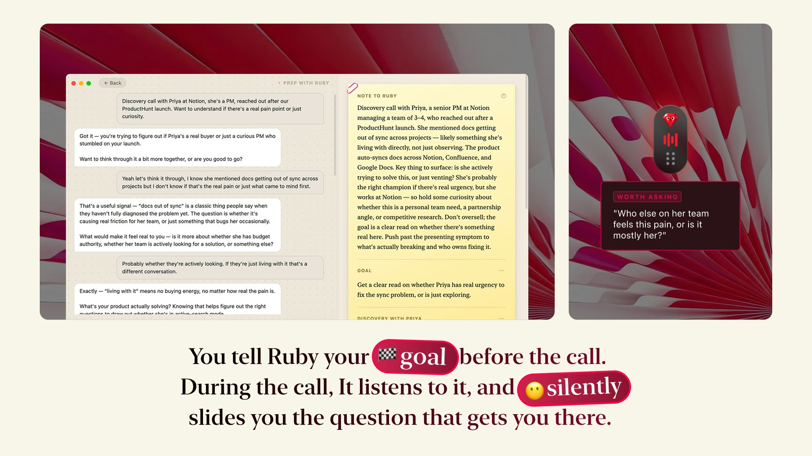
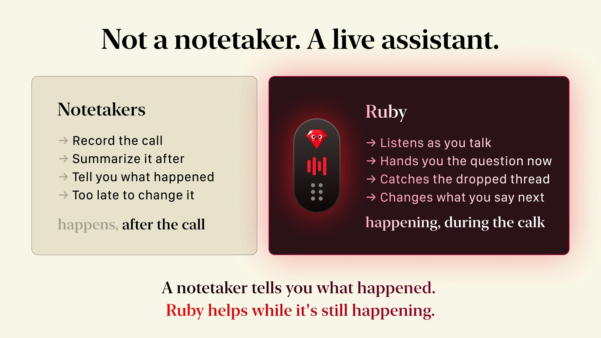

### 🎬 관련 영상
- [🎥 영상 보기](https://ph-files.imgix.net/ea83bd39-1eba-4a71-a016-5a6cfbc0dba0.jpeg?auto=format)

---

## 11. [Nimt](https://www.producthunt.com/products/nimt-ai)
**Votes**: 115 | **도입 난이도**: 하 | **신뢰도**: 상
**Tagline**: Your AI Search Coworker in Slack
**서비스 링크**: https://www.producthunt.com/r/W6JEWRUDRSZ3DB

**태그**: AI, Automation, Slack, SEO, Marketing, AI Tool

### 📌 이 서비스 한눈에 보기
Slack 내에서 모든 AI 검색 최적화 작업을 자동 수행하는 AI 동료

### 🔑 주요 기능
- Slack 기반의 인터페이스로 별도의 대시보드 이동 없이 업무 수행
- 주요 AI 모델 전반에 걸친 트래킹 및 검색 최적화 자동화
- CMS, 이메일, 소셜 미디어 등 다양한 플랫폼과의 연동 지원

### 🙋 사용자에게 어떤 점이 좋은가
복잡한 AI 검색 최적화 과정을 Slack 안에서 자동화하여, 사용자가 별도의 툴을 학습하거나 관리할 필요 없이 결과에만 집중할 수 있게 합니다.

### ✅ 지금 바로 써볼 기능
- Slack에 Nimt 설치 및 워크플로우 연결
- 주요 AI 모델 대상 트래킹 설정
- 기존 CMS 및 소셜 미디어 계정 연동

### ⚠️ 사용 전 확인할 점
- Slack 외부 플랫폼(CMS, 소셜 미디어 등) 연동 시 보안 및 권한 설정 확인 필요
- 자동화된 작업이 실제 브랜드 가이드라인과 일치하는지 모니터링 필요

### 🧭 확인이 더 필요한 정보
3,000개 이상의 외부 서비스 연동 범위와 구체적인 데이터 보안 정책에 대한 확인이 필요합니다.

### 📸 스크린샷 및 갤러리
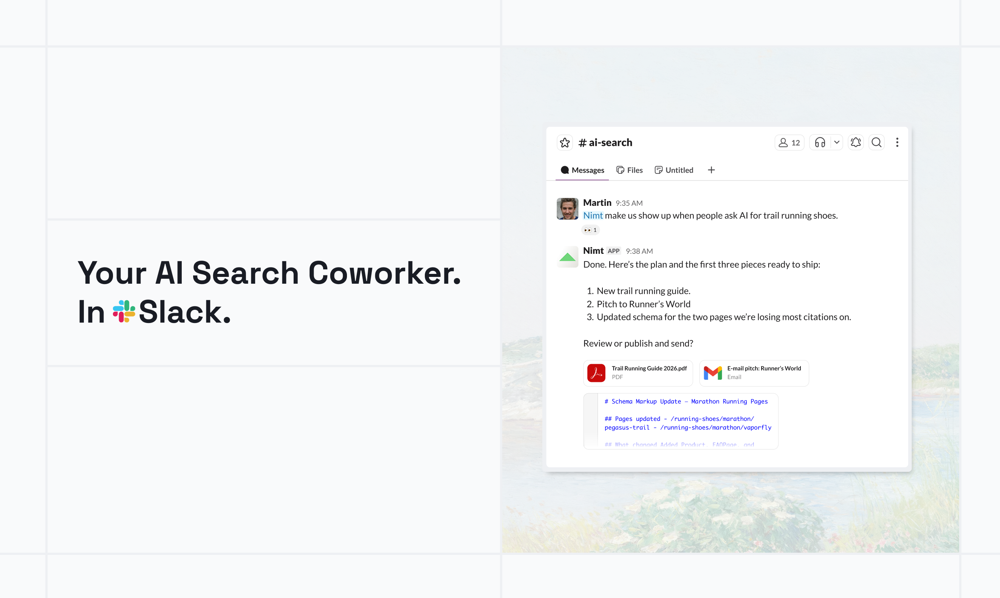
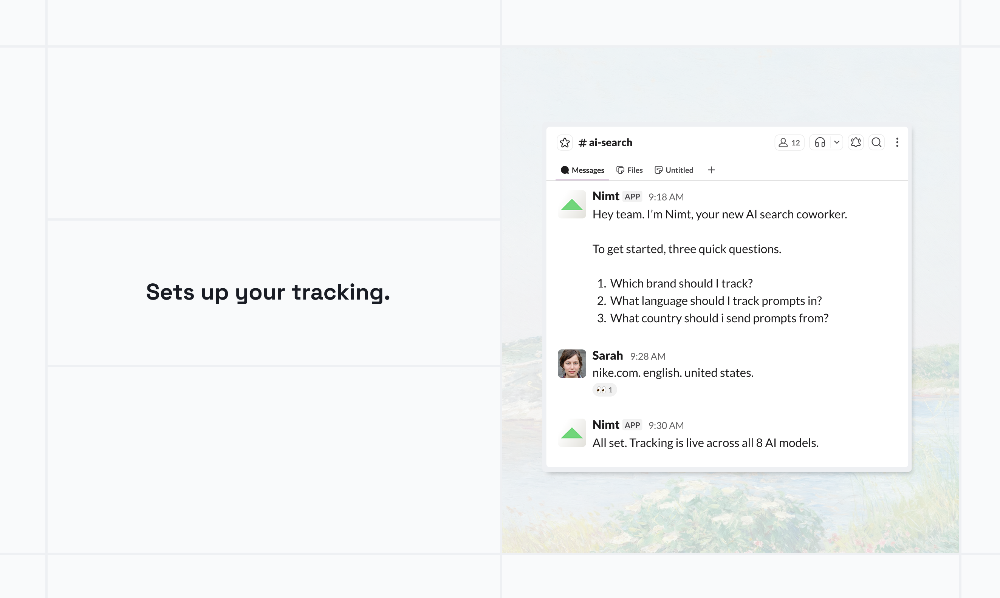
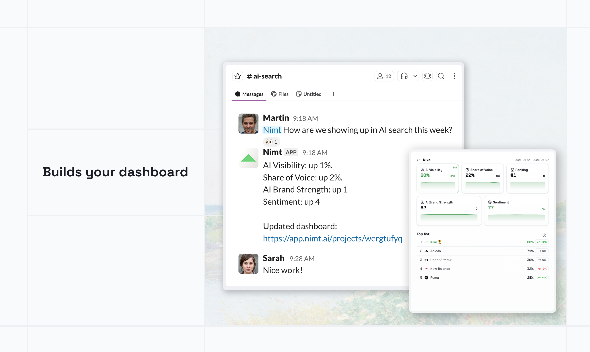

### 🎬 관련 영상
- [🎥 영상 보기](https://ph-files.imgix.net/c0464b26-0f22-4ff3-bb44-4f269c30efc1.jpeg?auto=format)

---

## 12. [React UI Kit V7](https://www.producthunt.com/products/production-ready-ui-kits-by-cometchat)
**Votes**: 112 | **도입 난이도**: 하 | **신뢰도**: 상
**Tagline**: All the chat components you need. None of the complexity
**서비스 링크**: https://www.producthunt.com/r/ZHP7NRALZUCM7O

**태그**: React, Chat-UI, Frontend, DeveloperTools, AI Tool, Chat, Video

### 📌 이 서비스 한눈에 보기
복잡한 설정 없이 즉시 배포 가능한 React 기반 올인원 채팅 UI 키트

### 🔑 주요 기능
- 메시징, 음성, 영상 통화 기능을 포함한 프로덕션 레벨의 컴포넌트 제공
- V7 업데이트를 통한 유연한 아키텍처 및 플러그인 기반 확장성 확보
- React, Next.js, React Router, Astro 등 다양한 프레임워크 지원

### 🙋 사용자에게 어떤 점이 좋은가
채팅 및 통화 기능을 직접 구현하는 데 드는 시간과 복잡성을 획기적으로 줄여 개발 속도를 높여줍니다.

### ✅ 지금 바로 써볼 기능
- 기본 메시징 컴포넌트 적용해보기
- Next.js 및 Astro 환경에서의 호환성 테스트
- 커스텀 테마 및 플러그인 확장성 확인

### ⚠️ 사용 전 확인할 점
- 플러그인 기반 구조에 따른 학습 곡선 존재 가능성
- 특정 프레임워크(Astro 등)에서의 세부 동작 확인 필요

### 🧭 확인이 더 필요한 정보
상세한 커스터마이징 범위와 플러그인 라이브러리의 종류에 대한 구체적인 정보가 필요합니다.

### 📸 스크린샷 및 갤러리
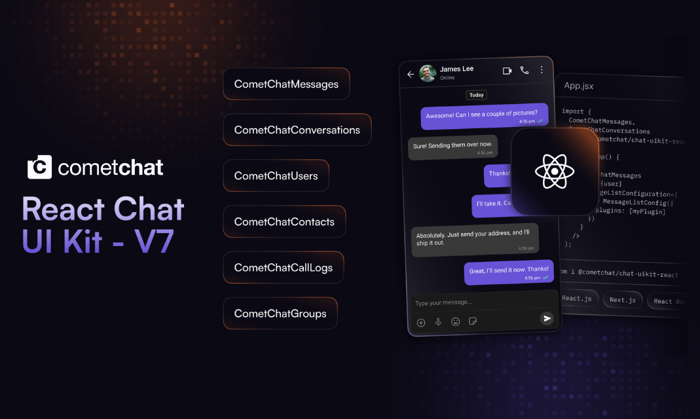
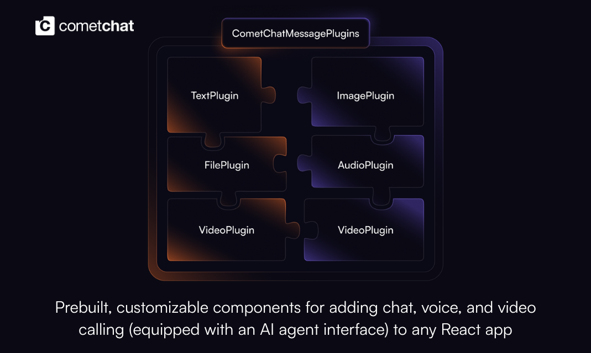
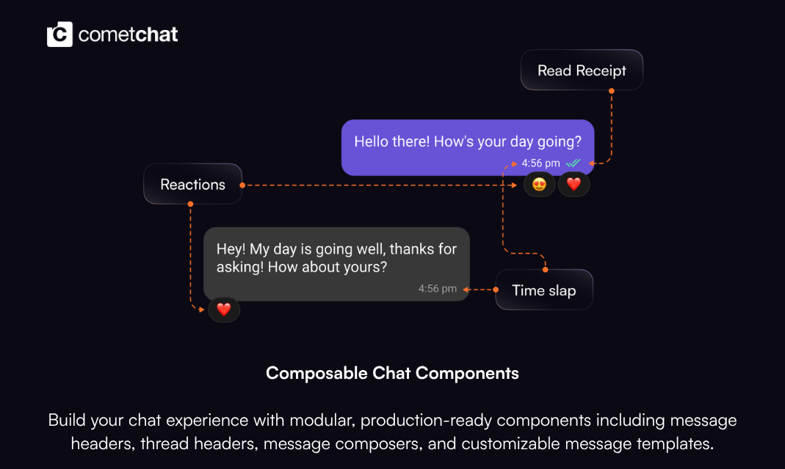

---

## 13. [Swimio](https://www.producthunt.com/products/swimio)
**Votes**: 107 | **도입 난이도**: 하 | **신뢰도**: 상
**Tagline**: AI swim coach with Apple Watch tracking & smart workouts
**서비스 링크**: https://www.producthunt.com/r/PSDRLULFS2GUS5

**태그**: SportsTech, AI, AppleWatch, Fitness, Analytics, AI Tool

### 📌 이 서비스 한눈에 보기
애플 워치 연동을 통해 개인 맞춤형 훈련과 정밀한 데이터 분석을 제공하는 AI 수영 코치

### 🔑 주요 기능
- 애플 워치를 활용한 실시간 수영 트래킹 및 워크아웃 실행
- 목표 맞춤형 개인화된 수영 훈련 프로그램 생성
- 페이스, SWOLF, 스트로크 효율성, 심박수 등 전문적인 데이터 분석

### 🙋 사용자에게 어떤 점이 좋은가
단순한 랩 카운터를 넘어 전문적인 수영 지표를 제공하므로, 체계적인 기록 향상을 원하는 수영인에게 유용합니다.

### ✅ 지금 바로 써볼 기능
- 애플 워치로 맞춤형 워크아웃 실행하기
- 세션 후 제공되는 성과 인사이트 분석하기
- SWOLF 및 스트로크 효율성 지표 확인하기

### ⚠️ 사용 전 확인할 점
- 애플 워치 하드웨어가 필수적임
- 수영 전문 데이터 분석이므로 기초적인 수영 기능 숙련도가 필요할 수 있음

### 🧭 확인이 더 필요한 정보
애플 워치 외의 다른 웨어러블 기기 지원 여부와 구체적인 구독 모델에 대한 정보가 필요합니다.

### 📸 스크린샷 및 갤러리
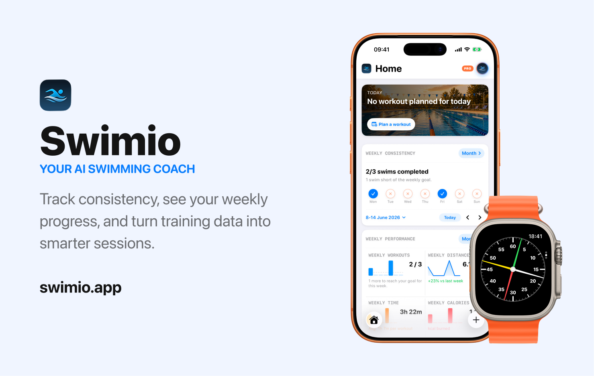
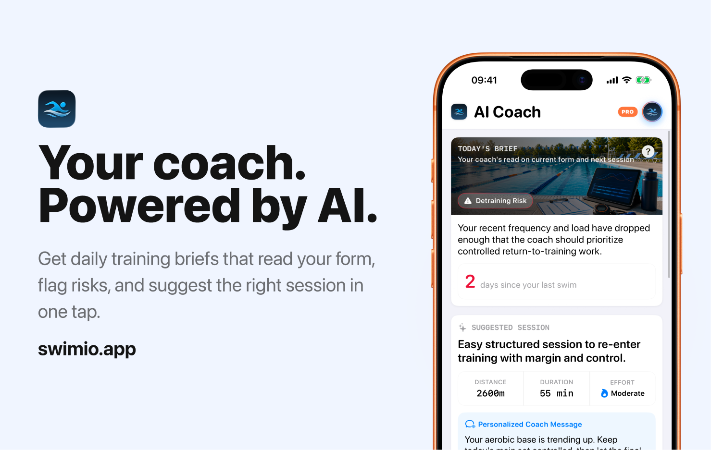
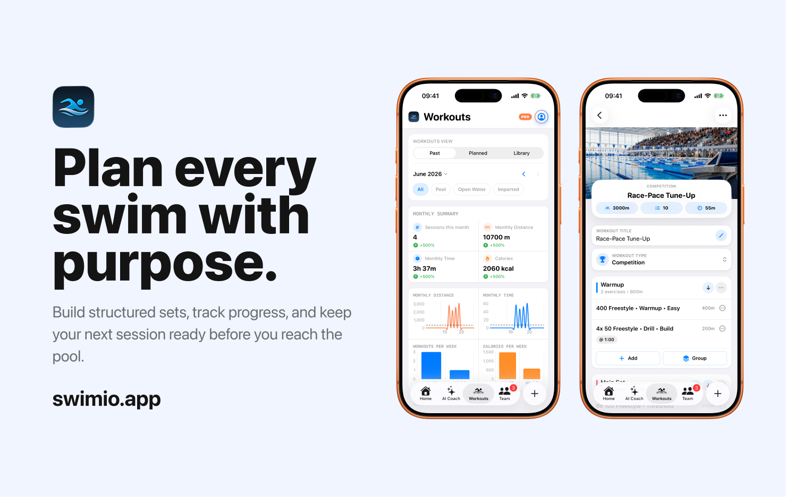

---

## 14. [Prospector by Synter](https://www.producthunt.com/products/synter-media-ai)
**Votes**: 61 | **도입 난이도**: 하 | **신뢰도**: 상
**Tagline**: Your outbound agent, right inside Slack
**서비스 링크**: https://www.producthunt.com/r/2EEIOAHEW7DSPT

**태그**: SalesAutomation, SlackIntegration, AI-Agent, LeadGeneration, Agent, AI Tool

### 📌 이 서비스 한눈에 보기
슬랙 내에서 대화만으로 아웃바운드 캠페인을 관리하고 잠재 고객 리스트를 생성하는 AI 에이전트

### 🔑 주요 기능
- 대시보드 대신 슬랙 인터페이스를 통한 직관적인 업무 환경 제공
- 실제 사용자 참여 데이터를 기반으로 한 자동화된 잠재 고객 리스트 구축
- 캠페인 성과 및 고객 반응에 대한 즉각적인 질의응답 기능

### 🙋 사용자에게 어떤 점이 좋은가
별도의 복잡한 대시보드에 접속할 필요 없이 슬랙 내에서 즉시 아웃바운드 성과를 확인하고 타겟 리스트를 확보할 수 있습니다.

### ✅ 지금 바로 써볼 기능
- /prospector 명령어로 에이전트 시작하기
- /campaigns 명령어로 현재 진행 중인 캠페인 현황 확인하기
- /contacts 명령어로 생성된 잠재 고객 리스트 검토하기

### ⚠️ 사용 전 확인할 점
- 슬랙 외부의 데이터 연동 범위 확인 필요
- Synter(유료 매체 광고)와의 연동 시 데이터 공유 구조 이해 필요

### 🧭 확인이 더 필요한 정보
슬랙 외의 다른 협업 툴과의 연동 가능 여부 및 구체적인 데이터 소스 범위가 명시되지 않았습니다.

### 📸 스크린샷 및 갤러리
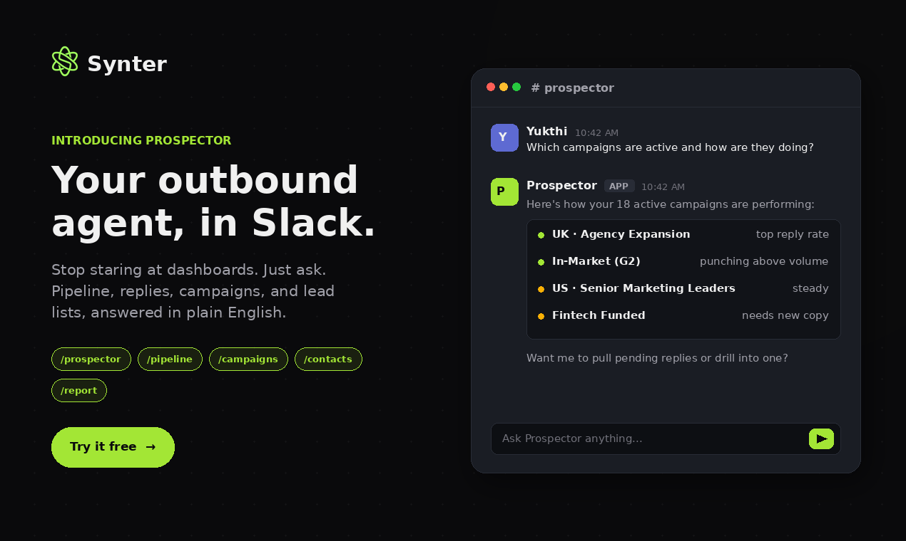
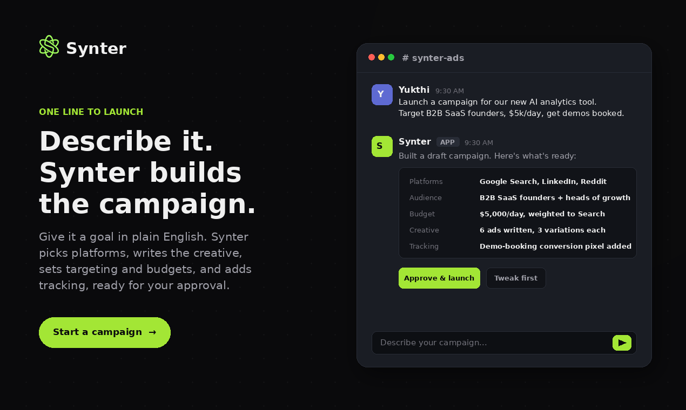
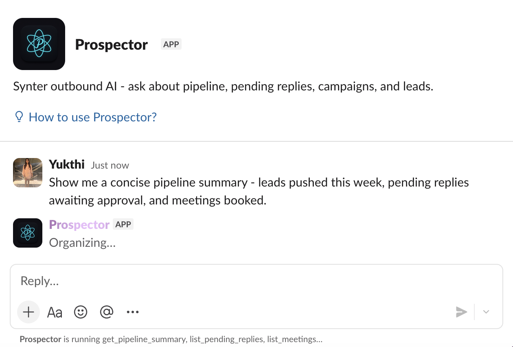

### 🎬 관련 영상
- [🎥 영상 보기](https://ph-files.imgix.net/9e4b2896-0469-4580-97e5-85c0d11c8a6a.jpeg?auto=format)

---

## 15. [Well - Business Context Graph](https://www.producthunt.com/products/well-embed)
**Votes**: 48 | **도입 난이도**: 중 | **신뢰도**: 상
**Tagline**: One Legible Business Context Graph for You and Your Agents
**서비스 링크**: https://www.producthunt.com/r/FLH3K5NR2QJ53F

**태그**: Automation, Data Integration, AI Agents, SaaS, Agent, AI Tool, Productivity, CRM, Email

### 📌 이 서비스 한눈에 보기
파편화된 비즈니스 데이터를 하나의 통합된 컨텍스트 그래프로 연결하여 사용자 및 AI 에이전트가 즉시 활용할 수 있게 합니다.

### 🔑 주요 기능
- SaaS, CRM, 이메일, 회계, 은행 등 다양한 툴의 데이터 통합
- 단일 MCP(Model Context Protocol) 환경 구축을 통한 데이터 동기화
- 사용자와 AI 에이전트를 위한 가독성 높은 비즈니스 컨텍스트 제공

### 🙋 사용자에게 어떤 점이 좋은가
여러 서비스에 흩어진 업무 데이터를 하나의 맥락으로 통합하여, 사용자와 AI 에이전트가 복잡한 데이터 탐색 없이 즉각적인 의사결정을 내릴 수 있도록 돕습니다.

### ✅ 지금 바로 써볼 기능
- 주요 SaaS 및 CRM 계정 연동 테스트
- 데이터 통합 후 컨텍스트 그래프 가독성 확인
- AI 에이전트와의 연동 시나리오 검증

### ⚠️ 사용 전 확인할 점
- 금융 및 민감한 비즈니스 데이터 통합에 따른 보안 정책 확인 필요
- 다양한 외부 서비스(SaaS)와의 연동 안정성 검토 필요

### 🧭 확인이 더 필요한 정보
지원하는 구체적인 MCP 규격과 외부 서비스 연동 범위에 대한 상세 정보가 필요합니다.

### 📸 스크린샷 및 갤러리
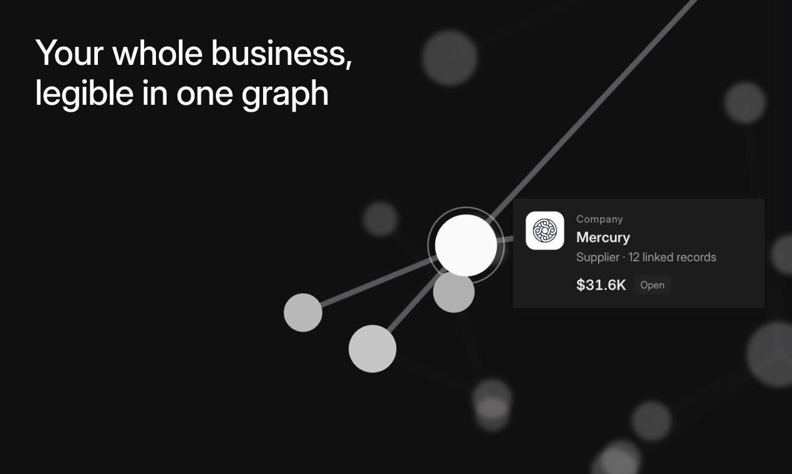
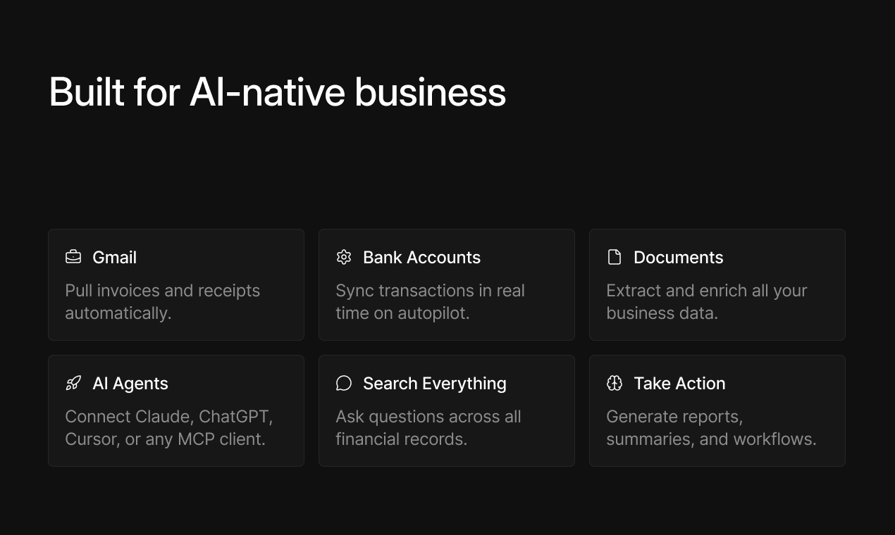
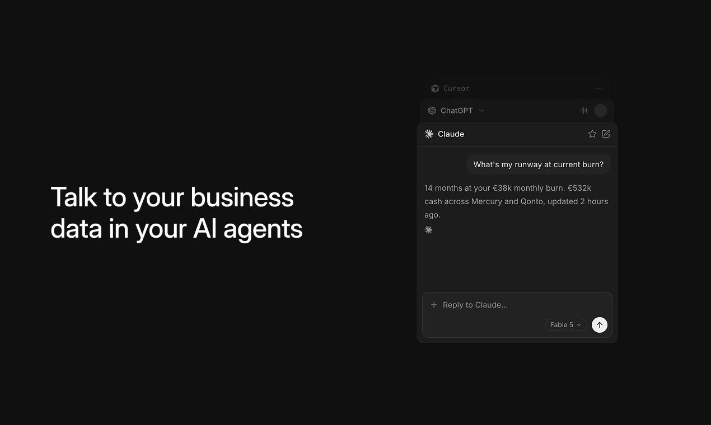

### 🎬 관련 영상
- [🎥 영상 보기](https://ph-files.imgix.net/782fcc26-5d3a-4a23-b1b1-dd12d5b74ea6.jpeg?auto=format)

---

## 16. [Premast ai ](https://www.producthunt.com/products/premast-templates)
**Votes**: 48 | **도입 난이도**: 하 | **신뢰도**: 상
**Tagline**: Your AI teammate for building presentations in PowerPoint
**서비스 링크**: https://www.producthunt.com/r/TIDR4XEFHYMFAE

**태그**: AI, Productivity, Presentation, Automation, AI Tool, Prompting, Design, Sales

### 📌 이 서비스 한눈에 보기
파워포인트 내에서 프롬프트 하나로 슬라이드 생성부터 디자인까지 해결하는 AI 팀원

### 🔑 주요 기능
- 파워포인트 환경을 벗어나지 않고 모든 작업 수행 가능
- 아이디어 브레인스토밍부터 콘텐츠 작성, 디자인까지 통합 지원
- 피치 덱, 제안서, 영업 자료 등 다양한 비즈니스 목적에 최적화

### 🙋 사용자에게 어떤 점이 좋은가
별도의 툴을 옮겨 다닐 필요 없이 파워포인트 안에서 즉시 슬라이드를 생성하고 편집할 수 있어 작업 시간을 획기적으로 단축해 줍니다.

### ✅ 지금 바로 써볼 기능
- 단일 프롬프트로 전체 슬라이드 구조 생성해보기
- 기존 텍스트를 슬라이드용 문구로 재작성하기
- 생성된 슬라이드 디자인 및 레이아웃 다듬기

### ⚠️ 사용 전 확인할 점
- 파워포인트 애드인(Add-in) 설치 및 호환성 확인 필요
- AI 생성 콘텐츠의 사실 관계 및 디자인 디테일 검수 필수

### 🧭 확인이 더 필요한 정보
사용 중인 파워포인트 버전과의 호환성 및 구체적인 요금 체계에 대한 정보가 필요합니다.

### 📸 스크린샷 및 갤러리
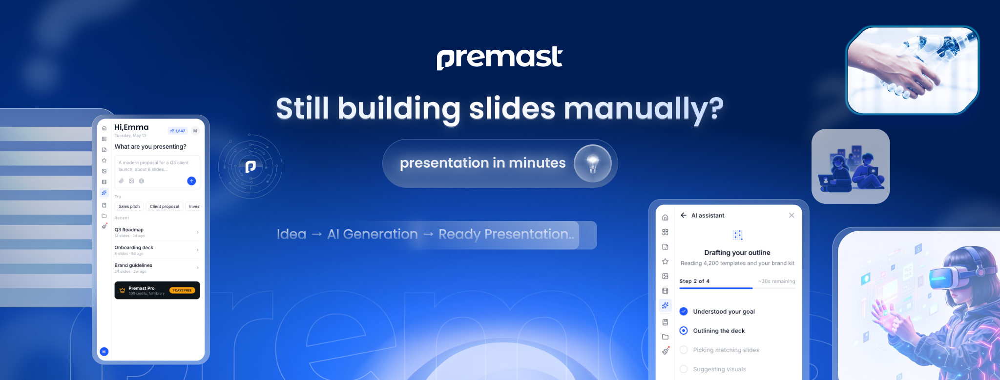
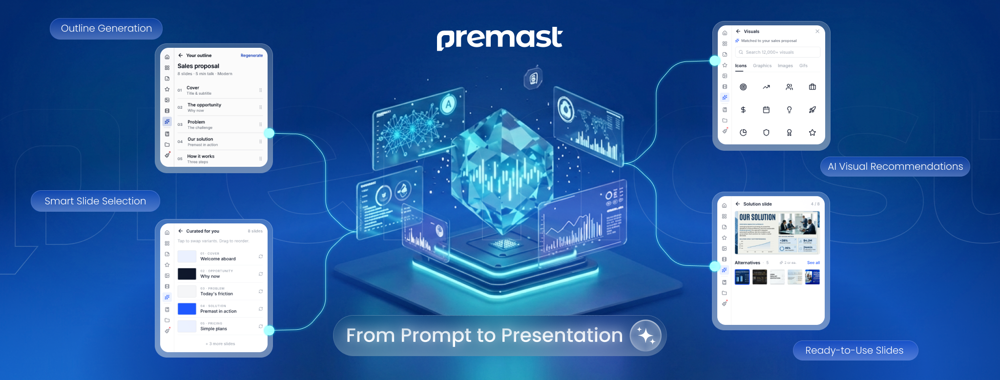
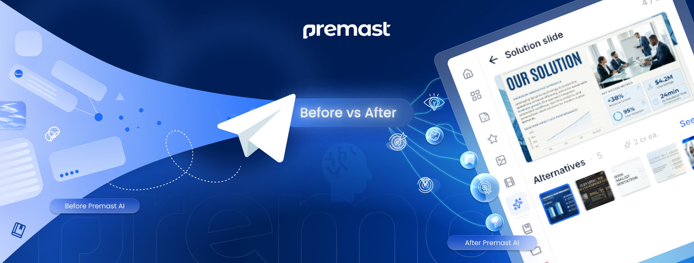

### 🎬 관련 영상
- [🎥 영상 보기](https://ph-files.imgix.net/f1a4486a-bc79-400d-958b-6b0e70269fae.jpeg?auto=format)

---

## 17. [Crop.photo AI for Shopify](https://www.producthunt.com/products/crop-photo-ai-for-shopify)
**Votes**: 46 | **도입 난이도**: 하 | **신뢰도**: 상
**Tagline**: Bulk Edit Shopify Product Photos With AI Recipes
**서비스 링크**: https://www.producthunt.com/r/OYPY63XG7VZ4IK

**태그**: Shopify, AI-Automation, E-commerce, ImageEditing, AI Tool, Video, Vision

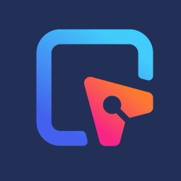

### 📌 이 서비스 한눈에 보기
AI 레시피를 활용한 Shopify 제품 사진 대량 편집 및 자동 생성 솔루션

### 🔑 주요 기능
- AI 레시피를 통한 수천 개의 SKU 이미지 일괄 편집 (크롭, 리사이즈, 배경 제거)
- 포즈 인식 AI를 활용한 일관된 제품 크롭 및 모델/제품 자동 구분
- 단일 사진으로 라이프스타일 장면 및 제품 홍보용 영상 생성

### 🙋 사용자에게 어떤 점이 좋은가
수동 이미지 작업 시간을 획기적으로 줄여주며, 별도의 촬영 없이도 고품질의 광고 및 상세 페이지용 이미지를 대량으로 확보할 수 있습니다.

### ✅ 지금 바로 써볼 기능
- AI 레시피를 설정하여 기존 제품 사진 일괄 편집해보기
- 단일 사진으로 라이프스타일 및 모델 샷 생성 기능 테스트하기
- Shopify 스토어 이미지 규격에 맞춘 자동 리사이즈 적용하기

### ⚠️ 사용 전 확인할 점
- AI 생성 이미지의 경우 실제 제품과 시각적 차이가 발생할 수 있음
- 대량 작업 시 AI 레시피 설정 오류가 전체 이미지 품질에 영향을 줄 수 있음

### 🧭 확인이 더 필요한 정보
구체적인 요금 체계와 대량 처리 시의 소요 시간 및 API 연동 범위는 명시되지 않았습니다.

### 📸 스크린샷 및 갤러리

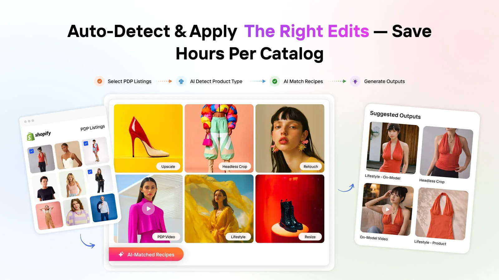
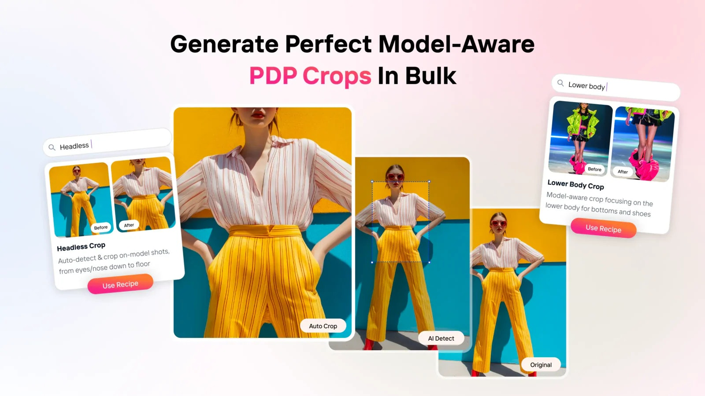

### 🎬 관련 영상
- [🎥 영상 보기](https://ph-files.imgix.net/176bc00a-acdd-4e68-8a4f-b9368f48f0c3.jpeg?auto=format)

---

## 18. [Off Autopilot](https://www.producthunt.com/products/off-autopilot-2)
**Votes**: 43 | **도입 난이도**: 하 | **신뢰도**: 상
**Tagline**: Curated, human-written articles about agentic coding
**서비스 링크**: https://www.producthunt.com/r/OBOVUQAA65BAJ5

**태그**: Newsletter, AI Coding, DeveloperTools, Agent

### 📌 이 서비스 한눈에 보기
광고와 저질 콘텐츠를 배제한 에이전틱 코딩 전문 큐레이션 뉴스레터

### 🔑 주요 기능
- 에이전틱 코딩 분야의 고품질 정보 선별
- 광고성 및 저질(slop) 콘텐츠로부터의 탈피
- 사람이 직접 작성한 신뢰도 높은 아티클 제공

### 🙋 사용자에게 어떤 점이 좋은가
정보 과잉 시대에 에이전틱 코딩에 관한 핵심적인 인사이트만 빠르게 습득할 수 있습니다.

### ✅ 지금 바로 써볼 기능
- 뉴스레터 구독하기
- 주간 큐레이션 리스트 확인하기

### ⚠️ 사용 전 확인할 점
- 주간 단위로 발행되므로 실시간 정보 업데이트 속도는 느릴 수 있음
- 큐레이션된 콘텐츠의 범위가 특정 주제에 국한될 수 있음

### 🧭 확인이 더 필요한 정보
뉴스레터의 구체적인 발행 요일과 아티클의 심도에 대한 정보가 추가로 필요합니다.

### 📸 스크린샷 및 갤러리
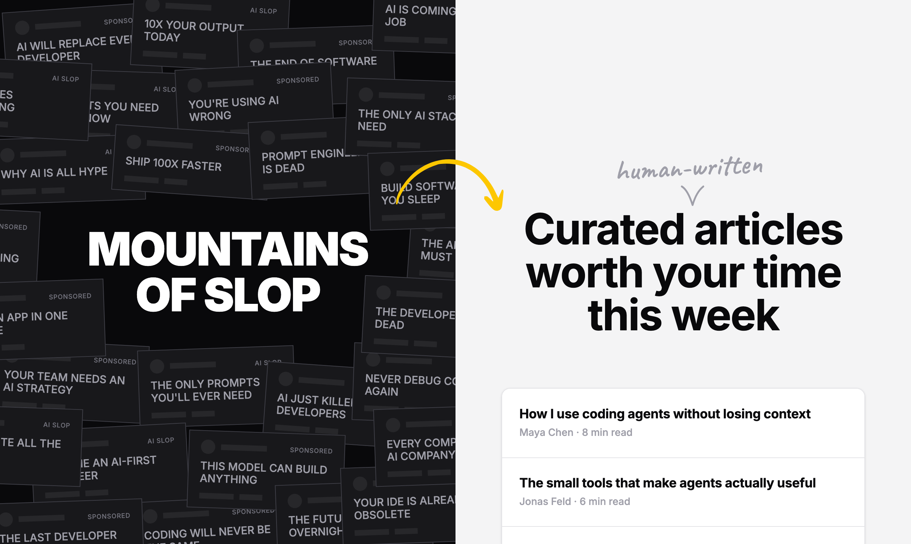

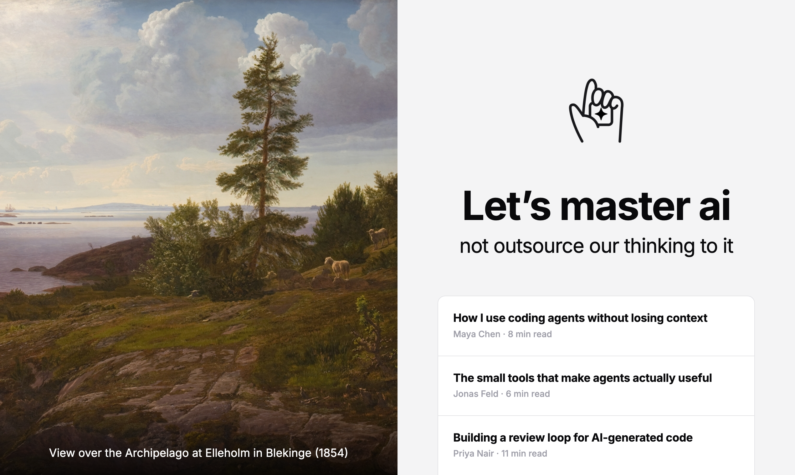

---

## 19. [TaskFord](https://www.producthunt.com/products/taskford)
**Votes**: 40 | **도입 난이도**: 중 | **신뢰도**: 상
**Tagline**: Plan, track, and align work across every project
**서비스 링크**: https://www.producthunt.com/r/Z7SI2IYTU3P2UK

**태그**: Project Management, Collaboration, Productivity, Workflow, AI Tool

### 📌 이 서비스 한눈에 보기
프로젝트 관리부터 협업, 리소스 관리까지 하나의 워크스페이스로 통합한 올인원 워크 딜리버리 플랫폼

### 🔑 주요 기능
- 프로젝트, 작업, 협업, 리소스, 타임라인의 통합 관리
- 여러 도구를 번갈아 사용하는 '툴 스프롤(Tool Sprawl)' 문제 해결
- 전략적 로드맵부터 일상적인 실행 단계까지 전체 운영 라이프사이클 중앙 집중화

### 🙋 사용자에게 어떤 점이 좋은가
파편화된 업무 도구들을 하나로 통합하여 데이터 유실을 방지하고, 팀 전체의 업무 정렬(Alignment)을 용이하게 합니다.

### ✅ 지금 바로 써볼 기능
- 기존 프로젝트 데이터 통합 테스트
- 로드맵 및 타임라인 설정 기능 확인
- 팀 협업 워크스페이스 구축

### ⚠️ 사용 전 확인할 점
- 기존에 사용 중인 개별 전문 도구들과의 데이터 마이그레이션 난이도 확인 필요
- 모든 기능을 통합 관리할 때 발생하는 초기 설정 복잡성

### 🧭 확인이 더 필요한 정보
현재 제공되는 구체적인 기능 목록과 타사 서비스와의 연동 범위에 대한 정보가 부족합니다.

### 📸 스크린샷 및 갤러리
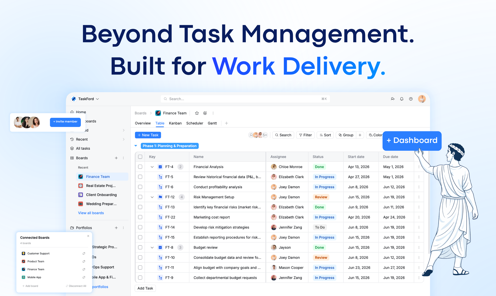
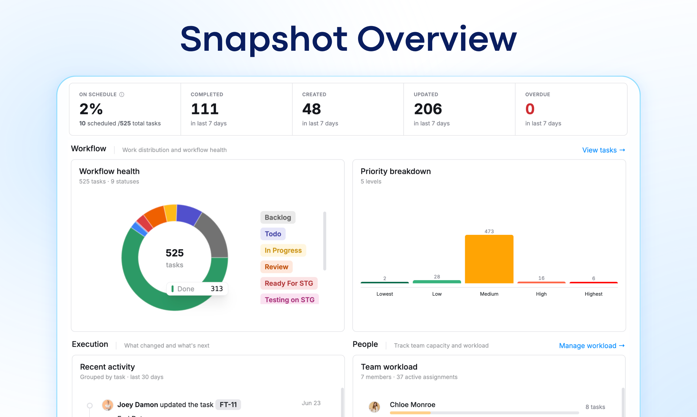
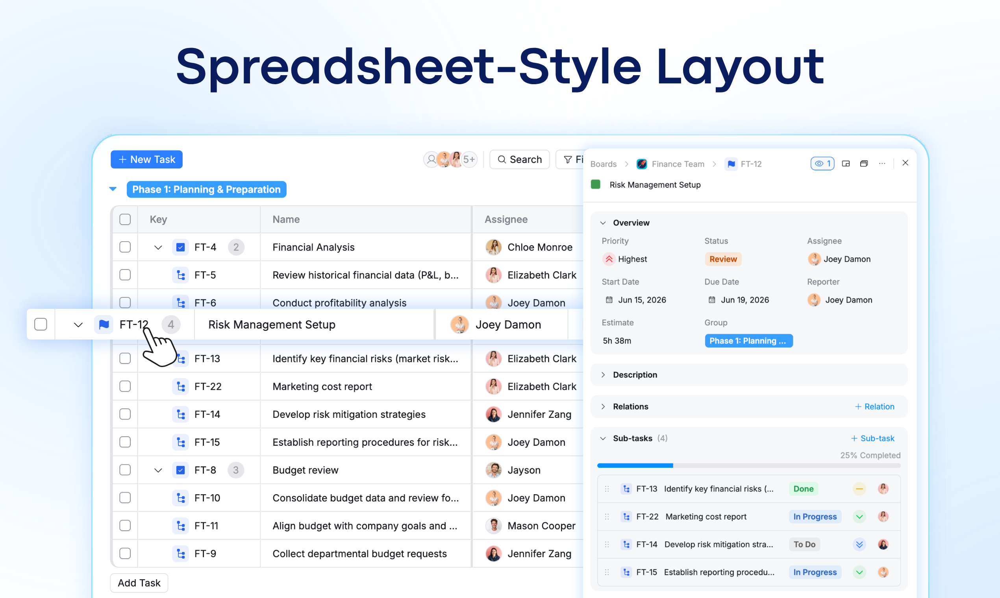

---

## 20. [Liner Developer Platform](https://www.producthunt.com/products/liner-developer-platform)
**Votes**: 35 | **도입 난이도**: 하 | **신뢰도**: 상
**Tagline**: Build search agents with 10x cheaper web search
**서비스 링크**: https://www.producthunt.com/r/MUYUPG3DKZCTAK

**태그**: DevTool, AI, SearchAPI, Automation, Agent, AI Tool

### 📌 이 서비스 한눈에 보기
OpenAI 대비 1/10 비용으로 강력한 웹 검색 기능을 제공하는 AI 에이전트 개발 플랫폼

### 🔑 주요 기능
- 저비용 고효율의 웹 검색 API 제공 (1,000회 요청당 $1부터 시작)
- 웹 검색, 학술 검색, 인용 답변, 딥 리서치 등 다양한 검색 에이전트 기능 지원
- AI 애플리케이션 개발자를 위한 특화된 검색 도구 세트

### 🙋 사용자에게 어떤 점이 좋은가
AI 앱 개발 시 발생하는 높은 검색 비용 부담을 획기적으로 줄이면서, 검색 결과의 신뢰도를 높이는 다양한 기능을 즉시 도입할 수 있습니다.

### ✅ 지금 바로 써볼 기능
- 기존 AI 서비스의 검색 비용과 비교 분석하기
- 학술 및 딥 리서치 기능 테스트하기
- API 연동을 통한 검색 에이전트 프로토타입 제작하기

### ⚠️ 사용 전 확인할 점
- OpenAI 등 타 서비스와의 검색 품질 및 정확도 비교 필요
- 사용량 증가에 따른 비용 구조 및 호출 제한 정책 확인 필요

### 🧭 확인이 더 필요한 정보
제시된 최저 가격 외의 상세 요금 체계와 API 호출 제한(Rate Limit)에 대한 정보가 추가로 필요합니다.

### 📸 스크린샷 및 갤러리
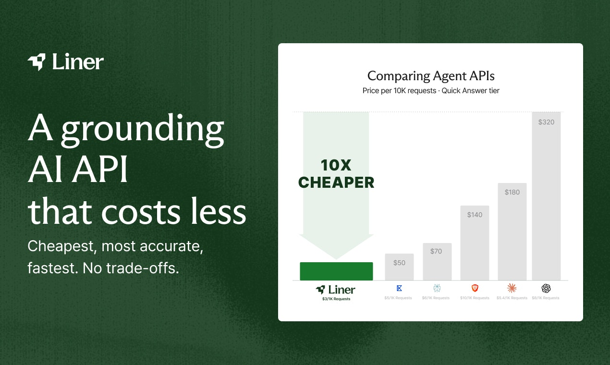
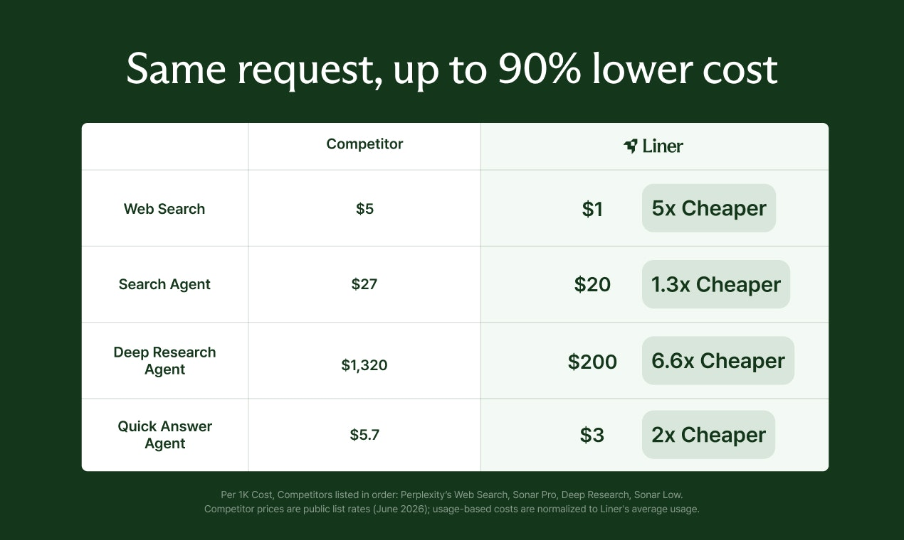
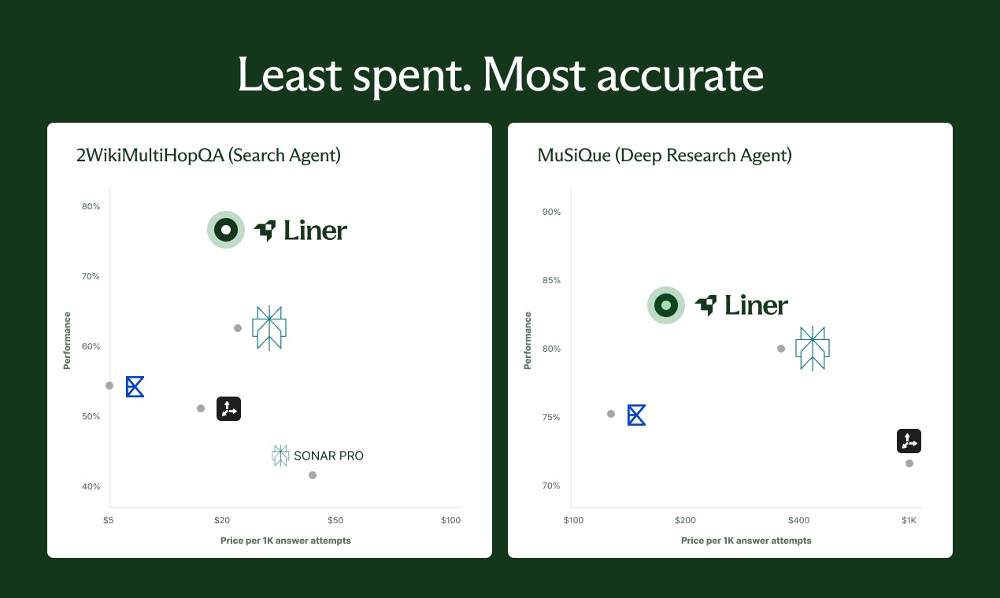

### 🎬 관련 영상
- [🎥 영상 보기](https://ph-files.imgix.net/10b813a6-716c-4245-a733-f2cd55bf95ed.jpeg?auto=format)

---

## 21. [Dr Kalam OS](https://www.producthunt.com/products/dr-kalam-os)
**Votes**: 31 | **도입 난이도**: 중 | **신뢰도**: 상
**Tagline**: A premium, portable, localized live workstation in pendrive.
**서비스 링크**: https://www.producthunt.com/r/5FMSPX7MJ7SYQB

**태그**: OS, OpenSource, Security, Portable, Linux, Design

### 📌 이 서비스 한눈에 보기
USB 하나로 어디서든 안전하게 사용할 수 있는 고성능 로컬라이즈 데비안 기반 라이브 OS

### 🔑 주요 기능
- 데비안 기반의 최적화된 오픈소스 라이브 운영체제
- 내장 저장소를 건드리지 않는 USB 기반의 독립적 작업 환경
- 저사양 하드웨어 지원 및 현지 언어 최적화(Localization)

### 🙋 사용자에게 어떤 점이 좋은가
기존 컴퓨터의 데이터를 보호하면서도, USB만 있으면 언제 어디서나 나만의 보안 데스크톱 환경을 즉시 구축할 수 있습니다.

### ✅ 지금 바로 써볼 기능
- USB 플래시 드라이브에 OS 이미지 굽기
- 저사양 PC에서 부팅 및 하드웨어 호환성 테스트
- 현지 언어 설정 및 최적화 확인

### ⚠️ 사용 전 확인할 점
- USB 드라이브의 읽기/쓰기 속도에 따른 시스템 성능 제약
- 하드웨어 드라이버 호환성 여부 사전 확인 필요

### 🧭 확인이 더 필요한 정보
구체적인 하드웨어 최소 사양 및 지원하는 현지 언어의 범위가 명시되지 않았습니다.

### 📸 스크린샷 및 갤러리

---

## 22. [Retext](https://www.producthunt.com/products/retext)
**Votes**: 31 | **도입 난이도**: 하 | **신뢰도**: 상
**Tagline**: Snippets that expand anywhere you type on macOS
**서비스 링크**: https://www.producthunt.com/r/K25SFQ3SZBRZ7N

**태그**: Productivity, macOS, Automation, TextExpander, AI Tool, DevTool, Email

### 📌 이 서비스 한눈에 보기
macOS 어디서든 짧은 단축어로 긴 문장을 자동 완성하는 텍스트 확장 도구

### 🔑 주요 기능
- 짧은 트리거를 입력하면 설정된 전체 텍스트로 즉시 확장
- macOS 시스템 전체의 모든 앱에서 작동
- 계정 생성 없이 즉시 사용 가능한 간편함

### 🙋 사용자에게 어떤 점이 좋은가
주소, 이메일 서명, 코드 블록 등 반복적인 타이핑 작업을 획기적으로 줄여 업무 효율을 높여줍니다.

### ✅ 지금 바로 써볼 기능
- 자주 쓰는 이메일 서명 등록하기
- 자주 사용하는 주소나 계좌번호 단축어 설정하기
- 반복되는 코드 스니펫 등록하여 테스트하기

### ⚠️ 사용 전 확인할 점
- macOS 전용 앱이므로 다른 운영체제에서는 사용 불가
- 무료 체험 후 유료 전환 정책 확인 필요

### 🧭 확인이 더 필요한 정보
무료 체험 기간 및 유료 플랜의 구체적인 기능 차이에 대한 정보가 명시되지 않았습니다.

### 📸 스크린샷 및 갤러리
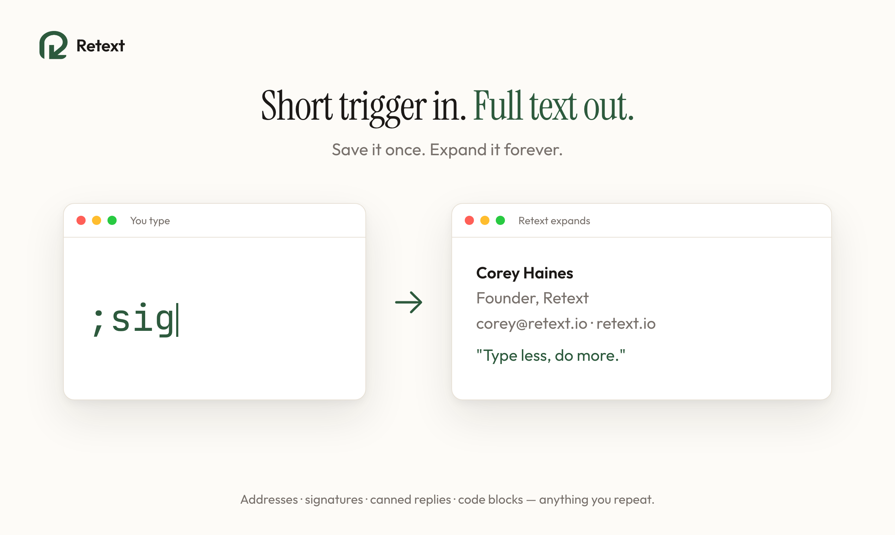
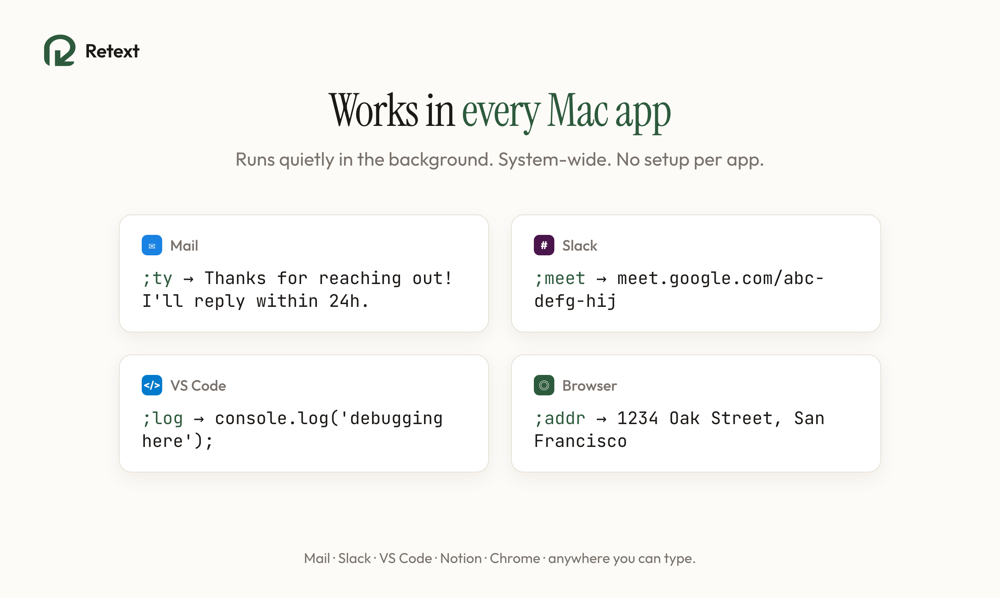
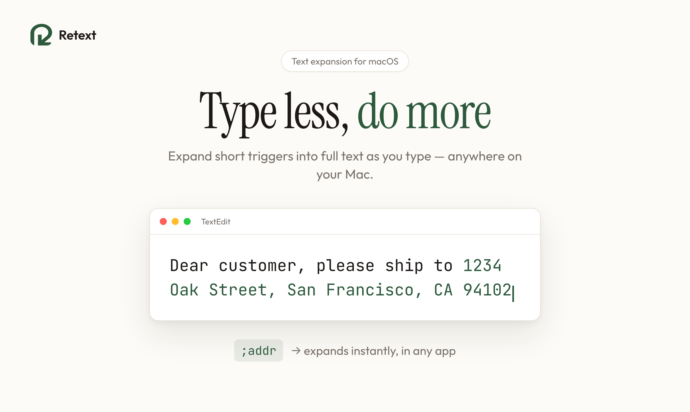

### 🎬 관련 영상
- [🎥 영상 보기](https://ph-files.imgix.net/45d79ae5-ad4a-4232-806c-4fa062cef12d.jpeg?auto=format)

---

## 23. [Registry Lookup](https://www.producthunt.com/products/registry-lookup)
**Votes**: 27 | **도입 난이도**: 하 | **신뢰도**: 상
**Tagline**: Free, open API for 521M+ company records worldwide 
**서비스 링크**: https://www.producthunt.com/r/FR6BYGFNACVG6H

**태그**: DevTool, Data, API, B2B

### 📌 이 서비스 한눈에 보기
전 세계 5억 개 이상의 기업 정보를 무료로 탐색할 수 있는 오픈 API 서비스

### 🔑 주요 기능
- 전 세계 200개국 이상, 309개 관할 구역의 5억 2,100만 개 법인 데이터 제공
- 기업 등록 데이터, 등록 번호, 주소, 법적 형태 및 상태 정보 포함
- 유사 데이터 제공업체 대비 10배 더 많은 무료 API 호출량 제공

### 🙋 사용자에게 어떤 점이 좋은가
글로벌 기업 데이터를 검색하고 검증해야 하는 개발자나 분석가에게 비용 부담 없이 방대한 데이터 소스를 제공합니다.

### ✅ 지금 바로 써볼 기능
- API를 통한 전 세계 법인 데이터 검색 테스트
- 무료 호출 한도 내에서 데이터 정확도 검증
- 기존 데이터베이스와의 연동 테스트

### ⚠️ 사용 전 확인할 점
- 데이터의 최신성 및 관할 구역별 정확도 확인 필요
- 무료 호출 한도 초과 시 서비스 이용 제한 가능성

### 🧭 확인이 더 필요한 정보
무료 호출 한도의 구체적인 수치와 유료 플랜의 상세 조건에 대한 정보가 명시되지 않았습니다.

### 📸 스크린샷 및 갤러리
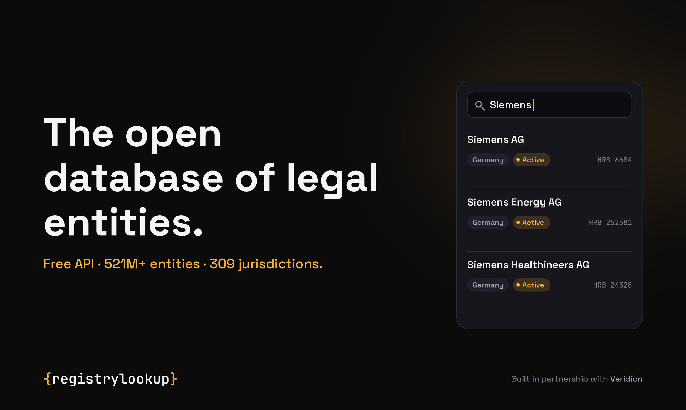
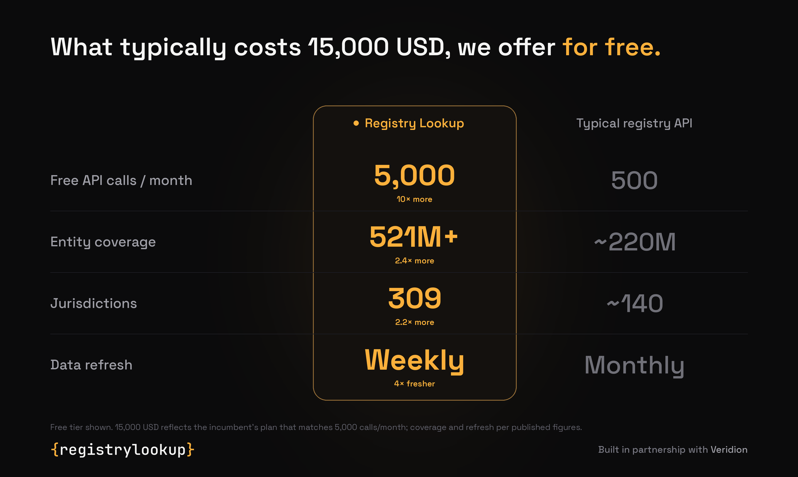
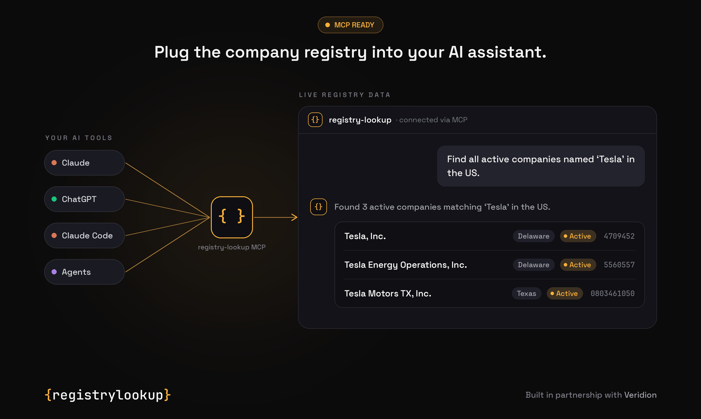

---

## 24. [Pixelarticons](https://www.producthunt.com/products/pixelarticons)
**Votes**: 21 | **도입 난이도**: 하 | **신뢰도**: 상
**Tagline**: Deliberately pixelated icons
**서비스 링크**: https://www.producthunt.com/r/M6ESCXV3ANXEND

**태그**: DesignResource, PixelArt, UI/UX, Asset, AI Tool

### 📌 이 서비스 한눈에 보기
구독 없이 평생 소장 가능한 수천 개의 핸드크래프트 픽셀 아트 아이콘 시스템

### 🔑 주요 기능
- Base(4,159개), Mini(409개), Prime(201개)로 구성된 체계적인 3종 아이콘 세트
- 구독형 모델이 아닌 일회성 구매 및 평생 업데이트 방식
- SVG, Figma, IconJar 지원 및 AI 트레이싱 없는 수작업 제작

### 🙋 사용자에게 어떤 점이 좋은가
레트로한 감성의 디자인이 필요한 프로젝트에 즉시 적용 가능한 방대한 양의 고품질 아이콘을 구독료 부담 없이 확보할 수 있습니다.

### ✅ 지금 바로 써볼 기능
- 816개의 무료 MIT 라이선스 아이콘 다운로드하여 테스트하기
- 프로젝트 요구사항에 맞는 세트(Base, Mini, Prime) 선택하기
- Figma 또는 IconJar에 불러와 디자인 워크플로우에 적용하기

### ⚠️ 사용 전 확인할 점
- 무료 제공분 외의 아이콘은 일회성 유료 구매가 필요함
- 픽셀 아트 특유의 스타일로 인해 일반적인 UI 디자인에는 부적합할 수 있음

### 🧭 확인이 더 필요한 정보
전체 아이콘 세트의 정확한 가격 정책과 각 세트별 상세 사양 확인이 필요합니다.

### 📸 스크린샷 및 갤러리
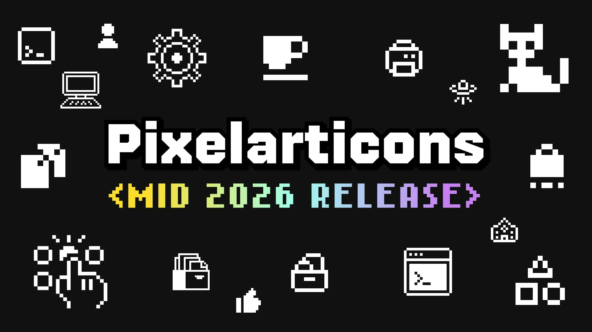
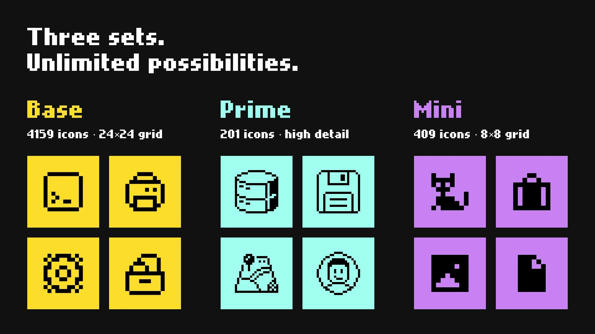
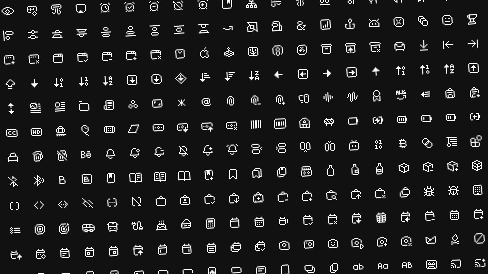

---

## 25. [PressPilot](https://www.producthunt.com/products/presspilot)
**Votes**: 20 | **도입 난이도**: 하 | **신뢰도**: 상
**Tagline**: Write, send and track press releases in minutes, not days
**서비스 링크**: https://www.producthunt.com/r/CG3ITIGXIA74FD

**태그**: AI, PR, Automation, Marketing, AI Tool, Email

### 📌 이 서비스 한눈에 보기
AI를 활용해 보도자료 작성부터 기자 배포 및 성과 추적까지 한 번에 해결하는 자동화 플랫폼

### 🔑 주요 기능
- AI 기반의 신속한 보도자료 초안 작성 기능
- 섹터, 국가, 언어별 맞춤형 기자 데이터베이스 제공
- 실시간 오픈 및 클릭률 추적을 통한 배포 성과 분석

### 🙋 사용자에게 어떤 점이 좋은가
수동으로 진행하던 보도자료 작성과 기자 컨택 과정을 자동화하여 홍보 업무 시간을 획기적으로 단축할 수 있습니다.

### ✅ 지금 바로 써볼 기능
- 뉴스 내용을 입력하여 AI 보도자료 초안 생성해보기
- 타겟팅할 기자 데이터베이스 필터링 기능 확인하기
- 배포 후 실시간 트래킹 대시보드 살펴보기

### ⚠️ 사용 전 확인할 점
- AI가 작성한 문구의 사실 관계 및 톤앤매너 검수 필요
- 제공되는 기자 데이터베이스의 최신성 및 정확도 확인 필요

### 🧭 확인이 더 필요한 정보
구체적인 기자 데이터베이스의 규모와 업데이트 주기에 대한 정보가 명시되지 않았습니다.

### 📸 스크린샷 및 갤러리
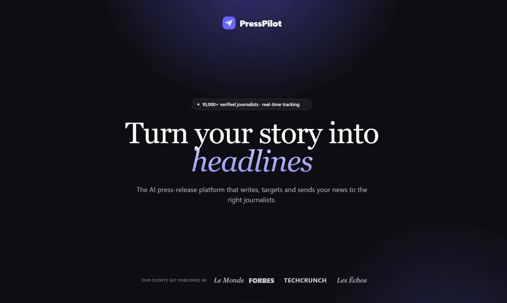
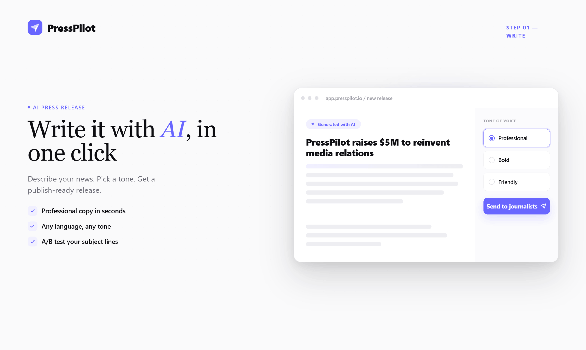
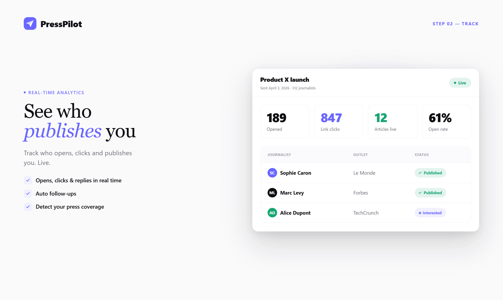

---

## 26. [quyash - AI product visuals in 60 sec.](https://www.producthunt.com/products/quyash-ai-product-photo-generator)
**Votes**: 20 | **도입 난이도**: 하 | **신뢰도**: 상
**Tagline**: AI product visuals for Amazon, Etsy & Shopify in 60 seconds
**서비스 링크**: https://www.producthunt.com/r/QX2DLH6O6YTZT4

**태그**: AI, E-commerce, DesignTool, Automation, AI Tool, Prompting, Design, Sales

### 📌 이 서비스 한눈에 보기
전문 촬영 없이 60초 만에 완성하는 이커머스용 AI 제품 이미지 생성 도구

### 🔑 주요 기능
- 템플릿 기반의 간편한 AI 이미지 생성 (프롬프트 입력 불필요)
- Amazon, Etsy, Shopify 등 이커머스 판매에 최적화된 25종의 템플릿 제공
- 고가의 스튜디오 촬영 비용과 시간을 획기적으로 절감

### 🙋 사용자에게 어떤 점이 좋은가
디자인 기술이나 전문 장비 없이도 제품 사진 한 장만으로 고품질의 리스팅 이미지를 즉시 제작할 수 있습니다.

### ✅ 지금 바로 써볼 기능
- 보유 중인 제품 사진 업로드하기
- 원하는 스타일의 템플릿(Lifestyle, Studio 등) 선택하기
- 60초 만에 생성된 결과물 확인 및 다운로드하기

### ⚠️ 사용 전 확인할 점
- 사용자의 원본 사진 품질에 따라 결과물의 완성도가 달라질 수 있음
- 특정 템플릿 외의 독창적인 디자인 구현에는 한계가 있을 수 있음

### 🧭 확인이 더 필요한 정보
구체적인 요금 체계 및 생성 가능한 이미지 개수 제한에 대한 정보가 명시되지 않았습니다.

### 📸 스크린샷 및 갤러리
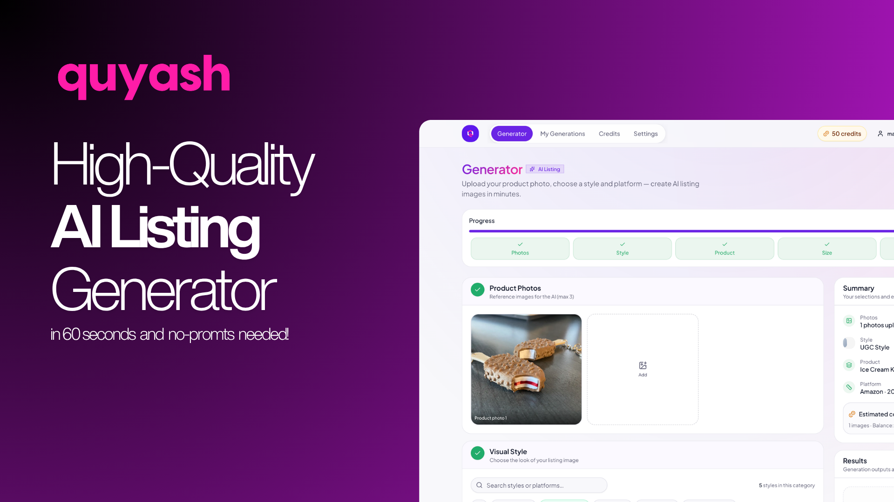
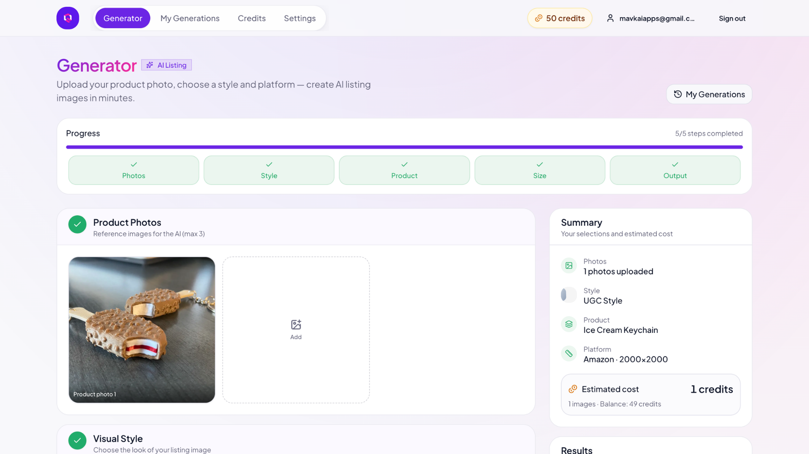
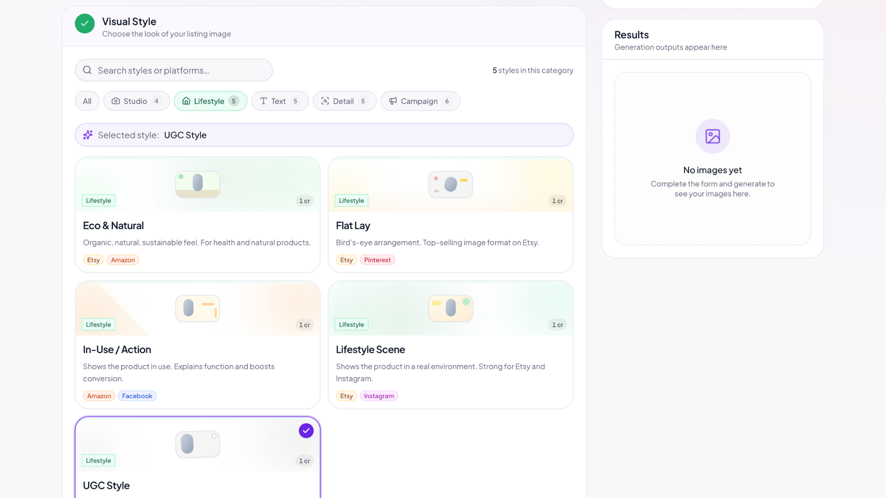

### 🎬 관련 영상
- [🎥 영상 보기](https://ph-files.imgix.net/a3bcb7c8-d813-41ad-8e71-02b81a765b48.jpeg?auto=format)

---

## 27. [Aruvi](https://www.producthunt.com/products/aruvi)
**Votes**: 19 | **도입 난이도**: 중 | **신뢰도**: 상
**Tagline**: The workspace where humans and AI agents ship together.
**서비스 링크**: https://www.producthunt.com/r/TV2ZYUDM32W3AN

**태그**: DevTool, AI-Agent, Collaboration, Workflow-Automation, Agent, Automation, AI Tool, API

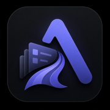

### 📌 이 서비스 한눈에 보기
인간과 AI 에이전트가 협업하여 업무를 완결할 수 있는 통합 워크스페이스

### 🔑 주요 기능
- 이슈 트래킹, 문서화, 지식 관리 기능의 통합
- MCP 기반의 AI 에이전트 워크플로우 및 권한 관리
- 코드 리뷰 자동화 및 재사용 가능한 컨텍스트 보존

### 🙋 사용자에게 어떤 점이 좋은가
단순한 협업 도구를 넘어 AI 에이전트에게 업무를 할당하고 관리할 수 있어, 개발 및 운영 루프의 효율성을 극대화할 수 있습니다.

### ✅ 지금 바로 써볼 기능
- AI 에이전트에게 스코프가 제한된 API 키를 부여하여 워크플로우 테스트하기
- 이슈 트래킹과 문서화 기능을 연동하여 팀 지식 베이스 구축하기
- PR 자동 코드 리뷰 기능 설정 및 BYOK(Bring Your Own Key) 연동하기

### ⚠️ 사용 전 확인할 점
- AI 에이전트에게 부여된 API 권한 범위에 대한 보안 검토 필요
- 기존 워크플로우(Jira, Notion 등)와의 전환 비용 발생 가능성

### 🧭 확인이 더 필요한 정보
현재 제공되는 MCP(Model Context Protocol) 지원 범위와 구체적인 보안 정책에 대한 확인이 필요합니다.

### 📸 스크린샷 및 갤러리
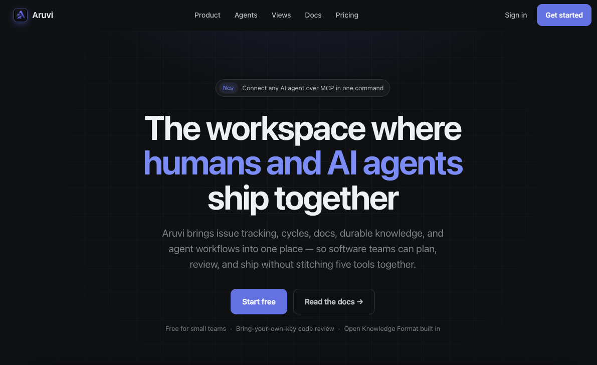
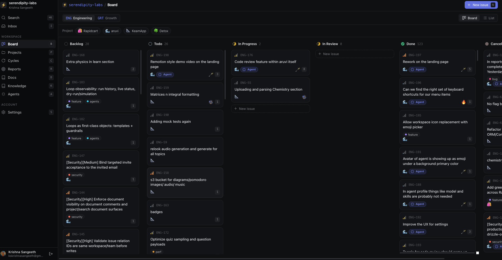
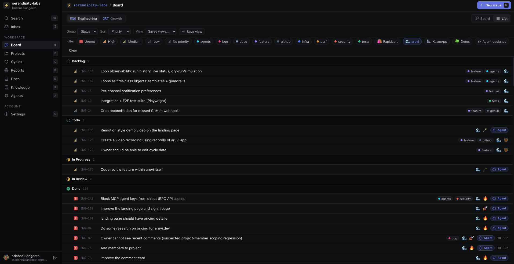

---

## 28. [Extella](https://www.producthunt.com/products/extella-ai)
**Votes**: 16 | **도입 난이도**: 하 | **신뢰도**: 상
**Tagline**: Add any GitHub repo in one click. No terminal needed.
**서비스 링크**: https://www.producthunt.com/r/P7YEZQORZ2DTLC

**태그**: DevTool, AI, Automation, GitHub, AI Tool

### 📌 이 서비스 한눈에 보기
터미널 작업 없이 클릭 한 번으로 GitHub 저장소를 즉시 실행 가능한 AI 전문가로 변환하는 도구

### 🔑 주요 기능
- 복잡한 클론, 의존성 설치, 환경 설정 과정을 자동화
- GitHub 저장소를 즉시 실행 가능한 'Expert'로 변환
- 실행된 환경을 재사용하거나 파이프라인에 통합 가능

### 🙋 사용자에게 어떤 점이 좋은가
개발 환경 구축에 드는 시간과 터미널 오류 해결에 소모되는 에너지를 획기적으로 줄여줍니다.

### ✅ 지금 바로 써볼 기능
- 원하는 GitHub 저장소 검색 및 선택
- 클릭 한 번으로 환경 구축 및 실행 테스트
- 생성된 Expert를 활용한 반복 작업 자동화

### ⚠️ 사용 전 확인할 점
- 로컬 환경이 아닌 클라우드 기반 실행 시 데이터 보안 및 프라이버시 확인 필요
- 복잡한 커스텀 설정이 필요한 저장소의 경우 자동화 범위 제한 가능성

### 🧭 확인이 더 필요한 정보
실행되는 인프라의 사양(GPU 등)과 데이터 보안 정책에 대한 구체적인 정보가 필요합니다.

### 📸 스크린샷 및 갤러리
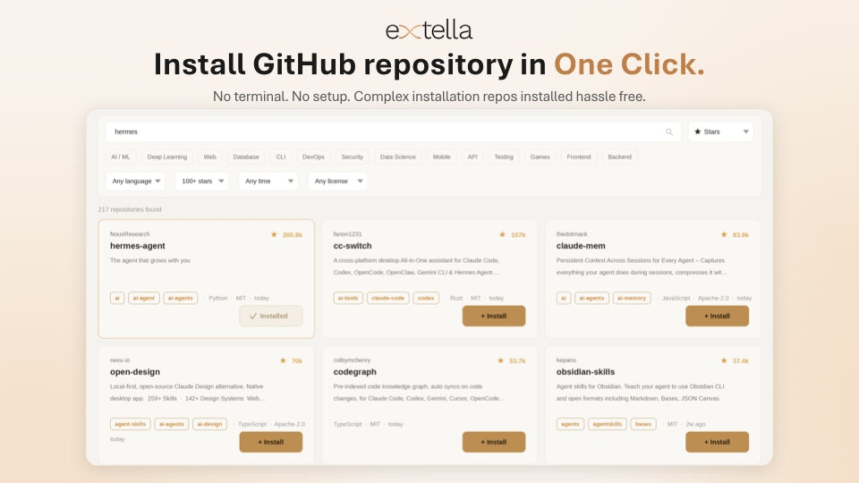
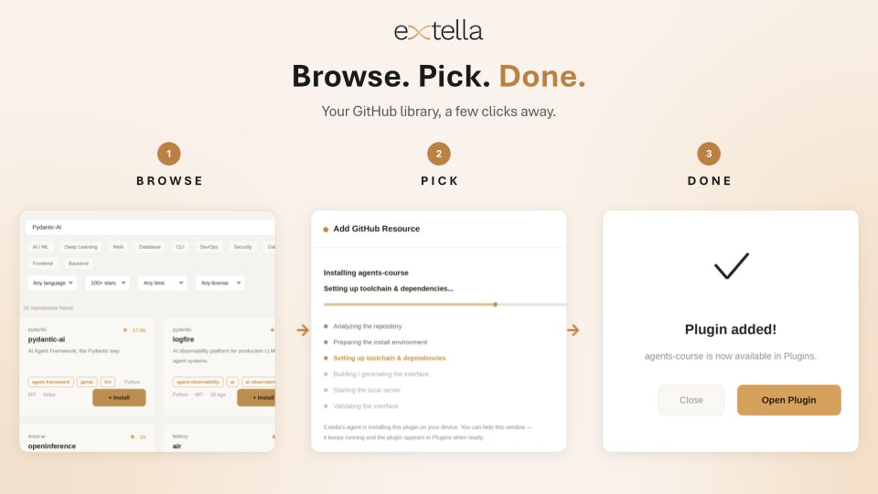
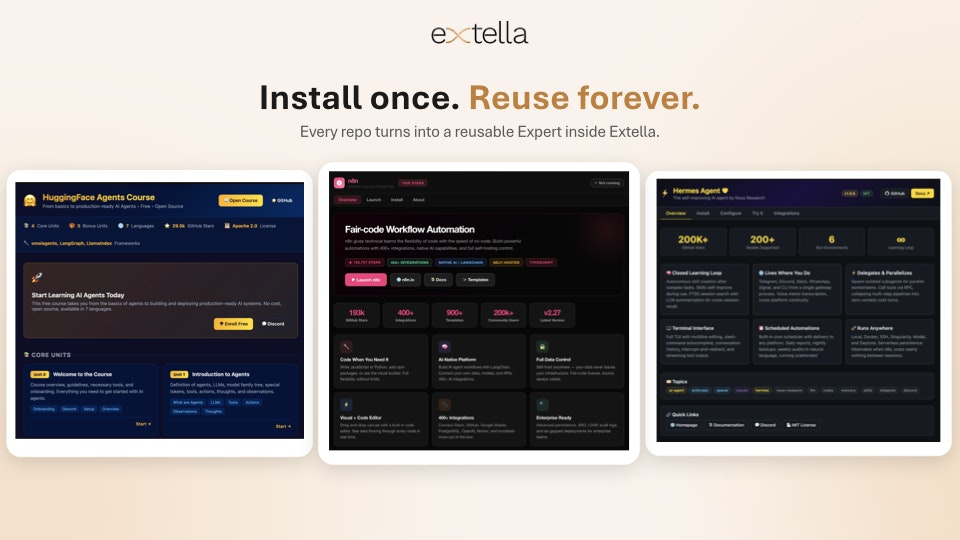

### 🎬 관련 영상
- [🎥 영상 보기](https://ph-files.imgix.net/4d9d12a4-4eb5-4457-bd9b-1eaaf6ef393a.jpeg?auto=format)

---

## 29. [Maskin](https://www.producthunt.com/products/maskin)
**Votes**: 16 | **도입 난이도**: 중 | **신뢰도**: 상
**Tagline**: AI made individuals faster. Maskin makes companies smarter.
**서비스 링크**: https://www.producthunt.com/r/2Z73ETCXXKK4HS

**태그**: AI, Automation, OpenSource, DevOps, ProductOps, AI Tool

### 📌 이 서비스 한눈에 보기
고객 피드백부터 제품 출시 및 결과 측정까지의 전 과정을 자동화하는 오픈소스 AI 워크플로우 빌더

### 🔑 주요 기능
- 고객 신호 수집부터 결과 측정까지의 자동화 루프 구축
- 기업을 AI-native 환경으로 전환하는 워크플로우 제공
- 오픈소스 기반의 투명하고 확장 가능한 구조

### 🙋 사용자에게 어떤 점이 좋은가
데이터 수집과 결과 분석 사이의 수동 작업을 줄여, 팀이 제품 개선과 실험에만 집중할 수 있도록 돕습니다.

### ✅ 지금 바로 써볼 기능
- 현재 팀의 데이터 흐름(Loop) 분석하기
- 오픈소스 저장소 클론 및 로컬 환경 구축
- 기존 고객 피드백 루프에 Maskin 적용 테스트

### ⚠️ 사용 전 확인할 점
- 오픈소스 제품이므로 초기 설정 및 유지보수 역량 필요
- 자동화 루프 설계에 대한 기술적 이해도 요구

### 🧭 확인이 더 필요한 정보
구체적인 데이터 소스 연동 범위와 기존 툴과의 통합 방식에 대한 상세 정보가 필요합니다.

### 📸 스크린샷 및 갤러리
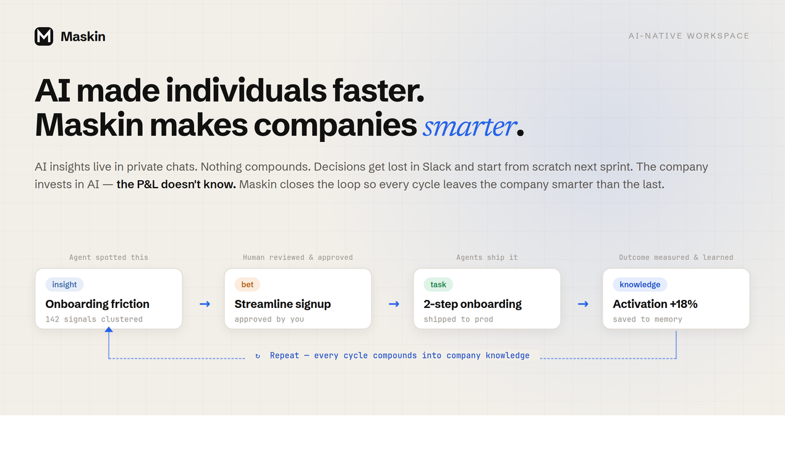
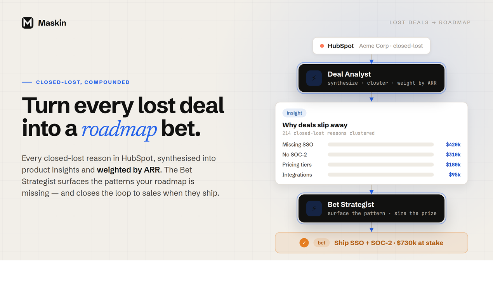
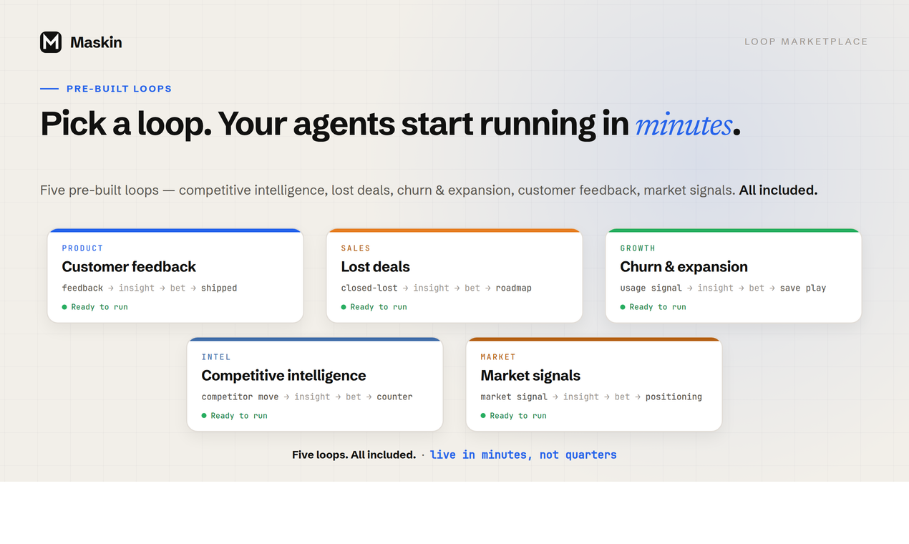

### 🎬 관련 영상
- [🎥 영상 보기](https://ph-files.imgix.net/b432d645-6627-48f1-92ba-2c9fefe21a4c.jpeg?auto=format)

---

## 30. [SquidOut](https://www.producthunt.com/products/squidout)
**Votes**: 15 | **도입 난이도**: 하 | **신뢰도**: 상
**Tagline**: Squid Game meets the World Cup (survive or get eliminated)
**서비스 링크**: https://www.producthunt.com/r/MCQON5U6A53D44

**태그**: Game, Sports, Social

### 📌 이 서비스 한눈에 보기
월드컵 승부 예측을 통해 최후의 1인을 가리는 서바이벌 게임

### 🔑 주요 기능
- 매 경기마다 승리할 팀을 한 팀씩 선택하는 방식
- 선택한 팀이 승리해야 생존하며, 무승부나 패배 시 즉시 탈락
- 동일한 팀을 중복해서 선택할 수 없는 전략적 요소 포함

### 🙋 사용자에게 어떤 점이 좋은가
월드컵 기간 동안 친구들과 함께 긴장감 넘치는 승부 예측 게임을 즐길 수 있습니다.

### ✅ 지금 바로 써볼 기능
- 제공된 링크를 통해 게임 참여하기
- 매 경기마다 전략적으로 승리할 팀 선택하기

### ⚠️ 사용 전 확인할 점
- 무승부 시에도 탈락하므로 예측의 난이도가 높음
- 한 번의 실수로 게임에서 즉시 탈락할 수 있음

### 🧭 확인이 더 필요한 정보
현재 진행 중인 월드컵 일정에 따라 게임 참여 가능 여부가 달라질 수 있습니다.

### 📸 스크린샷 및 갤러리
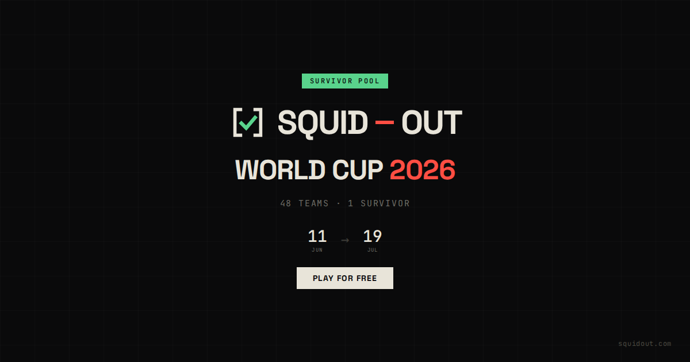
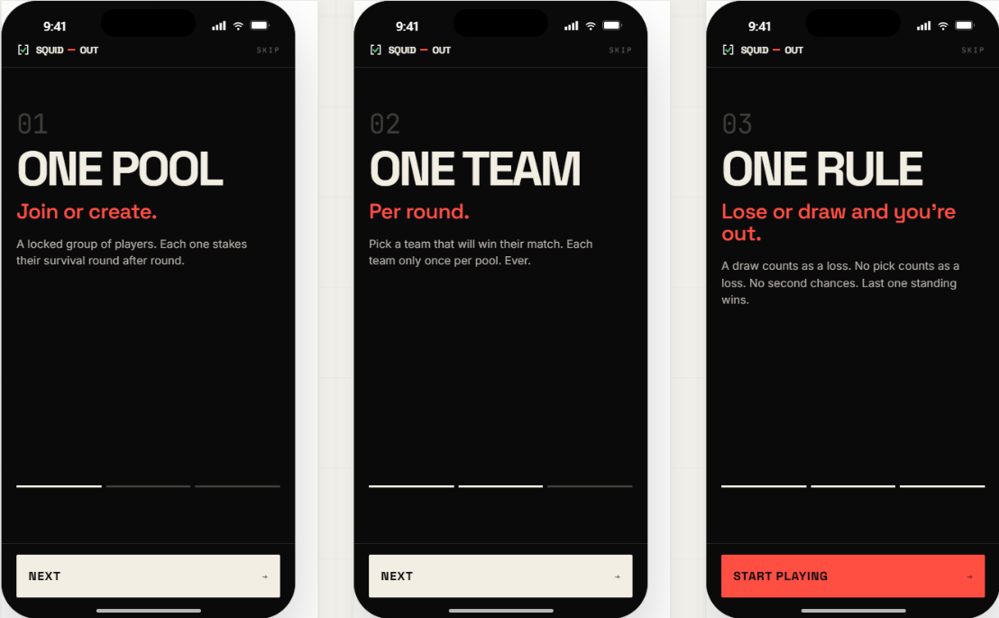
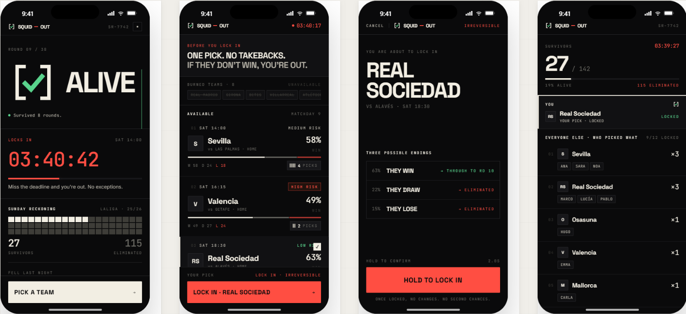

---

