# 🚀 Product Hunt Daily Top 30 (2026-06-26)

## 오늘의 요약
오늘의 트렌드는 단순한 챗봇을 넘어, 사용자의 데이터와 업무 환경을 깊이 이해하고 실제 액션을 수행하는 'AI 에이전트'와 '워크플로우 자동화'에 집중되었습니다. 특히 흩어진 업무 컨텍스트를 통합하거나 브라우저를 직접 제어하는 등 실질적인 업무 수행 능력을 갖춘 솔루션들이 주목받았습니다.

### 오늘의 핵심 포인트
- 다양한 업무 데이터와 맥락을 통합하여 스스로 판단하고 실행하는 지능형 AI 에이전트 솔루션이 다수 등장했습니다.
- 단일 API 통합이나 노코드 방식처럼 복잡한 기술적 장벽을 낮추어 즉각적인 업무 자동화를 구현하는 도구들이 강조되었습니다.
- 영업, 제품 관리, 데이터룸 운영 등 특정 전문 직무의 워크플로우를 자동화하여 생산성을 극대화하는 타겟형 서비스들이 눈에 띄었습니다.

**오늘의 태그**: AI 에이전트, 업무 자동화, SaaS, 생산성 도구, 노코드

## 1. [Oxlo.ai](https://www.producthunt.com/products/oxlo-ai)
**Votes**: 394 | **도입 난이도**: 하 | **신뢰도**: 상
**Tagline**: Scale across AI models without scaling your bill
**서비스 링크**: https://www.producthunt.com/r/DUYNVE7KZKA72Z

**태그**: AI, API, DevTool, SaaS, AI Tool

### 📌 이 서비스 한눈에 보기
다양한 최신 AI 모델을 단일 API로 연결하여 비용 효율적으로 확장할 수 있는 통합 플랫폼

### 🔑 주요 기능
- DeepSeek, Kimi, Llama 등 35개 이상의 프런티어 모델 통합 제공
- 단일 API를 통한 모델 비교 및 용도별 최적 모델 선택 가능
- 예측 가능한 월간 구독 모델과 넉넉한 사용량 제한 제공

### 🙋 사용자에게 어떤 점이 좋은가
여러 AI 모델을 개별적으로 연동할 필요 없이 하나의 API로 관리하며, 비용 폭탄 걱정 없이 용도에 맞는 최적의 모델을 선택해 사용할 수 있습니다.

### ✅ 지금 바로 써볼 기능
- 단일 API를 통한 다양한 모델 호출 테스트
- 사용 사례별 모델 성능 비교 및 캘리브레이션
- 월간 구독 플랜을 통한 비용 예측 시뮬레이션

### ⚠️ 사용 전 확인할 점
- 구독 모델 내 구체적인 사용량 제한 및 초과 과금 정책 확인 필요
- 특정 모델의 응답 속도나 지연 시간(Latency) 차이 확인 필요

### 🧭 확인이 더 필요한 정보
제공되는 35개 이상의 모델별 상세 스펙과 구독 플랜별 구체적인 사용량 한계치가 명시되지 않았습니다.

### 📸 스크린샷 및 갤러리
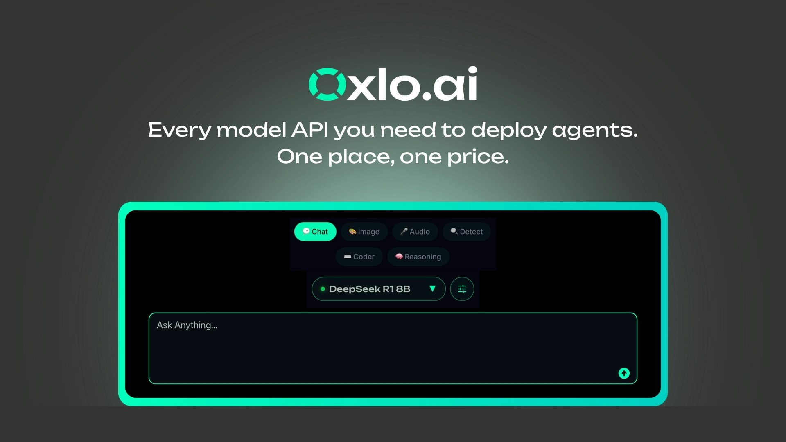
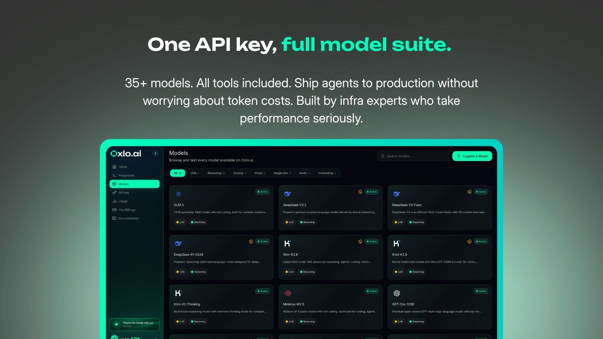
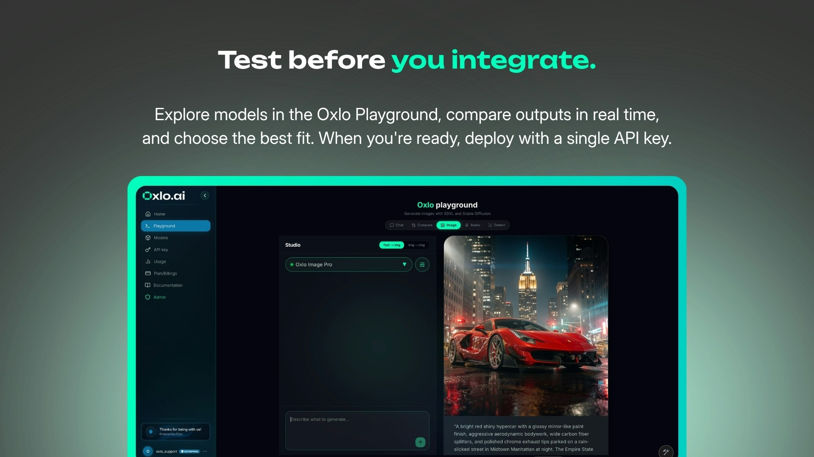

### 🎬 관련 영상
- [🎥 영상 보기](https://ph-files.imgix.net/4cf9f631-c28e-4cd4-8fca-04484c01d914.jpeg?auto=format)

---

## 2. [BrowserAct](https://www.producthunt.com/products/browseract)
**Votes**: 285 | **도입 난이도**: 중 | **신뢰도**: 상
**Tagline**: Web browser automation for AI agents
**서비스 링크**: https://www.producthunt.com/r/37BT52WEVJQBND

**태그**: AI, Automation, Browser, Agent, DevTool, AI Tool

### 📌 이 서비스 한눈에 보기
AI 에이전트가 실제 웹 환경에서 막힘없이 작업할 수 있도록 돕는 브라우저 자동화 레이어

### 🔑 주요 기능
- 차단된 페이지 및 복잡한 웹 시나리오 대응
- 로그인, 폼 작성, 파일 업로드 등 실질적인 브라우징 작업 수행
- 에이전트의 추론을 위한 정제된 웹 데이터 제공

### 🙋 사용자에게 어떤 점이 좋은가
AI 에이전트가 단순 데이터 수집을 넘어 실제 사용자와 유사한 웹 환경에서 복잡한 업무를 자동화할 수 있게 해줍니다.

### ✅ 지금 바로 써볼 기능
- 로그인이 필요한 사이트에서의 자동화 테스트
- 복잡한 폼 입력 및 파일 업로드 워크플로우 실행
- 웹 데이터 추출 및 에이전트 연동 테스트

### ⚠️ 사용 전 확인할 점
- 실제 계정 사용 시 보안 및 계정 차단 위험성 확인 필요
- 다중 작업 실행 시 리소스 관리 및 안정성 검토

### 🧭 확인이 더 필요한 정보
구체적인 API 연동 방식과 지원하는 브라우저 환경에 대한 상세 정보가 필요합니다.

### 📸 스크린샷 및 갤러리
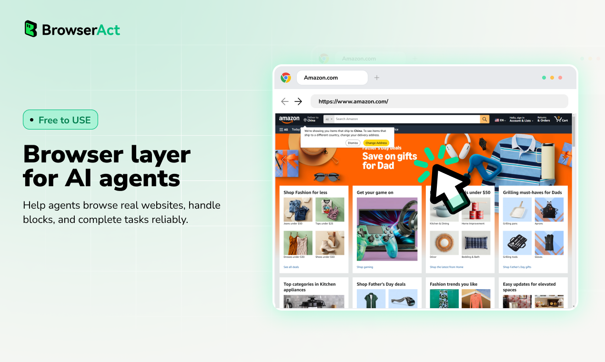
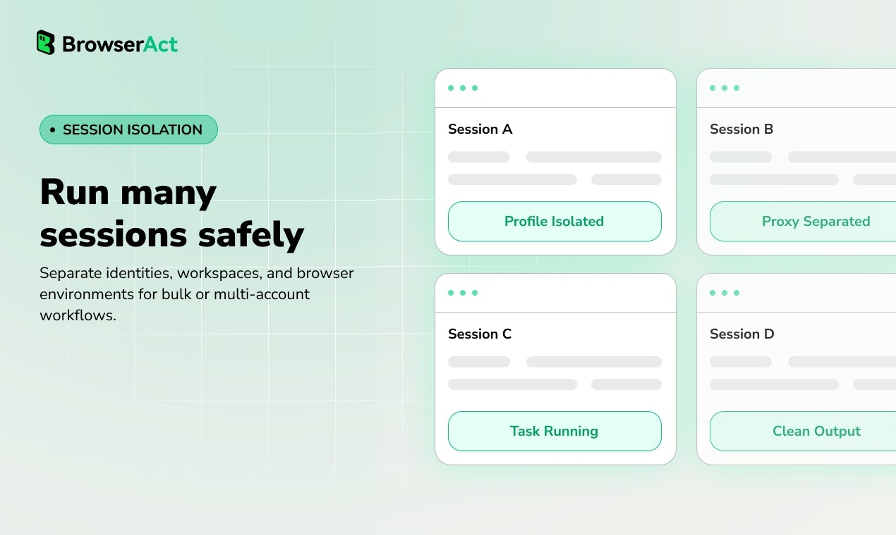
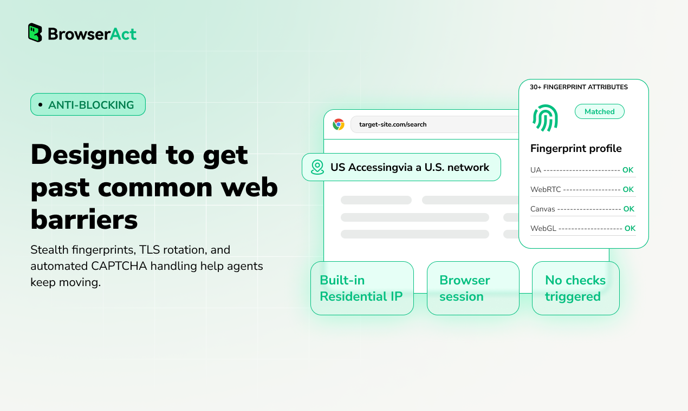

### 🎬 관련 영상
- [🎥 영상 보기](https://ph-files.imgix.net/3a9c0cf8-f5d8-4ecc-a9b5-102cdc2f91e3.jpeg?auto=format)

---

## 3. [Zaro](https://www.producthunt.com/products/zaro)
**Votes**: 265 | **도입 난이도**: 하 | **신뢰도**: 상
**Tagline**: Build agents & apps on top of your context with one prompt.
**서비스 링크**: https://www.producthunt.com/r/KBOJHU4IKBULO7

**태그**: NoCode, Automation, AI-Agent, Productivity, Agent, AI Tool, Prompting, DevTool

### 📌 이 서비스 한눈에 보기
흩어진 업무 데이터를 통합하여 단 하나의 프롬프트로 자동 업데이트되는 앱과 에이전트를 구축하는 도구

### 🔑 주요 기능
- Gmail, Slack, 메모 등 분산된 업무 컨텍스트 통합
- 노코드 방식으로 몇 분 만에 작동하는 소프트웨어 구축
- 데이터 연결을 통한 자동 업데이트 및 유지보수 불필요

### 🙋 사용자에게 어떤 점이 좋은가
여러 곳에 흩어진 정보를 일일이 찾을 필요 없이, 이를 기반으로 실용적인 앱을 즉시 만들어 업무 자동화를 구현할 수 있습니다.

### ✅ 지금 바로 써볼 기능
- 사용 중인 주요 업무 채널(Slack, Gmail 등) 연결하기
- 수집된 데이터를 바탕으로 첫 번째 에이전트 프롬프트 작성하기
- 자동 업데이트 기능이 의도대로 작동하는지 확인하기

### ⚠️ 사용 전 확인할 점
- 개인정보 및 업무 데이터(Gmail, Slack 등) 접근에 따른 보안 검토 필요
- 복잡한 로직이나 고도화된 기능 구현의 한계 가능성

### 🧭 확인이 더 필요한 정보
데이터 연결 방식의 보안 수준과 외부 서비스와의 구체적인 동기화 주기 확인이 필요합니다.

### 📸 스크린샷 및 갤러리
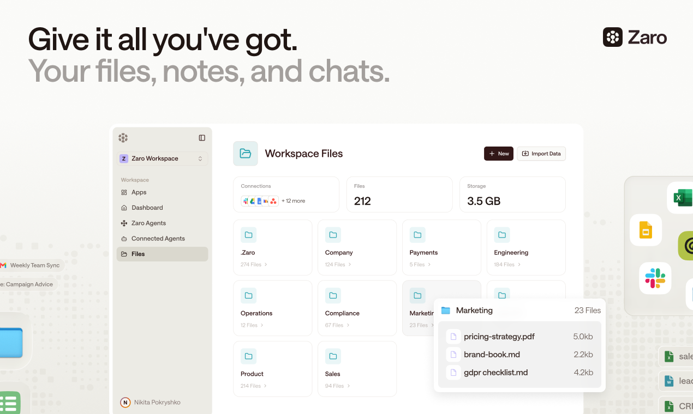
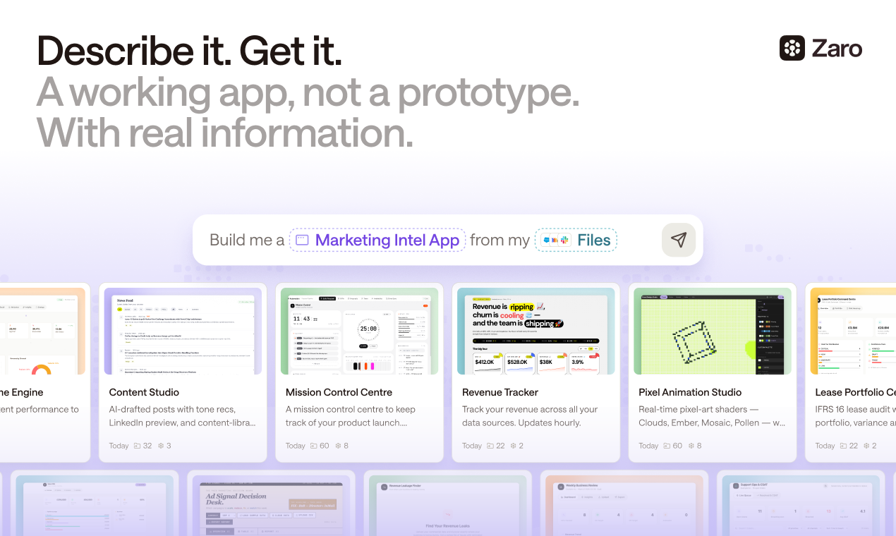
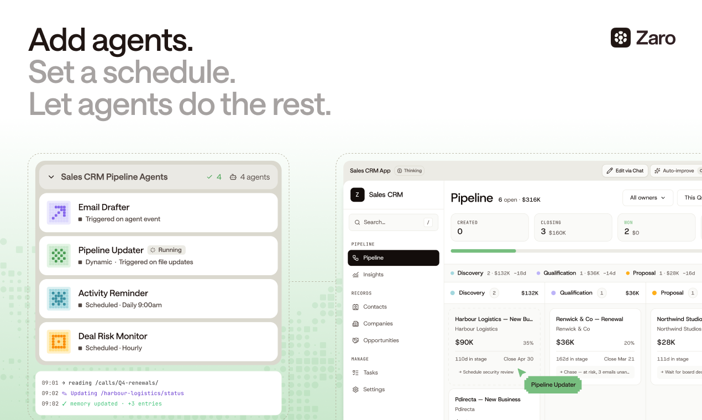

### 🎬 관련 영상
- [🎥 영상 보기](https://ph-files.imgix.net/5811f422-4035-43a4-9bea-d84ca28720c1.jpeg?auto=format)

---

## 4. [Figma Motion](https://www.producthunt.com/products/figma)
**Votes**: 207 | **도입 난이도**: 중 | **신뢰도**: 상
**Tagline**: Your Figma canvas now has a timeline
**서비스 링크**: https://www.producthunt.com/r/C6LLLKAB7X3YN2

**태그**: DesignTool, Prototyping, Figma, MotionDesign, Design

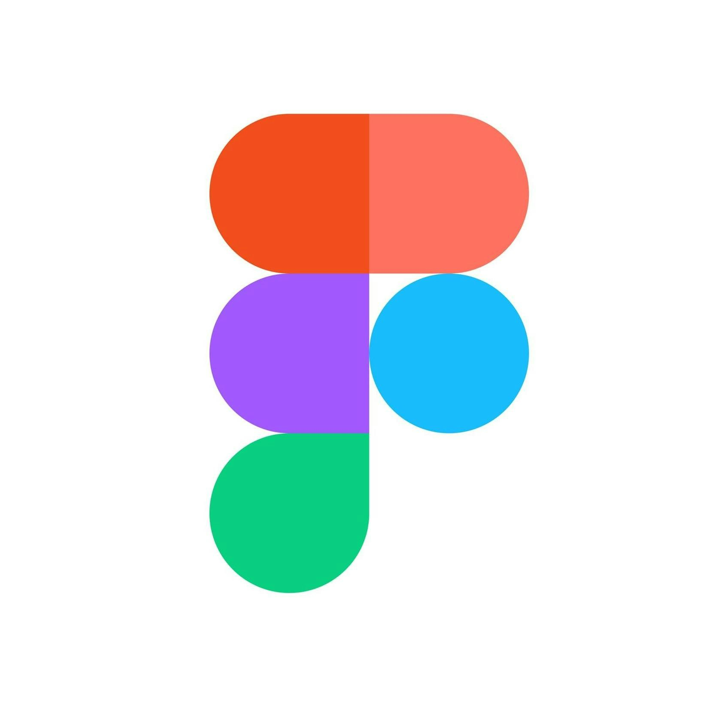

### 📌 이 서비스 한눈에 보기
피그마 캔버스 내에서 직접 애니메이션을 구현하는 타임라인 기반 모션 디자인 도구

### 🔑 주요 기능
- 피그마 캔버스 내에 통합된 타임라인 인터페이스 제공
- 컴포넌트 및 변수와 동일한 파일 내에서 모션 작업 가능
- 디자인 초기 단계부터 생동감 있는 프로토타입 제작 가능

### 🙋 사용자에게 어떤 점이 좋은가
별도의 툴로 파일을 옮길 필요 없이 피그마 작업 환경 내에서 즉시 모션을 구현하여 디자인 완성도를 높일 수 있습니다.

### ✅ 지금 바로 써볼 기능
- 기존 컴포넌트에 타임라인 적용해보기
- 변수(Variables)를 활용한 모션 워크플로우 테스트
- 팀 협업을 위한 모션 가이드라인 설정

### ⚠️ 사용 전 확인할 점
- 기존 피그마 워크플로우와의 호환성 및 성능 영향 확인 필요
- 복잡한 애니메이션 구현 시 캔버스 내 작업 효율성 검토

### 🧭 확인이 더 필요한 정보
타임라인 기능이 피그마의 기존 프로토타이핑 기능과 어떻게 차별화되는지, 혹은 이를 대체하는지에 대한 구체적인 정보가 필요합니다.

### 📸 스크린샷 및 갤러리
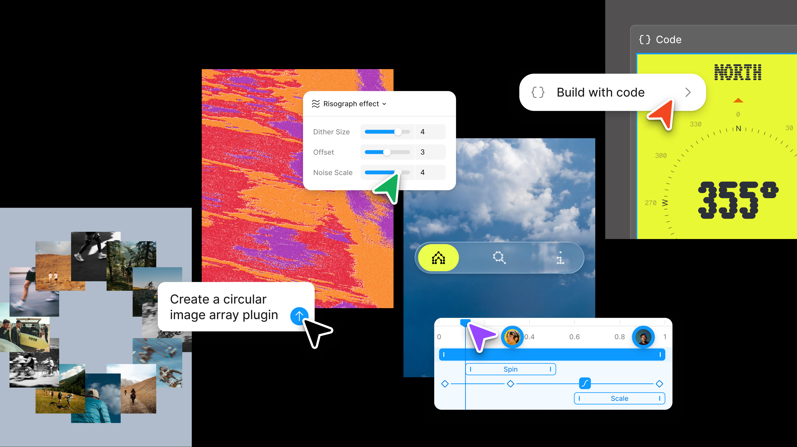
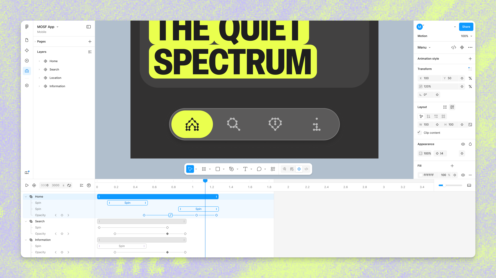
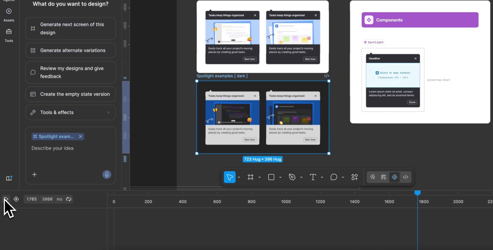

### 🎬 관련 영상
- [🎥 영상 보기](https://ph-files.imgix.net/16afd287-a0ab-4ea0-983b-5d4cb9a8c766.jpeg?auto=format)

---

## 5. [Brain² by ClickUp](https://www.producthunt.com/products/clickup)
**Votes**: 153 | **도입 난이도**: 중 | **신뢰도**: 상
**Tagline**: One AI that knows your entire company and acts on it
**서비스 링크**: https://www.producthunt.com/r/5JKEC5B27QQILZ

**태그**: AI, Automation, Productivity, SaaS, Workflow, Agent, AI Tool, Chat

### 📌 이 서비스 한눈에 보기
회사의 모든 데이터와 맥락을 이해하고 스스로 업무를 수행하는 통합 AI 에이전트

### 🔑 주요 기능
- 전사적 맥락 파악: 모든 태스크, 문서, 채팅 및 결정 사항을 연결하여 이해
- 유연한 모델 선택: 사용자가 원하는 AI 모델을 선택하여 연결 가능
- 통합 워크플로우: 메모리, 에이전트, MCP 통합을 통한 자동화 환경 제공

### 🙋 사용자에게 어떤 점이 좋은가
매번 상황을 설명할 필요 없이, AI가 회사의 모든 히스토리를 알고 있어 즉각적이고 정확한 업무 지원을 받을 수 있습니다.

### ✅ 지금 바로 써볼 기능
- 기존 ClickUp 데이터와 연동하여 맥락 학습시키기
- 필요한 AI 모델 연결 및 앱 통합 설정하기
- 에이전트 기능을 활용한 반복 업무 자동화 테스트하기

### ⚠️ 사용 전 확인할 점
- 전사 데이터 접근에 따른 보안 및 권한 관리 설정 필요
- 데이터 양에 따른 AI의 맥락 파악 정확도 검증 필요

### 🧭 확인이 더 필요한 정보
구체적인 외부 앱 연동 범위와 데이터 보안 정책에 대한 상세 확인이 필요합니다.

### 📸 스크린샷 및 갤러리

### 🎬 관련 영상
- [🎥 영상 보기](https://ph-files.imgix.net/443cc98a-7d88-491f-bdd6-da62bed440b7.jpeg?auto=format)

---

## 6. [Samepage Signals](https://www.producthunt.com/products/samepage-signals)
**Votes**: 146 | **도입 난이도**: 중 | **신뢰도**: 상
**Tagline**: Your second brain for product management
**서비스 링크**: https://www.producthunt.com/r/MEQY53KOIDX3KX

**태그**: Product Management, Automation, Knowledge Management, Productivity, AI Tool

### 📌 이 서비스 한눈에 보기
여러 도구에 흩어진 정보를 한곳에 모아주는 제품 관리자를 위한 지능형 인사이트 대시보드

### 🔑 주요 기능
- 분산된 툴과 웹상의 정보를 자동으로 수집 및 시각화
- 제품 리더에게 가장 중요한 핵심 인사이트 자동 추출
- 제품 관리 업무를 위한 '제2의 뇌' 역할 수행

### 🙋 사용자에게 어떤 점이 좋은가
여러 협업 도구를 오가는 번거로움을 줄이고, 의사결정에 필요한 핵심 정보를 실시간으로 파악할 수 있습니다.

### ✅ 지금 바로 써볼 기능
- 기존에 사용하는 제품 관리 도구와의 연동성 확인
- 자동으로 수집되는 정보의 정확도 테스트
- 개인별 맞춤형 인사이트 설정 기능 탐색

### ⚠️ 사용 전 확인할 점
- 사용 중인 외부 툴과의 연동 범위 확인 필요
- 데이터 수집 방식에 따른 보안 및 개인정보 정책 검토

### 🧭 확인이 더 필요한 정보
구체적인 연동 가능한 소프트웨어 목록과 데이터 보안 방식에 대한 정보가 추가로 필요합니다.

### 📸 스크린샷 및 갤러리

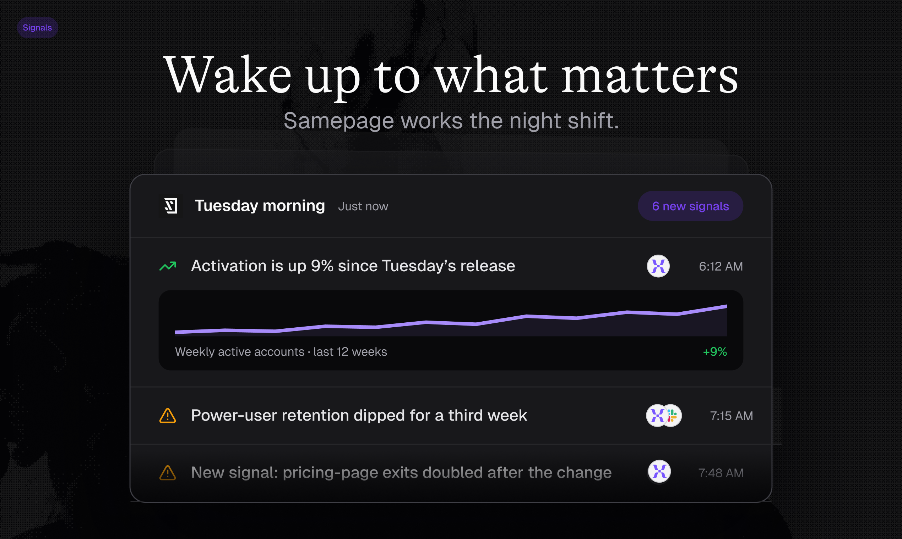
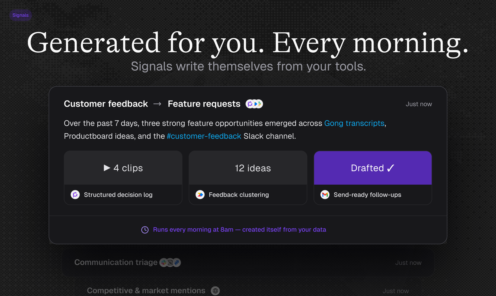

---

## 7. [Tough Tongue AI for Sales](https://www.producthunt.com/products/tough-tongue-ai-2)
**Votes**: 128 | **도입 난이도**: 중 | **신뢰도**: 상
**Tagline**: Live AI teammate for every tough sales conversation
**서비스 링크**: https://www.producthunt.com/r/74BUTAACNQOEDS

**태그**: SalesTech, AI-Agent, Automation, Communication, AI Tool, Sales

### 📌 이 서비스 한눈에 보기
실시간 음성 및 아바타를 갖춘 AI 팀원을 통해 까다로운 영업 상황을 해결하는 AI 솔루션

### 🔑 주요 기능
- 인간과 유사한 목소리와 아바타를 가진 실시간 AI 팀원 생성
- 전화, Google Meet, Zoom 등 다양한 채널로 즉시 배포 가능
- 리드 자격 확인, 자율 제품 데모, 신입 교육 및 실시간 영업 지원

### 🙋 사용자에게 어떤 점이 좋은가
영업 팀이 부재중이거나 어려운 협상 상황일 때, AI가 대신 대화를 진행하거나 실시간 코칭을 제공하여 계약 성사율을 높일 수 있습니다.

### ✅ 지금 바로 써볼 기능
- AI 아바타 및 음성 설정 테스트
- 화상 회의(Zoom/Meet) 연동 실험
- 리드 발굴을 위한 자동 데모 시나리오 구축

### ⚠️ 사용 전 확인할 점
- AI의 답변이 실제 비즈니스 맥락과 일치하는지 모니터링 필요
- 실시간 대화 시 발생할 수 있는 지연 시간(Latency) 확인

### 🧭 확인이 더 필요한 정보
사용자의 기존 CRM이나 영업 툴과의 구체적인 통합 방식 및 데이터 보안 정책 확인이 필요합니다.

### 📸 스크린샷 및 갤러리
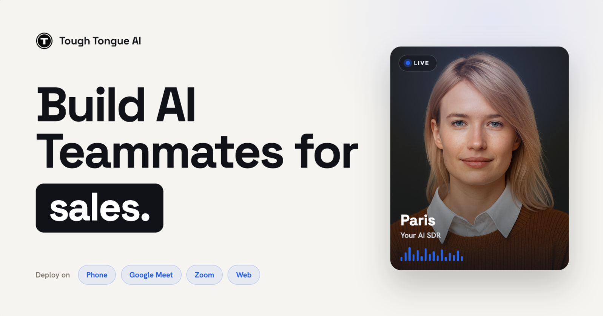

### 🎬 관련 영상
- [🎥 영상 보기](https://ph-files.imgix.net/fdcd9550-47c7-4271-847d-dd121dc86f5d.jpeg?auto=format)

---

## 8. [Papermark Agents](https://www.producthunt.com/products/papermark-2)
**Votes**: 119 | **도입 난이도**: 중 | **신뢰도**: 상
**Tagline**: Let AI agents run your next deal, fundraise or data room
**서비스 링크**: https://www.producthunt.com/r/W3JWP477L6XTBY

**태그**: AI-Agent, DataRoom, OpenSource, Automation, FinTech, Agent, AI Tool, Chat, DevTool, API

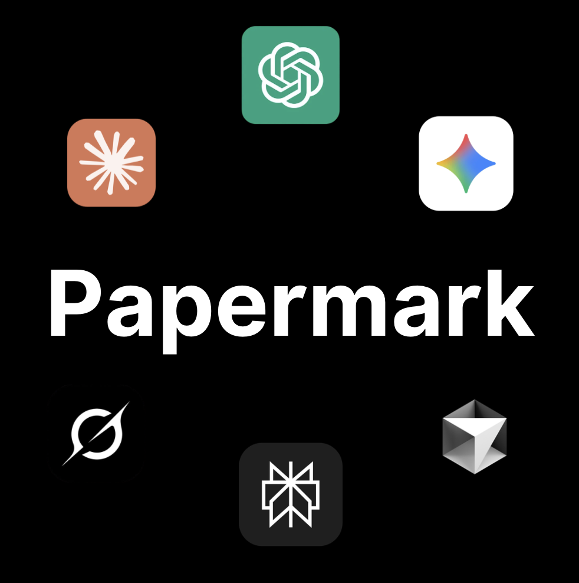

### 📌 이 서비스 한눈에 보기
AI 에이전트가 데이터룸 구축부터 파일 관리, 투자자 분석까지 자동으로 수행하는 오픈소스 도구

### 🔑 주요 기능
- AI 에이전트를 통한 데이터룸 자동 구축 및 파일 관리
- 워터마크 링크 생성 및 투자자 문서 열람 분석 기능
- 40개 이상의 MCP 도구, REST API, CLI를 지원하는 강력한 확장성

### 🙋 사용자에게 어떤 점이 좋은가
복잡한 데이터룸 관리 업무를 AI에게 맡겨 시간을 절약하고, 투자자들의 문서 열람 패턴을 실시간으로 파악할 수 있습니다.

### ✅ 지금 바로 써볼 기능
- AI 에이전트를 활용한 데이터룸 자동 생성 테스트
- 문서 업로드 및 워터마크 링크 생성 기능 확인
- API/CLI를 통한 기존 워크플로우 통합 시도

### ⚠️ 사용 전 확인할 점
- AI 에이전트가 민감한 금융/기업 데이터를 다루므로 보안 설정 확인 필수
- 기술적 숙련도(API, CLI 사용 등)에 따라 초기 설정 난이도가 있을 수 있음

### 🧭 확인이 더 필요한 정보
오픈소스 제품이므로 사용자의 인프라 환경에 따른 보안 및 관리 책임 범위 확인이 필요합니다.

### 📸 스크린샷 및 갤러리
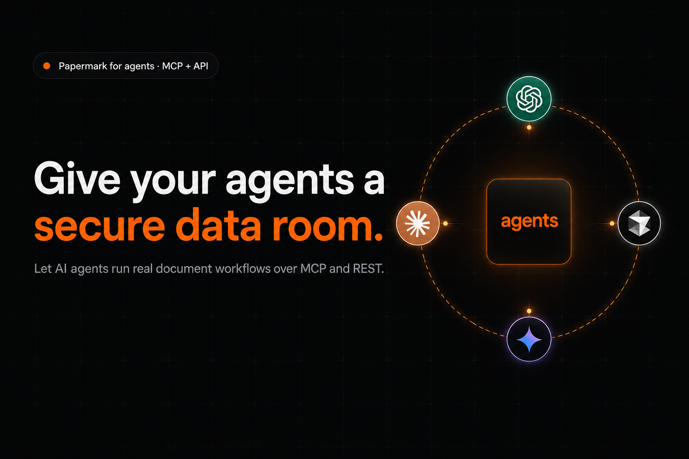
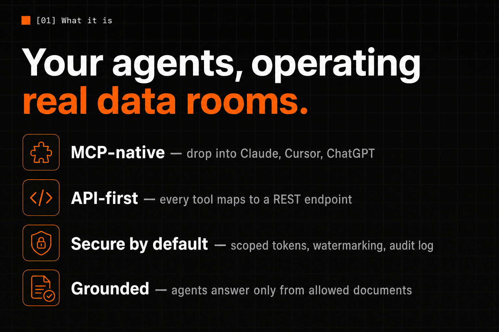
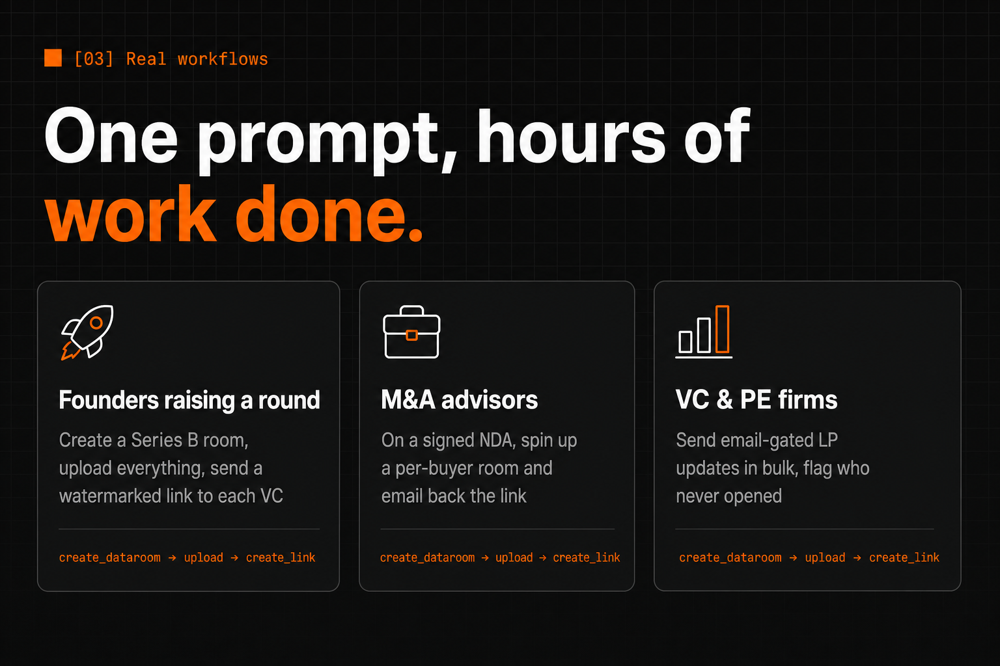

### 🎬 관련 영상
- [🎥 영상 보기](https://ph-files.imgix.net/597bec5a-6ade-44fe-9459-e25c249cdd1a.jpeg?auto=format)

---

## 9. [Genspark Design](https://www.producthunt.com/products/genspark-design)
**Votes**: 118 | **도입 난이도**: 하 | **신뢰도**: 상
**Tagline**: Generate UI prototypes, videos, and posters with AI
**서비스 링크**: https://www.producthunt.com/r/UB2FHQODKNR7QX

**태그**: DesignTool, AI, UI/UX, Prototyping, CreativeAsset, AI Tool, Prompting, Video, Design

### 📌 이 서비스 한눈에 보기
프롬프트 하나로 UI 프로토타입부터 영상까지 생성하는 AI 디자인 도구

### 🔑 주요 기능
- 텍스트 프롬프트를 통한 UI 프로토타입 및 HTML 애니메이션 생성
- 포스터 및 영상 콘텐츠 제작 기능 제공
- Figma 파일 업로드를 통한 브랜드 일관성 유지

### 🙋 사용자에게 어떤 점이 좋은가
디자인 전문 지식이 없는 사용자도 아이디어를 즉시 시각적인 결과물로 변환하여 작업 시간을 단축할 수 있습니다.

### ✅ 지금 바로 써볼 기능
- 프롬프트를 입력하여 기본 UI 프로토타입 생성해보기
- Figma 파일을 업로드하여 브랜드 스타일 적용 테스트하기
- 생성된 결과물을 HTML 애니메이션이나 영상으로 변환하기

### ⚠️ 사용 전 확인할 점
- AI 생성 결과물의 디테일이 사용자의 요구사항과 다를 수 있음
- Figma 파일 업로드 시 브랜드 일관성이 완벽히 유지되는지 확인 필요

### 🧭 확인이 더 필요한 정보
생성된 결과물의 편집 가능 범위와 최종 파일 내보내기(Export) 형식이 명시되지 않았습니다.

### 📸 스크린샷 및 갤러리
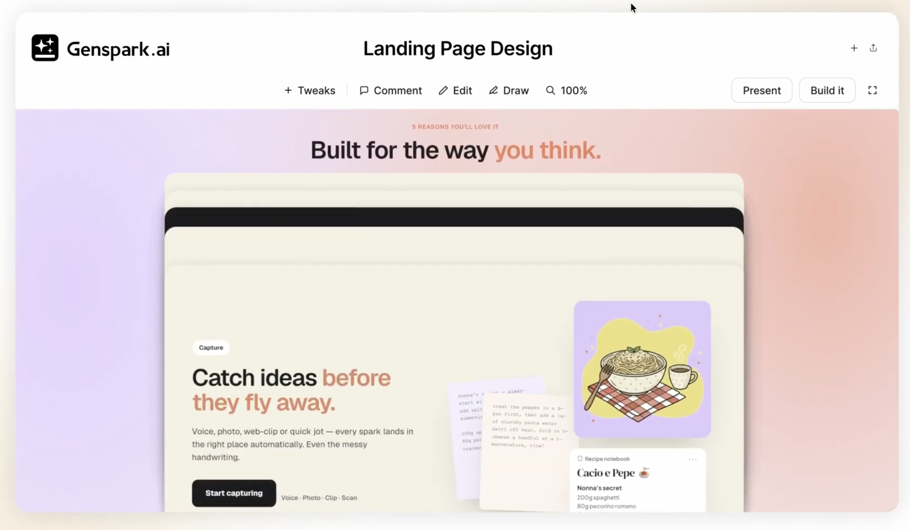
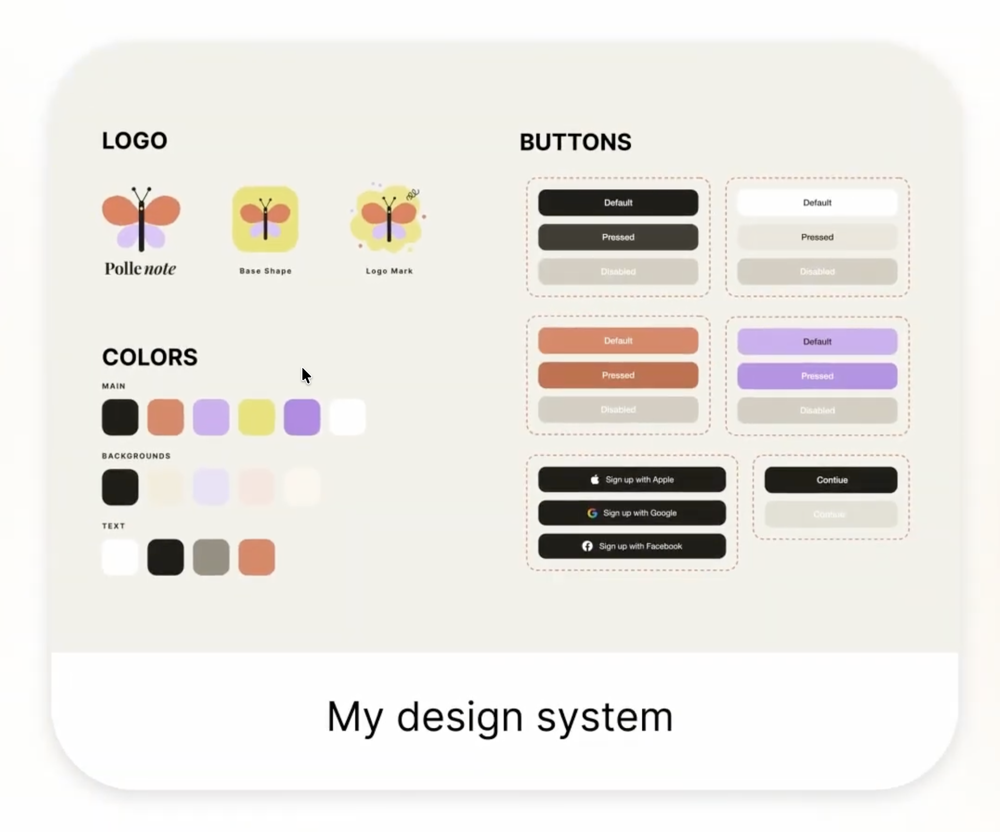
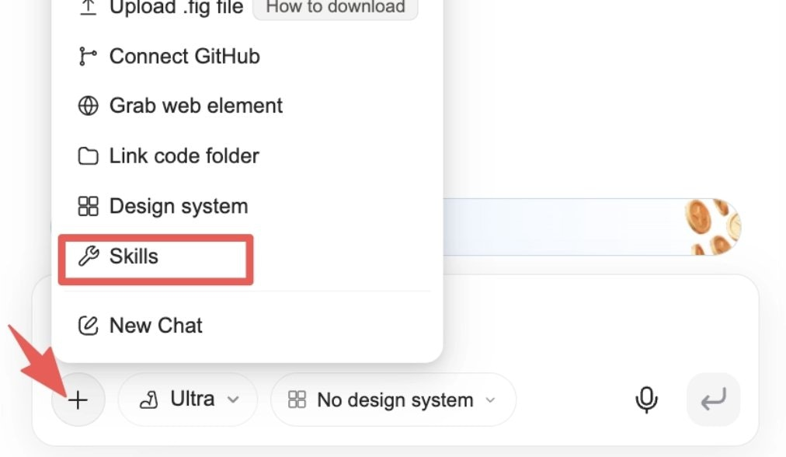

### 🎬 관련 영상
- [🎥 영상 보기](https://ph-files.imgix.net/bdbef48b-b0ef-497d-88b4-09387b031cf1.jpeg?auto=format)

---

## 10. [MeetPoint](https://www.producthunt.com/products/meetpoint-2)
**Votes**: 115 | **도입 난이도**: 하 | **신뢰도**: 상
**Tagline**: Find the city where everyone's flights are cheapest
**서비스 링크**: https://www.producthunt.com/r/YNI36OOE7MRTQY

**태그**: Travel, Planning, Optimization

### 📌 이 서비스 한눈에 보기
모든 출발지의 실시간 항공권을 비교하여 가장 경제적인 모임 장소를 찾아주는 서비스

### 🔑 주요 기능
- 참가자들의 출발 도시 입력 기능
- 여행 날짜 설정 기능
- 모든 출발지 기준 최적의 목적지 자동 추천

### 🙋 사용자에게 어떤 점이 좋은가
여러 명이 모여야 하는 여행 계획 시, 모두의 항공료 합계가 가장 저렴한 최적의 장소를 쉽고 빠르게 결정할 수 있습니다.

### ✅ 지금 바로 써볼 기능
- 친구들의 출발 도시 목록 입력하기
- 희망하는 여행 날짜 설정하기
- 제시된 추천 도시의 항공권 가격 비교하기

### ⚠️ 사용 전 확인할 점
- 실시간 항공권 가격이므로 검색 시점과 예약 시점의 가격 차이가 발생할 수 있음
- 특정 도시의 항공권 가격이 비쌀 경우 전체적인 경제성이 떨어질 수 있음

### 🧭 확인이 더 필요한 정보
실시간 항공권 데이터의 정확도와 예약 연동 여부에 대한 추가 확인이 필요합니다.

### 📸 스크린샷 및 갤러리
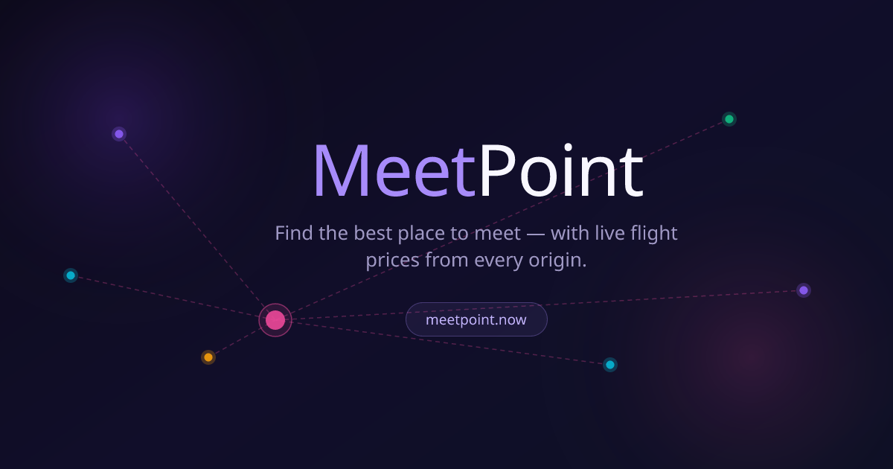
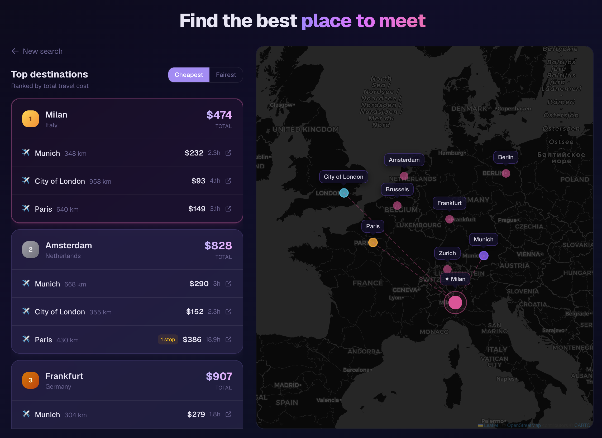
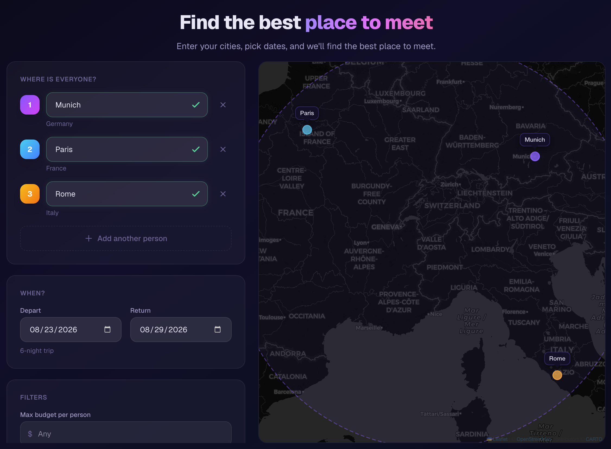

---

## 11. [Grass 2.0](https://www.producthunt.com/products/grass-claude-code-from-your-phone)
**Votes**: 109 | **도입 난이도**: 하 | **신뢰도**: 상
**Tagline**: The always-on computer for your coding agents
**서비스 링크**: https://www.producthunt.com/r/A3E2L7TLCNTMKM

**태그**: DevTool, AI-Agent, Cloud-Computing, Mobile-Dev, Agent, Design

### 📌 이 서비스 한눈에 보기
코딩 에이전트를 위한 상시 가동형 클라우드 컴퓨터

### 🔑 주요 기능
- 코딩 에이전트 전용의 24시간 중단 없는 클라우드 환경 제공
- Claude Code, Codex, OpenCode 등 주요 에이전트 실행 지원
- iPhone을 통한 원격 모니터링, 의사결정 승인 및 코드 푸시 기능

### 🙋 사용자에게 어떤 점이 좋은가
개발자가 자리를 비워도 에이전트가 작업을 지속할 수 있으며, 모바일로 어디서든 작업 진행 상황을 확인하고 제어할 수 있습니다.

### ✅ 지금 바로 써볼 기능
- App Store에서 Grass 2.0 앱 설치하기
- 사용 중인 코딩 에이전트(Claude Code 등) 연동하기
- 모바일 환경에서 작업 승인 및 푸시 테스트하기

### ⚠️ 사용 전 확인할 점
- 에이전트 실행 시 발생하는 클라우드 리소스 비용 확인 필요
- 모바일 환경에서의 복잡한 코드 리뷰 및 수정의 한계

### 🧭 확인이 더 필요한 정보
상세한 클라우드 인프라 사양 및 에이전트별 최적화 수준에 대한 정보가 추가로 필요합니다.

### 📸 스크린샷 및 갤러리
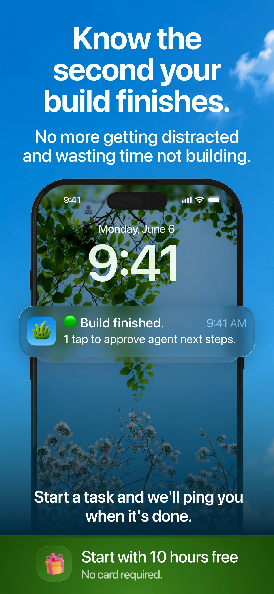

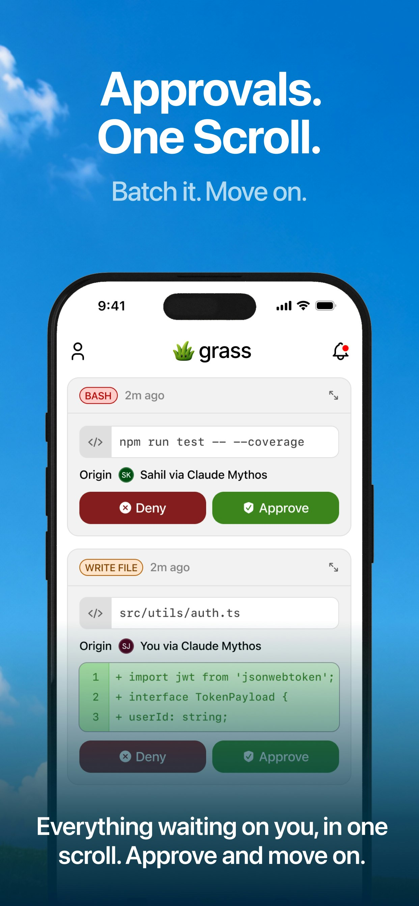

### 🎬 관련 영상
- [🎥 영상 보기](https://ph-files.imgix.net/8abf5c52-e6e6-4e65-9e4a-ab0a3a182a47.jpeg?auto=format)

---

## 12. [Polygraph](https://www.producthunt.com/products/polygraph)
**Votes**: 107 | **도입 난이도**: 중 | **신뢰도**: 상
**Tagline**: Let AI agents see cross repo and maintain session memory.
**서비스 링크**: https://www.producthunt.com/r/U65YPKSE4GA2EW

**태그**: DevTool, AI-Agent, Productivity, Agent, AI Tool

### 📌 이 서비스 한눈에 보기
여러 저장소(Repo)를 넘나드는 코드 맥락 파악과 세션 유지 기능을 제공하는 AI 에이전트용 메타 하네스

### 🔑 주요 기능
- 저장소 경계를 넘는 통합 의존성 그래프 구축
- 세션이 종료되어도 유지되는 메모리 기능
- 코드 이동 없이 프라이빗 및 퍼블릭 저장소 연결

### 🙋 사용자에게 어떤 점이 좋은가
AI 에이전트가 전체 코드베이스의 맥락을 이해하게 하여 작업 자율성을 높이고, 개발자 간 작업 흐름을 쉽게 공유할 수 있습니다.

### ✅ 지금 바로 써볼 기능
- 기존 저장소들을 Polygraph에 연결하여 의존성 그래프 생성하기
- 이전 세션의 맥락을 활용하여 새로운 작업 이어가기
- 다른 개발자가 생성한 세션을 참조하여 협업하기

### ⚠️ 사용 전 확인할 점
- 코드 이동은 없으나 저장소 접근 권한 설정 및 보안 정책 확인 필요
- 다양한 에이전트 및 환경에서의 호환성 검증 필요

### 🧭 확인이 더 필요한 정보
다양한 에이전트 프레임워크와의 구체적인 통합 방식 및 보안 프로토콜에 대한 상세 정보가 필요합니다.

### 📸 스크린샷 및 갤러리

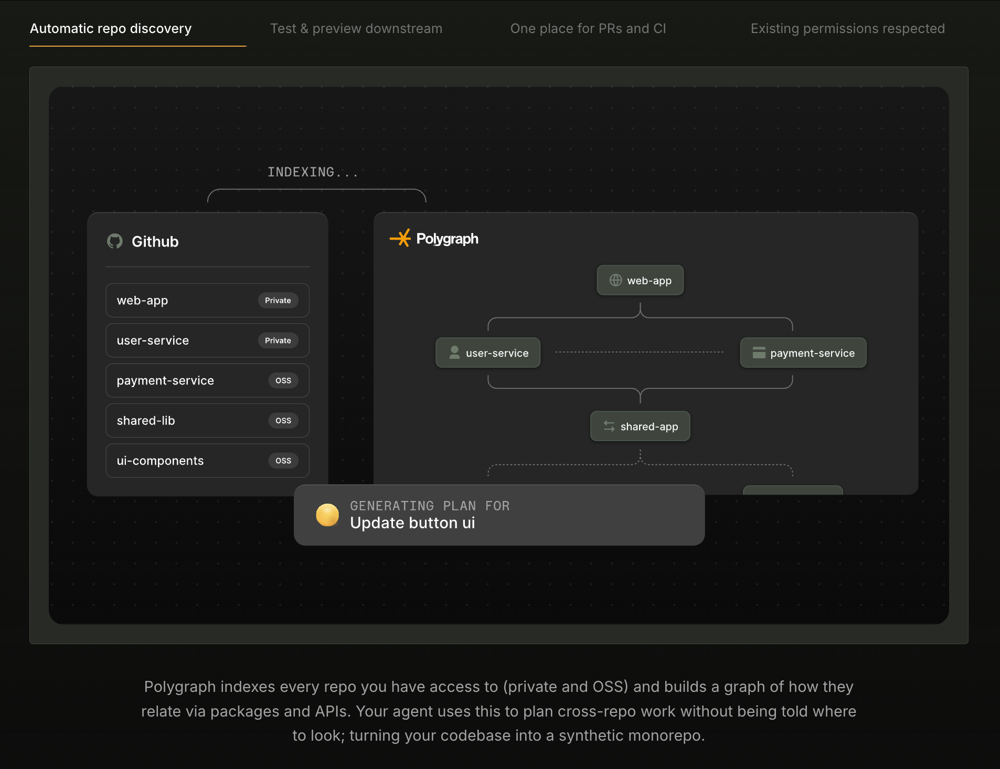
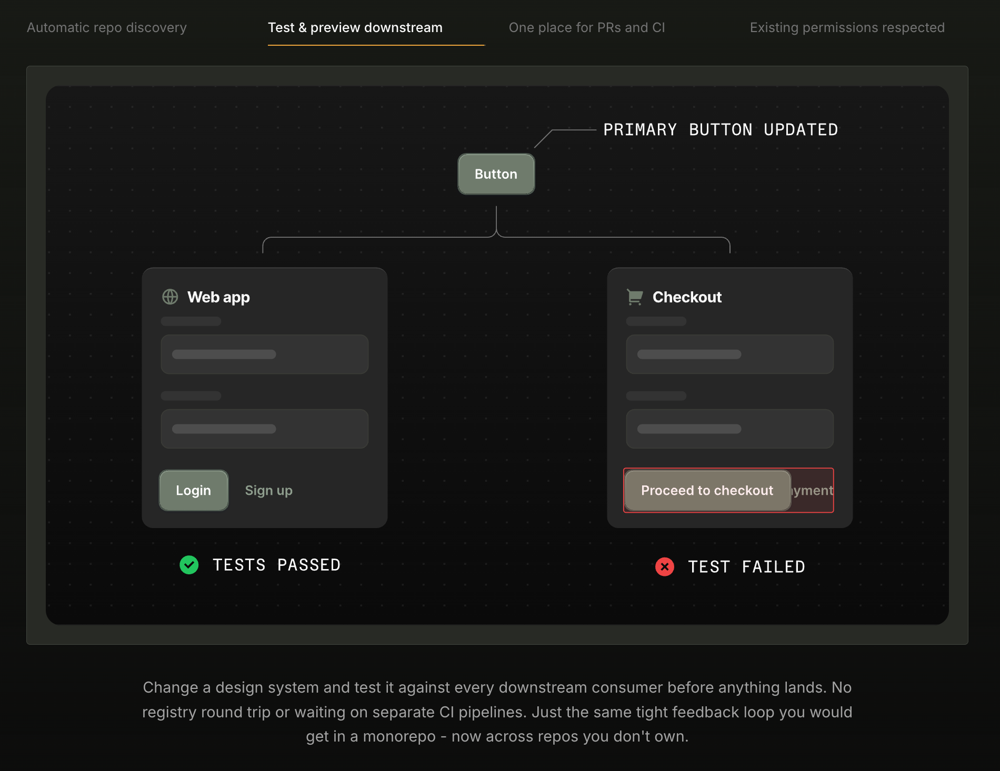

### 🎬 관련 영상
- [🎥 영상 보기](https://ph-files.imgix.net/18bc2b5b-77c1-4a05-8db0-0239b31db299.jpeg?auto=format)

---

## 13. [Postproxy - Engagement API](https://www.producthunt.com/products/postproxy)
**Votes**: 107 | **도입 난이도**: 중 | **신뢰도**: 상
**Tagline**: Publish, reply, and analyze social media via API
**서비스 링크**: https://www.producthunt.com/r/HAUIJ6Q2NHVDYQ

**태그**: DevTool, Automation, SaaS, API, SocialMedia, Agent, AI Tool, Analytics

### 📌 이 서비스 한눈에 보기
복잡한 소셜 미디어 API 연동을 하나로 통합하여 게시, 댓글 관리, 분석을 자동화하는 개발자용 API

### 🔑 주요 기능
- 게시물 발행부터 댓글, DM, 리뷰 관리까지 통합 API 제공
- 주요 소셜 플랫폼별 개별 API 유지보수 부담 해소
- 웹훅(Webhook)을 통한 실시간 데이터 수신 및 분석 기능

### 🙋 사용자에게 어떤 점이 좋은가
SaaS 제품이나 자동화 워크플로우를 구축할 때, 각 플랫폼의 복잡한 API를 직접 구현할 필요 없이 안정적인 소셜 미디어 인프라를 즉시 확보할 수 있습니다.

### ✅ 지금 바로 써볼 기능
- API를 통한 게시물 발행 테스트
- 댓글 및 DM 관리 워크플로우 구현
- 웹훅을 활용한 실시간 알림 설정

### ⚠️ 사용 전 확인할 점
- 지원하는 소셜 미디어 플랫폼의 범위 확인 필요
- 플랫폼별 정책 변화에 따른 API 안정성 검토

### 🧭 확인이 더 필요한 정보
지원하는 구체적인 소셜 미디어 플랫폼 목록과 API 호출 제한(Rate Limit) 정책에 대한 정보가 추가로 필요합니다.

### 📸 스크린샷 및 갤러리
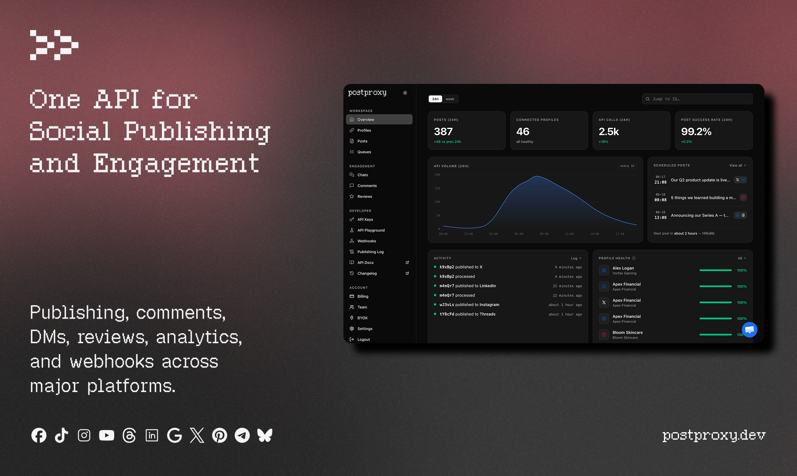
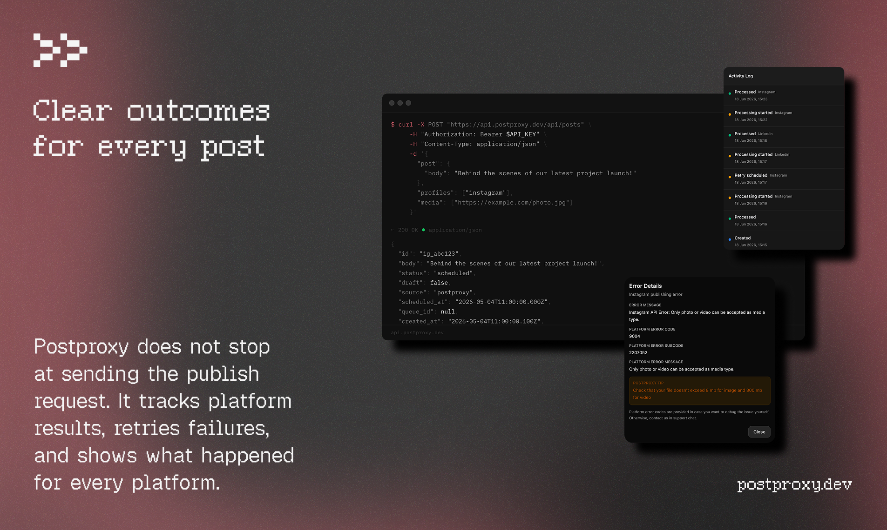
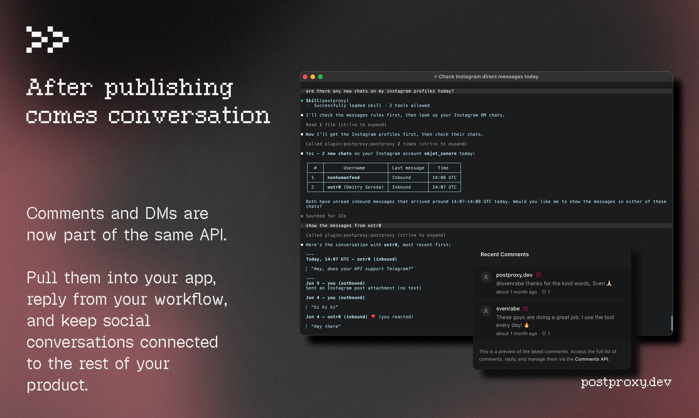

### 🎬 관련 영상
- [🎥 영상 보기](https://ph-files.imgix.net/675d214d-787f-4eb7-8325-885213e582eb.jpeg?auto=format)

---

## 14. [Milestones](https://www.producthunt.com/products/milestones-2)
**Votes**: 100 | **도입 난이도**: 하 | **신뢰도**: 상
**Tagline**: Native project planning app, now on Mac & with an MCP server
**서비스 링크**: https://www.producthunt.com/r/DD3PFGQJZGRNYR

**태그**: Productivity, macOS, ProjectManagement, Privacy, AI Tool

### 📌 이 서비스 한눈에 보기
macOS 네이티브 환경에서 프로젝트를 체계적으로 계획하고 관리하는 프라이버시 중심의 플래너

### 🔑 주요 기능
- macOS 전용 네이티브 앱 제공
- 프로젝트를 관리 가능한 마일스톤 단위로 분할 및 추적
- iCloud 동기화를 통한 강력한 프라이버시 보호

### 🙋 사용자에게 어떤 점이 좋은가
macOS 환경에서 끊김 없는 작업 흐름을 제공하며, 프로젝트를 작은 단위로 나누어 집중력을 유지하고 데이터 보안을 보장받을 수 있습니다.

### ✅ 지금 바로 써볼 기능
- macOS용 앱 설치 및 환경 설정
- 프로젝트를 마일스톤 단위로 세분화하기
- iCloud 동기화 설정 확인

### ⚠️ 사용 전 확인할 점
- macOS 전용 앱이므로 타 OS 사용자는 사용이 제한됨
- iCloud 계정 의존성

### 🧭 확인이 더 필요한 정보
MCP 서버를 통한 구체적인 AI 연동 기능 범위는 추가 확인이 필요합니다.

### 📸 스크린샷 및 갤러리
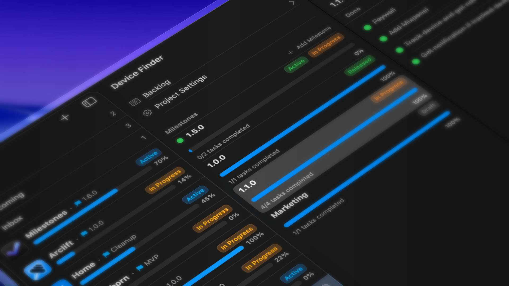
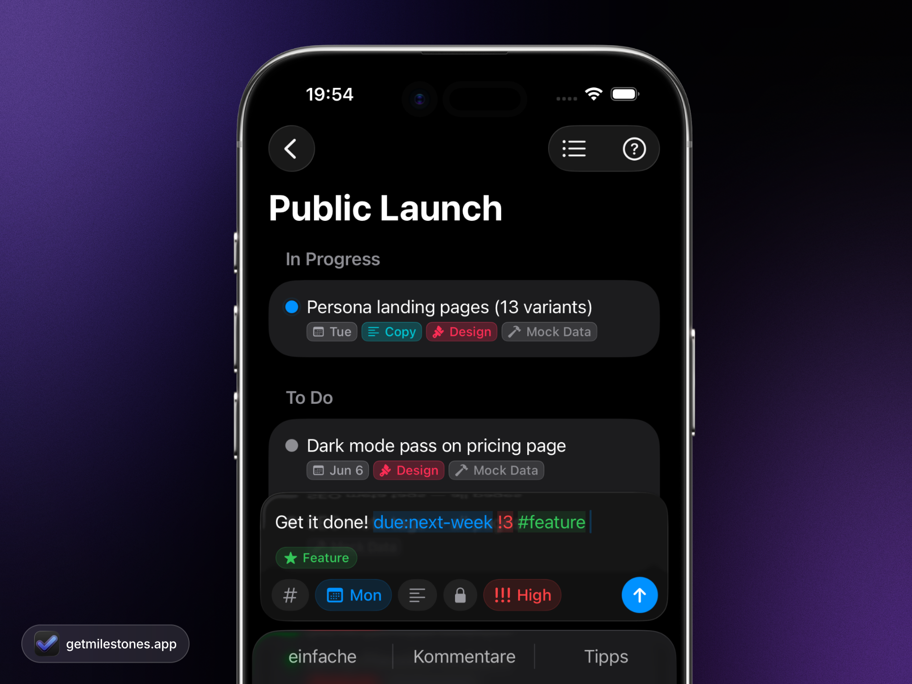
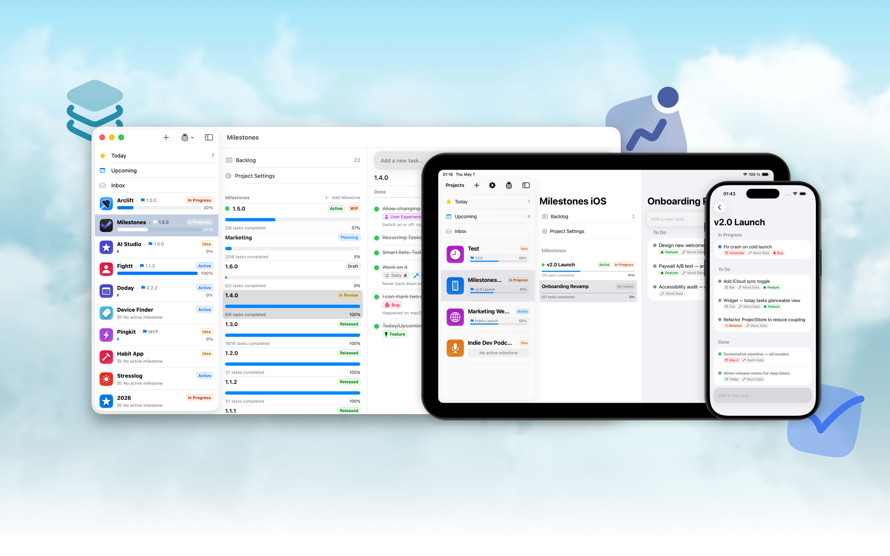

---

## 15. [Nashra](https://www.producthunt.com/products/nashra-turn-followers-into-clients)
**Votes**: 96 | **도입 난이도**: 하 | **신뢰도**: 상
**Tagline**: Turn followers into clients.
**서비스 링크**: https://www.producthunt.com/r/X6MXYEI6OLKE7M

**태그**: CreatorEconomy, Marketing, NoCode, Newsletter, PersonalBranding, AI Tool

### 📌 이 서비스 한눈에 보기
소셜 미디어 팔로워를 뉴스레터와 블로그 기반의 충성 고객으로 전환하는 올인원 퍼스널 브랜딩 플랫폼

### 🔑 주요 기능
- 뉴스레터, 블로그, 바이오 허브, 랜딩 페이지를 하나의 구독자 데이터베이스로 통합 관리
- AI 기반 랜딩 페이지 빌더 및 오픈율을 높여주는 AI 전략가 기능 제공
- 데이터 소유권 보장(언제든 모든 데이터를 가지고 떠날 수 있는 구조) 및 SEO 최적화

### 🙋 사용자에게 어떤 점이 좋은가
플랫폼 종속성 없이 소셜 미디어 팔로워를 직접 소유 가능한 구독자 리스트로 전환하여 비즈니스 자산화할 수 있습니다.

### ✅ 지금 바로 써볼 기능
- AI 랜딩 페이지 빌더로 개인 브랜드 페이지 구축하기
- 500명까지 무료인 구독자 혜택 활용하여 뉴스레터 시작하기
- 기존 콘텐츠를 위한 SEO 최적화 블로그 포스팅하기

### ⚠️ 사용 전 확인할 점
- 무료 플랜은 최대 500명의 구독자까지만 지원됨
- 기존 플랫폼에서 데이터를 옮겨올 때 마이그레이션 과정 확인 필요

### 🧭 확인이 더 필요한 정보
유료 플랜의 상세 가격 체계와 기능 제한 범위에 대한 정보가 명시되지 않았습니다.

### 📸 스크린샷 및 갤러리
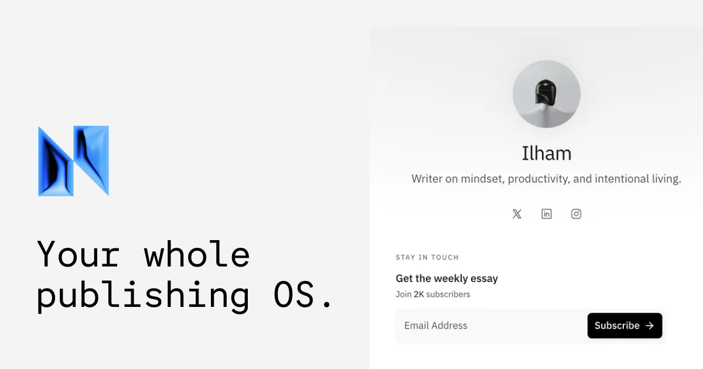
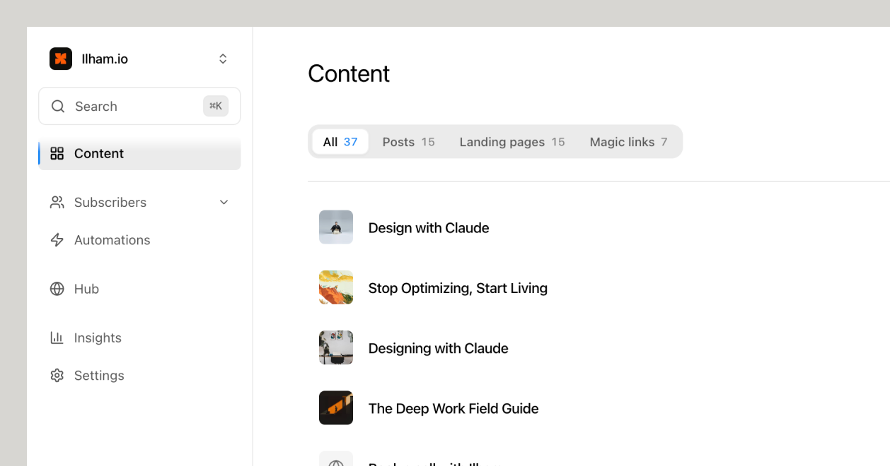
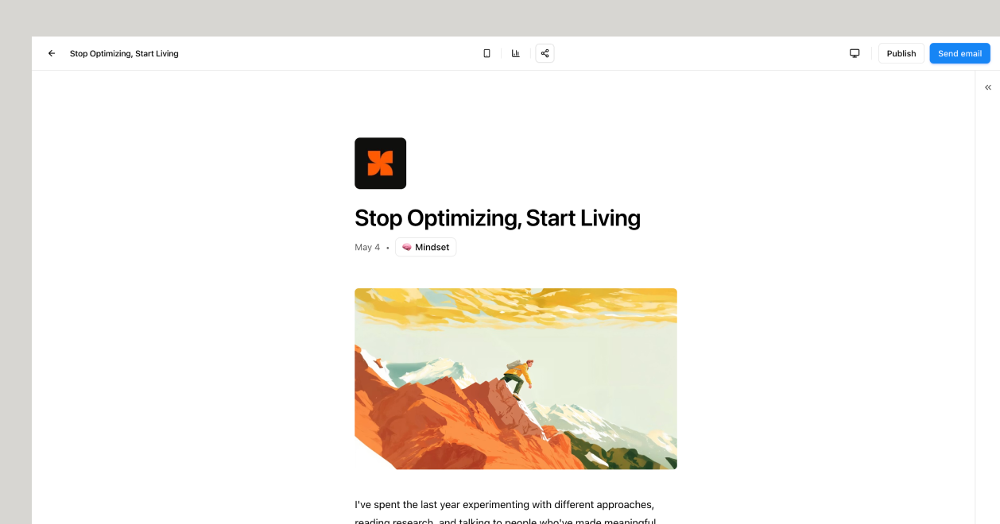

### 🎬 관련 영상
- [🎥 영상 보기](https://ph-files.imgix.net/379f9dbe-6cef-4e19-8c7e-7a1eb495a133.jpeg?auto=format)

---

## 16. [Dub Ninja](https://www.producthunt.com/products/dub-ninja)
**Votes**: 95 | **도입 난이도**: 하 | **신뢰도**: 상
**Tagline**: Live autonomous AI DJ that digs, mixes & explains 24/7
**서비스 링크**: https://www.producthunt.com/r/GCF5HYG33MHUOY

**태그**: AI, Music, Automation, Streaming, AI Tool

### 📌 이 서비스 한눈에 보기
24시간 쉬지 않고 실시간으로 음악을 큐레이션하고 설명하는 자율형 AI DJ 서비스

### 🔑 주요 기능
- 스케줄이나 정해진 플레이리스트 없는 완전 자율형 AI 믹싱
- 실시간으로 다음 곡을 선택하고 그 이유를 설명하는 인터랙티브 경험
- 언더그라운드 일렉트로닉 장르에 특화된 끊임없는 음악 스트리밍

### 🙋 사용자에게 어떤 점이 좋은가
사용자는 별도의 조작 없이도 끊임없이 변화하는 고품질의 음악 경험을 즐길 수 있으며, AI의 실시간 설명을 통해 음악적 맥락을 이해할 수 있습니다.

### ✅ 지금 바로 써볼 기능
- 실시간 AI 믹싱 및 곡 선택 로직 경험하기
- AI가 제공하는 실시간 음악 설명 청취하기
- 24/7 스트리밍 환경에서의 음악 흐름 확인하기

### ⚠️ 사용 전 확인할 점
- 특정 장르(언더그라운드 일렉트로닉)에 국한된 음악 스타일
- 사용자의 직접적인 곡 요청이나 개입 가능 여부 불투명

### 🧭 확인이 더 필요한 정보
사용자의 개입 없이 완전 자동화로만 운영되는지, 혹은 사용자 피드백이 반영되는 구조인지 확인이 필요합니다.

### 📸 스크린샷 및 갤러리
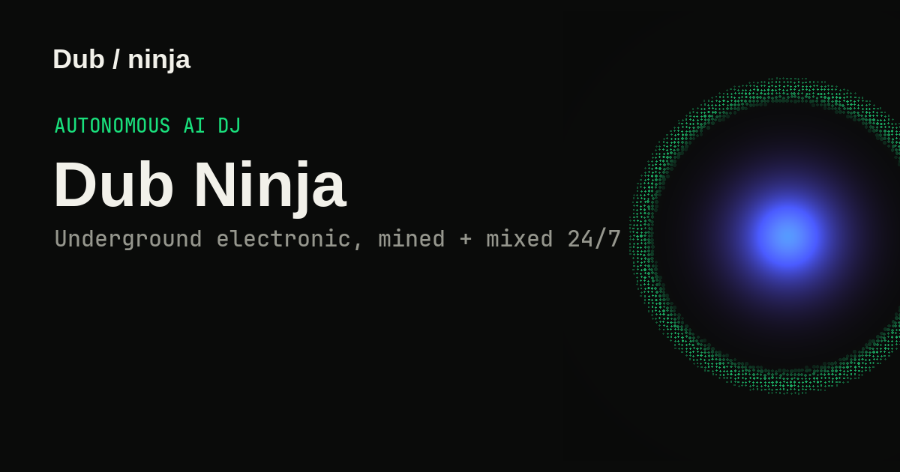
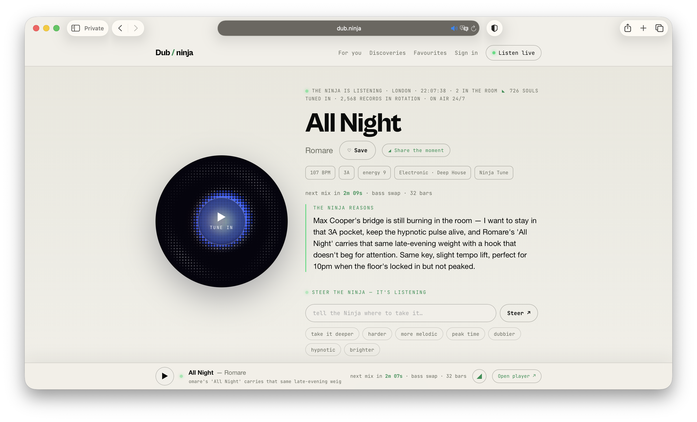

---

## 17. [SendTidings](https://www.producthunt.com/products/sendtidings)
**Votes**: 93 | **도입 난이도**: 하 | **신뢰도**: 상
**Tagline**: Turn your analytics into beautiful monthly email reports
**서비스 링크**: https://www.producthunt.com/r/LYF7GT243WMDPC

**태그**: Automation, Analytics, Reporting, SaaS, MarketingTool, AI Tool, Email

### 📌 이 서비스 한눈에 보기
복잡한 분석 대시보드 대신, 고객이 바로 확인할 수 있는 깔끔한 월간 이메일 리포트를 자동 생성합니다.

### 🔑 주요 기능
- GA4, Matomo, Plausible, Search Console 등 다양한 데이터 소스 연동
- 고객이 대시보드에 로그인할 필요 없는 직관적인 이메일 리포트 제공
- 한 번의 설정으로 정기적인 리포트 발송 자동화

### 🙋 사용자에게 어떤 점이 좋은가
클라이언트에게 매번 리포트를 수동으로 작성해 보낼 필요 없이, 전문적이고 정리된 데이터를 자동으로 전달하여 업무 효율을 높일 수 있습니다.

### ✅ 지금 바로 써볼 기능
- 사용 중인 분석 도구(GA4 등) 연동하기
- 리포트 수신자 및 발송 일정 설정하기
- 생성된 이메일 리포트 디자인 확인하기

### ⚠️ 사용 전 확인할 점
- 데이터 소스 외에 다른 커스텀 데이터 연동 가능 여부 확인 필요
- 이메일로만 리포트가 제공되므로 실시간 데이터 확인에는 한계가 있음

### 🧭 확인이 더 필요한 정보
지원하는 데이터 소스의 전체 목록과 상세한 리포트 커스텀 기능 범위에 대한 정보가 더 필요합니다.

### 📸 스크린샷 및 갤러리
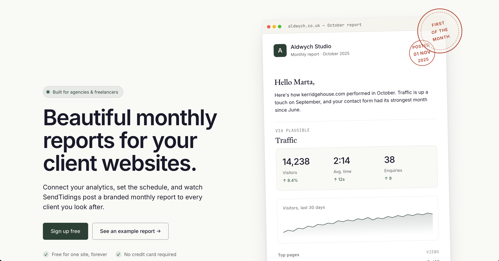
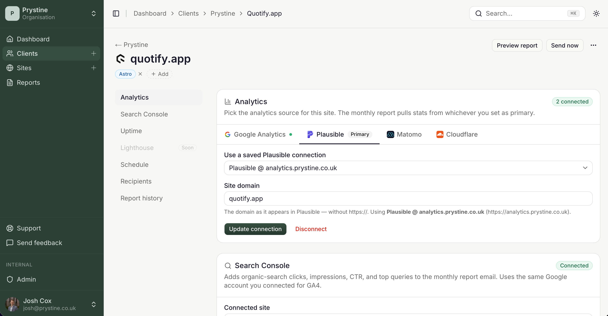
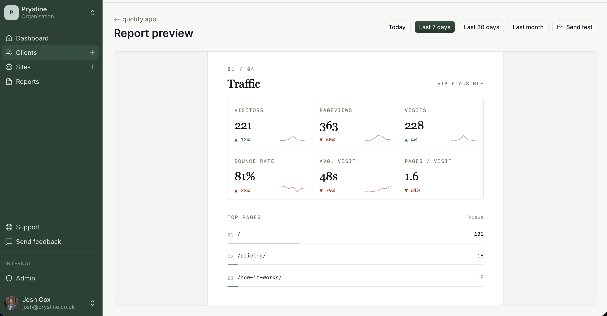

### 🎬 관련 영상
- [🎥 영상 보기](https://ph-files.imgix.net/f33a3338-335d-4eec-be69-d791ccef9871.jpeg?auto=format)

---

## 18. [Heron ](https://www.producthunt.com/products/heron)
**Votes**: 89 | **도입 난이도**: 하 | **신뢰도**: 상
**Tagline**: Wireshark for AI Agents: passive eBPF observability
**서비스 링크**: https://www.producthunt.com/r/6ZK6UDOOVAAWXF

**태그**: DevTool, Observability, AI, Networking, eBPF, Agent, AI Tool, LLM

### 📌 이 서비스 한눈에 보기
코드 수정 없이 AI 에이전트의 네트워크 활동을 실시간으로 추적하는 eBPF 기반 관측 도구

### 🔑 주요 기능
- eBPF 기술을 활용한 패시브 네트워크 분석 (Zero SDK/Proxy)
- TLS 암호화된 LLM 호출 내용 재구성 및 가시성 확보
- 특정 에이전트 프로세스와 네트워크 트래픽 간의 매핑 기능

### 🙋 사용자에게 어떤 점이 좋은가
별도의 코드 수정이나 프록시 설정 없이도 AI 에이전트가 실제로 어떤 데이터를 주고받는지 투명하게 모니터링할 수 있습니다.

### ✅ 지금 바로 써볼 기능
- eBPF를 통한 네트워크 트래픽 캡처 테스트
- 암호화된 LLM 호출 데이터 재구성 확인
- 에이전트 프로세스별 트래픽 식별 기능 검증

### ⚠️ 사용 전 확인할 점
- eBPF 사용을 위한 커널 권한 및 시스템 호환성 확인 필요
- 패시브 분석 방식이 시스템 성능에 미치는 영향 검토

### 🧭 확인이 더 필요한 정보
eBPF를 통한 TLS 복호화 방식의 보안성 및 시스템 부하에 대한 구체적인 정보가 필요합니다.

### 📸 스크린샷 및 갤러리
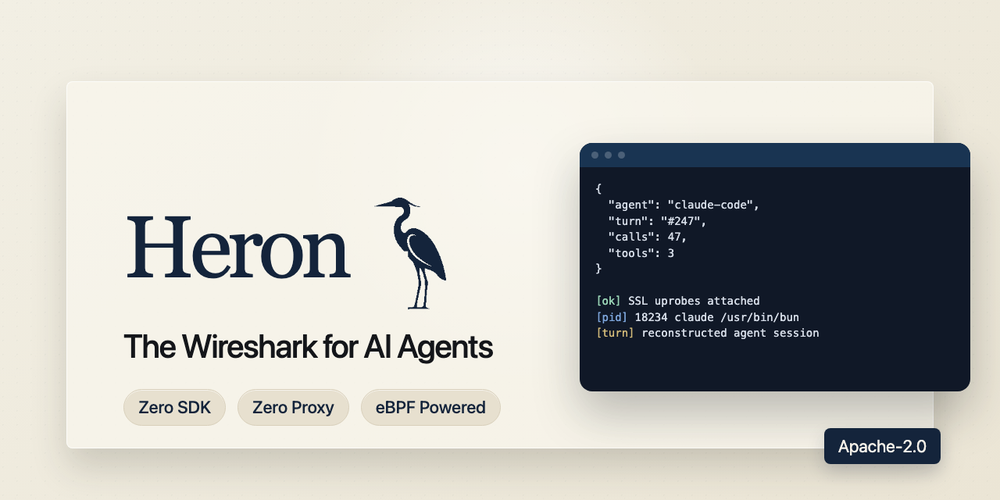
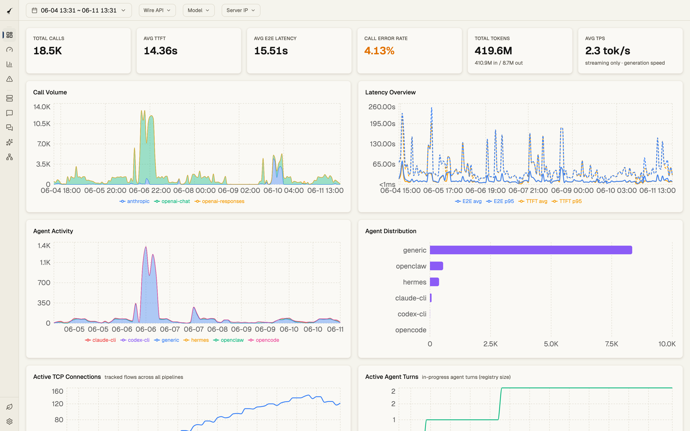
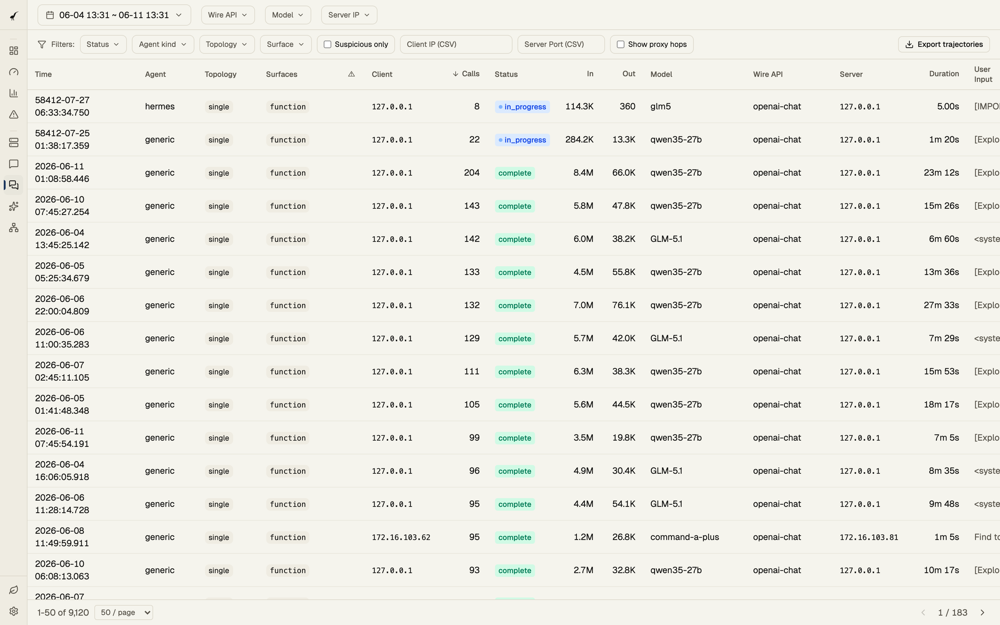

### 🎬 관련 영상
- [🎥 영상 보기](https://ph-files.imgix.net/187ee4a2-41c8-4b8b-ad2c-a455aa03189c.jpeg?auto=format)

---

## 19. [VTT for Mac](https://www.producthunt.com/products/vtt-for-mac)
**Votes**: 86 | **도입 난이도**: 하 | **신뢰도**: 상
**Tagline**: Voice-to-text for macOS with a fully on-device option
**서비스 링크**: https://www.producthunt.com/r/VB2PHZ47JW5OCO

**태그**: Productivity, macOS, Voice-to-Text, Utility

### 📌 이 서비스 한눈에 보기
어떤 앱에서도 즉시 텍스트를 입력할 수 있는 macOS 전용 다국어 음성 인식 도구

### 🔑 주요 기능
- 26개 언어 지원 및 키보드 레이아웃 기반 자동 언어 감지
- 커서 위치에 즉시 텍스트를 입력하는 직관적인 방식
- 온디바이스(On-device) 및 클라우드 엔진 선택 가능

### 🙋 사용자에게 어떤 점이 좋은가
별도의 계정 생성 없이 맥의 모든 앱에서 타이핑 대신 음성으로 빠르게 문서를 작성하거나 메시지를 보낼 수 있습니다.

### ✅ 지금 바로 써볼 기능
- 온디바이스 모드로 개인정보 보호 설정하기
- 다양한 언어 환경에서 자동 감지 기능 테스트하기
- 주로 사용하는 앱에서 커서 입력 기능 확인하기

### ⚠️ 사용 전 확인할 점
- 온디바이스 엔진 사용 시 하드웨어 성능에 따른 처리 속도 차이
- 클라우드 엔진 사용 시 데이터 전송에 따른 프라이버시 고려

### 🧭 확인이 더 필요한 정보
지원되는 26개 언어의 구체적인 목록과 온디바이스 엔진의 정확한 성능 수준은 확인이 필요합니다.

### 📸 스크린샷 및 갤러리
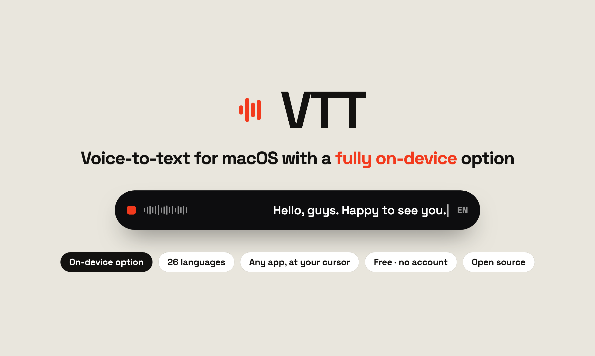
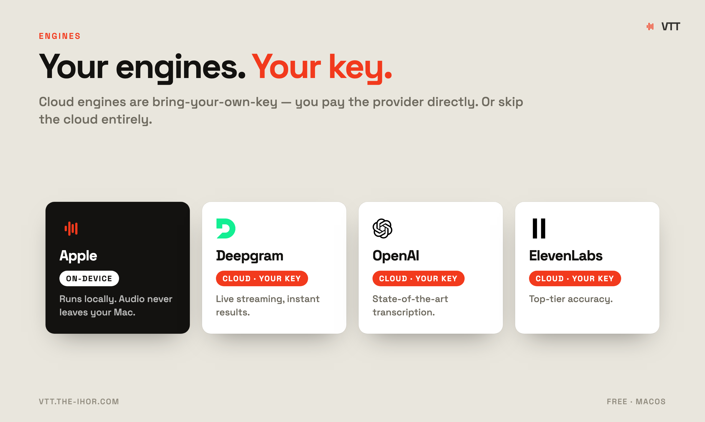
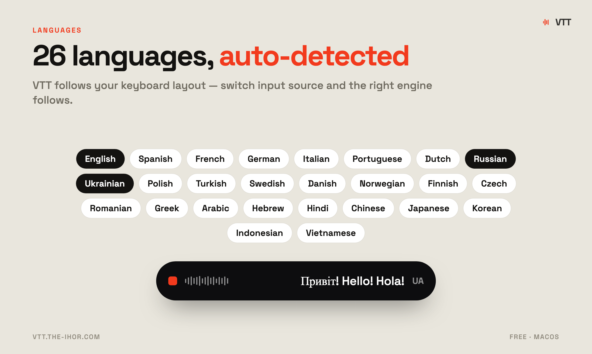

### 🎬 관련 영상
- [🎥 영상 보기](https://ph-files.imgix.net/34718dda-27c6-476f-a6ee-dad426c76f68.jpeg?auto=format)

---

## 20. [SayCraft](https://www.producthunt.com/products/saycraft)
**Votes**: 86 | **도입 난이도**: 하 | **신뢰도**: 상
**Tagline**: Build a web app by talking through a meeting
**서비스 링크**: https://www.producthunt.com/r/QYYZPCUT3W5QLO

**태그**: AI, NoCode, WebDevelopment, Collaboration, Prototyping, AI Tool, Prompting, DevTool

### 📌 이 서비스 한눈에 보기
회의 중 대화만으로 실시간 웹 앱을 구축하는 AI 개발 도구

### 🔑 주요 기능
- 실시간 대화를 통한 라이브 웹 앱 빌드
- 대화 내용이 즉시 반영되는 공유 가능한 미리보기 URL 제공
- 소스 코드 추출 및 원클릭 배포 지원

### 🙋 사용자에게 어떤 점이 좋은가
복잡한 프롬프트 작성 없이 팀 회의나 아이디어 스케치만으로 즉시 작동하는 프로토타입을 만들 수 있습니다.

### ✅ 지금 바로 써볼 기능
- 팀 회의를 통해 아이디어 구체화하기
- 실시간으로 업데이트되는 미리보기 URL 확인하기
- 생성된 소스 코드 검토 및 배포하기

### ⚠️ 사용 전 확인할 점
- 대화만으로 복잡한 비즈니스 로직 구현의 한계 가능성
- 생성된 소스 코드의 품질 및 유지보수 편의성 확인 필요

### 🧭 확인이 더 필요한 정보
대화의 복잡도에 따른 코드 생성의 정확도와 기술 스택 범위를 확인해야 합니다.

### 📸 스크린샷 및 갤러리
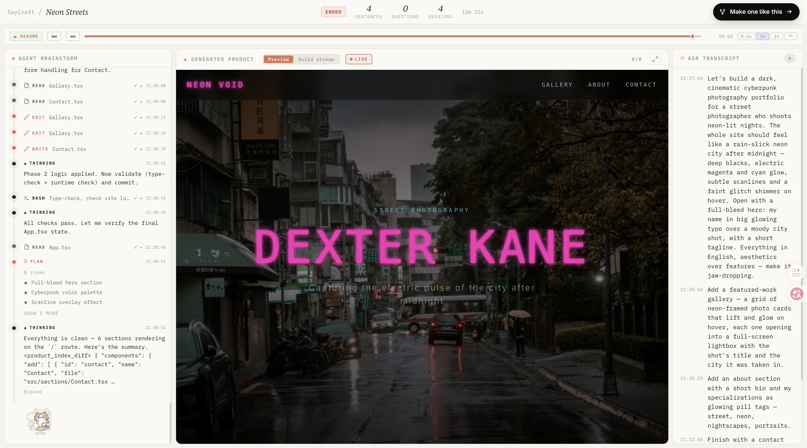
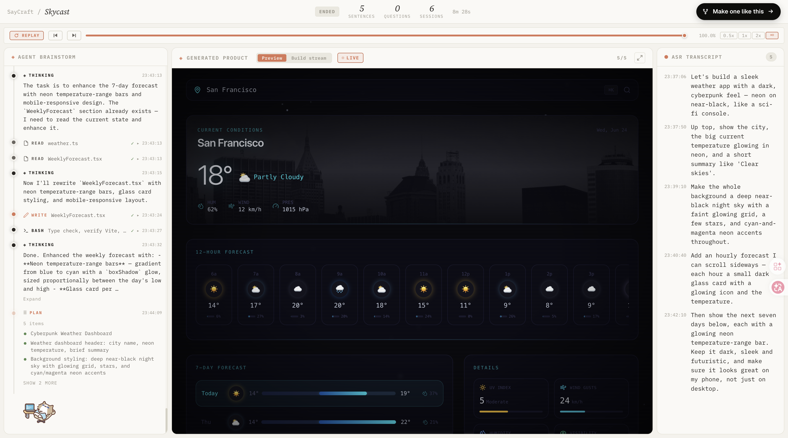
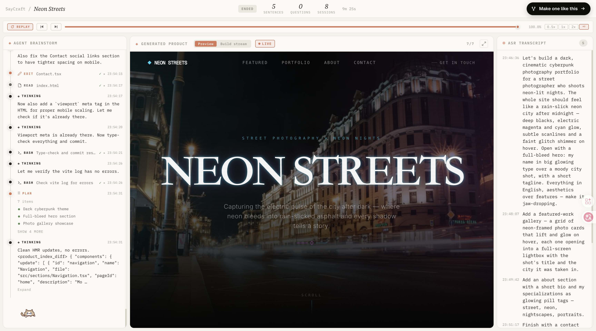

### 🎬 관련 영상
- [🎥 영상 보기](https://ph-files.imgix.net/c1fbfbeb-ee1d-4ab5-9e0b-246a55a73c03.jpeg?auto=format)

---

## 21. [BrowserBash](https://www.producthunt.com/products/browserbash)
**Votes**: 85 | **도입 난이도**: 하 | **신뢰도**: 상
**Tagline**: CLI that turns plain-English into real browser tests
**서비스 링크**: https://www.producthunt.com/r/73MRCM3TY755JK

**태그**: DevTool, Automation, OpenSource, Testing, AI Tool, API

### 📌 이 서비스 한눈에 보기
자연어 한 문장으로 복잡한 코드 없이 브라우저 테스트를 자동화하는 오픈소스 CLI 도구

### 🔑 주요 기능
- 자연어(Plain-English)를 실제 브라우저 테스트 코드로 변환
- 셀렉터나 코드 작성 없이 테스트 자동화 가능
- Ollama 및 OpenRouter 연동으로 API 키나 결제 정보 없이 무료 모델 사용 가능

### 🙋 사용자에게 어떤 점이 좋은가
테스트 스크립트 작성에 드는 시간과 셀렉터 관리의 번거로움을 없애주어, 개발자가 비즈니스 로직에만 집중할 수 있게 합니다.

### ✅ 지금 바로 써볼 기능
- npm install -g browserbash-cli 명령어로 즉시 설치
- Ollama를 활용한 로컬 환경에서의 자연어 테스트 실행
- 기존 브라우저 환경(Chrome 등)과의 연동 테스트

### ⚠️ 사용 전 확인할 점
- 자연어 해석의 정확도에 따라 테스트 결과가 달라질 수 있음
- 로컬 모델 사용 시 하드웨어 리소스 소모 가능성

### 🧭 확인이 더 필요한 정보
복잡한 사용자 흐름이나 동적 요소가 많은 웹사이트에서의 테스트 정확도는 직접 검증이 필요합니다.

### 📸 스크린샷 및 갤러리
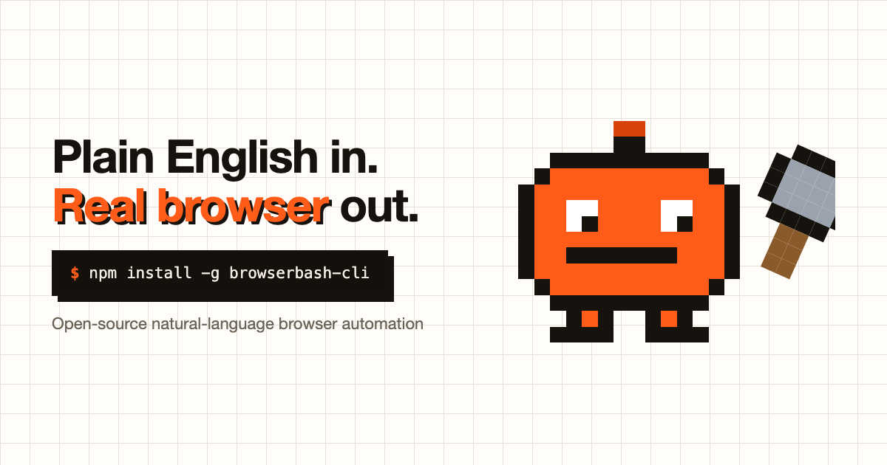
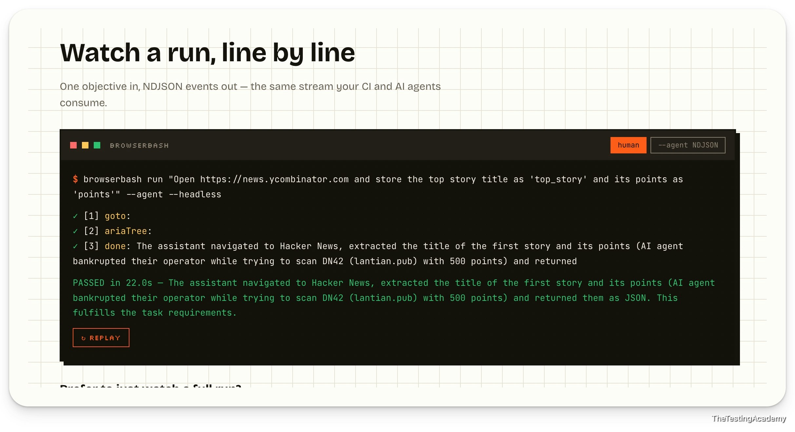
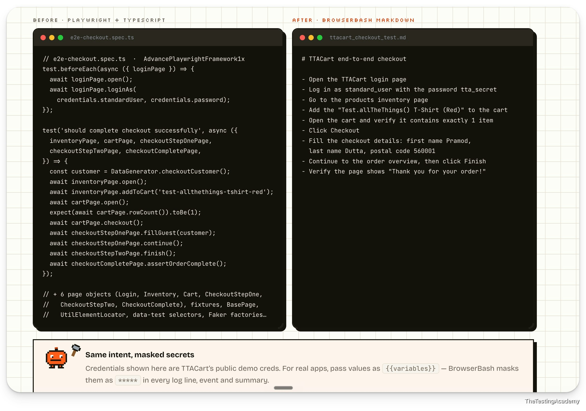

### 🎬 관련 영상
- [🎥 영상 보기](https://ph-files.imgix.net/c7f594f2-5943-49b0-851d-da546b182ed3.gif?auto=format)

---

## 22. [Blop](https://www.producthunt.com/products/blop-ai)
**Votes**: 80 | **도입 난이도**: 하 | **신뢰도**: 상
**Tagline**: Describe your app and Blop tests it and repairs broken tests
**서비스 링크**: https://www.producthunt.com/r/CXRUM5GQQSP2LD

**태그**: DevTool, QA, Automation, AI, Testing, AI Tool

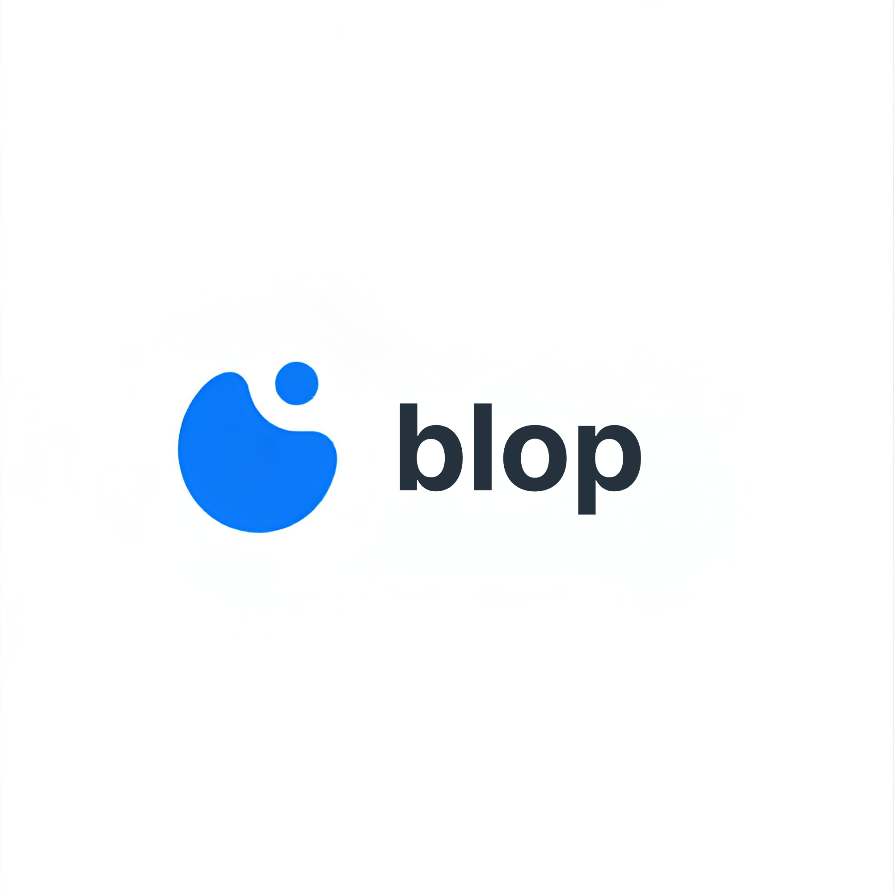

### 📌 이 서비스 한눈에 보기
자연어로 앱 기능을 설명하면 자동으로 테스트 코드를 생성하고, 변경 사항에 맞춰 스스로 수정하는 AI QA 자동화 도구

### 🔑 주요 기능
- 자연어 설명을 통한 간편한 테스트 케이스 생성
- 제품 구조를 매핑하여 실제 사용자처럼 동작하는 테스트 수행
- 코드 변경 시 깨진 테스트를 자동으로 수리하고 PR(Pull Request) 생성

### 🙋 사용자에게 어떤 점이 좋은가
QA 팀이 없는 스타트업이 빠른 배포 속도를 유지하면서도, 테스트 코드 유지보수에 드는 시간을 획기적으로 줄일 수 있습니다.

### ✅ 지금 바로 써볼 기능
- 자연어로 주요 사용자 시나리오 설명해보기
- 생성된 테스트 코드가 로컬 저장소에 어떻게 반영되는지 확인하기
- 배포 시 자동 테스트 및 자동 수정 기능 테스트하기

### ⚠️ 사용 전 확인할 점
- AI가 생성한 테스트 코드의 정확성을 검토하기 위한 리뷰 프로세스 필요
- 복잡한 비즈니스 로직이나 특수한 사용자 흐름에 대한 완벽한 대응 여부 확인 필요

### 🧭 확인이 더 필요한 정보
현재 제공되는 테스트 코드의 프레임워크(Playwright, Cypress 등) 종류와 지원하는 언어 범위에 대한 정보가 명시되지 않았습니다.

### 📸 스크린샷 및 갤러리
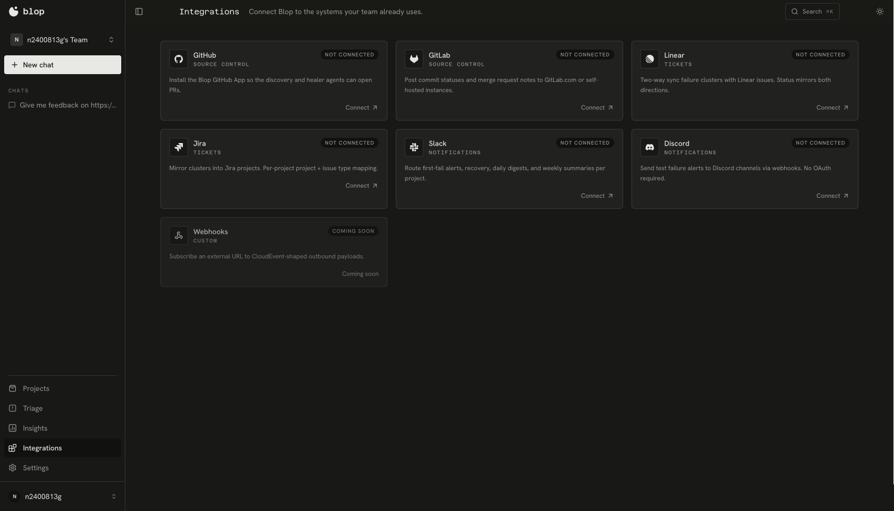
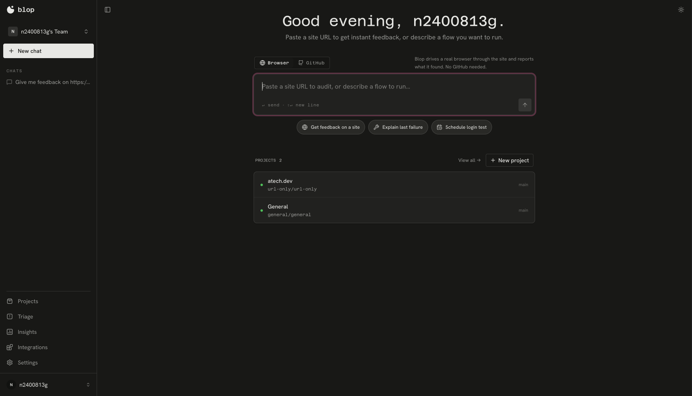
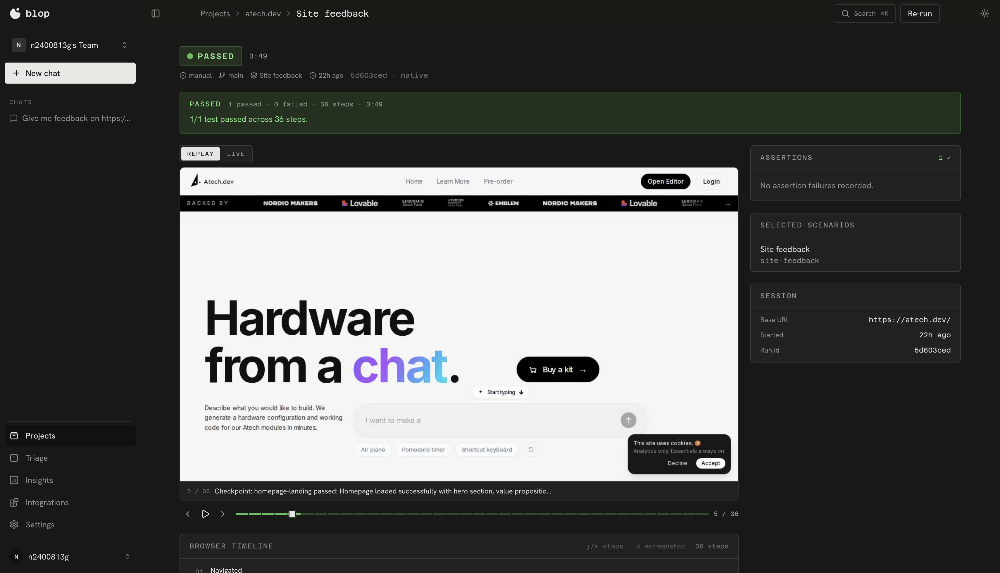

### 🎬 관련 영상
- [🎥 영상 보기](https://ph-files.imgix.net/3e1e4a80-78b3-478c-b84f-441044b110e8.jpeg?auto=format)

---

## 23. [Sidegent](https://www.producthunt.com/products/sidegent)
**Votes**: 79 | **도입 난이도**: 하 | **신뢰도**: 상
**Tagline**: Learn to build AI agents by actually building them
**서비스 링크**: https://www.producthunt.com/r/DDYTOFTX5CQDPE

**태그**: AI, EdTech, DeveloperTools, AgenticAI, Agent, AI Tool, DevTool

### 📌 이 서비스 한눈에 보기
실제 코드를 작성하며 AI 에이전트 구축 기술을 익히는 실습 중심 학습 플랫폼

### 🔑 주요 기능
- 브라우저 내에서 직접 코드를 작성하고 실행하는 핸즈온 학습 환경
- 기초부터 LangGraph, Google ADK, OpenAI 등 최신 프레임워크까지 커버
- 학습 결과가 자동으로 채점되는 자동 채점 시스템 제공

### 🙋 사용자에게 어떤 점이 좋은가
이론에 그치지 않고 실제 코드를 다루며 AI 에이전트 개발 역량을 실무 수준으로 빠르게 끌어올릴 수 있습니다.

### ✅ 지금 바로 써볼 기능
- 브라우저 기반 코딩 환경 테스트
- 기초부터 프레임워크까지 이어지는 커리큘럼 확인
- 무료 시작 기능을 통한 첫 레슨 진행

### ⚠️ 사용 전 확인할 점
- 브라우저 기반 환경이 사용자의 로컬 개발 환경과 차이가 있을 수 있음
- 학습 과정의 난이도 및 커리큘럼의 깊이 확인 필요

### 🧭 확인이 더 필요한 정보
현재 제공되는 구체적인 학습 커리큘럼의 범위와 상세 난이도에 대한 정보가 더 필요합니다.

### 📸 스크린샷 및 갤러리
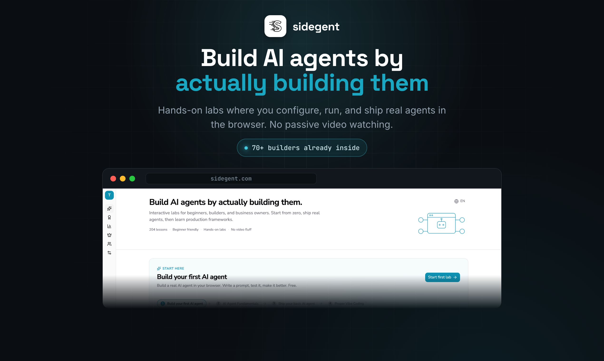
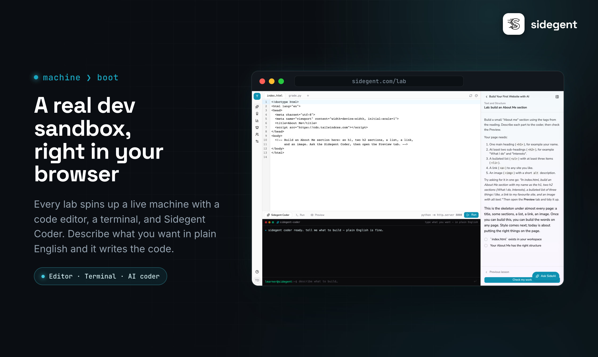
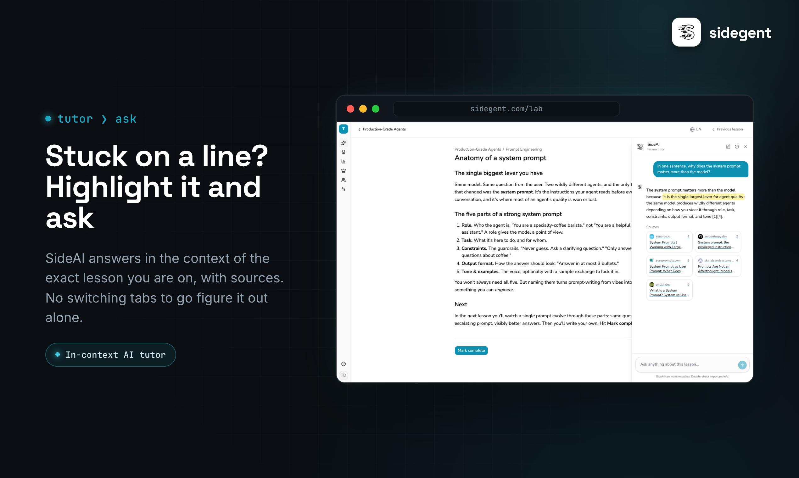

### 🎬 관련 영상
- [🎥 영상 보기](https://ph-files.imgix.net/8b387f55-1186-4904-bf70-9e57e76ab0bc.jpeg?auto=format)

---

## 24. [Signspell](https://www.producthunt.com/products/signspell)
**Votes**: 77 | **도입 난이도**: 하 | **신뢰도**: 상
**Tagline**: Real-time ASL alphabet recognition in py ,pip install and go
**서비스 링크**: https://www.producthunt.com/r/H736WROAFF724R

**태그**: DevTool, ComputerVision, Accessibility, Python, OpenSource, API

### 📌 이 서비스 한눈에 보기
웹캠을 통해 실시간으로 수어를 인식하는 오픈소스 파이썬 라이브러리

### 🔑 주요 기능
- MediaPipe와 LSTM 모델을 활용한 실시간 ASL 알파벳 인식
- 별도의 GPU 없이 일반 노트북 CPU에서도 원활하게 작동
- CLI 도구 및 라이브러리 형태로 제공되어 개발 및 교육용으로 적합

### 🙋 사용자에게 어떤 점이 좋은가
개발자나 교육자가 복잡한 설정 없이 간단한 설치만으로 컴퓨터 비전 기반의 수어 인식 기술을 프로젝트에 즉시 도입할 수 있습니다.

### ✅ 지금 바로 써볼 기능
- pip install을 통한 라이브러리 설치 및 환경 구축
- 웹캠을 활용한 실시간 알파벳 인식 테스트
- 자신의 프로젝트에 라이브러리 임포트하여 기능 통합

### ⚠️ 사용 전 확인할 점
- 미국 수어(ASL) 알파벳에 특화되어 있어 타 언어 수어 인식 여부 확인 필요
- 단순 알파벳(fingerspelling) 인식에 초점이 맞춰져 있음

### 🧭 확인이 더 필요한 정보
특정 조명 환경이나 손 모양의 각도에 따른 인식 정확도 데이터가 명시되지 않았습니다.

### 📸 스크린샷 및 갤러리

---

## 25. [QuickMaker](https://www.producthunt.com/products/quickmaker)
**Votes**: 73 | **도입 난이도**: 하 | **신뢰도**: 상
**Tagline**: State of the art AI models in Blender under one subscription
**서비스 링크**: https://www.producthunt.com/r/GMLIMMG3PJASXF

**태그**: Blender, AI-Generation, 3D-Modeling, Creative-Tools, Automation, AI Tool, API

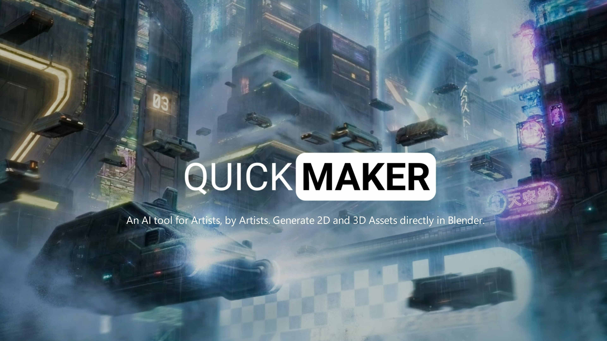

### 📌 이 서비스 한눈에 보기
Blender 워크플로우 내에서 즉시 2D/3D 에셋을 생성할 수 있는 통합 AI 도구

### 🔑 주요 기능
- Blender 환경에 최적화된 AI 모델 통합
- 별도의 API 키 설정 없이 계정 생성만으로 즉시 사용 가능
- 워크플로우 이탈 없는 2D 및 3D 에셋 생성 기능

### 🙋 사용자에게 어떤 점이 좋은가
Blender 작업 중 외부 툴로 이동할 필요 없이 바로 에셋을 생성할 수 있어 작업 효율성이 극대화됩니다.

### ✅ 지금 바로 써볼 기능
- 계정 생성 후 기본 에셋 생성 테스트
- Blender 내 워크플로우 통합성 확인
- 구독 모델 기반의 생성 제한 범위 파악

### ⚠️ 사용 전 확인할 점
- 구독형 모델이므로 사용량에 따른 비용 효율성 검토 필요
- Blender 버전과의 호환성 확인 필요

### 🧭 확인이 더 필요한 정보
구독 플랜에 따른 구체적인 생성 제한 및 지원되는 AI 모델의 종류가 명시되지 않았습니다.

### 📸 스크린샷 및 갤러리

### 🎬 관련 영상
- [🎥 영상 보기](https://ph-files.imgix.net/416fa950-11ab-4774-a709-7d82bbb37a60.jpeg?auto=format)

---

## 26. [Paybond CLI](https://www.producthunt.com/products/paybond)
**Votes**: 73 | **도입 난이도**: 하 | **신뢰도**: 상
**Tagline**: Safe agent spend from the terminal
**서비스 링크**: https://www.producthunt.com/r/IAPCWHDRQXH7JK

**태그**: DevTool, AI-Agent, CLI, Automation, Security, Agent, AI Tool

### 📌 이 서비스 한눈에 보기
터미널 환경에서 AI 에이전트의 지출을 안전하게 제어하고 관리하는 CLI 도구

### 🔑 주요 기능
- TypeScript 및 Python 기반의 명령줄 인터페이스 제공
- 예산 설정, 사전 승인, 결과 검증 및 감사 기록 기능 포함
- Claude, Codex 등 MCP 호스트와의 간편한 연동 지원

### 🙋 사용자에게 어떤 점이 좋은가
개발자가 터미널을 떠나지 않고도 AI 에이전트의 무분별한 비용 지출을 방지하고 보안 가드레일을 구축할 수 있습니다.

### ✅ 지금 바로 써볼 기능
- paybond login 명령어로 샌드박스 환경 접속하기
- paybond init을 통한 유료 도구 가드레일 스캐폴딩
- paybond doctor로 자격 증명 및 에이전트 설정 검증하기

### ⚠️ 사용 전 확인할 점
- CLI 기반 도구이므로 터미널 환경 숙련도 필요
- 연동하려는 특정 AI 모델이나 MCP 호스트와의 호환성 확인 필요

### 🧭 확인이 더 필요한 정보
현재 제공되는 샌드박스 환경 외의 실제 운영 환경 적용 시의 보안 정책과 비용 구조에 대한 상세 정보가 필요합니다.

### 📸 스크린샷 및 갤러리

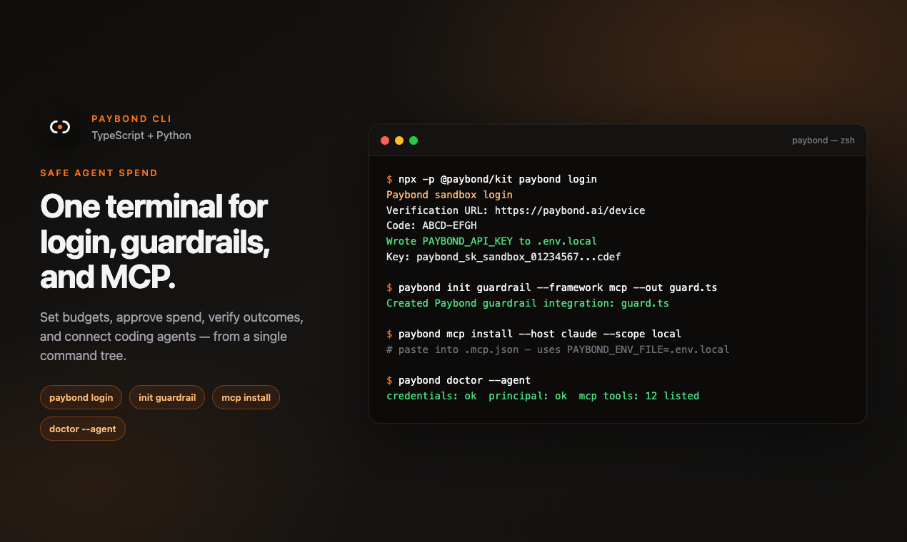
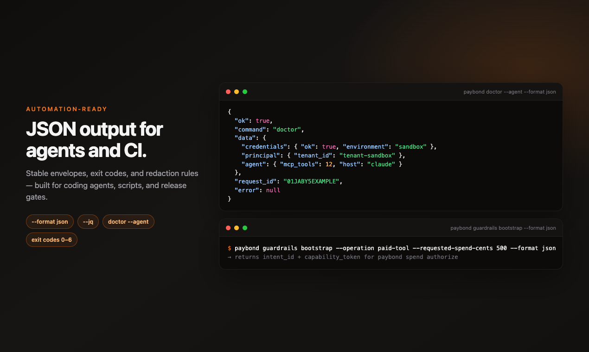

---

## 27. [Torly.AI Visa Master](https://www.producthunt.com/products/torlyai-visa-master)
**Votes**: 41 | **도입 난이도**: 하 | **신뢰도**: 상
**Tagline**: Six UK Innovator visa experts, inside your own Claude.ai
**서비스 링크**: https://www.producthunt.com/r/KRBYFZ46ADBMML

**태그**: Visa-Assistance, AI-Agent, Entrepreneurship, UK-Immigration, AI Tool

### 📌 이 서비스 한눈에 보기
Claude.ai 내에서 6인의 전문가와 함께하는 영국 혁신가 비자(Innovator Founder Visa) 준비 솔루션

### 🔑 주요 기능
- Claude.ai 커넥터를 통해 6명의 영국 비자 전문가 페르소나 활용
- 4F 혁신 매트릭스 스코어링 및 사업 계획/재무 스캐폴딩 제공
- 엔도스먼트(Endorsement) 매칭 및 인터뷰 코칭 지원

### 🙋 사용자에게 어떤 점이 좋은가
별도의 복잡한 플랫폼 이동 없이 기존 Claude 구독 환경에서 전문적인 비자 준비 가이드를 받을 수 있습니다.

### ✅ 지금 바로 써볼 기능
- 4F 혁신 매트릭스를 통한 사업 아이디어 점수 측정하기
- 비자 승인을 위한 사업 계획 및 재무 구조 초안 작성하기
- 전문가 페르소나를 활용한 가상 인터뷰 연습하기

### ⚠️ 사용 전 확인할 점
- AI 기반 가이드이므로 실제 비자 승인을 보장하지 않음
- 사용자의 Claude.ai 구독이 필요함

### 🧭 확인이 더 필요한 정보
제공되는 6인의 전문가 페르소나가 구체적으로 어떤 전문 분야를 담당하는지 명시되어 있지 않습니다.

### 📸 스크린샷 및 갤러리
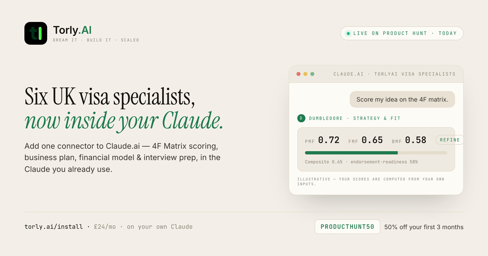
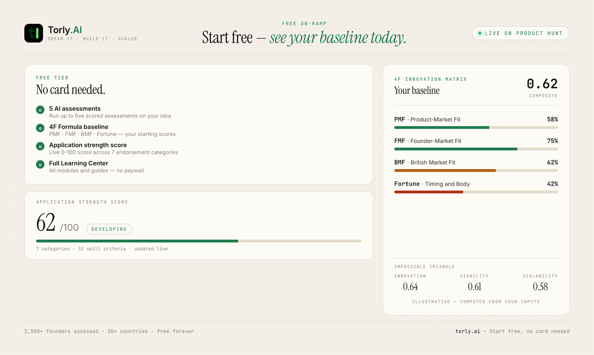
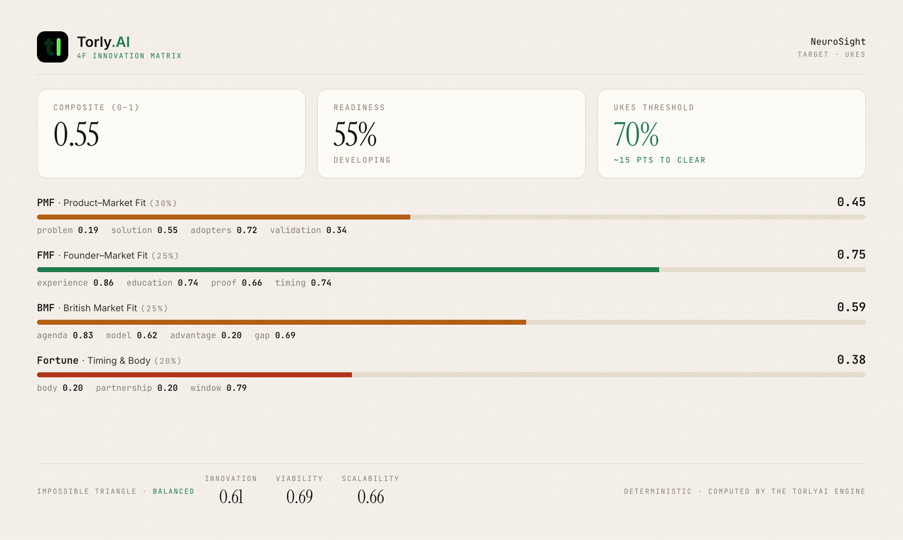

### 🎬 관련 영상
- [🎥 영상 보기](https://ph-files.imgix.net/b7982fea-1832-413e-addd-ec459f47f3cb.jpeg?auto=format)

---

## 28. [EasyEnv](https://www.producthunt.com/products/easyenv)
**Votes**: 33 | **도입 난이도**: 중 | **신뢰도**: 상
**Tagline**: Interview Engineers in Real Work Environments
**서비스 링크**: https://www.producthunt.com/r/LBWULAMNY52DV4

**태그**: Hiring, Engineering, DevOps, InterviewTool, Agent, AI Tool, Chat, Prompting

### 📌 이 서비스 한눈에 보기
실제 업무 환경과 유사한 인프라를 제공하여 엔지니어의 실무 역량을 검증하는 인터뷰 플랫폼

### 🔑 주요 기능
- 머신, 데이터베이스, 로그 등 실제 운영 환경과 유사한 문제 해결 환경 제공
- AI 챗봇/에이전트 활용을 통한 프롬프트 및 디버깅 역량 평가 가능
- 모든 세션의 기록 및 점수화를 통한 객관적인 채용 근거 마련

### 🙋 사용자에게 어떤 점이 좋은가
단순 코딩 테스트를 넘어 실제 업무 상황에서의 문제 해결 능력을 데이터 기반으로 검증할 수 있습니다.

### ✅ 지금 바로 써볼 기능
- 실제 업무 시나리오 기반의 환경 설정 테스트
- AI 도구 활용 시의 문제 해결 프로세스 관찰
- 세션 기록 및 스코어링 시스템 검토

### ⚠️ 사용 전 확인할 점
- 환경 설정 및 시나리오 구축에 필요한 초기 리소스
- 실제 업무 환경과 유사성을 확보하기 위한 운영 복잡도

### 🧭 확인이 더 필요한 정보
제공되는 인프라 환경의 구체적인 기술 스택 범위와 보안 정책에 대한 확인이 필요합니다.

### 📸 스크린샷 및 갤러리
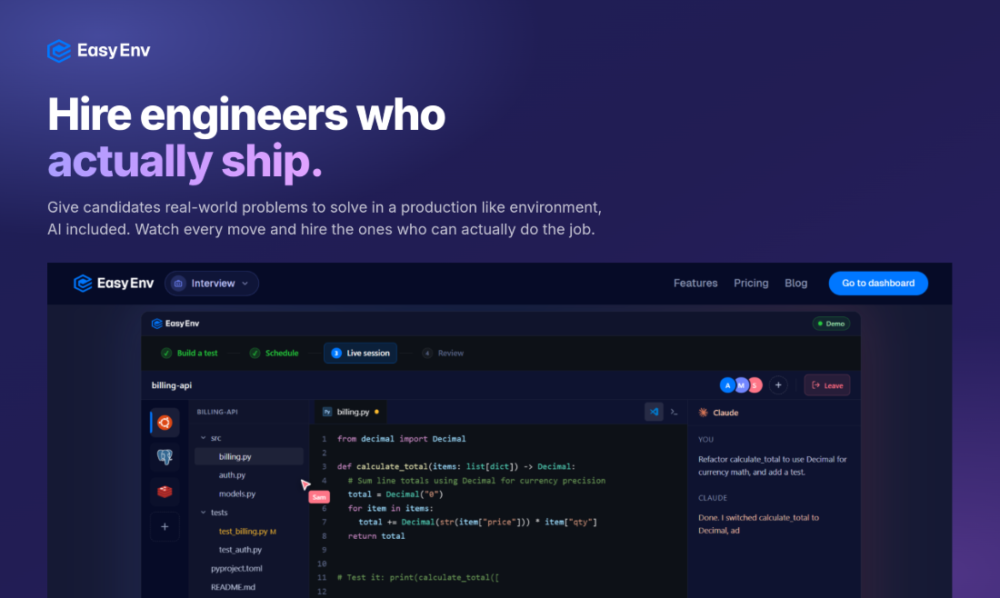
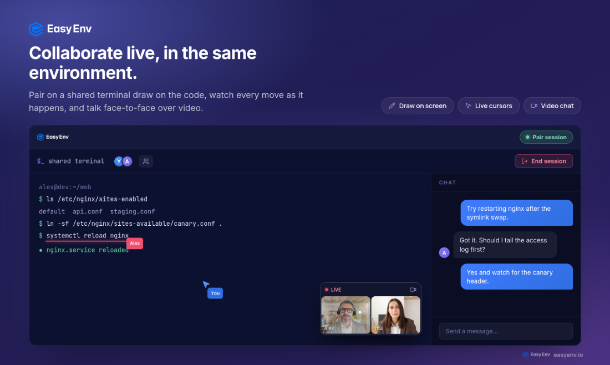
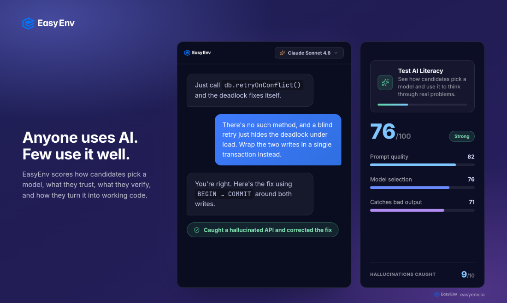

### 🎬 관련 영상
- [🎥 영상 보기](https://ph-files.imgix.net/5323dc7b-8e78-451a-80ae-0b0e2f93b2b7.jpeg?auto=format)

---

## 29. [Senthor](https://www.producthunt.com/products/senthor-2)
**Votes**: 28 | **도입 난이도**: 하 | **신뢰도**: 상
**Tagline**: Get paid every time AI crawls your content
**서비스 링크**: https://www.producthunt.com/r/FOSVTC4ZIHD2CX

**태그**: SaaS, Monetization, AI-Tools, Web-Infrastructure, AI Tool, DevTool

### 📌 이 서비스 한눈에 보기
AI 크롤러의 콘텐츠 무단 수집을 방지하고 실시간 마이크로 결제를 통해 수익을 창출하는 솔루션

### 🔑 주요 기능
- 서버 레벨에서 AI 봇을 실시간으로 식별 및 지문 인식(Fingerprinting)
- 콘텐츠 전달 전 머신 간(M2M) 마이크로 결제 트리거를 통한 수익화
- 코드 변경 없이 기존 서버에 플러그인 방식으로 간편하게 도입 가능

### 🙋 사용자에게 어떤 점이 좋은가
콘텐츠 제작자가 AI 기업으로부터 무단으로 데이터를 탈취당하는 문제를 해결하고, 데이터 제공에 대한 정당한 대가를 즉각적으로 받을 수 있습니다.

### ✅ 지금 바로 써볼 기능
- 서비스 도입을 위한 서버 호환성 확인
- 크롤링당당 단가(Price per crawl) 설정
- AI 봇 식별 및 결제 워크플로우 테스트

### ⚠️ 사용 전 확인할 점
- 서버 레벨에서의 트래픽 부하 및 성능 영향 확인 필요
- 결제 시스템과 기존 서버 인프라 간의 연동 안정성 검토

### 🧭 확인이 더 필요한 정보
구체적인 기술적 구현 방식(플러그인 형태)과 지원되는 서버 환경에 대한 상세 정보가 필요합니다.

### 📸 스크린샷 및 갤러리
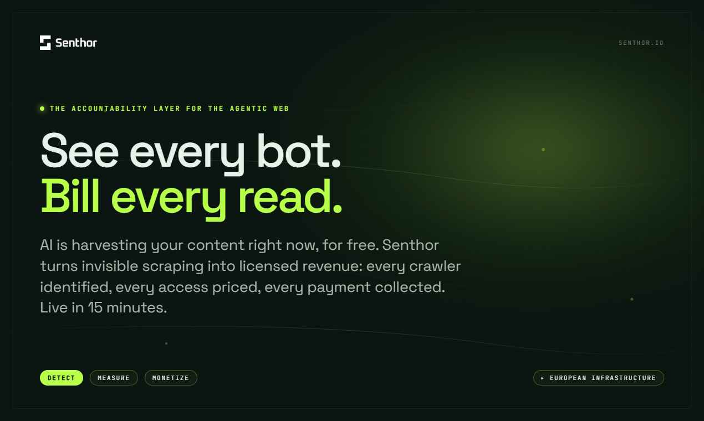
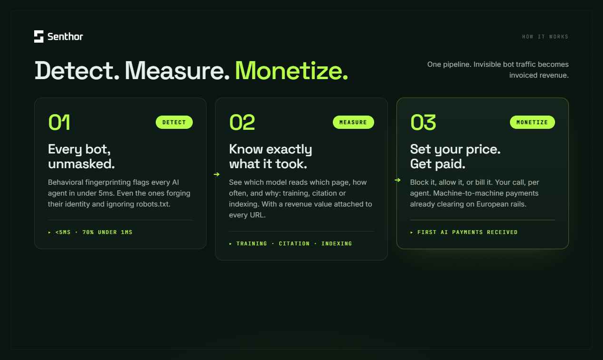
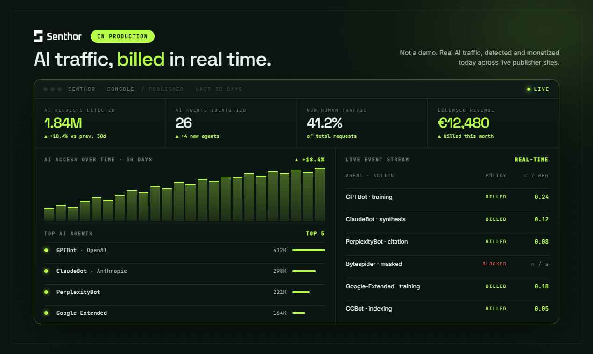

---

## 30. [RetainIq](https://www.producthunt.com/products/retainiq)
**Votes**: 26 | **도입 난이도**: 중 | **신뢰도**: 상
**Tagline**: AI decision intelligence for SaaS customer retention
**서비스 링크**: https://www.producthunt.com/r/3XKR3PF5XJXC7O

**태그**: SaaS, AI, Customer Retention, Revenue Recovery, Decision Intelligence, AI Tool

### 📌 이 서비스 한눈에 보기
단순 데이터 대시보드를 넘어, 매출 회복을 위한 최적의 행동 지침을 제공하는 AI 기반 SaaS 리텐션 솔루션

### 🔑 주요 기능
- 데이터 시각화를 넘어 우선순위가 지정된 실행 가능한 액션(Actionable Intelligence) 제공
- 매출 영향도를 기반으로 연락 대상, 이유, 최적의 다음 행동을 자동 제안
- 결과를 학습하여 추천 정확도를 지속적으로 개선하는 AI 엔진 탑재

### 🙋 사용자에게 어떤 점이 좋은가
단순히 이탈 지표를 확인하는 데 그치지 않고, 어떤 고객에게 어떤 조치를 취해야 매출 손실을 막을 수 있는지 즉각적인 가이드를 제공받을 수 있습니다.

### ✅ 지금 바로 써볼 기능
- 현재 고객 데이터 연동 및 분석
- AI가 제안하는 우선순위 리스트 확인
- 제안된 액션 실행 후 결과 피드백 반영

### ⚠️ 사용 전 확인할 점
- 기존 CRM 및 고객 데이터 플랫폼과의 연동 필요성
- AI 추천 결과가 실제 비즈니스 맥락과 일치하는지 검증 필요

### 🧭 확인이 더 필요한 정보
현재 구체적인 데이터 연동 방식 및 기존 SaaS 툴과의 통합 범위가 명시되지 않았습니다.

### 📸 스크린샷 및 갤러리
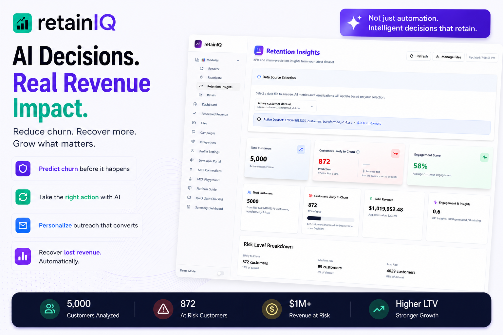
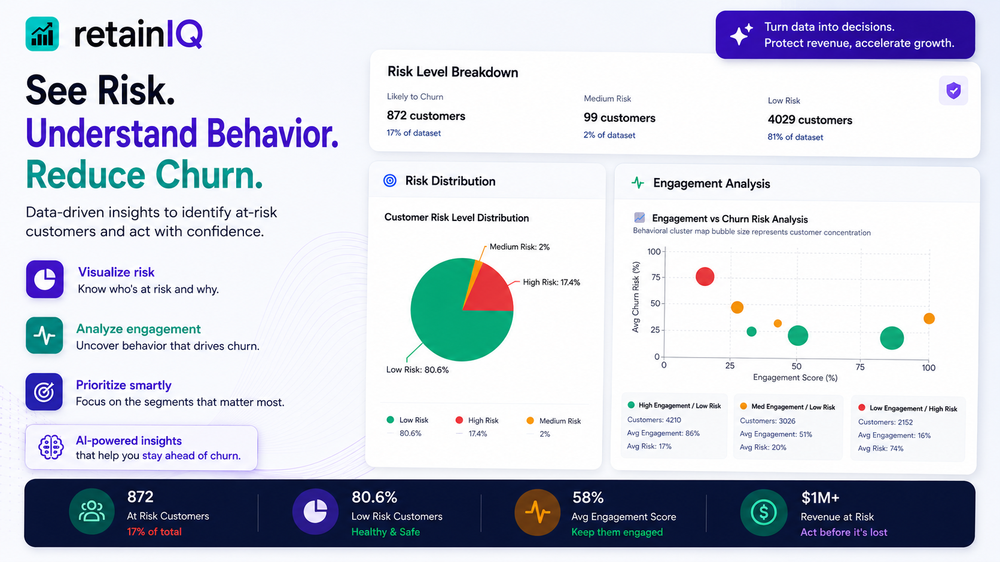
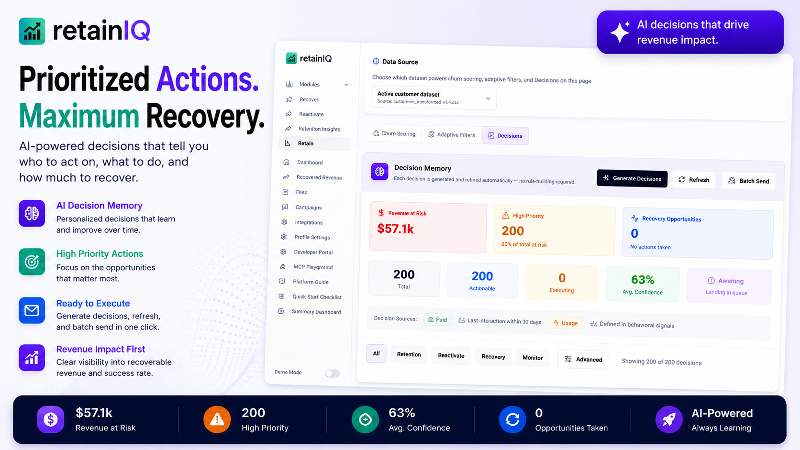

### 🎬 관련 영상
- [🎥 영상 보기](https://ph-files.imgix.net/183b5902-0d0c-4add-b8b8-64b79902e6d5.jpeg?auto=format)

---

