# 🚀 Product Hunt Daily Top 30 (2026-06-30)

## 오늘의 요약
오늘의 트렌드는 AI 에이전트가 단순한 보조를 넘어 코딩, 마케팅, 회계 등 전문적인 워크플로우를 자율적으로 수행하는 방향으로 진화하고 있습니다. 특히 AI 검색 엔진 최적화(GEO)나 코딩 에이전트를 위한 맥락 유지 기술 등 AI 시대의 새로운 요구사항을 해결하는 도구들이 주목받았습니다.

### 오늘의 핵심 포인트
- AI 코딩 에이전트의 생산성을 높이기 위한 프로젝트 맥락 유지 및 모델 통합 서비스가 등장했습니다.
- 소셜 미디어 콘텐츠 생성부터 광고 예산 관리까지 마케팅 워크플로우를 자동화하는 솔루션이 강세를 보였습니다.
- AI 답변 엔진 내 브랜드 노출도를 측정하거나 영상 비율을 자동 변환하는 등 AI 기술을 활용한 새로운 형태의 최적화 도구들이 주목받았습니다.

**오늘의 태그**: AI 에이전트, 마케팅 자동화, 코딩 생산성, 워크플로우 최적화

## 1. [Spira](https://www.producthunt.com/products/spira-ai)
**Votes**: 326 | **도입 난이도**: 중 | **신뢰도**: 상
**Tagline**: Social media growth agents that build your momentum 
**서비스 링크**: https://www.producthunt.com/r/T7AK4DSW7OYURG

**태그**: AI, SocialMedia, Automation, Marketing, Agent, AI Tool

### 📌 이 서비스 한눈에 보기
제품 출시 효과를 극대화하는 AI 기반 소셜 미디어 자동 성장 에이전트

### 🔑 주요 기능
- 창업팀 페르소나를 복제한 AI 인플루언서 생성
- TikTok, IG, X, LinkedIn 등 주요 플랫폼 자동 콘텐츠 발행
- 제품 출시 시점에 맞춘 전략적 모멘텀 구축

### 🙋 사용자에게 어떤 점이 좋은가
제품 출시와 같은 중요한 시점에 팀을 대신해 소셜 미디어에 콘텐츠를 계획하고 게시함으로써 브랜드 노출을 자동화할 수 있습니다.

### ✅ 지금 바로 써볼 기능
- 제품 링크 등록을 통한 브랜드 에이전트 활성화
- 창업팀 페르소나 클론 설정
- 플랫폼별 자동 게시 스케줄링 확인

### ⚠️ 사용 전 확인할 점
- AI가 생성한 콘텐츠의 톤앤매너가 실제 브랜드 이미지와 일치하는지 검토 필요
- 자동 게시로 인한 플랫폼별 스팸 정책 위반 여부 확인

### 🧭 확인이 더 필요한 정보
사용자가 직접 개입하는 정도와 콘텐츠 승인 프로세스에 대한 구체적인 워크플로우 확인이 필요합니다.

### 📸 스크린샷 및 갤러리

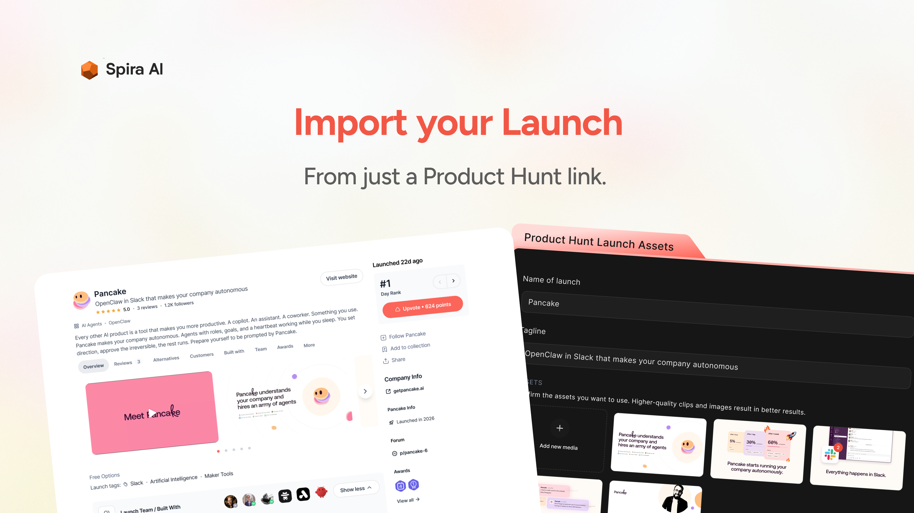
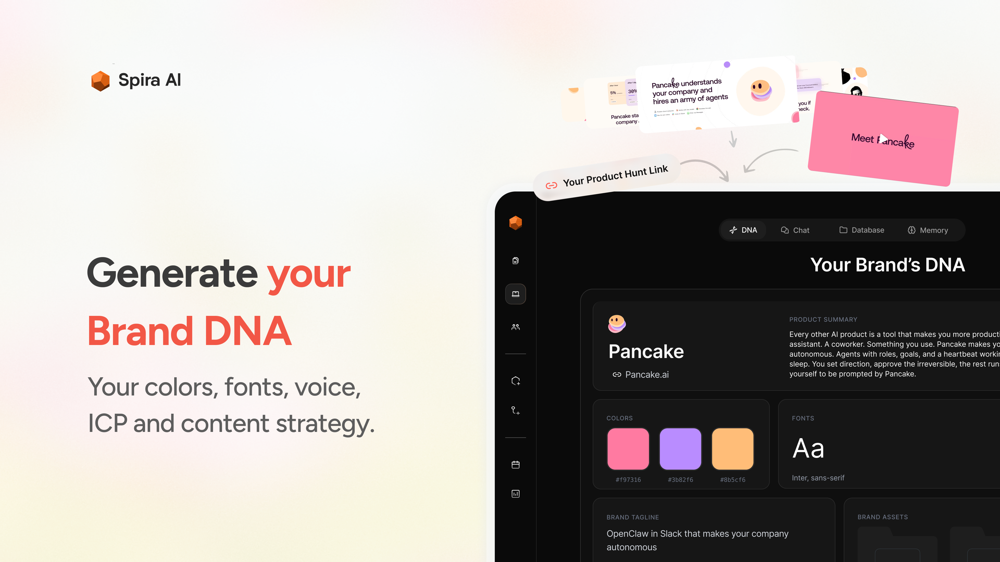

---

## 2. [Agent Mode by Receiptor AI](https://www.producthunt.com/products/receiptor-ai)
**Votes**: 319 | **도입 난이도**: 하 | **신뢰도**: 상
**Tagline**: Bookkeeping assistant that runs receipt workflows end-to-end
**서비스 링크**: https://www.producthunt.com/r/DVSAWE2SN72E2P

**태그**: Automation, FinTech, AI-Agent, Productivity, Agent, AI Tool, Chat

### 📌 이 서비스 한눈에 보기
영수증 수집부터 회계 매칭까지 자동으로 처리하는 AI 기반 엔드투엔드 장부 관리 비서

### 🔑 주요 기능
- 이메일 및 모바일 영수증 자동 수집 및 클라우드/회계 소프트웨어 정리
- 은행 거래 내역과 영수증을 자동으로 매칭하는 높은 정확도(99%)
- 앱, WhatsApp, Claude, ChatGPT 등 다양한 채널을 통한 데이터 쿼리 지원

### 🙋 사용자에게 어떤 점이 좋은가
번거로운 영수증 정리와 장부 대조 작업을 자동화하여, 사용자는 별도의 작업 없이 항상 깨끗하게 정리된 회계 데이터를 유지할 수 있습니다.

### ✅ 지금 바로 써볼 기능
- 이메일 및 모바일 연동을 통한 영수증 자동 수집 설정
- 기존 회계 소프트웨어와의 데이터 동기화 확인
- WhatsApp이나 AI 채팅창을 통한 데이터 조회 테스트

### ⚠️ 사용 전 확인할 점
- 99% 정확도 외의 예외 상황 발생 시 사용자 개입 필요
- 기존 사용 중인 회계 소프트웨어와의 호환성 확인 필요

### 🧭 확인이 더 필요한 정보
사용자의 기존 회계 소프트웨어와 구체적으로 어떤 플랫폼들이 연동되는지 명시되지 않았습니다.

### 📸 스크린샷 및 갤러리
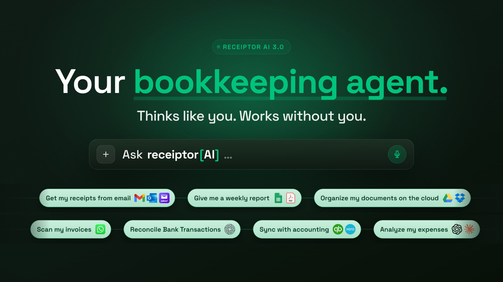
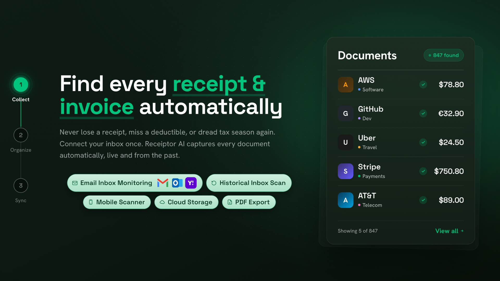
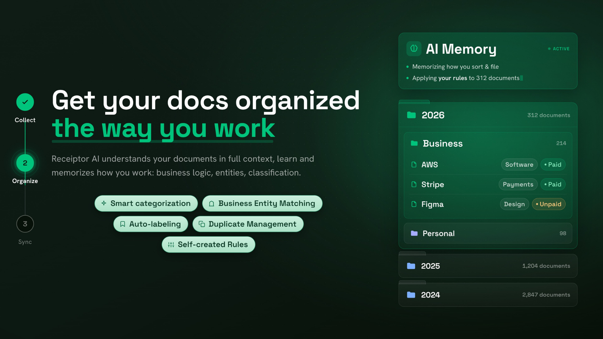

### 🎬 관련 영상
- [🎥 영상 보기](https://ph-files.imgix.net/a8c25282-e5a4-4d51-a0f0-1a7ea72b5b0c.jpeg?auto=format)

---

## 3. [ClinePass](https://www.producthunt.com/products/cline-4)
**Votes**: 258 | **도입 난이도**: 하 | **신뢰도**: 상
**Tagline**: Run the best open-weights models in Cline
**서비스 링크**: https://www.producthunt.com/r/4XBT2KCNTOUDKC

**태그**: DevTool, AI-Coding, OpenSource-Models, Agent, Automation, AI Tool, API

### 📌 이 서비스 한눈에 보기
월 $9.99로 다양한 오픈 웨이트 모델을 Cline에서 제한 없이 사용하는 통합 구독 서비스

### 🔑 주요 기능
- GLM, Kimi, DeepSeek 등 주요 오픈 웨이트 모델 통합 제공
- 표준 API 대비 2~5배 높은 높은 속도 제한(Rate Limits) 제공
- 여러 API 키와 결제 페이지를 관리할 필요 없는 단일 구독 모델

### 🙋 사용자에게 어떤 점이 좋은가
Cline 사용자라면 복잡한 API 설정이나 개별 결제 없이 하나의 구독으로 강력한 에이전틱 코딩 워크플로우를 즉시 구축할 수 있습니다.

### ✅ 지금 바로 써볼 기능
- Cline 환경에 ClinePass 연결하기
- DeepSeek 등 주요 모델로 코딩 작업 테스트하기
- 높은 Rate Limit 환경에서 대규모 코드 작업 수행하기

### ⚠️ 사용 전 확인할 점
- 특정 모델의 가용성이나 성능 차이가 발생할 수 있음
- 구독 모델이므로 사용량에 따른 비용 효율성 검토 필요

### 🧭 확인이 더 필요한 정보
제공되는 모델의 구체적인 목록과 실시간 가용성은 서비스 정책에 따라 변동될 수 있습니다.

### 📸 스크린샷 및 갤러리
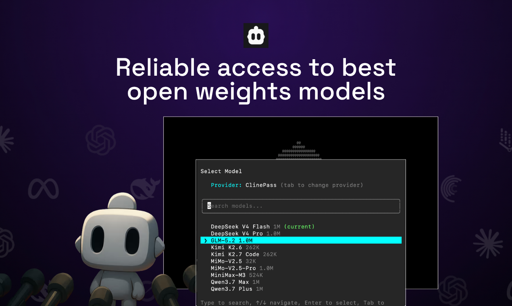
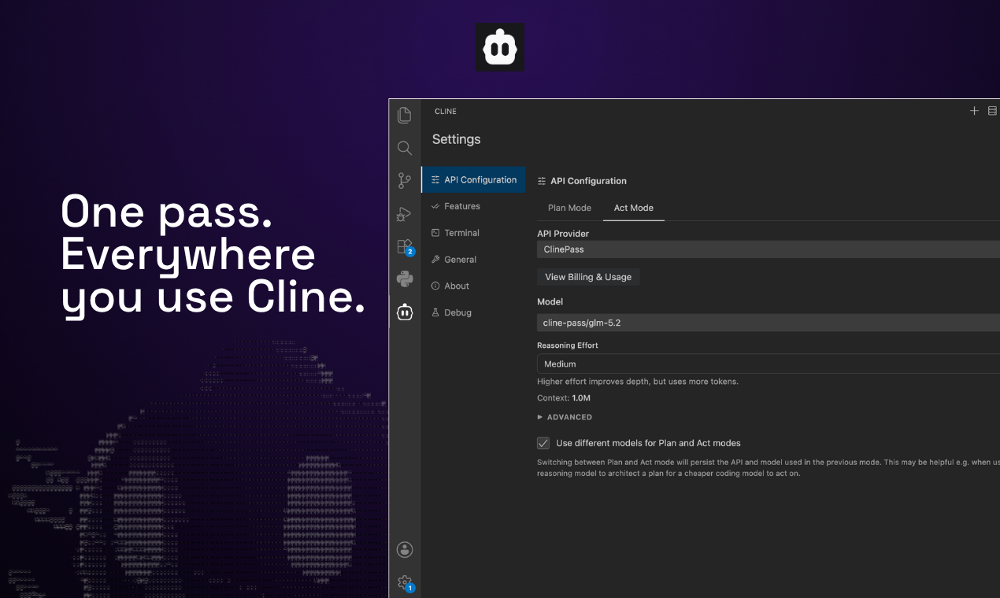
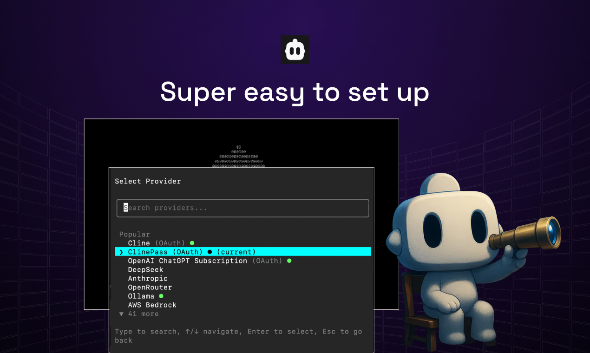

### 🎬 관련 영상
- [🎥 영상 보기](https://ph-files.imgix.net/7f777d88-03d5-45b5-b60b-71d973bee06d.jpeg?auto=format)

---

## 4. [VisibAI](https://www.producthunt.com/products/visibai-ai-visibility-audit-tool)
**Votes**: 196 | **도입 난이도**: 하 | **신뢰도**: 상
**Tagline**: Are you in AI answers? Find out and fix it in minutes
**서비스 링크**: https://www.producthunt.com/r/RZKKIOKZE7VJEC

**태그**: AI-SEO, Marketing-Tech, Analytics, SaaS, AI Tool, Chat

### 📌 이 서비스 한눈에 보기
AI 답변 엔진 내 브랜드 노출도를 측정하고 최적화 솔루션을 제공하는 서비스

### 🔑 주요 기능
- 6대 주요 AI 플랫폼(ChatGPT, Perplexity, Claude 등) 대상 가시성 점수 측정
- 경쟁사 노출 현황 분석 및 우선순위가 지정된 개선 리스트 제공
- 즉시 적용 가능한 수정 파일 및 브랜드 리포트 생성

### 🙋 사용자에게 어떤 점이 좋은가
AI 검색 결과에서 우리 브랜드가 누락되는 문제를 데이터로 확인하고, 즉각적인 해결책을 통해 AI 시대의 새로운 마케팅 기회를 잡을 수 있습니다.

### ✅ 지금 바로 써볼 기능
- 현재 브랜드의 AI 가시성 점수(0-100) 확인하기
- AI 답변에서 우리 대신 노출되는 경쟁사 식별하기
- 제공되는 수정 파일을 활용해 AI 최적화 작업 수행하기

### ⚠️ 사용 전 확인할 점
- AI 모델의 답변 로직이 수시로 변하므로 지속적인 모니터링이 필요함
- 제공되는 수정 파일이 실제 AI 모델의 답변에 반영되는 시점은 가변적임

### 🧭 확인이 더 필요한 정보
구체적인 월간 구독 비용 및 에이전시용 화이트라벨링 요금 체계는 명시되지 않았습니다.

### 📸 스크린샷 및 갤러리
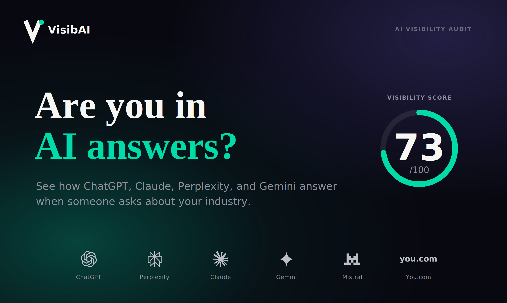
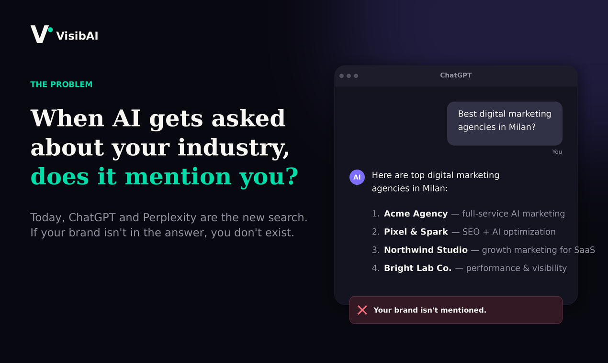
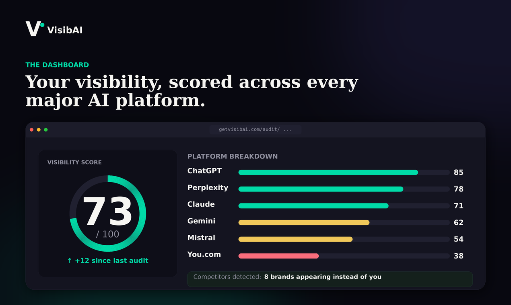

### 🎬 관련 영상
- [🎥 영상 보기](https://ph-files.imgix.net/b912479c-dba9-487e-bf3c-501a77a28059.jpeg?auto=format)

---

## 5. [PMB](https://www.producthunt.com/products/pmb-local-first-memory-for-ai)
**Votes**: 177 | **도입 난이도**: 하 | **신뢰도**: 상
**Tagline**: Stop re-explaining your project to AI coding agents
**서비스 링크**: https://www.producthunt.com/r/XHBXGWG3FHAQJZ
**재등장**: 최근 7일 내 재등장 (마지막 등장 1일 전)

**태그**: DevTool, AI-Agent, Productivity, OpenSource, Agent, AI Tool, LLM, API

### 📌 이 서비스 한눈에 보기
AI 코딩 에이전트에게 매번 프로젝트 맥락을 설명할 필요 없는 로컬 기반의 지속적 메모리 워크스페이스

### 🔑 주요 기능
- MCP를 통한 Claude Code, Cursor, Zed 등 AI 도구와의 연동
- 로컬 SQLite 기반의 오프라인 퍼스트 및 프라이버시 중심 설계
- 의사결정, 목표, 프로젝트 사실 관계를 저장하는 영속적 메모리 제공

### 🙋 사용자에게 어떤 점이 좋은가
AI 코딩 도구가 프로젝트의 히스토리와 맥락을 즉각적으로 파악하게 하여, 반복적인 설명 과정을 줄이고 개발 생산성을 높여줍니다.

### ✅ 지금 바로 써볼 기능
- 사용 중인 AI 코딩 에이전트에 MCP 설정하기
- 로컬 대시보드를 통해 저장된 메모리 확인하기
- 프로젝트 핵심 규칙과 결정 사항을 SQLite 워크스페이스에 기록하기

### ⚠️ 사용 전 확인할 점
- 로컬 파일 기반이므로 데이터 백업 및 관리 책임이 사용자에게 있음
- 사용 중인 AI 도구의 MCP 지원 여부에 따라 기능 활용도가 달라질 수 있음

### 🧭 확인이 더 필요한 정보
현재 제공되는 대시보드와 임팩트 트래킹 기능이 구체적으로 어떤 지표를 시각화하는지 확인이 필요합니다.

### 📸 스크린샷 및 갤러리
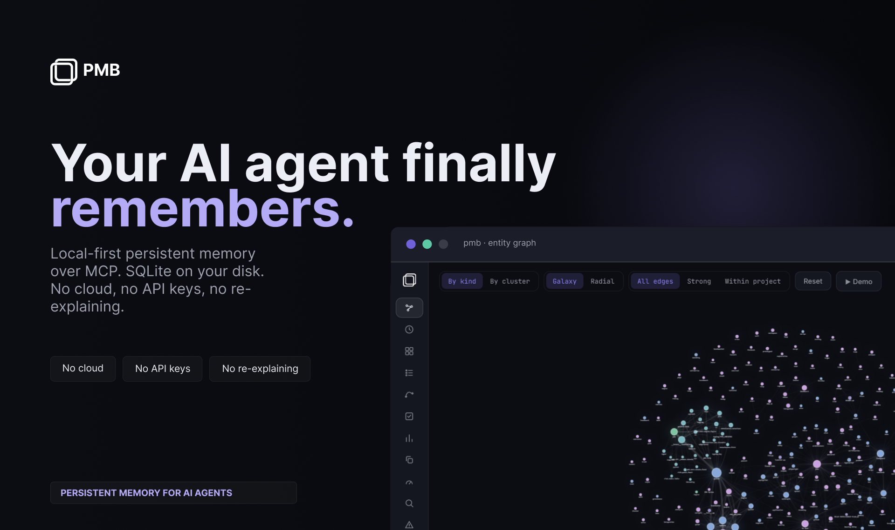
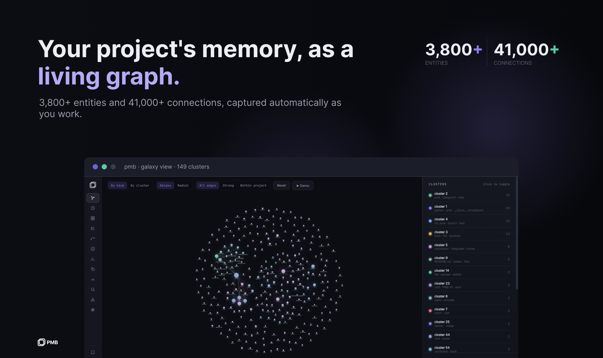
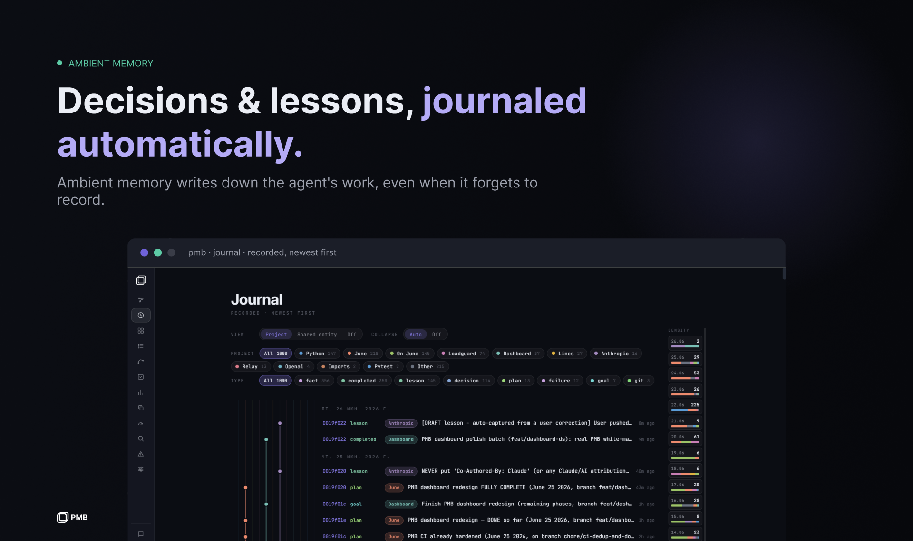

### 🎬 관련 영상
- [🎥 영상 보기](https://ph-files.imgix.net/a414e40e-2a3a-4a84-a210-0bee00eaa5a7.gif?auto=format)

---

## 6. [Crest](https://www.producthunt.com/products/crest-3)
**Votes**: 132 | **도입 난이도**: 하 | **신뢰도**: 상
**Tagline**: System stats and translation on your Mac's notch
**서비스 링크**: https://www.producthunt.com/r/HLYRDPGX2RV3IF

**태그**: Productivity, Mac, Utility

### 📌 이 서비스 한눈에 보기
맥북 노치 영역을 활용해 시스템 상태와 다양한 정보를 한눈에 확인하는 대시보드 앱

### 🔑 주요 기능
- 맥북 노치 공간을 활용한 직관적인 정보 표시
- 음악 재생 상태, 시스템 통계, 캘린더, 작업 관리 등 다양한 기능 제공
- 번역 기능을 포함한 다목적 허브 역할

### 🙋 사용자에게 어떤 점이 좋은가
별도의 창을 열지 않고도 노치 영역을 통해 실시간 정보를 확인할 수 있어 작업 흐름을 방해받지 않고 생산성을 높일 수 있습니다.

### ✅ 지금 바로 써볼 기능
- 노치 영역에 표시되는 시스템 상태 확인하기
- 현재 재생 중인 미디어 컨트롤 사용해보기
- 캘린더 및 작업 목록 연동해보기

### ⚠️ 사용 전 확인할 점
- 노치 디자인이 없는 맥북 모델에서는 활용도가 낮을 수 있음
- Pro 버전(유료)과 무료 버전 간의 기능 차이 확인 필요

### 🧭 확인이 더 필요한 정보
무료 버전에서 제공되는 기능의 범위와 Pro 버전의 구체적인 차이점에 대한 정보가 더 필요합니다.

### 📸 스크린샷 및 갤러리
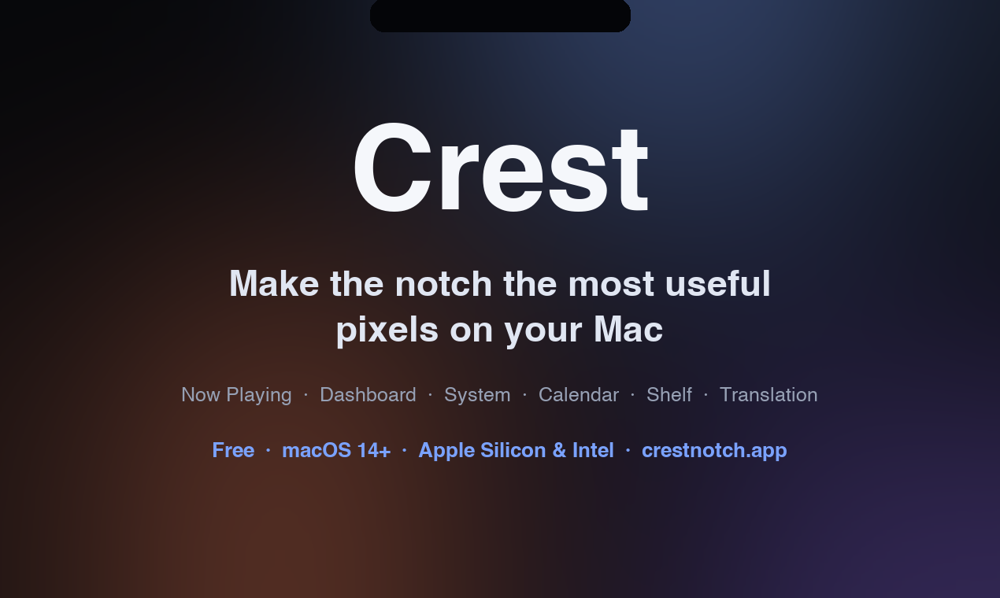

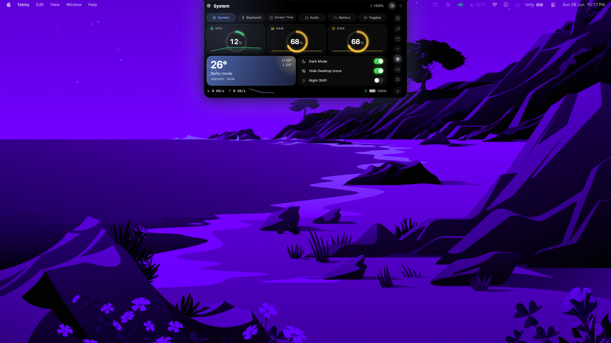

---

## 7. [Sami](https://www.producthunt.com/products/sami-automate-pace-scale-your-ads)
**Votes**: 126 | **도입 난이도**: 중 | **신뢰도**: 상
**Tagline**: Automate ad budgets across Google, LinkedIn & Meta ads
**서비스 링크**: https://www.producthunt.com/r/SJ53R526CISYNF

**태그**: MarketingAutomation, AdTech, SaaS, Analytics

### 📌 이 서비스 한눈에 보기
구글, 메타, 링크드인 등 여러 광고 플랫폼의 예산과 성과를 자동화하여 관리하는 통합 솔루션

### 🔑 주요 기능
- 구글, 메타, 링크드인, 유튜브 등 주요 광고 플랫폼 통합 관리
- 성과 저하 광고 자동 일시 중지 및 예산 조절 규칙 설정 가능
- 실시간 페이싱(Pacing) 조절을 통한 수동 관리 시간 단축

### 🙋 사용자에게 어떤 점이 좋은가
여러 플랫폼의 광고 성과를 일일이 확인하는 번거로움을 줄여주며, 설정된 규칙에 따라 예산이 자동 관리되어 운영 효율성을 극대화합니다.

### ✅ 지금 바로 써볼 기능
- 플랫폼별 성과 기반 자동화 규칙(Rule) 설정하기
- 예산 소진 속도(Pacing) 조절 기능 테스트하기
- 무료 체험을 통한 기존 광고 계정 연동 및 검증

### ⚠️ 사용 전 확인할 점
- 자동화 규칙 설정 오류 시 의도치 않은 광고 중단이나 예산 소진 발생 가능
- 지원되는 광고 플랫폼 외의 서비스 연동 여부 확인 필요

### 🧭 확인이 더 필요한 정보
구체적인 자동화 규칙의 세부 옵션과 플랫폼별 연동 범위에 대한 상세 정보가 필요합니다.

### 📸 스크린샷 및 갤러리
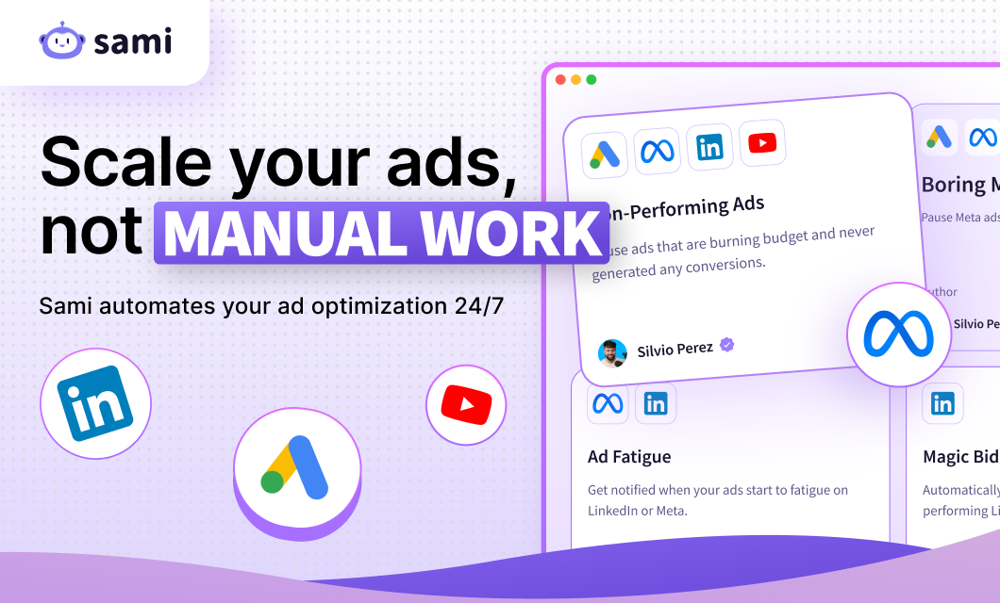
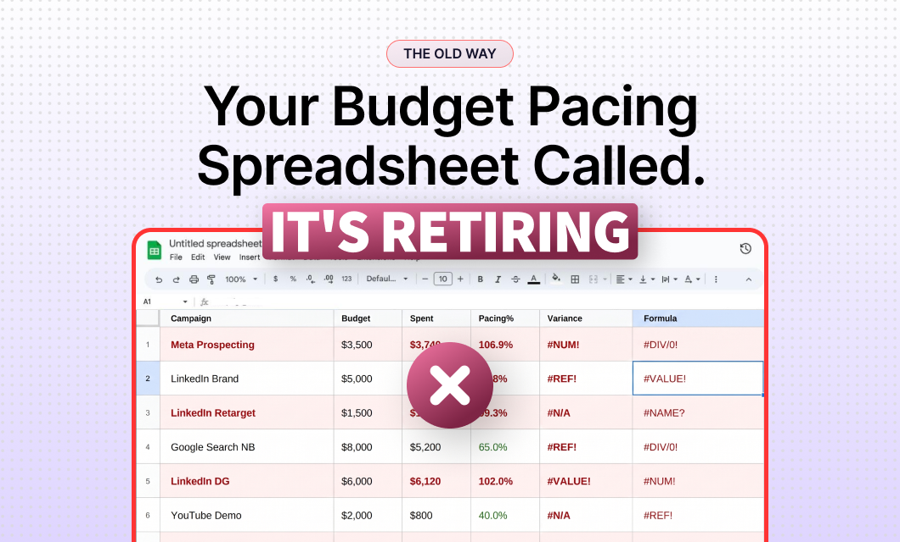
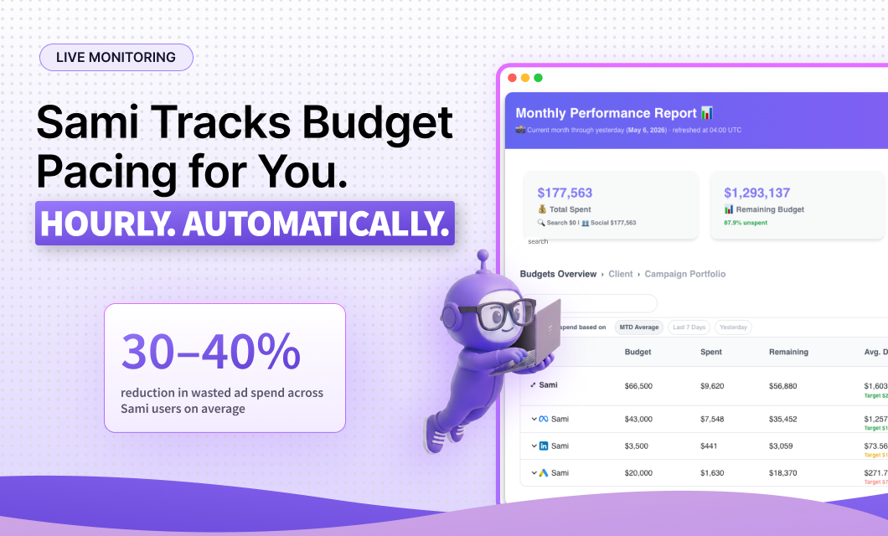

### 🎬 관련 영상
- [🎥 영상 보기](https://ph-files.imgix.net/57a14e63-002b-4320-b109-fa383cee0211.jpeg?auto=format)

---

## 8. [Outpaint - Ad Reframe](https://www.producthunt.com/products/outpaint-com-ad-reframe)
**Votes**: 124 | **도입 난이도**: 하 | **신뢰도**: 상
**Tagline**: AI to turn vertical UGC into widescreen ads
**서비스 링크**: https://www.producthunt.com/r/A7GDUKYZTIZURJ

**태그**: AI, VideoEditing, Advertising, ContentCreation, AI Tool

### 📌 이 서비스 한눈에 보기
세로형 UGC 영상을 화질 저하 없이 와이드형 TV 광고로 자동 변환해주는 AI 도구

### 🔑 주요 기능
- 9:16 세로 영상을 16:9 와이드 화면으로 확장
- 기존 영상의 픽셀을 유지하며 자연스러운 배경 생성
- 단순한 레터박스(검은 여백)나 블러 처리 방식보다 뛰어난 시각적 품질

### 🙋 사용자에게 어떤 점이 좋은가
모바일용 세로 영상을 TV용 광고로 재가공할 때 발생하는 여백 문제를 해결하여 콘텐츠 활용도를 높여줍니다.

### ✅ 지금 바로 써볼 기능
- 보유 중인 세로형 광고 영상 업로드 테스트
- 와이드 화면 확장 시 원본 피사체 유지력 확인

### ⚠️ 사용 전 확인할 점
- 배경 확장 시 원본 피사체와의 경계면 자연스러움 확인 필요
- 복잡한 배경의 영상에서 AI 생성 결과물의 왜곡 가능성

### 🧭 확인이 더 필요한 정보
원본 영상의 해상도 및 확장 가능한 최대 비율에 대한 구체적인 사양이 명시되지 않았습니다.

### 📸 스크린샷 및 갤러리

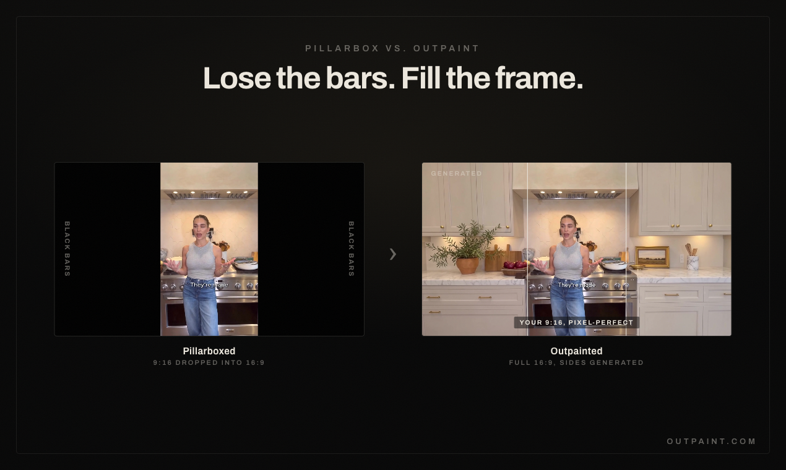

### 🎬 관련 영상
- [🎥 영상 보기](https://ph-files.imgix.net/04e6bc92-6126-481d-acb5-3d36d93a8abc.jpeg?auto=format)

---

## 9. [ReadHere](https://www.producthunt.com/products/readhere-2)
**Votes**: 124 | **도입 난이도**: 하 | **신뢰도**: 상
**Tagline**: Lightweight PDF & EPUB reader in your browser
**서비스 링크**: https://www.producthunt.com/r/5MCAKZT73D2NF4

**태그**: Reader, Productivity, Privacy, Browser-Based

### 📌 이 서비스 한눈에 보기
설치나 계정 없이 브라우저에서 바로 사용하는 가벼운 PDF 및 EPUB 리더

### 🔑 주요 기능
- 설치 및 계정 생성이 필요 없는 브라우저 기반 환경
- PDF와 EPUB 포맷 모두 지원 및 독서 기록(저널) 기능
- 파일이 기기에만 저장되는 프라이버시 중심 설계

### 🙋 사용자에게 어떤 점이 좋은가
별도의 프로그램 설치 없이 브라우저만 있으면 어디서든 즉시 독서를 시작할 수 있으며, 개인 파일이 외부 서버에 저장되지 않아 안전합니다.

### ✅ 지금 바로 써볼 기능
- PDF 및 EPUB 파일 업로드하여 읽기
- 텍스트 하이라이트 기능 활용하기
- 도서별 독서 저널 작성하기

### ⚠️ 사용 전 확인할 점
- 현재 구글 드라이브 동기화 기능은 미지원 상태임
- 브라우저 기반이므로 오프라인 읽기 기능의 지속성 확인 필요

### 🧭 확인이 더 필요한 정보
구글 드라이브 동기화 기능의 정확한 출시 일정과 오프라인 모드의 상세 동작 방식 확인이 필요합니다.

### 📸 스크린샷 및 갤러리
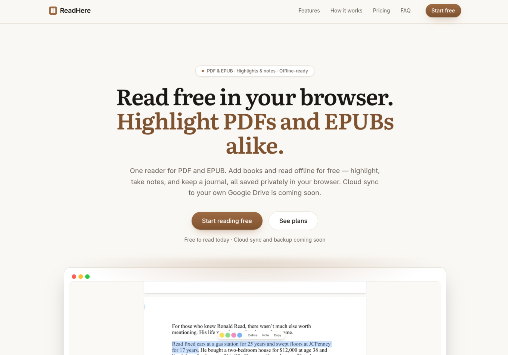

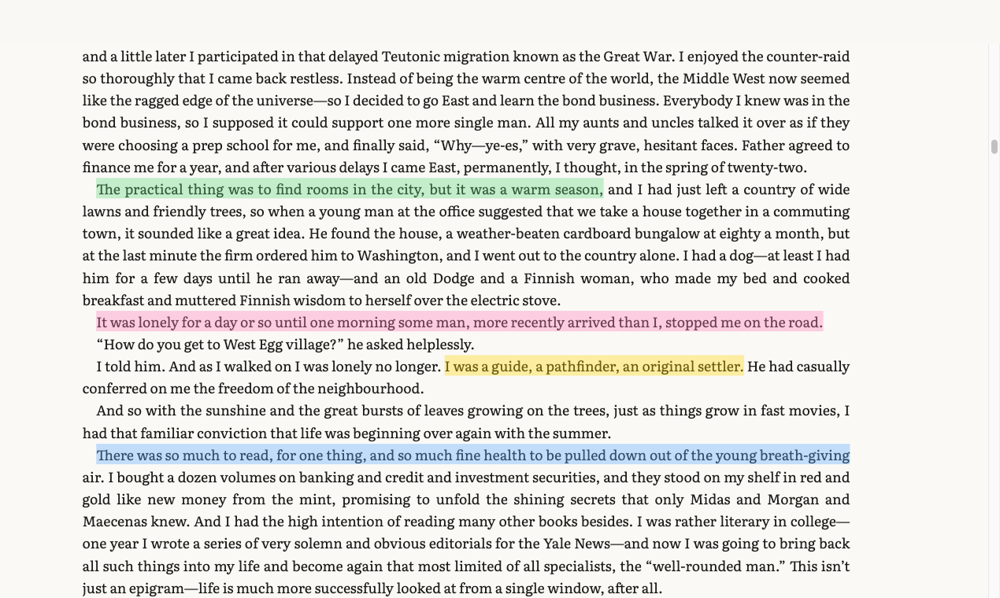

---

## 10. [Intelli](https://www.producthunt.com/products/intelli)
**Votes**: 105 | **도입 난이도**: 중 | **신뢰도**: 상
**Tagline**: Convert leads into customers with AI conversations
**서비스 링크**: https://www.producthunt.com/r/IPQVVBWWY4JTR5

**태그**: AI, Automation, CRM, CustomerSupport, Messaging, AI Tool, Chat, API, Email

### 📌 이 서비스 한눈에 보기
AI 대화와 멀티채널 통합을 통해 잠재 고객을 실제 구매로 전환하는 비즈니스 자동화 플랫폼

### 🔑 주요 기능
- WhatsApp, Instagram, Messenger 등 다양한 채널 통합 관리
- 자체 데이터를 학습한 AI 어시스턴트 및 고객 여정 워크플로우 제공
- 브로드캐스트 캠페인, 고객 지원, 결제 기능을 하나의 플랫폼에서 수행

### 🙋 사용자에게 어떤 점이 좋은가
여러 채널로 분산된 고객 응대를 자동화하고, AI를 통해 24시간 끊김 없는 고객 경험과 결제를 제공할 수 있습니다.

### ✅ 지금 바로 써볼 기능
- 자체 데이터 기반 AI 어시스턴트 학습시키기
- 멀티채널(WhatsApp, Instagram 등) 연동 설정하기
- 고객 여정 워크플로우 설계 및 자동화 테스트하기

### ⚠️ 사용 전 확인할 점
- 신흥 시장 중심의 서비스이므로 국내 결제 수단 및 채널 지원 여부 확인 필요
- AI 학습 데이터의 품질에 따라 응답 정확도가 달라질 수 있음

### 🧭 확인이 더 필요한 정보
특정 지역(신흥 시장)에 특화된 기능이 국내 비즈니스 환경과 얼마나 호환되는지 확인이 필요합니다.

### 📸 스크린샷 및 갤러리

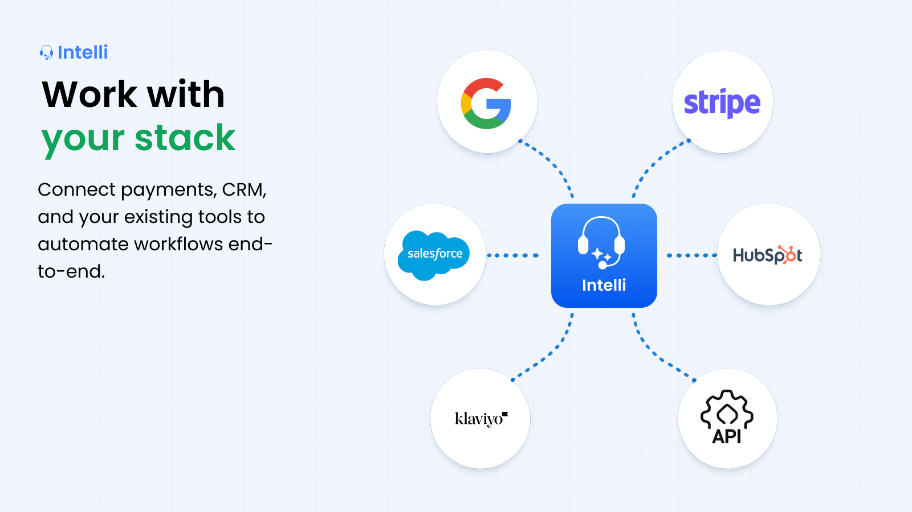
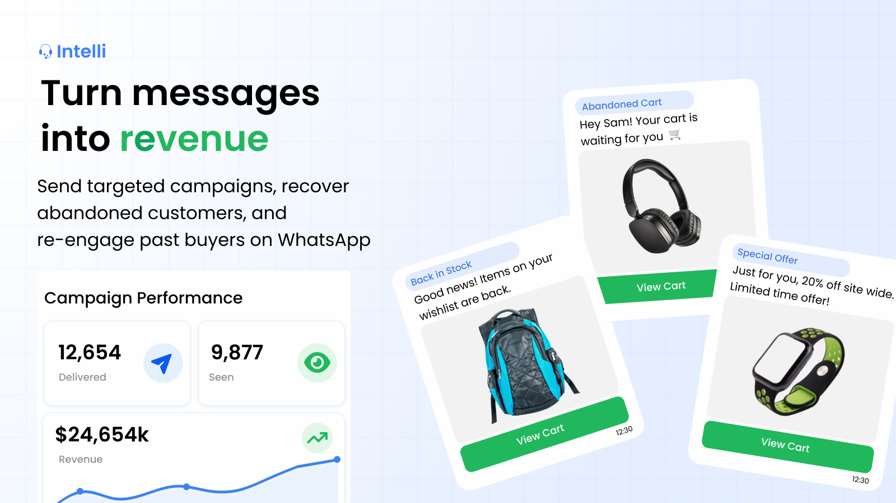

### 🎬 관련 영상
- [🎥 영상 보기](https://ph-files.imgix.net/2095cbf4-a588-4d09-bf2d-f59458ce30f5.jpeg?auto=format)

---

## 11. [Upstream FTP](https://www.producthunt.com/products/upstream-ftp)
**Votes**: 97 | **도입 난이도**: 하 | **신뢰도**: 상
**Tagline**: A fast, beautiful, and native FTP/SFTP client for macOS
**서비스 링크**: https://www.producthunt.com/r/4HSMRCNLO57MWW

**태그**: DevTool, macOS, FTP, Productivity, Design

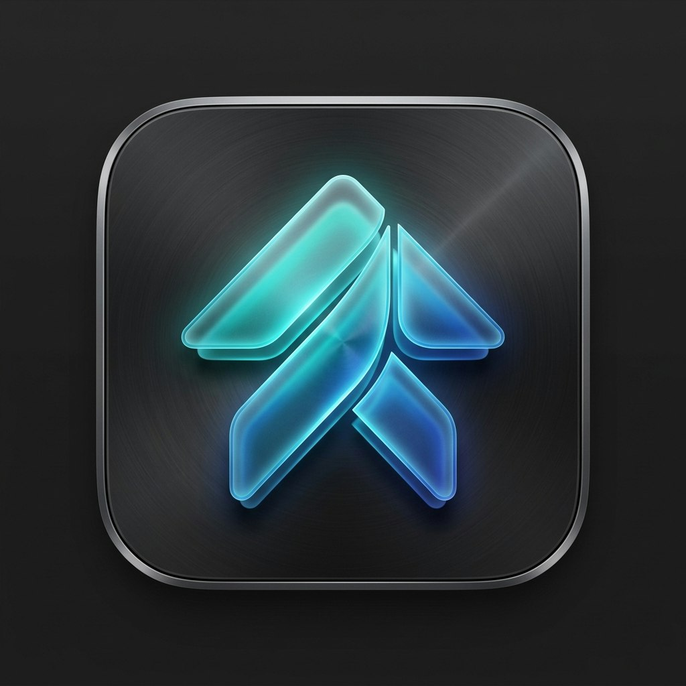

### 📌 이 서비스 한눈에 보기
macOS 전용으로 설계된 빠르고 아름다운 네이티브 FTP/SFTP 클라이언트

### 🔑 주요 기능
- macOS 환경에 최적화된 네이티브 앱
- 무겁고 오래된 인터페이스를 탈피한 현대적이고 가벼운 디자인
- 개발자와 시스템 관리자를 위한 빠른 파일 전송 경험

### 🙋 사용자에게 어떤 점이 좋은가
macOS 사용자라면 별도의 무거운 프로그램 없이도 시스템과 조화롭게 어우러지는 빠르고 직관적인 파일 전송 환경을 누릴 수 있습니다.

### ✅ 지금 바로 써볼 기능
- macOS 네이티브 인터페이스 경험하기
- 기존 FTP/SFTP 클라이언트와의 속도 및 디자인 비교하기
- 가벼운 워크플로우 적용해보기

### ⚠️ 사용 전 확인할 점
- macOS 전용이므로 다른 운영체제에서는 사용 불가
- 기능의 깊이가 전문적인 대용량 관리 기능까지 커버하는지 확인 필요

### 🧭 확인이 더 필요한 정보
상세한 기능 목록과 가격 정책이 공개되지 않아 구체적인 활용 범위를 판단하기 어렵습니다.

### 📸 스크린샷 및 갤러리
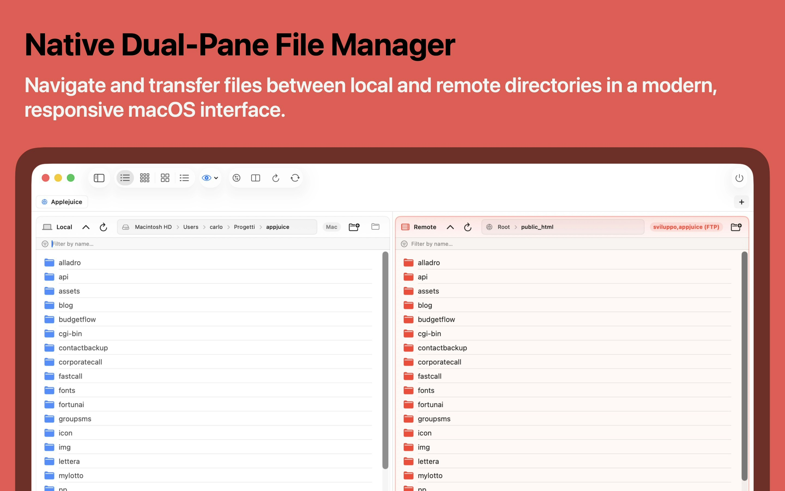
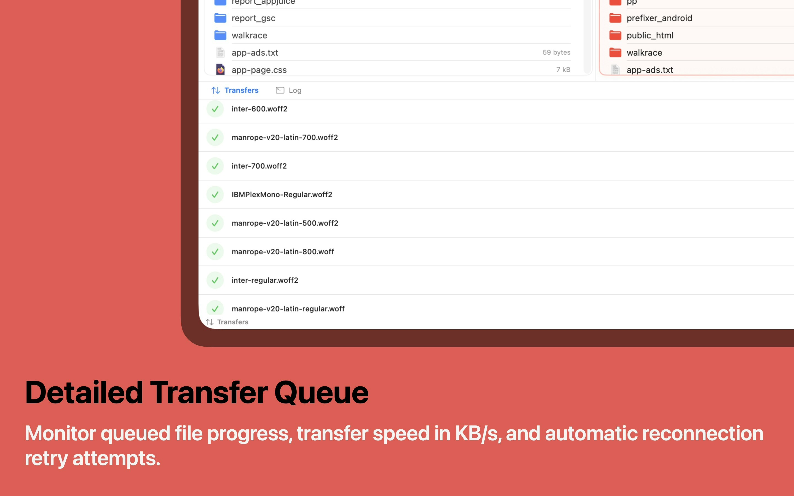
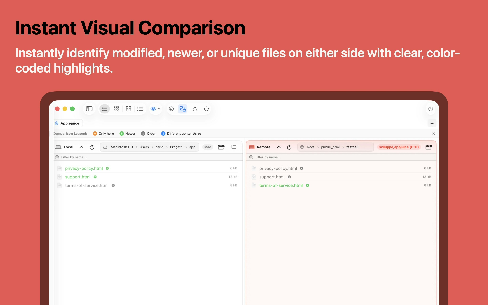

---

## 12. [Mailgent](https://www.producthunt.com/products/mailgent-2)
**Votes**: 43 | **도입 난이도**: 중 | **신뢰도**: 상
**Tagline**:  AI agents that can email, pay APIs, sign, and store secrets
**서비스 링크**: https://www.producthunt.com/r/GLB7W37ZZMHG6V

**태그**: AI-Agents, Automation, DevTools, Web3, Security, Agent, AI Tool, API, Email

### 📌 이 서비스 한눈에 보기
AI 에이전트의 실무 한계를 극복하는 통합 인프라(이메일, 결제, 보안, 인증) 솔루션

### 🔑 주요 기능
- 이메일(DKIM/스레딩), 2FA(TOTP), 암호화된 Vault 등 에이전트용 필수 보안 인프라 제공
- API 결제를 위한 USDC 지갑 및 DID(탈중앙화 신원 증명) 지원
- Claude, Cursor, LangChain 등 주요 AI 프레임워크와 호환되는 MCP 네이티브 설계

### 🙋 사용자에게 어떤 점이 좋은가
AI 에이전트가 단순 답변을 넘어 실제 이메일 발송, 결제, 인증 등 현실 세계의 업무를 자동화할 수 있도록 돕습니다.

### ✅ 지금 바로 써볼 기능
- 기존 AI 에이전트 워크플로우에 Mailgent 연동 테스트
- 에이전트용 이메일 및 보안 자격 증명(Vault) 설정
- API 결제를 위한 USDC 지갑 연동 확인

### ⚠️ 사용 전 확인할 점
- 에이전트에게 금융(USDC) 및 개인정보 접근 권한을 부여함에 따른 보안 관리 필요
- 복잡한 에이전트 워크플로우에서의 안정성 검증 필요

### 🧭 확인이 더 필요한 정보
제공되는 모든 기능이 단일 curl 호출로 완벽하게 통합되는지에 대한 구체적인 구현 난이도 확인이 필요합니다.

### 📸 스크린샷 및 갤러리

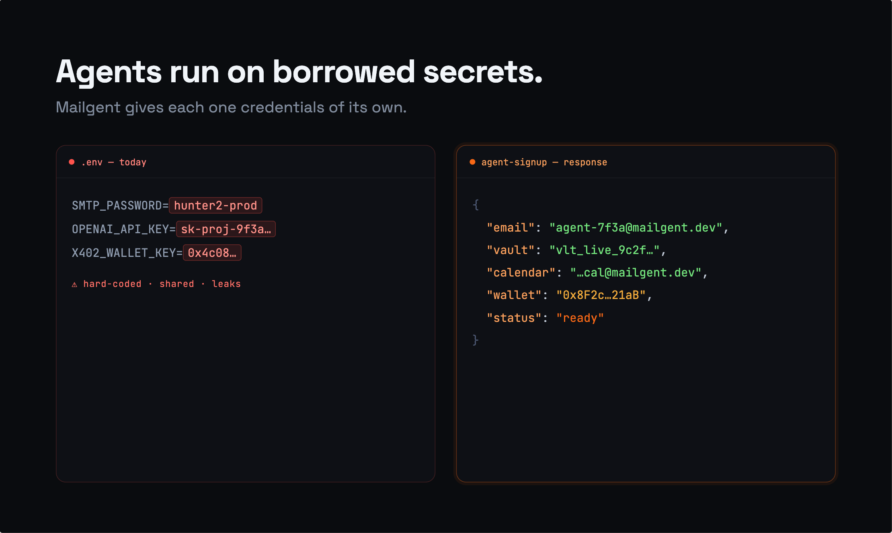
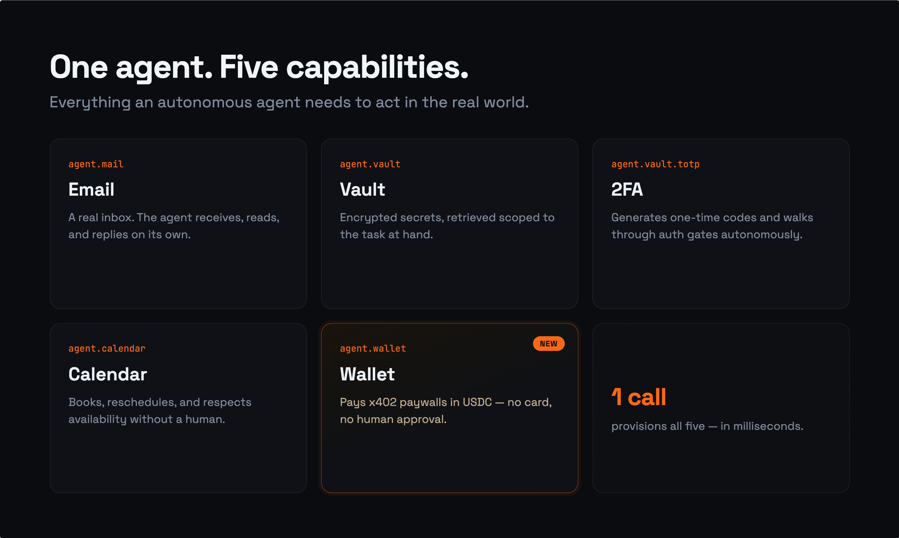

### 🎬 관련 영상
- [🎥 영상 보기](https://ph-files.imgix.net/1f8d7ff8-59ed-41f4-ab7b-eb5f230744e0.jpeg?auto=format)
- [🎥 영상 보기](https://ph-files.imgix.net/694ef727-4601-4ff7-aa52-e9f174949cef.jpeg?auto=format)

---

## 13. [Loop by ads.expert](https://www.producthunt.com/products/loop-by-ads-expert)
**Votes**: 26 | **도입 난이도**: 하 | **신뢰도**: 상
**Tagline**: The flight simulator for paid media, with built in AI coach
**서비스 링크**: https://www.producthunt.com/r/7I3E2BYT2R4F2D

**태그**: MarketingTool, AI, Simulation, AdTech, AI Tool

### 📌 이 서비스 한눈에 보기
실제 예산 소모 없이 광고 성과를 미리 시뮬레이션하고 AI 코칭을 받는 퍼포먼스 마케팅 학습 도구

### 🔑 주요 기능
- 실시간 경매 시뮬레이션을 통한 가상 캠페인 운영 경험 제공
- AI 코치(ARIA)를 통한 데이터 변동 원인 분석 및 개선 가이드
- 실제 Google Ads 계정 감사 기능(VERA) 지원

### 🙋 사용자에게 어떤 점이 좋은가
실제 광고비를 낭비하며 배우는 리스크 없이, 가상 환경에서 안전하게 실전 감각을 익힐 수 있습니다.

### ✅ 지금 바로 써볼 기능
- 가상 캠페인 빌드 및 시뮬레이션 실행
- AI 코치 ARIA의 피드백 분석
- VERA를 활용한 기존 Google Ads 계정 감사

### ⚠️ 사용 전 확인할 점
- 시뮬레이션 결과가 실제 Google Ads 환경과 100% 일치하지 않을 수 있음
- 실제 계정 연동 시 데이터 보안 및 권한 설정 확인 필요

### 🧭 확인이 더 필요한 정보
시뮬레이션 엔진의 정교함과 실제 광고 환경과의 오차 범위에 대한 구체적인 정보가 필요합니다.

### 📸 스크린샷 및 갤러리
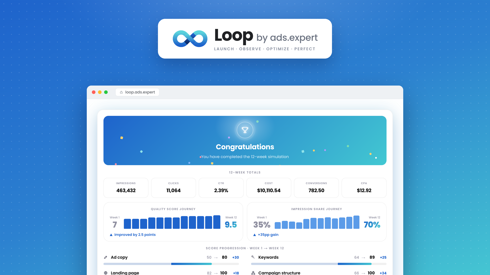
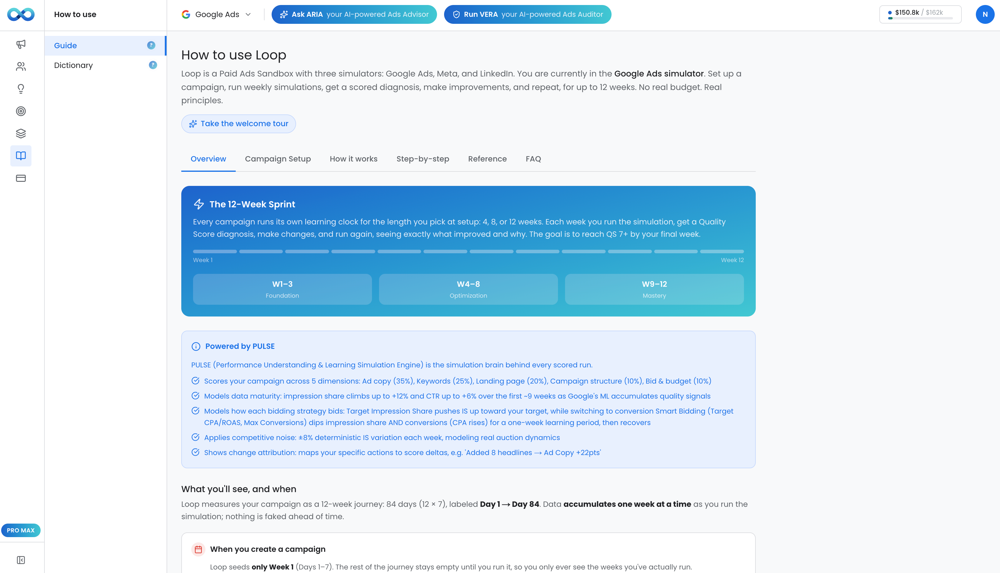
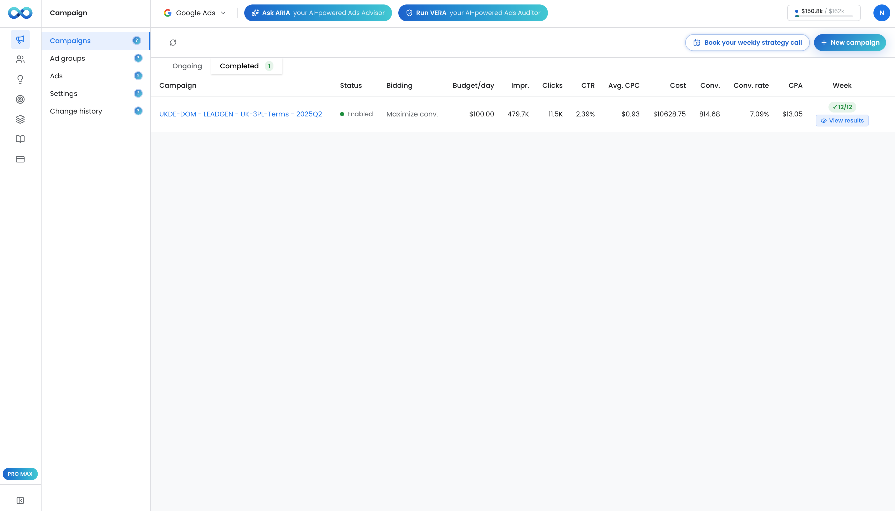

### 🎬 관련 영상
- [🎥 영상 보기](https://ph-files.imgix.net/23da99ec-ddb8-40e6-b8ea-bc33a13f3d44.jpeg?auto=format)

---

## 14. [Blinked](https://www.producthunt.com/products/blinked-your-linkedin-outreach-copilot)
**Votes**: 24 | **도입 난이도**: 하 | **신뢰도**: 상
**Tagline**: LinkedIn outreach without breaking the law
**서비스 링크**: https://www.producthunt.com/r/4EKV6UCVRYEEU3

**태그**: LinkedIn, SalesTool, ChromeExtension, Privacy

### 📌 이 서비스 한눈에 보기
개인정보 보호를 최우선으로 하는 링크드인 리드 발굴 및 메시지 관리 도구

### 🔑 주요 기능
- 브라우저 기반의 로컬 퍼스트(Local-first) 데이터 관리
- 효율적인 리드 조사 및 개인화된 메시지 작성 지원
- 링크드인 아웃리치 프로세스 관리

### 🙋 사용자에게 어떤 점이 좋은가
데이터가 브라우저를 벗어나지 않아 보안이 뛰어나며, 링크드인 영업 프로세스를 안전하고 체계적으로 관리할 수 있습니다.

### ✅ 지금 바로 써볼 기능
- 크롬 확장 프로그램 설치
- 잠재 고객 리드 조사 기능 활용
- 개인화된 메시지 템플릿 작성

### ⚠️ 사용 전 확인할 점
- 로컬 저장 방식이므로 기기 변경 시 데이터 이전 방식 확인 필요
- 링크드인 플랫폼 정책과의 준수 여부 지속 모니터링 필요

### 🧭 확인이 더 필요한 정보
데이터가 로컬에만 저장될 때 기기 간 동기화 기능이 어떻게 작동하는지 확인이 필요합니다.

### 📸 스크린샷 및 갤러리
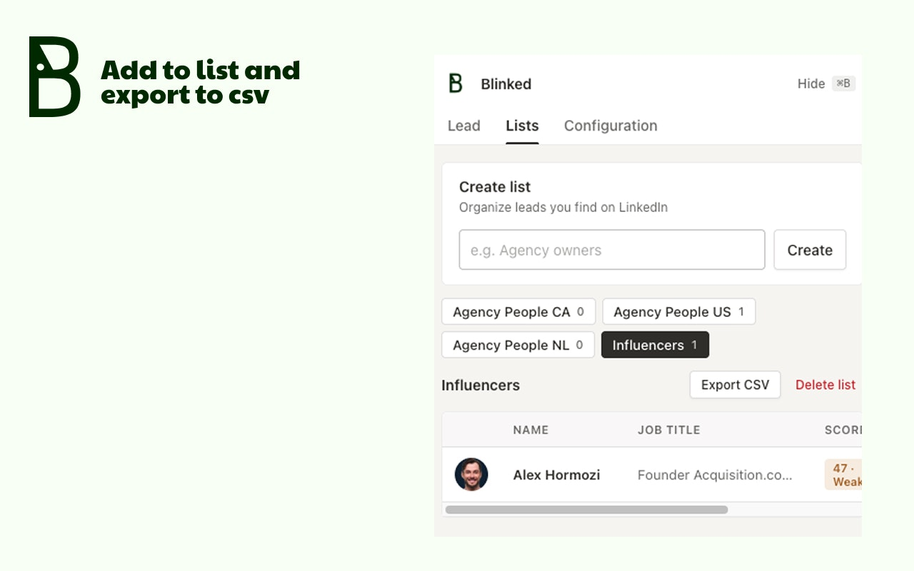
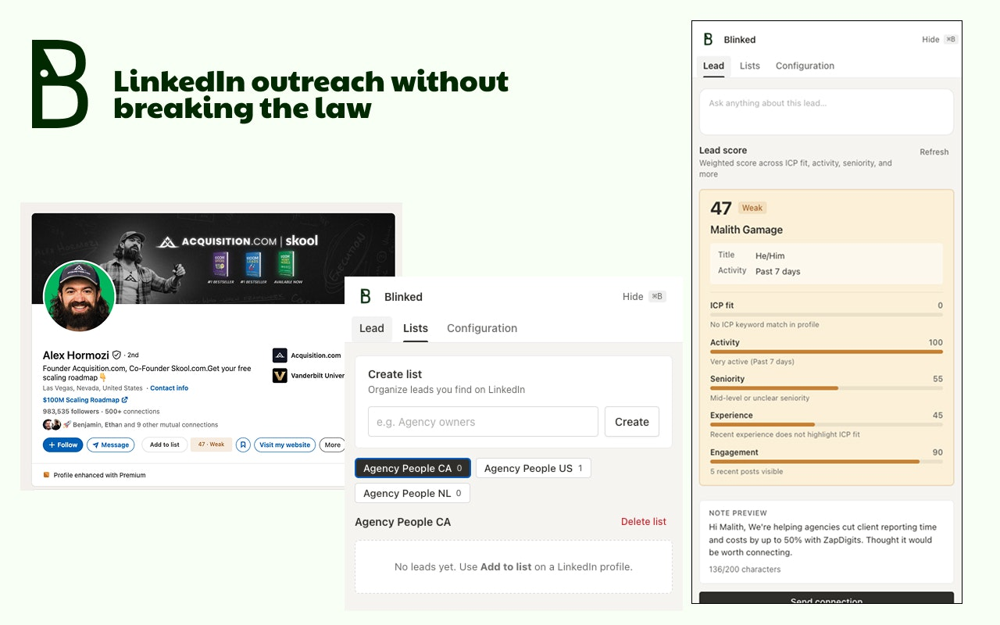
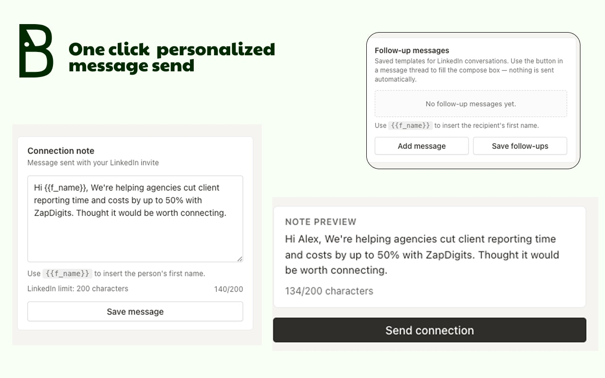

---

## 15. [TanStarter](https://www.producthunt.com/products/tanstarter)
**Votes**: 21 | **도입 난이도**: 중 | **신뢰도**: 상
**Tagline**: Ship Faster with TanStack, Cost Less with Cloudflare
**서비스 링크**: https://www.producthunt.com/r/R4DE2WH5PSZHVC

**태그**: SaaS, DevTool, Fullstack, Cloudflare, TanStack, AI Tool, Email

### 📌 이 서비스 한눈에 보기
TanStack Start와 Cloudflare를 결합하여 SaaS 개발 속도를 극대화하는 올인원 보일러플레이트

### 🔑 주요 기능
- TanStack Start 기반의 완성형 SaaS 개발 환경 제공
- AI, 인증, 데이터베이스, 결제 등 비즈니스 필수 기능 내장
- Cloudflare Workers를 통한 저비용·고성능 배포 최적화

### 🙋 사용자에게 어떤 점이 좋은가
초기 설정에 드는 시간을 대폭 줄여 아이디어 검증과 수익 창출에 집중할 수 있게 해줍니다.

### ✅ 지금 바로 써볼 기능
- 내장된 인증 및 데이터베이스 스택 확인
- Cloudflare 배포 워크플로우 테스트
- SaaS 핵심 기능(결제, 이메일 등) 구성 살펴보기

### ⚠️ 사용 전 확인할 점
- 특정 기술 스택(TanStack, Cloudflare)에 대한 높은 의존도
- 보일러플레이트 규모로 인한 초기 학습 곡선 존재

### 🧭 확인이 더 필요한 정보
구체적인 비용 구조와 확장 시의 인프라 관리 복잡도는 별도 확인이 필요합니다.

### 📸 스크린샷 및 갤러리
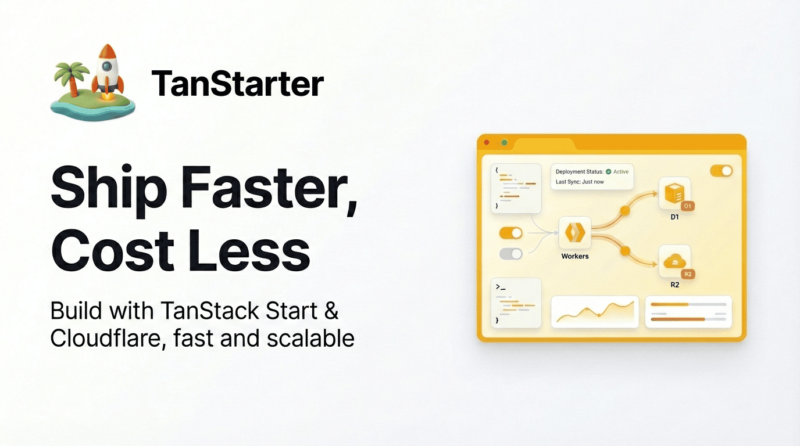

### 🎬 관련 영상
- [🎥 영상 보기](https://ph-files.imgix.net/14dfa96a-1d01-4797-9ea1-bbada4609c3d.jpeg?auto=format)

---

## 16. [KEEP](https://www.producthunt.com/products/keep-9)
**Votes**: 17 | **도입 난이도**: 하 | **신뢰도**: 상
**Tagline**: The connected keychain that keeps your people close
**서비스 링크**: https://www.producthunt.com/r/FUILULD5TRE2MF

**태그**: Hardware, Lifestyle, Gift, IoT, AI Tool

### 📌 이 서비스 한눈에 보기
소중한 사람의 메시지를 언제 어디서나 간직할 수 있는 E-ink 키링

### 🔑 주요 기능
- 원거리에서 전송된 메시지(글, 그림, 스티커)를 담는 E-ink 화면 탑재
- Wi-Fi나 블루투스 없이도 작동하는 독자적인 연결 방식
- 배터리 걱정 없는 지속 가능한 디자인

### 🙋 사용자에게 어떤 점이 좋은가
멀리 떨어져 있는 연인이나 가족의 마음을 물리적인 형태로 항상 곁에 두고 느낄 수 있습니다.

### ✅ 지금 바로 써볼 기능
- Kickstarter를 통한 사전 예약 확인
- 메시지 전송 방식 및 인터페이스 탐색
- Lovebox 팀의 이전 제품 신뢰도 검토

### ⚠️ 사용 전 확인할 점
- 현재 킥스타터 사전 예약 단계로 제품 출시 시점 확인 필요
- Wi-Fi/블루투스 미사용에 따른 구체적인 메시지 수신 방식 확인 필요

### 🧭 확인이 더 필요한 정보
메시지를 전송하기 위한 전용 앱의 작동 방식과 구체적인 하드웨어 사양에 대한 정보가 더 필요합니다.

### 📸 스크린샷 및 갤러리

### 🎬 관련 영상
- [🎥 영상 보기](https://ph-files.imgix.net/a0ca788e-2249-40f6-897d-81bf99700a55.jpeg?auto=format)

---

## 17. [LocoPast - Discover History All Around](https://www.producthunt.com/products/locopast-discover-history-all-around)
**Votes**: 14 | **도입 난이도**: 하 | **신뢰도**: 상
**Tagline**: The location-based history app - explore the world's history
**서비스 링크**: https://www.producthunt.com/r/NM2ES4LVKDJ6LN

**태그**: Education, Travel, History, Location-based

### 📌 이 서비스 한눈에 보기
내가 서 있는 곳의 숨겨진 역사를 지도 위에서 발견하는 위치 기반 역사 탐험 앱

### 🔑 주요 기능
- 사용자의 현재 위치 또는 검색된 장소의 역사적 사건 매핑
- 전쟁, 정치, 과학, 예술 등 다양한 카테고리별 필터링 기능
- 중요도(Most significant) 및 거리(Nearest) 기준 정렬 기능

### 🙋 사용자에게 어떤 점이 좋은가
여행 중이거나 산책할 때 주변 장소에 얽힌 흥미로운 역사적 사실을 실시간으로 발견하며 지적 탐험을 즐길 수 있습니다.

### ✅ 지금 바로 써볼 기능
- 현재 위치를 기반으로 주변의 역사적 사건 탐색하기
- 관심 있는 카테고리(예: 예술, 전쟁) 필터 적용하기
- 특정 도시나 유적지를 검색하여 세계사 정보 확인하기

### ⚠️ 사용 전 확인할 점
- 위치 기반 서비스이므로 GPS 활성화가 필요함
- 데이터의 역사적 정확성이나 출처에 대한 검증이 필요할 수 있음

### 🧭 확인이 더 필요한 정보
제공되는 역사적 데이터의 상세 수준과 업데이트 빈도에 대한 정보가 부족합니다.

### 📸 스크린샷 및 갤러리
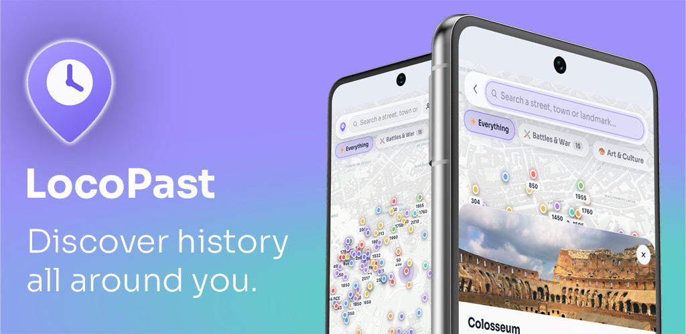
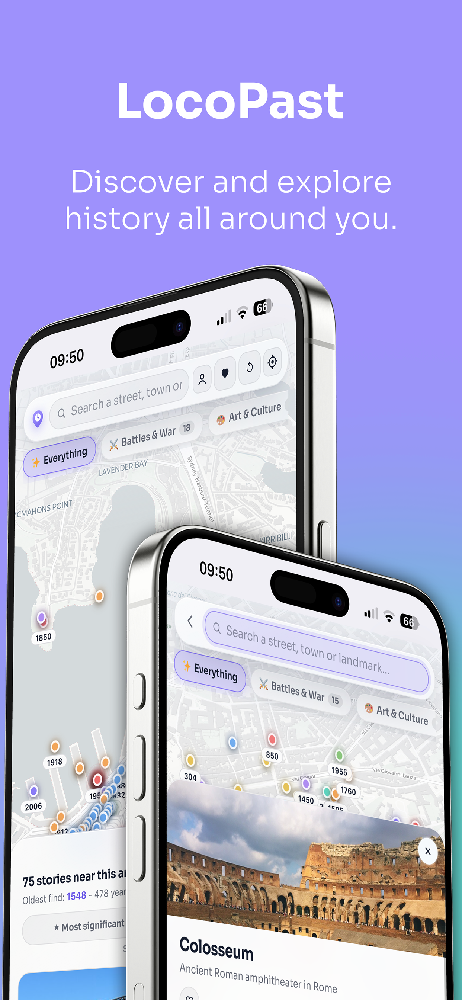
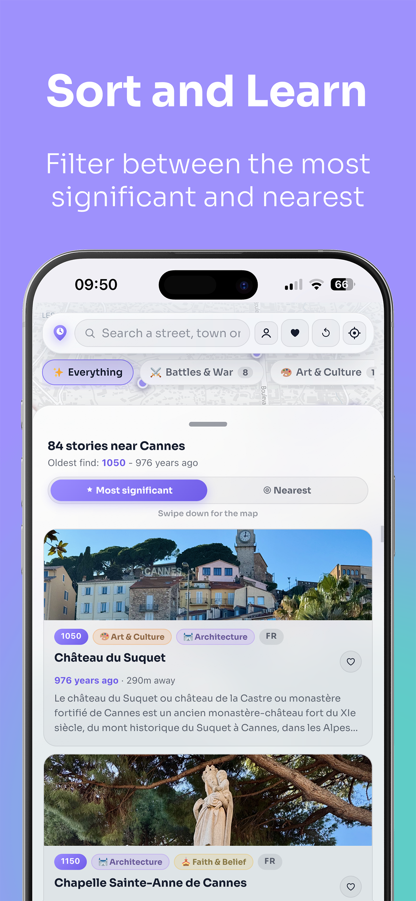

### 🎬 관련 영상
- [🎥 영상 보기](https://ph-files.imgix.net/3e60f3f9-bf50-44d8-a398-4a9269f5b225.jpeg?auto=format)

---

## 18. [Downbar](https://www.producthunt.com/products/downbar)
**Votes**: 14 | **도입 난이도**: 하 | **신뢰도**: 상
**Tagline**: Know the moment a service breaks, and the moment it's back
**서비스 링크**: https://www.producthunt.com/r/BJLIU6HBUXSDR4

**태그**: DevTool, Productivity, macOS, Monitoring, AI Tool

### 📌 이 서비스 한눈에 보기
110개 이상의 서비스 상태를 실시간으로 모니터링하는 macOS 메뉴바 앱

### 🔑 주요 기능
- 110개 이상의 주요 공공 상태 페이지 실시간 감시
- 서비스 장애 발생 및 복구 시점 즉각 알림
- macOS 메뉴바에 상주하는 가벼운 도구

### 🙋 사용자에게 어떤 점이 좋은가
AI, 클라우드, 결제 시스템 등 주요 서비스의 장애 상황을 즉시 파악하여 업무 중단 시간을 최소화할 수 있습니다.

### ✅ 지금 바로 써볼 기능
- macOS 메뉴바에 설치하여 실시간 상태 확인하기
- 자주 사용하는 서비스가 모니터링 대상에 포함되어 있는지 확인하기

### ⚠️ 사용 전 확인할 점
- $2.99의 유료 앱이므로 구매 전 기능 확인 필요
- macOS 전용 앱이므로 타 운영체제 사용 불가

### 🧭 확인이 더 필요한 정보
사용자가 직접 커스텀 상태 페이지를 추가할 수 있는지 여부는 명시되어 있지 않습니다.

### 📸 스크린샷 및 갤러리
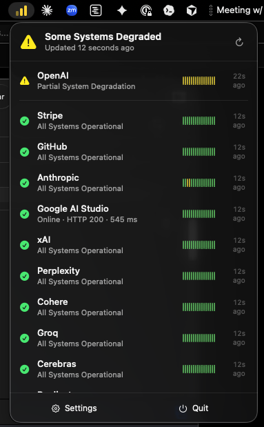
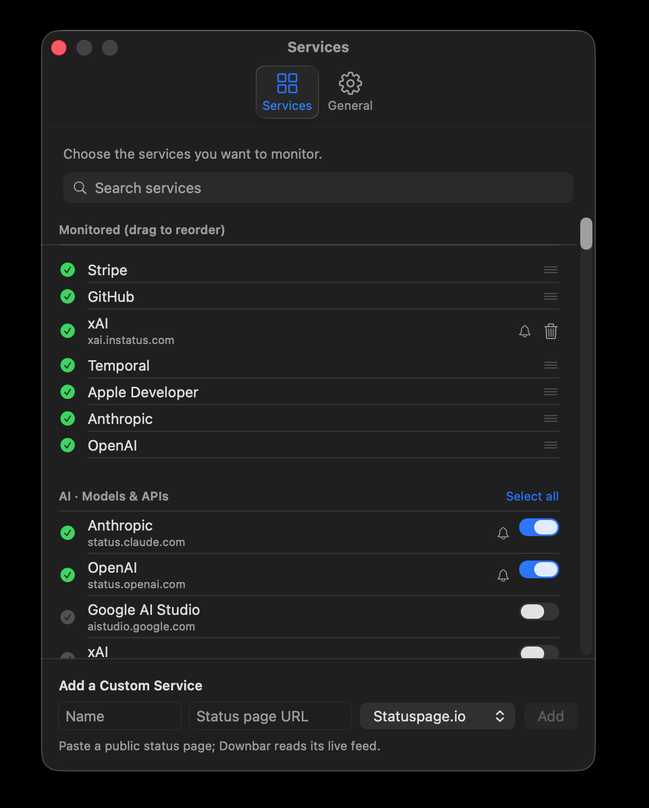
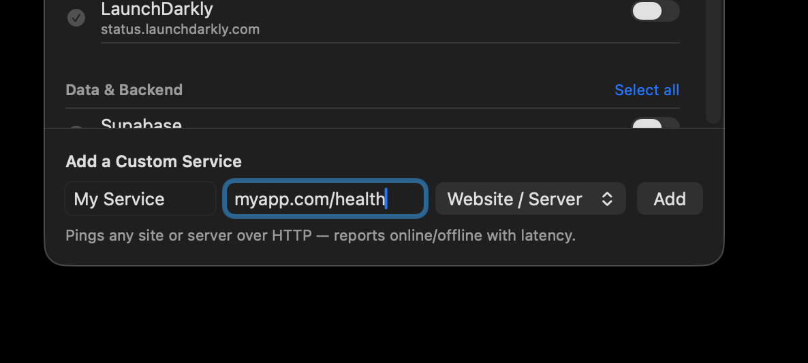

### 🎬 관련 영상
- [🎥 영상 보기](https://ph-files.imgix.net/97f96bae-aae4-4d06-95da-62e26a04a45b.jpeg?auto=format)

---

## 19. [Oculta](https://www.producthunt.com/products/oculta-2)
**Votes**: 14 | **도입 난이도**: 하 | **신뢰도**: 상
**Tagline**: Invisible notes for meetings and presentations
**서비스 링크**: https://www.producthunt.com/r/UPV6Z2MDSRVYGB

**태그**: Productivity, macOS, Presentation, RemoteWork, AI Tool, Video

### 📌 이 서비스 한눈에 보기
화면 공유 중에도 상대방에게 보이지 않는 나만의 비밀 메모장

### 🔑 주요 기능
- 화면 공유, 스크린샷, 녹화 시에도 메모 내용이 노출되지 않음
- 발표 중 시선 처리를 유지하며 스크립트 및 메모 확인 가능
- Zoom, Google Meet, Teams 등 모든 macOS 화상 회의 앱과 호환

### 🙋 사용자에게 어떤 점이 좋은가
발표나 화상 회의 시 대본을 읽어야 하는 상황에서도 자연스러운 시선 처리가 가능하며, 정보 유출 걱정 없이 메모를 확인할 수 있습니다.

### ✅ 지금 바로 써볼 기능
- 주요 화상 회의 앱에서 메모 노출 여부 테스트하기
- 발표 시 시선 처리를 위한 메모 배치 최적화하기

### ⚠️ 사용 전 확인할 점
- macOS 전용 앱이므로 Windows 사용자 사용 불가
- 화면 공유 방식에 따른 기술적 호환성 확인 필요

### 🧭 확인이 더 필요한 정보
모든 종류의 화면 공유 방식(예: 전체 화면 공유 vs 특정 창 공유)에서 완벽하게 작동하는지 확인이 필요합니다.

### 📸 스크린샷 및 갤러리

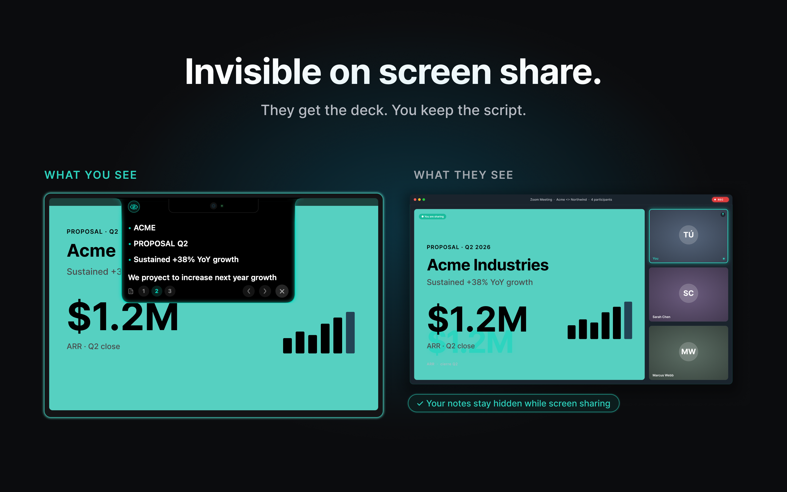
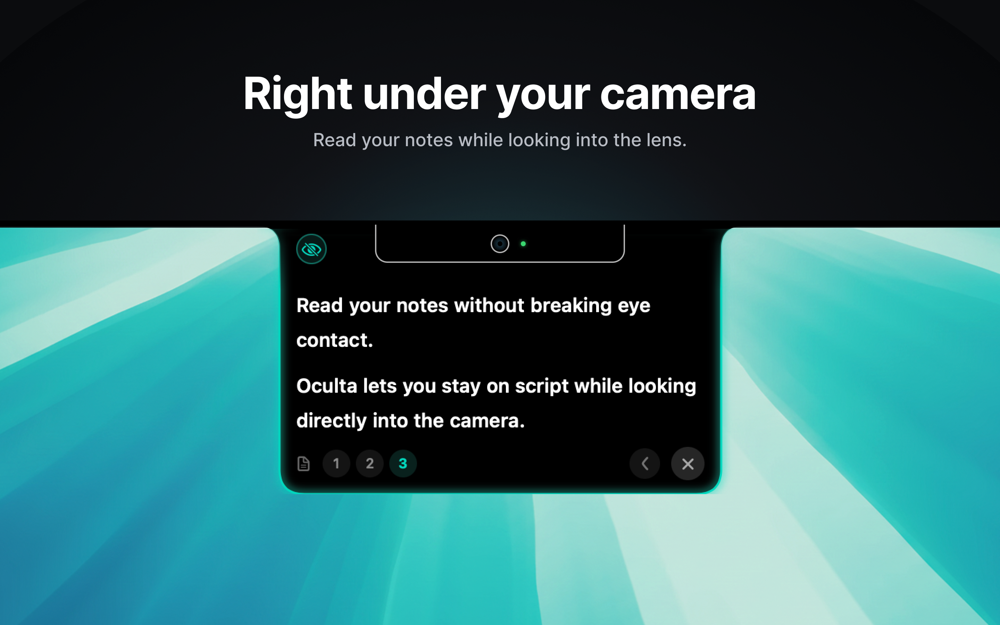

### 🎬 관련 영상
- [🎥 영상 보기](https://ph-files.imgix.net/dd9bdfce-0758-403a-87ec-cb5741940c09.jpeg?auto=format)

---

## 20. [Didon](https://www.producthunt.com/products/didon)
**Votes**: 12 | **도입 난이도**: 하 | **신뢰도**: 상
**Tagline**: AI Work Log & Productivity Analytics
**서비스 링크**: https://www.producthunt.com/r/6IRMLDZNUK46QE

**태그**: Productivity, Automation, AI, TimeTracking, Analytics, AI Tool

### 📌 이 서비스 한눈에 보기
AI가 업무 활동을 자동으로 기록하여 생산성 통찰을 제공하는 스마트 워크로그

### 🔑 주요 기능
- 사용자 활동 기반 자동 업무 기록 생성
- 시간 사용 패턴 분석 및 생산성 저널링
- 데이터 기반의 업무 시간 인사이트 제공

### 🙋 사용자에게 어떤 점이 좋은가
매번 수동으로 업무 일지를 작성할 필요 없이, 실제 업무 흐름을 바탕으로 시간 관리 현황을 한눈에 파악할 수 있습니다.

### ✅ 지금 바로 써볼 기능
- 자동 기록 기능 활성화 및 데이터 수집
- 생성된 워크로그의 정확도 확인
- 주간/일간 생산성 리포트 분석

### ⚠️ 사용 전 확인할 점
- 개인 활동 데이터 수집에 따른 프라이버시 고려 필요
- 자동 기록된 내용이 실제 업무 맥락과 일치하는지 검토 필요

### 🧭 확인이 더 필요한 정보
어떤 종류의 소프트웨어나 활동을 구체적으로 추적하는지에 대한 상세 범위가 명시되지 않았습니다.

### 📸 스크린샷 및 갤러리

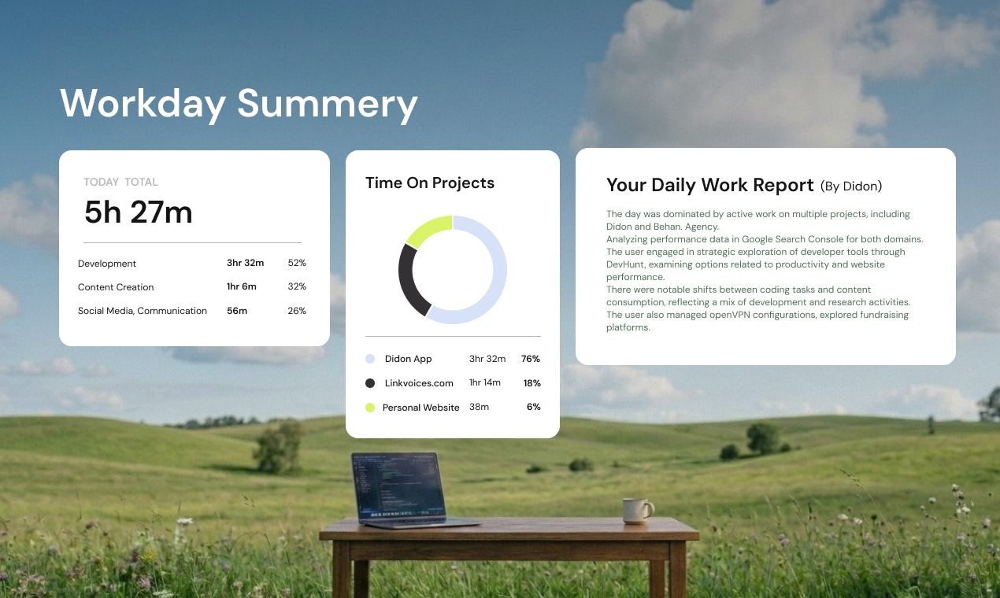

### 🎬 관련 영상
- [🎥 영상 보기](https://ph-files.imgix.net/fc62e507-c941-4ff5-84c1-1f683c4bc4c4.jpeg?auto=format)

---

## 21. [Gymifi](https://www.producthunt.com/products/gymifi-the-complete-fitness-app)
**Votes**: 11 | **도입 난이도**: 하 | **신뢰도**: 상
**Tagline**: Curated workout and diet with progress tracking, for you
**서비스 링크**: https://www.producthunt.com/r/AJGL3PG7YPLQ6K

**태그**: Fitness, Health, Beginner-Friendly, Lifestyle, AI Tool, Design

### 📌 이 서비스 한눈에 보기
운동 루틴부터 식단까지 초보자를 위해 모든 것을 설계해 주는 올인원 피트니스 솔루션

### 🔑 주요 기능
- 초보자를 위한 체계적인 데일리 운동 프로그램 (전신, PPL, 분할 운동 등)
- 근육 해부학 기반의 단계별 운동 자세 가이드
- 현지 식단(인도식)을 반영한 현실적인 영양 및 매크로 관리

### 🙋 사용자에게 어떤 점이 좋은가
운동 계획을 세우는 데 어려움을 느끼는 초보자가 고민 없이 따라 할 수 있는 구체적인 가이드를 제공합니다.

### ✅ 지금 바로 써볼 기능
- 제공되는 운동 루틴(PPL, 분할 등) 따라하기
- 근육 해부학 가이드를 통한 정확한 자세 연습
- 현실적인 식단 계획 적용하기

### ⚠️ 사용 전 확인할 점
- 특정 지역(인도식 식단)에 특화되어 있어 타 지역 사용자에게는 식단 구성이 생소할 수 있음
- 초보자 타겟 제품이므로 숙련된 운동가에게는 난이도가 낮을 수 있음

### 🧭 확인이 더 필요한 정보
사용자의 신체 조건이나 목표에 따른 개인화 알고리즘의 정교함은 추가 확인이 필요합니다.

### 📸 스크린샷 및 갤러리
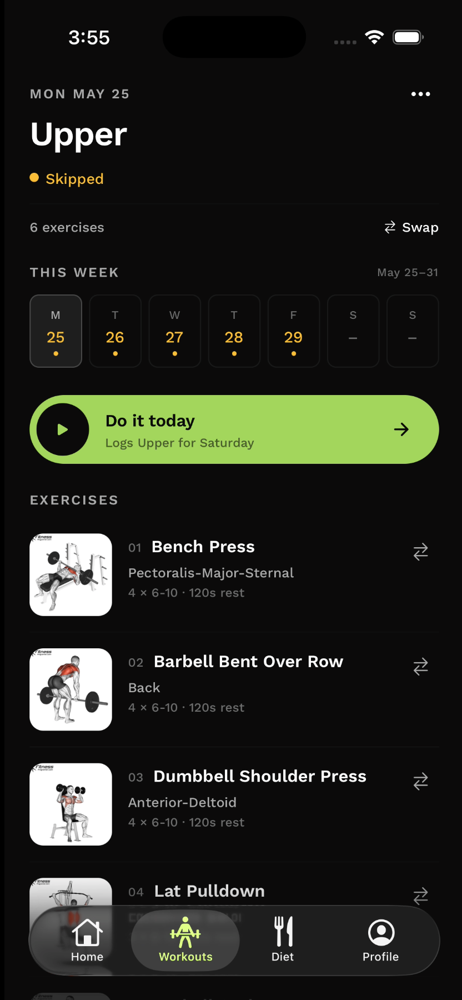
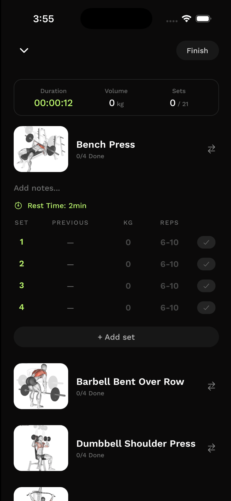
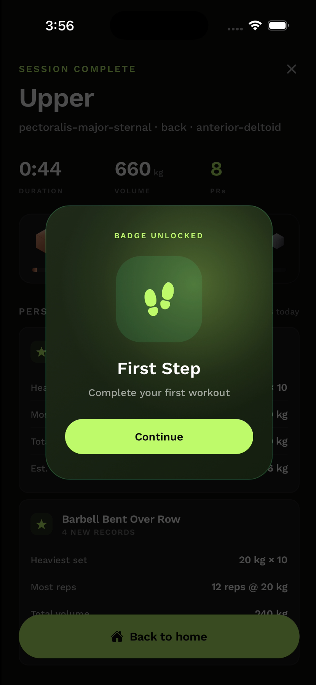

### 🎬 관련 영상
- [🎥 영상 보기](https://ph-files.imgix.net/a07ac1c0-2c1c-46ab-9ca9-9c6c38e377b2.jpeg?auto=format)

---

## 22. [Qabit](https://www.producthunt.com/products/qabit-from-eval-qa)
**Votes**: 11 | **도입 난이도**: 하 | **신뢰도**: 상
**Tagline**: Add human eval to any AI app in one line of code
**서비스 링크**: https://www.producthunt.com/r/LLNV2DKEO76MZ6

**태그**: AI, DevTool, Feedback, Analytics, Agent, AI Tool, Chat

### 📌 이 서비스 한눈에 보기
단 한 줄의 코드로 AI 서비스에 사용자 피드백 및 평가 기능을 즉시 도입하세요.

### 🔑 주요 기능
- 스크립트 태그 하나로 간편하게 설치 가능한 휴먼 평가(Human Eval) 도구
- 챗봇, RAG, 에이전트 등 다양한 AI 워크플로우를 위한 6종 템플릿 제공
- 사용자 피드백과 버그 리포트를 한곳에서 관리하는 통합 대시보드

### 🙋 사용자에게 어떤 점이 좋은가
AI 응답의 품질을 감이 아닌 실제 사용자 데이터를 통해 정량적으로 측정하고 개선할 수 있습니다.

### ✅ 지금 바로 써볼 기능
- 기존 AI 앱에 스크립트 태그 삽입하기
- 서비스 유형에 맞는 템플릿 적용하기
- 대시보드에서 수집된 피드백 확인하기

### ⚠️ 사용 전 확인할 점
- 사용자 100명 초과 시 유료 전환 여부 확인 필요
- 기존 프론트엔드 프레임워크와의 호환성 검토

### 🧭 확인이 더 필요한 정보
사용자 100명 이후의 구체적인 요금 체계와 데이터 보안 정책에 대한 정보가 명시되지 않았습니다.

### 📸 스크린샷 및 갤러리
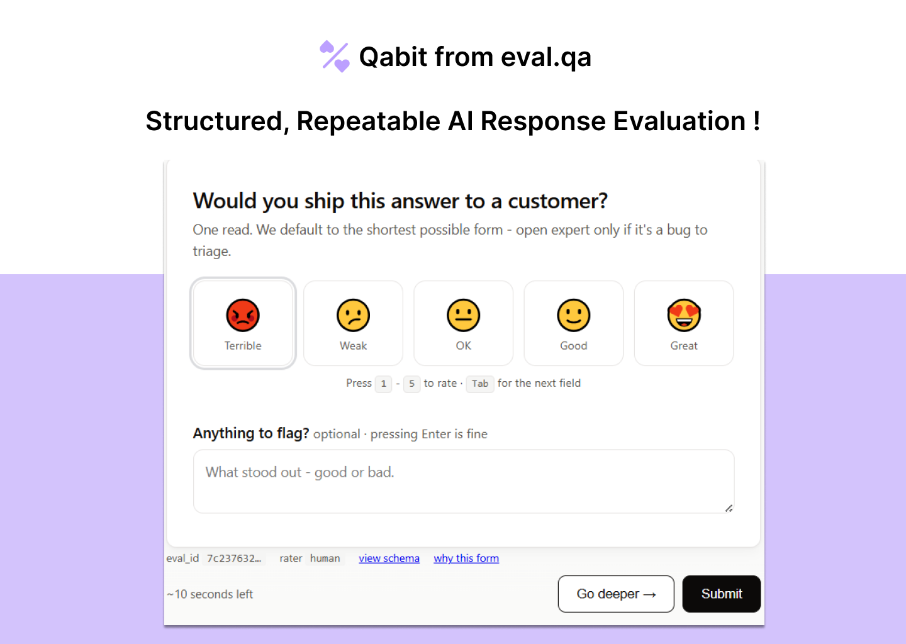
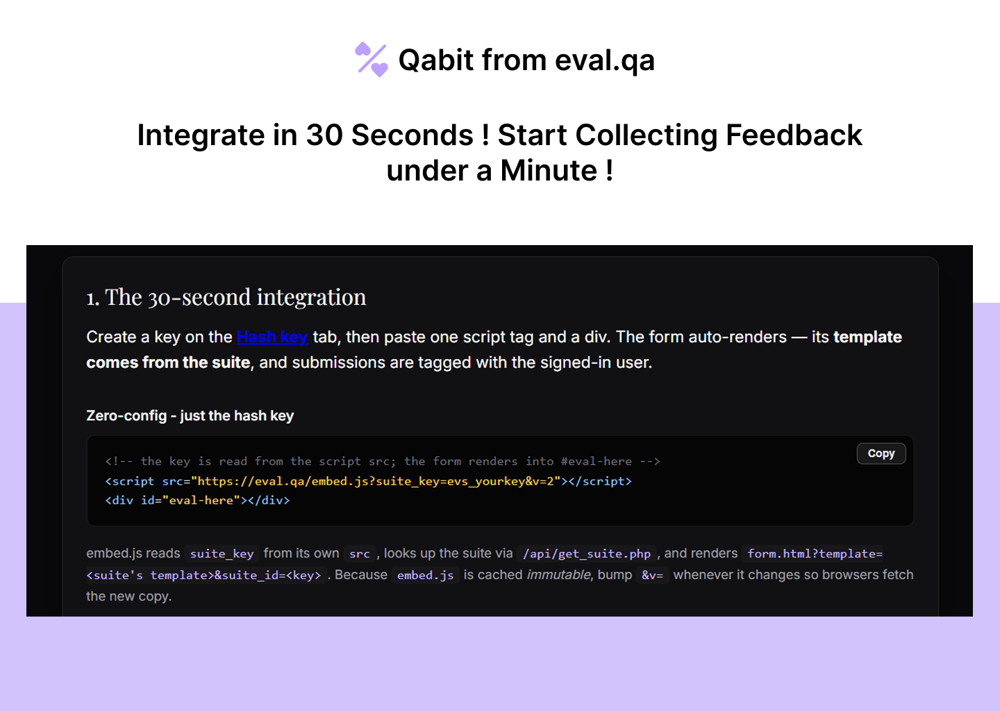
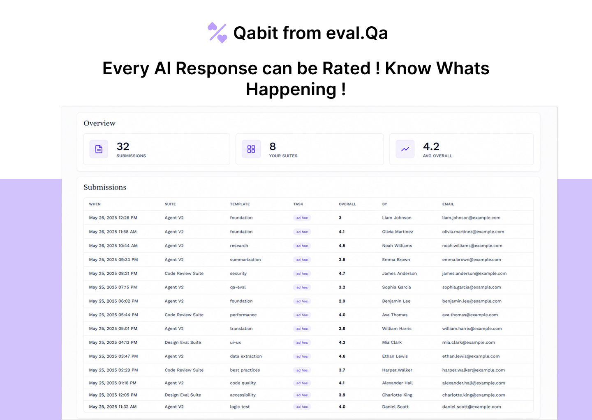

### 🎬 관련 영상
- [🎥 영상 보기](https://ph-files.imgix.net/bd9cf511-8489-49ba-8794-892163abd0fd.jpeg?auto=format)

---

## 23. [NerdSip - Microlearning App](https://www.producthunt.com/products/nerdsip-com)
**Votes**: 11 | **도입 난이도**: 하 | **신뢰도**: 상
**Tagline**: Replace social media with real learning - and get educated.
**서비스 링크**: https://www.producthunt.com/r/QCKTDXZXXHDUHE

**태그**: EdTech, AI, Microlearning, Gamification, AI Tool

### 📌 이 서비스 한눈에 보기
SNS 대신 5분 만에 새로운 지식을 습득하는 AI 기반 마이크로 러닝 앱

### 🔑 주요 기능
- AI를 활용한 주제별 맞춤형 마이크로 코스 생성
- 게임 요소를 결합한 학습 스트릭 및 RPG 시스템
- 짧은 시간 내에 학습 가능한 5분 단위 레슨

### 🙋 사용자에게 어떤 점이 좋은가
자투리 시간을 활용해 무의미한 SNS 스크롤 대신 생산적인 학습 습관을 형성할 수 있습니다.

### ✅ 지금 바로 써볼 기능
- 관심 있는 주제로 맞춤형 코스 생성해보기
- 5분 레슨을 통한 학습 루틴 만들기
- 게임 요소를 활용한 학습 스트릭 유지하기

### ⚠️ 사용 전 확인할 점
- AI 생성 콘텐츠의 정확성 및 품질 확인 필요
- 학습 깊이가 얕을 수 있음

### 🧭 확인이 더 필요한 정보
AI가 생성하는 콘텐츠의 전문성 수준과 학습 커리큘럼의 체계성을 확인할 필요가 있습니다.

### 📸 스크린샷 및 갤러리

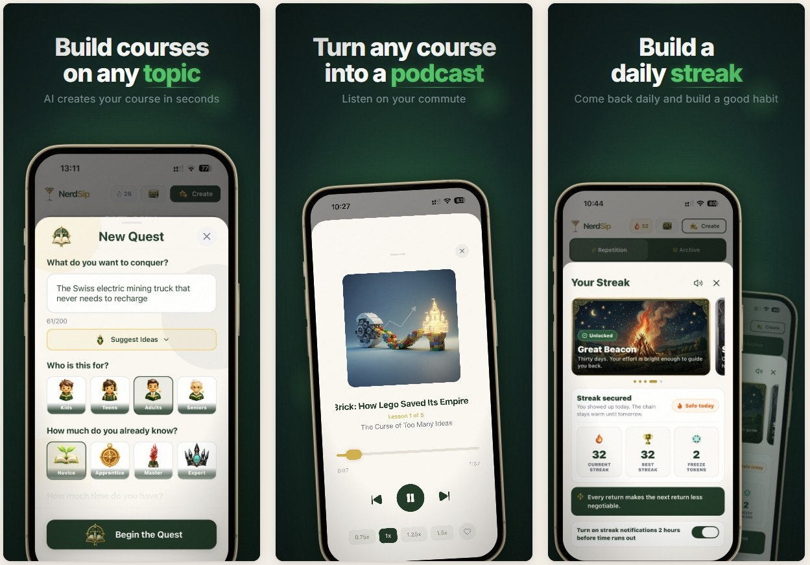

---

## 24. [SchemaFit](https://www.producthunt.com/products/schemafit)
**Votes**: 10 | **도입 난이도**: 하 | **신뢰도**: 상
**Tagline**: CI linter for LLM structured-output schemas
**서비스 링크**: https://www.producthunt.com/r/Q7JBDVZIQH3KWC

**태그**: DevTool, LLM, Automation, CI/CD, AI Tool

### 📌 이 서비스 한눈에 보기
LLM 구조화된 출력 스키마의 오류를 배포 전 CI 단계에서 미리 잡아내는 린터 도구

### 🔑 주요 기능
- OpenAI, Anthropic, Gemini 등 주요 LLM 제공자별 스키마 제약 조건 검증
- JSON Schema, Tool 정의, response_format의 호환성 및 문법 오류 체크
- 런타임 에러를 방지하기 위해 PR 단계에서 스키마 결함을 사전 탐지

### 🙋 사용자에게 어떤 점이 좋은가
LLM 응답 스키마가 모델의 제약 조건과 맞지 않아 발생하는 런타임 오류를 개발 단계에서 미리 방지할 수 있습니다.

### ✅ 지금 바로 써볼 기능
- 현재 사용 중인 JSON Schema를 SchemaFit으로 검증하기
- CI/CD 파이프라인에 SchemaFit 린터 통합하기
- 다양한 LLM 제공자 간의 스키마 이식성 테스트하기

### ⚠️ 사용 전 확인할 점
- 제공되는 린터가 모든 LLM 모델의 미세한 제약 조건을 완벽히 커버하는지 확인 필요
- 기존 워크플로우에 CI 단계 추가에 따른 개발 프로세스 변화

### 🧭 확인이 더 필요한 정보
각 LLM 제공자의 최신 업데이트가 린터 규칙에 즉각 반영되는지 확인이 필요합니다.

### 📸 스크린샷 및 갤러리
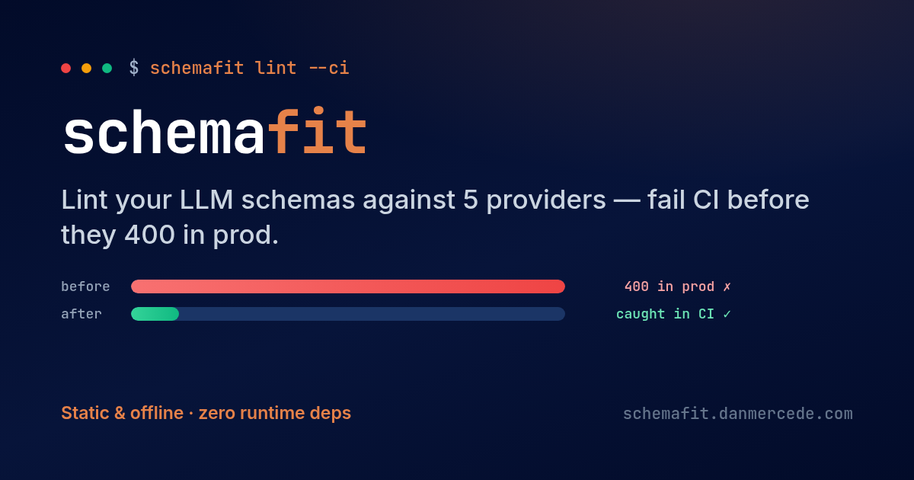

---

## 25. [TermiNode](https://www.producthunt.com/products/terminode)
**Votes**: 9 | **도입 난이도**: 중 | **신뢰도**: 상
**Tagline**: Verifiable GIS proof layer for spatial records
**서비스 링크**: https://www.producthunt.com/r/FZ4VMOPAEAEPYD

**태그**: GIS, Blockchain, DataIntegrity, DevTool, AI Tool

### 📌 이 서비스 한눈에 보기
ICP 기반의 검증 가능한 GIS 데이터 관리 및 공간 기록 증명 레이어

### 🔑 주요 기능
- ICP 네트워크를 활용한 버전 관리형 공간 데이터셋 제공
- 경계 기반 맵 쿼리 및 감사 추적(Audit Trail) 기능
- 데이터 증거 수출 및 읽기 전용 MCP 지원

### 🙋 사용자에게 어떤 점이 좋은가
공간 데이터의 무결성이 중요한 프로젝트에서 데이터의 변경 이력을 투명하게 증명하고 신뢰할 수 있는 기록을 남길 수 있습니다.

### ✅ 지금 바로 써볼 기능
- 공간 데이터셋 버전 관리 기능 테스트
- 데이터 감사 추적 및 증명 영수증 생성 확인
- MCP를 통한 읽기 전용 데이터 접근 테스트

### ⚠️ 사용 전 확인할 점
- ICP 네트워크 환경에 대한 기술적 이해 필요
- 데이터 내보내기 및 쿼리 시 발생하는 비용이나 성능 제약 확인 필요

### 🧭 확인이 더 필요한 정보
구체적인 데이터 처리 용량 제한 및 MCP 지원 범위에 대한 상세 정보가 필요합니다.

### 📸 스크린샷 및 갤러리
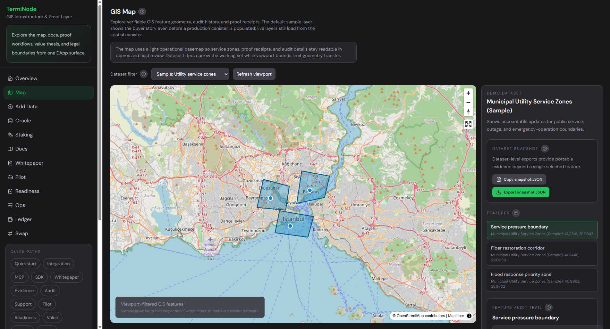
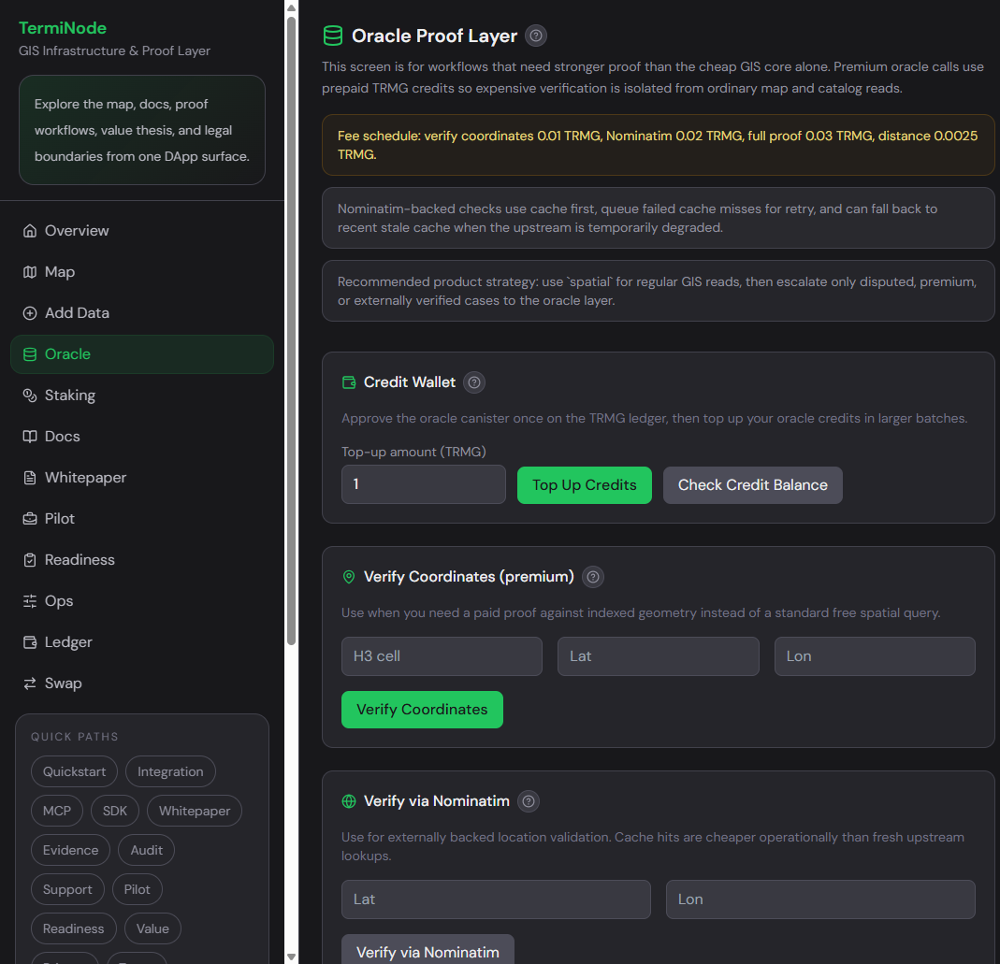
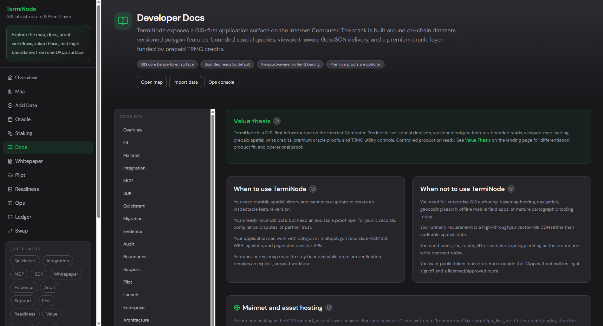

---

## 26. [ASCEND AI](https://www.producthunt.com/products/ascend-ai-2)
**Votes**: 9 | **도입 난이도**: 하 | **신뢰도**: 상
**Tagline**: Ascend — World-class AI face analysis + personalised 
**서비스 링크**: https://www.producthunt.com/r/BRZ22DIBWV7BD5

**태그**: AI, Face Analysis, Personalized Coaching, Health & Beauty, AI Tool

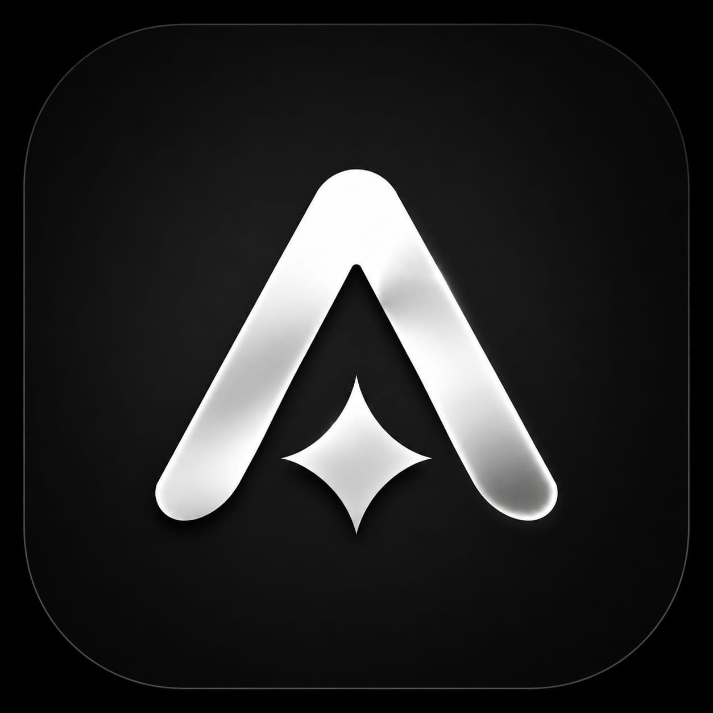

### 📌 이 서비스 한눈에 보기
정밀한 AI 안면 분석을 통한 개인 맞춤형 외모 개선 프로토콜 서비스

### 🔑 주요 기능
- 다중 모델 컴퓨터 비전을 활용한 정밀한 안면 구조 분석
- 대칭성, 황금비, 피부 상태 등 구체적인 수치와 근거 제공
- 분석 결과를 바탕으로 한 75일 맞춤형 변화 프로토콜

### 🙋 사용자에게 어떤 점이 좋은가
단순한 점수 부여를 넘어, 자신의 얼굴 구조를 과학적으로 이해하고 이를 개선하기 위한 구체적인 행동 지침을 얻을 수 있습니다.

### ✅ 지금 바로 써볼 기능
- 자신의 사진을 업로드하여 정밀 안면 스캔 진행하기
- 제공되는 상세 분석 리포트 확인하기
- 개인별 75일 변화 프로토콜 시작하기

### ⚠️ 사용 전 확인할 점
- AI 분석 결과가 실제 외모와 다를 수 있음
- 제시된 프로토콜의 신체적 영향에 대한 주의 필요

### 🧭 확인이 더 필요한 정보
75일 프로토콜의 구체적인 방법론(운동, 식단, 관리 등)이 무엇인지 명시되지 않았습니다.

### 📸 스크린샷 및 갤러리
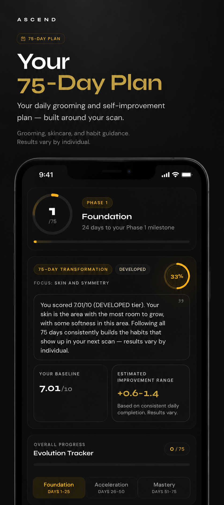
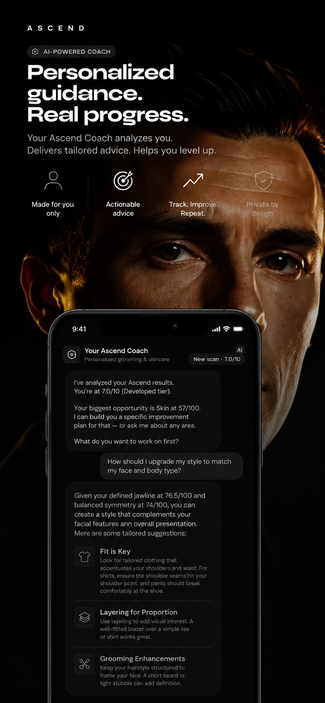
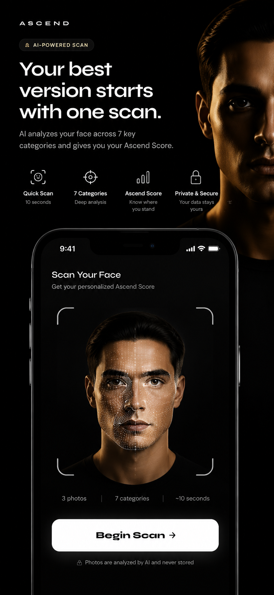

---

## 27. [Lustra - Professional Camera App](https://www.producthunt.com/products/lustra-professional-camera-app)
**Votes**: 9 | **도입 난이도**: 하 | **신뢰도**: 상
**Tagline**: DSLR level control, in your pocket
**서비스 링크**: https://www.producthunt.com/r/O3ZWKTOKCTMJBV

**태그**: Photography, MobileApp, CreativeTool, UX, Design

### 📌 이 서비스 한눈에 보기
복잡한 메뉴 없이 DSLR급 전문 제어를 손끝에서 구현하는 카메라 앱

### 🔑 주요 기능
- 직관적이고 빠른 전문 카메라 컨트롤 인터페이스
- 메뉴 깊숙이 숨겨진 기능들을 사용자 중심으로 재배치
- 제품 디자이너의 경험이 녹아든 사용자 친화적 UX

### 🙋 사용자에게 어떤 점이 좋은가
전문적인 사진 촬영 기능을 복잡한 조작 없이 즉각적으로 사용할 수 있어 촬영 흐름이 끊기지 않습니다.

### ✅ 지금 바로 써볼 기능
- 직관적인 컨트롤 인터페이스 조작해보기
- DSLR급 설정값 변경 테스트하기
- 기존 카메라 앱과의 UI 차이점 비교하기

### ⚠️ 사용 전 확인할 점
- 전문가용 기능 위주이므로 단순 스냅샷 촬영 시에는 과할 수 있음
- 상세한 기능 목록이나 하드웨어 호환성이 명시되지 않음

### 🧭 확인이 더 필요한 정보
구체적인 카메라 설정 항목(ISO, 셔터 스피드 등)과 지원되는 기기 범위에 대한 정보가 더 필요합니다.

### 📸 스크린샷 및 갤러리

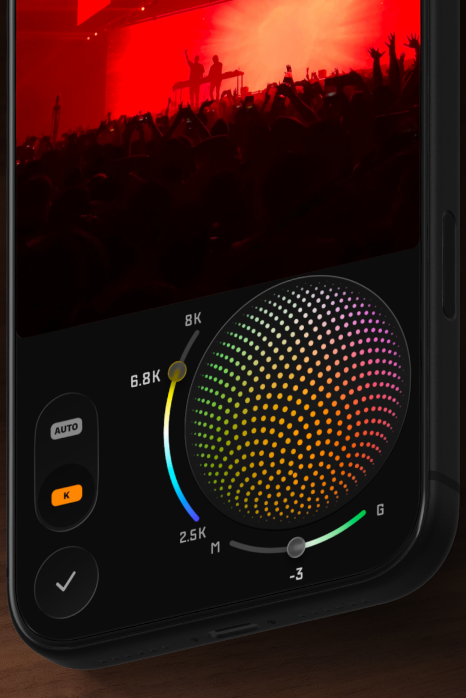

---

## 28. [DOTHING](https://www.producthunt.com/products/dothing-tasks-done)
**Votes**: 9 | **도입 난이도**: 하 | **신뢰도**: 상
**Tagline**: Stop managing. Start doing.
**서비스 링크**: https://www.producthunt.com/r/B32YOLL5TY6JSL

**태그**: Productivity, Minimalism, Task Management, AI Tool

### 📌 이 서비스 한눈에 보기
복잡한 관리 없이 오직 오늘의 할 일에만 집중할 수 있는 미니멀리즘 태스크 앱

### 🔑 주요 기능
- 프로젝트, 태그 등 복잡한 관리 시스템 배제
- 오늘 해야 할 작업에만 집중하는 직관적 구조
- 구독 없이 한 번의 구매로 이용 가능한 모델

### 🙋 사용자에게 어떤 점이 좋은가
할 일 관리 앱의 복잡한 기능 때문에 오히려 생산성이 떨어지는 사용자에게 단순하고 명확한 실행 환경을 제공합니다.

### ✅ 지금 바로 써볼 기능
- 오늘의 할 일 목록 작성하기
- 복잡한 시스템 없이 바로 작업 시작하기

### ⚠️ 사용 전 확인할 점
- 프로젝트 분류나 태그 기능이 없어 체계적인 관리가 어려운 사용자에게는 부적합할 수 있음
- 기능의 단순함으로 인해 장기적인 기록 보관이나 데이터 관리가 제한적일 수 있음

### 🧭 확인이 더 필요한 정보
구체적인 일회성 구매 가격과 지원하는 플랫폼(Web, Mobile 등)에 대한 정보가 명시되지 않았습니다.

### 📸 스크린샷 및 갤러리

---

## 29. [LegalHai](https://www.producthunt.com/products/legalhai)
**Votes**: 9 | **도입 난이도**: 하 | **신뢰도**: 상
**Tagline**: Understand every agreement before you sign.
**서비스 링크**: https://www.producthunt.com/r/UVJX23DISX4OYL

**태그**: LegalTech, AI, Productivity, DocumentAnalysis, AI Tool

### 📌 이 서비스 한눈에 보기
복잡한 법률 문서를 쉬운 언어로 요약하고 분석해 주는 AI 계약 검토 서비스

### 🔑 주요 기능
- AI를 활용한 계약서 및 법률 문서의 쉬운 언어 요약
- 조항별 상세 분석 및 인사이트 제공
- 다국어 지원을 통한 다양한 문서 처리 가능

### 🙋 사용자에게 어떤 점이 좋은가
전문적인 법률 용어 때문에 계약서 내용을 파악하기 어려울 때, 비용을 들이지 않고 핵심 내용을 빠르게 이해할 수 있습니다.

### ✅ 지금 바로 써볼 기능
- 작성 중인 계약서나 NDA 업로드해 보기
- AI가 생성한 조항별 요약 내용 확인하기
- 어려운 법률 용어가 쉬운 언어로 잘 설명되었는지 검토하기

### ⚠️ 사용 전 확인할 점
- AI 생성 결과물이므로 법적 효력을 갖는 최종 검토는 반드시 전문가와 상의해야 함
- 민감한 개인정보나 기업 기밀이 포함된 문서를 업로드할 때의 보안 정책 확인 필요

### 🧭 확인이 더 필요한 정보
현재 MVP 단계이므로 서비스의 보안 수준과 법적 책임 소재에 대한 명확한 확인이 필요합니다.

### 📸 스크린샷 및 갤러리

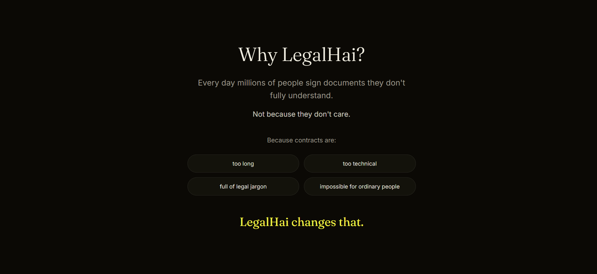
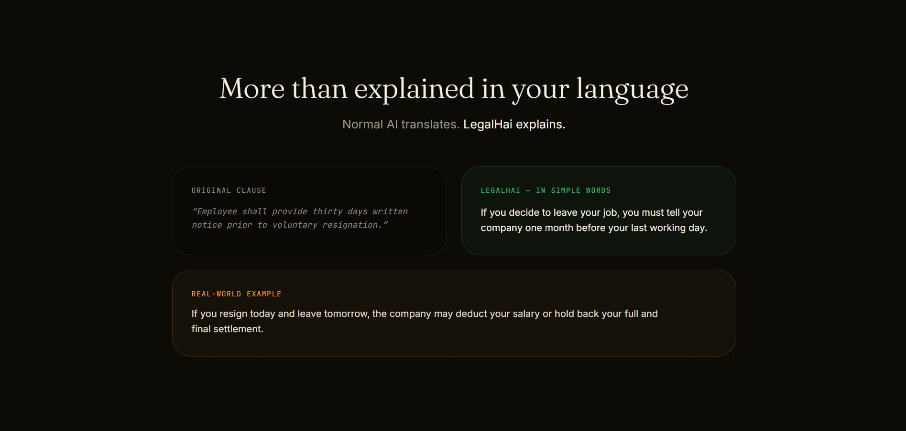

---

## 30. [AxioRank](https://www.producthunt.com/products/axiorank)
**Votes**: 9 | **도입 난이도**: 중 | **신뢰도**: 상
**Tagline**: The security gateway for AI agents | identity, policy, audit
**서비스 링크**: https://www.producthunt.com/r/46X6WZCLAA457M

**태그**: AI-Security, DevOps, Automation, Cybersecurity, Agent, AI Tool, API, Security

### 📌 이 서비스 한눈에 보기
AI 에이전트의 권한 오남용을 방지하고 보안을 강화하는 실시간 게이트웨이 솔루션

### 🔑 주요 기능
- 정적 키 대신 단기 수명 ID를 통한 강력한 인증 체계 제공
- 기본 거부(Default-deny) 정책 기반의 정밀한 권한 제어
- 오프라인 검증이 가능한 서명된 감사 로그(Audit Trail) 생성

### 🙋 사용자에게 어떤 점이 좋은가
AI 에이전트가 외부 API나 데이터에 접근할 때 발생할 수 있는 보안 사고를 사전에 차단하고, 모든 작업 내역을 투명하게 추적할 수 있습니다.

### ✅ 지금 바로 써볼 기능
- 기존 AI 에이전트 워크플로우에 게이트웨이 연결 테스트
- 사용자 정의 정책(Policy) 설정 및 권한 범위 테스트
- 생성된 감사 로그의 무결성 및 오프라인 검증 확인

### ⚠️ 사용 전 확인할 점
- 게이트웨이 도입 시 발생할 수 있는 네트워크 지연 시간(Latency) 확인 필요
- 기존 시스템과의 호환성을 위한 AGS-1 규격 준수 여부 검토

### 🧭 확인이 더 필요한 정보
현재 제공되는 구체적인 성능 지표(지연 시간 등)와 상세한 설치 가이드에 대한 정보가 부족합니다.

### 📸 스크린샷 및 갤러리
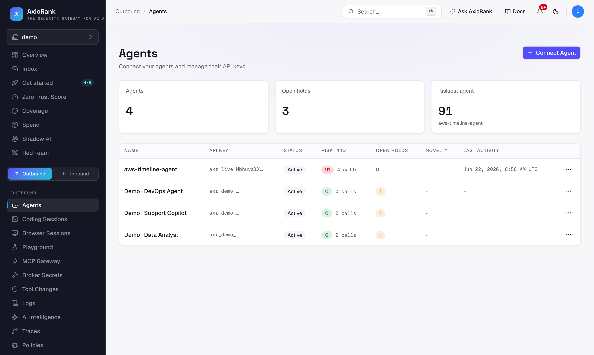
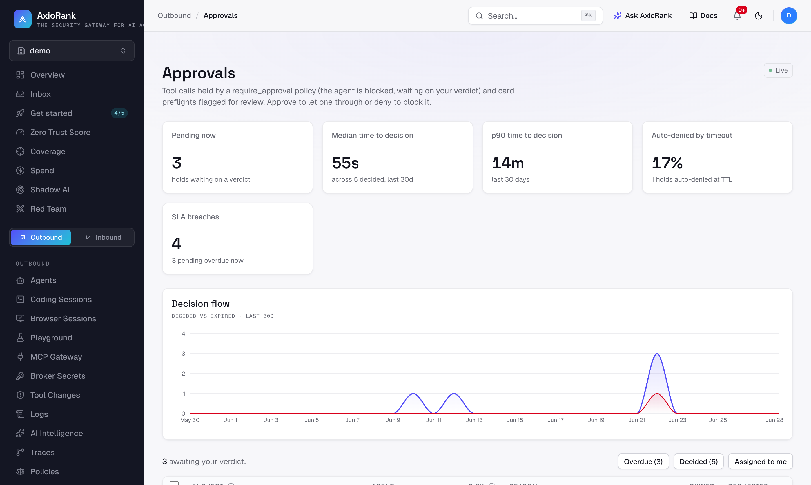
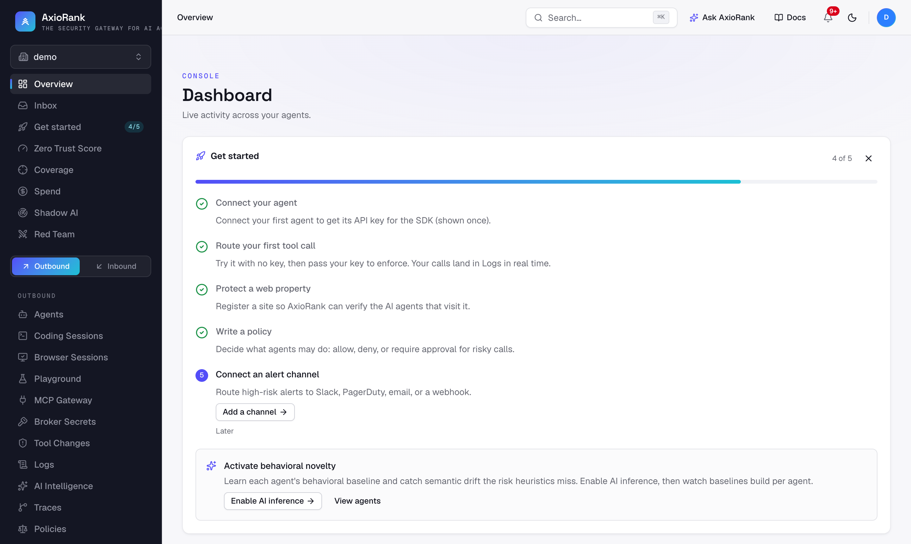

### 🎬 관련 영상
- [🎥 영상 보기](https://ph-files.imgix.net/8016018f-7ec4-4e5f-8cd3-df2bc56d8ac6.jpeg?auto=format)

---

