# 🚀 Product Hunt Daily Top 30 (2026-07-01)

## 오늘의 요약
오늘의 트렌드는 AI 에이전트가 단순한 채팅을 넘어 브라우저 제어, 이메일 관리, 코딩 작업 등 실질적인 업무 프로세스를 자동화하는 방향으로 진화하고 있음을 보여줍니다. 특히 기존 워크플로우에 자연스럽게 녹아들어 생산성을 극대화하거나, 복잡한 데이터를 즉각적인 인사이트로 변환하는 도구들이 주목받았습니다.

### 오늘의 핵심 포인트
- AI 에이전트가 API와 클라우드 기술을 활용해 브라우저 조작이나 코딩 작업을 기존 방식보다 훨씬 빠르고 효율적으로 수행합니다.
- 사용자의 업무 패턴을 학습하거나 기존 디자인 시스템을 자동 임포트하는 등 개인화 및 자동화된 워크플로우 구축이 강화되었습니다.
- 데이터 분석, 일정 관리, 성과 기록 등 비즈니스와 커리어 관리에 직결되는 실용적인 AI 도구들이 높은 관심을 받았습니다.

**오늘의 태그**: AI Agent, Automation, Productivity, Developer Tools, Workflow Optimization

## 1. [Cursor for iOS](https://www.producthunt.com/products/cursor)
**Votes**: 405 | **도입 난이도**: 중 | **신뢰도**: 상
**Tagline**: Build with coding agents from anywhere
**서비스 링크**: https://www.producthunt.com/r/KBJ3E75U6E6GTF

**태그**: DevTool, Mobile, AI-Agent, Productivity, Agent, AI Tool

### 📌 이 서비스 한눈에 보기
장소에 구애받지 않고 클라우드 에이전트를 통해 코딩 작업을 이어갈 수 있는 iOS용 Cursor 앱

### 🔑 주요 기능
- 모바일 환경에서 클라우드 기반 코딩 에이전트 실행 가능
- 원격으로 컴퓨터에서 실행 중인 에이전트 제어 기능
- 아이디어 구상 시 즉시 작업 시작 및 작업 완료 알림 수신

### 🙋 사용자에게 어떤 점이 좋은가
노트북을 펼치기 어려운 상황에서도 아이디어를 즉시 코드로 구현하거나, 진행 중인 개발 작업의 상태를 확인하고 관리할 수 있습니다.

### ✅ 지금 바로 써볼 기능
- 클라우드 에이전트 작업 시작하기
- 완료된 작업에 대한 알림 설정하기
- 모바일에서 PR 검토 및 머지 시도하기

### ⚠️ 사용 전 확인할 점
- 현재 퍼블릭 베타 단계이므로 기능적 불안정성이 있을 수 있음
- 에이전트 실행 및 제어를 위한 클라우드/로컬 환경 연결 설정 필요

### 🧭 확인이 더 필요한 정보
현재 베타 버전이므로 구체적인 클라우드 비용 정책이나 로컬 기기와의 동기화 상세 방식은 확인이 필요합니다.

### 📸 스크린샷 및 갤러리
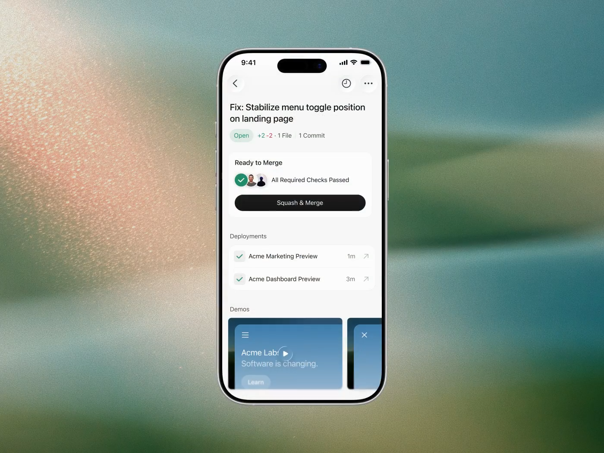
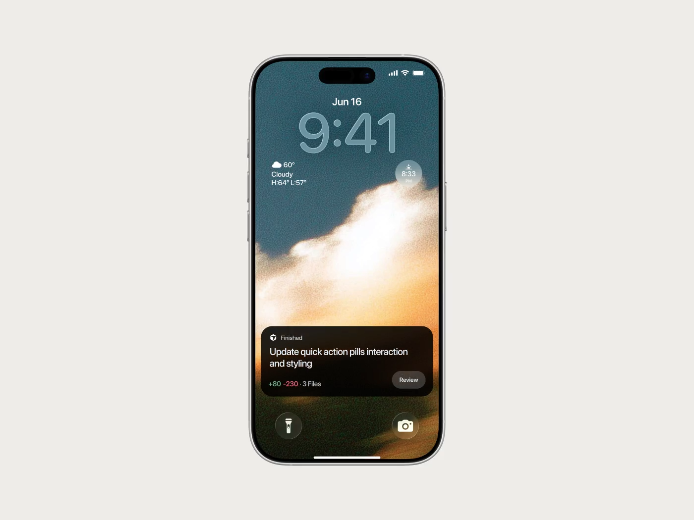
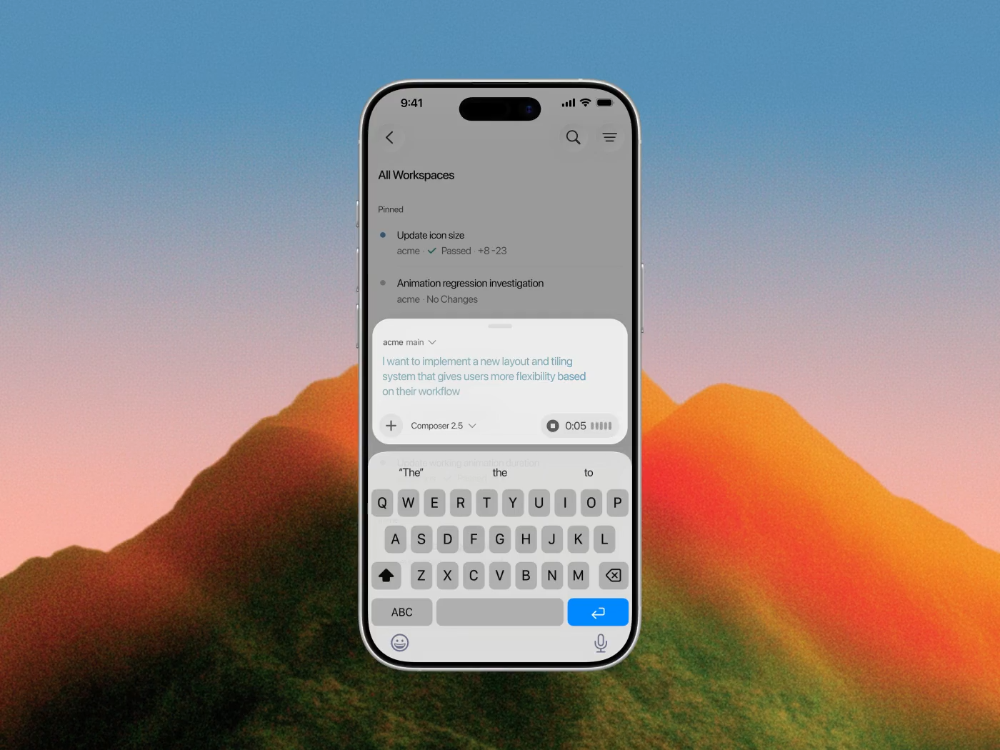

### 🎬 관련 영상
- [🎥 영상 보기](https://ph-files.imgix.net/fa799e02-0906-44c5-a86a-862e0620409b.jpeg?auto=format)

---

## 2. [Skills Marketplace by Databox](https://www.producthunt.com/products/databox)
**Votes**: 289 | **도입 난이도**: 하 | **신뢰도**: 상
**Tagline**: Ready-made AI analytics skills for your business data
**서비스 링크**: https://www.producthunt.com/r/EH536KOIRGF4MD

**태그**: AI, Analytics, Automation, Data-Reporting, AI Tool, Chat, Email

### 📌 이 서비스 한눈에 보기
실시간 데이터를 기반으로 즉시 리포트를 생성하는 AI 분석 스킬 라이브러리

### 🔑 주요 기능
- 광고, 이커머스, 매출 등 분야별로 준비된 맞춤형 AI 분석 스킬 제공
- 실시간 성능 데이터를 활용해 1분 이내에 완성된 리포트 생성
- Claude 채팅 또는 n8n 자동화를 통한 Slack/이메일 연동 지원

### 🙋 사용자에게 어떤 점이 좋은가
복잡한 데이터 분석 과정 없이 준비된 스킬을 통해 즉각적인 비즈니스 인사이트를 얻고 자동화된 보고 체계를 구축할 수 있습니다.

### ✅ 지금 바로 써볼 기능
- 라이브러리에서 필요한 분석 스킬 다운로드하기
- Claude에서 스킬을 실행하여 데이터 질문하기
- n8n을 연결하여 자동 보고 스케줄 설정하기

### ⚠️ 사용 전 확인할 점
- 데이터 소스(광고, 웹사이트 등)의 실시간 연동 권한 필요
- 자동화 워크플로우 구축 시 n8n 등 외부 도구 사용 숙련도 필요

### 🧭 확인이 더 필요한 정보
데이터 소스별 구체적인 연동 방식과 데이터 보안 정책에 대한 확인이 필요합니다.

### 📸 스크린샷 및 갤러리
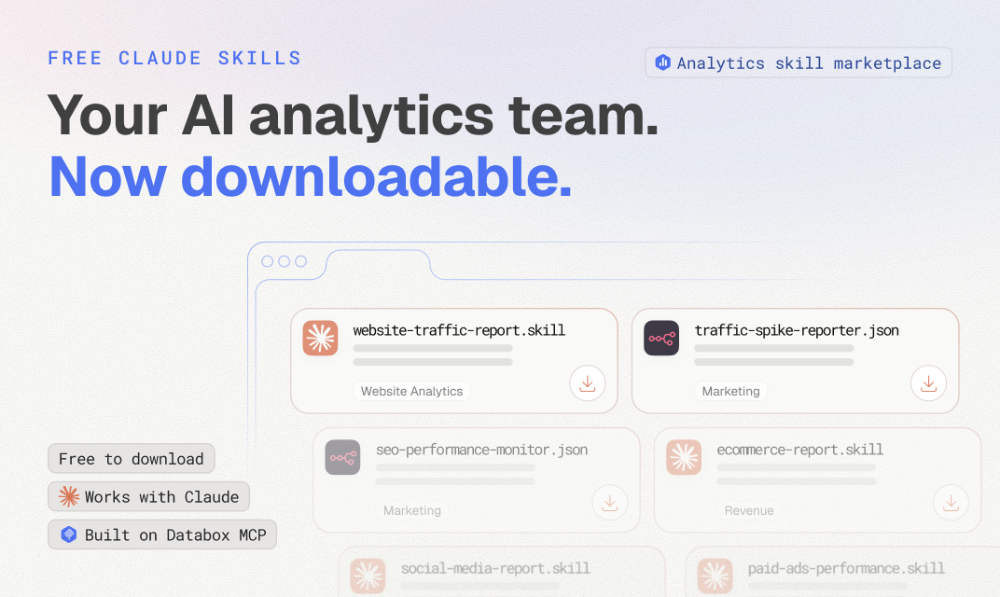
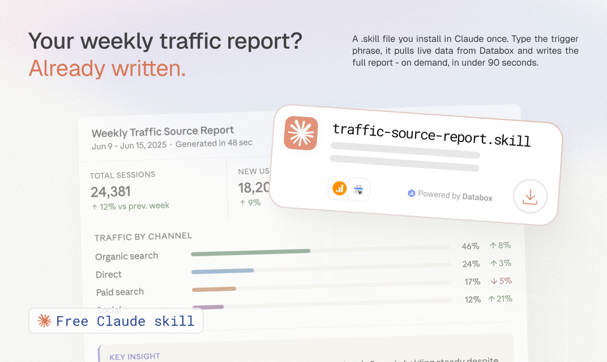
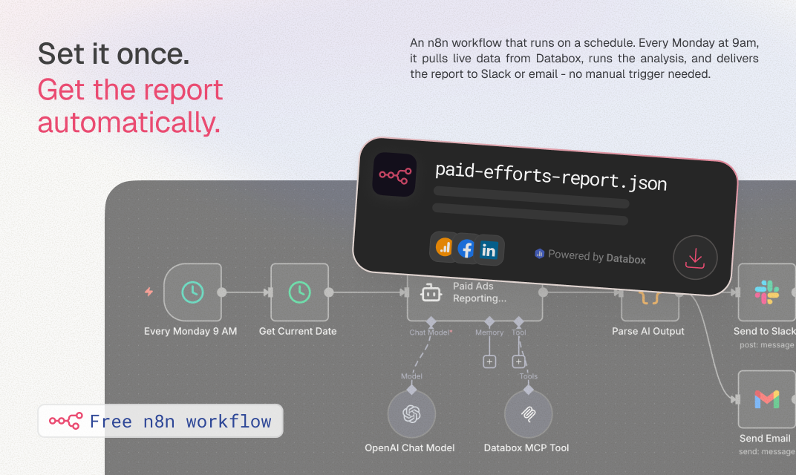

### 🎬 관련 영상
- [🎥 영상 보기](https://ph-files.imgix.net/41032521-bad0-40f1-90f8-56dd44ff51d4.jpeg?auto=format)

---

## 3. [Foresight by Lightning Rod](https://www.producthunt.com/products/training-data-generator)
**Votes**: 252 | **도입 난이도**: 하 | **신뢰도**: 상
**Tagline**: Predict anything with AI
**서비스 링크**: https://www.producthunt.com/r/ERAFMCUYCEPACK

**태그**: DevTool, AI, API, Forecasting, Automation, Agent, AI Tool, LLM

### 📌 이 서비스 한눈에 보기
미래 사건에 대한 정교한 예측값을 제공하는 개발자용 AI 예측 API

### 🔑 주요 기능
- OpenAI 호환 API를 통한 손쉬운 예측 워크플로우 통합
- 일반 LLM과 차별화된 실세계 결과 기반의 검증된 예측 정확도
- 에이전트 및 예측 시장 봇 구축에 최적화된 저렴한 추론 비용

### 🙋 사용자에게 어떤 점이 좋은가
미래 예측이 필요한 자동화 에이전트나 의사결정 도구를 개발할 때, 별도의 모델 학습 없이 즉시 신뢰할 수 있는 예측 데이터를 확보할 수 있습니다.

### ✅ 지금 바로 써볼 기능
- OpenAI 호환 API를 활용한 기존 워크플로우 연동 테스트
- 특정 미래 이벤트 질문을 통한 예측 점수 및 캘리브레이션 확인
- 일반 LLM 대비 예측 정확도 및 비용 효율성 비교

### ⚠️ 사용 전 확인할 점
- 실제 예측 결과가 항상 100% 정확함을 보장하지 않으므로 최종 의사결정 시 주의 필요
- 특정 도메인에 특화된 예측 성능인지에 대한 확인 필요

### 🧭 확인이 더 필요한 정보
구체적인 벤치마크 수치와 지원하는 예측 도메인의 범위가 명시되지 않았습니다.

### 📸 스크린샷 및 갤러리
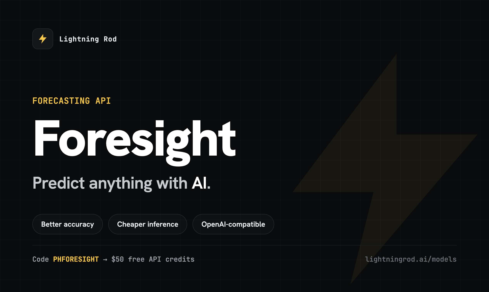
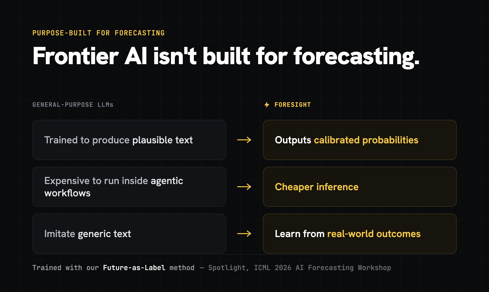
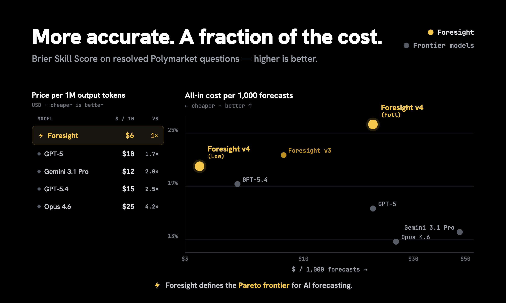

---

## 4. [Akiflow](https://www.producthunt.com/products/akiflow)
**Votes**: 207 | **도입 난이도**: 중 | **신뢰도**: 상
**Tagline**: Manage tasks and calendars from Claude, ChatGPT or Cursor
**서비스 링크**: https://www.producthunt.com/r/J3YXH74BARWKOC

**태그**: Productivity, AI, Calendar, TaskManagement, TimeBlocking, Chat

### 📌 이 서비스 한눈에 보기
AI 도구와 캘린더를 결합하여 업무 효율을 극대화하는 올인원 타임 블로킹 플래너

### 🔑 주요 기능
- Claude, ChatGPT, Cursor 등 AI 도구와의 연동을 통한 작업 관리
- 할 일(Tasks)과 일정(Calendar)을 한곳에서 관리하는 중앙 집중식 플래너
- 생산성 최적화를 위한 타임 블로킹(Time Blocking) 기능 제공

### 🙋 사용자에게 어떤 점이 좋은가
여러 도구에 흩어진 업무와 일정을 하나로 통합하여, 계획과 실행 사이의 간극을 줄이고 업무 집중도를 높일 수 있습니다.

### ✅ 지금 바로 써볼 기능
- AI 도구(ChatGPT 등)를 통한 작업 생성 및 관리 시도
- 기존 캘린더와 작업 목록 통합 설정
- 타임 블로킹 기법을 활용한 일일 일정 계획

### ⚠️ 사용 전 확인할 점
- AI 도구 연동 시 개인 데이터 보안 및 프라이버시 정책 확인 필요
- 기존에 사용 중인 다른 캘린더/할 일 관리 앱과의 동기화 방식 확인

### 🧭 확인이 더 필요한 정보
AI 도구(Claude, ChatGPT, Cursor)와의 구체적인 연동 방식 및 자동화 수준에 대한 상세 정보가 필요합니다.

### 📸 스크린샷 및 갤러리
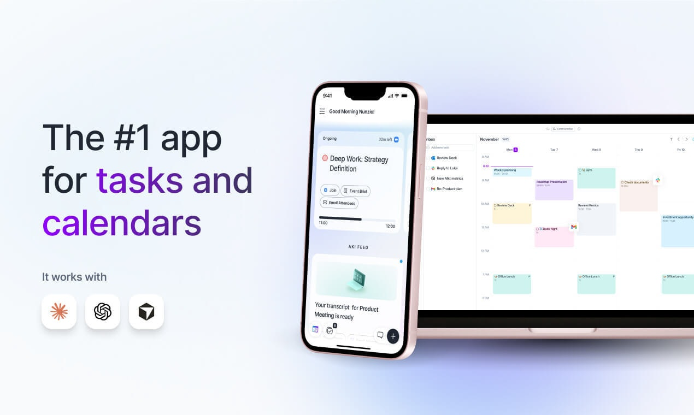
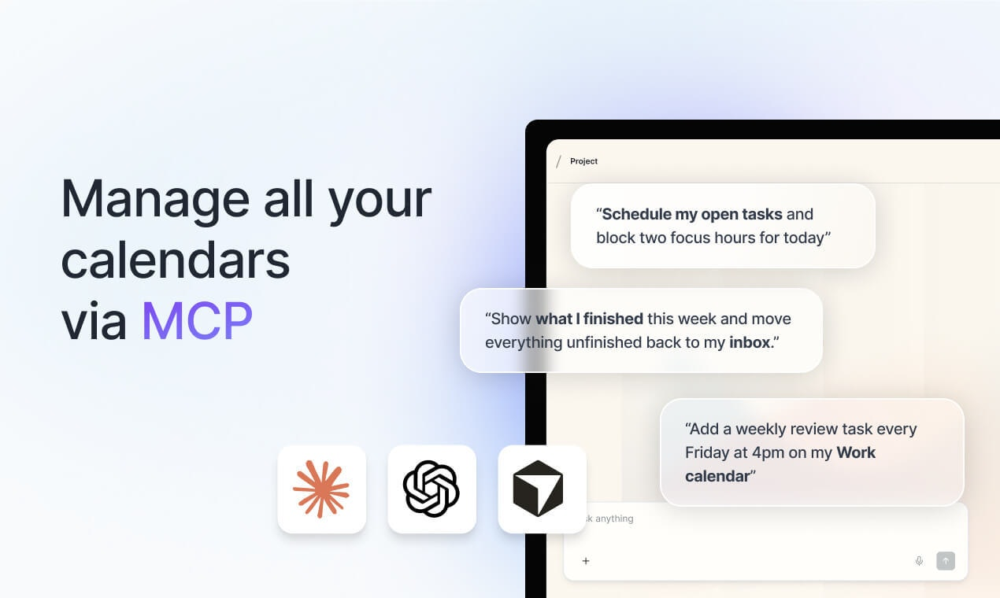

---

## 5. [Supafax](https://www.producthunt.com/products/supafax)
**Votes**: 194 | **도입 난이도**: 하 | **신뢰도**: 상
**Tagline**: Email-native assistant that learns how you work
**서비스 링크**: https://www.producthunt.com/r/ZNXSPMJDBC3WIA

**태그**: AI Assistant, Email Automation, Productivity, AI Tool, Email

### 📌 이 서비스 한눈에 보기
사용자의 업무 방식을 학습하여 이메일 관리부터 답장 작성까지 자동화하는 AI 비서

### 🔑 주요 기능
- 사용자의 작업 패턴을 학습하는 이메일 네이티브 AI
- 수신함 우선순위 지정 및 자동 분류
- 답장 초안 작성 및 미팅 일정 예약 자동화

### 🙋 사용자에게 어떤 점이 좋은가
반복적인 이메일 확인과 일정 조율 시간을 줄여주어 업무 집중도를 높일 수 있습니다.

### ✅ 지금 바로 써볼 기능
- 이메일 우선순위 자동 분류 기능 테스트
- AI 답장 초안 생성 기능 확인
- 미팅 예약 자동화 워크플로우 설정

### ⚠️ 사용 전 확인할 점
- 이메일 계정 접근 권한 부여에 따른 보안 검토 필요
- AI가 생성한 답장의 정확성 및 톤앤매너 확인 필요

### 🧭 확인이 더 필요한 정보
지원하는 이메일 서비스 플랫폼(Gmail, Outlook 등)의 범위와 보안 정책에 대한 확인이 필요합니다.

### 📸 스크린샷 및 갤러리
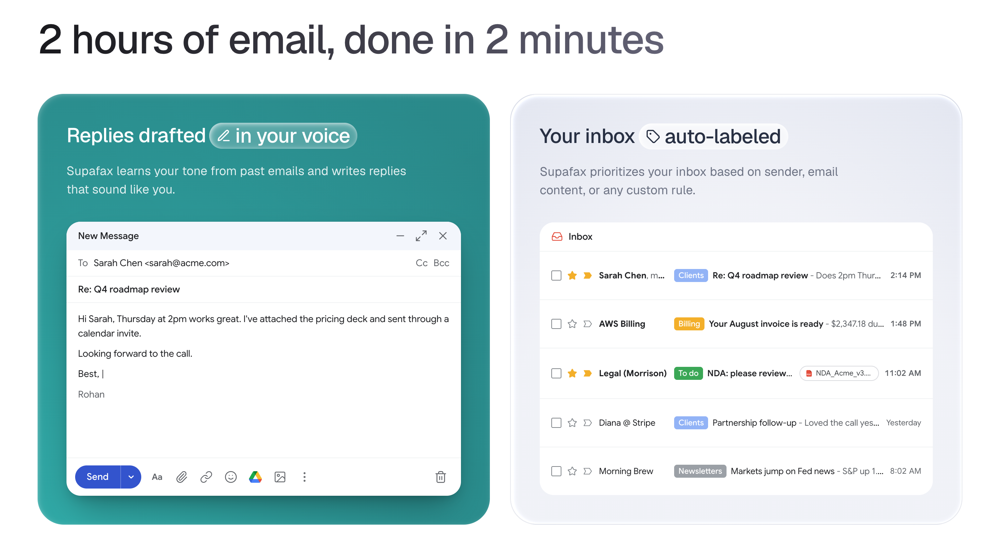
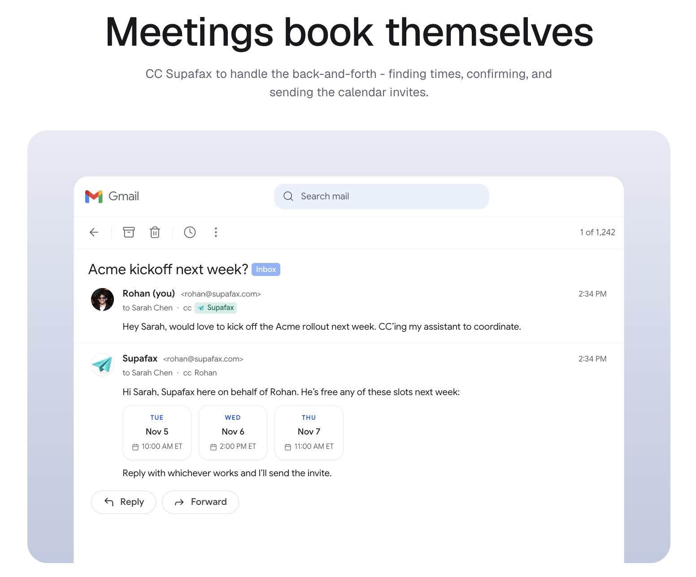
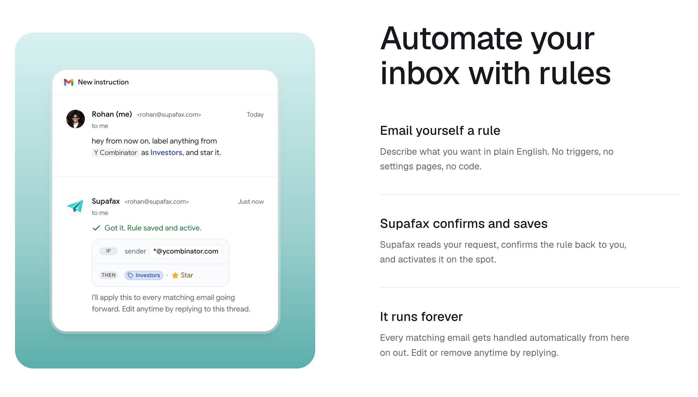

### 🎬 관련 영상
- [🎥 영상 보기](https://ph-files.imgix.net/d46602b1-480b-4b17-b2fe-8be72cd4442e.jpeg?auto=format)

---

## 6. [v0 Design Systems 2.0](https://www.producthunt.com/products/v0)
**Votes**: 149 | **도입 난이도**: 중 | **신뢰도**: 상
**Tagline**: Build with your components, colors, fonts, and patterns
**서비스 링크**: https://www.producthunt.com/r/WP5F37BOUYFY2M

**태그**: DesignSystem, Frontend, Prototyping, Automation, Workflow, Chat, Design

### 📌 이 서비스 한눈에 보기
기존 디자인 시스템을 자동으로 학습하여 즉시 사용 가능한 플레이그라운드로 변환해주는 도구

### 🔑 주요 기능
- GitHub, npm, Figma, Storybook 등 다양한 소스로부터 디자인 시스템 자동 임포트
- 실제 사용 패턴을 학습하여 컴포넌트와 토큰이 적용된 플레이그라운드 생성
- 채팅 인터페이스를 통한 반복적인 디자인 수정 및 결과물 저장

### 🙋 사용자에게 어떤 점이 좋은가
기존에 구축된 복잡한 디자인 시스템을 일일이 수동으로 옮길 필요 없이, 기존 자산을 활용해 즉각적인 프로토타이핑 환경을 구축할 수 있습니다.

### ✅ 지금 바로 써볼 기능
- 기존 Figma 프레임이나 Storybook 링크를 통한 시스템 임포트 시도
- 채팅 기능을 활용한 컴포넌트 스타일 미세 조정
- 생성된 플레이그라운드 결과물 저장 및 프로젝트 적용

### ⚠️ 사용 전 확인할 점
- 소스 데이터(GitHub, Figma 등)의 접근 권한 설정 필요
- 자동 학습 결과가 기존 디자인 시스템의 의도와 완벽히 일치하는지 검토 필요

### 🧭 확인이 더 필요한 정보
다양한 소스(ZIP, 실시간 앱 등)로부터의 데이터 추출 정확도와 보안 정책에 대한 상세 정보가 필요합니다.

### 📸 스크린샷 및 갤러리
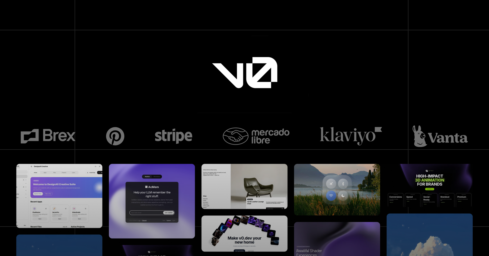

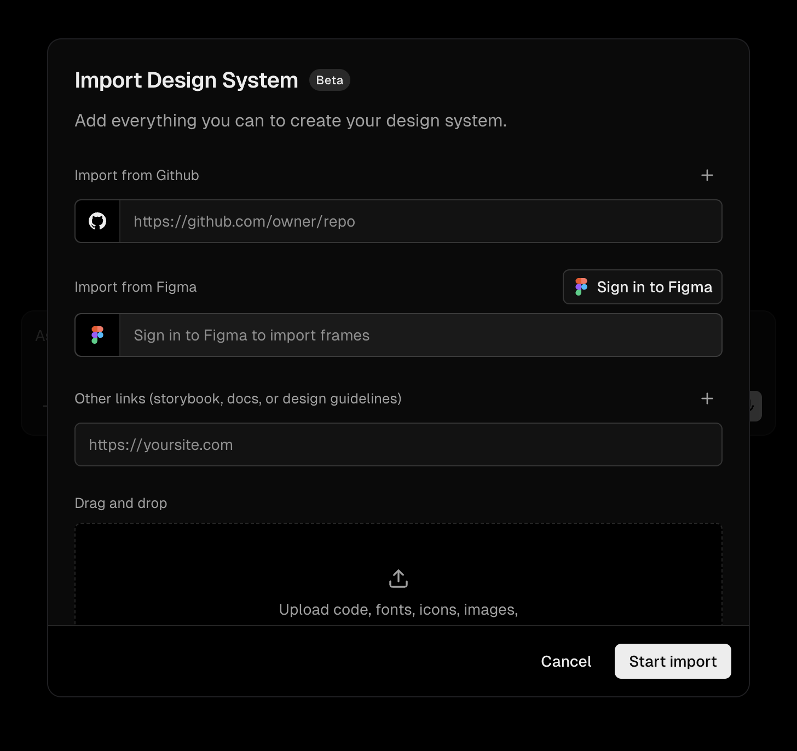

---

## 7. [Dayflow](https://www.producthunt.com/products/dayflow-4)
**Votes**: 145 | **도입 난이도**: 하 | **신뢰도**: 상
**Tagline**: Open source tools that help you get promoted
**서비스 링크**: https://www.producthunt.com/r/HN53MKBPHQIQHU

**태그**: Productivity, AI, macOS, OpenSource, Automation, AI Tool

### 📌 이 서비스 한눈에 보기
업무 기록을 자동화하여 성과 증명을 돕는 오픈소스 macOS 데일리 저널링 도구

### 🔑 주요 기능
- 화면 데이터와 AI를 활용한 자동 업무 기록 (수동 입력 불필요)
- 로컬 우선(Local-first) 방식 및 다양한 AI 모델 지원으로 보안 강화
- 성과 리뷰, 1:1 미팅, 스탠드업 미팅을 위한 데이터 축적

### 🙋 사용자에게 어떤 점이 좋은가
매번 수동으로 업무 내용을 기록할 필요 없이, 과거의 성과를 데이터로 증명하여 승진과 인사 고과를 준비하는 데 도움을 줍니다.

### ✅ 지금 바로 써볼 기능
- macOS에 앱 설치 및 화면 데이터 연동
- 선호하는 로컬 또는 클라우드 AI 모델 설정
- 주간/월간 성과 리포트 생성 기능 확인

### ⚠️ 사용 전 확인할 점
- 화면 데이터를 수집하므로 개인정보 및 민감 정보 노출 주의 필요
- macOS 전용 앱으로 타 운영체제 사용 불가

### 🧭 확인이 더 필요한 정보
사용자의 화면 데이터를 수집하는 방식이 구체적으로 어떤 수준의 프라이버시 보호를 제공하는지 확인이 필요합니다.

### 📸 스크린샷 및 갤러리

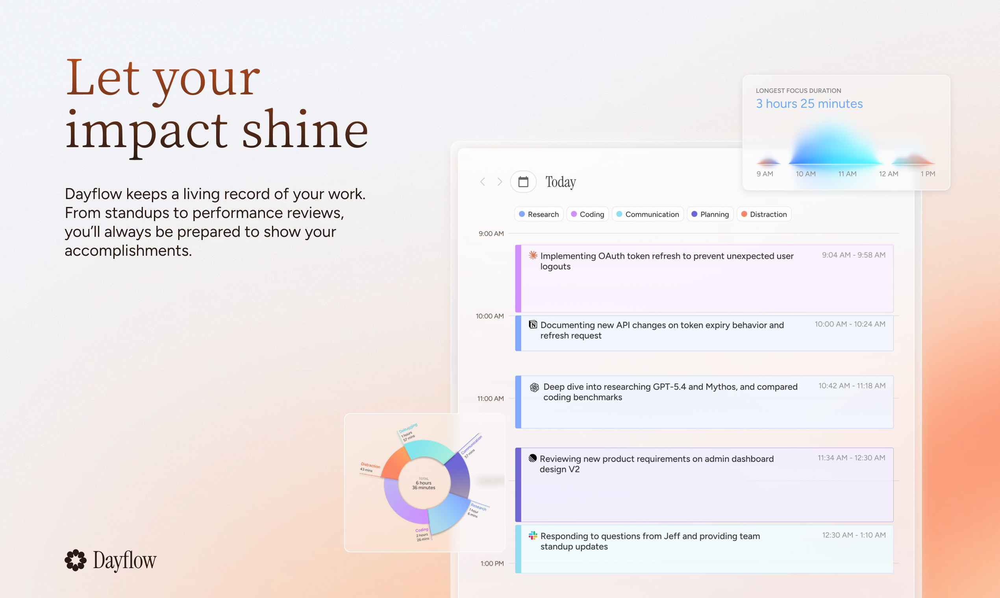

### 🎬 관련 영상
- [🎥 영상 보기](https://ph-files.imgix.net/1089367d-9b3d-4928-8630-417139b26a4c.jpeg?auto=format)

---

## 8. [Pluno](https://www.producthunt.com/products/pluno)
**Votes**: 140 | **도입 난이도**: 하 | **신뢰도**: 상
**Tagline**: Browser agent that’s 10x faster than Claude
**서비스 링크**: https://www.producthunt.com/r/M23VGVAYQ55RCX

**태그**: Automation, AI Agent, Productivity, Agent, API

### 📌 이 서비스 한눈에 보기
UI 클릭 방식의 한계를 넘어 API를 통해 압도적인 속도로 웹 작업을 수행하는 브라우저 에이전트

### 🔑 주요 기능
- UI 조작 대신 API 직접 통신을 통한 10배 빠른 작업 속도
- 토큰 사용량을 1/10로 절감하여 효율적인 리소스 관리
- 500개 이상의 웹 앱에서 검증된 높은 작업 성공률

### 🙋 사용자에게 어떤 점이 좋은가
단순히 화면을 클릭하는 방식이 아닌 API 기반 동작으로 복잡한 웹 업무를 훨씬 빠르고 정확하게 자동화할 수 있습니다.

### ✅ 지금 바로 써볼 기능
- 런칭 기념 $50 무료 크레딧 확보하기
- 자주 사용하는 웹 앱에 Pluno 적용해보기
- 기존 AI 에이전트와 작업 속도 비교하기

### ⚠️ 사용 전 확인할 점
- API 기반 동작이므로 해당 웹 서비스의 API 정책에 따라 동작 여부가 달라질 수 있음
- UI 자동화가 아닌 API 통신 방식이므로 모든 웹 서비스에 동일하게 적용되지 않을 수 있음

### 🧭 확인이 더 필요한 정보
500개 이상의 웹 앱 테스트 결과가 구체적으로 어떤 지표를 기준으로 측정되었는지 확인이 필요합니다.

### 📸 스크린샷 및 갤러리
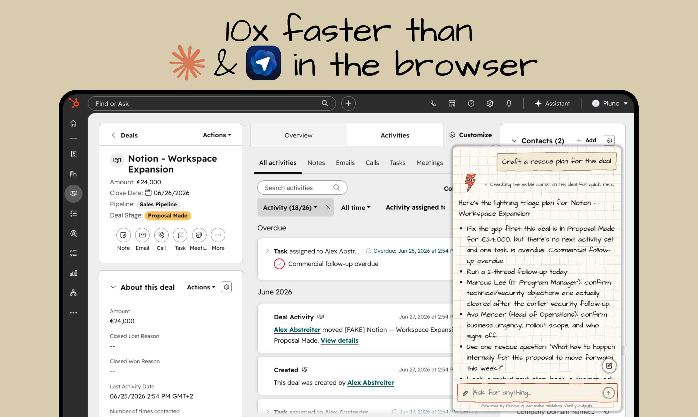
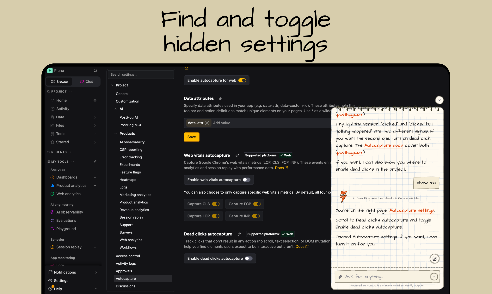
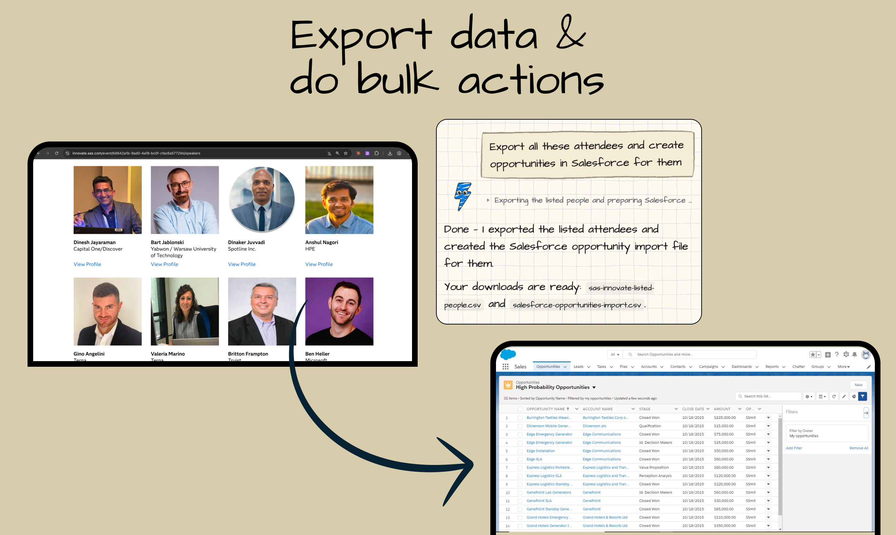

### 🎬 관련 영상
- [🎥 영상 보기](https://ph-files.imgix.net/81d5062b-1186-4513-9005-2fe1a190532e.jpeg?auto=format)

---

## 9. [AgentPeek](https://www.producthunt.com/products/agentpeek)
**Votes**: 140 | **도입 난이도**: 하 | **신뢰도**: 상
**Tagline**: Claude Code & Codex in your Mac notch
**서비스 링크**: https://www.producthunt.com/r/UJNQOTAPSSLD2L

**태그**: DevTool, Productivity, MacOS, Automation, Agent, Prompting, Video

### 📌 이 서비스 한눈에 보기
맥북 노치에서 실시간으로 코딩 에이전트의 작업 현황을 확인하고 제어하는 대시보드

### 🔑 주요 기능
- 맥북 노치 영역을 활용한 실시간 코딩 에이전트 세션 모니터링
- 작업 흐름 중단 없이 프롬프트 승인 및 토큰 사용량 관리 가능
- 모든 데이터가 로컬에서 처리되는 프라이버시 중심 설계

### 🙋 사용자에게 어떤 점이 좋은가
여러 개의 코딩 에이전트를 동시에 실행할 때, 작업 흐름을 방해받지 않고 눈에 띄는 곳에서 즉각적인 제어가 가능합니다.

### ✅ 지금 바로 써볼 기능
- 노치 위젯을 통한 실시간 세션 모니터링
- 원클릭 프롬프트 승인 기능 테스트
- 실시간 토큰 사용량 및 워크플로우 관리

### ⚠️ 사용 전 확인할 점
- 맥북 노치 디자인을 활용하므로 특정 하드웨어 환경에 최적화되어 있음
- 에이전트 세션 연동 방식에 따른 초기 설정 필요성

### 🧭 확인이 더 필요한 정보
지원하는 구체적인 코딩 에이전트 종류와 로컬 데이터 처리 방식에 대한 상세 정보가 필요합니다.

### 📸 스크린샷 및 갤러리
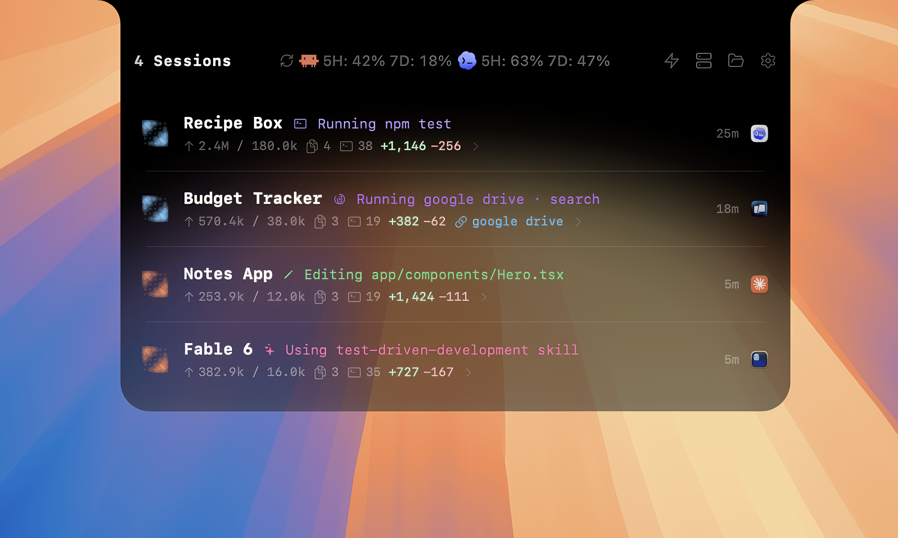
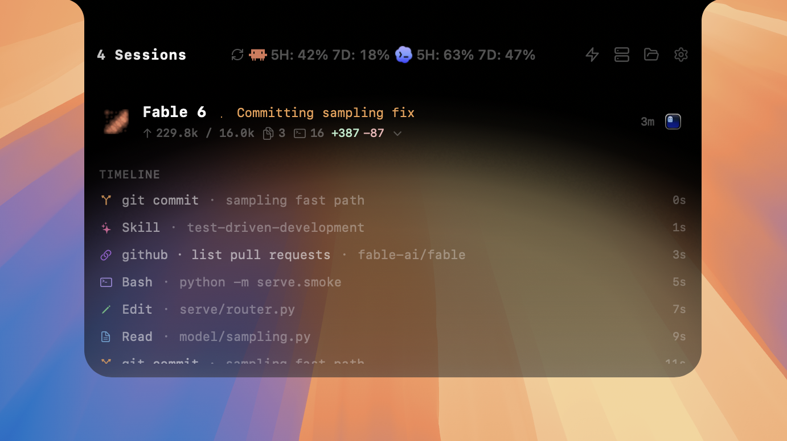
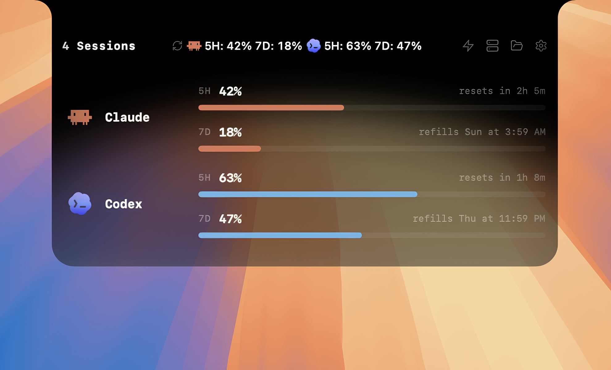

### 🎬 관련 영상
- [🎥 영상 보기](https://ph-files.imgix.net/5399da43-488b-4ad5-bc58-5f291d86e353.jpeg?auto=format)

---

## 10. [Load Nova](https://www.producthunt.com/products/load-nova)
**Votes**: 128 | **도입 난이도**: 하 | **신뢰도**: 상
**Tagline**: An AI co-pilot and dashboard built for dispatcher speed
**서비스 링크**: https://www.producthunt.com/r/ZO5W62UUSV5IXI

**태그**: Logistics, Automation, AI, Productivity, SaaS, AI Tool, Chat, Email

### 📌 이 서비스 한눈에 보기
탭 전환 없이 브라우저 옆에서 모든 배차 업무를 처리하는 AI 코파일럿 대시보드

### 🔑 주요 기능
- 크롬 사이드 패널 기반의 통합 배차 워크스페이스
- 이메일 파싱 및 실시간 수익(RPM) 계산 자동화
- 날씨를 고려한 경로 계획 및 드라이버/화물 관리 기능

### 🙋 사용자에게 어떤 점이 좋은가
여러 창을 오가는 번거로움 없이 하나의 화면에서 배차 업무를 완결할 수 있어 업무 속도가 획기적으로 빨라집니다.

### ✅ 지금 바로 써볼 기능
- 크롬 사이드 패널 설치 및 대시보드 연동
- 브로커 이메일 자동 파싱 기능 테스트
- 실시간 수익 및 경로 계획 기능 활용

### ⚠️ 사용 전 확인할 점
- 크롬 브라우저 환경에 의존적인 작업 방식
- 데이터 보안 및 이메일 접근 권한 확인 필요

### 🧭 확인이 더 필요한 정보
현재 제공되는 기능이 특정 지역이나 특정 화물 유형에 최적화되어 있는지 확인이 필요합니다.

### 📸 스크린샷 및 갤러리

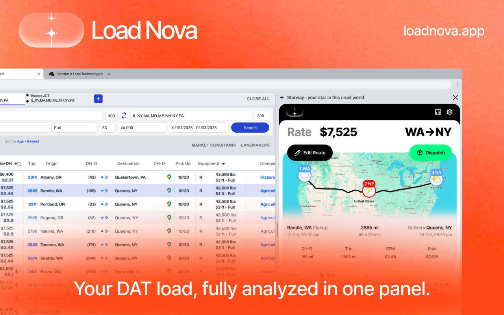
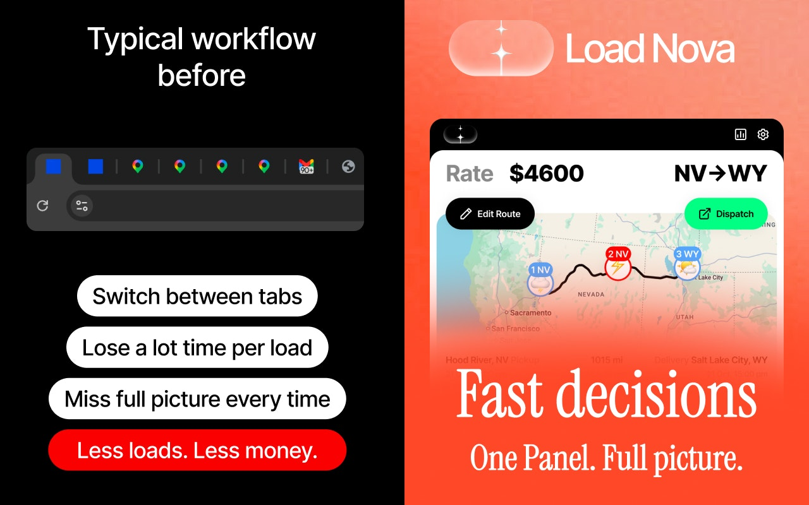

---

## 11. [Tinkerfont](https://www.producthunt.com/products/tinkerfont)
**Votes**: 123 | **도입 난이도**: 하 | **신뢰도**: 상
**Tagline**: Free font playground for live websites
**서비스 링크**: https://www.producthunt.com/r/LKM65DUBF7XNVI

**태그**: Design Tool, Web Development, Browser Extension, Typography, Design, DevTool

### 📌 이 서비스 한눈에 보기
개발자 도구 없이 웹사이트의 폰트를 실시간으로 자유롭게 변경해 볼 수 있는 브라우저 확장 프로그램

### 🔑 주요 기능
- 개발자 도구(DevTools)를 열 필요 없는 간편한 인터페이스
- 기존 디자인 시스템이나 스타일시트를 수정하지 않는 안전한 실험 환경
- Chrome 및 Firefox를 모두 지원하는 브라우저 확장 프로그램

### 🙋 사용자에게 어떤 점이 좋은가
디자이너와 개발자가 실제 운영 중인 웹사이트 환경에서 폰트 변경 시의 느낌을 즉각적으로 확인하고 테스트할 수 있습니다.

### ✅ 지금 바로 써볼 기능
- 브라우저 확장 프로그램 설치하기
- 현재 보고 있는 웹사이트의 폰트 변경 실험하기
- 다양한 폰트 조합 테스트하기

### ⚠️ 사용 전 확인할 점
- 브라우저 확장 프로그램이므로 실제 사이트의 소스 코드를 영구적으로 변경하지는 않음
- 페이지를 새로고침하면 변경 사항이 초기화될 수 있음

### 🧭 확인이 더 필요한 정보
지원하는 폰트의 종류나 로컬 폰트 불러오기 기능에 대한 상세 정보는 확인이 필요합니다.

### 📸 스크린샷 및 갤러리
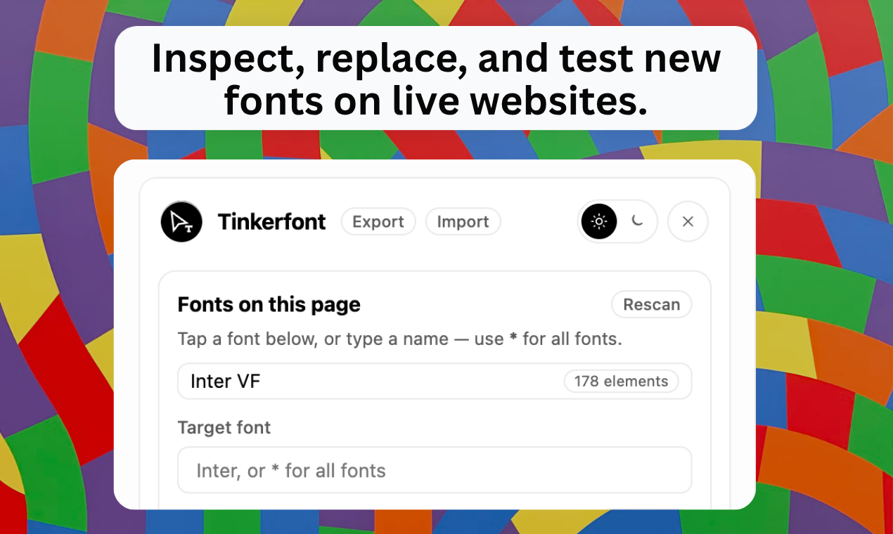
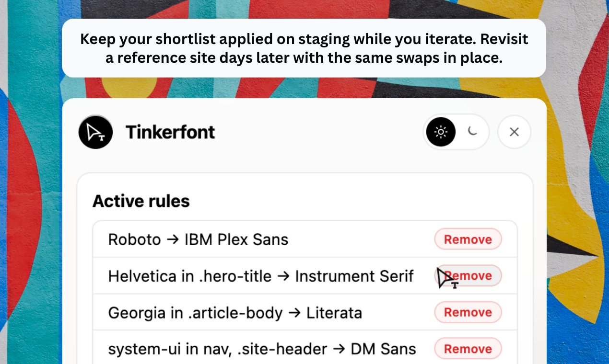
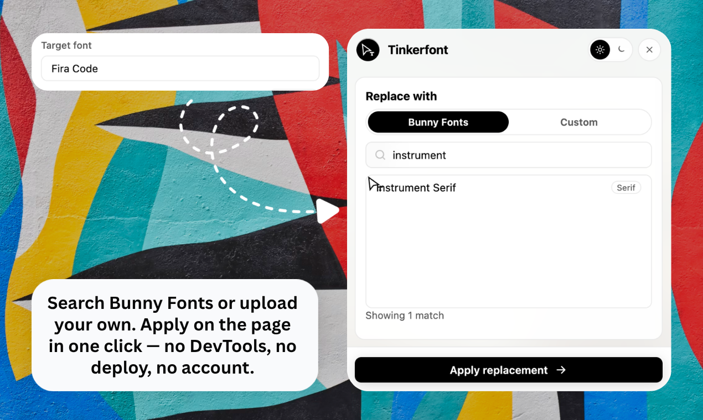

### 🎬 관련 영상
- [🎥 영상 보기](https://ph-files.imgix.net/62df32dd-14f2-4c1e-b547-53d38b266010.jpeg?auto=format)

---

## 12. [Brain2Qwerty v2](https://www.producthunt.com/products/meta)
**Votes**: 120 | **도입 난이도**: 상 | **신뢰도**: 상
**Tagline**: Decode sentences directly from non-invasive brain signals
**서비스 링크**: https://www.producthunt.com/r/OZ4VDM6D44VI3Z

**태그**: BCI, DeepLearning, LLM, Neurotech, AI Tool, DevTool

### 📌 이 서비스 한눈에 보기
수술 없이 뇌 신호를 텍스트로 변환하는 비침습적 BCI 기술

### 🔑 주요 기능
- 비침습적 방식의 뇌-컴퓨터 인터페이스(BCI)
- MEG(자기뇌파) 신호를 텍스트로 직접 디코딩
- 딥러닝과 LLM을 결합하여 최대 78%의 단어 정확도 달성

### 🙋 사용자에게 어떤 점이 좋은가
수술적 절차 없이 뇌 신호만으로 텍스트를 입력할 수 있어, 향후 새로운 방식의 인터페이스 활용 가능성을 제시합니다.

### ✅ 지금 바로 써볼 기능
- 기술의 정확도 및 디코딩 성능 검토
- 비침습적 장비(MEG) 활용 가능성 확인
- LLM 결합을 통한 텍스트 생성 품질 분석

### ⚠️ 사용 전 확인할 점
- 78%의 정확도는 완벽한 타이핑을 보장하기에는 아직 부족할 수 있음
- MEG 장비 등 특수 하드웨어 의존성 존재

### 🧭 확인이 더 필요한 정보
실제 일반 사용자가 가정에서 사용할 수 있는 수준의 장비인지, 혹은 연구실 환경에 국한된 기술인지 확인이 필요합니다.

### 📸 스크린샷 및 갤러리

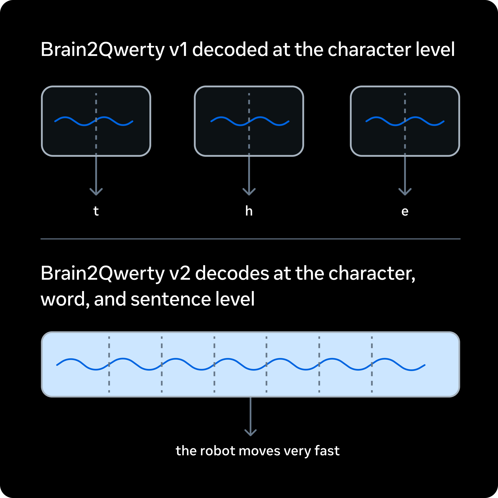
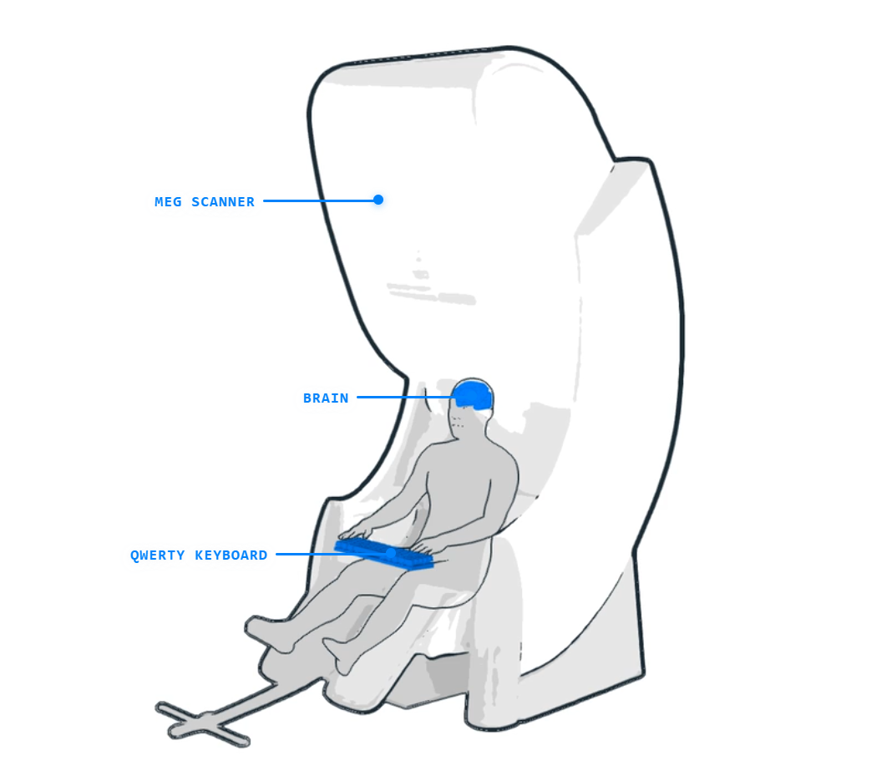

---

## 13. [Oakamo](https://www.producthunt.com/products/oakamo)
**Votes**: 108 | **도입 난이도**: 하 | **신뢰도**: 상
**Tagline**: Your quiet space for reading articles later.
**서비스 링크**: https://www.producthunt.com/r/TTCNBZAHRTTB2C

**태그**: Productivity, Reading, Content Curation, Focus, AI Tool

### 📌 이 서비스 한눈에 보기
광고와 방해 요소 없이 글쓰기에만 집중할 수 있는 나만의 디지털 독서 공간

### 🔑 주요 기능
- 웹 콘텐츠를 간편하게 저장하고 개인 라이브러리로 관리
- 광고와 방해 요소가 제거된 깔끔한 독서 환경 제공
- 중요 문구 하이라이트 및 이동 중 청취 가능한 오디오 기능

### 🙋 사용자에게 어떤 점이 좋은가
수많은 탭과 광고로 인한 집중력 분산을 막고, 저장해둔 글을 언제 어디서든 쾌적하게 읽고 들을 수 있습니다.

### ✅ 지금 바로 써볼 기능
- 읽고 싶은 기사 저장하기
- 방해 없는 리더 모드로 읽기
- 중요한 문장 하이라이트 기능 사용하기

### ⚠️ 사용 전 확인할 점
- 웹 브라우저 확장 프로그램이나 모바일 앱 등 저장 방식의 편의성 확인 필요
- 오디오 기능의 음성 품질 및 자연스러움 확인 필요

### 🧭 확인이 더 필요한 정보
플랫폼 간 동기화 방식과 지원하는 기기 범위에 대한 구체적인 정보가 필요합니다.

### 📸 스크린샷 및 갤러리
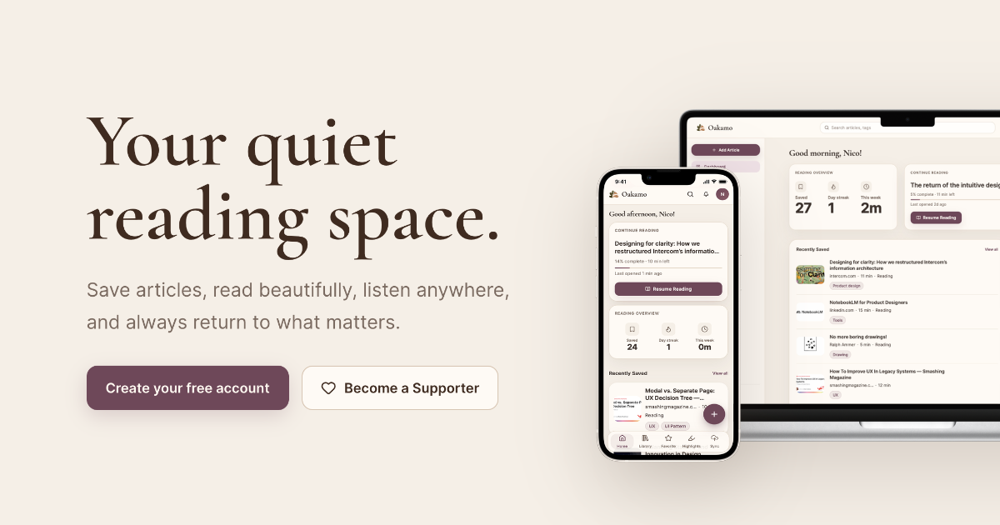
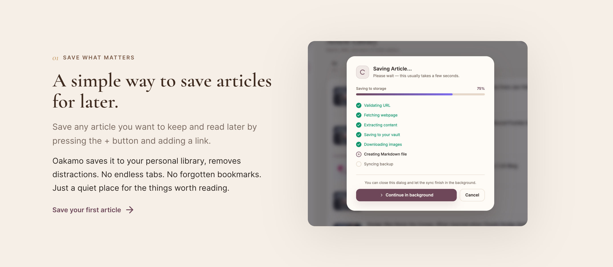

---

## 14. [Justwrite](https://www.producthunt.com/products/justwrite)
**Votes**: 104 | **도입 난이도**: 하 | **신뢰도**: 상
**Tagline**: A private, local-first writing space that works offline
**서비스 링크**: https://www.producthunt.com/r/I3GBHXZLOCV73C

**태그**: Writing, Productivity, Privacy, Markdown, Offline

### 📌 이 서비스 한눈에 보기
로그인과 클라우드 없이 오직 글쓰기에만 집중할 수 있는 프라이빗 로컬 메모 앱

### 🔑 주요 기능
- 로그인 및 클라우드 의존성 없는 로컬 퍼스트 방식
- 집중력을 높여주는 포커스 모드와 앰비언트 라이팅 모드
- 마크다운 단축키와 자동 저장 지원

### 🙋 사용자에게 어떤 점이 좋은가
인터넷 연결이나 계정 관리의 번거로움 없이, 언제 어디서든 개인적인 아이디어를 안전하고 빠르게 기록할 수 있습니다.

### ✅ 지금 바로 써볼 기능
- 마크다운 단축키를 활용한 빠른 메모 작성
- 포커스 모드로 방해 요소 없는 글쓰기 환경 구축
- 작성한 글을 다양한 형식으로 내보내기(Export)

### ⚠️ 사용 전 확인할 점
- 클라우드 동기화가 없으므로 기기 간 데이터 이동은 수동으로 관리해야 함
- 로컬 저장 방식이므로 기기 분실이나 고장 시 데이터 유실 위험이 있음

### 🧭 확인이 더 필요한 정보
기기 간 데이터 동기화 방식과 지원하는 파일 내보내기 형식에 대한 구체적인 정보가 필요합니다.

### 📸 스크린샷 및 갤러리
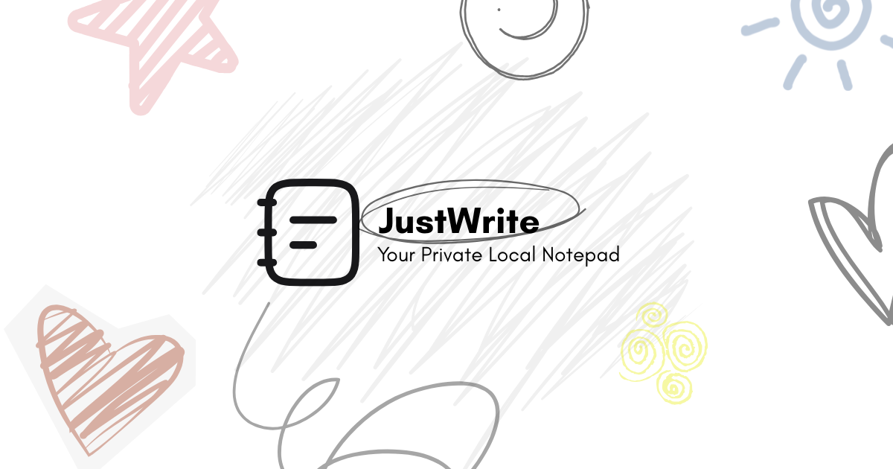
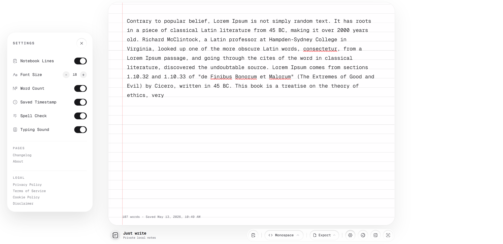
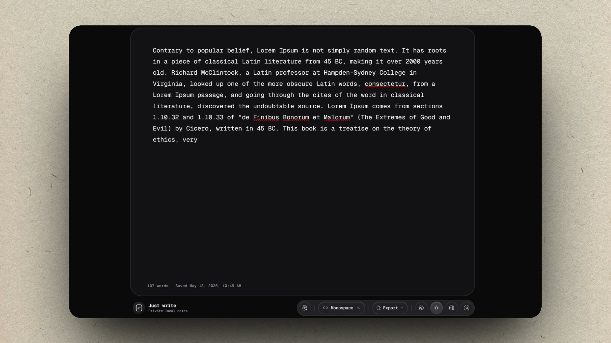

---

## 15. [Clade](https://www.producthunt.com/products/cleo-4)
**Votes**: 98 | **도입 난이도**: 하 | **신뢰도**: 상
**Tagline**: AI COO that runs your team in tools you already use
**서비스 링크**: https://www.producthunt.com/r/Y6W5362EJBEXX7

**태그**: AI, Automation, Productivity, TeamManagement, AI Tool

### 📌 이 서비스 한눈에 보기
기존 메신저를 통해 팀 운영과 프로젝트 관리를 자동화하는 AI COO

### 🔑 주요 기능
- Telegram, Slack, iMessage 등 기존 협업 툴 내에서 대화형으로 작동
- 업무 상태 업데이트 추적 및 프로젝트 지연 사전 방지
- 팔로업 초안 작성 및 업무 흐름 관리 자동화

### 🙋 사용자에게 어떤 점이 좋은가
새로운 대시보드를 익힐 필요 없이 평소 쓰던 메신저로 팀 관리가 가능하여 업무 흐름이 끊기지 않습니다.

### ✅ 지금 바로 써볼 기능
- 사용 중인 메신저(Slack/Telegram 등)에 Clade 연결하기
- 진행 중인 프로젝트 상태 업데이트 요청해보기
- 업무 지연 방지를 위한 알림 설정하기

### ⚠️ 사용 전 확인할 점
- 메신저 기반 인터페이스로 인해 복잡한 프로젝트 시각화의 한계가 있을 수 있음
- 팀원들의 메신저 사용 습관에 따라 도입 초기 적응이 필요할 수 있음

### 🧭 확인이 더 필요한 정보
메신저 외 웹 앱의 구체적인 기능 범위와 데이터 보안 정책에 대한 확인이 필요합니다.

### 📸 스크린샷 및 갤러리
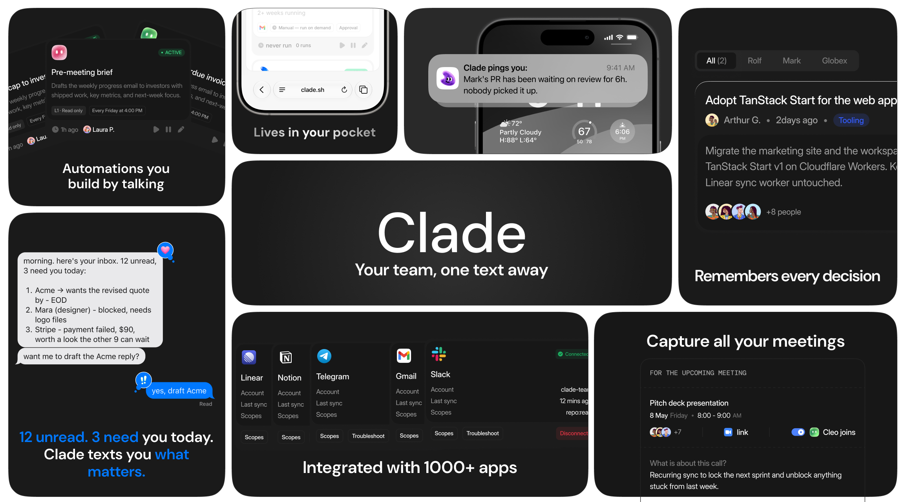
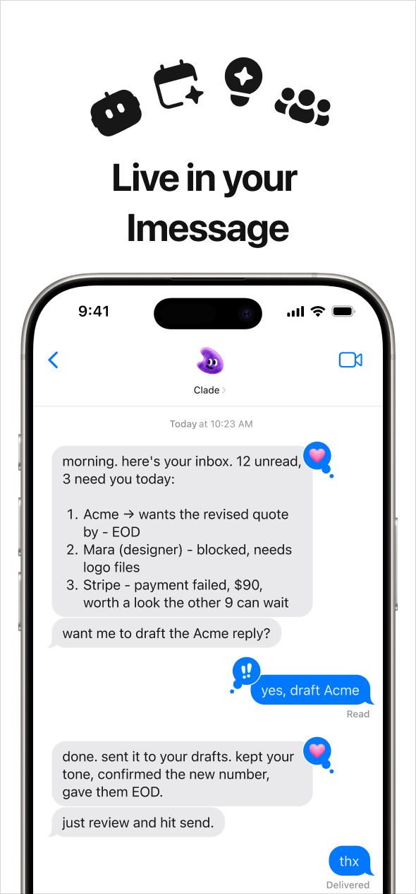
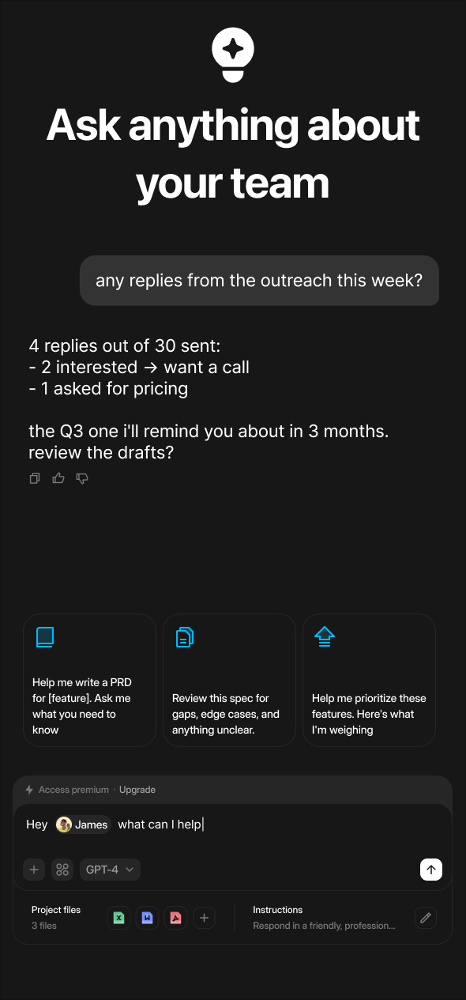

### 🎬 관련 영상
- [🎥 영상 보기](https://ph-files.imgix.net/c1788a9c-b918-469d-b360-c4982cbf6795.jpeg?auto=format)

---

## 16. [Bilt.me - Figma](https://www.producthunt.com/products/bilt-me)
**Votes**: 95 | **도입 난이도**: 하 | **신뢰도**: 상
**Tagline**: Get a real mobile app from your Figma design
**서비스 링크**: https://www.producthunt.com/r/ZMDA7OEWNFBZ2A

**태그**: DesignToCode, NoCode, MobileApp, Figma, Design, DevTool

### 📌 이 서비스 한눈에 보기
피그마 디자인을 코드 수정 없이 즉시 실제 아이폰 앱으로 변환해주는 도구

### 🔑 주요 기능
- 피그마 프레임을 실제 모바일 앱으로 자동 변환
- 디자인의 간격, 폰트, 색상을 원본 그대로 유지
- 생성된 코드에 대한 사용자 소유권 보장

### 🙋 사용자에게 어떤 점이 좋은가
디자인과 개발 사이의 간극을 줄여, 수동 코딩 작업 없이도 디자인 결과물을 즉시 실제 작동하는 앱으로 구현할 수 있습니다.

### ✅ 지금 바로 써볼 기능
- 피그마 디자인 프레임 업로드하기
- 생성된 코드 확인 및 소유권 검토
- 아이폰 실기기에서 앱 구동 테스트

### ⚠️ 사용 전 확인할 점
- 복잡한 인터랙션이나 기능 구현의 한계 여부 확인 필요
- 생성된 코드의 유지보수 용이성 검토

### 🧭 확인이 더 필요한 정보
디자인의 복잡도에 따른 코드 품질과 백엔드 기능 연동 가능 여부에 대한 정보가 부족합니다.

### 📸 스크린샷 및 갤러리
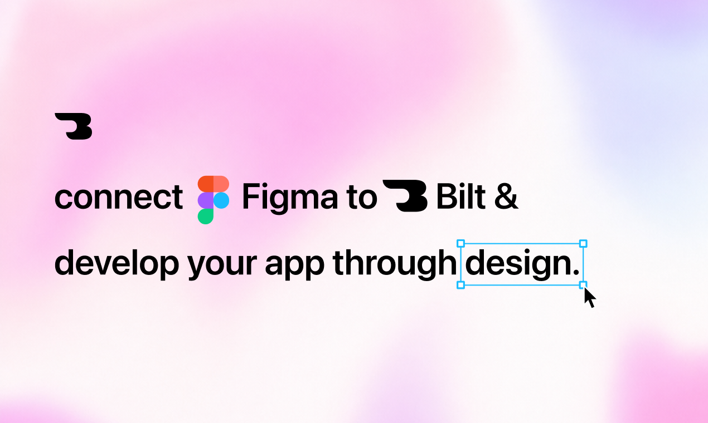
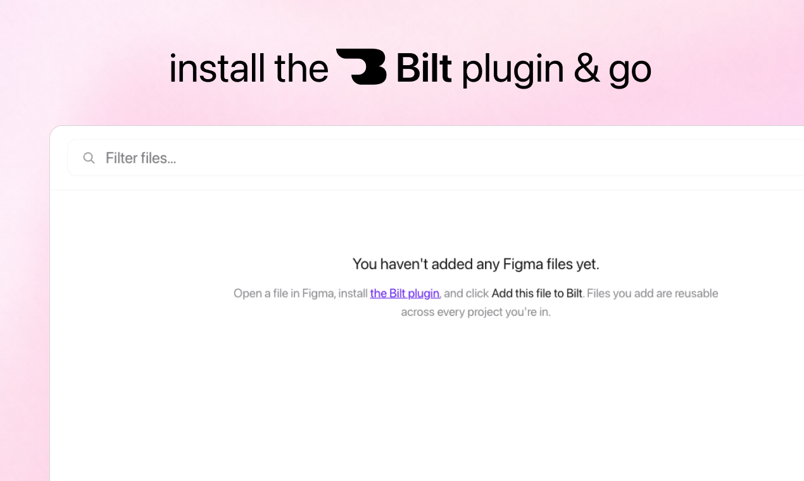
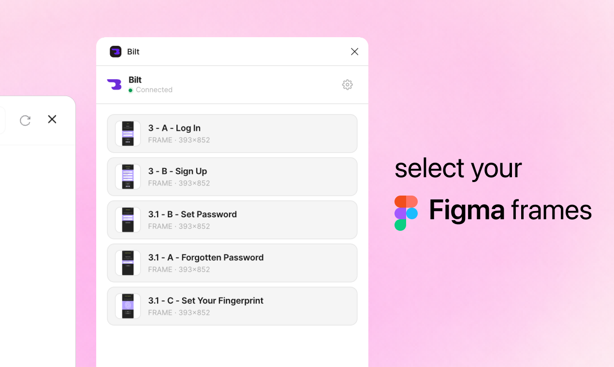

### 🎬 관련 영상
- [🎥 영상 보기](https://ph-files.imgix.net/57e8efdc-4c6b-45f8-8738-aecdea36242f.jpeg?auto=format)

---

## 17. [DropK](https://www.producthunt.com/products/dropk)
**Votes**: 87 | **도입 난이도**: 하 | **신뢰도**: 상
**Tagline**: The tray that doesn't pretend
**서비스 링크**: https://www.producthunt.com/r/NYLHBLYOFRA2XN

**태그**: Productivity, Mac, Workflow, FileManagement, Vision

### 📌 이 서비스 한눈에 보기
맥 작업 중 발생하는 파편화된 파일과 텍스트를 한곳에 모아 관리하는 스마트 드롭 존

### 🔑 주요 기능
- 텍스트, 파일, 폴더를 하나의 드롭 존에 모아 관리하는 직관적인 워크플로우
- 클립보드 기록과 연동되어 작업 중 복사한 항목들을 체계적으로 정리
- 파일 복제가 아닌 원본 경로를 유지하여 저장 공간 낭비 방지

### 🙋 사용자에게 어떤 점이 좋은가
작업 중 여기저기 흩어진 파일과 텍스트를 정리하는 번거로움을 줄여주며, 프로젝트 단위로 작업물을 모아두기에 매우 유용합니다.

### ✅ 지금 바로 써볼 기능
- 드롭 존에 파일과 폴더를 끌어다 놓아 작업 공간 만들기
- 클립보드 기록과 연동하여 복사한 항목 확인하기
- 프로젝트별로 작업물을 정리하며 슬레이트 비우기

### ⚠️ 사용 전 확인할 점
- 파일 복제가 아닌 경로 기반 방식이므로 원본 파일 이동 시 경로 문제가 발생할 수 있음
- Mac 전용 도구로 보이므로 OS 호환성 확인 필요

### 🧭 확인이 더 필요한 정보
파일 경로 유지 방식이 macOS의 특정 보안 설정이나 파일 이동 시 어떻게 작동하는지 확인이 필요합니다.

### 📸 스크린샷 및 갤러리
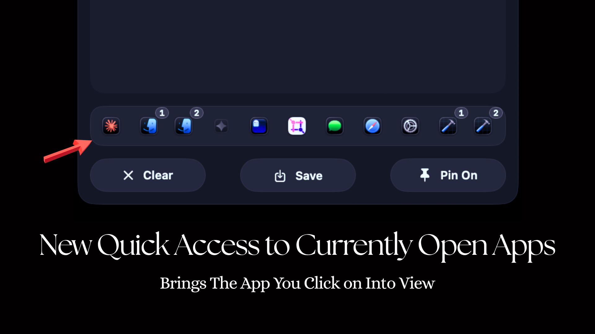
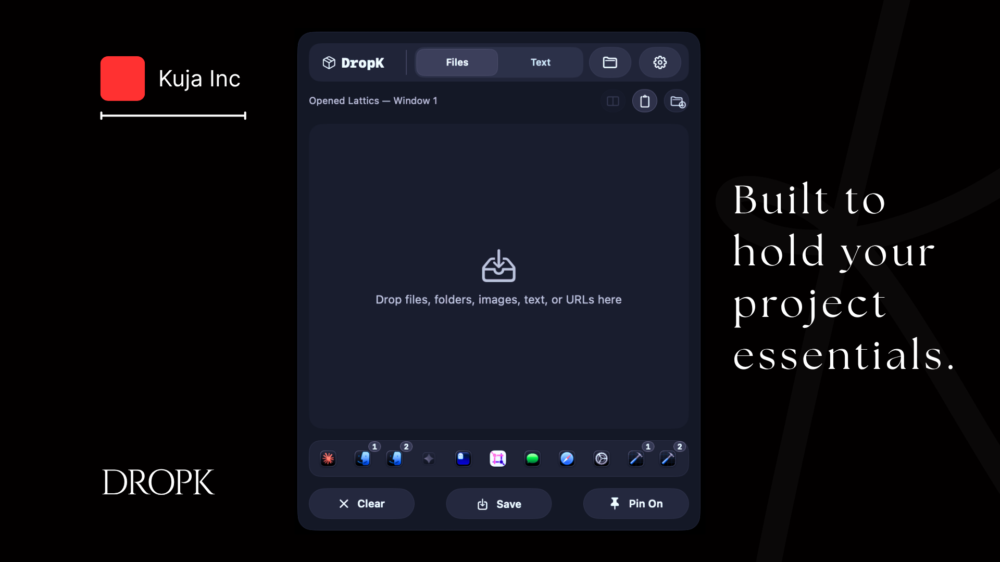
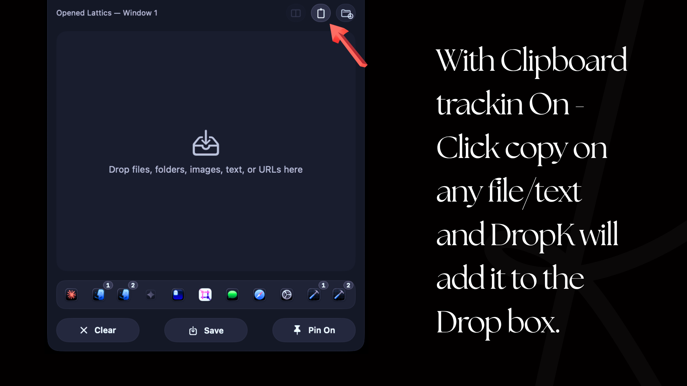

---

## 18. [Midway Chat](https://www.producthunt.com/products/midway-chat)
**Votes**: 85 | **도입 난이도**: 하 | **신뢰도**: 상
**Tagline**: Real-time member chat for Memberstack and Webflow sites
**서비스 링크**: https://www.producthunt.com/r/PJPT4JH5YPIXE7

**태그**: NoCode, Community, Webflow, Memberstack, SaaS, Chat

### 📌 이 서비스 한눈에 보기
Memberstack과 Webflow 사이트에 실시간 채팅 기능을 즉시 도입할 수 있는 임베드 솔루션

### 🔑 주요 기능
- Memberstack 인증 및 Webflow 환경에 최적화된 간편한 iframe 임베드 방식
- DM, 음성 메시지, 타이핑 표시, 읽음 확인 등 풍부한 실시간 채팅 기능 제공
- 채팅 요청 승인 기능을 통한 스팸 방지 및 커뮤니티 관리

### 🙋 사용자에게 어떤 점이 좋은가
별도의 복잡한 개발 없이 기존 웹사이트 내에 강력한 커뮤니티 기능을 통합하여 사용자 체류 시간을 높일 수 있습니다.

### ✅ 지금 바로 써볼 기능
- iframe 임베드를 통한 사이트 적용 테스트
- 음성 메시지 및 실시간 반응 기능 확인
- 채팅 요청 게이팅을 통한 스팸 방지 설정

### ⚠️ 사용 전 확인할 점
- iframe 방식 사용 시 기존 웹사이트 디자인과의 시각적 조화 확인 필요
- Memberstack 및 Webflow 환경에 의존적인 솔루션임

### 🧭 확인이 더 필요한 정보
구체적인 가격 정책 및 동시 접속자 수 제한에 대한 정보가 명시되지 않았습니다.

### 📸 스크린샷 및 갤러리
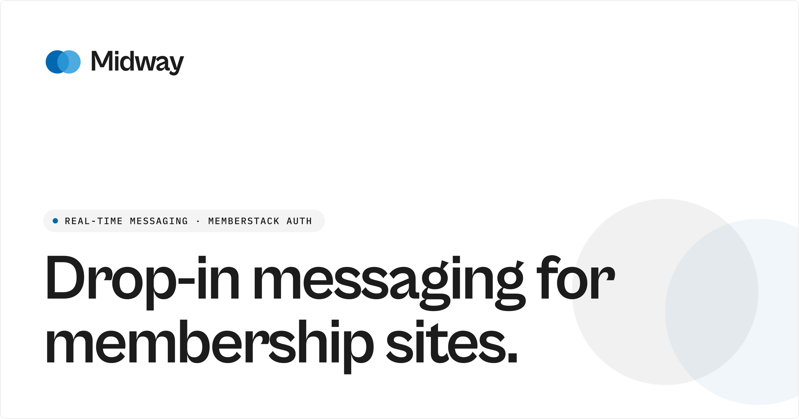
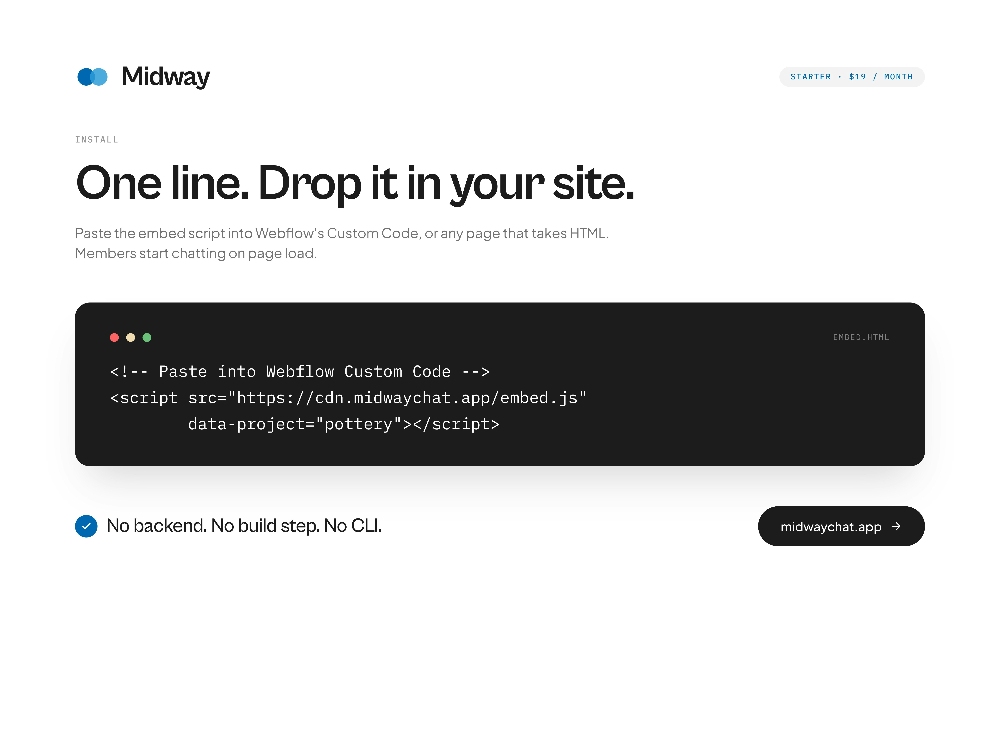
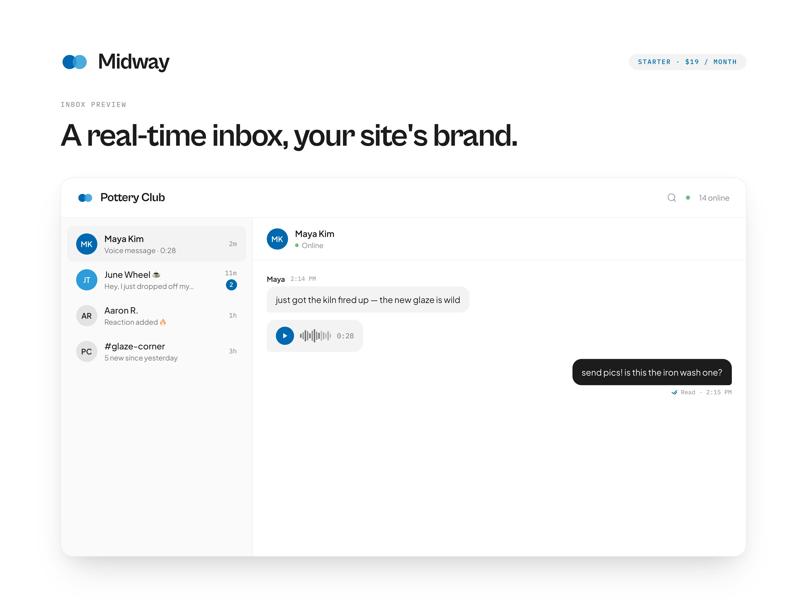

### 🎬 관련 영상
- [🎥 영상 보기](https://ph-files.imgix.net/84287a35-6c98-46f6-ad8c-081f32289ad3.jpeg?auto=format)

---

## 19. [iVox](https://www.producthunt.com/products/ivox)
**Votes**: 79 | **도입 난이도**: 하 | **신뢰도**: 상
**Tagline**: The first app dedicated to 1980s tape-edit effects.
**서비스 링크**: https://www.producthunt.com/r/JR5OJ5YRDVTORU

**태그**: MusicProduction, AudioEffect, Vintage, CreativeTool

### 📌 이 서비스 한눈에 보기
80년대 레전드 스타일의 테이프 편집 효과를 재현하는 음악 제작 앱

### 🔑 주요 기능
- 1980년대 테이프 멀티 에디팅 기법의 디지털 구현
- 프리스타일, 힙합, 메가믹스 시대의 빈티지 사운드 재현
- 전설적인 프로듀서들의 편집 스타일 영감 제공

### 🙋 사용자에게 어떤 점이 좋은가
과거 아날로그 테이프 편집 방식의 독특한 질감을 현대적인 컴퓨터 환경에서 간편하게 구현할 수 있습니다.

### ✅ 지금 바로 써볼 기능
- 80년대 스타일의 테이프 에디팅 효과 적용해보기
- 빈티지 힙합 및 프리스타일 비트 메이킹 시도하기

### ⚠️ 사용 전 확인할 점
- 특정 장르(80년대 스타일)에 특화된 효과이므로 범용적인 작업에는 제한적일 수 있음

### 🧭 확인이 더 필요한 정보
구체적인 DAW(Digital Audio Workstation) 호환성 및 플러그인 형태에 대한 정보가 필요합니다.

### 📸 스크린샷 및 갤러리
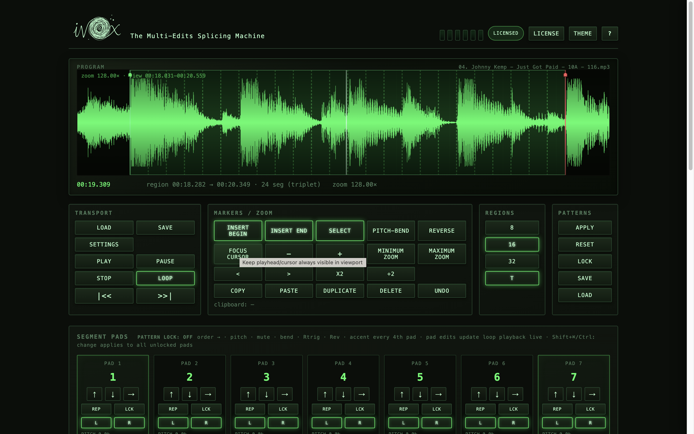
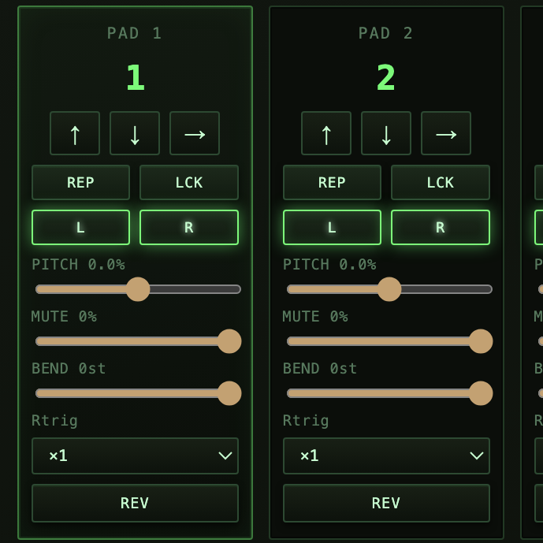
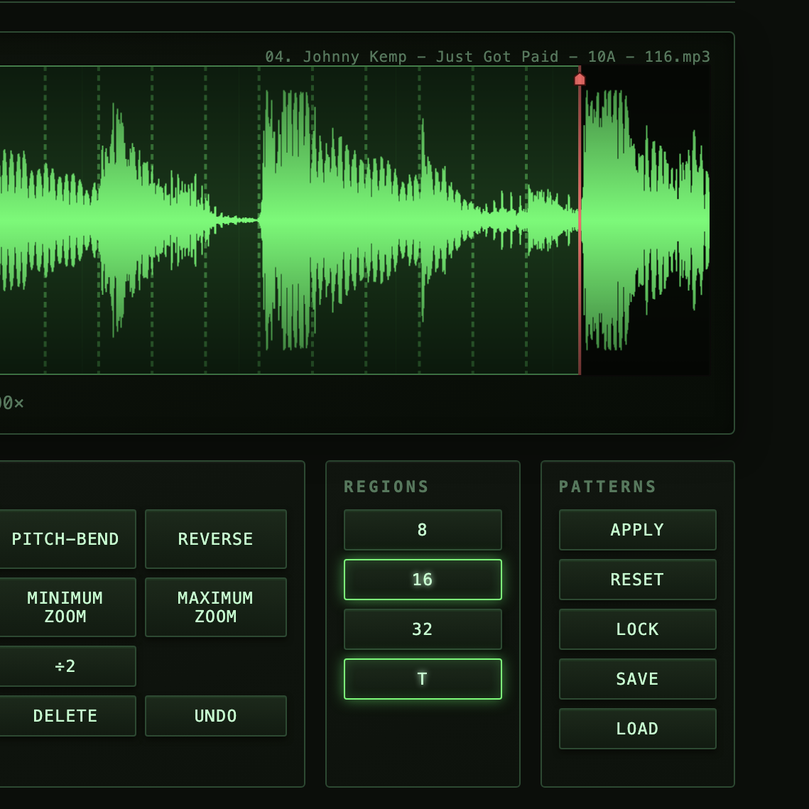

### 🎬 관련 영상
- [🎥 영상 보기](https://ph-files.imgix.net/8c61a2f9-ffd6-40d1-b9a0-08d2020d26e5.jpeg?auto=format)

---

## 20. [Webless](https://www.producthunt.com/products/webless)
**Votes**: 29 | **도입 난이도**: 하 | **신뢰도**: 상
**Tagline**: AI search for websites that converts traffic into pipeline
**서비스 링크**: https://www.producthunt.com/r/SISTEMI54QAQJK

**태그**: AI Search, Conversion Optimization, Marketing Automation, Analytics, AI Tool, Design

### 📌 이 서비스 한눈에 보기
웹사이트 방문자의 질문을 구매 전환으로 연결하는 AI 기반 검색 및 개인화 솔루션

### 🔑 주요 기능
- AI 검색 기능을 통한 방문자의 의도 파악 및 전환 유도
- CMS에 구애받지 않는 빠른 설치와 개인화된 사용자 여정 제공
- 사용자 질문 데이터를 활용한 퍼스트 파티 수요 인텔리전스 확보

### 🙋 사용자에게 어떤 점이 좋은가
웹사이트 개편 없이도 방문자의 질문에 즉각 대응하여 잠재 고객을 확보하고, 콘텐츠 전략 수립에 필요한 실질적인 데이터를 얻을 수 있습니다.

### ✅ 지금 바로 써볼 기능
- AI 검색 기능 활성화
- 동적 CTA(Call to Action) 설정
- 수집된 질문 데이터를 통한 콘텐츠 전략 검토

### ⚠️ 사용 전 확인할 점
- 기존 웹사이트 디자인과의 시각적 조화 확인 필요
- 데이터 수집 및 분석을 위한 초기 설정 숙지

### 🧭 확인이 더 필요한 정보
현재 제공되는 구체적인 CMS 연동 방식과 데이터 보안 정책에 대한 상세 정보가 필요합니다.

### 📸 스크린샷 및 갤러리
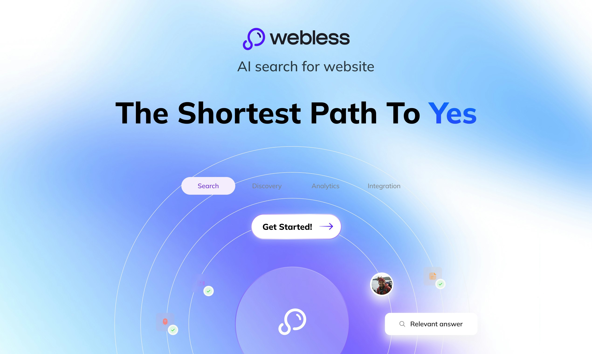
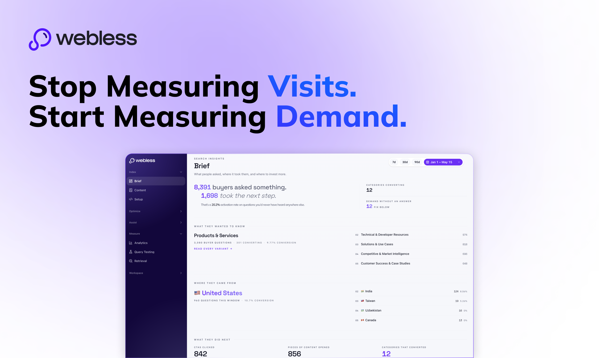
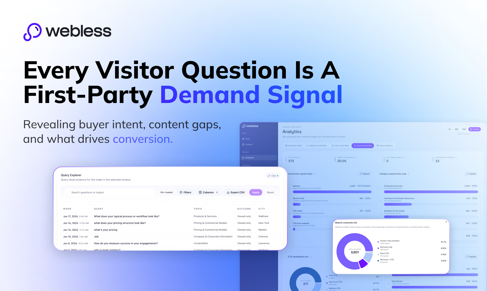

### 🎬 관련 영상
- [🎥 영상 보기](https://ph-files.imgix.net/edd62ec8-844a-461e-a81b-21f69287bedc.jpeg?auto=format)

---

## 21. [Splitman](https://www.producthunt.com/products/splitman-2)
**Votes**: 22 | **도입 난이도**: 하 | **신뢰도**: 상
**Tagline**: The free, ad-free alternative to Splitwise
**서비스 링크**: https://www.producthunt.com/r/CSJBJM7M3F5FYG

**태그**: FinTech, Utility, Expense-Tracker, Free

### 📌 이 서비스 한눈에 보기
광고와 유료 결제 없이 모든 기능을 무료로 사용하는 Splitwise 대안 정산 서비스

### 🔑 주요 기능
- 광고, 업셀링, 페이월이 없는 완전 무료 서비스
- 균등 분할, 비율, 지분 기반의 정밀한 비용 분할
- 연락처 기반의 간편한 친구 추가 및 자동 정산 최적화

### 🙋 사용자에게 어떤 점이 좋은가
추가 비용이나 광고 없이 복잡한 비용 정산을 깔끔하게 해결하고 싶은 사용자에게 최적입니다.

### ✅ 지금 바로 써볼 기능
- 연락처를 동기화하여 친구 목록 불러오기
- 그룹별 비용을 생성하고 정산 방식(비율/지분) 설정하기
- 자동 단순화 기능을 통해 최소 결제 금액 확인하기

### ⚠️ 사용 전 확인할 점
- 사용자 이름 대신 연락처 기반이므로 개인정보 접근 권한 필요
- Splitwise와 같은 기존 서비스와의 데이터 이전 기능 여부 미확인

### 🧭 확인이 더 필요한 정보
현재 플랫폼(iOS/Android/Web) 지원 범위와 데이터 백업 방식에 대한 정보가 필요합니다.

### 📸 스크린샷 및 갤러리

---

## 22. [Partnac](https://www.producthunt.com/products/partnac)
**Votes**: 21 | **도입 난이도**: 중 | **신뢰도**: 상
**Tagline**: Scale Your Revenue Through Automated Partnerships
**서비스 링크**: https://www.producthunt.com/r/N62ZCIGP3O4SWW

**태그**: Partnership Management, Automation, Marketing Tool, Growth

### 📌 이 서비스 한눈에 보기
자동화된 워크플로우를 통해 파트너십 성장을 가속화하는 통합 관리 플랫폼

### 🔑 주요 기능
- 어필리에이트, 인플루언서, B2B 등 다양한 파트너십 유형 통합 관리
- 파트너 발굴부터 협업, 성과 측정까지 전 과정 자동화
- 데이터 기반의 인사이트를 통한 예측 가능한 성장 지원

### 🙋 사용자에게 어떤 점이 좋은가
수동으로 관리하기 까다로운 다양한 파트너들과의 협업 과정을 자동화하여 운영 효율성을 높이고 매출 성장을 도모할 수 있습니다.

### ✅ 지금 바로 써볼 기능
- 브랜드에 적합한 파트너 발굴 기능 테스트
- 워크플로우 자동화 설정 및 협업 프로세스 구축
- 성과 추적 대시보드를 통한 데이터 분석

### ⚠️ 사용 전 확인할 점
- 파트너십 유형에 따른 세부 기능의 적합성 확인 필요
- 기존 마케팅 툴과의 연동 범위 확인 필요

### 🧭 확인이 더 필요한 정보
구체적인 자동화 워크플로우의 범위와 외부 플랫폼과의 연동 수준에 대한 정보가 더 필요합니다.

### 📸 스크린샷 및 갤러리
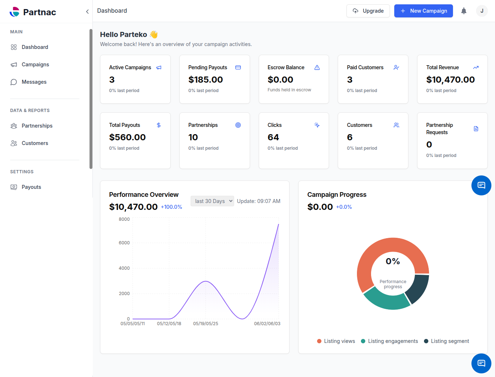
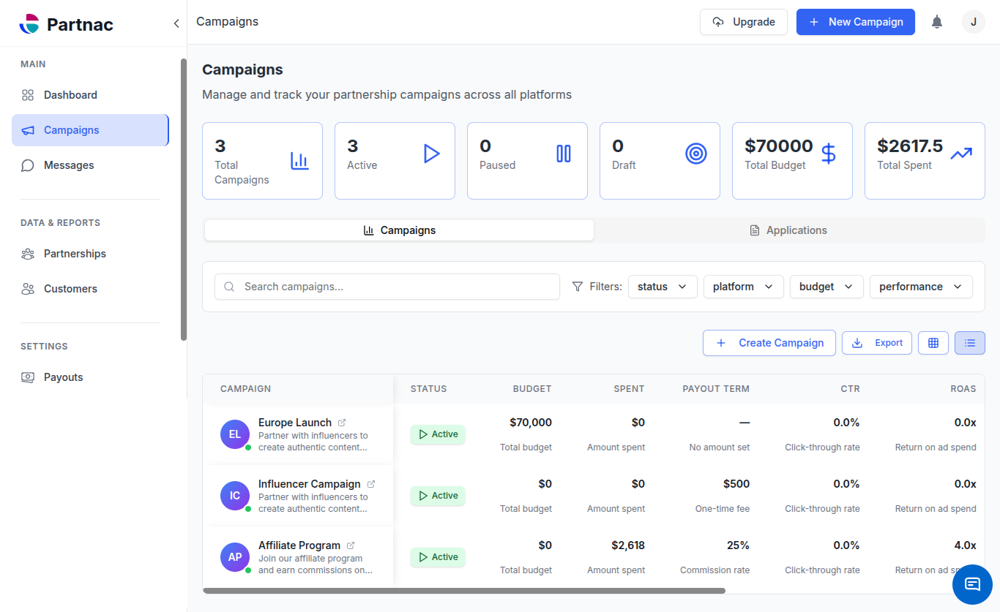
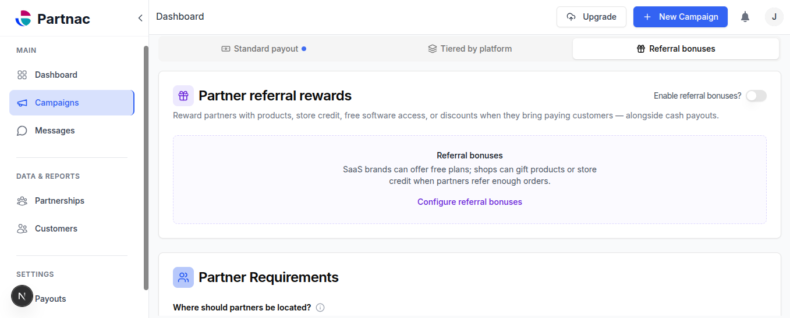

---

## 23. [Product Patterns from Real Products](https://www.producthunt.com/products/product-patterns-from-real-products)
**Votes**: 21 | **도입 난이도**: 하 | **신뢰도**: 상
**Tagline**: The UX pattern library your AI agent can actually read
**서비스 링크**: https://www.producthunt.com/r/QIVAOU2HPDZXXM

**태그**: UX/UI, AI-Tool, Productivity, DesignSystem, Agent, AI Tool

### 📌 이 서비스 한눈에 보기
AI 에이전트가 즉시 읽고 활용할 수 있는 실전 UX 패턴 라이브러리

### 🔑 주요 기능
- 실제 서비스에서 검증된 300개 이상의 UX 패턴 및 심리학적 배경 제공
- 온보딩, 가격 책정, 이탈 방지 등 단계별 프레임워크 포함
- MCP 또는 Cursor/Claude 스킬을 통해 AI 코딩 에이전트와 직접 연동 가능

### 🙋 사용자에게 어떤 점이 좋은가
기획 단계에서 고민할 필요 없이 AI 에이전트에게 검증된 UX 패턴을 바로 학습시켜 고품질의 UI/UX를 빠르게 구현할 수 있습니다.

### ✅ 지금 바로 써볼 기능
- 제공되는 UX 패턴 라이브러리 탐색하기
- Cursor나 Claude에 MCP/Skill로 연결하여 코딩에 활용하기
- 현재 개발 중인 제품의 온보딩/가격 페이지에 적용해보기

### ⚠️ 사용 전 확인할 점
- AI 에이전트의 환경(MCP 지원 여부 등)에 따라 설정 과정이 필요할 수 있음
- 실제 제품 적용 시 서비스의 고유한 맥락과 맞는지 검토 필요

### 🧭 확인이 더 필요한 정보
AI 에이전트 연동을 위한 구체적인 기술적 요구사항과 설정 방법은 사용자의 개발 환경에 따라 다를 수 있습니다.

### 📸 스크린샷 및 갤러리
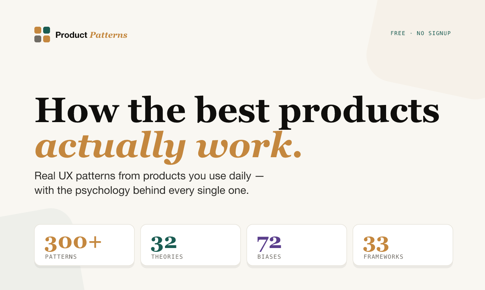
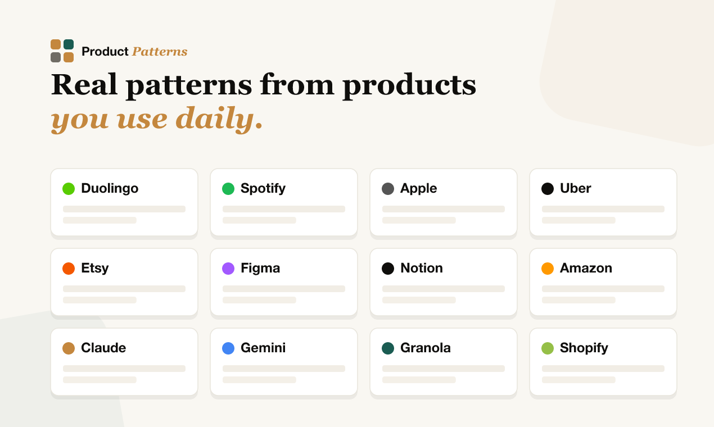
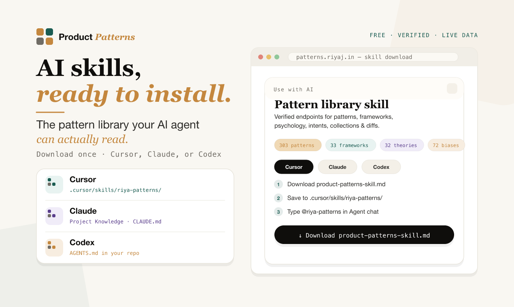

---

## 24. [Clyro](https://www.producthunt.com/products/clyro)
**Votes**: 20 | **도입 난이도**: 중 | **신뢰도**: 상
**Tagline**: Control AI agents safely at runtime
**서비스 링크**: https://www.producthunt.com/r/IYLVHGXAOU6YXI

**태그**: AI, DevOps, Governance, Automation, Agent, AI Tool

### 📌 이 서비스 한눈에 보기
AI 에이전트의 무한 루프와 비용 폭주를 방지하는 런타임 거버넌스 솔루션

### 🔑 주요 기능
- 에이전트 실행 중 정책 강제 및 가드레일 제공
- 무한 루프 방지 및 비용 제어 기능
- 비즈니스 로직 검증 및 감사 로그(Audit Log) 기록

### 🙋 사용자에게 어떤 점이 좋은가
AI 에이전트를 실제 서비스에 배포할 때 발생할 수 있는 예측 불가능한 오류와 비용 문제를 사전에 차단할 수 있습니다.

### ✅ 지금 바로 써볼 기능
- 기존 에이전트 워크플로우에 Clyro 커널 적용 테스트
- 비용 및 실행 정책(Policy) 설정
- 런타임 가시성 및 감사 로그 확인

### ⚠️ 사용 전 확인할 점
- 에이전트 실행 레이어에 추가되는 만큼 발생할 수 있는 지연 시간(Latency) 확인 필요
- 기존 에이전트 프레임워크와의 호환성 검토

### 🧭 확인이 더 필요한 정보
현재 제공되는 구체적인 통합 방식과 지원하는 AI 프레임워크 목록에 대한 정보가 부족합니다.

### 📸 스크린샷 및 갤러리
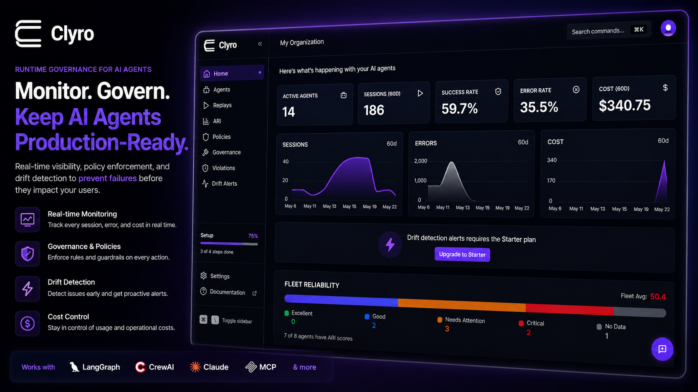
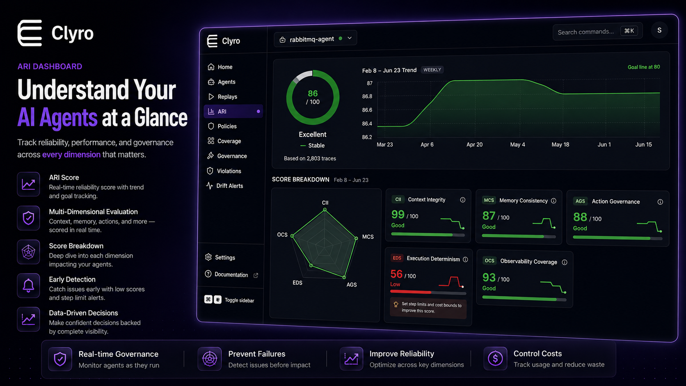
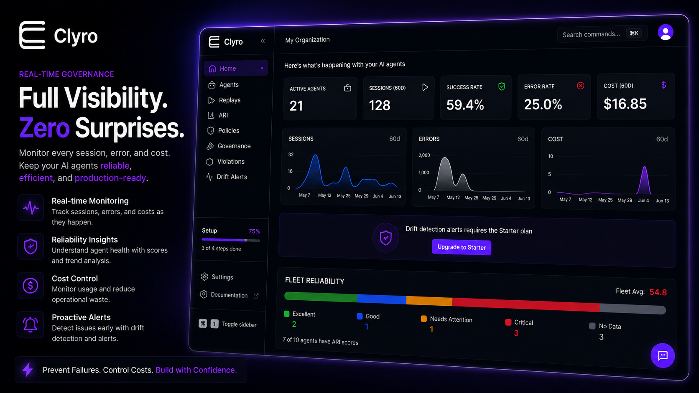

### 🎬 관련 영상
- [🎥 영상 보기](https://ph-files.imgix.net/897c92e9-8263-4f28-9db6-524dc03c3793.jpeg?auto=format)

---

## 25. [Friday AI](https://www.producthunt.com/products/friday-ai-3)
**Votes**: 18 | **도입 난이도**: 중 | **신뢰도**: 상
**Tagline**: The full-stack AI Agent — Claude Code meets Lovable
**서비스 링크**: https://www.producthunt.com/r/MVZKSHEBOCZGMA

**태그**: AI Agent, Full-stack, Automation, DevTool, Agent, AI Tool, Chat, Video, Vision

### 📌 이 서비스 한눈에 보기
아이디어만으로 풀스택 앱 개발부터 자동화까지 수행하는 올인원 데스크톱 AI 에이전트

### 🔑 주요 기능
- Claude Code의 강력함과 Lovable의 간편함을 결합한 풀스택 개발 및 자동화 도구
- 채팅, 음성, 이미지, 비디오를 네이티브로 지원하며 주요 LLM(Claude, Gemini, OpenAI, Grok) SDK 통합
- 수백 개의 MCP(Model Context Protocol)와 사전 로드된 스킬을 통한 고도의 자동화 작업 수행

### 🙋 사용자에게 어떤 점이 좋은가
창업자와 개발자가 복잡한 코딩 과정 없이 아이디어를 즉시 앱으로 구현하고, 반복적인 성장 업무를 병렬로 자동화할 수 있습니다.

### ✅ 지금 바로 써볼 기능
- 자연어 명령을 통한 풀스택 애플리케이션 빌드 테스트
- 사전 로드된 스킬을 활용한 업무 자동화 워크플로우 설정
- 다양한 LLM SDK를 활용한 멀티 모델 작업 수행

### ⚠️ 사용 전 확인할 점
- 에이전트가 생성한 코드의 보안성 및 품질 검증 필요
- 수백 개의 에이전트를 병렬 실행 시 발생할 수 있는 리소스 관리 문제

### 🧭 확인이 더 필요한 정보
데스크톱 설치형 에이전트로서의 시스템 리소스 점유율과 구체적인 비용 구조에 대한 정보가 필요합니다.

### 📸 스크린샷 및 갤러리
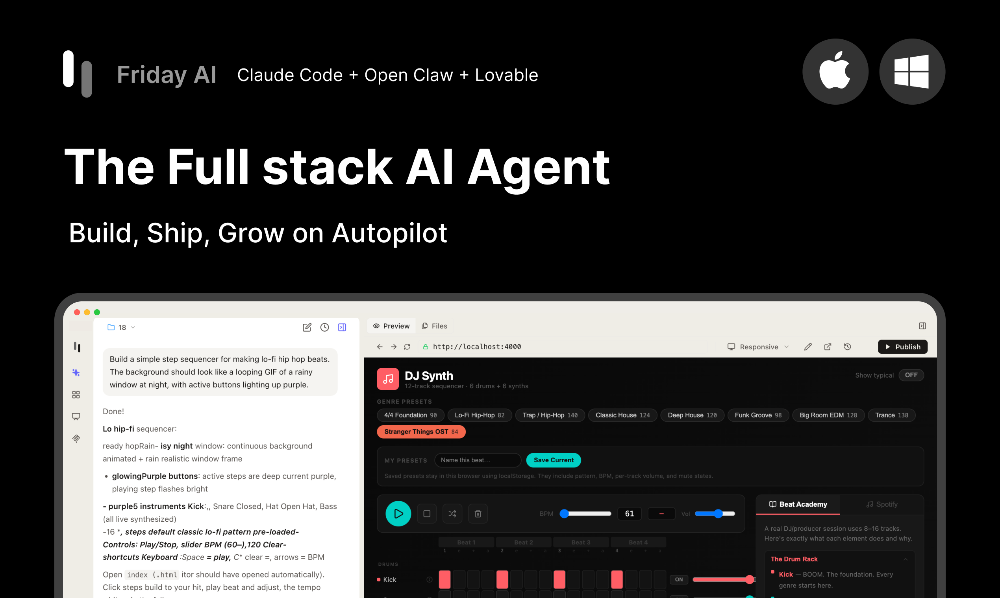
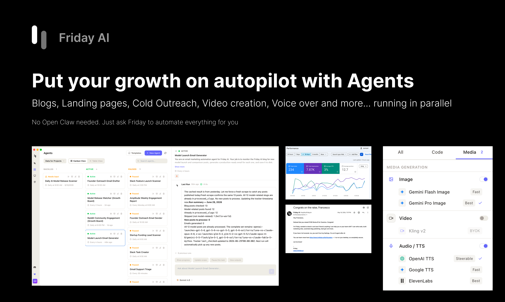
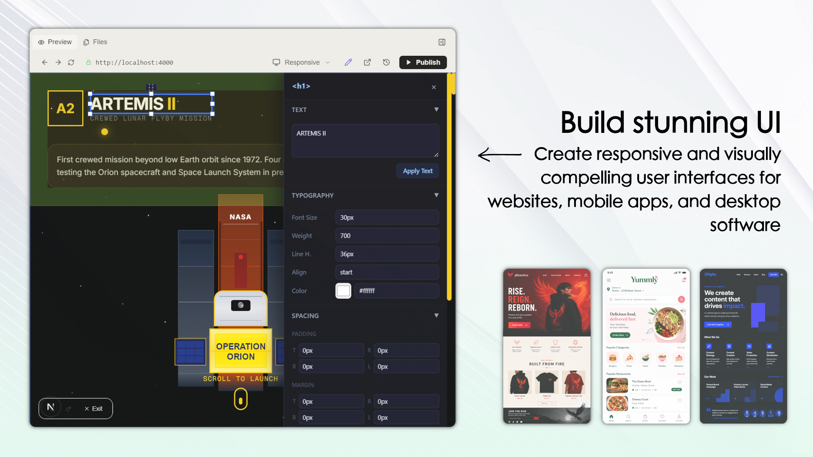

### 🎬 관련 영상
- [🎥 영상 보기](https://ph-files.imgix.net/cc0f5fc9-3382-41da-8e68-22eed0790290.jpeg?auto=format)

---

## 26. [zopnight](https://www.producthunt.com/products/zopnight)
**Votes**: 18 | **도입 난이도**: 중 | **신뢰도**: 상
**Tagline**: Technology Value OS for  AI ,  Cloud  and  Humans
**서비스 링크**: https://www.producthunt.com/r/UNSASFNC4BFJMR

**태그**: CloudOps, FinOps, Automation, DevOps, MultiCloud, AI Tool, DevTool

### 📌 이 서비스 한눈에 보기
멀티 클라우드 환경의 비용 낭비를 탐지하고 자동 최적화를 지원하는 통합 기술 가치 운영 체제

### 🔑 주요 기능
- AWS, GCP, Azure를 통합 관리하는 단일 플랫폼
- 낭비 탐지부터 소유권 할당, 자동 최적화, 가치 측정까지 이어지는 통합 루프 제공
- K8s 네임스페이스 단위의 스케줄링 및 승인 기반의 원클릭 복구 기능

### 🙋 사용자에게 어떤 점이 좋은가
클라우드 비용 낭비를 자동으로 찾아내고 승인 절차를 거쳐 즉각적인 최적화를 수행함으로써 운영 효율성과 비용 절감을 동시에 달성할 수 있습니다.

### ✅ 지금 바로 써볼 기능
- 멀티 클라우드(AWS, GCP, Azure) 계정 연결
- 클라우드 리소스 낭비 요소 탐지 및 리포트 확인
- 승인 게이트를 통한 원클릭 최적화 설정

### ⚠️ 사용 전 확인할 점
- 자동화된 최적화 작업이 기존 인프라 운영에 미칠 영향을 고려한 승인 프로세스 설정 필요
- 클라우드 권한 설정 및 보안 정책 준수 여부 확인

### 🧭 확인이 더 필요한 정보
데이터베이스에 직접 접근하지 않는 방식이 구체적으로 어떤 기술적 메커니즘을 통해 구현되는지 확인이 필요합니다.

### 📸 스크린샷 및 갤러리
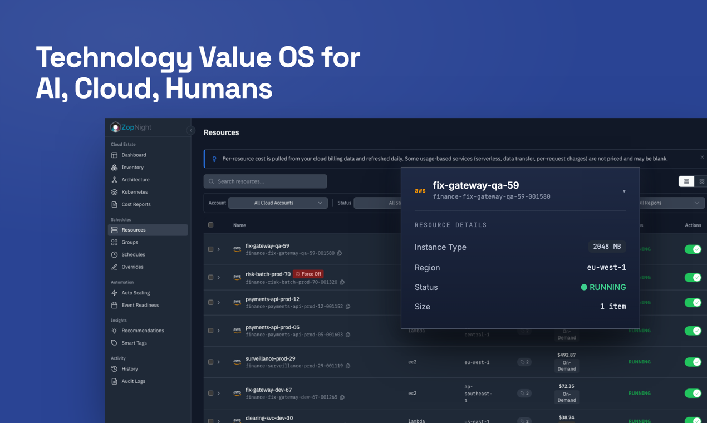
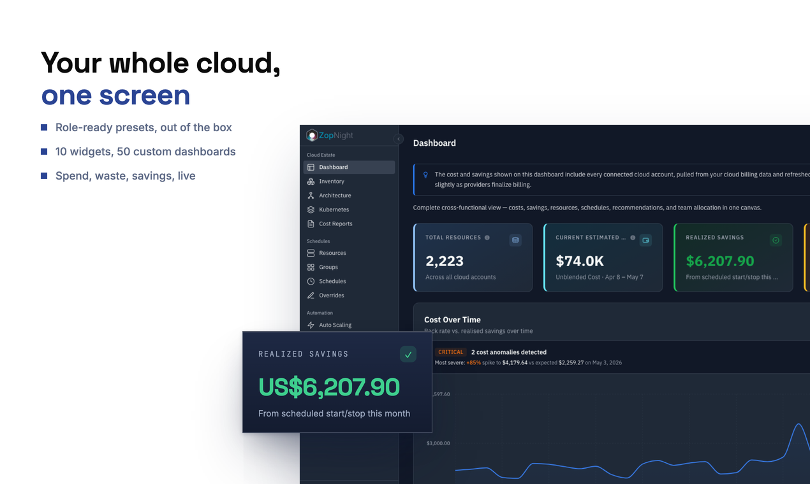
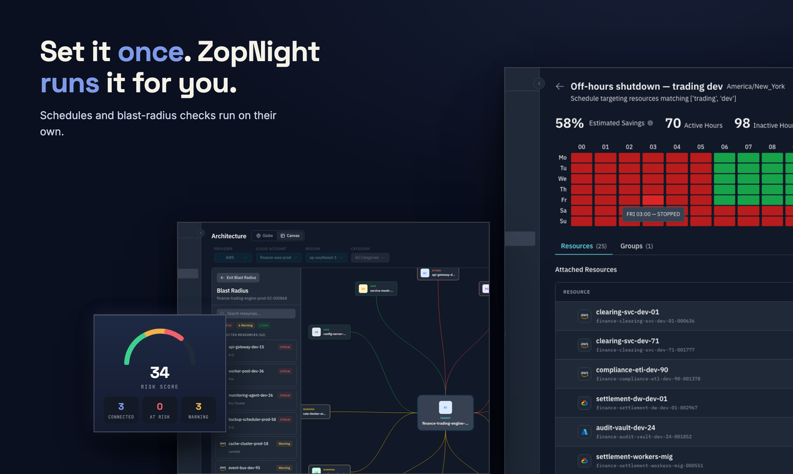

### 🎬 관련 영상
- [🎥 영상 보기](https://ph-files.imgix.net/b0c87679-c37d-45df-b9dc-929d3dbc9ad2.jpeg?auto=format)

---

## 27. [Ferguson](https://www.producthunt.com/products/ferguson)
**Votes**: 18 | **도입 난이도**: 하 | **신뢰도**: 상
**Tagline**: Is your landing page actually... landing? Ferguson tells you
**서비스 링크**: https://www.producthunt.com/r/KNI6E74I6OU56O

**태그**: AI, Marketing, Conversion Optimization, Landing Page, AI Tool, Prompting

### 📌 이 서비스 한눈에 보기
전환 원칙에 기반하여 랜딩 페이지의 문제점과 경쟁력을 분석하는 AI 감사 도구

### 🔑 주요 기능
- 단순한 피드백을 넘어 명확한 전환 원칙에 근거한 분석 제공
- 타겟 고객 식별 및 잠재 고객 이탈 지점 파악
- 동일 카테고리 내 타 랜딩 페이지와의 비교 분석

### 🙋 사용자에게 어떤 점이 좋은가
막연한 조언 대신 구체적인 전환 원칙을 바탕으로 페이지를 진단하여, 실제 고객 전환율을 높이는 데 실질적인 도움을 줍니다.

### ✅ 지금 바로 써볼 기능
- 현재 운영 중인 랜딩 페이지 URL 입력하기
- AI가 분석한 타겟 고객 일치 여부 확인하기
- 카테고리 내 경쟁력 점수 검토하기

### ⚠️ 사용 전 확인할 점
- AI 기반 분석이므로 실제 사용자 경험과 차이가 있을 수 있음
- 제시된 원칙이 사용자의 특정 비즈니스 모델에 완벽히 부합하는지 확인 필요

### 🧭 확인이 더 필요한 정보
구체적인 분석 알고리즘이나 적용되는 전환 원칙의 상세 리스트는 공개되지 않았습니다.

### 📸 스크린샷 및 갤러리

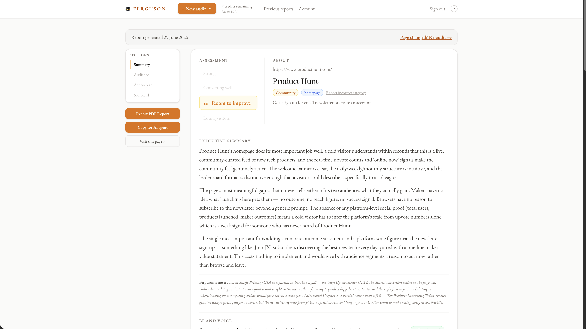
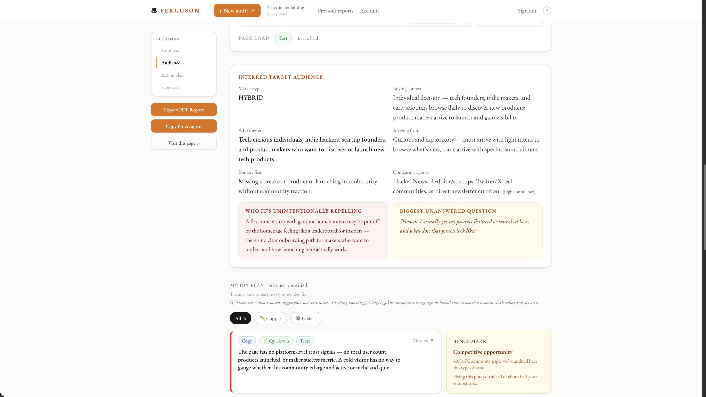

---

## 28. [EatSense 2.0](https://www.producthunt.com/products/eatsense-ai-food-diary)
**Votes**: 17 | **도입 난이도**: 하 | **신뢰도**: 상
**Tagline**: Gut tracking with a mascot that mirrors your day 
**서비스 링크**: https://www.producthunt.com/r/H6R4ABGYES2WM3

**태그**: HealthTech, Journaling, Gamification, Wellness

### 📌 이 서비스 한눈에 보기
귀여운 마스코트와 함께하는 즐거운 장 건강 기록 및 패턴 분석 서비스

### 🔑 주요 기능
- 식단, 증상, 배변 활동을 기록하는 장 건강 전문 저널
- 사용자의 기록 활동에 따라 실시간으로 반응하는 애니메이션 마스코트 'Bella'
- 데이터 기록을 통해 건강 상태의 패턴을 파악할 수 있는 기능

### 🙋 사용자에게 어떤 점이 좋은가
자칫 지루할 수 있는 건강 기록 과정을 마스코트와의 상호작용을 통해 게임처럼 즐겁게 만들어 꾸준한 기록을 유도합니다.

### ✅ 지금 바로 써볼 기능
- 식단 및 증상 기록 시작하기
- 마스코트 Bella의 반응 살펴보기
- 축적된 데이터를 통한 건강 패턴 확인하기

### ⚠️ 사용 전 확인할 점
- 단순 기록 도구이므로 의학적 진단이나 처방을 대체할 수 없음
- 지속적인 기록이 이루어지지 않으면 마스코트의 반응 및 데이터 분석 가치가 낮아짐

### 🧭 확인이 더 필요한 정보
현재 제품 설명에는 구체적인 데이터 분석 리포트의 형태나 의학적 전문성 수준에 대한 정보가 부족합니다.

### 📸 스크린샷 및 갤러리

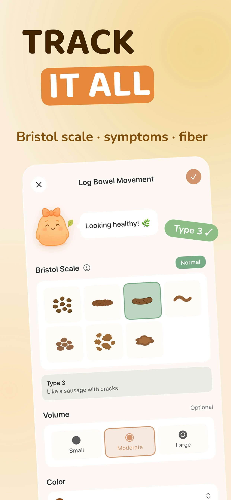
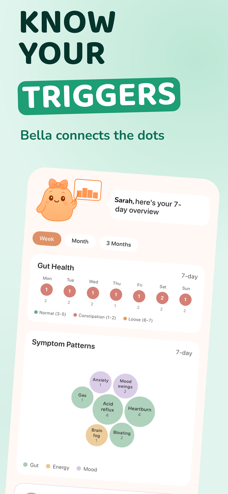

---

## 29. [APROPOS](https://www.producthunt.com/products/apropos)
**Votes**: 15 | **도입 난이도**: 하 | **신뢰도**: 중
**Tagline**: your hire starts with the clarity of the role
**서비스 링크**: https://www.producthunt.com/r/6E6WV6PPYIDW53

**태그**: HRTech, Recruitment, TalentAcquisition, Management, AI Tool

### 📌 이 서비스 한눈에 보기
단순한 인재 채용을 넘어, 조직의 맥락에 맞는 최적의 역할을 정의하고 인재를 매칭하는 솔루션

### 🔑 주요 기능
- 단순 가용성 중심의 채용에서 벗어나 역할의 본질적 필요성 파악
- 조직이 구축하고자 하는 맥락(Context)에 최적화된 인재 발굴
- 채용 전 단계에서 역할의 명확성을 확보하여 채용 실패 리스크 감소

### 🙋 사용자에게 어떤 점이 좋은가
채용 공고를 올리기 전, 우리 팀에 진짜 필요한 역량이 무엇인지 명확히 정의할 수 있도록 도와줍니다.

### ✅ 지금 바로 써볼 기능
- 현재 채용 중인 포지션의 역할 정의 프로세스에 적용해보기
- 기존 채용 기준과 실제 업무 맥락 간의 차이점 분석하기

### ⚠️ 사용 전 확인할 점
- 구체적인 분석 방법론이나 도구의 작동 방식이 설명되어 있지 않음
- 기존 채용 관리 시스템(ATS)과의 연동 여부 확인 필요

### 🧭 확인이 더 필요한 정보
역할의 필요성을 구체적으로 어떻게 도출하고 인재와 매칭하는지에 대한 기술적 방법론 확인이 필요합니다.

### 📸 스크린샷 및 갤러리
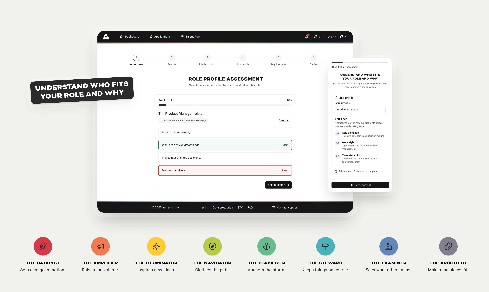
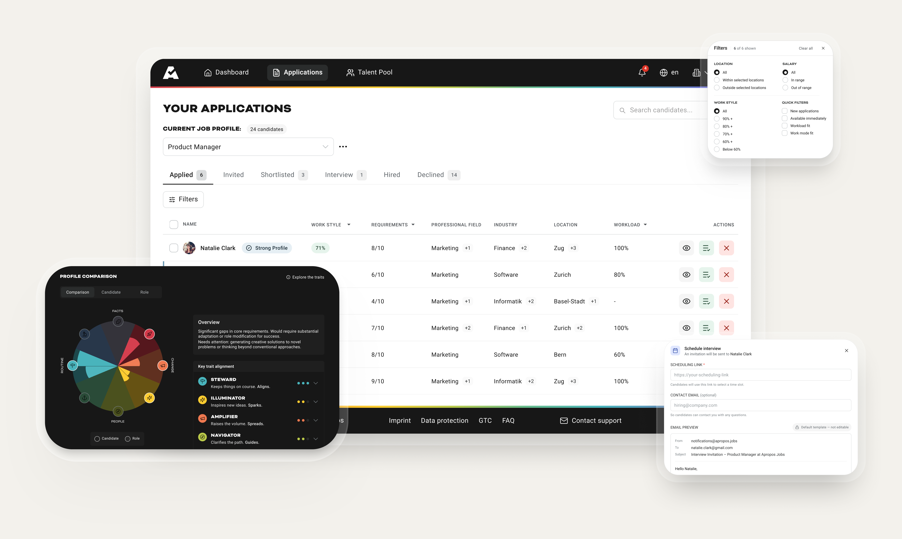
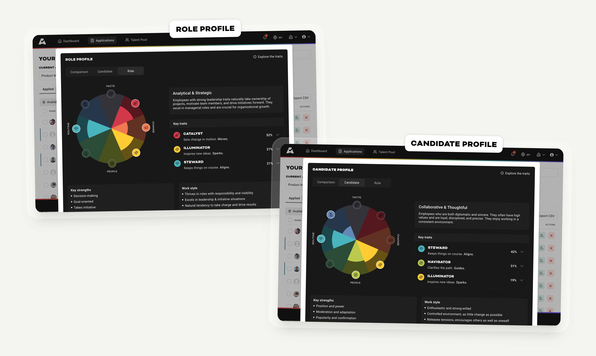

### 🎬 관련 영상
- [🎥 영상 보기](https://ph-files.imgix.net/ce2f6b55-355b-4eaf-9d21-25d1062644f3.jpeg?auto=format)

---

## 30. [CXWizard V2](https://www.producthunt.com/products/cxwizard)
**Votes**: 14 | **도입 난이도**: 하 | **신뢰도**: 상
**Tagline**: Sales & Customer Support AI agents for SMBs
**서비스 링크**: https://www.producthunt.com/r/RJTPSADM7NFJRW

**태그**: AI Agent, Automation, Customer Support, Sales Tool, SMB, Agent, AI Tool, Chat, Vision, Sales

### 📌 이 서비스 한눈에 보기
중소기업의 반복적인 영업 및 고객 지원 업무를 자동화하는 자연어 기반 AI 에이전트

### 🔑 주요 기능
- 규칙 기반 챗봇을 넘어선 자연어 이해 및 멀티모달(이미지, 문서 분석) 능력
- 리드 자격 검증, 예약 관리, 주문 추적 등 실질적인 업무 자동화
- 다국어 지원을 통한 글로벌 고객 대응 가능

### 🙋 사용자에게 어떤 점이 좋은가
인바운드 문의가 많은 중소기업이 인력 소모 없이 24시간 자동화된 영업 및 고객 응대 시스템을 구축할 수 있습니다.

### ✅ 지금 바로 써볼 기능
- 자연어 대화 및 문서 분석 기능 테스트
- 리드 자격 검증 및 예약 자동화 워크플로우 설정
- 다국어 지원을 통한 고객 응대 시나리오 적용

### ⚠️ 사용 전 확인할 점
- AI의 답변 정확도 및 복잡한 문제 해결 능력 검증 필요
- 기존 고객 관리 시스템(CRM)과의 연동 여부 확인 필요

### 🧭 확인이 더 필요한 정보
현재 제공되는 구체적인 외부 툴 연동 범위와 가격 정책에 대한 정보가 부족합니다.

### 📸 스크린샷 및 갤러리
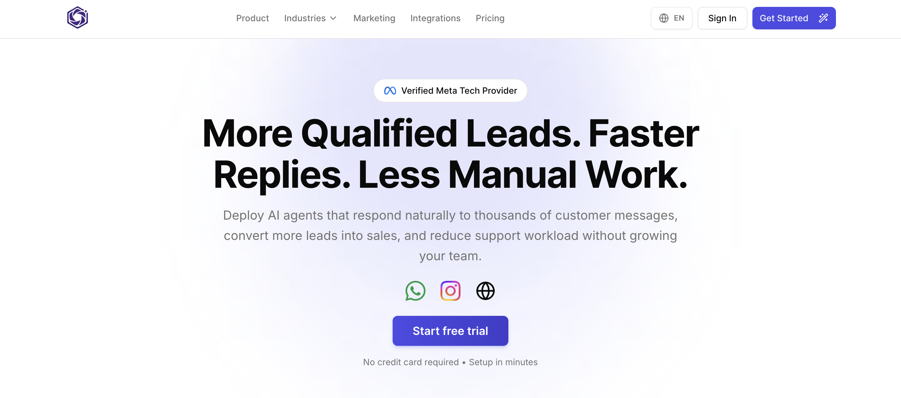
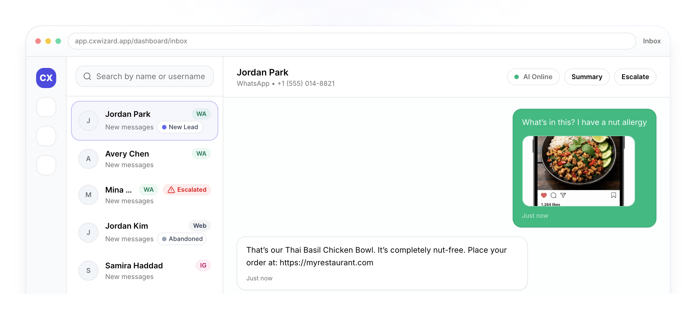
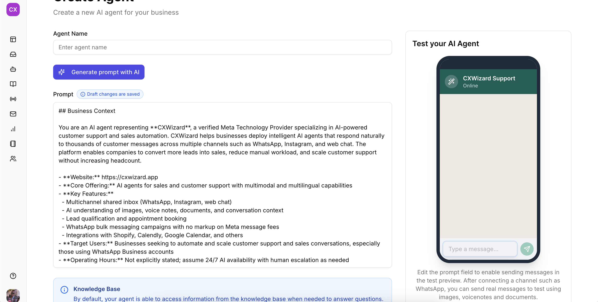

### 🎬 관련 영상
- [🎥 영상 보기](https://ph-files.imgix.net/86b3e83e-d93e-49d5-9300-1d95ef39a763.jpeg?auto=format)

---

