# 🚀 Product Hunt Daily Top 30 (2026-07-04)

## 오늘의 요약
오늘의 트렌드는 AI를 활용한 개발 생산성 도구와 개인화된 데스크톱 경험의 결합이 두드러졌습니다. 특히 복잡한 코딩이나 반복적인 작업을 자동화하는 에이전트 기술과, 보안을 위해 로컬 환경을 활용하는 오프라인 AI 도구들이 주목받았습니다.

### 오늘의 핵심 포인트
- 자연어 대화와 AI 에이전트를 통해 앱 제작, 버그 재현, 태스크 관리를 자동화하는 도구들이 등장했습니다.
- 클라우드 의존도를 낮추고 로컬 자원을 활용하여 보안과 개인화된 사용자 경험을 동시에 잡는 시도가 돋보였습니다.
- 개발 워크플로우에 게임 요소나 음성 제어를 결합하여 작업의 즐거움과 효율성을 높이는 혁신적인 인터페이스가 제안되었습니다.

**오늘의 태그**: AI Agent, Developer Tools, Automation, Privacy-First, Productivity

## 1. [Glaze by Raycast](https://www.producthunt.com/products/glaze-4)
**Votes**: 424 | **도입 난이도**: 하 | **신뢰도**: 상
**Tagline**: Create your own Mac apps by chatting with AI
**서비스 링크**: https://www.producthunt.com/r/5O23FOO5ATZ5QC

**태그**: AI, MacApp, Productivity, NoCode, AI Tool, Chat

### 📌 이 서비스 한눈에 보기
채팅만으로 나만의 맞춤형 Mac 앱을 즉시 제작하는 AI 도구

### 🔑 주요 기능
- 자연어 채팅을 통한 간편한 Mac 앱 생성
- 독(Dock)에 설치되어 즉시 실행되는 독립적인 앱 형태
- 오프라인 환경 지원 및 로컬 컴퓨터 자원 활용

### 🙋 사용자에게 어떤 점이 좋은가
복잡한 코딩 없이 아이디어를 실제 설치형 앱으로 구현하여 개인의 작업 흐름에 최적화된 도구를 가질 수 있습니다.

### ✅ 지금 바로 써볼 기능
- 아이디어를 채팅창에 입력하여 앱 생성하기
- 생성된 앱을 Mac 독(Dock)에 등록하여 사용하기
- 오프라인 환경에서 앱 동작 확인하기

### ⚠️ 사용 전 확인할 점
- 복잡한 로직이나 고성능 그래픽 작업의 구현 가능 여부 확인 필요
- 생성된 앱의 보안 및 시스템 권한 관리 확인

### 🧭 확인이 더 필요한 정보
구체적인 앱 생성 기능의 범위와 시스템 리소스 점유율에 대한 정보가 부족합니다.

### 📸 스크린샷 및 갤러리
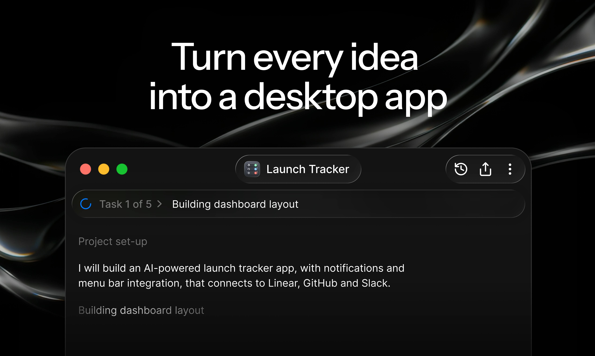
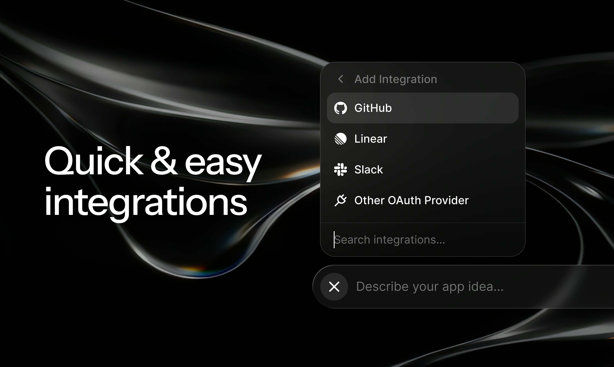

### 🎬 관련 영상
- [🎥 영상 보기](https://ph-files.imgix.net/ff3ed7d9-436f-43a3-b956-ea9010cc3342.jpeg?auto=format)

---

## 2. [Goals from Loops](https://www.producthunt.com/products/loops)
**Votes**: 260 | **도입 난이도**: 하 | **신뢰도**: 상
**Tagline**: Measure whether a campaign drove the desired outcome
**서비스 링크**: https://www.producthunt.com/r/NBOCNNZCFWXZ6L

**태그**: SaaS, Marketing Analytics, Automation, Growth, AI Tool, LLM

### 📌 이 서비스 한눈에 보기
캠페인이 실제 목표 달성에 기여했는지 Loops 내에서 즉시 확인하는 성과 측정 도구

### 🔑 주요 기능
- 특정 전환 목표 설정 및 대상 사용자 지정 기능
- 기여 기간(Attribution window) 설정을 통한 정교한 성과 측정
- Loops 플랫폼 내에서 전환, 등록, 노출 지표 통합 확인

### 🙋 사용자에게 어떤 점이 좋은가
마케팅 캠페인이 단순 노출을 넘어 실제 비즈니스 목표(전환)를 달성했는지 직관적으로 파악할 수 있습니다.

### ✅ 지금 바로 써볼 기능
- 원하는 전환 타겟 설정하기
- 측정 대상 사용자 그룹 지정하기
- 적절한 기여 기간(Attribution window) 설정하기

### ⚠️ 사용 전 확인할 점
- Loops 플랫폼 내에서만 데이터가 확인되므로 외부 분석 도구와의 데이터 정합성 확인 필요
- 설정한 기여 기간에 따라 성과 수치가 달라질 수 있음

### 🧭 확인이 더 필요한 정보
Loops 플랫폼과의 연동 방식 및 기존 데이터와의 호환성에 대한 상세 정보가 필요합니다.

### 📸 스크린샷 및 갤러리

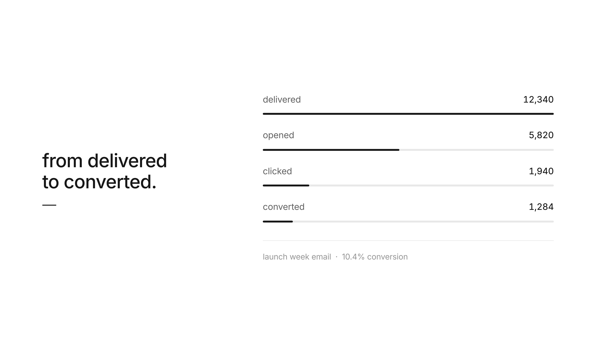
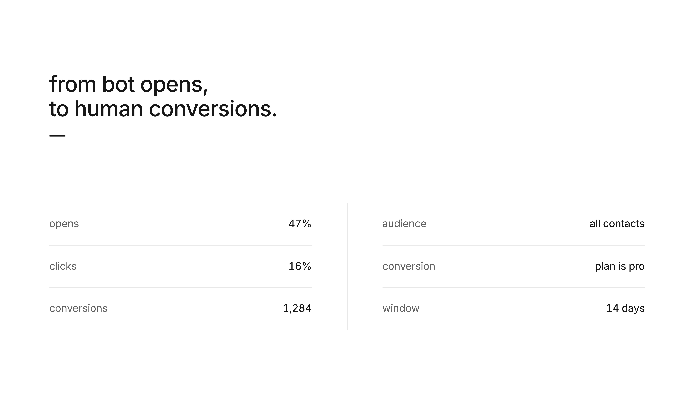

### 🎬 관련 영상
- [🎥 영상 보기](https://ph-files.imgix.net/101a9772-c409-4750-807f-b2446521e86b.jpeg?auto=format)

---

## 3. [Tamamon](https://www.producthunt.com/products/tamamon-a-tiny-desktop-pet-that-grows)
**Votes**: 229 | **도입 난이도**: 하 | **신뢰도**: 상
**Tagline**: A desktop pet that grows as you code with Claude Code
**서비스 링크**: https://www.producthunt.com/r/H465OWNR3Z225E

**태그**: DevTool, macOS, Gamification, Productivity, AI Tool

### 📌 이 서비스 한눈에 보기
Claude Code와 함께 성장하며 코딩의 즐거움을 더하는 macOS 데스크톱 펫

### 🔑 주요 기능
- Claude Code를 통한 개발 활동에 따라 성장하는 독특한 메커니즘
- 20종의 다양한 종과 진화 시스템을 갖춘 가차(Gacha) 요소
- 실시간 날씨 및 시간에 반응하는 인터랙티브한 데스크톱 환경

### 🙋 사용자에게 어떤 점이 좋은가
코딩이라는 반복적인 작업에 게임 요소를 결합하여 개발 동기를 부여하고, 데스크톱에 생동감을 더해줍니다.

### ✅ 지금 바로 써볼 기능
- macOS에 설치하여 데스크톱 펫 키우기
- Claude Code와 연동하여 성장 과정 확인하기
- 주간 가차를 통해 새로운 종 수집하기

### ⚠️ 사용 전 확인할 점
- macOS 전용 앱이므로 다른 운영체제에서는 사용 불가
- Claude Code 사용량에 따라 성장이 결정되므로 개발 활동이 적을 시 재미가 반감될 수 있음

### 🧭 확인이 더 필요한 정보
Claude Code 외의 다른 개발 도구와의 연동 가능 여부는 명시되지 않았습니다.

### 📸 스크린샷 및 갤러리
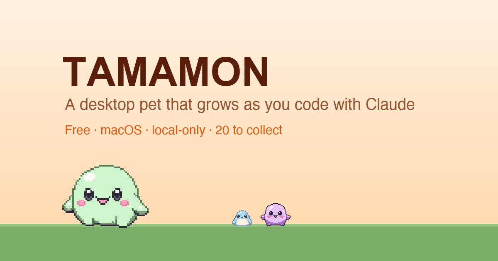
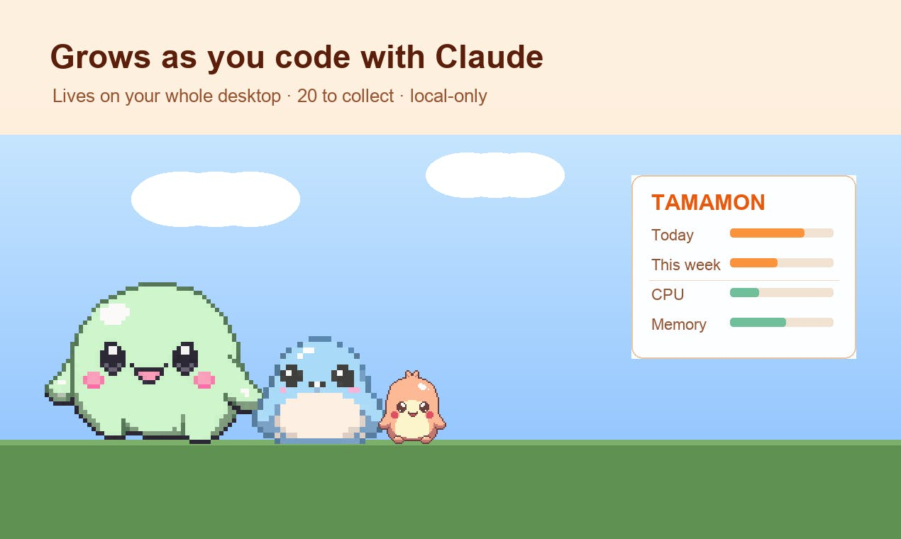

---

## 4. [Osloq](https://www.producthunt.com/products/osloq)
**Votes**: 183 | **도입 난이도**: 하 | **신뢰도**: 상
**Tagline**: An AI agent that reproduces GitHub issues for you
**서비스 링크**: https://www.producthunt.com/r/AQBTECY2JSGAXZ

**태그**: DevTool, AI-Agent, Automation, GitHub, Agent, AI Tool

### 📌 이 서비스 한눈에 보기
GitHub 이슈를 실제 환경에서 자동으로 재현하여 버그를 검증하는 AI 에이전트

### 🔑 주요 기능
- 코드 분석을 넘어 실제 샌드박스 환경에서 코드를 실행하여 버그 재현
- GitHub 저장소와 연동하여 이슈를 선택하면 자동으로 환경 구축 및 클론 수행
- 단순 추측이 아닌 실제 실행 결과에 기반한 증거 중심의 리포트 제공

### 🙋 사용자에게 어떤 점이 좋은가
개발자가 수동으로 환경을 구축하고 버그를 재현하는 번거로운 과정을 자동화하여, 즉시 수정 작업에 집중할 수 있게 해줍니다.

### ✅ 지금 바로 써볼 기능
- GitHub 저장소 연결하기
- 재현이 필요한 이슈 선택하기
- 생성된 재현 리포트 검토하기

### ⚠️ 사용 전 확인할 점
- 샌드박스 환경 내에서의 보안 및 권한 설정 확인 필요
- 복잡한 의존성이나 특수 환경이 필요한 이슈의 재현 성공 여부

### 🧭 확인이 더 필요한 정보
샌드박스 환경의 리소스 제한이나 대규모 프로젝트에서의 실행 속도에 대한 정보가 부족합니다.

### 📸 스크린샷 및 갤러리
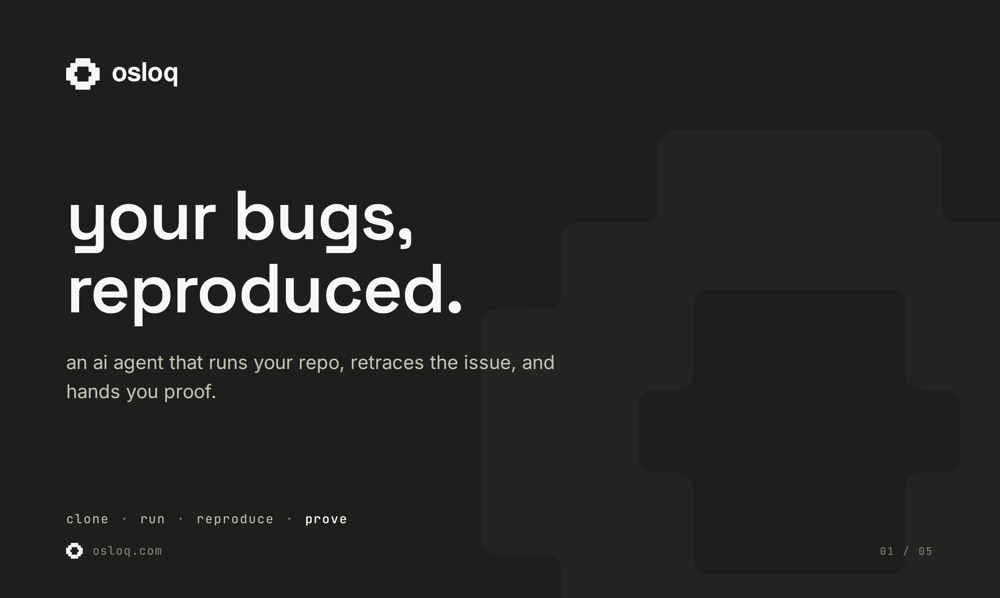
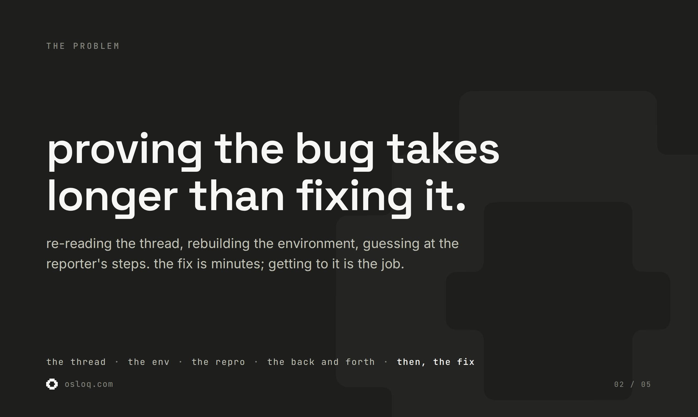
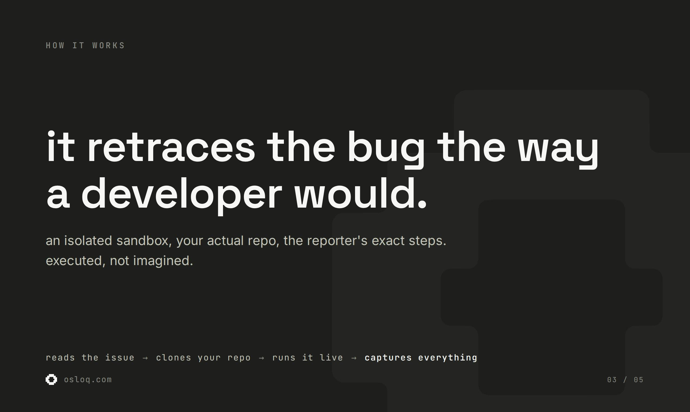

---

## 5. [Archify ](https://www.producthunt.com/products/archify)
**Votes**: 171 | **도입 난이도**: 하 | **신뢰도**: 상
**Tagline**: understand software
**서비스 링크**: https://www.producthunt.com/r/AHD5Q4A67VZICO

**태그**: DevTool, ReverseEngineering, WebAnalysis, API

### 📌 이 서비스 한눈에 보기
브라우저 내에서 소프트웨어의 내부 구조와 동작 방식을 즉시 파악하는 개발 도구

### 🔑 주요 기능
- 브라우저에서 직접 애플리케이션의 구성 요소 확인
- 사용된 API 및 라이브러리 식별
- 소프트웨어의 동작 방식 분석

### 🙋 사용자에게 어떤 점이 좋은가
웹 애플리케이션이 어떻게 구축되었는지 별도의 복잡한 과정 없이 브라우저 상에서 직관적으로 분석할 수 있습니다.

### ✅ 지금 바로 써볼 기능
- 브라우저 확장 프로그램 설치 및 실행
- 관심 있는 웹사이트의 구성 요소 탐색
- 사용된 API 및 라이브러리 목록 확인

### ⚠️ 사용 전 확인할 점
- 클라이언트 측 정보 위주의 분석이므로 서버 내부 로직 파악에는 한계가 있음
- 브라우저 기반 도구이므로 네이티브 앱 분석은 불가능함

### 🧭 확인이 더 필요한 정보
상세한 분석 기능의 범위와 브라우저 확장 프로그램 형태 여부에 대한 구체적인 정보가 필요합니다.

### 📸 스크린샷 및 갤러리
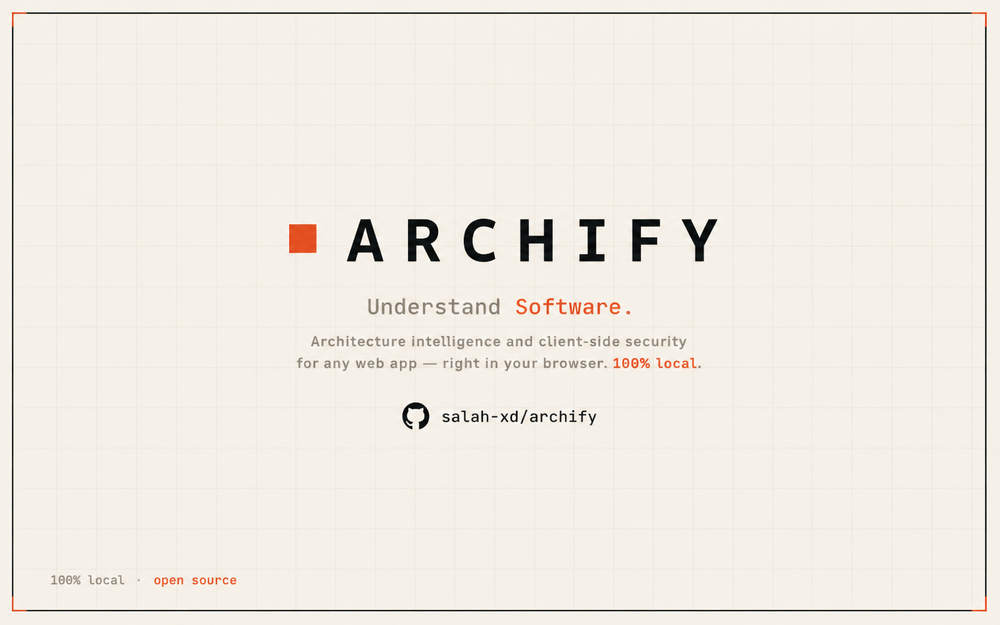
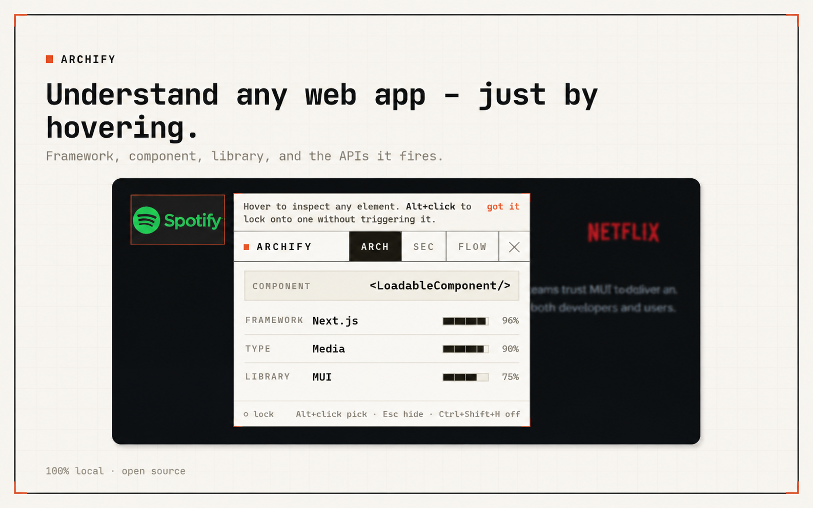
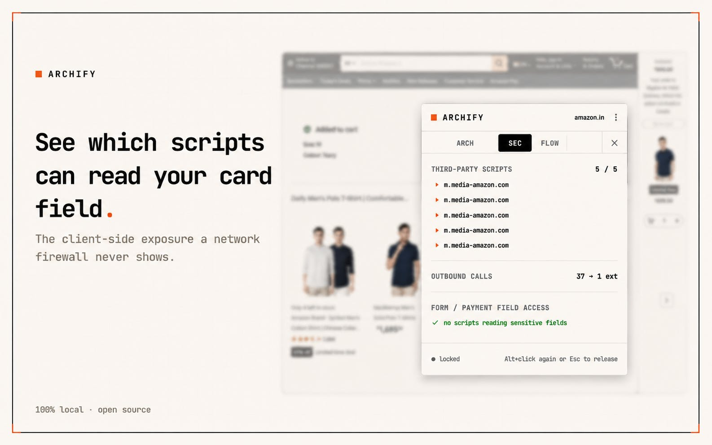

### 🎬 관련 영상
- [🎥 영상 보기](https://ph-files.imgix.net/6c8c2f4f-83d9-4416-885f-15dc2ef4630b.gif?auto=format)

---

## 6. [nxt](https://www.producthunt.com/products/nxt-talk-to-your-to-do-list)
**Votes**: 141 | **도입 난이도**: 하 | **신뢰도**: 상
**Tagline**: Talk to your to do list and get what's next
**서비스 링크**: https://www.producthunt.com/r/GMW4GGOTHFJ4PL

**태그**: AI, Productivity, Task Management, Automation, AI Tool

### 📌 이 서비스 한눈에 보기
대화형 AI를 통해 복잡한 할 일 목록을 단 하나의 명확한 행동으로 바꿔주는 지능형 태스크 매니저

### 🔑 주요 기능
- 자연어 기반의 브레인 덤프: 일상적인 말투로 생각을 쏟아내면 AI가 작업 추출 및 우선순위 설정
- 맥락 이해 및 자동 분류: 단순 명령을 넘어 사용자의 의도와 개인적 맥락을 파악하여 자동 정리
- 결정 피로 해소: 수많은 목록 대신 지금 바로 해야 할 단 하나의 작업과 이유를 제시

### 🙋 사용자에게 어떤 점이 좋은가
할 일 목록을 정리하는 데 드는 인지적 에너지를 줄여주고, 선택 장애 없이 즉각적인 실행에 집중할 수 있게 돕습니다.

### ✅ 지금 바로 써볼 기능
- 생각나는 모든 할 일을 일상적인 말투로 입력해보기
- AI가 제안하는 우선순위와 분류 방식 확인하기
- 제시된 '단 하나의 작업'을 따라 실행해보기

### ⚠️ 사용 전 확인할 점
- 사용자의 맥락을 학습하는 과정에서 개인 정보 및 데이터 보안 확인 필요
- 복잡한 프로젝트 관리보다는 단기적인 작업 실행에 특화되어 있을 가능성

### 🧭 확인이 더 필요한 정보
현재 제공되는 플랫폼(웹, 모바일 등)과 타 서비스와의 연동 범위에 대한 정보가 부족합니다.

### 📸 스크린샷 및 갤러리
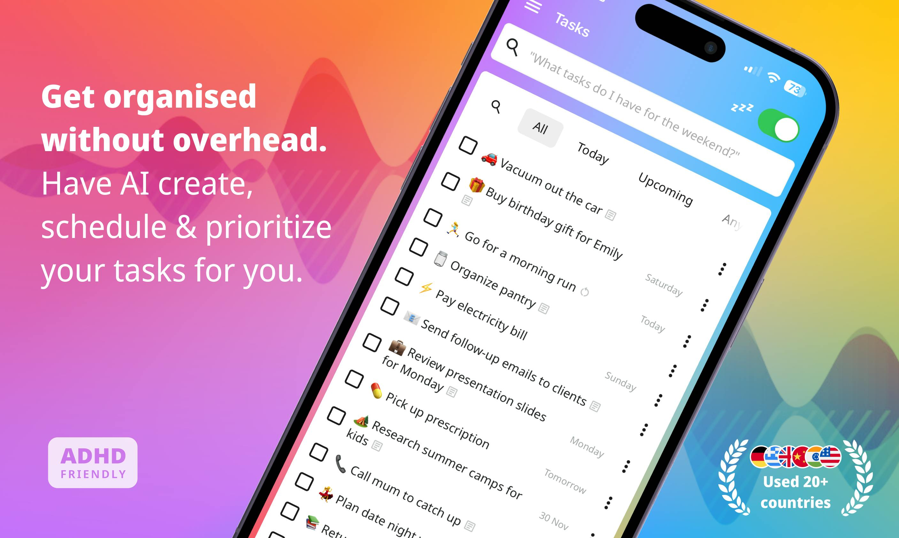
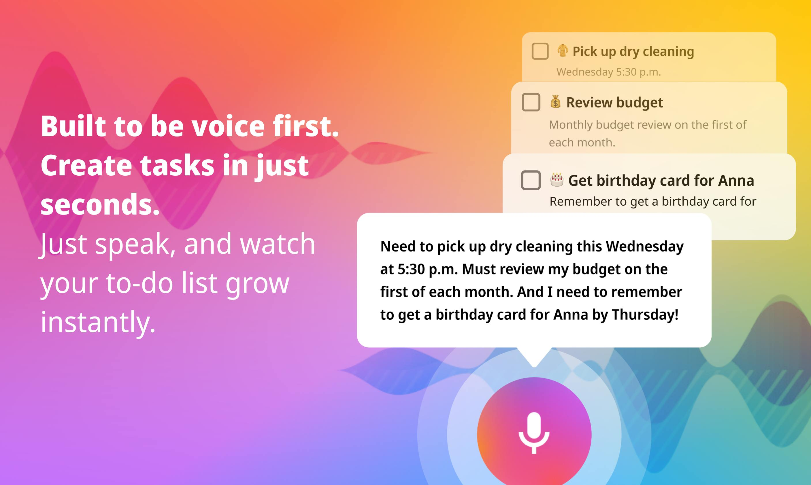
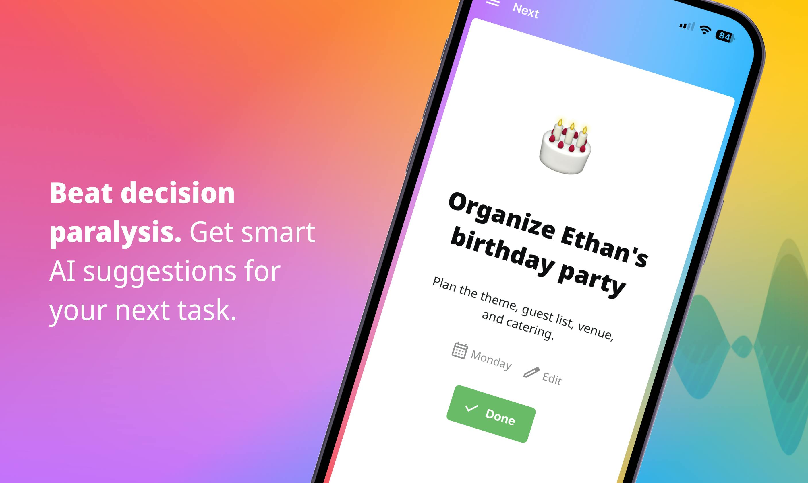

---

## 7. [Vox](https://www.producthunt.com/products/vox-5)
**Votes**: 135 | **도입 난이도**: 하 | **신뢰도**: 상
**Tagline**: Voice in, voice out — with GitHub Copilots
**서비스 링크**: https://www.producthunt.com/r/UTKQTP2P3IW4SI

**태그**: DevTool, CLI, AI, Voice-to-Code, Agent

### 📌 이 서비스 한눈에 보기
GitHub Copilot을 음성으로 제어하는 CLI 확장 도구

### 🔑 주요 기능
- GitHub Copilot CLI를 위한 전용 확장 기능
- 별도 창에서 작동하는 반응형 리스닝 오브(Orb) 인터페이스
- Windows, macOS, Linux를 모두 지원하는 크로스 플랫폼 환경

### 🙋 사용자에게 어떤 점이 좋은가
터미널 작업 중 키보드 입력 대신 음성 명령을 통해 Copilot과 대화하며 개발 생산성을 높일 수 있습니다.

### ✅ 지금 바로 써볼 기능
- /vox 명령어로 인터페이스 실행하기
- 음성 명령을 통한 Copilot 에이전트 응답 확인하기
- 사용 중인 OS 환경에서 설치 및 호환성 테스트하기

### ⚠️ 사용 전 확인할 점
- GitHub Copilot CLI 환경이 사전에 설정되어 있어야 함
- 음성 인식 환경(마이크 성능 및 주변 소음)에 따른 정확도 차이

### 🧭 확인이 더 필요한 정보
음성 명령의 구체적인 명령어 체계와 지원되는 작업 범위에 대한 상세 정보가 필요합니다.

### 📸 스크린샷 및 갤러리
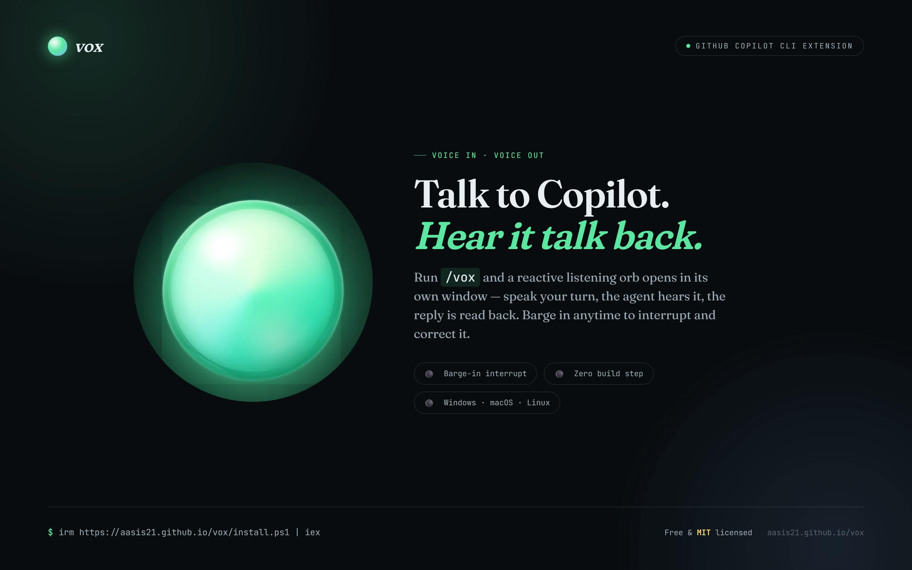

### 🎬 관련 영상
- [🎥 영상 보기](https://ph-files.imgix.net/134d53d8-462e-42ad-b3e5-01513471ecc4.jpeg?auto=format)

---

## 8. [Notta Desktop - Privacy Mode](https://www.producthunt.com/products/notta-desktop-private-transcription)
**Votes**: 54 | **도입 난이도**: 하 | **신뢰도**: 상
**Tagline**: Offline AI meeting notes with unlimited transcription
**서비스 링크**: https://www.producthunt.com/r/KS2Z6JC4VRW6HG

**태그**: Productivity, AI, Privacy, Transcription, AI Tool

### 📌 이 서비스 한눈에 보기
클라우드 유출 걱정 없는 로컬 기반의 오프라인 AI 회의록 작성 도구

### 🔑 주요 기능
- 프라이버시 모드를 통한 로컬 저장 및 오프라인 전사 기능
- 클라우드 처리 없는 보안 중심의 데이터 관리
- 무제한 텍스트 변환 및 회의록 생성

### 🙋 사용자에게 어떤 점이 좋은가
민감한 기업 회의나 개인적인 대화 내용을 외부 서버에 업로드하지 않고도 안전하게 텍스트로 변환할 수 있습니다.

### ✅ 지금 바로 써볼 기능
- 7일 무료 체험을 통한 오프라인 전사 성능 테스트
- 로컬 저장 방식의 보안성 확인
- 데스크톱 설치 및 오프라인 환경 작동 여부 점검

### ⚠️ 사용 전 확인할 점
- 로컬 환경의 하드웨어 성능에 따른 전사 속도 차이 가능성
- 데이터가 개인 컴퓨터에만 저장되므로 기기 분실/고장 시 데이터 유실 위험

### 🧭 확인이 더 필요한 정보
오프라인 상태에서의 AI 모델 구동 방식과 하드웨어 권장 사양에 대한 구체적인 정보가 필요합니다.

### 📸 스크린샷 및 갤러리
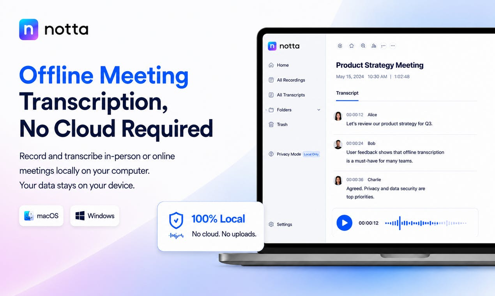

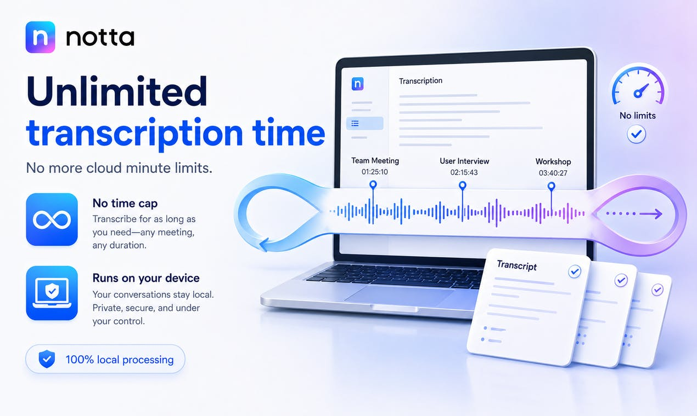

---

## 9. [Pixel Machha](https://www.producthunt.com/products/pixel-machha)
**Votes**: 37 | **도입 난이도**: 중 | **신뢰도**: 상
**Tagline**: Photos from Camera to your Guests in lightening speed !
**서비스 링크**: https://www.producthunt.com/r/NNJJK6ZGJFW3UF

**태그**: Photography, EventTech, AI, Workflow, SocialMedia, AI Tool

### 📌 이 서비스 한눈에 보기
촬영부터 고객 전달까지, 이벤트 사진 워크플로우를 혁신하는 올인원 플랫폼

### 🔑 주요 기능
- FTP 카메라 업로드 및 AI 얼굴 인식 기술 탑재
- 브랜드 맞춤형 게스트 앨범 및 라이브 슬라이드쇼 제공
- 소셜 미디어 최적화 편집 및 내보내기 기능

### 🙋 사용자에게 어떤 점이 좋은가
이벤트 사진 작가가 촬영 직후 결과물을 고객에게 빠르게 전달하고, 소셜 미디어 공유까지 한 번에 해결할 수 있어 작업 시간을 획기적으로 단축합니다.

### ✅ 지금 바로 써볼 기능
- AI 얼굴 인식 기능을 통한 빠른 사진 분류 테스트
- 브랜드 맞춤형 앨범 레이아웃 설정
- 현장 라이브 슬라이드쇼 기능 활용

### ⚠️ 사용 전 확인할 점
- 대용량 사진 업로드 시 네트워크 환경에 따른 속도 차이 발생 가능성
- AI 얼굴 인식의 정확도 및 개인정보 보호 정책 확인 필요

### 🧭 확인이 더 필요한 정보
구체적인 요금 체계와 동시 접속 가능한 사용자 수에 대한 정보가 명시되지 않았습니다.

### 📸 스크린샷 및 갤러리

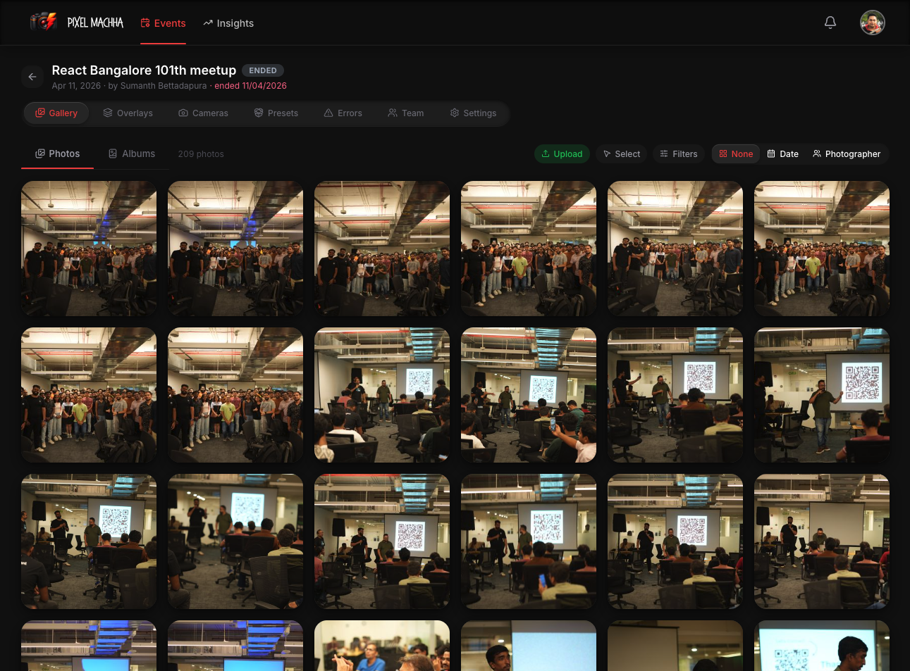

### 🎬 관련 영상
- [🎥 영상 보기](https://ph-files.imgix.net/b2168055-46b3-4d63-9c75-2cad043192eb.jpeg?auto=format)

---

## 10. [JoJo Days](https://www.producthunt.com/products/jojo-days)
**Votes**: 30 | **도입 난이도**: 하 | **신뢰도**: 상
**Tagline**: The baby book you'll actually keep
**서비스 링크**: https://www.producthunt.com/r/GERCSP7N2EGIV6

**태그**: BabyJournal, MemoryBook, Parenting, DigitalArchive, Video

### 📌 이 서비스 한눈에 보기
임신부터 성장기까지 소중한 순간을 기록하는 프라이빗 디지털 성장 일기

### 🔑 주요 기능
- 임신 중 디데이 카운트다운 기능 제공
- 사진, 영상, 메모를 통합 관리하는 디지털 메모리 북
- 개인적이고 안전한 프라이빗 기록 환경

### 🙋 사용자에게 어떤 점이 좋은가
아이의 성장 과정을 흩어지지 않게 한 곳에 모아 영구적으로 보관할 수 있는 디지털 앨범 역할을 합니다.

### ✅ 지금 바로 써볼 기능
- 임신 중 디데이 카운트다운 설정하기
- 첫 번째 아기 사진 및 영상 업로드하기
- 아이를 위한 첫 번째 메모 작성하기

### ⚠️ 사용 전 확인할 점
- 디지털 데이터의 장기 보관 및 백업 정책 확인 필요
- 개인적인 사진과 영상이 포함되므로 보안 및 프라이버시 설정 확인 필요

### 🧭 확인이 더 필요한 정보
데이터 저장 용량 제한이나 유료 구독 모델에 대한 구체적인 정보가 명시되지 않았습니다.

### 📸 스크린샷 및 갤러리
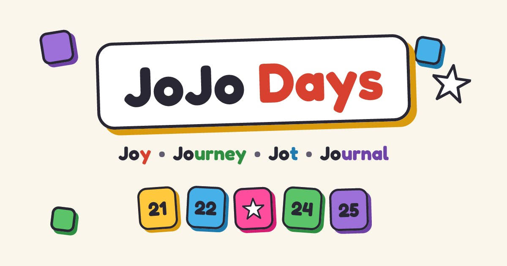
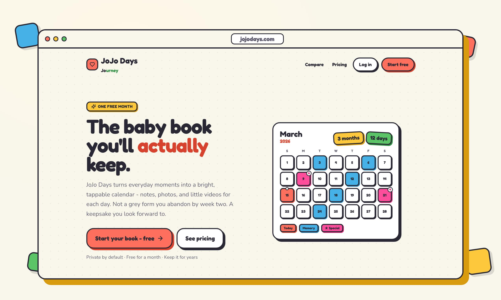
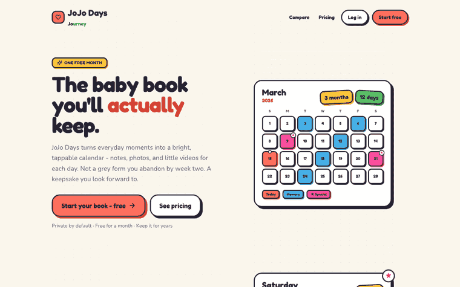

### 🎬 관련 영상
- [🎥 영상 보기](https://ph-files.imgix.net/a104d526-2576-4a0f-8756-918fe4764b9b.gif?auto=format)

---

## 11. [Aura Matter](https://www.producthunt.com/products/aura-matter)
**Votes**: 29 | **도입 난이도**: 하 | **신뢰도**: 상
**Tagline**: Create jewelry with AI, explore it in 3D, then make it real
**서비스 링크**: https://www.producthunt.com/r/5OEA7OYCP6JBFQ

**태그**: AI Design, Jewelry, 3D Modeling, Custom Made, AI Tool, Vision, Design

### 📌 이 서비스 한눈에 보기
AI로 디자인한 독창적인 주얼리를 3D로 확인하고 실물로 제작하는 서비스

### 🔑 주요 기능
- 텍스트 설명을 통한 AI 기반 주얼리 컨셉 생성
- 생성된 디자인을 인터랙티브 3D로 정밀 탐색
- 디지털 디자인을 실제 맞춤형 주얼리로 제작 및 주문

### 🙋 사용자에게 어떤 점이 좋은가
상상만 하던 디자인을 시각화하는 데 그치지 않고, 실제 착용 가능한 실물 제품으로 연결해 주는 차별화된 경험을 제공합니다.

### ✅ 지금 바로 써볼 기능
- 아이디어를 텍스트로 입력하여 디자인 생성하기
- 3D 뷰어를 통해 디자인 디테일 확인하기
- 원하는 소재를 선택하여 실물 제작 주문하기

### ⚠️ 사용 전 확인할 점
- 디지털 디자인과 실제 제작 시의 디테일 차이 확인 필요
- 실물 제작에 따른 배송 및 제작 기간 고려

### 🧭 확인이 더 필요한 정보
실제 제작 시 선택 가능한 소재의 종류와 제작 비용에 대한 구체적인 정보가 필요합니다.

### 📸 스크린샷 및 갤러리

### 🎬 관련 영상
- [🎥 영상 보기](https://ph-files.imgix.net/815478bf-77ac-4157-b2e8-7c6a800d7a5e.jpeg?auto=format)

---

## 12. [OneShots](https://www.producthunt.com/products/oneshots)
**Votes**: 21 | **도입 난이도**: 하 | **신뢰도**: 상
**Tagline**: OneShots - 10s create amazing APP screenshots
**서비스 링크**: https://www.producthunt.com/r/QQ7HMN5WVG6AZY

**태그**: DesignTool, Automation, Marketing, AppDevelopment

### 📌 이 서비스 한눈에 보기
단 10초 만에 앱 스토어용 마케팅 스크린샷을 제작하는 초고속 자동화 툴

### 🔑 주요 기능
- 원클릭 템플릿 기반의 초고속 스크린샷 생성
- 다양한 디바이스 크기 및 다국어 지원 자동화
- Figma나 수동 작업 없이 가능한 벌크 HD 내보내기

### 🙋 사용자에게 어떤 점이 좋은가
앱 출시 시 번거로운 스크린샷 리사이징과 디자인 작업을 자동화하여 마케팅 준비 시간을 획기적으로 단축할 수 있습니다.

### ✅ 지금 바로 써볼 기능
- 기존 앱 스크린샷 업로드해보기
- 원하는 템플릿 선택 및 텍스트 커스텀
- 다양한 디바이스 크기로 벌크 내보내기 테스트

### ⚠️ 사용 전 확인할 점
- 템플릿 디자인의 자유도가 전문 디자인 툴(Figma 등)에 비해 제한적일 수 있음
- 무료 버전의 기능 제한이나 워터마크 여부 확인 필요

### 🧭 확인이 더 필요한 정보
상세한 요금제 체계와 무료 플랜의 구체적인 제한 사항에 대한 정보가 명시되지 않았습니다.

### 📸 스크린샷 및 갤러리
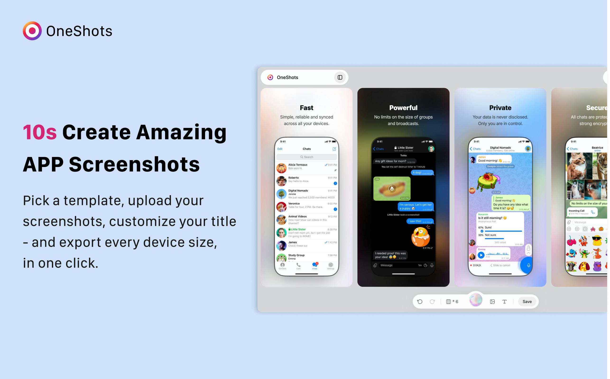
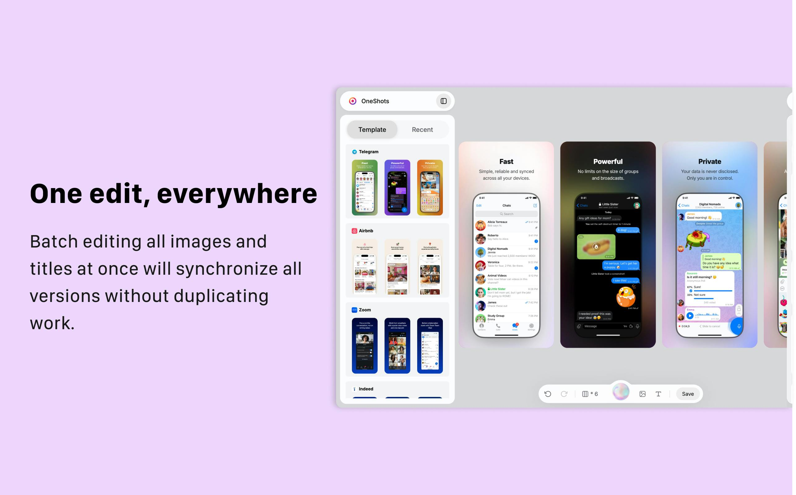
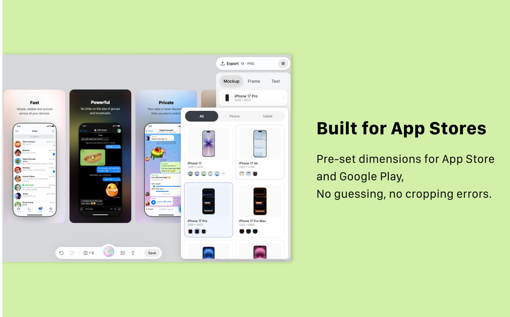

### 🎬 관련 영상
- [🎥 영상 보기](https://ph-files.imgix.net/718274c9-a2d2-4f25-be39-3c6b33753244.jpeg?auto=format)

---

## 13. [tasktrack](https://www.producthunt.com/products/tasktrack-2)
**Votes**: 19 | **도입 난이도**: 하 | **신뢰도**: 상
**Tagline**: just type what you did. look back anytime.
**서비스 링크**: https://www.producthunt.com/r/WLBEDPZWPX2NM6

**태그**: Productivity, Minimalism, WorkLog, TimeManagement

### 📌 이 서비스 한눈에 보기
복잡한 관리 없이 기록에만 집중하는 초간편 워크 로그 도구

### 🔑 주요 기능
- 프로젝트나 보드 설정이 없는 극도의 미니멀리즘 설계
- 텍스트 입력과 엔터만으로 끝나는 단순한 기록 방식
- 과거 작업 내역을 빠르게 스크롤하여 확인하는 직관적 구조

### 🙋 사용자에게 어떤 점이 좋은가
업무 기록을 위해 복잡한 툴을 세팅하는 시간을 아껴주며, 성과 리뷰나 상태 보고 시 과거 기록을 쉽게 찾아낼 수 있습니다.

### ✅ 지금 바로 써볼 기능
- 오늘 한 일 바로 입력해보기
- 스크롤을 통해 과거 기록 확인하기
- 업무 종료 전 일일 로그 작성 습관 만들기

### ⚠️ 사용 전 확인할 점
- 기능이 단순하여 체계적인 프로젝트 관리나 협업에는 부적합할 수 있음
- 데이터 분류 기능이 없어 기록이 쌓일 경우 검색이 어려울 수 있음

### 🧭 확인이 더 필요한 정보
데이터 저장 방식이나 검색/필터링 기능의 유무에 대한 상세 정보가 부족합니다.

### 📸 스크린샷 및 갤러리
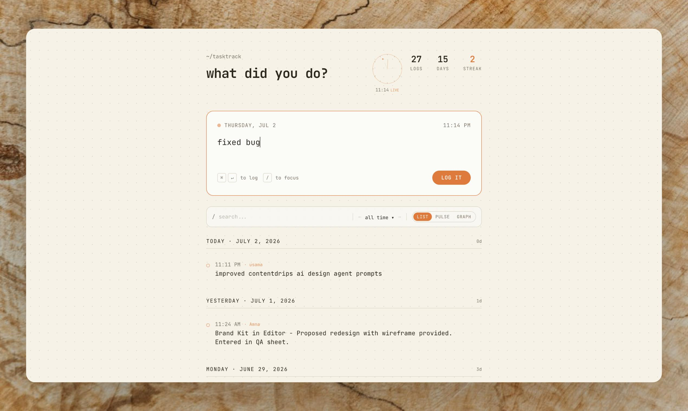
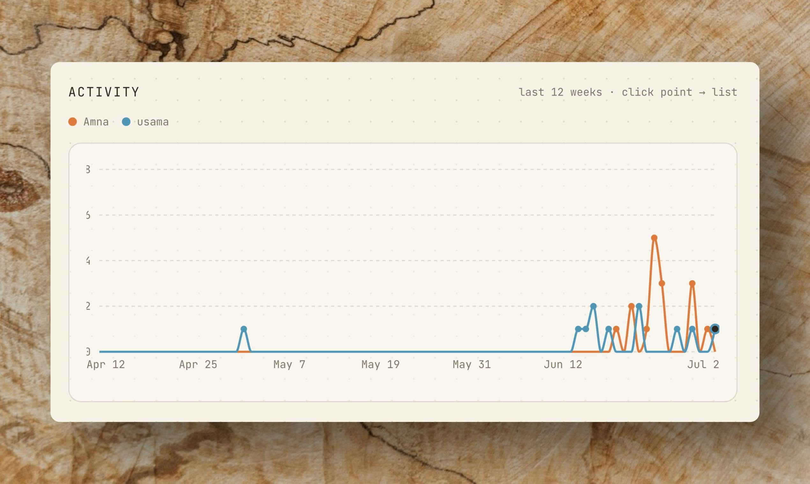
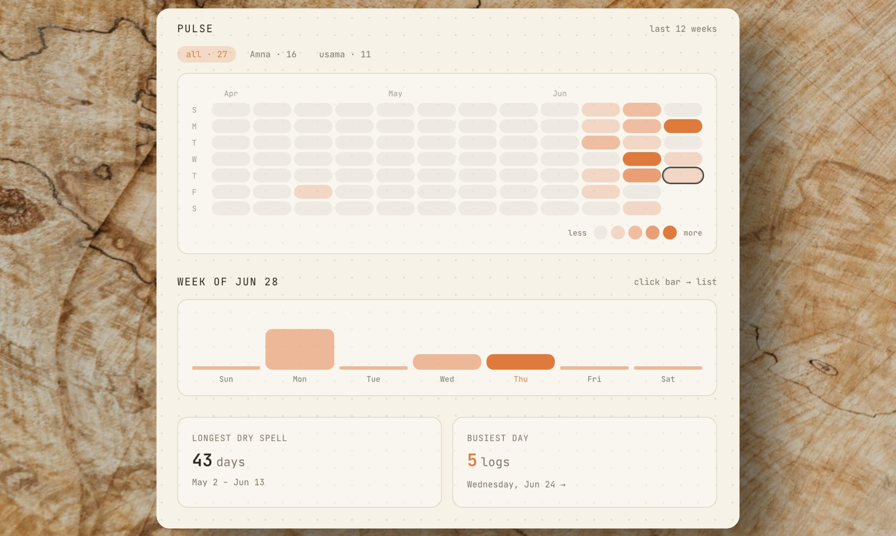

### 🎬 관련 영상
- [🎥 영상 보기](https://ph-files.imgix.net/ac074ab0-72ef-4d3d-9c84-b3bd9f6ccbbb.jpeg?auto=format)

---

## 14. [Cited](https://www.producthunt.com/products/cited-6)
**Votes**: 18 | **도입 난이도**: 하 | **신뢰도**: 상
**Tagline**: Investor answers for NIFTY 50, every claim cited
**서비스 링크**: https://www.producthunt.com/r/O5FEBUK6A56XLW

**태그**: FinTech, AI, Investment, Data-Analysis, AI Tool

### 📌 이 서비스 한눈에 보기
NIFTY 50 기업의 공식 공시 자료를 기반으로 정확한 근거를 제공하는 AI 투자 분석 도구

### 🔑 주요 기능
- NIFTY 50 기업의 실적 발표, 연례 보고서, KPI 데이터북 등 공식 문서 직접 연결
- Claude AI를 활용해 자연어로 질문하면 문서 내 정확한 수치와 인용구로 답변
- 모든 답변에 출처(Citation)를 명시하여 데이터 신뢰성 확보

### 🙋 사용자에게 어떤 점이 좋은가
방대한 PDF 보고서를 일일이 뒤지는 번거로움 없이, 검증된 데이터에 기반한 투자 의사결정을 빠르게 내릴 수 있습니다.

### ✅ 지금 바로 써볼 기능
- 관심 있는 NIFTY 50 기업의 최신 실적 보고서 연결하기
- 특정 KPI 수치나 경영진의 발언을 자연어로 질문해보기
- 제공된 인용 출처를 클릭하여 원문 데이터와 대조하기

### ⚠️ 사용 전 확인할 점
- 현재 NIFTY 50 기업 데이터에 특화되어 있어 타 시장 데이터 활용 범위 확인 필요
- AI 모델(Claude)의 해석 오류 가능성을 염두에 두고 반드시 제공된 출처를 직접 검증해야 함

### 🧭 확인이 더 필요한 정보
NIFTY 50 외의 다른 시장이나 기업 데이터로의 확장 가능 여부는 명시되지 않았습니다.

### 📸 스크린샷 및 갤러리
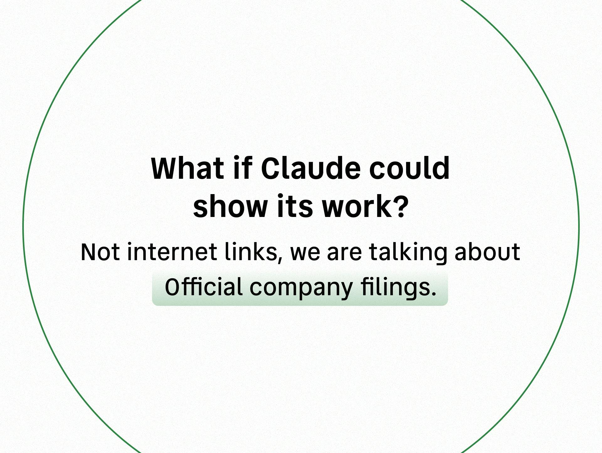
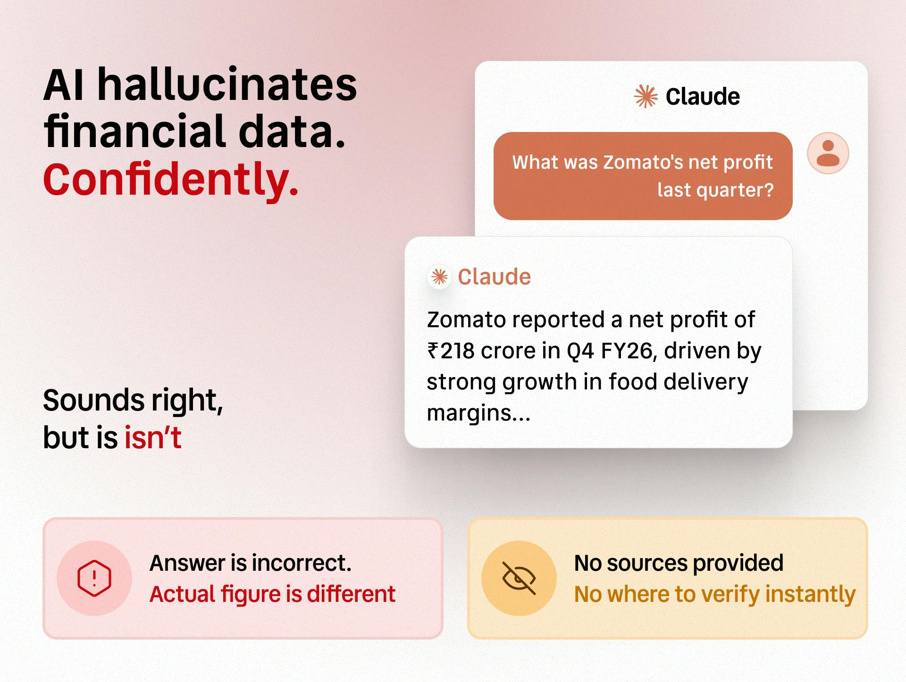
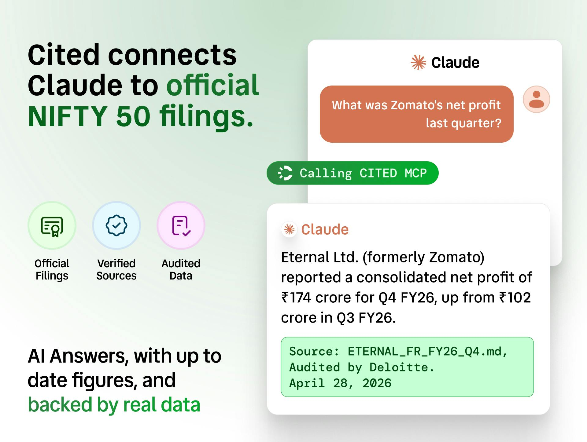

---

## 15. [Subhive](https://www.producthunt.com/products/subhive)
**Votes**: 18 | **도입 난이도**: 하 | **신뢰도**: 상
**Tagline**: Every subscription. One hive.
**서비스 링크**: https://www.producthunt.com/r/4LD7QQE4OY4IJN

**태그**: FinTech, Subscription Management, Personal Finance

### 📌 이 서비스 한눈에 보기
모든 구독 서비스를 한곳에서 관리하고 지출을 추적하는 통합 대시보드

### 🔑 주요 기능
- 모든 구독 서비스의 통합 관리
- 다양한 통화 지원을 통한 글로벌 지출 추적
- 정확한 월간 총 지출액 파악 및 갱신 알림

### 🙋 사용자에게 어떤 점이 좋은가
여러 곳에 흩어진 구독 결제 내역을 한눈에 파악하여 불필요한 지출을 방지하고 예산 관리를 용이하게 합니다.

### ✅ 지금 바로 써볼 기능
- 현재 이용 중인 모든 구독 목록 등록하기
- 월간 총 지출액 대시보드 확인하기
- 갱신 예정일 설정 및 관리하기

### ⚠️ 사용 전 확인할 점
- 결제 수단과의 자동 연동 여부 확인 필요
- 수동 입력 시 데이터 누락 가능성

### 🧭 확인이 더 필요한 정보
결제 내역이 은행/카드와 자동으로 연동되는지 아니면 사용자가 직접 입력해야 하는지 명시되지 않았습니다.

### 📸 스크린샷 및 갤러리

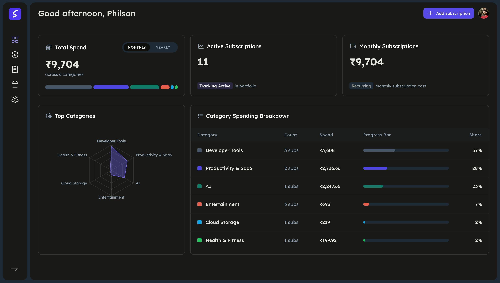
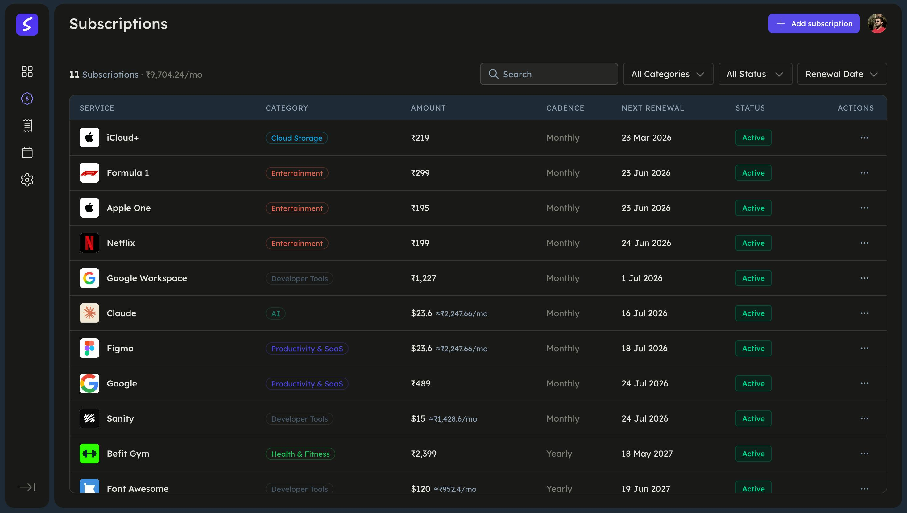

---

## 16. [SyncBooster](https://www.producthunt.com/products/syncbooster)
**Votes**: 18 | **도입 난이도**: 하 | **신뢰도**: 상
**Tagline**: Create and publish social media posts via AI chat
**서비스 링크**: https://www.producthunt.com/r/RLLZEEBR67SIEA

**태그**: AI, SocialMedia, Automation, SaaS, Marketing, AI Tool, Chat, Vision

### 📌 이 서비스 한눈에 보기
채팅만으로 소셜 미디어 게시물을 생성하고 즉시 발행하는 AI 비서

### 🔑 주요 기능
- 사진과 짧은 메모만으로 카피, 해시태그, CTA가 포함된 게시물 자동 생성
- Facebook, Instagram, LinkedIn, Google Business 동시 발행 지원
- 복잡한 대시보드 없이 대화형 인터페이스로 운영되는 간편한 워크플로우

### 🙋 사용자에게 어떤 점이 좋은가
복잡한 마케팅 툴 사용이 어려운 소상공인이 채팅만으로 전문적인 SNS 콘텐츠를 쉽고 빠르게 관리할 수 있습니다.

### ✅ 지금 바로 써볼 기능
- 사진과 메모를 보내 게시물 생성 테스트하기
- AI 이미지 스튜디오로 브랜드 맞춤형 이미지 만들기
- 멀티 채널 동시 발행 기능 확인하기

### ⚠️ 사용 전 확인할 점
- 채팅 기반이므로 세밀한 레이아웃 편집 기능은 제한적일 수 있음
- 브랜드 톤앤매너가 AI 생성 결과물과 일치하는지 확인 필요

### 🧭 확인이 더 필요한 정보
구체적인 요금제 체계와 지원 가능한 언어 범위에 대한 정보가 명시되지 않았습니다.

### 📸 스크린샷 및 갤러리
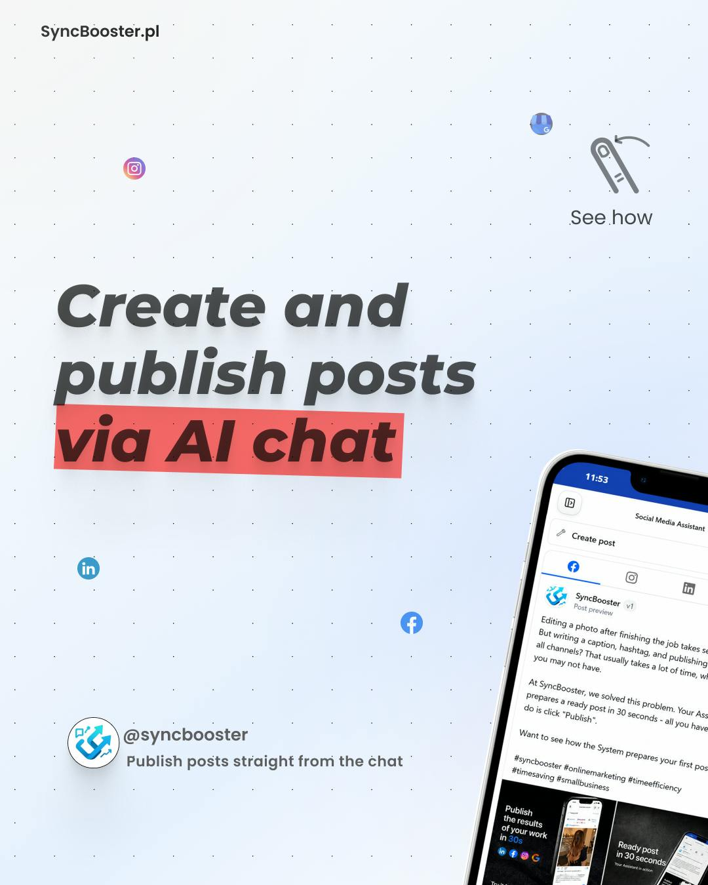
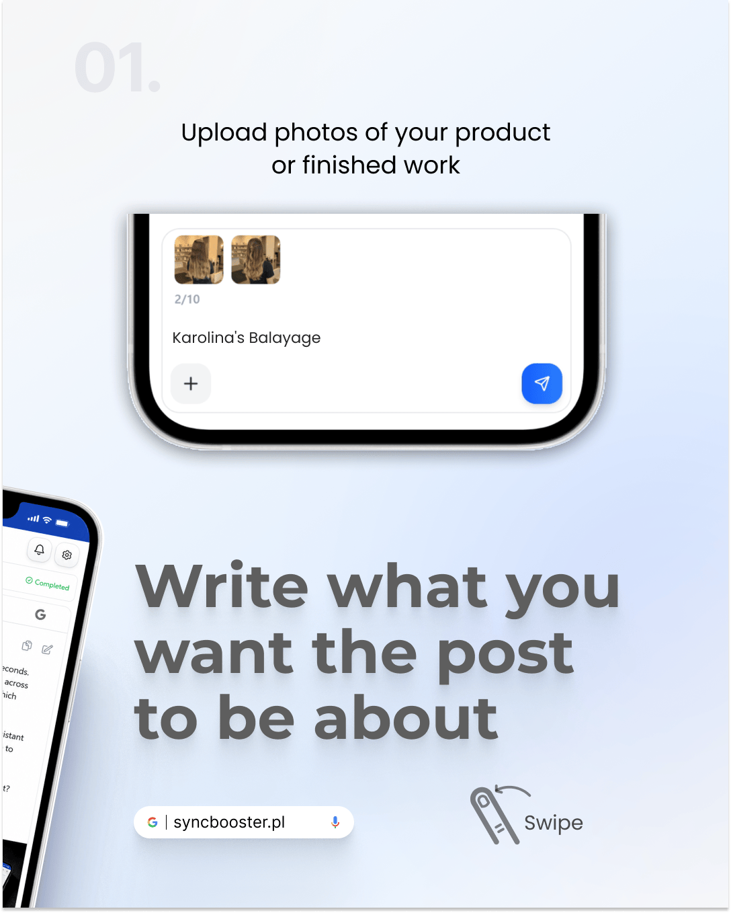
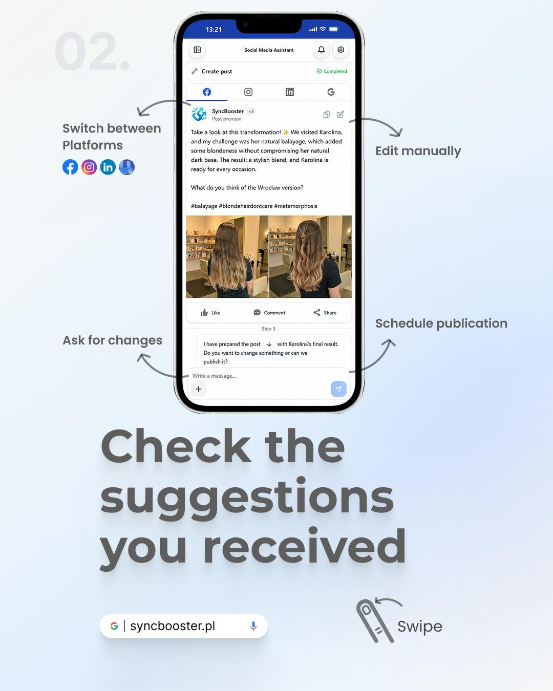

---

## 17. [GenMB](https://www.producthunt.com/products/genmb)
**Votes**: 18 | **도입 난이도**: 하 | **신뢰도**: 상
**Tagline**: AI app builder with a real backend and automations
**서비스 링크**: https://www.producthunt.com/r/P5Z56ONUWUMYN7

**태그**: AI-App-Builder, Automation, NoCode, FullStack, DevTool, Agent, AI Tool, Chat, Prompting, Email

### 📌 이 서비스 한눈에 보기
자연어 프롬프트만으로 백엔드와 자동화 기능이 포함된 완전한 웹 앱을 구축하는 AI 빌더

### 🔑 주요 기능
- 프롬프트 한 줄로 프론트엔드, 백엔드, 데이터베이스, 인증 기능이 포함된 앱 자동 생성
- 20개 이상의 노드를 활용한 시각적 워크플로우 및 스케줄링된 Python 에이전트 제공
- Telegram, Slack, Email 등 다양한 채널과 80개 이상의 통합 기능 지원

### 🙋 사용자에게 어떤 점이 좋은가
코딩 지식 없이도 단순한 아이디어를 실제 작동하는 풀스택 웹 서비스와 자동화 시스템으로 빠르게 구현할 수 있습니다.

### ✅ 지금 바로 써볼 기능
- 자연어 프롬프트를 통한 기본 웹 앱 생성 테스트
- 시각적 워크플로우 빌더를 활용한 자동화 로직 설계
- 무료 티어의 Postgres 데이터베이스 연동 확인

### ⚠️ 사용 전 확인할 점
- 생성된 코드의 커스텀 수정 및 확장성 범위 확인 필요
- 무료 티어의 일일 8 크레딧 제한 내에서의 사용 가능 여부

### 🧭 확인이 더 필요한 정보
복잡한 비즈니스 로직 구현 시 생성된 코드의 안정성과 보안 수준을 검증해야 합니다.

### 📸 스크린샷 및 갤러리
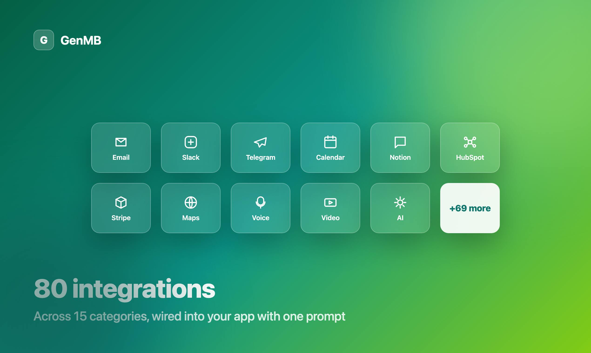
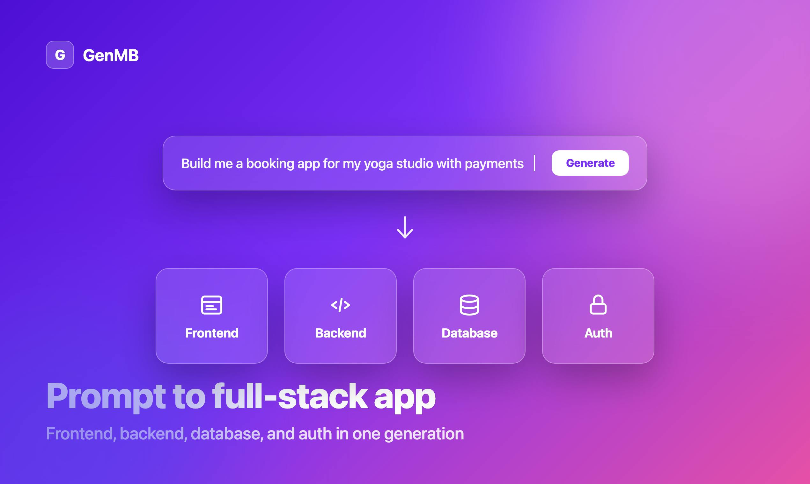
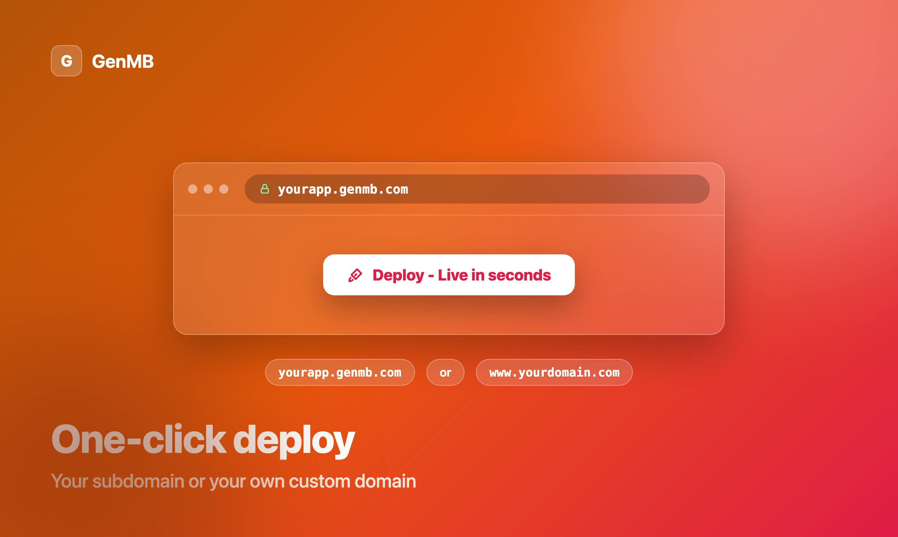

### 🎬 관련 영상
- [🎥 영상 보기](https://ph-files.imgix.net/825874d5-3ac4-4643-a84d-c56e0285f827.jpeg?auto=format)

---

## 18. [AISight](https://www.producthunt.com/products/aisight)
**Votes**: 18 | **도입 난이도**: 하 | **신뢰도**: 상
**Tagline**: Understand how AI answer engines see your website
**서비스 링크**: https://www.producthunt.com/r/SD7FEMXBXVAHLZ

**태그**: SEO, AI-Optimization, Analytics, WebDev, AI Tool

### 📌 이 서비스 한눈에 보기
AI 답변 엔진이 내 웹사이트를 어떻게 인식하는지 분석하고 최적화 가이드를 제공하는 도구

### 🔑 주요 기능
- AI 크롤러의 웹사이트 접근 방식 및 시맨틱 구조 분석
- AI 답변의 인용 및 근거 품질(Citation Readiness) 평가
- 우선순위가 지정된 분석 결과와 즉시 적용 가능한 기술적 수정안 제공

### 🙋 사용자에게 어떤 점이 좋은가
AI 검색 엔진(Perplexity, ChatGPT 등)에 내 웹사이트가 더 잘 노출되고 정확하게 인용될 수 있도록 기술적 최적화 방법을 알려줍니다.

### ✅ 지금 바로 써볼 기능
- 웹사이트 URL을 입력하여 AI 가독성 리포트 생성하기
- 제공된 기술적 수정 사항(Copy-paste fixes)을 웹사이트에 적용하기
- AI 답변 엔진에 대한 사이트의 인용 준비도 확인하기

### ⚠️ 사용 전 확인할 점
- 제공되는 수정안이 사이트의 기존 코드 구조와 충돌할 수 있으므로 적용 전 검토 필요
- AI 엔진의 알고리즘 변화에 따라 분석 결과가 달라질 수 있음

### 🧭 확인이 더 필요한 정보
구체적인 분석 대상 AI 엔진의 종류와 분석 알고리즘의 상세 범위는 명시되지 않았습니다.

### 📸 스크린샷 및 갤러리
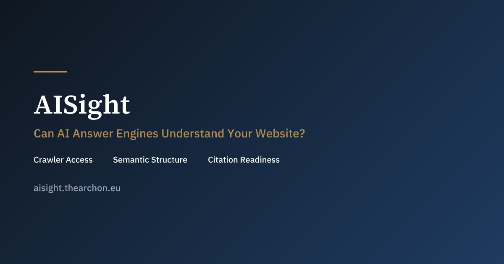
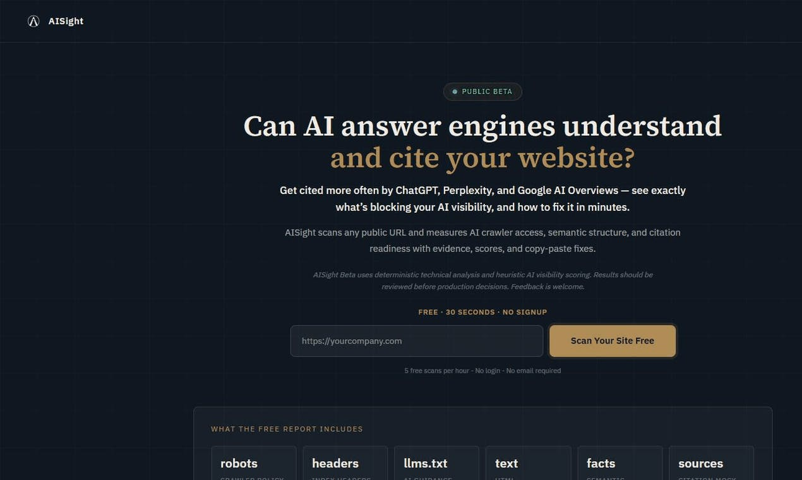
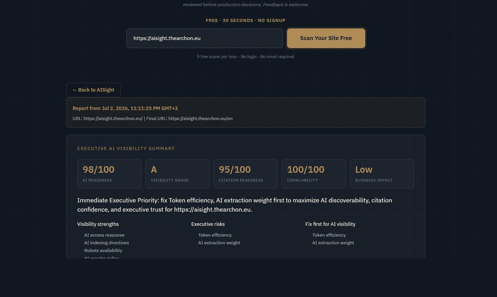

---

## 19. [Alvoff Inference - Fast, cheap STT · TTS](https://www.producthunt.com/products/alvoff-inference-fast-cheap-stt-tts)
**Votes**: 17 | **도입 난이도**: 하 | **신뢰도**: 상
**Tagline**: AI inference based out of India
**서비스 링크**: https://www.producthunt.com/r/G3M4SPIXPIAENM

**태그**: AI, API, STT, TTS, DevTool, AI Tool

### 📌 이 서비스 한눈에 보기
인도 기반의 저비용·저지연 음성 AI(STT/TTS) 추론 API 서비스

### 🔑 주요 기능
- 음성 작업에 최적화된 전용 인프라로 낮은 지연 시간 제공
- 범용 클라우드 대비 저렴한 비용의 STT 및 TTS API
- 가입 시 $5의 무료 추론 크레딧 제공

### 🙋 사용자에게 어떤 점이 좋은가
음성 관련 서비스를 개발할 때 기존 클라우드보다 비용을 절감하고 빠른 응답 속도를 확보할 수 있습니다.

### ✅ 지금 바로 써볼 기능
- 무료 크레딧을 활용한 STT 성능 테스트
- 무료 크레딧을 활용한 TTS 성능 테스트
- 기존 서비스 대비 지연 시간(Latency) 비교

### ⚠️ 사용 전 확인할 점
- 인도 기반 인프라로 인한 지역별 네트워크 지연 시간 차이 확인 필요
- 특정 언어(한국어 등)에 대한 음성 인식 및 합성 품질 검증 필요

### 🧭 확인이 더 필요한 정보
제공되는 STT/TTS 모델의 구체적인 지원 언어와 정확도 수준을 확인해야 합니다.

### 📸 스크린샷 및 갤러리
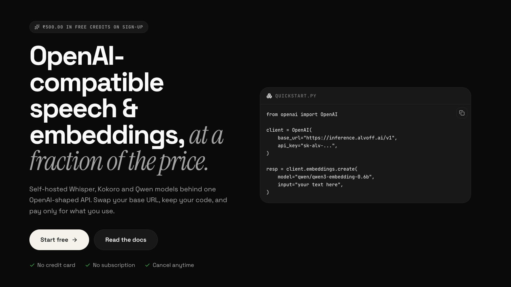
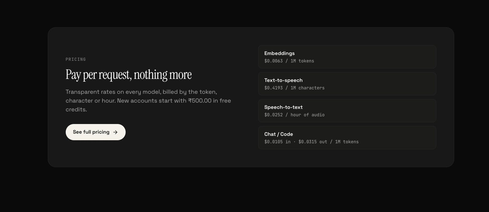
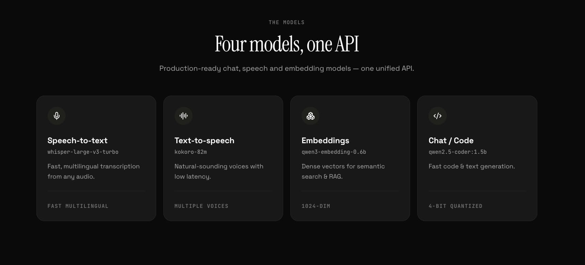

---

## 20. [Time Left](https://www.producthunt.com/products/time-left)
**Votes**: 17 | **도입 난이도**: 하 | **신뢰도**: 상
**Tagline**: Track your life in weeks and meaningful moments
**서비스 링크**: https://www.producthunt.com/r/R2VD5GC4X3ZPM4

**태그**: Productivity, LifeTracker, iOS, Personalization, AI Tool

### 📌 이 서비스 한눈에 보기
남은 인생의 주차를 시각화하여 삶의 소중한 순간을 기록하는 iOS 라이프 캘린더

### 🔑 주요 기능
- 남은 인생의 주차를 직관적인 타임라인으로 시각화
- 과거와 미래의 의미 있는 순간들을 기록 및 관리
- 홈 화면 및 잠금 화면 위젯을 통한 개인화된 경험 제공

### 🙋 사용자에게 어떤 점이 좋은가
남은 시간을 시각적으로 확인하며 삶의 우선순위를 정하고, 소중한 순간들을 놓치지 않도록 돕습니다.

### ✅ 지금 바로 써볼 기능
- 자신의 생년월일을 입력하여 타임라인 생성하기
- 기억하고 싶은 인생의 순간들을 타임라인에 추가하기
- 위젯을 설정하여 매일 삶의 흐름 확인하기

### ⚠️ 사용 전 확인할 점
- iOS 전용 앱이므로 안드로이드 사용자는 이용 불가
- 데이터가 로컬에 저장되므로 기기 변경 시 데이터 이전 방식 확인 필요

### 🧭 확인이 더 필요한 정보
데이터 백업 및 기기 간 동기화 기능 지원 여부에 대한 정보가 명시되지 않았습니다.

### 📸 스크린샷 및 갤러리

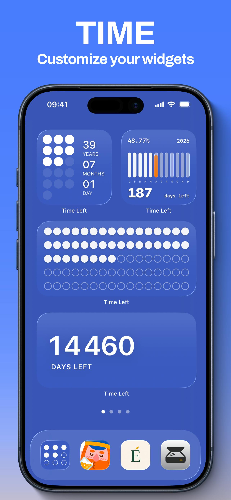

---

## 21. [SharePrompt](https://www.producthunt.com/products/shareprompt-share-prompts-beautifully)
**Votes**: 16 | **도입 난이도**: 하 | **신뢰도**: 상
**Tagline**: Turn your best prompts into beautiful, shareable images
**서비스 링크**: https://www.producthunt.com/r/6KUTS2QWVV7EO2

**태그**: DesignTool, AI, Productivity, SocialMedia, AI Tool, Chat, Prompting, Vision

### 📌 이 서비스 한눈에 보기
AI 프롬프트를 감각적인 카드 디자인의 이미지로 즉시 변환해주는 도구

### 🔑 주요 기능
- Claude, ChatGPT 등 주요 AI 채팅창 스타일의 카드 템플릿 제공
- 따뜻한 그라데이션 배경과 깔끔한 PNG 내보내기 기능
- 계정 생성이나 로그인 없이 즉시 사용 가능한 무료 서비스

### 🙋 사용자에게 어떤 점이 좋은가
단순한 스크린샷 대신 SNS 공유에 최적화된 미려한 디자인으로 프롬프트를 시각화할 수 있습니다.

### ✅ 지금 바로 써볼 기능
- 원하는 AI 스타일의 카드 템플릿 선택하기
- 공유하고 싶은 프롬프트 입력 및 배경 설정하기
- 고화질 PNG 파일로 내보내기

### ⚠️ 사용 전 확인할 점
- 계정 없이 사용하므로 브라우저 종료 시 작업 내용이 사라질 수 있음
- 이미지 생성 기능이 아닌 텍스트를 이미지로 디자인해주는 도구임

### 🧭 확인이 더 필요한 정보
사용자 데이터 저장 여부나 서비스 유지 정책에 대한 정보가 명시되지 않았습니다.

### 📸 스크린샷 및 갤러리
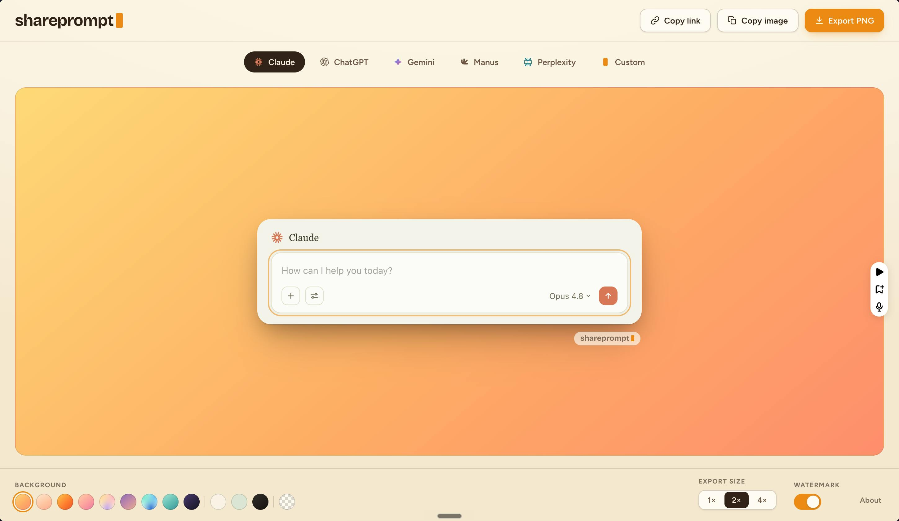
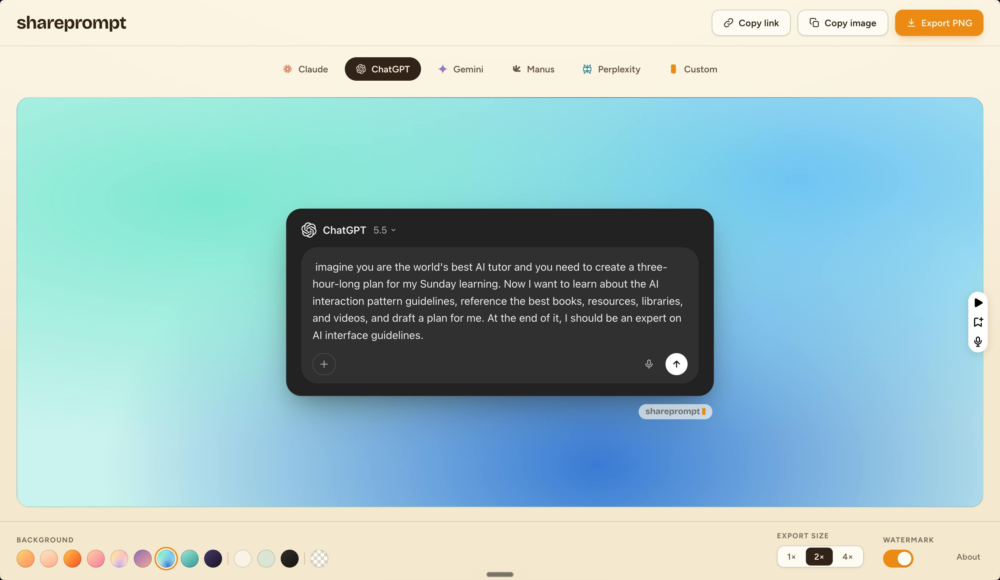
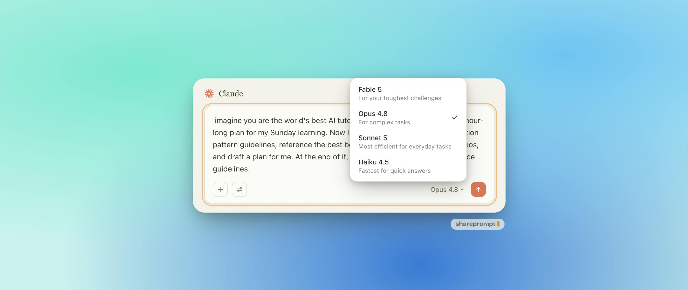

### 🎬 관련 영상
- [🎥 영상 보기](https://ph-files.imgix.net/ee32662c-740e-4bc6-af81-2f9704667cb9.gif?auto=format)

---

## 22. [Comparoo](https://www.producthunt.com/products/comparoo)
**Votes**: 16 | **도입 난이도**: 하 | **신뢰도**: 상
**Tagline**: Ride apps are counting on you not to compare.
**서비스 링크**: https://www.producthunt.com/r/OR6I3ZWWNDGP44

**태그**: Mobility, Price Comparison, India, Design, API

### 📌 이 서비스 한눈에 보기
인도 내 주요 차량 호출 앱들의 실시간 요금을 한눈에 비교하고 최저가로 예약하는 서비스

### 🔑 주요 기능
- Uber, Ola, Rapido, Namma Yatri 등 주요 앱의 실시간 요금 통합 비교
- 동일한 이동 경로 및 차량 타입에 대한 최저가 매칭
- 할인 혜택이 포함된 실제 결제 금액 기반의 정보 제공

### 🙋 사용자에게 어떤 점이 좋은가
여러 앱을 일일이 확인하는 번거로움 없이, 단 한 번의 확인으로 가장 저렴한 이동 수단을 즉시 찾을 수 있습니다.

### ✅ 지금 바로 써볼 기능
- 주요 차량 호출 앱 간의 실시간 가격 차이 확인하기
- 동일 경로에 대해 가장 저렴한 앱으로 원터치 예약하기

### ⚠️ 사용 전 확인할 점
- 인도 지역 내 특정 서비스 앱에 국한된 서비스임
- 향후 배달/식료품 서비스 확장 전까지는 차량 호출에만 특화됨

### 🧭 확인이 더 필요한 정보
현재 서비스가 지원하는 구체적인 지역 범위와 모든 차량 타입에 대한 완벽한 매칭 여부를 확인해야 합니다.

### 📸 스크린샷 및 갤러리

---

## 23. [KeystoneMCP](https://www.producthunt.com/products/keystonemcp)
**Votes**: 14 | **도입 난이도**: 중 | **신뢰도**: 상
**Tagline**: AI-powered creative project organization
**서비스 링크**: https://www.producthunt.com/r/3QSFC7RLQAS7IS

**태그**: CreativeTools, AI-Workflow, VFX, Automation, MCP, AI Tool, Chat

### 📌 이 서비스 한눈에 보기
AI 어시스턴트에게 창작 프로젝트의 맥락과 구조를 학습시켜 작업 흐름을 자동화하는 MCP 서버

### 🔑 주요 기능
- 자산, 작업, 버전, 의존성 등을 관리하는 구조화된 프로젝트 그래프 제공
- 단순 챗봇을 넘어 파일 위치 및 작업 단계 간의 관계를 유지하는 지속적 맥락 제공
- Houdini, Maya, Nuke, Blender 등 전문 3D/VFX 툴을 사용하는 솔로 아티스트 최적화

### 🙋 사용자에게 어떤 점이 좋은가
AI가 프로젝트의 전체 구조를 이해하게 되어, 파일 정리나 작업 순서 파악 등 번거로운 관리 업무를 자동화하고 다음 작업 단계를 정확히 제안받을 수 있습니다.

### ✅ 지금 바로 써볼 기능
- 사용 중인 DCC 툴(Houdini, Blender 등)과의 워크플로우 연동 테스트
- 프로젝트 폴더 구조 및 에셋 의존성 그래프 생성 기능 확인
- AI 어시스턴트와의 세션 간 맥락 유지 능력 검증

### ⚠️ 사용 전 확인할 점
- 전문가용 툴(DCC) 중심이므로 일반적인 사무용 작업에는 과할 수 있음
- MCP 서버 설정 및 프로젝트 그래프 구축을 위한 초기 학습 곡선 존재

### 🧭 확인이 더 필요한 정보
특정 DCC 툴과의 직접적인 플러그인 연동 방식인지, 아니면 파일 시스템 기반의 관리 방식인지에 대한 상세 정보가 필요합니다.

### 📸 스크린샷 및 갤러리
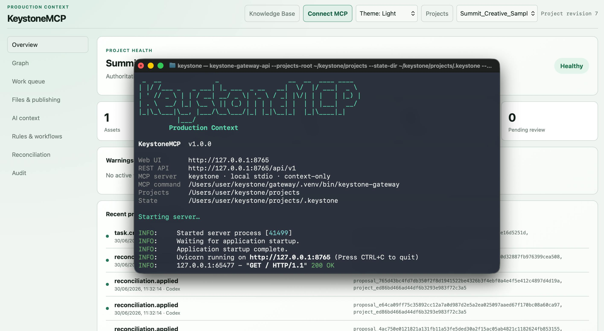
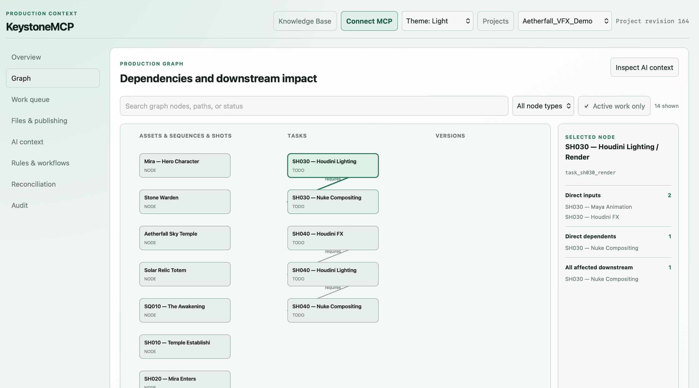
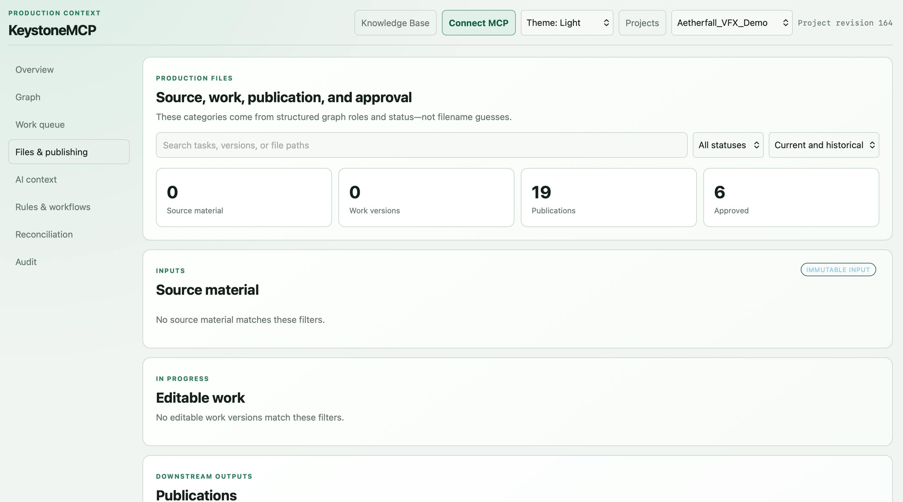

---

## 24. [LetMeCheck.ai](https://www.producthunt.com/products/letmecheck-ai)
**Votes**: 14 | **도입 난이도**: 하 | **신뢰도**: 상
**Tagline**: The blood test for AI-generated codebases
**서비스 링크**: https://www.producthunt.com/r/RTG76DGLI6CWWR

**태그**: DevTool, AI, CodeQuality, Security, Agent, AI Tool

### 📌 이 서비스 한눈에 보기
AI가 생성한 코드의 결함과 보안 취약점을 빠르게 진단하는 코드 건강 검진 도구

### 🔑 주요 기능
- AI 생성 코드베이스를 위한 종합 진단 리포트 제공
- 숨겨진 버그, 보안 취약점 및 코드 품질 문제 탐지
- 수 분 내에 완료되는 신속한 코드 분석 프로세스

### 🙋 사용자에게 어떤 점이 좋은가
AI로 코드를 생성할 때 발생할 수 있는 잠재적 위험을 빠르게 식별하여 코드의 신뢰성과 품질을 확보할 수 있습니다.

### ✅ 지금 바로 써볼 기능
- AI 생성 코드에 대한 전체 진단 리포트 생성
- 코드 내 숨겨진 버그 및 취약점 식별
- 코드 품질 개선을 위한 가이드 확인

### ⚠️ 사용 전 확인할 점
- AI 생성 코드에 특화된 진단 도구이므로 수동 검토가 병행되어야 할 수 있음
- 상세한 분석 범위나 지원 언어에 대한 구체적 정보가 부족함

### 🧭 확인이 더 필요한 정보
지원하는 프로그래밍 언어의 종류와 구체적인 분석 알고리즘에 대한 정보가 추가로 필요합니다.

### 📸 스크린샷 및 갤러리
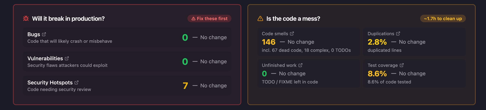
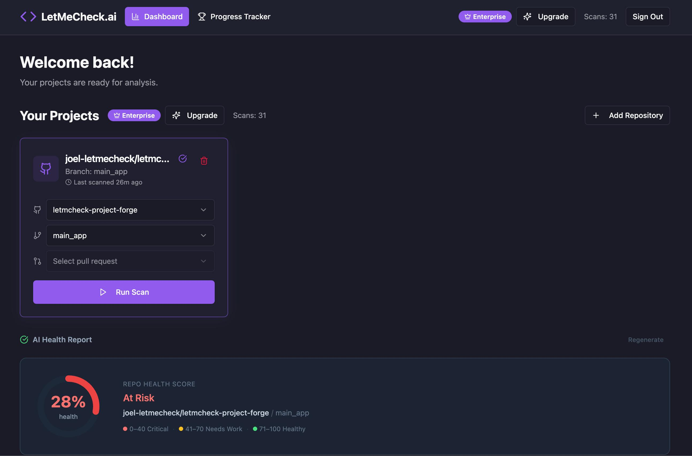
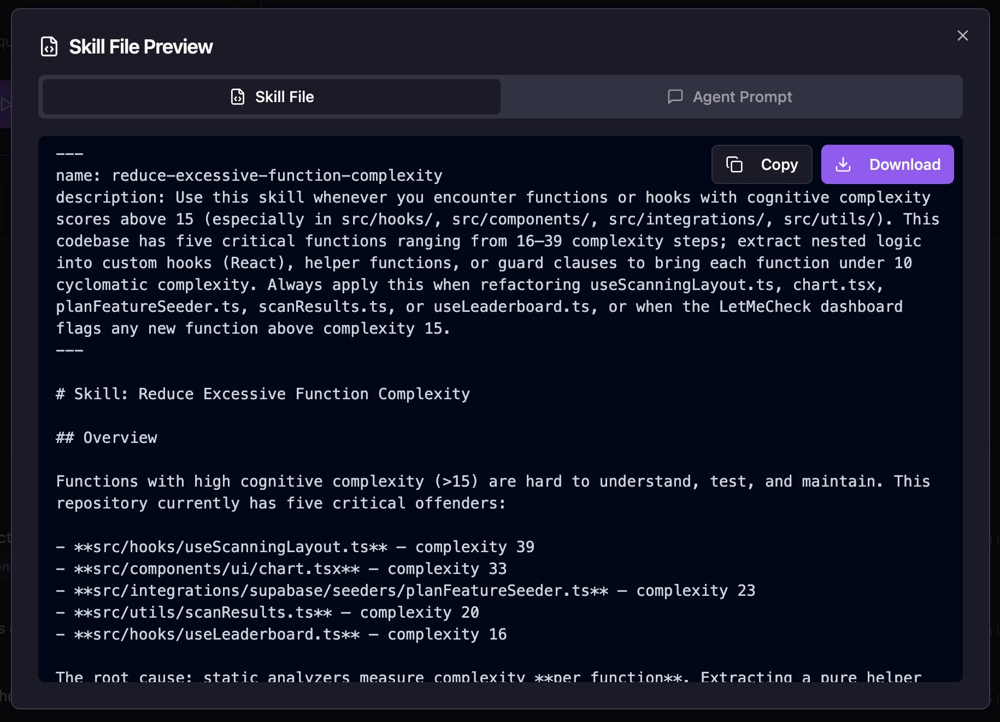

### 🎬 관련 영상
- [🎥 영상 보기](https://ph-files.imgix.net/e6179ac2-2cc9-4f58-a125-d5f30c7fab0e.jpeg?auto=format)

---

## 25. [valv](https://www.producthunt.com/products/valv)
**Votes**: 13 | **도입 난이도**: 중 | **신뢰도**: 상
**Tagline**: Give AI agents safe, scoped access to your database
**서비스 링크**: https://www.producthunt.com/r/RIFC5JCRBLFPMS

**태그**: DevTool, Security, AI-Agents, Database, Agent, AI Tool

### 📌 이 서비스 한눈에 보기
AI 에이전트에게 사용자별로 격리된 안전한 데이터베이스 접근 권한을 부여하는 보안 솔루션

### 🔑 주요 기능
- 모든 에이전트에게 하나의 관리자 권한을 주는 대신, 사용자별로 독립된 스코프(Scope) 제공
- 프로그래밍 방식으로 설정된 권한에 따라 모든 쿼리를 검증하고 호출자 범위로 제한
- 직접적인 SQL 실행을 방지하여 데이터 유출 및 권한 남용 위험 차단

### 🙋 사용자에게 어떤 점이 좋은가
AI 에이전트가 고객 데이터를 조회할 때 다른 사용자의 정보까지 노출되는 보안 사고를 원천적으로 방지할 수 있습니다.

### ✅ 지금 바로 써볼 기능
- TypeScript 프로젝트에 라이브러리 설치 및 연동 테스트
- 사용자별 권한 정책(Per-user permissions) 설계
- MCP 서버를 통한 기존 AI 에이전트 환경 적용

### ⚠️ 사용 전 확인할 점
- 사용자별 권한 설정 로직이 복잡할 경우 관리 오버헤드 발생 가능
- 라이브러리/서버 도입 시 기존 DB 아키텍처와의 호환성 확인 필요

### 🧭 확인이 더 필요한 정보
지원하는 데이터베이스 종류와 구체적인 성능 오버헤드에 대한 정보가 명시되지 않았습니다.

### 📸 스크린샷 및 갤러리
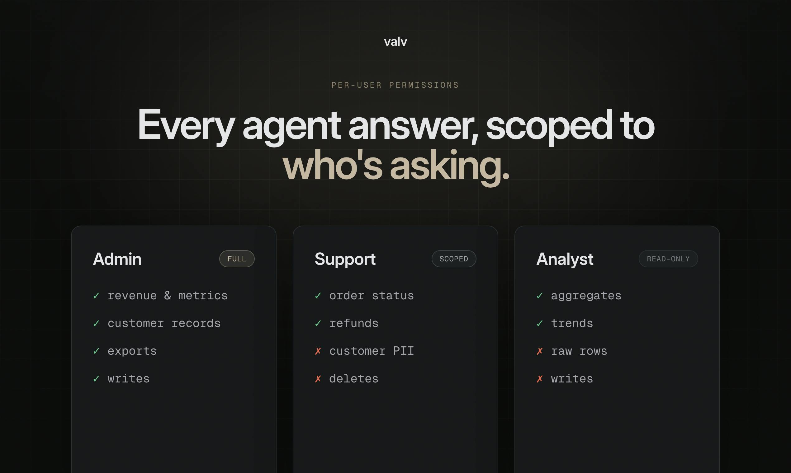
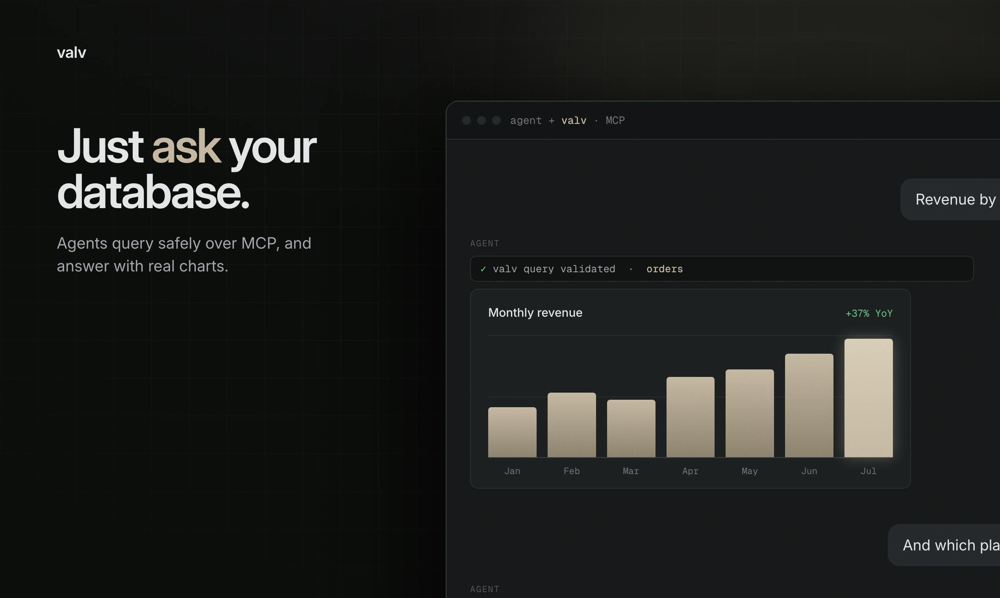
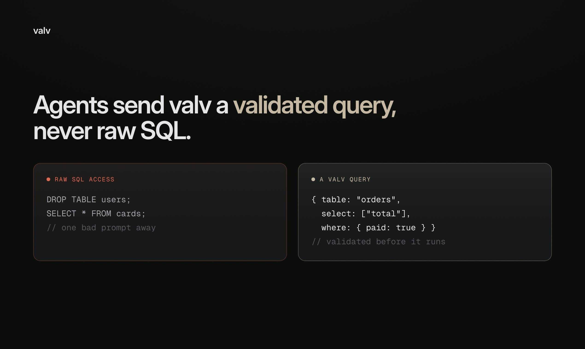

### 🎬 관련 영상
- [🎥 영상 보기](https://ph-files.imgix.net/269d035a-17d3-4024-90d3-05cfe6d2ee65.jpeg?auto=format)

---

## 26. [FeatLens](https://www.producthunt.com/products/featlens)
**Votes**: 12 | **도입 난이도**: 하 | **신뢰도**: 상
**Tagline**: Visualize feature maps from any vision model effortlessly.
**서비스 링크**: https://www.producthunt.com/r/F4RIBNSR5LCQUX

**태그**: AI, ComputerVision, DevTool, Visualization

### 📌 이 서비스 한눈에 보기
어떤 비전 모델이든 레이어별 특징 맵을 손쉽게 시각화하는 도구

### 🔑 주요 기능
- 모델에 구애받지 않는 범용적인 특징 맵 시각화 지원
- PCA-to-RGB 방식을 통한 직관적인 특징 맵 구현
- 모델 내 모든 레이어에 대한 시각화 가능

### 🙋 사용자에게 어떤 점이 좋은가
딥러닝 모델의 내부 동작을 시각적으로 확인하여 모델의 특징 추출 성능을 직관적으로 분석할 수 있습니다.

### ✅ 지금 바로 써볼 기능
- 사용 중인 비전 모델에 적용하여 레이어별 특징 확인
- PCA-to-RGB 시각화 결과 분석
- 모델의 특정 레이어가 정보를 어떻게 추출하는지 검증

### ⚠️ 사용 전 확인할 점
- 시각화 방식(PCA)에 따른 해석의 주관성 유의
- 모델 아키텍처에 따른 시각화 결과의 차이 존재

### 🧭 확인이 더 필요한 정보
구체적인 설치 방법이나 지원하는 프레임워크(PyTorch, TensorFlow 등)의 범위는 명시되지 않았습니다.

### 📸 스크린샷 및 갤러리
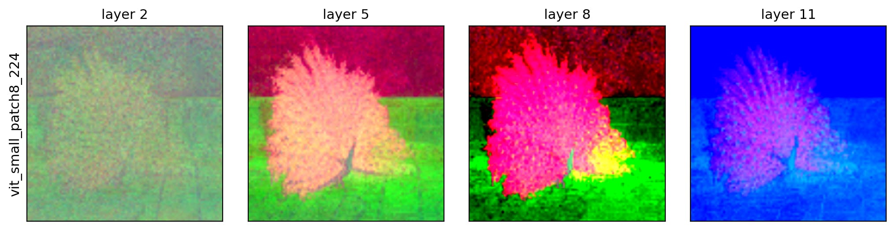
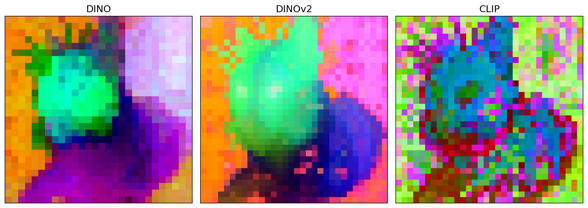
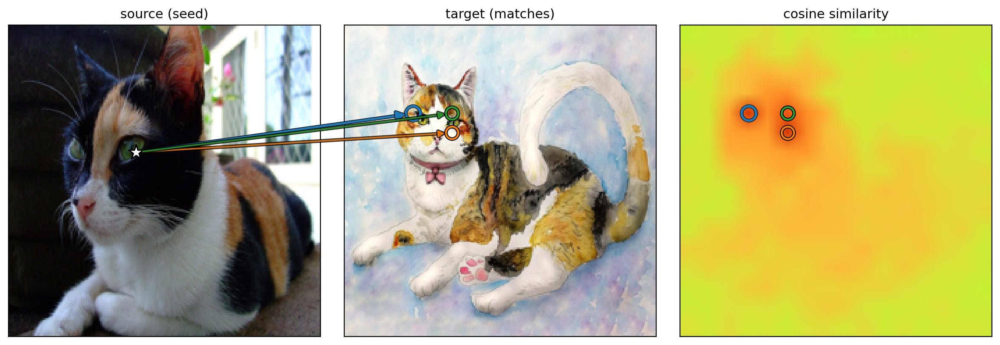

---

## 27. [OpenWiki ](https://www.producthunt.com/products/openwiki)
**Votes**: 12 | **도입 난이도**: 하 | **신뢰도**: 상
**Tagline**: Writes and updates automatically documentation for AI agent
**서비스 링크**: https://www.producthunt.com/r/3TBM4RSPLUI45T

**태그**: DevTool, Automation, AI, CLI, Agent, AI Tool

### 📌 이 서비스 한눈에 보기
AI 에이전트를 위한 코드베이스 문서 자동 생성 및 유지관리 CLI 도구

### 🔑 주요 기능
- 코드베이스 기반의 에이전트용 문서 자동 작성
- CLI 환경을 통한 간편한 문서 업데이트
- AI 에이전트 운영에 최적화된 리소스 관리

### 🙋 사용자에게 어떤 점이 좋은가
개발자가 수동으로 문서를 작성하고 업데이트하는 번거로움을 줄여주며, AI 에이전트가 항상 최신 코드 정보를 참조할 수 있도록 돕습니다.

### ✅ 지금 바로 써볼 기능
- CLI 설치 및 로컬 환경 설정
- 기존 코드베이스 연결 및 문서 생성 테스트
- 자동 업데이트 워크플로우 확인

### ⚠️ 사용 전 확인할 점
- CLI 도구이므로 터미널 환경 숙련도 필요
- 코드 변경 사항에 따른 문서 정확도 검증 필요

### 🧭 확인이 더 필요한 정보
지원하는 프로그래밍 언어의 범위와 문서 생성 알고리즘의 상세 방식에 대한 정보가 추가로 필요합니다.

### 📸 스크린샷 및 갤러리
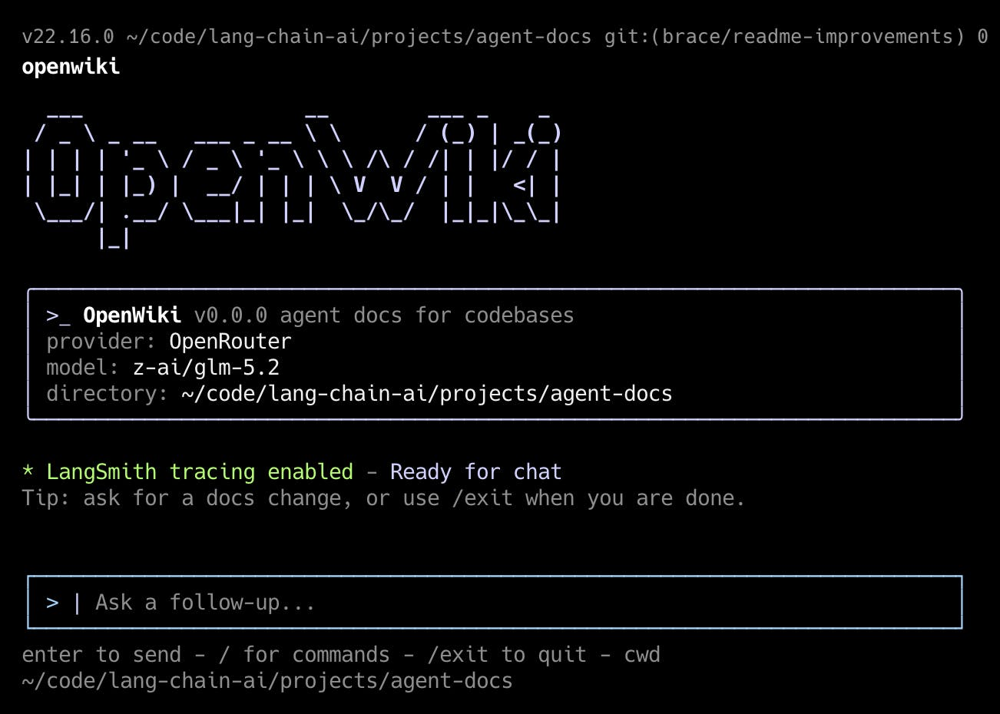
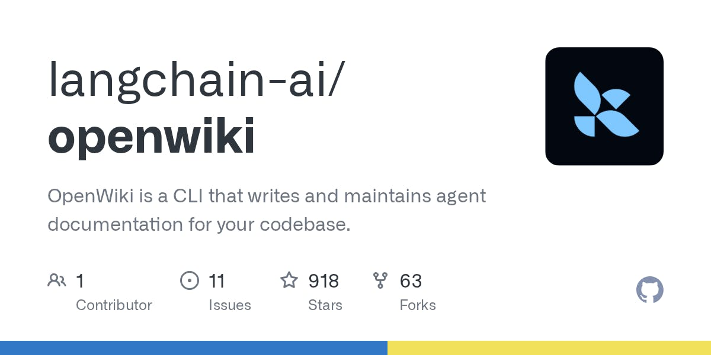

---

## 28. [WRUD](https://www.producthunt.com/products/wrud)
**Votes**: 12 | **도입 난이도**: 하 | **신뢰도**: 상
**Tagline**: See what your AI agents did - and where they overpaid
**서비스 링크**: https://www.producthunt.com/r/CF6VI6OEY2J3NT

**태그**: DevTool, AI-Agent, Cost-Optimization, OpenSource, CLI, Agent, AI Tool

### 📌 이 서비스 한눈에 보기
AI 에이전트의 작업 내역과 토큰 낭비를 추적하여 비용을 최적화하는 오픈소스 CLI 도구

### 🔑 주요 기능
- AI 에이전트의 세션별 작업(도구 사용, 파일, 모델, 토큰) 기록
- 프론티어 모델의 불필요한 작업(trivial work)을 감지하여 비용 최적화 제안
- 로컬 SQLite 기반 저장으로 데이터 보안 및 프라이버시 강화

### 🙋 사용자에게 어떤 점이 좋은가
AI 에이전트 사용 시 발생하는 불필요한 토큰 소모를 시각화하여, 어떤 작업에 과도한 비용이 지불되고 있는지 명확히 파악할 수 있습니다.

### ✅ 지금 바로 써볼 기능
- npx @wrud/cli 명령어로 즉시 설치 및 실행
- Claude Code 또는 Cursor 환경에 연동하여 작업 로그 확인
- 에이전트 세션 기록을 통해 모델 크기 조정(right-sizing) 검토

### ⚠️ 사용 전 확인할 점
- CLI 기반 도구이므로 터미널 환경 숙련도 필요
- 로컬 저장 방식이므로 데이터 백업 및 관리는 사용자 책임

### 🧭 확인이 더 필요한 정보
SDK를 통한 커스텀 에이전트 연동 시 구체적인 구현 난이도와 지원 범위는 확인이 필요합니다.

### 📸 스크린샷 및 갤러리
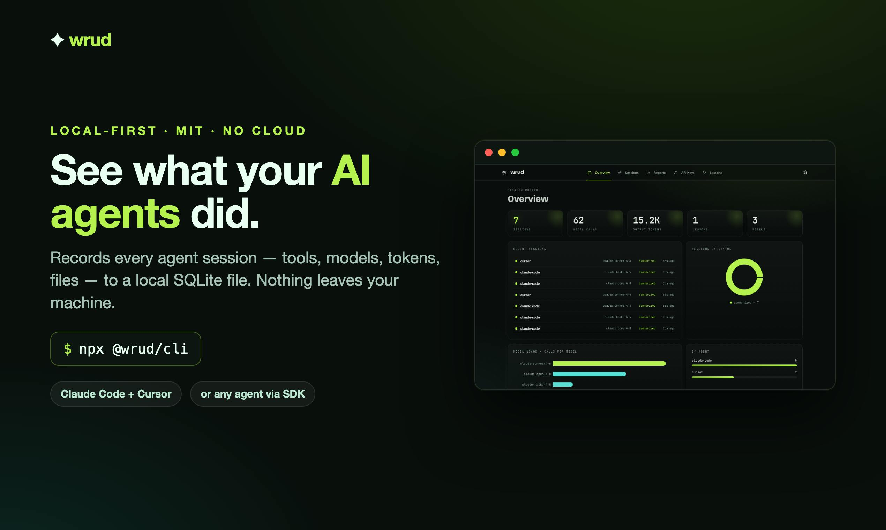
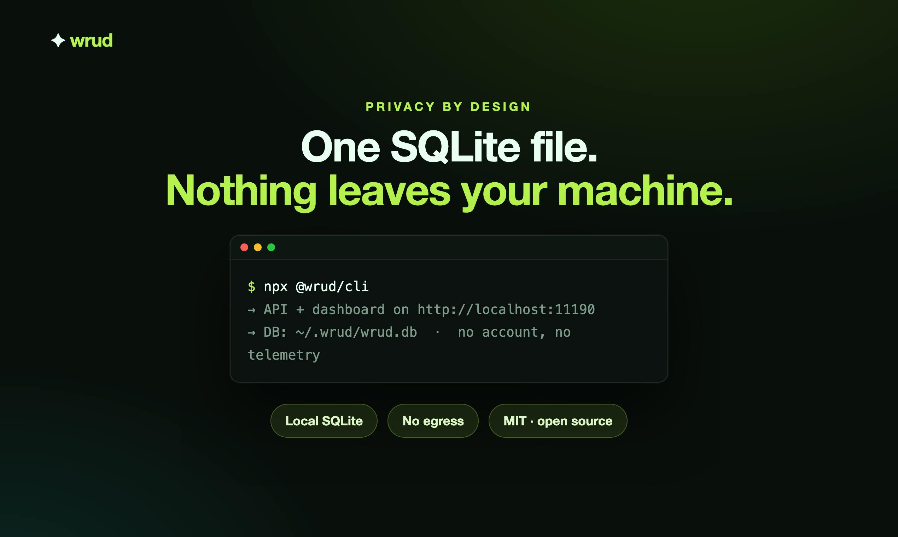
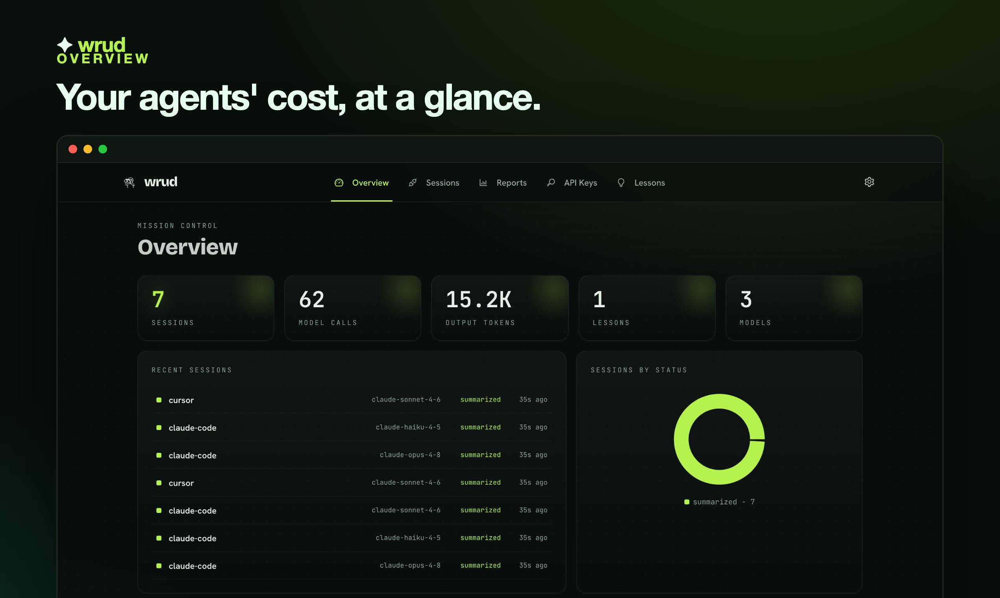

---

## 29. [Ratit](https://www.producthunt.com/products/ratit)
**Votes**: 11 | **도입 난이도**: 하 | **신뢰도**: 상
**Tagline**: Ratit: just post it, the community rates it 1–5   stars.
**서비스 링크**: https://www.producthunt.com/r/XS6H3FN4YN2CU5

**태그**: Community, Content Creation, Social Platform, Feedback

### 📌 이 서비스 한눈에 보기
단순한 '좋아요'를 넘어 콘텐츠의 진정한 가치를 5점 만점 별점으로 평가받는 커뮤니티 플랫폼

### 🔑 주요 기능
- 단순 클릭형 '좋아요'가 아닌 1~5점 사이의 구체적인 별점 시스템
- 팔로워 수 경쟁이 아닌 콘텐츠 품질 중심의 리더보드 운영
- 익명 기반의 솔직한 피드백과 콘텐츠 영감 제공

### 🙋 사용자에게 어떤 점이 좋은가
자신의 콘텐츠가 가진 실제 가치를 객관적인 수치로 확인하고, 팔로워 수에 구애받지 않는 진정한 인정을 받을 수 있습니다.

### ✅ 지금 바로 써볼 기능
- 자신의 콘텐츠 게시하기
- 다른 사용자의 포스트에 솔직한 별점 남기기
- 리더보드에서 상위 콘텐츠 탐색하기

### ⚠️ 사용 전 확인할 점
- 익명 기반 평가로 인한 주관적이고 편향된 점수 가능성
- 초기 커뮤니티 규모에 따른 피드백 양의 변동성

### 🧭 확인이 더 필요한 정보
현재 서비스의 구체적인 콘텐츠 카테고리(글, 이미지, 영상 등)와 지원 형식이 명시되지 않았습니다.

### 📸 스크린샷 및 갤러리

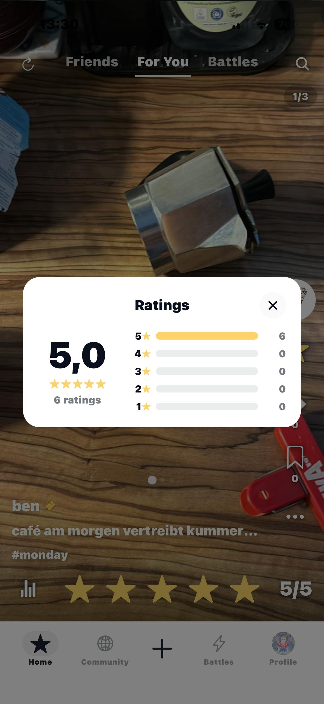

---

## 30. [SaaS Dummies](https://www.producthunt.com/products/saas-dummies-2)
**Votes**: 11 | **도입 난이도**: 하 | **신뢰도**: 상
**Tagline**: AI testers browse your app like humans & report what breaks!
**서비스 링크**: https://www.producthunt.com/r/RPLTZ752GCITBQ

**태그**: QA, AI, Automation, Testing, SaaS, AI Tool, Video

### 📌 이 서비스 한눈에 보기
AI 테스터가 실제 사용자처럼 앱을 탐색하며 버그를 찾아내는 자동화 QA 솔루션

### 🔑 주요 기능
- 인격(Personality)을 가진 AI 테스터의 실제 사용자 방식 브라우징
- 다양한 디바이스 환경에서의 교차 테스트 지원
- 우선순위가 지정된 리포트, 세션 영상, 스크린샷 제공

### 🙋 사용자에게 어떤 점이 좋은가
수동 QA 작업 시간을 획기적으로 줄이면서, 실제 사용자가 겪을 수 있는 예기치 못한 오류를 사전에 발견할 수 있습니다.

### ✅ 지금 바로 써볼 기능
- AI 테스터의 탐색 시나리오 설정하기
- 발견된 버그의 우선순위 및 세션 영상 확인하기
- 팀 공유용 리포트 생성 및 배포하기

### ⚠️ 사용 전 확인할 점
- AI의 탐색 방식이 실제 복잡한 비즈니스 로직을 완벽히 이해하는지 검증 필요
- 테스트 결과에 대한 최종적인 인간 검토 과정 필요

### 🧭 확인이 더 필요한 정보
지원 가능한 구체적인 디바이스 종류와 플랫폼 범위에 대한 정보가 추가로 필요합니다.

### 📸 스크린샷 및 갤러리
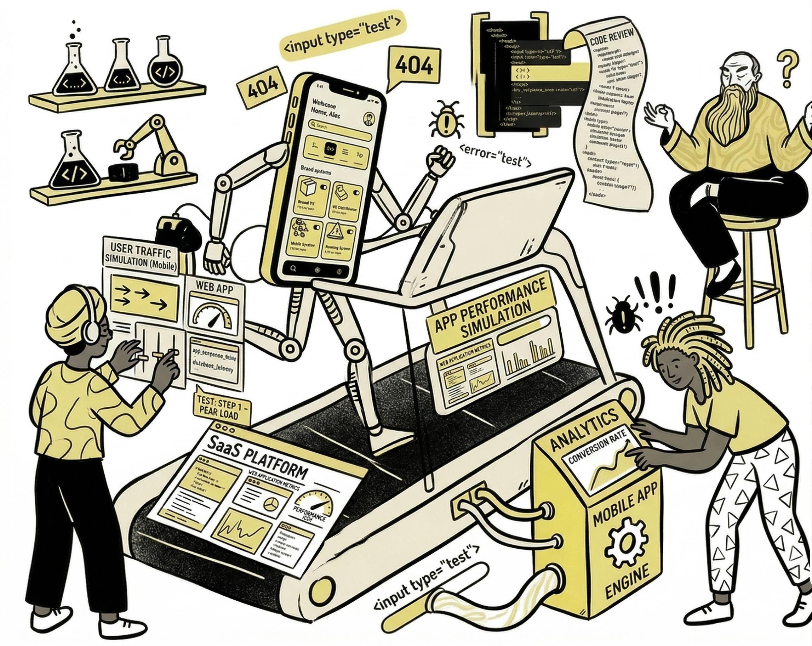
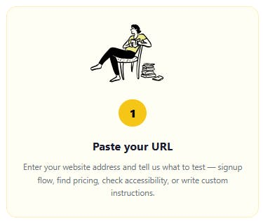
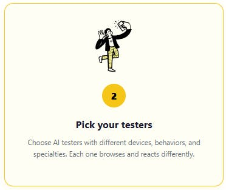

### 🎬 관련 영상
- [🎥 영상 보기](https://ph-files.imgix.net/055d3608-df30-46e9-a0c4-50afedc0df64.jpeg?auto=format)

---

