# 🚀 Product Hunt Daily Top 30 (2026-07-05)

## 오늘의 요약
오늘의 트렌드는 단순한 AI 도구를 넘어, 사용자의 작업 패턴을 학습하거나 에이전트 간의 협업을 지원하는 지능형 자동화 솔루션이 주를 이루었습니다. 또한, 복잡한 관리 업무를 자동화하거나 추상적인 AI의 작업 과정을 시각화하는 등 실무 생산성을 극대화하는 방향으로 제품들이 출시되었습니다.

### 오늘의 핵심 포인트
- 사용자의 습관을 학습하여 선제적으로 업무를 처리하는 개인화된 AI 비서와 자동화 도구가 주목받았습니다.
- 이메일 스캔을 통한 구독 관리나 브라우저 기반의 데이터 보안 검사 등 실용적이고 즉각적인 문제 해결형 서비스가 등장했습니다.
- AI 에이전트의 작업 과정을 3D로 시각화하거나 가상 오피스 환경을 구축하는 등 AI와 인간의 협업 방식이 고도화되고 있습니다.

**오늘의 태그**: AI 에이전트, 생산성 자동화, 워크플로우 최적화, 스마트 관리

## 1. [Vida](https://www.producthunt.com/products/vida-5)
**Votes**: 299 | **도입 난이도**: 하 | **신뢰도**: 상
**Tagline**: Clone yourself. Let AI do the work before you ask
**서비스 링크**: https://www.producthunt.com/r/NK4KBFW256NNE2

**태그**: AI, Automation, Productivity, PersonalAssistant, AI Tool, Prompting

### 📌 이 서비스 한눈에 보기
사용자의 업무 방식과 습관을 학습하여 알아서 업무를 처리하는 AI 개인 비서

### 🔑 주요 기능
- 사용자의 작업 패턴과 프로젝트 맥락을 학습하는 개인화된 AI
- 요청하기 전에 미리 배경에서 반복 업무를 처리하는 자동화 기능
- 답장, 프롬프트 작성, 이력서 관리 등 실무 중심의 초기 유즈케이스 제공

### 🙋 사용자에게 어떤 점이 좋은가
반복적인 업무를 AI가 미리 처리함으로써 사용자의 인지적 부하를 줄이고 생산성을 극대화할 수 있습니다.

### ✅ 지금 바로 써볼 기능
- Reply Rescue를 통한 이메일/메시지 답장 자동화 경험
- Workspace Cleanup으로 업무 환경 정리 기능 테스트
- Daily Wrap를 통한 하루 업무 요약 확인

### ⚠️ 사용 전 확인할 점
- 사용자의 데이터를 지속적으로 학습하므로 개인정보 및 보안 정책 확인 필요
- AI가 사용자의 의도를 잘못 해석하여 자동 처리할 가능성

### 🧭 확인이 더 필요한 정보
학습된 데이터의 보안 저장 방식과 타 서비스와의 연동 범위에 대한 구체적인 정보가 필요합니다.

### 📸 스크린샷 및 갤러리

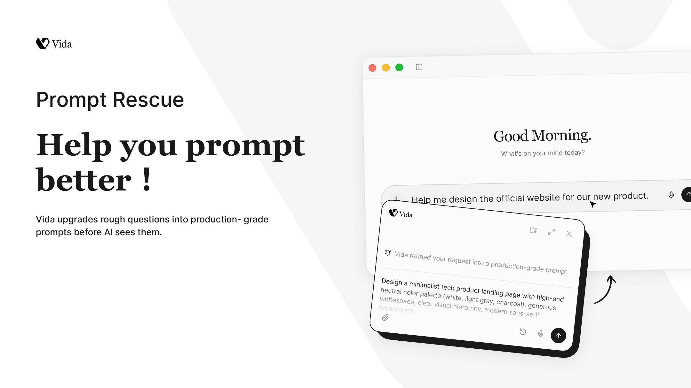

### 🎬 관련 영상
- [🎥 영상 보기](https://ph-files.imgix.net/71dfe98f-298d-40d7-be6a-e9267288f1be.jpeg?auto=format)

---

## 2. [ChecklistFox](https://www.producthunt.com/products/checklistfox)
**Votes**: 200 | **도입 난이도**: 하 | **신뢰도**: 상
**Tagline**: AI checklist maker for beautiful pdfs, free & instant
**서비스 링크**: https://www.producthunt.com/r/USFAL64GSIK5C5

**태그**: AI, Productivity, Design, Planner, AI Tool, Prompting

### 📌 이 서비스 한눈에 보기
AI 프롬프트로 맞춤형 플래너와 체크리스트를 즉시 생성하는 도구

### 🔑 주요 기능
- 프롬프트 입력만으로 맞춤형 체크리스트 생성
- 사용자 취향에 맞는 다양한 테마 제공
- 생성된 결과물을 즉시 아름다운 PDF로 다운로드

### 🙋 사용자에게 어떤 점이 좋은가
결혼, 이사, 육아 등 복잡한 개인적 이벤트에 필요한 체크리스트를 디자인 고민 없이 빠르게 만들 수 있습니다.

### ✅ 지금 바로 써볼 기능
- 원하는 상황을 프롬프트로 입력해보기
- 개인 취향에 맞는 테마 선택하기
- 완성된 PDF 파일 다운로드하기

### ⚠️ 사용 전 확인할 점
- 무료 버전의 경우 기능 제한이나 워터마크 존재 여부 확인 필요
- 복잡한 전문 업무용보다는 개인용 이벤트 플래너에 특화됨

### 🧭 확인이 더 필요한 정보
무료 제공 범위와 PDF 디자인의 커스텀 자유도에 대한 상세 정보가 필요합니다.

### 📸 스크린샷 및 갤러리
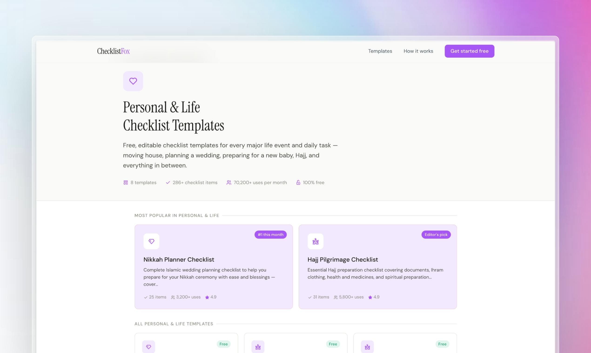
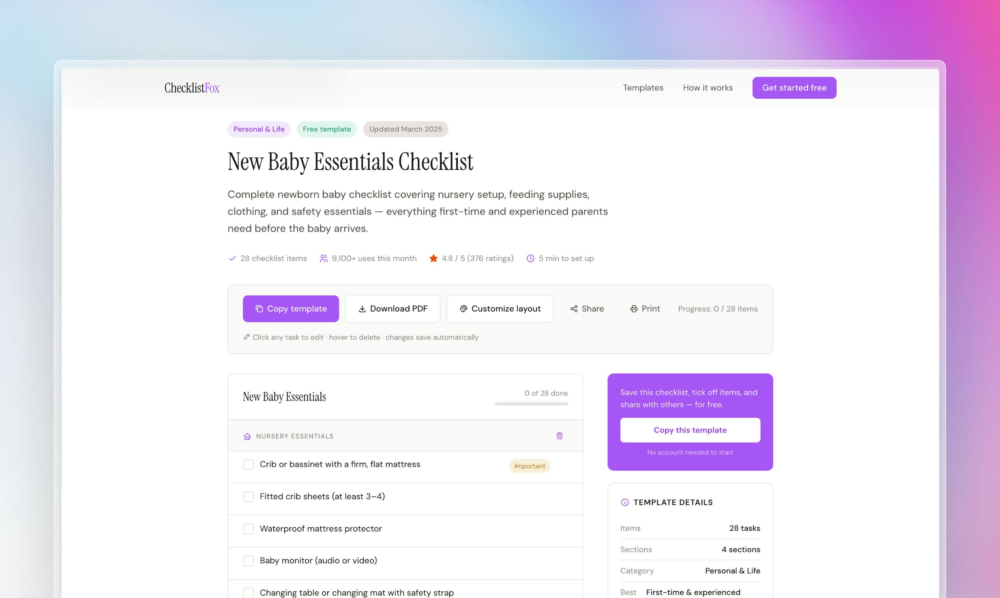
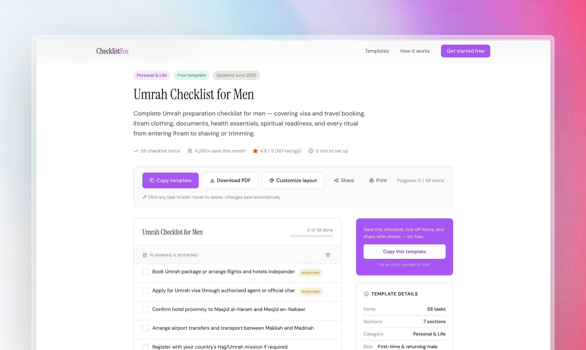

### 🎬 관련 영상
- [🎥 영상 보기](https://ph-files.imgix.net/b94d3385-d4ed-4d92-8ece-02d0fd712426.jpeg?auto=format)

---

## 3. [PhoneDeck](https://www.producthunt.com/products/phonedeck)
**Votes**: 197 | **도입 난이도**: 하 | **신뢰도**: 상
**Tagline**:  Turn your iPhone into a free Mac controller
**서비스 링크**: https://www.producthunt.com/r/7L2MEW5KWZWUUC

**태그**: Productivity, Mac, iOS, Automation, DevTool

### 📌 이 서비스 한눈에 보기
아이폰을 별도의 하드웨어 없이 맥(Mac)용 커스텀 컨트롤러로 변신시켜 주는 앱

### 🔑 주요 기능
- 아이폰을 StreamDeck처럼 활용 가능한 커스텀 컨트롤러로 전환
- 미디어 제어, 앱 실행, 커스텀 버튼 등 다양한 기능 제공
- 하드웨어 구매나 구독료가 없는 무료 솔루션

### 🙋 사용자에게 어떤 점이 좋은가
추가 장비 구매 없이 이미 가지고 있는 아이폰을 활용해 맥 작업 효율을 높일 수 있습니다.

### ✅ 지금 바로 써볼 기능
- 아이폰에 앱 설치 및 맥과의 연결 확인
- 자주 사용하는 앱 실행 버튼 설정
- 미디어 컨트롤 및 커스텀 버튼 구성

### ⚠️ 사용 전 확인할 점
- 아이폰 화면을 계속 켜두어야 하므로 배터리 소모가 발생할 수 있음
- 맥과 아이폰 간의 연결 안정성 확인 필요

### 🧭 확인이 더 필요한 정보
상세한 연결 방식(Wi-Fi 또는 블루투스 등)과 지원되는 구체적인 맥 OS 버전 정보가 명시되지 않았습니다.

### 📸 스크린샷 및 갤러리
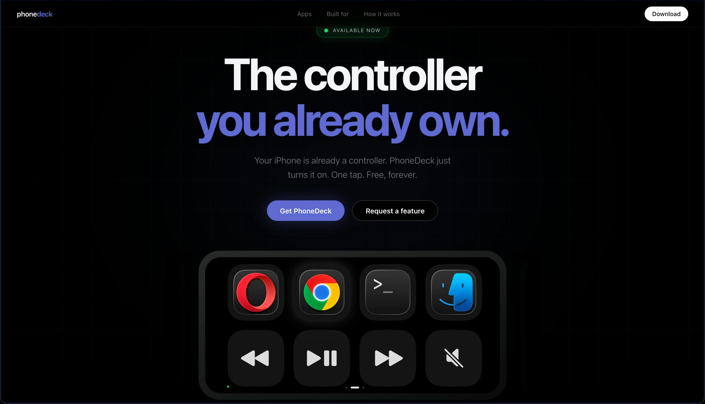
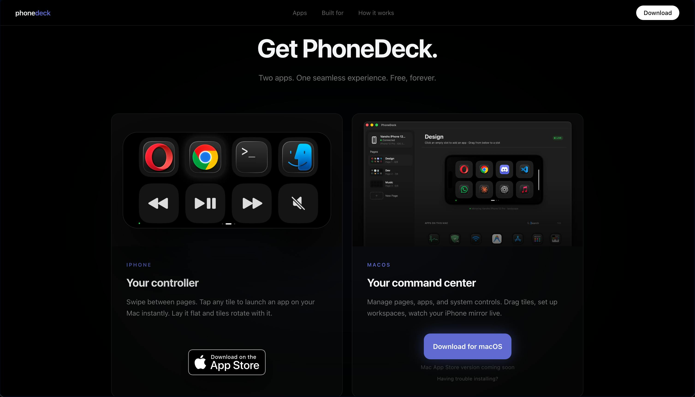
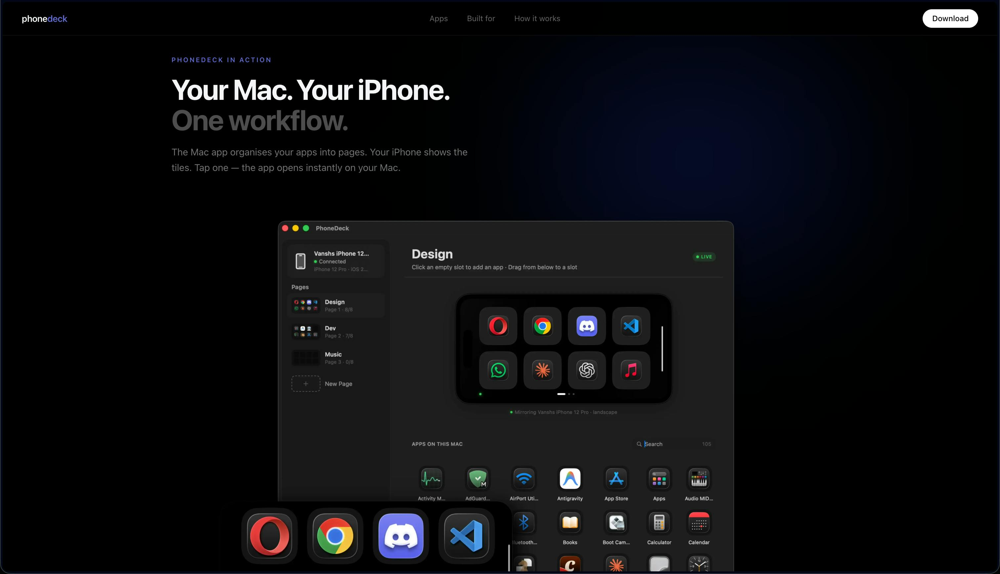

---

## 4. [CentryAI](https://www.producthunt.com/products/centryai)
**Votes**: 169 | **도입 난이도**: 하 | **신뢰도**: 상
**Tagline**: Subscription tracker built by someone who forgot 11 of them
**서비스 링크**: https://www.producthunt.com/r/S6W2K3J2ADWUN2

**태그**: FinTech, Productivity, Subscription Management, Automation, AI Tool, Email

### 📌 이 서비스 한눈에 보기
이메일 스캔을 통해 잊고 있던 구독 서비스를 자동으로 찾아주고 해지를 도와주는 스마트 구독 관리 도구

### 🔑 주요 기능
- Gmail 및 iCloud 스캔을 통한 자동 구독 내역 탐지
- 사용 빈도 기반의 구독 가치 점수 산정
- 원클릭 해지 페이지를 찾아주는 'Cancel Finder' 기능

### 🙋 사용자에게 어떤 점이 좋은가
직접 입력할 필요 없이 이메일 스캔만으로 숨겨진 지출을 찾아내며, 복잡한 해지 절차를 간소화하여 불필요한 비용 지출을 즉각 막아줍니다.

### ✅ 지금 바로 써볼 기능
- Gmail/iCloud 연동을 통한 구독 내역 자동 스캔
- 사용하지 않는 구독 서비스의 점수 확인
- Cancel Finder를 이용한 즉각적인 구독 해지

### ⚠️ 사용 전 확인할 점
- 이메일 스캔 방식이므로 모든 결제 수단(현금, 특정 카드 등)을 완벽히 커버하는지 확인 필요
- 이메일 접근 권한 부여에 대한 보안 정책 검토 필요

### 🧭 확인이 더 필요한 정보
이메일 스캔 방식이 모든 유형의 정기 결제를 누락 없이 탐지할 수 있는지 확인이 필요합니다.

### 📸 스크린샷 및 갤러리
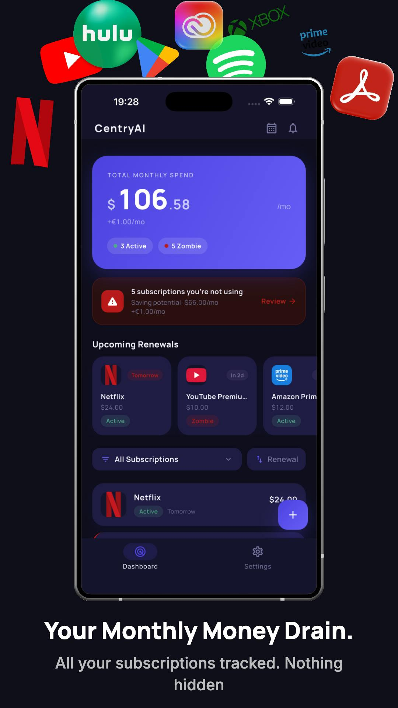
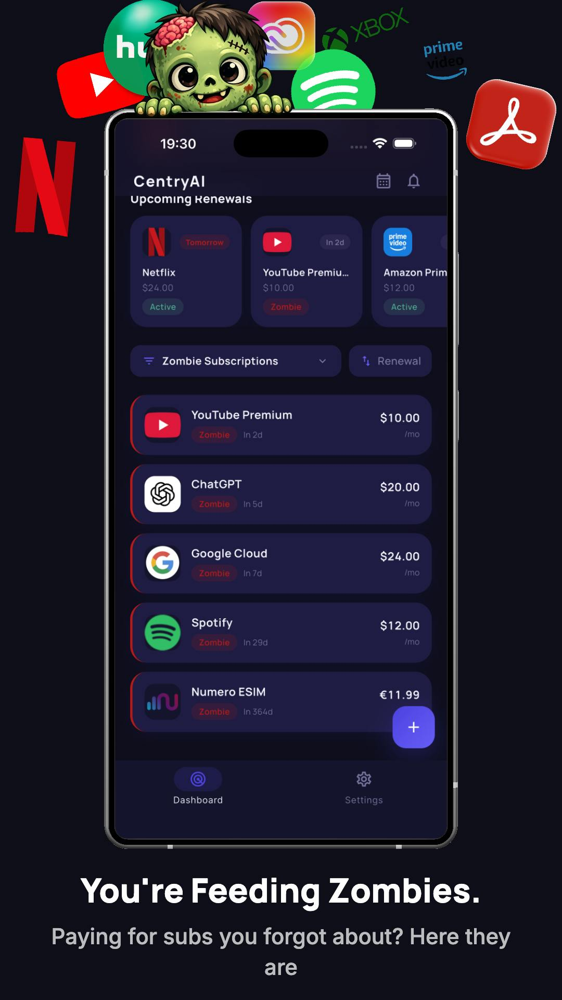
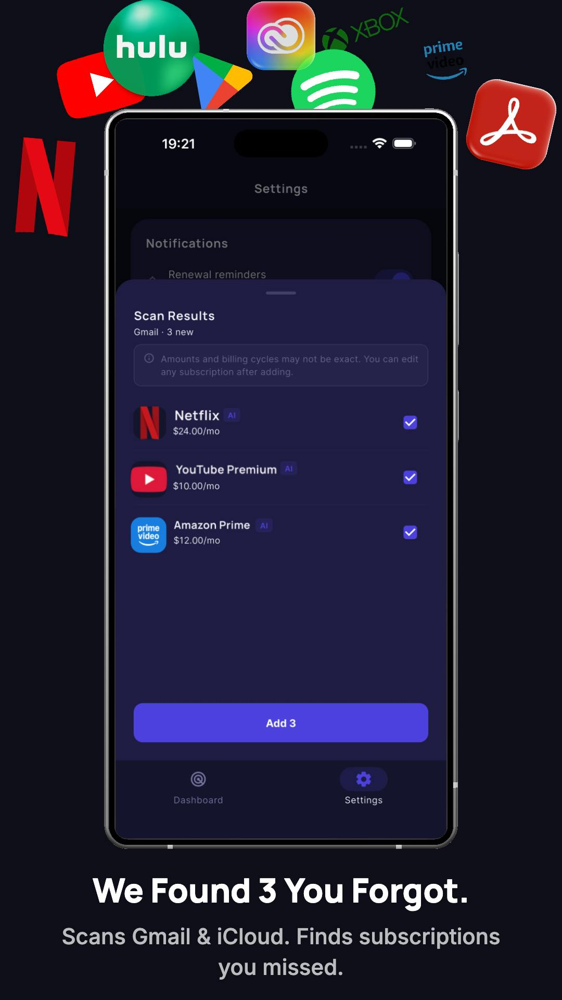

---

## 5. [Termi Protocol](https://www.producthunt.com/products/termi-protocol)
**Votes**: 156 | **도입 난이도**: 중 | **신뢰도**: 상
**Tagline**: Watch your AI coding agents build, live in 3D
**서비스 링크**: https://www.producthunt.com/r/BDTNVXE532I5H6

**태그**: AI-Agent, Visualization, DevTool, 3D-Simulation, Agent, Automation, AI Tool

### 📌 이 서비스 한눈에 보기
AI 코딩 에이전트의 작업 과정을 3D 시뮬레이션으로 시각화하여 생동감 있게 관찰하는 도구

### 🔑 주요 기능
- AI 에이전트의 워크플로우를 3D 환경(책상, 거실 등)으로 시각화
- 에이전트가 코드를 읽고, 쓰고, 명령어를 실행하는 과정을 게임처럼 실시간 관찰
- 사용자는 에이전트를 실행하고, 프로토콜은 그 과정을 시각적 경험으로 변환

### 🙋 사용자에게 어떤 점이 좋은가
추상적인 AI 에이전트의 작업 과정을 직관적인 3D 환경에서 모니터링함으로써 작업 흐름을 더 생생하고 명확하게 파악할 수 있습니다.

### ✅ 지금 바로 써볼 기능
- 에이전트 워크플로우 설정 및 실행
- 3D 시뮬레이션 환경 내 실시간 작업 모니터링
- 에이전트의 명령 실행 및 코드 수정 과정 관찰

### ⚠️ 사용 전 확인할 점
- 시각화에 집중된 도구이므로 실제 에이전트의 성능이나 코드 품질 자체를 개선하는 기능은 별도로 확인 필요
- 3D 렌더링으로 인한 시스템 리소스 사용량 확인 필요

### 🧭 확인이 더 필요한 정보
현재 제공되는 에이전트 엔진과의 연동 방식 및 지원되는 프로그래밍 언어 범위에 대한 정보가 부족합니다.

### 📸 스크린샷 및 갤러리
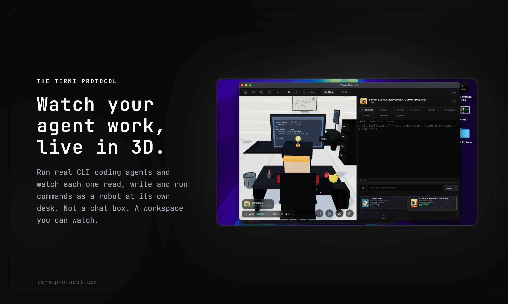
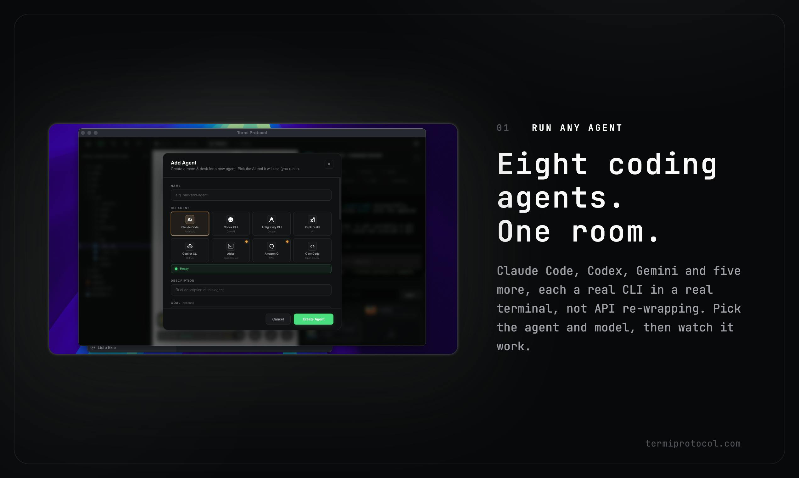
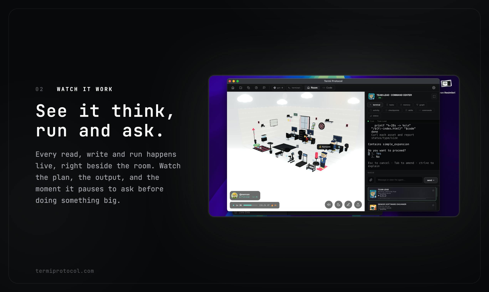

### 🎬 관련 영상
- [🎥 영상 보기](https://ph-files.imgix.net/a7fd3261-7251-46c1-91e5-7909501ac1ff.jpeg?auto=format)

---

## 6. [ShotLab](https://www.producthunt.com/products/shotlab)
**Votes**: 37 | **도입 난이도**: 하 | **신뢰도**: 상
**Tagline**: Turn boring screenshots into scroll-stopping content!
**서비스 링크**: https://www.producthunt.com/r/Y3L6IGHPEJ6VZB

**태그**: DesignTool, ContentCreation, Marketing, Screenshot

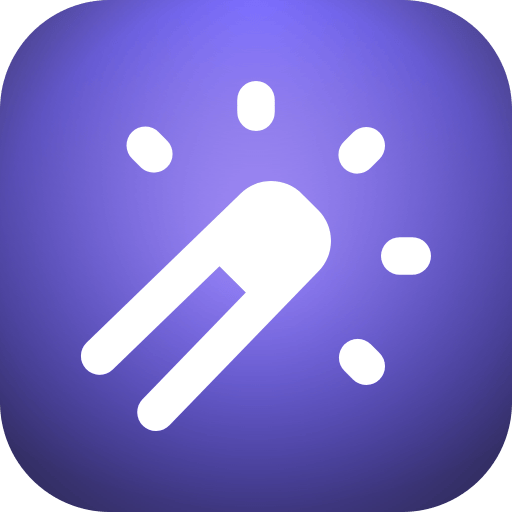

### 📌 이 서비스 한눈에 보기
평범한 스크린샷을 시선을 사로잡는 고퀄리티 콘텐츠로 변신시켜 주는 디자인 에디터

### 🔑 주요 기능
- 아름다운 배경 및 사실적인 프레임 추가 기능
- 스티커와 주석을 활용한 직관적인 편집 도구
- SNS 및 제품 홍보를 위한 시각적 콘텐츠 제작 최적화

### 🙋 사용자에게 어떤 점이 좋은가
디자인 기술이 없어도 스크린샷을 전문적인 홍보용 이미지로 빠르게 변환하여 콘텐츠의 주목도를 높일 수 있습니다.

### ✅ 지금 바로 써볼 기능
- 스크린샷에 세련된 배경 적용해보기
- 강조하고 싶은 부분에 주석 및 스티커 추가하기
- 완성된 이미지를 SNS에 바로 공유하기

### ⚠️ 사용 전 확인할 점
- 상세한 편집 기능의 범위나 유료 플랜 여부는 미기재됨
- 고해상도 출력 지원 여부 확인 필요

### 🧭 확인이 더 필요한 정보
구체적인 가격 정책과 고급 편집 기능의 포함 여부를 확인해야 합니다.

### 📸 스크린샷 및 갤러리
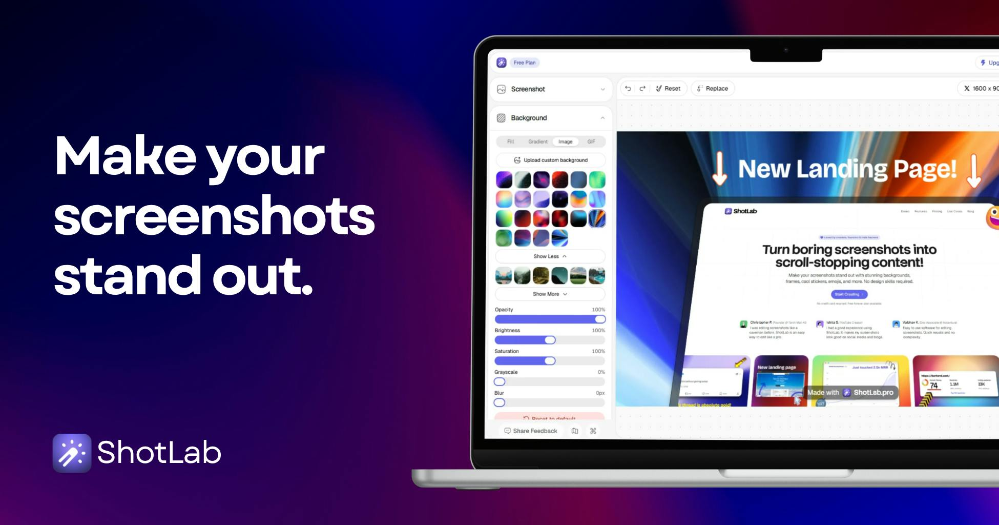
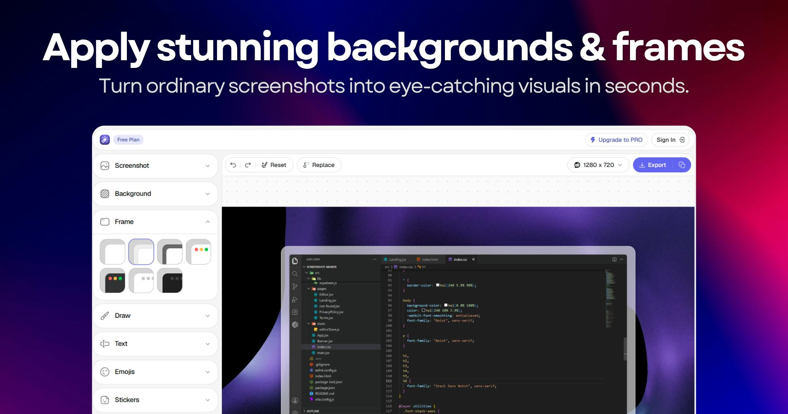
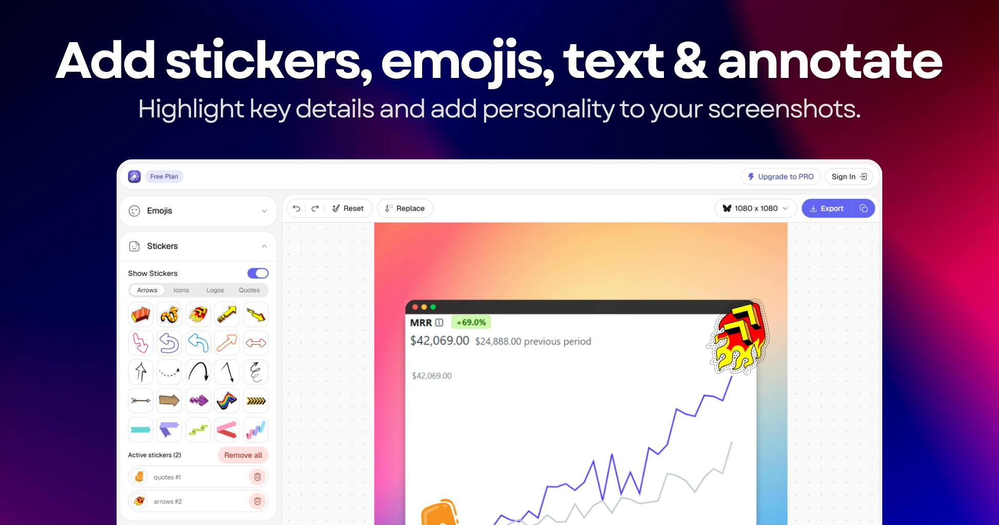

### 🎬 관련 영상
- [🎥 영상 보기](https://ph-files.imgix.net/eed4e8a0-3e13-4d8e-8732-b6eb07b46d97.jpeg?auto=format)

---

## 7. [Qik Office](https://www.producthunt.com/products/qik-office)
**Votes**: 24 | **도입 난이도**: 하 | **신뢰도**: 상
**Tagline**: AI Office that deploys AI managers across agentic rooms
**서비스 링크**: https://www.producthunt.com/r/TX7NZFLH2JSMPJ

**태그**: AI, Productivity, Automation, ProjectManagement, Agent, AI Tool

### 📌 이 서비스 한눈에 보기
무제한 AI 매니저와 어시스턴트가 협업하는 지능형 가상 오피스

### 🔑 주요 기능
- Agentic Rooms를 통한 인간과 AI 에이전트 간의 공유 작업 환경 제공
- 회의록 작성, 리서치, 일정 관리, 작업 자동 할당 등 프로젝트 관리 전반 지원
- 개인부터 기업까지 생산성을 2배로 높이는 자동화 워크플로우

### 🙋 사용자에게 어떤 점이 좋은가
반복적인 관리 업무와 프로젝트 운영 업무를 AI 에이전트에게 위임하여 핵심 업무에만 집중할 수 있습니다.

### ✅ 지금 바로 써볼 기능
- Agentic Room을 생성하여 AI 에이전트 배치하기
- 회의록 작성 및 작업 자동 할당 기능 테스트하기
- 프로젝트 계획 및 리서치 자동화 실행하기

### ⚠️ 사용 전 확인할 점
- 에이전트 크레딧 정책에 따른 사용 제한 가능성
- AI가 자동 할당한 작업의 정확성 검토 필요

### 🧭 확인이 더 필요한 정보
무제한 에이전트 배포 시 발생하는 구체적인 크레딧 소모 방식과 비용 구조 확인이 필요합니다.

### 📸 스크린샷 및 갤러리
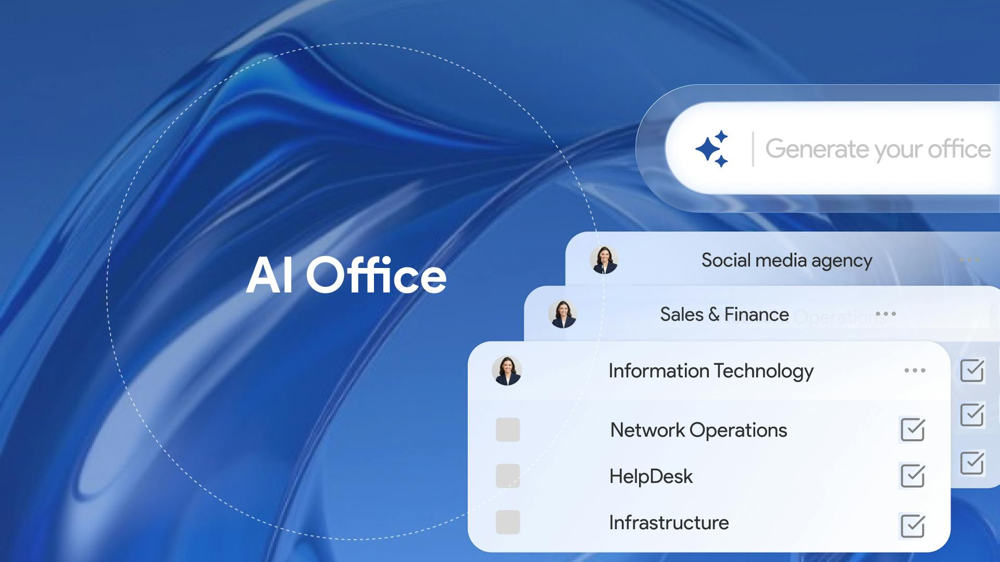
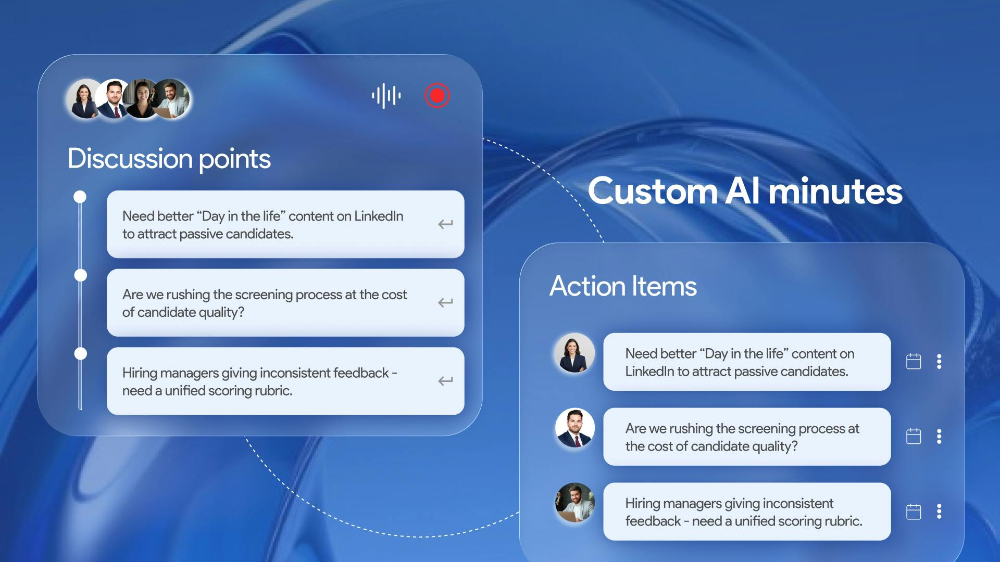

### 🎬 관련 영상
- [🎥 영상 보기](https://ph-files.imgix.net/33d47f4d-1793-4bee-b346-c7b7651b3431.jpeg?auto=format)

---

## 8. [List Detective: Free Email List Checker](https://www.producthunt.com/products/list-detective-free-email-list-checker)
**Votes**: 22 | **도입 난이도**: 하 | **신뢰도**: 상
**Tagline**: Find out what's wrong with your email list. 100% Free.
**서비스 링크**: https://www.producthunt.com/r/7XDPM6P5XPLYDR

**태그**: MarketingTool, Privacy, EmailMarketing, DataValidation, AI Tool, Email

### 📌 이 서비스 한눈에 보기
브라우저 기반의 개인정보 보호 중심 무료 이메일 리스트 검사 도구

### 🔑 주요 기능
- 최대 10만 개의 이메일 주소 검사 가능
- 서버로 데이터가 전송되지 않는 브라우저 기반 로컬 실행 방식
- 이메일 도달률 및 발신자 평판 관리를 위한 문제점 식별

### 🙋 사용자에게 어떤 점이 좋은가
데이터 유출 걱정 없이 대규모 이메일 리스트의 오류를 즉각적으로 확인하여 발신자 평판을 보호할 수 있습니다.

### ✅ 지금 바로 써볼 기능
- 사이트 내 제공되는 샘플 데이터로 기능 테스트하기
- 보유 중인 이메일 리스트 업로드하여 문제점 확인하기

### ⚠️ 사용 전 확인할 점
- 브라우저 리소스 사용량에 따른 대용량 파일 처리 성능 확인 필요
- 로컬 실행 방식이므로 브라우저 환경에 따른 기능 제한 가능성

### 🧭 확인이 더 필요한 정보
대규모 리스트 처리 시 브라우저 성능 저하나 중단 여부에 대한 구체적인 정보가 필요합니다.

### 📸 스크린샷 및 갤러리
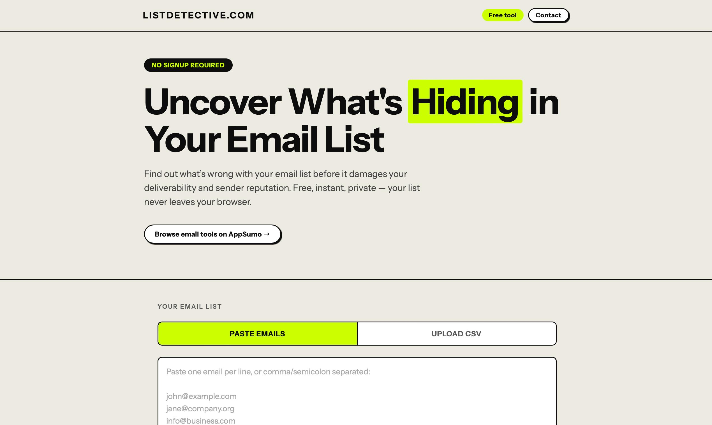
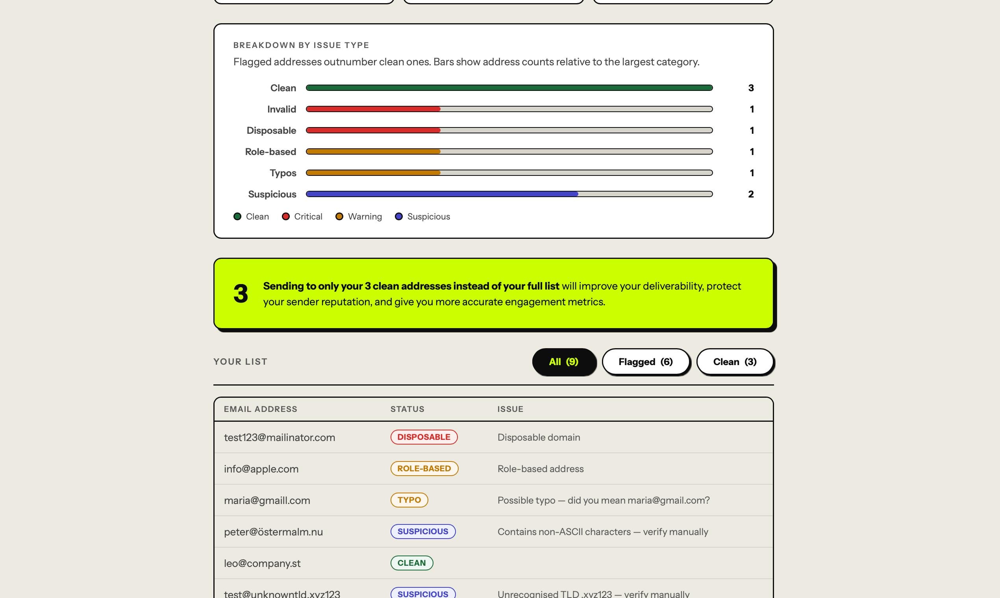

---

## 9. [TubeMailer](https://www.producthunt.com/products/tubemailer)
**Votes**: 17 | **도입 난이도**: 하 | **신뢰도**: 상
**Tagline**: Find & export YouTube creator emails in bulk
**서비스 링크**: https://www.producthunt.com/r/ZRCMLY6GYJ7GNB

**태그**: Marketing, Automation, ChromeExtension, LeadGeneration, AI Tool, API, Email

### 📌 이 서비스 한눈에 보기
유튜브 크리에이터의 비즈니스 이메일을 대량으로 검색하고 추출하는 크롬 확장 프로그램

### 🔑 주요 기능
- 유튜브 채널 정보 및 연결된 사이트를 탐색하여 비즈니스 이메일 자동 발굴
- CSV, Excel, JSON 형식의 깔끔한 데이터 리스트 내보내기 지원
- API 키나 별도의 잠금 해제 비용 없이 브라우저에서 직접 실행

### 🙋 사용자에게 어떤 점이 좋은가
마케터나 에이전시가 특정 니치 분야의 크리에이터들에게 협업 제안을 하기 위한 연락처 리스트를 빠르게 구축할 수 있습니다.

### ✅ 지금 바로 써볼 기능
- 관심 있는 니치 키워드로 크리에이터 검색하기
- 추출된 이메일 리스트를 CSV로 내보내기
- 무료 플랜으로 일일 추출 한도 확인하기

### ⚠️ 사용 전 확인할 점
- 하루 최대 1,000개로 제한된 이메일 추출 한도
- 유튜브 페이지 내 정보가 없는 경우 이메일 확보가 어려울 수 있음

### 🧭 확인이 더 필요한 정보
무료 플랜의 구체적인 기능 제한 범위와 유료 플랜 전환 시의 혜택에 대한 상세 정보가 필요합니다.

### 📸 스크린샷 및 갤러리
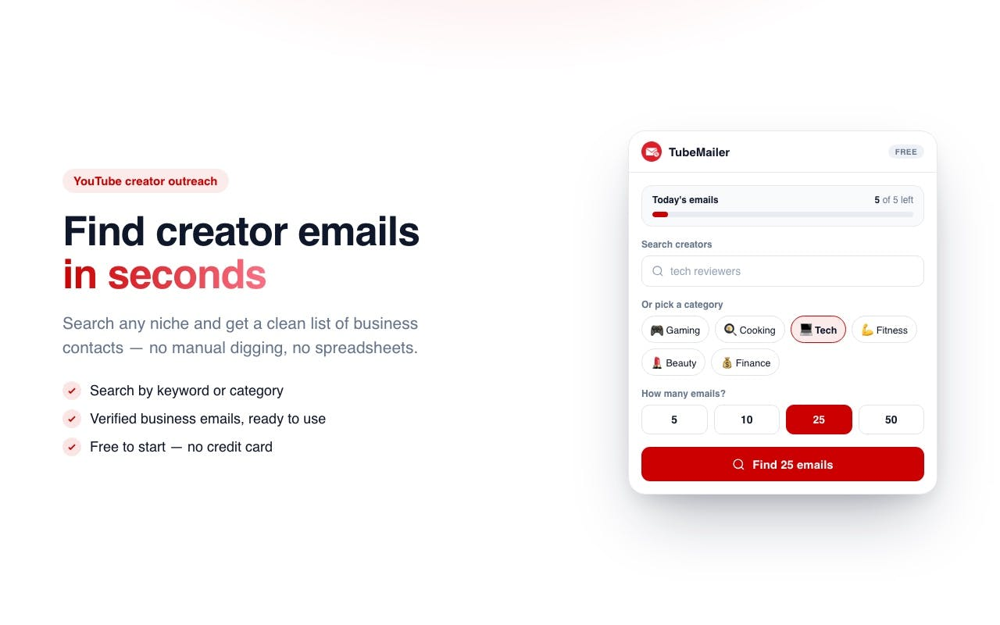
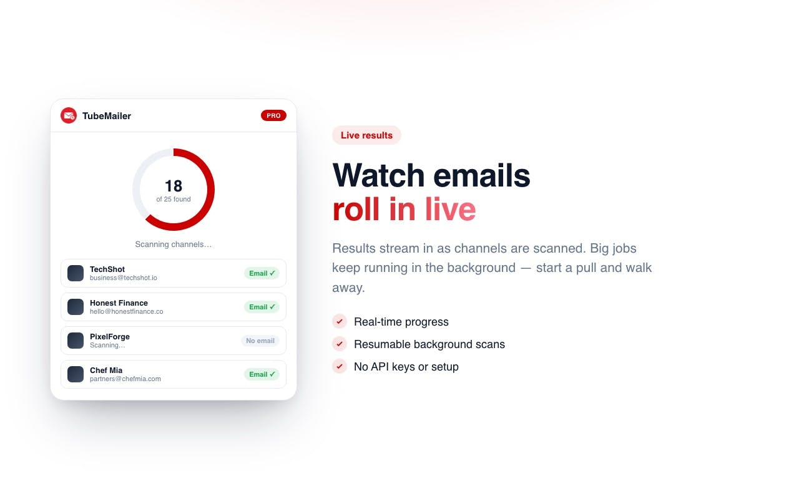
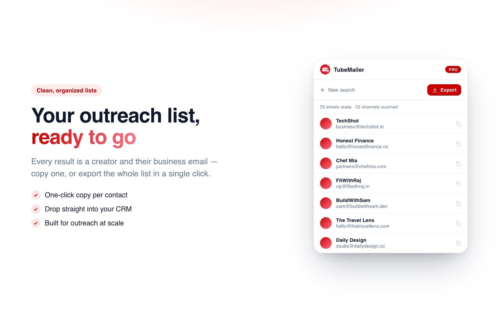

---

## 10. [Salestrics AI-Native Email Beta](https://www.producthunt.com/products/salestrics)
**Votes**: 16 | **도입 난이도**: 중 | **신뢰도**: 상
**Tagline**: Stop paying the SaaS tax. One database. Zero fragmentation. 
**서비스 링크**: https://www.producthunt.com/r/2RH34RERNJ4UP2
**재등장**: 최근 7일 내 재등장 (마지막 등장 5일 전)

**태그**: SaaS, CRM, AI, Productivity, Communication, AI Tool, Video, Sales, Email

### 📌 이 서비스 한눈에 보기
CRM, 서비스 데스크, 이메일을 하나의 데이터베이스로 통합한 AI 기반 엔터프라이즈 커뮤니케이션 엔진

### 🔑 주요 기능
- CRM, 서비스 데스크, 화상 통화, 문서 도구가 통합된 단일 워크스페이스 제공
- Threadmail™ 기술을 통한 레코드별 독립 인박스 및 서버 사이드 Google 동기화
- 데이터베이스 네이티브 AI를 활용한 요약, 초안 작성 및 재작성 기능

### 🙋 사용자에게 어떤 점이 좋은가
여러 SaaS 도구를 개별적으로 사용할 때 발생하는 데이터 파편화 문제를 해결하고, 모든 커뮤니케이션 기록을 하나의 통합된 데이터베이스에서 관리할 수 있습니다.

### ✅ 지금 바로 써볼 기능
- Threadmail™을 통한 레코드별 독립 인박스 설정해보기
- AI 기능을 활용한 이메일 요약 및 초안 작성 테스트
- 30일 무료 체험 및 6개월 50% 할인 프로모션 활용

### ⚠️ 사용 전 확인할 점
- 현재 베타 버전이므로 기능의 안정성 확인 필요
- 기존에 사용 중인 CRM 및 워크플로우와의 통합 복잡도 검토 필요

### 🧭 확인이 더 필요한 정보
현재 베타 단계이므로 전체 기능의 완성도와 기존 서비스와의 완벽한 데이터 마이그레이션 여부를 확인해야 합니다.

### 📸 스크린샷 및 갤러리
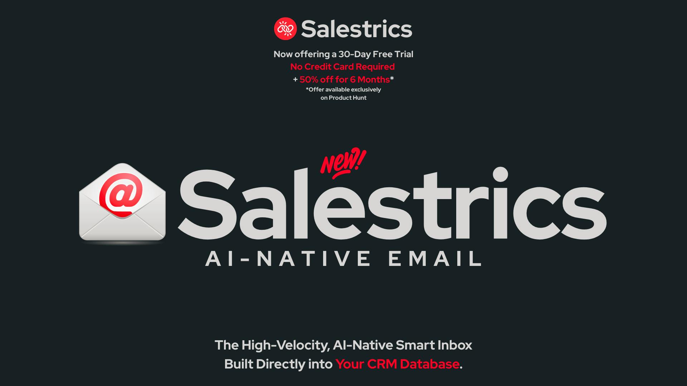
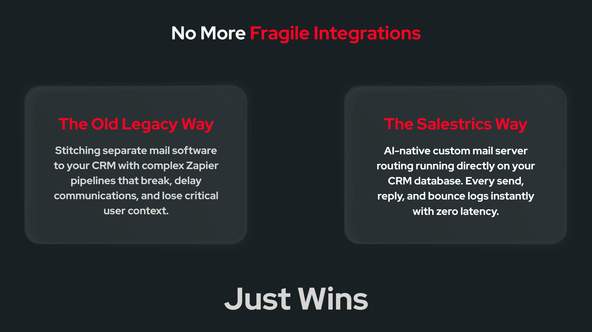
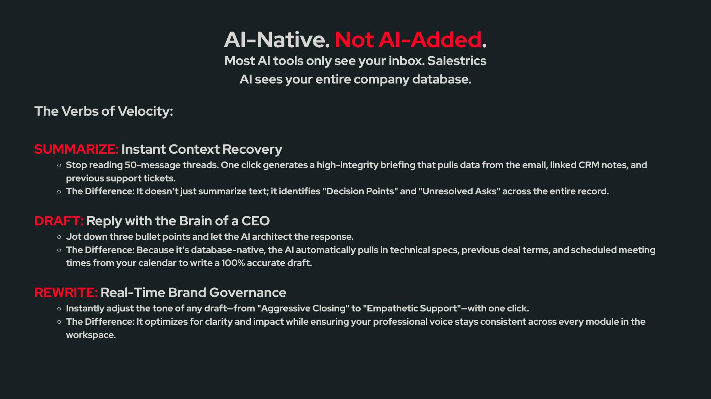

### 🎬 관련 영상
- [🎥 영상 보기](https://ph-files.imgix.net/2acb315d-ee7f-447e-8781-de4bc3e9112c.jpeg?auto=format)

---

## 11. [Lysterly](https://www.producthunt.com/products/lysterly)
**Votes**: 13 | **도입 난이도**: 하 | **신뢰도**: 상
**Tagline**: The smarter, quicker, simpler Etsy Tool
**서비스 링크**: https://www.producthunt.com/r/6NMSAW7NJDIGKH

**태그**: E-commerce, SEO, Automation, Productivity, AI Tool

### 📌 이 서비스 한눈에 보기
상품 정보 입력만으로 Etsy SEO에 최적화된 제목, 설명, 태그를 자동 생성하는 도구

### 🔑 주요 기능
- Etsy 정책을 준수하는 제목 및 상세 설명 초안 작성
- SEO 향상을 위한 13개의 롱테일 태그 자동 생성
- 사용자의 톤앤매너를 유지하며 작업 시간 단축

### 🙋 사용자에게 어떤 점이 좋은가
상품 정보만 입력하면 검색 최적화가 완료된 초안을 얻을 수 있어, 반복적인 리스팅 작업 시간을 획기적으로 줄여줍니다.

### ✅ 지금 바로 써볼 기능
- 상품 상세 정보 입력하여 초안 생성하기
- 생성된 13개 태그로 SEO 최적화 확인하기
- 자신의 브랜드 톤에 맞춰 문구 수정하기

### ⚠️ 사용 전 확인할 점
- 자동 생성된 문구이므로 최종 등록 전 Etsy 가이드라인 준수 여부 재확인 필요
- 사용자의 개인적인 터치와 브랜드 목소리를 반영하기 위한 수동 편집 과정 필요

### 🧭 확인이 더 필요한 정보
현재 제품의 구체적인 가격 정책이나 외부 플랫폼과의 연동 기능에 대한 정보는 제공되지 않았습니다.

### 📸 스크린샷 및 갤러리
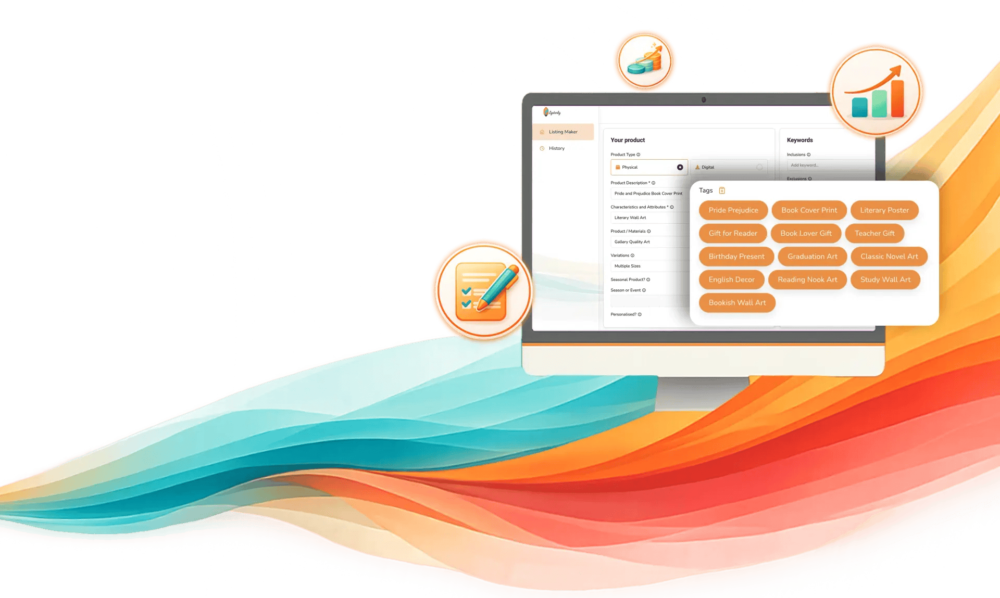
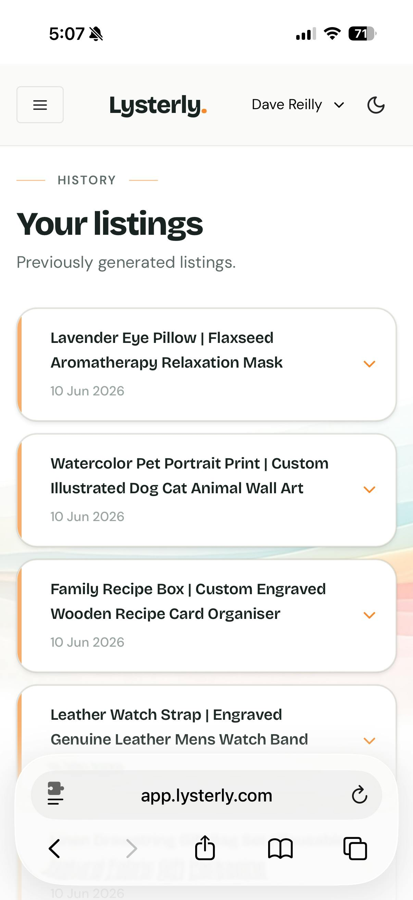
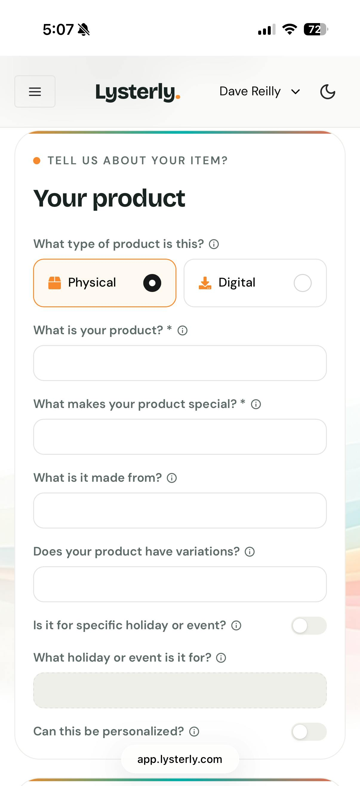

### 🎬 관련 영상
- [🎥 영상 보기](https://ph-files.imgix.net/610686a4-1cf7-4d06-9bcf-11bbf4021536.gif?auto=format)

---

## 12. [digitvest.com](https://www.producthunt.com/products/digitvest-com)
**Votes**: 13 | **도입 난이도**: 하 | **신뢰도**: 상
**Tagline**: Starter SaaS websites built for founders
**서비스 링크**: https://www.producthunt.com/r/PE7RTTC2VMYV2C

**태그**: SaaS, Entrepreneurship, NoCodeLowCode, DigitalAssets, AI Tool, Sales

### 📌 이 서비스 한눈에 보기
초기 설정 단계를 건너뛰고 즉시 사업을 시작할 수 있는 완성형 SaaS 스타터 키트

### 🔑 주요 기능
- 이미 구축된 SaaS 웹사이트, 웹 앱, AI 디지털 자산 제공
- 설계부터 패키징까지 완료되어 즉시 이전 가능한 상태로 제공
- 인디 해커와 창업자를 위한 초기 개발 시간 단축 및 기반 마련

### 🙋 사용자에게 어떤 점이 좋은가
제품 개발 초기 단계의 복잡한 설정 과정을 생략하고, 바로 마케팅과 수익화에 집중할 수 있는 비즈니스 기반을 제공합니다.

### ✅ 지금 바로 써볼 기능
- 제공되는 스타터 프로젝트의 기술 스택 확인
- 비즈니스 모델에 적합한 디지털 자산 탐색
- 구매 후 이전 및 커스텀 가능 여부 검토

### ⚠️ 사용 전 확인할 점
- 제공되는 프로젝트의 코드 품질 및 확장성 확인 필요
- 구매 후 유지보수 및 기술적 지원 범위 확인 필요

### 🧭 확인이 더 필요한 정보
각 프로젝트의 구체적인 기술 스택과 라이선스 범위에 대한 정보가 추가로 필요합니다.

### 📸 스크린샷 및 갤러리
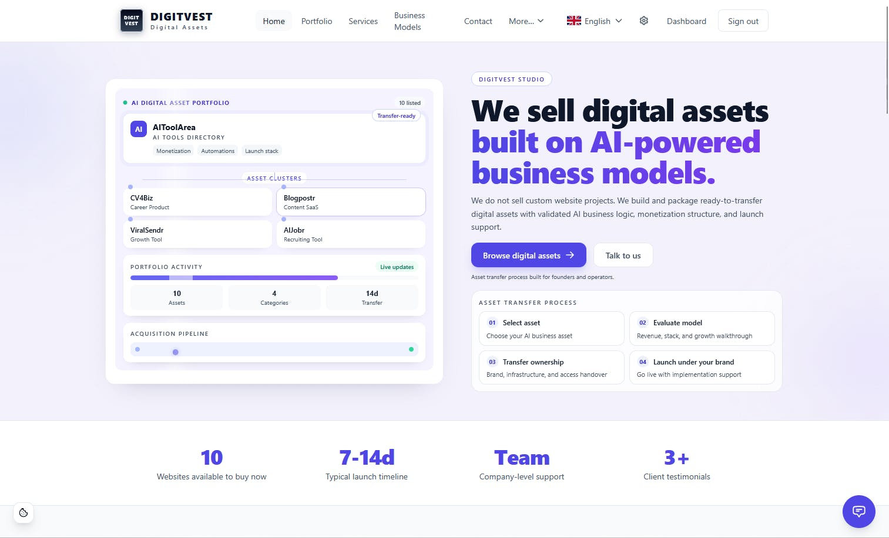

---

## 13. [WP Triage](https://www.producthunt.com/products/wp-triage)
**Votes**: 12 | **도입 난이도**: 하 | **신뢰도**: 상
**Tagline**: Get alerted to vulnerable WordPress sites before they break
**서비스 링크**: https://www.producthunt.com/r/4ILMUKK7Y7JS3B

**태그**: Security, WordPress, DevOps, Monitoring, AI Tool

### 📌 이 서비스 한눈에 보기
여러 워드프레스 사이트의 보안 취약점을 한곳에서 통합 관리하고 우선순위를 정해주는 보안 관제 도구

### 🔑 주요 기능
- 플러그인, 테마, 코어의 알려진 취약점 실시간 모니터링
- 사이트별 위험 점수(Risk Score)를 통한 문제 해결 우선순위 제공
- 여러 대시보드를 일일이 확인할 필요 없는 통합 트리아지(Triage) 리스트

### 🙋 사용자에게 어떤 점이 좋은가
여러 개의 워드프레스 사이트를 운영할 때 발생할 수 있는 보안 사고를 미연에 방지하고, 어떤 사이트부터 조치해야 할지 명확한 가이드를 제공합니다.

### ✅ 지금 바로 써볼 기능
- 보안 점검을 위한 워드프레스 사이트 연결
- 사이트별 위험 점수 확인 및 우선순위 설정
- 취약점 알림 설정 및 즉각적인 패치 적용

### ⚠️ 사용 전 확인할 점
- 알려지지 않은 제로데이(Zero-day) 취약점 탐지 여부 확인 필요
- 사이트 연결 시 권한 부여에 따른 보안 정책 검토 필요

### 🧭 확인이 더 필요한 정보
구체적인 사이트 연결 방식(API vs 직접 접속)과 지원하는 사이트 개수에 따른 비용 체계가 명시되지 않았습니다.

### 📸 스크린샷 및 갤러리
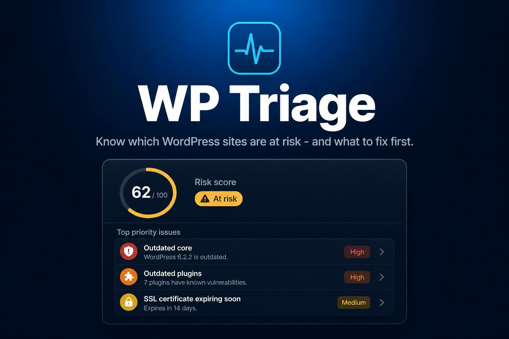

---

## 14. [AI Secretary (Telegram Bot)](https://www.producthunt.com/products/ai-secretary-telegram-bot)
**Votes**: 11 | **도입 난이도**: 하 | **신뢰도**: 상
**Tagline**: Your personal AI secretary inside Telegram — notes reminders
**서비스 링크**: https://www.producthunt.com/r/PKUJ6IISF6JAHO

**태그**: AI, Productivity, Telegram, Automation, Agent, AI Tool, Chat, Marketing

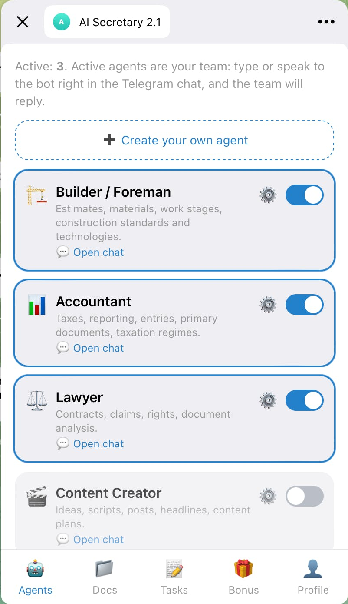

### 📌 이 서비스 한눈에 보기
별도의 앱 설치 없이 텔레그램 채팅만으로 메모, 일정 관리, 전문 업무를 수행하는 AI 비서

### 🔑 주요 기능
- 텔레그램 기반의 간편한 채팅 인터페이스
- 자연어를 통한 직관적인 메모 및 리마인더 기능
- 워크플로우에 맞춘 멀티 에이전트(마케팅, 법률 등) 모드 지원

### 🙋 사용자에게 어떤 점이 좋은가
새로운 앱을 설치할 필요 없이 평소 쓰던 메신저 안에서 즉각적으로 정보를 기록하고 업무를 자동화할 수 있습니다.

### ✅ 지금 바로 써볼 기능
- 일상적인 아이디어를 텍스트로 던져 메모 저장하기
- 자연어로 내일 일정 리마인더 설정하기
- 필요에 따라 특정 전문 분야의 AI 에이전트 모드 활성화하기

### ⚠️ 사용 전 확인할 점
- 텔레그램 메시지 기반이므로 민감한 개인정보 입력 시 보안 주의 필요
- 복잡한 데이터 구조화 기능의 정교함은 직접 테스트 필요

### 🧭 확인이 더 필요한 정보
멀티 에이전트 모드 사용 시 각 역할별 추가 비용이나 제한 사항이 있는지 확인이 필요합니다.

### 📸 스크린샷 및 갤러리
_media_0.jpg)
_media_1.jpg)
_media_2.jpg)

---

## 15. [Paste Switch](https://www.producthunt.com/products/paste-switch)
**Votes**: 10 | **도입 난이도**: 하 | **신뢰도**: 상
**Tagline**: Paste and switch recent clips in place
**서비스 링크**: https://www.producthunt.com/r/ILMKLD4TF3EKGM

**태그**: Productivity, Mac, Workflow, Clipboard, AI Tool

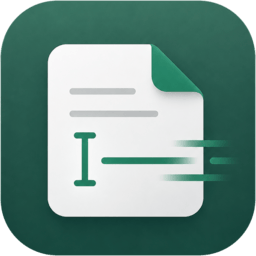

### 📌 이 서비스 한눈에 보기
클립보드 기록을 뒤지는 시간 없이 즉시 교체하며 붙여넣는 맥용 생산성 도구

### 🔑 주요 기능
- 최신 클립보드 항목을 즉시 붙여넣는 기능
- 동일한 단축키로 항목을 즉시 전환하는 'In-place switch' 기능
- 히스토리 창을 열 필요 없는 빠른 작업 흐름 제공

### 🙋 사용자에게 어떤 점이 좋은가
반복적인 붙여넣기 작업 시 클립보드 기록을 일일이 찾는 번거로움을 줄여 작업 흐름을 끊김 없이 유지해 줍니다.

### ✅ 지금 바로 써볼 기능
- 단축키 설정 및 숙달
- 반복 작업 시 'In-place switch' 활용해보기
- 기존 클립보드 관리 도구와 비교 테스트

### ⚠️ 사용 전 확인할 점
- Mac 전용 도구이므로 타 OS 사용 불가
- 단축키 충돌 가능성 확인 필요

### 🧭 확인이 더 필요한 정보
상세한 단축키 커스텀 범위와 클립보드 저장 용량에 대한 정보가 명시되지 않았습니다.

### 📸 스크린샷 및 갤러리
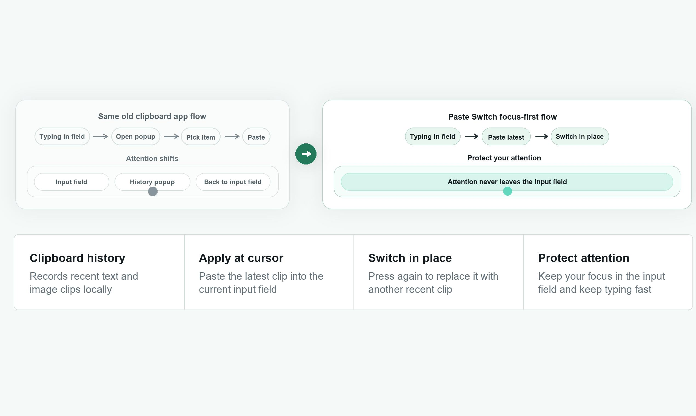
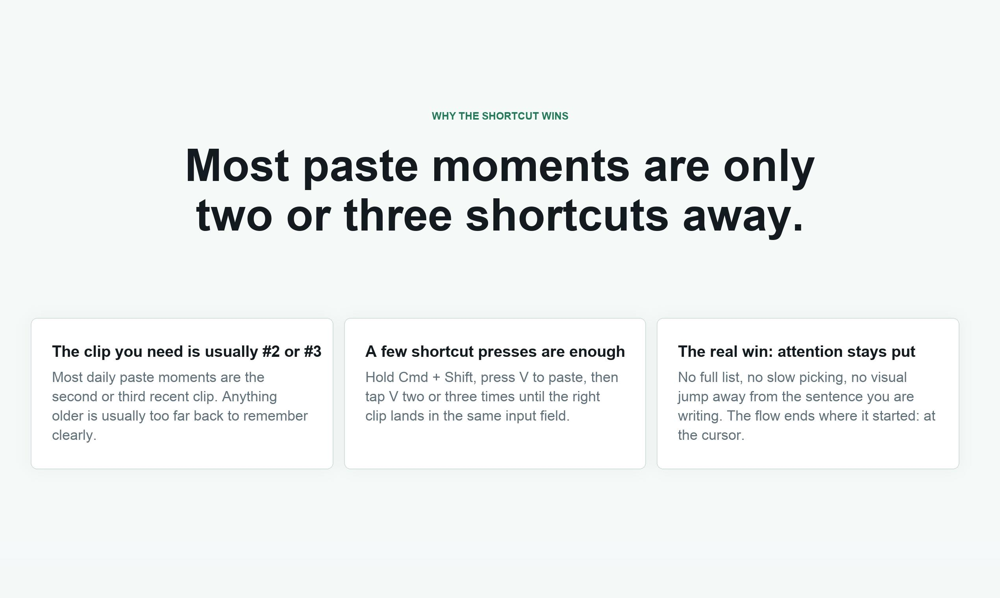
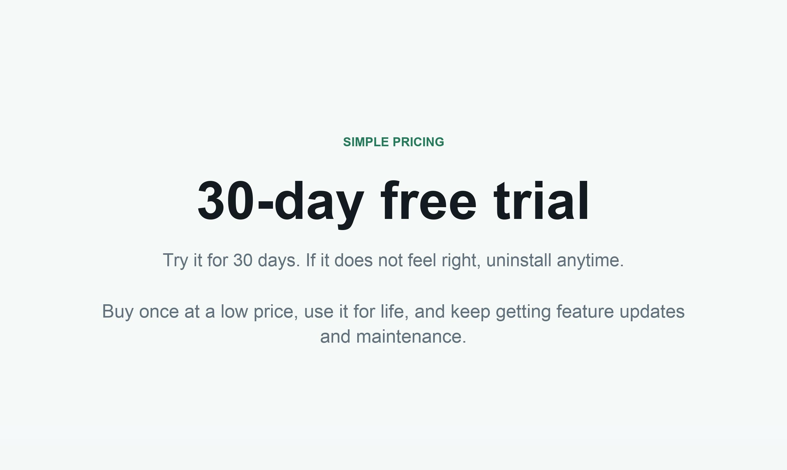

### 🎬 관련 영상
- [🎥 영상 보기](https://ph-files.imgix.net/cc18af7c-d948-421d-a87a-4b029481559e.jpeg?auto=format)

---

## 16. [LinkingMem - v0.3.0](https://www.producthunt.com/products/linkingmem-graph-native-rag-engine)
**Votes**: 10 | **도입 난이도**: 중 | **신뢰도**: 상
**Tagline**: LinkingMem — Graph-native RAG Engine
**서비스 링크**: https://www.producthunt.com/r/LII5R3HP2YQHYN

**태그**: AI, RAG, GraphDB, DevTool, LLM

### 📌 이 서비스 한눈에 보기
벡터 검색과 그래프 탐색을 결합하여 복잡한 추론을 수행하는 고성능 그래프 기반 RAG 엔진

### 🔑 주요 기능
- Rust와 Python 기반의 고성능 통합 엔진
- 벡터 검색(HNSW)과 그래프 탐색(BFS)의 유기적 결합
- 멀티홉(Multi-hop) 추론 및 확장 가능한 아키텍처

### 🙋 사용자에게 어떤 점이 좋은가
단순 검색을 넘어 데이터 간의 관계를 파악해야 하는 복잡한 질문에 대해 더 정확하고 논리적인 답변을 생성할 수 있습니다.

### ✅ 지금 바로 써볼 기능
- 벡터 데이터와 그래프 구조를 결합한 RAG 파이프라인 구축
- 복잡한 관계 추론이 필요한 질의 테스트
- Rust/Python 환경에서의 엔진 성능 검증

### ⚠️ 사용 전 확인할 점
- 그래프 확장(BFS) 과정에서의 연산 비용 및 지연 시간 확인 필요
- v0.3.0 초기 버전으로서의 안정성 검토 필요

### 🧭 확인이 더 필요한 정보
현재 버전이 초기 단계이므로 대규모 데이터셋에서의 실제 확장성 및 운영 안정성 확인이 필요합니다.

### 📸 스크린샷 및 갤러리

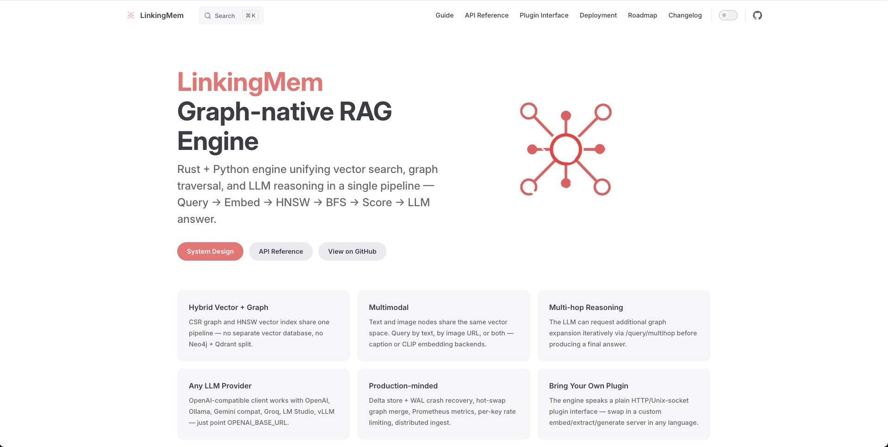
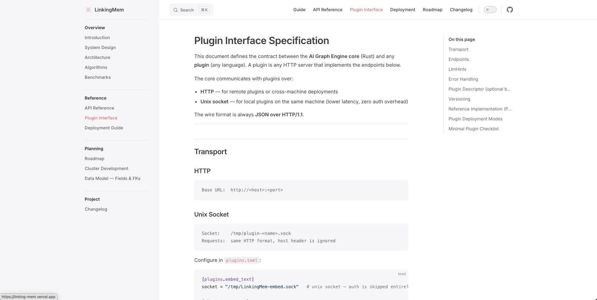

---

## 17. [LimitBar](https://www.producthunt.com/products/limitbar-2)
**Votes**: 10 | **도입 난이도**: 하 | **신뢰도**: 상
**Tagline**: macOS menu bar app showing your Claude usage limits
**서비스 링크**: https://www.producthunt.com/r/AU26PJB3AUK5QW

**태그**: DevTool, macOS, Productivity, Claude

### 📌 이 서비스 한눈에 보기
Claude 사용량 제한을 macOS 메뉴 바에서 실시간으로 확인하여 작업 계획을 돕는 경량 앱

### 🔑 주요 기능
- Claude 사용량 제한을 macOS 메뉴 바에 실시간(60초 간격) 표시
- Native Swift로 제작되어 1MB 미만의 매우 가벼운 용량과 낮은 리소스 점유율
- 별도의 토큰 소모 없이 Claude 웹사이트와 동일한 데이터를 읽어옴

### 🙋 사용자에게 어떤 점이 좋은가
Claude Code 등을 사용하는 파워 유저가 매번 사용량을 확인하기 위해 창을 전환하는 번거로움을 줄여주며, 남은 사용량을 바탕으로 효율적인 작업 계획을 세울 수 있게 합니다.

### ✅ 지금 바로 써볼 기능
- 메뉴 바에 설치하여 실시간 사용량 모니터링하기
- 남은 사용량에 맞춰 작업 스케줄링하기

### ⚠️ 사용 전 확인할 점
- Anthropic의 공식 제품이 아닌 비공식(Unofficial) 앱임
- 유료 앱(€2.99)이며 소스 코드가 포함된 제품임

### 🧭 확인이 더 필요한 정보
비공식 앱이므로 향후 Anthropic의 인터페이스 변경 시 작동 여부가 달라질 수 있습니다.

### 📸 스크린샷 및 갤러리
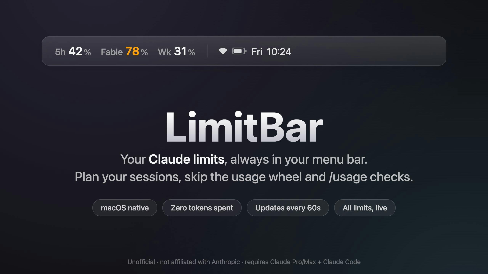
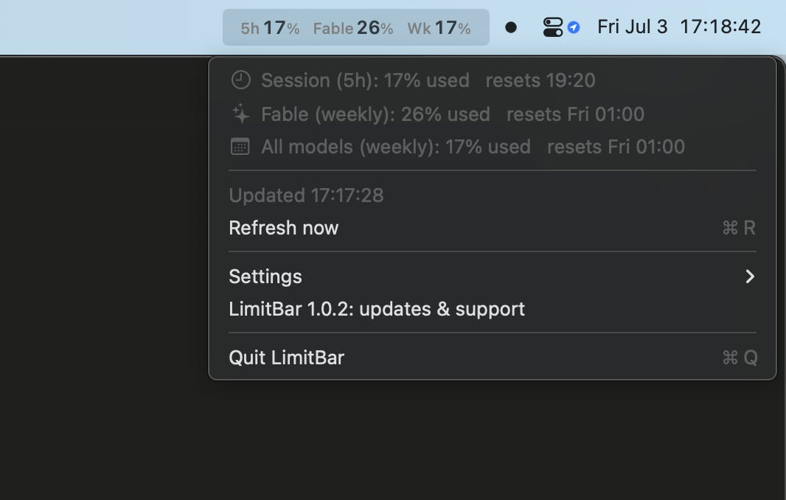

---

## 18. [The Deals Store](https://www.producthunt.com/products/the-deals-store)
**Votes**: 10 | **도입 난이도**: 하 | **신뢰도**: 상
**Tagline**: Real deals. No affiliate agenda.
**서비스 링크**: https://www.producthunt.com/r/VBXHUDNIOD3APG

**태그**: Shopping, Community, CuratedDeals

### 📌 이 서비스 한눈에 보기
수수료 목적의 광고 없이 진짜 알짜 정보만 모아둔 커뮤니티 중심의 딜 플랫폼

### 🔑 주요 기능
- 수수료 기반 모델이 아닌 투명한 딜 제공 방식
- 수익보다 제품의 품질과 가치에 집중한 큐레이션
- 사용자 중심의 커뮤니티 기반 딜 발견 환경

### 🙋 사용자에게 어떤 점이 좋은가
광고성 상품이 아닌, 정말로 가치 있는 실질적인 할인 정보를 신뢰하며 찾을 수 있습니다.

### ✅ 지금 바로 써볼 기능
- 현재 등록된 실시간 딜 목록 확인하기
- 커뮤니티에 참여하여 직접 딜 공유하기

### ⚠️ 사용 전 확인할 점
- 수수료 모델이 없으므로 플랫폼의 지속 가능한 수익 구조 확인 필요
- 전통적인 대형 쇼핑몰 대비 상품 종류의 다양성 차이 가능성

### 🧭 확인이 더 필요한 정보
수수료 없이 플랫폼을 운영하기 위한 구체적인 비즈니스 모델과 수익 구조가 명시되지 않았습니다.

### 📸 스크린샷 및 갤러리
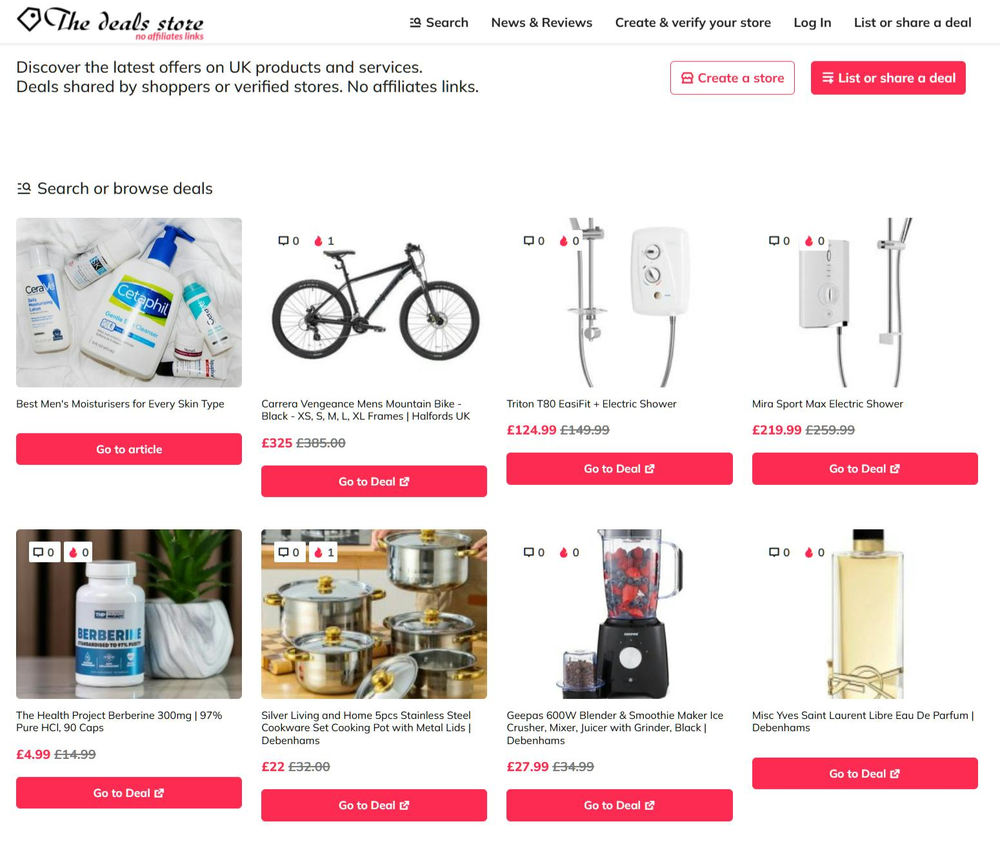

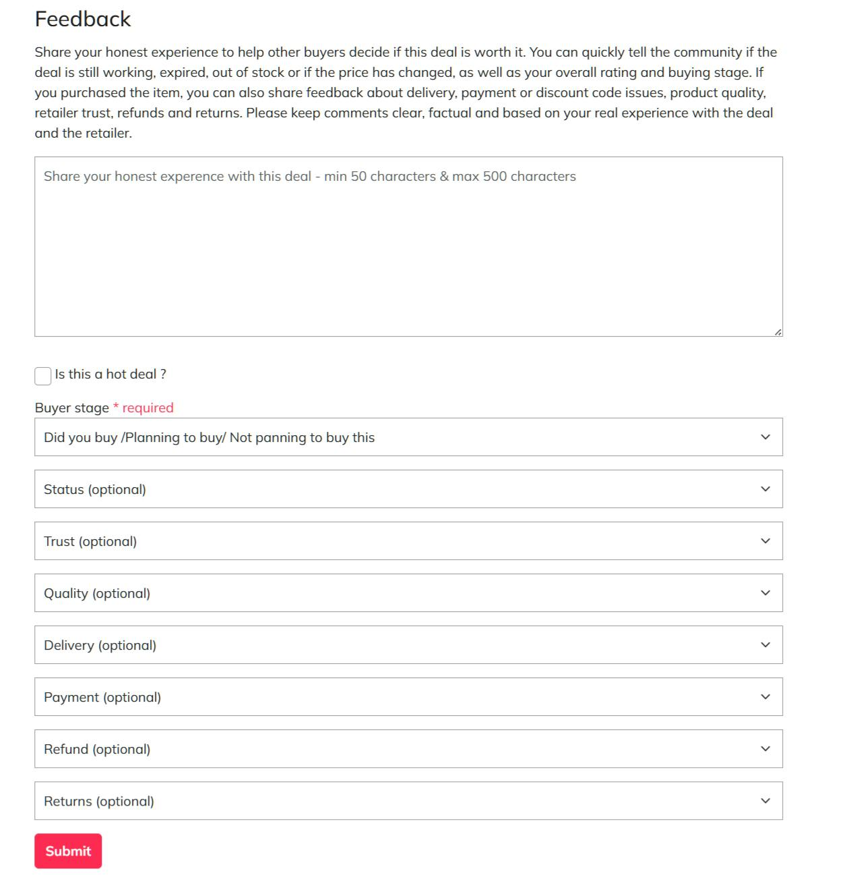

---

## 19. [InkWeaver](https://www.producthunt.com/products/inkweaver)
**Votes**: 9 | **도입 난이도**: 하 | **신뢰도**: 상
**Tagline**: The AI Writing Studio That Remembers Your Entire Novel
**서비스 링크**: https://www.producthunt.com/r/U7EVPIQDGMSV3U

**태그**: WritingTool, AI, CreativeWriting, Storytelling, AI Tool, Design

### 📌 이 서비스 한눈에 보기
설정 오류 없이 소설의 모든 맥락을 기억하는 AI 집필 스튜디오

### 🔑 주요 기능
- 캐릭터, 세계관, 플롯 등 소설 전체 맥락을 기억하는 강력한 메모리 기능
- 설정 충돌을 사전에 감지하여 이야기의 개연성 유지
- 아이디어를 캐릭터와 세계관, 챕터별 개요로 변환하는 스토리 엔진

### 🙋 사용자에게 어떤 점이 좋은가
장편 소설 집필 시 발생하는 설정 오류를 방지하고, 아이디어 구상부터 개요 작성까지의 과정을 획기적으로 단축할 수 있습니다.

### ✅ 지금 바로 써볼 기능
- 스토리 엔진을 통한 아이디어 구체화 및 개요 생성
- 30여 가지 장르별 스토리 바이블 구축
- 작성 중인 원고의 설정 충돌 여부 검토

### ⚠️ 사용 전 확인할 점
- 사용자의 고유한 문체를 학습시키기 위한 초기 설정 과정 필요
- 장르별 특화 기능이 사용자의 구체적인 집필 스타일에 부합하는지 확인 필요

### 🧭 확인이 더 필요한 정보
구체적인 요금 체계와 지원하는 언어 범위에 대한 정보가 명시되지 않았습니다.

### 📸 스크린샷 및 갤러리
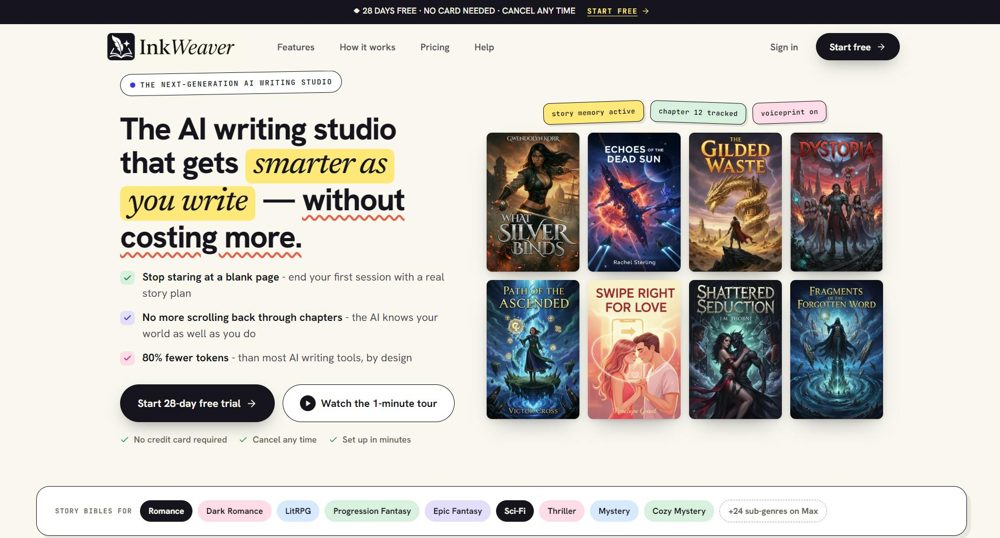
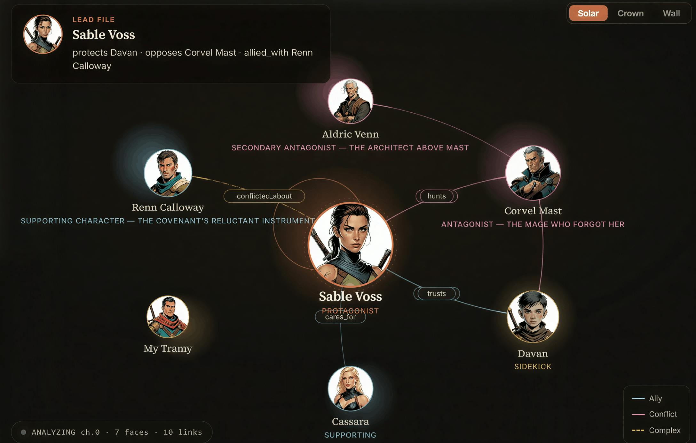
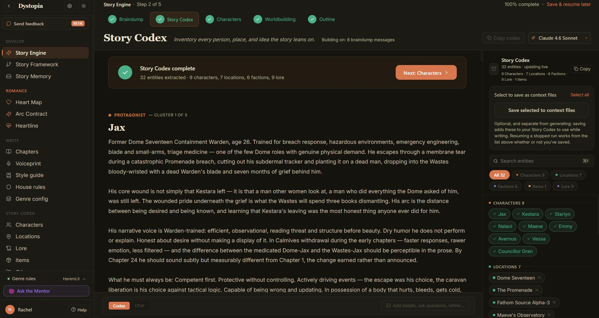

### 🎬 관련 영상
- [🎥 영상 보기](https://ph-files.imgix.net/0b28de09-b90d-4e3e-a95c-9894a7fdabce.jpeg?auto=format)

---

## 20. [Pisqre | Beyond Boundaries](https://www.producthunt.com/products/pisqre-beyond-boundaries)
**Votes**: 9 | **도입 난이도**: 하 | **신뢰도**: 상
**Tagline**: Personalized Learning. Global Experts. Unlimited Potential.
**서비스 링크**: https://www.producthunt.com/r/YHWSNZTNJJAHD2

**태그**: EdTech, OnlineLearning, Tutoring, GlobalPlatform

### 📌 이 서비스 한눈에 보기
전 세계 전문가와 연결되어 맞춤형 학습을 경험할 수 있는 글로벌 교육 플랫폼

### 🔑 주요 기능
- 전 세계 튜터와 학생을 연결하는 글로벌 네트워크
- 개인별 맞춤형 학습 및 전문가 가이드 제공
- 시공간의 제약을 넘는 유연한 온라인 교육 환경

### 🙋 사용자에게 어떤 점이 좋은가
언제 어디서든 검증된 전문가로부터 개인화된 학습을 받을 수 있어 학습 효율을 극대화할 수 있습니다.

### ✅ 지금 바로 써볼 기능
- 글로벌 전문가 프로필 탐색하기
- 맞춤형 학습 플랜 확인하기
- 온라인 튜터링 세션 참여하기

### ⚠️ 사용 전 확인할 점
- 튜터의 전문성 및 강의 품질은 개인별로 다를 수 있음
- 글로벌 서비스 특성상 시차 및 언어 장벽 고려 필요

### 🧭 확인이 더 필요한 정보
구체적인 과목 범위, 비용 체계 및 실시간 상호작용 방식에 대한 상세 정보가 필요합니다.

### 📸 스크린샷 및 갤러리
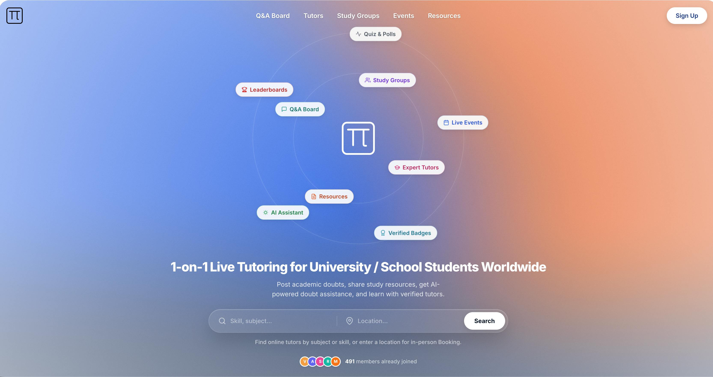
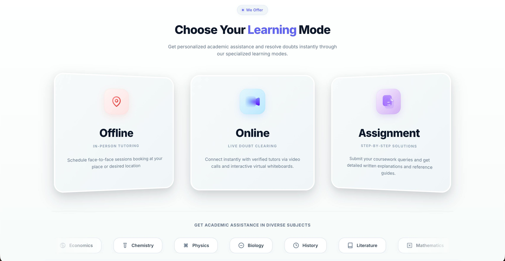
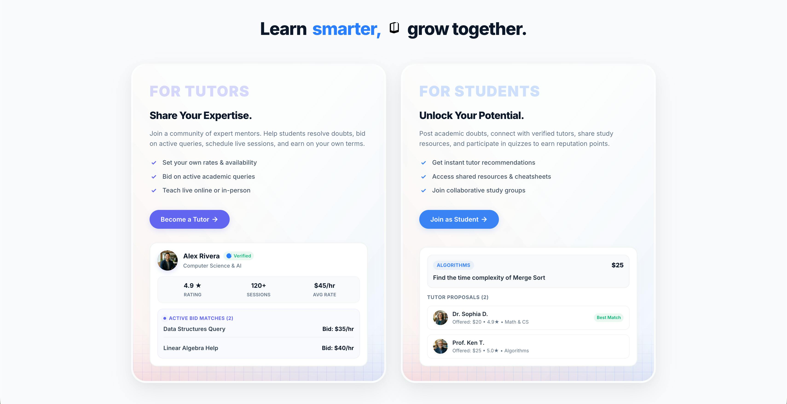

---

## 21. [EarnPT](https://www.producthunt.com/products/earnpt)
**Votes**: 9 | **도입 난이도**: 하 | **신뢰도**: 상
**Tagline**: Earn money while your AI generates responses
**서비스 링크**: https://www.producthunt.com/r/GJ7YTO3RL6DICO

**태그**: Browser Extension, Passive Income, AI Tool

### 📌 이 서비스 한눈에 보기
AI 답변 생성 시간을 활용해 수익을 창출하는 브라우저 확장 프로그램

### 🔑 주요 기능
- AI 답변 생성 대기 시간 중 보상 제공
- 검토된 스폰서 광고를 통한 광고주와 사용자 연결
- 브라우저 확장 프로그램 형태의 간편한 사용성

### 🙋 사용자에게 어떤 점이 좋은가
AI를 자주 사용하는 사용자라면 별도의 작업 없이 대기 시간을 활용해 부수적인 수익을 얻을 수 있습니다.

### ✅ 지금 바로 써볼 기능
- 브라우저 확장 프로그램 설치 및 계정 연동
- AI 생성 작업 시 보상 적립 확인
- 스폰서 광고 노출 설정 및 수익 구조 파악

### ⚠️ 사용 전 확인할 점
- 광고 노출로 인한 브라우저 성능 저하 가능성
- 수익 모델이 광고 기반이므로 수익 규모의 변동성 존재

### 🧭 확인이 더 필요한 정보
구체적인 수익 정산 방식과 광고의 품질 및 개인정보 보호 정책에 대한 확인이 필요합니다.

### 📸 스크린샷 및 갤러리
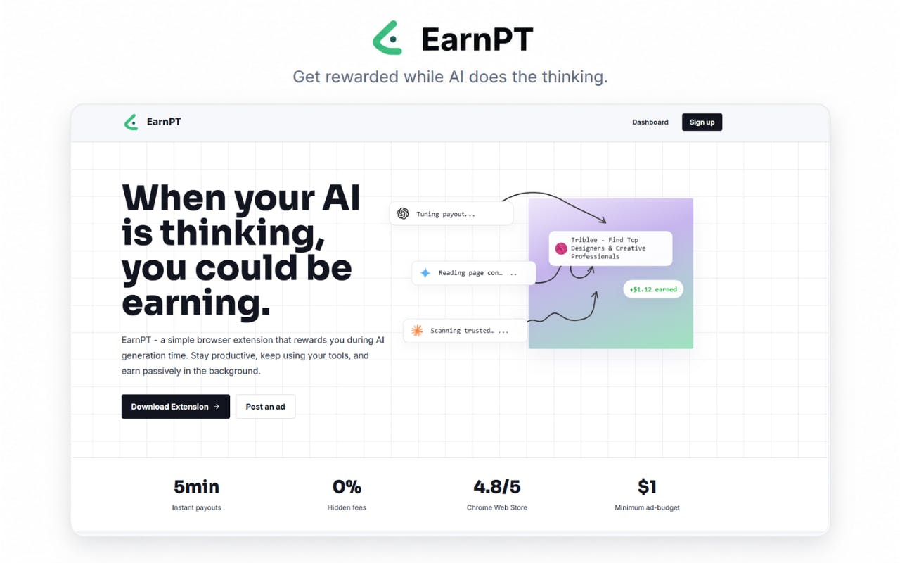
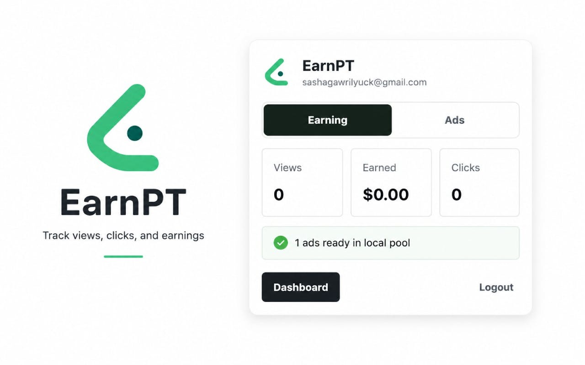
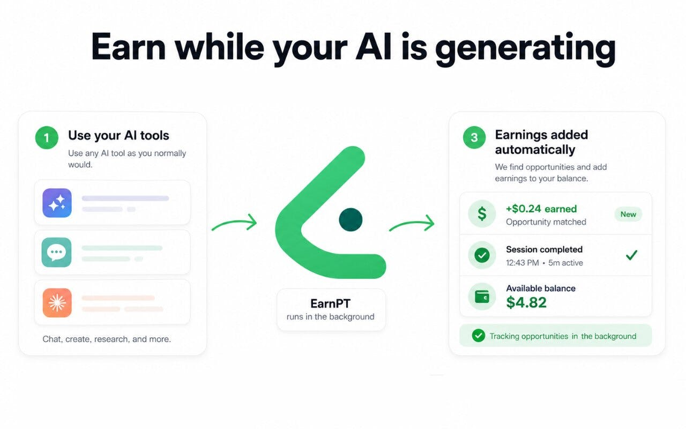

---

## 22. [Pisqre | Beyond Boundaries](https://www.producthunt.com/products/pisqre-beyond-boundaries)
**Votes**: 9 | **도입 난이도**: 하 | **신뢰도**: 상
**Tagline**: Personalized Learning. Global Experts. Unlimited Potential.
**서비스 링크**: https://www.producthunt.com/r/YHWSNZTNJJAHD2

**태그**: EdTech, OnlineLearning, Tutoring, GlobalPlatform

### 📌 이 서비스 한눈에 보기
전 세계 전문가와 연결되어 맞춤형 학습을 경험할 수 있는 글로벌 교육 플랫폼

### 🔑 주요 기능
- 전 세계 튜터와 학생을 연결하는 글로벌 네트워크
- 개인별 맞춤형 학습 및 전문가 가이드 제공
- 시공간의 제약을 넘는 유연한 온라인 교육 환경

### 🙋 사용자에게 어떤 점이 좋은가
언제 어디서든 검증된 전문가로부터 개인화된 학습을 받을 수 있어 학습 효율을 극대화할 수 있습니다.

### ✅ 지금 바로 써볼 기능
- 글로벌 전문가 프로필 탐색하기
- 맞춤형 학습 플랜 확인하기
- 온라인 튜터링 세션 참여하기

### ⚠️ 사용 전 확인할 점
- 튜터의 전문성 및 강의 품질은 개인별로 다를 수 있음
- 글로벌 서비스 특성상 시차 및 언어 장벽 고려 필요

### 🧭 확인이 더 필요한 정보
구체적인 과목 범위, 비용 체계 및 실시간 상호작용 방식에 대한 상세 정보가 필요합니다.

### 📸 스크린샷 및 갤러리

---

## 23. [Dexverse](https://www.producthunt.com/products/dexverse)
**Votes**: 9 | **도입 난이도**: 하 | **신뢰도**: 상
**Tagline**: Explore legends like never before!
**서비스 링크**: https://www.producthunt.com/r/DTM6O6I56Z2TCR

**태그**: Android, Mobile App, Gaming Tool, UI/UX, AI Tool

### 📌 이 서비스 한눈에 보기
Material 3 디자인과 강력한 기능을 갖춘 차세대 안드로이드용 포켓몬 도감 앱

### 🔑 주요 기능
- Material 3 기반의 현대적이고 깔끔한 사용자 인터페이스
- 진화 체인, 기술, 특성, 도구 등 상세한 데이터 제공
- 팀 빌딩 및 지역별 탐색을 지원하는 종합적인 기능

### 🙋 사용자에게 어떤 점이 좋은가
기존의 낡은 도감 앱에서 벗어나, 빠르고 유려한 애니메이션을 통해 쾌적하게 포켓몬 정보를 탐색하고 전략적인 팀을 구성할 수 있습니다.

### ✅ 지금 바로 써볼 기능
- Material 3 디자인의 UI/UX 경험하기
- 진화 체인 및 기술 데이터 확인하기
- 팀 빌딩 기능을 활용한 전략 수립하기

### ⚠️ 사용 전 확인할 점
- 안드로이드 전용 앱이므로 iOS 사용자는 이용 불가
- 실시간 게임 데이터와의 연동 여부 확인 필요

### 🧭 확인이 더 필요한 정보
앱의 데이터 업데이트 주기와 게임 내 실시간 데이터 동기화 여부가 명시되지 않았습니다.

### 📸 스크린샷 및 갤러리
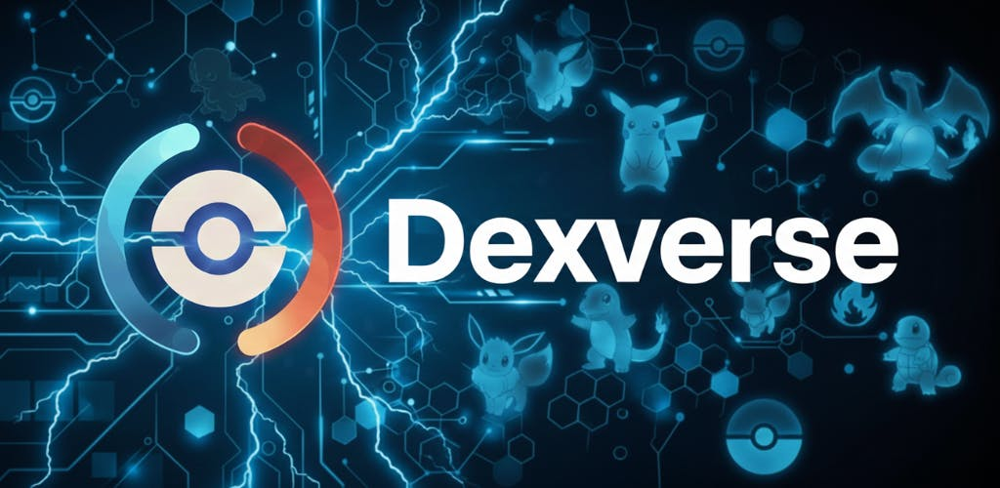
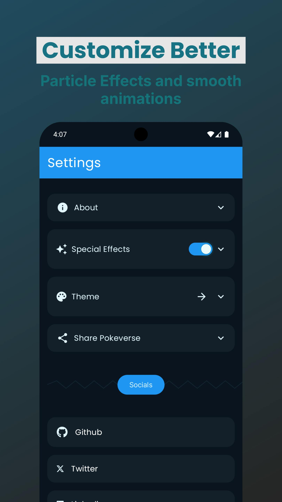
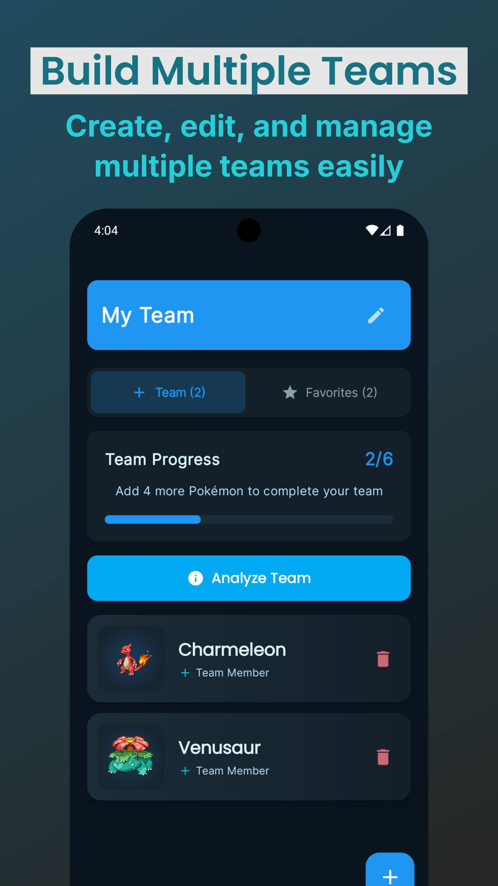

### 🎬 관련 영상
- [🎥 영상 보기](https://ph-files.imgix.net/91c22640-bb42-4418-a3c0-f728942973da.jpeg?auto=format)

---

## 24. [Vividli](https://www.producthunt.com/products/vividli)
**Votes**: 8 | **도입 난이도**: 하 | **신뢰도**: 상
**Tagline**: Any document, now a video
**서비스 링크**: https://www.producthunt.com/r/5KZDMCDEYAKV2O

**태그**: AI Video, Content Creation, Automation, Productivity, Video, Vision

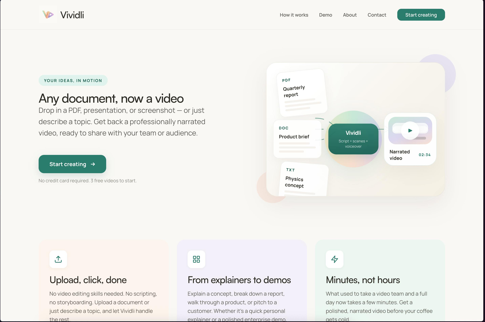

### 📌 이 서비스 한눈에 보기
문서나 이미지를 단 몇 분 만에 나레이션이 포함된 영상으로 변환해주는 AI 도구

### 🔑 주요 기능
- PDF, 이미지, 스크린샷 등 다양한 문서 형식 지원
- 텍스트 설명만으로도 영상 생성 가능
- 나레이션이 포함된 완성도 높은 영상 제작

### 🙋 사용자에게 어떤 점이 좋은가
문서 내용을 일일이 영상으로 편집할 필요 없이, 텍스트를 시각적 콘텐츠로 빠르게 전환하여 콘텐츠 제작 시간을 단축할 수 있습니다.

### ✅ 지금 바로 써볼 기능
- 보유 중인 PDF 파일을 업로드하여 영상 변환 테스트하기
- 간단한 주제 설명만으로 영상 생성 기능 시도하기
- 스크린샷을 활용한 시각 자료 영상화해보기

### ⚠️ 사용 전 확인할 점
- 문서의 복잡도에 따라 영상의 완성도가 달라질 수 있음
- 나레이션의 자연스러움이나 영상 스타일의 세부 조정 가능 여부 확인 필요

### 🧭 확인이 더 필요한 정보
문서의 분량 제한이나 생성 가능한 영상의 최대 길이에 대한 정보가 명시되지 않았습니다.

### 📸 스크린샷 및 갤러리

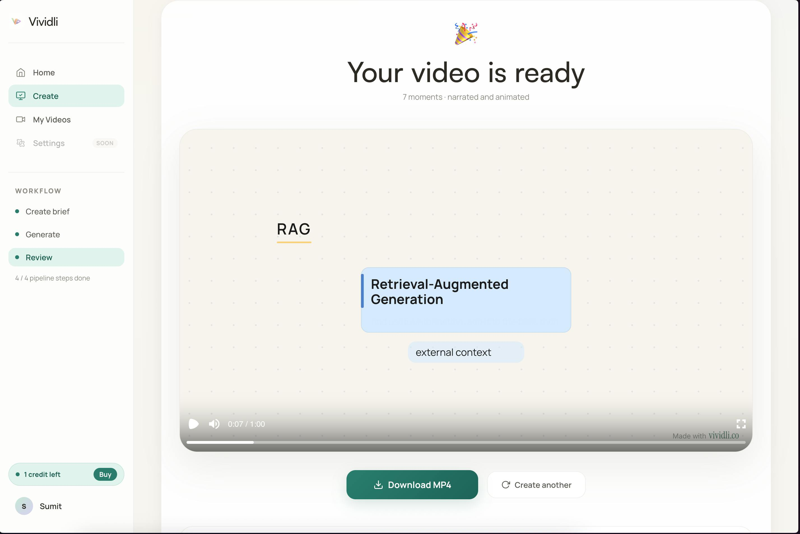
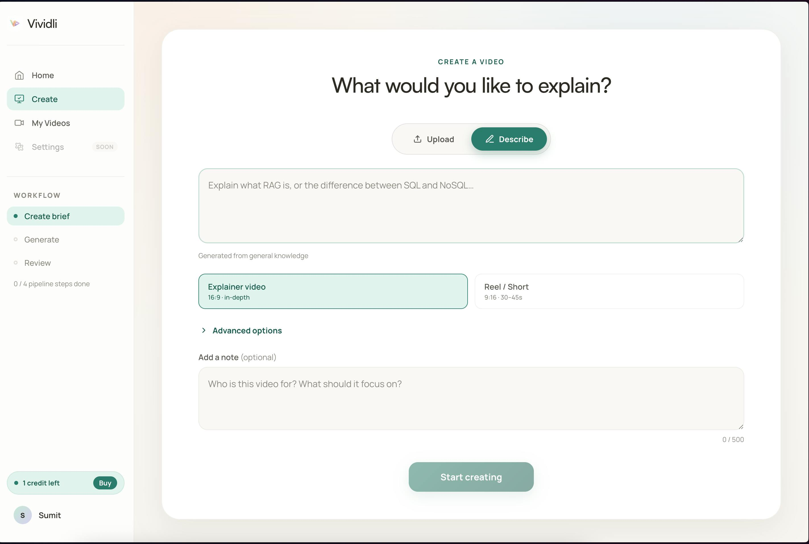

---

## 25. [Looper.AI](https://www.producthunt.com/products/looper-ai)
**Votes**: 8 | **도입 난이도**: 하 | **신뢰도**: 상
**Tagline**: Nothing slips through
**서비스 링크**: https://www.producthunt.com/r/TAEISLR7NFEAEC

**태그**: Productivity, AI, Automation, Workflow, AI Tool, Email

### 📌 이 서비스 한눈에 보기
대화 속 약속과 할 일을 놓치지 않게 자동 추적 및 실행해 주는 AI 비서

### 🔑 주요 기능
- 대화 내용(음성/텍스트)을 기반으로 실행 가능한 작업 자동 생성
- 사용자 톤에 맞춘 초안 작성부터 완료까지 이어지는 워크플로우
- 결정 배경 기록 및 4단계 승인 절차를 통한 철저한 관리

### 🙋 사용자에게 어떤 점이 좋은가
업무 중 발생하는 수많은 약속과 할 일을 일일이 기록할 필요 없이, 대화만으로 실행 가능한 루프를 만들어 누락을 방지합니다.

### ✅ 지금 바로 써볼 기능
- 회의록이나 대화 내용을 붙여넣어 작업 자동 생성 테스트하기
- 사용자 톤이 반영된 이메일 초안 확인하기
- 일일 보고서 기능을 통한 업무 진행 상황 점검하기

### ⚠️ 사용 전 확인할 점
- 개인적인 대화나 민감한 정보가 포함된 경우 데이터 보안 정책 확인 필요
- 자동 생성된 초안과 실행 단계에 대한 최종 검토 필수

### 🧭 확인이 더 필요한 정보
현재 제공되는 외부 툴(이메일, 캘린더 등)과의 구체적인 연동 범위와 자동화 수준을 확인해야 합니다.

### 📸 스크린샷 및 갤러리
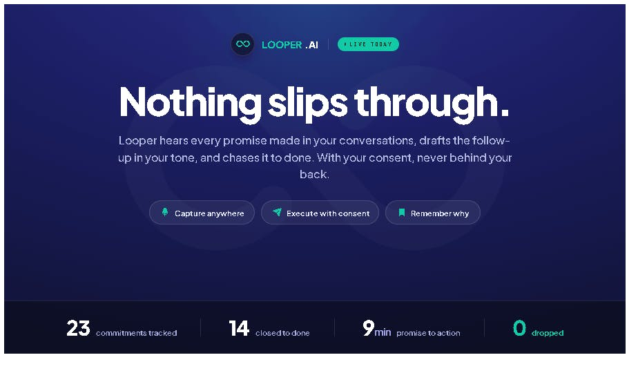
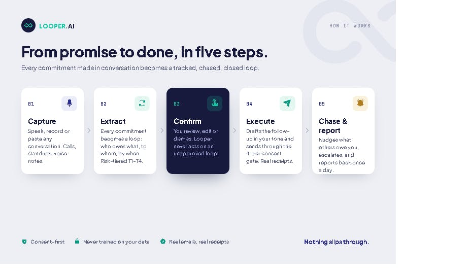

---

## 26. [DeskBroadcast](https://www.producthunt.com/products/deskbroadcast)
**Votes**: 8 | **도입 난이도**: 하 | **신뢰도**: 상
**Tagline**: Your desk is now a studio
**서비스 링크**: https://www.producthunt.com/r/RELEXBGUT5Y2L3

**태그**: VideoTool, Productivity, macOS, Broadcasting, Video

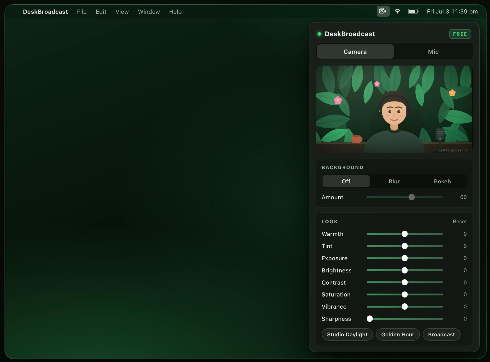

### 📌 이 서비스 한눈에 보기
macOS 환경에서 일반 웹캠과 마이크를 전문 방송 스튜디오급 품질로 바꿔주는 소프트웨어

### 🔑 주요 기능
- 웹캠 영상의 컬러 그레이딩 및 화질 개선
- 방송급 음질을 제공하는 마이크 보정 기능
- Zoom 등 화상 회의 앱과 연동되는 가상 카메라/마이크 지원

### 🙋 사용자에게 어떤 점이 좋은가
별도의 하드웨어 구매 없이 소프트웨어 설정만으로 화상 회의나 온라인 미팅 시 전문적인 영상 및 음성 품질을 구현할 수 있습니다.

### ✅ 지금 바로 써볼 기능
- 웹캠 컬러 그레이딩 설정 적용해보기
- 마이크 음성 보정 기능 테스트하기
- Zoom 등 화상 회의 앱에 가상 카메라/마이크 연결하기

### ⚠️ 사용 전 확인할 점
- macOS 전용 소프트웨어이므로 Windows 사용자는 사용 불가
- 고성능 영상 처리에 따른 시스템 리소스 점유 가능성

### 🧭 확인이 더 필요한 정보
하드웨어 사양에 따른 최적의 성능 발휘 여부와 구체적인 시스템 요구 사양 확인이 필요합니다.

### 📸 스크린샷 및 갤러리

---

## 27. [mysim24](https://www.producthunt.com/products/mysim24)
**Votes**: 8 | **도입 난이도**: 하 | **신뢰도**: 상
**Tagline**: Your data plan for every trip — online anywhere
**서비스 링크**: https://www.producthunt.com/r/AVAB4OKFW2EI3O

**태그**: Travel, eSIM, Connectivity, DigitalNomad, AI Tool, Design, DevTool

### 📌 이 서비스 한눈에 보기
전 세계 어디서나 즉시 연결 가능한 간편한 디지털 eSIM 데이터 플랜

### 🔑 주요 기능
- 물리적 SIM 카드 배송이 필요 없는 완전 디지털 eSIM 솔루션
- QR 코드 또는 원클릭 설정을 통한 빠른 설치 및 즉시 활성화
- 약정 없는 투명한 선불 데이터 플랜과 유연한 충전 기능

### 🙋 사용자에게 어떤 점이 좋은가
해외 여행 시 현지 유심을 구매하거나 로밍을 설정하는 번거로움 없이, 출국 전 미리 데이터 플랜을 준비하고 즉시 사용할 수 있습니다.

### ✅ 지금 바로 써볼 기능
- 사용 중인 스마트폰의 eSIM 지원 여부 확인
- 여행 목적지에 맞는 데이터 플랜 선택 및 구매
- QR 코드를 통한 eSIM 프로파일 설치

### ⚠️ 사용 전 확인할 점
- 기기가 eSIM 기술을 지원하는 모델인지 반드시 확인 필요
- 특정 국가나 지역에서의 커버리지 범위 사전 체크

### 🧭 확인이 더 필요한 정보
국가별 상세 네트워크 속도 및 특정 지역에서의 커버리지 품질은 별도 확인이 필요합니다.

### 📸 스크린샷 및 갤러리

---

## 28. [Rankium](https://www.producthunt.com/products/rankium)
**Votes**: 7 | **도입 난이도**: 하 | **신뢰도**: 상
**Tagline**: Get discovered. Build authority. Grow everywhere.
**서비스 링크**: https://www.producthunt.com/r/DKOIINOCAESWW6

**태그**: SEO, Marketing, Growth, Analytics, Startup

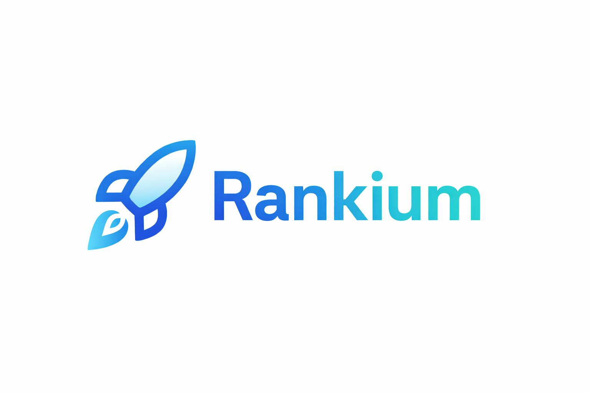

### 📌 이 서비스 한눈에 보기
구글 검색을 넘어 웹 전반의 가시성과 브랜드 권위를 높여주는 스타트업용 디렉토리 및 SEO 관리 도구

### 🔑 주요 기능
- 온라인 디렉토리 등록 현황 파악 및 신규 디렉토리 발굴
- 백링크 모니터링 및 SEO 최적화 지원
- Search Console 연동을 통한 데이터 기반 성장 관리

### 🙋 사용자에게 어떤 점이 좋은가
단순 검색 엔진 최적화를 넘어, 브랜드가 웹상에서 어디에 노출되고 있는지 통합적으로 관리하여 발견 가능성을 극대화할 수 있습니다.

### ✅ 지금 바로 써볼 기능
- 현재 브랜드가 등록된 디렉토리 현황 확인하기
- 새로운 노출 기회를 위한 신규 디렉토리 탐색하기
- Search Console 연동을 통한 데이터 동기화

### ⚠️ 사용 전 확인할 점
- 구글 검색 결과 외의 영역에 집중하므로 전통적인 SEO와 역할 분담 필요
- 디렉토리 등록 및 관리 방식에 따른 운영 리소스 발생 가능성

### 🧭 확인이 더 필요한 정보
구체적인 자동화 기능의 범위와 디렉토리 데이터베이스의 규모는 명시되지 않았습니다.

### 📸 스크린샷 및 갤러리

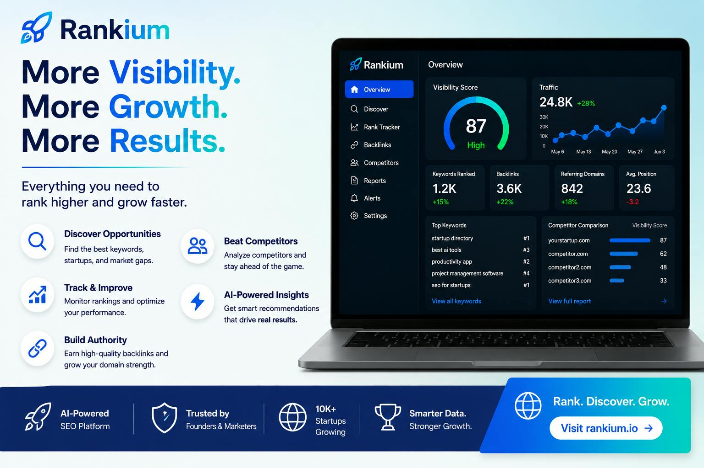

---

## 29. [RecurRoster](https://www.producthunt.com/products/recurroster)
**Votes**: 7 | **도입 난이도**: 하 | **신뢰도**: 상
**Tagline**: All-in-one business planning tool for service business
**서비스 링크**: https://www.producthunt.com/r/WML62GOU243HWG

**태그**: SaaS, BusinessTools, Automation, CRM, Scheduling, AI Tool, API

### 📌 이 서비스 한눈에 보기
반복적인 고객 관리가 필요한 서비스 사업자를 위한 올인원 비즈니스 플래닝 툴

### 🔑 주요 기능
- 고객 관리, 스케줄링, 결제, 피드백 수집을 하나의 워크스페이스로 통합
- 튜터, 코치, 컨설턴트 등 정기적인 세션 관리가 필요한 전문가 맞춤형 설계
- AI 기반 기능을 통한 업무 자동화 및 워크플로우 간소화

### 🙋 사용자에게 어떤 점이 좋은가
여러 개의 스프레드시트와 툴을 번갈아 사용하던 번거로움을 줄여 업무 효율을 높이고 수익 성장에 집중할 수 있게 해줍니다.

### ✅ 지금 바로 써볼 기능
- 고객 관리 및 스케줄링 워크플로우 설정하기
- AI 기반 자동화 기능 테스트하기
- 결제 및 피드백 수집 시스템 연동하기

### ⚠️ 사용 전 확인할 점
- 특정 서비스 업종에 특화되어 있어 범용적인 비즈니스 모델에는 기능이 과하거나 부족할 수 있음
- 기존에 사용 중인 다른 툴과의 데이터 이전 편의성 확인 필요

### 🧭 확인이 더 필요한 정보
AI 기능의 구체적인 활용 범위와 외부 서비스와의 연동 범위에 대한 정보가 더 필요합니다.

### 📸 스크린샷 및 갤러리

---

## 30. [ChatMocker.com](https://www.producthunt.com/products/chatmocker-com)
**Votes**: 7 | **도입 난이도**: 하 | **신뢰도**: 상
**Tagline**: Fake Chats. Real Views. Pixel-perfect animated chat mockups.
**서비스 링크**: https://www.producthunt.com/r/6N6WISYBXOMEOJ

**태그**: ContentCreation, VideoEditing, SocialMedia, MarketingTool, Chat, Video

### 📌 이 서비스 한눈에 보기
SNS 숏폼 콘텐츠 제작을 위한 고퀄리티 채팅 애니메이션 모형 생성 도구

### 🔑 주요 기능
- 픽셀 단위의 정교하고 부드러운 채팅 애니메이션 제공
- 틱톡, 릴스, 쇼츠 등 숏폼 플랫폼에 최적화된 영상 생성
- 복잡한 편집 과정 없이 빠른 시간 내에 스토리텔링 영상 제작 가능

### 🙋 사용자에게 어떤 점이 좋은가
드라마틱한 서사나 밈(meme) 중심의 콘텐츠를 제작할 때, 번거로운 화면 녹화 없이 전문적인 채팅 영상 결과물을 즉시 얻을 수 있습니다.

### ✅ 지금 바로 써볼 기능
- 스토리텔링용 채팅 시나리오 작성하기
- 숏폼 규격에 맞춘 애니메이션 생성 테스트
- 브랜드 톤앤매너에 맞는 모형 스타일 적용

### ⚠️ 사용 전 확인할 점
- 실제 채팅 화면과 구분이 어려울 수 있으므로 콘텐츠 윤리 가이드 준수 필요
- 텍스트 기반의 시각적 연출에 특화되어 있어 복잡한 영상 편집 기능은 제한적일 수 있음

### 🧭 확인이 더 필요한 정보
구체적인 요금제 체계와 지원하는 플랫폼(iOS/Android) 스타일의 다양성에 대한 정보가 필요합니다.

### 📸 스크린샷 및 갤러리
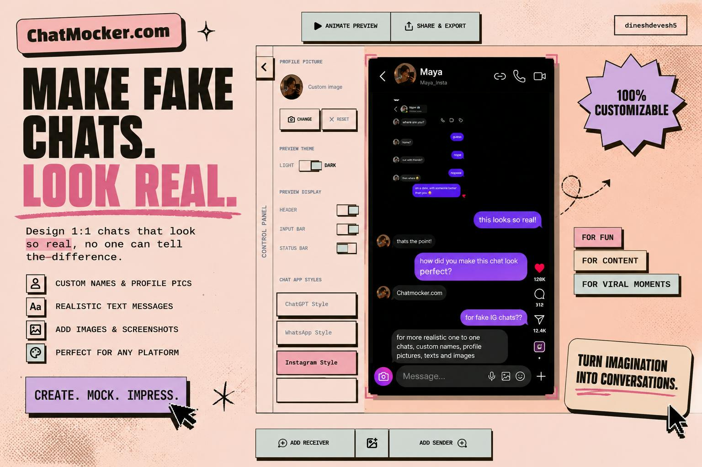
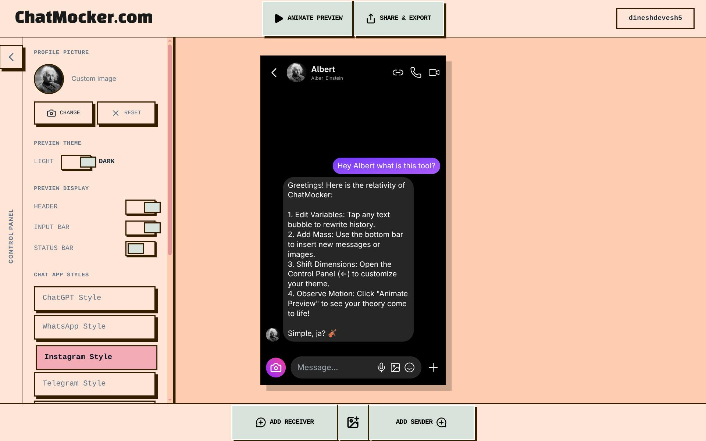

### 🎬 관련 영상
- [🎥 영상 보기](https://ph-files.imgix.net/b8cef0c2-58a1-49c2-abdd-abd0eac4fe3e.jpeg?auto=format)

---

