# 🚀 Product Hunt Daily Top 30 (2026-07-08)

## 오늘의 요약
오늘의 트렌드는 단순한 업무 보조를 넘어, 사용자의 말투나 감정, 데이터 정합성을 관리하는 등 인간의 고유 영역을 모사하는 고도화된 AI 에이전트의 등장이었습니다. 또한, AI 검색 엔진 최적화나 소셜 데이터 수집처럼 AI 시대의 새로운 마케팅 및 데이터 확보 전략이 주목받았습니다.

### 오늘의 핵심 포인트
- AI 에이전트가 이메일 작성, 영업 데이터 관리, Slack 협업 등 실무 프로세스 전반을 자동화하며 인간의 개입을 최소화하고 있습니다.
- 신뢰할 수 있는 리뷰 수집, 가짜 할인 판별, 감정 분석 등 데이터의 진위와 인간의 비언어적 반응을 포착하는 기술이 강화되었습니다.
- AI 검색 엔진에 브랜드가 노출되도록 돕거나 소셜 미디어 데이터를 효율적으로 수집하는 등 AI 중심의 새로운 마케팅 생태계가 형성되고 있습니다.

**오늘의 태그**: AI 에이전트, 업무 자동화, 데이터 신뢰성, AI 마케팅

## 1. [Badge](https://www.producthunt.com/products/badge-3)
**Votes**: 401 | **도입 난이도**: 하 | **신뢰도**: 상
**Tagline**: AI agents collect peer reviews to generate proof of work
**서비스 링크**: https://www.producthunt.com/r/SJNBNECUTZE3BI

**태그**: HRTech, AI, Recruitment, Career, Agent, AI Tool

### 📌 이 서비스 한눈에 보기
AI 에이전트를 통해 동료의 검증된 리뷰를 수집하고 신뢰할 수 있는 경력 증명을 생성합니다.

### 🔑 주요 기능
- AI 에이전트가 연락처를 기반으로 과거 동료들에게 익명 리뷰를 요청
- 구직자를 위한 검증 가능하고 이동 가능한 신뢰 점수(Trust Score) 구축
- 채용 담당자를 위한 30초 내외의 신속하고 진정성 있는 레퍼런스 체크

### 🙋 사용자에게 어떤 점이 좋은가
구직자는 조작 불가능한 실무 역량 증명을 얻을 수 있고, 채용 담당자는 가짜 이력서 대신 실제 동료의 피드백을 바탕으로 빠르게 인재를 검증할 수 있습니다.

### ✅ 지금 바로 써볼 기능
- 연락처 동기화를 통한 동료 네트워크 연결
- 익명 리뷰 요청 기능 실행
- 생성된 신뢰 점수 및 프로필 확인

### ⚠️ 사용 전 확인할 점
- 연락처 접근 권한 부여에 따른 개인정보 보호 이슈 확인 필요
- 동료들의 리뷰 참여도에 따라 신뢰 점수의 편차가 발생할 수 있음

### 🧭 확인이 더 필요한 정보
수집된 리뷰의 익명성 유지 방식과 데이터 보안 정책에 대한 상세 확인이 필요합니다.

### 📸 스크린샷 및 갤러리
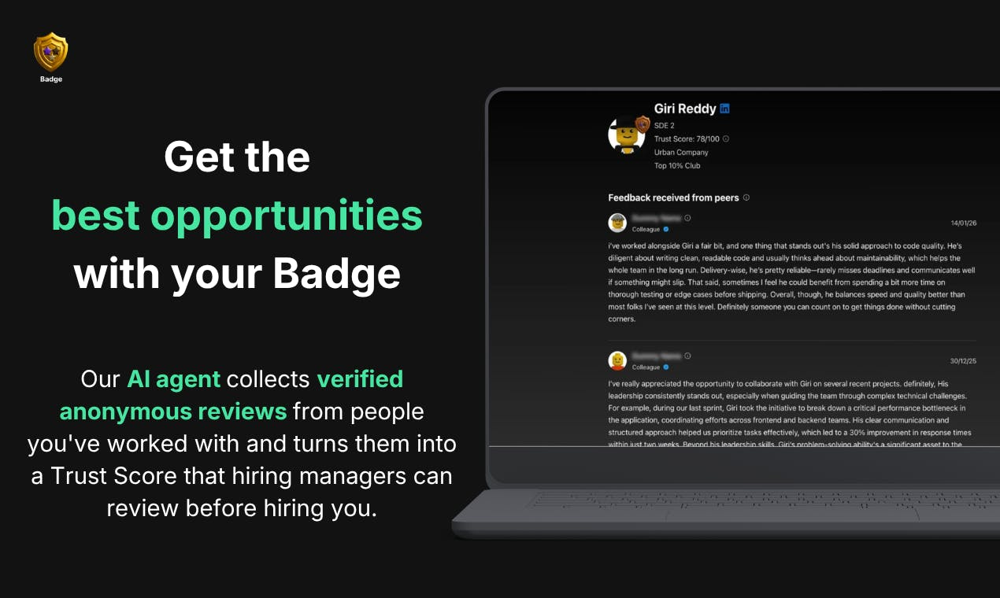
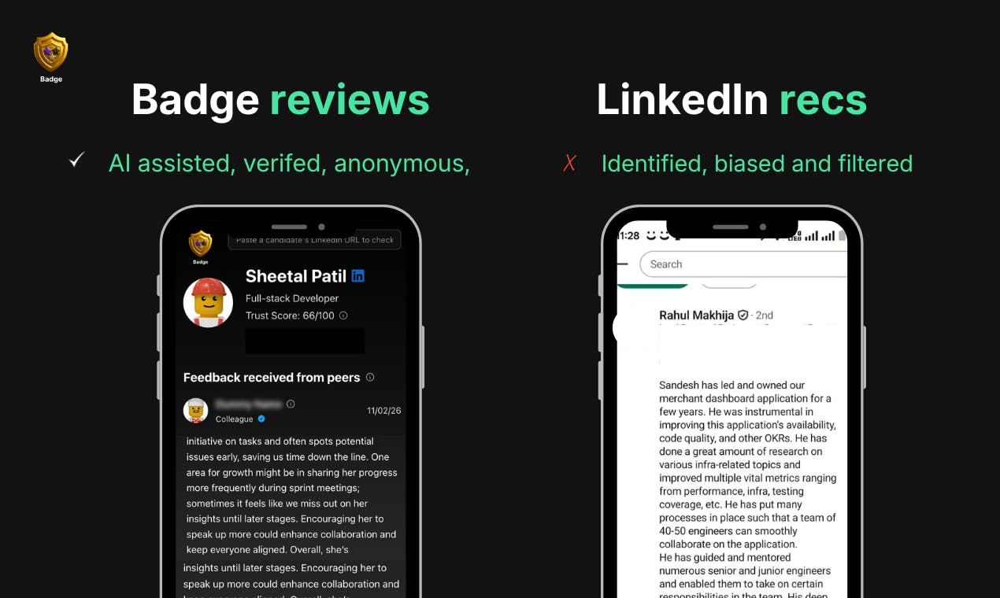
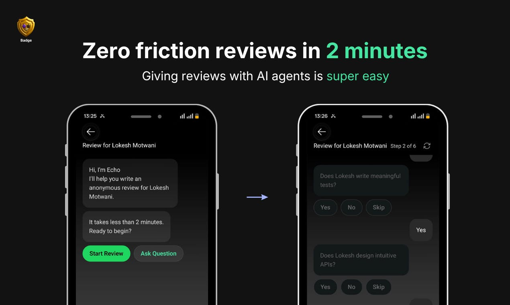

### 🎬 관련 영상
- [🎥 영상 보기](https://ph-files.imgix.net/dbf90f41-35dd-44b9-877c-9a37393a00e1.gif?auto=format)

---

## 2. [Scribble Network](https://www.producthunt.com/products/scribble-network)
**Votes**: 304 | **도입 난이도**: 중 | **신뢰도**: 상
**Tagline**: The product that makes AI recommend your brand
**서비스 링크**: https://www.producthunt.com/r/UC5EA4CAN72QZO

**태그**: Marketing, AI, Content Strategy, SEO, AI Tool

### 📌 이 서비스 한눈에 보기
AI 검색 엔진에서 브랜드가 인용되도록 돕는 통합 마케팅 솔루션

### 🔑 주요 기능
- AI 엔진별 브랜드 노출 현황 및 가시성 감사(Audit)
- 부족한 콘텐츠를 생성하여 검색 격차 해소
- 5만 명의 크리에이터 네트워크를 통한 콘텐츠 증폭 및 인용 유도

### 🙋 사용자에게 어떤 점이 좋은가
고객이 Google 대신 AI에게 질문하는 시대에, 브랜드가 AI의 답변으로 선택될 수 있도록 콘텐츠 최적화와 배포를 자동화해 줍니다.

### ✅ 지금 바로 써볼 기능
- 현재 브랜드의 AI 가시성 격차 리포트 확인
- AI 엔진별 노출 현황 분석
- 크리에이터 네트워크를 통한 콘텐츠 배포 전략 수립

### ⚠️ 사용 전 확인할 점
- 크리에이터 보상 체계(성과 기반)에 따른 콘텐츠 품질 관리 필요성
- AI 엔진 알고리즘 변화에 따른 가시성 변동 가능성

### 🧭 확인이 더 필요한 정보
5만 명 크리에이터 네트워크의 구체적인 운영 방식과 콘텐츠 품질 관리 프로세스에 대한 정보가 부족합니다.

### 📸 스크린샷 및 갤러리
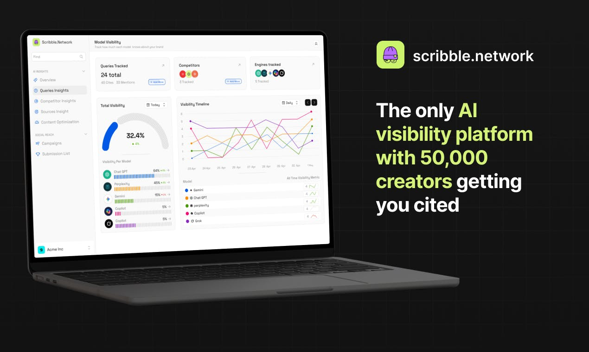
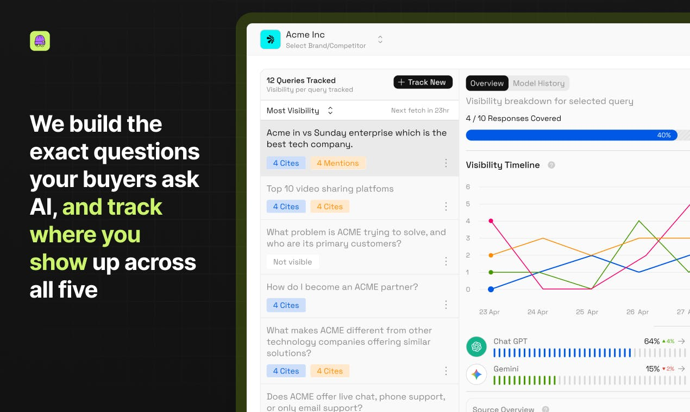
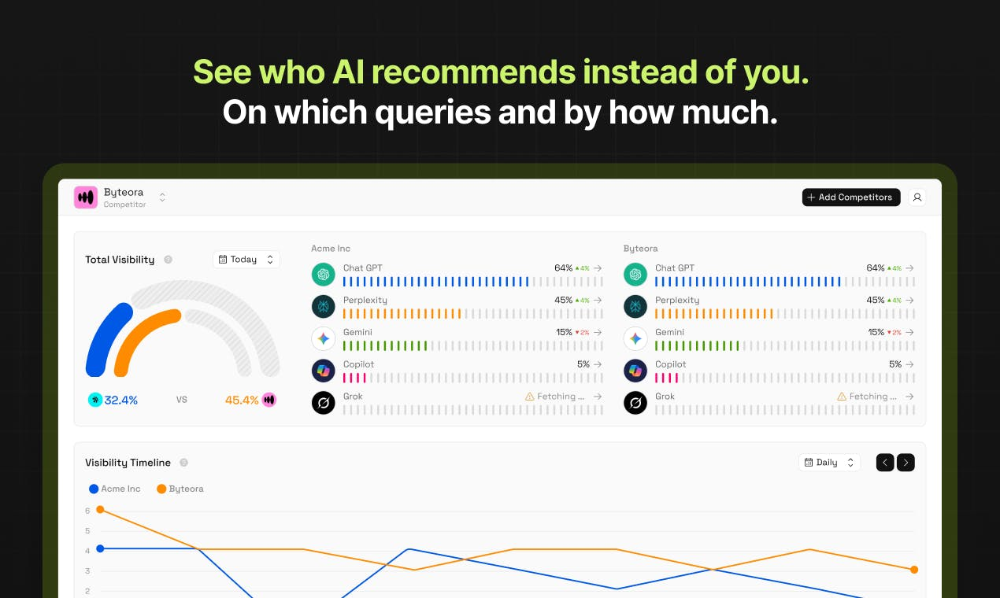

### 🎬 관련 영상
- [🎥 영상 보기](https://ph-files.imgix.net/535fa6dd-d39b-4dd2-91e4-adf97a44d3cf.jpeg?auto=format)

---

## 3. [Katalyst ](https://www.producthunt.com/products/katalyst)
**Votes**: 255 | **도입 난이도**: 중 | **신뢰도**: 상
**Tagline**: The AI agent that works your Salesforce Pipeline
**서비스 링크**: https://www.producthunt.com/r/I2QDECZXLT36XU

**태그**: Salesforce, AI Agent, Sales Automation, CRM, Agent, AI Tool, Prompting, Sales, Email

### 📌 이 서비스 한눈에 보기
Salesforce 데이터와 연동하여 영업 업무를 자동화하는 AI 세일즈 에이전트

### 🔑 주요 기능
- 통화 종료 후 노트 요약, 레코드 생성, 필드 업데이트 자동 수행
- 이메일, 캘린더, 통화 기록을 분석하여 실시간 영업 신호 포착
- 데이터 정합성 유지(Hygiene scores) 및 딜 패턴 분석 기능 제공

### 🙋 사용자에게 어떤 점이 좋은가
영업 담당자가 수동으로 입력하던 데이터 관리 업무를 AI가 대신 처리하여, 영업 활동 본연의 업무에만 집중할 수 있게 합니다.

### ✅ 지금 바로 써볼 기능
- 미팅 기록 및 요약 자동화 기능 테스트
- Salesforce 데이터 자동 업데이트 설정
- 영업 파이프라인 위기 신호(Slipping deals) 알림 확인

### ⚠️ 사용 전 확인할 점
- Salesforce 데이터 접근 권한 및 보안 정책 확인 필요
- AI가 생성한 요약 및 데이터 업데이트의 정확성 검토 필요

### 🧭 확인이 더 필요한 정보
엔터프라이즈급 보안 표준 준수 여부와 구체적인 Salesforce 연동 범위에 대한 확인이 필요합니다.

### 📸 스크린샷 및 갤러리
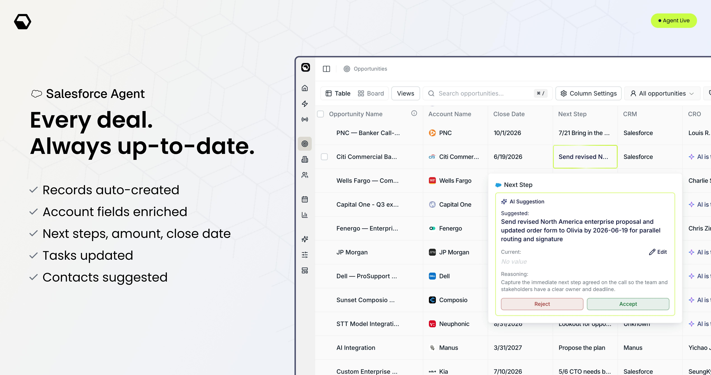
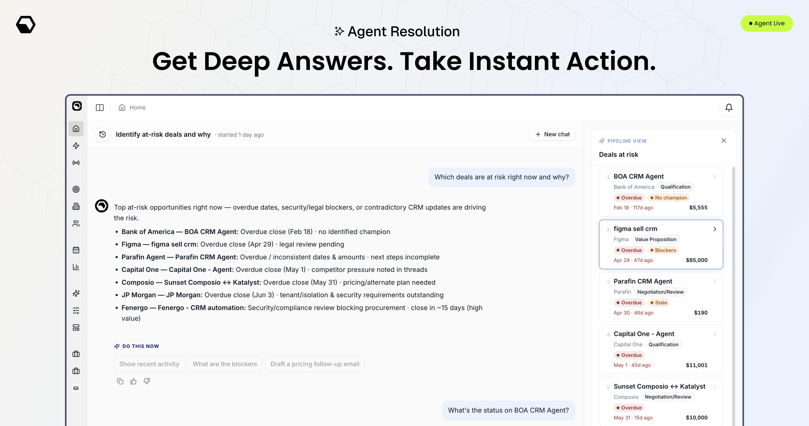
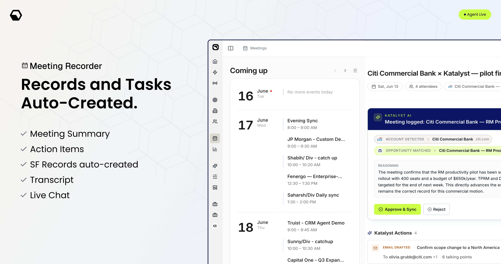

### 🎬 관련 영상
- [🎥 영상 보기](https://ph-files.imgix.net/bf2bc306-c767-40e8-be95-5104b5b024b5.jpeg?auto=format)

---

## 4. [Dupely](https://www.producthunt.com/products/dupely)
**Votes**: 205 | **도입 난이도**: 하 | **신뢰도**: 상
**Tagline**: The trust layer for online shopping
**서비스 링크**: https://www.producthunt.com/r/TV5XHOQG4DV2R7

**태그**: Shopping, ConsumerTools, PriceTracker, AI Tool

### 📌 이 서비스 한눈에 보기
가짜 할인과 리뷰를 걸러내고 진짜 최저가를 찾아주는 쇼핑 신뢰 레이어

### 🔑 주요 기능
- DupeScore: 동일한 제품을 더 저렴하게 판매하는 곳을 찾는 기능
- Trust This Price: 90일간의 가격 이력을 바탕으로 가짜 할인 여부 판별
- Seller Badges: 판매자의 신뢰도를 직관적으로 보여주는 배지 시스템

### 🙋 사용자에게 어떤 점이 좋은가
인위적인 가격 조작이나 가짜 리뷰에 속지 않고, 가장 정직하고 저렴한 가격으로 쇼핑할 수 있도록 도와줍니다.

### ✅ 지금 바로 써볼 기능
- DupeScore로 동일 제품 최저가 검색하기
- Trust This Price로 현재 할인율의 진위 확인하기
- Seller Bad지를 통해 판매자 신뢰도 검증하기

### ⚠️ 사용 전 확인할 점
- 플랫폼별 데이터 업데이트 주기에 따라 가격 정보가 실시간과 다를 수 있음
- 모든 쇼핑몰의 가격 이력이 완벽하게 반영되지 않을 가능성 있음

### 🧭 확인이 더 필요한 정보
모든 이커머스 플랫폼과 얼마나 폭넓게 연동되는지 확인이 필요합니다.

### 📸 스크린샷 및 갤러리
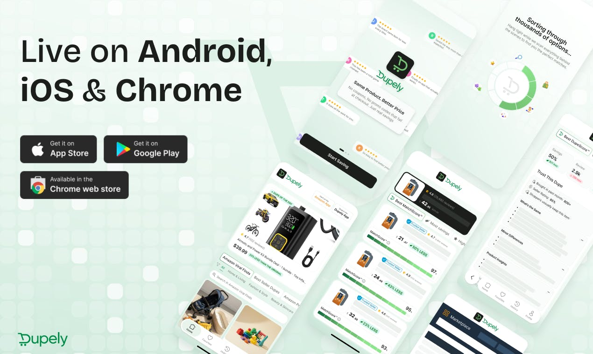
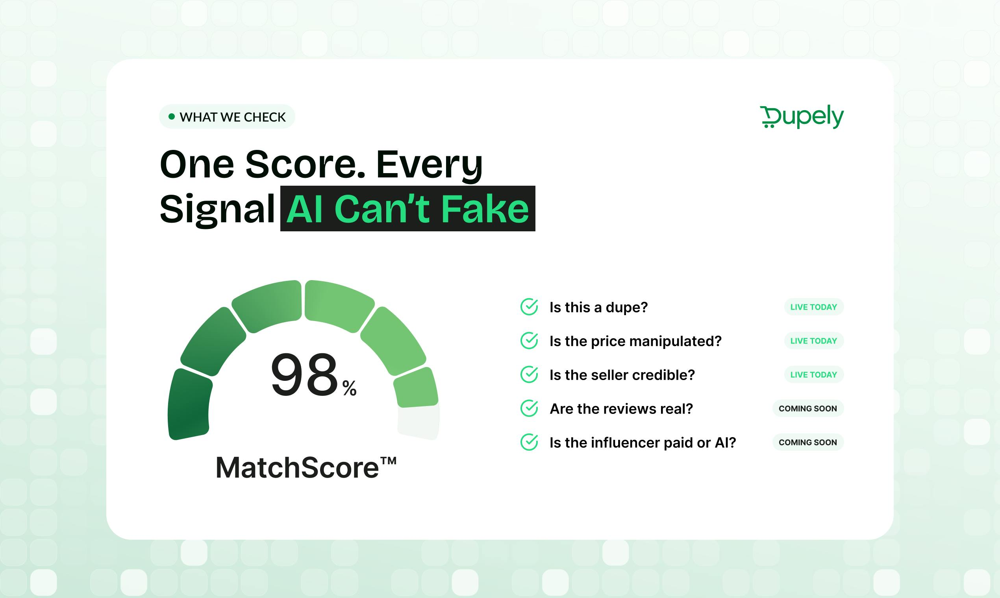
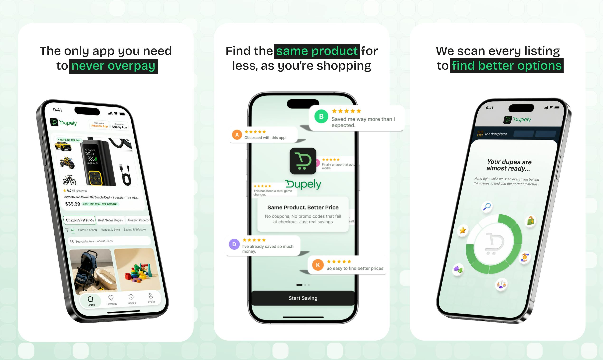

### 🎬 관련 영상
- [🎥 영상 보기](https://ph-files.imgix.net/9a9b7f29-04fc-4070-8ee4-40bde1684077.jpeg?auto=format)

---

## 5. [Mira](https://www.producthunt.com/products/mira-the-ai-moderator)
**Votes**: 192 | **도입 난이도**: 중 | **신뢰도**: 상
**Tagline**: AI moderated interviews that read how people feel
**서비스 링크**: https://www.producthunt.com/r/QVOBLGCIMXF4AQ

**태그**: AI, UserResearch, MarketResearch, Automation, Analytics, AI Tool

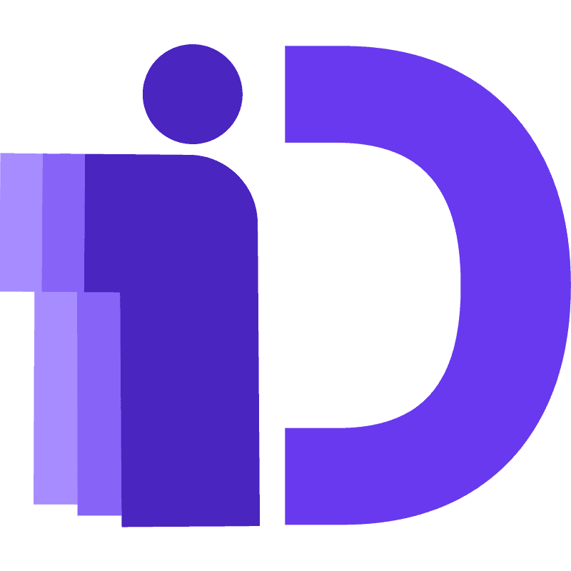

### 📌 이 서비스 한눈에 보기
감정 분석과 시선 추적을 결합하여 인사이트를 자동 추출하는 AI 전문 리서처

### 🔑 주요 기능
- 실시간 안면 코딩, 음성 감정 AI, 웹캠 시선 추적을 통한 심층 감정 포착
- 연구 설계부터 글로벌 패널 모집, 인터뷰 진행, 보고서 생성까지 전 과정 자동화
- 120개국 1억 명 이상의 패널과 70개 이상의 언어 지원

### 🙋 사용자에게 어떤 점이 좋은가
단순 텍ک스트 기록을 넘어 사용자의 비언어적 반응까지 데이터화하여 더 깊이 있는 사용자 경험(UX) 및 시장 조사가 가능합니다.

### ✅ 지금 바로 써볼 기능
- 글로벌 타겟 대상의 동적 인터뷰 실행
- 참가자의 표정과 음성을 통한 감정 데이터 추출
- 자동 생성된 연구 보고서 및 테마 분석 확인

### ⚠️ 사용 전 확인할 점
- 웹캠 및 마이크 사용에 따른 개인정보 보호 및 윤리적 이슈 검토 필요
- 비언어적 데이터 해석의 정확도에 대한 검증 필요

### 🧭 확인이 더 필요한 정보
사용자 개인정보 보호 정책 및 데이터 보안 규정 준수 여부에 대한 상세 확인이 필요합니다.

### 📸 스크린샷 및 갤러리
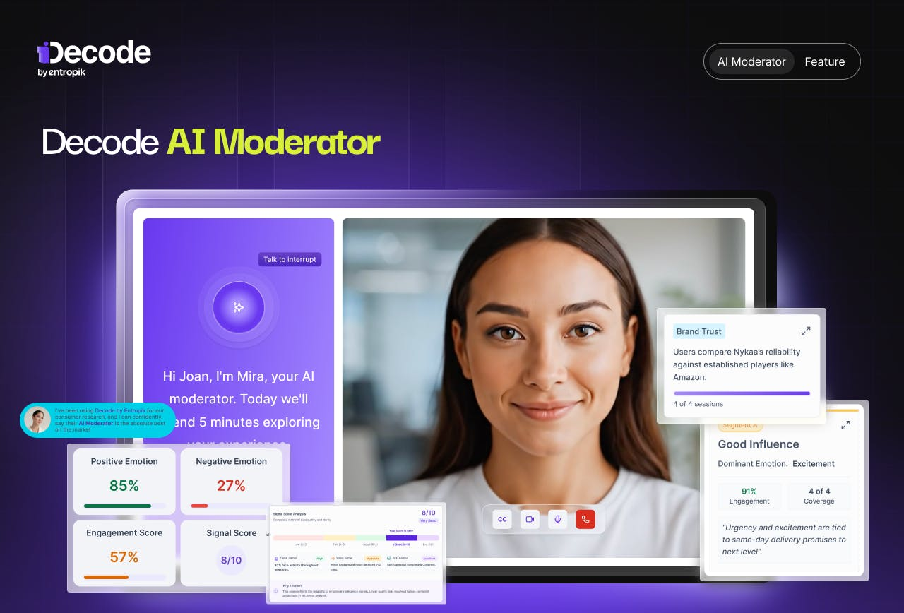
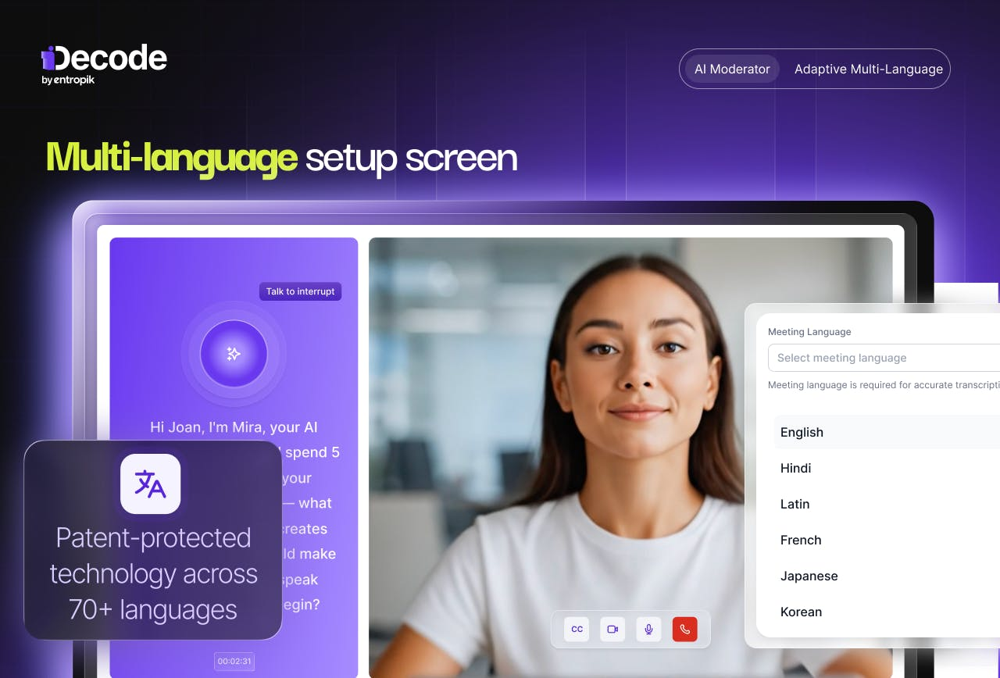
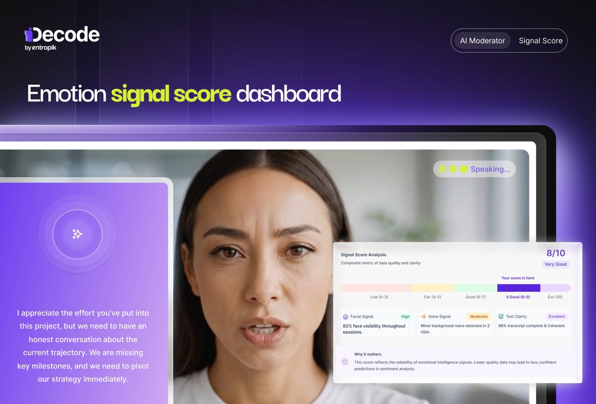

### 🎬 관련 영상
- [🎥 영상 보기](https://ph-files.imgix.net/f27db053-2ca3-4808-bfae-9636fa60d540.jpeg?auto=format)

---

## 6. [AI Emaily](https://www.producthunt.com/products/ai-emaily-unified-ai-inbox)
**Votes**: 165 | **도입 난이도**: 하 | **신뢰도**: 상
**Tagline**: Your AI inbox that writes like you + replies on autopilot
**서비스 링크**: https://www.producthunt.com/r/YDSWN642V7QU7T

**태그**: Productivity, AI, Automation, Email, AI Tool

### 📌 이 서비스 한눈에 보기
사용자의 말투를 학습하여 이메일 초안 작성부터 자동 답장까지 수행하는 AI 비서형 인박스

### 🔑 주요 기능
- 사용자 고유의 말투를 반영한 맞춤형 답장 초안 생성
- 수동, 코파일럿, 오토파일럿의 3단계 모드를 통한 제어 가능한 자동화
- Gmail, Outlook 등 다양한 이메일 제공업체를 통합 관리하는 단일 인박스

### 🙋 사용자에게 어떤 점이 좋은가
이메일 분류와 답장 작성에 드는 시간을 획기적으로 줄여주며, 마치 유능한 비서가 업무를 처리하는 듯한 경험을 제공합니다.

### ✅ 지금 바로 써볼 기능
- 사용자 말투 학습을 위한 초기 데이터 연동
- 중요도에 따른 이메일 분류 및 트리아지 기능 테스트
- Copilot 모드를 통한 초안 검토 및 발송 프로세스 경험

### ⚠️ 사용 전 확인할 점
- 자동화 모드(Autopilot) 사용 시 의도치 않은 답장 발송 가능성
- 초기 설정 시 기존 이메일 데이터 연동에 대한 보안 검토 필요

### 🧭 확인이 더 필요한 정보
제공되는 무료 플랜의 구체적인 사용량 제한 및 유료 플랜의 가격 정책이 명시되지 않았습니다.

### 📸 스크린샷 및 갤러리
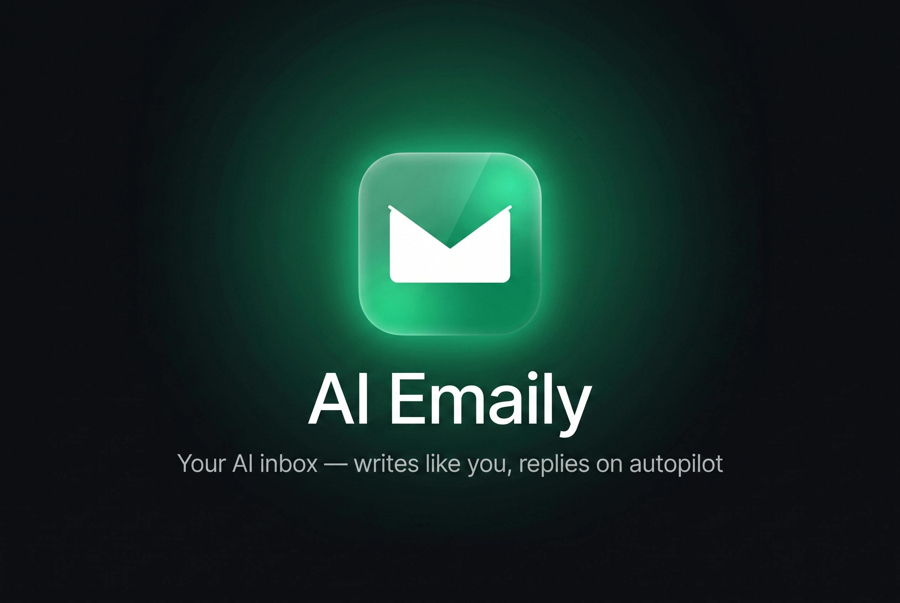
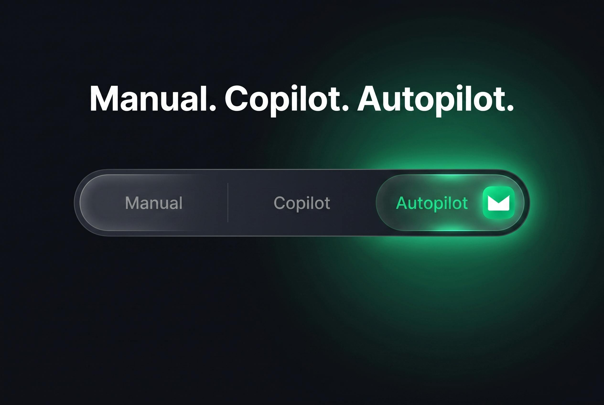
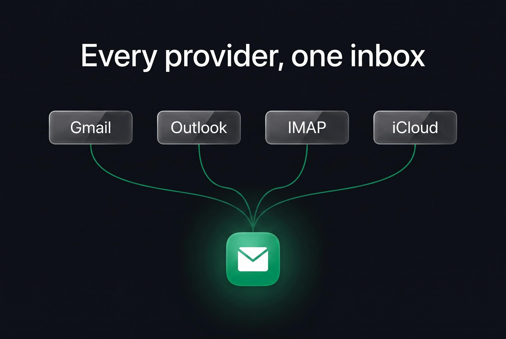

### 🎬 관련 영상
- [🎥 영상 보기](https://ph-files.imgix.net/dff9afd0-8eb8-4bd2-9747-ebdf239782f6.jpeg?auto=format)

---

## 7. [Social Fetch](https://www.producthunt.com/products/social-fetch)
**Votes**: 160 | **도입 난이도**: 하 | **신뢰도**: 상
**Tagline**: Social media scraper API for every major platform
**서비스 링크**: https://www.producthunt.com/r/64J2C2YZACK3VR

**태그**: DevTool, Automation, Data Extraction, Social Media, Video, API

### 📌 이 서비스 한눈에 보기
주요 소셜 미디어의 공개 데이터를 손쉽게 수집할 수 있는 강력한 스크래핑 API

### 🔑 주요 기능
- TikTok, Instagram, YouTube, X, LinkedIn 등 주요 플랫폼 지원
- 프로필, 게시물, 댓글, 영상, 트랜스크립트 및 메트릭 데이터 추출 가능
- 종량제(Pay-as-you-go) 방식 및 초기 무료 크레딧 제공

### 🙋 사용자에게 어떤 점이 좋은가
복잡한 스크래핑 로직을 직접 구현할 필요 없이 API 호출만으로 소셜 데이터를 수집하여 마케팅 분석이나 데이터 기반 의사결정에 활용할 수 있습니다.

### ✅ 지금 바로 써볼 기능
- 제공되는 100개의 무료 크레딧으로 데이터 추출 테스트하기
- 필요한 플랫폼의 데이터 형식이 API를 통해 제공되는지 확인하기
- 종량제 요금 체계가 프로젝트 예산에 적합한지 검토하기

### ⚠️ 사용 전 확인할 점
- 플랫폼의 정책 변화에 따른 데이터 수집 안정성 확인 필요
- 공개 프로필 및 데이터에 한정된 스크래핑 기능

### 🧭 확인이 더 필요한 정보
각 플랫폼별 데이터 업데이트 주기와 API 호출 제한(Rate Limit)에 대한 상세 정보가 필요합니다.

### 📸 스크린샷 및 갤러리
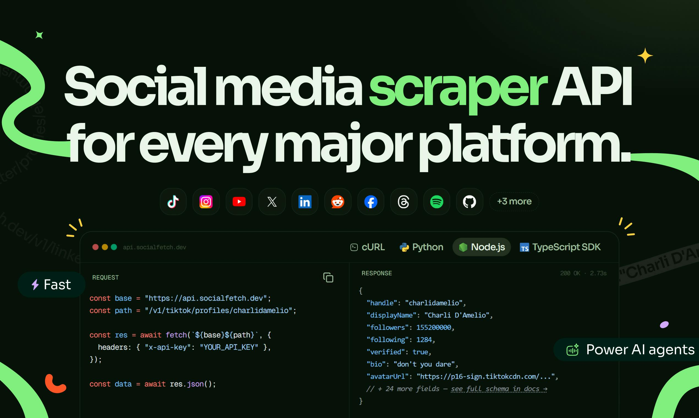
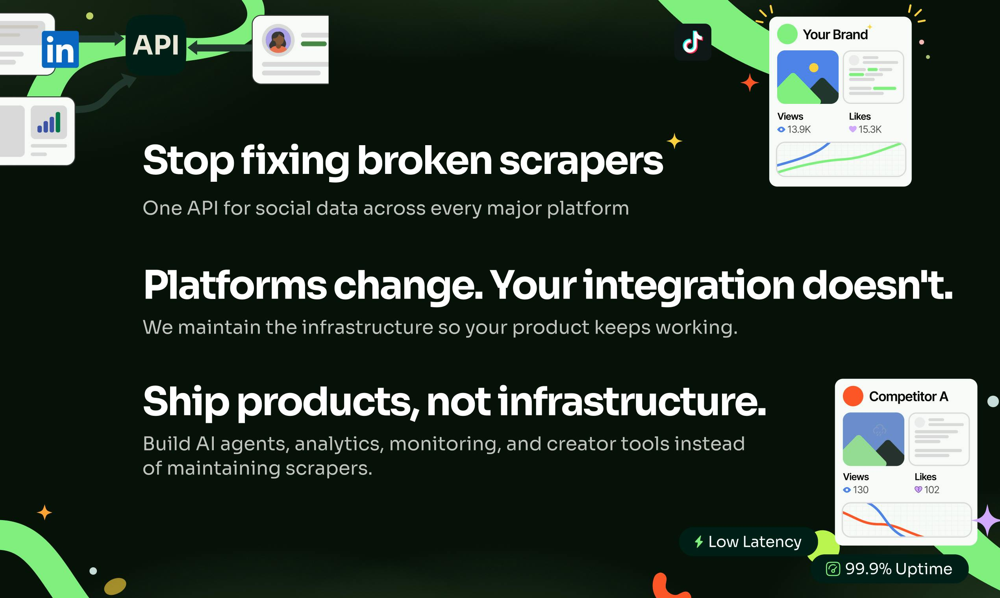
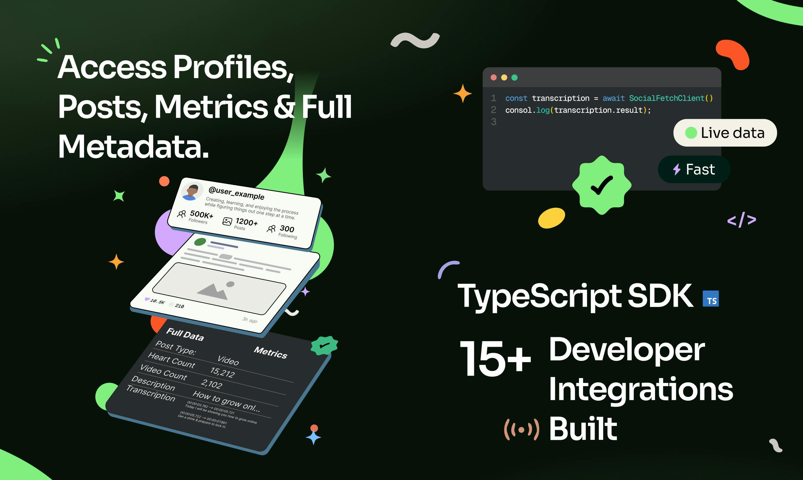

---

## 8. [Ogment AI](https://www.producthunt.com/products/ogment-mcp-builder)
**Votes**: 155 | **도입 난이도**: 하 | **신뢰도**: 상
**Tagline**: Your AI coworker, in Slack. Just tag @O.
**서비스 링크**: https://www.producthunt.com/r/MKGRS2HJKQ6GT5

**태그**: AI, Slack, Automation, Productivity, Collaboration, AI Tool

### 📌 이 서비스 한눈에 보기
Slack 내에서 동료처럼 태그하여 업무를 위임하고 자동화하는 AI 협업 툴

### 🔑 주요 기능
- Slack 네이티브 환경에서 @O 태그로 간편하게 대화 및 업무 지시
- 1,000개 이상의 외부 도구와 연결하여 업무 자동화 수행
- 팀 전체가 지식과 기술을 공유하며 누구나 쉽게 AI 활용 가능

### 🙋 사용자에게 어떤 점이 좋은가
별도의 복잡한 설정 없이 Slack 안에서 즉시 업무를 위임하고 자동화할 수 있어 팀 전체의 생산성을 높여줍니다.

### ✅ 지금 바로 써볼 기능
- Slack에 @O 설치 및 팀원 초대하기
- 일상적인 질문이나 반복 업무를 @O에게 자연어로 요청하기
- 기존에 사용 중인 비즈니스 도구와 연결 설정하기

### ⚠️ 사용 전 확인할 점
- Slack 외부 환경에서의 작업 제약 여부 확인 필요
- 팀 내 데이터 공유 및 보안 정책 준수 여부 검토

### 🧭 확인이 더 필요한 정보
사용자가 선택 가능한 AI 모델의 구체적인 종류와 비용 구조에 대한 정보가 부족합니다.

### 📸 스크린샷 및 갤러리
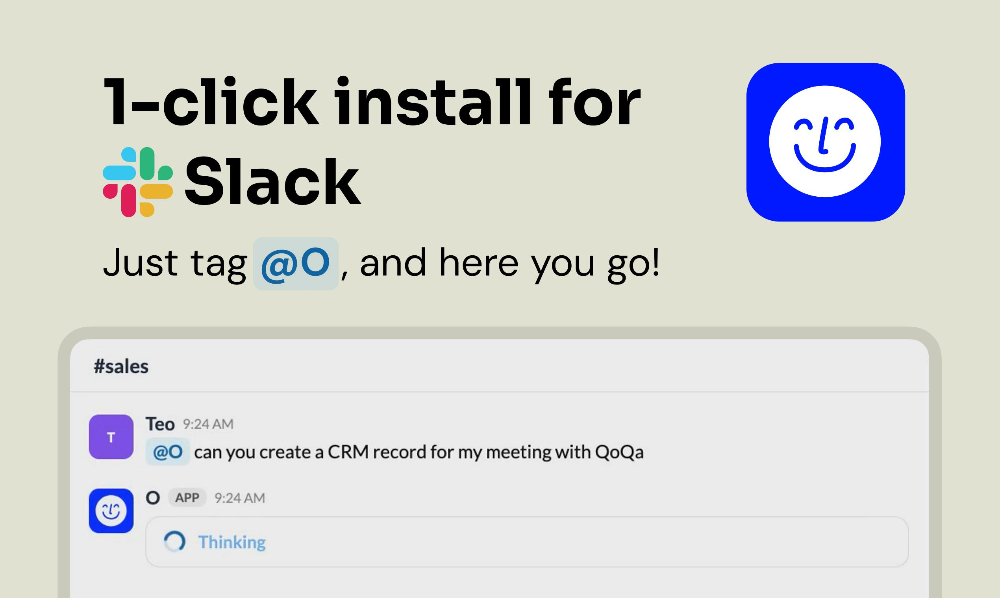
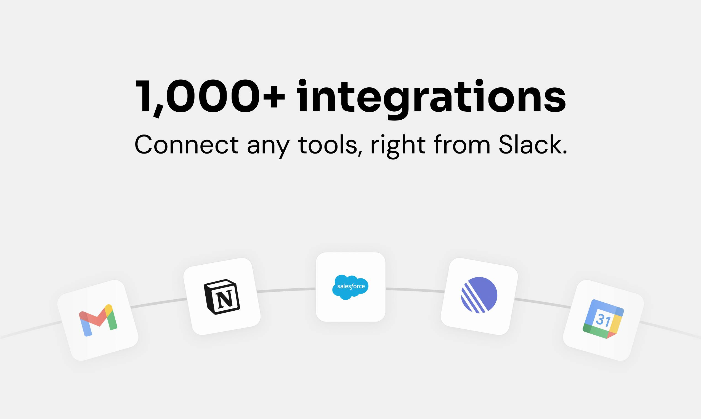
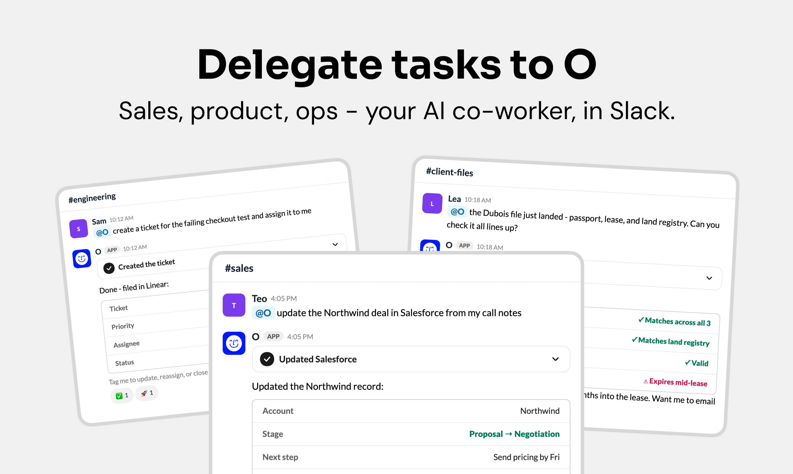

### 🎬 관련 영상
- [🎥 영상 보기](https://ph-files.imgix.net/dd5cb12a-8b66-4c31-8dbc-26f128b70349.jpeg?auto=format)

---

## 9. [Ellis](https://www.producthunt.com/products/ellis-your-conversations-remembered)
**Votes**: 155 | **도입 난이도**: 하 | **신뢰도**: 상
**Tagline**: AI notes for in-person meetings
**서비스 링크**: https://www.producthunt.com/r/77OH47D2XJ2D5C

**태그**: AI, Productivity, Mobile, Transcription, AI Tool

### 📌 이 서비스 한눈에 보기
아이폰만으로 대면 회의를 기록하고 요약하는 AI 노트 테이커

### 🔑 주요 기능
- 별도 하드웨어 없이 iPhone 또는 Apple Watch로 간편한 녹음
- 화자 식별 기능이 포함된 깨끗한 회의록 텍스트 변환
- 결정 사항, 놓친 내용 등 질문을 통한 대화형 요약 기능

### 🙋 사용자에게 어떤 점이 좋은가
노트북을 펼칠 필요 없이 모바일 기기만으로 회의에 집중하면서도, 사후에 완벽한 회의 기록을 확보할 수 있습니다.

### ✅ 지금 바로 써볼 기능
- iPhone으로 회의 녹음 시작하기
- 생성된 트랜스크립트에서 화자 구분 확인하기
- AI에게 회의 결정 사항 질문하기

### ⚠️ 사용 전 확인할 점
- 모바일 기기 기반이므로 주변 소음 환경에 따라 녹음 품질이 달라질 수 있음
- 대면 회의 시 기기 배치에 따른 화자 식별 정확도 차이 가능성

### 🧭 확인이 더 필요한 정보
모바일 환경에서의 배터리 소모량 및 장시간 녹음 안정성에 대한 정보가 필요합니다.

### 📸 스크린샷 및 갤러리

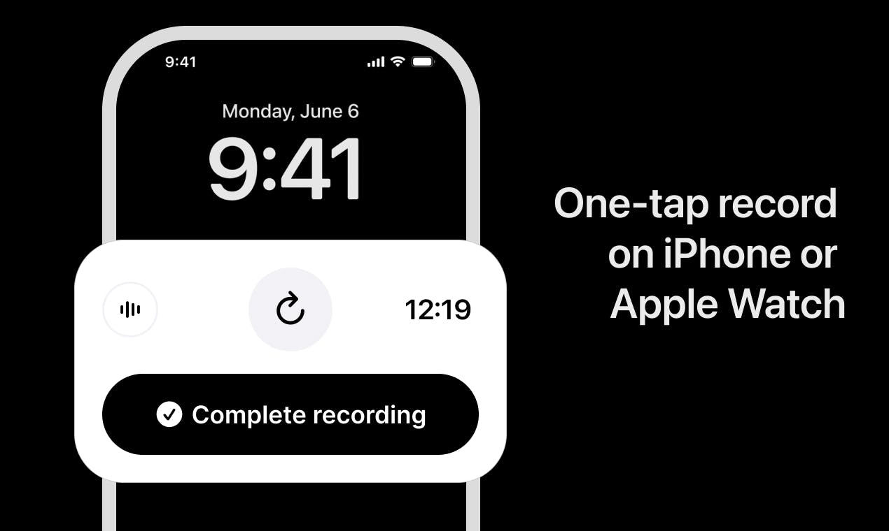
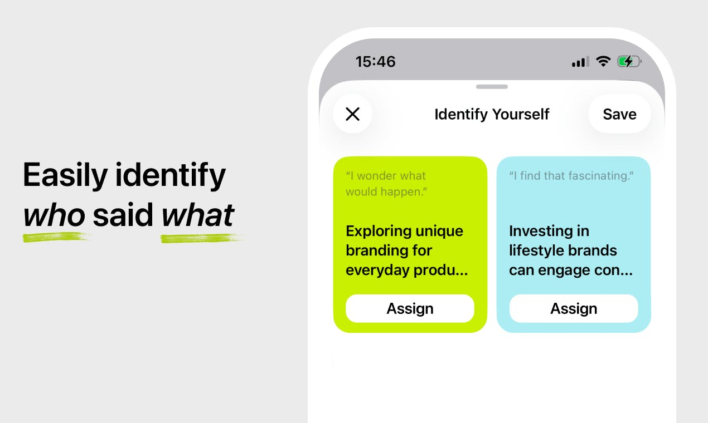

---

## 10. [LongCat-2.0](https://www.producthunt.com/products/longcat)
**Votes**: 130 | **도입 난이도**: 상 | **신뢰도**: 상
**Tagline**: 1.6T MoE trained entirely on AI ASICs
**서비스 링크**: https://www.producthunt.com/r/7J7WA67KIEHIFT

**태그**: AI, Coding, LLM, Automation, DevTool, Agent, AI Tool

### 📌 이 서비스 한눈에 보기
1.6조 파라미터 규모의 고성능 MoE 모델로, 코딩과 에이전트 작업에 최적화된 차세대 AI 모델

### 🔑 주요 기능
- 1.6T 파라미터 MoE 구조 및 48B 활성 파라미터 탑재
- 1M(100만) 토큰의 대규모 컨텍스트 윈도우와 Sparse Attention 기술 적용
- 코딩 및 에이전트 워크플로우를 위한 특화된 사후 학습 수행

### 🙋 사용자에게 어떤 점이 좋은가
방대한 양의 코드를 한 번에 처리할 수 있으며, 코딩 및 자동화 에이전트 작업에서 강력한 성능을 제공합니다.

### ✅ 지금 바로 써볼 기능
- 1M 컨텍스트를 활용한 대규모 코드베이스 분석
- Claude Code 및 OpenClaw 연동 테스트
- 에이전트 워크플로우 자동화 적용

### ⚠️ 사용 전 확인할 점
- 모델 규모가 매우 커 하드웨어 리소스 요구사항이 높을 수 있음
- 특정 워크플로우(코딩/에이전트)에 특화되어 일반 범용 작업 성능 확인 필요

### 🧭 확인이 더 필요한 정보
실제 하드웨어 구동 시 필요한 최소 사양과 구체적인 API 비용 체계에 대한 정보가 부족합니다.

### 📸 스크린샷 및 갤러리
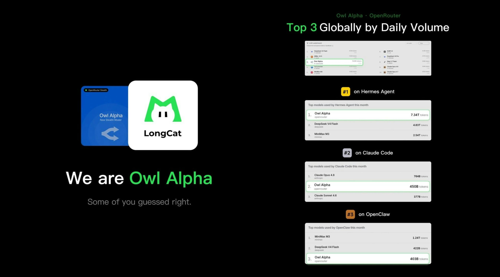
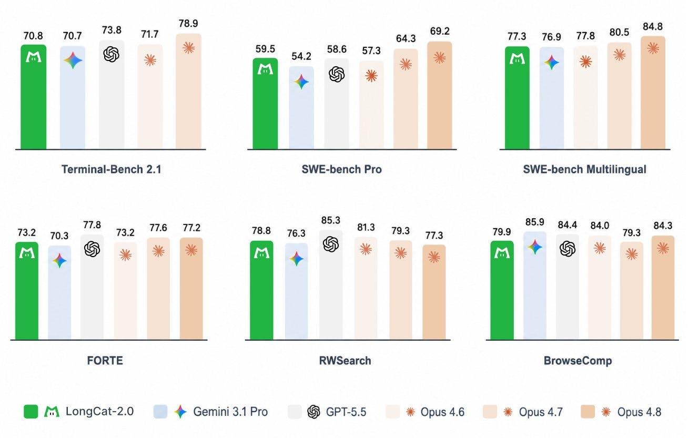
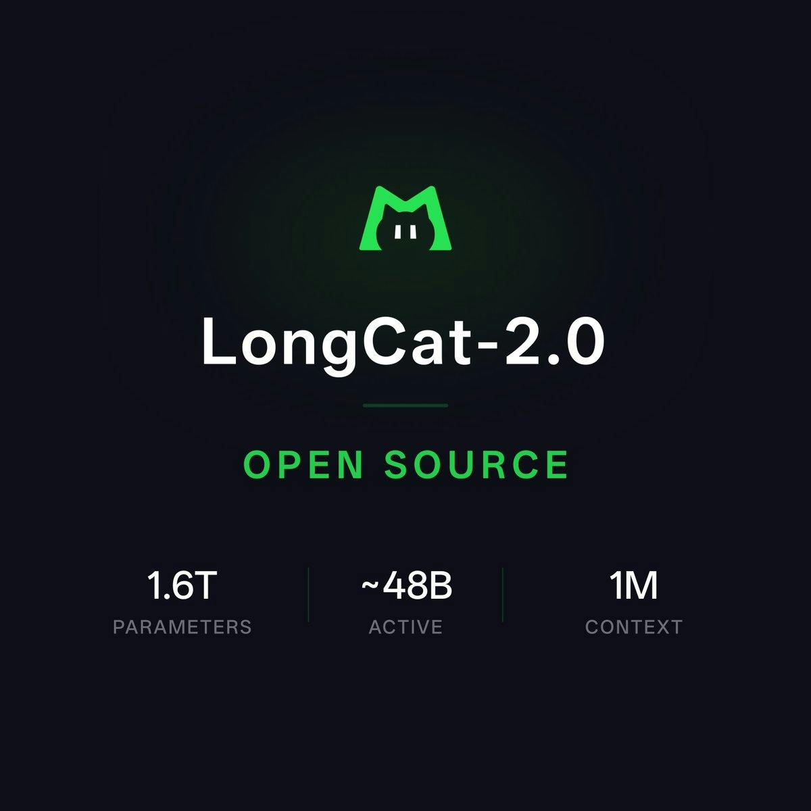

### 🎬 관련 영상
- [🎥 영상 보기](https://ph-files.imgix.net/120c385a-6002-4af6-b05b-52a44fb2924a.jpeg?auto=format)

---

## 11. [Zoho Tables](https://www.producthunt.com/products/zoho-tables)
**Votes**: 129 | **도입 난이도**: 하 | **신뢰도**: 상
**Tagline**: Smarter way to manage work and data.
**서비스 링크**: https://www.producthunt.com/r/GVPAU3SBVA32ZX

**태그**: NoCode, Automation, Collaboration, AI, Productivity, AI Tool, DevTool

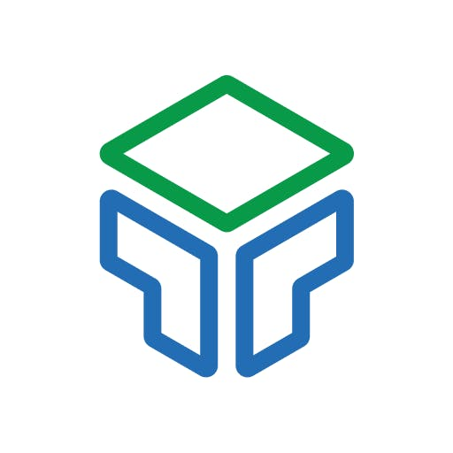

### 📌 이 서비스 한눈에 보기
AI 기반의 노코드 스프레드시트와 데이터베이스를 결합한 스마트 워크플로우 관리 도구

### 🔑 주요 기능
- 스프레드시트와 데이터베이스의 장점을 결합한 하이브리드 구조
- AI를 활용한 데이터 정리 및 워크플로우 자동화
- 실시간 협업을 통한 효율적인 업무 관리

### 🙋 사용자에게 어떤 점이 좋은가
복잡한 데이터 관리와 반복적인 업무를 AI와 자동화로 단순화하여 팀의 생산성을 높일 수 있습니다.

### ✅ 지금 바로 써볼 기능
- 데이터 구조 설계 및 데이터베이스 구축
- AI 기능을 활용한 데이터 정리 및 자동화 설정
- 팀원 초대 및 실시간 협업 워크플로우 테스트

### ⚠️ 사용 전 확인할 점
- AI 기능의 구체적인 제약 사항 및 데이터 보안 정책 확인 필요
- 기존 스프레드시트 도구와의 데이터 마이그레이션 편의성 확인

### 🧭 확인이 더 필요한 정보
AI 기능의 구체적인 작동 방식과 자동화 워크플로우의 세부 범위에 대한 정보가 더 필요합니다.

### 📸 스크린샷 및 갤러리
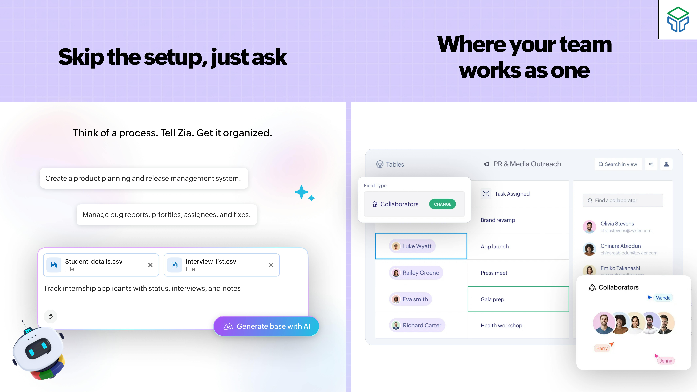
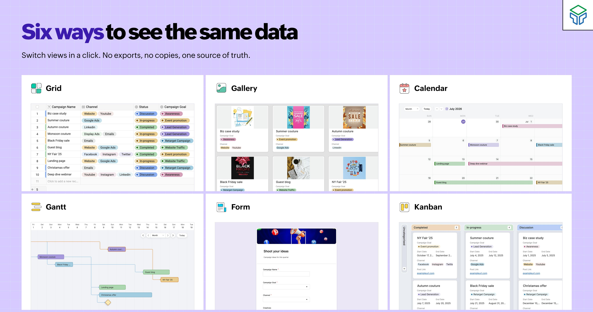
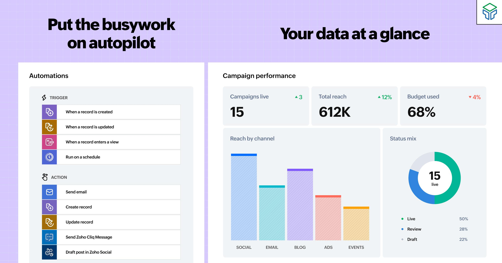

### 🎬 관련 영상
- [🎥 영상 보기](https://ph-files.imgix.net/5c601e3d-c65f-4493-8961-b31dd2d9cec3.jpeg?auto=format)

---

## 12. [Glideo](https://www.producthunt.com/products/glideo)
**Votes**: 126 | **도입 난이도**: 하 | **신뢰도**: 상
**Tagline**: Screen recordings that edit themselves
**서비스 링크**: https://www.producthunt.com/r/SLMZ7XAF7EXLY7

**태그**: ProductDemo, ScreenRecorder, macOS, Automation, Free, Video

### 📌 이 서비스 한눈에 보기
클릭만으로 전문적인 데모 영상을 만드는 자동 줌 기능 탑재 macOS 화면 녹화 도구

### 🔑 주요 기능
- 클릭과 커서 움직임에 맞춰 자동으로 이루어지는 스마트 줌 기능
- 별도의 키프레임 작업 없이도 정교한 데모 영상 제작 가능
- 워터마크와 유료 결제 유도 없는 완전 무료 macOS 전용 앱

### 🙋 사용자에게 어떤 점이 좋은가
제품 데모나 개발 도구 소개 영상을 만들 때, 편집 시간을 획기적으로 줄이면서도 전문가가 만든 듯한 결과물을 얻을 수 있습니다.

### ✅ 지금 바로 써볼 기능
- macOS에 설치하여 화면 녹화 시작하기
- 클릭 시 발생하는 자동 줌 효과 확인하기
- 녹화된 결과물의 완성도 테스트하기

### ⚠️ 사용 전 확인할 점
- macOS 전용 앱이므로 Windows 환경에서는 사용 불가
- 자동 줌 기능 외의 세부적인 수동 편집 기능 포함 여부 확인 필요

### 🧭 확인이 더 필요한 정보
상세한 편집 기능의 범위와 macOS 버전별 호환성 확인이 필요합니다.

### 📸 스크린샷 및 갤러리
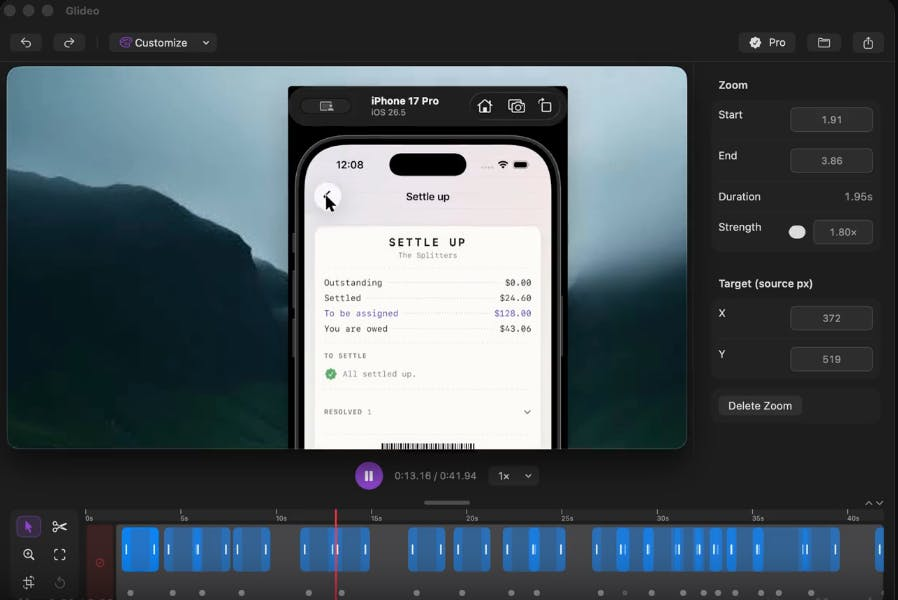
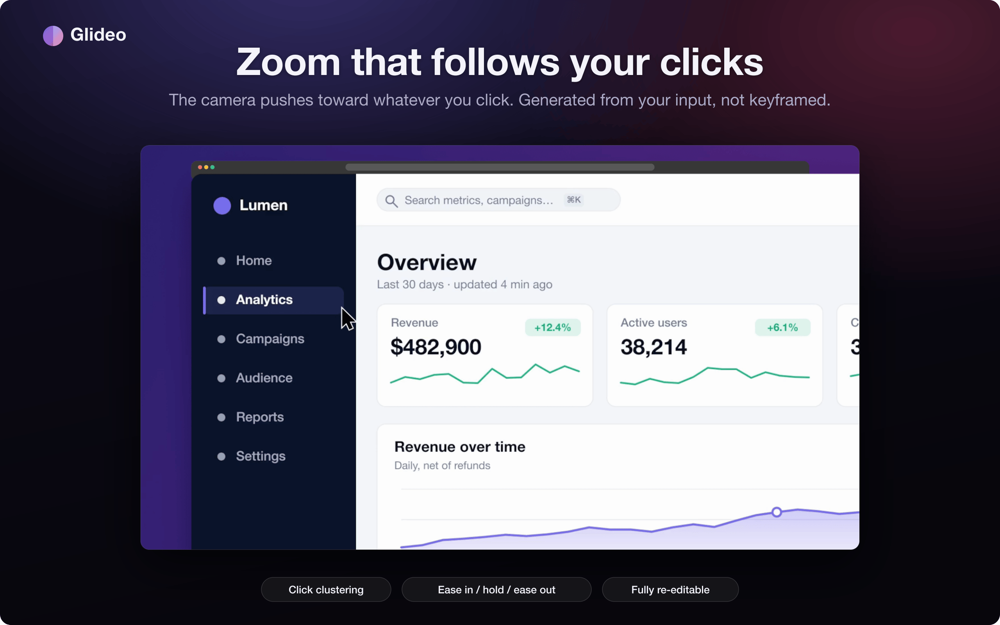
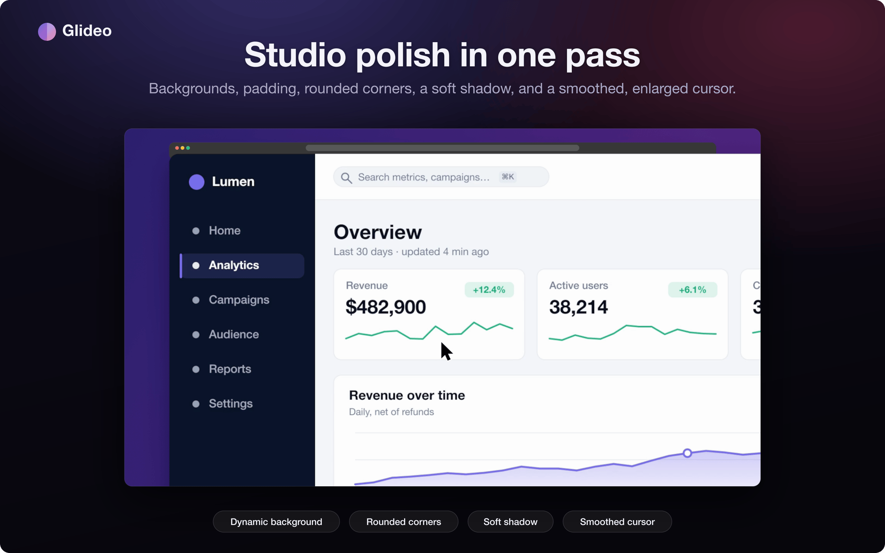

### 🎬 관련 영상
- [🎥 영상 보기](https://ph-files.imgix.net/72fd932e-864d-4385-96d0-b44ef4e92241.jpeg?auto=format)

---

## 13. [Kadoink AI](https://www.producthunt.com/products/say-who-say-why-kadoink-gathers-everyone)
**Votes**: 117 | **도입 난이도**: 하 | **신뢰도**: 중
**Tagline**: Gather people instantly by AI txt, video, or ringing phones
**서비스 링크**: https://www.producthunt.com/r/MONPY2MEU4GD5B

**태그**: Communication, AI, Automation, Real-time, AI Tool, Video

### 📌 이 서비스 한눈에 보기
목적만 말하면 AI가 최적의 방식으로 사람들을 모아주는 실시간 커뮤니케이션 엔진

### 🔑 주요 기능
- AI 기반의 자동화된 커뮤니케이션 경로 선택 (텍스트, 영상, 음성 등)
- 사용자가 누구를 왜 모아야 하는지만 입력하면 AI가 아웃리치 수행
- 실시간 소통을 위한 지능형 모임 및 알림 기능

### 🙋 사용자에게 어떤 점이 좋은가
사람들에게 연락하고 모으는 번거로운 과정을 자동화하여, 사용자가 소통의 목적에만 집중할 수 있게 해줍니다.

### ✅ 지금 바로 써볼 기능
- 목적(Mission) 입력하여 AI 아웃리치 테스트하기
- AI가 제안하는 최적의 연락 경로 확인하기
- 실시간 모임 기능 실행해보기

### ⚠️ 사용 전 확인할 점
- AI가 선택하는 연락 방식이 사용자의 의도와 일치하는지 확인 필요
- 개인 연락처나 기기 권한 접근에 대한 보안 정책 확인 필요

### 🧭 확인이 더 필요한 정보
구체적인 타겟 사용자층(B2B/B2C)과 개인정보 보호 정책에 대한 상세 정보가 부족합니다.

### 📸 스크린샷 및 갤러리
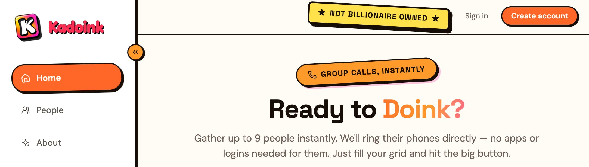
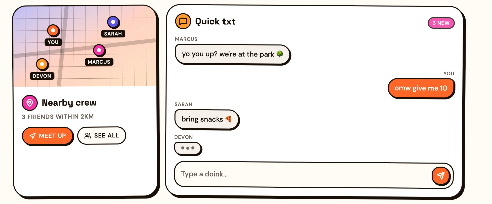
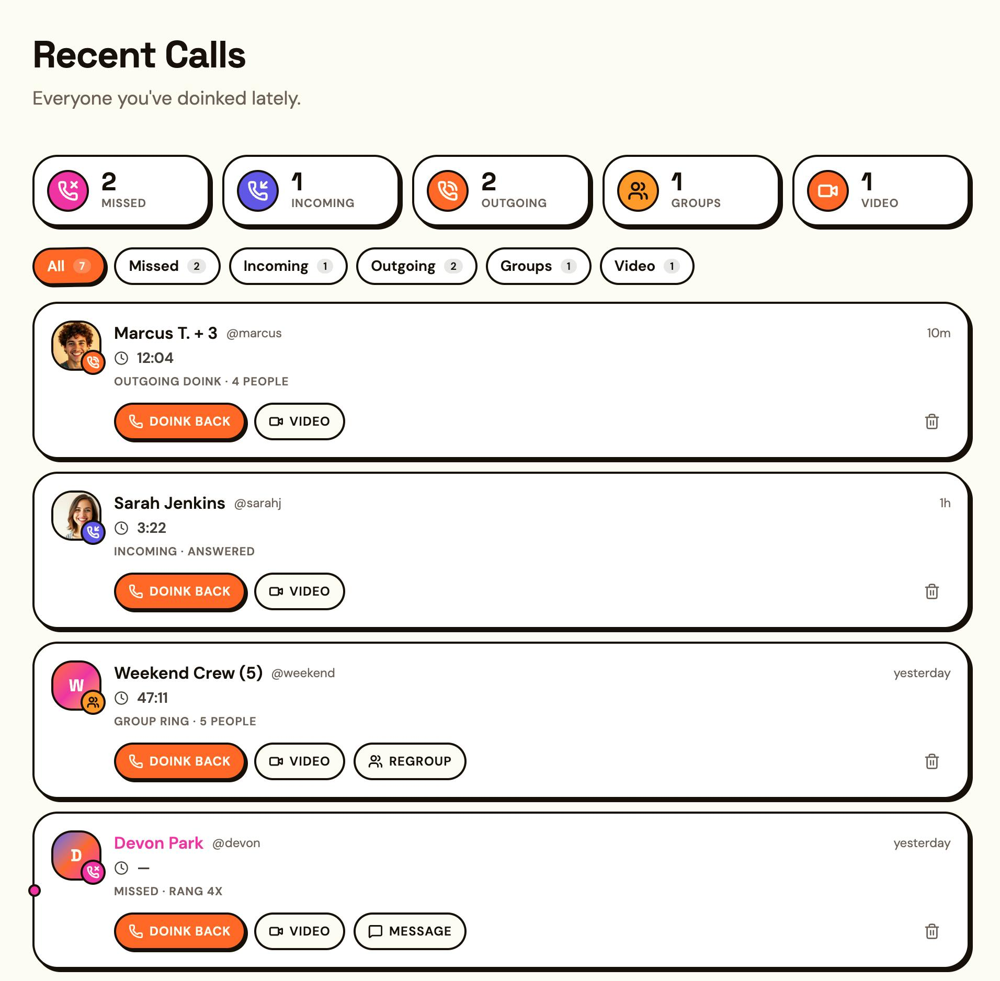

---

## 14. [Onlook](https://www.producthunt.com/products/onlook-3)
**Votes**: 38 | **도입 난이도**: 하 | **신뢰도**: 상
**Tagline**: Access your Ring cameras directly from your Mac’s menu bar.
**서비스 링크**: https://www.producthunt.com/r/JXUAQK4ZX3PK4A

**태그**: Security, Productivity, SmartHome

### 📌 이 서비스 한눈에 보기
Mac 메뉴 바에서 Ring 카메라를 실시간으로 확인하는 간편한 보안 솔루션

### 🔑 주요 기능
- Mac 메뉴 바를 통한 Ring 카메라 직접 액세스
- 실시간 라이브 뷰 제공
- 모션 알림 및 즉시 재생 기능 통합

### 🙋 사용자에게 어떤 점이 좋은가
별도의 브라우저나 앱을 열지 않고도 Mac 상단에서 즉시 카메라 화면을 확인하고 보안 상태를 점검할 수 있습니다.

### ✅ 지금 바로 써볼 기능
- 메뉴 바에 고정하여 실시간 라이브 뷰 확인하기
- 모션 알림 설정으로 즉각적인 보안 대응하기
- 필요 시 즉시 재생 기능을 통한 이벤트 확인하기

### ⚠️ 사용 전 확인할 점
- Ring 계정 및 하드웨어와의 연동 필요
- 네트워크 상태에 따른 라이브 스트리밍 지연 가능성

### 🧭 확인이 더 필요한 정보
Ring 기기 모델별 호환성 및 macOS 버전별 지원 여부를 확인해야 합니다.

### 📸 스크린샷 및 갤러리
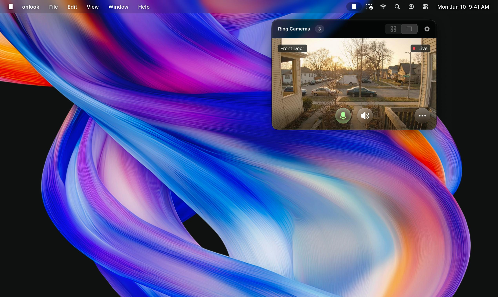
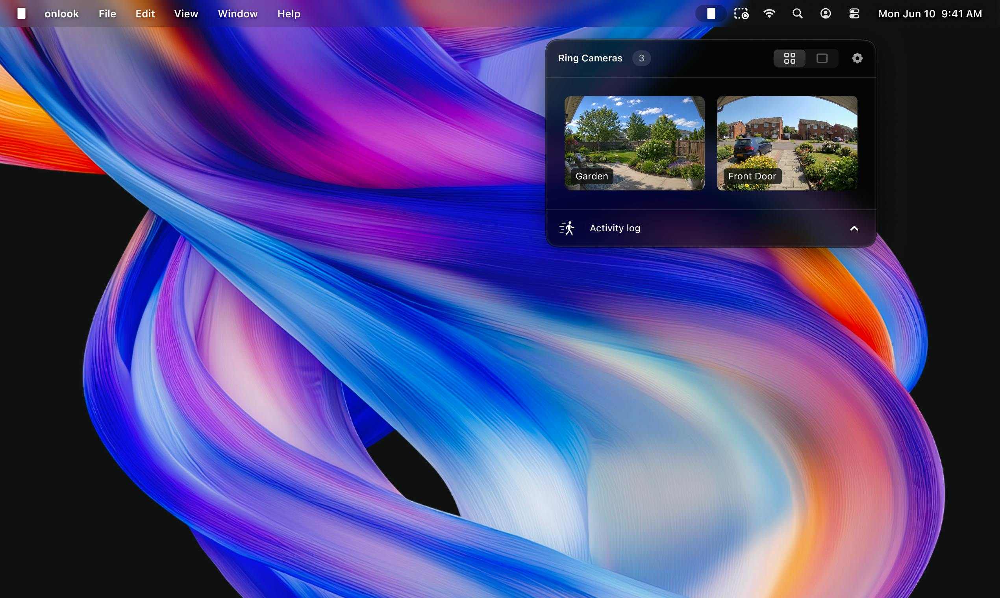
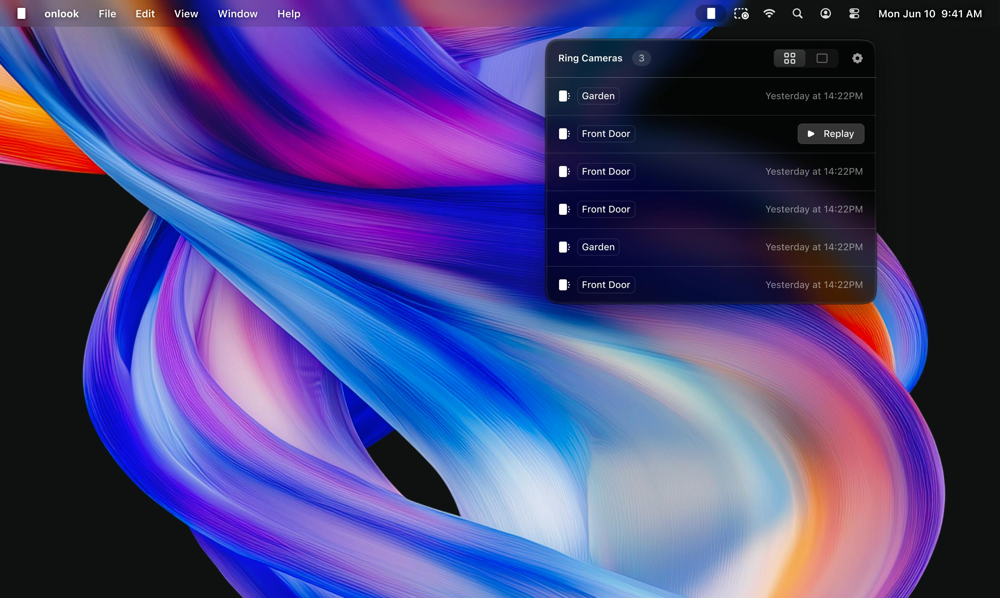

---

## 15. [Norte](https://www.producthunt.com/products/norte-your-wallet-s-benefits-brain)
**Votes**: 35 | **도입 난이도**: 하 | **신뢰도**: 상
**Tagline**: Get back every benefit your cards already pay for.
**서비스 링크**: https://www.producthunt.com/r/32T7KO6LOSAQVB

**태그**: FinTech, PersonalFinance, Automation, AI Tool

### 📌 이 서비스 한눈에 보기
사용 중인 프리미엄 카드의 잠자고 있는 혜택을 자동으로 찾아주는 서비스

### 🔑 주요 기능
- 카드에 포함된 크레딧, 포인트, 보호 혜택 자동 관리
- 은행 로그인이나 카드 번호 입력 없이 안전하게 운영
- 사용자가 놓치고 있는 연간 평균 $2,600 상당의 가치 회수

### 🙋 사용자에게 어떤 점이 좋은가
카드 혜택을 일일이 챙기지 못해 손해 보던 사용자가 놓친 가치를 실질적인 혜택으로 전환할 수 있습니다.

### ✅ 지금 바로 써볼 기능
- 보유 중인 프리미엄 카드 혜택 리스트 확인
- Norte를 통한 미사용 혜택 자동 수집 설정

### ⚠️ 사용 전 확인할 점
- 카드 종류에 따라 수집 가능한 혜택 범위가 다를 수 있음
- 제시된 $2,600은 평균치이므로 개인별 차이가 큼

### 🧭 확인이 더 필요한 정보
사용자의 카드 정보를 어떤 방식으로 안전하게 연동하는지에 대한 기술적 세부 사항 확인이 필요합니다.

### 📸 스크린샷 및 갤러리
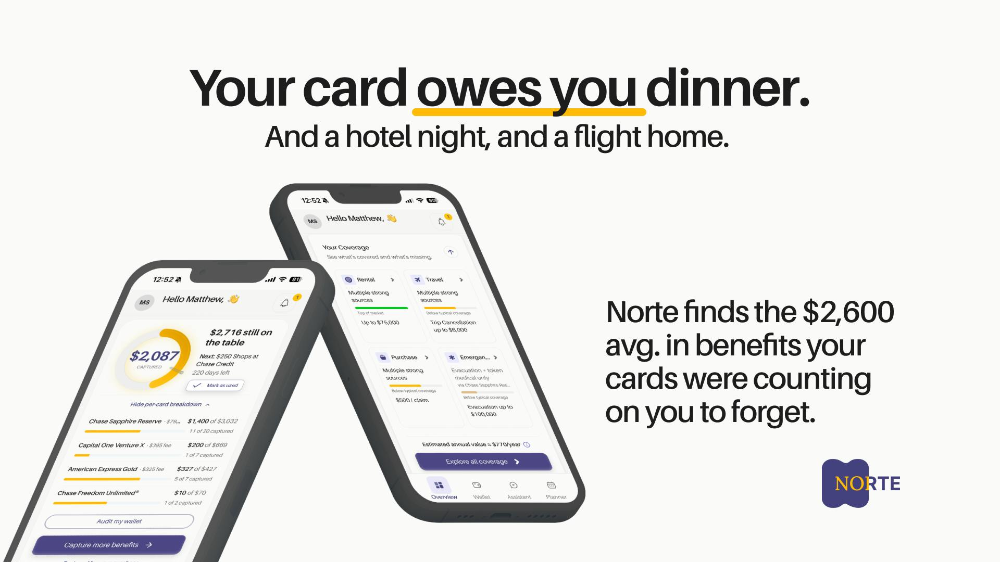
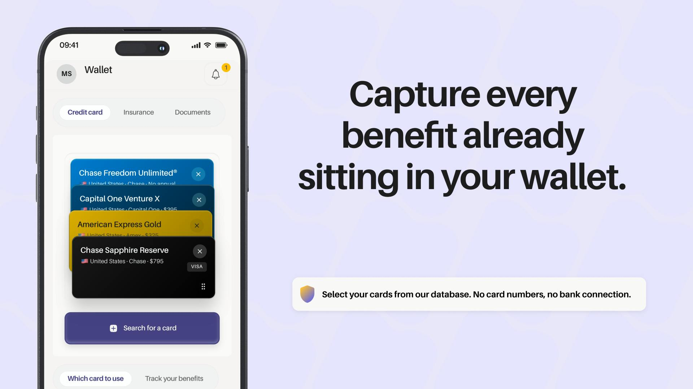
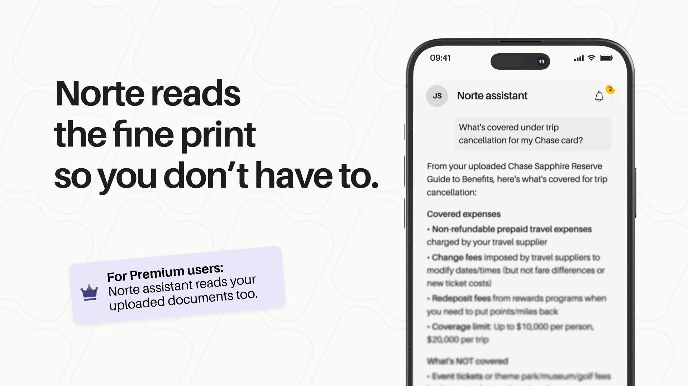

### 🎬 관련 영상
- [🎥 영상 보기](https://ph-files.imgix.net/e49b0b45-9b59-4eb9-b7b4-a1295b0a050f.jpeg?auto=format)

---

## 16. [Intervool](https://www.producthunt.com/products/intervool)
**Votes**: 35 | **도입 난이도**: 하 | **신뢰도**: 상
**Tagline**: Turn customer interviews into roadmap decisions.
**서비스 링크**: https://www.producthunt.com/r/ID2NPGAGIKTNFC

**태그**: Product Management, Customer Insights, Roadmap, UX Research, AI Tool

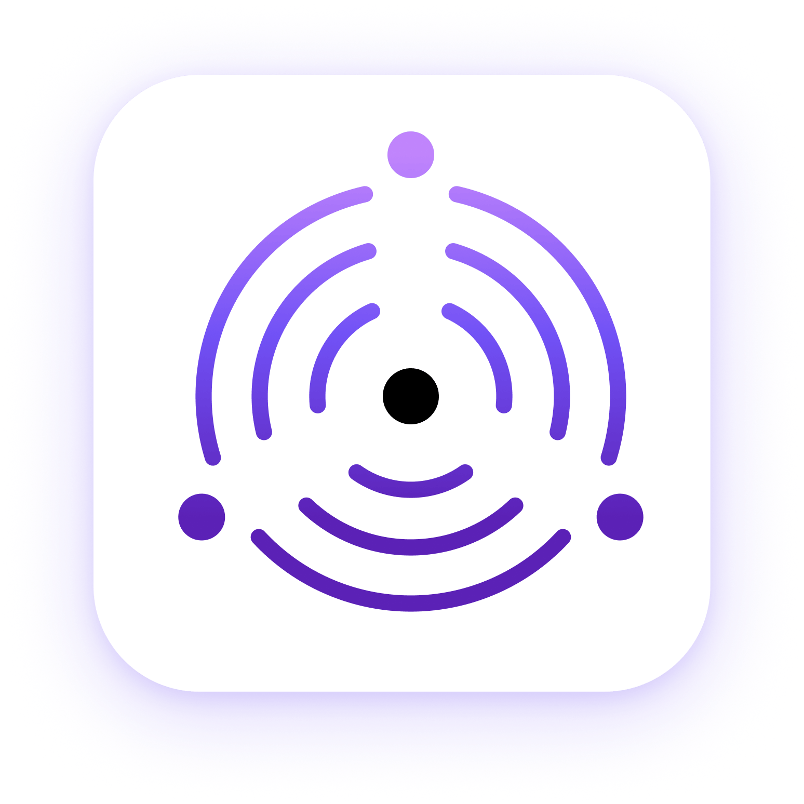

### 📌 이 서비스 한눈에 보기
고객 인터뷰 데이터를 체계적인 제품 로드맵으로 전환하는 인사이트 관리 도구

### 🔑 주요 기능
- 분산된 고객 피드백(Zoom, 메모, Miro 등)을 한곳에 저장 및 구조화
- 페르소나 및 세그먼트별로 인사이트를 클러스터링하여 테마 추출
- 추출된 테마를 기반으로 우선순위가 반영된 제품 로드맵 구축

### 🙋 사용자에게 어떤 점이 좋은가
파편화된 고객 목소리를 정제된 제품 기능으로 연결하여, 데이터에 기반한 의사결정을 내릴 수 있게 돕습니다.

### ✅ 지금 바로 써볼 기능
- 기존 고객 인터뷰 기록 업로드하기
- 페르소나별 인사이트 클러스터링 기능 실행하기
- 추출된 테마를 제품 로드맵으로 변환하기

### ⚠️ 사용 전 확인할 점
- 기존에 사용 중인 협업 툴(Zoom, Miro 등)과의 자동 연동 여부 확인 필요
- 데이터 보안 및 개인정보 보호 정책 확인 필요

### 🧭 확인이 더 필요한 정보
외부 도구와의 데이터 동기화 방식 및 자동화 수준에 대한 구체적인 정보가 부족합니다.

### 📸 스크린샷 및 갤러리
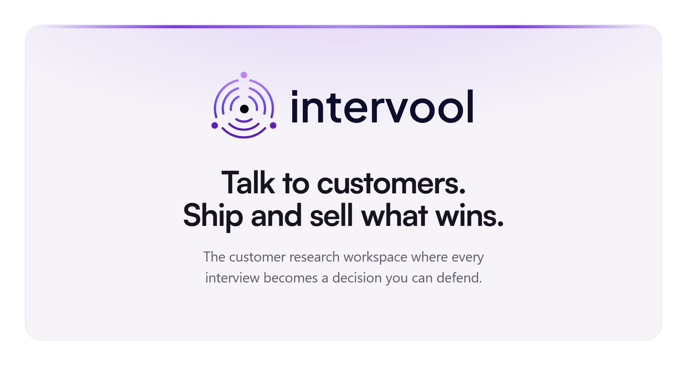
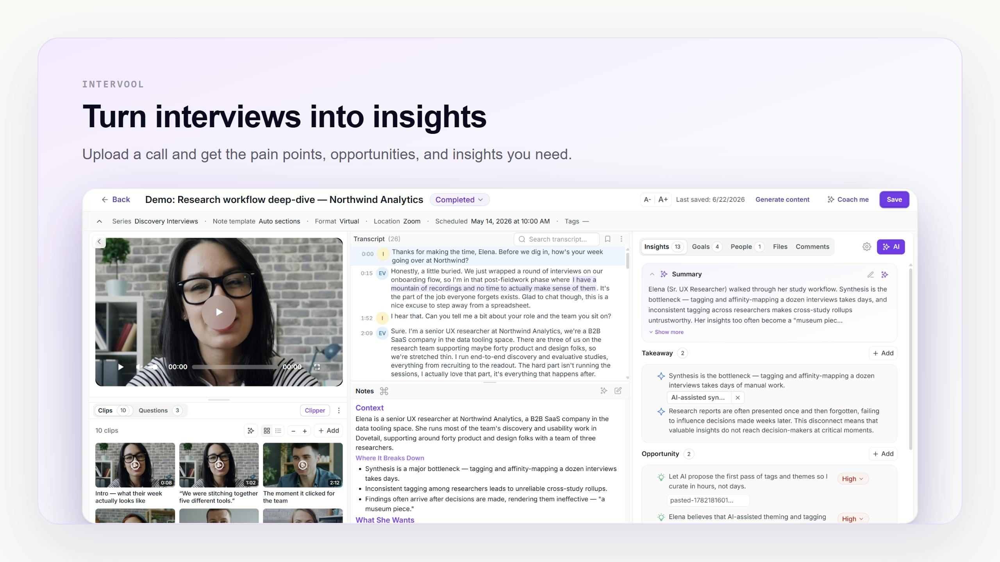
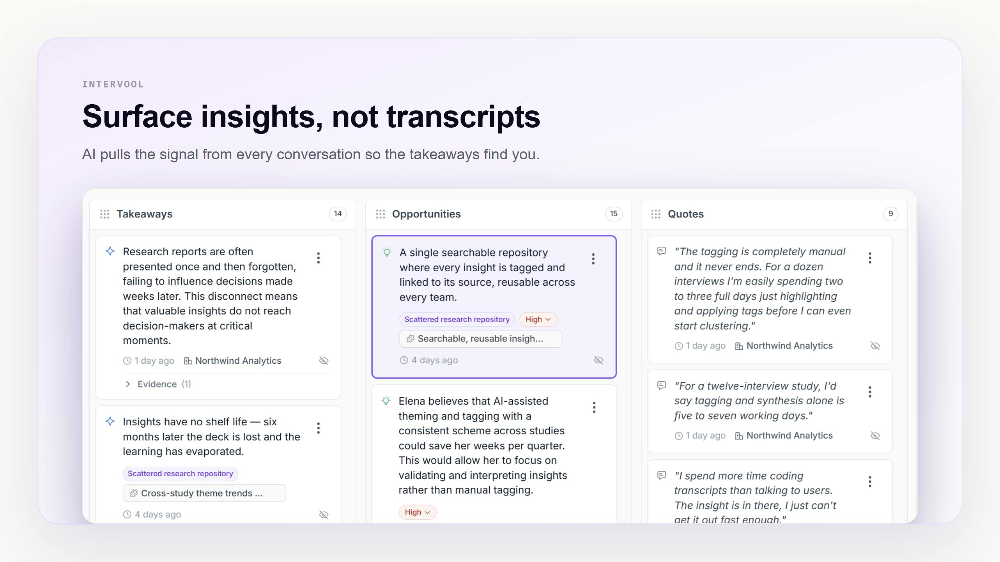

---

## 17. [Insight Engine](https://www.producthunt.com/products/insight-engine)
**Votes**: 32 | **도입 난이도**: 하 | **신뢰도**: 상
**Tagline**: AI that makes your posts smarter, not just louder
**서비스 링크**: https://www.producthunt.com/r/LJWUR35BSNAS4Y

**태그**: AI Writer, Content Creation, Productivity, Research, AI Tool, Chat

### 📌 이 서비스 한눈에 보기
단순한 글쓰기를 넘어 팩트 체크와 논리적 깊이를 더해주는 AI 콘텐츠 제작 도구

### 🔑 주요 기능
- 단순 톤 복제를 넘어 실시간 리서치와 논리적 분석을 통한 초안 작성
- 29가지 안티 슬롭(anti-slop) 패턴 검사를 통한 고품질 콘텐츠 필터링
- HN, Product Hunt, arXiv 등 외부 소스를 활용한 신선한 아이디어 발굴

### 🙋 사용자에게 어떤 점이 좋은가
단순히 양을 늘리는 것이 아니라, 검증된 사실과 날카로운 관점을 담은 고품질 포스트를 빠르게 작성할 수 있습니다.

### ✅ 지금 바로 써볼 기능
- 기존 ChatGPT 초안을 'Humanize mode'로 개선해보기
- PDF나 링크를 업로드하여 팩트 기반의 3가지 각도 초안 생성하기
- Ideas page를 통해 최신 트렌드 아이디어 확보하기

### ⚠️ 사용 전 확인할 점
- 구독형이 아닌 크레딧 방식이므로 사용량에 따른 비용 관리가 필요함
- 자동 스케줄링 기능이 없으므로 수동 게시 작업이 필요함

### 🧭 확인이 더 필요한 정보
크레딧당 단가 및 구체적인 과금 체계에 대한 상세 정보가 명시되지 않았습니다.

### 📸 스크린샷 및 갤러리
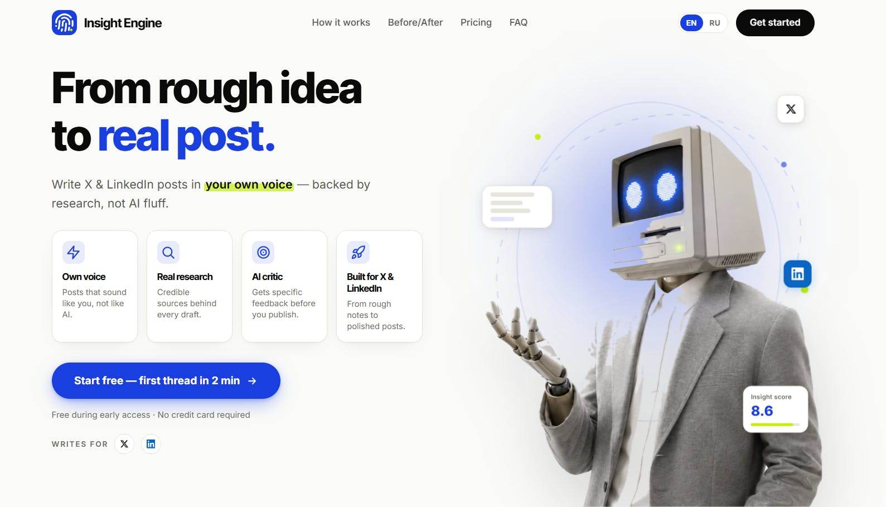
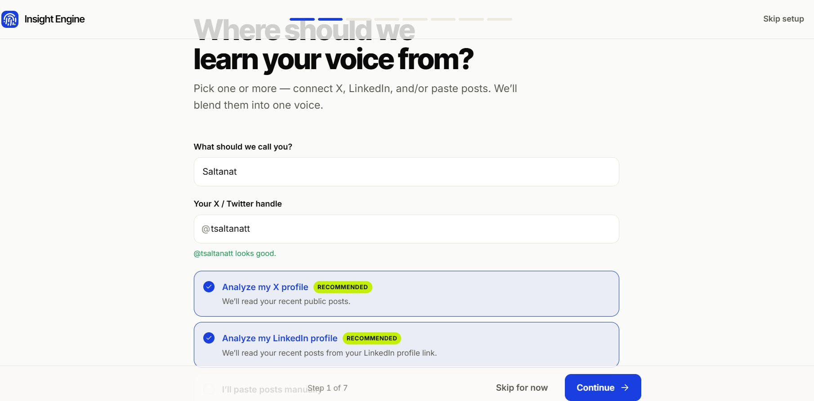
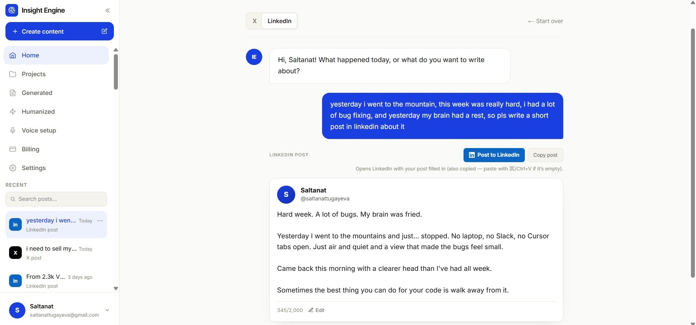

### 🎬 관련 영상
- [🎥 영상 보기](https://ph-files.imgix.net/6f2b173d-fe84-431e-8201-f83a155f42a6.jpeg?auto=format)

---

## 18. [TechnologyWire](https://www.producthunt.com/products/technologywire)
**Votes**: 31 | **도입 난이도**: 하 | **신뢰도**: 상
**Tagline**: Get your tech news on top publications in one click
**서비스 링크**: https://www.producthunt.com/r/6GSSGROD6GZ567

**태그**: PR, Marketing, Media, Startup, AI Tool

### 📌 이 서비스 한눈에 보기
클릭 한 번으로 TechCrunch 등 주요 IT 매체에 뉴스 배포

### 🔑 주요 기능
- TechCrunch, Business Insider 등 고권위 기술 매체로의 뉴스 배포
- 스타트업, 테크 기업 및 에이전시를 위한 PR 배포 네트워크
- 구매자, 기자, 투자자 및 AI 플랫폼 대상 가시성 확보

### 🙋 사용자에게 어떤 점이 좋은가
복잡한 홍보 절차 없이 주요 기술 매체에 기업 소식을 노출하여 브랜드 신뢰도와 검색 엔진 가시성을 높일 수 있습니다.

### ✅ 지금 바로 써볼 기능
- 배포 가능한 매체 리스트 확인
- 뉴스 배포 프로세스 테스트
- 타겟 매체 일치 여부 검토

### ⚠️ 사용 전 확인할 점
- 매체별 배포 승인 여부 및 가이드라인 확인 필요
- 배포된 기사의 노출 보장 범위 확인 필요

### 🧭 확인이 더 필요한 정보
구체적인 배포 비용 체계와 각 매체별 기사 게재 보장 여부가 명시되지 않았습니다.

### 📸 스크린샷 및 갤러리

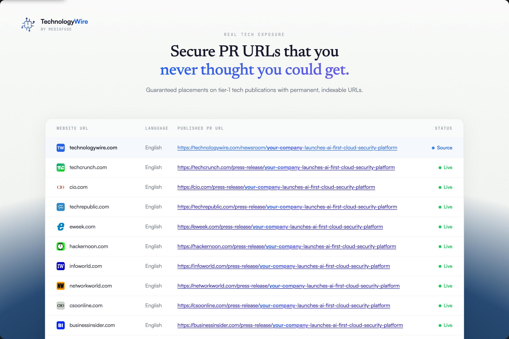
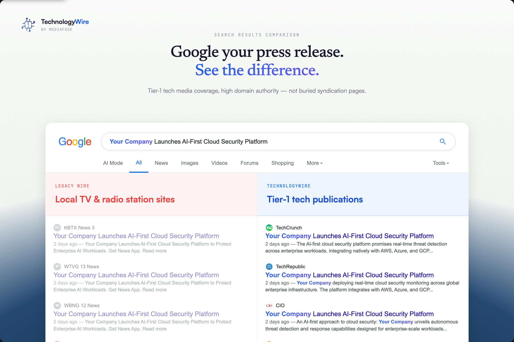

---

## 19. [Kuberns](https://www.producthunt.com/products/kuberns)
**Votes**: 28 | **도입 난이도**: 하 | **신뢰도**: 상
**Tagline**: The AI agent that deploys and manages your cloud
**서비스 링크**: https://www.producthunt.com/r/RQY4Y5TWPYBLEZ

**태그**: DevOps, AI, Cloud, Automation, Deployment, Agent, AI Tool, DevTool

### 📌 이 서비스 한눈에 보기
GitHub 연동 한 번으로 인프라 구축부터 배포까지 자동 수행하는 AI 에이전트 플랫폼

### 🔑 주요 기능
- AI 에이전트가 인프라 설정, 배포, 클라우드 운영을 자동 처리
- Vercel, Heroku 등 기존 플랫폼 대비 수동 설정 과정을 최소화
- 사용자 수 기반이 아닌 합리적인 가격 정책 지향

### 🙋 사용자에게 어떤 점이 좋은가
개발자가 인프라 관리 대신 코드 작성에만 집중할 수 있게 하여 배포 시간을 획기적으로 단축합니다.

### ✅ 지금 바로 써볼 기능
- GitHub 저장소 연결하기
- AI 에이전트 기반 원클릭 배포 테스트
- 자동화된 클라우드 운영 기능 확인

### ⚠️ 사용 전 확인할 점
- AI가 생성하는 인프라 설정의 세부 제어 가능 여부 확인 필요
- 복잡한 아키텍처나 특정 클라우드 서비스와의 호환성 검토 필요

### 🧭 확인이 더 필요한 정보
구체적인 지원 클라우드 제공업체(AWS, GCP 등)와 상세 가격 정책에 대한 정보가 부족합니다.

### 📸 스크린샷 및 갤러리
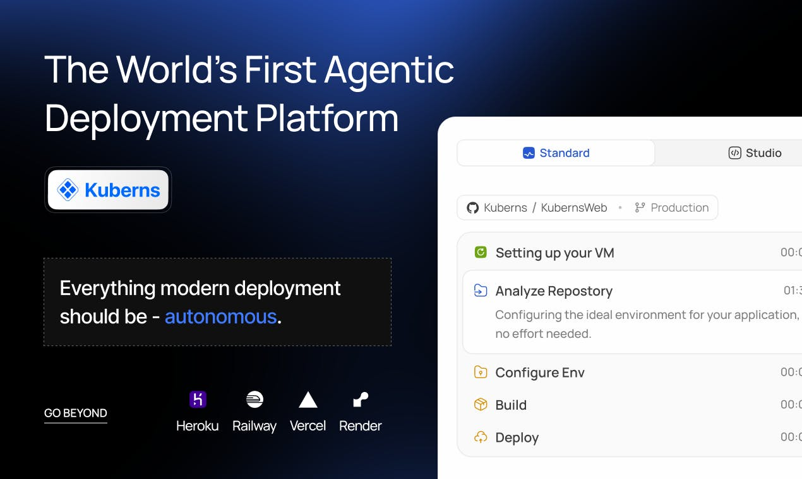
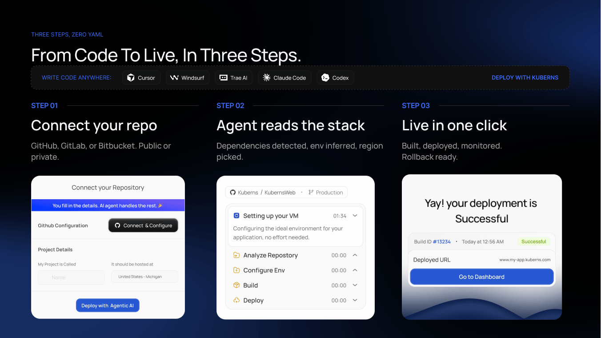
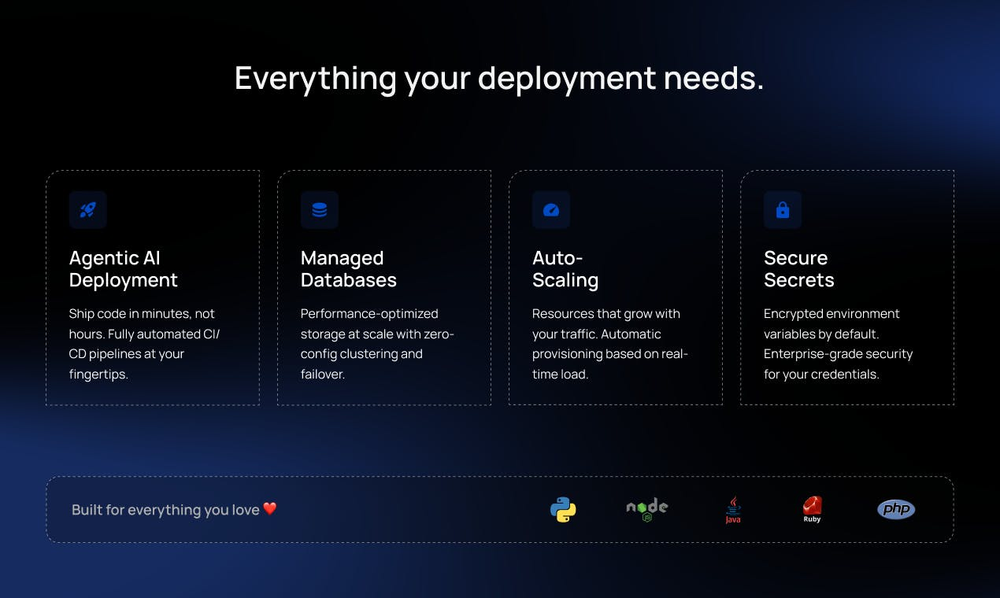

### 🎬 관련 영상
- [🎥 영상 보기](https://ph-files.imgix.net/072947a7-1cf8-4e36-9a3c-43547586f934.jpeg?auto=format)

---

## 20. [Proof of Usefulness](https://www.producthunt.com/products/hacker-noon)
**Votes**: 27 | **도입 난이도**: 하 | **신뢰도**: 상
**Tagline**: Validation System for Real World Usefulness
**서비스 링크**: https://www.producthunt.com/r/2KOESOFXQOKDBV

**태그**: Startup, Validation, AI/ML, DevTools, AI Tool, DevTool

### 📌 이 서비스 한눈에 보기
실제 시장 가치와 사용자 채택을 기준으로 프로젝트의 유용성을 검증하는 시스템

### 🔑 주요 기능
- 인간적, 기술적, 재무적 채택 지표를 통한 실질적 가치 평가
- 개인 개발자 및 초기 스타트업을 위한 검증 기회 제공
- AI 및 ML 프로젝트를 위한 특별 보상 및 지원 체계

### 🙋 사용자에게 어떤 점이 좋은가
자신의 프로젝트가 시장에서 실제로 유용한지 객관적인 지표로 검증받고, 성장 동력을 얻을 수 있습니다.

### ✅ 지금 바로 써볼 기능
- 프로젝트 제출 및 검증 프로세스 확인
- 제공되는 무료 빌드 및 홍보 도구 활용
- AI/ML 프로젝트의 경우 스폰서 기술 적용 검토

### ⚠️ 사용 전 확인할 점
- 평가 기준이 정성적/정량적 지표의 조합이므로 구체적인 점수 산정 방식 확인 필요
- AI/ML 분야는 스폰서 기술 사용 여부에 따라 보상 규모가 달라질 수 있음

### 🧭 확인이 더 필요한 정보
구체적인 평가 알고리즘과 스폰서 기술의 종류, 그리고 보상 규모에 대한 상세 정보가 명시되지 않았습니다.

### 📸 스크린샷 및 갤러리
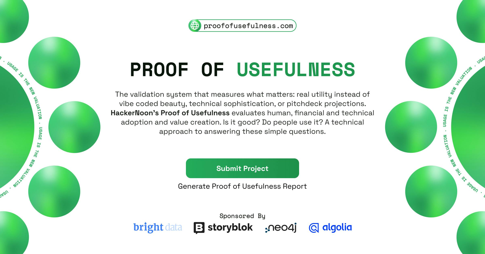
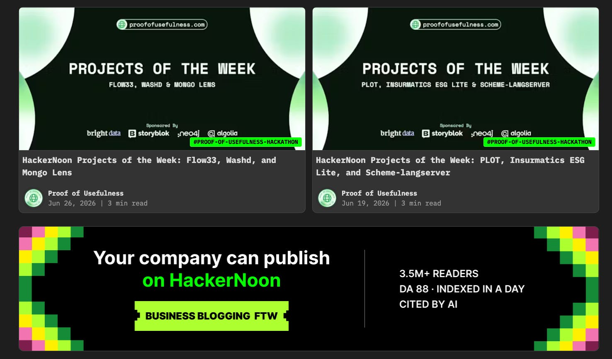
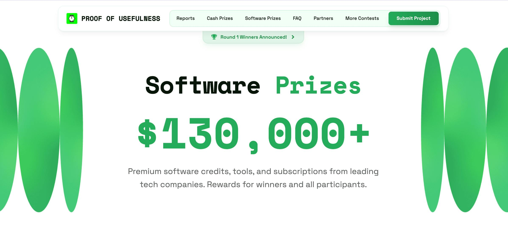

---

## 21. [Bursora](https://www.producthunt.com/products/bursora)
**Votes**: 24 | **도입 난이도**: 하 | **신뢰도**: 상
**Tagline**: Cap your AI spend before the bill lands
**서비스 링크**: https://www.producthunt.com/r/HJDB5LQWNXHTQ3

**태그**: AI, DevTool, FinOps, LLM, Agent, Automation, AI Tool

### 📌 이 서비스 한눈에 보기
예상치 못한 AI 비용 폭탄을 방지하는 실시간 예산 제어 솔루션

### 🔑 주요 기능
- 고객, 에이전트 또는 워크플로별로 세분화된 AI 지출 예산 설정 가능
- 프록시 서버를 거치지 않아 지연 시간 없이 호출 단계에서 즉시 차단
- 단 한 줄의 코드로 OpenAI, Anthropic, Google, DeepSeek 등 주요 LLM 클라이언트에 적용 가능

### 🙋 사용자에게 어떤 점이 좋은가
AI 서비스 사용량 급증으로 인한 과도한 청구 문제를 사전에 방지하며, 기존 워크플로를 방해하지 않는 방식으로 비용을 관리할 수 있습니다.

### ✅ 지금 바로 써볼 기능
- 기존 LLM 클라이언트 코드에 한 줄의 래퍼(Wrapper) 적용하기
- 고객별/워크플로별 예산 한도 설정하기
- Fail-open 모드를 통한 서비스 연속성 확인하기

### ⚠️ 사용 전 확인할 점
- 프록시를 거치지 않는 방식이 보안 및 데이터 규정 준수에 미치는 영향 확인 필요
- Fail-open 설정 시 예산 초과 시의 서비스 동작 방식 검토

### 🧭 확인이 더 필요한 정보
제공되는 클라이언트 라이브러리가 지원하는 프로그래밍 언어 및 프레임워크의 범위를 확인해야 합니다.

### 📸 스크린샷 및 갤러리
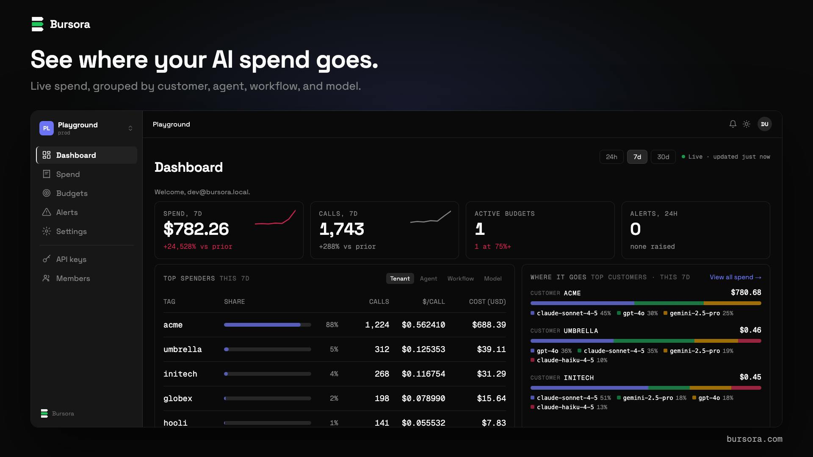
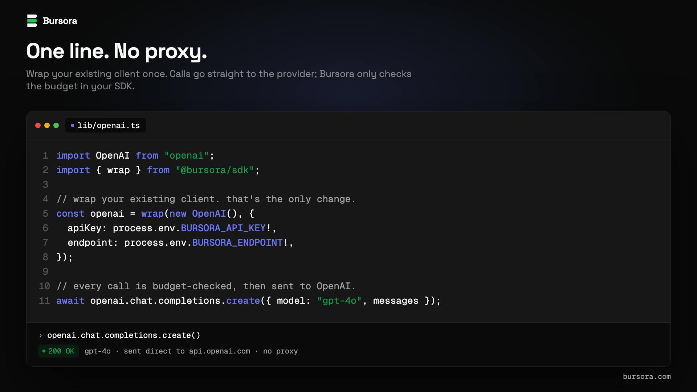
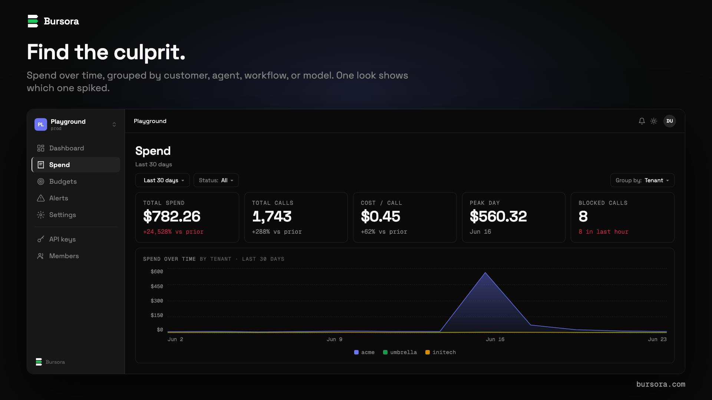

### 🎬 관련 영상
- [🎥 영상 보기](https://ph-files.imgix.net/2177bead-868b-40fb-9d45-dc3a36cc26ba.jpeg?auto=format)

---

## 22. [Awish](https://www.producthunt.com/products/awish)
**Votes**: 24 | **도입 난이도**: 하 | **신뢰도**: 상
**Tagline**: Secure automations you can control from Wp, Slack, Telegram
**서비스 링크**: https://www.producthunt.com/r/SZ4S7WQF7ZDAWN

**태그**: Automation, NoCode, Productivity, AI, Chat, DevTool

### 📌 이 서비스 한눈에 보기
채팅만으로 복잡한 업무 자동화를 구축하고 메신저로 제어하는 노코드 솔루션

### 🔑 주요 기능
- 코드 없이 자연어로 업무 자동화 계획 및 실행
- WhatsApp, Slack, Telegram 등 익숙한 메신저를 통한 제어
- 보안이 유지되는 앱 간 연결 및 자동화 워크플로우

### 🙋 사용자에게 어떤 점이 좋은가
반복적인 온라인 업무를 별도의 복잡한 설정 없이 채팅만으로 자동화할 수 있어 업무 효율을 극대화할 수 있습니다.

### ✅ 지금 바로 써볼 기능
- 채팅창에 반복적인 업무 작업 설명해보기
- 사용 중인 메신저(Slack, Telegram 등) 연동하기
- 생성된 자동화 워크플로우 실행 및 제어하기

### ⚠️ 사용 전 확인할 점
- 자연어 기반 계획 수립 시 의도와 다른 결과가 나올 가능성
- 메신저를 통한 제어 시 보안 및 권한 관리 확인 필요

### 🧭 확인이 더 필요한 정보
지원하는 구체적인 외부 앱(SaaS)의 종류와 보안 프로토콜에 대한 상세 정보가 필요합니다.

### 📸 스크린샷 및 갤러리
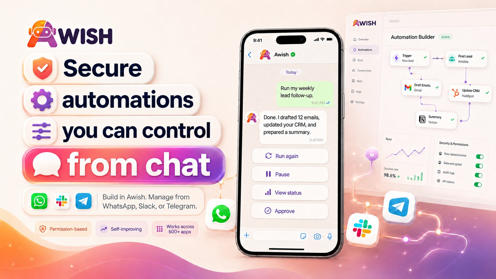
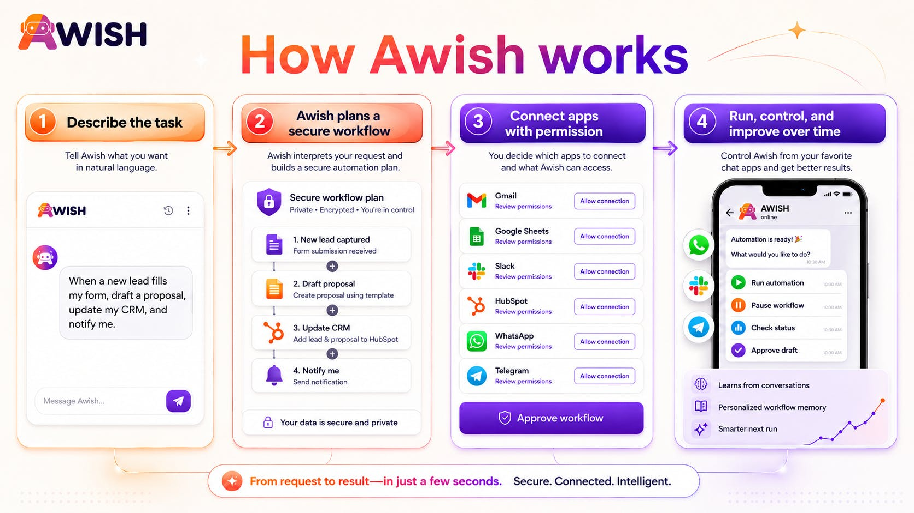
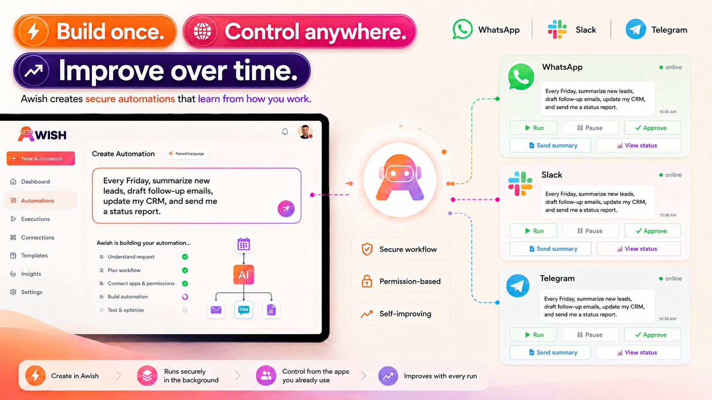

### 🎬 관련 영상
- [🎥 영상 보기](https://ph-files.imgix.net/8102bcee-342b-4d88-a668-8bc2d3fc2b3f.jpeg?auto=format)

---

## 23. [SocialClaw](https://www.producthunt.com/products/socialclaw)
**Votes**: 22 | **도입 난이도**: 중 | **신뢰도**: 상
**Tagline**: Schedule, Create, and Post to Social Media with AI Agents
**서비스 링크**: https://www.producthunt.com/r/ECXHKCFWQNE47V

**태그**: AI, Automation, SocialMedia, ContentCreation, Marketing, Agent, AI Tool, Video, DevTool

### 📌 이 서비스 한눈에 보기
AI 에이전트를 활용한 차세대 소셜 미디어 콘텐츠 자동 생성 및 스케줄링 도구

### 🔑 주요 기능
- AI 에이전트(Claude, Codex 등)를 통한 소셜 계정 연결 및 자동 게시
- 스크린샷/녹화 영상을 활용한 실사 기반 UGC 틱톡 영상 자동 생성
- 콘텐츠 생성부터 관리, 스케줄링까지 통합된 워크스페이스 제공

### 🙋 사용자에게 어떤 점이 좋은가
단순 예약을 넘어 AI가 직접 콘텐츠를 만들고 배포하므로, 소셜 미디어 운영에 드는 시간과 인력을 획기적으로 줄일 수 있습니다.

### ✅ 지금 바로 써볼 기능
- 베타 기능인 AI 비디오 생성기로 UGC 영상 제작해보기
- AI 에이전트와 소셜 계정 연동 설정하기
- 워크스페이스 내 콘텐츠 스케줄링 자동화 구축하기

### ⚠️ 사용 전 확인할 점
- AI 생성 영상의 품질이 브랜드 이미지와 부합하는지 확인 필요
- 에이전트의 계정 접근 권한에 따른 보안 정책 검토 필요

### 🧭 확인이 더 필요한 정보
현재 베타 서비스 중인 비디오 생성 기능의 완성도와 지원 플랫폼 범위를 확인해야 합니다.

### 📸 스크린샷 및 갤러리
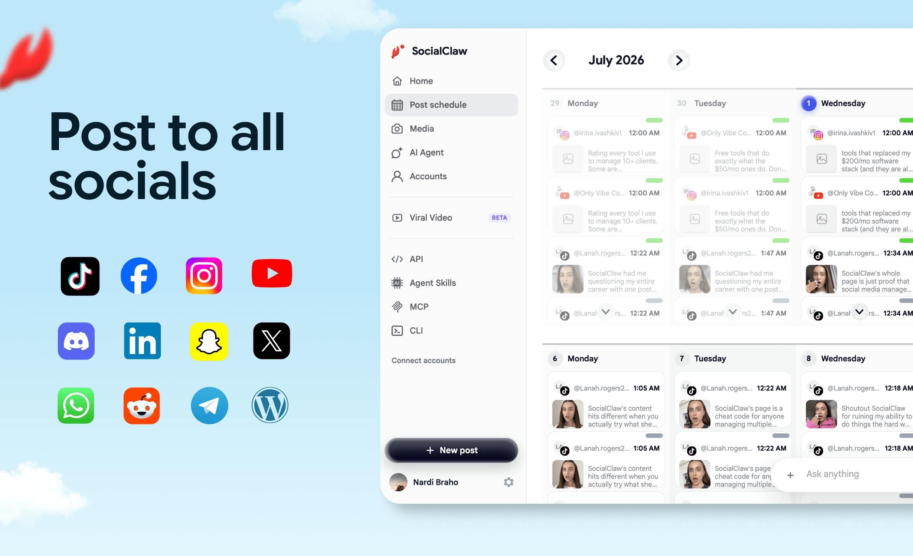
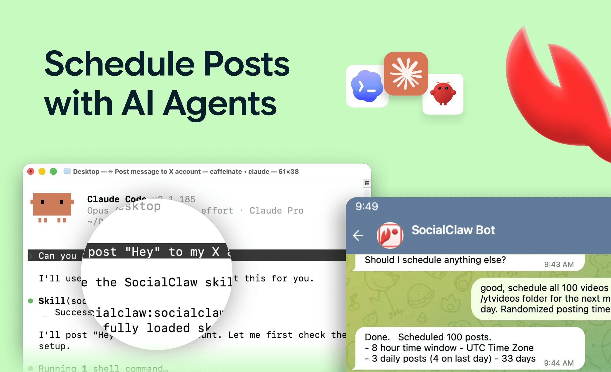

### 🎬 관련 영상
- [🎥 영상 보기](https://ph-files.imgix.net/6561ed2a-f4b1-4dea-8ca1-aef8a2b71ade.jpeg?auto=format)

---

## 24. [KarmaScout](https://www.producthunt.com/products/karmascout)
**Votes**: 19 | **도입 난이도**: 하 | **신뢰도**: 상
**Tagline**: Surface the best opportunities in your target communities
**서비스 링크**: https://www.producthunt.com/r/GMUUDZY7PGSZU4

**태그**: Productivity, Social Media, Chrome Extension, AI

### 📌 이 서비스 한눈에 보기
타겟 커뮤니티에서 반응 좋은 레딧 스레드를 발굴하고 맞춤형 답글 작성을 돕는 크롬 확장 프로그램

### 🔑 주요 기능
- 참여 가치가 높은 최적의 레딧 스레드 탐색
- 사용자의 말투를 반영한 답글 초안 작성 기능
- 수동 포스팅 방식을 통한 계정 안전성 유지

### 🙋 사용자에게 어떤 점이 좋은가
커뮤니티 활동을 통해 영향력을 넓히고 싶은 사용자에게 효율적인 소통과 참여 기회를 제공합니다.

### ✅ 지금 바로 써볼 기능
- 크롬 확장 프로그램 설치 및 레딧 계정 연결
- 추천된 스레드 확인 및 초안 생성 기능 테스트
- 자신의 목소리에 맞게 생성된 답안 수정 및 수동 게시

### ⚠️ 사용 전 확인할 점
- 자동 게시가 아닌 수동 게시 방식이므로 여전히 수동 작업 시간이 필요함
- AI가 생성한 답안이 사용자의 의도와 다를 수 있어 검토가 필수적임

### 🧭 확인이 더 필요한 정보
현재 무료로 제공되고 있으나 향후 유료 플랜 도입 여부는 명시되지 않았습니다.

### 📸 스크린샷 및 갤러리
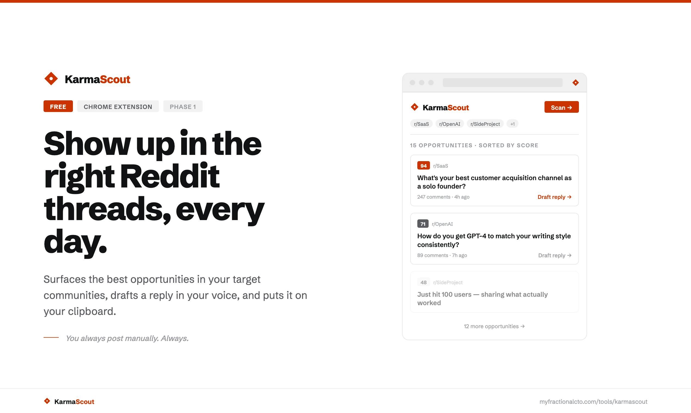
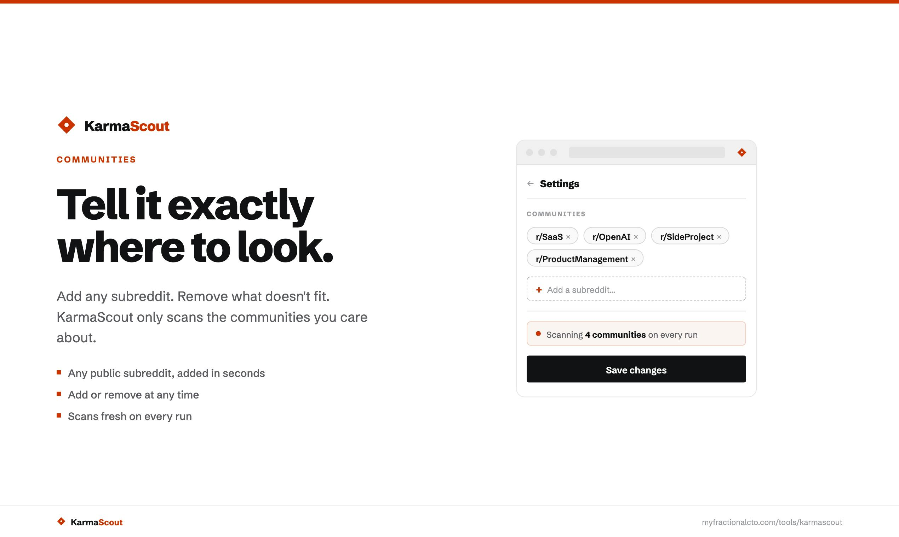
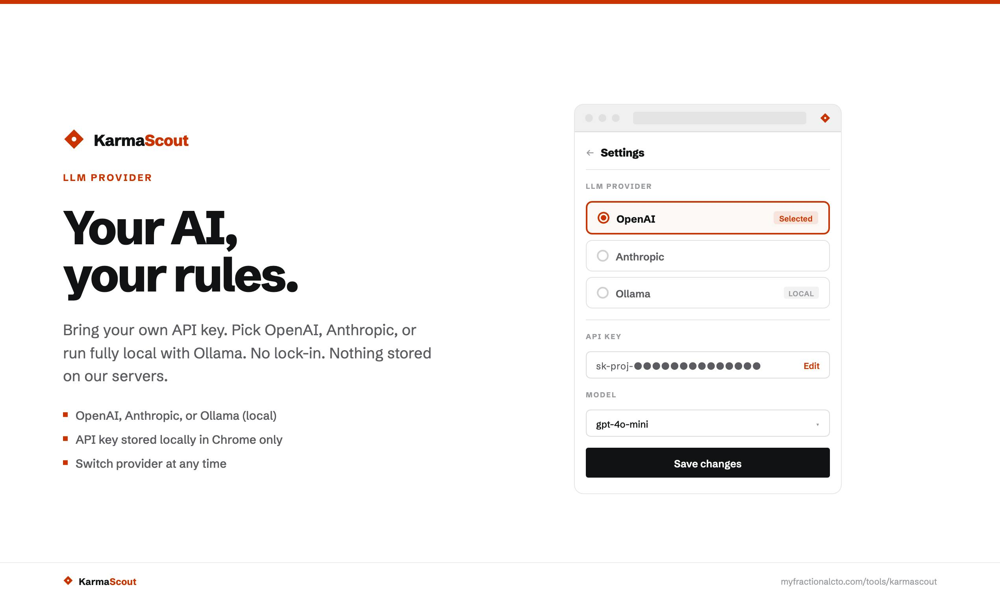

---

## 25. [VibeDrift](https://www.producthunt.com/products/vibedrift)
**Votes**: 18 | **도입 난이도**: 하 | **신뢰도**: 상
**Tagline**: Stop your AI agent getting worse as your codebase grows
**서비스 링크**: https://www.producthunt.com/r/HTGHCKTR5ROPC4

**태그**: DevTool, AI, CodeQuality, LocalFirst, Agent, AI Tool

### 📌 이 서비스 한눈에 보기
코드베이스 확장에 따른 AI 에이전트의 성능 저하(Drift)를 방지하는 로컬 스캔 도구

### 🔑 주요 기능
- 코드 규모 증가로 발생하는 중복 헬퍼 및 패턴 충돌 감지
- 로컬 스캔을 통해 AI 에이전트에게 최적화된 컨텍스트 제공
- 코드 유출 걱정 없는 로컬 실행 방식

### 🙋 사용자에게 어떤 점이 좋은가
프로젝트 규모가 커져도 AI 에이전트가 일관된 코드를 작성할 수 있도록 돕고, 코드 품질 저하를 방지합니다.

### ✅ 지금 바로 써볼 기능
- 로컬 스캔을 통한 현재 코드베이스의 'Drift' 상태 확인
- AI 에이전트에게 제공할 컨텍스트 데이터 생성

### ⚠️ 사용 전 확인할 점
- 로컬 환경에서의 스캔 성능 및 리소스 사용량 확인 필요
- AI 에이전트와의 연동 방식(수동/자동)에 따른 작업 흐름 변화

### 🧭 확인이 더 필요한 정보
AI 에이전트와 구체적으로 어떤 방식으로 연동되어 컨텍스트를 전달하는지에 대한 상세 기술 정보가 필요합니다.

### 📸 스크린샷 및 갤러리
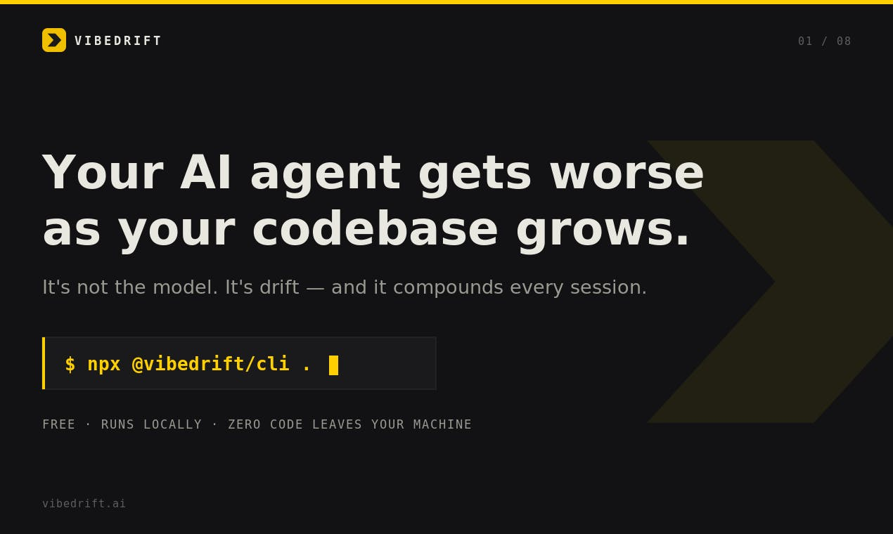
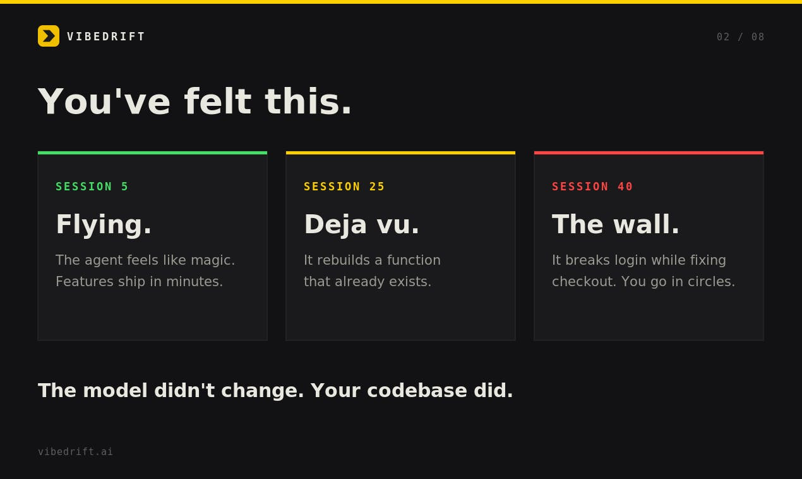
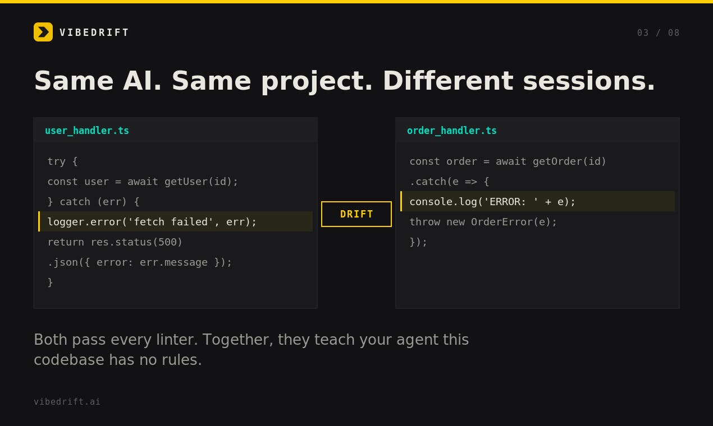

### 🎬 관련 영상
- [🎥 영상 보기](https://ph-files.imgix.net/d1980272-5187-47dd-965c-fc1255c32afd.jpeg?auto=format)

---

## 26. [Daily Task Pro AI](https://www.producthunt.com/products/daily-task-pro-ai)
**Votes**: 17 | **도입 난이도**: 하 | **신뢰도**: 상
**Tagline**: Emails don't manage themselves. Until now.
**서비스 링크**: https://www.producthunt.com/r/NUQLXAHTIFXXD3

**태그**: Productivity, AI, Email, Automation, AI Tool

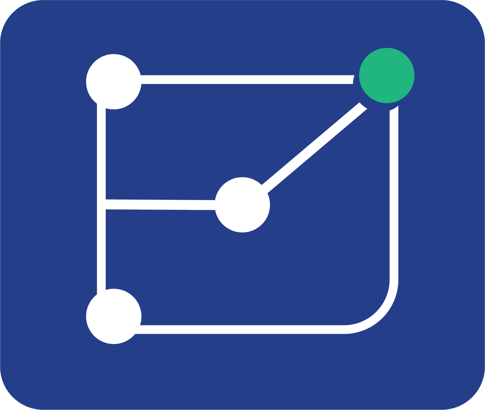

### 📌 이 서비스 한눈에 보기
수익 위험도를 기준으로 이메일을 우선순위화하고 답장 초안까지 작성해주는 AI 비서

### 🔑 주요 기능
- Gmail 및 Outlook 이메일 분석을 통한 수익 위험도(0-100) 점수 산정
- 오늘 반드시 처리해야 할 작업 우선순위 제안
- 사용자의 말투를 반영한 이메일 답장 초안 작성 기능

### 🙋 사용자에게 어떤 점이 좋은가
매일 아침 이메일 분류에 낭비되는 시간을 줄이고, 가장 중요한 비즈니스 기회에 즉시 집중할 수 있게 해줍니다.

### ✅ 지금 바로 써볼 기능
- 이메일 계정 연동 및 우선순위 점수 확인
- AI가 제안하는 오늘 업무 리스트 검토
- 생성된 답장 초안 검토 및 승인

### ⚠️ 사용 전 확인할 점
- 수익 위험도가 높은 이메일은 자동 발송되지 않으므로 반드시 사용자의 최종 승인이 필요함
- 이메일 데이터 접근에 따른 보안 및 개인정보 보호 정책 확인 필요

### 🧭 확인이 더 필요한 정보
사용자의 목소리를 얼마나 정확하게 복제하는지와 구체적인 보안 프로토콜에 대한 상세 정보가 필요합니다.

### 📸 스크린샷 및 갤러리
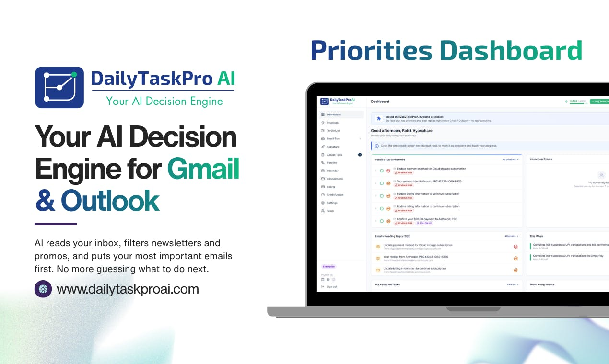
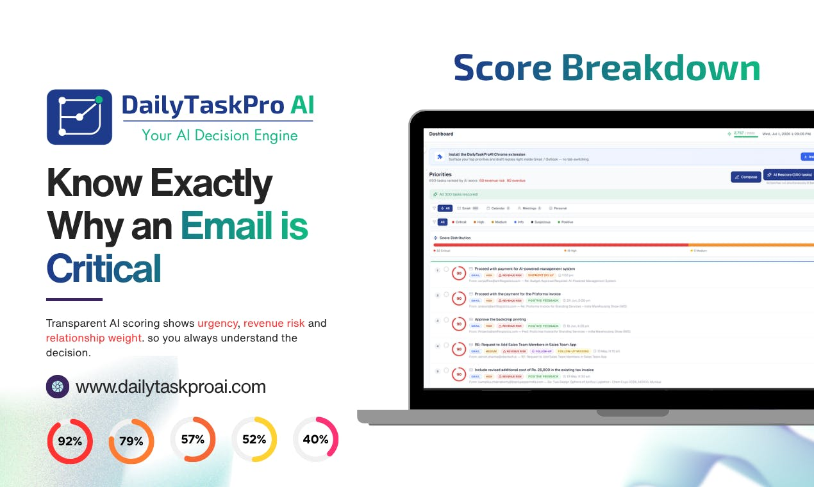
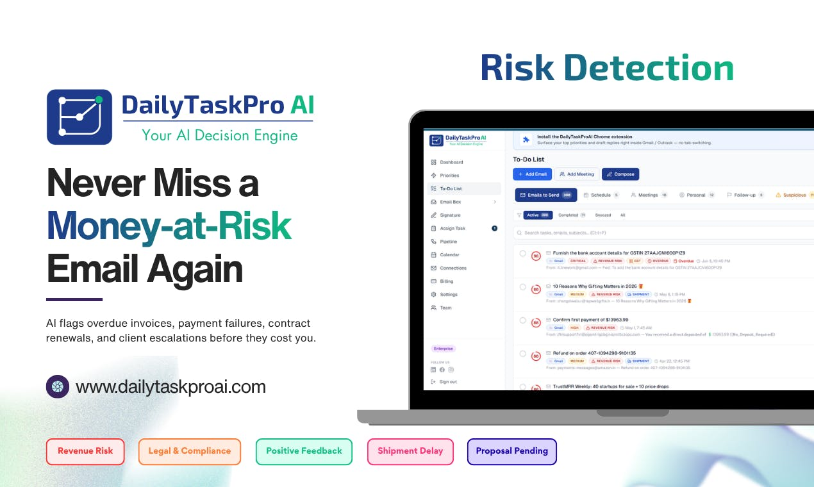

### 🎬 관련 영상
- [🎥 영상 보기](https://ph-files.imgix.net/950dfa64-7a29-4c9c-8132-1fe0e311e11b.jpeg?auto=format)

---

## 27. [Platform](https://www.producthunt.com/products/zcloud-2)
**Votes**: 17 | **도입 난이도**: 중 | **신뢰도**: 상
**Tagline**: The cloud platform you run by talking to it
**서비스 링크**: https://www.producthunt.com/r/22QA6OOXVSUH2D

**태그**: DevOps, Cloud, AI, PaaS, Automation, AI Tool, DevTool

### 📌 이 서비스 한눈에 보기
자연어로 클라우드 인프라를 제어하고 배포하는 AI 기반 PaaS 플랫폼

### 🔑 주요 기능
- Cursor, Claude 등 AI 도구를 통한 자연어 기반 인프라 관리 (배포, 스케일링, 로그 확인 등)
- 자체 인프라 사용 또는 기존 클라우드(AWS, GCP, Azure, OCI) 연결 지원
- 투명한 가격 정책을 통한 비용 절감 및 보안 중심의 권한 관리

### 🙋 사용자에게 어떤 점이 좋은가
복잡한 클라우드 설정 대신 일상적인 언어로 인프라를 운영할 수 있어, 엔지니어링 리소스를 획기적으로 줄이고 운영 자동화를 실현할 수 있습니다.

### ✅ 지금 바로 써볼 기능
- 기존 클라우드 계정(AWS/GCP 등) 연결하기
- AI 인터페이스를 통한 애플리케이션 배포 테스트
- 자연어 명령어를 통한 스케일링 및 로그 확인 실습

### ⚠️ 사용 전 확인할 점
- 자연어 명령이 의도와 다르게 실행될 가능성에 대비한 권한 설정 확인 필요
- 기존 클라우드 인프라와 연동 시 보안 및 접근 권한 설정 검토

### 🧭 확인이 더 필요한 정보
자연어 명령의 실행 범위와 보안 격리 수준에 대한 구체적인 기술 명세 확인이 필요합니다.

### 📸 스크린샷 및 갤러리
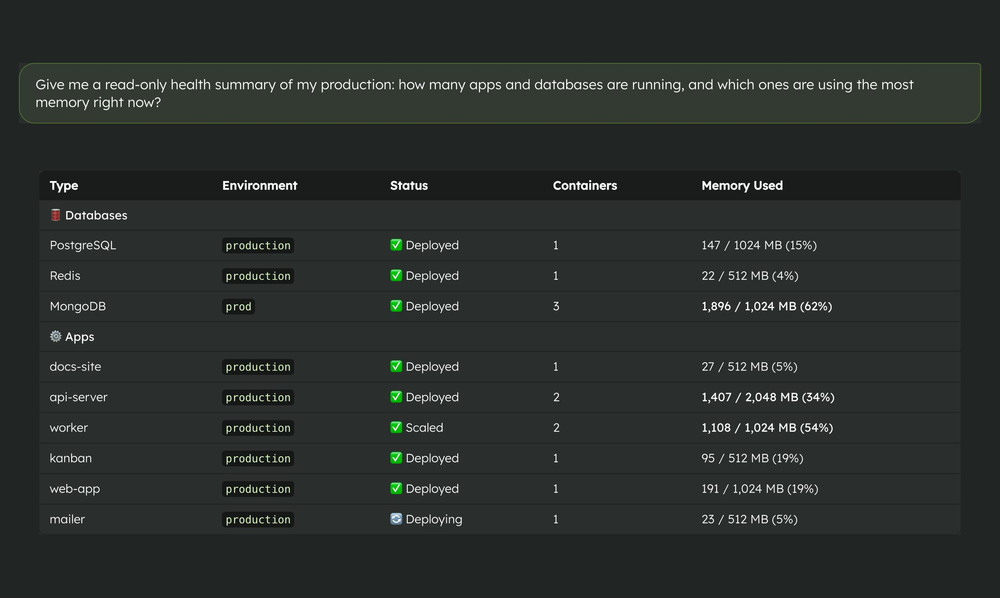
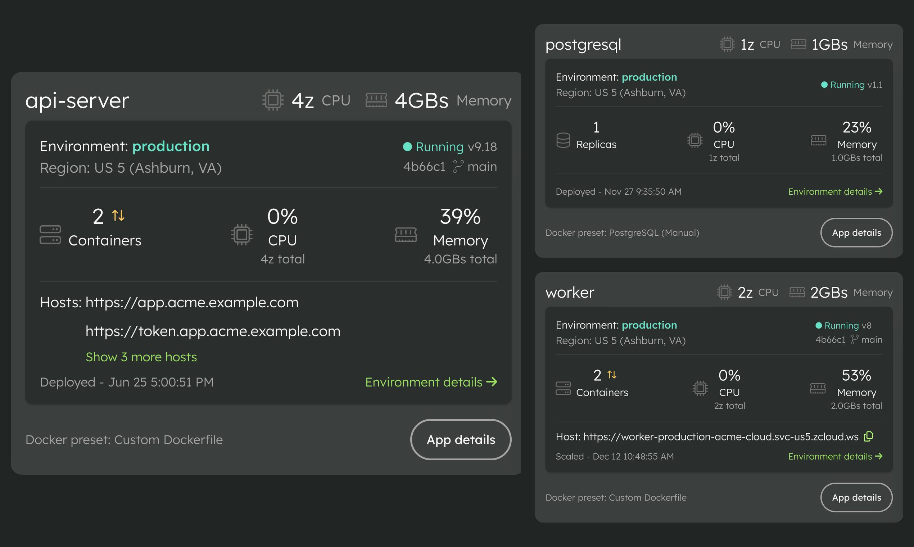
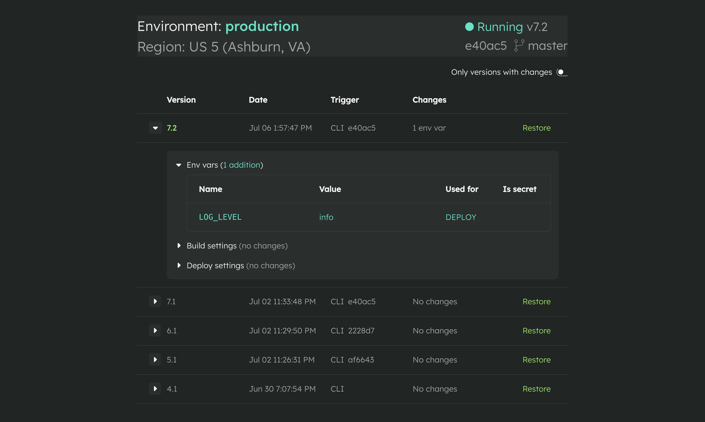

### 🎬 관련 영상
- [🎥 영상 보기](https://ph-files.imgix.net/3bcfdff3-29cc-4794-8587-355612082815.jpeg?auto=format)

---

## 28. [Rheo](https://www.producthunt.com/products/rheo)
**Votes**: 16 | **도입 난이도**: 중 | **신뢰도**: 상
**Tagline**: Ship and test app funnels without App Store reviews
**서비스 링크**: https://www.producthunt.com/r/LXQWATA64ZLNGS

**태그**: MobileApp, GrowthHacking, NoCode, ProductOptimization, AI Tool, Design

### 📌 이 서비스 한눈에 보기
앱 스토어 심사 대기 없이 모바일 앱 퍼널을 즉시 설계하고 실험할 수 있는 도구

### 🔑 주요 기능
- SDK 한 번의 연동으로 앱 업데이트 없이 실시간 화면 변경 가능
- 캔버스 기반의 직관적인 퍼널 디자인 및 즉시 배포
- 앱 스토어 리뷰 사이클을 우회하는 빠른 실험 및 데이터 측정

### 🙋 사용자에게 어떤 점이 좋은가
앱 업데이트를 기다릴 필요 없이 마케팅과 제품 팀이 즉각적으로 사용자 경험을 최적화하고 전환율을 높일 수 있습니다.

### ✅ 지금 바로 써볼 기능
- SDK를 기존 앱 프로젝트에 통합하기
- 대시보드 캔버스에서 첫 번째 퍼널 설계하기
- 변경 사항을 즉시 배포하여 실시간 반영 확인하기

### ⚠️ 사용 전 확인할 점
- 초기 SDK 통합 작업이 필요함
- 앱 스토어 가이드라인을 준수하는 범위 내에서의 변경인지 확인 필요

### 🧭 확인이 더 필요한 정보
SDK가 지원하는 플랫폼(iOS, Android 등)과 기존 프레임워크와의 호환성 범위를 확인해야 합니다.

### 📸 스크린샷 및 갤러리
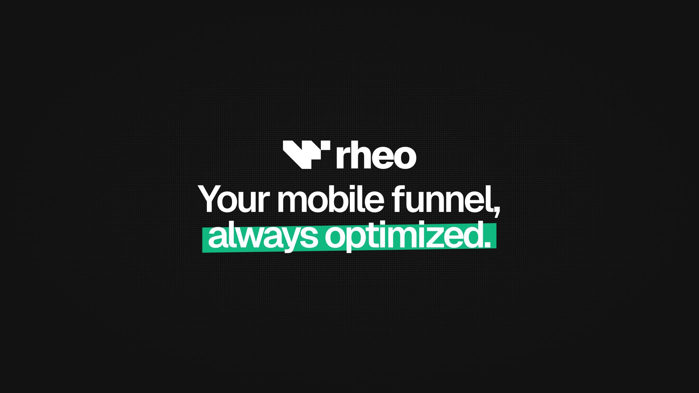
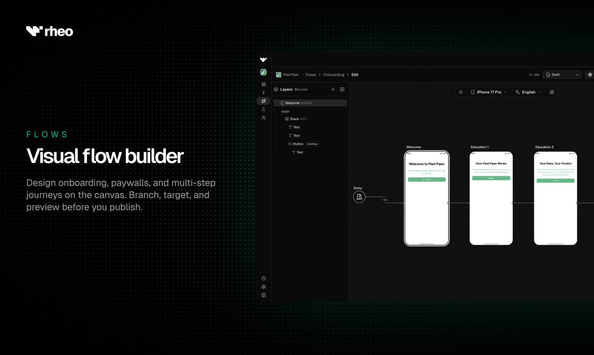
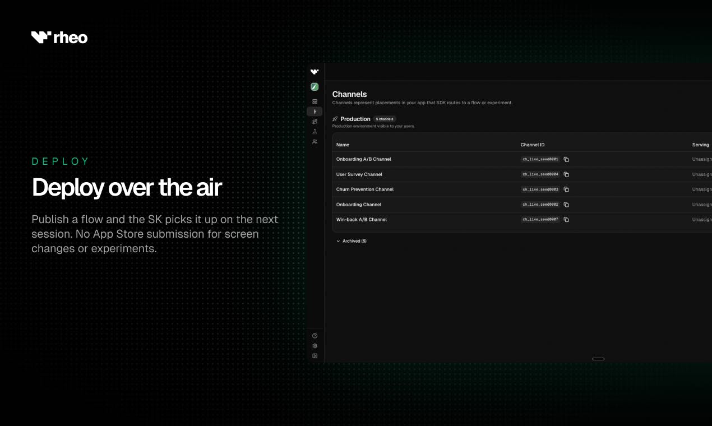

### 🎬 관련 영상
- [🎥 영상 보기](https://ph-files.imgix.net/bc7b730a-4159-45c9-be60-01fdcdd24b27.jpeg?auto=format)

---

## 29. [Pajoox](https://www.producthunt.com/products/pajoox)
**Votes**: 16 | **도입 난이도**: 하 | **신뢰도**: 상
**Tagline**: Let AI assist you in the shooting process.
**서비스 링크**: https://www.producthunt.com/r/GJIDU4IUPNBCKR

**태그**: Photography, AI Assistant, Creative Tool, AI Tool, Prompting, Design

### 📌 이 서비스 한눈에 보기
AI가 실시간 주변 환경을 분석하여 최적의 포즈와 구도를 제안하는 인공지능 인물 사진 어시스턴트

### 🔑 주요 기능
- 실시간 주변 환경 분석을 통한 맞춤형 시각적 영감 제공
- 상황에 맞는 포즈, 카메라 각도, 프레이밍 및 미적 레퍼런스 제안
- 촬영 시 발생하는 포즈 결정에 대한 불안감과 어색함 해소

### 🙋 사용자에게 어떤 점이 좋은가
촬영 현장에서 어떤 포즈를 취해야 할지 고민하는 시간을 줄여주며, 누구나 자연스럽고 완성도 높은 인물 사진을 찍을 수 있도록 돕습니다.

### ✅ 지금 바로 써볼 기능
- 상황별 맞춤형 포즈 제안 기능 활용하기
- 주변 환경에 따른 카메라 각도 및 프레이밍 가이드 적용하기
- 제공되는 미적 레퍼런스 샘플로 촬영 스타일 잡기

### ⚠️ 사용 전 확인할 점
- 실시간 분석을 위한 카메라/환경 데이터 접근 권한 필요
- 사용자의 물리적 환경에 따라 제안의 정확도가 달라질 수 있음

### 🧭 확인이 더 필요한 정보
모바일 앱 형태인지 혹은 별도의 하드웨어 장치와 연동되는 서비스인지에 대한 구체적인 플랫폼 정보가 필요합니다.

### 📸 스크린샷 및 갤러리
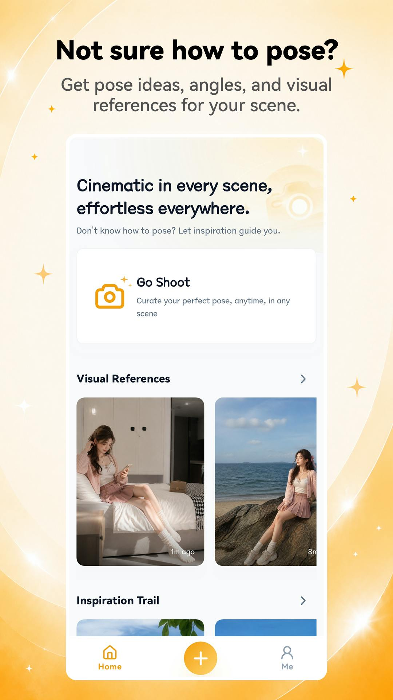

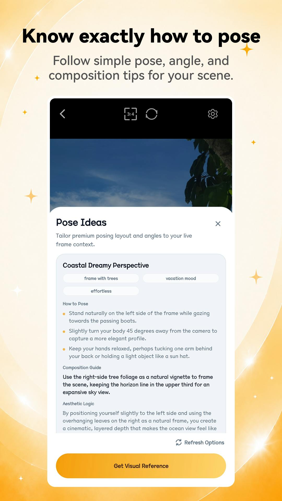

---

## 30. [Sled](https://www.producthunt.com/products/sled-affiliate-tracking-for-polar-sh)
**Votes**: 16 | **도입 난이도**: 하 | **신뢰도**: 상
**Tagline**: The affiliate tool built for Polar.sh creators
**서비스 링크**: https://www.producthunt.com/r/R3TIKOJMMEC23J

**태그**: Affiliate, CreatorEconomy, SaaS, Automation

### 📌 이 서비스 한눈에 보기
Polar.sh 크리에이터를 위한 간편하고 저렴한 네이티브 제휴 마케팅 관리 도구

### 🔑 주요 기능
- Polar.sh 환경에 최적화된 네이티브 제휴 트래킹 기능
- 2분 내외의 빠른 설정 및 Polar 플랫폼 내에서의 간편한 정산
- 기존 도구 대비 저렴한 월 $19 고정 비용 (수수료 추가 차감 없음)

### 🙋 사용자에게 어떤 점이 좋은가
Polar.sh를 사용하는 크리에이터가 별도의 복잡한 도구 없이도 쉽고 저렴하게 제휴 마케팅을 운영할 수 있습니다.

### ✅ 지금 바로 써볼 기능
- Polar.sh 계정 연동 및 설정
- 제휴 파트너 등록 및 트래킹 확인
- 수익 정산 프로세스 테스트

### ⚠️ 사용 전 확인할 점
- Polar.sh 플랫폼 사용자에게 특화된 기능이므로 타 플랫폼 사용 시 활용도가 제한될 수 있음
- 기존 제휴 마케팅 도구 대비 제공되는 부가 기능의 범위 확인 필요

### 🧭 확인이 더 필요한 정보
Polar.sh 외의 다른 플랫폼과의 호환성 및 상세 기능 범위에 대한 정보가 부족합니다.

### 📸 스크린샷 및 갤러리
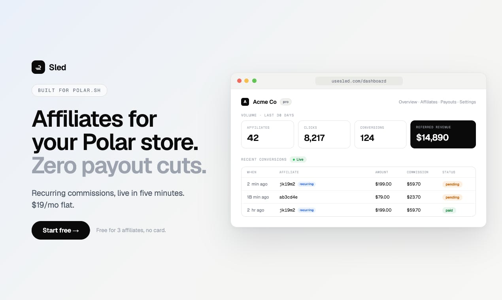
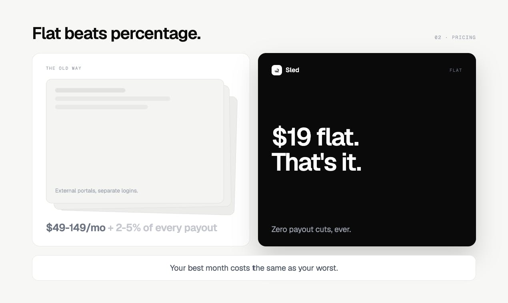
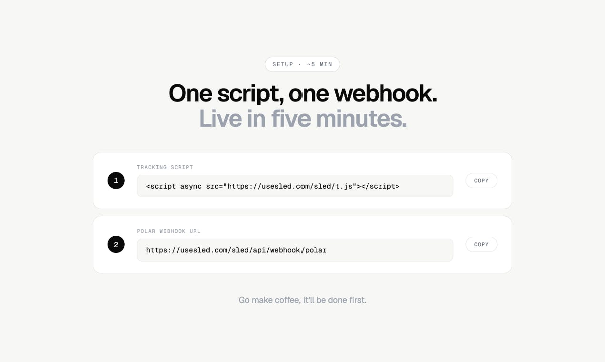

---

