# 🚀 Product Hunt Daily Top 30 (2026-07-09)

## 오늘의 요약
오늘의 트렌드는 AI를 활용한 콘텐츠 생성 및 워크플로우 자동화, 그리고 사용자 편의성을 극대화한 생산성 도구들이 주를 이루었습니다. 특히 복잡한 설정 없이 자연어나 간단한 프롬프트만으로 업무를 자동화하거나 일정을 관리하는 직관적인 솔루션들이 주목받았습니다.

### 오늘의 핵심 포인트
- AI 에이전트와 음성 기반 콘텐츠 생성 도구가 등장하며 업무 자동화의 문턱이 낮아지고 있습니다.
- 데이터 수집 및 링크 미리보기와 같이 개발자 친화적인 API 서비스들이 실용적인 가치를 제공합니다.
- 애플 생태계 및 Mac 환경에 최적화된 네이티브 앱들이 사용자 경험과 보안을 동시에 공략하고 있습니다.

**오늘의 태그**: AI자동화, 생산성도구, SaaS, 개발자도구, 워크플로우

## 1. [ExploreYC](https://www.producthunt.com/products/yc-company-explorer)
**Votes**: 304 | **도입 난이도**: 하 | **신뢰도**: 상
**Tagline**: Open-source API for Y Combinator & a16z company data
**서비스 링크**: https://www.producthunt.com/r/TXISOCQQFTUHJC

**태그**: DevTool, Data, Startup, API, Analytics, AI Tool

### 📌 이 서비스 한눈에 보기
Y Combinator 및 a16z 출신 스타트업 데이터를 즉시 활용할 수 있는 오픈소스 API

### 🔑 주요 기능
- 6,600개 이상의 YC 및 a16z 포트폴리오 기업 데이터 제공
- 펀딩 단계, Exit(IPO/M&A), 창업자 정보 등 상세 필터링 지원
- curl, Node, Python 등 다양한 환경에서 즉시 사용 가능한 개발자 친화적 API

### 🙋 사용자에게 어떤 점이 좋은가
스타트업 시장 분석이나 투자 데이터가 필요한 개발자 및 분석가가 별도의 데이터 수집 과정 없이 즉시 API를 통해 데이터를 확보할 수 있습니다.

### ✅ 지금 바로 써볼 기능
- 무료 API 키 발급받기
- Swagger 문서를 통한 API 엔드포인트 테스트
- 웹 앱의 지도 및 분석 도구 활용하기

### ⚠️ 사용 전 확인할 점
- 제공되는 데이터의 최신성 및 업데이트 주기 확인 필요
- 무료 플랜의 호출 제한(Rate Limit) 범위 확인 필요

### 🧭 확인이 더 필요한 정보
무료 API 키의 일일 호출 제한량과 데이터 업데이트 주기에 대한 구체적인 명시가 필요합니다.

### 📸 스크린샷 및 갤러리
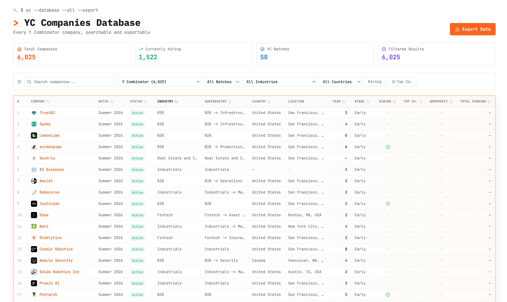
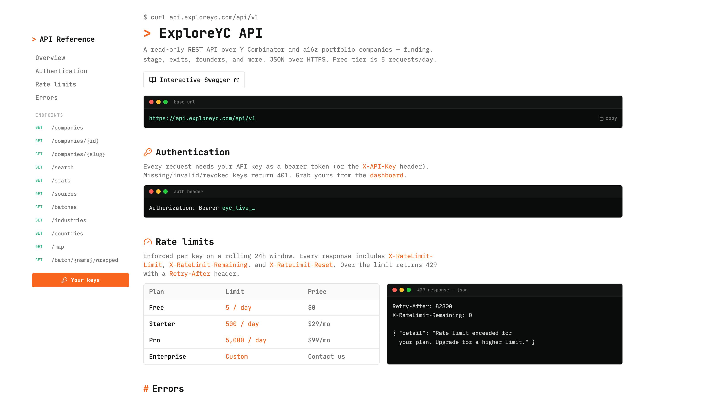
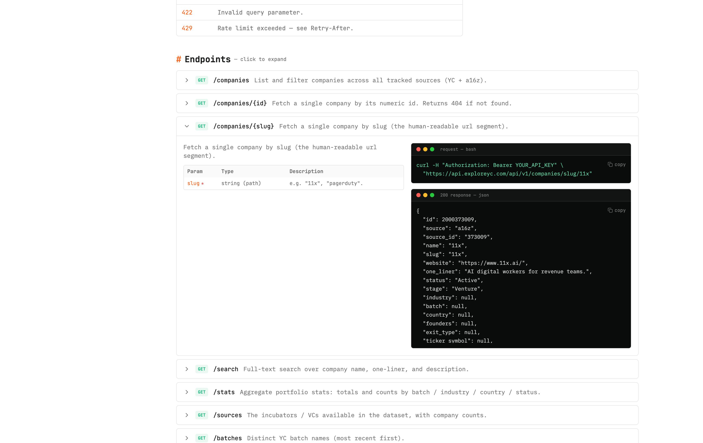

---

## 2. [IvyForms](https://www.producthunt.com/products/ivyforms)
**Votes**: 255 | **도입 난이도**: 하 | **신뢰도**: 상
**Tagline**: A WordPress form builder for real workflows
**서비스 링크**: https://www.producthunt.com/r/KULROBXS4AW3L4

**태그**: WordPress, Automation, NoCode, Workflow, AI Tool

### 📌 이 서비스 한눈에 보기
단순한 폼 작성을 넘어 제출된 데이터를 체계적인 워크플로우로 전환하는 워드프레스 폼 빌더

### 🔑 주요 기능
- 드래그 앤 드롭 방식의 직관적인 멀티스텝 폼 빌더 제공
- 조건부 로직을 통한 복잡한 신청 및 등록 프로세스 구현 가능
- wpDataTables, Amelia, Mailchimp 등 외부 도구와의 데이터 연동 지원

### 🙋 사용자에게 어떤 점이 좋은가
단순 문의 접수를 넘어 신청, 등록, 설문 등 비즈니스 프로세스를 자동화하고 관리할 수 있어 운영 효율을 높여줍니다.

### ✅ 지금 바로 써볼 기능
- 드래그 앤 드롭 빌더로 기본 연락처 양식 만들기
- 조건부 로직을 활용한 맞춤형 신청 양식 설계
- 외부 툴(Mailchimp, Webhooks 등) 연동 테스트

### ⚠️ 사용 전 확인할 점
- 워드프레스 환경에 최적화되어 있어 외부 CMS 사용자는 사용 불가
- 복잡한 워크플로우 설계 시 초기 설정 시간이 필요할 수 있음

### 🧭 확인이 더 필요한 정보
제공되는 외부 도구 연동 기능의 상세 범위와 유료 플랜 여부에 대한 확인이 필요합니다.

### 📸 스크린샷 및 갤러리
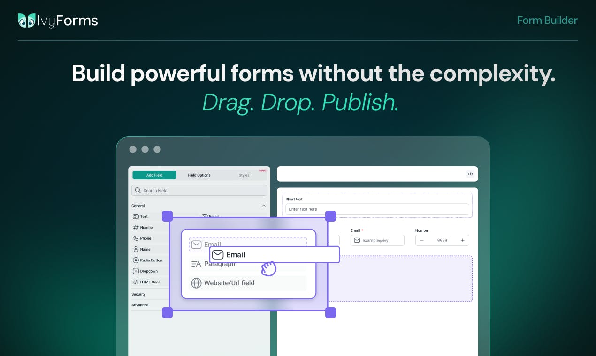
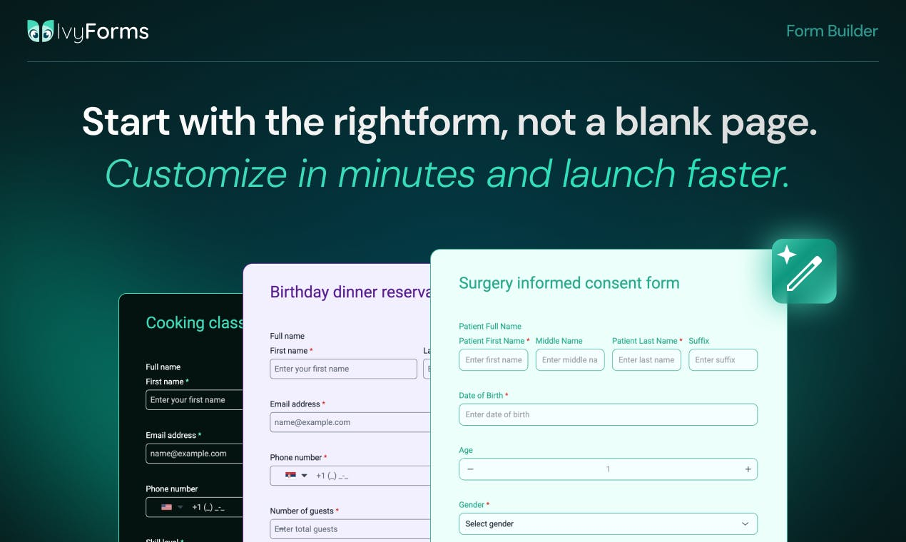
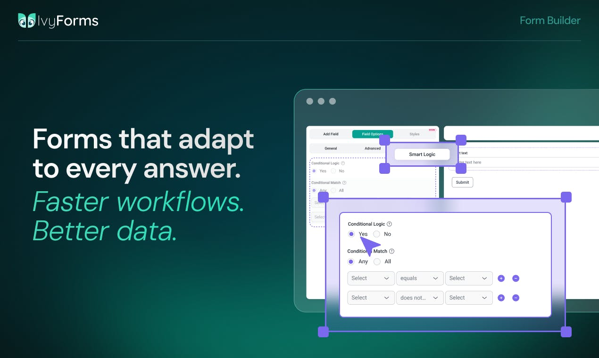

### 🎬 관련 영상
- [🎥 영상 보기](https://ph-files.imgix.net/6d04a040-8a1e-44f4-9055-03b5f0d411af.jpeg?auto=format)

---

## 3. [Willow Frontier Pro](https://www.producthunt.com/products/willow-voice)
**Votes**: 212 | **도입 난이도**: 하 | **신뢰도**: 상
**Tagline**: The fastest, most accurate dictation model in the world
**서비스 링크**: https://www.producthunt.com/r/T6BIUDFMEVHOGT

**태그**: AI, Voice-to-Text, Productivity, Writing, AI Tool

### 📌 이 서비스 한눈에 보기
세상에서 가장 빠르고 정확한 고성능 음성 받아쓰기 모델

### 🔑 주요 기능
- 강력한 성능의 Willow Frontier Pro 모델 출시
- 빠르고 정확하며 정교한 글쓰기를 지원하는 최상위 모델
- 가볍고 무료로 사용 가능한 Frontier Mini 모델 제공

### 🙋 사용자에게 어떤 점이 좋은가
어디서든 빠르고 정확한 텍ල 작성이 필요한 전문가들에게 최적화된 고성능 받아쓰기 환경을 제공합니다.

### ✅ 지금 바로 써볼 기능
- Frontier Pro 모델로 정교한 문서 작업하기
- 무료인 Frontier Mini 모델로 가벼운 작업 수행하기
- 기존 AI 도구와 정확도 비교해보기

### ⚠️ 사용 전 확인할 점
- Frontier Pro 모델의 구체적인 유료 플랜 정책 확인 필요
- 사용 환경에 따른 속도 및 정확도 차이 확인 필요

### 🧭 확인이 더 필요한 정보
Frontier Pro 모델의 구체적인 가격 정책과 사용 제한 범위에 대한 정보가 명시되지 않았습니다.

### 📸 스크린샷 및 갤러리
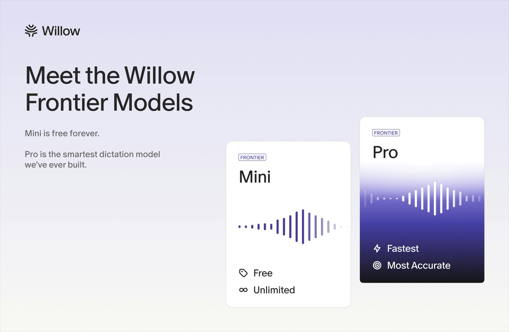
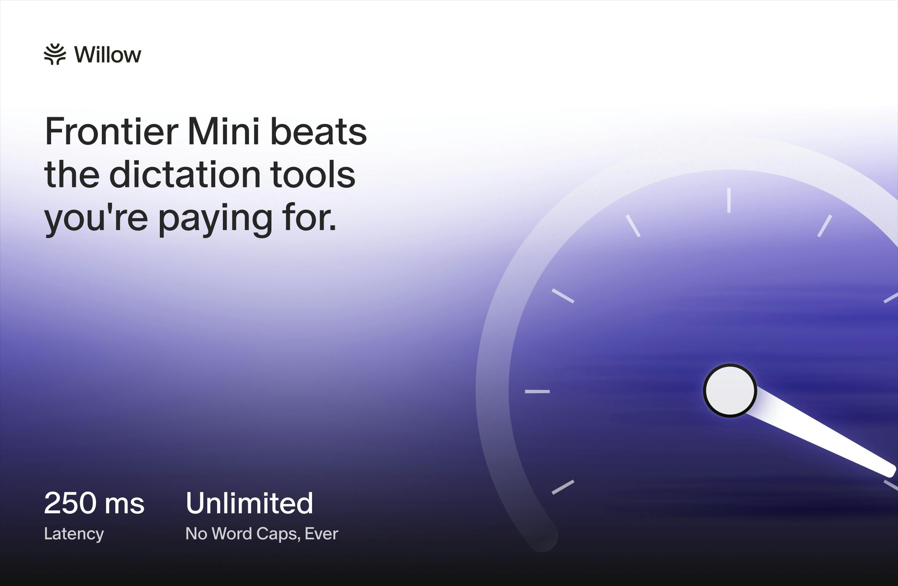
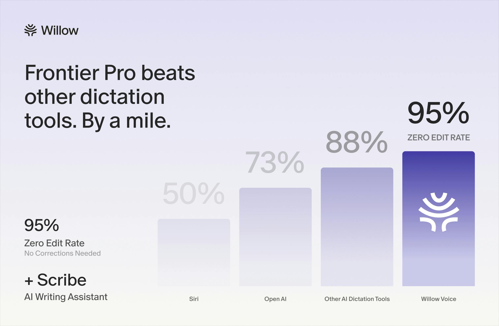

---

## 4. [Bono AI](https://www.producthunt.com/products/bono-ai)
**Votes**: 199 | **도입 난이도**: 하 | **신뢰도**: 상
**Tagline**: Talk Once. Publish Everywhere.
**서비스 링크**: https://www.producthunt.com/r/GA74HWMAAGQ5Z7

**태그**: AI, ContentCreation, Automation, Productivity, AI Tool, Prompting

### 📌 이 서비스 한눈에 보기
10분간의 대화만으로 블로그, SNS, 뉴스레터를 자동 생성하는 AI 콘텐츠 전략가

### 🔑 주요 기능
- 음성 대화를 통한 간편한 콘텐츠 생성 프로세스
- 사용자의 고유한 말투를 반영한 멀티 채널 콘텐츠 변환
- 글쓰기 스트레스와 대행 비용을 줄여주는 자동화 솔루션

### 🙋 사용자에게 어떤 점이 좋은가
글쓰기에 대한 부담 없이 말 한마디로 다양한 채널의 콘텐츠를 확보할 수 있어 퍼스널 브랜딩과 마케팅 효율을 극대화할 수 있습니다.

### ✅ 지금 바로 써볼 기능
- 10분간의 음성 녹음 테스트하기
- 생성된 콘텐츠의 말투(Voice) 일치도 확인하기
- 다양한 플랫폼(LinkedIn, X, 블로그)별 변환 결과 비교하기

### ⚠️ 사용 전 확인할 점
- 음성 데이터의 텍� 정확도에 따라 최종 결과물의 품질이 결정될 수 있음
- 사용자 고유의 목소리를 얼마나 정교하게 복제하는지에 대한 검증 필요

### 🧭 확인이 더 필요한 정보
사용자의 목소리 톤과 스타일을 반영하는 구체적인 학습 방식과 편집 기능에 대한 정보가 부족합니다.

### 📸 스크린샷 및 갤러리

### 🎬 관련 영상
- [🎥 영상 보기](https://ph-files.imgix.net/b1f97d14-b49a-46f0-a535-69dea881e3a3.jpeg?auto=format)

---

## 5. [Link Preview API](https://www.producthunt.com/products/link-preview-api)
**Votes**: 160 | **도입 난이도**: 하 | **신뢰도**: 상
**Tagline**: Free API to get Open Graph data, title & images for any URL
**서비스 링크**: https://www.producthunt.com/r/JYQNCESA4NWQSC

**태그**: DevTool, API, WebDevelopment, AI Tool, Vision

### 📌 이 서비스 한눈에 보기
어떤 URL에서도 고품질 미리보기 카드를 생성할 수 있는 무료 오픈 그래프(Open Graph) API

### 🔑 주요 기능
- Slack이나 Twitter 스타일의 풍부한 링크 카드 데이터 제공
- YouTube, Amazon 등 주요 사이트에 최적화된 고품질 미리보기 지원
- 브라우저에서 직접 작동하며 별도의 프록시 서버가 필요 없음

### 🙋 사용자에게 어떤 점이 좋은가
앱 내에서 링크를 공유할 때 사용자에게 시각적으로 매력적이고 신뢰할 수 있는 미리보기 카드를 즉시 구현할 수 있습니다.

### ✅ 지금 바로 써볼 기능
- 제공되는 API를 통해 특정 URL의 메타데이터 추출 테스트하기
- 브라우저 환경에서의 동작 및 이미지 품질 확인하기
- 20,000건 무료 사용량 범위 내에서 서비스 적용 검토하기

### ⚠️ 사용 전 확인할 점
- 무료 사용량이 일일 또는 월간 제한인지 확인 필요
- 대규모 트래픽 발생 시 무료 플랜의 확장성 검토 필요

### 🧭 확인이 더 필요한 정보
20,000건의 무료 사용량이 월간 한도인지 혹은 전체 누적 한도인지 명시되어 있지 않습니다.

### 📸 스크린샷 및 갤러리
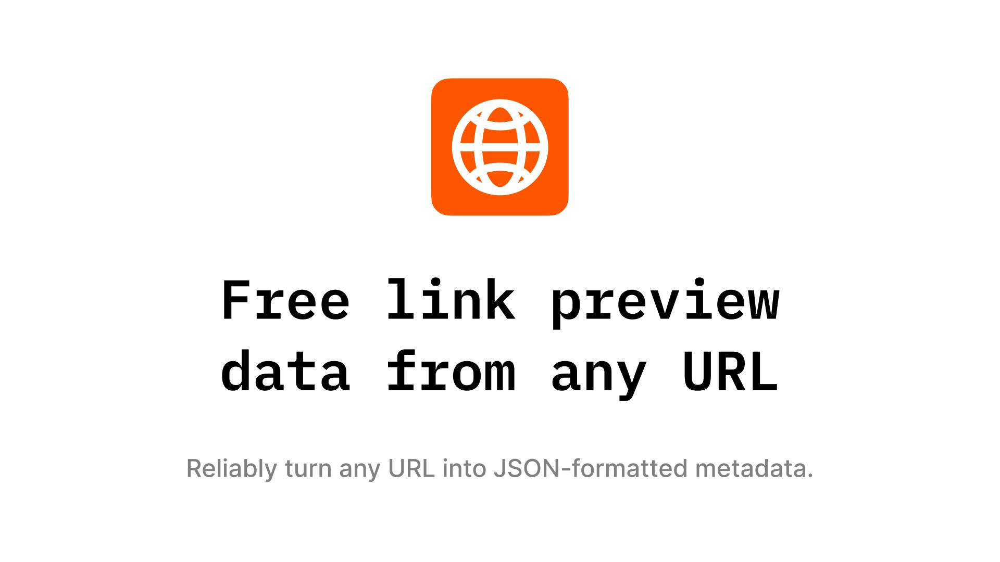
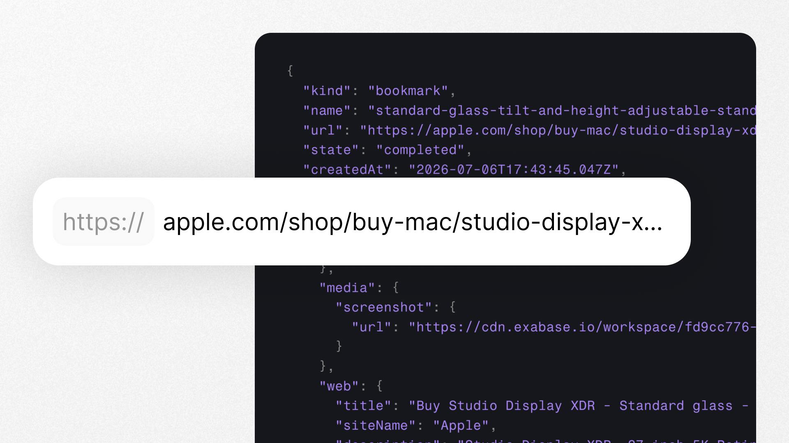
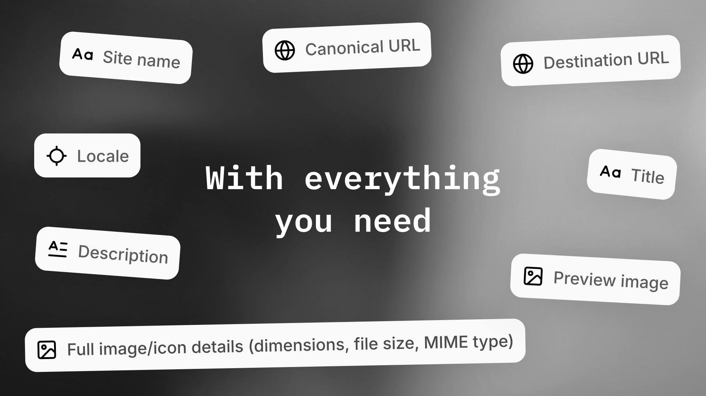

### 🎬 관련 영상
- [🎥 영상 보기](https://ph-files.imgix.net/32b4304b-7595-45a2-8f7a-8a1e76e34a12.jpeg?auto=format)

---

## 6. [LemonLime](https://www.producthunt.com/products/lemonlime)
**Votes**: 143 | **도입 난이도**: 하 | **신뢰도**: 상
**Tagline**: Automates your existing workflows with a single prompt.
**서비스 링크**: https://www.producthunt.com/r/CMWWBNDKWL23MO

**태그**: Automation, AI, Productivity, Workflow, Agent, AI Tool, Prompting

### 📌 이 서비스 한눈에 보기
단 한 번의 클릭과 프롬프트로 기존 워크플로우를 자동화하는 AI 에이전트 빌더

### 🔑 주요 기능
- 기존 업무 도구와 연동하여 워크플로우 자동화
- 비즈니스 분석을 통한 맞춤형 AI 에이전트 자동 생성
- 사용자에게 필요한 자동화 시나리오를 자동으로 제안

### 🙋 사용자에게 어떤 점이 좋은가
복잡한 설정 과정 없이 기존 도구들을 연결하여 팀의 반복 업무를 즉시 자동화할 수 있습니다.

### ✅ 지금 바로 써볼 기능
- 기존 업무 도구 연결하기
- 제안된 자동화 시나리오 검토하기
- 단일 클릭으로 자동화 실행하기

### ⚠️ 사용 전 확인할 점
- 기존 도구와의 호환성 및 데이터 보안 정책 확인 필요
- 자동 생성된 에이전트의 업무 정확도 검증 필요

### 🧭 확인이 더 필요한 정보
지원하는 외부 도구의 종류와 데이터 연동 방식에 대한 구체적인 정보가 필요합니다.

### 📸 스크린샷 및 갤러리
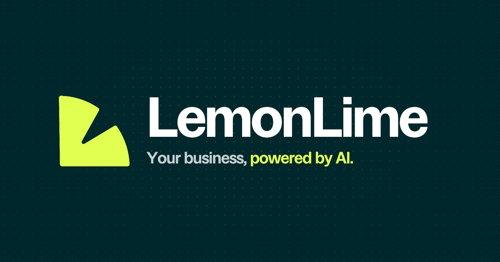
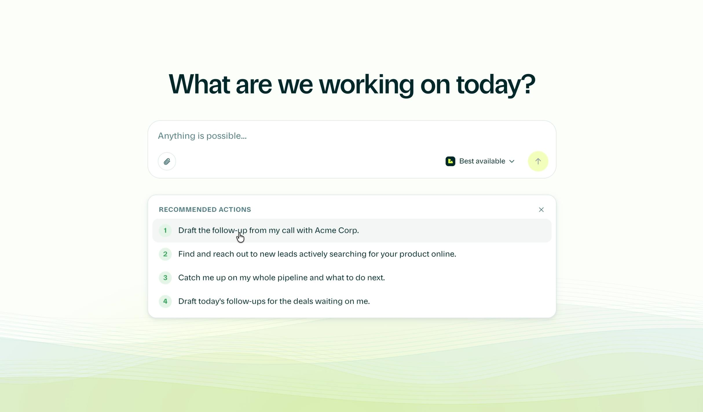
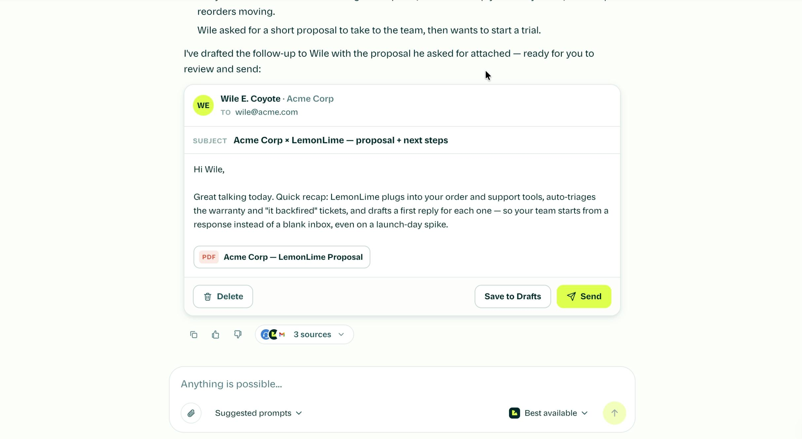

### 🎬 관련 영상
- [🎥 영상 보기](https://ph-files.imgix.net/3bc4c4ae-2ba1-4074-8c78-6a49135cd43b.jpeg?auto=format)

---

## 7. [Orbit for Mac](https://www.producthunt.com/products/orbit-for-mac)
**Votes**: 127 | **도입 난이도**: 하 | **신뢰도**: 상
**Tagline**: Every Google account, in a single window
**서비스 링크**: https://www.producthunt.com/r/624ZVJIHNA4TC6

**태그**: Productivity, Mac, Google, Workflow, AI Tool

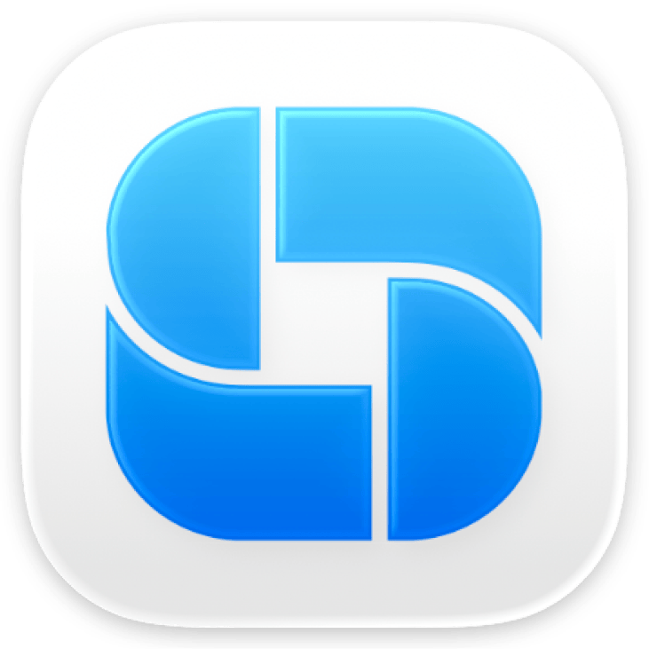

### 📌 이 서비스 한눈에 보기
여러 개의 구글 계정을 완벽히 분리된 환경에서 하나의 앱으로 관리하는 Mac 전용 워크스페이스

### 🔑 주요 기능
- 각 계정이 완전히 격리된 환경에서 독립적으로 작동
- Gmail, Calendar, Drive, Meet, Gemini를 포함한 구글 서비스 통합
- Swift로 제작된 가벼운 네이티브 Mac 앱 (12 MB)

### 🙋 사용자에게 어떤 점이 좋은가
여러 구글 계정을 사용하는 사용자가 브라우저 탭 혼선 없이 각 계정의 업무를 안전하고 빠르게 전환하며 작업할 수 있습니다.

### ✅ 지금 바로 써볼 기능
- 14일 무료 체험을 통해 계정 간 전환 속도 확인하기
- 단축키(⌘1-9)를 활용한 계정 전환 워크플로우 테스트하기
- 현재 사용 중인 구글 서비스들과의 호환성 검증하기

### ⚠️ 사용 전 확인할 점
- 런칭 특가($19) 이후 가격 인상 예정
- Mac 전용 앱이므로 다른 OS에서는 사용 불가

### 🧭 확인이 더 필요한 정보
계정 간 데이터 동기화 방식 및 보안 격리 수준에 대한 상세 기술 사양 확인이 필요합니다.

### 📸 스크린샷 및 갤러리
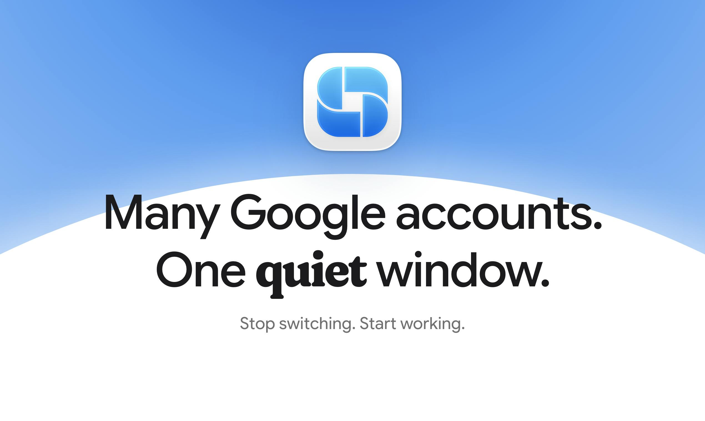
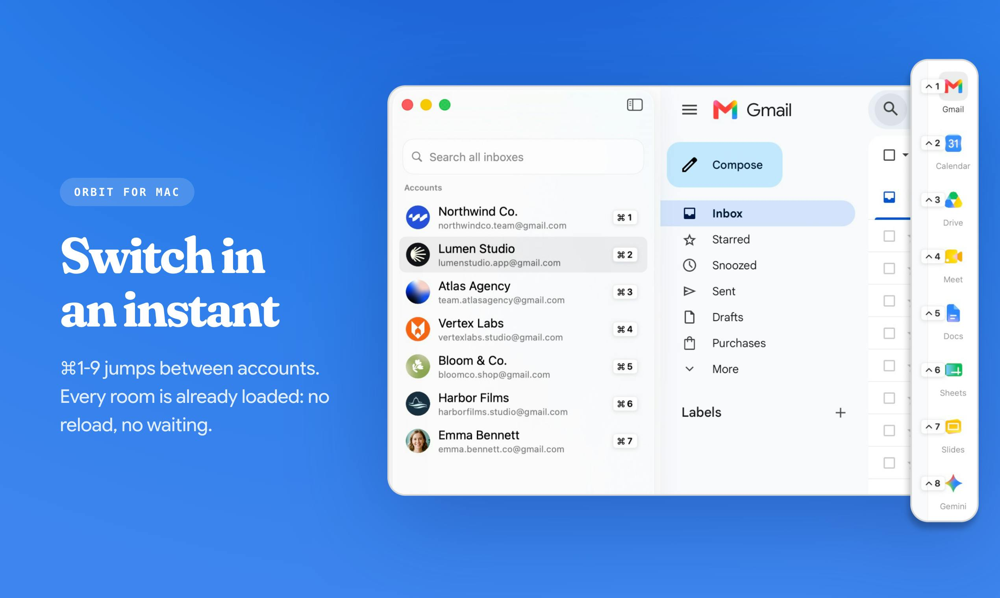
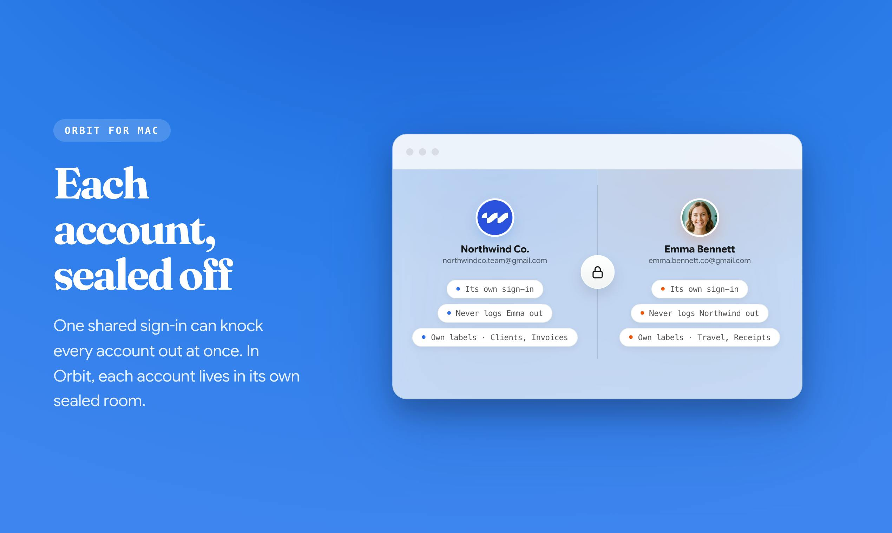

### 🎬 관련 영상
- [🎥 영상 보기](https://ph-files.imgix.net/b7147d86-5315-447b-b281-7ad1489534ea.jpeg?auto=format)

---

## 8. [PopTask for Apple](https://www.producthunt.com/products/poptask)
**Votes**: 123 | **도입 난이도**: 하 | **신뢰도**: 상
**Tagline**: Turn to-dos into scheduled tasks
**서비스 링크**: https://www.producthunt.com/r/TADE3A4SVTORJG

**태그**: Productivity, Apple, Automation, Scheduling

### 📌 이 서비스 한눈에 보기
자연어 입력만으로 복잡한 일정 설정을 끝내는 초간편 스케줄링 도구

### 🔑 주요 기능
- 자연어 입력을 통한 즉각적인 일정 생성 (예: 'gym mon wed fri 6am')
- iOS/iPadOS 위젯, 라이브 액티비티, 다이내믹 아일랜드 등 Apple 생태계 최적화
- iCloud를 통한 기기 간 실시간 동기화 및 강력한 개인정보 보호

### 🙋 사용자에게 어떤 점이 좋은가
복잡한 폼 입력 없이 생각나는 대로 일정을 적으면 즉시 스케줄로 변환되어 일정 관리 시간을 획기적으로 줄여줍니다.

### ✅ 지금 바로 써볼 기능
- 자연어 입력 기능을 통한 일정 생성 테스트
- iPhone 홈 화면 및 잠금 화면 위젯 설정
- Mac 메뉴바를 통한 빠른 일정 확인

### ⚠️ 사용 전 확인할 점
- 자연어 해석의 정확도는 입력 방식에 따라 다를 수 있음
- Apple 기기 간의 생태계에 종속적임

### 🧭 확인이 더 필요한 정보
무료로 시작할 수 있으나, 고급 기능 사용 시 유료 구독 모델이 있는지 확인이 필요합니다.

### 📸 스크린샷 및 갤러리
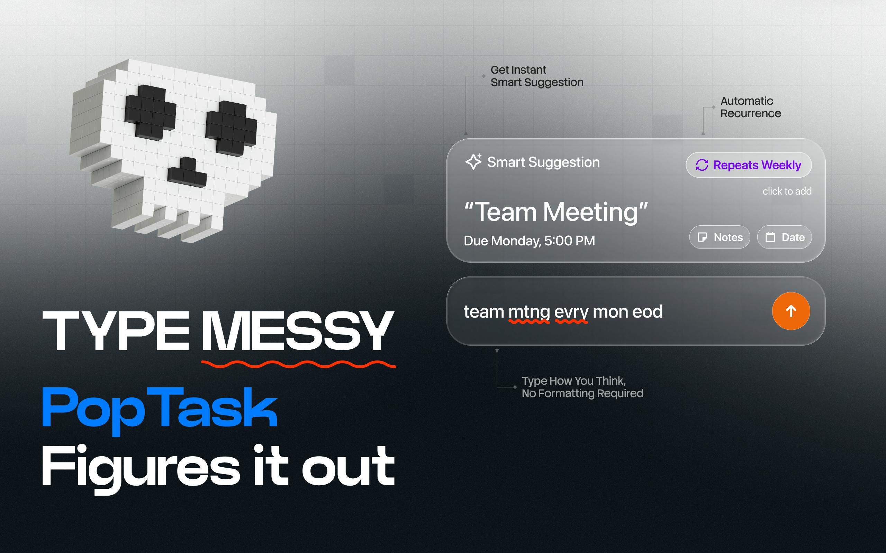
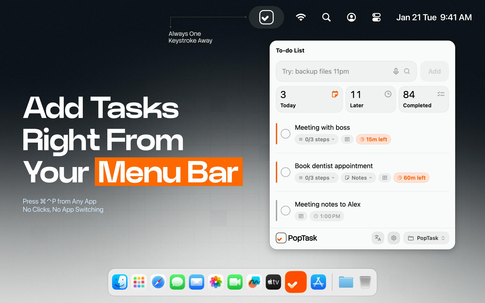
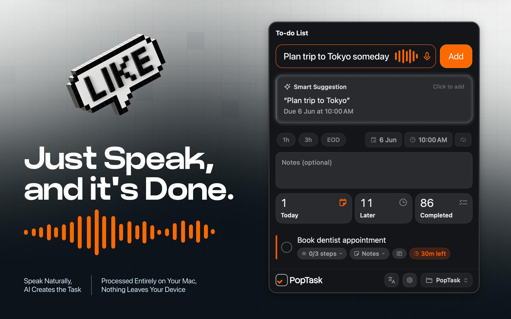

---

## 9. [agents-cli](https://www.producthunt.com/products/agents-cli)
**Votes**: 123 | **도입 난이도**: 하 | **신뢰도**: 상
**Tagline**: The CLI your coding agent uses to ship agents
**서비스 링크**: https://www.producthunt.com/r/J7EARKPXAPORWT

**태그**: DevTool, AI-Agent, Cloud, Automation, CLI, Agent, AI Tool

### 📌 이 서비스 한눈에 보기
코딩 에이전트가 AI 에이전트를 즉시 배포할 수 있도록 돕는 CLI 도구

### 🔑 주요 기능
- 코딩 에이전트(Claude Code 등) 주도형 워크플로우 최적화
- 프로젝트 스캐폴딩부터 평가, 배포까지 단일 CLI로 수행
- Google Cloud(Cloud Run, GKE 등)를 포함한 다양한 환경으로의 배포 지원

### 🙋 사용자에게 어떤 점이 좋은가
AI 코딩 에이전트를 사용하는 개발자가 복잡한 인프라 설정 없이 명령 한 번으로 프로덕션급 AI 에이전트를 구축하고 배포할 수 있습니다.

### ✅ 지금 바로 써볼 기능
- CLI를 통한 프로덕션급 프로젝트 스캐폴딩 실행
- 실제 시그널 기반의 에이전트 성능 평가 기능 테스트
- Google Cloud 환경으로의 배포 워크플로우 확인

### ⚠️ 사용 전 확인할 점
- Google Cloud 환경에 최적화되어 있어 타 클라우드 사용 시 설정 필요성 확인 필요
- 코딩 에이전트와 연동 시 에이전트의 권한 및 보안 설정 확인 필요

### 🧭 확인이 더 필요한 정보
사용자의 특정 코딩 에이전트(Antigravity, Claude Code 등)와의 호환성 수준과 상세 배포 프로세스 확인이 필요합니다.

### 📸 스크린샷 및 갤러리
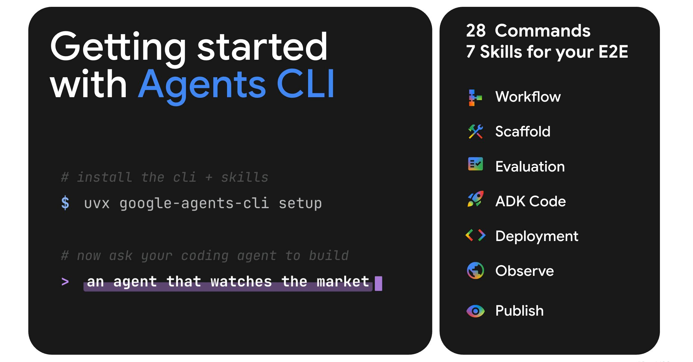
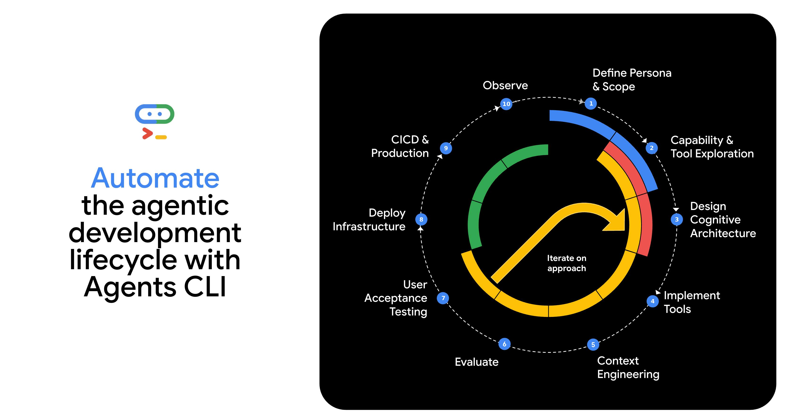
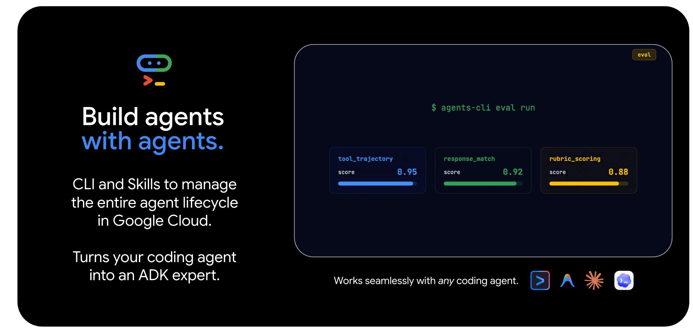

### 🎬 관련 영상
- [🎥 영상 보기](https://ph-files.imgix.net/1ab68b95-4267-47a5-894b-bd9b35299c01.jpeg?auto=format)

---

## 10. [Orus ](https://www.producthunt.com/products/farao)
**Votes**: 113 | **도입 난이도**: 중 | **신뢰도**: 상
**Tagline**: Claude for investing in perpetuals
**서비스 링크**: https://www.producthunt.com/r/HDGE7W7TNAZZ64

**태그**: Trading, AI, Automation, FinTech, Crypto, AI Tool, Chat

### 📌 이 서비스 한눈에 보기
AI 채팅창에서 즉시 시장 분석과 선물 거래를 실행할 수 있는 MCP 서버

### 🔑 주요 기능
- Claude, ChatGPT, Telegram 등 주요 AI 채팅 인터페이스와 Farao 거래 계정 연동
- 암호화폐 퍼페추얼, 토큰화 주식(Tesla, Nvidia), FX, 원자재 등 100개 이상의 시장 지원
- 자산은 셀프 커스토디 월렛에 안전하게 보관되며, 수동 승인 또는 자동 실행 설정 가능

### 🙋 사용자에게 어떤 점이 좋은가
별도의 복잡한 트레이딩 터미널 없이 평소 사용하는 AI 채팅창만으로 시장 조사부터 실제 매매까지 한 번에 해결할 수 있습니다.

### ✅ 지금 바로 써볼 기능
- OAuth를 통한 AI 채팅 플랫폼 연동
- 시장 분석 및 리서치 세션 실행
- 수동 확인 모드 설정 후 첫 거래 시도

### ⚠️ 사용 전 확인할 점
- AI의 판단에 따른 자동 매매 설정 시 자산 손실 위험 존재
- 외부 AI 서비스에 거래 권한을 부여하므로 보안 및 권한 관리 주의 필요

### 🧭 확인이 더 필요한 정보
AI 모델의 판단 오류가 실제 거래 실행 시 미칠 영향과 구체적인 슬리피지 제어 방식에 대한 확인이 필요합니다.

### 📸 스크린샷 및 갤러리

### 🎬 관련 영상
- [🎥 영상 보기](https://ph-files.imgix.net/78e8f164-778c-45a7-87e2-8e1fd933ab01.jpeg?auto=format)

---

## 11. [New small business tools by IFTTT](https://www.producthunt.com/products/ifttt)
**Votes**: 113 | **도입 난이도**: 하 | **신뢰도**: 상
**Tagline**: Run your business with HubSpot, Figma, and more
**서비스 링크**: https://www.producthunt.com/r/X66SYKT435MOBS

**태그**: Automation, SaaS, Productivity, BusinessTools, AI Tool

### 📌 이 서비스 한눈에 보기
HubSpot, Figma 등 주요 비즈니스 도구를 연결하여 반복적인 업무를 자동화하는 IFTTT의 새로운 비즈니스 스택

### 🔑 주요 기능
- HubSpot, Figma, Xero 등 13개 이상의 주요 비즈니스 도구 연동 지원
- 신규 직원 온보딩, 송장 발송, 제품 출시 등 반복 업무 자동화
- Slack, Google Sheets, SMS 등을 활용한 알림 및 데이터 관리

### 🙋 사용자에게 어떤 점이 좋은가
수동으로 처리하던 운영 업무를 자동화하여 업무 시간을 절약하고, 도구 간 데이터 흐름을 원활하게 관리할 수 있습니다.

### ✅ 지금 바로 써볼 기능
- 주요 비즈니스 앱(HubSpot, Figma 등) 연결하기
- Slack/Google Sheets를 활용한 자동 알림 설정하기
- 송장 발송 및 온보딩 워크플로우 구축하기

### ⚠️ 사용 전 확인할 점
- 연동하려는 특정 서비스의 API 지원 여부 확인 필요
- 자동화 워크플로우 설계 시 각 도구 간의 데이터 형식 일치 여부 확인 필요

### 🧭 확인이 더 필요한 정보
제공되는 13개 이상의 도구 목록과 구체적인 연동 방식에 대한 상세 정보 확인이 필요합니다.

### 📸 스크린샷 및 갤러리
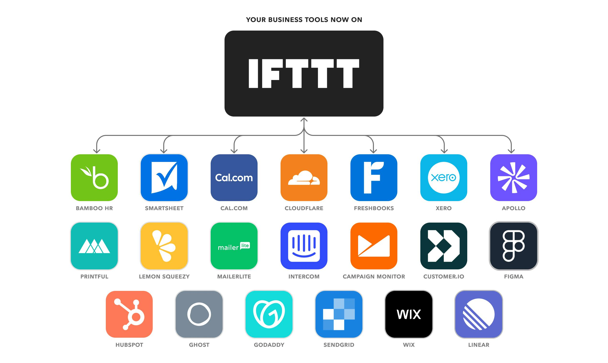
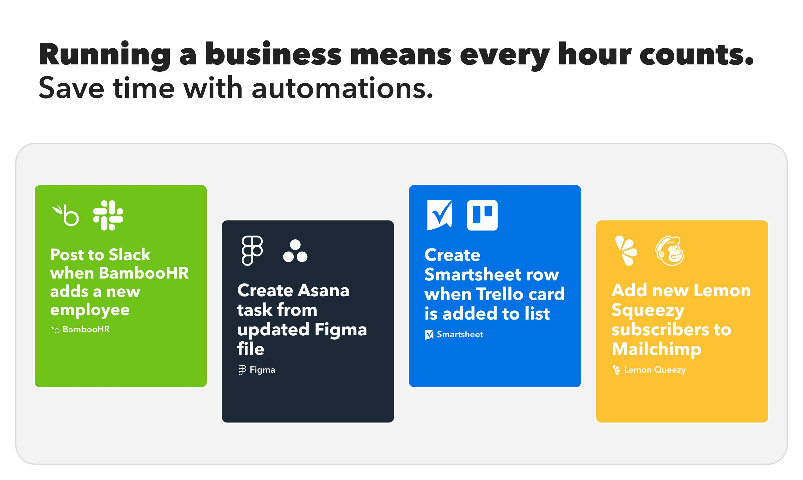
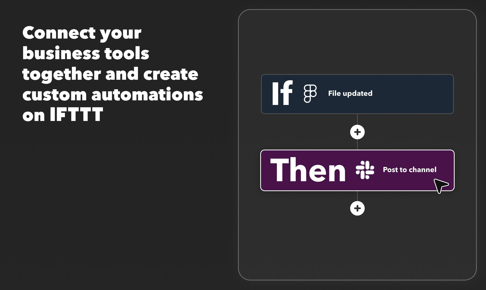

---

## 12. [Notion Agents iOS app](https://www.producthunt.com/products/notion-agents-ios-app)
**Votes**: 108 | **도입 난이도**: 하 | **신뢰도**: 상
**Tagline**: Chat with Notion Agents anytime
**서비스 링크**: https://www.producthunt.com/r/QM72JYTNL7N7TF

**태그**: Productivity, AI, Mobile, Automation, Notion, Agent, Chat

### 📌 이 서비스 한눈에 보기
언제 어디서나 Notion 데이터와 연결된 AI 에이전트와 대화하며 업무를 처리하는 모바일 앱

### 🔑 주요 기능
- 텍스트, 음성, 사진을 통한 간편한 아이디어 캡처 및 자동 정리
- Notion 문서, 데이터베이스, 프로젝트를 기반으로 한 실시간 답변 제공
- 페이지 생성, 업데이트 초안 작성 등 모바일 환경에 최적화된 빠른 액션

### 🙋 사용자에게 어떤 점이 좋은가
데스크탑 앞에 있지 않은 이동 중에도 업무 흐름을 끊지 않고 아이디어를 기록하거나 업무를 자동화할 수 있습니다.

### ✅ 지금 바로 써볼 기능
- 음성 메모로 아이디어 던져보기
- 사진 촬영을 통한 스케치/메모 디지털화
- 채팅을 통한 Notion 데이터베이스 검색 및 페이지 생성

### ⚠️ 사용 전 확인할 점
- 모바일 환경에서의 복잡한 데이터베이스 편집 제약 가능성
- 연결된 외부 도구들의 권한 설정 및 보안 확인 필요

### 🧭 확인이 더 필요한 정보
외부 도구(connected tools)와의 구체적인 연동 범위와 보안 정책에 대한 확인이 필요합니다.

### 📸 스크린샷 및 갤러리

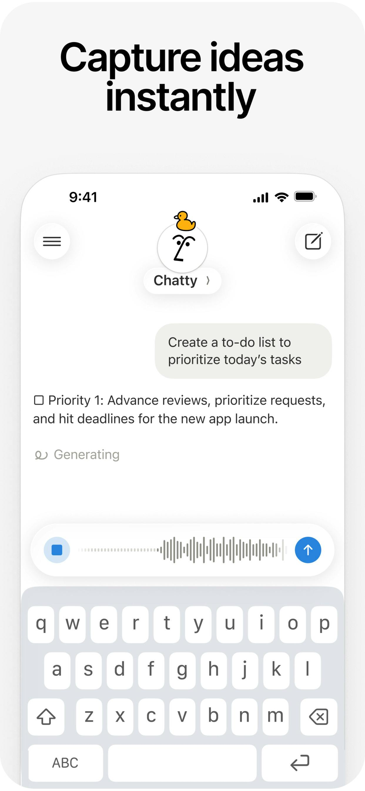
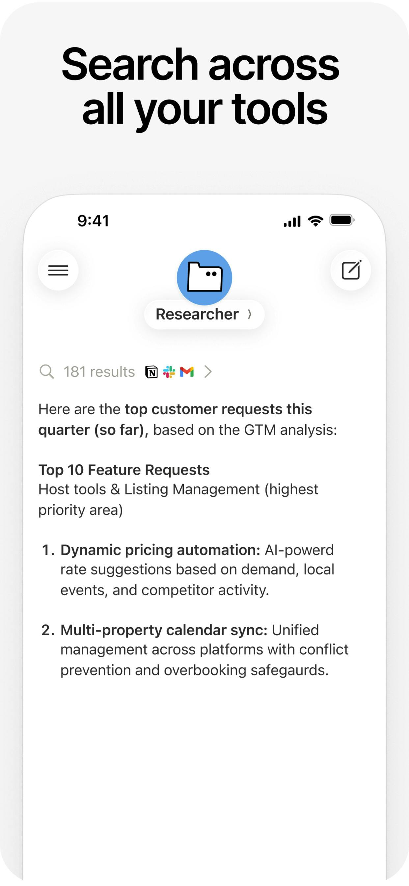

---

## 13. [NanoKVM-Go](https://www.producthunt.com/products/nanokvm-go)
**Votes**: 108 | **도입 난이도**: 중 | **신뢰도**: 상
**Tagline**: Give your AI agent physical control over any screen
**서비스 링크**: https://www.producthunt.com/r/NXJDFDBP7JKCHO

**태그**: AI, Automation, Hardware, RemoteAccess, DevTool, Agent, AI Tool

### 📌 이 서비스 한눈에 보기
AI 에이전트에게 물리적 화면 제어 권한을 부여하는 초소형 KVM 서버

### 🔑 주요 기능
- 시계 크기의 초소형 4K KVM 하드웨어
- WiFi 6 및 Tailscale 내장으로 원격 접속 최적화
- AI 에이전트를 위한 MCP(Model Context Protocol) 서버 역할

### 🙋 사용자에게 어떤 점이 좋은가
AI 에이전트가 물리적 장치의 화면을 보고 키보드/마우스를 직접 조작할 수 있게 하여, 소프트웨어 수준을 넘어선 자동화 환경을 구축할 수 있습니다.

### ✅ 지금 바로 써볼 기능
- 연결된 기기의 4K 화면 출력 및 원격 제어 테스트
- Tailscale을 통한 외부 네트워크 접속 설정
- AI 에이전트와 MCP 서버 연동 실험

### ⚠️ 사용 전 확인할 점
- 물리적 하드웨어 연결이 필요하므로 대상 기기의 포트 호환성 확인 필요
- AI 에이전트의 직접적인 하드웨어 제어로 인한 보안 및 데이터 노출 주의

### 🧭 확인이 더 필요한 정보
구체적인 하드웨어 사양(CPU/RAM) 및 지원 가능한 운영체제의 상세 범위는 명시되지 않았습니다.

### 📸 스크린샷 및 갤러리

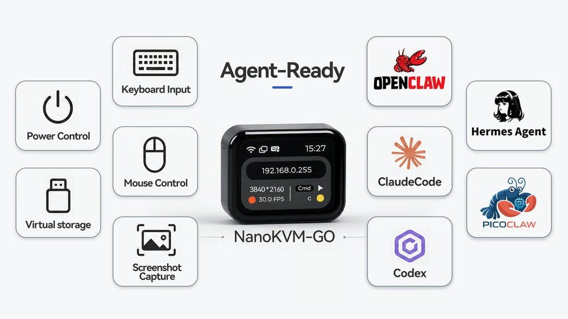

### 🎬 관련 영상
- [🎥 영상 보기](https://ph-files.imgix.net/dc8961b4-8fae-491c-aef1-c062c2544e4d.jpeg?auto=format)

---

## 14. [Universal-3.5 Pro](https://www.producthunt.com/products/assemblyai)
**Votes**: 108 | **도입 난이도**: 하 | **신뢰도**: 상
**Tagline**: The most accurate STT model from AssemblyAI.
**서비스 링크**: https://www.producthunt.com/r/7466ZKE4PFHB3G

**태그**: AI, STT, NLP, Productivity, AI Tool, Prompting, DevTool

### 📌 이 서비스 한눈에 보기
18개 언어 교차 및 정교한 화자 분리가 가능한 AssemblyAI의 초정밀 음성 인식 모델

### 🔑 주요 기능
- 18개 언어 간 코드 스위칭(Code-switching) 지원
- 역대 가장 정확한 화자 분리(Speaker Diarization) 기능
- 컨텍스트 프롬프팅을 통한 결과 제어 가능

### 🙋 사용자에게 어떤 점이 좋은가
다국어가 혼용되는 회의나 복잡한 대화 환경에서도 실제 들리는 그대로의 정확한 텍스트 변환이 가능합니다.

### ✅ 지금 바로 써볼 기능
- Realtime 및 Async 엔드포드에 적용해보기
- 다국어 대화 데이터로 정확도 테스트하기
- 프롬프팅 기능을 활용한 결과 최적화 시도하기

### ⚠️ 사용 전 확인할 점
- 기존 모델 대비 비용 구조 확인 필요
- 실시간/비실시간 엔드포인트별 성능 차이 검토

### 🧭 확인이 더 필요한 정보
정확한 가격 정책 및 기존 모델 대비 성능 벤치마크 수치는 명시되지 않았습니다.

### 📸 스크린샷 및 갤러리
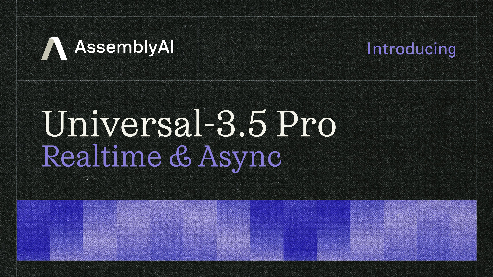
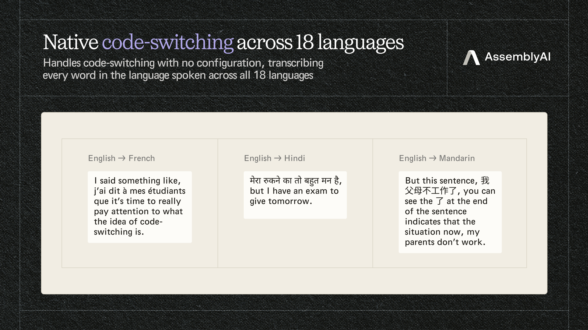
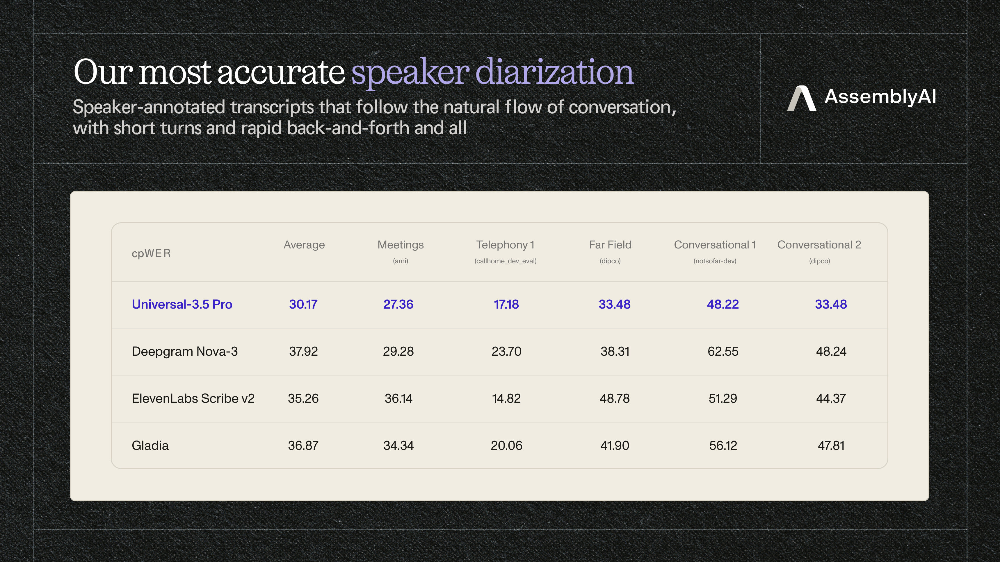

### 🎬 관련 영상
- [🎥 영상 보기](https://ph-files.imgix.net/f50b35ea-1a34-4464-930d-c05b6fc5cc34.jpeg?auto=format)

---

## 15. [Cutrix](https://www.producthunt.com/products/cutrix)
**Votes**: 106 | **도입 난이도**: 하 | **신뢰도**: 상
**Tagline**: AI-powered video translation that preserves speaker's tone
**서비스 링크**: https://www.producthunt.com/r/5WFMXGTVZ2FQFQ

**태그**: Video, AI, Translation, ContentCreation, Agent, Automation, AI Tool

### 📌 이 서비스 한눈에 보기
말하는 사람의 감정과 호흡까지 살리는 AI 기반 자연스러운 영상 번역 서비스

### 🔑 주요 기능
- 에이전틱 워크플로우를 통한 고도화된 번역 프로세스
- 화자의 원래 감정과 자연스러운 페이싱(Pacing) 유지
- 복잡한 학습 과정 없이 바로 사용할 수 있는 사용자 친화적 환경

### 🙋 사용자에게 어떤 점이 좋은가
로봇 같은 기계적인 더빙 대신, 원본 영상의 느낌을 그대로 살린 고품질 다국어 콘텐츠를 제작할 수 있습니다.

### ✅ 지금 바로 써볼 기능
- 무료 크레딧을 활용한 샘플 영상 번역 테스트
- 감정 보존 기능이 실제 영상과 얼마나 일치하는지 확인
- 자연스러운 싱크 및 페이싱 품질 검증

### ⚠️ 사용 전 확인할 점
- 무료 크레딧 소진 후의 유료 플랜 정책 확인 필요
- 복잡한 영상 편집 작업 시의 호환성 확인 필요

### 🧭 확인이 더 필요한 정보
지원 가능한 언어의 종류와 영상 길이에 따른 상세 가격 정책이 명시되지 않았습니다.

### 📸 스크린샷 및 갤러리
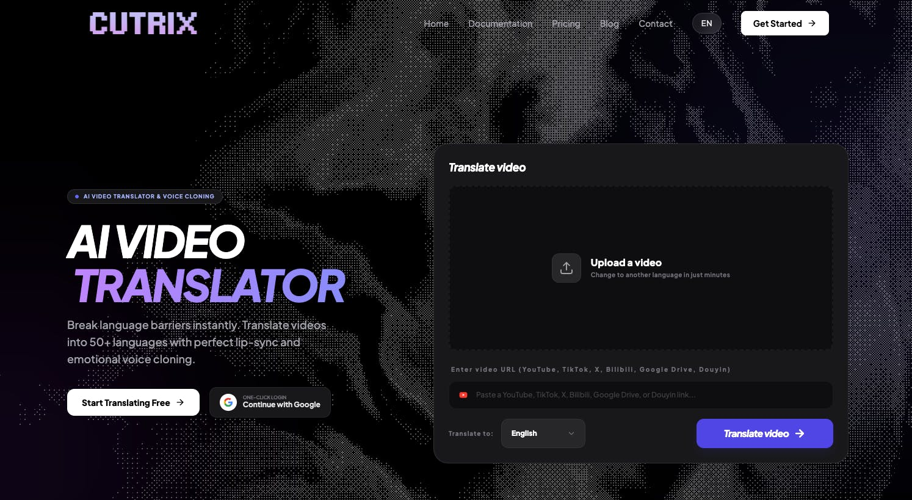

### 🎬 관련 영상
- [🎥 영상 보기](https://ph-files.imgix.net/724226a9-90ad-42f6-952c-a9ac636c86b2.jpeg?auto=format)

---

## 16. [Eodly](https://www.producthunt.com/products/eodly)
**Votes**: 100 | **도입 난이도**: 하 | **신뢰도**: 상
**Tagline**: Know what your team actually shipped today
**서비스 링크**: https://www.producthunt.com/r/4VOF3CNQV7ANDO

**태그**: Productivity, Automation, TeamManagement, Workflow

### 📌 이 서비스 한눈에 보기
팀원이 별도로 기록하지 않아도 협업 툴을 분석해 매일 업무 성과를 요약해주는 자동 리포팅 도구

### 🔑 주요 기능
- Slack, GitHub, Linear 등 주요 협업 툴 데이터 자동 수집
- 팀원이 직접 로그를 남길 필요 없는 비침습적 방식
- 업무 진행 상황, 성과자, 지연 상황을 한눈에 파악하는 데일리 리포트 제공

### 🙋 사용자에게 어떤 점이 좋은가
매일 팀의 업무 현황을 파악하기 위해 일일이 확인하거나 보고를 받는 번거로움을 줄여줍니다.

### ✅ 지금 바로 써볼 기능
- 기존 협업 툴(Slack, GitHub 등) 연동하기
- 매일 저녁 생성되는 요약 페이지 확인하기
- 팀원들의 업무 패턴 및 성과 리포트 분석하기

### ⚠️ 사용 전 확인할 점
- 외부 툴(Slack, GitHub 등)에 대한 접근 권한 설정 필요
- 데이터 수집 방식에 따른 개인정보 및 보안 정책 검토 필요

### 🧭 확인이 더 필요한 정보
각 협업 툴과의 구체적인 연동 범위와 데이터 보안 처리 방식에 대한 상세 정보가 필요합니다.

### 📸 스크린샷 및 갤러리
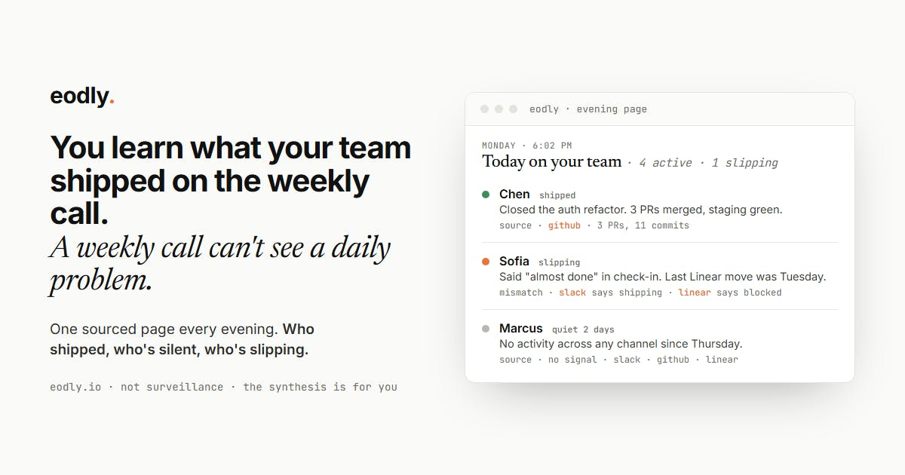
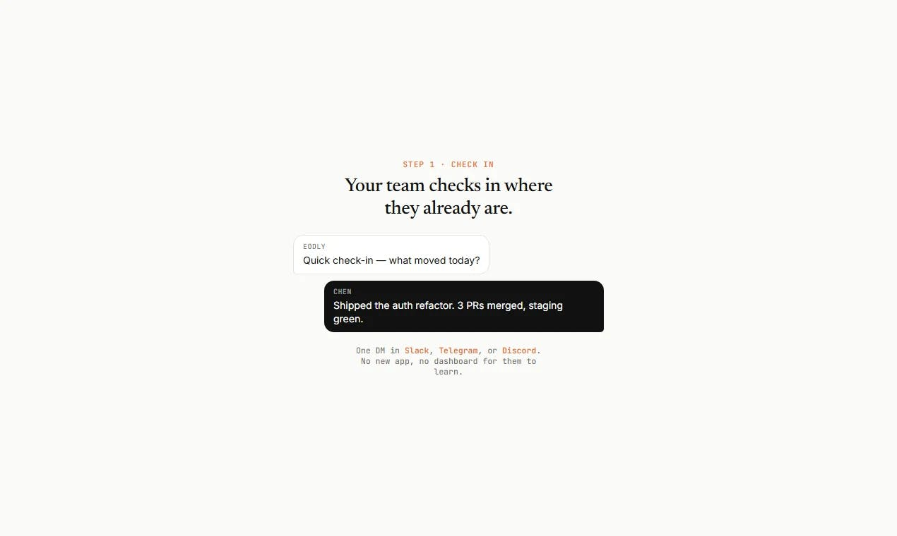

### 🎬 관련 영상
- [🎥 영상 보기](https://ph-files.imgix.net/939b2af6-df31-4348-8147-dd79f501eec2.jpeg?auto=format)

---

## 17. [Jamboree](https://www.producthunt.com/products/jamboree)
**Votes**: 92 | **도입 난이도**: 하 | **신뢰도**: 상
**Tagline**: Multiplayer synthesizer
**서비스 링크**: https://www.producthunt.com/r/R6VMLCE73D3ERS

**태그**: MusicProduction, Collaboration, WebTool, SoundDesign, Chat, Design

### 📌 이 서비스 한눈에 보기
실시간 협업이 가능한 브라우저 기반 멀티플레이어 신디사이저

### 🔑 주요 기능
- P2P 네트워킹 기반의 실시간 공동 사운드 디자인
- 5개 파형 오실레이터, 필터, ADSR, LFO를 갖춘 강력한 엔진
- 브라우저 기반 환경 및 SoundFont 내보내기 지원

### 🙋 사용자에게 어떤 점이 좋은가
다른 사용자와 실시간 채팅 및 커서를 공유하며 함께 사운드 패치를 만들 수 있어, 협업 중심의 음악 작업이 가능합니다.

### ✅ 지금 바로 써볼 기능
- 실시간 커서와 채팅을 활용한 공동 작업 시도
- 만들어진 패치를 SoundFont로 내보내기
- LFO와 필터를 활용한 사운드 디자인 실험

### ⚠️ 사용 전 확인할 점
- P2P 방식이므로 네트워크 환경에 따라 연결 안정성이 달라질 수 있음
- 브라우저 기반이므로 고사양 사운드 작업 시 하드웨어 리소스 영향 확인 필요

### 🧭 확인이 더 필요한 정보
P2P 연결 시 보안 및 개인정보 보호 수준에 대한 구체적인 정보가 필요합니다.

### 📸 스크린샷 및 갤러리
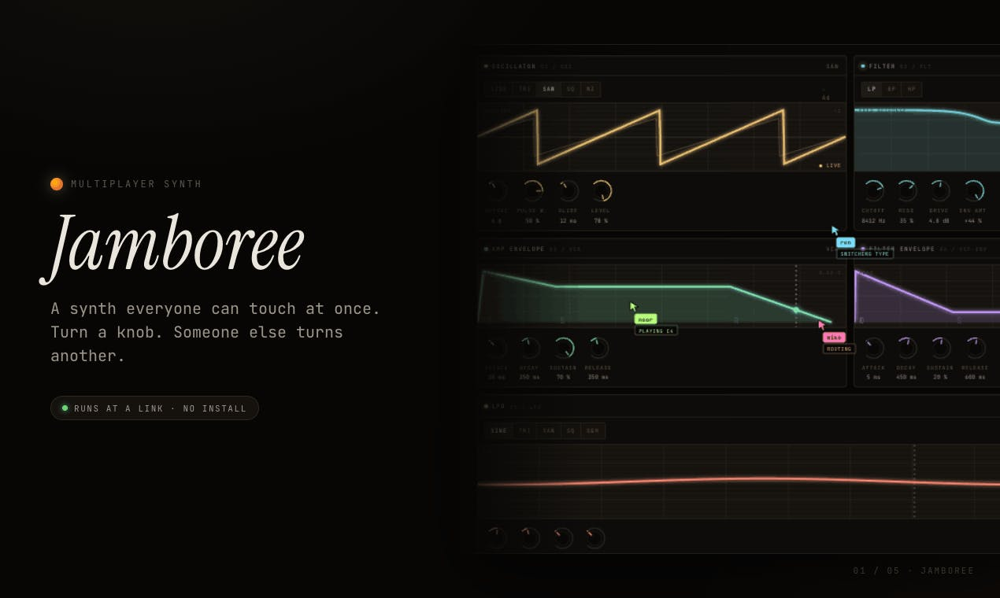
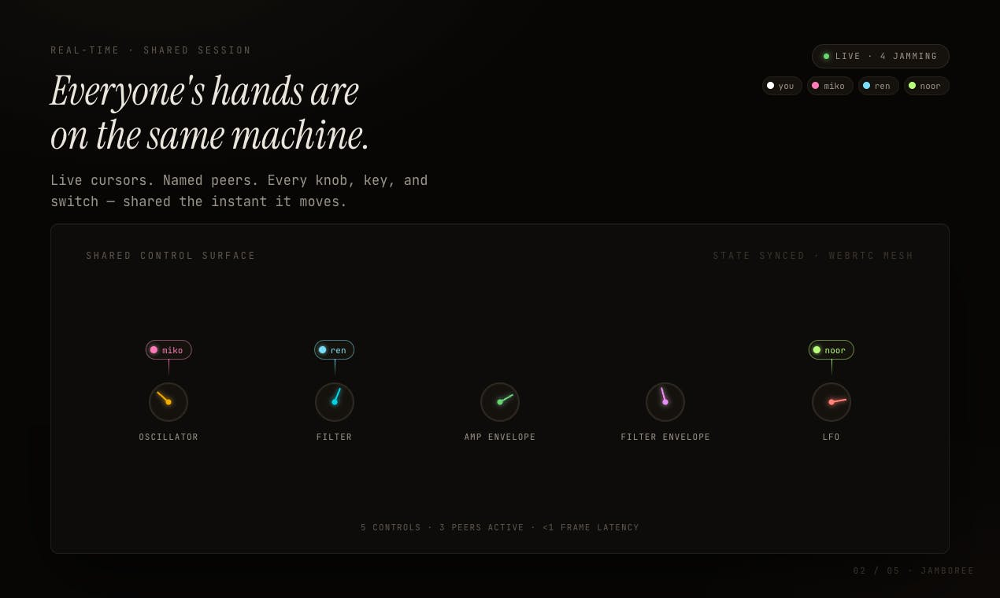
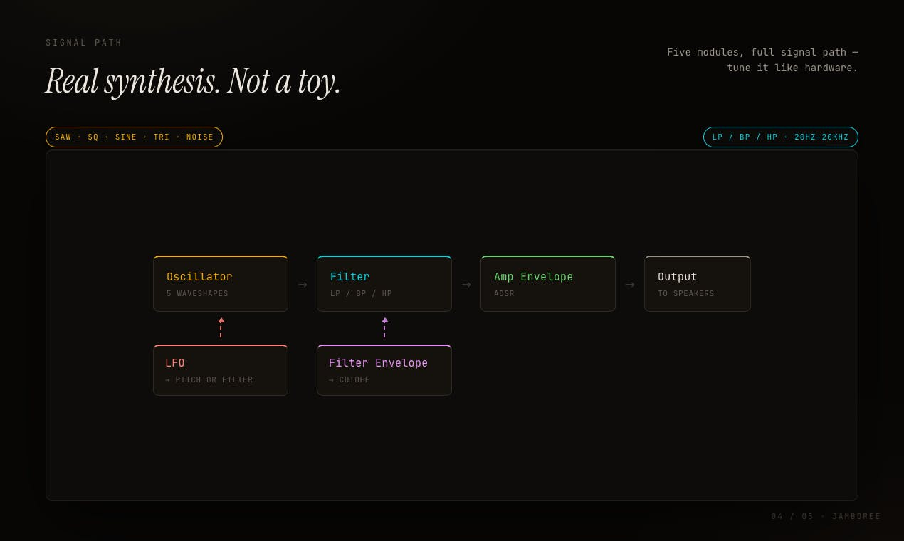

---

## 18. [Compendium](https://www.producthunt.com/products/compendium-2)
**Votes**: 88 | **도입 난이도**: 하 | **신뢰도**: 상
**Tagline**: Keeping your team, agents, and data on one page
**서비스 링크**: https://www.producthunt.com/r/IXFI2SBEVHSBEY

**태그**: AI, Collaboration, Knowledge Management, Productivity, Agent, AI Tool

### 📌 이 서비스 한눈에 보기
팀원과 AI 에이전트가 하나의 공유 메모리를 통해 실시간으로 협업하는 기업용 지식 허브

### 🔑 주요 기능
- 모든 AI 에이전트가 하나의 공유 메모리를 사용하여 지식과 맥락을 실시간 공유
- 개별 스레드 방식이 아닌 팀원과 에이전트가 함께 작업하는 공유 세션 제공
- 부재 중 변경 사항에 대한 요약 및 팀원들의 실시간 작업 현황 확인 가능

### 🙋 사용자에게 어떤 점이 좋은가
팀 내 파편화된 AI 대화 기록을 하나로 통합하여, 맥락 공유에 드는 시간을 줄이고 팀 전체의 의사결정 속도를 높일 수 있습니다.

### ✅ 지금 바로 써볼 기능
- 팀 공용 지식 베이스로 세션 생성하기
- 에이전트 간 맥락 공유 기능 테스트하기
- 부재 중 업데이트 요약 기능 활용하기

### ⚠️ 사용 전 확인할 점
- 모든 데이터가 공유되므로 민감한 정보 관리 정책 필요
- 에이전트 간의 상호작용이 복잡해질 경우 관리 난이도 상승 가능성

### 🧭 확인이 더 필요한 정보
현재 제공되는 에이전트의 종류와 외부 툴과의 연동 범위에 대한 구체적인 정보가 필요합니다.

### 📸 스크린샷 및 갤러리

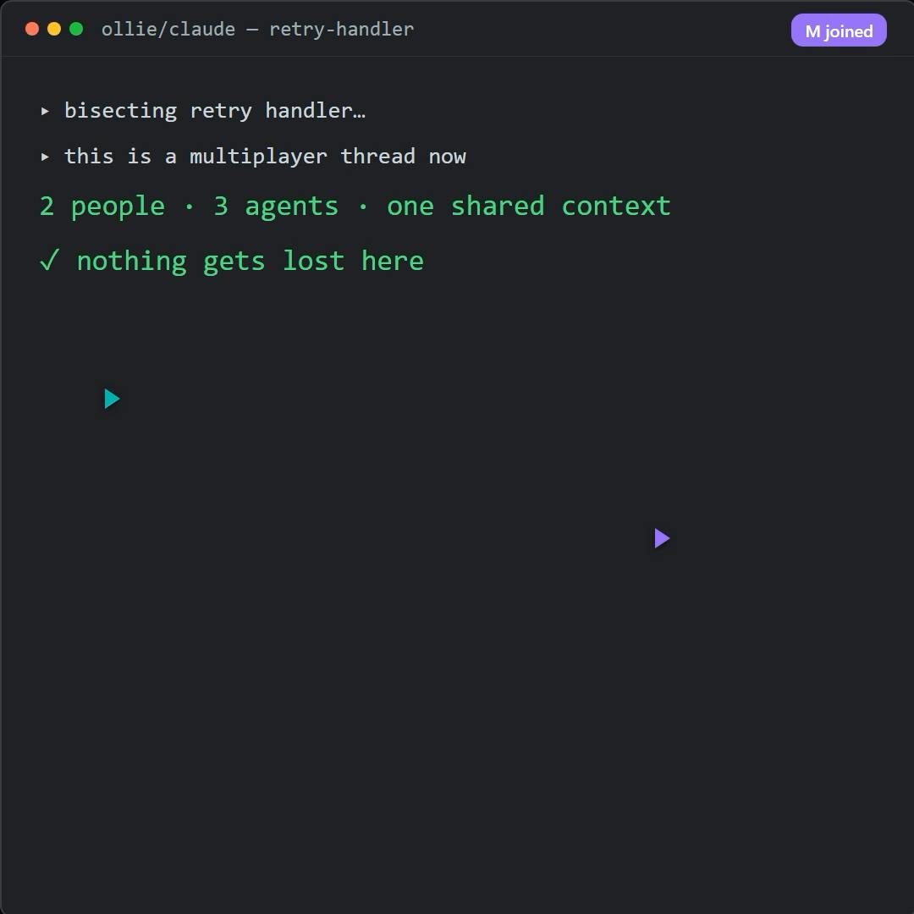

### 🎬 관련 영상
- [🎥 영상 보기](https://ph-files.imgix.net/04a92357-f835-4161-a5dd-3cd23191f52c.jpeg?auto=format)

---

## 19. [Knowledge Atlas by Fini](https://www.producthunt.com/products/fini-2)
**Votes**: 86 | **도입 난이도**: 중 | **신뢰도**: 상
**Tagline**: The self-learning knowledge base that improves itself
**서비스 링크**: https://www.producthunt.com/r/G3GGBLVBEPNB5J

**태그**: KnowledgeBase, Automation, AI, CustomerSupport, AI Tool

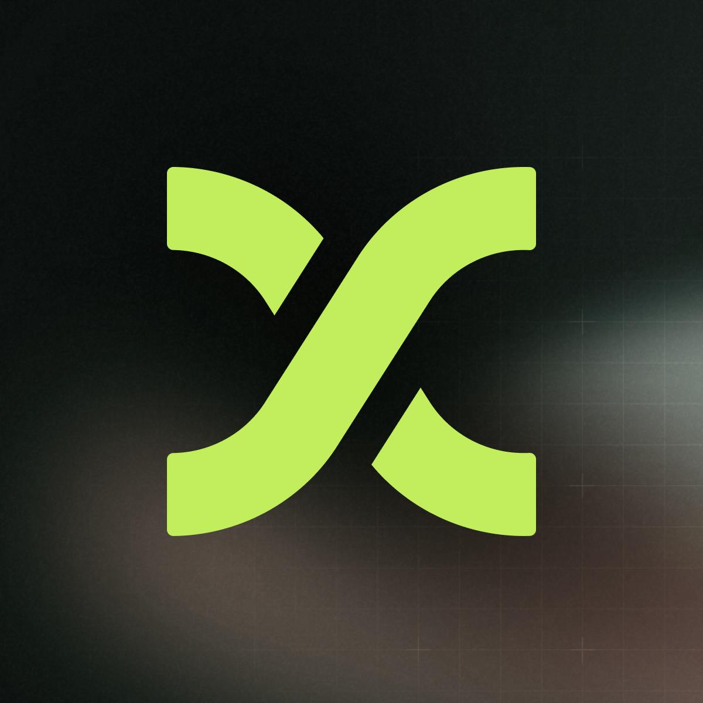

### 📌 이 서비스 한눈에 보기
해결된 티켓을 바탕으로 도움말 문서를 자동 생성하고 지식 베이스를 스스로 관리하는 셀프 러닝 시스템

### 🔑 주요 기능
- 해결된 고객 티켓을 활용한 도움말 문서 자동 작성
- 지식 베이스 내 정보 충돌 자동 감지 및 플래그 지정
- 모든 AI 답변에 대한 단일 출처 근거 제시(Grounding)

### 🙋 사용자에게 어떤 점이 좋은가
반복적인 문서 작업 시간을 줄여주며, AI 답변의 신뢰성을 확보하여 지식 관리의 운영 부담을 최소화합니다.

### ✅ 지금 바로 써볼 기능
- 기존 고객 지원 티켓 데이터 연동하기
- 자동 생성된 도움말 문서 검토 및 승인하기
- AI 답변의 출처 근거 확인 기능 테스트하기

### ⚠️ 사용 전 확인할 점
- 자동 생성된 문서의 정확성을 위한 인간의 검토 과정 필요
- 기존 티켓 데이터의 품질이 지식 베이스 품질에 직접적인 영향

### 🧭 확인이 더 필요한 정보
현재 제공되는 티켓 시스템과의 구체적인 연동 방식 및 데이터 보안 정책 확인이 필요합니다.

### 📸 스크린샷 및 갤러리
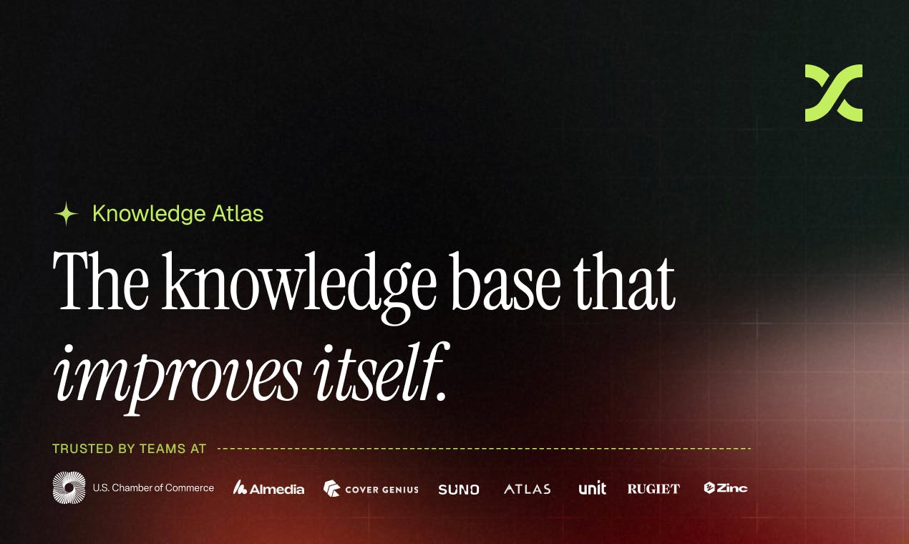
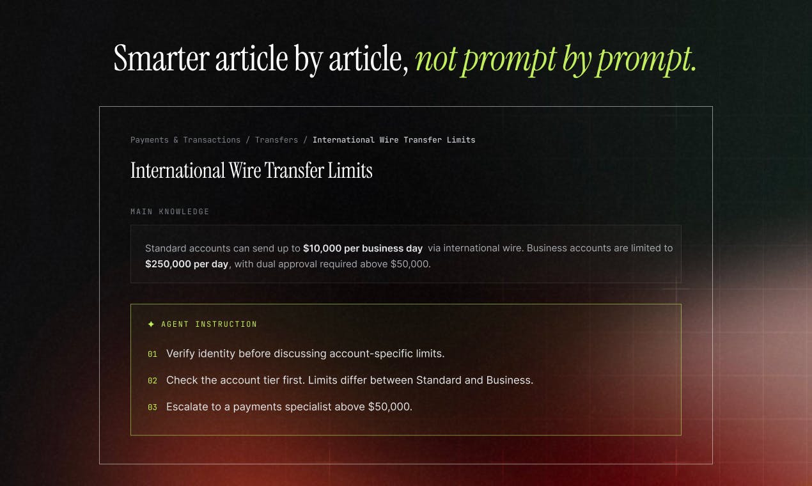
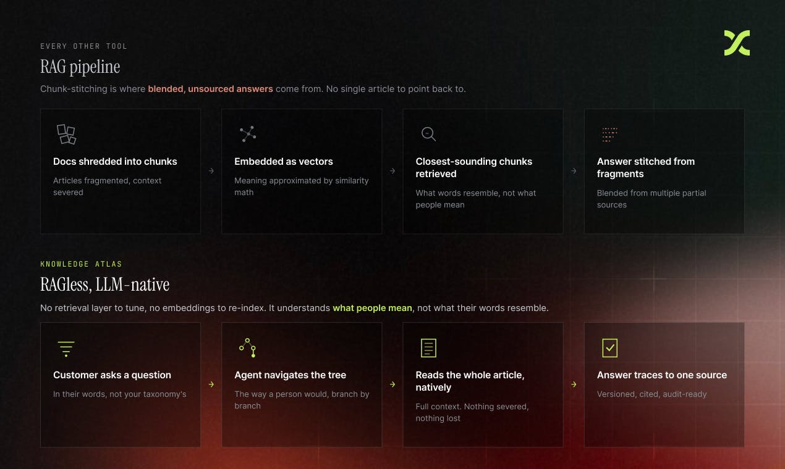

### 🎬 관련 영상
- [🎥 영상 보기](https://ph-files.imgix.net/33684840-525d-4397-82f9-d71cd3e0879e.jpeg?auto=format)

---

## 20. [On-Device Field Extraction by Veryfi](https://www.producthunt.com/products/veryfi)
**Votes**: 85 | **도입 난이도**: 중 | **신뢰도**: 상
**Tagline**: Secure on-device extraction even if you're offline
**서비스 링크**: https://www.producthunt.com/r/BUWWTADJ6ZNRPQ

**태그**: SDK, OCR, Automation, DataExtraction, Security

### 📌 이 서비스 한눈에 보기
오프라인에서도 즉각적인 영수증 검증이 가능한 보안 중심 온디바이스 데이터 추출 기술

### 🔑 주요 기능
- Veryfi Lens SDK에 추가된 새로운 온디바이스 필드 감지 기능
- 데이터 업로드 전 기기 자체에서 즉각적인 영수증 유효성 검증
- 오프라인 상태에서도 작동하는 보안 중심의 데이터 추출 프로세스

### 🙋 사용자에게 어떤 점이 좋은가
데이터를 서버로 보내기 전 현장에서 즉시 오류를 잡아낼 수 있어, 데이터 처리 실패로 인한 재작업 시간을 획기적으로 줄여줍니다.

### ✅ 지금 바로 써볼 기능
- Veryfi Lens SDK의 온디바이스 기능 연동 테스트
- 오프라인 환경에서의 데이터 추출 정확도 검증
- 기존 클라우드 기반 워크플로우와의 병행 운영 테스트

### ⚠️ 사용 전 확인할 점
- 기기 성능(하드웨어 사양)에 따른 추출 속도 차이 가능성
- 온디바이스 모델의 복잡한 양식 처리 한계 여부 확인 필요

### 🧭 확인이 더 필요한 정보
온디바이스 환경에서 지원하는 구체적인 영수증 양식의 종류와 정확도 수치는 명시되지 않았습니다.

### 📸 스크린샷 및 갤러리
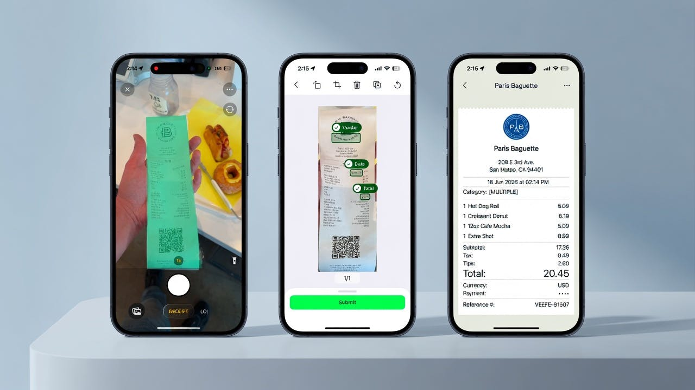

### 🎬 관련 영상
- [🎥 영상 보기](https://ph-files.imgix.net/22157779-357c-4d27-98c6-3b69ae80c248.jpeg?auto=format)

---

## 21. [TypeUI](https://www.producthunt.com/products/typeui)
**Votes**: 64 | **도입 난이도**: 하 | **신뢰도**: 상
**Tagline**: Build better UI with AI
**서비스 링크**: https://www.producthunt.com/r/NHILRDIK7RHVBZ

**태그**: AI, UI/UX, DevTool, Productivity, Agent, AI Tool, Prompting, Design

### 📌 이 서비스 한눈에 보기
AI 도구와 결합하여 사용자 전환율을 높이는 고품질 UI를 구축하는 에이전트 중심 도구

### 🔑 주요 기능
- Claude, Codex, Cursor 등 기존 AI 도구와 연동 가능한 에이전트 중심 워크플로우
- 전문적인 디자인 스킬과 프롬프트를 결합한 직관적인 UI 생성
- 사용자 전환을 고려한 실용적인 UI 설계 지원

### 🙋 사용자에게 어떤 점이 좋은가
디자인 전문 지식이 부족하더라도 AI를 활용해 검증된 디자인 원칙이 적용된 UI를 빠르게 제작할 수 있습니다.

### ✅ 지금 바로 써볼 기능
- 사용 중인 AI 코드 에디터(Cursor 등)에 연동하기
- 기존 UI를 개선하기 위한 프롬프트 테스트하기
- 에이전트 기반의 UI 생성 워크플로우 경험하기

### ⚠️ 사용 전 확인할 점
- 사용자의 AI 도구 숙련도에 따라 결과물 품질 차이 발생 가능
- 생성된 UI의 코드 품질 및 커스텀 자유도 확인 필요

### 🧭 확인이 더 필요한 정보
제공되는 UI 결과물이 어떤 프레임워크나 언어로 출력되는지에 대한 상세 정보가 필요합니다.

### 📸 스크린샷 및 갤러리
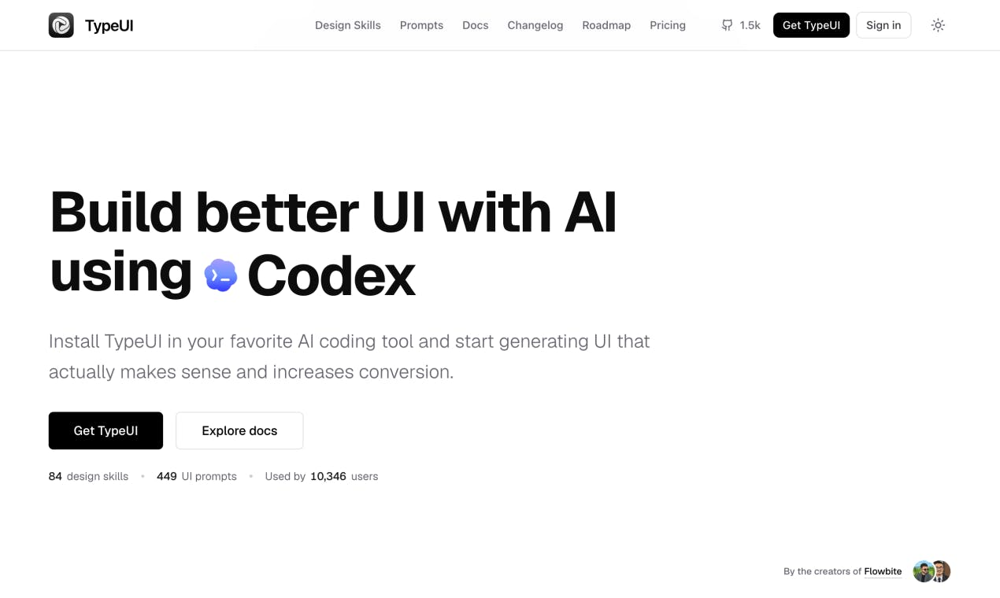
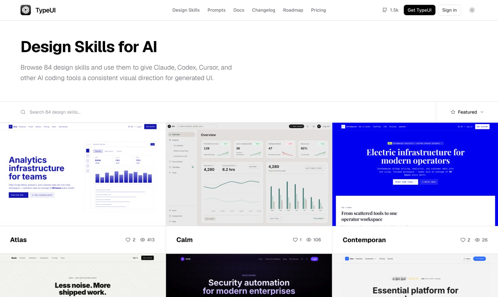
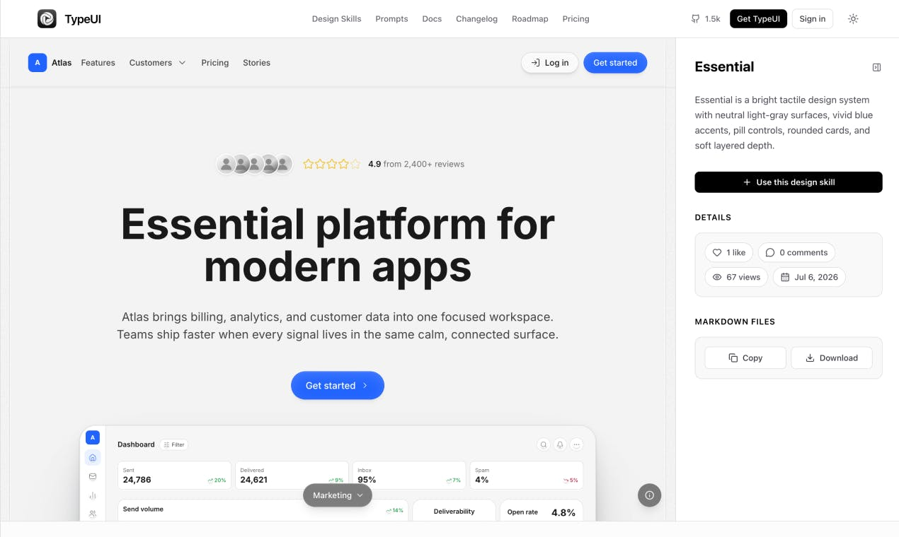

---

## 22. [Denker](https://www.producthunt.com/products/denker)
**Votes**: 33 | **도입 난이도**: 하 | **신뢰도**: 상
**Tagline**: Your AI coworker that follows where you work
**서비스 링크**: https://www.producthunt.com/r/KX7ACM3LYX7OFT

**태그**: AI Agent, Automation, Productivity, Desktop, Agent, AI Tool, Prompting

### 📌 이 서비스 한눈에 보기
사용자의 화면을 보고 데스크톱 작업을 대신 수행하는 AI 동료

### 🔑 주요 기능
- 화면 공유 및 컨텍스트 이해를 통한 작업 수행
- 프롬프트 입력 없이 커서 조작을 통한 직관적 제어
- 여러 도구를 전환할 필요 없는 데스크톱 통합 실행

### 🙋 사용자에게 어떤 점이 좋은가
별도의 복잡한 프롬프트 관리나 도구 전환 없이, 현재 작업 중인 화면 위에서 즉시 AI의 도움을 받을 수 있습니다.

### ✅ 지금 바로 써볼 기능
- 커서를 이용한 작업 지시 테스트
- 데스크톱 환경에서의 에이전트 실행
- 화면 공유 및 컨텍심 이해도 확인

### ⚠️ 사용 전 확인할 점
- 화면 공유 방식에 따른 개인정보 및 보안 노출 주의
- 데스크톱 제어 권한 부여에 따른 시스템 영향 확인

### 🧭 확인이 더 필요한 정보
화면 공유 및 데스크톱 제어 시의 보안 프로토콜과 개인정보 보호 정책에 대한 상세 정보가 필요합니다.

### 📸 스크린샷 및 갤러리
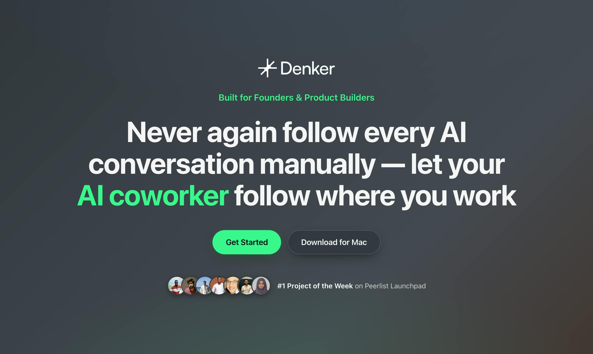
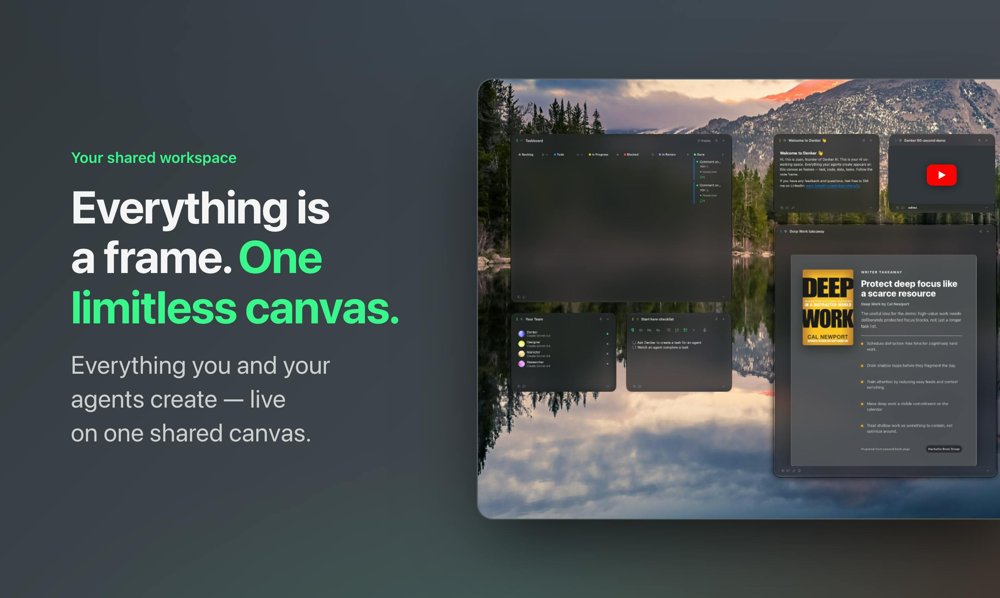
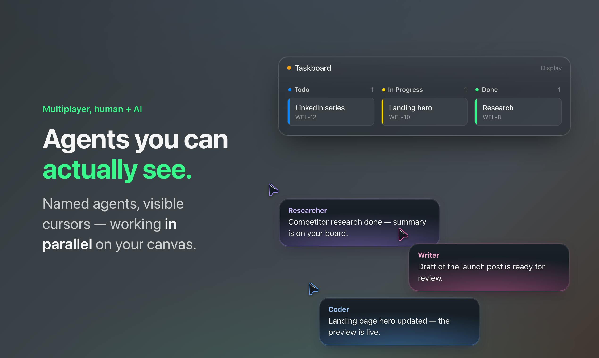

### 🎬 관련 영상
- [🎥 영상 보기](https://ph-files.imgix.net/b2b468f2-409a-4f2b-8b0e-9324a87ba69c.jpeg?auto=format)

---

## 23. [Jobply](https://www.producthunt.com/products/jobply)
**Votes**: 29 | **도입 난이도**: 하 | **신뢰도**: 상
**Tagline**: Apply to better-fit jobs faster with AI
**서비스 링크**: https://www.producthunt.com/r/YPWIMQW7BGOO3L

**태그**: AI, JobSearch, Automation, Productivity, AI Tool

### 📌 이 서비스 한눈에 보기
AI를 활용해 맞춤형 이력서 작성부터 지원서 자동 완성까지 한 번에 해결하는 무료 구직 어시스턴트

### 🔑 주요 기능
- 단 하나의 프로필로 AI 기반 맞춤형 채용 공고 매칭
- 지원하는 직무에 최적화된 이력서 및 자기소개서 자동 생성
- Workday, Greenhouse 등 주요 채용 플랫폼 지원서 자동 완성 기능

### 🙋 사용자에게 어떤 점이 좋은가
반복적인 서류 작성과 지원 절차를 자동화하여, 구직자가 더 많은 양질의 지원을 빠르게 할 수 있도록 돕습니다.

### ✅ 지금 바로 써볼 기능
- 프로필 생성 및 데이터 입력
- AI 매칭 채용 공고 탐색
- 플랫폼별 지원서 자동 완성 기능 테스트

### ⚠️ 사용 전 확인할 점
- 자동 생성된 서류의 내용이 본인의 실제 경험과 일치하는지 반드시 검토 필요
- 외부 채용 플랫폼(Workday 등)과의 데이터 연동 시 개인정보 보안 확인 필요

### 🧭 확인이 더 필요한 정보
무료 서비스의 향후 유료화 계획이나 데이터 보안 정책에 대한 상세 정보가 명시되지 않았습니다.

### 📸 스크린샷 및 갤러리

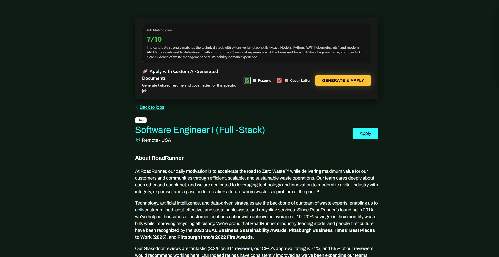
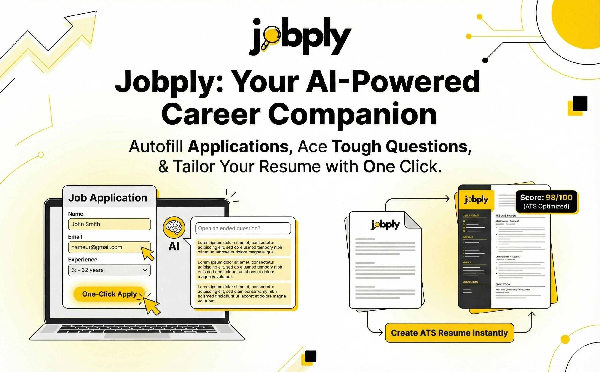

### 🎬 관련 영상
- [🎥 영상 보기](https://ph-files.imgix.net/3f902bf5-6068-4a91-80bb-f6699c83c87b.jpeg?auto=format)

---

## 24. [SPUN](https://www.producthunt.com/products/spun-3)
**Votes**: 23 | **도입 난이도**: 하 | **신뢰도**: 상
**Tagline**: AI-powered platform for online visa applications
**서비스 링크**: https://www.producthunt.com/r/KM3IM2NLN2RUK7

**태그**: Travel, AI, Automation, Visa, AI Tool, Design

### 📌 이 서비스 한눈에 보기
AI 자동화 기술로 복잡한 비자 신청 과정을 간편하게 해결하는 글로벌 모빌리티 플랫폼

### 🔑 주요 기능
- 90개국 이상, 300여 종의 비자 신청 지원
- AI 어시스턴트를 통한 개인 맞춤형 가이드 제공
- 자동화 기술을 활용한 간편한 서류 양식 작성

### 🙋 사용자에게 어떤 점이 좋은가
복잡한 비자 신청 절차와 서류 작성의 번거로움을 줄여주어, 사용자가 여행 준비에만 집중할 수 있게 돕습니다.

### ✅ 지금 바로 써볼 기능
- 목적지 국가의 비자 종류 검색하기
- AI 어시스턴트에게 맞춤형 가이드 받기
- 자동화 기능을 통한 신청 양식 작성 시도하기

### ⚠️ 사용 전 확인할 점
- AI 가이드와 실제 국가별 비자 규정 간의 일치 여부 확인 필요
- 개인정보 및 민감한 서류 제출 시 보안 정책 검토 필요

### 🧭 확인이 더 필요한 정보
실제 비자 발급 승인 여부는 해당 국가 대사관의 권한이며, 플랫폼은 신청 과정을 돕는 도구임을 유의해야 합니다.

### 📸 스크린샷 및 갤러리
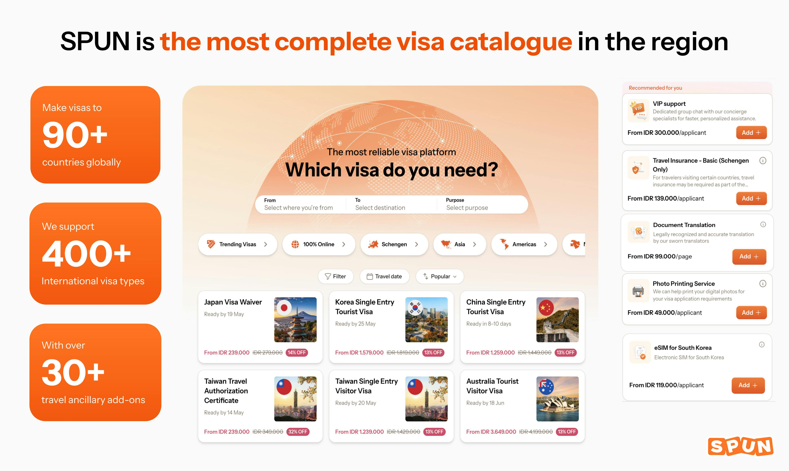
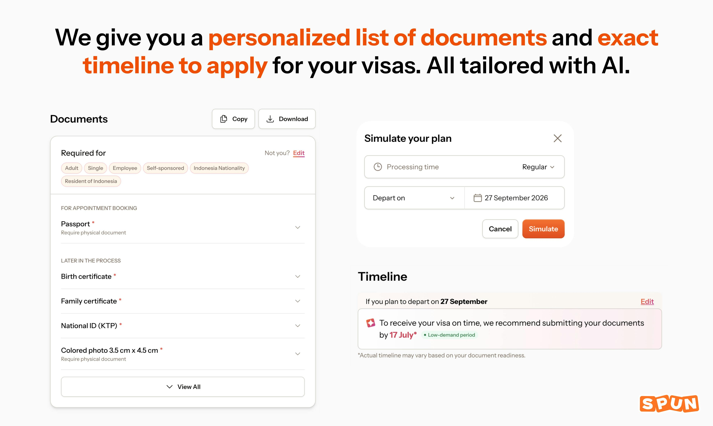
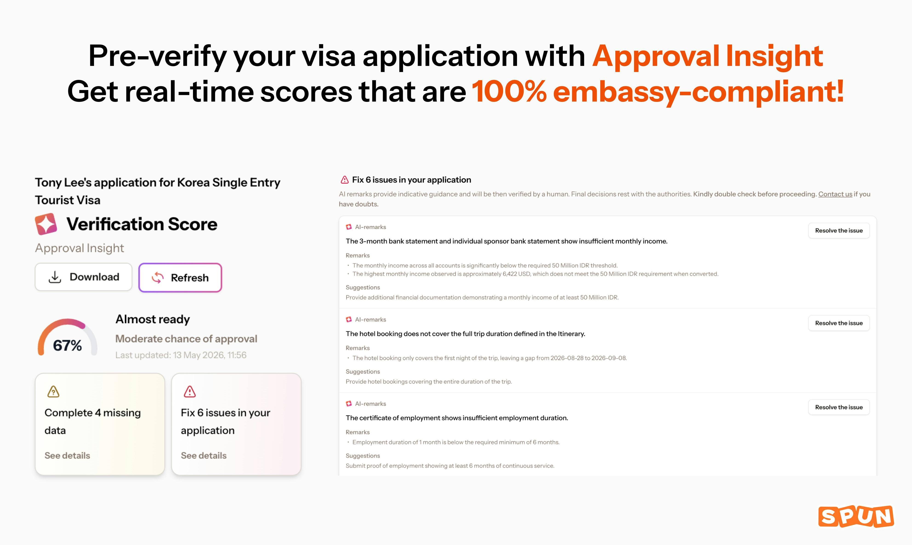

### 🎬 관련 영상
- [🎥 영상 보기](https://ph-files.imgix.net/6df9341b-7a0f-4b13-91e6-64a2c756d878.jpeg?auto=format)

---

## 25. [MindHunt AI](https://www.producthunt.com/products/mindhunt-ai)
**Votes**: 19 | **도입 난이도**: 하 | **신뢰도**: 상
**Tagline**: AI recruitment tool built by a recruiter. Finally.
**서비스 링크**: https://www.producthunt.com/r/3HNNMFL5A4UAVM

**태그**: Recruitment, AI, Automation, Productivity, AI Tool

### 📌 이 서비스 한눈에 보기
20년 경력 채용 전문가가 설계한 올인원 AI 채용 자동화 솔루션

### 🔑 주요 기능
- 현직 채용 전문가의 실무 경험을 바탕으로 설계된 직관적인 워크플로우
- 자연어 검색을 통한 후보자 발굴부터 연락처 확보까지 자동화
- 개인화된 아웃리치 메시지 작성 및 통합 관리 기능 제공

### 🙋 사용자에게 어떤 점이 좋은가
여러 도구를 번갈아 사용할 필요 없이, 자연어로 요구사항만 입력하면 후보자 발굴부터 연락까지 한 곳에서 해결할 수 있습니다.

### ✅ 지금 바로 써볼 기능
- 자연어 기반 후보자 검색 기능 테스트
- AI 생성 개인화 메시지 품질 확인
- 연락처 추출 및 관리 워크플로우 경험

### ⚠️ 사용 전 확인할 점
- AI가 생성한 메시지의 개인화 수준 및 정확도 검토 필요
- 외부 플랫폼(LinkedIn 등)과의 데이터 연동 범위 확인 필요

### 🧭 확인이 더 필요한 정보
구체적인 후보자 데이터베이스의 규모와 외부 플랫폼과의 실시간 동기화 방식에 대한 정보가 필요합니다.

### 📸 스크린샷 및 갤러리
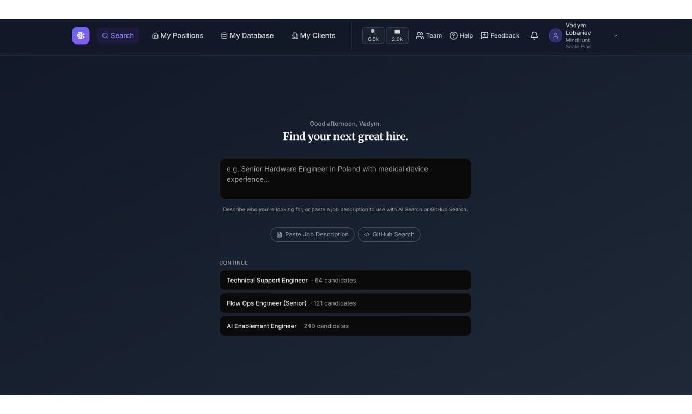
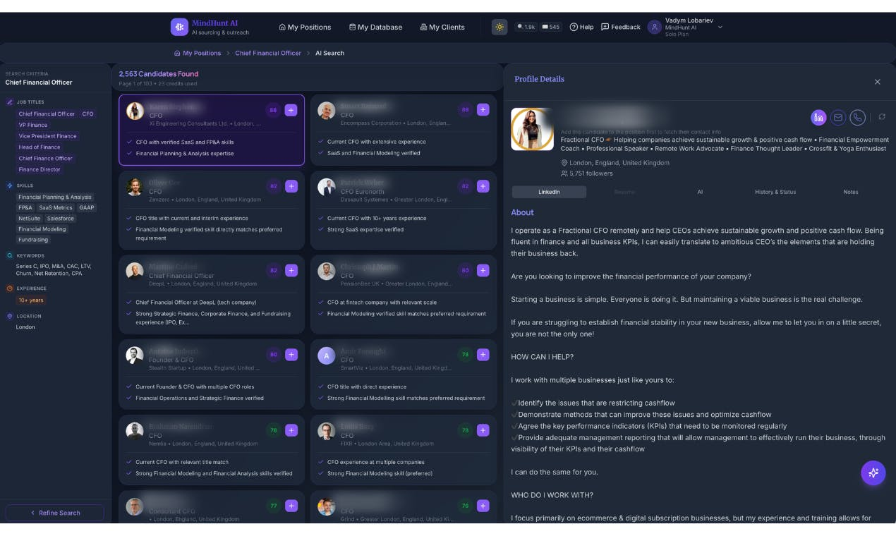
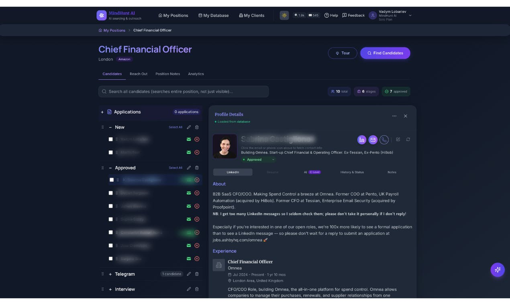

### 🎬 관련 영상
- [🎥 영상 보기](https://ph-files.imgix.net/55f59ca1-5805-403a-9c7e-2be3a34c9d12.jpeg?auto=format)

---

## 26. [Wine Matcher](https://www.producthunt.com/products/wine-matcher-scan-pairing)
**Votes**: 19 | **도입 난이도**: 하 | **신뢰도**: 상
**Tagline**: AI sommelier for full dinner recipes, not just wine notes
**서비스 링크**: https://www.producthunt.com/r/NWVMZZ2VYQARGS

**태그**: AI, Lifestyle, Food & Drink, Mobile App, AI Tool

### 📌 이 서비스 한눈에 보기
와인 라벨 스캔 한 번으로 맞춤형 풀 코스 레시피를 제안받는 AI 소믈리에

### 🔑 주요 기능
- 와인 라벨 스캔을 통한 쉽고 명확한 와인 정보 분석
- 보유한 와인에 맞춘 앱 전용 풀 코스 메뉴 및 레시피 제안
- 상황별(데이트, 영화 등) 맞춤형 와인 페어링 추천 기능

### 🙋 사용자에게 어떤 점이 좋은가
와인을 먼저 고르고 음식을 찾는 기존 방식에서 벗어나, 이미 가진 와인을 활용해 완벽한 저녁 식사 메뉴를 설계할 수 있습니다.

### ✅ 지금 바로 써볼 기능
- 가지고 있는 와인 라벨 스캔해보기
- 제안된 레시피로 저녁 식사 메뉴 구성하기
- 상황별 페어링 기능을 통해 다음 모임 준비하기

### ⚠️ 사용 전 확인할 점
- 실제 요리 결과물은 사용자의 조리 숙련도에 따라 다를 수 있음
- 라벨 인식률이 낮을 경우 정보 제공이 제한될 수 있음

### 🧭 확인이 더 필요한 정보
제공되는 레시피의 구체적인 식재료 구매 연동이나 상세 조리 가이드의 깊이는 확인이 필요합니다.

### 📸 스크린샷 및 갤러리

### 🎬 관련 영상
- [🎥 영상 보기](https://ph-files.imgix.net/c6174f5c-335c-4fb4-9534-82f36795972f.jpeg?auto=format)

---

## 27. [Inkling](https://www.producthunt.com/products/inkling-2)
**Votes**: 19 | **도입 난이도**: 하 | **신뢰도**: 상
**Tagline**: Track the hires and departures that signal what's next
**서비스 링크**: https://www.producthunt.com/r/OGYSQLNA7PUI2G

**태그**: Business Intelligence, Competitive Intelligence, Data Analytics, AI Tool

### 📌 이 서비스 한눈에 보기
기업의 인재 이동 데이터를 분석하여 전략적 인사이트를 제공하는 비즈니스 인텔리전스 도구

### 🔑 주요 기능
- 주요 기업의 채용 및 퇴사 등 인력 변동 실시간 모니터링
- 공개된 프로필 데이터를 기반으로 한 주간 브리핑 및 즉각적인 알림 제공
- 경쟁사, 투자 대상, 포트폴리오 기업의 전략적 움직임 파악

### 🙋 사용자에게 어떤 점이 좋은가
경쟁사나 타겟 기업의 인력 변화를 통해 그들의 다음 전략적 행보를 미리 예측하고 의사결정에 활용할 수 있습니다.

### ✅ 지금 바로 써볼 기능
- 관심 있는 경쟁사 및 타겟 기업 리스트 등록
- 주간 브리핑 리포트 구독 설정
- 중요한 인력 이동에 대한 실시간 알림 활성화

### ⚠️ 사용 전 확인할 점
- 공개된 프로필 데이터에만 의존하므로 비공개 정보는 포함되지 않음
- 데이터의 정확성이 원천 소스(공개 프로필)의 업데이트 상태에 따라 달라질 수 있음

### 🧭 확인이 더 필요한 정보
사용자별 맞춤형 필터링 기능이나 데이터 업데이트 주기에 대한 상세 사양 확인이 필요합니다.

### 📸 스크린샷 및 갤러리
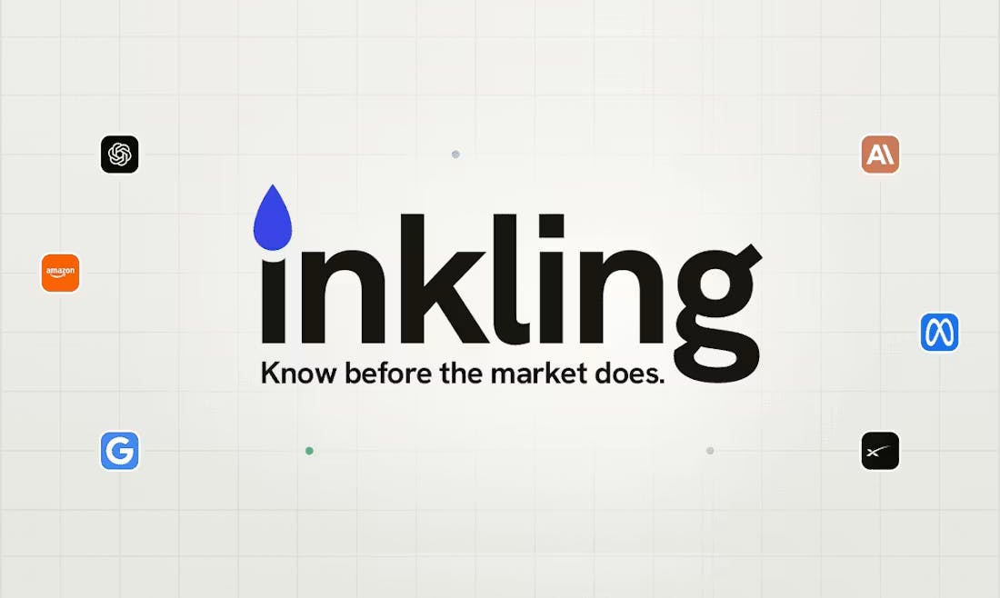
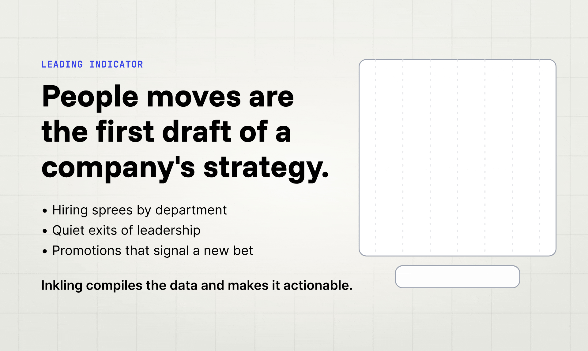
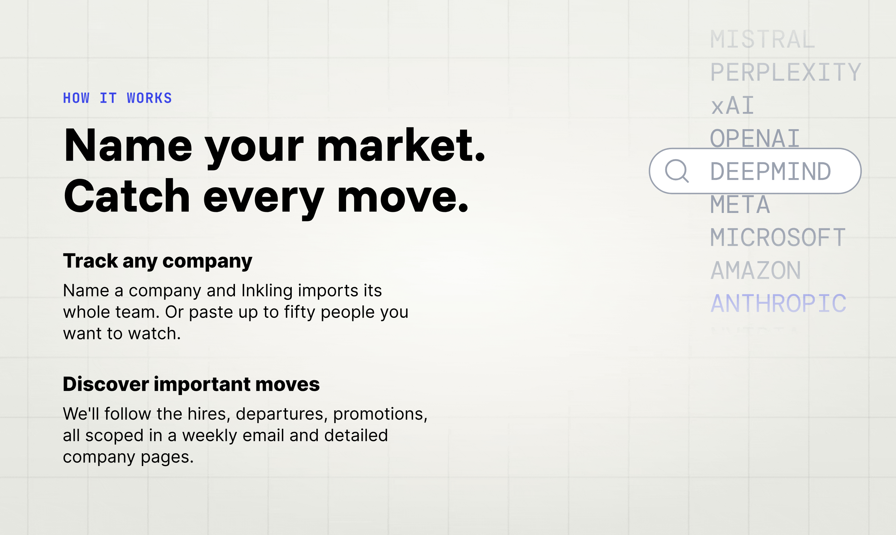

---

## 28. [Cold Mail Server](https://www.producthunt.com/products/cold-mail-server)
**Votes**: 16 | **도입 난이도**: 하 | **신뢰도**: 상
**Tagline**: Managed email infrastructure for your cold outreach
**서비스 링크**: https://www.producthunt.com/r/3CHQW7OJ57JVYO

**태그**: SalesTech, MarketingAutomation, Outreach, AI Tool, Email

### 📌 이 서비스 한눈에 보기
계정 정지 걱정 없는 독립형 콜드 메일 발송 인프라

### 🔑 주요 기능
- 아웃바운드 전용 독립형 메일 서버 제공
- 도메인 및 메일함 무제한 생성 가능
- 통합 수신함(Unibox) 기능 내장

### 🙋 사용자에게 어떤 점이 좋은가
메일 발송 시 발생하는 계정 차단 위험을 최소화하면서, 저렴한 비용으로 대규모 아웃바운드 캠페인을 운영할 수 있습니다.

### ✅ 지금 바로 써볼 기능
- 도메인 및 메일함 생성 테스트
- 통합 수신함(Unibox) 인터페이스 확인

### ⚠️ 사용 전 확인할 점
- 메일 워밍업 과정이 생략되어 있으므로 초기 발송량 조절 필요
- 제공되는 인프라의 세부 보안 정책 확인 필요

### 🧭 확인이 더 필요한 정보
메일 워밍업 없이도 스팸 필터를 통과할 수 있는 구체적인 기술적 메커니즘은 명시되지 않았습니다.

### 📸 스크린샷 및 갤러리
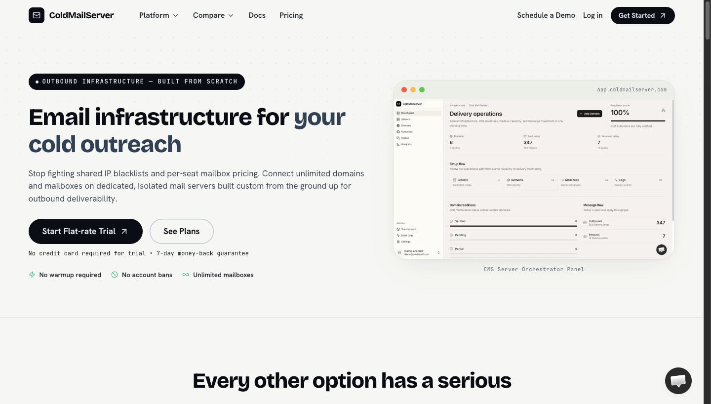
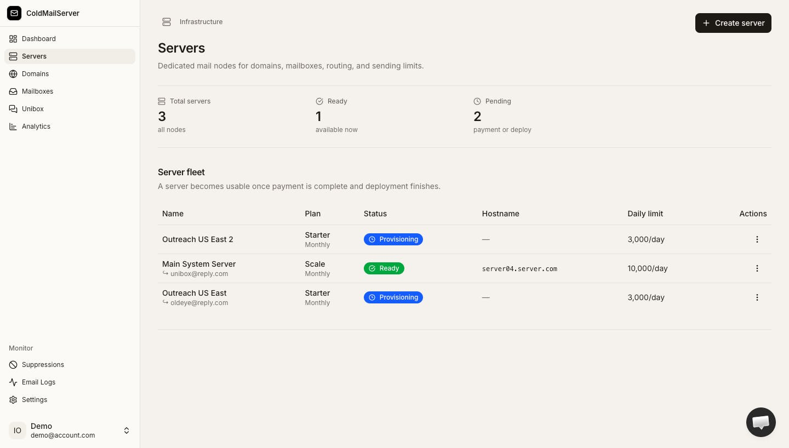
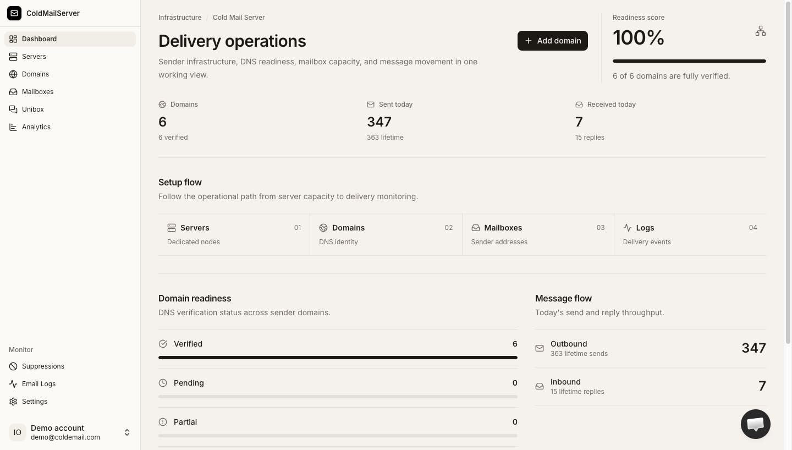

### 🎬 관련 영상
- [🎥 영상 보기](https://ph-files.imgix.net/709c59d6-d75a-435e-920e-c50e3b28ea0e.jpeg?auto=format)

---

## 29. [Korvi](https://www.producthunt.com/products/korvi)
**Votes**: 16 | **도입 난이도**: 하 | **신뢰도**: 상
**Tagline**: Paste your URL, get a full marketing strategy in minutes
**서비스 링크**: https://www.producthunt.com/r/HMFU6NXQEFVJRN

**태그**: Marketing, Automation, SaaS, Strategy, AI Tool

### 📌 이 서비스 한눈에 보기
URL 입력만으로 맞춤형 마케팅 전략을 즉시 생성하는 자동화 도구

### 🔑 주요 기능
- 웹사이트와 경쟁사 분석을 통한 맞춤형 전략 수립
- 포지셔닝, 콘텐츠 계획, 소셜 포스트, 실행 계획 포함
- 마케팅 전문가 없이도 즉시 실행 가능한 플랜 제공

### 🙋 사용자에게 어떤 점이 좋은가
마케팅 인력이 부족한 창업자와 소규모 팀이 범용적인 템플릿 대신 실제 비즈니스에 즉시 적용 가능한 구체적인 실행 계획을 얻을 수 있습니다.

### ✅ 지금 바로 써볼 기능
- 자사 웹사이트 URL 입력하기
- 생성된 포지셔닝 및 콘텐츠 플랜 검토하기
- 우선순위가 지정된 액션 플랜 실행하기

### ⚠️ 사용 전 확인할 점
- 자동 생성된 전략이 실제 시장 상황과 일치하는지 검증 필요
- 심도 있는 전략 수립을 위해 추가적인 수동 조정이 필요할 수 있음

### 🧭 확인이 더 필요한 정보
제공되는 전략의 구체적인 깊이와 경쟁사 데이터의 최신성 여부를 확인해야 합니다.

### 📸 스크린샷 및 갤러리

### 🎬 관련 영상
- [🎥 영상 보기](https://ph-files.imgix.net/397914d4-e1d9-44ee-b4c2-909f25c69e8a.gif?auto=format)

---

## 30. [FanBase](https://www.producthunt.com/products/fanbase)
**Votes**: 14 | **도입 난이도**: 중 | **신뢰도**: 상
**Tagline**: The AI Copilot that turns social followers into customers
**서비스 링크**: https://www.producthunt.com/r/ORWIZA2CQ6H7NI

**태그**: Marketing, AI, Automation, SocialMedia, AI Tool, API

### 📌 이 서비스 한눈에 보기
소셜 팔로워를 실제 고객으로 전환하는 AI 마케팅 코파일럿

### 🔑 주요 기능
- Meta, X, TikTok API를 통한 공식 소셜 채널 연동
- 사용자의 말투와 타겟 오디언스를 학습하는 AI 엔진
- 댓글-DM 자동화 및 구매 의도가 높은 팔로워 식별

### 🙋 사용자에게 어떤 점이 좋은가
수동적인 소셜 관리를 자동화하여, 잠재 고객을 발굴하고 대화를 통해 실제 구매로 연결하는 과정을 효율화할 수 있습니다.

### ✅ 지금 바로 써볼 기능
- 소셜 계정 연동 및 AI 보이스 학습
- 댓글 및 DM 자동 응답 기능 설정
- 구매 의도(Buying Intent) 플래그 확인

### ⚠️ 사용 전 확인할 점
- AI가 생성한 답변이 브랜드 이미지와 일치하는지 모니터링 필요
- 플랫폼 API 정책 변화에 따른 기능 제한 가능성

### 🧭 확인이 더 필요한 정보
플랫폼별(Meta, X, TikTok)로 제공되는 자동화 기능의 범위와 상세 수준이 다를 수 있습니다.

### 📸 스크린샷 및 갤러리
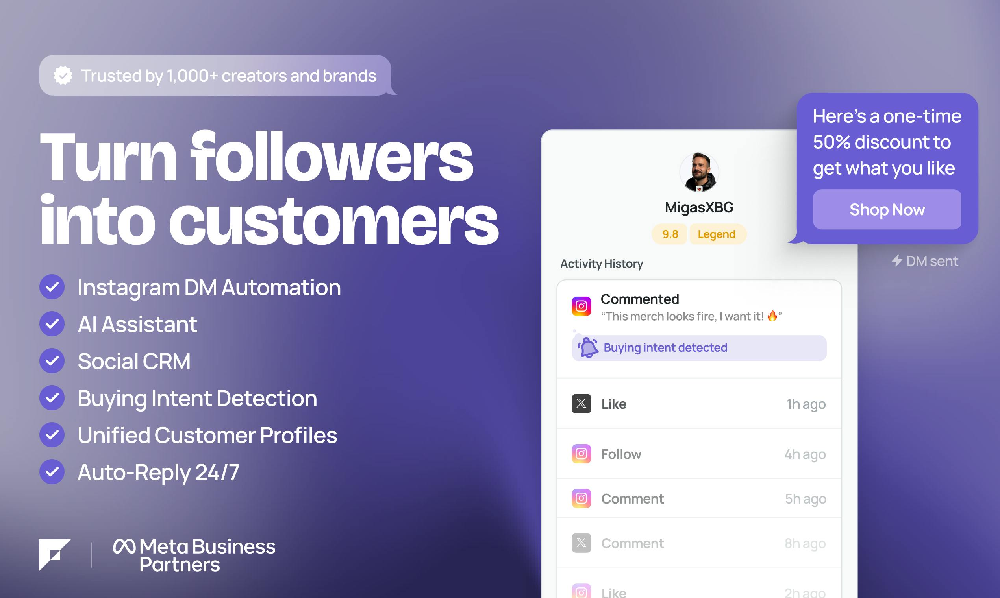
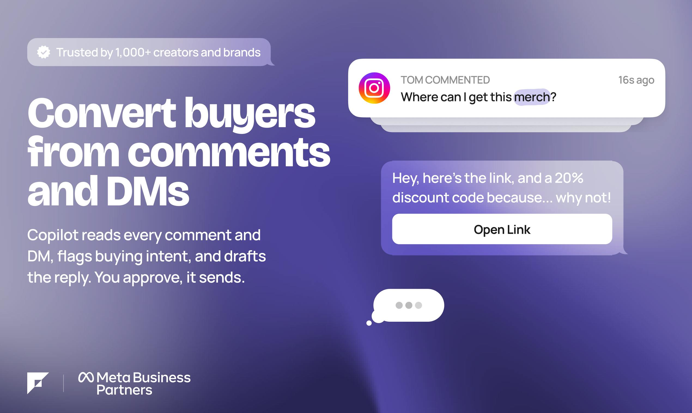
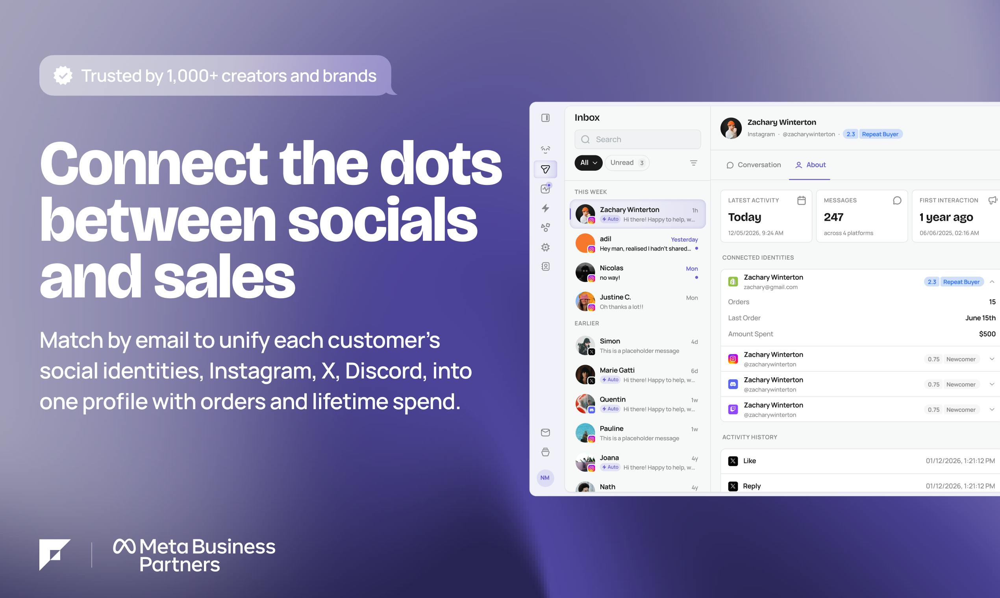

### 🎬 관련 영상
- [🎥 영상 보기](https://ph-files.imgix.net/8a0b5786-3635-4385-ba2b-df98c6636511.jpeg?auto=format)

---

