# 🚀 Product Hunt Daily Top 30 (2026-07-11)

## 오늘의 요약
오늘의 트렌드는 AI를 활용한 업무 자동화와 생산성 도구의 고도화로 요약됩니다. 단순한 챗봇을 넘어 에이전트 중심의 워크플로우, 메신저 기반의 협업, 그리고 전문적인 개발/편집 작업을 자동화하는 솔루션들이 주목받았습니다.

### 오늘의 핵심 포인트
- AI 에이전트와 워크플로우 자동화를 통해 복잡한 업무를 효율적으로 관리하는 도구들이 대거 등장했습니다.
- 사용자가 익숙한 메신저나 웹 환경에서 즉시 전문적인 결과물을 만들 수 있는 접근성 높은 솔루션이 강세를 보였습니다.
- 개발, 영상 편집, 네트워킹 등 특정 전문 분야의 워크플로우를 AI로 간소화하여 생산성을 극대화하는 제품들이 주목받았습니다.

**오늘의 태그**: AI 에이전트, 업무 자동화, 생산성 도구, No-Code/Low-Code

## 1. [PlugThis](https://www.producthunt.com/products/plugthis-chrome-extension-generator)
**Votes**: 419 | **도입 난이도**: 하 | **신뢰도**: 상
**Tagline**: Like Lovable, but for Chrome extensions
**서비스 링크**: https://www.producthunt.com/r/KCCS273QTMHFNM

**태그**: DevTool, Automation, ChromeExtension, AI, NoCode, AI Tool, Chat

### 📌 이 서비스 한눈에 보기
자연어 설명만으로 맞춤형 크롬 확장 프로그램을 즉시 제작하는 AI 도구

### 🔑 주요 기능
- 일상의 불편함을 해결할 크롬 확장 프로그램을 자연어로 설명하여 생성
- 코드 소유권 보장 및 채팅을 통한 지속적인 기능 수정 가능
- 아이콘, 스크린샷, 스토어 등록용 카피라이팅까지 자동 생성

### 🙋 사용자에게 어떤 점이 좋은가
개발 지식이 부족해도 필요한 브라우저 도구를 직접 만들 수 있으며, 배포 준비 과정까지 자동화하여 생산성을 극대화합니다.

### ✅ 지금 바로 써볼 기능
- 필요한 확장 프로그램 아이디어 자연어로 입력하기
- 생성된 코드 확인 및 채팅으로 기능 수정하기
- Supabase 연결을 통한 데이터베이스 기능 확장하기

### ⚠️ 사용 전 확인할 점
- 복잡한 로직이나 고도의 보안이 필요한 기능 구현 시 한계가 있을 수 있음
- 생성된 코드의 품질과 보안성을 사용자가 직접 검토해야 함

### 🧭 확인이 더 필요한 정보
자연어 생성 기능의 정교함과 복잡한 확장 프로그램 구현 가능 범위에 대한 구체적인 기술적 한계는 명시되지 않았습니다.

### 📸 스크린샷 및 갤러리
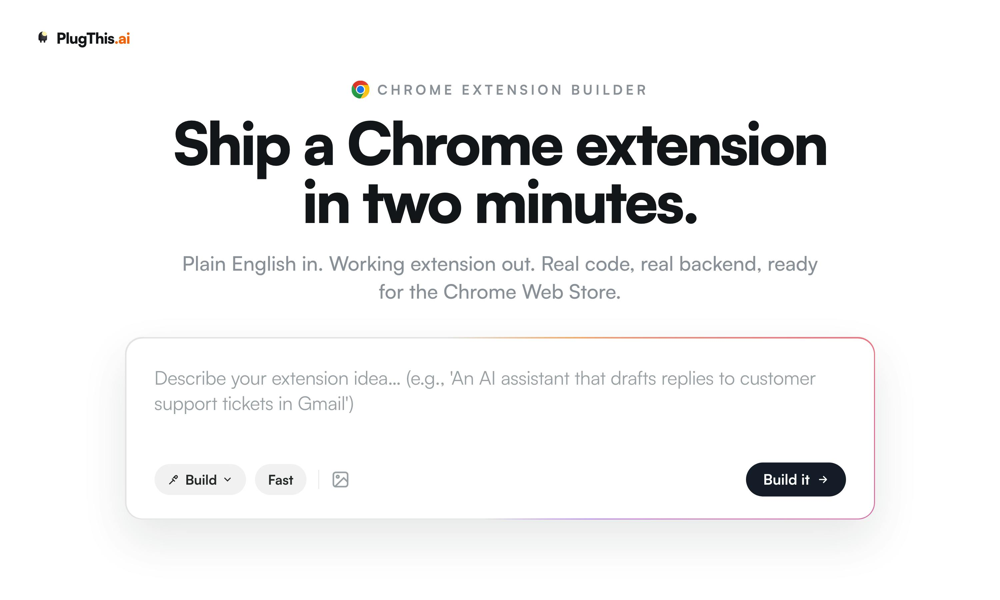
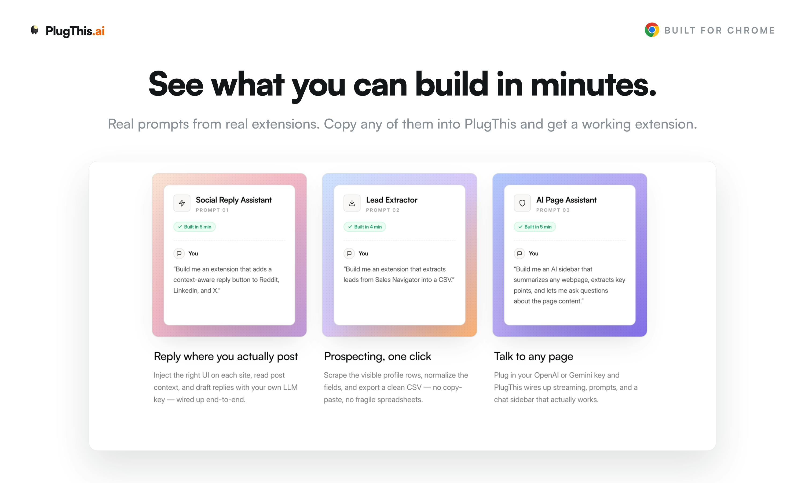
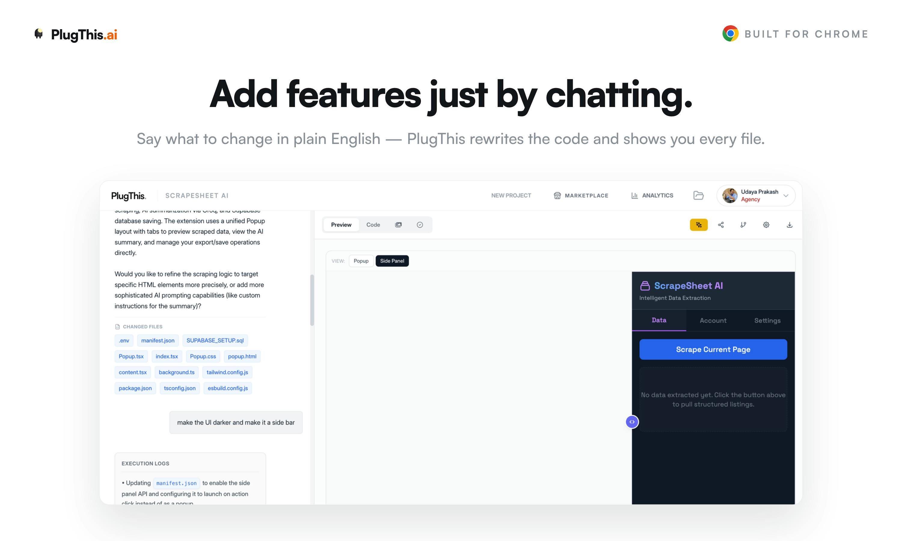

### 🎬 관련 영상
- [🎥 영상 보기](https://ph-files.imgix.net/340d19ac-9762-4461-afcd-db7758ae940a.jpeg?auto=format)

---

## 2. [Sim](https://www.producthunt.com/products/sim-studio)
**Votes**: 403 | **도입 난이도**: 중 | **신뢰도**: 상
**Tagline**: Open-source workspace for AI agents and workflows
**서비스 링크**: https://www.producthunt.com/r/4RBEK6IAGTJL4P

**태그**: AI, Automation, OpenSource, Workflow, Agent, AI Tool, LLM

### 📌 이 서비스 한눈에 보기
1,000개 이상의 연동을 지원하는 오픈소스 AI 에이전트 워크플로우 빌더

### 🔑 주요 기능
- 에이전트 중심의 워크플로우 구축이 가능한 오픈소스 워크스페이스
- 1,000개 이상의 외부 서비스 및 다양한 LLM과의 간편한 연결
- AI 에이전트와 자동화 프로세스를 통합 관리할 수 있는 환경 제공

### 🙋 사용자에게 어떤 점이 좋은가
다양한 외부 툴과 LLM을 하나의 워크플로우로 묶어 복잡한 AI 자동화 작업을 효율적으로 수행할 수 있습니다.

### ✅ 지금 바로 써볼 기능
- 기존에 사용하는 외부 서비스와 LLM 연결해보기
- 기본 제공되는 워크플로우 템플릿 탐색하기
- 오픈소스 코드를 통한 로컬 환경 구축 및 커스텀

### ⚠️ 사용 전 확인할 점
- 오픈소스 특성상 직접적인 서버 관리 및 보안 설정이 필요할 수 있음
- 복잡한 에이전트 워크플로우 설계 시 숙련도 요구

### 🧭 확인이 더 필요한 정보
제공되는 1,000개 이상의 통합 기능의 구체적인 목록과 상세 연동 방식 확인이 필요합니다.

### 📸 스크린샷 및 갤러리
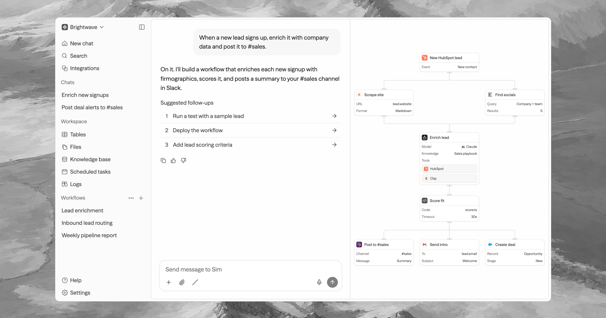
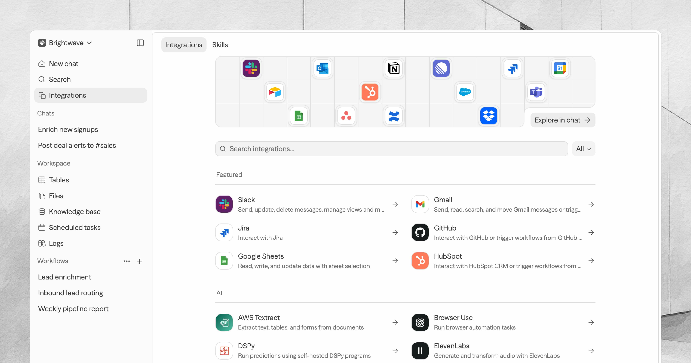
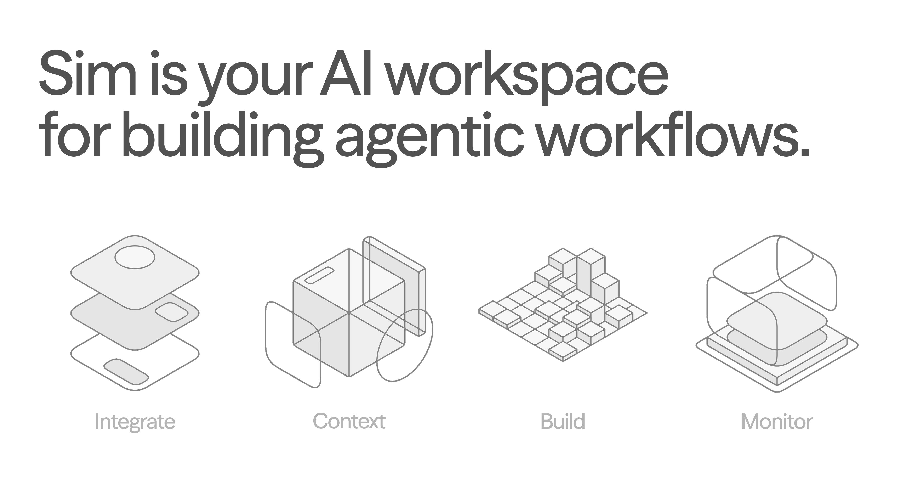

### 🎬 관련 영상
- [🎥 영상 보기](https://ph-files.imgix.net/b1d90d75-cd02-4f37-94c1-5cfc19e37c99.jpeg?auto=format)

---

## 3. [Scarlett.](https://www.producthunt.com/products/tryscarlett)
**Votes**: 335 | **도입 난이도**: 하 | **신뢰도**: 상
**Tagline**: Your AI Co-Worker in Slack & iMessage
**서비스 링크**: https://www.producthunt.com/r/XIGDUT3IHDGZCY

**태그**: AI, Automation, Collaboration, Productivity, AI Tool

### 📌 이 서비스 한눈에 보기
Slack과 iMessage에서 팀원처럼 협업하는 AI 동료, Scarlett

### 🔑 주요 기능
- 단순 챗봇을 넘어선 실질적인 업무 협업 기능 제공
- Slack 및 iMessage를 통한 익숙한 인터페이스 활용
- 팀 업무 효율 극대화 및 업무 자동화 지원

### 🙋 사용자에게 어떤 점이 좋은가
별도의 복잡한 대시보드 없이 평소 사용하는 메신저에서 즉시 업무를 지시하거나 협업할 수 있습니다.

### ✅ 지금 바로 써볼 기능
- Slack/iMessage 연동하기
- 팀 업무 자동화 워크플로우 설정하기
- AI 동료에게 업무 지시 테스트하기

### ⚠️ 사용 전 확인할 점
- 메신저 기반이므로 보안 및 데이터 프라이버시 정책 확인 필요
- 자동화 수준에 따른 업무 결과물 검토 필요

### 🧭 확인이 더 필요한 정보
구체적인 자동화 범위와 지원하는 업무 도구(SaaS) 간의 연동 범위가 명시되지 않았습니다.

### 📸 스크린샷 및 갤러리
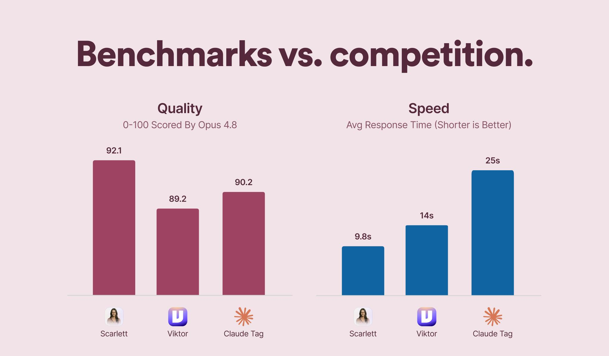
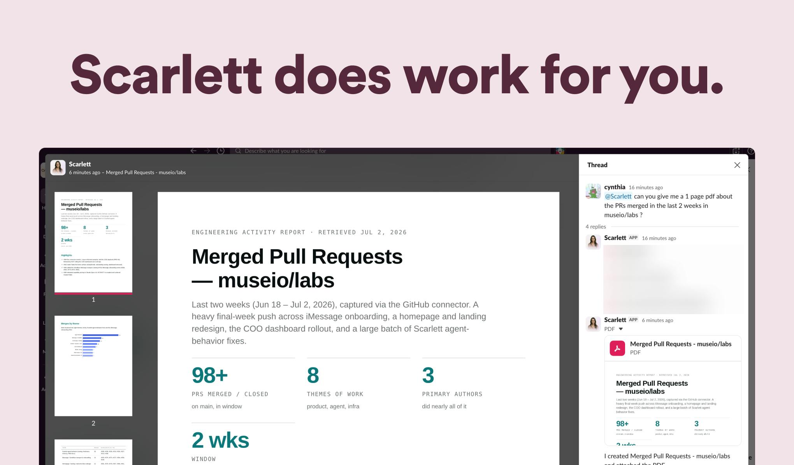
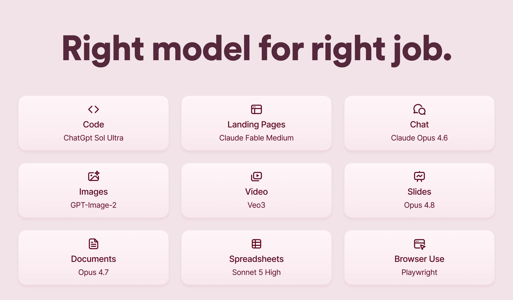

### 🎬 관련 영상
- [🎥 영상 보기](https://ph-files.imgix.net/e173b1f8-c9bf-4aee-ba20-3a6ea5c872a9.jpeg?auto=format)

---

## 4. [ConnectMachine 2.0](https://www.producthunt.com/products/connectmachine-2)
**Votes**: 312 | **도입 난이도**: 하 | **신뢰도**: 상
**Tagline**: AI digital business card that remembers everyone you meet
**서비스 링크**: https://www.producthunt.com/r/HVV46NUF3UEKB4

**태그**: Networking, AI, CRM, Productivity, Sales, AI Tool

### 📌 이 서비스 한눈에 보기
만남의 순간을 기록하고 CRM까지 자동 연결하는 AI 기반 디지털 명함 솔루션

### 🔑 주요 기능
- 종이 명함, LinkedIn QR, 배지 등을 통한 간편한 스캔 및 공유
- 개인용 AI가 만남의 맥락을 기억하고 CRM으로 자동 동기화
- 팀 플랜(브랜딩/관리), AI 노트 테이커, ShareBack 등 v2.0 신기능 탑재

### 🙋 사용자에게 어떤 점이 좋은가
네트워킹 후 수동으로 연락처를 정리할 필요 없이, AI가 만남의 핵심 내용을 기억하고 비즈니스 데이터로 자동 변환해줍니다.

### ✅ 지금 바로 써볼 기능
- QR 및 Wallet 기능을 통한 디지털 명함 생성
- AI Note Taker를 활용한 미팅 요약 및 기록
- ShareBack 기능을 통한 즉각적인 상호 정보 교환

### ⚠️ 사용 전 확인할 점
- 개인 정보 및 데이터 보안 정책(암호화 방식 등) 확인 필요
- 기존 사용 중인 CRM과의 구체적인 연동 방식 확인 필요

### 🧭 확인이 더 필요한 정보
제공되는 CRM 서비스들과의 구체적인 API 연동 범위 및 자동화 수준을 확인해야 합니다.

### 📸 스크린샷 및 갤러리
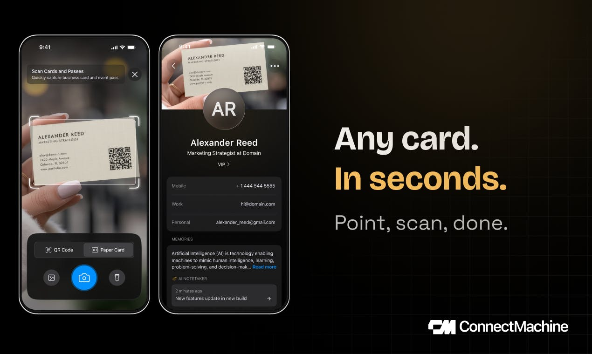

---

## 5. [ChatCut](https://www.producthunt.com/products/chatcut-ai-video-editor)
**Votes**: 269 | **도입 난이도**: 하 | **신뢰도**: 상
**Tagline**: Your AI video editor in ChatGPT, desktop, and web
**서비스 링크**: https://www.producthunt.com/r/FMMICV7TH5Z6XW

**태그**: VideoEditing, AI, ContentCreation, Productivity, AI Tool, Chat, Video

### 📌 이 서비스 한눈에 보기
초보자도 전문가처럼 영상 편집을 할 수 있게 돕는 AI 기반 올인원 비디오 에디터

### 🔑 주요 기능
- ChatGPT, 데스크톱, 웹 어디서든 사용 가능한 접근성
- 컷 편집부터 자막, B-roll, 음악, AI 생성 영상까지 통합된 워크플로우
- 수정 가능한 타임라인과 외부 편집기를 위한 XML 내보내기 지원

### 🙋 사용자에게 어떤 점이 좋은가
영상 편집 기술이 없어도 AI 어시스턴트를 통해 의도에 맞는 결과물을 빠르게 만들 수 있으며, 작업 결과물을 전문 편집 소프트웨어로 가져가 연속성 있게 작업할 수 있습니다.

### ✅ 지금 바로 써볼 기능
- AI를 활용한 구조적 편집 및 컷 편집 시도하기
- 자막 및 B-roll 자동 생성 기능 테스트하기
- XML 내보내기를 통한 외부 편집기 호환성 확인하기

### ⚠️ 사용 전 확인할 점
- 전문가용 편집 소프트웨어 대비 세부 제어 기능의 차이 확인 필요
- AI 생성 콘텐츠의 저작권 및 품질 검토 필요

### 🧭 확인이 더 필요한 정보
사용자의 하드웨어 사양이나 네트워크 환경에 따른 성능 차이 및 구체적인 요금 체계에 대한 정보가 부족합니다.

### 📸 스크린샷 및 갤러리
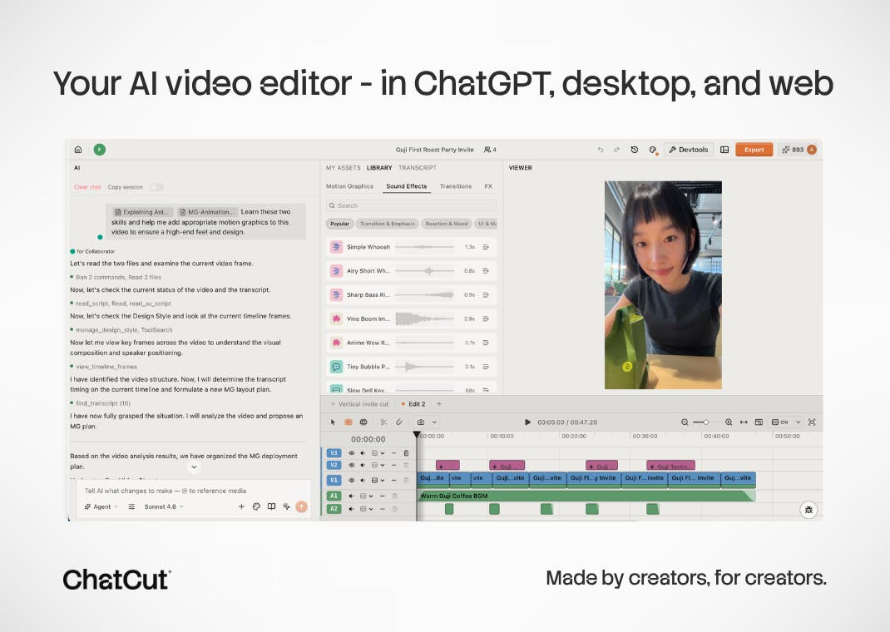
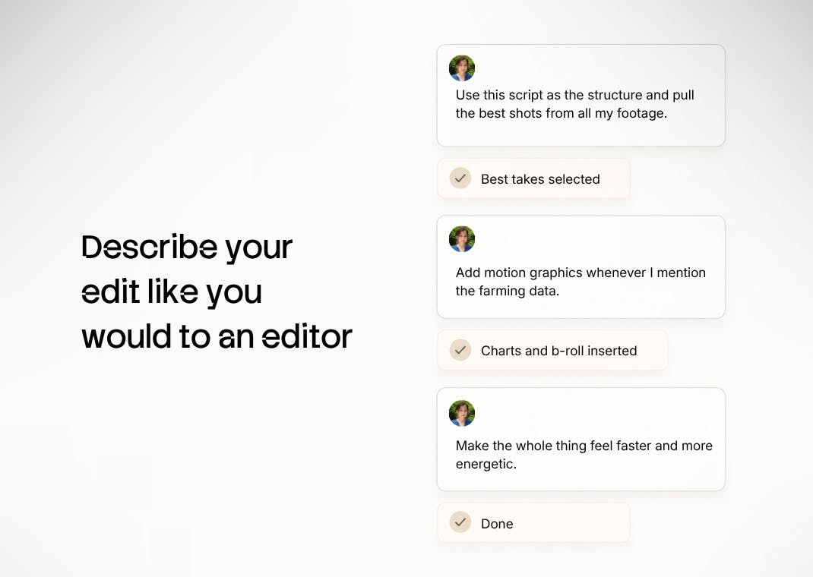
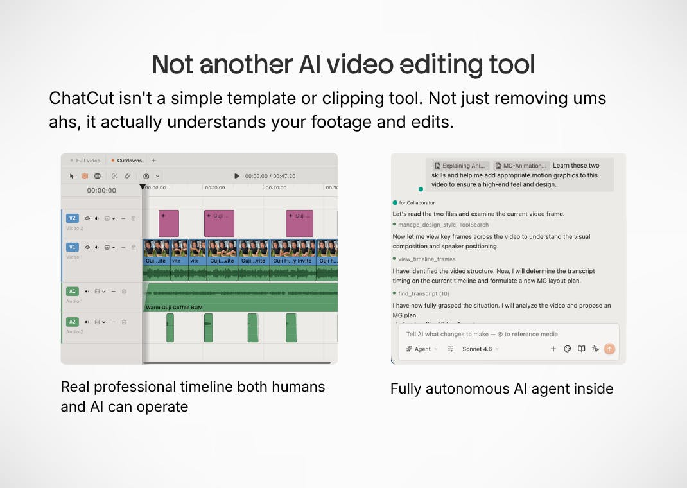

### 🎬 관련 영상
- [🎥 영상 보기](https://ph-files.imgix.net/8c4b8506-3545-4d3b-a5f5-f4e9116dabd9.jpeg?auto=format)

---

## 6. [GPT-5.6](https://www.producthunt.com/products/openai)
**Votes**: 241 | **도입 난이도**: 중 | **신뢰도**: 상
**Tagline**: A new standard for intelligence and efficiency
**서비스 링크**: https://www.producthunt.com/r/DERPMSLT64NRPN

**태그**: AI, API, Automation, DeveloperTool, Agent, AI Tool, Prompting

### 📌 이 서비스 한눈에 보기
용도별 3종 모델과 강력한 에이전트 기능을 갖춘 차세대 API 모델 제품군

### 🔑 주요 기능
- Sol(고성능), Terra(균형), Luna(효율)로 구성된 3가지 모델 옵션 제공
- Programmatic Tool Calling 및 멀티 에이전트(베타) 기능 도입
- 명시적 프롬프트 캐싱을 통한 효율성 개선

### 🙋 사용자에게 어떤 점이 좋은가
작업의 난이도와 비용에 따라 최적의 모델을 선택할 수 있으며, 에이전트 및 병렬 실행 기능을 통해 복잡한 자동화 워크플로우를 구축할 수 있습니다.

### ✅ 지금 바로 써볼 기능
- 용도에 맞는 모델(Sol, Terra, Luna) 선택 및 테스트
- 멀티 에이전트(베타) 기능을 활용한 병렬 실행 실험
- 프롬프트 캐싱을 통한 비용 및 속도 최적화

### ⚠️ 사용 전 확인할 점
- 멀티 에이전트 기능은 현재 베타 단계로 안정성 확인 필요
- 모델별 성능과 비용 사이의 트레이드오프 고려 필요

### 🧭 확인이 더 필요한 정보
각 모델별 구체적인 성능 벤치마크와 상세 가격 정책은 명시되지 않았습니다.

### 📸 스크린샷 및 갤러리

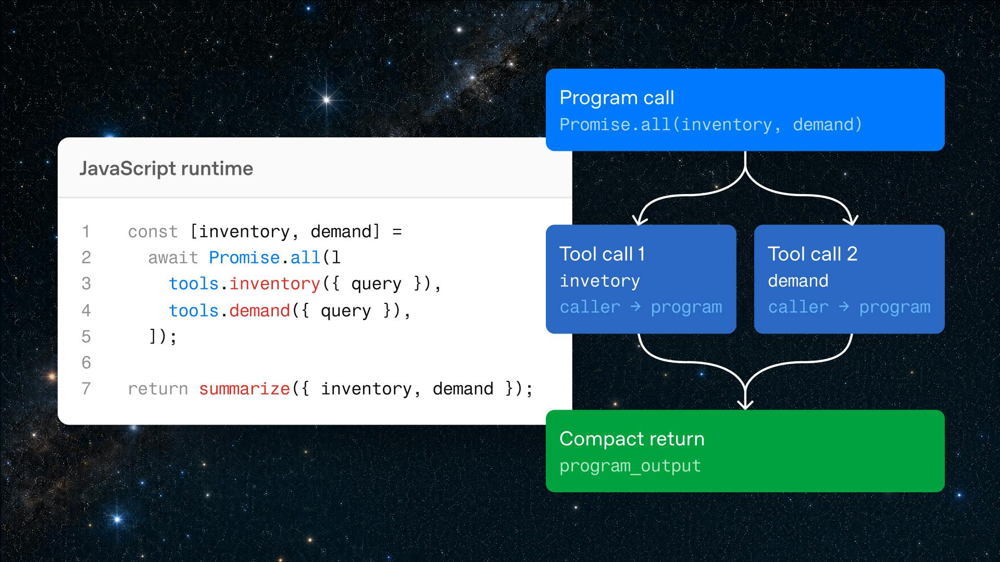
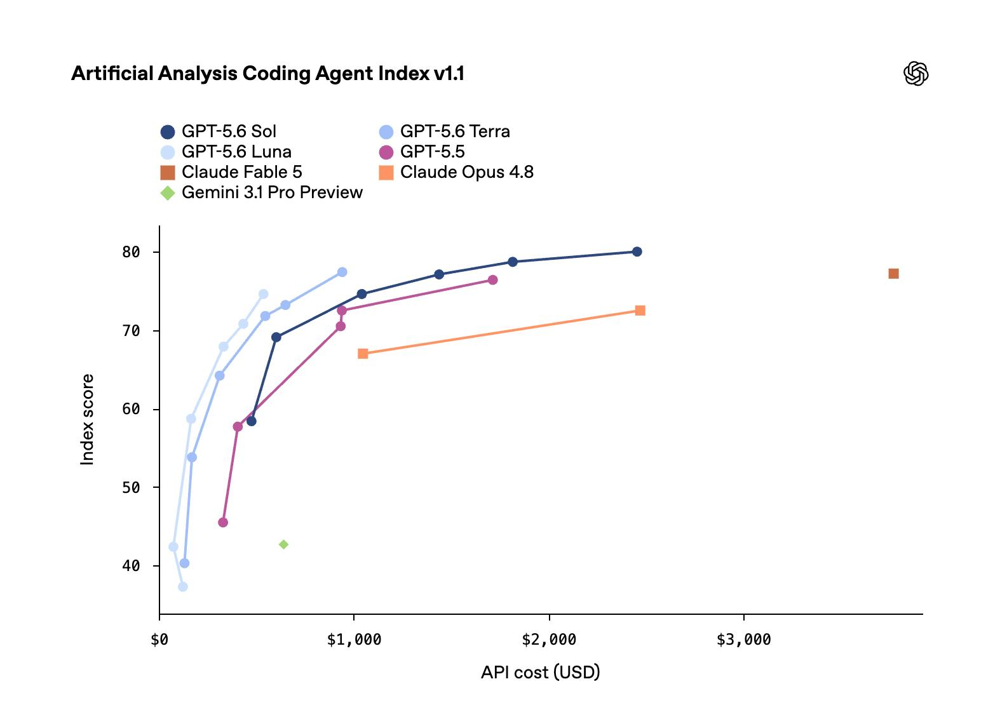

### 🎬 관련 영상
- [🎥 영상 보기](https://ph-files.imgix.net/e530f9f3-6c47-4dc0-909f-e26d1f1392e8.jpeg?auto=format)

---

## 7. [Juicy](https://www.producthunt.com/products/juicy-battery-app)
**Votes**: 199 | **도입 난이도**: 하 | **신뢰도**: 상
**Tagline**: Beautiful Mac battery alerts, health insights & charge limit
**서비스 링크**: https://www.producthunt.com/r/7I6PVVHRJQMBVP

**태그**: Productivity, Mac, Utility, Battery, AI Tool

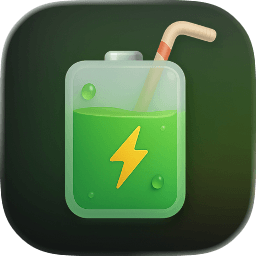

### 📌 이 서비스 한눈에 보기
배터리 알림부터 충전 제한까지, 맥 배터리 관리를 하나로 통합한 올인원 솔루션

### 🔑 주요 기능
- 커스텀 배터리 알림 및 화면 글로우 효과 제공
- 충전 제한, 앱별 에너지 사용량, 온도 추적 기능 탑재
- iPhone/iPad 배터리 상태 확인 및 단일 앱 통합 관리

### 🙋 사용자에게 어떤 점이 좋은가
여러 배터리 관리 앱을 개별적으로 사용할 필요 없이, 하나의 가벼운 네이티브 앱으로 맥과 iOS 기기의 배터리 수명을 효율적으로 관리할 수 있습니다.

### ✅ 지금 바로 써볼 기능
- 사용자 취향에 맞는 테마 메뉴바 아이콘 설정하기
- 배터리 수명 연장을 위한 충전 제한 기능 활성화
- 앱별 에너지 소비량 분석을 통한 배터리 절약

### ⚠️ 사용 전 확인할 점
- 기존 배터리 관리 도구(AlDente 등)와의 기능 중복 여부 확인 필요
- 네이티브 앱의 시스템 권한 설정 필요성

### 🧭 확인이 더 필요한 정보
구체적인 시스템 리소스 점유율 및 상세 가격 정책은 명시되지 않았습니다.

### 📸 스크린샷 및 갤러리
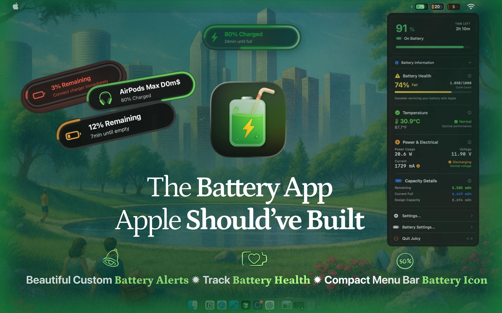
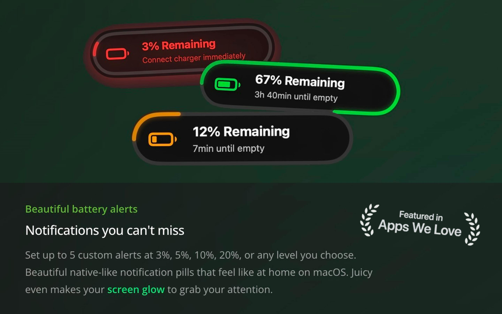
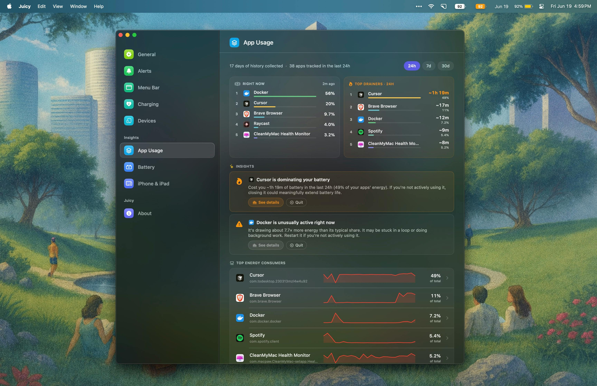

### 🎬 관련 영상
- [🎥 영상 보기](https://ph-files.imgix.net/c46a9792-f548-4823-94c7-b01e99b744fe.jpeg?auto=format)

---

## 8. [Native SDK](https://www.producthunt.com/products/vercel)
**Votes**: 137 | **도입 난이도**: 상 | **신뢰도**: 중
**Tagline**: Toolkit for building native desktop apps
**서비스 링크**: https://www.producthunt.com/r/QFRYURQQXH75MU

**태그**: DevTool, DesktopApp, Native, UI/UX

### 📌 이 서비스 한눈에 보기
브라우저 없이 순수 네이티브 성능을 구현하는 데스크톱 앱 개발 툴킷

### 🔑 주요 기능
- 웹 기술(WebView)을 배제한 독자적인 네이티브 렌더러 탑재
- 선언적 마크업과 예측 가능한 메시지 기반 상태 모델 제공
- 현대적인 컴포넌트 라이브러리를 포함한 완전한 개발 환경

### 🙋 사용자에게 어떤 점이 좋은가
웹뷰를 사용하지 않으므로 메모리 점유율이 낮고 빠르며, 데스크톱 환경에 최적화된 고성능 앱을 개발할 수 있습니다.

### ✅ 지금 바로 써볼 기능
- 선언적 마크업 방식 익히기
- 메시지 기반 상태 모델 테스트
- 제공되는 컴포넌트 라이브러리 적용해보기

### ⚠️ 사용 전 확인할 점
- 웹 기술 기반 프레임워크와 다른 학습 곡선 존재
- 독자적 렌더러 사용에 따른 생태계 및 호환성 확인 필요

### 🧭 확인이 더 필요한 정보
지원하는 프로그래밍 언어 및 운영체제(OS) 범위에 대한 상세 정보가 필요합니다.

### 📸 스크린샷 및 갤러리
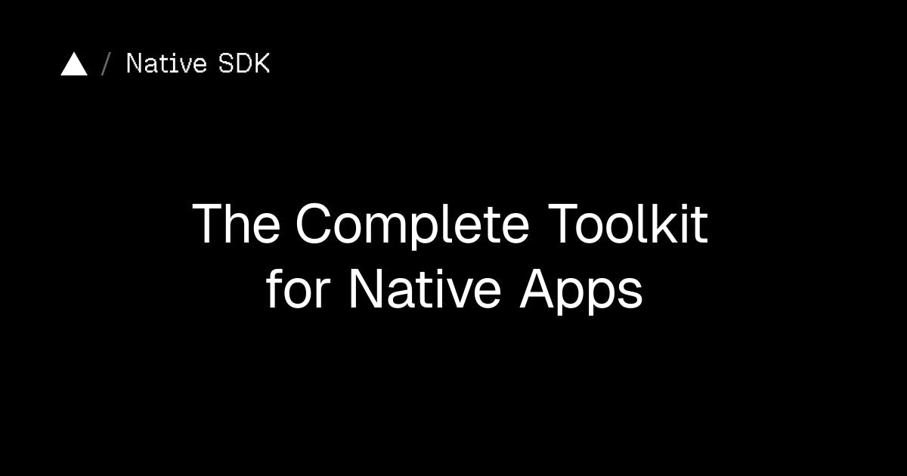
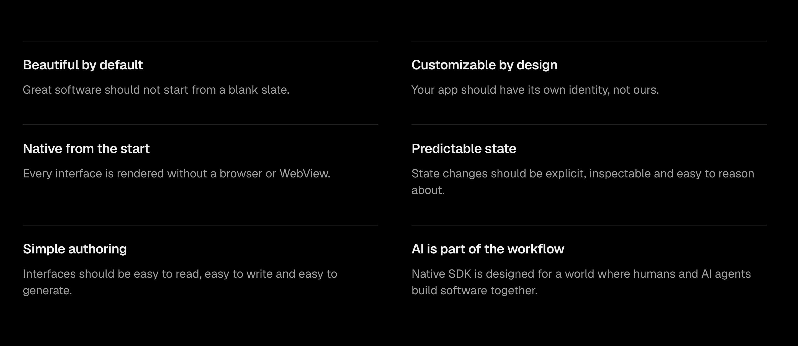
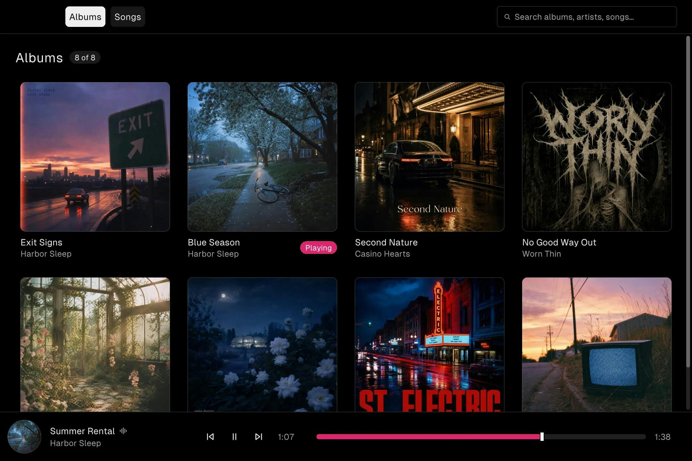

---

## 9. [Ship OS by Notion](https://www.producthunt.com/products/notion)
**Votes**: 136 | **도입 난이도**: 중 | **신뢰도**: 상
**Tagline**: The agent-native way to ship software
**서비스 링크**: https://www.producthunt.com/r/PXEIFEBEUAO66P

**태그**: DevTool, Automation, ProductManagement, AI, Notion, Agent

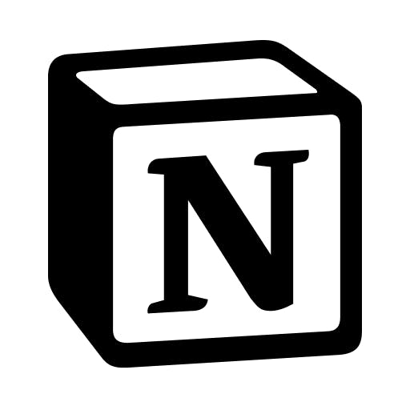

### 📌 이 서비스 한눈에 보기
고객 피드백부터 코드 병합까지, Notion 내에서 에이전트와 함께하는 제품 개발 사이클 자동화

### 🔑 주요 기능
- Notion 환경 내에서 제품 개발 전 과정을 통합 관리
- AI 에이전트를 통한 피드백 분류, 라우팅 및 요약 자동화
- 반복적인 운영 업무는 에이전트가, 최종 의사결정은 팀이 담당하는 협업 모델

### 🙋 사용자에게 어떤 점이 좋은가
제품 관리와 개발 사이의 번거로운 운영 업무를 자동화하여, 팀이 핵심적인 판단과 개발에만 집중할 수 있게 해줍니다.

### ✅ 지금 바로 써볼 기능
- 고객 피드백 데이터 연동하기
- 에이전트의 자동 분류 및 요약 기능 테스트하기
- 기존 Notion 워크플로우와 개발 프로세스 통합하기

### ⚠️ 사용 전 확인할 점
- 에이전트의 자동화 결과물에 대한 최종 검토 필요
- 기존 코드 저장소(GitHub 등)와의 연동 수준 확인 필요

### 🧭 확인이 더 필요한 정보
에이전트가 실제 코드 수정이나 PR 생성 단계에서 어느 정도의 권한을 갖는지 확인이 필요합니다.

### 📸 스크린샷 및 갤러리
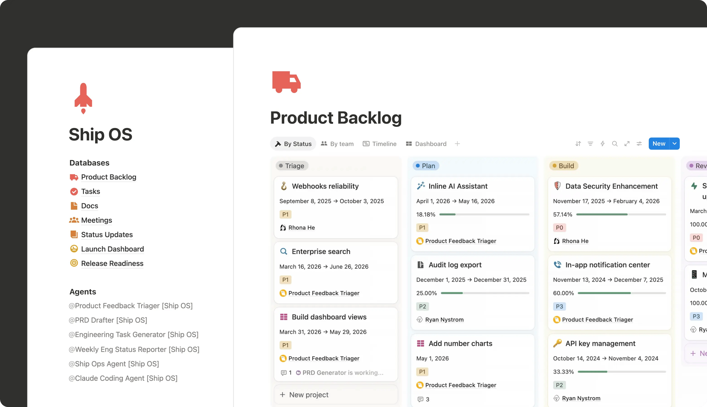
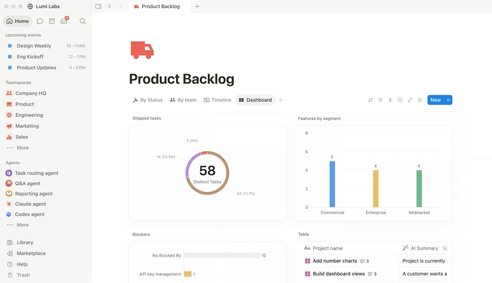

### 🎬 관련 영상
- [🎥 영상 보기](https://ph-files.imgix.net/d5586549-e6fb-495e-9611-e16783204851.jpeg?auto=format)

---

## 10. [StoryChief Connect](https://www.producthunt.com/products/storychief-io)
**Votes**: 126 | **도입 난이도**: 하 | **신뢰도**: 상
**Tagline**: Publish content from Claude to your website and socials
**서비스 링크**: https://www.producthunt.com/r/LPE442DWQMPHTC

**태그**: AI, Content Marketing, Automation, Workflow, AI Tool, Marketing

### 📌 이 서비스 한눈에 보기
Claude로 생성한 콘텐츠를 웹사이트와 소셜 미디어로 즉시 배포하는 통합 워크플로우 도구

### 🔑 주요 기능
- Claude와 마케팅 팀을 위한 통합 콘텐츠 작업 공간 제공
- 콘텐츠 기획부터 제작, 배포까지 하나의 캘린더에서 관리
- 다양한 채널로의 원활한 배포 및 협업 워크플로우 지원

### 🙋 사용자에게 어떤 점이 좋은가
AI로 생성한 콘텐츠를 수동으로 옮길 필요 없이, 기획부터 발행까지의 과정을 자동화하여 마케팅 운영 효율을 극대화할 수 있습니다.

### ✅ 지금 바로 써볼 기능
- Claude와 StoryChief 워크플로우 연결하기
- 통합 콘텐츠 캘린더에 채널 연동하기
- AI 생성 콘텐츠의 배포 스케줄 설정하기

### ⚠️ 사용 전 확인할 점
- Claude 외 다른 AI 모델과의 호환성 범위 확인 필요
- 연동 가능한 외부 채널 및 웹사이트 플랫폼 목록 확인 필요

### 🧭 확인이 더 필요한 정보
Claude 외의 다른 AI 도구나 특정 CMS 플랫폼과의 상세 연동 범위는 공식 문서를 통해 확인이 필요합니다.

### 📸 스크린샷 및 갤러리
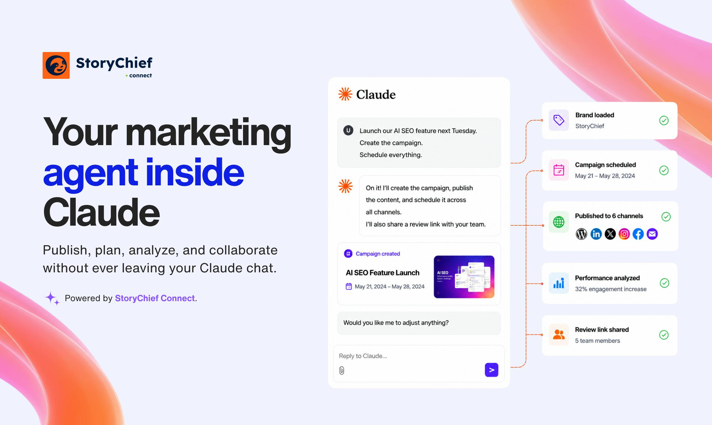
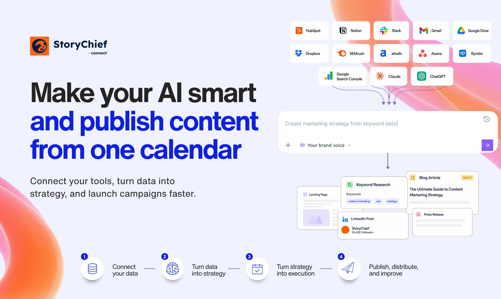
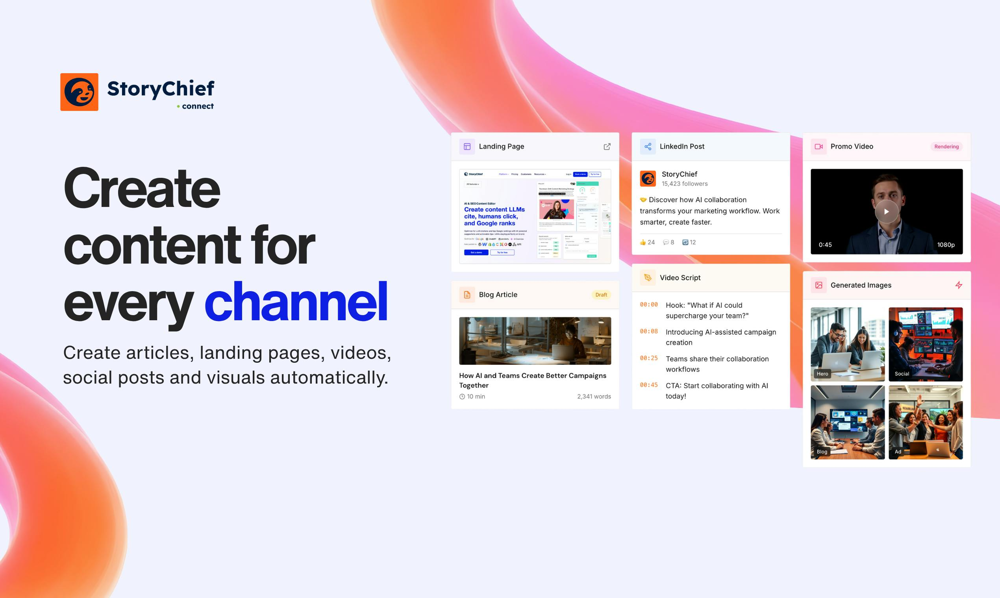

---

## 11. [Muse Spark 1.1 by Meta AI](https://www.producthunt.com/products/muse-spark-1-1-by-meta)
**Votes**: 108 | **도입 난이도**: 중 | **신뢰도**: 상
**Tagline**: Multimodal reasoning model built for agentic tasks
**서비스 링크**: https://www.producthunt.com/r/33YMGL33H4VFN7

**태그**: AI, Automation, Coding, Agentic-AI, Multimodal, Agent, AI Tool

### 📌 이 서비스 한눈에 보기
에이전트형 작업에 최적화된 Meta의 차세대 멀티모달 추론 모델

### 🔑 주요 기능
- 에이전트 중심의 작업 수행 능력 강화
- 도구 사용 및 컴퓨터 제어 능력 대폭 향상
- 코딩 및 멀티모달 이해도 업그레이드

### 🙋 사용자에게 어떤 점이 좋은가
복잡한 코딩 작업이나 컴퓨터를 직접 조작해야 하는 자동화 업무에서 강력한 성능을 제공합니다.

### ✅ 지금 바로 써볼 기능
- 복잡한 코딩 문제 해결 테스트
- 도구 활용 및 자동화 워크플로우 적용
- 멀티모달 데이터 분석 및 이해도 검증

### ⚠️ 사용 전 확인할 점
- 에이전트 기능의 실행 권한 및 보안 설정 확인 필요
- 이전 버전 대비 리소스 소모량 확인 필요

### 🧭 확인이 더 필요한 정보
구체적인 API 제공 방식이나 하드웨어 요구 사양에 대한 정보가 명시되지 않았습니다.

### 📸 스크린샷 및 갤러리
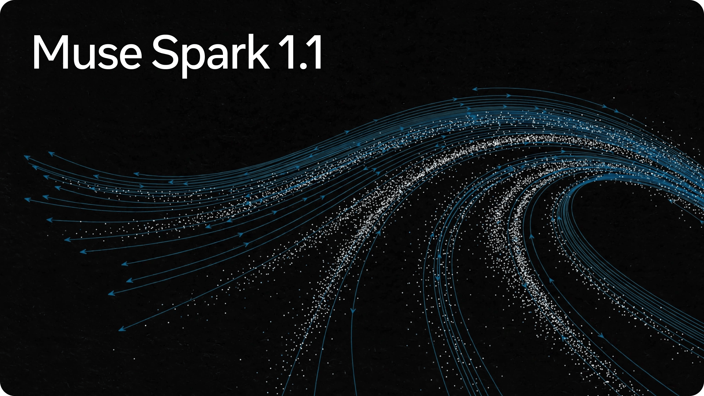
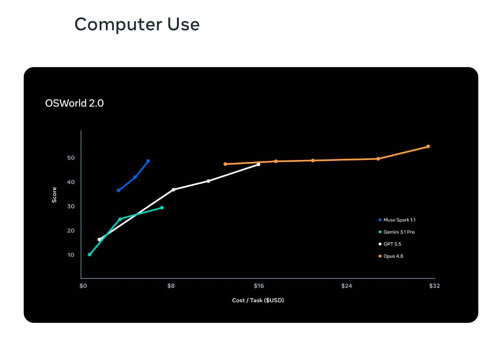
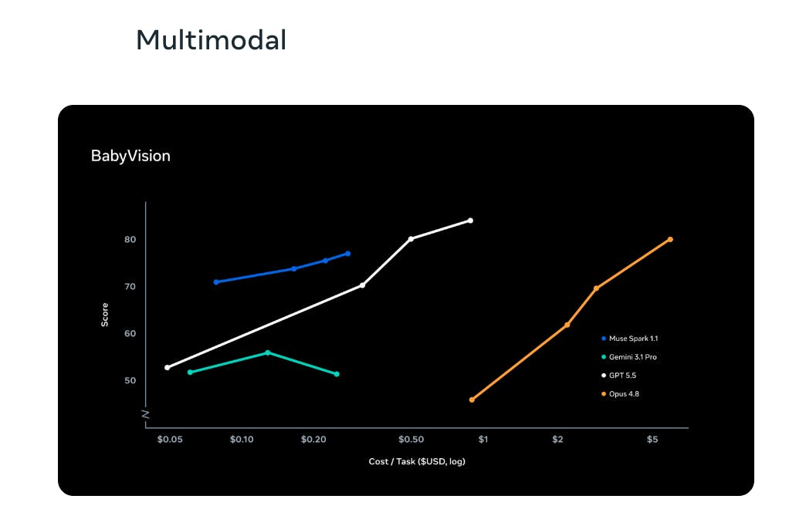

---

## 12. [RepStandard](https://www.producthunt.com/products/repstandard)
**Votes**: 87 | **도입 난이도**: 하 | **신뢰도**: 상
**Tagline**: Computer vision counts your reps in real time
**서비스 링크**: https://www.producthunt.com/r/O5AWGVZPUY4JKB

**태그**: Fitness, AI, ComputerVision, Gamification, AI Tool

### 📌 이 서비스 한눈에 보기
카메라 기반 실시간 자세 감지로 운동 횟수를 자동 기록하는 스마트 피트니스 앱

### 🔑 주요 기능
- 온디바이스 포즈 감지를 통한 실시간 운동 횟수 카운팅
- 사용자 성장에 맞춘 적응형 데일리 운동 프로그램 제공
- 랭킹, XP, 스트릭 등 게임 요소를 통한 운동 동기부여

### 🙋 사용자에게 어떤 점이 좋은가
수동 기록이나 웨어러블 기기 없이 스마트폰 카메라만으로 정확한 운동 횟수를 측정하고 체계적인 루틴을 관리할 수 있습니다.

### ✅ 지금 바로 써볼 기능
- 스마트폰 카메라를 활용한 푸쉬업/스쿼트 카운팅 테스트
- 개인 맞춤형 데일리 프로그램 생성 기능 확인
- 게임화 요소(XP, 스트릭)를 통한 운동 습관 형성 시도

### ⚠️ 사용 전 확인할 점
- 카메라 시야 확보를 위한 적절한 설치 환경 필요
- 기기 성능에 따른 실시간 포즈 감지 정확도 차이 가능성

### 🧭 확인이 더 필요한 정보
특정 운동 종목 외의 동작에 대한 지원 범위와 카메라 각도에 따른 정확도 검증이 필요합니다.

### 📸 스크린샷 및 갤러리
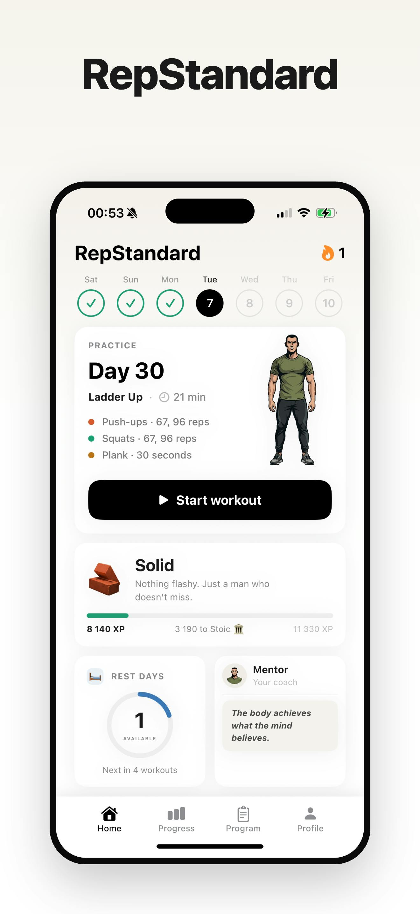
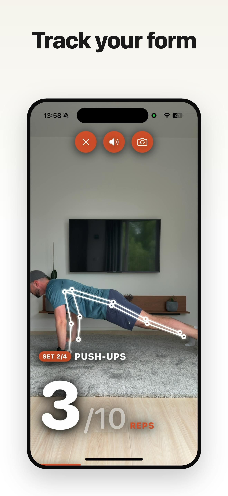
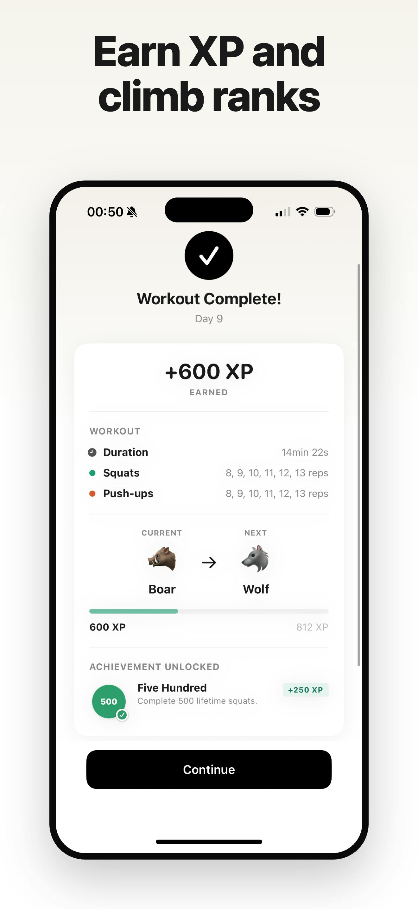

### 🎬 관련 영상
- [🎥 영상 보기](https://ph-files.imgix.net/ba3b5110-975f-4bfa-a7e6-cf96e74ae9af.jpeg?auto=format)

---

## 13. [Mispher](https://www.producthunt.com/products/mispher-agentic-transcription-for-mac)
**Votes**: 86 | **도입 난이도**: 중 | **신뢰도**: 상
**Tagline**: Dictate, rewrite, translate, and an agent in a single device
**서비스 링크**: https://www.producthunt.com/r/YNCMJ72CYBNA7W

**태그**: Productivity, AI, Automation, Privacy, macOS, Agent, Prompting

### 📌 이 서비스 한눈에 보기
개인정보 유출 걱정 없는 온디바이스 AI 기반의 올인원 음성 기록 및 자동화 에이전트

### 🔑 주요 기능
- 클라우드 연결 없는 완전한 온디바이스(On-device) 작업 환경
- 다국어 음성 전사(Transcription) 및 강력한 로컬 AI 에이전트 기능
- 애플 노트, 클립보드, 파일 등 시스템 도구와 연동되는 커스텀 자동화

### 🙋 사용자에게 어떤 점이 좋은가
데이터가 외부로 나가지 않아 보안이 철저하며, 단순 기록을 넘어 AI가 직접 도구를 실행하여 업무를 처리해줍니다.

### ✅ 지금 바로 써볼 기능
- 다양한 언어 모델을 활용한 음성 전사 기능 테스트
- 로컬 에이전트의 도구 호출 및 자동화 워크플로우 설정
- 사용자 취향에 맞는 다이얼 및 핫키 커스텀 설정

### ⚠️ 사용 전 확인할 점
- Apple Silicon 및 macOS 환경에 최적화되어 있어 타 OS 사용 불가
- 로컬 모델 구동을 위한 하드웨어 사양 요구

### 🧭 확인이 더 필요한 정보
향후 추가될 모델(Gemma 4, Qwen3.6 등)의 실제 성능과 하드웨어 부하 정도를 확인해야 합니다.

### 📸 스크린샷 및 갤러리
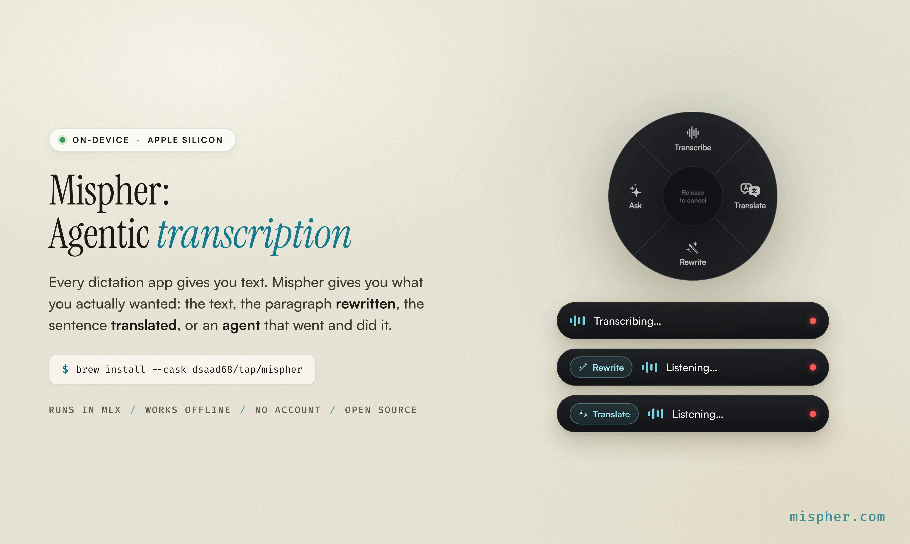
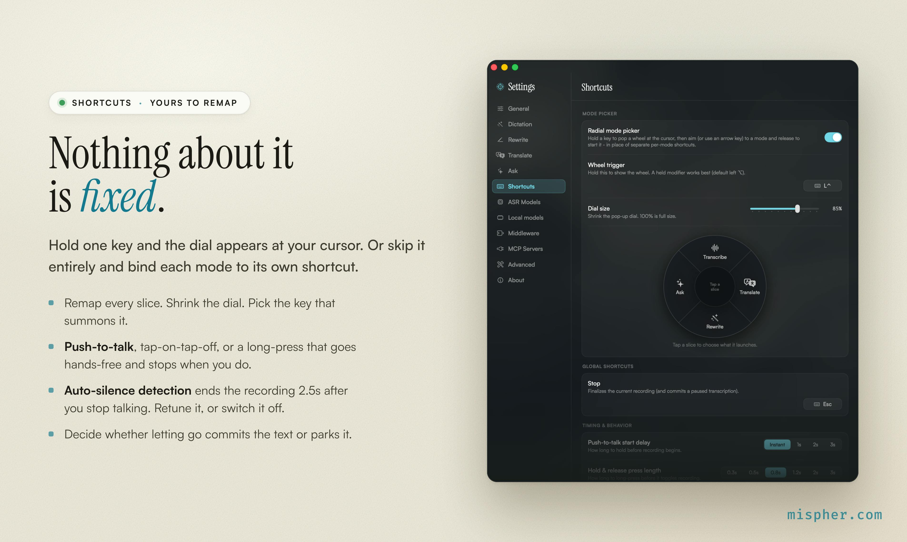
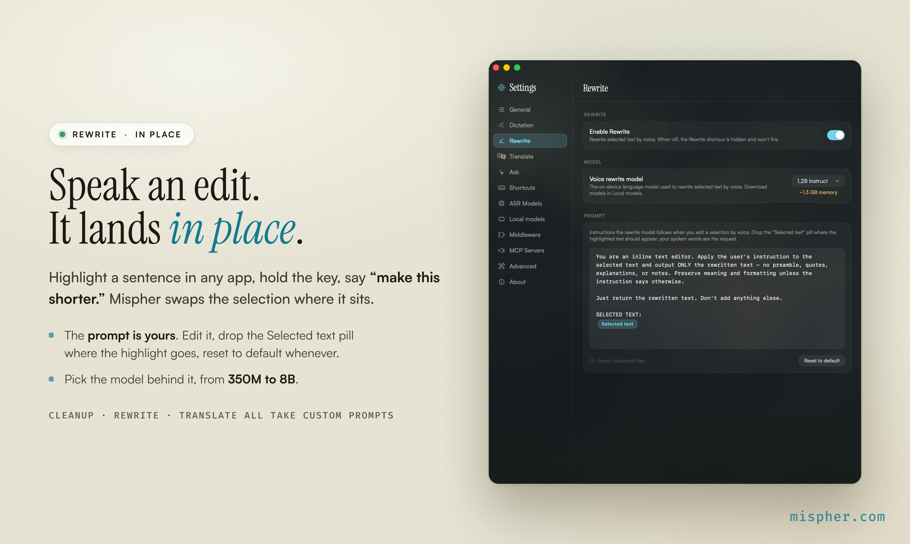

### 🎬 관련 영상
- [🎥 영상 보기](https://ph-files.imgix.net/67cb016d-024b-4e4f-919a-14570611bad7.jpeg?auto=format)

---

## 14. [Yasmine Works](https://www.producthunt.com/products/yasmine-works)
**Votes**: 75 | **도입 난이도**: 하 | **신뢰도**: 상
**Tagline**: An AI coworker that lives in your Slack to get work done
**서비스 링크**: https://www.producthunt.com/r/F2BT6YUQ3STELW

**태그**: AI, Slack, Automation, Productivity, AI Tool, DevTool, Email

### 📌 이 서비스 한눈에 보기
Slack 채널 내에서 팀원처럼 협업하며 업무를 수행하는 AI 동료

### 🔑 주요 기능
- Slack 채널별로 독립적인 메모리와 도구를 가진 AI 팀원 구축
- 이메일, 문서, 데이터, 코드 등 다양한 도구 및 통합 기능 지원
- 사용자 개인의 Claude 구독을 활용한 독립적이고 안전한 실행 환경

### 🙋 사용자에게 어떤 점이 좋은가
Slack을 떠나지 않고도 대화만으로 실질적인 업무(문서 작성, 데이터 처리 등)를 자동화할 수 있습니다.

### ✅ 지금 바로 써볼 기능
- Slack 채널에 Yasmine 연결하기
- 필요한 외부 도구 및 서비스 연동하기
- 채널 내에서 Yasmine을 호출하여 업무 지시하기

### ⚠️ 사용 전 확인할 점
- 사용자의 Claude 구독 기반으로 작동하므로 구독 상태 확인 필요
- 연동된 도구의 권한 설정 및 보안 정책 확인 필요

### 🧭 확인이 더 필요한 정보
사용자의 Claude 구독을 활용할 때 데이터 보안 및 격리 수준이 어느 정도인지 구체적인 기술적 확인이 필요합니다.

### 📸 스크린샷 및 갤러리
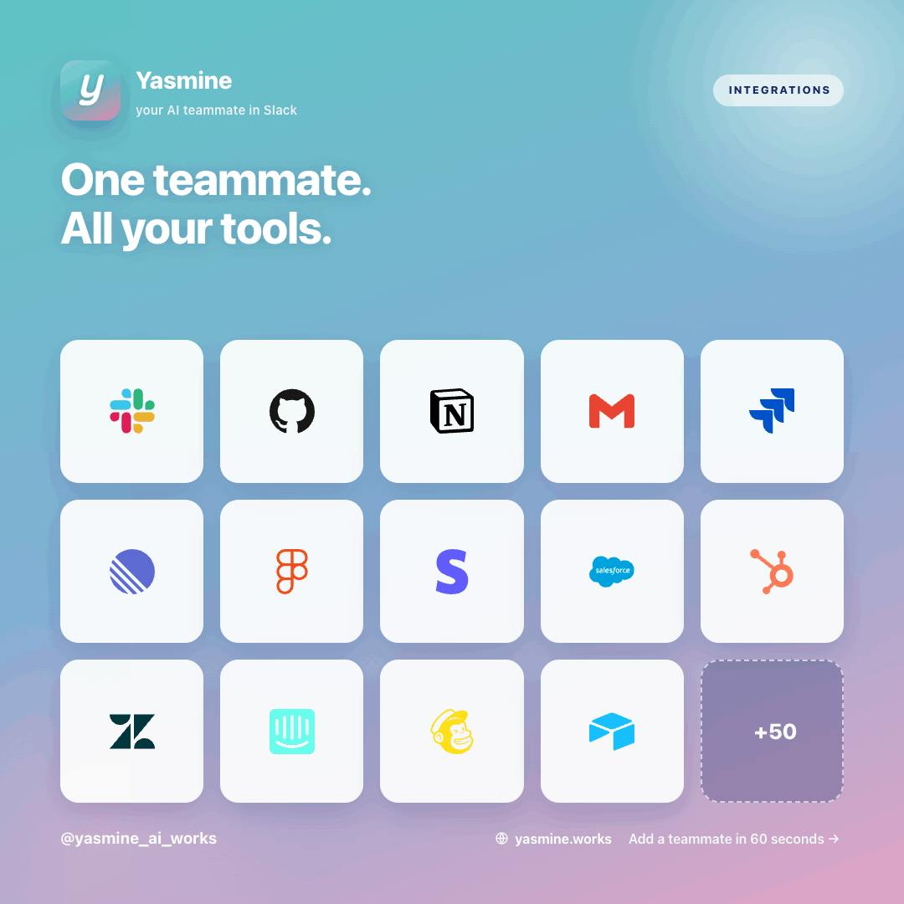
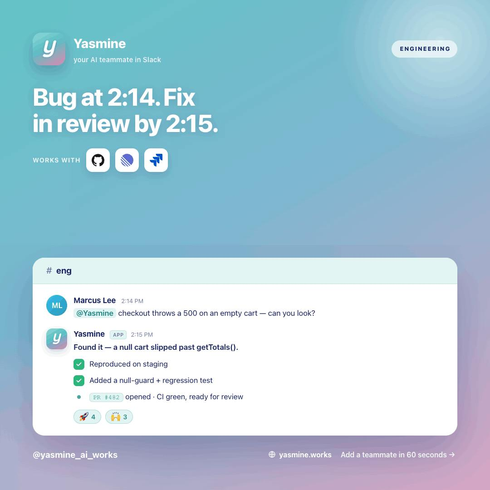
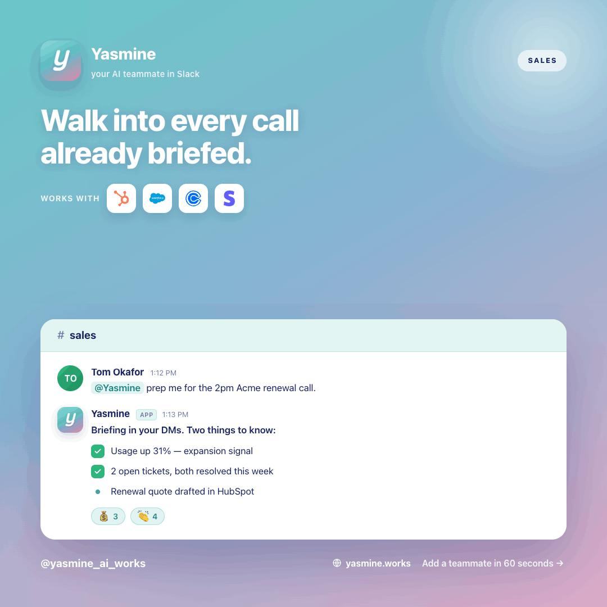

### 🎬 관련 영상
- [🎥 영상 보기](https://ph-files.imgix.net/ab6a2b2a-f010-48c8-b156-57c304c8ae29.jpeg?auto=format)

---

## 15. [ReactCamera.com](https://www.producthunt.com/products/react-camera)
**Votes**: 26 | **도입 난이도**: 하 | **신뢰도**: 상
**Tagline**: Add yourself to any photo or video
**서비스 링크**: https://www.producthunt.com/r/EWXGAXBGT6YFR4

**태그**: CreativeTool, VideoEditing, PrivacyFirst, Video

### 📌 이 서비스 한눈에 보기
사진이나 영상 속 장면으로 나를 즉시 합성하여 재미있는 콘텐츠를 만드는 도구

### 🔑 주요 기능
- 사용자를 배경에서 분리하여 원하는 사진/영상에 합성하는 기능
- 캡션 및 스티커를 추가하여 공유 가능한 콘텐츠 제작
- 로그인 없이 사용 가능한 100% 온디바이스 개인정보 보호 방식

### 🙋 사용자에게 어떤 점이 좋은가
복잡한 편집 기술 없이도 사진이나 영상 속에 내가 직접 들어간 듯한 재미있는 결과물을 빠르게 만들 수 있습니다.

### ✅ 지금 바로 써볼 기능
- 원하는 배경 사진/영상 업로드하기
- 자신의 모습 합성하기
- 스티커와 캡션으로 꾸미기

### ⚠️ 사용 전 확인할 점
- 온디바이스 방식이므로 기기 성능에 따라 처리 속도가 다를 수 있음
- 복잡한 배경에서는 합성 품질이 달라질 수 있음

### 🧭 확인이 더 필요한 정보
지원하는 최대 파일 크기나 영상 길이에 대한 구체적인 제한 사항은 명시되지 않았습니다.

### 📸 스크린샷 및 갤러리
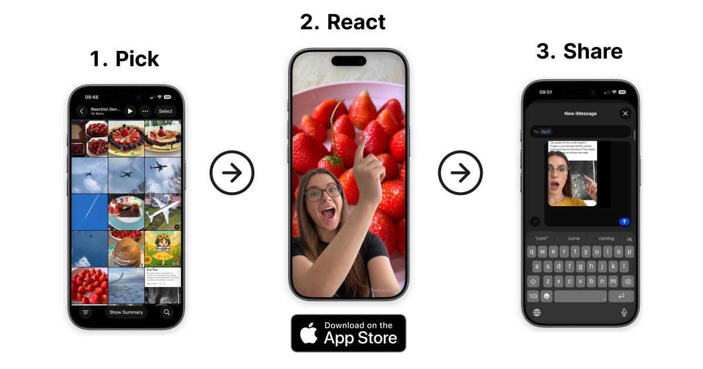

---

## 16. [Qlane](https://www.producthunt.com/products/qlane)
**Votes**: 24 | **도입 난이도**: 상 | **신뢰도**: 상
**Tagline**: Merge PRs with confidence - AI QA that runs your whole app
**서비스 링크**: https://www.producthunt.com/r/VHXZANXJAKKZ7D

**태그**: DevTool, AI, QA, Automation, Testing, AI Tool

### 📌 이 서비스 한눈에 보기
코드 리뷰와 E2E 테스트의 한계를 넘어, 샌드박스 환경에서 앱 전체를 실행하여 근본 원인을 찾아내는 AI QA 도구

### 🔑 주요 기능
- 코드 diff와 DOM을 넘어 셸, 소스, 로그, DB를 포함한 전체 앱 환경 실행
- 단순 추측이 아닌 실제 실행을 통해 재현 가능한 버그만 보고
- 버그 발생 지점과 소스 코드 간의 근본 원인(Root Cause) 추적

### 🙋 사용자에게 어떤 점이 좋은가
코드 리뷰와 브라우저 테스트 사이의 간극을 메워, 실제 배포 시 발생할 수 있는 런타임 오류를 사전에 차단하고 디버깅 시간을 단축해 줍니다.

### ✅ 지금 바로 써볼 기능
- 샌드박스 환경 내 앱 실행 및 테스트 기능 확인
- 로그 및 데이터베이스 연결을 통한 추적 기능 테스트
- 기존 CI/CD 워크플로우와의 통합 가능성 검토

### ⚠️ 사용 전 확인할 점
- 전체 앱을 샌드박스에서 실행하므로 리소스 소모 및 설정 복잡도가 높을 수 있음
- 기존 인프라 및 데이터베이스와의 보안/연결 설정 필요성

### 🧭 확인이 더 필요한 정보
샌드박스 환경 구축을 위한 구체적인 기술 스택과 기존 CI/CD 도구와의 통합 방식에 대한 정보가 더 필요합니다.

### 📸 스크린샷 및 갤러리
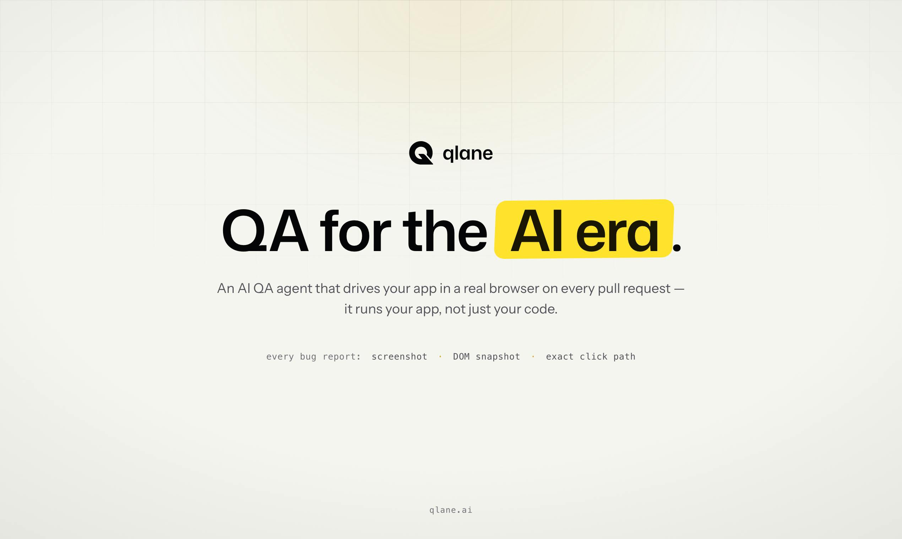
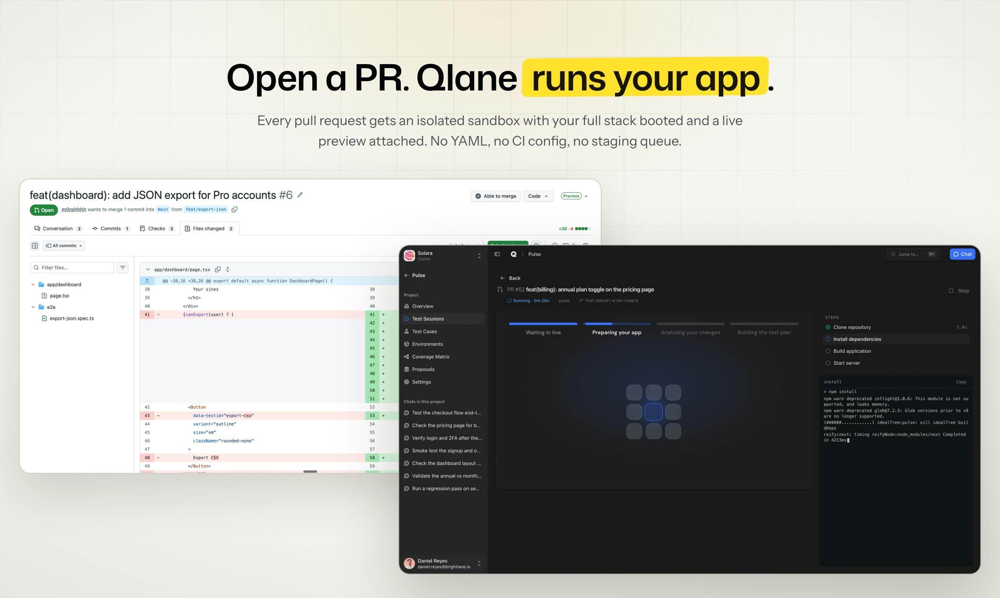
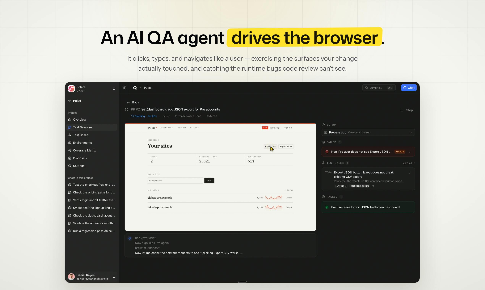

---

## 17. [Latenode AI Workflow Builder](https://www.producthunt.com/products/ai-agent-builder-by-latenode-v2)
**Votes**: 23 | **도입 난이도**: 하 | **신뢰도**: 상
**Tagline**: Create AI automations & agents using prompts
**서비스 링크**: https://www.producthunt.com/r/XZE4P4CRQ3EFGC

**태그**: AI, Automation, NoCode, Workflow, Agent, AI Tool, Prompting

### 📌 이 서비스 한눈에 보기
자연어 설명만으로 복잡한 AI 자동화 워크플로우와 에이전트를 구축하는 도구

### 🔑 주요 기능
- 프롬프트 기반의 직관적인 AI 에이전트 생성 기능
- 5,500개 이상의 외부 서비스 연동 지원
- 비즈니스 데이터와 AI 모델을 결합한 프로덕션급 워크플로우 구축

### 🙋 사용자에게 어떤 점이 좋은가
수동으로 복잡한 자동화 로직을 설계할 필요 없이, 원하는 기능을 말하는 것만으로 업무 자동화 시스템을 즉시 구축할 수 있습니다.

### ✅ 지금 바로 써볼 기능
- 자연어 프롬프트로 기본 자동화 워크플로우 생성해보기
- 기존에 사용하는 외부 툴과 연동 테스트하기
- 비즈니스 데이터 연결을 통한 맞춤형 에이전트 설정하기

### ⚠️ 사용 전 확인할 점
- 복잡한 로직 구현 시 프롬프트 정교함에 따른 결과물 차이 발생 가능성
- 외부 서비스 연동 시 데이터 보안 및 권한 관리 필요

### 🧭 확인이 더 필요한 정보
5,500개 이상의 통합 기능 중 개별 서비스의 세부 기능 지원 범위는 확인이 필요합니다.

### 📸 스크린샷 및 갤러리
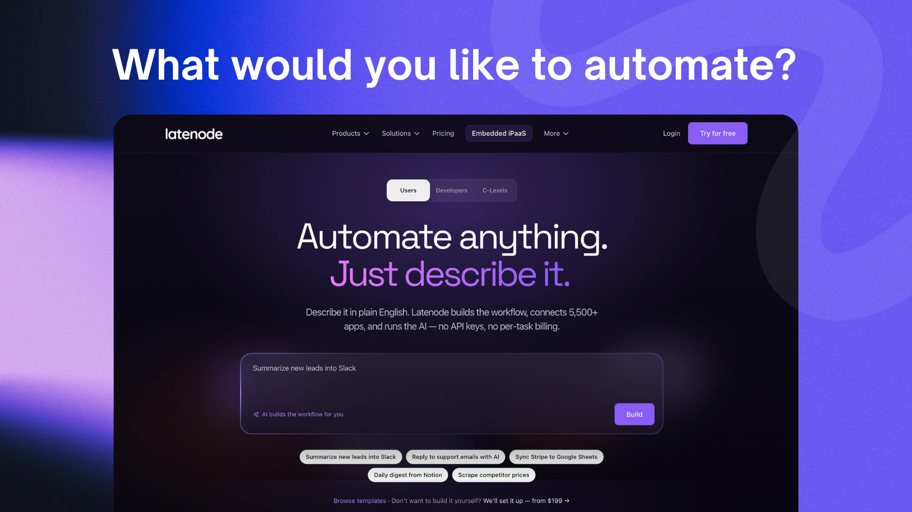
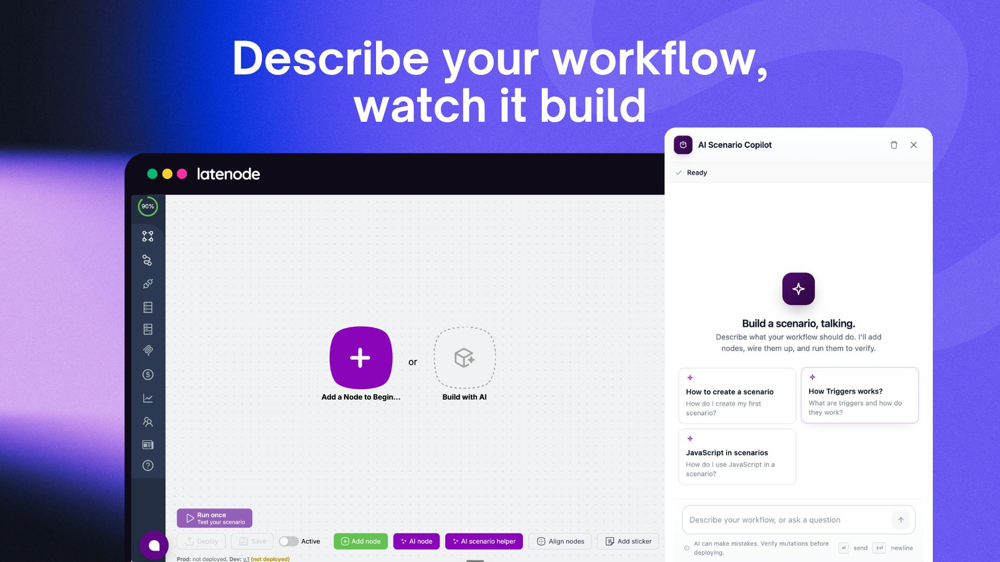
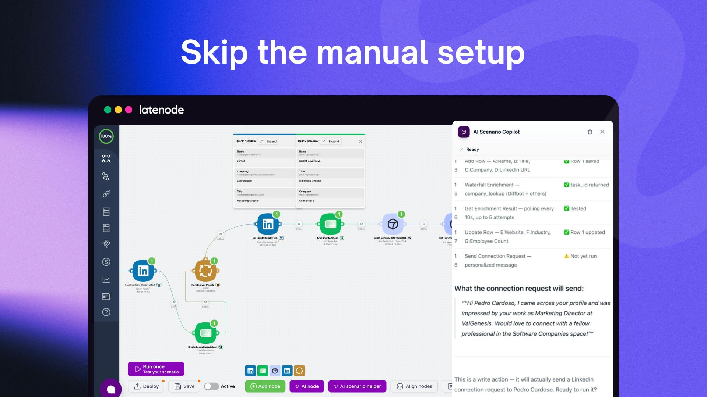

### 🎬 관련 영상
- [🎥 영상 보기](https://ph-files.imgix.net/dbd0cbe4-51de-4445-8deb-d7dfda4877dd.jpeg?auto=format)

---

## 18. [Archly](https://www.producthunt.com/products/archly)
**Votes**: 21 | **도입 난이도**: 하 | **신뢰도**: 상
**Tagline**: Production-ready prompts for Lovable, Cursor & Claude Code
**서비스 링크**: https://www.producthunt.com/r/JOJNQPPOK2VGV7

**태그**: DevTool, AI-Prompting, Productivity, SoftwareDevelopment, AI Tool, Prompting

### 📌 이 서비스 한눈에 보기
사용자 인터뷰와 프로필 DNA를 결합하여 개발 플랫폼 맞춤형 프롬프트를 생성하는 워크스페이스

### 🔑 주요 기능
- 7단계 인터뷰를 통한 정교한 요구사항 추출 및 프롬프트 엔지니어링
- Lovable, Cursor, Claude Code 등 각 플랫폼에 최적화된 결과물 제공
- 사용자의 기술 스택과 스타일을 저장하는 'Profile DNA' 기능

### 🙋 사용자에게 어떤 점이 좋은가
단순한 문장 변환을 넘어, 사용자의 코딩 스타일과 기술 스택이 반영된 즉시 실행 가능한 프롬프트를 얻을 수 있습니다.

### ✅ 지금 바로 써볼 기능
- 7단계 인터뷰 flow를 통해 아이디어 구체화하기
- 자신의 기술 스택과 선호도를 Profile DNA에 등록하기
- 사용 중인 개발 플랫폼(Cursor, Lovable 등)에 맞춰 프롬프트 생성하기

### ⚠️ 사용 전 확인할 점
- 사용자의 기술 스택이 복잡할수록 Profile DNA 설정에 시간이 소요될 수 있음
- 생성된 프롬프트가 특정 플랫폼의 업데이트에 따라 성능 차이가 발생할 수 있음

### 🧭 확인이 더 필요한 정보
각 플랫폼(Lovable, Cursor 등)과의 직접적인 API 연동 여부나 워크플로우 자동화 수준은 명시되지 않았습니다.

### 📸 스크린샷 및 갤러리
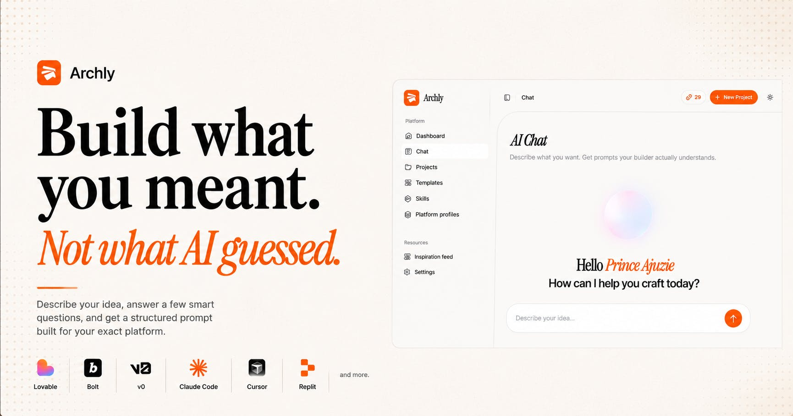
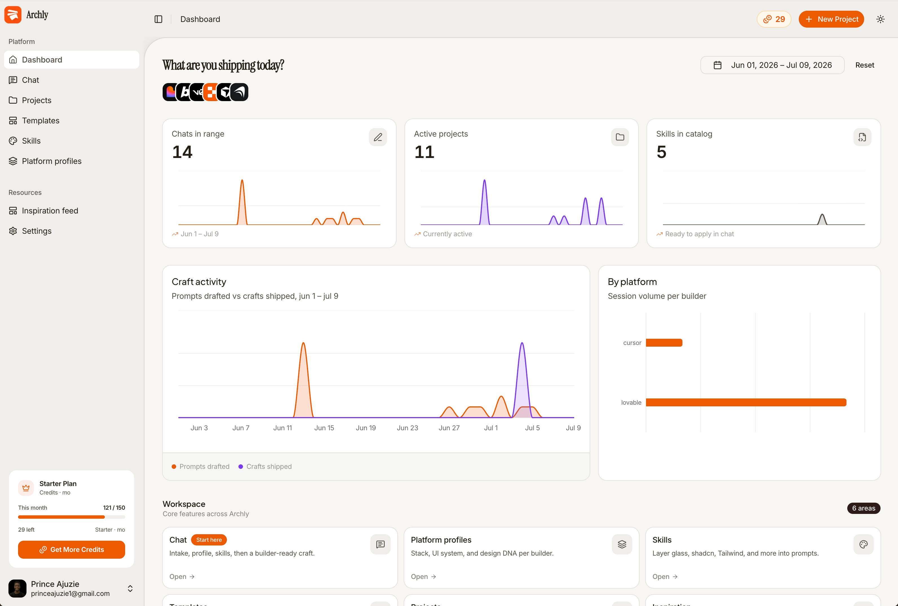
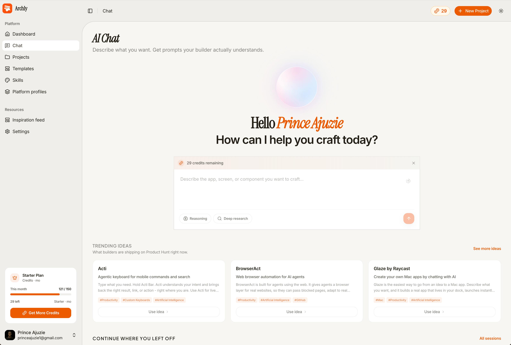

---

## 19. [Shotgun - AI Cofounder Framework](https://www.producthunt.com/products/shotgun-ai-cofounder-framework)
**Votes**: 20 | **도입 난이도**: 하 | **신뢰도**: 상
**Tagline**: Don't Build Solo. Let Shotgun Ride Along.
**서비스 링크**: https://www.producthunt.com/r/R4JR35OKRZRNKW

**태그**: DevTool, AI-Agent, OpenSource, SoloFounder, Agent, AI Tool

### 📌 이 서비스 한눈에 보기
기존 AI 에이전트를 나만의 맞춤형 가상 공동 창업자로 변신시켜주는 오픈소스 프레임워크

### 🔑 주요 기능
- 기존 AI 에이전트(Claude Code, Cursor 등)와 연동되는 오픈소스 운영체제
- 한 번의 온보딩으로 프로젝트 맥락과 비즈니스 정보를 지속적으로 기억
- 명령어 한 줄(`shotgun-init`)로 기존 코드베이스에 즉시 적용 가능

### 🙋 사용자에게 어떤 점이 좋은가
1인 창업자가 AI 에이전트에게 프로젝트의 모든 맥락을 매번 설명할 필요 없이, 마치 파트너처럼 제품 개발과 데이터 관리를 수행할 수 있게 돕습니다.

### ✅ 지금 바로 써볼 기능
- shotgun-init 명령어로 기존 프로젝트에 프레임워크 주입하기
- 온보딩 과정을 통해 AI에게 비즈니스 맥락 학습시키기
- Cursor나 Claude Code 등 선호하는 에이전트와 연동하여 개발 흐름 구축하기

### ⚠️ 사용 전 확인할 점
- 사용 중인 AI 에이전트의 기능 범위에 따라 자동화 수준이 달라질 수 있음
- 프로젝트 데이터와 비즈니스 정보가 AI 에이전트 환경에 저장되므로 보안 정책 확인 필요

### 🧭 확인이 더 필요한 정보
사용자의 특정 AI 에이전트 환경에서 어느 정도의 심리스한 통합 성능을 보여주는지 확인이 필요합니다.

### 📸 스크린샷 및 갤러리

---

## 20. [Atelier faster runtime for coding agents](https://www.producthunt.com/products/atelier-runtime)
**Votes**: 18 | **도입 난이도**: 하 | **신뢰도**: 상
**Tagline**: 25% faster while cutting token costs by 30%-67%
**서비스 링크**: https://www.producthunt.com/r/XM5F2C5NQF5T6V

**태그**: DevTool, AI-Agent, Cost-Optimization, Productivity, Agent, AI Tool

### 📌 이 서비스 한눈에 보기
AI 코딩 에이전트의 실행 속도를 높이고 토큰 비용을 획기적으로 절감하는 컨텍스트 최적화 런타임

### 🔑 주요 기능
- 엔드 투 엔드 컨텍스트 관리를 통한 실행 속도 25% 향상
- 워크로드에 따라 30%~67%의 토큰 비용 절감 효과
- 강력한 코드 검색 성능 (0.727 MRR 기록)

### 🙋 사용자에게 어떤 점이 좋은가
AI 코딩 에이전트를 사용할 때 발생하는 높은 비용과 느린 응답 속도 문제를 동시에 해결하여 개발 생산성을 높여줍니다.

### ✅ 지금 바로 써볼 기능
- 현재 사용 중인 Cursor나 Claude Code에 연결하기
- 기존 워크로드 대비 비용 절감 수치 확인하기
- 코드 검색 성능(MRR) 테스트해보기

### ⚠️ 사용 전 확인할 점
- 사용 중인 에이전트 도구와의 호환성 여부 확인 필요
- 특정 워크로드에 따라 비용 절감 폭이 달라질 수 있음

### 🧭 확인이 더 필요한 정보
사용자의 특정 개발 환경 및 에이전트 설정에 따른 실제 성능 차이를 확인해야 합니다.

### 📸 스크린샷 및 갤러리
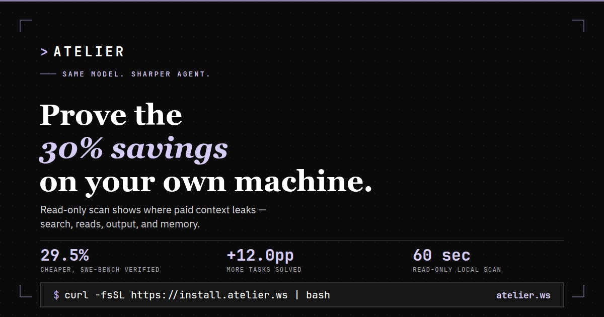
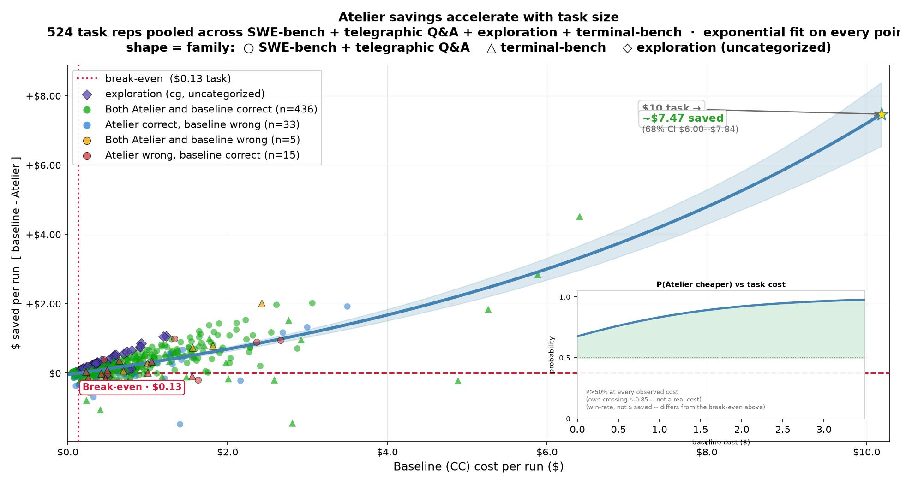
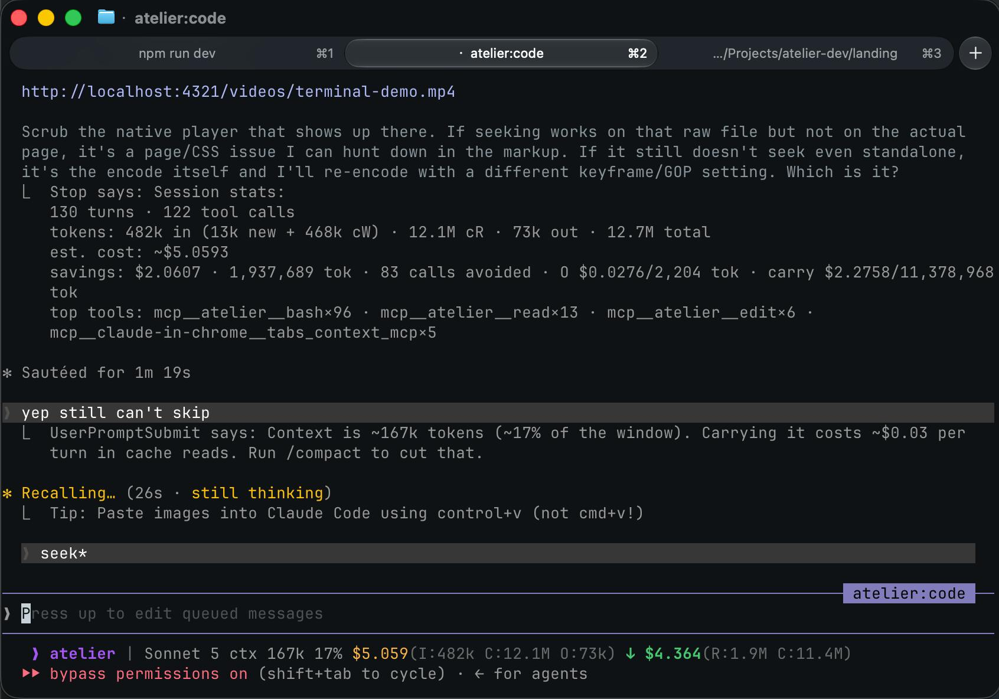

### 🎬 관련 영상
- [🎥 영상 보기](https://ph-files.imgix.net/ef58f534-d0e2-4a10-b824-a16c01958940.jpeg?auto=format)

---

## 21. [Speculos](https://www.producthunt.com/products/speculos)
**Votes**: 15 | **도입 난이도**: 하 | **신뢰도**: 상
**Tagline**: Type "deploy" in Claude Code. Your app is live.
**서비스 링크**: https://www.producthunt.com/r/CADWRPQI2JBA2L

**태그**: DevTool, Automation, AI, Deployment, Cloud, Agent, AI Tool

### 📌 이 서비스 한눈에 보기
Claude Code에서 명령어 하나로 프론트엔드와 백엔드를 즉시 배포하는 초간편 배포 도구

### 🔑 주요 기능
- Claude Code 내에서 'deploy' 명령어만으로 15초 내 배포 완료
- 프론트엔드 앱 무료 제공 및 별도의 가입 절차 없음
- 팀 단위 도메인, 링크 권한 관리 및 기업 데이터 연결 지원

### 🙋 사용자에게 어떤 점이 좋은가
복잡한 클라우드 설정 없이 터미널에서 즉시 결과물을 공유할 수 있어 개발 속도가 비약적으로 향상됩니다.

### ✅ 지금 바로 써볼 기능
- Claude Code 환경에서 'deploy' 명령어 실행해보기
- 프론트엔드 프로젝트를 무료로 배포하여 공유 링크 확인하기
- 팀 기능을 통해 도메인 및 권한 설정 테스트하기

### ⚠️ 사용 전 확인할 점
- 백엔드 배포 시 비용 발생 여부 확인 필요
- 에이전트 자동 배포 시 보안 및 리소스 관리 주의

### 🧭 확인이 더 필요한 정보
백엔드 배포의 구체적인 비용 정책과 상세 보안 프로토콜에 대한 정보가 부족합니다.

### 📸 스크린샷 및 갤러리
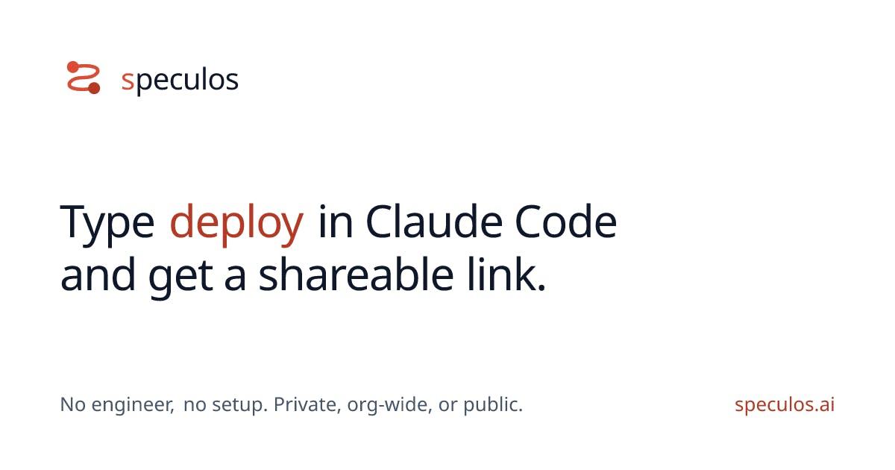

### 🎬 관련 영상
- [🎥 영상 보기](https://ph-files.imgix.net/be145bfa-cdbc-48f2-993e-802f9c570bef.jpeg?auto=format)

---

## 22. [Vibe-check skill](https://www.producthunt.com/products/vibe-check-6)
**Votes**: 15 | **도입 난이도**: 하 | **신뢰도**: 상
**Tagline**: Stop your AI from building the wrong app
**서비스 링크**: https://www.producthunt.com/r/CCKG6LRLA4B5DX

**태그**: AI, Product Management, Idea Validation, DevTool, Agent, AI Tool

### 📌 이 서비스 한눈에 보기
아이디어 단계에서 실패를 방지하고 AI가 올바른 제품을 만들 수 있도록 검증하는 기획 스킬

### 🔑 주요 기능
- 모호한 아이디어 속에서 실제 핵심 문제를 발굴
- 레딧(Reddit) 등 실제 사용자 불만 사항을 바탕으로 아이디어 검증
- AI 에이전트가 실행 가능한 구체적인 설계도(Blueprint) 제공

### 🙋 사용자에게 어떤 점이 좋은가
개발에 착수하기 전, 시장성이 없는 프로젝트에 시간과 비용을 낭비하는 것을 막아줍니다.

### ✅ 지금 바로 써볼 기능
- 현재 구상 중인 아이디어 입력하기
- 레딧 데이터 기반의 시장성 검증 결과 확인하기
- AI 에이전트용 설계도 생성하기

### ⚠️ 사용 전 확인할 점
- 실제 시장 반응과 레딧 데이터 간의 차이가 있을 수 있음
- 아이디어의 기술적 구현 가능성보다는 시장 적합성에 초점이 맞춰져 있음

### 🧭 확인이 더 필요한 정보
해당 서비스가 독립적인 플랫폼인지, 아니면 특정 AI 에이전트 프레임워크 내의 스킬인지 확인이 필요합니다.

### 📸 스크린샷 및 갤러리

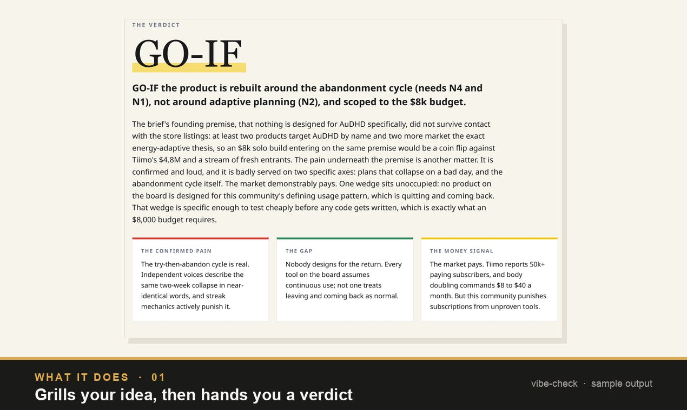
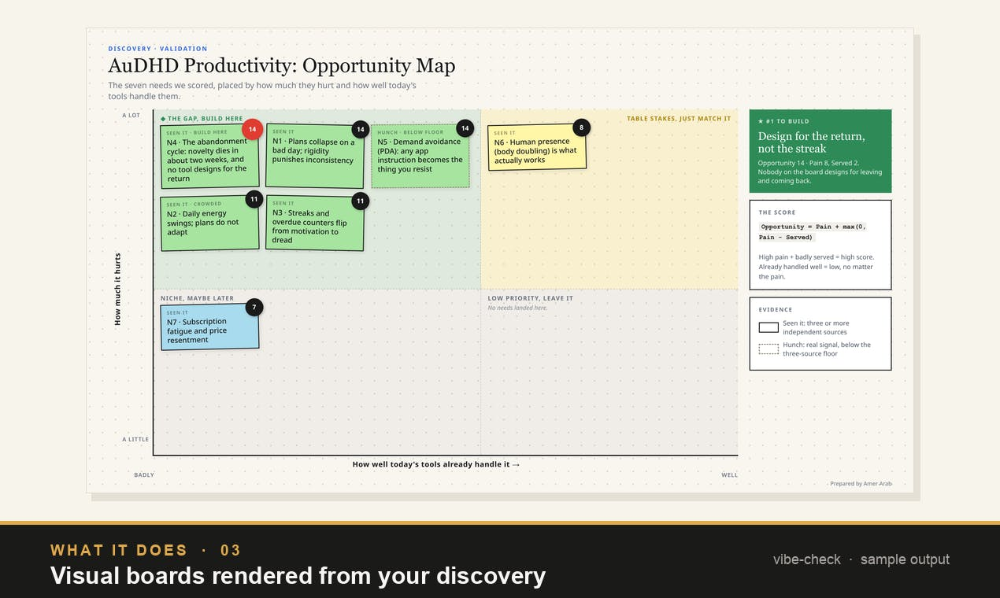

---

## 23. [Pell](https://www.producthunt.com/products/pell-2)
**Votes**: 13 | **도입 난이도**: 하 | **신뢰도**: 상
**Tagline**: Turn your "text-to-self" chat into a searchable brain.
**서비스 링크**: https://www.producthunt.com/r/DQXITNSKARGP6G

**태그**: Productivity, AI, Messaging, Search, AI Tool, Chat

### 📌 이 서비스 한눈에 보기
나와의 채팅을 검색 가능한 지식 저장소로 바꿔주는 WhatsApp 기반 메모 서비스

### 🔑 주요 기능
- WhatsApp을 통한 간편한 메모 기록 방식
- 텍스트 기반의 '나와의 채팅'을 검색 가능한 데이터베이스로 변환
- 기존의 단순 메모를 지능형 저장소로 활용

### 🙋 사용자에게 어떤 점이 좋은가
별도의 앱을 열 필요 없이 평소 쓰던 메신저로 메모하고, 필요할 때 즉시 검색하여 정보를 찾을 수 있습니다.

### ✅ 지금 바로 써볼 기능
- WhatsApp에 Pell 연락처 추가하기
- 생각나는 아이디어를 메시지로 보내기
- 질문을 통해 저장된 메모 검색해보기

### ⚠️ 사용 전 확인할 점
- 개인적인 메모가 외부 서비스(WhatsApp/Pell)에 저장되므로 보안 및 프라이버시 검토 필요
- 메시지 기반이므로 대용량 파일이나 복잡한 구조의 데이터 관리에는 한계가 있을 수 있음

### 🧭 확인이 더 필요한 정보
데이터 보안 정책 및 개인정보 처리 방식에 대한 상세 정보 확인이 필요합니다.

### 📸 스크린샷 및 갤러리
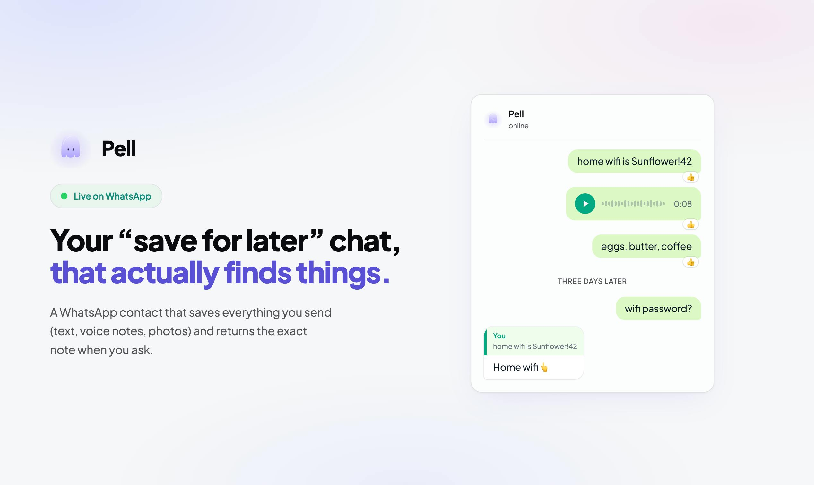
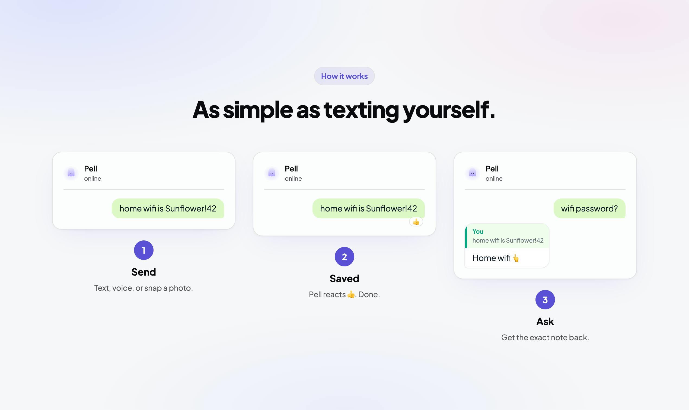
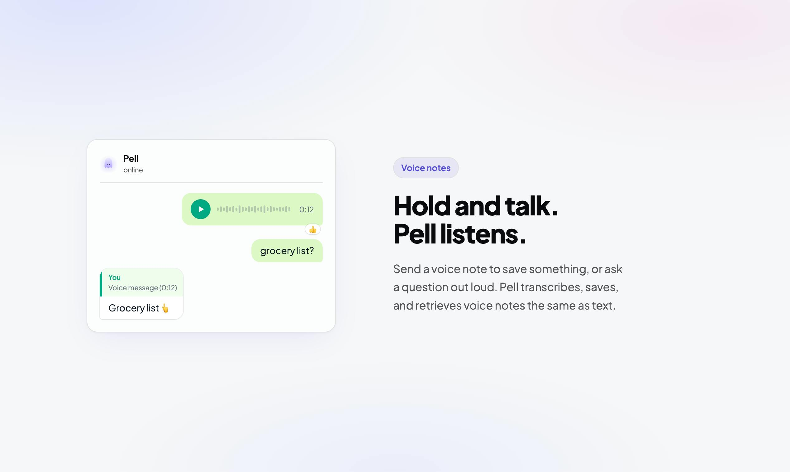

---

## 24. [SuperCompress](https://www.producthunt.com/products/supercompress)
**Votes**: 12 | **도입 난이도**: 하 | **신뢰도**: 상
**Tagline**: Cut your LLM Token Costs by 65%
**서비스 링크**: https://www.producthunt.com/r/3SDGB6A4DVQHXF

**태그**: DevTool, AI, CostOptimization, OpenSource, Agent, AI Tool, LLM, Chat, Prompting, API

### 📌 이 서비스 한눈에 보기
핵심 정보는 유지하면서 LLM 토큰 비용을 최대 65% 절감하는 오픈소스 프롬프트 압축 도구

### 🔑 주요 기능
- 평균 65% 이상의 토큰 절감 및 비용 효율성 확보
- 중요 콘텐츠의 98% 이상을 보존하여 답변 품질 유지
- OpenAI, Claude, Gemini 등 다양한 LLM 및 RAG 워크플로우에 쉽게 통합 가능

### 🙋 사용자에게 어떤 점이 좋은가
LLM 기반 앱 개발 시 입력 토큰 비용을 획기적으로 줄이면서도, 답변의 정확도를 유지할 수 있습니다.

### ✅ 지금 바로 써볼 기능
- Supercompress API를 기존 앱 워크플로우에 통합하기
- 현재 사용 중인 프롬프트에 적용하여 비용 절감 효과 테스트하기

### ⚠️ 사용 전 확인할 점
- 압축 과정에서 미세한 문맥 손실이 발생할 수 있으므로 품질 검증 필요
- 오픈소스 라이브러리로서의 유지보수 및 보안 정책 확인 필요

### 🧭 확인이 더 필요한 정보
압축 방식이 구체적으로 어떤 알고리즘을 사용하는지에 대한 상세 기술 정보 확인이 필요합니다.

### 📸 스크린샷 및 갤러리
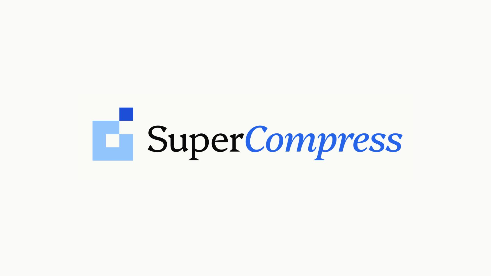
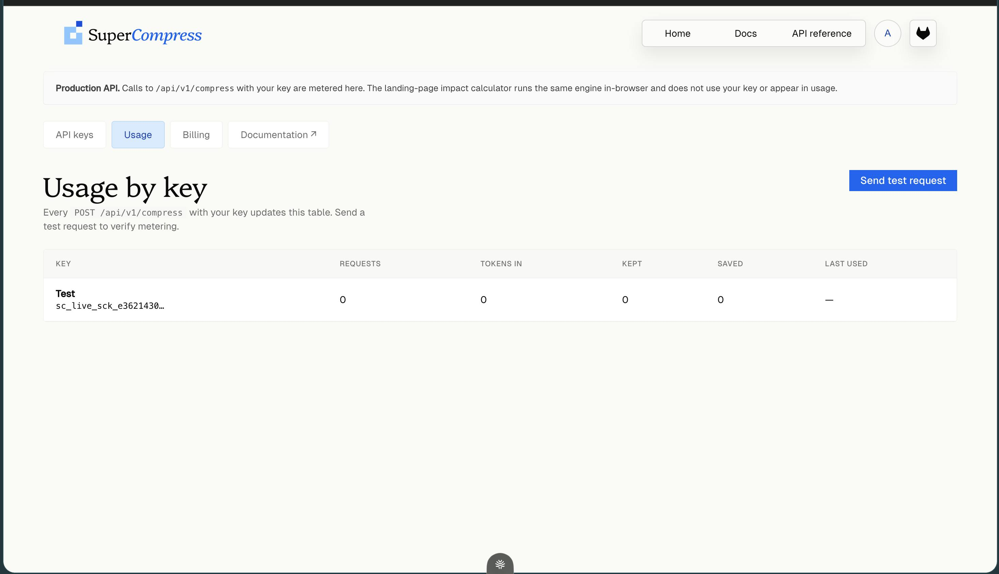
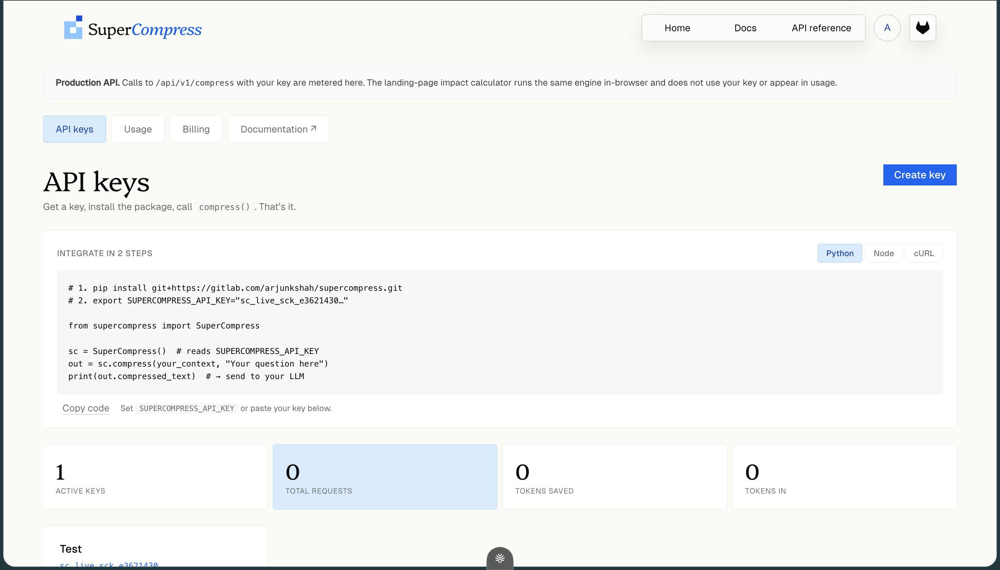

### 🎬 관련 영상
- [🎥 영상 보기](https://ph-files.imgix.net/d3d9f984-419c-4391-9557-33fbc9de33a4.jpeg?auto=format)

---

## 25. [fajr.club](https://www.producthunt.com/products/fajr-club)
**Votes**: 12 | **도입 난이도**: 하 | **신뢰도**: 상
**Tagline**: The accountability app that helps you wake up for Fajr
**서비스 링크**: https://www.producthunt.com/r/UY3BLL76KLU4FA

**태그**: Productivity, Habit Tracker, Accountability

### 📌 이 서비스 한눈에 보기
실제 기상 확인과 파트너의 개입을 통해 새벽 예배(Fajr)를 돕는 책임감 기반의 알람 서비스

### 🔑 주요 기능
- 정해진 시간에 울리는 실제 기상 알람
- 사용자의 기상 여부를 확인하는 검증 시스템
- 미이행 시 개입하는 신뢰할 수 있는 파트너 시스템

### 🙋 사용자에게 어떤 점이 좋은가
단순한 알람을 넘어 타인의 개입과 검증 과정을 통해 강제성을 부여함으로써 새벽 기상 습관을 형성하는 데 도움을 줍니다.

### ✅ 지금 바로 써볼 기능
- 21일 Fajr 챌린지 참여하기
- 기상 확인 및 사후 증빙 시스템 경험하기

### ⚠️ 사용 전 확인할 점
- 개인적인 기상 정보 및 사후 증빙 데이터의 프라이버시 관리 확인 필요
- 파트너 시스템의 개입 방식에 따른 심리적 부담감 고려

### 🧭 확인이 더 필요한 정보
파트너가 구체적으로 어떤 방식으로 개입하는지, 그리고 데이터 프라이버시가 어떻게 보호되는지에 대한 상세 정보가 필요합니다.

### 📸 스크린샷 및 갤러리

---

## 26. [Hyperiux Vault](https://www.producthunt.com/products/vault-9)
**Votes**: 12 | **도입 난이도**: 중 | **신뢰도**: 상
**Tagline**: The Interaction Layer Your Website is Missing
**서비스 링크**: https://www.producthunt.com/r/YV45D2ORMG6SWC

**태그**: React, Next.js, Frontend, UI/UX, WebDesign

### 📌 이 서비스 한눈에 보기
React 및 Next.js를 위한 소스 코드 편집 가능한 프리미엄 인터랙션 라이브러리

### 🔑 주요 기능
- 스크롤 효과, 커서 반응, 페이지 전환 등 고품질 인터랙션 제공
- 소스 코드를 직접 수정할 수 있는 'Source-first' 방식
- React 및 Next.js 환경에 최적화된 개발 워크플로우

### 🙋 사용자에게 어떤 점이 좋은가
직접 밑바닥부터 구현하기 어려운 복잡한 WebGL 스타일의 효과를 빠르게 적용하고, 필요에 따라 소스를 직접 수정하여 커스텀할 수 있습니다.

### ✅ 지금 바로 써볼 기능
- 라이브러리에서 제공하는 프리뷰 효과 확인하기
- 프로젝트에 설치 후 소스 코드 커스텀 시도하기
- Next.js 환경에서의 페이지 전환 효과 적용하기

### ⚠️ 사용 전 확인할 점
- 소스 코드를 직접 수정할 경우 라이브러리 업데이트 시 유지보수가 어려울 수 있음
- 고급 인터랙션 특성상 브라우저 성능에 영향을 줄 수 있음

### 🧭 확인이 더 필요한 정보
라이브러리의 구체적인 설치 방식과 프레임워크 버전별 호환성 범위는 공식 문서를 통해 확인이 필요합니다.

### 📸 스크린샷 및 갤러리
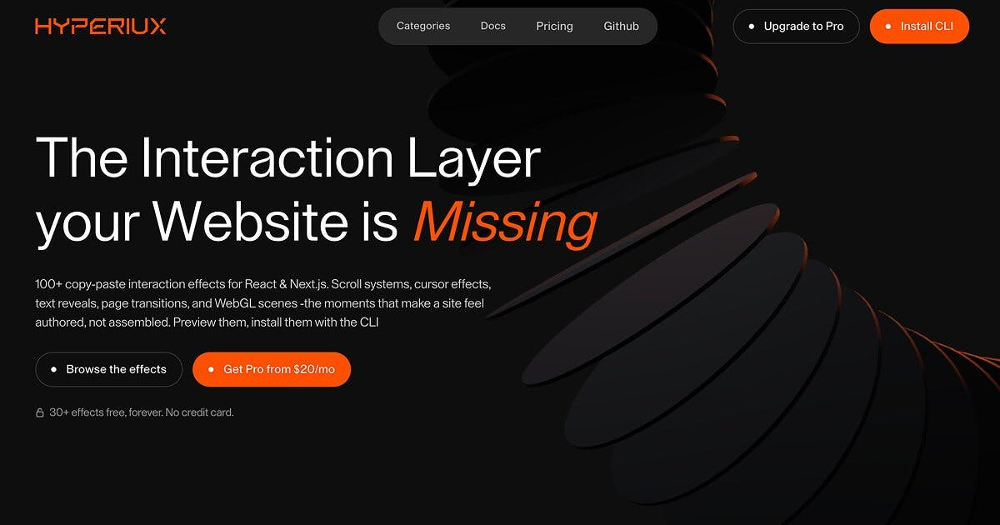
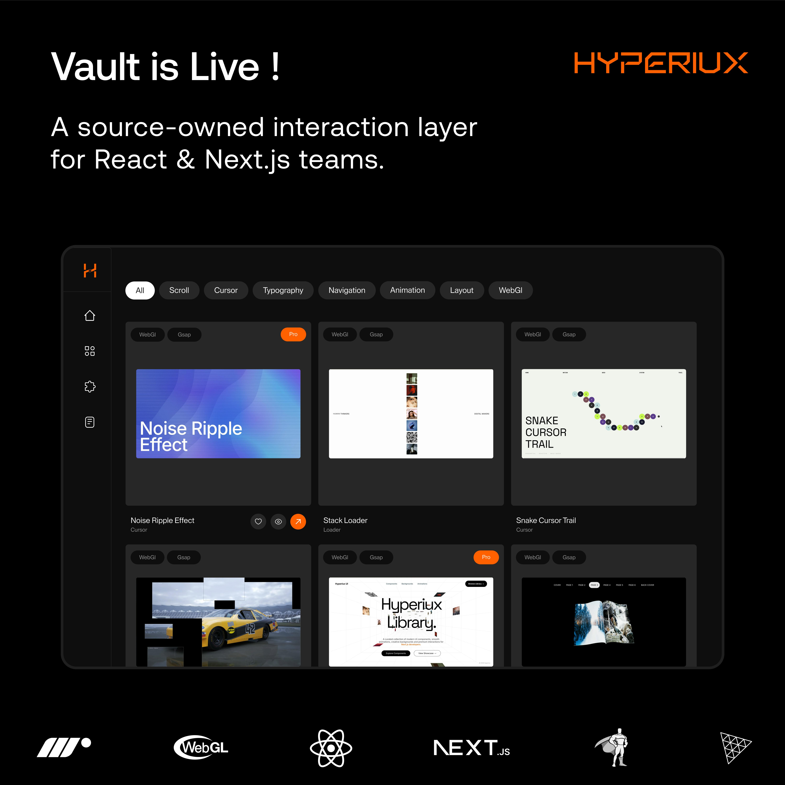

---

## 27. [Gatekeep](https://www.producthunt.com/products/gatekeep)
**Votes**: 12 | **도입 난이도**: 하 | **신뢰도**: 상
**Tagline**: Beat the AI VCs. Get noticed by the actual Investors.
**서비스 링크**: https://www.producthunt.com/r/HFRHVCRTLTDVLK

**태그**: AI, Startup, Pitching, Venture Capital, AI Tool, Chat

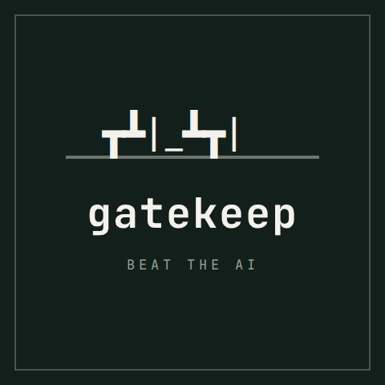

### 📌 이 서비스 한눈에 보기
실제 VC의 투자 성향을 학습한 AI 페르소나와 피칭 연습을 통해 투자 유치 성공률을 높이는 서비스

### 🔑 주요 기능
- 실제 유명 VC의 투자 방식과 강연을 학습한 AI 페르소나 제공
- AI 피칭을 통한 실시간 스코어링 및 피드백 기능
- 투자자에게 직접 노출될 수 있는 기회 제공

### 🙋 사용자에게 어떤 점이 좋은가
창업자가 실제 투자자를 만나기 전, 검증된 AI를 대상으로 피칭을 연습하며 전략을 정교화할 수 있습니다.

### ✅ 지금 바로 써볼 기능
- 자신의 피칭을 AI VC에게 전달해보기
- AI가 제공하는 스코어링 결과 분석하기
- 피드백을 바탕으로 피칭 스크립트 개선하기

### ⚠️ 사용 전 확인할 점
- AI 모델이 실제 투자자의 현재 의사결정을 100% 완벽하게 대변하지 않을 수 있음
- 실제 투자로 이어지는 직접적인 경로에 대한 구체적인 메커니즘 확인 필요

### 🧭 확인이 더 필요한 정보
AI 페르소나의 학습 데이터 업데이트 주기와 실제 투자자 매칭 프로세스의 상세 과정을 확인해야 합니다.

### 📸 스크린샷 및 갤러리
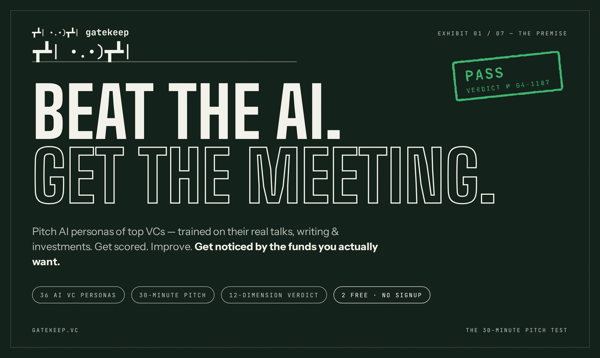
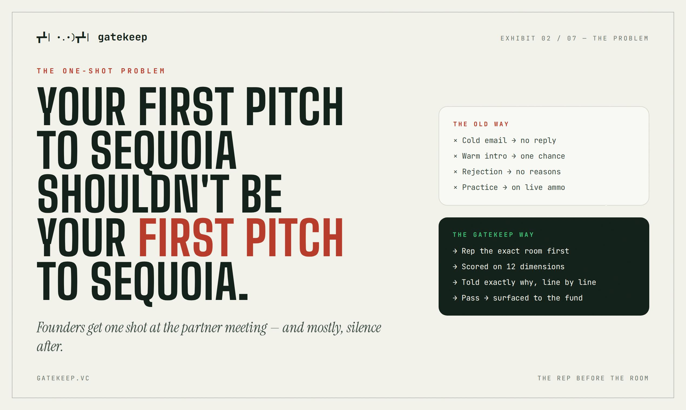
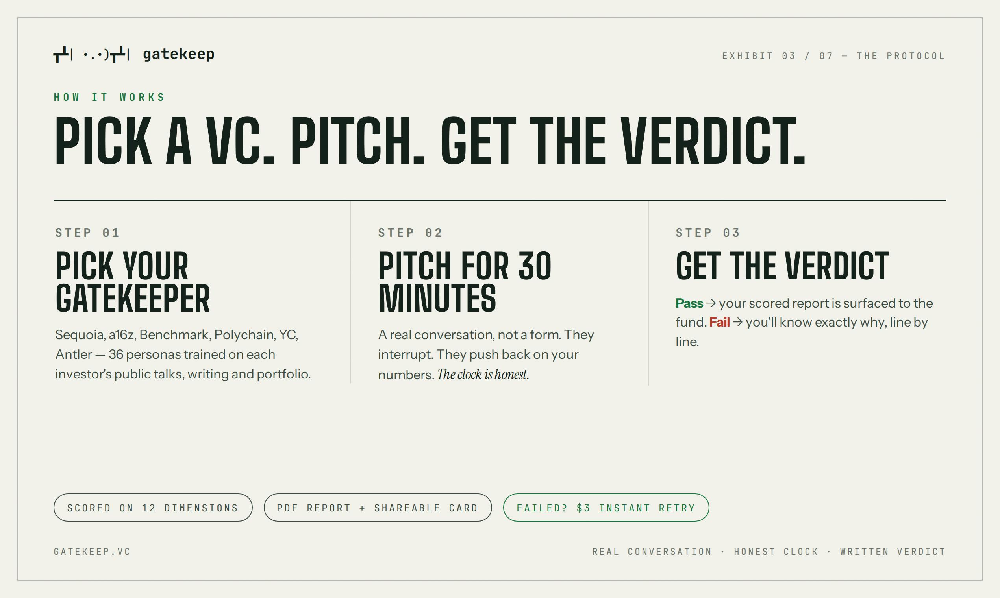

---

## 28. [Instantly get a personal California doc!](https://www.producthunt.com/products/instantly-get-a-personal-california-doc)
**Votes**: 11 | **도입 난이도**: 하 | **신뢰도**: 상
**Tagline**: Resonant Health connects you to your own primary doc 24/7 
**서비스 링크**: https://www.producthunt.com/r/3NU35Z3EUG3Z5P

**태그**: Healthcare, Personalized, AI-Powered, Direct-Access, AI Tool, Design

### 📌 이 서비스 한눈에 보기
남가주 지역 거주자를 위한 스탠퍼드·하버드 출신 전문의 매칭 및 개인 맞춤형 의료 서비스

### 🔑 주요 기능
- 스탠퍼드 및 하버드 출신의 검증된 전문의 연결
- AI 기술을 활용한 행정 업무 최소화 및 진료 시간 확보
- 단순 질병 치료를 넘어선 관계 중심의 개인 맞춤형 케어

### 🙋 사용자에게 어떤 점이 좋은가
남가주 지역 사용자라면 신뢰할 수 있는 전문의를 통해 더 긴 진료 시간과 직접적인 소통이 가능한 개인 맞춤형 의료 서비스를 경험할 수 있습니다.

### ✅ 지금 바로 써볼 기능
- 서비스 제공 지역(남가주) 해당 여부 확인
- 매칭 가능한 전문의 프로필 검토
- 개인 맞춤형 케어 플랜 상담

### ⚠️ 사용 전 확인할 점
- 서비스 제공 지역이 남가주(Southern California)로 제한적임
- 특정 학위(스탠퍼드, 하버드) 기반의 전문의로 타 지역 사용자 접근성 제한 가능성

### 🧭 확인이 더 필요한 정보
서비스 이용 가능 범위가 남가주 지역에 국한되는지, 구체적인 진료 과목은 무엇인지 확인이 필요합니다.

### 📸 스크린샷 및 갤러리
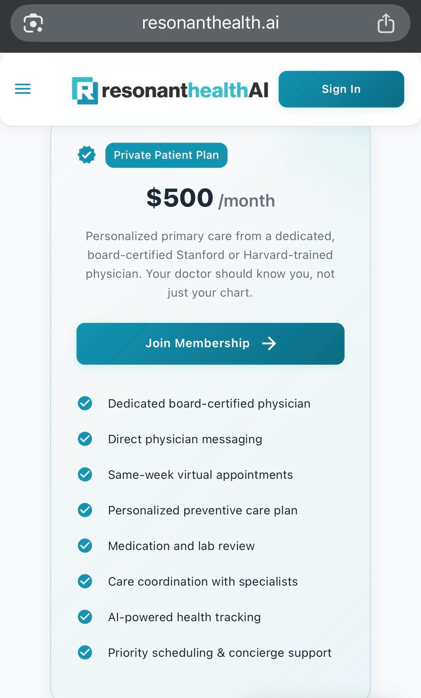
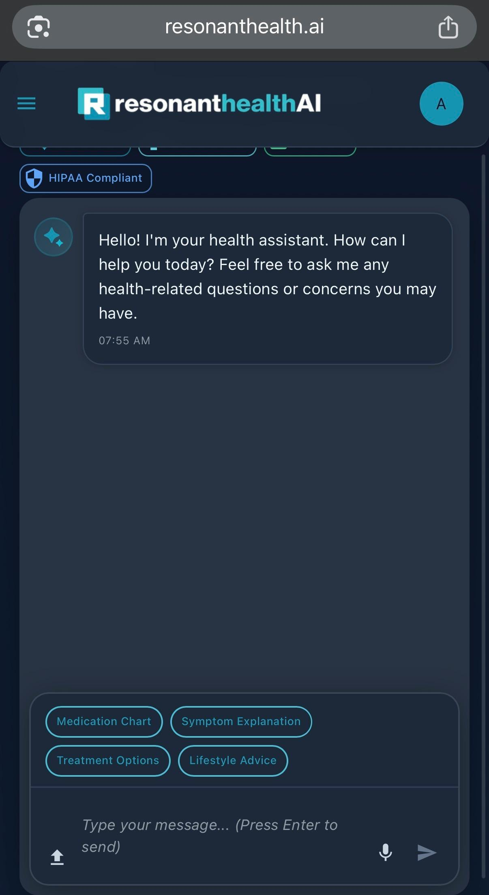
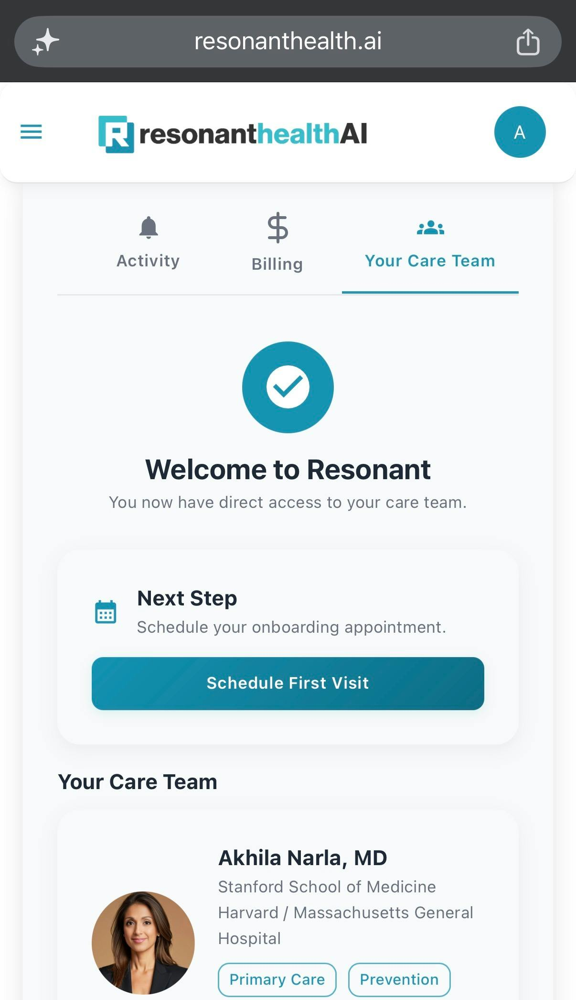

---

## 29. [AInvest Terminal](https://www.producthunt.com/products/ainvest-terminal)
**Votes**: 11 | **도입 난이도**: 중 | **신뢰도**: 상
**Tagline**: The AI-powered market terminal for everyday investors
**서비스 링크**: https://www.producthunt.com/r/ITW5RDC5AUBMSC

**태그**: FinTech, AI, Trading, Analytics, Mac, AI Tool, Design

### 📌 이 서비스 한눈에 보기
블룸버그급 전문 분석 도구를 개인 투자자용으로 구현한 AI 기반 시장 터미널

### 🔑 주요 기능
- AI 분석가 중심의 차트 패턴 자동 인식 및 매수/매도 시그널 제공
- 가격 변동의 원인이 되는 뉴스를 즉각적으로 연결하여 분석
- 실시간 미국 주식 시세와 고급 차트 기능을 갖춘 Mac 네이티브 환경

### 🙋 사용자에게 어떤 점이 좋은가
고가의 전문 터미널 없이도 AI를 통해 전문적인 차트 분석과 뉴스 해석을 실시간으로 수행할 수 있습니다.

### ✅ 지금 바로 써볼 기능
- AI 패턴 인식 기능을 통한 차트 시그널 확인
- 뉴스 피드와 가격 변동 간의 상관관계 분석
- 실시간 미국 주식 시세 및 워치리스트 동기화 테스트

### ⚠️ 사용 전 확인할 점
- AI의 시그널이 투자 수익을 보장하지 않으므로 최종 결정은 사용자가 해야 함
- Mac 네이티브 앱이므로 다른 OS 환경에서의 사용 제약 확인 필요

### 🧭 확인이 더 필요한 정보
구체적인 구독 가격 정책과 모바일 앱 지원 여부는 명시되지 않았습니다.

### 📸 스크린샷 및 갤러리
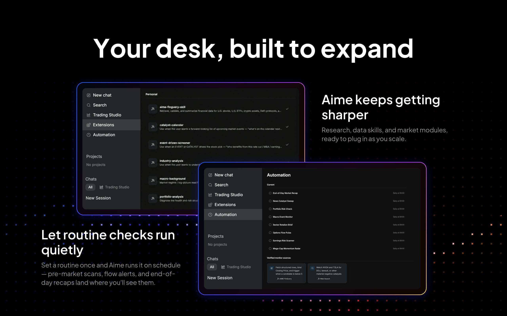
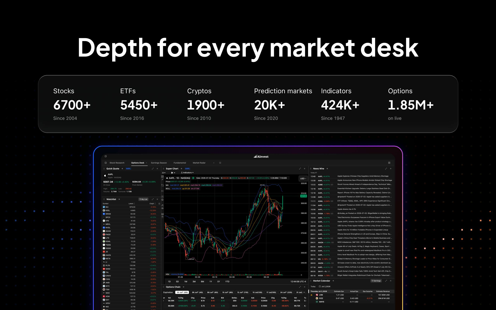
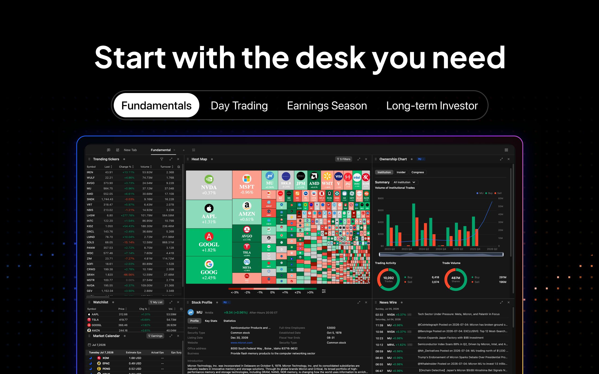

### 🎬 관련 영상
- [🎥 영상 보기](https://ph-files.imgix.net/e53f5b60-0780-4216-bbe3-195a8815782f.jpeg?auto=format)

---

## 30. [AI Pixel Art Generator](https://www.producthunt.com/products/sprite-fusion-pixel-art-generator)
**Votes**: 11 | **도입 난이도**: 하 | **신뢰도**: 상
**Tagline**: The professional AI pixel art generator for game developers
**서비스 링크**: https://www.producthunt.com/r/SEOLWICKLMJZ26

**태그**: GameDev, AI, PixelArt, AssetCreation, AI Tool, DevTool

### 📌 이 서비스 한눈에 보기
게임 개발자를 위한 전문가급 AI 픽셀 아트 및 애니메이션 생성 도구

### 🔑 주요 기능
- 고품질 픽셀 아트 및 캐릭터 스프라이트 시트 생성
- 애니메이션 제작 및 브라우저 내 편집 기능 제공
- 게임에 즉시 적용 가능한 에셋 수출 지원

### 🙋 사용자에게 어떤 점이 좋은가
게임 개발자가 복잡한 그래픽 작업 시간을 단축하고, 브라우저만으로 게임용 에셋을 빠르게 제작할 수 있습니다.

### ✅ 지금 바로 써볼 기능
- AI를 활용한 캐릭터 스프라이트 생성해보기
- 생성된 에셋의 애니메이션 기능 테스트하기
- 브라우저 편집기를 통한 에셋 수정해보기

### ⚠️ 사용 전 확인할 점
- 생성된 에셋의 저작권 및 상업적 이용 가능 여부 확인 필요
- 복잡한 커스텀 디자인에 대한 편집 자유도 확인 필요

### 🧭 확인이 더 필요한 정보
상세한 가격 정책 및 상업적 라이선스 범위에 대한 정보가 명시되지 않았습니다.

### 📸 스크린샷 및 갤러리
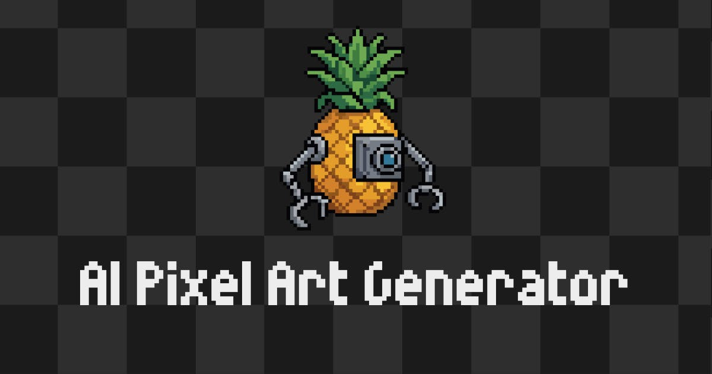
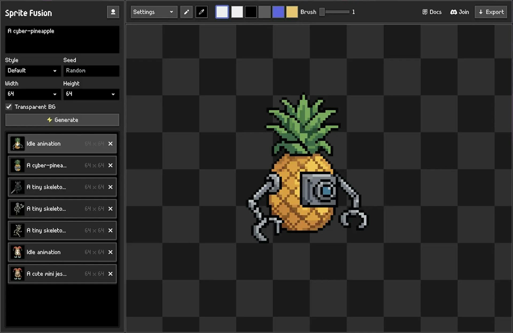

---

