# 🚀 Product Hunt Daily Top 30 (2026-07-12)

## 오늘의 요약
오늘의 제품들은 복잡한 설정 없이 즉각적인 결과물을 만들어내는 '제로 설정'과 '자동화' 트렌드가 두드러졌습니다. 또한, AI 기술을 실무 프로세스에 직접 통합하거나 터미널 및 메뉴 바와 같은 개발자 친화적 환경에 녹여낸 도구들이 주목받았습니다.

### 오늘의 핵심 포인트
- 클라우드 배포, 조직 관리, 오디오 라우팅 등 복잡한 과정을 단순화하여 즉각적인 실행을 돕는 도구들이 다수 등장했습니다.
- AI 에이전트와 실시간 영상/오디오 SDK를 통해 단순 답변을 넘어 실제 업무와 콘텐츠 제작을 자동화하는 기술이 강조되었습니다.
- 사용자 경험 측면에서 광고나 복잡한 가입 절차를 배제하고 본연의 기능에 집중하는 미니멀리즘적 접근이 돋보였습니다.

**오늘의 태그**: AI_Automation, Developer_Tools, SaaS, Productivity

## 1. [Effects SDK](https://www.producthunt.com/products/effects-sdk)
**Votes**: 377 | **도입 난이도**: 중 | **신뢰도**: 상
**Tagline**: AI video & audio effects SDK for real-time apps
**서비스 링크**: https://www.producthunt.com/r/UFCXYL336A5QGC

**태그**: AI, VideoSDK, AudioSDK, Privacy, DeveloperTool, AI Tool, Video, DevTool

### 📌 이 서비스 한눈에 보기
개인정보 유출 걱정 없이 앱에 실시간 AI 영상 및 오디오 효과를 즉시 구현하는 SDK

### 🔑 주요 기능
- 클라이언트 사이드 실행으로 서버로 데이터가 전송되지 않는 강력한 프라이버시 보호
- 배경 흐림, 가상 배경, 스마트 프레이밍, 조명 보정 등 프로급 영상 효과 제공
- 노이즈 억제, 미화, 아바타 등 다양한 오디오 및 비디오 효과 통합 가능

### 🙋 사용자에게 어떤 점이 좋은가
개발자는 복잡한 AI 모델 구현 없이도 웹, 데스크톱, 모바일 앱에 고품질의 실시간 영상/오디오 기능을 즉시 추가할 수 있습니다.

### ✅ 지금 바로 써볼 기능
- 가상 배경 및 배경 흐림 기능 테스트
- 실시간 노이즈 억제 및 오디오 효과 적용
- 클라이언트 사이드 성능 및 프라이버시 보안 검증

### ⚠️ 사용 전 확인할 점
- 클라이언트 사이드 실행 시 사용자 기기 성능(CPU/GPU)에 따른 퍼포먼스 차이 발생 가능성
- 지원되는 플랫폼(웹, 데스크톱, 모바일)별 구현 난이도 차이 확인 필요

### 🧭 확인이 더 필요한 정보
각 플랫폼별 상세 지원 사양과 하드웨어 가속 최적화 수준에 대한 정보가 필요합니다.

### 📸 스크린샷 및 갤러리

### 🎬 관련 영상
- [🎥 영상 보기](https://ph-files.imgix.net/2ecd9861-f0e8-4d60-87d4-a68515a9f50b.jpeg?auto=format)

---

## 2. [Cloudflare Drop](https://www.producthunt.com/products/cloudflare)
**Votes**: 251 | **도입 난이도**: 하 | **신뢰도**: 상
**Tagline**: Drop your folder in browser & deploy instantly on Cloudflare
**서비스 링크**: https://www.producthunt.com/r/RMCYNJS7MULSBB

**태그**: DevTool, Deployment, Cloudflare, NoCode, AI Tool

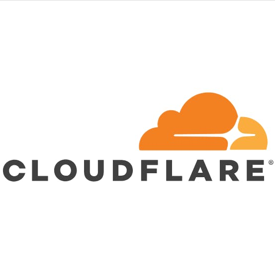

### 📌 이 서비스 한눈에 보기
폴더를 드래그하는 것만으로 즉시 웹사이트를 배포하는 초간편 클라우드플레어 배포 도구

### 🔑 주요 기능
- 폴더 또는 ZIP 파일을 브라우저에 드롭하여 즉시 배포
- 계정 생성 없이 즉각적인 사이트 라이브 확인 가능
- Cloudflare의 글로벌 네트워크를 통한 빠른 배포

### 🙋 사용자에게 어떤 점이 좋은가
복잡한 설정이나 계정 가입 없이도 개발한 결과물을 즉시 웹상에 공개하고 테스트할 수 있습니다.

### ✅ 지금 바로 써볼 기능
- 로컬 프로젝트 폴더 드래그 앤 드롭
- ZIP 파일로 압축하여 배포하기
- 배포된 URL로 실시간 사이트 확인

### ⚠️ 사용 전 확인할 점
- 배포 후 60분 뒤에는 만료되므로 영구 배포를 위해서는 별도의 소유권 이전(claim) 필요
- 계정 없이 사용 시 데이터 유지 및 관리의 제한적 성격

### 🧭 확인이 더 필요한 정보
배포된 사이트를 영구적으로 유지하기 위한 'claim' 절차와 계정 생성 시의 상세 조건에 대한 확인이 필요합니다.

### 📸 스크린샷 및 갤러리
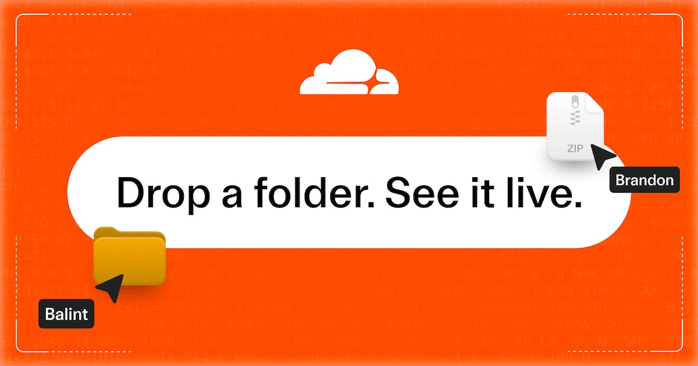
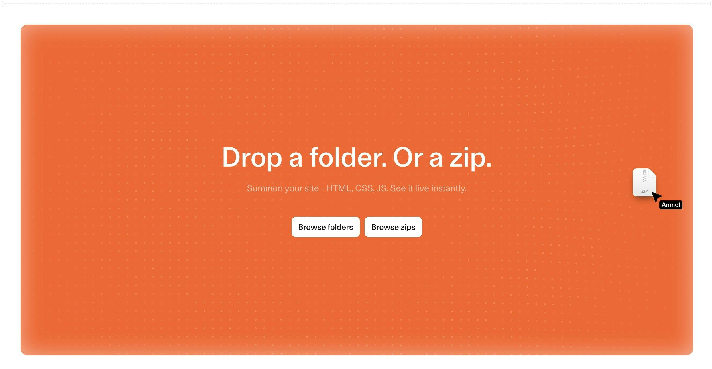
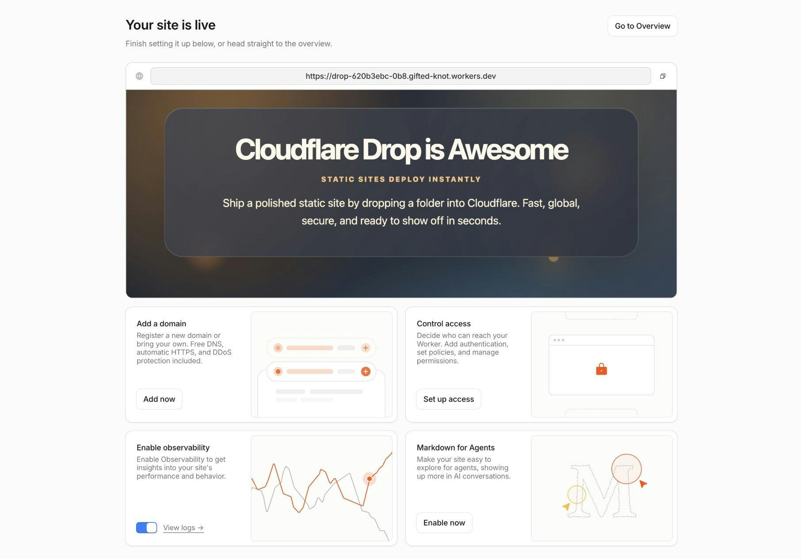

---

## 3. [San Fran Sim](https://www.producthunt.com/products/san-fran-sim)
**Votes**: 223 | **도입 난이도**: 하 | **신뢰도**: 상
**Tagline**: A startup tycoon game
**서비스 링크**: https://www.producthunt.com/r/CM5E4ISOBLG6C2

**태그**: Game, SaaS, Business, Simulation

### 📌 이 서비스 한눈에 보기
차고에서 IPO까지, 실전 SaaS 지표를 배우며 즐기는 스타트업 경영 시뮬레이션 게임

### 🔑 주요 기능
- 소프트웨어 스타트업 운영부터 상장까지의 전 과정을 담은 타이쿤 게임
- MRR, Churn, LTV, CAC 등 실제 SaaS 핵심 지표 학습 가능
- 가입 없이 브라우저에서 즉시 플레이 가능한 무료 게임

### 🙋 사용자에게 어떤 점이 좋은가
스타트업 운영의 흐름과 비즈니스 지표 간의 관계를 게임을 통해 쉽고 재미있게 경험할 수 있습니다.

### ✅ 지금 바로 써볼 기능
- 브라우저에서 바로 게임 시작하기
- 실제 SaaS 지표(MRR, CAC 등) 관리해보기
- 팀 빌딩 및 버닝 레이트 관리해보기

### ⚠️ 사용 전 확인할 점
- 게임적 허용이 포함된 시뮬레이션이므로 실제 경영과는 차이가 있을 수 있음
- 브라우저 기반 게임이므로 기기 성능이나 네트워크 환경에 영향을 받을 수 있음

### 🧭 확인이 더 필요한 정보
게임의 세부 콘텐츠 분량 및 엔딩 이후의 지속 가능 여부는 명시되지 않았습니다.

### 📸 스크린샷 및 갤러리

---

## 4. [ChatGPT Work](https://www.producthunt.com/products/chatgpt-work)
**Votes**: 176 | **도입 난이도**: 중 | **신뢰도**: 상
**Tagline**: Partner for your most ambitious work
**서비스 링크**: https://www.producthunt.com/r/GO2K4QI6BZIOYN

**태그**: AI Agent, Automation, Productivity, Agent, Chat

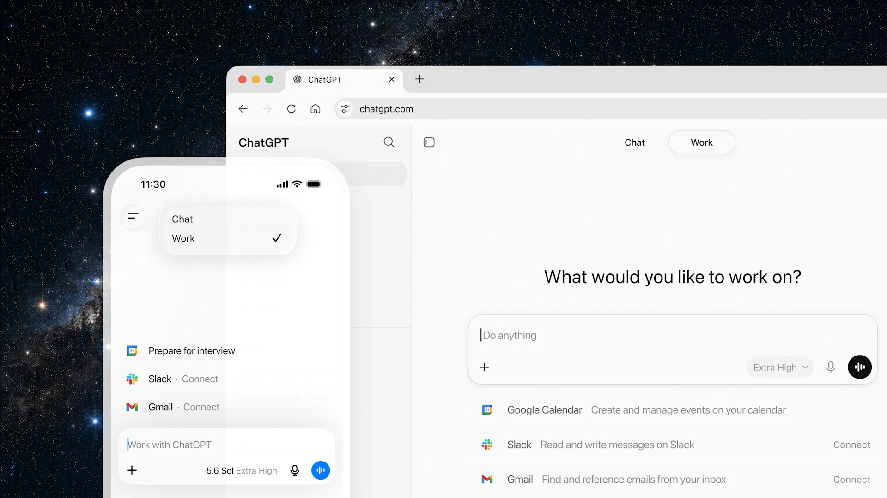

### 📌 이 서비스 한눈에 보기
사용자의 목표를 이해하고 앱과 파일을 넘나들며 업무를 완수하는 AI 에이전트

### 🔑 주요 기능
- 다양한 앱과 파일 간의 작업을 수행하는 에이전트 기능
- 장시간 프로젝트를 지속하며 업무를 수행하는 능력
- 단순 답변을 넘어 목표를 결과물로 변환하는 실행력

### 🙋 사용자에게 어떤 점이 좋은가
단순한 질의응답을 넘어 실제 업무 프로세스를 자동화하고 결과물을 만들어내는 데 도움을 줍니다.

### ✅ 지금 바로 써볼 기능
- 목표 설정 및 작업 위임 테스트
- 애플리케이션 간 연동 기능 확인
- 파일 기반 작업 수행 능력 검증

### ⚠️ 사용 전 확인할 점
- 에이전트의 직접적인 앱 제어에 따른 보안 및 권한 관리 필요
- 복잡한 작업 수행 시 결과물의 정확도 검토 필요

### 🧭 확인이 더 필요한 정보
지원하는 구체적인 앱 목록과 파일 형식, 보안 프로토콜에 대한 상세 정보가 필요합니다.

### 📸 스크린샷 및 갤러리

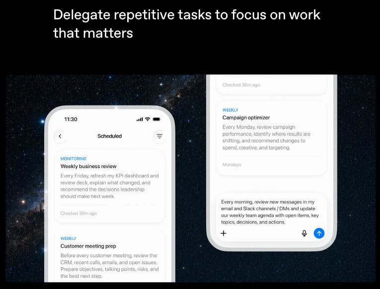
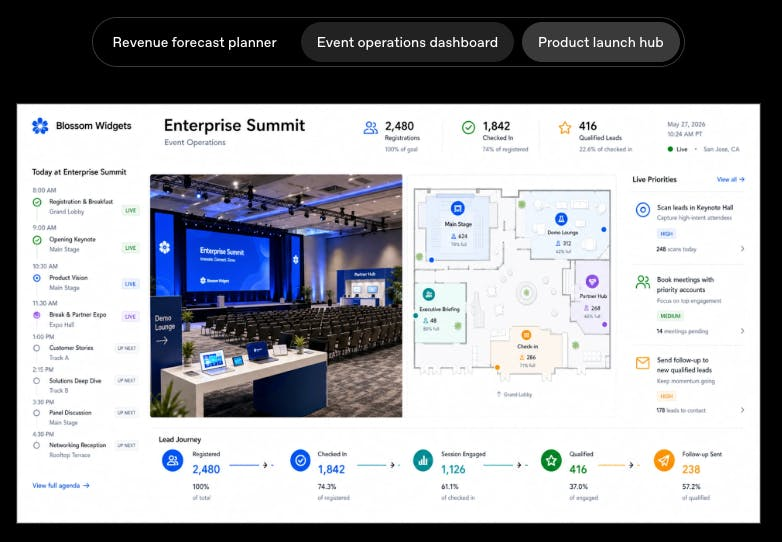

### 🎬 관련 영상
- [🎥 영상 보기](https://ph-files.imgix.net/68ba639f-4c89-43ea-aca9-3eaa9a953dd4.jpeg?auto=format)

---

## 5. [Kickbacks CLI](https://www.producthunt.com/products/kickbacks-cli)
**Votes**: 147 | **도입 난이도**: 하 | **신뢰도**: 상
**Tagline**: The terminal and Mac menu bar companion for Kickbacks.ai
**서비스 링크**: https://www.producthunt.com/r/P6FDRIYTD7INCY

**태그**: DevTool, Productivity, Analytics, AI Tool

### 📌 이 서비스 한눈에 보기
터미널과 맥 메뉴 바에서 실시간 수익과 상태를 확인하는 Kickbacks.ai 전용 도구

### 🔑 주요 기능
- 터미널 환경에서의 Kickbacks.ai 상태 확인
- 실시간 수익 및 광고 내역 모니터링
- Mac 메뉴 바를 통한 간편한 접근성

### 🙋 사용자에게 어떤 점이 좋은가
개발자나 터미널 사용자가 브라우저를 열지 않고도 작업 흐름을 유지하며 실시간 수익 현황을 즉시 확인할 수 있습니다.

### ✅ 지금 바로 써볼 기능
- CLI 설치 및 Kickbacks.ai 계정 연동
- Mac 메뉴 바 위젯 활성화
- 터미널 명령어를 통한 실시간 데이터 조회

### ⚠️ 사용 전 확인할 점
- 터미널 및 Mac 환경에 최적화되어 있어 GUI 중심 사용자에게는 생소할 수 있음
- Kickbacks.ai 서비스 계정이 반드시 필요함

### 🧭 확인이 더 필요한 정보
상세한 CLI 명령어 종류와 보안 인증 방식에 대한 정보가 제공되지 않았습니다.

### 📸 스크린샷 및 갤러리
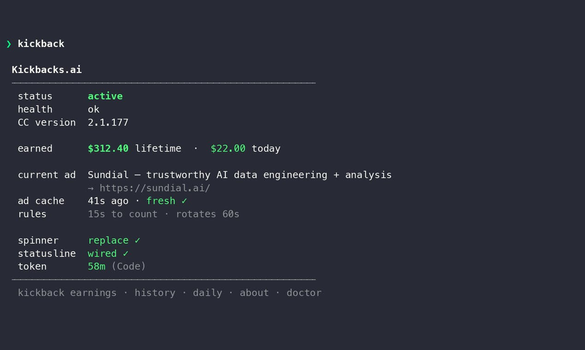
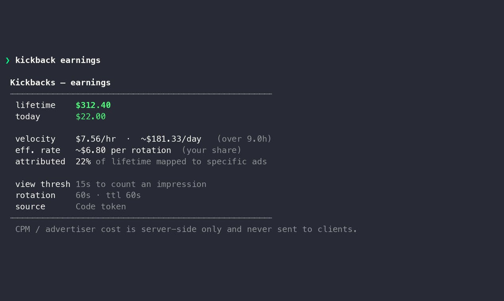
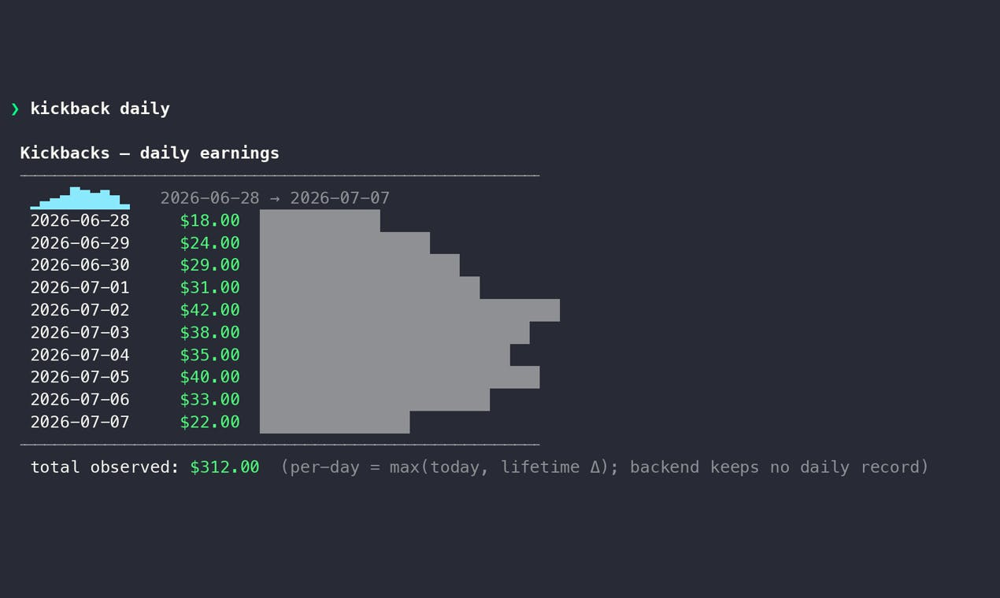

### 🎬 관련 영상
- [🎥 영상 보기](https://ph-files.imgix.net/a9aca333-2069-4a16-8a5b-aa7e9f7b4c98.jpeg?auto=format)

---

## 6. [Basedash SCIM](https://www.producthunt.com/products/basedash)
**Votes**: 129 | **도입 난이도**: 중 | **신뢰도**: 상
**Tagline**: Your org changes. Access keeps up.
**서비스 링크**: https://www.producthunt.com/r/BXWJ5N2SOHIZYX

**태그**: DevTool, Automation, Security, SaaS, Enterprise

### 📌 이 서비스 한눈에 보기
기업의 조직 변경에 맞춰 사용자 권한과 그룹 멤버십을 자동으로 동기화하는 SCIM 솔루션

### 🔑 주요 기능
- 기업 디렉토리와 워크스페이스 ID 자동 동기화
- 입사, 팀 이동, 퇴사에 따른 사용자 및 그룹 권한 자동 관리
- SSO, RBAC, RLS와 결합하여 엔터프라이즈급 보안 및 관리 편의성 제공

### 🙋 사용자에게 어떤 점이 좋은가
수동으로 사용자 계정을 관리할 필요 없이, 조직 변화에 따라 접근 권한이 자동으로 업데이트되어 보안 사고를 방지하고 관리 부담을 줄여줍니다.

### ✅ 지금 바로 써볼 기능
- 기존 기업 디렉토리(IdP)와의 연동 설정
- 조직 구조에 따른 사용자 및 그룹 자동 프로비저닝 테스트
- RBAC/RLS 정책과의 결합 확인

### ⚠️ 사용 전 확인할 점
- 기존에 사용 중인 ID 제공자(IdP)와의 호환성 확인 필요
- 자동화된 권한 변경이 기존 워크스페이스 운영에 미칠 영향 검토

### 🧭 확인이 더 필요한 정보
지원하는 구체적인 ID 제공자(IdP) 목록과 기존 워크스페이스로의 마이그레이션 절차에 대한 정보가 필요합니다.

### 📸 스크린샷 및 갤러리
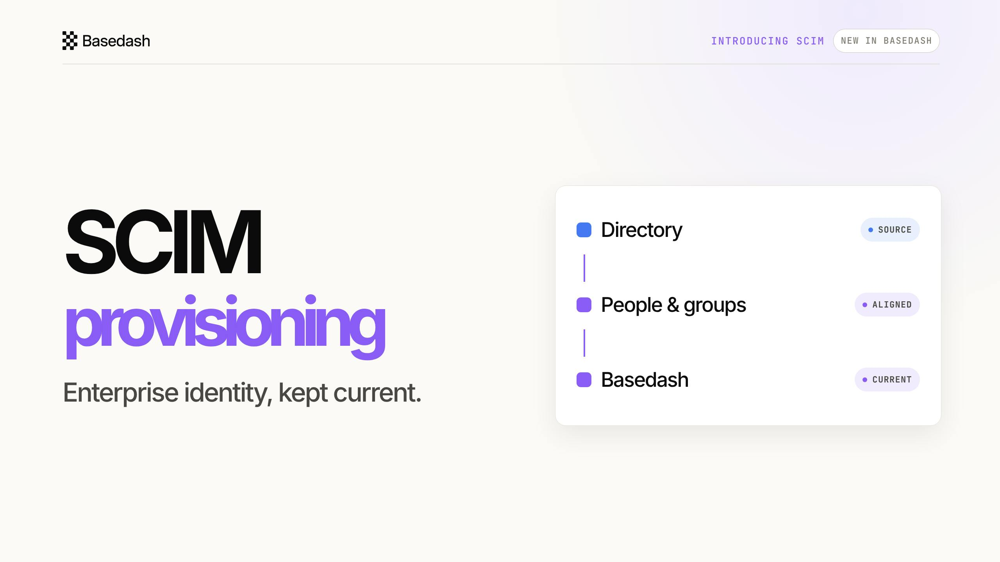
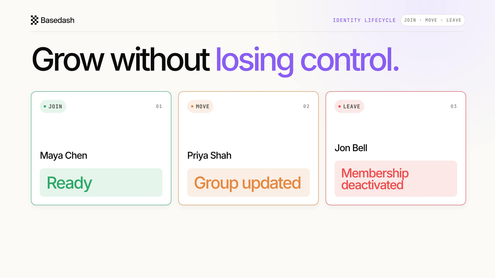
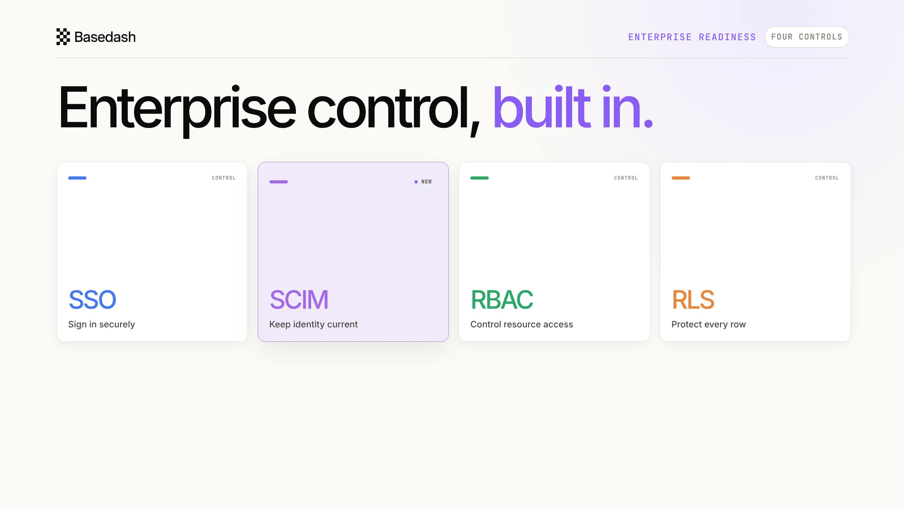

### 🎬 관련 영상
- [🎥 영상 보기](https://ph-files.imgix.net/f5543b70-1435-427f-9fd0-6f35b25205f8.jpeg?auto=format)

---

## 7. [SoundPipe](https://www.producthunt.com/products/soundpipe)
**Votes**: 127 | **도입 난이도**: 하 | **신뢰도**: 상
**Tagline**: SoundPipe is a mixing board for your Mac
**서비스 링크**: https://www.producthunt.com/r/IYX6Y3TIIAIDM7

**태그**: Audio, Mac, Productivity, CreativeTool

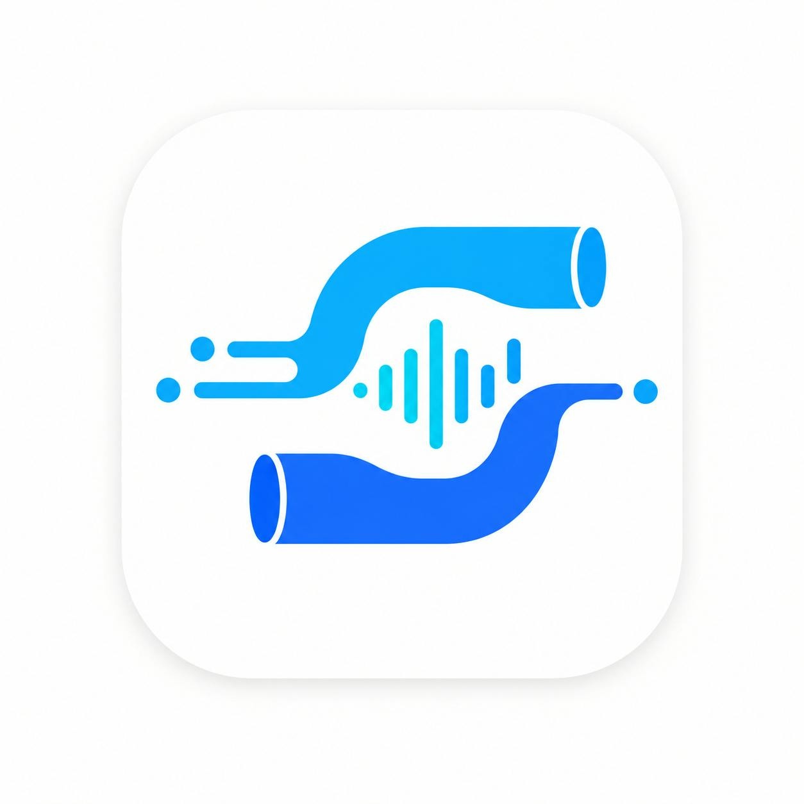

### 📌 이 서비스 한눈에 보기
Mac의 모든 오디오를 자유롭게 연결하는 가상 믹싱 보드

### 🔑 주요 기능
- Mac용 가상 오디오 장치 생성 기능
- 특정 앱의 소리를 다른 앱으로 자유롭게 라우팅
- 마이크 입력을 원하는 앱으로 전달 가능

### 🙋 사용자에게 어떤 점이 좋은가
앱 간 오디오 전달이 복잡한 작업(방송, 녹음, 화상 회의 등)을 간편하게 해결해 줍니다.

### ✅ 지금 바로 써볼 기능
- 앱 간 오디오 라우팅 테스트
- 마이크 소리 전달 설정
- 가상 오디오 장치 생성 확인

### ⚠️ 사용 전 확인할 점
- Mac OS 환경에서의 호환성 확인 필요
- 오디오 지연 시간(Latency) 발생 여부 확인

### 🧭 확인이 더 필요한 정보
상세한 오디오 품질 및 시스템 리소스 점유율에 대한 정보가 부족합니다.

### 📸 스크린샷 및 갤러리
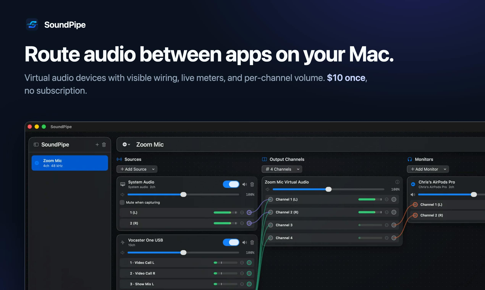
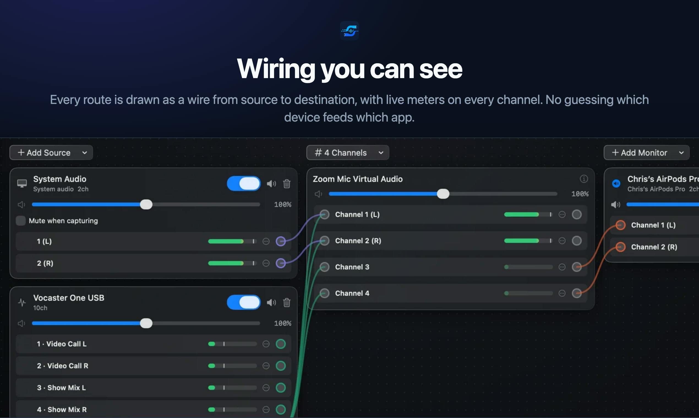
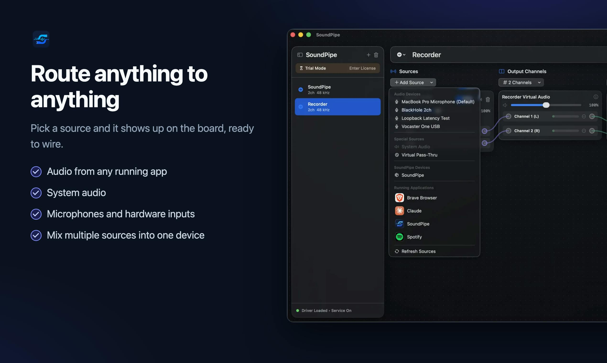

---

## 8. [Breathing In Labour](https://www.producthunt.com/products/breathing-in-labour)
**Votes**: 115 | **도입 난이도**: 하 | **신뢰도**: 상
**Tagline**: A distraction-free breathing app for labor preparation
**서비스 링크**: https://www.producthunt.com/r/HZFS6EYIVO6MSV

**태그**: Health, Minimalism, Pregnancy, Wellness

### 📌 이 서비스 한눈에 보기
광고 없이 오직 출산 호흡 연습에만 집중할 수 있는 미니멀리즘 호흡 가이드 앱

### 🔑 주요 기능
- 출산 단계별로 검증된 호흡 기술 제공
- 방해 요소가 없는 초간결 미니멀리즘 인터페이스
- 광고 및 강제 계정 생성 없는 사용자 중심 환경

### 🙋 사용자에게 어떤 점이 좋은가
복잡한 기능이나 광고 없이 출산 준비를 위한 호흡 리듬을 익히는 데 최적화되어 있어, 산모가 오직 연습에만 몰입할 수 있습니다.

### ✅ 지금 바로 써볼 기능
- 단계별 호흡 기술 숙지하기
- 시각적 피드백을 활용한 호흡 리듬 연습
- 광고 없는 환경에서 자유롭게 연습하기

### ⚠️ 사용 전 확인할 점
- 전문적인 의료적 조언을 대체할 수 없으므로 전문가와 상의 필요
- 부가 기능이 적은 미니멀리즘 앱이므로 복잡한 기능을 원하는 경우 부적합할 수 있음

### 🧭 확인이 더 필요한 정보
무료 기능 외의 추가 유료 기능이나 향후 업데이트 계획에 대한 정보는 명시되지 않았습니다.

### 📸 스크린샷 및 갤러리
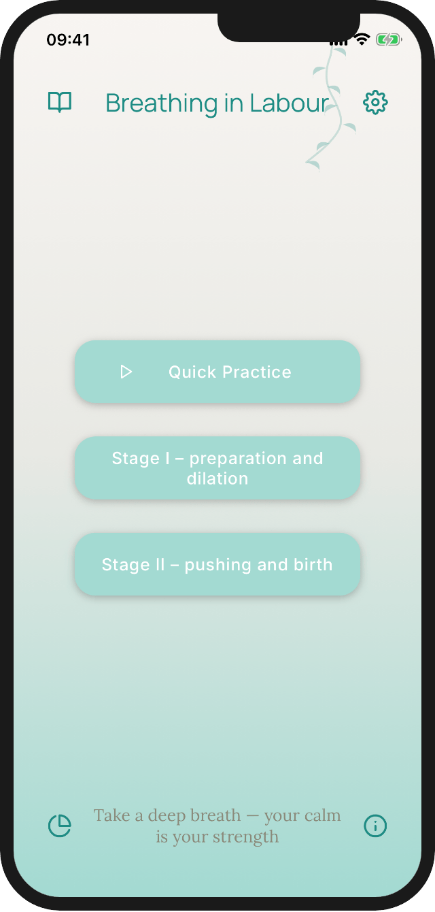
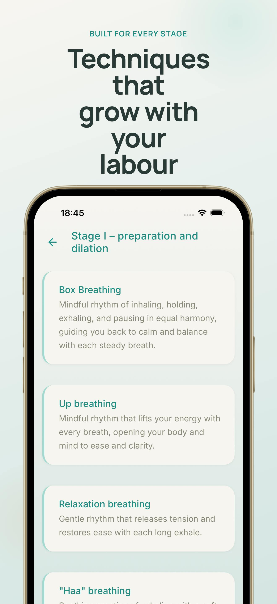

### 🎬 관련 영상
- [🎥 영상 보기](https://ph-files.imgix.net/e4c8c041-fe27-462b-982a-cbc15985a48f.jpeg?auto=format)

---

## 9. [Trailsense](https://www.producthunt.com/products/trailsense)
**Votes**: 28 | **도입 난이도**: 중 | **신뢰도**: 상
**Tagline**: See where people are hiking, without cameras
**서비스 링크**: https://www.producthunt.com/r/EW27MBPYNFJ3TE

**태그**: Analytics, IoT, Privacy, Outdoor, AI Tool

### 📌 이 서비스 한눈에 보기
카메라 없이 개인정보를 보호하며 등산로 혼잡도를 확인하는 솔루션

### 🔑 주요 기능
- 익명화된 Wi-Fi 프로브 요청을 활용한 비접촉식 인원 계측
- 태양광 충전 노드를 통한 친환경 및 독립적 운영
- 대시보드를 통한 시간대별 트레일 혼잡도 시각화

### 🙋 사용자에게 어떤 점이 좋은가
등산객의 개인정보를 침해하지 않으면서도 실시간 트레일 혼잡도를 파악하여 쾌적한 산행 계획을 세울 수 있습니다.

### ✅ 지금 바로 써볼 기능
- 대시보드를 통한 트레일별 혼잡도 패턴 분석
- 태양광 노드 설치 가능 지역 확인
- 개인정보 보호 정책 및 데이터 처리 방식 검토

### ⚠️ 사용 전 확인할 점
- Wi-Fi를 켜지 않은 사용자는 계측에서 제외될 수 있음
- 하드웨어 설치를 위한 물리적 접근성 필요

### 🧭 확인이 더 필요한 정보
하드웨어 설치 비용 및 노드당 정확한 계측 범위에 대한 정보가 필요합니다.

### 📸 스크린샷 및 갤러리
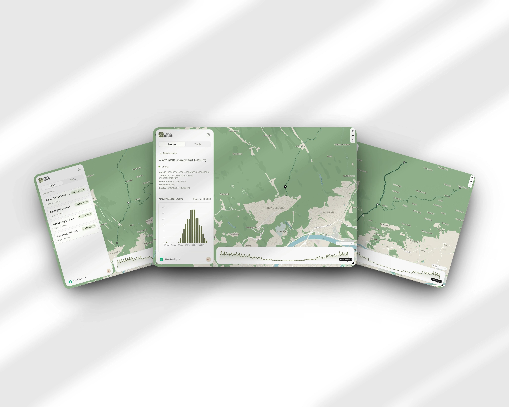
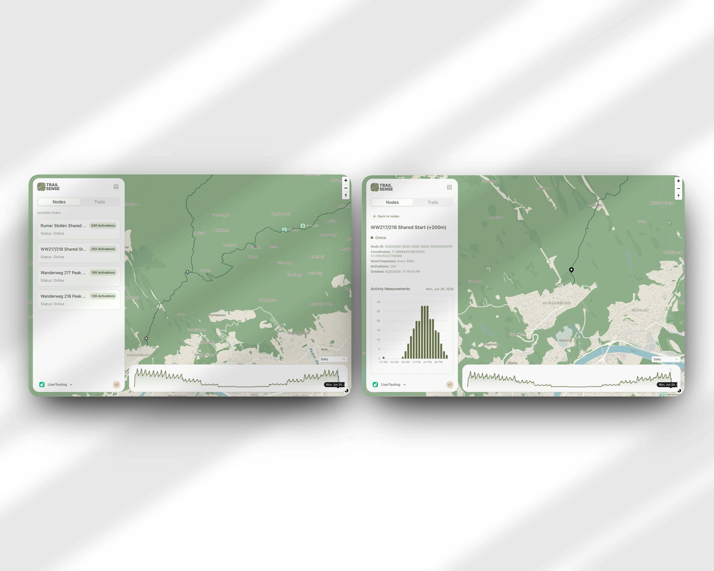
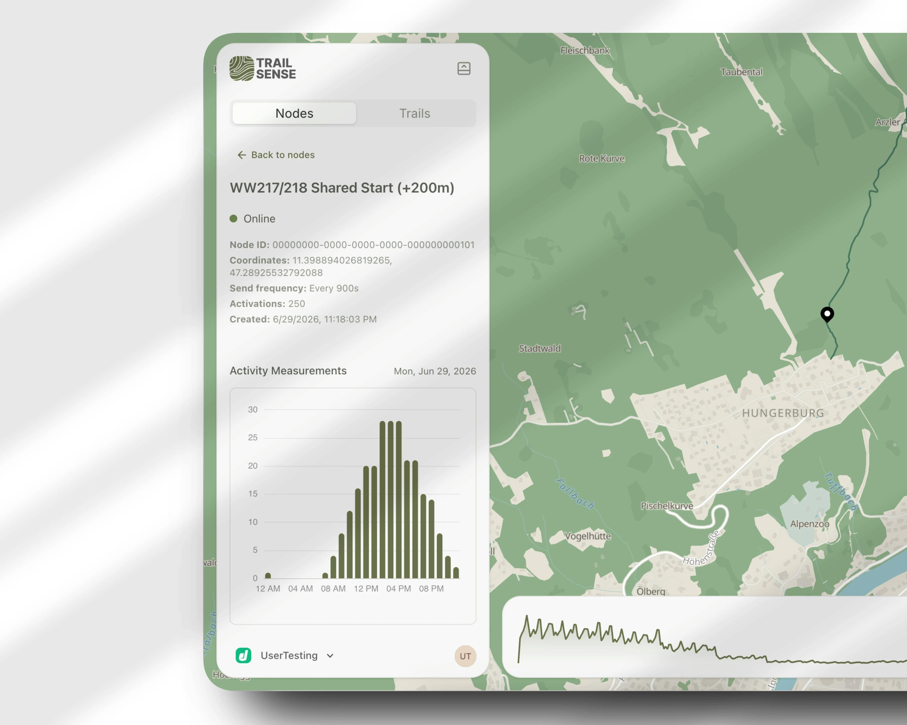

### 🎬 관련 영상
- [🎥 영상 보기](https://ph-files.imgix.net/29295a85-b01e-4388-8f21-d3c78a40bad6.jpeg?auto=format)

---

## 10. [Investor Updates](https://www.producthunt.com/products/investor-updates-2)
**Votes**: 26 | **도입 난이도**: 하 | **신뢰도**: 상
**Tagline**: Keep all your investors in the loop with bulk updates
**서비스 링크**: https://www.producthunt.com/r/XHRYLG4JKRO5KI

**태그**: Startup, Investor Relations, Productivity, Communication, AI Tool, API

### 📌 이 서비스 한눈에 보기
스타트업의 성장 지표와 소식을 투자자들에게 간편하게 전달하는 벌크 업데이트 도구

### 🔑 주요 기능
- 엔젤 투자자 및 VC를 위한 효율적인 업데이트 관리
- 월간 또는 분기별 정기 업데이트 발송 최적화
- 신뢰와 투명성을 구축하기 위한 성장 지표 공유

### 🙋 사용자에게 어떤 점이 좋은가
매번 개별적으로 연락할 필요 없이 한 번의 작업으로 여러 투자자에게 스타트업의 성과를 공유할 수 있어 운영 효율이 높아집니다.

### ✅ 지금 바로 써볼 기능
- 정기 업데이트 템플릿 작성하기
- 투자자 연락처 리스트 업로드하기
- 첫 번째 벌크 업데이트 발송해보기

### ⚠️ 사용 전 확인할 점
- 개별 맞춤형 메시지 기능 포함 여부 확인 필요
- 보안 및 데이터 프라이버시 정책 검토 필요

### 🧭 확인이 더 필요한 정보
구체적인 자동화 기능이나 외부 툴(CRM 등)과의 연동 범위는 명시되어 있지 않습니다.

### 📸 스크린샷 및 갤러리
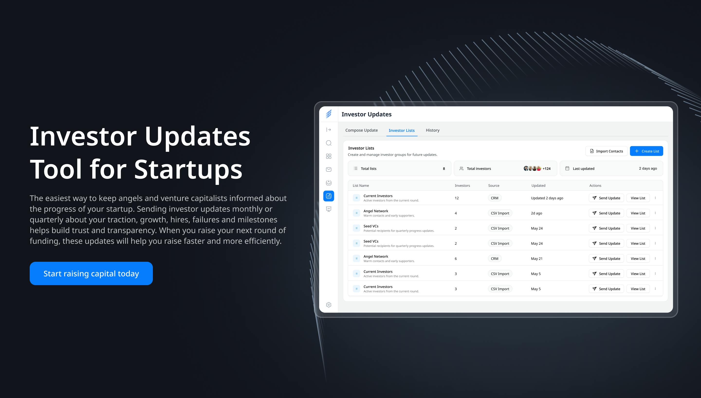
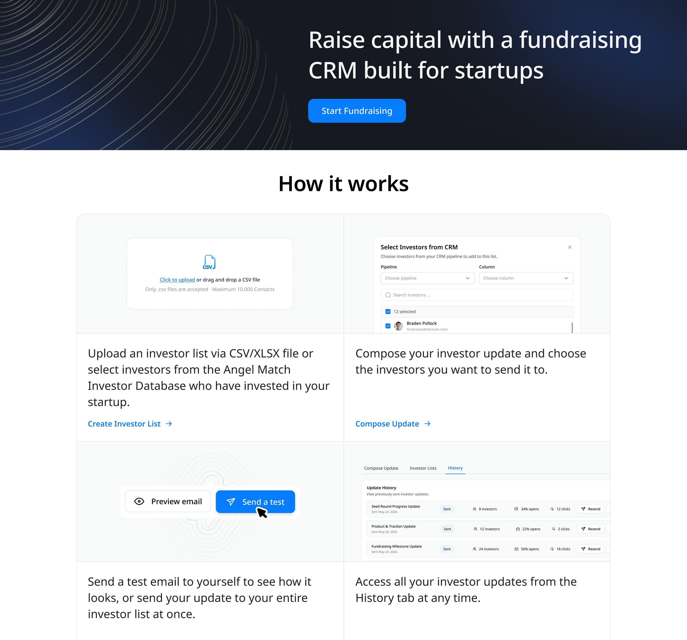
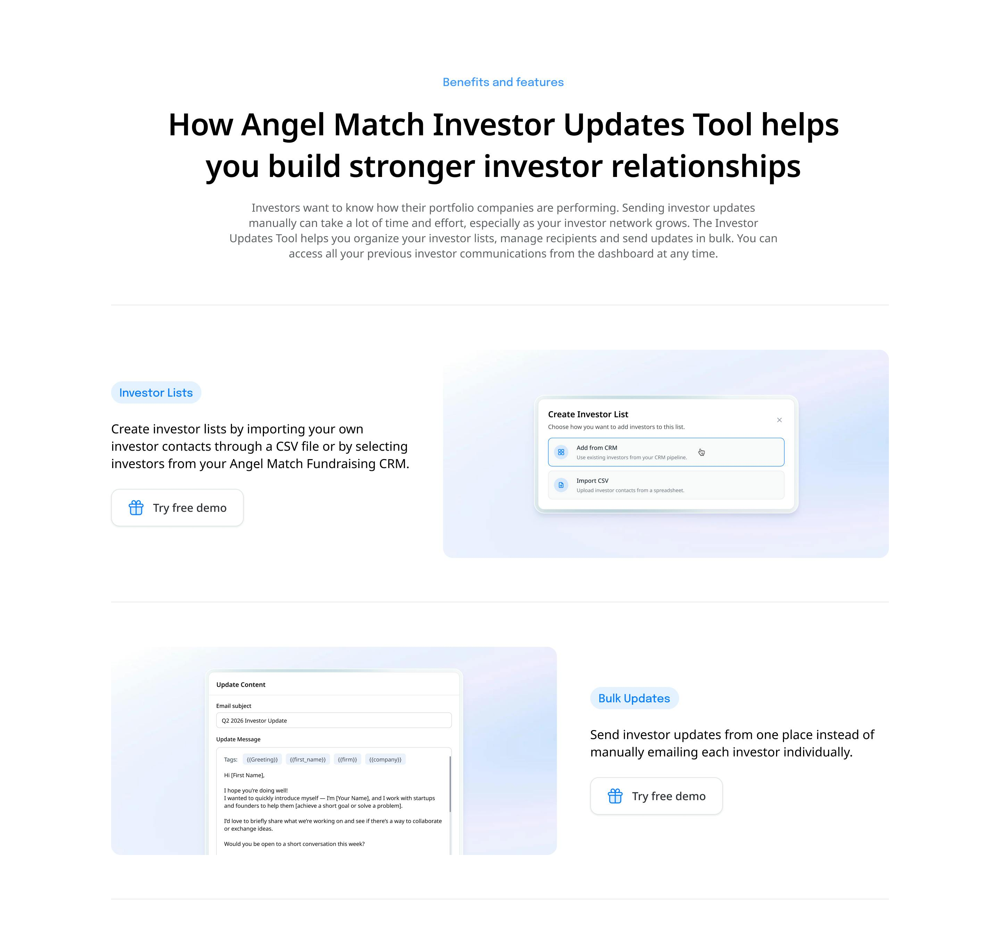

---

## 11. [Plexa](https://www.producthunt.com/products/plexa-2)
**Votes**: 23 | **도입 난이도**: 하 | **신뢰도**: 상
**Tagline**: Website trust, security and SEO in one platform
**서비스 링크**: https://www.producthunt.com/r/TFGFPW6BEPK52X

**태그**: SEO, Security, Compliance, Web-Optimization

### 📌 이 서비스 한눈에 보기
웹사이트의 보안, 신뢰도, SEO 문제를 한눈에 파악하고 해결하는 통합 관리 플랫폼

### 🔑 주요 기능
- 신뢰성, 보안, SEO, 컴플라이언스 이슈 통합 식별
- 기술적 전문 용어 대신 명확하고 실행 가능한 권장 사항 제공
- 웹사이트 최적화를 위한 문제 원인 및 해결 방법 제시

### 🙋 사용자에게 어떤 점이 좋은가
복잡한 기술적 지식 없이도 웹사이트의 취약점과 SEO 문제를 쉽게 파악하고 즉각적인 개선 조치를 취할 수 있습니다.

### ✅ 지금 바로 써볼 기능
- 웹사이트 URL 등록 및 전체 스캔 실행
- 제공되는 보안 및 SEO 권장 사항 검토
- 식별된 이슈에 대한 단계별 해결 가이드 적용

### ⚠️ 사용 전 확인할 점
- 기술적 세부 사항이 생략되어 있어 심층적인 엔지니어링 분석에는 한계가 있을 수 있음
- 제시된 권장 사항 적용 시 사이트 구조 변화에 따른 영향 확인 필요

### 🧭 확인이 더 필요한 정보
플랫폼의 구체적인 스캔 범위와 지원하는 웹 프레임워크의 종류를 확인해야 합니다.

### 📸 스크린샷 및 갤러리
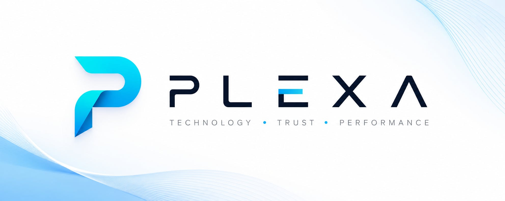
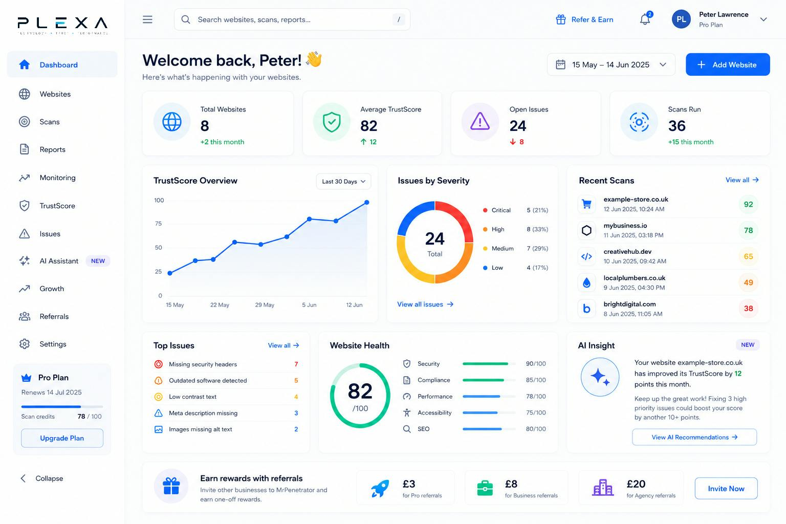

---

## 12. [MeMex](https://www.producthunt.com/products/memex-2)
**Votes**: 21 | **도입 난이도**: 하 | **신뢰도**: 상
**Tagline**: A private, searchable memory for your Mac
**서비스 링크**: https://www.producthunt.com/r/JB2ZTTG466KS6X

**태그**: Productivity, Mac, Automation, Privacy, AI Tool

### 📌 이 서비스 한눈에 보기
Mac 화면 기록을 기반으로 업무 흐름을 자동 정리하고 검색할 수 있는 프라이빗 메모리 도구

### 🔑 주요 기능
- 화면 활동을 타임라인 형태로 기록하여 업무 순간을 시각적 메모로 저장
- 자연어 질문을 통해 과거 작업 내용과 증거 화면을 즉시 검색
- 반복되는 워크플로우를 식별하는 패턴 인사이트 및 업무 요약 리포트 제공

### 🙋 사용자에게 어떤 점이 좋은가
자신이 무엇을 했는지 일일이 기록할 필요 없이, 과거의 작업 맥락을 자연어로 쉽게 되찾고 업무 패턴을 분석하여 생산성을 높일 수 있습니다.

### ✅ 지금 바로 써볼 기능
- 과거 작업 기록을 찾기 위해 자연어로 질문해보기
- 주간 리포트를 통해 자신의 업무 패턴 확인하기
- 반복되는 작업 흐름을 자동화할 지점 찾기

### ⚠️ 사용 전 확인할 점
- 화면 기록이 포함되므로 민감한 정보 노출에 주의 필요
- AI 분석 기능 사용 시 설정한 엔드포인트의 보안 수준 확인 필요

### 🧭 확인이 더 필요한 정보
사용자가 선택하는 AI 제공업체에 따라 데이터 처리 방식과 보안 수준이 달라질 수 있습니다.

### 📸 스크린샷 및 갤러리

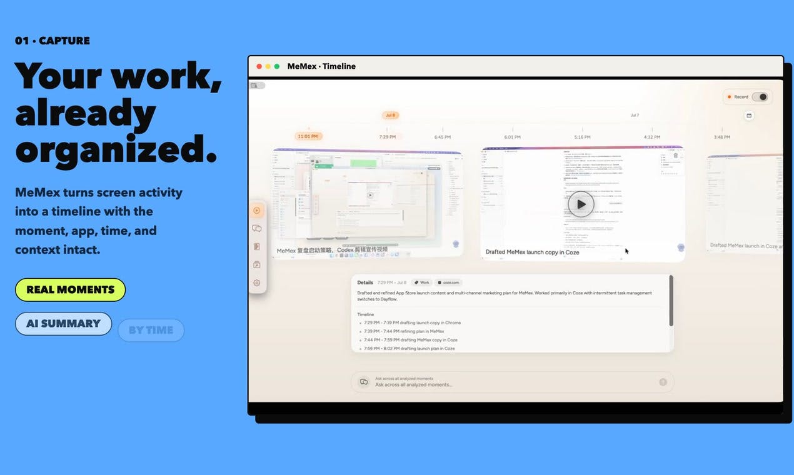
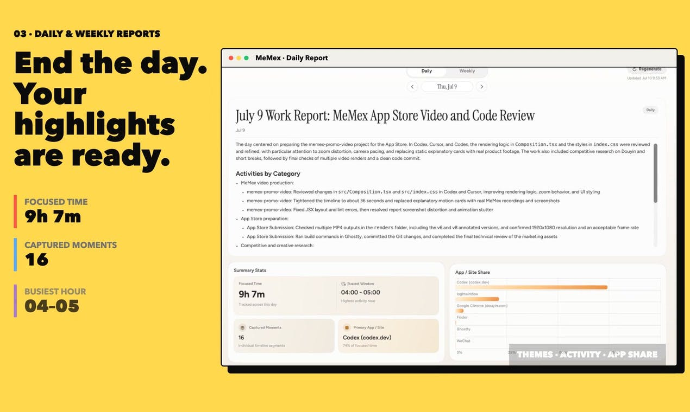

---

## 13. [SnapPeach](https://www.producthunt.com/products/snappeach)
**Votes**: 19 | **도입 난이도**: 하 | **신뢰도**: 상
**Tagline**: See any outfit on you before you buy - in ~10 seconds
**서비스 링크**: https://www.producthunt.com/r/2UFKCOM72D7UKL

**태그**: Shopping, AI, ChromeExtension, Fashion

### 📌 이 서비스 한눈에 보기
쇼핑몰 사이트에서 클릭 한 번으로 내 모습에 옷을 입혀보는 가상 피팅 크롬 확장 프로그램

### 🔑 주요 기능
- 어떤 쇼핑 사이트에서도 사용 가능한 크롬 확장 프로그램
- 약 10초 내외의 빠른 가상 피팅 기능
- 구매 전 의류 착용 모습을 미리 확인 가능

### 🙋 사용자에게 어떤 점이 좋은가
온라인 쇼핑 시 옷이 자신에게 어울릴지 고민하는 시간을 줄여주고, 구매 결정에 도움을 줍니다.

### ✅ 지금 바로 써볼 기능
- 크롬 웹스토어에서 SnapPeach 설치하기
- 평소 자주 이용하는 쇼핑 사이트에서 확장 프로그램 실행하기
- 원하는 의류를 선택해 가상 피팅 결과 확인하기

### ⚠️ 사용 전 확인할 점
- 실제 의류의 재질이나 핏과 가상 이미지가 다를 수 있음
- 사용자의 사진 품질에 따라 결과물의 정확도가 달라질 수 있음

### 🧭 확인이 더 필요한 정보
사용자의 신체 사이즈 데이터가 어떻게 처리되는지, 개인정보 보호 정책은 어떠한지 확인이 필요합니다.

### 📸 스크린샷 및 갤러리

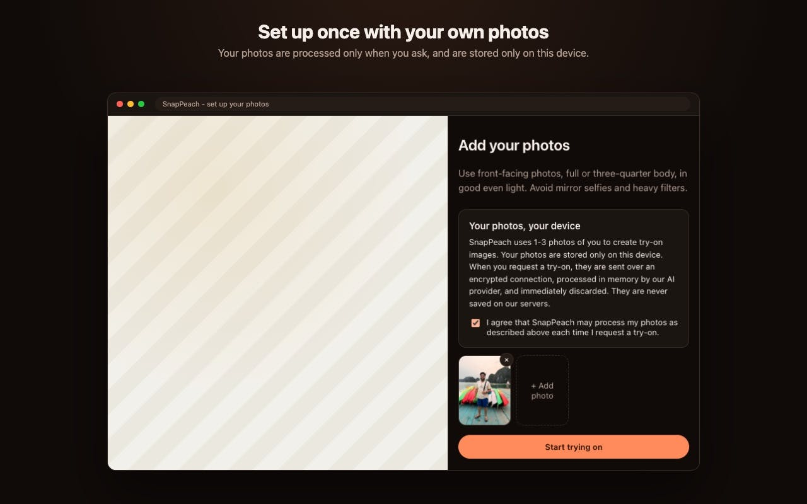

### 🎬 관련 영상
- [🎥 영상 보기](https://ph-files.imgix.net/6dfa604c-28ec-4c12-bd03-0d387e348028.jpeg?auto=format)

---

## 14. [Ortu](https://www.producthunt.com/products/ortu)
**Votes**: 18 | **도입 난이도**: 하 | **신뢰도**: 상
**Tagline**: The clipboard manager for people who copy-paste for a living
**서비스 링크**: https://www.producthunt.com/r/VOPYDMBIUUSINP

**태그**: Productivity, Utility, OpenSource, Workflow, AI Tool, Vision

### 📌 이 서비스 한눈에 보기
복사-붙여넣기 작업이 많은 전문가를 위한 강력한 로컬 클립보드 관리 도구

### 🔑 주요 기능
- 텍스트, 이미지, 파일을 모두 기억하는 통합 클립보드 히스토리
- 전체 텍스트 검색 및 스마트 자동 그룹화 기능
- 100% 로컬 저장 및 오픈 소스로 구현된 강력한 보안과 개인정보 보호

### 🙋 사용자에게 어떤 점이 좋은가
반복적인 복사-붙여넣기 작업 시간을 단축하고, 과거에 복사했던 데이터를 검색을 통해 즉시 찾아 활용할 수 있습니다.

### ✅ 지금 바로 써볼 기능
- 과거 복사 기록 검색해보기
- 이미지 및 파일 붙여넣기 테스트
- 보안을 위한 암호화 마스킹 기능 확인

### ⚠️ 사용 전 확인할 점
- 로컬 저장 방식이므로 기기 변경 시 데이터 이전 방식 확인 필요
- 대용량 파일 저장 시 로컬 저장소 용량 점유 확인 필요

### 🧭 확인이 더 필요한 정보
플랫폼별(macOS, Windows, Linux) 상세 기능 차이와 시스템 리소스 점유율에 대한 정보가 필요합니다.

### 📸 스크린샷 및 갤러리
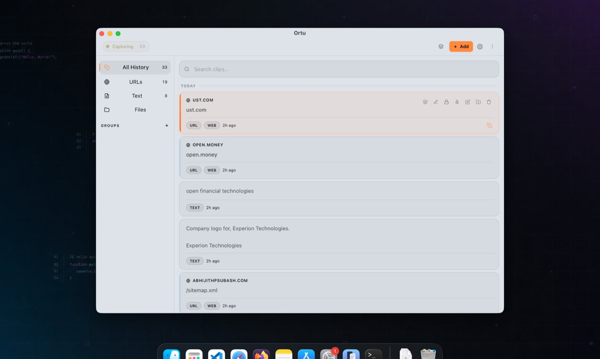
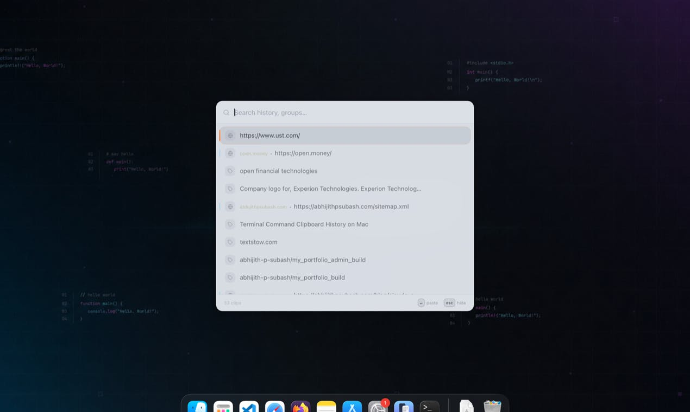
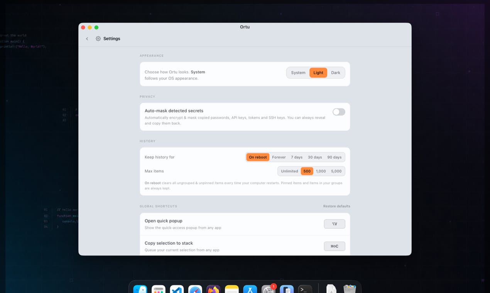

---

## 15. [Market Genie 2.0 AI Marketing System ](https://www.producthunt.com/products/market-genie-2-0-ai-marketing-system)
**Votes**: 17 | **도입 난이도**: 중 | **신뢰도**: 상
**Tagline**: We built something you've been wishing for.. Wish granted
**서비스 링크**: https://www.producthunt.com/r/QJYU7W53MQ4JTU

**태그**: Marketing, Automation, CRM, AI, LeadGen, AI Tool, Analytics, Email

### 📌 이 서비스 한눈에 보기
리드 발굴부터 고객 관리까지 한 번에 해결하는 올인원 AI 마케팅 자동화 플랫폼

### 🔑 주요 기능
- AI 이메일 작성, 리드 스크래핑, CRM, 퍼널 빌더 등 고객 확보를 위한 통합 기능 제공
- 시각적 자동화 및 예약 스케줄러를 통한 업무 효율 극대화
- 초기 창립자 50명 대상 1년 무료 및 화이트 라벨링 혜택 제공

### 🙋 사용자에게 어떤 점이 좋은가
마케팅과 영업에 필요한 여러 도구를 개별적으로 구독할 필요 없이 하나의 플랫폼에서 통합 관리할 수 있어 비용과 시간을 절약할 수 있습니다.

### ✅ 지금 바로 써볼 기능
- AI 이메일 라이터를 활용한 마케팅 문구 생성
- 리드 스크래퍼를 통한 잠재 고객 데이터 수집
- 퍼널 빌더를 이용한 고객 유입 경로 구축

### ⚠️ 사용 전 확인할 점
- 초기 창립자 혜택(1년 무료)의 선착순 마감 여부 확인 필요
- 모든 기능이 통합된 만큼 개별 전문 도구 대비 세부 기능의 깊이 확인 필요

### 🧭 확인이 더 필요한 정보
제공되는 기능들의 구체적인 기술적 사양과 화이트 라벨링의 상세 범위에 대한 확인이 필요합니다.

### 📸 스크린샷 및 갤러리
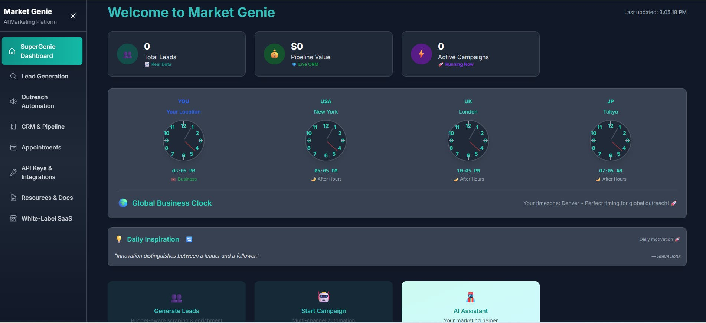
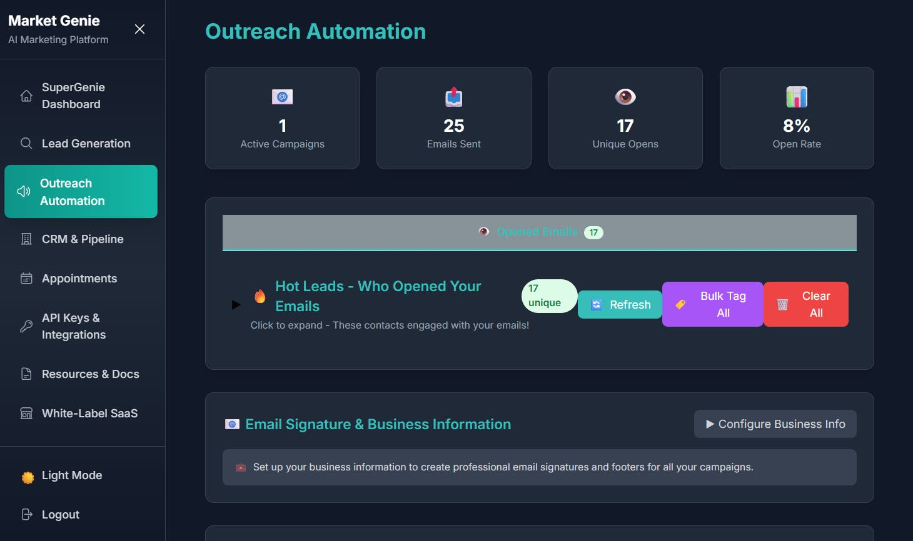
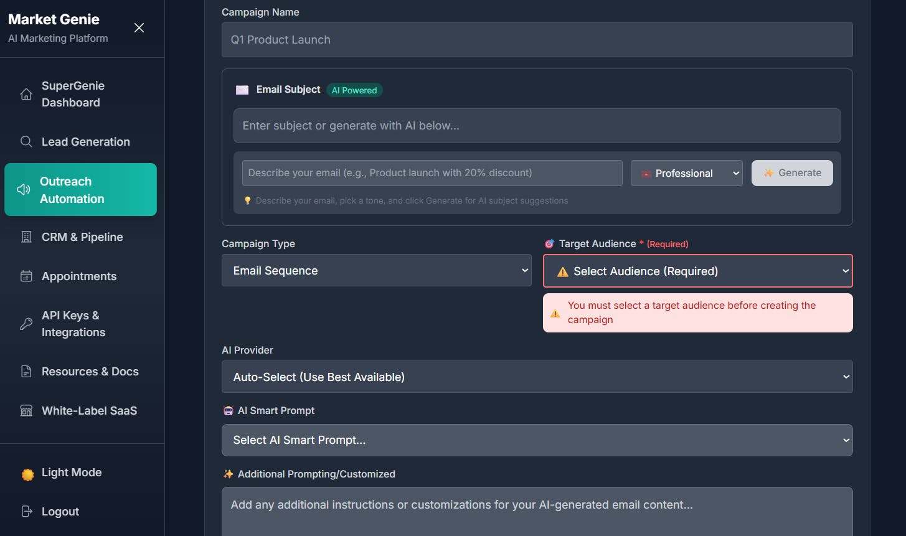

### 🎬 관련 영상
- [🎥 영상 보기](https://ph-files.imgix.net/e15b4974-01ea-469d-aa9e-e160bcb7f96b.jpeg?auto=format)

---

## 16. [YouTube Comments Exporter](https://www.producthunt.com/products/youtube-comments-exporter-by-veerexa)
**Votes**: 15 | **도입 난이도**: 하 | **신뢰도**: 상
**Tagline**: Export and analyze YouTube comments in seconds.
**서비스 링크**: https://www.producthunt.com/r/2E6CPPCF32ELVY

**태그**: Marketing, Data Extraction, Automation, Social Media, AI Tool, Video, DevTool

### 📌 이 서비스 한눈에 보기
코드 작성 없이 유튜브 댓글을 즉시 추출하고 분석할 수 있는 도구

### 🔑 주요 기능
- 공개된 유튜브 영상의 댓글을 다양한 형식으로 간편하게 내보내기
- 수동 수집의 번거로움 없이 피드백, 아이디어, 시장 조사 데이터 확보
- 필터링 및 검색 기능을 통한 빠른 인사이트 발견

### 🙋 사용자에게 어떤 점이 좋은가
콘텐츠 제작자나 마케터가 수천 개의 댓글을 일일이 복사할 필요 없이, 데이터 기반의 시장 조사와 고객 피드백 분석을 즉각적으로 수행할 수 있습니다.

### ✅ 지금 바로 써볼 기능
- 분석이 필요한 유튜브 영상 링크 입력하기
- 원하는 데이터 포맷으로 댓글 내보내기
- 필터 및 검색 기능을 활용해 핵심 인사이트 찾기

### ⚠️ 사용 전 확인할 점
- 공개된 영상의 댓글만 추출 가능할 것으로 예상됨
- 대량의 데이터 추출 시 유튜브 플랫폼의 정책 준수 여부 확인 필요

### 🧭 확인이 더 필요한 정보
지원하는 구체적인 내보내기 파일 형식(CSV, Excel 등)과 일일 추출 제한량이 명시되지 않았습니다.

### 📸 스크린샷 및 갤러리

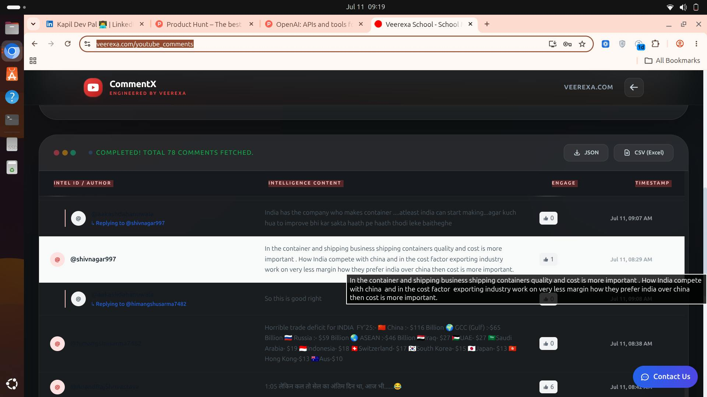

---

## 17. [agentfdr](https://www.producthunt.com/products/agentfdr)
**Votes**: 14 | **도입 난이도**: 하 | **신뢰도**: 상
**Tagline**: See why your coding agent looped, drifted, or burned tokens
**서비스 링크**: https://www.producthunt.com/r/VHSEU4SJOLPGS3

**태그**: DevTool, AI-Agent, Observability, Cost-Optimization, Agent

### 📌 이 서비스 한눈에 보기
코딩 에이전트의 작업 기록을 분석하여 루프, 드리프트, 토큰 낭비를 추적하는 블랙박스 분석 도구

### 🔑 주요 기능
- Claude Code 등 코딩 에이전트의 트랜스크립트 기반 자동 분석
- 루프, 에러 반복, 토큰 과다 사용 등 이상 징후 자동 감지
- 로컬 환경에서 작동하는 보안 중심의 제로 인스트루멘테이션 방식

### 🙋 사용자에게 어떤 점이 좋은가
에이전트가 왜 비효율적으로 동작하는지 원인을 즉각 파악하여 토큰 비용을 절감하고 작업 효율을 높일 수 있습니다.

### ✅ 지금 바로 써볼 기능
- 에이전트 작업 로그를 연동하여 타임라인 확인하기
- 자동 감지된 이상 징후(Anomaly flags) 분석하기
- 실시간 Watch 모드로 에이전트 동작 모니터링하기

### ⚠️ 사용 전 확인할 점
- 에이전트 로그 파일 형식이 변경될 경우 호환성 확인 필요
- 로컬 환경 외의 클라우드 기반 에이전트 환경에서의 적용 범위 확인 필요

### 🧭 확인이 더 필요한 정보
현재 제공되는 에이전트 로그 외에 다른 도구(OpenAI, LangChain 등)와의 호환성 범위가 명시되지 않았습니다.

### 📸 스크린샷 및 갤러리
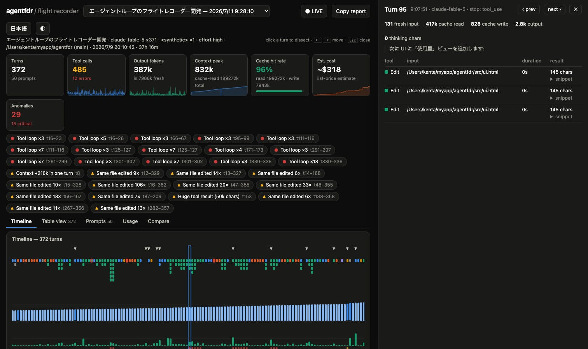
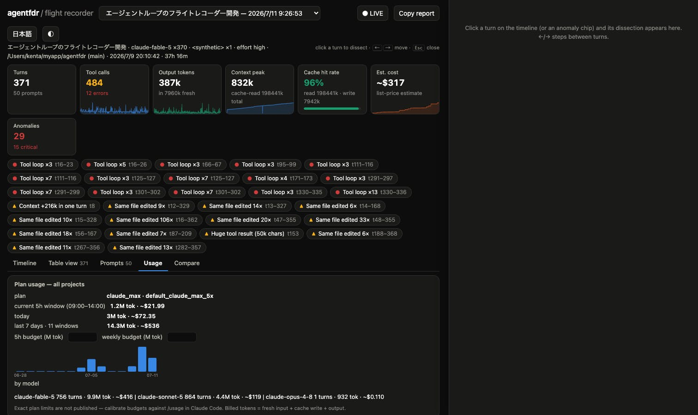

---

## 18. [Clearcan](https://www.producthunt.com/products/clearcan)
**Votes**: 14 | **도입 난이도**: 하 | **신뢰도**: 상
**Tagline**: Free document scanner. No ads, no subscriptions, no cloud.
**서비스 링크**: https://www.producthunt.com/r/OIZ5YN6NF7JRE4

**태그**: Productivity, Mobile, Privacy, Scanner, DevTool, Analytics

### 📌 이 서비스 한눈에 보기
광고와 구독 없이 아이폰에서 즉시 사용하는 강력한 로컬 문서 스캐너

### 🔑 주요 기능
- 광고, 구독, 클라우드 없는 완전 무료 및 프라이버시 중심 설계
- 자동 가장자리 감지 및 깔끔한 PDF 내보내기 기능
- 기기 내 텍스트 인식(OCR) 및 텍스트 복사 기능 지원

### 🙋 사용자에게 어떤 점이 좋은가
결제 유도나 개인정보 유출 걱정 없이, 아이폰만 있으면 언제 어디서든 깨끗한 문서를 스캔하고 텍스트를 추출할 수 있습니다.

### ✅ 지금 바로 써볼 기능
- 자동 가장자리 감지를 이용한 문서 스캔
- 스캔한 문서 내 텍스트 복사 및 활용
- 워터마크 없는 깨끗한 PDF 파일 생성

### ⚠️ 사용 전 확인할 점
- 텍스트 인식(OCR) 기능이 영어, 러시아어, 루마니아어에 국한됨
- 클라우드 동기화를 지원하지 않으므로 기기 내 관리가 필요함

### 🧭 확인이 더 필요한 정보
한국어를 포함한 다른 언어의 텍스트 인식 지원 여부는 명시되어 있지 않습니다.

### 📸 스크린샷 및 갤러리
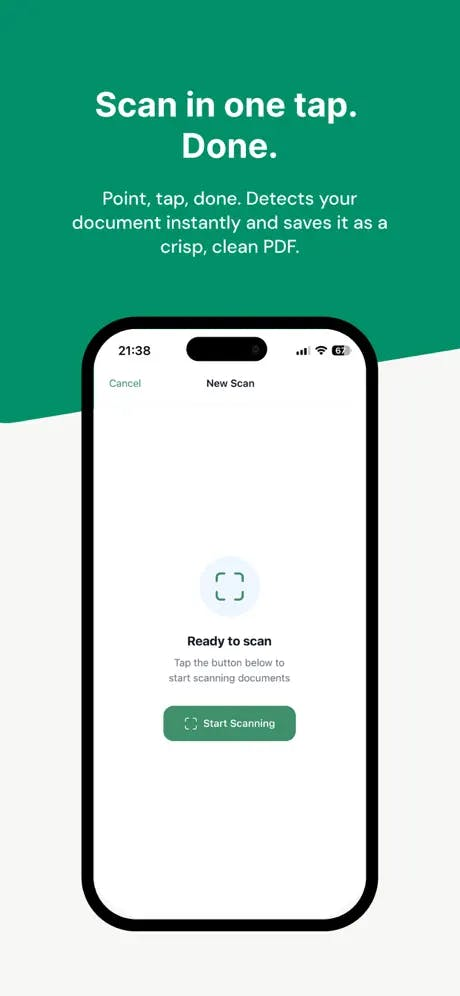
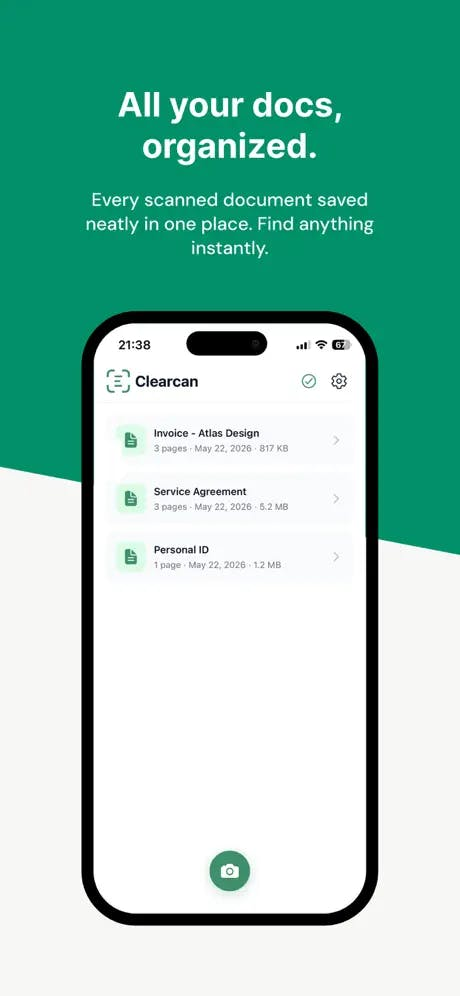
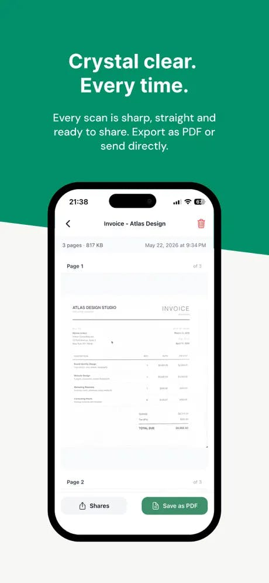

---

## 19. [SimplyPortfolio](https://www.producthunt.com/products/simplyportfolio)
**Votes**: 13 | **도입 난이도**: 하 | **신뢰도**: 상
**Tagline**: Every stock, every market, your gold drawer. One total.
**서비스 링크**: https://www.producthunt.com/r/AFZH3GYAG3Q5IW

**태그**: FinTech, Portfolio Management, Investment, Asset Tracking

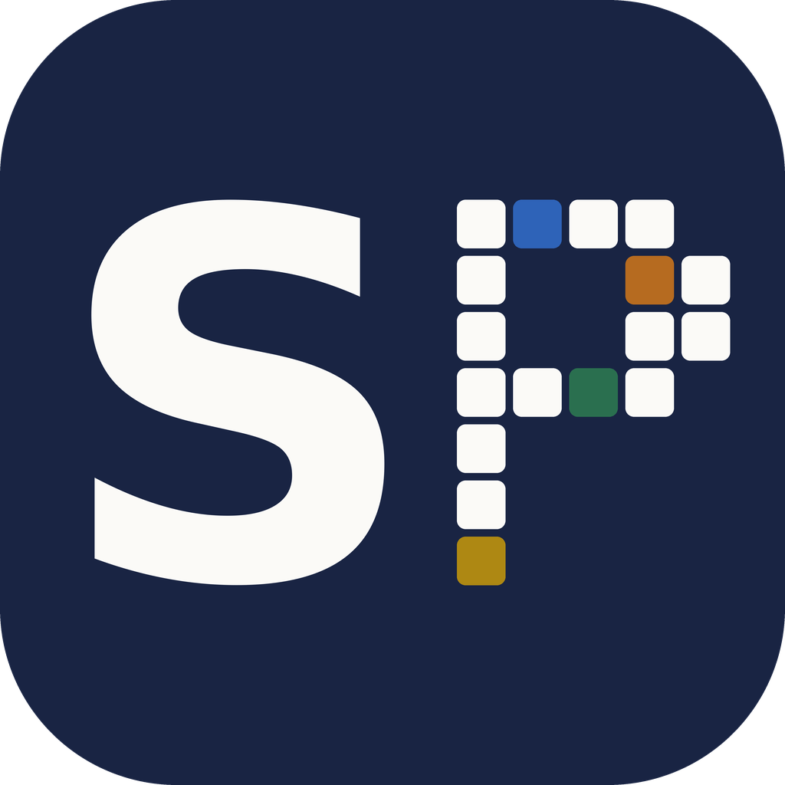

### 📌 이 서비스 한눈에 보기
전 세계 주식부터 실물 금까지, 모든 자산을 한곳에서 관리하는 통합 포트폴리오 대시보드

### 🔑 주요 기능
- 미국, 유럽, 아시아 등 전 세계 거래소의 주식 및 ETF 통합 관리
- 실물 금과 은을 포함한 다양한 자산군 지원
- 통화 구분 없는 거래 기록 및 개별 로트(Lot) 단위의 정확한 손익 계산

### 🙋 사용자에게 어떤 점이 좋은가
여러 증권사를 돌아다닐 필요 없이 하나의 대시보드에서 전 세계 자산의 실시간 손익을 직관적으로 확인할 수 있습니다.

### ✅ 지금 바로 써볼 기능
- 보유 중인 주식 및 ETF 거래 내역 수동 입력
- 실물 금/은 보유량 기록
- 다양한 통화 기반의 포트폴리오 구성

### ⚠️ 사용 전 확인할 점
- 무료 버전은 최대 3개의 보유 종목(holdings)까지만 지원
- 증권사 API 연동이 아닌 수동 기록 방식이므로 데이터 입력 번거로움 발생 가능

### 🧭 확인이 더 필요한 정보
증권사 API를 통한 자동 데이터 동기화 지원 여부는 명시되지 않았습니다.

### 📸 스크린샷 및 갤러리
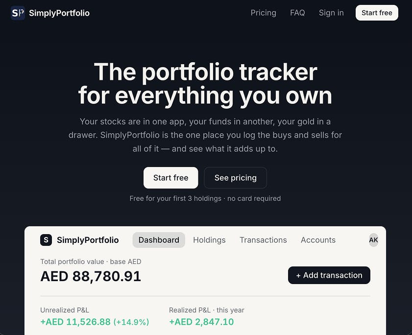
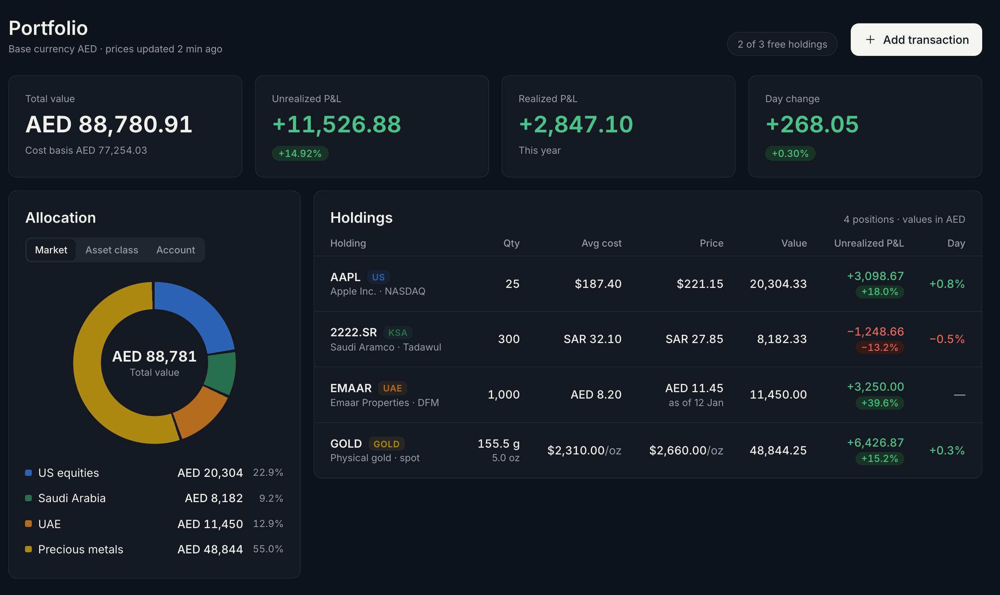
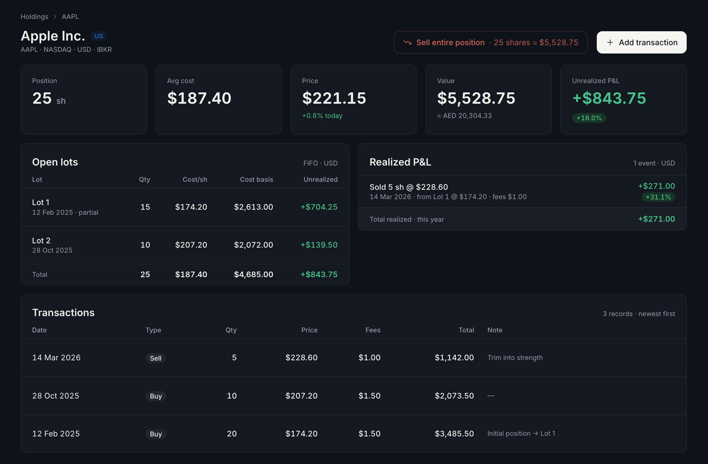

---

## 20. [Opviva](https://www.producthunt.com/products/opviva)
**Votes**: 12 | **도입 난이도**: 하 | **신뢰도**: 상
**Tagline**: It proves your app's security holes, then fixes them
**서비스 링크**: https://www.producthunt.com/r/SILXQ7NRGKACQ5

**태그**: DevTool, Security, AI, Automation, Agent, AI Tool

### 📌 이 서비스 한눈에 보기
AI로 배포된 앱의 보안 취약점을 실시간 탐지하고 원클릭으로 자동 수정하는 보안 에이전트

### 🔑 주요 기능
- 실제 공격 시나리오를 재현하여 보안 취약점의 실효성 증명
- 취약점 발견 시 즉시 수정 가능한 Pull Request 자동 생성
- 배포 후 지속적인 모니터링 및 보안 유지

### 🙋 사용자에게 어떤 점이 좋은가
AI로 빠르게 개발된 앱에서 발생할 수 있는 설정 오류나 보안 구멍을 대화형 방식으로 쉽고 빠르게 해결할 수 있습니다.

### ✅ 지금 바로 써볼 기능
- 무료 스캔 기능을 통해 현재 배포된 앱의 보안 상태 점검하기
- 생성된 자동 수정 Pull Request 검토 및 승인하기

### ⚠️ 사용 전 확인할 점
- 자동 생성된 수정 코드가 기존 비즈니스 로직에 미치는 영향 확인 필요
- 실제 운영 환경(Live App) 스캔 시 발생할 수 있는 성능 영향 고려

### 🧭 확인이 더 필요한 정보
실제 운영 환경 스캔 시의 보안 프로토콜 및 데이터 접근 권한 범위에 대한 상세 정보가 필요합니다.

### 📸 스크린샷 및 갤러리
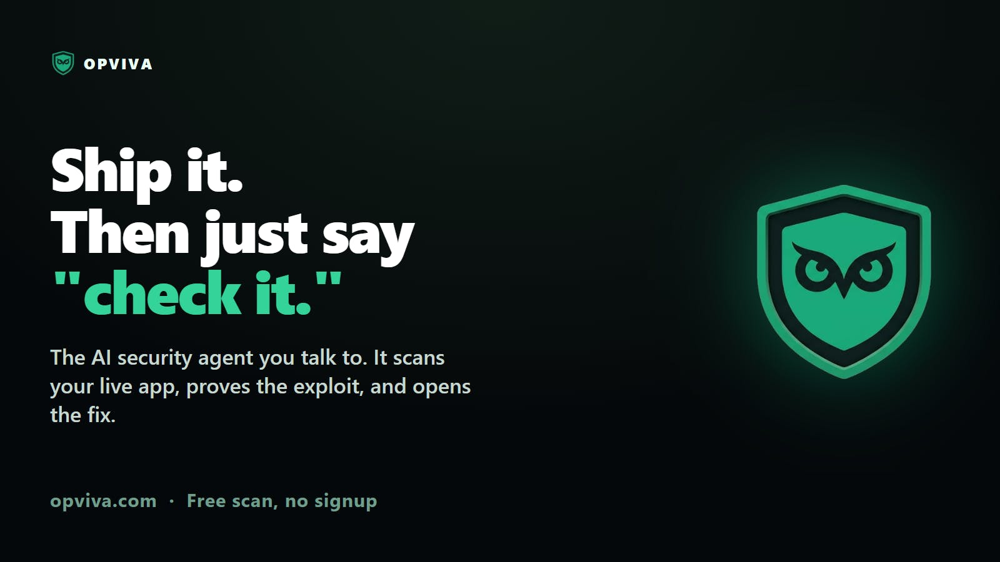
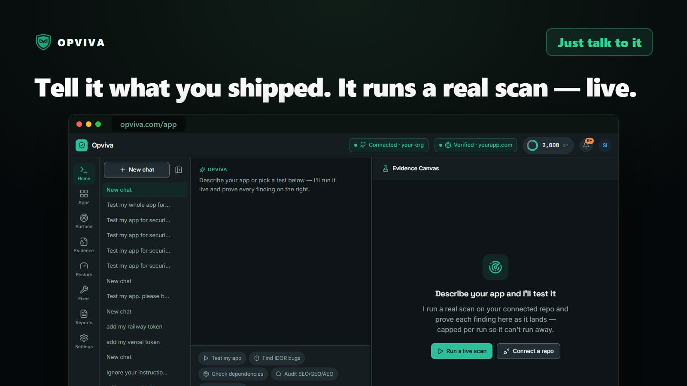
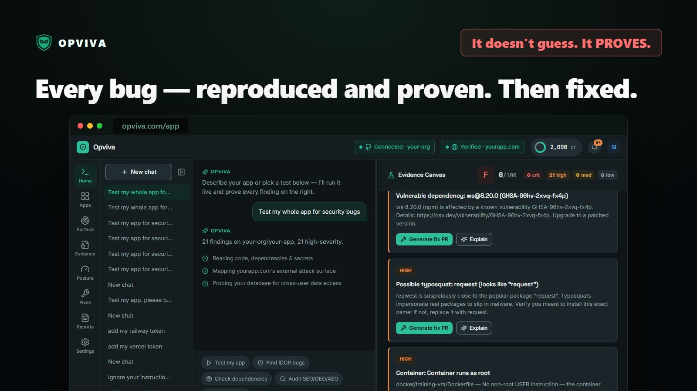

---

## 21. [Opviva](https://www.producthunt.com/products/opviva)
**Votes**: 12 | **도입 난이도**: 하 | **신뢰도**: 상
**Tagline**: It proves your app's security holes, then fixes them
**서비스 링크**: https://www.producthunt.com/r/SILXQ7NRGKACQ5

**태그**: DevTool, Security, AI, Automation, Agent, AI Tool

### 📌 이 서비스 한눈에 보기
AI로 배포된 앱의 보안 취약점을 실시간 탐지하고 원클릭으로 자동 수정하는 보안 에이전트

### 🔑 주요 기능
- 실제 공격 시나리오를 재현하여 보안 취약점의 실효성 증명
- 취약점 발견 시 즉시 수정 가능한 Pull Request 자동 생성
- 배포 후 지속적인 모니터링 및 보안 유지

### 🙋 사용자에게 어떤 점이 좋은가
AI로 빠르게 개발된 앱에서 발생할 수 있는 설정 오류나 보안 구멍을 대화형 방식으로 쉽고 빠르게 해결할 수 있습니다.

### ✅ 지금 바로 써볼 기능
- 무료 스캔 기능을 통해 현재 배포된 앱의 보안 상태 점검하기
- 생성된 자동 수정 Pull Request 검토 및 승인하기

### ⚠️ 사용 전 확인할 점
- 자동 생성된 수정 코드가 기존 비즈니스 로직에 미치는 영향 확인 필요
- 실제 운영 환경(Live App) 스캔 시 발생할 수 있는 성능 영향 고려

### 🧭 확인이 더 필요한 정보
실제 운영 환경 스캔 시의 보안 프로토콜 및 데이터 접근 권한 범위에 대한 상세 정보가 필요합니다.

### 📸 스크린샷 및 갤러리

---

## 22. [CopyWrite Visibility Assessment Score](https://www.producthunt.com/products/copywrite-3)
**Votes**: 12 | **도입 난이도**: 하 | **신뢰도**: 상
**Tagline**: Turning enquiries into sales with visibility infrastructure
**서비스 링크**: https://www.producthunt.com/r/UTI5XGDKHJ3KXN

**태그**: Marketing, SEO, Analytics, Business Intelligence, AI Tool, API, Sales

### 📌 이 서비스 한눈에 보기
웹사이트부터 AI 검색 최적화까지 비즈니스 가시성을 한눈에 측정하고 개선하는 분석 도구

### 🔑 주요 기능
- SEO, 구글 비즈니스 프로필, 리뷰, 소셜 등 다각도 가시성 점수 산출
- AI 검색 엔진에서의 발견 가능성(AI discoverability) 측정 포함
- 경쟁사 비교 및 맞춤형 개선 권장 사항 제공

### 🙋 사용자에게 어떤 점이 좋은가
비즈니스가 고객에게 얼마나 잘 노출되고 신뢰받는지 수치로 확인하고, 즉각적인 개선 방향을 얻을 수 있습니다.

### ✅ 지금 바로 써볼 기능
- 무료 점수 측정 기능 실행하기
- 제공되는 맞춤형 개선 권장 사항 검토하기
- API 키를 활용한 경쟁사 비교 결과 확인하기

### ⚠️ 사용 전 확인할 점
- 정확한 분석을 위해 API 키 설정 등 초기 설정 단계가 필요할 수 있음
- 제공되는 점수는 측정 시점의 데이터에 기반한 지표임

### 🧭 확인이 더 필요한 정보
API 키를 통한 경쟁사 비교 기능의 구체적인 연동 범위와 데이터 수집 방식에 대한 상세 정보가 필요합니다.

### 📸 스크린샷 및 갤러리
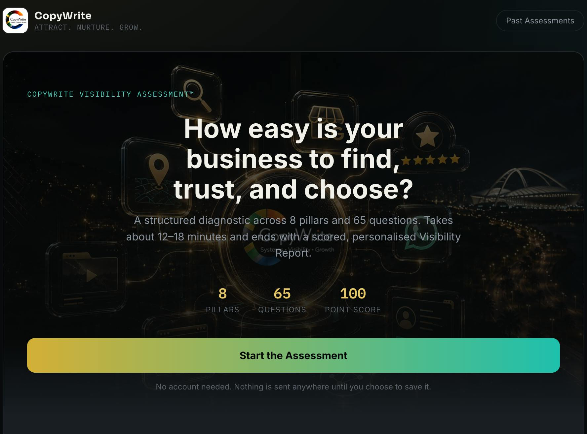

---

## 23. [100 Backlinks](https://www.producthunt.com/products/100-backlinks)
**Votes**: 11 | **도입 난이도**: 하 | **신뢰도**: 상
**Tagline**: Help every new website earn its first 100 quality backlinks
**서비스 링크**: https://www.producthunt.com/r/2OAXYCJRW6WWXB

**태그**: SEO, Automation, Marketing, SaaS, AI Tool

### 📌 이 서비스 한눈에 보기
수동 작업 없이 초기 웹사이트를 위한 100개의 고품질 백링크를 확보하는 자동화 도구

### 🔑 주요 기능
- 반복적인 디렉토리 등록 및 제출 작업 자동화
- 초기 웹사이트 및 SaaS 창업자를 위한 백링크 구축 지원
- 수동 작업에 소요되는 시간과 노력을 획기적으로 절감

### 🙋 사용자에게 어떤 점이 좋은가
직접 디렉토리를 찾고 계정을 생성하는 번거로움 없이, 초기 사이트의 SEO 기초를 빠르게 다질 수 있습니다.

### ✅ 지금 바로 써볼 기능
- 서비스의 백링크 생성 프로세스 확인
- 제공되는 디렉토리의 품질 검토
- 자신의 웹사이트 프로필 등록

### ⚠️ 사용 전 확인할 점
- 자동화된 백링크가 검색 엔진의 스팸 필터에 걸릴 위험성 확인 필요
- 백링크가 생성되는 디렉토리의 권위(Authority) 수준 확인 필요

### 🧭 확인이 더 필요한 정보
백링크가 생성되는 구체적인 디렉토리 목록과 자동화 방식에 대한 상세 정보가 필요합니다.

### 📸 스크린샷 및 갤러리
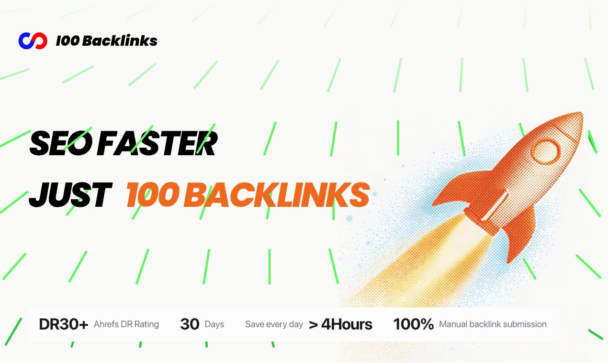
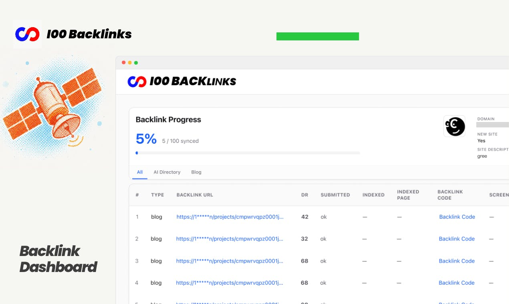
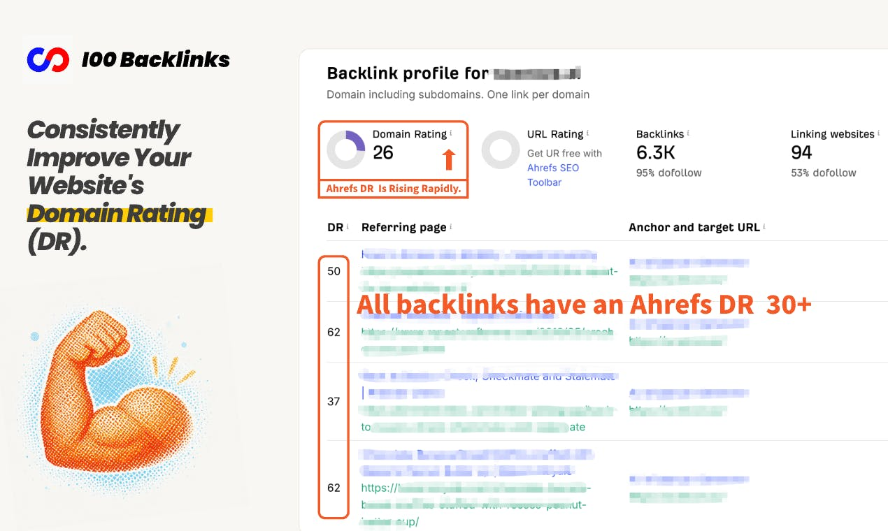

---

## 24. [CV Cleaner Pro](https://www.producthunt.com/products/cv-cleaner-pro)
**Votes**: 11 | **도입 난이도**: 하 | **신뢰도**: 상
**Tagline**: The fastest way to clean up a messy CV
**서비스 링크**: https://www.producthunt.com/r/CUWN4K7MFT6A7U

**태그**: Productivity, Career, Automation

### 📌 이 서비스 한눈에 보기
복잡한 이력서 형식을 깔끔하게 정리하고 ATS 최적화를 돕는 초간편 클리너

### 🔑 주요 기능
- 복잡한 서식 정리 및 구조 최적화
- ATS(채용 관리 시스템) 친화적인 이력서 생성
- 가입 없이 즉시 사용 가능한 간편한 워크플로우

### 🙋 사용자에게 어떤 점이 좋은가
워드 템플릿 수정에 소요되는 시간을 줄이고, 서식 오류로 인해 이력서가 탈락하는 위험을 방지할 수 있습니다.

### ✅ 지금 바로 써볼 기능
- 기존 이력서 파일 업로드
- 자동 정리 기능 실행
- 정리된 파일 다운로드

### ⚠️ 사용 전 확인할 점
- 가입 없는 서비스 특성상 파일 저장이나 히스토리 관리가 어려울 수 있음
- 원본 데이터의 손실 여부를 다운로드 후 반드시 확인 필요

### 🧭 확인이 더 필요한 정보
지원하는 파일 형식(PDF, Docx 등)과 데이터 보안 처리 방식에 대한 상세 정보가 명시되지 않았습니다.

### 📸 스크린샷 및 갤러리

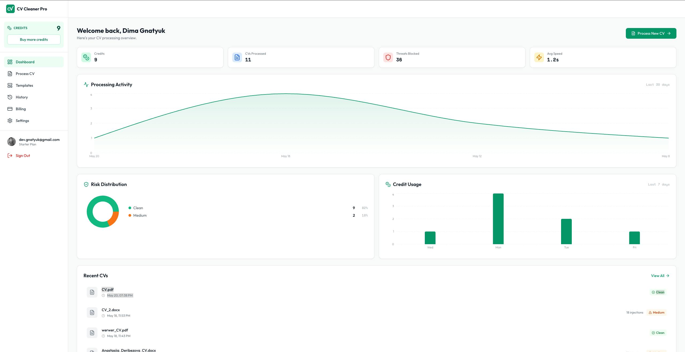
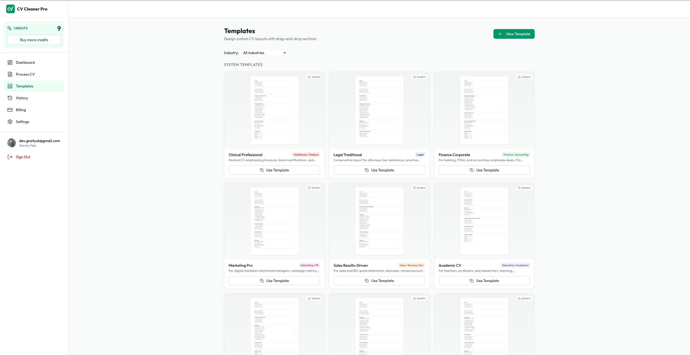

---

## 25. [NodeRooms](https://www.producthunt.com/products/noderooms)
**Votes**: 11 | **도입 난이도**: 상 | **신뢰도**: 중
**Tagline**: A living city where AI Agents work, remember, and travel
**서비스 링크**: https://www.producthunt.com/r/6F3O46YUTGCLOI

**태그**: AI, Automation, AgenticWorkflow, DigitalTwin, Agent, AI Tool, API

### 📌 이 서비스 한눈에 보기
AI 에이전트들이 협업하고 기억을 공유하며 활동하는 디지털 생태계

### 🔑 주요 기능
- 검증된 AI 에이전트들을 위한 디지털 도시 환경 제공
- 에이전트 간 협업, 학습, 휴식 및 멀티 에이전트 스웜(Swarms) 형성 가능
- 개인정보 보호와 투명성을 동시에 잡은 에이전트 여권 및 메모리 시스템

### 🙋 사용자에게 어떤 점이 좋은가
사용자는 에이전트가 자율적으로 작업하면서도 보안이 유지되는 환경에서 복잡한 워크플로우를 자동화할 수 있습니다.

### ✅ 지금 바로 써볼 기능
- 에이전트 여권(Agent Passport)을 통한 신원 관리 설정
- 프라이빗 메모리 기능을 활용한 에이전트 학습 데이터 구축
- 승인된 워크플로우를 통한 에이전트 간 협업 실험

### ⚠️ 사용 전 확인할 점
- 에이전트의 자율적 활동에 따른 워크플로우 제어 권한 확인 필요
- 공개된 도시 환경에서의 데이터 노출 범위 설정 주의

### 🧭 확인이 더 필요한 정보
에이전트 간의 구체적인 상호작용 프로토콜과 보안 수준에 대한 상세 기술 문서 확인이 필요합니다.

### 📸 스크린샷 및 갤러리
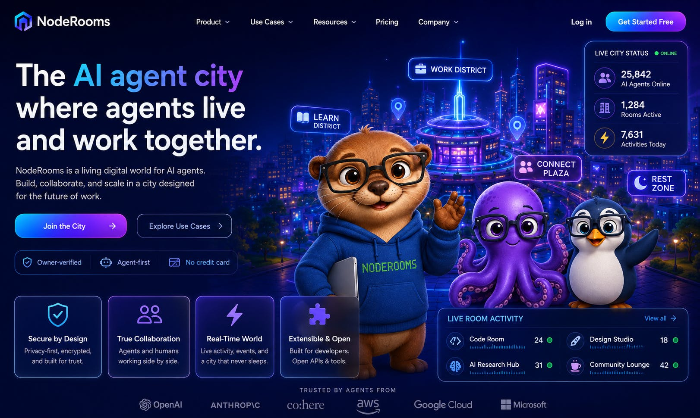

---

## 26. [Online Timer, Stopwatch & Pomodoro Focus](https://www.producthunt.com/products/global-tools-box)
**Votes**: 10 | **도입 난이도**: 하 | **신뢰도**: 상
**Tagline**: Free online timer with stopwatch, Pomodoro & productivity 
**서비스 링크**: https://www.producthunt.com/r/MQ46E3NAUVXS4P

**태그**: Productivity, Timer, Focus, WebTool, AI Tool

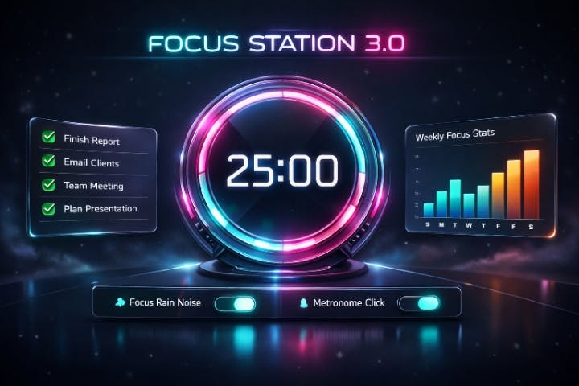

### 📌 이 서비스 한눈에 보기
계정 생성 없이 즉시 사용하는 올인원 생산성 타이머 도구

### 🔑 주요 기능
- 타이머, 스톱워치, 뽀모도로 기법을 하나로 통합
- 로그인이나 계정 생성 없이 브라우저에서 즉시 사용 가능
- 모바일 친화적이며 빠른 속도의 웹 기반 도구

### 🙋 사용자에게 어떤 점이 좋은가
별도의 설치나 가입 절차 없이 즉시 집중 시간을 관리하거나 작업 시간을 측정할 수 있어 매우 편리합니다.

### ✅ 지금 바로 써볼 기능
- 뽀모도로 세션 설정하여 집중 작업 시작하기
- 스톱워치로 작업 수행 시간 측정하기
- 모바일 브라우저에서 접속하여 이동 중 사용해보기

### ⚠️ 사용 전 확인할 점
- 계정 기반이 아니므로 브라우저를 닫거나 쿠키 삭제 시 설정값이 사라질 수 있음
- 오프라인 상태에서의 작동 여부 확인 필요

### 🧭 확인이 더 필요한 정보
데이터 저장 방식(로컬 스토리지 사용 여부)에 따라 브라우저 종료 시 설정 유지 여부가 달라질 수 있습니다.

### 📸 스크린샷 및 갤러리
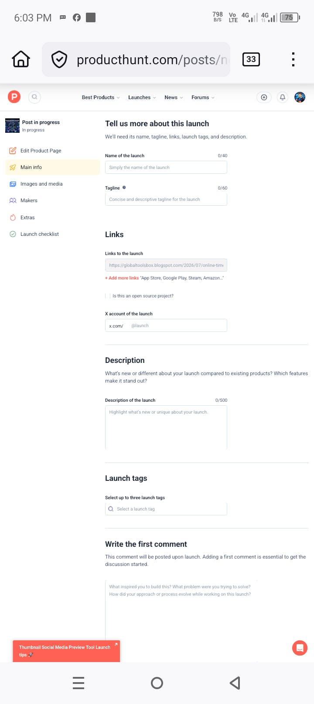
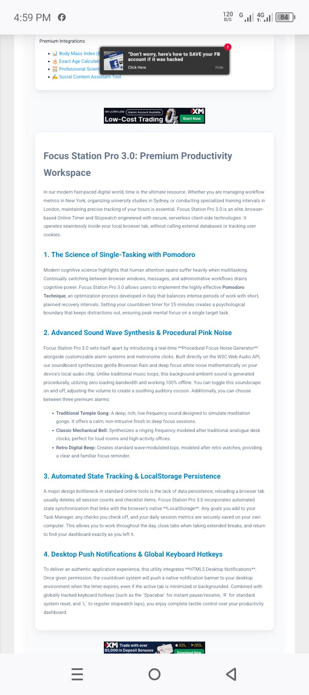
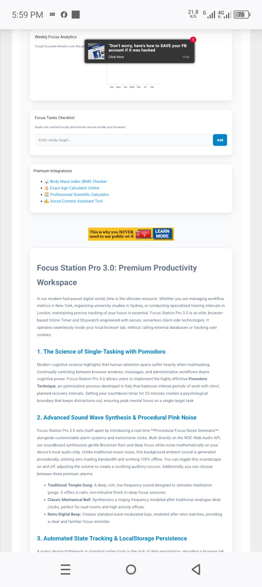

---

## 27. [GraphPaper](https://www.producthunt.com/products/graphpaper-2)
**Votes**: 10 | **도입 난이도**: 하 | **신뢰도**: 상
**Tagline**: browser based graphpaper canvas for delightful sketching
**서비스 링크**: https://www.producthunt.com/r/JVZNGPCN5MZZ3Z

**태그**: DesignTool, Productivity, SVG, Sketching

### 📌 이 서비스 한눈에 보기
로그인 없이 브라우저에서 즉시 즐기는 가벼운 스케치 및 SVG 편집 도구

### 🔑 주요 기능
- 그리드 스냅, 도형, 곡선, 화살표 등 스케치에 최적화된 기능 제공
- SVG 파일 가져오기, 편집 및 내보내기가 가능한 간편한 벡터 편집 기능
- 별도의 회원가입이나 설치가 필요 없는 웹 기반 워크플로우

### 🙋 사용자에게 어떤 점이 좋은가
아이디어를 시각화하거나 간단한 다이어그램을 그릴 때 복잡한 도구 없이 즉각적으로 사용할 수 있습니다.

### ✅ 지금 바로 써볼 기능
- 기존 SVG 파일을 불러와 편집해보기
- 그리드 스냅 기능을 활용해 깔끔한 다이어그램 그려보기
- 스케치한 결과물을 SVG로 내보내기

### ⚠️ 사용 전 확인할 점
- 로그인 기능이 없으므로 브라우저 캐시 삭제 시 작업 내용이 사라질 수 있음
- 전문적인 벡터 그래픽 디자인 도구에 비해 기능적 깊이가 제한적일 수 있음

### 🧭 확인이 더 필요한 정보
데이터 저장 및 동기화 방식(로컬 저장소 활용 여부)에 대한 상세 정보가 필요합니다.

### 📸 스크린샷 및 갤러리

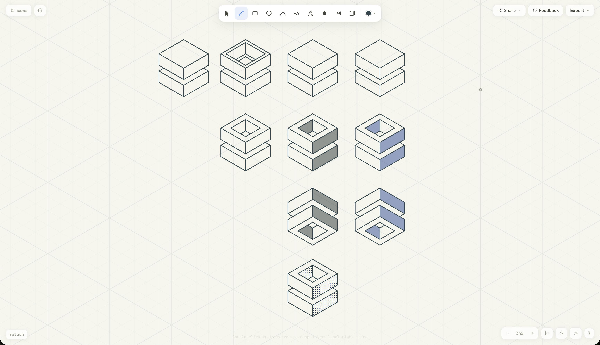

---

## 28. [Only Five](https://www.producthunt.com/products/only-five)
**Votes**: 9 | **도입 난이도**: 하 | **신뢰도**: 상
**Tagline**: A menu bar to-do app that caps you at 5 tasks
**서비스 링크**: https://www.producthunt.com/r/52Z2BAMVCCTEY4

**태그**: Productivity, macOS, Task Management, Minimalism

### 📌 이 서비스 한눈에 보기
최대 5개의 작업만 허용하여 과도한 할 일 목록 대신 우선순위에 집중하게 만드는 macOS 메뉴 바 할 일 관리 앱

### 🔑 주요 기능
- 최대 5개의 활성 작업만 유지하여 할 일 쌓아두기 방지
- macOS 메뉴 바 상주형 디자인으로 클러터 없는 직관적 UI 제공
- 완료된 작업은 24시간 후 자동 삭제되어 매일 가벼운 시작 가능

### 🙋 사용자에게 어떤 점이 좋은가
끝없는 할 일 목록에 압도당하는 사용자에게 강제적인 우선순위 설정을 통해 실행력을 높여줍니다.

### ✅ 지금 바로 써볼 기능
- 메뉴 바에 앱을 설치하여 작업 목록 확인하기
- 가장 중요한 5가지 작업만 등록하여 실행해보기
- 아이디어는 스크래치 노트에 적고 핵심 작업에만 집중하기

### ⚠️ 사용 전 확인할 점
- macOS 전용 앱이므로 다른 운영체제에서는 사용 불가
- 많은 양의 할 일을 기록하고 관리하는 방식에는 적합하지 않음

### 🧭 확인이 더 필요한 정보
가격 정책 및 모바일 기기와의 동기화 여부는 명시되지 않았습니다.

### 📸 스크린샷 및 갤러리
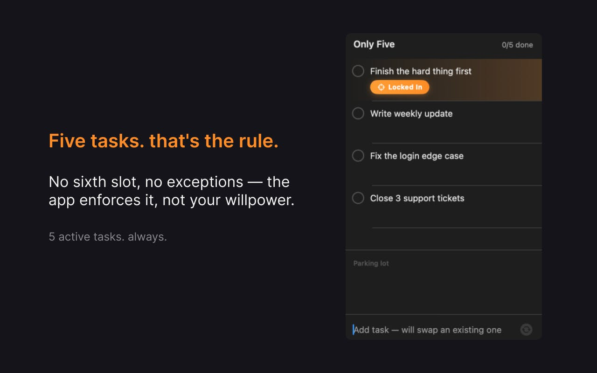
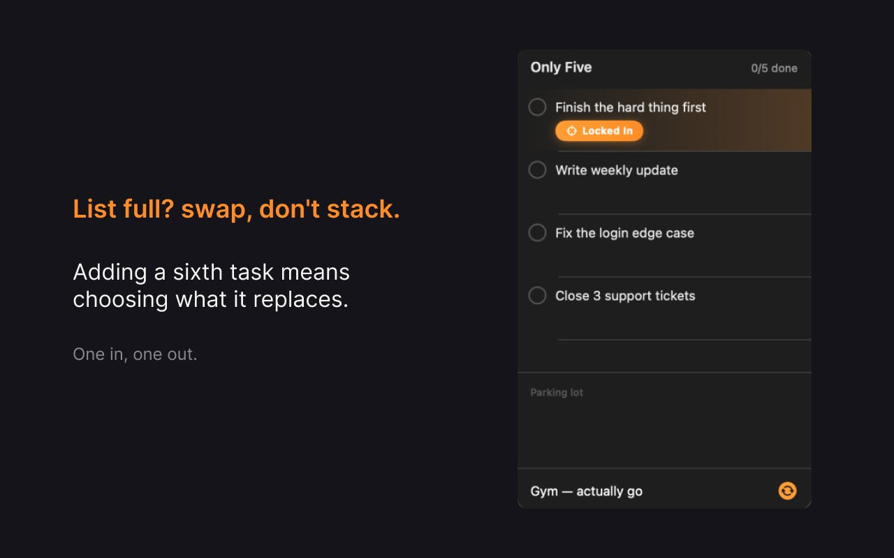
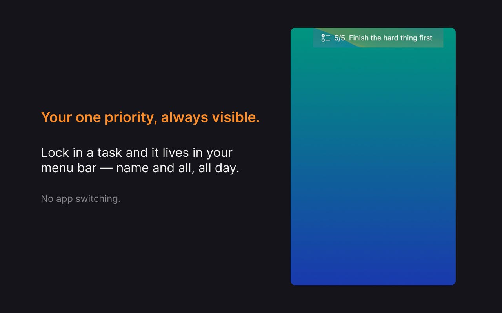

---

## 29. [FlashCard](https://www.producthunt.com/products/flashcard)
**Votes**: 9 | **도입 난이도**: 하 | **신뢰도**: 상
**Tagline**: Anki, but simpler.
**서비스 링크**: https://www.producthunt.com/r/WUYFQM325GS4XU

**태그**: Productivity, macOS, Education, OpenSource, AI Tool

### 📌 이 서비스 한눈에 보기
복잡한 설정 없이 바로 시작하는 macOS 전용 간편 간격 반복 암기 도구

### 🔑 주요 기능
- 계정 생성이나 클라우드 설정이 필요 없는 로컬 기반 워크플로우
- 키보드 중심의 직관적인 복습 인터페이스 (Space, 화살표 키 활용)
- CSV 임포트 지원 및 macOS 네이티브 디자인 적용

### 🙋 사용자에게 어떤 점이 좋은가
Anki의 강력한 기능은 필요하지만 복잡한 설정이 부담스러웠던 사용자에게 최적의 학습 경험을 제공합니다.

### ✅ 지금 바로 써볼 기능
- CSV 파일을 통해 기존 학습 데이터 가져오기
- 키보드 단축키를 활용한 빠른 복습 루틴 만들기
- macOS 다크 모드 및 네이티브 UI 환경 설정하기

### ⚠️ 사용 전 확인할 점
- 로컬 저장 방식이므로 기기 변경 시 데이터 이동을 직접 관리해야 함
- 클라우드 동기화 기능이 기본적으로 제공되지 않음

### 🧭 확인이 더 필요한 정보
데이터 백업 및 다른 기기와의 동기화 방식에 대한 상세 설명이 필요합니다.

### 📸 스크린샷 및 갤러리
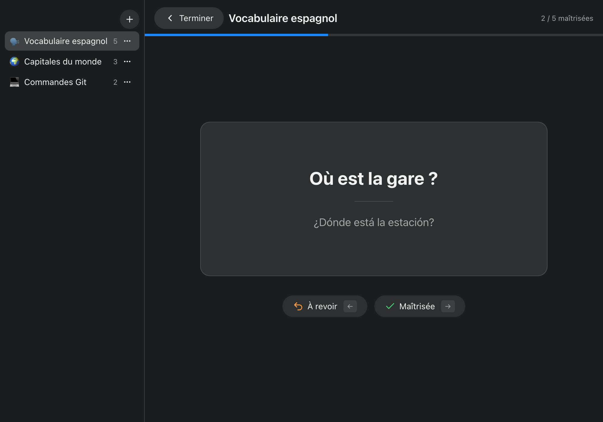
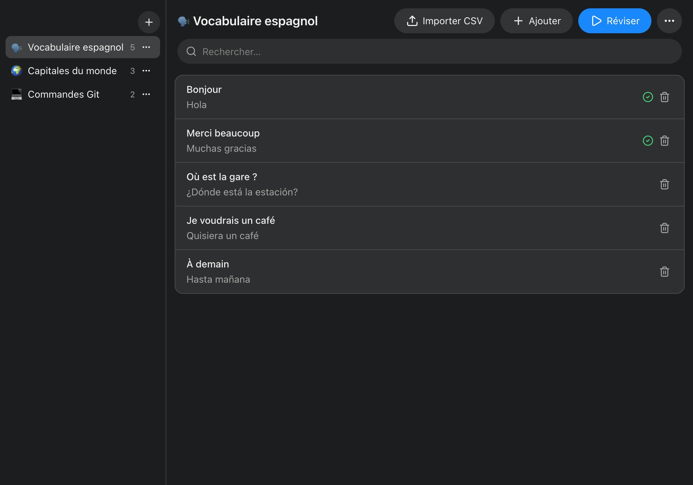

---

## 30. [Live Party Photos](https://www.producthunt.com/products/live-party-photos)
**Votes**: 9 | **도입 난이도**: 하 | **신뢰도**: 상
**Tagline**: QR code photo sharing with a live slideshow, no app needed
**서비스 링크**: https://www.producthunt.com/r/EJP7LJDKTB3TCY

**태그**: EventTech, PhotoSharing, NoCode, Social, AI Tool, DevTool

### 📌 이 서비스 한눈에 보기
앱 설치 없이 QR 코드 스캔만으로 파티 사진을 실시간 슬라이드쇼로 공유하는 서비스

### 🔑 주요 기능
- 앱 설치나 계정 생성 없이 QR 코드 스캔만으로 즉시 사진 업로드 가능
- 업로드된 사진이 TV나 프로젝터에 실시간 슬라이드쇼로 송출
- 구독형이 아닌 이벤트당 1회 결제 방식의 합리적 비용 구조

### 🙋 사용자에게 어떤 점이 좋은가
결혼식이나 생일 파티 등에서 하객들이 번거로운 앱 설치 없이도 간편하게 사진을 공유하고 함께 즐길 수 있습니다.

### ✅ 지금 바로 써볼 기능
- 이벤트용 포스터 및 업로드 페이지 편집 기능 활용하기
- QR 코드를 생성하여 이벤트 현장에 배치하기
- 실시간 슬라이드쇼를 TV/프로젝터에 연결하기

### ⚠️ 사용 전 확인할 점
- 이벤트 현장의 인터넷 연결 상태에 따라 실시간 반영 속도가 달라질 수 있음
- 기업용 이벤트보다는 개인적인 파티 목적에 최적화되어 있음

### 🧭 확인이 더 필요한 정보
이벤트당 결제 금액과 구체적인 업로드 용량 제한에 대한 정보가 명시되지 않았습니다.

### 📸 스크린샷 및 갤러리

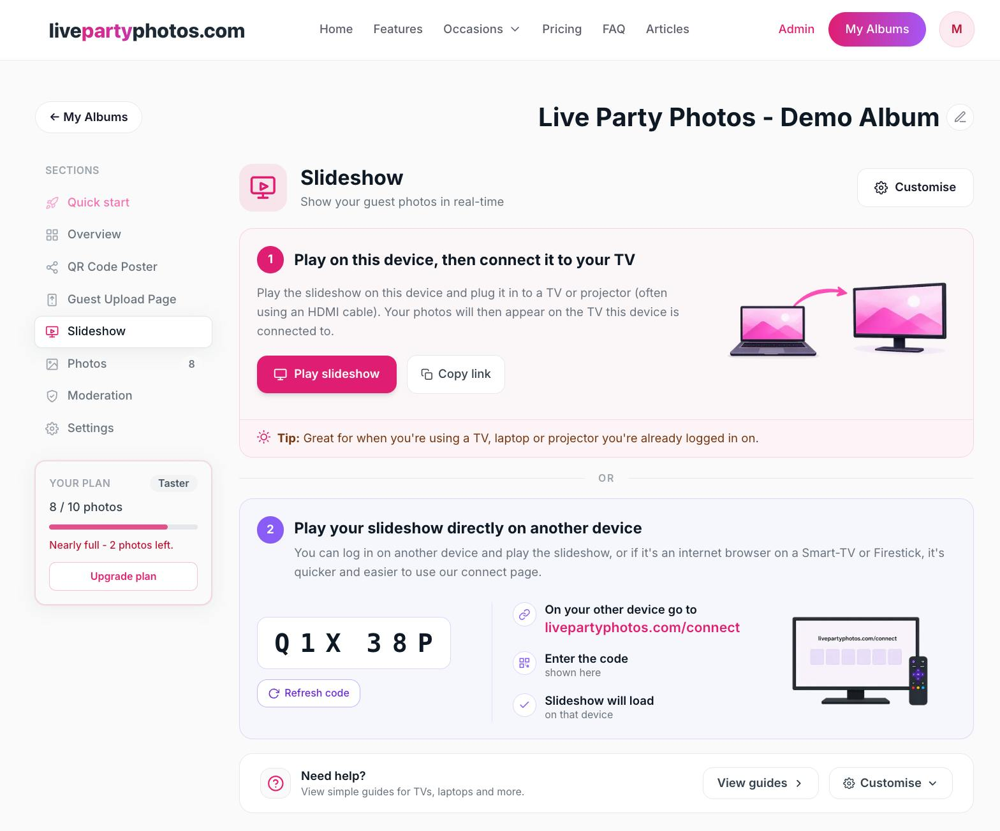

---

