# 🚀 Product Hunt Daily Top 30 (2026-07-16)

## 오늘의 요약
오늘의 트렌드는 단순한 챗봇을 넘어 사용자의 작업 환경에 직접 개입하여 업무를 완결하는 '자율형 AI 에이전트'와 '워크플로우 자동화'가 주도했습니다. 또한, 영상 제작, 3D 모델링, 채용 등 특정 전문 분야에서 인간의 개입을 최소화하고 결과물을 즉각 생성하는 고도화된 AI 인프라가 주목받았습니다.

### 오늘의 핵심 포인트
- 인간과 AI 에이전트가 협업하거나, AI가 스스로 판단하여 업무를 수행하는 자율적 워크플로우가 강화되었습니다.
- 파편화된 데이터와 도구를 하나로 통합하여 맥락을 유지하는 통합형 프로젝트 공간이 핵심 경쟁력으로 떠올랐습니다.
- 영상, 3D 캐릭터 생성, 채용 등 전문적인 영역에서 복잡한 과정을 단축하는 엔드 투 엔드(End-to-End) 자동화 솔루션이 다수 등장했습니다.

**오늘의 태그**: AI 에이전트, 업무 자동화, 생성형 AI, 워크플로우 통합

## 1. [Velo 3.0](https://www.producthunt.com/products/velo-4)
**Votes**: 438 | **도입 난이도**: 하 | **신뢰도**: 상
**Tagline**: AI video infrastructure to explain, train, and sell faster.
**서비스 링크**: https://www.producthunt.com/r/KDX5BM26GQ5BM5

**태그**: AI Video, Automation, Content Creation, Localization, AI Tool, Prompting, Video

### 📌 이 서비스 한눈에 보기
스크린 녹화나 프롬프트만으로 전문적인 영상을 제작하는 AI 비디오 인프라

### 🔑 주요 기능
- 프롬프트 입력만으로 스크립트 작성, 나레이션, 편집까지 자동 수행
- 사용자 목소리 복제 및 기업 내부 문서/도구 기반의 지식 연동
- 한 번의 클릭으로 25개 이상의 언어로 자동 현지화

### 🙋 사용자에게 어떤 점이 좋은가
직접 편집하는 번거로움 없이 텍스트나 녹화만으로 고품질 영상을 빠르게 제작하여 교육 및 영업에 활용할 수 있습니다.

### ✅ 지금 바로 써볼 기능
- 스크린 녹화 기능을 통한 영상 초안 생성
- 텍ively 텍스트 입력을 통한 편집 기능 테스트
- 다국어 현지화 기능을 통한 글로벌 배포 테스트

### ⚠️ 사용 전 확인할 점
- 사용자 목소리 복제 시 저작권 및 보안 정책 확인 필요
- 연동된 기업 데이터(Docs, MCP)의 보안 및 프라이버시 검토 필요

### 🧭 확인이 더 필요한 정보
외부 도구 및 MCP 커넥터의 구체적인 보안 수준과 데이터 처리 방식에 대한 확인이 필요합니다.

### 📸 스크린샷 및 갤러리

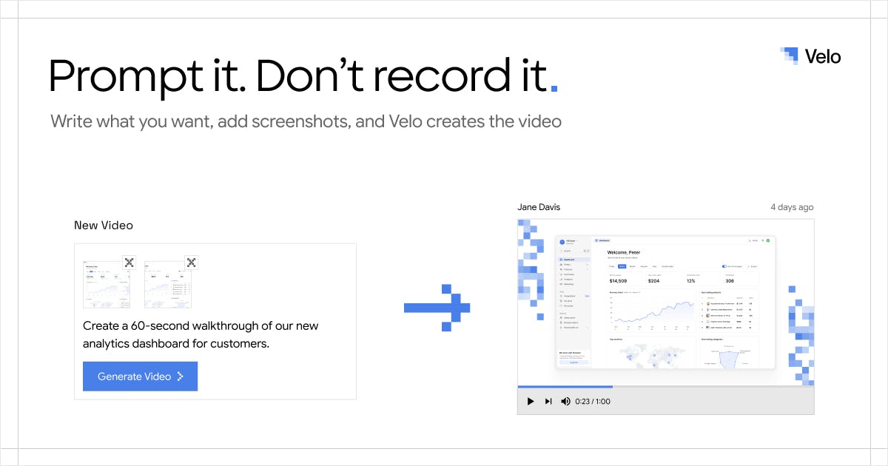
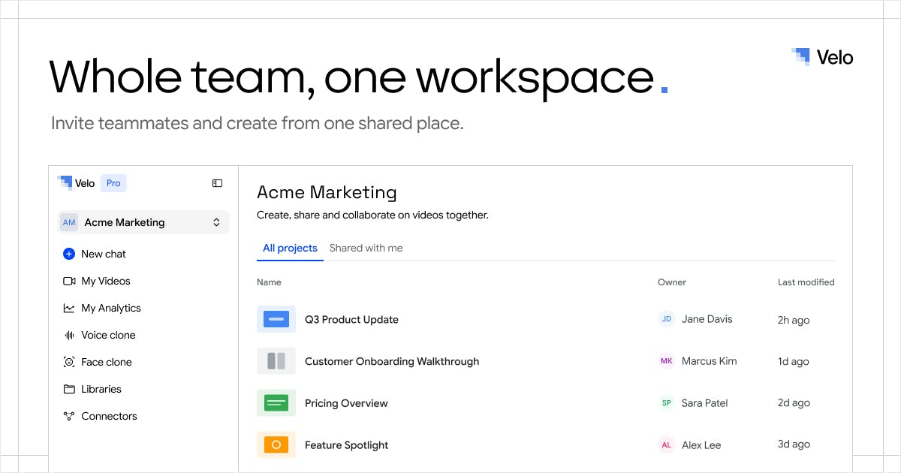

### 🎬 관련 영상
- [🎥 영상 보기](https://ph-files.imgix.net/1f3a08b9-b3ed-47bc-8767-6338644c0bf8.jpeg?auto=format)

---

## 2. [Campus](https://www.producthunt.com/products/flutterflow)
**Votes**: 355 | **도입 난이도**: 중 | **신뢰도**: 상
**Tagline**: One project space for humans and AI agents
**서비스 링크**: https://www.producthunt.com/r/4PXLGX63BG2Y7T

**태그**: DevTool, AI-Agent, Collaboration, Productivity, Agent, AI Tool, Chat

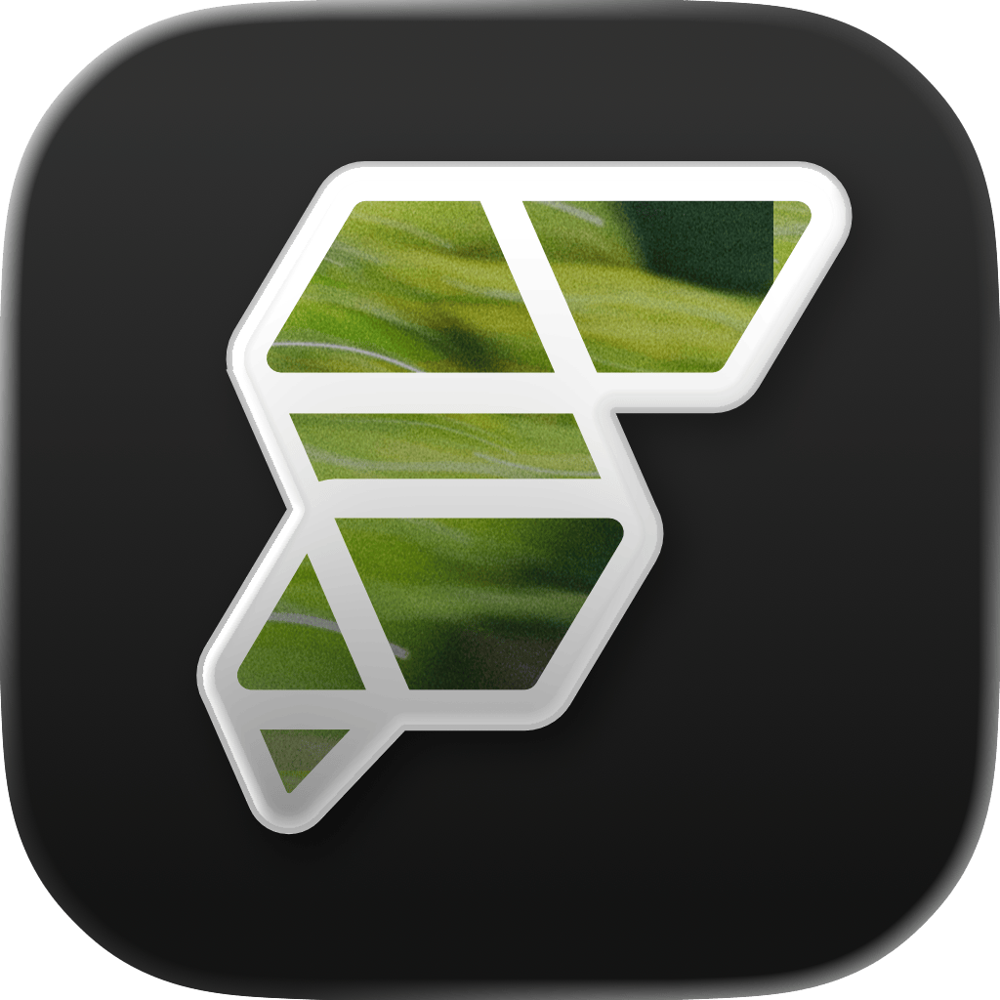

### 📌 이 서비스 한눈에 보기
인간과 AI 에이전트가 협업할 수 있는 통합 프로젝트 워크스페이스

### 🔑 주요 기능
- 코드, 터미널, 프로젝트 지식, 대화를 한곳에 모은 통합 환경 제공
- 파편화된 컨텍스트(Slack, 문서, 티켓 등)를 하나의 지속적인 작업 공간으로 통합
- 인간과 AI 에이전트가 작업 흐름을 끊김 없이 이어받을 수 있는 구조

### 🙋 사용자에게 어떤 점이 좋은가
여러 도구에 흩어진 프로젝트 맥락을 하나로 모아, 팀원과 AI가 즉시 작업에 투입될 수 있는 효율적인 환경을 제공합니다.

### ✅ 지금 바로 써볼 기능
- 기존 프로젝트 리포지토리 연결하기
- 프로젝트 지식 베이스 구축하기
- AI 에이전트와 협업 워크플로우 테스트하기

### ⚠️ 사용 전 확인할 점
- 기존에 사용하던 Slack, Jira 등 외부 도구와의 연동 범위 확인 필요
- 프로젝트 데이터 및 코드 보안 정책 검토 필요

### 🧭 확인이 더 필요한 정보
현재 제공되는 구체적인 외부 도구 연동 기능과 보안 수준에 대한 상세 정보가 필요합니다.

### 📸 스크린샷 및 갤러리
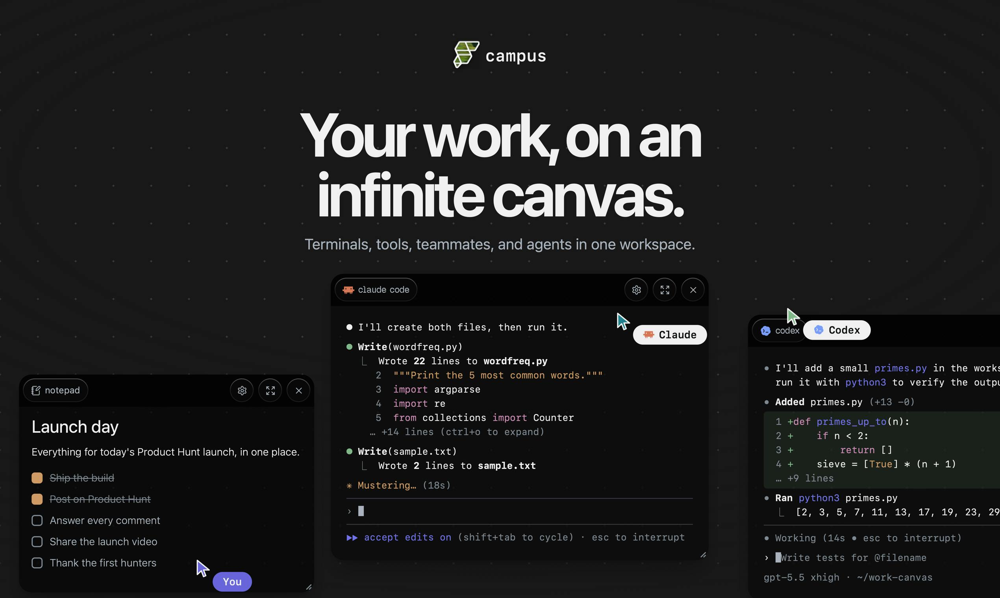
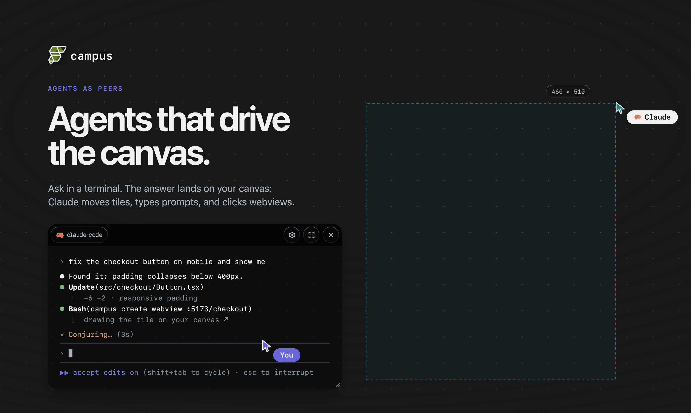
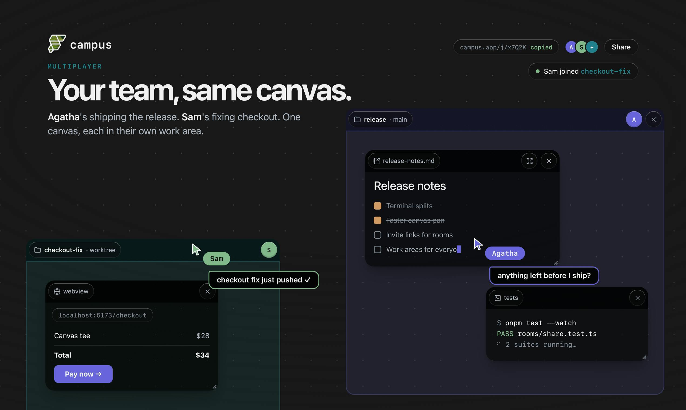

### 🎬 관련 영상
- [🎥 영상 보기](https://ph-files.imgix.net/f4bb5eb4-34b6-4f5f-ad51-a7e0c82fd6f0.jpeg?auto=format)

---

## 3. [V2Fun](https://www.producthunt.com/products/v2fun)
**Votes**: 340 | **도입 난이도**: 중 | **신뢰도**: 상
**Tagline**: Generate 3D character with 8K textures and AI motion capture
**서비스 링크**: https://www.producthunt.com/r/YMZ2X3HYSCQ2UP

**태그**: 3D Modeling, AI Motion Capture, Generative AI, Character Design, AI Tool, Prompting, Video, Vision

### 📌 이 서비스 한눈에 보기
이미지와 프롬프트만으로 8K 텍스처와 모션 캡처가 적용된 고품질 3D 캐릭터를 생성하는 AI 플랫폼

### 🔑 주요 기능
- 이미지, 프롬프트, 영상을 활용한 고품질 3D 모델 생성
- 8K 해상도의 정교한 텍스처 생성 기능 제공
- 모델링, 텍스처링, 모션 캡처를 하나의 워크플로우로 통합

### 🙋 사용자에게 어떤 점이 좋은가
여러 도구를 번갈아 사용할 필요 없이 캐릭터 제작부터 움직임 구현까지 한 곳에서 해결하여 작업 시간을 획기적으로 단축할 수 있습니다.

### ✅ 지금 바로 써볼 기능
- 이미지나 프롬프트를 활용한 3D 모델 생성 테스트
- 8K 텍스처 생성 기능의 디테일 확인
- 생성된 캐릭터의 모션 캡처 적용 테스트

### ⚠️ 사용 전 확인할 점
- 생성된 3D 모델의 리깅(Rigging) 완성도 및 애니메이션 호환성 확인 필요
- 8K 텍스처 생성 시 하드웨어 사양 요구사항 확인 필요

### 🧭 확인이 더 필요한 정보
사용자의 하드웨어 환경에 따른 렌더링 성능 및 최종 파일 포맷 지원 여부를 확인해야 합니다.

### 📸 스크린샷 및 갤러리

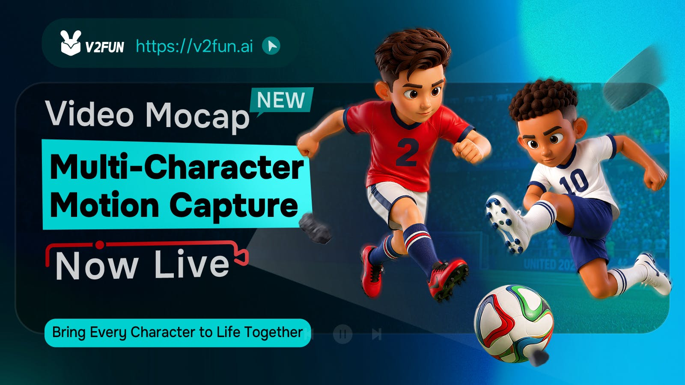
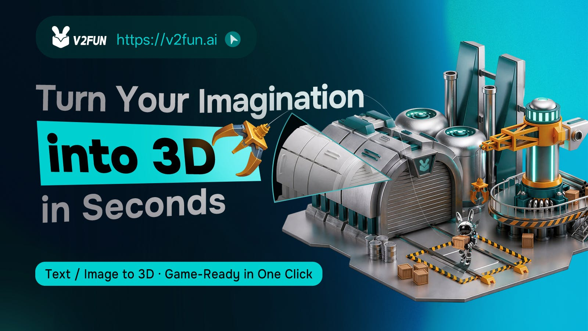

### 🎬 관련 영상
- [🎥 영상 보기](https://ph-files.imgix.net/f4d7737d-e77c-47e2-93d3-6f39fcda0f6c.jpeg?auto=format)

---

## 4. [Agently](https://www.producthunt.com/products/agently)
**Votes**: 245 | **도입 난이도**: 하 | **신뢰도**: 상
**Tagline**: Your whole stack, running itself!
**서비스 링크**: https://www.producthunt.com/r/WSQCJVSEX7VIBA

**태그**: Automation, AI Agent, Workflow, Productivity, Agent, AI Tool

### 📌 이 서비스 한눈에 보기
기업의 모든 워크플로우를 하나의 지능형 에이전트로 자동화하는 통합 운영 플랫폼

### 🔑 주요 기능
- 100개 이상의 커넥터를 통한 전사적 데이터 및 컨텍스트 통합
- 이벤트 발생부터 실행까지 엔드 투 엔드(End-to-End) 자동화
- 단순 응답을 넘어 실질적인 업무를 수행하는 에이전트 중심 구조

### 🙋 사용자에게 어떤 점이 좋은가
수동으로 관리하던 툴 간의 연동 작업을 자동화하여, 사람이 개입하지 않아도 업무가 완결되는 환경을 구축할 수 있습니다.

### ✅ 지금 바로 써볼 기능
- 기존에 사용하는 주요 서비스(Stripe, Slack, Linear 등) 커넥터 연결하기
- 반복적인 업무 흐름을 에이전트 워크플로우로 설계하기
- 이벤트 트리거를 설정하여 자동 실행 테스트하기

### ⚠️ 사용 전 확인할 점
- 에이전트가 자율적으로 업무를 수행하므로 결과물에 대한 검증 프로세스 필요
- 기업 내부 데이터가 중앙 집중형 '뇌'에 통합되므로 보안 및 권한 설정 확인 필요

### 🧭 확인이 더 필요한 정보
제공되는 100여 개의 커넥터가 사용자의 특정 워크플로우를 완벽히 지원하는지 확인이 필요합니다.

### 📸 스크린샷 및 갤러리
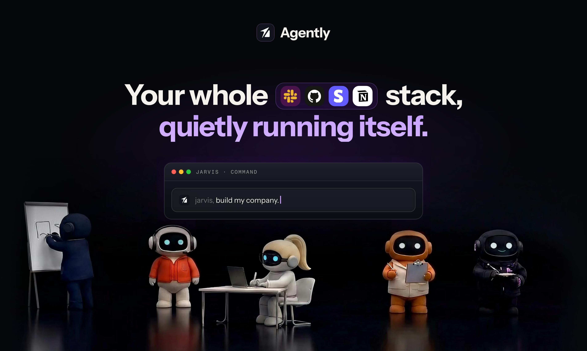
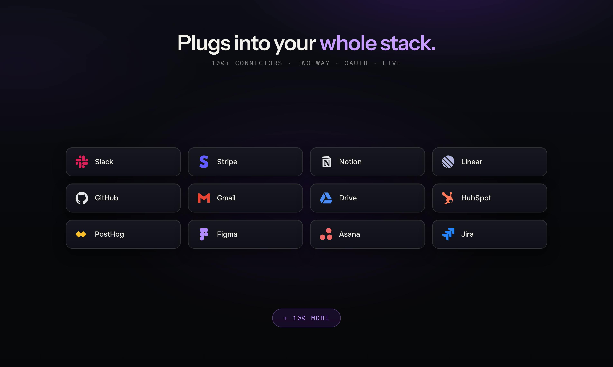
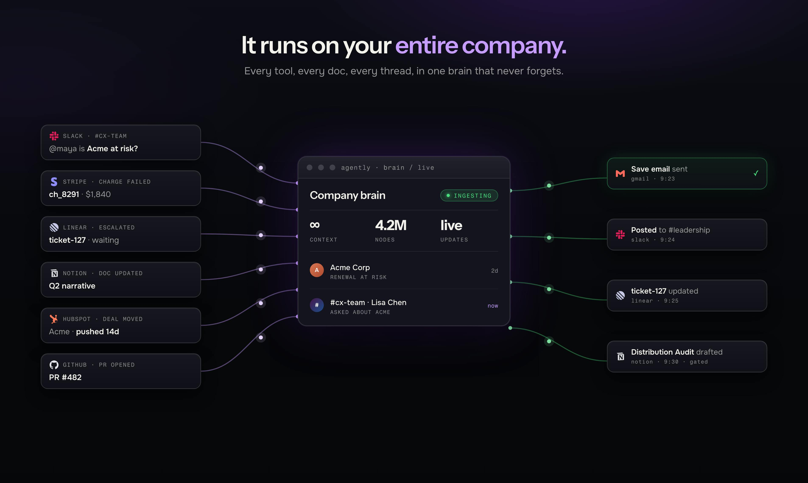

### 🎬 관련 영상
- [🎥 영상 보기](https://ph-files.imgix.net/2dcd77bd-acf5-4044-85b5-282530a6889c.jpeg?auto=format)

---

## 5. [Crustdata Recruiter](https://www.producthunt.com/products/crustdata-2)
**Votes**: 232 | **도입 난이도**: 하 | **신뢰도**: 상
**Tagline**: Claude Skills to turn Claude into a 100x Recruiter
**서비스 링크**: https://www.producthunt.com/r/YCK7VIOU7L23EU

**태그**: AI, Recruitment, Automation, Data-Driven, AI Tool

### 📌 이 서비스 한눈에 보기
Claude의 지능과 10억 개 이상의 프로필 데이터를 결합한 AI 채용 전문가 도구

### 🔑 주요 기능
- 10억 개 이상의 실시간 프로필 데이터를 기반으로 한 정교한 후보자 검색
- 사용자의 판단 기준을 학습하여 맞춤형 후보자 순위 지정
- 선발 이유 설명 및 ATS(채용 관리 시스템) 연동용 아웃리치 초안 작성

### 🙋 사용자에게 어떤 점이 좋은가
채용 담당자의 판단 방식을 AI가 학습하여 검색부터 연락 초안 작성까지 채용 프로세스의 효율을 극대화합니다.

### ✅ 지금 바로 써볼 기능
- Claude 내에서 실시간 데이터 기반 후보자 검색 실행
- AI가 제안한 후보자 순위 및 선정 이유 검토
- 생성된 아웃리치 메시지를 ATS로 전송하여 후보자 컨택

### ⚠️ 사용 전 확인할 점
- 사용자의 판단 기준이 데이터에 반영되는 과정에서의 편향성 가능성
- 외부 ATS 시스템과의 실제 연동 범위 및 방식 확인 필요

### 🧭 확인이 더 필요한 정보
사용자의 기존 ATS 시스템과 어느 정도 수준까지 자동 연동되는지 구체적인 기술 사양 확인이 필요합니다.

### 📸 스크린샷 및 갤러리
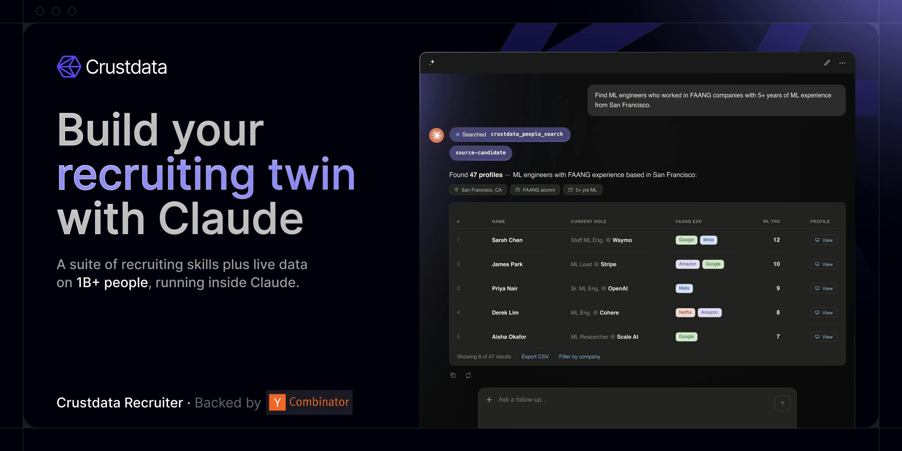
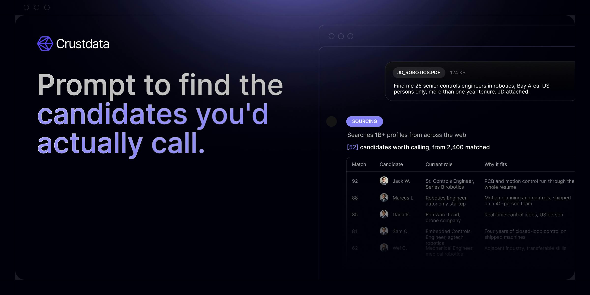
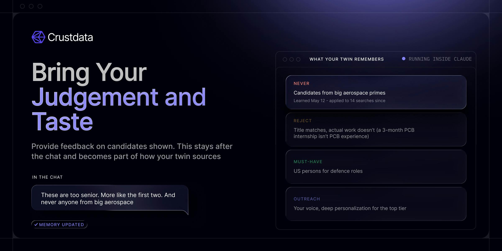

### 🎬 관련 영상
- [🎥 영상 보기](https://ph-files.imgix.net/43849bb3-facf-44ed-97c7-b2b119ac7476.jpeg?auto=format)

---

## 6. [YAGNI](https://www.producthunt.com/products/yagni)
**Votes**: 162 | **도입 난이도**: 하 | **신뢰도**: 상
**Tagline**: Proactive agent teams you manage like humans
**서비스 링크**: https://www.producthunt.com/r/R56CZDF2EH3WP2

**태그**: AI Agents, Automation, Productivity, Workflow, Agent, AI Tool, Prompting

### 📌 이 서비스 한눈에 보기
사용자의 개입 없이 스스로 업무를 수행하고 점진적으로 자율성을 확보하는 프로액티브 AI 에이전트 팀

### 🔑 주요 기능
- 수동적인 프롬프트 입력 방식에서 벗어난 선제적(Proactive) 업무 수행
- 책임 범위와 가이드라인 내에서 작동하며 신뢰를 쌓아가는 자율적 에이전트 팀
- 회사 URL 입력만으로 즉시 업무 팀 초안을 생성하는 간편한 초기 설정

### 🙋 사용자에게 어떤 점이 좋은가
단순 반복 업무를 넘어 책임과 권한을 가진 AI 팀을 관리함으로써, 사용자는 의사결정과 핵심적인 업무에만 집중할 수 있습니다.

### ✅ 지금 바로 써볼 기능
- 회사 URL을 입력하여 맞춤형 AI 팀 초안 생성하기
- 에이전트에게 구체적인 책임 범위와 가이드라인 설정하기
- 에이전트의 작업 기록을 검토하며 자율성 수준 조절하기

### ⚠️ 사용 전 확인할 점
- 에이전트의 자율성이 높아질수록 관리자의 검토 부담이 발생할 수 있음
- 초기 설정 시 제공하는 가이드라인의 정교함에 따라 성과가 달라질 수 있음

### 🧭 확인이 더 필요한 정보
에이전트가 생성하는 결과물의 품질과 실제 업무 적용 범위에 대한 구체적인 사례 확인이 필요합니다.

### 📸 스크린샷 및 갤러리
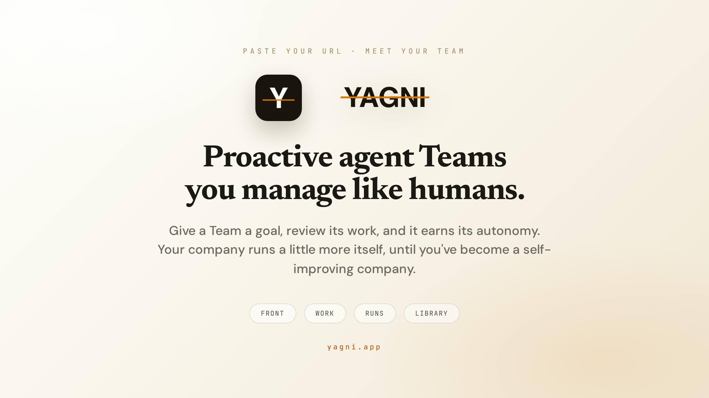
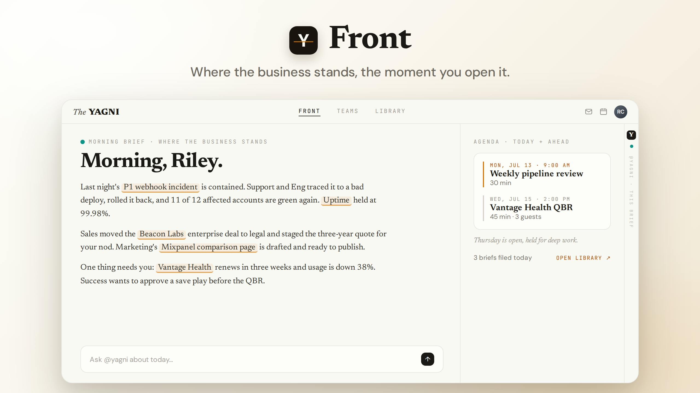
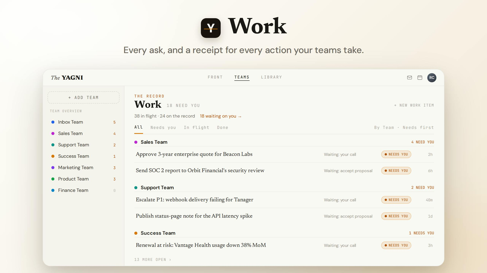

### 🎬 관련 영상
- [🎥 영상 보기](https://ph-files.imgix.net/eb53fdf3-b2e8-4a6b-99f8-e978d77506b5.jpeg?auto=format)

---

## 7. [RecordMeeting](https://www.producthunt.com/products/recordmeeting)
**Votes**: 156 | **도입 난이도**: 하 | **신뢰도**: 상
**Tagline**: Record and transcribe any calls without announcement
**서비스 링크**: https://www.producthunt.com/r/5VQLO4LQTNZQ6D

**태그**: Productivity, AI, Transcription, Collaboration

### 📌 이 서비스 한눈에 보기
알림 없이 모든 화상 회의를 조용히 기록하고 자동 요약하는 프라이빗 회의 기록 도구

### 🔑 주요 기능
- 봇 참여나 녹음 알림 없이 프라이빗하게 회의 기록 및 전사
- 자동 생성되는 요약, 검색 가능한 노트, 핵심 포인트 제공
- Google Meet, Zoom, WhatsApp, Teams 등 주요 협업 툴 완벽 지원

### 🙋 사용자에게 어떤 점이 좋은가
회의 중 녹음 알림에 대한 부담 없이 자연스러운 대화를 기록할 수 있으며, 자동 요약 기능을 통해 회의 후 정리 시간을 획기적으로 줄여줍니다.

### ✅ 지금 바로 써볼 기능
- 주요 화상 회의 플랫폼 연동하기
- 자동 생성된 회의 요약 및 핵심 포인트 확인하기
- 공유 링크를 통해 팀원과 회의록 공유하기

### ⚠️ 사용 전 확인할 점
- 녹음 알림이 없는 방식이므로 참여자 간의 윤리적/법적 이슈가 발생할 수 있음
- 개인정보 및 회의 보안 정책 준수 여부 확인 필요

### 🧭 확인이 더 필요한 정보
사용자의 프라이버시 보호 방식과 각 플랫폼별 기술적 구현 방식에 대한 상세 정보가 필요합니다.

### 📸 스크린샷 및 갤러리
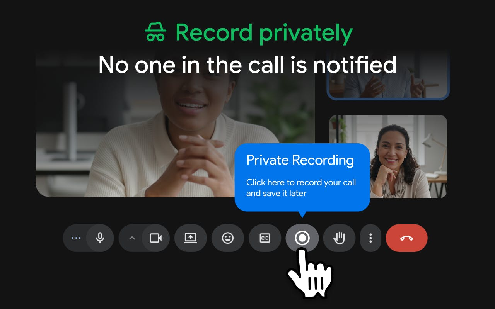
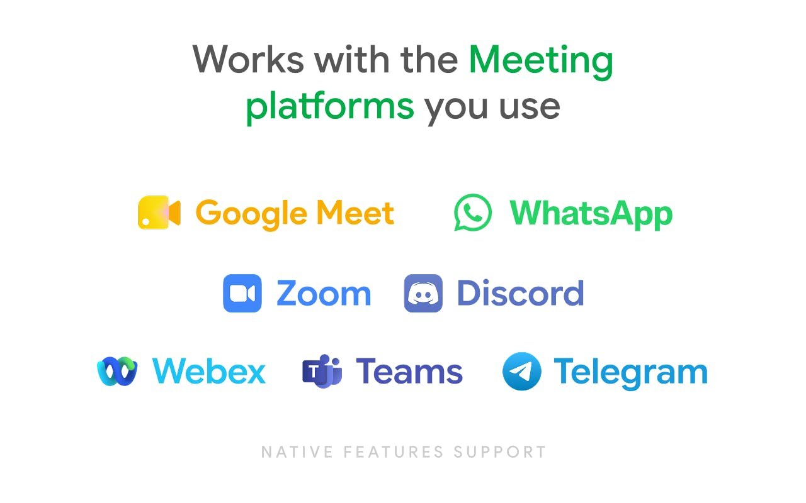
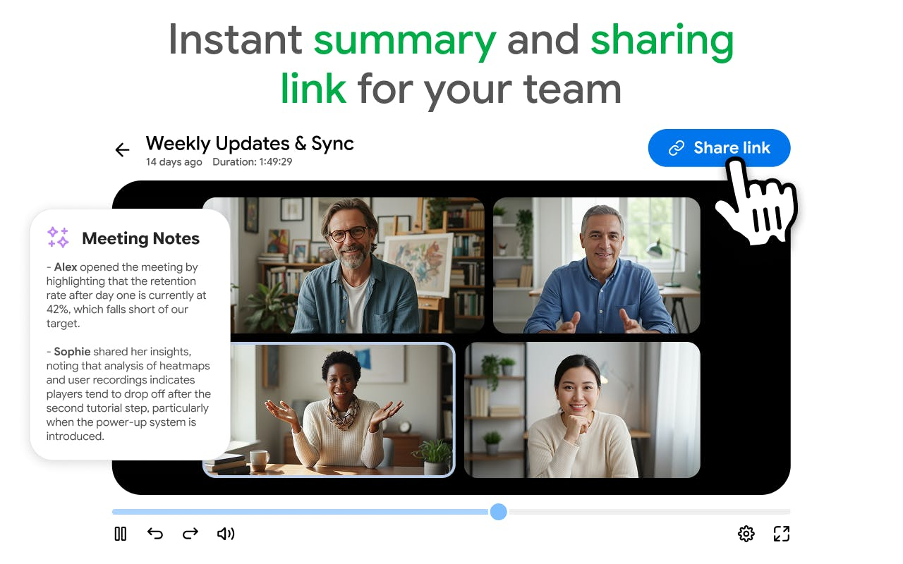

---

## 8. [Tiptap AI Toolkit](https://www.producthunt.com/products/tiptap)
**Votes**: 156 | **도입 난이도**: 상 | **신뢰도**: 상
**Tagline**: Empower your AI to directly edit documents in real time.
**서비스 링크**: https://www.producthunt.com/r/FJXGFTVRLQLMIQ

**태그**: AI, DevTool, SaaS, Productivity, AI Tool, Chat

### 📌 이 서비스 한눈에 보기
AI가 문서 내에서 실시간으로 직접 편집할 수 있도록 돕는 개발자용 툴킷

### 🔑 주요 기능
- AI와 리치 텍스트 문서 간의 안전하고 신뢰할 수 있는 브릿지 제공
- 문서 편집 자동화 구현을 위한 복잡한 엔지니어링 과정 단축
- 초기 빌더 100명을 대상으로 한 평생 라이선스 프로모션 진행

### 🙋 사용자에게 어떤 점이 좋은가
단순한 챗봇을 넘어, AI가 사용자의 작업 문서에 직접 개입하여 실시간 편집을 수행하는 기능을 빠르게 구현할 수 있습니다.

### ✅ 지금 바로 써볼 기능
- Tiptap 계정 생성 및 가입
- 100명 한정 평생 라이선리 이벤트 참여 신청
- AI 기반 문서 편집 기능 프로토타이핑

### ⚠️ 사용 전 확인할 점
- 현재 프로덕션 준비 단계의 베타 버전임
- 평생 라이선스는 피드백 제공을 전제로 한 한정 수량임

### 🧭 확인이 더 필요한 정보
평생 라이선스 획정 기준과 피드백 요구 수준에 대한 구체적인 조건 확인이 필요합니다.

### 📸 스크린샷 및 갤러리
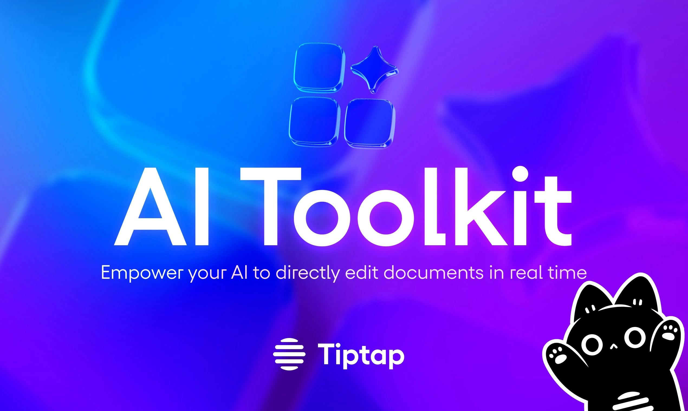
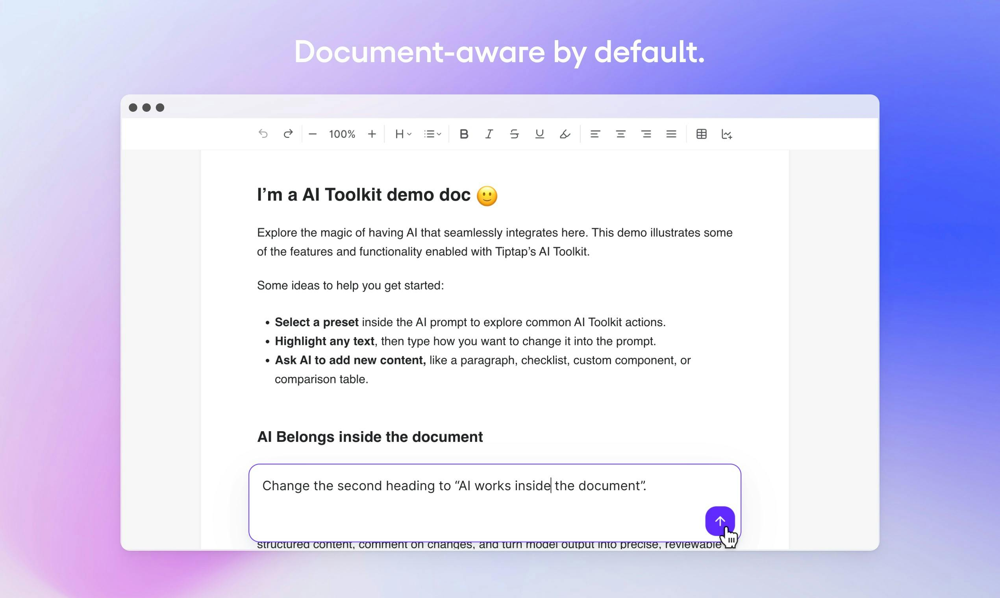
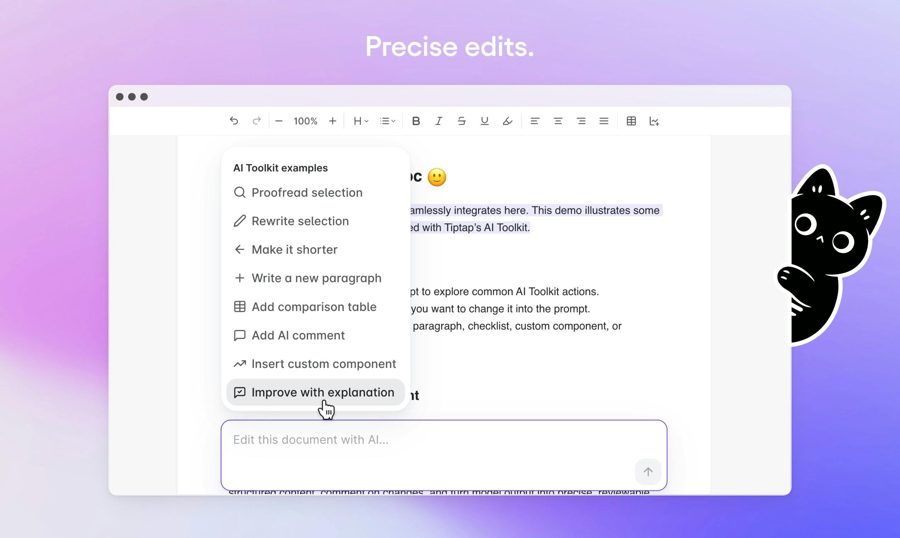

---

## 9. [CodeNearby 2.0](https://www.producthunt.com/products/codenearby)
**Votes**: 143 | **도입 난이도**: 하 | **신뢰도**: 상
**Tagline**: Tinder for developers! Find coding partners & build together
**서비스 링크**: https://www.producthunt.com/r/XR3NXENXREVCWY

**태그**: DevTool, Social, Collaboration, OpenSource, AI Tool, Chat

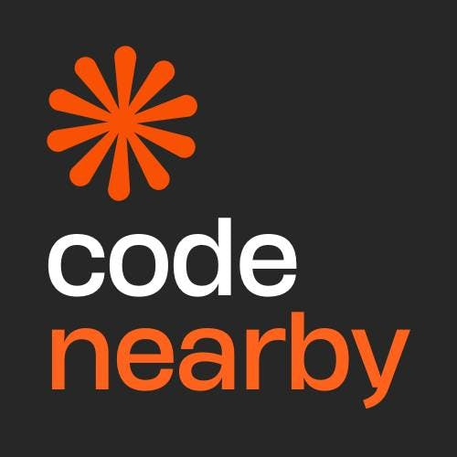

### 📌 이 서비스 한눈에 보기
개발자를 위한 소셜 네트워크로, 취향과 기술이 맞는 코딩 파트너를 매칭해주는 서비스

### 🔑 주요 기능
- 기술 스택, 관심사, 위치 기반의 개발자 매칭 기능
- GitHub 연동 프로필 및 실시간 채팅 기능
- AI-Connect를 통한 자연스러운 협업자 발굴

### 🙋 사용자에게 어떤 점이 좋은가
함께 프로젝트를 진행할 동료를 찾거나, 비슷한 기술 스택을 가진 개발자 커뮤니티를 형성하는 데 유용합니다.

### ✅ 지금 바로 써볼 기능
- GitHub 계정 연동하여 프로필 구축하기
- AI-Connect를 통해 잠재적 협업자 탐색하기
- 관심 분야 설정 후 적합한 파트너 찾기

### ⚠️ 사용 전 확인할 점
- 사용자 기반이 충분히 확보되어야 매칭 효율이 높음
- 오픈소스 프로젝트이므로 보안 및 개인정보 관리 확인 필요

### 🧭 확인이 더 필요한 정보
사용자 규모와 매칭 알고리즘의 정교함에 대한 구체적인 데이터가 부족합니다.

### 📸 스크린샷 및 갤러리
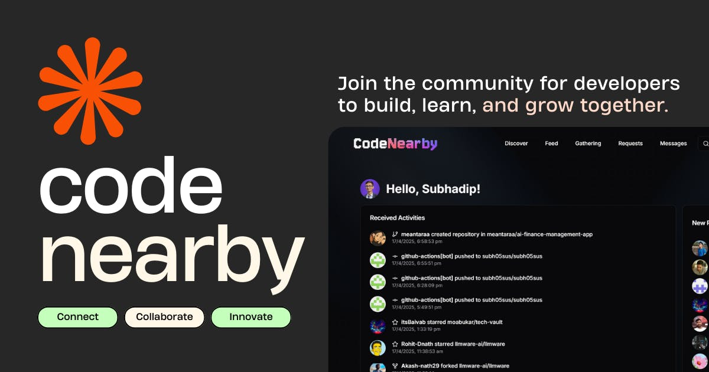
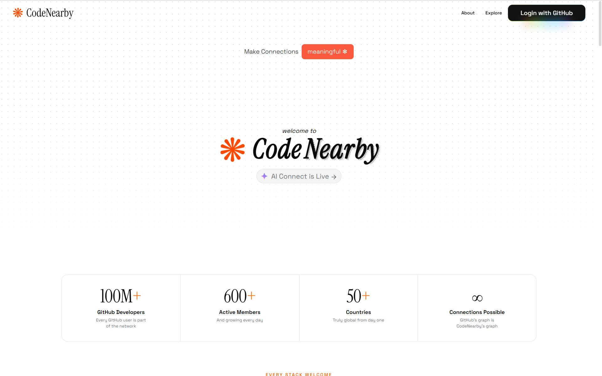
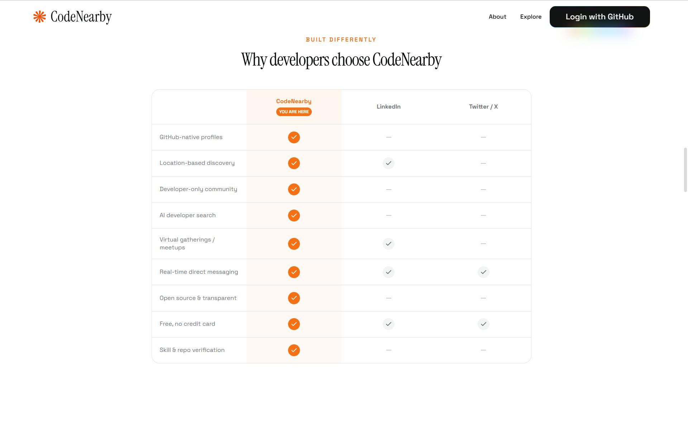

### 🎬 관련 영상
- [🎥 영상 보기](https://ph-files.imgix.net/d7e664e2-59a8-4b43-86d9-ab1a4e64ef2a.jpeg?auto=format)

---

## 10. [Flodesk Studio](https://www.producthunt.com/products/flodesk-studio)
**Votes**: 138 | **도입 난이도**: 하 | **신뢰도**: 상
**Tagline**: A place to make beautiful emails.
**서비스 링크**: https://www.producthunt.com/r/7HF5PPO2P2WY3O

**태그**: Design, Email Marketing, AI, Productivity, AI Tool, Email

### 📌 이 서비스 한눈에 보기
디자이너의 감각과 AI 기술이 결합된 초고속 이메일 디자인 도구

### 🔑 주요 기능
- AI를 활용한 브랜드 맞춤형 이메일 자동 디자인
- 전문 디자이너들이 설계한 미적 완성도
- 사용자가 최종 수정을 거쳐 완성하는 직관적 워크플로우

### 🙋 사용자에게 어떤 점이 좋은가
디자인 전문 지식이 없어도 브랜드 정체성이 살아있는 아름다운 이메일을 몇 초 만에 제작할 수 있습니다.

### ✅ 지금 바로 써볼 기능
- AI 디자인 생성 기능 테스트
- 브랜드 스타일 적용해보기
- 베타 기간 무료 기능 활용하기

### ⚠️ 사용 전 확인할 점
- 현재 베타 버전이므로 기능이 변경될 수 있음
- AI 생성 결과물에 대한 사용자 최종 검토 필요

### 🧭 확인이 더 필요한 정보
현재 베타 서비스로, 정식 출시 시 가격 정책이나 상세 기능이 변경될 수 있습니다.

### 📸 스크린샷 및 갤러리
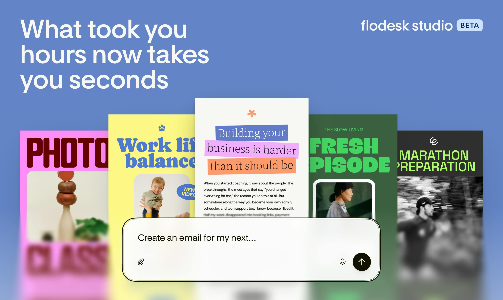

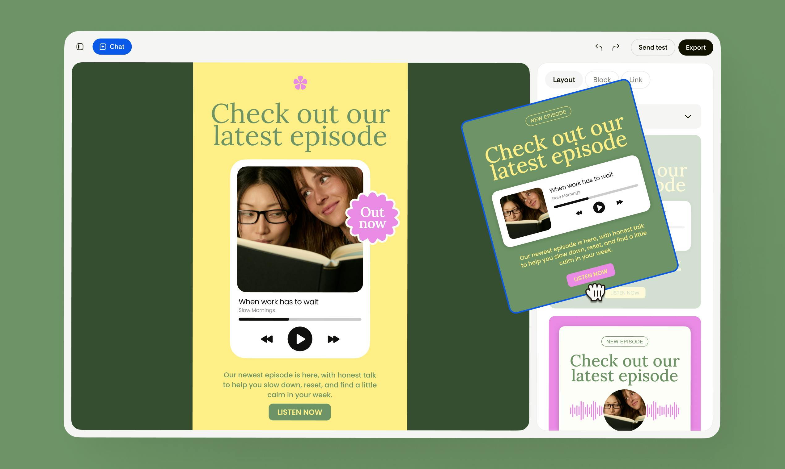

### 🎬 관련 영상
- [🎥 영상 보기](https://ph-files.imgix.net/d573b183-149e-42b3-8e0a-853db2abf880.jpeg?auto=format)

---

## 11. [nudge2.0](https://www.producthunt.com/products/nudge-26)
**Votes**: 128 | **도입 난이도**: 하 | **신뢰도**: 상
**Tagline**:  AI schedules your whole week to take action
**서비스 링크**: https://www.producthunt.com/r/OAMHRPKTYDKUQL

**태그**: Productivity, AI, Scheduling, Automation, AI Tool

### 📌 이 서비스 한눈에 보기
복잡한 계획 없이 텍스트 입력만으로 일주일 일정을 자동 설계하는 AI 스케줄러

### 🔑 주요 기능
- 자연어 입력을 통한 간편한 작업 생성 및 마감일 설정
- 수면, 식사, 고정 일정을 고려한 원클릭 자동 스케줄링
- 마감 준수를 유도하는 $5 예치금 기반의 강력한 실행 동기부여

### 🙋 사용자에게 어떤 점이 좋은가
계획을 짜는 데 드는 인지적 에너지를 최소화하고, AI가 짜준 일정에 따라 즉각적인 실행에만 집중할 수 있게 해줍니다.

### ✅ 지금 바로 써볼 기능
- 평소 해야 할 일을 텍스트로 입력하여 작업 생성하기
- 원클릭 스케줄링 기능을 통해 하루 일정 자동 배정하기
- Slack/Discord를 연결하여 외부에서도 일정 관리하기

### ⚠️ 사용 전 확인할 점
- 마감 준수 여부에 따라 비용이 발생하는 구조이므로 신중한 목표 설정 필요
- 개인 일정(수면, 식사 등) 데이터 입력에 따른 개인정보 관리 확인 필요

### 🧭 확인이 더 필요한 정보
현재 제공되는 자동 스케줄링 알고리즘의 세부적인 최적화 방식은 명시되어 있지 않습니다.

### 📸 스크린샷 및 갤러리
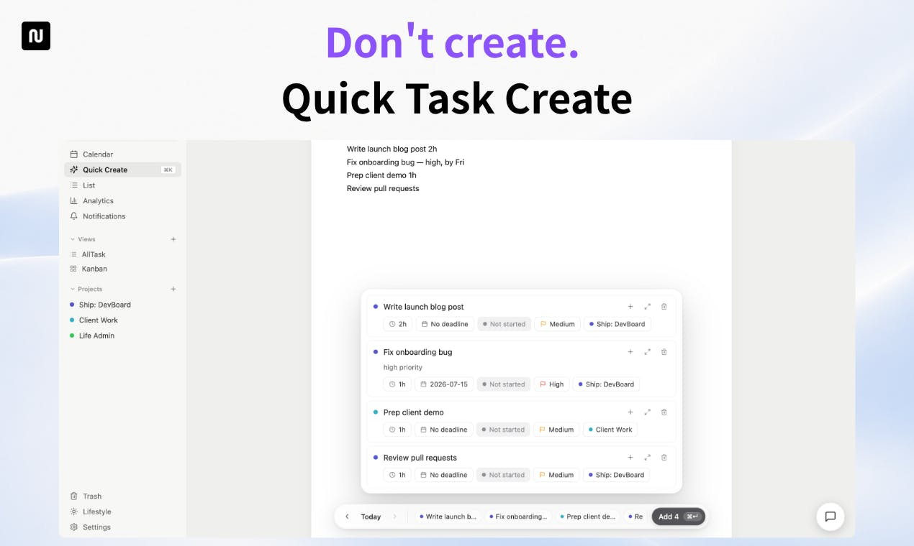
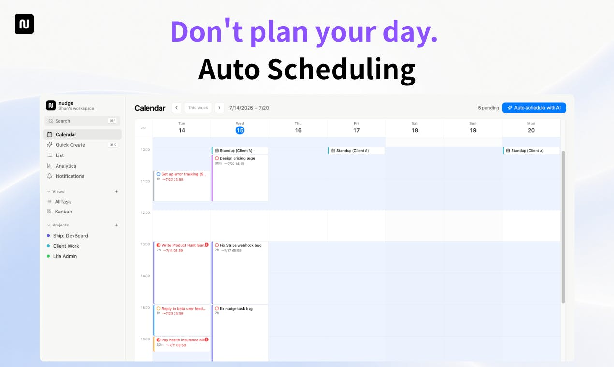
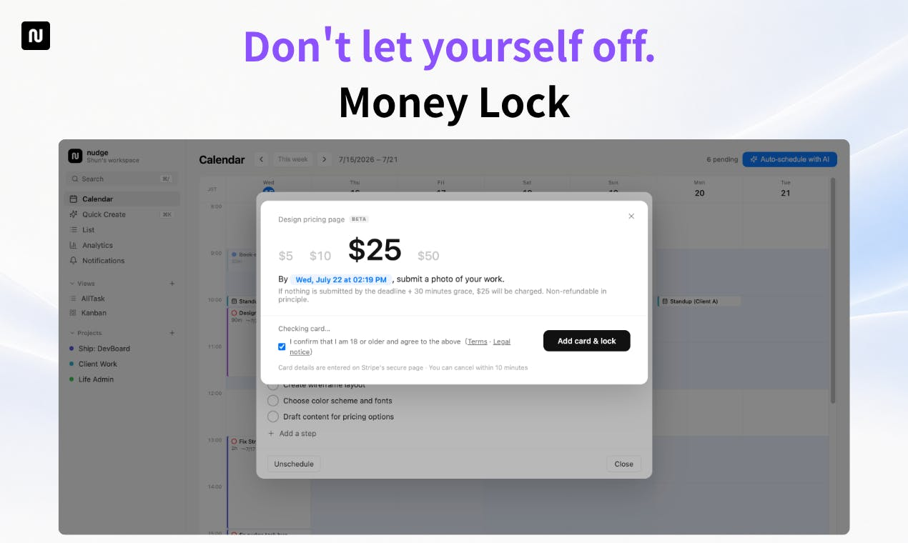

### 🎬 관련 영상
- [🎥 영상 보기](https://ph-files.imgix.net/06fc5cb4-a2f5-4ab4-9834-5d335656a7a9.jpeg?auto=format)

---

## 12. [Copresent](https://www.producthunt.com/products/co-present)
**Votes**: 118 | **도입 난이도**: 하 | **신뢰도**: 상
**Tagline**: Turn your phone into a Google Slides remote
**서비스 링크**: https://www.producthunt.com/r/EUZG2YHTTLY4UE

**태그**: Productivity, Presentation, Collaboration, GoogleSlides

### 📌 이 서비스 한눈에 보기
스마트폰을 구글 슬라이드 리모컨으로 변환하고 여러 명이 동시에 발표를 제어하는 도구

### 🔑 주요 기능
- 스마트폰을 구글 슬라이드 전용 리모컨으로 활용
- 화면상에 발표자 노트를 실시간 확인 가능
- 링크 공유를 통해 최대 10명이 하나의 슬라이드를 공동 제어

### 🙋 사용자에게 어떤 점이 좋은가
별도의 앱 설치나 계정 생성 없이도 스마트폰으로 간편하게 발표를 진행하거나 협업할 수 있습니다.

### ✅ 지금 바로 써볼 기능
- 스마트폰으로 슬라이드 넘기기 기능 테스트
- 화면 내 발표자 노트 가독성 확인
- 여러 기기 접속 시 동시 제어 기능 테스트

### ⚠️ 사용 전 확인할 점
- 구글 슬라이드 환경에서만 작동할 것으로 보임
- 다수 접속 시 제어권 충돌 여부 확인 필요

### 🧭 확인이 더 필요한 정보
지원하는 모바일 OS(iOS/Android) 및 구글 계정 로그인 필요 여부를 확인해야 합니다.

### 📸 스크린샷 및 갤러리
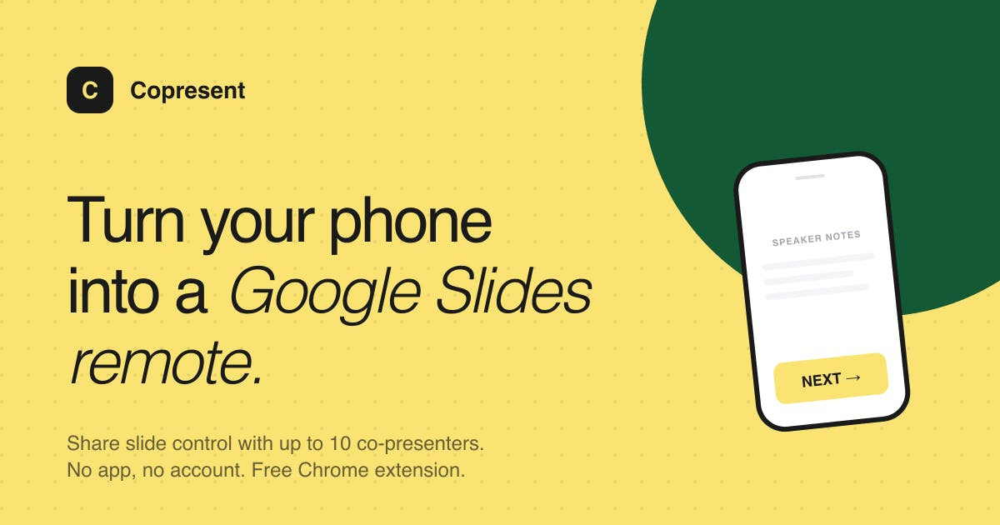
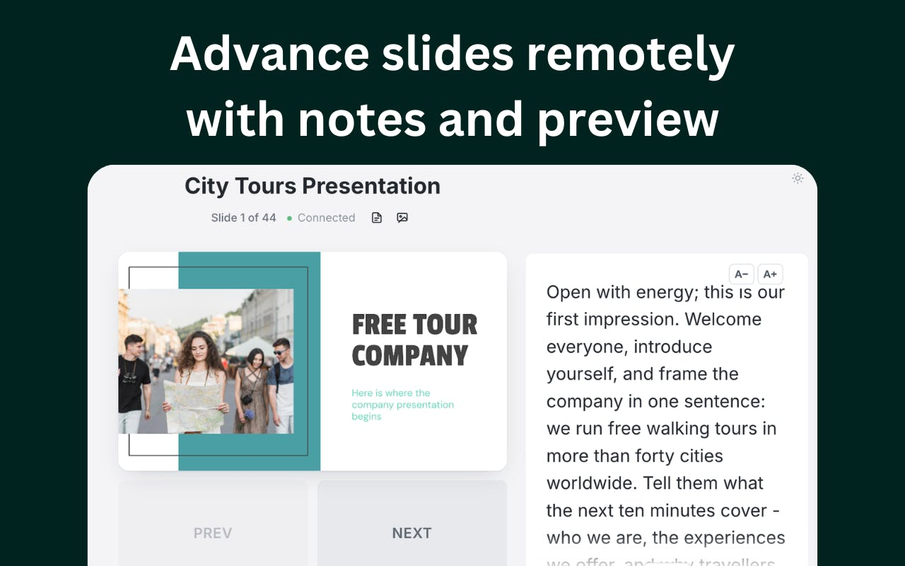
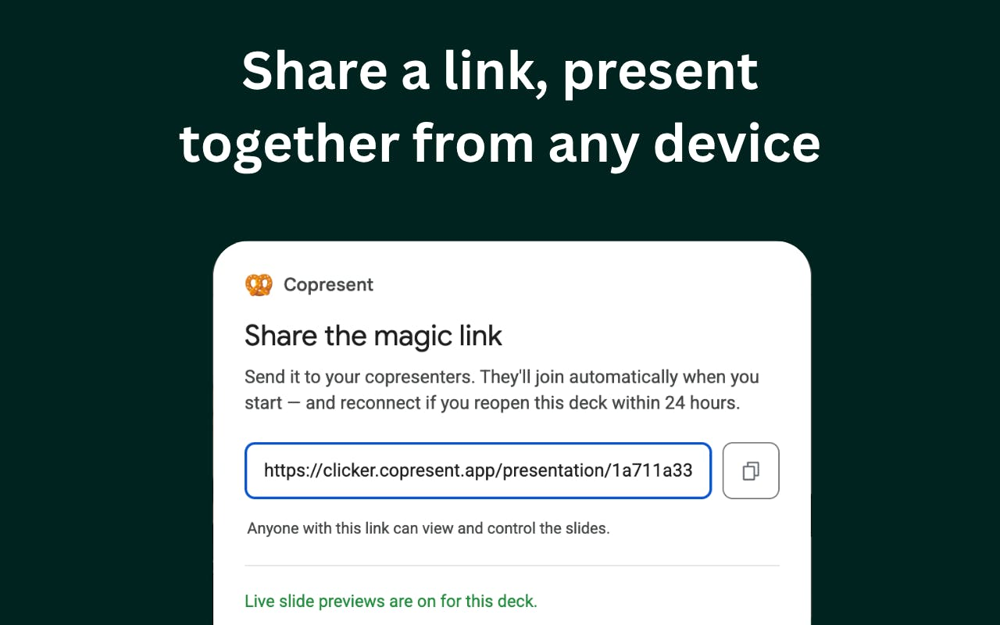

### 🎬 관련 영상
- [🎥 영상 보기](https://ph-files.imgix.net/5e5aa25d-c9aa-4f16-aefc-3433a3aadaea.jpeg?auto=format)

---

## 13. [Keepresso](https://www.producthunt.com/products/keepresso)
**Votes**: 116 | **도입 난이도**: 하 | **신뢰도**: 상
**Tagline**: Keep your Mac awake, on your terms. Free and open source
**서비스 링크**: https://www.producthunt.com/r/LNBJ626IEVVMOO

**태그**: macOS, Productivity, OpenSource, Utility, Agent

### 📌 이 서비스 한눈에 보기
중요한 작업 중 맥이 잠들지 않도록 스마트하게 제어하는 오픈소스 유틸리티

### 🔑 주요 기능
- 다운로드, 렌더링 등 특정 작업 시 맥의 잠자기 방지
- 스마트 트리거 및 타이머 기반의 세션 관리
- 클로즈드 디스플레이 모드 및 헤드리스 맥 환경 지원

### 🙋 사용자에게 어떤 점이 좋은가
작업 도중 맥이 잠들어 프로세스가 중단되는 문제를 방지하며, 필요한 순간에만 정밀하게 깨어 있게 설정할 수 있습니다.

### ✅ 지금 바로 써볼 기능
- 중요한 백그라운드 작업 시 스마트 트리거 설정하기
- 특정 시간 동안만 깨어 있도록 타이머 세션 활용하기
- 클로즈드 디스플레이 모드 테스트하기

### ⚠️ 사용 전 확인할 점
- macOS 14 이상의 운영체제 버전 필요
- 잠자기 방지 기능 사용 시 배터리 소모 증가 가능성

### 🧭 확인이 더 필요한 정보
상세한 스마트 트리거의 작동 방식과 지원되는 외부 하드웨어 호환성은 추가 확인이 필요합니다.

### 📸 스크린샷 및 갤러리
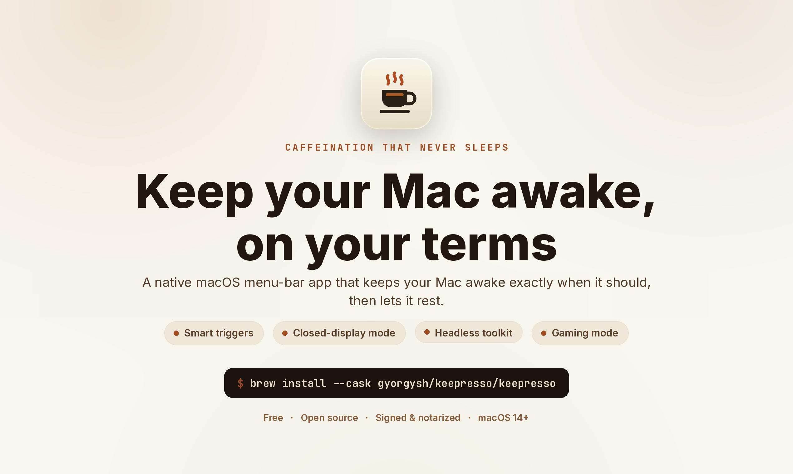
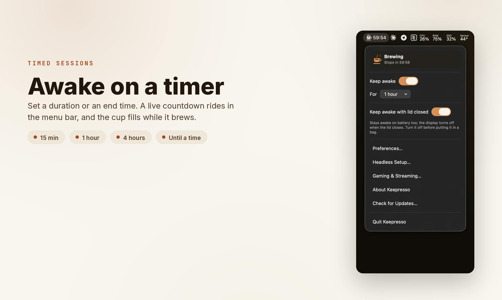
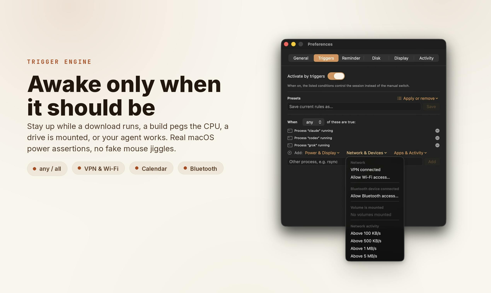

---

## 14. [Review by Eddie AI](https://www.producthunt.com/products/eddie-your-ai-video-editor)
**Votes**: 116 | **도입 난이도**: 하 | **신뢰도**: 상
**Tagline**: Time-stamped feedback on your video from your team. And AI.
**서비스 링크**: https://www.producthunt.com/r/IDSL3BK3Y6MZEZ

**태그**: VideoEditing, Collaboration, AI, Productivity, AI Tool, Video

### 📌 이 서비스 한눈에 보기
로그인과 재업로드 없이 영상의 특정 프레임에 즉각적인 피드백과 AI 리뷰를 받는 협업 도구

### 🔑 주요 기능
- 로그인 및 재업로드 없는 빠른 피드백 프로세스
- 프레임 단위의 정밀한 타임스탬프 댓글 기능
- AI를 통한 편집 리뷰 및 피드백의 할 일 목록(To-do list) 자동 변환

### 🙋 사용자에게 어떤 점이 좋은가
영상 편집 과정에서 팀원들과 실시간으로 소통하며, 피드백을 즉시 실행 가능한 작업 목록으로 바꿀 수 있어 편집 시간을 단축해 줍니다.

### ✅ 지금 바로 써볼 기능
- 영상 링크를 공유하여 프레임별 댓글 기능 테스트하기
- AI 리뷰 기능을 통해 편집 방향성 검토하기
- 수집된 피드백을 할 일 목록으로 변환하여 작업 관리하기

### ⚠️ 사용 전 확인할 점
- 로그인 없이 사용하므로 보안이 중요한 영상의 경우 주의 필요
- 영상 파일의 직접 업로드 방식인지 링크 공유 방식인지에 따른 용량 제한 확인 필요

### 🧭 확인이 더 필요한 정보
로그인 없이 사용 시 데이터 저장 방식 및 보안 정책에 대한 상세 정보가 필요합니다.

### 📸 스크린샷 및 갤러리
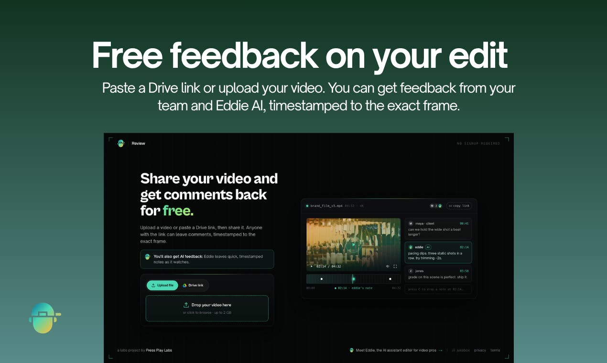
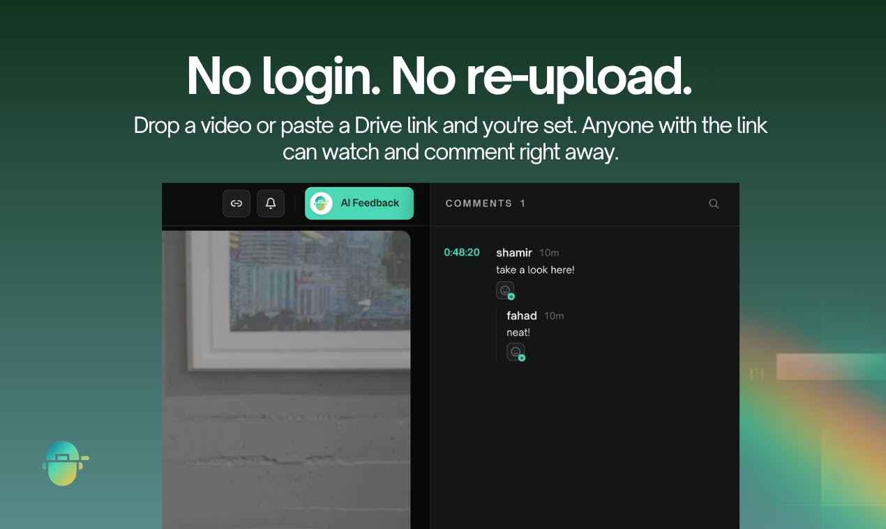
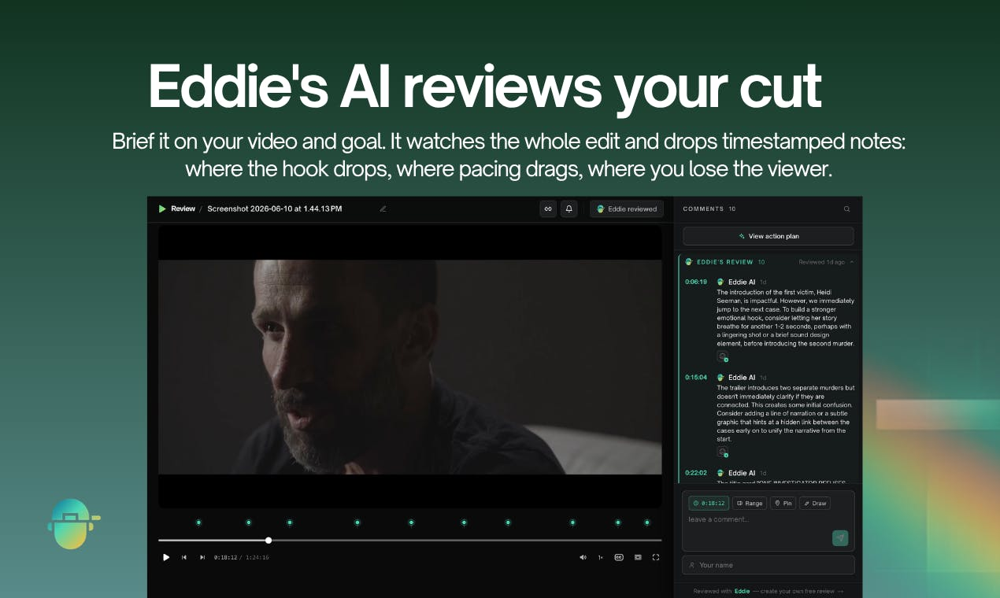

### 🎬 관련 영상
- [🎥 영상 보기](https://ph-files.imgix.net/70d5f838-2ea9-4355-ac0b-d89c98e9b09b.jpeg?auto=format)

---

## 15. [Clerk | AI Assistant for Cap Tables](https://www.producthunt.com/products/withmantle)
**Votes**: 115 | **도입 난이도**: 중 | **신뢰도**: 상
**Tagline**: Issue grants, model funding rounds, ask it anything equity
**서비스 링크**: https://www.producthunt.com/r/OVI3EL7LHNVMOG

**태그**: FinTech, AI, SaaS, Startup, Automation, AI Tool

### 📌 이 서비스 한눈에 보기
복잡한 주주 명부(Cap Table) 데이터를 AI로 관리하고 자동화하는 지능형 어시스턴트

### 🔑 주요 기능
- 분산된 주주 명부 정보를 통합하여 관리 및 질의응답 가능
- 스톡 옵션 발행, 펀딩 라운드 모델링 등 복잡한 지분 구조 관리
- 문서 업로드 및 대화형 인터페이스를 통한 데이터 기록 및 초안 작성

### 🙋 사용자에게 어떤 점이 좋은가
변호사나 VC의 머릿속에 흩어져 있는 복잡한 지분 정보를 디지털화하여, 누구나 쉽게 자본 구조를 파악하고 다음 단계를 준비할 수 있게 돕습니다.

### ✅ 지금 바로 써볼 기능
- 기존 주주 명부 및 관련 문서 업로드하기
- AI에게 현재 지분 구조에 대해 질문하기
- 새로운 펀딩 라운드 시나리오 모델링해보기

### ⚠️ 사용 전 확인할 점
- 법적 효력을 갖는 공식 문서로서의 검토는 전문가(변호사 등)가 반드시 수행해야 함
- 입력하는 민감한 지분 데이터의 보안 및 프라이버시 정책 확인 필요

### 🧭 확인이 더 필요한 정보
현재 제공되는 기능이 단순 정보 조회용인지, 실제 법적 효력이 있는 전자 서명/발행 기능까지 포함하는지 확인이 필요합니다.

### 📸 스크린샷 및 갤러리
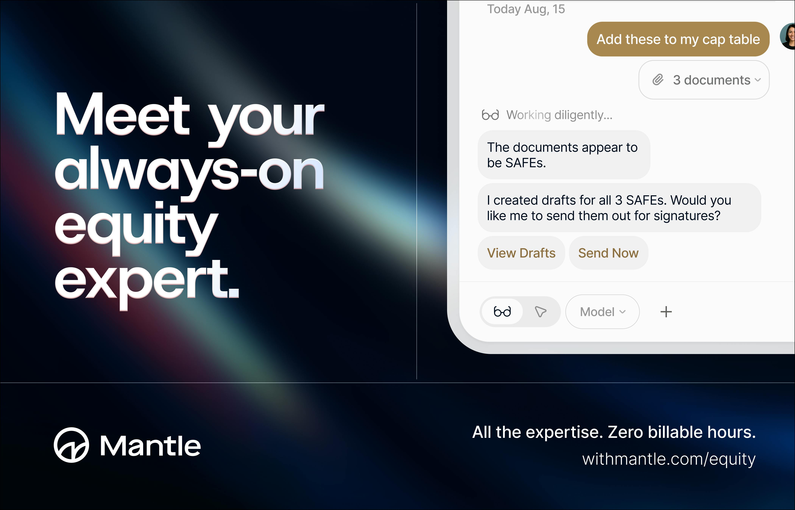
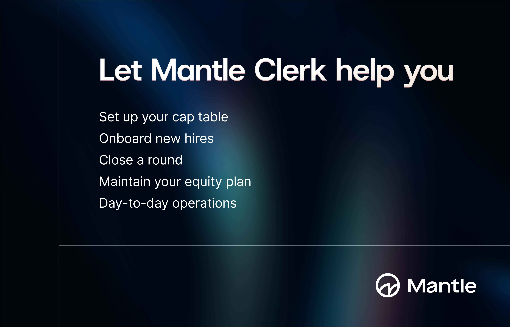

### 🎬 관련 영상
- [🎥 영상 보기](https://ph-files.imgix.net/a07ab278-76b2-47a7-9ed7-74d5c2f8196e.jpeg?auto=format)

---

## 16. [Jam-Pod](https://www.producthunt.com/products/jam-pod)
**Votes**: 114 | **도입 난이도**: 하 | **신뢰도**: 상
**Tagline**: A player for people who keep their own music collection 
**서비스 링크**: https://www.producthunt.com/r/P5FMVPS4IOZ6HK

**태그**: Music Player, Minimalism, Hi-Res Audio, Retro UI

### 📌 이 서비스 한눈에 보기
알고리즘의 방해 없이 오직 나만의 음악 감상에만 집중할 수 있는 레트로 스타일 플레이어

### 🔑 주요 기능
- 조이스틱 기반의 모노크롬 인터페이스로 구현한 미니멀한 사용자 경험
- 로컬 파일(FLAC, WAV, ALAC) 및 Apple Music 카탈로그 통합 지원
- 피드와 알고리즘을 배제한 직관적인 라이브러리 중심 설계

### 🙋 사용자에게 어떤 점이 좋은가
끊임없는 추천 피드에서 벗어나 자신이 소유한 고음질 음원과 플레이리스트를 가장 단순하고 몰입감 있게 즐길 수 있습니다.

### ✅ 지금 바로 써볼 기능
- 보유 중인 고음질(Hi-res) 음원 파일 불러오기
- 레트로 테마 및 햅틱 내비게이션 설정해보기
- 스마트 플레이리스트를 통한 개인 맞춤형 라이브러리 구축

### ⚠️ 사용 전 확인할 점
- 모노크롬 인터페이스로 인해 시각적 화려함은 제한적일 수 있음
- 스트리밍 서비스보다는 개인 소장 음원 관리에 최적화된 구조임

### 🧭 확인이 더 필요한 정보
Apple Music 카탈로그 재생 시 별도의 구독 서비스 연동 방식이나 오프라인 재생 지원 여부를 확인해야 합니다.

### 📸 스크린샷 및 갤러리
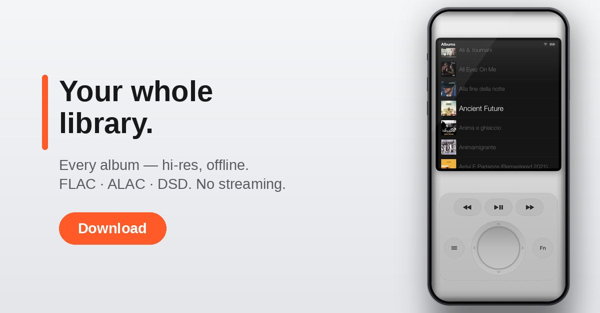
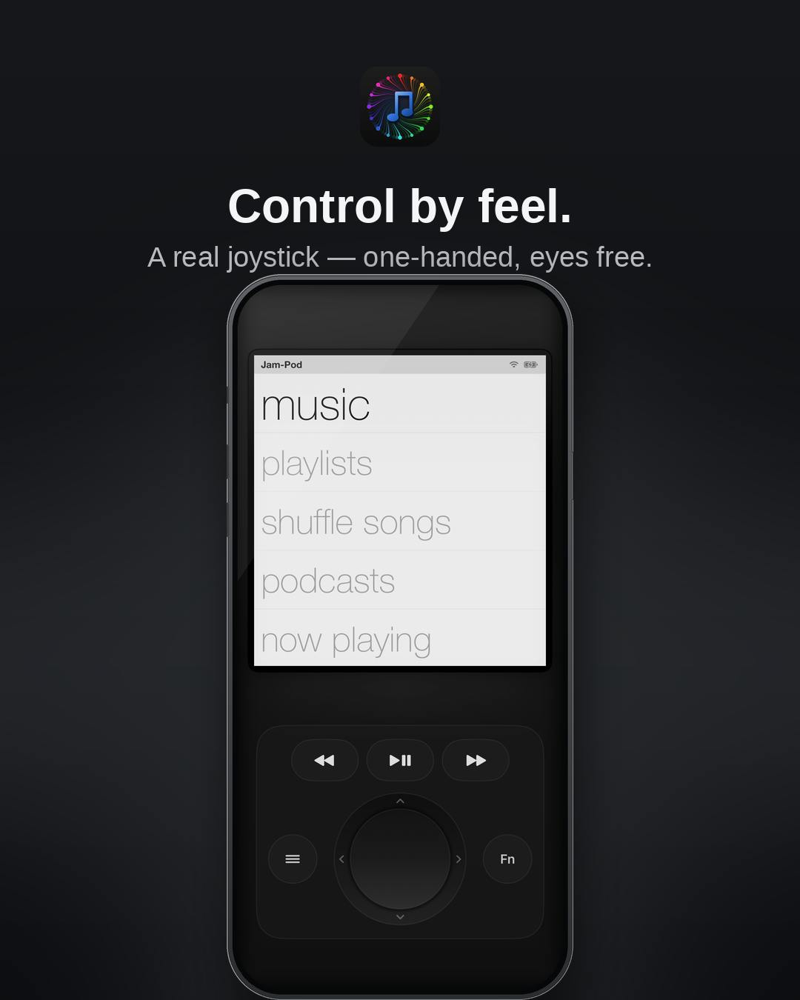
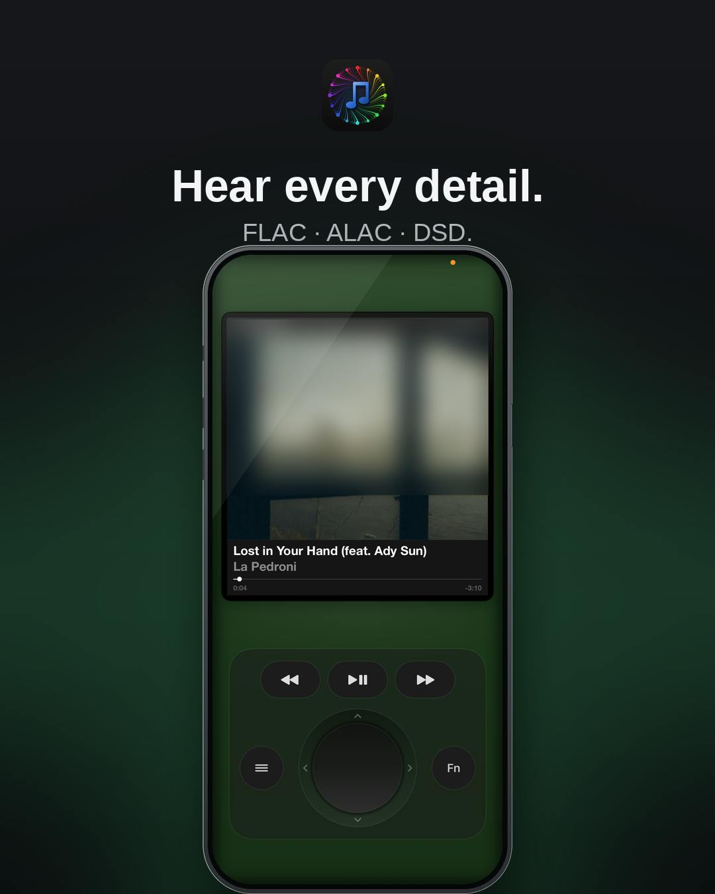

---

## 17. [ccshare](https://www.producthunt.com/products/ccshare)
**Votes**: 112 | **도입 난이도**: 하 | **신뢰도**: 상
**Tagline**: multiplayer claude code
**서비스 링크**: https://www.producthunt.com/r/E25VP6J2PJ6JDZ

**태그**: DevTool, Collaboration, Terminal, PairProgramming, AI Tool

### 📌 이 서비스 한눈에 보기
6자리 코드로 Claude Code 세션을 실시간 공유하고 협업하는 터미널 도구

### 🔑 주요 기능
- 6자리 코드를 이용한 에어드롭 방식의 간편한 세션 공유
- 터미널 또는 브라우저를 통한 설치 없는 실시간 협업
- 로컬 Wi-Fi 또는 무료 터널을 통한 간편한 연결 지원

### 🙋 사용자에게 어떤 점이 좋은가
복잡한 설정 없이 코드 작성 세션을 친구나 동료와 즉시 공유하여 실시간 페어 프로그래밍이 가능합니다.

### ✅ 지금 바로 써볼 기능
- 6자리 코드를 생성하여 세션 공유하기
- 터미널 또는 브라우저로 접속하여 실시간 타이핑 협업하기
- 무료 터널 기능을 통해 외부 환경에서 연결 테스트하기

### ⚠️ 사용 전 확인할 점
- 공유 시 화면과 입력 권한이 노출되므로 보안에 유의해야 함
- 네트워크 환경(Wi-Fi 또는 터널링)에 따라 연결 안정성이 달라질 수 있음

### 🧭 확인이 더 필요한 정보
공유된 세션의 보안 수준과 데이터 암호화 방식에 대한 상세 정보가 필요합니다.

### 📸 스크린샷 및 갤러리
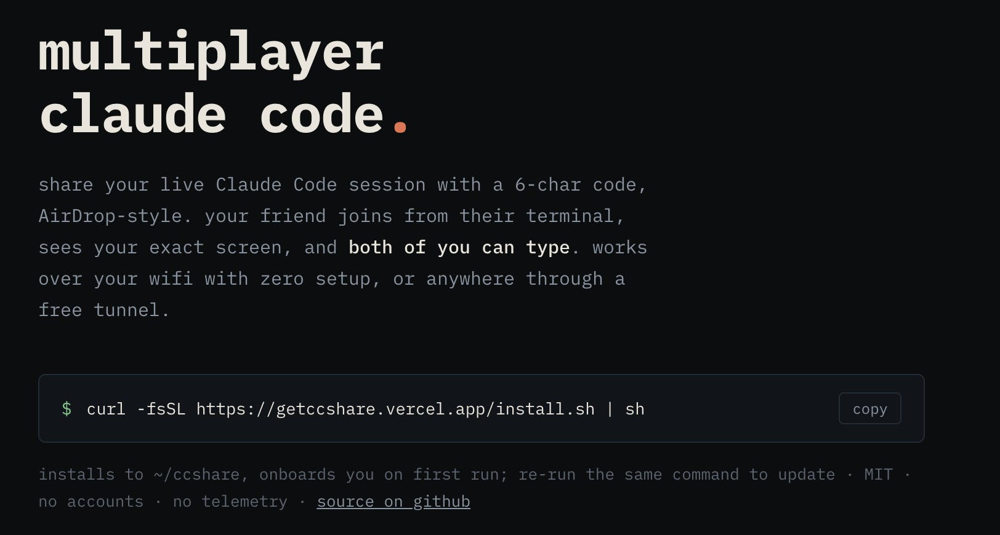
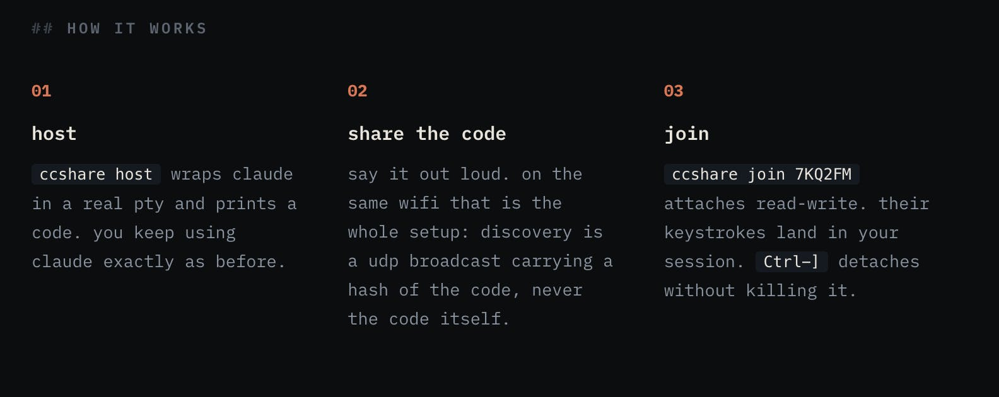
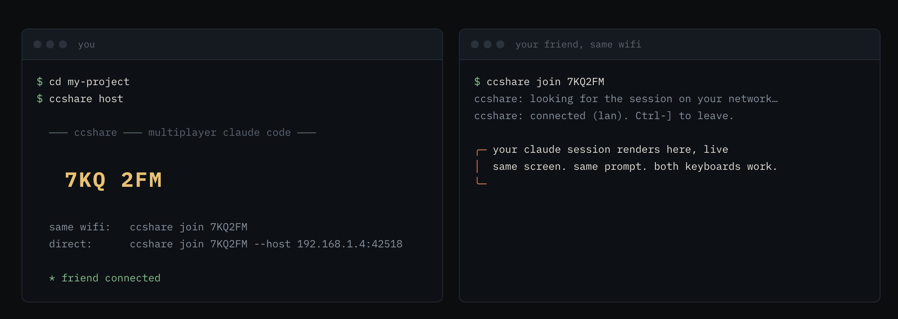

---

## 18. [DeskMat 1.3](https://www.producthunt.com/products/deskmat-for-mac)
**Votes**: 101 | **도입 난이도**: 하 | **신뢰도**: 상
**Tagline**: Now hide individual files + folders for more private desktop
**서비스 링크**: https://www.producthunt.com/r/KNAXEC2ABWLRX5

**태그**: Productivity, Privacy, Desktop-Utility, Video

### 📌 이 서비스 한눈에 보기
클릭 한 번으로 바탕화면의 파일과 폴더를 숨겨 깔끔한 데스크톱 환경을 만드는 도구

### 🔑 주요 기능
- 개별 파일 및 폴더 숨기기 기능 제공
- 화면 공유 및 화상 회의 시 프라이버시 보호
- 깔끔한 바탕화면을 통한 업무 집중도 향상

### 🙋 사용자에게 어떤 점이 좋은가
화면 공유가 잦은 직장인이나 학생이 개인적인 파일 노출 없이 깔끔한 화면을 즉시 보여줄 수 있습니다.

### ✅ 지금 바로 써볼 기능
- 클릭 한 번으로 바탕화면 정리하기
- 화상 회의 전 프라이버시 모드 실행하기
- 업무 집중을 위한 데스크톱 정리하기

### ⚠️ 사용 전 확인할 점
- 파일이 실제로 삭제되는 것이 아니라 숨겨지는 방식임을 인지해야 함
- 숨겨진 파일의 위치나 복구 방식에 대한 숙지 필요

### 🧭 확인이 더 필요한 정보
파일이 숨겨진 상태에서 시스템 검색이나 다른 앱에서 파일 접근이 가능한지 여부는 확인이 필요합니다.

### 📸 스크린샷 및 갤러리
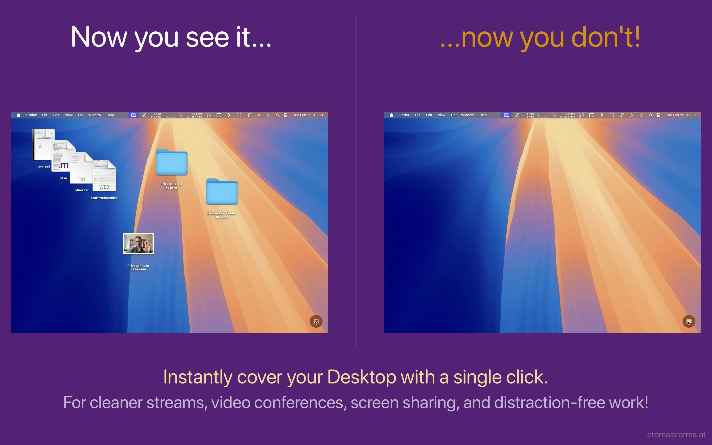
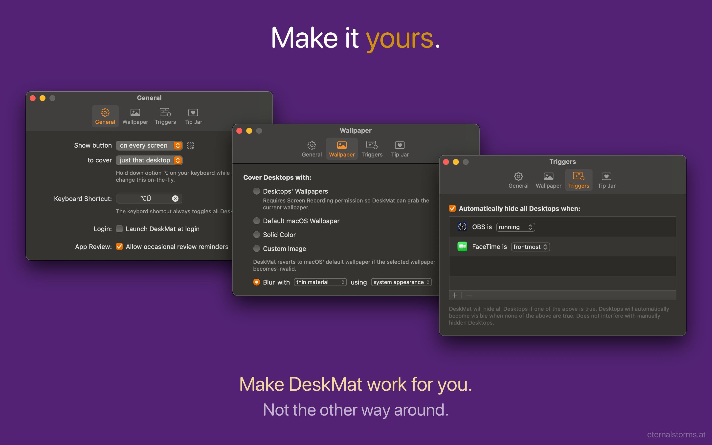
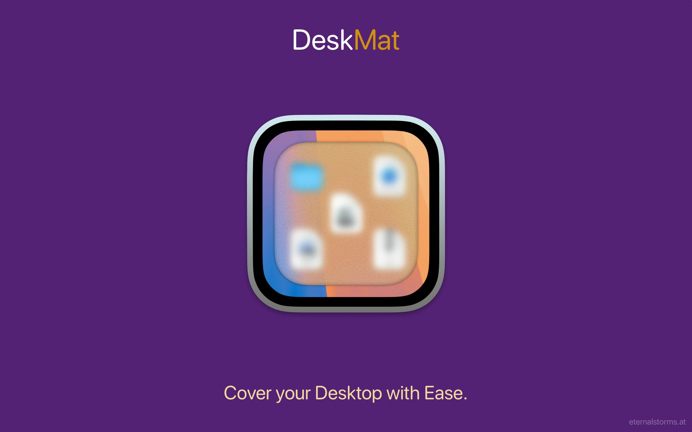

### 🎬 관련 영상
- [🎥 영상 보기](https://ph-files.imgix.net/8564544b-e777-407f-a8bc-acf3fb65207c.jpeg?auto=format)

---

## 19. [QuickQuill](https://www.producthunt.com/products/quickquill-2)
**Votes**: 100 | **도입 난이도**: 하 | **신뢰도**: 상
**Tagline**: Private, on-device meeting notes for Mac
**서비스 링크**: https://www.producthunt.com/r/WYU4OS3UK4LHIH

**태그**: Productivity, AI, Privacy, Mac, Transcription, Automation, Video

### 📌 이 서비스 한눈에 보기
클라우드 전송 없이 Mac에서 안전하게 회의록을 작성하는 온디바이스 AI 도구

### 🔑 주요 기능
- 데이터가 클라우드로 전송되지 않는 완전한 온디바이스(On-device) 방식
- 봇 참여 없이 회의를 기록하며 오프라인 상태에서도 작동
- 실시간 자막/번역 및 모든 앱에서 사용 가능한 푸시 투 토크(Push-to-talk) 기능

### 🙋 사용자에게 어떤 점이 좋은가
개인정보 유출 걱정 없이 보안이 중요한 회의를 기록할 수 있으며, 별도의 계정 생성 없이 즉시 사용할 수 있어 편리합니다.

### ✅ 지금 바로 써볼 기능
- 무료로 제공되는 Dictation 기능 테스트하기
- 실시간 자막 및 번역 기능 확인하기
- Push-to-talk 기능을 활용한 다른 앱에서의 입력 테스트하기

### ⚠️ 사용 전 확인할 점
- Apple Silicon(M 시리즈) 칩이 탑재된 Mac과 macOS 26 이상 환경이 필수임
- 단일 구매 방식이므로 하드웨어 사양에 따른 성능 제약이 있을 수 있음

### 🧭 확인이 더 필요한 정보
설명에 언급된 'macOS 26'이 현재 배포된 버전과 차이가 있어 정확한 요구 사양 확인이 필요합니다.

### 📸 스크린샷 및 갤러리
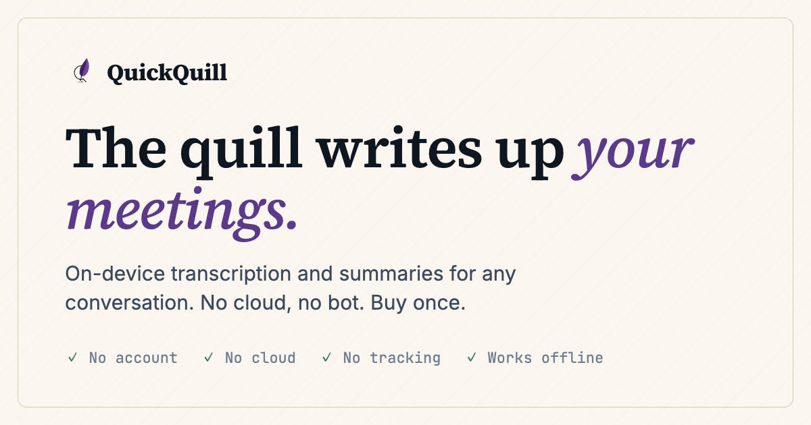
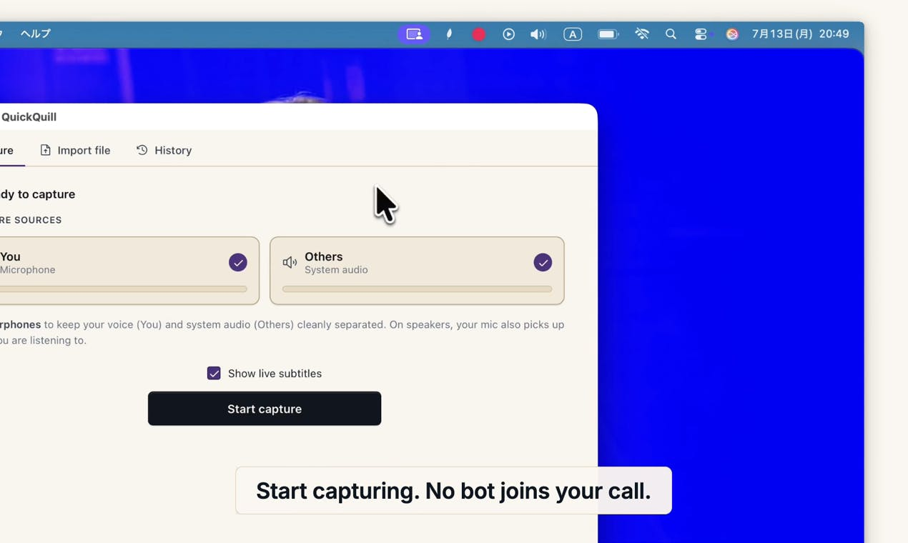
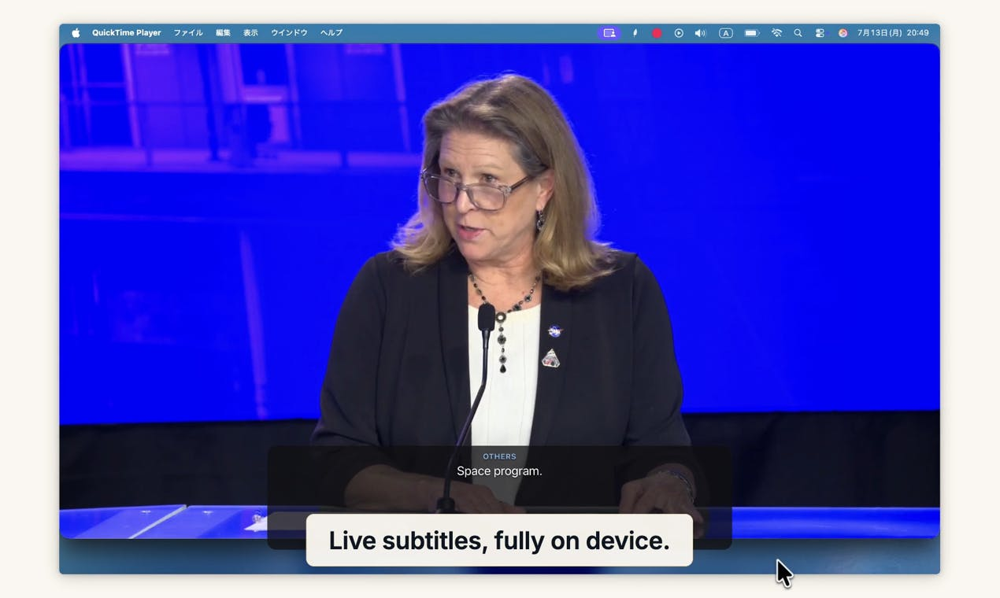

### 🎬 관련 영상
- [🎥 영상 보기](https://ph-files.imgix.net/ee9ecf99-bb49-490a-ab58-a85ab6273465.jpeg?auto=format)

---

## 20. [New AI tools by IFTTT](https://www.producthunt.com/products/ifttt)
**Votes**: 99 | **도입 난이도**: 하 | **신뢰도**: 상
**Tagline**: Automate with Grok, Gemini, Perplexity, and more
**서비스 링크**: https://www.producthunt.com/r/55KBISNUNVB73K
**재등장**: 최근 7일 내 재등장 (마지막 등장 6일 전)

**태그**: Automation, AI, Productivity, Workflow, AI Tool, Vision, DevTool

### 📌 이 서비스 한눈에 보기
Grok, Gemini 등 최신 AI 모델을 기존 워크플로우에 즉시 연결하는 자동화 도구

### 🔑 주요 기능
- Grok, Gemini, Perplexity 등 주요 AI 모델 지원
- 회의 요약, 오디오 전사, 이미지 생성 등 AI 작업 자동화
- Google Drive, Notion, Slack 등 기존 앱과의 연동 지원

### 🙋 사용자에게 어떤 점이 좋은가
반복적인 AI 작업(요약, 전사 등)을 한 번의 설정으로 자동화하여 업무 시간을 획기적으로 단축할 수 있습니다.

### ✅ 지금 바로 써볼 기능
- 회의 종료 후 자동 요약 및 Slack 전송 설정
- 오디오 파일 자동 전사 및 Google Drive 저장
- 스케줄에 따른 AI 이미지 생성 자동화

### ⚠️ 사용 전 확인할 점
- 사용하는 AI 모델 및 외부 서비스의 API 비용이 별도로 발생할 수 있음
- 자동화 설정 시 데이터 보안 및 개인정보 처리 방침 확인 필요

### 🧭 확인이 더 필요한 정보
각 AI 모델별 상세 연동 방식과 추가 비용 발생 여부에 대한 확인이 필요합니다.

### 📸 스크린샷 및 갤러리
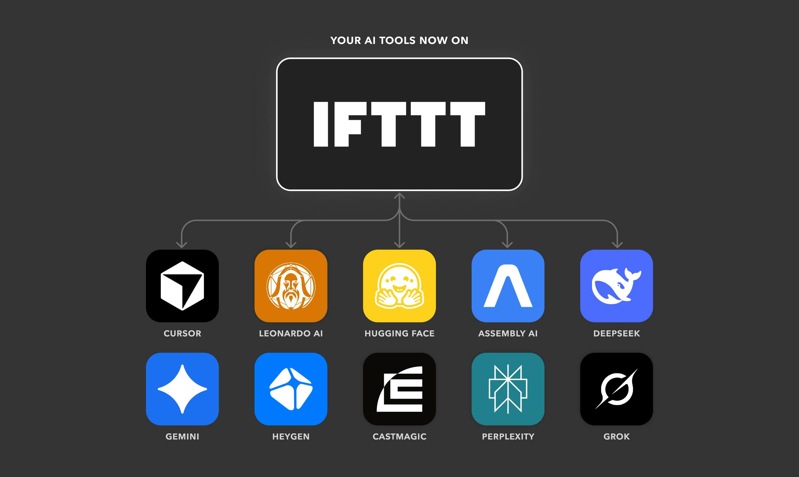
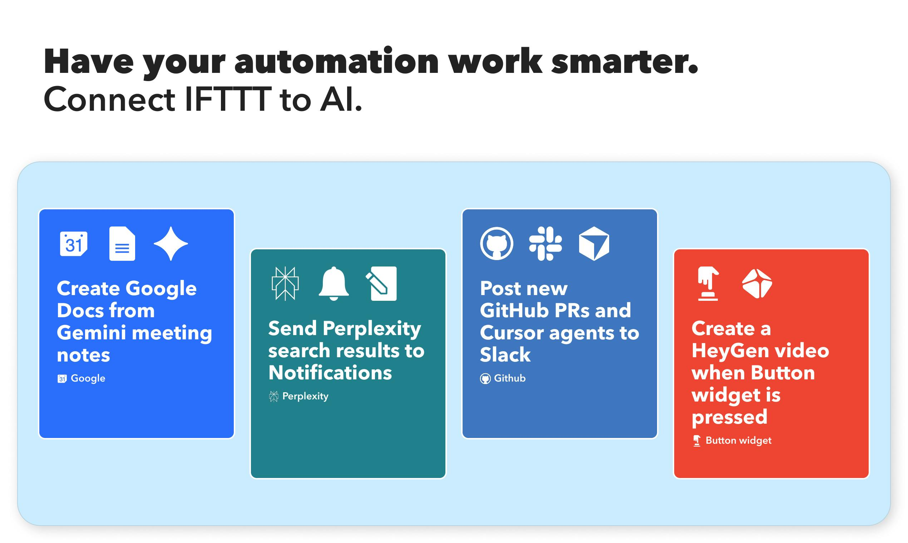
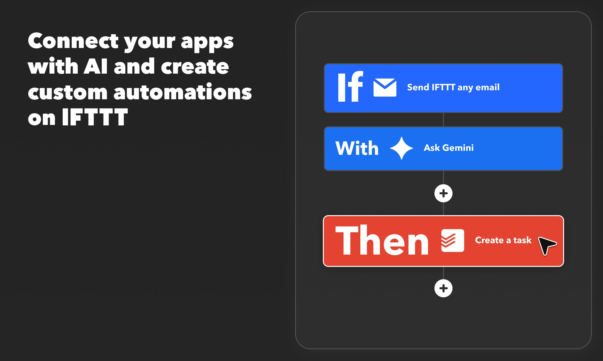

---

## 21. [MentalHappy 3.0](https://www.producthunt.com/products/mentalhappy)
**Votes**: 84 | **도입 난이도**: 하 | **신뢰도**: 상
**Tagline**: Find & host online support groups that actually fill up
**서비스 링크**: https://www.producthunt.com/r/7GEJLMCVNGXD7X

**태그**: MentalHealth, Community, SupportGroup, Expert-Led, AI Tool

### 📌 이 서비스 한눈에 보기
수요 기반의 전문가 주도형 온라인 서포트 그룹 매칭 플랫폼

### 🔑 주요 기능
- 수요 우선 방식: 사용자가 필요한 그룹을 요청하고 투표를 통해 실제 수요가 확인되면 전문가가 개설
- 전문가 주도형: DIY 방식이 아닌 전문가 리더가 운영하여 그룹의 질과 참여율 보장
- 완전 재구축: 새로운 플랫폼, 앱, 호스트 도구를 포함한 통합 솔루션

### 🙋 사용자에게 어떤 점이 좋은가
원하는 주제의 그룹이 생길 때까지 기다리는 대신, 직접 수요를 제기하고 전문가가 운영하는 검증된 그룹에 참여할 수 있습니다.

### ✅ 지금 바로 써볼 기능
- 필요한 서포트 그룹 주제 요청하기
- 다른 사용자의 그룹 요청에 익명으로 투표하기
- 관심 있는 그룹의 활성화 알림 설정하기

### ⚠️ 사용 전 확인할 점
- 전문가 리더가 수요를 확인하고 그룹을 개설해야 실제 운영이 시작됨
- 익명 투표 기반이므로 실제 전문가 매칭 속도는 수요에 따라 달라질 수 있음

### 🧭 확인이 더 필요한 정보
전문가 리더의 검증 절차와 구체적인 그룹 운영 방식에 대한 세부 정보가 필요합니다.

### 📸 스크린샷 및 갤러리
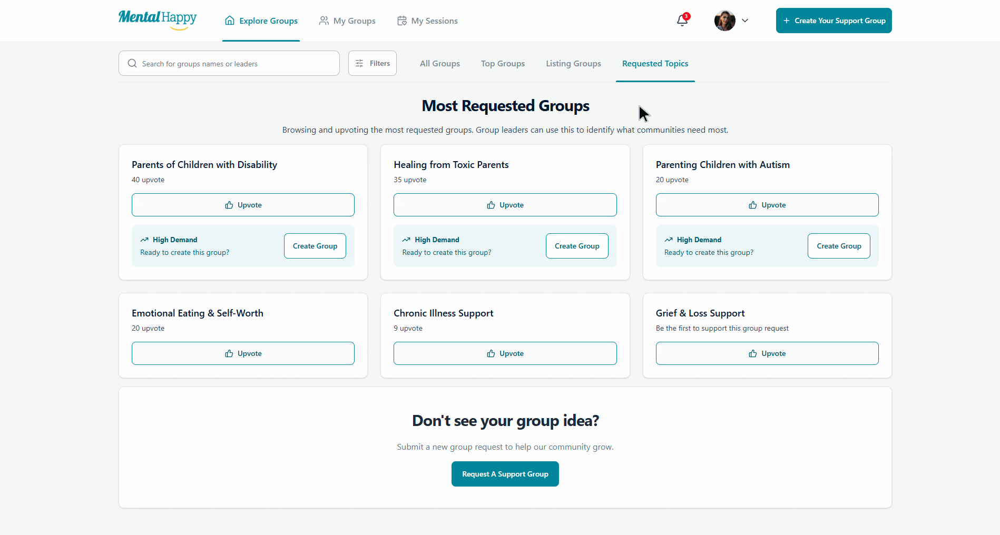
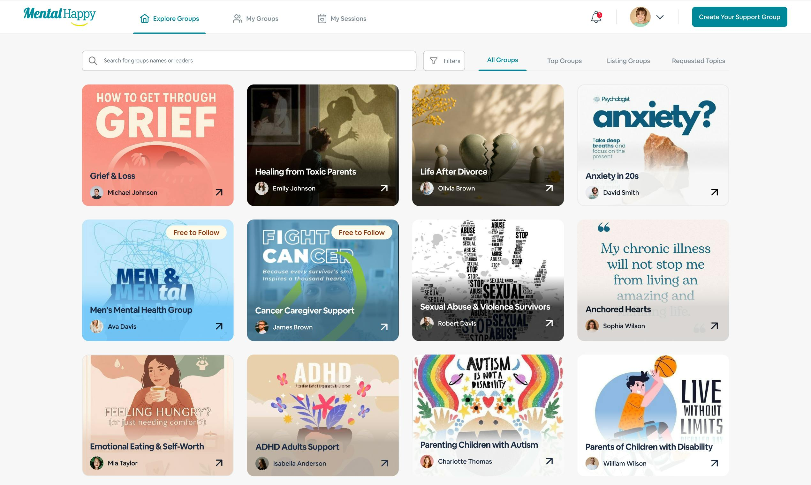
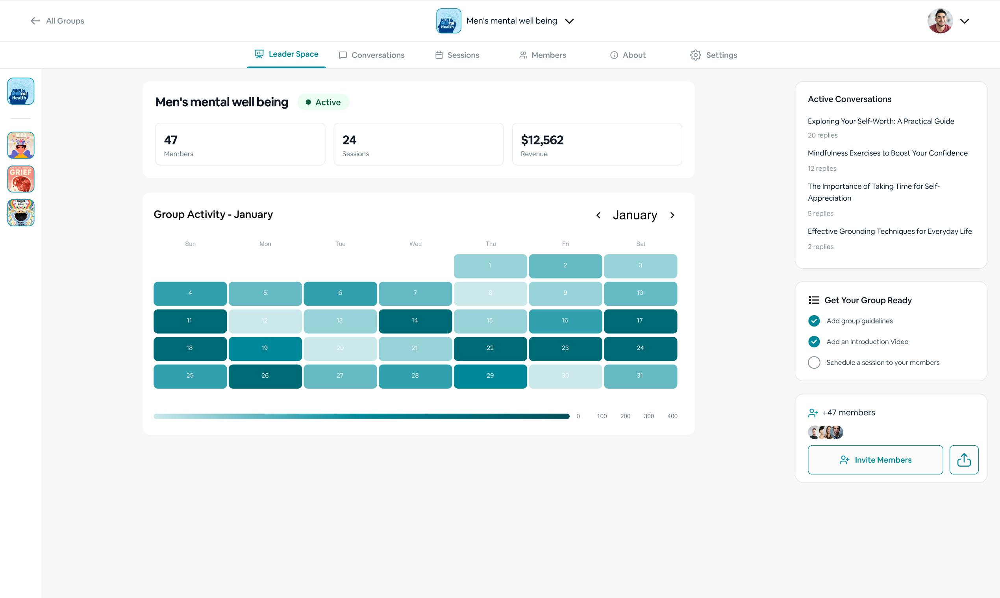

### 🎬 관련 영상
- [🎥 영상 보기](https://ph-files.imgix.net/c10eb67c-9b7d-4c51-95b7-2fad0b48cd29.jpeg?auto=format)

---

## 22. [EQK](https://www.producthunt.com/products/eqk-eq-with-ai)
**Votes**: 81 | **도입 난이도**: 하 | **신뢰도**: 상
**Tagline**: Mac app with dynamic AI EQ
**서비스 링크**: https://www.producthunt.com/r/QLQ6PLRMM4AP7B

**태그**: Audio, MacApp, AI, Music, Productivity, AI Tool

### 📌 이 서비스 한눈에 보기
실시간 AI로 곡마다 최적의 사운드를 제공하는 Mac 전용 네이티브 이퀄라이저

### 🔑 주요 기능
- 곡마다 실시간으로 자동 튜닝되는 AI 기반 다이내믹 EQ
- 가상 드라이버 없이 macOS 네이티브 오디오 캡처 방식 사용
- 앱별 개별 EQ 설정 및 3,985개 이상의 헤드폰 프로필 지원

### 🙋 사용자에게 어떤 점이 좋은가
별도의 복잡한 드라이버 설치 없이 Mac의 모든 앱에 최적화된 사운드를 적용할 수 있으며, 개인정보 유출 걱정 없이 고음질 음악 감상이 가능합니다.

### ✅ 지금 바로 써볼 기능
- 사용 중인 헤드폰 모델에 맞는 AutoEq 프로필 적용하기
- 앱별로 다른 EQ 설정을 적용하여 개별 사운드 환경 구축하기
- 내장 FLAC 플레이어로 고음질 음원 재생해보기

### ⚠️ 사용 전 확인할 점
- macOS 네이티브 캡처 방식이 모든 서드파티 앱과 완벽히 호환되는지 확인 필요
- 로컬 실행 방식이므로 하드웨어 리소스 사용량 확인 필요

### 🧭 확인이 더 필요한 정보
모든 macOS 버전 및 특정 오디오 인터페이스 환경에서의 호환성 여부는 명시되지 않았습니다.

### 📸 스크린샷 및 갤러리
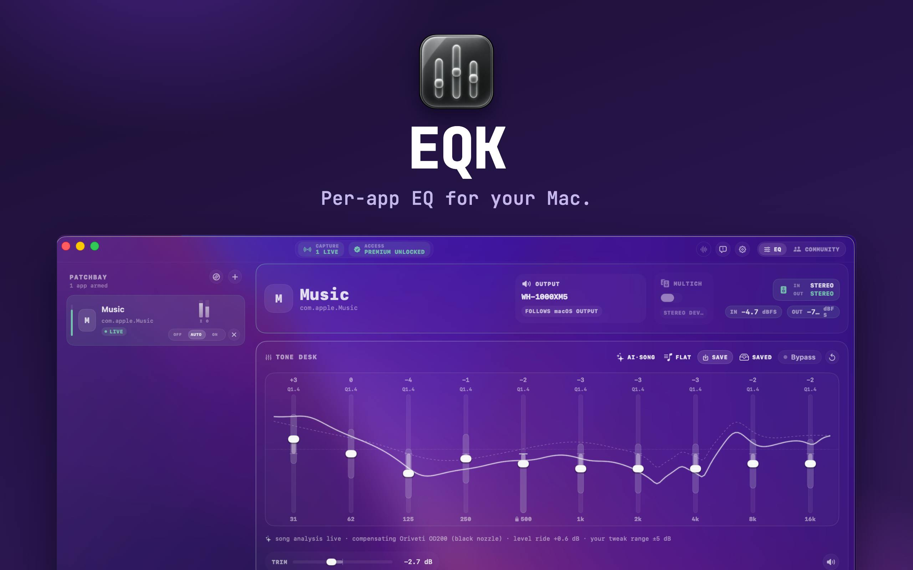
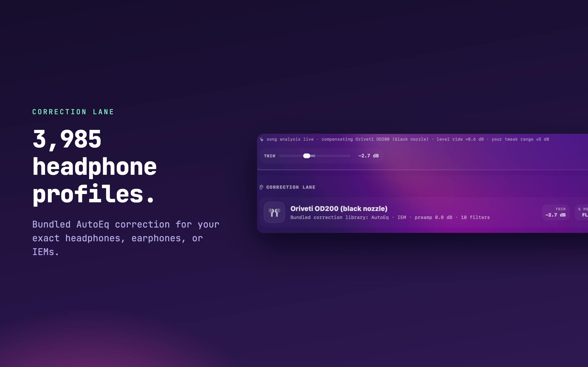
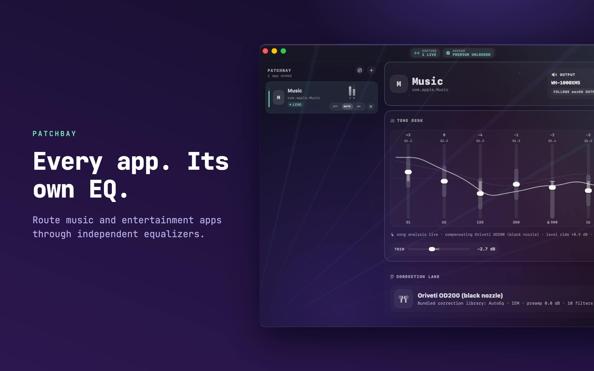

---

## 23. [Specteon Ads](https://www.producthunt.com/products/specteon-ads)
**Votes**: 46 | **도입 난이도**: 하 | **신뢰도**: 상
**Tagline**: From concept to market-ready ads — in seconds.
**서비스 링크**: https://www.producthunt.com/r/W44LBYKA26XKXK

**태그**: AI-Video, Marketing, Content-Creation, Automation, AI Tool, Video

### 📌 이 서비스 한눈에 보기
아이디어만으로 전문가 수준의 광고 영상을 순식간에 제작하는 AI 영상 생성 도구

### 🔑 주요 기능
- 아이디어를 즉시 시장 출시 가능한 고품질 광고 영상으로 변환
- 제품 홍보, 역사적 관점, 교육적 내러티브 등 다양한 스토리텔링 지원
- 크리에이터를 위해 설계된 빠르고 전문적인 AI 영상 생성 워크플로우

### 🙋 사용자에게 어떤 점이 좋은가
전문 영상 편집 기술 없이도 아이디어만으로 눈길을 사로잡는 광고 영상을 제작하여 마케팅 효율을 극대화할 수 있습니다.

### ✅ 지금 바로 써볼 기능
- 제품 아이디어 입력하여 초안 생성하기
- 다양한 내러티브 스타일(교육용, 홍보용 등) 적용해보기
- 생성된 영상의 시각적 품질 확인하기

### ⚠️ 사용 전 확인할 점
- AI 생성 특성상 세부적인 브랜드 가이드라인 일치 여부 확인 필요
- 복잡한 커스텀 편집 기능의 제공 범위 확인 필요

### 🧭 확인이 더 필요한 정보
구체적인 영상 길이, 해상도 및 편집 자유도에 대한 상세 사양은 확인이 필요합니다.

### 📸 스크린샷 및 갤러리

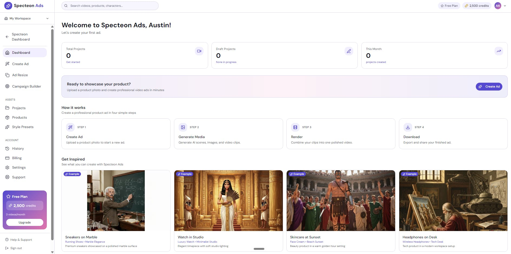

---

## 24. [Trendy](https://www.producthunt.com/products/trendy-2)
**Votes**: 43 | **도입 난이도**: 하 | **신뢰도**: 상
**Tagline**: Fresh AI-generated templates everyday from the latest trends
**서비스 링크**: https://www.producthunt.com/r/45GFIOZY3L34CG

**태그**: AI, Design, PhotoEditor, Trend, AI Tool

### 📌 이 서비스 한눈에 보기
최신 트렌드를 반영한 AI 생성 템플릿으로 사진을 감각적으로 변신시켜 보세요.

### 🔑 주요 기능
- 매일 업데이트되는 최신 트렌드 디자인
- AI를 활용한 간편한 사진 변환 기능
- 감각적인 미적 요소를 반영한 템플릿 제공

### 🙋 사용자에게 어떤 점이 좋은가
매번 디자인을 고민할 필요 없이, 유행하는 스타일의 템플릿을 통해 사진을 쉽고 빠르게 꾸밀 수 있습니다.

### ✅ 지금 바로 써볼 기능
- 자신의 사진 업로드하기
- 오늘의 트렌드 템플릿 적용해보기
- 생성된 결과물 저장 및 공유하기

### ⚠️ 사용 전 확인할 점
- 사용자의 사진 스타일과 템플릿의 조화 여부 확인 필요
- 매일 생성되는 템플릿의 다양성 및 품질 확인 필요

### 🧭 확인이 더 필요한 정보
구체적인 생성 방식 및 사용 가능한 사진 포맷에 대한 정보가 부족합니다.

### 📸 스크린샷 및 갤러리
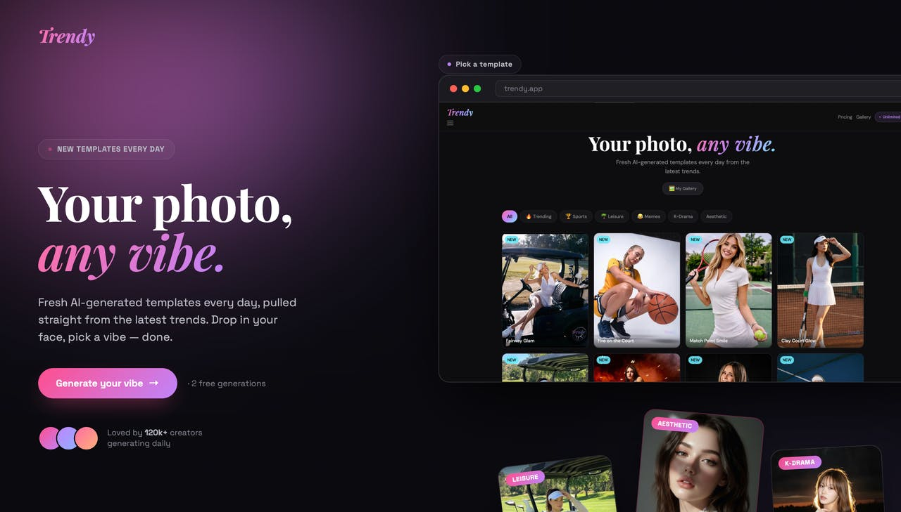
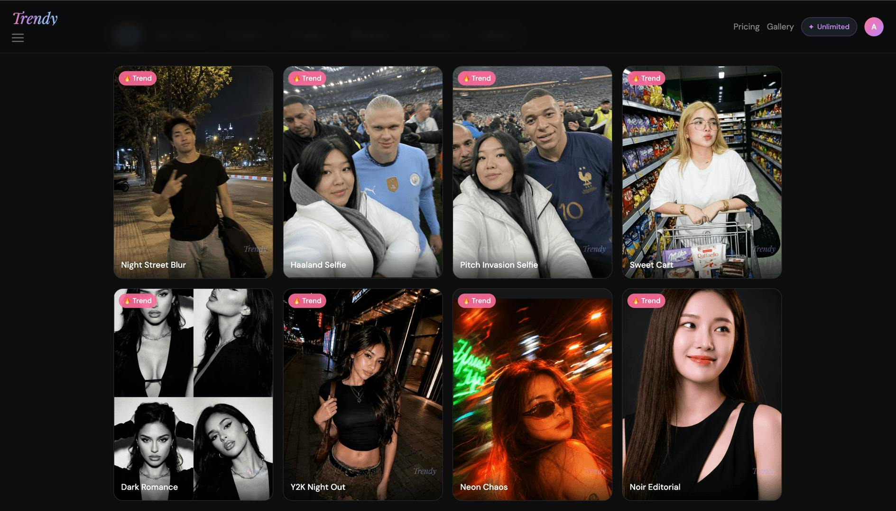
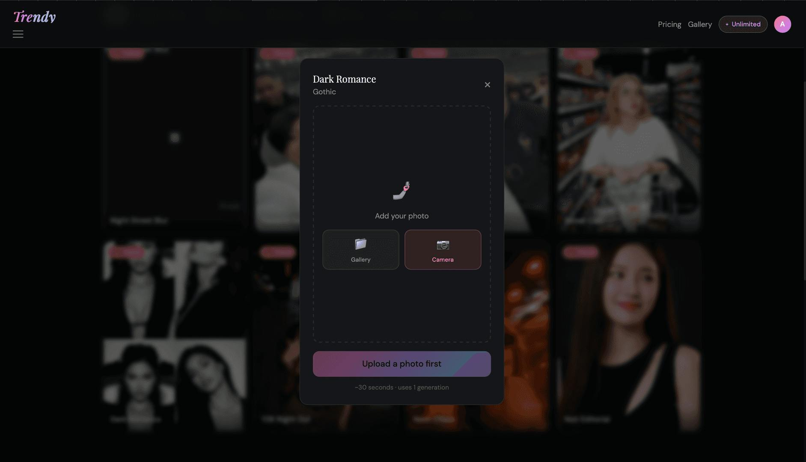

---

## 25. [Post Formatter](https://www.producthunt.com/products/post-formatter)
**Votes**: 37 | **도입 난이도**: 하 | **신뢰도**: 상
**Tagline**: Format LinkedIn posts with bold, italics & more
**서비스 링크**: https://www.producthunt.com/r/BNWHMVOF3IBMGO

**태그**: Productivity, SocialMedia, ChromeExtension, WritingTool, AI Tool, DevTool

### 📌 이 서비스 한눈에 보기
소셜 미디어 게시물을 눈에 띄게 꾸며주는 올인원 텍스트 포맷터 크롬 확장 프로그램

### 🔑 주요 기능
- LinkedIn, X, Threads 등 주요 플랫폼 내 플로팅 툴바 제공
- 20가지 이상의 유니코드 폰트 스타일(굵게, 기울임 등) 지원
- AI 교정, 스마트 붙여넣기, 드래프트 관리 및 실시간 미리보기 기능

### 🙋 사용자에게 어떤 점이 좋은가
별도의 사이트 이동 없이 브라우저 내에서 즉시 가독성 높은 게시물을 작성하고 관리할 수 있습니다.

### ✅ 지금 바로 써볼 기능
- 플로팅 툴바를 이용한 텍스트 스타일 적용해보기
- AI 기능을 활용한 문장 교정 및 자동 스타일링 테스트
- 드래프트 폴더와 태그를 활용한 게시물 관리

### ⚠️ 사용 전 확인할 점
- 유니코드 폰트 사용 시 일부 기기나 브라우저에서 글꼴이 깨져 보일 수 있음
- AI 기능 사용 시 개인 OpenRouter API 키 설정이 필요함

### 🧭 확인이 더 필요한 정보
사용자의 OpenRouter 키를 직접 입력해야 하는 방식이므로 보안 및 비용 관리에 유의해야 합니다.

### 📸 스크린샷 및 갤러리
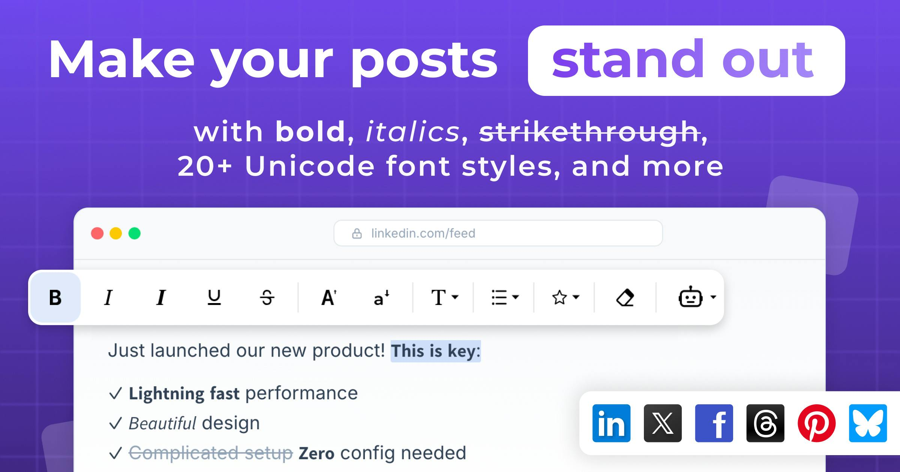
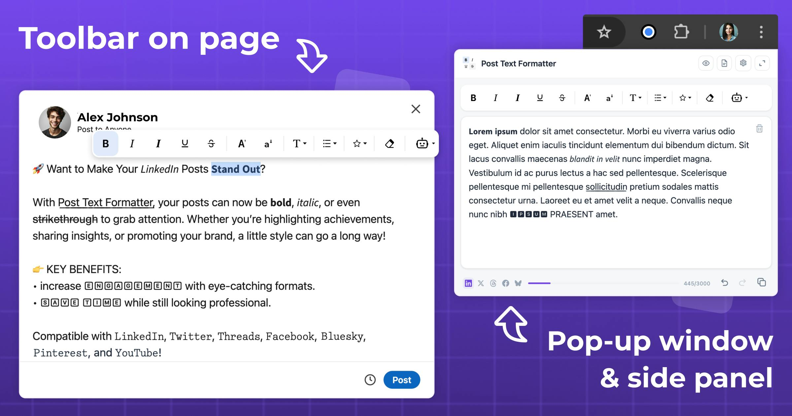
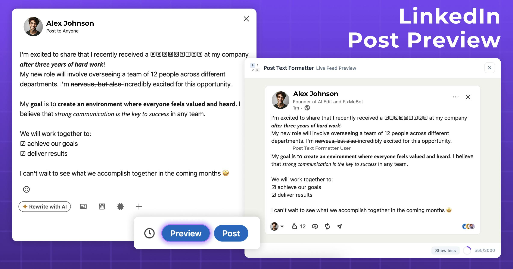

---

## 26. [welaunch.sh](https://www.producthunt.com/products/welaunch-sh)
**Votes**: 31 | **도입 난이도**: 하 | **신뢰도**: 상
**Tagline**: Get your first 100 customers
**서비스 링크**: https://www.producthunt.com/r/BHRYE7LZVEIJAZ

**태그**: Marketing, Automation, GrowthHacking, Sales

### 📌 이 서비스 한눈에 보기
타겟 고객이 모인 커뮤니티를 찾고 맞춤형 홍보 문구 작성부터 게시까지 자동화하는 마케팅 도구

### 🔑 주요 기능
- URL 입력만으로 잠재 고객이 있는 서브레딧 및 디렉토리 자동 탐색
- 각 채널에 최적화된 맞춤형 홍보 문구 자동 생성
- 우선순위에 따른 원클릭 게시 기능 제공

### 🙋 사용자에게 어떤 점이 좋은가
초기 창업자가 수동으로 고객을 찾는 시간을 줄이고, 타겟팅된 채널에 효율적으로 제품을 노출하여 첫 고객을 확보할 수 있습니다.

### ✅ 지금 바로 써볼 기능
- 제품 URL 입력하여 타겟 채널 리스트 확인하기
- 생성된 맞춤형 홍보 문구 검토 및 수정하기
- 제안된 우선순위에 따라 원클릭 게시 실행하기

### ⚠️ 사용 전 확인할 점
- 자동 생성된 문구가 스팸으로 분류될 위험이 있으므로 게시 전 검토 필요
- 커뮤니티별 가이드라인 위반 여부를 사용자가 직접 확인해야 함

### 🧭 확인이 더 필요한 정보
자동 생성된 문구의 품질과 각 플랫폼의 스팸 필터링 우회 가능 여부를 확인해야 합니다.

### 📸 스크린샷 및 갤러리
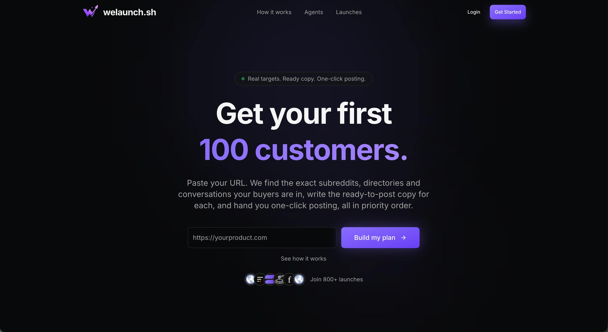
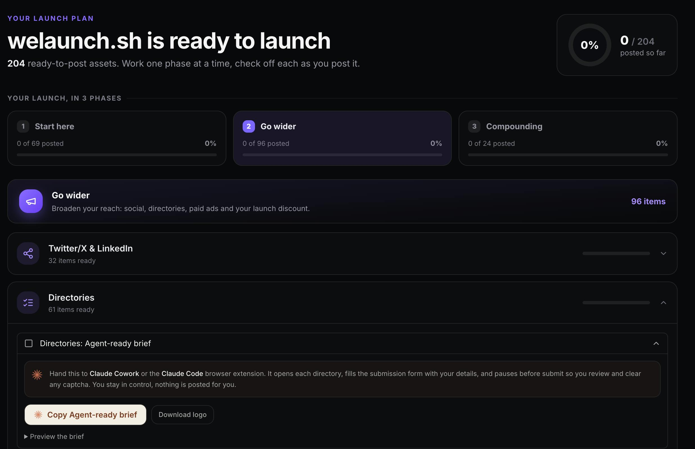
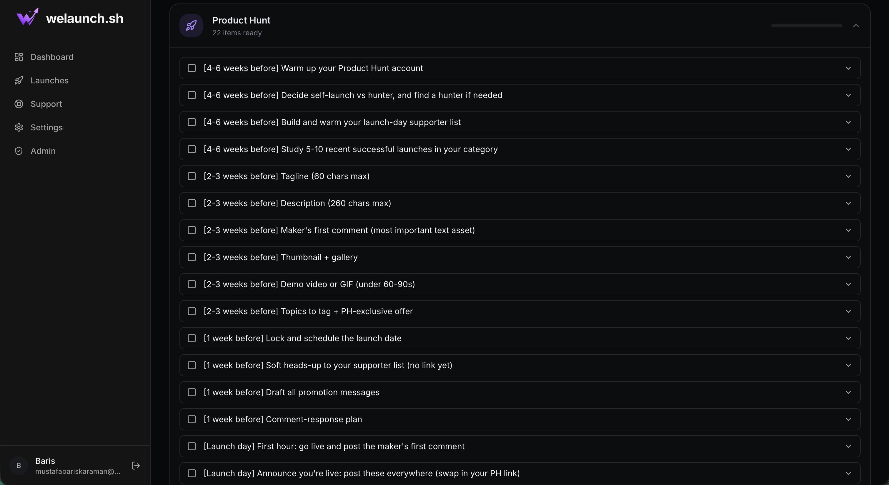

---

## 27. [Linetta](https://www.producthunt.com/products/linetta)
**Votes**: 28 | **도입 난이도**: 하 | **신뢰도**: 상
**Tagline**: The AI journal you talk to. Voice in, clarity out.
**서비스 링크**: https://www.producthunt.com/r/ZCQARWW22ZVJJ3

**태그**: AI, Journaling, Productivity, MentalHealth, AI Tool

### 📌 이 서비스 한눈에 보기
음성 기록을 구조화된 통찰로 바꿔주는 AI 감정 일기

### 🔑 주요 기능
- 30초 내외의 음성 입력을 통한 간편한 일기 작성
- 감정 명명, 핵심 요약, 심층 질문을 통한 구조적 정리
- 시간 경과에 따른 사용자 패턴 분석 기능

### 🙋 사용자에게 어떤 점이 좋은가
복잡한 생각들을 말로 뱉어내는 것만으로도 감정을 정리하고 자기 성찰을 돕는 도구입니다.

### ✅ 지금 바로 써볼 기능
- 핸즈프리 모드로 생각 정리하기
- 음성 입력을 통한 감정 분석 경험하기
- 축적된 데이터로 자신의 패턴 확인하기

### ⚠️ 사용 전 확인할 점
- 현재 영어와 러시아어만 지원됨
- 음성 데이터 기반이므로 개인정보 및 보안 설정 확인 필요

### 🧭 확인이 더 필요한 정보
한국어 지원 여부와 데이터 보안 정책에 대한 상세 정보가 명시되지 않았습니다.

### 📸 스크린샷 및 갤러리

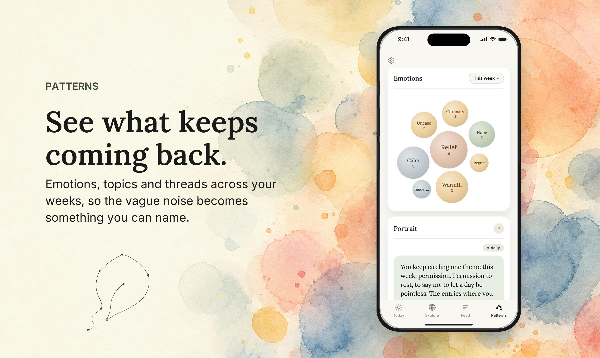

---

## 28. [Classet](https://www.producthunt.com/products/classet)
**Votes**: 25 | **도입 난이도**: 하 | **신뢰도**: 상
**Tagline**: AI Recruiter for High-Volume Hiring
**서비스 링크**: https://www.producthunt.com/r/FLJRUOOZBAJEJJ

**태그**: AI, Recruitment, Automation, HR-Tech, AI Tool

### 📌 이 서비스 한눈에 보기
대규모 채용을 위한 AI 전화 면접 및 인재 검증 자동화 솔루션

### 🔑 주요 기능
- AI를 통한 즉각적인 전화 면접 및 후보자 자격 검증
- 대규모 채용 프로세스 자동화를 통한 인력 충원 비용 절감
- 채용 팀을 위한 구조화된 면접 요약 리포트 제공

### 🙋 사용자에게 어떤 점이 좋은가
인력 수요가 많은 산업군에서 채용 담당자의 반복적인 전화 업무를 자동화하여 운영 효율을 극대화할 수 있습니다.

### ✅ 지금 바로 써볼 기능
- AI 전화 면접 기능 테스트
- 후보자 자격 검증 워크플로우 설정
- 생성된 면접 요약 리포트 품질 확인

### ⚠️ 사용 전 확인할 점
- AI 면접의 답변 정확도 및 후보자 경험(UX) 검토 필요
- 특정 산업군(현장직 등)의 특수성이 반영되는지 확인 필요

### 🧭 확인이 더 필요한 정보
현재 제공되는 AI의 음성 인식 정확도와 지원 가능한 언어 범위에 대한 정보가 부족합니다.

### 📸 스크린샷 및 갤러리
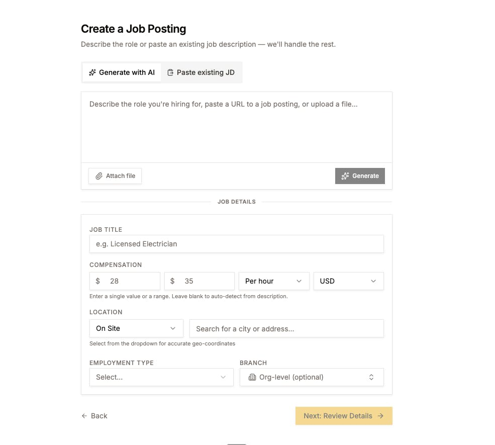
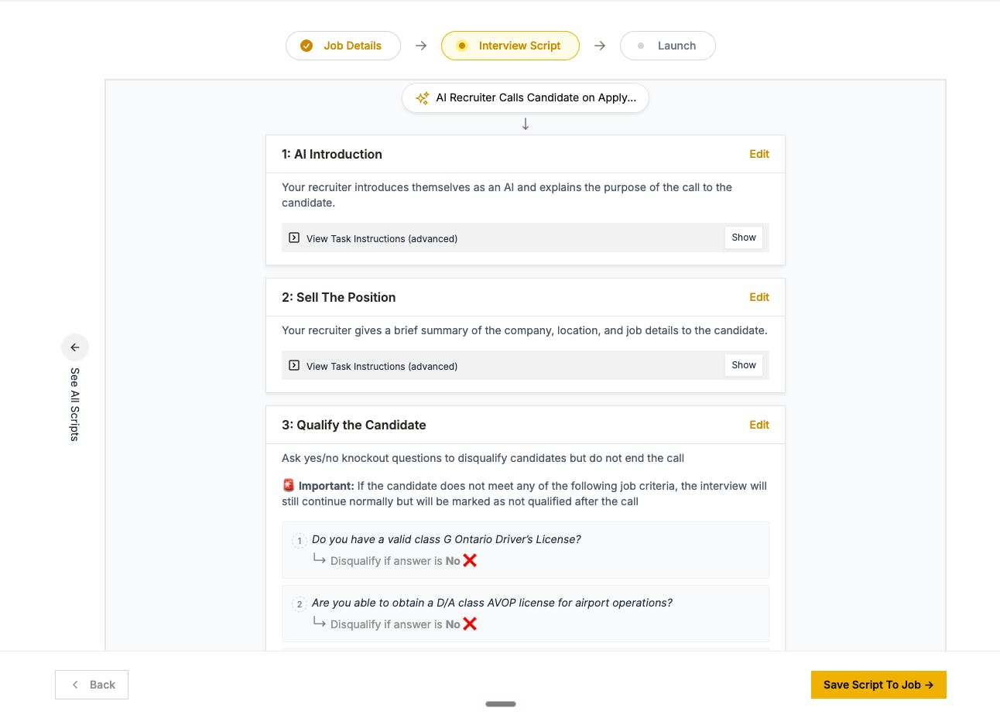
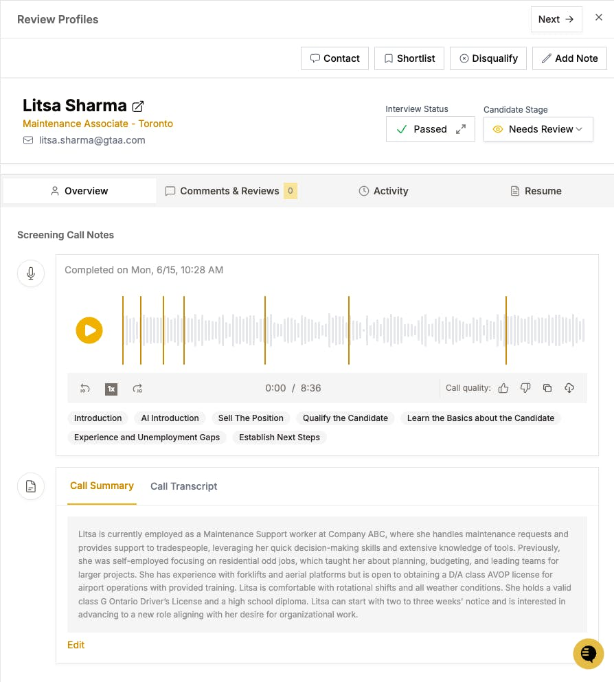

### 🎬 관련 영상
- [🎥 영상 보기](https://ph-files.imgix.net/b3078f01-04bb-4ac9-8de2-24cdfa61b7d8.jpeg?auto=format)

---

## 29. [GreenmorMail](https://www.producthunt.com/products/greenmor-mail)
**Votes**: 23 | **도입 난이도**: 하 | **신뢰도**: 상
**Tagline**: One inbox. Outreach, team chat, AI, and video — built in.
**서비스 링크**: https://www.producthunt.com/r/I6T4RKBSHW25MX

**태그**: Productivity, SaaS, Email, Collaboration, AI, AI Tool, Chat, Video

### 📌 이 서비스 한눈에 보기
월 1달러로 이메일, 협업, AI, 화상 회의를 하나로 통합한 올인원 비즈니스 메일 호스팅

### 🔑 주요 기능
- 월 $1/mailbox의 파격적인 비용으로 제공되는 비즈니스 이메일 호스팅
- 아웃리치 시퀀스, 팀 채팅, 화상 회의, AI 어시스턴트 등 강력한 기능 내장
- 광고 및 데이터 마이닝 없는 클린한 환경과 10분 이내의 빠른 설정

### 🙋 사용자에게 어떤 점이 좋은가
여러 도구를 구독할 필요 없이 이메일 하나로 업무 생산성을 극대화할 수 있어 비용과 시간을 동시에 절약할 수 있습니다.

### ✅ 지금 바로 써볼 기능
- 이메일 아웃리치 시퀀스 설정하기
- 인스레드(in-thread) 팀 채팅 기능 활용하기
- AI 어시스턴트로 이메일 작성 효율 높이기

### ⚠️ 사용 전 확인할 점
- AWS SES 기반 서비스이므로 대량 발송 시 발신 제한 정책 확인 필요
- 통합 기능이 많은 만큼 개별 전문 도구 대비 기능의 깊이가 다를 수 있음

### 🧭 확인이 더 필요한 정보
제공되는 스토리지 용량 및 상세한 보안 프로토콜에 대한 구체적인 정보가 필요합니다.

### 📸 스크린샷 및 갤러리
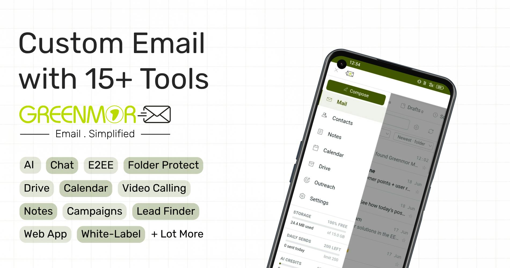
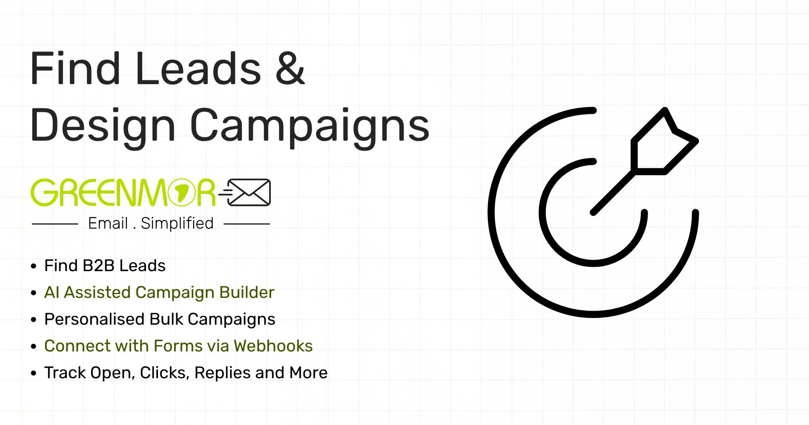

---

## 30. [ Professional Email Templates](https://www.producthunt.com/products/professional-email-templates)
**Votes**: 23 | **도입 난이도**: 하 | **신뢰도**: 상
**Tagline**: 75 ready-to-use email templates for work & job search
**서비스 링크**: https://www.producthunt.com/r/DDFVS3N4REN45Z

**태그**: Productivity, Career, Communication, Templates, AI Tool, Design, Email

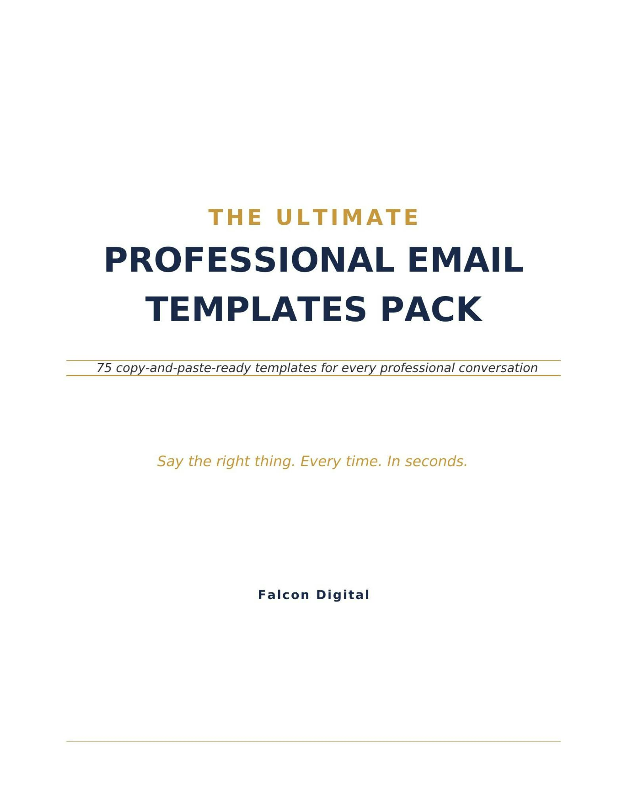

### 📌 이 서비스 한눈에 보기
취업과 비즈니스 커뮤니케이션을 위한 75종의 즉시 사용 가능한 전문 이메일 템플릿 모음집

### 🔑 주요 기능
- 구직, 네트워킹, 클라이언트 소통 등 상황별 75개 맞춤형 템플릿 제공
- 복잡한 이메일 작성 시간을 단축하고 전문적인 어조 유지
- 구직자, 프리랜서, 채용 담당자 등 비즈니스 전문가를 위해 설계

### 🙋 사용자에게 어떤 점이 좋은가
상황에 맞는 적절한 이메일 문구를 고민하는 시간을 줄여주며, 전문적인 커뮤니케이션을 통해 신뢰도를 높일 수 있습니다.

### ✅ 지금 바로 써볼 기능
- 자신의 상황(구직, 네트워킹 등)에 맞는 템플릿 선택하기
- 템플릿의 괄호 부분을 자신의 정보로 맞춤 수정하기
- 상황에 맞춰 어조를 미세 조정하여 발송하기

### ⚠️ 사용 전 확인할 점
- 템플릿을 그대로 사용하기보다 개인적인 맥락에 맞게 수정이 필요함
- 디지털 파일 형태이므로 별도의 소프트웨어 설치 없이 텍스트 복사/붙여넣기 방식으로 사용됨

### 🧭 확인이 더 필요한 정보
템플릿의 제공 방식(PDF, Notion, Google Docs 등)과 가격 정책에 대한 정보가 명시되지 않았습니다.

### 📸 스크린샷 및 갤러리
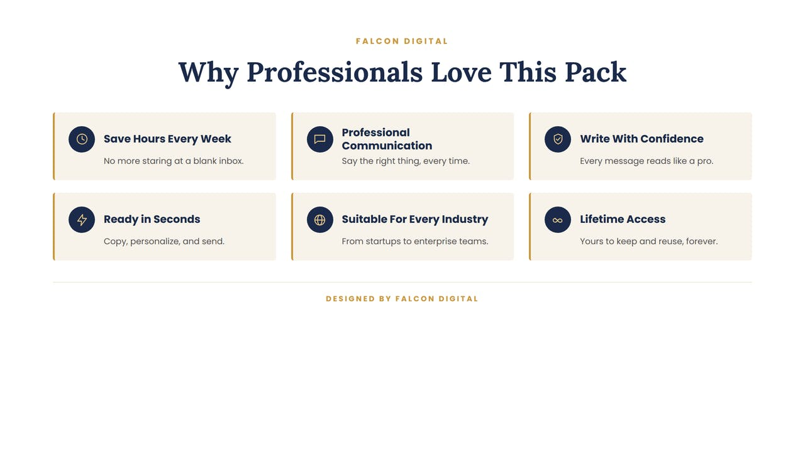
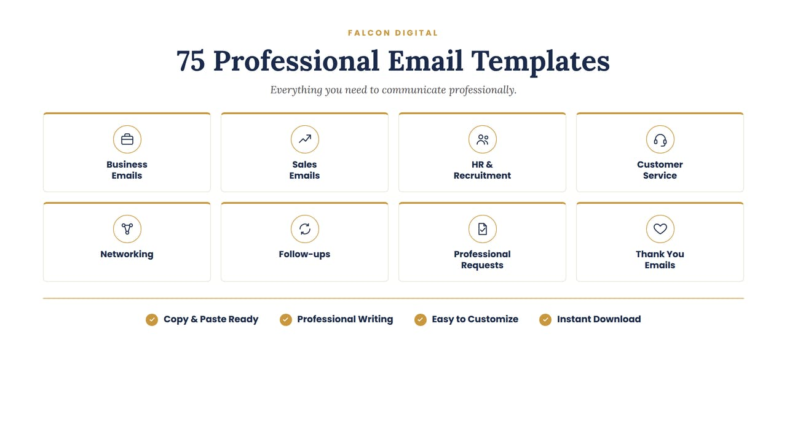
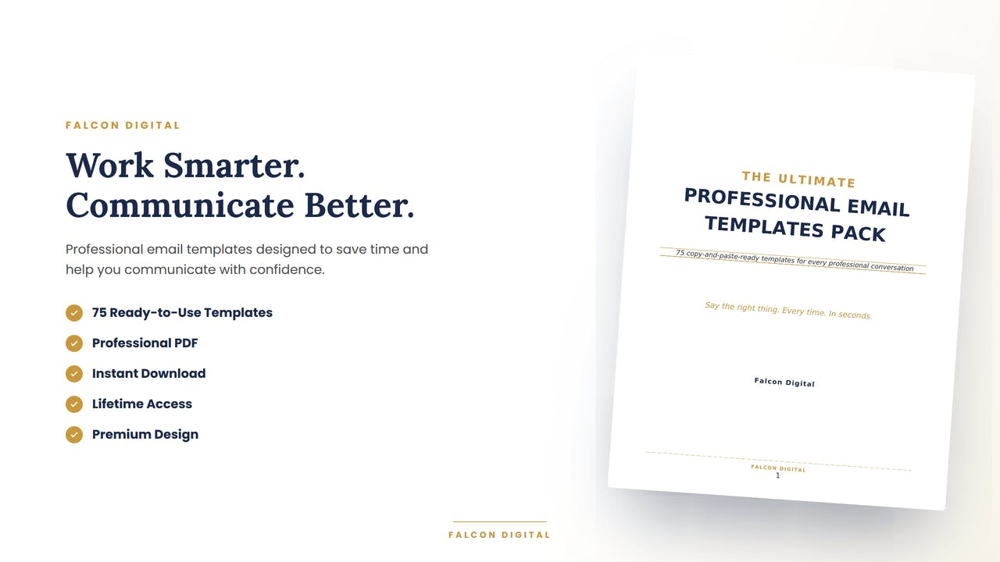

---

