# 🚀 Product Hunt Daily Top 30 (2026-07-18)

## 오늘의 요약
오늘의 트렌드는 사용자의 맥락을 유지하며 복잡한 업무를 자동화하는 AI 에이전트와 생산성 도구들이 주도했습니다. 특히 서로 다른 앱 간의 데이터를 동기화하거나 브라우저 내 반복 작업을 스스로 수행하는 등, AI가 단순한 답변을 넘어 실질적인 업무 내용을 관리하는 방향으로 진화하고 있습니다.

### 오늘의 핵심 포인트
- AI 모델과 외부 앱 간의 지식 공유를 통해 일관된 맥락을 유지하는 통합 메모리 솔루션이 주목받았습니다.
- 단순한 정보 제공을 넘어 브라우저 동작이나 데이터 분석을 스스로 수행하는 능동적인 AI 에이전트 기술이 등장했습니다.
- 멀티태스킹 효율을 높이는 PiP 도구나 일정 공유 도구처럼 작업 소식의 단절을 최소화하는 실용적인 생산성 도구들이 인기를 끌었습니다.

**오늘의 태그**: AI 에이전트, 생산성 도구, 워크플로우 자동화, B2B SaaS

## 1. [Unabyss for Claude](https://www.producthunt.com/products/unabyss)
**Votes**: 450 | **도입 난이도**: 중 | **신뢰도**: 상
**Tagline**: Shared memory across all apps and LLMs. In Claude
**서비스 링크**: https://www.producthunt.com/r/AW6GAYWJDAD4GS

**태그**: AI, Productivity, Automation, KnowledgeManagement, Agent, AI Tool, LLM, Email

### 📌 이 서비스 한눈에 보기
여러 AI 모델과 앱 간의 맥락을 동기화하는 통합 메모리 솔루션

### 🔑 주요 기능
- Claude, GPT, Cursor 등 서로 다른 AI 모델 간의 지식 공유
- Email, Drive, GitHub, Notion 등 20개 이상의 외부 앱 데이터 연동
- 사용자의 맥락을 유지하며 모든 AI 에이전트가 동일한 정보를 공유

### 🙋 사용자에게 어떤 점이 좋은가
사용자가 매번 새로운 채팅창에 정보를 입력할 필요 없이, 모든 AI가 나를 이미 알고 있는 것처럼 일관된 답변을 제공합니다.

### ✅ 지금 바로 써볼 기능
- 주요 업무용 앱(Notion, GitHub 등) 연동하기
- Claude에서 공유된 메모리 기반의 작업 수행하기
- 다른 AI 에이전트와 맥락이 동기화되는지 확인하기

### ⚠️ 사용 전 확인할 점
- 개인정보 및 기업 데이터가 외부 서비스에 저장되는 것에 대한 보안 검토 필요
- 다양한 앱 연동 시 데이터 동기화 범위 설정 필요

### 🧭 확인이 더 필요한 정보
데이터 프라이버시 보호 방식과 구체적인 보안 프로토콜에 대한 상세 정보가 필요합니다.

### 📸 스크린샷 및 갤러리
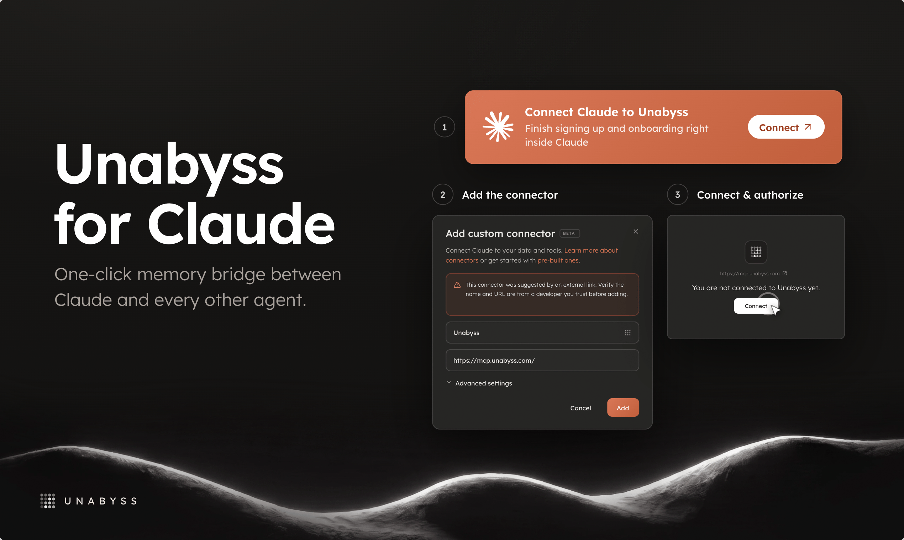
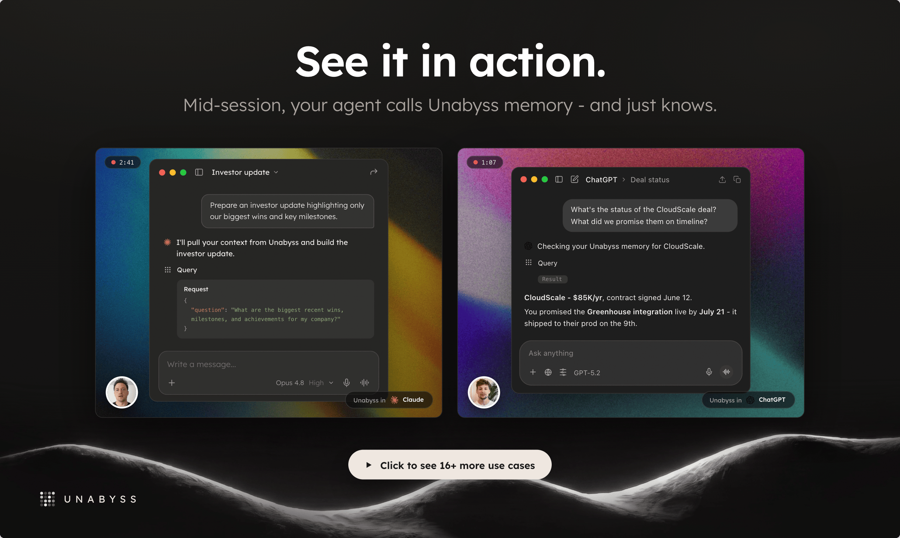

### 🎬 관련 영상
- [🎥 영상 보기](https://ph-files.imgix.net/780b6fe1-76eb-4cdb-83ef-893fb5d96d49.jpeg?auto=format)

---

## 2. [Pebbles Ai](https://www.producthunt.com/products/pebbles-ai)
**Votes**: 363 | **도입 난이도**: 중 | **신뢰도**: 상
**Tagline**: AI sales platform for modern B2B teams
**서비스 링크**: https://www.producthunt.com/r/AYLBJIEQ76AGBE

**태그**: SalesTech, B2B, AI, Automation, GTM, AI Tool, Sales

### 📌 이 서비스 한눈에 보기
전략 수립부터 리드 생성까지 통합하는 B2B 전용 AI GTM 운영 체제

### 🔑 주요 기능
- 전략, 리드 생성, 아웃리치, 영업을 하나의 워크스페이스로 통합
- 비즈니스 맞춤형 뉴로심볼릭(Neurosymbolic) AI 기술 적용
- 파편화된 GTM 도구 간의 전환 없이 일관된 캠페인 실행 가능

### 🙋 사용자에게 어떤 점이 좋은가
여러 영업 도구를 번갈아 사용할 필요 없이, 하나의 플랫폼에서 전략 수립부터 실행까지 자동화하여 팀의 생산성을 높일 수 있습니다.

### ✅ 지금 바로 써볼 기능
- 비즈니스 데이터 학습을 통한 맞춤형 전략 수립
- AI 기반 개인화된 아웃리치 메시지 생성
- 통합 워크스페이스를 통한 리드 관리 및 실행

### ⚠️ 사용 전 확인할 점
- 기존에 사용 중인 CRM이나 다른 영업 도구와의 연동 범위 확인 필요
- AI 모델이 비즈니스 데이터를 학습하는 과정에서의 보안 및 데이터 프라이버시 검토

### 🧭 확인이 더 필요한 정보
현재 제공되는 구체적인 외부 툴 연동 기능과 데이터 보안 정책에 대한 상세 정보가 필요합니다.

### 📸 스크린샷 및 갤러리
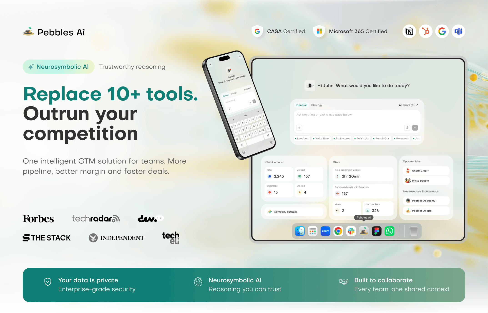
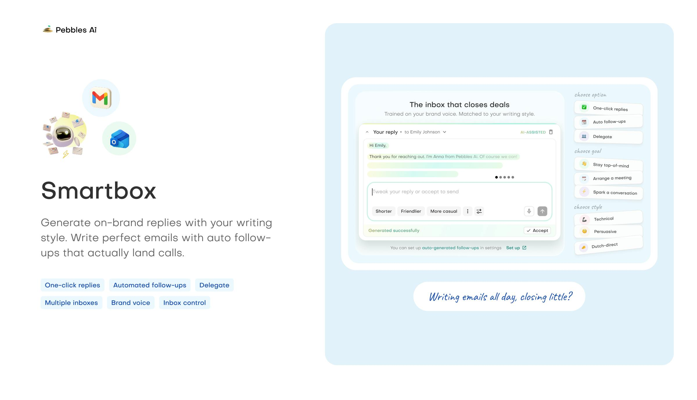
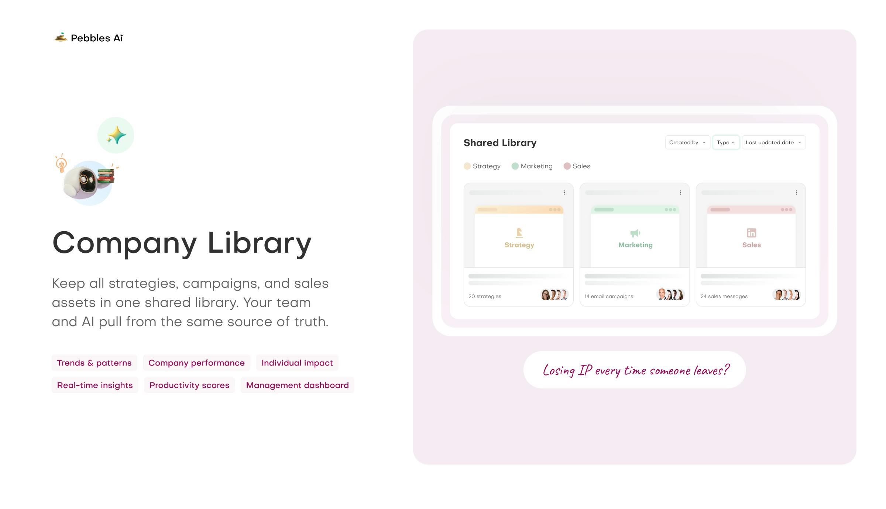

### 🎬 관련 영상
- [🎥 영상 보기](https://ph-files.imgix.net/59f7633e-f4df-499d-975d-1627cf9e2ab1.jpeg?auto=format)

---

## 3. [Kimi K3](https://www.producthunt.com/products/kimi-ai-assistant)
**Votes**: 308 | **도입 난이도**: 하 | **신뢰도**: 상
**Tagline**: The world's first open 3T-class model
**서비스 링크**: https://www.producthunt.com/r/YT3DDK5NRLBZDJ

**태그**: AI, LLM, Coding, Multimodal, OpenSource

### 📌 이 서비스 한눈에 보기
코딩과 추론 능력을 갖춘 세계 최초의 오픈 3T급 멀티모달 모델

### 🔑 주요 기능
- 세계 최초의 오픈 3T급 모델 성능 제공
- 코딩, 지식 작업, 추론 분야의 프론티어급 성능
- 네이티브 멀티모달 기능 및 100만 토큰의 대규모 컨텍스트 지원

### 🙋 사용자에게 어떤 점이 좋은가
방대한 양의 문서를 한 번에 처리하면서도 코딩과 복잡한 추론 작업이 필요한 전문가에게 강력한 도구가 됩니다.

### ✅ 지금 바로 써볼 기능
- 100만 토큰 컨텍스트를 활용한 대규모 문서 분석
- 복잡한 코딩 및 알고리즘 문제 해결 테스트
- 멀티모달 기능을 활용한 시각적 데이터 분석

### ⚠️ 사용 전 확인할 점
- 오픈 모델로서의 구체적인 하드웨어 요구 사양 확인 필요
- 모델의 실제 추론 정확도 및 안정성 검증 필요

### 🧭 확인이 더 필요한 정보
제공된 정보에는 구체적인 배포 방식이나 하드웨어 요구 사양에 대한 언급이 없습니다.

### 📸 스크린샷 및 갤러리
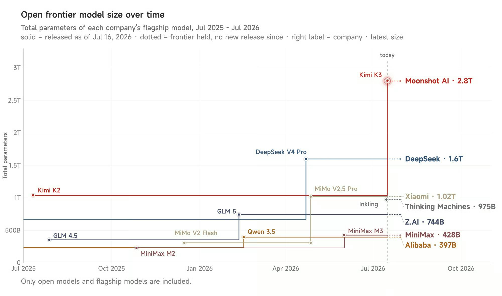
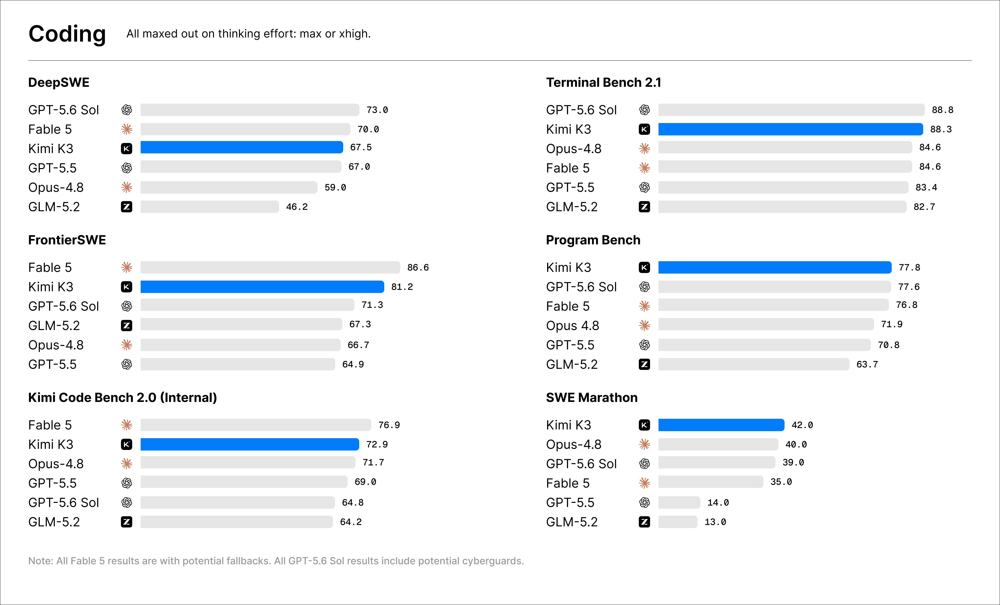

### 🎬 관련 영상
- [🎥 영상 보기](https://ph-files.imgix.net/be659acb-03a9-4a08-bb5d-a3ed9f625290.jpeg?auto=format)

---

## 4. [Pocket Screen](https://www.producthunt.com/products/toybird-labs)
**Votes**: 188 | **도입 난이도**: 하 | **신뢰도**: 상
**Tagline**: Keep any Mac window visible in a floating mini screen
**서비스 링크**: https://www.producthunt.com/r/2LSMNDW563UO3D

**태그**: Productivity, Mac, Multitasking, Chat, Video

### 📌 이 서비스 한눈에 보기
맥의 활성 창을 작은 플로팅 화면으로 만들어 작업 중에도 항상 보이게 하는 PiP 도구

### 🔑 주요 기능
- 현재 사용 중인 창을 작고 컴팩트한 화면으로 변환
- 항상 위(Always-on-top) 기능을 통한 PiP 스타일 뷰 제공
- 창 전환 없이 문서, 채팅, 영상 등을 동시에 확인 가능

### 🙋 사용자에게 어떤 점이 좋은가
멀티태스킹 시 창을 번갈아 가며 확인하는 번거로움을 줄여 작업 흐름을 유지해 줍니다.

### ✅ 지금 바로 써볼 기능
- 중요한 참고 문서를 작은 화면으로 띄워두기
- 메신저 창을 플로팅 뷰로 만들어 실시간 알림 확인하기
- 작업 중 영상이나 자료를 한눈에 보며 작업하기

### ⚠️ 사용 전 확인할 점
- 화면 공간이 좁은 환경에서는 플로팅 창이 작업 영역을 가릴 수 있음
- Mac 전용 도구이므로 다른 OS에서는 사용 불가

### 🧭 확인이 더 필요한 정보
상세한 시스템 리소스 점유율이나 화면 크기 조절 범위에 대한 정보는 명시되지 않았습니다.

### 📸 스크린샷 및 갤러리
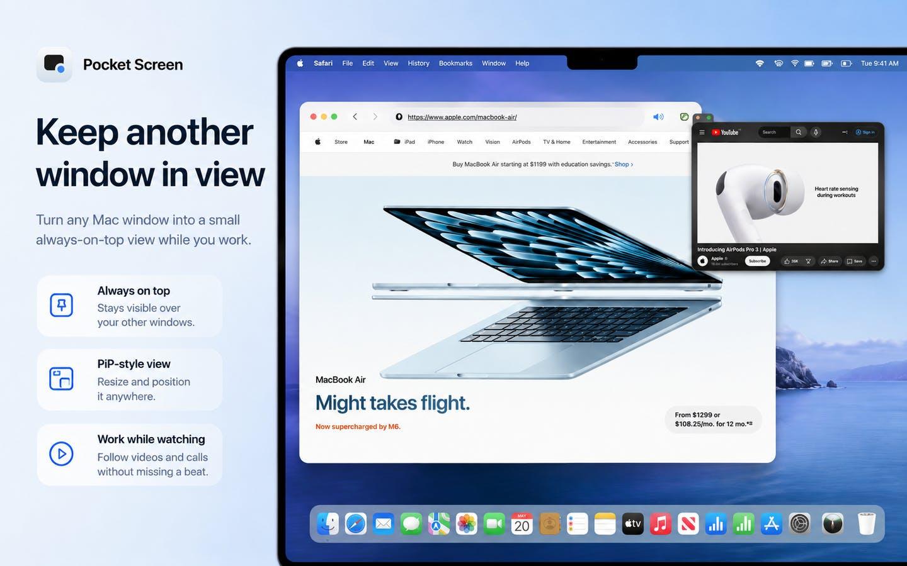
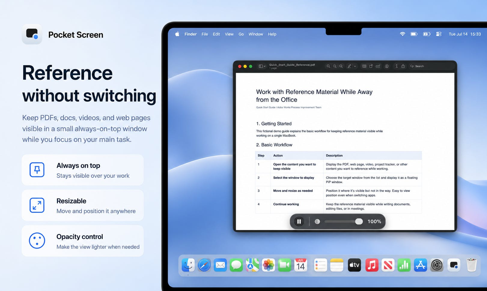
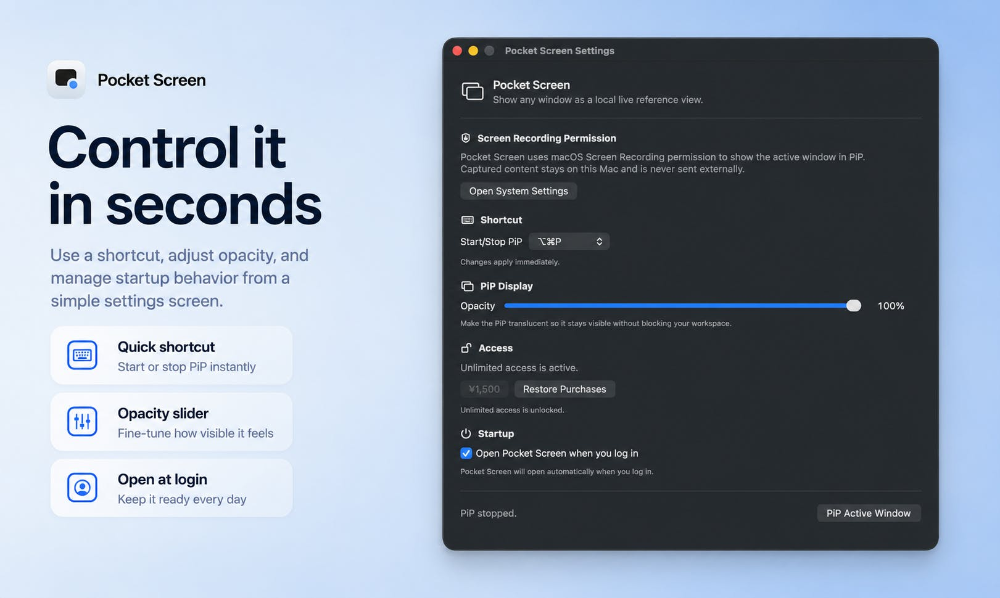

### 🎬 관련 영상
- [🎥 영상 보기](https://ph-files.imgix.net/b0553eb9-2dff-405c-bced-98dd5b6a7d28.jpeg?auto=format)

---

## 5. [Timely](https://www.producthunt.com/products/timely-9)
**Votes**: 157 | **도입 난이도**: 하 | **신뢰도**: 상
**Tagline**: Pull your calendar availability in 3 seconds
**서비스 링크**: https://www.producthunt.com/r/P742SJMQTM7I6S

**태그**: Productivity, Automation, Scheduling, AI Tool

### 📌 이 서비스 한눈에 보기
복잡한 시간대 계산 없이 단 한 번의 키 입력으로 일정 가용성을 공유하는 도구

### 🔑 주요 기능
- 단축키 한 번으로 연결된 캘린더의 가용 시간 추출
- 수신자에게 최적화된 현지 시간대로 자동 변환
- 로컬 실행 방식으로 개인정보 보호 및 보안 강화

### 🙋 사용자에게 어떤 점이 좋은가
일정 확인을 위해 캘린더를 일일이 열거나 시차를 계산할 필요가 없어 업무 흐름이 끊기지 않습니다.

### ✅ 지금 바로 써볼 기능
- Google 또는 Outlook 계정 연결하기
- 단축키 설정 및 가용성 추출 테스트하기
- 여러 명의 임원/팀원 일정 통합 관리해보기

### ⚠️ 사용 전 확인할 점
- 로컬 실행 방식이므로 지원하는 OS 환경 확인 필요
- 연결된 캘린더(Google, Outlook) 외의 서비스 연동 여부 확인

### 🧭 확인이 더 필요한 정보
지원하는 운영체제(Windows, macOS 등)와 구체적인 단축키 설정 방식에 대한 정보가 필요합니다.

### 📸 스크린샷 및 갤러리
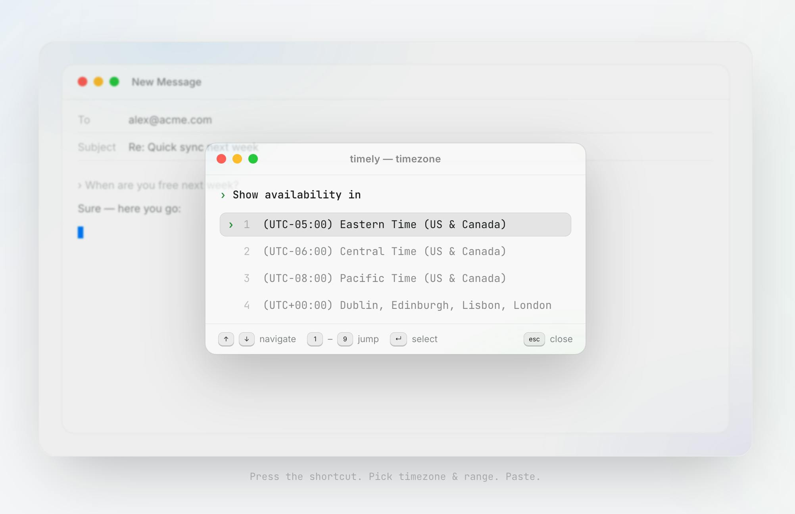
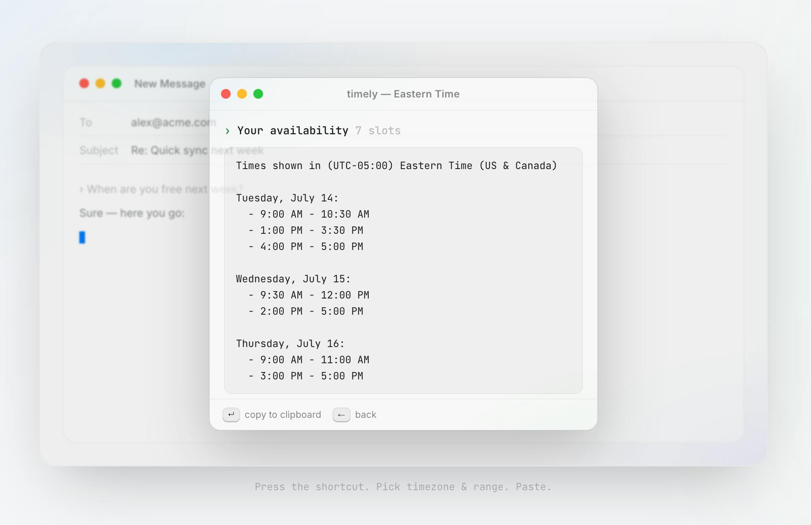

### 🎬 관련 영상
- [🎥 영상 보기](https://ph-files.imgix.net/c252ad23-83d3-4740-acca-15a0e77ff1a9.jpeg?auto=format)

---

## 6. [Basedash Suggestions](https://www.producthunt.com/products/basedash)
**Votes**: 135 | **도입 난이도**: 하 | **신뢰도**: 상
**Tagline**: Your AI data analyst, now with ideas of its own.
**서비스 링크**: https://www.producthunt.com/r/5WFCKM6N2GBEV4
**재등장**: 최근 7일 내 재등장 (마지막 등장 5일 전)

**태그**: AI, Analytics, Automation, DataAnalysis, AI Tool, Chat

### 📌 이 서비스 한눈에 보기
데이터를 스스로 분석하여 인사이트와 대시보드를 먼저 제안하는 AI 데이터 분석가

### 🔑 주요 기능
- 사용자의 과거 채팅 및 대시보드 패턴을 학습한 개인화된 제안 기능
- 질문, 대시보드 구축, 자동화 스케줄링 등 구체적인 액션 아이템 제공
- 빈 페이지에서 시작할 필요 없이 AI가 먼저 분석 방향을 제시

### 🙋 사용자에게 어떤 점이 좋은가
데이터 분석을 위해 무엇을 물어볼지 고민하는 시간을 줄여주며, 데이터 기반의 의사결정을 더 빠르고 능동적으로 할 수 있게 돕습니다.

### ✅ 지금 바로 써볼 기능
- 데이터 연결 후 생성되는 개인화된 제안 확인하기
- 제안된 질문이나 대시보드 아이디어를 클릭하여 즉시 실행하기
- 사용 중인 데이터와 연동하여 맞춤형 자동화 제안 받아보기

### ⚠️ 사용 전 확인할 점
- 제안된 내용이 실제 비즈니스 맥락과 일치하는지 검토 필요
- 연결된 데이터의 보안 및 프라이버시 정책 확인 필요

### 🧭 확인이 더 필요한 정보
제안된 아이디어가 실제 데이터 결과값과 얼마나 높은 정확도로 일치하는지는 직접 테스트가 필요합니다.

### 📸 스크린샷 및 갤러리
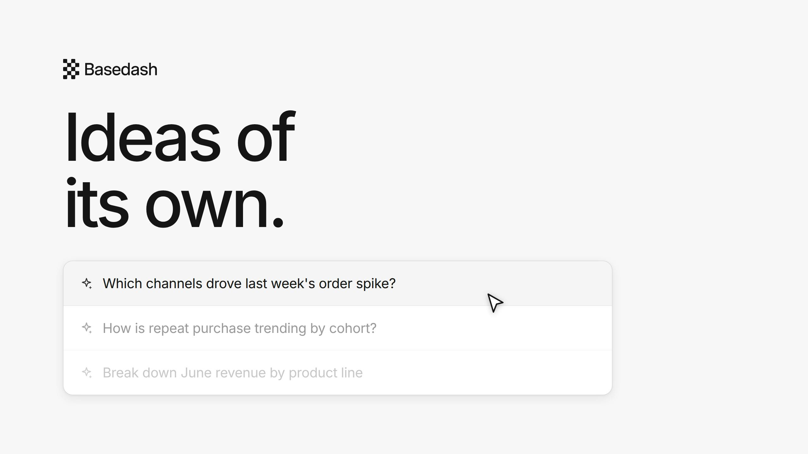
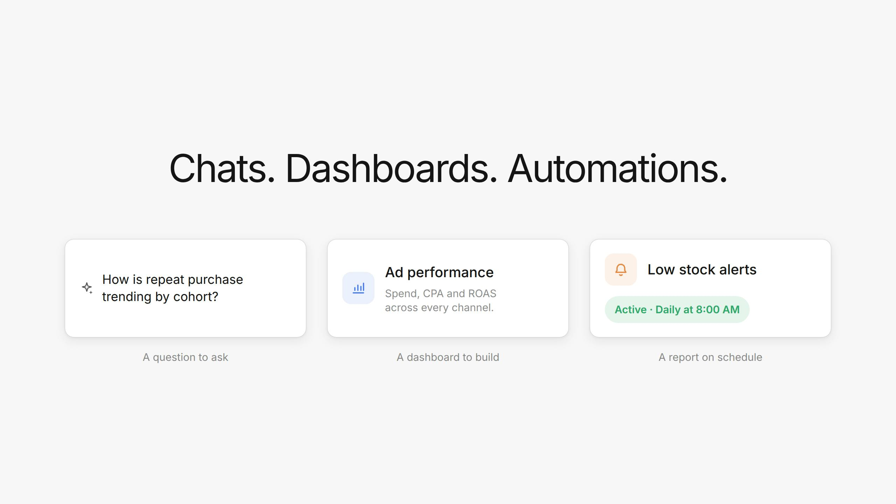
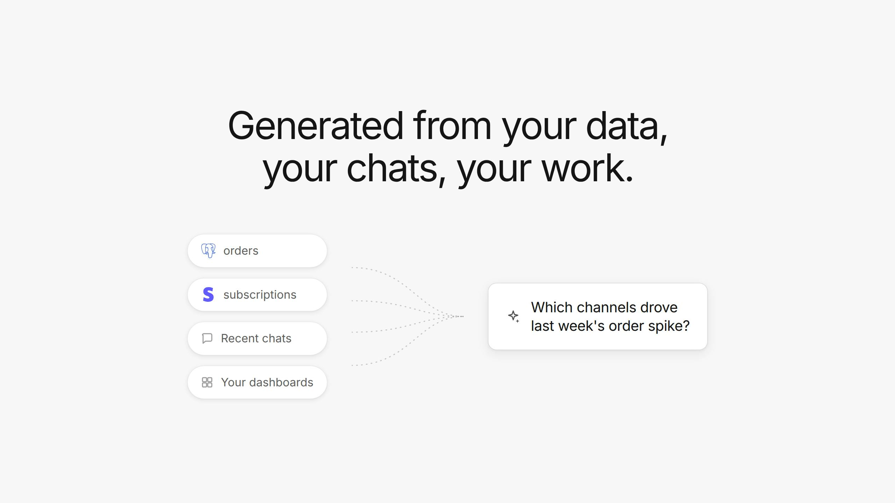

### 🎬 관련 영상
- [🎥 영상 보기](https://ph-files.imgix.net/be7e019e-2dde-44b8-b53b-c68f7a8c2311.jpeg?auto=format)

---

## 7. [Scribble Party](https://www.producthunt.com/products/scribble-party)
**Votes**: 130 | **도입 난이도**: 하 | **신뢰도**: 상
**Tagline**: A local-first whiteboard studio for teachers and creators
**서비스 링크**: https://www.producthunt.com/r/ZOFPR5D7GFVC5I

**태그**: Productivity, Education, Video, Privacy, Creative

### 📌 이 서비스 한눈에 보기
가입이나 설치 없이 브라우저에서 즉시 사용하는 로컬 우선 화이트보드 녹화 도구

### 🔑 주요 기능
- 계정 생성이나 클라우드 업로드 없는 완전한 로컬 중심 방식
- 무한 캔버스 위에서 드로잉과 배경이 제거된 실시간 카메라 버블 활용
- 브라우저 기반이지만 오프라인 앱 설치 및 자동 저장 기능 지원

### 🙋 사용자에게 어떤 점이 좋은가
개인정보 유출 걱정 없이 즉각적으로 강의나 창작 영상을 녹화할 수 있으며, 브라우저 종료 시에도 작업물이 안전하게 보호됩니다.

### ✅ 지금 바로 써볼 기능
- 무한 캔버스에 드로잉 및 아이디어 스케치하기
- 카메라 버블 기능을 활용해 배경 없는 화자 영상 배치하기
- 로컬 저장 기능을 통해 실시간 녹화 진행하기

### ⚠️ 사용 전 확인할 점
- 클라우드 동기화가 아닌 로컬 저장 방식이므로 기기 분실/고장 시 데이터 유실 주의
- 브라우저 기반이므로 하드웨어 리소스 사용량에 따른 성능 차이 발생 가능

### 🧭 확인이 더 필요한 정보
로컬 저장 방식의 구체적인 파일 형식 및 백업 자동화 수준에 대한 확인이 필요합니다.

### 📸 스크린샷 및 갤러리
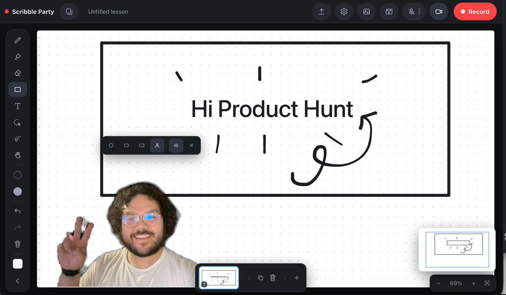

---

## 8. [Aye](https://www.producthunt.com/products/aye-browser)
**Votes**: 125 | **도입 난이도**: 하 | **신뢰도**: 상
**Tagline**: Your teachable AI intern for everyday browser work
**서비스 링크**: https://www.producthunt.com/r/X4CFSVHJYR7U2D

**태그**: Automation, Productivity, AI Agent, Browser, AI Tool

### 📌 이 서비스 한눈에 보기
반복적인 웹 업무를 스스로 계획하고 실행하는 나만의 AI 인턴 브라우저

### 🔑 주요 기능
- 클릭, 타이핑, 스크롤 등 실제 브라우저 동작을 수행하는 AI 에이전트
- 여러 탭을 오가며 리서치, 요약, 답장 초안 작성 등 복합 업무 수행
- 반복적인 워크플로우를 학습 가능한 기술로 전환하여 자동화

### 🙋 사용자에게 어떤 점이 좋은가
단순 반복적인 웹 기반 업무를 AI에게 맡기고, 사용자는 최종 결과물을 검토하거나 승인하는 방식으로 업무 효율을 극대화할 수 있습니다.

### ✅ 지금 바로 써볼 기능
- 반복되는 웹 워크플로우를 AI에게 학습시키기
- 여러 탭을 활용한 리서치 및 요약 작업 시켜보기
- 민감한 단계에서 승인 기능을 활용해 제어권 유지하기

### ⚠️ 사용 전 확인할 점
- AI가 브라우저를 직접 제어하므로 보안 및 개인정보 보호 설정 확인 필요
- 복잡한 웹 사이트 구조에 따라 AI의 동작 정확도가 달라질 수 있음

### 🧭 확인이 더 필요한 정보
현재 제공되는 프로필 기능과 계정 분리 방식의 상세한 보안 정책 확인이 필요합니다.

### 📸 스크린샷 및 갤러리
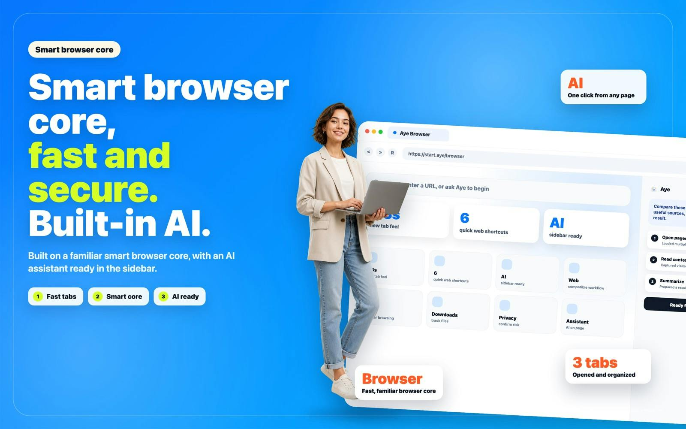

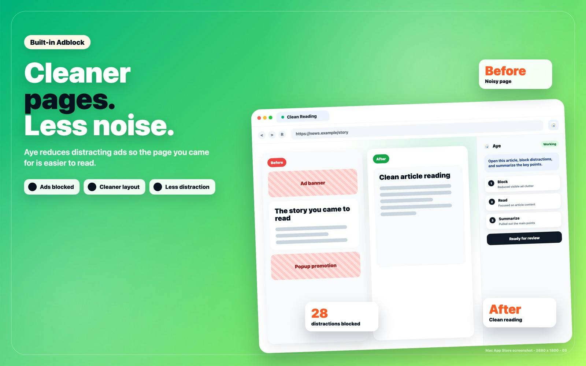

### 🎬 관련 영상
- [🎥 영상 보기](https://ph-files.imgix.net/b1d00003-d0ef-4178-8ab5-ef888e630809.jpeg?auto=format)

---

## 9. [ PixyCAD ](https://www.producthunt.com/products/pixycad-3d-solid-modelling)
**Votes**: 124 | **도입 난이도**: 하 | **신뢰도**: 상
**Tagline**: Fast & precise 3D CAD built natively for iPad and Mac
**서비스 링크**: https://www.producthunt.com/r/AP3UTU5BCCIYCG

**태그**: 3D Modeling, CAD, Design, Apple Ecosystem, Maker, Automation

### 📌 이 서비스 한눈에 보기
iPad와 Mac에서 전문가급 모델링을 구현하는 직관적인 네이티브 3D CAD 솔루션

### 🔑 주요 기능
- Apple 실리콘에 최적화된 Mac 및 iPad 네이티브 앱
- Parasolid 엔진 기반의 전문적인 기하학적 정밀도 제공
- 복잡함을 덜어낸 접근성 높은 모델링 워크플로우

### 🙋 사용자에게 어떤 점이 좋은가
전문적인 솔리드 모델링 기능을 갖추면서도 복잡한 CAD 학습 곡선을 낮춰, 메이커와 디자이너가 어디서든 빠르게 아이디어를 구현할 수 있습니다.

### ✅ 지금 바로 써볼 기능
- iPad에서 터치/애플펜슬을 활용한 직관적 모델링 테스트
- Parasolid 엔진 기반의 정밀한 설계 작업 수행
- Mac 환경에서의 데스크탑 워크플로우 전환 확인

### ⚠️ 사용 전 확인할 점
- 전문가용 기능 중 일부가 초기 버전에서 제한적일 수 있음
- 기존 복잡한 CAD 소프트웨어와의 파일 호환성 확인 필요

### 🧭 확인이 더 필요한 정보
현재 제품의 구체적인 가격 정책과 파일 내보내기/가져오기 지원 포맷에 대한 정보가 부족합니다.

### 📸 스크린샷 및 갤러리
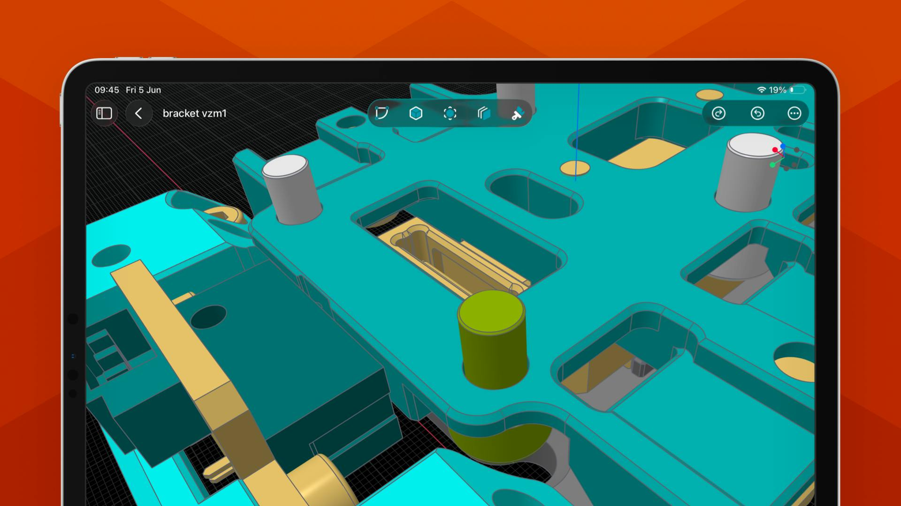
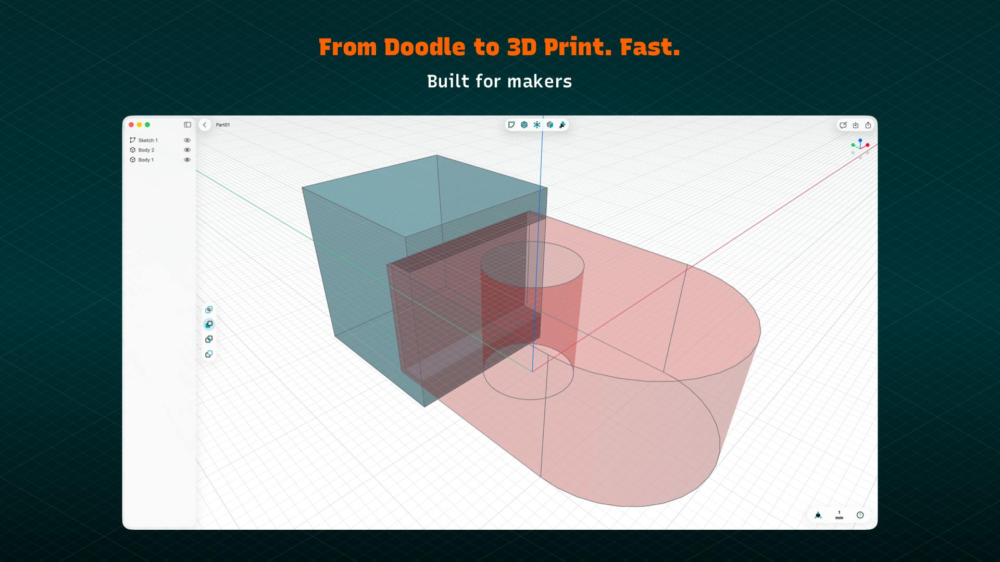
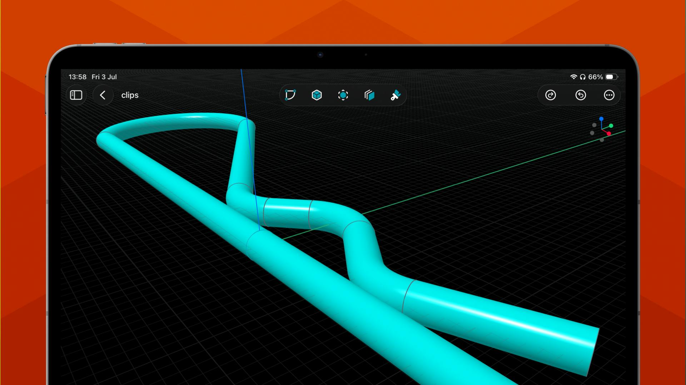

### 🎬 관련 영상
- [🎥 영상 보기](https://ph-files.imgix.net/2675fa47-187d-4e03-b80a-7fffe087bdb6.jpeg?auto=format)

---

## 10. [Yapper Leaderboard](https://www.producthunt.com/products/yapper-leaderboard)
**Votes**: 124 | **도입 난이도**: 하 | **신뢰도**: 상
**Tagline**: See the biggest startup yappers on X/Twitter 
**서비스 링크**: https://www.producthunt.com/r/NNRTXAZRZXHERS

**태그**: Analytics, SocialMedia, Marketing, Trend, AI Tool

### 📌 이 서비스 한눈에 보기
X(트위터) 내 스타트업과 유저들의 영향력을 실시간 순위로 확인하는 리더보드

### 🔑 주요 기능
- X/트위터 내 스타트업 및 유저들의 활동량(Yap) 기반 랭킹 제공
- 노출수(Impressions)를 기준으로 매일 업데이트되는 데일리 리더보드
- 트렌드 상승세를 확인할 수 있는 주간 성장 지표 제공

### 🙋 사용자에게 어떤 점이 좋은가
누가 현재 X에서 가장 영향력 있는 스타트업인지 파악하고, 트렌드에 민감한 유저나 기업을 발굴하는 데 유용합니다.

### ✅ 지금 바로 써볼 기능
- X 계정으로 로그인하여 내 회사/팀 등록하기
- 데일리 리더보드에서 상위 스타트업 확인하기
- 주간 성장 지표를 통해 트렌드 유저 팔로우하기

### ⚠️ 사용 전 확인할 점
- X 계정 로그인 시 데이터 접근 권한 확인 필요
- 단순 노출수 기반 랭킹이 실제 비즈니스 가치와 일치하지 않을 수 있음

### 🧭 확인이 더 필요한 정보
X API를 통한 데이터 수집 방식과 개인정보 보호 정책에 대한 상세 확인이 필요합니다.

### 📸 스크린샷 및 갤러리
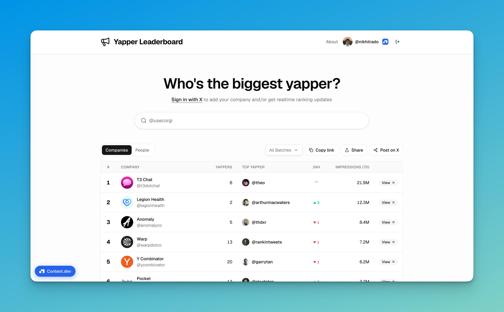
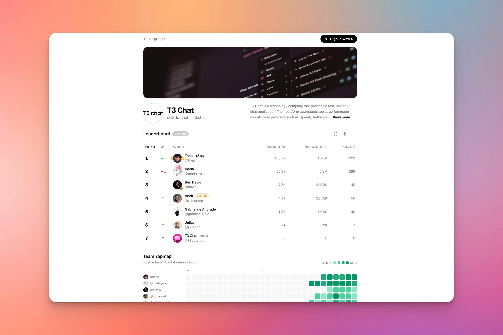
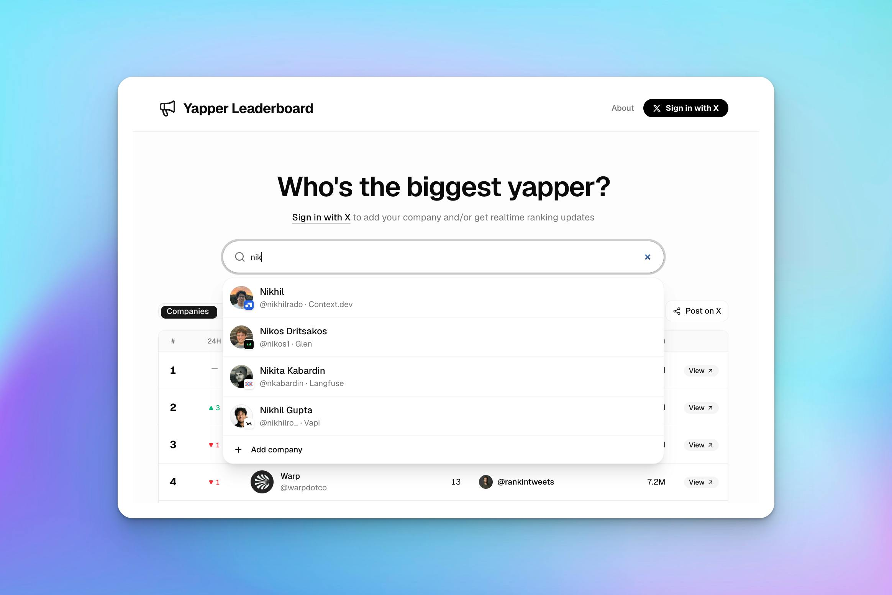

---

## 11. [Kimi K3](https://www.producthunt.com/products/kimi-2)
**Votes**: 52 | **도입 난이도**: 중 | **신뢰도**: 상
**Tagline**: The world's first open 3T-class model
**서비스 링크**: https://www.producthunt.com/r/SLCB2A2AJCZQNV

**태그**: AI, LLM, Coding, OpenSource, DataScience, Agent, AI Tool

### 📌 이 서비스 한눈에 보기
압도적인 컨텍스트 창과 시각 능력을 갖춘 세계 최초의 3T급 오픈 모델

### 🔑 주요 기능
- 2.8T 파라미터 규모의 강력한 성능을 갖춘 오픈 모델
- 100만 토큰의 대규모 컨텍스트 창 및 네이티브 시각 기능 탑재
- 코딩, 컴파일러 개발, 과학적 추론 등 복잡한 작업에 최적화된 아키텍처

### 🙋 사용자에게 어떤 점이 좋은가
방대한 양의 코드나 문서를 한 번에 처리할 수 있어, 복잡한 프로그래밍 작업과 데이터 분석 업무의 효율을 극대화할 수 있습니다.

### ✅ 지금 바로 써볼 기능
- 100만 토큰 컨텍스트를 활용한 대규모 코드베이스 분석
- 시각 능력을 활용한 이미지 및 도표 기반 데이터 해석
- 복잡한 논리적 추론 및 과학적 문제 해결 테스트

### ⚠️ 사용 전 확인할 점
- 모델 규모가 커 하드웨어 리소스 요구사항이 높을 수 있음
- 오픈 모델로서의 구체적인 배포 방식 및 최적화 수준 확인 필요

### 🧭 확인이 더 필요한 정보
실제 하드웨어 구동 환경에 따른 성능 효율성과 구체적인 API 제공 여부를 확인해야 합니다.

### 📸 스크린샷 및 갤러리

### 🎬 관련 영상
- [🎥 영상 보기](https://ph-files.imgix.net/cb1fe190-6ebb-455f-af96-1ce2fc8d961b.jpeg?auto=format)

---

## 12. [isvisible.ai?](https://www.producthunt.com/products/isvisible-ai)
**Votes**: 37 | **도입 난이도**: 하 | **신뢰도**: 상
**Tagline**: Free AI visibility audit
**서비스 링크**: https://www.producthunt.com/r/FP4B6BWNI73EUO

**태그**: AI-SEO, Analytics, Marketing-Tool, Agent, AI Tool, Chat

### 📌 이 서비스 한눈에 보기
주요 AI 에이전트의 웹사이트 접근성 및 가시성을 즉시 점검하는 도구

### 🔑 주요 기능
- ChatGPT, Claude, Perplexity, Google AI 등 주요 AI 모델의 웹 접근성 확인
- 0–100점 사이의 직관적인 가시성 점수 제공
- 각 AI 에이전트별 상세 접근성 분석 리포트 제공

### 🙋 사용자에게 어떤 점이 좋은가
내 웹사이트가 AI 검색 엔진이나 챗봇에 얼마나 잘 노출되는지 즉각적으로 파악하여 AI SEO 전략을 세울 수 있습니다.

### ✅ 지금 바로 써볼 기능
- 자사 웹사이트 URL 입력하여 가시성 점수 확인하기
- 에이전트별 접근성 차이 분석하기

### ⚠️ 사용 전 확인할 점
- 점수가 낮을 경우 구체적인 기술적 해결 방법은 별도로 검토 필요
- 실제 검색 엔진 최적화(SEO) 결과와는 차이가 있을 수 있음

### 🧭 확인이 더 필요한 정보
제공되는 점수가 실제 AI 검색 결과 반영도와 어느 정도의 상관관계를 갖는지 확인이 필요합니다.

### 📸 스크린샷 및 갤러리

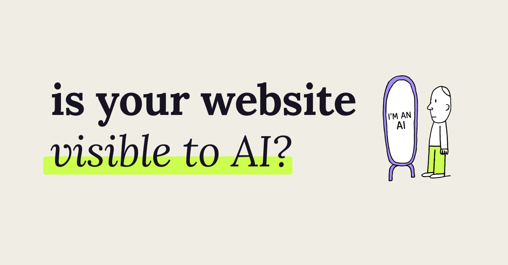

### 🎬 관련 영상
- [🎥 영상 보기](https://ph-files.imgix.net/d1581de8-e2c1-491d-9736-c9a6b3b78fd4.jpeg?auto=format)

---

## 13. [Tilores Studio desktop entity resolution](https://www.producthunt.com/products/tilores-rag)
**Votes**: 35 | **도입 난이도**: 하 | **신뢰도**: 상
**Tagline**: Entity resolution on your machine. No cloud, no signup.
**서비스 링크**: https://www.producthunt.com/r/444SIGAP456JYJ

**태그**: DataCleaning, Privacy, AI-Integration, DesktopApp, AI Tool, DevTool

### 📌 이 서비스 한눈에 보기
데이터 유출 걱정 없이 로컬에서 즉시 실행하는 데스크톱 엔티티 레졸루션 도구

### 🔑 주요 기능
- 클라우드나 가입 없이 로컬 머신에서 실행되는 엔티티 레졸루션 엔진
- CSV 파일을 로드하여 실시간으로 중복 데이터를 식별 및 해결
- 로컬 MCP 서버 지원으로 Claude Code 등 AI 어시스턴트와 연동 가능

### 🙋 사용자에게 어떤 점이 좋은가
민감한 데이터를 클라우드에 업로드할 필요 없이 개인 PC 내에서 안전하게 데이터 정제 작업을 수행할 수 있습니다.

### ✅ 지금 바로 써볼 기능
- CSV 데이터 로드 및 중복 데이터 매칭 테스트
- 로컬 MCP 서버를 통한 AI 어시스턴트 연동 설정
- 10만 건 이하의 데이터셋으로 성능 확인

### ⚠️ 사용 전 확인할 점
- 무료 버전은 최대 10만 레코드까지만 지원됨
- 로컬 환경(macOS, Windows, Linux)의 리소스 사용량 확인 필요

### 🧭 확인이 더 필요한 정보
10만 건 이상의 대규모 데이터 처리를 위한 유료 플랜의 상세 조건은 명시되지 않았습니다.

### 📸 스크린샷 및 갤러리
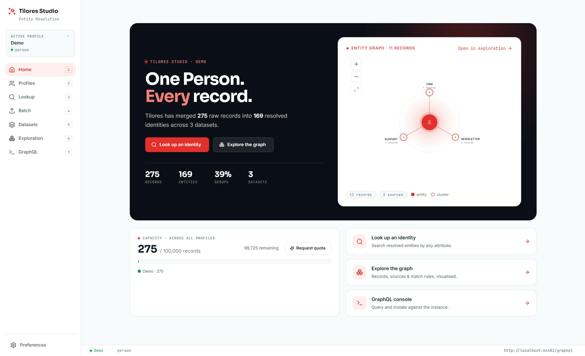
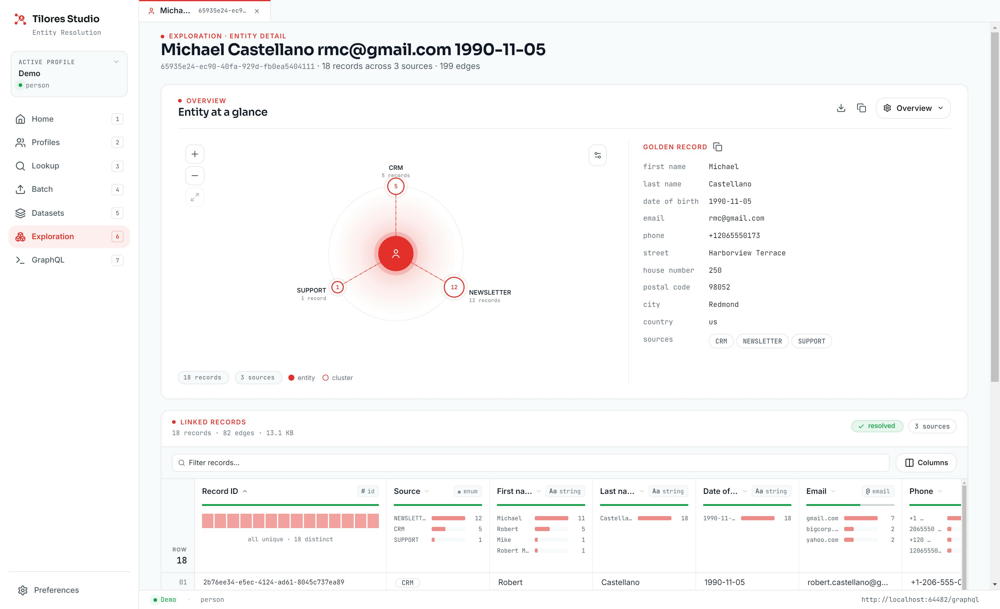
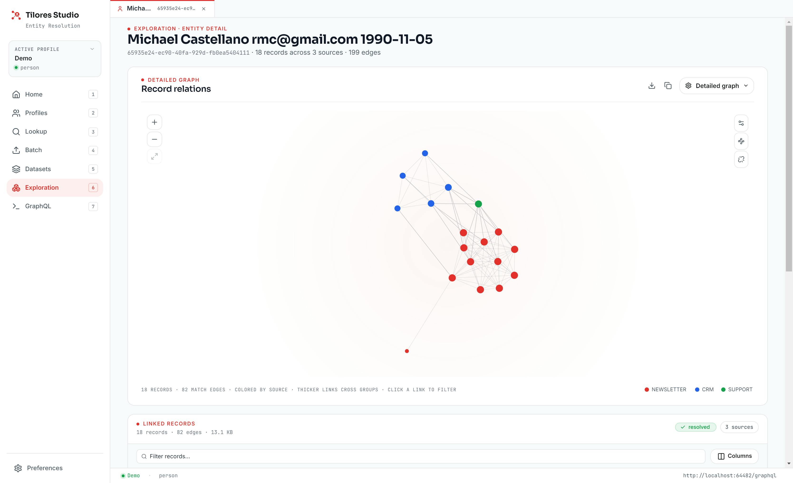

### 🎬 관련 영상
- [🎥 영상 보기](https://ph-files.imgix.net/3cca19b1-7d43-453c-b031-ef36e0cd5058.jpeg?auto=format)

---

## 14. [PH Daily Top 50](https://www.producthunt.com/products/ph-daily-top-50)
**Votes**: 34 | **도입 난이도**: 하 | **신뢰도**: 상
**Tagline**:  The day's top 50 launches, each summarized by AI
**서비스 링크**: https://www.producthunt.com/r/PRPRHN4PGU7J6A

**태그**: Productivity, AI, OpenSource, Curation, AI Tool, API

### 📌 이 서비스 한눈에 보기
매일 50개의 신규 런칭 제품을 AI 요약으로 2분 만에 훑어보는 오픈소스 디제스트

### 🔑 주요 기능
- 매일 가장 인기 있는 50개 런칭 제품을 AI가 핵심만 요약
- 계정 생성 없이 7일간의 기록을 자유롭게 탐색 및 검색 가능
- 오픈소스(MIT)로 제공되어 개인 API 키를 사용한 자체 운영 가능

### 🙋 사용자에게 어떤 점이 좋은가
수십 개의 탭을 열 필요 없이 하루의 트렌드를 단 몇 분 만에 파악하여 정보 탐색 시간을 획기적으로 줄여줍니다.

### ✅ 지금 바로 써볼 기능
- 카테고리 필터를 사용하여 관심 분야 제품만 골라보기
- 검색 기능을 통해 특정 키워드 관련 요약 내용 찾기
- 오픈소스 코드를 복제하여 자신만의 요약 서비스 구축하기

### ⚠️ 사용 전 확인할 점
- AI 요약이므로 원본 제품의 세부 기능과 차이가 있을 수 있음
- 자체 운영 시 개인의 API 사용 비용이 발생할 수 있음

### 🧭 확인이 더 필요한 정보
사용자가 직접 호스팅할 경우 발생하는 인프라 유지 비용 및 API 호출 한도에 대한 정보가 필요합니다.

### 📸 스크린샷 및 갤러리
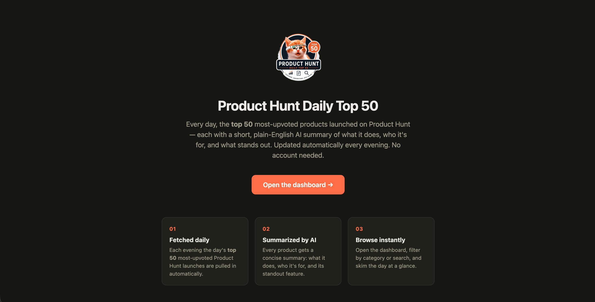
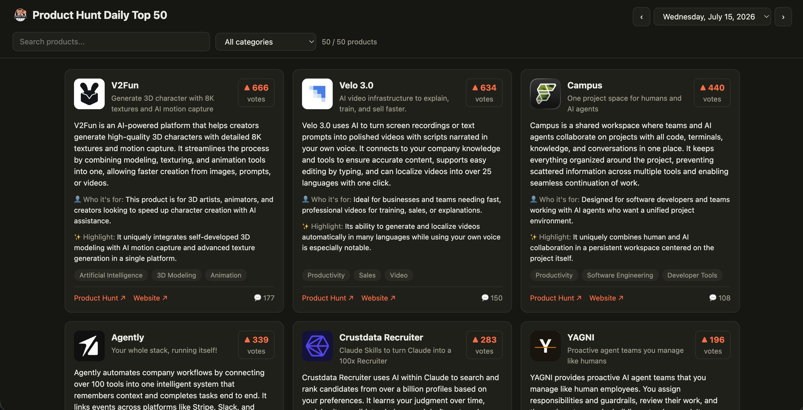

---

## 15. [Vetta X](https://www.producthunt.com/products/vetta-x)
**Votes**: 28 | **도입 난이도**: 하 | **신뢰도**: 상
**Tagline**: Scale your personal brand on X with automated AI agents
**서비스 링크**: https://www.producthunt.com/r/WMMU5URSNM53AP

**태그**: AI, SocialMedia, Automation, PersonalBranding, Agent, AI Tool

### 📌 이 서비스 한눈에 보기
AI 에이전트를 활용해 X(트위터) 퍼스널 브랜딩을 자동화하는 성장 워크스페이스

### 🔑 주요 기능
- 팔로우하는 크리에이터의 답글 알림 기능
- 사용자의 말투를 학습하여 초안을 작성하는 Vetta AI 에이전트
- 원터치 게시를 통한 간편한 콘텐츠 발행

### 🙋 사용자에게 어떤 점이 좋은가
콘텐츠 제작 시간을 단축하면서도 자신의 목소리를 유지하며 X에서의 영향력을 효율적으로 확장할 수 있습니다.

### ✅ 지금 바로 써볼 기능
- 관심 있는 크리에이터 알림 설정하기
- AI 에이전트에게 자신의 말투 학습시키기
- 생성된 초안 검토 후 원터치로 게시하기

### ⚠️ 사용 전 확인할 점
- AI가 작성한 글이 사용자의 실제 의도와 다를 수 있으므로 검토 필수
- 자동화로 인한 X 플랫폼의 스팸 정책 위반 여부 주의

### 🧭 확인이 더 필요한 정보
AI 에이전트의 말투 학습 방식과 구체적인 자동화 범위에 대한 상세 정보가 필요합니다.

### 📸 스크린샷 및 갤러리
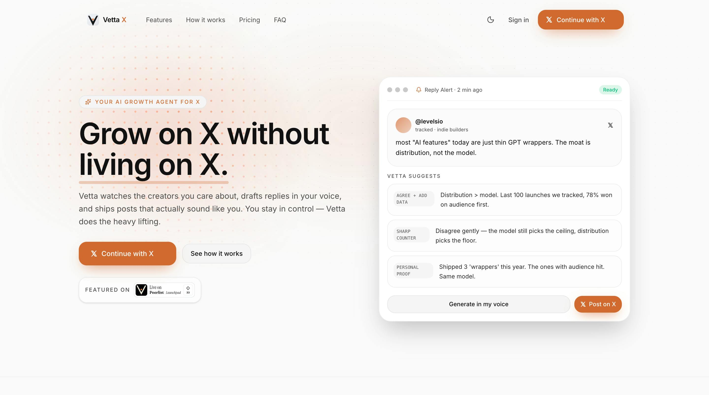
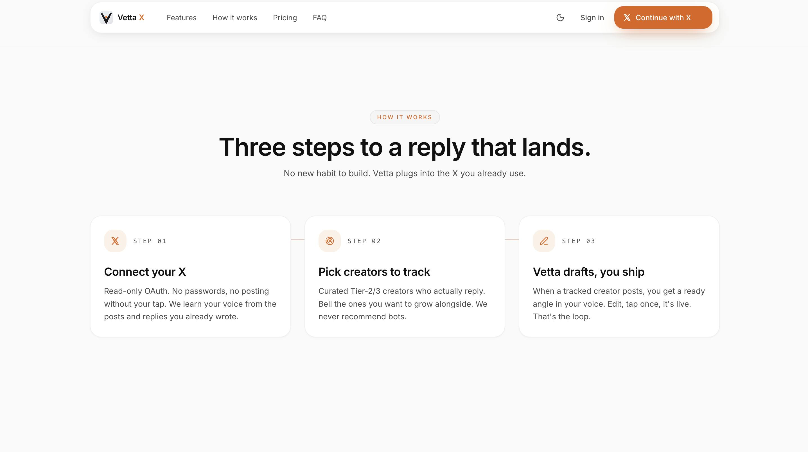

### 🎬 관련 영상
- [🎥 영상 보기](https://ph-files.imgix.net/21bbec8d-e060-44c1-87df-345cc1f069eb.jpeg?auto=format)

---

## 16. [Dream Pixel AI](https://www.producthunt.com/products/ai-image-editor-12)
**Votes**: 24 | **도입 난이도**: 하 | **신뢰도**: 상
**Tagline**: AI Image to Image Generator with Free Credits
**서비스 링크**: https://www.producthunt.com/r/STRDP4U333PASC

**태그**: AI, ImageGeneration, Design, Creative, AI Tool, Vision

### 📌 이 서비스 한눈에 보기
사진 한 장으로 다양한 스타일과 배경을 만드는 AI 이미지 변환 도구

### 🔑 주요 기능
- 이미지 업로드만으로 즉각적인 스타일 변환 가능
- 캐릭터, 인물 사진, 배경 등 창의적인 변형 지원
- 무료 크레딧을 통한 초기 사용 기회 제공

### 🙋 사용자에게 어떤 점이 좋은가
기존 사진을 활용해 새로운 스타일의 이미지나 배경을 쉽고 빠르게 생성할 수 있어 콘텐츠 제작에 유용합니다.

### ✅ 지금 바로 써볼 기능
- 사진 업로드 후 새로운 스타일 적용해보기
- 배경 및 캐릭터 변형 기능 테스트하기
- 무료 크레딧으로 다양한 결과물 생성하기

### ⚠️ 사용 전 확인할 점
- 무료 크레딧 소진 시 유료 결제 필요 여부 확인 필요
- 생성된 이미지의 저작권 및 상업적 이용 범위 확인 필요

### 🧭 확인이 더 필요한 정보
무료 크레딧의 구체적인 제공량과 유료 플랜의 상세 기능 차이를 확인해야 합니다.

### 📸 스크린샷 및 갤러리

---

## 17. [Phrase](https://www.producthunt.com/products/phrase-2)
**Votes**: 23 | **도입 난이도**: 하 | **신뢰도**: 상
**Tagline**: Your AI notes can edit themselves
**서비스 링크**: https://www.producthunt.com/r/3UXGQQUO6L5IR4

**태그**: AI, Productivity, Note-taking, Privacy, Agent, AI Tool, Chat

### 📌 이 서비스 한눈에 보기
채팅창 대신 노트 본문을 직접 편집하는 에이전트 기반 AI 노트 앱

### 🔑 주요 기능
- 사이드바 채팅이 아닌 네이티브 블록 에디터 내에서 직접 작동하는 AI 에이전트
- 사용자의 요청에 따라 노트 내용을 직접 재작성하는 방식
- iCloud 기반의 데이터 프라이버시 및 보안 중심 설계

### 🙋 사용자에게 어떤 점이 좋은가
별도의 복사-붙여넣기 없이 AI가 노트 내용을 직접 수정하므로 문서 작성 흐름이 끊기지 않습니다.

### ✅ 지금 바로 써볼 기능
- AI 에이전트를 통한 노트 초안 자동 재작성
- 소스 읽기 기능을 통한 정보 정리
- 원터치 후속 작업 실행

### ⚠️ 사용 전 확인할 점
- 에이전트가 직접 내용을 수정하므로 의도와 다르게 편집될 가능성
- iCloud 환경 외의 플랫폼 지원 여부 확인 필요

### 🧭 확인이 더 필요한 정보
현재 제공되는 에디터의 상세 기능과 지원하는 기기 범위에 대한 정보가 부족합니다.

### 📸 스크린샷 및 갤러리
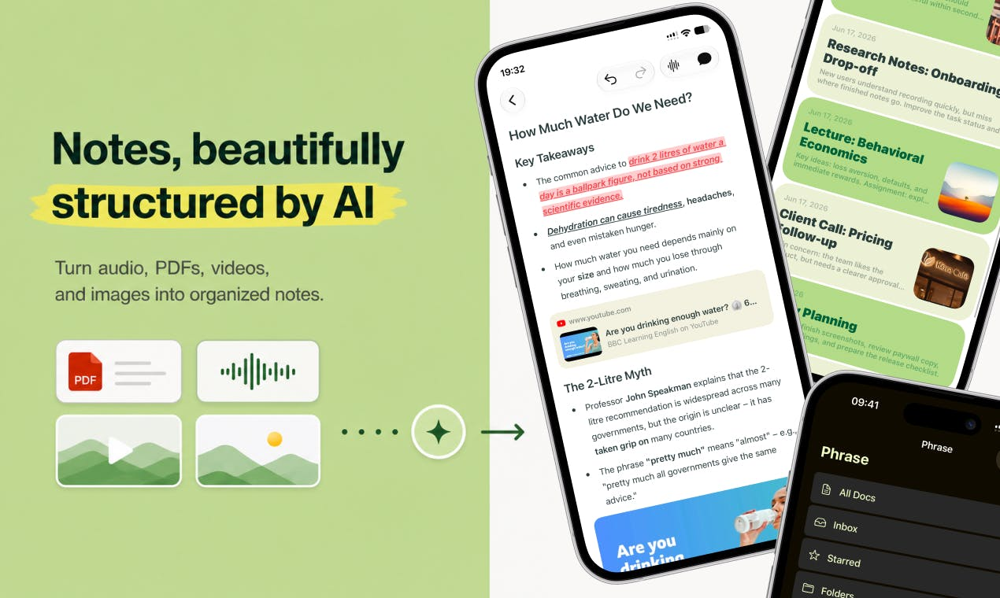
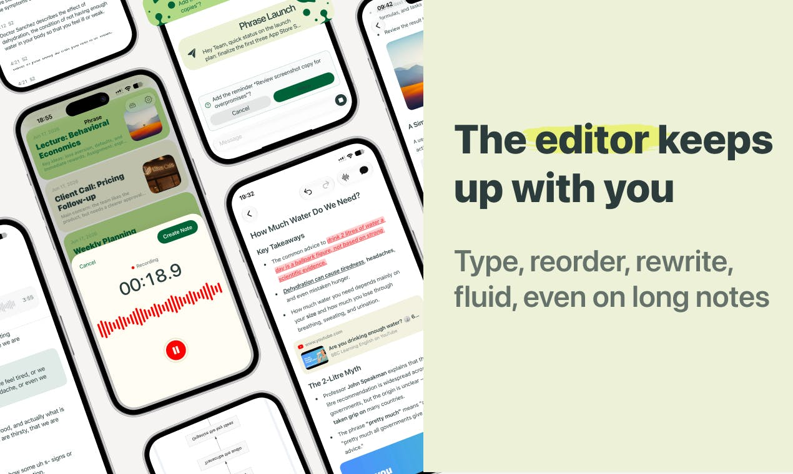

---

## 18. [Convert PDF to Excel](https://www.producthunt.com/products/convert-pdf-to-excel)
**Votes**: 23 | **도입 난이도**: 하 | **신뢰도**: 상
**Tagline**: Turn any PDF into an editable Excel sheet — one click
**서비스 링크**: https://www.producthunt.com/r/DHM3OFJBOA7FOM

**태그**: Productivity, Automation, ChromeExtension, DataExtraction, AI Tool, Vision

### 📌 이 서비스 한눈에 보기
클릭 한 번으로 PDF를 편집 가능한 엑셀 시트로 변환하는 무료 크롬 확장 프로그램

### 🔑 주요 기능
- 로그인, 용량 제한, 구독 없이 즉시 사용 가능
- 텍스트 기반 PDF는 로컬에서 처리되어 보안성 확보
- 스캔된 이미지 PDF는 AI 기반 테이블 추출 기능 제공

### 🙋 사용자에게 어떤 점이 좋은가
복잡한 수작업 없이 PDF 데이터를 즉시 엑셀로 옮길 수 있어 데이터 정리 시간을 획기적으로 단축합니다.

### ✅ 지금 바로 써볼 기능
- 크롬 확장 프로그램 설치 후 PDF 파일 열기
- 텍스트 기반 PDF를 통한 즉각적인 데이터 추출 테스트
- 스캔된 문서의 AI 테이블 추출 기능 확인

### ⚠️ 사용 전 확인할 점
- 이미지 기반 PDF는 클라우드(HTTPS)를 통해 처리되므로 보안 정책 확인 필요
- 복잡한 레이아웃의 경우 추출된 데이터의 정렬 상태 확인 필요

### 🧭 확인이 더 필요한 정보
이미지 기반 PDF 처리 시 데이터가 서버로 전송되는 방식에 대한 상세 보안 정책 확인이 필요합니다.

### 📸 스크린샷 및 갤러리

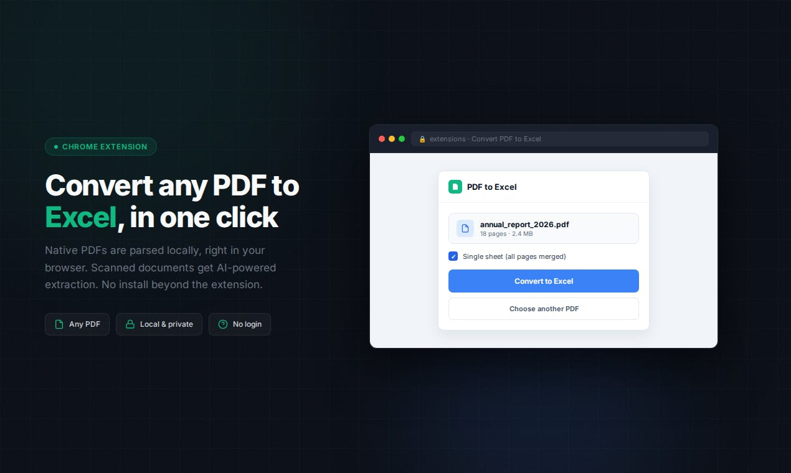
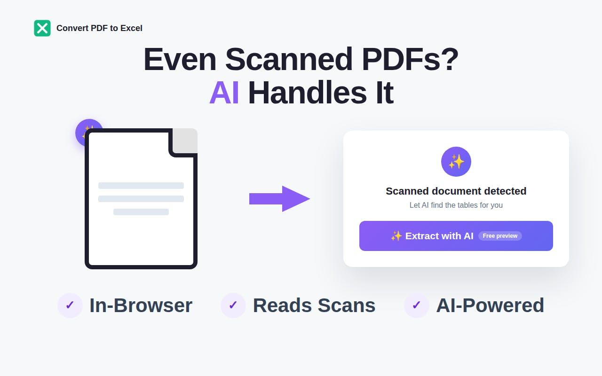

---

## 19. [Engine Mail](https://www.producthunt.com/products/engine-mail)
**Votes**: 21 | **도입 난이도**: 하 | **신뢰도**: 상
**Tagline**: Private AI email with security, control, and MCP built in
**서비스 링크**: https://www.producthunt.com/r/XCV4FROTDV2FMU

**태그**: Productivity, AI, Security, Email, Automation, AI Tool

### 📌 이 서비스 한눈에 보기
보안과 개인정보를 최우선으로 하는 AI 기반 통합 이메일 워크스페이스

### 🔑 주요 기능
- Gmail, Outlook, iCloud 등 다양한 계정을 하나로 통합하는 단일 인박스 제공
- 로컬 AI 또는 개인 API 키를 활용한 프라이버시 중심의 AI 기능 (요약, 작업 추출, 초안 작성)
- 트래커 차단, 피싱 탐지, 의심스러운 링크/첨부파일 스캔 등 강력한 보안 기능

### 🙋 사용자에게 어떤 점이 좋은가
여러 이메일 계정을 안전하게 통합 관리하면서, 개인정보 유출 걱정 없이 AI의 생산성 도움을 받을 수 있습니다.

### ✅ 지금 바로 써볼 기능
- 기존 이메일 계정(Gmail, Outlook 등) 연결하기
- AI 기능을 활용해 긴 이메일 스레드 요약해보기
- 보안 기능을 활성화하여 피싱 및 트래커 차단 설정하기

### ⚠️ 사용 전 확인할 점
- 로컬 AI 실행 시 사용자의 하드웨어 사양에 따라 성능 차이가 있을 수 있음
- 외부 계정 연동 시 계정 접근 권한 설정 확인 필요

### 🧭 확인이 더 필요한 정보
로컬 실행 환경의 구체적인 시스템 요구 사양과 지원하는 MCP(Model Context Protocol)의 상세 범위는 확인이 필요합니다.

### 📸 스크린샷 및 갤러리
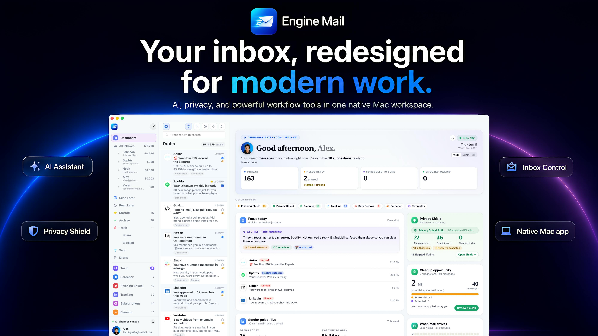
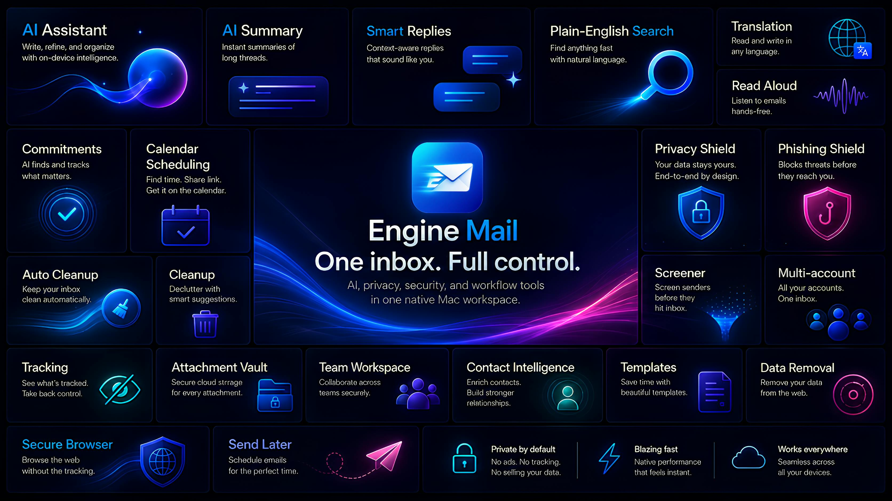
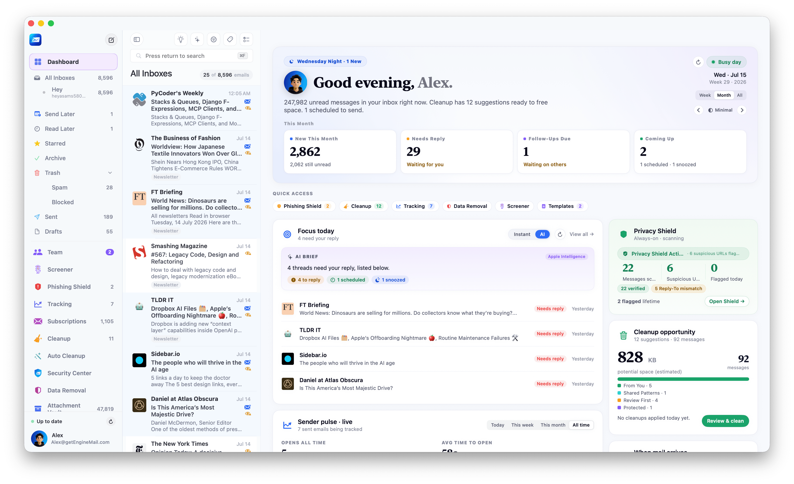

---

## 20. [WizeMe.APP: Personal Life Partner OS](https://www.producthunt.com/products/wizeme-app-personal-life-partner-os)
**Votes**: 21 | **도입 난이도**: 중 | **신뢰도**: 상
**Tagline**: Private AI memory for clearer decisions and follow-through
**서비스 링크**: https://www.producthunt.com/r/YCOYEKSQX5VP6I

**태그**: Productivity, AI, Personal Management, Decision Support, AI Tool

### 📌 이 서비스 한눈에 보기
개인적인 맥락과 기억을 관리하여 더 나은 의사결정을 돕는 프라이빗 AI 사고 파트너

### 🔑 주요 기능
- 대화, 결정, 관계 등 선택적 맥락을 기억하는 개인용 메모리 시스템
- 아침 브리핑과 밤 브리핑을 통한 일상과 성찰의 연결
- 의사결정 지원 및 어려운 대화 준비를 위한 실행 중심 기능

### 🙋 사용자에게 어떤 점이 좋은가
중요한 삶의 맥락을 AI가 기억해줌으로써, 사용자는 과거의 결정과 현재의 상황을 연결하여 더 명확한 판단과 실행을 할 수 있습니다.

### ✅ 지금 바로 써볼 기능
- Morning Brief와 Nightly De-brief로 일상 루틴 설정하기
- Decision Brief를 활용해 중요한 결정 사항 정리하기
- Visual Mirror 기능을 통해 자신의 사고 과정과 근거 확인하기

### ⚠️ 사용 전 확인할 점
- 개인적인 데이터를 다루므로 데이터 보안 및 프라이버시 정책 상세 확인 필요
- 사용자의 피드백에 따라 학습되는 방식이므로 초기 데이터 입력의 중요성 존재

### 🧭 확인이 더 필요한 정보
데이터 저장 방식 및 보안 수준에 대한 기술적 세부 사항에 대한 추가 확인이 필요합니다.

### 📸 스크린샷 및 갤러리

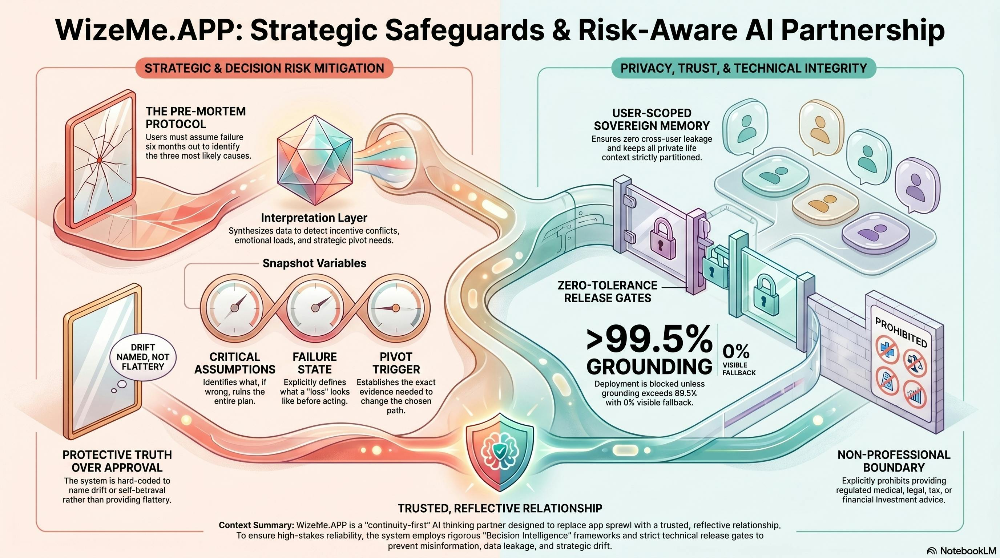

### 🎬 관련 영상
- [🎥 영상 보기](https://ph-files.imgix.net/cda882b7-a65c-4591-95b6-edd851d8e3da.jpeg?auto=format)

---

## 21. [Ota](https://www.producthunt.com/products/ota)
**Votes**: 20 | **도입 난이도**: 중 | **신뢰도**: 상
**Tagline**: Software Execution Governance for Humans and AI Agents
**서비스 링크**: https://www.producthunt.com/r/UH6CGZHEHEB7IH

**태그**: DevTool, AI-Agent, Automation, DevOps, Agent, AI Tool

### 📌 이 서비스 한눈에 보기
인간과 AI 에이전트를 위한 소프트웨어 실행 거버넌스 및 실행 계약 관리 도구

### 🔑 주요 기능
- 소프트웨어 저장소에 기계 판독 가능한 실행 계약(Execution Contract) 도입
- 파편화된 설정 지침과 실행 드리프트(Drtaft) 문제 해결
- 인간과 AI 에이전트 모두를 위한 단일 진실 공급원(Single Source of Truth) 제공

### 🙋 사용자에게 어떤 점이 좋은가
복잡한 소프트웨어 실행 환경을 표준화하여, 개발자와 AI 에이전트가 설정 오류 없이 일관된 환경에서 코드를 실행하고 검증할 수 있게 합니다.

### ✅ 지금 바로 써볼 기능
- 기존 저장소의 설정 지침을 Ota 계약으로 전환해보기
- AI 에이전트의 실행 환경 일관성 테스트하기
- 실행 계약을 통한 환경 검증 워크플로우 구축하기

### ⚠️ 사용 전 확인할 점
- 기존 레거시 환경과의 호환성 및 마이그레이션 비용 확인 필요
- 실행 계약 작성 및 유지 관리를 위한 추가적인 작업 부하 발생 가능성

### 🧭 확인이 더 필요한 정보
구체적인 구현 방식(CLI, API, 또는 특정 프레임워크 등)과 기존 CI/CD 파이프라인과의 통합 방식에 대한 상세 정보가 필요합니다.

### 📸 스크린샷 및 갤러리
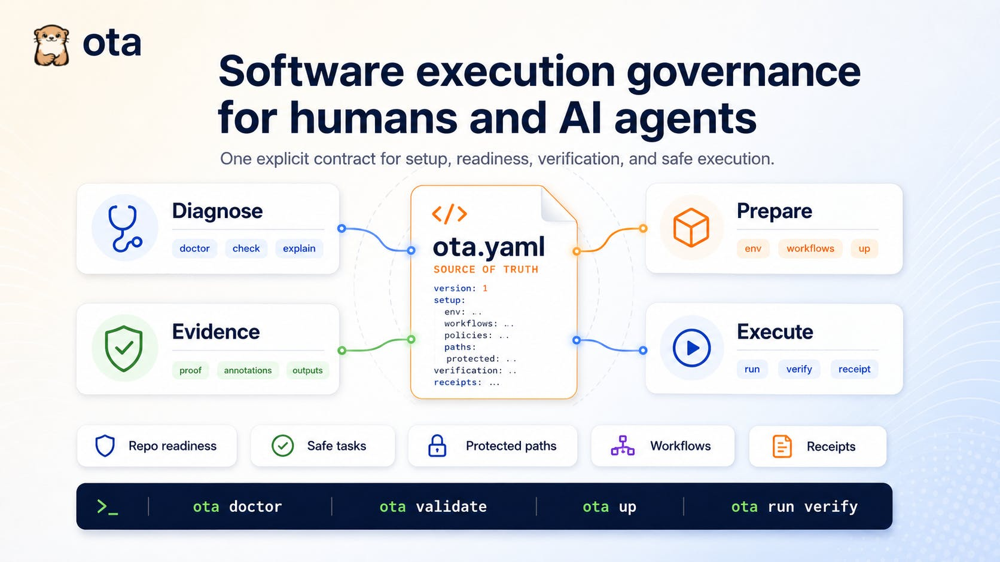
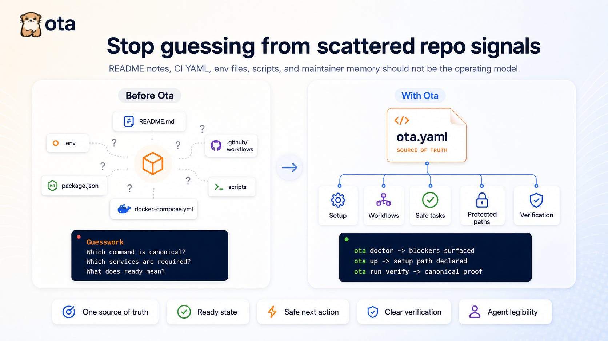
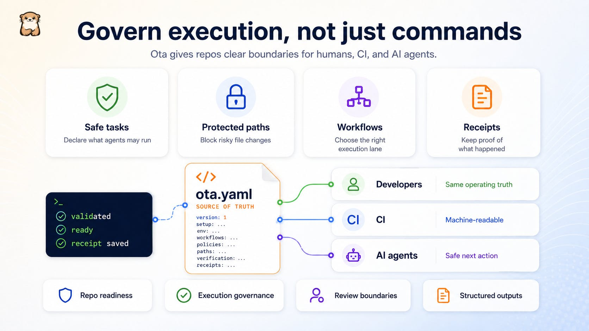

---

## 22. [CartHappy ](https://www.producthunt.com/products/carthappy-automatic-grocery-savings)
**Votes**: 19 | **도입 난이도**: 하 | **신뢰도**: 상
**Tagline**: Splits your grocery cart across stores, automatically
**서비스 링크**: https://www.producthunt.com/r/XT7TA5X32W7LTT

**태그**: Shopping, Automation, Savings, BrowserExtension, AI Tool

### 📌 이 서비스 한눈에 보기
여러 쇼핑몰의 가격을 비교해 가장 저렴한 조합으로 장바구니를 자동 분할해주는 쇼핑 확장 프로그램

### 🔑 주요 기능
- 10,000개 이상의 매장과 3억 5천만 개의 가격 데이터를 실시간 비교
- 쿠폰 자동 적용 및 최저가 조합을 위한 장바구니 자동 분할 기능
- 사용자의 정기 구매 목록을 학습하여 장바구니 자동 생성 가능

### 🙋 사용자에게 어떤 점이 좋은가
특정 쇼핑몰에 종속되지 않고 여러 매장의 가격을 비교하여, 매주 가장 저렴한 방식으로 식료품을 구매할 수 있게 도와줍니다.

### ✅ 지금 바로 써볼 기능
- 브라우저 확장 프로그램 설치 및 쇼핑 환경 설정
- 자주 구매하는 물품 리스트 등록 및 자동 생성 기능 테스트
- 장바구니 분할 기능을 통한 실시간 절약액 확인

### ⚠️ 사용 전 확인할 점
- 여러 매장에 나누어 주문할 경우 발생하는 배송비 합계가 절약액보다 클 수 있음
- 확장 프로그램이 각 리테일러 사이트의 환경에서 원활히 작동하는지 확인 필요

### 🧭 확인이 더 필요한 정보
배송비 및 최소 주문 금액을 고려한 최종 결제 금액 최적화 여부에 대한 구체적인 정보가 필요합니다.

### 📸 스크린샷 및 갤러리
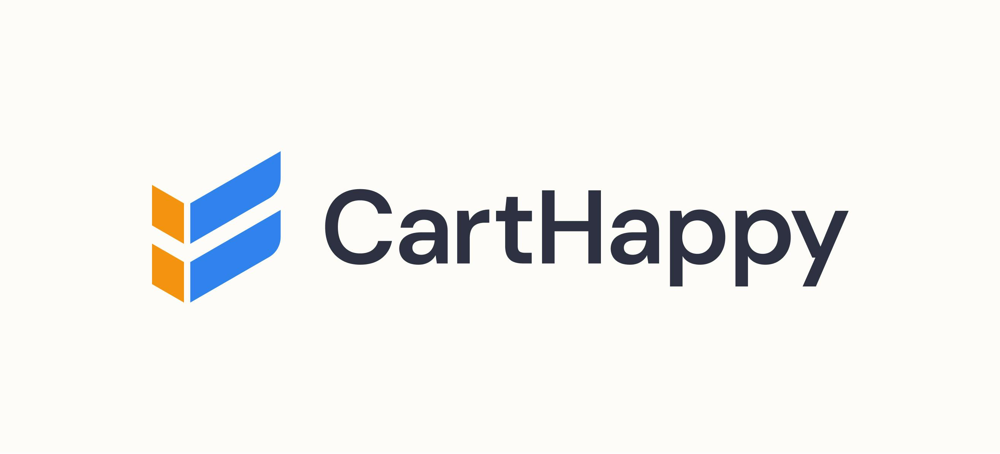

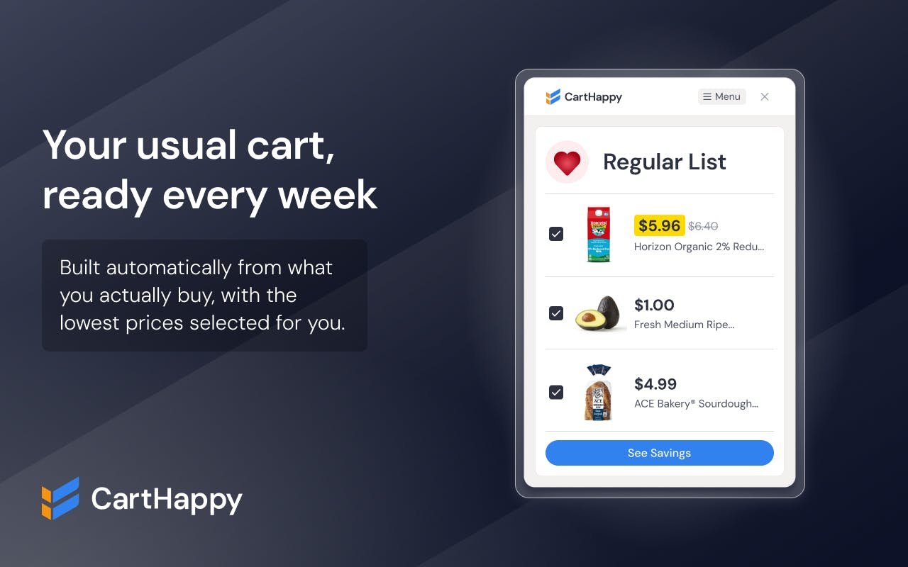

### 🎬 관련 영상
- [🎥 영상 보기](https://ph-files.imgix.net/1d13a3d9-94b1-4a23-862e-4ae0b6d1ea68.jpeg?auto=format)

---

## 23. [OneHaus](https://www.producthunt.com/products/onehaus)
**Votes**: 19 | **도입 난이도**: 하 | **신뢰도**: 상
**Tagline**: The shared home app for busy families
**서비스 링크**: https://www.producthunt.com/r/E3J4OT5MQZPXYE

**태그**: Productivity, Family, Organization, Chat

### 📌 이 서비스 한눈에 보기
흩어진 가족 업무를 하나로 모아주는 스마트 홈 허브 앱

### 🔑 주요 기능
- 일정, 쇼핑, 레시피, 문서 등 가계 운영 전반을 통합 관리
- 가족 구성원 간 실시간 정보 공유 및 동기화
- 메모와 채팅에 분산된 정보를 하나의 허브로 집중

### 🙋 사용자에게 어떤 점이 좋은가
가족 구성원들이 각자 다른 앱을 쓰는 대신, 하나의 앱으로 모든 가사 업무를 공유하여 소통 비용을 줄일 수 있습니다.

### ✅ 지금 바로 써볼 기능
- 가족 구성원 초대 및 기기 연결
- 공동 캘린더 및 할 일 목록 설정
- 쇼핑 리스트 및 레시피 공유

### ⚠️ 사용 전 확인할 점
- 30일 무료 체험 기간 종료 후 유료 전환 정책 확인 필요
- 가족 구성원 모두가 앱을 설치해야 시너지 발생

### 🧭 확인이 더 필요한 정보
상세한 유료 구독 플랜과 가족 구성원 수에 따른 비용 체계 확인이 필요합니다.

### 📸 스크린샷 및 갤러리
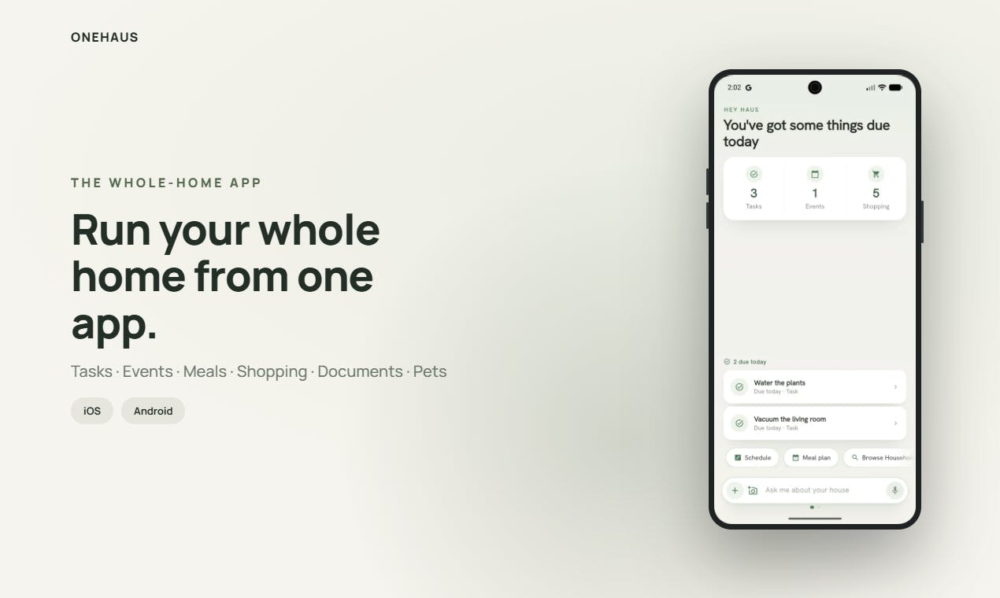

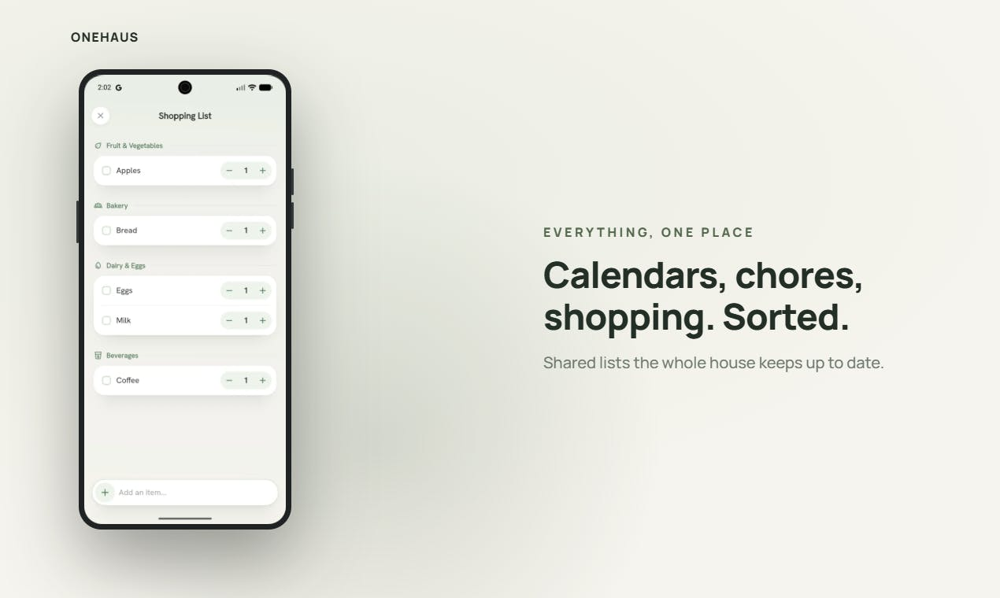

### 🎬 관련 영상
- [🎥 영상 보기](https://ph-files.imgix.net/6690c9e9-817a-4079-acce-cd3771c7d4cf.jpeg?auto=format)

---

## 24. [Email Finder by Truelist](https://www.producthunt.com/products/truelist-2)
**Votes**: 19 | **도입 난이도**: 하 | **신뢰도**: 상
**Tagline**: Find anyone's work email — verified, not guessed
**서비스 링크**: https://www.producthunt.com/r/YGYF2TX2V64Y4H

**태그**: Sales, Productivity, LeadGeneration, AI Tool, Email

### 📌 이 서비스 한눈에 보기
이름과 도메인 입력만으로 정확한 업무용 이메일을 즉시 찾아주는 검증 도구

### 🔑 주요 기능
- 이름과 회사 도메인을 조합하여 실시간 메일 서버 검증 방식으로 이메일 추출
- 패턴 추측 방식이 아닌 실제 활성 계정 여부를 확인하여 정확도 높음
- 가입이나 크레딧 결제 없이 무료로 즉시 사용 가능

### 🙋 사용자에게 어떤 점이 좋은가
영업이나 채용 시 가짜 이메일로 인한 리소스를 줄이고, 정확한 연락처를 확보할 수 있습니다.

### ✅ 지금 바로 써볼 기능
- 찾고자 하는 대상의 이름과 회사 도메인 입력하기
- 생성된 이메일의 유효성 확인하기

### ⚠️ 사용 전 확인할 점
- 무료 서비스이므로 대량의 이메일을 한꺼번에 추출하는 데는 제한이 있을 수 있음
- 개인정보 보호 및 스팸 정책 준수 여부 확인 필요

### 🧭 확인이 더 필요한 정보
대량 추출 시의 유료 플랜이나 API 제공 여부는 명시되지 않았습니다.

### 📸 스크린샷 및 갤러리
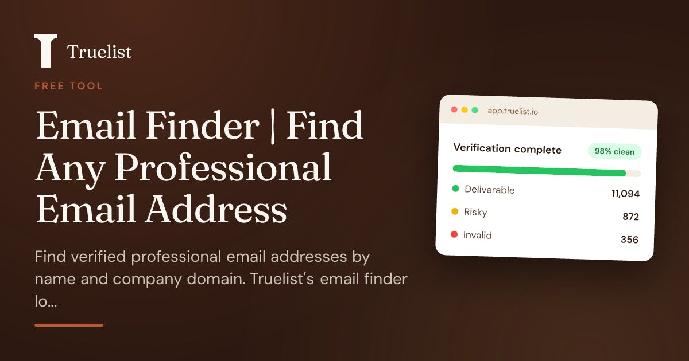
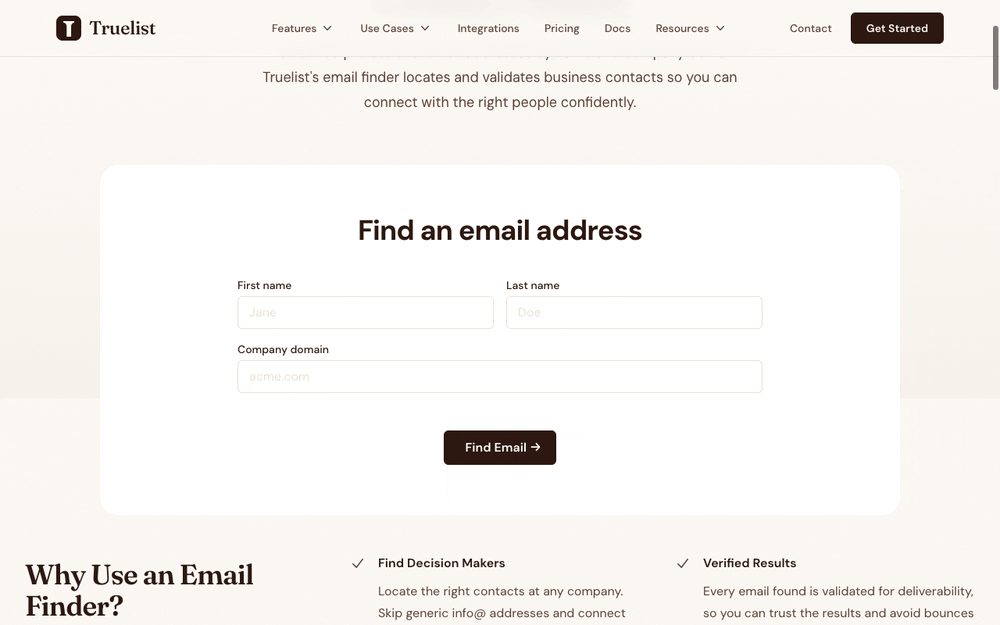
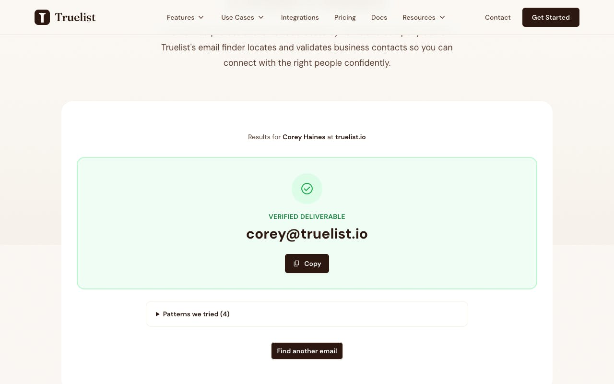

---

## 25. [Last QR Code (You'll ever need.)](https://www.producthunt.com/products/last-qr-code-you-ll-ever-need)
**Votes**: 19 | **도입 난이도**: 하 | **신뢰도**: 상
**Tagline**: Never Reprint Another QR Code
**서비스 링크**: https://www.producthunt.com/r/JGUVIEW5UBTVLF

**태그**: Productivity, Marketing, Design, DevTool

### 📌 이 서비스 한눈에 보기
한 번 인쇄하면 평생 수정 가능한 영구적 QR 코드 생성 서비스

### 🔑 주요 기능
- 한 번의 인쇄로 목적지(URL 등)를 언제든 자유롭게 변경 가능
- 구독료 없는 단발성 결제 방식의 영구적 QR 자산 제공
- 명함, 메뉴판, 패키지 등 인쇄물에 최적화된 워크플로우

### 🙋 사용자에게 어떤 점이 좋은가
정보가 바뀌어도 인쇄물을 다시 제작할 필요가 없어 비용과 시간을 획기적으로 절약할 수 있습니다.

### ✅ 지금 바로 써볼 기능
- 변경 가능성이 있는 목적지용 QR 생성하기
- 인쇄물 제작 전 링크 연결 테스트하기

### ⚠️ 사용 전 확인할 점
- 서비스 운영 중단 시 QR 코드의 유효성 여부 확인 필요
- 구독 모델이 아니므로 서비스의 장기 유지 정책 확인 필요

### 🧭 확인이 더 필요한 정보
구독 없이 영구 사용이 가능하다는 점에 대해 서비스의 장기적인 운영 계획과 데이터 보존 정책을 확인해야 합니다.

### 📸 스크린샷 및 갤러리
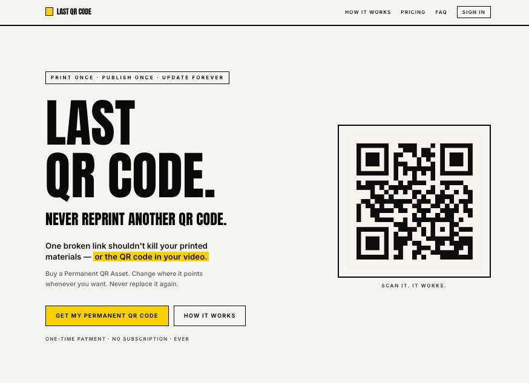
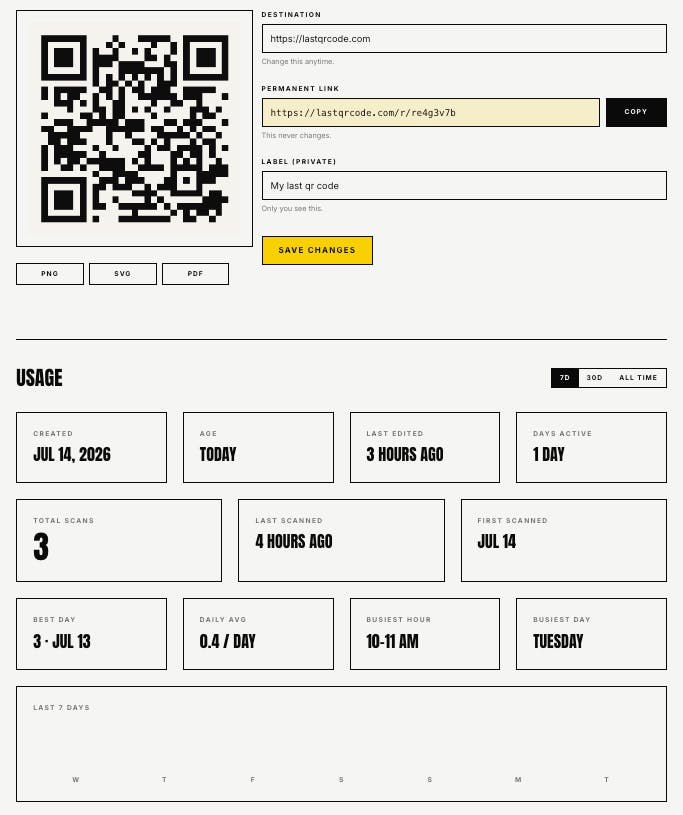

---

## 26. [Aniva for Developers](https://www.producthunt.com/products/aniva-for-developers)
**Votes**: 18 | **도입 난이도**: 하 | **신뢰도**: 상
**Tagline**: The Stripe for Digital Health
**서비스 링크**: https://www.producthunt.com/r/AH56CLOHXR76CF

**태그**: DevTool, HealthTech, API, Automation

### 📌 이 서비스 한눈에 보기
복잡한 진단 검사 과정을 API 호출 몇 번으로 단순화하는 디지털 헬스케어 개발자용 플랫폼

### 🔑 주요 기능
- 2,500개 이상의 바이오마커를 지원하는 통합 REST API 제공
- 검체 채취부터 실험실 운영, 배송, EU 규제 준수까지 전 과정 자동화
- 프로필 생성, 검사 예약, 결과 읽기로 이어지는 간결한 개발 워크플로우

### 🙋 사용자에게 어떤 점이 좋은가
헬스케어 서비스를 개발할 때 가장 까다로운 진단/검사 인프라를 직접 구축할 필요 없이 API만으로 즉시 연동할 수 있습니다.

### ✅ 지금 바로 써볼 기능
- 샌드박스 키 요청하기
- API 문서 확인하기
- 테스트 환경에서 프로필 생성 및 검사 예약 흐름 테스트하기

### ⚠️ 사용 전 확인할 점
- 실제 검사 진행을 위한 물리적 키트 및 배송 프로세스 확인 필요
- 지역별 규제 준수 여부 및 서비스 가능 지역 확인 필요

### 🧭 확인이 더 필요한 정보
제공되는 2,500개 이상의 바이오마커가 모든 국가/지역에서 동일하게 지원되는지 확인이 필요합니다.

### 📸 스크린샷 및 갤러리
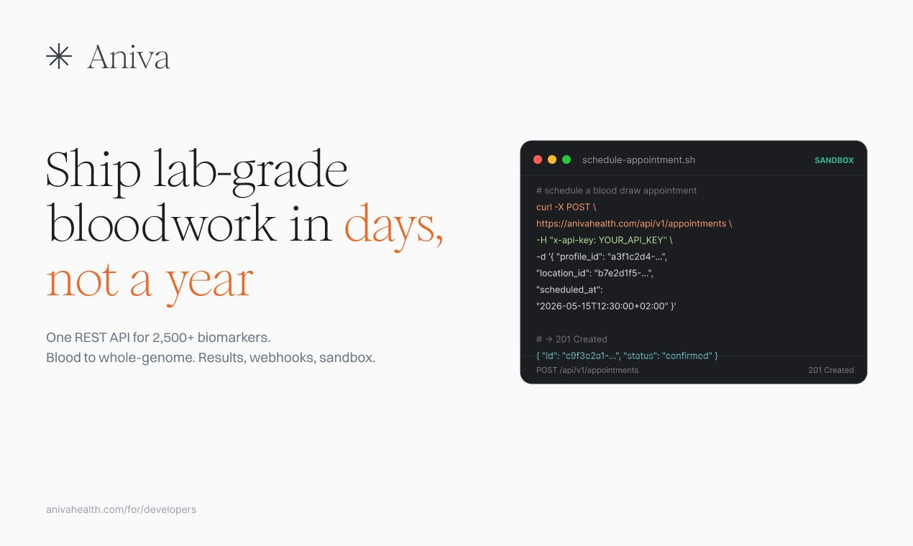
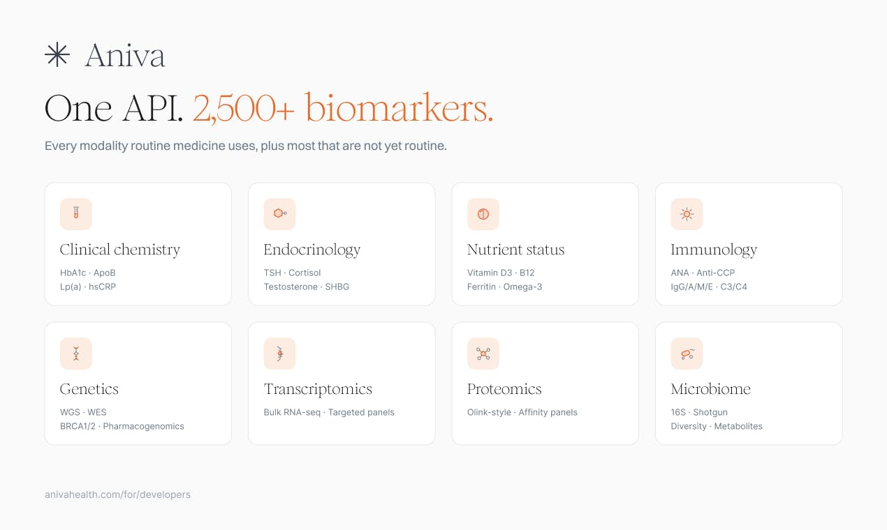
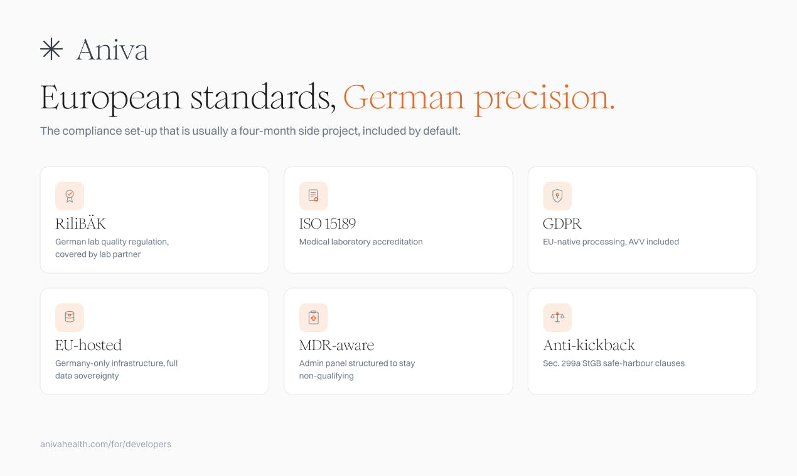

---

## 27. [Leads Puller](https://www.producthunt.com/products/leads-puller)
**Votes**: 17 | **도입 난이도**: 하 | **신뢰도**: 상
**Tagline**: Affordable local business leads and verified owner contacts.
**서비스 링크**: https://www.producthunt.com/r/FL3TYS47AG73ZL

**태그**: Sales, Lead Generation, Marketing, B2B, AI Tool, Email

### 📌 이 서비스 한눈에 보기
저렴한 비용으로 검증된 로컬 비즈니스 리드와 소유자 연락처를 확보하는 도구

### 🔑 주요 기능
- 위치 및 니치별 맞춤형 비즈니스 검색 기능
- 검증된 이메일 및 전화번호 데이터 제공
- 영업팀과 마케터를 위한 간편한 리드 추출 및 내보내기

### 🙋 사용자에게 어떤 점이 좋은가
엔터프라이즈급의 비싼 비용을 지불하지 않고도 신뢰할 수 있는 잠재 고객 데이터를 빠르게 확보할 수 있습니다.

### ✅ 지금 바로 써볼 기능
- 원하는 지역이나 업종으로 비즈니스 검색하기
- 검증된 소유자 연락처 정보 확인하기
- 필요한 리드를 데이터 파일로 내보내기

### ⚠️ 사용 전 확인할 점
- 데이터의 최신성 및 검증 정확도 수시 확인 필요
- 특정 지역이나 특정 니치에 데이터가 편중되어 있을 가능성

### 🧭 확인이 더 필요한 정보
구체적인 데이터 업데이트 주기와 상세 가격 정책에 대한 정보가 필요합니다.

### 📸 스크린샷 및 갤러리
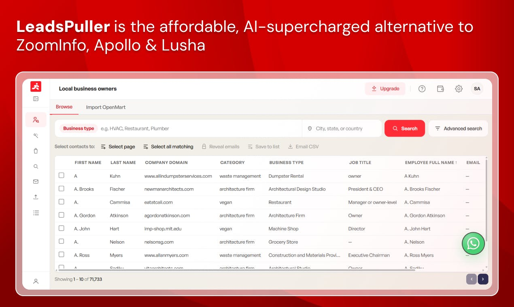
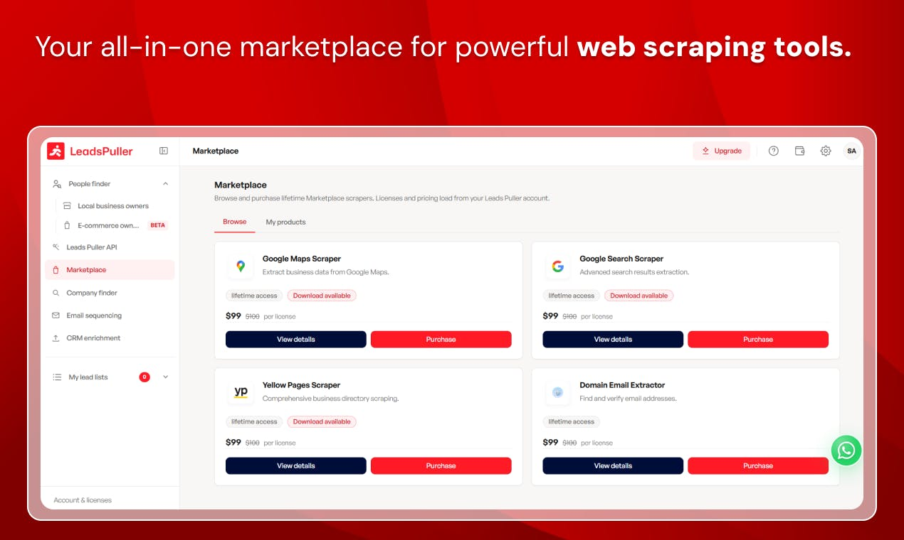
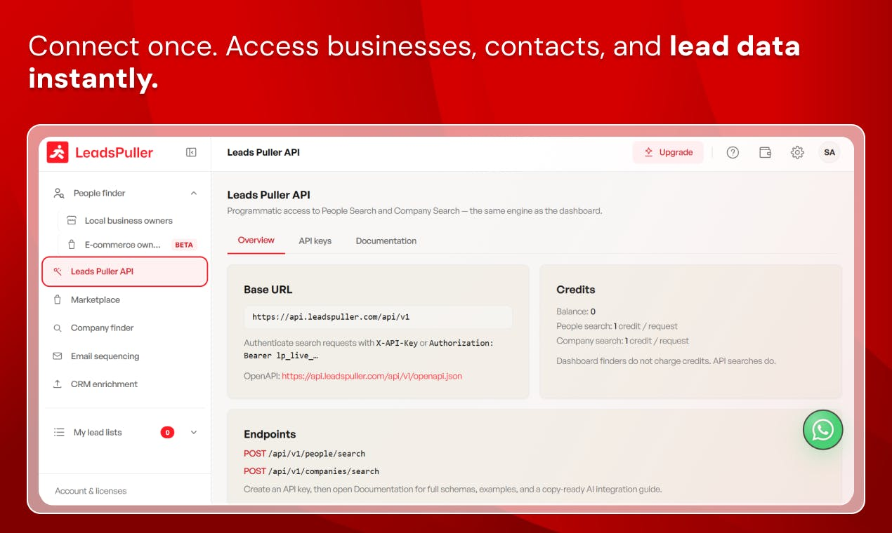

### 🎬 관련 영상
- [🎥 영상 보기](https://ph-files.imgix.net/37bf972d-494e-4934-8a10-43a4316381a0.jpeg?auto=format)

---

## 28. [WebSlurp](https://www.producthunt.com/products/webslurp)
**Votes**: 17 | **도입 난이도**: 하 | **신뢰도**: 상
**Tagline**: The Fastest Way to Test API Security Inside Chrome DevTools
**서비스 링크**: https://www.producthunt.com/r/N3YCPXVCJDUE4M

**태그**: DevTools, API Testing, Security, Open Source, API

### 📌 이 서비스 한눈에 보기
외부 프록시 없이 크롬 개발자 도구 내에서 즉시 수행하는 초고속 API 테스트 및 보안 점검 도구

### 🔑 주요 기능
- 외부 프록시 도구 없이 크롬 DevTools 내에서 직접 HTTP/HTTPS 요청 제어
- 캡처, 검사, 편집 및 재전송 기능을 통한 간편한 API 테스트
- 헤더 감사 및 비밀번호/개인정보(PII) 탐지를 위한 퀵 보안 점검 기능

### 🙋 사용자에게 어떤 점이 좋은가
별도의 외부 툴을 켜지 않고 브라우저 안에서 API를 즉시 테스트하고 보안 취약점을 빠르게 확인할 수 있어 개발 워크플로우가 간결해집니다.

### ✅ 지금 바로 써볼 기능
- 브라우저에서 발생하는 네트워크 요청 캡처 및 편집해보기
- Quick Security Check를 통한 헤더 및 개인정보 노출 여부 확인
- 수정된 요청을 재전송하여 API 응답 변화 테스트하기

### ⚠️ 사용 전 확인할 점
- 브라우저 확장 프로그램이므로 대규모 부하 테스트나 복잡한 API 워크플로우 자동화에는 한계가 있을 수 있음
- 보안 점검 기능이 모든 종류의 취약점을 완벽하게 탐지하는 것은 아님

### 🧭 확인이 더 필요한 정보
오픈 소스 프로젝트로서 향후 기능 확장 계획 및 대규모 트래픽 처리 성능에 대한 정보가 필요합니다.

### 📸 스크린샷 및 갤러리
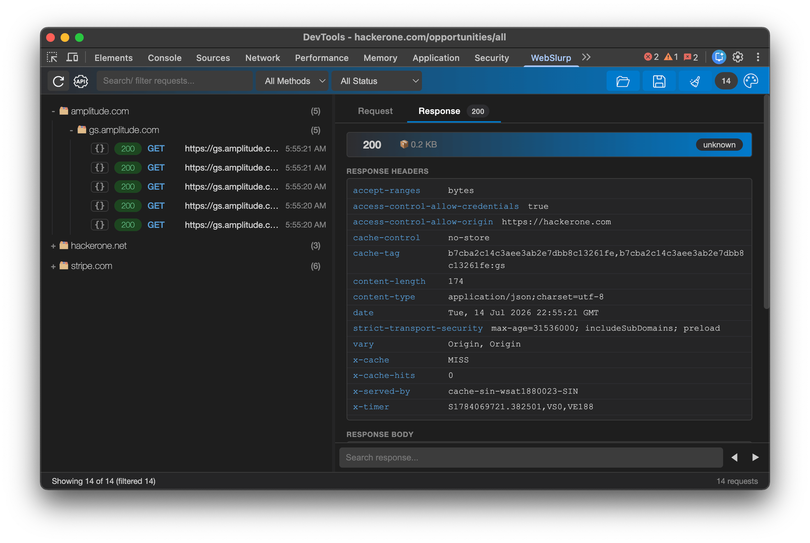
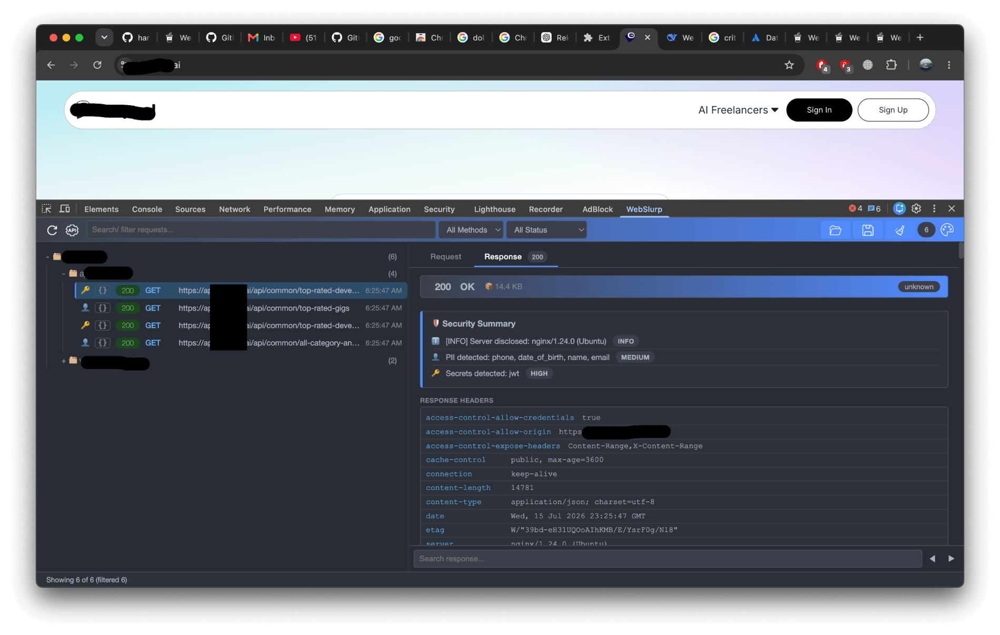
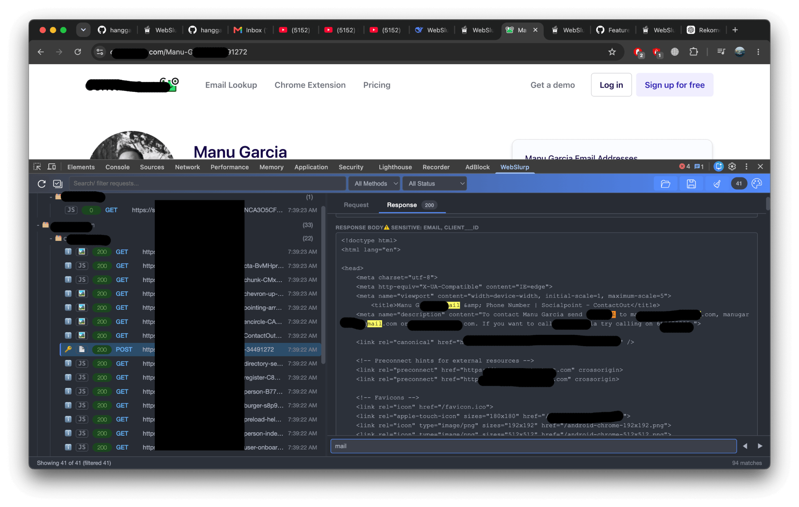

---

## 29. [ShouldaSaid](https://www.producthunt.com/products/shouldasaid-win-the-argument)
**Votes**: 16 | **도입 난이도**: 하 | **신뢰도**: 상
**Tagline**: Argue with AI. Win the fight you already lost
**서비스 링크**: https://www.producthunt.com/r/KXSOGWXNJ3Y7PS

**태그**: Education, AI, SoftSkills, Productivity, AI Tool

### 📌 이 서비스 한눈에 보기
AI와 실전 토론 연습을 통해 논리적인 반박 능력을 키우는 훈련 도구

### 🔑 주요 기능
- 3라운드 방식의 AI 토론 트레이닝
- 실제 상황처럼 대응하는 논리적 반박 훈련
- 가입 없이 즉시 사용 가능한 간편한 접근성

### 🙋 사용자에게 어떤 점이 좋은가
말싸움에서 뒤늦게 생각나는 완벽한 답변 대신, 실전에서 즉각적으로 논리적인 반박을 할 수 있는 능력을 기를 수 있습니다.

### ✅ 지금 바로 써볼 기능
- 3라운드 토론 세션 시작하기
- 4개 언어 지원 기능 테스트하기

### ⚠️ 사용 전 확인할 점
- AI와의 연습이 실제 대면 상황의 압박감을 완벽히 대체할 수 있는지 확인 필요
- 가입 없는 서비스이므로 데이터 저장이나 기록 기능 여부 확인 필요

### 🧭 확인이 더 필요한 정보
제공되는 4개 언어가 구체적으로 어떤 언어인지 명시되어 있지 않습니다.

### 📸 스크린샷 및 갤러리

---

## 30. [SocialProofz](https://www.producthunt.com/products/socialproofz)
**Votes**: 16 | **도입 난이도**: 하 | **신뢰도**: 상
**Tagline**: Get Real Reviews & Social Proof for Your Startup
**서비스 링크**: https://www.producthunt.com/r/CHKFWIBGMGCIUK

**태그**: Startup, Marketing, SocialProof, BetaTesting, AI Tool

### 📌 이 서비스 한눈에 보기
초기 스타트업을 위한 베타 사용자 확보 및 소셜 프루프 구축 도구

### 🔑 주요 기능
- 초기 베타 사용자 확보 지원
- LinkedIn을 통한 리뷰 요청 기능
- 스타트업 신뢰도를 높이는 소셜 프루프 구축

### 🙋 사용자에게 어떤 점이 좋은가
초기 제품 출시 단계에서 사용자 피드백을 확보하고, 소셜 미디어를 통해 제품의 신뢰도를 빠르게 쌓는 데 유용합니다.

### ✅ 지금 바로 써볼 기능
- 베타 사용자 모집 프로세스 실행
- LinkedIn 리뷰 요청 기능 활용
- 획득한 리뷰를 통한 소셜 프루프 구축

### ⚠️ 사용 전 확인할 점
- 초기 단계에 특화되어 있어 제품 성숙도에 따른 활용도 변화 가능성
- 리뷰의 질과 양이 사용자 직접 활동에 의존적임

### 🧭 확인이 더 필요한 정보
구체적인 사용자 매칭 알고리즘이나 자동화된 홍보 기능의 범위는 명시되지 않았습니다.

### 📸 스크린샷 및 갤러리

---

