# 🚀 Product Hunt Daily Top 30 (2026-07-25)

## 오늘의 요약
오늘의 트렌드는 AI 에이전트의 효율적인 관리와 실행을 돕는 인프라 및 워크플로우 도구들이 주도했습니다. 특히 AI 에이전트가 실시간 데이터에 접근하거나 모바일 환경에서 승인되는 등, 인간과 AI가 협업하는 방식이 더욱 정교해지는 양상을 보였습니다.

### 오늘의 핵심 포인트
- AI 에이전트의 작업 승인, 데이터 컨텍스트 제공, 검색 최적화 등 에이전트 운영 효율을 높이는 도구들이 다수 등장했습니다.
- 사람과 AI 에이전트가 하나의 채널에서 협업하거나, 모바일로 원격 제어하는 등 인간-AI 간의 인터페이스가 진화하고 있습니다.
- 데이터 소유권 보장, 탈중앙화, 프라이버시 중심의 로컬 기반 도구들이 꾸준히 주목받고 있습니다.

**오늘의 태그**: AI 에이전트, 자동화, 생산성, 데이터 보안

## 1. [Fedica 2.0](https://www.producthunt.com/products/fedica)
**Votes**: 319 | **도입 난이도**: 중 | **신뢰도**: 상
**Tagline**: Publish and grow your profile across social apps
**서비스 링크**: https://www.producthunt.com/r/BUIW56GARKIM77

**태그**: SocialMedia, ContentManagement, Analytics, CreatorEconomy, AI Tool

### 📌 이 서비스 한눈에 보기
여러 소셜 플랫폼에 흩어진 팬들을 한곳에서 관리하고 성장시키는 통합 퍼블리싱 및 분석 도구

### 🔑 주요 기능
- 12개 이상의 소셜 플랫폼에 맞춤형 게시물 발행
- 심층적인 오디언스 세분화 및 인구통계 데이터 제공
- 통합 인박스를 통한 참여자 관리 및 소통

### 🙋 사용자에게 어떤 점이 좋은가
여러 플랫폼을 사용하는 크리에이터가 팬들의 특성을 정확히 파악하고, 각 채널에 최적화된 콘텐츠를 효율적으로 배포할 수 있습니다.

### ✅ 지금 바로 써볼 기능
- 12개 이상의 플랫폼 연동 및 게시물 예약
- 오디언스 세분화 기능을 통한 타겟 분석
- 통합 인박스를 활용한 팬 응대

### ⚠️ 사용 전 확인할 점
- 플랫폼별 API 정책에 따른 기능 제한 가능성
- 데이터 분석 결과의 해석 역량 필요

### 🧭 확인이 더 필요한 정보
구체적인 요금제 체계와 각 소셜 플랫폼별 지원 기능의 상세 범위는 명시되지 않았습니다.

### 📸 스크린샷 및 갤러리
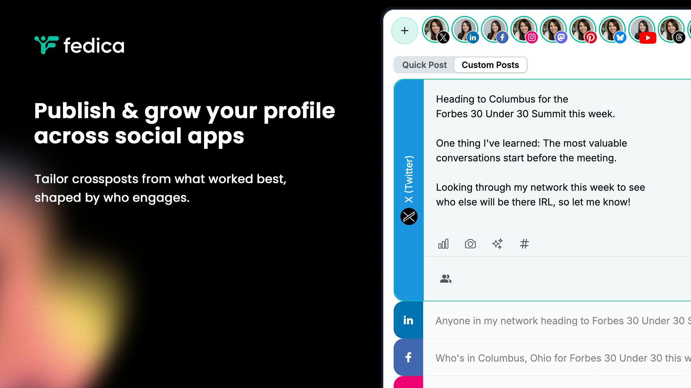
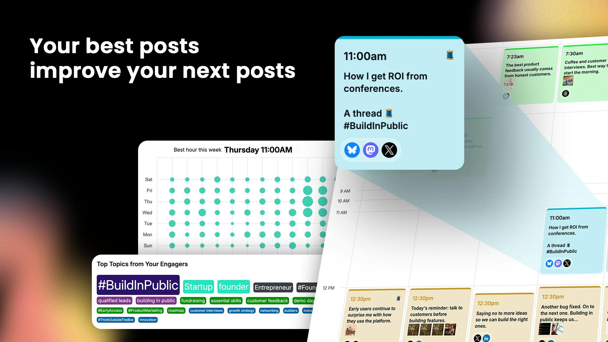
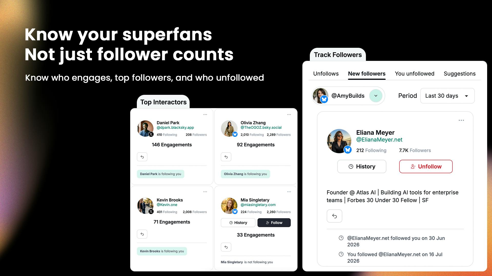

---

## 2. [Pushary](https://www.producthunt.com/products/pushary)
**Votes**: 291 | **도입 난이도**: 하 | **신뢰도**: 상
**Tagline**: Approve AI requests from your lock screen
**서비스 링크**: https://www.producthunt.com/r/FVVAIY5OGI5VVM

**태그**: DevTool, AI, Productivity, Mobile, Agent, AI Tool

### 📌 이 서비스 한눈에 보기
터미널 작업 중 발생하는 AI 에이전트의 승인 요청을 스마트폰 잠금 화면에서 즉시 처리하는 도구

### 🔑 주요 기능
- Claude Code, Cursor 등 CLI 기반 AI 도구와 연동되는 승인 워크플로우
- 모바일 앱(iOS/Android)을 통한 간편한 원격 승인 기능
- QR 코드를 이용한 간편한 페어링 및 자동화된 감사 로그 제공

### 🙋 사용자에게 어떤 점이 좋은가
터미널 앞에서 대기할 필요 없이 이동 중에도 스마트폰 터치 한 번으로 AI 에이전트의 작업을 이어갈 수 있어 개발 흐름이 끊기지 않습니다.

### ✅ 지금 바로 써볼 기능
- 터미널에서 QR 코드를 스캔하여 모바일 앱과 페어링하기
- 사용 중인 AI CLI 도구(Cursor, Claude Code 등)에 연결하기
- 도구별 승인 정책을 설정하여 안전한 읽기 작업 자동화하기

### ⚠️ 사용 전 확인할 점
- 모바일 기기를 통한 원격 권한 부여 시 보안 정책 준수 필요
- 로컬 터미널 환경과 모바일 앱 간의 네트워크 연결 상태 확인 필요

### 🧭 확인이 더 필요한 정보
지원하는 모든 CLI 도구에 대해 동일한 수준의 보안 및 제어 정책이 적용되는지 확인이 필요합니다.

### 📸 스크린샷 및 갤러리
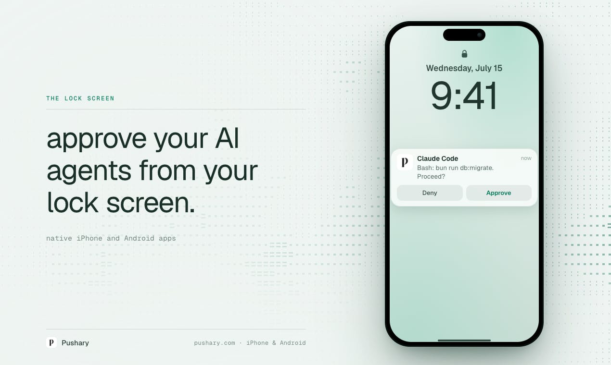
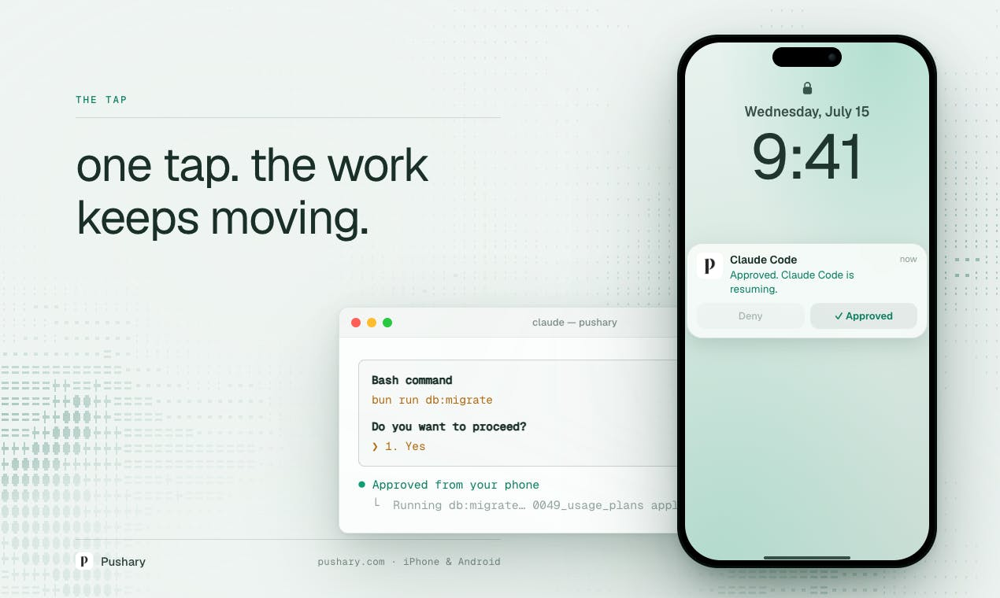
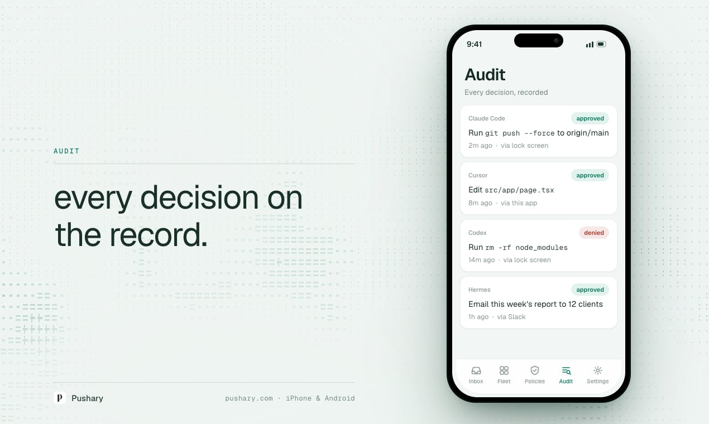

### 🎬 관련 영상
- [🎥 영상 보기](https://ph-files.imgix.net/1e50188f-4c66-4356-8f69-5dc21792929e.jpeg?auto=format)

---

## 3. [Fluree AI](https://www.producthunt.com/products/fluree)
**Votes**: 261 | **도입 난이도**: 중 | **신뢰도**: 상
**Tagline**: Give every AI agent trusted context
**서비스 링크**: https://www.producthunt.com/r/Y6SGXQZUGTMKAT

**태그**: AI, Data, Automation, Enterprise, Agent, AI Tool, Prompting

### 📌 이 서비스 한눈에 보기
기업 데이터를 기반으로 AI 에이전트에게 신뢰할 수 있는 실시간 컨텍스트를 제공하는 데이터 레이어

### 🔑 주요 기능
- RAG의 불확실성 대신 구조화된 데이터 직접 쿼리를 통한 검증 가능한 답변 제공
- 권한 설정이 적용된 실시간 데이터 레이어를 통해 모든 앱과 에이전트에 동일한 컨텍스트 공유
- MCP(Model Context Protocol) 지원을 통해 에이전트, 대시보드, 앱과의 빠른 연결 가능

### 🙋 사용자에게 어떤 점이 좋은가
AI 에이전트가 환각 현상 없이 기업의 실제 데이터를 바탕으로 정확하고 출처가 명확한 답변을 내놓을 수 있게 합니다.

### ✅ 지금 바로 써볼 기능
- 기업 내부 데이터 구조와 Fluree의 스키마 매핑 테스트
- 기존 RAG 방식 대비 답변 정확도 및 검증 가능성 비교
- MCP를 활용한 에이전트 연결성 확인

### ⚠️ 사용 전 확인할 점
- 기존 레거시 데이터 시스템과의 통합 난이도 확인 필요
- 구조화된 데이터 중심이므로 비정형 데이터 처리 방식에 대한 검토 필요

### 🧭 확인이 더 필요한 정보
데이터 규모에 따른 확장성 및 구체적인 보안 프로토콜 적용 방식에 대한 추가 확인이 필요합니다.

### 📸 스크린샷 및 갤러리
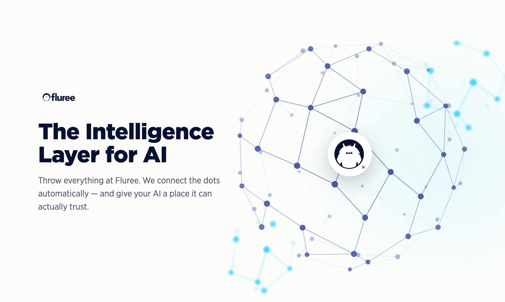
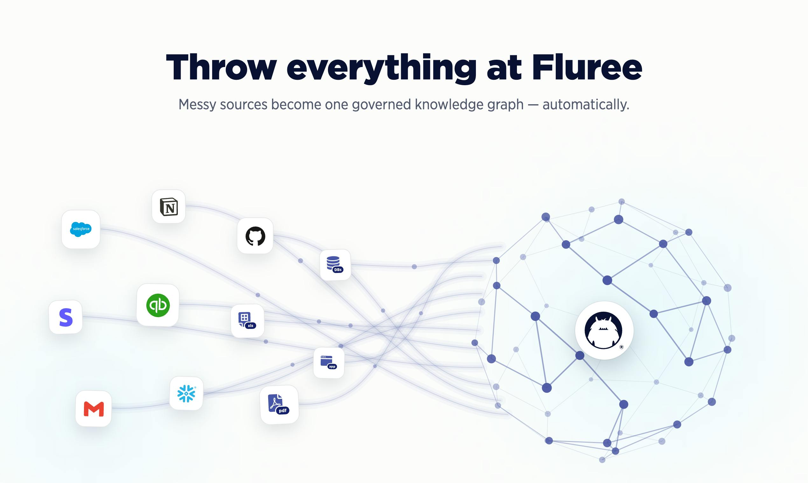
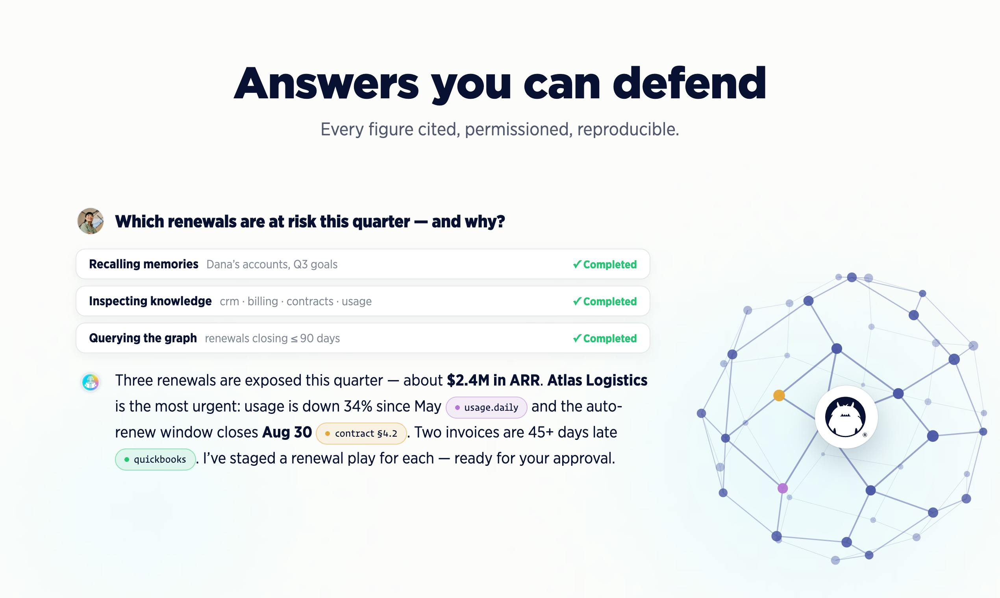

### 🎬 관련 영상
- [🎥 영상 보기](https://ph-files.imgix.net/3a00d118-973c-4a00-9dae-6f943ac167ce.jpeg?auto=format)

---

## 4. [The new Firecrawl /search](https://www.producthunt.com/products/extract-by-firecrawl)
**Votes**: 233 | **도입 난이도**: 하 | **신뢰도**: 상
**Tagline**: Our most accurate Search API for AI agents.
**서비스 링크**: https://www.producthunt.com/r/H7JTV6NB7D5IKG

**태그**: AI, SearchAPI, DevTool, LLM, Agent, AI Tool, API

### 📌 이 서비스 한눈에 보기
AI 에이전트를 위한 토큰 절약형 고정밀 검색 API

### 🔑 주요 기능
- 검색 결과에서 질문에 가장 적합한 핵심 발췌문(excerpt)만 추출하여 제공
- 전체 페이지를 읽는 방식 대비 토큰 사용량을 10배 절감
- SimpleQA 벤치마크에서 94.7%라는 업계 최고 수준의 정확도 기록

### 🙋 사용자에게 어떤 점이 좋은가
AI 에이전트 개발 시 비용 부담을 획기적으로 줄이면서도, 필요한 핵심 컨텍스트만 전달하여 답변 정확도를 높일 수 있습니다.

### ✅ 지금 바로 써볼 기능
- 기존 검색 API를 Firecrawl /search로 교체하여 토큰 비용 비교하기
- AI 에이전트의 컨텍스트 윈도우 효율성 테스트하기
- SimpleQA 점수 기반의 성능 검증하기

### ⚠️ 사용 전 확인할 점
- 발췌문 방식이므로 원본 페이지의 모든 세부 정보를 포함하지 않을 수 있음
- 특정 도메인이나 복잡한 구조의 페이지에서 추출 정확도 확인 필요

### 🧭 확인이 더 필요한 정보
제공된 텍스트에는 구체적인 가격 정책이나 API 연동 방식에 대한 세부 정보가 포함되어 있지 않습니다.

### 📸 스크린샷 및 갤러리
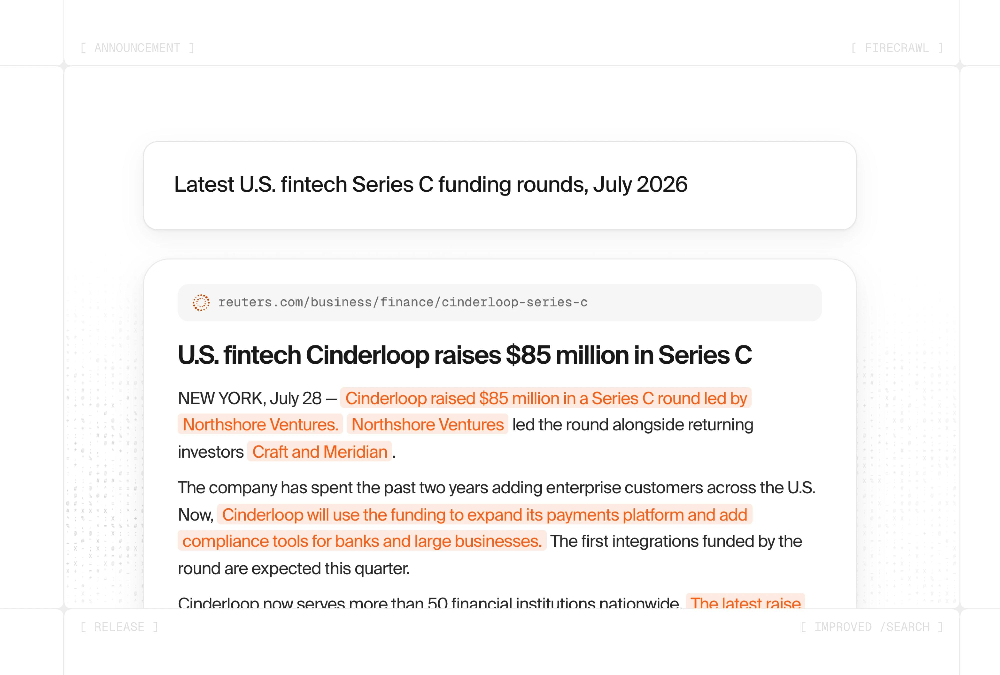
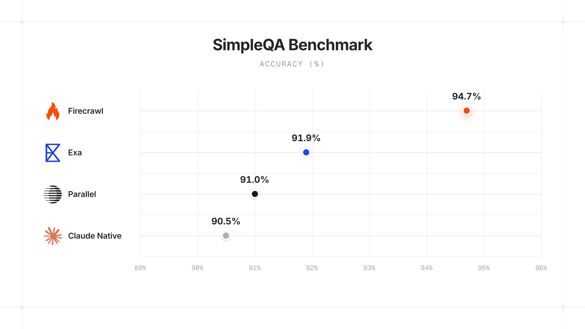

### 🎬 관련 영상
- [🎥 영상 보기](https://ph-files.imgix.net/382dae29-ee1f-43a3-8a6f-c9fbc9fe6b84.jpeg?auto=format)

---

## 5. [YC has it](https://www.producthunt.com/products/yc-has-it)
**Votes**: 202 | **도입 난이도**: 하 | **신뢰도**: 상
**Tagline**: Describe your problem, get the YC startup that solves it 
**서비스 링크**: https://www.producthunt.com/r/36VKV5LHKG2KDV

**태그**: Search, Startup, Productivity, AI Tool

### 📌 이 서비스 한눈에 보기
문제를 입력하면 최적의 YC 스타트업을 찾아주는 검색 도구

### 🔑 주요 기능
- 자연어로 문제를 설명하면 해결 가능한 YC 스타트업 매칭
- 4,000개 이상의 활성 YC 기업 데이터베이스 기반
- 선정 이유, 가격, 연동 정보 제공

### 🙋 사용자에게 어떤 점이 좋은가
복잡한 검색 과정 없이 자연어만으로 필요한 솔루션을 빠르게 찾을 수 있어 스타트업 탐색 시간을 획기적으로 줄여줍니다.

### ✅ 지금 바로 써볼 기능
- 현재 겪고 있는 비즈니스 문제 입력하기
- 제시된 스타트업의 가격 및 연동 기능 확인하기

### ⚠️ 사용 전 확인할 점
- 검색 결과의 정확도는 입력하는 문제 설명의 구체성에 따라 달라질 수 있음
- 데이터베이스 업데이트 주기에 따른 최신성 확인 필요

### 🧭 확인이 더 필요한 정보
제공되는 스타트업 정보가 실시간으로 업데이트되는지 확인이 필요합니다.

### 📸 스크린샷 및 갤러리
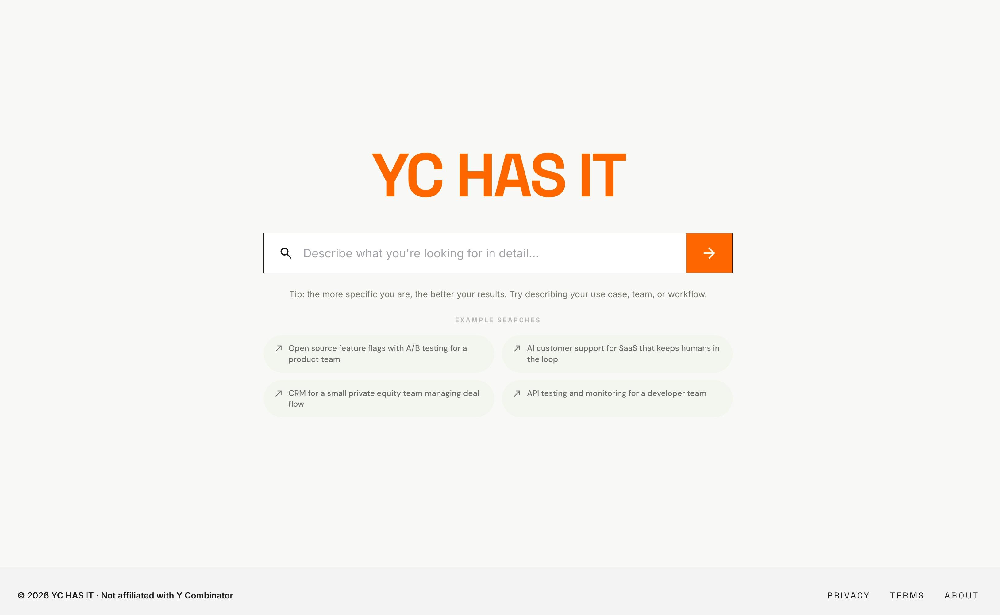
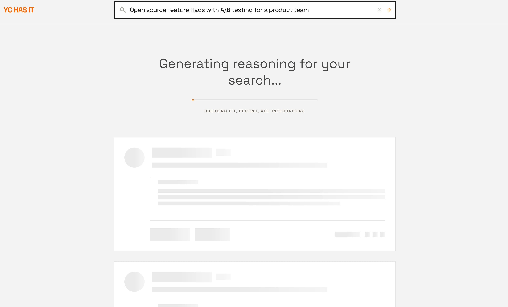
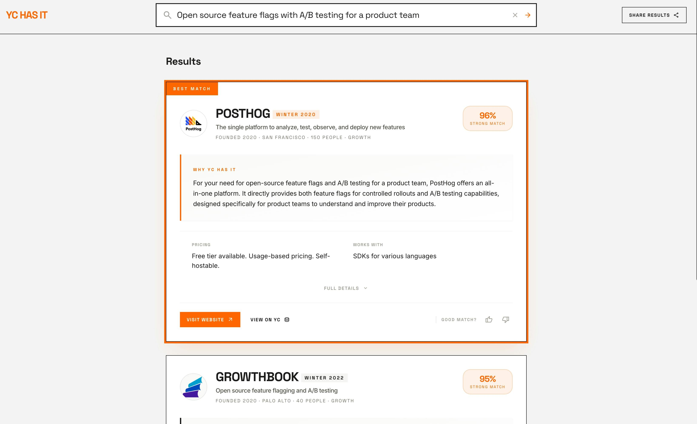

### 🎬 관련 영상
- [🎥 영상 보기](https://ph-files.imgix.net/a2162d2d-6868-4014-8729-ac74620117dd.jpeg?auto=format)

---

## 6. [HarnessRouter](https://www.producthunt.com/products/epsilla)
**Votes**: 156 | **도입 난이도**: 하 | **신뢰도**: 상
**Tagline**: Bring the world's best AI agents into your app, with one API
**서비스 링크**: https://www.producthunt.com/r/U5TRDBVG3MM4NB

**태그**: AI, DevTool, Automation, SaaS, Agent, AI Tool, Video, API

### 📌 이 서비스 한눈에 보기
복잡한 AI 에이전트 인프라 구축 없이 단일 API로 강력한 AI 기능을 앱에 통합하세요.

### 🔑 주요 기능
- 샌드박스, 오케스트레이션, 재시도 로직 등 복잡한 백엔드 인프라 자동화
- 코드, 파일, 비디오, 게임 등 다양한 결과물을 생성하는 AI 에이전트 제공
- 비용 제어 및 오케스트레이션 기능을 통한 효율적인 에이전트 관리

### 🙋 사용자에게 어떤 점이 좋은가
직접 AI 에이전트 시스템을 구축하는 데 드는 시간과 비용을 획기적으로 줄여주며, 개발자는 핵심 서비스 로직에만 집중할 수 있습니다.

### ✅ 지금 바로 써볼 기능
- 단일 API를 통한 에이전트 연동 테스트
- 코드 및 파일 생성 기능 워크플로우 검증
- 비용 제어 및 오케스트레이션 설정 확인

### ⚠️ 사용 전 확인할 점
- 외부 API 의존도에 따른 서비스 가용성 영향 확인 필요
- 생성된 결과물(코드, 파일 등)의 보안 및 품질 검증 필요

### 🧭 확인이 더 필요한 정보
제공되는 AI 에이전트의 구체적인 모델 종류와 상세 비용 구조에 대한 정보가 필요합니다.

### 📸 스크린샷 및 갤러리
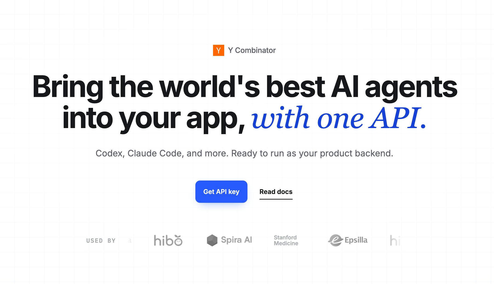
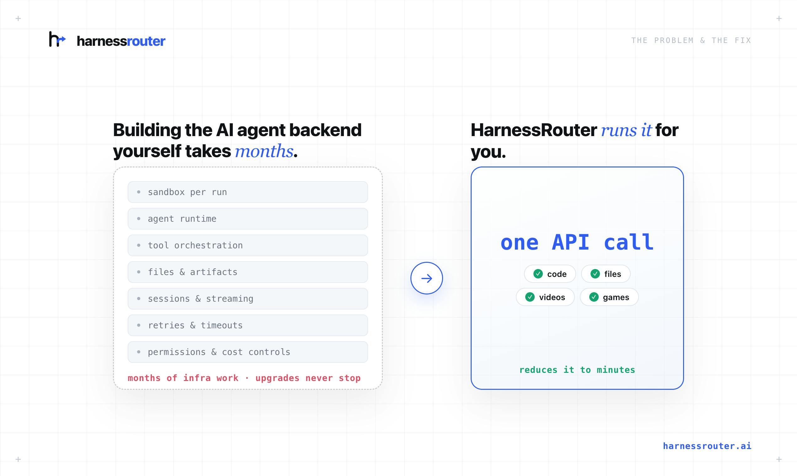
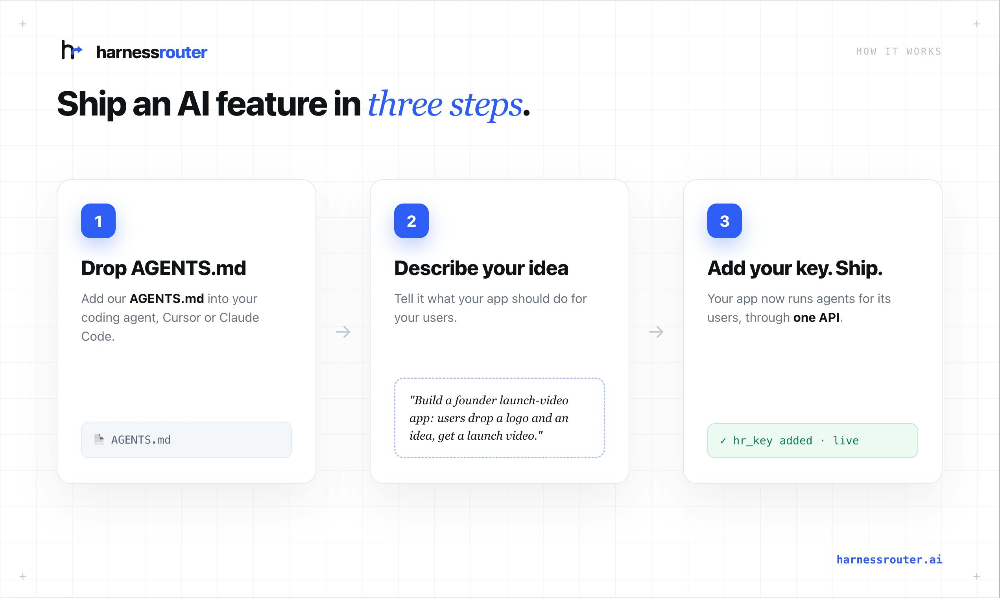

### 🎬 관련 영상
- [🎥 영상 보기](https://ph-files.imgix.net/dcc8bc68-cfbc-4750-926d-c2ba68ab47b8.jpeg?auto=format)

---

## 7. [MinkNote](https://www.producthunt.com/products/minknote)
**Votes**: 152 | **도입 난이도**: 하 | **신뢰도**: 상
**Tagline**: Private macOS notes built on plain Markdown files
**서비스 링크**: https://www.producthunt.com/r/JLXQXAVZDMLZCN

**태그**: Productivity, macOS, Markdown, Privacy, Local-first, AI Tool, Vision

### 📌 이 서비스 한눈에 보기
데이터 소유권과 프라이버시를 보장하는 로컬 기반 Markdown 노트 앱

### 🔑 주요 기능
- 로컬 Markdown 파일 기반의 데이터 소유권 및 벤더 락인 방지
- 계정이나 데이터베이스가 필요 없는 프라이빗한 작업 환경
- 프로젝트, 저널, 태그를 활용한 체계적인 워크스페이스 구성

### 🙋 사용자에게 어떤 점이 좋은가
사용자의 소중한 기록을 클라우드 종속성 없이 안전하게 관리할 수 있으며, Markdown 형식을 통해 데이터의 영속성을 확보할 수 있습니다.

### ✅ 지금 바로 써볼 기능
- 기존 Markdown 파일 불러오기
- 프로젝트 및 태그를 활용한 워크스페이스 구축
- 리치 텍스트 및 Markdown 편집 기능 테스트

### ⚠️ 사용 전 확인할 점
- 로컬 기반이므로 기기 분실이나 하드웨어 고장 시 데이터 백업 책임이 사용자에게 있음
- macOS 전용 앱이므로 다른 운영체제와의 동기화 방식 확인 필요

### 🧭 확인이 더 필요한 정보
기기 간 동기화 기능 제공 여부와 방식에 대한 정보가 명시되어 있지 않습니다.

### 📸 스크린샷 및 갤러리
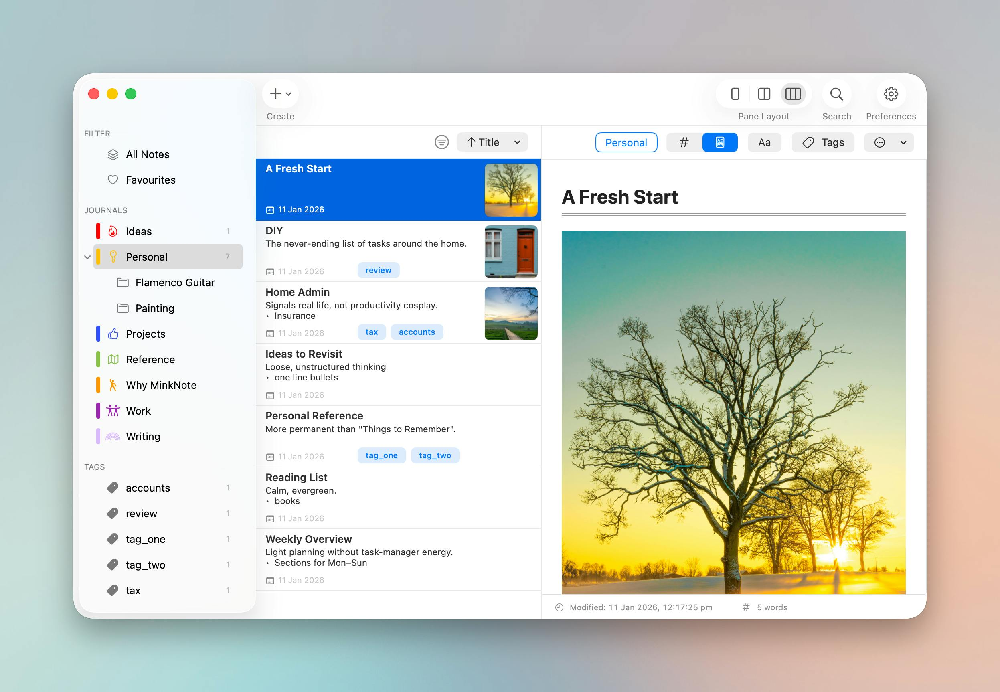
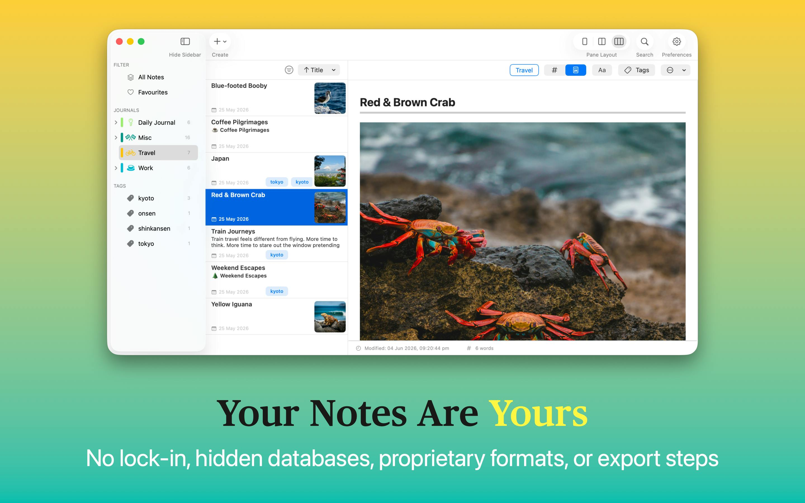
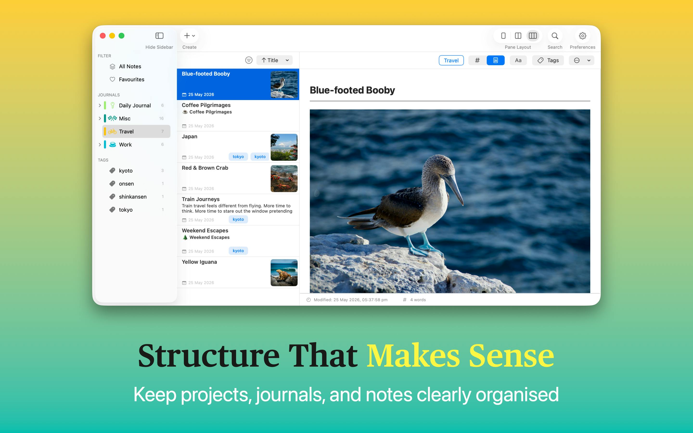

### 🎬 관련 영상
- [🎥 영상 보기](https://ph-files.imgix.net/9d090a94-3ccd-4f86-8d3b-98d2f0979c8d.jpeg?auto=format)

---

## 8. [Buzz](https://www.producthunt.com/products/buzz-3)
**Votes**: 146 | **도입 난이도**: 중 | **신뢰도**: 중
**Tagline**: Your people, your agents, your project — all in one place
**서비스 링크**: https://www.producthunt.com/r/BFW52QCN3WIT5K

**태그**: Collaboration, AI, OpenSource, DevTool, Decentralized, Agent, Chat

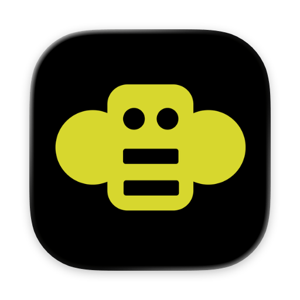

### 📌 이 서비스 한눈에 보기
사람과 AI 에이전트가 함께 협업하는 탈중앙화 오픈소스 팀 채팅 플랫폼

### 🔑 주요 기능
- 사람과 AI 에이전트를 위한 통합 그룹 채팅 환경 제공
- Slack과 GitHub에 대한 의존도를 낮추는 워크플로우 설계
- 모델 불가지론(Model-agnostic), 탈중앙화, 오픈소스 기반의 보안성

### 🙋 사용자에게 어떤 점이 좋은가
팀원뿐만 아니라 다양한 AI 에이전트를 하나의 채널에 통합하여 프로젝트 관리와 소통을 효율화할 수 있습니다.

### ✅ 지금 바로 써볼 기능
- 팀원 및 AI 에이전트 초대하기
- 프로젝트별 전용 채널 생성
- 오픈소스 코드 확인 및 로컬 환경 구축

### ⚠️ 사용 전 확인할 점
- 초기 단계 플랫폼으로 기능 완성도 및 안정성 확인 필요
- 탈중앙화 환경에서의 데이터 관리 및 보안 설정 숙지 필요

### 🧭 확인이 더 필요한 정보
현재 제공되는 구체적인 기능 범위와 AI 에이전트 연동 방식에 대한 상세 명세가 필요합니다.

### 📸 스크린샷 및 갤러리
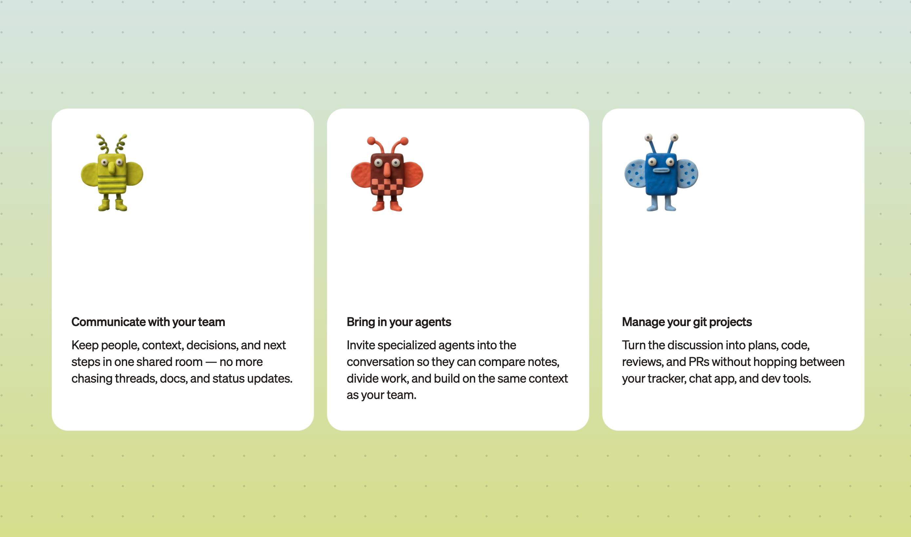
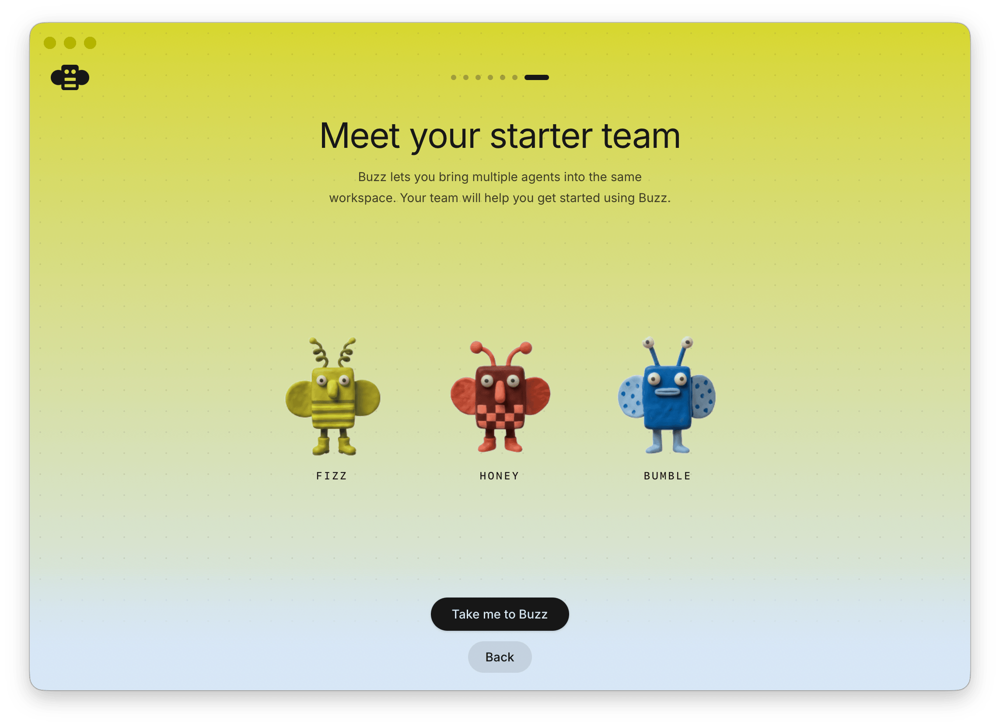
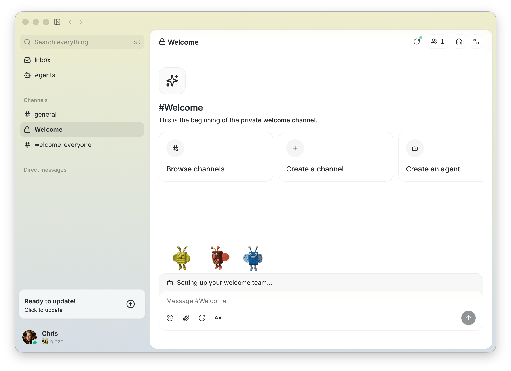

### 🎬 관련 영상
- [🎥 영상 보기](https://ph-files.imgix.net/f3585290-df06-4a79-8785-05c44a3cffb1.jpeg?auto=format)

---

## 9. [HealthyNotch](https://www.producthunt.com/products/healthynotch)
**Votes**: 123 | **도입 난이도**: 하 | **신뢰도**: 상
**Tagline**: Work shouldn't cost you your health
**서비스 링크**: https://www.producthunt.com/r/2API5V7TIKUQTH

**태그**: Productivity, Health, MacOnly, Minimalism

### 📌 이 서비스 한눈에 보기
맥북 노치 영역을 활용해 건강한 업무 습관을 유도하는 심플한 알림 도구

### 🔑 주요 기능
- 맥북 노치 위치를 활용한 직관적인 알림 제공
- 수분 섭취, 스트레칭, 눈 깜빡임 등 건강 습관 유도
- 대시보드나 로그 없는 미니멀한 사용자 경험

### 🙋 사용자에게 어떤 점이 좋은가
업무에 몰입하다 건강을 놓치기 쉬운 사용자에게 방해를 최소화하면서도 적절한 휴식 타이밍을 알려줍니다.

### ✅ 지금 바로 써볼 기능
- 노치 영역의 알림 방식 확인하기
- 자신의 업무 흐름에 맞는 알림 주기 설정하기

### ⚠️ 사용 전 확인할 점
- 맥북 노치 디자인을 활용하므로 특정 하드웨어 환경에 의존적임
- 상세한 데이터 기록이나 통계 기능은 제공되지 않음

### 🧭 확인이 더 필요한 정보
노치 영역 외의 다른 화면 영역에서의 시각적 방해 정도는 확인이 필요합니다.

### 📸 스크린샷 및 갤러리

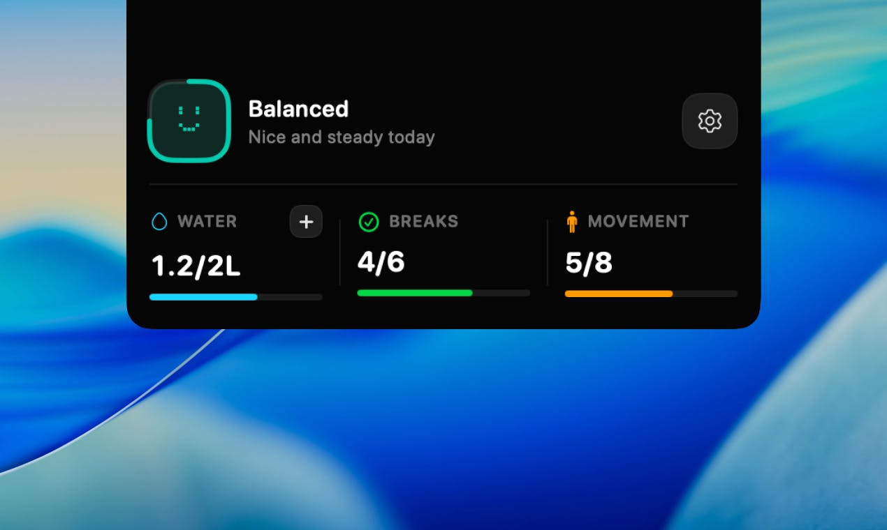
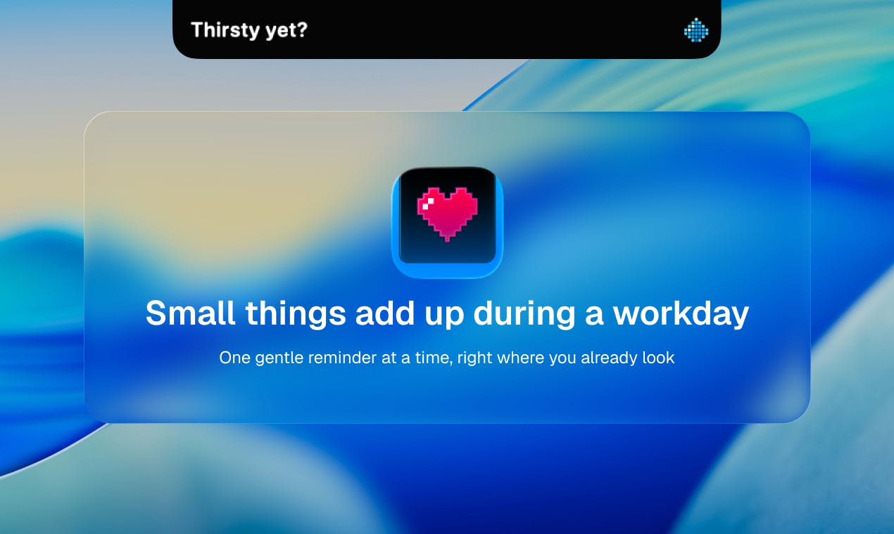

### 🎬 관련 영상
- [🎥 영상 보기](https://ph-files.imgix.net/38aff906-cb04-490b-b4c4-e846e0e4ebb4.jpeg?auto=format)

---

## 10. [Freesolo Flash](https://www.producthunt.com/products/freesolo-flash)
**Votes**: 122 | **도입 난이도**: 중 | **신뢰도**: 상
**Tagline**: Full-Stack Platform for Training Small Language Models
**서비스 링크**: https://www.producthunt.com/r/3F6N33YNAJCLHF

**태그**: AI, MLOps, LLM, DevTool, Enterprise, AI Tool

### 📌 이 서비스 한눈에 보기
기업용 맞춤형 소형 언어 모델(SLM) 학습을 위한 풀스택 플랫폼

### 🔑 주요 기능
- 범용 모델을 특정 제품 기능에 최적화된 전문 모델로 변환
- 강화 학습(RL) 과정을 상품화하여 누구나 쉽게 접근 가능하도록 설계
- 특정 작업에 특화된 소형 언어 모델(SLM) 구축 지원

### 🙋 사용자에게 어떤 점이 좋은가
복잡한 강화 학습 과정 없이도 팀 내 전문 지식을 반영한 맞춤형 AI 기능을 제품에 직접 이식할 수 있습니다.

### ✅ 지금 바로 써볼 기능
- 특정 태스크에 최적화된 소형 모델 학습 시도
- 기존 제품 기능에 AI를 결합하기 위한 워크플로우 테스트

### ⚠️ 사용 전 확인할 점
- 학습 데이터의 품질에 따른 모델 성능 의존성
- 소형 모델의 범용성 한계 및 특정 작업 외 성능 저하 가능성

### 🧭 확인이 더 필요한 정보
구체적인 인프라 요구 사양 및 데이터 보안 정책에 대한 정보가 필요합니다.

### 📸 스크린샷 및 갤러리
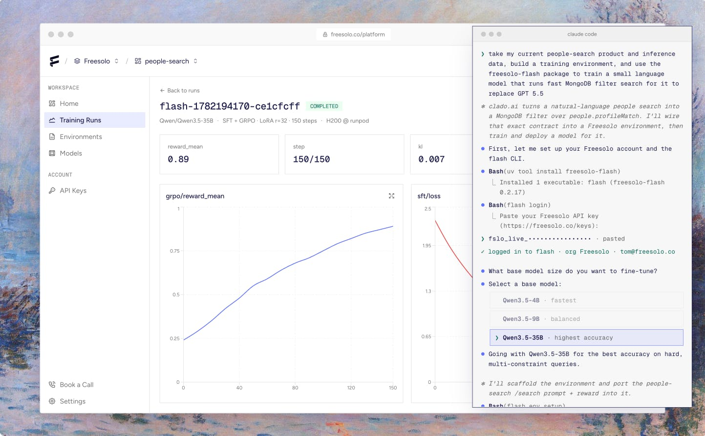

### 🎬 관련 영상
- [🎥 영상 보기](https://ph-files.imgix.net/ea0b2657-ca2a-42de-9859-5ff2441fed16.jpeg?auto=format)

---

## 11. [Prosed](https://www.producthunt.com/products/prosed-turn-your-content-into-a-book)
**Votes**: 115 | **도입 난이도**: 하 | **신뢰도**: 상
**Tagline**: The AI book service that shows its work
**서비스 링크**: https://www.producthunt.com/r/PFO4ZZDEHMHC4Q

**태그**: Writing, AI, ContentCreation, Productivity, AI Tool, DevTool

### 📌 이 서비스 한눈에 보기
창작자의 원문을 유지하며 AI의 편집 과정을 투명하게 보여주는 AI 도서 집필 서비스

### 🔑 주요 기능
- 블랙박스 방식이 아닌 원문과 AI 편집본을 구분하는 '소스 맵(Source Map)' 기능 제공
- 뉴스레터, 팟캐스트, 포스트 등 기존 콘텐츠를 기반으로 원본의 색채를 유지한 원고 생성
- 사용자 원문과 AI가 추가한 연결 문장을 색상으로 구분하여 투명한 편집 과정 확인 가능

### 🙋 사용자에게 어떤 점이 좋은가
자신의 글쓰기 스타일을 유지하면서 기존 콘텐츠를 책으로 만들고 싶은 창작자에게 유용하며, AI가 임의로 내용을 변형하는 것에 대한 불안감을 해소해 줍니다.

### ✅ 지금 바로 써볼 기능
- 기존에 작성한 뉴스레터나 포스트 데이터 입력하기
- 소스 맵 기능을 통해 원문과 AI 편집본의 비율 확인하기
- 생성된 원고의 연결 문장(connective tissue) 검토하기

### ⚠️ 사용 전 확인할 점
- 사용자의 원문 데이터가 충분히 확보되어 있어야 고품질의 원고 생성이 가능함
- AI가 생성한 연결 문장이 사용자의 의도와 다를 수 있으므로 최종 검토가 필수적임

### 🧭 확인이 더 필요한 정보
제공된 텍스트에는 구체적인 입력 데이터 형식(파일 형식 등)이나 가격 정책에 대한 정보가 포함되어 있지 않습니다.

### 📸 스크린샷 및 갤러리
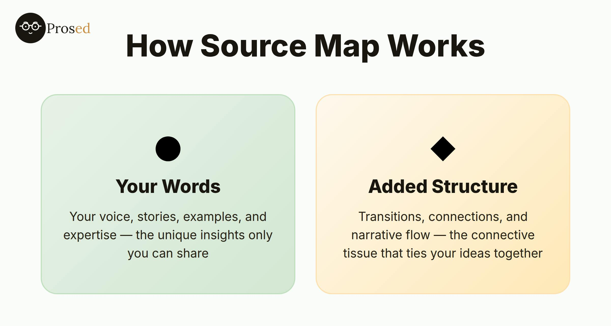
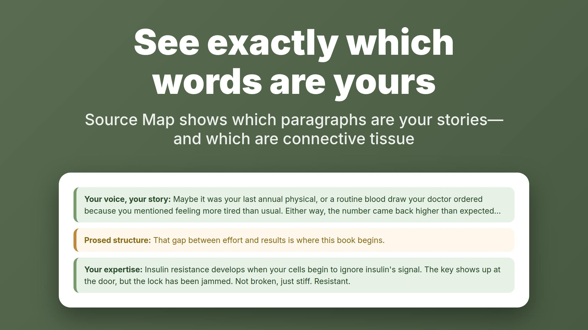
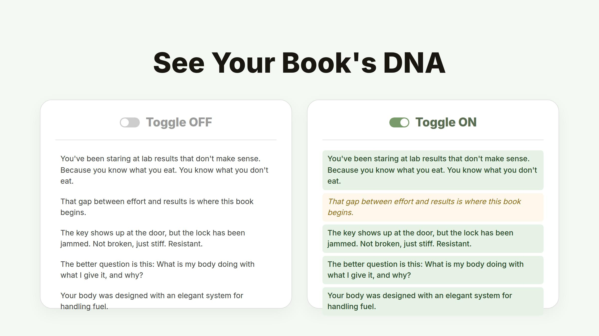

### 🎬 관련 영상
- [🎥 영상 보기](https://ph-files.imgix.net/f945d850-ca45-4faa-a62f-0cba7c839331.gif?auto=format)

---

## 12. [Hotspot Meter ](https://www.producthunt.com/products/hotspot-meter-track-wi-fi-and-hotspots)
**Votes**: 112 | **도입 난이도**: 하 | **신뢰도**: 상
**Tagline**: A private data-usage meter for your Mac menu bar
**서비스 링크**: https://www.producthunt.com/r/KSCUVWV7P6XKUF

**태그**: Utility, macOS, Privacy, Network, Analytics

### 📌 이 서비스 한눈에 보기
Mac 메뉴 바에서 실시간으로 데이터 사용량을 확인하고 관리하는 프라이버시 중심의 미터기

### 🔑 주요 기능
- Wi-Fi 및 모바일 핫스팟별 데이터 사용량 상세 추적
- 실시간 업로드/다운로드 속도 및 세션별 합계 확인
- 데이터 용량 제한 도달 전 알림 기능 제공

### 🙋 사용자에게 어떤 점이 좋은가
데이터 사용량이 제한적인 모바일 핫스팟 환경에서 데이터 소모를 실시간으로 모니터링하고 초과 사용을 방지할 수 있습니다.

### ✅ 지금 바로 써볼 기능
- 메뉴 바에 고정하여 실시간 속도 확인하기
- 네트워크별 사용량 기록 검토하기
- 데이터 캡 도달 전 알림 설정하기

### ⚠️ 사용 전 확인할 점
- macOS 전용 앱이므로 다른 운영체제에서는 사용 불가
- 네트워크 인터페이스 권한 허용이 필요할 수 있음

### 🧭 확인이 더 필요한 정보
데이터 사용량 기록의 보관 기간 및 상세 히스토리 저장 용량에 대한 정보가 명시되지 않았습니다.

### 📸 스크린샷 및 갤러리
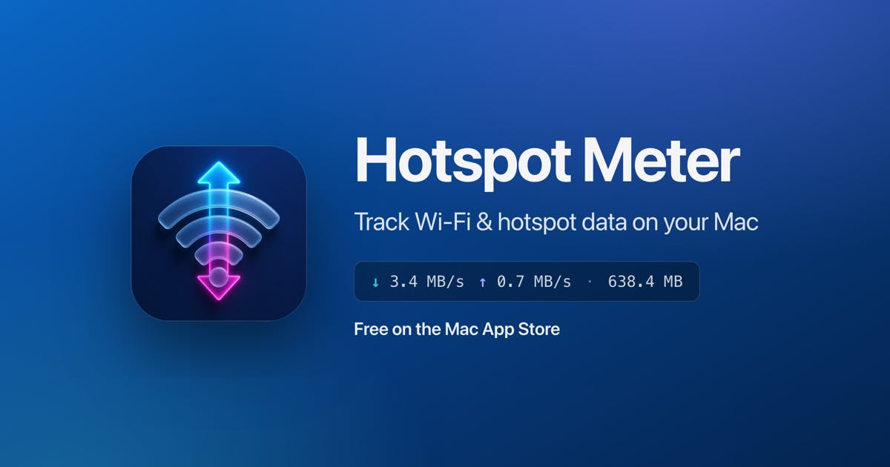
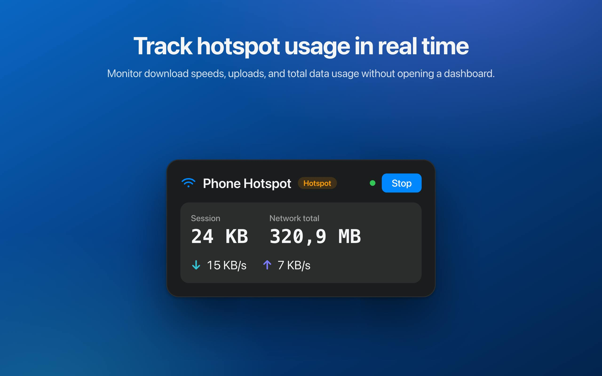
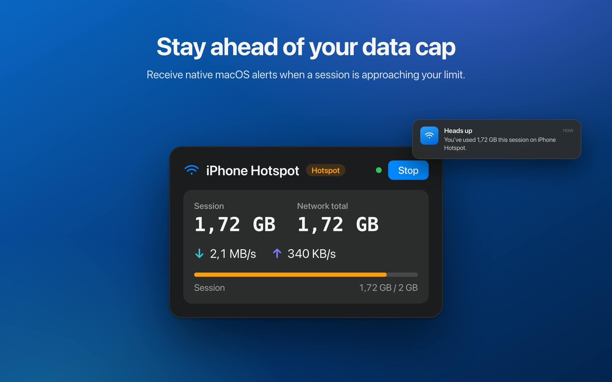

---

## 13. [Liso](https://www.producthunt.com/products/liso-listen-to-highlights)
**Votes**: 107 | **도입 난이도**: 하 | **신뢰도**: 상
**Tagline**: Highlight text on any page and turn it into audio.
**서비스 링크**: https://www.producthunt.com/r/YC2FDNL25GDC35

**태그**: Productivity, Audio, Reading, ContentConsumption

### 📌 이 서비스 한눈에 보기
웹 페이지의 텍스트를 즉시 고품질 오디오로 변환해주는 개인용 오디오북 서비스

### 🔑 주요 기능
- 웹상의 모든 텍스트(기사, 뉴스레터, 블로그 등)를 오디오로 변환
- 읽고 싶은 내용을 나만의 오디오북으로 만드는 개인화된 경험
- 텍스트 하이라이트 기능을 통한 간편한 오디오 생성

### 🙋 사용자에게 어떤 점이 좋은가
텍스트를 읽을 시간이 부족할 때, 이동 중이나 다른 작업을 하면서도 원하는 콘텐츠를 귀로 편리하게 소비할 수 있습니다.

### ✅ 지금 바로 써볼 기능
- 웹 페이지에서 텍스트 하이라이트 해보기
- 생성된 오디오 품질 확인하기
- 나만의 오디오북 리스트 구축하기

### ⚠️ 사용 전 확인할 점
- 텍스트 양에 따른 오디오 생성 시간 및 서비스 제한 여부 확인 필요
- 사용 중인 브라우저와의 호환성 확인 필요

### 🧭 확인이 더 필요한 정보
구체적인 가격 정책 및 모바일 앱 지원 여부에 대한 정보가 명시되지 않았습니다.

### 📸 스크린샷 및 갤러리

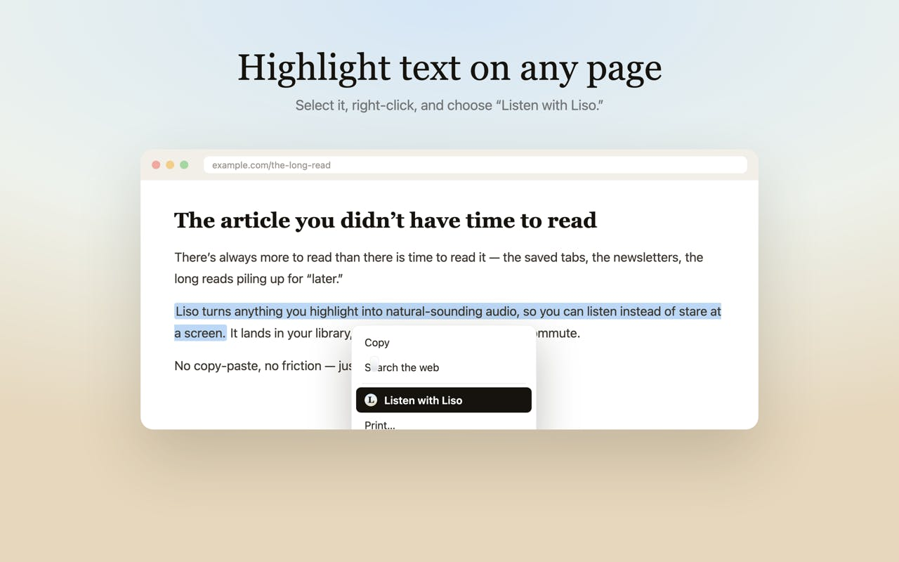
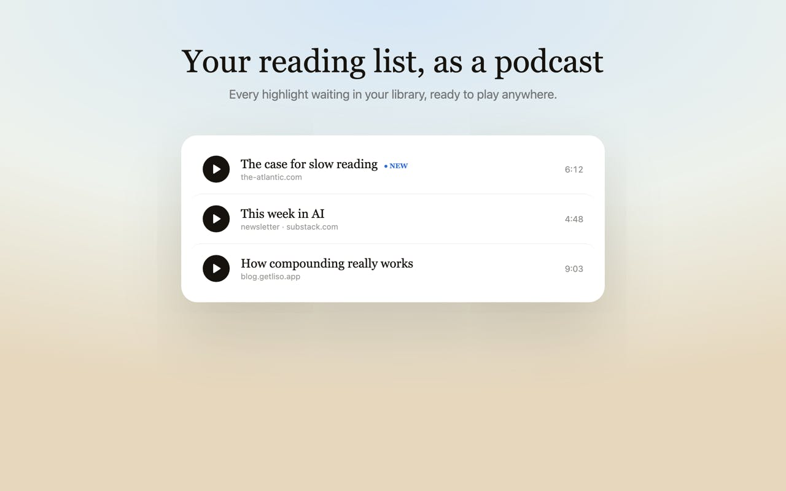

### 🎬 관련 영상
- [🎥 영상 보기](https://ph-files.imgix.net/d9c153a0-208b-44d4-9080-17f06ee586d4.jpeg?auto=format)

---

## 14. [Reach](https://www.producthunt.com/products/reach-14)
**Votes**: 47 | **도입 난이도**: 중 | **신뢰도**: 상
**Tagline**: The operating system to win AI search.
**서비스 링크**: https://www.producthunt.com/r/MLOKC3Q2G43JG5

**태그**: Marketing, AI, SEO, Analytics, Automation, Agent, AI Tool, Chat, Prompting

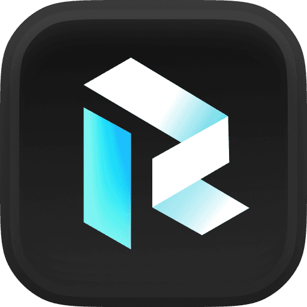

### 📌 이 서비스 한눈에 보기
AI 검색 엔진(ChatGPT, Perplexity 등)에서 브랜드가 추천되도록 돕는 마케팅 운영 시스템

### 🔑 주요 기능
- AI 검색 엔진 최적화(ASO)를 위한 통합 워크플로우 제공
- 수요 발굴부터 콘텐츠 실행, 커뮤니티 관리까지 통합 관리
- AI 검색 결과에 따른 매출 기여도 측정 및 분석

### 🙋 사용자에게 어떤 점이 좋은가
마케팅 팀과 AI 에이전트가 협업하여 잠재 고객의 구매 여정에서 브랜드가 우선적으로 추천되도록 전략을 실행할 수 있습니다.

### ✅ 지금 바로 써볼 기능
- 브랜드 언급 및 커뮤니티 노출 전략 수립
- AI 검색 엔진 최적화 콘텐츠 실행
- AI 검색을 통한 매출 기여도 측정 설정

### ⚠️ 사용 전 확인할 점
- AI 검색 엔진의 알고리즘 변화에 따른 성과 변동 가능성
- 실제 매출로 이어지는 정교한 기여도 측정 모델의 검증 필요

### 🧭 확인이 더 필요한 정보
구체적인 콘텐츠 생성 자동화 방식과 외부 플랫폼과의 연동 범위에 대한 정보가 부족합니다.

### 📸 스크린샷 및 갤러리
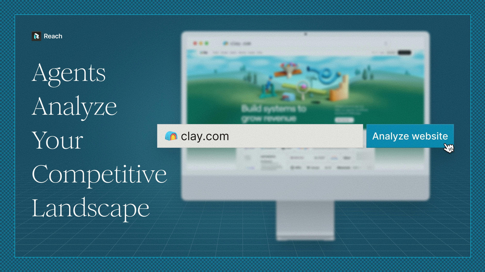
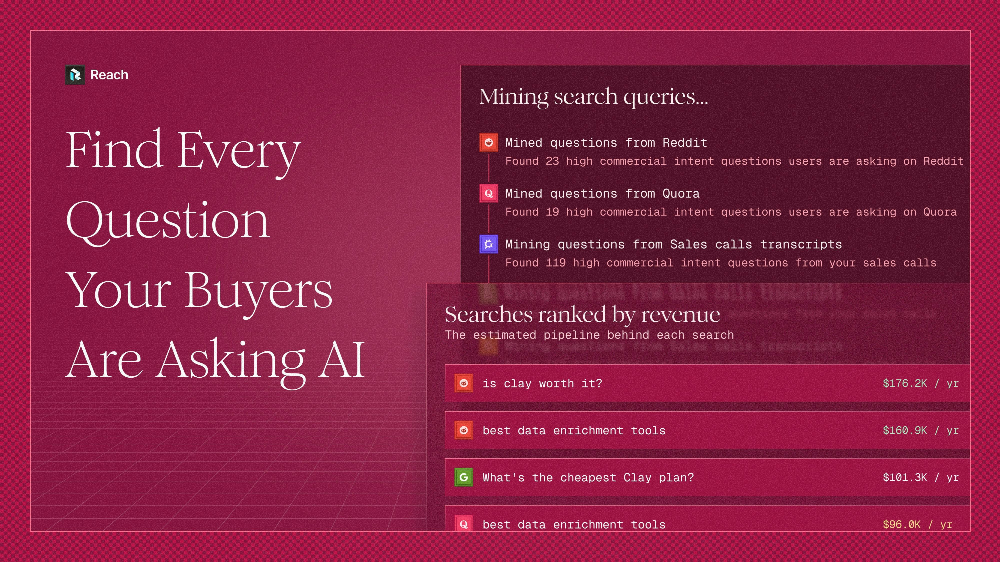
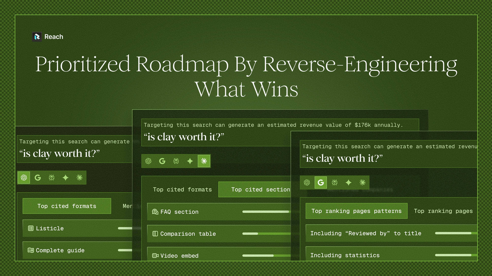

### 🎬 관련 영상
- [🎥 영상 보기](https://ph-files.imgix.net/b7f43e9b-8f4c-4215-8af0-10f2d8447839.jpeg?auto=format)

---

## 15. [OpenWorker](https://www.producthunt.com/products/openworker)
**Votes**: 31 | **도입 난이도**: 중 | **신뢰도**: 상
**Tagline**: Local-first desktop agent for everyday work
**서비스 링크**: https://www.producthunt.com/r/MR4WFZE7PG6HBL

**태그**: AI Agent, Automation, OpenSource, Local-first, Agent, AI Tool

### 📌 이 서비스 한눈에 보기
개인 컴퓨터에서 실행되어 일상 업무를 자동화하는 로컬 우선 AI 에이전트

### 🔑 주요 기능
- 사용자 컴퓨터에서 직접 실행되는 로컬 퍼스트 방식
- 일상적인 업무 도구 내에서 작업 수행 및 결과물 생성
- 오픈 소스이며 사용자가 직접 모델을 선택하여 사용 가능

### 🙋 사용자에게 어떤 점이 좋은가
데이터가 외부 서버로 유출될 걱정 없이 개인 PC에서 안전하게 업무 자동화를 구현할 수 있습니다.

### ✅ 지금 바로 써볼 기능
- 로컬 환경에 설치하여 기본 워크플로우 테스트하기
- 사용 중인 모델을 연결하여 성능 확인하기
- 중요 작업 시 승인 절차 설정해보기

### ⚠️ 사용 전 확인할 점
- 로컬 리소스를 사용하므로 컴퓨터 사양에 따른 성능 차이가 있을 수 있음
- 사용자가 직접 모델을 설정해야 하므로 초기 설정 난이도가 있을 수 있음

### 🧭 확인이 더 필요한 정보
사용자의 하드웨어 사양에 따른 최적의 모델 성능과 구체적인 시스템 요구사항 확인이 필요합니다.

### 📸 스크린샷 및 갤러리
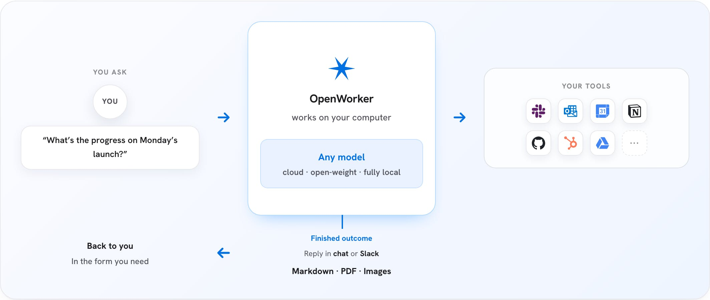
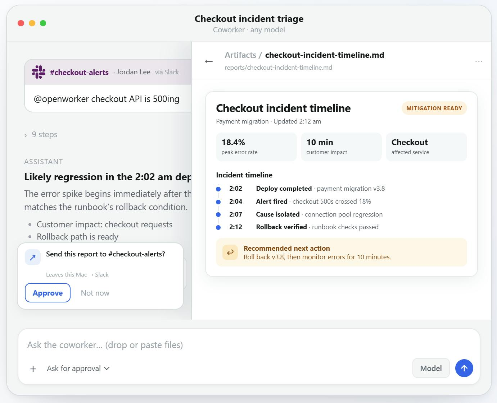
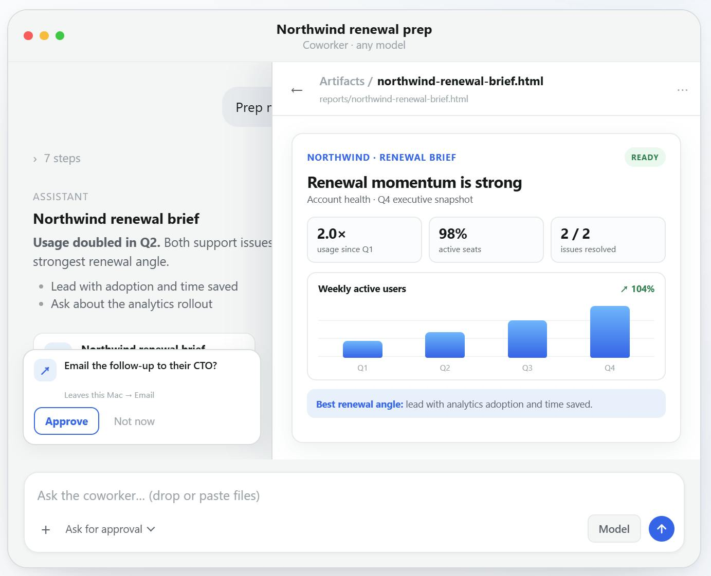

---

## 16. [The Modern Shrine](https://www.producthunt.com/products/the-modern-shrine)
**Votes**: 29 | **도입 난이도**: 중 | **신뢰도**: 중
**Tagline**: Clearer decisions in life and work using ancient wisdom
**서비스 링크**: https://www.producthunt.com/r/ZXDHC226NLEQUF

**태그**: Decision Making, AI, Productivity, Psychology, AI Tool

### 📌 이 서비스 한눈에 보기
AI와 고대 지혜를 결합하여 복잡한 상황 속 명확한 의사결정을 돕는 도구

### 🔑 주요 기능
- AI, 행동 심리학, 고대 패턴 시스템의 융합
- 정보 과잉 상태에서 분석적 사고를 하는 사람들을 위한 의사결정 보정 시스템
- 현대적 문제 해결을 위한 실용적인 의사결정 도구 제공

### 🙋 사용자에게 어떤 점이 좋은가
모든 정보를 가지고 있음에도 확신이 서지 않을 때, 객관적이고 체계적인 판단을 내릴 수 있도록 돕습니다.

### ✅ 지금 바로 써볼 기능
- 자신의 의사결정 패턴 분석하기
- 제공되는 고대 패턴 시스템 도구 활용하기
- AI 기반의 의사결정 보정 프로세스 경험하기

### ⚠️ 사용 전 확인할 점
- 분석적 성향이 강한 사용자에게는 다소 추상적으로 느껴질 수 있음
- 구체적인 기능적 인터페이스나 워크플로우가 아직 공개되지 않음

### 🧭 확인이 더 필요한 정보
구체적인 기능 구현 방식과 사용자 인터페이스(UI)에 대한 상세 정보가 필요합니다.

### 📸 스크린샷 및 갤러리

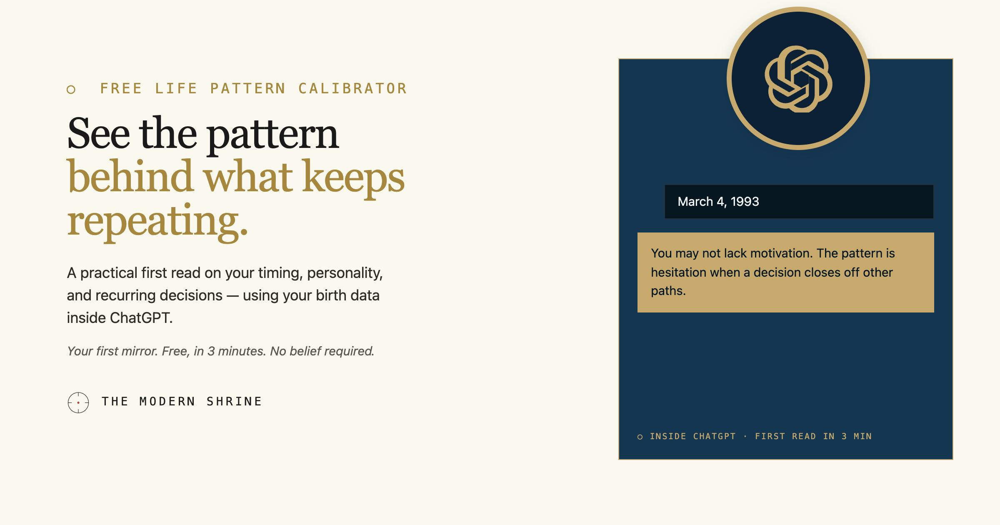

### 🎬 관련 영상
- [🎥 영상 보기](https://ph-files.imgix.net/07a2287f-13b2-4b45-a4a9-f1da99dd8b7d.jpeg?auto=format)

---

## 17. [Buska](https://www.producthunt.com/products/buska)
**Votes**: 25 | **도입 난이도**: 하 | **신뢰도**: 상
**Tagline**: Turn social media buying signals into pipeline
**서비스 링크**: https://www.producthunt.com/r/SJFBO7PRJKQNLW

**태그**: Sales, Automation, AI, SocialListening, CRM, AI Tool

### 📌 이 서비스 한눈에 보기
소셜 미디어의 구매 신호를 실시간으로 포착하여 잠재 고객 리드로 전환하는 AI 영업 자동화 도구

### 🔑 주요 기능
- Twitter, Reddit, LinkedIn 등 30개 이상의 플랫폼 실시간 모니터링
- AI 기반 구매 의도 점수(0-100) 산출 및 ICP 매칭
- 맥락에 맞는 답장 생성 및 주요 CRM(HubSpot, Salesforce 등) 연동

### 🙋 사용자에게 어떤 점이 좋은가
영업팀이 수많은 소셜 미디어 언급 중 실제 구매 가능성이 높은 리드에만 집중할 수 있게 하여 업무 효율을 극대화합니다.

### ✅ 지금 바로 써볼 기능
- 관심 있는 소셜 플랫폼 모니터링 설정하기
- AI가 산출한 구매 의도 점수 확인하기
- Reply Studio를 활용한 맥락 기반 답장 생성해보기

### ⚠️ 사용 전 확인할 점
- AI 점수가 실제 구매 의도와 완벽히 일치하지 않을 수 있음
- 소셜 플랫폼의 API 정책 변화에 따른 데이터 수집 영향 가능성

### 🧭 확인이 더 필요한 정보
플랫폼별 데이터 수집 범위와 상세 필터링 기능에 대한 구체적인 명세 확인이 필요합니다.

### 📸 스크린샷 및 갤러리
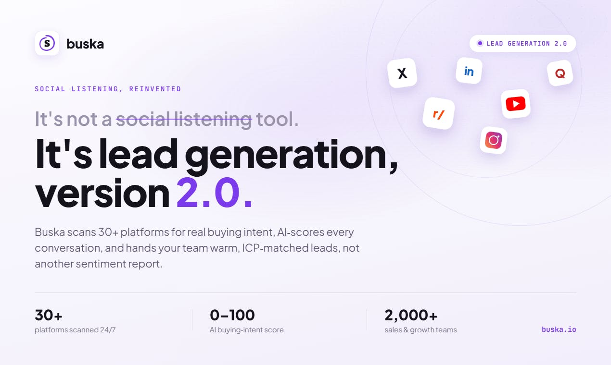
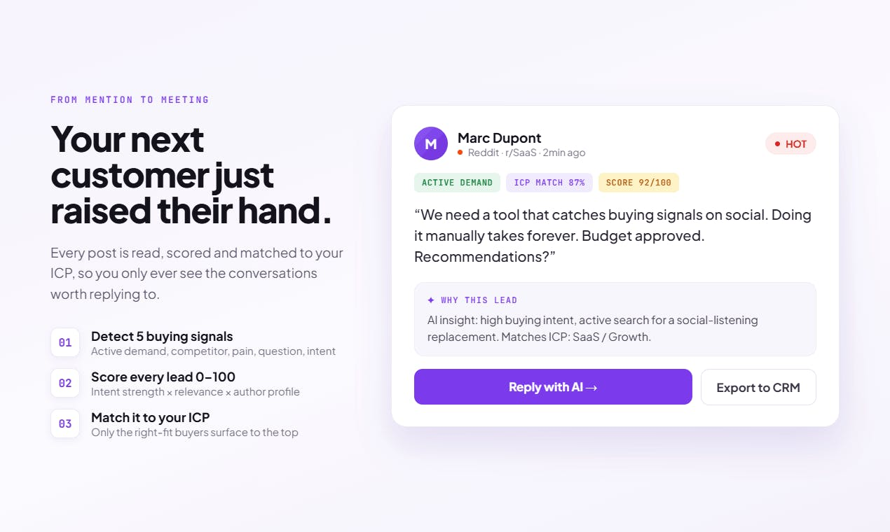
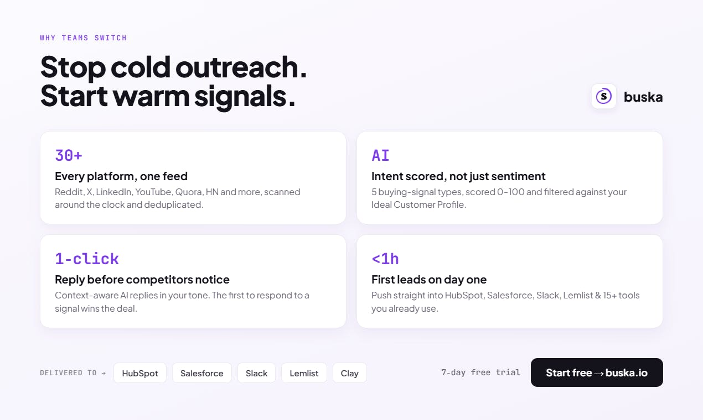

### 🎬 관련 영상
- [🎥 영상 보기](https://ph-files.imgix.net/a1769eec-f9ff-4cac-9e7e-68609f0cb688.jpeg?auto=format)

---

## 18. [AngelList Link](https://www.producthunt.com/products/angellist)
**Votes**: 24 | **도입 난이도**: 중 | **신뢰도**: 상
**Tagline**: MCP for GPs: turn your fund into something you can talk to
**서비스 링크**: https://www.producthunt.com/r/3MKHNTLRFYV473

**태그**: FinTech, AI-Agent, FundManagement, Automation, Agent, AI Tool, Chat, API

### 📌 이 서비스 한눈에 보기
AI를 통해 펀드 데이터를 실시간으로 질의하고 관리하는 GP용 MCP 서버

### 🔑 주요 기능
- MCP(Model Context Protocol) 서버를 통한 AI 도구(Claude, ChatGPT 등)와의 연동
- 자본 호출 상태, LP 보유 현황, 밸류에이션 업데이트 등 펀드 데이터 즉시 질의 가능
- 25,000개 이상의 펀드 및 SPV를 지원하는 신뢰할 수 있는 데이터 소스 제공

### 🙋 사용자에게 어떤 점이 좋은가
복잡한 펀드 관리 데이터를 일일이 찾는 대신, 평소 사용하는 AI 채팅창에서 자연어로 질문하여 즉각적인 답변을 얻을 수 있습니다.

### ✅ 지금 바로 써볼 기능
- 자신의 펀드 데이터를 AI와 연결하기
- 자본 호출(Capital Call) 및 LP 현황 질의하기
- AI 에이전트를 활용한 자동화된 펀드 관리 시도하기

### ⚠️ 사용 전 확인할 점
- AI 모델의 답변 정확도 및 데이터 보안 정책 확인 필요
- 기존 펀드 관리 워크플로우와의 호환성 검토

### 🧭 확인이 더 필요한 정보
사용자의 기존 데이터가 AngelList 시스템에 어떻게 동기화되는지에 대한 구체적인 기술적 절차 확인이 필요합니다.

### 📸 스크린샷 및 갤러리
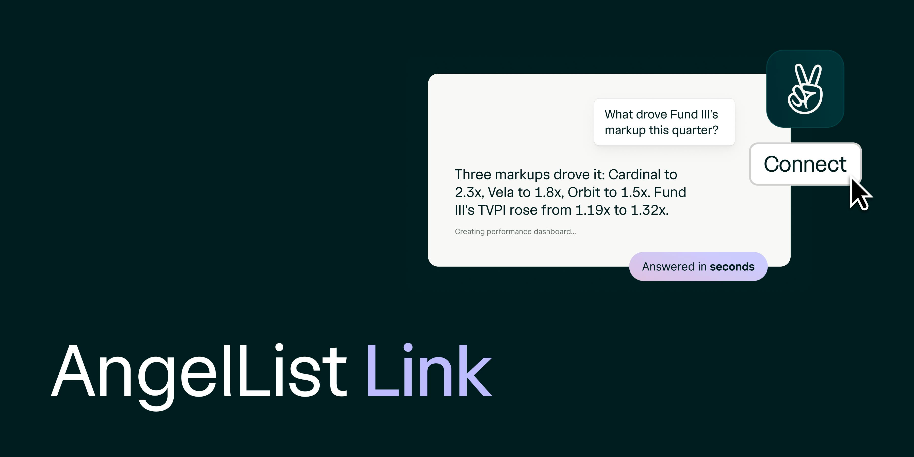
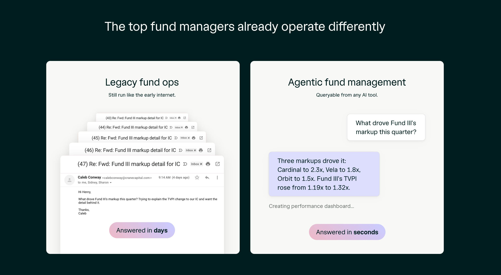
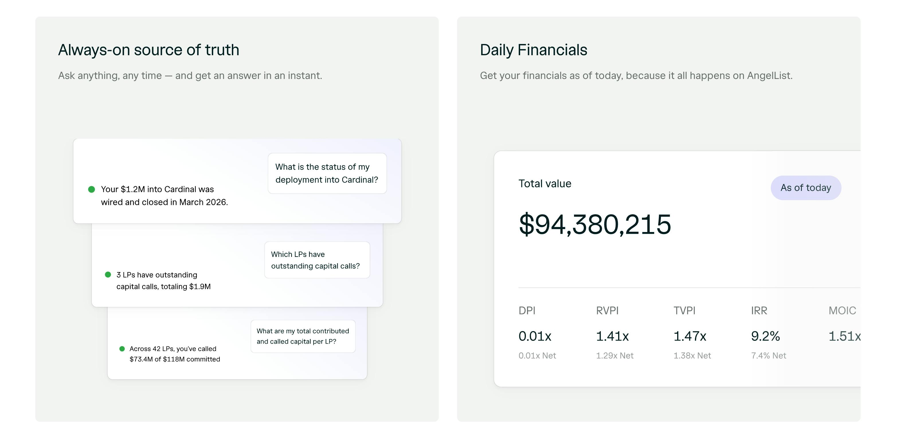

---

## 19. [base](https://www.producthunt.com/products/base-72)
**Votes**: 21 | **도입 난이도**: 중 | **신뢰도**: 상
**Tagline**: The system of intelligence for lean founding teams
**서비스 링크**: https://www.producthunt.com/r/P3NMYX43YJO3VN

**태그**: AI, Automation, BusinessOps, SaaS, AI Tool

### 📌 이 서비스 한눈에 보기
소규모 창업 팀을 위한 AI 기반 비즈니스 운영 및 지능형 명령 인터페이스

### 🔑 주요 기능
- 설정부터 지능형 실행까지 아우르는 5개 계층의 운영 레이어 제공
- 자연어 명령을 통한 재무 보고서 추출 및 투자자 업데이트 초안 작성
- 연결된 업무 스택 전반에서 실행되는 자동화 및 지능형 시스템

### 🙋 사용자에게 어떤 점이 좋은가
복잡한 운영 업무를 자연어로 명령하여 대기업 수준의 운영 효율성을 확보할 수 있습니다.

### ✅ 지금 바로 써볼 기능
- 자연어 명령을 통한 재무 보고서 생성 테스트
- 기존 업무 스택(Stack) 연결 및 데이터 동기화
- 투자자 업데이트 초안 작성 기능 활용

### ⚠️ 사용 전 확인할 점
- 연결된 외부 서비스(Stack)의 데이터 보안 및 권한 설정 확인 필요
- 자연어 명령의 정확도가 데이터 결과값에 미치는 영향 검토 필요

### 🧭 확인이 더 필요한 정보
현재 지원하는 구체적인 외부 서비스(SaaS) 연동 목록과 데이터 보안 정책에 대한 상세 정보가 필요합니다.

### 📸 스크린샷 및 갤러리
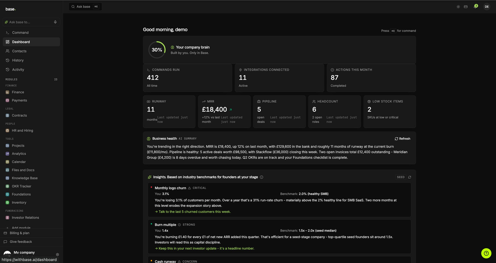
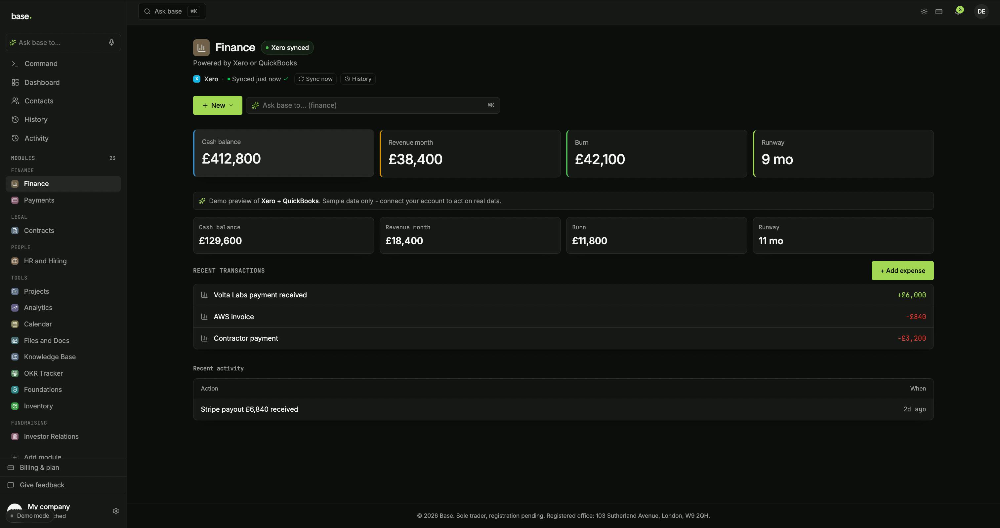
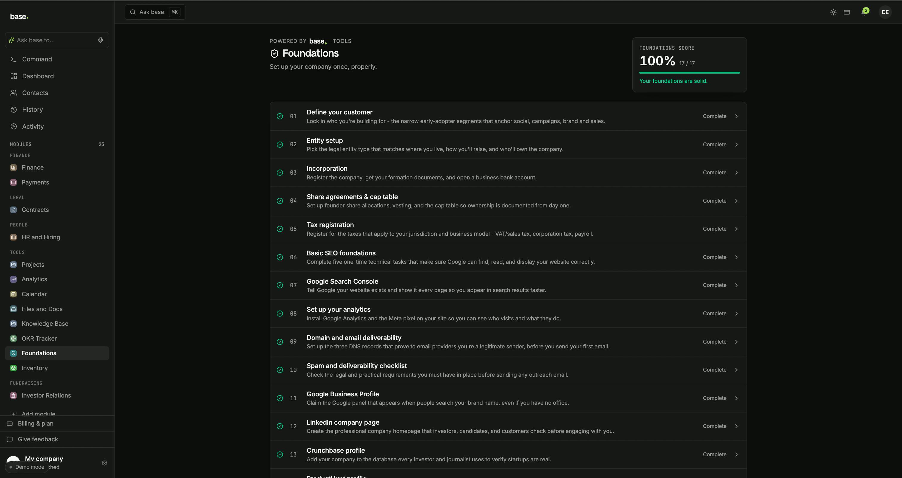

### 🎬 관련 영상
- [🎥 영상 보기](https://ph-files.imgix.net/955bcb11-6164-40d2-b755-202823ec26fc.jpeg?auto=format)

---

## 20. [Privent 2.0](https://www.producthunt.com/products/privent)
**Votes**: 19 | **도입 난이도**: 중 | **신뢰도**: 상
**Tagline**: Runtime Data Control for n8n Workflows
**서비스 링크**: https://www.producthunt.com/r/TXXEEXZ7NU2235

**태그**: AI, Automation, Security, n8n, DataPrivacy, Agent, AI Tool, LLM, API, Email

### 📌 이 서비스 한눈에 보기
n8n 워크플로우 내 민감 정보 유출을 방지하는 토큰화 기반 데이터 보안 솔루션

### 🔑 주요 기능
- LLM 전송 전 PII 및 비밀번호를 안전하게 토큰화하여 데이터 유출 방지
- n8n 공식 통합 파트너로서 워크플로우 내 데이터 복원 기능 제공
- 로컬 모드 지원으로 오프라인 환경에서도 보안 유지 가능

### 🙋 사용자에게 어떤 점이 좋은가
AI 에이전트가 업무 중 민감한 데이터를 다룰 때, 데이터 손실 없이 보안을 유지하며 안전하게 LLM을 활용할 수 있습니다.

### ✅ 지금 바로 써볼 기능
- n8n 워크플로우에 Privent 토큰화 노드 적용해보기
- 로컬 모드를 통한 오프라인 보안 환경 테스트하기
- 기존 데이터 마스킹 방식과 토큰화 방식의 차이 검증하기

### ⚠️ 사용 전 확인할 점
- 토큰화된 데이터의 복원 과정에서 신뢰할 수 있는 싱크(Sink) 설정 필요
- 로컬 모드 사용 시 하드웨어 사양 및 네트워크 환경 영향 확인 필요

### 🧭 확인이 더 필요한 정보
토큰화된 데이터의 복원(Reversal) 과정에서 발생하는 지연 시간(Latency)에 대한 구체적인 정보가 필요합니다.

### 📸 스크린샷 및 갤러리
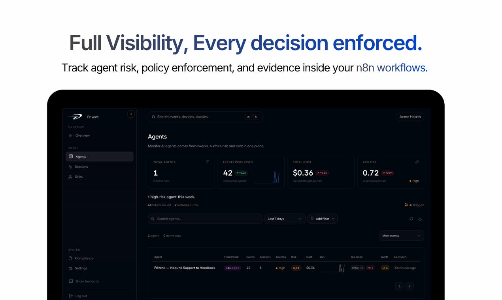
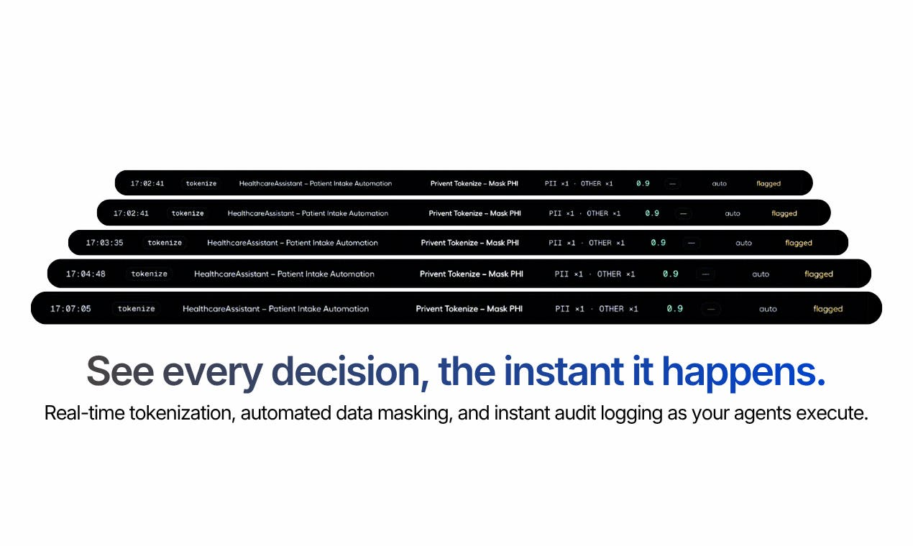

### 🎬 관련 영상
- [🎥 영상 보기](https://ph-files.imgix.net/fb40040f-83d1-43ef-89a2-7dc2e9c1e05b.jpeg?auto=format)

---

## 21. [Peekinduck](https://www.producthunt.com/products/peekin-ai)
**Votes**: 16 | **도입 난이도**: 중 | **신뢰도**: 상
**Tagline**: AI voice agents for B2B SaaS demos, onboarding & support
**서비스 링크**: https://www.producthunt.com/r/HDNEBGHK34H7JC

**태그**: AI, SaaS, Automation, CustomerSupport, Sales, Agent, AI Tool, Analytics, CRM

### 📌 이 서비스 한눈에 보기
데모부터 온보딩, 고객 지원까지 하나의 메모리를 공유하는 AI 음성 에이전트 솔루션

### 🔑 주요 기능
- 데모용 'Demo Duck'과 온보딩/지원용 'Guide Goose'로 구성된 2종 AI 에이전트 제공
- 고객 여정 전반에 걸쳐 맥락을 공유하는 통합 메모리 시스템
- HubSpot, Salesforce 등 주요 CRM과의 네이티브 연동 및 실시간 음성 기술 지원

### 🙋 사용자에게 어떤 점이 좋은가
데모, 온보딩, 고객 지원 도구를 개별적으로 사용할 필요 없이 하나의 플랫폼에서 통합 관리하여 고객 경험을 일관되게 유지할 수 있습니다.

### ✅ 지금 바로 써볼 기능
- Demo Duck을 통한 24/7 잠재 고객 발굴 및 미팅 예약 설정
- Guide Goose를 활용한 신규 사용자 온보딩 자동화
- 기존 CRM(HubSpot, Salesforce 등)과의 데이터 연동 테스트

### ⚠️ 사용 전 확인할 점
- 음성 에이전트의 답변 정확도 및 가드레일 작동 범위 확인 필요
- 기존 고객 지원 워크플로우와의 충돌 여부 검토

### 🧭 확인이 더 필요한 정보
제공되는 AI 에이전트의 구체적인 언어 지원 범위와 한국어 음성 품질에 대한 정보가 부족합니다.

### 📸 스크린샷 및 갤러리
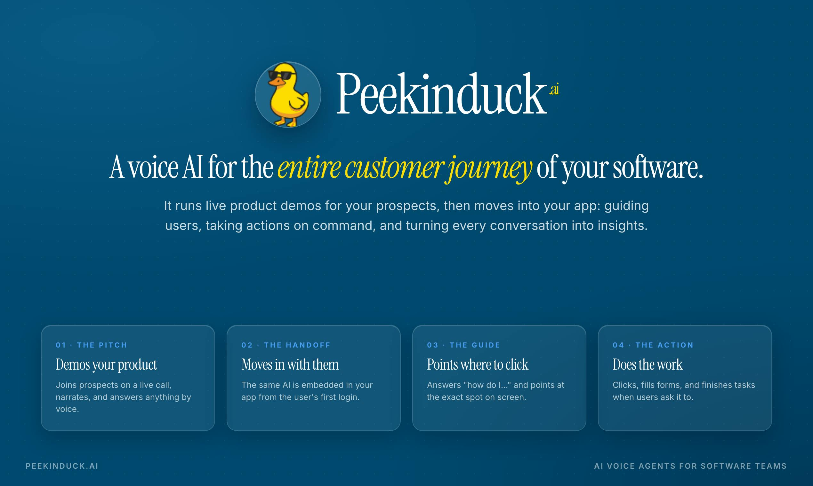
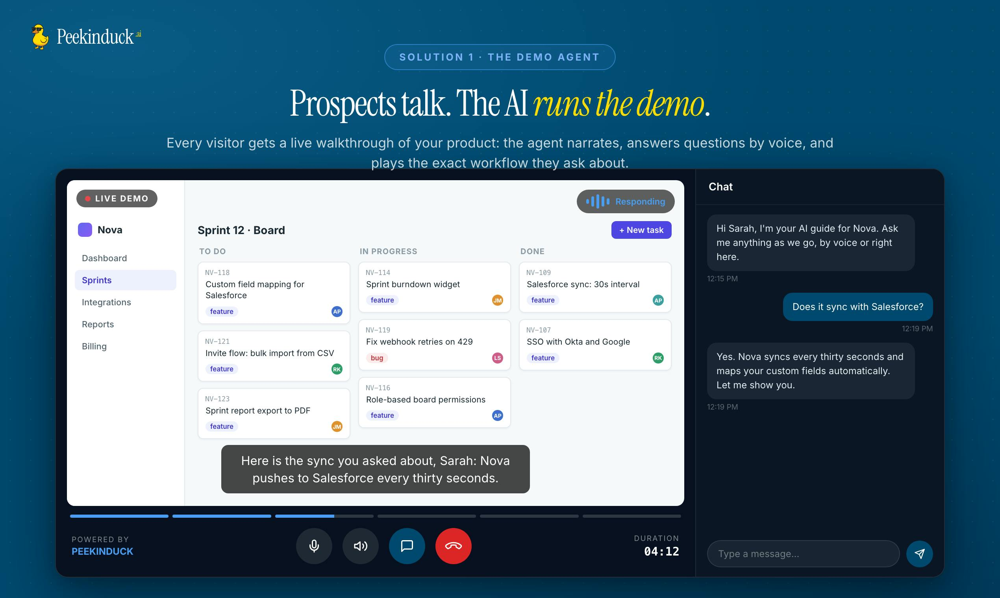
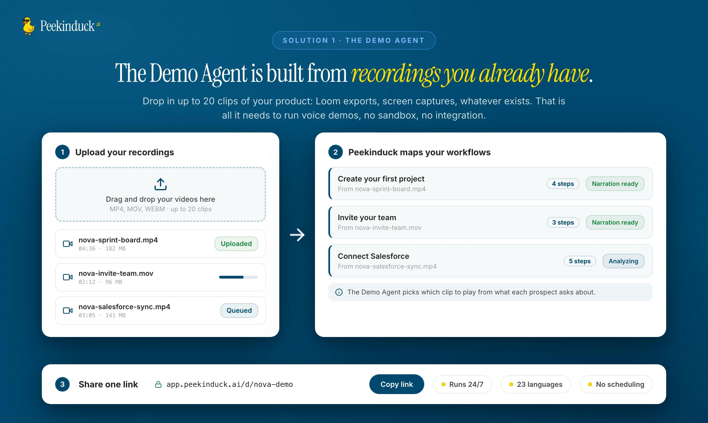

### 🎬 관련 영상
- [🎥 영상 보기](https://ph-files.imgix.net/c7a804ce-4ba5-4222-88e3-686594a7ff00.gif?auto=format)

---

## 22. [Expert Avatar](https://www.producthunt.com/products/expert-avatar)
**Votes**: 13 | **도입 난이도**: 하 | **신뢰도**: 상
**Tagline**: Train Your Avatar On Your Expertise. Scale Your Reach.
**서비스 링크**: https://www.producthunt.com/r/EDZ665HKZ72X4H

**태그**: AI, Digital Twin, Marketing, Lead Generation, NoCode, AI Tool

### 📌 이 서비스 한눈에 보기
자신의 전문 지식을 학습시켜 소셜 미디어에서 리드를 발굴하는 대화형 AI 아바타 생성 도구

### 🔑 주요 기능
- 사용자의 전문 지식을 학습하여 상호작용 가능한 디지털 트윈 생성
- 소셜 미디어 공유를 통한 잠재 고객 확보 및 브랜드 인지도 향상
- 초기 생성 및 학습 비용 무료 제공

### 🙋 사용자에게 어떤 점이 좋은가
창업가나 전문가가 직접 응대하지 않아도 자신의 지식을 바탕으로 24시간 고객과 소통하며 리드를 확보할 수 있습니다.

### ✅ 지금 바로 써볼 기능
- 자신의 전문 지식을 담은 데이터 학습시키기
- 생성된 인터랙티브 아바타 소셜 미디어에 공유하기
- 무료 제공되는 60분 대화 시간을 활용해 사용자 반응 확인하기

### ⚠️ 사용 전 확인할 점
- 학습 데이터의 질에 따라 아바타의 답변 정확도가 달라질 수 있음
- 무료 제공 시간(60분) 초과 시 과금 체계 확인 필요

### 🧭 확인이 더 필요한 정보
무료 제공 시간 이후의 구체적인 유료 요금제 및 과금 방식에 대한 정보가 필요합니다.

### 📸 스크린샷 및 갤러리
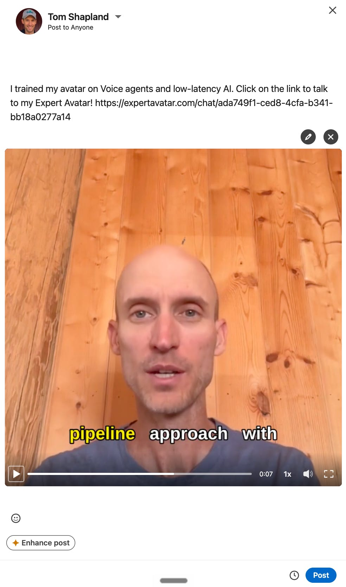

### 🎬 관련 영상
- [🎥 영상 보기](https://ph-files.imgix.net/76c66ce4-7386-442d-85eb-306f266bbc7f.jpeg?auto=format)

---

## 23. [Handler ](https://www.producthunt.com/products/handler-2)
**Votes**: 12 | **도입 난이도**: 하 | **신뢰도**: 상
**Tagline**: Spy the outlier TikToks. Dupe the winners for your app.
**서비스 링크**: https://www.producthunt.com/r/DZX74VLJV5IW6K

**태그**: Marketing, Content Creation, Social Media, Growth Hacking, Video

### 📌 이 서비스 한눈에 보기
틱톡 내 바이럴 패턴을 분석하여 성공적인 콘텐츠 제작 가이드를 제공하는 툴

### 🔑 주요 기능
- 특정 니치 분야에서 성과가 높은 '아웃라이어' 영상 식별
- 단순 조회수가 아닌 Outlier 점수와 Pull 점수를 기반으로 한 데이터 분석
- 성공적인 패턴을 복제할 수 있는 훅(Hook), 스크립트, 촬영 가이드 제공

### 🙋 사용자에게 어떤 점이 좋은가
콘텐츠 기획에 드는 시간을 줄이고, 검증된 바이럴 패턴을 활용해 앱 홍보 성공 확률을 높일 수 있습니다.

### ✅ 지금 바로 써볼 기능
- 자신의 앱 니치 분야에서 아웃라이어 영상 탐색하기
- 제공되는 듀프 키트(Hook, Script)를 활용해 영상 제작하기

### ⚠️ 사용 전 확인할 점
- 제공되는 스크립트가 브랜드의 고유한 색깔과 맞지 않을 수 있음
- 틱톡 알고리즘 변화에 따라 분석 점수의 유효성이 변동될 수 있음

### 🧭 확인이 더 필요한 정보
구체적인 요금 체계와 데이터 업데이트 주기에 대한 정보가 명시되지 않았습니다.

### 📸 스크린샷 및 갤러리
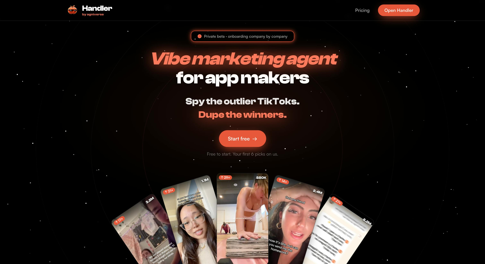
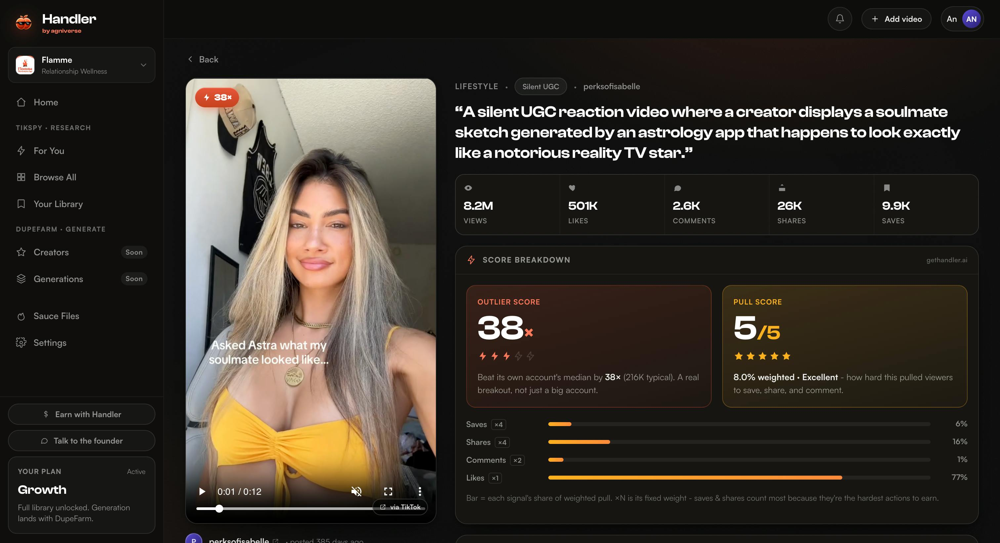
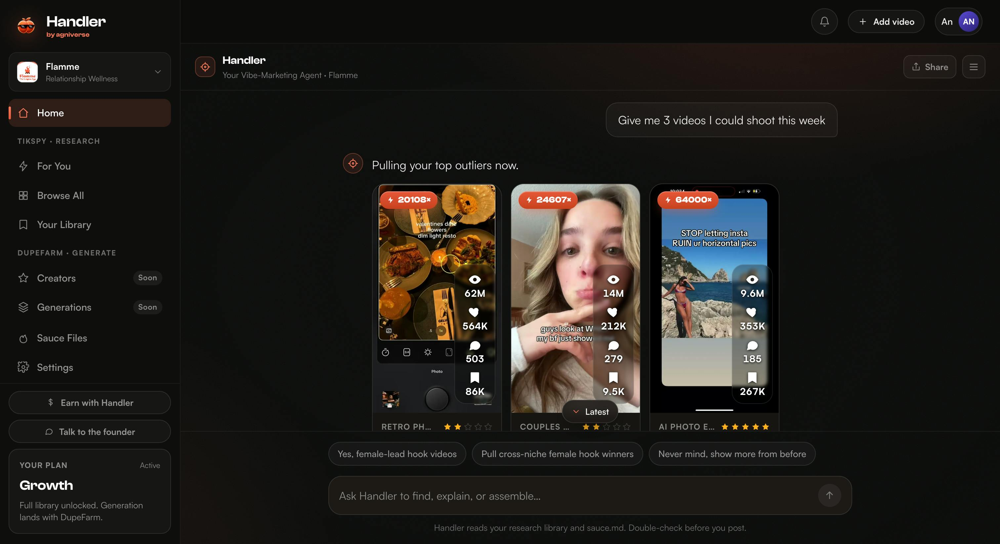

### 🎬 관련 영상
- [🎥 영상 보기](https://ph-files.imgix.net/9840e777-de32-4d7f-8595-11bbc8694784.jpeg?auto=format)

---

## 24. [Council](https://www.producthunt.com/products/council-4)
**Votes**: 12 | **도입 난이도**: 하 | **신뢰도**: 상
**Tagline**: A council of AI agents that hear you and help you heal.
**서비스 링크**: https://www.producthunt.com/r/ABRAAR26JUHBWF

**태그**: AI, MentalHealth, Productivity, Privacy, Agent, AI Tool, API

### 📌 이 서비스 한눈에 보기
다양한 AI 페르소나와 대화하며 마음을 치유하고 생각을 정리하는 개인용 AI 상담 공간

### 🔑 주요 기능
- 텍스트 및 음성 기반의 프라이빗한 AI 대화 환경 제공
- 상담가(Therapist), 친구(Friend), 가이드(Guide), 코치(Coach) 등 4가지 동물 페르소나 선택 가능
- 개인 모델 키(API Key)를 직접 연결하여 데이터 제어권 확보 및 브라우저 기반 로컬 저장

### 🙋 사용자에게 어떤 점이 좋은가
혼자 감당하기 힘든 고민을 AI 전문가/친구와 대화하며 정리할 수 있으며, 사용자의 모델 키를 직접 사용하여 보안과 제어권을 높였습니다.

### ✅ 지금 바로 써볼 기능
- 자신의 성향에 맞는 동물 페르소나(Panda, Dog, Owl, Fox) 선택하기
- Voice Room 모드를 통해 음성으로 실시간 대화 시도하기
- Council Discussion 모드에서 여러 AI의 관점 비교하기

### ⚠️ 사용 전 확인할 점
- 개인적인 감정/심리 상담용이므로 전문적인 의료/심리 치료를 대체할 수 없음
- 사용자 개인의 모델 키(API Key)를 입력해야 하므로 키 관리 주의 필요

### 🧭 확인이 더 필요한 정보
사용자 모델 키를 사용할 때의 구체적인 보안 수준과 브라우저 저장 방식의 영속성에 대한 확인이 필요합니다.

### 📸 스크린샷 및 갤러리
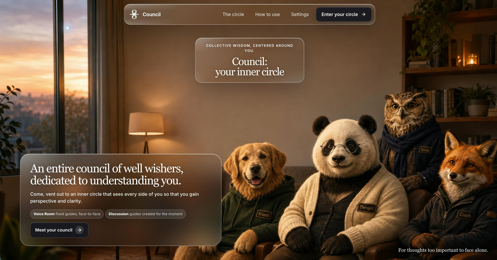

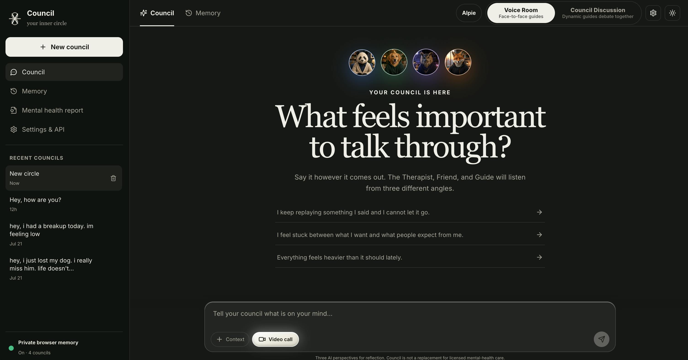

### 🎬 관련 영상
- [🎥 영상 보기](https://ph-files.imgix.net/be1aedc2-d390-4227-91a3-9c9dcda9864d.jpeg?auto=format)

---

## 25. [OpenBox](https://www.producthunt.com/products/openbox)
**Votes**: 11 | **도입 난이도**: 중 | **신뢰도**: 상
**Tagline**: Runtime governance for AI agents, wherever they run
**서비스 링크**: https://www.producthunt.com/r/RFCNN67BYDF2LS

**태그**: AI, Governance, DevOps, Security, Automation, Agent, AI Tool

### 📌 이 서비스 한눈에 보기
다양한 AI 프레임워크 환경에서 에이전트의 동작을 제어하고 규정 준수를 보장하는 통합 거버넌스 솔루션

### 🔑 주요 기능
- 실행 전 정책 강제 적용을 통한 AI 에이전트 통제
- 민감한 작업에 대한 인간 승인(Human-in-the-loop) 워크플로우 제공
- 모든 결정 과정에 대한 검증 가능한 감사 추적(Audit Trail) 유지

### 🙋 사용자에게 어떤 점이 좋은가
기존 AI 에이전트 개발 환경을 유지하면서, 운영 단계에서 발생할 수 있는 위험을 방지하고 보안 및 규정 준수 문제를 해결할 수 있습니다.

### ✅ 지금 바로 써볼 기능
- 현재 사용 중인 AI 프레임워크와의 호환성 확인
- 민감한 작업에 대한 승인 정책 설정 테스트
- 에이전트 작업 로그 및 감사 기록 기능 검토

### ⚠️ 사용 전 확인할 점
- 에이전트 실행 단계에 개입하므로 실행 지연(Latency)이 발생할 수 있음
- 기존 인프라와 통합 시 설정 복잡도가 발생할 수 있음

### 🧭 확인이 더 필요한 정보
지원하는 8개 이상의 프레임워크와 인프라 플랫폼의 구체적인 목록과 상세 통합 방식에 대한 확인이 필요합니다.

### 📸 스크린샷 및 갤러리
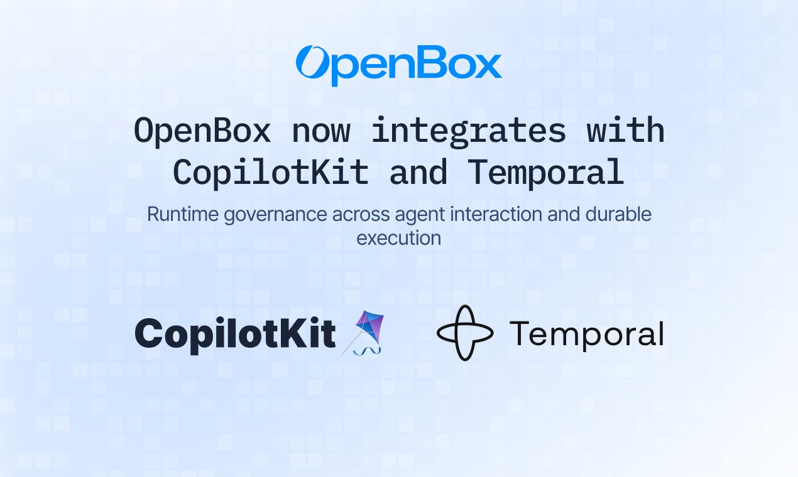
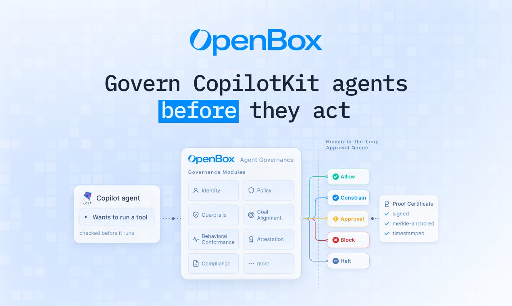
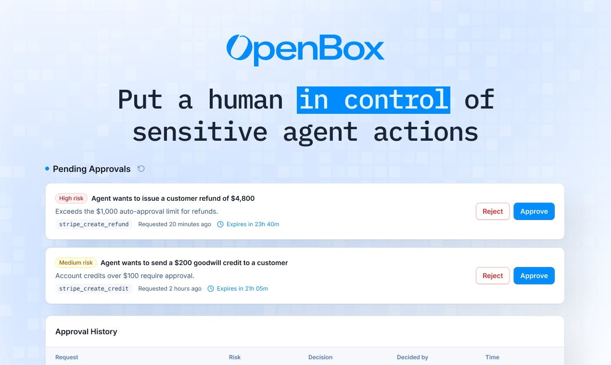

---

## 26. [Need4Padel](https://www.producthunt.com/products/need4padel)
**Votes**: 11 | **도입 난이도**: 하 | **신뢰도**: 상
**Tagline**: Where the padel industry does business
**서비스 링크**: https://www.producthunt.com/r/7WZMIHTFIAO7WU

**태그**: B2B, Directory, Padel Industry, AI Tool

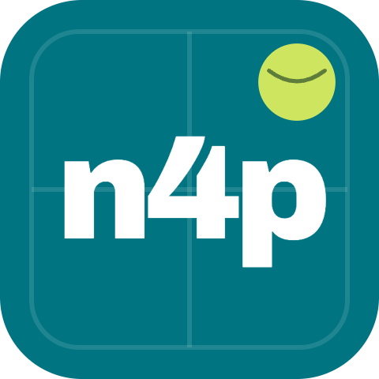

### 📌 이 서비스 한눈에 보기
패델 산업 종사자를 위한 무료 B2B 공급망 디렉토리

### 🔑 주요 기능
- 패델 산업 전반(코트 건설, 장비, 바닥재, 유통 등)을 아우르는 B2B 디렉토리
- 검증된 공급업체 검색 및 직접 연락 기능 제공
- 무료 비즈니스 등록 및 인박스로 직접 전달되는 견적 요청 기능

### 🙋 사용자에게 어떤 점이 좋은가
패델 관련 비즈니스를 운영하거나 인프라를 구축할 때, 신뢰할 수 있는 공급업체를 쉽고 빠르게 찾거나 잠재 고객의 견적을 받을 수 있습니다.

### ✅ 지금 바로 써볼 기능
- 관련 분야 비즈니스 무료 등록하기
- 필요한 공급업체 검색 및 연락처 확보하기
- 견적 요청 수신 설정하기

### ⚠️ 사용 전 확인할 점
- 검증된 업체라 할 하더라도 실제 서비스 품질은 개별 업체에 따라 다를 수 있음
- 무료 서비스이므로 향ous 유료 기능 전환 가능성 존재

### 🧭 확인이 더 필요한 정보
공급업체의 검증 절차가 구체적으로 어떻게 이루어지는지 확인이 필요합니다.

### 📸 스크린샷 및 갤러리
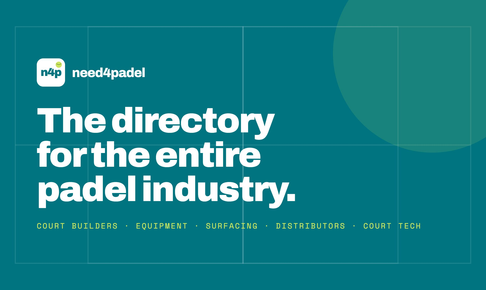
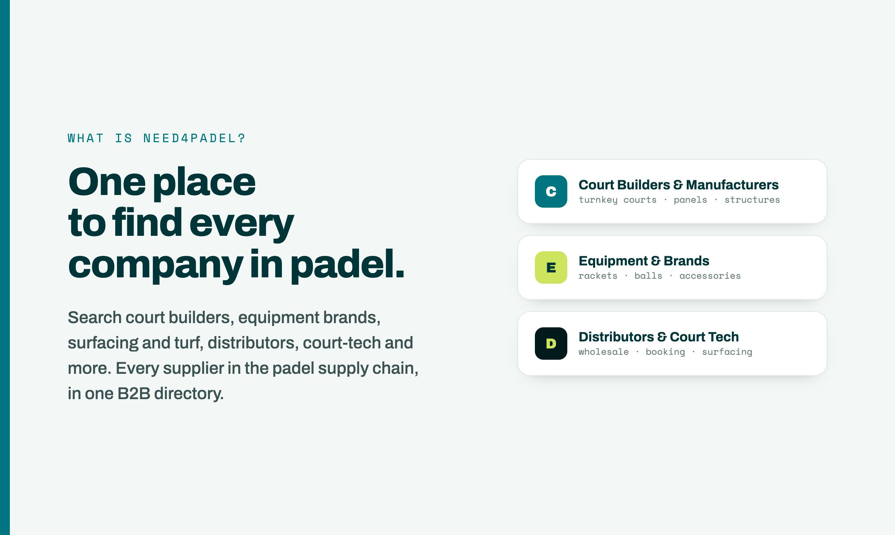
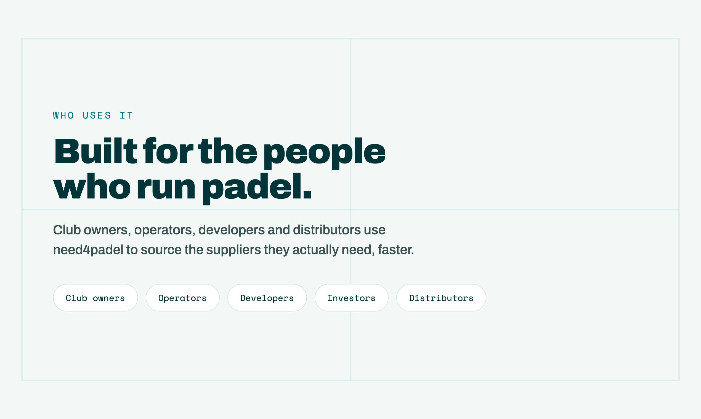

---

## 27. [Spot Gift](https://www.producthunt.com/products/spot-gift)
**Votes**: 10 | **도입 난이도**: 하 | **신뢰도**: 상
**Tagline**: Make “coffee’s on me” happen right in iMessage
**서비스 링크**: https://www.producthunt.com/r/N37OT7VZTCLTF7

**태그**: Lifestyle, Messaging, GiftCard, AppleWallet

### 📌 이 서비스 한눈에 보기
iMessage를 통해 간편하게 카페 선물을 보내고 Apple Wallet에 저장하는 서비스

### 🔑 주요 기능
- iMessage 내에서 즉시 특정 카페 메뉴 선물 가능
- 받은 선물은 Apple Wallet에 저장하여 원하는 시간에 사용
- 현금이나 일반 기프트카드보다 개인적이고 따뜻한 선물 경험 제공

### 🙋 사용자에게 어떤 점이 좋은가
복잡한 배달 예약 없이 메시지 하나로 상대방에게 기분 좋은 깜짝 선물을 전달할 수 있습니다.

### ✅ 지금 바로 써볼 기능
- iMessage를 통해 친구에게 커피 선물 보내기
- 받은 선물을 Apple Wallet에 저장하기
- 매장에서 저장된 선물을 사용하여 간편하게 결제하기

### ⚠️ 사용 전 확인할 점
- 특정 카페 브랜드나 메뉴로 제한될 수 있음
- iMessage 및 Apple Wallet 환경에 최적화되어 있음

### 🧭 확인이 더 필요한 정보
지원되는 카페 브랜드 범위와 지역적 서비스 가능 여부를 확인해야 합니다.

### 📸 스크린샷 및 갤러리

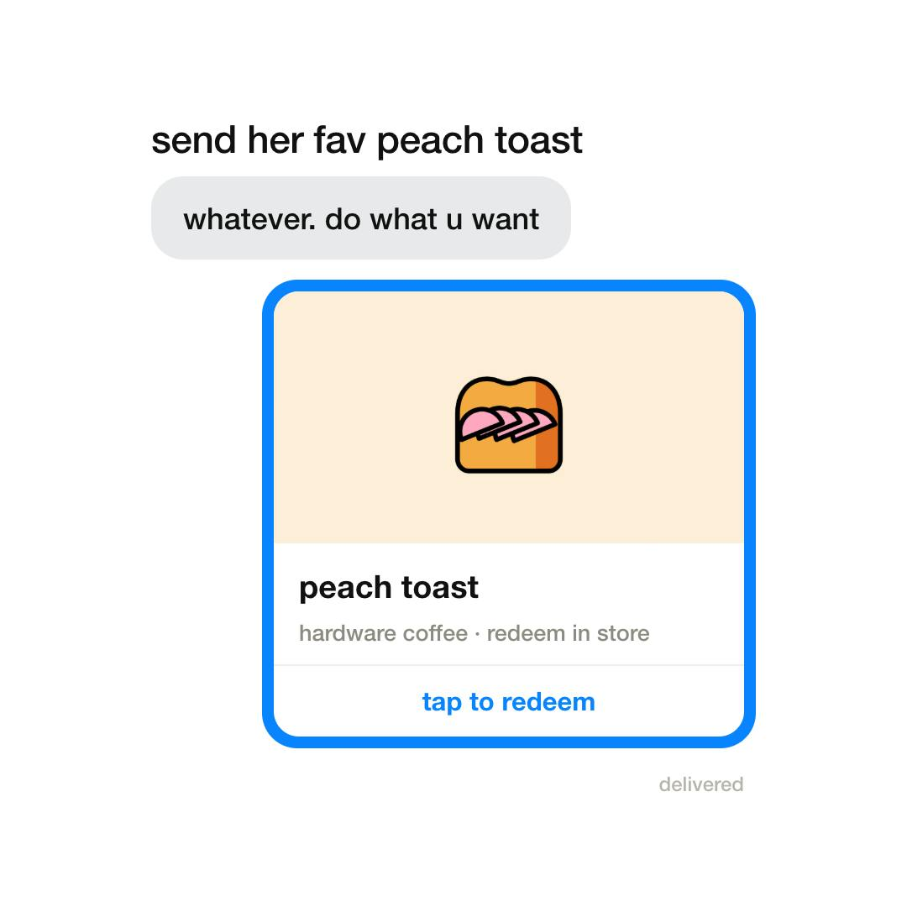

---

## 28. [WrapperExits](https://www.producthunt.com/products/wrapperexits)
**Votes**: 10 | **도입 난이도**: 하 | **신뢰도**: 상
**Tagline**: What AI wrappers actually sell for
**서비스 링크**: https://www.producthunt.com/r/SPIST23K7UHBRX

**태그**: SaaS, Business Intelligence, AI, Entrepreneurship, AI Tool

### 📌 이 서비스 한눈에 보기
실제 AI 마이크로 SaaS 매각 데이터를 통해 내 서비스의 가치를 예측하는 데이터베이스

### 🔑 주요 기능
- 135건의 실제 AI 래퍼(wrapper) 매각 사례 데이터 제공
- 매각 가격, MRR, ARR 배수, 엑싯 소요 시간, 판매 채널 등 상세 지표 포함
- 모든 거래에 대한 출처와 신뢰 수준 명시

### 🙋 사용자에게 어떤 점이 좋은가
AI 서비스를 구축하거나 매각하려는 창업자가 시장 가치를 객욱적으로 파악하고 전략을 세우는 데 도움을 줍니다.

### ✅ 지금 바로 써볼 기능
- 제공된 135개 매각 사례 데이터 분석하기
- 자신의 비즈니스 모델과 유사한 엑싯 사례 찾기
- 매각 채널 및 수익 지표 비교하기

### ⚠️ 사용 전 확인할 점
- 과거 데이터이므로 미래의 시장 가치를 보장하지 않음
- 데이터의 신뢰 수준이 사례마다 다를 수 있음

### 🧭 확인이 더 필요한 정보
각 매각 데이터의 구체적인 출처와 신뢰도 산정 기준을 확인해야 합니다.

### 📸 스크린샷 및 갤러리
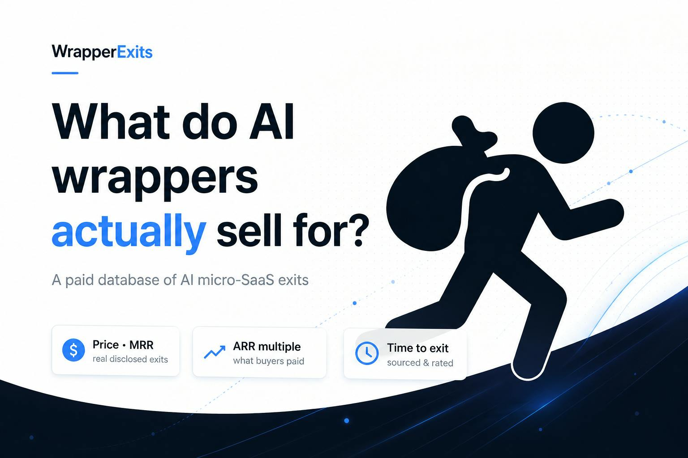
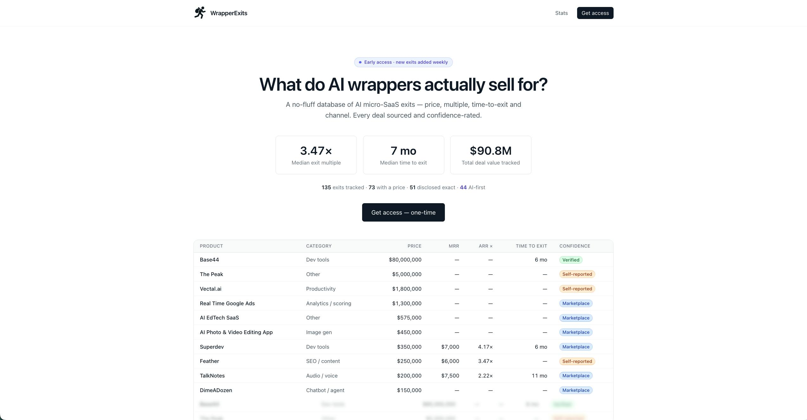
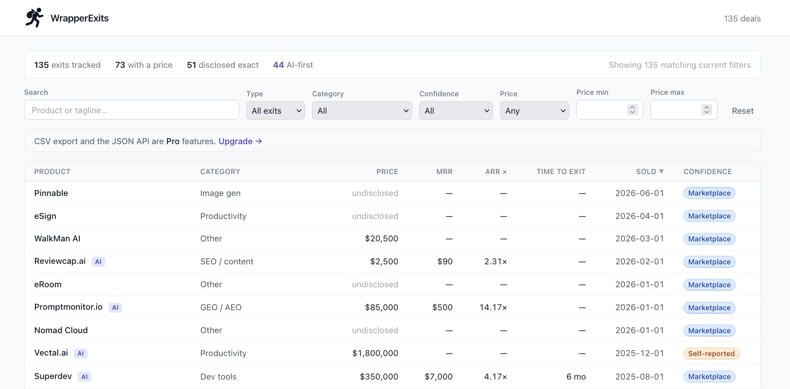

---

## 29. [BeaconFind](https://www.producthunt.com/products/beaconfind)
**Votes**: 10 | **도입 난이도**: 하 | **신뢰도**: 상
**Tagline**: Find any file by what's inside it. Private, on-device AI.
**서비스 링크**: https://www.producthunt.com/r/T3XY44GKBEZG56

**태그**: Productivity, AI, Windows, Search, Privacy, AI Tool

### 📌 이 서비스 한눈에 보기
파일 이름이 아닌 내용의 의미로 파일을 찾는 개인정보 보호 중심의 AI 검색 도구

### 🔑 주요 기능
- 파일 이름이 아닌 파일 내부의 의미(Semantic)로 검색 가능
- 100% 온디바이스 AI로 작동하여 데이터 유출 걱정 없는 프라이버시 보장
- Windows 환경에서 Ctrl+K 단축키를 통한 빠른 파일 탐색

### 🙋 사용자에게 어떤 점이 좋은가
파일 이름을 기억하지 못해도 내용만으로 원하는 파일을 즉시 찾을 수 있어 문서 작업 효율이 극대화됩니다.

### ✅ 지금 바로 써볼 기능
- Ctrl+K 단축키를 활용한 빠른 검색 테스트
- 내용 기반 검색이 얼마나 정확한지 파일 데이터로 검증
- 14일 무료 체험 기간 내 로컬 성능 확인

### ⚠️ 사용 전 확인할 점
- 온디바이스 AI 특성상 PC 사양에 따른 검색 속도 차이 발생 가능
- 14일 무료 체험 종료 후 유료 전환 필요

### 🧭 확인이 더 필요한 정보
로컬 리소스(CPU/GPU) 점유율 및 대용량 파일 인덱싱 속도에 대한 구체적인 정보가 필요합니다.

### 📸 스크린샷 및 갤러리
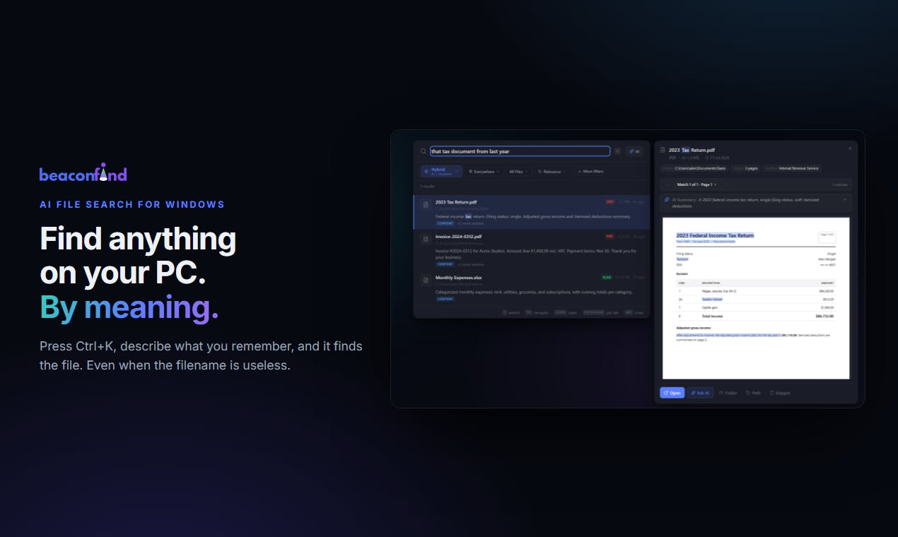
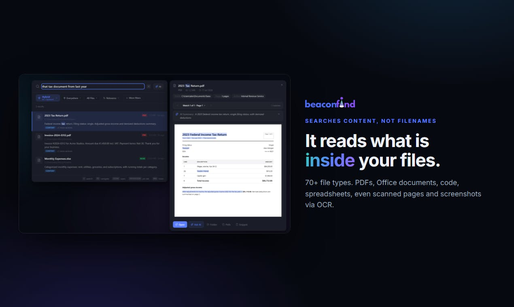
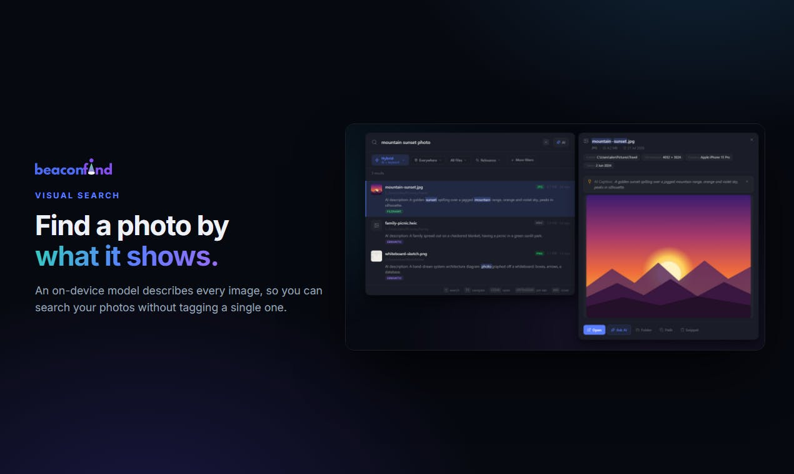

### 🎬 관련 영상
- [🎥 영상 보기](https://ph-files.imgix.net/fb6c5fad-0c99-4a1e-b0e4-372172c28391.jpeg?auto=format)

---

## 30. [Omphalis](https://www.producthunt.com/products/omphalis)
**Votes**: 10 | **도입 난이도**: 하 | **신뢰도**: 상
**Tagline**: The center of your understanding
**서비스 링크**: https://www.producthunt.com/r/GD5HYFRWORZ2SS

**태그**: KnowledgeManagement, Productivity, Learning, AI, AI Tool, Video

### 📌 이 서비스 한눈에 보기
단순 요약을 넘어 콘텐츠의 구조와 핵심을 파악하여 깊은 이해를 돕는 지식 라이브러리

### 🔑 주요 기능
- 다양한 소스(글, 팟캐스트, 영상, 문서)를 구조화된 지식으로 변환
- 단순 요약이 아닌 맥락에 기반한 어려운 개념 설명 및 구조적 시각화
- 중요한 통찰을 보존하고 서로 다른 정보 간의 연결성 제공

### 🙋 사용자에게 어떤 점이 좋은가
단순히 읽는 것을 넘어 정보를 체계적으로 구조화하고, 나중에 필요할 때 핵심 아이디어를 즉시 떠올릴 수 있게 돕습니다.

### ✅ 지금 바로 써볼 기능
- 복잡한 문서나 긴 영상을 업로드하여 구조 파악하기
- 어려운 개념이 포함된 콘텐츠를 맥락 기반 설명 기능으로 학습하기
- 수집된 정보들 사이의 연결 고리 확인하기

### ⚠️ 사용 전 확인할 점
- 단순 요약 도구와 달리 깊은 이해를 요구하므로 사용자의 능동적인 학습 태도가 필요할 수 있음
- 입력하는 소스 데이터의 품질에 따라 구조화 결과가 달라질 수 있음

### 🧭 확인이 더 필요한 정보
지원하는 파일 형식의 범위와 외부 서비스(Notion, Obsidian 등)와의 연동 여부가 명시되지 않았습니다.

### 📸 스크린샷 및 갤러리
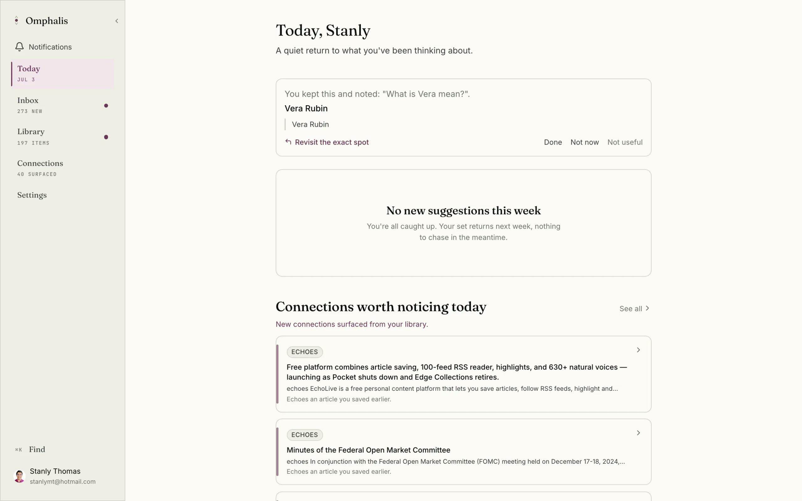

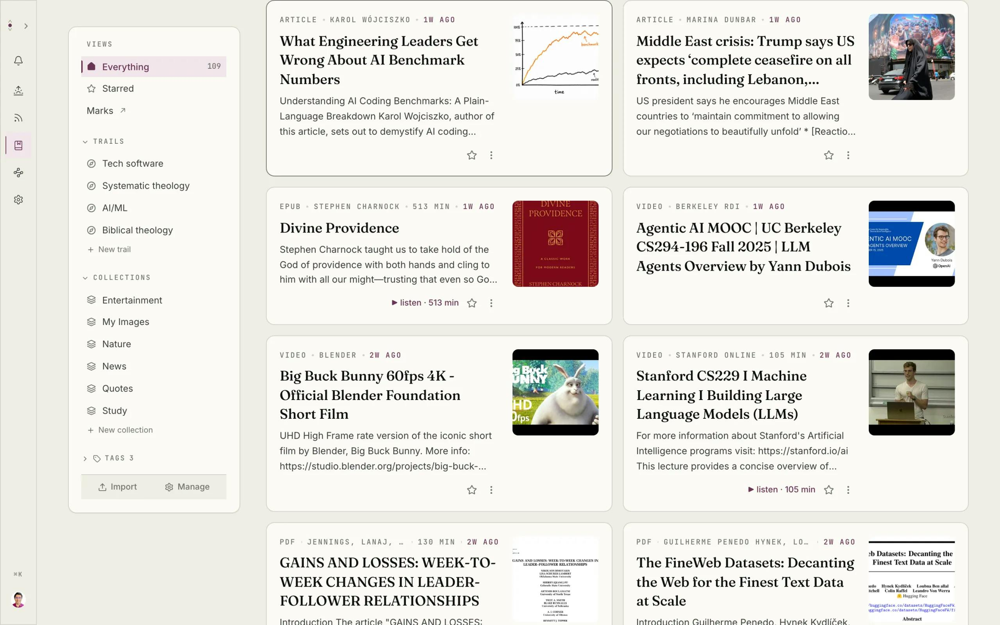

### 🎬 관련 영상
- [🎥 영상 보기](https://ph-files.imgix.net/96209f56-22ae-4683-8f26-aea076b6c6ae.jpeg?auto=format)

---

