# 🚀 Product Hunt Daily Top 30 (2026-07-26)

## 오늘의 요약
오늘의 제품들은 주로 macOS 환경에서 개발 생산성을 높이고 AI 에이전트의 워크플로우를 최적화하는 데 집중되어 있습니다. 특히 AI 모델과 로컬 환경을 연결하여 작업의 연속성을 유지하거나, 복잡한 데이터와 정보를 직관적인 인터페이스로 관리하는 도구들이 주목받았습니다.

### 오늘의 핵심 포인트
- AI 에이전트 및 코딩 도구와 연동하여 작업 내용을 자동화하고 음성이나 UI로 제어하는 생산성 도구가 강세를 보였습니다.
- 데이터 보안을 유지하면서도 AI의 효율성을 극대화하는 보안 설계와 개인정보 보호 중심의 온디바이스 솔루션이 강조되었습니다.
- 파편화된 작업 맥락을 연결하거나 시스템 UI를 활용해 정보를 즉각적으로 확인하는 지능형 유틸리티가 주목받았습니다.

**오늘의 태그**: AI Agent, macOS Productivity, Developer Tools, Automation

## 1. [Heard](https://www.producthunt.com/products/heard-2)
**Votes**: 261 | **도입 난이도**: 하 | **신뢰도**: 상
**Tagline**: Give Claude Code and Codex a voice
**서비스 링크**: https://www.producthunt.com/r/HOUL4RGO5V5BZ2

**태그**: DevTool, AI, Productivity, macOS, Agent, Automation, AI Tool

### 📌 이 서비스 한눈에 보기
에이전트 워크플로우의 결과물을 지능적인 음성 요약으로 변환해주는 macOS 보이스 레이어

### 🔑 주요 기능
- Claude Code, Codex, Cursor 등 개발 도구와 연동되는 음성 인터페이스
- 여러 터미널의 출력을 프로젝트 단위로 요약하여 혼란 방지
- 상황에 따른 가변적 알림(중요 오류 시에만 발화 또는 요약 제공)

### 🙋 사용자에게 어떤 점이 좋은가
코딩 작업 중 화면을 계속 주시하지 않아도 작업 진행 상황을 귀로 들을 수 있어, 시각적 피로를 줄이고 멀티태스킹 효율을 높여줍니다.

### ✅ 지금 바로 써볼 기능
- Claude Code 및 Cursor와 연동 설정하기
- 프로젝트 단위 요약 기능 테스트하기
- 스마트폰과 페어링하여 이동 중 사용해보기

### ⚠️ 사용 전 확인할 점
- macOS 전용 도구이므로 다른 OS에서는 사용 불가
- 개인용은 무료이나 기업용/상업적 이용 시 정책 확인 필요

### 🧭 확인이 더 필요한 정보
상세한 기업용 라이선스 정책 및 보안/개인정보 처리 방식에 대한 추가 확인이 필요합니다.

### 📸 스크린샷 및 갤러리
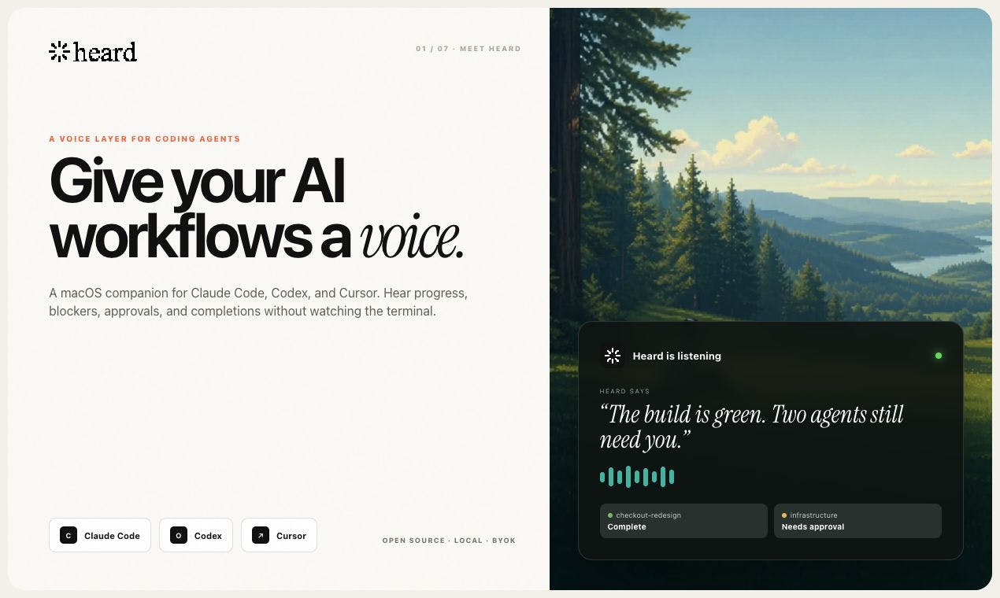
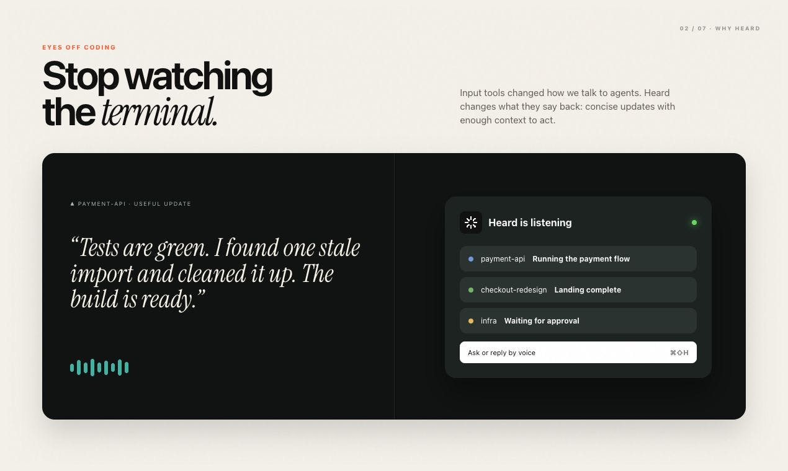
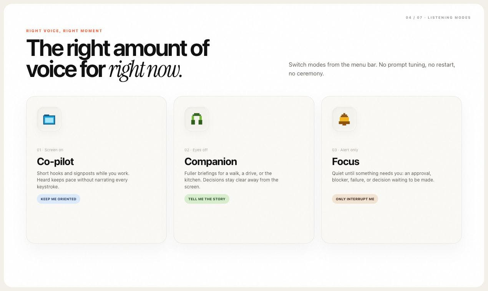

### 🎬 관련 영상
- [🎥 영상 보기](https://ph-files.imgix.net/cdd91f13-8e71-480c-9e01-2a1b11f04a6a.jpeg?auto=format)

---

## 2. [FluentDB](https://www.producthunt.com/products/fluentdb-2)
**Votes**: 250 | **도입 난이도**: 하 | **신뢰도**: 상
**Tagline**: The AI database client for Mac
**서비스 링크**: https://www.producthunt.com/r/XDHRXK2IKT3XVD

**태그**: DevTool, Database, AI, macOS, DataSecurity, AI Tool, API, Security

### 📌 이 서비스 한눈에 보기
보안과 속도를 모두 잡은 macOS 전용 AI 데이터베이스 클라이언트

### 🔑 주요 기능
- PostgreSQL, MySQL, SQLite, SQL Server 등 주요 DB 지원
- Anthropic, OpenAI, Ollama(로컬 모델) 등 다양한 AI 모델 연동
- 데이터 유출 방지를 위해 스키마만 공유하고 데이터는 보호하는 보안 설계

### 🙋 사용자에게 어떤 점이 좋은가
사용자의 API 키를 직접 사용하여 비용을 관리하며, AI가 생성한 쿼리를 직접 승인함으로써 데이터 보안과 작업 효율을 동시에 확보할 수 있습니다.

### ✅ 지금 바로 써볼 기능
- 자신의 API 키를 연결하여 AI 쿼리 생성 기능 테스트하기
- Ollama를 통한 로컬 모델 연동으로 보안 환경 구축하기
- 지원하는 데이터베이스 엔진 연결 및 스키마 시각화 확인하기

### ⚠️ 사용 전 확인할 점
- 현재 macOS 전용이므로 다른 OS 사용자는 사용이 제한됨
- AI 모델 사용 시 개인 API 키 비용이 발생할 수 있음

### 🧭 확인이 더 필요한 정보
향후 추가될 데이터베이스 엔진 종류와 상세 보안 프로토콜에 대한 정보가 더 필요합니다.

### 📸 스크린샷 및 갤러리
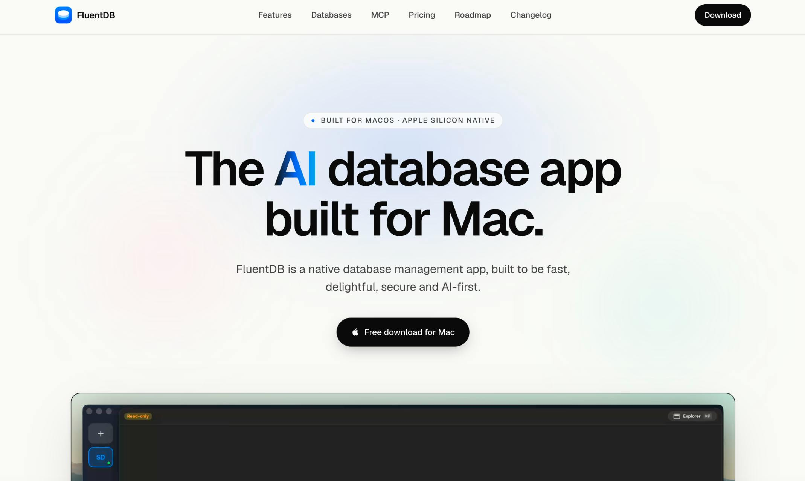
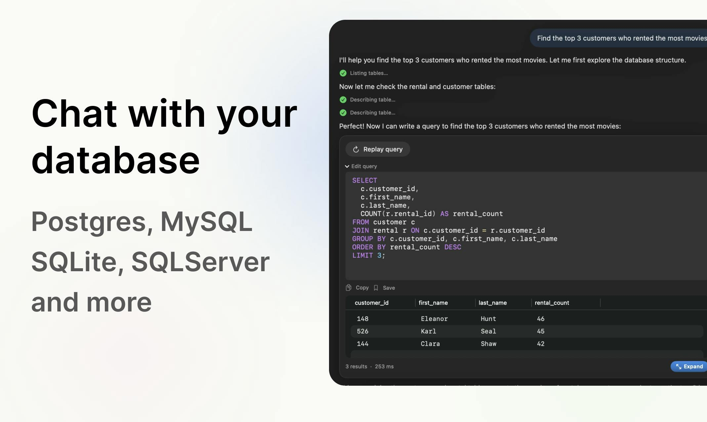
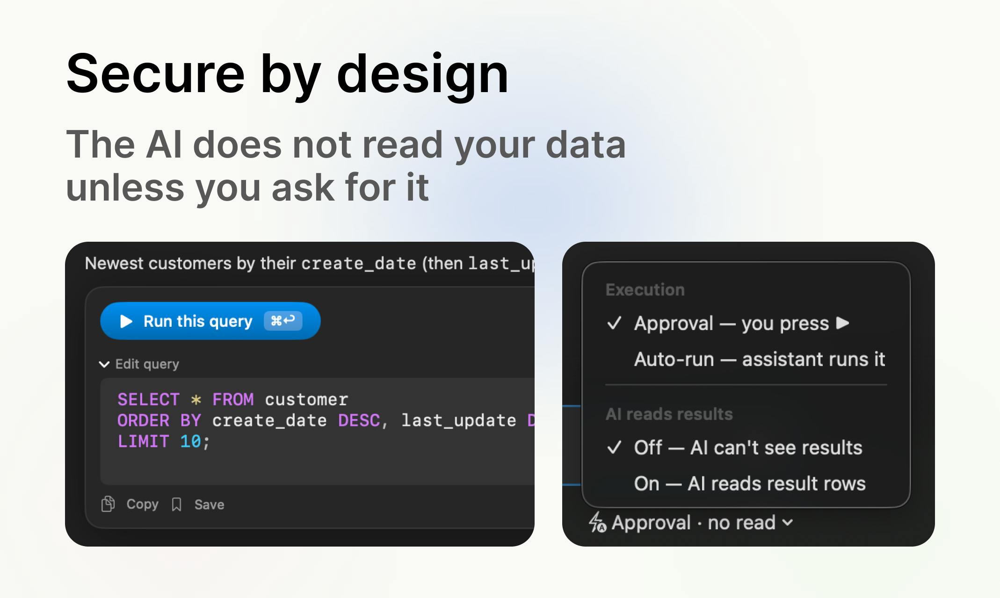

### 🎬 관련 영상
- [🎥 영상 보기](https://ph-files.imgix.net/82107c16-606f-48f4-8294-e41047f59083.jpeg?auto=format)

---

## 3. [Second Brain for Mac and Windows](https://www.producthunt.com/products/second-brain-cloudflare)
**Votes**: 209 | **도입 난이도**: 하 | **신뢰도**: 상
**Tagline**: Your AI memory, everywhere you work
**서비스 링크**: https://www.producthunt.com/r/6JNYYPRQZ2R2PT

**태그**: Productivity, AI, KnowledgeManagement, DesktopApp, AI Tool

### 📌 이 서비스 한눈에 보기
모든 AI 도구에 연결되어 지식을 자동 구축하는 데스크톱용 AI 메모리

### 🔑 주요 기능
- 터미널이나 Git 없이 5분 만에 설정 가능한 간편한 설치
- 사용하는 모든 AI 도구에 걸쳐 유지되는 영구적 메모리 제공
- 단순 최신순이 아닌 맥락에 맞는 지식 그래프 자동 구축

### 🙋 사용자에게 어떤 점이 좋은가
작업 중 발생하는 파편화된 정보를 자동으로 연결하여, 어떤 AI 도구를 쓰더라도 과거의 맥락을 즉시 불러올 수 있습니다.

### ✅ 지금 바로 써볼 기능
- 데스크톱 앱 설치 및 Cloudflare 계정 연동
- 기존 작업 데이터 동기화 및 지식 그래프 생성 확인
- 사용 중인 AI 도구들과의 메모리 연동 테스트

### ⚠️ 사용 전 확인할 점
- Mac 및 Windows 데스크톱 환경에 최적화되어 있어 모바일 환경 지원 여부 확인 필요
- Cloudflare 계정 설정 및 데이터 권한 관리에 대한 사용자 숙련도 필요

### 🧭 확인이 더 필요한 정보
현재 제공되는 구체적인 AI 도구 간의 통합 방식과 데이터 동기화 속도에 대한 상세 정보가 필요합니다.

### 📸 스크린샷 및 갤러리
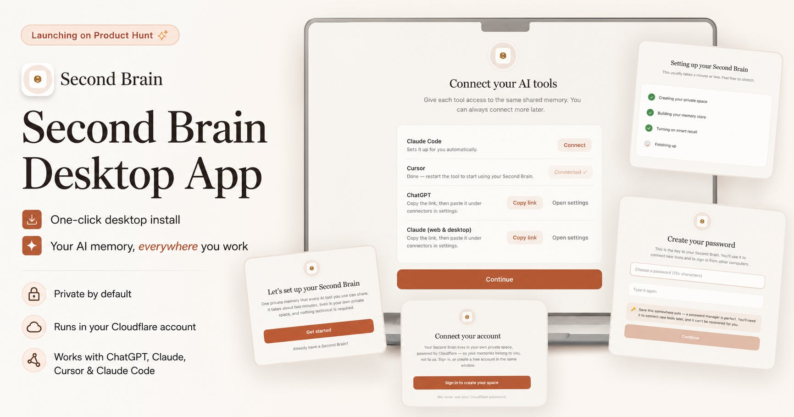

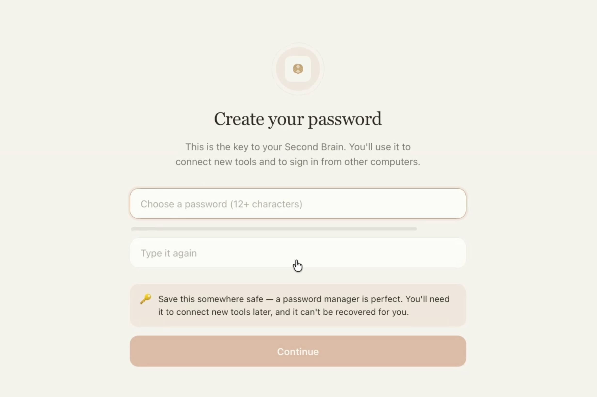

### 🎬 관련 영상
- [🎥 영상 보기](https://ph-files.imgix.net/409c26db-349f-42b5-b425-101c64d56d38.jpeg?auto=format)

---

## 4. [OpenComputer](https://www.producthunt.com/products/opencomputer)
**Votes**: 183 | **도입 난이도**: 하 | **신뢰도**: 상
**Tagline**: The easiest way to deploy a managed agent.
**서비스 링크**: https://www.producthunt.com/r/3DPB3AQPXKIGFY

**태그**: AI, Automation, NoCode, DevTool, Agent, Prompting

### 📌 이 서비스 한눈에 보기
프롬프트 입력만으로 즉시 배포 가능한 관리형 AI 에이전트 서비스

### 🔑 주요 기능
- 자연어 프롬프트를 통한 간편한 에이전트 생성
- 코딩 에이전트와 연동하여 즉시 배포 가능한 워크플로우
- 생성된 에이전트를 즉시 사용할 수 있는 라이브 URL 제공

### 🙋 사용자에게 어떤 점이 좋은가
복잡한 인프라 설정 없이 아이디어를 즉시 실행 가능한 에이전트로 구현하여 빠르게 검증할 수 있습니다.

### ✅ 지금 바로 써볼 기능
- 원하는 에이전트 동작 정의하기
- 프롬프트 입력 및 배포 프로세스 테스트
- 생성된 라이브 URL 접속 및 동작 확인

### ⚠️ 사용 전 확인할 점
- 프롬프트의 복잡도에 따른 에이전트 성능 차이 가능성
- 상세한 백엔드 관리 기능이나 커스텀 설정 범위 미확인

### 🧭 확인이 더 필요한 정보
에이전트의 구체적인 실행 환경과 관리형 서비스의 세부 기능 범위에 대한 정보가 부족합니다.

### 📸 스크린샷 및 갤러리

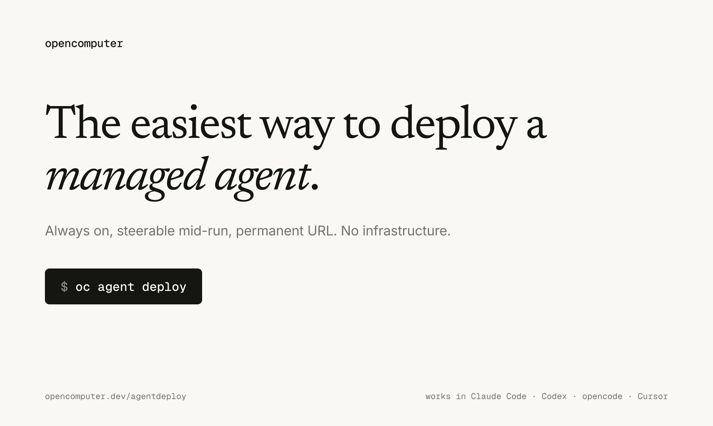
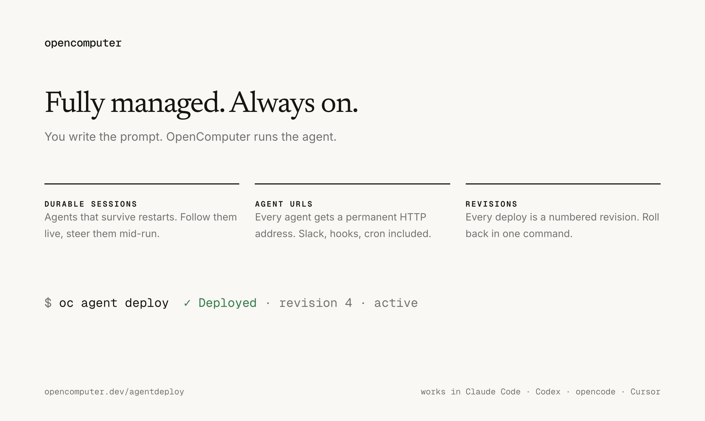

---

## 5. [Capsomnia](https://www.producthunt.com/products/capsomnia)
**Votes**: 143 | **도입 난이도**: 하 | **신뢰도**: 상
**Tagline**: Caps Lock keeps your Mac awake, even with the lid closed
**서비스 링크**: https://www.producthunt.com/r/GHQA6Z5FHKWY5F

**태그**: DevTool, Productivity, macOS, OpenSource, Agent, AI Tool

### 📌 이 서비스 한눈에 보기
맥북 덮개를 닫아도 백그라운드 작업이 중단되지 않도록 돕는 Caps Lock 기반의 절전 방지 도구

### 🔑 주요 기능
- Caps Lock 키를 물리적 스위치처럼 사용하여 맥북의 잠자기 모드를 방지
- AI 에이전트(Claude Code, Codex), SSH 세션, 빌드 및 다운로드 작업 유지에 최적화
- 계정 생성이나 텔레메트리(데이터 수집)가 없는 오픈 소스 소프트웨어

### 🙋 사용자에게 어떤 점이 좋은가
노트북 덮개를 닫아도 작업이 끊기지 않으므로, 장시간 소요되는 개발 작업이나 데이터 다운로드를 안정적으로 실행할 수 있습니다.

### ✅ 지금 바로 써볼 기능
- Caps Lock 키를 활용한 잠자기 방지 기능 활성화
- 기존 Caps Lock 단축키 사용자를 위한 대체 단축키 설정
- 덮개를 닫은 상태에서 백그라운드 작업(AI/SSH) 실행 테스트

### ⚠️ 사용 전 확인할 점
- Caps Lock 키의 원래 기능(대문자 입력)이 변경되거나 간섭을 받을 수 있음
- 덮개를 닫은 상태에서 작업 시 발열 관리 필요

### 🧭 확인이 더 필요한 정보
사용자의 하드웨어 사양이나 macOS 버전에 따른 발열 및 배터리 소모 차이는 명시되지 않았습니다.

### 📸 스크린샷 및 갤러리
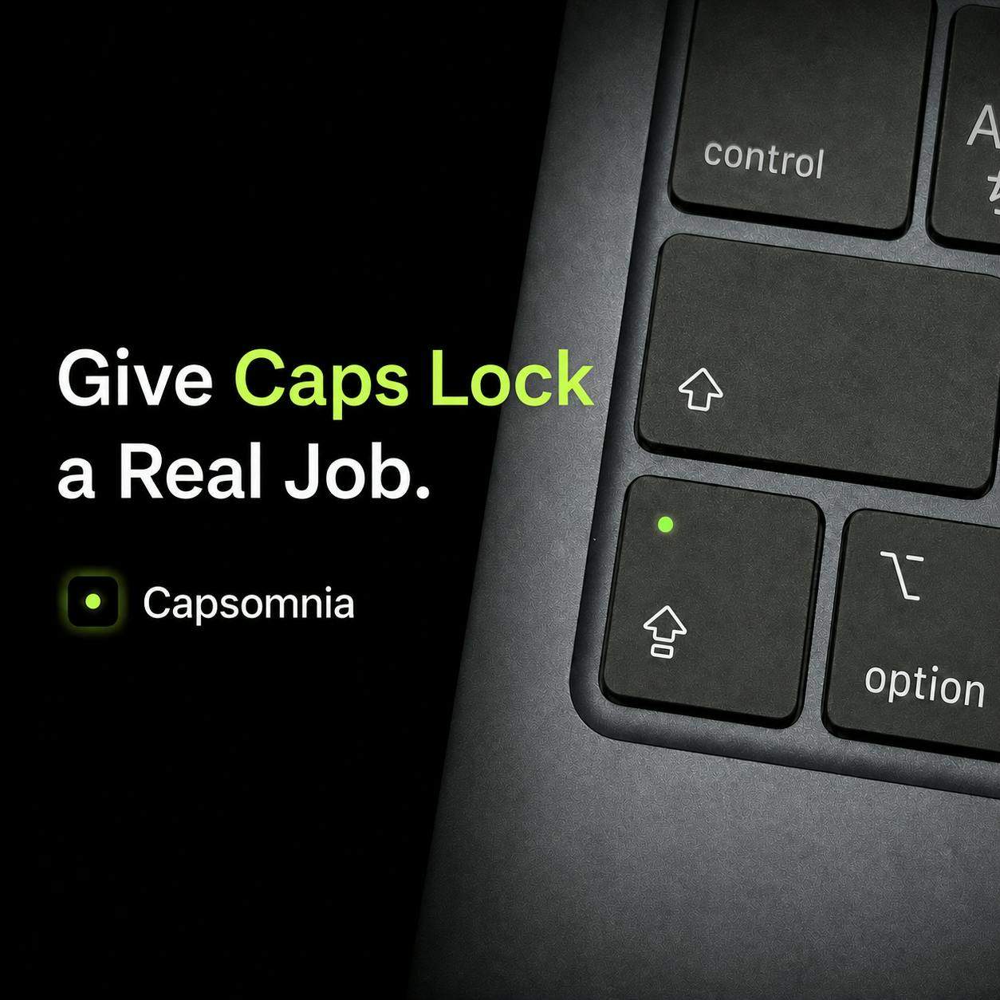

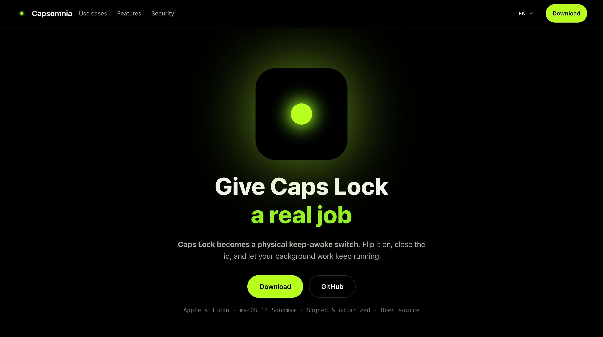

### 🎬 관련 영상
- [🎥 영상 보기](https://ph-files.imgix.net/cafb213e-d347-4306-a048-11da11294b61.jpeg?auto=format)

---

## 6. [Health in ChatGPT](https://www.producthunt.com/products/openai)
**Votes**: 129 | **도입 난이도**: 하 | **신뢰도**: 상
**Tagline**: Your personal health companion, powered by ChatGPT
**서비스 링크**: https://www.producthunt.com/r/S3VSCUPLNPUYSG

**태그**: HealthTech, AI, Personalized, Wellness, Chat

### 📌 이 서비스 한눈에 보기
ChatGPT를 통해 흩어진 건강 데이터를 하나로 모아 관리하는 개인 맞춤형 건강 비서

### 🔑 주요 기능
- 의료 기록, 건강 데이터, 웰니스 앱 통합 관리
- 개인화된 건강 인사이트 및 변화 추적
- 진료 예약 준비 및 검사 결과 이해 지원

### 🙋 사용자에게 어떤 점이 좋은가
여러 곳에 흩어진 건강 정보를 한 곳에서 관리하며, 복잡한 의료 정보를 쉽게 이해하고 건강한 습관을 만드는 데 도움을 줍니다.

### ✅ 지금 바로 써볼 기능
- 기존 건강 데이터 및 의료 기록 연결하기
- 검사 결과 해석 및 질문 리스트 만들기
- 개인 맞춤형 건강 루틴 설정하기

### ⚠️ 사용 전 확인할 점
- 민감한 의료 데이터 공유에 따른 개인정보 보호 설정 확인 필요
- AI의 분석 결과가 전문적인 의학적 진단을 대체할 수 없음

### 🧭 확인이 더 필요한 정보
데이터 보안 및 개인정보 보호가 구체적으로 어떻게 이루어지는지 확인이 필요합니다.

### 📸 스크린샷 및 갤러리

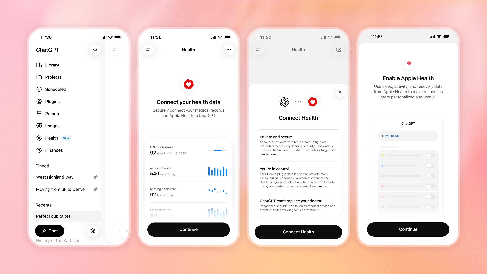
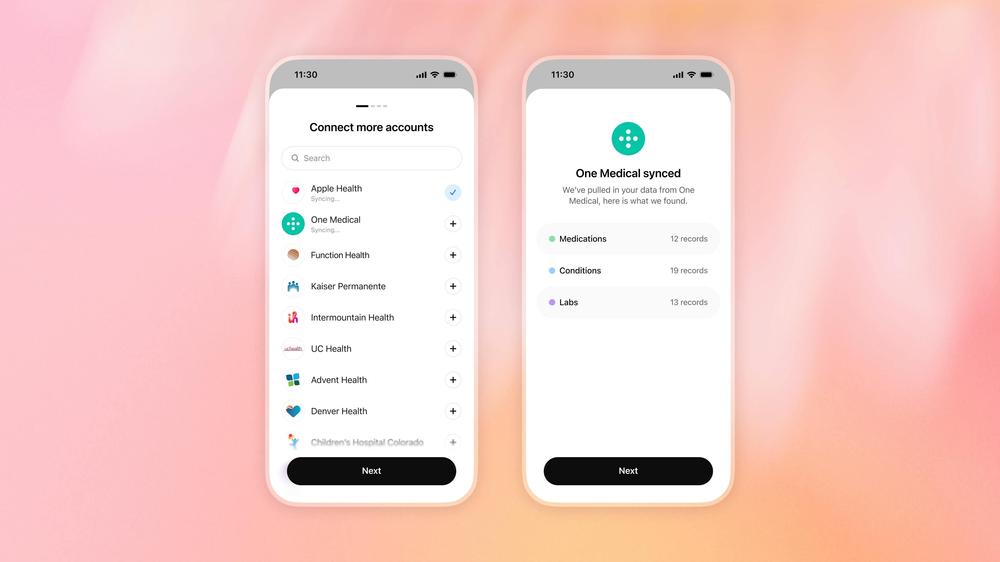

---

## 7. [Islet](https://www.producthunt.com/products/islet-2)
**Votes**: 116 | **도입 난이도**: 하 | **신뢰도**: 상
**Tagline**: iPhone's Dynamic Island, brought to your Mac's notch
**서비스 링크**: https://www.producthunt.com/r/T2XYC24IG2RGWX

**태그**: Productivity, macOS, Utility

### 📌 이 서비스 한눈에 보기
아이폰의 다이내믹 아일랜드를 맥의 노치로 가져온 직관적인 유틸리티

### 🔑 주요 기능
- 아이폰과 유사한 물리 엔진 기반의 확장/축소 애니메이션
- 볼륨, 밝기, 음악 재생 컨트롤 등 실시간 HUD 제공
- 캘린더, 날씨, 파일 드롭 트레이 등 생산성 도구 통합

### 🙋 사용자에게 어떤 점이 좋은가
정적인 노치 디자인을 넘어, 시스템 설정에 들어가지 않고도 맥의 상단 영역에서 즉각적인 제어와 정보 확인이 가능합니다.

### ✅ 지금 바로 써볼 기능
- 음악 재생 컨트롤로 즉각적인 플레이리스트 관리하기
- 파일 트레이를 활용해 드래그 앤 드롭 작업하기
- 볼륨 및 밝기 조절을 위한 실시간 HUD 활용하기

### ⚠️ 사용 전 확인할 점
- 노치 디자인이 없는 맥 모델에서는 기능 활용도가 제한될 수 있음
- 시스템 오버레이 방식이므로 다른 전체 화면 앱과의 간섭 여부 확인 필요

### 🧭 확인이 더 필요한 정보
애플 실리콘(M 시리즈) 외 인텔 맥에서의 성능 최적화 수준은 명시되지 않았습니다.

### 📸 스크린샷 및 갤러리

### 🎬 관련 영상
- [🎥 영상 보기](https://ph-files.imgix.net/ce0de2c1-e109-41d1-8443-16ba1d2414bb.jpeg?auto=format)

---

## 8. [Speechius](https://www.producthunt.com/products/speechius)
**Votes**: 112 | **도입 난이도**: 하 | **신뢰도**: 상
**Tagline**: The teleprompter that actually listens
**서비스 링크**: https://www.producthunt.com/r/D6XV5RID3EJJR3

**태그**: Productivity, Video Conferencing, Accessibility, Prompting

### 📌 이 서비스 한눈에 보기
사용자의 목소리 속도에 맞춰 실시간으로 스크립트를 스크롤하는 지능형 텔레프롬프터

### 🔑 주요 기능
- 음성 인식 기반의 자동 스크롤로 자연스러운 발표 가능
- Zoom, Meet, OBS 등 모든 화상 회의 및 녹화 도구와 호환
- 온디바이스(On-device) 처리로 개인정보 보호 및 구독 없는 일회성 결제

### 🙋 사용자에게 어떤 점이 좋은가
발표자가 대본 속도를 맞추기 위해 애쓸 필요 없이, 말하는 속도에 따라 스크립트가 유연하게 움직여 자연스러운 시선 처리를 도와줍니다.

### ✅ 지금 바로 써볼 기능
- 자신의 목소리 반응 속도 테스트하기
- 화면 공유 시 스크립트가 가려지는지 확인하기
- 주요 화상 회의 도구(Zoom/Teams)와 연동해보기

### ⚠️ 사용 전 확인할 점
- 주변 소음이 심할 경우 음성 인식 정확도가 떨어질 수 있음
- macOS 및 Windows 환경에서만 작동

### 🧭 확인이 더 필요한 정보
음성 인식 엔진의 정확도와 주변 소음 차단 성능에 대한 구체적인 기술 사양은 확인이 필요합니다.

### 📸 스크린샷 및 갤러리
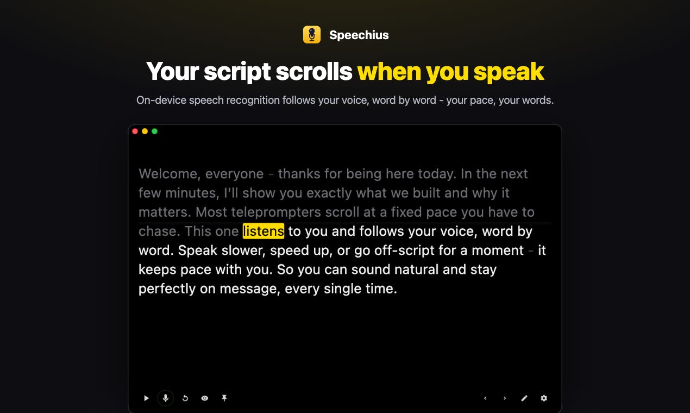
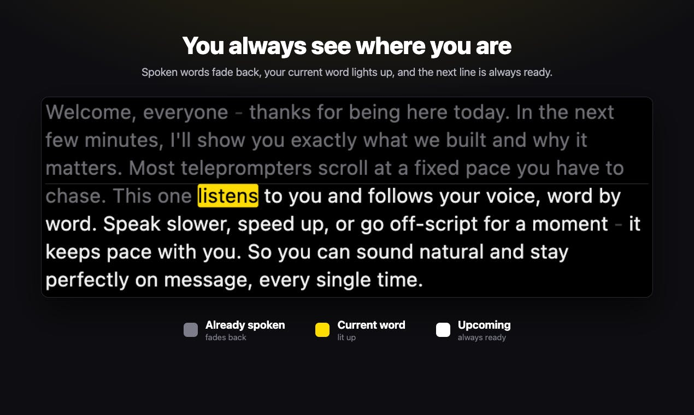
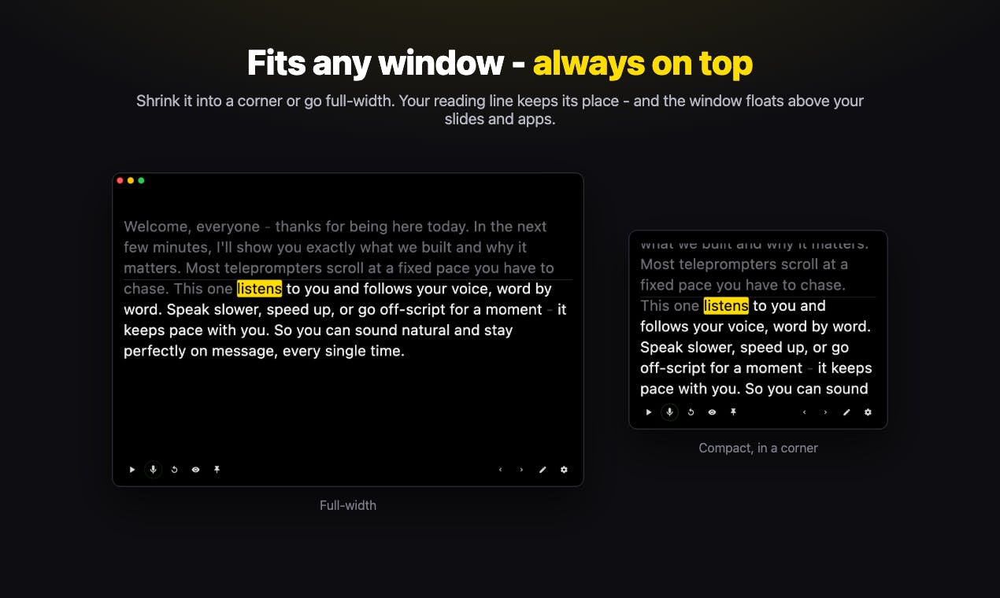

### 🎬 관련 영상
- [🎥 영상 보기](https://ph-files.imgix.net/84682b6b-76ff-4a3b-9e1a-589c8f7876a5.jpeg?auto=format)

---

## 9. [Wisprkey](https://www.producthunt.com/products/wisprkey-mac-ai-assistant)
**Votes**: 98 | **도입 난이도**: 하 | **신뢰도**: 상
**Tagline**: Talk to any app on your Mac
**서비스 링크**: https://www.producthunt.com/r/DIHCSXXHR6I43G

**태그**: Productivity, Voice-to-Text, Mac, Automation

### 📌 이 서비스 한눈에 보기
어떤 앱에서도 자유롭게 타이핑할 수 있는 고정밀 Mac용 음성 입력 도구

### 🔑 주요 기능
- Mac 전용 무료 음성 타이핑 앱
- 98%의 높은 정확도 제공
- 31개 언어 지원 및 글로벌 단축키 설정 가능

### 🙋 사용자에게 어떤 점이 좋은가
키보드 대신 목소리로 텍스트를 입력할 수 있어 작업 흐름을 끊지 않고 다양한 앱에서 빠르게 타이핑할 수 있습니다.

### ✅ 지금 바로 써볼 기능
- 글로벌 단축키 설정하여 바로 사용하기
- 31개 지원 언어 중 본인 주력 언어 확인하기

### ⚠️ 사용 전 확인할 점
- Mac 전용 앱이므로 다른 OS에서는 사용 불가
- 음성 인식 특성상 주변 소음에 영향을 받을 수 있음

### 🧭 확인이 더 필요한 정보
무료 버전의 기능 제한이나 향hen 유료 플랜 전환 여부에 대한 정보가 명시되지 않았습니다.

### 📸 스크린샷 및 갤러리

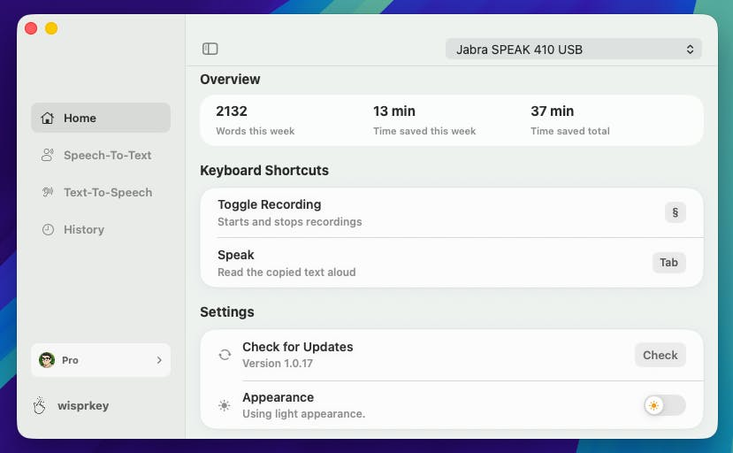
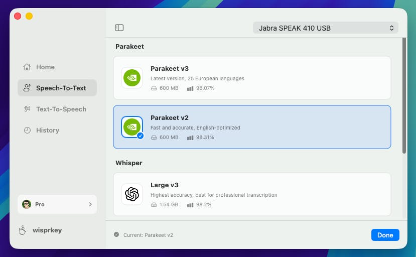

---

## 10. [ShellMate](https://www.producthunt.com/products/shellmate-2)
**Votes**: 93 | **도입 난이도**: 하 | **신뢰도**: 상
**Tagline**: The SSH workspace you'll actually enjoy using
**서비스 링크**: https://www.producthunt.com/r/W5KSNMJBWVXXT5

**태그**: DevTool, SSH, Productivity, DevOps, AI Tool, LLM

### 📌 이 서비스 한눈에 보기
탭, 분할 터미널, AI 기능을 갖춘 현대적인 데스크톱 SSH 워크스페이스

### 🔑 주요 기능
- 탭 및 분할 터미널을 지원하는 멀티 서버 관리 환경
- SFTP, 스니펫, 세션 공유 기능을 통합한 올인원 워크스페이스
- Windows, macOS, Linux를 지원하는 네이티브 데스크톱 앱

### 🙋 사용자에게 어떤 점이 좋은가
여러 서버를 관리하는 개발자와 DevOps 엔지니어가 복잡한 터미널 환경을 직관적이고 효율적으로 통합 관리할 수 있습니다.

### ✅ 지금 바로 써볼 기능
- 개인 사용자를 위한 무료 버전 설치 및 기본 기능 테스트
- SFTP 및 스니펫 기능을 활용한 워크플로우 최적화
- 팀 협업을 위한 세션 공유 기능 검토

### ⚠️ 사용 전 확인할 점
- AI 기능은 무료 버전에서 제공되지 않으며 유료 플랜이 필요함
- 팀 협업 및 고급 기능 사용 시 비용 발생 가능성

### 🧭 확인이 더 필요한 정보
AI 기능의 구체적인 성능과 팀 플랜의 상세 가격 정책에 대한 확인이 필요합니다.

### 📸 스크린샷 및 갤러리
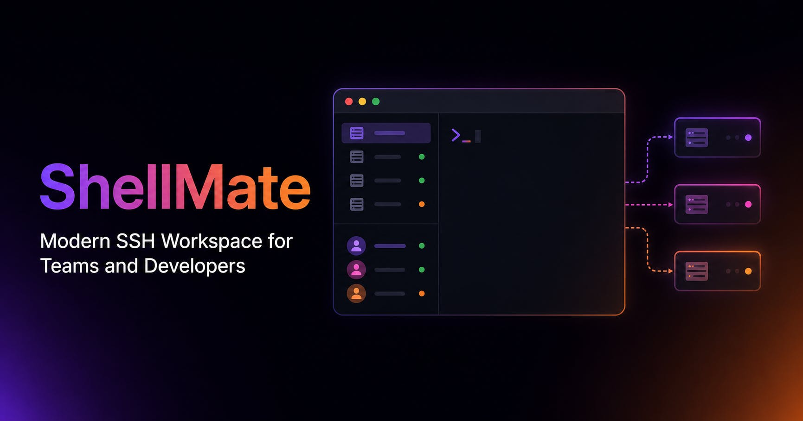
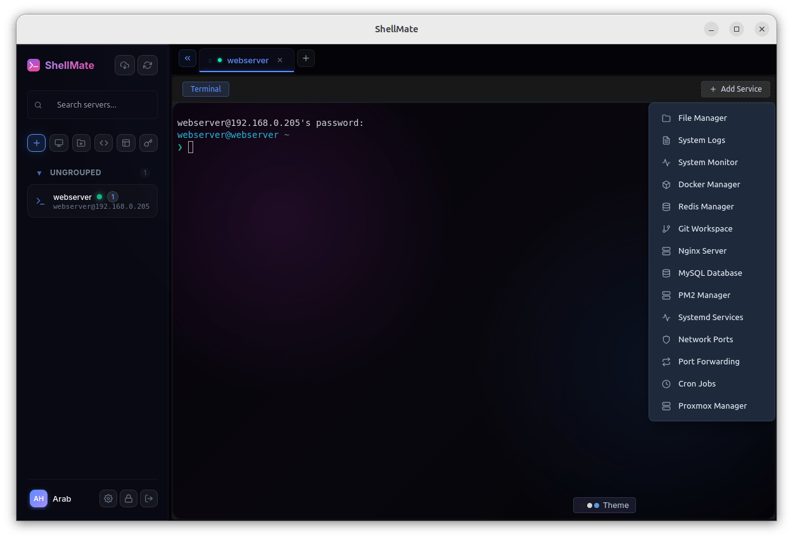
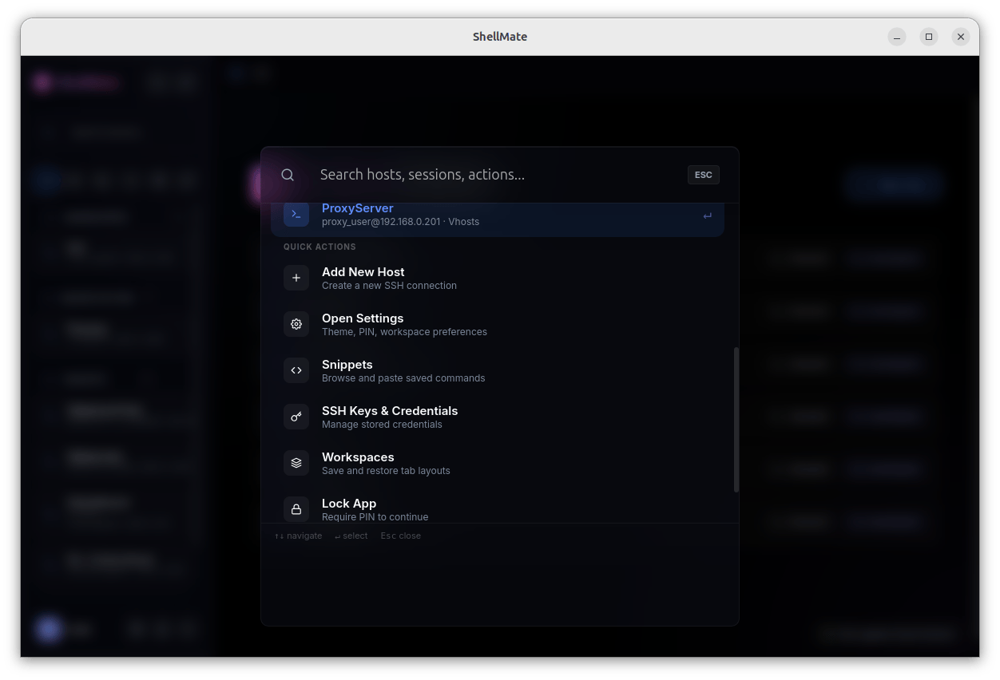

### 🎬 관련 영상
- [🎥 영상 보기](https://ph-files.imgix.net/8639339d-82a9-4b1c-a62e-eef98b46da69.jpeg?auto=format)

---

## 11. [Velane](https://www.producthunt.com/products/velane)
**Votes**: 90 | **도입 난이도**: 중 | **신뢰도**: 상
**Tagline**: Cloud for your AI Agent's tools and functions
**서비스 링크**: https://www.producthunt.com/r/7MNK32LQMZQ3P2

**태그**: AI-Agent, DevTools, Automation, Cloud, Agent, AI Tool, DevTool

### 📌 이 서비스 한눈에 보기
AI 에이전트를 위한 통합 툴킷 및 실행 환경 플랫폼

### 🔑 주요 기능
- AI 에이전트(Claude, Cursor 등) 중심의 제어 환경 제공
- 콜드 스타트 없는 코드 샌드박스 및 버전 관리 기능
- 800개 이상의 통합을 통한 iPaaS 대체 가능성

### 🙋 사용자에게 어떤 점이 좋은가
AI 에이전트가 직접 코드를 실행하고 외부 서비스를 제어할 수 있는 안전하고 체계적인 환경을 제공합니다.

### ✅ 지금 바로 써볼 기능
- 코드 샌드박스 환경 테스트
- 사용 중인 AI 에이전트와 연동
- 필요한 외부 서비스 통합 확인

### ⚠️ 사용 전 확인할 점
- 에이전트에게 부여되는 권한 및 보안 제어 방식 확인 필요
- 복잡한 워크플로우에서의 안정성 검증 필요

### 🧭 확인이 더 필요한 정보
에이전트가 제어하는 환경에서의 보안 격리 수준과 비용 구조에 대한 상세 정보가 필요합니다.

### 📸 스크린샷 및 갤러리
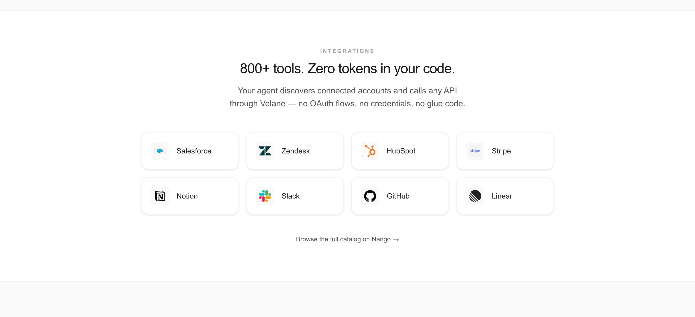
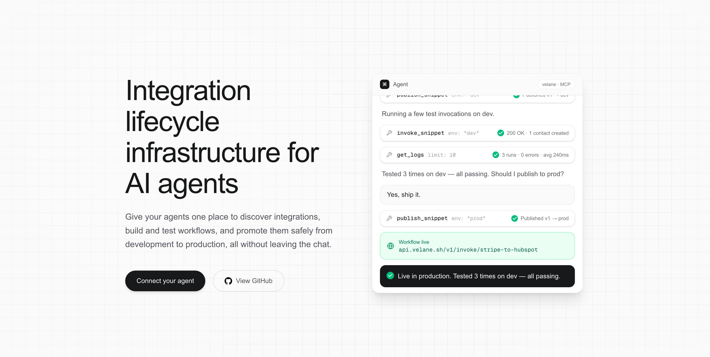
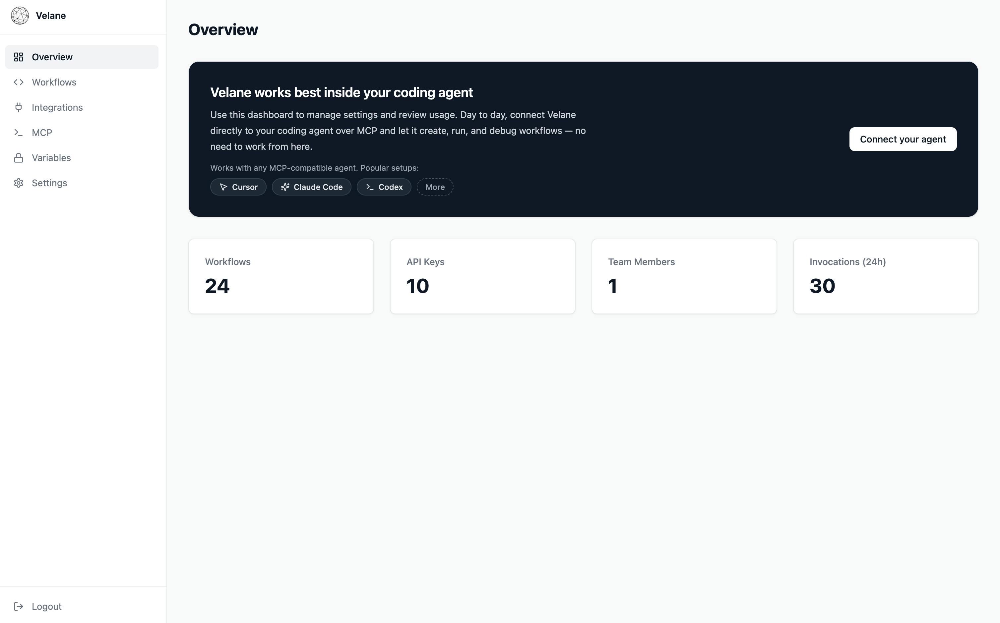

### 🎬 관련 영상
- [🎥 영상 보기](https://ph-files.imgix.net/0fe47773-8c3e-4733-a130-ddbce59ca576.jpeg?auto=format)

---

## 12. [Seller by Facebook](https://www.producthunt.com/products/seller-by-facebook)
**Votes**: 89 | **도입 난이도**: 하 | **신뢰도**: 상
**Tagline**: The easiest way to sell on Facebook Marketplace
**서비스 링크**: https://www.producthunt.com/r/NKU6COCU3O25DQ

**태그**: E-commerce, Automation, Sales Management, AI, AI Tool

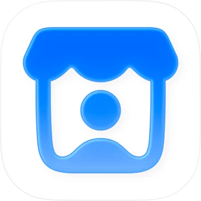

### 📌 이 서비스 한눈에 보기
AI를 활용해 페이스북 마켓플레이스 판매를 효율적으로 관리하는 통합 솔루션

### 🔑 주요 기능
- AI 기반의 빠른 상품 등록 기능
- 통합 인박스를 통한 구매자 대화 관리
- 재고 추적 및 판매 성과 분석 기능

### 🙋 사용자에게 어떤 점이 좋은가
여러 명의 구매자와 대화하고 상품을 관리하는 번거로움을 줄여 판매 운영 효율을 극대화할 수 있습니다.

### ✅ 지금 바로 써볼 기능
- AI로 상품 리스팅 생성해보기
- 통합 인박스에서 구매자 메시지 확인하기
- 재고 관리 기능 설정하기

### ⚠️ 사용 전 확인할 점
- 페이스북 마켓플레이스 플랫폼과의 연동 안정성 확인 필요
- AI 생성 콘텐츠의 정확성 검토 필요

### 🧭 확인이 더 필요한 정보
페이스북 계정과의 직접적인 API 연동 방식 및 보안 정책에 대한 상세 정보가 필요합니다.

### 📸 스크린샷 및 갤러리

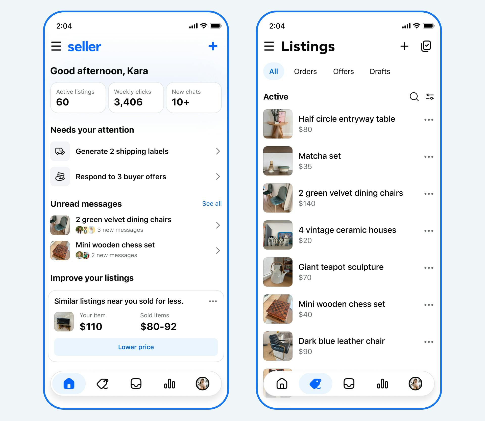
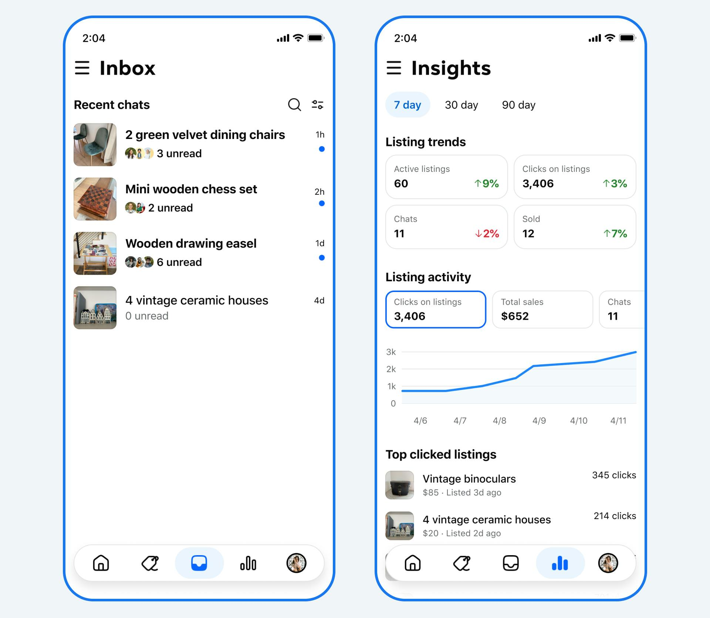

---

## 13. [ADE](https://www.producthunt.com/products/ade-agentic-development-environment)
**Votes**: 84 | **도입 난이도**: 하 | **신뢰도**: 상
**Tagline**: All your coding agents, synced everywhere, free forever
**서비스 링크**: https://www.producthunt.com/r/CVTPZXGPW5JEJD

**태그**: DevTool, Productivity, OpenSource, Automation, Agent, Chat

### 📌 이 서비스 한눈에 보기
기존 코딩 구독 서비스를 모든 기기에서 동기화하여 사용하는 오픈소스 에이전트 통합 플랫폼

### 🔑 주요 기능
- 웹, 데스크톱, 터미널, 모바일 등 모든 환경 지원
- 기존에 결제 중인 코딩 구독 서비스를 그대로 활용
- 모든 기기 간 실시간 채팅 및 작업 상태 동기화

### 🙋 사용자에게 어떤 점이 좋은가
장소나 기기에 구애받지 않고 작업 흐름을 이어갈 수 있어, 이동 중에도 코딩 에이전트와 대화를 이어가며 생산성을 유지할 수 있습니다.

### ✅ 지금 바로 써볼 기능
- 기존 코딩 구독 계정 연결하기
- 데스크톱 및 모바일 앱 설치하여 동기화 확인하기
- 터미널 환경에서 에이전트 실행해보기

### ⚠️ 사용 전 확인할 점
- 사용 중인 외부 코딩 서비스의 API/계정 보안 정책 확인 필요
- 오픈소스 프로젝트이므로 서비스 안정성 및 업데이트 속도 확인 필요

### 🧭 확인이 더 필요한 정보
기존 구독 서비스들이 ADE를 통해 어떤 방식으로 연동되는지에 대한 기술적 세부 사항 확인이 필요합니다.

### 📸 스크린샷 및 갤러리
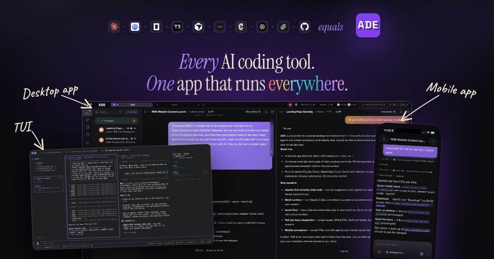
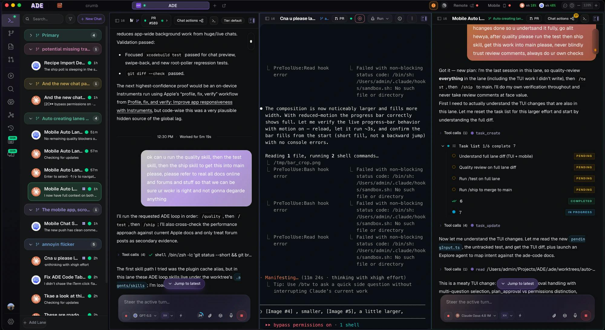
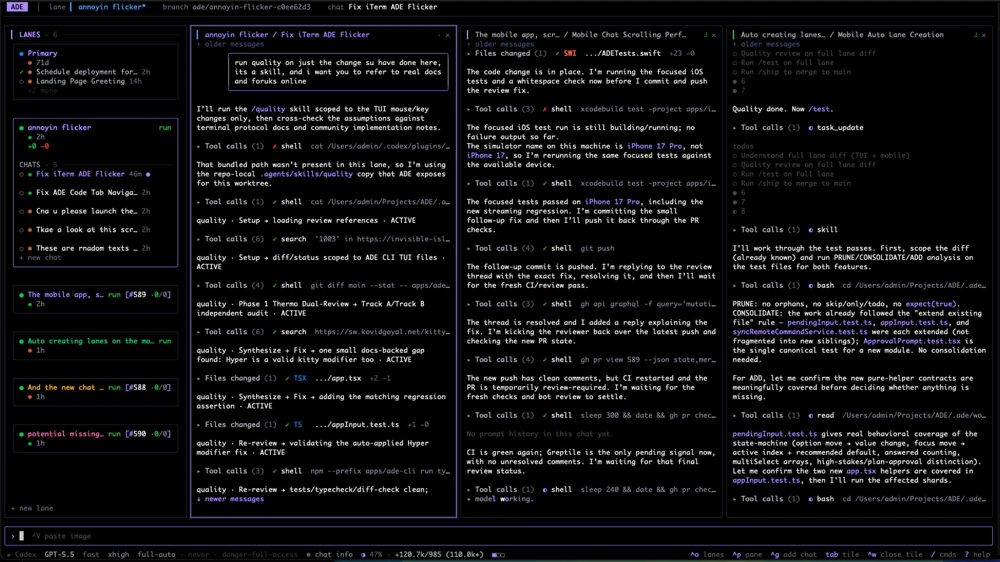

### 🎬 관련 영상
- [🎥 영상 보기](https://ph-files.imgix.net/4de3765c-2b17-417b-9d75-2641b8628c6c.jpeg?auto=format)

---

## 14. [Browser FX:](https://www.producthunt.com/products/browser-fx-chrome-audio-effects-midi)
**Votes**: 82 | **도입 난이도**: 하 | **신뢰도**: 상
**Tagline**: Transform your web audio with real-time effects
**서비스 링크**: https://www.producthunt.com/r/5BIVGBUDYBX7XD

**태그**: Audio, Browser Extension, Creative Tool, Music

### 📌 이 서비스 한눈에 보기
브라우저 탭의 오디오를 실시간으로 변형하는 프로급 오디오 이펙트 도구

### 🔑 주요 기능
- 브라우저 내 모든 탭의 오디오를 실시간으로 캡처 및 처리
- 스튜디오 스타일의 노브를 통한 직관적인 오디오 이펙트 제어
- MIDI 컨트롤러 연동 및 오디오 반응형 시매틱(Cymatic) 시각화 지원

### 🙋 사용자에게 어떤 점이 좋은가
웹에서 듣는 모든 소리를 사용자의 취향에 맞게 실시간으로 튜닝할 수 있어, 음악 감상이나 창작 작업의 몰입감을 높여줍니다.

### ✅ 지금 바로 써볼 기능
- 브라우저 탭 오디오 캡처 기능 테스트
- MIDI 컨트롤러를 연결하여 하드웨어 제어 경험하기
- 시각화 도구와 함께 오디오 이펙트 적용해보기

### ⚠️ 사용 전 확인할 점
- 브라우저 리소스(CPU/RAM) 사용량 확인 필요
- 특정 웹사이트의 오디오 출력 정책에 따른 캡처 제한 가능성

### 🧭 확인이 더 필요한 정보
지원하는 구체적인 오디오 이펙트 종류와 브라우저 호환 범위를 확인해야 합니다.

### 📸 스크린샷 및 갤러리
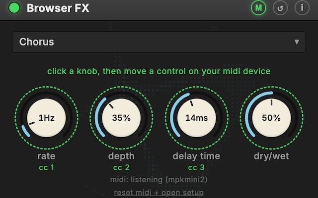
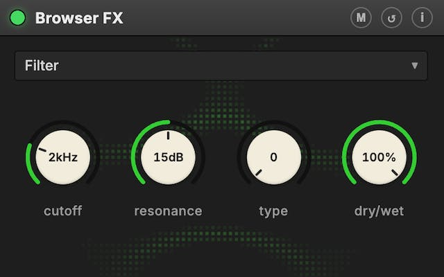
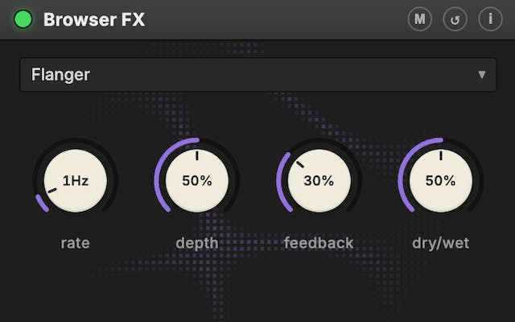

### 🎬 관련 영상
- [🎥 영상 보기](https://ph-files.imgix.net/bb9362d5-0b22-4c02-961e-1cca9d10f17d.jpeg?auto=format)

---

## 15. [Speech To Markdown](https://www.producthunt.com/products/speech-to-markdown)
**Votes**: 81 | **도입 난이도**: 하 | **신뢰도**: 상
**Tagline**: Harness local AI for notes
**서비스 링크**: https://www.producthunt.com/r/JW66HPJEVXDO4R

**태그**: Productivity, AI, macOS, iOS, Privacy, AI Tool, LLM, API

### 📌 이 서비스 한눈에 보기
개인정보 유출 걱정 없이 로컬 AI로 음성을 구조화된 마크다운 노트로 변환하는 도구

### 🔑 주요 기능
- 로컬 LLM 기반의 강력한 보안 및 프라이버시 보호
- 단축키(⌘⌥])를 통한 어디서든 가능한 글로벌 받아쓰기
- 실시간 마크다운 편집 및 AI를 통한 즉각적인 문서 구조화

### 🙋 사용자에게 어떤 점이 좋은가
클라우드나 API 키 설정 없이 맥북 자체 자원만 사용하여 안전하고 빠르게 음성 메모를 정돈된 문서로 바꿀 수 있습니다.

### ✅ 지금 바로 써볼 기능
- 단축키(⌘⌥])를 설정하여 시스템 전역에서 받아쓰기 실행하기
- 음성 입력을 통해 즉석에서 마크다운 문서 생성해보기
- 실시간 편집 기능을 통해 AI가 정리한 내용을 검토 및 수정하기

### ⚠️ 사용 전 확인할 점
- 로컬 LLM 구동을 위한 Mac의 하드웨어 사양(CPU/GPU) 영향 확인 필요
- 애플 기기(macOS, iOS) 환경에서만 사용 가능

### 🧭 확인이 더 필요한 정보
로컬 모델 구동 시 하드웨어 성능에 따른 처리 속도 차이가 있을 수 있습니다.

### 📸 스크린샷 및 갤러리
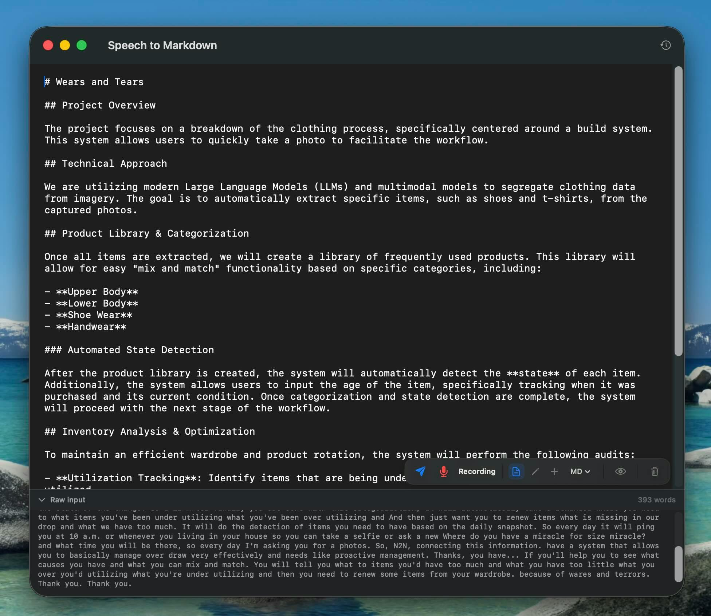
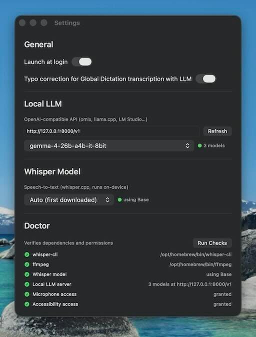
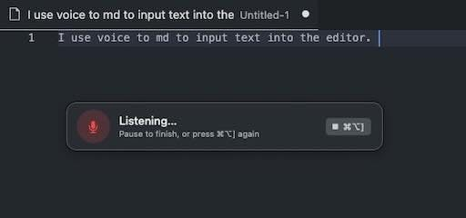

---

## 16. [Banquish — Make the web your workspace](https://www.producthunt.com/products/banquish-make-the-web-your-workspace)
**Votes**: 79 | **도입 난이도**: 하 | **신뢰도**: 상
**Tagline**: Clip living pieces of the web onto one canvas
**서비스 링크**: https://www.producthunt.com/r/F7GR7CVSVXV2QH

**태그**: Productivity, Automation, MacApp, Workflow, Agent

### 📌 이 서비스 한눈에 보기
웹사이트의 필요한 요소들을 하나의 캔버스에 모아 실시간 워크스페이스로 만드는 Mac 앱

### 🔑 주요 기능
- 웹 페이지의 특정 부분을 캔버스로 가져와 작업 공간 구축
- 가져온 데이터/요소를 실시간(Live) 상태로 유지
- 에이전트를 활용한 자동화 작업 지원

### 🙋 사용자에게 어떤 점이 좋은가
여러 웹사이트를 오가는 번거로움 없이 필요한 정보만 한곳에 모아 관리할 수 있어 작업 효율이 높아집니다.

### ✅ 지금 바로 써볼 기능
- 웹 페이지의 핵심 요소들을 캔버스로 클립하기
- 실시간 데이터가 유지되는지 확인하기
- 에이전트 기능을 활용해 반복 작업 시도하기

### ⚠️ 사용 전 확인할 점
- Mac 전용 앱이므로 다른 OS 사용자는 사용 불가
- 웹사이트 구조 변경 시 클립된 요소의 레이아웃이 깨질 가능성

### 🧭 확인이 더 필요한 정보
에이전트가 수행할 수 있는 구체적인 작업 범위와 자동화 수준에 대한 정보가 부족합니다.

### 📸 스크린샷 및 갤러리

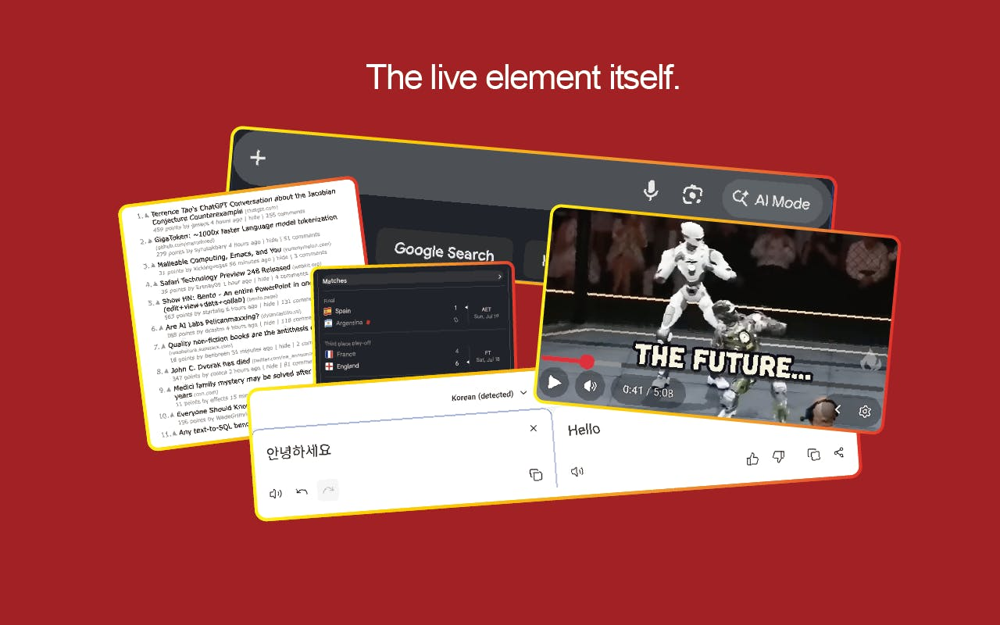

### 🎬 관련 영상
- [🎥 영상 보기](https://ph-files.imgix.net/4429a66f-1746-4e62-8537-366a7539973a.jpeg?auto=format)

---

## 17. [ClipStudios.AI](https://www.producthunt.com/products/clipstudios)
**Votes**: 36 | **도입 난이도**: 하 | **신뢰도**: 상
**Tagline**: 15+ AI video models, one subscription — credits roll over
**서비스 링크**: https://www.producthunt.com/r/26BBX5FMLQUQ5Y

**태그**: AI-Video, Content-Creation, Creative-Tools, AI Tool, Prompting, Video

### 📌 이 서비스 한눈에 보기
15개 이상의 최신 AI 비디오 모델을 하나의 구독으로 이용하는 통합 영상 제작 플랫폼

### 🔑 주요 기능
- Kling, Veo, Runway 등 15개 이상의 다양한 AI 비디오 모델 통합 제공
- 잔여 크레딧이 이월되는 합리적인 구독 모델
- C2PA 서명을 통한 영상 출처 및 위변조 방지(Provenance) 지원

### 🙋 사용자에게 어떤 점이 좋은가
여러 AI 모델을 개별 구독할 필요 없이 하나의 계정으로 편리하게 교차 테스트하고 영상 제작이 가능합니다.

### ✅ 지금 바로 써볼 기능
- 원하는 스타일의 비디오 모델 선택 및 프롬프트 테스트
- Script Studio와 Voice Studio를 활용한 대본 및 음성 생성
- 무료 티어를 통한 기본 기능 및 모델 품질 확인

### ⚠️ 사용 전 확인할 점
- 외부 툴로 편집 시 C2PA 서명이 유지되지 않을 수 있음
- 사용하는 모델에 따라 생성 품질 및 스타일 차이 발생 가능

### 🧭 확인이 더 필요한 정보
각 모델별 크레딧 소모량과 구체적인 생성 제한 사항은 확인이 필요합니다.

### 📸 스크린샷 및 갤러리
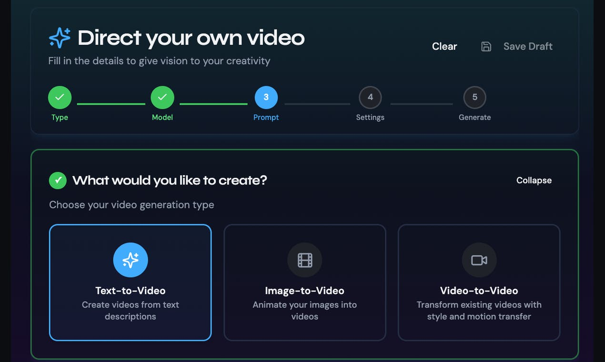
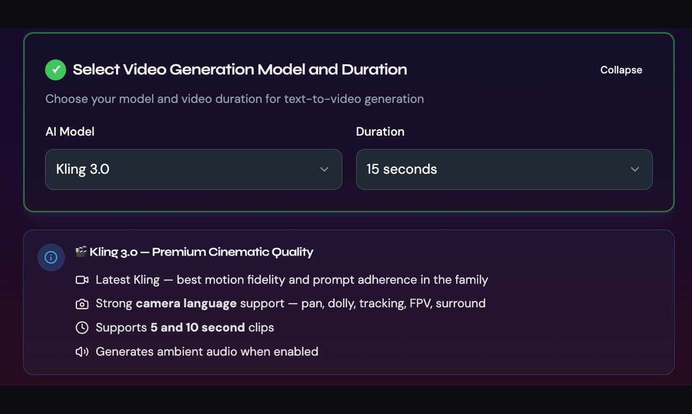
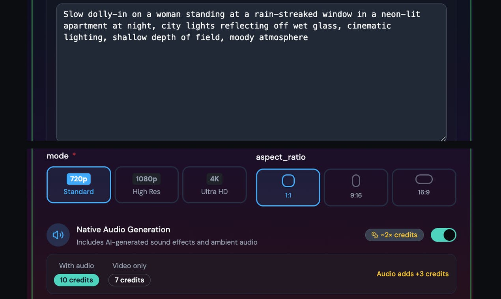

### 🎬 관련 영상
- [🎥 영상 보기](https://ph-files.imgix.net/6e08a718-68a8-4dc2-b838-870854bc40bf.jpeg?auto=format)

---

## 18. [Drifty - Context Aware AI Time Tracker](https://www.producthunt.com/products/drifty-auto-ai-time-tracker)
**Votes**: 29 | **도입 난이도**: 하 | **신뢰도**: 상
**Tagline**: Bring Visibility to your Focus
**서비스 링크**: https://www.producthunt.com/r/7GWDGGNDYV67CY

**태그**: Productivity, AI, Mac, TimeTracking, Automation, AI Tool

### 📌 이 서비스 한눈에 보기
수동 기록 없이 AI가 업무 맥락을 파악하여 집중도를 관리해주는 Mac용 타임 트래커

### 🔑 주요 기능
- 수동 타이머 조작 없는 자동 업무 기록
- AI 기반의 업무 맥락 파악 및 집중/방해 요소 구분
- 개인정보 보호를 위한 로컬 실행 및 데이터 시각화

### 🙋 사용자에게 어떤 점이 좋은가
직접 시간을 기록하는 번거로움 없이 자신의 업무 패턴을 시각적으로 확인하고, 집중력이 흐트러질 때 적절한 피드백을 받을 수 있습니다.

### ✅ 지금 바로 써볼 기능
- 자동 기록 기능으로 하루 업무 흐름 파악하기
- AI가 분류한 집중/방해 시간 대조해보기
- 집중 유지를 위한 알림 설정 활용하기

### ⚠️ 사용 전 확인할 점
- Mac 전용 앱이므로 macOS 환경이 필수임
- AI가 맥락을 판단하는 과정에서 사용자의 의도와 다르게 분류될 가능성 있음

### 🧭 확인이 더 필요한 정보
상세한 데이터 동기화 방식 및 클라우드 사용 시의 보안 정책에 대한 추가 확인이 필요합니다.

### 📸 스크린샷 및 갤러리
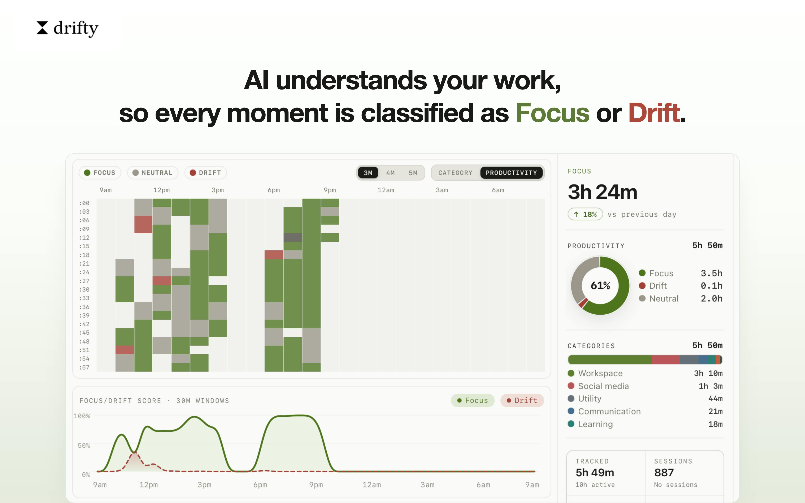
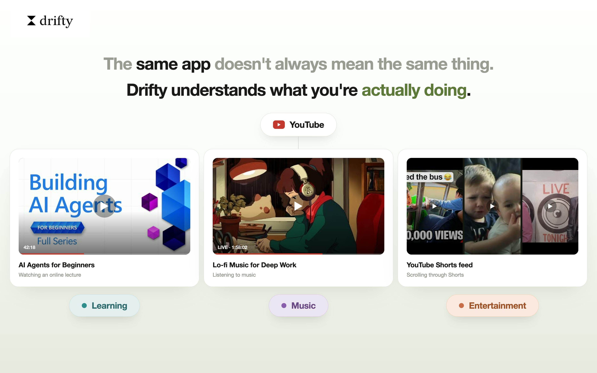
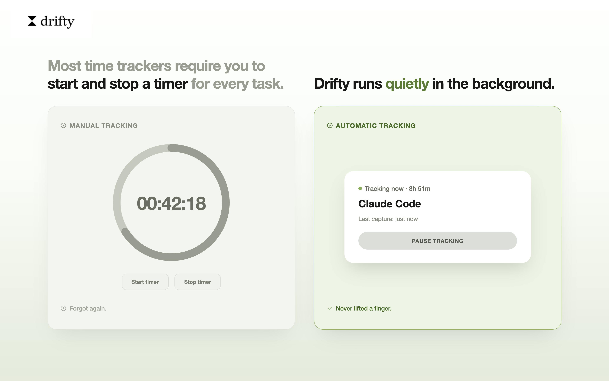

### 🎬 관련 영상
- [🎥 영상 보기](https://ph-files.imgix.net/698e3e87-742b-4f58-9c66-ed65be089a89.jpeg?auto=format)

---

## 19. [Fund Momentum](https://www.producthunt.com/products/fund-momentum)
**Votes**: 18 | **도입 난이도**: 하 | **신뢰도**: 상
**Tagline**: Live GP intelligence for 970+ actively deploying VC funds
**서비스 링크**: https://www.producthunt.com/r/HX7JGSL5OYPQHV

**태그**: VC, Startup, Data Intelligence, AI Tool

### 📌 이 서비스 한눈에 보기
970개 이상의 활성 VC 펀드에 대한 실시간 투자 정보를 제공하는 창업자용 인텔리전스 플랫폼

### 🔑 주요 기능
- 970개 이상의 활성 VC 펀드에 대한 실시간 GP(운용사) 데이터 제공
- 투자 테마, 투자 성향(Bullish/Contrarian), 창업자 가이드라인 등 심층 프로필 제공
- Claude나 Cursor와 연결 가능한 MCP 서버 지원 및 창업자 적합도 중심의 FM15 랭킹 시스템

### 🙋 사용자에게 어떤 점이 좋은가
더 이상 투자가 중단된 펀드에 시간을 낭비하지 않고, 현재 실제로 자금을 집행 중인 최적의 VC를 빠르게 찾을 수 있습니다.

### ✅ 지금 바로 써볼 기능
- GP Signal Profiles를 통해 타겟 펀드의 투자 성향 파악하기
- MCP Server를 설정하여 AI 도구(Claude, Cursor)에서 펀드 데이터 쿼리하기
- FM15 점수를 활용해 창업자 가치관과 일치하는 펀드 필터링하기

### ⚠️ 사용 전 확인할 점
- 데이터의 실시간 업데이트 주기가 사용자 요구사항과 일치하는지 확인 필요
- 제공되는 랭킹 점수(FM15)의 산출 로직에 대한 이해 필요

### 🧭 확인이 더 필요한 정보
970개 이상의 펀드 데이터가 모든 산업 분야를 포괄하는지 확인이 필요합니다.

### 📸 스크린샷 및 갤러리
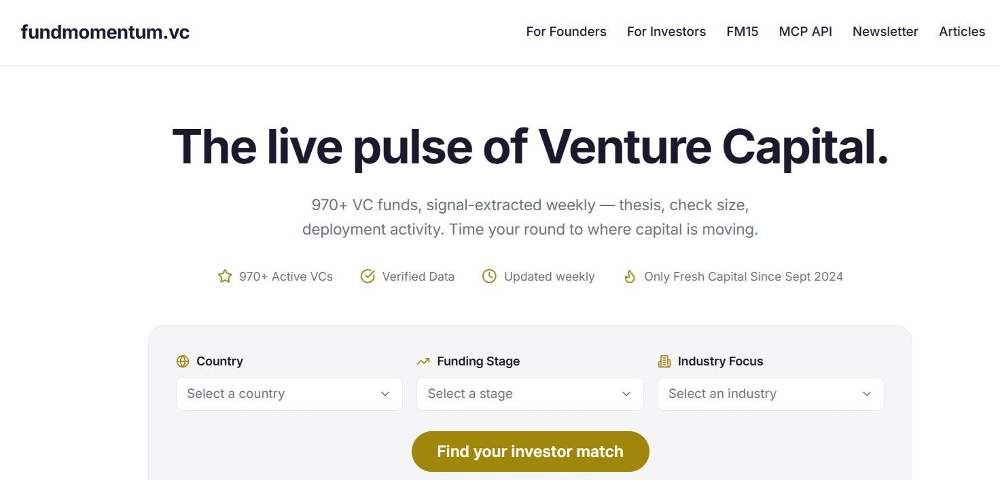
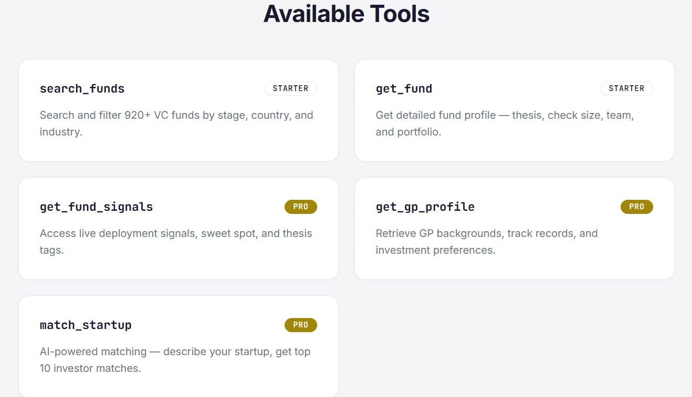
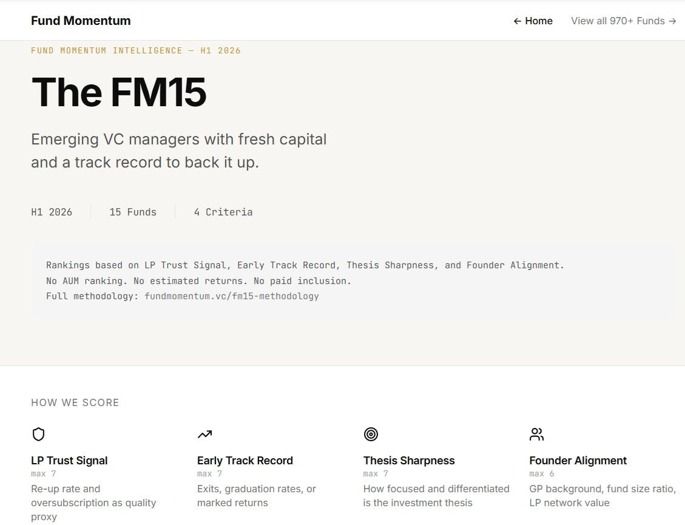

---

## 20. [Modelfac](https://www.producthunt.com/products/modelfac)
**Votes**: 15 | **도입 난이도**: 중 | **신뢰도**: 상
**Tagline**: Predictive AI for marketing and sales optimization
**서비스 링크**: https://www.producthunt.com/r/5V3HW4JB4KZJUG

**태그**: Marketing, Sales, AI, DataScience, Automation, AI Tool

### 📌 이 서비스 한눈에 보기
비용 부담 없이 데이터 분석부터 마케팅 캠페인 준비까지 한 번에 해결하는 예측 AI 솔루션

### 🔑 주요 기능
- 라이선스 및 구독료가 없는 무료 독립형 애플리케이션
- 데이터 준비부터 모델 배포, 문서화까지 이어지는 엔드투엔드 워크플로우
- 구매 성향 모델링 및 타겟 리스트 생성 기능 제공

### 🙋 사용자에게 어떤 점이 좋은가
별도의 비용 없이 전문적인 예측 모델을 구축하여 마케팅 및 영업 캠페인에 즉시 활용할 수 있습니다.

### ✅ 지금 바로 써볼 기능
- 원시 데이터를 활용한 예측 모델 생성 테스트
- 원클릭 자동 모델 문서화 기능 확인
- 생성된 타겟 리스트를 활용한 캠페인 준비

### ⚠️ 사용 전 확인할 점
- 독립형 애플리케이션이므로 기존 기업 시스템과의 연동 방식 확인 필요
- 사용자 숙련도에 따라 모델 품질이 달라질 수 있음

### 🧭 확인이 더 필요한 정보
데이터 보안 및 로컬 환경 설치 방식에 대한 상세 정보가 필요합니다.

### 📸 스크린샷 및 갤러리

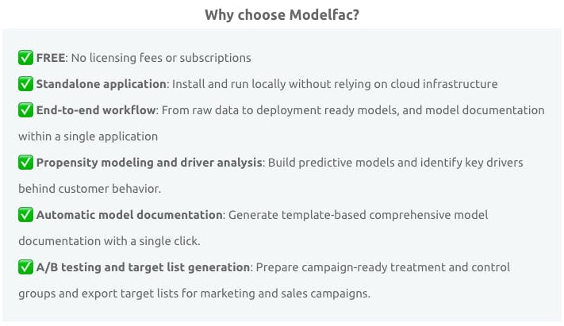
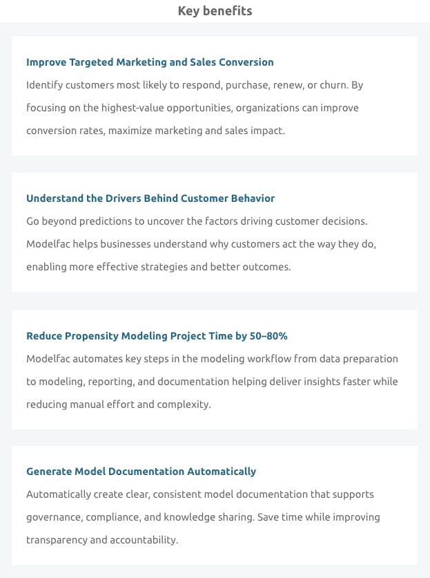

---

## 21. [Sumora](https://www.producthunt.com/products/sumora-2)
**Votes**: 14 | **도입 난이도**: 하 | **신뢰도**: 상
**Tagline**: The AI team that finds and closes your next customer.
**서비스 링크**: https://www.producthunt.com/r/BXGDUXPPRIYD62

**태그**: AI, Sales Automation, Lead Generation, SaaS, Agent, AI Tool

### 📌 이 서비스 한눈에 보기
잠재 고객 발굴부터 영업까지 자동화하는 AI 에이전트 팀

### 🔑 주요 기능
- 비즈니스 운영 업무를 실행하는 AI 에이전트 구축
- LinkedIn을 활용한 효율적이고 인간적인 아웃리치(Outreach)
- 리드 발굴 및 운영 업무 시간 단축을 통한 성장 집중

### 🙋 사용자에게 어떤 점이 좋은가
영업 및 리드 발굴 과정을 자동화하여, 사용자가 단순 반복 업무 대신 비즈니스 성장에 더 많은 시간을 할애할 수 있게 합니다.

### ✅ 지금 바로 써볼 기능
- LinkedIn 아웃리치 기능 실행
- 잠재 고객 리드 발굴 자동화 설정
- 비즈니스 운영 워크플로우 구축

### ⚠️ 사용 전 확인할 점
- LinkedIn 계정 정책 준수 여부 확인 필요
- AI 생성 메시지의 인간적인 품질 검토 필요

### 🧭 확인이 더 필요한 정보
현재 제공되는 AI 에이전트의 구체적인 작업 범위와 LinkedIn 외의 다른 플랫폼 확장 여부는 명시되지 않았습니다.

### 📸 스크린샷 및 갤러리

### 🎬 관련 영상
- [🎥 영상 보기](https://ph-files.imgix.net/aeb3064a-1d8f-45e5-a811-e1d037e259bd.jpeg?auto=format)

---

## 22. [DockAMP Webstack Manager for Docker](https://www.producthunt.com/products/dockamp-webstack-manager-for-docker)
**Votes**: 13 | **도입 난이도**: 하 | **신뢰도**: 상
**Tagline**: Web interface to manage Apache/Nginx, PHP, DB containers
**서비스 링크**: https://www.producthunt.com/r/YWNLMQK3Q2TXTK

**태그**: DevOps, Docker, WebStack, Management, AI Tool, Vision

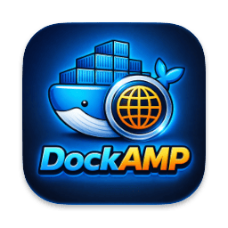

### 📌 이 서비스 한눈에 보기
웹 인터페이스를 통해 Apache, PHP, DB 컨테이너를 간편하게 관리하는 Docker 통합 관리 도구

### 🔑 주요 기능
- Apache, Nginx, PHP, MySQL/MariaDB/PostgreSQL 등 주요 스택 지원
- 반응형 웹 인터페이스를 통한 직관적인 컨테이너 관리
- Docker 이미지를 통한 간편한 설치 및 배포

### 🙋 사용자에게 어떤 점이 좋은가
터미널 명령어가 아닌 웹 UI를 통해 복잡한 웹 스택 컨테이너들을 시각적으로 관리할 수 있어 운영 효율성이 높아집니다.

### ✅ 지금 바로 써볼 기능
- Docker 환경에 DockAMP 이미지 배포하기
- 웹 인터페이스를 통한 웹 스택 컨테이너 구성하기
- 프록시 및 데이터베이스 컨테이너 연동 테스트하기

### ⚠️ 사용 전 확인할 점
- 웹 UI를 통한 관리 시 보안 설정 및 권한 관리 주의 필요
- 컨테이너 간 네트워크 구성 및 데이터 볼륨 매핑 방식 확인 필요

### 🧭 확인이 더 필요한 정보
상세한 보안 기능 및 대규모 클러스터 환경에서의 확장성 지원 여부는 명시되어 있지 않습니다.

### 📸 스크린샷 및 갤러리
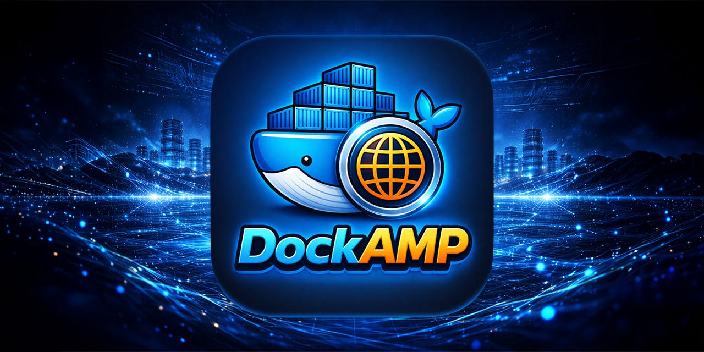
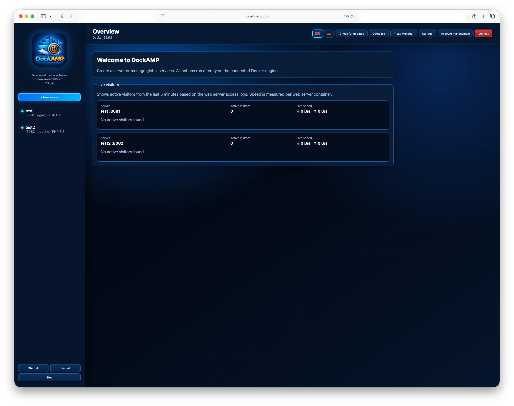
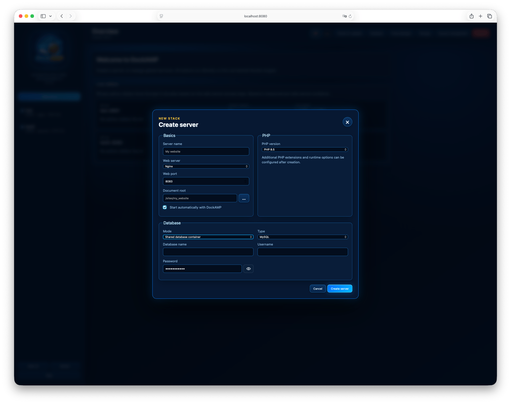

---

## 23. [SEO Receipts](https://www.producthunt.com/products/seo-receipts)
**Votes**: 10 | **도입 난이도**: 하 | **신뢰도**: 상
**Tagline**: Verified SEO traffic, straight from Google
**서비스 링크**: https://www.producthunt.com/r/LWTHLS3T4RGLY3

**태그**: SEO, Analytics, Marketing, Verification, AI Tool

### 📌 이 서비스 한눈에 보기
구글 서치 콘솔 데이터를 기반으로 조작 불가능한 실시간 SEO 성과를 증명하는 서비스

### 🔑 주요 기능
- 구글 서치 콘솔의 읽기 전용 데이터를 활용한 신뢰도 높은 SEO 기록 생성
- 클릭, 노출, 순위 변화 등을 포함한 실시간 공개 레코드 제공
- 리더보드 비교, 성과 배지 설치, 트래픽 대결 등 공유 및 경쟁 기능

### 🙋 사용자에게 어떤 점이 좋은가
단순 스크린샷이 아닌 검증된 데이터를 통해 사이트의 SEO 성과를 투명하게 증명하고 공유할 수 있습니다.

### ✅ 지금 바로 써볼 기능
- 구글 서치 콘솔 데이터 연동하기
- 사이트 성과 배지 설치하기
- 리더보드에서 다른 사이트와 성과 비교하기

### ⚠️ 사용 전 확인할 점
- 데이터가 구글 서치 콘솔의 읽기 권한에 의존하므로 원본 데이터의 정확도에 따라 결과가 결정됨
- 공개 레코드 생성 시 사이트의 민감한 트래픽 정보가 노출될 수 있음

### 🧭 확인이 더 필요한 정보
데이터 연동 방식(API 권한 범위 등)과 상세한 개인정보 보호 정책에 대한 확인이 필요합니다.

### 📸 스크린샷 및 갤러리

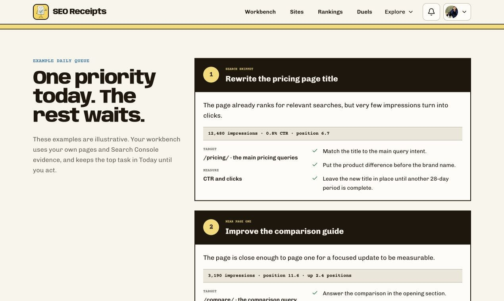

### 🎬 관련 영상
- [🎥 영상 보기](https://ph-files.imgix.net/dba18a36-bc80-4509-aabe-2c2c2d7c3c63.jpeg?auto=format)

---

## 24. [Notwen](https://www.producthunt.com/products/notwen)
**Votes**: 10 | **도입 난이도**: 하 | **신뢰도**: 상
**Tagline**: Get paid, track expenses, forecast income - on autopilot
**서비스 링크**: https://www.producthunt.com/r/N43UMZFO7TVPS3

**태그**: Freelance, Automation, Finance, AI, Productivity, AI Tool, Email

### 📌 이 서비스 한눈에 보기
프리랜서를 위한 올인원 자동 재무 관리 워크스페이스

### 🔑 주요 기능
- 송장 발행, 비용 추적, 계약 관리를 하나의 대시보드에서 통합 관리
- AI 기반 지출 카테고리 분류 및 클라이언트 이메일 초안 작성 지원
- 미납 결제자 자동 리마인더 및 차월 수입 예측 기능 제공

### 🙋 사용자에게 어떤 점이 좋은가
여러 도구와 스프레드시트를 번갈아 사용할 필요 없이, 프리랜서의 백오피스 업무를 자동화하여 본업에 집중할 수 있게 해줍니다.

### ✅ 지금 바로 써볼 기능
- AI를 활용한 지출 카테고리 분류 기능 테스트
- 수입 예측 대시보드 확인
- 자동 결제 리마인더 설정

### ⚠️ 사용 전 확인할 점
- 회계 전문가용이 아닌 프리랜서 맞춤형이므로 복잡한 세무 업무에는 한계가 있을 수 있음
- 외부 결제 시스템과의 연동 범위 확인 필요

### 🧭 확인이 더 필요한 정보
구체적인 요금 체계와 외부 금융 서비스/은행과의 직접적인 연동 여부는 명시되지 않았습니다.

### 📸 스크린샷 및 갤러리
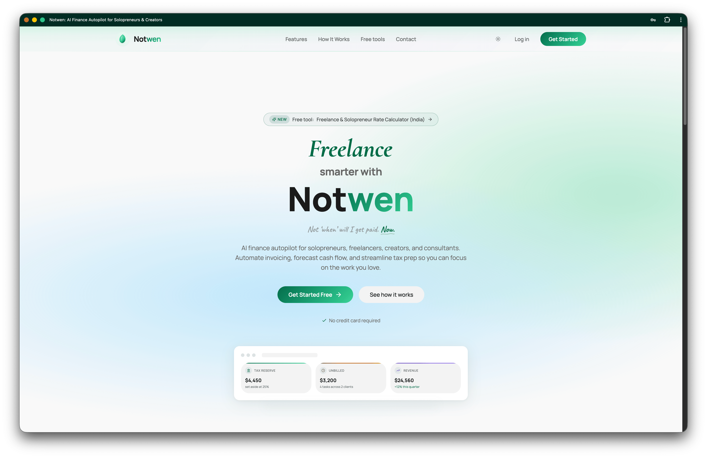
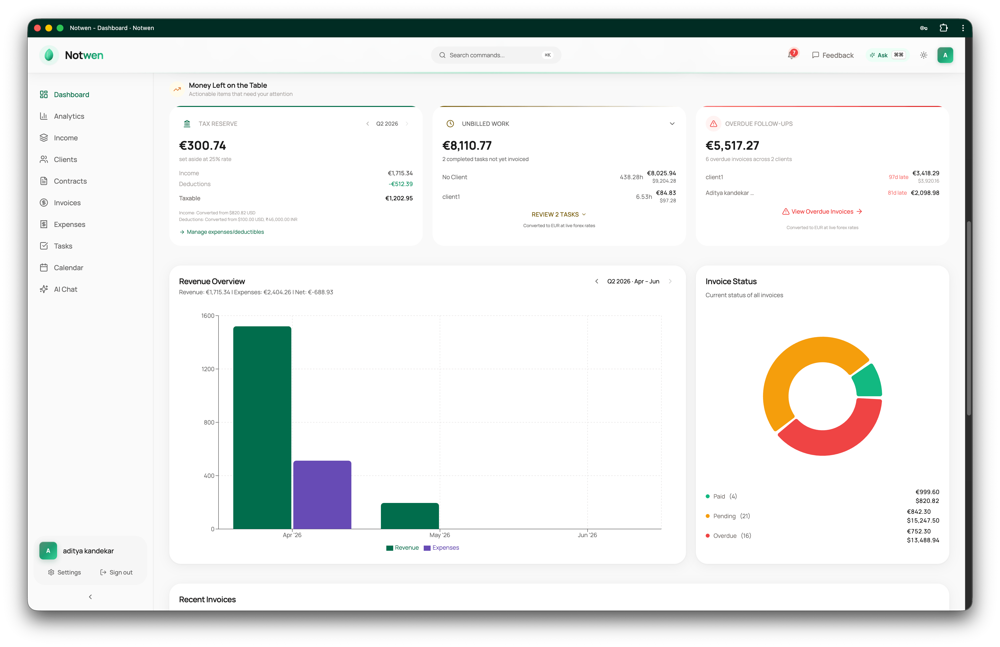
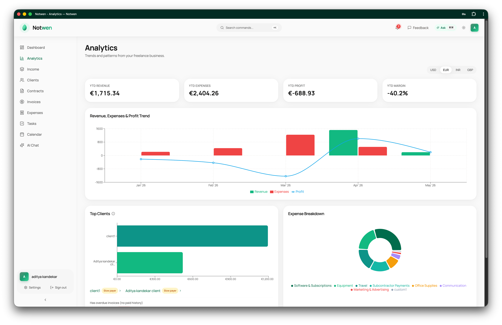

---

## 25. [Oats](https://www.producthunt.com/products/oats)
**Votes**: 9 | **도입 난이도**: 하 | **신뢰도**: 상
**Tagline**: 100% Free, private meet notes that never leave your computer
**서비스 링크**: https://www.producthunt.com/r/J372GK3T52OQIZ

**태그**: Productivity, Privacy, AI, Transcription

### 📌 이 서비스 한눈에 보기
개인정보 유출 걱정 없는 100% 온디바이스 회의록 작성 도구

### 🔑 주요 기능
- 클라우드 업로드 없는 완전한 로컬 실행 (Mac/Windows)
- 계정 생성이나 구독이 필요 없는 무료 서비스
- 직접 입력한 노트와 트랜스크립트를 결합한 깔끔한 요약

### 🙋 사용자에게 어떤 점이 좋은가
회의 내용이 외부 서버로 전송되지 않아 보안이 중요한 업무에 적합하며, 별도의 비용 없이 강력한 로컬 기록 기능을 제공합니다.

### ✅ 지금 바로 써볼 기능
- 로컬 환경에서 트랜스크립션 기능 테스트하기
- 자신의 AI 모델 키를 연결하여 요약 성능 확인하기

### ⚠️ 사용 전 확인할 점
- 사용자 컴퓨터의 하드웨어 성능에 따라 구동 속도가 달라질 수 있음
- 로컬 실행 방식이므로 기기 사양에 따른 제약이 있을 수 있음

### 🧭 확인이 더 필요한 정보
Windows 버전의 상세 기능 지원 범위와 하드웨어 최소 사양에 대한 확인이 필요합니다.

### 📸 스크린샷 및 갤러리
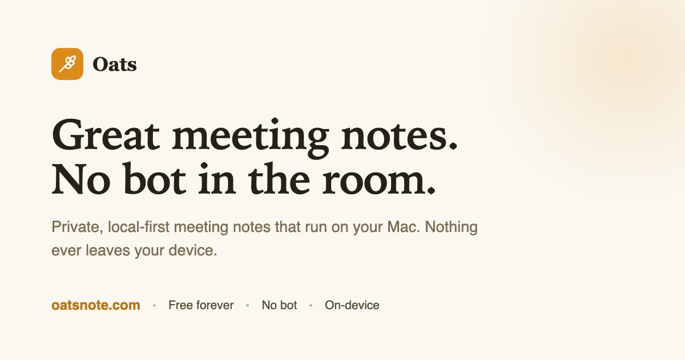
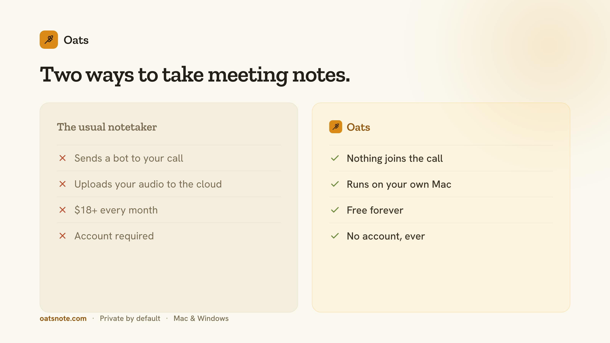
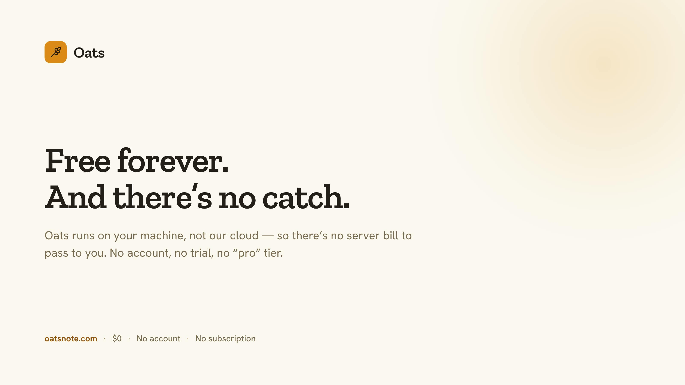

### 🎬 관련 영상
- [🎥 영상 보기](https://ph-files.imgix.net/5c6aa70e-bfdc-429a-a072-3bd859d9e047.gif?auto=format)

---

## 26. [Fontalog](https://www.producthunt.com/products/fontalog)
**Votes**: 9 | **도입 난이도**: 하 | **신뢰도**: 상
**Tagline**: The world's biggest font database
**서비스 링크**: https://www.producthunt.com/r/5RGB2OF5PS3MXN

**태그**: DesignTool, Typography, SearchEngine

### 📌 이 서비스 한눈에 보기
시각적 특징 기반의 초고속 무료 폰트 검색 데이터베이스

### 🔑 주요 기능
- 비례, 대비, 굵기, xHeight 등 세부 시각적 파라미터로 폰트 검색 가능
- Redis와 Cloudflare Workers 기반의 매우 빠른 검색 속도 제공
- 유사한 스타일의 폰트 추천 및 파운드리 정보 제공

### 🙋 사용자에게 어떤 점이 좋은가
디자이너가 원하는 특정 시각적 느낌을 가진 폰트를 수치 기반으로 정교하게 찾을 수 있어 탐색 시간을 획기적으로 줄여줍니다.

### ✅ 지금 바로 써볼 기능
- 원하는 폰트의 시각적 파라미터 값 확인하기
- 유사 폰트 추천 기능을 통해 새로운 스타일 탐색하기
- 파운드리 정보를 통해 폰트 출처 확인하기

### ⚠️ 사용 전 확인할 점
- 무료 데이터베이스이므로 실제 폰트 파일의 라이선스 정책은 별도 확인 필요
- 검색 결과가 실제 폰트의 시각적 느낌과 미세하게 다를 수 있음

### 🧭 확인이 더 필요한 정보
제공되는 폰트 데이터의 저작권 및 상업적 이용 가능 여부는 각 파운드리에 직접 확인해야 합니다.

### 📸 스크린샷 및 갤러리
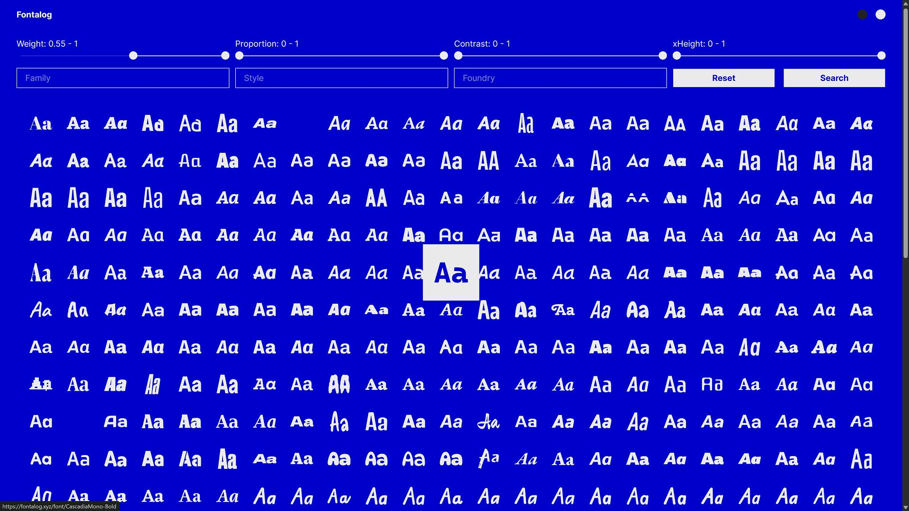
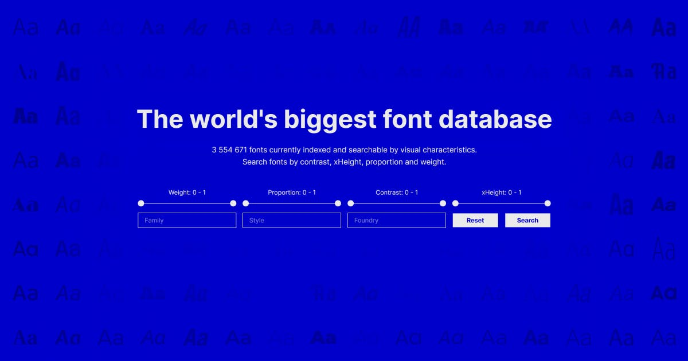
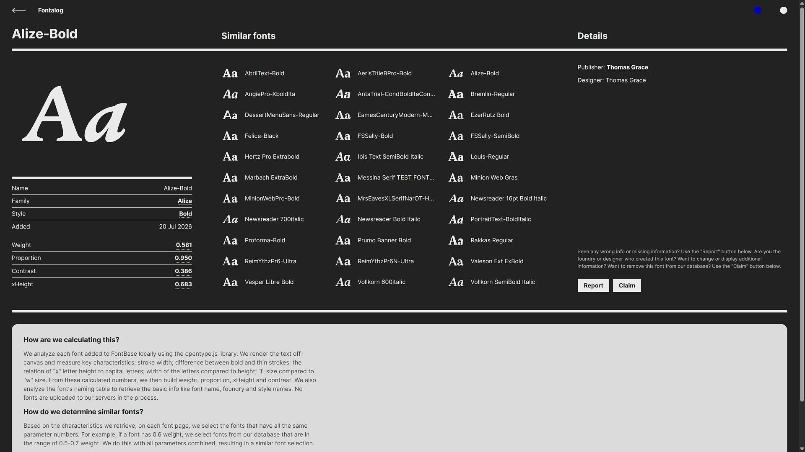

---

## 27. [Privora](https://www.producthunt.com/products/privora-2)
**Votes**: 7 | **도입 난이도**: 하 | **신뢰도**: 상
**Tagline**: Giving brands visibility in answer engines!
**서비스 링크**: https://www.producthunt.com/r/MHZJPSGPWBCEUM

**태그**: AEO, Marketing, SEO, Analytics, Chat

### 📌 이 서비스 한눈에 보기
AI 답변 엔진(ChatGPT, Claude 등)에서 브랜드 노출을 극대화하기 위한 콘텐츠 전략 가이드

### 🔑 주요 기능
- 경쟁사로 유입되는 AI 답변 엔진 쿼리 분석
- AEO(답변 엔진 최적화) 가시성 점수 제공
- 점수 향상을 위한 맞춤형 콘텐츠(FAQ, JSON-LD, 비교표 등) 생성 가이드

### 🙋 사용자에게 어떤 점이 좋은가
AI가 답변을 생성할 때 우리 브랜드가 언급되도록 만드는 구체적인 콘텐츠 제작 방법을 알려주어 검색 엔진 최적화(SEO)를 넘어선 가시성을 확보할 수 있습니다.

### ✅ 지금 바로 써볼 기능
- 경쟁사 유입 쿼리 분석 기능 실행
- 현재 브랜드의 AEO 가시성 점수 확인
- 제공되는 맞춤형 콘텐츠 제작 가이드 적용

### ⚠️ 사용 전 확인할 점
- AI 답변 엔진의 알고리즘 변화에 따라 가이드의 유효성이 변동될 수 있음
- 콘텐츠 생성 가이드가 실제 검색 결과 반영까지 걸리는 시간은 명시되지 않음

### 🧭 확인이 더 필요한 정보
제공되는 콘텐츠 가이드가 자동 생성 방식인지 아니면 전략적 가이드라인인지에 대한 구체적인 구현 방식 확인이 필요합니다.

### 📸 스크린샷 및 갤러리

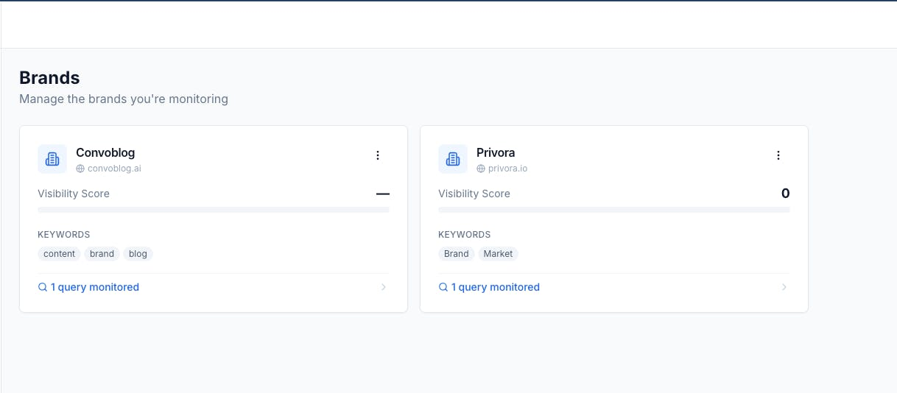
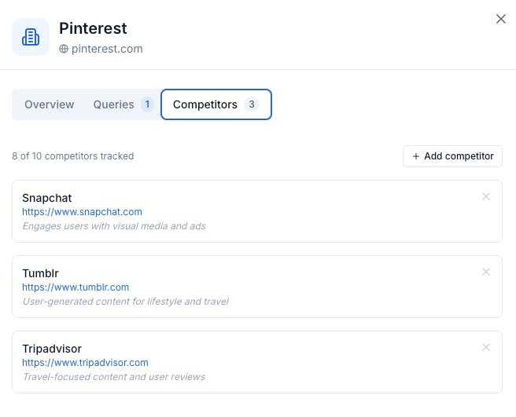

### 🎬 관련 영상
- [🎥 영상 보기](https://ph-files.imgix.net/949ab83c-493f-4a9a-911a-bbdf09900e52.gif?auto=format)

---

## 28. [Choose Your Fate](https://www.producthunt.com/products/choose-your-fate)
**Votes**: 6 | **도입 난이도**: 하 | **신뢰도**: 상
**Tagline**: Stories shaped by your choices. Worlds built by creators.
**서비스 링크**: https://www.producthunt.com/r/TNKLVFZXGPJRHG

**태그**: Interactive Fiction, Storytelling, NoCode, Creative Tools, AI Tool, Video, DevTool

### 📌 이 서비스 한눈에 보기
독자의 선택으로 이야기가 완성되는 인터랙티브 스토리텔링 플랫폼

### 🔑 주요 기능
- 사용자의 선택에 따라 결말과 경로가 바뀌는 몰입형 스토리 경험
- 코딩 없이 텍스트, 삽화, 오디오, 비디오를 결합한 멀티미디어 스토리 제작
- 창작자의 콘텐츠 소유권 보장 및 자유로운 수익화 모델 지원

### 🙋 사용자에게 어떤 점이 좋은가
독자는 게임처럼 능동적인 독서 경험을 즐길 수 있고, 창작자는 복잡한 개발 과정 없이 자신만의 세계관을 구축하고 수익을 창출할 수 있습니다.

### ✅ 지금 바로 써볼 기능
- 다양한 분기점이 있는 인터랙티브 스토리 읽어보기
- 멀티미디어 요소가 결합된 스토리 레이어 탐색하기
- 직접 나만의 분기형 스토리 제작 시도하기

### ⚠️ 사용 전 확인할 점
- 창작 도구의 세부적인 편집 기능 및 제약 사항 확인 필요
- 수익화 모델의 구체적인 정산 방식 및 정책 확인 필요

### 🧭 확인이 더 필요한 정보
플랫폼 내 구체적인 수익 배분 구조와 창작자용 편집 툴의 상세 기능 범위에 대한 정보가 더 필요합니다.

### 📸 스크린샷 및 갤러리
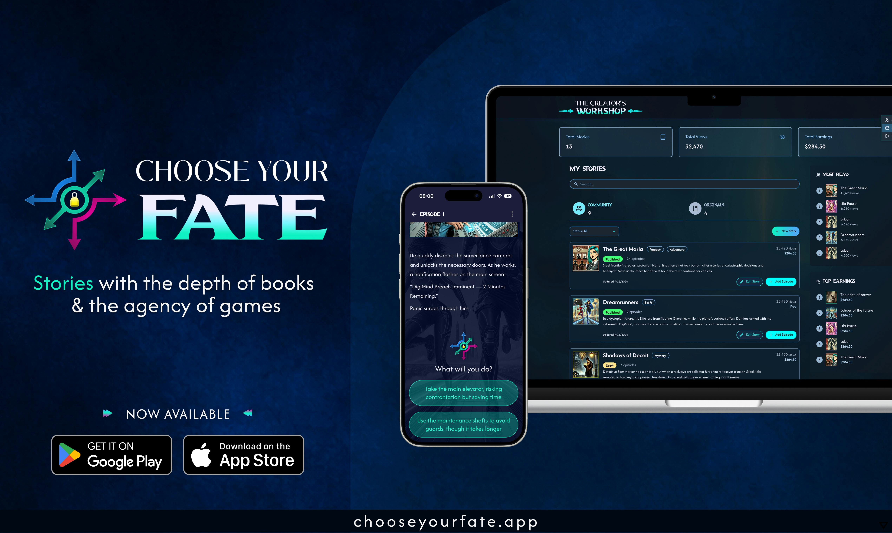

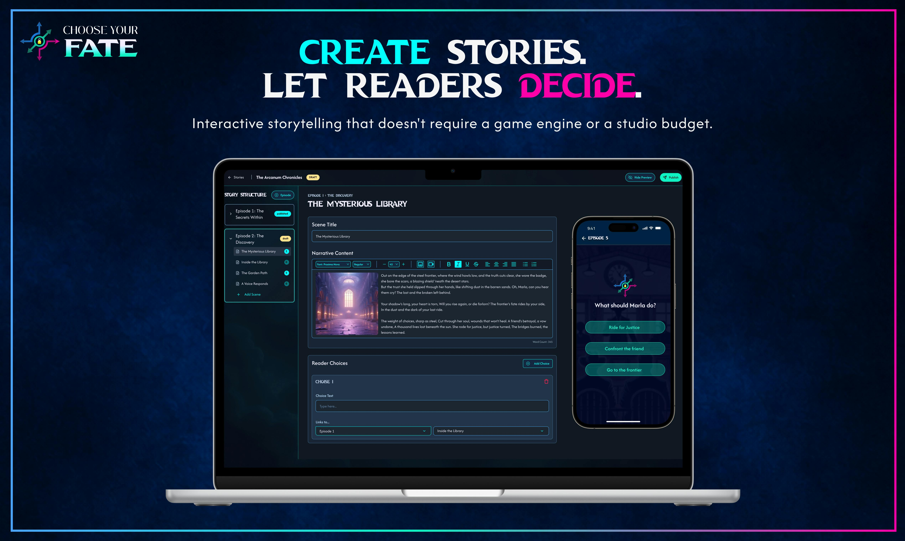

### 🎬 관련 영상
- [🎥 영상 보기](https://ph-files.imgix.net/ea7ee6f3-02bc-4bf4-8095-991ba63d1fc9.jpeg?auto=format)

---

## 29. [Inkive](https://www.producthunt.com/products/inkive)
**Votes**: 6 | **도입 난이도**: 하 | **신뢰도**: 상
**Tagline**: Read. Snap. Sync. Local AI for physical book highlights.
**서비스 링크**: https://www.producthunt.com/r/T76TCWHMHNN7GS

**태그**: Productivity, AI, Reading, Privacy, iOS, AI Tool

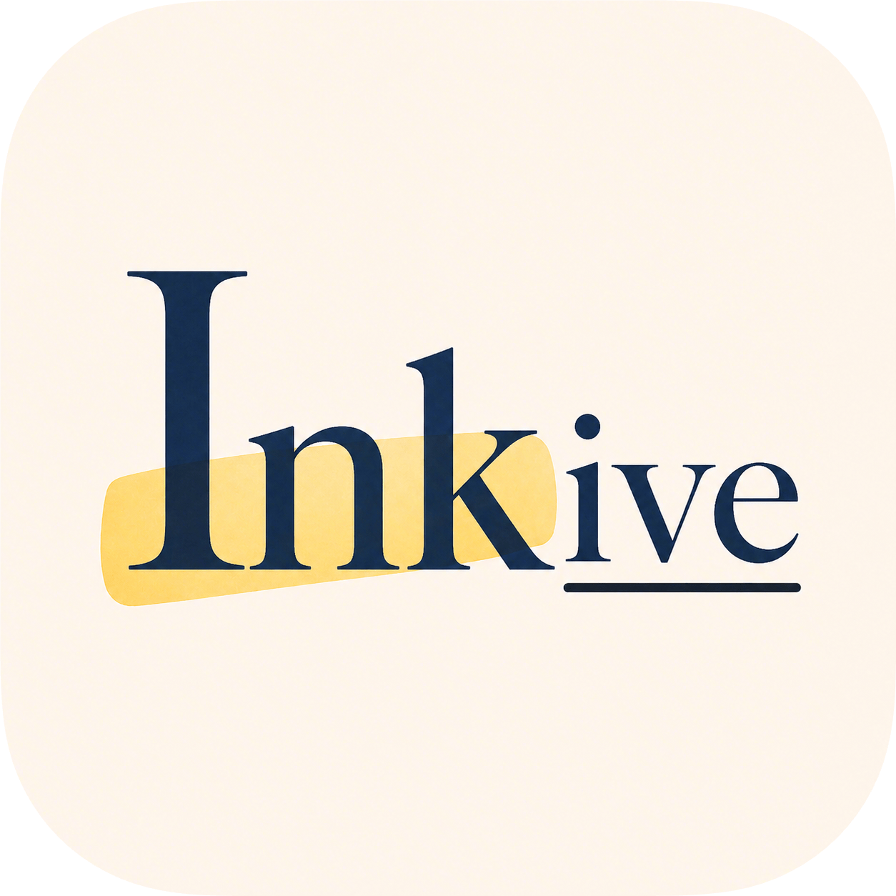

### 📌 이 서비스 한눈에 보기
종이책의 하이라이트를 디지털로 즉시 변환하는 개인정보 보호 중심의 AI 독서 도구

### 🔑 주요 기능
- 물리적 책의 하이라이트를 스캔하여 디지털 텍스트로 자동 추출
- Apple Vision 기술을 활용한 고정밀 텍스트 인식 및 자동 정리
- 로컬 우선(Local-first) AI로 데이터 유출 걱정 없는 보안 환경 제공

### 🙋 사용자에게 어떤 점이 좋은가
아날로그 독서의 감성을 유지하면서도, 하이라이트 내용을 디지털 메모로 빠르게 옮겨 '제2의 뇌'를 구축할 수 있습니다.

### ✅ 지금 바로 써볼 기능
- 종이책에 하이라이트 표시 후 스캔 기능 테스트
- 추출된 텍스트의 Markdown 내보내기 기능 확인
- 로컬 환경에서의 데이터 보안 및 동기화 확인

### ⚠️ 사용 전 확인할 점
- Apple Vision 기술 활용에 따른 특정 기기 의존성 가능성
- 물리적 하이라이트의 선명도에 따른 인식 정확도 차이

### 🧭 확인이 더 필요한 정보
Apple Vision 기술이 특정 하드웨어(Vision Pro 등)를 요구하는지 혹은 iPhone 카메라 기능을 의미하는지 명확한 확인이 필요합니다.

### 📸 스크린샷 및 갤러리

### 🎬 관련 영상
- [🎥 영상 보기](https://ph-files.imgix.net/e18c114a-0332-4ab0-b480-0e8724ff49fd.jpeg?auto=format)

---

## 30. [Nudge ](https://www.producthunt.com/products/nudge-p2p-file-sharing)
**Votes**: 6 | **도입 난이도**: 하 | **신뢰도**: 상
**Tagline**: AirDrop for everyone. Any device. No account. No cloud.
**서비스 링크**: https://www.producthunt.com/r/YWZ5IRGTB6Y7TH

**태그**: Productivity, FileSharing, P2P, WebRTC, AI Tool, Video

### 📌 이 서비스 한눈에 보기
계정 없이 모든 기기에서 즉시 파일을 주고받는 브라우저 기반 P2P 공유 서비스

### 🔑 주요 기능
- 계정 생성이나 클라우드 저장소 없이 브라우저 간 직접 전송
- WebRTC 기술을 활용한 100% 피어 투 피어(P2P) 보안 및 암호화
- OS 제약 없는 Android, Windows, Mac, iOS 간 자유로운 파일 공유

### 🙋 사용자에게 어떤 점이 좋은가
별도의 앱 설치나 회원가입 없이도 기기 간에 대용량 파일을 빠르고 안전하게 주고받을 수 있습니다.

### ✅ 지금 바로 써볼 기능
- 다른 기기의 브라우저를 열어 즉시 파일 전송해보기
- 대용량 파일 전송 시 속도 및 안정성 테스트하기

### ⚠️ 사용 전 확인할 점
- 브라우저 기반이므로 브라우저를 닫으면 전송이 중단될 수 있음
- 로컬 네트워크 환경에 따라 연결 안정성이 달라질 수 있음

### 🧭 확인이 더 필요한 정보
파일 크기 제한은 없다고 명시되어 있으나, 네트워크 대역폭에 따른 실제 전송 속도와 안정성은 확인이 필요합니다.

### 📸 스크린샷 및 갤러리
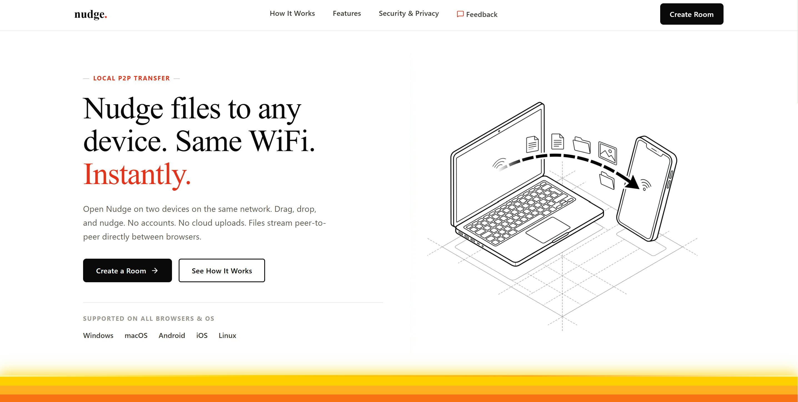
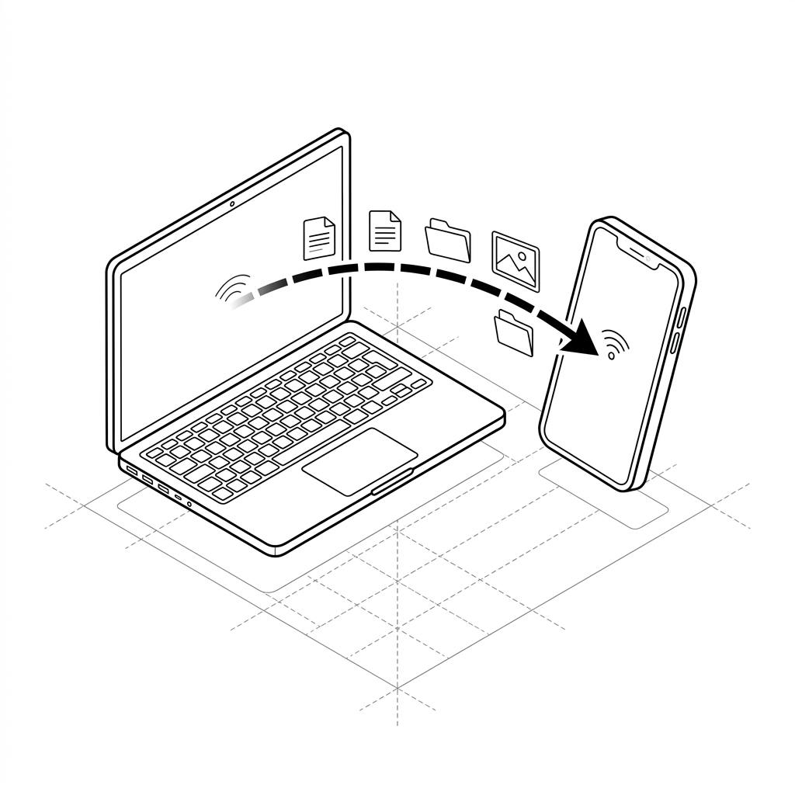
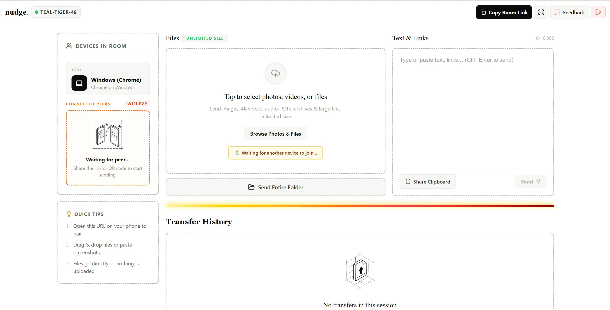

---

