# 🚀 Product Hunt Daily Top 30 (2026-07-27)

## 오늘의 요약
오늘의 제품들은 단순한 자동화를 넘어 사용자의 업무 소식과 일상 패턴을 존중하는 지능형 에이전트와 개인화된 생산성 도구에 집중되었습니다. 특히 AI 모델 통합, 모바일 중심의 원격 제어, 그리고 학습과 휴식을 일상에 자연스럽게 녹여내는 사용자 경험이 주요 트렌드로 나타났습니다.

### 오늘의 핵심 포인트
- AI 에이전트가 단순 반복 업무를 넘어 코딩, 이커머스 운영, 이메일 관리 등 전문적인 워크플로우를 자동화하는 단계로 진화하고 있습니다.
- 데스크탑 환경을 벗어나 모바일이나 음성만으로도 업무를 관리하고 학습할 수 있는 이동성 중심의 솔루션이 주목받고 있습니다.
- 사용자의 프라이버시를 보호하면서도 개인의 맥락(Context)을 정확히 파악하여 맞춤형 피드백을 제공하는 것이 핵심 경쟁력이 되고 있습니다.

**오늘의 태그**: AI 에이전트, 생산성 도구, 워크플로우 자동화, 개인화 서비스

## 1. [TouchGrass](https://www.producthunt.com/products/touchgrass-2)
**Votes**: 269 | **도입 난이도**: 하 | **신뢰도**: 상
**Tagline**: Context-aware break reminders without invasive permissions
**서비스 링크**: https://www.producthunt.com/r/OFM4DSHZYBEP2A

**태그**: Productivity, macOS, Health, Privacy, Automation, AI Tool

### 📌 이 서비스 한눈에 보기
사용자의 작업 흐름을 방해하지 않으면서 맥(macOS) 환경에 맞춰 휴식을 제안하는 컨텍스트 인식형 브레이크 리마인더

### 🔑 주요 기능
- 회의, 통화, 미디어 재생 등을 감지하여 실제 휴식 가능한 시간만 계산
- 접근성 권한을 요구하지 않는 프라이버시 중심의 로컬 실행 방식
- 눈 깜빡임, 자세 교정, 타이핑 후 휴식 등 상황별 맞춤형 알림 제공

### 🙋 사용자에게 어떤 점이 좋은가
단순 시간 기반 알림이 아닌 실제 업무 흐름을 존중하므로, 업무 흐름이 끊기는 것을 방지하면서 건강한 휴식을 취할 수 있습니다.

### ✅ 지금 바로 써볼 기능
- 7일 무료 체험을 통한 작업 흐름 방해 여부 확인
- 맥(macOS) 환경에서의 컨텍스트 감지 정확도 테스트
- 개인별 맞춤형 휴식 알림 설정

### ⚠️ 사용 전 확인할 점
- macOS 전용 소프트웨어이므로 다른 OS에서는 사용 불가
- 사용자의 작업 상태(미디어 재생 등)를 판단하는 로컬 로직의 정확도 차이 가능성

### 🧭 확인이 더 필요한 정보
사용자의 작업 상태를 감지하는 구체적인 기술적 메커니즘과 시스템 리소스 점유율은 명시되지 않았습니다.

### 📸 스크린샷 및 갤러리
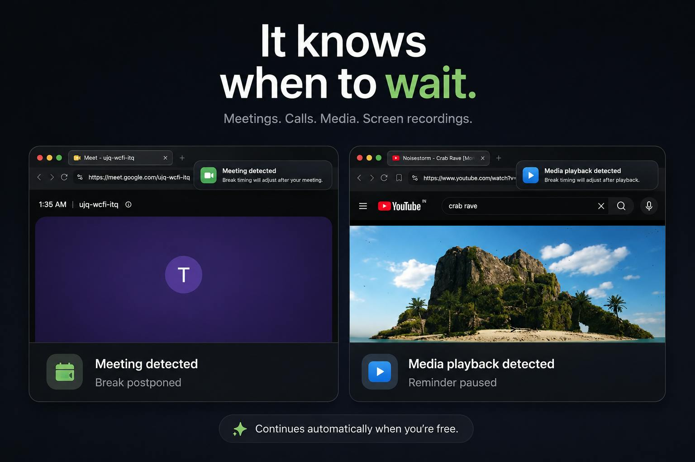
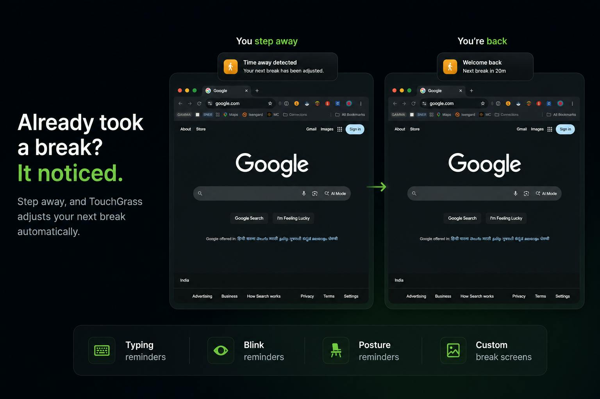
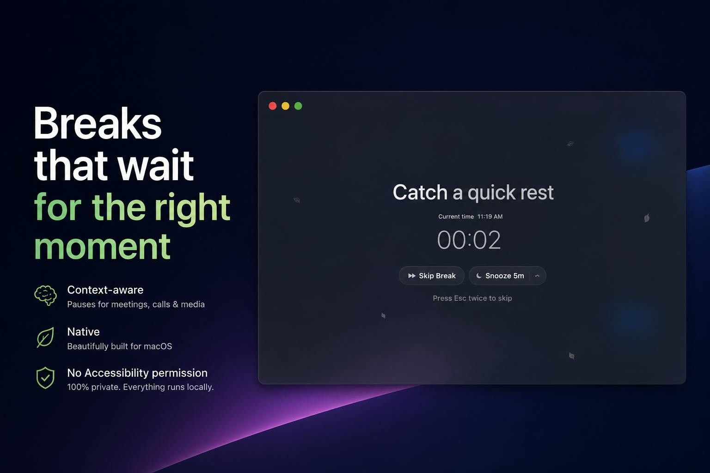

### 🎬 관련 영상
- [🎥 영상 보기](https://ph-files.imgix.net/f12316e5-1ba7-4f32-b3c7-e6ecd6185a51.jpeg?auto=format)

---

## 2. [Athena by Shoplazza](https://www.producthunt.com/products/athena-by-shoplazza)
**Votes**: 223 | **도입 난이도**: 중 | **신뢰도**: 상
**Tagline**: An orchestrator agent for your entire commerce stack
**서비스 링크**: https://www.producthunt.com/r/BFVWD7733PP65I

**태그**: Automation, E-commerce, AI-Agent, SaaS, Agent, AI Tool, LLM

### 📌 이 서비스 한눈에 보기
상점 구축부터 운영 자동화까지 책임지는 이커머스 통합 오케스트레이터 에이전트

### 🔑 주요 기능
- 페이지, 상품, 현지화된 카피를 포함한 완성도 높은 스토어 구축
- 대량 상품 등록, 할인 설정, 배송 구성 및 광고 캠페인 실행 자동화
- 결제, 물류, 풀필먼트, 로열티 프로그램이 통합된 비즈니스 운영 환경 제공

### 🙋 사용자에게 어떤 점이 좋은가
단순한 쇼핑몰 구축을 넘어 운영 전반을 자동화하여, 사용자가 단순 반복 업무 대신 비즈니스 성장에 집중할 수 있게 합니다.

### ✅ 지금 바로 써볼 기능
- AI를 통한 자동화된 스토어 페이지 생성 기능 테스트
- 대량 상품 등록 및 배송 설정 자동화 워크플로우 확인
- 통합된 물류 및 결제 시스템 연동성 검토

### ⚠️ 사용 전 확인할 점
- 자동화된 광고 캠페인 및 운영 설정의 세부 제어 가능 범위 확인 필요
- 기존 외부 물류/결제 시스템과의 호환성 및 데이터 이전 가능 여부 확인

### 🧭 확인이 더 필요한 정보
에이전트가 생성하는 광고 캠페인 및 운영 설정의 구체적인 최적화 알고리즘과 사용자 개입 수준에 대한 정보가 부족합니다.

### 📸 스크린샷 및 갤러리
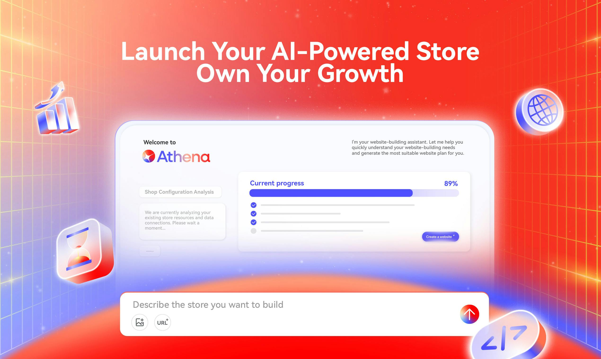

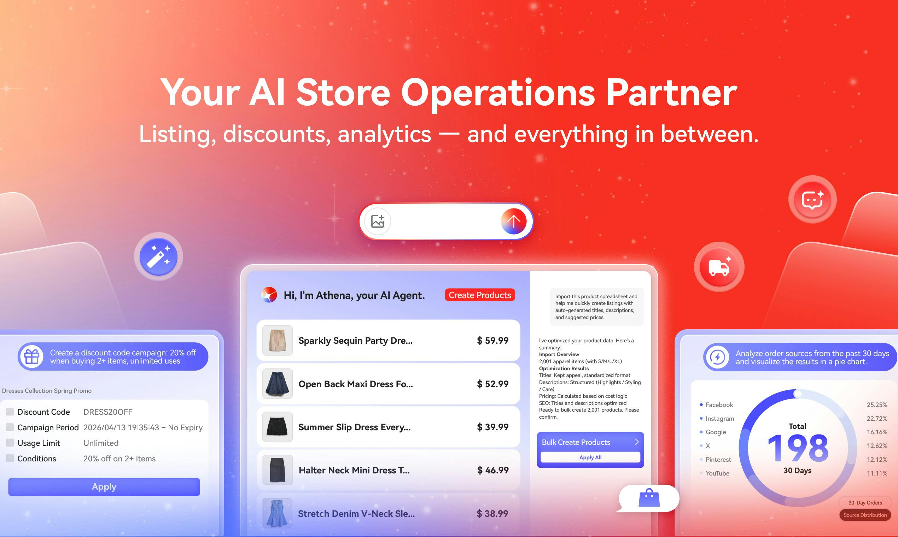

### 🎬 관련 영상
- [🎥 영상 보기](https://ph-files.imgix.net/1c1ade07-9a43-458f-965a-414dc8bfdfa6.jpeg?auto=format)

---

## 3. [SF Apartment Finder](https://www.producthunt.com/products/sf-apartment-finder)
**Votes**: 157 | **도입 난이도**: 하 | **신뢰도**: 상
**Tagline**: Tinder for live SF rentals from across the web
**서비스 링크**: https://www.producthunt.com/r/O3D2UFH7U4P7SI

**태그**: Real Estate, SF, Lifestyle, Search, AI Tool

### 📌 이 서비스 한눈에 보기
샌프란시스코 지역의 실시간 매물을 데이팅 앱처럼 간편하게 스와이프하며 찾는 서비스

### 🔑 주요 기능
- 크레이그리스트 및 현지 부동산 관리자의 실시간 매물 통합
- 예산, 지역, 필수 조건 설정 기능 제공
- 스와이프 방식의 직관적인 UI로 매물 탐색 최적화

### 🙋 사용자에게 어떤 점이 좋은가
여러 사이트를 돌아다닐 필요 없이, 사용자의 조건에 맞는 매물을 모바일 앱처럼 쉽고 빠르게 훑어볼 수 있습니다.

### ✅ 지금 바로 써볼 기능
- 자신의 예산과 선호 지역 설정하기
- 스와이프 기능을 통해 마음에 드는 매물 저장하기
- 필수 조건(Must-haves) 필터 적용하기

### ⚠️ 사용 전 확인할 점
- 샌프란시스코 지역에 특화된 서비스이므로 타 지역 사용은 제한적임
- 외부 소스(Craigslist 등)의 데이터를 가져오므로 매물 상태의 실시간성 확인 필요

### 🧭 확인이 더 필요한 정보
제공되는 매물 데이터의 업데이트 주기와 외부 소스 데이터의 정확도를 확인해야 합니다.

### 📸 스크린샷 및 갤러리

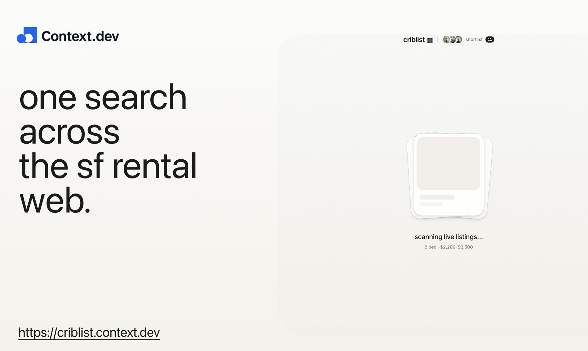
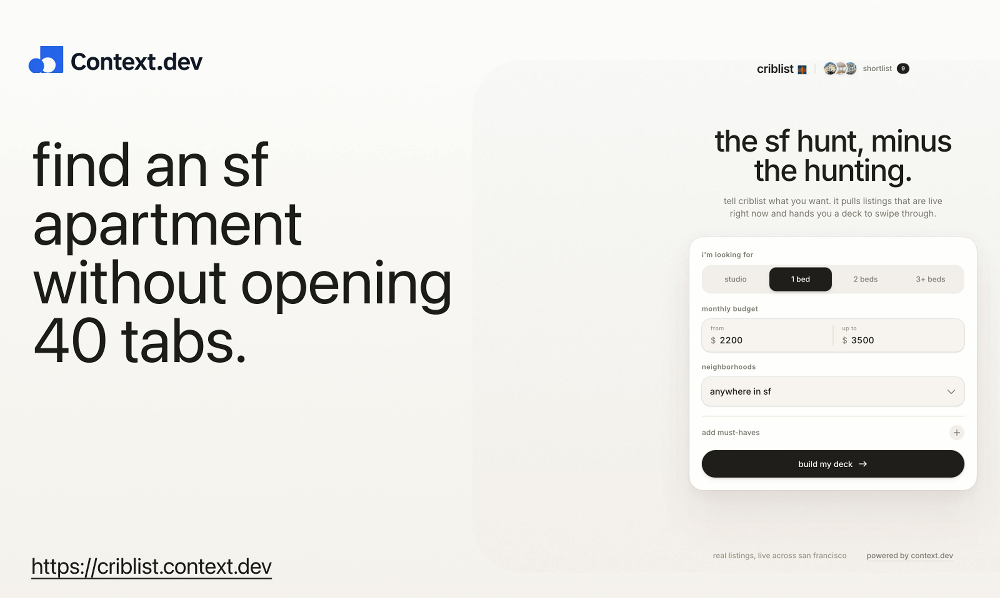

---

## 4. [Openbase](https://www.producthunt.com/products/openbase-2)
**Votes**: 154 | **도입 난이도**: 중 | **신뢰도**: 상
**Tagline**: Manage your team of AI agents by voice, from anywhere
**서비스 링크**: https://www.producthunt.com/r/U7DUSA6V3LZT5Q

**태그**: DevTool, AI-Agents, Automation, Mobile-First, Agent, AI Tool

### 📌 이 서비스 한눈에 보기
장소에 구애받지 않고 음성만으로 AI 코딩 에이전트를 관리하는 모바일 제어 솔루션

### 🔑 주요 기능
- 음성 명령을 통한 AI 코딩 에이전트 작업 지시 및 실시간 제어
- 노트북 없이도 이동 중에 작업 승인, 태스크 할당, 방향 수정 가능
- 에이전트의 코드 작성, PR 생성, 커밋/푸시 등 워크플로우 자동화

### 🙋 사용자에게 어떤 점이 좋은가
데스크탑 앞을 떠나도 모바일로 AI 에이전트를 감독할 수 있어, 업무 흐름을 끊지 않고도 원격에서 개발 프로세스를 관리할 수 있습니다.

### ✅ 지금 바로 써볼 기능
- 음성 명령으로 새로운 코딩 태스크 할당하기
- 이동 중에 에이전트가 작성한 코드 변경 사항 검토 및 승인하기
- 모바일에서 에이전트의 작업 방향 실시간 수정하기

### ⚠️ 사용 전 확인할 점
- 음성 기반 제어 특성상 복잡한 코드 리뷰 시 모바일 화면의 제약이 있을 수 있음
- 에이전트가 로컬 머신에 직접 접근하므로 보안 및 권한 설정 확인 필요

### 🧭 확인이 더 필요한 정보
사용 중인 다양한 AI 모델/에이전트 프레임워크와의 구체적인 호환 범위와 보안 프로토콜 확인이 필요합니다.

### 📸 스크린샷 및 갤러리
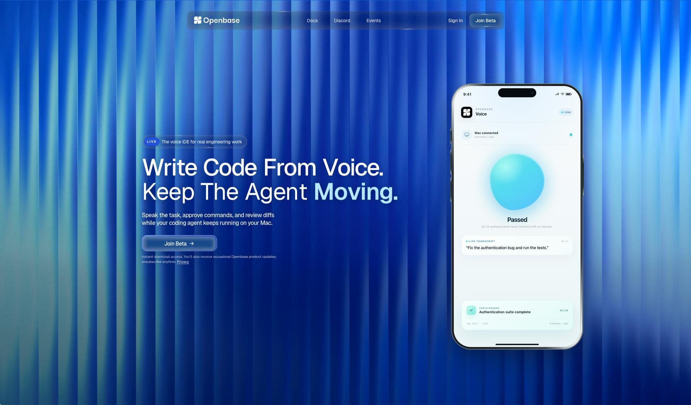
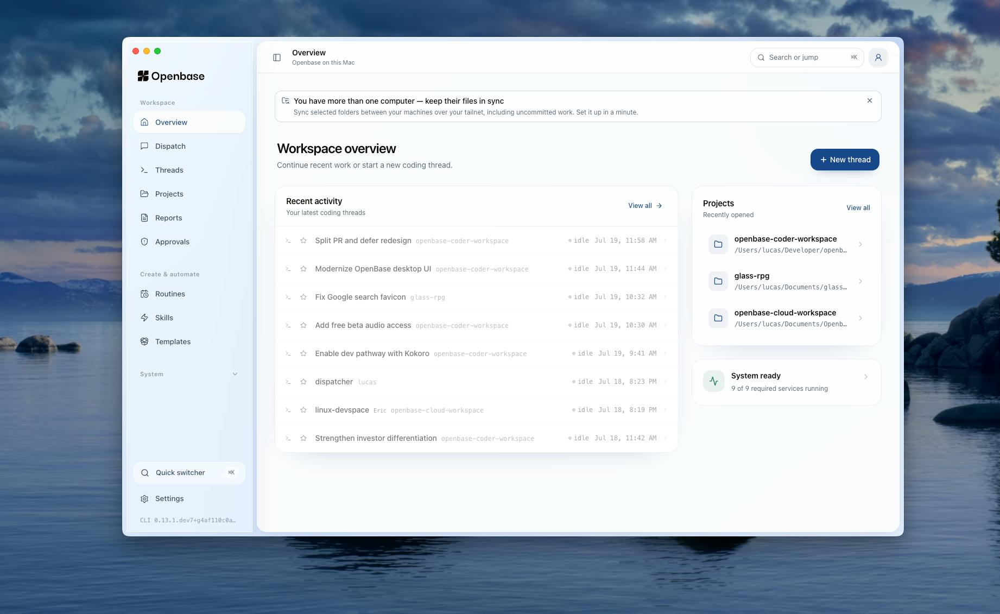
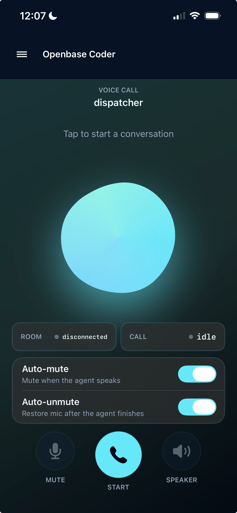

### 🎬 관련 영상
- [🎥 영상 보기](https://ph-files.imgix.net/d06eaf1a-fcac-48a1-92a8-1ba8e756c7de.jpeg?auto=format)

---

## 5. [Aymo AI](https://www.producthunt.com/products/aymo-ai)
**Votes**: 133 | **도입 난이도**: 하 | **신뢰도**: 상
**Tagline**: All-in-one AI Platform for Teams
**서비스 링크**: https://www.producthunt.com/r/B2AAONAFWVZST6

**태그**: AI, Productivity, Collaboration, SaaS, AI Tool, Chat, Vision

### 📌 이 서비스 한눈에 보기
45개 이상의 최신 AI 모델을 하나의 워크스페이스에서 비교하고 협업할 수 있는 올인원 AI 플랫폼

### 🔑 주요 기능
- GPT, Claude, Gemini, DeepSeek 등 45개 이상의 최신 AI 모델 통합 제공
- 모델 간 응답 결과 비교 및 파일 업로드/웹 검색/이미지 생성 기능 지원
- 팀 협업 기능과 크롬 확장 프로그램을 포함한 강력한 생산성 도구 번들

### 🙋 사용자에게 어떤 점이 좋은가
여러 AI 서비스를 개별 구독할 필요 없이 하나의 플랫폼에서 모델별 성능을 비교하며 팀원들과 효율적으로 협업할 수 있습니다.

### ✅ 지금 바로 써볼 기능
- 동일한 질문을 여러 모델에 던져 결과 비교하기
- 파일을 업로드하여 AI와 문서 기반 채팅하기
- 크롬 확장 프로그램을 설치하여 브라우저 환경에서 사용하기

### ⚠️ 사용 전 확인할 점
- 무료 플랜의 경우 모델 사용량이나 기능에 제한이 있을 수 있음
- 보안이 중요한 기업 데이터 입력 시 플랫폼의 데이터 처리 정책 확인 필요

### 🧭 확인이 더 필요한 정보
각 모델별 상세 사용량 제한 및 유료 플랜의 구체적인 기능 차이는 공식 홈페이지 확인이 필요합니다.

### 📸 스크린샷 및 갤러리
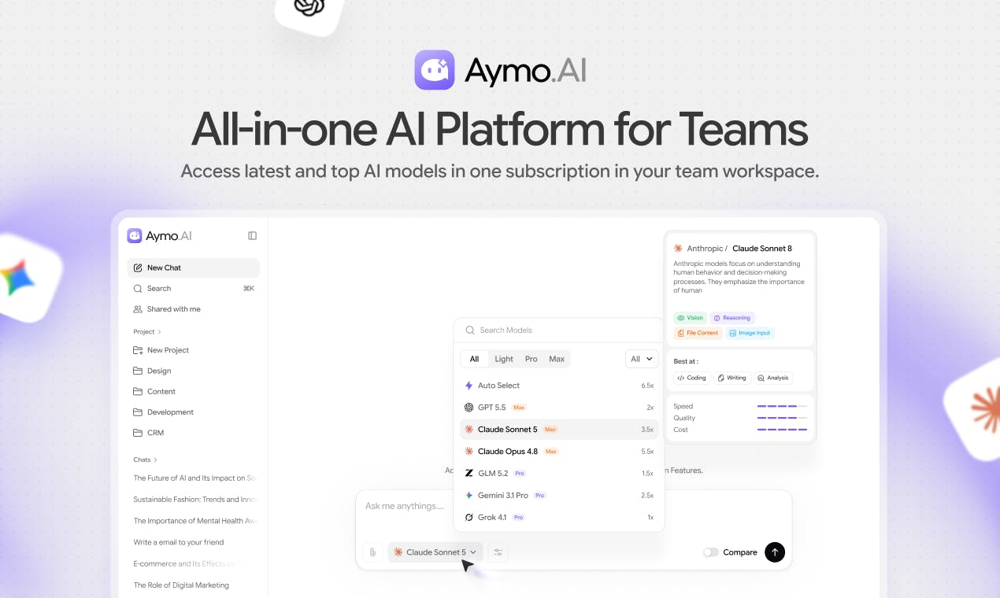
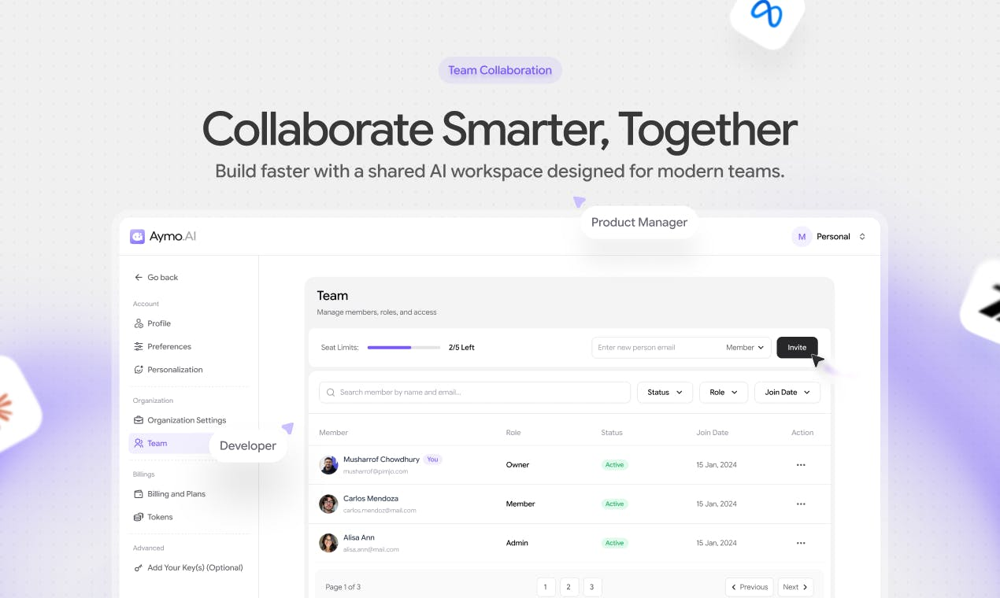
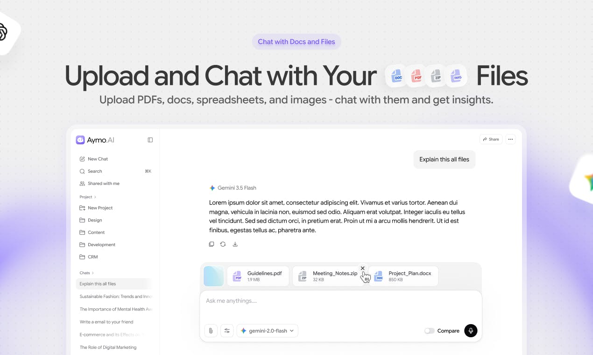

### 🎬 관련 영상
- [🎥 영상 보기](https://ph-files.imgix.net/39edd6b6-5fa4-4aa0-81f0-81a488007a3d.jpeg?auto=format)

---

## 6. [PureBox.ai](https://www.producthunt.com/products/purebox-ai)
**Votes**: 130 | **도입 난이도**: 하 | **신뢰도**: 상
**Tagline**: Review-first AI cleanup for your real Gmail inbox.
**서비스 링크**: https://www.producthunt.com/r/6EOMSBCWVQ62HH

**태그**: Productivity, AI, Gmail, Automation, AI Tool

### 📌 이 서비스 한눈에 보기
사용자의 이메일 패턴을 학습하여 맞춤형 정리 제안을 제공하는 AI 기반 Gmail 관리 도구

### 🔑 주요 기능
- 사용자의 과거 이메일 이력을 분석하여 개인화된 정리 규칙 자동 생성
- 사용자의 승인 없이는 어떤 메일도 이동하거나 삭제되지 않는 투명한 프로세스
- 단순 삭제를 넘어 사용자가 주목해야 할 중요한 메일을 우선적으로 식별

### 🙋 사용자에게 어떤 점이 좋은가
복잡한 규칙 설정 없이도 첫 스캔만으로 개인에게 최적화된 인박스 정리 솔루션을 경험할 수 있습니다.

### ✅ 지금 바로 써볼 기능
- Gmail 계정 연결 및 초기 데이터 스캔 실행
- AI가 제안하는 맞춤형 정리 규칙 검토
- 제안된 액션(삭제/이동) 승인 및 피드백

### ⚠️ 사용 전 확인할 점
- 개인화된 분석을 위해 Gmail 이력 데이터 접근이 필요함
- 사용자의 수동 승인 방식이므로 완전 자동화에 비해 작업 시간이 소요될 수 있음

### 🧭 확인이 더 필요한 정보
데이터 보안 및 프라이버시 보호 정책에 대한 상세 기술 명세 확인이 필요합니다.

### 📸 스크린샷 및 갤러리
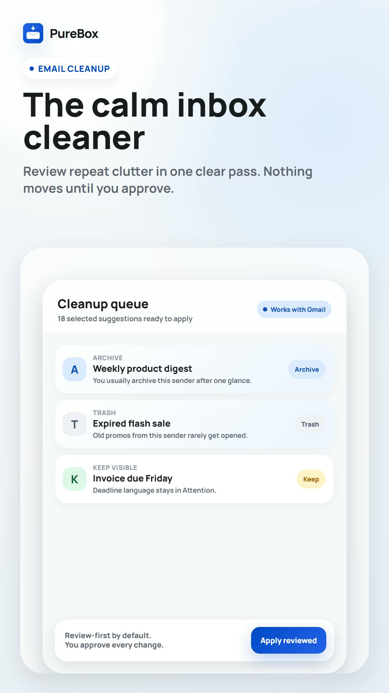
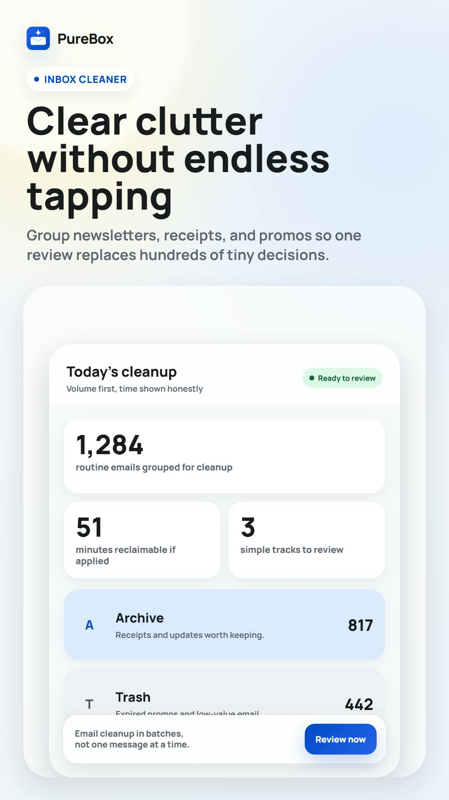
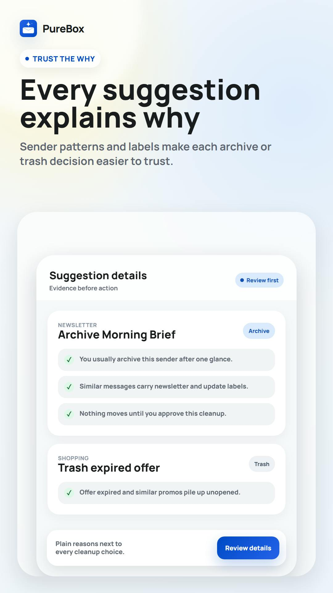

### 🎬 관련 영상
- [🎥 영상 보기](https://ph-files.imgix.net/fa819b2a-12d0-423b-81f1-eb01af9e68a4.jpeg?auto=format)

---

## 7. [Yoggi](https://www.producthunt.com/products/yoggi)
**Votes**: 110 | **도입 난이도**: 하 | **신뢰도**: 상
**Tagline**: Safe AI chat for kids
**서비스 링크**: https://www.producthunt.com/r/24P2KUY4V3E55O

**태그**: AI, Education, Family, Kids, Mobile, AI Tool, Chat, Vision

### 📌 이 서비스 한눈에 보기
아이들의 연령에 맞춘 안전한 대화와 창의적 활동을 지원하는 AI 비서

### 🔑 주요 기능
- 3~15세 아동을 위한 연령 맞춤형 답변 제공
- 실시간 음성 채팅 및 이미지 생성 기능 탑재
- 엄격한 콘텐츠 필터링 및 부모 제어 기능 제공

### 🙋 사용자에게 어떤 점이 좋은가
자녀가 안전한 환경에서 AI 기술을 체험하며 학습과 창의력을 키울 수 있습니다.

### ✅ 지금 바로 써볼 기능
- 아이의 연령에 맞는 답변 수준 확인하기
- 음성 채팅 기능을 통한 대화 경험해보기
- 부모 제어 설정을 통한 안전성 점검하기

### ⚠️ 사용 전 확인할 점
- 연령별 필터링의 정교함 정도를 직접 확인 필요
- 이미지 생성 기능의 유해성 차단 수준 확인 필요

### 🧭 확인이 더 필요한 정보
무료 버전의 사용량 제한이나 유료 구독 모델의 상세 정책은 명시되지 않았습니다.

### 📸 스크린샷 및 갤러리

---

## 8. [BrainFeed](https://www.producthunt.com/products/brainfeed-scroll-better)
**Votes**: 110 | **도입 난이도**: 하 | **신뢰도**: 상
**Tagline**: A personalized learning feed that redirects your scroll
**서비스 링크**: https://www.producthunt.com/r/IUAEPHIZ7VT24D

**태그**: EdTech, Productivity, Learning, Personalization, AI Tool, Video, Design

### 📌 이 서비스 한눈에 보기
무의미한 스크롤을 지식 습득으로 바꿔주는 개인 맞춤형 학습 피드

### 🔑 주요 기능
- 목표 설정 또는 긴 글/영상을 입력하면 핵심 내용을 카드 형태의 짧은 피드로 변환
- 자투리 시간을 활용할 수 있는 모바일 친화적인 스크롤 방식
- 간격 반복(Spaced Repetition) 알고리즘을 통한 학습 내용 유지

### 🙋 사용자에게 어떤 점이 좋은가
읽지 못하고 쌓아두기만 했던 긴 아티클이나 영상을 짧은 카드 형태로 변환하여, 일상 속 틈새 시간을 효율적인 학습 시간으로 전환할 수 있습니다.

### ✅ 지금 바로 써볼 기능
- 읽고 싶었지만 미뤄둔 긴 아티클 링크 입력하기
- 학습하고 싶은 주제를 커스텀 목표로 설정하기
- 변환된 카드 피드를 통해 틈새 시간 활용하기

### ⚠️ 사용 전 확인할 점
- 긴 콘텐츠를 요약하는 과정에서 세부적인 맥락이 생략될 수 있음
- 학습 효과는 사용자의 지속적인 피드 확인 여부에 따라 달라질 수 있음

### 🧭 확인이 더 필요한 정보
콘텐츠의 길이나 유형(텍ek, 영상 등)에 따른 요약 품질 차이를 확인해야 합니다.

### 📸 스크린샷 및 갤러리

### 🎬 관련 영상
- [🎥 영상 보기](https://ph-files.imgix.net/56178641-0cbd-41de-bfdd-cb24292ea0fb.jpeg?auto=format)

---

## 9. [Pulse Island](https://www.producthunt.com/products/pulse-island)
**Votes**: 107 | **도입 난이도**: 하 | **신뢰도**: 상
**Tagline**: A living island for your Mac's notch
**서비스 링크**: https://www.producthunt.com/r/K4GNWQIHQ3MCGW

**태그**: Productivity, macOS, Utility

### 📌 이 서비스 한눈에 보기
맥북 노치 영역을 활용해 실시간 정보를 확인하는 다이내믹 아일랜드형 위젯

### 🔑 주요 기능
- 맥북 노치 영역을 활용한 직관적인 UI 제공
- 음악, 회의, 클립보드, 날씨 등 다양한 실시간 상태 표시
- 시스템 상태 및 포커스 타이머 등 생산성 도구 통합

### 🙋 사용자에게 어떤 점이 좋은가
화면 상단을 활용해 작업 흐름을 방해받지 않으면서도 중요한 알림과 상태를 한눈에 확인할 수 있습니다.

### ✅ 지금 바로 써볼 기능
- 음악 재생 상태 확인하기
- 회의 중 상태 표시 확인하기
- 클립보드 및 시스템 스탯 모니터링하기

### ⚠️ 사용 전 확인할 점
- 노치 디자인이 없는 맥북 모델에서는 사용이 제한될 수 있음
- 상단 영역 점유로 인한 화면 가독성 변화 확인 필요

### 🧭 확인이 더 필요한 정보
상세한 시스템 리소스 점유율 및 배터리 소모량에 대한 정보가 제공되지 않았습니다.

### 📸 스크린샷 및 갤러리

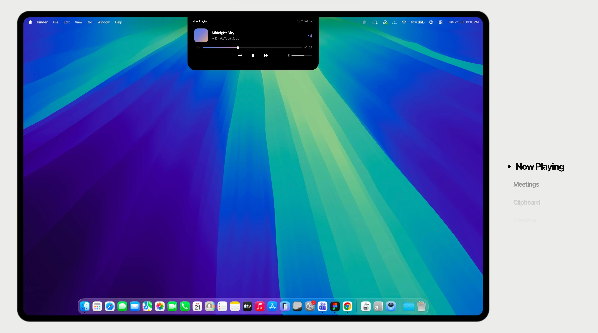
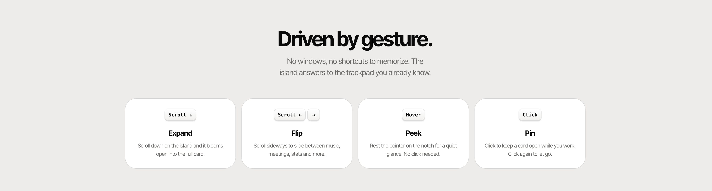

### 🎬 관련 영상
- [🎥 영상 보기](https://ph-files.imgix.net/27839c15-4598-4109-ba07-57b6c34b6847.jpeg?auto=format)

---

## 10. [Forgeon](https://www.producthunt.com/products/forgeon-2)
**Votes**: 98 | **도입 난이도**: 중 | **신뢰도**: 상
**Tagline**: Create, publish, and experience interactive stories
**서비스 링크**: https://www.producthunt.com/r/AFVYUCU2FMSEPA

**태그**: Storytelling, CreativeTools, Interactive, DigitalPublishing, AI Tool

### 📌 이 서비스 한눈에 보기
선택과 게임적 요소가 결합된 차세대 인터랙티브 스토리텔링 플랫폼

### 🔑 주요 기능
- 선택지, RPG 메커니즘, 음악, 삽화 등을 활용한 몰입형 스토리 제작
- AI 자동 생성 대신 창작자의 의도를 존중하는 전문 제작 도구 지향
- 독자가 직접 참여하고 경험하는 새로운 형태의 디지털 북 플랫폼

### 🙋 사용자에게 어떤 점이 좋은가
작가들은 단순한 텍스트를 넘어 게임처럼 생동감 넘치는 이야기를 만들 수 있으며, 독자들은 능동적인 참여를 통해 새로운 독서 경험을 누릴 수 있습니다.

### ✅ 지금 바로 써볼 기능
- 스토리 제작 도구로 나만의 인터랙티브 시나리오 작성하기
- RPG 요소 및 멀티미디어(음악, 삽화) 결합 기능 테스트하기
- 제작한 스토리를 플랫폼에 게시하여 독자 반응 확인하기

### ⚠️ 사용 전 확인할 점
- 게임적 요소가 포함되어 있어 일반적인 전자책보다 제작 난이도가 높을 수 있음
- 플랫폼 내 독자층 확보 및 배포 방식에 대한 구체적 정보 필요

### 🧭 확인이 더 필요한 정보
창작 도구의 구체적인 인터페이스와 제작 프로세스에 대한 상세 정보가 필요합니다.

### 📸 스크린샷 및 갤러리
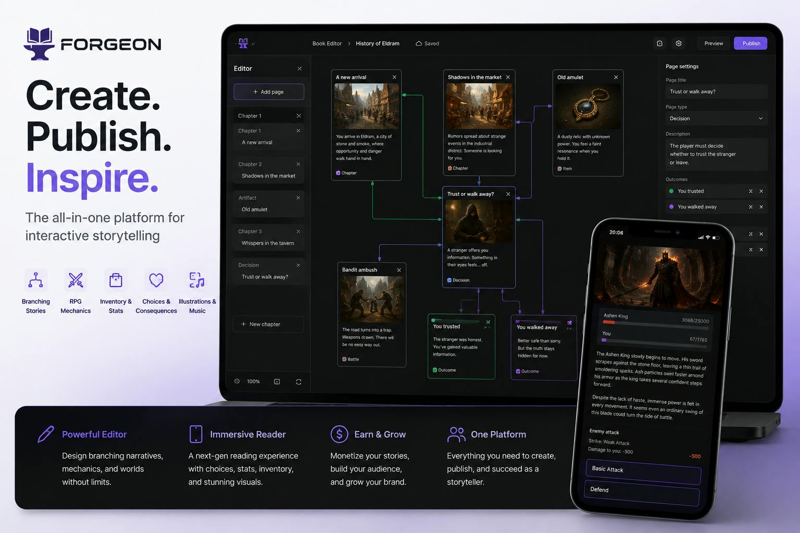
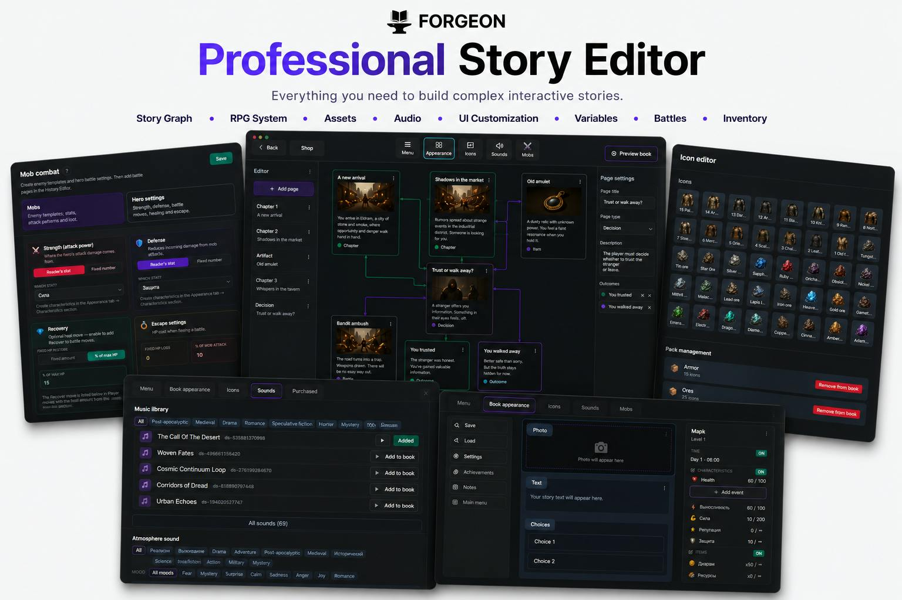
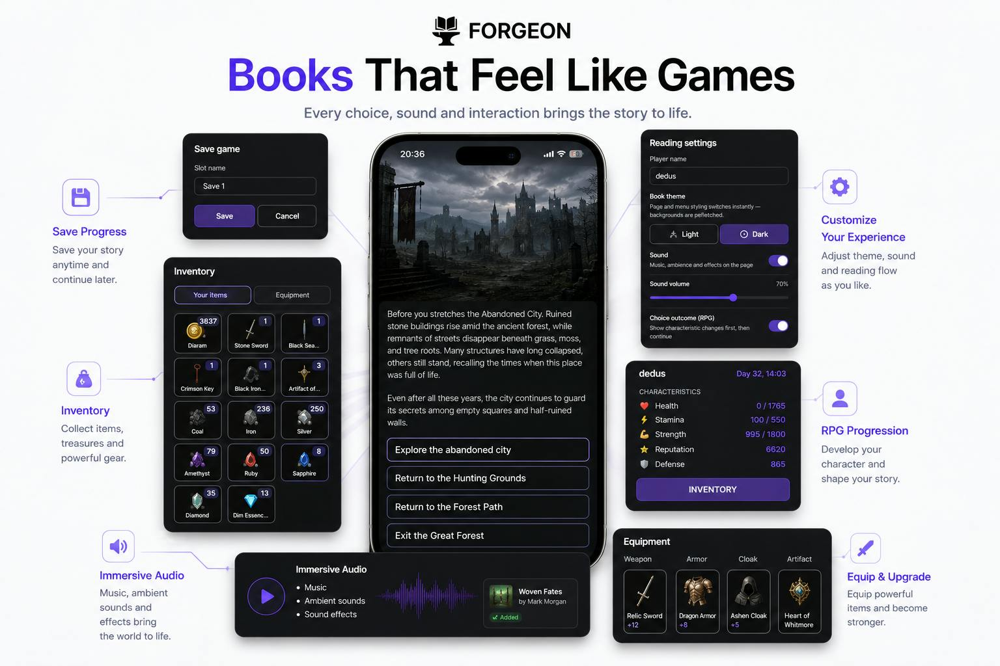

### 🎬 관련 영상
- [🎥 영상 보기](https://ph-files.imgix.net/812aad0b-7881-415f-9037-0894604e459c.jpeg?auto=format)

---

## 11. [KeyOpera 2.0](https://www.producthunt.com/products/keyopera)
**Votes**: 97 | **도입 난이도**: 하 | **신뢰도**: 상
**Tagline**: Make every Mac keystroke sound uniquely yours
**서비스 링크**: https://www.producthunt.com/r/EXT6T6IL3UJVYZ

**태그**: Mac, Customization, Productivity, UX, Design

### 📌 이 서비스 한눈에 보기
사용자 맞춤형 키보드 및 마우스 사운드로 Mac 사용 경험을 즐겁게 만드는 도구

### 🔑 주요 기능
- 커스텀 사운드 팩(customkeypak) 지원으로 개성 있는 타건음 구현
- Homebrew CLI를 통한 사운드 팩 생성 및 제어 기능
- Finder 원클릭 설치 및 개선된 메뉴 디자인

### 🙋 사용자에게 어떤 점이 좋은가
단순한 입력을 넘어 시각적/청각적 피드백을 통해 Mac 작업 환경을 더욱 몰입감 있고 개성 있게 만들어 줍니다.

### ✅ 지금 바로 써볼 기능
- 새로운 customkeypak 사운드 팩 적용해보기
- Homebrew CLI를 활용한 사운드 팩 관리 시도하기
- 개선된 메뉴 디자인 탐색하기

### ⚠️ 사용 전 확인할 점
- 사운드 재생이 백그라운드에서 시스템 리소스를 지속적으로 사용할 수 있음
- 사용자 환경에 따른 사운드 피드백이 작업 집중도를 분산시킬 가능성

### 🧭 확인이 더 필요한 정보
사운드 팩의 상세 라이선스 정책 및 시스템 리소스 점유율에 대한 정보가 명시되지 않았습니다.

### 📸 스크린샷 및 갤러리

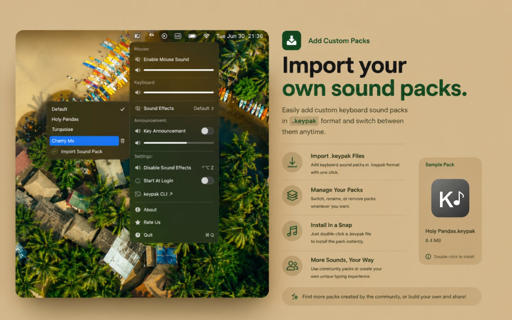

---

## 12. [CodexBar Lite](https://www.producthunt.com/products/codexbar-lite)
**Votes**: 88 | **도입 난이도**: 하 | **신뢰도**: 상
**Tagline**: Privacy-first Codex tracker for your macOS menu bar
**서비스 링크**: https://www.producthunt.com/r/IWZXMU2ZWFQXDM

**태그**: DevTool, macOS, Productivity, OpenSource, AI Tool, API

### 📌 이 서비스 한눈에 보기
기존 CLI 세션을 활용해 개인정보 유출 걱정 없이 macOS 메뉴 바에서 Codex 사용량을 확인하는 도구

### 🔑 주요 기능
- 기존 Codex CLI 세션을 활용하는 네이티브 macOS 메뉴 바 앱
- API 키, 브라우저 쿠키, 키체인 권한이 필요 없는 프라이버시 중심 설계
- 사용량 모니터링, 리셋 시간 확인 및 알림 기능 제공

### 🙋 사용자에게 어떤 점이 좋은가
별도의 계정 연동이나 보안 설정 없이도 현재 사용 중인 Codex 사용 현황을 실시간으로 간편하게 확인할 수 있습니다.

### ✅ 지금 바로 써볼 기능
- 메뉴 바에서 실시간 사용량 모니터링하기
- 사용량 리셋 시간 확인하여 작업 계획 세우기
- 사용량 제한에 대비한 알림 설정하기

### ⚠️ 사용 전 확인할 점
- 기존에 활성화된 Codex CLI 세션이 있어야 작동함
- 오픈소스 앱이므로 로컬 환경의 CLI 설정 상태에 의존적임

### 🧭 확인이 더 필요한 정보
사용자의 기존 CLI 환경과 앱 간의 호환성 및 세션 연동 방식에 대한 상세 기술 사양 확인이 필요합니다.

### 📸 스크린샷 및 갤러리
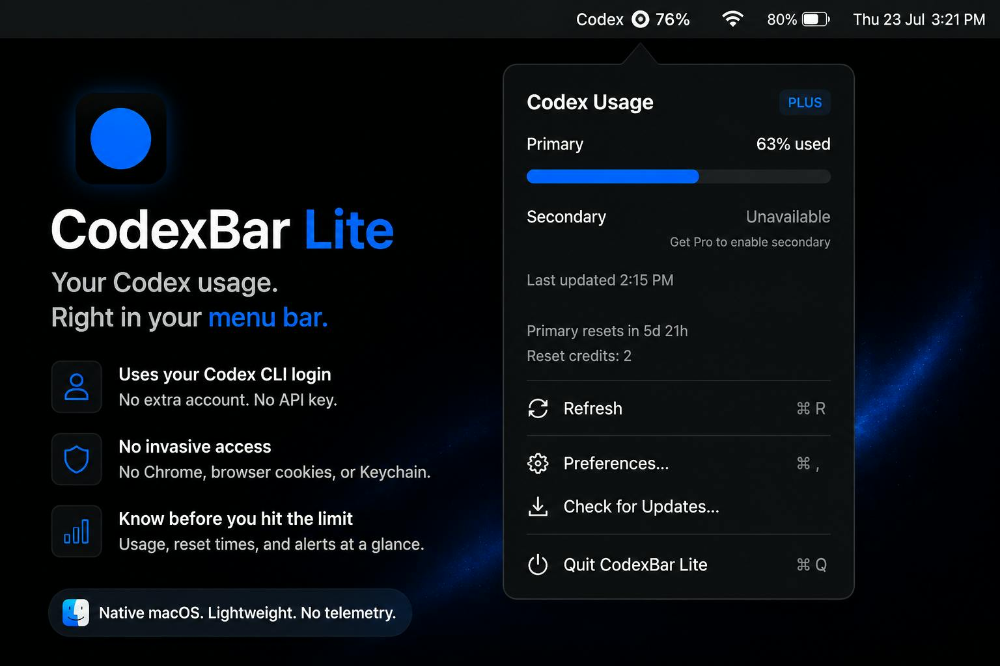
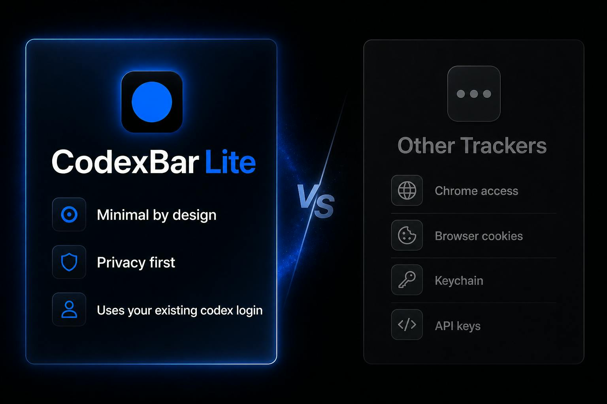
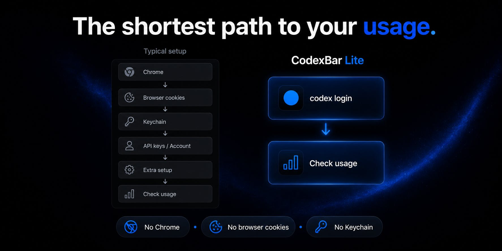

### 🎬 관련 영상
- [🎥 영상 보기](https://ph-files.imgix.net/5019d2ed-4868-43b7-88b0-27ab030574b5.jpeg?auto=format)

---

## 13. [>=PlayingFild](https://www.producthunt.com/products/playingfild)
**Votes**: 86 | **도입 난이도**: 하 | **신뢰도**: 상
**Tagline**: Productivity Tool & Tab Manager that Understands Context
**서비스 링크**: https://www.producthunt.com/r/TMEMIQ5LCGOSI6

**태그**: Productivity, BrowserExtension, Automation, Privacy, Analytics

### 📌 이 서비스 한눈에 보기
콘텐츠 맥락을 이해하여 탭을 자동 분류하고 집중력을 관리하는 프라이버시 중심 생산성 도구

### 🔑 주요 기능
- URL이 아닌 페이지 콘텐츠 내용을 기반으로 한 온디바이스 머신러닝 탭 분류
- 집중 시간을 통해 휴식 시간을 확보하는 게이미피케이션 방식의 타이머
- 사용 패턴에 따른 자동 탭 재정렬 및 미사용 탭 자동 종료 기능

### 🙋 사용자에게 어떤 점이 좋은가
사용자가 어떤 페이지에 있는지 맥락을 파악해 탭을 정리해주므로, 불필요한 웹 서핑을 줄이고 작업 흐름을 유지하는 데 도움을 줍니다.

### ✅ 지금 바로 써볼 기능
- 콘텐츠 기반 자동 분류 기능 활성화
- 집중 모드(Focus Timer) 설정 및 휴식 시간 관리
- 사용 패턴 분석을 통한 생산성 리캡 카드 확인

### ⚠️ 사용 전 확인할 점
- 온디바이스 ML 모델이 브라우저 성능(CPU/RAM)에 미치는 영향 확인 필요
- 자동 탭 종료 기능으로 인한 의도치 않은 페이지 손실 주의

### 🧭 확인이 더 필요한 정보
지원하는 브라우저 종류와 운영체제별 최적화 수준에 대한 상세 정보가 필요합니다.

### 📸 스크린샷 및 갤러리
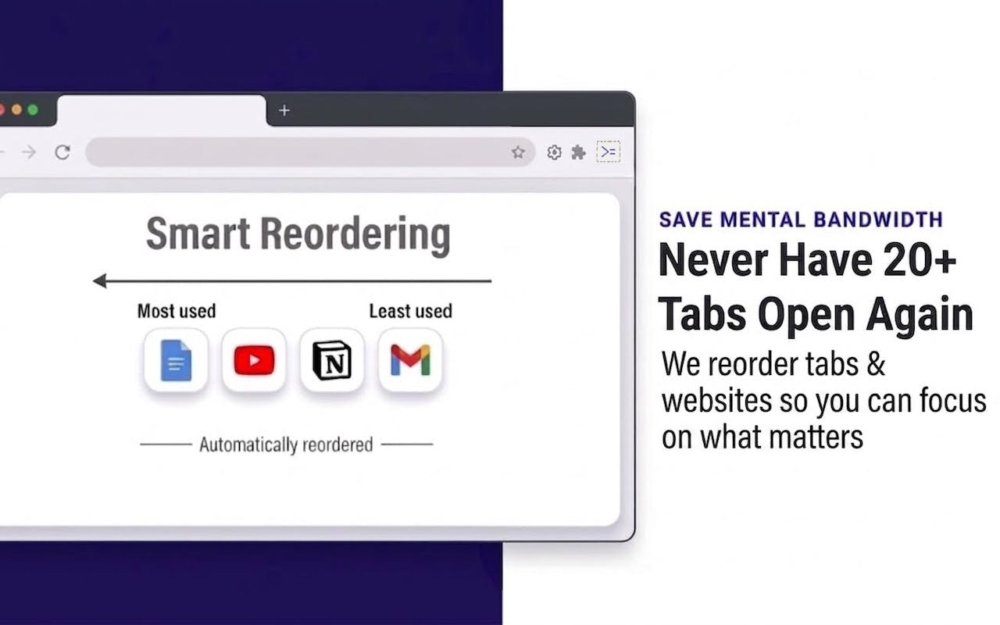
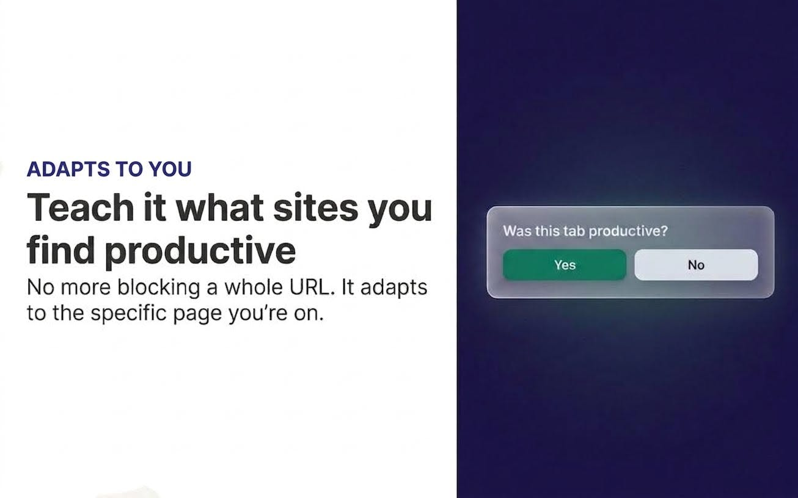
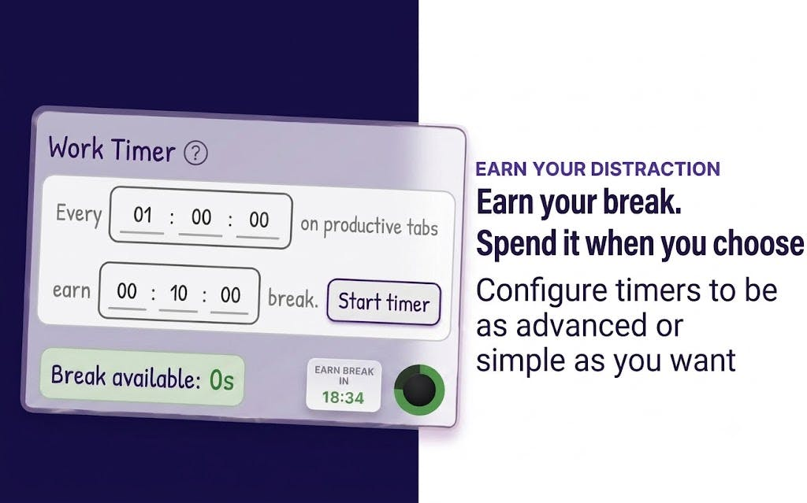

---

## 14. [yatta!](https://www.producthunt.com/products/yatta)
**Votes**: 85 | **도입 난이도**: 하 | **신뢰도**: 상
**Tagline**: A cute little to-do list that celebrates with you
**서비스 링크**: https://www.producthunt.com/r/RWF4RUWHMCN5CE

**태그**: Productivity, Minimalism, To-do List, Gamification

### 📌 이 서비스 한눈에 보기
할 일을 마칠 때마다 귀여운 축하를 받는 미니멀 투두 리스트

### 🔑 주요 기능
- 오늘, 나중에, 언젠가로 구분되는 극도로 단순한 3단계 분류
- 작업 완료 시 캐릭터의 축하와 불꽃놀이가 제공되는 보상 체계
- 프로젝트나 우선순위 설정이 없는 클러터 프리(Clutter-free) 환경

### 🙋 사용자에게 어떤 점이 좋은가
복잡한 기능에 지친 사용자가 할 일 관리에 대한 심리적 부담을 줄이고, 작은 성취감을 즉각적으로 느낄 수 있습니다.

### ✅ 지금 바로 써볼 기능
- 오늘 할 일 목록 만들기
- 할 일 완료 후 캐릭터의 축하 경험하기
- 오프라인 환경에서 데이터 관리하기

### ⚠️ 사용 전 확인할 점
- 복잡한 프로젝트 관리나 세부 우선순위 설정이 불가능함
- 오프라인 기반이므로 기기 간 동기화 기능 여부 확인 필요

### 🧭 확인이 더 필요한 정보
기기 간 데이터 동기화 지원 여부와 상세한 플랫폼(Web/App) 정보가 명시되지 않았습니다.

### 📸 스크린샷 및 갤러리

---

## 15. [AppUFO ](https://www.producthunt.com/products/appufo-localise-apps-with-ai)
**Votes**: 76 | **도입 난이도**: 하 | **신뢰도**: 상
**Tagline**: Ship localised Apps faster
**서비스 링크**: https://www.producthunt.com/r/BRUCYWF5RDHNZD

**태그**: DevTool, Automation, Localization, iOS

### 📌 이 서비스 한눈에 보기
Xcode 프로젝트의 현지화 작업을 몇 분 만에 완료하여 글로벌 출시를 가속화하는 도구

### 🔑 주요 기능
- Xcode 프로젝트 기반의 신속한 현지화 프로세스
- 번역 비용 절감 및 수동 문자열 관리 시간 단축
- 글로벌 사용자 확보를 위한 효율적인 앱 배포 지원

### 🙋 사용자에게 어떤 점이 좋은가
개발자가 번역 작업에 들이는 시간을 줄이고 코드 작성에만 집중할 수 있게 하여, 앱의 글로벌 출시 주기를 단축해 줍니다.

### ✅ 지금 바로 써볼 기능
- 기존 Xcode 프로젝트에 적용해 보기
- 문자열 관리 워크플로우 최적화하기
- 현지화 자동화 기능 테스트하기

### ⚠️ 사용 전 확인할 점
- Xcode 프로젝트 구조에 따른 호환성 확인 필요
- 자동화된 번역 품질에 대한 검토 필요

### 🧭 확인이 더 필요한 정보
구체적인 지원 언어 범위와 외부 번역 서비스와의 연동 방식에 대한 정보가 필요합니다.

### 📸 스크린샷 및 갤러리
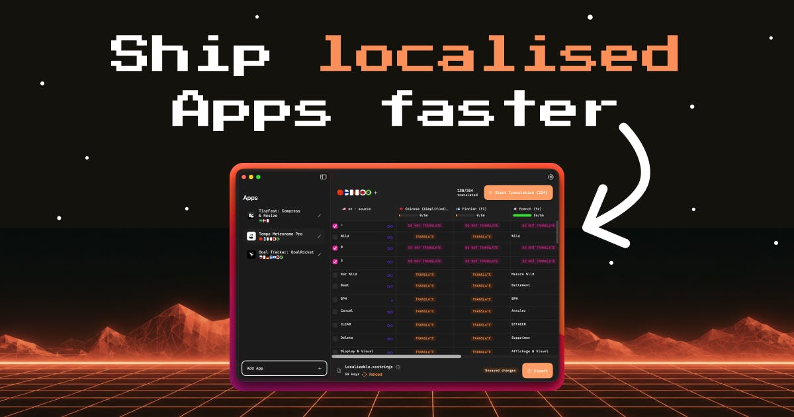
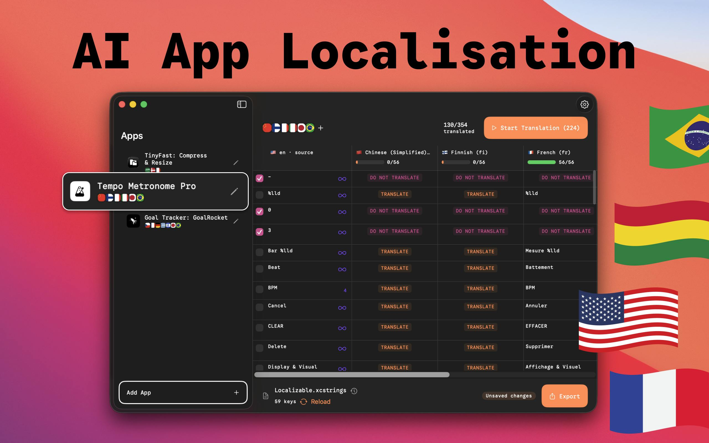
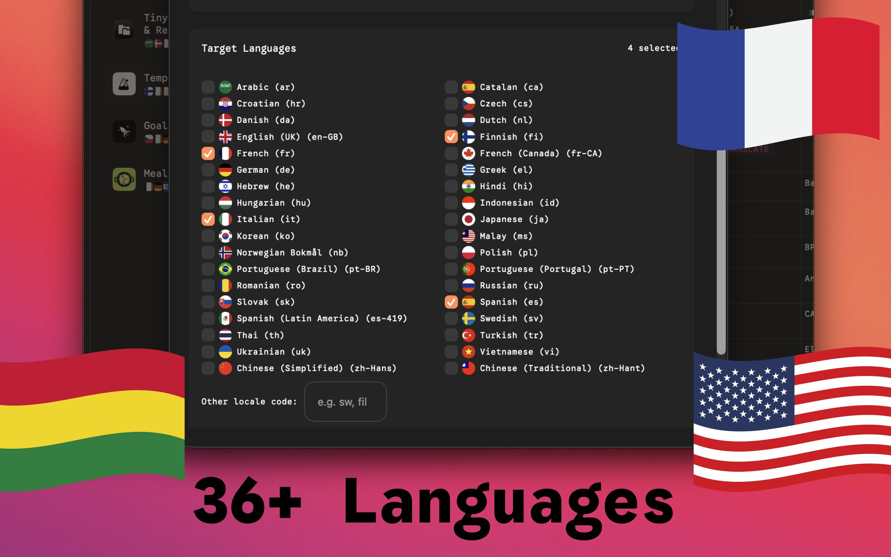

### 🎬 관련 영상
- [🎥 영상 보기](https://ph-files.imgix.net/39b1e64a-5f30-4f1a-b909-5c0d8063a03d.jpeg?auto=format)

---

## 16. [Pawesome](https://www.producthunt.com/products/pawesome)
**Votes**: 35 | **도입 난이도**: 중 | **신뢰도**: 상
**Tagline**: Your AI Native Inbound Marketing Engine
**서비스 링크**: https://www.producthunt.com/r/WESJBZCMS6H6KO

**태그**: Marketing, AI, B2B, SaaS, Automation, AI Tool, Analytics

### 📌 이 서비스 한눈에 보기
기업의 정보를 학습하여 콘텐츠 생성부터 리드 수집까지 수행하는 AI 기반 B2B 인바운드 마케팅 엔진

### 🔑 주요 기능
- 기업 맞춤형 지식을 갖춘 AI 브레인 기반 엔진
- 콘텐츠 생성, 리드 수집, 분석을 통합한 올인원 워크플로우
- B2B SaaS 기업에 최적화된 인바운드 자동화

### 🙋 사용자에게 어떤 점이 좋은가
마케팅 전략 수립부터 실행까지의 과정을 자동화하여, 적은 인원으로도 효율적인 리드 생성과 콘텐츠 운영이 가능합니다.

### ✅ 지금 바로 써볼 기능
- 기업 데이터 학습 및 브레인 설정
- AI 콘텐츠 엔진을 통한 마케팅 에셋 생성
- 리드 수집 및 분석 대시보드 확인

### ⚠️ 사용 전 확인할 점
- AI가 생성한 콘텐츠의 브랜드 톤앤매너 검수 필요
- 초기 기업 데이터 학습 품질에 따른 결과물 차이 가능성

### 🧭 확인이 더 필요한 정보
상세한 기능별 워크플로우와 외부 툴과의 연동 범위에 대한 정보가 부족합니다.

### 📸 스크린샷 및 갤러리

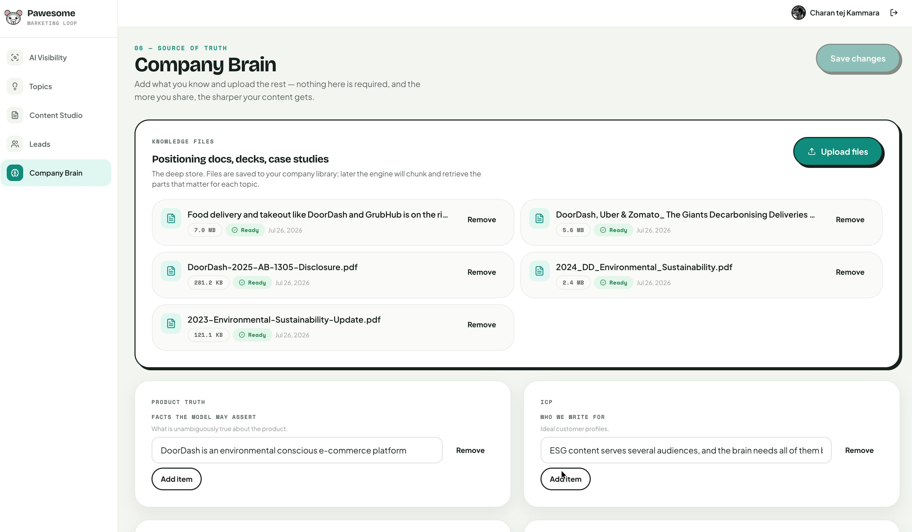
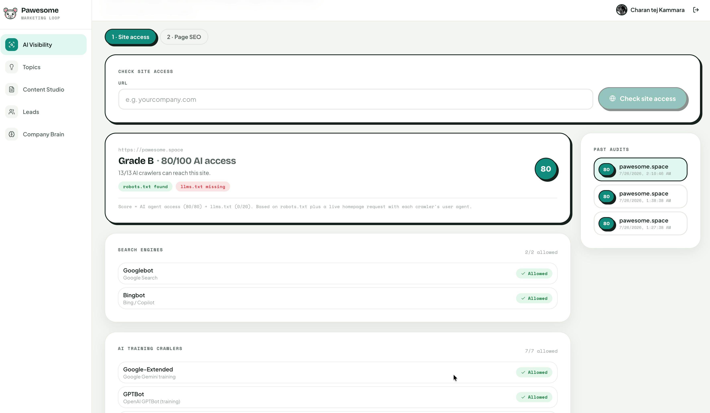

### 🎬 관련 영상
- [🎥 영상 보기](https://ph-files.imgix.net/be687573-f9b1-4146-b213-243e48fbcada.gif?auto=format)

---

## 17. [Via 1.0](https://www.producthunt.com/products/via-v1)
**Votes**: 23 | **도입 난이도**: 하 | **신뢰도**: 상
**Tagline**: Find the optimal path through your work
**서비스 링크**: https://www.producthunt.com/r/MDAQC6VQYR2V3J

**태그**: Productivity, AI, Scheduling, TimeManagement, AI Tool

### 📌 이 서비스 한눈에 보기
변동하는 일정 속에서 우선순위에 따른 최적의 업무 경로를 제안하는 AI 스케줄러

### 🔑 주요 기능
- 브레인 덤프(생각 정리)를 통한 간편한 일정 생성
- 우선순위 기반의 지능형 시간 배정
- 일정 변경 시 실시간 자동 스케줄 업데이트

### 🙋 사용자에게 어떤 점이 좋은가
계획이 수시로 바뀌는 업무 환경에서 매번 일정을 재조정할 필요 없이, 다음에 해야 할 일을 즉각적으로 알려주어 집중력을 유지해 줍니다.

### ✅ 지금 바로 써볼 기능
- 머릿속에 있는 할 일들을 자유롭게 입력해 보기
- 우선순위 설정을 통해 핵심 업무 배치 확인하기
- 갑작스러운 일정 변경 시 자동 업데이트 기능 테스트하기

### ⚠️ 사용 전 확인할 점
- AI가 제안하는 일정이 사용자의 실제 작업 소요 시간과 일치하는지 검토 필요
- 외부 캘린더(Google, Outlook 등)와의 연동 범위 확인 필요

### 🧭 확인이 더 필요한 정보
현재 제공되는 기능 외에 외부 캘린더 서비스와의 구체적인 동기화 방식 및 연동 범위는 명시되지 않았습니다.

### 📸 스크린샷 및 갤러리

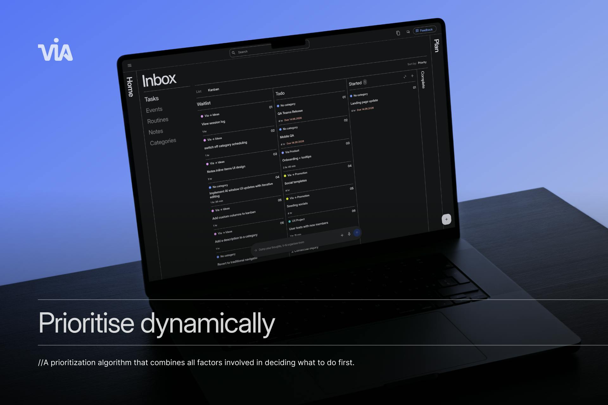

### 🎬 관련 영상
- [🎥 영상 보기](https://ph-files.imgix.net/b856ef2a-da91-487b-a0ea-e8cdd733ed63.jpeg?auto=format)

---

## 18. [Maptoolkit.org - free vector map server](https://www.producthunt.com/products/maptoolkit-org-free-vector-map-server)
**Votes**: 19 | **도입 난이도**: 하 | **신뢰도**: 상
**Tagline**: Stunning vector maps. Zero cost. No sign-up, no API key.
**서비스 링크**: https://www.producthunt.com/r/IZUQGDPWMDILRU

**태그**: DevTool, GIS, OpenSource, Map, AI Tool, API

### 📌 이 서비스 한눈에 보기
가입이나 API 키 없이 즉시 사용할 수 있는 무료 오픈소스 벡터 지도 서버

### 🔑 주요 기능
- OpenStreetMap과 MapLibre 기반의 고성능 벡터 타일 서버
- 가입, API 키, 쿠키가 필요 없는 프라이버시 중심의 설계
- 3D 지형, 힐셰이딩, 아웃도어 스타일을 포함한 커스텀 베이스맵 제공

### 🙋 사용자에게 어떤 점이 좋은가
개인 프로젝트나 소규모 비즈니스에서 복잡한 인증 절차 없이 즉각적으로 고품질 지도를 웹 서비스에 통합할 수 있습니다.

### ✅ 지금 바로 써볼 기능
- 제공되는 다양한 아웃도어 및 3D 스타일 적용해보기
- API 키 없이 벡터 타일이 정상적으로 렌더링되는지 테스트하기

### ⚠️ 사용 전 확인할 점
- 제한 없는 요청을 제공하지만, 대규모 트래픽 발생 시 서비스 안정성 확인 필요
- 오픈소스/소규모 프로젝트용이므로 엔터프라이즈급 SLA 보장 여부 불투명

### 🧭 확인이 더 필요한 정보
대규모 상업적 프로젝트로 확장 시의 성능 및 서비스 지속 가능성에 대한 구체적인 정책이 명시되지 않았습니다.

### 📸 스크린샷 및 갤러리
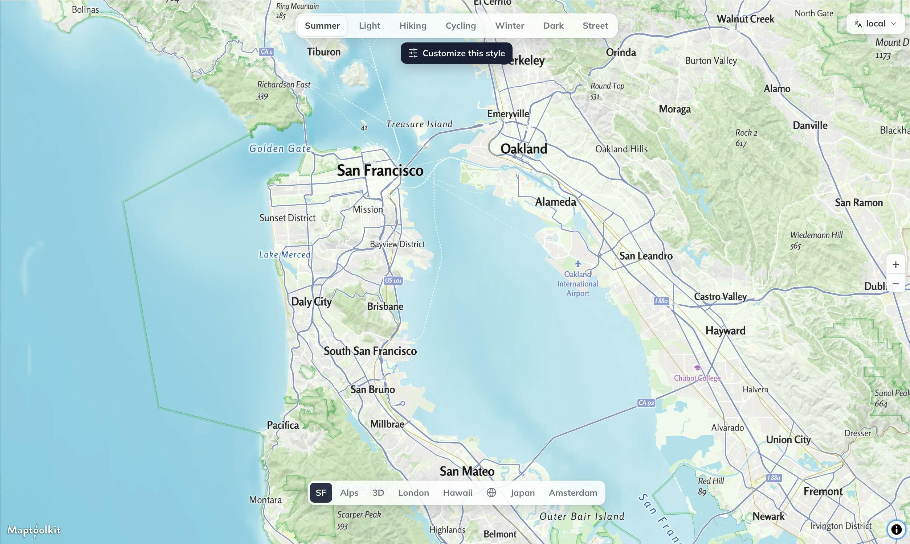
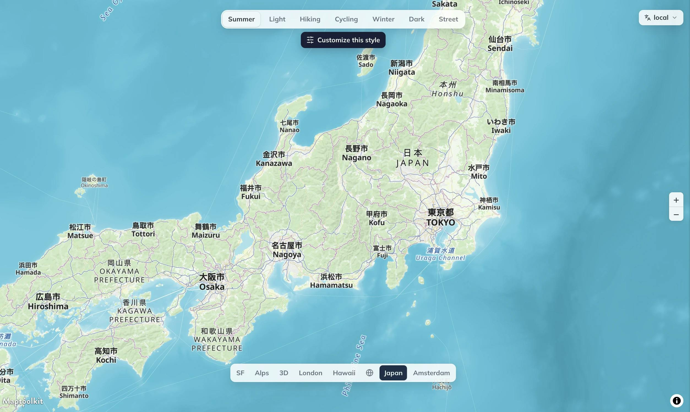

### 🎬 관련 영상
- [🎥 영상 보기](https://ph-files.imgix.net/a21b7cef-c00f-4301-a95e-34361fdac865.jpeg?auto=format)

---

## 19. [AlsonAI Studio for Animated Shorts](https://www.producthunt.com/products/alsonai)
**Votes**: 18 | **도입 난이도**: 하 | **신뢰도**: 상
**Tagline**: From bedtime story to animated short film.
**서비스 링크**: https://www.producthunt.com/r/HIDPGYGCVPP77V

**태그**: AI-Video, Content-Creation, Storytelling, Automation, AI Tool, Video

### 📌 이 서비스 한눈에 보기
창작한 이야기를 생동감 넘치는 애니메이션 쇼츠로 변환하는 AI 스튜디오

### 🔑 주요 기능
- Gemini Omni 기반의 강력한 비디오 파이프라인 탑재
- 텍스트 스토리를 삽화가 포함된 도서 및 애니메이션으로 변환
- 유튜브 쇼츠, 릴스, 교육용 영상 등 다양한 포맷 지원

### 🙋 사용자에게 어떤 점이 좋은가
스토리텔링 역량을 가진 창작자가 복잡한 애니메이션 제작 과정 없이도 고품질의 영상 콘텐츠를 빠르게 생성할 수 있습니다.

### ✅ 지금 바로 써볼 기능
- 자신만의 독창적인 스토리 입력하기
- 생성된 캐릭터와 장면의 일관성 확인하기
- 쇼츠 및 릴스용 영상 포맷으로 내보내기

### ⚠️ 사용 전 확인할 점
- AI 생성 특성상 캐릭터의 일관성 유지 여부 확인 필요
- 영상 스타일의 세부 제어 범위 확인 필요

### 🧭 확인이 더 필요한 정보
Gemini Omni 모델의 구체적인 영상 생성 품질과 편집 자유도에 대한 정보가 필요합니다.

### 📸 스크린샷 및 갤러리

### 🎬 관련 영상
- [🎥 영상 보기](https://ph-files.imgix.net/c29ee291-2263-4040-8c2d-5821167c86af.jpeg?auto=format)

---

## 20. [Prompt Anything: No more AI slop](https://www.producthunt.com/products/prompt-anything)
**Votes**: 16 | **도입 난이도**: 하 | **신뢰도**: 상
**Tagline**: Become an expert prompt engineer in minutes, for anything AI
**서비스 링크**: https://www.producthunt.com/r/EMXOFGJHYITMRL

**태그**: AI, Prompt Engineering, Productivity, Automation, Agent, AI Tool, Prompting, Video, Vision, DevTool

### 📌 이 서비스 한눈에 보기
일상적인 언어를 전문가 수준의 프롬프트로 변환하여 AI 결과물의 품질을 극대화하는 도구

### 🔑 주요 기능
- 일상적인 영어 설명을 정교한 전문가용 프롬프트로 자동 변환
- 에이전트, 웹 앱, 이미지, 비디오, 코드 등 13가지 특화 모드 제공
- 맥락 파악을 위한 스마트 질문과 비용 최적화된 모델 라우팅 기능

### 🙋 사용자에게 어떤 점이 좋은가
프롬프트 작성에 드는 시간을 줄이면서도, 단 한 번의 실행으로 고품질의 결과물을 얻어 토큰 비용과 작업 시간을 절약할 수 있습니다.

### ✅ 지금 바로 써볼 기능
- 13가지 모드 중 필요한 작업 유형 선택하기
- 일상적인 언어로 원하는 결과물 설명하기
- 가이드(Quill)의 질문에 답하며 맥락 구체화하기

### ⚠️ 사용 전 확인할 점
- 사용자의 의도를 정확히 반영하기 위해 초기 질문 단계에서 맥락을 잘 전달해야 함
- 최종 결과물의 80~100% 완성도를 보장하지만, 나머지 미세 조정은 사용자의 몫임

### 🧭 확인이 더 필요한 정보
제공되는 13가지 모드별로 지원하는 특정 AI 모델의 범위와 상세 기능 차이를 확인해야 합니다.

### 📸 스크린샷 및 갤러리
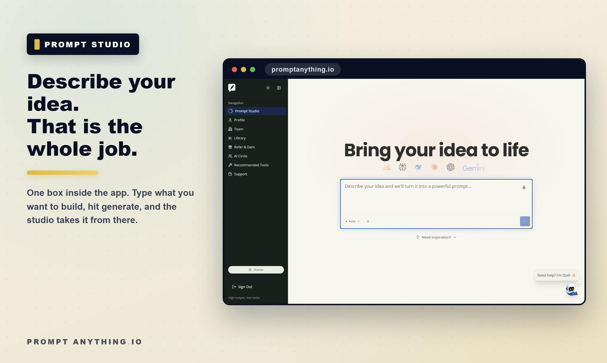
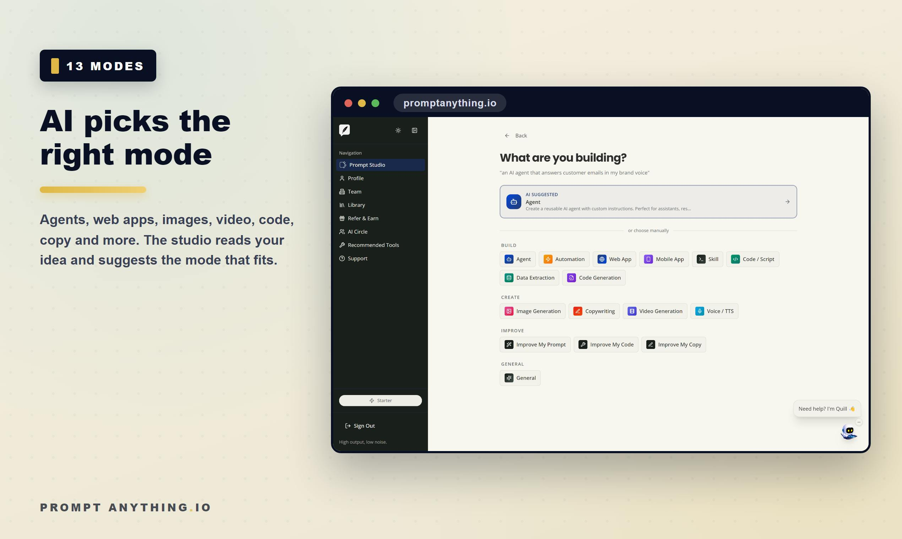
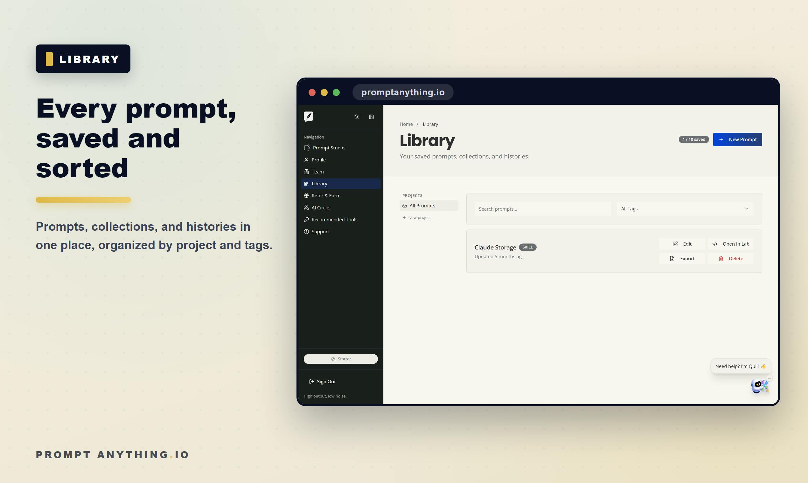

### 🎬 관련 영상
- [🎥 영상 보기](https://ph-files.imgix.net/053229f4-522f-4471-90d8-6cfbec8c402e.jpeg?auto=format)

---

## 21. [Scaloom](https://www.producthunt.com/products/scaloom-10)
**Votes**: 13 | **도입 난이도**: 하 | **신뢰도**: 상
**Tagline**: Safe Reddit account warmup tool for founders & marketers
**서비스 링크**: https://www.producthunt.com/r/J3MU7M542GEL4K

**태그**: Marketing, AI, LeadGeneration, Automation, AI Tool, Analytics

### 📌 이 서비스 한눈에 보기
계정 정지 위험 없이 레딧에서 잠재 고객을 발굴하고 소통할 수 있는 AI 마케팅 어시스턴트

### 🔑 주요 기능
- 계정 신뢰도 및 카르마를 안전하게 쌓는 계정 웜업 엔진
- 구매 의사가 있는 잠재 고객을 실시간으로 포착하는 리드 레이더
- 맥락을 반영한 AI 초안 작성 및 1클릭 승인 방식의 효율적 답변

### 🙋 사용자에게 어떤 점이 좋은가
레딧의 엄격한 제재를 피하면서도 AI의 속도로 타겟 고객에게 자연스럽게 접근하여 고객을 확보할 수 있습니다.

### ✅ 지금 바로 써볼 기능
- 7일 무료 체험을 통해 계정 웜업 기능 테스트하기
- 실시간 리드 레이더로 타겟 질문 탐색하기
- AI가 생성한 답변 초안 검토 및 승인 프로세스 경험하기

### ⚠️ 사용 전 확인할 점
- AI 답변이 지나치게 기계적일 경우 레딧 커뮤니티로부터 제재를 받을 가능성 있음
- 최종 승인은 반드시 사람이 해야 하므로 완전 자동화는 아님

### 🧭 확인이 더 필요한 정보
AI가 생성한 답변의 품질과 레딧 알고리즘 변화에 따른 계정 안전성에 대한 구체적인 데이터가 필요합니다.

### 📸 스크린샷 및 갤러리

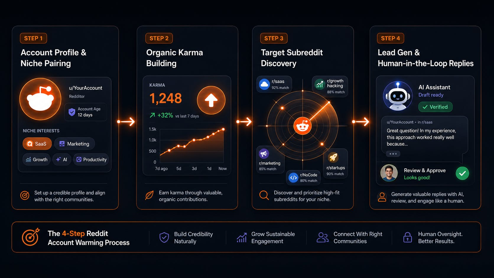

### 🎬 관련 영상
- [🎥 영상 보기](https://ph-files.imgix.net/98b6dc0c-7928-499d-b1b6-9e98d7e7bb12.jpeg?auto=format)

---

## 22. [Braidkeep](https://www.producthunt.com/products/braidkeep)
**Votes**: 11 | **도입 난이도**: 하 | **신뢰도**: 상
**Tagline**: Catch merge conflicts before your AI agents break main
**서비스 링크**: https://www.producthunt.com/r/DKK6HUVKHZFVOA

**태그**: DevTool, AI-Agent, Git, Automation, Agent, AI Tool

### 📌 이 서비스 한눈에 보기
여러 AI 에이전트의 병렬 작업 중 발생하는 코드 충돌을 사전에 예측하고 안전한 머지 순서를 제안하는 도구

### 🔑 주요 기능
- Git merge-tree를 활용한 읽기 전용 충돌 예측 (작업 트리 영향 없음)
- 에이전트별 파일 소유권 강제 및 충돌 없는 배치 순서 계산
- 단일 바이너리 형태의 Apache-2.0 라이선스 오픈소스

### 🙋 사용자에게 어떤 점이 좋은가
AI 에이전트가 동시에 코드를 수정할 때 발생하는 머지 충돌 문제를 사전에 방지하여, 작업 완료 후 뒤늦게 충돌을 발견하는 리소스를 절약해 줍니다.

### ✅ 지금 바로 써볼 기능
- 단일 바이너리 설치 및 환경 설정
- 현재 진행 중인 AI 에이전트 브랜치에 대한 충돌 예측 실행
- 제안된 안전한 머지 순서(Batching) 적용

### ⚠️ 사용 전 확인할 점
- 코드의 논리적 정답(Correctness)이 아닌 머지 가능 여부(Mergeability)만 예측함
- 사용자의 기존 워크플로우/오케스트레이터와의 호환성 확인 필요

### 🧭 확인이 더 필요한 정보
사용자의 기존 Git 워크플로우나 특정 오케스트레이터 도구와 어떻게 연동되는지에 대한 구체적인 설정 방법이 명시되지 않았습니다.

### 📸 스크린샷 및 갤러리
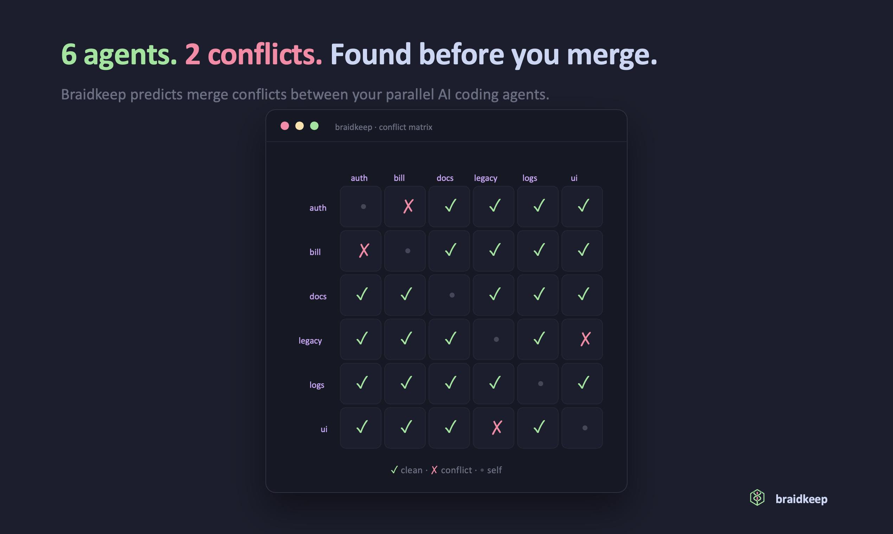
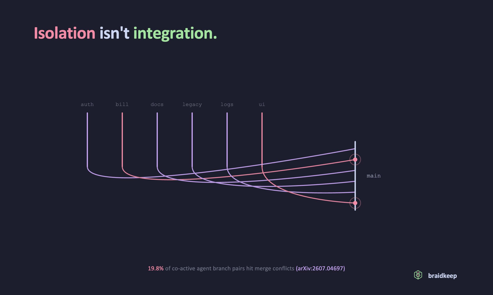
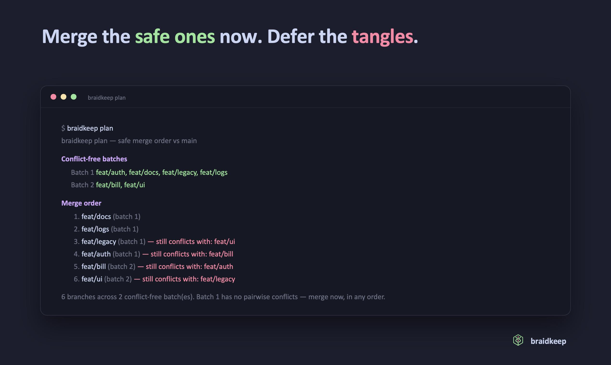

---

## 23. [BubbleSearch](https://www.producthunt.com/products/bubblesearch)
**Votes**: 7 | **도입 난이도**: 하 | **신뢰도**: 상
**Tagline**: Fastest and most advanced iMessage search
**서비스 링크**: https://www.producthunt.com/r/RST6D2AREH77ZY

**태그**: Productivity, macOS, Privacy, Search

### 📌 이 서비스 한눈에 보기
개인정보 유출 걱정 없이 맥에서 가장 빠르게 iMessage 기록을 검색하는 앱

### 🔑 주요 기능
- macOS 네이티브 앱으로 빠른 검색 속도 제공
- 전체 iMessage 대화 기록 대상 검색 가능
- 로컬 기반 동작으로 데이터 보안 및 프라이버시 강화

### 🙋 사용자에게 어떤 점이 좋은가
수많은 메시지 속에서 필요한 정보를 즉각적으로 찾을 수 있으며, 모든 데이터가 로컬에 머물러 보안 우려 없이 사용할 수 있습니다.

### ✅ 지금 바로 써볼 기능
- 과거 대화 내용 검색해보기
- 로컬 데이터 처리 방식 확인하기

### ⚠️ 사용 전 확인할 점
- macOS 전용 앱이므로 다른 OS에서는 사용 불가
- 로컬 인덱싱 과정에서 초기 시스템 리소스 사용량 확인 필요

### 🧭 확인이 더 필요한 정보
상세한 검색 필터 기능이나 대화량에 따른 성능 변화 수치는 명시되지 않았습니다.

### 📸 스크린샷 및 갤러리
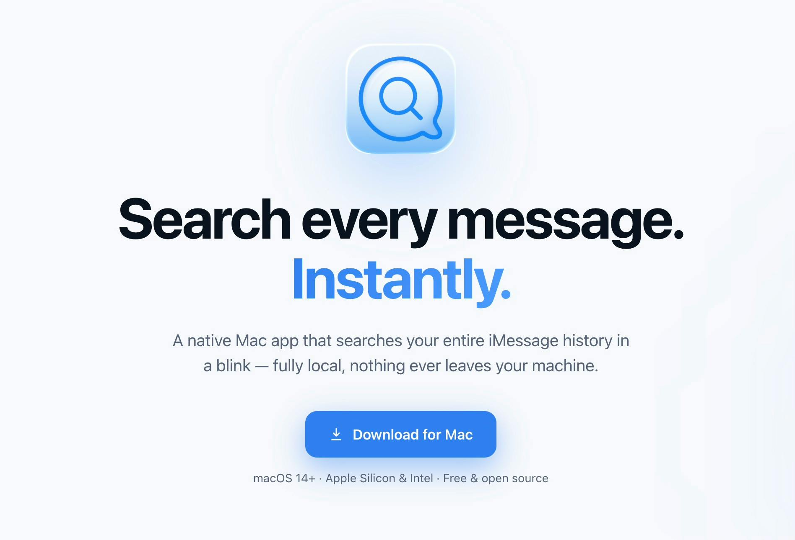
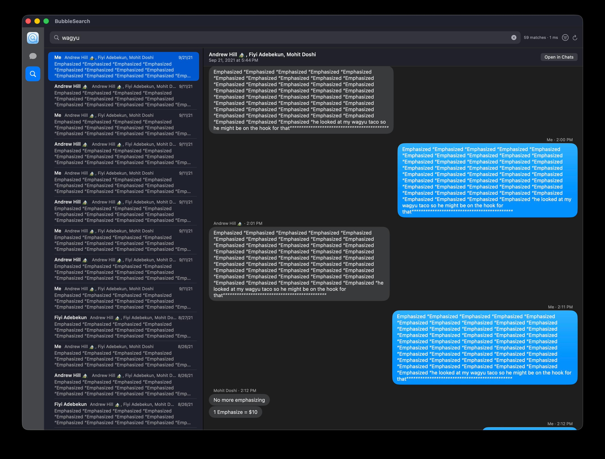

---

## 24. [ContxtAI](https://www.producthunt.com/products/contxtai)
**Votes**: 7 | **도입 난이도**: 하 | **신뢰도**: 상
**Tagline**: Stop repeating yourself across AI platforms.
**서비스 링크**: https://www.producthunt.com/r/EW3DBS4V5QNIWY

**태그**: Productivity, AI, BrowserExtension, OpenSource, AI Tool, Chat

### 📌 이 서비스 한눈에 보기
여러 AI 플랫폼에서 동일한 프로젝트 맥락을 매번 입력할 필요 없이 재사용할 수 있는 크롬 확장 프로그램

### 🔑 주요 기능
- ChatGPT, Claude, Gemini 등 다양한 AI 플랫폼 간 맥락 공유
- 재사용 가능한 사용자 맞춤형 컨텍스트 프로필 생성
- 로컬 저장 방식을 통한 프라이버시 중심의 오픈소스 솔루션

### 🙋 사용자에게 어떤 점이 좋은가
AI 모델을 바꿀 때마다 반복되는 배경 설명과 설정 과정을 생략하여 작업 흐름을 끊김 없이 유지할 수 있습니다.

### ✅ 지금 바로 써볼 기능
- 자주 사용하는 프로젝트별 컨텍스트 프로필 만들기
- 크롬 확장 프로그램 설치 후 AI 플랫폼별 적용 테스트
- 로컬 저장 기능을 통한 개인정보 보호 설정 확인

### ⚠️ 사용 전 확인할 점
- 크롬 브라우저 환경에서만 작동하는 확장 프로그램 형태임
- 오픈소스이므로 보안 및 데이터 관리 정책을 직접 검토 필요

### 🧭 확인이 더 필요한 정보
현재 제공되는 기능 외에 다른 브라우저나 모바일 환경에서의 지원 여부는 명시되지 않았습니다.

### 📸 스크린샷 및 갤러리
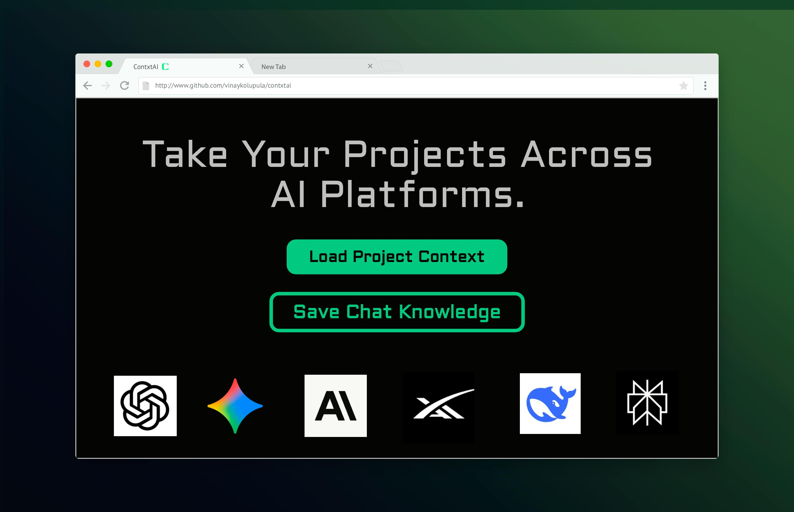
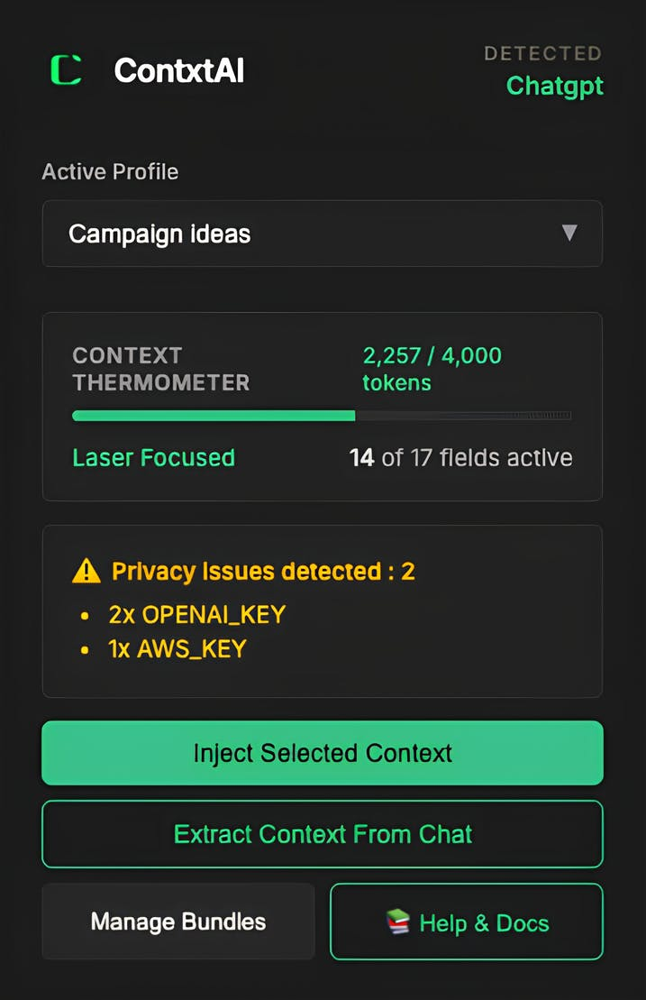

### 🎬 관련 영상
- [🎥 영상 보기](https://ph-files.imgix.net/c3956fde-52f1-477f-9d2c-9eed3e7048ca.jpeg?auto=format)

---

## 25. [WhatsMark.io](https://www.producthunt.com/products/whatsmark-io)
**Votes**: 7 | **도입 난이도**: 하 | **신뢰도**: 상
**Tagline**: WhatsApp marketing, sales & support — AI builds the flows
**서비스 링크**: https://www.producthunt.com/r/IVPFFIQTARJ54U

**태그**: Automation, Marketing, CustomerSupport, AI, SaaS, AI Tool, Chat, API, Sales

### 📌 이 서비스 한눈에 보기
AI로 자동화 흐름을 설계하는 올인원 WhatsApp 마케팅 및 고객 지원 플랫폼

### 🔑 주요 기능
- 자연어로 자동화 흐름을 생성하는 AI 기반 워크플로우 빌더
- WhatsApp Cloud API를 활용한 공식적인 메시징 및 마케팅 도구
- 공유 인박스, 대량 브로드캐스트, 인채팅 폼 및 예약 기능 제공

### 🙋 사용자에게 어떤 점이 좋은가
복잡한 코딩 없이 영어로 자동화 로직을 설명하면 AI가 노드를 구성해주어 고객 응대와 마케팅 자동화를 즉시 구축할 수 있습니다.

### ✅ 지금 바로 써볼 기능
- 자연어로 자동화 흐름 초안 생성해보기
- 30여 가지 노드 타입을 활용한 맞춤형 챗봇 설계
- 무료 플랜으로 기본 기능 테스트하기

### ⚠️ 사용 전 확인할 점
- AI가 생성한 흐름은 반드시 수동 편집 및 검토가 필요함
- 공식 WhatsApp Cloud API 사용에 따른 계정 정책 준수 필요

### 🧭 확인이 더 필요한 정보
AI가 생성한 흐름의 복잡도에 따른 추가 비용 발생 여부는 명시되지 않았습니다.

### 📸 스크린샷 및 갤러리
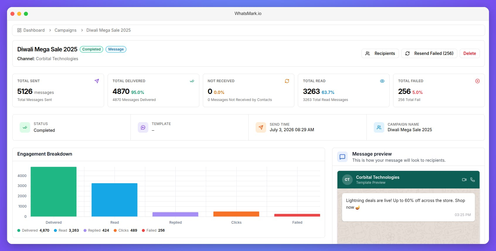
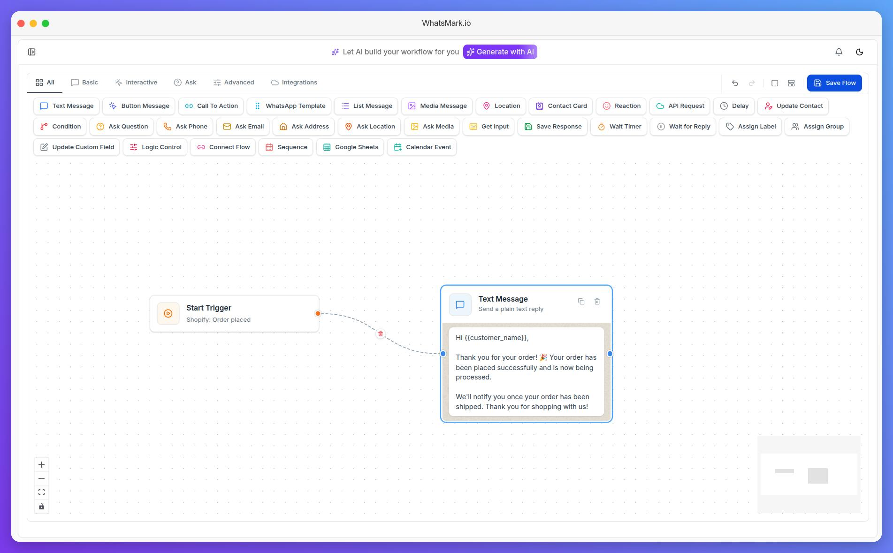
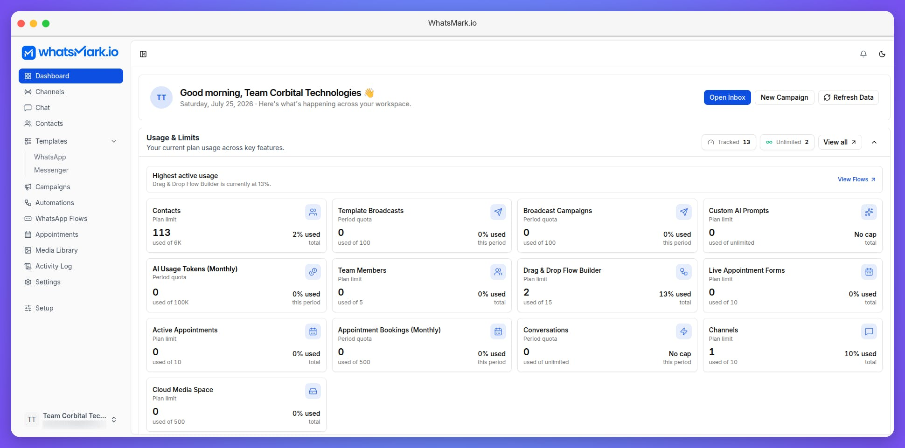

---

## 26. [Verlox](https://www.producthunt.com/products/verlox)
**Votes**: 6 | **도입 난이도**: 하 | **신뢰도**: 상
**Tagline**: The AI terminal that shows its work and can undo it
**서비스 링크**: https://www.producthunt.com/r/QK2V3BE2KXSDXQ

**태그**: DevTool, AI, Windows, Automation, Productivity, AI Tool

### 📌 이 서비스 한눈에 보기
사용자의 승인과 복구 기능을 통해 신뢰할 수 있는 AI 기반 Windows 터미널

### 🔑 주요 기능
- 계획 수립 후 사용자 승인을 거치는 실행 프로세스
- 모든 명령을 영어 요약과 함께 블록 단위로 관리
- 삭제된 파일을 위한 Recovery Vault 및 타임라인 기반 Undo 기능

### 🙋 사용자에게 어떤 점이 좋은가
AI의 자동화 작업 중 발생할 수 있는 실수를 방지하며, 작업 내역을 투명하게 확인하고 손쉽게 되돌릴 수 있습니다.

### ✅ 지금 바로 써볼 기능
- AI가 제안한 계획과 실행 명령 비교하기
- 명령 실행 후 타임라인을 통한 작업 이력 확인하기
- 삭제 작업 시 Recovery Vault를 통한 복구 테스트하기

### ⚠️ 사용 전 확인할 점
- Windows 전용 환경이므로 타 OS 사용자는 제약이 있음
- 사용자 승인 절차가 작업 흐름의 속도를 늦출 수 있음

### 🧭 확인이 더 필요한 정보
현재 Windows 환경에 특화된 기능 외에 타 운영체제 지원 여부는 명시되지 않았습니다.

### 📸 스크린샷 및 갤러리
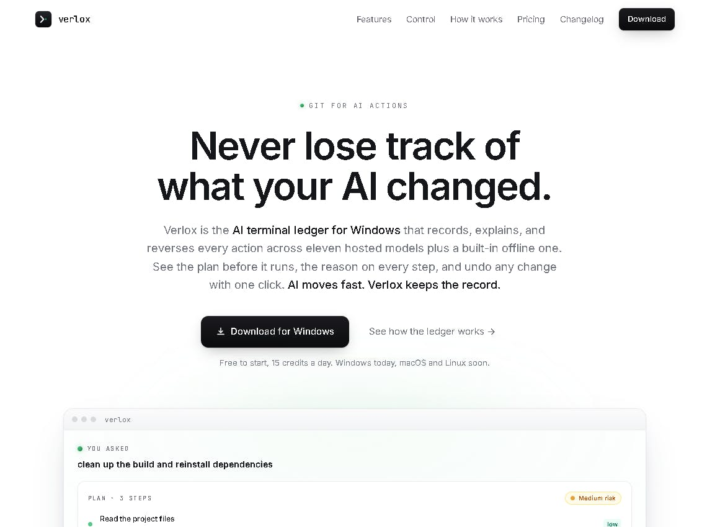

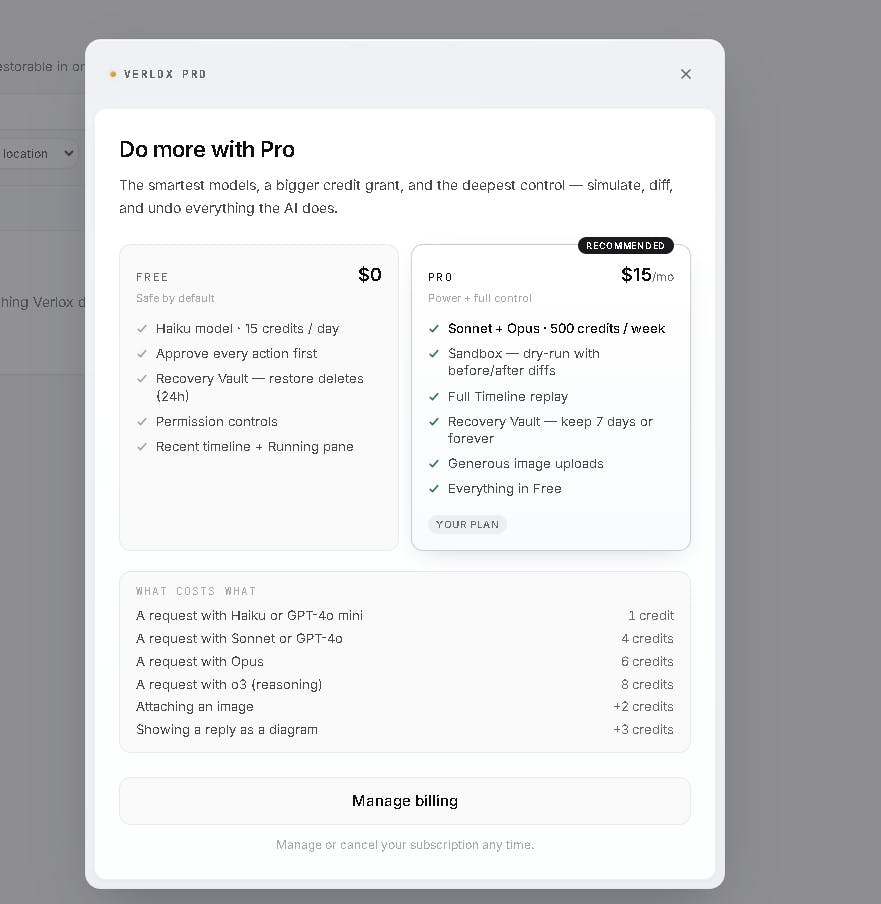

---

## 27. [Translate Peek](https://www.producthunt.com/products/translate-peek)
**Votes**: 6 | **도입 난이도**: 하 | **신뢰도**: 상
**Tagline**: Drag to translate any text on screen, fully offline
**서비스 링크**: https://www.producthunt.com/r/DITCL75TLTRHMH

**태그**: Productivity, Translation, Mac, Privacy, Chat

### 📌 이 서비스 한눈에 보기
화면 어디서든 드래그 한 번으로 즉시 번역하는 맥용 오프라인 번역 도구

### 🔑 주요 기능
- 화면 내 텍text를 드래그하여 제자리에서 즉시 번역
- 실시간 모드를 통한 자막 및 채팅 실시간 번역 지원
- 100% 온디바이스(On-device) 방식으로 오프라인 작동 및 보안 강화

### 🙋 사용자에게 어떤 점이 좋은가
별도의 창을 열 필요 없이 만화, 게임, PDF 등 화면 위에서 바로 번역이 가능하여 작업 흐름이 끊기지 않습니다. 모든 데이터가 로컬에서 처리되어 개인정보 유출 걱정 없이 안전하게 사용할 수 있습니다.

### ✅ 지금 바로 써볼 기능
- 드래그 기능을 이용해 PDF나 만화 텍스트 번역해보기
- 라이브 모드를 켜고 실시간 자막/채팅 번역 테스트하기
- 오프라인 환경에서 번역 성능 확인하기

### ⚠️ 사용 전 확인할 점
- 맥(Mac) 전용 소프트웨어이므로 다른 OS에서는 사용 불가
- 온디바이스 모델 특성상 하드웨어 사양에 따른 성능 차이 가능성

### 🧭 확인이 더 필요한 정보
사용자의 맥 하드웨어 사양에 따른 번역 속도 및 배터리 소모 정도는 명시되지 않았습니다.

### 📸 스크린샷 및 갤러리
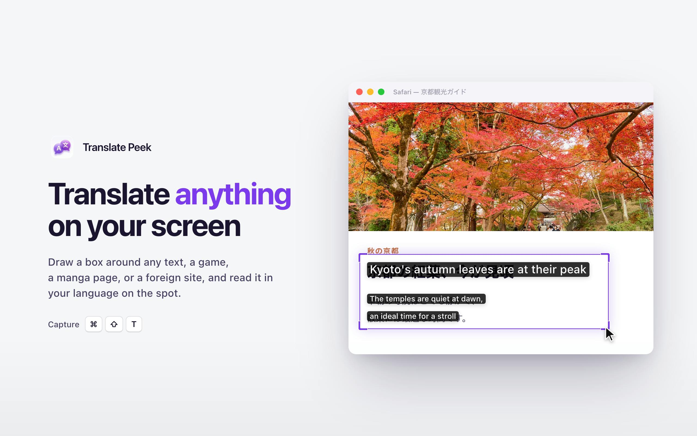
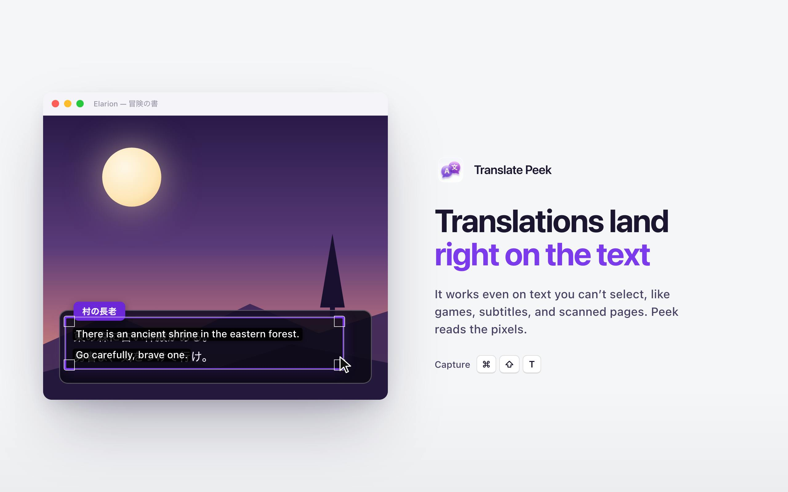
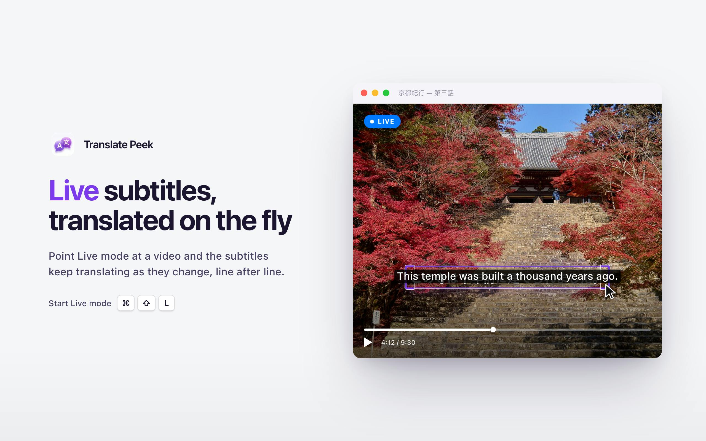

---

## 28. [AI Code Prep v2](https://www.producthunt.com/products/ai-code-prep-v2)
**Votes**: 6 | **도입 난이도**: 하 | **신뢰도**: 상
**Tagline**: AI Code Prep rewritten from the ground up in Rust for speed
**서비스 링크**: https://www.producthunt.com/r/A6ZJU3IFCME76C

**태그**: DevTool, AI, Productivity, Rust, Automation, AI Tool, LLM, Chat, API

### 📌 이 서비스 한눈에 보기
대규모 코드 저장소를 LLM 컨텍스트에 맞게 최적화하여 압축해주는 Rust 기반 코드 준비 도구

### 🔑 주요 기능
- Rust로 재작성되어 대규모 폴더 및 저장소 처리에 최적화된 속도 제공
- LLM 컨텍스트 창에 맞춘 압축 모드 및 실시간 미리보기 기능
- API 키 등 민감 정보 유출 방지를 위한 시크릿 탐지 및 선택적 레드액션(비식별화) 지원

### 🙋 사용자에게 어떤 점이 좋은가
복잡한 코드 베이스를 ChatGPT나 Claude 같은 LLM에 붙여넣기 좋은 형식으로 쉽고 안전하게 변환할 수 있습니다.

### ✅ 지금 바로 써볼 기능
- 대규모 저장소를 압축 모드로 변환하여 LLM에 입력해보기
- 시크릿 탐지 기능을 통해 보안 설정 확인하기
- v1 대비 단순해진 인터페이스로 워크플로우 테스트하기

### ⚠️ 사용 전 확인할 점
- v1 대비 기능이 축소되어 특정 고급 기능이 필요할 경우 제약이 있을 수 있음
- 로컬 환경의 보안 설정에 따라 레드액션 결과물을 반드시 검토해야 함

### 🧭 확인이 더 필요한 정보
사용자의 로컬 환경 및 특정 IDE와의 통합 수준에 대한 상세 정보는 명시되지 않았습니다.

### 📸 스크린샷 및 갤러리
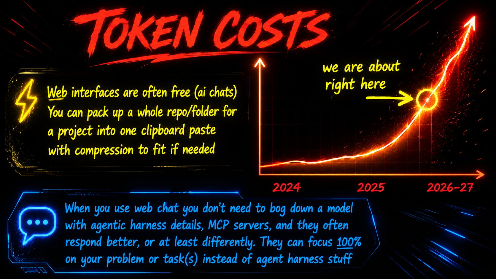
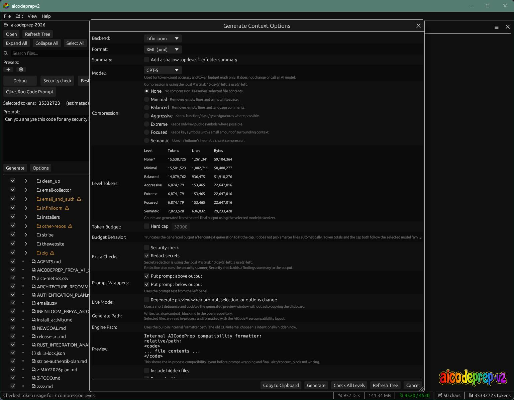
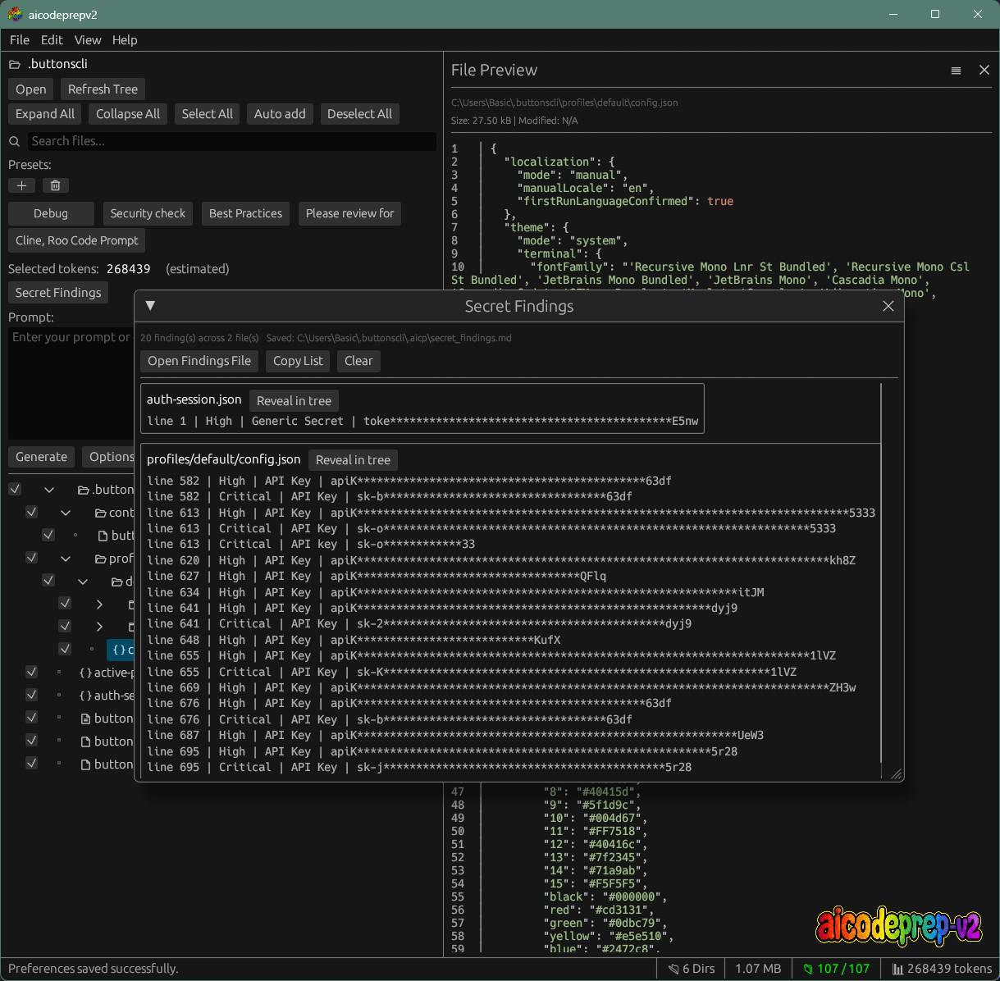

---

## 29. [PublishYourSaaS — List Your SaaS Today!](https://www.producthunt.com/products/publishyoursaas-list-your-saas-today)
**Votes**: 6 | **도입 난이도**: 하 | **신뢰도**: 상
**Tagline**: A curated directory built for your SaaS & tools!
**서비스 링크**: https://www.producthunt.com/r/FVCUQRR44ZFMBP

**태그**: SaaS, Marketing, SEO, Launch

### 📌 이 서비스 한눈에 보기
SaaS 창업자를 위한 제품 노출 및 SEO 백링크 최적화 디렉토리

### 🔑 주요 기능
- 인디 메이커와 SaaS 창업자를 위한 큐레이션된 제품 디렉토리
- 검색 엔진 최적화(SEO)를 위한 인덱싱 가능한 페이지 및 백링크 제공
- 무료 등록부터 영구적인 dofollow 백링크를 포함한 유료 플랜까지 제공

### 🙋 사용자에게 어떤 점이 좋은가
새로운 SaaS를 출시할 때 검색 엔진 노출과 백링크를 확보하여 초기 트래픽과 SEO 점수를 높이는 데 유용합니다.

### ✅ 지금 바로 써볼 기능
- 무료 플랜으로 제품 리스팅 페이지 생성하기
- SEO 효과를 위해 유료 플랜의 dofollow 백링크 옵션 검토하기
- Advanced 플랜의 SEO 아티클 및 구조화된 데이터 기능 확인하기

### ⚠️ 사용 전 확인할 점
- 무료 리스팅은 유료 플랜에 비해 노출 우선순위가 낮음
- 백링크의 품질과 SEO 효과는 검색 엔진 알고리즘에 따라 달라질 수 있음

### 🧭 확인이 더 필요한 정보
유료 플랜의 구체적인 가격 정책과 결제 방식에 대한 정보가 명시되지 않았습니다.

### 📸 스크린샷 및 갤러리

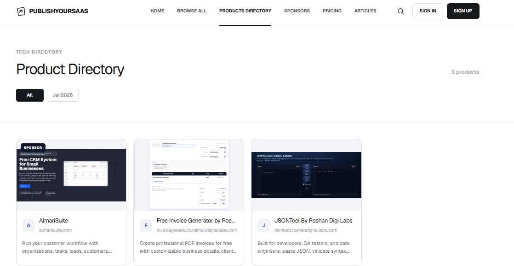
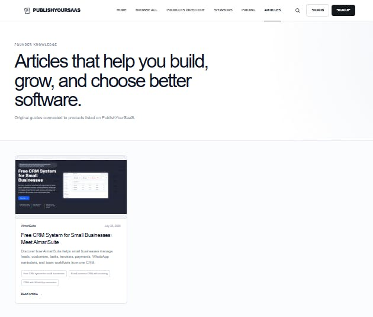

---

## 30. [Polyflux.io — see all polymarket trades](https://www.producthunt.com/products/polyflux-io-see-all-polymarket-trades)
**Votes**: 6 | **도입 난이도**: 중 | **신뢰도**: 상
**Tagline**: Real-time Polymarket mempool data over WebSocket
**서비스 링크**: https://www.producthunt.com/r/UOHKE75A3OTAVJ

**태그**: DevTool, Trading, Real-time, Web3, Data, AI Tool

### 📌 이 서비스 한눈에 보기
Polymarket의 모든 거래 데이터를 실시간으로 확인하는 초저지연 데이터 스트리밍 서비스

### 🔑 주요 기능
- WebSocket을 통한 실시간 Polymarket 멤풀(mempool) 데이터 제공
- 체인 기록 전 단계의 거래를 포착하는 초저지연(sub-millisecond) 액세스
- Polymarket 거래 흐름을 즉각적으로 파악할 수 있는 데이터 인프라

### 🙋 사용자에게 어떤 점이 좋은가
트레이더나 개발자가 체인에 기록되기 전의 거래 데이터를 미리 확인하여 시장 움직임에 더 빠르게 대응할 수 있습니다.

### ✅ 지금 바로 써볼 기능
- WebSocket 연결을 통한 실시간 데이터 스트림 테스트
- 멤풀 데이터와 실제 체인 기록 간의 지연 시간 확인
- 자체 트레이딩 봇 또는 분석 대시보드와 연동

### ⚠️ 사용 전 확인할 점
- 멤풀 데이터는 최종 확정된 거래가 아니므로 취소되거나 변경될 수 있음
- 초저지연 데이터 처리를 위한 기술적 숙련도 필요

### 🧭 확인이 더 필요한 정보
구체적인 API 가격 정책 및 데이터 처리량 제한에 대한 정보가 명시되지 않았습니다.

### 📸 스크린샷 및 갤러리
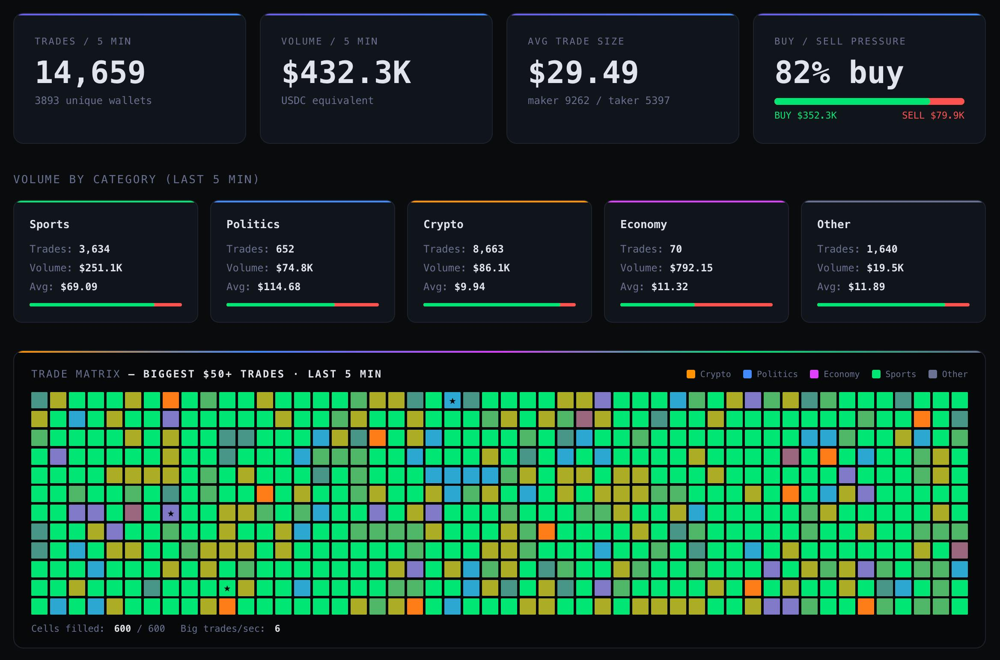
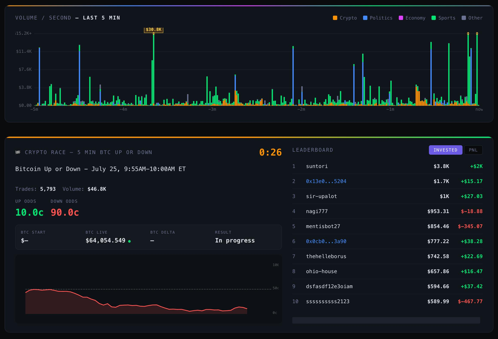
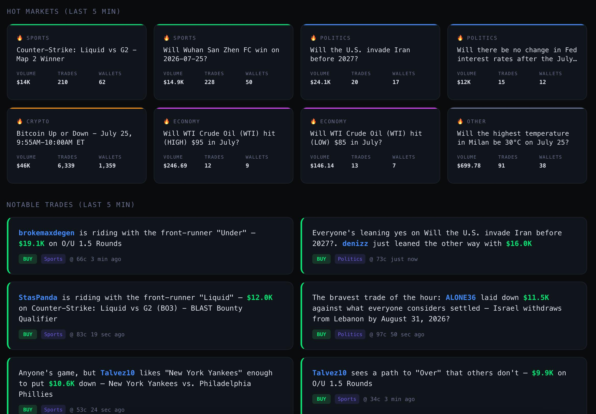

---

