# 🚀 Product Hunt Daily Top 30 (2026-07-28)

## 오늘의 요약
오늘의 트렌드는 단순한 챗봇을 넘어 특정 업무를 자율적으로 수행하는 '에이전트(Agent)'와 '자동화'가 핵심이었습니다. 데이터 분석, 리서치, 웹사이트 최적화, 고객 응대 등 전문적인 워크플로우를 AI가 스스로 처리하며 인간의 개입을 최소화하는 방향으로 진화하고 있습니다.

### 오늘의 핵심 포인트
- AI 에이전트가 데이터 분석부터 보고서 생성, 웹사이트 관리까지 전문적인 업무를 자율적으로 수행하는 사례가 증가했습니다.
- 기존의 수동적인 작업 방식을 탈피하여, 실시간 데이터와 자동화된 워크플로우를 통해 업무 효율을 극대화하는 도구들이 주목받았습니다.
- 고성능 AI 모델의 비용 효율성이 개선되면서 코딩, 공학, 고객 응대 등 전문 영역에서의 실질적인 활용 가능성이 높아졌습니다.

**오늘의 태그**: AI 에이전트, 업무 자동화, 데이터 분석, 생산성 도구

## 1. [Adomate](https://www.producthunt.com/products/adomate)
**Votes**: 435 | **도입 난이도**: 중 | **신뢰도**: 상
**Tagline**: Turn data into winning ads. At scale.
**서비스 링크**: https://www.producthunt.com/r/EPLPB5QB6JEVTX

**태그**: MarketingAutomation, AdTech, DataDriven, CreativeWorkflow, Automation

### 📌 이 서비스 한눈에 보기
데이터 기반의 자동화된 워크플로우로 승리하는 광고 소재를 대량 생성합니다.

### 🔑 주요 기능
- Meta 광고 계정, 광고 라이브러리, Trustpilot 및 Amazon 리뷰 데이터 활용
- 브랜드 가이드에 맞춘 창의적인 광고 컨셉 구축
- 데이터 소스부터 결과물까지 추적 가능한 투명한 워크플로우

### 🙋 사용자에게 어떤 점이 좋은가
광고 성과 데이터와 고객 리뷰를 결합하여 검증된 소재를 빠르게 제작할 수 있어, 리서치 시간을 줄이고 광고 효율을 높일 수 있습니다.

### ✅ 지금 바로 써볼 기능
- Meta 광고 계정 데이터 연동하기
- 리뷰 데이터를 활용한 광고 컨셉 생성 테스트
- 데이터 트리거를 통한 소재 생성 워크플로우 구축

### ⚠️ 사용 전 확인할 점
- 데이터 소스(Meta, Amazon 등)에 대한 접근 권한 및 API 연동 필요성 확인
- 생성된 소재의 브랜드 적합성 검토 필요

### 🧭 확인이 더 필요한 정보
데이터 소스 간의 자동 동기화 범위와 생성된 소재의 최종 출력 형식(이미지, 영상 등)에 대한 상세 정보가 필요합니다.

### 📸 스크린샷 및 갤러리
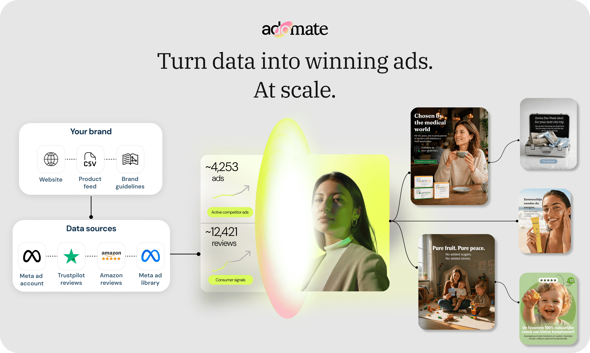
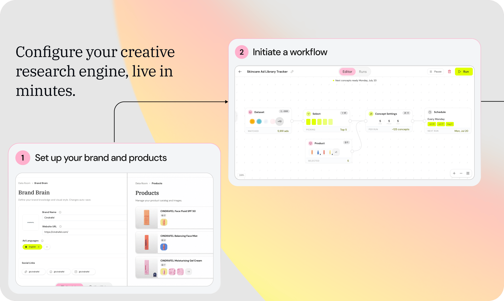
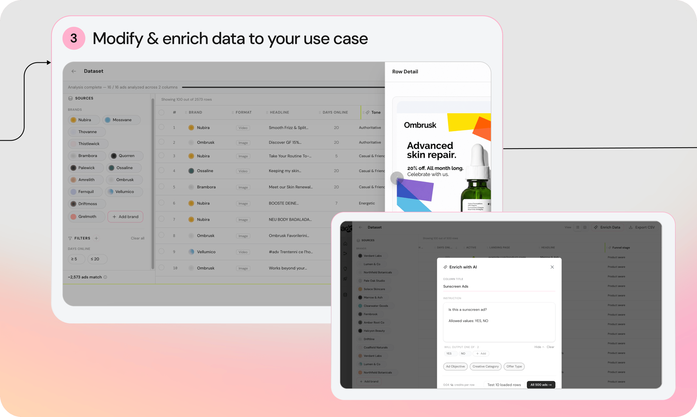

### 🎬 관련 영상
- [🎥 영상 보기](https://ph-files.imgix.net/206da43e-930d-473d-8acc-0441bfee61e5.jpeg?auto=format)

---

## 2. [Artifacts by Databox](https://www.producthunt.com/products/databox)
**Votes**: 321 | **도입 난이도**: 하 | **신뢰도**: 상
**Tagline**: Ask your AI Analyst and get back a ready-to-share report
**서비스 링크**: https://www.producthunt.com/r/OT2MF465VDKFTA

**태그**: AI, Analytics, Automation, Reporting, AI Tool, Prompting

### 📌 이 서비스 한눈에 보기
AI 분석가와의 대화를 실시간 데이터 기반의 완성된 보고서로 변환하는 도구

### 🔑 주요 기능
- AI와의 대화를 통해 보고서, 슬라이드, 대화형 문서 자동 생성
- 실시간 데이터를 기반으로 한 신뢰할 수 있는 결과물 제공
- 공유용 링크 생성 및 PDF 다운로드 기능 지원

### 🙋 사용자에게 어떤 점이 좋은가
데이터 분석 결과를 정리하는 번거로운 작업 없이, 프롬프트 하나로 즉시 공유 가능한 수준의 전문적인 리포트를 얻을 수 있습니다.

### ✅ 지금 바로 써볼 기능
- 단일 프롬프트로 리포트 생성해보기
- 생성된 결과물을 PDF로 다운로드하기
- 공유 링크를 통해 결과물 배포하기

### ⚠️ 사용 전 확인할 점
- 데이터 소스와의 실시간 연동 범위 확인 필요
- 생성된 문서의 디자인 커스텀 자유도 확인 필요

### 🧭 확인이 더 필요한 정보
실시간 데이터 소스(Live Data)의 구체적인 연결 범위와 지원되는 데이터 플랫폼 종류를 확인해야 합니다.

### 📸 스크린샷 및 갤러리
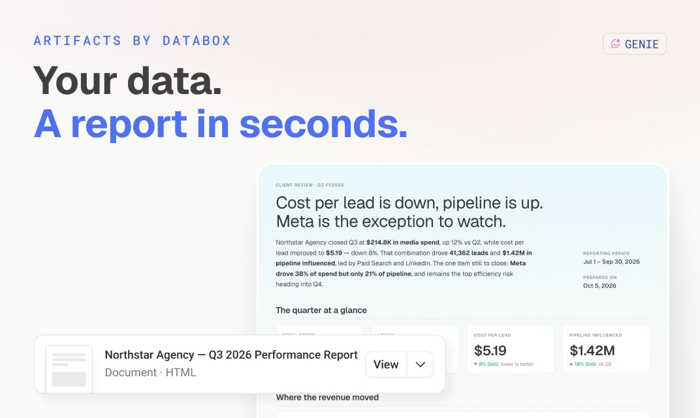
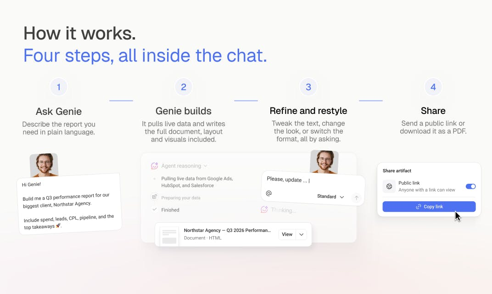
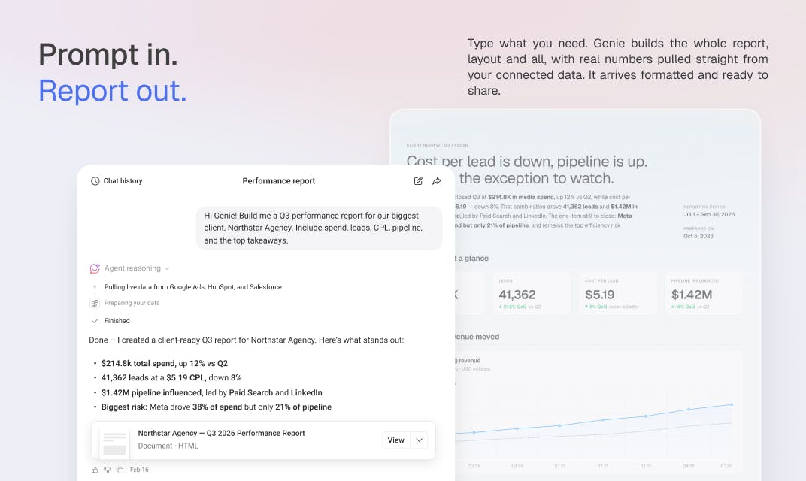

### 🎬 관련 영상
- [🎥 영상 보기](https://ph-files.imgix.net/07c14a42-62b9-4eb4-9e3a-d76767ae4259.jpeg?auto=format)

---

## 3. [Webhound](https://www.producthunt.com/products/webhound)
**Votes**: 304 | **도입 난이도**: 하 | **신뢰도**: 상
**Tagline**: A research engine for your agent
**서비스 링크**: https://www.producthunt.com/r/TSDAGJRI6E3MV7

**태그**: AI, Research, Automation, Agentic, DevTool, Agent, AI Tool, API

### 📌 이 서비스 한눈에 보기
예산 범위 내에서 자율적으로 심층 조사를 수행하는 AI 리서치 엔진

### 🔑 주요 기능
- 사용자가 설정한 예산(달러) 범위 내에서 최적의 조사 수행
- 근거가 명확한 인용 보고서 및 출처가 포함된 데이터셋 제공
- MCP 또는 API를 통해 기존 AI 에이전트에 쉽게 통합 가능

### 🙋 사용자에게 어떤 점이 좋은가
조사 작업의 시간과 비용을 사용자가 직접 통제하면서, 신뢰할 수 있는 출처가 포함된 완성도 높은 리포트를 얻을 수 있습니다.

### ✅ 지금 바로 써볼 기능
- 질문과 예산 설정을 통한 자동 리서치 실행
- 생성된 보고서의 출처 및 작업 문서 검토
- API/MCP를 활용한 개인용 에이전트 연동

### ⚠️ 사용 전 확인할 점
- 설정한 예산이 모두 소진될 때까지 조사가 지속될 수 있음
- 결과물의 품질이 설정한 예산 규모에 따라 달라질 수 있음

### 🧭 확인이 더 필요한 정보
예산 소진 방식과 구체적인 비용 산정 로직에 대한 상세 정보가 필요합니다.

### 📸 스크린샷 및 갤러리
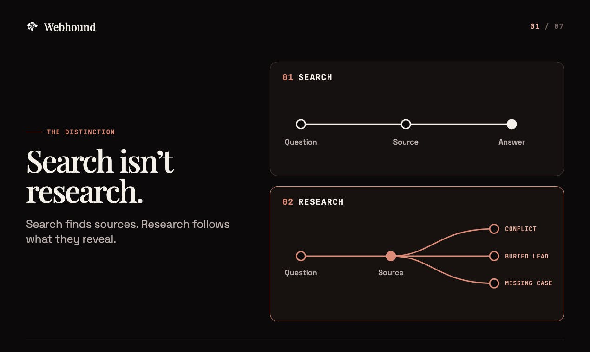
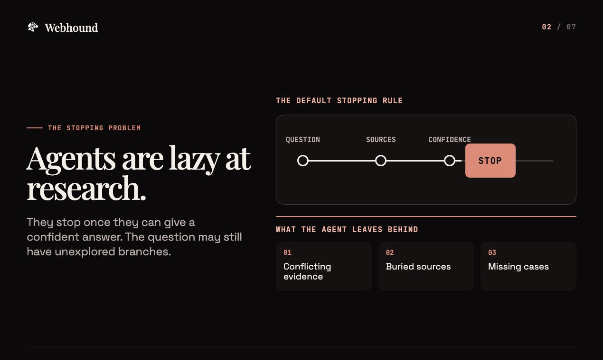
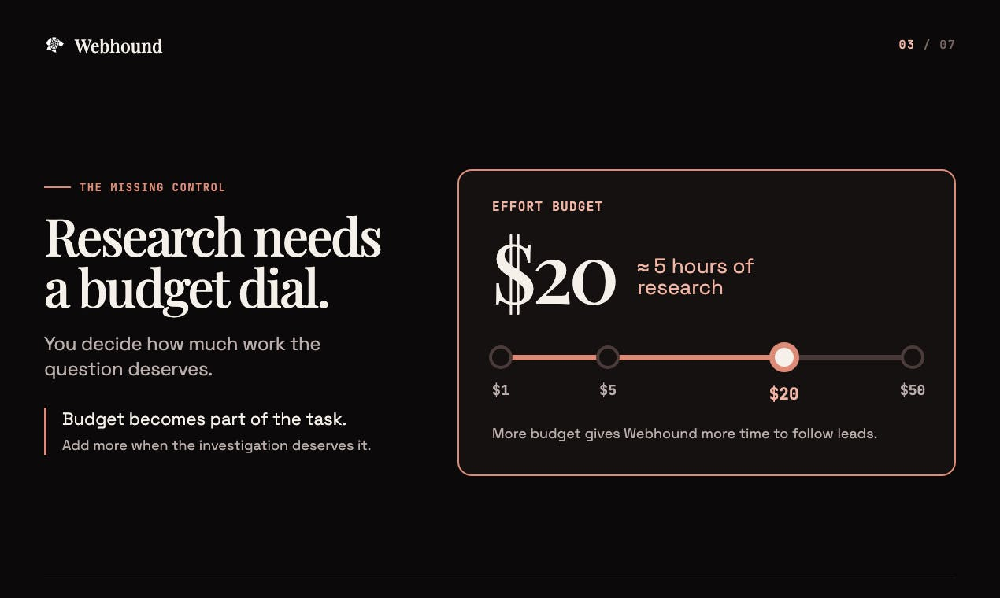

### 🎬 관련 영상
- [🎥 영상 보기](https://ph-files.imgix.net/e1ada36e-53c6-4cce-8fab-4b921b11ea15.jpeg?auto=format)

---

## 4. [Claude Opus 5](https://www.producthunt.com/products/claude)
**Votes**: 297 | **도입 난이도**: 하 | **신뢰도**: 상
**Tagline**: Near-Fable 5 intelligence at half the price
**서비스 링크**: https://www.producthunt.com/r/IU2TVFNFIUECW4

**태그**: AI, Coding, Automation, Productivity, Agent

### 📌 이 서비스 한눈에 보기
합리적인 가격으로 강력한 지능과 에이전트 성능을 제공하는 차세대 AI 모델

### 🔑 주요 기능
- 기존 Opus 모델 대비 향상된 지능과 효율성 제공
- 장기 실행 에이전트 구동에 최적화된 성능
- 코딩 및 전문적인 업무 작업 능력 개선

### 🙋 사용자에게 어떤 점이 좋은가
더 저렴한 비용으로 고성능 AI를 활용하여 복잡한 코딩 작업이나 자동화 에이전트를 구축할 수 있습니다.

### ✅ 지금 바로 써볼 기능
- 코딩 작업에 적용하여 생산성 테스트하기
- 장기 실행 에이전트 워크플로우 구축하기
- 기존 모델 대비 비용 효율성 검증하기

### ⚠️ 사용 전 확인할 점
- 가격 인하가 실제 운영 비용 절감으로 이어지는지 확인 필요
- 특정 전문 작업에서의 성능 안정성 검증 필요

### 🧭 확인이 더 필요한 정보
구체적인 가격 정책과 기존 모델 대비 정확한 성능 벤치마크 수치가 명시되지 않았습니다.

### 📸 스크린샷 및 갤러리

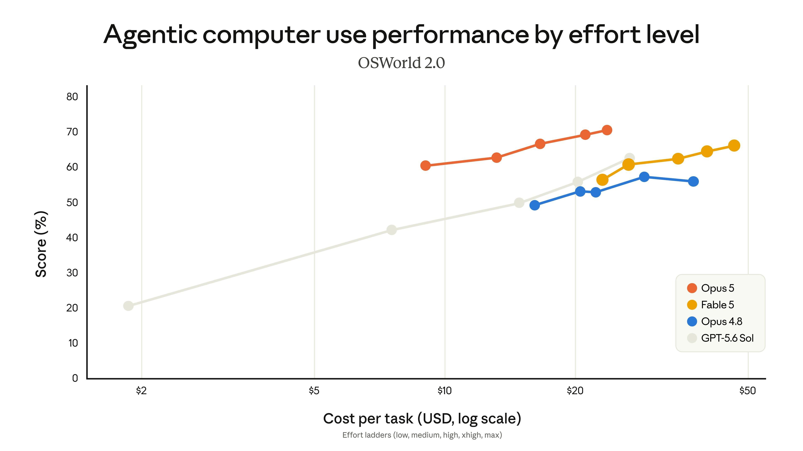
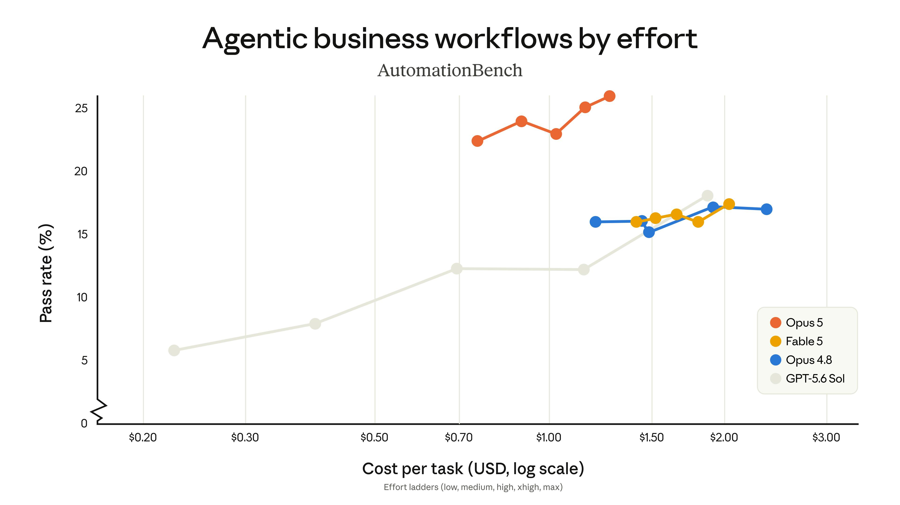

### 🎬 관련 영상
- [🎥 영상 보기](https://ph-files.imgix.net/af2e1709-0bf5-423a-9513-c3b33278fa07.jpeg?auto=format)

---

## 5. [Robynn AI](https://www.producthunt.com/products/robynn-ai-self-improving-websites)
**Votes**: 237 | **도입 난이도**: 하 | **신뢰도**: 상
**Tagline**: Websites that improve and heal with self-learning
**서비스 링크**: https://www.producthunt.com/r/W2RTSYZ2NVMVFH

**태그**: AI, Automation, WebOptimization, MarketingTech, Agent, AI Tool, Chat

### 📌 이 서비스 한눈에 보기
사이트 재구축 없이 AI 에이전트가 실시간으로 웹사이트를 최적화하고 관리하는 자동화 솔루션

### 🔑 주요 기능
- 기존 사이트 유지보수 및 데이터 기반의 자동 최적화
- 브랜드 및 경쟁사 분석을 통한 증거 기반의 수정 제안
- 자연어 명령을 통한 간편한 UI 변경 및 자동 배포/측정

### 🙋 사용자에게 어떤 점이 좋은가
사이트를 새로 만들 필요 없이 기존 사이트에 연결만 하면 AI가 성능 저하를 막고 검색 엔진 및 사용자 경험을 지속적으로 개선해 줍니다.

### ✅ 지금 바로 써볼 기능
- 무료 첫 감사(Audit) 기능 실행하기
- 자연어 명령으로 웹 요소 변경 테스트하기
- GA(Google Analytics) 연동을 통한 성과 측정 확인하기

### ⚠️ 사용 전 확인할 점
- 기존 사이트의 코드 구조에 따른 자동화 적용 범위 확인 필요
- AI가 제안하는 수정 사항이 브랜드 가이드라인과 일치하는지 검토 필요

### 🧭 확인이 더 필요한 정보
기존 웹사이트 프레임워크와의 호환성 및 자동 배포 시의 안정성에 대한 구체적인 기술 사양이 명시되지 않았습니다.

### 📸 스크린샷 및 갤러리
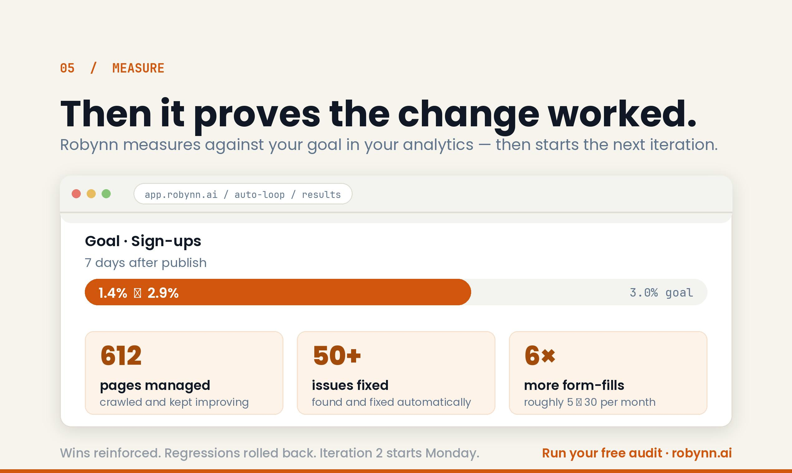
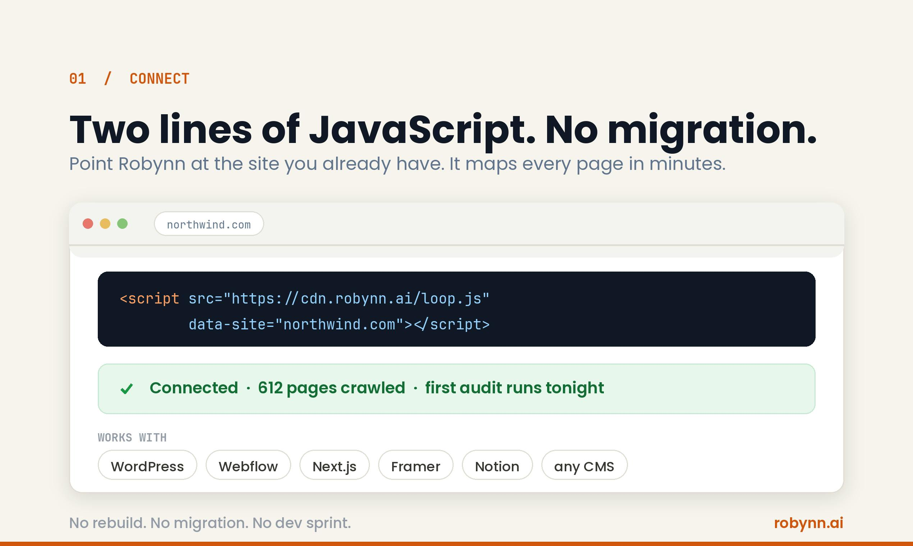
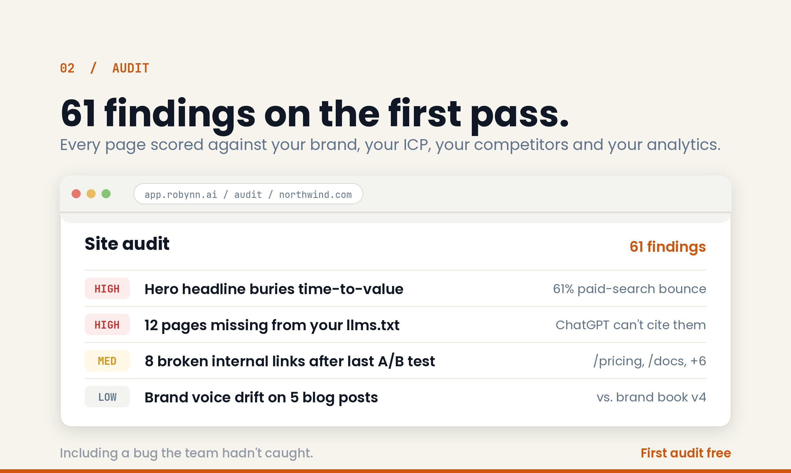

### 🎬 관련 영상
- [🎥 영상 보기](https://ph-files.imgix.net/5b260002-28d8-4b54-a826-11be007b7013.jpeg?auto=format)

---

## 6. [superfile](https://www.producthunt.com/products/superfile)
**Votes**: 151 | **도입 난이도**: 하 | **신뢰도**: 상
**Tagline**: A modern, visual file manager for the terminal
**서비스 링크**: https://www.producthunt.com/r/R3HSYEBN3DTVVZ

**태그**: DevTool, CLI, Productivity

### 📌 이 서비스 한눈에 보기
터미널 환경에서도 데스크톱처럼 직관적인 파일 관리가 가능한 멀티 패널 파일 매니저

### 🔑 주요 기능
- 세련된 멀티 패널 인터페이스 제공
- 강력한 파일 미리보기 기능 탑재
- 키보드 중심의 빠른 조작과 커스터마이징 지원

### 🙋 사용자에게 어떤 점이 좋은가
터미널을 벗어나지 않고도 데스크톱 파일 탐색기처럼 편리하게 파일을 탐색하고 관리할 수 있습니다.

### ✅ 지금 바로 써볼 기능
- 멀티 패널을 활용한 파일 이동 테스트
- 키보드 단축키를 통한 빠른 탐색
- 파일 미리보기 기능 활용

### ⚠️ 사용 전 확인할 점
- 터미널 환경에 따른 시각적 요소의 차이 발생 가능성
- 키보드 중심 조작 방식에 대한 숙련도 필요

### 🧭 확인이 더 필요한 정보
상세한 커스터마이징 범위와 지원하는 터미널 환경에 대한 구체적인 정보가 필요합니다.

### 📸 스크린샷 및 갤러리
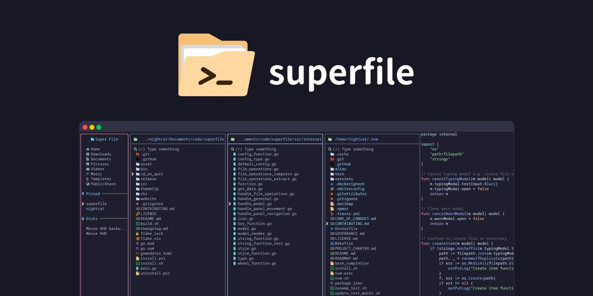
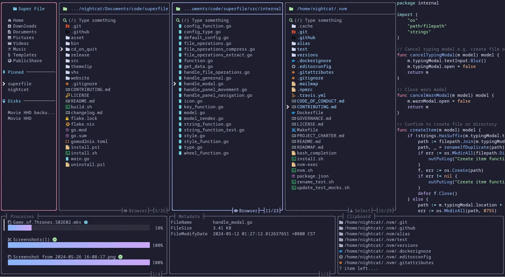
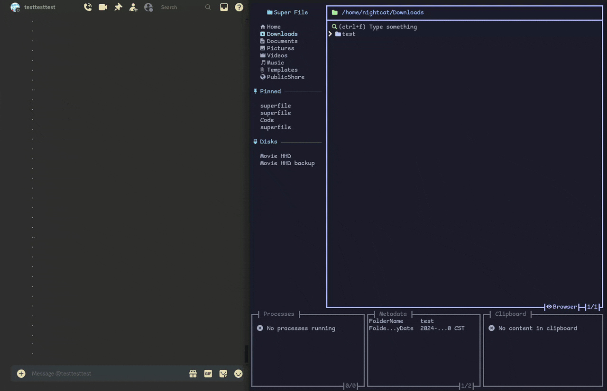

---

## 7. [Grok 4.5](https://www.producthunt.com/products/grok)
**Votes**: 136 | **도입 난이도**: 하 | **신뢰도**: 상
**Tagline**: SpaceXAI's model for coding, agentic tasks & knowledge work
**서비스 링크**: https://www.producthunt.com/r/3FJJ4M5M5IRALN

**태그**: AI, Coding, Engineering, Science, Math, Agent, AI Tool

### 📌 이 서비스 한눈에 보기
코딩, 과학, 공학 등 전문 지식 작업에 최적화된 고성능 AI 모델

### 🔑 주요 기능
- 코딩, 과학, 공학, 수학 분야의 방대한 데이터셋 학습
- 지능적이고 효율적인 추론 능력 탑재
- 실제 엔지니어링 작업 수행 능력 극대화

### 🙋 사용자에게 어떤 점이 좋은가
복잡한 코딩 문제 해결이나 전문적인 공학/수학적 추론이 필요한 사용자에게 강력한 업무 보조 도구가 됩니다.

### ✅ 지금 바로 써볼 기능
- 복잡한 코딩 문제 해결 테스트
- 수학 및 과학적 추론 과제 수행
- 엔지니어링 관련 지식 작업 적용

### ⚠️ 사용 전 확인할 점
- 특정 전문 분야에 특화되어 있어 일반적인 대화형 작업과의 적합성 확인 필요
- 실제 엔지니어링 환경에서의 성능 검증 필요

### 🧭 확인이 더 필요한 정보
구체적인 모델 접근 방식(API, 웹 인터페이스 등)과 상세 벤치마크 수치는 명시되지 않았습니다.

### 📸 스크린샷 및 갤러리
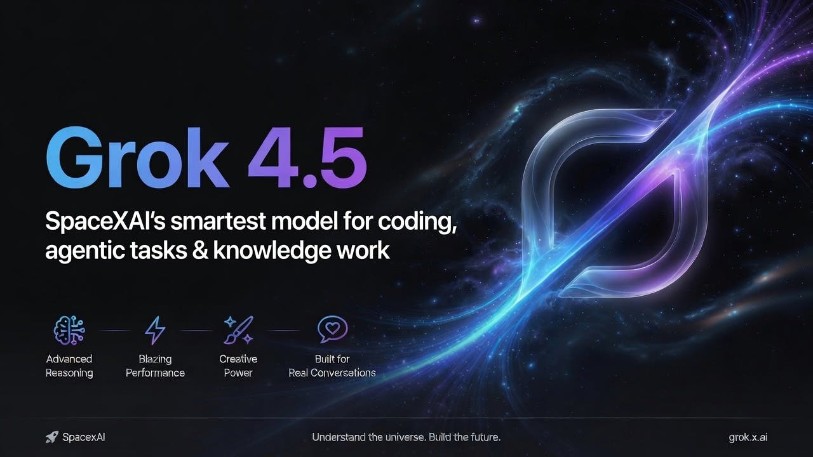
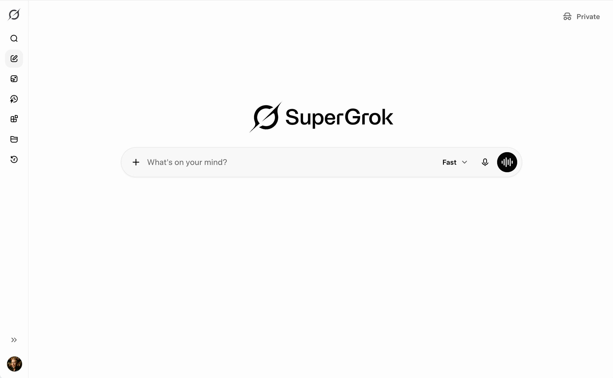
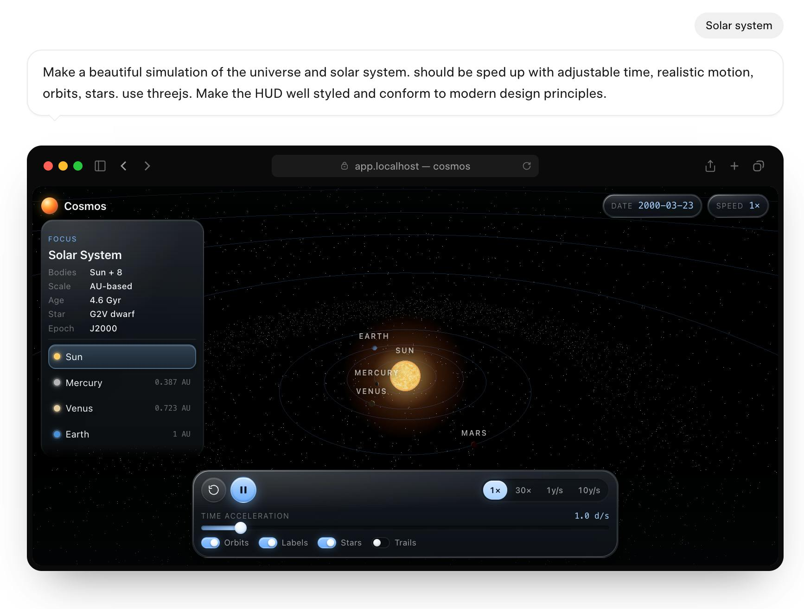

---

## 8. [Estera](https://www.producthunt.com/products/estera)
**Votes**: 123 | **도입 난이도**: 하 | **신뢰도**: 상
**Tagline**: AI Receptionist that Answers Calls & WhatsApp 24/7
**서비스 링크**: https://www.producthunt.com/r/GSPE3HHD2AHU47

**태그**: AI, Automation, CustomerService, SaaS, Agent, AI Tool

### 📌 이 서비스 한눈에 보기
전화와 WhatsApp 응대를 자동화하여 리드 확보와 예약을 돕는 24/7 AI 비서

### 🔑 주요 기능
- 전화 및 WhatsApp 메시지에 5초 이내 즉각 응대
- 잠재 고객 자격 확인(Lead Qualification) 및 예약 자동화
- 3분 이내에 맞춤형 AI 에이전트 생성 가능

### 🙋 사용자에게 어떤 점이 좋은가
고객 문의에 즉각 대응하지 못해 발생하는 고객 이탈을 방지하고, 반복적인 예약 업무를 자동화하여 운영 효율을 높일 수 있습니다.

### ✅ 지금 바로 써볼 기능
- 3분 만에 나만의 AI 에이전트 생성해보기
- 전화 및 WhatsApp 연동 테스트하기
- 자동 예약 및 리드 관리 워크플로우 설정하기

### ⚠️ 사용 전 확인할 점
- AI 응대 특성상 복잡하거나 감정적인 고객 문의에 대한 대응 품질 확인 필요
- 특정 산업군(부동산, 호텔 등)에 최적화되어 있어 타 업종 적용 시 커스텀 필요성 존재

### 🧭 확인이 더 필요한 정보
현재 제공되는 AI의 언어 지원 범위와 상세한 연동 가능 플랫폼(CRM 등)에 대한 정보가 필요합니다.

### 📸 스크린샷 및 갤러리
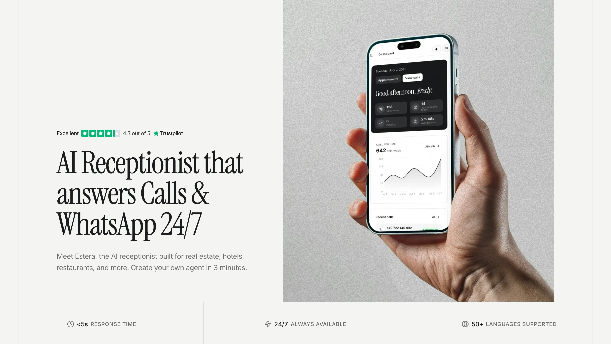
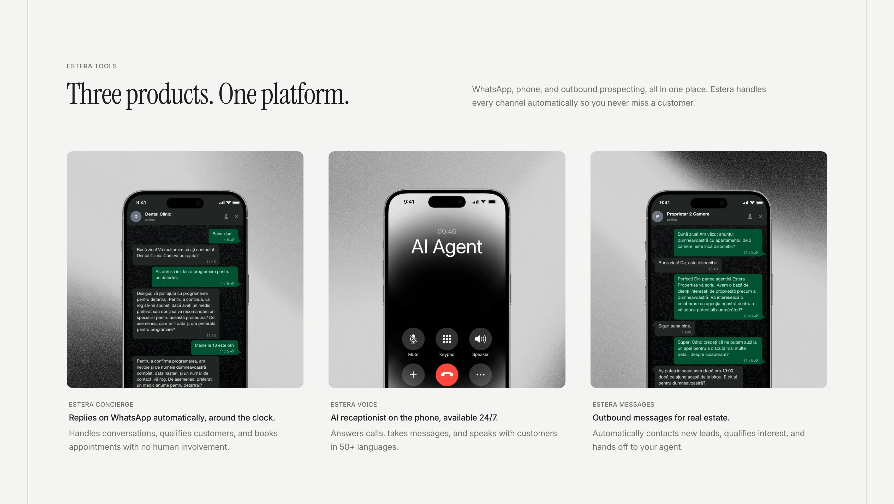
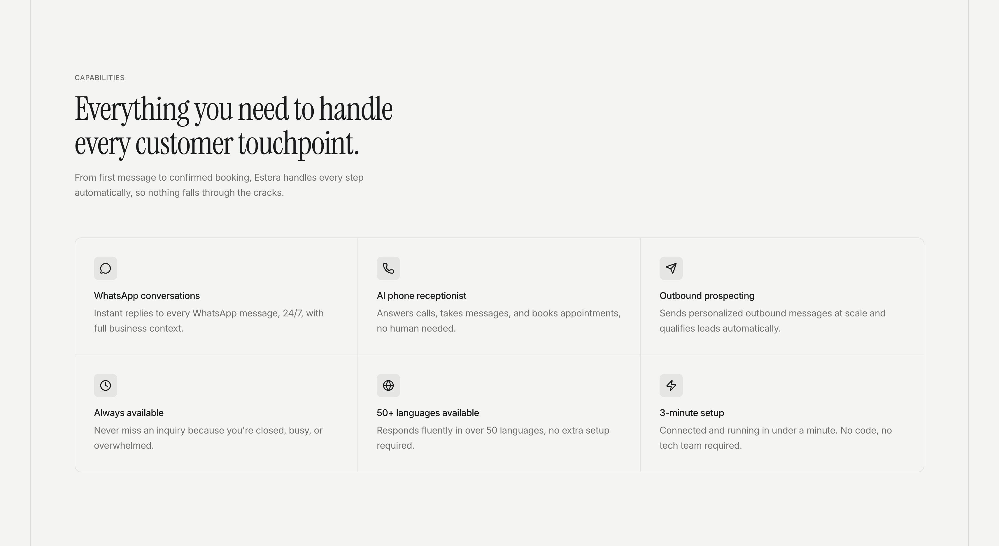

### 🎬 관련 영상
- [🎥 영상 보기](https://ph-files.imgix.net/fb7a5050-b46b-4504-8bee-f2cbfd38a14e.jpeg?auto=format)

---

## 9. [Rescript](https://www.producthunt.com/products/rescript-edit-videos-like-you-edit-text)
**Votes**: 118 | **도입 난이도**: 하 | **신뢰도**: 상
**Tagline**: A free, open source, Descript alternative. Runs in-browser.
**서비스 링크**: https://www.producthunt.com/r/CUKYCRD6ZIYKTQ

**태그**: VideoEditing, OpenSource, Productivity, BrowserBased, Video

### 📌 이 서비스 한눈에 보기
텍스트 편집만으로 영상 편집이 가능한 오픈소스 브라우저 기반 도구

### 🔑 주요 기능
- 텍스트 스크립트를 수정하여 영상을 편집하는 직관적인 방식
- 설치 없이 브라우저에서 바로 실행되는 오픈소스 소프트웨어
- 로컬 환경 기반의 무료 및 오프라인 작업 지원

### 🙋 사용자에게 어떤 점이 좋은가
별도의 무거운 소프트웨어 설치 없이 브라우저만으로 쉽고 빠르게 영상 편집을 할 수 있습니다.

### ✅ 지금 바로 써볼 기능
- 텍스트 편집을 통한 영상 컷 편집 시도하기
- 오프라인 환경에서의 작업 성능 확인하기
- 오픈소스 코드 및 보안성 검토하기

### ⚠️ 사용 전 확인할 점
- 브라우저 기반이므로 고해상도 영상 편집 시 하드웨어 리소스 사용량 확인 필요
- 오픈소스 프로젝트 특성상 기능 업데이트 및 안정성 변동 가능성

### 🧭 확인이 더 필요한 정보
브라우저 내 로컬 저장 방식이 기기 성능에 미치는 영향과 대용량 파일 처리 한계를 확인해야 합니다.

### 📸 스크린샷 및 갤러리
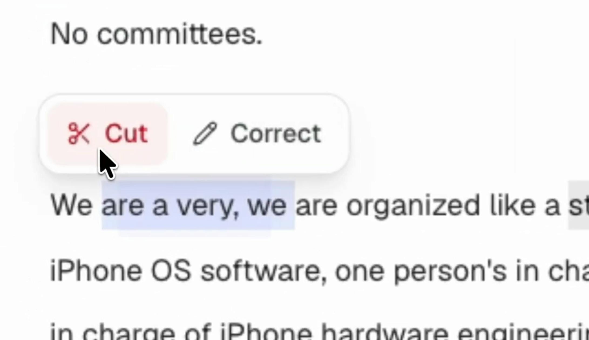

### 🎬 관련 영상
- [🎥 영상 보기](https://ph-files.imgix.net/4795746e-6ecf-4603-8b10-fefbf4f852a1.jpeg?auto=format)

---

## 10. [AI YC interview with Gstack agents ](https://www.producthunt.com/products/gstack-joins-your-meeting)
**Votes**: 115 | **도입 난이도**: 하 | **신뢰도**: 상
**Tagline**: AI specialists that join your Google Meet and gives feedback
**서비스 링크**: https://www.producthunt.com/r/YGFMTX5T3K3NX7

**태그**: AI, Productivity, Collaboration, Interview Prep, Agent, AI Tool, Chat

### 📌 이 서비스 한눈에 보기
실제 Google Meet 회의에 참여하여 실시간 피드백을 제공하는 AI 전문가 에이전트

### 🔑 주요 기능
- CEO, CSO, QA Lead 등 Garry Tan의 gstack 전문가 에이전트 제공
- 3D 아바타와 음성을 갖춘 AI 봇이 Google Meet에 직접 참여
- 화면 공유 내용에 대한 비판적 피드백 및 채팅창 메모 기능

### 🙋 사용자에게 어떤 점이 좋은가
실제 화상 회의 환경에서 전문가의 관점으로 프로젝트나 발표를 검토받고 실전 인터뷰 연습을 할 수 있습니다.

### ✅ 지금 바로 써볼 기능
- Google Meet에 AI 에이전트 초대하기
- 화면 공유를 통한 실시간 피드백 받기
- 채팅창에 남겨진 AI의 분석 노트 확인하기

### ⚠️ 사용 전 확인할 점
- 실제 대면 회의 시 AI의 개입이 흐름을 방해할 수 있음
- 사용자의 개인정보 및 공유 화면 보안 주의 필요

### 🧭 확인이 더 필요한 정보
사용자의 코딩 에이전트 세션과 연동되는 구체적인 기술적 구현 방식에 대한 추가 확인이 필요합니다.

### 📸 스크린샷 및 갤러리

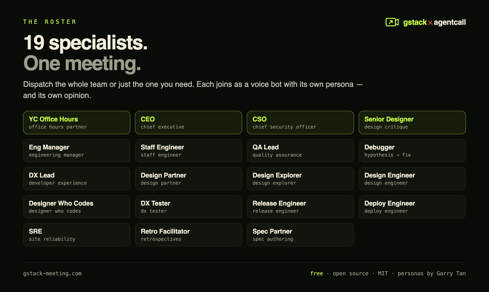
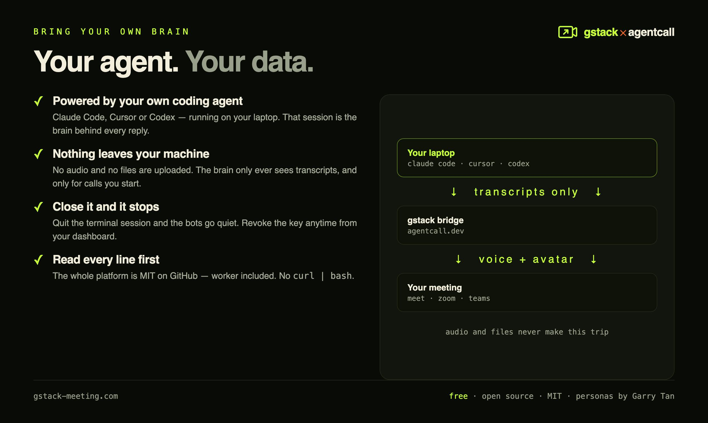

### 🎬 관련 영상
- [🎥 영상 보기](https://ph-files.imgix.net/023a4f57-ff52-4d64-9f85-b1dce0911dd4.jpeg?auto=format)

---

## 11. [localskills.sh](https://www.producthunt.com/products/localskills-sh)
**Votes**: 108 | **도입 난이도**: 하 | **신뢰도**: 상
**Tagline**: AI Skill & MCP server management for teams & enterprises
**서비스 링크**: https://www.producthunt.com/r/JLYIQK7Y6P5HT5

**태그**: DevTool, AI, Productivity, Automation, Agent, AI Tool

### 📌 이 서비스 한눈에 보기
팀과 기업을 위한 AI 에이전트 스킬 및 MCP 서버 통합 관리 플랫폼

### 🔑 주요 기능
- Cursor, Claude Code, Windsurf 등 다양한 AI 도구용 스킬 및 규칙 생성
- 한 번의 설치 명령으로 팀 내 도구 간 스킬 공유 및 배포
- 재사용 가능한 에이전트 스킬과 규칙의 중앙 집중식 관리

### 🙋 사용자에게 어떤 점이 좋은가
팀원들이 만든 유용한 AI 워크플로우를 명령어 하나로 동료들에게 즉시 배포하여 개발 생산성을 높일 수 있습니다.

### ✅ 지금 바로 써볼 기능
- 자주 사용하는 AI 스킬 생성해보기
- 팀원들과 스킬 공유 및 설치 테스트
- 주요 AI IDE(Cursor, Windsurf 등)에 연결하기

### ⚠️ 사용 전 확인할 점
- 지원되는 AI 도구 및 환경에 따른 호환성 확인 필요
- 기업 보안 정책에 따른 외부 스크립트/명령어 실행 권한 검토

### 🧭 확인이 더 필요한 정보
지원하는 구체적인 MCP 서버 프로토콜 및 보안 관리 기능에 대한 상세 정보가 필요합니다.

### 📸 스크린샷 및 갤러리
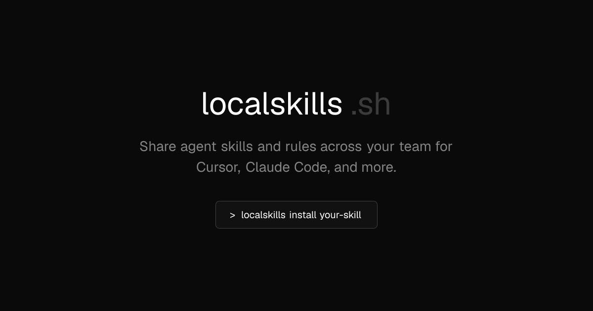
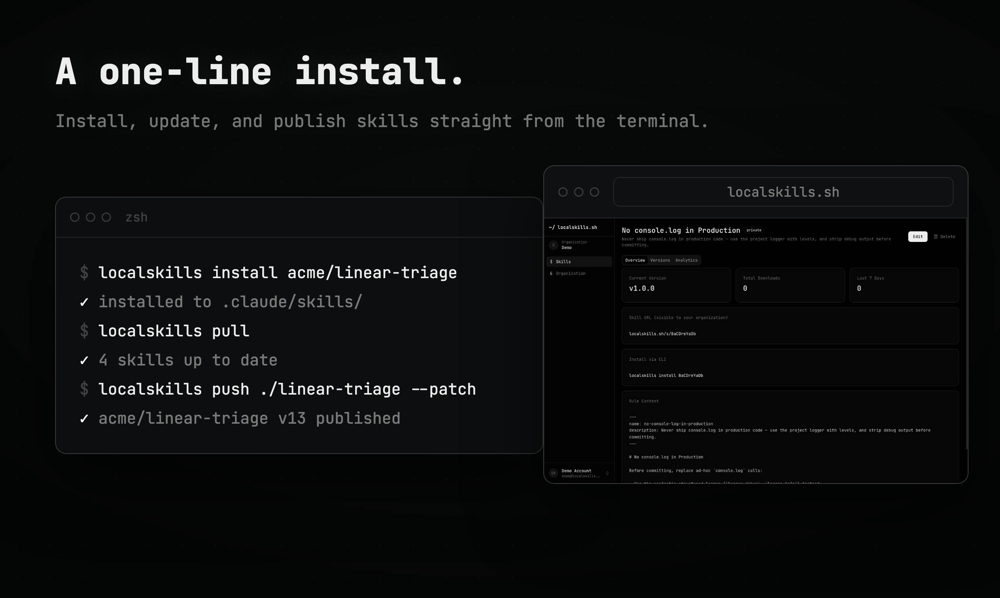
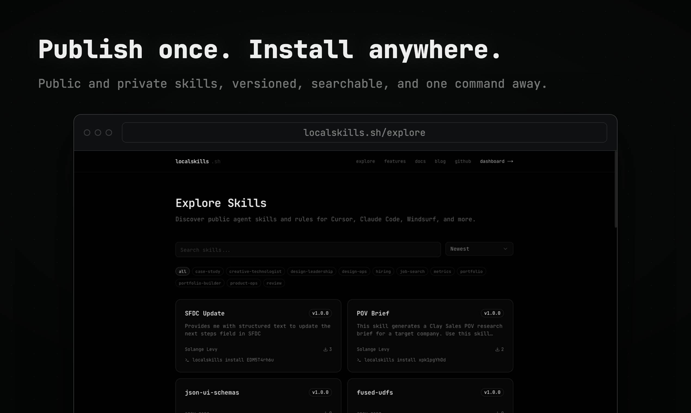

### 🎬 관련 영상
- [🎥 영상 보기](https://ph-files.imgix.net/51d26bea-ab3e-47f4-80c7-5e0d67a37763.jpeg?auto=format)

---

## 12. [Comms](https://www.producthunt.com/products/comms-ai-agents-inside-imessage)
**Votes**: 103 | **도입 난이도**: 하 | **신뢰도**: 상
**Tagline**: Launch iMessage agents in seconds
**서비스 링크**: https://www.producthunt.com/r/RRZOOXTDOETT7D

**태그**: Automation, SaaS, CustomerSupport, Messaging, Agent, AI Tool, API, Sales

### 📌 이 서비스 한눈에 보기
복잡한 절차 없이 몇 초 만에 구축하는 비즈니스용 iMessage 자동화 에이전트

### 🔑 주요 기능
- 복잡한 통신사 가입 절차 없이 즉시 iMessage 라인 확보 가능
- 자연어 설명 또는 API 호출을 통한 간편한 에이전트 설정
- 고객 지원, 예약, 온보딩, 결제 등 대화형 비즈니스 기능 지원

### 🙋 사용자에게 어떤 점이 좋은가
비즈니스용 iMessage 라인을 확보하기 위한 번거로운 서류 작업과 대기 시간 없이, 즉시 고객과 소통할 수 있는 자동화 채널을 구축할 수 있습니다.

### ✅ 지금 바로 써볼 기능
- 자연어로 에이전트 기능 정의해보기
- 3,000건 무료 메시지 한도 내에서 테스트하기
- API를 통한 자동화 워크플로우 구축하기

### ⚠️ 사용 전 확인할 점
- 월 3,000건 초과 시 $50의 비용 발생
- 실제 통신사 가입 절차를 대체하는 방식에 대한 보안 및 정책 확인 필요

### 🧭 확인이 더 필요한 정보
제공되는 iMessage 라인이 실제 물리적 SIM 기반인지 또는 가상 번호 기반인지에 대한 상세 정보가 필요합니다.

### 📸 스크린샷 및 갤러리
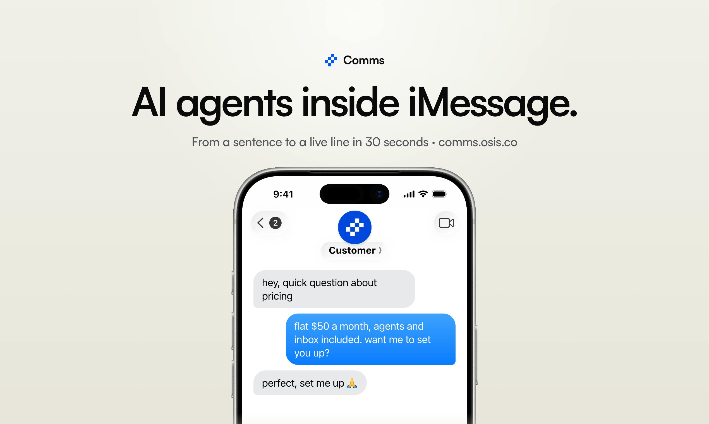
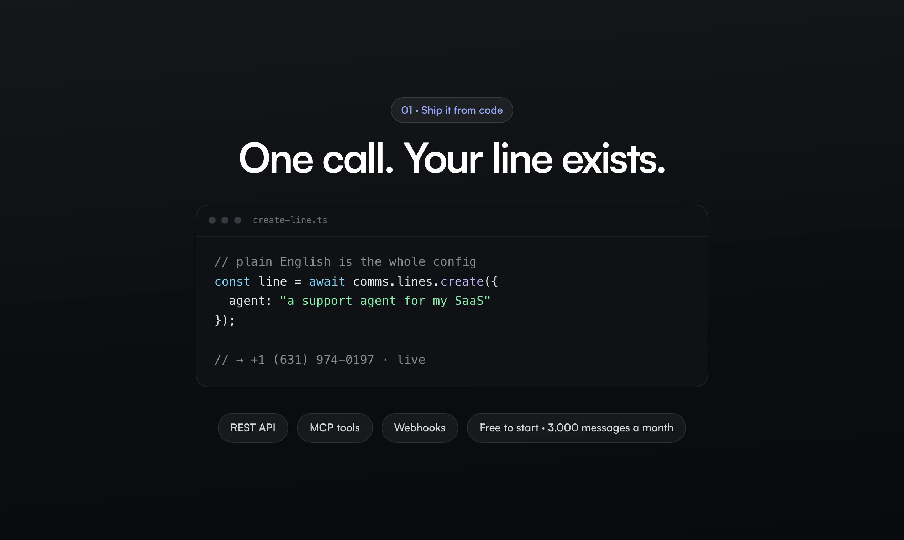
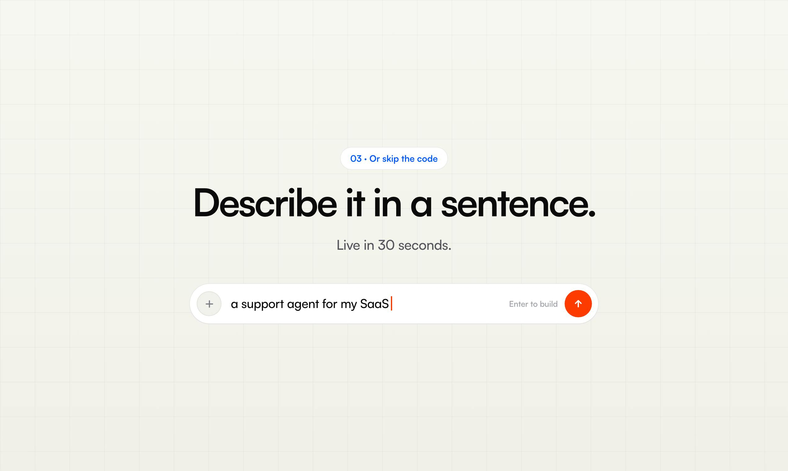

### 🎬 관련 영상
- [🎥 영상 보기](https://ph-files.imgix.net/42cd7268-dd25-4b5f-b0b3-dc7d83aed885.jpeg?auto=format)

---

## 13. [Notate](https://www.producthunt.com/products/notate-2)
**Votes**: 100 | **도입 난이도**: 하 | **신뢰도**: 상
**Tagline**: Annotate anything for humans and their agents
**서비스 링크**: https://www.producthunt.com/r/4Z62FS55OECVUN

**태그**: DesignTool, Collaboration, ProductManagement, QA, Agent, Vision, Design, DevTool

### 📌 이 서비스 한눈에 보기
정적인 스크린샷의 한계를 넘어, 움직이는 화면과 상태를 그대로 포착하는 차세대 협업 어노테이션 도구

### 🔑 주요 기능
- 메뉴, 호버, 포커스 상태 등 사라지기 쉬운 UI 요소를 고정하여 캡처
- 애니메이션 중 특정 프레임을 핀으로 고정하여 정밀한 피드백 가능
- 제스처 기반 어노테이션과 스마트 크롭으로 빠르고 맥락 있는 피드백 제공

### 🙋 사용자에게 어떤 점이 좋은가
디자인 리뷰나 코드 리뷰 시 말로 설명하기 힘든 복잡한 UI 상태나 애니메이션 오류를 시각적으로 완벽하게 전달할 수 있습니다.

### ✅ 지금 바로 써볼 기능
- 애니메이션 중 특정 프레임 핀 기능 테스트
- 호버/포커스 상태가 포함된 UI 캡처 기능 활용
- 제스처 기반의 빠른 어노테이션 워크플로우 경험

### ⚠️ 사용 전 확인할 점
- 기존 스크린샷 도구와 비교하여 워크플로우 적응 필요성 확인
- 에이전트(AI)와의 협업 시 데이터 호환성 확인 필요

### 🧭 확인이 더 필요한 정보
상세한 플랫폼 지원 범위(데스크톱 앱 vs 웹 브라우저 확장 프로그램)와 에이전트 연동 방식에 대한 구체적 정보가 부족합니다.

### 📸 스크린샷 및 갤러리
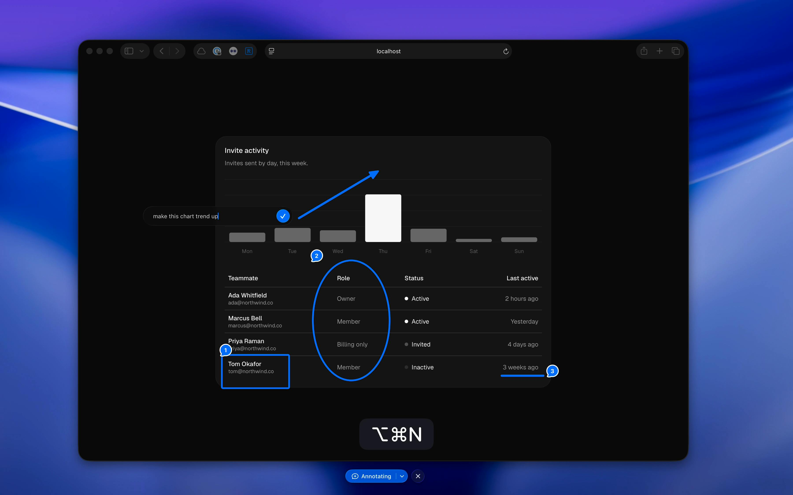
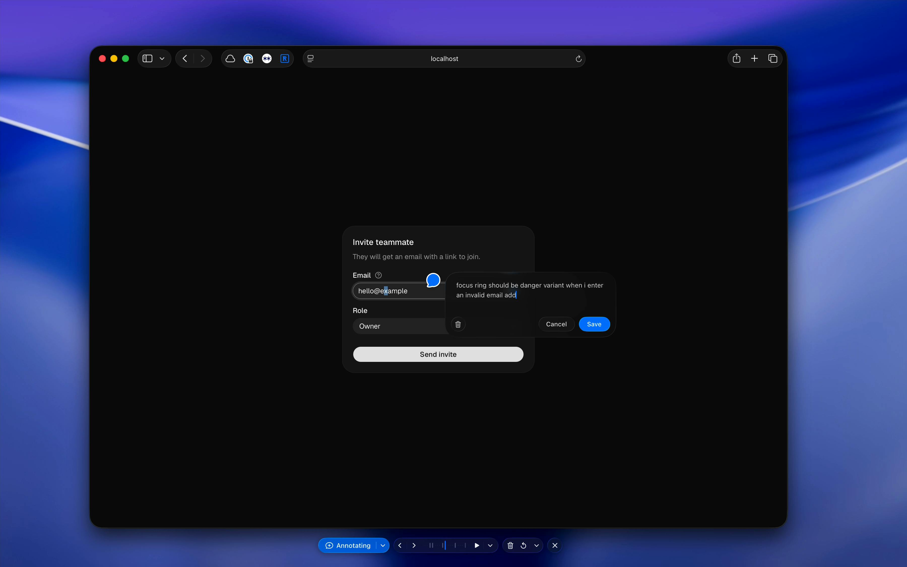
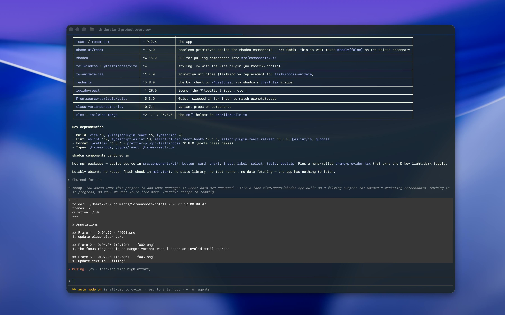

### 🎬 관련 영상
- [🎥 영상 보기](https://ph-files.imgix.net/39f119bc-b93c-4600-9f1e-38a7cafa6df9.jpeg?auto=format)

---

## 14. [Rivault](https://www.producthunt.com/products/rivault)
**Votes**: 99 | **도입 난이도**: 하 | **신뢰도**: 상
**Tagline**: Safely provide and store data and context for AI agents
**서비스 링크**: https://www.producthunt.com/r/BRWZUPBITBOBHT

**태그**: AI, Security, Privacy, Automation, Agent, AI Tool

### 📌 이 서비스 한눈에 보기
AI 에이전트에게 민감한 개인정보를 안전하게 제공하고 관리하는 제로 지식 금고

### 🔑 주요 기능
- 제로 지식(Zero-knowledge) 기술을 활용한 데이터 저장 및 보안
- AI 에이전트의 작업 수행 시 필요한 데이터만 선별적 제공
- Face ID/Passkey를 통한 사용자 승인 기반의 데이터 잠금 해제

### 🙋 사용자에게 어떤 점이 좋은가
AI 에이전트에게 신용카드나 여권 번호 같은 민감 정보를 넘겨야 할 때, 데이터 유출 걱정 없이 안전하게 권한을 제어할 수 있습니다.

### ✅ 지금 바로 써볼 기능
- 제로 지식 금고에 데이터 저장해보기
- AI 에이전트와 연동하여 승인 프로세스 테스트하기
- Face ID/Passkey를 통한 데이터 잠금 해제 기능 확인하기

### ⚠️ 사용 전 확인할 점
- AI 에이전트 플랫폼과의 호환성 여부 확인 필요
- 데이터 자동 삭제 메커니즘의 신뢰성 검증 필요

### 🧭 확인이 더 필요한 정보
현재 지원하는 구체적인 AI 에이전트 플랫폼 및 CUA(Custom User Agent)와의 통합 방식에 대한 상세 정보가 필요합니다.

### 📸 스크린샷 및 갤러리
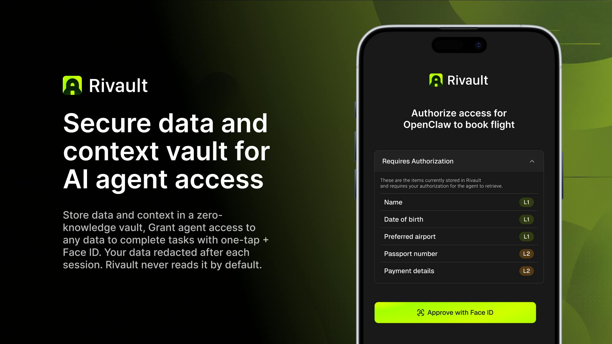
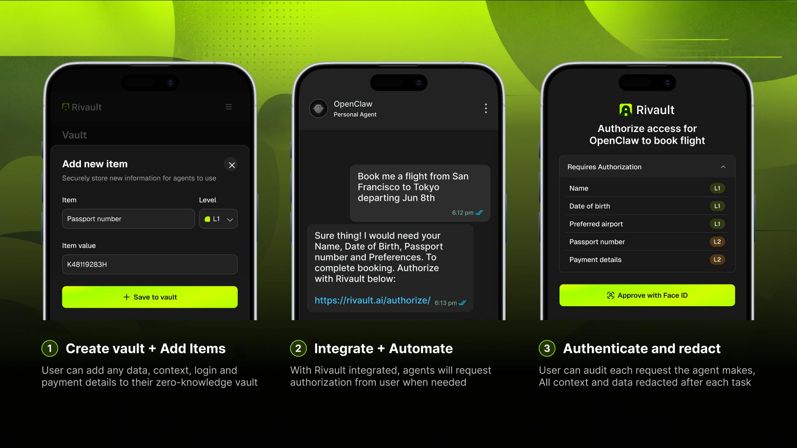
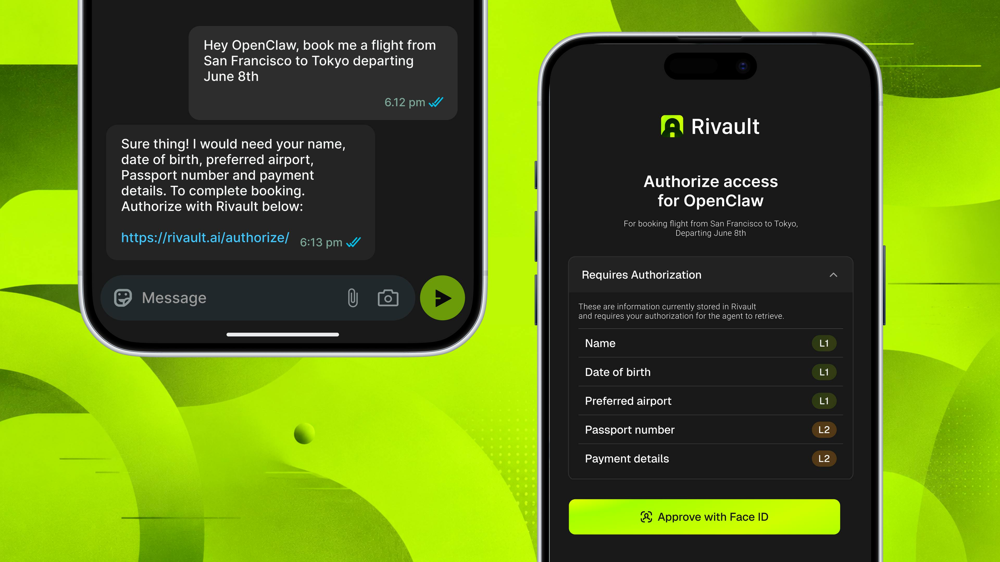

### 🎬 관련 영상
- [🎥 영상 보기](https://ph-files.imgix.net/abd1fdb9-23c9-4c51-95f7-98ba599106f7.jpeg?auto=format)

---

## 15. [FindDiskKiller](https://www.producthunt.com/products/finddiskkiller)
**Votes**: 94 | **도입 난이도**: 하 | **신뢰도**: 상
**Tagline**: See which apps are hammering your Mac's disk
**서비스 링크**: https://www.producthunt.com/r/ZSRHNPBWCEO3FB

**태그**: DevTool, macOS, SystemMonitor, OpenSource, Agent, AI Tool

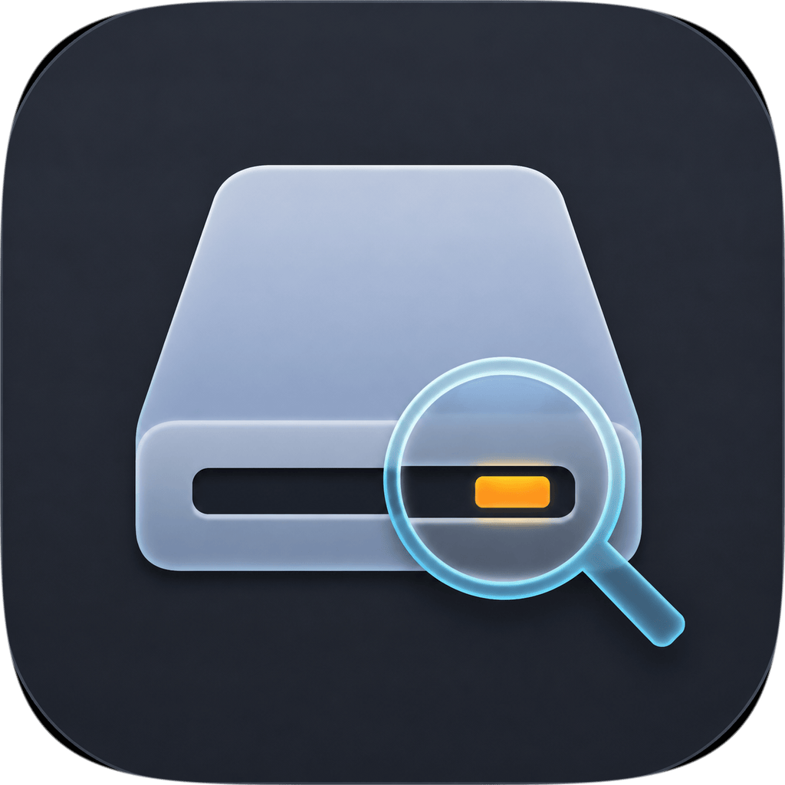

### 📌 이 서비스 한눈에 보기
어떤 앱이 맥의 디스크를 과도하게 사용하는지 실시간으로 추적하는 오픈소스 모니터링 도구

### 🔑 주요 기능
- 프로세스별 디스크 I/O, CPU 및 네트워크 활동 추적
- 실시간 파일 액세스 검사 및 폴더 트레이싱 기능
- SMART/NVMe 드라이브 상태 확인 기능 제공

### 🙋 사용자에게 어떤 점이 좋은가
디스크 읽기/쓰기를 유발하는 앱이나 AI 코딩 에이전트를 즉각 식별하여 맥의 성능 저하와 디스크 수명 문제를 관리할 수 있습니다.

### ✅ 지금 바로 써볼 기능
- 프로세스별 디스크 I/O 사용량 확인하기
- 실시간 파일 액세스 및 폴더 트레이싱 실행하기
- 드라이브의 SMART/NVMe 건강 상태 점검하기

### ⚠️ 사용 전 확인할 점
- 네이티브 모니터링 도구이므로 시스템 권한 설정이 필요할 수 있음
- 오픈소스 소프트웨어이므로 보안 및 안정성 검토 필요

### 🧭 확인이 더 필요한 정보
상세한 설치 방법 및 시스템 권한 요구 수준에 대한 구체적인 정보가 명시되지 않았습니다.

### 📸 스크린샷 및 갤러리
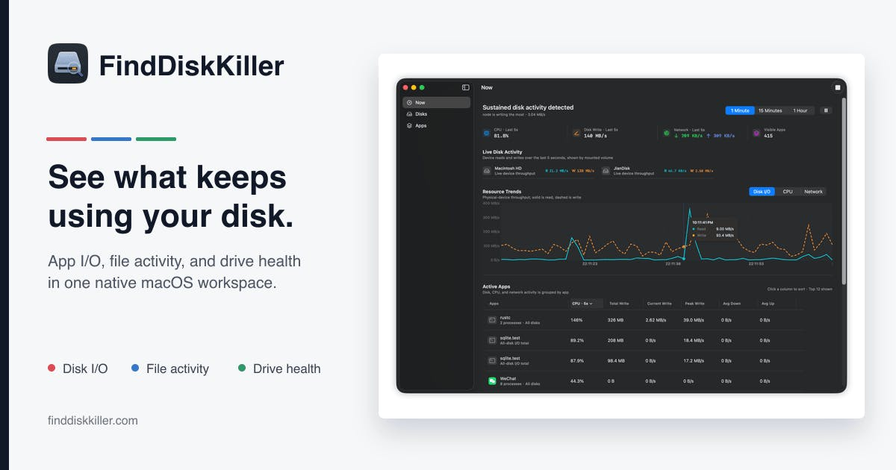
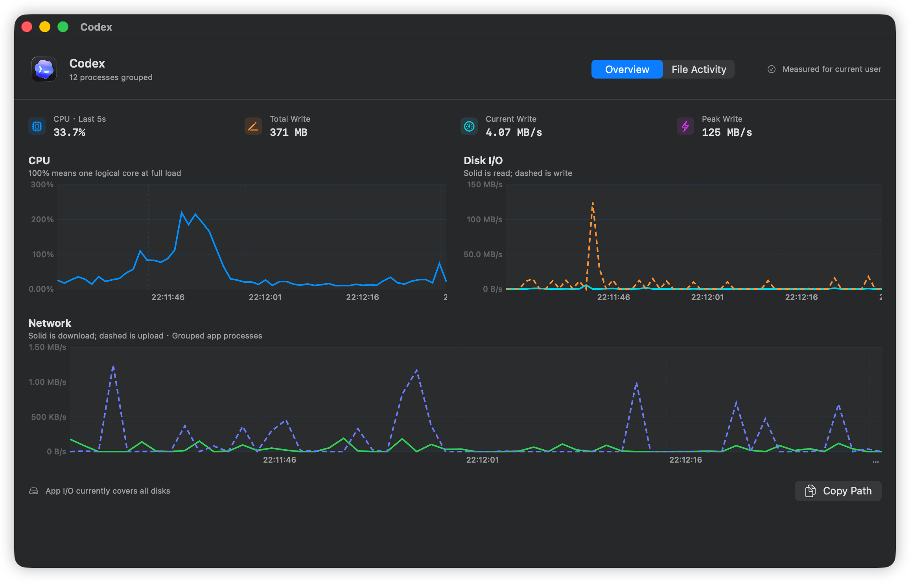
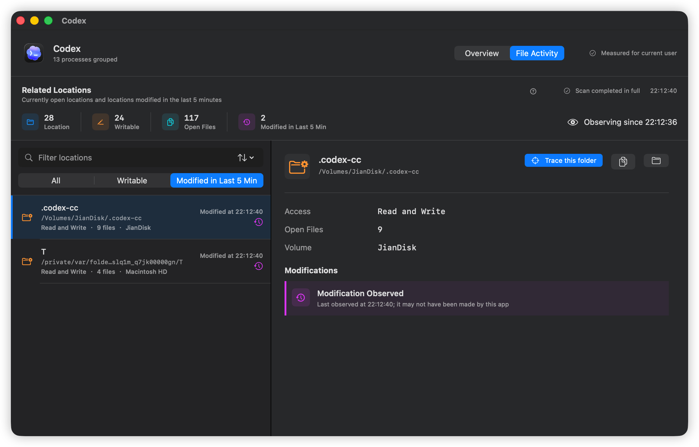

---

## 16. [Cynative Security Research Agent](https://www.producthunt.com/products/cynative-deep-infra-research)
**Votes**: 91 | **도입 난이도**: 중 | **신뢰도**: 상
**Tagline**: Ask your cloud anything without breaking prod. Read-only.
**서비스 링크**: https://www.producthunt.com/r/ZA5BFKZ3TAXT47

**태그**: DevSecOps, CloudSecurity, AI, CLI, OpenSource, Agent, AI Tool, DevTool, Security

### 📌 이 서비스 한눈에 보기
클라우드 인프라를 안전하게 탐색하고 보안 취약점을 질문할 수 있는 읽기 전용 AI 보안 에이전트

### 🔑 주요 기능
- GitHub, AWS, GCP, Azure, K8s 등 다양한 환경을 아우르는 오픈소스 AI CLI
- 읽기 전용(Read-only) 설계로 인프라 변경 위험 없이 보안 질문 가능
- 샌드박스 환경에서 실행되는 스크립트 기반의 정교한 분석 방식

### 🙋 사용자에게 어떤 점이 좋은가
인프라 설정을 변경할 위험 없이 자연어로 보안 상태를 점검하고, 권한 오남용이나 노출된 자원을 즉시 확인할 수 있습니다.

### ✅ 지금 바로 써볼 기능
- 자연어로 '공개 노출된 자원' 질문해보기
- CI/CD 권한 상승 취약점 점검하기
- IAM 정책 기반의 읽기 전용 권한 설정 적용하기

### ⚠️ 사용 전 확인할 점
- 읽기 전용 도구이므로 자동화된 수정/패치 기능은 제공하지 않음
- 클라우드 및 코드 접근 권한(IAM) 설정이 선행되어야 함

### 🧭 확인이 더 필요한 정보
사용자의 클라우드 환경에 대한 읽기 권한이 어느 정도 수준까지 요구되는지 구체적인 가이드가 필요합니다.

### 📸 스크린샷 및 갤러리
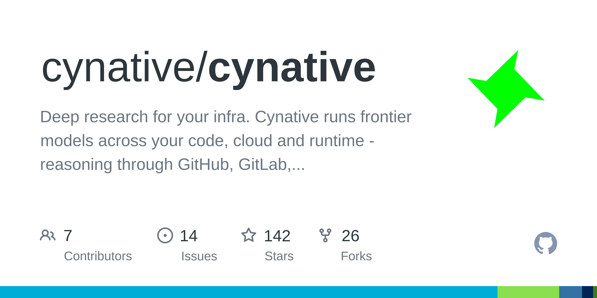
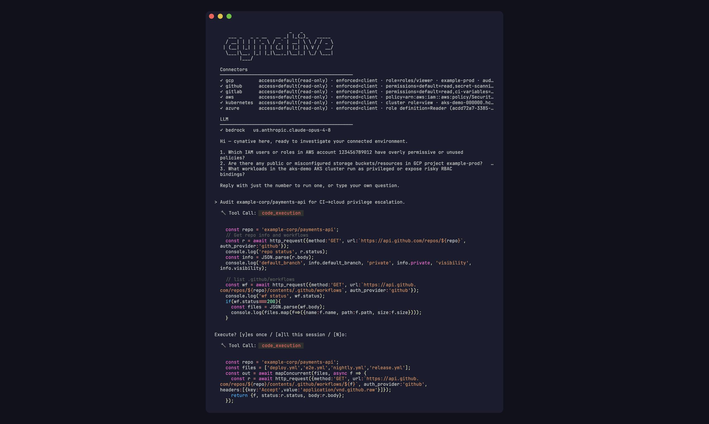
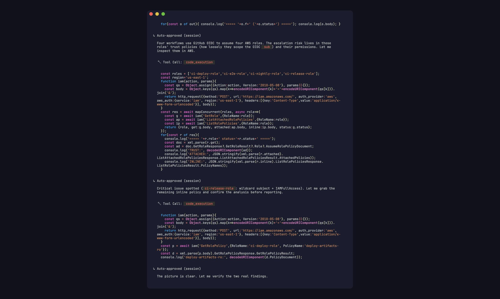

---

## 17. [Tackly](https://www.producthunt.com/products/tackly)
**Votes**: 91 | **도입 난이도**: 하 | **신뢰도**: 상
**Tagline**: Map your thoughts in real time with AI.
**서비스 링크**: https://www.producthunt.com/r/YJ4SPKDLG3VVYA

**태그**: Productivity, AI, MindMapping, Note-taking, AI Tool

### 📌 이 서비스 한눈에 보기
단순 요약을 넘어 실시간으로 생각을 구조화하는 AI 마인드맵 노트테이커

### 🔑 주요 기능
- 단순 텍스트 요약을 넘어 20개의 노드로 생각을 시각적 구조화
- 회의, 음성 메모, 텍스트 붙여넣기 등 다양한 입력 방식 지원
- 실시간 매핑을 통해 생각의 흐름을 놓치지 않고 구조화 가능

### 🙋 사용자에게 어떤 점이 좋은가
단순한 기록을 넘어 정보 간의 관계를 시각적으로 파악할 수 있어, ADHD 성향이 있거나 복잡한 아이디어를 정리해야 하는 사용자에게 높은 생산성을 제공합니다.

### ✅ 지금 바로 써볼 기능
- 실시간 음성 메모로 생각 매핑해보기
- 기존 회의록/텍스트를 붙여넣어 구조화 확인하기
- 20가지 노드 시스템을 활용한 아이디어 분류하기

### ⚠️ 사용 전 확인할 점
- 시각적 구조화 방식이 사용자의 기존 노트 습관과 맞는지 확인 필요
- 텍스트 위주의 단순 기록을 선호하는 사용자에게는 생소할 수 있음

### 🧭 확인이 더 필요한 정보
제공되는 20개의 노드 체계가 사용자의 개별적인 워크플로우에 얼마나 유연하게 적용되는지 확인이 필요합니다.

### 📸 스크린샷 및 갤러리
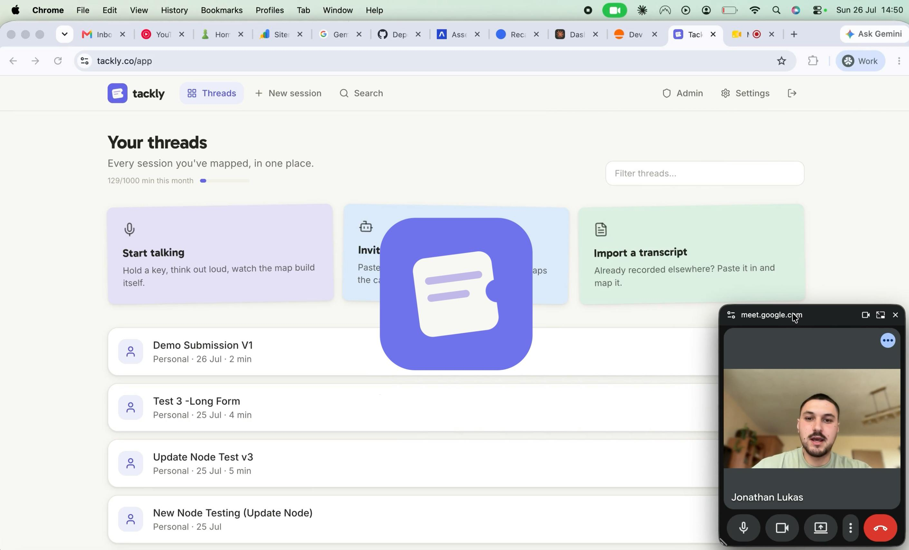
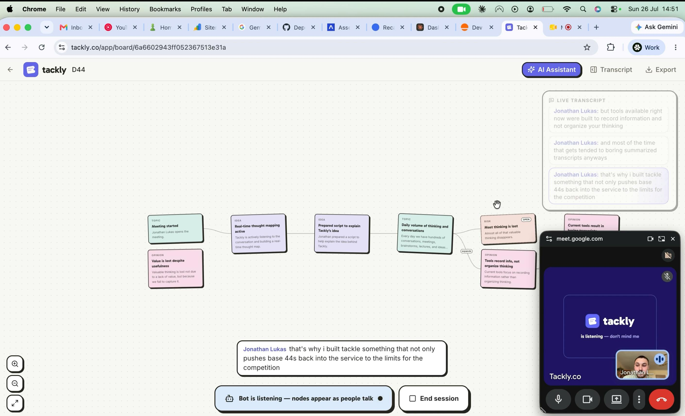
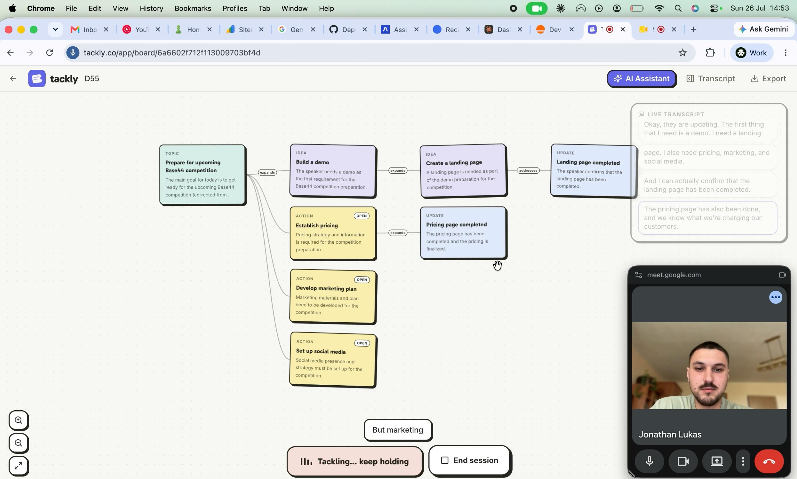

### 🎬 관련 영상
- [🎥 영상 보기](https://ph-files.imgix.net/c51f7191-194b-4433-95b7-8030099b867f.jpeg?auto=format)

---

## 18. [Edit Mind × Strava](https://www.producthunt.com/products/edit-mind-3)
**Votes**: 89 | **도입 난이도**: 하 | **신뢰도**: 상
**Tagline**: Every clip matched to the Strava activity it's from
**서비스 링크**: https://www.producthunt.com/r/5CEBATVKMXJA2Q

**태그**: VideoEditing, Strava, Automation, SportsTech

### 📌 이 서비스 한눈에 보기
스트라바 활동 데이터를 영상 프레임에 자동으로 매칭하는 편집 도구

### 🔑 주요 기능
- 스트라바 활동 데이터(심박수, 속도, 고도, 거리)와 영상 장면 자동 매칭
- GoPro 등 액션캠 GPS 텔레메트리를 활용한 정밀한 데이터 정렬
- 어떤 카메라를 사용하더라도 스트라바 데이터와 연동 가능

### 🙋 사용자에게 어떤 점이 좋은가
운동 영상을 편집할 때 수동으로 데이터를 입력할 필요 없이, 촬영 당시의 생생한 운동 지표를 영상 프레임에 즉각적으로 결합할 수 있습니다.

### ✅ 지금 바로 써볼 기능
- 스트라바 계정 연결하기
- 촬영된 액션캠 영상 업로드하기
- 매칭된 데이터가 영상 프레임과 일치하는지 확인하기

### ⚠️ 사용 전 확인할 점
- 사용하는 카메라 기종에 따라 GPS 데이터 매칭 정확도가 달라질 수 있음
- 스트라바 데이터와 영상 간의 시간 동기화 설정 필요성

### 🧭 확인이 더 필요한 정보
사용하는 카메라 기종별로 지원되는 데이터 범위와 매칭 방식의 차이를 확인해야 합니다.

### 📸 스크린샷 및 갤러리
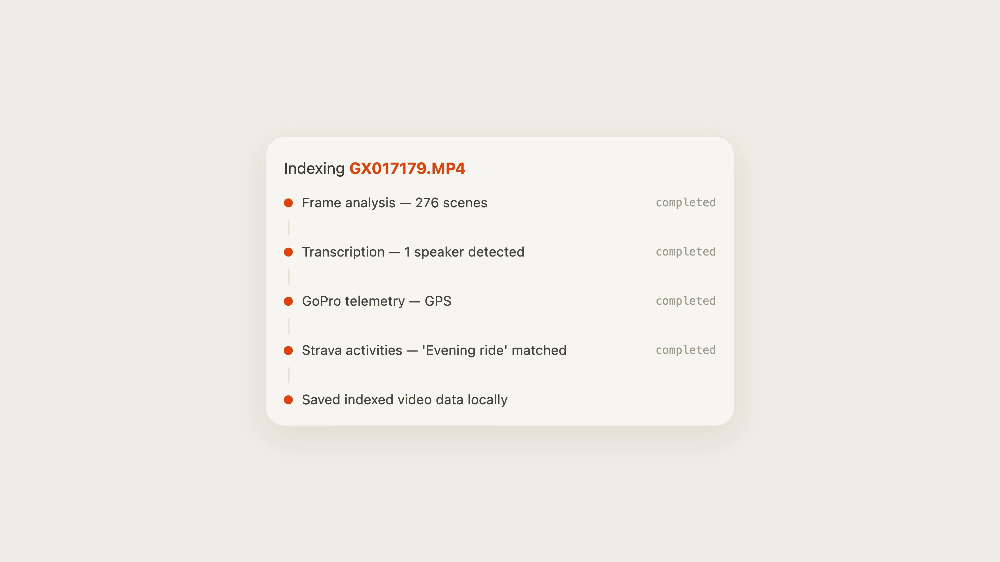
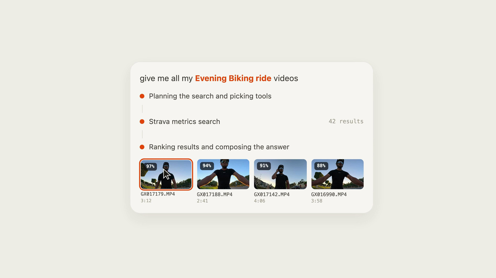
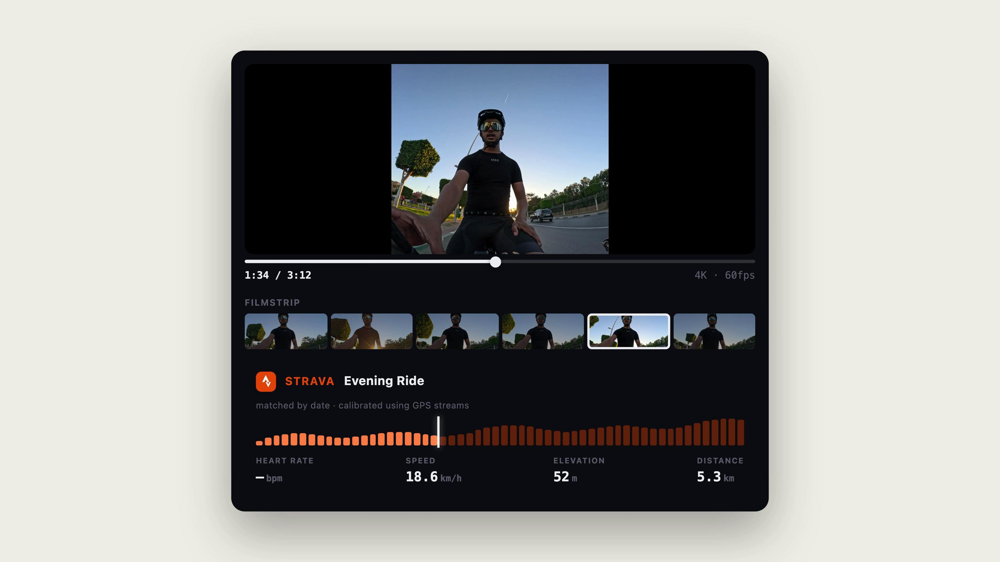

### 🎬 관련 영상
- [🎥 영상 보기](https://ph-files.imgix.net/ebc53f89-0193-448c-bb83-ee2103872d67.jpeg?auto=format)

---

## 19. [iMessage Hermes on a Raspberry Pi](https://www.producthunt.com/products/imessage-hermes-on-a-raspberry-pi)
**Votes**: 88 | **도입 난이도**: 상 | **신뢰도**: 상
**Tagline**: An always-on AI agent that lives in your home
**서비스 링크**: https://www.producthunt.com/r/LAVT63Z62YHWUH

**태그**: AI Agent, Hardware, Automation, Smart Home, Open Source, Agent, AI Tool

### 📌 이 서비스 한눈에 보기
라즈베리 파이를 활용해 집안 어디서든 iMessage/SMS로 소통하는 상시 가동형 AI 에이전트

### 🔑 주요 기능
- 저렴한 라즈베리 파이 기반의 상시 가동형 AI 에이전트 구축
- iMessage 및 SMS를 통해 외부에서도 실시간 텍스트 상호작용 가능
- 가족 일정 관리, 레시피 도우미 등 다양한 맞춤형 기능으로 확장 가능한 기초 프레임워크

### 🙋 사용자에게 어떤 점이 좋은가
집안의 하드웨어를 활용해 개인화된 AI 비서를 구축할 수 있으며, 코딩 에이전트를 통한 설치 방식으로 기술적 진입 장벽을 낮췄습니다.

### ✅ 지금 바로 써볼 기능
- SSH를 통한 코딩 에이전트 설치 가이드 실행
- 라즈베리 파이에 Hermes 에이전트 설치
- iMessage/SMS 연동을 통한 원격 제어 테스트

### ⚠️ 사용 전 확인할 점
- SSH 및 코딩 에이전트를 활용한 설치 과정이 초보자에게 어려울 수 있음
- 하드웨어(라즈베리 파이) 및 통신 환경(SMS/iMessage) 설정 필요

### 🧭 확인이 더 필요한 정보
사용자의 코딩 숙련도에 따라 설치 난이도가 크게 달라질 수 있습니다.

### 📸 스크린샷 및 갤러리

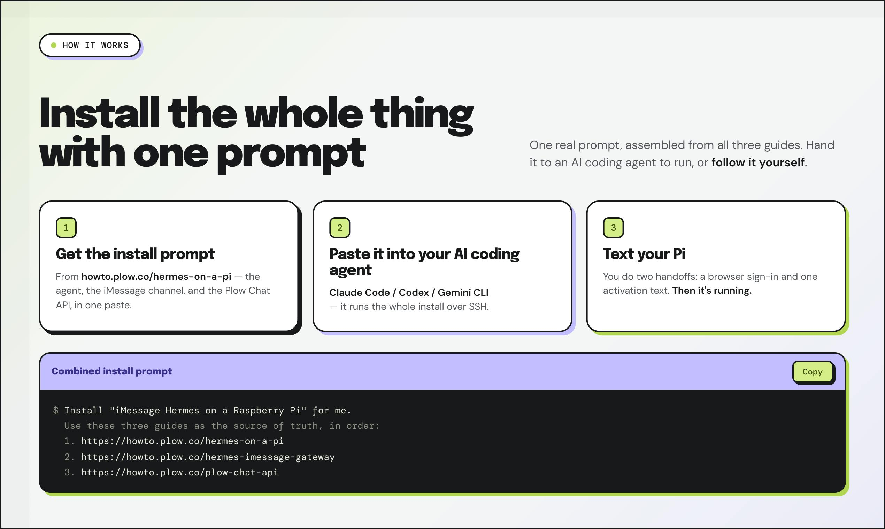
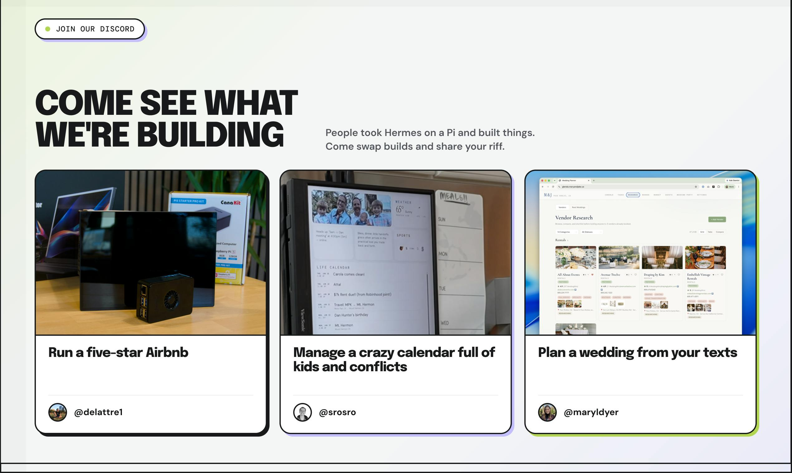

### 🎬 관련 영상
- [🎥 영상 보기](https://ph-files.imgix.net/260b4b70-9ec8-4958-933e-1b1a06ee24bf.jpeg?auto=format)

---

## 20. [Repaint Socials](https://www.producthunt.com/products/repaint-ai-website-builder)
**Votes**: 88 | **도입 난이도**: 하 | **신뢰도**: 상
**Tagline**: Build a website from Google Business, Instagram, or Facebook
**서비스 링크**: https://www.producthunt.com/r/PRD7MVJWUKKC4X

**태그**: NoCode, AI, Marketing, Automation, AI Tool, Design

### 📌 이 서비스 한눈에 보기
기존 소셜 미디어와 구글 비즈니스 프로필을 활용해 AI가 자동으로 웹사이트를 구축해주는 서비스

### 🔑 주요 기능
- 구글 비즈니스, 인스타그램, 페이스북 콘텐츠를 기반으로 웹사이트 자동 생성
- 실제 운영 중인 콘텐츠를 구조, 내용, 디자인에 즉시 반영
- 수 분 내에 완성도 높은 사이트 구축 및 게시 가능

### 🙋 사용자에게 어떤 점이 좋은가
별도의 콘텐츠 제작 없이 기존 소셜 계정만 연결하면 전문적인 웹사이트를 즉시 가질 수 있어 운영 효율이 극대화됩니다.

### ✅ 지금 바로 써볼 기능
- 기존 소셜 계정 연동하기
- AI 생성 디자인 확인 및 미세 조정하기
- 완성된 사이트 웹에 게시하기

### ⚠️ 사용 전 확인할 점
- 소셜 미디어 콘텐츠 의존도가 높아 원본 데이터 품질이 사이트 품질을 결정함
- 복잡한 커스텀 기능이나 독창적인 디자인 구현에는 한계가 있을 수 있음

### 🧭 확인이 더 필요한 정보
소셜 미디어 계정 연동 시 데이터 동기화 주기 및 실시간 업데이트 여부에 대한 확인이 필요합니다.

### 📸 스크린샷 및 갤러리

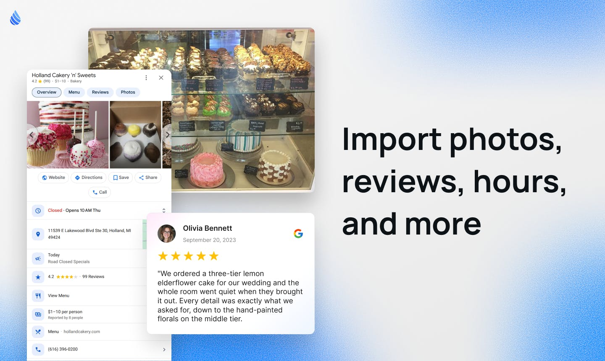

---

## 21. [HeyZoku](https://www.producthunt.com/products/heyzoku)
**Votes**: 83 | **도입 난이도**: 중 | **신뢰도**: 상
**Tagline**: Orchestrate an army of coding agents with your voice.
**서비스 링크**: https://www.producthunt.com/r/RVZ5WIM2KYNPVK

**태그**: DevTool, AI-Agent, Voice-UI, Automation, Mac, Agent

### 📌 이 서비스 한눈에 보기
음성 명령으로 여러 코딩 에이전트를 동시에 제어하는 Mac용 개발 환경

### 🔑 주요 기능
- 음성 중심의 에이전트 제어 인터페이스
- 다수의 코딩 에이전트(Claude, Codex, Cursor 등) 동시 실행 및 관리
- 온디바이스 음성 처리 및 개인 구독 모델 기반의 일회성 결제 방식

### 🙋 사용자에게 어떤 점이 좋은가
복잡한 코딩 작업을 손을 쓰지 않고 말로 지시하여 여러 에이전트를 효율적으로 오케스트레이션할 수 있습니다.

### ✅ 지금 바로 써볼 기능
- 음성 명령을 통한 에이전트 생성 및 리다이렉션 테스트
- 개인 구독 계정 연동 및 일회성 결제 방식 확인

### ⚠️ 사용 전 확인할 점
- Mac 전용 환경이므로 타 OS 사용 시 제약이 있을 수 있음
- 음성 인식 정확도 및 에이전트 간 간섭 여부 확인 필요

### 🧭 확인이 더 필요한 정보
사용자의 개인 구독 모델이 각 에이전트 서비스와 어떻게 연동되는지에 대한 구체적인 기술적 세부 사항이 필요합니다.

### 📸 스크린샷 및 갤러리
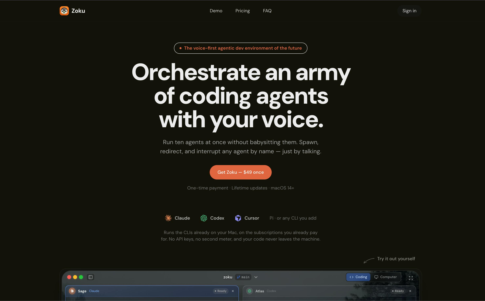
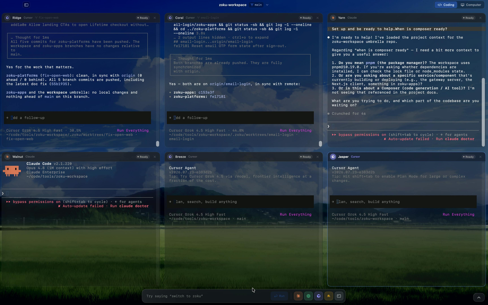

### 🎬 관련 영상
- [🎥 영상 보기](https://ph-files.imgix.net/5a5e5b56-9200-4db0-8def-1c60c7887483.jpeg?auto=format)

---

## 22. [Illume Labs](https://www.producthunt.com/products/illume-labs)
**Votes**: 80 | **도입 난이도**: 하 | **신뢰도**: 상
**Tagline**: 24/7 personalized health companion you can text
**서비스 링크**: https://www.producthunt.com/r/X4X2TMUVEUR57X

**태그**: HealthTech, AI, Personalized, Wearables, DataAnalytics, Agent, AI Tool

### 📌 이 서비스 한눈에 보기
웨어러블과 건강 데이터를 통합하여 텍스트로 맞춤형 인사이트를 제공하는 24/7 개인 건강 비서

### 🔑 주요 기능
- 웨어러블, 영양, 운동, 검사 결과를 통합한 데이터 패턴 분석
- 단순한 대시보드를 넘어선 실행 가능한 개인 맞춤형 인사이트 제공
- 텍스트 메시지 기반의 간편한 질의응답 및 데이터 탐색

### 🙋 사용자에게 어떤 점이 좋은가
여러 플랫폼에 흩어진 건강 데이터를 하나로 연결하여, 복잡한 수치 대신 즉각적이고 실질적인 건강 관리 가이드를 얻을 수 있습니다.

### ✅ 지금 바로 써볼 기능
- 자신의 웨어러블 및 건강 데이터 연동하기
- 텍스트 메시지로 건강 관련 질문 던져보기
- 데이터 트렌드 및 히스토리 심층 탐색하기

### ⚠️ 사용 전 확인할 점
- 의학적 진단을 대체할 수 없으므로 전문 의료진의 조언이 필요함
- 개인 건강 데이터(민감 정보) 공유에 따른 보안 및 프라이버시 검토 필요

### 🧭 확인이 더 필요한 정보
제공되는 데이터의 실시간 동기화 범위와 구체적인 보안 프로토콜에 대한 확인이 필요합니다.

### 📸 스크린샷 및 갤러리
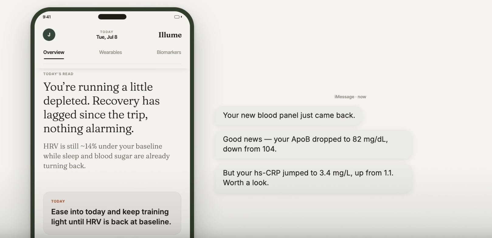

### 🎬 관련 영상
- [🎥 영상 보기](https://ph-files.imgix.net/93cc4b10-5ec7-4be2-a03a-28b94944917f.jpeg?auto=format)

---

## 23. [Tunio](https://www.producthunt.com/products/tunio)
**Votes**: 71 | **도입 난이도**: 하 | **신뢰도**: 상
**Tagline**: AI Music operations platform for venues
**서비스 링크**: https://www.producthunt.com/r/LFXKYGHV2W7F7Q

**태그**: Automation, B2B, AI, Music, Retail, AI Tool, API

### 📌 이 서비스 한눈에 보기
매장 운영을 자동화하는 AI 기반 음악 및 오디오 운영 플랫폼

### 🔑 주요 기능
- 라이선스 확보된 로열티 프리 음악 스트리밍
- 시간대별 스케줄링 및 AI 기반 공지/지브/뉴스 자동 생성
- 다중 매장 관리 및 POS 시스템 연동 지원

### 🙋 사용자에게 어떤 점이 좋은가
매장 운영자가 일일이 음악을 바꾸거나 공지사항을 전달할 필요 없이, AI가 스케줄에 맞춰 음악과 음성 콘텐츠를 자동으로 관리해 줍니다.

### ✅ 지금 바로 써볼 기능
- 시간대별 자동 재생 스케줄 설정하기
- AI를 활용한 매장용 공지 및 뉴스 생성해보기
- 다중 매장 관리 기능을 통한 통합 운영 테스트

### ⚠️ 사용 전 확인할 점
- 매장별 하드웨어 환경에 따른 오프라인 기능 작동 여부 확인 필요
- POS 시스템과의 구체적인 연동 범위 확인 필요

### 🧭 확인이 더 필요한 정보
제공되는 음악 라이브러리의 장르 다양성과 구체적인 API 연동 범위에 대한 정보가 추가로 필요합니다.

### 📸 스크린샷 및 갤러리
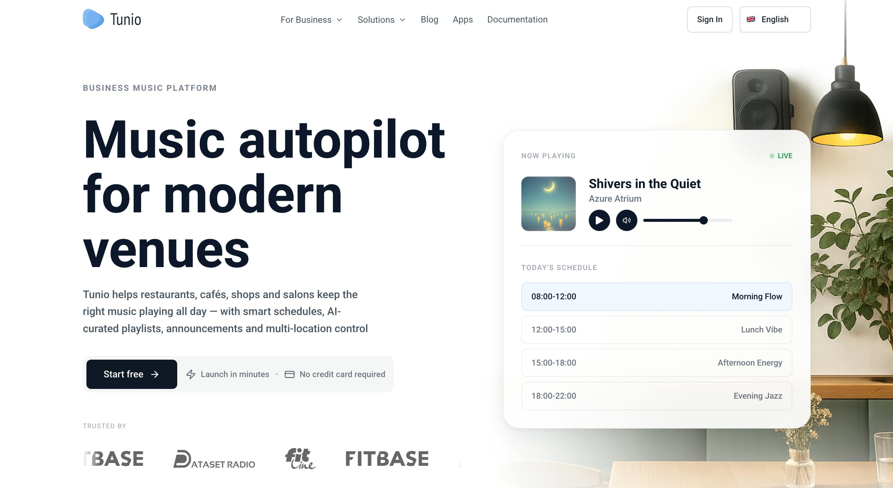
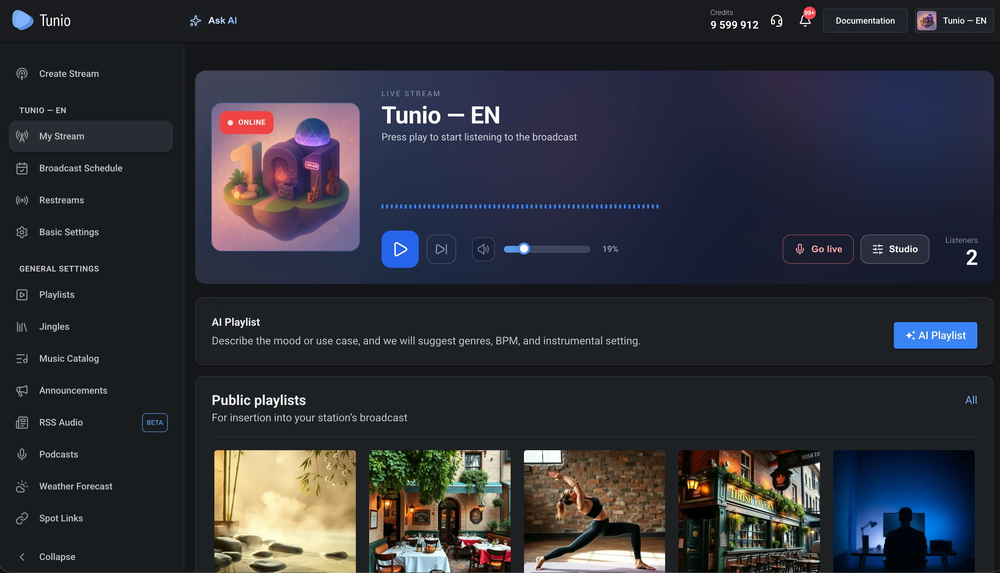
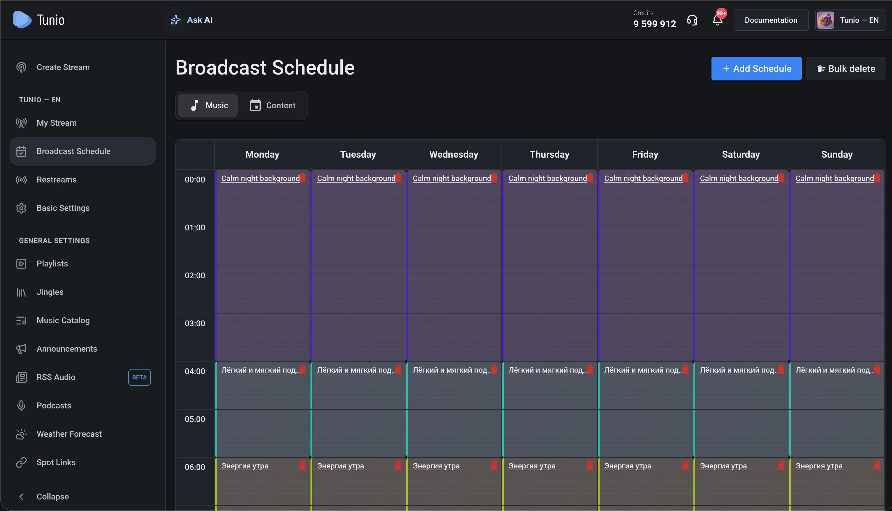

---

## 24. [Audos Summer Camp](https://www.producthunt.com/products/socap)
**Votes**: 71 | **도입 난이도**: 중 | **신뢰도**: 상
**Tagline**: Build your business idea with unlimited Fable/Sol credits ♾️
**서비스 링크**: https://www.producthunt.com/r/ZL6MQ6IZMOWOXV

**태그**: Entrepreneurship, AI, NoCode, Business-Builder

### 📌 이 서비스 한눈에 보기
8주 만에 수익 창출을 목표로 하는 비즈니스 빌드 캠프 및 AI 모델 크레딧 제공 프로그램

### 🔑 주요 기능
- 8주 과정의 사이드 허슬 수익화 프로그램
- Fable 및 Sol 모델 무제한 크레딧 제공
- 주간 워크숍, 지원금 및 데모 데이 포함

### 🙋 사용자에게 어떤 점이 좋은가
아이디어를 실제 수익 모델로 빠르게 전환하고 싶은 창업가에게 AI 빌딩 도구와 교육을 동시에 제공합니다.

### ✅ 지금 바로 써볼 기능
- 8주 프로그램 커리큘럼 확인
- 제공되는 Fable/Sol 크레딧 활용 방안 검토
- 데모 데이 및 지원금 조건 확인

### ⚠️ 사용 전 확인할 점
- 8주라는 제한된 시간 내에 성과를 내야 하는 일정 압박
- 수익 창출 결과가 보장되지 않음

### 🧭 확인이 더 필요한 정보
참가 자격 요건과 구체적인 선정 방식에 대한 정보가 필요합니다.

### 📸 스크린샷 및 갤러리
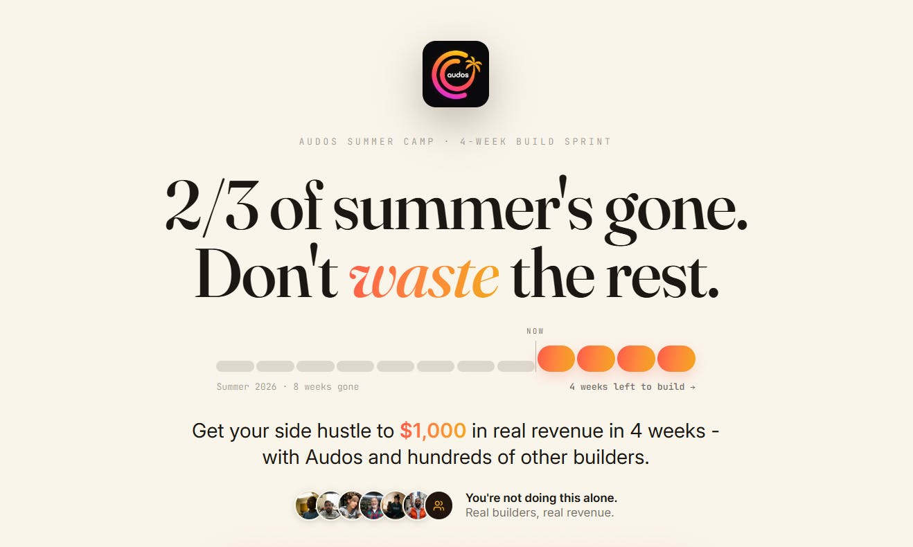

### 🎬 관련 영상
- [🎥 영상 보기](https://ph-files.imgix.net/ef051c6d-c09b-41bb-bfa9-6f9862038d2f.jpeg?auto=format)

---

## 25. [Revenli](https://www.producthunt.com/products/revenli)
**Votes**: 31 | **도입 난이도**: 하 | **신뢰도**: 상
**Tagline**: The AI financial brain for real estate investors
**서비스 링크**: https://www.producthunt.com/r/XRL5YVJQNQL7LX

**태그**: Real Estate, AI, FinTech, Automation, Agent, AI Tool

### 📌 이 서비스 한눈에 보기
부동산 투자자를 위한 AI 기반 통합 재무 관리 및 의사결정 솔루션

### 🔑 주요 기능
- 문서 업로드만으로 송장 및 은행 피드 자동 정산
- 세무 준비를 위한 실시간 데이터 동기화 및 전략 제공
- 매수, 보유, 매도, 재융자 등 투자 의사결정 가이드 제공

### 🙋 사용자에게 어떤 점이 좋은가
여러 곳에 흩어진 재무 데이터를 한곳에서 관리하며, AI가 제안하는 전략을 통해 복잡한 부동산 투자 의사결정을 단순화할 수 있습니다.

### ✅ 지금 바로 써볼 기능
- 보유 중인 재무 문서 업로드하기
- AI가 제안하는 세무 전략 검토하기
- 자산 포트폴리오 분석 기능 실행하기

### ⚠️ 사용 전 확인할 점
- AI의 제안이 실제 법적/세무적 책임에 우선할 수 없으므로 전문가 검토 필요
- 정확한 분석을 위해 입력하는 문서의 품질과 데이터 일관성이 중요함

### 🧭 확인이 더 필요한 정보
제공되는 AI 전략의 구체적인 알고리즘과 데이터 보안 정책에 대한 확인이 필요합니다.

### 📸 스크린샷 및 갤러리
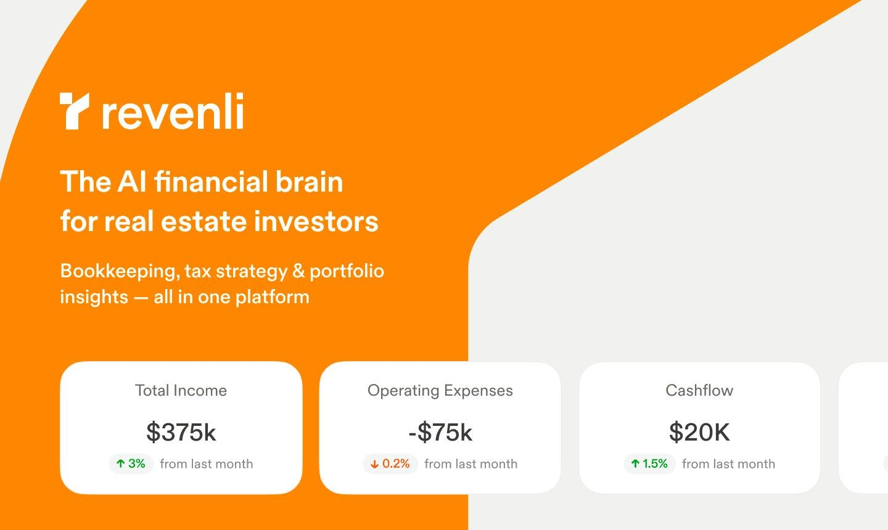
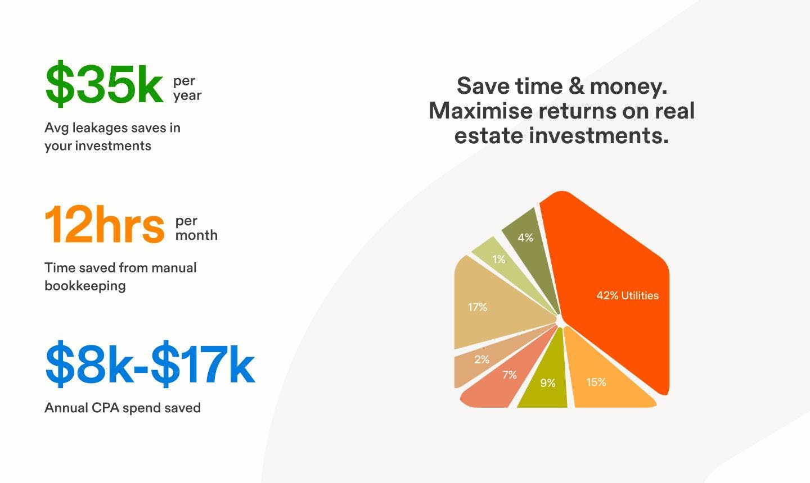
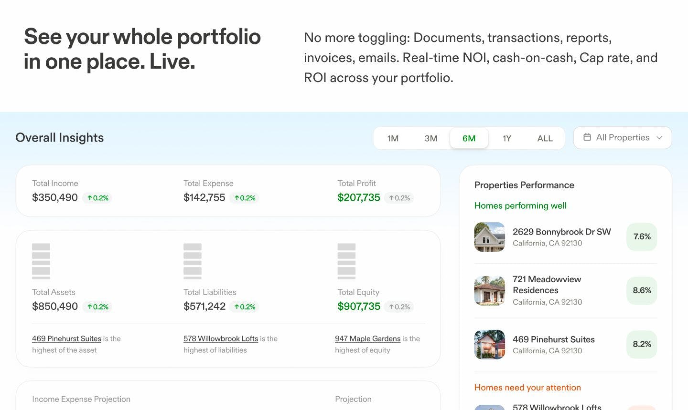

### 🎬 관련 영상
- [🎥 영상 보기](https://ph-files.imgix.net/23750322-1537-4d59-8a33-b88c343fd77a.jpeg?auto=format)

---

## 26. [Syllaby API](https://www.producthunt.com/products/syllaby-api)
**Votes**: 19 | **도입 난이도**: 중 | **신뢰도**: 상
**Tagline**: Your app, now powered by faceless video creation.
**서비스 링크**: https://www.producthunt.com/r/J5RPQL7NILICBU

**태그**: DevTool, Automation, VideoGen, SaaS, Video, API

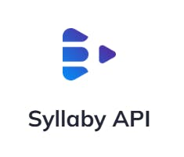

### 📌 이 서비스 한눈에 보기
기존 앱에 얼굴 없는 영상 제작 기능을 즉시 통합하는 자동화 API

### 🔑 주요 기능
- 애플리케이션 내 페이스리스(faceless) 영상 생성 기능 구현
- URL 기반 콘텐츠 빌드 및 스크립트 자동 생성
- 에셋 관리 및 콘텐츠 워크플로우 자동화

### 🙋 사용자에게 어떤 점이 좋은가
개발자가 직접 영상 제작 로직을 구축할 필요 없이, API 연동만으로 서비스 내에 강력한 영상 생성 기능을 추가할 수 있습니다.

### ✅ 지금 바로 써볼 기능
- URL을 활용한 스크립트 생성 테스트
- API를 통한 영상 생성 워크플로우 연동
- 에셋 관리 기능의 API 효율성 확인

### ⚠️ 사용 전 확인할 점
- API 연동 시 영상 생성 품질 및 스타일 커스텀 범위 확인 필요
- 대량 생성 시 발생할 수 있는 비용 및 속도 제한 확인 필요

### 🧭 확인이 더 필요한 정보
API의 구체적인 호출 비용 체계와 영상 생성 소요 시간에 대한 정보가 명시되지 않았습니다.

### 📸 스크린샷 및 갤러리
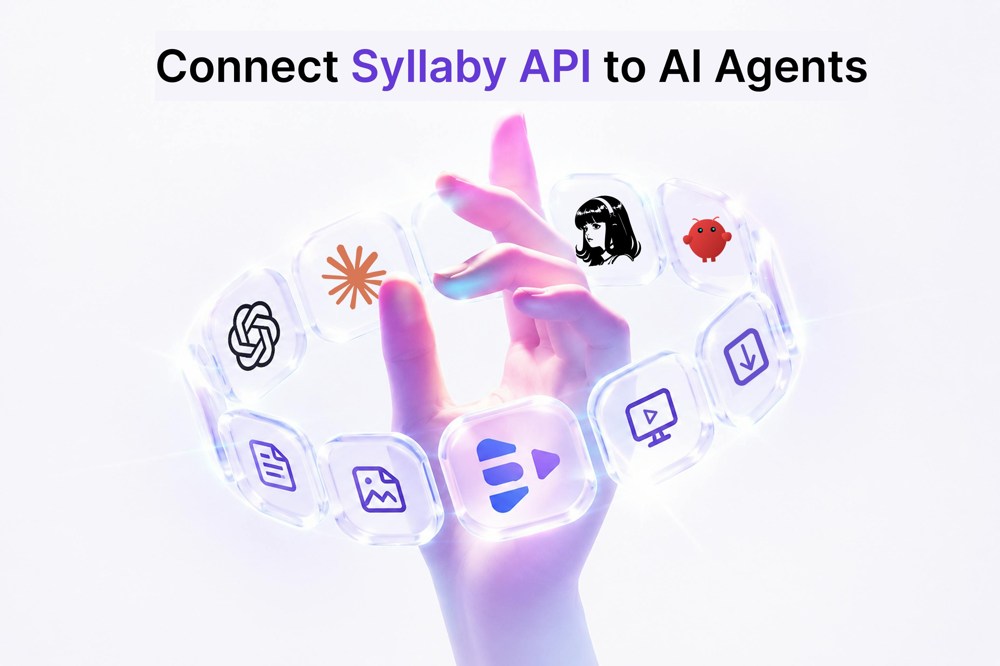
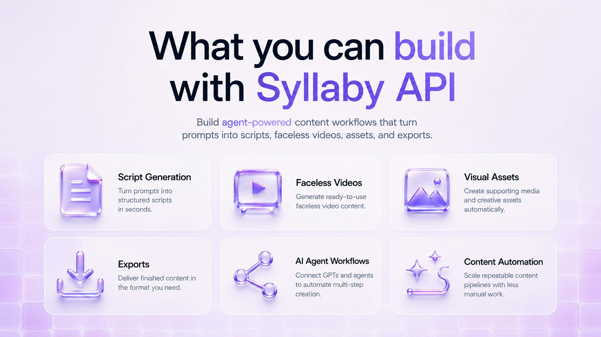
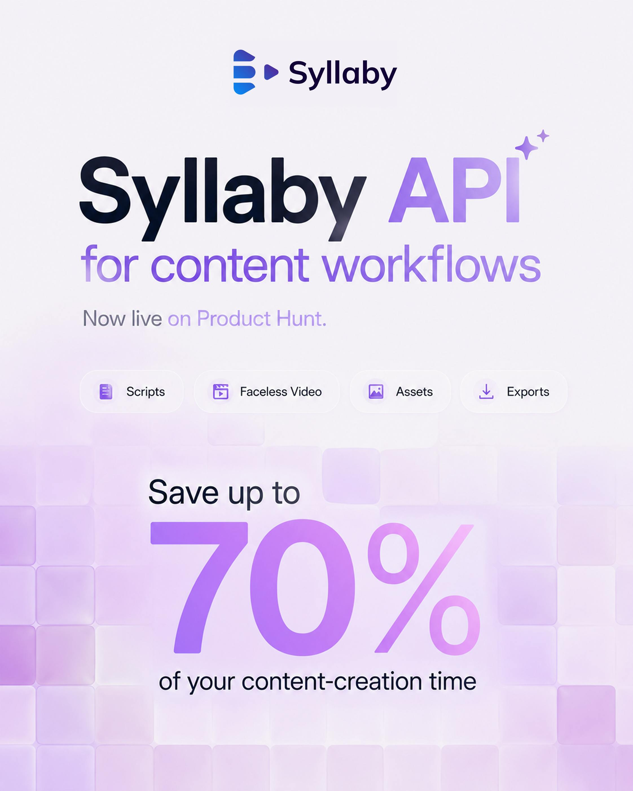

---

## 27. [KickPilot.Me](https://www.producthunt.com/products/kickpilot-2)
**Votes**: 18 | **도입 난이도**: 하 | **신뢰도**: 상
**Tagline**: The easiest way to manage your football club
**서비스 링크**: https://www.producthunt.com/r/7OMVAK7WYCQ3C6

**태그**: Sports, Management, Teamwork, MobileApp

### 📌 이 서비스 한눈에 보기
동호회 및 아마추어 축구 클럽 운영을 위한 올인원 관리 솔루션

### 🔑 주요 기능
- 라인업 구성 및 경기 운영 관리
- 회비 결제 및 정산 관리
- 경기 통계 기록 및 팀원 간 소통 기능

### 🙋 사용자에게 어떤 점이 좋은가
복잡한 엑셀이나 카톡 공지 대신 하나의 앱으로 팀 운영의 번거로움을 줄이고 팀원들의 참여를 높일 수 있습니다.

### ✅ 지금 바로 써볼 기능
- 팀 라인업 구성 기능 테스트
- 결제 및 회비 관리 기능 확인
- 경기 통계 기록 방식 확인

### ⚠️ 사용 전 확인할 점
- 모바일 앱 환경에서의 사용 편의성 확인 필요
- 결제 시스템의 실제 연동 및 수수료 정책 확인 필요

### 🧭 확인이 더 필요한 정보
구체적인 요금 체계와 결제 수단 지원 범위에 대한 정보가 부족합니다.

### 📸 스크린샷 및 갤러리
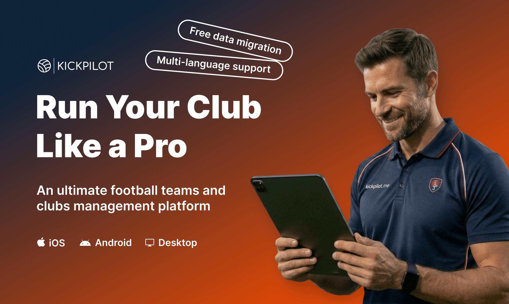
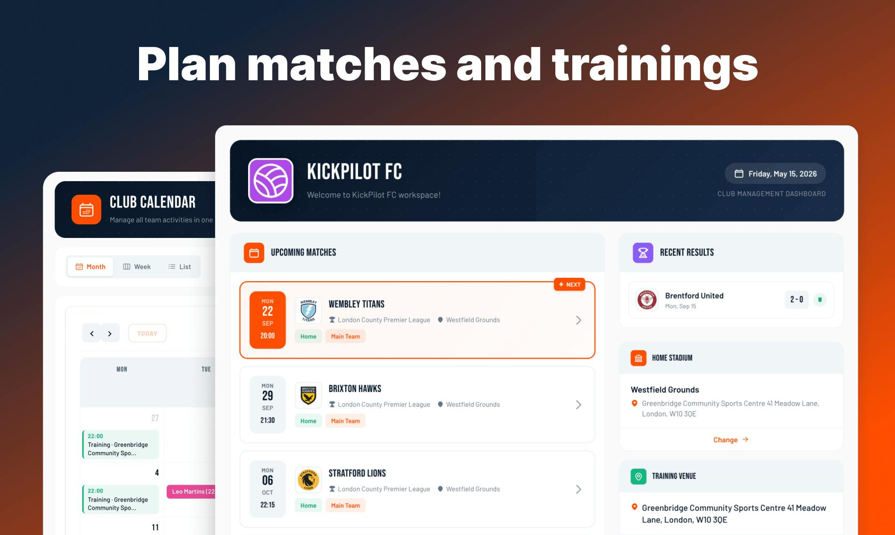
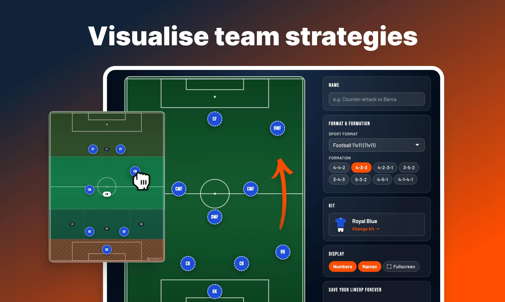

---

## 28. [Japan Cat](https://www.producthunt.com/products/japan-cat)
**Votes**: 18 | **도입 난이도**: 하 | **신뢰도**: 상
**Tagline**: Learn Japanese while driving. Don't waste time.
**서비스 링크**: https://www.producthunt.com/r/AZVTKPEPVOQKON

**태그**: LanguageLearning, AI, Productivity, MobileApp, AI Tool, Chat

### 📌 이 서비스 한눈에 보기
운전 중에도 손쉽게 일본어 회화 실력을 키울 수 있는 AI 기반 핸즈프리 학습 도구

### 🔑 주요 기능
- AI와의 자연스러운 대화를 통한 실전 회화 연습
- 대화 후 피드백(교정, 오류, 뉘앙스) 제공
- CarPlay 및 핸즈프리 모드 지원으로 이동 시간 활용 가능

### 🙋 사용자에게 어떤 점이 좋은가
사람 앞에서의 부끄러움 없이 혼자서 편하게 말하기 연습을 할 수 있으며, 특히 운전 중 자투리 시간을 학습 시간으로 전환할 수 있습니다.

### ✅ 지금 바로 써볼 기능
- 캐주얼 채팅 모드로 가벼운 대화 시작하기
- 구조화된 튜터링 모드로 체계적인 학습하기
- 과거 대화 기록을 통한 복습 및 재시도하기

### ⚠️ 사용 전 확인할 점
- 실제 사람과의 대화가 아니므로 실전 감각 차이가 있을 수 있음
- 운전 중 사용 시 안전 규정을 준수해야 함

### 🧭 확인이 더 필요한 정보
구체적인 구독 요금 체계나 무료 사용 범위에 대한 정보가 명시되지 않았습니다.

### 📸 스크린샷 및 갤러리

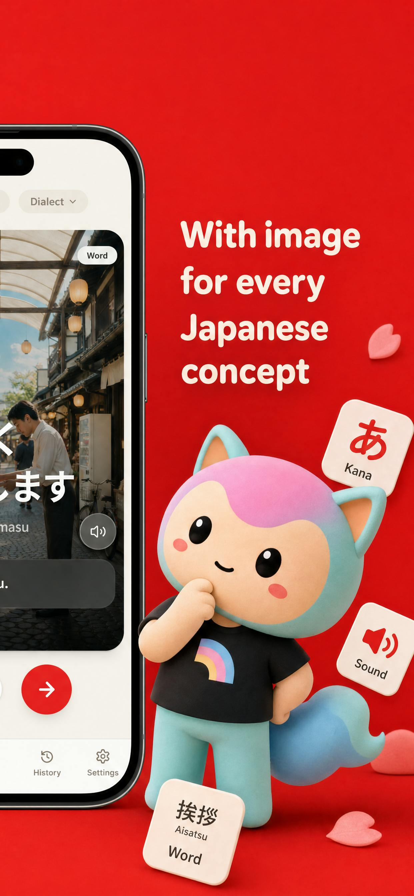

---

## 29. [Filaro](https://www.producthunt.com/products/filaro)
**Votes**: 17 | **도입 난이도**: 하 | **신뢰도**: 상
**Tagline**: QR queue + appointments for walk-in shops
**서비스 링크**: https://www.producthunt.com/r/NESV3HGR5DLKWJ

**태그**: SaaS, Retail, Productivity

### 📌 이 서비스 한눈에 보기
QR 코드를 활용한 간편 대기 명단 및 예약 관리 솔루션

### 🔑 주요 기능
- 별도 앱 설치 없이 QR 스캔만으로 대기 및 예약 가능
- 종이 명단과 고가 소프트웨어 사이의 합리적인 대안
- 매장 운영자를 위한 빠른 설정 및 저렴한 비용 구조

### 🙋 사용자에게 어떤 점이 좋은가
매장 방문 고객이 앱 설치 번거로움 없이 즉시 대기열에 합류하거나 시간을 예약할 수 있어 고객 경험이 개선됩니다.

### ✅ 지금 바로 써볼 기능
- 매장 카운터에 비치할 QR 코드 생성하기
- 대기열 및 예약 기능 테스트하기
- 6개월 무료 체험 기간 활용하기

### ⚠️ 사용 전 확인할 점
- 6개월 무료 기간 종료 후 유료 전환 비용 확인 필요
- 앱 설치가 없는 환경에서의 고객 편의성 체감도 차이

### 🧭 확인이 더 필요한 정보
6개월 이후 적용되는 구체적인 유료 요금 체계에 대한 정보가 부족합니다.

### 📸 스크린샷 및 갤러리
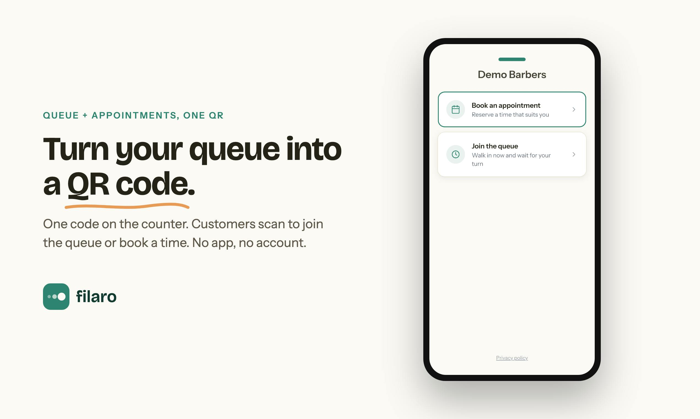
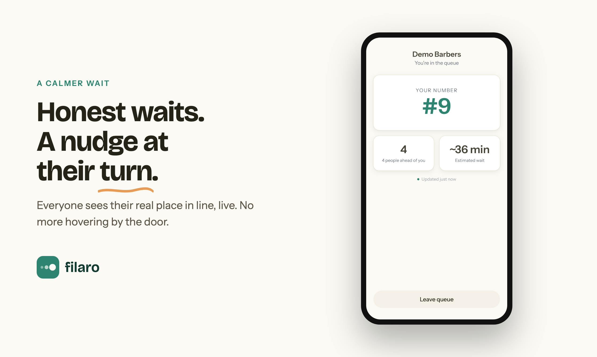
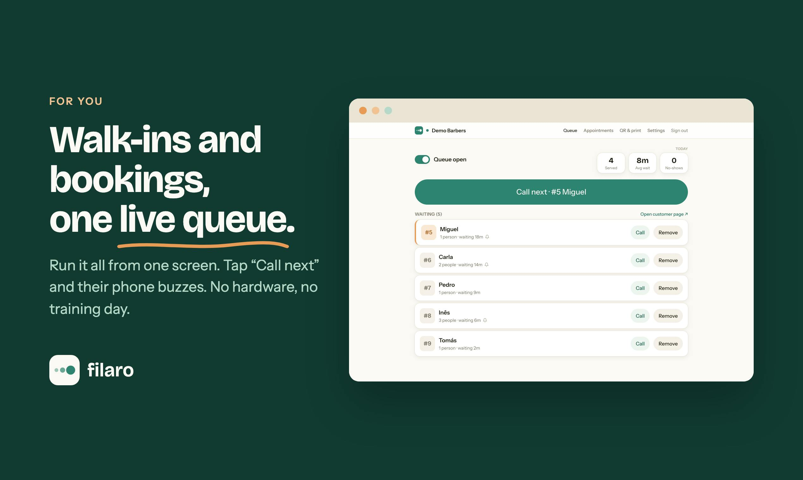

### 🎬 관련 영상
- [🎥 영상 보기](https://ph-files.imgix.net/80f42881-b95b-43aa-a6bc-b0096a16f39c.gif?auto=format)

---

## 30. [Jharu -A disk cleaner that can think.](https://www.producthunt.com/products/jharu)
**Votes**: 13 | **도입 난이도**: 하 | **신뢰도**: 상
**Tagline**: Free disk cleaner for your AI model and dev caches 
**서비스 링크**: https://www.producthunt.com/r/3GRTDK2LVPYMAM

**태그**: DevTool, AI, OpenSource, macOS, Windows, AI Tool

### 📌 이 서비스 한눈에 보기
AI 모델 및 개발 캐시를 스마트하게 정리해주는 오픈소스 디스크 클리너

### 🔑 주요 기능
- Hugging Face, Ollama, PyTorch 등 AI 모델 캐시 최적화 지원
- npm, pip 등 개발 환경 관련 불필요한 파일 정리
- 개인정보 수집(Telemetry)이 없는 안전한 오픈소스 도구

### 🙋 사용자에게 어떤 점이 좋은가
AI 모델과 개발 라이브러리로 인해 부족해진 디스크 용량을 안전하고 빠르게 확보할 수 있습니다.

### ✅ 지금 바로 써볼 기능
- AI 모델 캐시 정리 기능 실행
- 개발 환경(npm/pip) 캐시 정리
- OS별(macOS/Windows) 설치 및 실행

### ⚠️ 사용 전 확인할 점
- 중요한 모델 파일이나 개발 환경 설정이 삭제되지 않도록 주의 필요
- 사용자 환경에 따라 삭제되는 파일의 영향도가 다를 수 있음

### 🧭 확인이 더 필요한 정보
사용자의 특정 개발 환경에서 어떤 파일이 '클러터'로 분류되는지에 대한 세부 정책 확인이 필요합니다.

### 📸 스크린샷 및 갤러리
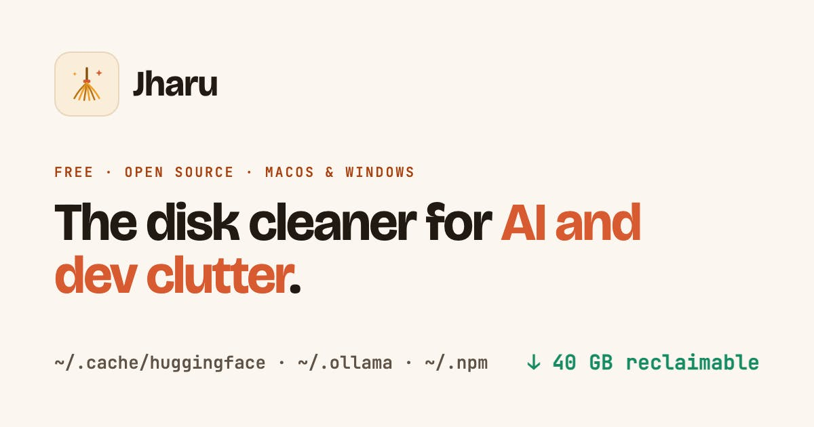
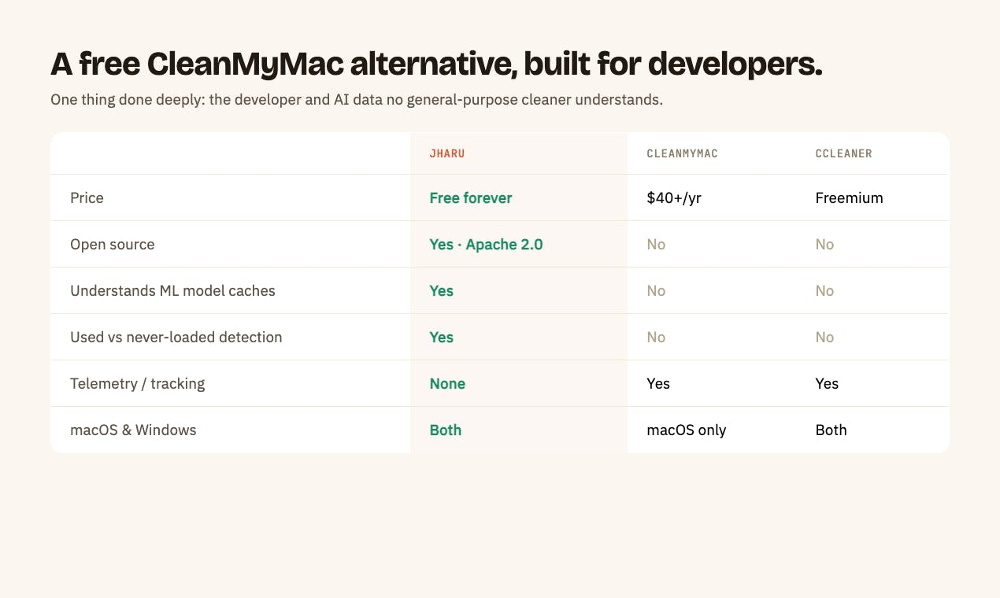
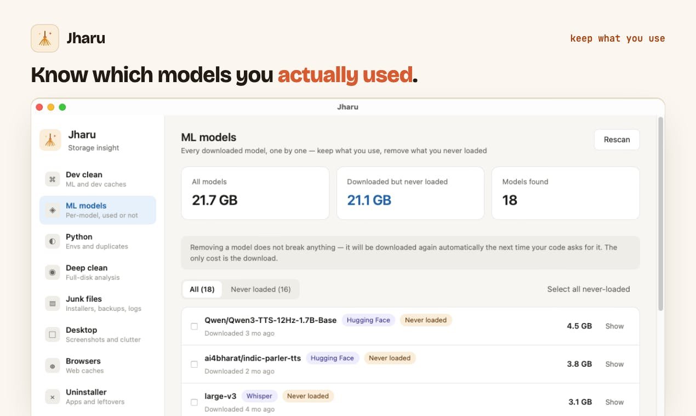

### 🎬 관련 영상
- [🎥 영상 보기](https://ph-files.imgix.net/8d00d5c1-e50e-44ac-b858-27ec238703ad.jpeg?auto=format)

---

