# 🚀 Product Hunt Daily Top 30 (2026-07-29)

## 오늘의 요약
오늘의 트렌드는 AI 에이전트의 성능을 실시간으로 모니터링하고 자동 개선하는 운영 최적화 솔루션이 주도했습니다. 또한, 코딩이나 전문 지식 없이도 웹 디자인, 애니메이션, 하드웨어 프로토타이핑을 수행할 수 있는 노코드/AI 융합 도구들이 주목받았습니다.

### 오늘의 핵심 포인트
- AI 에이전트의 성능 저하를 감지하고 프롬프트를 자동 수정하는 자가 개선 루프 기술이 부상했습니다.
- 디자인, 웹 빌딩, 하드웨어 설계 등 전문 영역의 진입 장벽을 낮추는 AI 기반 자동화 도구들이 등장했습니다.
- 비즈니스 운영 효율을 높이기 위해 예약, 계약, 고객 응대를 통합하는 자동화 워크플로우가 강조되었습니다.

**오늘의 태그**: AI Agents, No-Code, Automation, Productivity, AI Design

## 1. [Prefactor](https://www.producthunt.com/products/prefactor)
**Votes**: 506 | **도입 난이도**: 중 | **신뢰도**: 상
**Tagline**: Evaluate your AI Agents in real-time
**서비스 링크**: https://www.producthunt.com/r/Y5XXYGBXLHNUGG

**태그**: AI, DevTool, Observability, MLOps, Agent, AI Tool

### 📌 이 서비스 한눈에 보기
실시간 모니터링을 통해 AI 에이전트의 성능 저하와 품질 문제를 즉각 해결하는 평가 레이어

### 🔑 주요 기능
- 실시간 에이전트 실행 스코어링 제공
- 품질 저하(Regression) 및 드리프트(Drift) 즉시 감지
- 운영 환경과 테스트 환경 간의 성능 격차 해소

### 🙋 사용자에게 어떤 점이 좋은가
AI 에이전트가 테스트 환경을 넘어 실제 프로덕션 환경에서 어떻게 작동하는지 실시간으로 파악하여 신뢰도를 높일 수 있습니다.

### ✅ 지금 바로 써볼 기능
- 실시간 에이전트 실행 스코어링 기능 테스트
- 품질 저하 및 드리프트 알림 설정
- 엔지니어링 팀을 위한 성능 대시보드 확인

### ⚠️ 사용 전 확인할 점
- 실시간 스코어링이 에이전트 실행 속도(Latency)에 미치는 영향 확인 필요
- 기존 개발 워크플로우와의 통합 방식 확인 필요

### 🧭 확인이 더 필요한 정보
구체적인 데이터 통합 방식 및 실시간 스코어링의 기술적 메커니즘에 대한 정보가 부족합니다.

### 📸 스크린샷 및 갤러리
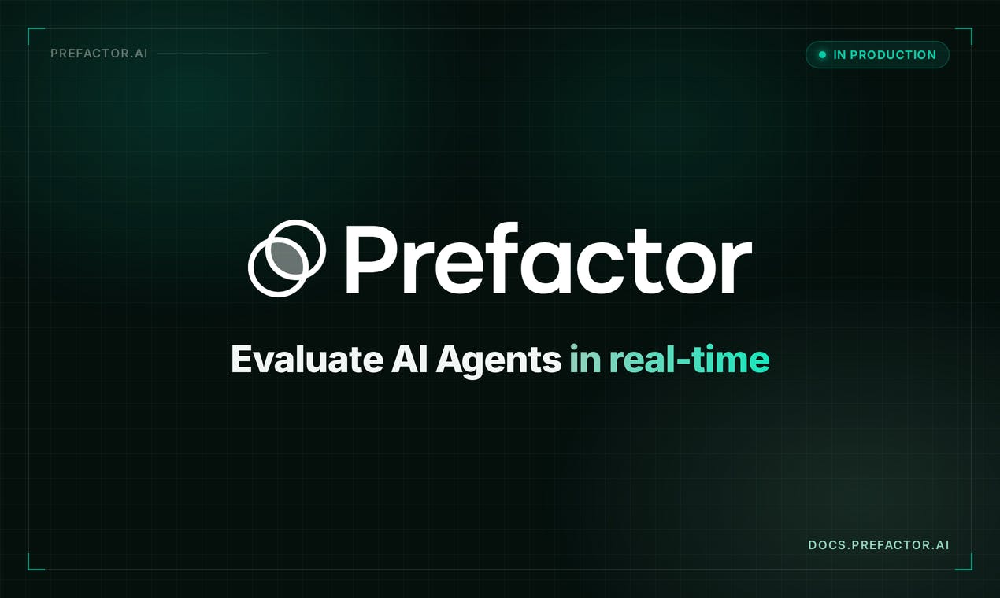
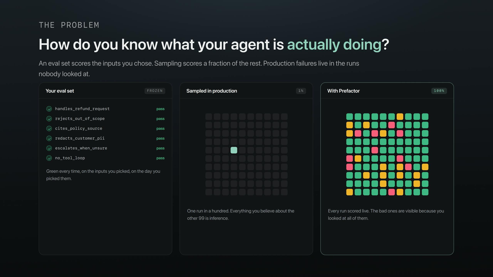
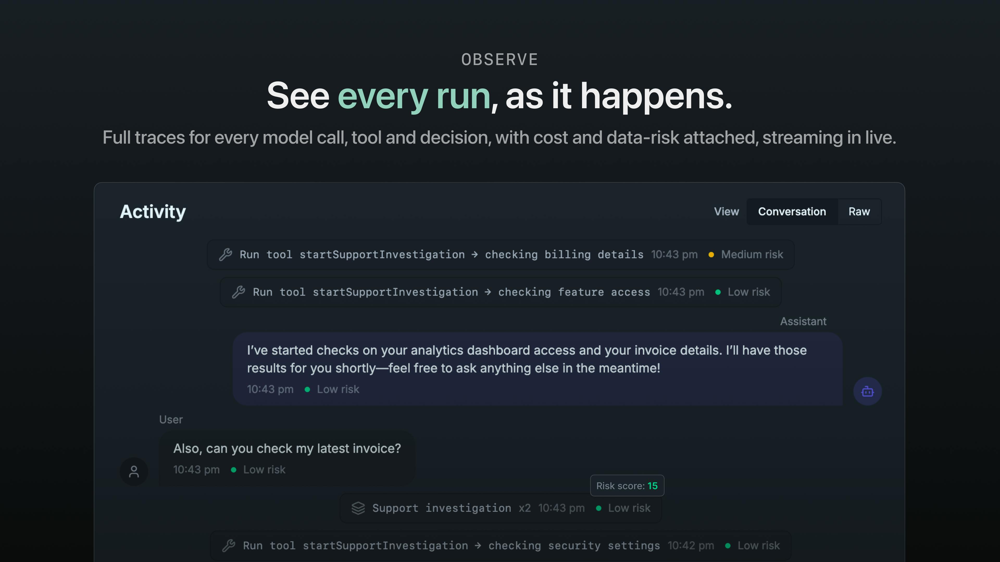

### 🎬 관련 영상
- [🎥 영상 보기](https://ph-files.imgix.net/96b190b6-586f-46b6-b882-266bcb08d9b2.jpeg?auto=format)

---

## 2. [Cekura](https://www.producthunt.com/products/vocera)
**Votes**: 336 | **도입 난이도**: 중 | **신뢰도**: 상
**Tagline**: The self-improvement loop for voice agents
**서비스 링크**: https://www.producthunt.com/r/KH2LLNVN2ZL3SR

**태그**: AI-Agents, DevOps, Automation, Testing, Agent, AI Tool, Chat, Prompting

### 📌 이 서비스 한눈에 보기
음성 및 채팅 AI 에이전트의 오류를 자동으로 진단하고 프롬프트를 수정하여 성능을 개선하는 자동화 루프 플랫폼

### 🔑 주요 기능
- 수천 가지 시나리오 시뮬레이션을 통한 에이전트 테스트 및 관찰성 제공
- 실패 원인 진단부터 프롬프트/설정 자동 재작성까지 이어지는 자동화 워크플로우
- 수정 사항 적용 후 전체 회귀 테스트(Regression Sweep)를 통한 안정성 검증

### 🙋 사용자에게 어떤 점이 좋은가
단순히 오류를 보고하는 데 그치지 않고, 에이전트의 설정을 직접 수정하고 검증함으로써 운영 팀의 수동 개입을 최소화합니다.

### ✅ 지금 바로 써볼 기능
- 기존 AI 에이전트의 실패 시나리오 시뮬레이션 실행
- 자동화된 프롬프트 재작성 기능 테스트
- 수정된 설정에 대한 회귀 테스트 및 오버피팅 여부 확인

### ⚠️ 사용 전 확인할 점
- 자동화된 프롬프트 수정이 의도치 않은 에이전트 성격 변화를 야기할 수 있음
- 복잡한 비즈니스 로직이 포함된 경우 자동 수정의 정확도 확인 필요

### 🧭 확인이 더 필요한 정보
현재 제공되는 자동 수정 기능이 사용자의 개입 없이 완전히 자율적으로 작동하는지, 혹은 승인 절차를 거치는지 확인이 필요합니다.

### 📸 스크린샷 및 갤러리
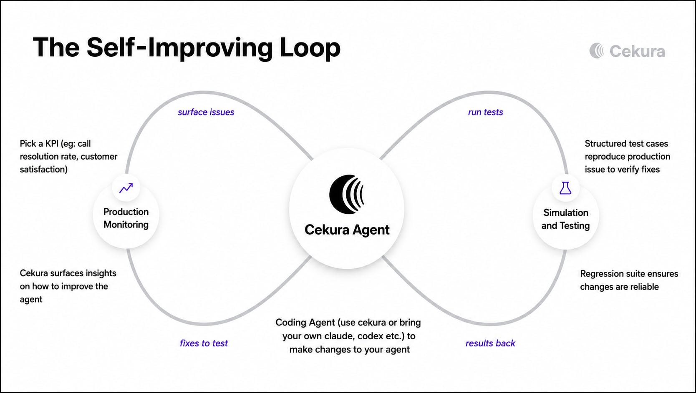
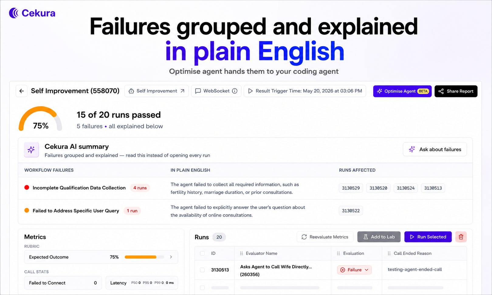
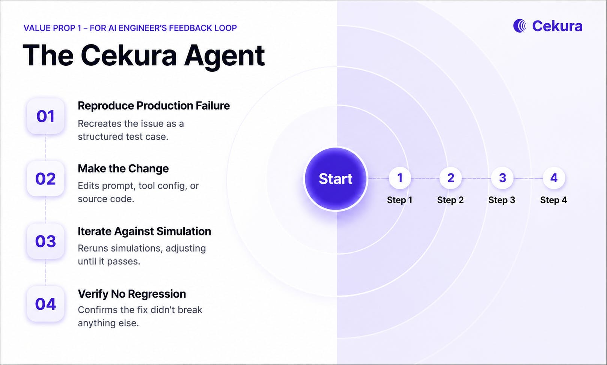

### 🎬 관련 영상
- [🎥 영상 보기](https://ph-files.imgix.net/ec9d67f0-16a8-4ec9-b0a2-92004b76e8d0.jpeg?auto=format)

---

## 3. [Lottie Creator 2.0](https://www.producthunt.com/products/lottiefiles)
**Votes**: 279 | **도입 난이도**: 하 | **신뢰도**: 상
**Tagline**: After Effects for the web, built on Lottie
**서비스 링크**: https://www.producthunt.com/r/GSHXQX2CIK3S3Y

**태그**: DesignTool, Animation, AI, NoCode, WebTool, AI Tool, Design

### 📌 이 서비스 한눈에 보기
설치 없이 브라우저에서 바로 만드는 AI 기반 벡터 애니메이션 제작 도구

### 🔑 주요 기능
- 설치형 데스크톱 앱이 필요 없는 웹 기반 디자인 환경
- Motion Copilot AI를 통한 빠른 애니메이션 작업
- 인터랙티브한 움직임을 구현하는 State Machines 기능

### 🙋 사용자에게 어떤 점이 좋은가
디자이너가 별도의 개발자 전달 과정 없이 브라우저에서 즉시 인터랙티브한 애니메이션을 제작하고 바로 배포할 수 있습니다.

### ✅ 지금 바로 써볼 기능
- Motion Copilot AI로 애니메이션 초안 만들기
- State Machines를 활용한 인터랙티브 요소 설계하기
- dotLottie 파일로 결과물 내보내기

### ⚠️ 사용 전 확인할 점
- 데스크톱 앱이 아닌 웹 기반이므로 브라우저 성능에 따라 작업 환경이 달라질 수 있음
- 복잡한 After Effects 워크플로우를 완벽히 대체할 수 있는지 확인 필요

### 🧭 확인이 더 필요한 정보
상세한 기능 가용 범위와 브라우저 호환성에 대한 구체적인 정보가 필요합니다.

### 📸 스크린샷 및 갤러리
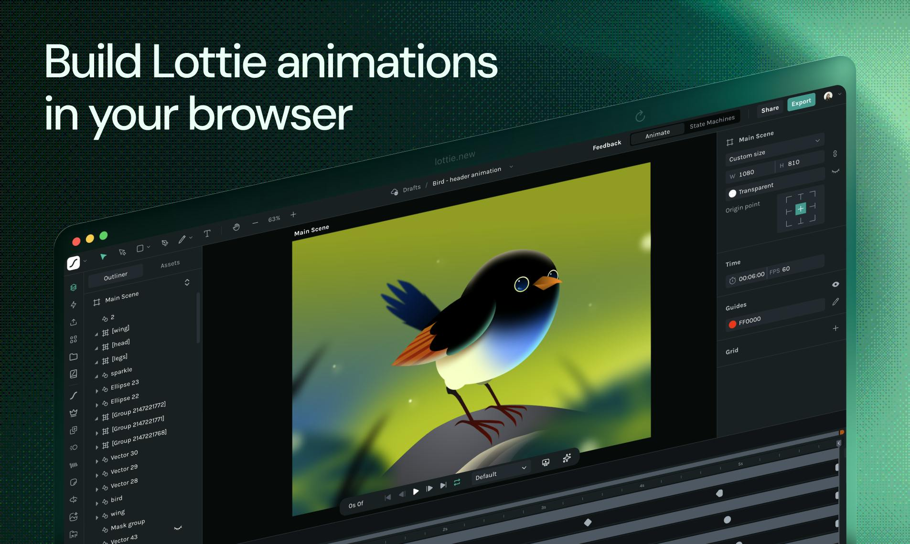
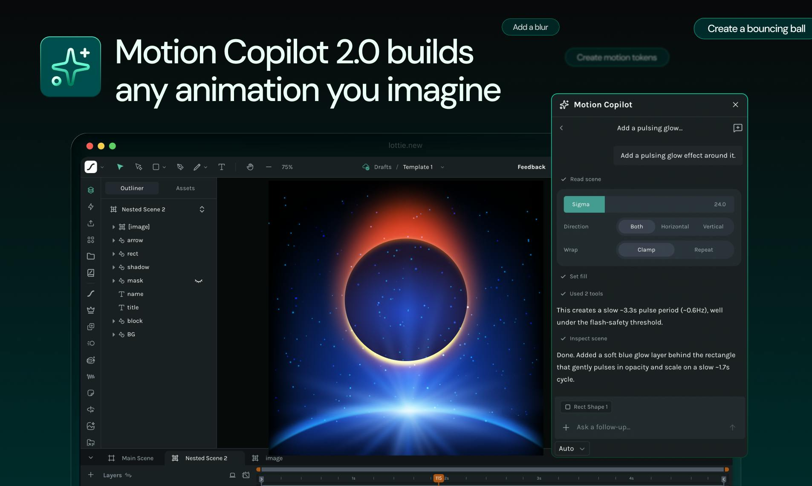
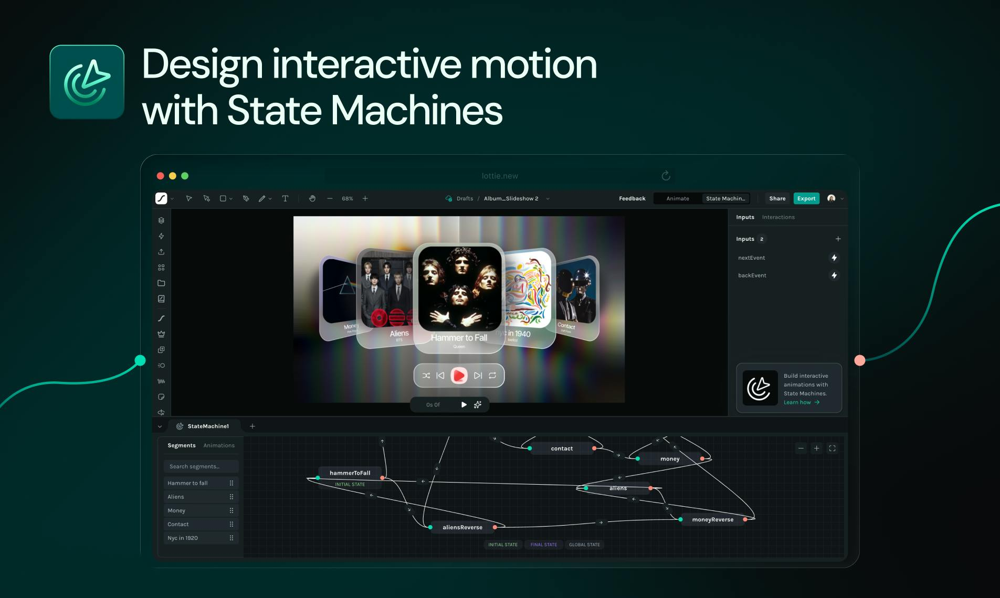

### 🎬 관련 영상
- [🎥 영상 보기](https://ph-files.imgix.net/5c5318ef-15cd-4bdf-84de-3310f281686b.jpeg?auto=format)

---

## 4. [Hardbook](https://www.producthunt.com/products/hardbook)
**Votes**: 170 | **도입 난이도**: 하 | **신뢰도**: 상
**Tagline**: The freelancer booking link that signs the contract for you
**서비스 링크**: https://www.producthunt.com/r/BFSS4PCCKOXJ56

**태그**: Freelance, Automation, Productivity, Contracting

### 📌 이 서비스 한눈에 보기
계약서 서명과 일정 예약을 한 번에 해결하여 프리랜서의 업무 이탈을 방지하는 예약 링크 서비스

### 🔑 주요 기능
- 일정 선택과 계약서 서명을 하나의 흐름으로 통합
- 클라이언트가 별도의 앱 설치나 계정 생성 없이 바로 이용 가능
- 계약 지연으로 인한 업무 무산(Deal Decay) 방지

### 🙋 사용자에게 어떤 점이 좋은가
클라이언트가 일정을 잡는 즉시 계약을 체결할 수 있어, 계약 체결 전 업무가 흐지부지되는 문제를 방지하고 확정된 업무를 빠르게 확보할 수 있습니다.

### ✅ 지금 바로 써볼 기능
- 자신의 서비스 일정에 맞는 예약 링크 생성하기
- 계약서 템플릿 설정 및 워크플로우 테스트하기

### ⚠️ 사용 전 확인할 점
- 계약서 양식의 법적 효력 및 세부 커스텀 기능 확인 필요
- 결제 기능 포함 여부 확인 필요

### 🧭 확인이 더 필요한 정보
현재 제공되는 계약서 템플릿의 법적 검토 범위와 결제 연동 기능 여부를 확인해야 합니다.

### 📸 스크린샷 및 갤러리
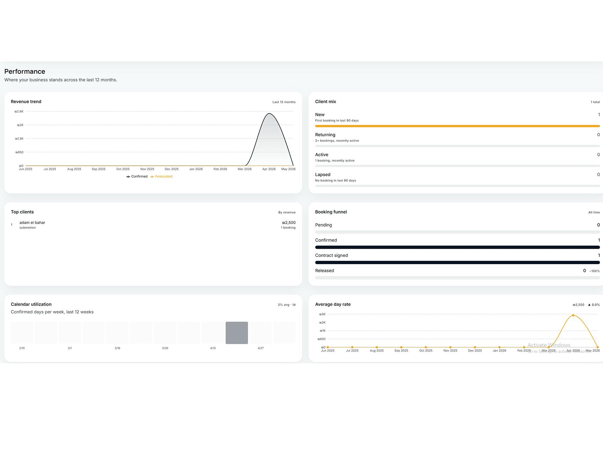
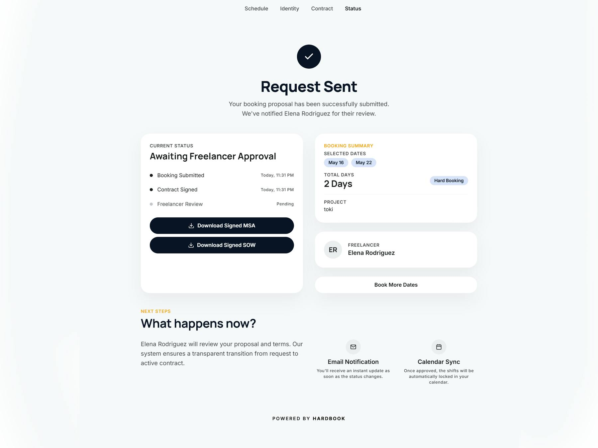
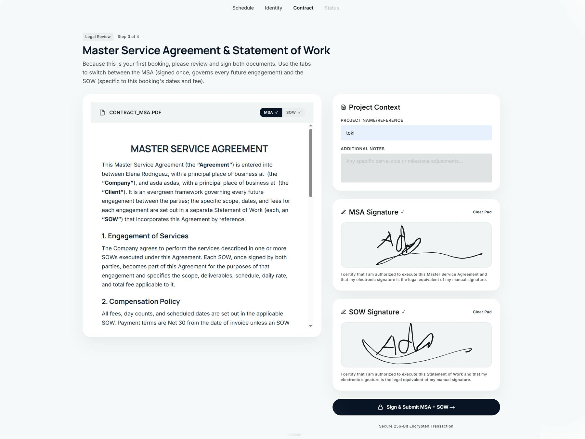

### 🎬 관련 영상
- [🎥 영상 보기](https://ph-files.imgix.net/ac590dd8-66dc-40df-8b82-382fc07b6c6b.jpeg?auto=format)

---

## 5. [Leaping AI](https://www.producthunt.com/products/leaping-ai)
**Votes**: 154 | **도입 난이도**: 중 | **신뢰도**: 상
**Tagline**: AI agents that call and text in multi-day campaigns
**서비스 링크**: https://www.producthunt.com/r/ZTOYWVYEMJZG4Y

**태그**: Automation, AI Agents, Salesforce, Customer Service, Agent, AI Tool, API, CRM

### 📌 이 서비스 한눈에 보기
현장 서비스 업체를 위한 다중 채널 AI 자동 전화 및 문자 캠페인 솔루션

### 🔑 주요 기능
- 현장 서비스(리모델링, 지붕 공사 등) 특화 인바운드/아웃바운드 자동화
- 수백 개의 대화를 동시에 진행하는 멀티스레드 캠페인 지원
- CRM 통합 및 다국어 지원을 통한 예약 및 고객 서비스 자동화

### 🙋 사용자에게 어떤 점이 좋은가
전화 응대 지연이나 리드 팔로업 누락 문제를 해결하여, 고객 예약과 고객 서비스 업무를 자동화할 수 있습니다.

### ✅ 지금 바로 써볼 기능
- 기존 CRM과의 연동 가능성 확인
- 다국어 음성 및 텍스트 품질 테스트
- 자동 예약 및 팔로업 워크플로우 설정

### ⚠️ 사용 전 확인할 점
- 물리적 서비스 업종에 특화되어 있어 타 산업군 적용 시 적합성 검토 필요
- AI 에이전트의 대화 품질이 실제 고객 경험에 미치는 영향 확인 필요

### 🧭 확인이 더 필요한 정보
구체적인 CRM 연동 목록과 상세 가격 정책에 대한 정보가 명시되지 않았습니다.

### 📸 스크린샷 및 갤러리
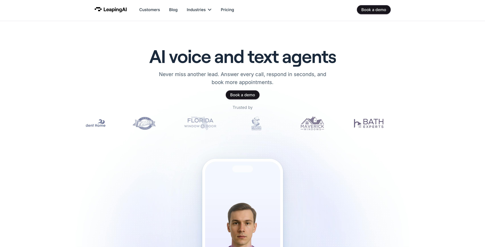
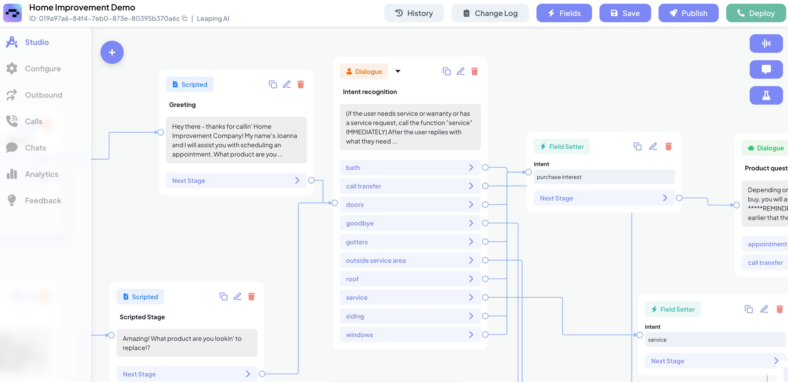
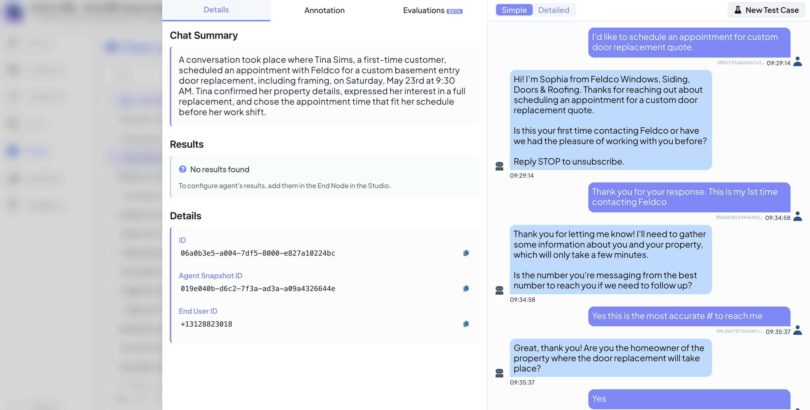

### 🎬 관련 영상
- [🎥 영상 보기](https://ph-files.imgix.net/c3ebcd1e-e866-425e-828f-9f9a44651539.jpeg?auto=format)

---

## 6. [EasyCircuit](https://www.producthunt.com/products/easycircuit)
**Votes**: 153 | **도입 난이도**: 하 | **신뢰도**: 상
**Tagline**: Hardware prototyping, as simple as vibe-coding
**서비스 링크**: https://www.producthunt.com/r/4SXXVFWMM64FI7

**태그**: Hardware, AI, Prototyping, Automation, Maker, AI Tool, Design

### 📌 이 서비스 한눈에 보기
전문 지식 없이도 말 한마디로 회로 설계부터 부품 구매까지 해결하는 AI 하드웨어 프로토타이핑 도구

### 🔑 주요 기능
- 자연어 설명을 통한 AI 기반 회로 설계 및 자동 부품 소싱
- 브레드보드에서 납땜 단계까지 이어지는 단계별 빌드 가이드 제공
- 전기 공학 전문 지식 없이도 가능한 하드웨어 프로토타이핑

### 🙋 사용자에게 어떤 점이 좋은가
아이디어를 말로 설명하면 검증된 부품 키트까지 자동으로 준비해주므로, 하드웨어 제작의 진입 장벽을 획기적으로 낮춰줍니다.

### ✅ 지금 바로 써볼 기능
- 자연어로 프로젝트 아이디어 설명해보기
- AI가 생성한 부품 리스트 및 회로도 검토하기
- 제공되는 단계별 가이드에 따라 하드웨어 조립하기

### ⚠️ 사용 전 확인할 점
- AI가 설계한 회로의 물리적 안정성 및 부품 호환성 직접 확인 필요
- 실제 하드웨어 제작 시 발생할 수 있는 물리적 오류에 대한 책임 소재 확인

### 🧭 확인이 더 필요한 정보
AI가 생성한 회로 설계의 정확도와 실제 부품 배송/물류 프로세스에 대한 상세 정보가 필요합니다.

### 📸 스크린샷 및 갤러리
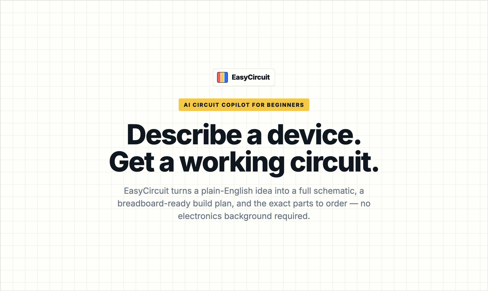
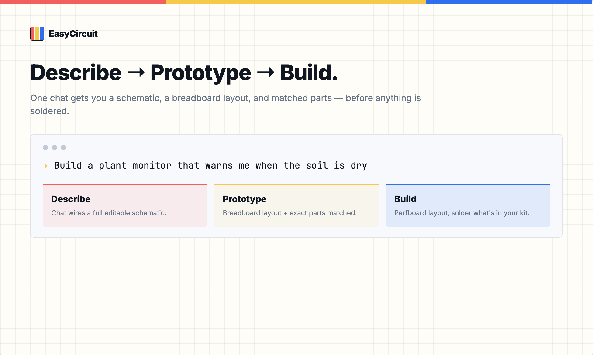
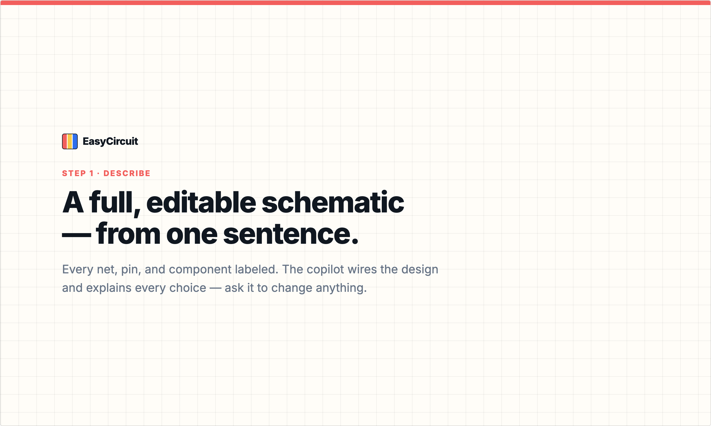

### 🎬 관련 영상
- [🎥 영상 보기](https://ph-files.imgix.net/c563965b-98ae-4d4b-87c3-74e397a91569.jpeg?auto=format)

---

## 7. [Ycode AI Agents](https://www.producthunt.com/products/ycode)
**Votes**: 146 | **도입 난이도**: 중 | **신뢰도**: 상
**Tagline**: Build websites with AI
**서비스 링크**: https://www.producthunt.com/r/C72UKW3QLZRAJC

**태그**: NoCode, AI, WebDesign, Automation, Agent, AI Tool, Design, DevTool

### 📌 이 서비스 한눈에 보기
선호하는 AI 모델을 연결하여 웹사이트 디자인과 콘텐츠를 자동 관리하는 AI 에이전트

### 🔑 주요 기능
- Claude, OpenAI, Gemini, Grok 등 주요 AI 모델 연동 지원
- 자연어 명령을 통한 웹 디자인 수정 및 업데이트
- CMS 콘텐츠 관리 및 컴포넌트 빌드 자동화

### 🙋 사용자에게 어떤 점이 좋은가
웹 빌더 내에서 직접 AI 에이전트를 활용해 디자인 수정과 콘텐츠 관리를 자동화함으로써 제작 시간을 획기적으로 단축할 수 있습니다.

### ✅ 지금 바로 써볼 기능
- 사용 중인 AI 모델(Claude, OpenAI 등) 연결하기
- 자연어 명령으로 웹 디자인 변경 시도하기
- AI 에이전트를 통한 CMS 콘텐츠 자동 생성 테스트하기

### ⚠️ 사용 전 확인할 점
- 연동하는 AI 모델의 API 비용이 별도로 발생할 수 있음
- 복잡한 디자인 수정 시 AI의 의도와 실제 결과물 간의 차이가 발생할 수 있음

### 🧭 확인이 더 필요한 정보
사용자의 기존 Ycode 워크플로우와 AI 에이전트 간의 완벽한 호환성 및 세부 제어 범위를 확인해야 합니다.

### 📸 스크린샷 및 갤러리
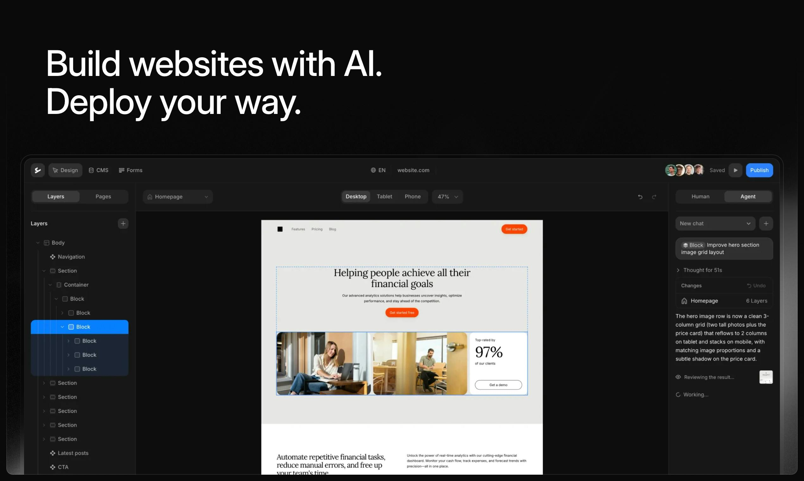
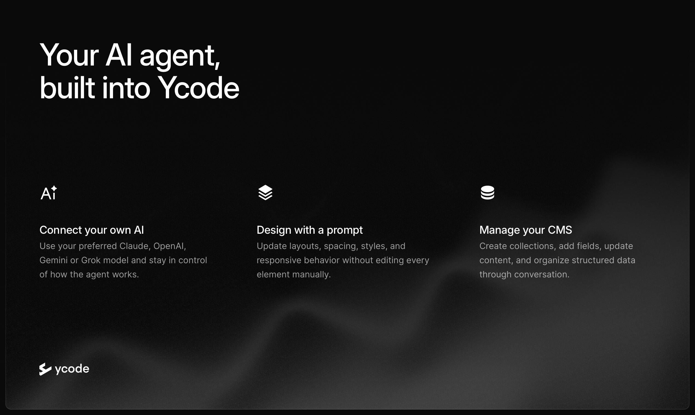
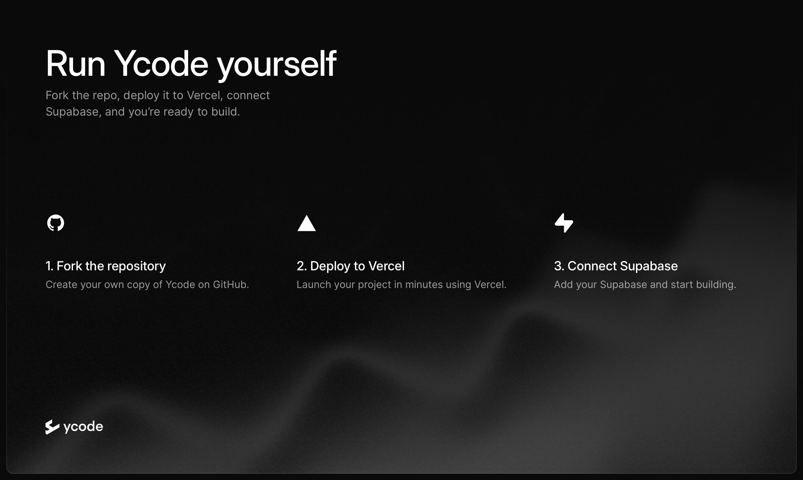

---

## 8. [Jotform Website Widgets](https://www.producthunt.com/products/jotform)
**Votes**: 143 | **도입 난이도**: 하 | **신뢰도**: 상
**Tagline**: Build and embed no-code website widgets in minutes
**서비스 링크**: https://www.producthunt.com/r/KE33DH7C7KRGFV

**태그**: NoCode, WebDesign, MarketingTool, UX, Chat, DevTool

### 📌 이 서비스 한눈에 보기
코딩 없이 몇 분 만에 맞춤형 웹사이트 위젯을 제작하고 삽입하는 도구

### 🔑 주요 기능
- 리뷰, 예약, 채팅, 팝업 등 다양한 인터랙티브 위젯 제공
- 코딩 지식 없이도 누구나 사용 가능한 노코드 방식
- 개인화된 위젯을 모든 웹사이트에 간편하게 임베드 가능

### 🙋 사용자에게 어떤 점이 좋은가
웹사이트 개발자 없이도 사용자 경험을 높이는 다양한 기능을 즉시 추가하여 사이트의 상호작용을 강화할 수 있습니다.

### ✅ 지금 바로 써볼 기능
- 고객 리뷰 및 FAQ 위젯 생성해보기
- 예약 및 채팅 위젯으로 고객 접점 만들기
- 카운트다운 및 팝업으로 프로모션 적용하기

### ⚠️ 사용 전 확인할 점
- 위젯의 디자인 커스텀 범위가 플랫폼 내에서만 제한될 수 있음
- 외부 사이트 임베드 시 기존 웹사이트 테마와의 호환성 확인 필요

### 🧭 확인이 더 필요한 정보
상세한 가격 정책 및 외부 플랫폼(WordPress, Shopify 등)과의 직접적인 통합 방식에 대한 정보가 부족합니다.

### 📸 스크린샷 및 갤러리
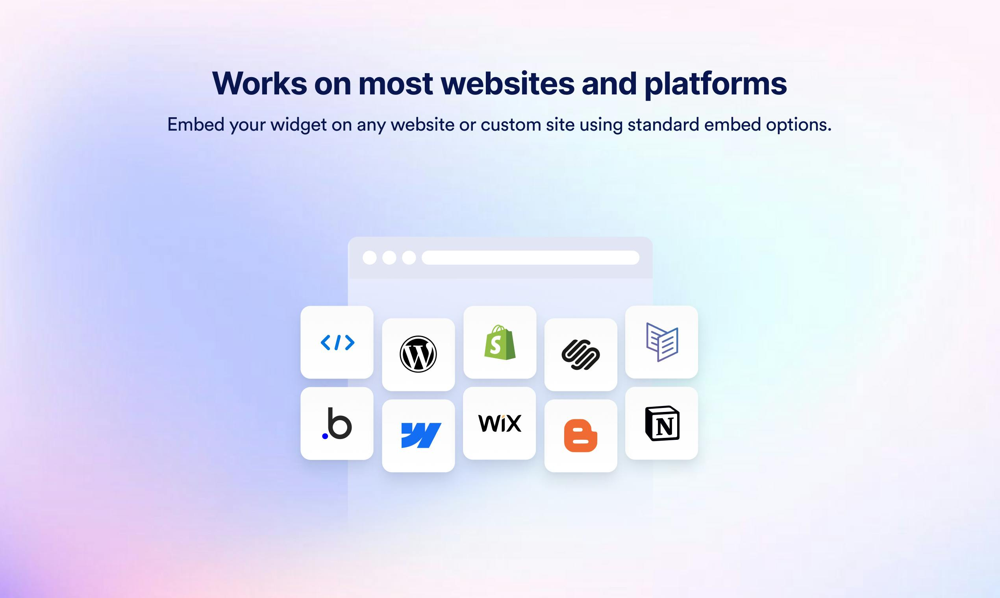
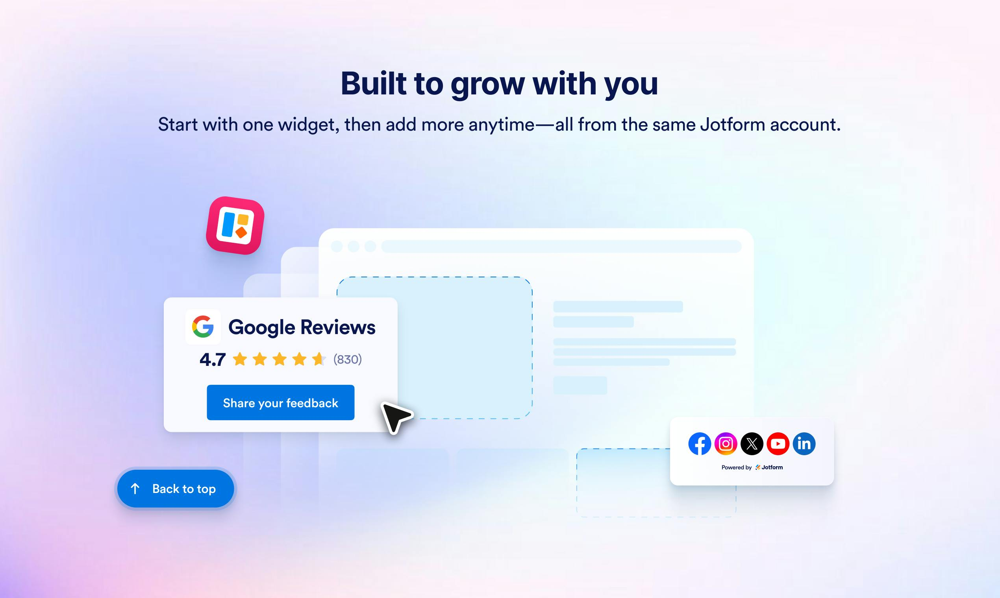
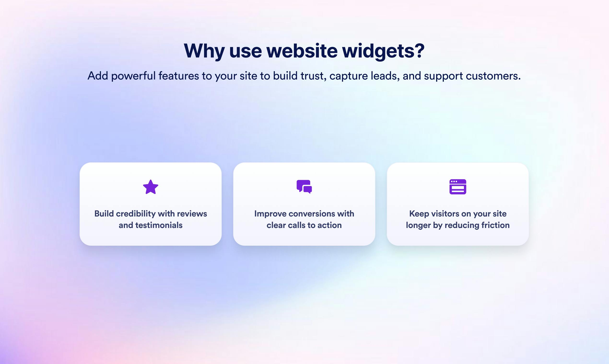

### 🎬 관련 영상
- [🎥 영상 보기](https://ph-files.imgix.net/4e22ee25-f625-4587-aba3-7c668281856a.jpeg?auto=format)

---

## 9. [FlowTask 2.0](https://www.producthunt.com/products/flowtask)
**Votes**: 125 | **도입 난이도**: 중 | **신뢰도**: 상
**Tagline**: Company brain for AI Agents
**서비스 링크**: https://www.producthunt.com/r/AIJVHGKNFOZEPM

**태그**: AI, Automation, Productivity, Data Integration, Agent, AI Tool, Chat, Email

### 📌 이 서비스 한눈에 보기
파편화된 기업 데이터를 통합하여 AI 에이전트에게 실시간 지식 베이스를 제공하는 솔루션

### 🔑 주요 기능
- 이메일, Slack, WhatsApp, LinkedIn 등 다양한 채널의 데이터를 한곳으로 통합
- 개인용과 업무용 대화가 섞이지 않도록 하는 승인 레이어(Approval layer) 제공
- 실시간 데이터 업데이트를 통해 AI 에이전트의 컨텍스트 유지 비용 절감

### 🙋 사용자에게 어떤 점이 좋은가
기업 내 흩어진 정보를 AI가 즉시 이해할 수 있는 형태로 구조화하여, AI 에이전트가 매번 같은 설명을 듣지 않도록 업무 효율을 높여줍니다.

### ✅ 지금 바로 써볼 기능
- 주요 업무 채널(Slack, Email 등) 연동하기
- 승인 레이어를 통한 데이터 필터링 설정하기
- AI 에이전트와 연동하여 실시간 데이터 동기화 확인하기

### ⚠️ 사용 전 확인할 점
- 개인용 메시지와 업무용 메시지의 분리 관리에 대한 보안 정책 확인 필요
- 다양한 외부 채널 연동 시 데이터 프라이버시 및 권한 관리 검토 필요

### 🧭 확인이 더 필요한 정보
지원하는 외부 서비스(SaaS)의 전체 목록과 데이터 보안/암호화 방식에 대한 상세 정보가 필요합니다.

### 📸 스크린샷 및 갤러리
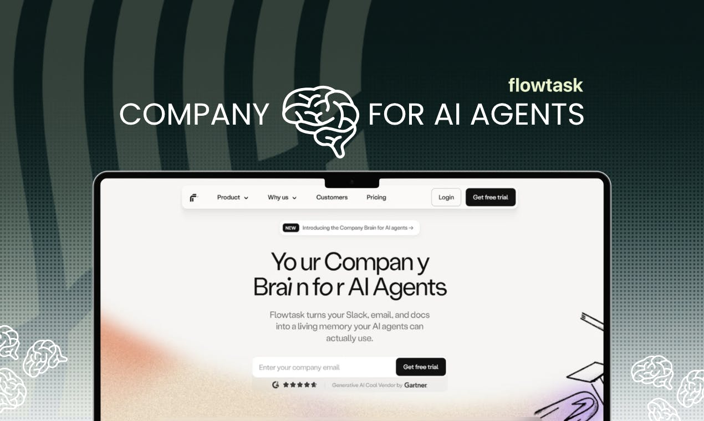
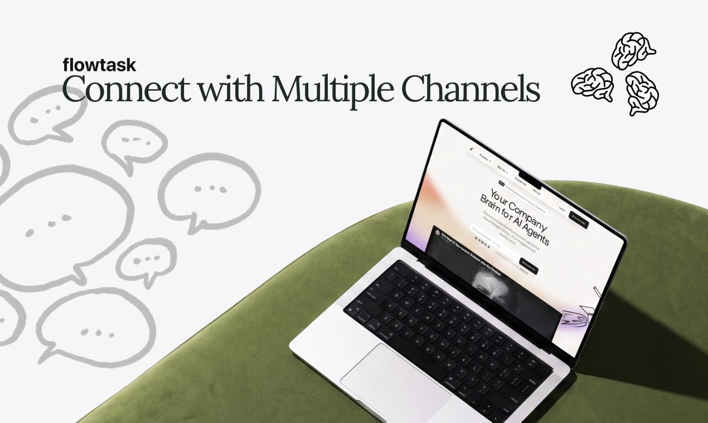
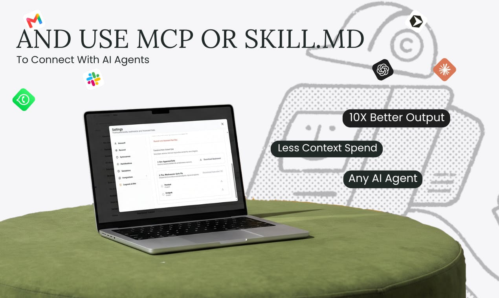

### 🎬 관련 영상
- [🎥 영상 보기](https://ph-files.imgix.net/6e5e967a-1b0e-4d12-af33-f5878451a13b.jpeg?auto=format)

---

## 10. [Superunit](https://www.producthunt.com/products/superunit)
**Votes**: 120 | **도입 난이도**: 중 | **신뢰도**: 상
**Tagline**: AI agents that verify employment by phone, email & fax 
**서비스 링크**: https://www.producthunt.com/r/D375A2G57STQLU

**태그**: Automation, HRTech, AI-Agents, Agent, AI Tool, Email

### 📌 이 서비스 한눈에 보기
전화, 이메일, 팩스를 통해 고용 상태를 자동 검증하는 AI 에이전트

### 🔑 주요 기능
- 채용, 대출, 임대 시 발생하는 고용 확인 절차 자동화
- AI 에이전트가 조사부터 전화, 이메일, 팩스 발송까지 전 과정 수행
- HR 및 급여 부서와의 복잡한 커뮤니케이션 업무 대행

### 🙋 사용자에게 어떤 점이 좋은가
인사 담당자나 금융 기관 직원이 수동으로 진행하던 번거로운 경력 확인 업무를 AI가 대신 처리하여 업무 시간을 획기적으로 단축합니다.

### ✅ 지금 바로 써볼 기능
- 고용 검증 워크플로우 자동화 테스트
- 기존 HR/채용 시스템과의 연동 가능성 확인

### ⚠️ 사용 전 확인할 점
- AI 에이전트의 통화/문서 처리 정확도 및 법적 효력 확인 필요
- 개인정보 보호 및 데이터 보안 규정 준수 여부 검토

### 🧭 확인이 더 필요한 정보
현재 제공되는 구체적인 API 연동 범위와 보안 인증 수준에 대한 정보가 부족합니다.

### 📸 스크린샷 및 갤러리
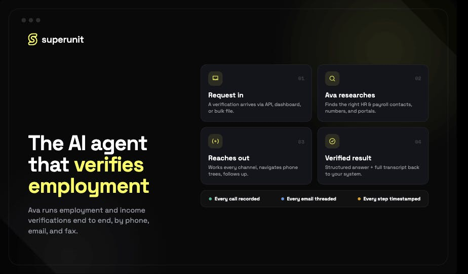
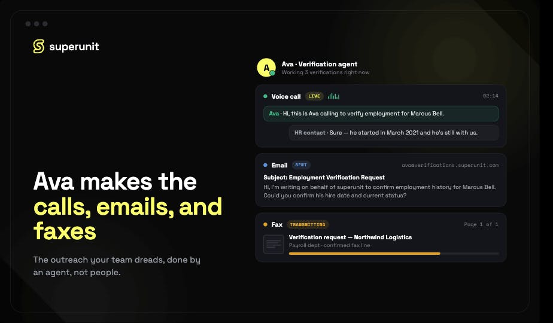
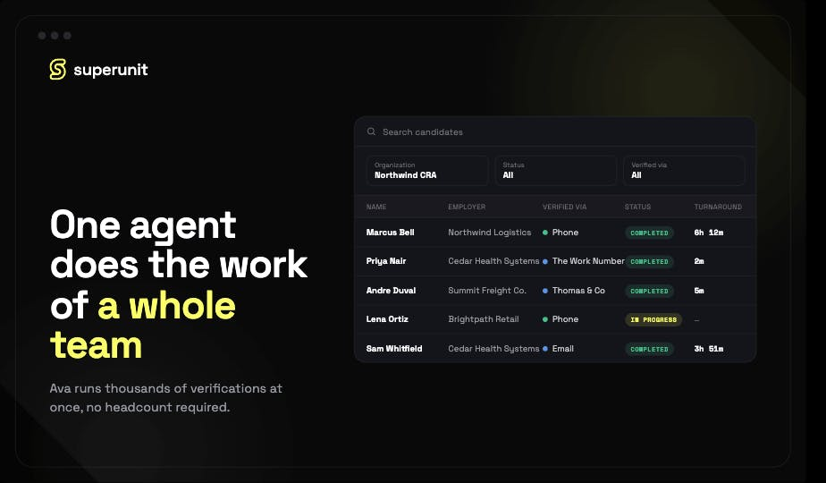

### 🎬 관련 영상
- [🎥 영상 보기](https://ph-files.imgix.net/b3fd169b-ee6c-4126-b7e8-381276a233fa.jpeg?auto=format)

---

## 11. [MCP-Billing](https://www.producthunt.com/products/mcp-billing)
**Votes**: 116 | **도입 난이도**: 중 | **신뢰도**: 상
**Tagline**: OAuth 2.1 + usage-based Stripe billing for MCP servers
**서비스 링크**: https://www.producthunt.com/r/N4CDWFFXAYD7VG

**태그**: DevTool, SaaS, Billing, OpenSource, API

### 📌 이 서비스 한눈에 보기
MCP 서버를 위한 OAuth 2.1 및 사용량 기반 Stripe 결제 통합 보일러플레이트

### 🔑 주요 기능
- OAuth 2.1 + PKCE 및 API 키 관리 기능 포함
- 사용량 기반 Stripe 결제 및 Redis 기반 속도 제한 기능 제공
- 한 번 결제로 영구 소유 가능한 Self-hosted Next.js/TypeScript 보일러플레이트

### 🙋 사용자에게 어떤 점이 좋은가
MCP 서버 개발 시 복잡한 인증 및 결제 시스템 구축 시간을 단축하고, 오픈소스 미터링 코어를 통해 비용 효율적인 운영이 가능합니다.

### ✅ 지금 바로 써볼 기능
- npm에서 오픈소스 미터링 코어 라이브러리 테스트
- 보일러플레이트의 7개 모듈 구조 검토
- 자체 호스팅 환경에서의 배포 가능성 확인

### ⚠️ 사용 전 확인할 점
- Next.js/TypeScript 숙련도에 따라 초기 설정 난이도가 다를 수 있음
- Self-hosted 방식이므로 인프라 관리 책임이 사용자에게 있음

### 🧭 확인이 더 필요한 정보
제공되는 7개 모듈의 구체적인 기능 범위와 상세 기술 스택에 대한 추가 확인이 필요합니다.

### 📸 스크린샷 및 갤러리
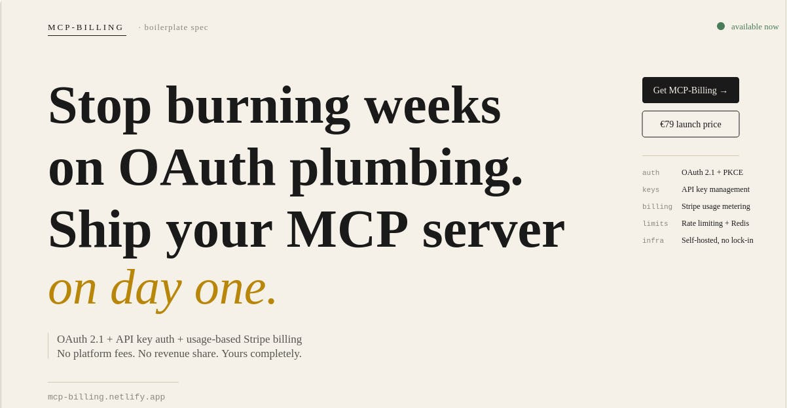
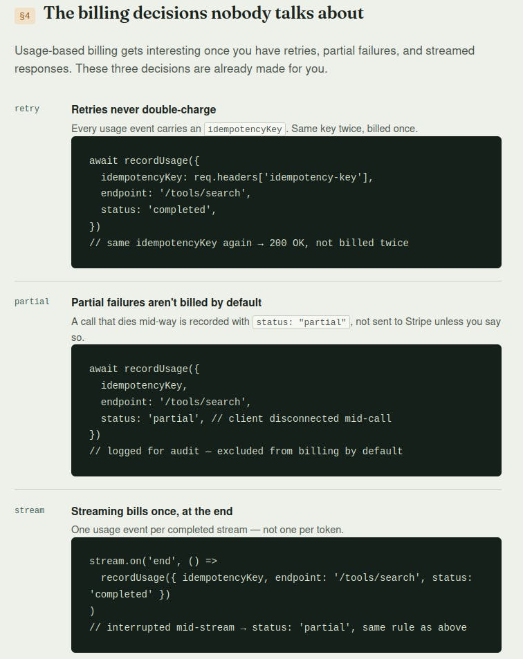
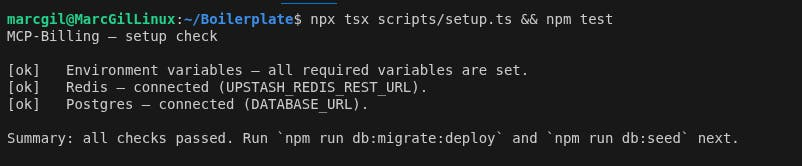

### 🎬 관련 영상
- [🎥 영상 보기](https://ph-files.imgix.net/25cb428f-769e-467c-8e75-addd4a300d2c.jpeg?auto=format)

---

## 12. [Cercle](https://www.producthunt.com/products/cercle)
**Votes**: 114 | **도입 난이도**: 하 | **신뢰도**: 상
**Tagline**: The bat signal for your closest friends.
**서비스 링크**: https://www.producthunt.com/r/LLNQ2MGTZXMQDH

**태그**: Social, MentalHealth, Connection

### 📌 이 서비스 한눈에 보기
가까운 친구들의 감정 상태를 실시간으로 확인하며 정서적 유대감을 쌓는 소셜 앱

### 🔑 주요 기능
- 자신의 기분 상태를 기록하고 친구들과 공유하는 기능
- 홈 화면 위젯을 통한 친구들의 실시간 감정 업데이트 확인
- 말하지 않아도 서로의 상태를 파악하여 적시에 도움을 줄 수 있는 환경 제공

### 🙋 사용자에게 어떤 점이 좋은가
친구들의 감정 변화를 직관적으로 파악하여, 상대방이 도움을 요청하기 전에 먼저 손을 내밀 수 있는 깊은 관계 형성을 돕습니다.

### ✅ 지금 바로 써볼 기능
- 자신의 현재 기분 상태 기록하기
- 홈 화면에 친구들의 감정 위젯 설정하기
- 친구의 상태를 확인하고 따뜻한 메시지 보내기

### ⚠️ 사용 전 확인할 점
- 감정 공유가 사생활 침해나 심리적 부담으로 느껴질 수 있음
- 사용자 간의 친밀도에 따라 서비스의 가치가 크게 달라짐

### 🧭 확인이 더 필요한 정보
현재 제공되는 기능 외에 구체적인 소셜 인터랙션 방식이나 보안 정책은 명시되지 않았습니다.

### 📸 스크린샷 및 갤러리
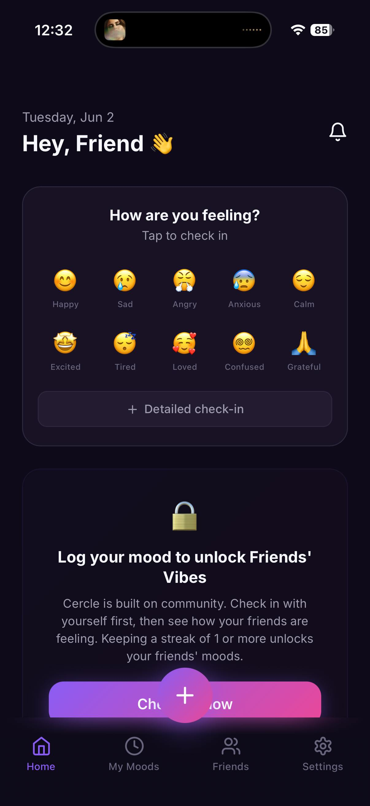
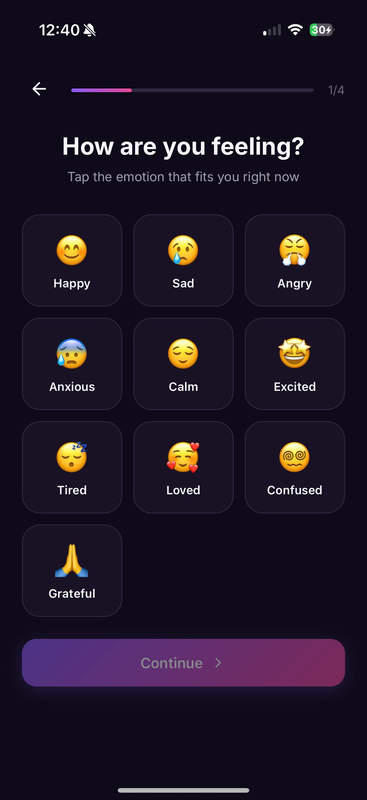
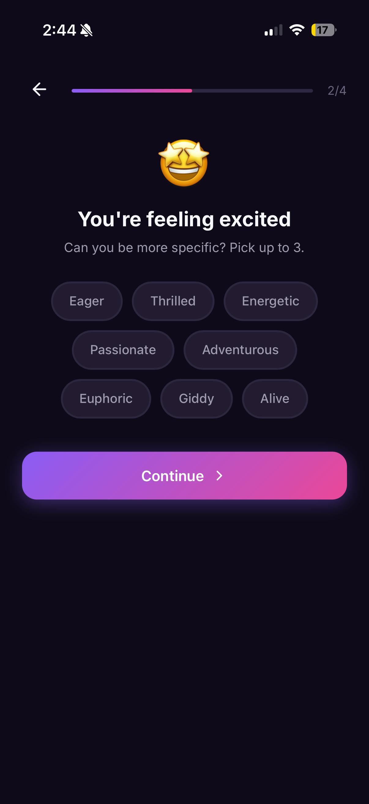

---

## 13. [Liminal](https://www.producthunt.com/products/liminal-4)
**Votes**: 110 | **도입 난이도**: 하 | **신뢰도**: 상
**Tagline**: A workspace & 2nd brain for you, your agent, and your team
**서비스 링크**: https://www.producthunt.com/r/ER7YLHPEU3PSNV

**태그**: AI, Collaboration, Productivity, Markdown, Workflow, Agent, AI Tool

### 📌 이 서비스 한눈에 보기
AI 에이전트와 팀이 실시간으로 협업할 수 있는 마크다운 기반의 공유 워크스페이스

### 🔑 주요 기능
- 에이전트가 생성한 마크다운/HTML 파일을 즉시 깔끔한 UI로 렌더링
- 링크 공유를 통해 팀원과 실시간으로 편집 가능한 라이브 워크스페이스 제공
- 별도의 호스팅이나 복잡한 프로토콜 없이 파일 기반의 간편한 동기화

### 🙋 사용자에게 어떤 점이 좋은가
AI 에이전트가 생성한 결과물을 별도의 변환 과정 없이 즉시 시각화하고, 팀원들과 실시간으로 공유하며 협업할 수 있습니다.

### ✅ 지금 바로 써볼 기능
- 에이전트가 작성한 마크다운 파일 연동하기
- 생성된 UI를 브라우저에서 실시간 확인하기
- 공유 링크를 통해 팀원과 워크스페이스 협업하기

### ⚠️ 사용 전 확인할 점
- 파일 기반 동기화 방식에 따른 데이터 보안 및 권한 관리 확인 필요
- 복잡한 데이터베이스 구조보다는 문서 중심의 작업에 최적화됨

### 🧭 확인이 더 필요한 정보
에이전트와 팀 간의 데이터 동기화 방식 및 보안 프로토콜에 대한 상세 정보가 필요합니다.

### 📸 스크린샷 및 갤러리
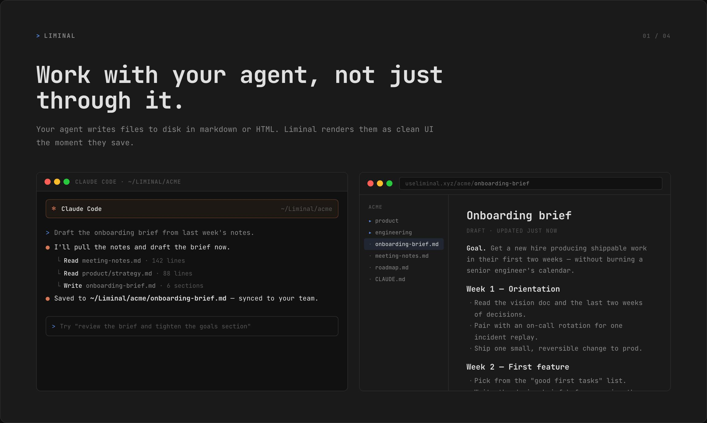
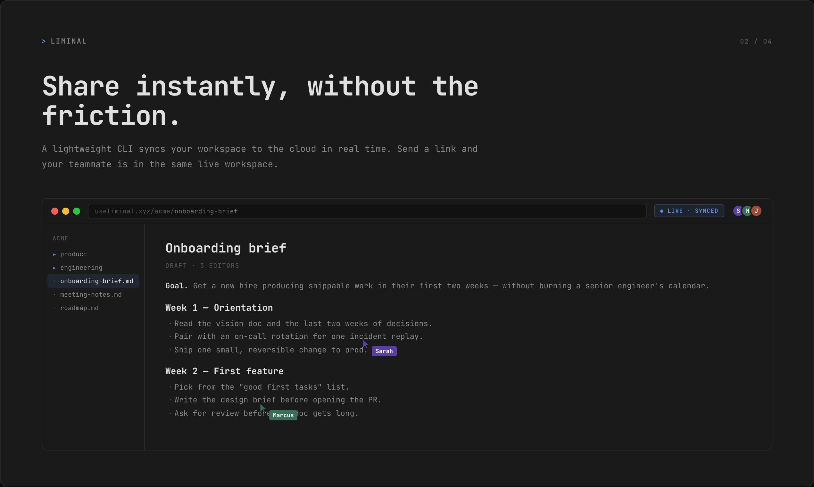
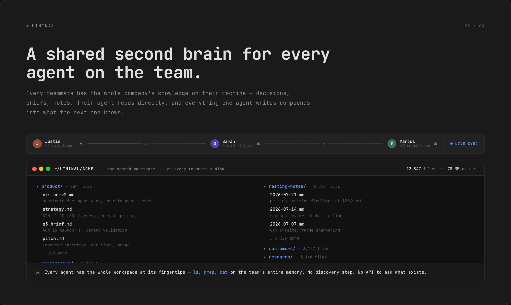

### 🎬 관련 영상
- [🎥 영상 보기](https://ph-files.imgix.net/0b403daf-4941-44fd-bbce-fed37b5ad9f4.jpeg?auto=format)

---

## 14. [Conduit](https://www.producthunt.com/products/conduit-ai)
**Votes**: 110 | **도입 난이도**: 상 | **신뢰도**: 상
**Tagline**: AI agents purpose-built for Hospitality
**서비스 링크**: https://www.producthunt.com/r/YDRU7ZJOP4RYSO

**태그**: AI, Automation, Hospitality, SaaS, Agent, AI Tool, Email

### 📌 이 서비스 한눈에 보기
호스피탈리티 산업을 위해 설계된 AI 에이전트 기반의 고객 응대 및 운영 자동화 솔루션

### 🔑 주요 기능
- 이메일, WhatsApp, OTA, 소셜, 음성 등 다양한 채널의 고객 대화 자동 응대
- PMS 및 기존 기술 스택과 연동하여 청소 배정, 일정 업데이트 등 실무 작업 수행
- 140개 이상의 언어 지원 및 SOC 2 Type II 보안 인증 확보

### 🙋 사용자에게 어떤 점이 좋은가
고객 응대와 백엔드 운영 업무를 동시에 자동화하여 인력 효율을 높이고 예약 누락을 방지할 수 있습니다.

### ✅ 지금 바로 써볼 기능
- 기존 PMS 및 기술 스택과의 연동 가능성 확인
- 다양한 채널(WhatsApp, OTA 등)의 메시지 자동 응대 테스트
- 에이전트의 작업 수행(청소 배정 등) 프로세스 검토

### ⚠️ 사용 전 확인할 점
- 기존 PMS 및 내부 시스템과의 복잡한 통합 과정이 필요할 수 있음
- AI 에이전트의 자동화된 작업(스케줄링 등)에 대한 관리 감독 필요

### 🧭 확인이 더 필요한 정보
사용자의 기존 PMS 및 기술 스택과의 구체적인 통합 방식과 비용 구조에 대한 확인이 필요합니다.

### 📸 스크린샷 및 갤러리

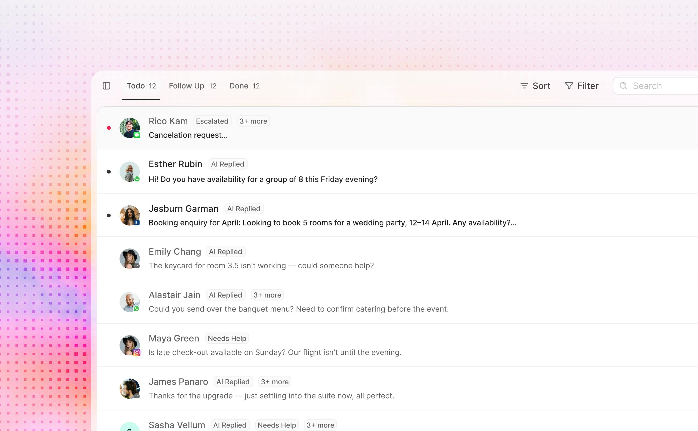
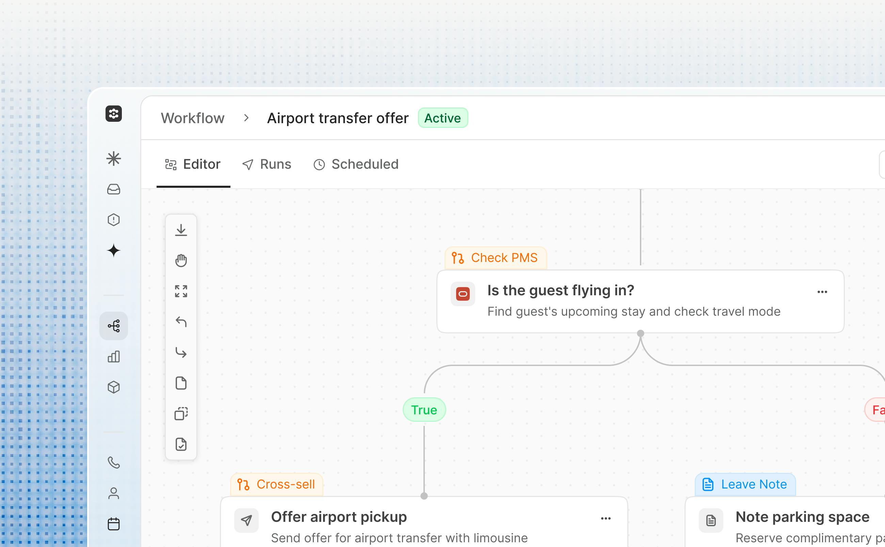

### 🎬 관련 영상
- [🎥 영상 보기](https://ph-files.imgix.net/242d3164-7af5-4419-bc4f-ee53d5a92889.jpeg?auto=format)

---

## 15. [Phantom](https://www.producthunt.com/products/phantom-6)
**Votes**: 109 | **도입 난이도**: 하 | **신뢰도**: 상
**Tagline**: Voice-first AI agent that operates your Mac
**서비스 링크**: https://www.producthunt.com/r/2ESKHIT7EPENFD

**태그**: AI Agent, macOS, Productivity, Automation, Voice-first, Agent, AI Tool, Chat

### 📌 이 서비스 한눈에 보기
맥(Mac) 화면 위에서 바로 작동하는 음성 기반 AI 에이전트

### 🔑 주요 기능
- 맥 노치(Notch)를 통한 상시 접근 가능한 인터페이스
- 별도의 채팅창 이동 없이 현재 작업 흐름 내에서 작업 수행
- 화면 및 앱의 맥락을 이해하여 직접적인 작업 완료

### 🙋 사용자에게 어떤 점이 좋은가
작업 흐름을 끊지 않고 음성이나 타이핑만으로 맥의 다양한 앱과 화면 맥락을 활용해 업무를 자동화할 수 있습니다.

### ✅ 지금 바로 써볼 기능
- 노치 인터페이스를 통한 음성 명령 테스트
- 현재 실행 중인 앱의 맥락 이해도 확인
- 워크플로우 내 작업 자동화 시도

### ⚠️ 사용 전 확인할 점
- 화면 및 앱 데이터 접근에 따른 개인정보 보호 및 보안 검토 필요
- 복잡한 작업 시 맥 시스템 권한 설정 필요 가능성

### 🧭 확인이 더 필요한 정보
사용자의 개인정보 보호를 위한 데이터 처리 방식과 시스템 제어 권한의 범위를 확인해야 합니다.

### 📸 스크린샷 및 갤러리
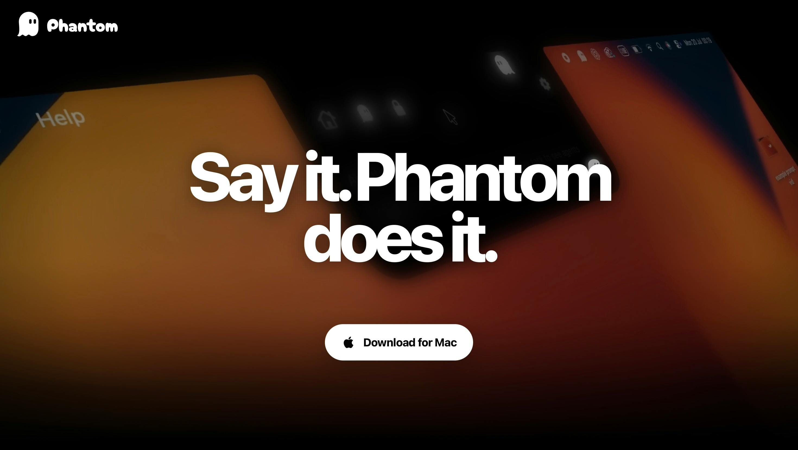
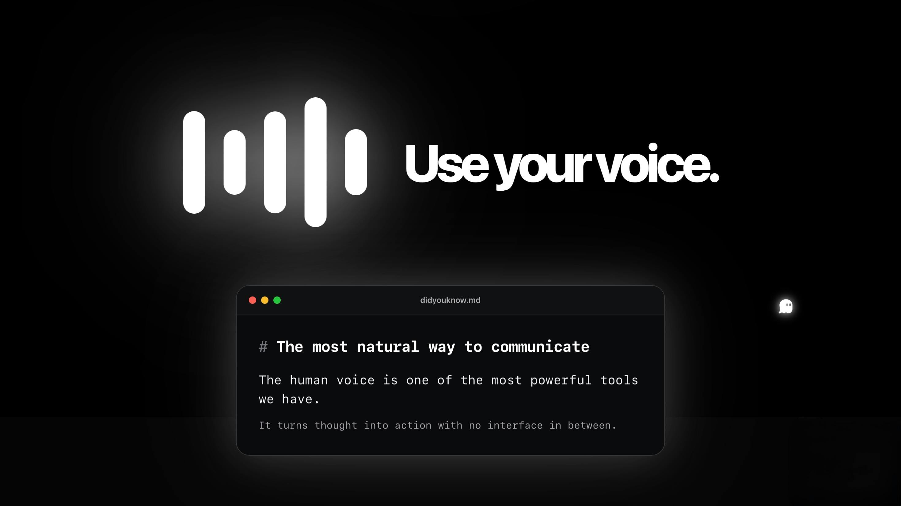

### 🎬 관련 영상
- [🎥 영상 보기](https://ph-files.imgix.net/58f87b8e-eaea-4cc7-8110-d0192de1e896.jpeg?auto=format)

---

## 16. [Firstpass](https://www.producthunt.com/products/glaze-4)
**Votes**: 108 | **도입 난이도**: 하 | **신뢰도**: 상
**Tagline**: Actionable input so you nail every launch
**서비스 링크**: https://www.producthunt.com/r/A5C7RWUJJMXOLN

**태그**: Product Launch, Marketing Tool, UX/UI, AI Tool

### 📌 이 서비스 한눈에 보기
제품 출시 전, 다양한 플랫폼의 UI 환경에 맞춰 카피라이팅과 레이아웃을 검토해주는 런칭 최적화 도구

### 🔑 주요 기능
- 플랫폼별(Product Hunt, Glaze Store 등)로 상이한 글자 수 제한 및 UI 노출 영역 시뮬레이션
- 실제 사용자 관점에서 텍밋(truncated)되거나 잘리는 문구 확인
- 출시 전 전문가의 수기 피드백을 통한 카피라이팅 최적화

### 🙋 사용자에게 어떤 점이 좋은가
제품 출시 시 문구가 잘리거나 의도와 다르게 보이는 실수를 방지하여, 첫인상에서 발생하는 사용자 이탈을 막을 수 있습니다.

### ✅ 지금 바로 써볼 기능
- 현재 작성된 제품 태그라인을 플랫폼별 가이드에 맞춰 입력하기
- 다양한 그리드/리스트 뷰에서 문구 노출 상태 확인하기
- 제공되는 피드백을 바탕으로 카피라이팅 수정하기

### ⚠️ 사용 전 확인할 점
- 실제 플랫폼의 실시간 UI 변경 사항이 완벽히 반영되는지 확인 필요
- 수기 피드백(handwritten notes)의 주관적 성격 고려

### 🧭 확인이 더 필요한 정보
제공되는 피드백이 자동화된 분석인지 아니면 전문가의 수동 검토인지에 대한 구체적인 프로세스 확인이 필요합니다.

### 📸 스크린샷 및 갤러리
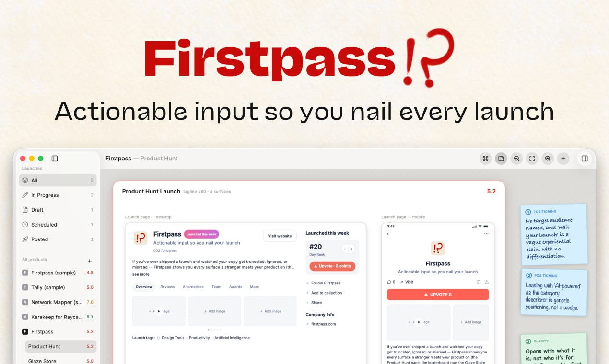
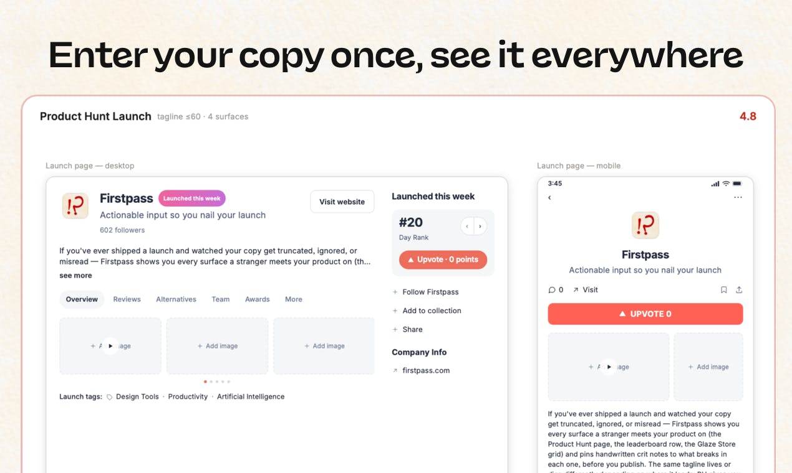
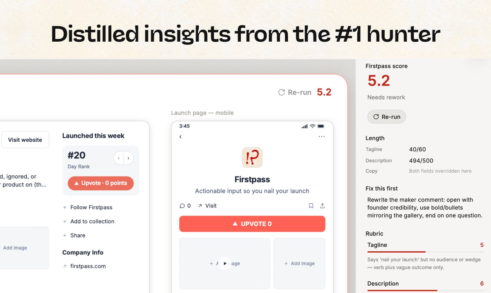

---

## 17. [G.I.A.ac](https://www.producthunt.com/products/g-i-a-ac)
**Votes**: 105 | **도입 난이도**: 하 | **신뢰도**: 상
**Tagline**: Build real, working apps from a single sentence
**서비스 링크**: https://www.producthunt.com/r/37VDNWNIB7P7K2

**태그**: AI, NoCode, AppBuilder, Productivity

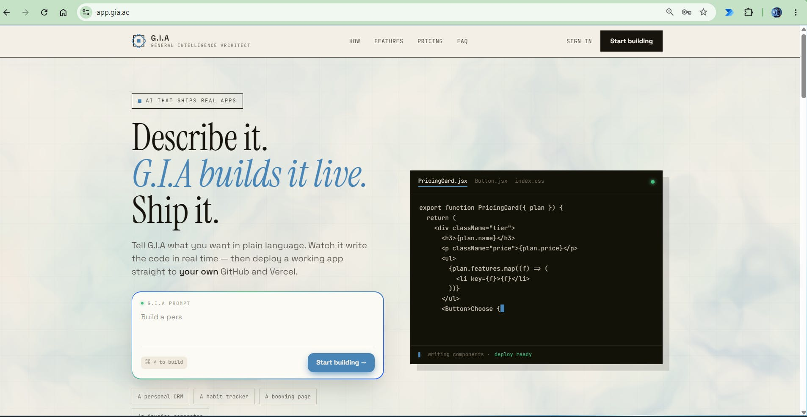

### 📌 이 서비스 한눈에 보기
단 한 문장의 설명만으로 실제 작동하는 앱을 즉시 구축하는 AI 도구

### 🔑 주요 기능
- 자연어 설명을 통한 실시간 앱 빌드 기능
- 아이디어를 즉각적인 결과물로 변환하는 워크플로우
- 복잡한 코딩 과정 없이 앱 구조 생성

### 🙋 사용자에게 어떤 점이 좋은가
아이디어를 가진 비개발자나 기획자가 프로토타입을 매우 빠르게 제작하여 검증할 수 있습니다.

### ✅ 지금 바로 써볼 기능
- 간단한 아이디어 문장 입력해보기
- 생성된 앱의 실시간 빌드 과정 관찰하기
- 입력한 문장에 따른 결과물 차이 테스트하기

### ⚠️ 사용 전 확인할 점
- 복잡한 비즈니스 로직 구현 가능 여부 확인 필요
- 생성된 코드의 커스텀 및 확장성 제약 가능성

### 🧭 확인이 더 필요한 정보
제공되는 앱의 기술 스택과 배포/수정 가능 범위에 대한 상세 정보가 부족합니다.

### 📸 스크린샷 및 갤러리

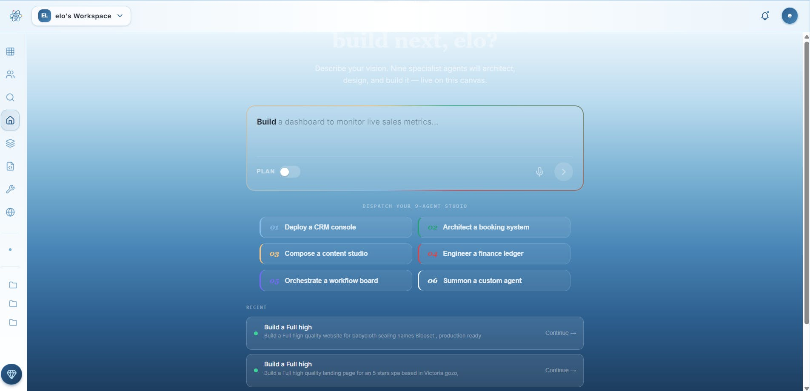
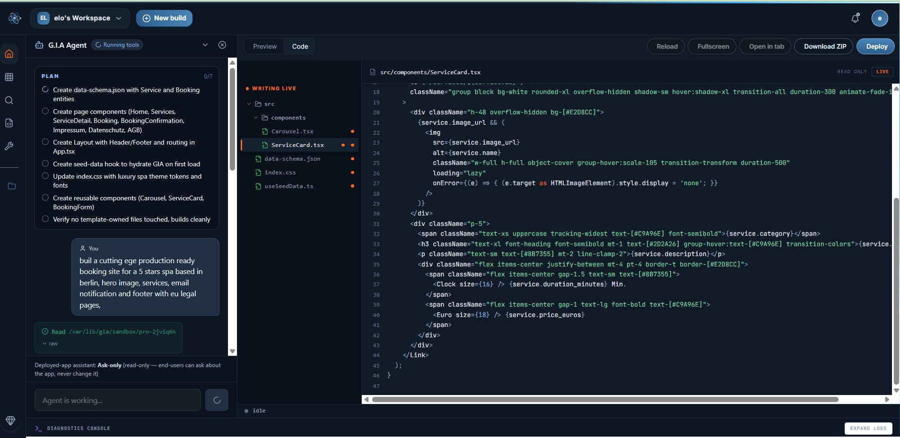

---

## 18. [qsa.sh ](https://www.producthunt.com/products/qsa-sh-quick-security-audit)
**Votes**: 104 | **도입 난이도**: 하 | **신뢰도**: 상
**Tagline**: External security scan of your own IP, in your terminal
**서비스 링크**: https://www.producthunt.com/r/BJWYI7VM6I3T33

**태그**: Security, DevOps, CLI, Automation, AI Tool, Email

### 📌 이 서비스 한눈에 보기
터미널에서 명령어 한 줄로 실행하는 즉각적인 외부 보안 스캔 도구

### 🔑 주요 기능
- curl 명령어를 통한 간편한 외부 보안 스캔 실행
- naabu, nmap, nuclei를 결합한 포트 매핑 및 CVE 취약점 분석
- 계정 생성이나 데이터 저장 없이 개인정보를 보호하는 익명성 중심 설계

### 🙋 사용자에게 어떤 점이 좋은가
자신의 서버가 인터넷에 어떻게 노출되어 있는지 별도의 복잡한 설정 없이 30초 만에 즉시 확인할 수 있습니다.

### ✅ 지금 바로 써볼 기능
- 터미널에서 'curl qsa.sh' 실행하여 기본 스캔 결과 확인하기
- Pro 플랜을 통한 전체 포트(65,535개) 스캔 검토하기
- Deep 플랜을 통한 심층 취약점 분석(nuclei firehose) 고려하기

### ⚠️ 사용 전 확인할 점
- 무료 스캔은 전체 포트 스캔이 제한될 수 있음
- 심층적인 취약점 분석을 위해서는 유료 플랜이 필요함

### 🧭 확인이 더 필요한 정보
무료 버전과 유료 버전 간의 구체적인 스캔 범위 및 상세 결과 제공 차이를 확인해야 합니다.

### 📸 스크린샷 및 갤러리
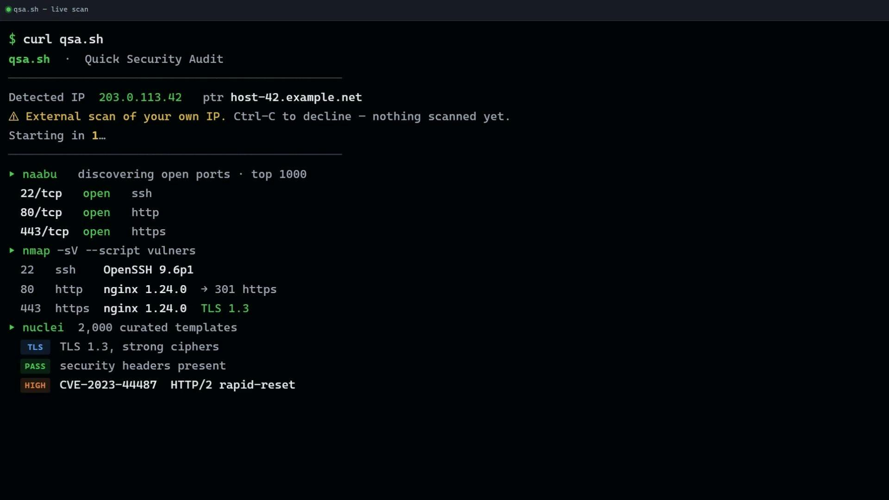
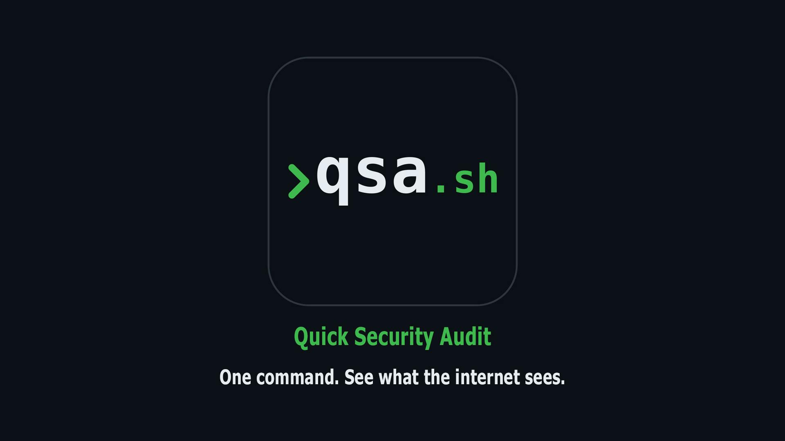

### 🎬 관련 영상
- [🎥 영상 보기](https://ph-files.imgix.net/e4b20713-62c3-4ab5-a4d1-be12394dee4e.jpeg?auto=format)

---

## 19. [RecipeBook by Shofo](https://www.producthunt.com/products/recipebook-by-shofo)
**Votes**: 103 | **도입 난이도**: 하 | **신뢰도**: 상
**Tagline**: Buy video training data by the hour featuring 25M+ clips
**서비스 링크**: https://www.producthunt.com/r/FL5LQN66HXBORB

**태그**: AI-Training, Video-Data, MLOps, Data-Acquisition, AI Tool, Video, Sales

### 📌 이 서비스 한눈에 보기
2,500만 개 이상의 영상 클립에서 원하는 학습 데이터를 시간당 $3로 즉시 구매하는 플랫폼

### 🔑 주요 기능
- 2,500만 개 이상의 방대한 영상 클립 라이브러리 보유
- 시맨틱 검색 및 사용자 피드백 기반의 지능형 재정렬 기능
- 영업 미팅 없이 즉시 데이터셋을 구매할 수 있는 간편한 프로세스

### 🙋 사용자에게 어떤 점이 좋은가
모델 학습에 필요한 특정 영상 데이터를 찾기 위해 수동으로 작업할 필요 없이, 검색과 피드백만으로 맞춤형 데이터셋을 즉시 확보할 수 있습니다.

### ✅ 지금 바로 써볼 기능
- 시맨틱 검색 기능을 통해 원하는 영상 클립 검색해보기
- 클립에 대한 피드백(Rate)을 주어 검색 결과 최적화 경험하기
- 필요한 데이터셋을 시간당 비용으로 즉시 구매해보기

### ⚠️ 사용 전 확인할 점
- 구매하는 데이터셋의 구체적인 품질 및 해상도 확인 필요
- 사용자 피드백(Probe training)이 전체 카탈로그 재정렬에 미치는 영향도 확인 필요

### 🧭 확인이 더 필요한 정보
제공되는 영상 클립의 구체적인 카테고리 범위와 데이터 포맷에 대한 정보가 추가로 필요합니다.

### 📸 스크린샷 및 갤러리
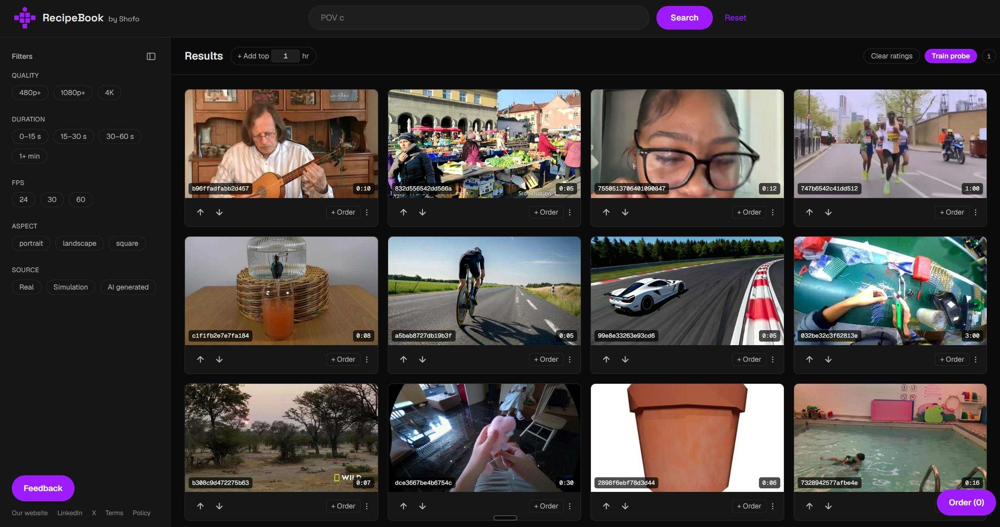
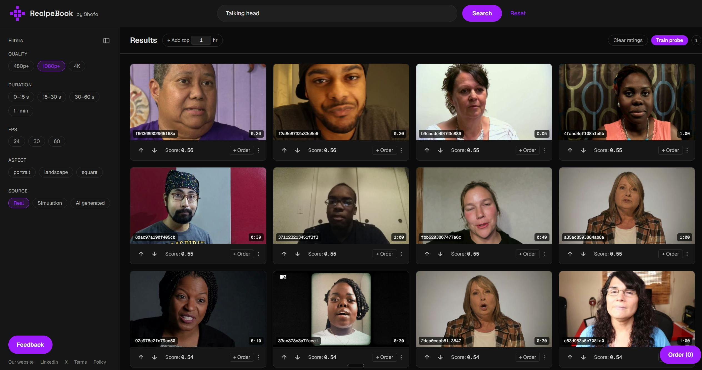
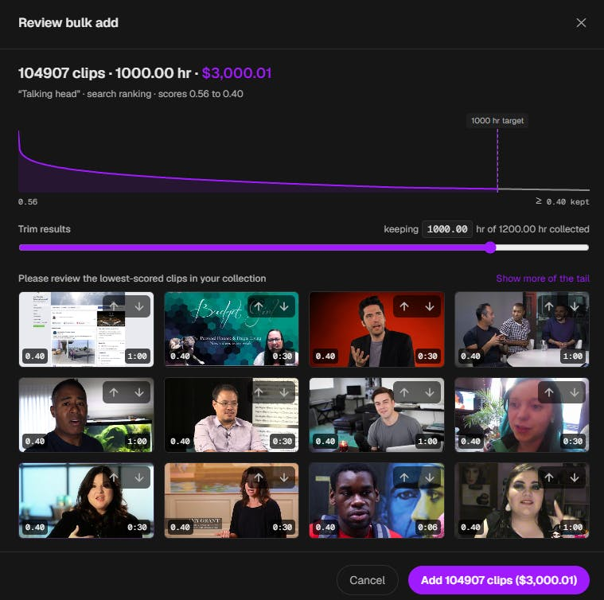

### 🎬 관련 영상
- [🎥 영상 보기](https://ph-files.imgix.net/047acc7c-7f08-480a-9a5d-51dc4a190f20.jpeg?auto=format)

---

## 20. [SUB/WAVE](https://www.producthunt.com/products/sub-wave)
**Votes**: 101 | **도입 난이도**: 상 | **신뢰도**: 상
**Tagline**: Self-hosted radio with an AI DJ and one shared stream
**서비스 링크**: https://www.producthunt.com/r/U43MYE3V76RPVV

**태그**: Self-Hosted, AI, Music, OpenSource, AI Tool, LLM

### 📌 이 서비스 한눈에 보기
AI DJ가 곡 선정부터 멘트까지 수행하는 나만의 셀프 호스팅 라디오 스테이션

### 🔑 주요 기능
- 로컬 LLM 기반의 AI DJ가 트랙 선정 및 자연스러운 멘트 진행
- 개인 음악 라이브러리를 하나의 공유 스트림으로 변환
- 웹, iOS, Android, 데스크톱을 지원하는 멀티 플랫폼 플레이어

### 🙋 사용자에게 어떤 점이 좋은가
자신의 음악 컬렉션을 마치 실제 라디오 방송처럼 운영할 수 있으며, AI를 통해 마치 DJ가 있는 듯한 청취 경험을 제공합니다.

### ✅ 지금 바로 써볼 기능
- 로컬 LLM 연동을 통한 AI DJ 멘트 설정하기
- 개인 음악 라이브러리 업로드 및 스트림 생성하기
- 다양한 기기(모바일/데스크톱)에서 플레이어 연결하기

### ⚠️ 사용 전 확인할 점
- 셀프 호스팅 방식이므로 서버 구축 및 유지 관리 역량이 필요함
- 로컬 LLM 구동을 위한 하드웨어 사양 확인 필요

### 🧭 확인이 더 필요한 정보
사용자의 하드웨어 사양에 따른 AI DJ의 응답 속도 및 스트리밍 안정성을 확인해야 합니다.

### 📸 스크린샷 및 갤러리
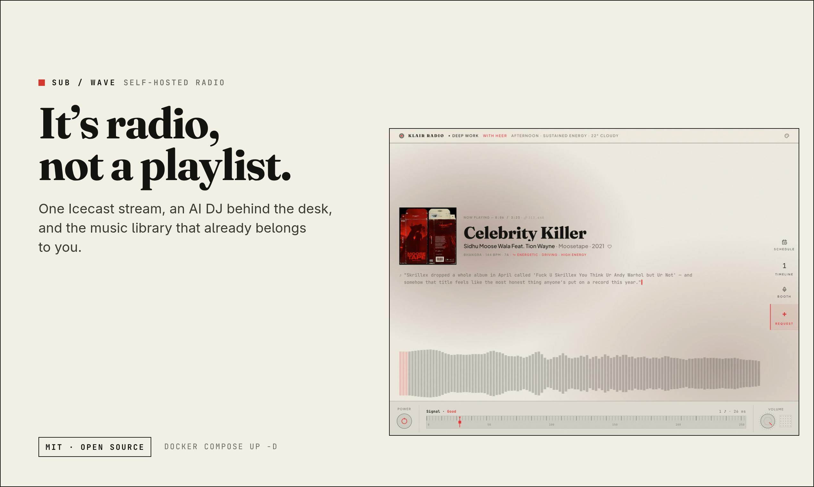
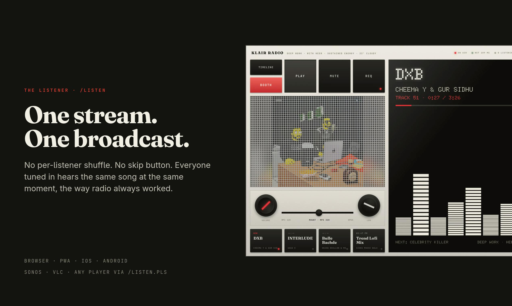
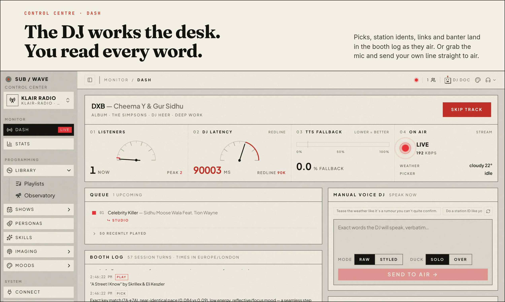

---

## 21. [Pinery Prose](https://www.producthunt.com/products/pinery)
**Votes**: 99 | **도입 난이도**: 하 | **신뢰도**: 상
**Tagline**: AI co-author for books + every edit is a diff you approve
**서비스 링크**: https://www.producthunt.com/r/ZT23VVHTVGVP2V

**태그**: Writing, AI, Publishing, Mac, Markdown, AI Tool, Design

### 📌 이 서비스 한눈에 보기
작가의 집필 스타일을 유지하며 AI와 협업하는 Mac 전용 셀프 퍼블리싱 스튜디오

### 🔑 주요 기능
- 기존 원고를 바탕으로 작동하는 AI 공동 저자 'Prose' 기능
- 모든 AI 편집 사항을 diff(차이점) 형태로 제공하여 사용자가 직접 승인/거절 가능
- Markdown 기반의 파일 관리와 ePub 3/PDF 내보장 지원

### 🙋 사용자에게 어떤 점이 좋은가
AI가 원고를 마음대로 고치는 것이 아니라, 작가의 문체를 존중하면서 편집 제안만 전달하므로 창작의 주도권을 유지할 수 있습니다.

### ✅ 지금 바로 써볼 기능
- 기존에 작성한 Markdown 원고 불러오기
- Prose 기능을 통한 문장 편집 제안 받아보기
- 편집된 내용을 diff 방식으로 검토 및 승인하기

### ⚠️ 사용 전 확인할 점
- Mac 전용 소프트웨어이므로 Windows/Linux 환경에서는 사용 불가
- AI 기능이 기존 텍스트의 맥락을 얼마나 정확히 파악하는지 확인 필요

### 🧭 확인이 더 필요한 정보
Prose 기능의 상세 가격 정책과 외부 클라우드 동기화 지원 여부에 대한 정보가 부족합니다.

### 📸 스크린샷 및 갤러리
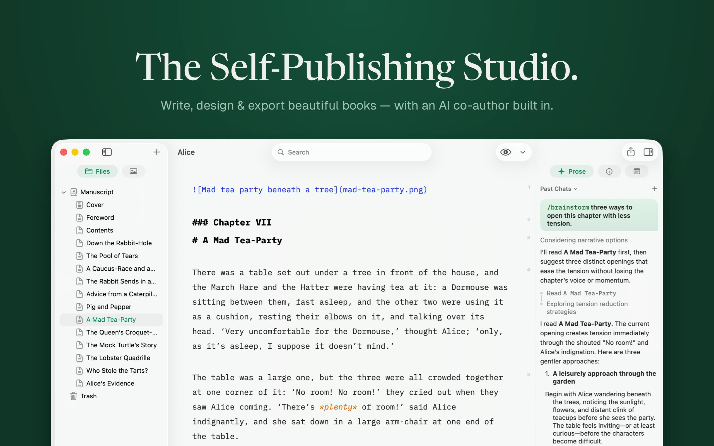
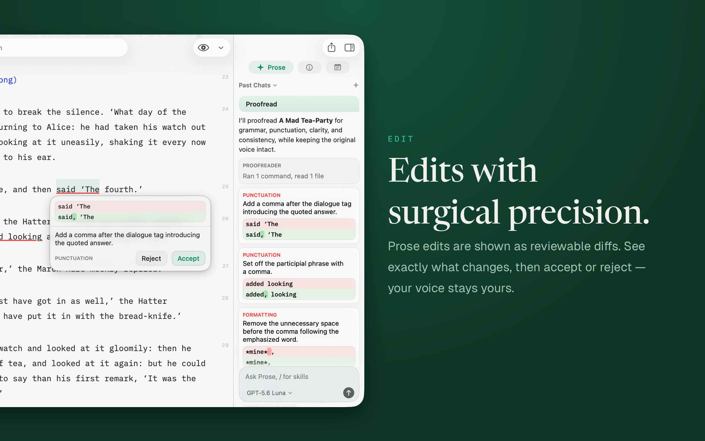
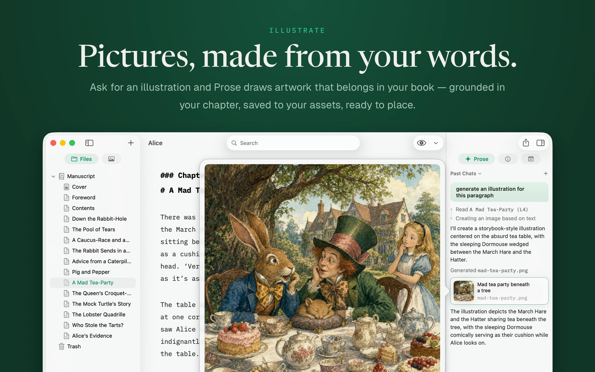

### 🎬 관련 영상
- [🎥 영상 보기](https://ph-files.imgix.net/acf97528-0348-4104-9129-4c73cfed6201.jpeg?auto=format)

---

## 22. [Cardzen](https://www.producthunt.com/products/cardzen)
**Votes**: 91 | **도입 난이도**: 하 | **신뢰도**: 상
**Tagline**: Track every credit, perk, and point before it expires
**서비스 링크**: https://www.producthunt.com/r/A4YENTLCTDEUM3

**태그**: FinTech, PersonalFinance, AI, Productivity, AI Tool

### 📌 이 서비스 한눈에 보기
카드 혜택과 포인트를 놓치지 않도록 관리해 주는 스마트한 지갑 비서

### 🔑 주요 기능
- 카드별 크레딧, 혜택, 적립 배율 통합 관리
- 혜택 만료 전 알림 및 결제 시 최적의 카드 추천
- AI 어드바이저를 통한 지갑 관리 질의응답 및 데일리 리포트 제공

### 🙋 사용자에게 어떤 점이 좋은가
매년 소멸되는 카드 혜택을 방지하고, 결제할 때마다 어떤 카드가 가장 유리한지 고민할 필요 없이 최적의 이득을 챙길 수 있습니다.

### ✅ 지금 바로 써볼 기능
- 보유 중인 카드 정보 입력 및 혜택 등록
- 만료 알림 설정 및 데일리 다이제스트 구독
- AI 어드바이저에게 현재 카드 구성에 대해 질문하기

### ⚠️ 사용 전 확인할 점
- 카드 정보 입력 시 보안 및 개인정보 보호 수준 확인 필요
- 카드사별 실시간 데이터 연동 여부 확인 필요

### 🧭 확인이 더 필요한 정보
실제 카드사 데이터와의 자동 연동 방식 및 보안 프로토콜에 대한 상세 정보가 필요합니다.

### 📸 스크린샷 및 갤러리
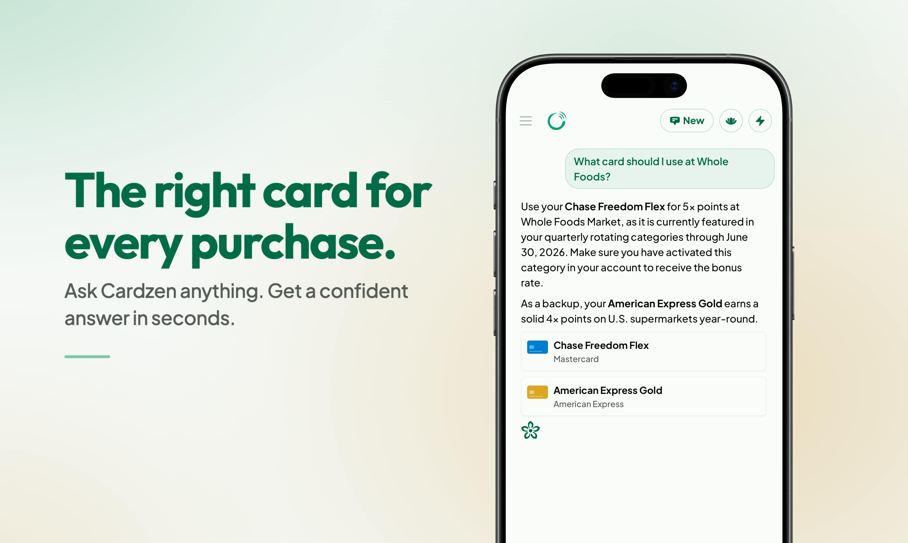
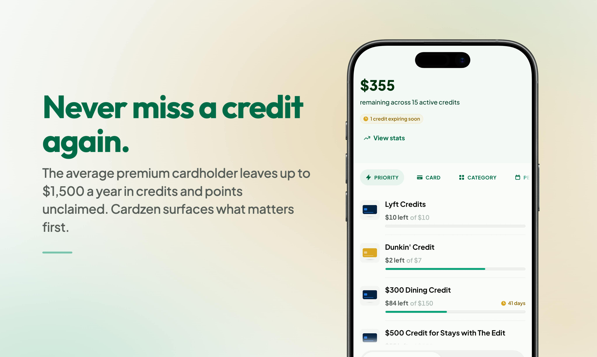
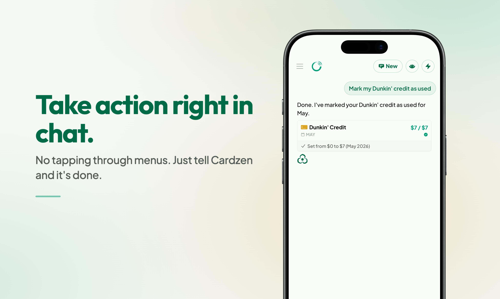

### 🎬 관련 영상
- [🎥 영상 보기](https://ph-files.imgix.net/3973feb5-896d-4e7a-a0f8-4f94635c8d4c.jpeg?auto=format)

---

## 23. [Tag Your Photos](https://www.producthunt.com/products/tag-your-photos)
**Votes**: 90 | **도입 난이도**: 하 | **신뢰도**: 상
**Tagline**: AI-powered keywords for Apple Photos, 100% on your Mac
**서비스 링크**: https://www.producthunt.com/r/KOSYPK6CPO3GWL

**태그**: AI, Productivity, Privacy, Apple Ecosystem, AI Tool, Vision

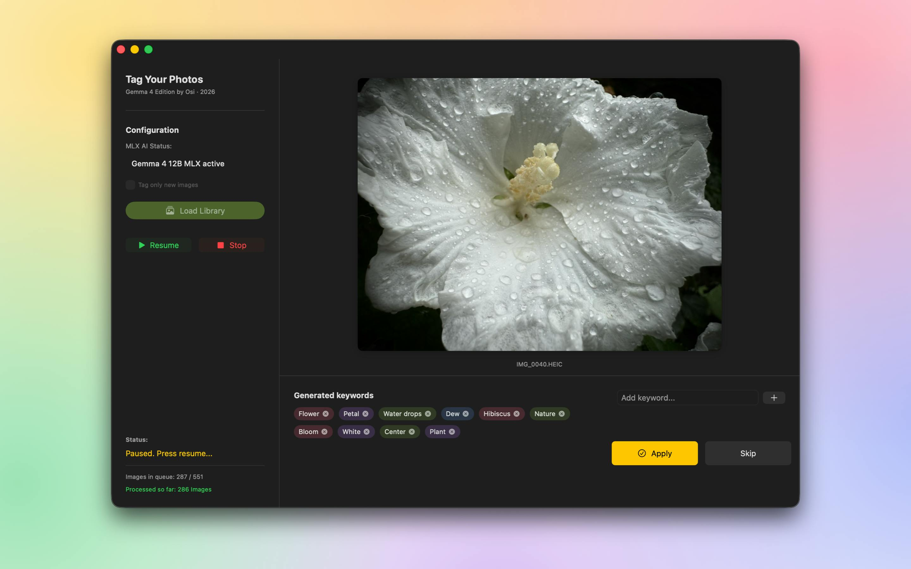

### 📌 이 서비스 한눈에 보기
개인정보 유출 걱정 없이 맥(Mac)에서 바로 실행되는 온디바이스 AI 사진 키워드 태깅 도구

### 🔑 주요 기능
- Gemma 4 12B 모델 기반의 100% 온디바이스 처리 (클라우드 업로드 없음)
- 애플 사진(Photos) 라이브러리와 직접 연동되어 별도 내보내기 불필요
- 생성된 키워드가 시스템 스포트라이트(Spotlight)와 연동되어 기기 전반에서 검색 가능

### 🙋 사용자에게 어떤 점이 좋은가
사진을 클라우드에 올리지 않고도 맥의 강력한 검색 기능을 통해 소중한 사진을 쉽고 안전하게 찾을 수 있습니다.

### ✅ 지금 바로 써볼 기능
- 애플 사진 라이브러리 연결 및 태깅 실행
- 생성된 키워드가 스포트라이트 검색에 반영되는지 확인
- 애플 기기 간 키워드 동기화 여부 테스트

### ⚠️ 사용 전 확인할 점
- 로컬 모델 구동을 위한 맥의 하드웨어 사양(MLX 지원 모델) 확인 필요
- 대규모 사진 라이브러리 처리 시 로컬 리소스 점유 가능성

### 🧭 확인이 더 필요한 정보
사용자의 맥 사양에 따른 처리 속도와 배터리 소모량에 대한 구체적인 정보가 필요합니다.

### 📸 스크린샷 및 갤러리
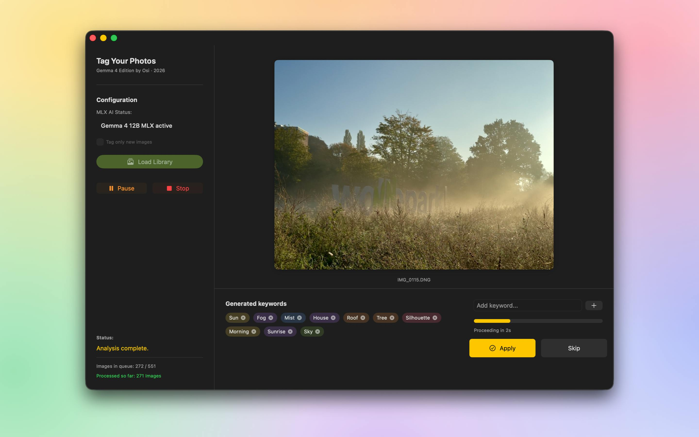
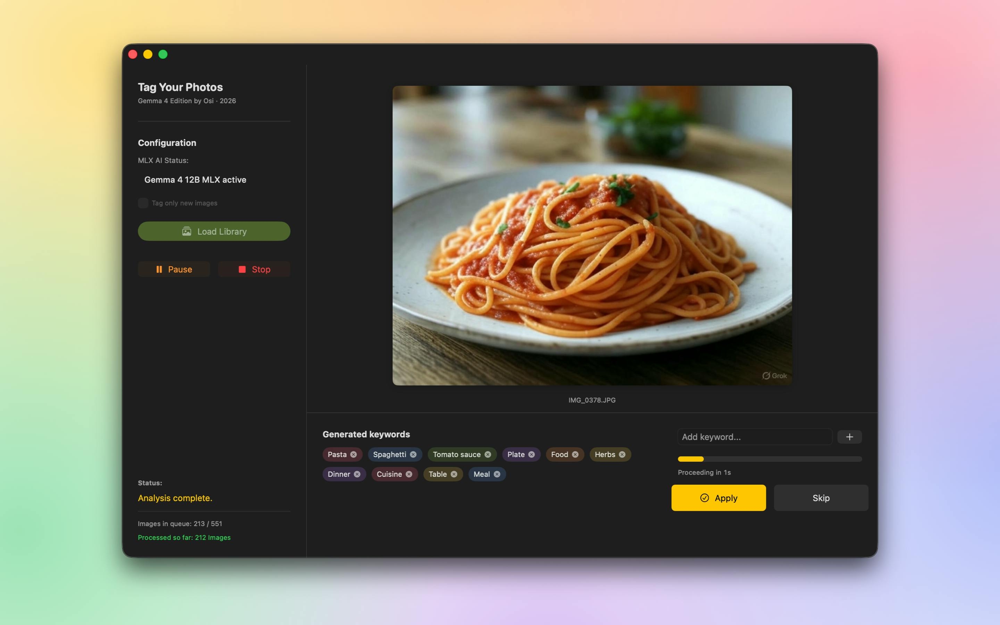
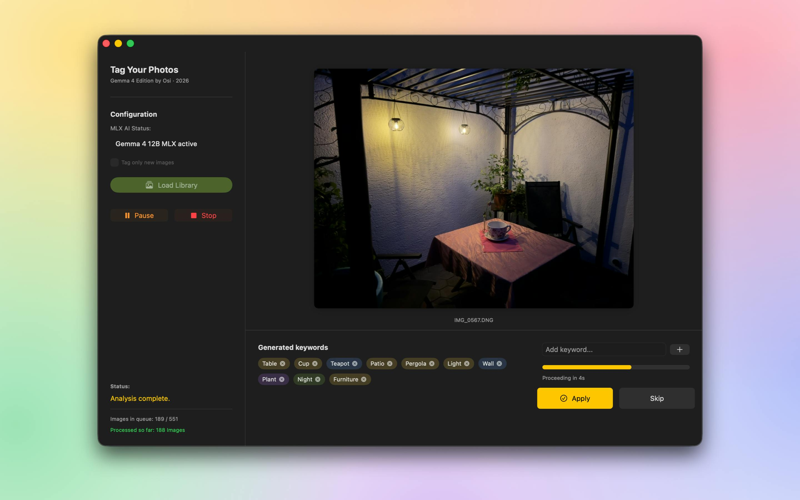

### 🎬 관련 영상
- [🎥 영상 보기](https://ph-files.imgix.net/3724cfd1-098e-40cd-8c46-e1bb98997fc9.jpeg?auto=format)

---

## 24. [ChatBeacon AIX](https://www.producthunt.com/products/chatbeacon-2-0-live-chat)
**Votes**: 88 | **도입 난이도**: 중 | **신뢰도**: 상
**Tagline**: AI support that resolves 87% of chats
**서비스 링크**: https://www.producthunt.com/r/FHSP27VCQHNUEM

**태그**: CustomerSupport, AI, Automation, SaaS, Agent, AI Tool, Chat, Video

### 📌 이 서비스 한눈에 보기
문서 기반 자동 응답과 맥락 있는 상담 전환을 결합한 하이브리드 AI 고객 지원 솔루션

### 🔑 주요 기능
- 자체 문서 및 가격 정보를 바탕으로 채팅의 87%를 자동 해결
- 해결 불가 시 상담원에게 전체 맥락을 포함하여 에스컬레이션
- 화면 공동 브라우징, 민감 정보 자동 마스킹, 설치 없는 영상 통화 지원

### 🙋 사용자에게 어떤 점이 좋은가
단순 답변을 넘어 상담원에게 필요한 맥락까지 전달하므로 고객 경험을 해치지 않으면서 운영 효율을 극대화할 수 있습니다.

### ✅ 지금 바로 써볼 기능
- 자체 문서를 업로드하여 AI 답변 정확도 테스트하기
- 상담원 전환 시 맥락 전달 기능 확인하기
- 14일 무료 체험을 통해 화면 공유 및 영상 기능 검증하기

### ⚠️ 사용 전 확인할 점
- 87% 해결률은 특정 환경에서의 성과이므로 실제 적용 시 차이가 있을 수 있음
- 온프레미스 설치 시 인프라 구축 환경 확인 필요

### 🧭 확인이 더 필요한 정보
사용자 규모에 따른 구체적인 기술 지원 범위와 온프레미스 구축 비용에 대한 정보가 부족합니다.

### 📸 스크린샷 및 갤러리
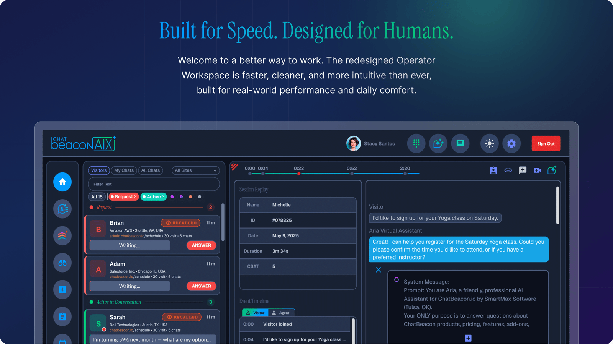
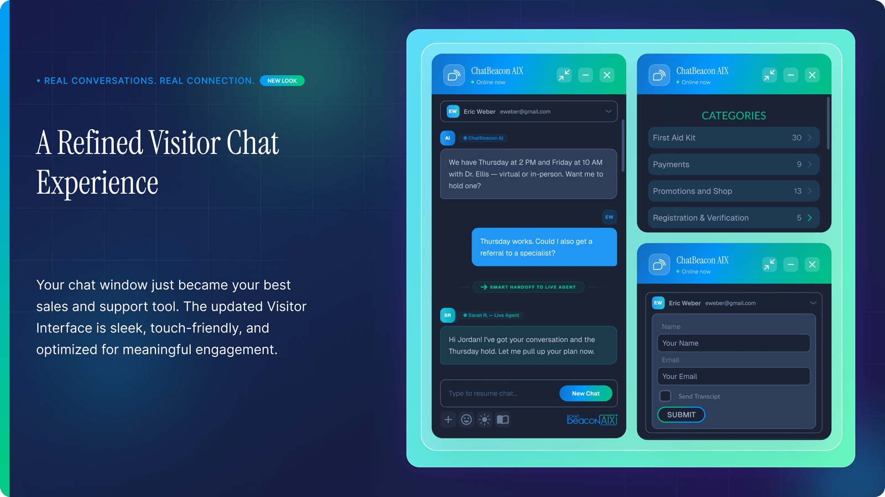
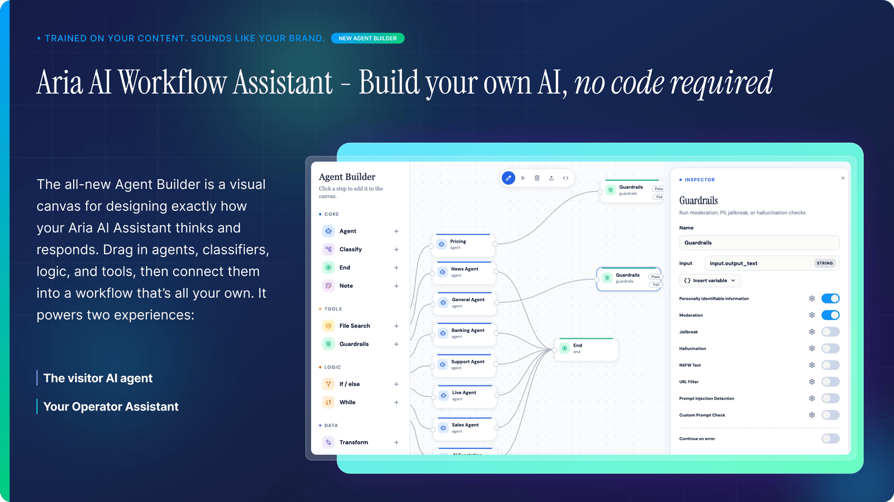

---

## 25. [Lamoom](https://www.producthunt.com/products/lamoom)
**Votes**: 87 | **도입 난이도**: 하 | **신뢰도**: 상
**Tagline**: Run agent apps inside your Claude or sell your own
**서비스 링크**: https://www.producthunt.com/r/EFVR7WRVY2OII7

**태그**: AI, Automation, SaaS, Marketplace, Productivity, Agent

### 📌 이 서비스 한눈에 보기
사용자의 Claude 환경 내에서 직접 실행되는 에이전트 앱 마켓플레이스

### 🔑 주요 기능
- 데이터 보안: 서버가 아닌 사용자의 Claude 환경 내에서 에이전트가 직접 실행
- 개인 데이터 활용: 설치 시 사용자의 파일 및 데이터와 연동되어 작동
- 수익 창출: 직접 만든 자동화 루프를 게시하고 실행당 또는 월간 구독형으로 판매 가능

### 🙋 사용자에게 어떤 점이 좋은가
개인 데이터를 외부 서버로 전송하지 않고 Claude 내에서 안전하게 자동화 도구를 사용할 수 있으며, 개발자는 자신이 만든 에이전트를 수익화할 수 있습니다.

### ✅ 지금 바로 써볼 기능
- 제공되는 $20 무료 크레딧으로 에이전트 앱 설치 및 테스트
- 자신의 파일/데이터를 활용한 에이전트 워크플로우 실행
- 직접 만든 루프를 마켓플레이스에 게시하여 수익화 모델 검토

### ⚠️ 사용 전 확인할 점
- Claude 계정 및 환경에 대한 의존성
- 에이전트 실행 시 사용자의 데이터 접근 권한 설정 필요

### 🧭 확인이 더 필요한 정보
에이전트가 Claude의 어떤 API나 인터페이스를 통해 구동되는지에 대한 기술적 상세 구현 방식 확인이 필요합니다.

### 📸 스크린샷 및 갤러리
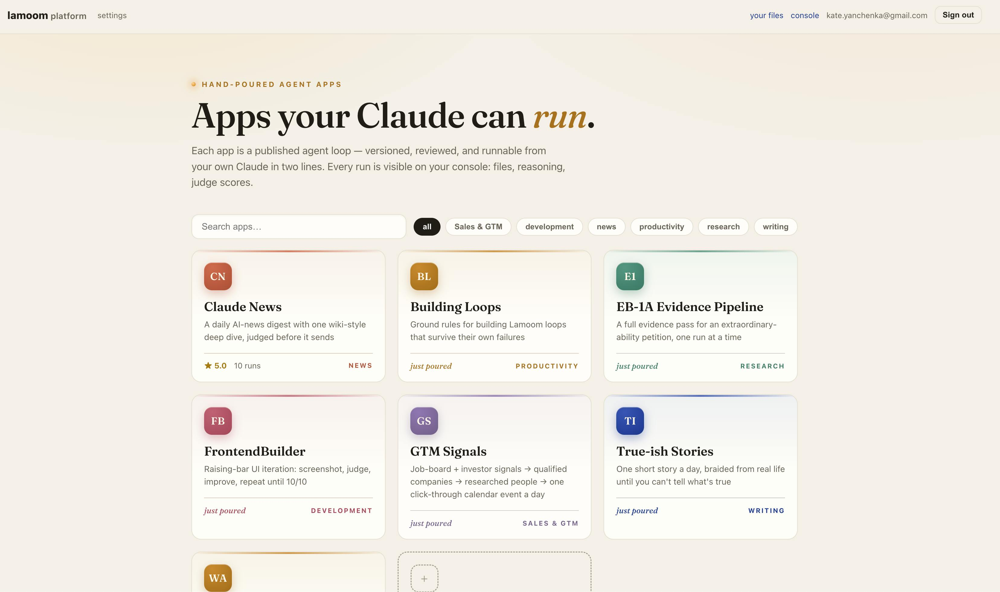
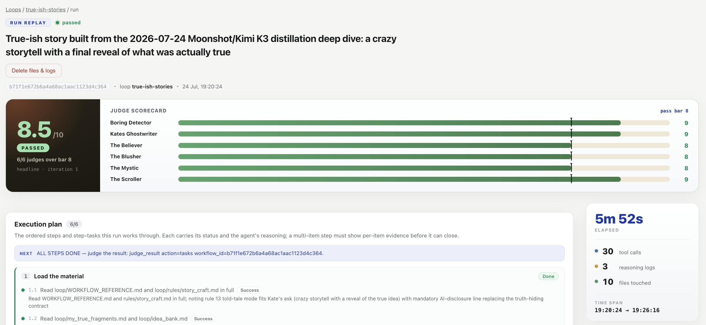
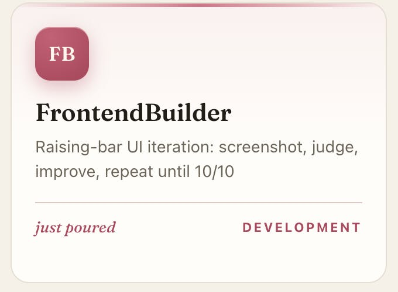

### 🎬 관련 영상
- [🎥 영상 보기](https://ph-files.imgix.net/15e77d3e-9e22-441b-b06b-f3095a5b7b95.jpeg?auto=format)

---

## 26. [Growth Opt Playbook](https://www.producthunt.com/products/growth-opt-playbook)
**Votes**: 86 | **도입 난이도**: 하 | **신뢰도**: 상
**Tagline**: Turn campaign data into your next marketing move
**서비스 링크**: https://www.producthunt.com/r/3BKJUUAWRDIL4I

**태그**: Marketing, Analytics, Data Privacy, Growth, AI Tool

### 📌 이 서비스 한눈에 보기
데이터 보안을 유지하며 캠페인 성과를 진단하고 마케팅 의사결정을 돕는 브라우저 기반 워크스페이스

### 🔑 주요 기능
- CSV 업로드 또는 구글 시트 연동을 통한 데이터 분석
- 예산 여유도, 소재 피로도, 실험 결과 등 성과 변화 진단
- MMM(마케팅 믹스 모델링), 회귀 모델, 카니발라이제이션 체크 기능 제공

### 🙋 사용자에게 어떤 점이 좋은가
퍼포먼스 마케터가 민감한 원천 데이터를 외부 서버에 노출하지 않고도 정교한 데이터 분석과 마케팅 전략 수립을 할 수 있습니다.

### ✅ 지금 바로 써볼 기능
- 캠페인 CSV 파일을 업로드하여 성과 진단 시작하기
- 구글 시트를 연결하여 데이터 동기화하기
- 예산 여유도 및 소재 피로도 리포트 확인하기

### ⚠️ 사용 전 확인할 점
- 브라우저 기반이므로 대규모 데이터 처리 시 로컬 환경 성능에 영향을 받을 수 있음
- 서버에 저장되지 않으므로 브라우저 세션 종료 시 데이터 유지 여부 확인 필요

### 🧭 확인이 더 필요한 정보
데이터가 서버로 전송되지 않는 방식이 구체적으로 어떤 기술적 메커니즘(Client-side processing)을 사용하는지 확인이 필요합니다.

### 📸 스크린샷 및 갤러리
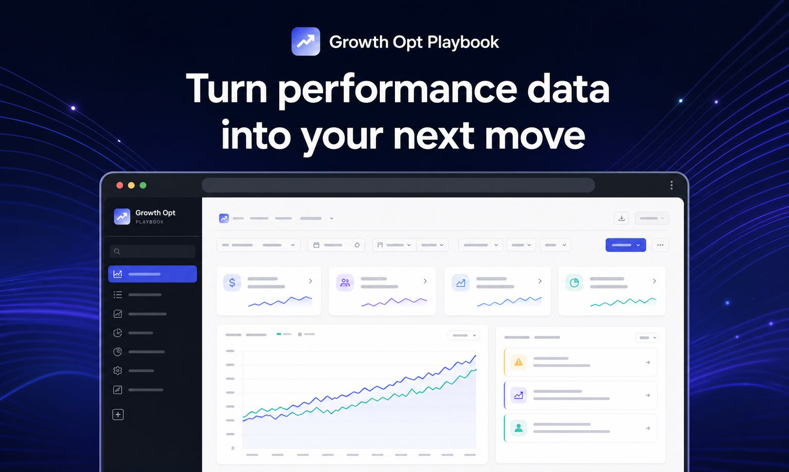
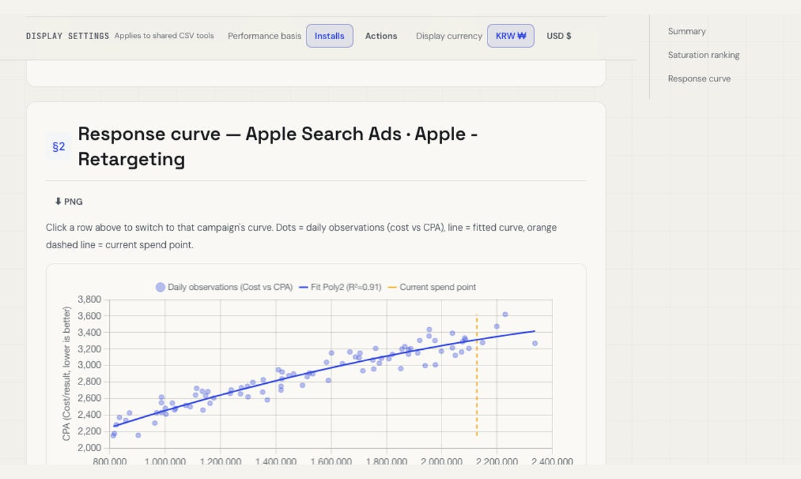
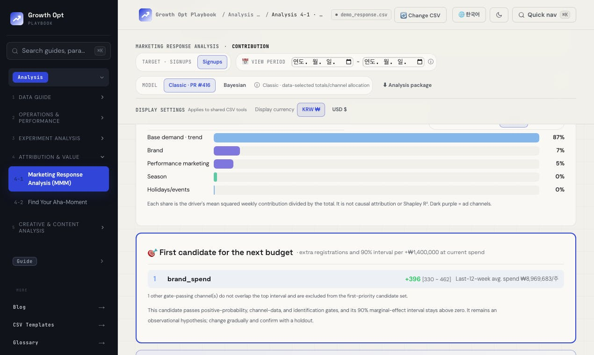

### 🎬 관련 영상
- [🎥 영상 보기](https://ph-files.imgix.net/8bb2aba0-62bf-4a7e-87d0-cfaf2aec0369.jpeg?auto=format)

---

## 27. [ZenithBar](https://www.producthunt.com/products/zenithbar)
**Votes**: 81 | **도입 난이도**: 하 | **신뢰도**: 상
**Tagline**: The activity island Windows was missing
**서비스 링크**: https://www.producthunt.com/r/BAQJJQ52P6VE26

**태그**: Productivity, Windows, Utility, AI Tool

### 📌 이 서비스 한눈에 보기
윈도우 데스크톱 상단에 필요한 정보를 모아두는 플로팅 액티비티 아일랜드

### 🔑 주요 기능
- 미디어 컨트롤, 일정, 고정 앱/사이트, 파일 쉘, 클립보드 기록 통합 관리
- 호버 시 나타나고 전체 화면 게임 시 자동 숨김되는 직관적 UI
- 계정 생성 없는 온디바이스 처리 및 구독 없는 일회성 구매 방식

### 🙋 사용자에게 어떤 점이 좋은가
여러 앱을 오가는 번거로움 없이 화면 상단에서 즉각적인 작업 제어와 파일 이동이 가능해져 작업 흐름이 끊기지 않습니다.

### ✅ 지금 바로 써볼 기능
- 미디어 재생 컨트롤 및 일정 확인 기능 사용해보기
- 파일 쉘을 활용한 드래그 앤 드롭 작업 테스트하기
- 클립보드 히스토리 기능으로 이전 복사 내용 확인하기

### ⚠️ 사용 전 확인할 점
- 7일간의 무료 체험 기간 이후에는 일회성 구매가 필요함
- 플로팅 UI 특성상 화면 상단 공간을 점유함

### 🧭 확인이 더 필요한 정보
사용자의 하드웨어 사양에 따른 UI 애니메이션 성능이나 시스템 리소스 점유율은 명시되지 않았습니다.

### 📸 스크린샷 및 갤러리

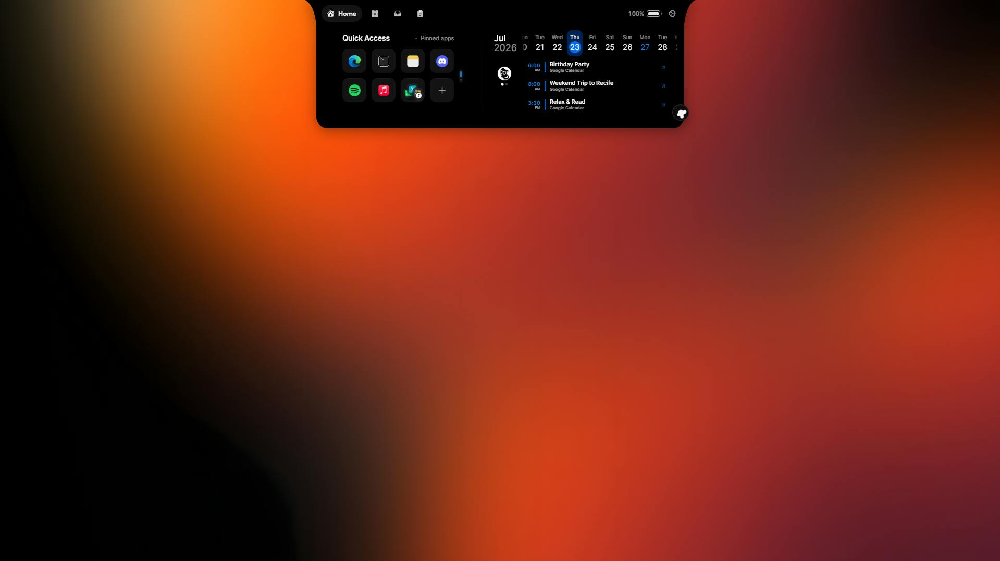
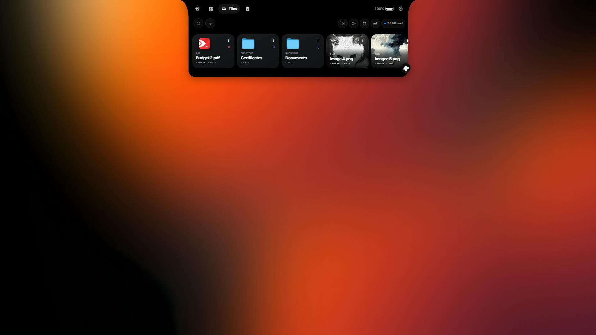

### 🎬 관련 영상
- [🎥 영상 보기](https://ph-files.imgix.net/7887fd69-70b6-40ca-bb3e-293a88a3f2d1.jpeg?auto=format)

---

## 28. [Space-Bin](https://www.producthunt.com/products/space-bin)
**Votes**: 71 | **도입 난이도**: 하 | **신뢰도**: 상
**Tagline**: Secure temporary workspaces. No sign-up required.
**서비스 링크**: https://www.producthunt.com/r/KVDIK6Y35SWSOW

**태그**: Security, Productivity, FileSharing, Privacy

### 📌 이 서비스 한눈에 보기
로그인 없이 즉시 생성하는 보안 파일 공유용 임시 작업 공간

### 🔑 주요 기능
- 가입이나 로그인 절차 없는 간편한 사용성
- 보안을 위한 암호화된 임시 공간 제공
- 안전한 파일 공유를 위한 일회성 워크스페이스

### 🙋 사용자에게 어떤 점이 좋은가
개인정보 유출 걱정 없이 즉각적으로 보안이 유지되는 공유 공간을 만들 수 있어 빠른 협업이 가능합니다.

### ✅ 지금 바로 써볼 기능
- 임시 보안 공간 생성하기
- 암호화된 파일 업로드 및 공유하기

### ⚠️ 사용 전 확인할 점
- 로그인이 없으므로 계정 분실 시 데이터 복구가 어려울 수 있음
- 임시 공간의 데이터 보관 기간 및 자동 삭제 정책 확인 필요

### 🧭 확인이 더 필요한 정보
데이터가 영구적으로 저장되는지 아니면 일정 시간 후 자동 삭제되는지에 대한 상세 정책 확인이 필요합니다.

### 📸 스크린샷 및 갤러리
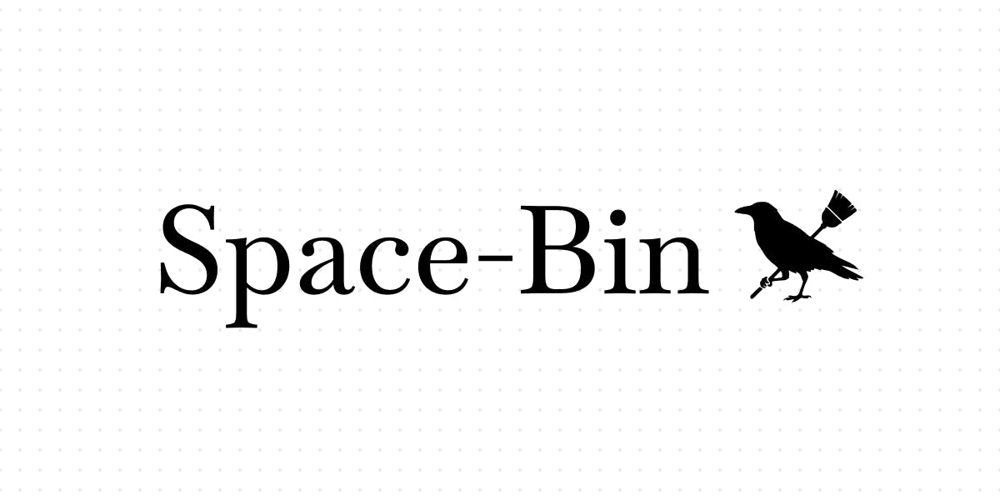
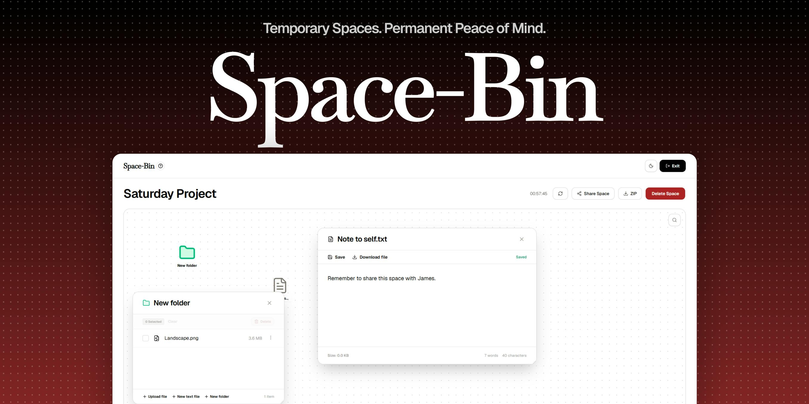
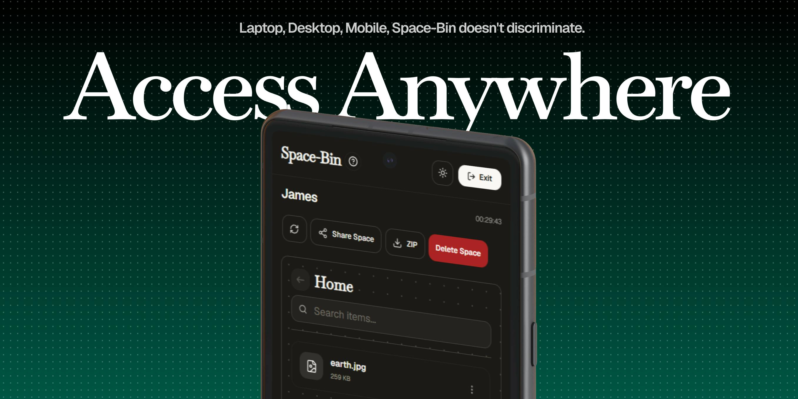

---

## 29. [Snapr](https://www.producthunt.com/products/snapr-3)
**Votes**: 67 | **도입 난이도**: 하 | **신뢰도**: 상
**Tagline**: Capture thoughts, find them instantly
**서비스 링크**: https://www.producthunt.com/r/7DUP3PFKNDAFH4

**태그**: Productivity, AI, Note-taking, Workflow, AI Tool

### 📌 이 서비스 한눈에 보기
음성 기록부터 파일 정리까지 한 번에 해결하는 AI 기반 올인원 생산성 도구

### 🔑 주요 기능
- 음성을 구조화된 노트로 변환하는 AI 기능
- 스마트 북마크 및 파일 정리 자동화
- 여러 앱을 오가는 번거로움을 줄이는 통합 워크플로우

### 🙋 사용자에게 어떤 점이 좋은가
아이디어나 자료를 여기저기 흩뜨리지 않고 한 곳에 저장하며, 나중에 필요한 정보를 즉시 찾아낼 수 있습니다.

### ✅ 지금 바로 써볼 기능
- 음성 녹음 기능을 통한 아이디어 캡처해보기
- 수집된 정보의 자동 구조화 확인하기
- 스마트 북마크로 자료 정리해보기

### ⚠️ 사용 전 확인할 점
- 음성 인식의 정확도 및 한국어 지원 여부 확인 필요
- 기존에 사용하던 다른 생산성 앱과의 데이터 연동 범위 확인

### 🧭 확인이 더 필요한 정보
구체적인 플랫폼 지원 범위(모바일/데스크톱)와 상세 가격 정책에 대한 정보가 부족합니다.

### 📸 스크린샷 및 갤러리
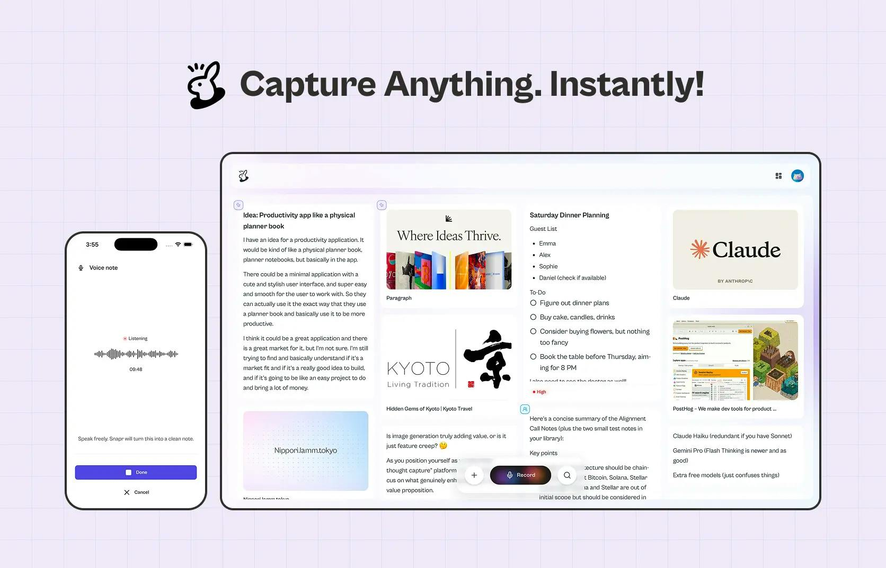
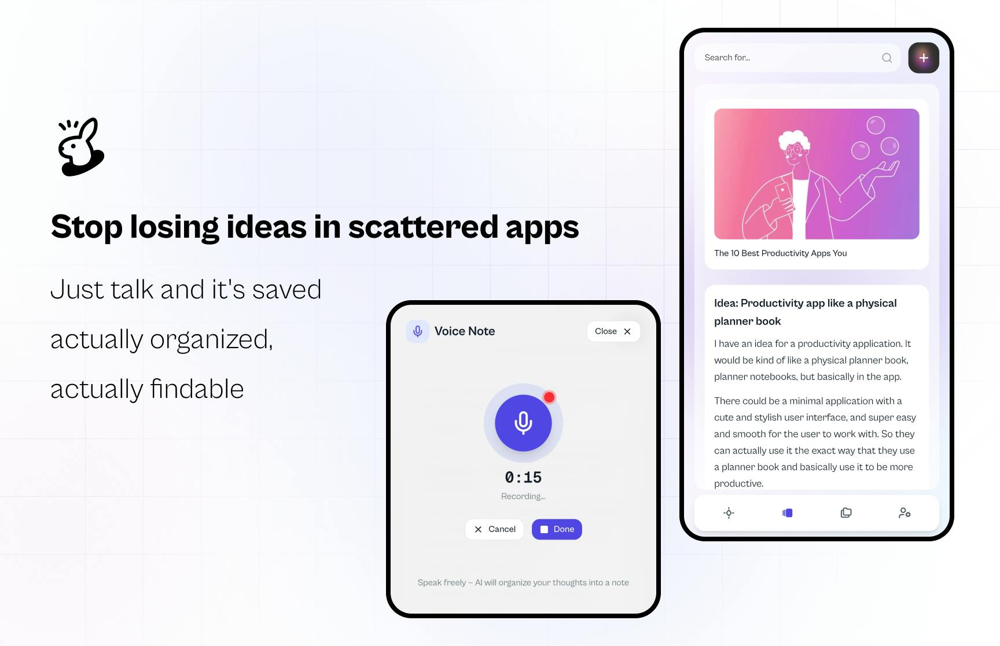
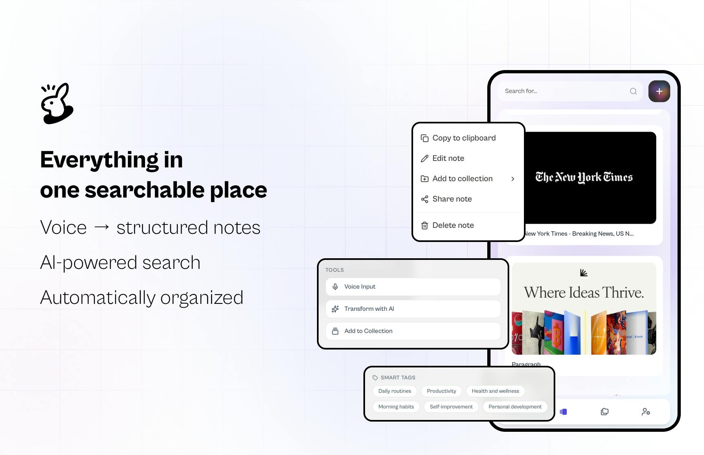

### 🎬 관련 영상
- [🎥 영상 보기](https://ph-files.imgix.net/2a353de8-54e1-44b4-bcae-3b4fbd92d0ba.jpeg?auto=format)

---

## 30. [Odella](https://www.producthunt.com/products/odella)
**Votes**: 31 | **도입 난이도**: 중 | **신뢰도**: 상
**Tagline**: Hire or build AI employees that work like your best people
**서비스 링크**: https://www.producthunt.com/r/RDKTTYJBP7FYBO

**태그**: AI Agents, Automation, Productivity, Enterprise, AI Tool, DevTool

### 📌 이 서비스 한눈에 보기
전문적인 업무 수행이 가능한 맞춤형 AI 직원을 고용하거나 직접 구축하는 디지털 워크포스 플랫폼

### 🔑 주요 기능
- 특화된 AI 직원 고용 또는 사용자 정의 AI 에이전트 생성 가능
- 전용 보안 컴퓨터, 코드 실행, 웹 브라우징 등 실질적인 업무 수행 능력 보유
- 1,000개 이상의 도구 연동 및 엔터프라이즈급 거버넌스/감사 로그 제공

### 🙋 사용자에게 어떤 점이 좋은가
단순 챗봇을 넘어 실제 업무 시스템에 접속해 작업을 완수하는 디지털 직원을 통해 업무 자동화 수준을 한 단계 높일 수 있습니다.

### ✅ 지금 바로 써볼 기능
- 사전에 정의된 전문 AI 직원 활용해보기
- 비즈니스 시스템 연동을 통한 맞춤형 AI 에이전트 구축
- 스케줄링 기능을 활용한 반복 업무 자동화 설정

### ⚠️ 사용 전 확인할 점
- 비즈니스 시스템 접근 권한 부여에 따른 보안 정책 검토 필요
- AI의 코드 실행 및 웹 브라우징 작업에 대한 결과물 검증 필요

### 🧭 확인이 더 필요한 정보
사용자의 비즈니스 도구와 연동 시 발생할 수 있는 보안 및 데이터 프라이버시 상세 정책 확인이 필요합니다.

### 📸 스크린샷 및 갤러리
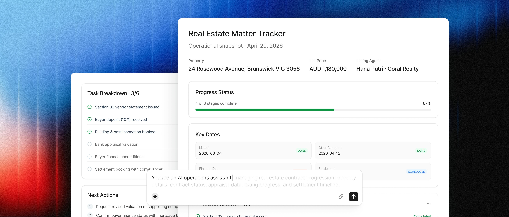
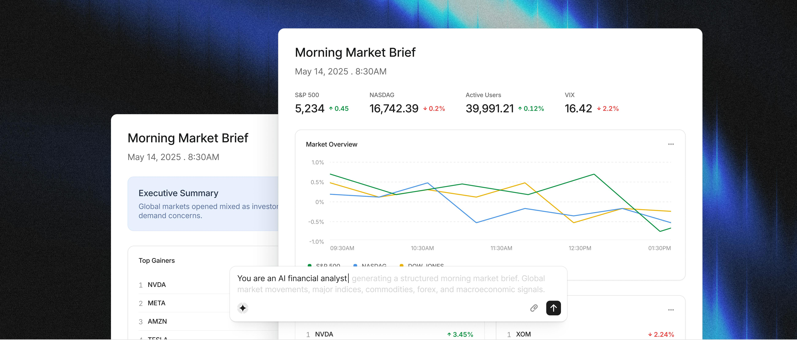
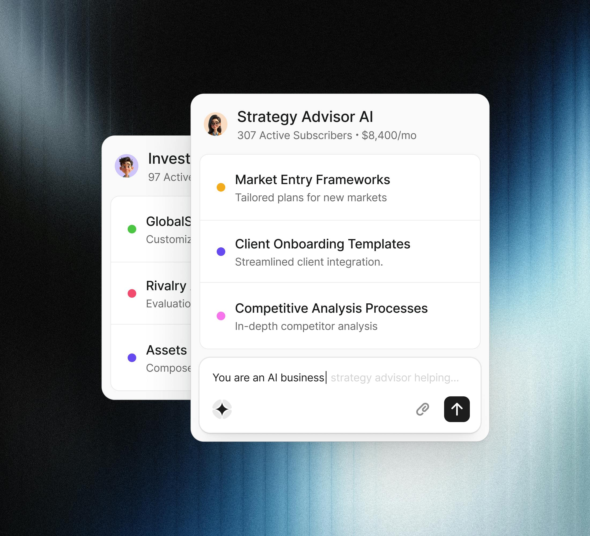

### 🎬 관련 영상
- [🎥 영상 보기](https://ph-files.imgix.net/603f792b-7c23-494f-aca0-8b992ae47a67.jpeg?auto=format)

---

