# 🚀 Product Hunt Daily Top 30 (2026-07-30)

## 오늘의 요약
오늘의 트렌드는 AI 에이전트와 코딩 자동화 도구가 개발 워크플로우를 심화하는 동시에, 일상적인 업무를 자동화하는 개인 비서형 서비스가 주목받았습니다. 특히 AI가 생성한 코드의 품질을 관리하거나 복잡한 작업을 멀티 에이전트 팀으로 전환하는 등 개발 생산성 극대화에 초점이 맞춰졌습니다.

### 오늘의 핵심 포인트
- AI 코딩 에이전트의 정확도와 맥락 유지를 위한 설계 일치 및 메모리 관리 도구가 등장했습니다.
- 단순한 챗봇을 넘어 마케팅, 결제, 의료 기록 등 특정 비즈니스 도메인에 특화된 자동화 솔루션이 주목받았습니다.
- 사용자 인터페이스를 최소화하고 기존의 문자 메시지나 북마크를 활용하는 접근성 높은 AI 서비스가 제안되었습니다.

**오늘의 태그**: AI 에이전트, 개발 생산성, 업무 자동화, SaaS

## 1. [Prelint](https://www.producthunt.com/products/prelint)
**Votes**: 424 | **도입 난이도**: 하 | **신뢰도**: 상
**Tagline**: Prevent product drift in AI-written code
**서비스 링크**: https://www.producthunt.com/r/7JDFCGARSHV32N

**태그**: DevTool, AI, CodeReview, Automation, AI Tool

### 📌 이 서비스 한눈에 보기
AI가 작성한 코드가 기존 설계 및 문서와 일치하는지 검토하여 제품 드리프트를 방지하는 도구

### 🔑 주요 기능
- ADR(아키텍처 결정 기록), 문서, 과거 결정 사항을 기준으로 PR 검토
- AI 생성 코드가 의도와 다르게 변질되는 '제품 드리프트' 현상 방지
- AI 리뷰어를 사용하는 팀에서 머지 전 이슈의 약 40%를 사전에 포착

### 🙋 사용자에게 어떤 점이 좋은가
AI로 코드를 빠르게 작성하면서 발생할 수 있는 설계 불일치 문제를 자동화된 리뷰를 통해 해결해 줍니다.

### ✅ 지금 바로 써볼 기능
- 기존 ADR 및 기술 문서 연동하기
- PR 워크플로우에 Prelint 리뷰 프로세스 추가하기
- AI 생성 코드와 기존 설계 간의 일치율 확인하기

### ⚠️ 사용 전 확인할 점
- 기존 문서나 ADR이 최신 상태가 아닐 경우 잘못된 리뷰가 발생할 수 있음
- AI 리뷰어 간의 상호작용 및 충돌 가능성 확인 필요

### 🧭 확인이 더 필요한 정보
현재 제공되는 구체적인 통합 환경(GitHub, GitLab 등)과 연동 방식에 대한 상세 정보가 필요합니다.

### 📸 스크린샷 및 갤러리
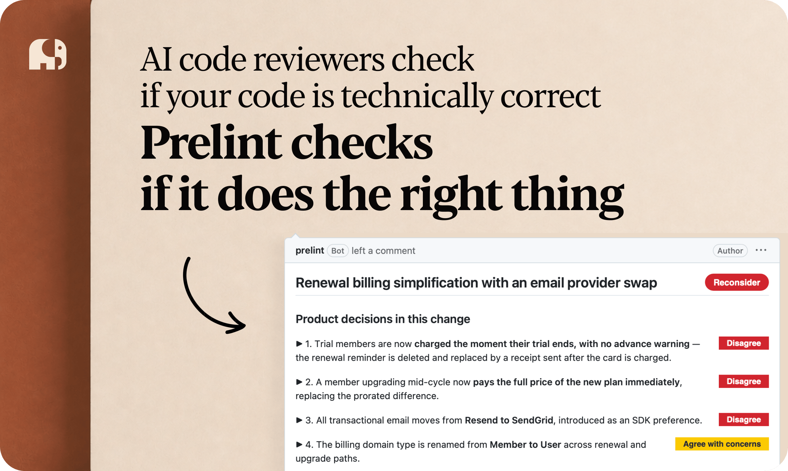
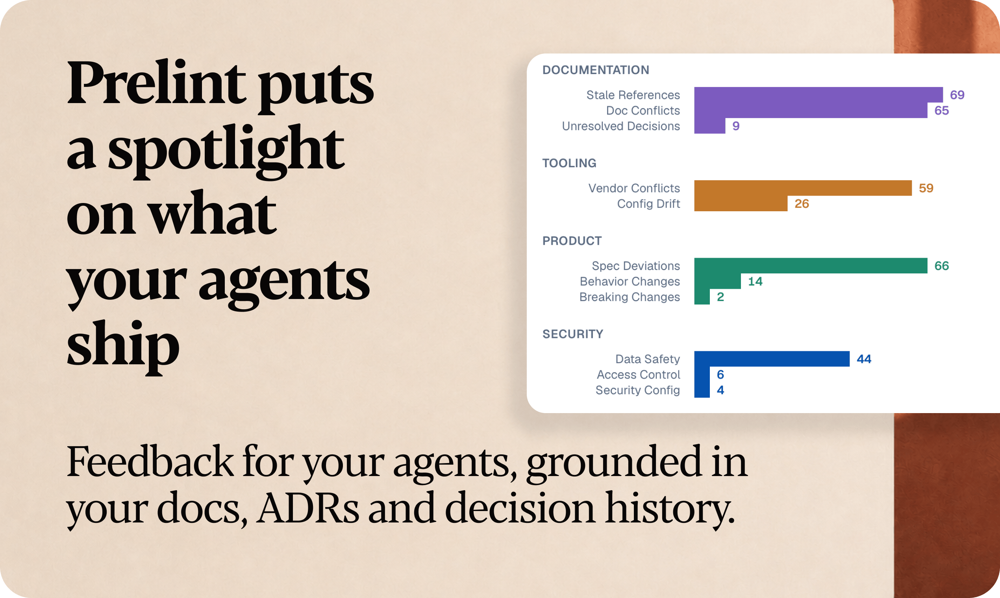
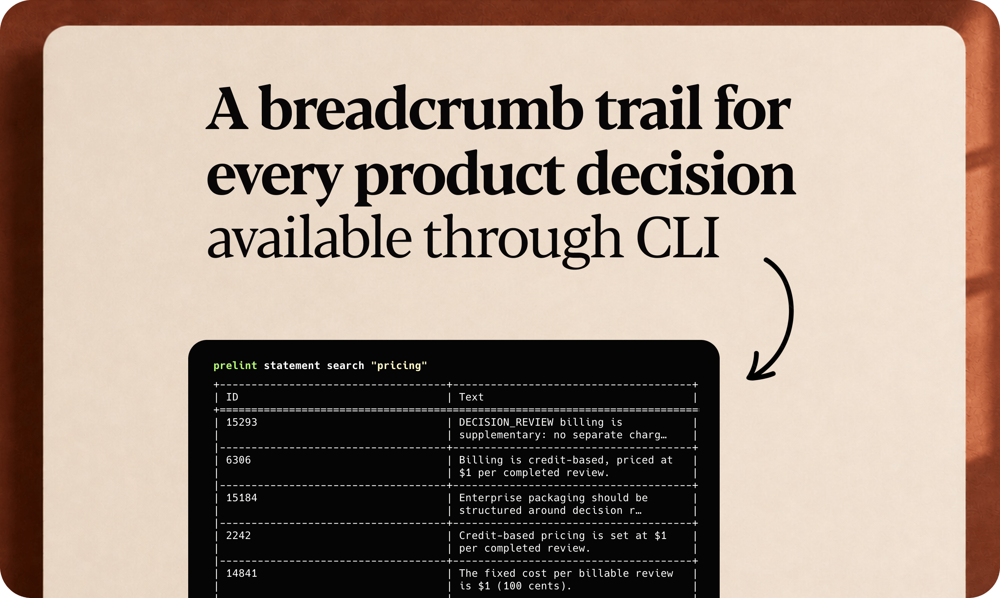

### 🎬 관련 영상
- [🎥 영상 보기](https://ph-files.imgix.net/a1585687-af71-4e6a-addf-66453fb07920.jpeg?auto=format)

---

## 2. [SoundGate Guitar](https://www.producthunt.com/products/soundgate-guitar-app)
**Votes**: 332 | **도입 난이도**: 하 | **신뢰도**: 상
**Tagline**: AI Music Tutor that gives real-time feedback on your playing
**서비스 링크**: https://www.producthunt.com/r/MMIYN6ZQTIOL72

**태그**: AI, Music, Education, Practice, AI Tool

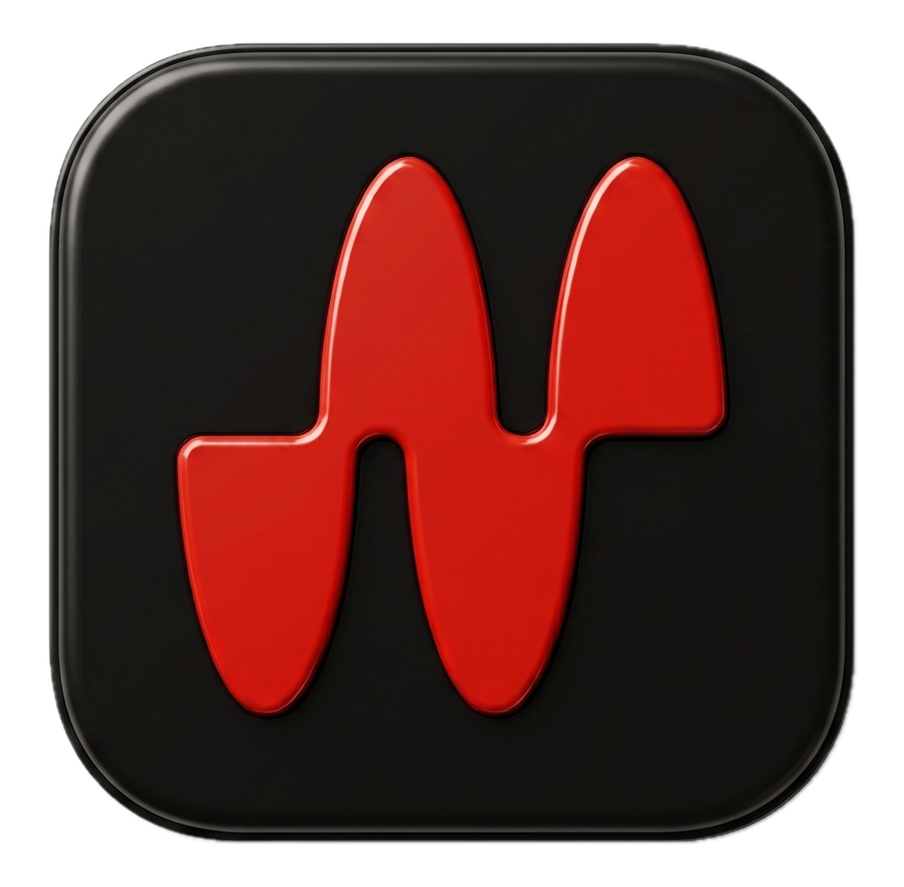

### 📌 이 서비스 한눈에 보기
실시간 피드백과 AI 튜터링을 제공하는 지능형 기타 연습 파트너

### 🔑 주요 기능
- 지연 없는 실시간 음정 감지 및 인터랙티브 프렛보드 시각화
- AI 기반의 개인 맞춤형 연습 루틴 및 피드백 제공
- 연주 분석을 통한 질문 답변 및 학습 가이드

### 🙋 사용자에게 어떤 점이 좋은가
전문 강사 없이도 실시간으로 연주를 교정받으며 효율적인 독학이 가능합니다.

### ✅ 지금 바로 써볼 기능
- 실시간 프렛보드 피드백 기능 테스트
- AI 맞춤형 연습 루틴 생성해보기
- 연주 분석을 통한 질문 기능 활용하기

### ⚠️ 사용 전 확인할 점
- 하드웨어(마이크/오디오 인터페이스) 환경에 따른 감지 정확도 차이 가능성
- 실시간 피드백의 지연 시간(Latency) 체감도 확인 필요

### 🧭 확인이 더 필요한 정보
지원하는 악기 종류(베이스, 일렉 등)와 구체적인 하드웨어 요구 사양에 대한 정보가 필요합니다.

### 📸 스크린샷 및 갤러리
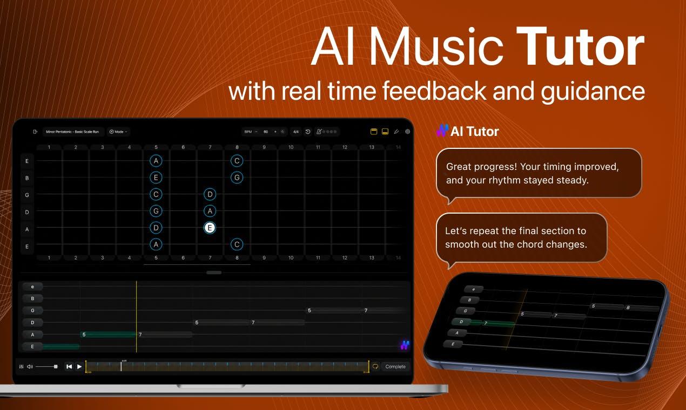

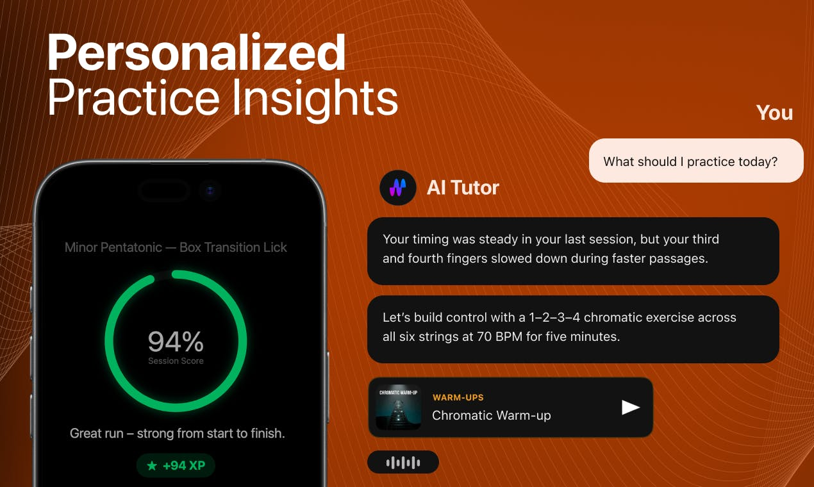

### 🎬 관련 영상
- [🎥 영상 보기](https://ph-files.imgix.net/310b4d87-3bd0-4c4f-903f-d823f4d6cf6b.jpeg?auto=format)

---

## 3. [Denovo](https://www.producthunt.com/products/denovo-business-manager)
**Votes**: 251 | **도입 난이도**: 하 | **신뢰도**: 상
**Tagline**: Turn your vibe-coded app into paying customers
**서비스 링크**: https://www.producthunt.com/r/N632XKIQZO65KB

**태그**: SaaS, Marketing Automation, NoCode, Growth Hacking, AI Tool, DevTool, Email

### 📌 이 서비스 한눈에 보기
아이디어 단계의 앱을 즉시 수익 창출이 가능한 비즈니스로 전환해주는 자동화 엔진

### 🔑 주요 기능
- Stripe 결제가 연동된 즉시 전환 가능한 웹사이트 구축
- 1억 명 규모의 리드 대상 이메일 발송 및 Meta 광고 캠페인 자동화
- 비즈니스 현황 분석 및 다음 단계 제안을 제공하는 AI 엔진

### 🙋 사용자에게 어떤 점이 좋은가
개발에만 집중하느라 고객 확보에 어려움을 겪는 1인 개발자나 창업자가 마케팅과 결제 시스템 구축 시간을 획기적으로 줄일 수 있습니다.

### ✅ 지금 바로 써볼 기능
- Stripe 연동된 웹사이트 생성하기
- 자동화된 이메일 및 광고 캠페인 설정하기
- AI에게 비즈니스 현황 및 다음 단계 질문하기

### ⚠️ 사용 전 확인할 점
- 자동화된 광고 및 이메일 발송으로 인한 스팸 분류 위험성 확인 필요
- 사용자 맞춤형 브랜드 아이덴티티 구현의 한계 가능성

### 🧭 확인이 더 필요한 정보
제공되는 1억 명의 리드 데이터의 품질과 타겟팅 정확도를 확인해야 합니다.

### 📸 스크린샷 및 갤러리

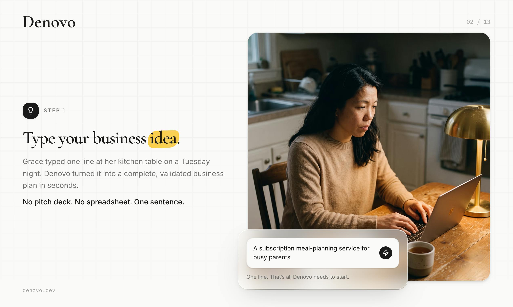

### 🎬 관련 영상
- [🎥 영상 보기](https://ph-files.imgix.net/ad0e13c6-a755-4a4c-911d-bc329923d9ff.jpeg?auto=format)

---

## 4. [/mission for Claude Code](https://www.producthunt.com/products/spine-2)
**Votes**: 229 | **도입 난이도**: 중 | **신뢰도**: 상
**Tagline**: Give Claude Code missions to spawn a team of agents
**서비스 링크**: https://www.producthunt.com/r/P3XBZI4J2DWVBF

**태그**: DevTool, AI-Agents, Automation, ClaudeCode, Agent

### 📌 이 서비스 한눈에 보기
Claude Code를 활용해 복잡한 작업을 멀티 에이전트 팀으로 자동화하는 플러그인

### 🔑 주요 기능
- /mission 명령어로 단일 세션을 넘어선 복잡한 작업 수행
- Claude Code와 Codex 워커 간의 협업 및 결과 시각화(Live Graph)
- OpenRouter를 통한 다양한 LLM(Kimi, GLum 등) 지원

### 🙋 사용자에게 어떤 점이 좋은가
단일 세션의 한계를 넘어, 목표 중심의 에이전트 팀을 구성하여 대규모 개발 작업을 체계적으로 관리할 수 있습니다.

### ✅ 지금 바로 써볼 기능
- /mission 명령어로 작업 목표 설정하기
- OpenRouter를 통한 외부 모델 연결하기
- 생성된 워커들의 작업 결과 검토하기

### ⚠️ 사용 전 확인할 점
- BYOK(Bring Your Own Key) 방식이므로 모델 사용 비용이 별도로 발생함
- 멀티 에이전트 실행 시 복잡한 작업 흐름에 대한 사용자 검토가 필수적임

### 🧭 확인이 더 필요한 정보
사용자의 API 키 설정 및 환경 구축 방식에 따른 초기 설정 난이도가 명시되지 않았습니다.

### 📸 스크린샷 및 갤러리
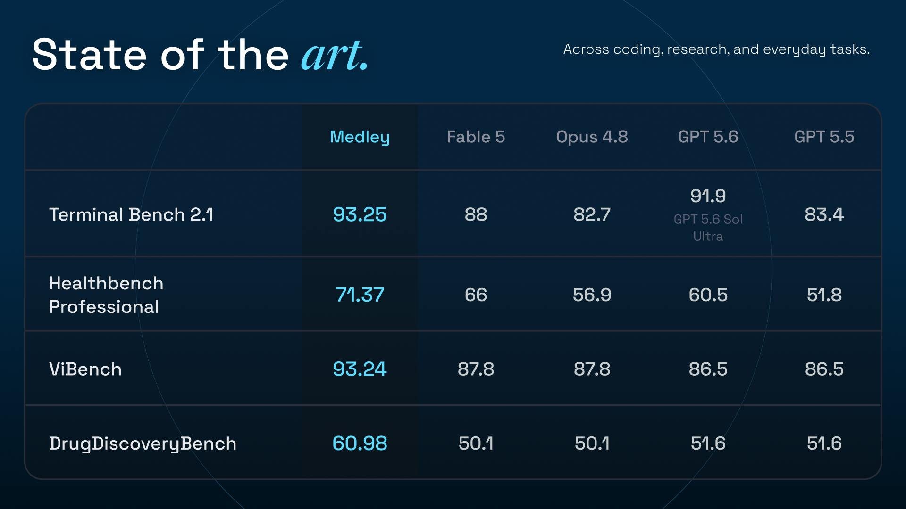
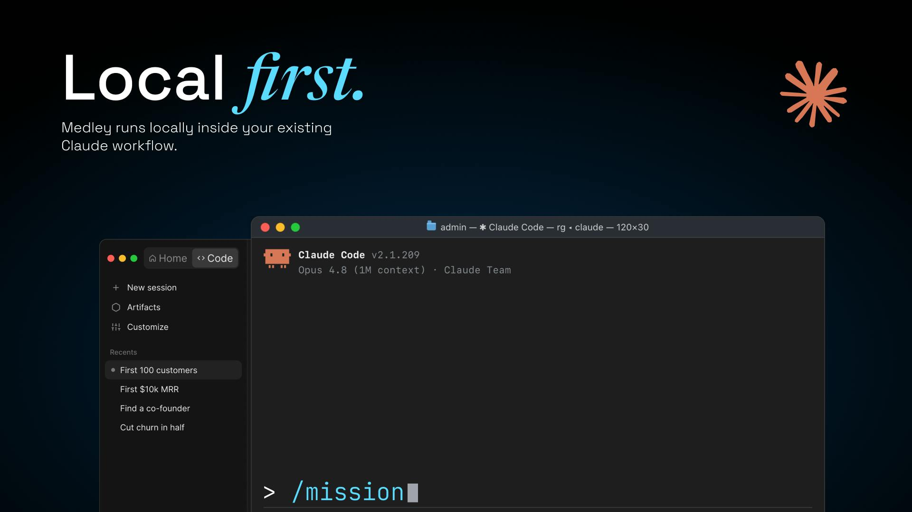
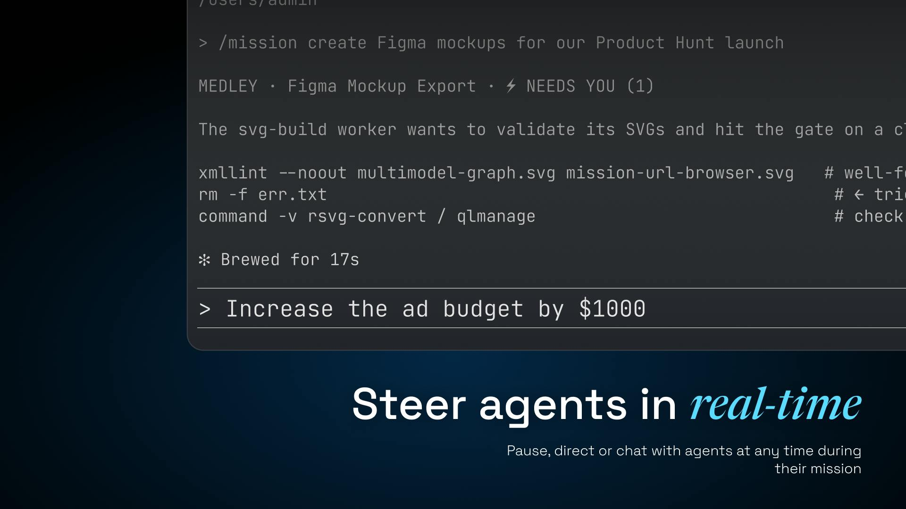

### 🎬 관련 영상
- [🎥 영상 보기](https://ph-files.imgix.net/95c6668c-58ff-42ea-bb47-985a9fda4e7c.jpeg?auto=format)

---

## 5. [ClinicFrame ](https://www.producthunt.com/products/clinic-scribe-clinicframe)
**Votes**: 176 | **도입 난이도**: 하 | **신뢰도**: 상
**Tagline**: Like Granola, but for healthcare. Fully HIPAA-compliant.
**서비스 링크**: https://www.producthunt.com/r/DBV5VMI6JYIDKZ

**태그**: AI, Healthcare, Automation, Productivity, AI Tool

### 📌 이 서비스 한눈에 보기
환자 진료에만 집중할 수 있도록 실시간으로 임상 노트를 작성하는 AI 의료 기록 자동화 도구

### 🔑 주요 기능
- 실시간 앰비언트(Ambient) AI 스크라이브 기술로 대화 내용을 즉시 기록
- 대면 및 화상 진료 모두 지원하며 종료 즉시 구조화된 노트 생성
- HIPAA 준수 및 데스크톱 네이티브 환경 제공

### 🙋 사용자에게 어떤 점이 좋은가
의료진이 수기 기록 업무에서 벗어나 환자와의 상호작용에 더 집중할 수 있게 하며, 진료 직후 즉시 EHR(전자건강기록)에 활용 가능한 노트를 제공합니다.

### ✅ 지금 바로 써볼 기능
- Scribe 기능을 통한 실시간 진료 기록 생성 테스트
- 생성된 임상 노트의 구조 및 정확도 검토
- 기존 EHR 시스템과의 연동 가능성 확인

### ⚠️ 사용 전 확인할 점
- AI가 생성한 기록의 의학적 정확성에 대한 최종 검토 필요
- 현재는 문서화 중심이며 향후 전체 워크플로우 통합 단계 확인 필요

### 🧭 확인이 더 필요한 정보
현재 제공되는 EHR 시스템과의 구체적인 연동 방식과 자동화 수준에 대한 상세 정보가 필요합니다.

### 📸 스크린샷 및 갤러리

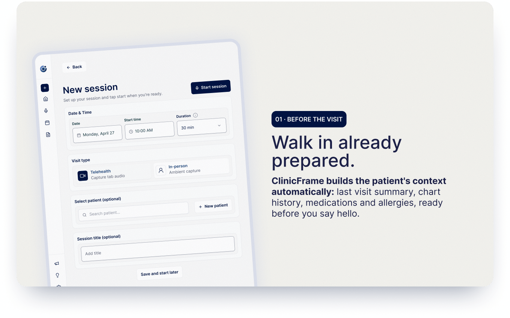
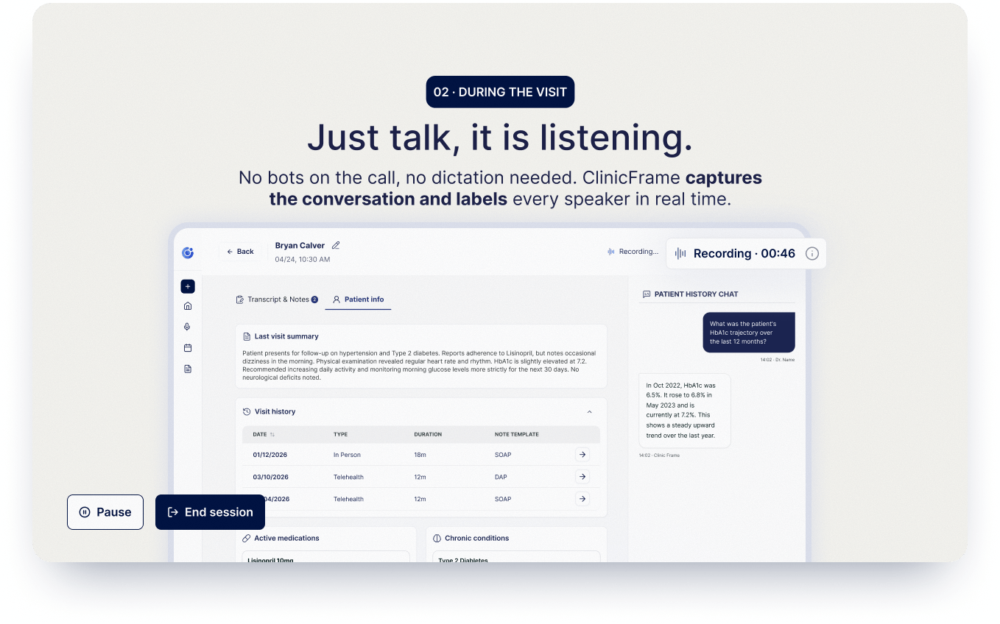

### 🎬 관련 영상
- [🎥 영상 보기](https://ph-files.imgix.net/0377ae2f-0bae-4a29-8148-805a6379082c.jpeg?auto=format)

---

## 6. [MemoryCustodian](https://www.producthunt.com/products/memorycustodian)
**Votes**: 144 | **도입 난이도**: 하 | **신뢰도**: 상
**Tagline**: Repo-native memory for coding agents
**서비스 링크**: https://www.producthunt.com/r/LSQNKPD3PHT2KG

**태그**: DevTool, AI-Agent, OpenSource, Productivity, Agent, AI Tool, Prompting

### 📌 이 서비스 한눈에 보기
코드 저장소 내에 Markdown 형태로 프로젝트 맥락을 관리하여 코딩 에이전트의 기억력을 높이는 도구

### 🔑 주요 기능
- 호스팅 서비스 없이 로컬/저장소 기반의 영구적인 프로젝트 메모리 제공
- 결정 사항, 제약 조건, 거부된 접근 방식 등을 코드처럼 버전 관리 및 공유 가능
- 태스크에 필요한 메모리만 로드하여 프롬프트 토큰 낭비 방지

### 🙋 사용자에게 어떤 점이 좋은가
에이전트에게 매번 방대한 컨텍스트를 전달할 필요 없이, 필요한 정보만 효율적으로 제공하여 비용을 절감하고 작업 정확도를 높일 수 있습니다.

### ✅ 지금 바로 써볼 기능
- 기존 프로젝트의 주요 결정 사항을 Markdown 파일로 기록하기
- 사용 중인 코딩 에이전트에 MemoryCustodian 매니페스트 연결하기
- 에이전트가 작업 시 필요한 컨텍스트가 적절히 로드되는지 확인하기

### ⚠️ 사용 전 확인할 점
- 메모리 파일이 저장소에 직접 포함되므로 보안상 민감한 정보가 포함되지 않도록 주의 필요
- 에이전트가 매니페스트를 올바르게 해석하고 로드하는지에 따라 성능 차이 발생 가능

### 🧭 확인이 더 필요한 정보
사용 중인 특정 코딩 에이전트 환경에서의 구체적인 통합 방식과 자동화 수준은 추가 확인이 필요합니다.

### 📸 스크린샷 및 갤러리
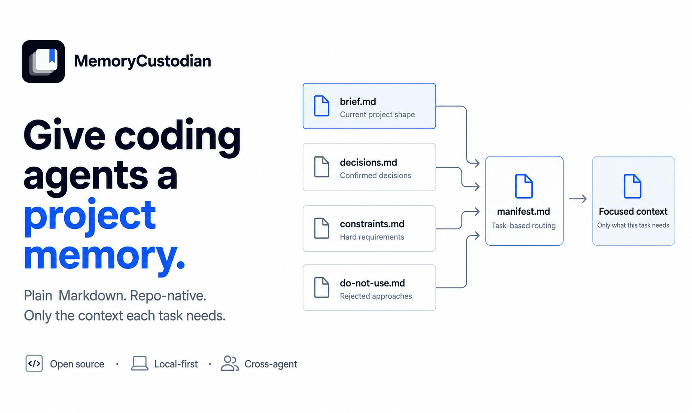
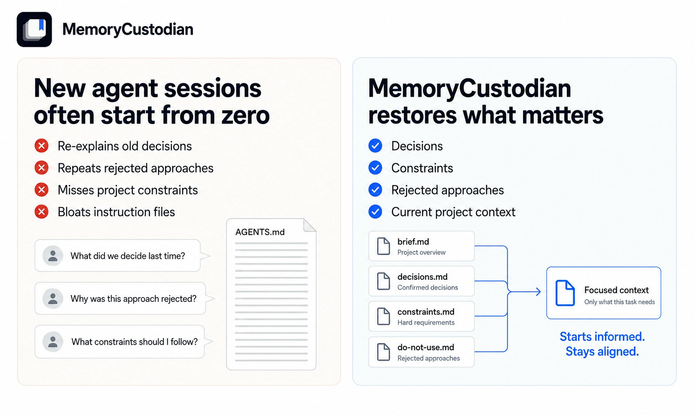
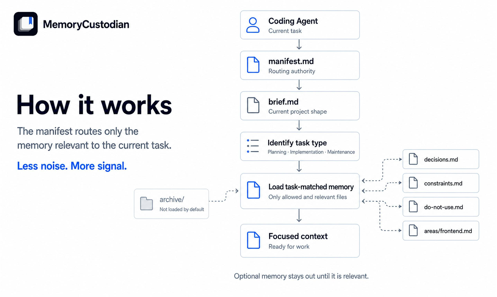

### 🎬 관련 영상
- [🎥 영상 보기](https://ph-files.imgix.net/c35219f4-c613-4023-a0e0-0cf6d81ea205.jpeg?auto=format)

---

## 7. [Totem](https://www.producthunt.com/products/totem-5)
**Votes**: 131 | **도입 난이도**: 하 | **신뢰도**: 상
**Tagline**: Your Twitter bookmarks organized to make you read them
**서비스 링크**: https://www.producthunt.com/r/XYVSXCXMI3M4QN

**태그**: Productivity, ContentCuration, X-Tool, AI Tool

### 📌 이 서비스 한눈에 보기
X(트위터) 북마크를 읽기 좋은 콘텐츠로 변환해주는 정리 도구

### 🔑 주요 기능
- X 북마크를 Substack 스타일의 깔끔한 읽기 환경으로 변환
- 전체 화면 모드 및 중요 내용 하이라이트 기능 제공
- 저장된 북마크 내 검색 및 데이터 내보내기 지원

### 🙋 사용자에게 어떤 점이 좋은가
저장만 하고 읽지 않는 트위터 북마크를 체계적으로 관리하고, 집중력 있는 독서 환경을 제공합니다.

### ✅ 지금 바로 써볼 기능
- X 북마크를 Totem으로 가져오기
- 전체 화면 모드로 스레드 읽기
- 중요한 문구 하이라이트 및 저장

### ⚠️ 사용 전 확인할 점
- X 계정 연동 및 데이터 접근 권한 확인 필요
- 북마크 양에 따른 동기화 속도 확인 필요

### 🧭 확인이 더 필요한 정보
X(트위터) API 정책 변화에 따른 데이터 연동 안정성을 확인해야 합니다.

### 📸 스크린샷 및 갤러리
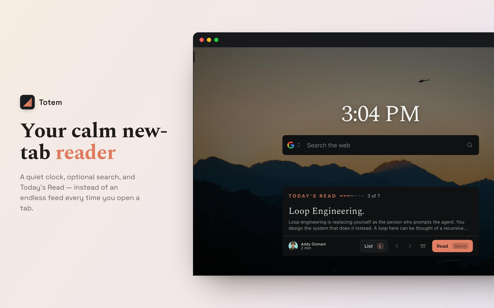
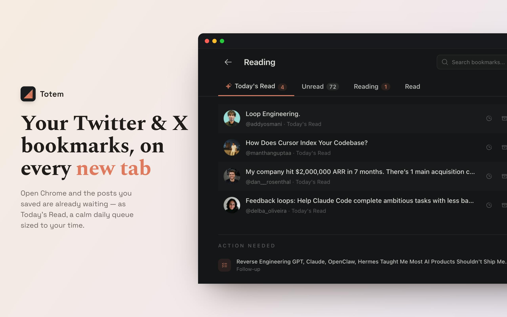
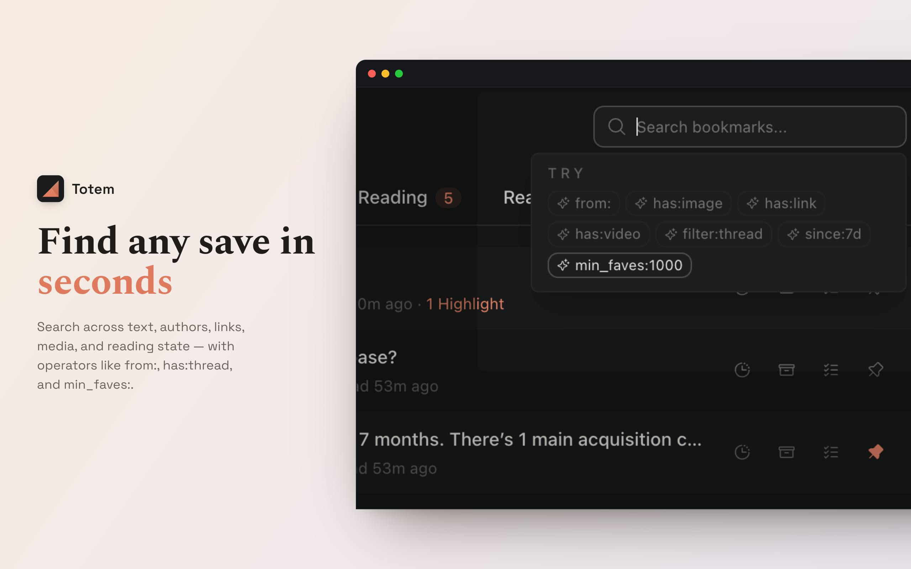

---

## 8. [Bo AI](https://www.producthunt.com/products/bo-ai)
**Votes**: 129 | **도입 난이도**: 하 | **신뢰도**: 상
**Tagline**: An AI personal assistant that lives in your texts 💬
**서비스 링크**: https://www.producthunt.com/r/HKCHIY3OYYT4LW

**태그**: AI Assistant, Productivity, Messaging, Lifestyle, AI Tool

### 📌 이 서비스 한눈에 보기
문자 메시지 안에서 모든 일상을 관리하는 AI 개인 비서

### 🔑 주요 기능
- 텍스트 메시지 기반의 간편한 AI 인터페이스
- 일정 관리, 시간 절약, 건강 관리 등 일상적 과업 수행
- 별도의 앱 설치 없이 대화만으로 작동하는 접근성

### 🙋 사용자에게 어떤 점이 좋은가
새로운 앱을 배우거나 복잡한 UI를 익힐 필요 없이, 평소 사용하는 문자 메시지를 통해 즉각적인 도움을 받을 수 있습니다.

### ✅ 지금 바로 써볼 기능
- 문자 메시지로 질문 던져보기
- 일정 및 할 일 관리 요청하기
- 일상적인 정보 검색 및 답변 받기

### ⚠️ 사용 전 확인할 점
- 개인적인 메시지 내용이 AI 서비스에 전달됨에 따른 프라이버시 고려 필요
- 텍스트 기반 인터페이스로 인한 복잡한 작업 수행의 한계

### 🧭 확인이 더 필요한 정보
사용되는 메시징 플랫폼(SMS, WhatsApp 등)의 종류와 데이터 보안 정책에 대한 상세 정보가 필요합니다.

### 📸 스크린샷 및 갤러리

### 🎬 관련 영상
- [🎥 영상 보기](https://ph-files.imgix.net/54c26258-29d9-4e3d-b042-5f585d58ac96.jpeg?auto=format)

---

## 9. [Task Monki](https://www.producthunt.com/products/task-monki)
**Votes**: 114 | **도입 난이도**: 중 | **신뢰도**: 상
**Tagline**: Run coding agents through the full development process
**서비스 링크**: https://www.producthunt.com/r/B5PN6WZY5KMHXV

**태그**: DevTool, AI-Agent, Automation, OpenSource, Agent, AI Tool

### 📌 이 서비스 한눈에 보기
태스크 관리부터 PR까지, 코딩 에이전트의 전체 개발 프로세스를 자동화하는 오픈소스 데스크톱 앱

### 🔑 주요 기능
- 태스크부터 풀 리퀘스트(PR)까지 이어지는 에이전트 워크플로우 관리
- 서비스/컨테이너 설정 없이도 에이전트의 작업 결과물 즉시 프리뷰
- 에이전트 간 상호 리뷰, 토론 및 접근 방식 비교 기능

### 🙋 사용자에게 어떤 점이 좋은가
여러 코딩 에이전트를 동시에 실행하고 관리할 수 있어, 개발 프로세스의 자동화 수준을 높이고 수동 설정 번거로움을 줄여줍니다.

### ✅ 지금 바로 써볼 기능
- 여러 에이전트를 동시에 실행하여 병렬 작업 수행하기
- 에이전트 간 토론 기능을 통해 코드 리뷰 및 가설 검증하기
- 설정 없이 결과물을 즉시 확인하는 프리뷰 기능 활용하기

### ⚠️ 사용 전 확인할 점
- 데스크톱 앱 형태이므로 로컬 환경 리소스 사용량 확인 필요
- 에이전트 간 상호작용 시 발생할 수 있는 결과물의 신뢰성 검토 필요

### 🧭 확인이 더 필요한 정보
로컬 환경의 특정 개발 스택이나 컨테이너 환경과의 호환성 세부 사항을 확인해야 합니다.

### 📸 스크린샷 및 갤러리
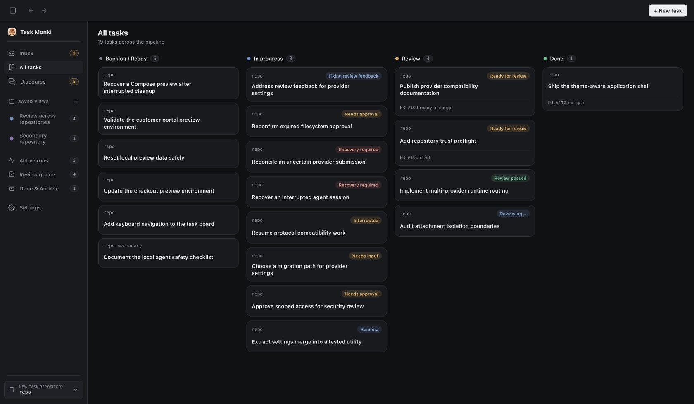
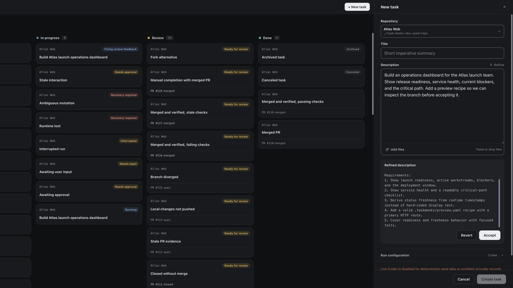
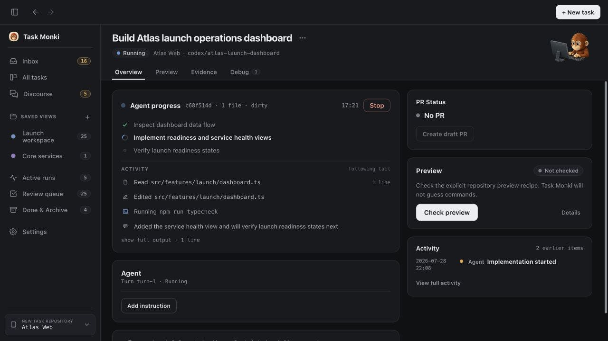

### 🎬 관련 영상
- [🎥 영상 보기](https://ph-files.imgix.net/19d1e9c3-b0b5-4310-82a2-2ca2ba0abc13.jpeg?auto=format)

---

## 10. [Epilude](https://www.producthunt.com/products/epilude)
**Votes**: 105 | **도입 난이도**: 하 | **신뢰도**: 상
**Tagline**: Local voice dictation for Mac for polished text
**서비스 링크**: https://www.producthunt.com/r/XZIOEFUXHF6U5X

**태그**: Productivity, Mac, AI, Voice-to-Text, Privacy

### 📌 이 서비스 한눈에 보기
어떤 앱에서도 즉시 정제된 텍스트를 입력할 수 있는 맥용 온디바이스 음성 받아쓰기 도구

### 🔑 주요 기능
- 단축키를 이용한 간편한 음성 입력 및 즉각적인 텍스트 삽입
- 단순 전사를 넘어 문장 부호 삽입, 문장 정제 및 톤 조절 기능 제공
- 로컬(On-device) 실행 방식으로 개인정보 및 음성 데이터 보안 강화

### 🙋 사용자에게 어떤 점이 좋은가
메모나 메신저 등 어떤 앱을 사용하든 별도의 복사-붙여넣기 과정 없이 자연스러운 문장으로 즉시 입력할 수 있어 작업 흐름이 끊기지 않습니다.

### ✅ 지금 바로 써볼 기능
- 단축키를 설정하여 말하기와 입력 흐름 테스트하기
- 다양한 앱(메모, 메일, 슬랙 등)에서의 입력 호환성 확인하기
- 사용자 말투에 맞춘 톤 조절 기능 최적화하기

### ⚠️ 사용 전 확인할 점
- 로컬 실행 환경에서의 하드웨어 리소스 점유율 확인 필요
- 음성 인식 정확도가 주변 소음 환경에 따라 달라질 수 있음

### 🧭 확인이 더 필요한 정보
정확한 하드웨어 사양 요구사항과 지원하는 언어 범위에 대한 정보가 명시되지 않았습니다.

### 📸 스크린샷 및 갤러리
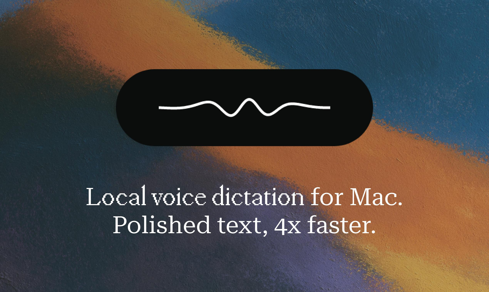
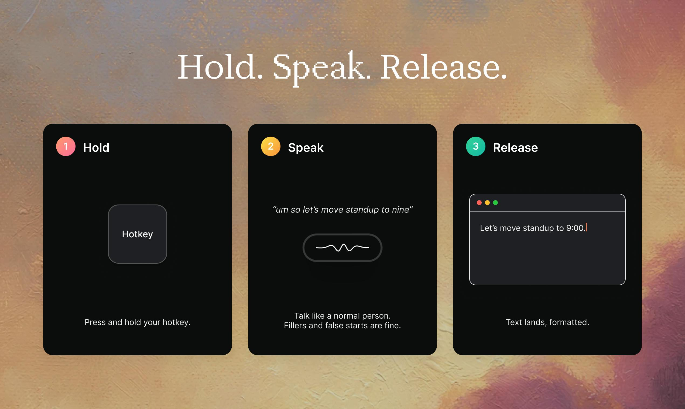
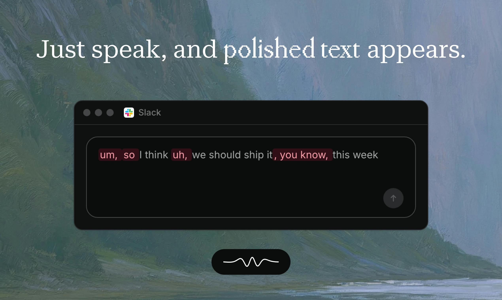

---

## 11. [BlackFlare](https://www.producthunt.com/products/blackflare)
**Votes**: 94 | **도입 난이도**: 하 | **신뢰도**: 상
**Tagline**: Mission control for Claude Code & Codex in your menu bar
**서비스 링크**: https://www.producthunt.com/r/SEEAWEYLO7NGXO

**태그**: DevTool, macOS, Productivity, AI

### 📌 이 서비스 한눈에 보기
Claude Code와 Codex 사용자를 위한 macOS 메뉴 바 전용 미션 컨트롤 앱

### 🔑 주요 기능
- Claude Code 및 Codex 작업 중 Mac 절전 모드 방지
- 세션 완료 또는 사용자 개입 필요 시 실시간 알림 제공
- 메뉴 바에서 기본 설정 변경 및 플랜 사용량 모니터링

### 🙋 사용자에게 어떤 점이 좋은가
터미널 작업 중 Mac이 잠자기 모드로 전환되는 것을 막고, 작업 완료 여부를 즉시 확인할 수 있어 개발 워크플로우의 흐름을 유지해 줍니다.

### ✅ 지금 바로 써볼 기능
- 메뉴 바에 고정하여 작업 상태 모니터링하기
- 세션 완료 알림 설정하여 작업 효율 높이기
- 플랜 사용량 실시간 확인하기

### ⚠️ 사용 전 확인할 점
- macOS 전용 앱이므로 다른 OS에서는 사용 불가
- Claude Code 및 Codex 환경이 구축되어 있어야 함

### 🧭 확인이 더 필요한 정보
상세한 플랜 사용량 데이터가 API를 통해 제공되는지 혹은 로컬 로그 기반인지 확인이 필요합니다.

### 📸 스크린샷 및 갤러리
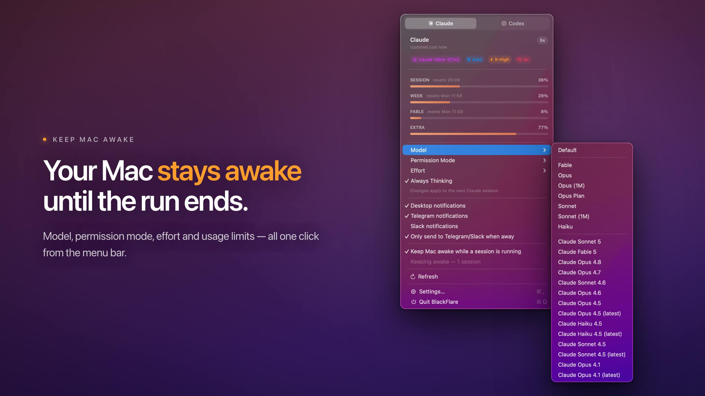
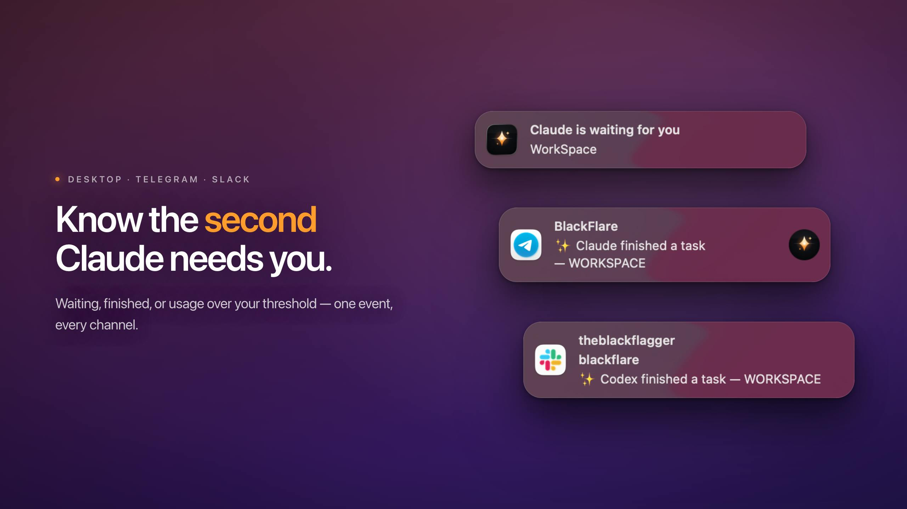

### 🎬 관련 영상
- [🎥 영상 보기](https://ph-files.imgix.net/a742e3fc-3ae0-4622-93d7-807605490326.jpeg?auto=format)

---

## 12. [AgentQuartz](https://www.producthunt.com/products/agentquartz)
**Votes**: 92 | **도입 난이도**: 하 | **신뢰도**: 상
**Tagline**: Claude & Cursor usage in your macOS menu bar
**서비스 링크**: https://www.producthunt.com/r/YFD3NA35SJXTLA

**태그**: DevTool, Productivity, macOS, AI-Tools, Agent

### 📌 이 서비스 한눈에 보기
Claude와 Cursor 사용량을 macOS 메뉴 바에서 실시간으로 확인하는 로컬 우선 도구

### 🔑 주요 기능
- 브라우저 탭을 열지 않고도 Claude 및 Cursor 사용 제한(Limits)을 즉시 확인 가능
- 클라우드 계정 없이 로컬 환경에서 동작하여 개인정보 및 설정 보안 유지
- 필수 기능은 평생 무료이며, 트레이 커스텀을 위한 일회성 Pro 버전 제공

### 🙋 사용자에게 어떤 점이 좋은가
AI 도구 사용 시 매번 브라우저를 확인해야 하는 번거로움을 줄여 작업 흐름을 끊김 없이 유지할 수 있습니다.

### ✅ 지금 바로 써볼 기능
- 메뉴 바에 설치하여 실시간 사용량 모니터링하기
- 무료 버전으로 기본 사용량 확인 기능 테스트하기
- 커스텀 기능이 필요할 경우 Pro 버전 검토하기

### ⚠️ 사용 전 확인할 점
- 공식 도구가 아닌 비공식(Unofficial) 앱이므로 서비스 정책 변경에 영향을 받을 수 있음
- macOS 전용 도구임

### 🧭 확인이 더 필요한 정보
비공식 앱이므로 Claude나 Cursor의 API/UI 변경 시 기능 작동 여부가 달라질 수 있습니다.

### 📸 스크린샷 및 갤러리
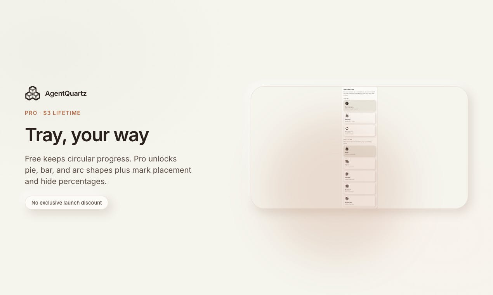
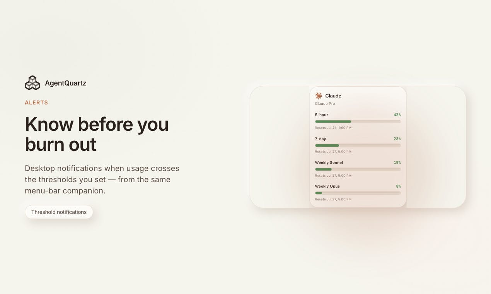
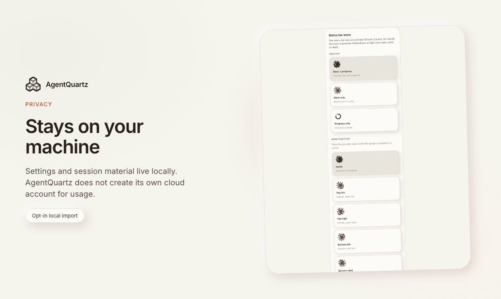

---

## 13. [Vela](https://www.producthunt.com/products/vela-4)
**Votes**: 89 | **도입 난이도**: 하 | **신뢰도**: 상
**Tagline**: The AI Recruiting Coordinator
**서비스 링크**: https://www.producthunt.com/r/PG7LUDNHC7AGDO

**태그**: AI, Recruiting, Automation, Productivity, AI Tool, Email

### 📌 이 서비스 한눈에 보기
이메일에 참조만 하면 채용 일정 조율부터 피드백 수집까지 알아서 처리하는 AI 채용 코디네이터

### 🔑 주요 기능
- 이메일 참조(Cc)만으로 작동하는 간편한 워크플로우
- 면접 일정 조율, 리스케줄링, 후보자 추적 및 피드백 수집 자동화
- 이메일, SMS, WhatsApp, Slack 등 다양한 채널 지원 및 24/7 가동

### 🙋 사용자에게 어떤 점이 좋은가
별도의 로그인이나 새로운 툴 학습 없이 기존 이메일 환경에서 채용 운영 업무를 자동화하여 리크루터의 시간을 확보해 줍니다.

### ✅ 지금 바로 써볼 기능
- 이메일 스레드에 Vela를 Cc로 추가하여 자동화 시작하기
- 면접 일정 조율 및 후보자 팔로업 자동화 설정하기
- 다양한 커뮤니케이션 채널(Slack, WhatsApp 등) 연동하기

### ⚠️ 사용 전 확인할 점
- 이메일 기반 자동화이므로 기존 이메일 보안 정책과의 호환성 확인 필요
- AI가 후보자와 직접 소통하므로 최종 결정 전 인간의 검토가 필요할 수 있음

### 🧭 확인이 더 필요한 정보
기존 ATS(채용 관리 시스템)와의 직접적인 데이터 동기화 방식에 대한 상세 정보가 명시되지 않았습니다.

### 📸 스크린샷 및 갤러리

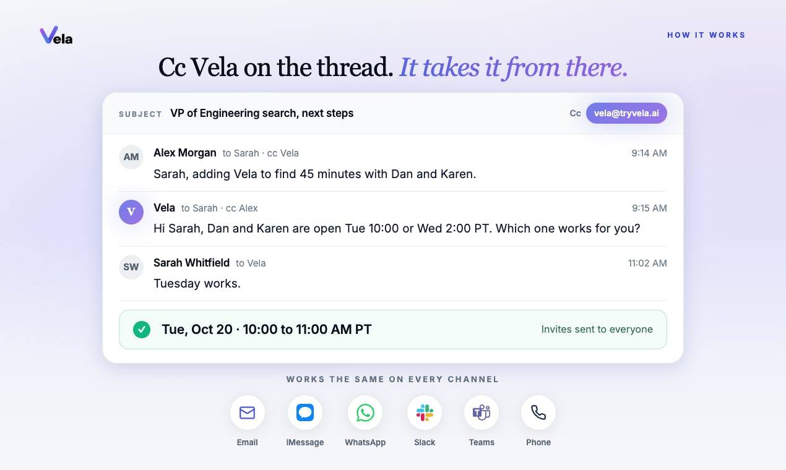
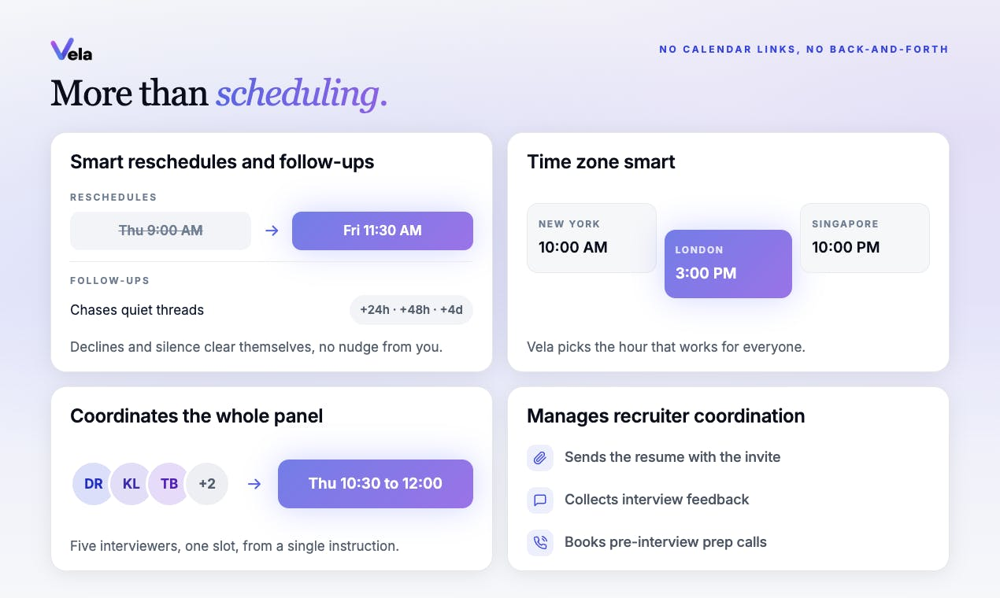

---

## 14. [SceneNote](https://www.producthunt.com/products/scenenote-free-video-feedback-tool)
**Votes**: 88 | **도입 난이도**: 하 | **신뢰도**: 상
**Tagline**: Free video feedback tool for editors & clients
**서비스 링크**: https://www.producthunt.com/r/GRTVHXLM4U4LY3

**태그**: VideoEditing, Collaboration, Productivity, Video

### 📌 이 서비스 한눈에 보기
계정 생성이나 영상 업로드 없이 링크만으로 즉시 피드백을 주고받는 영상 리뷰 도구

### 🔑 주요 기능
- 별도의 가입이나 영상 업로드 없이 YouTube, Vimeo, Dropbox 링크만으로 사용 가능
- 타임스탬프 댓글, 프레임 주석, 자동 전사 기능이 포함된 피드백 수집
- CSV 또는 EDL 내보내기를 통해 Premiere, Resolve, Final Cut과 연동 가능

### 🙋 사용자에게 어떤 점이 좋은가
리뷰어가 번거로운 가입 절차 없이 즉시 피드백을 남길 수 있어 협업 속도가 매우 빠릅니다. 또한 편집 툴로 피드백을 바로 가져올 수 있어 작업 흐름이 끊기지 않습니다.

### ✅ 지금 바로 써볼 기능
- 기존 영상 링크(YouTube/Vimeo 등)를 붙여넣어 피드백 환경 구축하기
- 프레임 위에 직접 주석을 그려 시각적 피드백 전달하기
- 수집된 피드백을 EDL로 내보내 편집 소프트웨어에 적용하기

### ⚠️ 사용 전 확인할 점
- 영상을 직접 호스팅하지 않으므로 원본 링크의 접근 권한이 유지되어야 함
- 링크 기반 방식이므로 대용량 파일 직접 관리 기능은 제한적일 수 있음

### 🧭 확인이 더 필요한 정보
링크 기반 방식이므로 외부 플랫폼(YouTube 등)의 보안 설정에 따라 피드백 수집이 제한될 수 있는지 확인이 필요합니다.

### 📸 스크린샷 및 갤러리
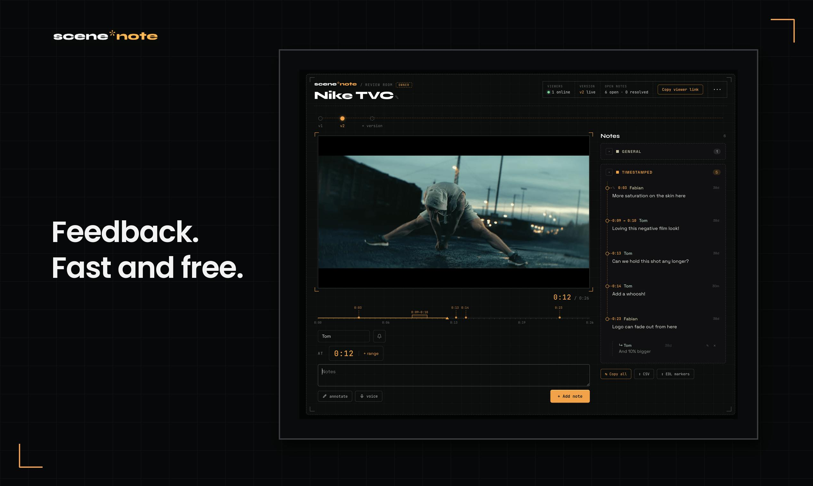
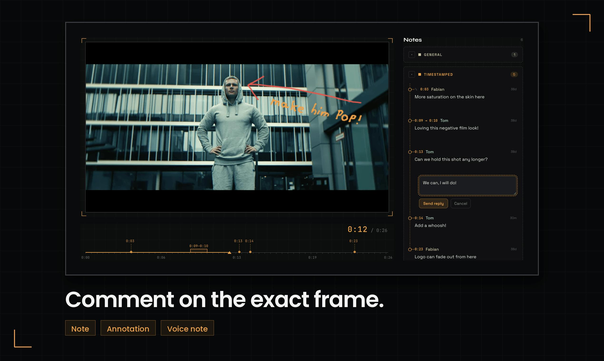
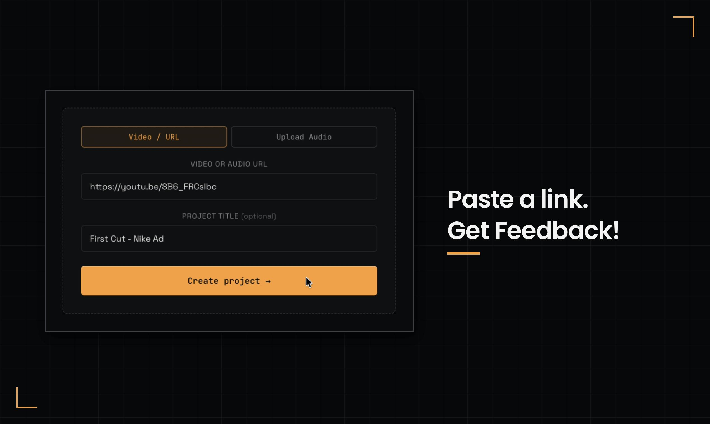

### 🎬 관련 영상
- [🎥 영상 보기](https://ph-files.imgix.net/14b49382-4ec6-4717-b322-ba6dea704945.jpeg?auto=format)

---

## 15. [EQK 3.0](https://www.producthunt.com/products/eqk-eq-with-ai)
**Votes**: 86 | **도입 난이도**: 하 | **신뢰도**: 상
**Tagline**: Mac app with dynamic AI Equaliser
**서비스 링크**: https://www.producthunt.com/r/S27YFAZOQBHMAW

**태그**: Audio, Mac, AI, Music, Productivity, AI Tool

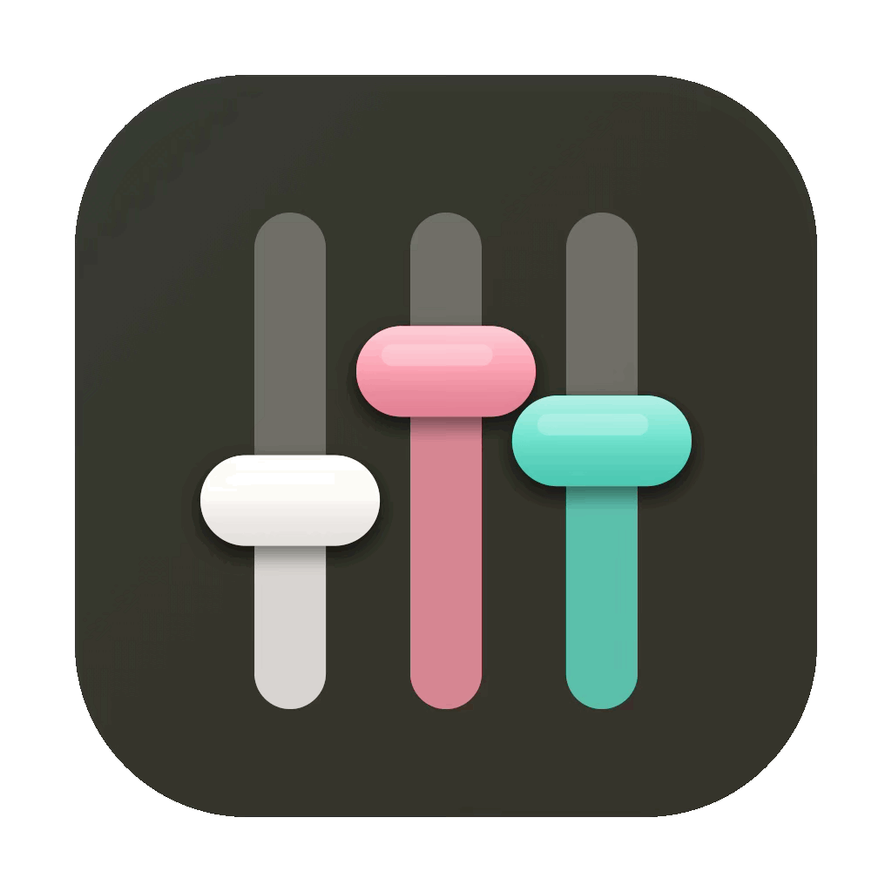

### 📌 이 서비스 한눈에 보기
실시간 AI로 모든 앱의 사운드를 최적화하는 맥 전용 네이티브 이퀄라이저

### 🔑 주요 기능
- 곡마다 실시간으로 튜닝되는 AI 기반 다이내믹 EQ
- 가상 드라이버 없이 macOS 네이티브 오디오 캡처 방식 사용
- 앱별 개별 EQ 설정 및 3,985개 이상의 헤드폰 프로필 지원

### 🙋 사용자에게 어떤 점이 좋은가
사용 중인 모든 앱에 개별적인 사운드 설정을 적용할 수 있으며, 별도의 가상 드라이버 설치 없이도 고음질 오디오 환경을 구축할 수 있습니다.

### ✅ 지금 바로 써볼 기능
- 사용 중인 헤드폰 모델에 맞는 AutoEq 프로필 적용하기
- 앱별로 다른 EQ 설정을 적용하여 맞춤형 사운드 환경 만들기
- 내장 FLAC 플레이어로 고음질 음원 감상하기

### ⚠️ 사용 전 확인할 점
- macOS 네이티브 캡처 방식이 모든 타사 앱과 완벽히 호환되는지 확인 필요
- 하드웨어 리소스 사용량(CPU/RAM)에 대한 구체적 정보 미비

### 🧭 확인이 더 필요한 정보
사용자의 macOS 버전 및 특정 하드웨어 환경에서의 안정성 확인이 필요합니다.

### 📸 스크린샷 및 갤러리
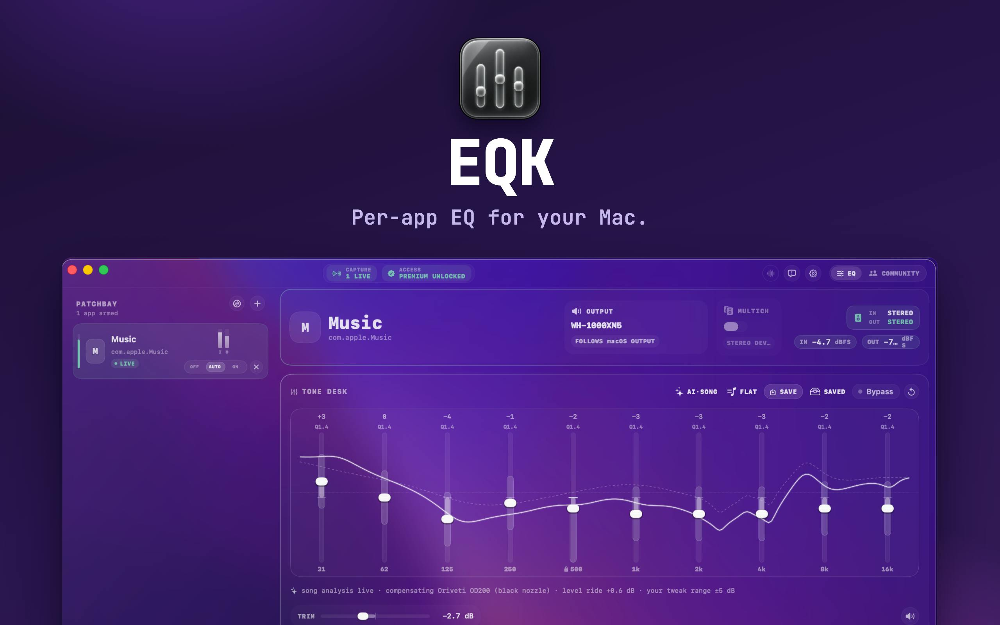
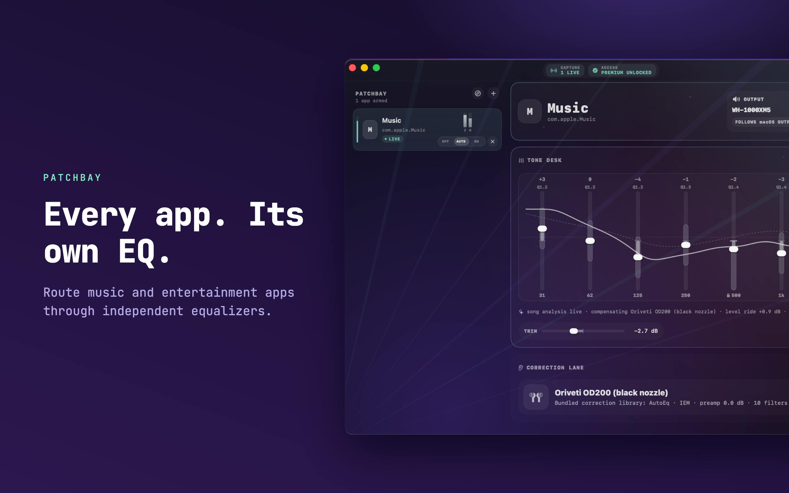
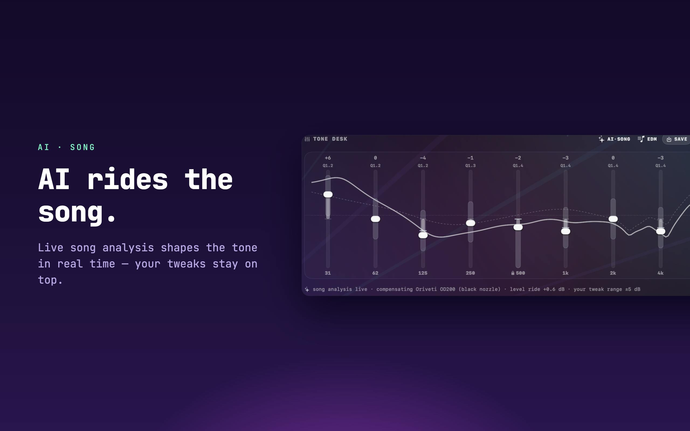

---

## 16. [JusTTY](https://www.producthunt.com/products/justty)
**Votes**: 83 | **도입 난이도**: 하 | **신뢰도**: 상
**Tagline**: A simple native macOS terminal built on Swift and libghostty
**서비스 링크**: https://www.producthunt.com/r/GGAALKSH272RON

**태그**: DevTool, macOS, Terminal, Minimalism, Design

### 📌 이 서비스 한눈에 보기
Swift와 libghostty 기반의 심플하고 직관적인 macOS 전용 네이티브 터미널

### 🔑 주요 기능
- Swift와 libghostty를 활용한 네이티브 macOS 환경 최적화
- 복잡한 기능 대신 일상적인 사용에 집중한 미니멀 디자인
- 불필요한 부가 기능(bells and whistles)을 배제한 깔끔한 사용자 경험

### 🙋 사용자에게 어떤 점이 좋은가
복잡한 설정 없이 빠르고 가벼운 터미널 환경을 원하는 macOS 사용자에게 적합합니다.

### ✅ 지금 바로 써볼 기능
- 기본적인 터미널 명령 실행 및 작업 흐름 확인
- macOS 시스템과의 네이티브 성능 및 디자인 조화 확인

### ⚠️ 사용 전 확인할 점
- 고급 사용자용 복잡한 기능이나 확장 기능이 부족할 수 있음
- 특수 목적의 파워 유저용 기능이 필요할 경우 부적합할 수 있음

### 🧭 확인이 더 필요한 정보
상세한 기능 목록과 커스텀 설정 지원 범위가 명시되지 않았습니다.

### 📸 스크린샷 및 갤러리
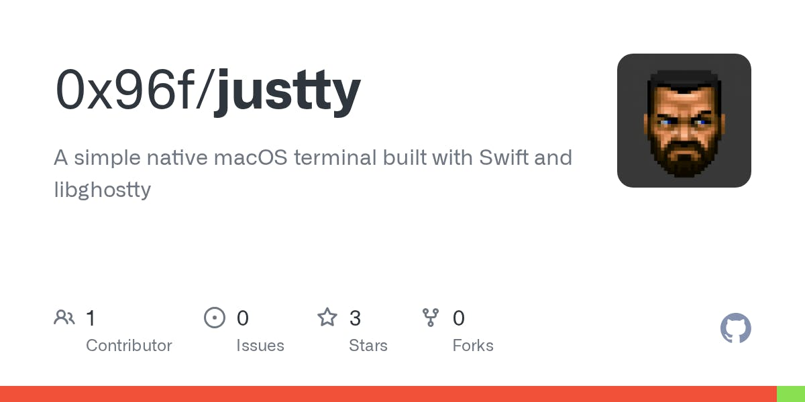
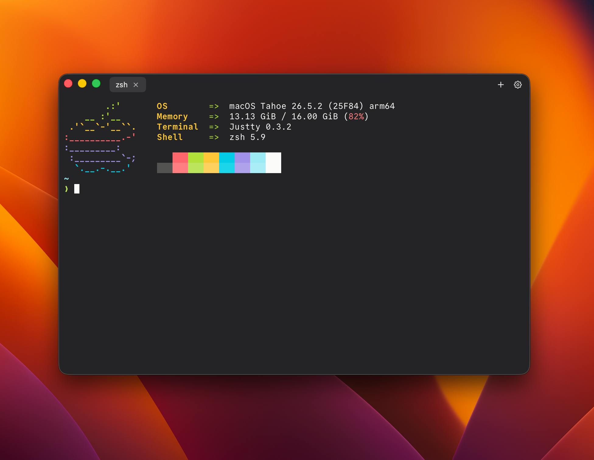
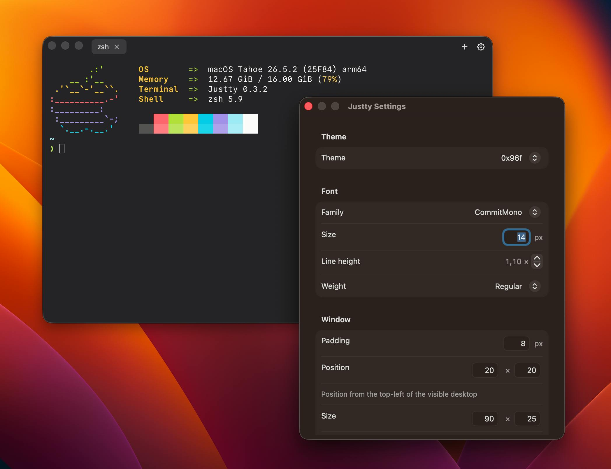

---

## 17. [CellCog](https://www.producthunt.com/products/cellcog)
**Votes**: 40 | **도입 난이도**: 중 | **신뢰도**: 상
**Tagline**: Hire AI employees that form teams and manage each other
**서비스 링크**: https://www.producthunt.com/r/GIDE6XV47GLRQI

**태그**: AI Agents, Automation, Productivity, Future of Work, Agent, AI Tool, Prompting

### 📌 이 서비스 한눈에 보기
프롬프트만으로 팀을 구성하고 서로 관리하는 자율형 AI 직원 고용 플랫폼

### 🔑 주요 기능
- 역할 정의를 통한 맞춤형 AI 직원 생성
- 인박스, 메모리, 교대 근무, 작업 보드를 갖춘 완전한 업무 환경
- AI 에이전트 간의 협업, 온보딩 및 자율적 관리 기능

### 🙋 사용자에게 어떤 점이 좋은가
복잡한 워크플로우를 수동으로 설계할 필요 없이, 프롬프트만으로 즉시 가동 가능한 가상 팀을 구축할 수 있습니다.

### ✅ 지금 바로 써볼 기능
- 필요한 직무 역할을 프롬프트로 정의하기
- AI 에이전트 간의 협업 워크플로우 테스트하기
- 생성된 AI 팀의 작업 보드 및 메모리 관리 확인하기

### ⚠️ 사용 전 확인할 점
- 자율적인 관리 기능이 실제 비즈니스 결과물로 이어지는지 검증 필요
- 에이전트 간의 상호작용 과정에서 발생할 수 있는 예기치 못한 동작 확인

### 🧭 확인이 더 필요한 정보
에이전트 간의 협업 및 관리 프로세스의 구체적인 제어 방식과 비용 구조에 대한 정보가 필요합니다.

### 📸 스크린샷 및 갤러리
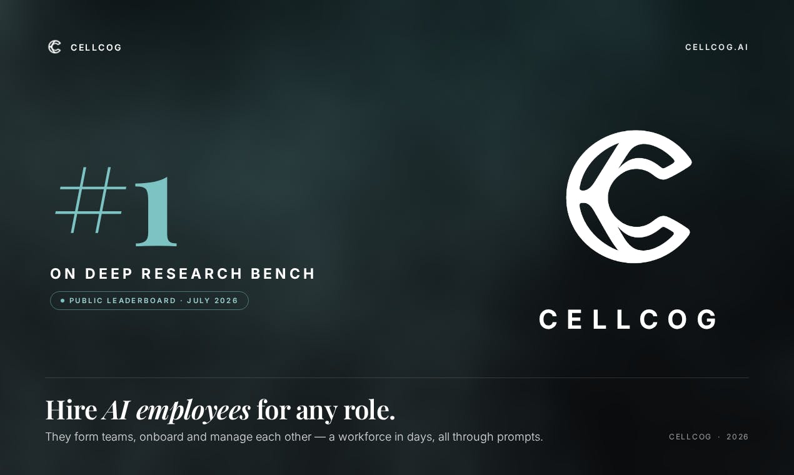
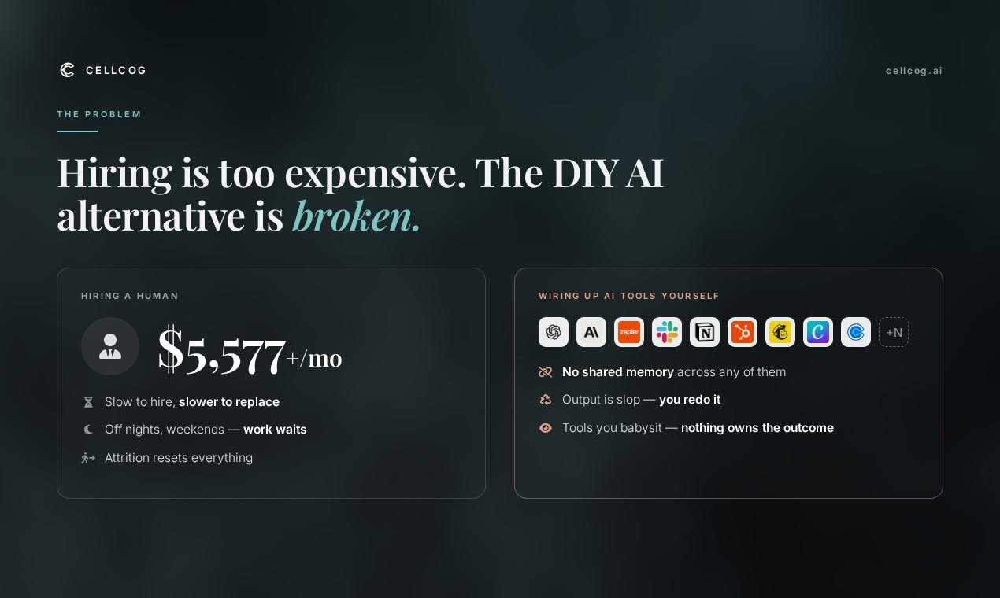
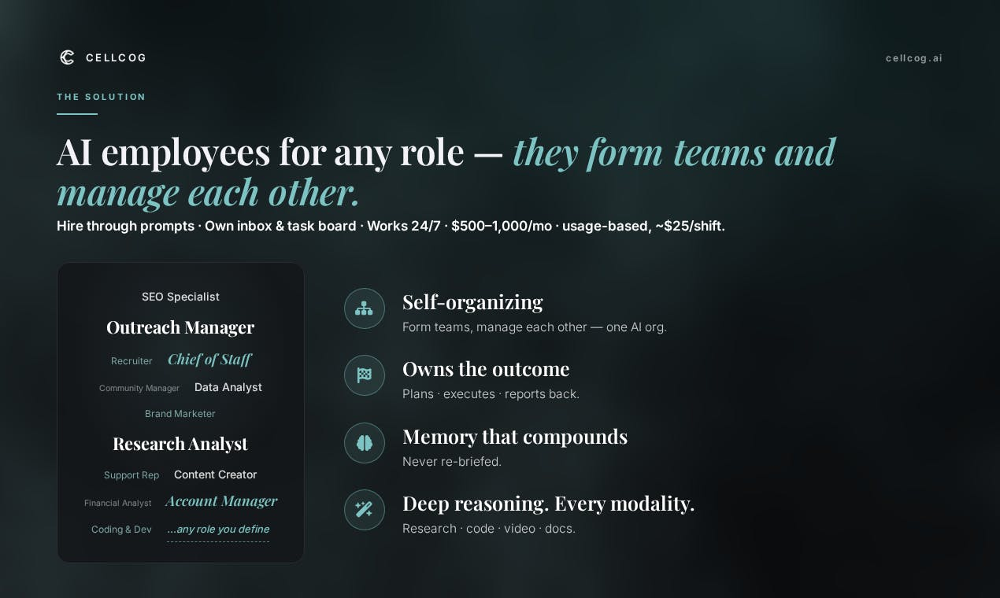

### 🎬 관련 영상
- [🎥 영상 보기](https://ph-files.imgix.net/a32fdc94-2d4c-41fc-aa8e-8a3780ca49df.jpeg?auto=format)

---

## 18. [ResumizeAI](https://www.producthunt.com/products/resumizeai)
**Votes**: 39 | **도입 난이도**: 하 | **신뢰도**: 상
**Tagline**: Take full control of your job hunt
**서비스 링크**: https://www.producthunt.com/r/D34MTVALXPRBOK

**태그**: AI, Career, Productivity, Automation, AI Tool

### 📌 이 서비스 한눈에 보기
채용 공고 맞춤형 이력서와 자기소개서를 AI로 자동 생성하는 구직 지원 도구

### 🔑 주요 기능
- 채용 공고를 붙여넣거나 실시간 검색을 통한 직무 매칭
- 사용자의 실제 경험을 바탕으로 한 맞춤형 이력서 및 커버레터 생성
- 세련된 PDF 내보내기 및 공유 가능한 개인 프로필 URL 제공

### 🙋 사용자에게 어떤 점이 좋은가
반복적인 서류 작성 시간을 획기적으로 줄여주며, 각 공고에 최적화된 지원서를 빠르게 준비할 수 있습니다.

### ✅ 지금 바로 써볼 기능
- 관심 있는 채용 공고를 복사하여 붙여넣기
- AI가 생성한 맞춤형 이력서와 커버레터 검토
- 생성된 프로필 URL을 통해 공유 가능한 포트폴리오 만들기

### ⚠️ 사용 전 확인할 점
- AI가 생성한 내용이 사용자의 실제 경험과 일치하는지 반드시 검토 필요
- 개인정보(이력서 내용)를 외부 AI 모델에 입력하는 것에 대한 보안 정책 확인 필요

### 🧭 확인이 더 필요한 정보
구체적인 요금 체계와 데이터 보안 정책에 대한 정보가 명시되지 않았습니다.

### 📸 스크린샷 및 갤러리
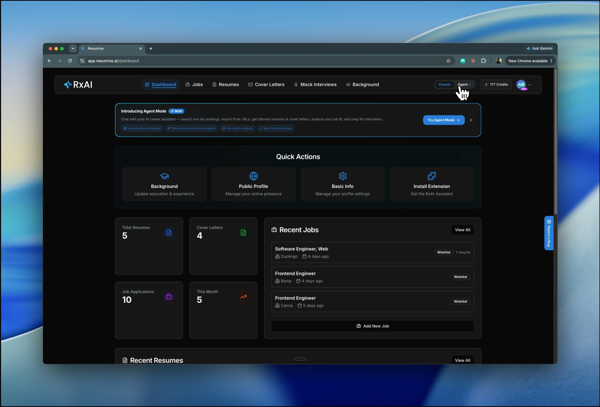
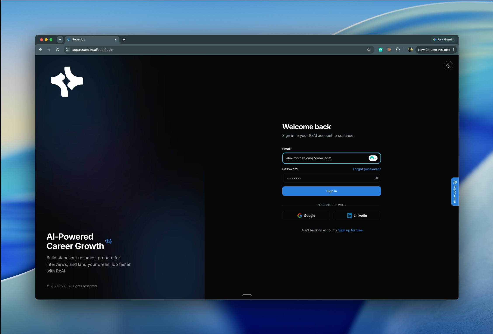
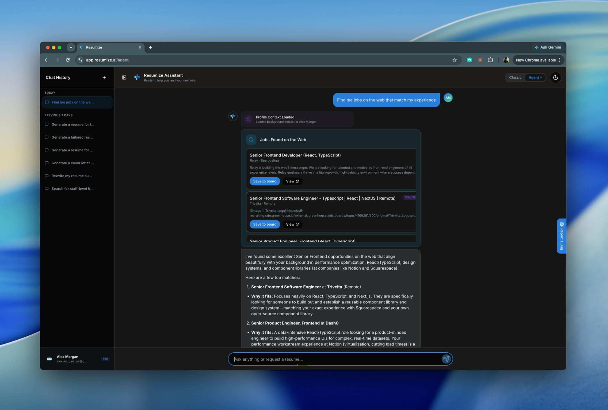

### 🎬 관련 영상
- [🎥 영상 보기](https://ph-files.imgix.net/a9edf1ab-49b2-4e87-901b-386c0d47b539.jpeg?auto=format)

---

## 19. [Resume Support by Blomma](https://www.producthunt.com/products/blomma)
**Votes**: 24 | **도입 난이도**: 하 | **신뢰도**: 상
**Tagline**: Get past the ATS with practical advice, skills and edits
**서비스 링크**: https://www.producthunt.com/r/ACA6C2BJUUOMFB

**태그**: Career, Resume, JobSearch, Productivity

### 📌 이 서비스 한눈에 보기
ATS 필터링을 통과하고 채용 담당자의 눈길을 사로잡는 실전형 이력서 최적화 도구

### 🔑 주요 기능
- ATS(지원자 추적 시스템) 관점에서의 이력서 분석 및 가독성 확인
- 채용 담당자와 매니저에게 어떻게 보이는지 시각적/내용적 피드백 제공
- 성과 중심의 이력서 재작성 및 부족한 핵심 기술 식별 지원

### 🙋 사용자에게 어떤 점이 좋은가
서류 전형 탈락의 원인이 되는 ATS 필터링 문제를 해결하고, 실제 면접 기회로 이어질 수 있도록 이력서의 전략적 수정을 도와줍니다.

### ✅ 지금 바로 써볼 기능
- 현재 이력서의 ATS 적합도 점수 확인하기
- 채용 담당자 관점의 피드백 리포트 검토하기
- 제안된 성과 중심 문구로 이력서 업데이트하기

### ⚠️ 사용 전 확인할 점
- 이 도구가 합격을 보장하는 것은 아니며, 최종 결정은 채용 담당자가 함
- 사용자의 실제 경력과 역량이 이력서에 충분히 반영되었는지 직접 검증 필요

### 🧭 확인이 더 필요한 정보
구체적인 분석 알고리즘의 상세 내용과 비용 정책에 대한 정보가 명시되지 않았습니다.

### 📸 스크린샷 및 갤러리
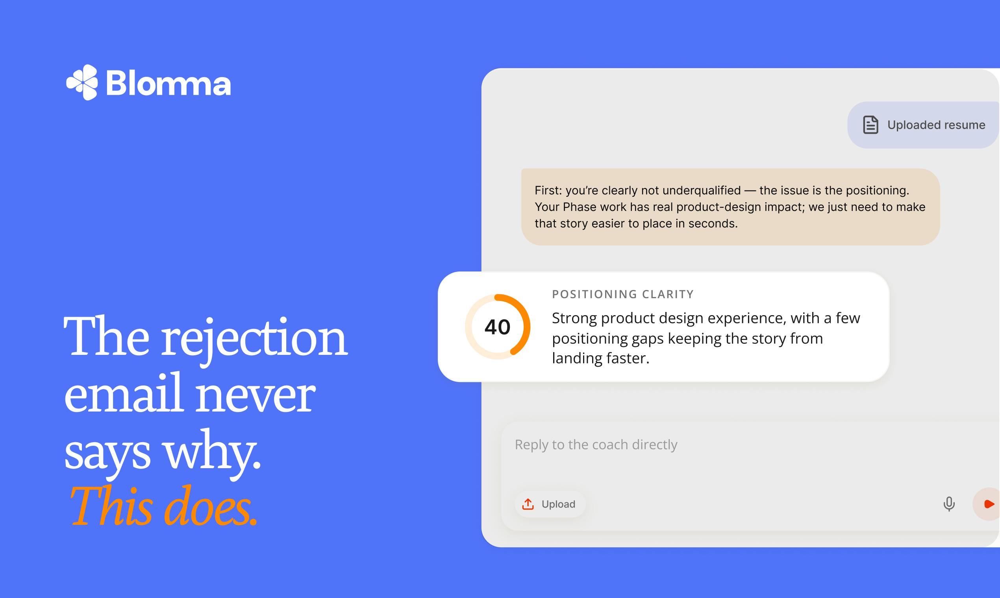
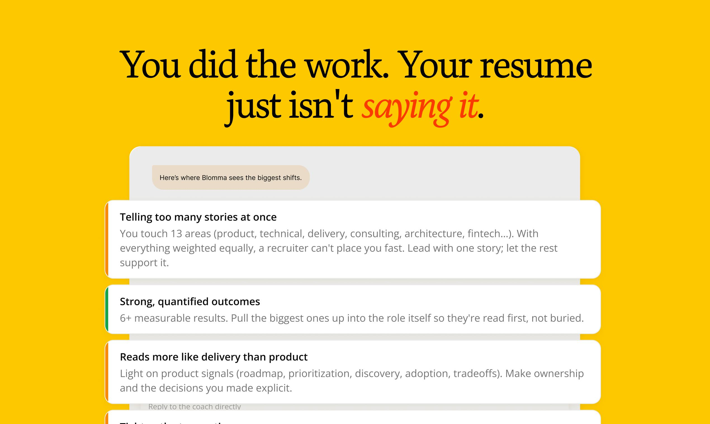
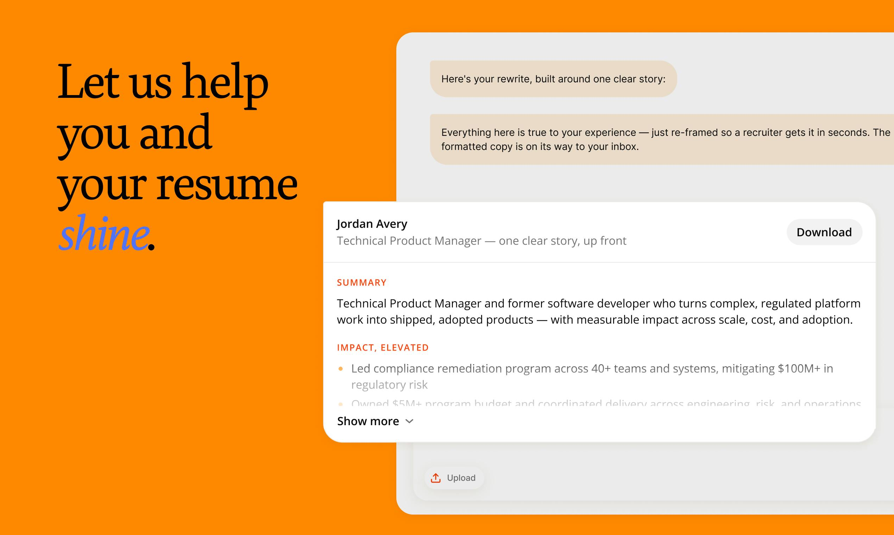

### 🎬 관련 영상
- [🎥 영상 보기](https://ph-files.imgix.net/798ddb53-2094-4125-ac35-c93589fe8073.gif?auto=format)

---

## 20. [ClariLayer](https://www.producthunt.com/products/clarilayer)
**Votes**: 24 | **도입 난이도**: 하 | **신뢰도**: 상
**Tagline**: AI context layer for analysts
**서비스 링크**: https://www.producthunt.com/r/2EJT6KDSQDK4PJ

**태그**: AI, Analytics, Productivity, Data, AI Tool

### 📌 이 서비스 한눈에 보기
사용 중인 모든 AI에 데이터 맥락을 동기화하는 분석가용 AI 컨텍스트 레이어

### 🔑 주요 기능
- 사용 중인 모든 AI 도구와 연결 가능한 통합 컨텍스트 레이어 제공
- 세션과 도구를 넘나드는 지속 가능한 데이터/지표 맥락 유지
- 매번 데이터를 다시 설명할 필요 없는 효율적인 분석 환경 구축

### 🙋 사용자에게 어떤 점이 좋은가
분석가가 여러 AI 도구를 사용할 때 매번 데이터 배경을 설명해야 하는 번거로움을 없애고, 일관된 분석 맥락을 유지할 수 있습니다.

### ✅ 지금 바로 써볼 기능
- 기존에 사용하는 AI 도구와 ClariLayer 연결하기
- 자신의 데이터 및 분석 맥락 주입하기
- 도구 간 맥락 유지 여부 테스트하기

### ⚠️ 사용 전 확인할 점
- 데이터 보안 및 프라이버시 정책 확인 필요
- 연결된 AI 도구 간의 호환성 확인 필요

### 🧭 확인이 더 필요한 정보
현재 지원하는 구체적인 AI 도구 목록과 데이터 보안 처리 방식에 대한 상세 정보가 필요합니다.

### 📸 스크린샷 및 갤러리
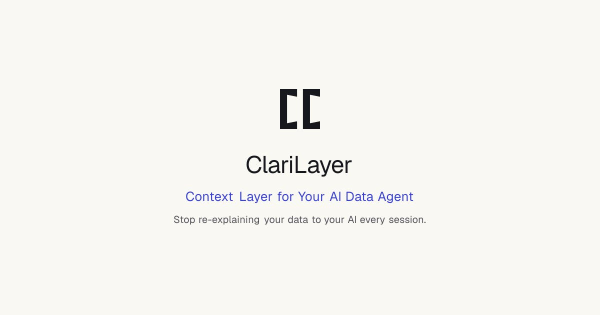

### 🎬 관련 영상
- [🎥 영상 보기](https://ph-files.imgix.net/3b1c9af9-429f-47e4-aa9b-61d03b0395eb.jpeg?auto=format)

---

## 21. [LaunchPanda](https://www.producthunt.com/products/launchpanda)
**Votes**: 18 | **도입 난이도**: 하 | **신뢰도**: 상
**Tagline**:  Easier launches that result in bigger SEO and GEO growth
**서비스 링크**: https://www.producthunt.com/r/GAKEPOYSGHDPUF

**태그**: SEO, Marketing, Startup, Growth

### 📌 이 서비스 한눈에 보기
255개 이상의 스타트업 디렉토리를 분석하여 최적의 SEO 및 GEO 성장 로드맵을 제공하는 서비스

### 🔑 주요 기능
- 255개 이상의 스타트업 디렉토리 순위 제공
- 실제 유입 트래픽 및 백링크 데이터 기반의 랭킹 시스템
- SEO 성장을 위한 단계별 맞춤형 전략 로드맵 제공

### 🙋 사용자에게 어떤 점이 좋은가
어떤 디렉토리에 등록해야 할지 고민하는 창업가에게 데이터 기반의 우선순위를 제공하여 시간과 노력을 절약해 줍니다.

### ✅ 지금 바로 써볼 기능
- 제공되는 디렉토리 랭킹 리스트 확인하기
- 자신의 스타트업에 맞는 SEO 전략 로드맵 검토하기
- 우선순위가 높은 디렉토리부터 순차적 등록하기

### ⚠️ 사용 전 확인할 점
- 디렉토리의 트래픽 데이터가 실시간으로 반영되는지 확인 필요
- 제공되는 전략이 모든 산업군에 동일하게 적용되지 않을 수 있음

### 🧭 확인이 더 필요한 정보
제공되는 255개 디렉토리의 데이터 업데이트 주기와 구체적인 랭킹 산출 알고리즘에 대한 정보가 필요합니다.

### 📸 스크린샷 및 갤러리
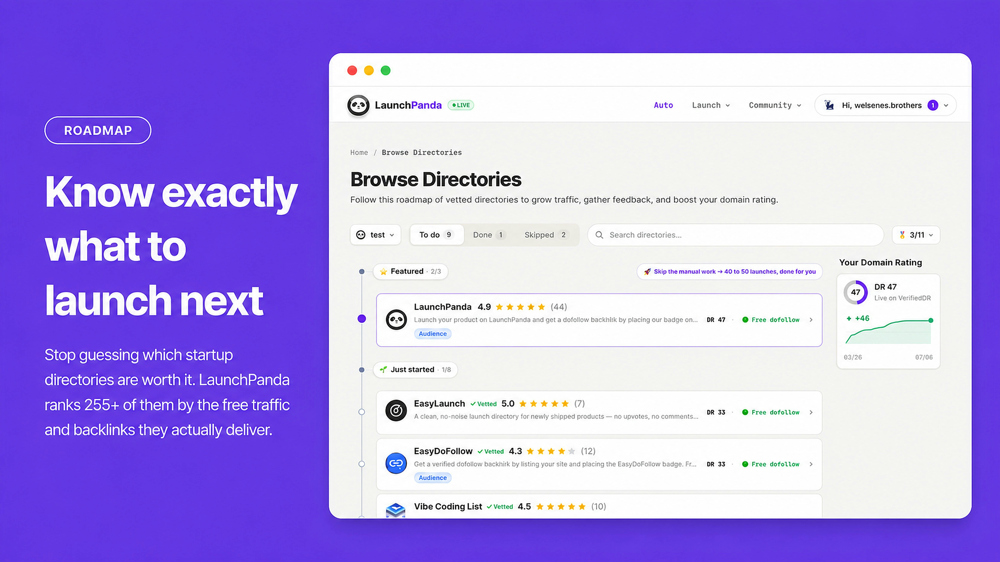
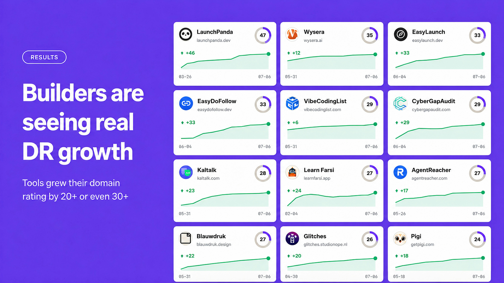
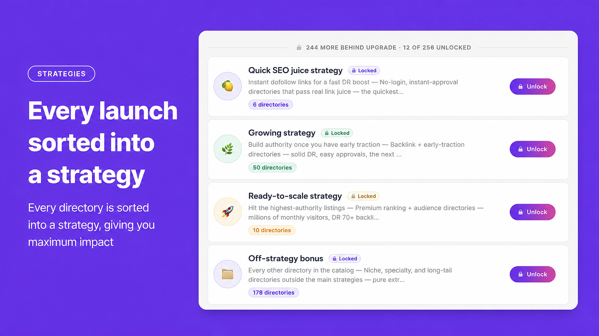

### 🎬 관련 영상
- [🎥 영상 보기](https://ph-files.imgix.net/a210390d-e2ef-47a0-ab51-40745cc0b08a.octet-stream?auto=format)

---

## 22. [tastemaker](https://www.producthunt.com/products/tastemaker-3)
**Votes**: 15 | **도입 난이도**: 하 | **신뢰도**: 상
**Tagline**: Real design taste for your coding agent
**서비스 링크**: https://www.producthunt.com/r/PVKJ4UH6BEYLHM

**태그**: DevTool, Design, OpenSource, AI-Agent, Agent, AI Tool

### 📌 이 서비스 한눈에 보기
코딩 에이전트를 위한 디자인 감각을 더해주는 오픈소스 UI 생성 도구

### 🔑 주요 기능
- Claude Code, Gemini CLI, Windsurf 등 코딩 에이전트용 오픈소스 스킬
- WCAG 대비 규격을 준수하는 신선한 컬러 팔레트 생성
- 템플릿 느낌을 탈피하기 위한 다양한 페이지 구조 생성

### 🙋 사용자에게 어떤 점이 좋은가
코딩 에이전트가 생성하는 UI가 천편일률적인 디자인에서 벗어나, 접근성을 준수하면서도 독창적인 결과물을 만들 수 있게 돕습니다.

### ✅ 지금 바로 써볼 기능
- 사용 중인 코딩 에이전트(Claude Code, Windsurf 등)에 설치하기
- 생성된 컬러 팔레트의 WCAG 대비 값 확인하기
- 다양한 페이지 구조가 적용된 UI 결과물 비교하기

### ⚠️ 사용 전 확인할 점
- 에이전트 환경에 따라 설치 및 설정 방식이 다를 수 있음
- 자동 생성된 디자인이 사용자의 특정 브랜드 가이드와 일치하지 않을 수 있음

### 🧭 확인이 더 필요한 정보
사용자의 특정 개발 환경(IDE/CLI)에서의 구체적인 설치 방법과 호환성 범위에 대한 정보가 추가로 필요합니다.

### 📸 스크린샷 및 갤러리
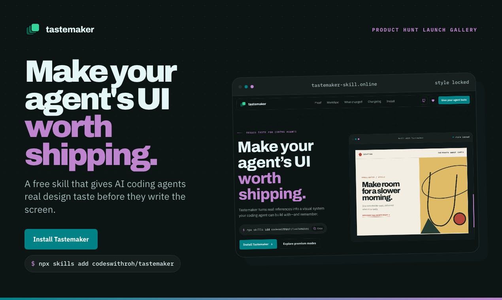
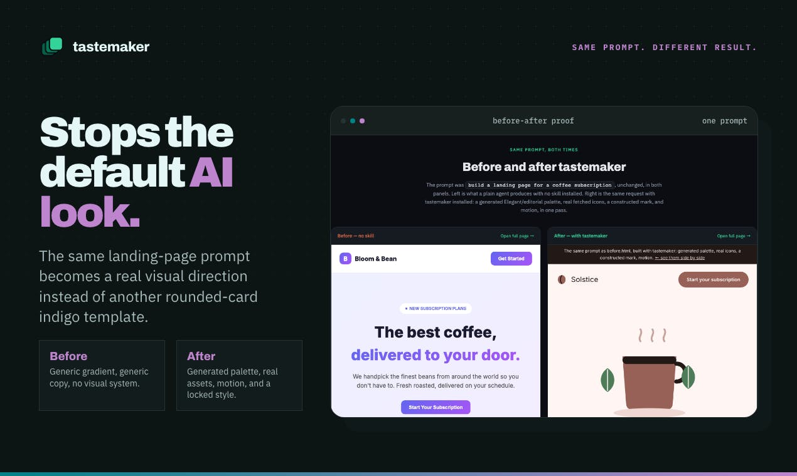
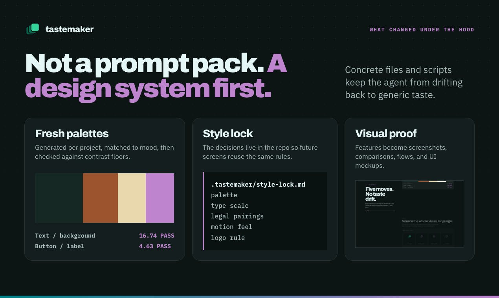

### 🎬 관련 영상
- [🎥 영상 보기](https://ph-files.imgix.net/c1ca3aac-f9c4-43c1-855e-ef0667bda3a2.jpeg?auto=format)

---

## 23. [HackathonHost](https://www.producthunt.com/products/hackathonhost)
**Votes**: 14 | **도입 난이도**: 하 | **신뢰도**: 상
**Tagline**: All-in-one hackathon management platform for hosts
**서비스 링크**: https://www.producthunt.com/r/JNXEQFBOWXNBH5

**태그**: EventManagement, NoCode, Hackathon, SaaS, Analytics

### 📌 이 서비스 한눈에 보기
등록부터 심사까지, 비용 부담 없이 운영하는 올인원 해커톤 관리 플랫폼

### 🔑 주요 기능
- 등록, 팀 빌딩, 심사, 수료증 발급까지 전 과정을 지원하는 화이트 라벨 솔루션
- 참가자 수에 따른 추가 비용 없는 이벤트당 단일 정액제 모델
- 소규모 운영 팀을 위해 설계된 엔드 투 엔드 관리 기능

### 🙋 사용자에게 어떤 점이 좋은가
참가자 수에 관계없이 고정된 비용으로 전문적인 대회를 운영할 수 있어 예산 관리가 용이합니다.

### ✅ 지금 바로 써볼 기능
- 이벤트 등록 및 참가자 관리 기능 테스트
- 팀 빌딩 및 심사 워크플로우 확인
- 분석 대시보드 및 수료증 발급 기능 검토

### ⚠️ 사용 전 확인할 점
- 참가자 수 제한 여부 및 상세 기능 범위 확인 필요
- 화이트 라벨링의 커스텀 범위 확인 필요

### 🧭 확인이 더 필요한 정보
참가자 수에 따른 비용이 없다고 명시되어 있으나, 이벤트당 단일 가격의 구체적인 금액은 공개되지 않았습니다.

### 📸 스크린샷 및 갤러리
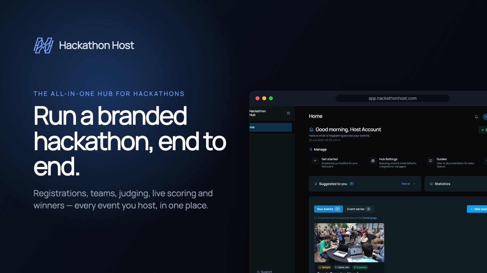
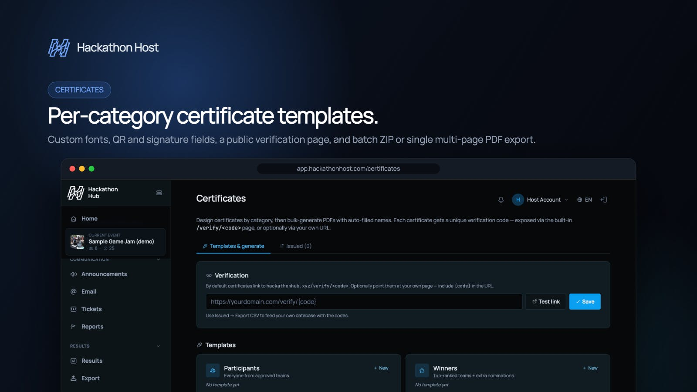
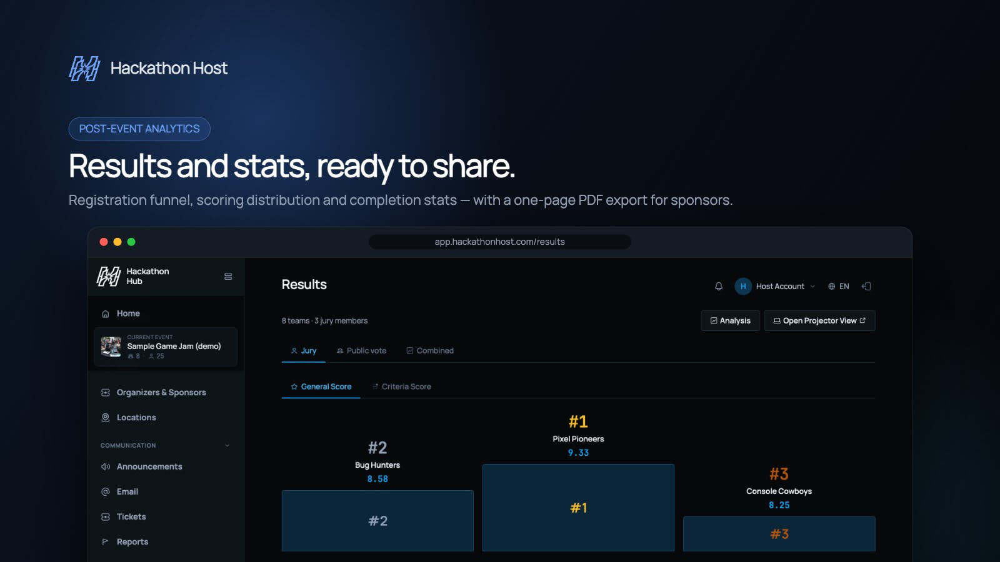

---

## 24. [Voooxly](https://www.producthunt.com/products/voooxly)
**Votes**: 14 | **도입 난이도**: 하 | **신뢰도**: 상
**Tagline**: Not voice-to-text: speak the task, get it done. Free, local
**서비스 링크**: https://www.producthunt.com/r/2CHCAY4I67BPBM

**태그**: Productivity, Automation, AI, Privacy, Mac, Prompting

### 📌 이 서비스 한눈에 보기
음성 명령만으로 커서 위치에서 즉시 작업을 수행하는 로컬 AI 자동화 도구

### 🔑 주요 기능
- 단순 받아쓰기를 넘어선 작업 실행형 음성 인터페이스
- 답장 작성, 요약, 번역 등 커서 위치에서의 즉각적인 작업 수행
- 데이터가 기기를 떠나지 않는 강력한 로컬 프라이버시 보장

### 🙋 사용자에게 어떤 점이 좋은가
텍스트를 직접 타이핑하거나 복사/붙여넣기 하는 번거로움 없이, 말 한마디로 문서 작업과 커뮤니케이션을 자동화할 수 있습니다.

### ✅ 지금 바로 써볼 기능
- 이메일 답장 모드로 빠른 회신 작성해보기
- 긴 문단 번역 및 요약 기능 테스트하기
- 로컬 실행 환경에서의 반응 속도 확인하기

### ⚠️ 사용 전 확인할 점
- Mac 전용 환경이므로 타 OS 사용자는 사용 불가
- 로컬 실행 방식에 따른 하드웨어 리소스 점유율 확인 필요

### 🧭 확인이 더 필요한 정보
사용자의 Mac 사양에 따른 음성 처리 속도 및 성능 차이를 확인해야 합니다.

### 📸 스크린샷 및 갤러리
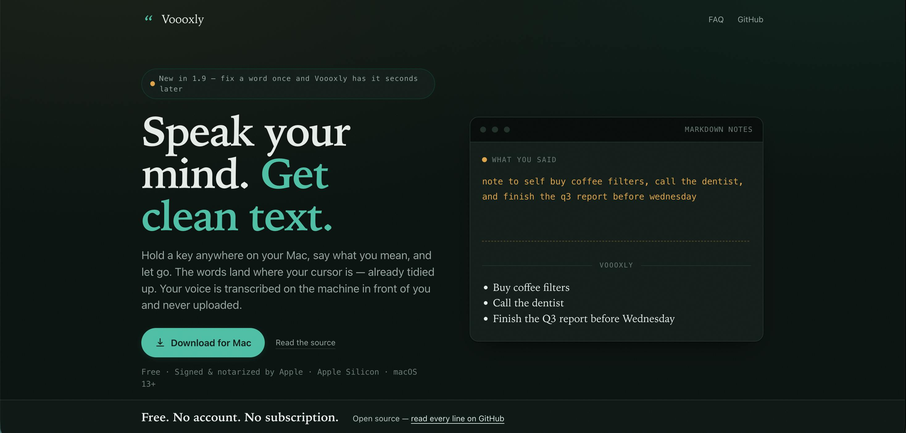
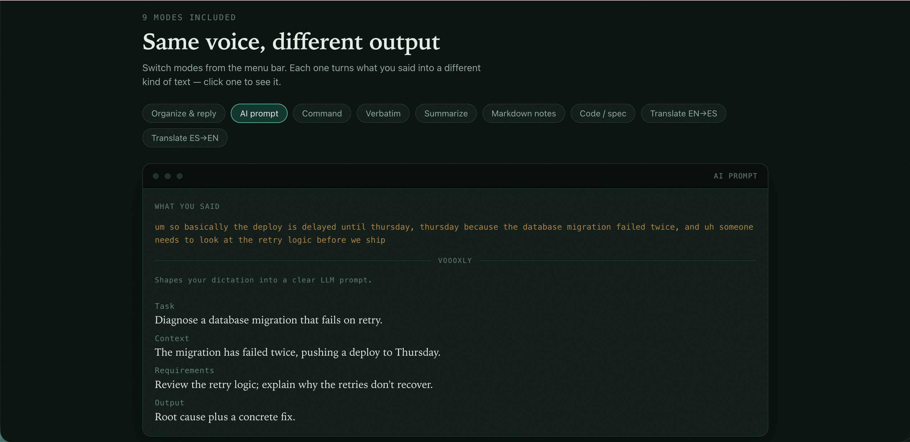
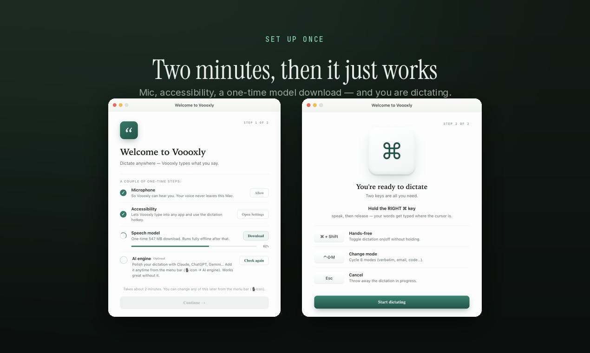

### 🎬 관련 영상
- [🎥 영상 보기](https://ph-files.imgix.net/e02b8cbe-c4dd-4009-a18e-0bcf742593e9.jpeg?auto=format)

---

## 25. [Webshot.site | Website Screenshot Tools](https://www.producthunt.com/products/webshot-site-website-screenshot-tools)
**Votes**: 13 | **도입 난이도**: 하 | **신뢰도**: 상
**Tagline**: Free curl based API for taking screenshots of websites
**서비스 링크**: https://www.producthunt.com/r/QFW6FVGZO2OYMY

**태그**: DevTool, Automation, API, Screenshot

### 📌 이 서비스 한눈에 보기
로그인 없이 즉시 사용 가능한 무료 웹사이트 스크린샷 API 서비스

### 🔑 주요 기능
- 로그인, 워터마크, 가입 절차 없는 간편한 사용성
- JPG, PNG, WebP, PDF 등 다양한 파일 형식 지원
- curl 기반의 API를 통한 전체 페이지 스크린샷 캡처

### 🙋 사용자에게 어떤 점이 좋은가
개발자가 별도의 복잡한 설정 없이 API 호출만으로 웹사이트 스크린샷을 자동화하여 획득할 수 있습니다.

### ✅ 지금 바로 써볼 기능
- curl 명령어를 통한 즉각적인 스크린샷 생성 테스트
- 원하는 파일 형식(PNG, PDF 등)으로 결과물 확인
- 전체 페이지 캡처 기능 검증

### ⚠️ 사용 전 확인할 점
- 무료 서비스이므로 대량 요청 시 속도 제한이나 사용량 제한이 있을 수 있음
- API 기반이므로 호출 방식에 대한 기술적 이해 필요

### 🧭 확인이 더 필요한 정보
무료 서비스의 구체적인 일일 호출 제한(Rate Limit) 및 서버 안정성에 대한 정보가 명시되지 않았습니다.

### 📸 스크린샷 및 갤러리
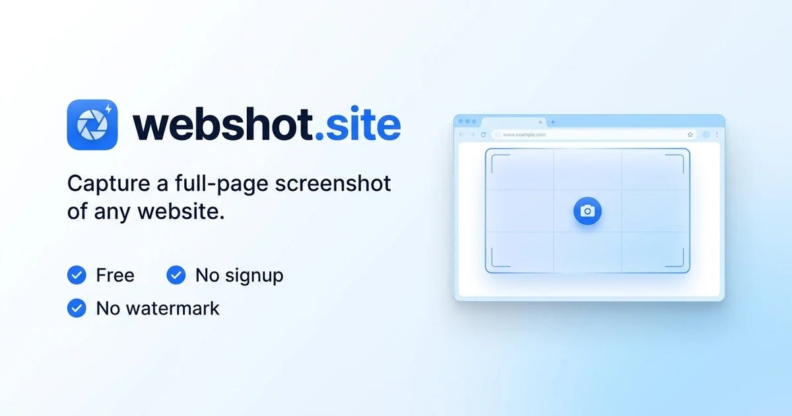

---

## 26. [Zentrik Product Loops](https://www.producthunt.com/products/zentrik)
**Votes**: 13 | **도입 난이도**: 중 | **신뢰도**: 상
**Tagline**: Product work starts and ends with people.
**서비스 링크**: https://www.producthunt.com/r/R4SEGR43PQ54FJ

**태그**: ProductManagement, CustomerFeedback, Agile, Workflow, AI Tool, Sales

### 📌 이 서비스 한눈에 보기
고객의 피드백과 제품 개발 사이의 연결 고리를 만들어 의사결정의 근거를 제공하는 루프형 협업 툴

### 🔑 주요 기능
- 영업, 지원, 리서치 등 흩어진 고객 신호를 제품 결정과 연결
- 아이디어 단계부터 배포 후 피드백까지 이어지는 제품 개발 사이클 구축
- Linear, Jira 등 기존 워크플로우에 고객의 목소리를 직접 반영

### 🙋 사용자에게 어떤 점이 좋은가
단순히 기능을 만드는 것을 넘어, 고객의 실제 요구사항을 바탕으로 가치 있는 제품을 더 빠르게 빌드할 수 있게 돕습니다.

### ✅ 지금 바로 써볼 기능
- 기존 고객 피드백 데이터(Sales/Support) 연동하기
- 수집된 인사이트를 Jira/Linear 티켓과 연결하기
- 실험 결과와 실제 배포 결과 간의 피드백 루프 설정하기

### ⚠️ 사용 전 확인할 점
- 기존 협업 툴(Jira, Linear 등)과의 연동 수준에 따른 초기 설정 작업 필요
- 데이터가 쌓이기 전까지는 의사결정 도구로서의 효용을 체감하기 어려울 수 있음

### 🧭 확인이 더 필요한 정보
현재 제공되는 외부 툴(Linear, Jira 등)과의 구체적인 양방향 동기화 방식과 자동화 수준에 대한 확인이 필요합니다.

### 📸 스크린샷 및 갤러리
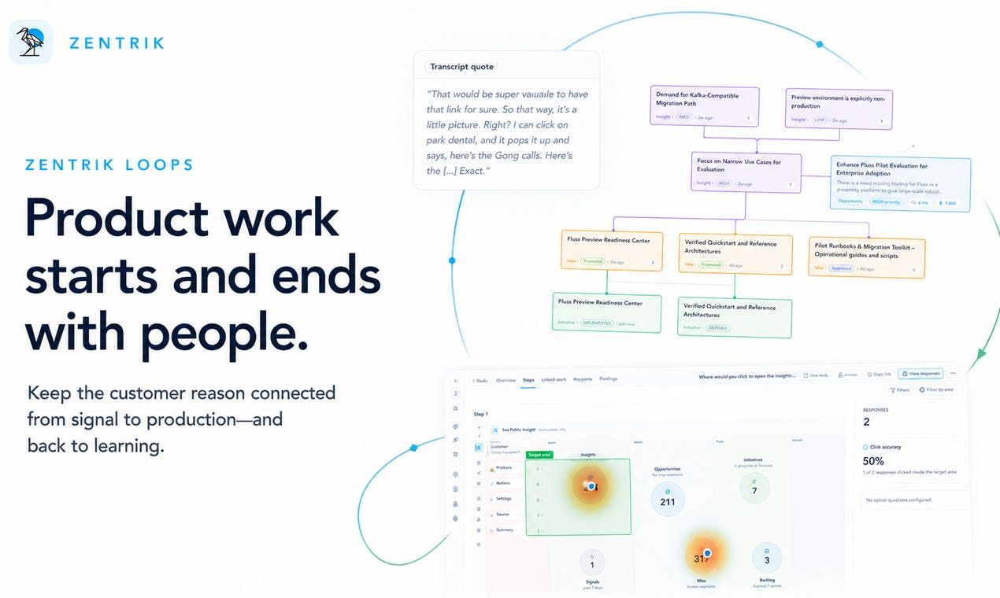
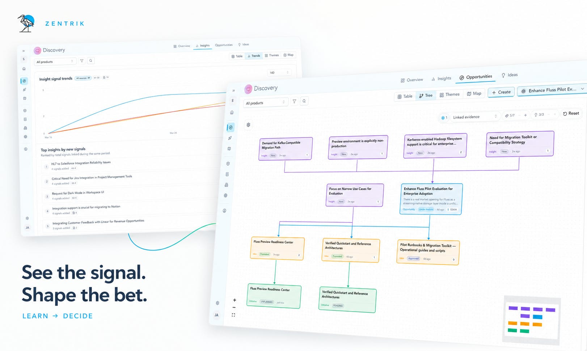
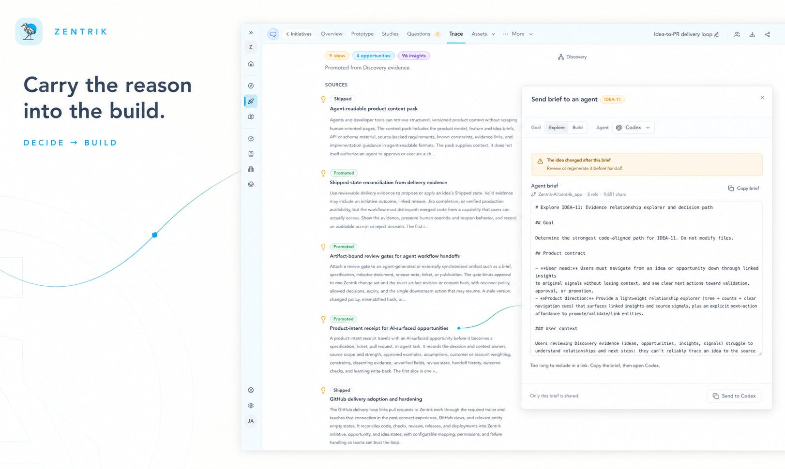

### 🎬 관련 영상
- [🎥 영상 보기](https://ph-files.imgix.net/3b561388-6016-489d-8bd5-e9a41618a1d1.jpeg?auto=format)

---

## 27. [3DResurs](https://www.producthunt.com/products/3dresurs)
**Votes**: 12 | **도입 난이도**: 하 | **신뢰도**: 상
**Tagline**: Advanced SEO analysis & optimization platform.
**서비스 링크**: https://www.producthunt.com/r/TT2524CYE3AWRZ

**태그**: SEO, WebIntelligence, MarketingTool, DevTool, Design, API

### 📌 이 서비스 한눈에 보기
복잡한 엔터프라이즈 도구 없이도 즉각적인 사이트 건강 상태와 SEO 인사이트를 제공하는 웹 인텔리전스 플랫폼

### 🔑 주요 기능
- 기술적 SEO 문제와 사이트 성능에 대한 완전한 가시성 제공
- 복잡한 설정 없이 즉각적이고 실행 가능한 데이터 제공
- 크리에이터, 마케터, 개발자를 위한 직관적인 인터페이스

### 🙋 사용자에게 어떤 점이 좋은가
고가의 엔터프라이즈 도구 없이도 사이트의 기술적 결함을 빠르게 파악하고 유기적 성과를 최적화할 수 있습니다.

### ✅ 지금 바로 써볼 기능
- 사이트 건강 상태(Site Health) 진단 실행
- 기술적 SEO 이슈 식별
- 웹 인텔리전스 데이터 분석

### ⚠️ 사용 전 확인할 점
- 구체적인 데이터 스크래핑 범위 및 심도 확인 필요
- 엔터프라이즈급 도구 대비 기능적 제약 사항 확인 필요

### 🧭 확인이 더 필요한 정보
구체적인 요금 체계와 데이터 추출(Scraping)의 상세 기능 범위가 명시되지 않았습니다.

### 📸 스크린샷 및 갤러리
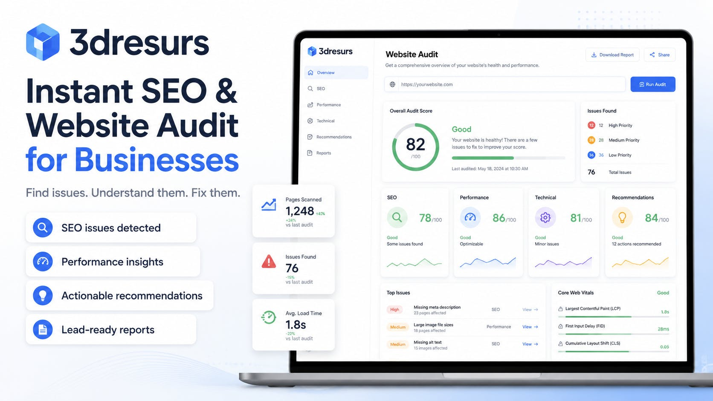
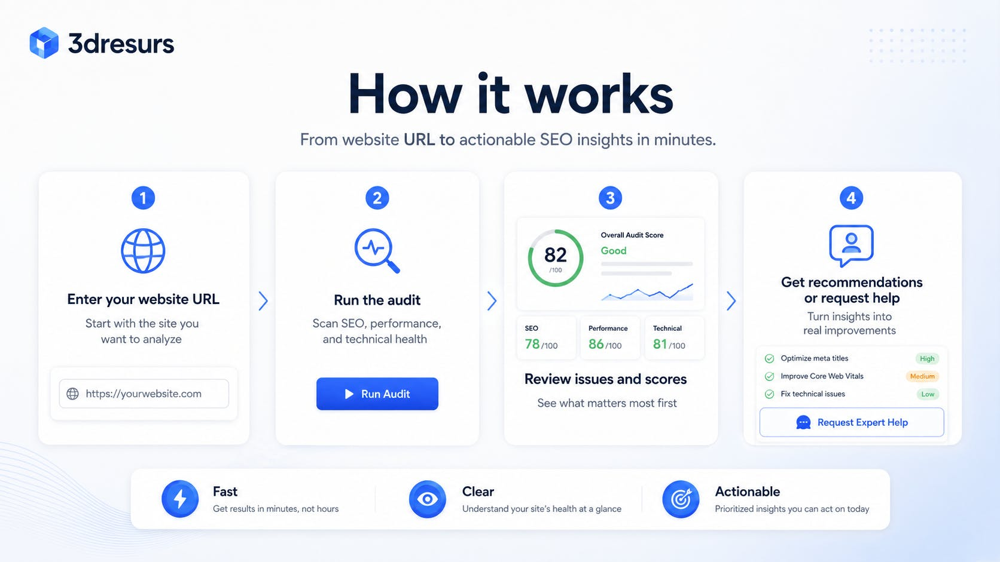
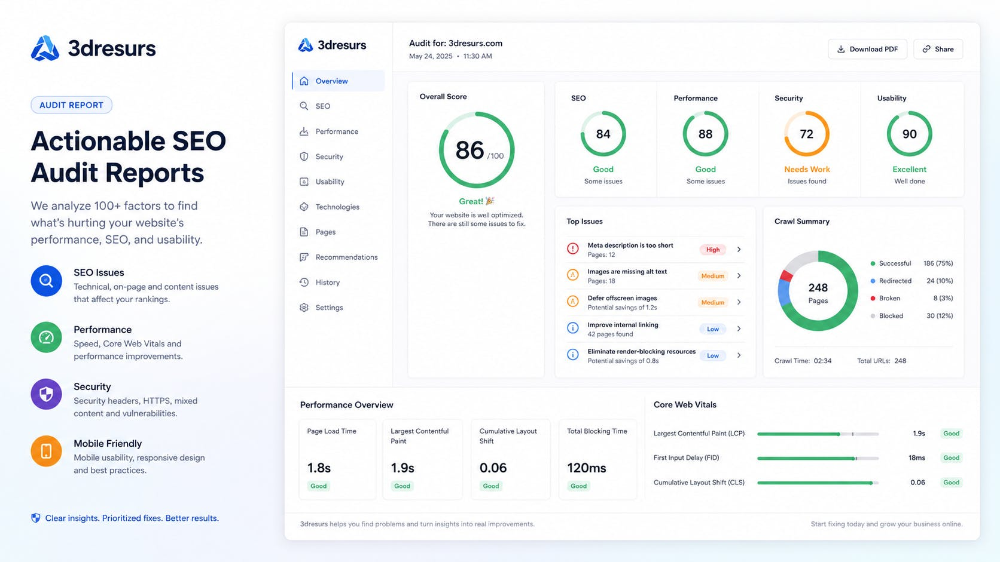

---

## 28. [MLX.fast](https://www.producthunt.com/products/mlx-fast)
**Votes**: 12 | **도입 난이도**: 중 | **신뢰도**: 상
**Tagline**: Open research network accelerating Poolside's Laguna on Mac
**서비스 링크**: https://www.producthunt.com/r/DMN565YXWLI3HT

**태그**: ML, AppleSilicon, Optimization, OpenSource

### 📌 이 서비스 한눈에 보기
Apple Silicon에서 Laguna XS 2.1 모델의 추론 속도를 최적화하는 오픈 리서치 네트워크

### 🔑 주요 기능
- Apple Silicon 기반의 MLX 추론 가속화 및 최적화
- Laguna XS 2.1 모델 성능 향상을 위한 협업형 오픈 리서치 네트워크
- 실시간 MLX Fast 리더보드를 통한 성능 개선 지표 확인 가능

### 🙋 사용자에게 어떤 점이 좋은가
Apple Silicon 하드웨어를 사용하는 개발자가 Laguna XS 2.1 모델의 추론 성능을 극대화하고 최신 최적화 기술을 적용할 수 있습니다.

### ✅ 지금 바로 써볼 기능
- MLX 환경에서 Laguna XS 2.1 모델 구동해보기
- 실시간 리더보드를 통해 최적화 성과 모니터링하기
- 오픈 네트워크에 참여하여 최적화 작업에 기여하기

### ⚠️ 사용 전 확인할 점
- Apple Silicon 하드웨어에 특화되어 있어 타 아키텍처에서는 사용 불가
- 연구용 네트워크이므로 실험적인 최적화 방식이 포함될 수 있음

### 🧭 확인이 더 필요한 정보
사용자의 구체적인 하드웨어 사양에 따른 성능 향상 폭은 명시되지 않았습니다.

### 📸 스크린샷 및 갤러리
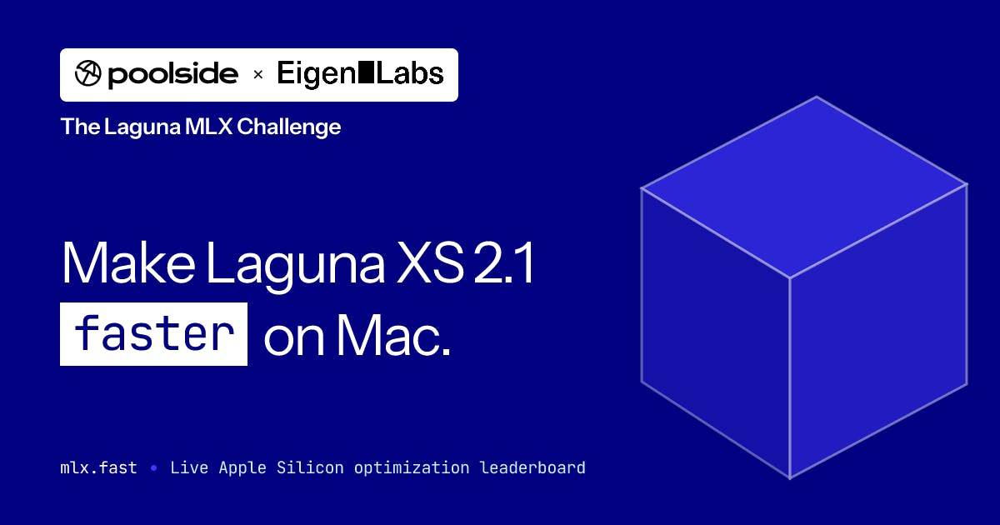
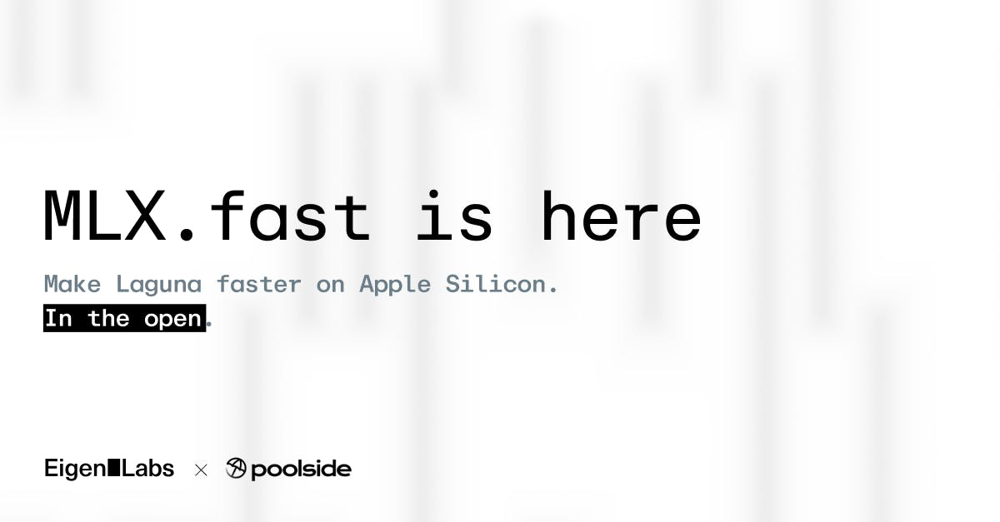
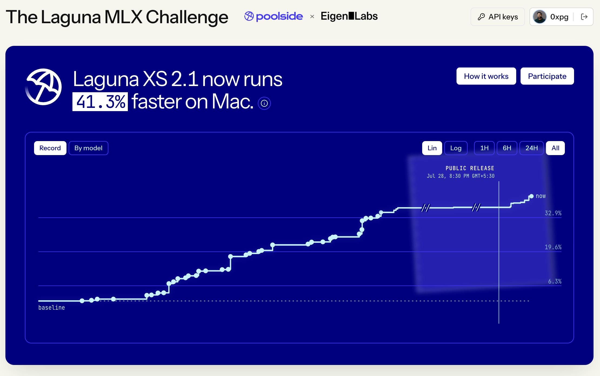

### 🎬 관련 영상
- [🎥 영상 보기](https://ph-files.imgix.net/1b942974-cd95-4246-bae0-0012706eb2dd.jpeg?auto=format)

---

## 29. [Stellarch](https://www.producthunt.com/products/stellarch)
**Votes**: 11 | **도입 난이도**: 하 | **신뢰도**: 상
**Tagline**: A trading-card game where you own every card, provably fair
**서비스 링크**: https://www.producthunt.com/r/ZWDTIQALHH32VA

**태그**: Web3, Gaming, Blockchain, TCG, AI Tool

### 📌 이 서비스 한눈에 보기
모든 카드를 온체인으로 소유하며 투명한 승부를 즐기는 탈중앙화 TCG 게임

### 🔑 주요 기능
- Hive 블록체인 기반의 투명하고 결정론적인 게임 엔진
- 시드 기반 RNG를 통한 검증 가능한 공정한 전투 결과
- 지갑의 크기보다 전략이 우선시되는 밸런스 설계

### 🙋 사용자에게 어떤 점이 좋은가
사용자는 자신이 소유한 카드를 온체인 자산으로 안전하게 관리하며, 조작 불가능한 공정한 게임 환경에서 전략적 재미를 느낄 수 있습니다.

### ✅ 지금 바로 써볼 기능
- 공식 대기 명단(Waitlist) 등록하기
- Hive 블록체인 및 온체인 자산 개념 이해하기

### ⚠️ 사용 전 확인할 점
- 현재 클로즈 알파 단계로 일반 사용자 접근이 제한적임
- 게임 밸런스 및 경제 모델이 아직 검증되지 않음

### 🧭 확인이 더 필요한 정보
정식 출시 일정과 구체적인 게임 플레이 메커니즘은 아직 공개되지 않았습니다.

### 📸 스크린샷 및 갤러리

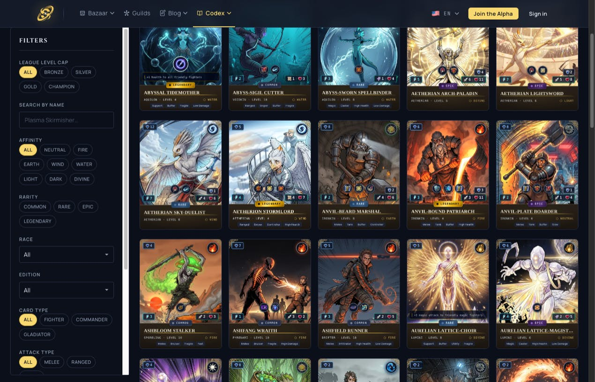

---

## 30. [Espresso](https://www.producthunt.com/products/espresso-3)
**Votes**: 11 | **도입 난이도**: 중 | **신뢰도**: 상
**Tagline**: Describe, Build & Ship ERPNext 
**서비스 링크**: https://www.producthunt.com/r/L554BNMLQK6BS4

**태그**: NoCode, ERPNext, AI, LowCode, DevOps, Agent, AI Tool, DevTool

### 📌 이 서비스 한눈에 보기
AI 기반 노코드 도구로 개발자 없이도 ERPNext를 구축하고 배포할 수 있는 통합 플랫폼

### 🔑 주요 기능
- AI 에이전트(Hydra)를 통한 노코드 방식의 ERPNext 구축 및 관리
- 설계부터 배포까지 이어지는 자동화된 CI/CD 파이프라인 제공
- 기능 전문가(BA)와 현업 담당자가 직접 프로젝트를 주도할 수 있는 환경

### 🙋 사용자에게 어떤 점이 좋은가
개발자 의존도를 낮추어 ERP 구축 비용을 절감하고, 현업 담당자가 직접 비즈니스 로직을 구현하여 업무 효율을 높일 수 있습니다.

### ✅ 지금 바로 써볼 기능
- Hydra 에이전트를 활용한 데스크 내 빌드 테스트
- Dev/UAT 환경에서의 프로토타입 제작
- 자동화된 CI/CD를 통한 배포 프로세스 경험

### ⚠️ 사용 전 확인할 점
- 노코드 방식이므로 매우 복잡하거나 특수한 커스텀 로직 구현 시 제약이 있을 수 있음
- 기존 Frappe/ERPNext 숙련도에 따른 운영 관리 난이도 차이

### 🧭 확인이 더 필요한 정보
완전한 노코드 환경이 기존의 복잡한 커스텀 코드와 어느 정도 수준까지 호환되는지 확인이 필요합니다.

### 📸 스크린샷 및 갤러리
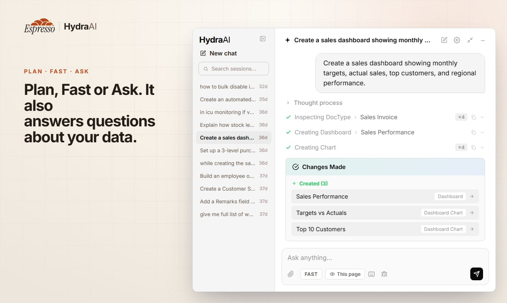
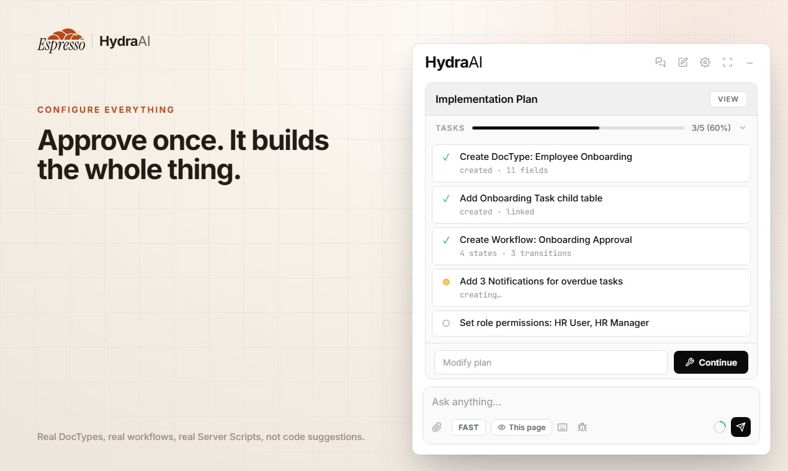
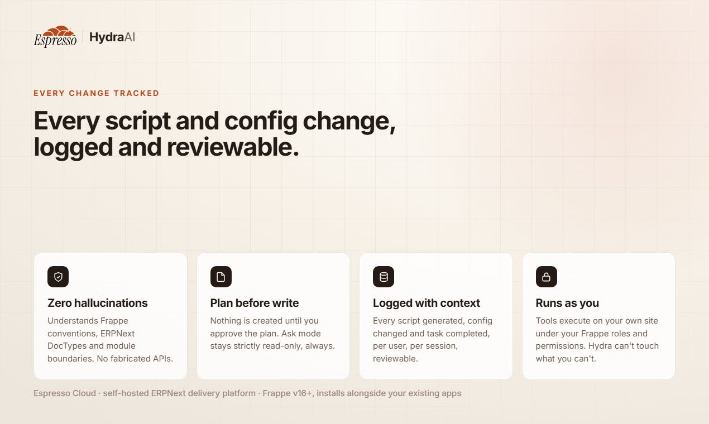

### 🎬 관련 영상
- [🎥 영상 보기](https://ph-files.imgix.net/d783ef0b-5d6f-42f5-aed8-81d473eca5fe.jpeg?auto=format)

---

