# 🚀 Product Hunt Daily Top 30 (2026-07-31)

## 오늘의 요약
오늘의 트렌드는 AI 에이전트가 사용자의 맥락을 이해하고 코딩 및 일상 업무를 보조하는 '지능형 에이전트'의 심화였습니다. 특히 개발 워크플로우를 자동화하는 도구와 AI 검색 엔진 시대에 맞춘 데이터 분석 도구들이 주목받았습니다.

### 오늘의 핵심 포인트
- 코딩 에이전트와 개발팀의 생산성을 높이기 위한 실시간 지식 공유 및 음성 인터페이스 도구가 등장했습니다.
- AI 검색 엔진(GEO) 환경에서 브랜드 노출과 인용 현황을 추적하는 새로운 분석 영역이 부각되었습니다.
- 개인화된 맥락을 유지하며 다양한 플랫폼과 메시징 앱에서 작동하는 개인용 AI 비서 서비스가 주목받았습니다.

**오늘의 태그**: AI Agent, Developer Tools, Productivity, GEO, Automation

## 1. [SKI](https://www.producthunt.com/products/ski)
**Votes**: 433 | **도입 난이도**: 하 | **신뢰도**: 상
**Tagline**: Free voice coding for Claude Code, Codex and more
**서비스 링크**: https://www.producthunt.com/r/4776JMPD744PM7

**태그**: DevTool, AI, Voice-to-Code, Productivity, Agent, AI Tool

### 📌 이 서비스 한눈에 보기
생각의 속도로 코딩하는 데스크톱용 음성 AI 코딩 에이전트

### 🔑 주요 기능
- 단순 받아쓰기가 아닌 팀원처럼 대화하며 코딩하는 음성 인터페이스
- Claude Code, Codex 등 다양한 AI 에이전트와 연동 가능
- 데스크톱 상주형 방식으로 키 하나로 즉시 실행되는 앰비언트 환경

### 🙋 사용자에게 어떤 점이 좋은가
키보드 타이핑 대신 목소리로 코딩 명령을 내릴 수 있어 개발 흐름을 유지하며 작업 속도를 높일 수 있습니다.

### ✅ 지금 바로 써볼 기능
- 데스크톱에 설치 후 단축키 설정하기
- Claude Code 등 기존 코딩 에이전트와 연동 테스트하기
- 회의 중 실시간 라이브 코딩에 활용해보기

### ⚠️ 사용 전 확인할 점
- 음성 인식 환경(주변 소음 등)에 따른 작업 정확도 차이 가능성
- 로컬 실행 방식이므로 하드웨어 리소스 사용량 확인 필요

### 🧭 확인이 더 필요한 정보
사용자의 기존 코딩 워크플로우(IDE 등)와의 구체적인 통합 방식과 보안 수준에 대한 추가 확인이 필요합니다.

### 📸 스크린샷 및 갤러리
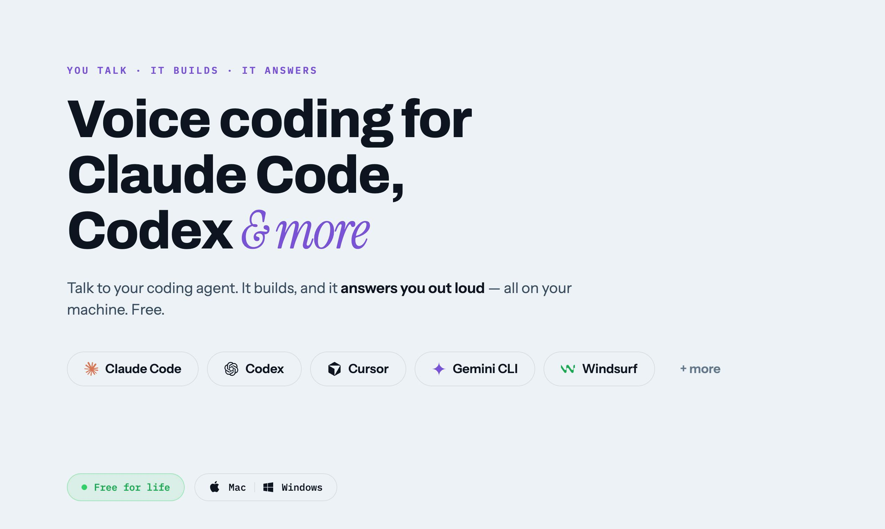
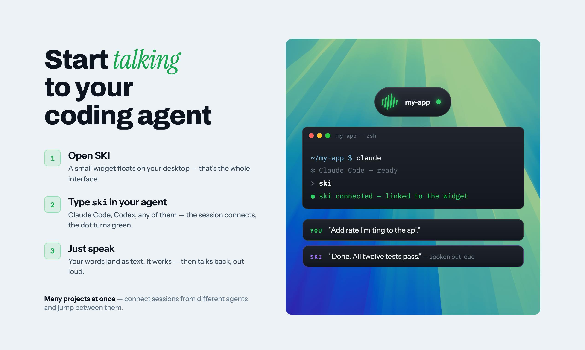
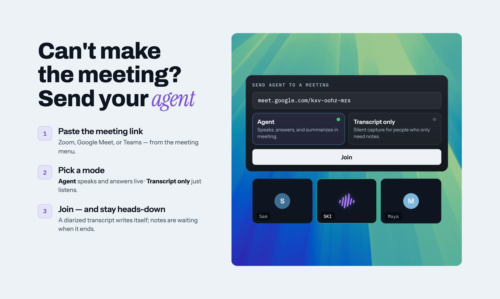

### 🎬 관련 영상
- [🎥 영상 보기](https://ph-files.imgix.net/42d5856f-0de2-4037-a15f-b11385c10117.jpeg?auto=format)

---

## 2. [AI Search Console](https://www.producthunt.com/products/ai-search-console)
**Votes**: 394 | **도입 난이도**: 하 | **신뢰도**: 상
**Tagline**: Prompt analytics and citation mapping for AI search
**서비스 링크**: https://www.producthunt.com/r/O7C4XHAKCEG4AF

**태그**: SEO, AI, Analytics, Marketing, Automation, AI Tool, Chat, Prompting

### 📌 이 서비스 한눈에 보기
AI 검색 엔진에서의 브랜드 노출과 인용 현황을 데이터로 추적하는 분석 도구

### 🔑 주요 기능
- ChatGPT, Claude, Gemini, Perplexity 등 주요 AI 모델별 브랜드 언급 및 순위 추적
- 개별 프롬프트 단위의 가시성 분석 및 인용 소스(Citation) 맵핑
- 수동 작업 없이 경쟁사 분석 및 클라이언트용 리포트 자동 생성

### 🙋 사용자에게 어떤 점이 좋은가
SEO 및 GEO(Generative Engine Optimization) 전문가가 수동으로 수행하던 AI 검색 결과 확인 작업을 자동화하여 데이터 기반의 전략 수립을 가능하게 합니다.

### ✅ 지금 바로 써볼 기능
- 주요 AI 모델별 브랜드 점유율(Share of Voice) 확인하기
- 콘텐츠 인용 누락 구간(Citation Gaps) 분석하기
- 프롬프트별 가시성 리포트 생성해보기

### ⚠️ 사용 전 확인할 점
- AI 모델의 답변이 실시간으로 변하므로 데이터의 시점 확인 필요
- 특정 모델의 API 정책에 따른 데이터 수집 범위 제한 가능성

### 🧭 확인이 더 필요한 정보
각 AI 모델의 API 접근 권한 및 데이터 업데이트 주기에 대한 상세 정보가 필요합니다.

### 📸 스크린샷 및 갤러리

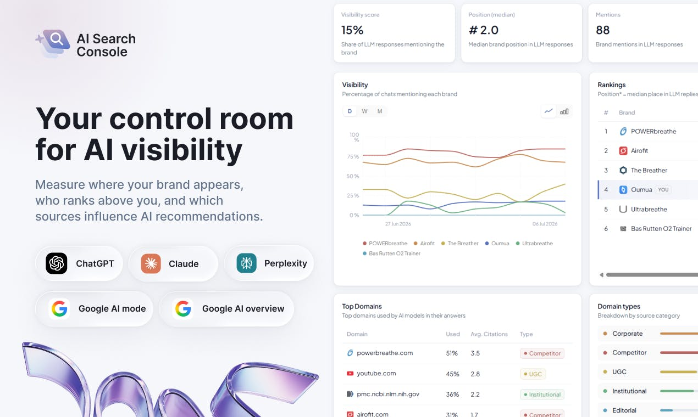
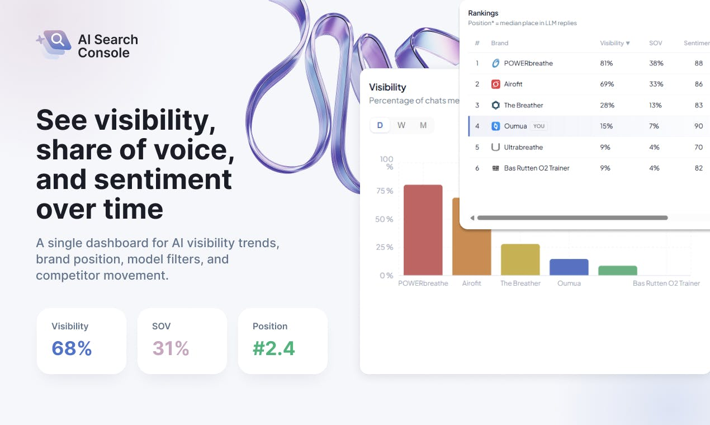

### 🎬 관련 영상
- [🎥 영상 보기](https://ph-files.imgix.net/e85fbbf3-3505-4f5d-85c3-bd744766b97b.jpeg?auto=format)

---

## 3. [Memmy Agent](https://www.producthunt.com/products/memmy)
**Votes**: 383 | **도입 난이도**: 중 | **신뢰도**: 상
**Tagline**: Let every AI remember the same you.
**서비스 링크**: https://www.producthunt.com/r/5S7SGS3F5S6RN6

**태그**: AI-Agent, Productivity, Personalization, DevTool, Agent, AI Tool, Chat

### 📌 이 서비스 한눈에 보기
여러 AI 도구들이 사용자의 맥락을 공유할 수 있게 만드는 로컬 우선 개인 메모 허브

### 🔑 주요 기능
- Claude Code, Codex 등 다양한 AI 에이전트와 연동되는 공유 메모리 제공
- 채팅, 결정, 선호도 등을 장기 기억으로 변환하여 작업 맥락 유지
- 로컬 우선(Local-first) 방식으로 데이터 제어권 및 보안 강화

### 🙋 사용자에게 어떤 점이 좋은가
사용자가 매번 새로운 채팅창에서 배경 설명을 반복할 필요 없이, 어떤 AI를 쓰더라도 동일한 개인화된 경험을 얻을 수 있습니다.

### ✅ 지금 바로 써볼 기능
- 기존에 사용하는 AI 에이전트 도구와 연동 설정하기
- 중요한 결정 사항이나 개인적 선호도를 메모로 저장하기
- 2M 무료 ChatGPT 토큰을 활용해 메모 동기화 테스트하기

### ⚠️ 사용 전 확인할 점
- 로컬 우선 방식이지만 외부 AI 도구와 연동 시 데이터 흐름 확인 필요
- 제공되는 무료 토큰 소진 후의 과금 체계 확인 필요

### 🧭 확인이 더 필요한 정보
다양한 AI 에이전트 도구들과의 구체적인 연동 방식 및 기술적 구현 난이도가 명시되지 않았습니다.

### 📸 스크린샷 및 갤러리
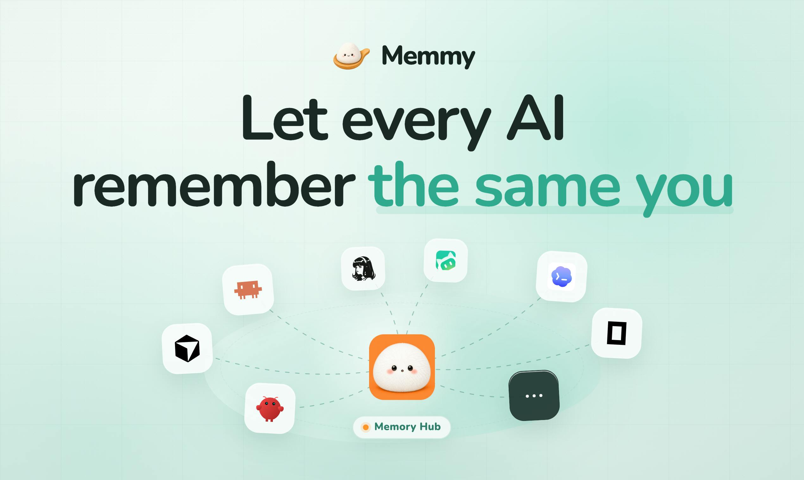
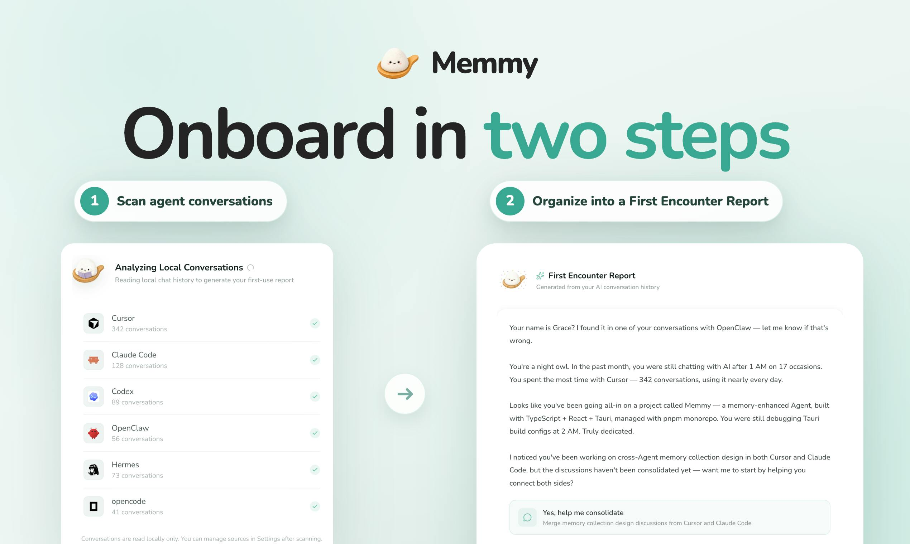
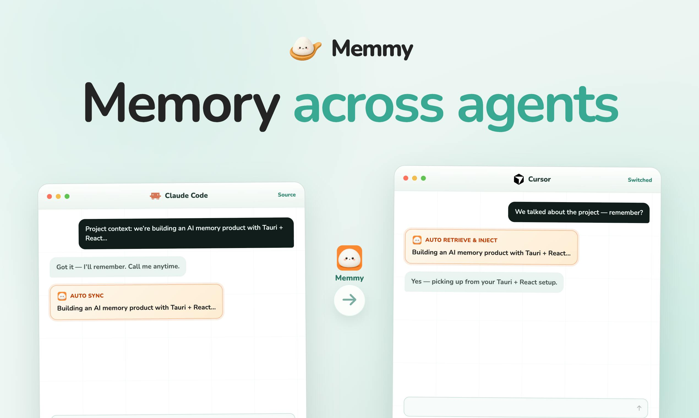

### 🎬 관련 영상
- [🎥 영상 보기](https://ph-files.imgix.net/da3328b2-91a1-4a95-a1bc-e30cc026c58e.jpeg?auto=format)

---

## 4. [Claude Code usage tracking by LangWatch ](https://www.producthunt.com/products/langwatch)
**Votes**: 287 | **도입 난이도**: 하 | **신뢰도**: 상
**Tagline**: See what your Claude Code sessions actually cost
**서비스 링크**: https://www.producthunt.com/r/5R3GKBPGWVMPBY

**태그**: DevTool, AI-Agent, Analytics, ClaudeCode

### 📌 이 서비스 한눈에 보기
Claude Code 세션의 비용과 터미널 동작을 실시간으로 추적하는 분석 도구

### 🔑 주요 기능
- 캐시 읽기/쓰기를 포함한 상세 토큰 비용 분석
- Bash 및 MCP 호출을 개별 스팬(span)으로 기록
- UI를 통한 전체 터미널 세션 리플레이 기능 제공

### 🙋 사용자에게 어떤 점이 좋은가
Claude Code 사용 시 발생하는 비용 구조를 투명하게 파악하고, 터미널 작업 과정을 시각적으로 복기할 수 있습니다.

### ✅ 지금 바로 써볼 기능
- npx langwatch claude 명령어로 즉시 실행
- 세션별 캐시 사용량 및 비용 효율성 확인
- UI에서 터미널 리플레이를 통한 작업 흐름 검토

### ⚠️ 사용 전 확인할 점
- 명령어 실행 시 세션 데이터가 LangWatch로 전송됨을 인지해야 함
- Codex 환경과의 호환성 여부 확인 필요

### 🧭 확인이 더 필요한 정보
사용자의 로컬 터미널 데이터가 어느 수준까지 수집되는지에 대한 상세 보안 정책 확인이 필요합니다.

### 📸 스크린샷 및 갤러리

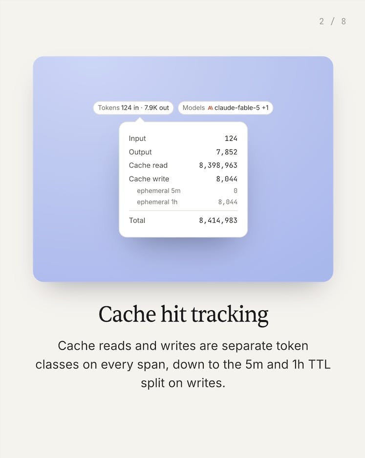
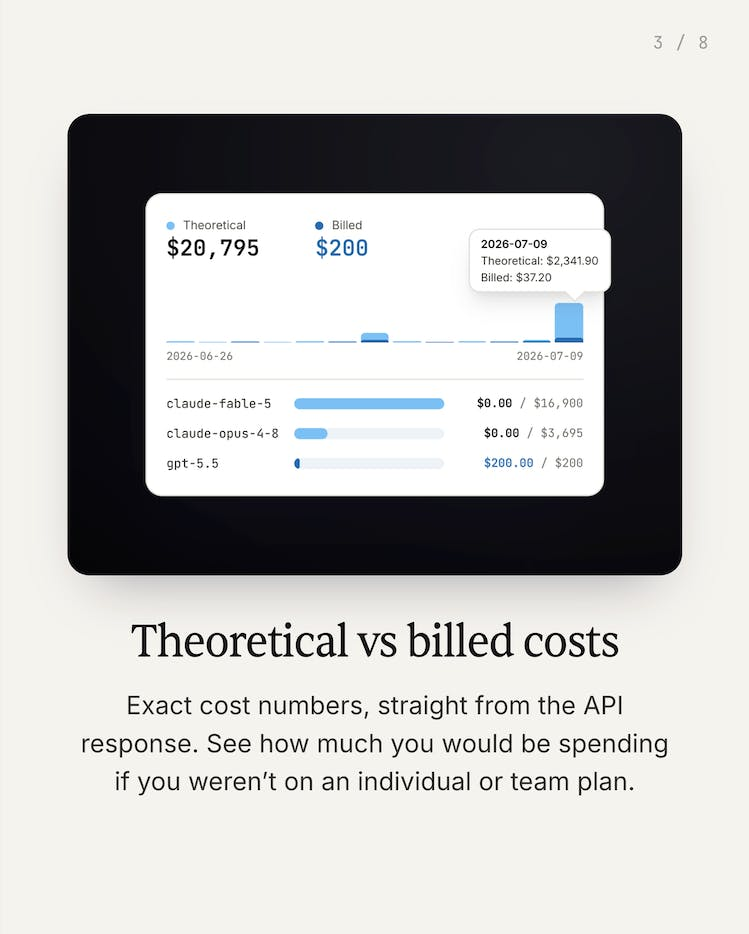

### 🎬 관련 영상
- [🎥 영상 보기](https://ph-files.imgix.net/45abac67-fc33-42dd-850f-71e71f9179d6.jpeg?auto=format)

---

## 5. [NINA](https://www.producthunt.com/products/agenq-nina-ai-product-assistant)
**Votes**: 272 | **도입 난이도**: 중 | **신뢰도**: 상
**Tagline**: Guide users step by step inside your product.
**서비스 링크**: https://www.producthunt.com/r/NKDYVHNHKYNZ5X

**태그**: SaaS, CustomerSupport, Onboarding, ProductLedGrowth, Chat, Video

### 📌 이 서비스 한눈에 보기
사용자의 질문에 실시간 인터페이스 가이드를 제공하는 지능형 온보딩 솔루션

### 🔑 주요 기능
- 사용자가 막히는 순간 제품 내부에서 즉각적인 단계별 가이드 제공
- 단순한 챗봇이나 스크립트 투어가 아닌 실시간 인터페이스 기반 가이드
- 반복적인 고객 지원(Slack, 영상, 온보딩 콜) 업무를 획기적으로 감소

### 🙋 사용자에게 어떤 점이 좋은가
고객이 매번 고객센터에 문의하거나 문서를 찾는 대신, 제품 안에서 즉시 문제를 해결할 수 있어 사용자 경험이 향상되고 지원 팀의 업무 부하가 줄어듭니다.

### ✅ 지금 바로 써볼 기능
- 제품 내 가이드 작동 방식 테스트
- 기존 고객 지원 티켓 유형과 NINA의 매칭 가능성 검토
- 실시간 인터페이스 가이드의 사용자 경험 확인

### ⚠️ 사용 전 확인할 점
- 기존 제품 UI/UX와의 통합 및 시각적 충돌 여부 확인 필요
- 사용자의 질문 의도를 정확히 파악하는지 성능 검증 필요

### 🧭 확인이 더 필요한 정보
NINA가 지원하는 구체적인 기술 스택(SDK, 임베드 방식 등)과 기존 워크플로우와의 통합 방식에 대한 정보가 부족합니다.

### 📸 스크린샷 및 갤러리
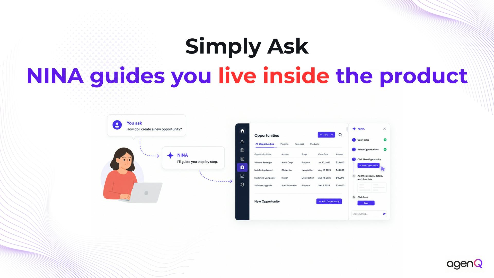
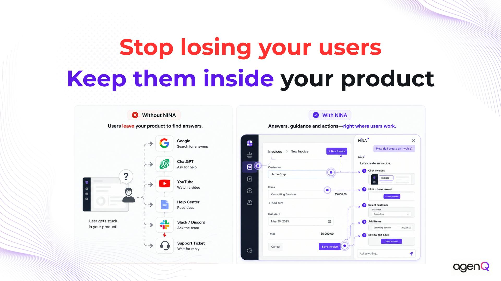
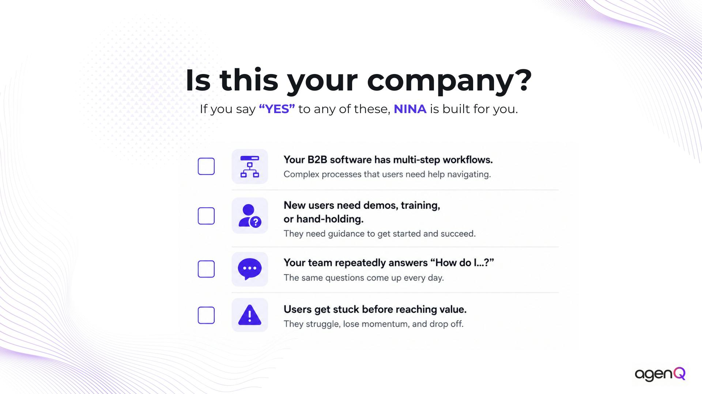

### 🎬 관련 영상
- [🎥 영상 보기](https://ph-files.imgix.net/a95fc8c8-f009-4fe2-a9d4-ed7f6275d0b8.jpeg?auto=format)

---

## 6. [Pally](https://www.producthunt.com/products/pally)
**Votes**: 222 | **도입 난이도**: 중 | **신뢰도**: 상
**Tagline**: Your personal assistant that lives in your texts
**서비스 링크**: https://www.producthunt.com/r/O2GO374S5UU2NW

**태그**: AI Assistant, Automation, Productivity, Messaging, Agent

### 📌 이 서비스 한눈에 보기
iMessage와 WhatsApp을 통해 당신의 말투로 대신 답장해주는 개인용 텍스트 비서

### 🔑 주요 기능
- iMessage 및 WhatsApp과 네이티브로 연결되는 텍스트 에이전트
- 사용자의 말투와 맥락을 반영한 자동 답장 기능
- 메시지 모니터링 및 실시간 알림을 통한 시간 절약

### 🙋 사용자에게 어떤 점이 좋은가
메시지 확인과 답장에 드는 시간을 줄여주며, 중요한 연락을 놓치지 않으면서도 개인적인 대화 흐름을 유지할 수 있습니다.

### ✅ 지금 바로 써볼 기능
- 메시지 자동 답장 기능 테스트
- 자신의 말투가 잘 반영되는지 확인
- 주요 연락처에 대한 알림 설정

### ⚠️ 사용 전 확인할 점
- 개인적인 대화 내용에 대한 보안 및 프라이버시 검토 필요
- AI가 의도와 다르게 답장할 가능성 대비

### 🧭 확인이 더 필요한 정보
개인 메시지 접근에 따른 보안 프로토콜과 데이터 처리 방식에 대한 상세 정보가 필요합니다.

### 📸 스크린샷 및 갤러리
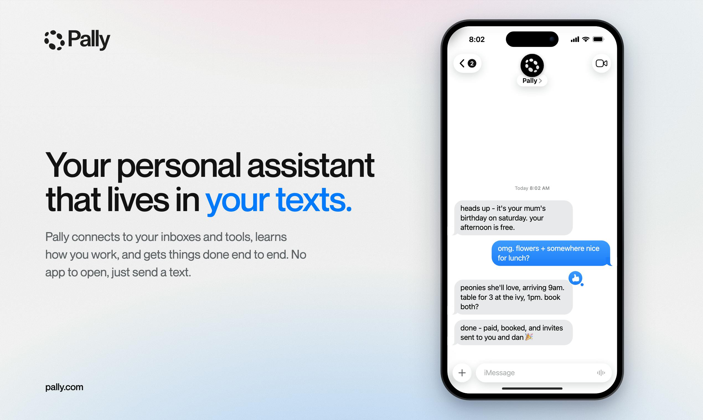
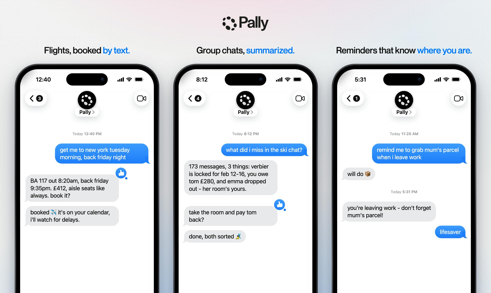

### 🎬 관련 영상
- [🎥 영상 보기](https://ph-files.imgix.net/f39fbe6a-5b02-492a-b3b2-6fd1cae146c9.jpeg?auto=format)

---

## 7. [Greplica](https://www.producthunt.com/products/greplica)
**Votes**: 164 | **도입 난이도**: 하 | **신뢰도**: 상
**Tagline**: Self updating wiki for coding agents
**서비스 링크**: https://www.producthunt.com/r/Y6ERMPHE5K2ZGA

**태그**: DevTool, AI-Agent, OpenSource, Productivity, Agent, AI Tool

### 📌 이 서비스 한눈에 보기
코딩 에이전트와 개발팀을 위한 실시간 동기화 코드 위키

### 🔑 주요 기능
- 코딩 세션에서 결정 사항, 제약 조건, 실패 사례 등을 자동으로 추출하여 지식화
- 정적인 문서가 아닌 코드 저장소(Repo)에 기반한 실시간 업데이트 방식
- 개발자와 AI 에이전트 모두가 공유할 수 있는 통합 메모리 제공

### 🙋 사용자에게 어떤 점이 좋은가
코드 베이스의 맥락을 수동으로 문서화할 필요 없이, AI 에이전트와 팀원들이 항상 최신 의사결정 사항을 공유하며 작업할 수 있습니다.

### ✅ 지금 바로 써볼 기능
- 로컬 환경에 설치하여 기존 코드베이스와 연동하기
- 코딩 에이전트의 컨텍스트 제공용으로 활용해보기
- 팀 내 공유 모드를 통해 협업 워크플로우 테스트하기

### ⚠️ 사용 전 확인할 점
- 자동 추출된 정보의 정확성 및 노이즈 발생 여부 확인 필요
- 로컬 실행 시 리소스 사용량 및 보안 정책 검토

### 🧭 확인이 더 필요한 정보
자동 추출된 데이터가 코드 저장소의 보안이나 성능에 미치는 영향에 대한 구체적인 정보가 부족합니다.

### 📸 스크린샷 및 갤러리
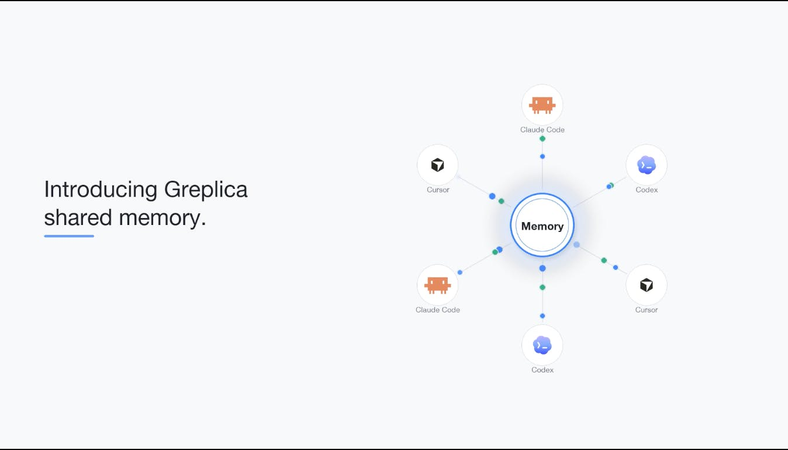
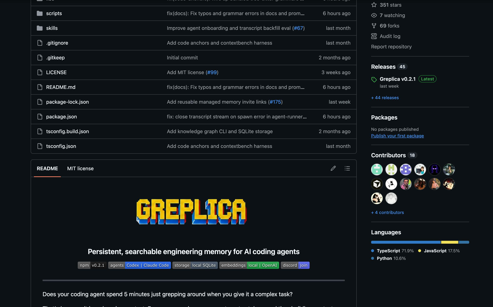
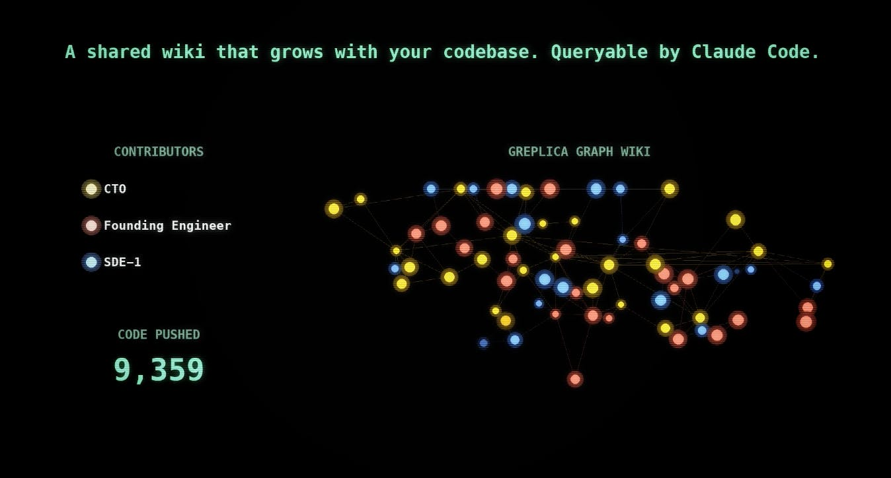

### 🎬 관련 영상
- [🎥 영상 보기](https://ph-files.imgix.net/5add8513-786b-446f-b48f-01684a311929.jpeg?auto=format)

---

## 8. [Expert Chase for iOS & Android](https://www.producthunt.com/products/expert-chase-deleted-1107920)
**Votes**: 145 | **도입 난이도**: 하 | **신뢰도**: 상
**Tagline**: Where human life runs with AI
**서비스 링크**: https://www.producthunt.com/r/ZK5OM6K2OEWREN

**태그**: Productivity, Mobile, Health, Automation, Integration, AI Tool

### 📌 이 서비스 한눈에 보기
애플과 구글 생태계를 아우르는 AI 기반의 통합 일정 및 건강 관리 솔루션

### 🔑 주요 기능
- iOS, Android, Web을 모두 지원하는 멀티 플랫폼 환경 제공
- 애플 및 구글의 캘린더, 할 일, 건강 데이터와의 강력한 네이티브 통합
- 사용자 요구를 반영한 모바일 앱 출시 및 사용자 경험 개선

### 🙋 사용자에게 어떤 점이 좋은가
사용 중인 스마트폰의 캘린더, 할 일 목록, 건강 데이터를 하나의 앱에서 통합 관리하여 삶의 흐름을 최적화할 수 있습니다.

### ✅ 지금 바로 써볼 기능
- 사용 중인 캘린더(Apple/Google) 연동하기
- 할 일 목록(Reminders/Tasks) 동기화하기
- 건강 데이터(Health/Health Connect) 연결하여 데이터 통합하기

### ⚠️ 사용 전 확인할 점
- 플랫폼 간 데이터 동기화 속도 및 정확도 확인 필요
- 개인 건강 데이터 접근에 따른 보안 및 프라이버시 설정 검토

### 🧭 확인이 더 필요한 정보
AI가 구체적으로 어떤 방식으로 사용자의 삶과 데이터를 처리하는지에 대한 상세 기능 설명이 부족합니다.

### 📸 스크린샷 및 갤러리

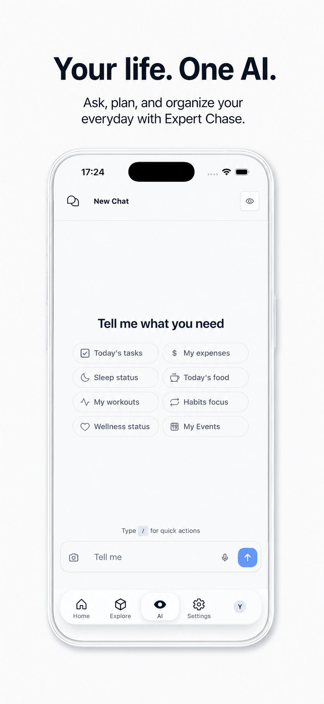
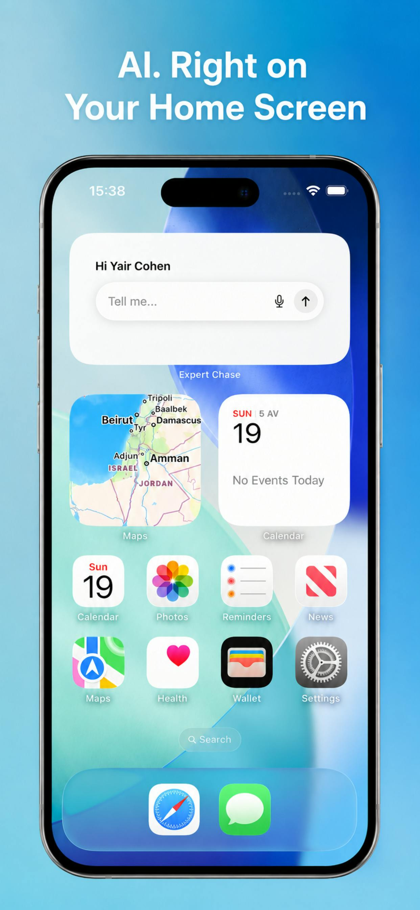

---

## 9. [Focus Room](https://www.producthunt.com/products/focus-room)
**Votes**: 143 | **도입 난이도**: 하 | **신뢰도**: 상
**Tagline**: Turn YouTube into your personal learning platform 
**서비스 링크**: https://www.producthunt.com/r/QVIVCH4IY2RXQW

**태그**: EdTech, Productivity, Learning, YouTube, Video

### 📌 이 서비스 한눈에 보기
유튜브를 체계적인 온라인 강의 플랫폼으로 변환해주는 학습 도구

### 🔑 주요 기능
- 유튜브 영상 및 플레이리스트를 구조화된 코스 형태로 변환
- 타임스탬프 기반의 레슨 탐색 및 요약/노트 생성 기능
- 추천 알고리즘 등 학습 방해 요소를 제거한 집중 환경 제공

### 🙋 사용자에게 어떤 점이 좋은가
유튜브의 방대한 교육 콘텐츠를 산만한 광고 없이 체계적인 학습 커리큘럼으로 관리할 수 있습니다.

### ✅ 지금 바로 써볼 기능
- 학습하고 싶은 유튜브 플레이리스트를 코스로 변환하기
- 생성된 요약본과 노트를 활용해 학습 내용 정리하기
- 진도 추적 기능을 통해 학습 진행 상황 확인하기

### ⚠️ 사용 전 확인할 점
- 유튜브 영상 자체의 품질에 따라 학습 효과가 달라질 수 있음
- 외부 플랫폼(YouTube) 기반이므로 원본 영상 삭제 시 데이터 유실 가능성 있음

### 🧭 확인이 더 필요한 정보
유튜브 외부의 개인 학습 데이터 저장 방식 및 보안 정책에 대한 상세 정보가 필요합니다.

### 📸 스크린샷 및 갤러리
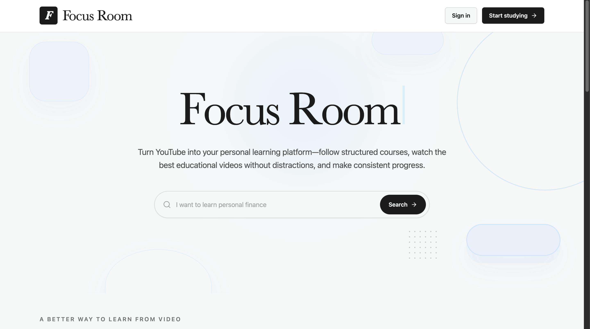
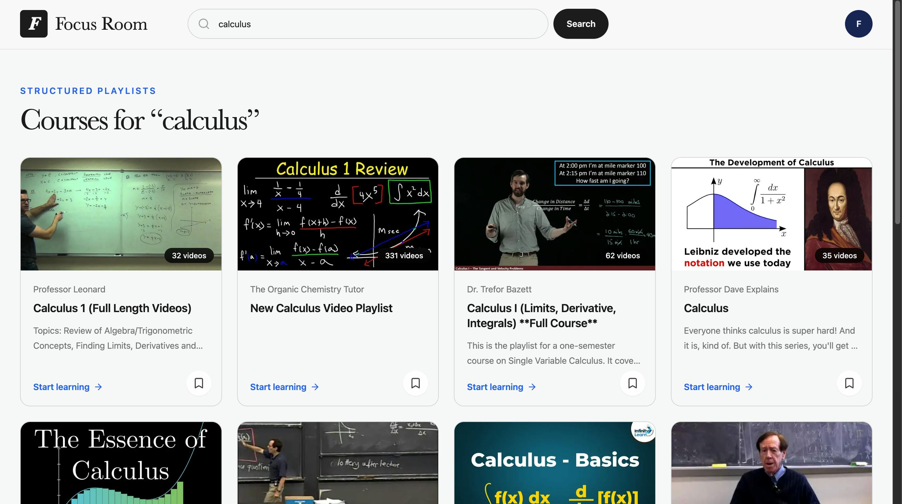
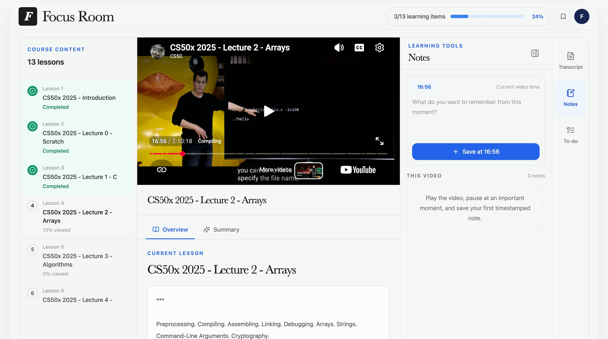

---

## 10. [agentOS](https://www.producthunt.com/products/agentos-3)
**Votes**: 133 | **도입 난이도**: 중 | **신뢰도**: 상
**Tagline**: 254× cheaper sandbox alternative, powered by WebAssembly
**서비스 링크**: https://www.producthunt.com/r/DVJCQ4F3GS7JKD

**태그**: AI, DevTool, WebAssembly, Cloud, Agent

### 📌 이 서비스 한눈에 보기
WebAssembly 기반의 초저비용·고성능 AI 에이전트용 리눅스 운영체제 라이브러리

### 🔑 주요 기능
- WebAssembly 기술을 활용한 샌드박스 및 VM 대체 솔루션
- 기존 방식 대비 254배 저렴한 비용 효율성 제공
- Claude Code, Codex 등 주요 AI 에이전트 프레임워크 지원

### 🙋 사용자에게 어떤 점이 좋은가
별도의 복잡한 샌드박스나 VM 설정 없이도 AI 에이전트에게 안전하고 독립적인 실행 환경을 즉시 제공할 수 있습니다.

### ✅ 지금 바로 써볼 기능
- 지원되는 AI 에이전트(Claude Code 등)와 연동 테스트
- WebAssembly 기반의 실행 환경 성능 검증
- 기존 샌드박스 환경 대비 비용 절감 효과 산출

### ⚠️ 사용 전 확인할 점
- WebAssembly 환경에서의 리눅스 기능 호환성 확인 필요
- 특정 에이전트 프레임워크와의 최적화 수준 검토

### 🧭 확인이 더 필요한 정보
254배 저렴하다는 비용 비교의 구체적인 기준과 벤치마크 데이터 확인이 필요합니다.

### 📸 스크린샷 및 갤러리

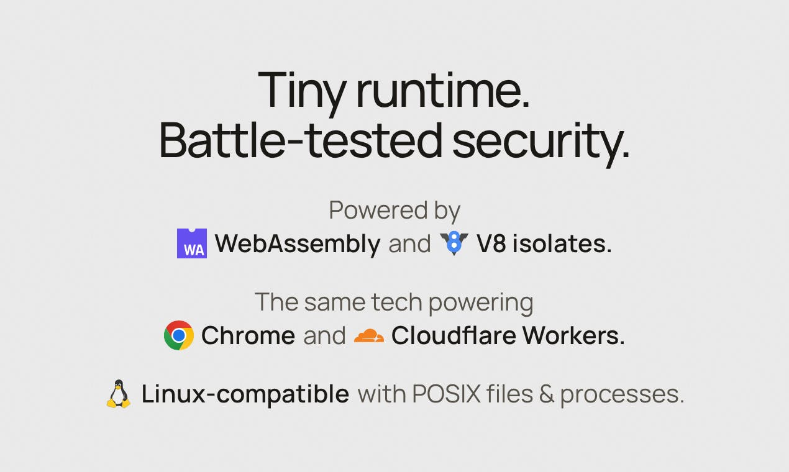
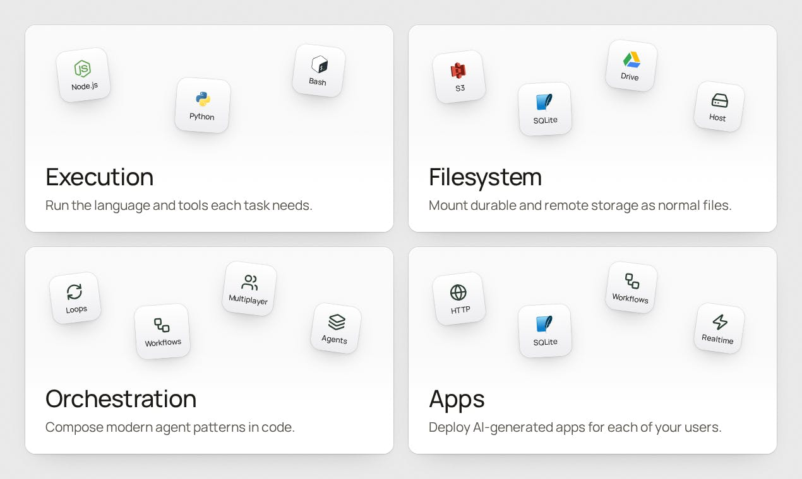

---

## 11. [Yap](https://www.producthunt.com/products/yap-5)
**Votes**: 124 | **도입 난이도**: 하 | **신뢰도**: 상
**Tagline**: Open-source voice dictation for Mac, fully on-device
**서비스 링크**: https://www.producthunt.com/r/JT6THZIXX2CFC3

**태그**: Productivity, Mac, OpenSource, Voice-to-Text, AI Tool, API

### 📌 이 서비스 한눈에 보기
개인정보 유출 걱정 없이 맥 어디서든 사용할 수 있는 오픈소스 음성 받아쓰기 도구

### 🔑 주요 기능
- macOS 기본 API를 활용한 완전한 온디바이스(On-device) 처리
- 단축키를 통한 간편한 음성 입력 및 자동 텍스트 붙여넣기
- 4MB의 가벼운 용량과 낮은 메모리 점유율로 최적화된 성능

### 🙋 사용자에게 어떤 점이 좋은가
별도의 모델 다운로드나 클라우드 전송 없이 맥의 어떤 입력창에서도 안전하고 빠르게 음성 타이핑을 할 수 있습니다.

### ✅ 지금 바로 써볼 기능
- 단축키 설정하여 음성 입력 테스트하기
- 다양한 앱(메모장, 브라우저 등)에서의 입력 호환성 확인하기

### ⚠️ 사용 전 확인할 점
- macOS 시스템 API 의존성으로 인해 특정 OS 버전에서만 작동할 수 있음
- 온디바이스 방식이므로 시스템 음성 인식 성능에 따라 정확도가 결정됨

### 🧭 확인이 더 필요한 정보
설명에 언급된 'macOS 26'이 오타인지 혹은 특정 개발 환경을 의미하는지 확인이 필요합니다.

### 📸 스크린샷 및 갤러리
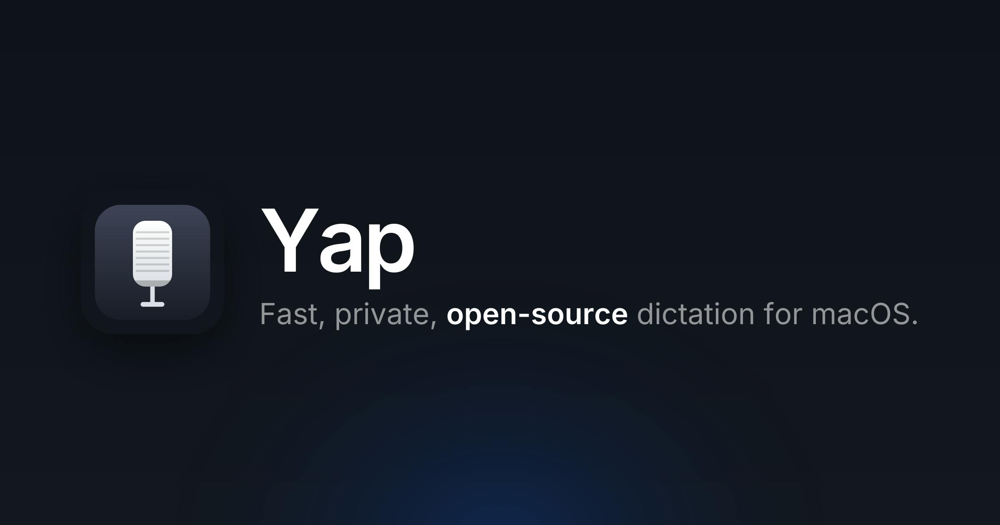
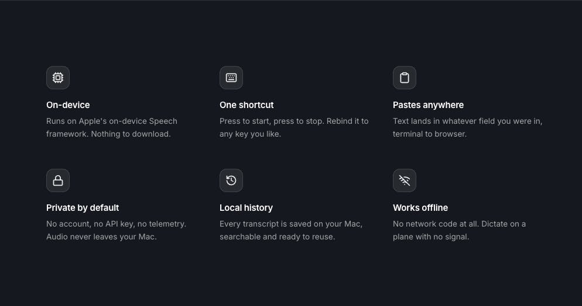

### 🎬 관련 영상
- [🎥 영상 보기](https://ph-files.imgix.net/54326b90-63b4-4316-9c31-11f14d2f1bf3.jpeg?auto=format)

---

## 12. [CraftStory](https://www.producthunt.com/products/craftstory)
**Votes**: 121 | **도입 난이도**: 하 | **신뢰도**: 상
**Tagline**: Photorealistic human video, powered by compact AI
**서비스 링크**: https://www.producthunt.com/r/B3PMR2PY3RVRFL

**태그**: AI-Video, Content-Creation, Digital-Human, Marketing-Tools, AI Tool, Video, Vision

### 📌 이 서비스 한눈에 보기
단 한 장의 사진이나 짧은 영상으로 실사급 인물 영상을 만드는 AI 비디오 생성 도구

### 🔑 주요 기능
- 단일 이미지 또는 15초 영상으로 커스텀 아바타 생성 가능
- 전문 배우 영상을 학습한 독자 모델로 구현하는 초실사적 표현력
- L&D(교육), 팟캐스트, UGC 제작에 최적화된 비용 효율성

### 🙋 사용자에게 어떤 점이 좋은가
고가의 촬영 장비 없이도 전문적인 인물 중심 영상을 저렴하고 빠르게 제작할 수 있습니다.

### ✅ 지금 바로 써볼 기능
- 단일 이미지로 실사 아바타 생성해보기
- 15초 영상을 활용한 커스텀 아바타 학습 테스트
- 프로모션 코드를 활용한 Producer 플랜 체험

### ⚠️ 사용 전 확인할 점
- 사용자의 의도에 따른 표정 및 움직임의 자연스러움 차이 확인 필요
- 초기 학습 데이터(15초 영상)의 품질이 결과물에 미치는 영향 고려

### 🧭 확인이 더 필요한 정보
영상 생성 시 발생하는 최종 비용 구조와 세부적인 편집 기능 범위에 대한 추가 확인이 필요합니다.

### 📸 스크린샷 및 갤러리

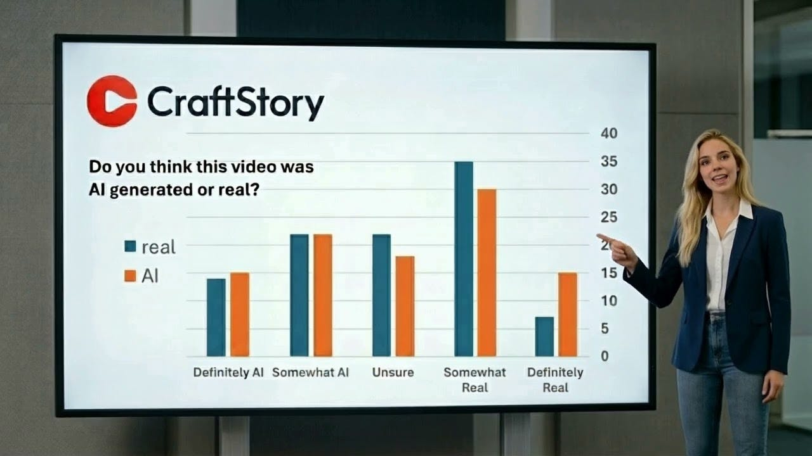

### 🎬 관련 영상
- [🎥 영상 보기](https://ph-files.imgix.net/4a78d724-cf6b-4c47-8b6e-d417b74a18f2.jpeg?auto=format)

---

## 13. [tablo](https://www.producthunt.com/products/tablo-a-desktop-cat-widget)
**Votes**: 116 | **도입 난이도**: 하 | **신뢰도**: 상
**Tagline**: A tiny cat that watches your AI coding agents for you
**서비스 링크**: https://www.producthunt.com/r/DKBTCCS7VNPF54

**태그**: DevTool, AI-Agent, Productivity, Agent, AI Tool

### 📌 이 서비스 한눈에 보기
AI 코딩 에이전트의 작업 진행 상황과 컨텍스트 상태를 실시간으로 모니터링하는 위젯형 도구

### 🔑 주요 기능
- Claude Code 및 Codex 세션의 실시간 컨텍스트 점유율 모니터링
- 도구 실행 승인 및 사용자 개입이 필요한 시점의 즉각적인 알림
- 화면 구석에서 방해 없이 작동하는 아늑한 위젯 UI

### 🙋 사용자에게 어떤 점이 좋은가
AI 에이전트가 작업 중 멈추거나 컨텍스트 창이 가득 차는 상황을 실시간으로 파악하여, 작업 흐름을 놓치지 않고 효율적으로 관리할 수 있습니다.

### ✅ 지금 바로 써볼 기능
- 화면 구석에 위젯 배치하기
- 실시간 컨텍스트 미터 확인하기
- 에이전트 작업 중 알림 설정하기

### ⚠️ 사용 전 확인할 점
- 에이전트 도구(Claude Code, Codex 등)와의 연동 방식 확인 필요
- 백그라운드 실행 시 시스템 리소스 점유율 확인 필요

### 🧭 확인이 더 필요한 정보
현재 제공되는 구체적인 에이전트 지원 범위와 설치 방식에 대한 상세 정보가 필요합니다.

### 📸 스크린샷 및 갤러리
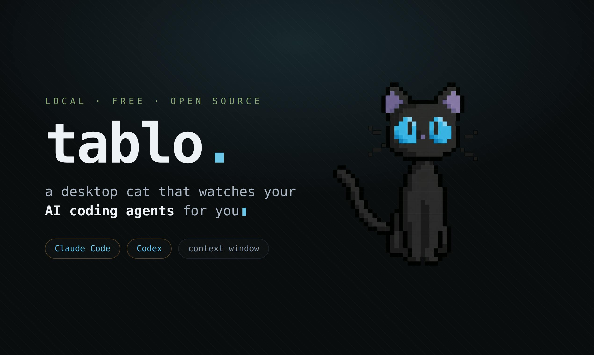
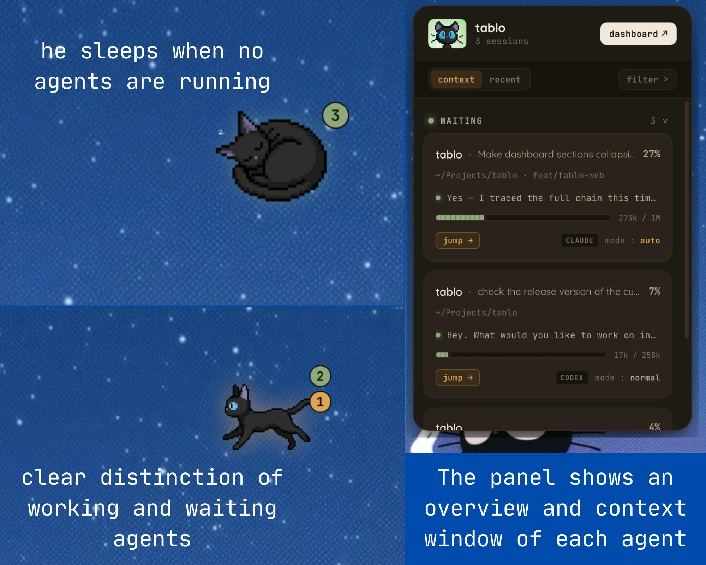
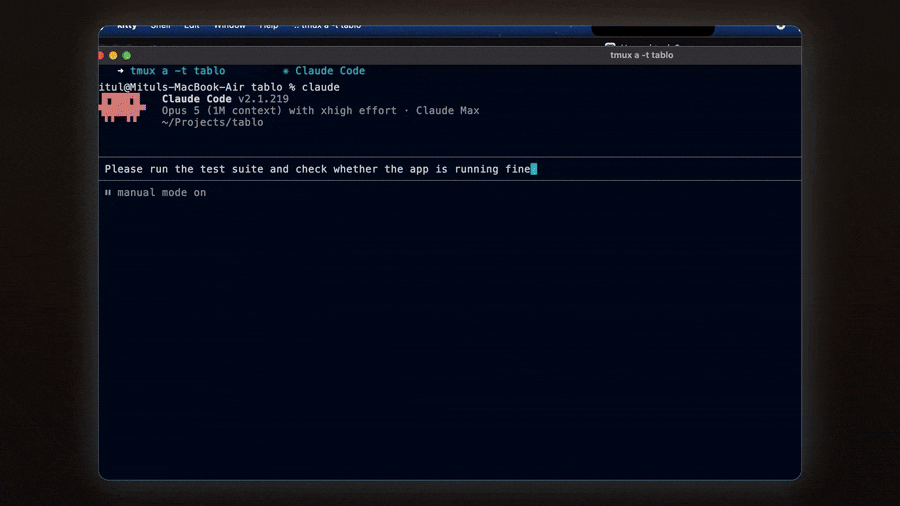

---

## 14. [Caimera](https://www.producthunt.com/products/caimera-2)
**Votes**: 102 | **도입 난이도**: 하 | **신뢰도**: 상
**Tagline**: AI Visual Production Platform for Fashion Teams
**서비스 링크**: https://www.producthunt.com/r/KHVJ5UX5JMQ652

**태그**: AI, Fashion, E-commerce, Content Creation, Marketing, AI Tool, Video

### 📌 이 서비스 한눈에 보기
패션 브랜드를 위한 AI 기반 비주얼 콘텐츠 제작 플랫폼

### 🔑 주요 기능
- 스케치 단계부터 판매까지 이어지는 엔드투엔드 워크플로우 지원
- AI를 활용한 고퀄리티 제품 사진 및 영상 생성
- 이커머스 및 소셜 미디어용 콘텐츠 제작 가속화

### 🙋 사용자에게 어떤 점이 좋은가
패션 팀이 제품 출시 주기를 단축하고, 적은 비용으로 전문적인 마케팅 비주얼을 확보할 수 있습니다.

### ✅ 지금 바로 써볼 기능
- 스케치를 활용한 제품 사진 생성 테스트
- 소셜 미디어용 홍보 영상 제작
- 이커머스용 제품 이미지 생성

### ⚠️ 사용 전 확인할 점
- AI 생성 이미지의 실물 제품과의 일치성 확인 필요
- 브랜드 고유의 스타일을 유지하기 위한 프롬프트 제어 숙련도 필요

### 🧭 확인이 더 필요한 정보
구체적인 생성 품질 및 실물 제품과의 정밀한 매칭 기능 여부는 직접 테스트가 필요합니다.

### 📸 스크린샷 및 갤러리

### 🎬 관련 영상
- [🎥 영상 보기](https://ph-files.imgix.net/688080b8-c727-41d2-871e-9e104a5264fb.jpeg?auto=format)

---

## 15. [Premation](https://www.producthunt.com/products/premation)
**Votes**: 99 | **도입 난이도**: 상 | **신뢰도**: 중
**Tagline**: An open-source AI alternative to After Effects
**서비스 링크**: https://www.producthunt.com/r/EMI4NPH7TZYILF

**태그**: Design, OpenSource, AI, MotionGraphics, CreativeTools, AI Tool, DevTool

### 📌 이 서비스 한눈에 보기
자유로운 커스텀과 AI 기능이 결합된 오픈소스 모션 그래픽 편집 도구

### 🔑 주요 기능
- 애프터 이펙트를 대체하기 위한 오픈소스 기반 AI 네이티브 툴
- 타임라인 기반 편집과 2D/3D 모션 디자인 기능 통합
- 사용자가 직접 확장하고 커스텀할 수 있는 개방형 플랫폼

### 🙋 사용자에게 어떤 점이 좋은가
특정 기업의 폐쇄적인 툴에서 벗어나, 개발자와 크리에이터가 직접 기능을 확장하며 독창적인 모션 그래픽을 제작할 수 있습니다.

### ✅ 지금 바로 써볼 기능
- 타임라인 기반의 2D/3D 모션 작업 시도
- 오픈소스 환경에서의 커스텀 및 확장성 테스트
- 통합된 AI 어시스턴스 기능 활용

### ⚠️ 사용 전 확인할 점
- 오픈소스 프로젝트 특성상 전문적인 숙련도가 필요할 수 있음
- 상용 소프트웨어 대비 기능 완성도 및 생태계 확인 필요

### 🧭 확인이 더 필요한 정보
현재 제공되는 구체적인 기능의 완성도와 하드웨어 요구 사양에 대한 정보가 부족합니다.

### 📸 스크린샷 및 갤러리
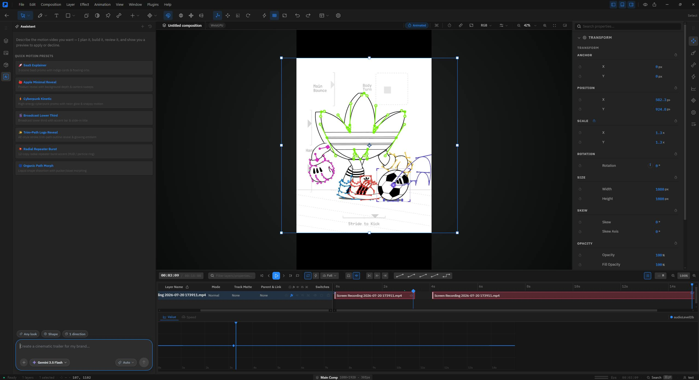
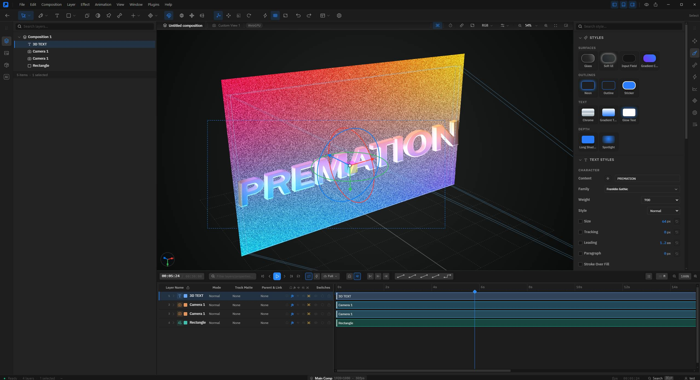
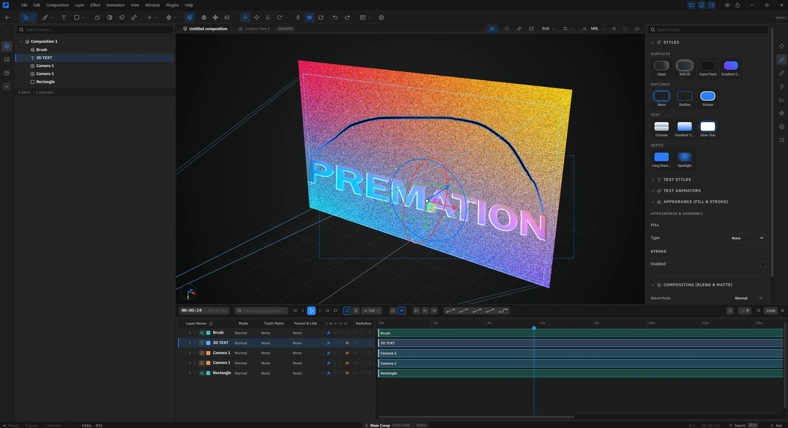

---

## 16. [ Laxis](https://www.producthunt.com/products/laxis-2)
**Votes**: 97 | **도입 난이도**: 하 | **신뢰도**: 상
**Tagline**: Make meeting notes awesome, type 4x faster, translate live
**서비스 링크**: https://www.producthunt.com/r/4ARYS6IZV2AU74

**태그**: Productivity, AI, Transcription, Translation, Automation, AI Tool, Email

### 📌 이 서비스 한눈에 보기
회의 기록부터 요약, 실시간 번역 및 빠른 타이핑까지 지원하는 올인원 AI 비서

### 🔑 주요 기능
- 봇 없이 회의를 녹음하고 요약하는 기능
- 타이핑보다 4배 빠른 이메일 및 노트 받아쓰기
- 100개 이상의 언어를 지원하는 실시간 전사 및 번역

### 🙋 사용자에게 어떤 점이 좋은가
회의록 작성 시간을 획기적으로 줄여주며, 외국어 회의 상황에서도 실시간 번역을 통해 원활한 소통과 기록을 동시에 해결할 수 있습니다.

### ✅ 지금 바로 써볼 기능
- 회의 녹음 및 자동 요약 기능 테스트
- 실시간 번역 및 전사 기능 확인
- 받아쓰기 기능을 활용한 이메일 작성

### ⚠️ 사용 전 확인할 점
- 사용자 환경에 따른 봇 없는 녹음 방식의 호환성 확인 필요
- 언어별 번역 및 전사 정확도 차이 확인 필요

### 🧭 확인이 더 필요한 정보
구체적인 플랫폼(Zoom, Meet 등) 지원 범위와 보안 정책에 대한 상세 정보가 필요합니다.

### 📸 스크린샷 및 갤러리
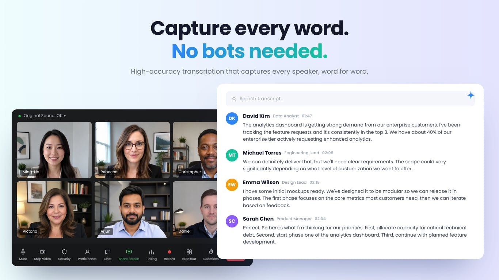
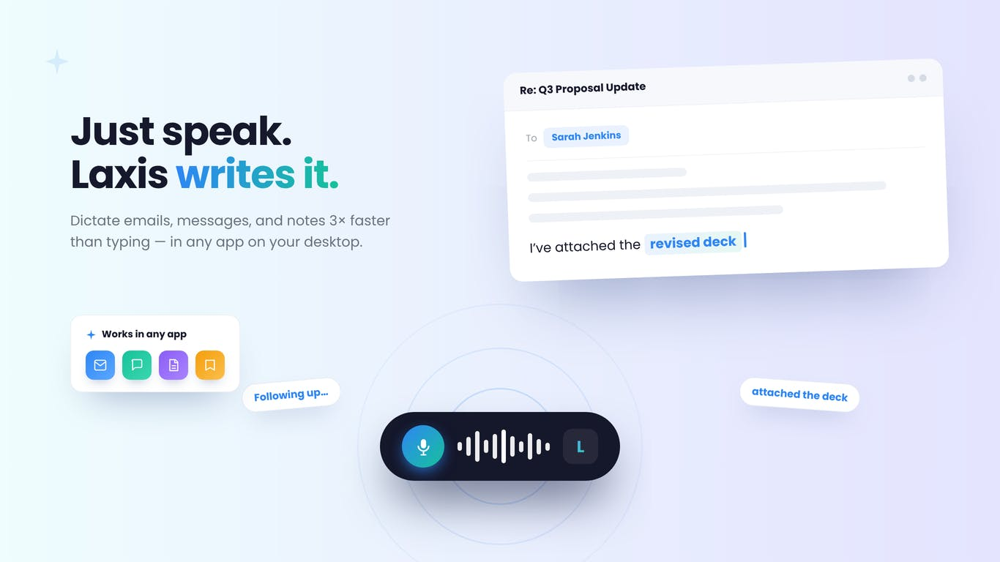
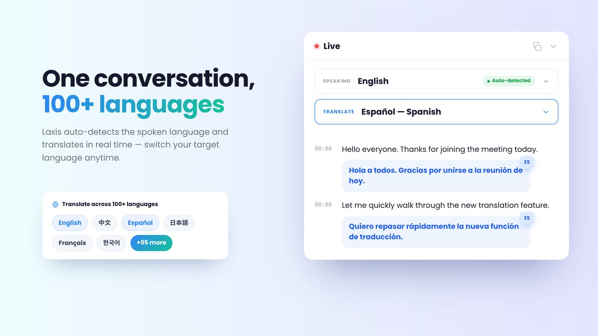

### 🎬 관련 영상
- [🎥 영상 보기](https://ph-files.imgix.net/f62d9857-98fd-4687-b9d3-d43c37e3ce7a.jpeg?auto=format)

---

## 17. [docktor](https://www.producthunt.com/products/docktor)
**Votes**: 88 | **도입 난이도**: 하 | **신뢰도**: 상
**Tagline**: Your Dock's wasted side space, now full of widgets
**서비스 링크**: https://www.producthunt.com/r/A6MILQYKAAZISF

**태그**: Productivity, macOS, Utility, Customization

### 📌 이 서비스 한눈에 보기
맥 독(Dock) 주변의 빈 공간을 유용한 위젯 공간으로 변환해주는 생산성 도구

### 🔑 주요 기능
- Dock 양옆의 유휴 공간을 활용한 위젯 배치
- 메뉴 바 점유 없이 날씨, 캘린더, 시스템 상태 등을 확인 가능
- 앱 위에 마우스를 올리면 열려 있는 창을 미리 볼 수 있는 호버 프리뷰 기능

### 🙋 사용자에게 어떤 점이 좋은가
별도의 창을 열거나 메뉴 바를 복잡하게 만들지 않고도, 시선이 머무는 Dock 주변에서 핵심 정보를 즉시 확인할 수 있습니다.

### ✅ 지금 바로 써볼 기능
- Dock 주변 빈 공간에 위젯 배치해보기
- 호버 프리뷰 기능을 통한 앱 창 미리보기 활용하기
- 자주 확인하는 시스템 정보 위젯 설정하기

### ⚠️ 사용 전 확인할 점
- Dock 크기나 위치 설정에 따라 시각적 간섭이 발생할 수 있음
- 현재 제공되는 위젯 종류가 제한적일 수 있음

### 🧭 확인이 더 필요한 정보
향ек 위젯 종류의 확장성과 시스템 리소스 점유율에 대한 정보가 필요합니다.

### 📸 스크린샷 및 갤러리

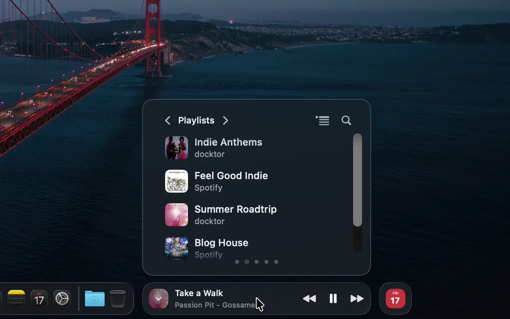
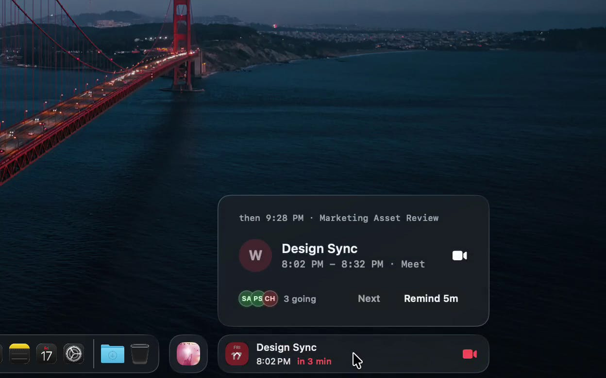

### 🎬 관련 영상
- [🎥 영상 보기](https://ph-files.imgix.net/4a2b0264-20c2-4826-8303-23ee38fba51c.jpeg?auto=format)

---

## 18. [Cursor Crane](https://www.producthunt.com/products/cursor-crane)
**Votes**: 86 | **도입 난이도**: 상 | **신뢰도**: 상
**Tagline**: Control your Mac at the pace of your keyboard
**서비스 링크**: https://www.producthunt.com/r/3B2H2UJNPCIYWN

**태그**: Productivity, Mac, Automation, Workflow

### 📌 이 서비스 한눈에 보기
키보드만으로 윈도우 관리부터 텍스트 편집까지 제어하는 맥용 워크플로우 자동화 도구

### 🔑 주요 기능
- UI 요소 중심을 넘어 윈도우 및 멀티 윈도우 워크플로우로 확장된 힌트 기반 제어
- 예측 가능한 모드 전환 및 커스텀 스크립트 실행 기능
- 여러 줄 텍스트 선택 및 외부 에디터 연동 등 복잡한 키보드 작업을 간소화

### 🙋 사용자에게 어떤 점이 좋은가
마우스로 손을 옮기는 빈도를 줄이고, 키보드 중심의 일관된 인터랙션 모델로 작업 속도를 극대화할 수 있습니다.

### ✅ 지금 바로 써볼 기능
- 전용 모드를 활용한 윈도우 전환 및 관리
- Text Area Portal을 통한 외부 에디터 편집
- Element Menu를 이용한 UI 텍스트 캡처 및 복사

### ⚠️ 사용 전 확인할 점
- 새로운 힌트 기반 인터랙션 방식에 익숙해지는 학습 곡선이 존재함
- 키보드 중심의 워크플로우로 인해 기존 마우스 중심 작업 방식과의 충돌 가능성

### 🧭 확인이 더 필요한 정보
사용자의 숙련도에 따른 실제 작업 효율 향상 폭과 시스템 리소스 점유율은 확인이 필요합니다.

### 📸 스크린샷 및 갤러리
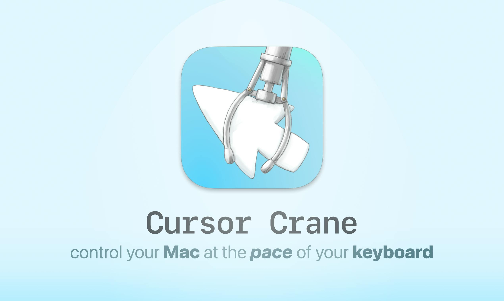
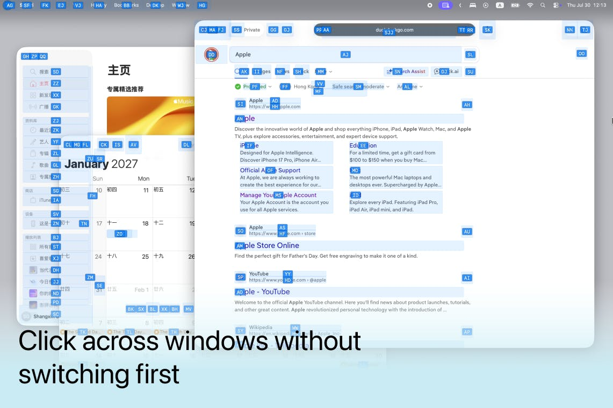
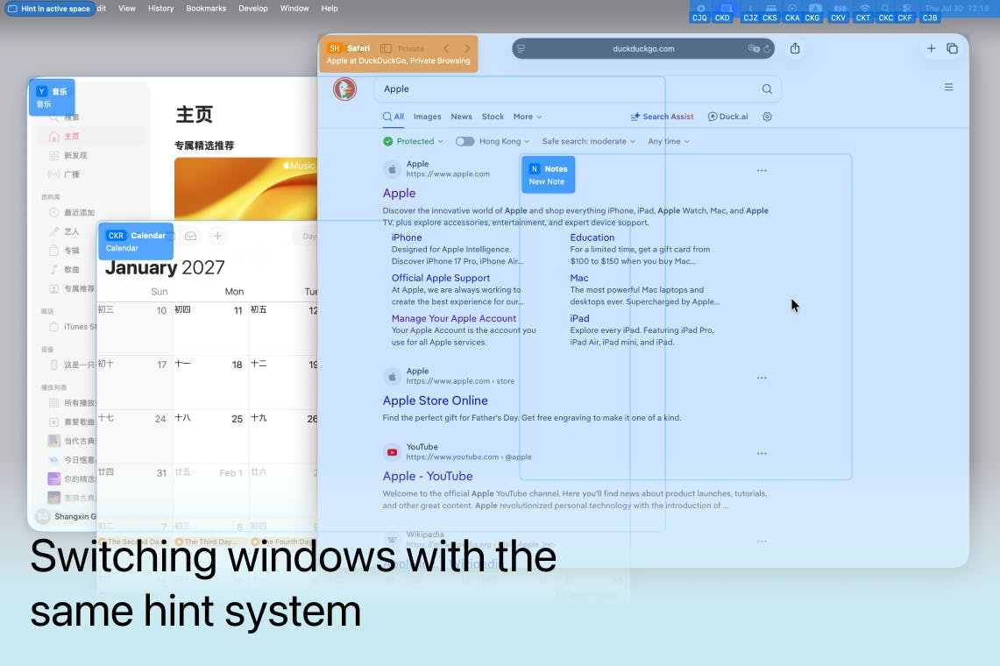

### 🎬 관련 영상
- [🎥 영상 보기](https://ph-files.imgix.net/e6826943-d808-4bf5-b370-8e5e76fe9ccf.jpeg?auto=format)

---

## 19. [Virre](https://www.producthunt.com/products/virre)
**Votes**: 84 | **도입 난이도**: 중 | **신뢰도**: 상
**Tagline**: A private relationship system for your career and network.
**서비스 링크**: https://www.producthunt.com/r/HAWEVUZM4TQG62

**태그**: Networking, CRM, Productivity, Personal Intelligence

### 📌 이 서비스 한눈에 보기
단순한 인맥 관리를 넘어 의미 있는 기회로 연결하는 프라이빗 관계 지능 시스템

### 🔑 주요 기능
- 네트워크, 대화, 목표, 이벤트를 한곳에서 관리하는 통합 시스템
- 단순한 연락처 저장이 아닌 관계의 맥락과 다음 행동을 제안
- 관계를 비즈니스적 거래로 전락시키지 않는 개인화된 관리 방식

### 🙋 사용자에게 어떤 점이 좋은가
흩어져 있는 인맥 정보를 체계적으로 정리하고, 누구에게 어떤 타이밍에 연락해야 할지 명확한 가이드를 제공받을 수 있습니다.

### ✅ 지금 바로 써볼 기능
- 기존 인맥 및 대화 기록 데이터 가져오기
- 개인적 관계 목표 설정하기
- 시스템이 추천하는 다음 후속 조치(Follow-up) 실행하기

### ⚠️ 사용 전 확인할 점
- 데이터 입력 방식에 따라 추천의 정확도가 달라질 수 있음
- 개인적인 관계 데이터를 다루므로 보안 및 프라이버시 설정 확인 필요

### 🧭 확인이 더 필요한 정보
데이터 가져오기(Import) 기능의 범위와 외부 서비스(CRM, SNS 등)와의 연동 여부를 확인해야 합니다.

### 📸 스크린샷 및 갤러리
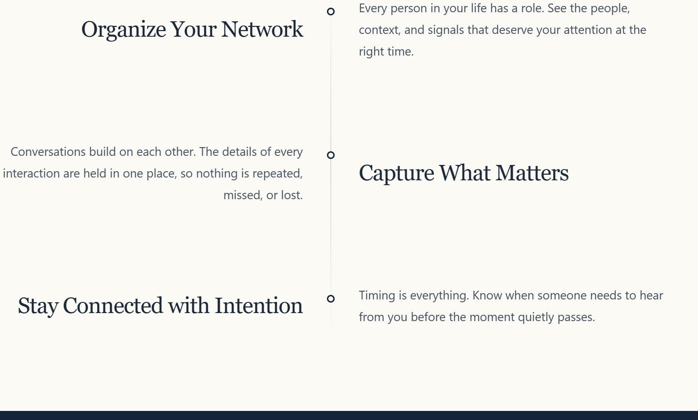
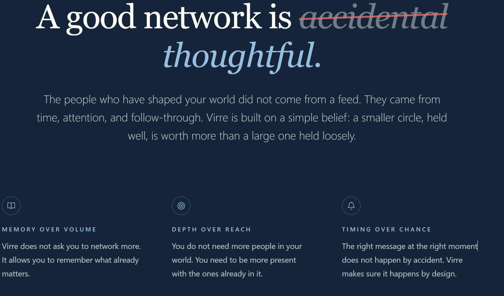

---

## 20. [Sorinai](https://www.producthunt.com/products/sorinai)
**Votes**: 79 | **도입 난이도**: 하 | **신뢰도**: 상
**Tagline**: The Interative AI Notepad for Meetings
**서비스 링크**: https://www.producthunt.com/r/ZPIMWVDH2ZZSNP

**태그**: Productivity, AI, Meeting, Automation, AI Tool, Video

### 📌 이 서비스 한눈에 보기
기존 양식을 그대로 활용하여 회의 내용을 자동 채워주는 인터랙티브 AI 노트

### 🔑 주요 기능
- 사용자가 기존에 사용하던 Word, PDF, 텍스트 템플릿 구조를 그대로 인식하여 기록
- 별도의 봇 참여 없이 컴퓨터 오디오를 직접 캡처하여 화상, 전화, 대면 회의 모두 지원
- 회의 중 실시간 답변 제안 및 개별/전체 회의 데이터 통합 질의 가능

### 🙋 사용자에게 어떤 점이 좋은가
기존 업무 양식을 유지하면서 회의 기록 시간을 획기적으로 줄여주며, 회의 중 실시간 가이드를 제공받을 수 있습니다.

### ✅ 지금 바로 써볼 기능
- 기존에 사용하던 회의 템플릿 파일 업로드하기
- 실시간 오디오 캡처를 통한 회의 기록 테스트하기
- 회의 중 AI에게 다음 할 말 물어보기

### ⚠️ 사용 전 확인할 점
- 컴퓨터 오디오를 직접 캡처하므로 개인정보 및 보안 정책 확인 필요
- 사용 중인 OS(Mac, Windows) 환경에 따른 오디오 권한 설정 확인 필요

### 🧭 확인이 더 필요한 정보
무제한 무료 정책이 향후 유료 플랜 전환이나 기능 제한을 포함하는지 확인이 필요합니다.

### 📸 스크린샷 및 갤러리
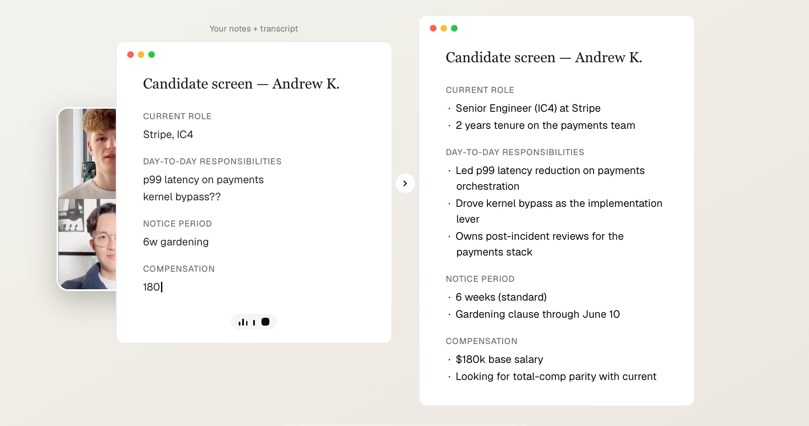
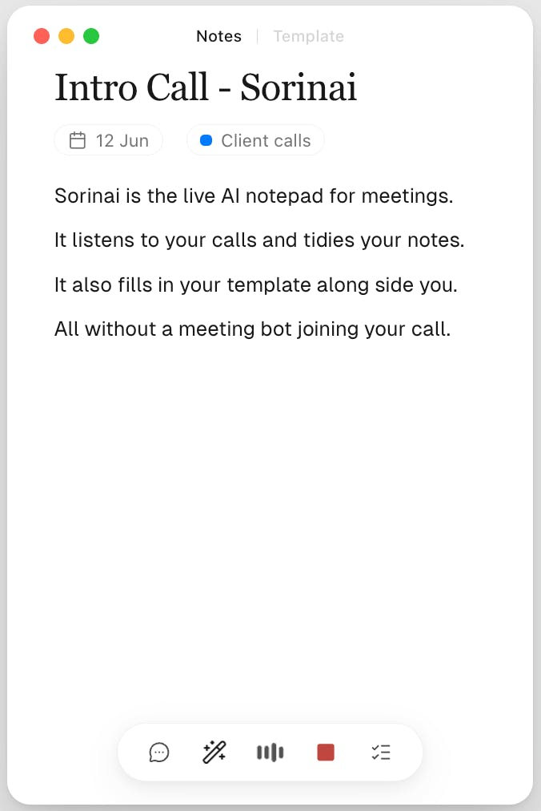
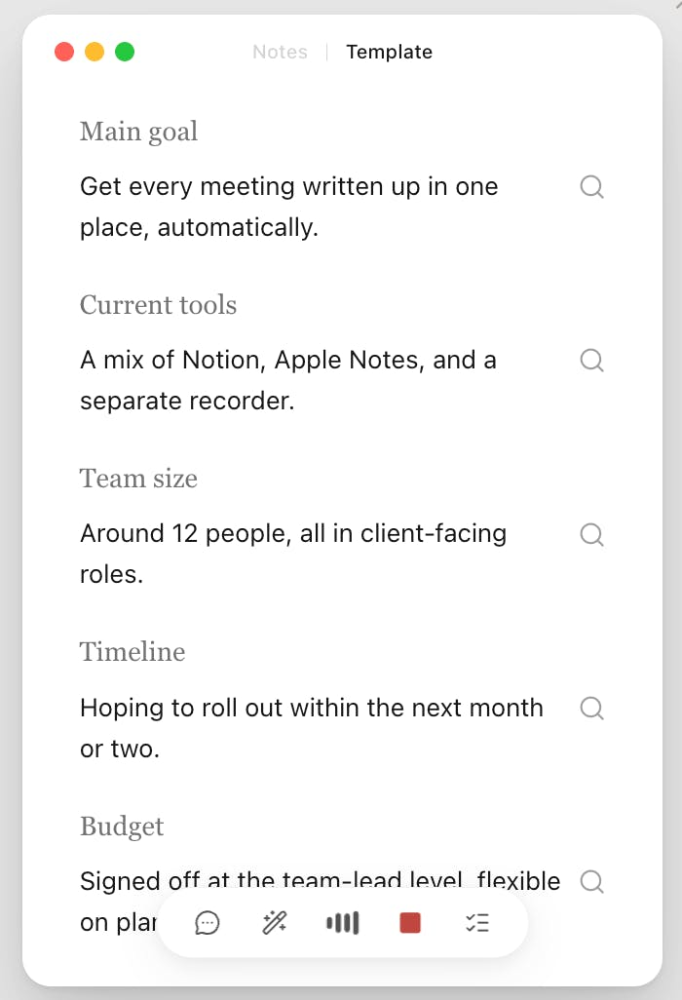

---

## 21. [Phantom Voice](https://www.producthunt.com/products/phantom-voice)
**Votes**: 76 | **도입 난이도**: 하 | **신뢰도**: 상
**Tagline**: Local push-to-talk dictation for Mac
**서비스 링크**: https://www.producthunt.com/r/4P2FUXLVAXRB3A

**태그**: Productivity, macOS, AI, Transcription, Privacy

### 📌 이 서비스 한눈에 보기
개인정보 유출 걱정 없는 맥 전용 로컬 푸시 투 톡(Push-to-talk) 받아쓰기 도구

### 🔑 주요 기능
- fn 키를 이용한 직관적인 푸시 투 톡 방식 및 커서 위치 즉시 입력
- whisper.cpp와 Metal을 활용한 강력한 로컬 온디바이스 전사
- 불필요한 추임새 제거 및 문장 부호 교정을 위한 온디바이스 클린업 기능

### 🙋 사용자에게 어떤 점이 좋은가
사용 중인 앱을 벗어나지 않고 즉시 텍스트를 입력할 수 있으며, 모든 데이터가 로컬에서 처리되어 보안이 매우 뛰어납니다.

### ✅ 지금 바로 써볼 기능
- fn 키를 활용한 빠른 받아쓰기 테스트
- 온디바이스 클린업 기능을 통한 문장 정제 확인
- 애플 실리콘 환경에서의 전사 속도 체감

### ⚠️ 사용 전 확인할 점
- macOS 14 이상 및 Apple Silicon 환경에서만 작동
- 로컬 연산 성능에 따라 전사 속도가 달라질 수 있음

### 🧭 확인이 더 필요한 정보
애플 실리콘이 아닌 인텔 맥에서의 성능 및 지원 여부는 명시되지 않았습니다.

### 📸 스크린샷 및 갤러리
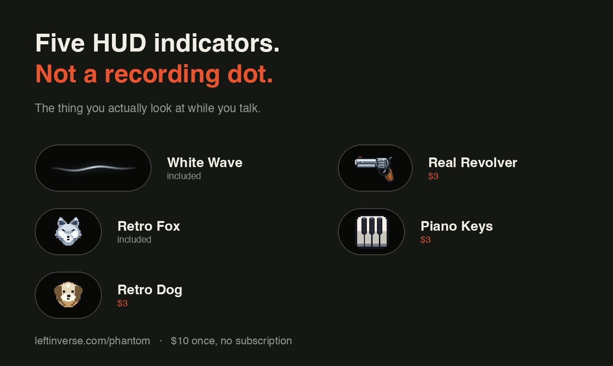
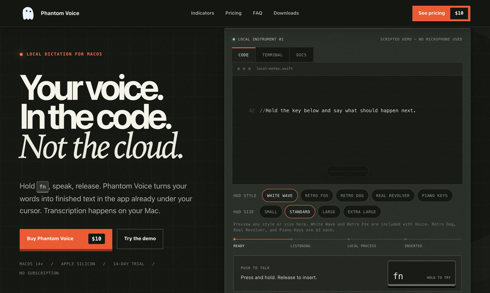
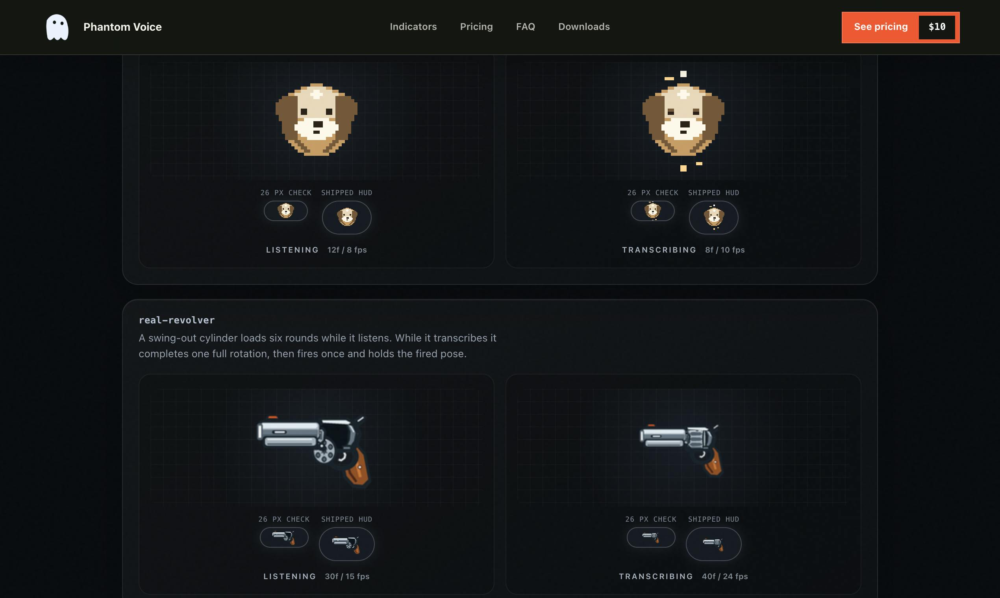

### 🎬 관련 영상
- [🎥 영상 보기](https://ph-files.imgix.net/5f772bb5-6c27-42b7-b0b9-70405b94743e.jpeg?auto=format)

---

## 22. [PRNotch](https://www.producthunt.com/products/prnotch)
**Votes**: 74 | **도입 난이도**: 하 | **신뢰도**: 상
**Tagline**: GitHub pull requests in your Mac's notch
**서비스 링크**: https://www.producthunt.com/r/D45JIC5EWIJJQR

**태그**: DevTool, Productivity, GitHub, macOS

### 📌 이 서비스 한눈에 보기
맥북 노치 영역에서 GitHub PR 상태를 실시간으로 확인하는 개발자용 메뉴바 앱

### 🔑 주요 기능
- GitHub Pull Request 상태를 맥북 노치 영역에 표시
- 리뷰 대기열, CI 상태, 알림을 네이티브 메뉴바 앱으로 제공
- 개인정보 보호를 위한 텔레메트리(데이터 수집) 미사용

### 🙋 사용자에게 어떤 점이 좋은가
브라우저를 열지 않고도 맥북 상단에서 즉시 PR 상태를 확인할 수 있어 개발 워크플로우의 흐름을 유지하는 데 도움을 줍니다.

### ✅ 지금 바로 써볼 기능
- 메뉴바 앱 설치 및 GitHub 연동
- 노치 영역의 PR 리뷰 큐 및 CI 상태 확인
- 알림 설정 최적화

### ⚠️ 사용 전 확인할 점
- 맥북 노치 디자인이 있는 모델에 최적화되어 있음
- 단일 결제 방식($1) 외의 추가 기능 유무 확인 필요

### 🧭 확인이 더 필요한 정보
상세한 기능 범위와 macOS 버전별 호환성에 대한 구체적인 정보가 필요합니다.

### 📸 스크린샷 및 갤러리
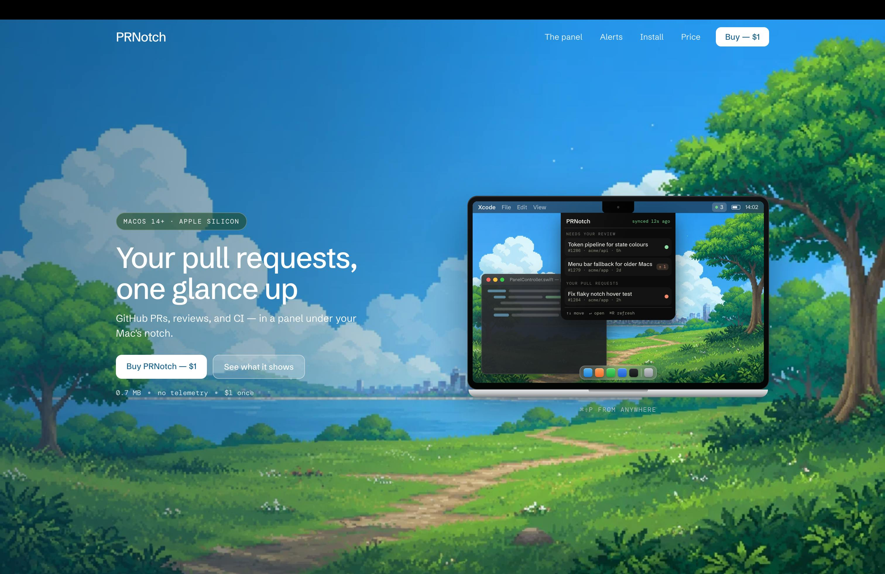
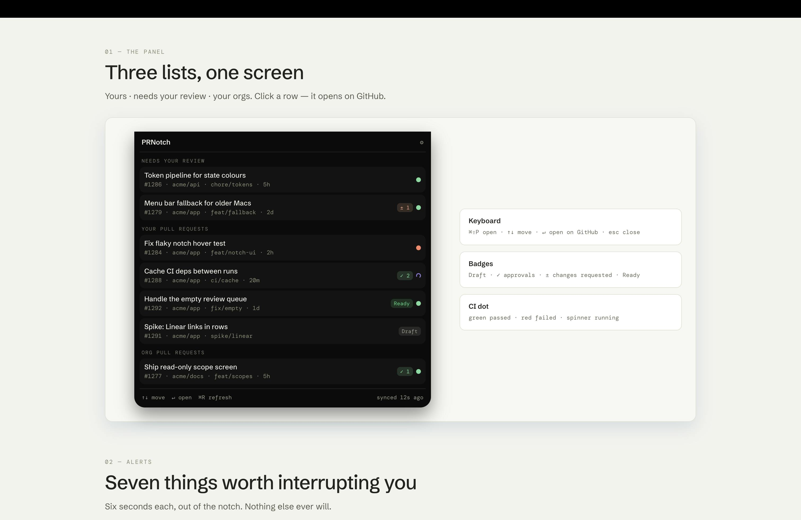

---

## 23. [AllPros](https://www.producthunt.com/products/allpros)
**Votes**: 59 | **도입 난이도**: 하 | **신뢰도**: 상
**Tagline**: Know if an online course is worth it before you pay
**서비스 링크**: https://www.producthunt.com/r/PPYQGCZ4XOO2QI

**태그**: Review, Education, ConsumerProtection, AI Tool

### 📌 이 서비스 한눈에 보기
온라인 강의 및 코칭 결제 전, 실제 수강생의 리뷰를 통해 가치를 검증하는 서비스

### 🔑 주요 기능
- 실제 수강생들의 생생한 리뷰 제공
- 고가의 온라인 강의 구매 실패 방지
- SNS 마케팅에 가려진 강의의 실체 확인

### 🙋 사용자에게 어떤 점이 좋은가
고액의 강의료를 지불하기 전, 과장된 광고가 아닌 실제 결과와 만족도를 미리 확인할 수 있어 경제적 손실을 막아줍니다.

### ✅ 지금 바로 써볼 기능
- 관심 있는 강의/코치 검색하기
- 실제 수강생 리뷰 읽기
- 결제 전 검증 리스트 확인하기

### ⚠️ 사용 전 확인할 점
- 리뷰의 신뢰성 및 허위 리뷰 여부 확인 필요
- 모든 온라인 강의가 데이터베이스에 등록되어 있는지 확인 필요

### 🧭 확인이 더 필요한 정보
현재 서비스에 등록된 강의의 범위와 리뷰 작성자의 신원 검증 방식에 대한 정보가 부족합니다.

### 📸 스크린샷 및 갤러리
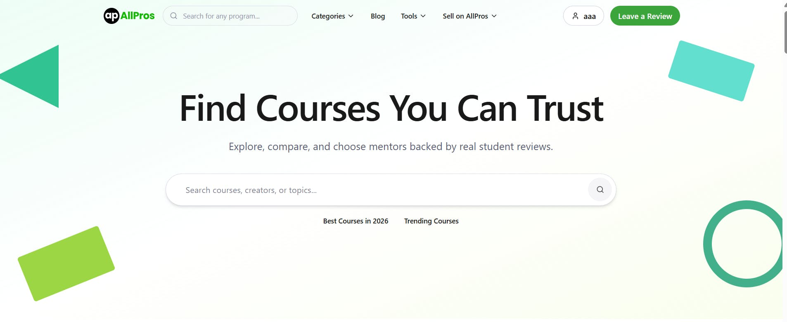
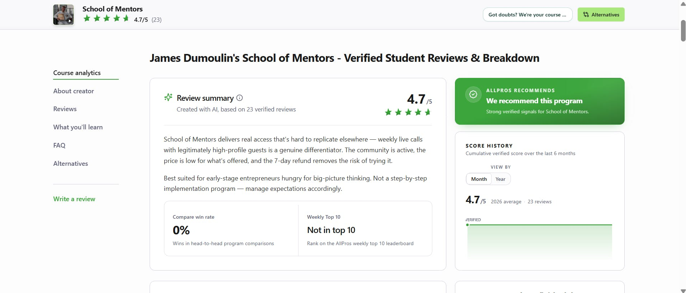
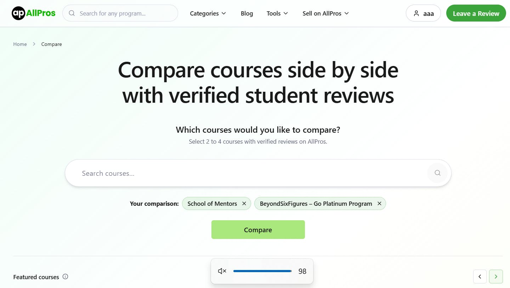

---

## 24. [Eventually Ticketing](https://www.producthunt.com/products/eventually-ticketing)
**Votes**: 56 | **도입 난이도**: 하 | **신뢰도**: 상
**Tagline**: Event-Based Ecommerce for Calendar-Centric Sellers
**서비스 링크**: https://www.producthunt.com/r/CKUUD2YCLPFB22

**태그**: Ecommerce, Ticketing, SaaS, Squarespace

### 📌 이 서비스 한눈에 보기
Squarespace 사이트 내에서 브랜드 일관성을 유지하며 티켓 판매를 할 수 있는 구독형 이벤트 커머스 솔루션

### 🔑 주요 기능
- Squarespace 사이트와 완벽하게 매칭되는 브랜드 디자인 제공
- 티켓당 수수료 없는 고정 월 구독 방식의 비용 구조
- 캘린더 중심의 판매자를 위한 이벤트 기반 이커머스 기능

### 🙋 사용자에게 어떤 점이 좋은가
Squarespace를 사용하는 판매자가 별도의 외부 플랫폼 수수료 부담 없이 브랜드 아이덴티티를 유지하며 간편하게 티켓팅과 등록을 관리할 수 있습니다.

### ✅ 지금 바로 써볼 기능
- Squarespace 사이트와의 연동성 확인
- 월 구독료 대비 티켓 판매량 수익성 계산
- 브랜드 디자인 커스텀 범위 확인

### ⚠️ 사용 전 확인할 점
- Squarespace 사용자에게 특화된 솔루션이므로 타 플랫폼 사용 시 제약이 있을 수 있음
- 판매량이 매우 적을 경우 고정 구독료가 티켓당 수수료 방식보다 불리할 수 있음

### 🧭 확인이 더 필요한 정보
Squarespace 외의 다른 웹사이트 플랫폼과의 호환성 여부는 명시되어 있지 않습니다.

### 📸 스크린샷 및 갤러리

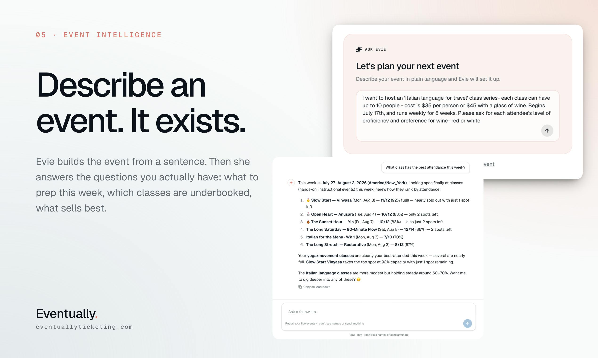
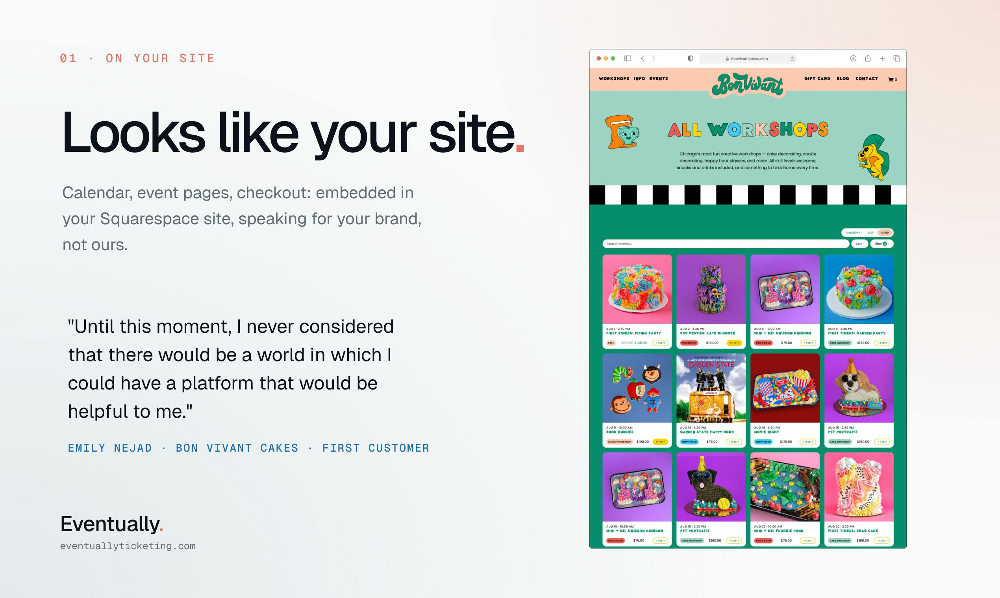

### 🎬 관련 영상
- [🎥 영상 보기](https://ph-files.imgix.net/80ae200b-b073-4698-8655-86536eef7df4.jpeg?auto=format)

---

## 25. [Threddle](https://www.producthunt.com/products/threddle)
**Votes**: 23 | **도입 난이도**: 중 | **신뢰도**: 상
**Tagline**: Real-time trends and inventory intelligence for retail
**서비스 링크**: https://www.producthunt.com/r/EDNPHHB4VEPSHR

**태그**: Retail, AI, Inventory, Analytics, Trend, Agent, AI Tool

### 📌 이 서비스 한눈에 보기
실시간 소셜 트렌드와 AI를 결합하여 재고 최적화 및 쇼핑 의도를 예측하는 리테일 인텔리전스 솔루션

### 🔑 주요 기능
- 실시간 소셜 리스닝과 벡터 임베딩을 통한 소비자 의도 예측
- 멀티 에이전트 AI를 활용한 데이터 분석 및 인사이트 도출
- 재고 과잉 방지 및 상품 구색(Assortment) 최적화

### 🙋 사용자에게 어떤 점이 좋은가
소비자의 실시간 트렌드를 데이터로 포착하여 재고 부족이나 과잉 재고로 인한 손실을 방지하고 수익성을 높일 수 있습니다.

### ✅ 지금 바로 써볼 기능
- 실시간 트렌드 데이터와 현재 재고 데이터 연동 테스트
- AI 예측 모델을 통한 상품 구색 최적화 시뮬레이션
- 소셜 리스닝 기반의 잠재적 수요 예측 기능 확인

### ⚠️ 사용 전 확인할 점
- 소셜 데이터의 변동성에 따른 예측 오차 가능성
- 기존 ERP 또는 재고 관리 시스템과의 연동 필요성

### 🧭 확인이 더 필요한 정보
구체적인 데이터 소스 범위와 기존 리테일 시스템과의 통합 방식에 대한 확인이 필요합니다.

### 📸 스크린샷 및 갤러리

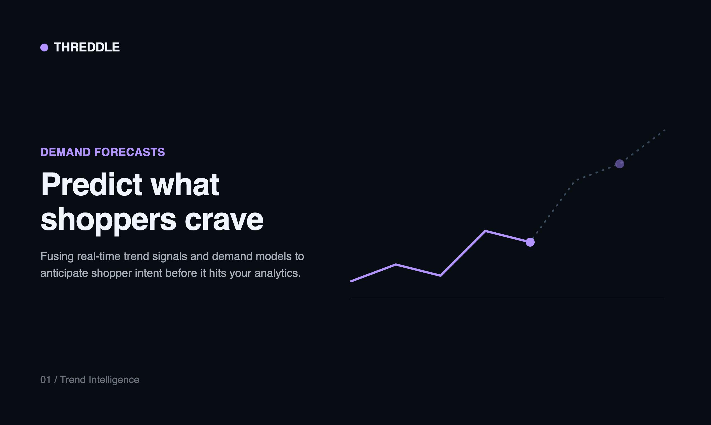
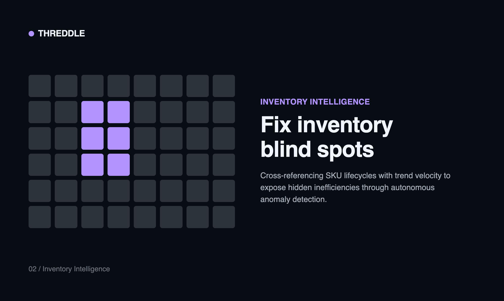

### 🎬 관련 영상
- [🎥 영상 보기](https://ph-files.imgix.net/3f2a0786-7fcb-45d2-8b6b-8852bd880c9a.jpeg?auto=format)

---

## 26. [Flowsery AI](https://www.producthunt.com/products/flowsery)
**Votes**: 22 | **도입 난이도**: 하 | **신뢰도**: 상
**Tagline**: AI that analyzes sessions and flags issues
**서비스 링크**: https://www.producthunt.com/r/SC4ANGOJQWF7RG

**태그**: DevTool, Analytics, UX, AI, AI Tool

### 📌 이 서비스 한눈에 보기
사용자 세션 리플레이를 통해 버그와 이탈 원인을 자동으로 분석하는 AI 솔루션

### 🔑 주요 기능
- 모든 사용자 세션 자동 기록 및 리플레이
- 사용자가 겪는 버그 자동 감지
- 제품 이탈 원인에 대한 정밀한 분석 제공

### 🙋 사용자에게 어떤 점이 좋은가
사용자의 행동을 직접 확인하여 제품의 문제점과 이탈 원인을 빠르게 파악하고 개선할 수 있습니다.

### ✅ 지금 바로 써볼 기능
- 세션 리플레이 기능으로 사용자 흐름 확인하기
- AI가 플래그를 지정한 버그 이슈 검토하기
- 이탈 지점 분석을 통한 제품 개선 전략 수립하기

### ⚠️ 사용 전 확인할 점
- 세션 기록에 따른 개인정보 보호 및 보안 정책 확인 필요
- 데이터 저장 용량 및 트래픽에 따른 비용 구조 확인 필요

### 🧭 확인이 더 필요한 정보
구체적인 데이터 보안 정책과 상세 가격 체계에 대한 정보가 부족합니다.

### 📸 스크린샷 및 갤러리
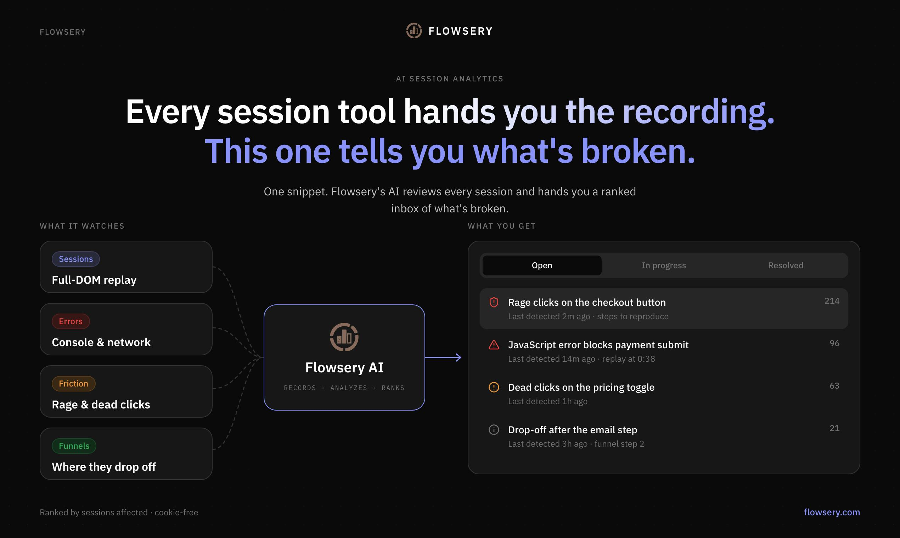
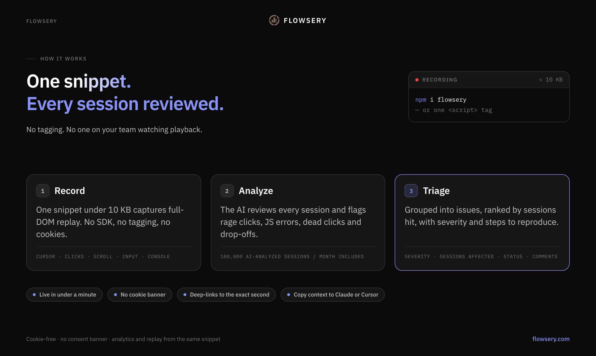
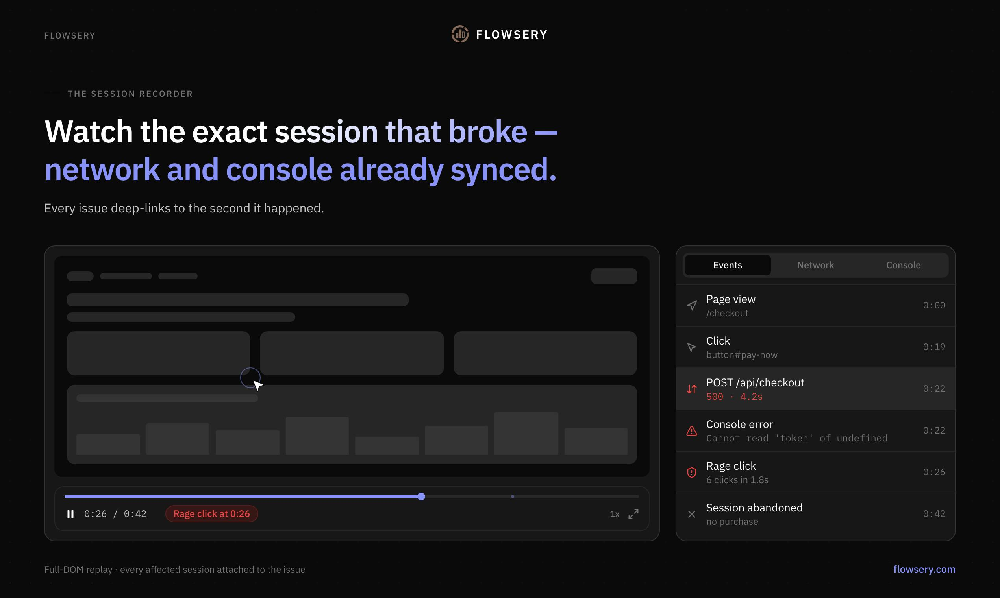

### 🎬 관련 영상
- [🎥 영상 보기](https://ph-files.imgix.net/92e43ace-76f6-4a0b-b2e2-4db0cc694c98.jpeg?auto=format)

---

## 27. [MarkIt](https://www.producthunt.com/products/markit-3)
**Votes**: 20 | **도입 난이도**: 하 | **신뢰도**: 상
**Tagline**: AI that organizes everything you save
**서비스 링크**: https://www.producthunt.com/r/6M6DXPLDGK3LAH

**태그**: Productivity, AI, Automation, Organization, AI Tool

### 📌 이 서비스 한눈에 보기
어디서든 저장한 모든 정보를 AI가 자동으로 분류하고 검색 가능하게 만드는 도구

### 🔑 주요 기능
- WhatsApp, Chrome, Telegram 등 다양한 앱에서 URL, 스크린샷, 문서 저장 가능
- AI를 통한 자동 카테고리 분류 기능
- 저장된 모든 데이터에 대한 강력한 검색 기능 제공

### 🙋 사용자에게 어떤 점이 좋은가
여러 앱에 흩어져 있는 정보들을 일일이 정리할 필요 없이, 저장만 하면 AI가 알아서 정리해주어 정보 관리 시간을 획기적으로 줄여줍니다.

### ✅ 지금 바로 써볼 기능
- 자주 사용하는 메신저나 브라우저에 연동하기
- 중요한 문서나 스크린샷 저장해보기
- AI가 분류한 카테고리 확인 및 검색 테스트하기

### ⚠️ 사용 전 확인할 점
- 개인적인 대화나 민감한 문서가 포함될 경우 데이터 보안 및 프라이버시 정책 확인 필요
- 무료 플랜의 저장 용량 및 기능 제한 범위 확인 필요

### 🧭 확인이 더 필요한 정보
데이터 저장 방식과 개인정보 보호 수준에 대한 구체적인 보안 정책 확인이 필요합니다.

### 📸 스크린샷 및 갤러리

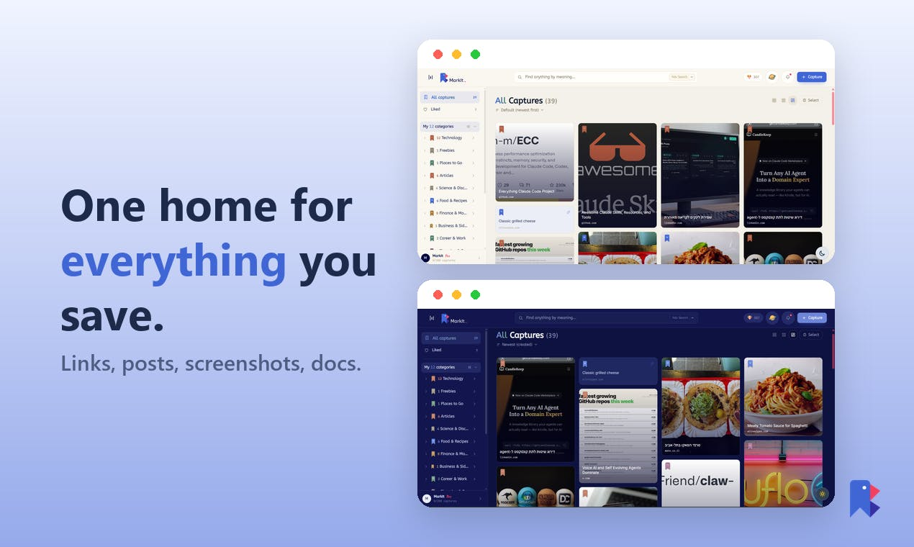
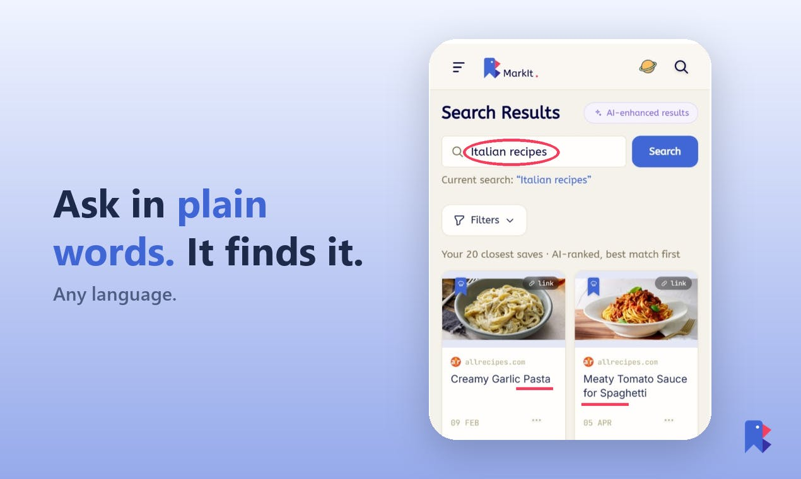

### 🎬 관련 영상
- [🎥 영상 보기](https://ph-files.imgix.net/ba3b84d6-f935-47cd-a370-1f4ed9b653e8.jpeg?auto=format)

---

## 28. [Modulify 2.0](https://www.producthunt.com/products/modulify)
**Votes**: 20 | **도입 난이도**: 중 | **신뢰도**: 상
**Tagline**: Modulify – The Platform Where Websites Grow
**서비스 링크**: https://www.producthunt.com/r/SQSK4R72IUM4FN

**태그**: NoCode, WebBuilder, SaaS, Marketing, AI Tool, Design

### 📌 이 서비스 한눈에 보기
단순 생성을 넘어 웹사이트의 관리와 성장을 통합 지원하는 올인원 플랫폼

### 🔑 주요 기능
- 단순 웹사이트 생성을 넘어선 사후 관리 및 최적화 기능 제공
- 설계, 게시, 관리, 최적화가 가능한 통합 워크플로우
- 런칭 이후의 지속적인 웹사이트 성장에 초점

### 🙋 사용자에게 어떤 점이 좋은가
웹사이트 제작 후 별도의 관리 도구를 찾는 번거로움 없이, 하나의 플랫폼에서 운영과 성장을 동시에 해결할 수 있습니다.

### ✅ 지금 바로 써볼 기능
- 웹사이트 생성 및 게시 프로세스 경험하기
- 플랫폼 내 관리 및 최적화 도구 탐색하기
- 성장 단계별 기능 활용 가능성 검토하기

### ⚠️ 사용 전 확인할 점
- 단순 생성형 AI 빌더와 비교하여 관리 기능의 구체적인 편의성 확인 필요
- 기존 웹사이트 이전 또는 외부 도구와의 연동 범위 확인 필요

### 🧭 확인이 더 필요한 정보
플랫폼이 제공하는 구체적인 최적화(Optimization) 및 성장(Growth) 도구의 상세 기능이 명시되지 않았습니다.

### 📸 스크린샷 및 갤러리
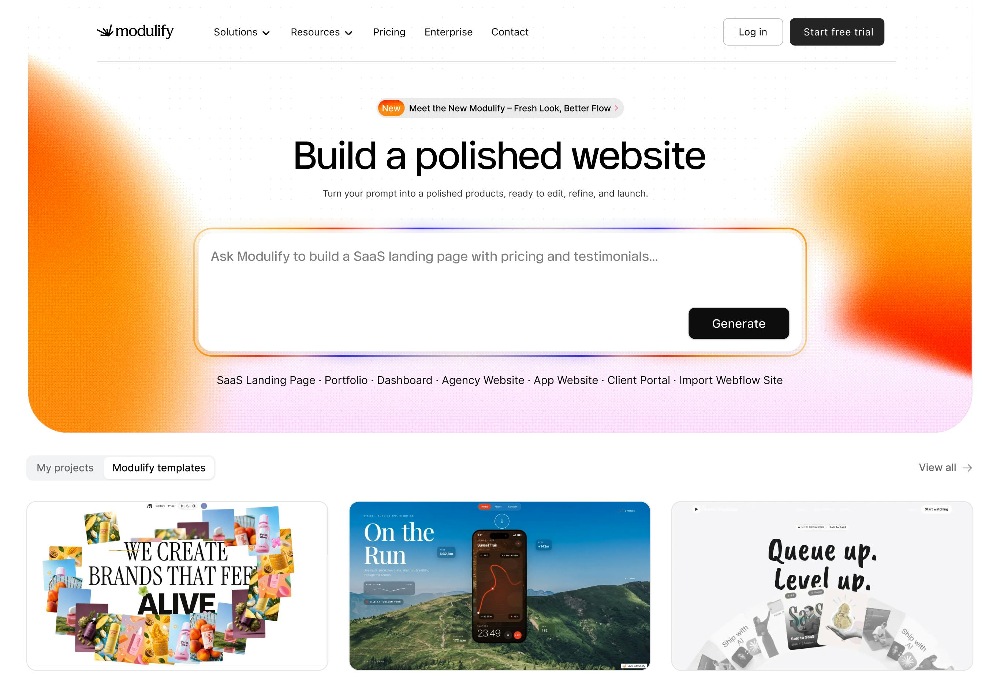

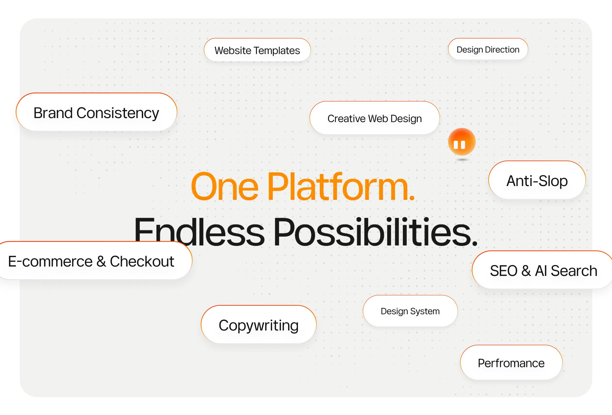

---

## 29. [Byblos Digital](https://www.producthunt.com/products/byblos-digital)
**Votes**: 16 | **도입 난이도**: 하 | **신뢰도**: 상
**Tagline**: Follow top VC firms and get curated intelligence.
**서비스 링크**: https://www.producthunt.com/r/UBUGPCJTRNSHR6

**태그**: VC, Market Intelligence, Data Analytics, Startup Tools, API

### 📌 이 서비스 한눈에 보기
1,400개 이상의 VC 뉴스레터를 분석하여 투자 트렌드와 펀드별 핵심 인사이트를 제공하는 지능형 분석 플랫폼

### 🔑 주요 기능
- 1,400개 이상의 VC 뉴스레터 및 블로그를 구조화된 데이터로 자동 집계
- 섹터, 테마, 감성 분석 필터를 통한 투자자 관점의 시장 흐름 파악
- 개별 펀드의 투자 테마, 선호 프로젝트, 핵심 인사이트를 카드 형태로 제공

### 🙋 사용자에게 어떤 점이 좋은가
창업자는 피칭 전 VC의 투자 철학을 미리 파악할 수 있고, 투자자는 시장의 합의가 형성되기 전 선제적인 시장 움직임을 포착할 수 있습니다.

### ✅ 지금 바로 써볼 기능
- 관심 있는 VC 펀드의 카드 열어 투자 테마 확인하기
- 섹터 및 감성 필터를 활용해 시장 트렌드 탐색하기
- 뉴스레터를 태그된 지능형 데이터로 변환하여 분석하기

### ⚠️ 사용 전 확인할 점
- 데이터 소스(뉴스레터/블로그)의 업데이트 주기에 따른 정보 시차 가능성
- 자동화된 감성 분석 결과가 실제 투자자의 의도와 다를 수 있음

### 🧭 확인이 더 필요한 정보
수집되는 1,400개 이상의 소스가 실시간으로 업데이트되는지, 데이터 정제 알고리즘의 상세 로직은 무엇인지 확인이 필요합니다.

### 📸 스크린샷 및 갤러리

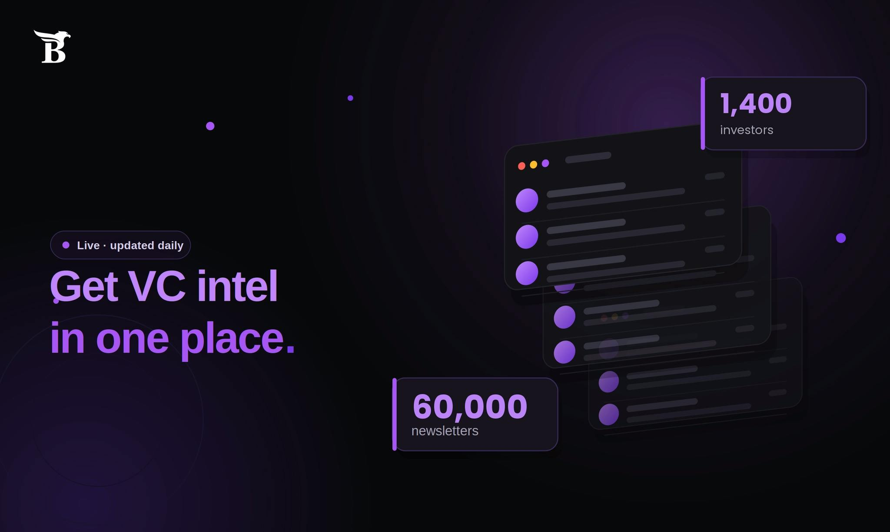
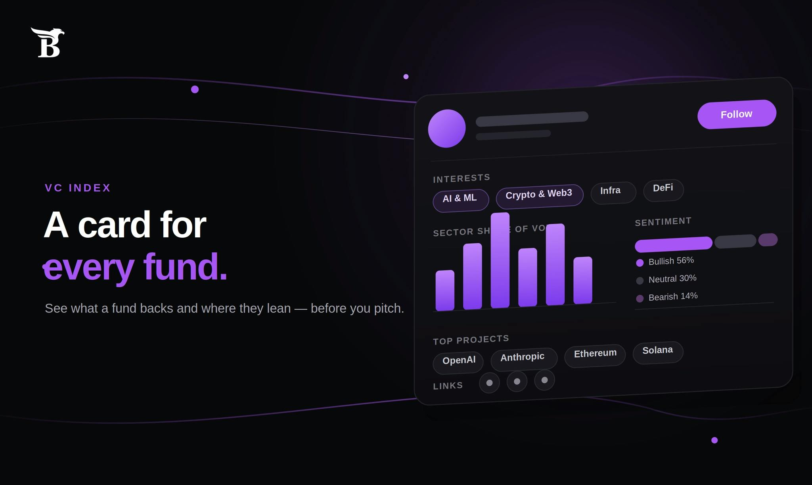

### 🎬 관련 영상
- [🎥 영상 보기](https://ph-files.imgix.net/555072f9-dd0a-4caa-b20c-3929695ec871.jpeg?auto=format)

---

## 30. [Meet2Lead](https://www.producthunt.com/products/meet2lead)
**Votes**: 14 | **도입 난이도**: 하 | **신뢰도**: 상
**Tagline**: AI-Powered Event Lead Capture & Follow-Up
**서비스 링크**: https://www.producthunt.com/r/VAGXS5TIWS5C4K

**태그**: Sales, Automation, EventTech, CRM, AI, AI Tool, Design, Marketing

### 📌 이 서비스 한눈에 보기
종이 명함과 엑셀 대신 AI로 이벤트 리드를 캡처하고 후속 조치까지 관리하는 스마트 워크스페이스

### 🔑 주요 기능
- 이벤트 현장에서의 간편한 리드 캡처 및 데이터 관리
- AI 기반의 자동화된 후속 연락(Follow-up) 생성
- 첫 대화부터 계약 체결까지의 전 과정 관리 및 ROI 측정

### 🙋 사용자에게 어떤 점이 좋은가
컨퍼런스나 전시회에서 흩어지는 고객 정보를 한곳에 모으고, AI를 통해 놓치는 기회 없이 즉각적인 후속 영업을 가능하게 합니다.

### ✅ 지금 바로 써볼 기능
- 현장 리드 캡처 기능 테스트
- AI 생성 후속 메시지 초안 확인
- 이벤트별 ROI 대시보드 탐색

### ⚠️ 사용 전 확인할 점
- 오프라인 현장 네트워크 환경에 따른 데이터 동기화 확인 필요
- 기존 CRM 시스템과의 연동 여부 확인 필요

### 🧭 확인이 더 필요한 정보
현재 제공되는 상세한 CRM 연동 범위와 모바일 앱 지원 여부에 대한 정보가 부족합니다.

### 📸 스크린샷 및 갤러리
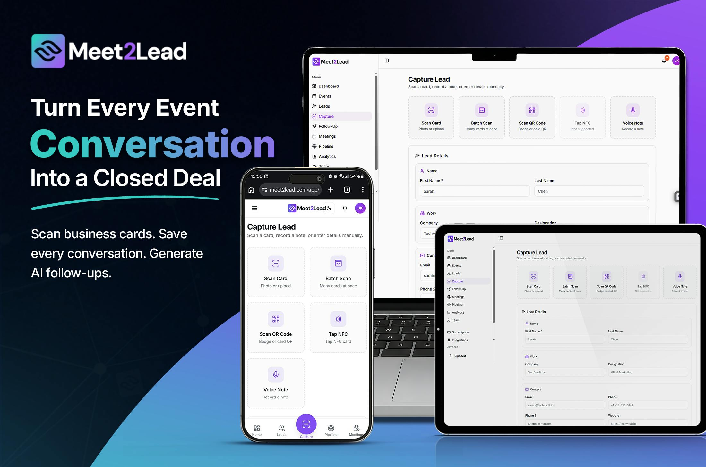

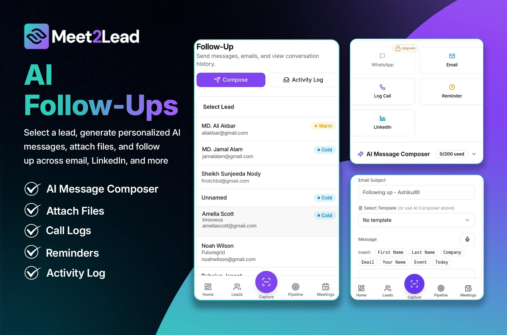

### 🎬 관련 영상
- [🎥 영상 보기](https://ph-files.imgix.net/a928093b-0402-4502-ac04-0d33a0d84140.jpeg?auto=format)

---

