# 🚀 Product Hunt Daily Top 30 (2026-08-02)

## 오늘의 요약
오늘의 트렌드는 코딩 에이전트와 터미널 환경을 모바일이나 데스크탑 위젯으로 연결하여 작업 효율을 높이는 도구들이 주를 이루었습니다. 또한, 구독형 모델 대신 일회성 구매를 지향하는 네이티브 생산성 앱들이 사용자들의 관심을 끌었습니다.

### 오늘의 핵심 포인트
- 코딩 에이전트의 작업 상태를 모바일이나 메뉴 바에서 실시간으로 확인하고 제어하는 원격 관리 도구들이 주목받았습니다.
- 터미널 결과물을 데스크탑 위젯으로 시각화하거나 커스텀 테마를 적용하는 등 터미널 환경의 개인화와 가시성 확보가 핵심이었습니다.
- 학술 글쓰기나 터미널 앱처럼 구독 없이 한 번의 구매로 평생 소장할 수 있는 네이티브 앱들이 실용적인 대안으로 제시되었습니다.

**오늘의 태그**: AI 에이전트, 생산성 도구, 터미널, 데스크탑 커스텀, 네이티브 앱

## 1. [NudgeForMe](https://www.producthunt.com/products/nudgeforme)
**Votes**: 232 | **도입 난이도**: 하 | **신뢰도**: 상
**Tagline**: AI follow-up agent for missed email opportunities
**서비스 링크**: https://www.producthunt.com/r/G2YNDDYM6FTUFG

**태그**: AI, Productivity, Email, Sales, Automation, Agent, AI Tool

### 📌 이 서비스 한눈에 보기
놓친 이메일 기회를 포착하여 자연스러운 후속 답장을 제안하는 AI 에이전트

### 🔑 주요 기능
- 보낸 편지함을 스캔하여 답장이 없는 대화 스레드 자동 식별
- 사용자의 말투를 반영한 자연스러운 후속 메일 초안 작성
- Gmail, Outlook, IMAP/SMTP 지원으로 기존 워크플로 유지

### 🙋 사용자에게 어떤 점이 좋은가
비즈니스 기회나 고객 문의가 답변 부재로 인해 무산되는 것을 방지하며, 사용자가 직접 검토 후 발송하는 방식으로 제어권을 유지할 수 있습니다.

### ✅ 지금 바로 써볼 기능
- 이메일 계정 연동 및 스캔 기능 실행
- 제안된 후속 메일 초안 검토 및 수정
- 필요한 경우 즉시 발송

### ⚠️ 사용 전 확인할 점
- AI가 생성한 초안이 사용자의 의도와 다를 수 있으므로 발송 전 반드시 검토 필요
- 이메일 계정 접근 권한 부여에 따른 보안 정책 확인 필요

### 🧭 확인이 더 필요한 정보
사용자의 이메일 데이터 처리 방식 및 보안 프로토콜에 대한 상세 정보가 필요합니다.

### 📸 스크린샷 및 갤러리
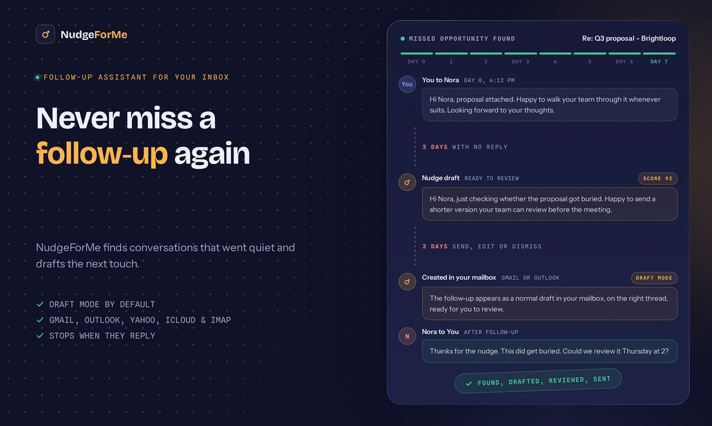
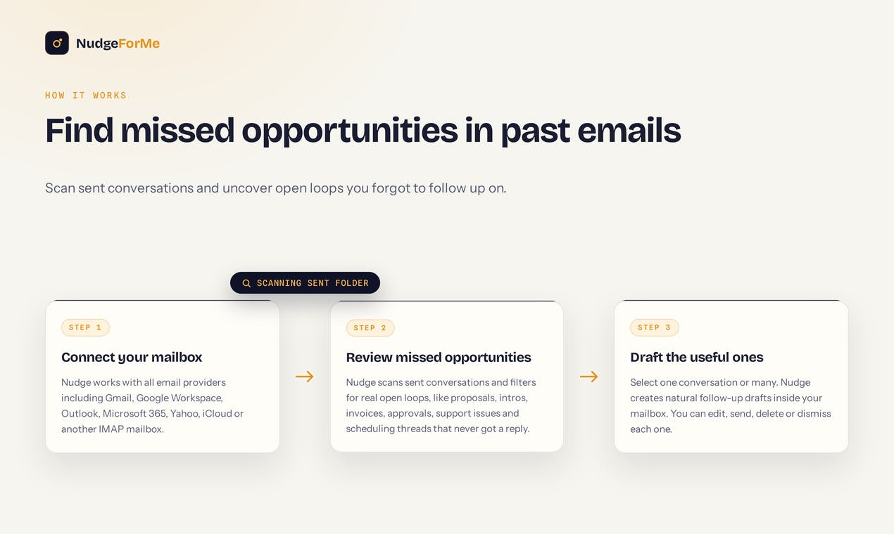
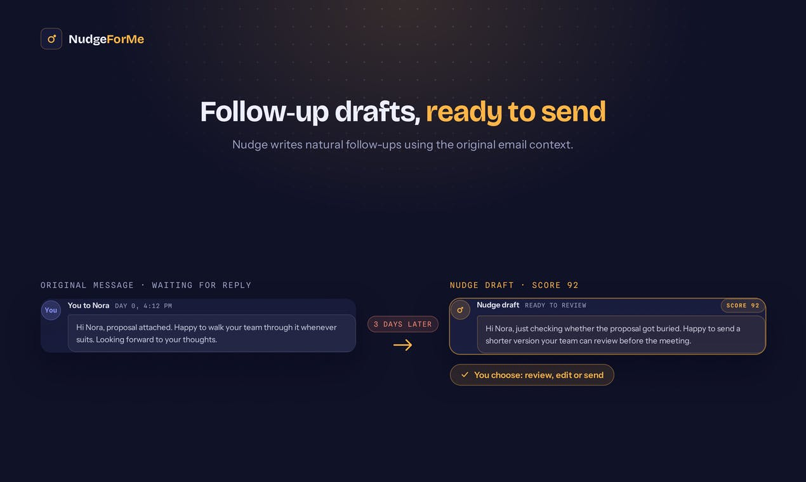

### 🎬 관련 영상
- [🎥 영상 보기](https://ph-files.imgix.net/fcc9ea48-5a90-4dd9-b07d-8555e8dbac94.jpeg?auto=format)

---

## 2. [DeepSeek-V4-Flash-0731](https://www.producthunt.com/products/deepseek)
**Votes**: 212 | **도입 난이도**: 하 | **신뢰도**: 상
**Tagline**: Frontier agent intelligence at Flash prices
**서비스 링크**: https://www.producthunt.com/r/DHPDMPFRNHBRJQ

**태그**: AI, Agent, DevTool, Automation, API

### 📌 이 서비스 한눈에 보기
합리적인 가격으로 강력한 에이전트 지능을 경험할 수 있는 차세대 AI 모델

### 🔑 주요 기능
- V4-Pro(Preview)를 능가하는 강력한 에이전트 성능
- Responses API를 통한 네이티브 지원
- Codex CLI에 최적화된 설계

### 🙋 사용자에게 어떤 점이 좋은가
저렴한 비용으로 고성능 에이전트 기능을 활용할 수 있어, 자동화 워크플로우 구축에 매우 유리합니다.

### ✅ 지금 바로 써볼 기능
- Responses API를 활용한 에이전트 작업 테스트
- Codex CLI 환경에서의 성능 검증
- 기존 V4-Pro 모델과의 벤치마크 비교

### ⚠️ 사용 전 확인할 점
- V4-Pro 대비 특정 작업에서의 성능 차이 확인 필요
- 사용자 환경(CLI/API)에 따른 최적화 수준 차이

### 🧭 확인이 더 필요한 정보
구체적인 가격 정책과 상세 벤치마크 수치는 공식 문서를 통해 확인이 필요합니다.

### 📸 스크린샷 및 갤러리
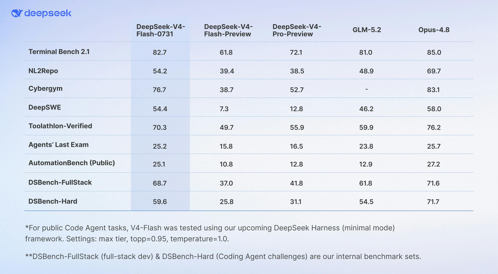
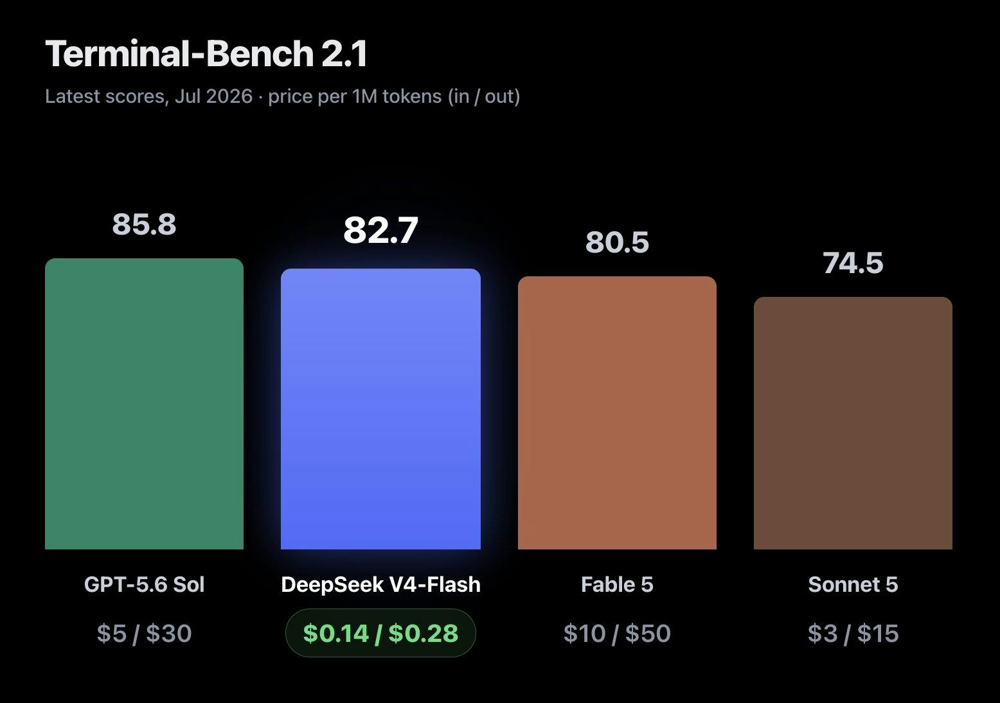
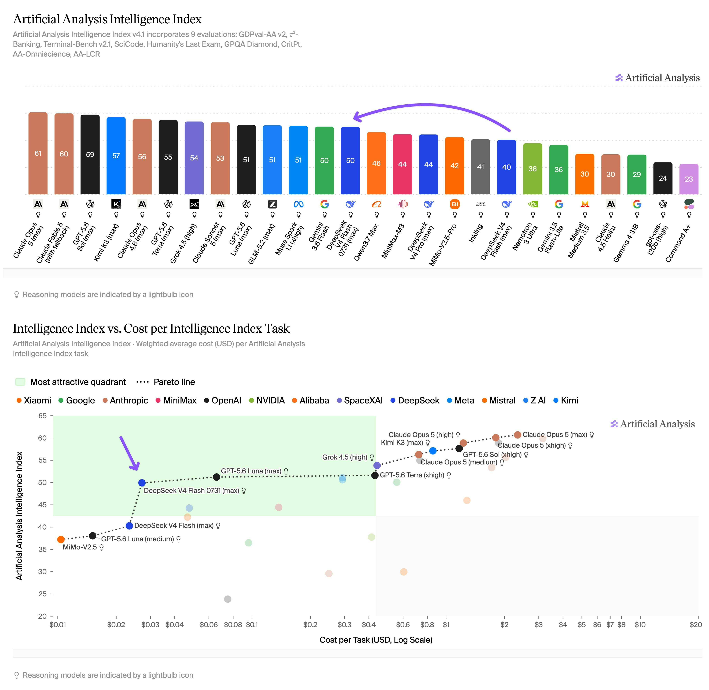

---

## 3. [Port22](https://www.producthunt.com/products/port22)
**Votes**: 198 | **도입 난이도**: 하 | **신뢰도**: 상
**Tagline**: Claude Code, Codex & more on your phone 
**서비스 링크**: https://www.producthunt.com/r/Z426QGPUISUCBK

**태그**: DevTool, Automation, Mobile, Agent, AI Tool

### 📌 이 서비스 한눈에 보기
Mac에서 실행 중인 코딩 에이전트를 스마트폰으로 제어하고 승인하는 도구

### 🔑 주요 기능
- Mac에서 실행 중인 코딩 에이전트(Claude Code 등)를 모바일로 연결
- 에이전트의 작업 상태를 실시간 확인하고 중단된 작업을 즉시 승인 가능
- 별도의 래퍼나 복잡한 설정 없이 기존 터미널 환경에 연결

### 🙋 사용자에게 어떤 점이 좋은가
에이전트가 작업 중 사용자의 승인을 기다리며 멈춰있는 시간을 줄여주며, 이동 중에도 스마트폰으로 코딩 작업을 관리할 수 있습니다.

### ✅ 지금 바로 써볼 기능
- Mac에 실행 중인 코딩 에이전트 연결하기
- 스마트폰 알림을 통한 파일 수정 승인 테스트하기
- 무료 플랜(Mac 1대, 세션 2개)으로 기능 확인하기

### ⚠️ 사용 전 확인할 점
- 기존 터미널 환경에 부가적으로 연결되는 방식이므로 보안 정책 확인 필요
- 무료 버전은 Mac 1대 및 2개 세션으로 제한됨

### 🧭 확인이 더 필요한 정보
기존 터미널 환경에 연결되는 구체적인 기술 방식(SSH, 원격 제어 등)에 대한 상세 설명이 필요합니다.

### 📸 스크린샷 및 갤러리
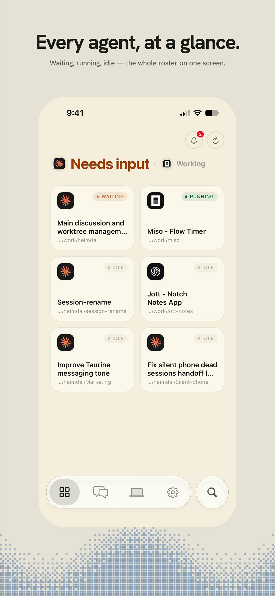

---

## 4. [AgentMicro](https://www.producthunt.com/products/agentmicro)
**Votes**: 134 | **도입 난이도**: 하 | **신뢰도**: 상
**Tagline**: Live Codex task status in your macOS menu bar
**서비스 링크**: https://www.producthunt.com/r/OQQQ3Q6OSVD35Q

**태그**: DevTool, macOS, Productivity, Automation, Agent, Prompting

### 📌 이 서비스 한눈에 보기
macOS 메뉴 바에서 Codex 작업 상태를 실시간으로 모니터링하는 로컬 우선 도구

### 🔑 주요 기능
- Codex Desktop 및 CLI 작업의 상태, 프로젝트, 경과 시간 실시간 확인
- 메뉴 바에서 클릭 한 번으로 해당 Codex 데스크톱 작업으로 즉시 이동
- 로컬 메타데이터만 관찰하여 프롬프트, 코드, 작업 이력의 외부 유출 방지

### 🙋 사용자에게 어떤 점이 좋은가
여러 개의 코딩 작업을 병렬로 실행할 때, 작업 진행 상황을 일일이 창을 열어 확인하지 않고도 메뉴 바에서 한눈에 파악할 수 있습니다.

### ✅ 지금 바로 써볼 기능
- 메뉴 바에 설치하여 실시간 작업 상태 모니터링하기
- 진행 중인 작업의 경과 시간 및 결과 확인하기
- 메뉴 바에서 클릭하여 관련 Codex 작업으로 즉시 전환하기

### ⚠️ 사용 전 확인할 점
- Codex Desktop 및 CLI 환경과의 호환성 확인 필요
- 로컬 메타데이터 기반이므로 특정 작업 환경에 따라 정보 표시가 제한될 수 있음

### 🧭 확인이 더 필요한 정보
Codex Desktop 및 CLI의 구체적인 버전별 호환성 여부를 확인해야 합니다.

### 📸 스크린샷 및 갤러리
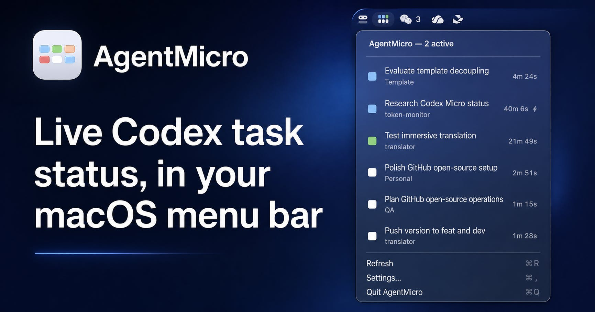
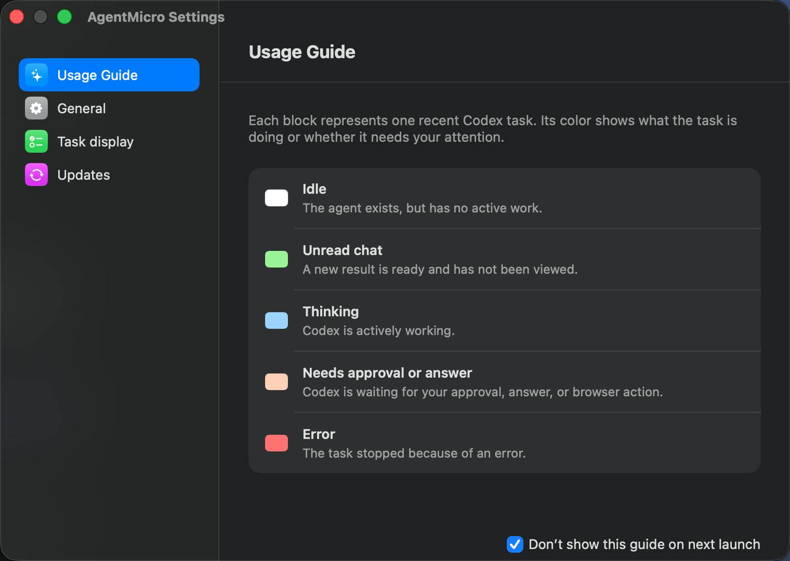
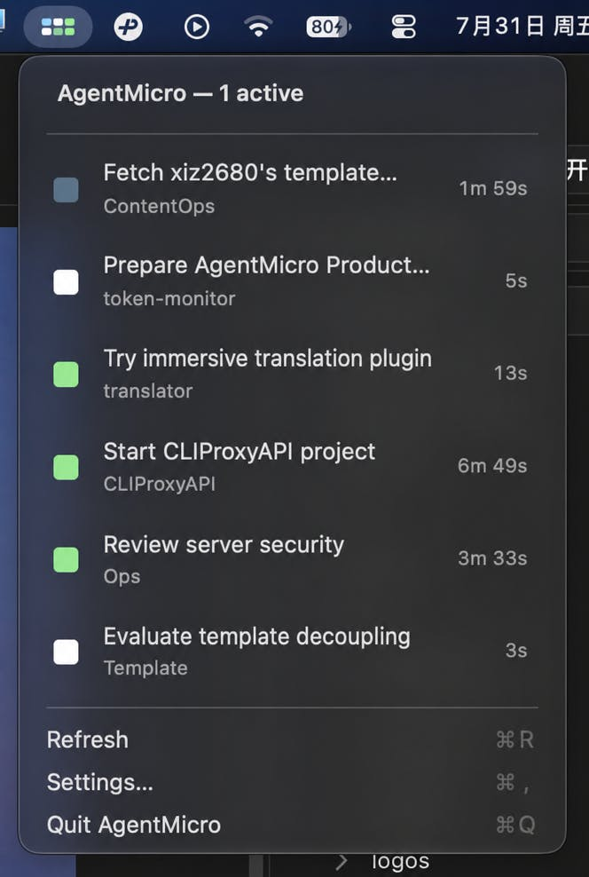

---

## 5. [Yamanote 3D](https://www.producthunt.com/products/yamanote-3d)
**Votes**: 127 | **도입 난이도**: 하 | **신뢰도**: 상
**Tagline**: Ride Tokyo’s Yamanote Line in a 3D world
**서비스 링크**: https://www.producthunt.com/r/QXXUS2XPEIPOLZ

**태그**: Immersive, ASMR, WebExperience, Tokyo, AI Tool

### 📌 이 서비스 한눈에 보기
도쿄 야마노테선을 3D로 구현하여 몰입감 있는 작업 환경을 제공하는 브라우저 기반 경험

### 🔑 주요 기능
- E235계 전동차 내부를 구현한 사실적인 3D 환경
- 현장감 넘치는 열차 소음 및 도시 배경음 제공
- 별도 설치가 필요 없는 웹 브라우저 기반 서비스

### 🙋 사용자에게 어떤 점이 좋은가
공부나 업무 시 배경 소음(ASMR)이 필요한 사용자에게 도심 속 열차 여행을 하는 듯한 몰입감을 제공합니다.

### ✅ 지금 바로 써볼 기능
- 열차 좌석에 앉아 창밖 풍경 감상하기
- 현장감 있는 안내 방송과 도시 소음 들어보기
- 작업/공부용 배경음으로 활용하기

### ⚠️ 사용 전 확인할 점
- 웹 브라우저 기반이므로 기기 사양에 따라 성능 차이가 있을 수 있음
- 단순 배경음/경험 제공 목적이므로 생산성 도구 기능은 없음

### 🧭 확인이 더 필요한 정보
현재 무료로 제공되는 브라우저 경험이며, 향후 유료화나 추가 기능 확장 여부는 명시되지 않았습니다.

### 📸 스크린샷 및 갤러리

---

## 6. [TerminalWidget](https://www.producthunt.com/products/terminalwidget)
**Votes**: 109 | **도입 난이도**: 하 | **신뢰도**: 상
**Tagline**: Put script output in your Desktop/Home screen widgets.
**서비스 링크**: https://www.producthunt.com/r/UKIMX63EX5ST2R

**태그**: DevTool, Automation, Productivity, macOS, iOS, Vision

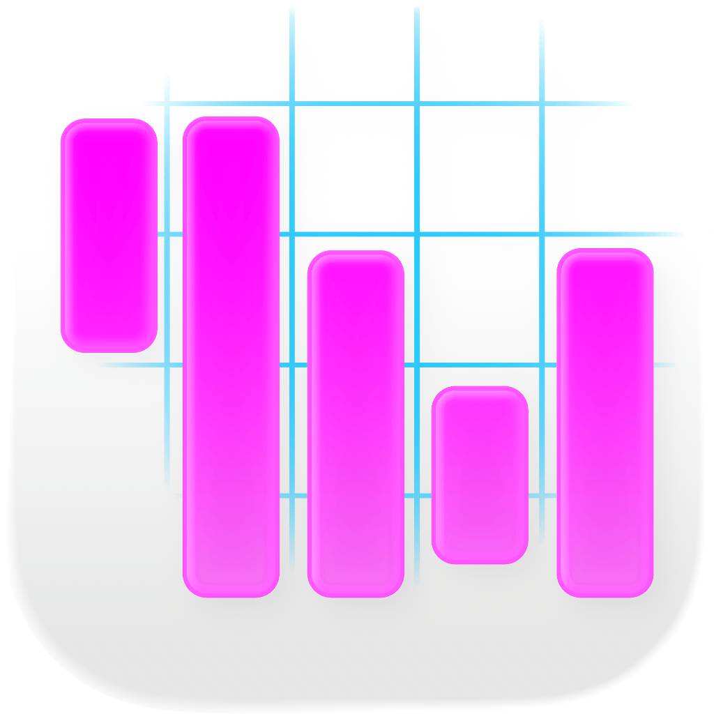

### 📌 이 서비스 한눈에 보기
터미널 스크립트 실행 결과를 데스크탑과 홈 화면 위젯으로 실시간 확인하세요.

### 🔑 주요 기능
- 명령어 실행 결과, 진행률, 스파크라인, 이미지를 위젯으로 표시
- macOS, iOS, iPadOS를 아우르는 유니버설 앱 지원
- 구독형이 아닌 간편한 일회성 구매 방식

### 🙋 사용자에게 어떤 점이 좋은가
터미널 창을 계속 열어두지 않아도 데스크탑이나 모바일 위젯을 통해 작업 진행 상황을 직관적으로 모니터링할 수 있습니다.

### ✅ 지금 바로 써볼 기능
- 자주 사용하는 스크립트 결과 위젯화하기
- 진행률(Progress) 위젯으로 작업 상태 확인하기
- macOS와 iOS 간의 유기적인 데이터 확인하기

### ⚠️ 사용 전 확인할 점
- 스크립트 실행 환경에 따른 위젯 업데이트 주기 확인 필요
- 백그라운드 실행 시 배터리 소모량 체크 필요

### 🧭 확인이 더 필요한 정보
스크립트 실행 방식(로컬 vs 클라우드) 및 데이터 동기화 방식에 대한 상세 정보가 필요합니다.

### 📸 스크린샷 및 갤러리
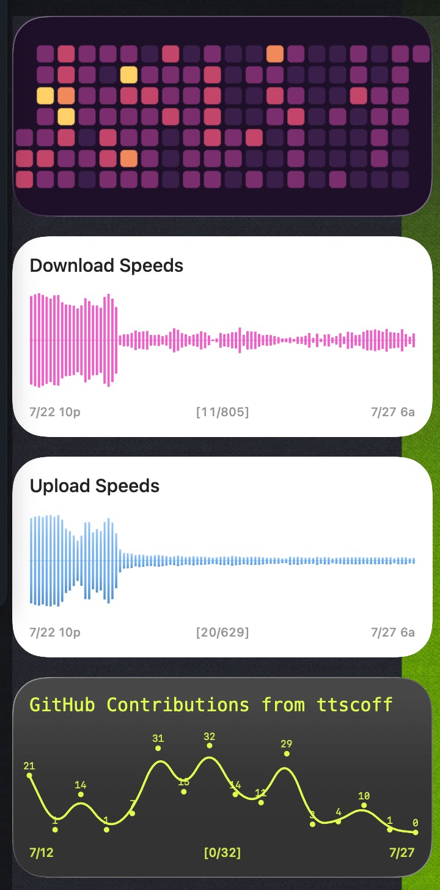
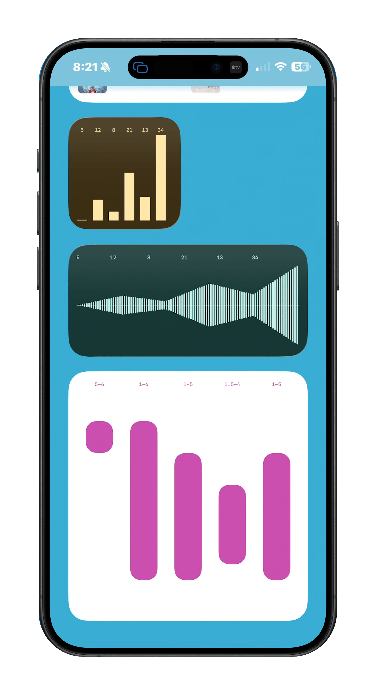
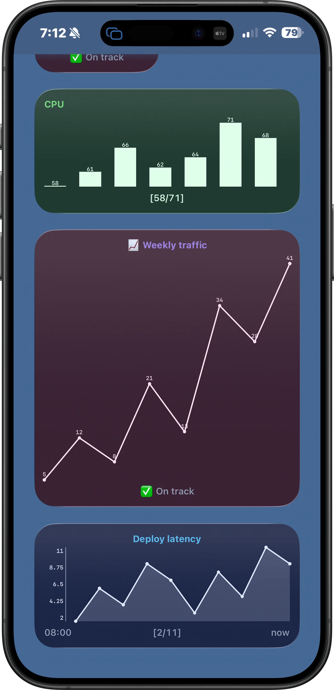

### 🎬 관련 영상
- [🎥 영상 보기](https://ph-files.imgix.net/79a653ec-3d2f-42f3-b323-d27c4d38ad9e.jpeg?auto=format)

---

## 7. [Terminal Candy](https://www.producthunt.com/products/terminal-candy)
**Votes**: 109 | **도입 난이도**: 하 | **신뢰도**: 상
**Tagline**: A native macOS terminal you can skin and theme
**서비스 링크**: https://www.producthunt.com/r/LF7L5WEVZODLXZ

**태그**: DevTool, macOS, Customization, Productivity, Vision

### 📌 이 서비스 한눈에 보기
사용자 취향대로 스킨을 입힐 수 있는 네이티브 macOS 터미널

### 🔑 주요 기능
- 게임보이, 카세트 데크 등 독특한 테마와 CRT 효과를 지원하는 커스텀 스킨
- Claude Code나 Codex 작업 시 입력이 필요할 때 알려주는 스마트 알림 기능
- 구독 없이 한 번 결제로 평생 소장하는 합리적인 가격 정책

### 🙋 사용자에게 어떤 점이 좋은가
터미널을 단순한 도구를 넘어 개인의 개성을 담은 데스크테리어 요소로 활용할 수 있으며, 작업 흐름을 방해하지 않는 스마트한 알림을 제공합니다.

### ✅ 지금 바로 써볼 기능
- Skin Builder를 사용하여 원하는 이미지를 터미널 테마로 변환하기
- 84가지 팔레트와 CRT 효과로 나만의 데스크탑 환경 구축하기
- ⌥Space 단축키를 활용한 빠른 터미널 접근 테스트하기

### ⚠️ 사용 전 확인할 점
- macOS 14 이상 및 Apple Silicon 환경에서만 작동함
- 14일 무료 체험 후 $10의 일회성 결제가 필요함

### 🧭 확인이 더 필요한 정보
사용자의 하드웨어 사양에 따른 성능 최적화 수준은 명시되어 있지 않습니다.

### 📸 스크린샷 및 갤러리

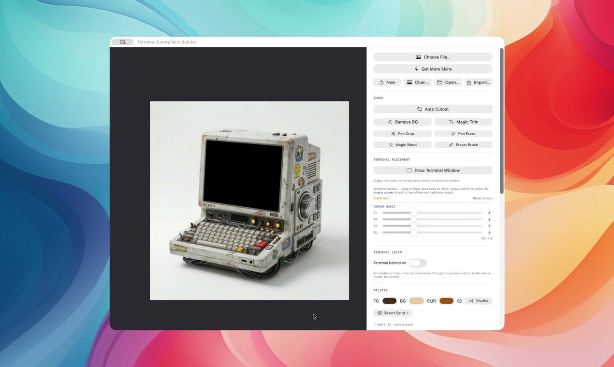
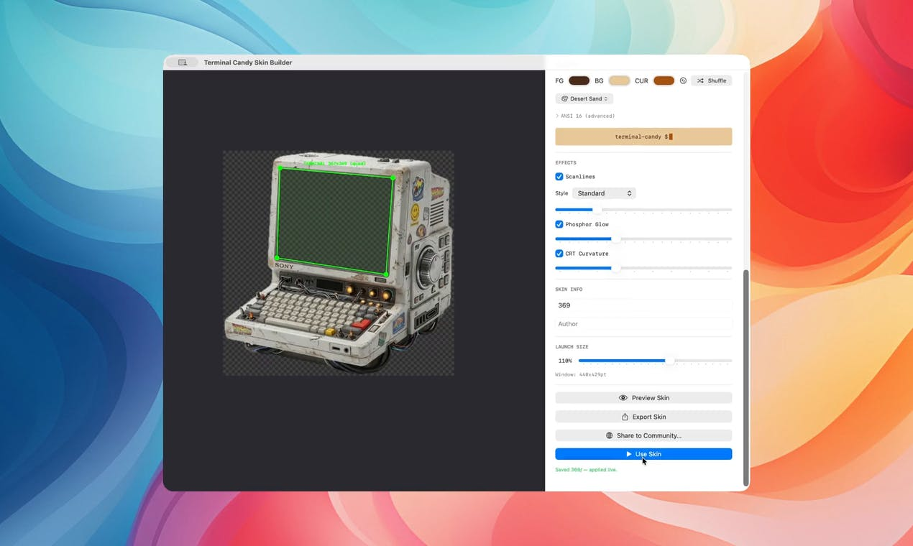

---

## 8. [EssayKraft](https://www.producthunt.com/products/essaykraft)
**Votes**: 95 | **도입 난이도**: 하 | **신뢰도**: 상
**Tagline**: Native essay writing app for Mac and iPad 
**서비스 링크**: https://www.producthunt.com/r/Z6QVYVVWL3T2ZZ

**태그**: Writing, Academic, Productivity, Mac, iPad, Design

### 📌 이 서비스 한눈에 보기
참고문헌 관리와 글쓰기를 하나로 합친 Mac/iPad 전용 학술 글쓰기 앱

### 🔑 주요 기능
- 내장된 참고문헌 관리 및 자동 인용 기능
- 구독 없이 한 번 구매로 평생 소장하는 방식
- Swift로 제작된 빠르고 방해 없는 네이티브 환경

### 🙋 사용자에게 어떤 점이 좋은가
별도의 인용 도구를 번거롭게 오갈 필요 없이, 논문 작성부터 PDF/DOCX 내보내기까지 한 곳에서 해결할 수 있습니다.

### ✅ 지금 바로 써볼 기능
- 내장된 참고문헌 관리 기능 테스트
- 자동 인용 기능 활용해보기
- PDF 및 DOCX 내보내기 품질 확인

### ⚠️ 사용 전 확인할 점
- Mac과 iPad 전용 앱이므로 Windows 환경에서는 사용 불가
- 클라우드 계정 기반이 아니므로 기기 간 동기화 방식 확인 필요

### 🧭 확인이 더 필요한 정보
계정 없이 작동하므로 기기 간 데이터 동기화 및 백업 방식에 대한 상세 정보가 필요합니다.

### 📸 스크린샷 및 갤러리
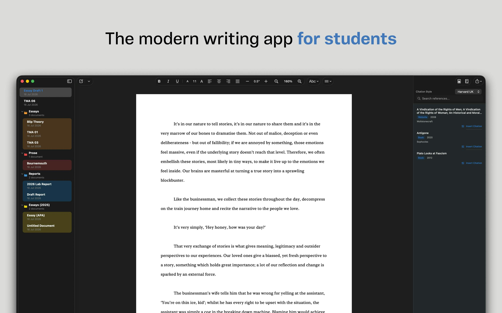
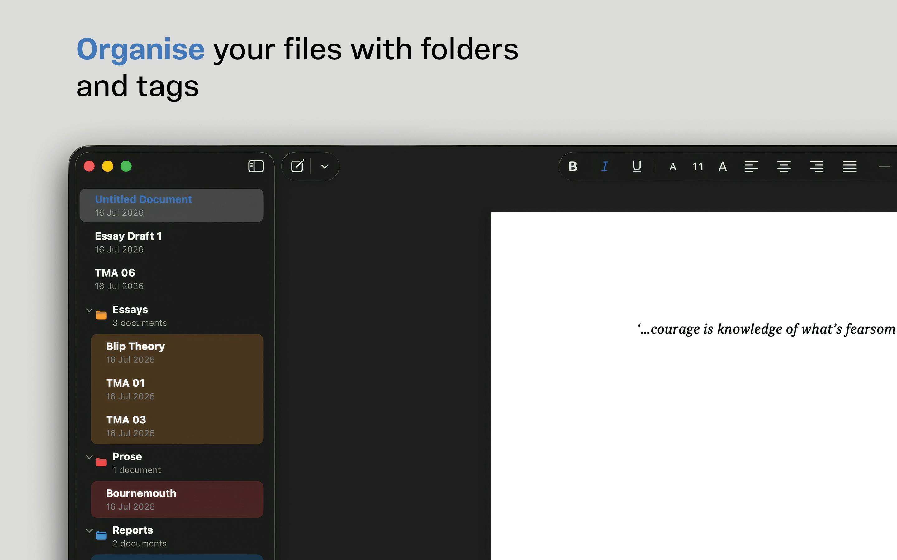

---

## 9. [Basedash Audit Logs](https://www.producthunt.com/products/basedash)
**Votes**: 94 | **도입 난이도**: 하 | **신뢰도**: 상
**Tagline**: Every action in your BI tool, on the record.
**서비스 링크**: https://www.producthunt.com/r/4BFYBSUOLNVBUR

**태그**: Security, DataAnalytics, DevTool, Enterprise, AI Tool, API

### 📌 이 서비스 한눈에 보기
모든 데이터 작업과 AI 쿼리 이력을 투명하게 기록하는 엔터프라이즈급 감사 로그 솔루션

### 🔑 주요 기능
- 로그인, 쿼리 실행, 설정 변경 등 모든 작업의 추적성 확보
- AI가 실행하는 쿼리까지 포함하여 누가 무엇을 보았는지 명확히 식별
- SIEM 이벤트 스트리밍, API 추출, 데이터 보존 정책 설정 지원

### 🙋 사용자에게 어떤 점이 좋은가
보안 리뷰와 엔터프라이즈 도입 시 필수적인 감사 기록을 자동화하여, 데이터 보안 사고 발생 시 즉각적인 추적과 규정 준수를 가능하게 합니다.

### ✅ 지금 바로 써볼 기능
- 로그 필터를 통한 사용자 활동 추적 테스트
- SIEM 연동을 통한 이벤트 스트리밍 설정
- API를 통한 로그 데이터 추출 및 관리

### ⚠️ 사용 전 확인할 점
- Basedash 플랫폼 사용자에 한정된 기능임
- 로그 데이터 양에 따른 스토리지 및 비용 정책 확인 필요

### 🧭 확인이 더 필요한 정보
상세한 데이터 보존 기간 및 SIEM 연동 가능한 구체적인 플랫폼 목록은 공식 문서를 통해 확인이 필요합니다.

### 📸 스크린샷 및 갤러리
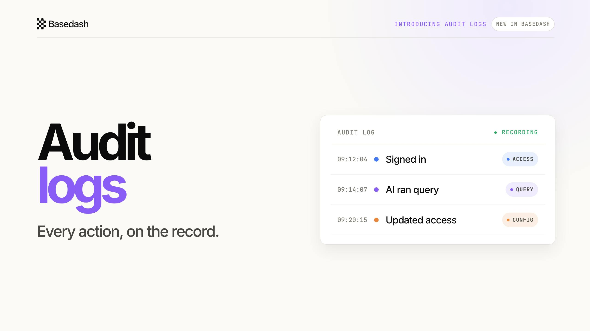
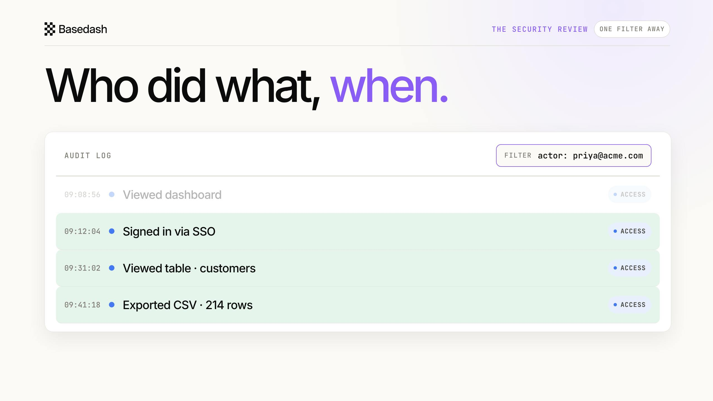
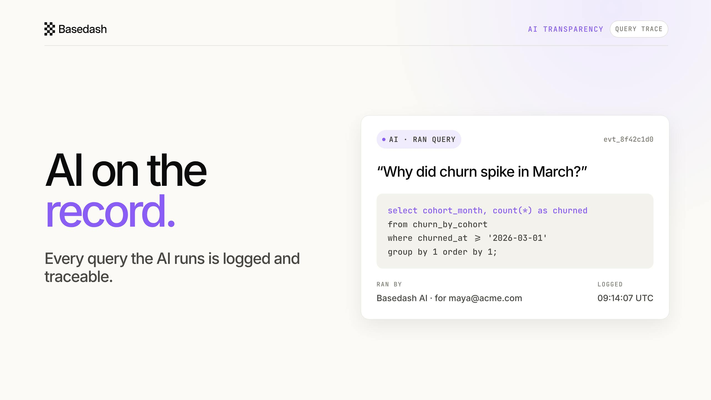

### 🎬 관련 영상
- [🎥 영상 보기](https://ph-files.imgix.net/fe1e3093-844d-45e4-ae10-804009dc8d1e.jpeg?auto=format)

---

## 10. [SyncStaq](https://www.producthunt.com/products/syncstaq)
**Votes**: 90 | **도입 난이도**: 하 | **신뢰도**: 상
**Tagline**: Stripe billing data, always current in Google Sheets
**서비스 링크**: https://www.producthunt.com/r/7AJ3R66DDJFLAR

**태그**: Automation, Fintech, SaaS, GoogleSheets

### 📌 이 서비스 한눈에 보기
Stripe 결제 데이터를 실시간 이벤트 기반으로 Google Sheets에 자동 동기화하는 도구

### 🔑 주요 기능
- Stripe의 결제, 인보이스, 구독, 분쟁 등 데이터를 구조화된 시트 탭으로 자동 분류
- 생성일 기준이 아닌 이벤트 스트림 기반 동기화로 환불 및 업데이트 사항 반영
- 읽기 전용(Read-only) 권한을 통한 안전한 데이터 연동 및 시간당 자동 동기화

### 🙋 사용자에게 어떤 점이 좋은가
수동 데이터 추출 없이도 항상 최신 상태의 결제 리포트를 Google Sheets에서 확인할 수 있어 데이터 정합성 문제를 해결합니다.

### ✅ 지금 바로 써볼 기능
- Stripe 계정 연동 및 읽기 전용 권한 설정
- 자동 생성된 구조화된 시트 탭 확인
- 14일 무료 체험을 통한 데이터 동기화 정확도 검증

### ⚠️ 사용 전 확인할 점
- 데이터 업데이트 주기가 시간 단위(Hourly)이므로 실시간성이 아주 높은 작업에는 차이가 있을 수 있음
- Stripe 데이터의 양에 따른 시트 성능 영향 확인 필요

### 🧭 확인이 더 필요한 정보
사용자의 Stripe 데이터 규모에 따른 추가 비용 정책이나 시트 행 제한에 대한 정보는 명시되지 않았습니다.

### 📸 스크린샷 및 갤러리
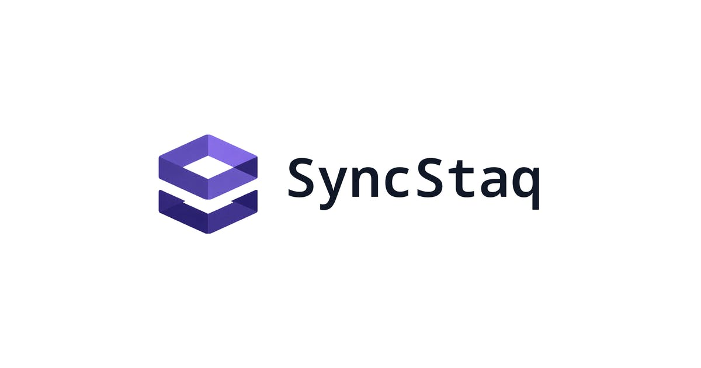
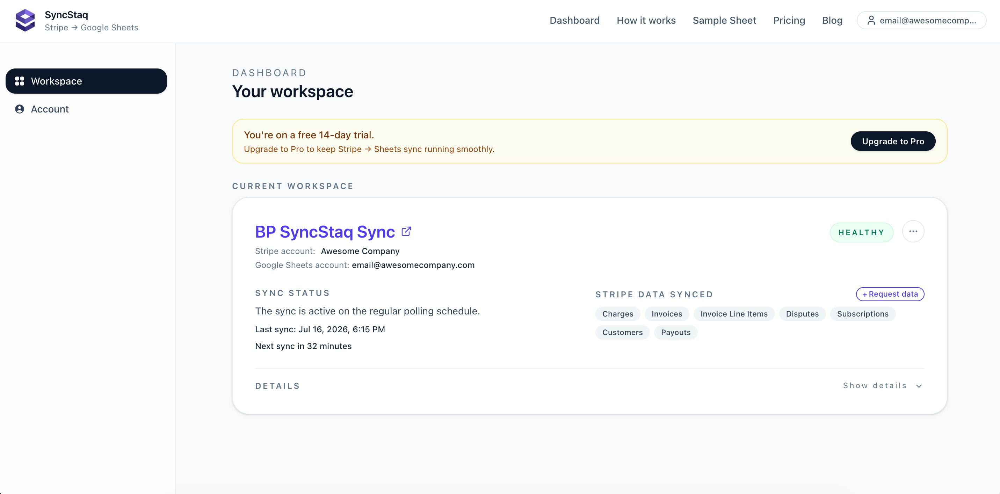
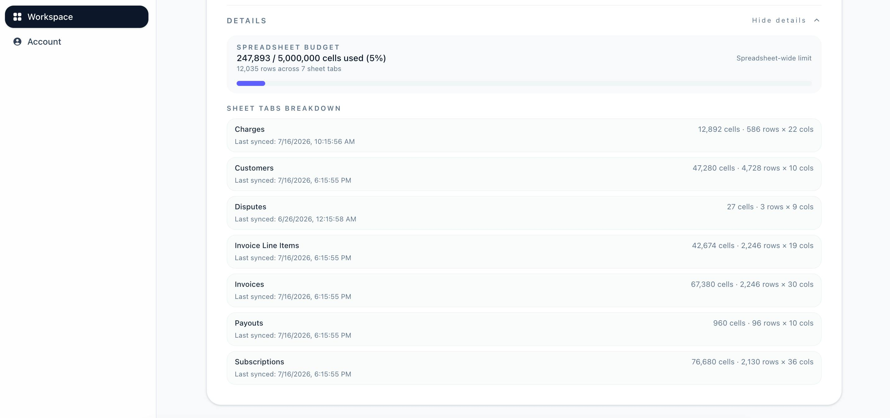

---

## 11. [Kopai](https://www.producthunt.com/products/kopai-the-marketplace-for-ai-agents)
**Votes**: 82 | **도입 난이도**: 하 | **신뢰도**: 상
**Tagline**:  Share your expertise, and let our agents earn for you.
**서비스 링크**: https://www.producthunt.com/r/32Z4PUCTZP3CTF

**태그**: AI, NoCode, Monetization, SaaS, Automation, Agent, AI Tool, Prompting, DevTool

### 📌 이 서비스 한눈에 보기
자신의 전문 지식을 판매 가능한 AI 에이전트로 변환하여 수익을 창출하는 플랫폼

### 🔑 주요 기능
- 지식 기반의 AI 에이전트를 노코드 방식으로 빠르게 구축 및 배포
- 시간당 과금이 아닌 메시지당 과금 방식의 새로운 수익 모델 제공
- 보안이 강화된 지식 베이스와 멀티 에이전트 오케스트레이션 지원

### 🙋 사용자에게 어떤 점이 좋은가
전문가가 직접 상담 시간을 할애하지 않고도 자신의 지식을 자동화된 에이전트를 통해 수익화할 수 있습니다.

### ✅ 지금 바로 써볼 기능
- 보유한 전문 지식 데이터 업로드하기
- AI 에이전트 생성 및 배포 테스트
- 메시지당 과금 모델 설정 및 수익 구조 확인

### ⚠️ 사용 전 확인할 점
- 수익의 70%를 제외한 30%가 플랫폼 수수료로 발생함
- 에이전트의 답변 품질이 사용자의 원본 지식 데이터에 의존함

### 🧭 확인이 더 필요한 정보
에이전트의 답변 정확도를 검증하기 위한 구체적인 평가 지표와 데이터 보안 수준에 대한 상세 확인이 필요합니다.

### 📸 스크린샷 및 갤러리
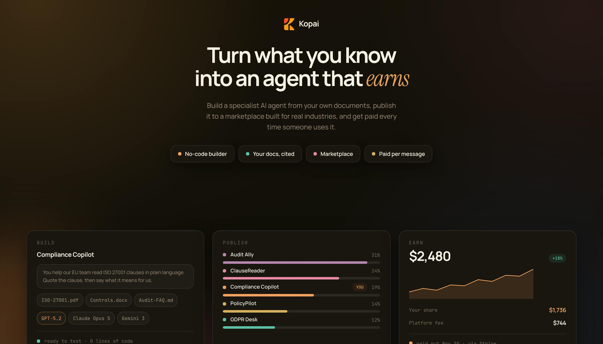
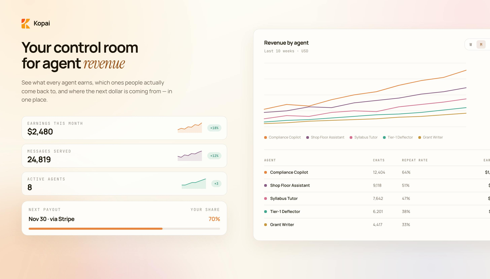
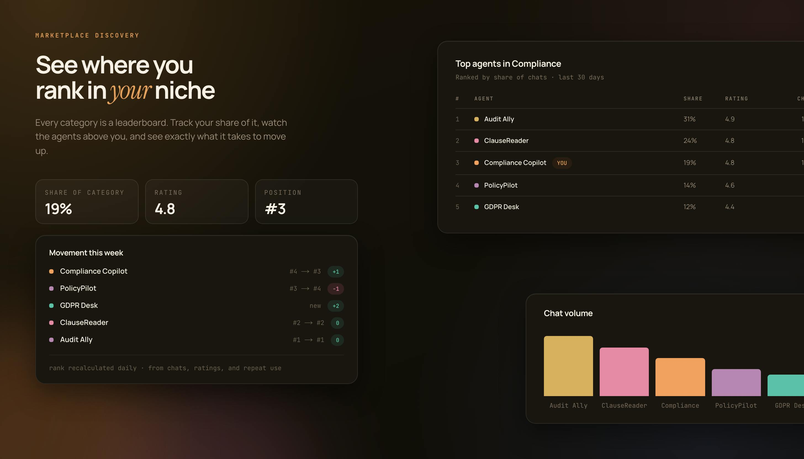

### 🎬 관련 영상
- [🎥 영상 보기](https://ph-files.imgix.net/2b8d5bc0-b89e-489b-b8dd-07b3ee19a99a.jpeg?auto=format)

---

## 12. [Tandem](https://www.producthunt.com/products/tandem-11)
**Votes**: 77 | **도입 난이도**: 하 | **신뢰도**: 상
**Tagline**: AI-native office leasing brokerage
**서비스 링크**: https://www.producthunt.com/r/GOUD2D2F43WGBJ

**태그**: Real Estate, AI, Brokerage, Automation, Agent, AI Tool

### 📌 이 서비스 한눈에 보기
AI 에이전트 기술을 결합하여 24시간 시장을 모니터링하는 차세대 오피스 임대 중개 서비스

### 🔑 주요 기능
- AI 에이전트 기반의 실시간 시장 데이터 모니터링
- 실제 임대 사례 및 건물주 성향 등 심층 데이터 활용
- 인간 중개사의 물리적 한계를 넘어서는 정보 접근성

### 🙋 사용자에게 어떤 점이 좋은가
사용자는 중개인이 퇴근한 시간이나 물리적 이동 중에도 실시간으로 업데이트되는 최적의 오피스 매물 정보를 얻을 수 있습니다.

### ✅ 지금 바로 써볼 기능
- 현재 시장 매물 현황 확인하기
- 유사 매물 임대 사례 데이터 요청하기
- 건물주 협상 조건 및 가용성 문의하기

### ⚠️ 사용 전 확인할 점
- AI 데이터와 실제 현장 실사 간의 차이 확인 필요
- 중개인과 AI 에이전트 간의 협업 방식 이해 필요

### 🧭 확인이 더 필요한 정보
AI가 제공하는 데이터의 정확도와 실제 오프라인 중개 프로세스와의 결합 수준을 확인해야 합니다.

### 📸 스크린샷 및 갤러리
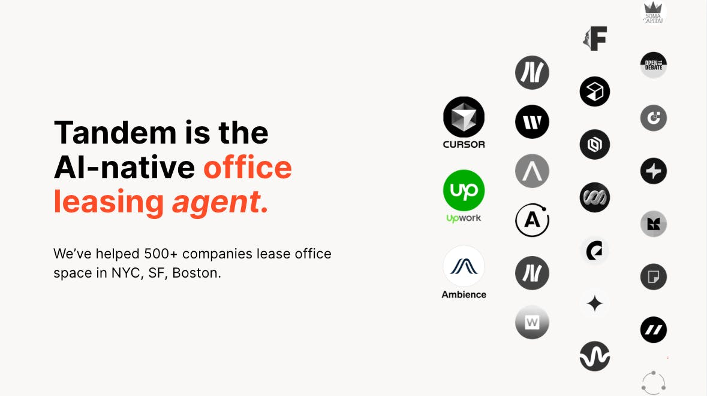

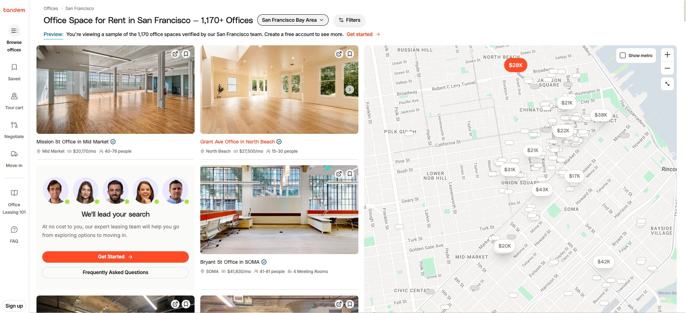

---

## 13. [unquestion](https://www.producthunt.com/products/unquestion)
**Votes**: 25 | **도입 난이도**: 하 | **신뢰도**: 상
**Tagline**: The form that asks like a person
**서비스 링크**: https://www.producthunt.com/r/RNZW4NSBZ6SAUE

**태그**: AI, NoCode, DataCollection, UX, AI Tool

### 📌 이 서비스 한눈에 보기
대화형 AI를 통해 이탈률을 낮추고 정제된 데이터를 수집하는 스마트 폼 서비스

### 🔑 주요 기능
- 정적인 양식 대신 사람과 대화하는 듯한 AI 인터페이스 제공
- 사용자 답변에 따라 질문이 유동적으로 변하는 적응형 대화 방식
- 단순 텍스트 기록이 아닌 구조화된 테이블 형태의 데이터 추출

### 🙋 사용자에게 어떤 점이 좋은가
기존 설문조사의 높은 이탈률 문제를 해결하며, 답변 내용을 일일이 정리할 필요 없이 즉시 활용 가능한 데이터로 변환해 줍니다.

### ✅ 지금 바로 써볼 기능
- AI 대화 흐름 테스트하기
- 수집된 데이터의 테이블 구조 확인하기
- 기존 정적 폼과 비교 테스트하기

### ⚠️ 사용 전 확인할 점
- 대화형 방식에 대한 사용자 거부감이 있을 수 있음
- 복잡한 데이터 구조를 완벽하게 구조화하는지 검증 필요

### 🧭 확인이 더 필요한 정보
현재 제공되는 데이터 구조화의 정밀도와 외부 툴과의 연동 범위를 확인해야 합니다.

### 📸 스크린샷 및 갤러리

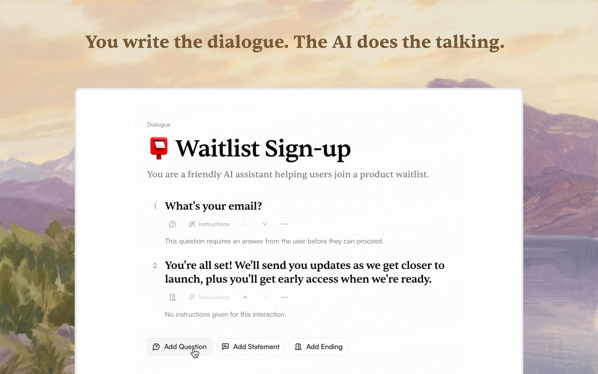
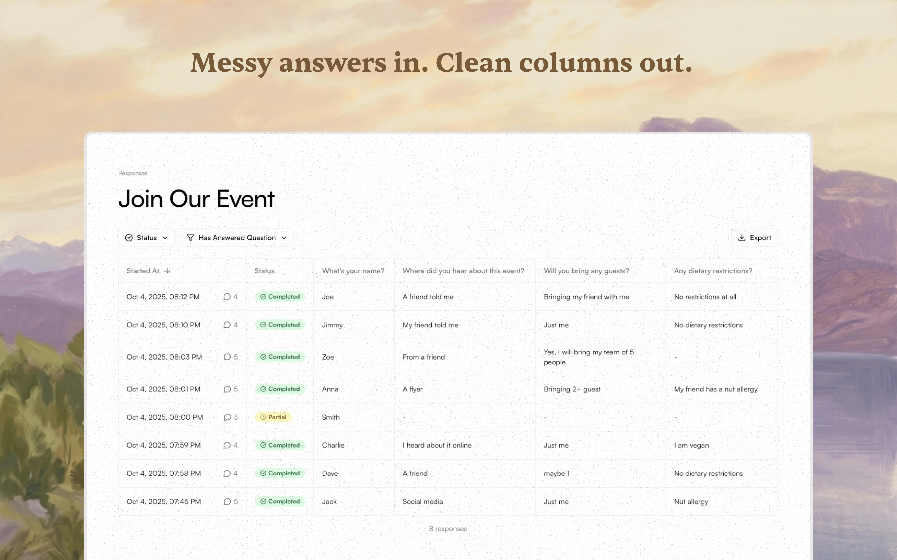

---

## 14. [Quillly](https://www.producthunt.com/products/quillly)
**Votes**: 23 | **도입 난이도**: 하 | **신뢰도**: 상
**Tagline**: Publish straight from your AI. No dashboard detour.
**서비스 링크**: https://www.producthunt.com/r/IPNPCM4Y5DAFGY

**태그**: AI, Automation, SEO, ContentMarketing, Productivity, AI Tool, Chat

### 📌 이 서비스 한눈에 보기
AI 대화창에서 즉시 블로그를 발행하고 검색 엔진 등록까지 완료하는 자동화 퍼블리싱 도구

### 🔑 주요 기능
- Claude, ChatGPT, Cursor 등 기존 AI 어시스턴트와 직접 연결
- SEO 최적화된 콘텐츠 생성부터 실시간 발행까지 원스톱 프로세스
- 7개 검색 엔진 자동 제출 및 색인/트래픽 추적 기능 제공

### 🙋 사용자에게 어떤 점이 좋은가
별도의 CMS 대시보드에 접속할 필요 없이 AI 채팅창 안에서 콘텐츠 제작과 배포를 한 번에 끝낼 수 있어 작업 흐름이 매우 간결해집니다.

### ✅ 지금 바로 써볼 기능
- 사용 중인 AI 어시스턴트(Claude, ChatGPT 등)에 도메인 연결하기
- AI를 통해 SEO 점수가 반영된 블로그 포스트 생성 및 발행하기
- 검색 엔진 색인 상태 및 트래픽 대시보드 확인하기

### ⚠️ 사용 전 확인할 점
- AI가 생성한 콘텐츠의 품질이 검색 엔진 최적화 기준에 부합하는지 검토 필요
- 도메인 연결 및 권한 설정 시 보안 및 관리 권한 확인 필요

### 🧭 확인이 더 필요한 정보
사용 중인 AI 모델의 종류에 따라 지원되는 기능 범위나 연동 방식이 다를 수 있습니다.

### 📸 스크린샷 및 갤러리
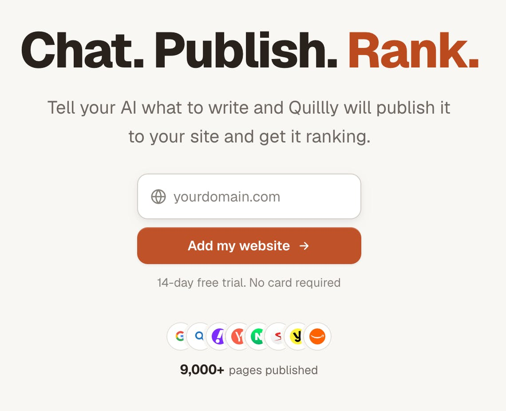
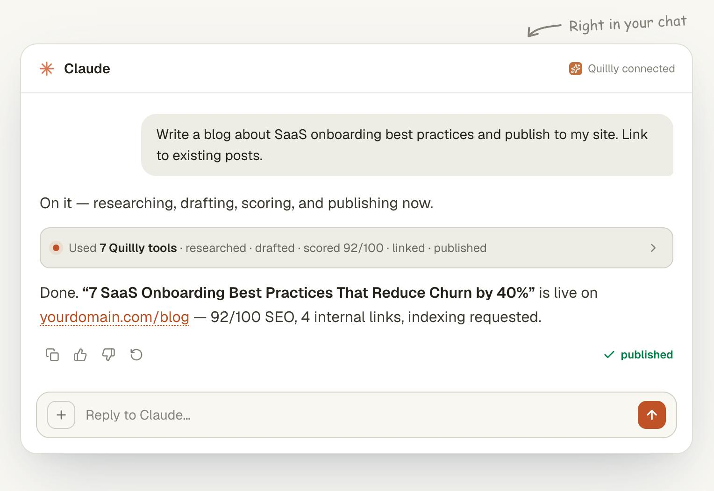
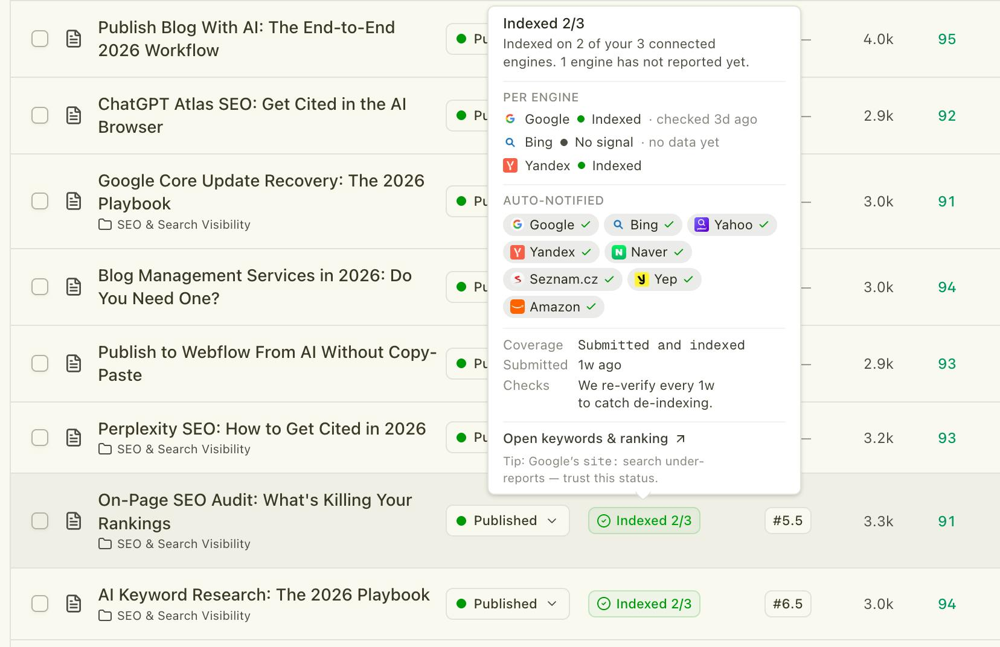

---

## 15. [Pokey](https://www.producthunt.com/products/pokey)
**Votes**: 14 | **도입 난이도**: 하 | **신뢰도**: 상
**Tagline**: Make your screen shares unmissable
**서비스 링크**: https://www.producthunt.com/r/ZCEUM5IPXWDXCS

**태그**: Productivity, RemoteWork, Design, Sales

### 📌 이 서비스 한눈에 보기
지루한 화면 공유 시간을 특별하게 만드는 메뉴 바 기반 커서 애니메이션 앱

### 🔑 주요 기능
- 커서에 재미있는 효과를 더해 화면 공유 시 주목도를 높임
- 팀 미팅, 영업 콜, 피드백 세션 등 다양한 화상 회의 상황에 활용 가능
- 메뉴 바에 상주하는 가벼운 앱 형태로 간편한 사용성 제공

### 🙋 사용자에게 어떤 점이 좋은가
반복적이고 지루할 수 있는 화면 공유 상황에서 커서를 활용해 분위기를 환기하고 상대방에게 강렬한 인상을 남길 수 있습니다.

### ✅ 지금 바로 써볼 기능
- 메뉴 바에 앱 설치하기
- 커서 효과를 활성화하여 화면 공유 테스트하기
- 팀 미팅이나 영업 미팅에서 효과 적용해보기

### ⚠️ 사용 전 확인할 점
- 화면 공유 시 커서 효과가 상대방의 화면에 어떻게 보일지 미리 확인 필요
- 업무용 화면 공유 시 지나치게 화려한 효과는 주의 필요

### 🧭 확인이 더 필요한 정보
상세한 기능 리스트나 커스텀 가능 여부에 대한 구체적인 정보는 제공되지 않았습니다.

### 📸 스크린샷 및 갤러리

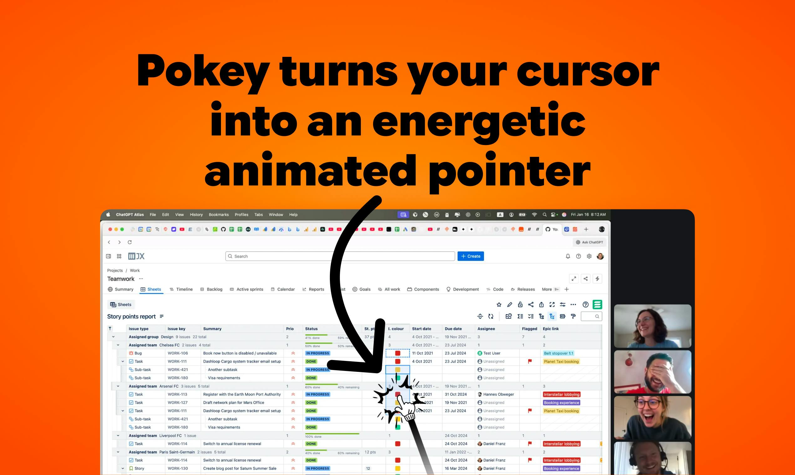

### 🎬 관련 영상
- [🎥 영상 보기](https://ph-files.imgix.net/6cd28558-59a4-4a59-8e5a-4b536890848f.jpeg?auto=format)

---

## 16. [Tokimeter](https://www.producthunt.com/products/tokimeter)
**Votes**: 14 | **도입 난이도**: 하 | **신뢰도**: 상
**Tagline**: Local usage analytics for Claude, Codex, Cursor, Grok & More
**서비스 링크**: https://www.producthunt.com/r/DQVR46CYL4QZ3J

**태그**: DevTool, AI, Analytics, OpenSource, AI Tool

### 📌 이 서비스 한눈에 보기
로컬 AI 코딩 도구들의 토큰 사용량과 비용을 한눈에 관리하는 오픈소스 분석 도구

### 🔑 주요 기능
- Claude, Cursor, Copilot CLI 등 다양한 AI 코딩 도구의 사용 기록 통합 리포트 제공
- 프로젝트, 세션, 모델별로 상세한 토큰 수 및 비용 분석 가능
- 데이터가 외부로 유출되지 않는 완전한 로컬 기반 보안 설계

### 🙋 사용자에게 어떤 점이 좋은가
AI 코딩 도구 사용 시 발생하는 비용과 토큰 소모량을 실시간으로 모니터링하여 예산 초과를 방지할 수 있습니다.

### ✅ 지금 바로 써볼 기능
- npx 명령어를 통한 즉각적인 리포트 생성
- 5시간 및 주간 단위 예산 경고 설정 확인
- 사용 중인 AI 도구와의 호환성 테스트

### ⚠️ 사용 전 확인할 점
- 로컬 기록을 기반으로 하므로 각 도구의 로그 형식이 변경될 경우 작동이 제한될 수 있음
- 설치 방식에 따른 환경 설정 필요성 확인 필요

### 🧭 확인이 더 필요한 정보
사용자의 로컬 환경에 따라 특정 AI 도구의 로그 접근 권한이 필요할 수 있습니다.

### 📸 스크린샷 및 갤러리
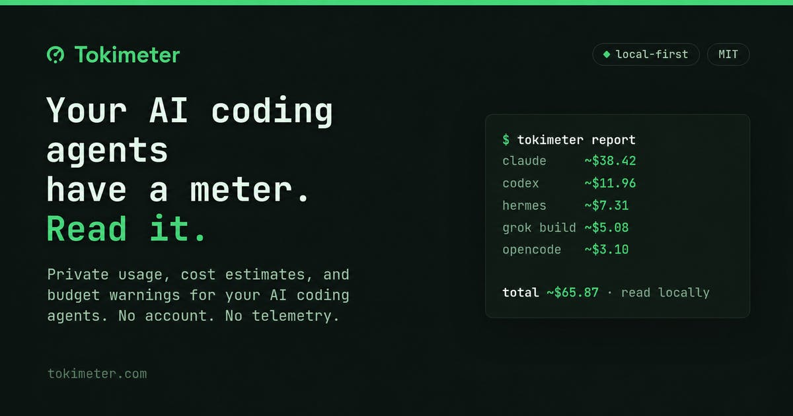
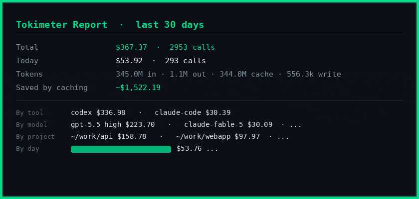

---

## 17. [Monolite](https://www.producthunt.com/products/monolite)
**Votes**: 10 | **도입 난이도**: 하 | **신뢰도**: 상
**Tagline**: Turn any audience into active participants
**서비스 링크**: https://www.producthunt.com/r/XFNT2T5DKXGALB

**태그**: Interactive, Engagement, Gamification, EventTool, AI Tool

### 📌 이 서비스 한눈에 보기
청중을 능동적인 참여자로 만드는 인터랙티브 게임 제작 도구

### 🔑 주요 기능
- QR 코드를 통한 즉각적인 참여 및 공개 참여 기능
- 브랜드 맞춤형 커스텀 브랜딩 지원
- 참여도 분석을 위한 상세 리포트 제공

### 🙋 사용자에게 어떤 점이 좋은가
발표나 이벤트 시 청중의 몰입도를 높이고, 실시간 참여 데이터를 통해 성과를 측정할 수 있습니다.

### ✅ 지금 바로 써볼 기능
- QR 코드를 활용한 실시간 게임 생성
- 브랜드 아이덴티티를 반영한 커스텀 설정
- 참여 결과 리포트 확인

### ⚠️ 사용 전 확인할 점
- 무료 버전의 기능 제한 범위 확인 필요
- 참여 인원수에 따른 안정성 검토

### 🧭 확인이 더 필요한 정보
무료 플랜의 구체적인 기능 제한과 최대 동시 접속자 수에 대한 정보가 명시되지 않았습니다.

### 📸 스크린샷 및 갤러리

---

## 18. [ViiTor Translate](https://www.producthunt.com/products/viitor-translate)
**Votes**: 9 | **도입 난이도**: 하 | **신뢰도**: 상
**Tagline**: Real-time subtitles that keep up with speech and context
**서비스 링크**: https://www.producthunt.com/r/6HQT2UXLG2BCZI

**태그**: Translation, Video, Productivity, Accessibility

### 📌 이 서비스 한눈에 보기
실시간 영상 및 미팅을 위한 문맥 중심의 실시간 자막 번역 서비스

### 🔑 주요 기능
- 라이브 스트림, 영상, 화상 회의를 위한 실시간 번역 자막 제공
- 단순 직역을 넘어 슬랭, 문화적 맥락, 농담까지 반영하는 고도화된 번역
- iOS, Android, Chrome 지원 및 화면 전환이 필요 없는 플로팅 자막 기능

### 🙋 사용자에게 어떤 점이 좋은가
유튜브, 틱톡 등을 시청할 때 화면을 전환하지 않고도 현지 느낌이 살아있는 자막을 통해 콘텐츠를 더 몰입감 있게 즐길 수 있습니다.

### ✅ 지금 바로 써볼 기능
- 플로팅 자막 기능을 활용해 유튜브/틱톡 시청해보기
- 20개 이상의 언어 지원 범위 확인하기
- 무료 체험을 통해 번역 정확도 테스트하기

### ⚠️ 사용 전 확인할 점
- 플랫폼별(YouTube, TikTok 등) 지원 여부 확인 필요
- 실시간 스트리밍 환경에 따른 지연 시간 발생 가능성

### 🧭 확인이 더 필요한 정보
지원되는 모든 플랫폼에서의 플로팅 자막 작동 여부와 상세 유료 플랜 정책을 확인해야 합니다.

### 📸 스크린샷 및 갤러리

### 🎬 관련 영상
- [🎥 영상 보기](https://ph-files.imgix.net/3928a5c4-dcd3-4571-931b-38e87bab0730.jpeg?auto=format)

---

## 19. [Omnitopical ](https://www.producthunt.com/products/omnitopical)
**Votes**: 7 | **도입 난이도**: 하 | **신뢰도**: 상
**Tagline**: Turn Your Website Into an Industry Authority
**서비스 링크**: https://www.producthunt.com/r/XERXFSFQXQ42BX

**태그**: SEO, Content Automation, Marketing, AI Tool

### 📌 이 서비스 한눈에 보기
단일 도메인 내에서 전문적인 콘텐츠를 자동 생성하여 웹사이트를 업계 권위자로 만들어주는 서비스

### 🔑 주요 기능
- 단일 도메인 내 무제한 페이지 생성 지원
- 주제별 전체 범위를 아우르는 토픽 맵핑 및 콘텐츠 작성
- 검색 엔진 최적화(SEO)를 위한 자동 링크 및 발행 프로세스

### 🙋 사용자에게 어떤 점이 좋은가
콘텐츠 기획부터 발행까지의 과정을 자동화하여, 적은 노력으로 특정 분야의 검색 엔진 상위 노출과 전문성을 확보할 수 있습니다.

### ✅ 지금 바로 써볼 기능
- 도메인 주제 설정 및 토픽 맵 생성
- 자동 생성된 콘텐츠의 품질 검토
- 내부 링크 구조 및 발행 자동화 확인

### ⚠️ 사용 전 확인할 점
- 자동 생성된 콘텐츠의 품질이 검색 엔진의 스팸 필터에 걸릴 위험성
- 주제 전문성이 부족할 경우 브랜드 신뢰도 저하 가능성

### 🧭 확인이 더 필요한 정보
콘텐츠의 품질 관리 방식과 검색 엔진 최적화 알고리즘 대응 방식에 대한 구체적인 정보가 필요합니다.

### 📸 스크린샷 및 갤러리
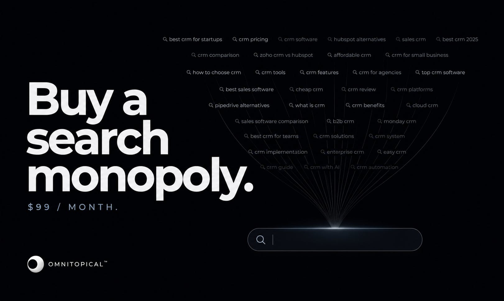
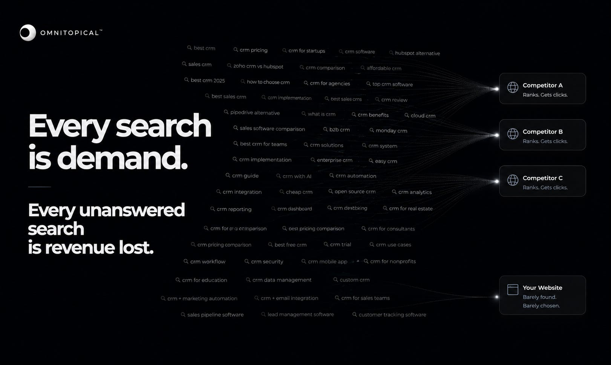
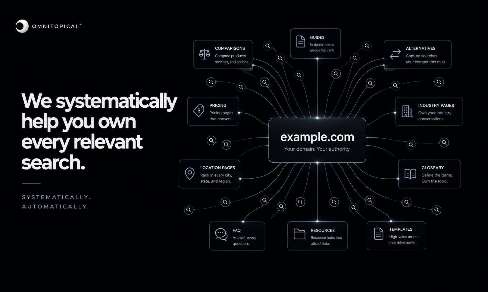

---

## 20. [RecordRanks](https://www.producthunt.com/products/recordranks)
**Votes**: 7 | **도입 난이도**: 하 | **신뢰도**: 상
**Tagline**: Competition Management & Sports Rankings Platform
**서비스 링크**: https://www.producthunt.com/r/IZH46X3EDXCB5F

**태그**: Sports, Competition, Management, Leaderboard

### 📌 이 서비스 한눈에 보기
스포츠 커뮤니티를 위한 올인원 경기 운영 및 순위 관리 플랫폼

### 🔑 주요 기능
- 파워리프팅, 러닝, 게이밍 등 다양한 퍼포먼스 기반 스포츠 최적화
- 간편한 대회 조직 및 실시간 결과 입력 기능
- 자동화된 기록 관리 및 실시간 리더보드 제공

### 🙋 사용자에게 어떤 점이 좋은가
대회 운영의 번거로운 수동 작업을 자동화하고, 참가자들에게 실시간으로 정확한 순위를 보여줄 수 있습니다.

### ✅ 지금 바로 써볼 기능
- 커스텀 설정으로 우리 종목에 맞게 대시보드 구성하기
- 실시간 결과 입력 기능 테스트하기
- 자동 생성되는 리더보드 확인하기

### ⚠️ 사용 전 확인할 점
- 특정 스포츠 종목에 특화된 규칙 적용 가능 여부 확인 필요
- 사용자 규모에 따른 관리 기능의 확장성 검토 필요

### 🧭 확인이 더 필요한 정보
지원하는 구체적인 스포츠 종목의 규칙 커스텀 범위와 모바일 앱 지원 여부가 명시되지 않았습니다.

### 📸 스크린샷 및 갤러리
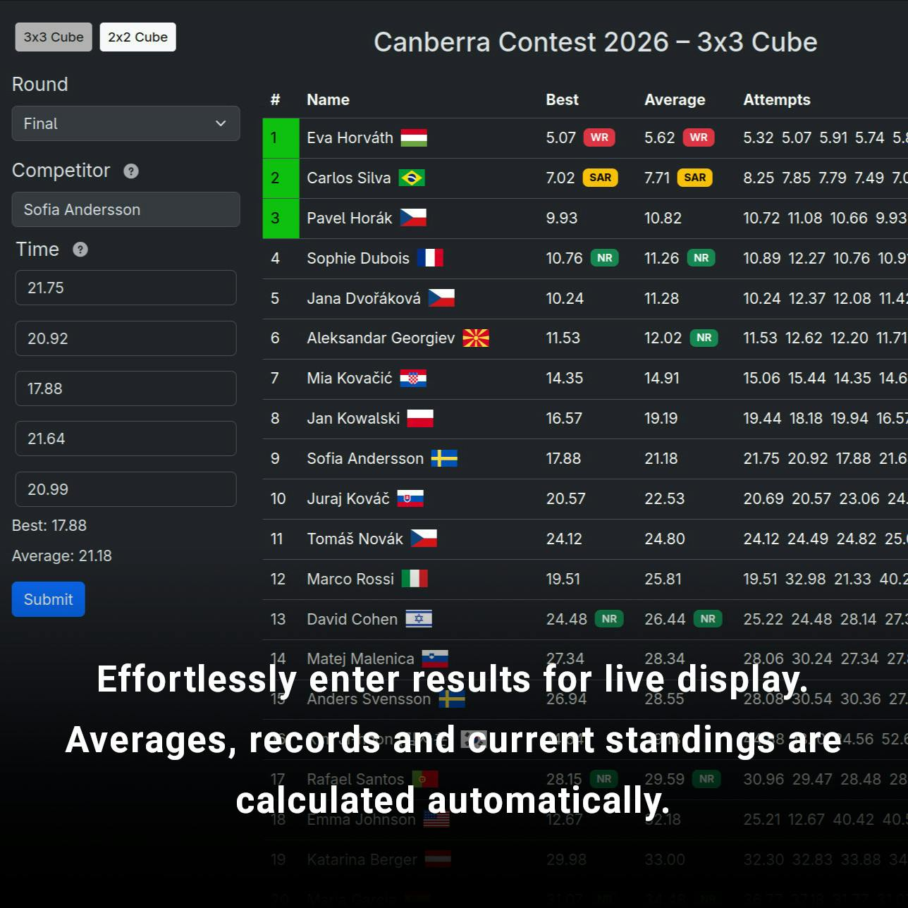

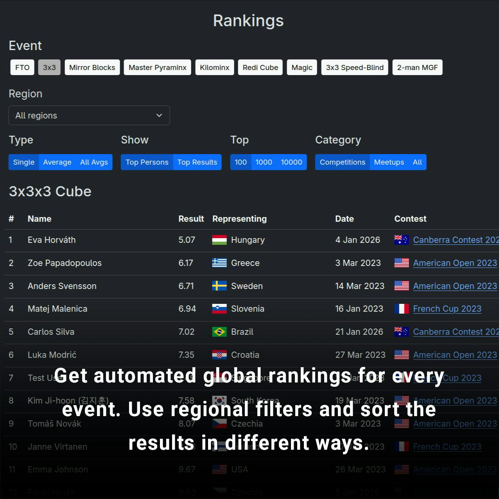

---

## 21. [The Sovereign Creator Calculator Suite](https://www.producthunt.com/products/the-sovereign-creator-calculator-suite)
**Votes**: 6 | **도입 난이도**: 하 | **신뢰도**: 상
**Tagline**: 50 interactive decision engines to optimize pricing, churn..
**서비스 링크**: https://www.producthunt.com/r/ISLR4QXSC3KA7P

**태그**: CreatorEconomy, Finance, Analytics, DecisionSupport

### 📌 이 서비스 한눈에 보기
수익 모델 최적화를 위한 50가지 인터랙티브 의사결정 엔진 엔진 세트

### 🔑 주요 기능
- 50개의 인터랙티브 계산 엔진 제공
- 가격 책정, 이탈률, 광고 지출, MRR 실시간 최적화
- 데이터 기반의 스케일링 모델링 지원

### 🙋 사용자에게 어떤 점이 좋은가
막연한 추측 대신 정교한 수치 모델을 통해 크리에이터 경제의 재무적 의사결정을 내릴 수 있습니다.

### ✅ 지금 바로 써볼 기능
- 가격 책정 최적화 엔진 실행
- 이탈률 및 MRR 시뮬레이션
- 광고 지출 대비 수익 모델링

### ⚠️ 사용 전 확인할 점
- 사용자의 실제 데이터 입력값에 따라 결과값이 크게 달라질 수 있음
- 단순 계산 도구이므로 실제 비즈니스 전략 수립 시에는 추가적인 검토 필요

### 🧭 확인이 더 필요한 정보
50가지 엔진의 구체적인 세부 기능과 데이터 입력 방식에 대한 상세 정보가 필요합니다.

### 📸 스크린샷 및 갤러리
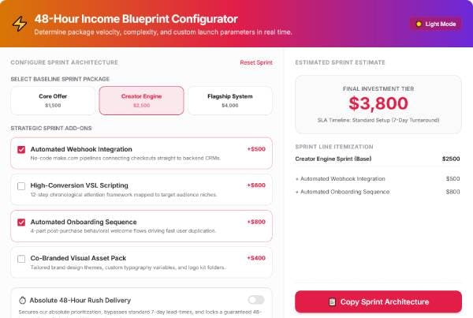
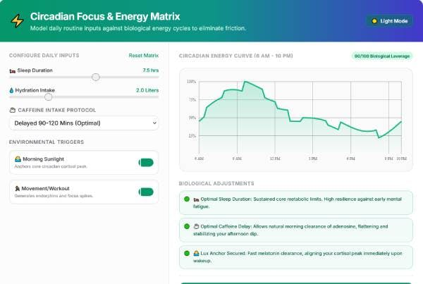
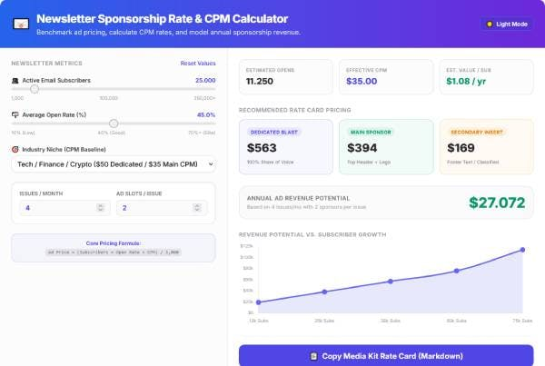

---

## 22. [Utiliome](https://www.producthunt.com/products/utiliome)
**Votes**: 6 | **도입 난이도**: 하 | **신뢰도**: 상
**Tagline**: Edit PDFs, images, and code—without uploading your files.
**서비스 링크**: https://www.producthunt.com/r/D4CGRQJIBJV5ZG

**태그**: Productivity, Privacy, DevTool, Utility, Vision

### 📌 이 서비스 한눈에 보기
파일 업로드 없이 브라우저 내에서 안전하게 PDF, 이미지, 코드를 편집하는 프라이빗 유틸리티

### 🔑 주요 기능
- 서버 업로드 없는 100% 로컬 브라우저 기반 작업
- PDF 병합, JSON 포맷팅, 이미지 압축 등 다양한 도구 제공
- 데이터 유출 걱정 없는 강력한 개인정보 보호

### 🙋 사용자에게 어떤 점이 좋은가
민감한 문서나 코드를 외부 서버에 올리지 않고도 필요한 편집 작업을 즉시 수행할 수 있어 보안과 편의성을 동시에 잡았습니다.

### ✅ 지금 바로 써볼 기능
- PDF 파일 병합 및 편집
- JSON 데이터 포맷팅 및 검증
- 이미지 압축 및 해시 생성

### ⚠️ 사용 전 확인할 점
- 브라우저 리소스 사용량에 따라 대용량 파일 처리 시 성능 제한 가능성 있음
- 오프라인 환경에서의 기능 작동 여부 확인 필요

### 🧭 확인이 더 필요한 정보
파일 크기 제한이나 브라우저별 호환성 범위에 대한 구체적인 정보가 명시되지 않았습니다.

### 📸 스크린샷 및 갤러리

---

## 23. [Curate](https://www.producthunt.com/products/curate-9)
**Votes**: 6 | **도입 난이도**: 하 | **신뢰도**: 상
**Tagline**: Track films, books and TV, all in one place.
**서비스 링크**: https://www.producthunt.com/r/RZ2EV24OEY4SVC

**태그**: Lifestyle, Personal Organizer, Content Curation

### 📌 이 서비스 한눈에 보기
영화, 도서, TV 프로그램을 한곳에서 관리하고 취향을 기록하는 개인용 아카이브

### 🔑 주요 기능
- 시청 및 독서 기록 통합 관리
- 알고리즘 대신 사람의 취향 중심의 발견
- 광고 없는 쾌적한 사용자 경험

### 🙋 사용자에게 어떤 점이 좋은가
여러 플랫폼에 흩어진 콘텐츠 기록을 한곳에 모으고, 알고리즘의 간섭 없이 순수하게 자신의 취향을 탐구할 수 있습니다.

### ✅ 지금 바로 써볼 기능
- 자신이 본 영화와 책 리스트 등록하기
- 관심 있는 콘텐츠 저장하기
- 다른 사용자의 취향 탐색하기

### ⚠️ 사용 전 확인할 점
- 콘텐츠 데이터베이스의 범위 확인 필요
- 소셜 기능이나 커뮤니티 기능의 구체적 범위 미정

### 🧭 확인이 더 필요한 정보
플랫폼 간의 데이터 연동 기능이나 상세한 개인화 설정 범위는 명시되어 있지 않습니다.

### 📸 스크린샷 및 갤러리
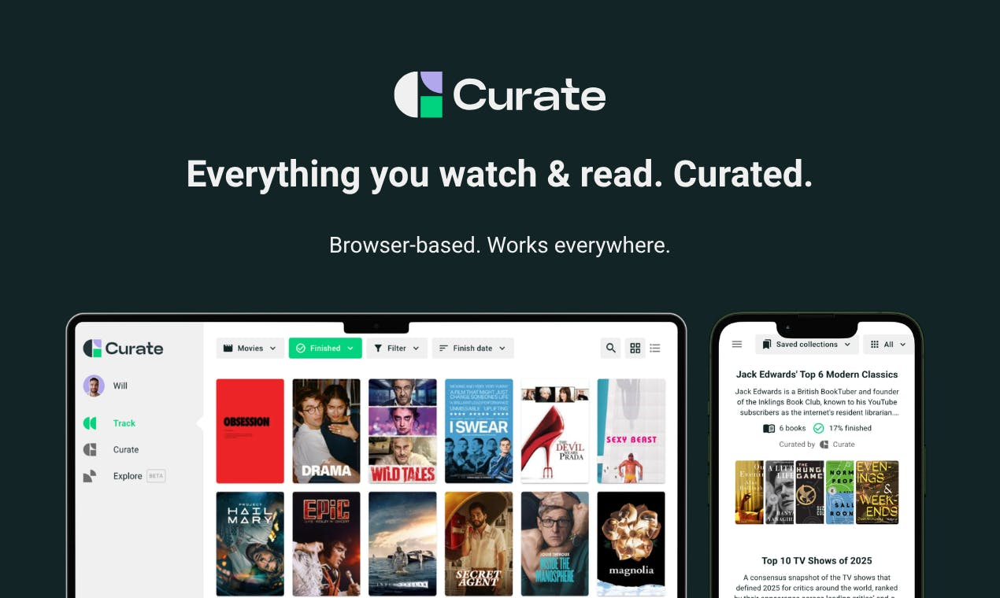
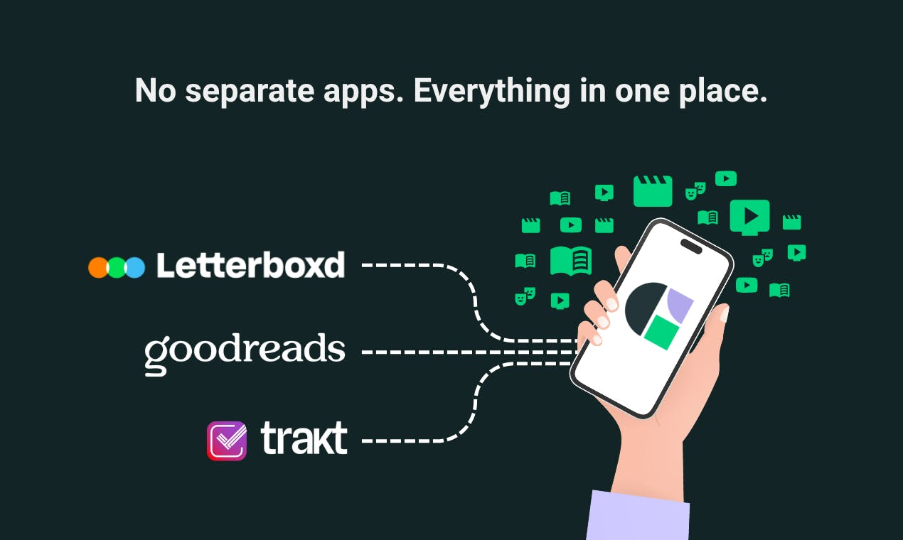

### 🎬 관련 영상
- [🎥 영상 보기](https://ph-files.imgix.net/ae0a7849-cf51-493c-a49d-8a01218bcd7c.octet-stream?auto=format)

---

## 24. [Linkova](https://www.producthunt.com/products/linkova)
**Votes**: 5 | **도입 난이도**: 하 | **신뢰도**: 상
**Tagline**: The link marketplace that tells you when it's cheaper
**서비스 링크**: https://www.producthunt.com/r/WPHJNRX4I2O26R

**태그**: Marketing, SEO, Marketplace

### 📌 이 서비스 한눈에 보기
시장 평균가를 실시간으로 비교하여 최적의 가격으로 백링크를 구매할 수 있는 마켓플레이스

### 🔑 주요 기능
- 225,000개 이상의 퍼블리셔 데이터베이스 보유
- 시장 중앙값(Median)과 비교를 통한 가격 투명성 제공
- 구독료 없이 거래 시 1.9%의 수수료만 발생하는 모델

### 🙋 사용자에게 어떤 점이 좋은가
백링크 구매 시 바가지를 쓰지 않도록 시장 평균가를 기준으로 적정 가격인지 즉시 판단할 수 있습니다.

### ✅ 지금 바로 써볼 기능
- 보유한 백링크 리스트와 시장 가격 비교해보기
- 1.9% 수수료 기반의 거래 프로세스 확인하기

### ⚠️ 사용 전 확인할 점
- 제공되는 12개 지표와 4개 데이터 제공처의 신뢰도 검증 필요
- 시장 가격이 실제 퍼블리셔의 최종 제안가와 일치하는지 확인 필요

### 🧭 확인이 더 필요한 정보
제공되는 12개 지표의 구체적인 내용과 데이터 소스의 실시간 업데이트 주기를 확인해야 합니다.

### 📸 스크린샷 및 갤러리
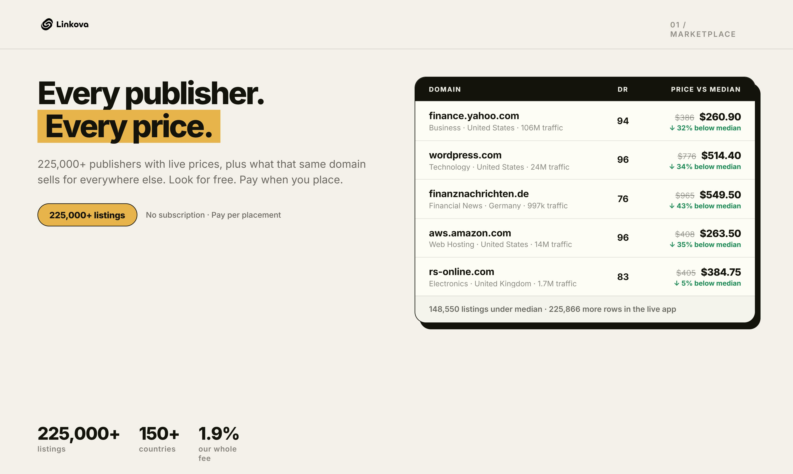
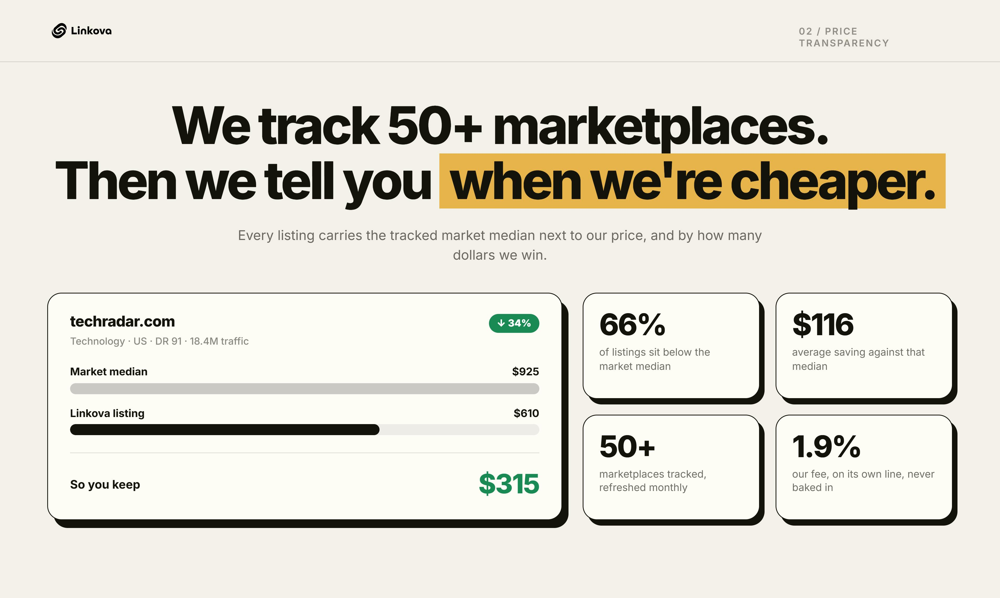
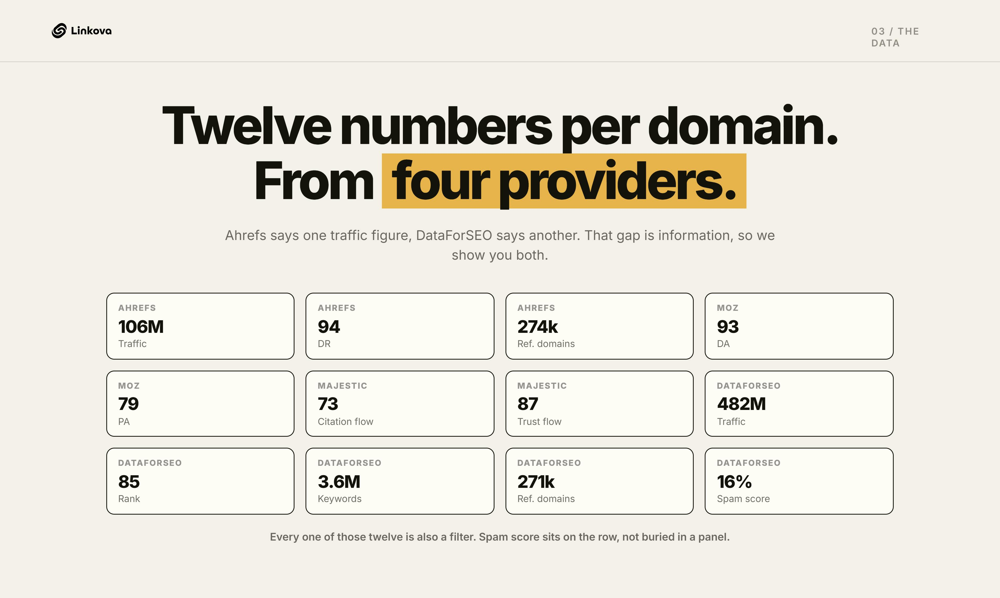

---

## 25. [ASOApp - Free iOS ASO Tool](https://www.producthunt.com/products/asoapp-free-ios-aso-tool)
**Votes**: 5 | **도입 난이도**: 하 | **신뢰도**: 상
**Tagline**: Keyword research, demand discovery, rank tracking
**서비스 링크**: https://www.producthunt.com/r/Z5MPP3YDO5PP5K

**태그**: ASO, AppMarketing, KeywordResearch, DevTool

### 📌 이 서비스 한눈에 보기
앱 출시 전, 성공 가능성이 높은 키워드를 미리 발굴하고 검증하는 무료 ASO 도구

### 🔑 주요 기능
- 키워드 난이도, 트래픽 및 국가별 기회 분석 제공
- 자동 완성 기능 및 예상 검색량 기반의 키워드 발굴
- 경쟁사 키워드 분석 및 순위 추적 기능 탑재

### 🙋 사용자에게 어떤 점이 좋은가
앱 개발 후 키워드 경쟁력 부족으로 인한 실패를 방지하고, 실제 순위 확보가 가능한 고수요 키워드를 선점할 수 있습니다.

### ✅ 지금 바로 써볼 기능
- 국가별 키워드 기회 및 트래픽 분석하기
- 경쟁사 키워드 분석을 통한 틈새 시장 찾기
- 메타데이터 빌더를 활용한 최적화 문구 작성

### ⚠️ 사용 전 확인할 점
- 무료 버전의 데이터 업데이트 주기나 상세 기능 제한 여부 확인 필요
- 계정 없이 사용 시 데이터 저장 및 추적 기능의 지속성 확인 필요

### 🧭 확인이 더 필요한 정보
계정 없이 제공되는 기능의 범위와 데이터의 정확도/최신성을 확인해야 합니다.

### 📸 스크린샷 및 갤러리

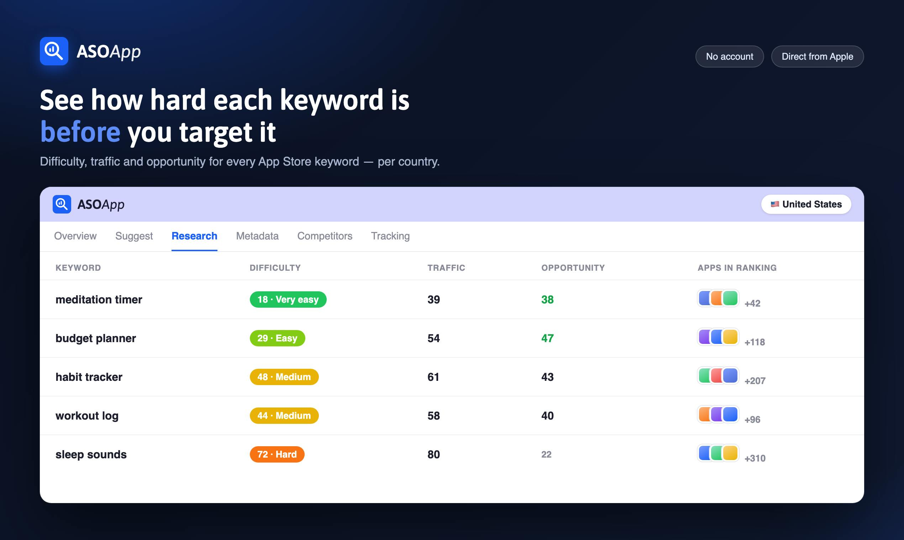
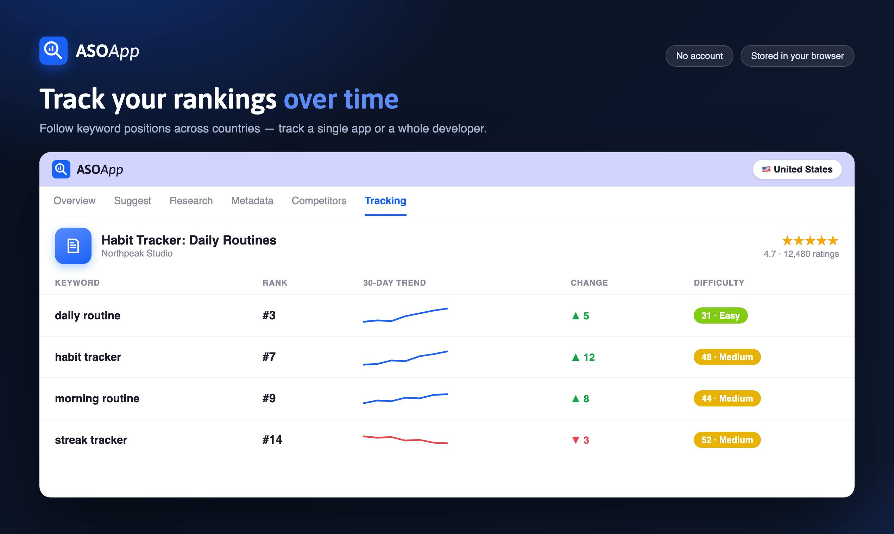

---

## 26. [AlgorithmOfAI](https://www.producthunt.com/products/algorithmofai)
**Votes**: 5 | **도입 난이도**: 하 | **신뢰도**: 상
**Tagline**: Find out if ChatGPT recommends your agency — free
**서비스 링크**: https://www.producthunt.com/r/7QPVCVXZBDAQK7

**태그**: AI-SEO, Marketing, Analytics, Agency, AI Tool, Chat, Email

### 📌 이 서비스 한눈에 보기
ChatGPT가 우리 대행사를 추천하는지 실시간으로 확인하는 AI 검색 최적화 도구

### 🔑 주요 기능
- 실제 고객이 질문할 법한 질문을 통해 ChatGPT의 답변을 직접 확인
- 경쟁사 대비 우리 브랜드의 노출 순위 및 언급 여부 파악
- 가입 없이 즉시 첫 번째 결과 확인 가능

### 🙋 사용자에게 어떤 점이 좋은가
잠재 고객이 AI를 통해 대행사를 찾을 때 우리 회사가 검색 결과에 포함되는지 확인하여 AI SEO 전략을 세울 수 있습니다.

### ✅ 지금 바로 써볼 기능
- 가입 없이 첫 번째 결과 확인하기
- 경쟁사 언급 여부 비교하기
- 이메일 등록 후 지속적인 모니터링 설정하기

### ⚠️ 사용 전 확인할 점
- 무료 버전은 결과 확인 횟수에 제한이 있을 수 있음
- ChatGPT의 답변은 가변적이므로 단발성 확인보다는 지속적인 관찰이 필요함

### 🧭 확인이 더 필요한 정보
이메일 등록 시 제공되는 모니터링 기능의 상세 주기와 범위는 명시되지 않았습니다.

### 📸 스크린샷 및 갤러리
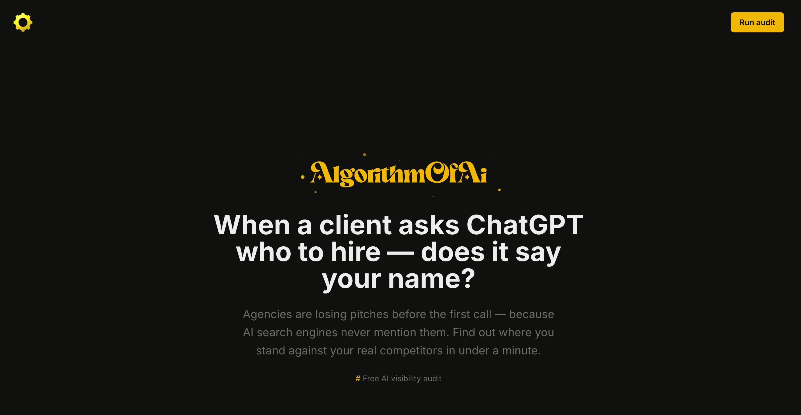
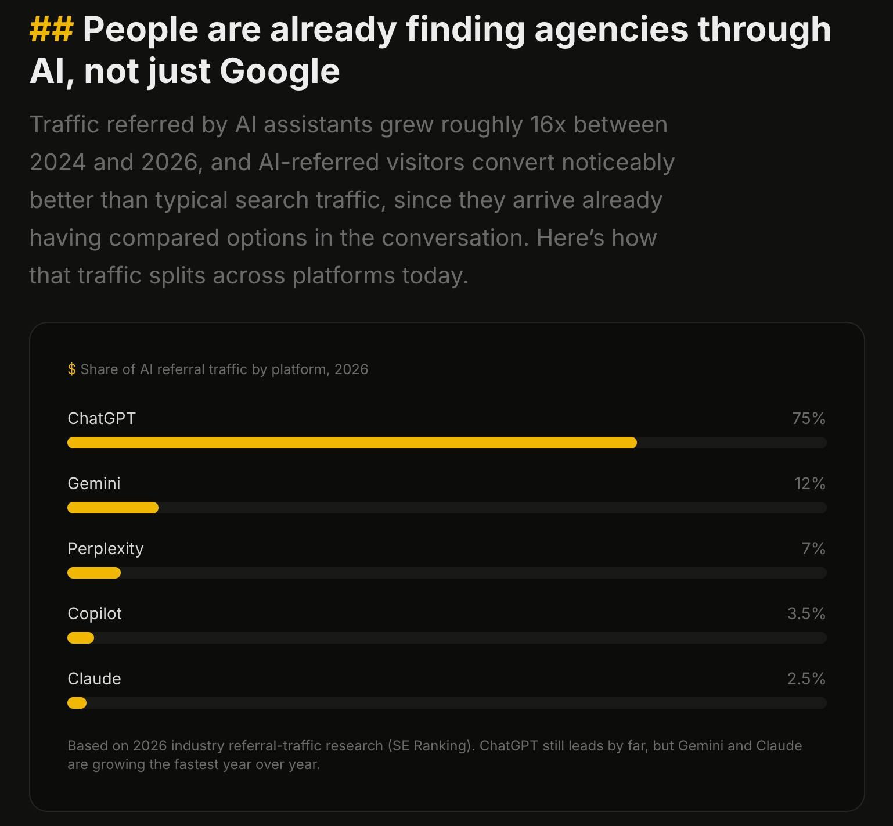
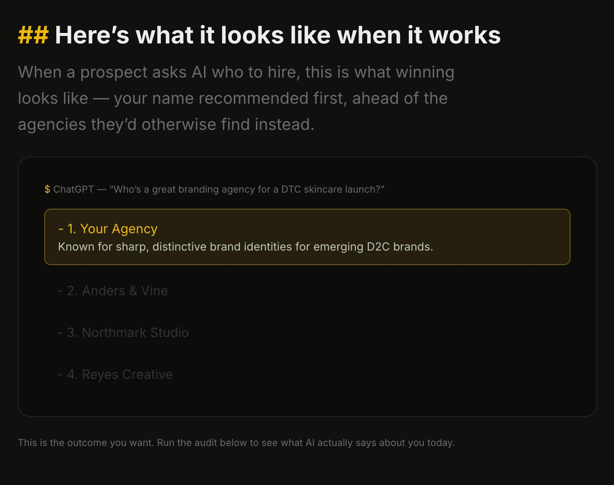

---

## 27. [Clip Sonar](https://www.producthunt.com/products/clip-sonar)
**Votes**: 5 | **도입 난이도**: 하 | **신뢰도**: 상
**Tagline**: Analyze viral Reels and TikTok. Discover what works.
**서비스 링크**: https://www.producthunt.com/r/NBZ47BIAMIIPE7

**태그**: ContentCreation, SocialMedia, Analytics, AI, Automation, AI Tool

### 📌 이 서비스 한눈에 보기
바이럴된 릴스와 틱톡의 성공 패턴을 분석하여 콘텐츠 제작 가이드를 제공하는 툴

### 🔑 주요 기능
- 공개된 인스타그램 및 틱톡 프로필 분석을 통한 성공 패턴 파악
- 단순한 조언이 아닌 실제 영상의 훅(Hook), 포맷, 스토리 구조 분석
- Claude MCP 연동을 통해 AI 워크플로우 내에서 바로 훅이나 샷 리스트 생성 가능

### 🙋 사용자에게 어떤 점이 좋은가
콘텐츠 제작 시 막연한 추측 대신 실제 성공 사례의 데이터 기반 플레이북을 활용할 수 있습니다.

### ✅ 지금 바로 써볼 기능
- 분석하고 싶은 크리에이터의 프로필 링크 붙여넣기
- 분석된 스토리 브레이크다운 및 플레이북 확인하기
- Claude MCP를 통해 분석 데이터를 AI 워크플로우로 가져오기

### ⚠️ 사용 전 확인할 점
- 계정 연결 없이 공개 프로필만 분석 가능 (비공개 계정 제한 가능성)
- 무료 분석 횟수(50회) 제한이 있음

### 🧭 확인이 더 필요한 정보
비공개 계정이나 특정 지역 제한에 대한 상세 정책은 명시되지 않았습니다.

### 📸 스크린샷 및 갤러리
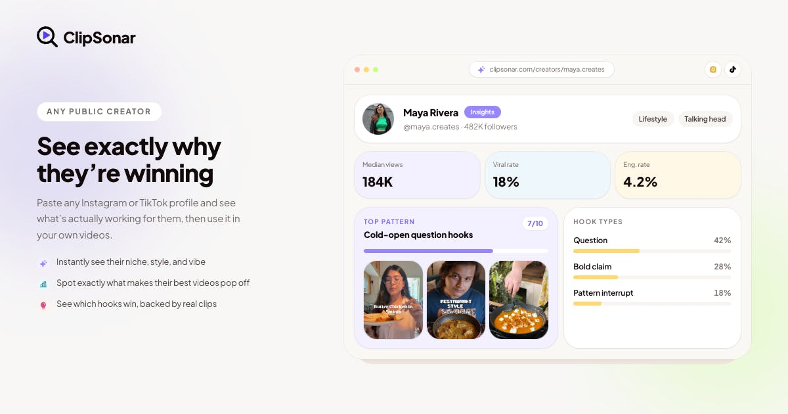
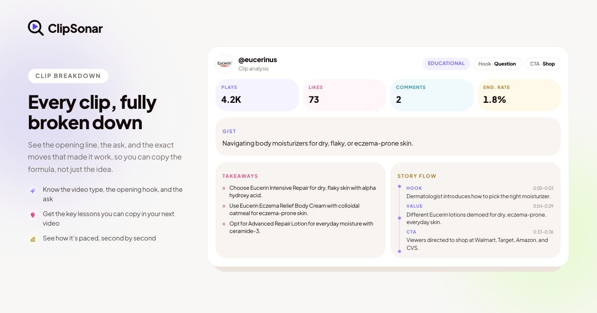
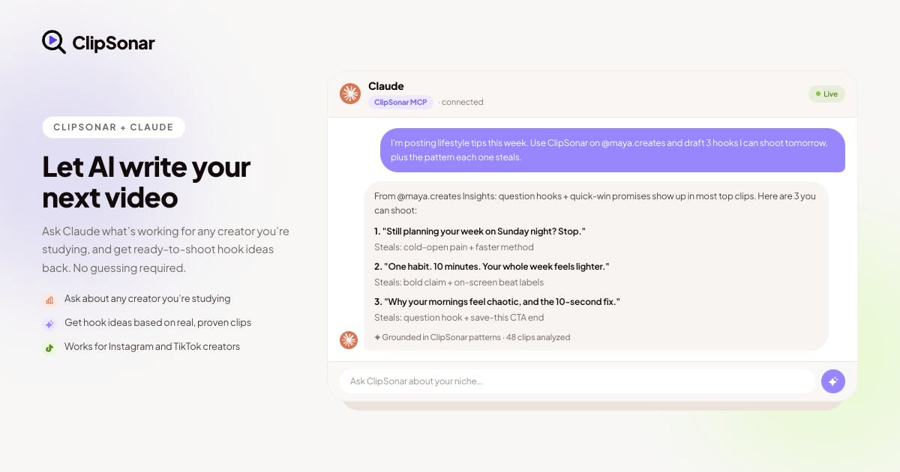

### 🎬 관련 영상
- [🎥 영상 보기](https://ph-files.imgix.net/c469e9fd-e6ac-41ec-8c3f-b94270c5d8c2.jpeg?auto=format)

---

## 28. [UXFix](https://www.producthunt.com/products/uxfix)
**Votes**: 5 | **도입 난이도**: 하 | **신뢰도**: 상
**Tagline**: One-click bug reports with session replay, evidence, and AI
**서비스 링크**: https://www.producthunt.com/r/7ZWINZPGHWOEGR

**태그**: DevTool, QA, AI, Productivity, AI Tool, Video

### 📌 이 서비스 한눈에 보기
클릭 한 번으로 기술적 증거와 AI 요약을 제공하는 간편 버그 리포팅 도구

### 🔑 주요 기능
- 세션 리플레이, 콘솔 에러, 네트워크 요청 등 기술적 증거 자동 수집
- AI를 활용한 명확하고 실행 가능한 버그 요약 및 재현 단계 생성
- 수동 영상 녹화나 기술 데이터 수집 없이 즉각적인 Jira 티켓 생성 지원

### 🙋 사용자에게 어떤 점이 좋은가
사용자와 개발팀 사이의 소통 오류를 줄이고, 버그 재현에 드는 시간을 획기적으로 단축할 수 있습니다.

### ✅ 지금 바로 써볼 기능
- 원클릭 버그 캡처 기능 테스트
- AI 생성 버그 요약 정확도 확인
- 수집된 기술 데이터와 Jira 연동 흐름 확인

### ⚠️ 사용 전 확인할 점
- 사용자 세션 데이터 및 개인정보 보호 정책 확인 필요
- 브라우저 환경에 따른 데이터 수집 범위 차이 확인 필요

### 🧭 확인이 더 필요한 정보
현재 제공되는 상세한 보안 프로토콜 및 외부 서비스(Jira 등)와의 구체적인 연동 방식에 대한 정보가 부족합니다.

### 📸 스크린샷 및 갤러리

### 🎬 관련 영상
- [🎥 영상 보기](https://ph-files.imgix.net/ba8c0072-7997-4e10-8fc2-45c11e328972.jpeg?auto=format)

---

## 29. [Giftana India](https://www.producthunt.com/products/giftana-india)
**Votes**: 4 | **도입 난이도**: 하 | **신뢰도**: 상
**Tagline**: This diwali find the perfect gifts for employees & client 
**서비스 링크**: https://www.producthunt.com/r/AY2FLZP5KUNU6X

**태그**: B2B, Gifting, Corporate, E-commerce, AI Tool

### 📌 이 서비스 한눈에 보기
디왈리 시즌을 위한 프리미엄 기업용 맞춤형 선물 큐레이션 서비스

### 🔑 주요 기능
- 직원 및 클라이언트를 위한 다양한 브랜드 선물 세트 제공
- 디왈리 축제에 특화된 기업용 기프트 햄퍼 라인업
- 비즈니스 파트너를 위한 사려 깊은 선물 선택 가능

### 🙋 사용자에게 어떤 점이 좋은가
기업 담당자가 명절 시즌에 맞춰 직원과 고객에게 보낼 고품질의 비즈니스 선물을 쉽고 빠르게 찾을 수 있습니다.

### ✅ 지금 바로 써볼 기능
- GiftanaIndia.com 방문하여 제품 카탈로그 확인
- 기업 규모 및 예산에 맞는 선물 세트 구성 검토
- 배송 가능 범위 및 대량 주문 옵션 문의

### ⚠️ 사용 전 확인할 점
- 인도 시장(디왈리 시즌)에 특화된 서비스이므로 지역적 제한 확인 필요
- 대량 주문 시 배송 일정 및 재고 확보 여부 사전 확인 필요

### 🧭 확인이 더 필요한 정보
구체적인 배송 범위, 대량 주문 할인율 및 국제 배송 가능 여부는 공식 웹사이트를 통해 확인이 필요합니다.

### 📸 스크린샷 및 갤러리

---

## 30. [XPmetric](https://www.producthunt.com/products/xpmetric)
**Votes**: 4 | **도입 난이도**: 하 | **신뢰도**: 상
**Tagline**: Web analytics that plays like an RPG.
**서비스 링크**: https://www.producthunt.com/r/WZH3GNBBK7UYAF

**태그**: Analytics, Gamification, Marketing, DevTool

### 📌 이 서비스 한눈에 보기
RPG 게임 요소를 결합하여 웹 분석을 즐겁게 만드는 쿠키리스 분석 도구

### 🔑 주요 기능
- RPG 게임 방식을 도입한 게이미피케이션 웹 분석
- 1.4KB의 초경량 스크립트 및 기본 쿠키리스 방식 지원
- 레벨업, 62종의 업적, X(트위터) 공유용 카드 기능 제공

### 🙋 사용자에게 어떤 점이 좋은가
데이터 분석 과정을 게임처럼 즐길 수 있어 운영의 재미를 더하며, 가벼운 스크립트로 사이트 성능 저하 없이 방문자 데이터를 관리할 수 있습니다.

### ✅ 지금 바로 써볼 기능
- 1.4KB 스크립트 설치 및 데이터 수집 확인
- 방문자 방문에 따른 XP 획득 및 레벨업 경험
- 획득한 성과를 X(트위터) 공유용 카드로 제작

### ⚠️ 사용 전 확인할 점
- 쿠키리스 모드 사용 시 전체 방문자 여정 추적에 제한이 있을 수 있음
- 게임 요소가 실제 비즈니스 의사결정에 미치는 영향력은 별도 검토 필요

### 🧭 확인이 더 필요한 정보
쿠키 모드와 쿠키리스 모드 간의 데이터 정밀도 차이에 대한 구체적인 비교가 필요합니다.

### 📸 스크린샷 및 갤러리
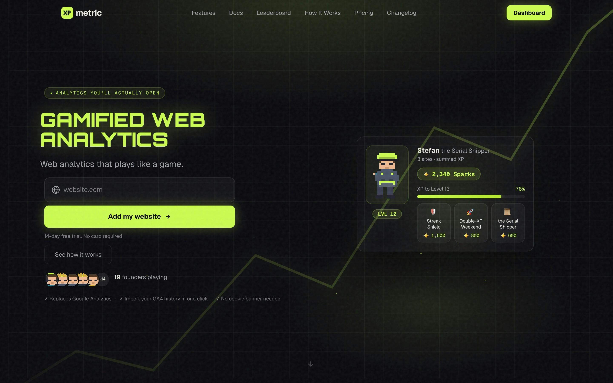
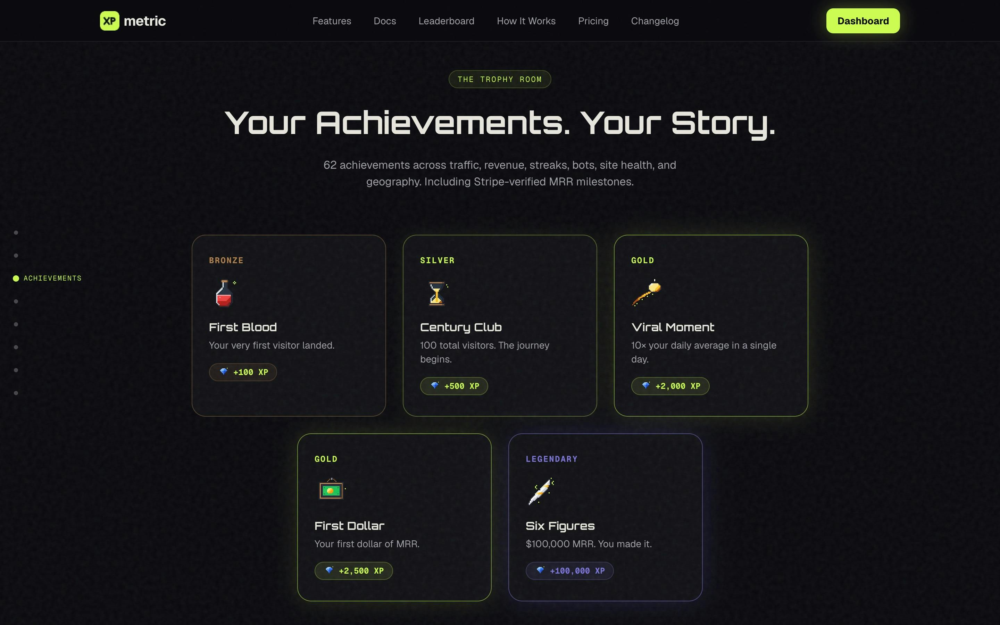
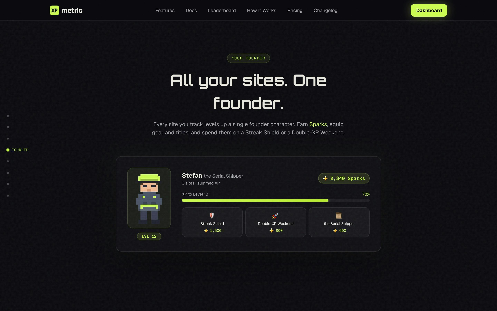

---

