# 🚀 Product Hunt Daily Top 30 (2026-08-03)

## 오늘의 요약
오늘의 제품들은 터미널이나 복잡한 설정 없이도 로컬 환경에서 직접 파일을 제어하거나 작업을 수행하는 직관적인 AI 도구들이 주를 이루었습니다. 또한, 클라우드를 거치지 않는 온디바이스(On-device) 방식의 보안과 개인정보 보호를 강조하며, 음성 인터페이스를 통해 일상적인 업무를 자동화하는 트렌드가 돋보였습니다.

### 오늘의 핵심 포인트
- 터미널 명령어 없이도 로컬 파일 시스템에 접근하여 작업을 수행하는 직관적인 AI 에이전트 도구들이 주목받았습니다.
- 데이터 보안을 위해 클라우드 대신 로컬에서 구동되는 온디바이스 기반의 음성 인식 및 자동화 솔루션이 강세를 보였습니다.
- 음성 명령을 통한 간편한 지출 기록이나 전화/이메일 대행 등 실생활의 번거로운 반복 업무를 해결하는 데 초점이 맞춰졌습니다.

**오늘의 태그**: AI 에이전트, 온디바이스, 생산성 도구, 음성 인터페이스, 로컬 워크플로우

## 1. [Zinley](https://www.producthunt.com/products/zinley)
**Votes**: 280 | **도입 난이도**: 중 | **신뢰도**: 상
**Tagline**: Your Personal AI Representative for calls, email, and tasks
**서비스 링크**: https://www.producthunt.com/r/IQRSF4SZFC3JK2

**태그**: AI Assistant, Automation, Productivity, Communication, AI Tool, Chat, Email

### 📌 이 서비스 한눈에 보기
전화, 이메일, 업무를 대신 처리하는 나만의 AI 개인 비서

### 🔑 주요 기능
- 고유 전화번호와 이메일을 통한 능동적인 소통
- 사용자의 규칙에 따른 일정 예약 및 업무 수행
- 인간관계와 맥락을 기억하여 보고하는 지능형 시스템

### 🙋 사용자에게 어떤 점이 좋은가
단순한 채팅봇을 넘어 실제 연락처를 통해 외부와 소통하므로, 반복적인 연락과 일정 관리 업무를 획기적으로 줄여줍니다.

### ✅ 지금 바로 써볼 기능
- 고유 전화번호/이메일 설정 및 연결
- 업무 규칙(Rules) 설정하기
- 지인 및 관계 데이터 입력하기

### ⚠️ 사용 전 확인할 점
- AI가 외부인과 직접 소통하므로 개인정보 및 보안 설정 주의 필요
- 사용자 의도와 다른 방식으로 업무가 처리될 가능성

### 🧭 확인이 더 필요한 정보
외부 서비스(캘린더, CRM 등)와의 구체적인 연동 범위와 보안 프로토콜 확인이 필요합니다.

### 📸 스크린샷 및 갤러리
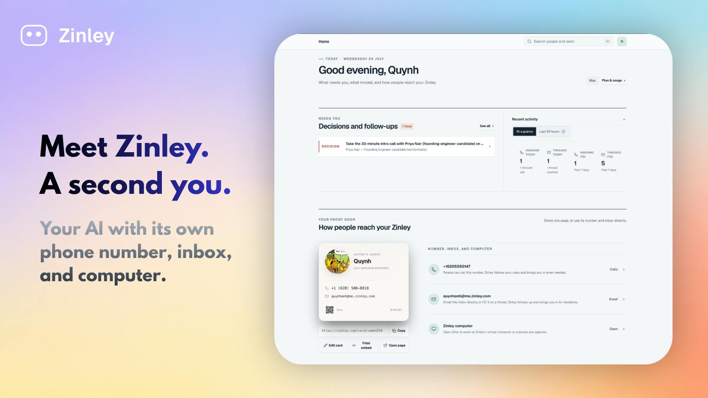
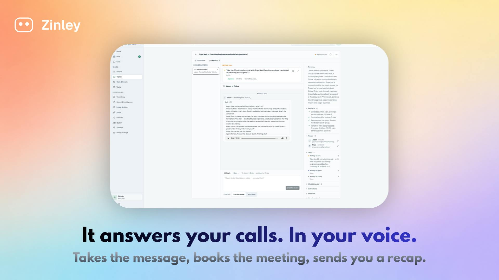
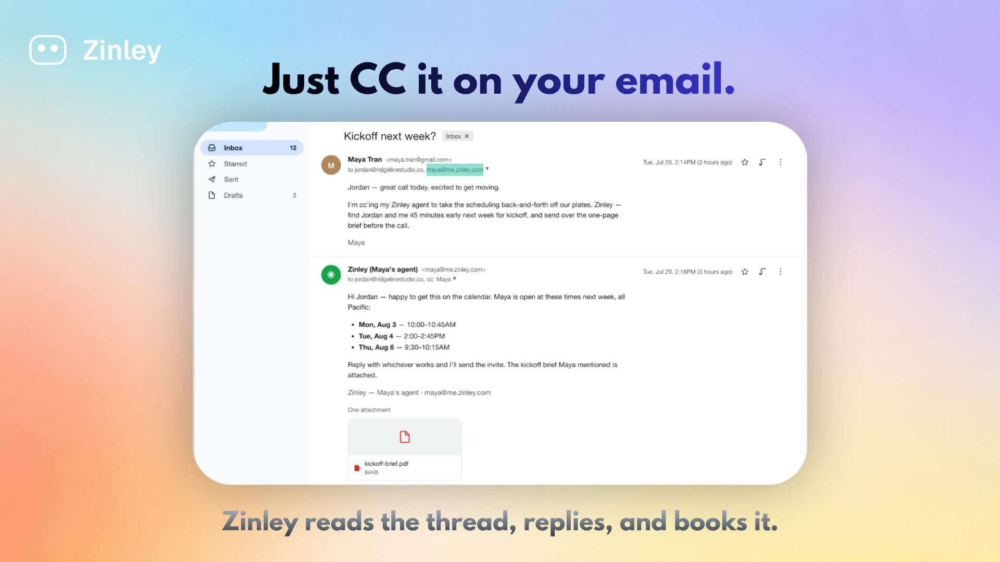

### 🎬 관련 영상
- [🎥 영상 보기](https://ph-files.imgix.net/907e9cd4-b6dc-4c87-b650-9e0a99aff480.jpeg?auto=format)

---

## 2. [Capptivo](https://www.producthunt.com/products/capptivo)
**Votes**: 224 | **도입 난이도**: 하 | **신뢰도**: 상
**Tagline**: Free open-source screen recorder & demo editor
**서비스 링크**: https://www.producthunt.com/r/4DHHOKGIDD7PW7

**태그**: Productivity, OpenSource, VideoEditing, ScreenRecorder

### 📌 이 서비스 한눈에 보기
계정 생성이나 구독 없이 바로 사용하는 오픈소스 화면 녹화 및 데모 편집 도구

### 🔑 주요 기능
- macOS, Windows, Linux를 지원하는 크로스 플랫폼 오픈소스 소프트웨어
- 커서 추적 줌, 디자인 폴리싱, 온디바이스 자막 등 데모 제작 특화 기능
- 계정 생성이나 구독 결제가 필요 없는 로컬 중심의 워크플로우

### 🙋 사용자에게 어떤 점이 좋은가
복잡한 가입 절차 없이 즉시 고품질 데모 영상을 만들 수 있어, 제품 시연이나 튜토리얼 제작 시간을 단축해 줍니다.

### ✅ 지금 바로 써볼 기능
- 로컬 녹화 및 편집 기능 테스트
- 커서 추적 줌 기능 활용해 보기
- 온디바이스 자막 삽입 기능 확인

### ⚠️ 사용 전 확인할 점
- 오픈소스 소프트웨어이므로 운영체제별 최적화 수준 확인 필요
- 클라우드 저장소가 아닌 로컬 기반이므로 파일 관리 직접 수행 필요

### 🧭 확인이 더 필요한 정보
상세한 하드웨어 요구 사양 및 플랫폼별 기능 지원 범위에 대한 추가 확인이 필요합니다.

### 📸 스크린샷 및 갤러리
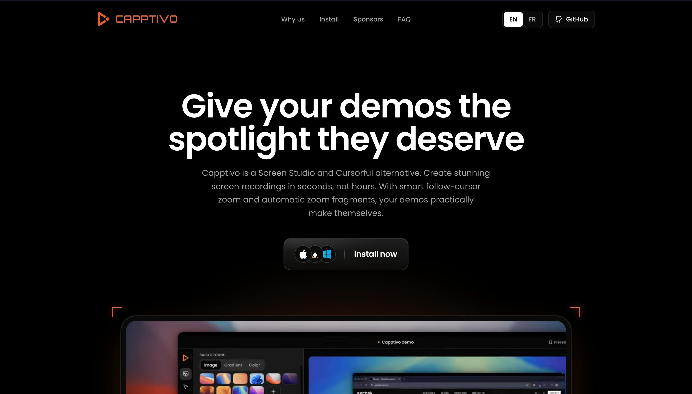
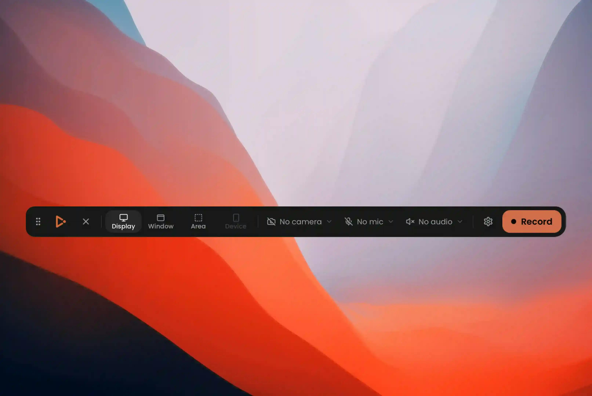
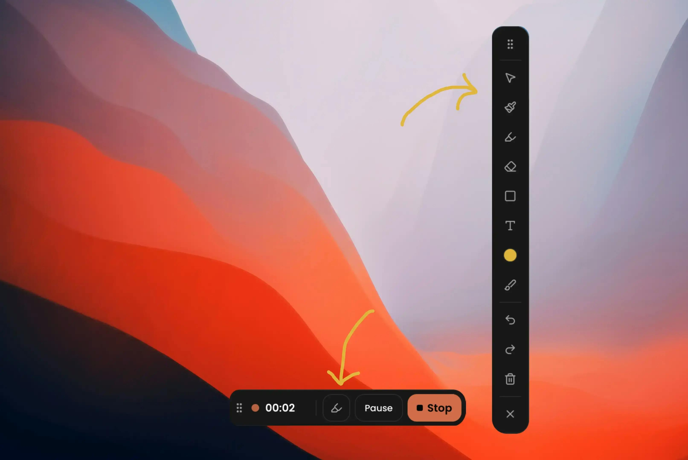

### 🎬 관련 영상
- [🎥 영상 보기](https://ph-files.imgix.net/f1792b8c-ad1b-4f2e-b75a-d09f5e54e315.jpeg?auto=format)

---

## 3. [YourSitee](https://www.producthunt.com/products/yoursitee)
**Votes**: 173 | **도입 난이도**: 하 | **신뢰도**: 상
**Tagline**: Make your bio link worth clicking
**서비스 링크**: https://www.producthunt.com/r/LC5JJVTOL5VR4W

**태그**: NoCode, BioLink, Design, Analytics, PersonalBranding, AI Tool

### 📌 이 서비스 한눈에 보기
단순한 링크 목록을 넘어 나만의 개성을 담은 시각적 프로필 페이지를 만드는 도구

### 🔑 주요 기능
- 20개 이상의 위젯을 활용한 커스텀 디자인
- AI를 통한 기존 Linktree 데이터 간편 가져오기
- 방문자 행동을 파악할 수 있는 내장 분석 기능

### 🙋 사용자에게 어떤 점이 좋은가
단순한 버튼 나열이 아닌 브랜드 이미지를 보여주는 페이지를 만들 수 있으며, 어떤 링크가 인기 있는지 데이터로 확인할 수 있습니다.

### ✅ 지금 바로 써볼 기능
- AI로 기존 링크트리 데이터 가져오기
- 20여 가지 위젯으로 페이지 디자인하기
- 내장 분석 대시보드 확인하기

### ⚠️ 사용 전 확인할 점
- 무료 플랜의 기능 제한 여부 확인 필요
- 위젯 사용 시 페이지 로딩 속도 영향 확인 필요

### 🧭 확인이 더 필요한 정보
상세한 요금제 체계와 위젯별 유료 여부에 대한 정보가 명시되지 않았습니다.

### 📸 스크린샷 및 갤러리

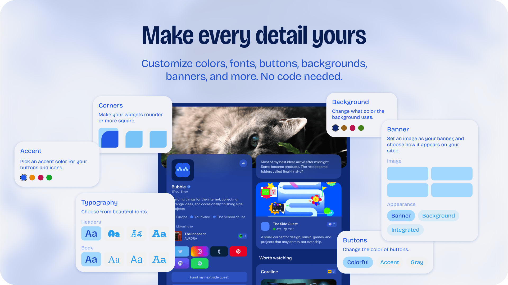

### 🎬 관련 영상
- [🎥 영상 보기](https://ph-files.imgix.net/20dc92ac-8499-4f03-b05f-f0528ba387e7.jpeg?auto=format)

---

## 4. [Lumichats(Free)](https://www.producthunt.com/products/lumichats-offline)
**Votes**: 148 | **도입 난이도**: 하 | **신뢰도**: 상
**Tagline**: A Claude Code alternative for people who avoid the terminal
**서비스 링크**: https://www.producthunt.com/r/TPDCAOHQP6TZQD

**태그**: DevTool, Automation, Productivity, DesktopApp, Chat

### 📌 이 서비스 한눈에 보기
터미널 없이도 로컬 파일을 직접 제어하고 명령을 실행할 수 있는 데스크톱 AI 도구

### 🔑 주요 기능
- 터미널 사용을 피하고 싶은 사용자를 위한 직관적인 인터페이스
- 로컬 파일 시스템에 접근하여 직접 문서를 작성하고 명령 실행 가능
- 실제 작업량(run)에 대해서만 비용을 지불하는 과금 모델

### 🙋 사용자에게 어떤 점이 좋은가
복잡한 터미널 명령어 없이도 AI가 내 컴퓨터의 파일을 직접 수정하고 작업할 수 있어 개발 및 문서 작업 효율이 극대화됩니다.

### ✅ 지금 바로 써볼 기능
- 로컬 파일 기반의 자동화 작업 실행해보기
- 데스크톱 앱 설치 및 파일 접근 권한 설정하기
- 작업량 기반의 과금 체계 확인하기

### ⚠️ 사용 전 확인할 점
- 로컬 파일에 대한 직접적인 접근 권한이 필요하므로 보안 설정 주의 필요
- 명령 실행 방식에 따른 시스템 자원 사용량 확인 필요

### 🧭 확인이 더 필요한 정보
구체적인 과금 방식(pay only for the work you run)의 세부 산정 기준이 명시되지 않았습니다.

### 📸 스크린샷 및 갤러리
_media_0.jpg)
_media_1.jpg)
_media_2.jpg)

---

## 5. [Zen Whisper](https://www.producthunt.com/products/zen-whisper)
**Votes**: 119 | **도입 난이도**: 하 | **신뢰도**: 상
**Tagline**: On-device Mac dictation that types into any app
**서비스 링크**: https://www.producthunt.com/r/PE7NC64GZFJYCM

**태그**: Productivity, Mac, Privacy, AI, Transcription

### 📌 이 서비스 한눈에 보기
개인정보 유출 걱정 없이 어떤 앱에서도 즉시 사용할 수 있는 온디바이스 Mac 받아쓰기 도구

### 🔑 주요 기능
- 클라우드를 거치지 않는 온디바이스 로컬 모델 기반 음성 인식
- 단축키를 통해 모든 Mac 애플리케이션에 직접 텍스트 입력 가능
- 검색 가능한 트랜스크립트, 음성 메모 및 미디어 전사 기능 제공

### 🙋 사용자에게 어떤 점이 좋은가
데이터가 외부 서버로 전송되지 않아 보안이 중요한 작업에서도 안심하고 사용할 수 있으며, 어떤 앱에서든 즉시 타이핑이 가능해 작업 흐름이 끊기지 않습니다.

### ✅ 지금 바로 써볼 기능
- 단축키를 설정하여 원하는 앱에서 즉시 받아쓰기 실행하기
- 로컬 모델을 활용한 보안 중심의 문서 작업 진행하기
- 저장된 트랜스크립트에서 필요한 내용 검색하기

### ⚠️ 사용 전 확인할 점
- 로컬 모델 성능이 하드웨어 사양에 따라 달라질 수 있음
- 대규모 모델이나 번역 기능 사용 시 추가적인 리소스 소모 가능성

### 🧭 확인이 더 필요한 정보
사용자의 Mac 하드웨어 사양에 따른 모델 구동 성능과 구체적인 Pro 기능의 비용 체계 확인이 필요합니다.

### 📸 스크린샷 및 갤러리
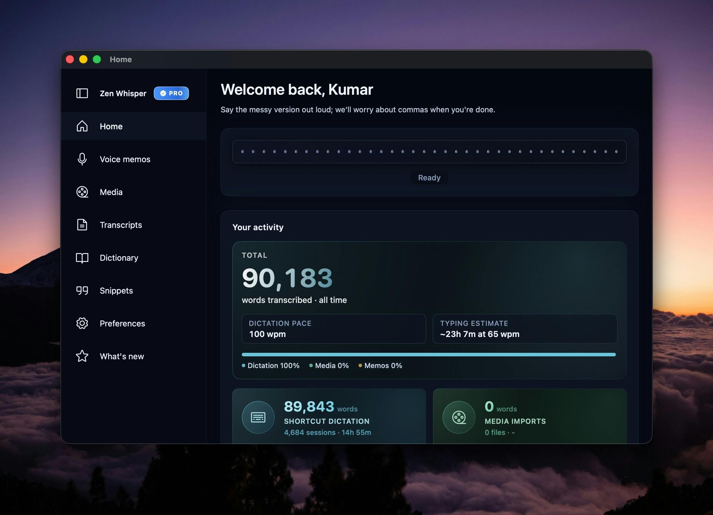
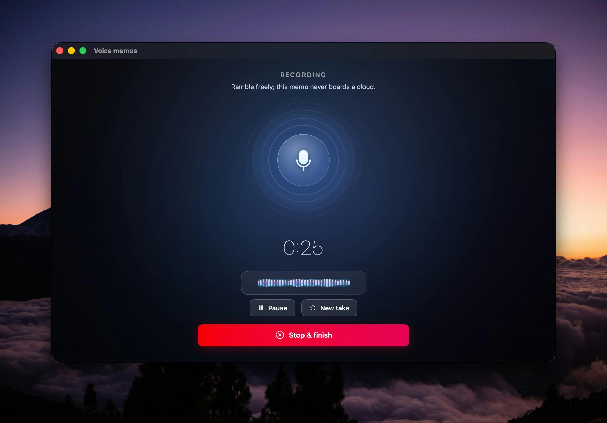
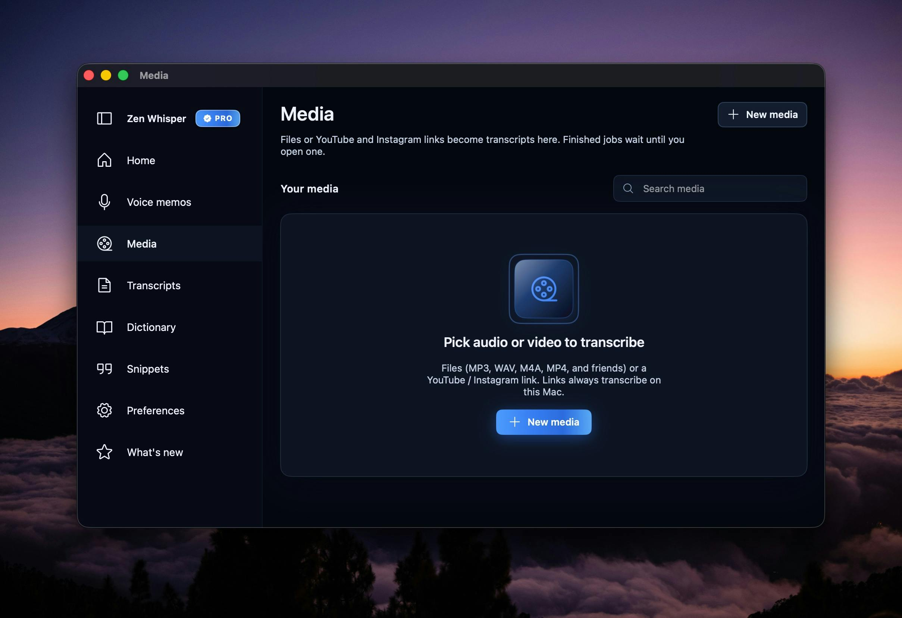

---

## 6. [Finamie](https://www.producthunt.com/products/finamie-know-your-money-for-real)
**Votes**: 102 | **도입 난이도**: 하 | **신뢰도**: 상
**Tagline**: Speak your expenses and get instant spending insights
**서비스 링크**: https://www.producthunt.com/r/Y4KK6X4DKGW4QQ

**태그**: FinTech, AI, Productivity, Automation, AI Tool

### 📌 이 서비스 한눈에 보기
음성 명령만으로 간편하게 지출을 기록하고 분석하는 AI 가계부

### 🔑 주요 기능
- 음성 인식을 통한 핸즈프리 지출 기록
- 자동화된 상세 금융 인사이트 제공
- 직관적인 소비 패턴 추적 및 분석

### 🙋 사용자에게 어떤 점이 좋은가
복잡한 입력 과정 없이 말 한마디로 지출을 기록할 수 있어, 가계부 작성이 번거로웠던 사용자에게 매우 편리합니다.

### ✅ 지금 바로 써볼 기능
- 음성으로 지출 내역 입력해보기
- 자동 생성된 소비 분석 리포트 확인하기
- 지출 카테고리 분류 기능 테스트하기

### ⚠️ 사용 전 확인할 점
- 음성 인식 정확도에 따른 입력 오류 가능성
- 금융 데이터 보안 및 개인정보 보호 정책 확인 필요

### 🧭 확인이 더 필요한 정보
음성 인식의 정확도와 지원되는 언어 범위에 대한 구체적인 정보가 필요합니다.

### 📸 스크린샷 및 갤러리

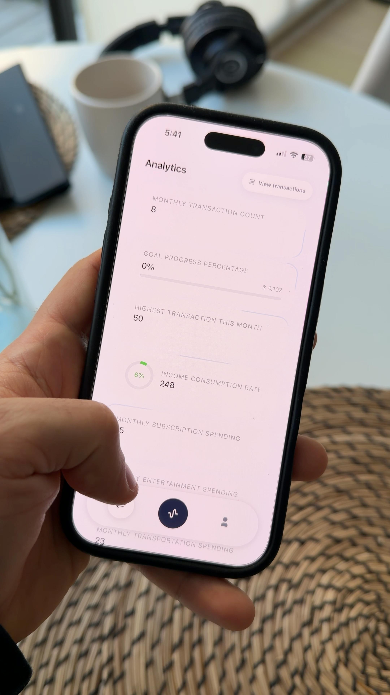

---

## 7. [Termexo](https://www.producthunt.com/products/termexo)
**Votes**: 99 | **도입 난이도**: 하 | **신뢰도**: 상
**Tagline**: A local Windows workbench for Claude Code and Codex
**서비스 링크**: https://www.producthunt.com/r/VMT252XQGQME22

**태그**: DevTool, AI-Coding, Windows, Productivity, Agent

### 📌 이 서비스 한눈에 보기
Claude Code와 Codex를 위한 로컬 기반의 윈도우 워크벤치

### 🔑 주요 기능
- 커스텀 그리드 방식의 실시간 PTY 터미널 배치 및 관리
- 네이티브 세션 검색 및 복구 기능 지원
- 에이전트 승인 필요 시 알림 및 모델 프로필 간 간편 전환

### 🙋 사용자에게 어떤 점이 좋은가
AI 코딩 에이전트 사용 시 환경 변수 재설정 없이 모델을 전환하고, 작업 중인 터미널 세션을 안전하게 관리할 수 있습니다.

### ✅ 지금 바로 써볼 기능
- 커스텀 그리드로 터미널 레이아웃 구성하기
- 기존 세션 검색 및 복구 기능 테스트하기
- 모델 프로필 전환 기능 활용하기

### ⚠️ 사용 전 확인할 점
- Windows 환경에 특화된 도구이므로 타 OS 지원 여부 확인 필요
- 로컬 실행 방식이므로 시스템 리소스 사용량 확인 필요

### 🧭 확인이 더 필요한 정보
상세한 시스템 요구 사양 및 타 IDE와의 호환성 범위는 명시되지 않았습니다.

### 📸 스크린샷 및 갤러리
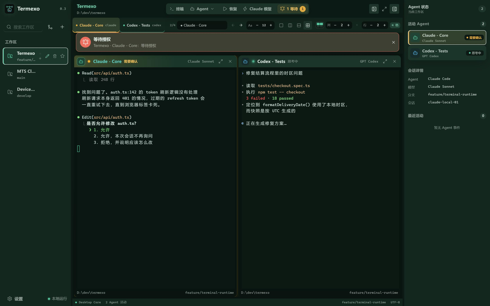
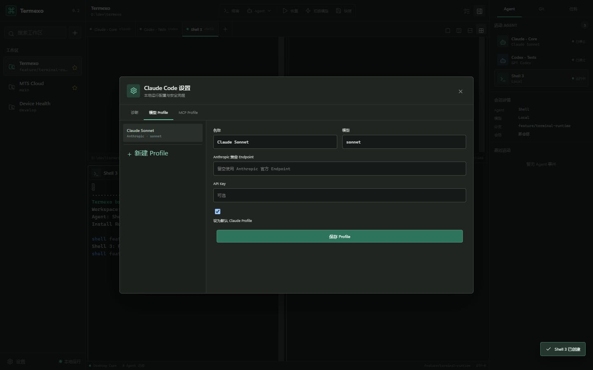
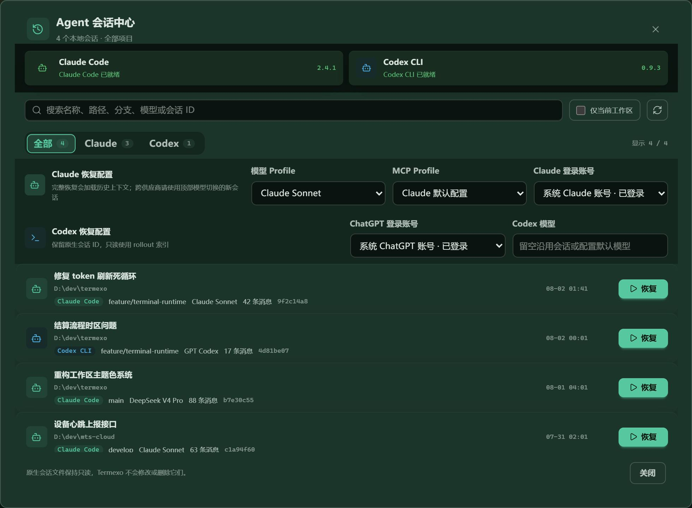

---

## 8. [Bolcho AI](https://www.producthunt.com/products/bolcho-ai)
**Votes**: 93 | **도입 난이도**: 중 | **신뢰도**: 상
**Tagline**: Build Voice AI agents that actually speak India
**서비스 링크**: https://www.producthunt.com/r/ARDYQ5LAOGAWQM

**태그**: AI, Voice-AI, Automation, Customer-Engagement, Agent, AI Tool, LLM, Sales

### 📌 이 서비스 한눈에 보기
인도 현지 언어와 통신 환경에 최적화된 초저지연 다국어 AI 음성 에이전트 구축 플랫폼

### 🔑 주요 기능
- 인도 현지 언어 및 통신 환경에 특화된 네이티브 지원
- 초저지연 응답 속도와 전화/웹 통합 기능 제공
- 사용자 정의 LLM, STT, TTS 제공업체를 결합할 수 있는 유연성

### 🙋 사용자에게 어떤 점이 좋은가
인도 시장을 타겟으로 하는 비즈니스가 현지 언어로 자연스러운 고객 응대, 영업, 예약 자동화를 즉시 구축할 수 있습니다.

### ✅ 지금 바로 써볼 기능
- 현지 언어 인식 및 발화 품질 테스트
- 기존 전화망(Telephony) 연동 가능 여부 확인
- 사용자 정의 LLM/STT/TTS 모델 연결 테스트

### ⚠️ 사용 전 확인할 점
- 인도 시장 외 지역에서의 언어 성능 및 통신 최적화 여부 확인 필요
- 외부 모델(LLM, STT, TTS) 연동 시 발생하는 추가 비용 및 복잡성 고려

### 🧭 확인이 더 필요한 정보
인도 외 지역에서의 서비스 품질과 구체적인 통신망 연동 방식에 대한 정보가 부족합니다.

### 📸 스크린샷 및 갤러리
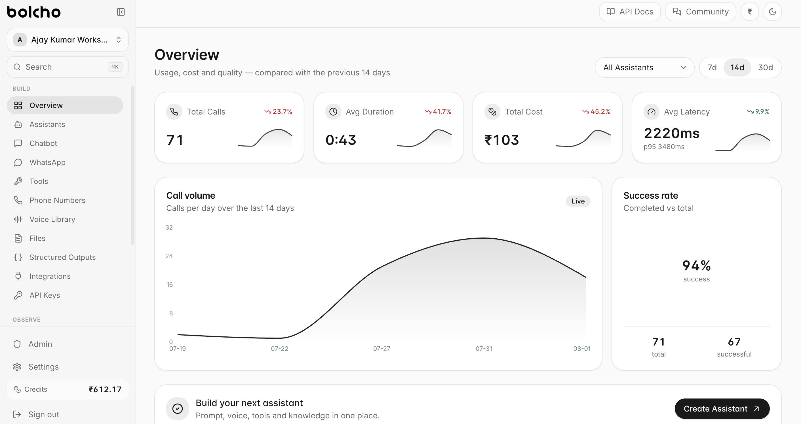
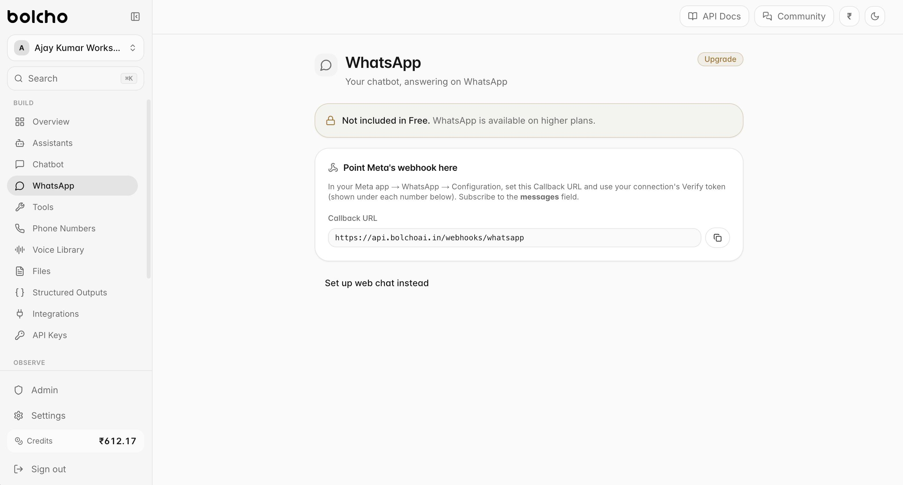
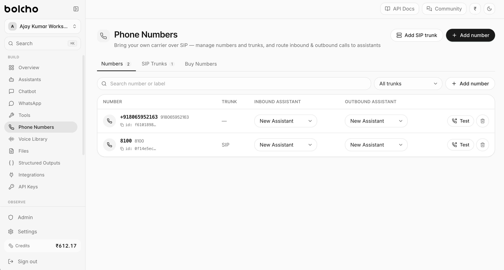

---

## 9. [FreqWave EQ](https://www.producthunt.com/products/freqwave-eq-browser-audio-equalizer)
**Votes**: 85 | **도입 난이도**: 하 | **신뢰도**: 상
**Tagline**: Customize your web audio with a real-time EQ
**서비스 링크**: https://www.producthunt.com/r/LISK4FRUXY2UN3

**태그**: Audio, WebAudio, DSP, Streaming

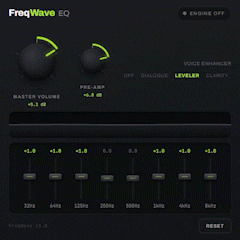

### 📌 이 서비스 한눈에 보기
웹 오디오를 실시간으로 정교하게 보정하는 8밴드 이퀄라이저

### 🔑 주요 기능
- 8밴드 Web Audio 기반의 실시간 EQ 기능
- 팟캐스트, 스트리밍, 대화 소리 최적화에 특화
- EQ 모드 및 DSP 압축(Compression) 기능 탑재

### 🙋 사용자에게 어떤 점이 좋은가
웹 기반 오디오 환경에서 뭉개진 소리나 거친 음질을 실시간으로 개선하여 청취 경험을 높일 수 있습니다.

### ✅ 지금 바로 써볼 기능
- 8밴드 EQ를 통한 음역대 조정
- EQ 모드를 활용한 프리셋 적용
- DSP 압축 기능을 통한 음량 균형 조절

### ⚠️ 사용 전 확인할 점
- 웹 브라우저 환경에 따른 성능 차이 확인 필요
- 사용 중인 오디오 소스에 따른 보정 결과의 차이

### 🧭 확인이 더 필요한 정보
구체적인 웹 API 호환성 및 브라우저 지원 범위에 대한 정보가 부족합니다.

### 📸 스크린샷 및 갤러리
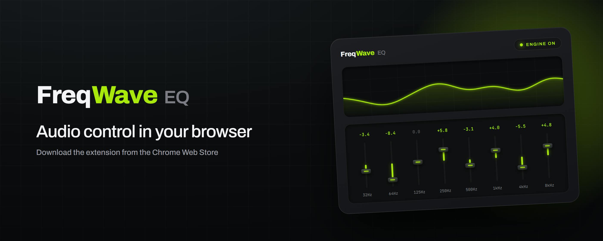
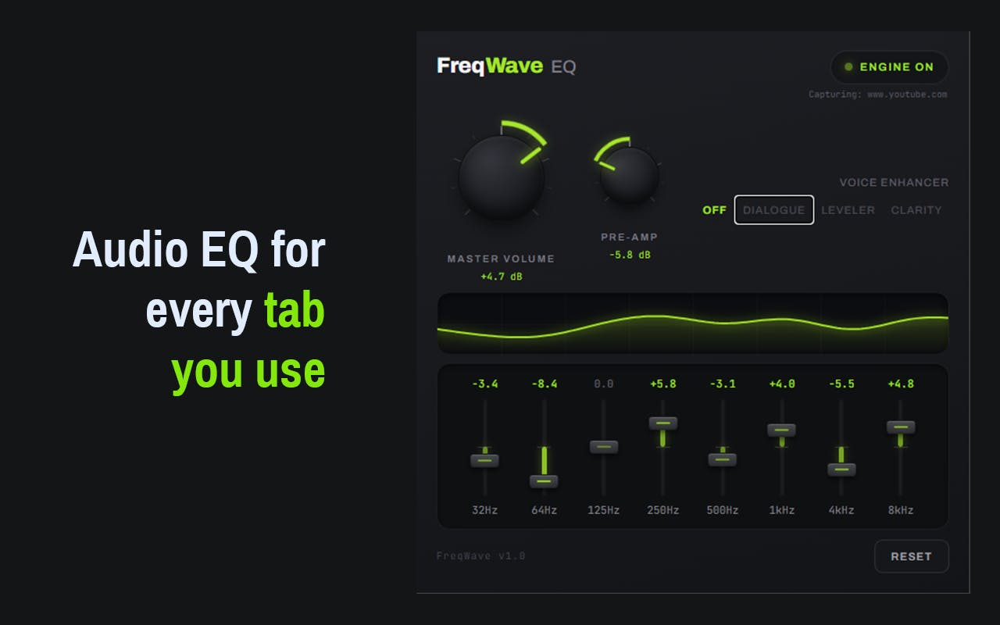
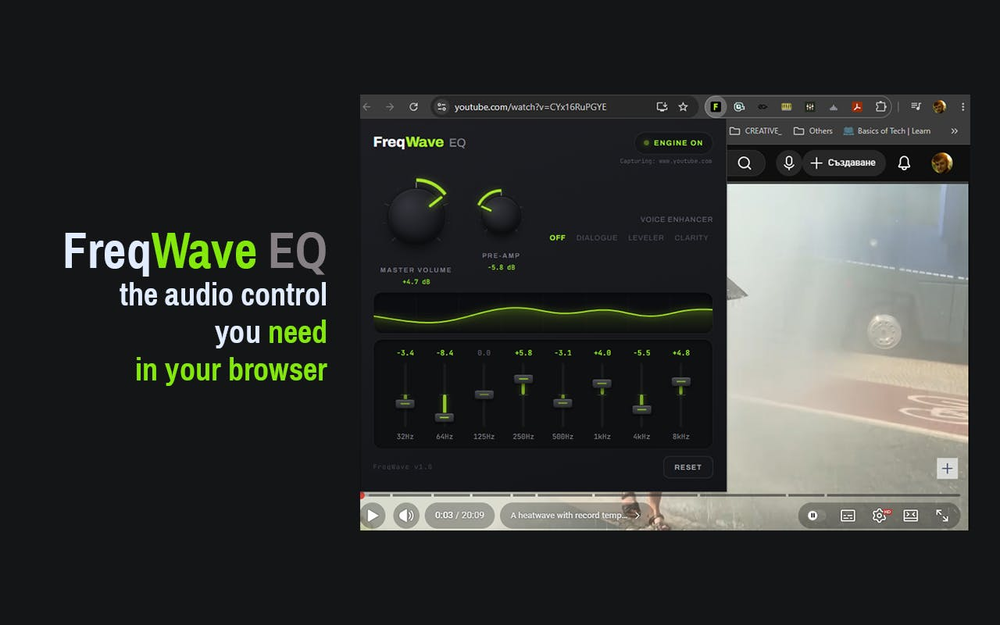

---

## 10. [TimeOS 2.0](https://www.producthunt.com/products/timeos-ultimate-task-manager-for-pro)
**Votes**: 85 | **도입 난이도**: 하 | **신뢰도**: 상
**Tagline**: Work your tasks. Bill your clients with confidence.
**서비스 링크**: https://www.producthunt.com/r/HDVBQ2IOBLQU4B

**태그**: Productivity, Invoicing, TimeTracking, Automation

### 📌 이 서비스 한눈에 보기
업무 기록을 즉시 청구서로 변환하는 올인원 타임 트래킹 및 인보이싱 솔루션

### 🔑 주요 기능
- 기존 TimeOS의 업무 기록과 연동되는 인보이싱 앱 탑재
- 작업 세션을 클릭 한 번으로 청구 항목(Line Items)으로 자동 변환
- 맞춤형 PDF 인보이스 생성 및 간편한 클라이언트 발송 기능

### 🙋 사용자에게 어떤 점이 좋은가
업무 시간 기록과 청구 과정을 하나로 통합하여, 수동 입력의 번거로움을 줄이고 정확한 비용 청구를 가능하게 합니다.

### ✅ 지금 바로 써볼 기능
- Load 기능을 통해 기존 작업 세션 불러오기
- Generate PDF를 눌러 청구 항목 자동 생성 확인하기
- 필요에 따라 인보이스 커스텀 편집하기

### ⚠️ 사용 전 확인할 점
- 기존 TimeOS 사용자와의 연동성 및 데이터 마이그레이션 확인 필요
- 결제 수단 연동이나 세금 계산 등 상세 금융 기능 포함 여부 확인 필요

### 🧭 확인이 더 필요한 정보
기존 1.0 버전 데이터와의 완벽한 호환성 및 외부 결제 게이트웨이 지원 여부를 확인해야 합니다.

### 📸 스크린샷 및 갤러리
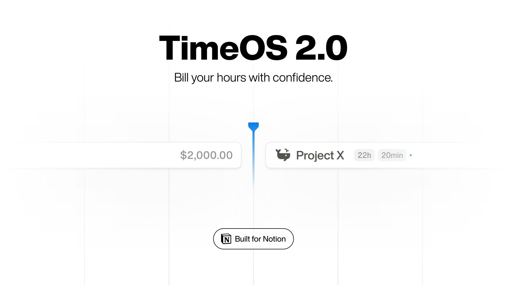
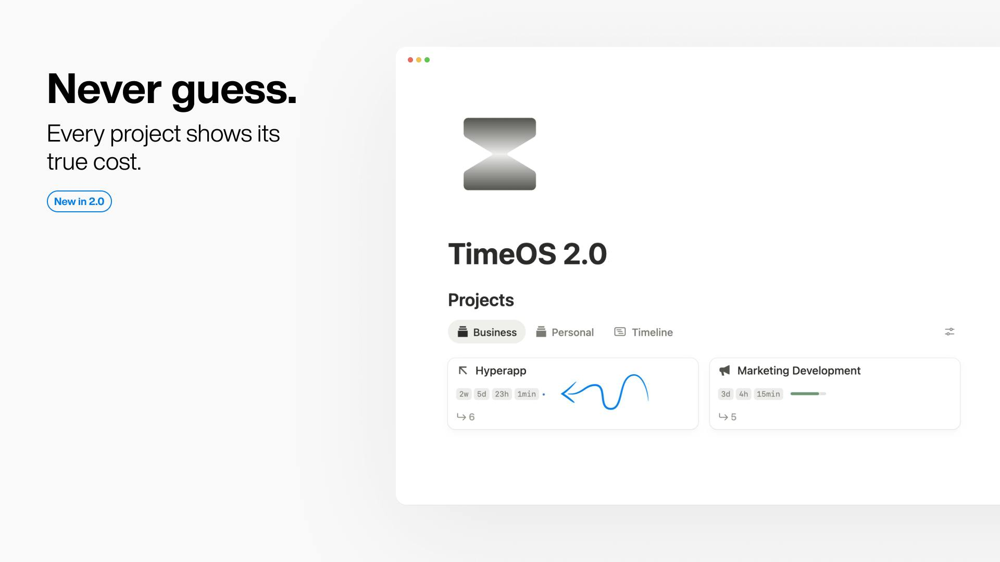
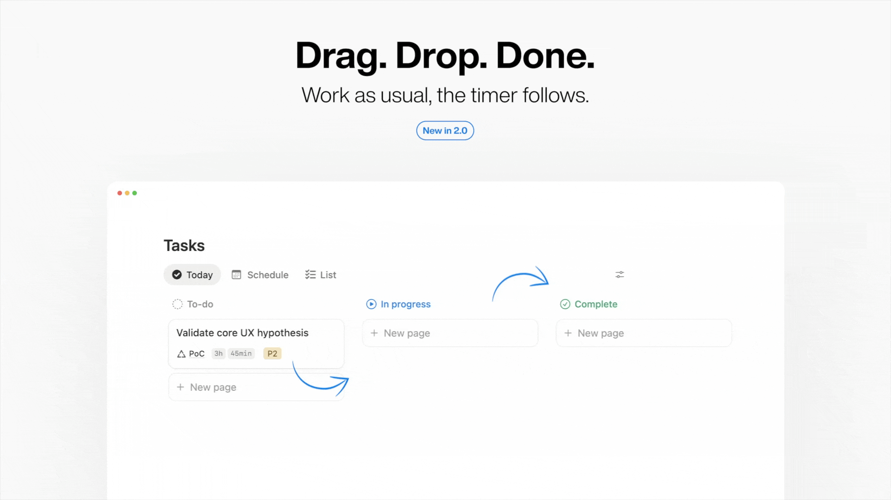

### 🎬 관련 영상
- [🎥 영상 보기](https://ph-files.imgix.net/af2ce5a4-136b-4a82-91c1-40fd6fb4debe.jpeg?auto=format)

---

## 11. [UniwebPay Skill](https://www.producthunt.com/products/uniwebpay)
**Votes**: 77 | **도입 난이도**: 하 | **신뢰도**: 상
**Tagline**: Financial Infra for the AI era
**서비스 링크**: https://www.producthunt.com/r/L6WCX6N5NNN56H

**태그**: Fintech, AI-Tools, SaaS, DeveloperTools, AI Tool

### 📌 이 서비스 한눈에 보기
복잡한 가입 절차 없이 즉시 결제 인프라를 구축할 수 있는 AI 시대용 결제 솔루션

### 🔑 주요 기능
- 복잡한 가맹점 온보딩 및 인프라 설정 생략 가능
- 제품 출시와 동시에 즉각적인 결제 링크 생성 및 수납
- 글로벌 결제 수단 지원을 통한 글로벌 비즈니스 확장성

### 🙋 사용자에게 어떤 점이 좋은가
AI 제품을 개발하는 빌더들이 결제 시스템 구축에 드는 시간과 비용을 최소화하고, 즉시 수익을 창출할 수 있게 돕습니다.

### ✅ 지금 바로 써볼 기능
- 결제 링크 생성 기능 테스트
- 글로벌 결제 수단 지원 범위 확인
- 제품 연동 프로세스 검토

### ⚠️ 사용 전 확인할 점
- 상세한 가맹점 심사 및 규제 준수 여부 확인 필요
- 수수료 체계 및 정산 주기 확인 필요

### 🧭 확인이 더 필요한 정보
구체적인 수수료 정책과 지역별 결제 지원 범위에 대한 상세 정보가 명시되지 않았습니다.

### 📸 스크린샷 및 갤러리
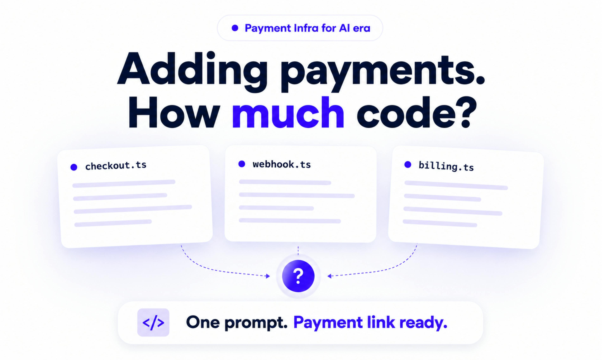
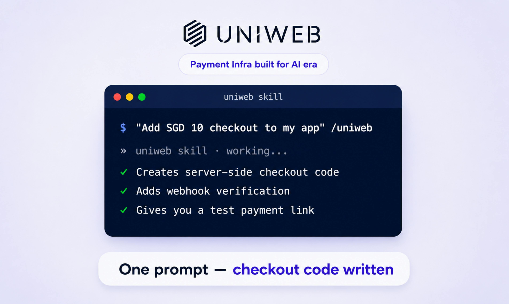
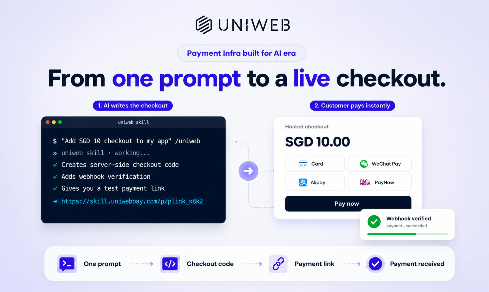

### 🎬 관련 영상
- [🎥 영상 보기](https://ph-files.imgix.net/565a5d13-30c5-4cac-a3fa-ea65c92c8ff9.jpeg?auto=format)

---

## 12. [Apoointly](https://www.producthunt.com/products/apoointly)
**Votes**: 18 | **도입 난이도**: 하 | **신뢰도**: 상
**Tagline**: Your 24/7 AI Front Desk Built for Healthcare Practice
**서비스 링크**: https://www.producthunt.com/r/J2Q2JBOA6KUE43

**태그**: Healthcare, AI, Automation, Scheduling, AI Tool, Design

### 📌 이 서비스 한눈에 보기
의료 현장의 업무 부담을 줄여주는 24시간 AI 프런트 데스크 솔루션

### 🔑 주요 기능
- 환자 전화 응대 및 예약 일정 관리 자동화
- 24/7 운영을 통한 미응대 전화 및 예약 누락 방지
- 추가 행정 인력 없이 프런트 데스크 운영 효율화

### 🙋 사용자에게 어떤 점이 좋은가
바쁜 의료진이 전화 응대 대신 환자 진료에 집중할 수 있도록 자동화된 예약 및 팔로업 시스템을 제공합니다.

### ✅ 지금 바로 써볼 기능
- AI 전화 응대 시나리오 설정하기
- 기존 예약 시스템과의 연동 가능성 확인하기
- 자동 팔로업 기능 테스트하기

### ⚠️ 사용 전 확인할 점
- 기존 병원 관리 시스템(EMR/CRM)과의 연동 여부 확인 필요
- 복잡한 환자 문의에 대한 AI의 대응 정확도 검증 필요

### 🧭 확인이 더 필요한 정보
현재 제공되는 AI의 음성 인식 정확도와 기존 의료 소프트웨어와의 통합 수준을 확인해야 합니다.

### 📸 스크린샷 및 갤러리
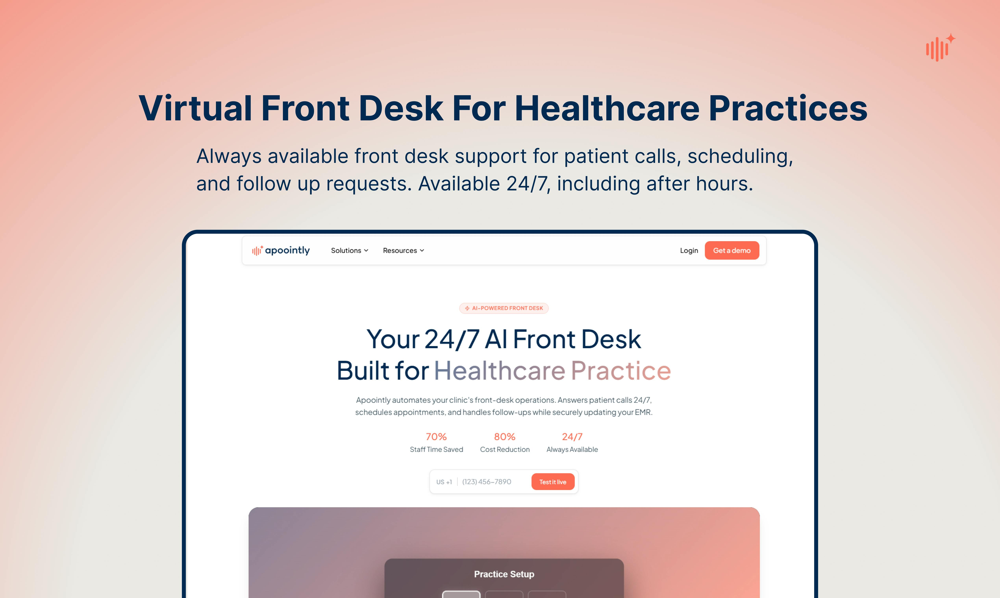
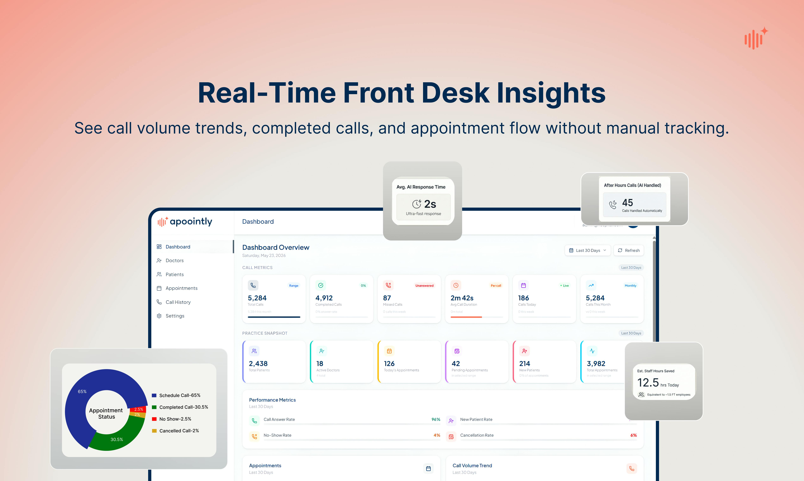
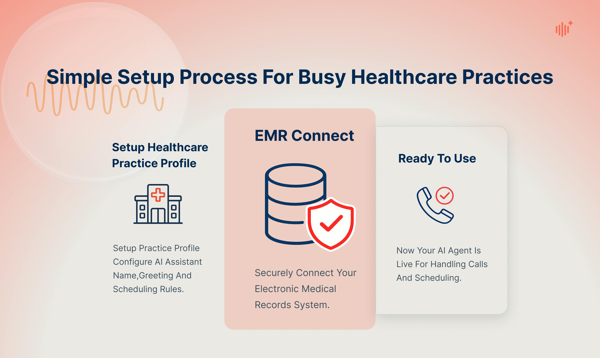

### 🎬 관련 영상
- [🎥 영상 보기](https://ph-files.imgix.net/758a4e93-b154-48f4-a6df-5f7062df7d85.jpeg?auto=format)

---

## 13. [PraiseEngine](https://www.producthunt.com/products/praiseengine)
**Votes**: 15 | **도입 난이도**: 하 | **신뢰도**: 상
**Tagline**: Turn customer conversations into SEO-ready social proof.
**서비스 링크**: https://www.producthunt.com/r/NZ4WMBTRNGZ6NB

**태그**: AI, SEO, Marketing, Automation, SaaS, AI Tool

### 📌 이 서비스 한눈에 보기
AI 인터뷰를 통해 고객의 답변을 정교한 SEO 최적화 리뷰로 변환하는 자동화 플랫폼

### 🔑 주요 기능
- 3가지 적응형 질문을 통한 마찰 없는 고객 인터뷰 및 리뷰 초안 작성
- 검증된 리뷰를 웹사이트 임베드 또는 SEO 최적화 프로필로 게시
- 팀 검토 과정을 통한 자동 게시 위험 방지 및 신뢰도 관리

### 🙋 사용자에게 어떤 점이 좋은가
고객이 리뷰 작성을 어려워하는 문제를 AI 인터뷰로 해결하며, 생성된 리뷰가 검색 엔진에 잘 노출되도록 설계되어 신뢰도와 SEO를 동시에 잡을 수 있습니다.

### ✅ 지금 바로 써볼 기능
- 비즈니스 맞춤형 3단계 AI 인터뷰 설정하기
- 생성된 리뷰의 JSON-LD 스키마 적용 확인하기
- 웹사이트용 한 줄 임베드 코드 적용하기

### ⚠️ 사용 전 확인할 점
- AI가 작성한 초안이 고객의 실제 의도와 일치하는지 팀 내 검토 필수
- 검색 엔진 노출을 위한 적절한 프로필 설정 필요

### 🧭 확인이 더 필요한 정보
사용자 수나 비즈니스 규모에 따른 구체적인 요금 체계 및 API 연동 범위는 명시되지 않았습니다.

### 📸 스크린샷 및 갤러리
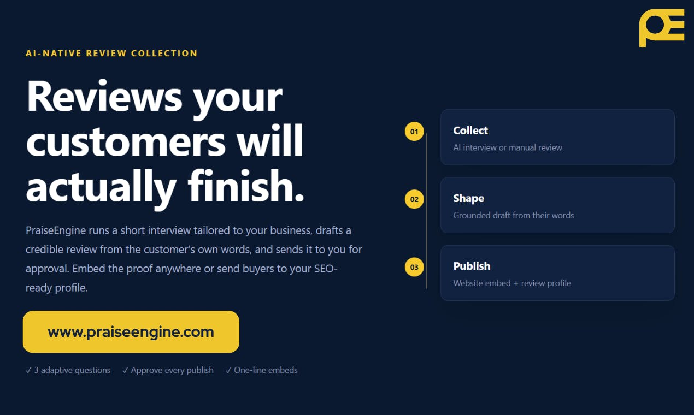
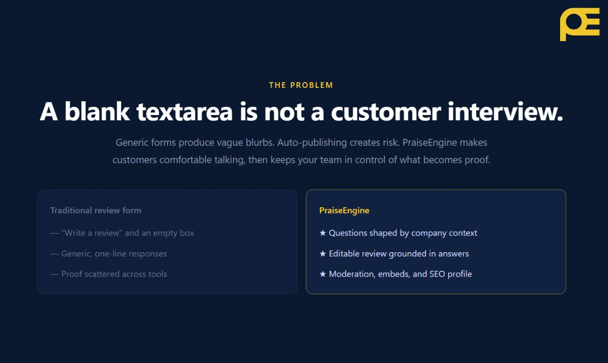
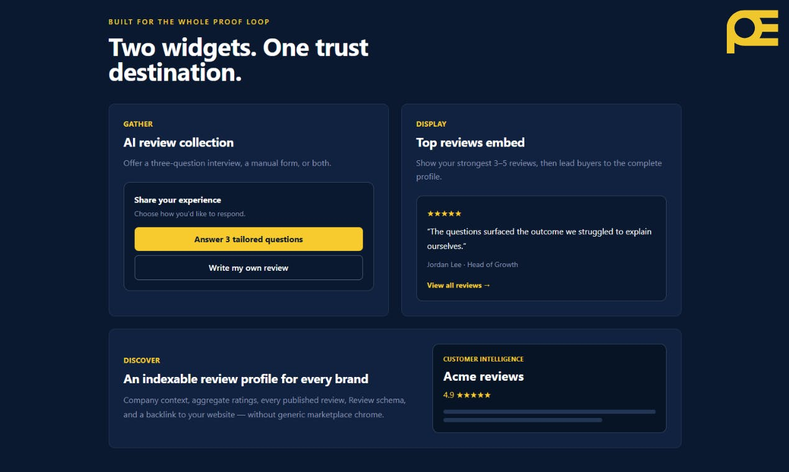

### 🎬 관련 영상
- [🎥 영상 보기](https://ph-files.imgix.net/1ab2c597-76ed-414a-b631-143621225f62.jpeg?auto=format)

---

## 14. [KlientFlow — Never forget client context](https://www.producthunt.com/products/klientflow-never-forget-client-context)
**Votes**: 12 | **도입 난이도**: 하 | **신뢰도**: 상
**Tagline**: Never lose another client because you forgot to follow up.
**서비스 링크**: https://www.producthunt.com/r/QXVQG35XW4AWZW

**태그**: CRM, AI, Freelance, Productivity, Relationship Management, AI Tool

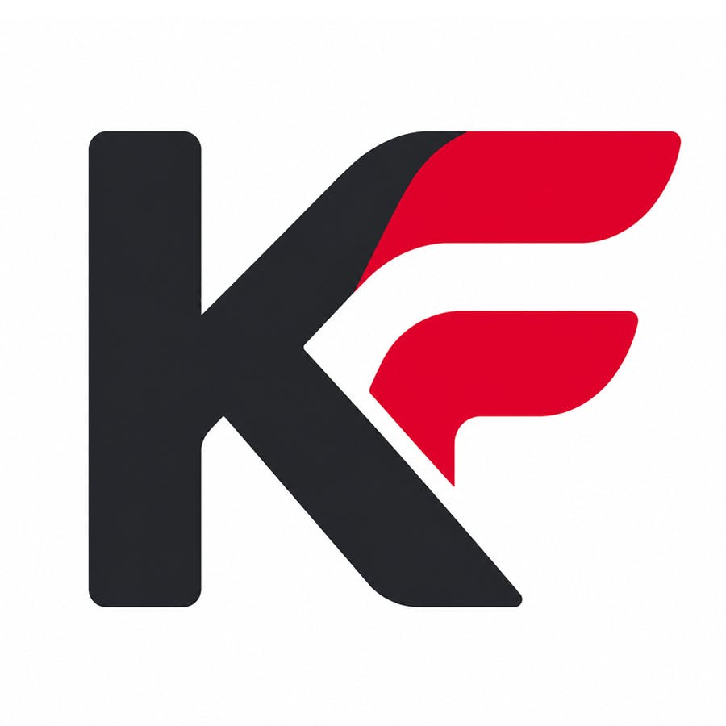

### 📌 이 서비스 한눈에 보기
놓치는 고객 없이 대화 맥락을 기억하는 프리랜서용 AI 관계 관리 CRM

### 🔑 주요 기능
- AI 기반의 대화 맥락 및 핵심 세부 사항 자동 기록
- 놓치기 쉬운 후속 연락(Follow-up) 시점 알림
- 시간이 지나도 이전 대화 내용을 즉시 파악할 수 있는 히스토리 관리

### 🙋 사용자에게 어떤 점이 좋은가
복잡한 CRM 관리 대신 대화 내용만 입력하면 AI가 맥락을 유지해주므로, 프리랜서가 고객 관계 유지에만 집중할 수 있게 돕습니다.

### ✅ 지금 바로 써볼 기능
- 첫 고객 대화 내용 입력해보기
- AI가 요약한 맥락 확인하기
- 후속 연락 알림 설정하기

### ⚠️ 사용 전 확인할 점
- AI가 맥락을 해석하는 방식이 사용자의 의도와 일치하는지 검토 필요
- 데이터 보안 및 개인정보 보호 정책 확인 필요

### 🧭 확인이 더 필요한 정보
구체적인 가격 정책과 외부 캘린더/이메일 연동 범위는 명시되지 않았습니다.

### 📸 스크린샷 및 갤러리
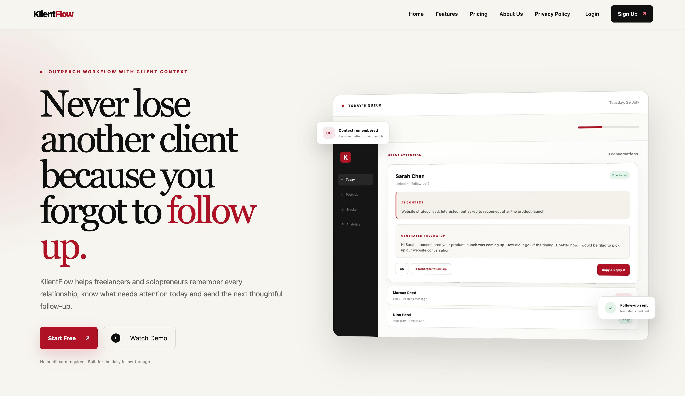
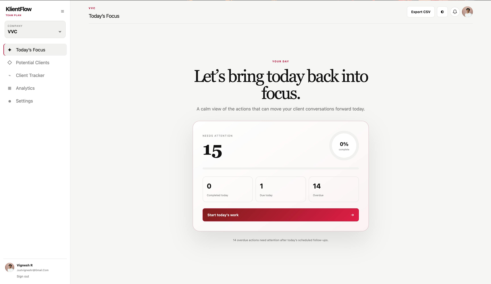
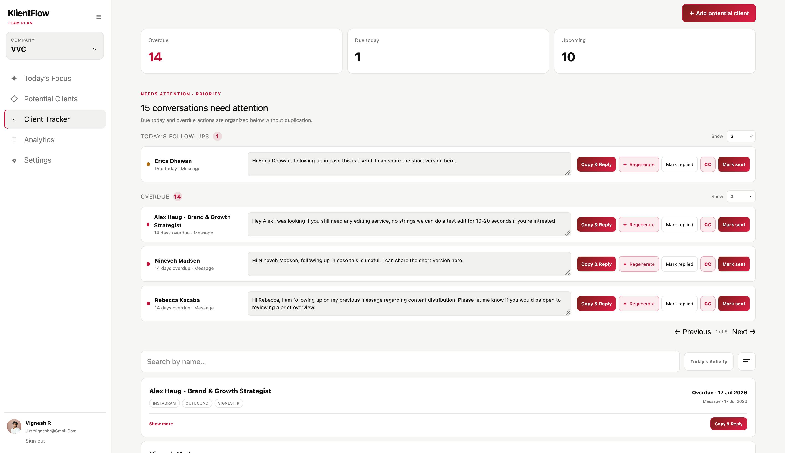

### 🎬 관련 영상
- [🎥 영상 보기](https://ph-files.imgix.net/9558b360-5c69-49eb-9e93-b3d5ee271e05.jpeg?auto=format)

---

## 15. [TextMyPill](https://www.producthunt.com/products/textmypill)
**Votes**: 10 | **도입 난이도**: 하 | **신뢰도**: 상
**Tagline**: WhatsApp medicine reminders. No app needed. 🦦
**서비스 링크**: https://www.producthunt.com/r/5BE7NZQRZZC3KI

**태그**: HealthTech, AI, Automation, FamilyCare, AI Tool

### 📌 이 서비스 한눈에 보기
별도 앱 설치 없이 WhatsApp으로 간편하게 관리하는 가족용 복약 알림 서비스

### 🔑 주요 기능
- WhatsApp을 통한 자동 복약 알림 전송
- 처방전 사진 촬영 시 AI가 자동으로 약 정보 인식
- 대시보드를 통한 가족 구성원의 복약 여부 통합 관리

### 🙋 사용자에게 어떤 점이 좋은가
새로운 앱을 설치할 필요 없이 평소 사용하는 메신저로 약 먹을 시간을 알려주므로, 디지털 기기 사용이 서툰 가족도 쉽게 관리할 수 있습니다.

### ✅ 지금 바로 써볼 기능
- 7일 무료 체험을 통한 AI 처방전 인식 기능 테스트
- 가족 구성원 등록 및 대시보드 인터페이스 확인

### ⚠️ 사용 전 확인할 점
- AI의 처방전 판독 오류 가능성 (반드시 수동 확인 필요)
- WhatsApp 기반 서비스이므로 개인정보 및 메시지 보안 정책 확인 필요

### 🧭 확인이 더 필요한 정보
AI가 처방전을 읽는 정확도와 데이터 보안 수준에 대한 구체적인 정보가 필요합니다.

### 📸 스크린샷 및 갤러리

---

## 16. [InvoProof](https://www.producthunt.com/products/invoproof)
**Votes**: 10 | **도입 난이도**: 하 | **신뢰도**: 상
**Tagline**: Invoice-verified reviews for freelancers
**서비스 링크**: https://www.producthunt.com/r/63DTLWMTAJXVCT

**태그**: Freelance, Portfolio, Automation, Trust, AI Tool

### 📌 이 서비스 한눈에 보기
결제된 인보이스를 신뢰할 수 있는 포트폴리오 리뷰로 자동 변환하는 서비스

### 🔑 주요 기능
- 실제 결제 내역과 연동된 검증된 리뷰 생성
- 리뷰를 받기 위해 고객을 번거롭게 설득할 필요 없는 자동화 프로세스
- 가짜 리뷰 걱정 없는 신뢰도 높은 퍼블릭 포트폴리오 구축

### 🙋 사용자에게 어떤 점이 좋은가
프리랜서가 프로젝트 완료 후 고객으로부터 자연스럽게 신뢰성 있는 리뷰를 확보하여 포트폴리오의 공신력을 높일 수 있습니다.

### ✅ 지금 바로 써볼 기능
- 최대 3개 프로젝트까지 무료로 기능 테스트하기
- 기존 결제 프로세스에 InvoProof 연동 검토하기
- 수집된 리뷰를 퍼블릭 포트폴리오에 게시하기

### ⚠️ 사용 전 확인할 점
- 3개 프로젝트 초과 시 유료 플랜 전환 필요
- 실제 결제가 발생해야 리뷰 검증이 가능함

### 🧭 확인이 더 필요한 정보
3개 프로젝트 초과 시 적용되는 구체적인 유료 요금 체계는 명시되지 않았습니다.

### 📸 스크린샷 및 갤러리
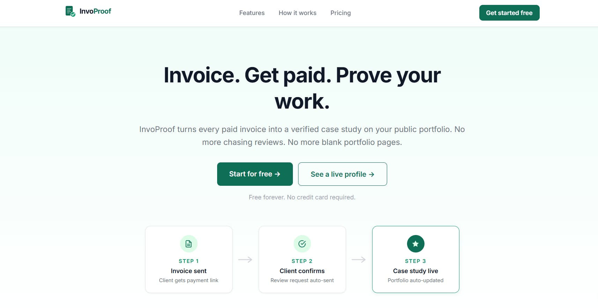
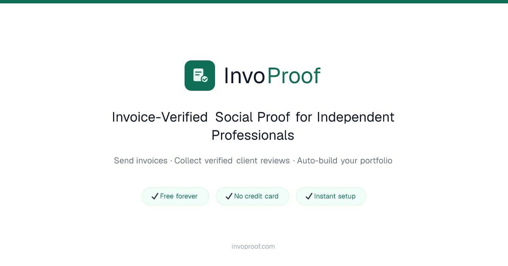
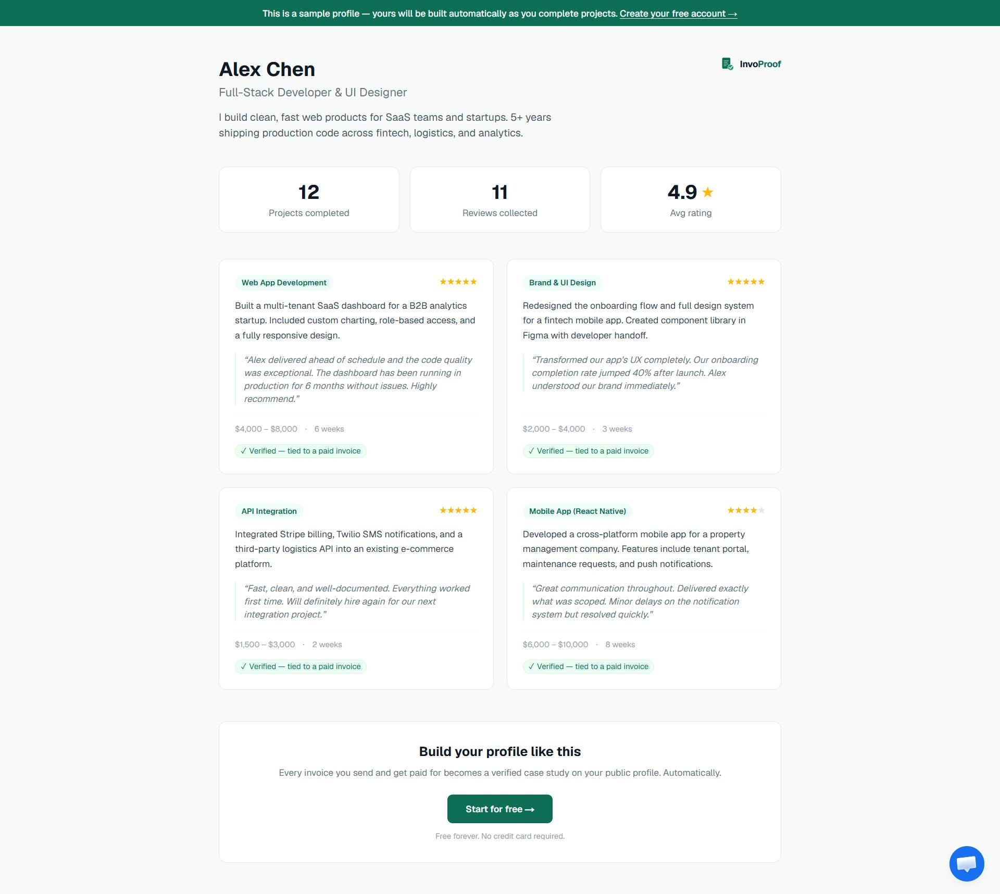

---

## 17. [MergeImage](https://www.producthunt.com/products/mergeimage)
**Votes**: 10 | **도입 난이도**: 하 | **신뢰도**: 상
**Tagline**: Merge up to 30 images locally, privately, and free
**서비스 링크**: https://www.producthunt.com/r/56QE5SDMFKWNJQ

**태그**: DesignTool, Productivity, Privacy, AI Tool, Vision, API

### 📌 이 서비스 한눈에 보기
개인정보 유출 걱정 없이 브라우저에서 즉시 이미지를 병합하는 무료 도구

### 🔑 주요 기능
- 최대 30개의 이미지를 가로, 세로, 그리드 방식으로 자유롭게 병합
- 서버 업로드 없이 브라우저 로컬 환경에서 모든 작업 수행
- 회원가입, 워터마크, 유료 API 없이 무료로 이용 가능

### 🙋 사용자에게 어떤 점이 좋은가
이미지를 외부 서버에 올리지 않아 보안이 유지되며, 스크린샷 스티칭이나 콜라주 제작 시 별도의 설치 없이 즉시 활용할 수 있습니다.

### ✅ 지금 바로 써볼 기능
- 여러 장의 스크린샷을 하나의 이미지로 병합하기
- 스마트 스티칭 기능을 활용한 긴 스크롤 스크린샷 만들기
- 이미지 회전, 반전 및 간격 조절로 레이아웃 맞추기

### ⚠️ 사용 전 확인할 점
- 최대 30개까지만 파일 병합 가능
- 브라우저 리소스 사용량에 따라 대용량 파일 처리 시 성능 제한 가능성 있음

### 🧭 확인이 더 필요한 정보
사용자의 하드웨어 사양에 따라 브라우저 내 대용량 이미지 처리 속도가 달라질 수 있습니다.

### 📸 스크린샷 및 갤러리
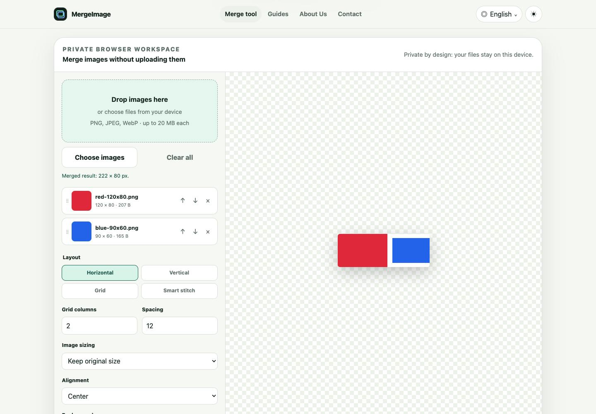

---

## 18. [Taffy](https://www.producthunt.com/products/taffy-3)
**Votes**: 9 | **도입 난이도**: 하 | **신뢰도**: 상
**Tagline**: Sort, don't budget
**서비스 링크**: https://www.producthunt.com/r/3NTYN3JSAXDSFH

**태그**: FinTech, PersonalFinance, ExpenseTracker

### 📌 이 서비스 한눈에 보기
예산 계획 없이도 지출 내역을 직관적으로 분류하고 파악하는 지출 관리 도구

### 🔑 주요 기능
- 은행 계좌 연동을 통한 자동 거래 내역 불러오기
- 복잡한 예산 설정 대신 카테고리별 분류(Bucket) 방식 채택
- 지출 현황을 한눈에 파악하는 직관적인 가시성 제공

### 🙋 사용자에게 어떤 점이 좋은가
예산을 짜는 번거로운 과정 없이, 내가 돈을 어디에 썼는지 실시간으로 확인하고 싶을 때 유용합니다.

### ✅ 지금 바로 써볼 기능
- 은행 계좌 연결하기
- 거래 내역을 원하는 카테고리에 분류하기
- 지출 분포 확인하기

### ⚠️ 사용 전 확인할 점
- 수동 분류 방식이므로 사용자의 지속적인 참여가 필요할 수 있음
- 은행 계좌 연동에 따른 보안 및 개인정보 보호 정책 확인 필요

### 🧭 확인이 더 필요한 정보
현재 제공되는 카테고리 분류 방식의 자동화 수준과 보안 프로토콜에 대한 상세 정보가 필요합니다.

### 📸 스크린샷 및 갤러리
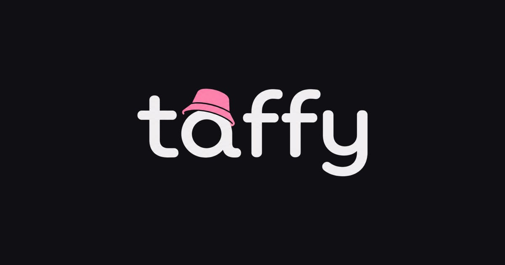
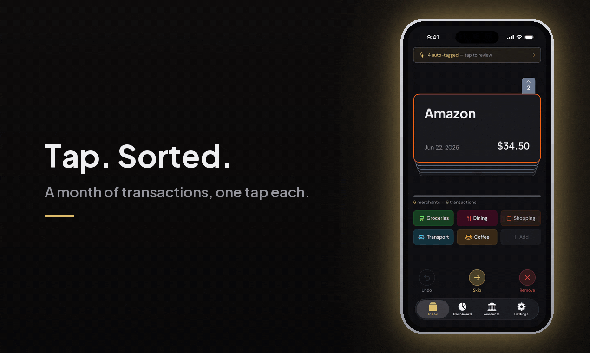

---

## 19. [Growth Audit](https://www.producthunt.com/products/growth-audit)
**Votes**: 8 | **도입 난이도**: 하 | **신뢰도**: 상
**Tagline**: Free AI audit that finds what's hurting your website
**서비스 링크**: https://www.producthunt.com/r/DG76O7RLYG267U

**태그**: AI, SEO, WebAudit, Marketing, AI Tool

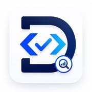

### 📌 이 서비스 한눈에 보기
30초 만에 웹사이트의 문제점을 진단하는 무료 AI 감사 도구

### 🔑 주요 기능
- SEO, 성능, 접근성, 전환율 이슈를 AI가 즉시 분석
- 가입 없이 30초 이내에 결과 확인 가능
- 문제 해결을 위한 맞춤형 웹 솔루션 제안

### 🙋 사용자에게 어떤 점이 좋은가
웹사이트 운영자가 복잡한 설정 없이도 사이트의 성장을 가로막는 기술적 문제를 즉각 파악할 수 있습니다.

### ✅ 지금 바로 써볼 기능
- 자신의 웹사이트 URL 입력하여 무료 감사 실행
- 분석된 SEO 및 성능 이슈 리포트 확인
- 발견된 문제를 해결하기 위한 맞춤형 솔루션 검토

### ⚠️ 사용 전 확인할 점
- 결과 확인은 무료이나, 문제 해결을 위한 맞춤형 서비스는 유료일 수 있음
- 심층적인 분석이나 상세 리포트 제공 여부는 확인 필요

### 🧭 확인이 더 필요한 정보
결과 확인 이후의 상세 분석 리포트 제공 범위와 유료 서비스 전환 방식에 대한 정보가 부족합니다.

### 📸 스크린샷 및 갤러리
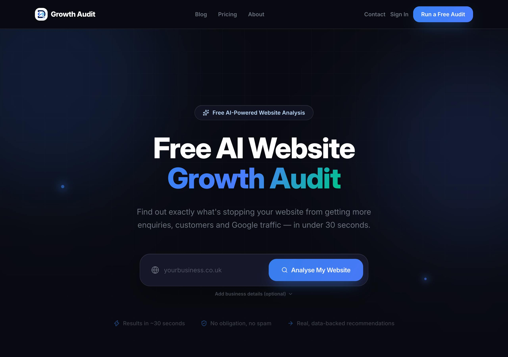
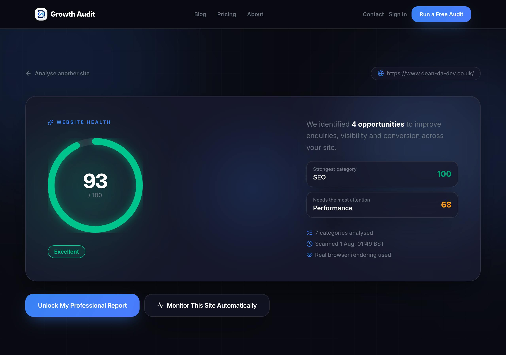
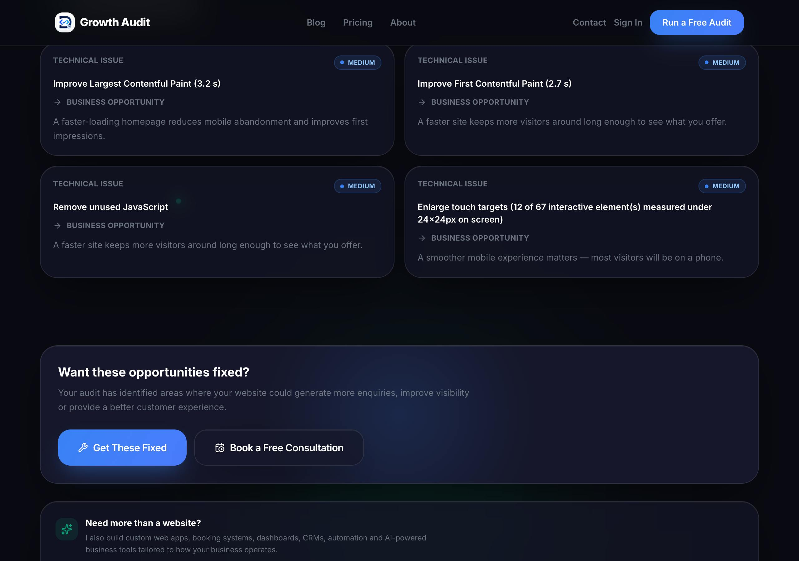

---

## 20. [Paste Drops](https://www.producthunt.com/products/paste-drops)
**Votes**: 7 | **도입 난이도**: 하 | **신뢰도**: 상
**Tagline**: Cyclops calms your angry texts and roasts you a little
**서비스 링크**: https://www.producthunt.com/r/6RNJ2WNLDH43F2

**태그**: Productivity, AI, Communication, Lifestyle

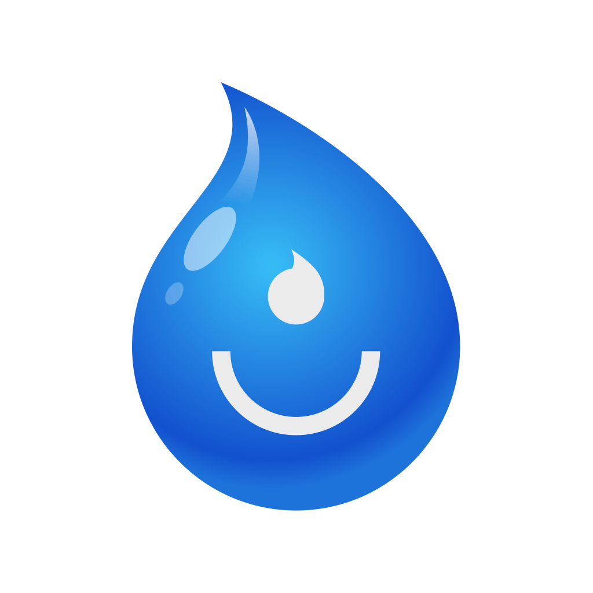

### 📌 이 서비스 한눈에 보기
감정적인 메시지를 차분하고 세련된 문구로 바꿔주는 귀여운 데스크톱 마스코트 서비스

### 🔑 주요 기능
- 분노 섞인 메시지를 사회적으로 적절한 버전으로 재작성
- 사용자의 감정 상태에 따라 세 가지 모드(이성적, 옹졸함, 설득형) 제공
- 다양한 국가의 억양과 언어를 지원하는 음성 읽기 기능

### 🙋 사용자에게 어떤 점이 좋은가
욱하는 감정으로 인해 발생할 수 있는 사회적 실수(차단, 해고 등)를 방지하고, 메시지 작성의 심리적 완충 지대 역할을 합니다.

### ✅ 지금 바로 써볼 기능
- 감정이 격해진 메시지를 복사하여 Cyclops에게 전달하기
- 원하는 국가의 억양(아일랜드, 호주 등)으로 교정된 메시지 들어보기
- 상황에 맞는 메시지 톤(Sensible, Petty, Talk-me-out) 선택하기

### ⚠️ 사용 전 확인할 점
- AI가 생성한 문구이므로 최종 전송 전 반드시 사용자가 직접 검토 필요
- 텍스트 기반 서비스이므로 복잡한 맥락이나 미묘한 뉘앙스 반영에 한계가 있을 수 있음

### 🧭 확인이 더 필요한 정보
데스크톱 앱 형태인지 웹 브라우저 기반 서비스인지에 대한 구체적인 플랫폼 정보가 명시되지 않았습니다.

### 📸 스크린샷 및 갤러리
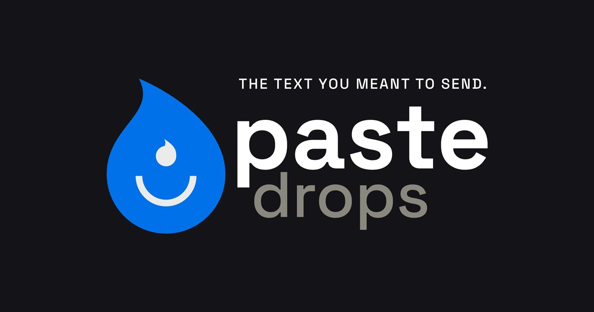

---

## 21. [Musklr](https://www.producthunt.com/products/musklr)
**Votes**: 7 | **도입 난이도**: 하 | **신뢰도**: 상
**Tagline**: Lift Heavy. Log Fast
**서비스 링크**: https://www.producthunt.com/r/IFQBNVAZ3HLXU4

**태그**: Fitness, Productivity, Health

### 📌 이 서비스 한눈에 보기
두 번의 터치로 운동 기록을 끝내는 전문 웨이트 트레이닝 로그 앱

### 🔑 주요 기능
- 두 번의 터치로 간편하게 세트 기록 가능
- 2,000개 이상의 방대한 운동 라이브러리 제공
- 해부학 다이어그램을 통한 타겟 근육 시각화

### 🙋 사용자에게 어떤 점이 좋은가
운동 중 기록 시간을 최소화하여 운동 흐름을 유지하면서도, 점진적 과부하와 1RM 관리에 최적화된 환경을 제공합니다.

### ✅ 지금 바로 써볼 기능
- 자신의 주력 운동 검색 및 등록하기
- 해부학 다이어그램으로 타겟 근육 확인하기
- 간편한 터치로 세트 기록 테스트하기

### ⚠️ 사용 전 확인할 점
- 모바일 환경(손가락 조작)에 최적화되어 있어 PC 환경 지원 여부는 미확인
- 데이터 백업 및 클라우드 동기화 정책 확인 필요

### 🧭 확인이 더 필요한 정보
구체적인 구독 모델이나 유료 기능 포함 여부가 명시되지 않았습니다.

### 📸 스크린샷 및 갤러리
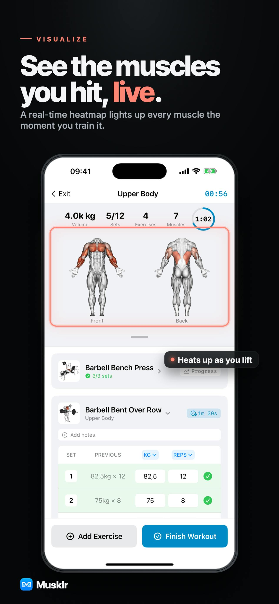
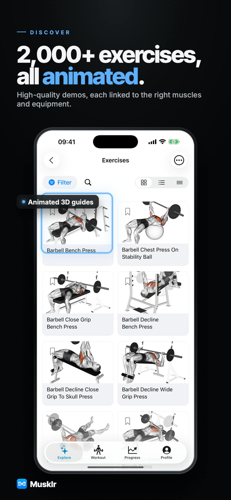
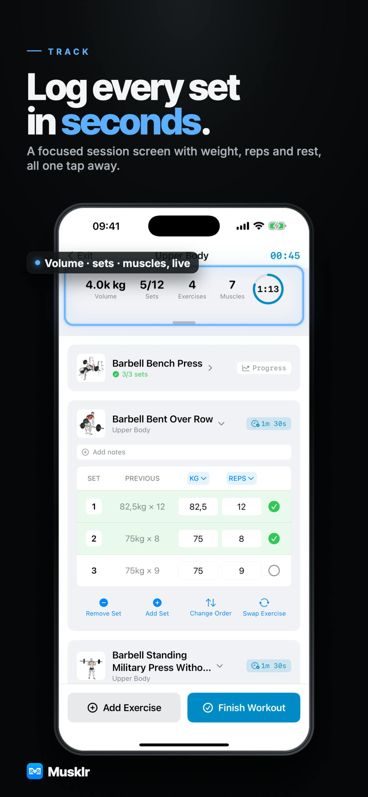

---

## 22. [Tempest](https://www.producthunt.com/products/tempest-3)
**Votes**: 7 | **도입 난이도**: 하 | **신뢰도**: 상
**Tagline**: Run AI agents in parallel with 64% fewer tokens 
**서비스 링크**: https://www.producthunt.com/r/MJRKYIBVHQ6USI

**태그**: DevTool, AI, Productivity, Coding, Agent, AI Tool

### 📌 이 서비스 한눈에 보기
코드 저장소 인덱싱 공유를 통해 AI 에이전트의 토큰 소모를 획기적으로 줄여주는 도구

### 🔑 주요 기능
- 저장소 인덱싱 공유를 통한 중복 작업 방지
- 에이전트별 독립된 워크스페이스 제공
- 동일한 컨텍스트 공유로 토큰 사용량 최대 64% 절감

### 🙋 사용자에게 어떤 점이 좋은가
여러 AI 코딩 에이전트를 동시에 사용할 때 발생하는 불필요한 토큰 비용을 절감하고 효율적인 코드 이해도를 유지할 수 있습니다.

### ✅ 지금 바로 써볼 기능
- 자신의 코드 저장소 인덱싱 기능 테스트
- 멀티 에이전트 환경에서의 토큰 절감 효과 확인

### ⚠️ 사용 전 확인할 점
- 인덱싱 방식이 특정 언어나 프레임워크에서 동일한 효율을 내는지 확인 필요
- 에이전트 간 워크스페이스 격리 수준 확인

### 🧭 확인이 더 필요한 정보
64% 토큰 절감 수치가 모든 환경에서 보장되는지 확인이 필요합니다.

### 📸 스크린샷 및 갤러리
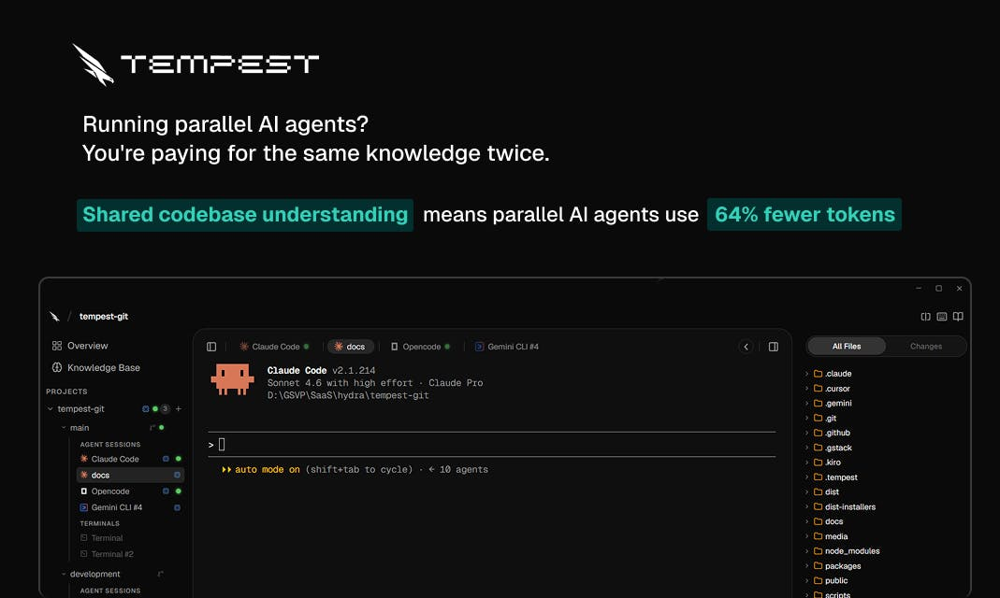
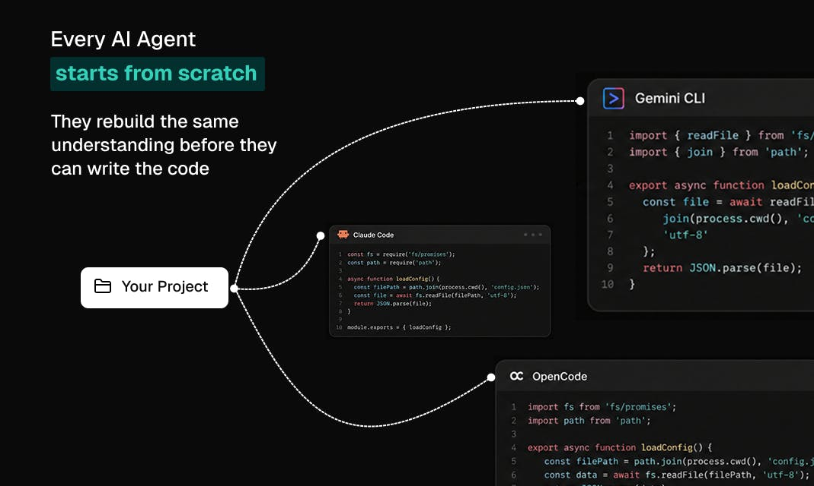
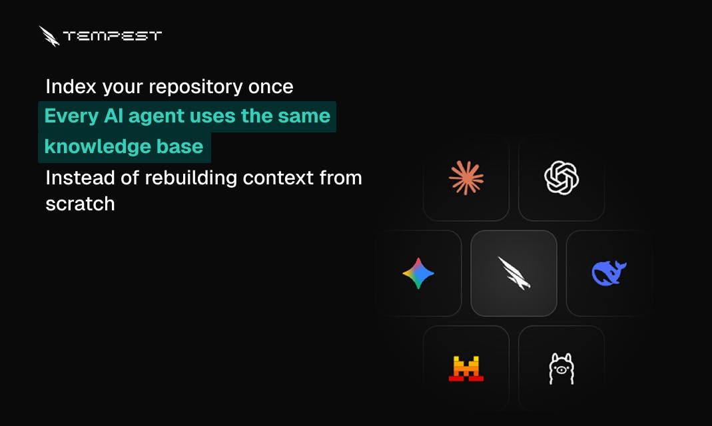

### 🎬 관련 영상
- [🎥 영상 보기](https://ph-files.imgix.net/b71505b5-1dcc-467a-8ce2-b2df1a16209f.jpeg?auto=format)

---

## 23. [Paste Drops](https://www.producthunt.com/products/paste-drops)
**Votes**: 7 | **도입 난이도**: 하 | **신뢰도**: 상
**Tagline**: Cyclops calms your angry texts and roasts you a little
**서비스 링크**: https://www.producthunt.com/r/6RNJ2WNLDH43F2

**태그**: Productivity, AI, Communication, Lifestyle

### 📌 이 서비스 한눈에 보기
감정적인 메시지를 차분하고 세련된 문구로 바꿔주는 귀여운 데스크톱 마스코트 서비스

### 🔑 주요 기능
- 분노 섞인 메시지를 사회적으로 적절한 버전으로 재작성
- 사용자의 감정 상태에 따라 세 가지 모드(이성적, 옹졸함, 설득형) 제공
- 다양한 국가의 억양과 언어를 지원하는 음성 읽기 기능

### 🙋 사용자에게 어떤 점이 좋은가
욱하는 감정으로 인해 발생할 수 있는 사회적 실수(차단, 해고 등)를 방지하고, 메시지 작성의 심리적 완충 지대 역할을 합니다.

### ✅ 지금 바로 써볼 기능
- 감정이 격해진 메시지를 복사하여 Cyclops에게 전달하기
- 원하는 국가의 억양(아일랜드, 호주 등)으로 교정된 메시지 들어보기
- 상황에 맞는 메시지 톤(Sensible, Petty, Talk-me-out) 선택하기

### ⚠️ 사용 전 확인할 점
- AI가 생성한 문구이므로 최종 전송 전 반드시 사용자가 직접 검토 필요
- 텍스트 기반 서비스이므로 복잡한 맥락이나 미묘한 뉘앙스 반영에 한계가 있을 수 있음

### 🧭 확인이 더 필요한 정보
데스크톱 앱 형태인지 웹 브라우저 기반 서비스인지에 대한 구체적인 플랫폼 정보가 명시되지 않았습니다.

### 📸 스크린샷 및 갤러리

---

## 24. [StoryVoice](https://www.producthunt.com/products/storyvoice)
**Votes**: 7 | **도입 난이도**: 하 | **신뢰도**: 상
**Tagline**: Customer case studies from 5-minute voice interviews
**서비스 링크**: https://www.producthunt.com/r/VYGJX3WWTUVHS3

**태그**: Marketing, AI, Automation, B2B, ContentCreation, AI Tool

### 📌 이 서비스 한눈에 보기
5분 음성 인터뷰만으로 완성되는 AI 기반 고객 사례 연구 생성 도구

### 🔑 주요 기능
- 링크 공유를 통한 간편한 고객 인터뷰 수집
- AI를 활용한 즉각적인 사례 연구(Case Study) 초안 생성
- 작가나 추가 후속 작업 없이 실질적인 성과와 인용구 추출

### 🙋 사용자에게 어떤 점이 좋은가
고객 사례를 작성하기 위해 소요되는 많은 시간과 편집 과정을 자동화하여 마케팅 콘텐츠 제작 효율을 극대화할 수 있습니다.

### ✅ 지금 바로 써볼 기능
- 고객에게 인터뷰 링크 발송하기
- 생성된 사례 연구의 톤앤매너 확인하기
- 추출된 핵심 지표 및 인용구 검토하기

### ⚠️ 사용 전 확인할 점
- AI가 생성한 내용의 사실 관계 및 수치 정확성 검증 필요
- 음성 데이터의 품질에 따른 결과물 품질 차이 가능성

### 🧭 확인이 더 필요한 정보
생성된 결과물의 편집 기능 및 외부 플랫폼(CMS 등)과의 연동 범위에 대한 정보가 부족합니다.

### 📸 스크린샷 및 갤러리
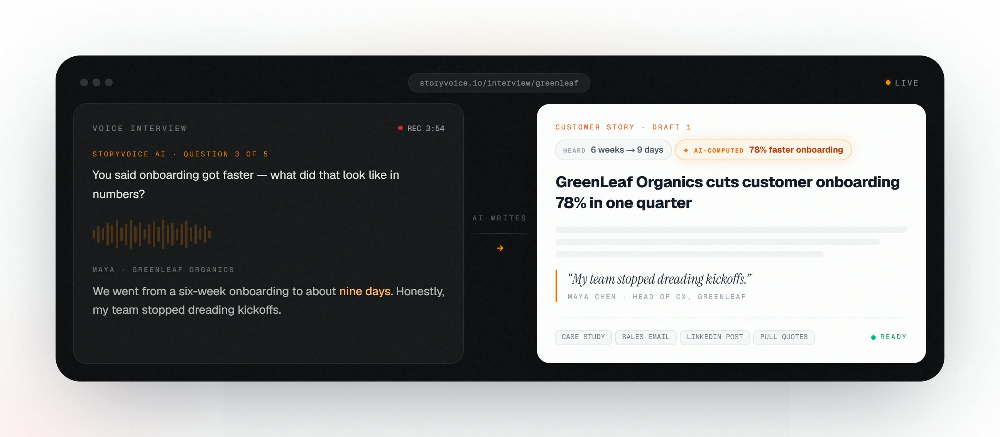
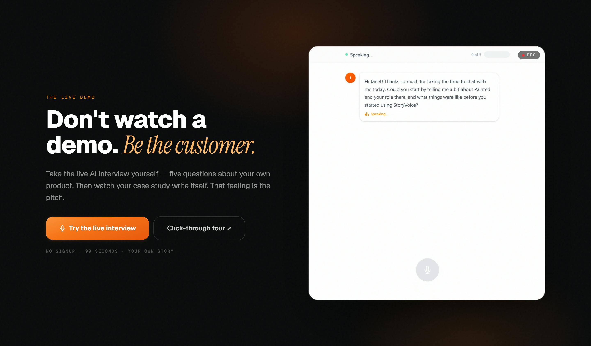
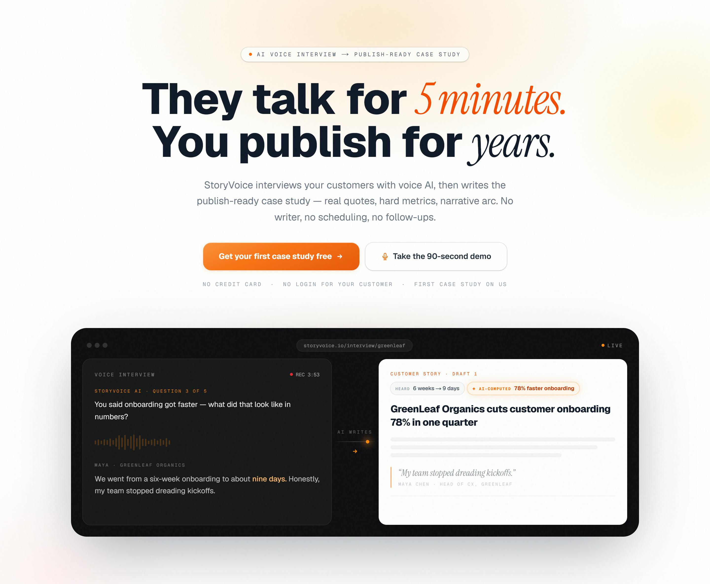

---

## 25. [Mitra](https://www.producthunt.com/products/mitra-4)
**Votes**: 6 | **도입 난이도**: 하 | **신뢰도**: 상
**Tagline**: An animated cute desktop companion that helps you focus
**서비스 링크**: https://www.producthunt.com/r/WGSEVR665LIFKW

**태그**: Productivity, DesktopApp, Wellness, OpenSource, Privacy, Automation, Design

### 📌 이 서비스 한눈에 보기
업무 몰입과 휴식을 돕는 귀엽고 스마트한 데스크톱 반려 애니메이션

### 🔑 주요 기능
- 사용자의 워크플로우에 반응하는 인터랙티브한 데스크톱 동반자
- 건강한 휴식을 유도하는 웰니스 리마인더 기능
- 로컬 퍼스트 설계 및 오픈 소스로 보장되는 강력한 개인정보 보호

### 🙋 사용자에게 어떤 점이 좋은가
귀여운 캐릭터와의 상호작용을 통해 업무 환경에 활력을 불어넣으면서도, 적절한 휴식 타이밍을 알려주어 집중력 유지와 건강 관리를 동시에 돕습니다.

### ✅ 지금 바로 써볼 기능
- 데스크톱에 설치하여 캐릭터의 물리 엔진 반응 살펴보기
- 업무 흐름에 맞는 휴식 알림 설정하기
- 오픈 소스 코드를 통해 개인정보 보호 방식 확인하기

### ⚠️ 사용 전 확인할 점
- 애니메이션 요소가 작업 중 시각적 방해가 될 수 있음
- 데스크톱 리소스 점유율에 대한 구체적 수치 미제시

### 🧭 확인이 더 필요한 정보
사용자의 운영체제(OS) 호환성 및 시스템 리소스 사용량에 대한 상세 정보가 필요합니다.

### 📸 스크린샷 및 갤러리
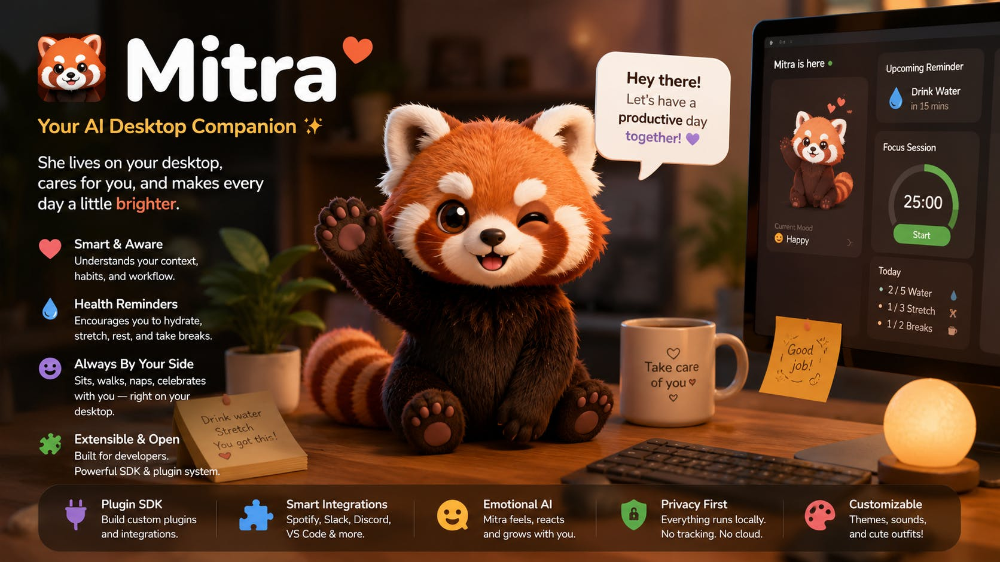

---

## 26. [DesktopAudio](https://www.producthunt.com/products/desktopaudio)
**Votes**: 6 | **도입 난이도**: 하 | **신뢰도**: 상
**Tagline**: Record what your Mac plays. Local files, no cloud.
**서비스 링크**: https://www.producthunt.com/r/G3UQLQR7WE3FEF

**태그**: macOS, Audio, Productivity, Privacy, Video

### 📌 이 서비스 한눈에 보기
클라우드 없이 Mac에서 재생되는 모든 소리를 로컬로 간편하게 녹음하는 도구

### 🔑 주요 기능
- Mac 시스템 오디오를 m4a 파일로 직접 녹음
- 클라우드나 계정 없이 로컬 파일로 저장되는 프라이버시 중심 설계
- 마이크 권한 없이 시스템 소리만 캡처하여 보안성 확보

### 🙋 사용자에게 어떤 점이 좋은가
팟캐스트, 웨비나, 화상 회의 등 Mac에서 들리는 모든 소리를 개인 파일로 안전하게 소장할 수 있습니다.

### ✅ 지금 바로 써볼 기능
- 시스템 오디오 녹음 테스트
- 화면 녹화(Cmd+Shift+5)와 병행하여 사용
- 로컬 저장 기능 확인

### ⚠️ 사용 전 확인할 점
- Mac 전용 소프트웨어임
- 마이크를 통한 외부 소리는 녹음되지 않음

### 🧭 확인이 더 필요한 정보
특정 macOS 버전에서의 호환성 및 시스템 권한 요구 사항에 대한 상세 정보는 확인이 필요합니다.

### 📸 스크린샷 및 갤러리
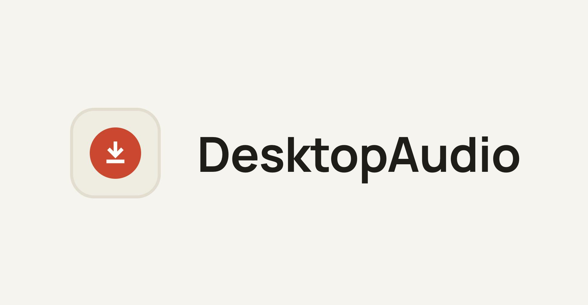
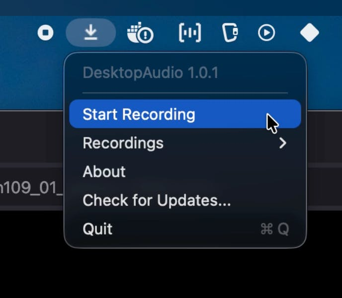
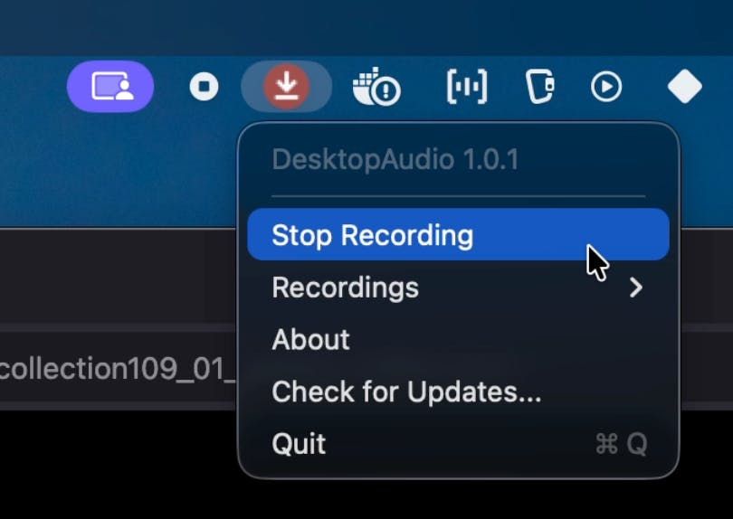

### 🎬 관련 영상
- [🎥 영상 보기](https://ph-files.imgix.net/db4183f7-26c0-426d-a591-490fbf8077bf.jpeg?auto=format)

---

## 27. [tkntracker](https://www.producthunt.com/products/tkntracker)
**Votes**: 6 | **도입 난이도**: 하 | **신뢰도**: 상
**Tagline**: Local-first AI token usage tracker for every coding agent.
**서비스 링크**: https://www.producthunt.com/r/RTTD6BAUXWE2TA

**태그**: DevTool, AI, Analytics, Privacy, Agent, AI Tool, Prompting, API

### 📌 이 서비스 한눈에 보기
로컬 로그를 기반으로 다양한 코딩 에이전트의 토큰 사용량을 추적하는 보안 중심 대시보드

### 🔑 주요 기능
- 로컬 로그를 읽는 방식의 Local-first 설계로 프롬프트 유출 방지
- Claude Code, Cursor, Grok 등 20개 이상의 코딩 에이전트 지원
- 일별/월별 합계, 모델별 상세 분석 및 비용 추정 기능 제공

### 🙋 사용자에게 어떤 점이 좋은가
여러 코딩 도구를 사용하는 개발자가 자신의 토큰 소비 패턴과 비용을 프라이버시 걱정 없이 한눈에 관리할 수 있습니다.

### ✅ 지금 바로 써볼 기능
- npm i -g tkntracker 명령어로 도구 설치하기
- tkntracker web 명령어로 대시보드 실행하기
- 생성된 burn card를 통해 사용량 리포트 확인하기

### ⚠️ 사용 전 확인할 점
- 로컬 로그 파일 경로가 변경될 경우 추적이 중단될 수 있음
- 지원되는 코딩 에이전트의 로그 형식이 변경되면 호환성 확인 필요

### 🧭 확인이 더 필요한 정보
사용 중인 모든 코딩 에이전트의 로그 형식을 완벽하게 지원하는지 확인이 필요합니다.

### 📸 스크린샷 및 갤러리
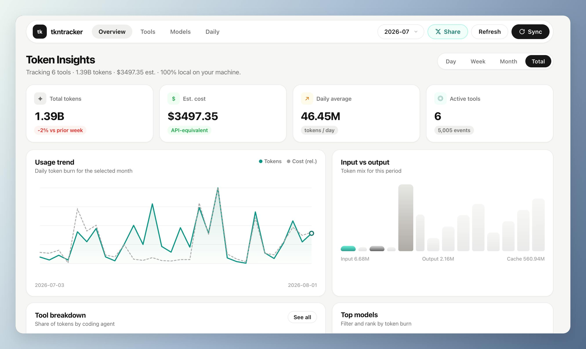
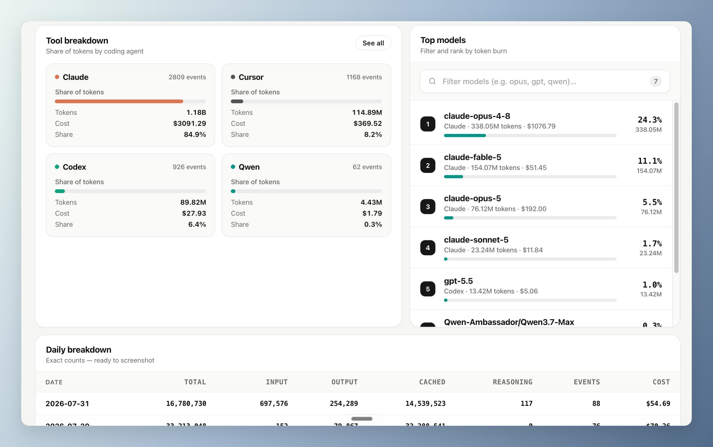
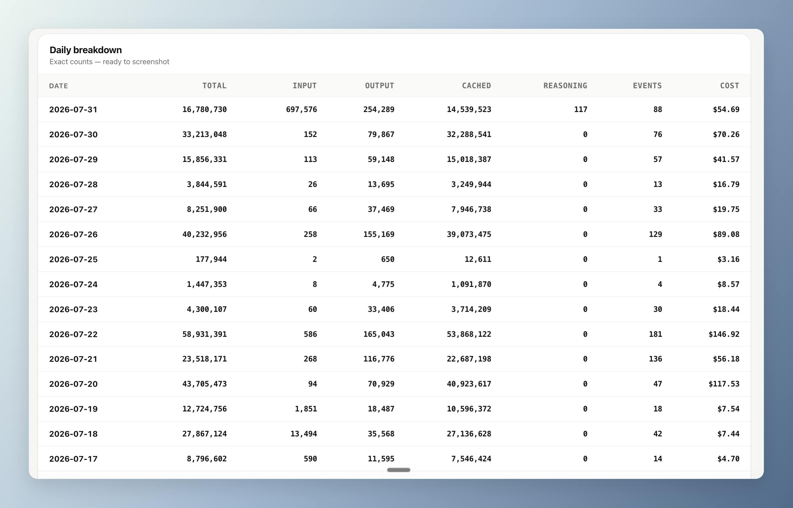

### 🎬 관련 영상
- [🎥 영상 보기](https://ph-files.imgix.net/27beee70-811e-4a86-91d2-0e26b1e782ab.jpeg?auto=format)

---

## 28. [Owl NoSQL & Storage](https://www.producthunt.com/products/owl-nosql-storage)
**Votes**: 6 | **도입 난이도**: 하 | **신뢰도**: 상
**Tagline**: Zero-config database and storage — no Redis, no S3, no setup
**서비스 링크**: https://www.producthunt.com/r/GXET3QUIXUVXKR

**태그**: DevTool, Database, Storage, Serverless, NoCode, Vision, API

### 📌 이 서비스 한눈에 보기
Redis나 S3 설정 없이 API 키 하나로 즉시 사용 가능한 제로 컨피그 NoSQL 및 스토리지 솔루션

### 🔑 주요 기능
- Redis 인스턴스나 커넥션 풀 설정이 필요 없는 자동 CDN 엣지 캐싱
- S3나 IAM 설정 없이 바로 사용하는 이미지 최적화 포함 객체 스토리지
- Node.js, Next.js, Deno, Serverless 환경을 지원하는 간편한 SDK

### 🙋 사용자에게 어떤 점이 좋은가
인프라 구축 및 관리 비용(Setup Tax)을 획기적으로 줄여 개발자가 비즈니스 로직에만 집중할 수 있게 합니다.

### ✅ 지금 바로 써볼 기능
- API 키 발급 후 SDK 연동 테스트
- Serverless 환경에서의 데이터 읽기/쓰기 성능 확인
- 이미지 최적화 및 스토리지 기능 검증

### ⚠️ 사용 전 확인할 점
- 대규모 데이터셋이나 복잡한 쿼리 요구사항에 대한 성능 검증 필요
- 특정 벤더 종속성(Vendor Lock-in) 발생 가능성 고려

### 🧭 확인이 더 필요한 정보
데이터 규모에 따른 비용 정책과 상세한 보안/권한 관리 방식에 대한 정보가 추가로 필요합니다.

### 📸 스크린샷 및 갤러리
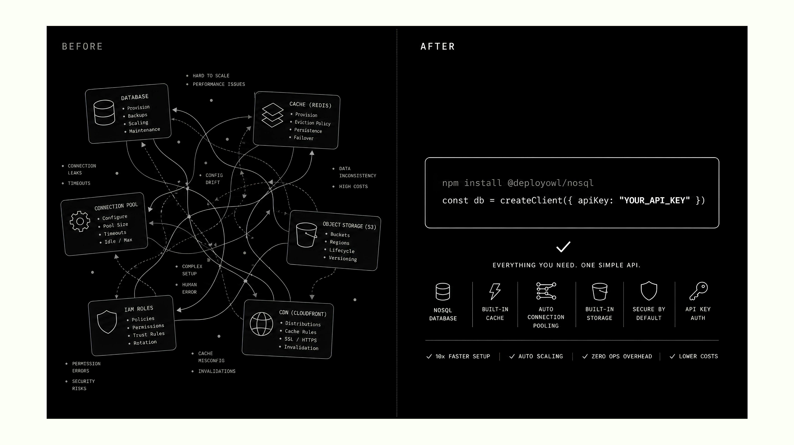
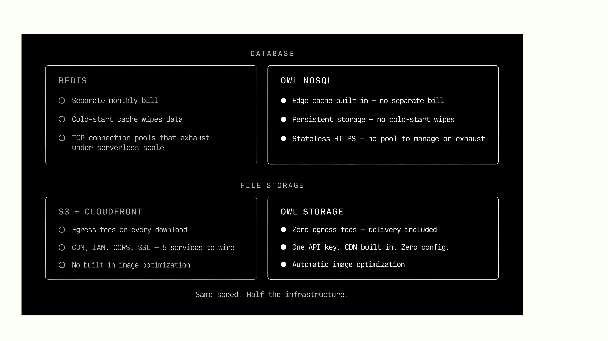
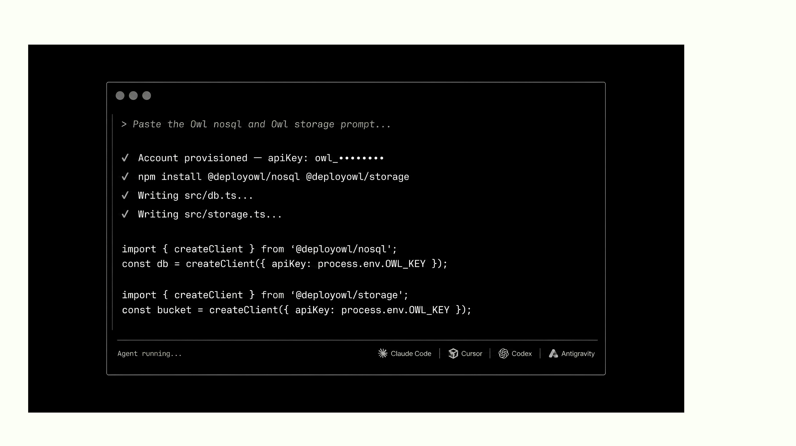

---

## 29. [Agentilix](https://www.producthunt.com/products/agentilix)
**Votes**: 6 | **도입 난이도**: 중 | **신뢰도**: 상
**Tagline**: 100 AI agents searching, scraping, & working the web for you
**서비스 링크**: https://www.producthunt.com/r/7JUBLMJZCY7APP

**태그**: DevTool, Automation, WebScraping, AI-Agents, Agent, AI Tool, API

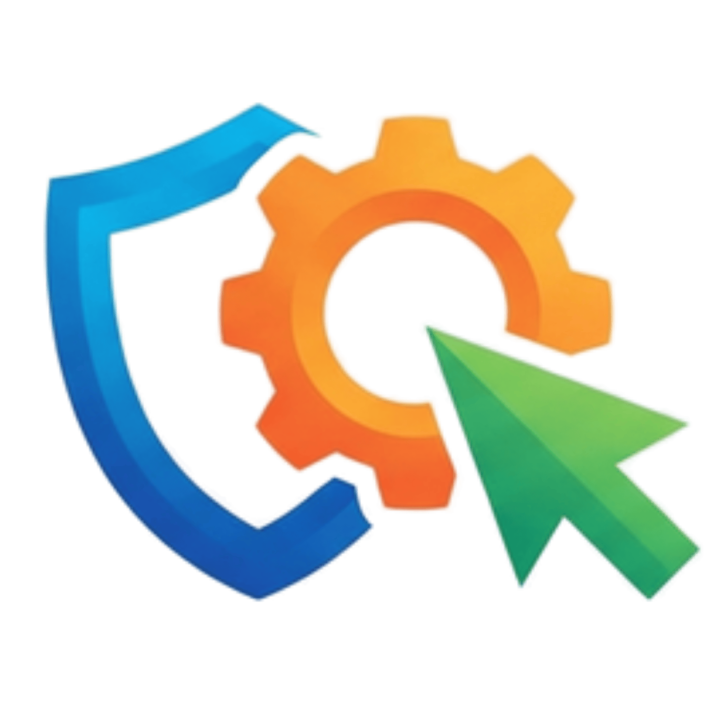

### 📌 이 서비스 한눈에 보기
웹 검색, 스크래핑, 자동화를 한 번에 해결하는 개발자용 AI 에이전트 API

### 🔑 주요 기능
- 실시간 웹 검색 및 전체 사이트 스크래핑 기능 제공
- 연락처 발굴 및 데이터 정제 자동화
- 멀티 스텝 작업을 수행하는 시각적 브라우저 에이전트 실행

### 🙋 사용자에게 어떤 점이 좋은가
복잡한 웹 탐색 및 데이터 수집 과정을 단일 API로 자동화하여 개발 시간을 획기적으로 단축할 수 있습니다.

### ✅ 지금 바로 써볼 기능
- 단일 API로 웹 데이터 스크래핑 테스트하기
- 연락처 추출 및 데이터 정제 워크플로우 구축하기
- 멀티 스텝 자동화를 위한 브라우저 에이전트 실행하기

### ⚠️ 사용 전 확인할 점
- 대규모 스크래핑 시 대상 사이트의 차단 정책 확인 필요
- 에이전트의 시각적 작업 수행 시 발생하는 비용 및 리소스 관리 필요

### 🧭 확인이 더 필요한 정보
API의 구체적인 호출 비용 체계와 동시 실행 가능한 에이전트 수에 대한 정보가 명시되지 않았습니다.

### 📸 스크린샷 및 갤러리
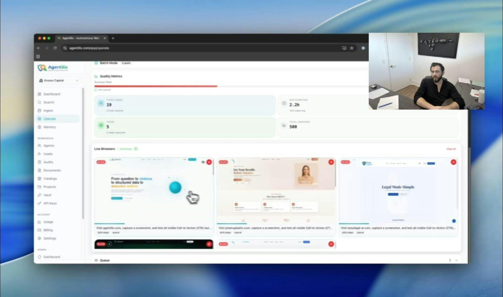

### 🎬 관련 영상
- [🎥 영상 보기](https://ph-files.imgix.net/f1f444f3-545c-4b43-b162-d5d46fb01de8.jpeg?auto=format)

---

## 30. [Paper Animator](https://www.producthunt.com/products/paper-animator)
**Votes**: 6 | **도입 난이도**: 하 | **신뢰도**: 상
**Tagline**: Free paper animation maker 
**서비스 링크**: https://www.producthunt.com/r/MDDRUQ5ZES62YM

**태그**: DesignTool, MotionDesign, Freebie, NoCode, Automation, Vision, Design

### 📌 이 서비스 한눈에 보기
계정 생성 없이 브라우저에서 즉시 만드는 무료 종이 질감 애니메이션 제작 도구

### 🔑 주요 기능
- 복잡한 모션 디자인 워크플로우를 브라우저 기반으로 간소화
- 배경 제거, 22종의 종이 재질, 질감 업로드 및 그림자 효과 제공
- 워터마크 없는 1080p MP4 및 PNG 내보출 지원

### 🙋 사용자에게 어떤 점이 좋은가
별도의 가입이나 결제 없이도 전문가 수준의 종이 질감 애니메이션을 즉시 제작하고 고화질로 내려받을 수 있습니다.

### ✅ 지금 바로 써볼 기능
- 기본 제공되는 22종의 종이 재질 적용해보기
- 커스텀 텍스처 업로드로 독창적인 스타일 만들기
- 실시간 미리보기를 통해 애니메이션 움직임 조절하기

### ⚠️ 사용 전 확인할 점
- 브라우저 기반이므로 고해상도 작업 시 기기 성능에 영향을 받을 수 있음
- 계정 없이 사용하므로 작업 내용 저장/관리 기능 여부 확인 필요

### 🧭 확인이 더 필요한 정보
사용자 계정 생성 없이 작업 내용이 브라우저에 어떻게 저장되는지 확인이 필요합니다.

### 📸 스크린샷 및 갤러리

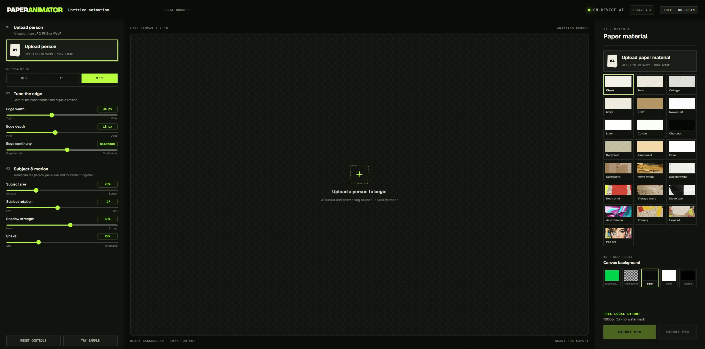

---

