# 🚀 Product Hunt Daily Top 30 (2026-08-05)

## 오늘의 요약
오늘의 트렌드는 단순한 정보 제공을 넘어 사용자의 워크플로우에 직접 개입하여 실행까지 돕는 '자율형 AI 에이전트'의 부상이 두드러졌습니다. 또한, 여러 AI 도구 간의 맥락을 공유하거나 외부 데이터 소스를 실시간으로 연결하는 등 AI 활용의 효율성을 극대화하는 통합 솔루션들이 주목받았습니다.

### 오늘의 핵심 포인트
- 단순 응답을 넘어 일정 관리, 투자 실행, 마케팅 분석 등 실질적인 업무를 수행하는 능동적 AI 에이전트가 등장했습니다.
- 다양한 AI 도구와 데이터 소스를 연결하여 작업 소식의 끊김을 방지하는 통합 메모리 및 데이터 연동 기술이 강조되었습니다.
- 개인정보 보호를 위한 보안 중심의 도구와 하드웨어 결합형 시각화 도구 등 사용자 경험을 최적화하는 특화 솔루션들이 발표되었습니다.

**오늘의 태그**: AI 에이전트, 워크플로우 자동화, 데이터 통합, 생산성 도구

## 1. [Hey Noah](https://www.producthunt.com/products/hey-noah)
**Votes**: 413 | **도입 난이도**: 중 | **신뢰도**: 상
**Tagline**: A proactive AI executive assistant for founders
**서비스 링크**: https://www.producthunt.com/r/XG4DNYGMW6GCPP

**태그**: AI, Productivity, Automation, CRM, AI Tool, Email

### 📌 이 서비스 한눈에 보기
이메일, 문자, WhatsApp을 넘나들며 일정과 관계를 관리하는 자율형 AI 비서

### 🔑 주요 기능
- 단순 응답을 넘어 네트워크와 직접 소통하는 능동적 AI
- 이메일, 문자, WhatsApp 등 다양한 채널을 통한 일정 및 팔로업 관리
- 창업자를 위한 자율형 비서(EA) 모델 지향

### 🙋 사용자에게 어떤 점이 좋은가
창업자가 일일이 대응하지 않아도 AI가 미팅 물류와 관계 관리를 대신 처리하여 업무 누락을 방지합니다.

### ✅ 지금 바로 써볼 기능
- 연동된 메시징 채널(SMS, WhatsApp 등) 설정하기
- 주요 일정 및 팔로업 규칙 설정하기
- AI의 대화 스타일 및 권한 범위 확인하기

### ⚠️ 사용 전 확인할 점
- 개인적인 메시징 채널(SMS, WhatsApp)에 대한 접근 권한 필요
- AI가 외부 네트워크와 직접 소통할 때 발생할 수 있는 커뮤니케이션 오류 가능성

### 🧭 확인이 더 필요한 정보
사용자의 개인 메시징 계정 접근 방식과 보안/개인정보 보호 정책에 대한 상세 확인이 필요합니다.

### 📸 스크린샷 및 갤러리
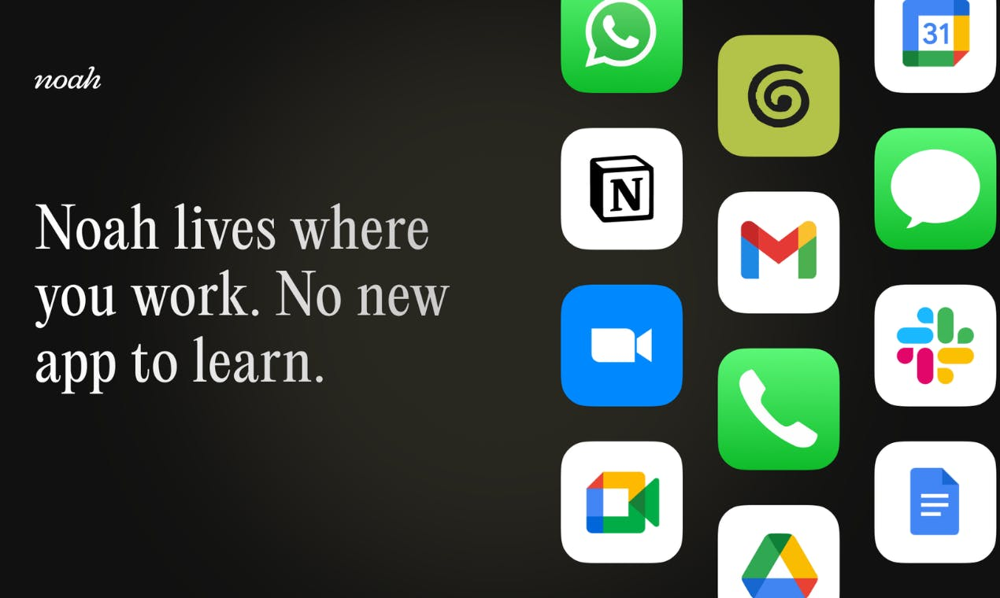

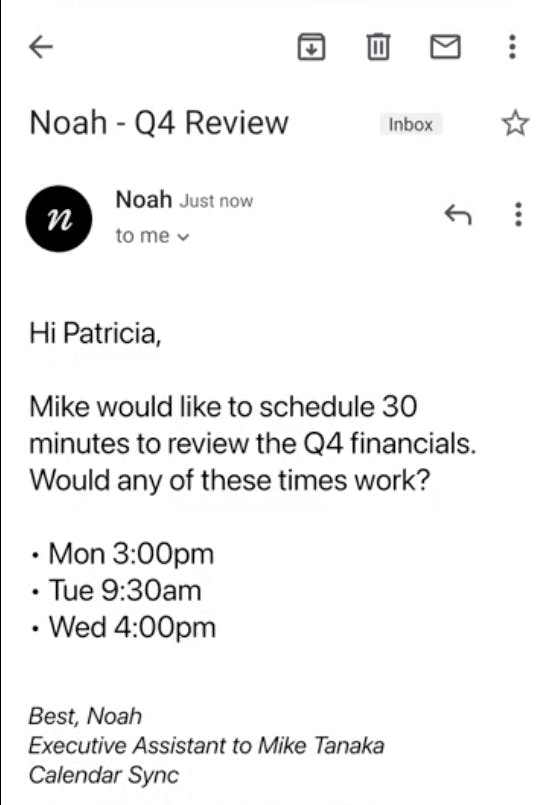

### 🎬 관련 영상
- [🎥 영상 보기](https://ph-files.imgix.net/b037af11-d436-4f20-86da-2435d655284f.jpeg?auto=format)

---

## 2. [Wondering](https://www.producthunt.com/products/wondering-2)
**Votes**: 260 | **도입 난이도**: 하 | **신뢰도**: 상
**Tagline**: Duolingo for learning anything
**서비스 링크**: https://www.producthunt.com/r/534DO3AKV4LOCN

**태그**: EdTech, Personalized Learning, AI Tutor

### 📌 이 서비스 한눈에 보기
복잡한 주제를 개인 맞춤형 학습 경로로 변환해주는 대화형 학습 도구

### 🔑 주요 기능
- 학습 주제에 따른 개인 맞춤형 커리큘럼 생성
- 시각 자료, 팟캐스트, 인터랙티브 연습을 결합한 멀티모달 학습
- 복잡한 개념을 기억하기 쉬운 핵심 아이디어로 분해

### 🙋 사용자에게 어떤 점이 좋은가
새로운 분야를 배울 때 방대한 자료를 정리할 필요 없이, 개인 튜터가 옆에 있는 것처럼 체계적이고 재미있게 학습할 수 있습니다.

### ✅ 지금 바로 써볼 기능
- 배우고 싶은 주제 입력하기
- 생성된 맞춤형 학습 경로 확인하기
- 시각 자료와 인터랙티브 연습 활용하기

### ⚠️ 사용 전 확인할 점
- 학습 내용의 정확성 및 전문성 검증 필요
- 주제에 따라 생성되는 콘텐츠의 품질 차이 가능성

### 🧭 확인이 더 필요한 정보
학습 콘텐츠의 깊이와 전문적인 주제에 대한 대응 수준을 확인해야 합니다.

### 📸 스크린샷 및 갤러리
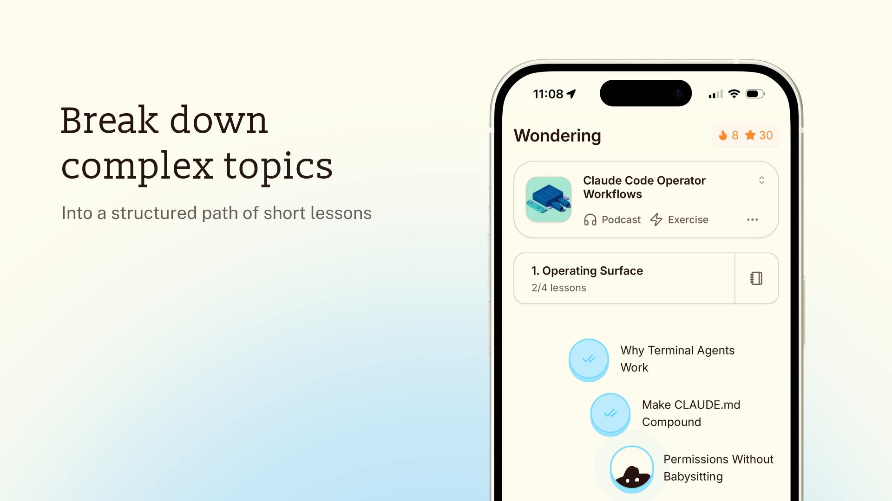
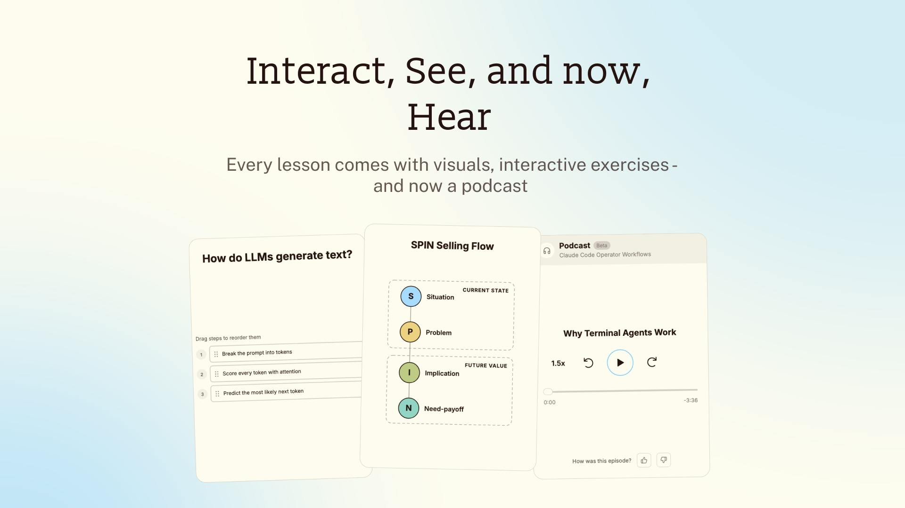

### 🎬 관련 영상
- [🎥 영상 보기](https://ph-files.imgix.net/0c709235-bc28-4767-bc6e-b580f025daac.jpeg?auto=format)

---

## 3. [Atlaso](https://www.producthunt.com/products/atlaso)
**Votes**: 176 | **도입 난이도**: 하 | **신뢰도**: 상
**Tagline**: One memory for every AI you use
**서비스 링크**: https://www.producthunt.com/r/6W5Y6ZJIKG3INN

**태그**: AI, Productivity, DeveloperTools, Automation, AI Tool, Chat, DevTool

### 📌 이 서비스 한눈에 보기
여러 AI 도구 간에 프로젝트 맥락과 작업 방식을 공유하는 통합 메모리 레이어

### 🔑 주요 기능
- Claude, Cursor, ChatGPT 등 다양한 AI 도구와 연동되는 통합 메모리 제공
- 매 세션마다 반복되는 상황 설명 및 컨텍스트 재입력 작업 제거
- 특정 앱에 종속되지 않고 사용자를 따라다니는 공유 메모리 구조

### 🙋 사용자에게 어떤 점이 좋은가
여러 AI 도구를 교차 사용하는 개발자나 기획자가 매번 같은 배경 정보를 입력할 필요 없이, 작업 흐름을 끊김 없이 유지할 수 있습니다.

### ✅ 지금 바로 써볼 기능
- 주요 AI 도구(Cursor, ChatGPT 등)에 Atlaso 연결하기
- 자신의 프로젝트 맥락과 작업 스타일 데이터 입력하기
- 도구 간 컨텍스트가 자동으로 동기화되는지 확인하기

### ⚠️ 사용 전 확인할 점
- 개인적인 프로젝트 데이터와 의사결정 내용이 포함되므로 보안 및 개인정보 보호 정책 확인 필요
- 연동되는 AI 도구의 종류와 API 지원 범위 확인 필요

### 🧭 확인이 더 필요한 정보
현재 제공되는 구체적인 보안 프로토콜과 지원하는 외부 도구의 전체 목록을 확인해야 합니다.

### 📸 스크린샷 및 갤러리
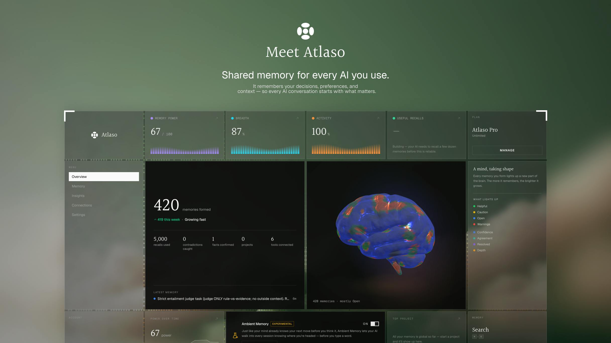
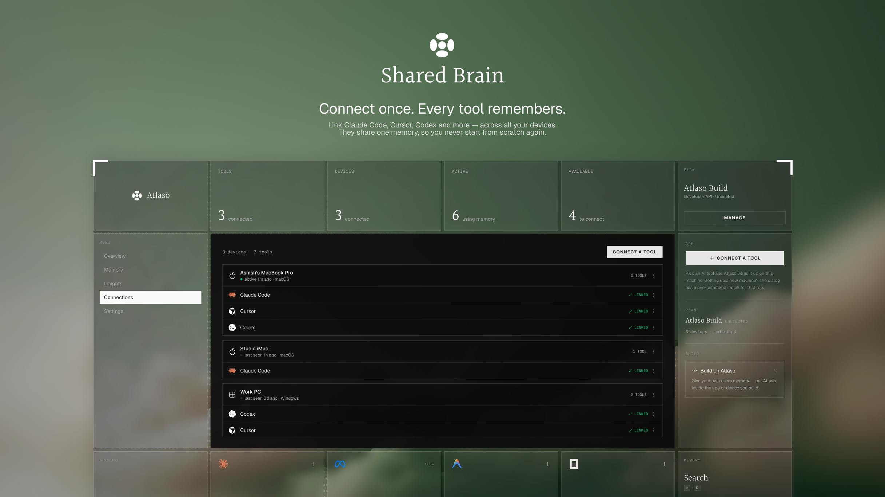
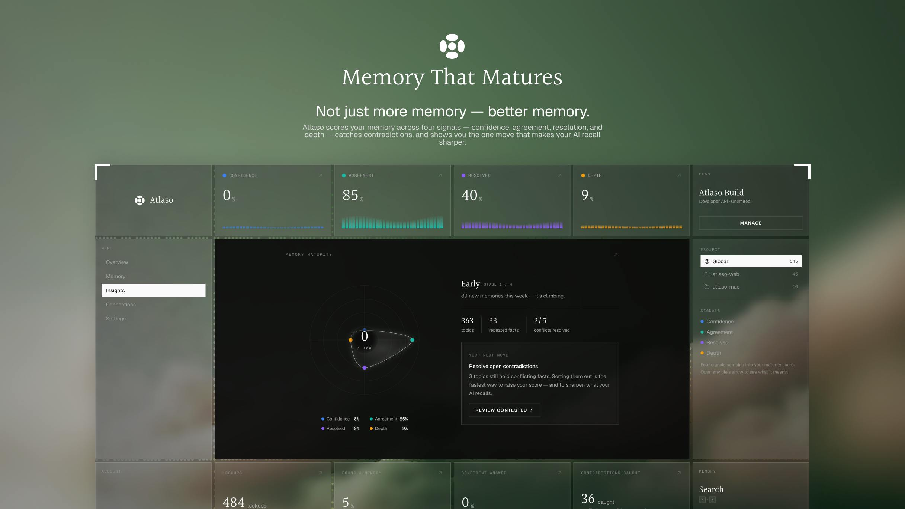

### 🎬 관련 영상
- [🎥 영상 보기](https://ph-files.imgix.net/6c6cc851-88c9-4648-801d-8b44de081671.jpeg?auto=format)

---

## 4. [Driven](https://www.producthunt.com/products/driven-ai)
**Votes**: 175 | **도입 난이도**: 상 | **신뢰도**: 상
**Tagline**: The trusted AI investment agent, from insight to action
**서비스 링크**: https://www.producthunt.com/r/MXO3Z3S6LROVGP

**태그**: AI, Investment, Automation, FinTech, Workflow, Agent, AI Tool, API

### 📌 이 서비스 한눈에 보기
시장 분석부터 주문 실행까지 투자 전 과정을 통합 관리하는 AI 투자 에이전트

### 🔑 주요 기능
- 260개 이상의 API와 커스텀 스킬을 결합한 통합 워크스페이스 제공
- 단순 정보 제공을 넘어 아이디어 생성부터 주문 실행까지의 워크플로우 지원
- 24/7 모니터링 및 스케줄링 기능을 통한 자동화된 투자 환경 구축

### 🙋 사용자에게 어떤 점이 좋은가
여러 도구를 번갈아 사용할 필요 없이 하나의 플랫폼에서 데이터 수집, 분석, 실행을 모두 처리할 수 있어 투자 효율성이 극대화됩니다.

### ✅ 지금 바로 써볼 기능
- 260+ API 연동을 통한 데이터 소스 통합
- Playbook 및 스케줄링 기능을 활용한 자동화 워크플로우 설정
- 실시간 모니터링 및 포트폴리오 관리 기능 테스트

### ⚠️ 사용 전 확인할 점
- 투자 실행(Order workflows) 기능이 포함되어 있으므로 계정 보안 및 권한 관리에 주의 필요
- 복잡한 워크플로우 설정 및 API 연동을 위한 숙련도 요구

### 🧭 확인이 더 필요한 정보
실제 주문 실행 시의 보안 프로토콜과 지원하는 거래소/브로커의 범위를 확인해야 합니다.

### 📸 스크린샷 및 갤러리
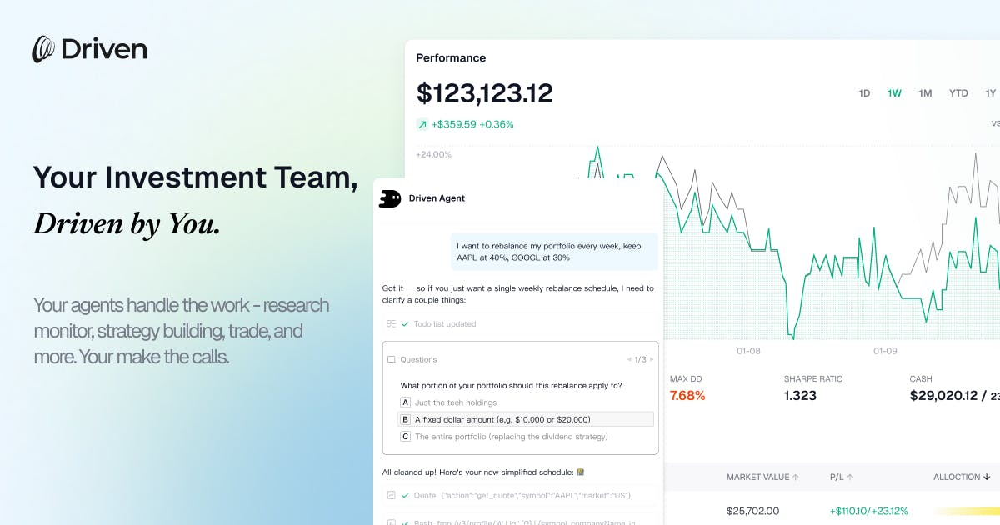
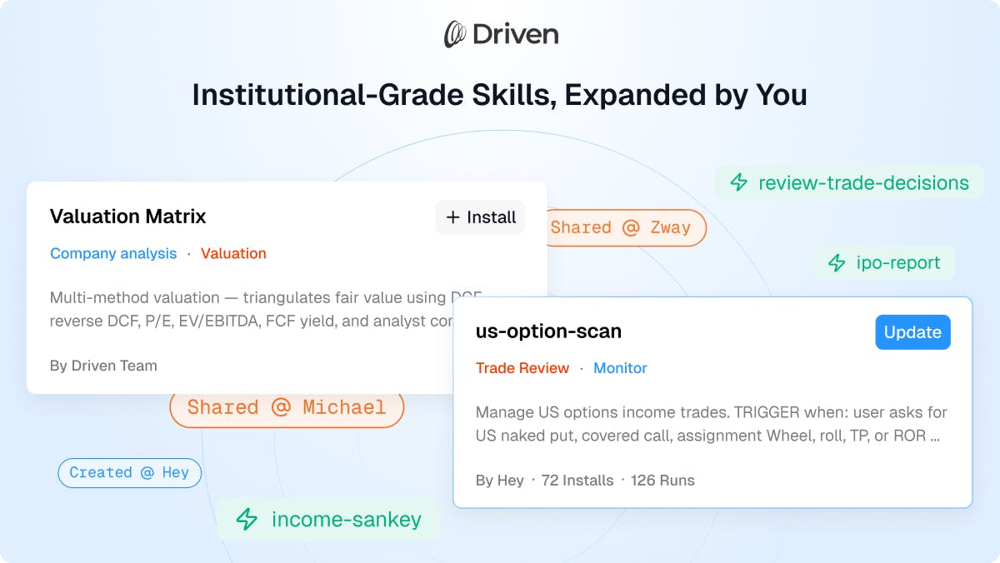
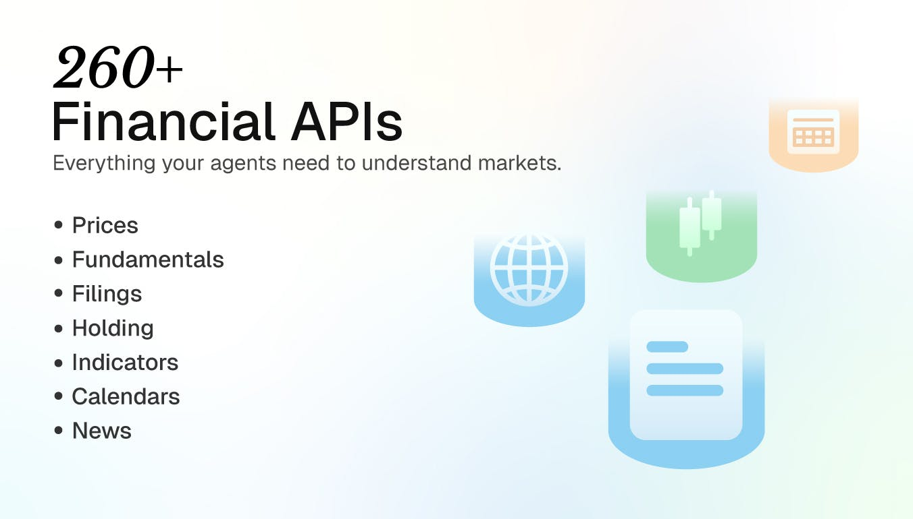

### 🎬 관련 영상
- [🎥 영상 보기](https://ph-files.imgix.net/4ff11189-1053-4897-a9ed-8d247c452ed7.jpeg?auto=format)

---

## 5. [Dashi Metrics](https://www.producthunt.com/products/dashi-metrics)
**Votes**: 159 | **도입 난이도**: 하 | **신뢰도**: 상
**Tagline**: Visualize your revenue on a 3D globe
**서비스 링크**: https://www.producthunt.com/r/MEYNOM2EOWKKZN

**태그**: Analytics, DataViz, SaaS, BusinessIntelligence

### 📌 이 서비스 한눈에 보기
전 세계 매출과 방문자 데이터를 역동적인 3D 지구본으로 시각화하는 실시간 분석 도구

### 🔑 주요 기능
- 실시간 결제 및 방문자 데이터를 3D 지구본에 매핑
- 정적인 대시보드를 넘어선 인터랙티브한 지리적 시각화 제공
- 글로벌 비즈니스 트렌드와 고객 활동을 직관적으로 파악 가능

### 🙋 사용자에게 어떤 점이 좋은가
지루한 차트 대신 시각적으로 매력적인 대시보드를 통해 글로벌 고객 분포와 매출 흐름을 한눈에 파악할 수 있습니다.

### ✅ 지금 바로 써볼 기능
- 실시간 데이터 매핑 기능 확인
- 3D 지구본 인터랙션(회전, 확대) 테스트
- 지리적 데이터 시각화 레이아웃 탐색

### ⚠️ 사용 전 확인할 점
- 데이터 소스(결제/방문자)와의 연동 방식 확인 필요
- 상세 수치 분석보다는 시각적 트렌드 파악에 특화되어 있음

### 🧭 확인이 더 필요한 정보
어떤 외부 데이터 소스(Stripe, Google Analytics 등)와 연동되는지 명시되어 있지 않습니다.

### 📸 스크린샷 및 갤러리

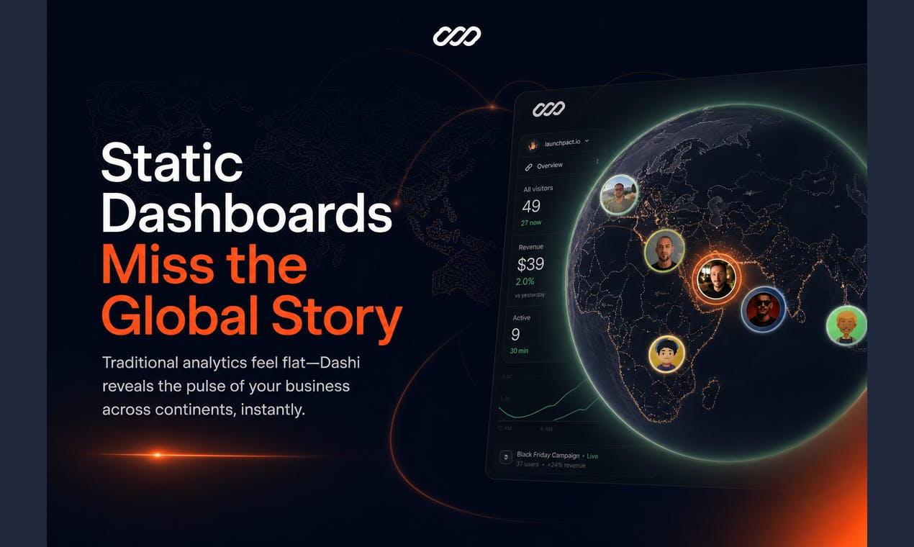
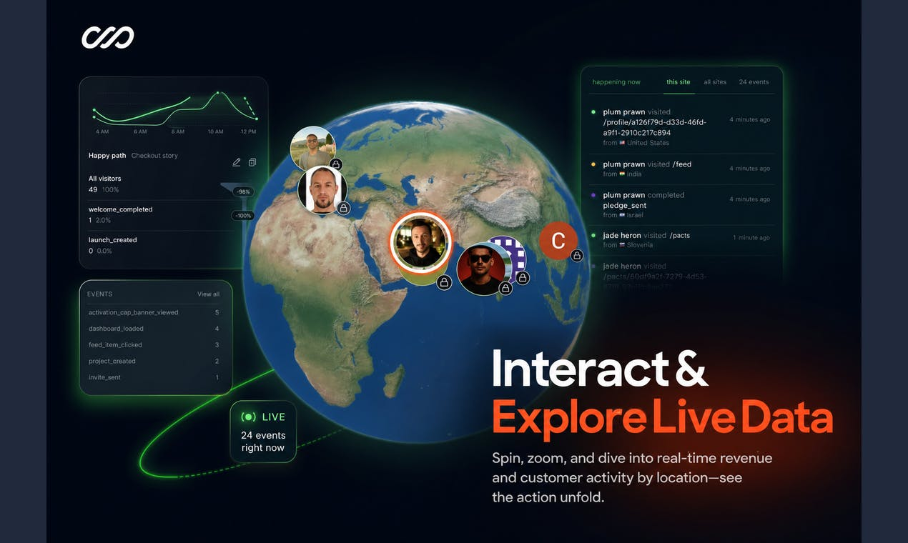

### 🎬 관련 영상
- [🎥 영상 보기](https://ph-files.imgix.net/49597835-f143-49f8-93a5-7e060ebb74ea.jpeg?auto=format)

---

## 6. [Vibe Buddy](https://www.producthunt.com/products/vibe-buddy)
**Votes**: 131 | **도입 난이도**: 중 | **신뢰도**: 상
**Tagline**: Hardware for AI coding
**서비스 링크**: https://www.producthunt.com/r/7Y3DVMWTPWVNJY

**태그**: DevTool, Hardware, AI-Coding, Productivity, AI Tool

### 📌 이 서비스 한눈에 보기
AI 코딩 작업 상태를 실시간으로 보여주는 데스크톱 로봇 하드웨어

### 🔑 주요 기능
- Codex 및 Claude Code 사용량 제한 상태 시각화
- AI 작업 진행 상황 및 작업 완료 여부 실시간 확인
- 브라우저 탭을 열지 않고도 작업 상태를 즉시 파악 가능

### 🙋 사용자에게 어떤 점이 좋은가
코딩 중 별도의 탭을 확인하는 흐름 끊김을 방지하고, AI의 작업 상태를 직관적으로 파악하여 작업 효율을 높여줍니다.

### ✅ 지금 바로 써볼 기능
- 데스크톱 환경에 배치하여 시각적 피드백 확인
- AI 도구(Codex, Claude Code)와의 연동 설정
- 사용량 제한 알림 기능 테스트

### ⚠️ 사용 전 확인할 점
- 하드웨어 장치이므로 물리적 데스크 공간이 필요함
- 지원하는 AI 도구 및 API 연동 범위 확인 필요

### 🧭 확인이 더 필요한 정보
구체적인 하드웨어 사양 및 지원하는 AI 서비스의 전체 목록이 명시되지 않았습니다.

### 📸 스크린샷 및 갤러리

### 🎬 관련 영상
- [🎥 영상 보기](https://ph-files.imgix.net/199e71f3-6c84-4b89-9cab-75911e9aa60c.jpeg?auto=format)

---

## 7. [Screen Awesome ](https://www.producthunt.com/products/screen-awesome-record-annotate)
**Votes**: 122 | **도입 난이도**: 하 | **신뢰도**: 상
**Tagline**: The free screen recorder that cannot upload your video
**서비스 링크**: https://www.producthunt.com/r/EGH3SRBAZ4GFQK

**태그**: Productivity, Privacy, Screen-Recorder, Free, Video

### 📌 이 서비스 한눈에 보기
개인정보 유출 걱정 없이 안전하게 사용할 수 있는 완전 무료 오픈형 화면 녹화 도구

### 🔑 주요 기능
- 크롬 자체 보안 정책을 활용하여 서버 업로드가 불가능한 초강력 개인정보 보호
- 워터마크, 계정 생성, 유료 결제 없는 완전 자유로운 기능 제공
- 화면 녹화, 스크린샷, 벡터 기반 주석(화살표, 블러, 텍스트 등) 통합 지원

### 🙋 사용자에게 어떤 점이 좋은가
민감한 화면을 녹화해야 하지만 클라우드 서버에 영상이 남는 것이 불안한 사용자에게 최적의 보안 솔루션을 제공합니다.

### ✅ 지금 바로 써볼 기능
- 탭, 전체 화면 또는 카메라 녹화 기능 테스트
- 클릭 시 따라가는 자동 줌(Auto-zoom) 기능 활용
- 편집 가능한 벡터 주석 및 블러 기능을 통한 가이드 제작

### ⚠️ 사용 전 확인할 점
- 서버 업로드가 차단되어 있으므로 클라우드 저장/공유 기능은 사용할 수 없음
- 로컬 파일로만 저장되므로 수동으로 파일을 관리해야 함

### 🧭 확인이 더 필요한 정보
사용자의 로컬 환경(OS/브라우저)에 따른 저장 용량 및 성능 제한 여부는 명시되지 않았습니다.

### 📸 스크린샷 및 갤러리

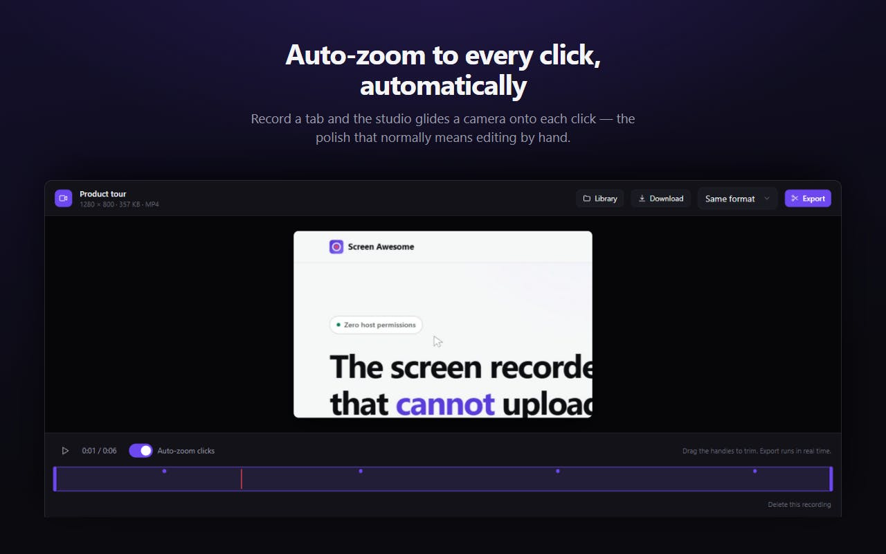

---

## 8. [ZapDigits MCP](https://www.producthunt.com/products/zapdigits)
**Votes**: 113 | **도입 난이도**: 중 | **신뢰도**: 상
**Tagline**: The MCP server for marketing data
**서비스 링크**: https://www.producthunt.com/r/NTSETTC4L3HCIH

**태그**: Marketing, AI, Automation, Analytics, Data, Chat

### 📌 이 서비스 한눈에 보기
Claude와 ChatGPT를 구글 애널리틱스 등 마케팅 데이터 소스에 직접 연결하는 MCP 서버

### 🔑 주요 기능
- Claude 및 ChatGPT와 마케팅 데이터 소스 간의 직접 연결 지원
- Google Analytics, Search Console, Meta Ads 등 30개 이상의 데이터 소스 통합
- AI 모델을 활용한 실시간 마케팅 데이터 분석 환경 구축

### 🙋 사용자에게 어떤 점이 좋은가
마케팅 데이터를 수동으로 복사하여 AI에 붙여넣을 필요 없이, 대화형 AI를 통해 즉각적인 데이터 분석과 인사이트 도출이 가능해집니다.

### ✅ 지금 바로 써볼 기능
- MCP 서버를 Claude/ChatGPT 환경에 설정하기
- Google Analytics 및 Meta Ads 계정 연동하기
- AI를 활용한 마케팅 성과 분석 질문 던지기

### ⚠️ 사용 전 확인할 점
- 데이터 소스별 API 권한 및 보안 설정 확인 필요
- AI 모델의 데이터 해석 오류 가능성 검토 필요

### 🧭 확인이 더 필요한 정보
30개 이상의 데이터 소스에 대한 구체적인 목록과 각 소스별 연동 방식은 추가 확인이 필요합니다.

### 📸 스크린샷 및 갤러리
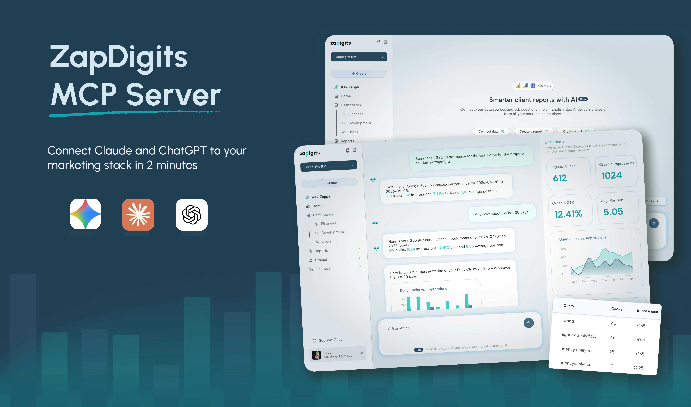
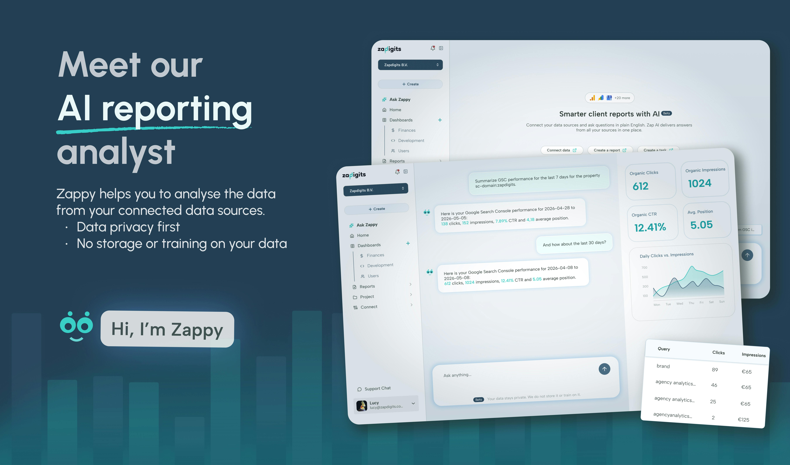
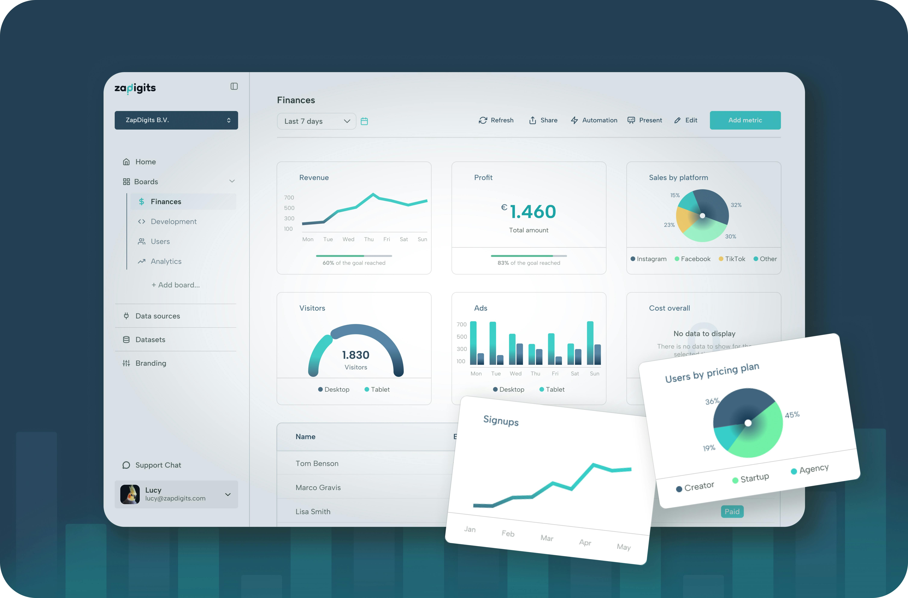

### 🎬 관련 영상
- [🎥 영상 보기](https://ph-files.imgix.net/10e14a38-a46b-4d43-baf5-5d0887b1fff3.jpeg?auto=format)

---

## 9. [VIDEO AI ME](https://www.producthunt.com/products/video-ai-me)
**Votes**: 108 | **도입 난이도**: 하 | **신뢰도**: 상
**Tagline**: Make videos and post them everywhere with just one tool
**서비스 링크**: https://www.producthunt.com/r/HUEUUOMQH4YCYI

**태그**: AI, VideoGen, Automation, Marketing, SocialMedia, AI Tool, Video

### 📌 이 서비스 한눈에 보기
AI 영상 생성부터 15개 플랫폼 자동 게시까지 한 번에 해결하는 올인원 영상 마케팅 툴

### 🔑 주요 기능
- AI를 활용한 UGC 광고 및 제품 홍보 영상 자동 생성
- TikTok, Instagram, YouTube 등 15개 플랫폼에 즉시 게시 및 예약 기능
- 플랫폼별 맞춤형 캡션 자동 작성 및 대량 스케줄링 지원

### 🙋 사용자에게 어떤 점이 좋은가
영상 제작과 업로드 과정을 하나의 워크플로우로 통합하여, 콘텐츠 제작부터 배포까지 걸리는 시간을 획기적으로 단축할 수 있습니다.

### ✅ 지금 바로 써볼 기능
- AI를 이용한 제품 홍보 영상 생성해보기
- 15개 플랫폼 대상 대량 스케줄링 설정하기
- 플랫폼별 성과 확인 후 AI로 변형 버전 생성하기

### ⚠️ 사용 전 확인할 점
- AI 생성 영상의 품질이 브랜드 가이드라인과 일치하는지 확인 필요
- 플랫폼별 알고리즘 특성에 따른 캡션 최적화 검토 필요

### 🧭 확인이 더 필요한 정보
플랫폼별 API 연동 안정성 및 생성된 영상의 저작권 귀속 여부에 대한 확인이 필요합니다.

### 📸 스크린샷 및 갤러리
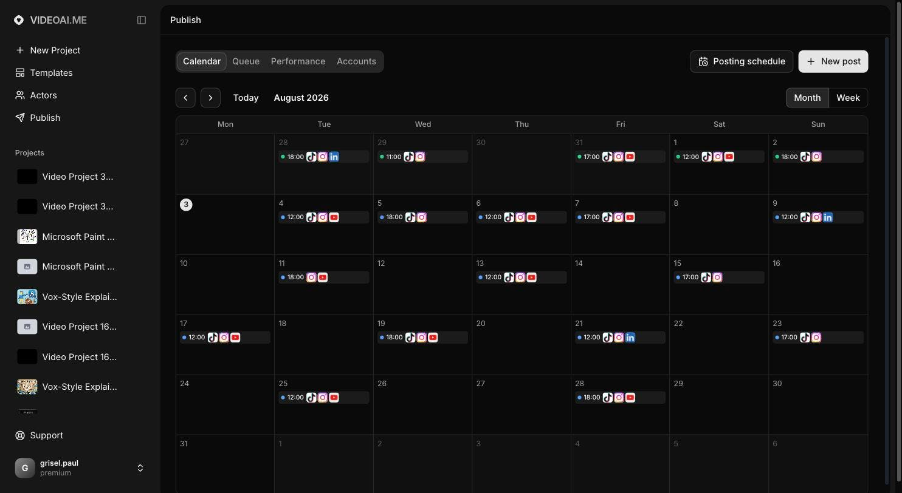
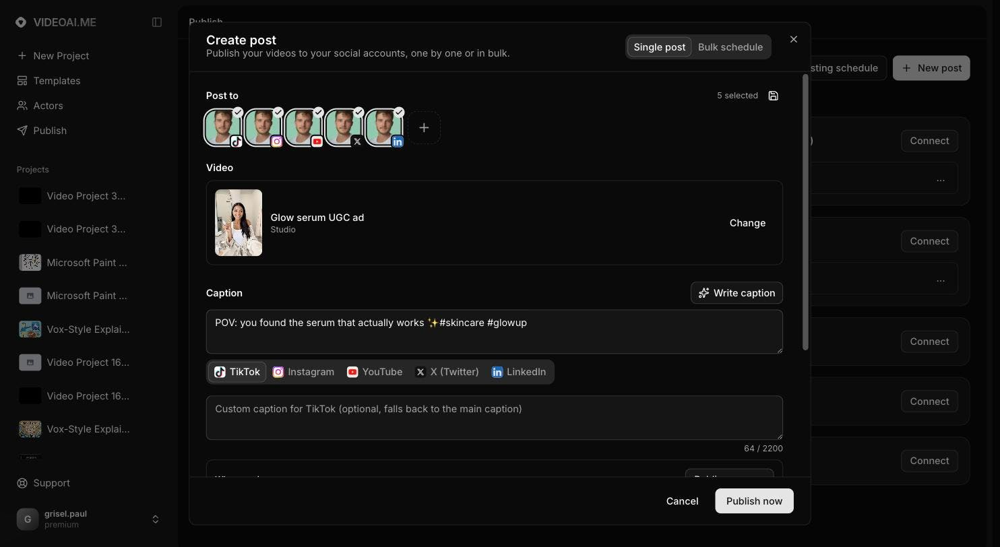
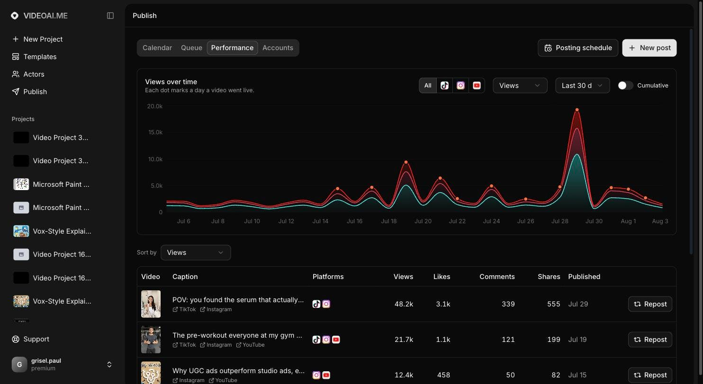

### 🎬 관련 영상
- [🎥 영상 보기](https://ph-files.imgix.net/059bb0c3-68d0-490c-8795-27939ebfe4a9.jpeg?auto=format)

---

## 10. [GrowthBook 5.0](https://www.producthunt.com/products/growthbook)
**Votes**: 103 | **도입 난이도**: 중 | **신뢰도**: 상
**Tagline**: Build, ship, and improve at scale
**서비스 링크**: https://www.producthunt.com/r/A7P4WVTQVF6XBR

**태그**: AI, ProductAnalytics, Experimentation, DevTool, NoCode, Agent, Automation, AI Tool, Analytics

### 📌 이 서비스 한눈에 보기
AI와 데이터 웨어하우스를 결합하여 실험과 분석을 자동화하는 올인원 제품 성장 플랫폼

### 🔑 주요 기능
- AI Visual Editor를 통한 노코드 실험 환경 제공
- 25개의 오픈소스 스킬을 갖춘 AI 에이전트 기반의 플래그 및 실험 초안 작성
- 데이터 웨어하우스 네이티브 방식으로 빠르고 강력한 분석 및 거버넌스 지원

### 🙋 사용자에게 어떤 점이 좋은가
아이디어 구상부터 실험, 데이터 분석까지의 워크플로우를 단축하여 팀이 더 빠르게 제품을 개선할 수 있게 돕습니다.

### ✅ 지금 바로 써볼 기능
- AI Visual Editor로 노코드 실험 설계해보기
- AI Assistant를 활용한 제품 데이터 탐색
- AI 에이전트를 통한 실험 워크플로우 자동화 설정

### ⚠️ 사용 전 확인할 점
- 데이터 웨어하우스 연동 환경에 따른 초기 설정 복잡도 확인 필요
- AI 자동화 기능의 결과물에 대한 검토 프로세스 필요

### 🧭 확인이 더 필요한 정보
사용자의 기존 데이터 웨어하우스 스택과의 호환성 및 구체적인 연동 방식 확인이 필요합니다.

### 📸 스크린샷 및 갤러리
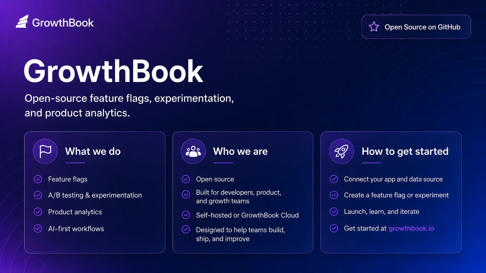
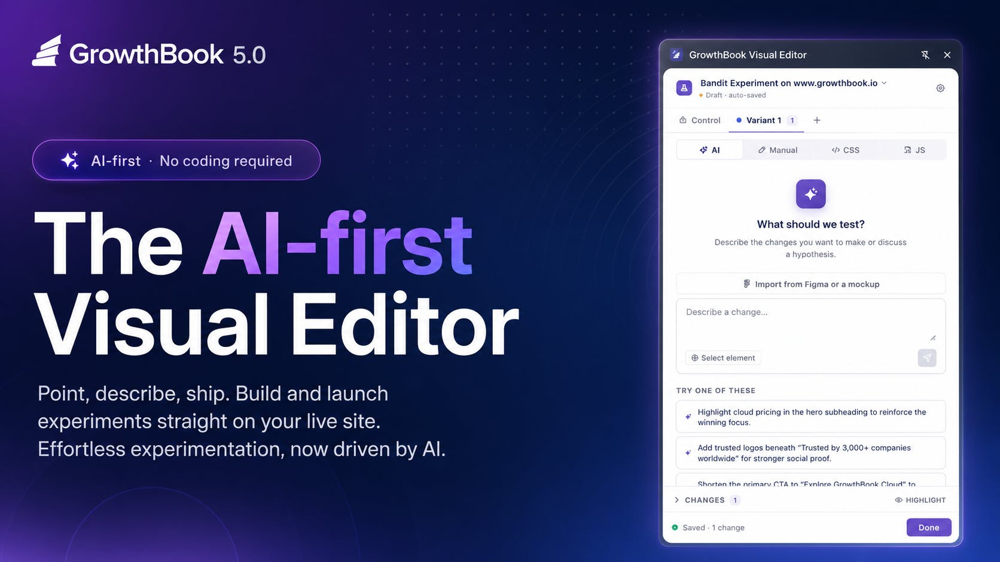
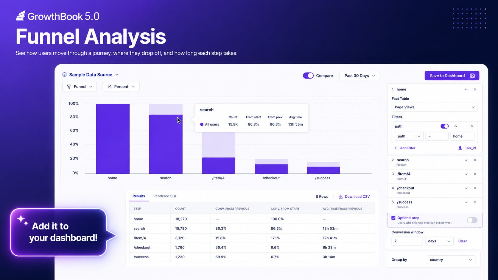

### 🎬 관련 영상
- [🎥 영상 보기](https://ph-files.imgix.net/c276c0b2-d772-4010-8413-e3343513b915.jpeg?auto=format)

---

## 11. [Glasp MCP Connector](https://www.producthunt.com/products/glasp-mcp-connector)
**Votes**: 100 | **도입 난이도**: 중 | **신뢰도**: 상
**Tagline**: Search your highlights and notes inside Claude and ChatGPT
**서비스 링크**: https://www.producthunt.com/r/KKH5WDVKOVKGDG

**태그**: AI, Productivity, KnowledgeManagement, Automation, AI Tool, Chat

### 📌 이 서비스 한눈에 보기
Claude와 ChatGPT 내에서 자신의 Glasp 하이라이트와 메모를 즉시 검색할 수 있는 MCP 커넥터

### 🔑 주요 기능
- Glasp 데이터를 Claude 및 ChatGPT와 연결하는 MCP 서버 기능
- 자연어 질의를 통한 개인화된 하이라이트 및 메모 검색
- 읽기 전용(Read-only) 방식의 프라이버시 보호

### 🙋 사용자에게 어떤 점이 좋은가
AI 어시스턴트와 대화하는 도중 별도의 창을 열지 않고도 자신이 저장해둔 지식을 즉시 활용할 수 있어 작업 흐름이 끊기지 않습니다.

### ✅ 지금 바로 써볼 기능
- MCP 서버 설정을 통한 AI 어시스턴트 연결
- 자연어로 과거 하이라이트 정보 질문하기
- 수집된 메모를 바탕으로 AI와 새로운 아이디어 브레인스토밍하기

### ⚠️ 사용 전 확인할 점
- MCP 서버 설정 및 환경 구축에 대한 기술적 이해 필요
- 읽기 전용 기능이므로 AI를 통한 메모 수정은 불가능할 수 있음

### 🧭 확인이 더 필요한 정보
사용자의 로컬 환경이나 특정 AI 클라이언트에서의 구체적인 설치 과정 및 호환성 확인이 필요합니다.

### 📸 스크린샷 및 갤러리

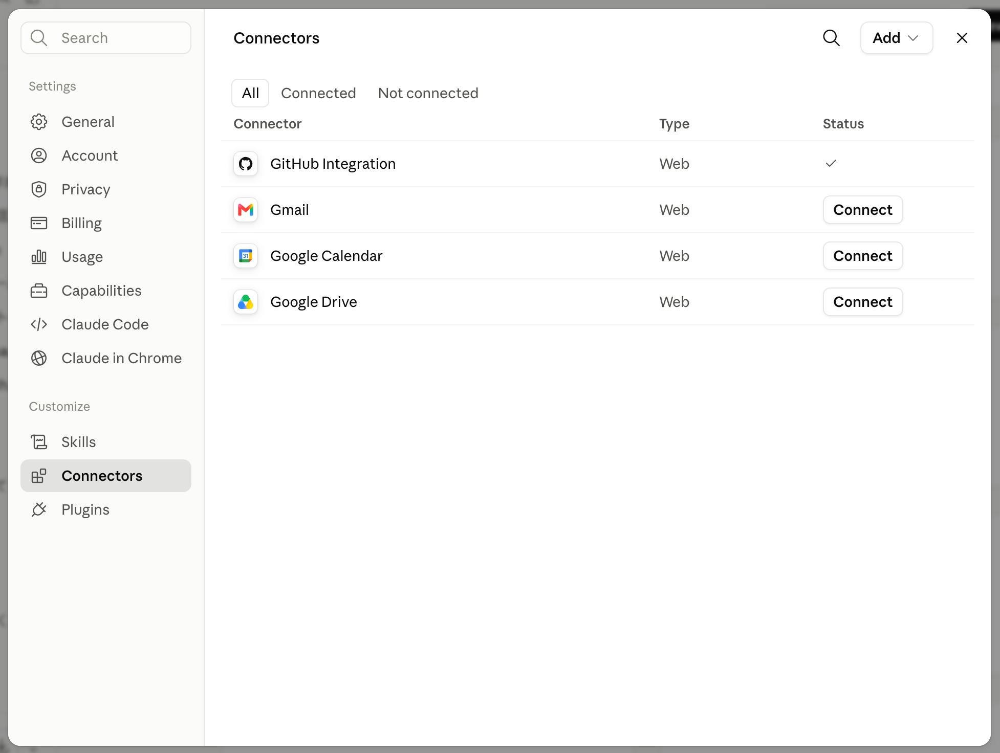
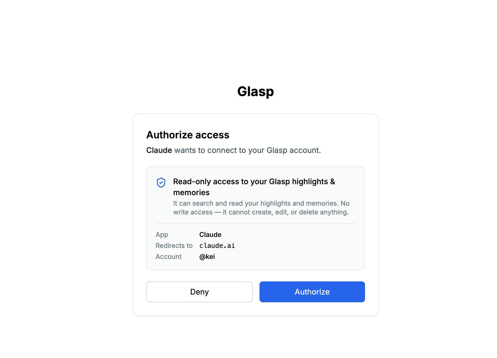

---

## 12. [space ocr](https://www.producthunt.com/products/space-ocr)
**Votes**: 96 | **도입 난이도**: 하 | **신뢰도**: 상
**Tagline**: OCR that checks its own answers, as an app or an API
**서비스 링크**: https://www.producthunt.com/r/TKOWFW5POXEFTU

**태그**: Automation, OCR, Productivity, SaaS, API

### 📌 이 서비스 한눈에 보기
영수증과 송장을 데이터 테이블로 자동 변환하고 검증하는 지능형 OCR 서비스

### 🔑 주요 기능
- 이미지 내 데이터를 필터링 및 정렬 가능한 테이블 형식으로 변환
- 자체 검증 기능을 통해 데이터의 정확도 확보
- 앱 인터페이스와 API를 모두 지원하여 유연한 활용 가능

### 🙋 사용자에게 어떤 점이 좋은가
수동으로 입력하던 영수증이나 송장 데이터를 자동화하여 업무 시간을 단축하고, 데이터의 출처를 즉시 확인할 수 있습니다.

### ✅ 지금 바로 써볼 기능
- 영수증/송장 파일을 업로드하여 테이블 변환 테스트하기
- 추출된 데이터의 출처(Source) 일치 여부 확인하기
- API를 통한 자동화 워크플로우 구축 시도하기

### ⚠️ 사용 전 확인할 점
- 월 100페이지까지만 무료로 제공됨
- 복잡한 양식의 문서에 대한 정확도 검증 필요

### 🧭 확인이 더 필요한 정보
문서의 복잡도에 따른 정확도 유지 수준과 API의 상세 기능 범위를 확인해야 합니다.

### 📸 스크린샷 및 갤러리
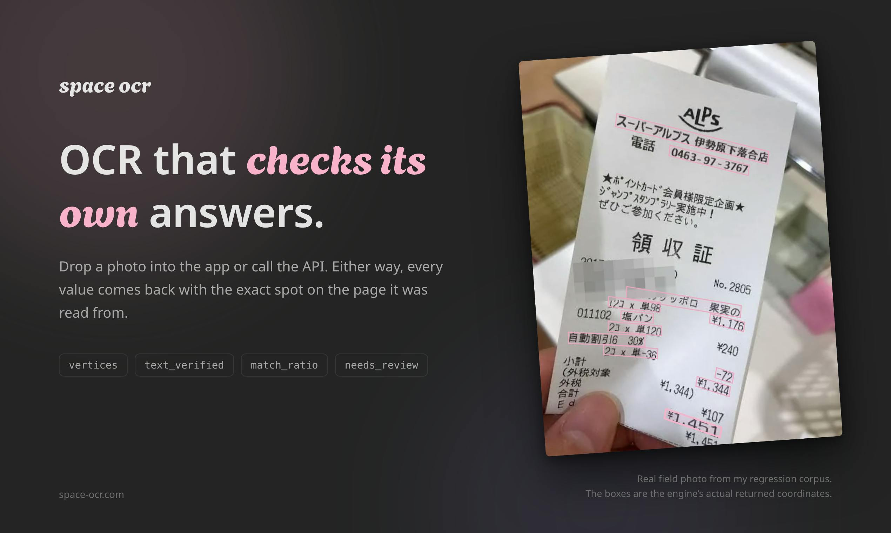
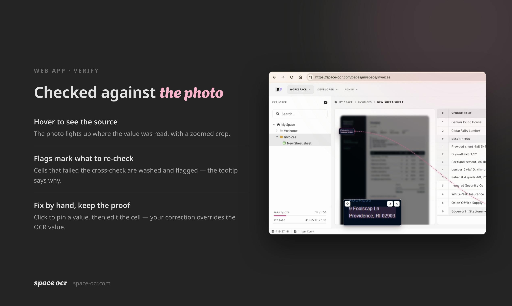
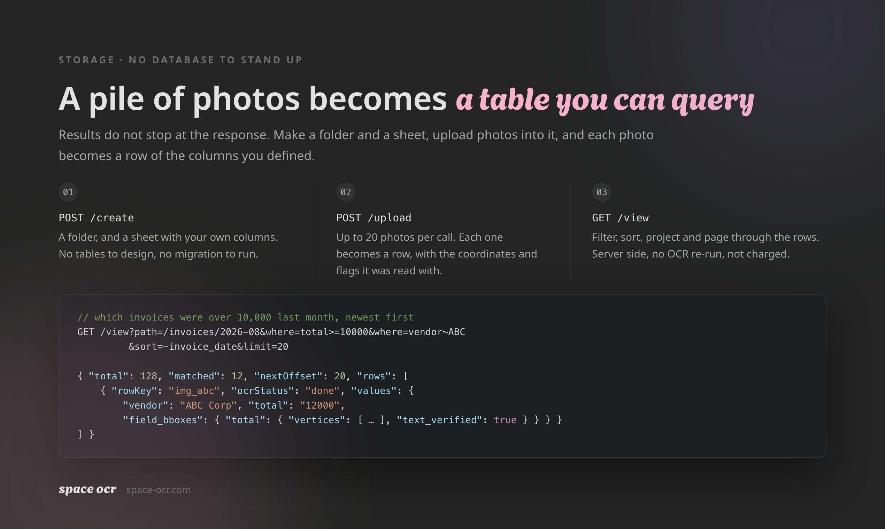

---

## 13. [SpeakoFlow](https://www.producthunt.com/products/speakoflow)
**Votes**: 95 | **도입 난이도**: 중 | **신뢰도**: 상
**Tagline**: Open-source local voice assistant for your desktop
**서비스 링크**: https://www.producthunt.com/r/REGNZIMEQSTKTK

**태그**: Productivity, AI, OpenSource, VoiceAssistant, Automation, AI Tool, Chat, Email

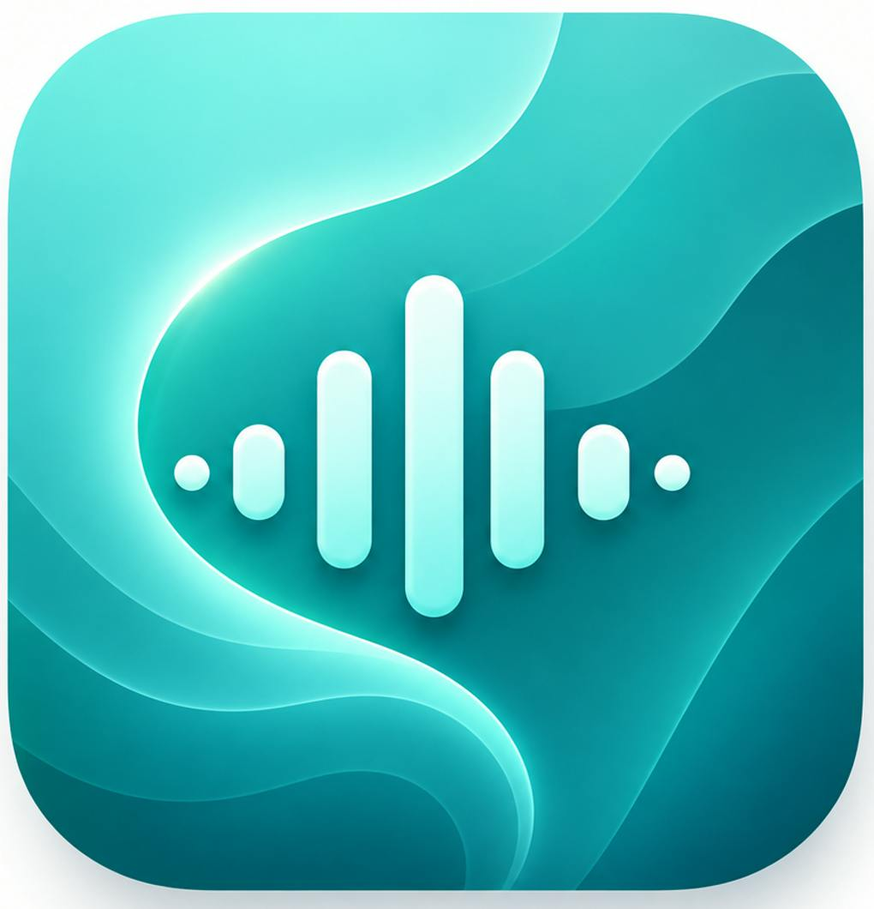

### 📌 이 서비스 한눈에 보기
데스크톱 어디서든 음성으로 타이핑과 업무를 수행하는 오픈소스 로컬 AI 비서

### 🔑 주요 기능
- 모든 앱(이메일, 채팅, 터미널 등)에 음성 입력 가능
- 화면 내용을 바탕으로 답장 초안 작성 및 질문 답변 기능
- 로컬 실행을 통한 프라이버시 보호 및 실시간 음성 인식

### 🙋 사용자에게 어떤 점이 좋은가
키보드 타이핑 대신 말로 모든 작업을 처리할 수 있어 업무 속도를 높이고, 화면 맥락을 이해하는 AI를 통해 복잡한 작업도 쉽게 수행할 수 있습니다.

### ✅ 지금 바로 써볼 기능
- "Hey Flow" 명령어로 화면 내용 기반 답장 생성해보기
- 음성 받아쓰기 및 자동 문장 정제 기능 테스트하기
- 실시간 번역 기능을 활용한 외국어 입력 시도하기

### ⚠️ 사용 전 확인할 점
- 로컬 실행 환경의 하드웨어 사양에 따른 성능 차이 발생 가능
- 데스크톱 전체 권한이 필요하므로 보안 설정 확인 필요

### 🧭 확인이 더 필요한 정보
사용자의 하드웨어 사양에 따른 로컬 모델의 구동 속도와 정확도를 확인해야 합니다.

### 📸 스크린샷 및 갤러리
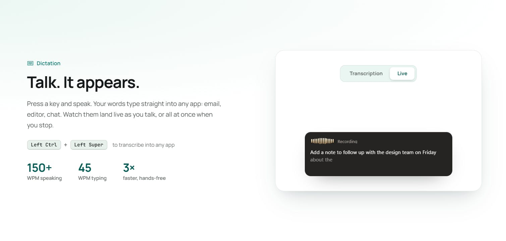
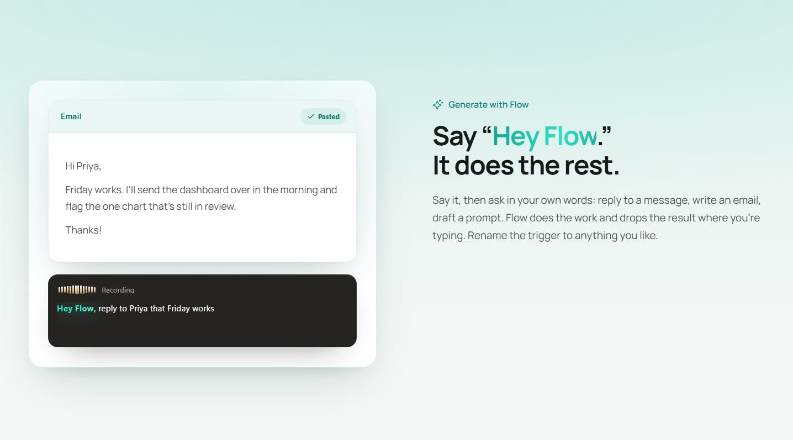
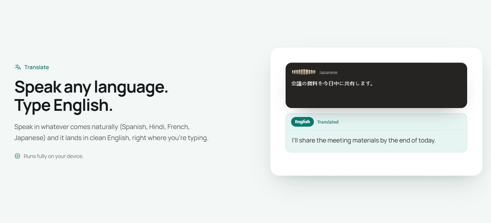

### 🎬 관련 영상
- [🎥 영상 보기](https://ph-files.imgix.net/23783c0f-d5eb-4d65-bcb2-427224a8f5da.jpeg?auto=format)

---

## 14. [Finyuus](https://www.producthunt.com/products/finyuus)
**Votes**: 83 | **도입 난이도**: 중 | **신뢰도**: 상
**Tagline**: A code-first language for durable, governed AI workflows
**서비스 링크**: https://www.producthunt.com/r/VJBOCXXQ7UUYVX

**태그**: AI, DevTool, Workflow, Automation, OpenSource, Agent, AI Tool, Prompting

### 📌 이 서비스 한눈에 보기
코드 기반의 DSL로 신뢰할 수 있는 AI 워크플로우를 구축하고 관리하는 플랫폼

### 🔑 주요 기능
- 들여쓰기 기반의 간결한 DSL을 통한 에이전트 및 도구 구성
- Temporal 기반의 내구성을 갖춘 실행(재시도, 취소, 재생 가능)
- Git 기반의 코드 리뷰 및 버전 관리가 가능한 텍스트 중심 워크플로우

### 🙋 사용자에게 어떤 점이 좋은가
시각적 빌더의 한계를 넘어, 개발자가 코드로 AI 워크플로우를 관리하며 운영 안정성과 협업 효율을 동시에 확보할 수 있습니다.

### ✅ 지금 바로 써볼 기능
- DSL 문법을 통한 에이전트 및 도구 구성 시도
- Temporal 기반의 워크플로우 실행 및 재시도 로직 테스트
- Langfuse를 통한 실행 로그 및 가드 설정 확인

### ⚠️ 사용 전 확인할 점
- 코드 중심 방식이므로 개발자 숙련도에 따라 초기 학습 곡선이 존재할 수 있음
- Temporal 인프라 운영 및 관리 방식에 대한 이해 필요

### 🧭 확인이 더 필요한 정보
제공되는 DSL의 구체적인 문법 수준과 복잡한 로직 구현 시의 제약 사항을 확인해야 합니다.

### 📸 스크린샷 및 갤러리
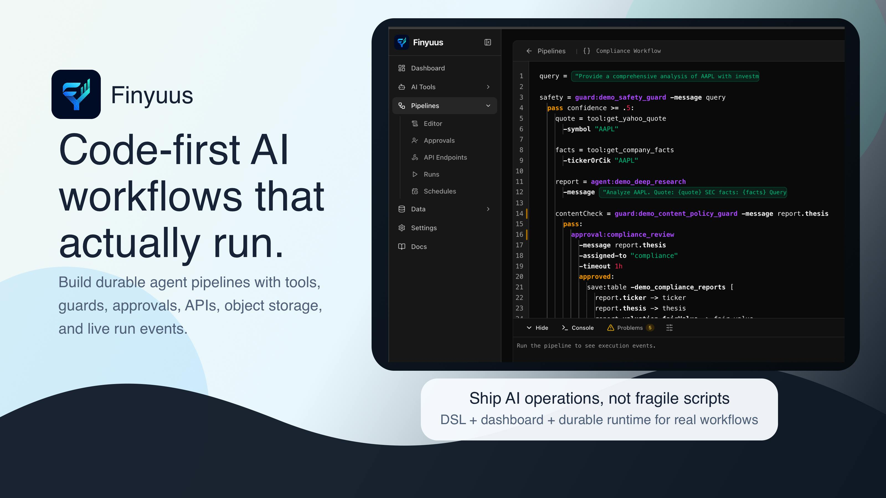
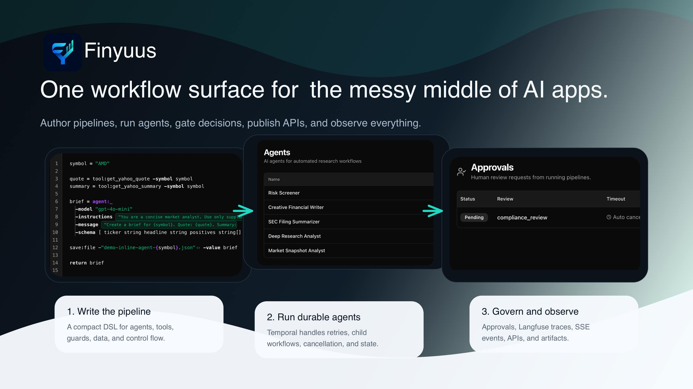
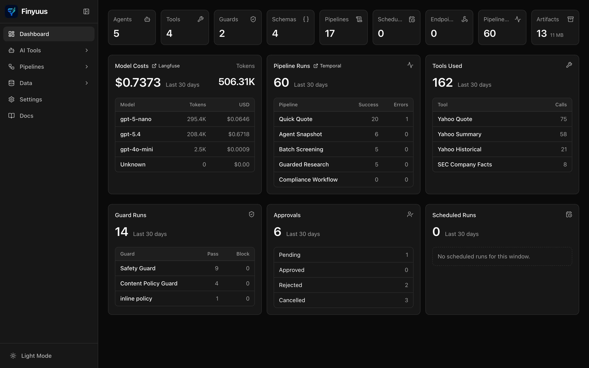

---

## 15. [Yokoso](https://www.producthunt.com/products/yokoso-2)
**Votes**: 81 | **도입 난이도**: 하 | **신뢰도**: 상
**Tagline**: Japanese for the life you're actually living in Japan
**서비스 링크**: https://www.producthunt.com/r/ELDKLGKDXGR6XK

**태그**: LanguageLearning, Japan, Productivity

### 📌 이 서비스 한눈에 보기
일본 현지 실생활에 즉시 활용 가능한 광고 없는 맞춤형 일본어 학습 앱

### 🔑 주요 기능
- 실제 일본 생활에 필요한 표지판, 가격, 문법 등 맥락 중심 학습
- WaniKani 학습 진도 연동 및 오프라인 지원
- 광고, 스트릭(연속 학습 압박), 잠긴 레슨이 없는 자유로운 학습 환경

### 🙋 사용자에게 어떤 점이 좋은가
일본 거주자나 여행자가 현지 상황에 필요한 언어를 학습할 수 있으며, 기존 학습 데이터(WaniKani)를 활용해 효율적인 학습이 가능합니다.

### ✅ 지금 바로 써볼 기능
- WaniKani 계정 연동하여 학습 진도 가져오기
- 오프라인 모드로 이동 중 학습하기
- 실생활 맥락 중심의 콘텐츠 학습하기

### ⚠️ 사용 전 확인할 점
- 학습 데이터 연동 시 기존 학습 진도와의 정합성 확인 필요
- 현지 실생활 중심이므로 기초 문법 체계 학습에는 한계가 있을 수 있음

### 🧭 확인이 더 필요한 정보
WaniKani 외의 다른 학습 플랫폼과의 연동 가능 여부는 명시되지 않았습니다.

### 📸 스크린샷 및 갤러리

---

## 16. [Snipplet](https://www.producthunt.com/products/snipplet)
**Votes**: 79 | **도입 난이도**: 하 | **신뢰도**: 상
**Tagline**: Create and share beautiful guides from places you love
**서비스 링크**: https://www.producthunt.com/r/4UQX2DNCTZXB7M

**태그**: Travel, Design, Productivity, Sharing, AI Tool

### 📌 이 서비스 한눈에 보기
직접 가본 소중한 장소들을 아름다운 비주얼 가이드로 만들어 공유하는 서비스

### 🔑 주요 기능
- 방문했던 장소의 사진과 팁을 담은 시각적 가이드 제작
- 커스텀 폰트, 색상, 스티커 등을 활용한 나만의 테마 디자인
- 스크린샷을 활용한 AI 자동 가이드 생성 기능

### 🙋 사용자에게 어떤 점이 좋은가
파편화된 스크린샷이나 복잡한 문서 대신, 나만의 취향이 담긴 세련된 여행/장소 가이드를 쉽고 빠르게 만들 수 있습니다.

### ✅ 지금 바로 써볼 기능
- 가장 좋아하는 장소의 스크린샷을 넣어 AI 가이드 생성해보기
- 나만의 테마와 스티커로 가이드 디자인 꾸미기
- 완성된 가이드를 친구들에게 링크로 공유하기

### ⚠️ 사용 전 확인할 점
- 플랫폼의 모바일 앱 지원 여부 확인 필요
- AI 생성 기능의 상세 편집 범위 확인 필요

### 🧭 확인이 더 필요한 정보
현재 제공되는 커스텀 테마 기능의 상세 범위와 AI 자동 생성의 정교함에 대한 구체적인 정보가 부족합니다.

### 📸 스크린샷 및 갤러리

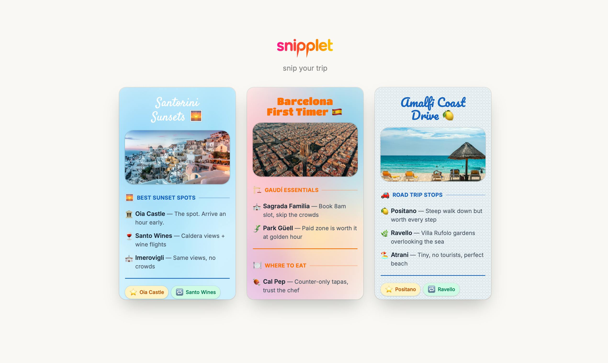
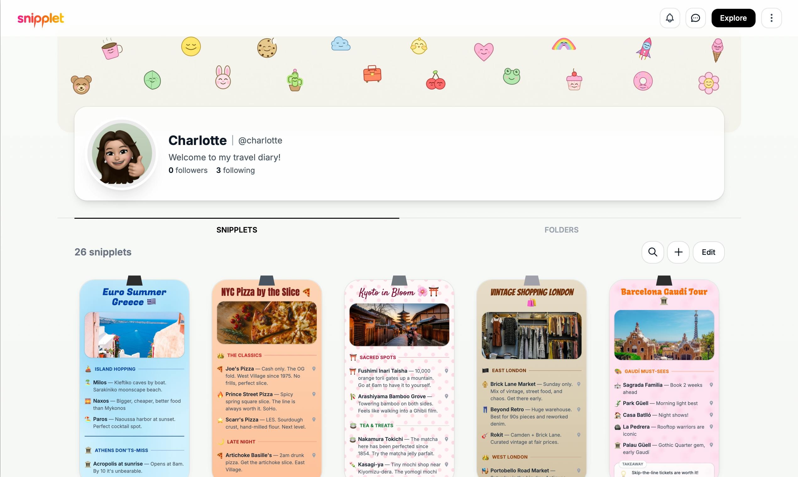

### 🎬 관련 영상
- [🎥 영상 보기](https://ph-files.imgix.net/0c0c78dd-51fb-4a84-afdc-8bdac1d65cab.jpeg?auto=format)

---

## 17. [MOTHER ](https://www.producthunt.com/products/mother-claude-code-terminal)
**Votes**: 78 | **도입 난이도**: 하 | **신뢰도**: 상
**Tagline**: A terminal built for Claude Code w/ one-click session resume
**서비스 링크**: https://www.producthunt.com/r/UZAS7FWHFY4RQ7

**태그**: DevTool, macOS, AI-Agent, Productivity

### 📌 이 서비스 한눈에 보기
Claude Code 사용자를 위한 macOS 전용 터미널 및 세션 관리 도구

### 🔑 주요 기능
- Claude Code에 최적화된 네이티브 macOS 터미널
- 원클릭 세션 재개(Resume) 기능 제공
- Claude의 작업 상태를 알려주는 메뉴 바 알림 기능

### 🙋 사용자에게 어떤 점이 좋은가
Claude Code를 활용한 개발 워크플로우를 터미널 환경에 통합하여 작업 흐름을 끊김 없이 유지할 수 있습니다.

### ✅ 지금 바로 써볼 기능
- 원클릭 세션 재개 기능 테스트
- 프로젝트 런처 기능 활용
- 메뉴 바 알림 설정 확인

### ⚠️ 사용 전 확인할 점
- macOS 전용 앱이므로 다른 OS에서는 사용 불가
- 유료 서비스($9.99)이므로 구매 전 기능 확인 필요

### 🧭 확인이 더 필요한 정보
Claude Code와의 구체적인 연동 방식 및 추가적인 커스텀 기능 여부는 명시되지 않았습니다.

### 📸 스크린샷 및 갤러리
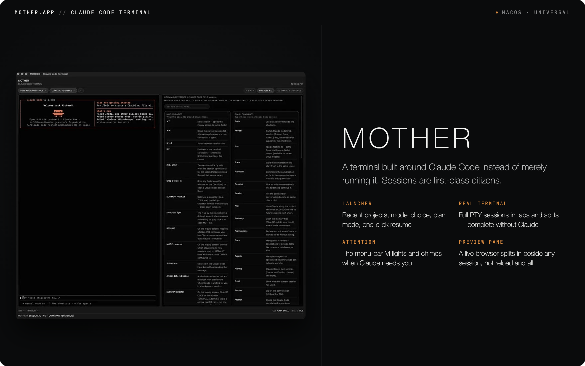

### 🎬 관련 영상
- [🎥 영상 보기](https://ph-files.imgix.net/33ebac14-7d7c-4c87-bb97-e9531d85dd7c.jpeg?auto=format)

---

## 18. [Domo](https://www.producthunt.com/products/domo-a-claude-agent-for-your-calendar)
**Votes**: 77 | **도입 난이도**: 상 | **신뢰도**: 상
**Tagline**: Build and customize your own calendar agent you can text
**서비스 링크**: https://www.producthunt.com/r/E5MDACMFXICLVX

**태그**: Automation, Productivity, AI-Agent, Calendar, Agent, DevTool, API

### 📌 이 서비스 한눈에 보기
문자나 iMessage로 간편하게 일정을 관리하는 맞춤형 캘린더 에이전트

### 🔑 주요 기능
- 전용 전화번호를 통한 문자/iMessage 기반의 직관적인 일정 등록
- Claude 구독을 활용하여 별도의 API 비용 없이 운영 가능
- 가족용 대시보드 및 커스텀 가능한 에이전트 패턴 제공

### 🙋 사용자에게 어떤 점이 좋은가
복잡한 앱 조작 없이 메시지만 보내면 일정이 관리되며, 기존 Claude 구독을 활용해 추가 비용 부담 없이 스마트한 일정 관리가 가능합니다.

### ✅ 지금 바로 써볼 기능
- 전용 번호로 일정 추가 메시지 보내기
- 가족용 월 대시보드 설정하기
- 코딩 에이전트를 활용한 설치 가이드 실행하기

### ⚠️ 사용 전 확인할 점
- 코딩 에이전트를 통한 설치 과정이 필요하여 기술적 숙련도가 요구됨
- 기존 Claude 구독 환경에 의존적임

### 🧭 확인이 더 필요한 정보
설치 과정이 코딩 에이전트 중심이므로 일반 사용자의 직접 설치 난이도를 확인해야 합니다.

### 📸 스크린샷 및 갤러리
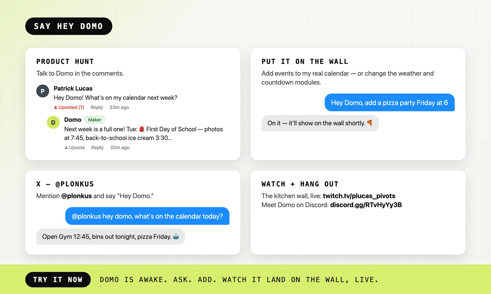
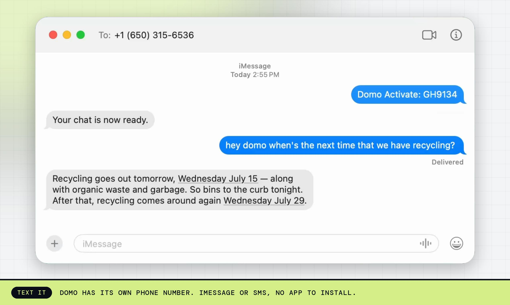
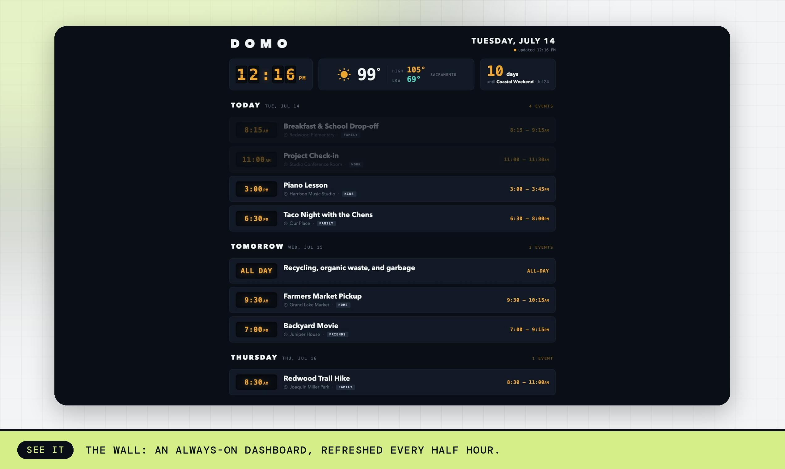

### 🎬 관련 영상
- [🎥 영상 보기](https://ph-files.imgix.net/2294f515-31a1-4444-a144-ea7474937491.jpeg?auto=format)

---

## 19. [Tixio 3.0](https://www.producthunt.com/products/tixio-io)
**Votes**: 74 | **도입 난이도**: 하 | **신뢰도**: 상
**Tagline**: Start meetings from chat
**서비스 링크**: https://www.producthunt.com/r/DKJVGQ6PUSV55G

**태그**: Productivity, Collaboration, ProjectManagement, SaaS, AI Tool, Chat

### 📌 이 서비스 한눈에 보기
채팅창에서 즉시 미팅을 시작하고 업무를 관리하는 올인원 워크스페이스

### 🔑 주요 기능
- 채팅창 내에서 즉시 미팅 시작 가능 (탭 전환 최소화)
- 태스크, 채팅, 문서, 미팅을 하나로 통합한 워크스페이스
- 스프린트 리포트 및 타임 트래킹 기능 내장

### 🙋 사용자에게 어떤 점이 좋은가
여러 앱을 오가는 번거로움 없이 하나의 화면에서 협업과 업무 관리를 동시에 해결할 수 있습니다.

### ✅ 지금 바로 써볼 기능
- 채팅 중 즉시 미팅 기능 테스트
- 스프린트 리포트 및 타임 트래킹 설정
- 기존 워크플로우와 통합 가능성 확인

### ⚠️ 사용 전 확인할 점
- 기존에 사용 중인 협업 툴 스택과의 호환성 확인 필요
- 모든 기능을 활용하기 위한 팀 단위의 초기 세팅 필요

### 🧭 확인이 더 필요한 정보
기존에 사용 중인 외부 도구들과의 구체적인 연동 범위 및 데이터 이전 방식에 대한 정보가 부족합니다.

### 📸 스크린샷 및 갤러리
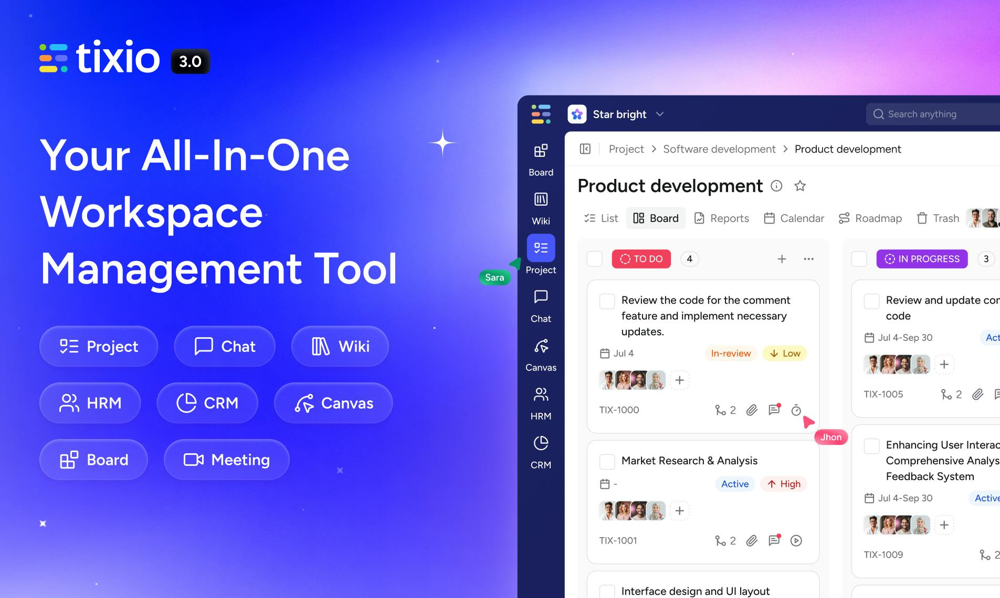

### 🎬 관련 영상
- [🎥 영상 보기](https://ph-files.imgix.net/7b24d540-6632-4001-b6c9-3f56032557c6.jpeg?auto=format)

---

## 20. [ScrollToll](https://www.producthunt.com/products/scrolltoll-2)
**Votes**: 74 | **도입 난이도**: 하 | **신뢰도**: 상
**Tagline**: Counts every Reel you watch, then locks the app.
**서비스 링크**: https://www.producthunt.com/r/HLU2KS3CIMW4LF

**태그**: Productivity, Digital Wellbeing, Android, Focus, AI Tool, Video

### 📌 이 서비스 한눈에 보기
영상 시청 개수를 기준으로 도파민 중독을 제어하는 강력한 스크롤 차단 앱

### 🔑 주요 기능
- 시간 대신 '영상 시청 개수'를 기준으로 직관적인 한도 설정
- 일일 제한 도달 시 피드 접속을 강제로 차단하는 하드 블록 기능
- 무분별한 스크롤을 멈추기 위한 가이드 명상/호흡 운동 연동

### 🙋 사용자에게 어떤 점이 좋은가
시간 단위의 추상적인 통제 대신 영상 개수라는 명확한 기준으로 스크롤 중독을 방지할 수 있습니다.

### ✅ 지금 바로 써볼 기능
- 일일 영상 시청 한도 설정하기
- 차단 시 실행될 호흡 가이드 확인하기
- 안드로이드 기기에서 앱 권한 설정하기

### ⚠️ 사용 전 확인할 점
- 현재 안드로이드 OS에서만 사용 가능
- 앱 차단 기능이 기기 설정과 충돌할 가능성 있음

### 🧭 확인이 더 필요한 정보
사용자의 스크롤 패턴을 정확히 감지하기 위한 안드로이드 접근성 권한 요구 범위가 명시되지 않았습니다.

### 📸 스크린샷 및 갤러리

### 🎬 관련 영상
- [🎥 영상 보기](https://ph-files.imgix.net/ddd5517a-1187-4994-83e7-35b0d7f7c432.jpeg?auto=format)

---

## 21. [ScrollToll](https://www.producthunt.com/products/scrolltoll-2)
**Votes**: 74 | **도입 난이도**: 하 | **신뢰도**: 상
**Tagline**: Counts every Reel you watch, then locks the app.
**서비스 링크**: https://www.producthunt.com/r/HLU2KS3CIMW4LF

**태그**: Productivity, Digital Wellbeing, Android, Focus, AI Tool, Video

### 📌 이 서비스 한눈에 보기
영상 시청 개수를 기준으로 도파민 중독을 제어하는 강력한 스크롤 차단 앱

### 🔑 주요 기능
- 시간 대신 '영상 시청 개수'를 기준으로 직관적인 한도 설정
- 일일 제한 도달 시 피드 접속을 강제로 차단하는 하드 블록 기능
- 무분별한 스크롤을 멈추기 위한 가이드 명상/호흡 운동 연동

### 🙋 사용자에게 어떤 점이 좋은가
시간 단위의 추상적인 통제 대신 영상 개수라는 명확한 기준으로 스크롤 중독을 방지할 수 있습니다.

### ✅ 지금 바로 써볼 기능
- 일일 영상 시청 한도 설정하기
- 차단 시 실행될 호흡 가이드 확인하기
- 안드로이드 기기에서 앱 권한 설정하기

### ⚠️ 사용 전 확인할 점
- 현재 안드로이드 OS에서만 사용 가능
- 앱 차단 기능이 기기 설정과 충돌할 가능성 있음

### 🧭 확인이 더 필요한 정보
사용자의 스크롤 패턴을 정확히 감지하기 위한 안드로이드 접근성 권한 요구 범위가 명시되지 않았습니다.

### 📸 스크린샷 및 갤러리

### 🎬 관련 영상
- [🎥 영상 보기](https://ph-files.imgix.net/ddd5517a-1187-4994-83e7-35b0d7f7c432.jpeg?auto=format)

---

## 22. [AirProof AI](https://www.producthunt.com/products/airproof-ai)
**Votes**: 72 | **도입 난이도**: 하 | **신뢰도**: 상
**Tagline**: Find the best spot for your air purifier in seconds
**서비스 링크**: https://www.producthunt.com/r/UXVQA2AQTH7ACP

**태그**: AI, SmartHome, HomeImprovement, Simulation, AI Tool

### 📌 이 서비스 한눈에 보기
AI를 통해 실내 공기 흐름을 시각화하고 공기청정기 최적 위치를 찾아주는 서비스

### 🔑 주요 기능
- 실내 공기 흐름(Airflow)의 실시간 시각화 및 시뮬레이션
- 공기 흐름 효율, 커버리지, 재순환 위험 등 핵심 성능 지표 비교
- 제조사 권장 방식이 아닌 실제 실내 구조를 반영한 AI 최적화 배치

### 🙋 사용자에게 어떤 점이 좋은가
공기청정기를 어디에 두어야 가장 효과적인지 고민할 필요 없이, 데이터 기반의 최적 위치를 즉시 확인할 수 있습니다.

### ✅ 지금 바로 써볼 기능
- 현재 사용 중인 공기청정기 위치 시뮬레이션하기
- 다양한 배치 시나리오별 효율성 비교하기
- AI가 제안하는 최적의 배치 지점 확인하기

### ⚠️ 사용 전 확인할 점
- 실제 물리적 환경(가구 배치, 창문 개폐 등)과 시뮬레이션 간의 오차 가능성
- 사용자의 실내 공간 데이터 입력 방식에 따른 결과 차이

### 🧭 확인이 더 필요한 정보
실제 물리적 공간을 어떻게 디지털로 구현(스캔 또는 수동 입력)하는지에 대한 구체적인 방법이 명시되지 않았습니다.

### 📸 스크린샷 및 갤러리
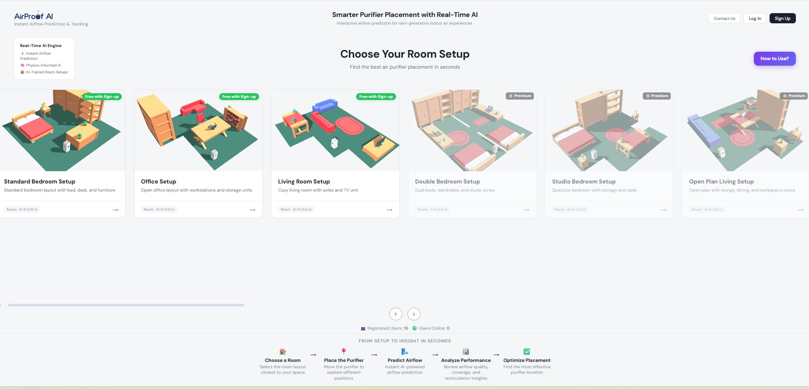
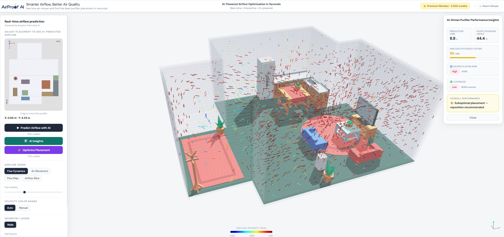
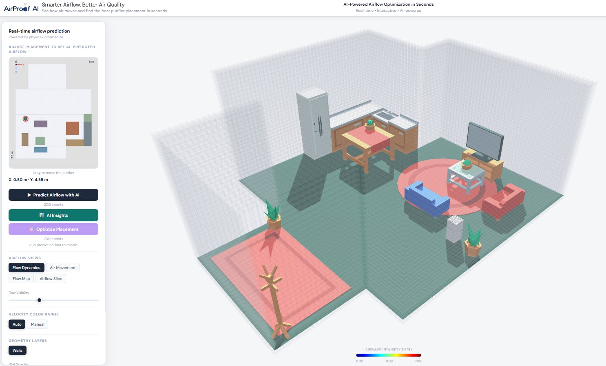

### 🎬 관련 영상
- [🎥 영상 보기](https://ph-files.imgix.net/39c4a3ca-71ec-4244-a7d5-d82e2eea2ae0.jpeg?auto=format)

---

## 23. [Crodo AI](https://www.producthunt.com/products/crodo-ai)
**Votes**: 69 | **도입 난이도**: 하 | **신뢰도**: 상
**Tagline**: Your voice-first AI assistant for macOS
**서비스 링크**: https://www.producthunt.com/r/25TSN42SFQ43EW

**태그**: Productivity, AI Assistant, macOS, Voice-to-Text, Automation, AI Tool, Chat

### 📌 이 서비스 한눈에 보기
macOS 환경에서 음성만으로 작업과 맥락을 연결하는 올인원 AI 비서

### 🔑 주요 기능
- macOS 전용 보이스 퍼스트(Voice-first) AI 인터페이스
- 화면 내용 기반 질의응답 및 앱 간 전환 없는 작업 수행
- 회의록 작성 및 주요 생산성 앱(Gmail, Calendar, Slack 등) 연동

### 🙋 사용자에게 어떤 점이 좋은가
여러 앱을 오가는 번거로움 없이 음성만으로 문서 작성, 정보 검색, 일정 관리를 통합하여 작업 흐름을 끊김 없이 유지할 수 있습니다.

### ✅ 지금 바로 써볼 기능
- 음성 받아쓰기 기능을 통한 문서 작업 효율화
- 화면 공유/인식 기능을 활용한 맥락 기반 질문하기
- 회의 중 실시간 회의록 캡처 기능 활용

### ⚠️ 사용 전 확인할 점
- macOS 전용 앱이므로 다른 운영체제에서는 사용 불가
- 타사 서비스(Slack, Gmail 등) 연동 범위가 현재 확장 중임

### 🧭 확인이 더 필요한 정보
현재 제공되는 앱 연동 범위와 향후 추가될 기능의 구체적인 로드맵 확인이 필요합니다.

### 📸 스크린샷 및 갤러리
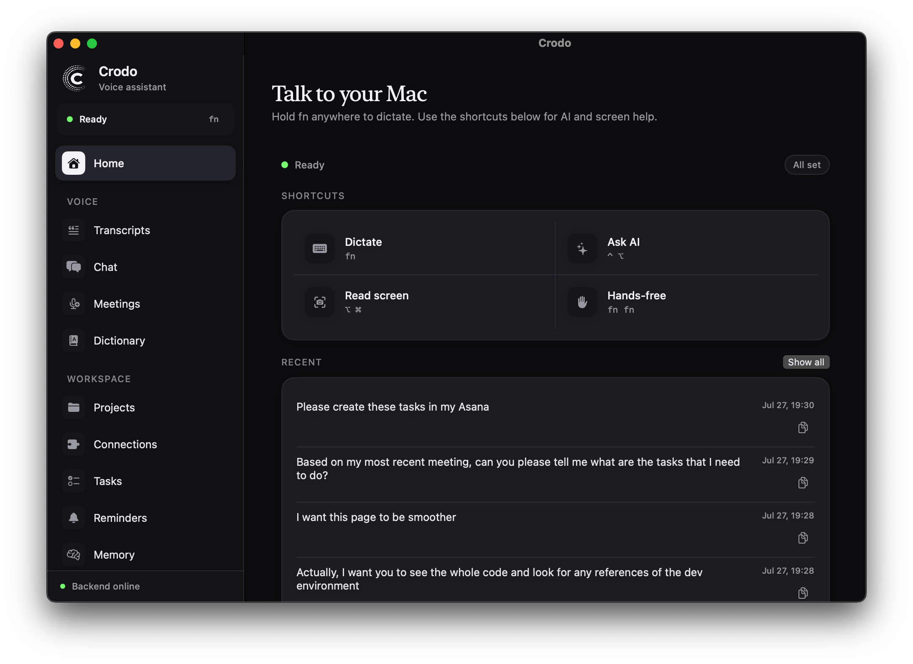
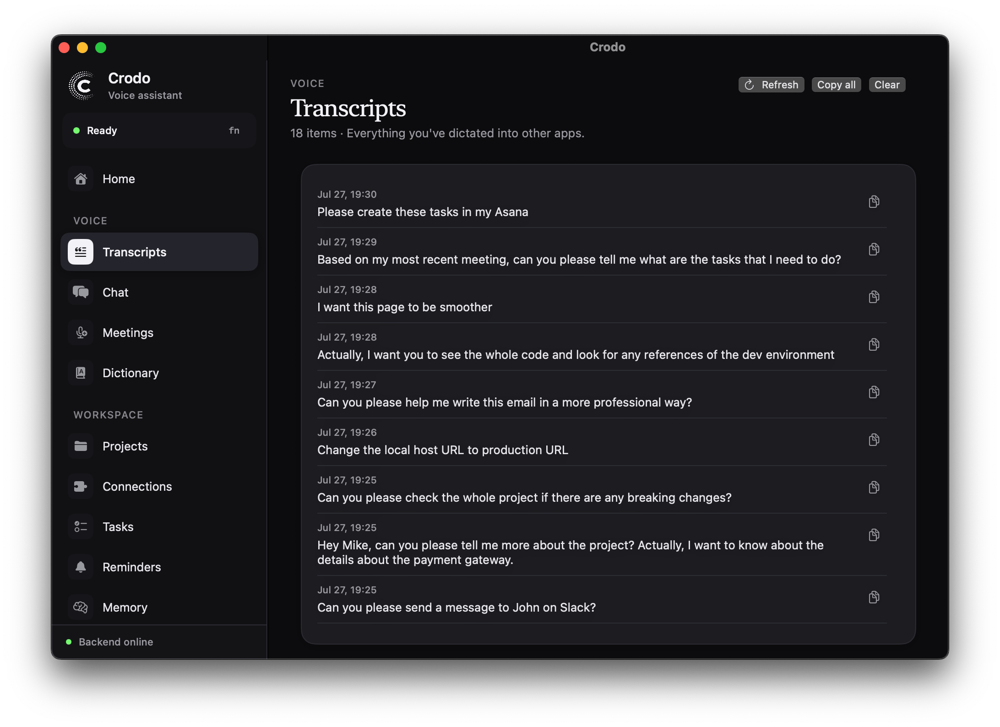
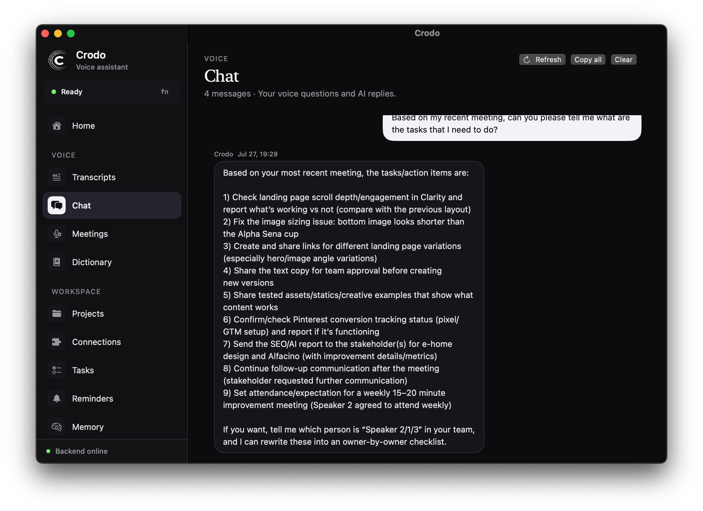

---

## 24. [Stynar](https://www.producthunt.com/products/stynar)
**Votes**: 67 | **도입 난이도**: 중 | **신뢰도**: 상
**Tagline**: The AI SDR that runs outbound for you
**서비스 링크**: https://www.producthunt.com/r/AMXBBVVFTXPCCA

**태그**: Sales, AI, Automation, Outbound, Agent, AI Tool, Email

### 📌 이 서비스 한눈에 보기
리서치부터 미팅 예약까지 수행하는 자율형 AI 영업 에이전트

### 🔑 주요 기능
- 잠재 고객 조사 및 초개인화 이메일 작성 자동화
- 무제한 메일함을 통한 아웃바운드 캠페인 실행
- 답장 관리, 구매 의도 감지 및 미팅 예약까지 통합 관리

### 🙋 사용자에게 어떤 점이 좋은가
SDR 인력을 추가 채용하는 대신, AI가 영업 리드 발굴 과정을 전담하여 영업팀이 계약 체결에만 집중할 수 있게 합니다.

### ✅ 지금 바로 써볼 기능
- 잠재 고객 리스트 업로드 및 자동 리서치 기능 테스트
- 개인화된 이메일 초안 품질 확인
- 통합 인박스를 통한 답장 관리 워크플로우 경험

### ⚠️ 사용 전 확인할 점
- AI가 작성한 이메일의 자연스러움과 스팸 필터 통과 여부 확인 필요
- 자동화된 발송으로 인한 도메인 평판 관리 주의

### 🧭 확인이 더 필요한 정보
현재 제공되는 이메일 발송량 제한이나 외부 CRM과의 연동 범위에 대한 구체적인 정보가 부족합니다.

### 📸 스크린샷 및 갤러리

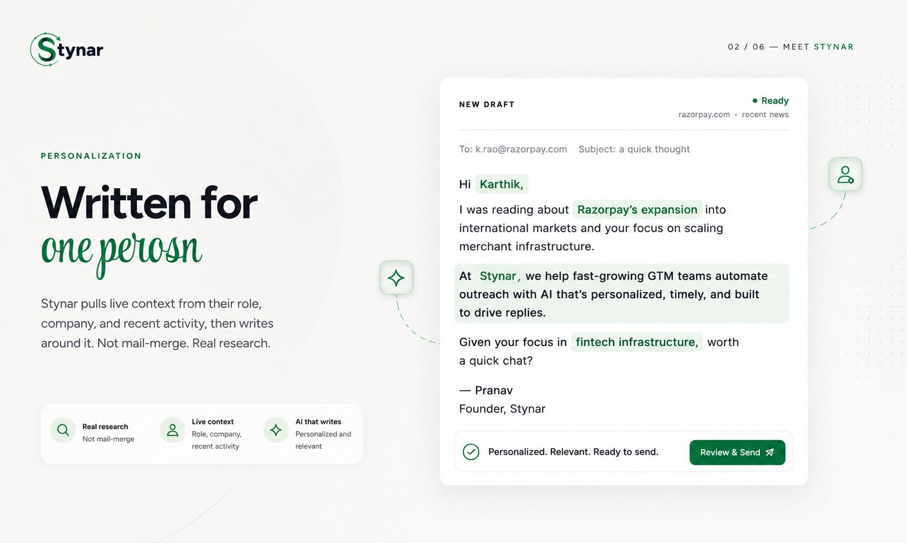
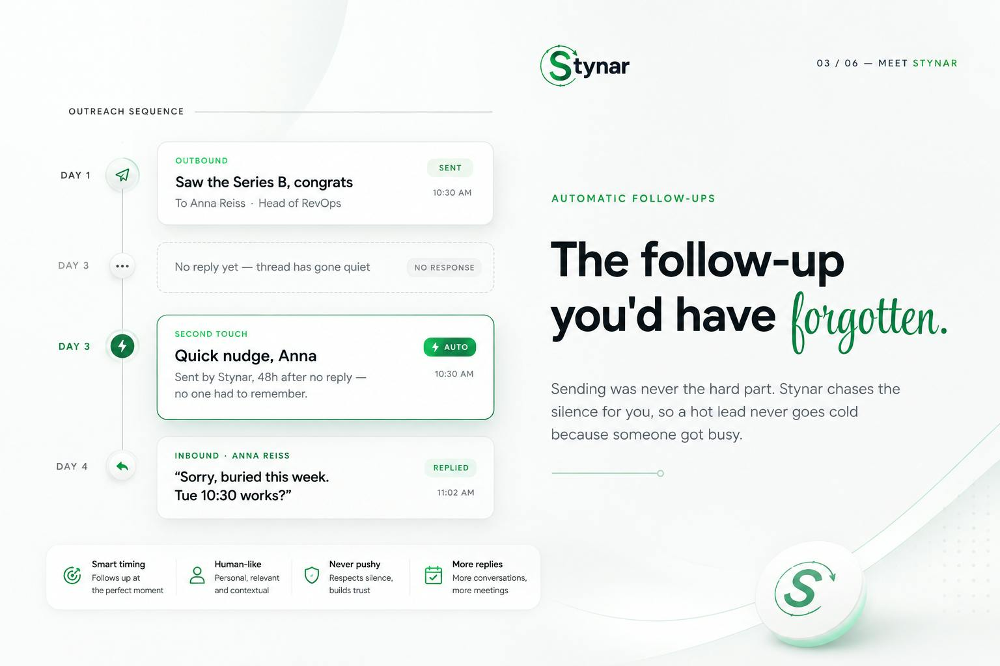

### 🎬 관련 영상
- [🎥 영상 보기](https://ph-files.imgix.net/ea7ac4fe-5932-4701-b48b-1abe78856655.jpeg?auto=format)

---

## 25. [Vinyl for Mac](https://www.producthunt.com/products/vinyl-for-mac)
**Votes**: 67 | **도입 난이도**: 하 | **신뢰도**: 상
**Tagline**: Turn your Mac into a spinning vinyl player.
**서비스 링크**: https://www.producthunt.com/r/3QAZ5CYCFEPLRU

**태그**: Productivity, Design, Music, Mac

### 📌 이 서비스 한눈에 보기
스포티파이 음악에 맞춰 맥 데스크탑을 아날로그 LP 플레이어로 변신시켜주는 감성 앱

### 🔑 주요 기능
- 스포티파이와 실시간 동기화되는 애니메이션 LP 플레이어
- 백그라운드에서 조용히 실행되는 데스크탑 꾸미기 기능
- 9.99달러의 간편한 일회성 구매 방식

### 🙋 사용자에게 어떤 점이 좋은가
작업 중 데스크탑에 시각적인 즐거움을 더하며, 음악 감상 경험을 아날로그 감성으로 높여줍니다.

### ✅ 지금 바로 써볼 기능
- 스포티파이 계정 연결하기
- 데스크탑 배경화면과 조화로운지 확인하기
- 일회성 구매로 영구 소장하기

### ⚠️ 사용 전 확인할 점
- 스포티파이 서비스 이용이 필수적임
- 애니메이션 실행에 따른 미세한 리소스 사용 가능성

### 🧭 확인이 더 필요한 정보
애플 실리콘(M1/M2 등) 환경에서의 최적화 상태를 확인해야 합니다.

### 📸 스크린샷 및 갤러리
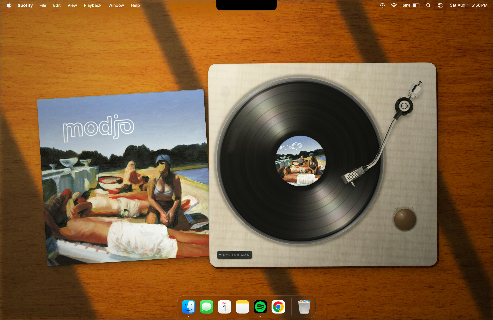
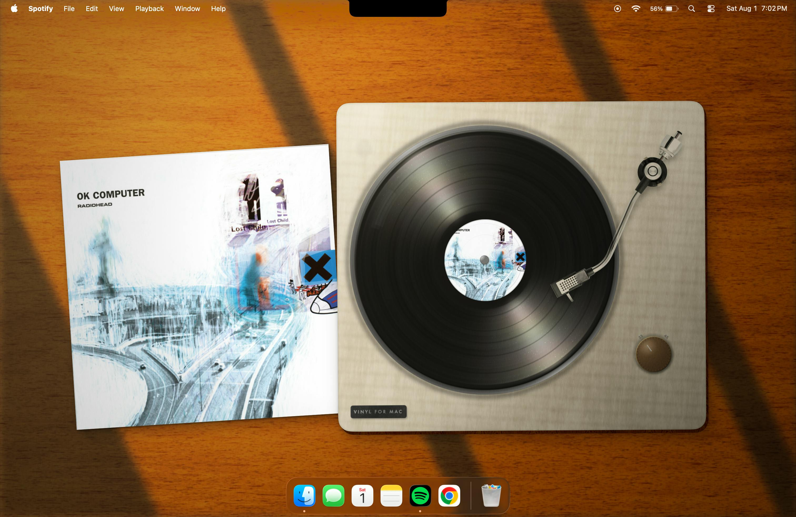
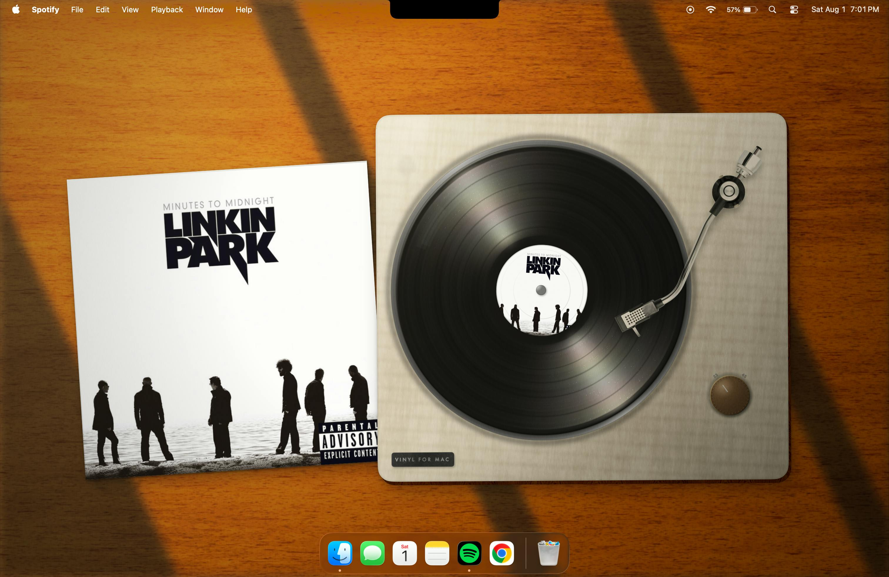

### 🎬 관련 영상
- [🎥 영상 보기](https://ph-files.imgix.net/5f3a7890-bc40-4213-98bc-223b84fe8532.jpeg?auto=format)

---

## 26. [FileFlippers](https://www.producthunt.com/products/fileflippers)
**Votes**: 66 | **도입 난이도**: 하 | **신뢰도**: 상
**Tagline**: Send big files and get paid on download
**서비스 링크**: https://www.producthunt.com/r/VKGQGUDH6NE5PJ

**태그**: Productivity, Freelance, FileTransfer, Fintech, CreativeTools, AI Tool

### 📌 이 서비스 한눈에 보기
대용량 파일 전송부터 결제 및 피드백 관리까지 한 번에 해결하는 프리랜서용 파일 배포 플랫폼

### 🔑 주요 기능
- 브랜드 페이지를 통한 대용량 파일 전송 및 이어받기 지원
- 결제 완료 시 다운로드가 해제되는 자동화된 수익 창출 구조
- 워터마크 삽입, 클라이언트 피드백, AI 업스케일링 및 변환 기능 내장

### 🙋 사용자에게 어떤 점이 좋은가
파일 전송 후 대금 결제를 기다릴 필요 없이, 결제가 완료되어야 파일이 열리도록 설정하여 미수금 문제를 방지할 수 있습니다.

### ✅ 지금 바로 써볼 기능
- 브랜드 페이지를 생성하여 파일 공유해보기
- 결제 게이트를 설정하여 자동 수익 구조 구축하기
- AI 기능을 활용해 파일 업스케일링 및 포맷 변환해보기

### ⚠️ 사용 전 확인할 점
- 결제 시스템 연동 방식 및 수수료 정책 확인 필요
- 대용량 파일 저장 용량 및 전송 속도 제한 확인 필요

### 🧭 확인이 더 필요한 정보
구체적인 결제 대행사(PG) 연동 방식과 무료 플랜의 용량 제한 범위를 확인해야 합니다.

### 📸 스크린샷 및 갤러리
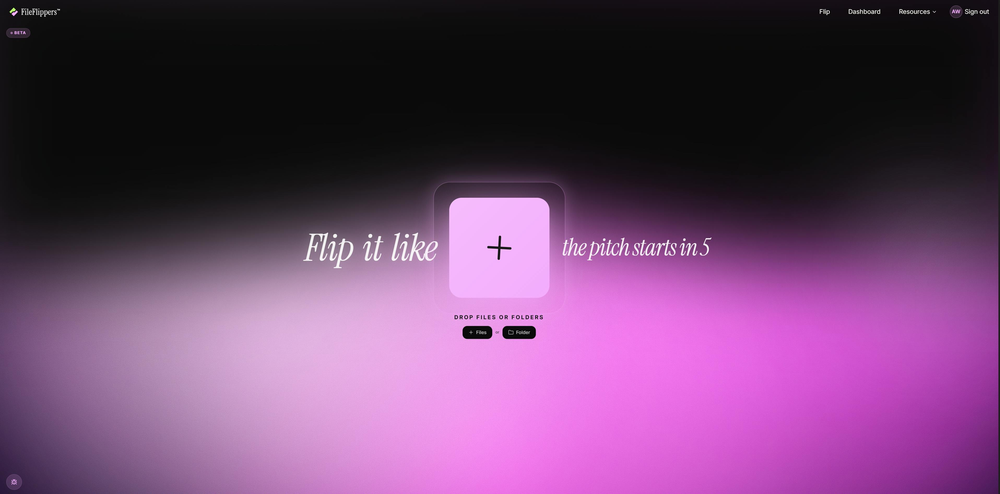
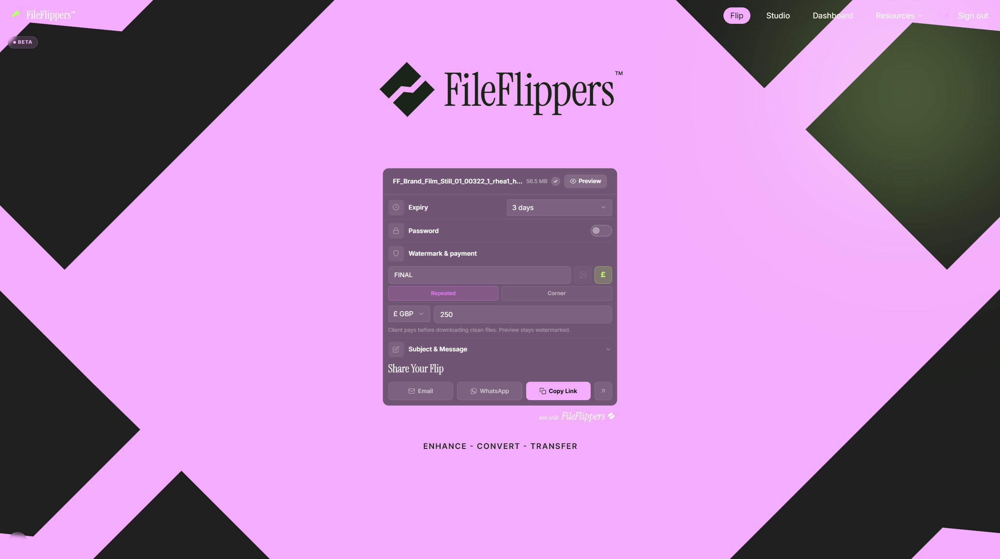
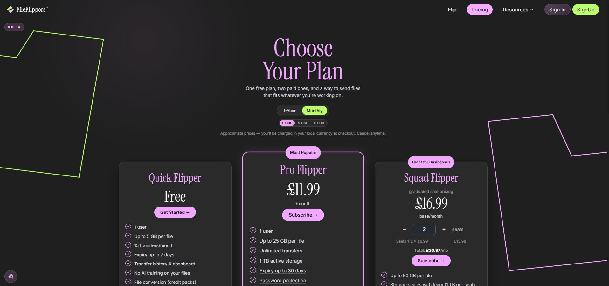

---

## 27. [ArtDeck](https://www.producthunt.com/products/artdeck)
**Votes**: 65 | **도입 난이도**: 하 | **신뢰도**: 상
**Tagline**: Reference boards with visual study tools built in
**서비스 링크**: https://www.producthunt.com/r/PGMMNASADP3N7C

**태그**: Design, Art, Productivity, CreativeTools

### 📌 이 서비스 한눈에 보기
단순 수집을 넘어 색상, 구도, 움직임을 직접 분석하고 학습할 수 있는 시각적 레퍼런스 보드

### 🔑 주요 기능
- 수집된 이미지를 활용한 가치, 색상, 구도, 모션 분석 도구 내장
- 온ion skinning 기능을 통한 움직임 연구 지원
- iPhone, iPad, Mac 간 iCloud 동기화 및 오프라인 작업 지원

### 🙋 사용자에게 어떤 점이 좋은가
단순히 이미지를 모아두는 것에 그치지 않고, 저장한 자료를 바탕으로 실질적인 드로잉/디자인 학습을 할 수 있습니다.

### ✅ 지금 바로 써볼 기능
- 이미지 보드에 레퍼런스 수집하기
- 내장 도구를 활용해 색상 및 구도 분석하기
- Onion skinning 기능으로 모션 스터디하기

### ⚠️ 사용 전 확인할 점
- 애플 생태계(iOS, macOS) 전용 앱이므로 타 OS 사용자는 사용 불가
- 구독형이 아닌 일회성 구매 방식이므로 초기 비용 발생

### 🧭 확인이 더 필요한 정보
정확한 일회성 구매 가격과 지원되는 파일 형식에 대한 정보가 명시되지 않았습니다.

### 📸 스크린샷 및 갤러리
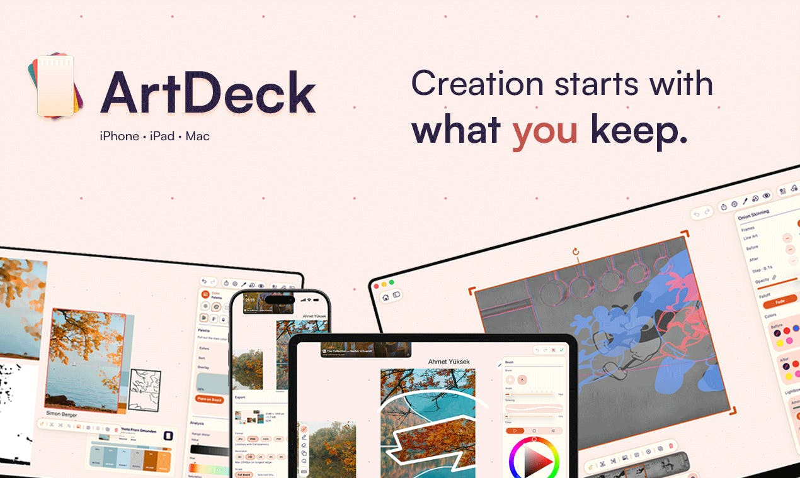
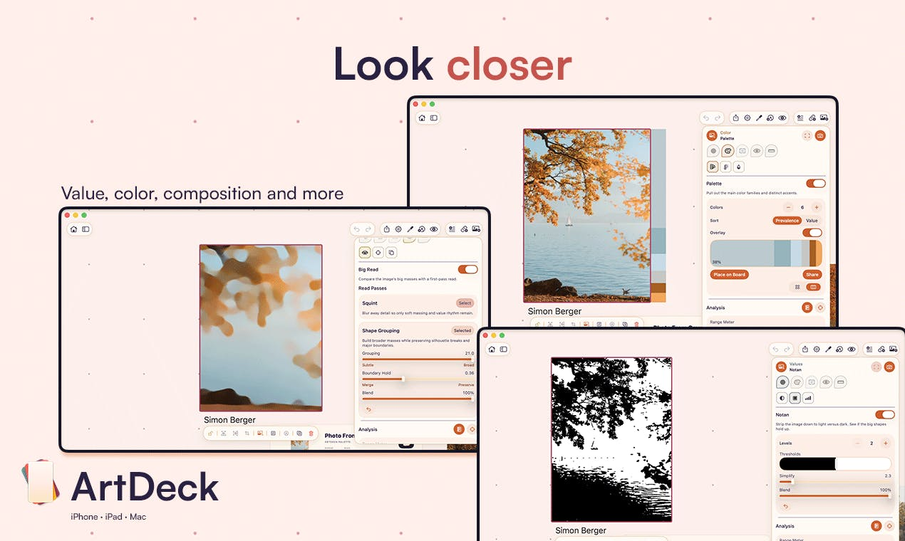
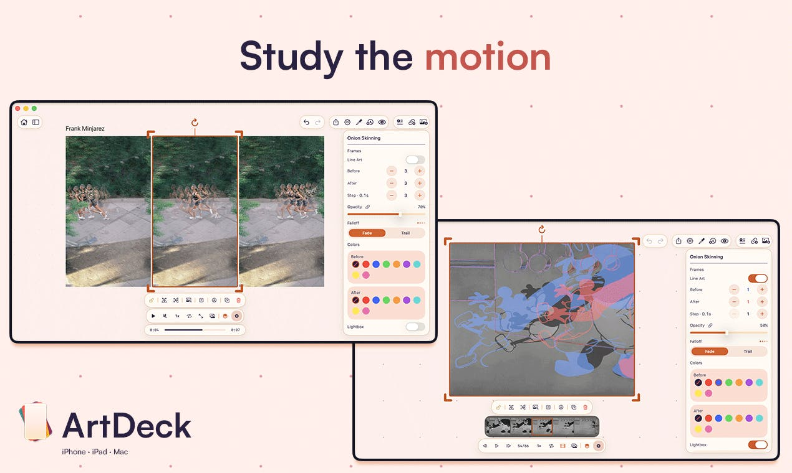

### 🎬 관련 영상
- [🎥 영상 보기](https://ph-files.imgix.net/b02f7465-ea14-4c1b-928b-f5560341381f.jpeg?auto=format)

---

## 28. [Email Verifier](https://www.producthunt.com/products/mailercloud)
**Votes**: 44 | **도입 난이도**: 하 | **신뢰도**: 상
**Tagline**: Verify your email list before you hit send
**서비스 링크**: https://www.producthunt.com/r/C6FXSOMRKLCRUZ

**태그**: Marketing, Email, Productivity, AI Tool

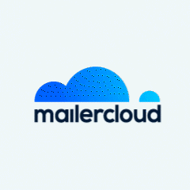

### 📌 이 서비스 한눈에 보기
이메일 발송 전 유효하지 않거나 위험한 주소를 걸러내어 발송 성공률을 높이는 도구

### 🔑 주요 기능
- 무효, 위험, 일회용 이메일 주소 식별 및 플래그 지정
- CSV 업로드 또는 수동 입력을 통한 간편한 리스트 검증
- 필터링된 결과(안전한 리스트, 전체 결과 등)를 통한 맞춤형 데이터 다운로드

### 🙋 사용자에게 어떤 점이 좋은가
이메일 반송률을 낮추고 발송자 평판을 보호하여 마케팅 효율을 극대화할 수 있습니다.

### ✅ 지금 바로 써볼 기능
- 보유 중인 이메일 리스트 CSV 업로드하기
- 필터 기능을 사용하여 안전한 수신자 리스트 추출하기
- 검증된 리스트를 Mailercloud에 적용하기

### ⚠️ 사용 전 확인할 점
- Mailercloud 환경 내에서 최적화되어 설계되었으므로 외부 서비스와의 연동 범위 확인 필요
- 검증 결과의 정확도는 이메일 제공업체의 정책에 따라 달라질 수 있음

### 🧭 확인이 더 필요한 정보
Mailercloud 외부 환경에서의 완전한 독립적 작동 여부와 상세 API 지원 여부를 확인해야 합니다.

### 📸 스크린샷 및 갤러리

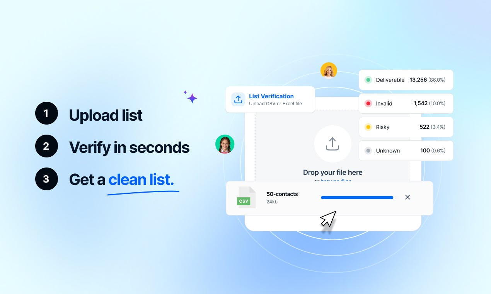
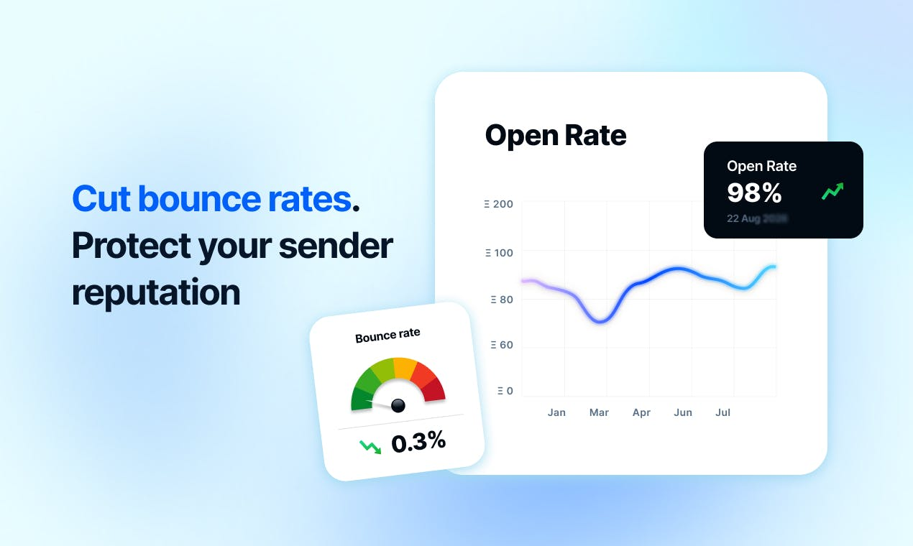

### 🎬 관련 영상
- [🎥 영상 보기](https://ph-files.imgix.net/a39b4040-0827-4d77-b977-4dfa566d581f.jpeg?auto=format)

---

## 29. [Logo Lattice](https://www.producthunt.com/products/logo-lattice)
**Votes**: 19 | **도입 난이도**: 하 | **신뢰도**: 상
**Tagline**: Draw it. Shape it. Ship it 🔥
**서비스 링크**: https://www.producthunt.com/r/O63P5KDD35OREJ

**태그**: Design, LogoMaker, Vector, Creative

### 📌 이 서비스 한눈에 보기
기하학적 도구와 그리드를 활용해 전문가 수준의 로고를 쉽게 제작하는 전문 디자인 툴

### 🔑 주요 기능
- 로고 제작에 특화된 니치(Niche) 디자인 도구
- 스냅 그리드 및 기하학적 드로잉 도구 제공
- 수정이 용이한 SVG 중심의 고품질 내보내기

### 🙋 사용자에게 어떤 점이 좋은가
복잡한 디자인 툴 대신 로고 제작에 필요한 핵심 기능만 사용하여 빠르고 정교한 결과물을 얻을 수 있습니다.

### ✅ 지금 바로 써볼 기능
- 스냅 그리드를 활용한 기본 도형 그리기
- 기하학적 도구로 정교한 로고 형태 잡기
- SVG 형식으로 결과물 내보내기

### ⚠️ 사용 전 확인할 점
- 범용 디자인 툴이 아니므로 로고 외의 복잡한 그래픽 작업에는 부적합할 수 있음
- 상세한 가격 정책이나 고급 기능 포함 여부는 확인 필요

### 🧭 확인이 더 필요한 정보
제품의 상세 가격 정책과 고급 기능의 유무에 대한 정보가 명시되지 않았습니다.

### 📸 스크린샷 및 갤러리

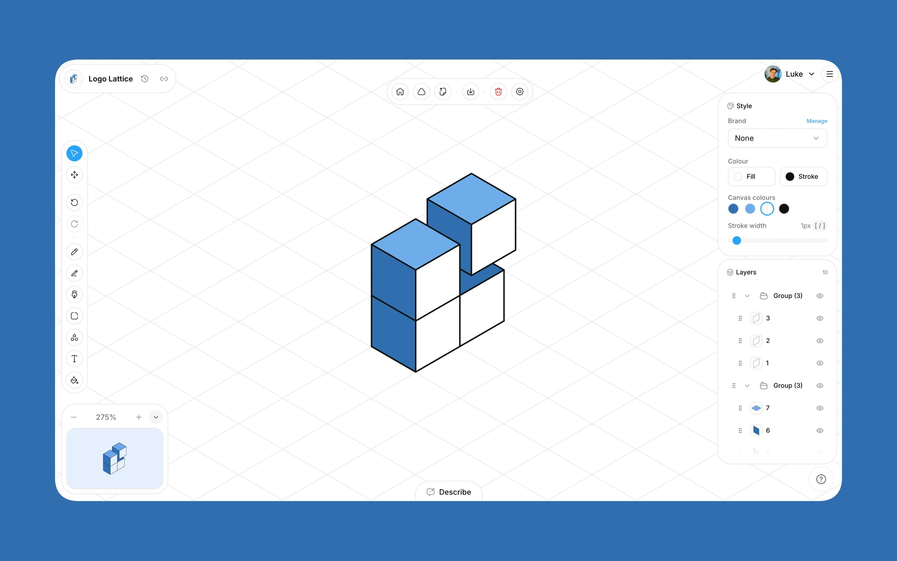
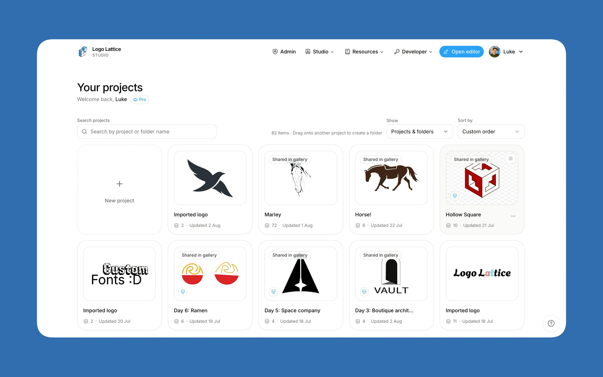

### 🎬 관련 영상
- [🎥 영상 보기](https://ph-files.imgix.net/8d0b93ce-2c55-4701-aa22-833d361b25af.jpeg?auto=format)

---

## 30. [BitePad](https://www.producthunt.com/products/bitepad)
**Votes**: 18 | **도입 난이도**: 하 | **신뢰도**: 상
**Tagline**: Minimalist voice calorie tracker
**서비스 링크**: https://www.producthunt.com/r/BTOVEGPFMOGMTX

**태그**: Health, Productivity, Minimalist, AI Tool, Design

### 📌 이 서비스 한눈에 보기
음성이나 타이핑만으로 식단을 빠르게 기록하는 미니멀 칼로리 트래커

### 🔑 주요 기능
- 음성 및 텍스트 입력을 통한 초간편 식단 기록
- 복잡한 기능 대신 기록의 속도와 편의성에 집중한 설계
- AI 사진 인식의 오류를 피하고 사용자가 직접 검토 및 수정 가능

### 🙋 사용자에게 어떤 점이 좋은가
식단 기록에 드는 시간을 최소화하여 꾸준한 칼로리 관리를 도와줍니다.

### ✅ 지금 바로 써볼 기능
- 먹은 음성을 말하여 즉시 기록해보기
- 제안된 칼로리와 영양 성분 검토하기
- 필요 시 수동으로 데이터 수정해보기

### ⚠️ 사용 전 확인할 점
- 사진 기반 자동 인식 기능이 없으므로 직접 입력이 필요함
- 상세한 영양 분석보다는 빠른 기록에 특화되어 있음

### 🧭 확인이 더 필요한 정보
사용자의 음성 인식 정확도와 데이터 저장 방식에 대한 상세 정보가 필요합니다.

### 📸 스크린샷 및 갤러리
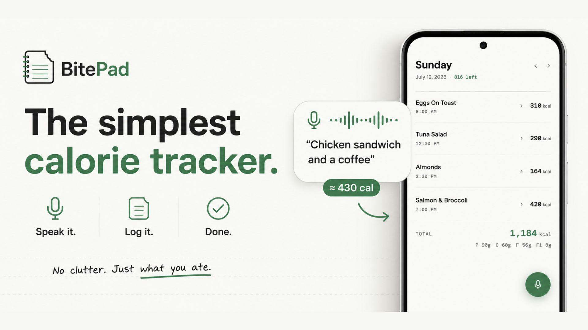
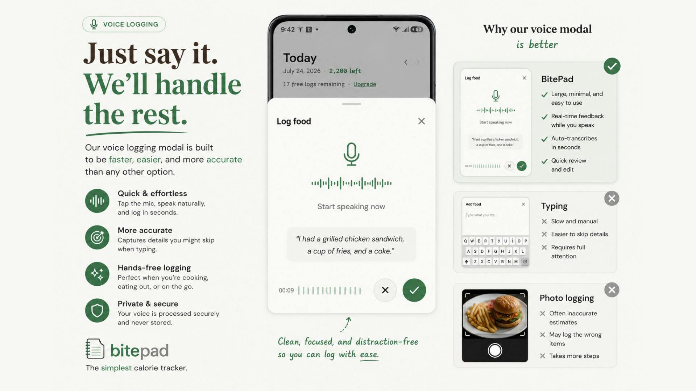
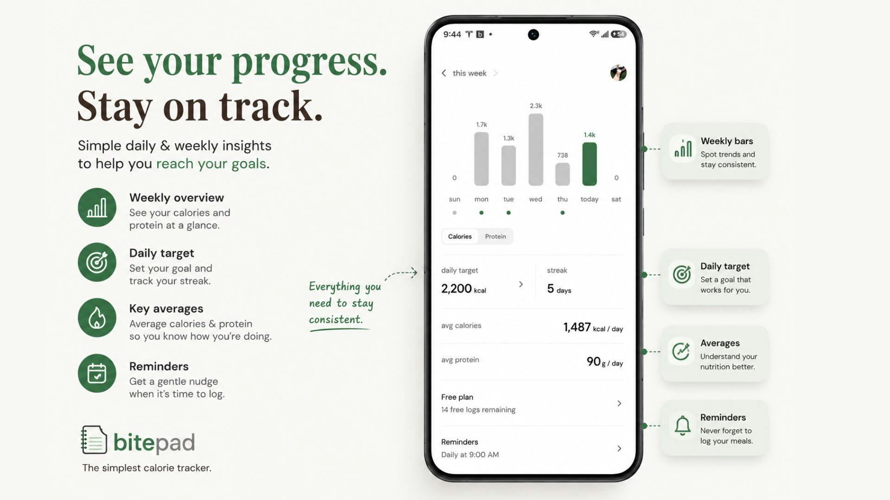

### 🎬 관련 영상
- [🎥 영상 보기](https://ph-files.imgix.net/b56eece5-299a-4af6-a018-9567d2413f50.jpeg?auto=format)

---

