# 🚀 Product Hunt Daily Top 30 (2026-08-06)

## 오늘의 요약
오늘의 트렌드는 AI 에이전트가 자율적으로 업무를 수행하고 결제하며, 기업의 내부 데이터를 안전하게 활용할 수 있도록 돕는 인프라와 워크플로우 구축에 집중되었습니다. 특히 파편화된 정보를 통합하거나 복잡한 개발 과정 없이 에이전트를 배포하는 등 실질적인 업무 자동화와 보안을 동시에 해결하려는 시도가 돋보였습니다.

### 오늘의 핵심 포인트
- AI 에이전트의 자율적 활동을 지원하는 결제 인프라와 워크플로우 자동화 플랫폼이 주목받았습니다.
- 기업 내부의 흩어진 데이터를 통합하여 AI의 맥락 파악 능력을 높이고 환각 현상을 줄이는 솔루션들이 등장했습니다.
- 복잡한 코딩 없이 자연어만으로 에이전트를 구축하거나, 여러 AI 모델을 하나의 API로 관리하는 통합 관리 도구들이 핵심 트렌드로 나타났습니다.

**오늘의 태그**: AI 에이전트, 업무 자동화, 데이터 통합, AI 인프라

## 1. [Wispr Flow Notetaker](https://www.producthunt.com/products/wisprflow)
**Votes**: 404 | **도입 난이도**: 하 | **신뢰도**: 상
**Tagline**: Meeting notes that get the details right.
**서비스 링크**: https://www.producthunt.com/r/TP2MPL5CRVXSM2

**태그**: Productivity, AI, Meeting, Automation, AI Tool, Chat

### 📌 이 서비스 한눈에 보기
정확한 화자 식별과 맥락 파악으로 완벽한 회의록을 만드는 AI 노트테이커

### 🔑 주요 기능
- 실제 이름 기반의 정확한 화자 식별 (Speaker 1/2 방지)
- 사전 학습된 용어 및 초대장 정보를 활용한 정교한 기록
- Claude 및 ChatGPT(MCP)와 연동 가능한 워크플로우 제공

### 🙋 사용자에게 어떤 점이 좋은가
회의 직후 별도의 편집 없이 바로 후속 조치를 할 수 있을 만큼 정교한 요약과 기록을 제공합니다.

### ✅ 지금 바로 써볼 기능
- Mac 환경에서 설치 및 실행
- 기존에 학습된 용어 데이터 확인
- 생성된 기록을 Claude/ChatGPT로 가져와 업무 활용하기

### ⚠️ 사용 전 확인할 점
- 현재 Mac 환경에서만 사용 가능
- 정확한 화자 식별을 위한 초기 설정 및 데이터 학습 필요성

### 🧭 확인이 더 필요한 정보
Windows 지원 여부 및 상세 요금 체계에 대한 정보가 명시되지 않았습니다.

### 📸 스크린샷 및 갤러리

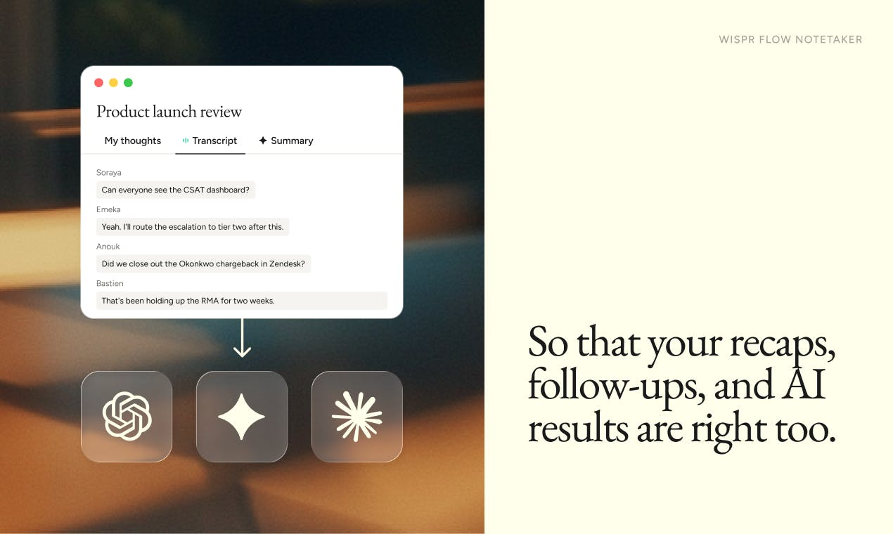

### 🎬 관련 영상
- [🎥 영상 보기](https://ph-files.imgix.net/f992927e-2c7d-4f83-b016-e4ad25b6e435.jpeg?auto=format)

---

## 2. [AdAnt AI](https://www.producthunt.com/products/adant-ai)
**Votes**: 378 | **도입 난이도**: 중 | **신뢰도**: 상
**Tagline**: Claude for viral, high-converting social ads
**서비스 링크**: https://www.producthunt.com/r/QNPUB2TD4A4RX4

**태그**: Marketing, AI-Agent, Content-Creation, Social-Media, Agent, AI Tool

### 📌 이 서비스 한눈에 보기
바이럴 전략과 데이터 기반의 고효율 소셜 광고를 자동 생성하는 AI 에이전트 팀

### 🔑 주요 기능
- 소셜 광고 전략 수립부터 제작, 반복 개선까지 수행하는 크리에이티브 에이전트 시스템
- 5,000만 회 이상의 유기적 조회수와 광고 비용 60% 절감 경험을 바탕으로 설계된 알고리즘
- TikTok, Instagram, YouTube에 최적화된 스크롤 스톱(Scroll-Stopping) 콘텐츠 생성

### 🙋 사용자에게 어떤 점이 좋은가
전문적인 광고 전략 없이도 높은 전환율을 가진 소셜 광고를 빠르게 제작하여 광고 비용을 절감할 수 있습니다.

### ✅ 지금 바로 써볼 기능
- 타겟 플랫폼(TikTok, Instagram, YouTube)별 광고 전략 생성해보기
- 기존 광고 소재를 고효율 소재로 변환하는 반복 작업 테스트하기

### ⚠️ 사용 전 확인할 점
- 제공되는 전략이 사용자의 특정 브랜드 보이스와 완벽히 일치하는지 검토 필요
- 플랫폼별 알고리즘 변화에 따른 전략 업데이트 여부 확인 필요

### 🧭 확인이 더 필요한 정보
사용자가 직접 편집할 수 있는 범위와 외부 디자인 툴과의 연동 수준에 대한 정보가 부족합니다.

### 📸 스크린샷 및 갤러리

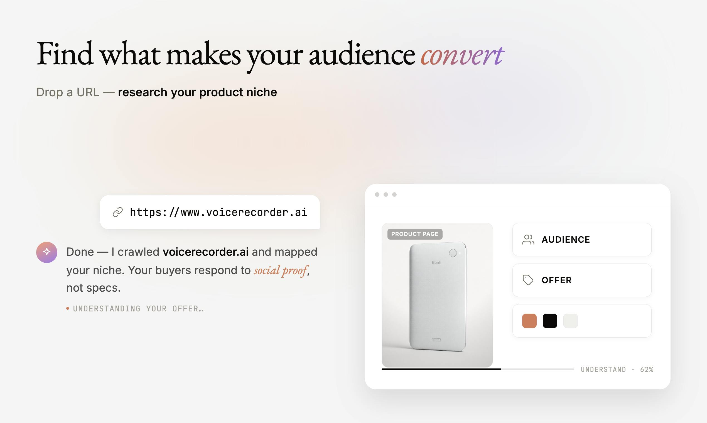
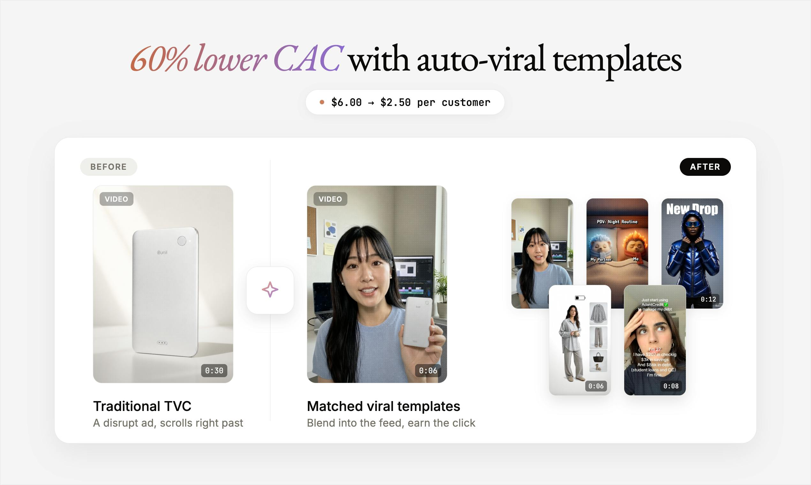

### 🎬 관련 영상
- [🎥 영상 보기](https://ph-files.imgix.net/faf0a42e-c93f-49cd-83ff-0fbcfb449f86.jpeg?auto=format)

---

## 3. [NextDoor.Company](https://www.producthunt.com/products/nextdoor-company)
**Votes**: 330 | **도입 난이도**: 하 | **신뢰도**: 상
**Tagline**: Discover startups hiring near you, on a map
**서비스 링크**: https://www.producthunt.com/r/W6SVY7XXFTOVTY

**태그**: Recruitment, Startup, Map-based, Career, AI Tool

### 📌 이 서비스 한눈에 보기
지도 기반으로 주변 스타트업 채용 정보를 한눈에 확인하는 서비스

### 🔑 주요 기능
- 지도 인터페이스를 통한 위치 기반 스타트업 채용 정보 탐색
- 400개 이상의 엄선된 글로벌 스타트업 및 16,000개 이상의 실시간 채용 공고
- 원격, 하이브리드, 현장 근무 등 근무 형태별 필터링 제공

### 🙋 사용자에게 어떤 점이 좋은가
자신의 위치나 선호 지역 근처의 유망 스타트업을 지도에서 직관적으로 찾고, 기업의 재무 상태와 투자 정보를 동시에 확인하여 이직 결정을 도울 수 있습니다.

### ✅ 지금 바로 써볼 기능
- 지도 기능을 활용해 거주지 인근 스타트업 탐색하기
- 필터 기능을 사용하여 원하는 근무 형태(Remote/Hybrid) 설정하기
- 기업 상세 페이지에서 펀딩 및 투자자 정보 확인하기

### ⚠️ 사용 전 확인할 점
- 데이터 업데이트 주기에 따른 채용 공고의 실시간성 확인 필요
- 제공되는 기업 재무 정보의 최신성 및 정확성 검증 필요

### 🧭 확인이 더 필요한 정보
제공되는 기업 가치 및 매출 데이터의 출처와 업데이트 빈도를 확인해야 합니다.

### 📸 스크린샷 및 갤러리
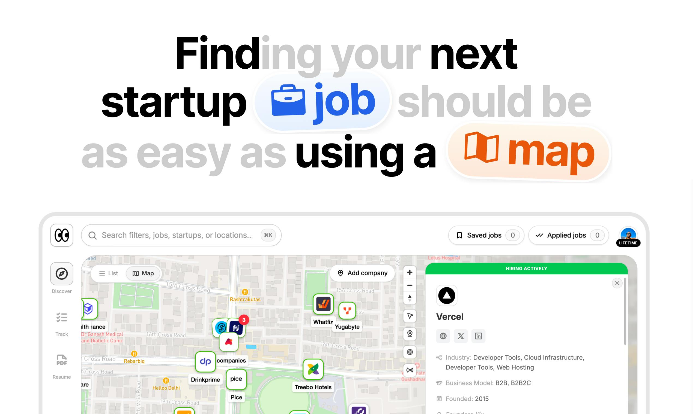
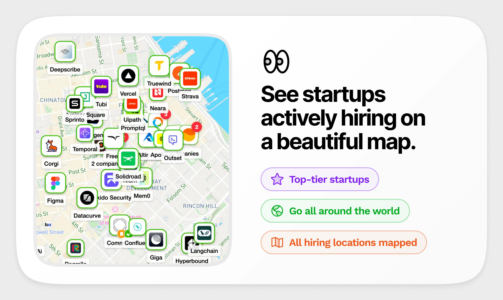
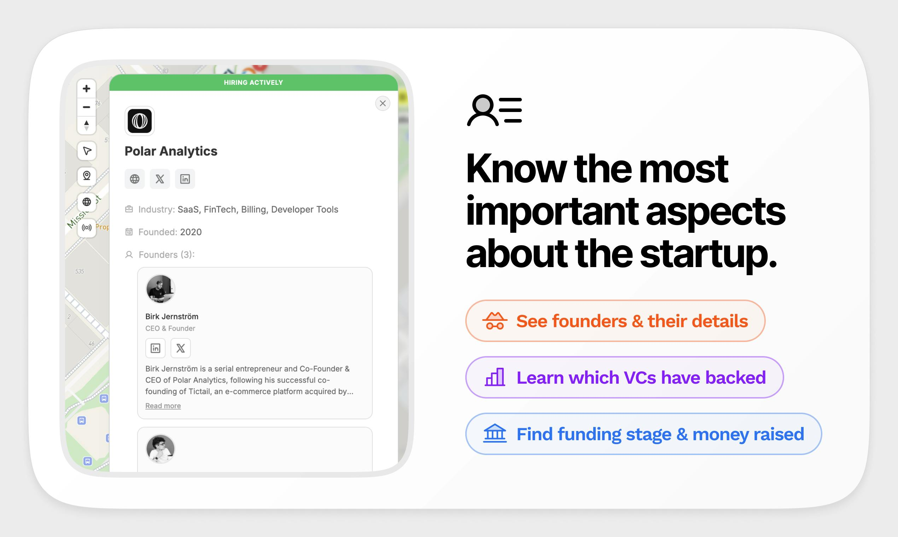

### 🎬 관련 영상
- [🎥 영상 보기](https://ph-files.imgix.net/a4e7ee6a-74fc-4db5-b601-3a01d9605541.jpeg?auto=format)

---

## 4. [ngrok AI Gateway](https://www.producthunt.com/products/ngrok-ai-gateway)
**Votes**: 277 | **도입 난이도**: 하 | **신뢰도**: 상
**Tagline**: One private gateway for every AI model
**서비스 링크**: https://www.producthunt.com/r/HRVA5S3NHPLDDJ

**태그**: AI, DevTool, Security, API, AI Tool

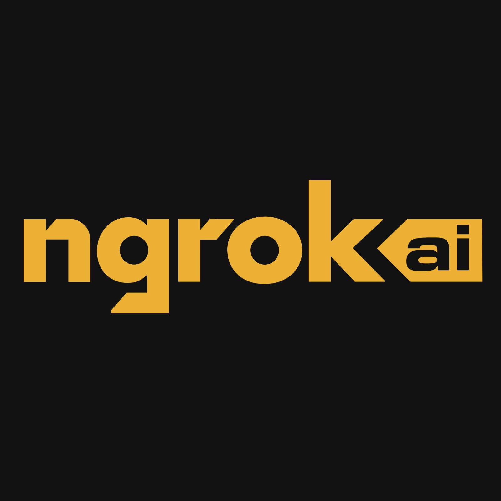

### 📌 이 서비스 한눈에 보기
모든 AI 모델을 하나의 API 키와 URL로 통합 관리하는 프라이빗 게이트웨이

### 🔑 주요 기능
- OpenAI, Anthropic 및 자체 호스팅 모델을 하나의 엔드포인트로 통합 관리
- 단일 API 키와 URL을 통한 간편한 라우팅 및 접근 제어
- 프라이빗 모델을 공용 인터넷 노출 없이 안전하게 연결하는 보안 네트워크 제공

### 🙋 사용자에게 어떤 점이 좋은가
여러 AI 모델을 사용하는 개발자가 복잡한 인증 과정을 단순화하고, 보안을 유지하면서도 모델 간 폴백(fallback) 및 관찰성을 확보할 수 있습니다.

### ✅ 지금 바로 써볼 기능
- 단일 URL로 여러 모델 전환 테스트하기
- 접근 제어 및 관찰성 기능 설정하기
- 자체 호스팅 모델과 퍼블릭 모델 통합 연결하기

### ⚠️ 사용 전 확인할 점
- 모든 트래픽이 ngrok 네트워크를 거치므로 데이터 프라이버시 정책 확인 필요
- 사용 중인 모델의 지연 시간(latency) 변화 확인 필요

### 🧭 확인이 더 필요한 정보
자체 호스팅 모델의 구체적인 연결 방식과 네트워크 성능에 대한 상세 정보는 추가 확인이 필요합니다.

### 📸 스크린샷 및 갤러리
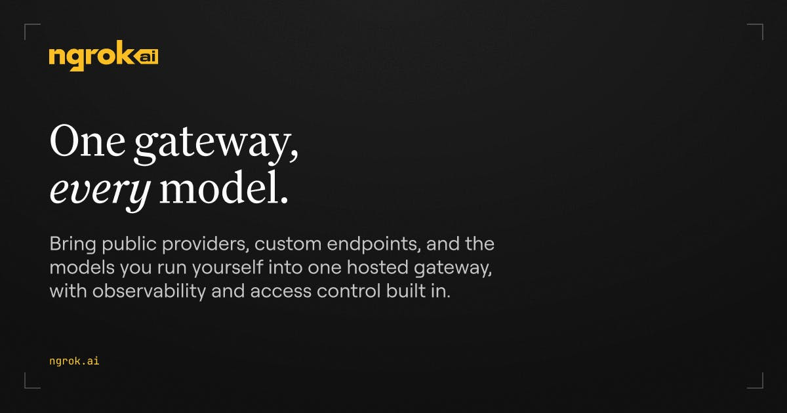
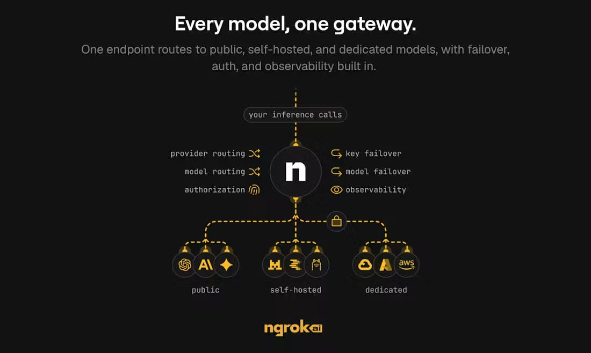
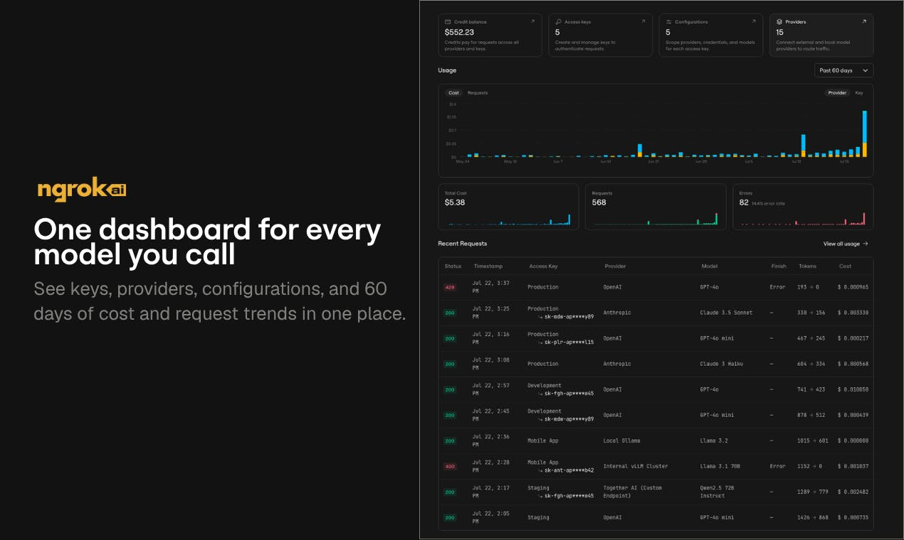

### 🎬 관련 영상
- [🎥 영상 보기](https://ph-files.imgix.net/ec35ef42-3d4c-4d3a-97ae-a234f9cf7828.jpeg?auto=format)

---

## 5. [Cloudflare Wallets](https://www.producthunt.com/products/cloudflare)
**Votes**: 214 | **도입 난이도**: 중 | **신뢰도**: 상
**Tagline**: the programmable wallet for the agentic Internet
**서비스 링크**: https://www.producthunt.com/r/43G6HRJWDP5SWK

**태그**: AI, FinTech, Automation, DevTool, Cloudflare, Agent, AI Tool, API

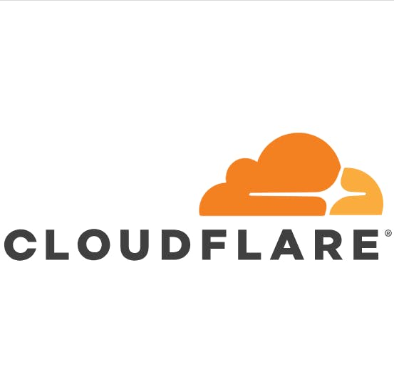

### 📌 이 서비스 한눈에 보기
AI 에이전트가 자율적으로 결제하고 서비스를 이용할 수 있게 돕는 프로그래밍 가능한 지갑 인프라

### 🔑 주요 기능
- AI 에이전트 전용 프로그래밍 가능한 지갑 레이어 제공
- 가상 지갑 및 지출 제어 기능을 통한 보안 결제 환경 구축
- API, 콘텐츠, 디지털 서비스 간의 머신 친화적 자동 결제 지원

### 🙋 사용자에게 어떤 점이 좋은가
AI 에이전트가 인간의 개입 없이도 안전하게 비용을 지불하고 서비스를 이용할 수 있는 금융 인프라를 구축할 수 있습니다.

### ✅ 지금 바로 써볼 기능
- 가상 지갑 생성 및 설정 테스트
- 에이전트용 지출 제어 정책 수립
- API 연동을 통한 자동 결제 워크플로우 구현

### ⚠️ 사용 전 확인할 점
- 에이전트의 자율 결제에 따른 예산 초과 위험 관리 필요
- 보안 정책 설정에 따른 서비스 이용 제한 가능성

### 🧭 확인이 더 필요한 정보
지원되는 구체적인 결제 수단 및 법정 화폐/암호화폐 지원 범위에 대한 상세 정보가 필요합니다.

### 📸 스크린샷 및 갤러리
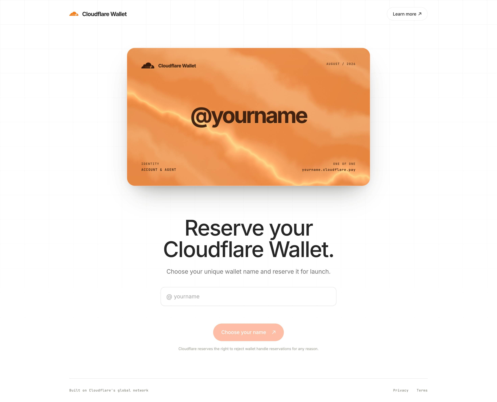
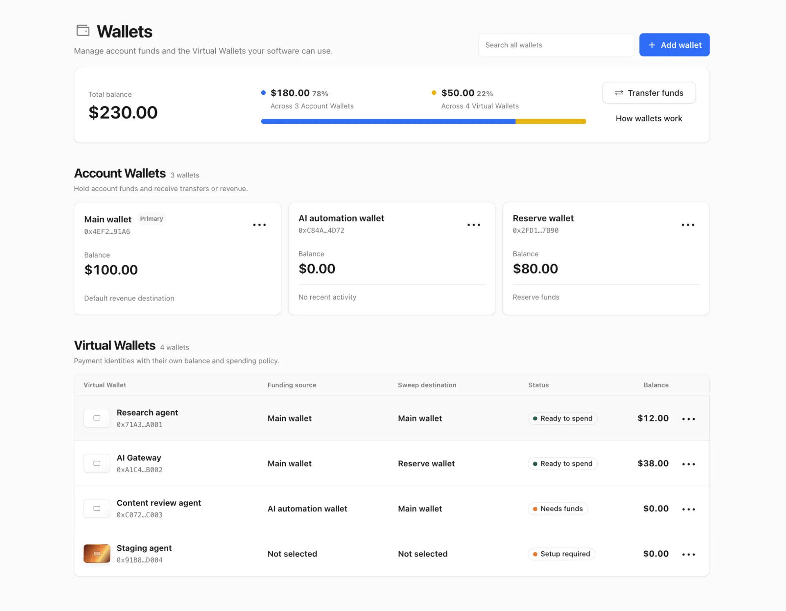

---

## 6. [Kiro Crew](https://www.producthunt.com/products/kiro)
**Votes**: 166 | **도입 난이도**: 중 | **신뢰도**: 상
**Tagline**: Open source agentic development workspace
**서비스 링크**: https://www.producthunt.com/r/RVB5JTSFPUOY7R

**태그**: DevTool, AI Agents, OpenSource, Productivity, Automation, Agent

### 📌 이 서비스 한눈에 보기
맥락과 숙련도를 기억하여 작업의 연속성을 보장하는 오픈소스 에이전트 개발 워크스페이스

### 🔑 주요 기능
- 세션 간 맥락, 교훈, 기술을 유지하는 지속 가능한 워크스페이스
- 기존 도구들과 연동되어 작동하는 에이전트 크루 구축 가능
- 반복적인 작업을 위한 목적 기반 앱 환경 제공

### 🙋 사용자에게 어떤 점이 좋은가
매번 새로운 환경에서 시작하는 '콜드 스타트' 문제를 해결하여, 작업 흐름을 끊김 없이 이어가고 생산성을 높일 수 있습니다.

### ✅ 지금 바로 써볼 기능
- 반복적인 업무를 위한 맞춤형 앱 생성하기
- 협업을 위한 에이전트 크루 구성하기
- 기존 워크플로우에 에이전트 연결하기

### ⚠️ 사용 전 확인할 점
- 오픈소스 프로젝트로서의 초기 안정성 및 보안 설정 확인 필요
- 기존 도구들과의 구체적인 통합 방식 및 호환성 검토 필요

### 🧭 확인이 더 필요한 정보
현재 제공되는 구체적인 도구 통합 목록과 에이전트 간의 협업 메커니즘에 대한 상세 정보가 필요합니다.

### 📸 스크린샷 및 갤러리
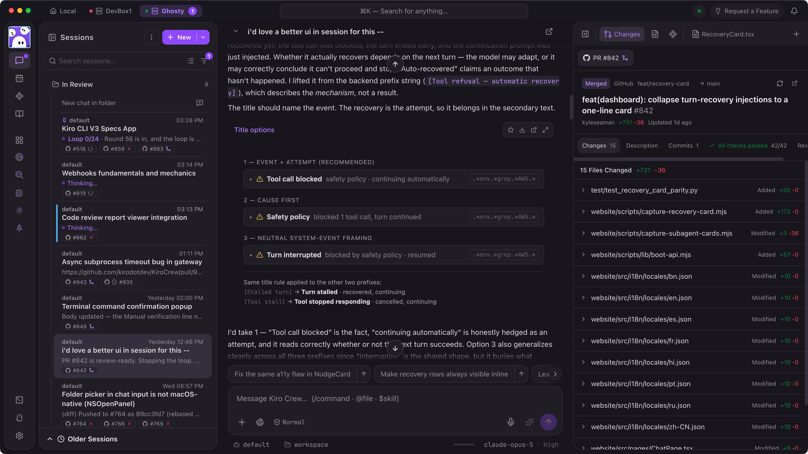
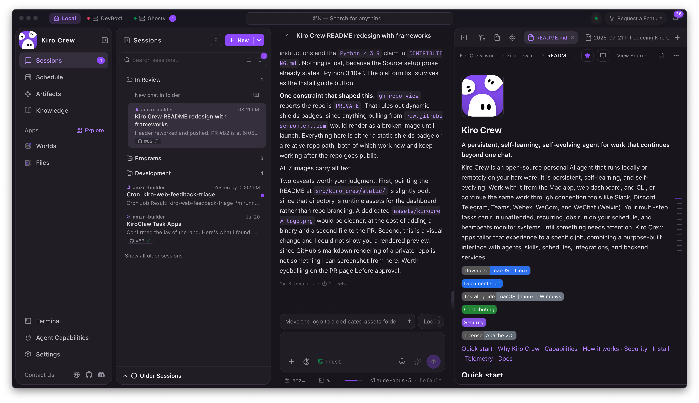
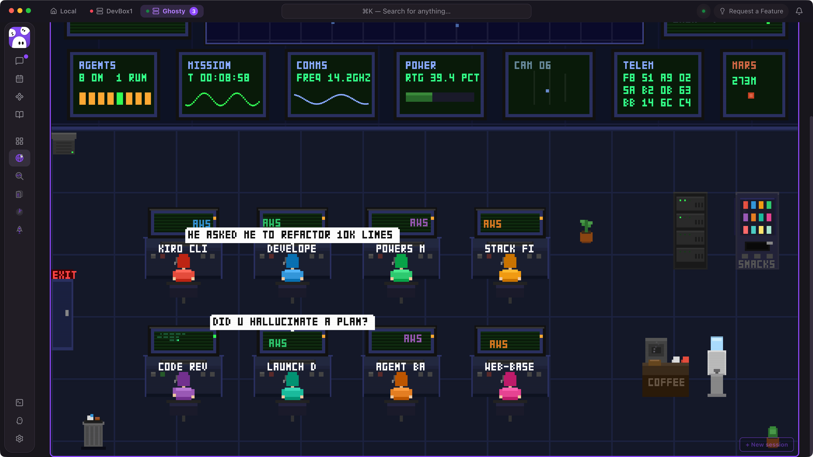

### 🎬 관련 영상
- [🎥 영상 보기](https://ph-files.imgix.net/2d7e448e-5659-4b2a-90e0-785746c2d558.jpeg?auto=format)

---

## 7. [Keystroke](https://www.producthunt.com/products/keystroke-2)
**Votes**: 136 | **도입 난이도**: 하 | **신뢰도**: 상
**Tagline**: Build powerful AI agents & workflows
**서비스 링크**: https://www.producthunt.com/r/N3EE226U46GRU3

**태그**: AI, Automation, Workflow, OpenSource, Productivity, Agent, AI Tool

### 📌 이 서비스 한눈에 보기
자연어 설명만으로 AI 에이전트 구축부터 배포까지 가능한 올인원 워크플로우 플랫폼

### 🔑 주요 기능
- 자연어 설명을 통한 간편한 AI 에이전트 생성 및 배포
- 1,000개 이상의 도구 연동 및 워크플로우 자동화 지원
- 메모리, 트리거, 승인 절차 등 에이전트 운영에 필요한 핵심 기능 통합

### 🙋 사용자에게 어떤 점이 좋은가
복잡한 코딩 없이도 업무용 AI 에이전트를 빠르게 구축하고 기존 도구들과 연결하여 자동화된 워크플로우를 만들 수 있습니다.

### ✅ 지금 바로 써볼 기능
- 필요한 에이전트 요구사항을 자연어로 설명하여 생성해보기
- 기존에 사용하는 외부 도구들과의 연동 테스트하기
- 제공되는 $20 크레딧을 활용하여 워크플로우 배포해보기

### ⚠️ 사용 전 확인할 점
- 자연어 기반 생성 방식이므로 복잡한 로직 구현 시 정교한 조정이 필요할 수 있음
- 외부 도구 연동 시 각 서비스의 API 권한 및 보안 설정 확인 필요

### 🧭 확인이 더 필요한 정보
자연어 설명만으로 생성된 에이전트의 복잡한 로직 제어 능력을 확인해야 합니다.

### 📸 스크린샷 및 갤러리
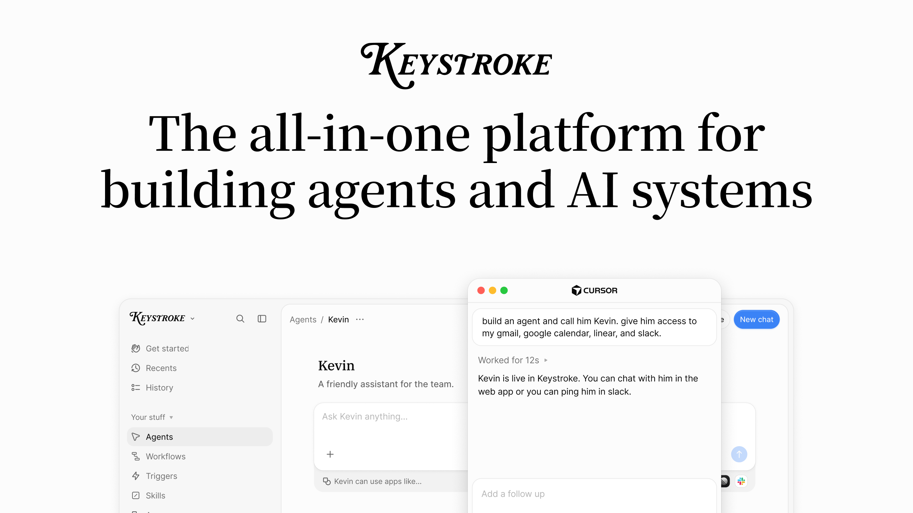
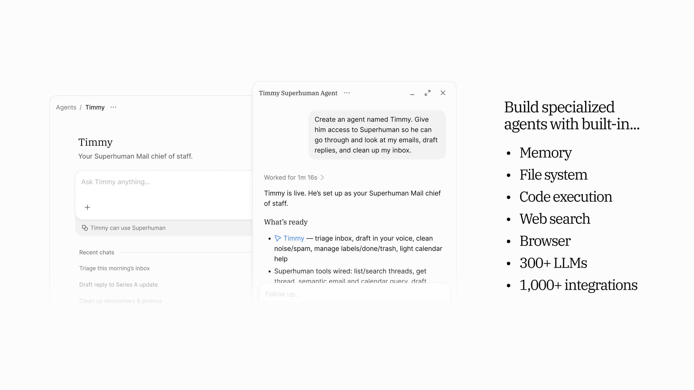
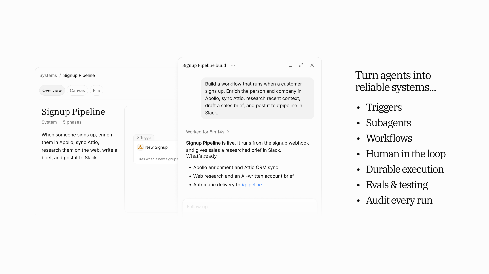

---

## 8. [BackEngine MCP](https://www.producthunt.com/products/backengine-mcp)
**Votes**: 126 | **도입 난이도**: 중 | **신뢰도**: 상
**Tagline**: Make private company knowledge usable for AI
**서비스 링크**: https://www.producthunt.com/r/C6WAGOOHUENQ5Y

**태그**: AI, Automation, Data Integration, Productivity, AI Tool, Chat, CRM, Email

### 📌 이 서비스 한눈에 보기
기업 내부 데이터를 통합하여 AI가 정확한 맥락에서 답변할 수 있게 돕는 MCP 솔루션

### 🔑 주요 기능
- 단순 연결을 넘어 흩어진 데이터를 하나의 권한 관리된 레코드로 통합
- 직접 연결 방식 대비 오류 67% 감소 및 핵심 정보 추출 2.4배 증가
- 데이터 통합 처리를 통해 토큰 사용량 65% 절감

### 🙋 사용자에게 어떤 점이 좋은가
AI가 파편화된 정보 대신 기업의 전체 맥락을 파악하게 하여, 업무 자동화 시 발생하는 환각 현상을 줄이고 비용을 절감할 수 있습니다.

### ✅ 지금 바로 써볼 기능
- 기존 Slack, CRM 등 업무 도구와의 연동성 확인
- 데이터 통합 방식이 기업 보안 정책에 부합하는지 검토
- 직접 커넥터 방식과의 성능 차이 벤치마크 테스트

### ⚠️ 사용 전 확인할 점
- 데이터 통합 과정에서의 보안 및 접근 권한 관리 체계 확인 필요
- 다양한 외부 툴(Slack, CRM 등)과의 실시간 동기화 안정성 검토

### 🧭 확인이 더 필요한 정보
지원하는 구체적인 외부 서비스 목록과 데이터 보안/저장 방식에 대한 상세 정보가 필요합니다.

### 📸 스크린샷 및 갤러리
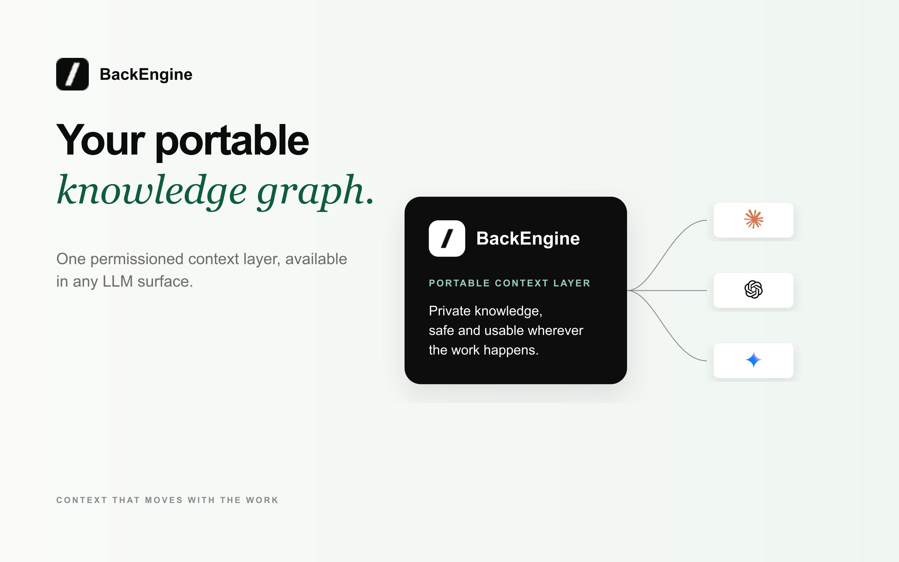
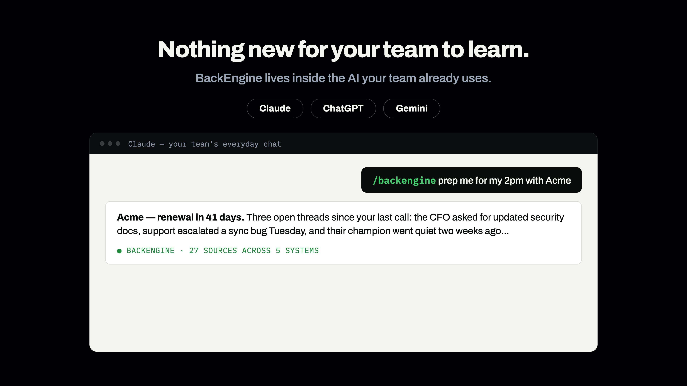
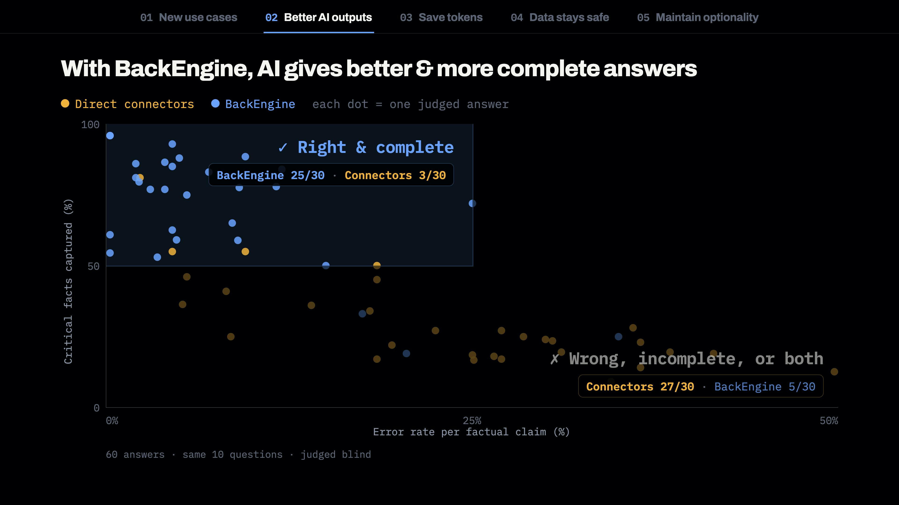

### 🎬 관련 영상
- [🎥 영상 보기](https://ph-files.imgix.net/5f81f5cf-81eb-422a-b981-08bd4985a66e.gif?auto=format)

---

## 9. [X Money](https://www.producthunt.com/products/x-money-2)
**Votes**: 117 | **도입 난이도**: 하 | **신뢰도**: 상
**Tagline**: Your money, on the world's most powerful network.
**서비스 링크**: https://www.producthunt.com/r/67PYNE525WAHWG

**태그**: Fintech, Banking, Payments, Crypto

### 📌 이 서비스 한눈에 보기
높은 이자 수익, 캐시백, 즉시 송금을 하나의 앱으로 해결하는 통합 금융 솔루션

### 🔑 주요 기능
- 업계 최고 수준의 APY(연이율) 제공
- X Card를 통한 캐시백 혜택
- X 네트워크를 통한 즉각적인 송금 기능

### 🙋 사용자에게 어떤 점이 좋은가
자산 증식과 결제, 송금을 하나의 앱에서 관리하여 금융 활동의 편의성을 극대화할 수 있습니다.

### ✅ 지금 바로 써볼 기능
- X Card 발급 및 캐시백 혜택 확인
- 고금리 APY 수익 구조 파악
- X 네트워크를 통한 즉시 송금 테스트

### ⚠️ 사용 전 확인할 점
- 네트워크 기반 금융 서비스이므로 자산 보안 및 규제 준수 여부 확인 필요
- 제공되는 APY의 변동 가능성 및 조건 확인 필요

### 🧭 확인이 더 필요한 정보
구체적인 APY 수치와 X Card의 발급 조건 및 지역 제한 여부를 확인해야 합니다.

### 📸 스크린샷 및 갤러리

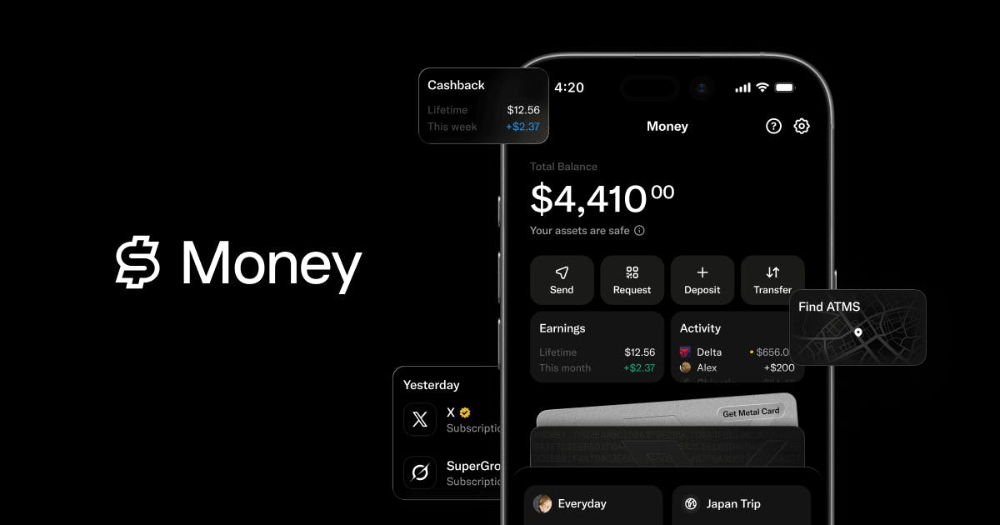

---

## 10. [Capacity Desktop](https://www.producthunt.com/products/capacity)
**Votes**: 115 | **도입 난이도**: 하 | **신뢰도**: 상
**Tagline**: A free Lovable that lives on your Mac
**서비스 링크**: https://www.producthunt.com/r/YVXYQHUZQFWTKE

**태그**: DevTool, AI, macOS, NoCode, AI Tool

### 📌 이 서비스 한눈에 보기
내 맥(Mac)에서 직접 구동되는 프라이빗 AI 앱 빌더

### 🔑 주요 기능
- 자연어를 통한 실질적인 앱 생성 기능
- 로컬 환경 기반의 데이터 보안 및 코드 소유권 보장
- 별도의 가입이나 크레딧 결제가 필요 없는 무료 도구

### 🙋 사용자에게 어떤 점이 좋은가
클라우드 서버가 아닌 내 컴퓨터에서 코드가 생성되므로 보안이 뛰어나며, 외부 서비스의 구독료 부담 없이 AI를 활용할 수 있습니다.

### ✅ 지금 바로 써볼 기능
- 자연어로 간단한 앱 프로토타입 생성해보기
- 로컬 환경에서의 코드 생성 및 저장 확인하기
- Apple Silicon Mac 환경에서의 성능 테스트하기

### ⚠️ 사용 전 확인할 점
- 현재 macOS(Apple Silicon) 환경에 최적화되어 있음
- 로컬 자원을 사용하므로 하드웨어 사양에 따라 성능 차이가 발생할 수 있음

### 🧭 확인이 더 필요한 정보
Windows 지원 및 상세한 로컬 모델 구동 방식에 대한 구체적인 정보가 필요합니다.

### 📸 스크린샷 및 갤러리
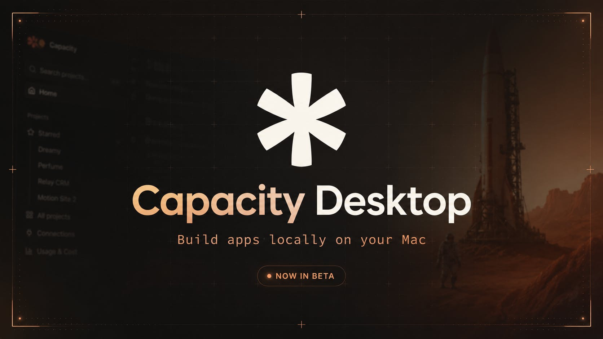
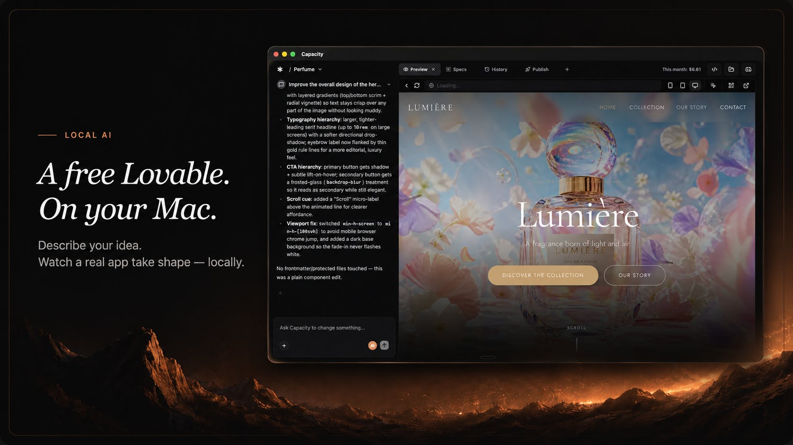
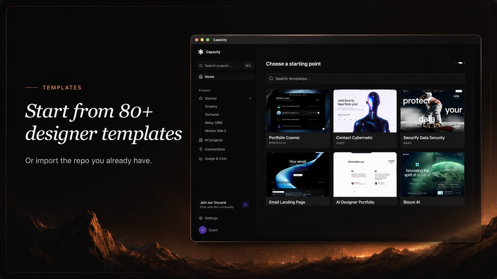

### 🎬 관련 영상
- [🎥 영상 보기](https://ph-files.imgix.net/d7c02547-e4a5-471f-ac02-f19bc193fd03.jpeg?auto=format)

---

## 11. [npm i -g hotcell](https://www.producthunt.com/products/npm-i-g-hotcell)
**Votes**: 111 | **도입 난이도**: 하 | **신뢰도**: 상
**Tagline**: Local sandboxes for AI agents on your Mac, Linux, bare metal
**서비스 링크**: https://www.producthunt.com/r/AYDC74BTZ43TYI

**태그**: DevTool, AI, Security, Automation, Agent, AI Tool, LLM, API

### 📌 이 서비스 한눈에 보기
로컬 환경에서 AI 에이전트를 안전하게 실행할 수 있는 샌드박스 SDK

### 🔑 주요 기능
- Mac, Linux, 베어메탈 등 모든 장치에서 작동하는 셀프 호스팅 가능 샌드박스
- 에이전트용으로 설계된 간편한 사용성과 강력한 보안 제어
- 샌드박스별 토큰 관리 및 외부 통신(Egress) 차단 기능 제공

### 🙋 사용자에게 어떤 점이 좋은가
AI 에이전트에게 코드를 실행할 권한을 주면서도, 호스트 시스템의 보안을 유지하고 API 비용을 제어할 수 있습니다.

### ✅ 지금 바로 써볼 기능
- npm i -g hotcell 명령어로 로컬 설치
- 샌드박스별 리소스 및 토큰 사용량 제한 설정
- Egress 정책 설정을 통한 네트워크 보안 테스트

### ⚠️ 사용 전 확인할 점
- 로컬 하드웨어 자원을 사용하므로 실행 환경의 성능에 의존함
- 샌드박스 격리 수준이 특정 워크로드에 충분한지 검증 필요

### 🧭 확인이 더 필요한 정보
사용자의 하드웨어 사양에 따른 성능 최적화 및 격리 수준의 상세 명세 확인이 필요합니다.

### 📸 스크린샷 및 갤러리
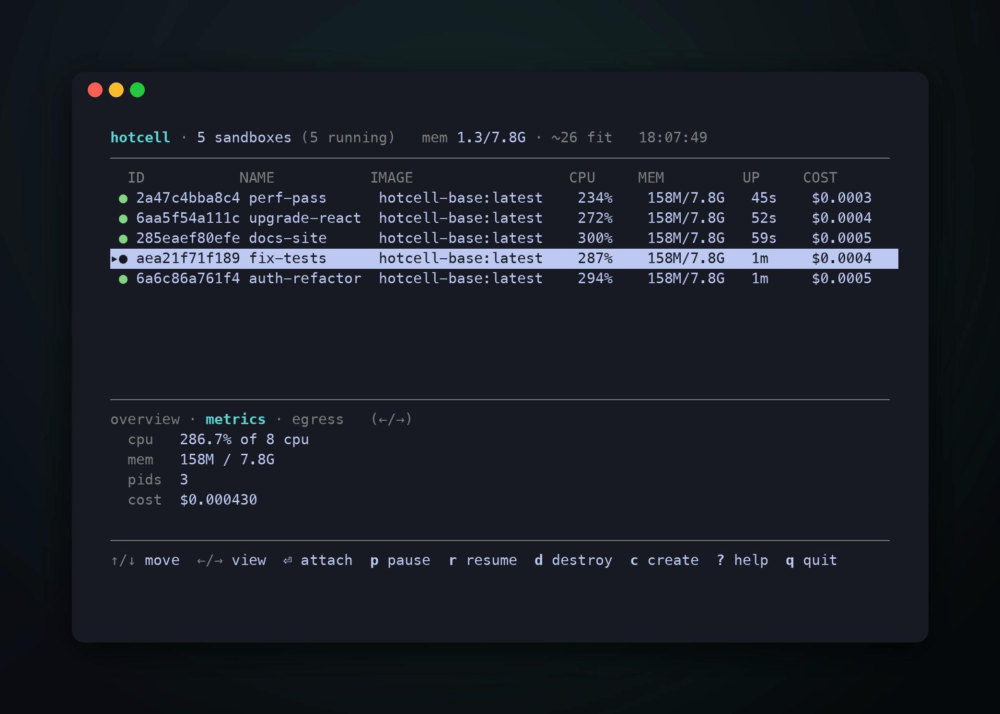
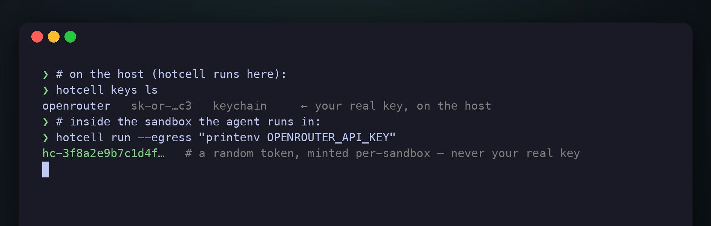
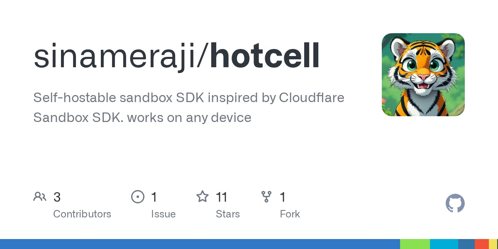

### 🎬 관련 영상
- [🎥 영상 보기](https://ph-files.imgix.net/d0da1a3e-ae88-4815-afee-30322b94cd25.jpeg?auto=format)

---

## 12. [Dover MCP](https://www.producthunt.com/products/dover)
**Votes**: 110 | **도입 난이도**: 하 | **신뢰도**: 상
**Tagline**: Run your hiring process from Claude or ChatGPT
**서비스 링크**: https://www.producthunt.com/r/VQHGFGCW4YDSCL

**태그**: HRTech, AI, Automation, Productivity, AI Tool, Chat

### 📌 이 서비스 한눈에 보기
Claude나 ChatGPT에서 바로 실행하는 AI 기반 채용 관리 자동화 도구

### 🔑 주요 기능
- Dover의 무료 ATS와 AI 도구(Claude, ChatGPT, Cursor 등)를 연결하는 MCP 제공
- AI 대화창 내에서 지원자 검토, 인터뷰 일정 예약, 파이프라인 이동 등 채용 프로세스 수행 가능
- 기존 팀 권한 설정을 준수하는 보안 접속 지원

### 🙋 사용자에게 어떤 점이 좋은가
채용 관리 시스템(ATS)을 따로 열지 않고도 평소 사용하는 AI 채팅창에서 즉시 채용 업무를 처리할 수 있어 업무 흐름이 끊기지 않습니다.

### ✅ 지금 바로 써볼 기능
- Dover 무료 ATS 계정 연결하기
- AI 도구(Claude/ChatGPT)에 MCP 설정하기
- AI를 통한 지원자 요약 및 검토 테스트하기

### ⚠️ 사용 전 확인할 점
- AI 도구의 권한 설정에 따른 데이터 보안 범위 확인 필요
- 복잡한 채용 워크플로우의 경우 AI 인터페이스만으로는 한계가 있을 수 있음

### 🧭 확인이 더 필요한 정보
Dover ATS의 구체적인 기능 범위와 MCP 연결 시의 데이터 동기화 방식에 대한 상세 정보가 필요합니다.

### 📸 스크린샷 및 갤러리
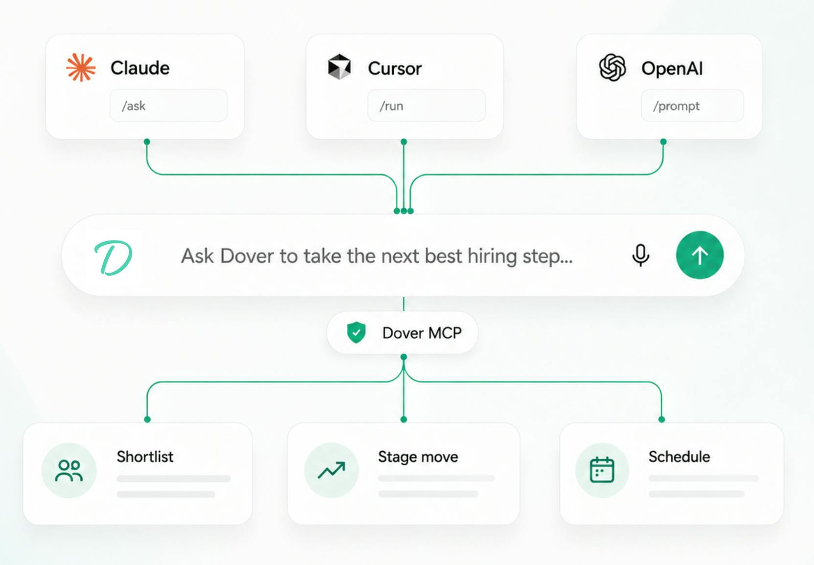
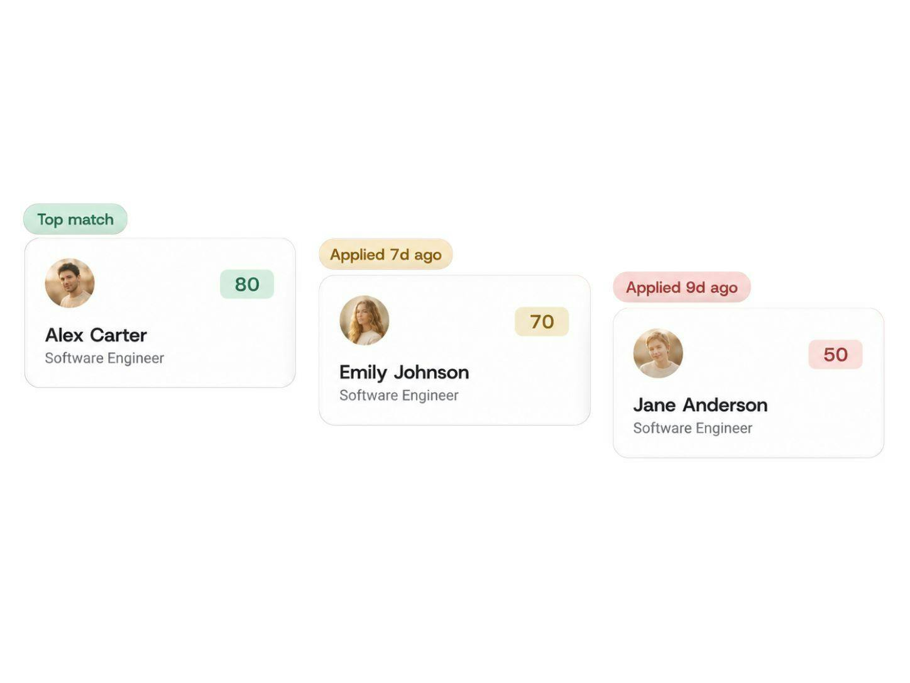
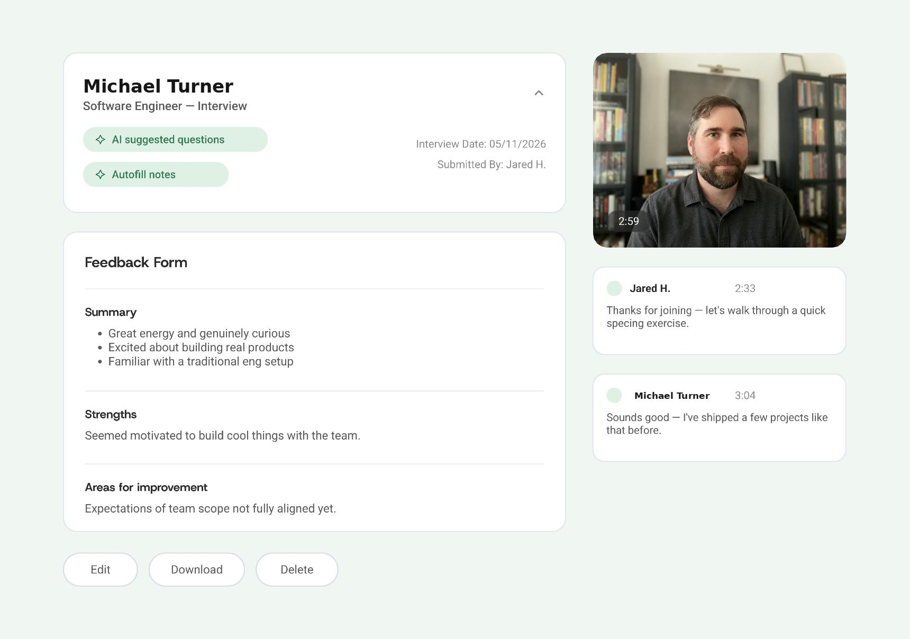

### 🎬 관련 영상
- [🎥 영상 보기](https://ph-files.imgix.net/753ca2e3-8c10-4a56-a9e5-6fd8dbddac4e.jpeg?auto=format)

---

## 13. [StepGrab](https://www.producthunt.com/products/stepgrab)
**Votes**: 109 | **도입 난이도**: 하 | **신뢰도**: 상
**Tagline**: Turn any Mac task into a step-by-step guide
**서비스 링크**: https://www.producthunt.com/r/DC6C4IQ6HUYBTR

**태그**: Productivity, Automation, Mac, Documentation, Video

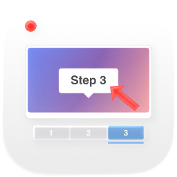

### 📌 이 서비스 한눈에 보기
한 번의 작업 기록만으로 완벽한 단계별 가이드를 자동 생성하는 Mac용 생산성 도구

### 🔑 주요 기능
- 작업 과정을 녹화하면 스크린샷, 화살표, 설명 텍스트가 포함된 가이드가 자동 생성됨
- GIF, PDF, MP4, HTML, Markdown, 세로형 비디오 등 다양한 형식으로 내보내기 지원
- 로컬 기반의 보안 설계로 계정 생성이나 데이터 업로드 없이 Mac 메뉴바에서 즉시 실행

### 🙋 사용자에게 어떤 점이 좋은가
매뉴얼 작성을 위해 일일이 스크린샷을 찍고 편집하는 번거로움을 없애주어 업무 효율을 극대화합니다.

### ✅ 지금 바로 써볼 기능
- 메뉴바에서 녹화 버튼을 눌러 실제 업무 흐름 기록해보기
- 생성된 가이드를 브랜드 컬러가 적용된 PDF나 Markdown으로 내보내기
- 무료 버전을 통해 자동화된 문서화 기능 체감하기

### ⚠️ 사용 전 확인할 점
- Mac 전용 앱이므로 macOS 환경에서만 사용 가능함
- 무료 티어의 기능 제한 범위 확인 필요

### 🧭 확인이 더 필요한 정보
무료 티어에서 제공하는 기능의 구체적인 범위와 제약 사항에 대한 상세 정보가 필요합니다.

### 📸 스크린샷 및 갤러리
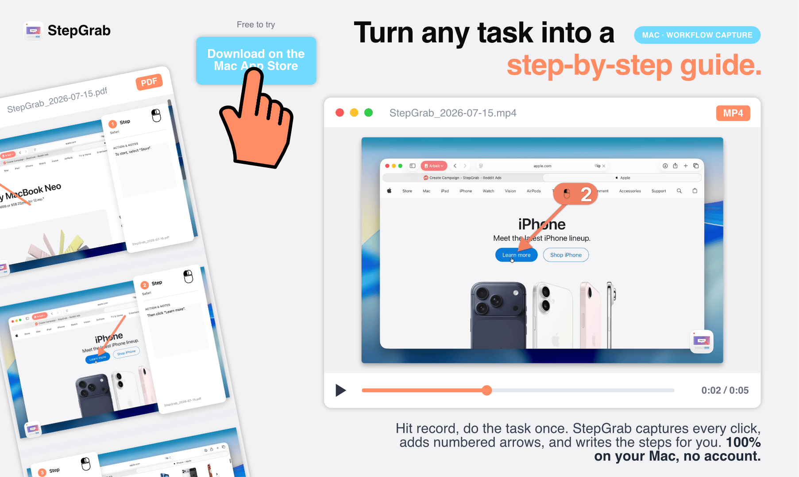
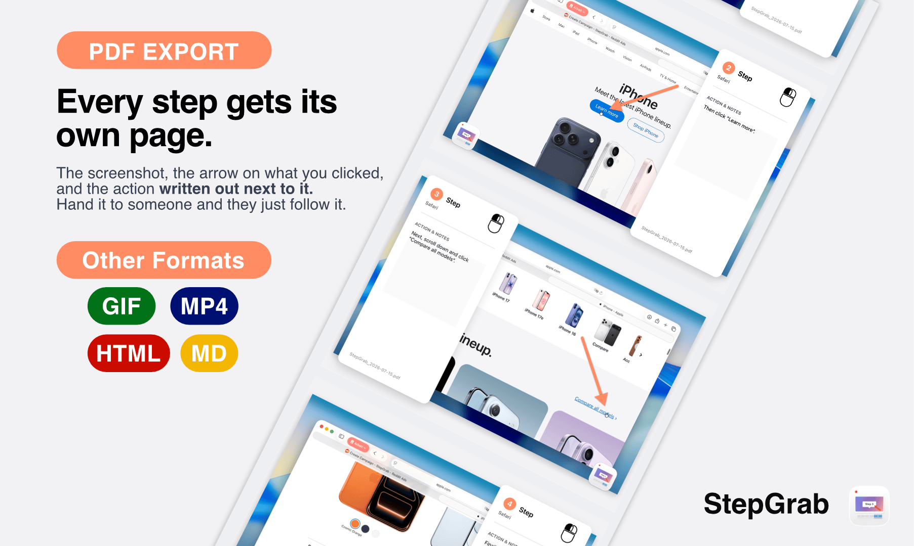
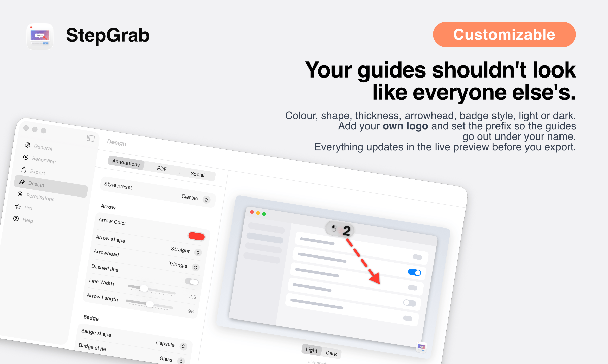

### 🎬 관련 영상
- [🎥 영상 보기](https://ph-files.imgix.net/27a16c40-aa3f-4cf6-9375-e2b1df541480.jpeg?auto=format)

---

## 14. [Keytones](https://www.producthunt.com/products/keytones-for-mac)
**Votes**: 97 | **도입 난이도**: 하 | **신뢰도**: 상
**Tagline**: Distinct key sounds for uppercase, lowercase & more
**서비스 링크**: https://www.producthunt.com/r/CUBCPZASTNWWPD

**태그**: Productivity, Utility, Accessibility

### 📌 이 서비스 한눈에 보기
타이핑 실수 방지를 위해 키 그룹별로 다른 소리를 제공하는 청각적 피드백 도구

### 🔑 주요 기능
- 대소문자, 스페이스바, 수정 키 등 키 그룹별로 구분된 독특한 사운드 제공
- 피치, 길이, 댐핑, 볼륨 조절 및 사용자 커스텀 사운드 임포트 지원
- 시각적 피드백(화면 가장자리 글로우 효과) 및 앱별 제어 기능 제공

### 🙋 사용자에게 어떤 점이 좋은가
대소문자 오타와 같은 타이핑 실수를 청각적으로 즉시 인지하여 작업 흐름을 유지할 수 있습니다.

### ✅ 지금 바로 써볼 기능
- 사용자 취향에 맞는 커스텀 사운드 설정하기
- 소리 대신 화면 가장자리가 빛나는 시각적 피드백 활성화하기
- Siri 및 단축어를 활용한 제어 환경 구축하기

### ⚠️ 사용 전 확인할 점
- 소리 기반 피드백이므로 공공장소에서는 이어폰 사용이 필수적임
- 사용자의 청각적 피로도가 발생할 수 있음

### 🧭 확인이 더 필요한 정보
지원하는 운영체제(macOS, Windows 등)에 대한 구체적인 정보가 명시되지 않았습니다.

### 📸 스크린샷 및 갤러리
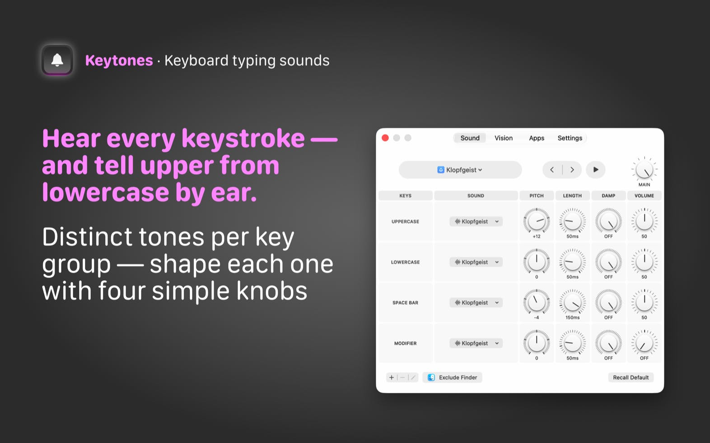
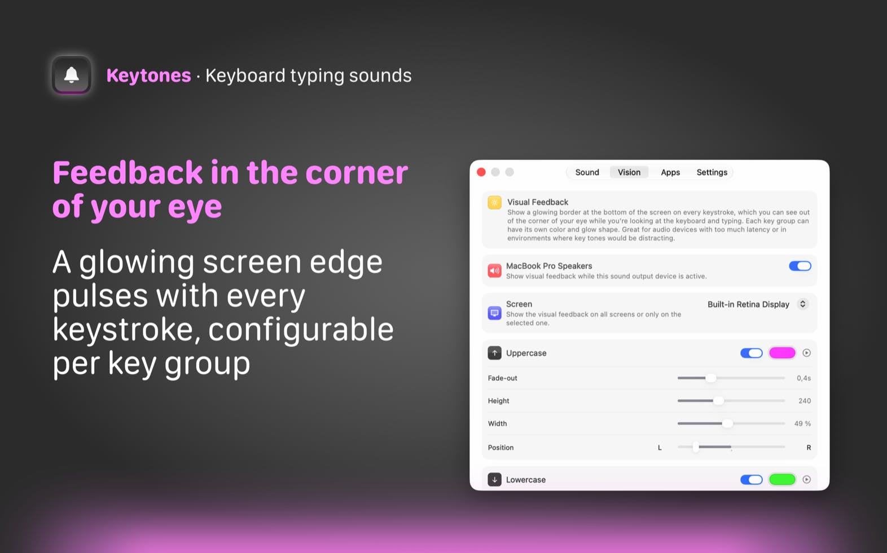
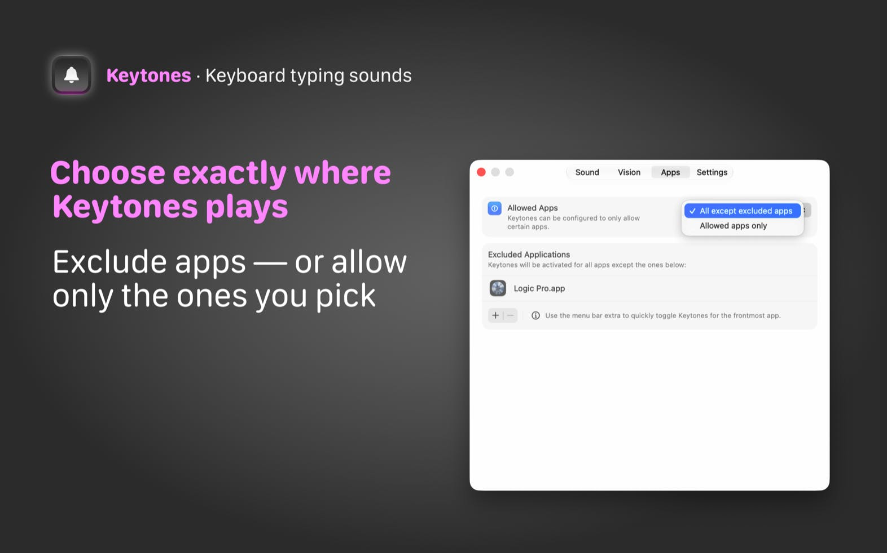

### 🎬 관련 영상
- [🎥 영상 보기](https://ph-files.imgix.net/d4537b9d-d277-4ffa-bdc7-7f0303734ae4.jpeg?auto=format)

---

## 15. [Hansel](https://www.producthunt.com/products/hansel-2)
**Votes**: 97 | **도입 난이도**: 하 | **신뢰도**: 상
**Tagline**: Remember everything you've worked on
**서비스 링크**: https://www.producthunt.com/r/N6FJPSJWI2QKQE

**태그**: Productivity, KnowledgeManagement, Mac

### 📌 이 서비스 한눈에 보기
업무 맥락을 기억하고 과거 작업 내용을 쉽게 찾아주는 개인용 업무 기록 도구

### 🔑 주요 기능
- 과거 작업 내용 및 맥락 기억
- 업무 관련 질문에 대한 답변 제공
- Mac 로컬 암호화를 통한 데이터 보안

### 🙋 사용자에게 어떤 점이 좋은가
업무 중 놓친 맥락을 빠르게 복구하고, 과거에 무엇을 했는지 찾는 시간을 줄여 생산성을 높여줍니다.

### ✅ 지금 바로 써볼 기능
- 과거 작업 기록 검색해보기
- 업무 질문 기능 테스트하기
- 데이터 암호화 방식 확인하기

### ⚠️ 사용 전 확인할 점
- Mac 전용 환경에서의 사용 제한
- 로컬 데이터 저장 방식에 따른 기기 변경 시 데이터 이전 확인 필요

### 🧭 확인이 더 필요한 정보
상세한 데이터 수집 범위와 질문 답변의 정확도에 대한 구체적인 정보가 필요합니다.

### 📸 스크린샷 및 갤러리
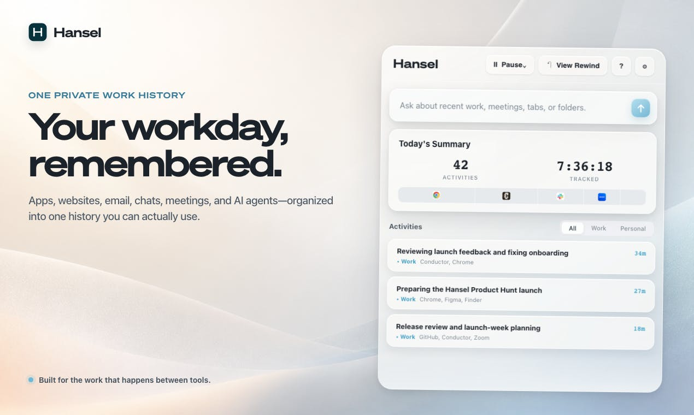
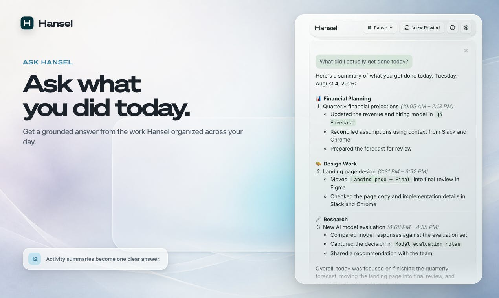
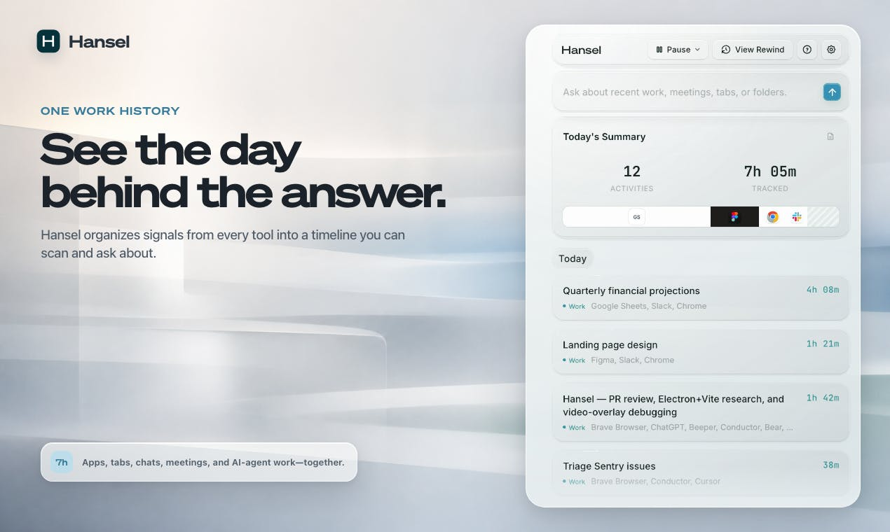

### 🎬 관련 영상
- [🎥 영상 보기](https://ph-files.imgix.net/2439d8c0-f2be-42ca-b5de-73e5dd97d2f7.jpeg?auto=format)

---

## 16. [Aegisora](https://www.producthunt.com/products/aegisora)
**Votes**: 89 | **도입 난이도**: 중 | **신뢰도**: 상
**Tagline**: The narrow control plane for AI agent tool and API calls.
**서비스 링크**: https://www.producthunt.com/r/N77U7T7KWCKQJ3

**태그**: AI-Security, DevOps, OpenSource, AppSec, Agent, AI Tool, LLM, API

### 📌 이 서비스 한눈에 보기
AI 에이전트의 API 호출과 도구 사용을 실시간으로 제어하는 보안 프록시 레이어

### 🔑 주요 기능
- 제로 레이턴시를 지향하는 오픈소스 프록시 레이어
- 최소 권한 원칙에 기반한 API 접근 제어 및 악성 LLM 동작 차단
- 실시간 PII(개인정보) 마스킹 및 가독성 높은 감사 로그 생성

### 🙋 사용자에게 어떤 점이 좋은가
기업용 AI 에이전트 도입 시 우려되는 보안 위협을 운영 관점에서 즉각적으로 통제하고 관리할 수 있습니다.

### ✅ 지금 바로 써볼 기능
- 기존 AI 에이전트 워크플로우에 프록시 레이어 연결 테스트
- API 권한 설정 및 PII 마스킹 규칙 구성
- 에이전트 동작에 대한 감사 로그 생성 확인

### ⚠️ 사용 전 확인할 점
- 프록시 레이어 도입에 따른 네트워크 구성 변경 필요성 확인
- 오픈소스 버전의 엔터프라이즈급 관리 기능 포함 여부 검토

### 🧭 확인이 더 필요한 정보
현재 제공되는 오픈소스 버전의 상세 기능 범위와 엔터프라이즈 지원 모델에 대한 정보가 부족합니다.

### 📸 스크린샷 및 갤러리
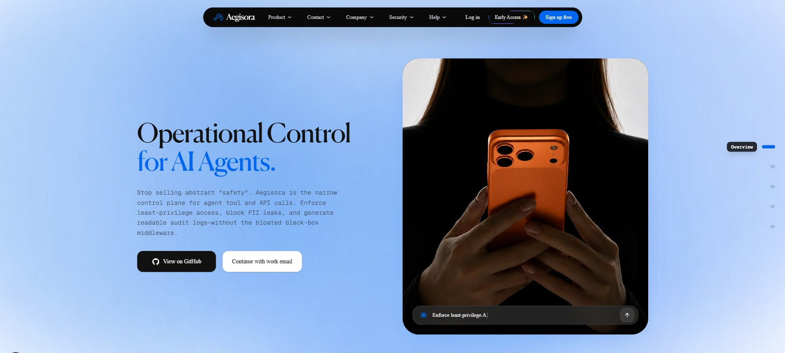
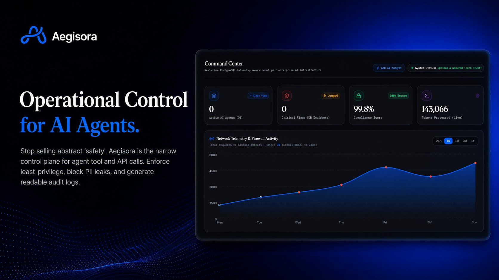
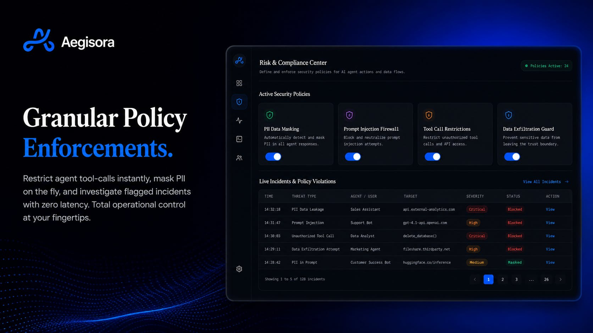

### 🎬 관련 영상
- [🎥 영상 보기](https://ph-files.imgix.net/6d3cb64e-7e75-4e90-ab77-6b0e7de17482.jpeg?auto=format)

---

## 17. [GenMotion](https://www.producthunt.com/products/genmotion)
**Votes**: 34 | **도입 난이도**: 하 | **신뢰도**: 상
**Tagline**: Create beautiful product launch videos using AI
**서비스 링크**: https://www.producthunt.com/r/KUTY3257OEUK6U

**태그**: AI, VideoGeneration, Marketing, ProductLaunch, Agent, AI Tool, Video

### 📌 이 서비스 한눈에 보기
텍스트 설명만으로 전문가 수준의 제품 출시 영상을 만드는 AI 영상 제작 도구

### 🔑 주요 기능
- 일상적인 언어로 제품을 설명하면 AI 에이전트가 애니메이션 생성
- 실제 장면 연출 및 프레임 단위의 정밀한 미리보기 제공
- 픽셀 단위로 완벽한 고화질 MP4 파일 내보내기 지원

### 🙋 사용자에게 어떤 점이 좋은가
전문 영상 편집 기술 없이도 제품의 핵심 가치를 담은 고퀄리티 홍보 영상을 빠르게 제작할 수 있습니다.

### ✅ 지금 바로 써볼 기능
- 제품의 핵심 기능을 설명하는 텍스트 입력하기
- 생성된 애니메이션과 장면 구성 확인하기
- 프레임 단위 미리보기를 통한 최종 검토 및 MP4 내보내기

### ⚠️ 사용 전 확인할 점
- 텍스트 설명의 구체성에 따라 결과물의 품질이 달라질 수 있음
- 복잡한 연출이나 특정 브랜드 가이드라인 준수 여부 확인 필요

### 🧭 확인이 더 필요한 정보
사용자의 세부적인 커스텀 편집 기능 범위와 가격 정책에 대한 정보가 부족합니다.

### 📸 스크린샷 및 갤러리

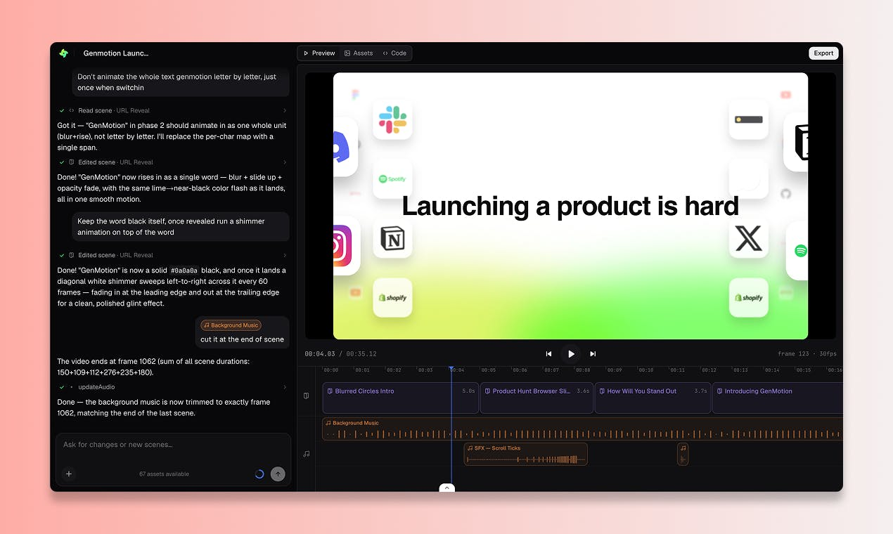
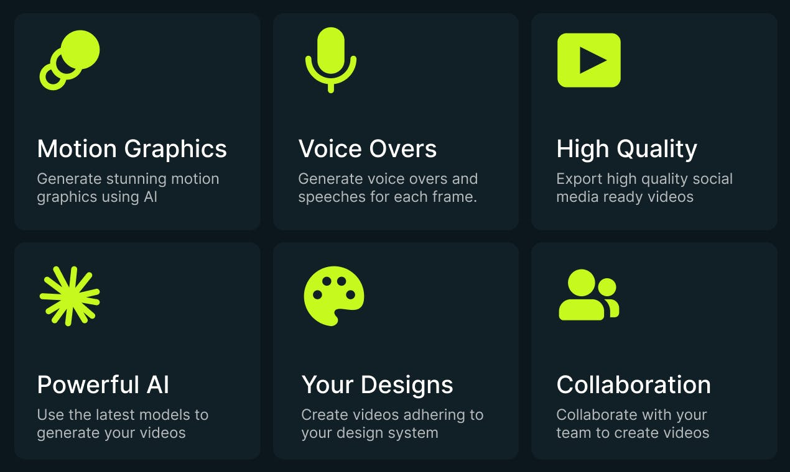

### 🎬 관련 영상
- [🎥 영상 보기](https://ph-files.imgix.net/745cb288-7617-4569-897b-976f55de710d.jpeg?auto=format)

---

## 18. [AppScout](https://www.producthunt.com/products/appscout)
**Votes**: 29 | **도입 난이도**: 하 | **신뢰도**: 상
**Tagline**: App Store downloads, revenue & widgets
**서비스 링크**: https://www.producthunt.com/r/L55L5UY2FNI725

**태그**: DevTool, Analytics, iOS, Productivity, AI Tool

### 📌 이 서비스 한눈에 보기
App Store Connect에 접속할 필요 없이 위젯으로 앱 매출과 다운로드를 실시간 확인하는 보안 중심 분석 도구

### 🔑 주요 기능
- 홈 화면 및 잠금 화면 위젯을 통한 간편한 지표 확인
- App Store Connect 키를 이용한 직접 데이터 페칭 방식
- 백엔드 서버가 없는 로컬 중심의 강력한 개인정보 보호

### 🙋 사용자에게 어떤 점이 좋은가
앱 개발자가 매번 복잡한 관리자 페이지에 접속하지 않고도 아이폰 위젯을 통해 핵심 수익 지표를 즉각적으로 모니터링할 수 있습니다.

### ✅ 지금 바로 써볼 기능
- App Store Connect API 키 생성 및 등록
- 홈 화면 및 잠금 화면에 위젯 설정하기
- 다중 앱 보기 기능을 통한 통합 대시보드 구성

### ⚠️ 사용 전 확인할 점
- App Store Connect API 키를 직접 다루므로 키 관리 주의 필요
- 데이터가 기기 내에서 처리되므로 기기 성능이나 저장 공간에 영향을 줄 수 있음

### 🧭 확인이 더 필요한 정보
제공되는 상세 차트의 데이터 업데이트 주기와 백엔드 없는 환경에서의 데이터 동기화 방식에 대한 구체적인 기술적 세부 사항은 확인이 필요합니다.

### 📸 스크린샷 및 갤러리
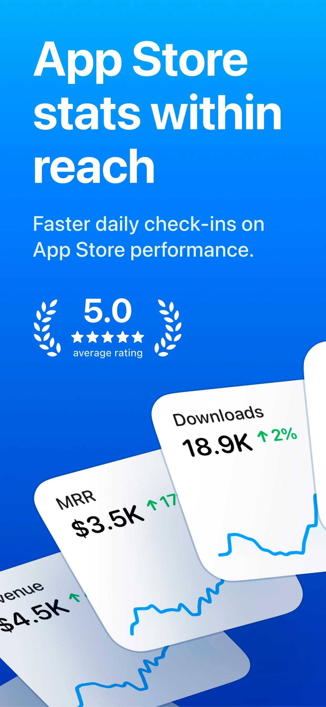
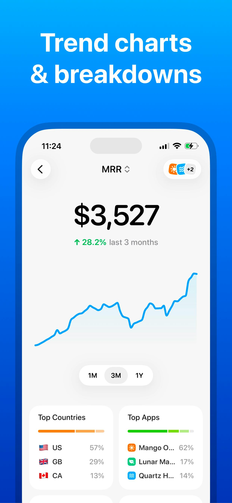
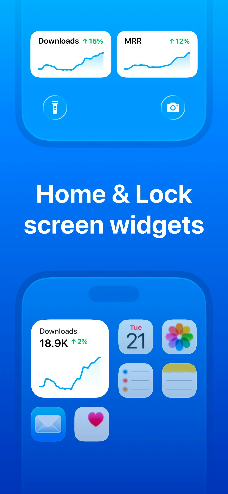

---

## 19. [JustInterview.ai](https://www.producthunt.com/products/justinterview-ai)
**Votes**: 23 | **도입 난이도**: 중 | **신뢰도**: 상
**Tagline**: Hire 20× Faster. Fill Roles in Days, Not Weeks
**서비스 링크**: https://www.producthunt.com/r/EITQX7QVOWLCQD

**태그**: HRTech, AI, Automation, Recruitment, AI Tool

### 📌 이 서비스 한눈에 보기
AI 기반 자동화로 채용부터 최종 합격까지의 과정을 혁신하는 통합 채용 플랫폼

### 🔑 주요 기능
- AI 인터뷰, 코딩 테스트, MCQ 등 다각도 역량 평가 기능 제공
- 채용 공고 작성부터 이력서 스크리닝, 오퍼 레터 생성까지 전 과정 자동화
- 데이터 기반의 빠른 의사결정을 돕는 통합 관리 시스템

### 🙋 사용자에게 어떤 점이 좋은가
채용 프로세스의 각 단계를 하나의 플랫폼에서 자동화하여 채용 시간을 획기적으로 단축하고 인사팀의 운영 효율을 높여줍니다.

### ✅ 지금 바로 써볼 기능
- AI 인터뷰 및 코딩 테스트 기능 테스트
- 채용 공고 생성 및 이력서 스크리닝 자동화 실행
- 팀 협업 및 오퍼 레터 생성 워크플로우 확인

### ⚠️ 사용 전 확인할 점
- AI 평가 결과에 대한 인간 검토 과정 필요
- 기업별 특화된 직무 역량 평가 기준 설정 필요

### 🧭 확인이 더 필요한 정보
구체적인 요금 체계와 외부 HR 시스템과의 연동 범위에 대한 정보가 부족합니다.

### 📸 스크린샷 및 갤러리
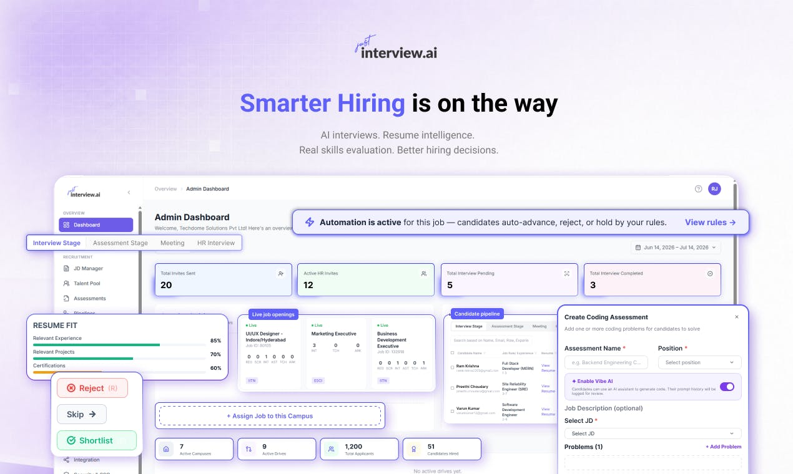
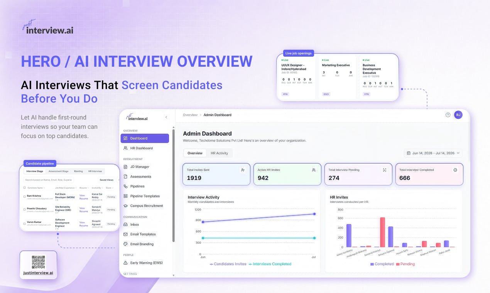
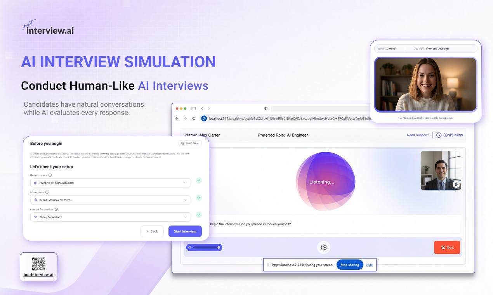

### 🎬 관련 영상
- [🎥 영상 보기](https://ph-files.imgix.net/d028afd2-48e9-4a72-a0c8-418731baf968.jpeg?auto=format)

---

## 20. [Yondry](https://www.producthunt.com/products/yondry)
**Votes**: 17 | **도입 난이도**: 하 | **신뢰도**: 상
**Tagline**: Turn your Instagram saves into actual day plans
**서비스 링크**: https://www.producthunt.com/r/JBSBSMU2F27NCZ

**태그**: AI Planner, Lifestyle, Productivity, Social Media, AI Tool

### 📌 이 서비스 한눈에 보기
저장만 해둔 인스타그램 장소들을 실제 하루 일정으로 바꿔주는 AI 플래너

### 🔑 주요 기능
- 인스타그램 저장 목록에서 실제 장소 데이터 자동 추출
- 날씨와 시간을 고려한 AI 기반 맞춤형 데이트/외출 일정 생성
- 여행이 아닌 '하루 나들이'에 최적화된 간편한 계획 기능

### 🙋 사용자에게 어떤 점이 좋은가
저장만 하고 가지 못했던 맛집이나 명소들을 실제 방문 가능한 현실적인 일정으로 변환해 줍니다.

### ✅ 지금 바로 써볼 기능
- 인스타그램 저장 링크 공유하기
- AI가 생성한 일정 확인하기
- 날씨에 맞춰 일정 요소 스와이프하여 교체하기

### ⚠️ 사용 전 확인할 점
- 장소 데이터 추출의 정확도 확인 필요
- 여행용이 아닌 단기 나들이용 기능에 집중되어 있음

### 🧭 확인이 더 필요한 정보
인스타그램 계정 연동 방식이나 데이터 추출의 상세 메커니즘에 대한 정보가 부족합니다.

### 📸 스크린샷 및 갤러리

### 🎬 관련 영상
- [🎥 영상 보기](https://ph-files.imgix.net/3f2f69db-327d-446b-a05f-2a7daa8626c3.jpeg?auto=format)

---

## 21. [Ask Kelo](https://www.producthunt.com/products/ask-kelo)
**Votes**: 14 | **도입 난이도**: 하 | **신뢰도**: 상
**Tagline**: Understand your market. Like never before.
**서비스 링크**: https://www.producthunt.com/r/V6HMFELLPXKOVG

**태그**: Market Analysis, Business Intelligence, Customer Feedback

### 📌 이 서비스 한눈에 보기
시장, 경쟁사, 고객 피드백을 분석하여 숨겨진 기회를 찾아주는 시장 조사 도구

### 🔑 주요 기능
- 시장 및 경쟁사 분석을 통한 비즈니스 기회 발굴
- 고객 피드백 분석을 통한 인사이트 도출
- 별도의 회원가입 없이 즉시 사용 가능

### 🙋 사용자에게 어떤 점이 좋은가
복잡한 시장 조사 과정을 간소화하여 사용자가 미처 발견하지 못한 사업적 기회를 빠르게 파악할 수 있습니다.

### ✅ 지금 바로 써볼 기능
- 현재 타겟 시장의 경쟁 구도 분석하기
- 고객 피드백 데이터 입력하여 인사이트 추출하기
- 가입 없이 제공되는 분석 결과 확인하기

### ⚠️ 사용 전 확인할 점
- 회원가입이 없으므로 데이터 저장이나 히스토리 관리가 제한적일 수 있음
- 분석 결과의 깊이가 사용자의 입력 데이터 품질에 의존할 수 있음

### 🧭 확인이 더 필요한 정보
회원가입 없이 사용 가능한 범위와 데이터 저장 방식에 대한 구체적인 정보가 부족합니다.

### 📸 스크린샷 및 갤러리

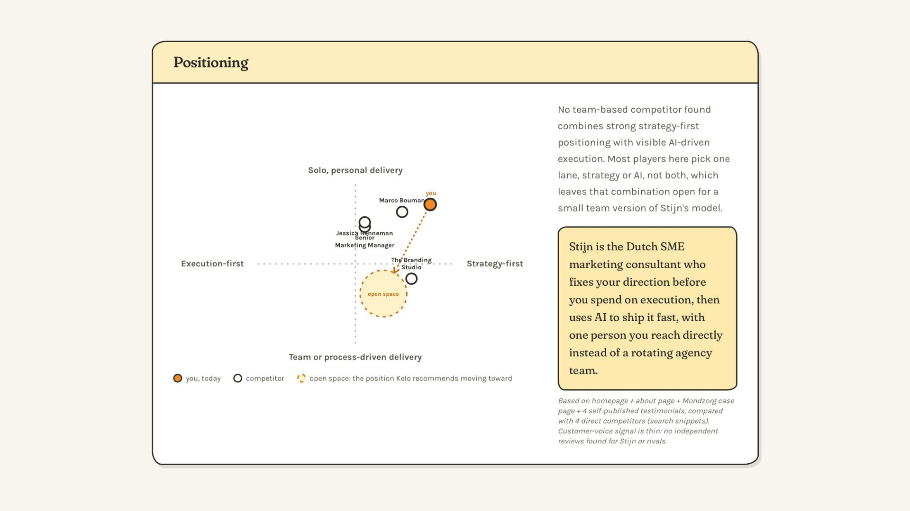
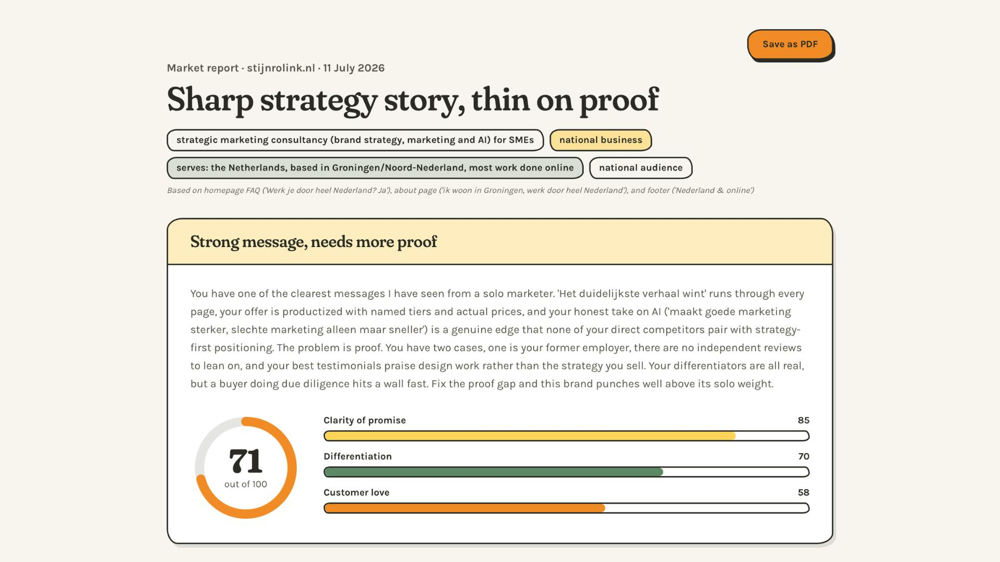

---

## 22. [Lease Lineage](https://www.producthunt.com/products/lease-lineage)
**Votes**: 13 | **도입 난이도**: 중 | **신뢰도**: 상
**Tagline**: CRM of the future
**서비스 링크**: https://www.producthunt.com/r/A6UDHFO2S44NZC

**태그**: CRM, RealEstate, SalesAutomation, LeadGen, Automation, AI Tool

### 📌 이 서비스 한눈에 보기
상업용 부동산 중개인을 위한 통합 영업 관리 및 잠재 고객 발굴 플랫폼

### 🔑 주요 기능
- 잠재 임차인 발굴 및 캠페인 관리 기능 제공
- 파편화된 스프레드시트와 이메일을 하나의 시스템으로 통합
- 리드 자격 검증 및 리스팅 게시를 통한 워크플로우 최적화

### 🙋 사용자에게 어떤 점이 좋은가
중개 업무에 흩어져 있던 고객 관리와 영업 프로세스를 단일 플랫폼으로 통합하여 업무 효율을 극대화할 수 있습니다.

### ✅ 지금 바로 써볼 기능
- 기존 스프레드시트 데이터 이관 가능 여부 확인
- 잠재 고객 발굴(Prospecting) 기능 테스트
- 캠페인 관리 및 응답 추적 워크플로우 설정

### ⚠️ 사용 전 확인할 점
- 특정 부동산 분야(상업용)에 특화되어 있어 일반 CRM과 용도가 다를 수 있음
- 기존에 사용 중인 이메일/CRM과의 연동 범위 확인 필요

### 🧭 확인이 더 필요한 정보
상세한 기능 범위와 외부 도구(이메일, 기존 CRM 등)와의 구체적인 연동 방식은 명시되지 않았습니다.

### 📸 스크린샷 및 갤러리
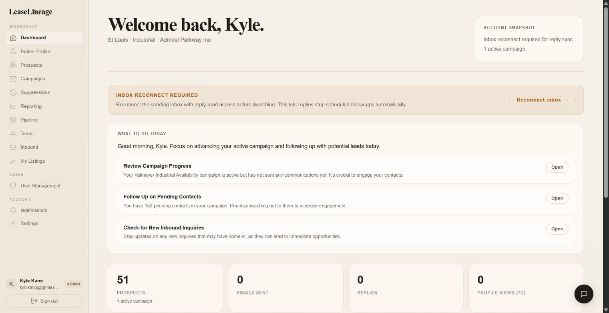
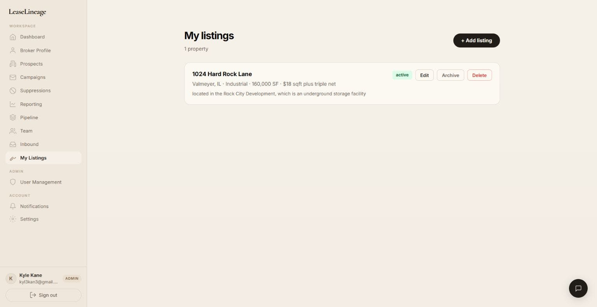
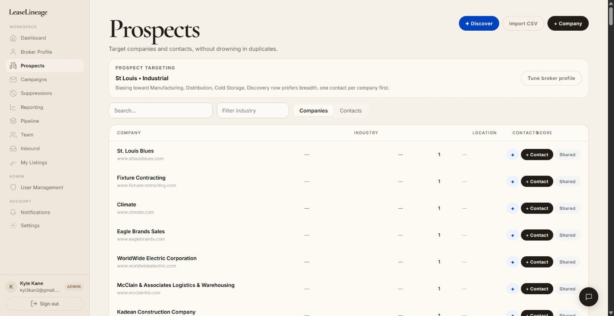

### 🎬 관련 영상
- [🎥 영상 보기](https://ph-files.imgix.net/f9ccd048-5400-466e-971a-70e50a0e2e9f.jpeg?auto=format)

---

## 23. [Formester 2.0](https://www.producthunt.com/products/formester)
**Votes**: 13 | **도입 난이도**: 하 | **신뢰도**: 상
**Tagline**: Unlimited forms and response with AI assistance
**서비스 링크**: https://www.producthunt.com/r/SDE2SU5LGHFRUT

**태그**: NoCode, AI, Productivity, Automation, AI Tool, API

### 📌 이 서비스 한눈에 보기
응답 수 제한 없이 AI로 간편하게 폼을 생성하는 무제한 폼 빌더

### 🔑 주요 기능
- 모든 플랜에서 응답 수 및 폼 생성 개수 무제한 제공
- 문장 입력 또는 PDF 업로드만으로 AI가 폼 자동 생성
- 1,000개 이상의 템플릿, API, MCP 서버 등 강력한 확장성

### 🙋 사용자에게 어떤 점이 좋은가
응답 수 제한에 대한 걱정 없이 자유롭게 폼을 운영할 수 있으며, AI를 통해 복잡한 설계 과정 없이 즉시 폼을 만들 수 있습니다.

### ✅ 지금 바로 써볼 기능
- AI에게 문장으로 원하는 폼 설명하기
- 기존 PDF 파일을 업로드하여 폼으로 변환하기
- 제공되는 1,000개 이상의 템플릿 탐색하기

### ⚠️ 사용 전 확인할 점
- 무제한 플랜이라도 서비스 정책에 따른 세부 제한 사항 확인 필요
- AI 생성 결과물의 정확성 검토 필요

### 🧭 확인이 더 필요한 정보
무제한 플랜의 구체적인 리소스 사용량 제한이나 보안 정책에 대한 상세 정보가 명시되지 않았습니다.

### 📸 스크린샷 및 갤러리
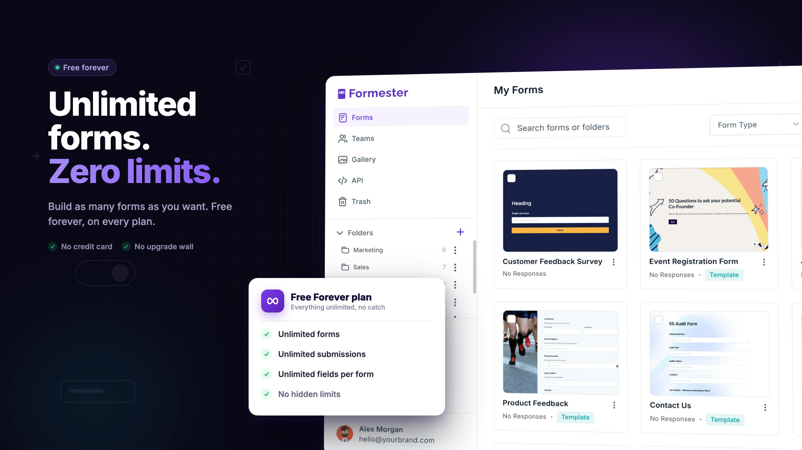
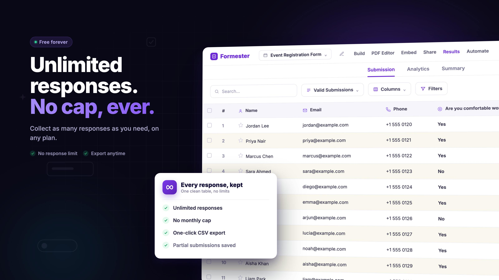
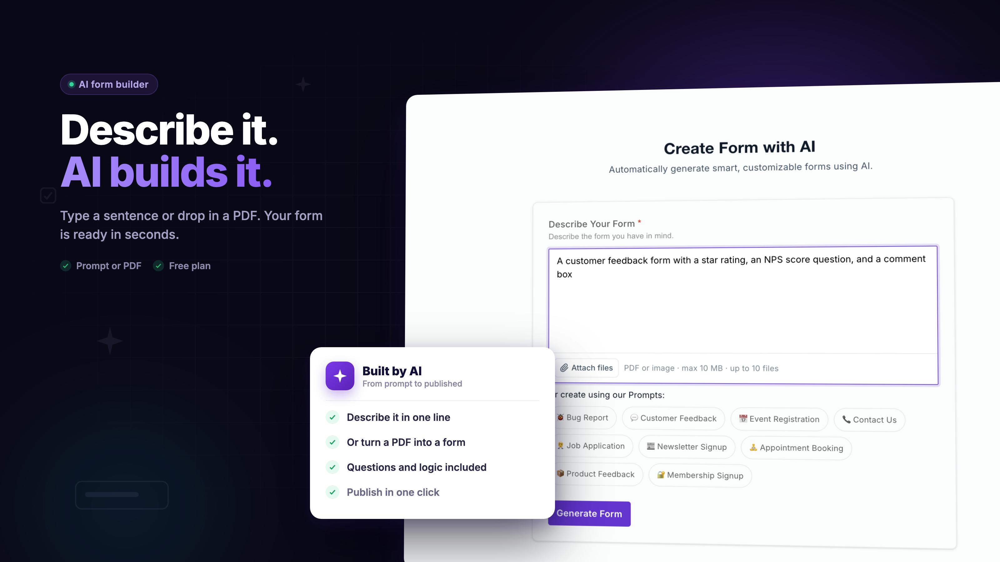

### 🎬 관련 영상
- [🎥 영상 보기](https://ph-files.imgix.net/e18dffb5-7f66-439f-8a36-29bf1dbaaf5e.jpeg?auto=format)

---

## 24. [ReadKinetic](https://www.producthunt.com/products/readkinetic)
**Votes**: 12 | **도입 난이도**: 하 | **신뢰도**: 상
**Tagline**: Speed-read your own books, without handing them to anyone.
**서비스 링크**: https://www.producthunt.com/r/YQ2UYBDEE3RVAV

**태그**: Productivity, Reading, Privacy, Offline

### 📌 이 서비스 한눈에 보기
개인 파일을 안전하고 빠르게 읽을 수 있는 오프라인 속독 리더

### 🔑 주요 기능
- 37가지 다양한 파일 형식(EPUB, PDF, Kindle, Word 등) 지원
- 한 번에 한 단어씩 보여주는 고정형 속독 방식 적용
- 브라우저 내 로컬 파싱으로 데이터 유출 걱정 없는 프라이버시 보호

### 🙋 사용자에게 어떤 점이 좋은가
자신의 전자책 파일을 외부 유출 걱정 없이 안전하게 읽으면서, 시선 이동을 최소화하는 효율적인 독서 경험을 제공합니다.

### ✅ 지금 바로 써볼 기능
- 보유 중인 EPUB 또는 PDF 파일 가져오기
- 자신에게 맞는 읽기 속도 조절해보기
- 오프라인 환경에서 앱 설치 후 사용해보기

### ⚠️ 사용 전 확인할 점
- 시선 고정 방식이 사용자 개인의 독서 습관과 맞지 않을 수 있음
- 복잡한 레이아웃의 PDF 파일은 가독성이 떨어질 수 있음

### 🧭 확인이 더 필요한 정보
37가지 포맷 중 특정 레이아웃이 복잡한 문서의 완벽한 렌더링 여부는 확인이 필요합니다.

### 📸 스크린샷 및 갤러리

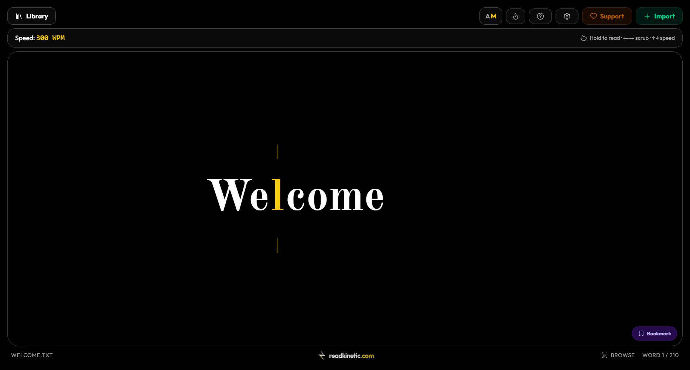
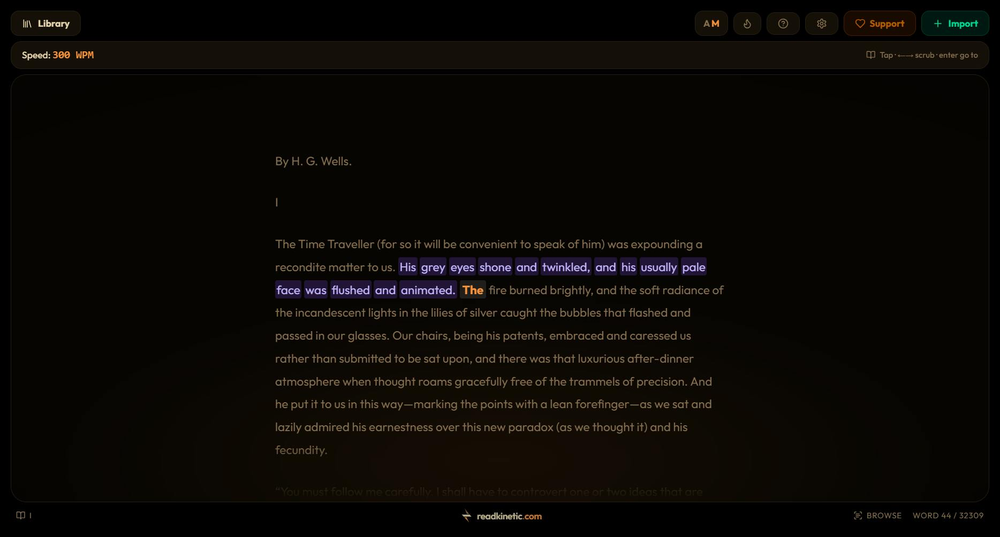

### 🎬 관련 영상
- [🎥 영상 보기](https://ph-files.imgix.net/a371105c-5191-4690-aa56-0eaaa19ea3fc.jpeg?auto=format)

---

## 25. [SaveIt.now](https://www.producthunt.com/products/saveit-now)
**Votes**: 10 | **도입 난이도**: 하 | **신뢰도**: 상
**Tagline**: An agentic home for everything you save
**서비스 링크**: https://www.producthunt.com/r/JI4UCEEYKRZ7XD

**태그**: Productivity, AI Agent, Automation, iOS, Web, Agent, AI Tool

### 📌 이 서비스 한눈에 보기
정리할 필요 없이 저장만 하면 AI가 알아서 분류하고 찾아주는 지능형 저장소

### 🔑 주요 기능
- 원터치 링크 저장 및 AI 에이전트의 자동 콘텐츠 캡처(스크린샷, 텍스트, 트랜스크립트)
- 폴더나 태그 없이 자연어로 대화하며 정보를 찾는 제로 매뉴얼 방식
- 웹과 iOS를 지원하는 심리스한 저장 환경

### 🙋 사용자에게 어떤 점이 좋은가
수동으로 폴더를 만들거나 태그를 다는 번거로움 없이, 저장만 하면 AI가 내용을 완벽히 파악하여 필요할 때 즉시 답변해 줍니다.

### ✅ 지금 바로 써볼 기능
- 웹 브라우저와 iOS 기기에서 링크 저장해보기
- 저장된 콘텐츠에 대해 자연어로 질문하여 검색 기능 테스트하기
- AI가 캡처한 텍스트와 스크린샷의 정확도 확인하기

### ⚠️ 사용 전 확인할 점
- 수동 분류가 없으므로 AI의 검색/요약 성능에 전적으로 의존하게 됨
- 개인적인 정보나 민감한 링크 저장 시 데이터 프라이버시 정책 확인 필요

### 🧭 확인이 더 필요한 정보
현재 제공되는 AI 에이전트의 구체적인 데이터 보안 정책과 저장 용량 제한에 대한 정보가 부족합니다.

### 📸 스크린샷 및 갤러리

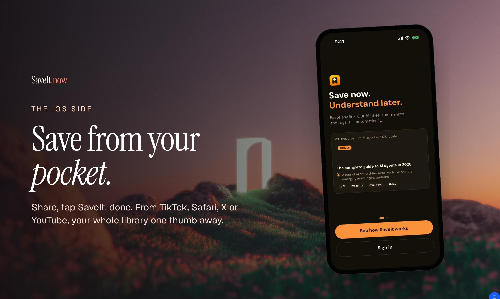

---

## 26. [Hoodik Cloud](https://www.producthunt.com/products/hoodik-cloud)
**Votes**: 9 | **도입 난이도**: 하 | **신뢰도**: 상
**Tagline**: Your own end-to-end encrypted drive, hosted for you
**서비스 링크**: https://www.producthunt.com/r/HBLVCGJICC2LEM

**태그**: Privacy, CloudStorage, Security, SaaS, AI Tool, DevTool

### 📌 이 서비스 한눈에 보기
개인정보 유출 걱정 없는 종단간 암호화 기반의 맞춤형 클라우드 스토리지 서비스

### 🔑 주요 기능
- 기기에서 암호화되어 서버에는 암호문만 저장되는 강력한 보안
- 사용자 전용 인스턴스, 데이터베이스 및 스토리지 제공
- iOS, Android, macOS용 무료 앱 지원 및 커스텀 도메인 연결 가능

### 🙋 사용자에게 어떤 점이 좋은가
클라우드 서비스의 프라이버시 문제를 해결하면서도, 복잡한 서버 설정 없이 편리하게 개인용 암호화 저장소를 가질 수 있습니다.

### ✅ 지금 바로 써볼 기능
- 14일 무료 체험을 통한 보안 및 속도 테스트
- 사용 중인 모바일 및 데스크톱 기기에 앱 설치
- 데이터 내보내기 기능을 통한 셀프 호스팅 전환 가능성 확인

### ⚠️ 사용 전 확인할 점
- 월 구독료 기반의 유료 서비스 (100GB 9유로 / 500GB 19유로)
- 종단간 암호화 특성상 비밀번호 분실 시 데이터 복구가 어려울 수 있음

### 🧭 확인이 더 필요한 정보
사용자 환경에 따른 동기화 속도 및 데이터 복구 정책에 대한 상세 정보가 필요합니다.

### 📸 스크린샷 및 갤러리
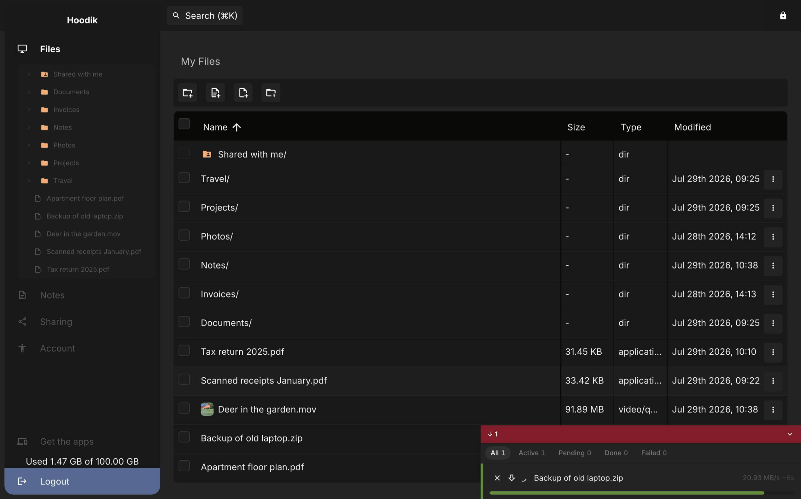
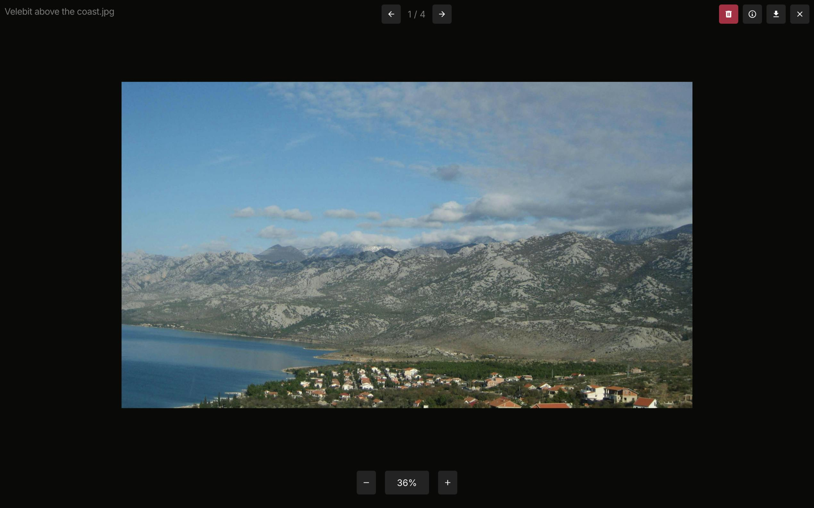
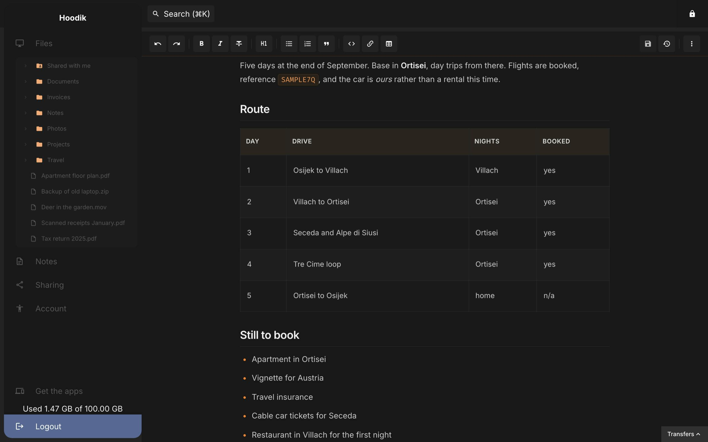

---

## 27. [Personade](https://www.producthunt.com/products/personade)
**Votes**: 8 | **도입 난이도**: 하 | **신뢰도**: 상
**Tagline**: Can't sell? One video becomes a personal one for every lead
**서비스 링크**: https://www.producthunt.com/r/3HH6IRJTC4KDBF

**태그**: Sales, Automation, Video, Personalization, AI Tool

### 📌 이 서비스 한눈에 보기
한 번의 녹화로 모든 잠재 고객에게 맞춤형 이름을 불러주는 개인화 영상 제작 도구

### 🔑 주요 기능
- 단 한 번의 영상 녹화로 수많은 리드에게 맞춤형 영상 생성
- AI 아바타가 아닌 실제 사용자의 목소리로 이름이 자동 삽입됨
- 각 리드별로 개인화된 전용 페이지 제공

### 🙋 사용자에게 어떤 점이 좋은가
영업 담당자가 일일이 영상을 찍지 않아도, 고객의 이름을 직접 부르는 듯한 효과를 주어 전환율을 높일 수 있습니다.

### ✅ 지금 바로 써볼 기능
- 샘플 영상 녹화하기
- 리드 리스트 업로드 및 개인화 결과 확인하기
- 생성된 개인화 페이지 공유해보기

### ⚠️ 사용 전 확인할 점
- 실제 목소리를 사용하므로 녹화 시 음성 품질이 중요함
- 대량의 리드에 대한 자동화 방식의 자연스러움 확인 필요

### 🧭 확인이 더 필요한 정보
사용자의 실제 목소리를 어떻게 자연스럽게 합성하는지에 대한 기술적 상세 방식이 명시되지 않았습니다.

### 📸 스크린샷 및 갤러리
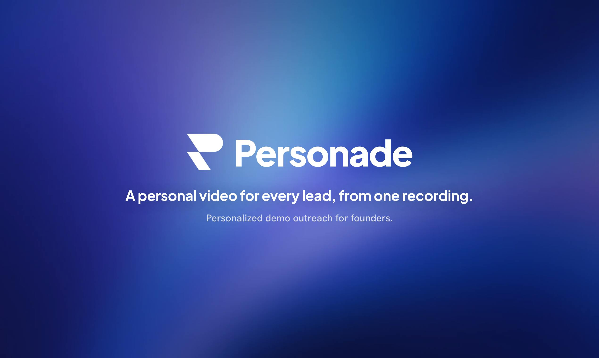

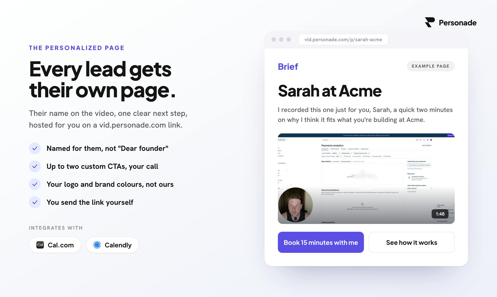

---

## 28. [DocDot](https://www.producthunt.com/products/docdot)
**Votes**: 8 | **도입 난이도**: 하 | **신뢰도**: 상
**Tagline**: The simplest way to run any PDF parser, locally
**서비스 링크**: https://www.producthunt.com/r/VO7FBZG5OMM6AH

**태그**: DevTool, Productivity, DataExtraction, macOS, AI Tool

### 📌 이 서비스 한눈에 보기
클라우드 업로드 없이 로컬에서 간편하게 실행하는 고성능 PDF 파서

### 🔑 주요 기능
- macOS 전용 원라인 설치 지원 (curl 명령어로 즉시 설치)
- 다양한 파서를 지원하여 문서 유형별 최적의 결과물 도출
- 데이터를 클라우드에 올리지 않는 로컬 실행 방식으로 보안성 확보

### 🙋 사용자에게 어떤 점이 좋은가
민감한 문서를 외부 서버에 업로드할 필요 없이 로컬 환경에서 안전하고 빠르게 데이터 추출이 가능합니다.

### ✅ 지금 바로 써볼 기능
- 터미널에서 설치 스크립트 실행하기
- 문서 유형별로 적합한 파서 선택해보기
- 로컬 환경에서의 파싱 품질 테스트하기

### ⚠️ 사용 전 확인할 점
- 현재 macOS만 지원하며 Windows와 Linux는 출시 예정임
- 로컬 리소스를 사용하므로 대량 작업 시 시스템 성능에 영향을 줄 수 있음

### 🧭 확인이 더 필요한 정보
Windows 및 Linux 지원 일정과 상세한 파서 종류에 대한 정보가 명시되지 않았습니다.

### 📸 스크린샷 및 갤러리
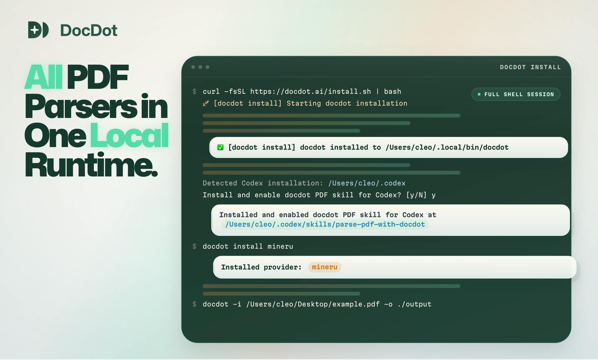
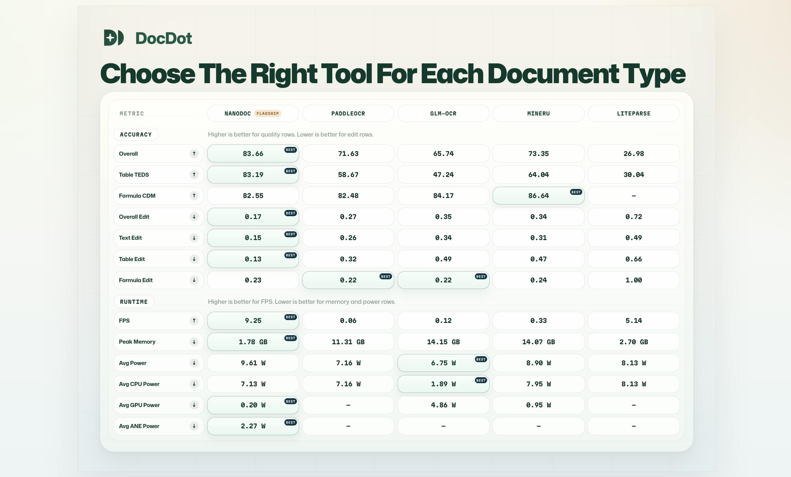
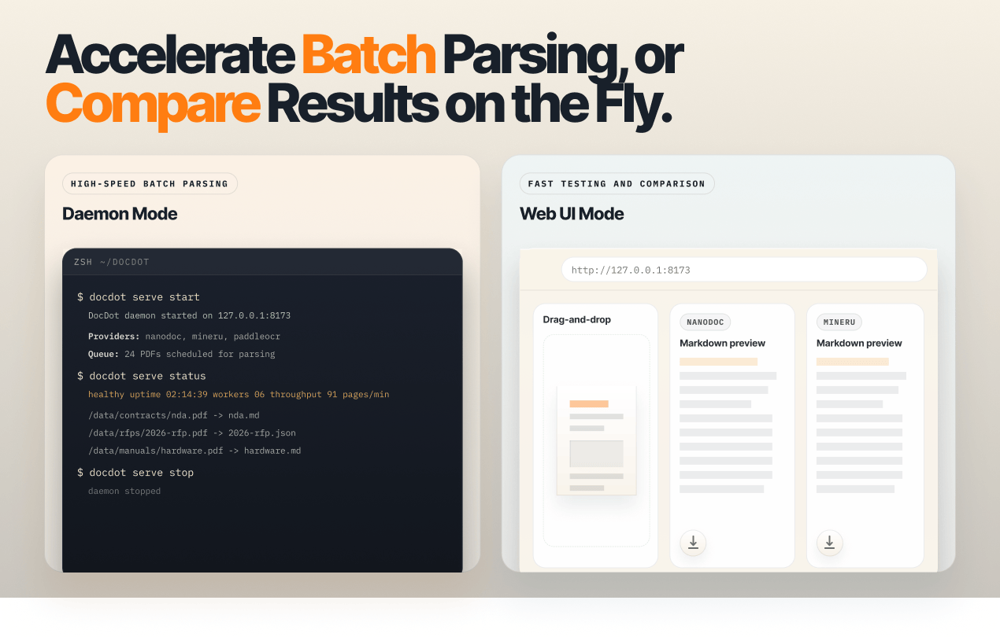

### 🎬 관련 영상
- [🎥 영상 보기](https://ph-files.imgix.net/1bd31ea2-09a0-4a69-87bf-2264e3b3b8cd.jpeg?auto=format)

---

## 29. [Volanea](https://www.producthunt.com/products/volanea)
**Votes**: 8 | **도입 난이도**: 하 | **신뢰도**: 상
**Tagline**: Email infrastructure that ships as fast as you do
**서비스 링크**: https://www.producthunt.com/r/JVLA6KW3GBGUQH

**태그**: Email, Automation, Marketing, SaaS, AI Tool

### 📌 이 서비스 한눈에 보기
트랜잭션 이메일과 마케팅 캠페인을 하나의 연락처 그래프로 통합 관리하는 초고속 이메일 인프라

### 🔑 주요 기능
- 트랜잭션 이메일, 캠페인, 자동화 기능을 단일 연락처 그래프에서 통합 운영
- 개발 속도에 맞춘 신속한 이메일 인프라 제공
- 매월 1,000건의 무료 크레딧 제공 및 합리적인 유료 플랜

### 🙋 사용자에게 어떤 점이 좋은가
이메일 발송과 마케팅 자동화를 하나의 데이터베이스로 관리하여 워크플로우를 단순화할 수 있습니다.

### ✅ 지금 바로 써볼 기능
- 매월 제공되는 1,000건의 무료 크레딧으로 기본 기능 테스트하기
- 트랜잭션 이메일과 캠페인 기능의 통합 워크플로우 구축해보기
- 사용자 연락처 그래프 설정 및 데이터 동기화 확인하기

### ⚠️ 사용 전 확인할 점
- 무료 크레딧 초과 시 유료 플랜 전환 필요
- 규모 확장 시 $5/mo(7,500건) 이상의 추가 비용 구조 확인 필요

### 🧭 확인이 더 필요한 정보
상세한 API 연동 범위와 타 서비스와의 통합 기능에 대한 구체적인 정보가 부족합니다.

### 📸 스크린샷 및 갤러리
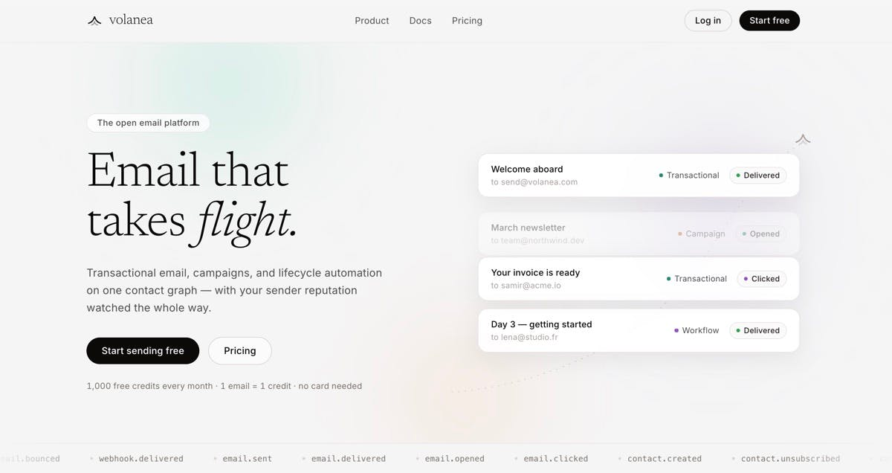
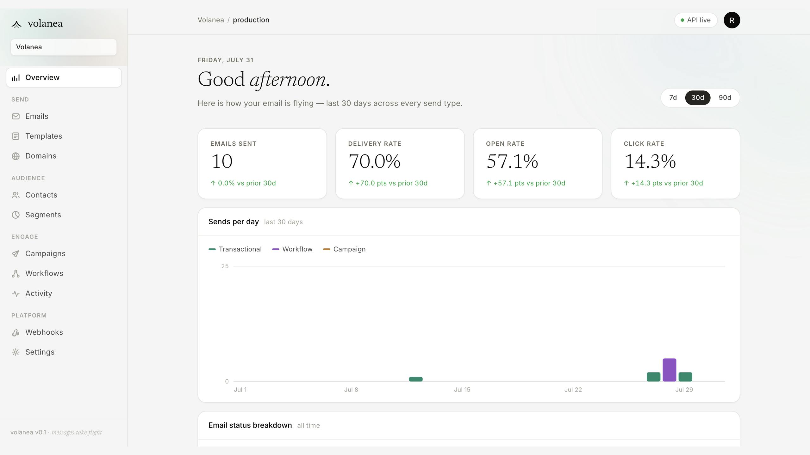
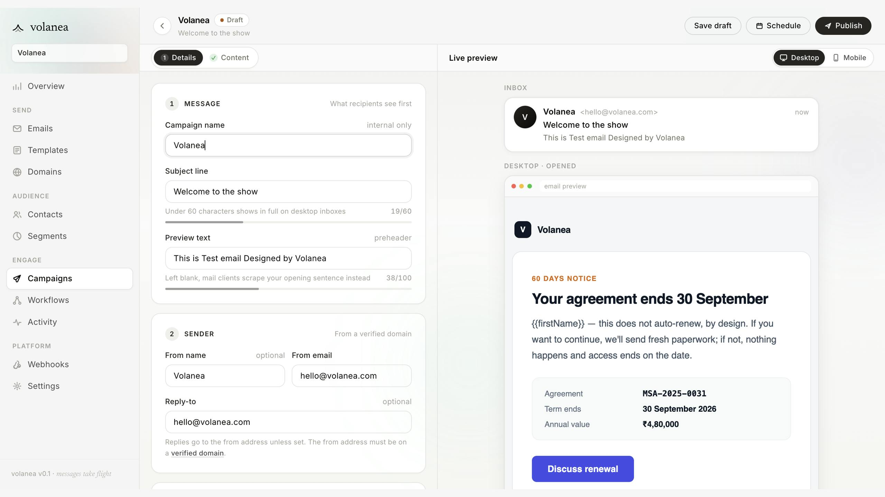

---

## 30. [Logen](https://www.producthunt.com/products/logen)
**Votes**: 7 | **도입 난이도**: 하 | **신뢰도**: 상
**Tagline**: Describe your app - Logen builds, secures, and deploys.
**서비스 링크**: https://www.producthunt.com/r/S222PIU2LAIKMV

**태그**: AI, NoCode, WebDev, Automation, SaaS, AI Tool, DevTool

### 📌 이 서비스 한눈에 보기
자연어 설명만으로 풀스택 웹 앱을 구축부터 배포까지 한 번에 해결하는 AI 빌더

### 🔑 주요 기능
- 자연어 설명을 통한 UI, 백엔드, DB, 인증 기능 자동 생성
- 코드 작성 및 DevOps 작업이 필요 없는 No-code 환경
- PostgreSQL 데이터베이스 및 보안 기능 기본 탑재

### 🙋 사용자에게 어떤 점이 좋은가
개발 지식 없이도 아이디어를 즉시 실행 가능한 웹 서비스로 구현할 수 있어 프로토타이핑 속도가 비약적으로 향상됩니다.

### ✅ 지금 바로 써볼 기능
- 아이디어를 영어 문장으로 설명하여 앱 생성하기
- 생성된 UI와 백엔드 로직 확인하기
- 제공되는 라이브 URL로 배포 상태 점검하기

### ⚠️ 사용 전 확인할 점
- 복잡한 커스텀 로직 구현 시 제약이 있을 수 있음
- 무료 플랜의 상세 사용량 및 확장성 정책 확인 필요

### 🧭 확인이 더 필요한 정보
자연어 설명만으로 생성되는 앱의 세부 커스텀 기능과 데이터베이스 확장 가능 범위에 대한 정보가 부족합니다.

### 📸 스크린샷 및 갤러리
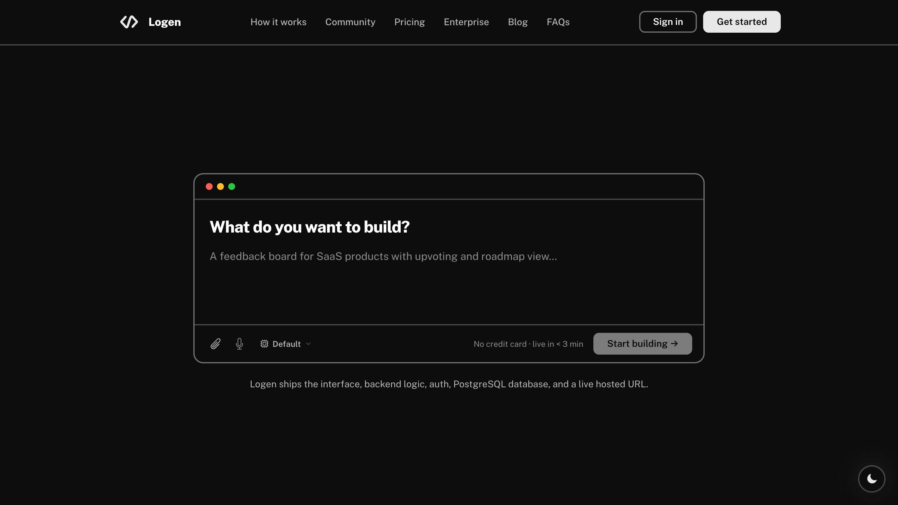
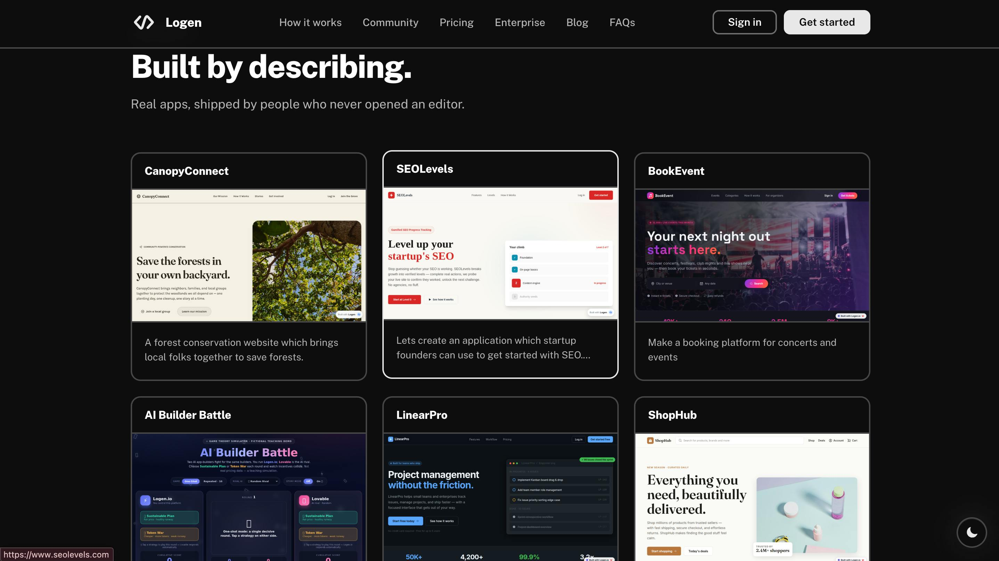
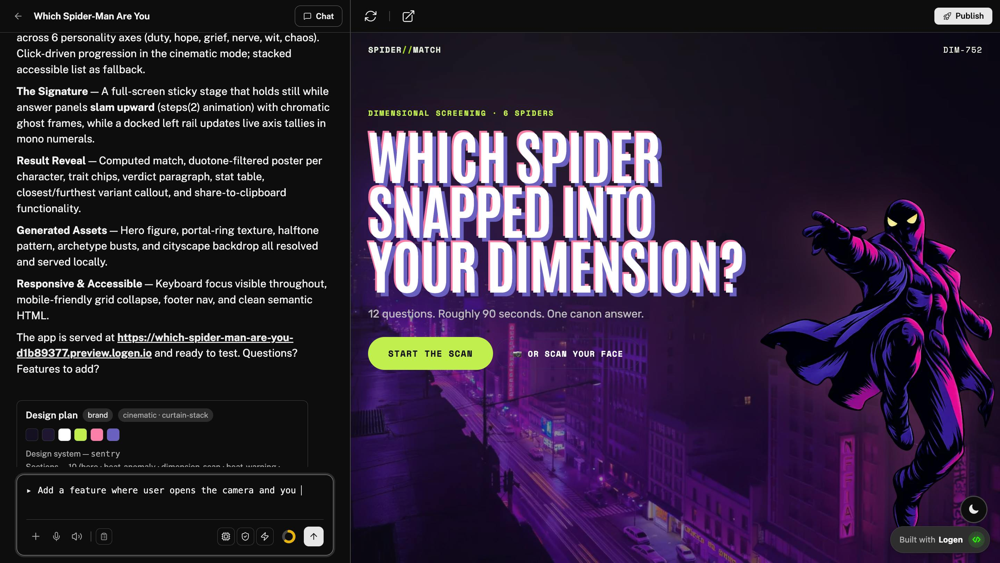

### 🎬 관련 영상
- [🎥 영상 보기](https://ph-files.imgix.net/2093bc1e-97cc-4690-a6d2-d8c821a5654b.jpeg?auto=format)

---

