# 🚀 Product Hunt Daily Top 30 (2026-08-07)

## 오늘의 요약
오늘의 트렌드는 단순한 챗봇을 넘어 기업의 워크플로우와 기존 협업 툴에 깊숙이 통합되는 'AI 에이전트'의 진화가 주도했습니다. 특히 개발 생산성을 높이는 자동화 도구와 AI 지출 및 성과를 관리하는 운영 효율화 솔루션이 주목받았습니다.

### 오늘의 핵심 포인트
- 기존 Slack이나 터미널 환경에서 즉시 작동하며 버그 수정부터 코딩까지 수행하는 에이전트 기술이 강화되었습니다.
- 기업의 고유 데이터와 협업 툴을 결합하여 업무 자동화 환경을 구축하는 운영체제형 솔루션이 등장했습니다.
- 웹 데이터를 LLM용 마크다운으로 변환하거나 브랜드 자산을 정확히 불러오는 등 AI를 위한 데이터 전처리 및 자산 관리 도구가 주목받았습니다.

**오늘의 태그**: AI 에이전트, 개발 자동화, 협업 툴 통합, LLM 운영

## 1. [Cloudflare OS](https://www.producthunt.com/products/cloudflare)
**Votes**: 338 | **도입 난이도**: 상 | **신뢰도**: 중
**Tagline**: Build the AI operating system for your company
**서비스 링크**: https://www.producthunt.com/r/VYDPLSA7MSOD7N

**태그**: AI, OpenSource, Automation, Enterprise, Workflow, Agent, AI Tool

### 📌 이 서비스 한눈에 보기
기업의 고유한 데이터와 도구를 결합하여 맞춤형 AI 에이전트 환경을 구축하는 오픈소스 AI 운영체제

### 🔑 주요 기능
- 기업의 맥락, 도구, 규칙을 반영할 수 있는 오픈소스 AI OS
- 개별 사용자에게 맞춤형 AI 에이전트와 워크스페이스 제공
- 기업 내부 지식과 시스템을 기반으로 한 업무 자동화 환경 구축

### 🙋 사용자에게 어떤 점이 좋은가
회사의 고유한 업무 방식과 데이터에 최적화된 AI 에이전트를 통해 업무 효율을 극대화할 수 있습니다.

### ✅ 지금 바로 써볼 기능
- 기업 내부 데이터 및 도구 연동 가능성 검토
- 오픈소스 코드베이스 확인 및 커스텀 규칙 설정 테스트
- 에이전트 기반 워크스페이스 구성 시뮬레이션

### ⚠️ 사용 전 확인할 점
- 기업 내부 시스템과의 연동 난이도 및 보안 설정 필요
- 오픈소스 특성상 직접 구축 및 유지보수 역량 요구

### 🧭 확인이 더 필요한 정보
구체적인 기술 스택과 기존 기업용 소프트웨어와의 통합 방식에 대한 상세 정보가 필요합니다.

### 📸 스크린샷 및 갤러리
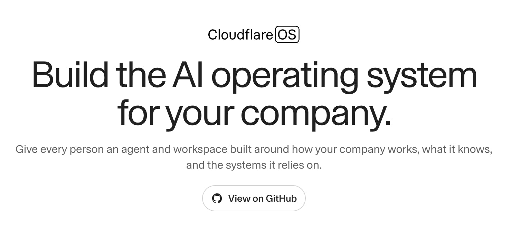
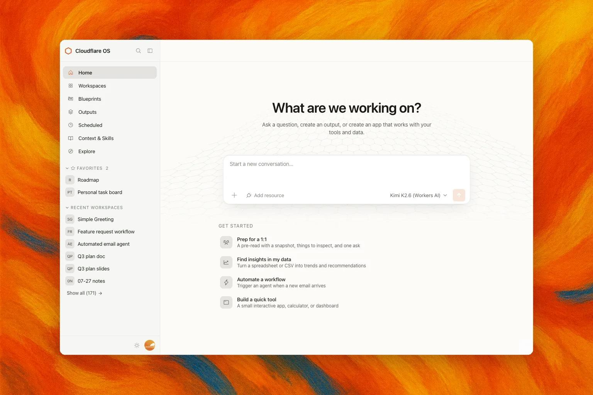
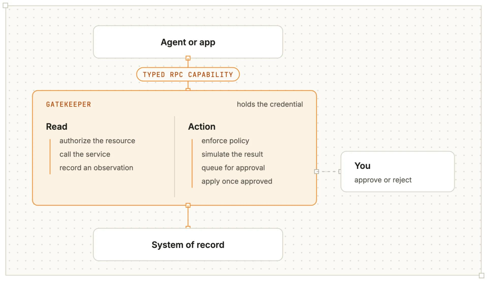

---

## 2. [AI Spend Console by Rippling](https://www.producthunt.com/products/rippling)
**Votes**: 259 | **도입 난이도**: 하 | **신뢰도**: 상
**Tagline**: Track your AI spend and connect it to business outcomes
**서비스 링크**: https://www.producthunt.com/r/IOEQDSIXPR4LF4

**태그**: FinOps, AI, DevOps, Analytics, AI Tool, DevTool

### 📌 이 서비스 한눈에 보기
AI 도구 비용을 추적하고 이를 실제 비즈니스 성과와 연결하는 통합 관리 콘솔

### 🔑 주요 기능
- Claude, Cursor 등 다양한 AI 도구의 지출 통합 관리
- 벤더, 모델, 직원별로 상세한 비용 분석 제공
- GitHub 데이터(PR 수, 코드 수정 횟수 등)와 비용을 연계한 성과 측정

### 🙋 사용자에게 어떤 점이 좋은가
재무 및 엔지니어링 리더가 AI 도입 비용이 실제 개발 생산성 향상으로 이어지는지 데이터로 증명할 수 있습니다.

### ✅ 지금 바로 써볼 기능
- 현재 사용 중인 AI 도구 비용 데이터 입력하기
- GitHub 연동을 통한 생산성 지표 설정하기
- 직원별/모델별 비용 배분 규칙 설정하기

### ⚠️ 사용 전 확인할 점
- GitHub 데이터 연동 시 보안 및 권한 설정 필요
- Rippling 구독 없이 사용 가능하나 상세 기능 범위 확인 필요

### 🧭 확인이 더 필요한 정보
Rippling 구독 없이 제공되는 무료 기능의 범위와 데이터 연동 방식에 대한 상세 확인이 필요합니다.

### 📸 스크린샷 및 갤러리
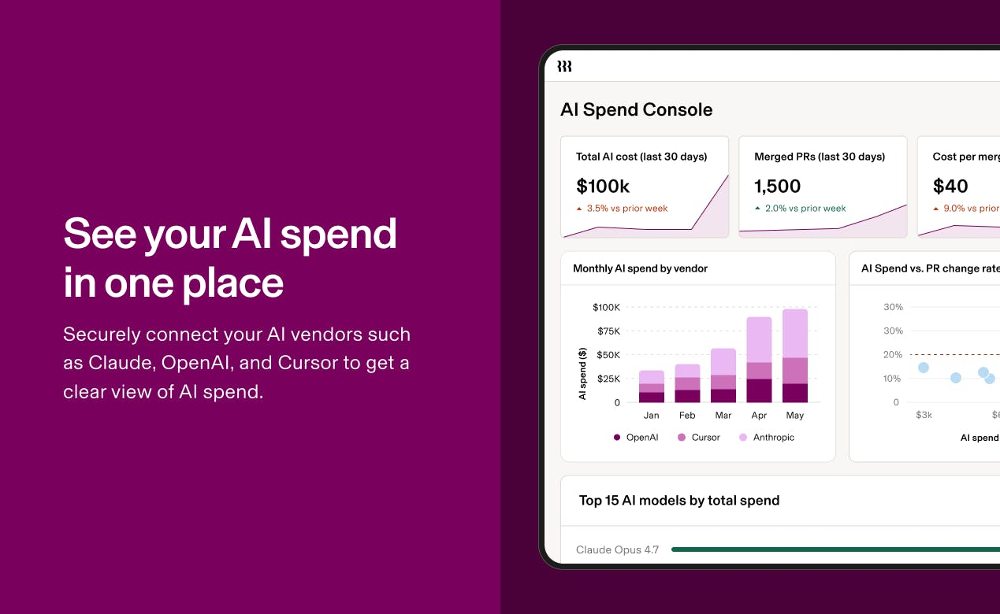
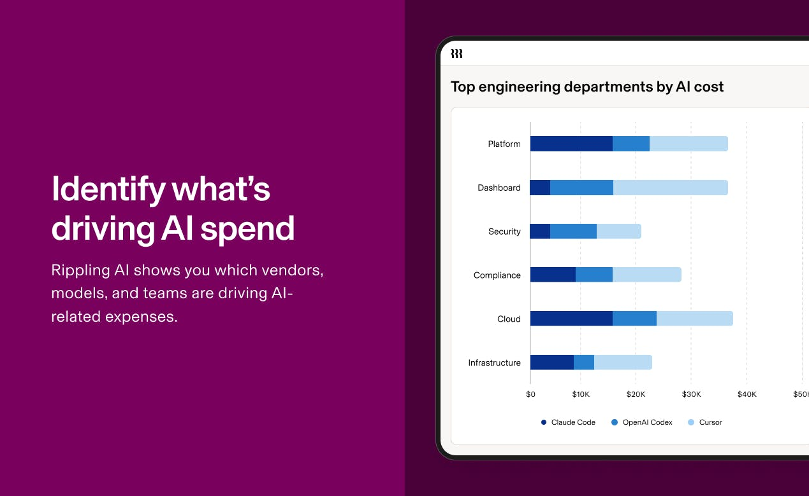
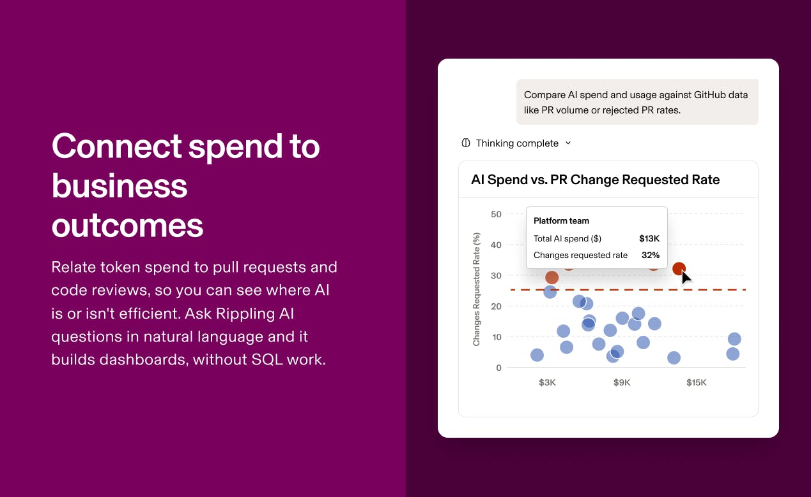

### 🎬 관련 영상
- [🎥 영상 보기](https://ph-files.imgix.net/9ad1bcd8-64eb-4e40-89a1-279309d409f0.jpeg?auto=format)

---

## 3. [Superlog Responder](https://www.producthunt.com/products/superlog)
**Votes**: 248 | **도입 난이도**: 하 | **신뢰도**: 상
**Tagline**: FREE, open-source AI bug-fixing agent
**서비스 링크**: https://www.producthunt.com/r/ZQ6HSC2C5GBU6O

**태그**: DevTool, AI, Automation, OpenSource, Debugging, Agent, AI Tool, Prompting

### 📌 이 서비스 한눈에 보기
기존 Slack 채널에 연결하여 버그 원인 분석부터 PR 생성까지 자동 수행하는 오픈소스 AI 에이전트

### 🔑 주요 기능
- Sentry/Datadog Slack 채널과 연동되어 별도 텔레메트리 설치 없이 즉시 사용 가능
- 알림 발생 시 맥락 파악, 노이즈 필터링, 원인 분석 및 머지 가능한 PR 생성 자동화
- 프롬프트, 메모리, 저장소 접근 권한 및 에스컬레이션 규칙의 완전한 커스텀 지원

### 🙋 사용자에게 어떤 점이 좋은가
개발자가 수동으로 디버깅하는 시간을 줄여주며, 기존 워크플로우를 유지하면서도 즉각적인 버그 해결책을 제안받을 수 있습니다.

### ✅ 지금 바로 써볼 기능
- 기존 Sentry/Datadog Slack 채널에 연동하기
- AI가 생성한 버그 분석 리포트와 PR 검토하기
- 팀의 요구사항에 맞춰 프롬프트 및 에스컬레이션 규칙 설정하기

### ⚠️ 사용 전 확인할 점
- AI가 생성한 PR의 코드 품질과 보안성을 반드시 수동으로 검토해야 함
- 저장소 접근 권한 부여에 따른 보안 정책 확인 필요

### 🧭 확인이 더 필요한 정보
사용자의 코드 저장소 접근 방식과 보안 프로토콜에 대한 상세 구현 방식 확인이 필요합니다.

### 📸 스크린샷 및 갤러리
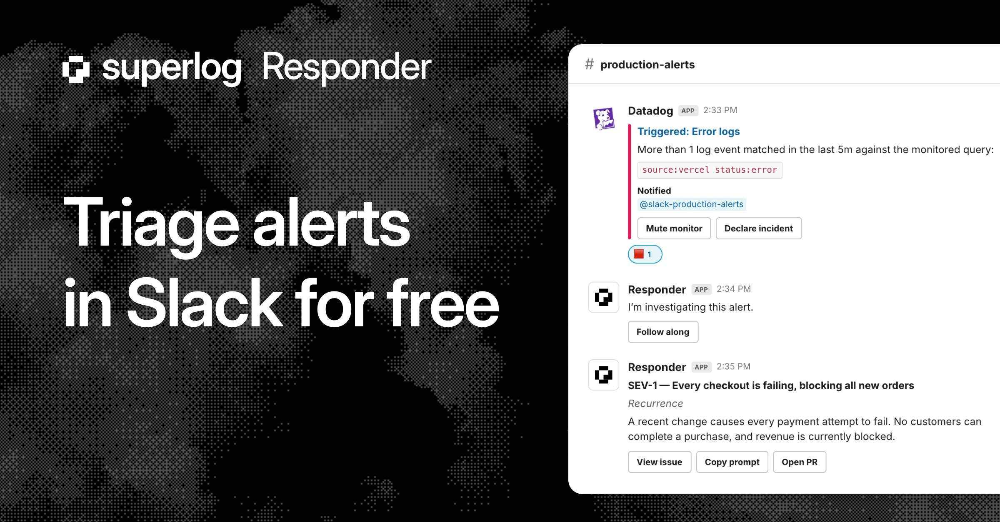
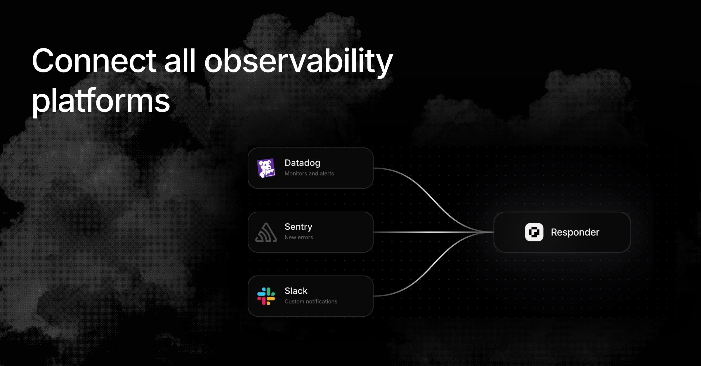
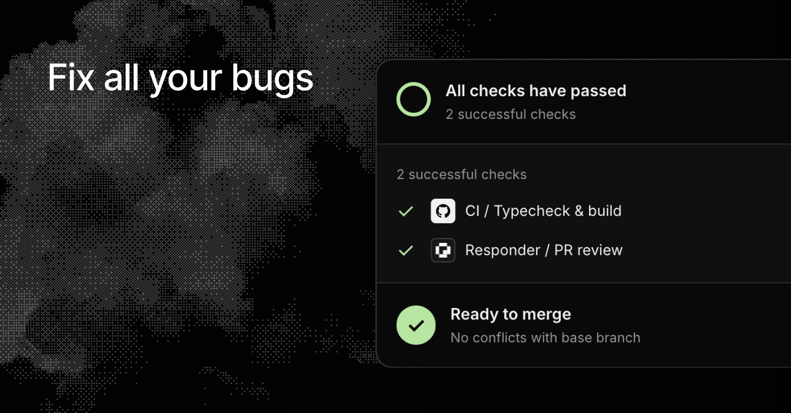

### 🎬 관련 영상
- [🎥 영상 보기](https://ph-files.imgix.net/2f855288-7e17-4daa-a4a0-1b30dca9ecf7.jpeg?auto=format)

---

## 4. [Muse Code](https://www.producthunt.com/products/meta)
**Votes**: 198 | **도입 난이도**: 중 | **신뢰도**: 상
**Tagline**: Meta’s terminal agent for long-horizon coding
**서비스 링크**: https://www.producthunt.com/r/MGWDXWVZJGSDPK

**태그**: DevTool, AI, Automation, Coding, Agent

### 📌 이 서비스 한눈에 보기
장기적인 코딩 작업을 수행하는 터미널 기반의 AI 에이전트

### 🔑 주요 기능
- Muse Spark 1.2 기반의 강력한 터미널 코딩 에이전트
- 백그라운드에서 지속적으로 실행되는 에이전트 기능
- 저장소 전체 규모의 실행 및 내장된 검증 기능

### 🙋 사용자에게 어떤 점이 좋은가
복잡하고 긴 코딩 작업을 터미널에서 자동화하여 개발자의 개입을 최소화하고 작업 효율을 높일 수 있습니다.

### ✅ 지금 바로 써볼 기능
- 터미널 환경에서의 에이전트 실행 테스트
- 저장소 규모의 코드 실행 및 검증 기능 확인
- 백그라운드 에이전트의 작업 지속성 테스트

### ⚠️ 사용 전 확인할 점
- 터미널 기반 도구이므로 로컬 환경 및 권한 설정 확인 필요
- 에이전트의 자동 실행에 따른 코드 변경 영향도 주의

### 🧭 확인이 더 필요한 정보
상세한 시스템 요구 사양 및 로컬 환경과의 호환성 확인이 필요합니다.

### 📸 스크린샷 및 갤러리
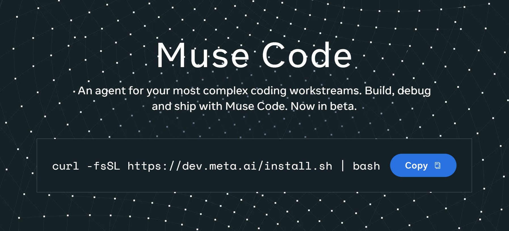
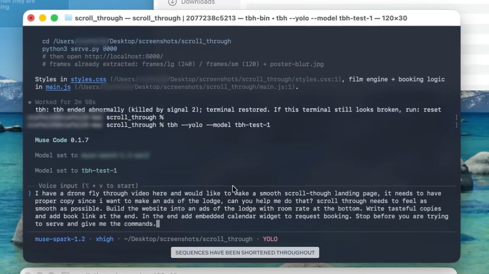
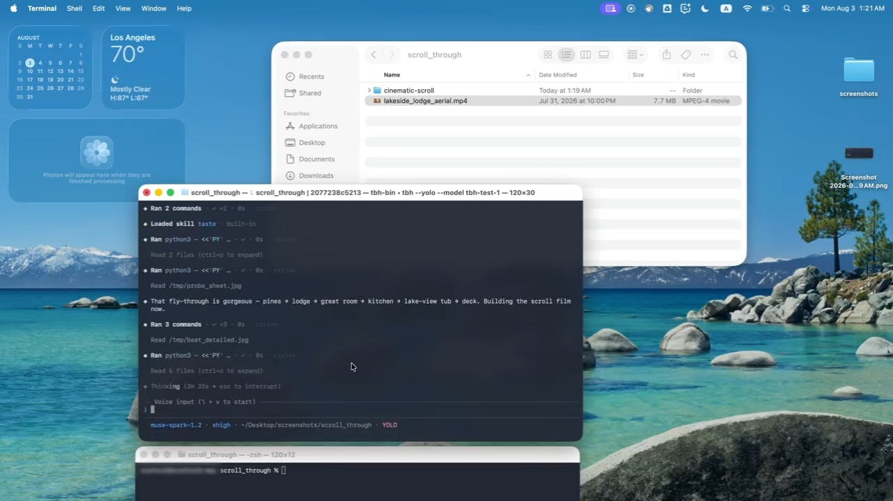

---

## 5. [Annotate](https://www.producthunt.com/products/annotate-8)
**Votes**: 157 | **도입 난이도**: 하 | **신뢰도**: 상
**Tagline**: Screen recording as prompts
**서비스 링크**: https://www.producthunt.com/r/5PZ4OYVR3UXAK5

**태그**: DevTool, AI-Agent, Productivity, Coding, Agent, AI Tool, Prompting, Video

### 📌 이 서비스 한눈에 보기
화면 녹화와 드로잉을 통해 AI 코딩 에이전트에게 즉각적인 명령을 전달하는 도구

### 🔑 주요 기능
- 화면 녹화, 드로잉, 음성을 결합한 직관적인 프롬프트 생성
- Cursor, Claude, Codex 등 AI 코딩 에이전트와의 연동 최적화
- 로컬 실행 기반의 무료 및 개인정보 보호 중심 설계

### 🙋 사용자에게 어떤 점이 좋은가
복잡한 코딩 요구사항을 텍스트 대신 시각적 동작으로 전달하여 AI 에이전트의 작업 정확도를 높일 수 있습니다.

### ✅ 지금 바로 써볼 기능
- 화면 녹화 및 드로잉 기능 테스트
- 사용 중인 AI 코딩 에이전트(Cursor 등)에 결과물 전달해보기

### ⚠️ 사용 전 확인할 점
- 로컬 실행 환경에서의 하드웨어 리소스 사용량 확인 필요
- AI 에이전트 플랫폼별 호환성 및 워크플로우 확인 필요

### 🧭 확인이 더 필요한 정보
사용 중인 AI 에이전트 플랫폼과의 구체적인 연동 방식 및 데이터 내보내기 형식을 확인해야 합니다.

### 📸 스크린샷 및 갤러리
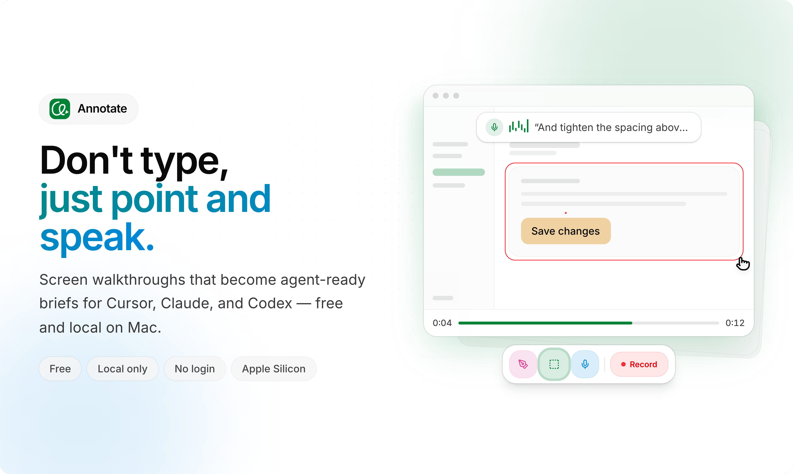
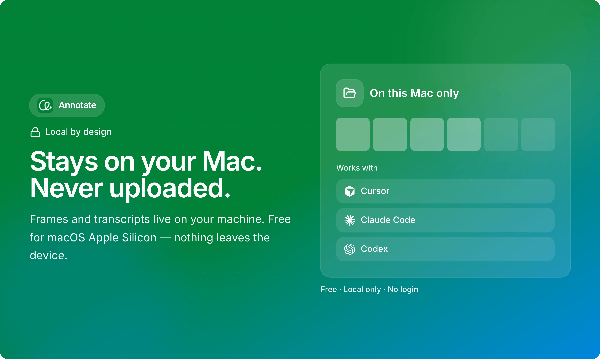
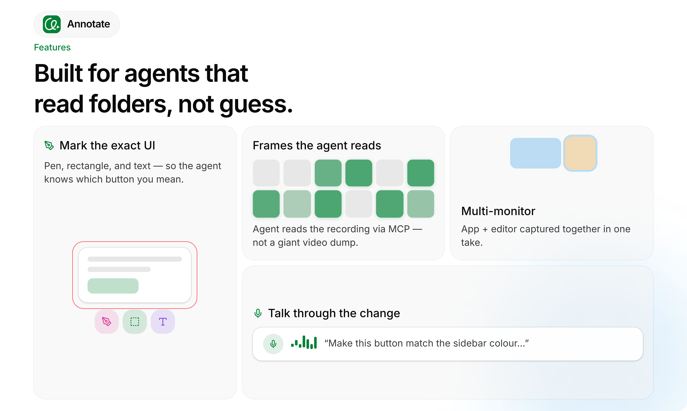

### 🎬 관련 영상
- [🎥 영상 보기](https://ph-files.imgix.net/a1277012-5c25-421c-a58b-73e355bc76e2.jpeg?auto=format)

---

## 6. [CopilotKit Channels SDK](https://www.producthunt.com/products/copilotkit)
**Votes**: 134 | **도입 난이도**: 중 | **신뢰도**: 상
**Tagline**: Bring any agent to Slack, Teams, and more.
**서비스 링크**: https://www.producthunt.com/r/C6K2T3TLWQEOXK

**태그**: DevTool, AI, Automation, Collaboration, Agent, AI Tool, Prompting

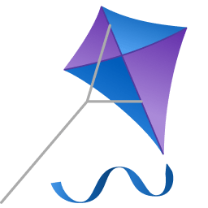

### 📌 이 서비스 한눈에 보기
어떤 AI 에이전트든 슬랙, 팀즈 등 협업 툴로 즉시 연결하는 채널 SDK

### 🔑 주요 기능
- Slack, Teams, WhatsApp 등 다양한 협업 플랫폼 지원
- 스트리밍 응답, 생성형 UI, 사용자별 학습 등 협업에 최적화된 기능 제공
- OpenAI, Claude, LangChain 등 다양한 에이전트 프레임워크와 호환

### 🙋 사용자에게 어떤 점이 좋은가
직접 만든 AI 에이전트를 별도의 복잡한 개발 없이 기존 업무용 메신저로 가져와 팀원들과 즉시 협업할 수 있습니다.

### ✅ 지금 바로 써볼 기능
- 공식 가이드를 통한 첫 번째 채널 구축 시도
- 기존에 사용 중인 에이전트 프레임워크와의 호환성 테스트
- Human-in-the-loop(HITL) 승인 워크플로우 설정

### ⚠️ 사용 전 확인할 점
- 사용 중인 에이전트 프레임워크의 AG-UI 지원 여부 확인 필요
- 자체 호스팅 시 인프라 관리 및 보안 설정 필요

### 🧭 확인이 더 필요한 정보
다양한 플랫폼 지원 범위와 구체적인 인증 방식에 대한 상세 구현 방식 확인이 필요합니다.

### 📸 스크린샷 및 갤러리
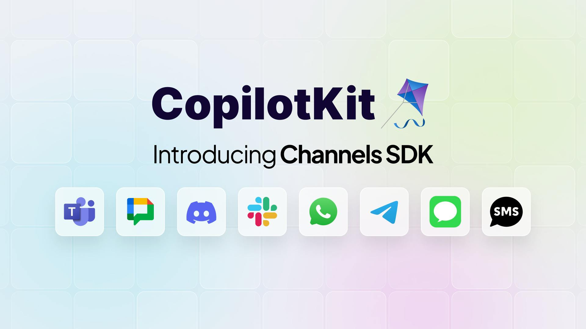
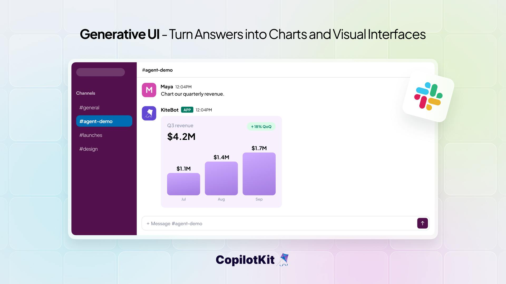
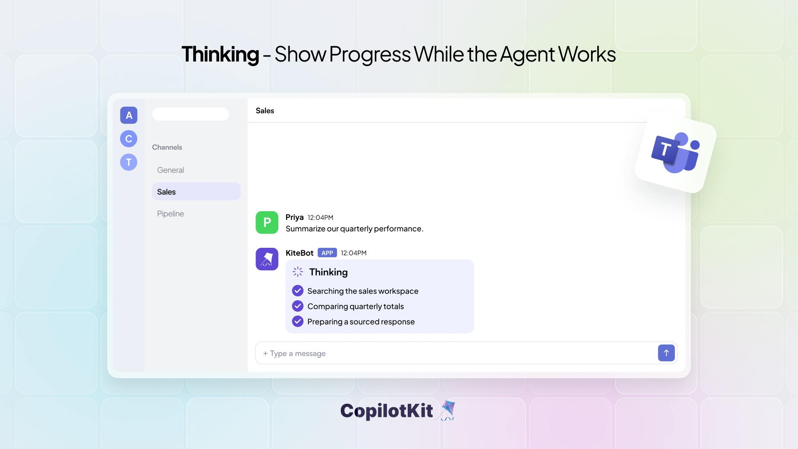

### 🎬 관련 영상
- [🎥 영상 보기](https://ph-files.imgix.net/0cfd64d1-6491-4a28-a226-982f61a1747f.jpeg?auto=format)

---

## 7. [Website to Markdown API](https://www.producthunt.com/products/website-to-markdown-api)
**Votes**: 123 | **도입 난이도**: 하 | **신뢰도**: 상
**Tagline**: Turn any website into LLM-ready Markdown
**서비스 링크**: https://www.producthunt.com/r/HIS6N47NI7HV3D

**태그**: AI, DevTool, Automation, DataExtraction, AI Tool, LLM, Video, Vision, API

### 📌 이 서비스 한눈에 보기
어떤 웹사이트든 LLM 학습 및 컨텍스트용 마크다운으로 즉시 변환해주는 API

### 🔑 주요 기능
- 자바스크립트 렌더링 지원 및 불필요한 요소(네비게이션, 푸터, 쿠키 배너) 자동 제거
- 프록시 로테이션 및 브라우저 핑거프린팅을 통한 강력한 안티 봇 우회 기능
- PDF, DOCX, PPTX, 이미지, 오디오, 비디오까지 지원하는 통합 파일 처리

### 🙋 사용자에게 어떤 점이 좋은가
웹 데이터를 수집하여 LLM에 입력할 때 거쳐야 하는 복잡한 전처리 과정을 생략하고, 즉시 활용 가능한 깨끗한 텍스트를 얻을 수 있습니다.

### ✅ 지금 바로 써볼 기능
- URL을 입력하여 깨끗한 마크다운 결과물 확인하기
- PDF나 문서 파일을 마크다운으로 변환해보기
- 무료 플랜을 통해 API 성능 테스트하기

### ⚠️ 사용 전 확인할 점
- 무료 플랜의 사용량 제한 및 속도 제한 확인 필요
- 복잡한 동적 페이지의 레이아웃 유지 여부 검토

### 🧭 확인이 더 필요한 정보
무료 플랜의 구체적인 호출 한도와 유료 플랜의 가격 체계에 대한 정보가 명시되지 않았습니다.

### 📸 스크린샷 및 갤러리
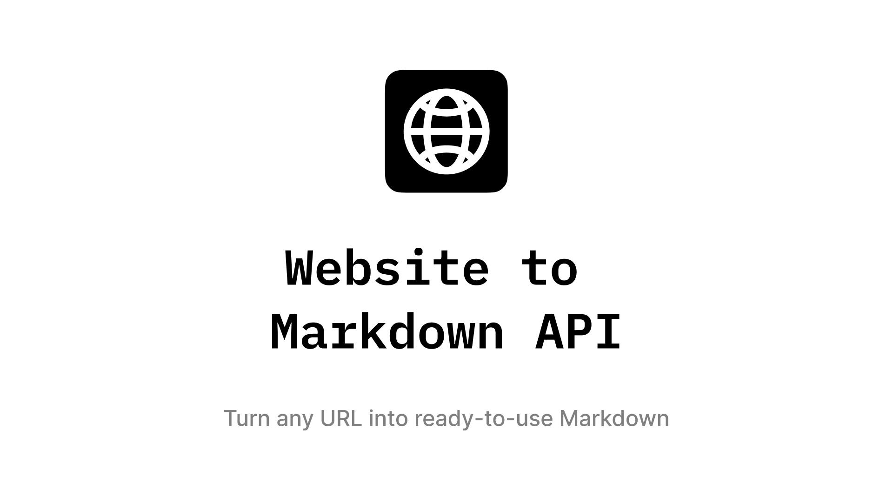
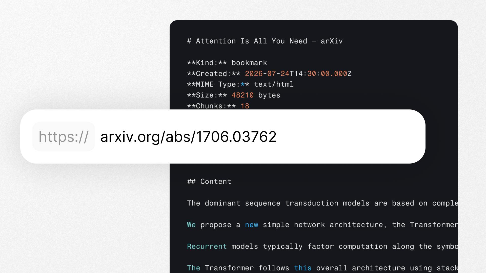
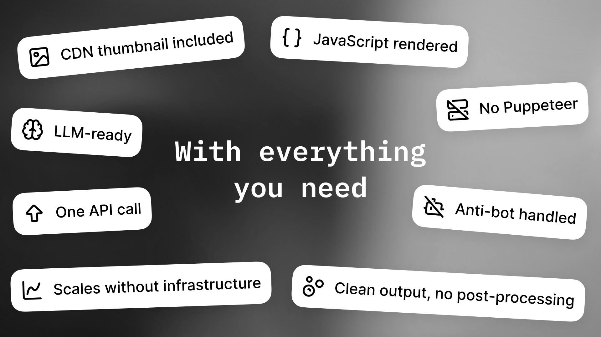

### 🎬 관련 영상
- [🎥 영상 보기](https://ph-files.imgix.net/306cc02b-f7bb-4008-add6-64d357dd321c.jpeg?auto=format)

---

## 8. [Brandfetch MCP](https://www.producthunt.com/products/brandfetch)
**Votes**: 123 | **도입 난이도**: 하 | **신뢰도**: 상
**Tagline**: Stop your AI from guessing brand logos
**서비스 링크**: https://www.producthunt.com/r/VPVX4ZAD5AZKSX

**태그**: AI, DesignTool, DeveloperTool, BrandManagement, Agent, AI Tool, DevTool

### 📌 이 서비스 한눈에 보기
AI 에이전트가 정확한 브랜드 자산(로고, 컬러, 폰트 등)을 즉시 사용할 수 있게 돕는 MCP 도구

### 🔑 주요 기능
- 5,000만 개 이상의 브랜드 데이터 제공
- AI의 잘못된 로고 생성 및 색상 추측 방지
- Claude, Cursor, VS Code 등 주요 MCP 클라이언트와 호환

### 🙋 사용자에게 어떤 점이 좋은가
AI 에이전트를 활용한 디자인이나 개발 작업 시, 브랜드 가이드를 일일이 찾을 필요 없이 정확한 브랜드 자산을 즉시 불러올 수 있습니다.

### ✅ 지금 바로 써볼 기능
- Claude 데스크톱 앱에 Brandfetch MCP 연결하기
- Cursor 또는 VS Code 환경에서 브랜드 데이터 연동 테스트하기
- AI 에이전트에게 브랜드 컨텍스트 제공하기

### ⚠️ 사용 전 확인할 점
- 사용 중인 MCP 클라이언트의 호환성 여부 확인 필요
- 데이터 업데이트 주기에 따른 최신성 확인 필요

### 🧭 확인이 더 필요한 정보
사용자별 구체적인 요금 체계 및 API 호출 제한량에 대한 정보는 명시되지 않았습니다.

### 📸 스크린샷 및 갤러리
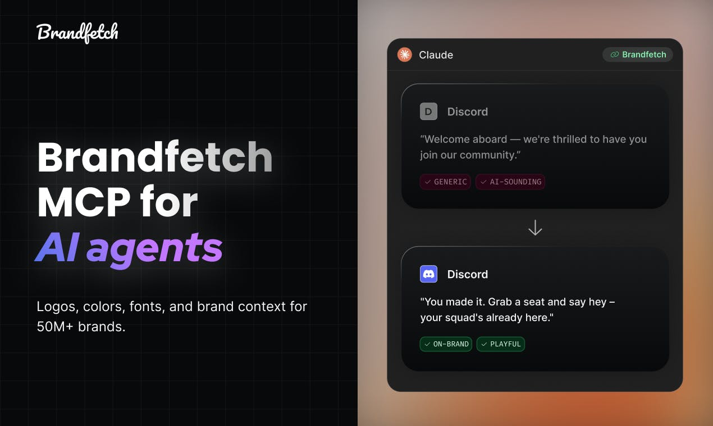
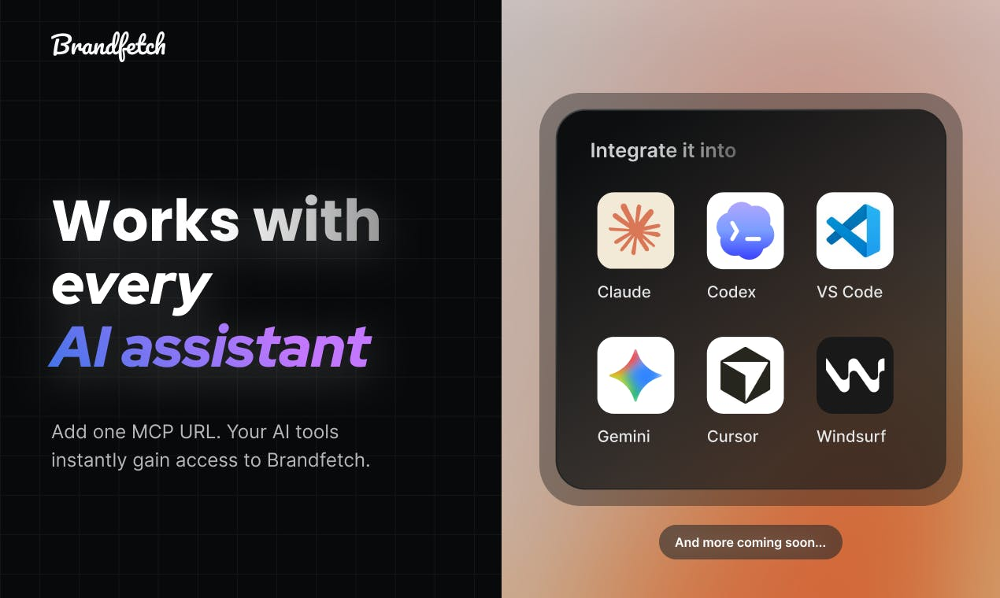
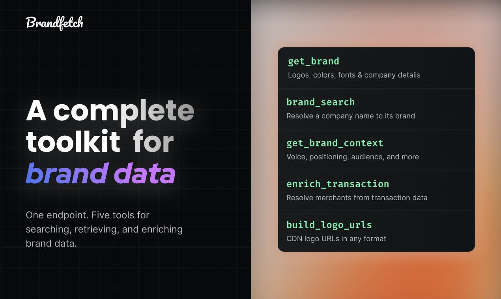

---

## 9. [Aveiro](https://www.producthunt.com/products/aveiro)
**Votes**: 114 | **도입 난이도**: 하 | **신뢰도**: 상
**Tagline**: Publish sites, newsletters and social posts with AI agents
**서비스 링크**: https://www.producthunt.com/r/7TLMT5CU74IOS7

**태그**: AI, ContentCreation, Automation, Publishing, SaaS, Agent, AI Tool, Chat

### 📌 이 서비스 한눈에 보기
AI 에이전트를 활용해 웹사이트, 뉴스레터, SNS 콘텐츠를 통합 관리하는 퍼블리싱 플랫폼

### 🔑 주요 기능
- 사이트, 블로그, 뉴스레터, 소셜 미디어를 아우르는 AI 네이티브 퍼블리싱 환경 제공
- 자체 인터페이스를 통한 직관적인 콘텐츠 생성 및 관리
- MCP(Model Context Protocol)를 통한 ChatGPT, Claude, Cursor와의 강력한 연동

### 🙋 사용자에게 어떤 점이 좋은가
콘텐츠 제작부터 배포까지의 워크플로우를 AI로 자동화하여, 여러 플랫폼을 개별적으로 관리하는 번거로움을 줄여줍니다.

### ✅ 지금 바로 써볼 기능
- AI 에이전트를 활용한 초안 생성 기능 테스트
- MCP를 통한 외부 AI 모델(Claude, ChatGPT 등) 연결 설정
- 멀티 채널(블로그 및 SNS) 동시 발행 워크플로우 구축

### ⚠️ 사용 전 확인할 점
- AI 생성 콘텐츠의 품질 검수 및 편집 필요성
- 외부 AI 모델 연동 시 발생할 수 있는 API 설정 및 권한 관리

### 🧭 확인이 더 필요한 정보
플랫폼별 상세 배포 기능 및 외부 서비스와의 구체적인 연동 범위 확인이 필요합니다.

### 📸 스크린샷 및 갤러리

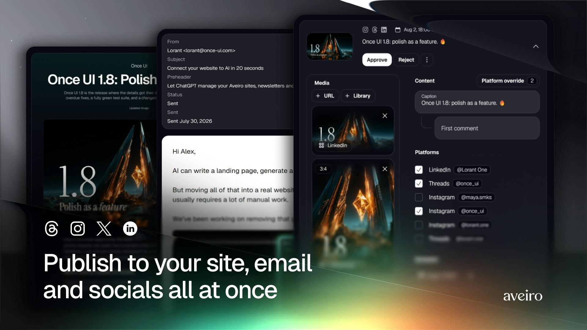
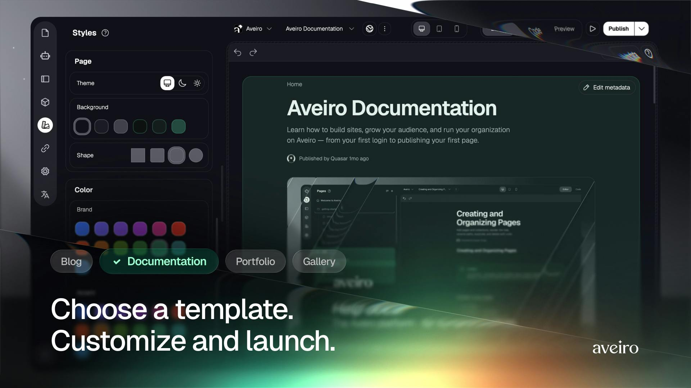

### 🎬 관련 영상
- [🎥 영상 보기](https://ph-files.imgix.net/60cce5f7-7661-4629-9ca2-5861797a15ac.jpeg?auto=format)

---

## 10. [Shieldstral](https://www.producthunt.com/products/mistral-7b)
**Votes**: 108 | **도입 난이도**: 중 | **신뢰도**: 상
**Tagline**: Define safety at runtime for text and images
**서비스 링크**: https://www.producthunt.com/r/E22OXGGVRZ2YPU

**태그**: AI, Security, MLOps, Multimodal, AI Tool, Vision

### 📌 이 서비스 한눈에 보기
자연어로 안전 정책을 정의하는 Mistral의 3B 멀티모달 가드레일

### 🔑 주요 기능
- 자연어를 통한 직관적인 안전 정책 정의
- 텍스트와 이미지를 동시에 평가하는 멀티모달 기능
- 단일 16GB GPU에서 구동 가능한 효율적인 로컬 실행

### 🙋 사용자에게 어떤 점이 좋은가
복잡한 코딩 없이 자연어로 안전 규칙을 설정하여, 텍ม스트와 이미지 입력에 대한 보안 정책을 즉각적으로 적용할 수 있습니다.

### ✅ 지금 바로 써볼 기능
- 자연어로 안전 정책 정의해보기
- 로컬 GPU 환경에서의 추론 성능 테스트
- 텍스트 및 이미지 결합 입력에 대한 가드레일 검증

### ⚠️ 사용 전 확인할 점
- 16GB 이상의 GPU 메모리 확보 필요
- 3B 모델 규모에 따른 복잡한 정책 처리 한계 가능성

### 🧭 확인이 더 필요한 정보
특정 하드웨어 아키텍처에서의 최적화 성능과 상세한 보안 정책 적용 범위에 대한 추가 확인이 필요합니다.

### 📸 스크린샷 및 갤러리

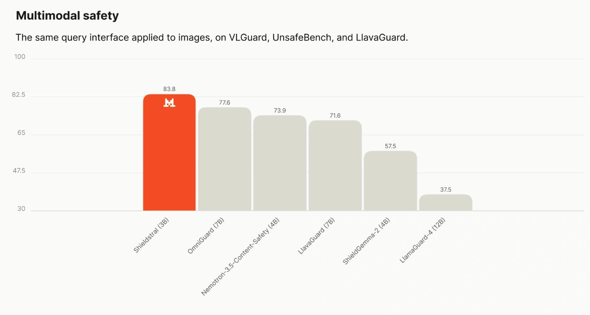
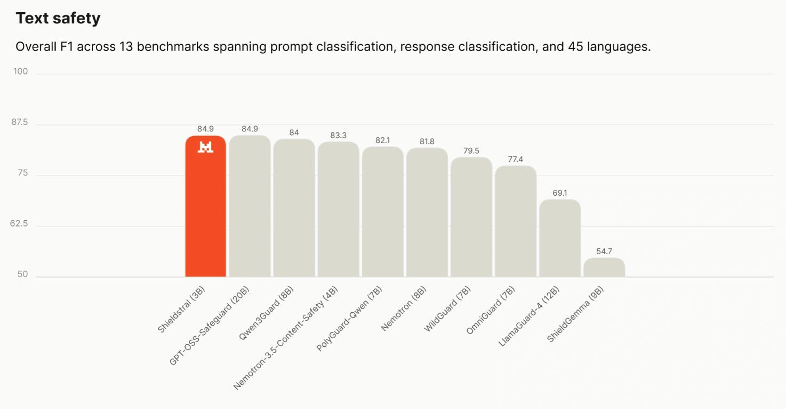

---

## 11. [Ododok](https://www.producthunt.com/products/ododok)
**Votes**: 102 | **도입 난이도**: 하 | **신뢰도**: 상
**Tagline**: Count every chew with your AirPods
**서비스 링크**: https://www.producthunt.com/r/NRQCV2PBC2P7CR

**태그**: Health, Lifestyle, iOS, Productivity, AI Tool

### 📌 이 서비스 한눈에 보기
에어팟을 활용해 식사 습관을 실시간으로 기록하는 스마트 저작 트래커

### 🔑 주요 기능
- 에어팟을 이용한 실시간 저작(씹기) 횟수 측정
- 식사 속도, 저작 횟수, 식사 시간 등 상세 데이터 제공
- 별도의 웨어러블 기기 없이 에어팟과 아이폰만으로 작동

### 🙋 사용자에게 어떤 점이 좋은가
식사 습관을 데이터로 시각화하여 더 건강한 식사 속도와 패턴을 유지할 수 있도록 도와줍니다.

### ✅ 지금 바로 써볼 기능
- 에어팟을 착용하고 식사하며 실시간 데이터 확인하기
- 식사 후 제공되는 리포트로 식사 패턴 분석하기

### ⚠️ 사용 전 확인할 점
- 지원되는 특정 에어팟 모델 모델 여부 확인 필요
- 식사 중 에어팟 착용에 따른 불편함이나 위생 문제 고려

### 🧭 확인이 더 필요한 정보
모든 에어팟 모델이 이 기능을 지원하는지, 그리고 식사 중 소음이 측정 정확도에 미치는 영향은 어떠한지 확인이 필요합니다.

### 📸 스크린샷 및 갤러리

---

## 12. [Chute](https://www.producthunt.com/products/chute-better-airdrop)
**Votes**: 98 | **도입 난이도**: 하 | **신뢰도**: 상
**Tagline**: The fastest way to send anything to your iPhone
**서비스 링크**: https://www.producthunt.com/r/IBQ5MU64GQ5IRF

**태그**: Productivity, Mac, iOS, Workflow, Automation, AI Tool

### 📌 이 서비스 한눈에 보기
맥북 노치로 파일을 드래그하여 아이폰으로 즉시 전송하는 초고속 파일 공유 도구

### 🔑 주요 기능
- 맥북의 노치 영역을 파일 전송 포털로 활용
- 스크린샷, 링크, 파일을 드래그 앤 드롭으로 간편하게 전송
- Mac에서 iPhone으로의 워크플로우 최적화

### 🙋 사용자에게 어떤 점이 좋은가
기기 간 파일 전송을 위해 별도의 창을 열거나 에어드롭을 찾는 번거로움 없이, 노치로 드래그하는 것만으로 즉각적인 작업 흐름을 유지할 수 있습니다.

### ✅ 지금 바로 써볼 기능
- 스크린샷을 노치로 드래그하여 아이폰으로 보내보기
- 웹 브라우저의 링크를 노치로 드래그하여 모바일에서 확인하기
- 중요한 파일 전송 시 노치 인터페이스 활용하기

### ⚠️ 사용 전 확인할 점
- 노치 디자인이 없는 맥 모델에서는 사용이 제한될 수 있음
- Mac과 iPhone 간의 연결 방식(에어드롭 등)에 따른 전송 속도 차이 발생 가능

### 🧭 확인이 더 필요한 정보
노치 이외의 화면 영역에서의 동작 방식과 지원하는 파일 형식의 범위에 대한 상세 정보가 필요합니다.

### 📸 스크린샷 및 갤러리

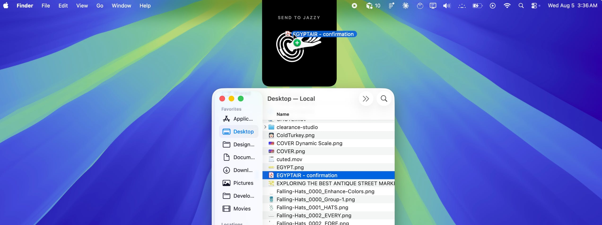

### 🎬 관련 영상
- [🎥 영상 보기](https://ph-files.imgix.net/7709e8b3-e751-425c-bc5f-a84d1aa8ddab.jpeg?auto=format)

---

## 13. [hey postcard - digital postcards](https://www.producthunt.com/products/hey-postcard-slow-messaging)
**Votes**: 91 | **도입 난이도**: 하 | **신뢰도**: 상
**Tagline**: delivered tomorrow morning at a random time between 8 -10 AM
**서비스 링크**: https://www.producthunt.com/r/2PHH7AYAXTGVTR

**태그**: Messaging, Lifestyle, Social, AI Tool, Chat

### 📌 이 서비스 한눈에 보기
일상의 소음에서 벗어나 소중한 사람에게 특별한 기다림을 선물하는 디지털 엽서 서비스

### 🔑 주요 기능
- 즉각적인 메시지 대신 느린 호흡의 디지털 엽서 전달
- 익일 오전 8~10시 사이 무작위 시간에 도착하는 기다림의 미학
- 알림과 단톡방에 묻히지 않는 의미 있는 대화 경험 제공

### 🙋 사용자에게 어떤 점이 좋은가
빠른 응답에 지친 사용자에게 메시지 전달의 설렘과 소중한 사람과의 정서적 연결을 제공합니다.

### ✅ 지금 바로 써볼 기능
- 소중한 사람에게 첫 번째 디지털 엽서 써보기
- 익일 오전의 깜짝 선물을 위한 메시지 예약하기

### ⚠️ 사용 전 확인할 점
- 즉각적인 답장이 필요한 긴급한 용도로는 부적합함
- 수신자가 정해진 시간대에 메시지를 확인해야 함

### 🧭 확인이 더 필요한 정보
메시지 전달 방식(이메일, 앱 푸시 등)에 대한 구체적인 기술적 상세 정보가 명시되지 않았습니다.

### 📸 스크린샷 및 갤러리

### 🎬 관련 영상
- [🎥 영상 보기](https://ph-files.imgix.net/854c5f61-6d8d-4f9c-9045-c9bcf38014cf.jpeg?auto=format)

---

## 14. [Ticketdesk AI](https://www.producthunt.com/products/ticketdesk-ai)
**Votes**: 91 | **도입 난이도**: 하 | **신뢰도**: 상
**Tagline**: AI Agents for Customer Support
**서비스 링크**: https://www.producthunt.com/r/2BQRRJMFPKC74A

**태그**: Customer Support, AI Agents, Automation, Agent, AI Tool, Email

### 📌 이 서비스 한눈에 보기
24시간 자동 응답과 AI 에이전트를 통한 고객 지원 자동화 솔루션

### 🔑 주요 기능
- 고객 지원을 위한 맞춤형 AI 에이전트 생성
- 이메일 문의에 대한 자동 AI 응답 기능
- 24/7 중단 없는 고객 지원 자동화

### 🙋 사용자에게 어떤 점이 좋은가
고객 문의에 대한 응답 시간을 획기적으로 단축하고, 운영 인력의 업무 부담을 줄여줍니다.

### ✅ 지금 바로 써볼 기능
- AI 에이전트 생성 및 설정
- 이메일 자동 응답 기능 활성화
- 티켓 처리 자동화 워크플로우 구축

### ⚠️ 사용 전 확인할 점
- AI 응답의 정확도 및 품질 검증 필요
- 복잡한 고객 문의에 대한 수동 개입 여부 확인

### 🧭 확인이 더 필요한 정보
현재 제공되는 AI 에이전트의 구체적인 학습 방식과 외부 툴과의 연동 범위를 확인해야 합니다.

### 📸 스크린샷 및 갤러리
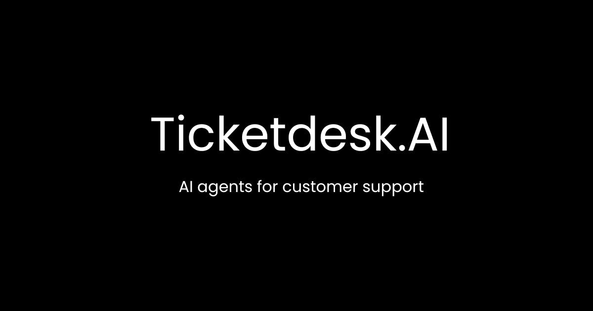
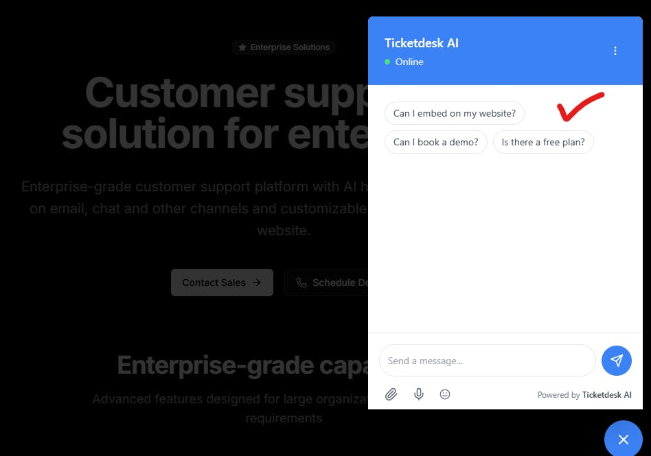
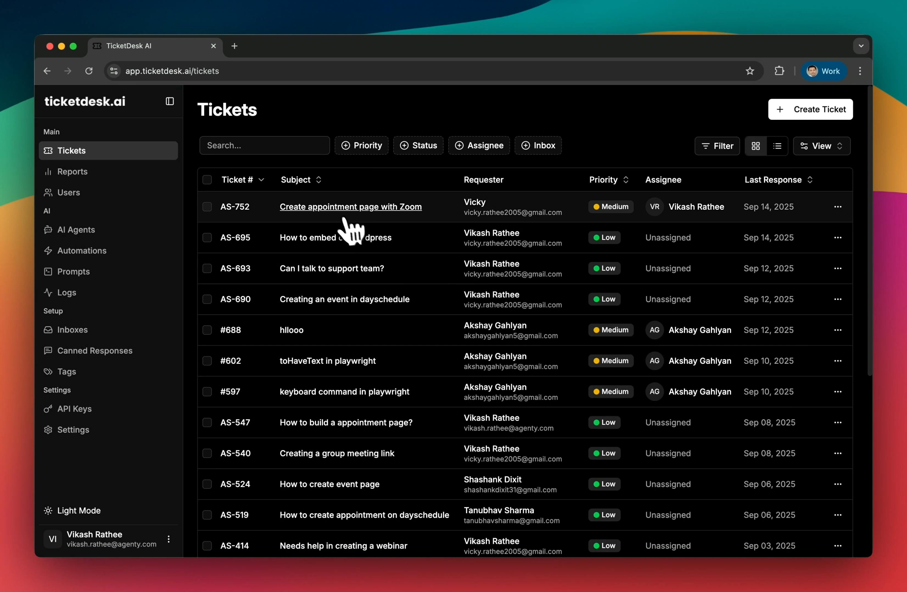

### 🎬 관련 영상
- [🎥 영상 보기](https://ph-files.imgix.net/d3ee155a-243c-4050-afb3-07ef29581cfb.jpeg?auto=format)

---

## 15. [Glyphi: Speed Reader](https://www.producthunt.com/products/glyphi-speed-reader)
**Votes**: 85 | **도입 난이도**: 하 | **신뢰도**: 상
**Tagline**: An RSVP reader for books, PDFs, articles & webpages
**서비스 링크**: https://www.producthunt.com/r/DNAEYVOOKME2R5

**태그**: Productivity, Reading, AI, Apple Ecosystem, AI Tool, API

### 📌 이 서비스 한눈에 보기
다양한 문서를 한눈에 빠르게 읽을 수 있는 RSVP 방식의 스마트 독서 도구

### 🔑 주요 기능
- RSVP(한 번에 한 단어씩 보여주는 방식) 기술을 통한 빠른 독서 경험 제공
- EPUB, PDF, 웹 페이지 등 다양한 포맷 지원 및 iCloud를 통한 기기 간 동기화
- 온디바이스 AI를 활용한 개인정보 보호 중심의 요약 기능

### 🙋 사용자에게 어떤 점이 좋은가
방대한 양의 텍스트를 빠르게 훑어보면서도, 개인정보 유출 걱정 없이 핵심 내용을 요약받을 수 있습니다.

### ✅ 지금 바로 써볼 기능
- 자신에게 맞는 최적의 읽기 속도 설정하기
- PDF나 EPUB 파일을 가져와 읽기 모드 적용하기
- AI 요약 기능을 통해 읽은 내용 핵심 파악하기

### ⚠️ 사용 전 확인할 점
- RSVP 방식에 익숙하지 않을 경우 초기 적응 기간이 필요할 수 있음
- 복잡한 레이아웃의 PDF는 가독성이 떨어질 수 있음

### 🧭 확인이 더 필요한 정보
지원하는 Apple 기기 모델 및 OS 버전에 따른 기능 제한 여부를 확인해야 합니다.

### 📸 스크린샷 및 갤러리
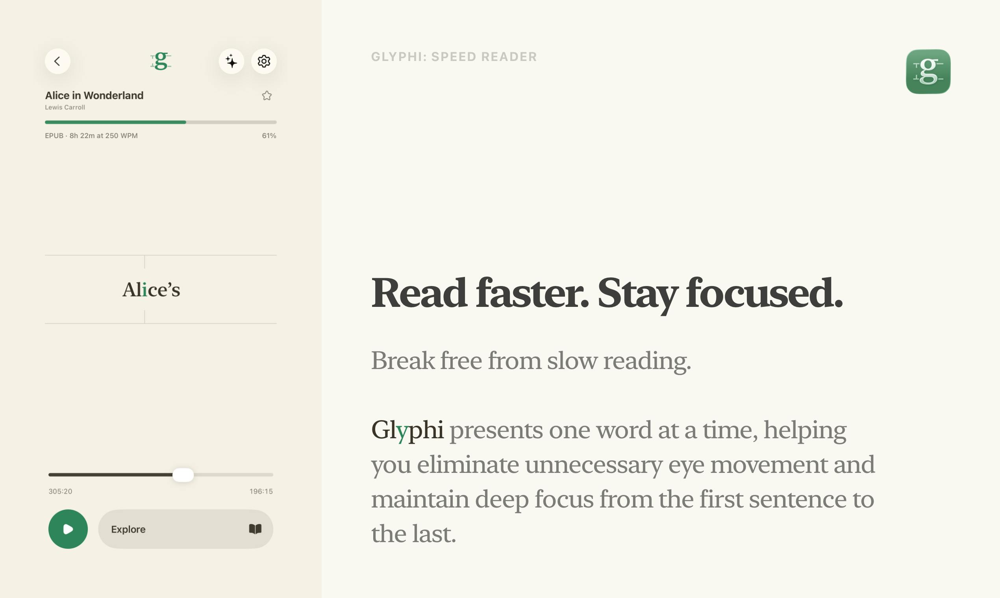
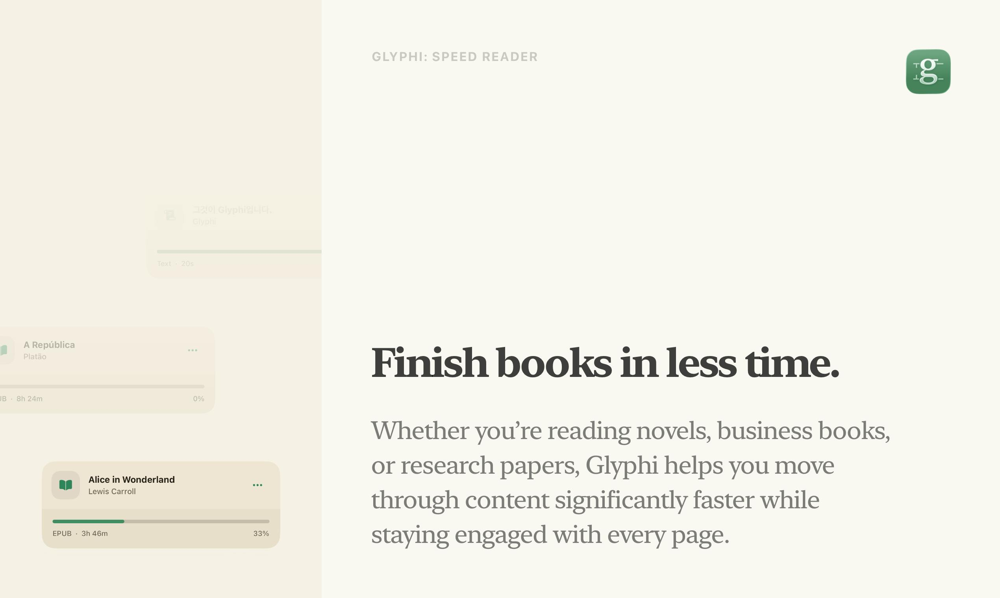
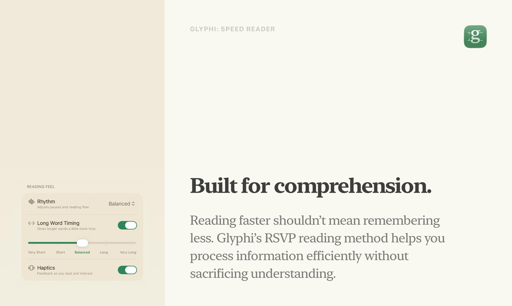

---

## 16. [Token Harbor](https://www.producthunt.com/products/token-harbor)
**Votes**: 84 | **도입 난이도**: 하 | **신뢰도**: 상
**Tagline**: The easiest way to access frontier AI models.
**서비스 링크**: https://www.producthunt.com/r/PD5LP7BT5NHRLY

**태그**: AI, API, DevTool, Productivity, AI Tool

### 📌 이 서비스 한눈에 보기
단일 API로 다양한 최신 AI 모델을 자유롭게 전환하며 사용할 수 있는 통합 플랫폼

### 🔑 주요 기능
- GPT, Claude, Gemini, DeepSeek 등 주요 프론티어 모델 통합 지원
- OpenAI 호환 API를 통한 간편한 연동 및 모델 전환
- 사용한 만큼만 비용을 지불하는 효율적인 과금 체계

### 🙋 사용자에게 어떤 점이 좋은가
여러 AI 모델을 개별적으로 연동할 필요 없이 하나의 API로 관리할 수 있어 개발 및 운영 효율성이 극대화됩니다.

### ✅ 지금 바로 써볼 기능
- OpenAI 호환 API를 통한 기존 워크플로우 연결
- 필요에 따라 모델을 자유롭게 교체하며 성능 테스트
- 사용량 기반의 비용 최적화 확인

### ⚠️ 사용 전 확인할 점
- 중간 API를 거치는 구조이므로 데이터 보안 및 프라이버시 정책 확인 필요
- 각 모델별 성능 차이에 따른 응답 품질 변화 가능성

### 🧭 확인이 더 필요한 정보
구체적인 과금 방식(토큰당 단가 등)과 데이터 보안 처리 방식에 대한 상세 정보가 필요합니다.

### 📸 스크린샷 및 갤러리
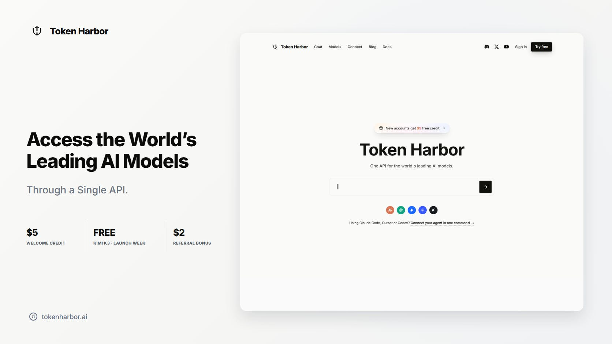
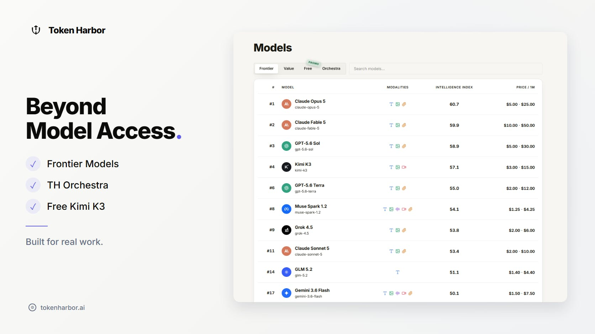
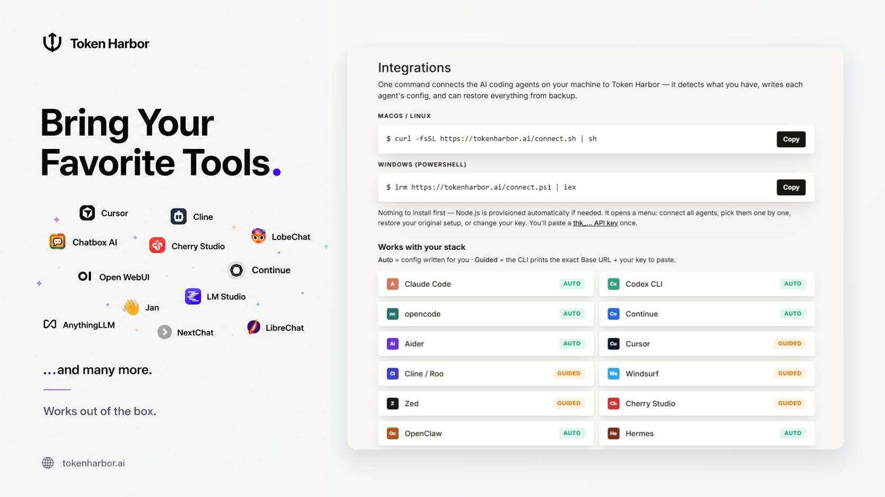

### 🎬 관련 영상
- [🎥 영상 보기](https://ph-files.imgix.net/0c3e0b64-b2da-4396-b65d-ed2674206904.jpeg?auto=format)

---

## 17. [UCP Radar](https://www.producthunt.com/products/ucp-radar)
**Votes**: 80 | **도입 난이도**: 하 | **신뢰도**: 상
**Tagline**: Make your product feed visible to AI shopping agents
**서비스 링크**: https://www.producthunt.com/r/N2JQBJBTPQ7TUB

**태그**: E-commerce, AI, Automation, Marketing, Agent, AI Tool, Chat

### 📌 이 서비스 한눈에 보기
AI 쇼핑 에이전트 최적화를 위한 상품 피드 자동 개선 솔루션

### 🔑 주요 기능
- Google Merchant Center와 원클릭 연동을 통한 데이터 동기화
- AI 에이전트(Perplexity, ChatGPT 등)가 읽기 쉬운 데이터 구조로 자동 재작성
- 누락된 속성(소재, 상세 정보, FAQ 등) 자동 채우기 및 규칙 위반 탐지

### 🙋 사용자에게 어떤 점이 좋은가
기존 상품 설명이 AI 검색 환경에 최적화되지 않아 발생하는 노출 손실을 방지하고, AI 쇼핑 에이전트에게 매력적인 상품 정보를 제공할 수 있습니다.

### ✅ 지금 바로 써볼 기능
- Merchant Center 계정 연결하기
- AI 최적화가 필요한 누락된 속성 확인하기
- 자동 생성된 보충 피드(Supplemental Feed) 검토하기

### ⚠️ 사용 전 확인할 점
- 자동 재작성된 제목이 브랜드의 의도와 다를 수 있으므로 검토 필요
- 기존 상품 데이터의 품질에 따라 자동 생성 결과의 정확도 차이 발생 가능

### 🧭 확인이 더 필요한 정보
자동 재작성 기능이 브랜드명을 제외한 모든 텍스트에 적용되는지, 혹은 특정 필드에만 국한되는지 명확한 범위 확인이 필요합니다.

### 📸 스크린샷 및 갤러리
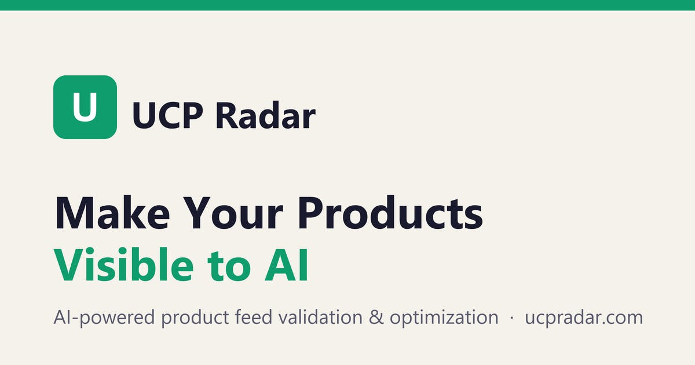
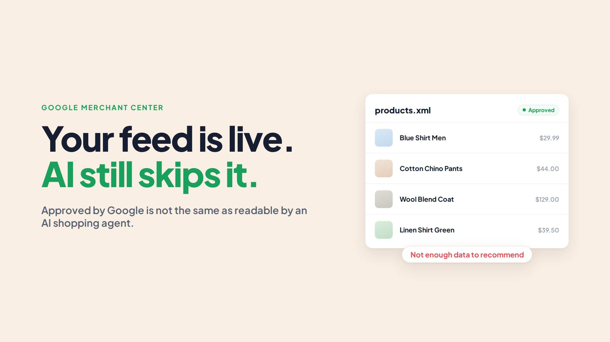
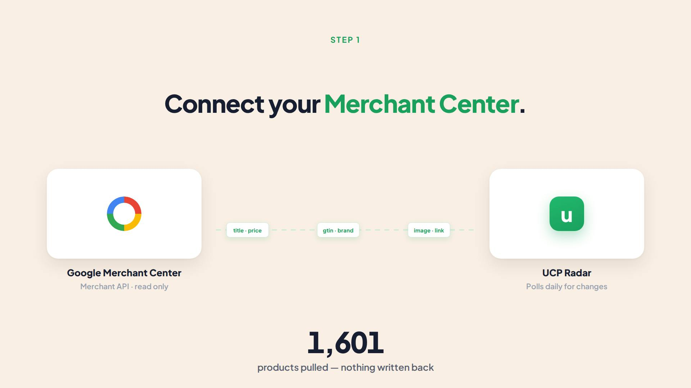

### 🎬 관련 영상
- [🎥 영상 보기](https://ph-files.imgix.net/1cdb9991-c9d4-41ed-8de9-fb2b0aa789b1.jpeg?auto=format)

---

## 18. [Superbrain For macOS](https://www.producthunt.com/products/superbrain)
**Votes**: 69 | **도입 난이도**: 하 | **신뢰도**: 상
**Tagline**: Most Efficient Agentic Coding Environment
**서비스 링크**: https://www.producthunt.com/r/FWPFFZOD3BNNT3

**태그**: DevTool, AI, Coding, macOS, Productivity, Agent, AI Tool

### 📌 이 서비스 한눈에 보기
비용은 낮추고 속도는 높인 고효율 AI 코딩 에이전트

### 🔑 주요 기능
- 독자적인 TokenFold 아키텍처 기반의 효율적인 데이터 검색
- 기존 도구(Claude Code, Cursor 등) 대비 토큰 사용량 50% 절감
- 기존 도구 대비 운영 비용 40% 절감

### 🙋 사용자에게 어떤 점이 좋은가
더 적은 비용으로 더 빠른 코드 배포가 가능하여 개발 생산성을 극대화할 수 있습니다.

### ✅ 지금 바로 써볼 기능
- macOS 환경에서 설치 및 설정
- 기존 코딩 워크플로우와 연동 테스트
- 토큰 절감 효과 및 비용 효율성 검증

### ⚠️ 사용 전 확인할 점
- macOS 전용 환경이므로 타 OS 사용 시 제약이 있을 수 있음
- 기존 도구 대비 성능 차이에 대한 실질적 벤치마크 확인 필요

### 🧭 확인이 더 필요한 정보
제시된 비용 절감 수치가 모든 사용자 환경에서 동일하게 적용되는지 확인이 필요합니다.

### 📸 스크린샷 및 갤러리

### 🎬 관련 영상
- [🎥 영상 보기](https://ph-files.imgix.net/c5cf6f4d-cb5a-42d8-a3f1-bb9fbacd1cbc.gif?auto=format)

---

## 19. [Gesture Synth School](https://www.producthunt.com/products/gesture-synth-school)
**Votes**: 67 | **도입 난이도**: 하 | **신뢰도**: 상
**Tagline**: A practice app for learning to play music with your hands.
**서비스 링크**: https://www.producthunt.com/r/Y3BGKIWRXJJQZY

**태그**: Music, Education, Learning

### 📌 이 서비스 한눈에 보기
손동작을 이용한 악기 연주를 배우는 단계별 가이드 연습 앱

### 🔑 주요 기능
- Gesture Synth를 위한 체계적인 가이드 연습 제공
- 코드 차트 및 손동작 튜토리얼 포함
- 인기 곡과 함께하는 플레이어 기능 제공

### 🙋 사용자에게 어떤 점이 좋은가
손동작을 이용한 새로운 방식의 악기 연주를 단계별로 쉽고 재미있게 익힐 수 있습니다.

### ✅ 지금 바로 써볼 기능
- 제공되는 손동작 튜토리얼 따라하기
- 코드 차트를 보며 기본 동작 익히기
- 플레이어 기능을 활용해 인기 곡 연주해보기

### ⚠️ 사용 전 확인할 점
- Gesture Synth 하드웨어/소프트웨어와의 호환성 확인 필요
- 실제 악기 연주와는 다른 학습 경험일 수 있음

### 🧭 확인이 더 필요한 정보
Gesture Synth 기기나 소프트웨어가 있어야 원활한 사용이 가능한지 확인이 필요합니다.

### 📸 스크린샷 및 갤러리
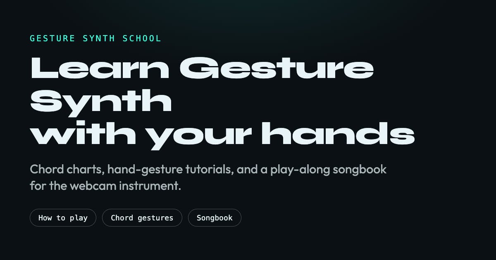
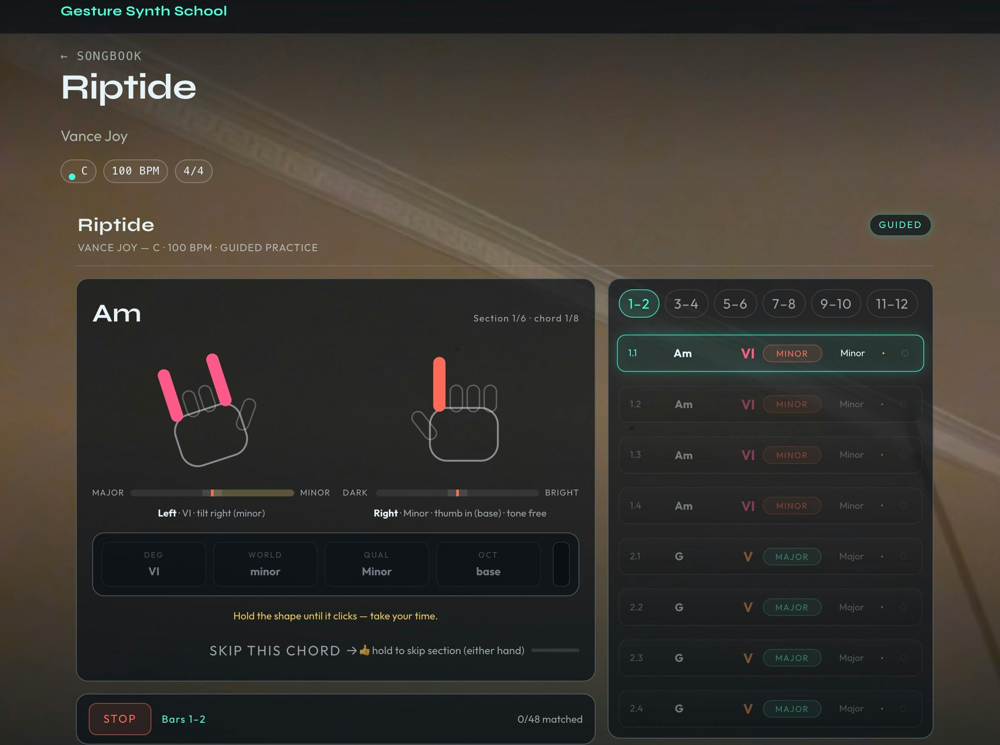
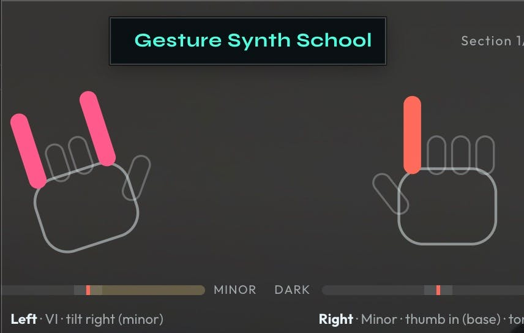

### 🎬 관련 영상
- [🎥 영상 보기](https://ph-files.imgix.net/4dc7f7b1-cfc0-4e67-9aeb-01128b4c04dd.jpeg?auto=format)

---

## 20. [producTinder](https://www.producthunt.com/products/productinder-2)
**Votes**: 58 | **도입 난이도**: 하 | **신뢰도**: 상
**Tagline**: Swipe to discover and support fellow Product Hunt makers
**서비스 링크**: https://www.producthunt.com/r/OPII3ABGZMDTQ5

**태그**: Productivity, Community, Marketing, AI Tool

### 📌 이 서비스 한눈에 보기
Product Hunt 메이커들이 서로의 출시를 돕기 위해 매칭하고 상호 지원하는 스와이프 기반 커뮤니티

### 🔑 주요 기능
- 스와이프 방식을 통한 간편한 메이커 매칭
- 상호 지원 및 AI를 통한 실질적인 지원 인증 시스템
- 신뢰도를 유지하기 위한 수동 검토 기반의 검증된 메이커 커뮤니티

### 🙋 사용자에게 어떤 점이 좋은가
오늘 출시하는 메이커들이 서로의 제품을 홍보하고 초기 지지자를 확보할 수 있는 공정한 상호 지원 환경을 제공합니다.

### ✅ 지금 바로 써볼 기능
- 오늘 출시할 제품 등록하기
- 관심 있는 메이커 스와이프하여 매칭하기
- 매칭된 메이커와 상호 지원 및 스크린샷 인증하기

### ⚠️ 사용 전 확인할 점
- 매칭 시 크레딧이 예약되므로 매칭 완료를 위한 상호 작용이 필요함
- 수동 검토를 거치므로 가입 승인에 시간이 소요될 수 있음

### 🧭 확인이 더 필요한 정보
크레딧 시스템의 구체적인 충전 방식이나 확장성에 대한 정보는 명시되지 않았습니다.

### 📸 스크린샷 및 갤러리
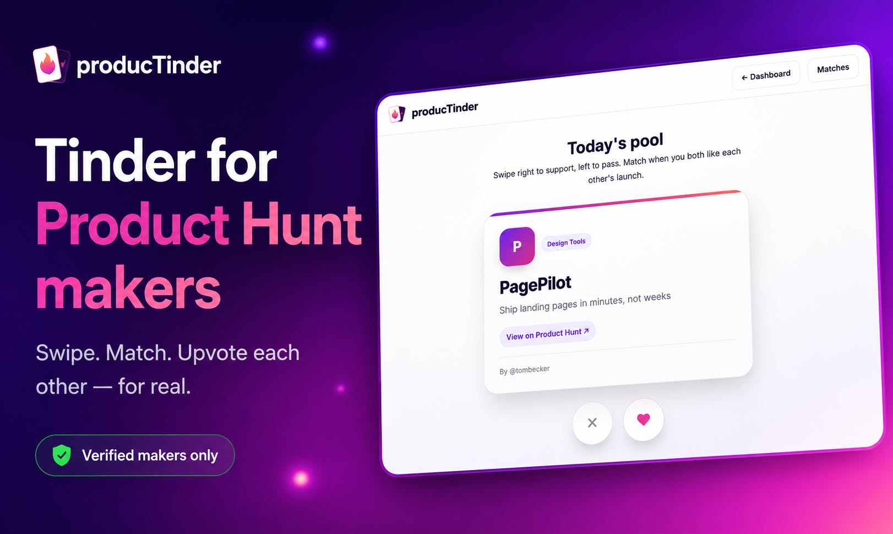
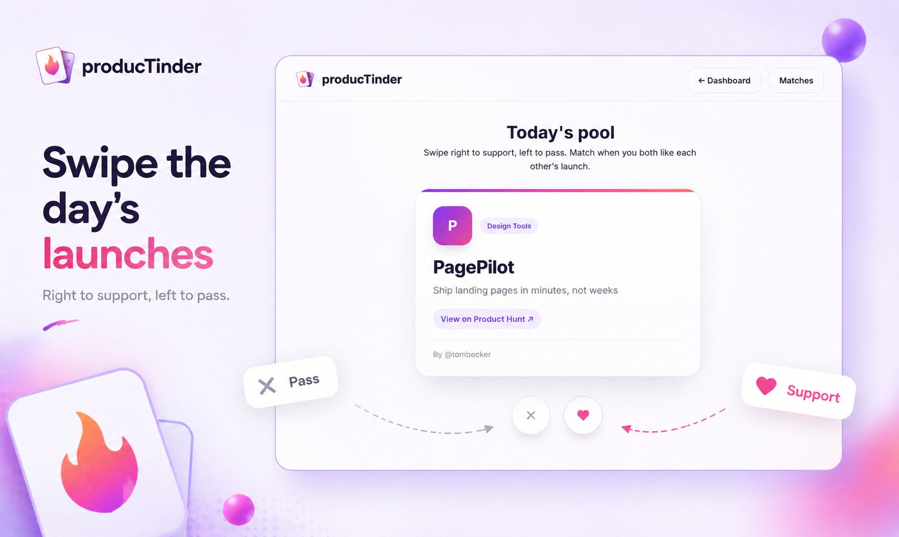
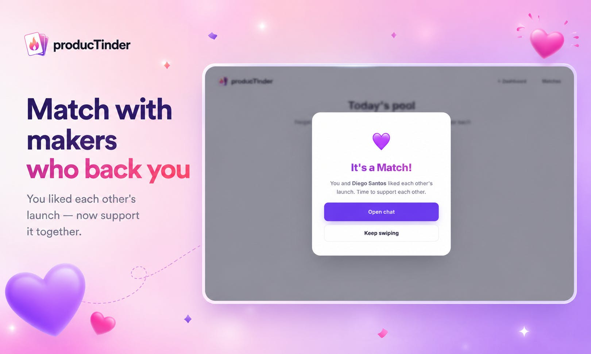

---

## 21. [SerpRankings](https://www.producthunt.com/products/serprankings)
**Votes**: 50 | **도입 난이도**: 하 | **신뢰도**: 상
**Tagline**: See which brands ChatGPT recommends for Free
**서비스 링크**: https://www.producthunt.com/r/2ONLBWRGUG5S3B

**태그**: AI, Marketing, Analytics, SEO, AI Tool, Chat, API

### 📌 이 서비스 한눈에 보기
ChatGPT 검색 결과에서 우리 브랜드가 얼마나 노출되는지 확인하는 AI 가시성 지표 서비스

### 🔑 주요 기능
- ChatGPT 내 브랜드 추천 순위 및 가시성 확인
- 카테고리별 상위 브랜드 탐색 기능
- AI 검색 엔진에 따른 온라인 노출 변화 모니터링

### 🙋 사용자에게 어떤 점이 좋은가
AI 검색 시대에 브랜드가 어떻게 추천되는지 파악하여 디지털 마케팅 전략을 최적화할 수 있습니다.

### ✅ 지금 바로 써볼 기능
- 카테고리별 상위 브랜드 순위 확인하기
- 우리 브랜드의 AI 가시성 지표 점검하기
- AI 검색 트렌드 분석하기

### ⚠️ 사용 전 확인할 점
- 무료 서비스이므로 상세 데이터나 고급 기능에 제한이 있을 수 있음
- ChatGPT의 답변 알고리즘 변화에 따라 지표가 변동될 수 있음

### 🧭 확인이 더 필요한 정보
제공되는 데이터의 업데이트 주기와 상세 분석 기능의 유료화 여부를 확인해야 합니다.

### 📸 스크린샷 및 갤러리
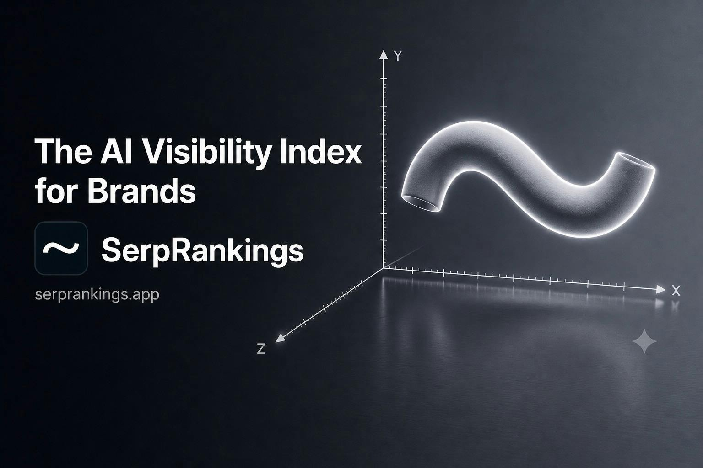
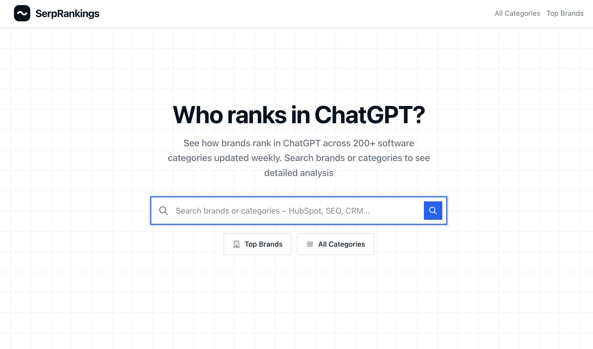
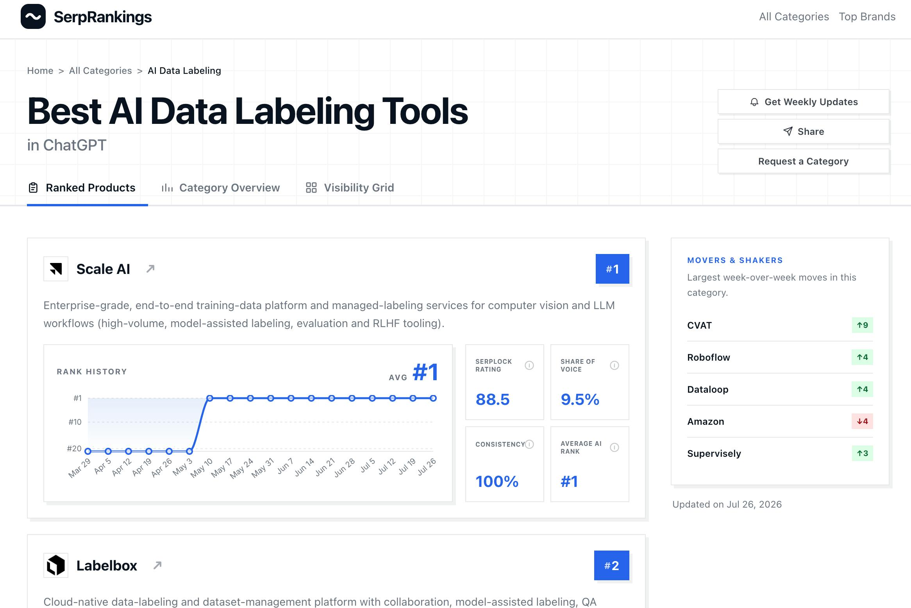

---

## 22. [PixlQR](https://www.producthunt.com/products/pixlqr)
**Votes**: 47 | **도입 난이도**: 하 | **신뢰도**: 상
**Tagline**: Dynamic QR codes + short links🔗+real-time analytics 📊📈
**서비스 링크**: https://www.producthunt.com/r/XMS5FIMEH6YXQO

**태그**: Marketing, QR-Code, Analytics, Productivity, AI Tool, Design, DevTool

### 📌 이 서비스 한눈에 보기
수정 가능한 다이내믹 QR 코드와 단축 링크를 통해 오프라인 마케팅 효율을 극대화하는 도구

### 🔑 주요 기능
- 한 번 인쇄된 QR 코드를 재인쇄 없이 언제든 수정 가능한 다이내믹 기능
- 24종 이상의 QR 타입 생성 및 맞춤형 디자인 지원
- 위치, 기기, 브라우저 등 실시간 스캔 및 클릭 분석 제공

### 🙋 사용자에게 어떤 점이 좋은가
인쇄물이나 메뉴판의 QR 코드를 매번 바꿀 필요 없이 콘텐츠만 즉시 변경할 수 있어 오프라인 마케팅 비용을 절감할 수 있습니다.

### ✅ 지금 바로 써볼 기능
- 브랜드 디자인에 맞춘 커스텀 QR 코드 생성하기
- 파일 호스팅 및 랜딩 페이지 기능을 활용한 디지털 콘텐츠 연결
- 실시간 분석 대시보드를 통한 사용자 유입 패턴 확인

### ⚠️ 사용 전 확인할 점
- 무료 플랜의 기능 제한 및 사용량 제한 여부 확인 필요
- 데이터 분석의 상세 수준이 비즈니스 요구사항에 부합하는지 검토

### 🧭 확인이 더 필요한 정보
무료 플랜의 구체적인 기능 범위와 유료 플랜으로의 전환 시점(사용량 제한 등)에 대한 정보가 명시되지 않았습니다.

### 📸 스크린샷 및 갤러리
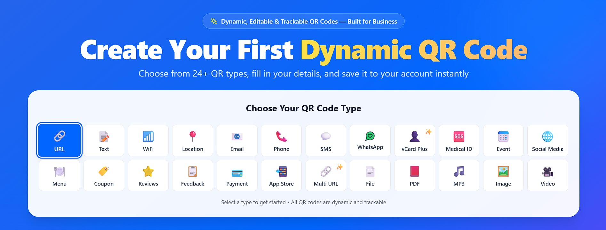
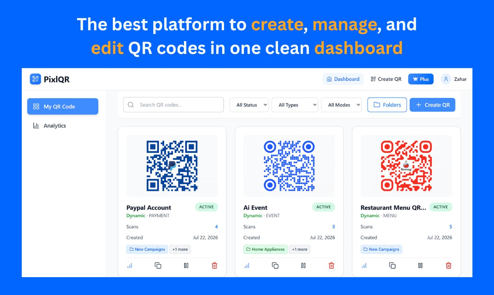
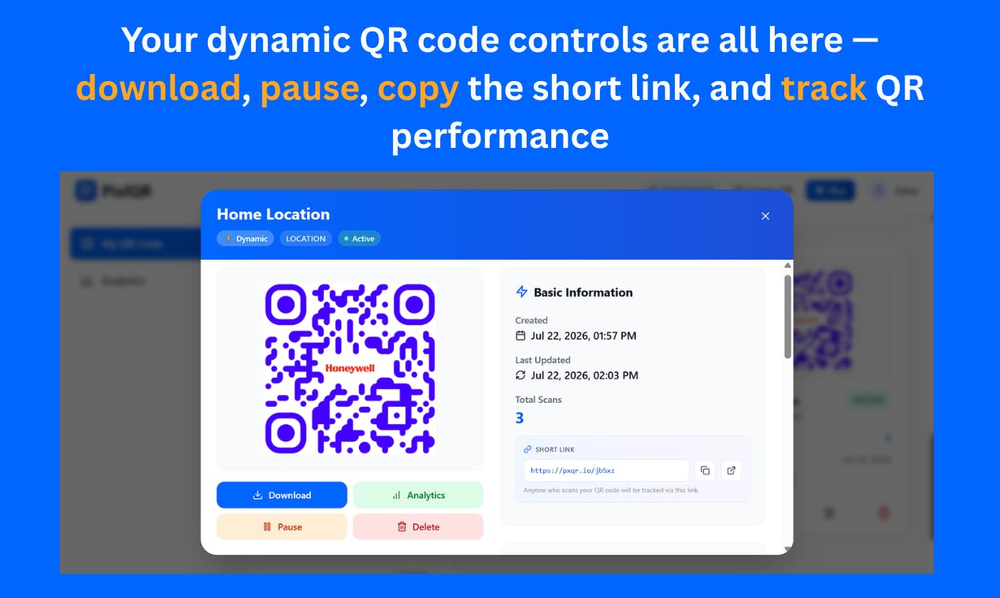

### 🎬 관련 영상
- [🎥 영상 보기](https://ph-files.imgix.net/c24326bd-041d-4c51-b797-2ceeb9b111d0.jpeg?auto=format)

---

## 23. [Salestrics MCP](https://www.producthunt.com/products/salestrics)
**Votes**: 29 | **도입 난이도**: 중 | **신뢰도**: 상
**Tagline**: Your Agents. Your Business. Connected. 
**서비스 링크**: https://www.producthunt.com/r/WAW63FIHV27IIN

**태그**: AI, Automation, CRM, DevTool, Productivity, Agent, AI Tool, Sales

### 📌 이 서비스 한눈에 보기
AI 에이전트에게 실시간 CRM 및 비즈니스 데이터를 직접 연결하여 업무 자동화를 실현하는 MCP 솔루션

### 🔑 주요 기능
- Cursor, Claude Desktop, VS Code 등 개발 도구와 실시간 워크스페이스 직접 연결
- CRM, 인박스, 재무 데이터(Stripe 등)를 AI 에이전트가 즉시 쿼리 및 업데이트 가능
- 탭 전환과 데이터 복사 없이 하나의 보안 연결로 파이프라인 관리 및 자동화 트리거

### 🙋 사용자에게 어떤 점이 좋은가
AI 에이전트가 최신 비즈니스 맥락을 실시간으로 파악하게 하여, 수동 데이터 입력 없이도 정확한 업무 수행이 가능해집니다.

### ✅ 지금 바로 써볼 기능
- Claude Desktop에 MCP 연결하여 실시간 데이터 쿼리하기
- Stripe/Slack 연동을 통한 자동화 워크플로우 설정하기
- Cursor/VS Code 환경에서 AI를 통한 파이프라인 데이터 업데이트 테스트하기

### ⚠️ 사용 전 확인할 점
- 실시간 비즈니스 데이터(재무, 고객 정보) 접근에 따른 보안 정책 검토 필요
- 연결된 도구 간의 데이터 동기화 및 권한 관리 설정 필요

### 🧭 확인이 더 필요한 정보
사용자의 기존 CRM 및 워크스페이스 도구들과의 구체적인 호환성 범위와 보안 프로토콜에 대한 상세 확인이 필요합니다.

### 📸 스크린샷 및 갤러리
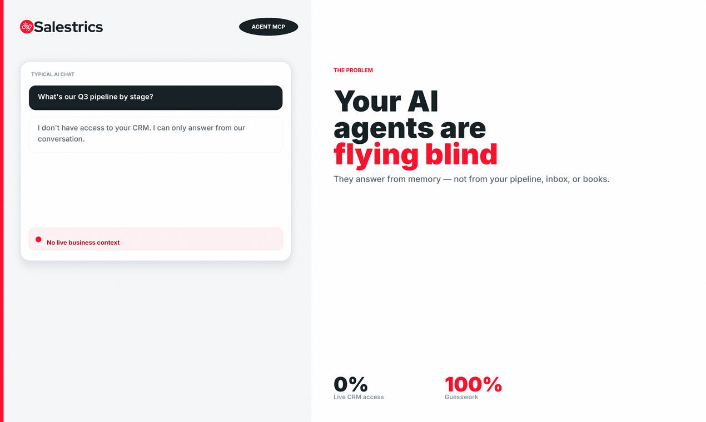
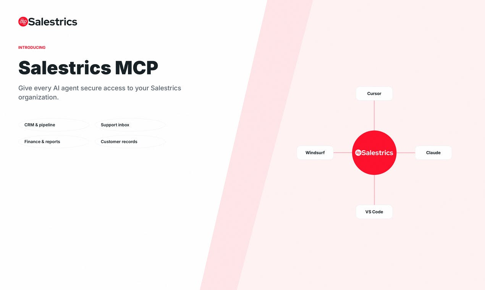
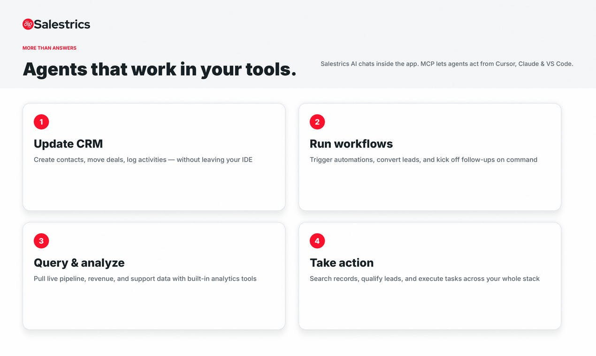

### 🎬 관련 영상
- [🎥 영상 보기](https://ph-files.imgix.net/7c25d857-ca00-4cd9-a8c0-627d4fa7ea8c.jpeg?auto=format)

---

## 24. [Pangea](https://www.producthunt.com/products/pangea-4)
**Votes**: 27 | **도입 난이도**: 하 | **신뢰도**: 상
**Tagline**: Explore the World, Together
**서비스 링크**: https://www.producthunt.com/r/RPWN75BTILD7OW

**태그**: Travel, Community, AI, Social, AI Tool

### 📌 이 서비스 한눈에 보기
새로운 인터랙티브 기능과 AI를 결합하여 전 세계 사용자들과 함께 여행을 탐험하는 커뮤니티 플랫폼

### 🔑 주요 기능
- 인터랙티브 프로필 및 여행 시각화 기능 도입
- 커뮤니티 그룹 및 업데이트된 탐색(Explore) 뷰 제공
- 베타 단계의 AI 기능 및 전 세계 오프라인 밋업 개최

### 🙋 사용자에게 어떤 점이 좋은가
개인화된 여행 프로필과 시각화 도구를 통해 전 세계 사용자들과 더 생생하게 소통하고 여행 경험을 공유할 수 있습니다.

### ✅ 지금 바로 써볼 기능
- 새로운 인터랙티브 프로필 설정하기
- 베타 AI 기능 체험하기
- 지역별 커뮤니티 그룹 가입하기

### ⚠️ 사용 전 확인할 점
- AI 기능이 베타 버전이므로 기능적 완성도가 변동될 수 있음
- 오프라인 밋업은 특정 지역 거주자에게만 유효함

### 🧭 확인이 더 필요한 정보
AI 기능의 구체적인 활용 범위와 서비스의 최종적인 수익 모델은 명시되지 않았습니다.

### 📸 스크린샷 및 갤러리
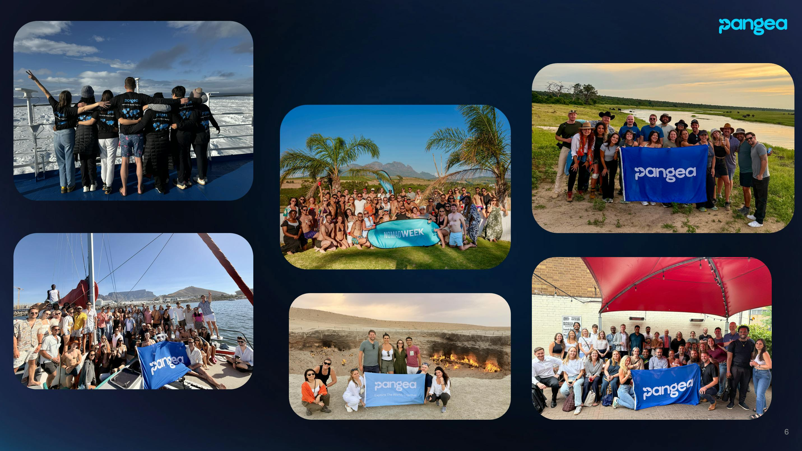

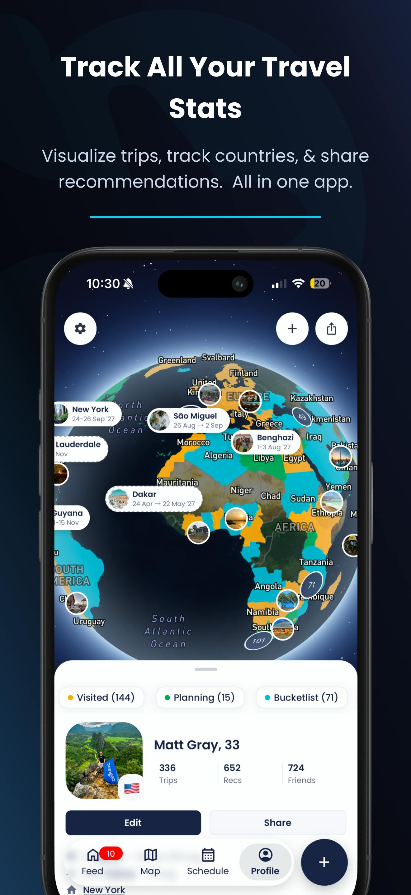

---

## 25. [Big Moments Company](https://www.producthunt.com/products/big-moments-company)
**Votes**: 14 | **도입 난이도**: 하 | **신뢰도**: 상
**Tagline**: Effort is romantic "let's make sure we never swipe again"app
**서비스 링크**: https://www.producthunt.com/r/IQ6F5ROHDURCAX

**태그**: Relationship, Lifestyle, Planning, Memory, AI Tool, Prompting

### 📌 이 서비스 한눈에 보기
연인 간의 데이트 계획부터 소중한 추억 기록까지 돕는 관계 관리 플랫폼

### 🔑 주요 기능
- 설문 기반의 맞춤형 데이트/이벤트 플랜 제공 (장소, 타이밍, 대화 가이드 포함)
- 디지털 스크랩북 기능을 통한 소중한 순간의 기록 및 보관
- 일상적인 질문, 게임, 공유 사진 등을 통한 지속적인 관계 연결

### 🙋 사용자에게 어떤 점이 좋은가
데이트 계획을 짜는 번거로운 데이트 물류(logistics) 문제를 해결하고, 연인 사이의 정서적 유대감을 높여줍니다.

### ✅ 지금 바로 써볼 기능
- 커플 설문을 통해 맞춤형 이벤트 플랜 받아보기
- 공유 사진와 질문 기능을 통해 일상적인 대화 나누기

### ⚠️ 사용 전 확인할 점
- 유료 멤버십(월 $8부터) 결제 시 제공되는 기능 범위 확인 필요
- 인적 검토(human-reviewed)가 포함된 플랜의 경우 서비스 속도나 비용 영향 확인 필요

### 🧭 확인이 더 필요한 정보
무료 버전과 유료 멤버십 간의 구체적인 기능 차이와 플랜 제공 범위에 대한 상세 정보가 필요합니다.

### 📸 스크린샷 및 갤러리
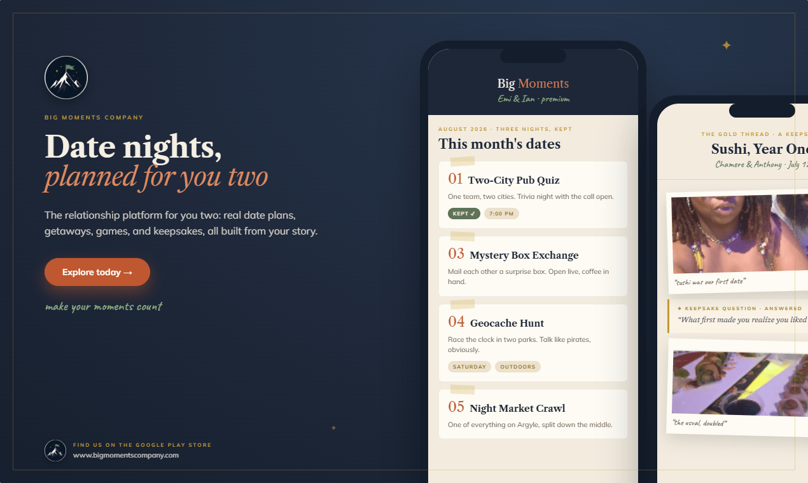
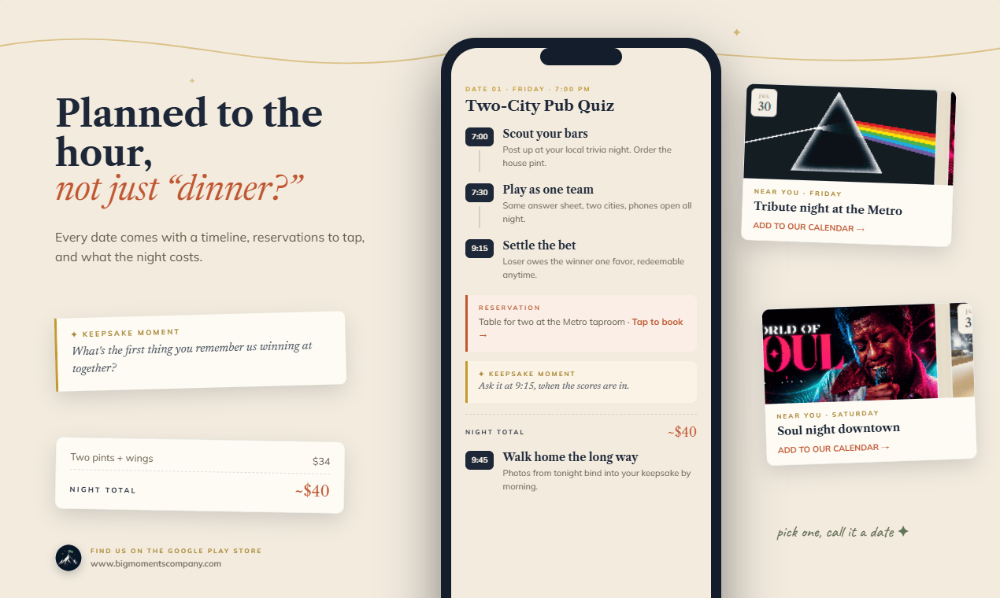
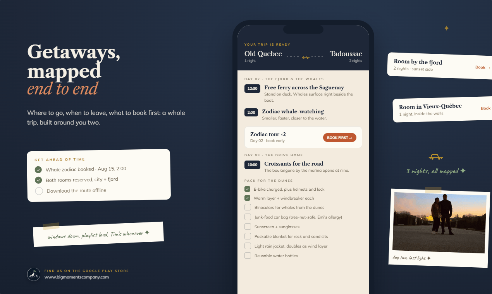

### 🎬 관련 영상
- [🎥 영상 보기](https://ph-files.imgix.net/030c677c-02e9-41a8-bea6-3c0fa33ab3fb.jpeg?auto=format)

---

## 26. [Eventrise](https://www.producthunt.com/products/eventrise)
**Votes**: 13 | **도입 난이도**: 하 | **신뢰도**: 상
**Tagline**: Sell more tickets. Keep more of what you earn.
**서비스 링크**: https://www.producthunt.com/r/BTLCFKNHJJGYFC

**태그**: Event Management, Ticketing, NoCode, SaaS, AI Tool, Design, API

### 📌 이 서비스 한눈에 보기
수수료 부담은 낮추고 판매 효율은 높이는 올인원 이벤트 관리 플랫폼

### 🔑 주요 기능
- 좌석 지정 및 유연한 가격 정책을 지원하는 직관적인 이벤트 페이지
- 이벤트 복제, 커스텀 질문, 모바일 체크인 등 운영 효율화 기능
- 공개 API 및 Zapier 연동을 지원하는 개방형 아키텍처

### 🙋 사용자에게 어떤 점이 좋은가
이벤트 기획부터 티켓 판매, 현장 체크인까지 복잡한 운영 과정을 단순화하여 운영자의 시간을 확보해 줍니다.

### ✅ 지금 바로 써볼 기능
- 좌석 지정 맵 설정을 통한 예약 시스템 구축
- 커스텀 체크아웃 질문을 활용한 고객 데이터 수집
- 모바일 체크인 기능을 통한 현장 입장 관리

### ⚠️ 사용 전 확인할 점
- Zapier 연동은 현재 얼리 액세스 단계이므로 사용 가능 여부 확인 필요
- 특정 규모 이상의 대규모 이벤트 운영 시 기능적 한계 여부 검토 필요

### 🧭 확인이 더 필요한 정보
현재 제공되는 API와 Zapier 연동의 완전한 기능 범위와 안정성을 확인해야 합니다.

### 📸 스크린샷 및 갤러리
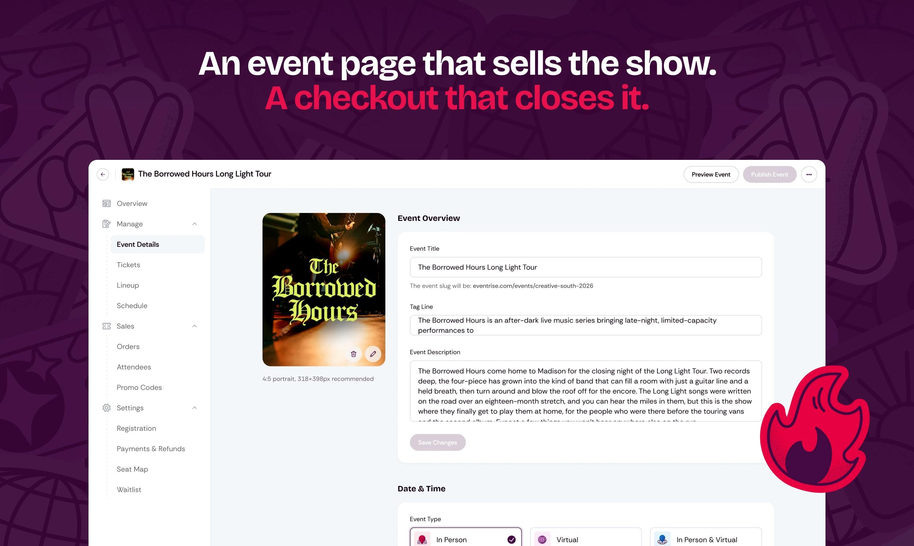
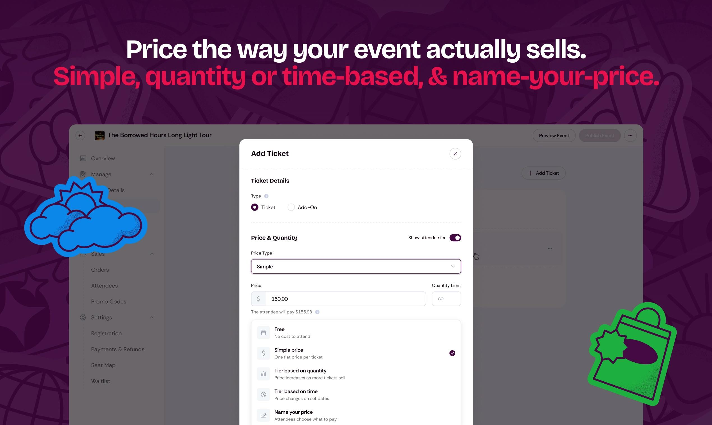
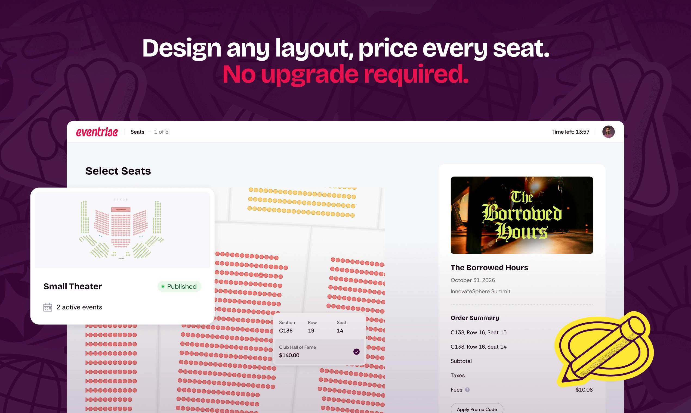

---

## 27. [Moya Health](https://www.producthunt.com/products/moya-health)
**Votes**: 11 | **도입 난이도**: 하 | **신뢰도**: 상
**Tagline**: Chronic illness companion by a doctor who lives with it too
**서비스 링크**: https://www.producthunt.com/r/5CCZI3M7LGWKIX

**태그**: Health, Productivity, Privacy, iOS, Design

### 📌 이 서비스 한눈에 보기
만성 질환 환자를 위해 의사가 직접 설계한 개인 맞춤형 건강 기록 및 리포트 도구

### 🔑 주요 기능
- 1분 내외의 간편한 일일 증상 및 생활 습관 기록
- 데이터 간 상관관계 분석 및 진료용 리포트 생성 기능
- 계정 없이 기기 내에 데이터를 저장하는 강력한 프라이버시 설계

### 🙋 사용자에게 어떤 점이 좋은가
매일의 증상과 생활 패턴을 기록하여 병원 진료 시 의사에게 객관적인 데이터를 전달할 수 있습니다.

### ✅ 지금 바로 써볼 기능
- 매일 증상, 수면, 스트레스, 식단 기록하기
- 자동 연동된 날씨 데이터와 증상 간의 관계 확인하기
- 축적된 데이터를 바탕으로 생성된 리포트 검토하기

### ⚠️ 사용 전 확인할 점
- 현재 iOS에서만 무료로 사용 가능함
- 피부 질환 중심의 기능이 우선 제공됨

### 🧭 확인이 더 필요한 정보
향후 어떤 질환군으로 기능이 확장될지는 사용자 투표에 따라 결정될 예정입니다.

### 📸 스크린샷 및 갤러리
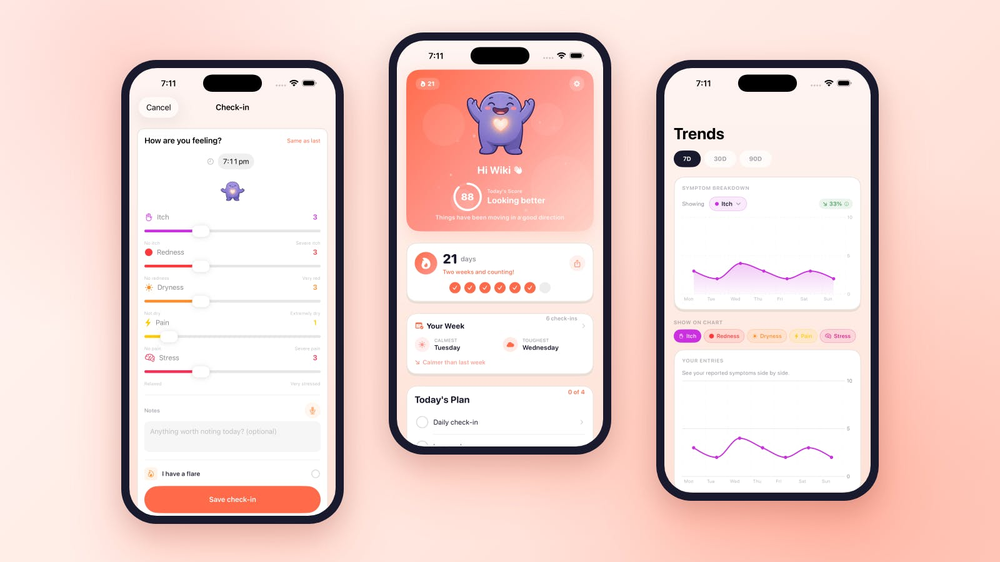
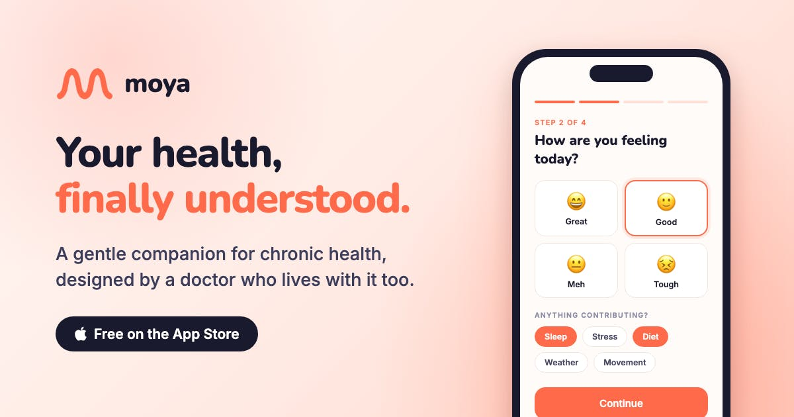
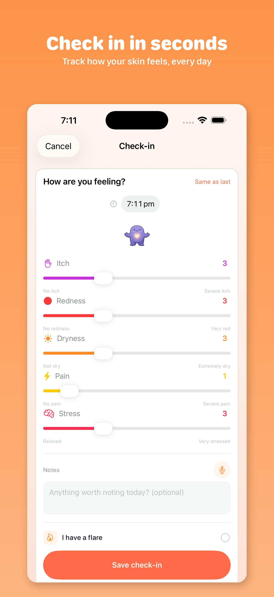

### 🎬 관련 영상
- [🎥 영상 보기](https://ph-files.imgix.net/89f11a5f-22b7-4b06-9cbb-dfca0237f1df.jpeg?auto=format)

---

## 28. [API Watermark](https://www.producthunt.com/products/api-watermark)
**Votes**: 11 | **도입 난이도**: 하 | **신뢰도**: 상
**Tagline**: Automate Image, Video, PDF Watermark
**서비스 링크**: https://www.producthunt.com/r/UMVS3JETXXOHBS

**태그**: DevTool, Automation, ContentProtection, API, AI Tool, Video, Vision

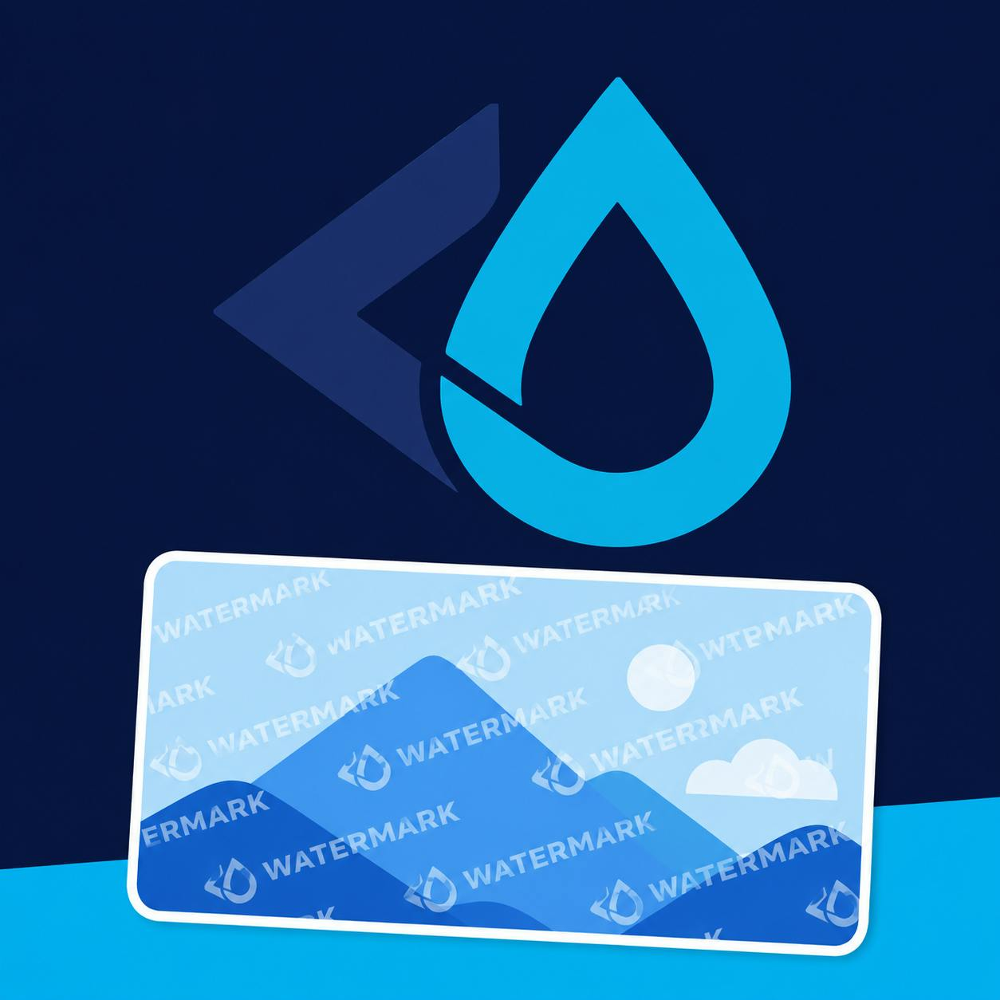

### 📌 이 서비스 한눈에 보기
이미지, 영상, PDF에 워터마크를 대량으로 자동 삽입하는 개발자용 API 솔루션

### 🔑 주요 기능
- 이미지, 비디오, PDF, GIF 등 다양한 파일 형식 지원
- API를 통한 워터마크 삽입 자동화 및 대량 처리
- 텍스트 또는 로고 워터마크를 통한 디지털 콘텐츠 보호 및 브랜드 관리

### 🙋 사용자에게 어떤 점이 좋은가
개발자가 직접 워터마크 기능을 구현할 필요 없이 API 호출만으로 콘텐츠 저작권을 보호하고 브랜드 아이덴티티를 자동 적용할 수 있습니다.

### ✅ 지금 바로 써볼 기능
- API를 활용한 워터마크 자동화 워크플로우 구축
- 비주얼 에디터를 통한 수동 워터마크 작업 테스트
- 대량 파일 처리를 위한 벌크 프로세싱 기능 확인

### ⚠️ 사용 전 확인할 점
- 파일 형식별 지원 범위 및 품질 저하 여부 확인 필요
- 대량 처리 시 API 호출 제한 및 비용 구조 확인 필요

### 🧭 확인이 더 필요한 정보
제공되는 API의 구체적인 호출 제한(Rate Limit)과 상세 가격 정책에 대한 정보가 명시되지 않았습니다.

### 📸 스크린샷 및 갤러리
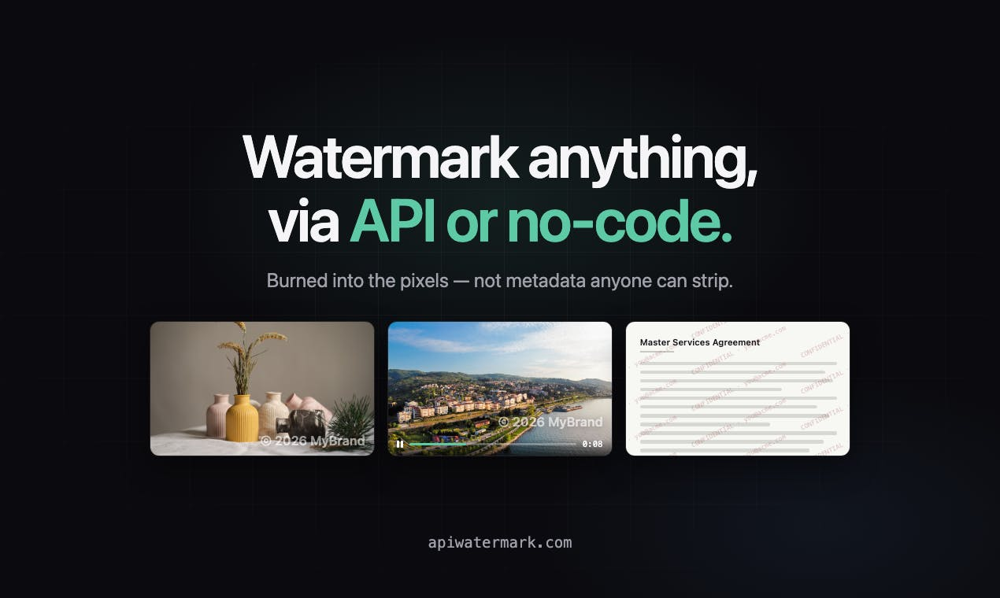
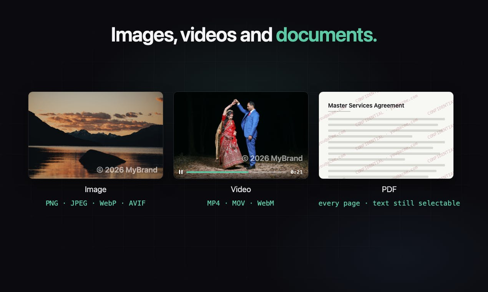
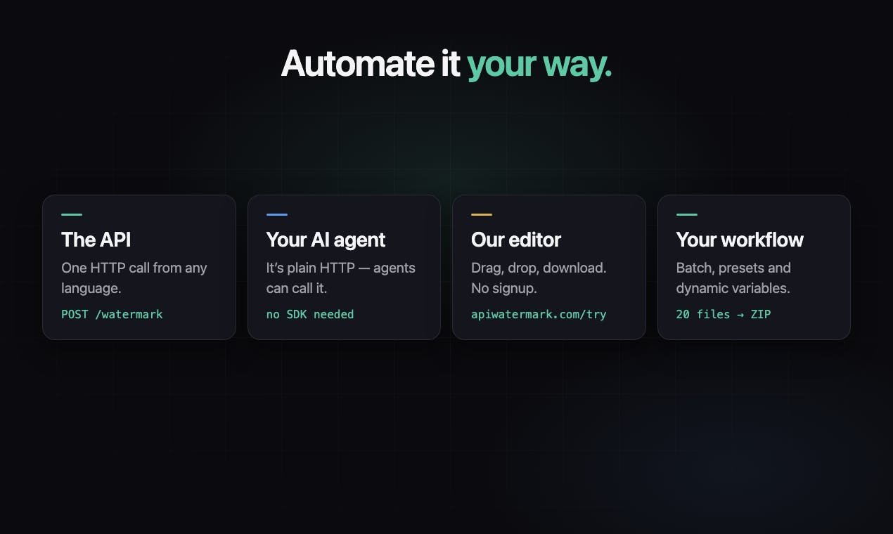

### 🎬 관련 영상
- [🎥 영상 보기](https://ph-files.imgix.net/b9135a57-01b0-4521-8be2-69bc4263117a.jpeg?auto=format)

---

## 29. [Superbrain](https://www.producthunt.com/products/superbrain)
**Votes**: 11 | **도입 난이도**: 중 | **신뢰도**: 상
**Tagline**: Most Efficient Agentic Coding Environment
**서비스 링크**: https://www.producthunt.com/r/UWYR7VVLA5CLTB

**태그**: DevTool, AI, Coding, Productivity, Agent, AI Tool

### 📌 이 서비스 한눈에 보기
독자적인 검색 아키텍처로 비용은 낮추고 코딩 속도는 높인 효율적인 AI 코딩 에이전트

### 🔑 주요 기능
- 자체 개발한 TokenFold 검색 아키텍처 탑재
- 기존 도구(Claude Code, Codex, Cursor) 대비 토큰 사용량 50% 절감
- 기존 도구 대비 운영 비용 40% 절감

### 🙋 사용자에게 어떤 점이 좋은가
더 적은 비용과 토큰 소모로 빠른 코드 배포가 가능하여 개발 생산성을 극대화할 수 있습니다.

### ✅ 지금 바로 써볼 기능
- TokenFold 아키텍처를 통한 코드 검색 효율성 테스트
- 기존 코딩 에이전트 대비 비용 절감 효과 비교
- 실제 코드 배포 속도 및 워크플로우 검증

### ⚠️ 사용 전 확인할 점
- 기존 IDE(Cursor 등)와의 호환성 및 워크플로우 전환 비용 확인 필요
- 자체 아키텍처(TokenFold)의 코드 정확도 검증 필요

### 🧭 확인이 더 필요한 정보
제시된 비용 절감 수치가 실제 사용자 환경에서도 동일하게 적용되는지 확인이 필요합니다.

### 📸 스크린샷 및 갤러리
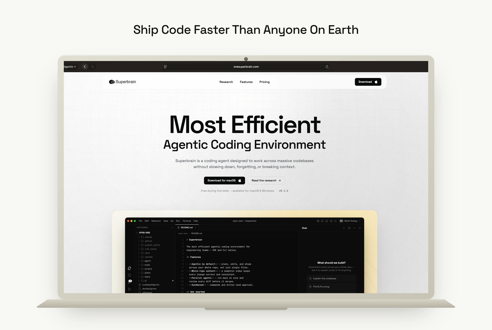
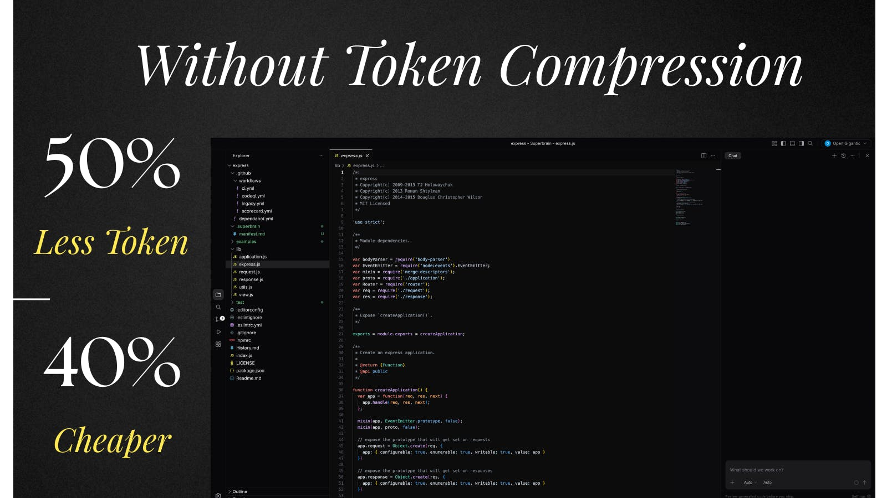
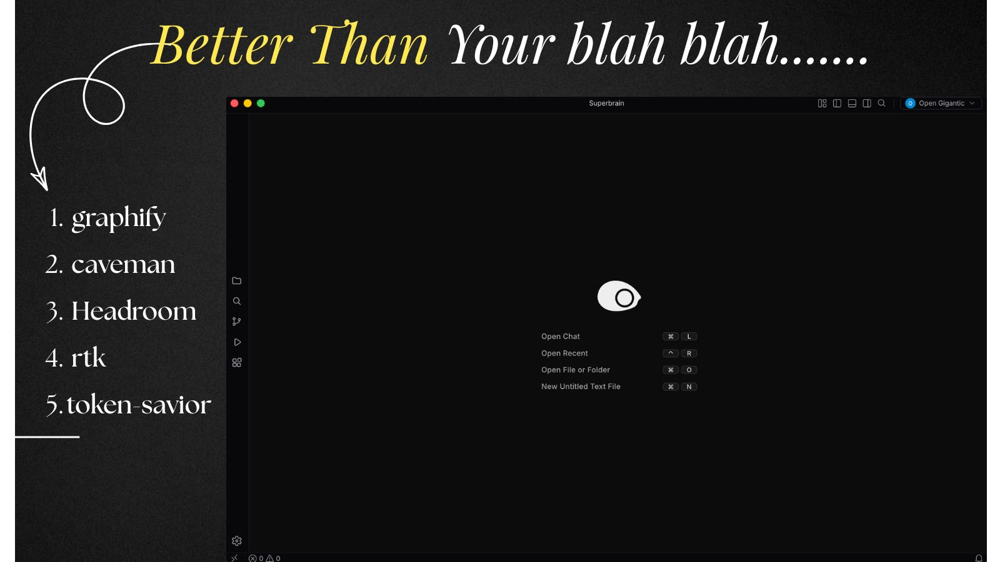

### 🎬 관련 영상
- [🎥 영상 보기](https://ph-files.imgix.net/c5cf6f4d-cb5a-42d8-a3f1-bb9fbacd1cbc.gif?auto=format)

---

## 30. [PrismPoster](https://www.producthunt.com/products/prismposter)
**Votes**: 11 | **도입 난이도**: 하 | **신뢰도**: 상
**Tagline**: Images, video, and music — one AI studio, no model picker
**서비스 링크**: https://www.producthunt.com/r/N3WNE6EAK7QRZY

**태그**: AI-Studio, Content-Creation, Video-Editing, All-in-One, AI Tool, Video, Vision

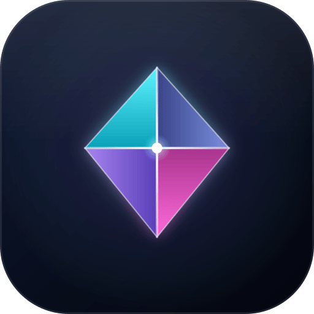

### 📌 이 서비스 한눈에 보기
모델 선택 고민 없이 이미지, 영상, 음악을 한 곳에서 제작하고 편집하는 올인원 AI 스튜디오

### 🔑 주요 기능
- 이미지, 4K 영상, 35개 언어 지원 음악 제작이 가능한 통합 스튜디오
- 모델을 직접 고를 필요 없이 작업에 최적화된 엔진이 자동 선택됨
- 스케치를 필름 시퀀스로 바꾸는 스토리보드 및 타임라인 기반 편집 기능 제공

### 🙋 사용자에게 어떤 점이 좋은가
여러 AI 모델을 번갈아 사용할 필요 없이 하나의 워크플로우 안에서 콘텐츠 제작부터 편집까지 완결할 수 있습니다.

### ✅ 지금 바로 써볼 기능
- Image Studio에서 스틸 이미지 생성해보기
- Video Studio에서 4K 클립 제작하기
- Storyboard 기능을 활용해 스케치를 영상 시퀀스로 변환하기

### ⚠️ 사용 전 확인할 점
- 무료로 시작할 수 있으나 고급 기능 사용 시 유료 플랜 전환 필요 여부 확인 필요
- 자동 엔진 선택 방식이 사용자의 세부 제어 요구사항을 충족하는지 확인 필요

### 🧭 확인이 더 필요한 정보
구체적인 유료 구독 모델 및 상세 기능별 과금 체계가 명시되지 않았습니다.

### 📸 스크린샷 및 갤러리
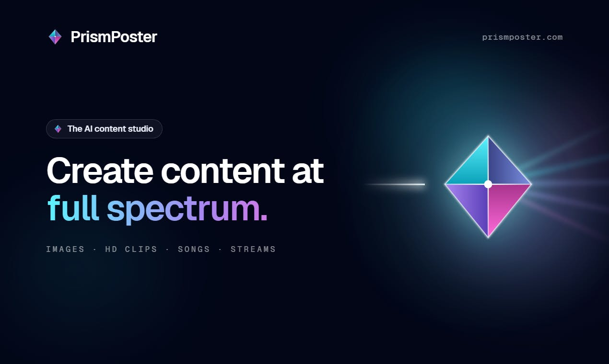
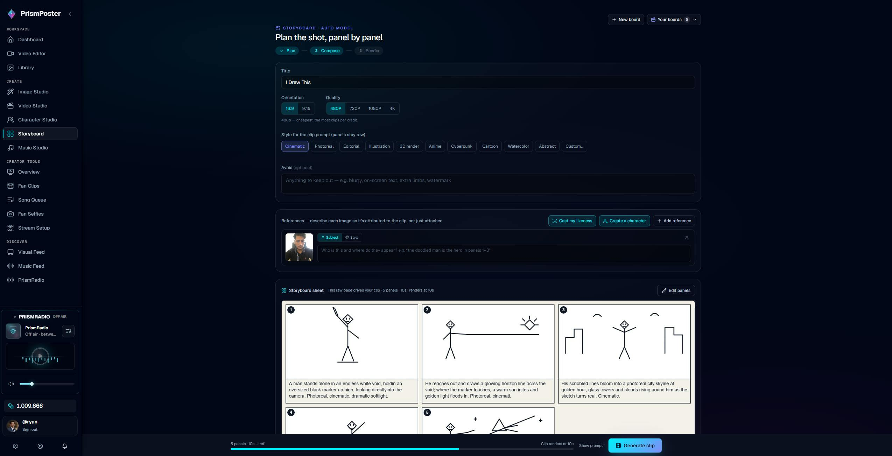
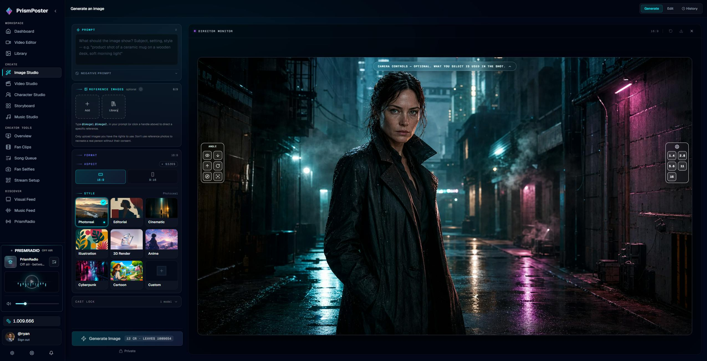

---

