# 🚀 Product Hunt Daily Top 30 (2026-08-08)

## 오늘의 요약
오늘의 트렌드는 AI 에이전트가 단순한 보조를 넘어 브라우저 제어, 소프트웨어 배포, 전문 서비스(번역) 등 실질적인 업무를 완결하는 '실행형 에이전트'로 진화하고 있음을 보여줍니다. 특히 에이전트의 작업 과정을 시각화하거나 운영 환경에서의 관측성을 확보하는 등 에이전트 중심의 인프라와 관리 도구들이 주목받았습니다.

### 오늘의 핵심 포인트
- AI 에이전트가 사용자의 세션과 권한을 활용해 복잡한 웹 업무를 대신 수행하는 브라우저 기반 자동화가 강화되었습니다.
- 소프트웨어 개발부터 QA, 모니터링까지 에이전트가 전 과정을 관리하는 자율형 개발 워크플로우가 등장했습니다.
- 에이전트의 실행 과정을 추적하고 성능을 개선하며, 인간의 전문 서비스와 결합하는 등 에이전트 운영 효율을 높이는 도구들이 주목받았습니다.

**오늘의 태그**: AI 에이전트, 업무 자동화, AI 인프라, 소프트웨어 개발

## 1. [Coldtea.ai](https://www.producthunt.com/products/coldtea)
**Votes**: 371 | **도입 난이도**: 중 | **신뢰도**: 상
**Tagline**: Make your software delivery self-driving
**서비스 링크**: https://www.producthunt.com/r/WB4IUOEMBNYG5V

**태그**: DevTool, AI-Agent, Automation, QA, DevOps, Agent, AI Tool

### 📌 이 서비스 한눈에 보기
AI 에이전트가 개발부터 QA, 모니터링까지 자동화하여 안정적인 소프트웨어 배포를 돕는 지능형 IDE

### 🔑 주요 기능
- 코딩 에이전트를 통한 자동화된 소프트웨어 빌드
- 시각적 QA 에이전트를 활용한 회귀 테스트 및 버그 감지
- AI 모니터링을 통한 실시간 프로덕션 환경 감시

### 🙋 사용자에게 어떤 점이 좋은가
개발 속도가 빨라져도 안정성을 유지할 수 있도록 AI가 배포 전 과정을 관리해주므로, 팀이 더 빠르게 기능을 출시할 수 있습니다.

### ✅ 지금 바로 써볼 기능
- 코딩 에이전트의 코드 생성 및 빌드 기능 테스트
- 시각적 QA 에이전트의 회귀 테스트 정확도 확인
- AI 모니터링 시스템의 프로덕션 감시 설정

### ⚠️ 사용 전 확인할 점
- 에이전트가 생성한 코드의 품질 및 보안 검증 필요
- 기존 개발 워크플로우 및 CI/CD 파이프라인과의 통합 방식 확인 필요

### 🧭 확인이 더 필요한 정보
현재 제공되는 에이전트들의 구체적인 기술 스택과 기존 IDE(VS Code 등)와의 연동 방식에 대한 상세 정보가 필요합니다.

### 📸 스크린샷 및 갤러리
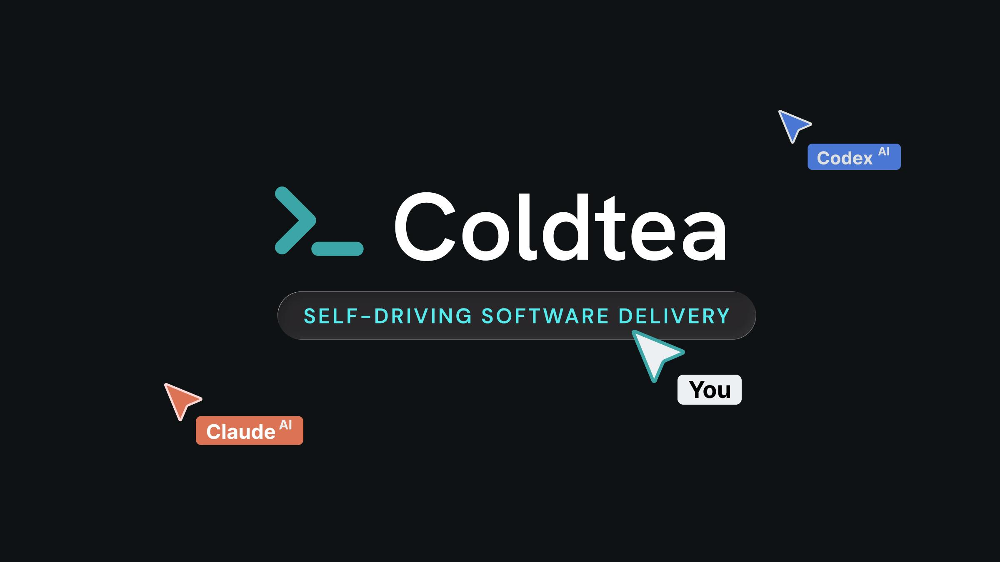
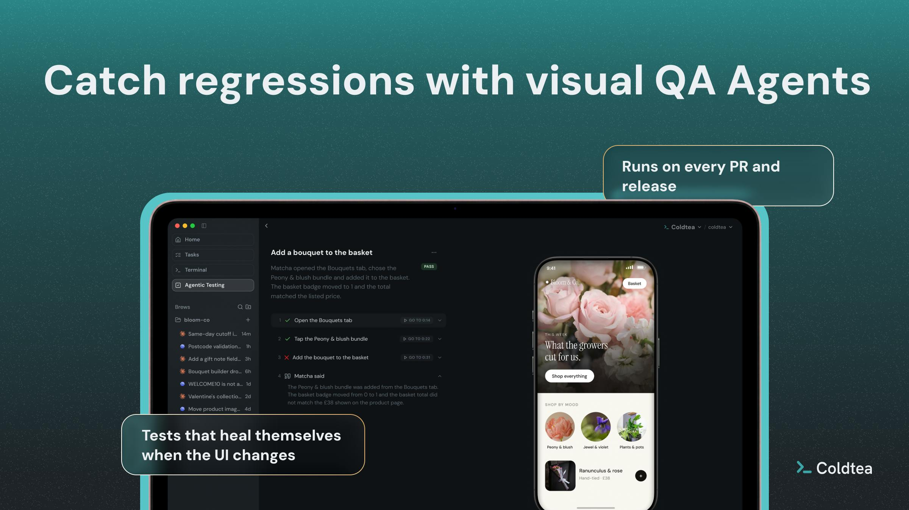
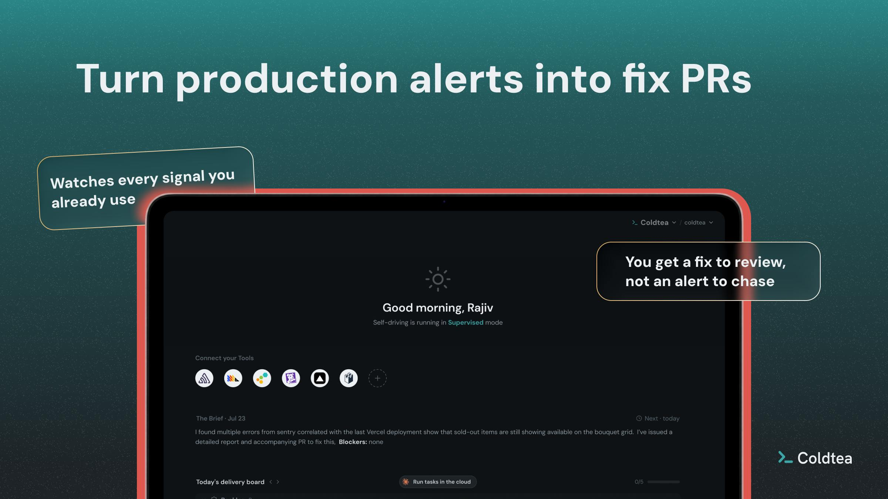

### 🎬 관련 영상
- [🎥 영상 보기](https://ph-files.imgix.net/f0a9de42-1ae5-467d-9855-576d2a35bd73.jpeg?auto=format)

---

## 2. [Soloop](https://www.producthunt.com/products/soloop)
**Votes**: 321 | **도입 난이도**: 중 | **신뢰도**: 상
**Tagline**: Approval-first Agent OS for solo founders
**서비스 링크**: https://www.producthunt.com/r/K3YBVXDB7SFOVL

**태그**: AI, Solo-Entrepreneur, Automation, Productivity, Agent, AI Tool

### 📌 이 서비스 한눈에 보기
아이디어 구상부터 수익 창출까지 돕는 1인 창업자용 AI 에이전트 운영체제

### 🔑 주요 기능
- CEO, CTO, CMO 역할을 수행하는 AI 에이전트 시스템 제공
- 기획, 개발, 마케팅 등 팀 단위의 업무를 자동화하여 실행력 강화
- 사용자의 판단과 소유권을 유지하면서 생소한 업무를 위임 가능

### 🙋 사용자에게 어떤 점이 좋은가
팀원을 고용하기 어려운 1인 창업자가 전문적인 실행력을 확보하여 아이디어를 빠르게 사업화할 수 있습니다.

### ✅ 지금 바로 써볼 기능
- AI CEO를 통한 사업 계획 및 우선순위 설정
- AI CTO를 활용한 제품 빌드 및 실행
- AI CMO를 통한 사용자 확보 및 판매 전략 실행

### ⚠️ 사용 전 확인할 점
- AI가 생성한 결과물에 대한 최종 검토 및 책임은 사용자에게 있음
- 복잡한 기술적 요구사항이나 고도의 창의적 판단에는 한계가 있을 수 있음

### 🧭 확인이 더 필요한 정보
AI 에이전트가 실제 외부 툴(코드 배포, 결제 연동 등)과 어느 정도 수준까지 직접 연동되는지 확인이 필요합니다.

### 📸 스크린샷 및 갤러리
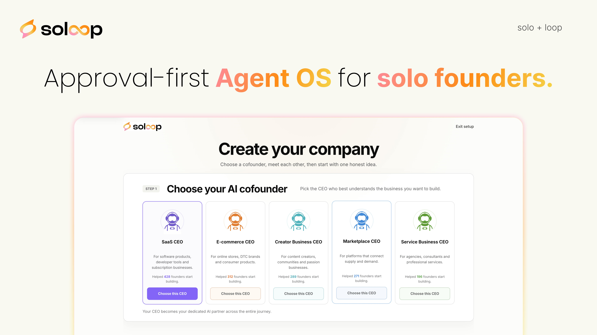
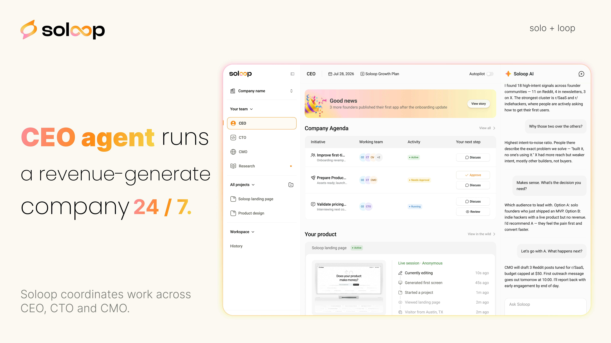
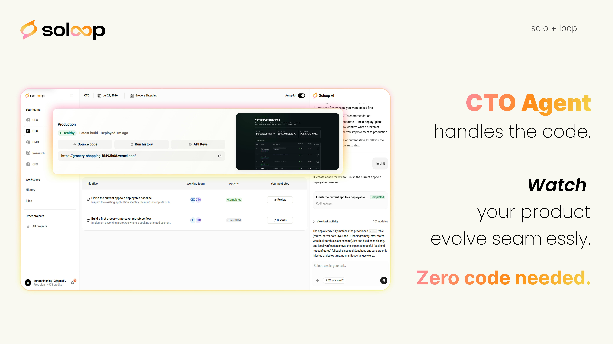

### 🎬 관련 영상
- [🎥 영상 보기](https://ph-files.imgix.net/d3ec18ad-6970-49aa-b687-9a8c20089b2b.jpeg?auto=format)

---

## 3. [Nitro 4.0](https://www.producthunt.com/products/alconost-localization)
**Votes**: 210 | **도입 난이도**: 하 | **신뢰도**: 상
**Tagline**: The first human translation platform built for AI agents
**서비스 링크**: https://www.producthunt.com/r/FV5DV6VRVX77O7

**태그**: Automation, AI-Agent, Translation, Productivity, Agent, AI Tool, API, Email

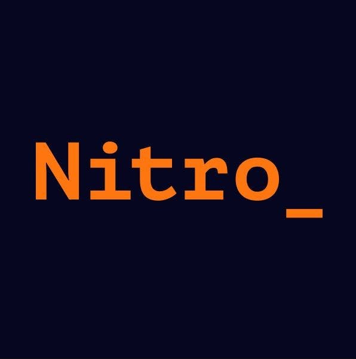

### 📌 이 서비스 한눈에 보기
AI 에이전트가 직접 주문하고 전문 번역가가 작업하는 자동화된 인간 번역 플랫폼

### 🔑 주요 기능
- 계정 생성이나 API 키 없이 AI 에이전트가 직접 요청 및 결제 가능
- 기계 간 주문(Machine-to-machine) 방식과 전문 인력의 번역 결합
- 광고, 앱 업데이트 등 소규모 텍스트를 위한 고품질 번역 서비스

### 🙋 사용자에게 어떤 점이 좋은가
AI 에이전트 워크플로우 내에서 별도의 가입 절차 없이 즉각적으로 전문적인 인간 번역 결과물을 확보할 수 있습니다.

### ✅ 지금 바로 써볼 기능
- 에이전트 자동화 워크플로우에 Nitro 연동 테스트
- 소규모 마케팅 문구 및 앱 업데이트 텍스트 번역 요청

### ⚠️ 사용 전 확인할 점
- 대규모 문서보다는 짧은 텍스트에 최적화된 서비스임
- 인간 번역가가 작업하므로 완전 자동화 번역보다 시간이 소요됨

### 🧭 확인이 더 필요한 정보
에이전트가 결제할 수 있는 구체적인 비용 체계와 지원되는 결제 수단에 대한 상세 정보가 필요합니다.

### 📸 스크린샷 및 갤러리
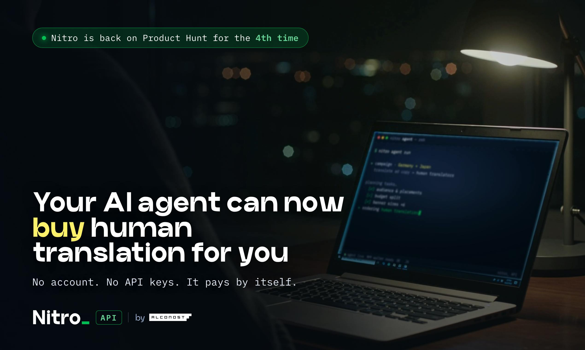
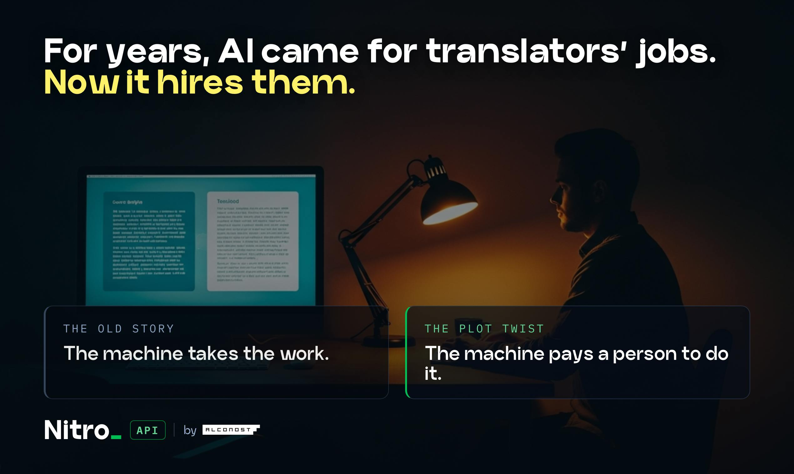

### 🎬 관련 영상
- [🎥 영상 보기](https://ph-files.imgix.net/4e73d1f4-cb21-41c4-a583-d6413dae06df.jpeg?auto=format)

---

## 4. [Rindler](https://www.producthunt.com/products/rindler)
**Votes**: 204 | **도입 난이도**: 하 | **신뢰도**: 상
**Tagline**: Automate the web work your team does by hand
**서비스 링크**: https://www.producthunt.com/r/N2UOXZWDJSNLZY

**태그**: Automation, WebScraping, Productivity, NoCode, Agent, AI Tool

### 📌 이 서비스 한눈에 보기
자연어로 명령하면 복잡한 웹 업무를 자동으로 수행하고 데이터를 추출하는 자동화 도구

### 🔑 주요 기능
- 일상적인 영어 문장으로 웹 자동화 작업 지시 가능
- 로그인 및 사이트별 맞춤형 워크플로우를 통한 실질적 업무 수행
- 사이트 구조 변경 시 자동 복구 및 스케줄링 기능 지원

### 🙋 사용자에게 어떤 점이 좋은가
반복적인 웹 데이터 수집이나 수동 입력 업무를 자동화하여 팀의 운영 효율을 극대화할 수 있습니다.

### ✅ 지금 바로 써볼 기능
- 자연어로 업무 명령문 작성해보기
- 반복적인 웹 작업 스케줄링 설정하기
- 사이트 변경 시 워크플로우 복구 기능 테스트하기

### ⚠️ 사용 전 확인할 점
- 사이트의 보안 정책(CAPTCHA 등)에 따른 자동 로그인 제한 가능성
- 복잡한 웹 인터랙션에 대한 자연어 해석 정확도 확인 필요

### 🧭 확인이 더 필요한 정보
사이트 구조 변경 시 자동 복구 기능의 정밀도와 지원 가능한 웹 사이트 범위를 확인해야 합니다.

### 📸 스크린샷 및 갤러리
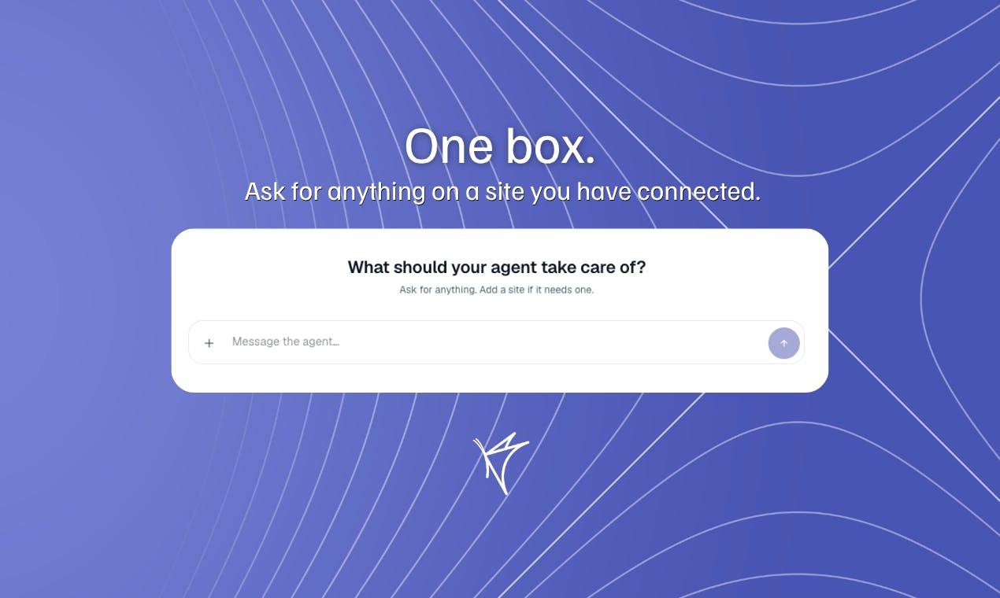
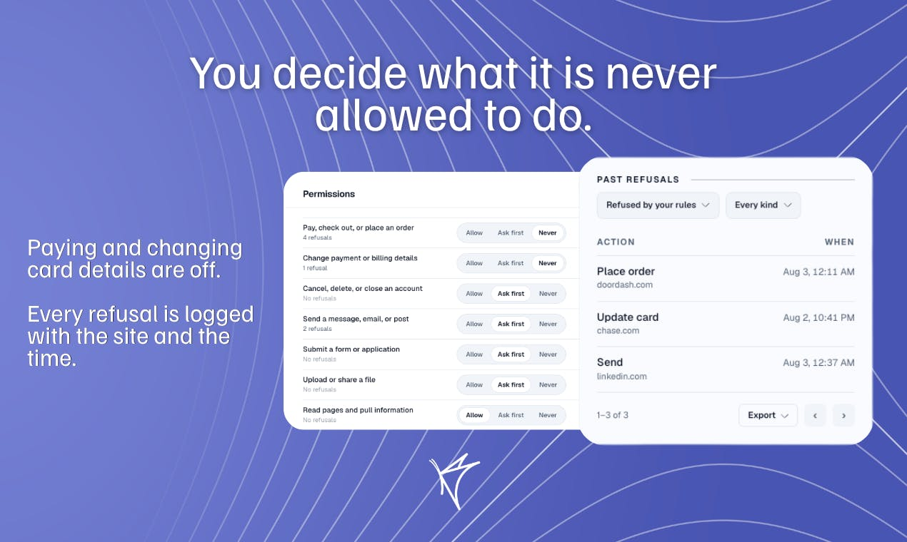
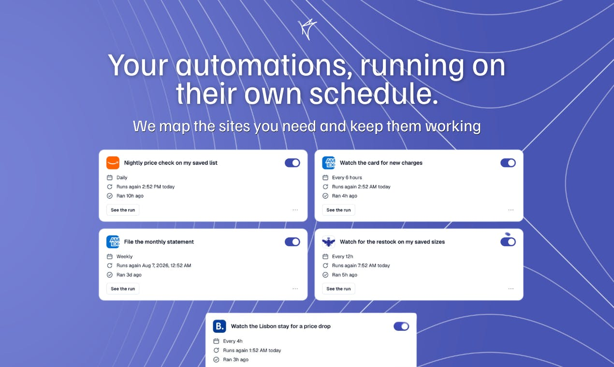

### 🎬 관련 영상
- [🎥 영상 보기](https://ph-files.imgix.net/b67c4dfe-1b2f-46ee-a104-5bebfbced244.jpeg?auto=format)

---

## 5. [Progress AI Observability](https://www.producthunt.com/products/progress-ai-observability)
**Votes**: 148 | **도입 난이도**: 하 | **신뢰도**: 상
**Tagline**: Trace, evaluate, and improve AI agents in production
**서비스 링크**: https://www.producthunt.com/r/5L22D2Y4SZLAKB

**태그**: AI, Observability, DevTool, Debugging, Agent, AI Tool

### 📌 이 서비스 한눈에 보기
실제 운영 환경에서 AI 에이전트의 오류를 추적하고 성능을 개선하는 관측성 도구

### 🔑 주요 기능
- AI 에이전트 실행 과정의 상세 트레이싱 및 디버깅
- 환각(Hallucination) 및 근거 없는 답변 탐지
- 토큰 낭비 방지 및 에이전트 품질 향상

### 🙋 사용자에게 어떤 점이 좋은가
AI 에이전트 배포 후 발생하는 복잡한 실패 원인을 빠르게 파악하여 서비스 품질을 높이고 운영 비용을 절감할 수 있습니다.

### ✅ 지금 바로 써볼 기능
- 에이전트 실행 로그 트레이싱 기능 테스트
- 환각 및 답변 정확도 검증 기능 활용
- 지원 언어(NET, Python, JavaScript) 환경에 통합

### ⚠️ 사용 전 확인할 점
- 사용 중인 특정 AI 프레임워크와의 호환성 확인 필요
- 데이터 보안 및 프라이버시 정책 검토

### 🧭 확인이 더 필요한 정보
지원하는 구체적인 프레임워크 및 데이터 보안 처리 방식에 대한 상세 정보가 필요합니다.

### 📸 스크린샷 및 갤러리
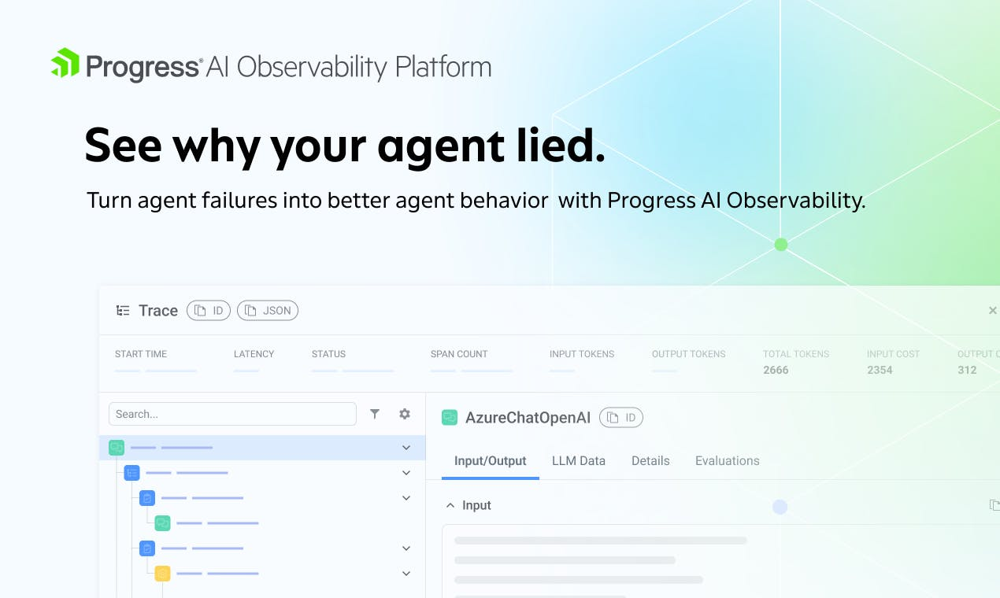
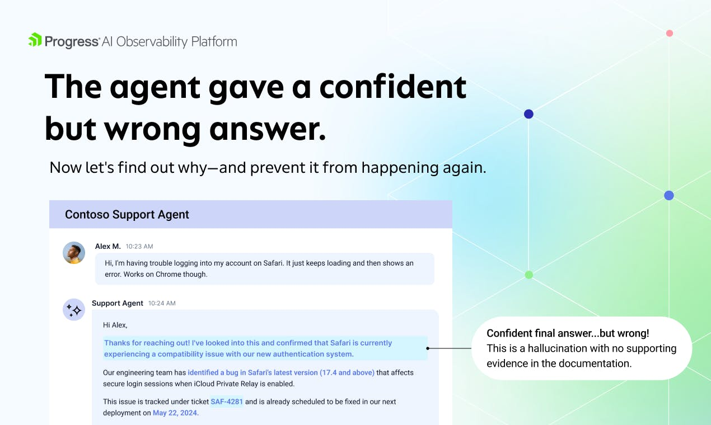
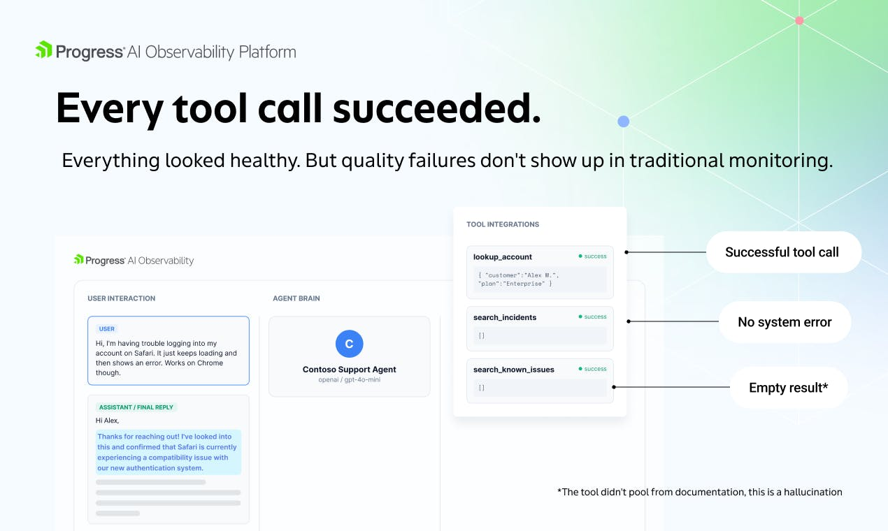

---

## 6. [BrowserOS neo](https://www.producthunt.com/products/browseros_ai)
**Votes**: 148 | **도입 난이도**: 중 | **신뢰도**: 상
**Tagline**: The Missing Browser for Claude, Cowork & Codex
**서비스 링크**: https://www.producthunt.com/r/VYGJWTFCKD3NFX

**태그**: AI, Automation, OpenSource, Browser, Agent, AI Tool, DevTool

### 📌 이 서비스 한눈에 보기
AI 에이전트가 사용자의 로그인 세션을 활용해 실질적인 업무를 수행할 수 있게 돕는 브라우저

### 🔑 주요 기능
- 사용자의 로그인 정보를 활용한 AI 에이전트 전용 브라우저
- Claude Code, Cowork, Codex 등 AI 도구의 실질적 작업 수행 지원
- 다중 에이전트 동시 실행 및 세션 리플레이 기능 제공

### 🙋 사용자에게 어떤 점이 좋은가
사용자가 직접 웹사이트에 접속해 작업할 필요 없이, AI 에이전트가 사용자의 권한을 바탕으로 복잡한 업무를 대신 처리할 수 있습니다.

### ✅ 지금 바로 써볼 기능
- AI 에이전트와 연동하여 자동화 워크플로우 구축하기
- 세션 리플레이 기능을 통해 에이전트의 작업 과정 검토하기

### ⚠️ 사용 전 확인할 점
- 사용자의 로그인 세션을 공유하므로 보안 및 개인정보 보호 설정 확인 필요
- 에이전트가 의도치 않은 작업을 수행할 가능성에 대한 모니터링 필요

### 🧭 확인이 더 필요한 정보
에이전트가 사용하는 구체적인 보안 프로토콜과 로컬 환경에서의 격리 수준에 대한 상세 정보 확인이 필요합니다.

### 📸 스크린샷 및 갤러리
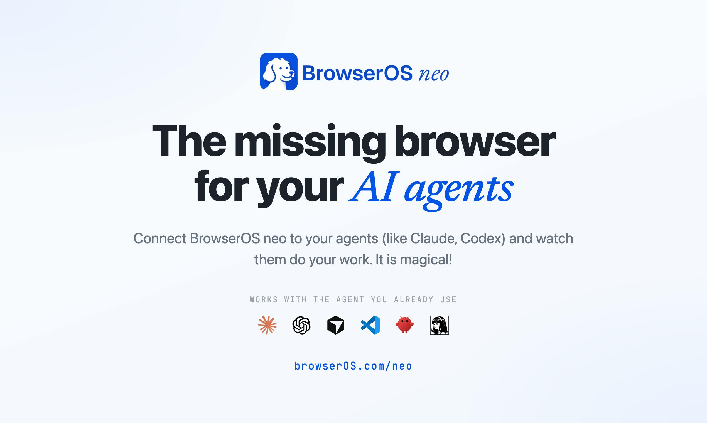
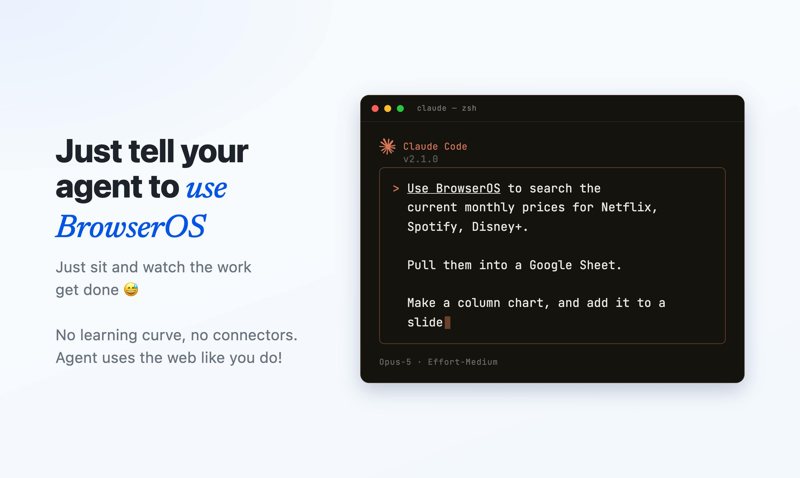
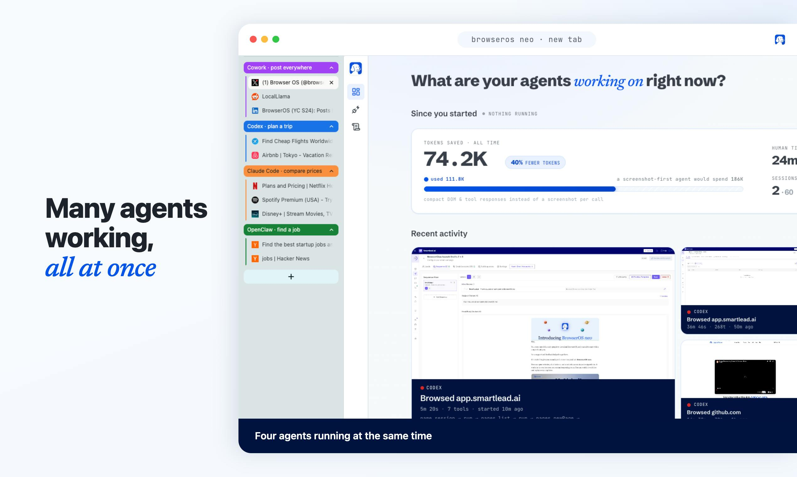

### 🎬 관련 영상
- [🎥 영상 보기](https://ph-files.imgix.net/f64c4c08-fead-4749-8963-b90532d941ce.jpeg?auto=format)

---

## 7. [Crew](https://www.producthunt.com/products/crew-a-tiny-crew-for-claude-code)
**Votes**: 125 | **도입 난이도**: 하 | **신뢰도**: 상
**Tagline**: A tiny crew of monsters for your Claude Code agents
**서비스 링크**: https://www.producthunt.com/r/5GX63ITCVZ2GQ6

**태그**: DevTool, Productivity, macOS, AI-Agent, Agent, Chat

### 📌 이 서비스 한눈에 보기
Claude Code 에이전트의 작업 상태를 시각적으로 보여주는 귀여운 픽셀 몬스터 데스크탑 앱

### 🔑 주요 기능
- Claude Code 채팅 및 서브 에이전트 전용 시각적 인터페이스 제공
- 작업 중(디깅), 대기 중(수면), 완료(손 흔들기) 등 상태별 애니메이션 구현
- macOS 전용이며 개인정보 보호를 위해 로컬 환경에서만 동작

### 🙋 사용자에게 어떤 점이 좋은가
터미널 기반의 Claude Code 작업 과정을 화면 하단에서 직관적이고 귀엽게 모니터링할 수 있어 개발 경험을 즐겁게 만들어줍니다.

### ✅ 지금 바로 써볼 기능
- macOS에 Crew 설치하기
- Claude Code 에이전트와 연동하여 몬스터 움직임 관찰하기

### ⚠️ 사용 전 확인할 점
- macOS 전용 소프트웨어임
- 에이전트의 작업 상태를 시각화하는 보조 도구임

### 🧭 확인이 더 필요한 정보
Claude Code와의 구체적인 연동 방식 및 설치 방법은 제품 페이지를 통해 추가 확인이 필요합니다.

### 📸 스크린샷 및 갤러리
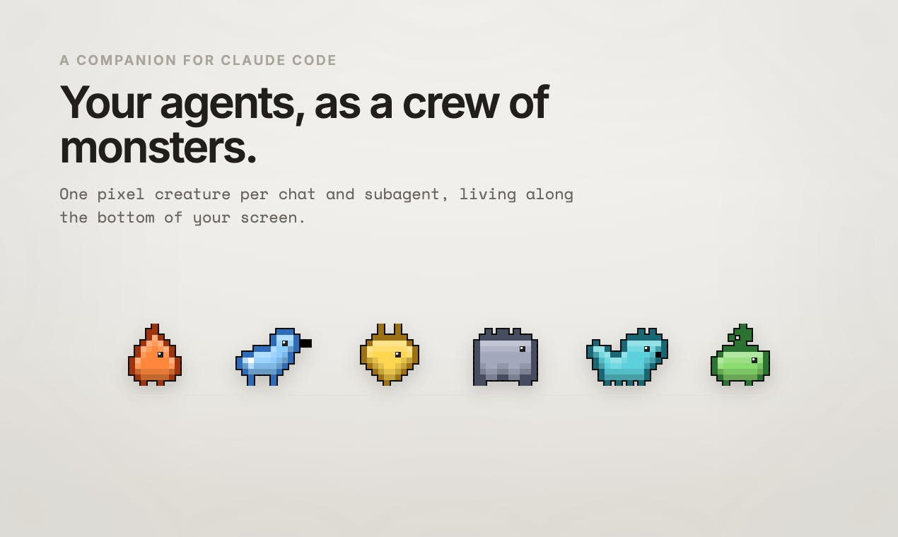
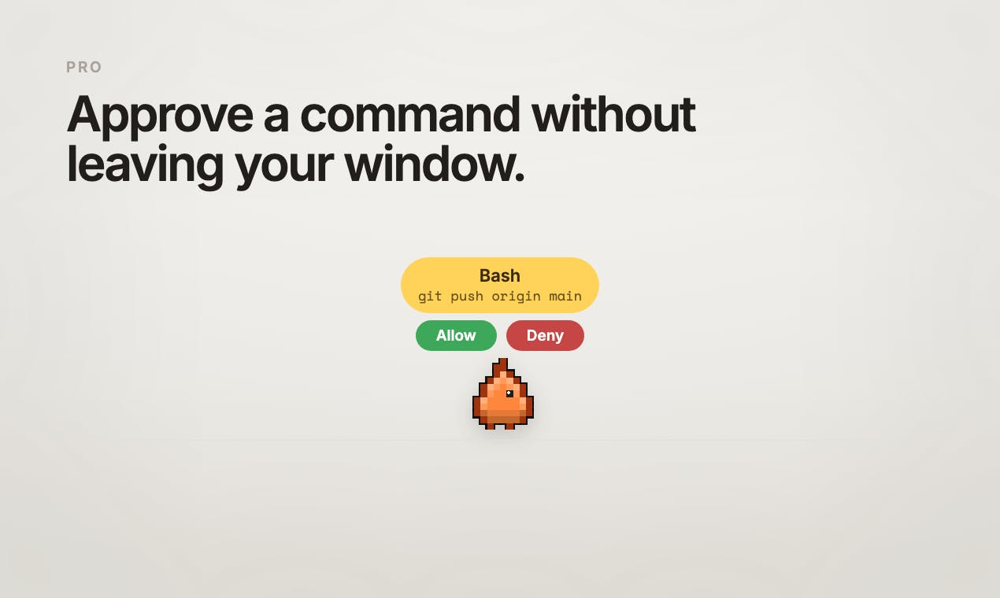
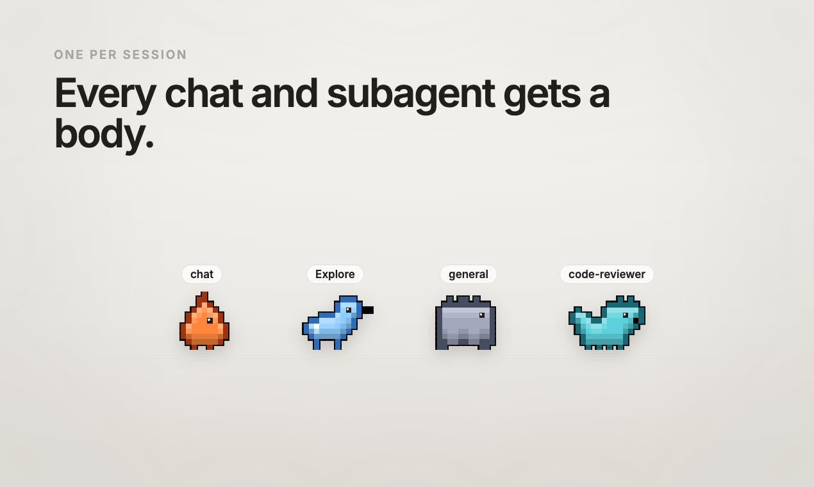

### 🎬 관련 영상
- [🎥 영상 보기](https://ph-files.imgix.net/9f1e50b3-73d8-4845-ad71-a149434155c7.jpeg?auto=format)

---

## 8. [Kitesurf](https://www.producthunt.com/products/cloudflare)
**Votes**: 116 | **도입 난이도**: 중 | **신뢰도**: 상
**Tagline**: Browser built for agents, running on Cloudflare Workers
**서비스 링크**: https://www.producthunt.com/r/5B53WWLYMBD26A
**재등장**: 최근 7일 내 재등장 (마지막 등장 1일 전)

**태그**: DevTool, Automation, Cloudflare, WebScraping, Agent

### 📌 이 서비스 한눈에 보기
Cloudflare Workers 환경에서 구동되는 에이전트 중심의 클라우드 브라우저

### 🔑 주요 기능
- Cloudflare Workers 기반의 상태 비저장(stateless) 브라우저
- 에이전트 작업에 최적화된 설계
- Browser Run을 통한 스크린샷, HTML 추출 및 자동화 지원

### 🙋 사용자에게 어떤 점이 좋은가
별도의 브라우저 인프라 구축 없이 클라우드 환경에서 즉시 웹 자동화 및 데이터 추출 작업을 수행할 수 있습니다.

### ✅ 지금 바로 써볼 기능
- Browser Run을 통한 HTML 데이터 추출 테스트
- Cloudflare Workers 환경에서의 자동화 워크플로우 구축
- 스크린샷 기능을 활용한 시각적 데이터 수집

### ⚠️ 사용 전 확인할 점
- Cloudflare Workers의 실행 시간 및 리소스 제한 확인 필요
- 상태 비저장(stateless) 방식에 따른 세션 유지 방식 검토

### 🧭 확인이 더 필요한 정보
Cloudflare Workers의 구체적인 리소스 제한 내에서 어느 정도 규모의 자동화가 가능한지 확인이 필요합니다.

### 📸 스크린샷 및 갤러리
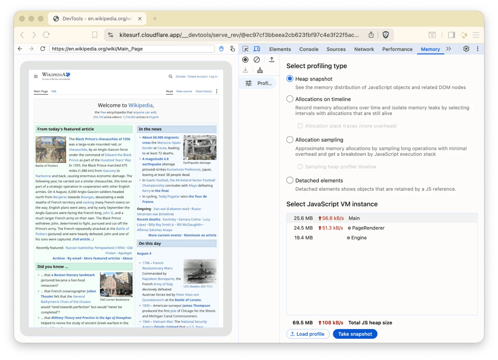
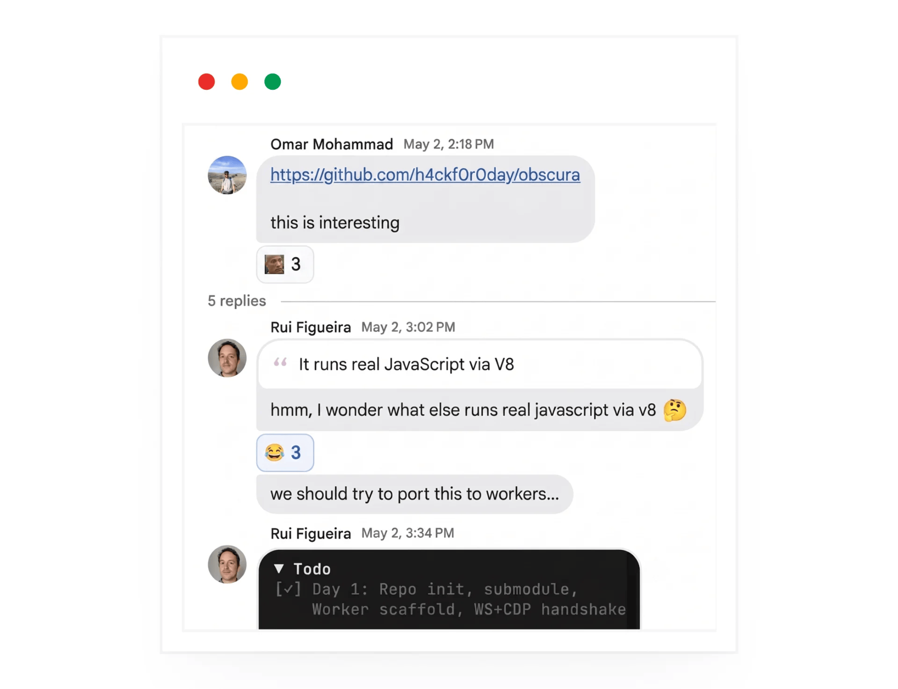
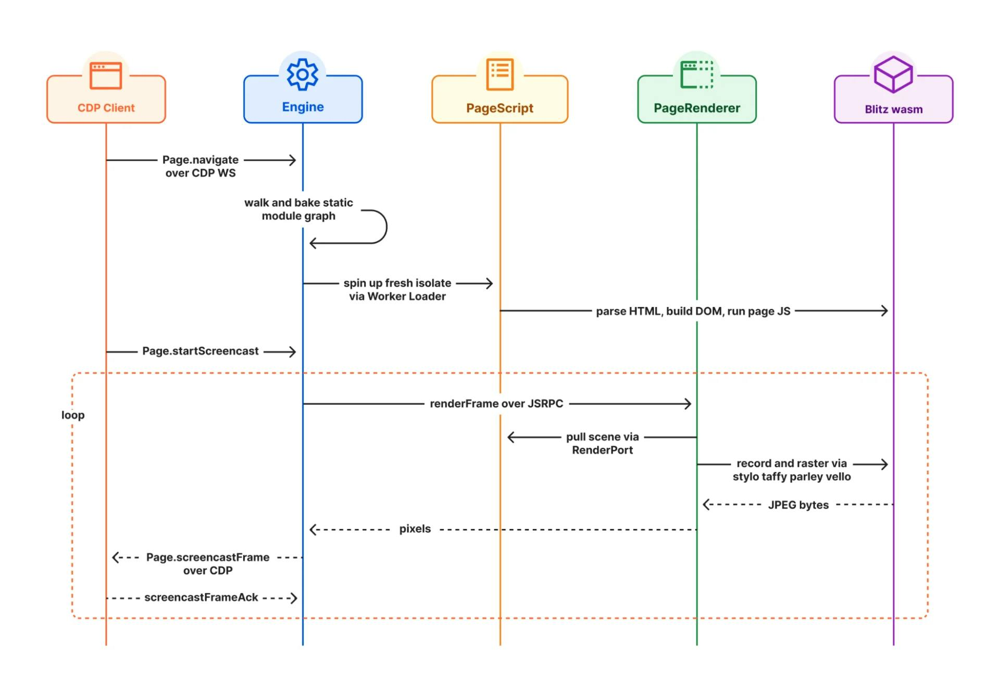

---

## 9. [DataBlur](https://www.producthunt.com/products/datablur)
**Votes**: 114 | **도입 난이도**: 하 | **신뢰도**: 상
**Tagline**: Blur sensitive data on screen before anyone sees it
**서비스 링크**: https://www.producthunt.com/r/HJ2P4URTDUMTPW

**태그**: Privacy, Security, Productivity, ScreenSharing, AI Tool, API, Email

### 📌 이 서비스 한눈에 보기
화면 공유 및 데모 중 민감 정보를 실시간으로 자동 블러 처리하는 보안 도구

### 🔑 주요 기능
- 라이브 콜, 데모, 녹화 중 실시간 데이터 블러 처리
- 이메일, 카드 번호, API 키 등 민감 정보 자동 감지
- 100% 로컬 실행 방식으로 클라우드나 AI 서버로 데이터 전송 없음

### 🙋 사용자에게 어떤 점이 좋은가
화면 공유 시 실수로 노출될 수 있는 개인정보나 보안 키를 즉각적으로 가려주어 안전한 데모 환경을 제공합니다.

### ✅ 지금 바로 써볼 기능
- 화면 공유 시 자동 감지 기능 테스트
- 민감 정보(이메일, API 키 등) 식별 정확도 확인

### ⚠️ 사용 전 확인할 점
- 자동 감지가 실패할 경우를 대비한 수동 블러 기능 숙지 필요
- 로컬 실행 방식이므로 시스템 리소스 사용량 확인 필요

### 🧭 확인이 더 필요한 정보
특정 운영체제(Windows/macOS) 지원 범위와 상세 작동 방식에 대한 정보가 추가로 필요합니다.

### 📸 스크린샷 및 갤러리

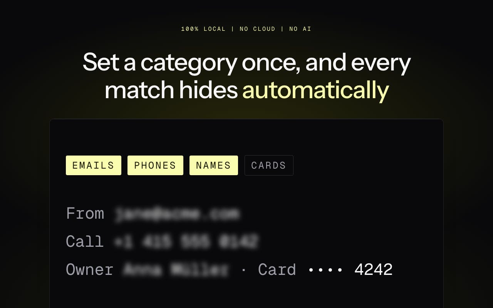
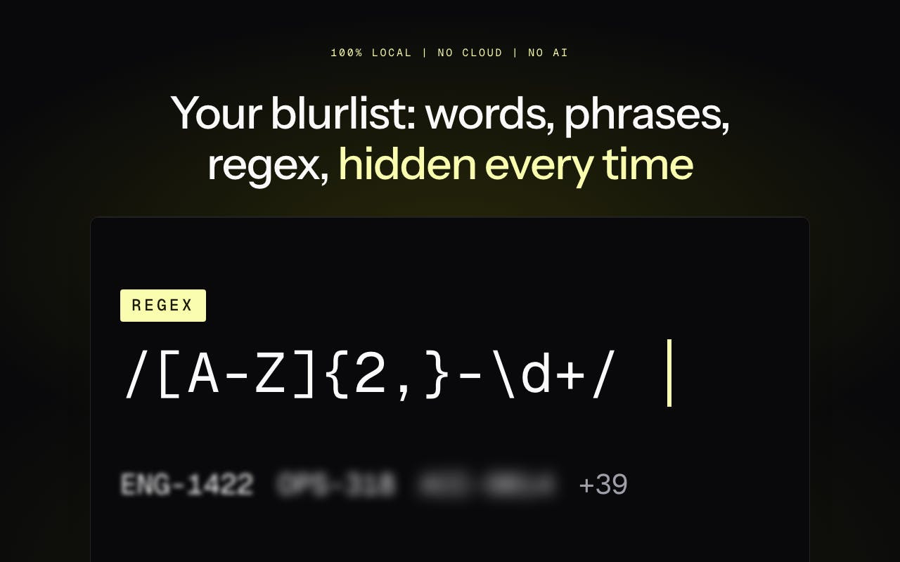

### 🎬 관련 영상
- [🎥 영상 보기](https://ph-files.imgix.net/b6d81d54-459a-471b-8cd5-05f0d0ca01dd.jpeg?auto=format)

---

## 10. [Merge](https://www.producthunt.com/products/merge-5)
**Votes**: 109 | **도입 난이도**: 하 | **신뢰도**: 상
**Tagline**: AI-native code review assessments
**서비스 링크**: https://www.producthunt.com/r/HMYSG37SE5XNVK

**태그**: DevTool, AI, Hiring, CodeReview, Agent, AI Tool

### 📌 이 서비스 한눈에 보기
실제 업무 환경을 모사하여 엔지니어의 판단력을 평가하는 AI 기반 코드 리뷰 테스트 플랫폼

### 🔑 주요 기능
- 실제 업무와 유사한 PR(Pull Request) 리뷰 방식의 평가 프로세스
- AI 에이전트가 실시간으로 코멘트를 남기며 실제 엔지니어와 협업하는 환경 시뮬레이션
- 버그 커버리지, 커뮤니케이션, PR 품질, 토큰 사용 효율성 등 다각도 분석

### 🙋 사용자에게 어떤 점이 좋은가
채용 과정에서 후보자의 실제 코드 리뷰 역량과 커뮤니케이션 능력을 객관적으로 검증할 수 있습니다.

### ✅ 지금 바로 써볼 기능
- 실제 PR 리뷰 과제 수행해보기
- AI 에이전트와의 실시간 상호작용 경험하기
- 최종 평가 리포트 분석하기

### ⚠️ 사용 전 확인할 점
- AI 시뮬레이션 환경이 실제 개발 환경과 얼마나 일치하는지 확인 필요
- 평가 지표(토큰 효율성 등)가 실제 채용 기준과 부합하는지 검토 필요

### 🧭 확인이 더 필요한 정보
지원하는 프로그래밍 언어의 범위와 구체적인 평가 알고리즘에 대한 정보가 필요합니다.

### 📸 스크린샷 및 갤러리
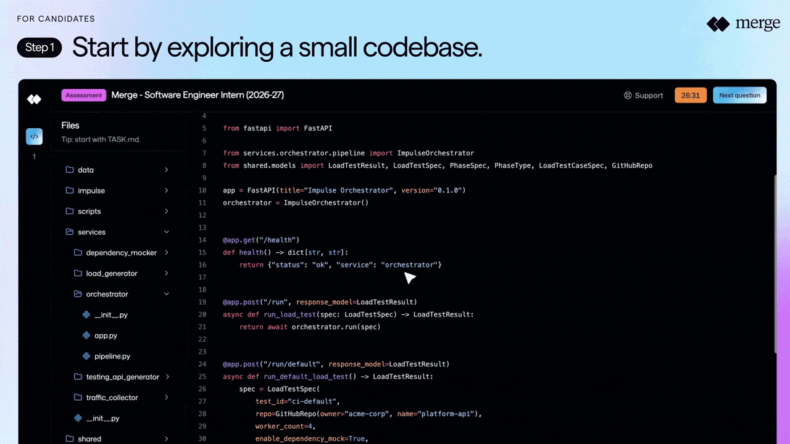
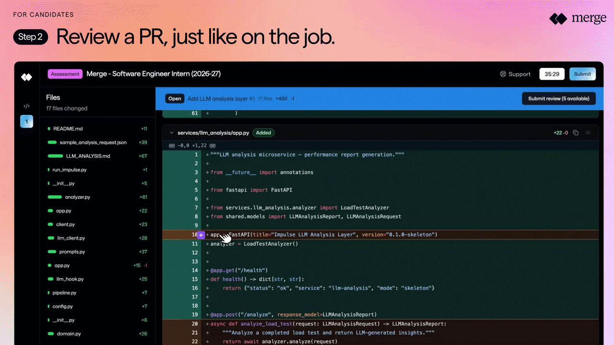
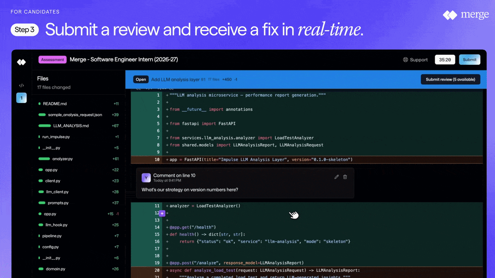

### 🎬 관련 영상
- [🎥 영상 보기](https://ph-files.imgix.net/313aff0d-7a30-4102-995b-b46f9fdf7647.jpeg?auto=format)

---

## 11. [HAR](https://www.producthunt.com/products/har)
**Votes**: 102 | **도입 난이도**: 상 | **신뢰도**: 상
**Tagline**: Open Source harness for multi-agent coding workflows
**서비스 링크**: https://www.producthunt.com/r/5GRBFEBDBATCT5

**태그**: DevTool, AI-Agent, OpenSource, Automation, Agent

### 📌 이 서비스 한눈에 보기
다중 AI 에이전트를 활용한 오픈소스 코드 워크플로우 자동화 프레임워크

### 🔑 주요 기능
- 에이전트 불가지론(Agent-agnostic) 방식으로 다양한 AI 모델과 프레임워크 호환
- 병렬 실행 환경에서 코드 생성 및 검증을 위한 결정론적 게이트 제공
- 모든 에이전트의 작업 과정에 대한 완전한 관찰 가능성 및 검증 가능한 증거 제공

### 🙋 사용자에게 어떤 점이 좋은가
여러 AI 에이전트를 동시에 가동하여 복잡한 코딩 작업을 자동화하고, 검증된 결과물만 안전하게 워크플로우에 반영할 수 있습니다.

### ✅ 지금 바로 써볼 기능
- 기존 코드 저장소에 에이전트 플릿(Fleet) 배포해보기
- 사용자 정의 워크플로우 및 도구 연동 테스트
- 결정론적 검증 게이트를 통한 코드 품질 확인

### ⚠️ 사용 전 확인할 점
- 오픈소스 프레임워크이므로 초기 설정 및 워크플로우 구축에 기술적 숙련도 필요
- 병렬 에이전트 실행 시 발생할 수 있는 리소스 관리 및 비용 문제 확인 필요

### 🧭 확인이 더 필요한 정보
사용자의 기존 개발 환경 및 도구와 얼마나 원활하게 통합되는지에 대한 구체적인 가이드가 필요합니다.

### 📸 스크린샷 및 갤러리
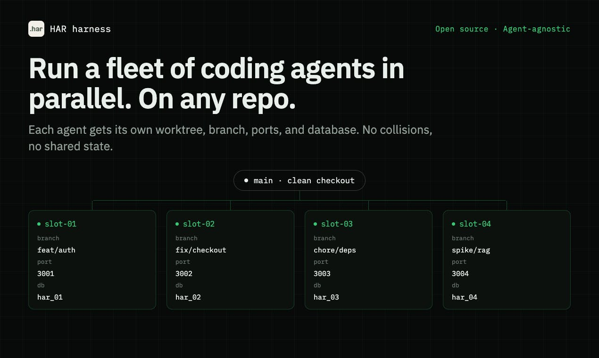
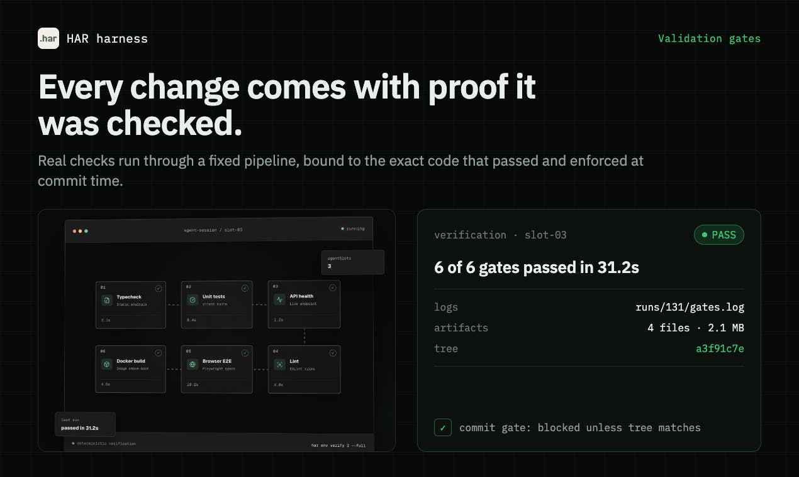
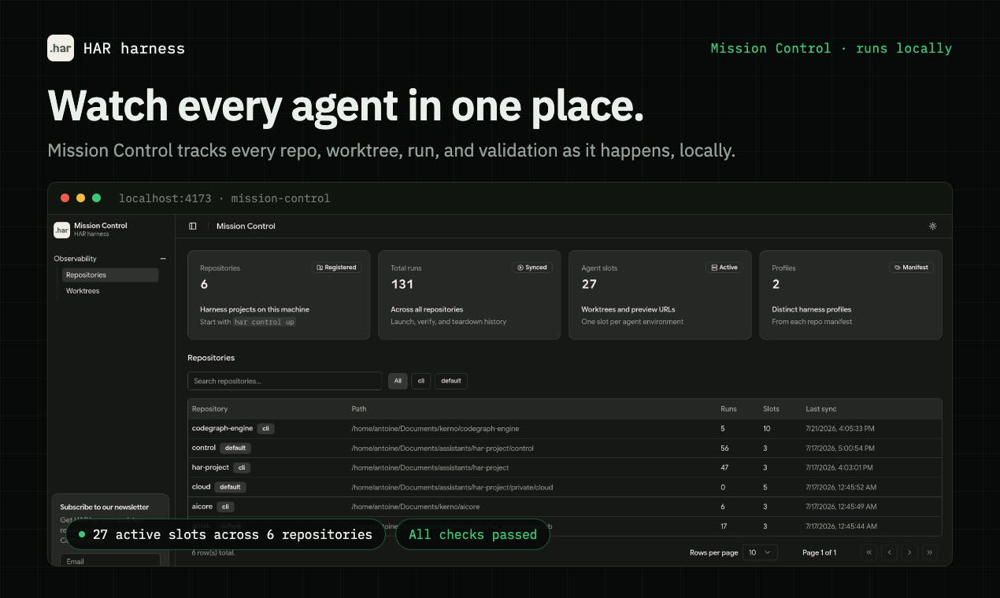

### 🎬 관련 영상
- [🎥 영상 보기](https://ph-files.imgix.net/46ebba8d-68e2-4c1a-8180-7bcecc850b2a.jpeg?auto=format)

---

## 12. [Troopr AI Scrum Master](https://www.producthunt.com/products/troopr)
**Votes**: 101 | **도입 난이도**: 중 | **신뢰도**: 상
**Tagline**: Writes your standup from real work. Remembers your team.
**서비스 링크**: https://www.producthunt.com/r/OSZA7PMGFRWY7S

**태그**: DevTool, Automation, Agile, Productivity, AI Tool

### 📌 이 서비스 한눈에 보기
Jira, GitHub, Slack 활동을 기반으로 데일리 스탠드업 업데이트를 자동 작성하는 AI 스크럼 마스터

### 🔑 주요 기능
- Jira, GitHub, Slack 데이터를 분석하여 실제 작업 기반의 업데이트 자동 생성
- 팀의 작업 방식과 맥락을 기억하여 점진적으로 정확도 향상
- 데이터 불일치 사항을 감지하여 스탠드업의 신뢰성 확보

### 🙋 사용자에게 어떤 점이 좋은가
매일 반복되는 스탠드업 준비 시간을 줄여주고, 실제 작업 기록을 바탕으로 팀의 진행 상황을 투명하게 관리할 수 있습니다.

### ✅ 지금 바로 써볼 기능
- 기존 협업 툴(Jira, GitHub, Slack) 연동하기
- 자동 생성된 스탠드업 업데이트 내용 검토하기
- AI가 플래그를 지정한 데이터 불일치 사항 확인하기

### ⚠️ 사용 전 확인할 점
- 외부 툴(Jira, GitHub, Slack)의 데이터 접근 권한 설정 필요
- AI가 생성한 내용이 실제 작업 내용과 일치하는지 검증 필요

### 🧭 확인이 더 필요한 정보
지원하는 구체적인 협업 툴의 종류와 데이터 보안 정책에 대한 상세 정보가 필요합니다.

### 📸 스크린샷 및 갤러리
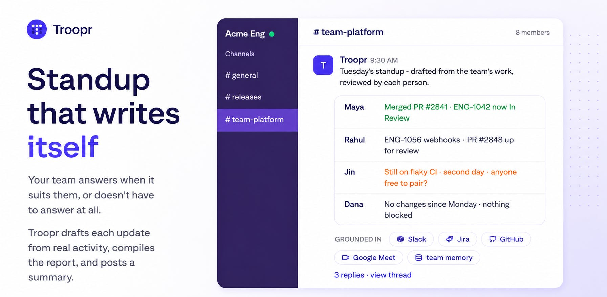
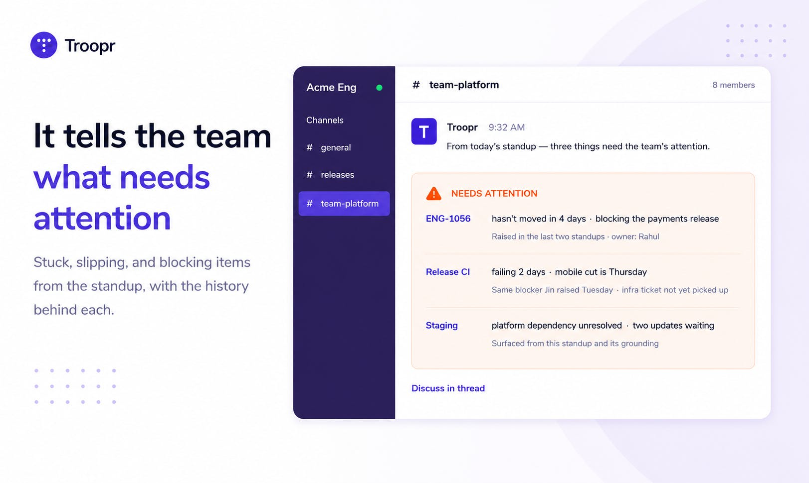
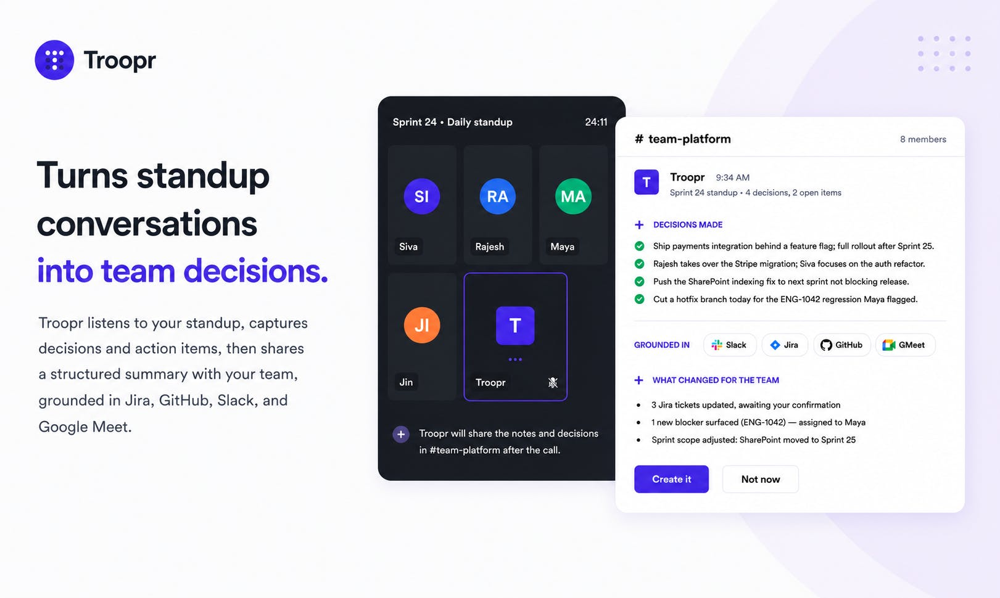

### 🎬 관련 영상
- [🎥 영상 보기](https://ph-files.imgix.net/6741bc27-5b2c-471d-baaa-e25f4e7ad5ec.jpeg?auto=format)

---

## 13. [The new Firecrawl MCP](https://www.producthunt.com/products/extract-by-firecrawl)
**Votes**: 97 | **도입 난이도**: 하 | **신뢰도**: 상
**Tagline**: Agent-ready web context for any MCP client.
**서비스 링크**: https://www.producthunt.com/r/LTBZ3FL47DP5JK

**태그**: DevTool, Automation, AI-Agent, WebScraping, Agent

### 📌 이 서비스 한눈에 보기
모든 MCP 클라이언트에서 사용할 수 있는 효율적인 에이전트용 웹 컨텍스트 도구

### 🔑 주요 기능
- 검색, 스크래핑, 상호작용 시 컨텍스트 사용량 50% 절감
- 사용자를 위한 OAuth 및 에이전트를 위한 키리스(keyless) 온보딩 지원
- 어떤 MCP 클라이언트에서도 즉시 사용 가능한 에이전트 친화적 환경 제공

### 🙋 사용자에게 어떤 점이 좋은가
웹 데이터를 추출할 때 발생하는 토큰 비용을 절반으로 줄이면서, 에이전트가 웹 환경에 더 빠르고 쉽게 적응할 수 있게 해줍니다.

### ✅ 지금 바로 써볼 기능
- 기존 MCP 클라이언트에 Firecrawl MCP 연결하기
- OAuth를 통한 사용자 계정 연동
- 에이전트용 키리스 모드로 자동화 워크플로우 테스트하기

### ⚠️ 사용 전 확인할 점
- 컨텍스트 절감 방식이 데이터의 품질이나 상세도에 미치는 영향 확인 필요
- 에이전트용 키리스 버전의 보안 정책 검토

### 🧭 확인이 더 필요한 정보
50% 컨텍스트 절감이 구체적으로 어떤 기술적 최적화를 통해 이루어지는지 명시되지 않았습니다.

### 📸 스크린샷 및 갤러리
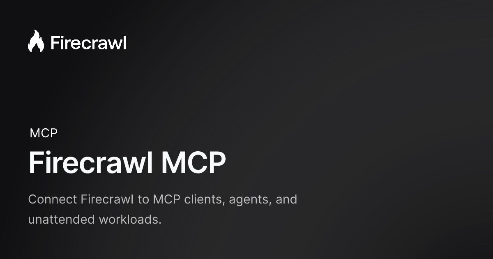

### 🎬 관련 영상
- [🎥 영상 보기](https://ph-files.imgix.net/71d13843-c730-4522-99f5-a2df1c8b76b7.jpeg?auto=format)

---

## 14. [Whop CLI](https://www.producthunt.com/products/whop-cli)
**Votes**: 94 | **도입 난이도**: 중 | **신뢰도**: 상
**Tagline**: Run your entire business from the terminal
**서비스 링크**: https://www.producthunt.com/r/BTXIPPRX2OJAEF

**태그**: DevTool, Automation, BusinessOps, AI-Agent, Agent, AI Tool, API

### 📌 이 서비스 한눈에 보기
터미널 명령어로 비즈니스 운영부터 AI 자동화까지 가능한 Whop 통합 관리 도구

### 🔑 주요 기능
- Whop 대시보드의 모든 기능을 터미널 환경에서 실행 가능
- 제품 생성, 가격 설정, 광고 운영, 결제 및 데이터 분석 통합
- AI 에이전트(Claude, Cursor 등)와 연동하여 비즈니스 자동화 가능

### 🙋 사용자에게 어떤 점이 좋은가
개발자나 숙련된 사용자가 터미널 환경에서 비즈니스 운영을 프로그래밍 가능한 방식으로 제어할 수 있어 운영 효율이 극대화됩니다.

### ✅ 지금 바로 써볼 기능
- CLI 설치 및 Whop 계정 연동
- 터미널을 통한 제품 생성 및 가격 설정 테스트
- AI 에이전트에 CLI 명령어를 전달하여 자동화 워크플로우 구축

### ⚠️ 사용 전 확인할 점
- 터미널 환경에 익숙하지 않은 사용자에게는 초기 진입 장벽이 있을 수 있음
- AI 에이전트에게 권한을 위임할 경우 발생할 수 있는 운영 리스크 관리 필요

### 🧭 확인이 더 필요한 정보
사용자의 숙련도에 따른 보안 설정 및 AI 에이전트 연동 시의 세부 제어 범위 확인이 필요합니다.

### 📸 스크린샷 및 갤러리
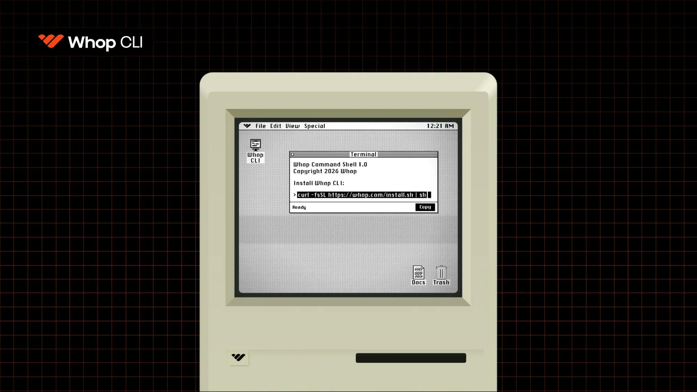
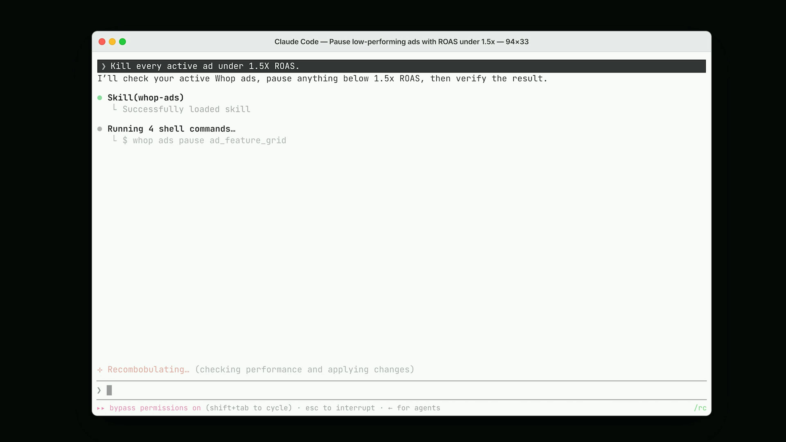
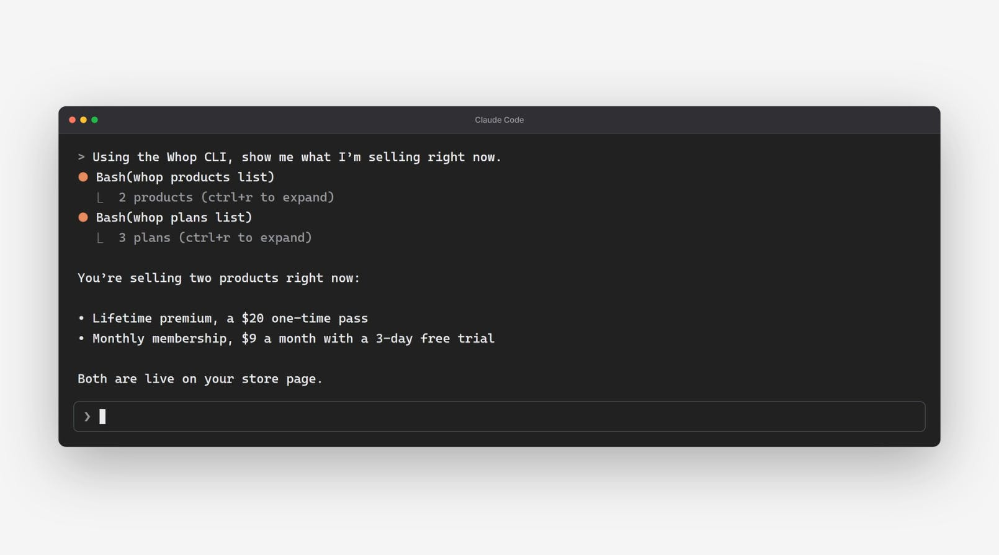

### 🎬 관련 영상
- [🎥 영상 보기](https://ph-files.imgix.net/c20c1ea5-33fd-471a-9c72-3b4a8bc3003f.jpeg?auto=format)

---

## 15. [AndroMeld](https://www.producthunt.com/products/andromeld)
**Votes**: 91 | **도입 난이도**: 중 | **신뢰도**: 상
**Tagline**: Bring a continuity-style experience to Android and Mac
**서비스 링크**: https://www.producthunt.com/r/Z2GHP6WYMR4NGN

**태그**: Productivity, Android, Mac, Remote Control, AI Tool

### 📌 이 서비스 한눈에 보기
안드로이드 앱을 맥(Mac)의 개별 창으로 미러링하여 연속성 있게 사용하는 도구

### 🔑 주요 기능
- 안드로이드 앱을 맥의 독립적이고 크기 조절 가능한 창으로 미러링
- 모바일 앱의 작업 상태를 맥으로 이어받는 핸드오프(Handoff) 기능
- 키보드, 트랙패드 제어 및 클립보드/알림 동기화 지원

### 🙋 사용자에게 어떤 점이 좋은가
스마트폰을 직접 만지지 않고도 맥 환경에서 안드로이드 앱을 마치 네이티브 앱처럼 편리하게 제어할 수 있습니다.

### ✅ 지금 바로 써볼 기능
- USB 또는 Wi-Fi를 통한 기기 연결 설정
- 맥 트랙패드 제스처를 통한 앱 컨트롤 테스트
- 클립보드 동기화를 통한 텍text 복사/붙여넣기 활용

### ⚠️ 사용 전 확인할 점
- 안드로이드 16 이상 버전의 기기 지원 여부 확인 필요
- 연결 방식(USB/Wi-Fi)에 따른 성능 차이 발생 가능성

### 🧭 확인이 더 필요한 정보
안드로이드 16 이상 기기 지원에 대한 구체적인 호환성 범위 확인이 필요합니다.

### 📸 스크린샷 및 갤러리
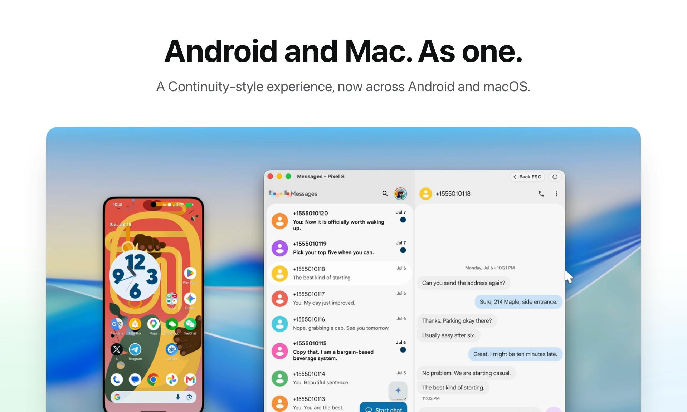
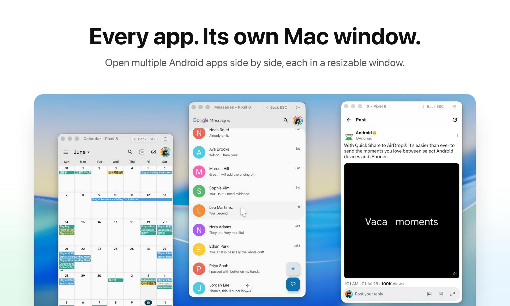
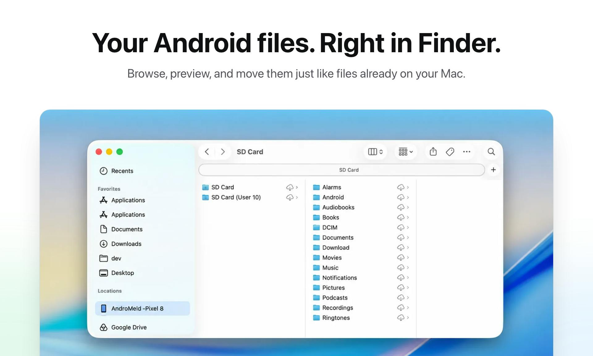

### 🎬 관련 영상
- [🎥 영상 보기](https://ph-files.imgix.net/4405c22a-44cf-4647-8c2e-4e1024653ea9.jpeg?auto=format)

---

## 16. [StepShot](https://www.producthunt.com/products/stepshot-2)
**Votes**: 84 | **도입 난이도**: 하 | **신뢰도**: 상
**Tagline**: AI that turns real workflows into step-by-step guides
**서비스 링크**: https://www.producthunt.com/r/BVUGVY3MH7GILE

**태그**: Productivity, AI, Documentation, Automation, AI Tool

### 📌 이 서비스 한눈에 보기
작업 과정을 실시간으로 캡처하여 완벽한 가이드로 변환하는 AI 문서화 도구

### 🔑 주요 기능
- 클릭과 타이핑을 자동으로 캡처하여 단계별 가이드 생성
- 로컬 AI를 통한 스크린샷 프레임 및 설명 자동 작성
- PDF, Markdown, HTML 등 다양한 형식으로 내보내기 지원

### 🙋 사용자에게 어떤 점이 좋은가
반복적인 매뉴얼 작성 시간을 획기적으로 줄여주며, 작업 과정을 그대로 기록하여 누구나 이해하기 쉬운 가이드를 즉시 만들 수 있습니다.

### ✅ 지금 바로 써볼 기능
- 실제 업무 워크플로우를 실행하며 단계별 캡처 기능 테스트하기
- 편집 기능을 통해 불필요한 단계 삭제 및 민감 정보 가리기
- 생성된 가이드를 PDF나 Markdown으로 내보내어 활용하기

### ⚠️ 사용 전 확인할 점
- Mac 전용 앱이므로 Windows 환경 사용자는 사용이 제한됨
- 클라우드 AI 기능을 사용할 경우 외부 API 설정이 필요함

### 🧭 확인이 더 필요한 정보
Windows 지원 여부와 클라우드 AI 연동 시의 상세 비용 구조를 확인해야 합니다.

### 📸 스크린샷 및 갤러리
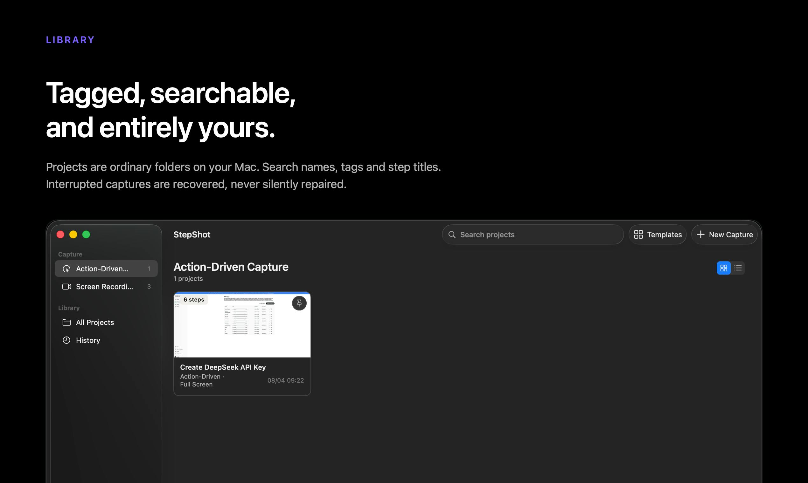
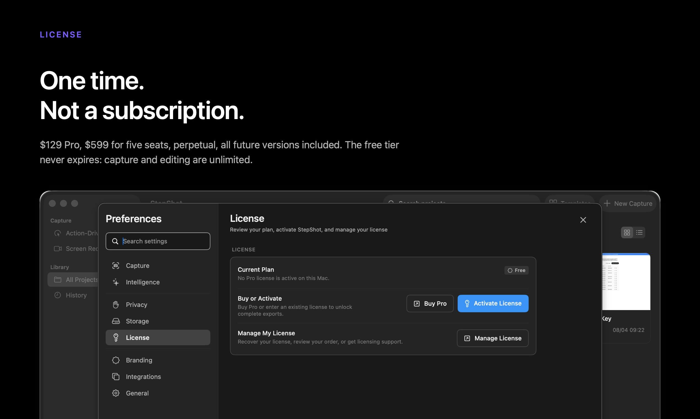
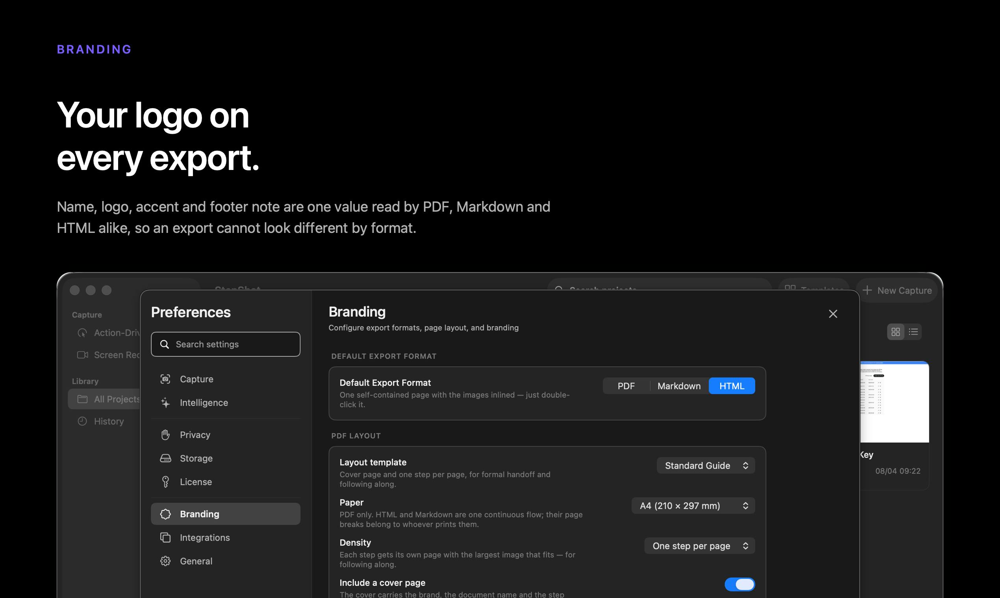

---

## 17. [Prompt Bridge](https://www.producthunt.com/products/prompt-bridge-2)
**Votes**: 83 | **도입 난이도**: 하 | **신뢰도**: 상
**Tagline**: Keep AI Context Portable
**서비스 링크**: https://www.producthunt.com/r/CDLWMS7BGHWSKN

**태그**: AI, Productivity, ChromeExtension, AI Tool, Prompting

### 📌 이 서비스 한눈에 보기
플랫폼에 상관없이 AI 대화 맥락을 그대로 이어가는 크롬 확장 프로그램

### 🔑 주요 기능
- 주요 AI 플랫폼 간 대화 컨텍스트 유지
- 대화 흐름을 끊지 않는 포터블 AI 환경 제공
- 무료로 제공되는 크롬 확장 프로그램

### 🙋 사용자에게 어떤 점이 좋은가
여러 AI 서비스를 번갈아 사용할 때 매번 처음부터 다시 설명할 필요 없이 기존 대화 맥락을 즉시 활용할 수 있습니다.

### ✅ 지금 바로 써볼 기능
- 크롬 확장 프로그램 설치하기
- 다른 AI 플랫폼에서 기존 대화 불러오기
- 연속적인 작업 흐름 구축하기

### ⚠️ 사용 전 확인할 점
- 개인정보 및 대화 데이터 보안 정책 확인 필요
- 지원되는 AI 플랫폼 범위 확인 필요

### 🧭 확인이 더 필요한 정보
지원하는 구체적인 AI 플랫폼 목록과 데이터 처리 방식에 대한 상세 정보가 필요합니다.

### 📸 스크린샷 및 갤러리

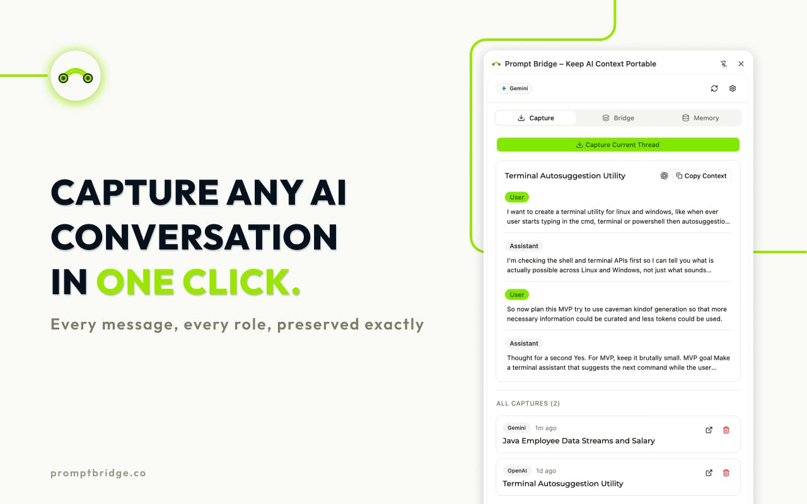
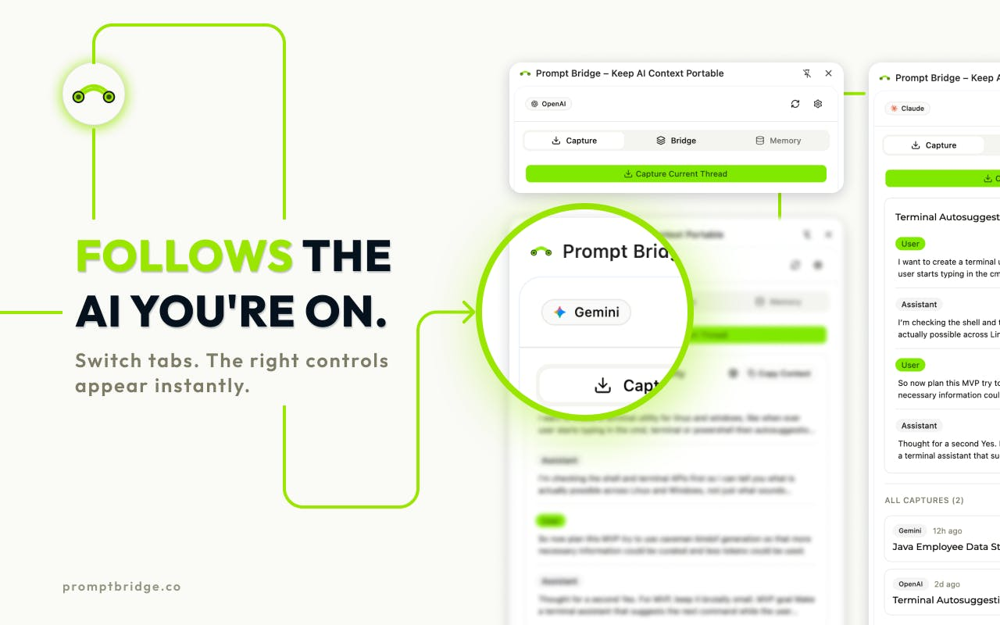

### 🎬 관련 영상
- [🎥 영상 보기](https://ph-files.imgix.net/0d1ba63c-9850-4918-bc3e-7b4ab02a5592.jpeg?auto=format)

---

## 18. [Rescript for Desktop](https://www.producthunt.com/products/rescript-edit-videos-like-you-edit-text)
**Votes**: 79 | **도입 난이도**: 하 | **신뢰도**: 상
**Tagline**: A free, open source, Descript alternative. Runs on-device.
**서비스 링크**: https://www.producthunt.com/r/B7VHXE54LQMLBM

**태그**: VideoEditor, OpenSource, Productivity, DesktopApp, AI Tool, Video

### 📌 이 서비스 한눈에 보기
텍스트 편집만으로 영상 편집이 가능한 오픈소스 데스크톱 앱

### 🔑 주요 기능
- 텍스트 기반의 직관적인 영상 편집 방식
- 로컬 실행을 통한 강력한 개인정보 보호 및 오프라인 작업 지원
- Mac, Windows, Linux를 지원하는 데스크톱 앱 출시

### 🙋 사용자에게 어떤 점이 좋은가
영상 파일을 직접 자르는 대신 대본을 수정하듯 편집할 수 있어 작업 시간이 단축되며, 온디바이스 방식으로 보안 걱정 없이 작업할 수 있습니다.

### ✅ 지금 바로 써볼 기능
- 데스크톱 앱 설치 및 다크 모드 적용
- 5개 언어 지원을 통한 자동 자막/전사 기능 테스트
- 오디오 및 다양한 포맷으로 영상 내보내기

### ⚠️ 사용 전 확인할 점
- 데스크톱 환경에서의 하드웨어 리소스 사용량 확인 필요
- 오픈소스 프로젝트 특성상 기능 업데이트 및 안정성 지속 확인 필요

### 🧭 확인이 더 필요한 정보
지원되는 5개 언어의 구체적인 목록과 한국어 정확도는 직접 테스트가 필요합니다.

### 📸 스크린샷 및 갤러리
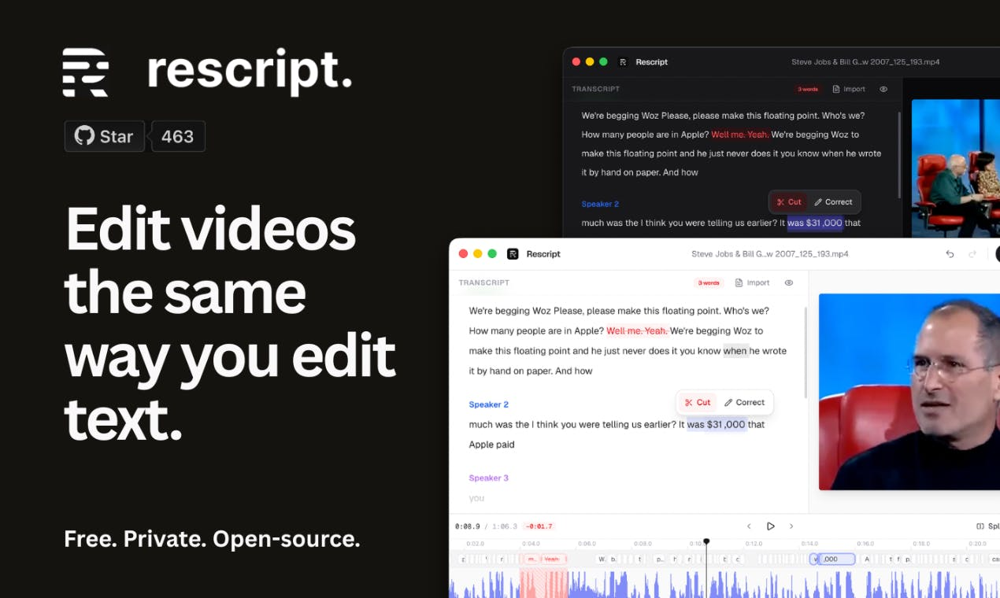
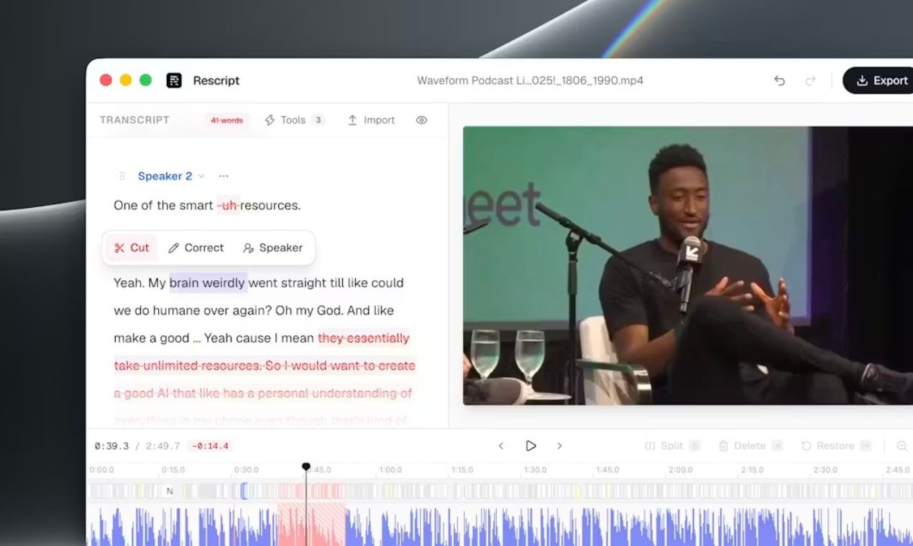
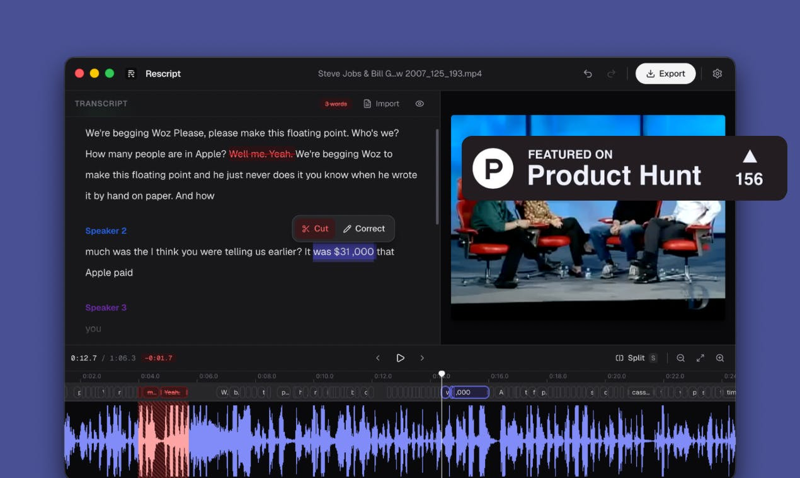

### 🎬 관련 영상
- [🎥 영상 보기](https://ph-files.imgix.net/e12a788e-22d2-4e10-80d4-4936b2f331b7.jpeg?auto=format)

---

## 19. [Blueberry](https://www.producthunt.com/products/blueberry-6)
**Votes**: 77 | **도입 난이도**: 하 | **신뢰도**: 상
**Tagline**: Stop Ghosting People You Actually Like
**서비스 링크**: https://www.producthunt.com/r/L5C2P26WPT4UNO

**태그**: Productivity, Communication, AI, MacApp

### 📌 이 서비스 한눈에 보기
소중한 사람들에게 답장하는 것을 어려워하는 분들을 위한 AI 메시지 초안 작성 도구

### 🔑 주요 기능
- 사용자의 말투를 반영한 iMessage 답장 초안 생성
- Mac 메뉴 바에서 간편하게 실행 가능한 앱
- 사용자가 직접 확인 후 전송하는 안전한 방식

### 🙋 사용자에게 어떤 점이 좋은가
답장 타이밍을 놓치거나 메시지 작성을 어려워하는 사용자가 관계를 유지할 수 있도록 도와줍니다.

### ✅ 지금 바로 써볼 기능
- 메뉴 바에서 앱 실행하기
- 자신의 말투로 답장 초안 생성해보기
- 생성된 메시지 검토 후 전송하기

### ⚠️ 사용 전 확인할 점
- 사용자의 말투를 학습하는 방식에 대한 개인정보 보호 확인 필요
- iMessage 연동 방식에 따른 보안성 검토 필요

### 🧭 확인이 더 필요한 정보
사용자의 목소리를 어떻게 학습하고 저장하는지에 대한 구체적인 기술적 메커니즘이 명시되지 않았습니다.

### 📸 스크린샷 및 갤러리
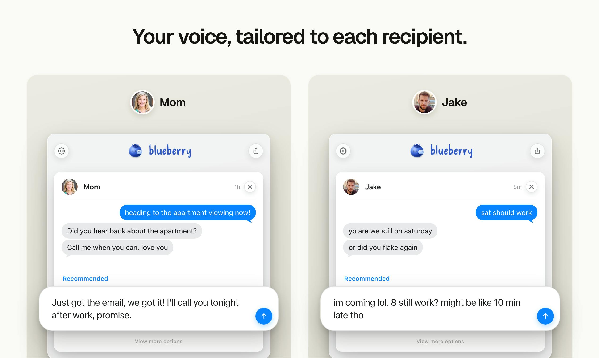
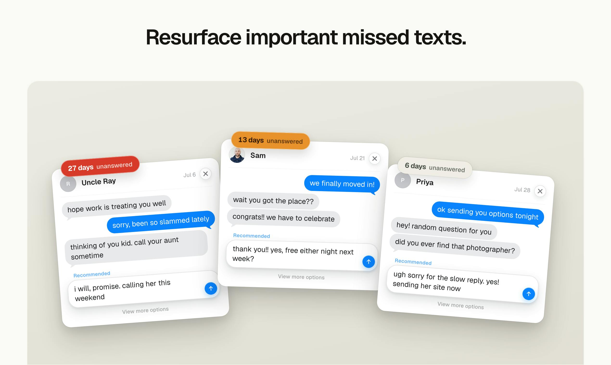
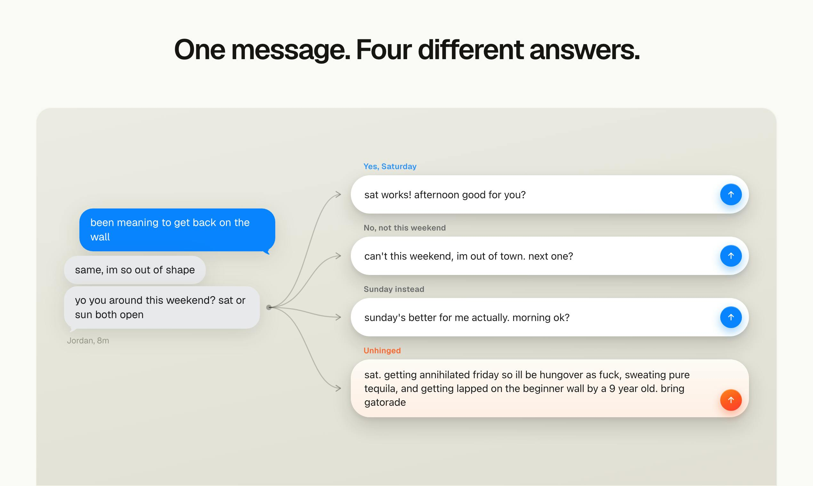

### 🎬 관련 영상
- [🎥 영상 보기](https://ph-files.imgix.net/29e96890-684d-4c4d-86bb-1d5c662e066f.jpeg?auto=format)

---

## 20. [Reference](https://www.producthunt.com/products/reference-2)
**Votes**: 77 | **도입 난이도**: 하 | **신뢰도**: 상
**Tagline**: Local semantic search for AI agents
**서비스 링크**: https://www.producthunt.com/r/EXUW2GJSYQWYAP

**태그**: DevTool, AI-Agent, Local-First, Productivity, Agent, AI Tool

### 📌 이 서비스 한눈에 보기
로컬 파일과 코드를 기반으로 AI 에이전트에게 정확한 맥락을 제공하는 보안 중심 시맨틱 검색 도구

### 🔑 주요 기능
- 데이터 유출 걱정 없는 로컬 기반 시맨틱 검색 (No Cloud)
- Tree-sitter를 활용한 코드 구조를 이해하는 정밀한 청킹
- MCP 서버 내장으로 Claude Code 등 AI 에이전트와 즉시 연동

### 🙋 사용자에게 어떤 점이 좋은가
코드를 클라우드에 올리지 않고도 AI 에이전트가 내 로컬 프로젝트의 함수와 구조를 정확히 파악하여 답변할 수 있게 돕습니다.

### ✅ 지금 바로 써볼 기능
- 로컬 파일 저장 후 인덱싱 동작 확인하기
- MCP 서버를 통해 Claude Code와 연동하여 질문하기
- 코드 기반 질문을 통해 정확한 함수 단위 인용 확인하기

### ⚠️ 사용 전 확인할 점
- 로컬 리소스(CPU/RAM) 사용량 확인 필요
- 지원되는 프로그래밍 언어 및 Tree-sitter 파싱 범위 확인 필요

### 🧭 확인이 더 필요한 정보
로컬 환경에서의 인덱싱 성능 및 대규모 코드베이스에서의 리소스 점유율에 대한 구체적인 정보가 필요합니다.

### 📸 스크린샷 및 갤러리
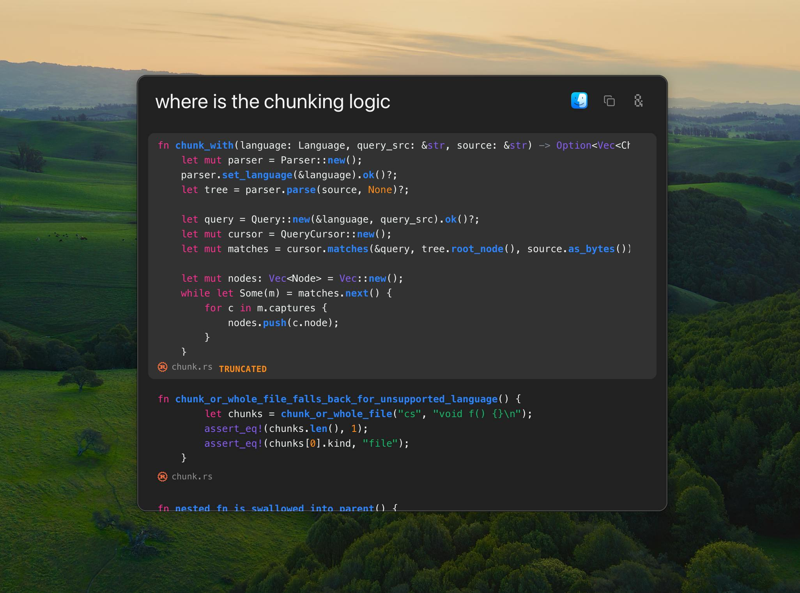
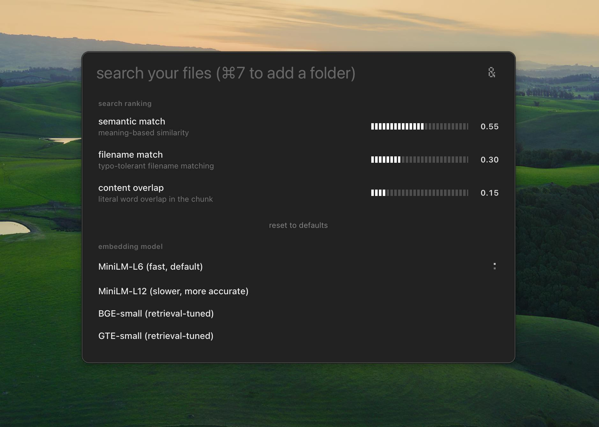
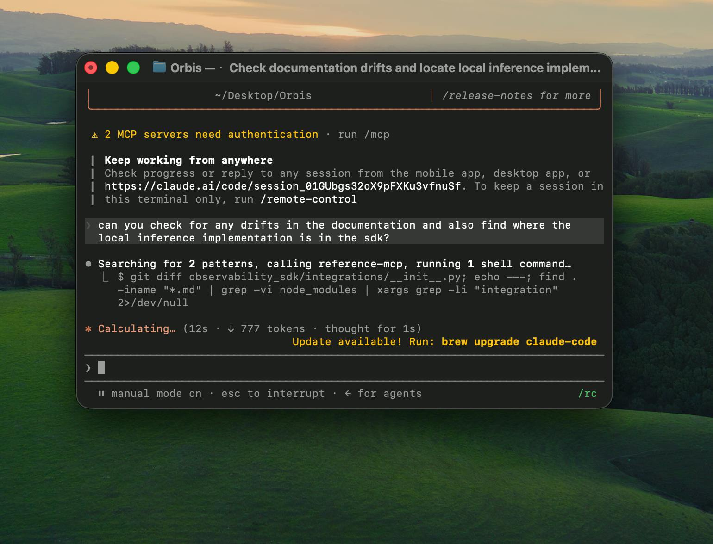

### 🎬 관련 영상
- [🎥 영상 보기](https://ph-files.imgix.net/36c43df2-ea42-4139-b33d-a655969ceb79.jpeg?auto=format)

---

## 21. [BAP Studio](https://www.producthunt.com/products/bap-studio)
**Votes**: 74 | **도입 난이도**: 하 | **신뢰도**: 상
**Tagline**: An MPC-style drum machine that runs in a browser tab
**서비스 링크**: https://www.producthunt.com/r/HKRONY2EBM3JDJ

**태그**: Music Production, Web Tool, Beat Making

### 📌 이 서비스 한눈에 보기
설치 없이 브라우저에서 바로 비트를 만드는 MPC 스타일 드럼 머신

### 🔑 주요 기능
- 16개의 벨로시티 지원 드럼 패드 탑재
- 스텝 시퀀서, 스윙, 샘플링 기능 제공
- 별도 다운로드나 가입 없는 무료 웹 서비스

### 🙋 사용자에게 어떤 점이 좋은가
아이디어가 떠오를 때 즉시 브라우저를 열어 비트를 만들고 WAV 파일로 내보낼 수 있어 작업 흐름이 매우 빠릅니다.

### ✅ 지금 바로 써볼 기능
- 16개 패드로 드럼 루프 만들기
- 스텝 시퀀서로 리듬 패턴 설계하기
- 완성된 비트를 WAV 파일로 내보내기

### ⚠️ 사용 전 확인할 점
- 웹 기반이므로 브라우저 환경에 따라 성능 차이가 있을 수 있음
- 가입 기능이 없어 작업 내용의 클라우드 저장 여부 확인 필요

### 🧭 확인이 더 필요한 정보
사용자 계정 없이 브라우저를 닫았을 때 작업 데이터가 유지되는지 확인이 필요합니다.

### 📸 스크린샷 및 갤러리
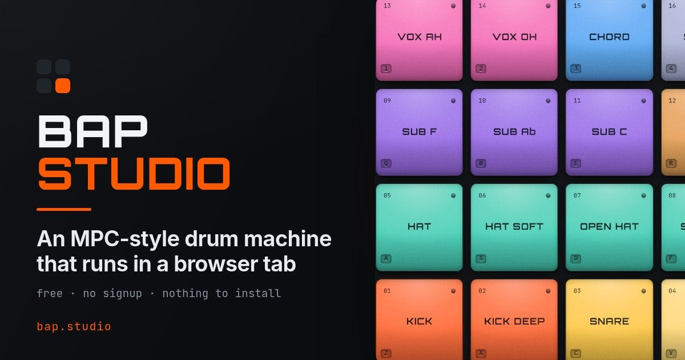
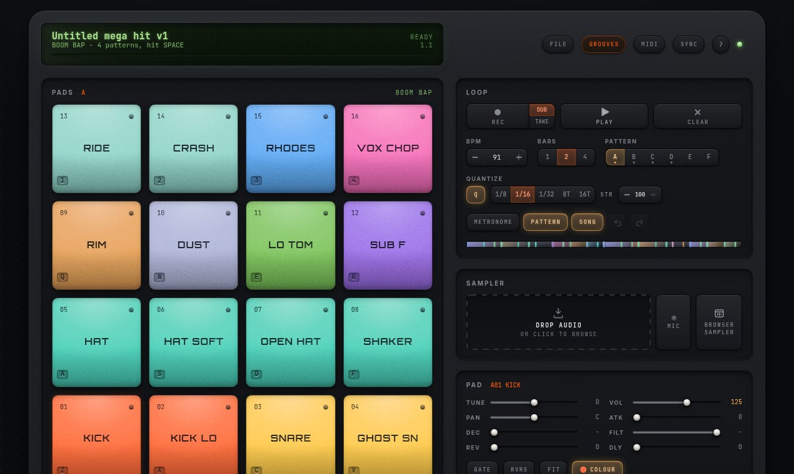
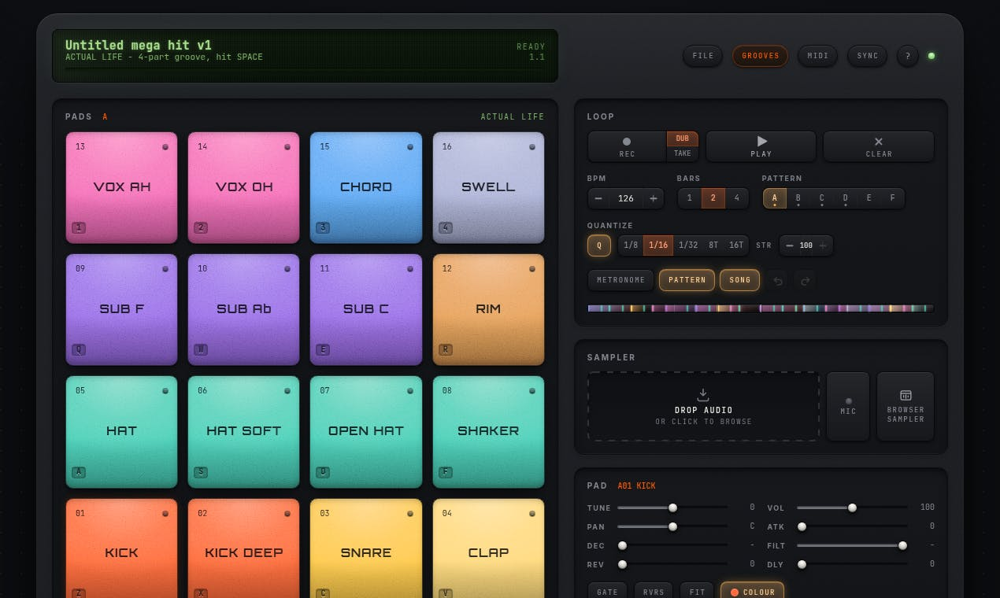

---

## 22. [AgentOne Desktop](https://www.producthunt.com/products/agentone-desktop)
**Votes**: 72 | **도입 난이도**: 하 | **신뢰도**: 상
**Tagline**: Automate boring work. Extensible and free desktop AI agent.
**서비스 링크**: https://www.producthunt.com/r/CCNN5UY2CHIVDN

**태그**: Automation, Productivity, AI Agent, Desktop App, Agent, AI Tool

### 📌 이 서비스 한눈에 보기
19,000개 이상의 확장 기능을 통해 반복적인 업무를 자동화하는 무료 데스크톱 AI 에이전트

### 🔑 주요 기능
- 19,000개 이상의 내장 확장 기능으로 다양한 앱 및 웹사이트와 손쉽게 통합
- 백그라운드에서 실행되어 사용자가 다른 일을 하는 동안 업무 자동화 수행
- OpenAI 호환 제공자 및 Claude를 지원하여 8,000개 이상의 AI 모델 선택 가능

### 🙋 사용자에게 어떤 점이 좋은가
다양한 업무용 앱(Gmail, GitHub, Canva 등)을 연결하여 반복적인 작업을 자동화함으로써 생산성을 높일 수 있습니다.

### ✅ 지금 바로 써볼 기능
- 자주 사용하는 앱(Gmail, Chrome 등) 확장 기능 연결하기
- 선호하는 AI 모델(OpenAI 또는 Claude) 설정하기
- 백그라운드 실행을 통한 자동화 워크플로우 테스트하기

### ⚠️ 사용 전 확인할 점
- 백그라운드 실행 시 데스크톱 리소스 사용량 확인 필요
- 다양한 확장 기능 사용 시 보안 및 개인정보 접근 권한 검토 필요

### 🧭 확인이 더 필요한 정보
사용자의 데스크톱 환경에 따른 성능 차이와 보안 정책에 대한 구체적인 정보가 필요합니다.

### 📸 스크린샷 및 갤러리

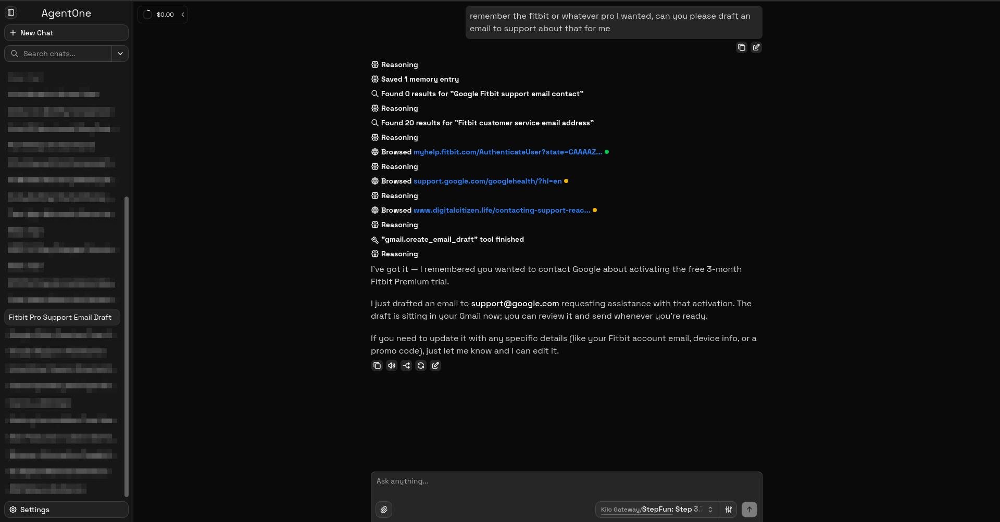
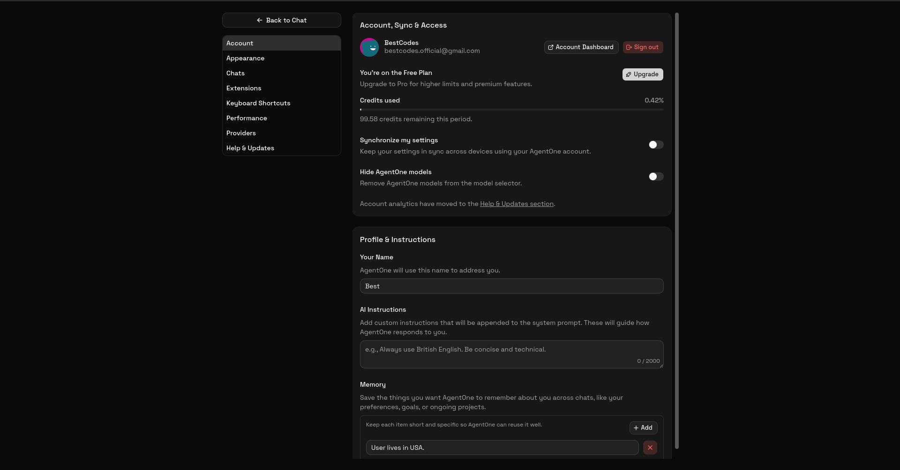

---

## 23. [ShootClip](https://www.producthunt.com/products/shootclip)
**Votes**: 71 | **도입 난이도**: 중 | **신뢰도**: 상
**Tagline**: Edit videos 10x faster with AI
**서비스 링크**: https://www.producthunt.com/r/2NQJGJNZUSFGIF

**태그**: VideoEditing, AI, macOS, Productivity, AI Tool, Video

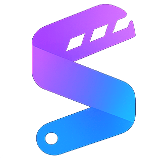

### 📌 이 서비스 한눈에 보기
AI 기술을 통해 영상 편집 속도를 10배 높여주는 macOS 전용 프로급 영상 편집 도구

### 🔑 주요 기능
- macOS 전용의 강력하고 직관적인 프로급 영상 편집 환경 제공
- AI 자동 자막 생성 기능을 통한 편집 시간 단축
- 내장된 MCP 서버를 통해 AI 어시스턴트와 협업하는 차세대 편집 워크플로우

### 🙋 사용자에게 어떤 점이 좋은가
복잡한 편집 과정을 AI가 보조하여 작업 시간을 획기적으로 줄여주며, macOS 환경에서 전문적인 영상 제작을 간편하게 만들어줍니다.

### ✅ 지금 바로 써볼 기능
- AI 자동 자막 생성 기능 테스트
- MCP 서버를 활용한 AI 어시스턴트 협업 기능 확인
- macOS 환경에서의 편집 퍼포먼스 체크

### ⚠️ 사용 전 확인할 점
- macOS 전용 소프트웨어이므로 Windows 등 타 OS 사용 불가
- AI 기능의 편집 정밀도 및 사용자 의도 반영 여부 확인 필요

### 🧭 확인이 더 필요한 정보
상세한 가격 정책 및 지원하는 영상 코덱/해상도 사양에 대한 정보가 부족합니다.

### 📸 스크린샷 및 갤러리
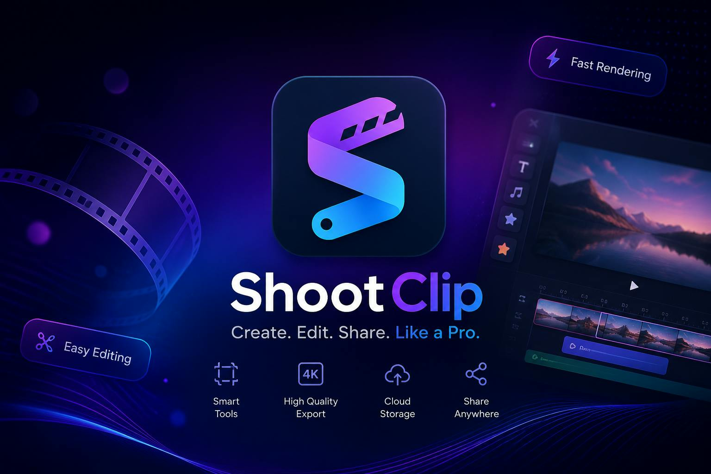
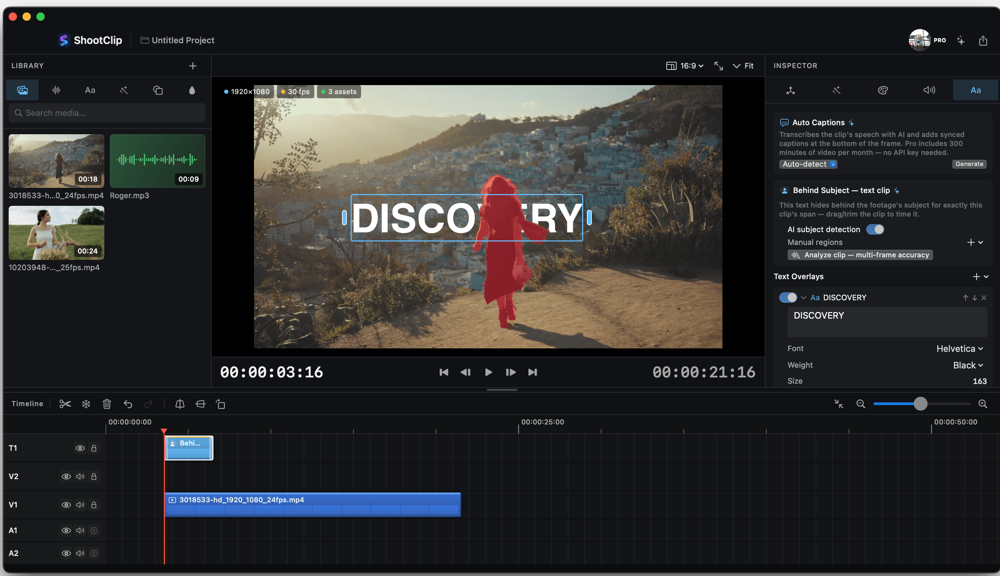
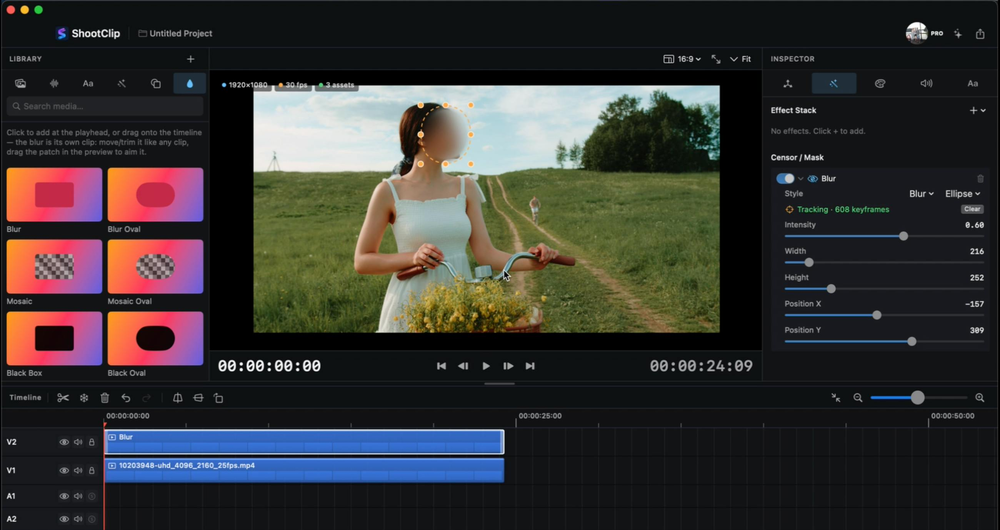

### 🎬 관련 영상
- [🎥 영상 보기](https://ph-files.imgix.net/933810d7-e989-4496-a251-4c15fdff12b7.jpeg?auto=format)

---

## 24. [Orite](https://www.producthunt.com/products/orite)
**Votes**: 70 | **도입 난이도**: 하 | **신뢰도**: 상
**Tagline**: Give your AI Agent money. Not a blank check.
**서비스 링크**: https://www.producthunt.com/r/SQWXFVCFLV4EAC

**태그**: AI, FinTech, Automation, DevTool, Agent, AI Tool

### 📌 이 서비스 한눈에 보기
AI 에이전트 전용 결제 제어 및 예산 관리 솔루션

### 🔑 주요 기능
- 에이전트 전용 지출 한도 설정 및 자동 집행
- 예산 초과 시 자동 차단 또는 승인 대기 기능
- 모든 결제 내역의 투명한 기록 및 설명 가능성 확보

### 🙋 사용자에게 어떤 점이 좋은가
AI 에이전트에게 결제 권한을 부여할 때 발생하는 보안 및 예산 초과 위험을 자동화된 제어 시스템으로 해결할 수 있습니다.

### ✅ 지금 바로 써볼 기능
- 에이전트별 지출 한도 설정하기
- 결제 승인 워크플로우 구성하기
- 결제 로그 및 감사 기능 확인하기

### ⚠️ 사용 전 확인할 점
- 에이전트가 사용하는 결제 수단(카드, 계좌 등)과의 연동 방식 확인 필요
- 실시간 결제 차단 시 발생할 수 있는 서비스 중단 위험 고려

### 🧭 확인이 더 필요한 정보
현재 어떤 결제 게이트웨이나 플랫폼과 직접 연동되는지에 대한 구체적인 기술 사양이 명시되지 않았습니다.

### 📸 스크린샷 및 갤러리

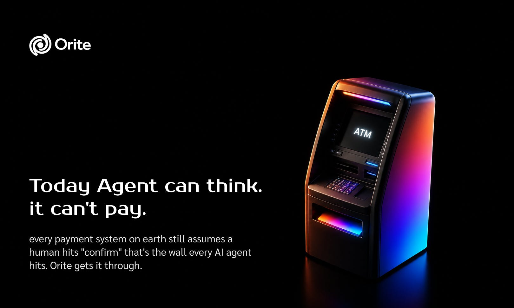

---

## 25. [modelARch](https://www.producthunt.com/products/modelarch)
**Votes**: 27 | **도입 난이도**: 상 | **신뢰도**: 중
**Tagline**: Stop fixing code in Lovable. Build scalable apps instead.
**서비스 링크**: https://www.producthunt.com/r/LX5WDEGLIW4G5M

**태그**: DevTool, NoCode/LowCode, SoftwareArchitecture, Automation

### 📌 이 서비스 한눈에 보기
코드 수정 대신 모델을 진화시켜 확장 가능한 앱을 구축하는 차세대 개발 워크플로우

### 🔑 주요 기능
- 요구사항을 진화하는 모델로 변환하여 신뢰할 수 있는 소스 생성
- 코드 생성 전 애플리케이션 전체를 미리 보고 정교하게 다듬는 기능
- 변경 사항 발생 시 코드를 수정하는 대신 모델을 업데이트하고 재생성하는 방식

### 🙋 사용자에게 어떤 점이 좋은가
코드 스파게티 현상을 방지하고, 요구사항 변경 시 발생하는 유지보수 비용을 획기적으로 줄일 수 있습니다.

### ✅ 지금 바로 써볼 기능
- 요구사항을 모델로 변환하는 워크플로우 테스트
- 모델 기반의 애플리케이션 미리보기 기능 확인
- 모델 업데이트 후 코드 재생성 프로세스 검증

### ⚠️ 사용 전 확인할 점
- 기존 코드 베이스와의 호환성 및 마이그레이션 난이도 확인 필요
- 모델 중심 방식에 대한 개발 팀의 학습 곡선 존재

### 🧭 확인이 더 필요한 정보
현재 제공되는 모델링 도구의 구체적인 기술 스택과 생성되는 코드의 품질 수준을 확인해야 합니다.

### 📸 스크린샷 및 갤러리
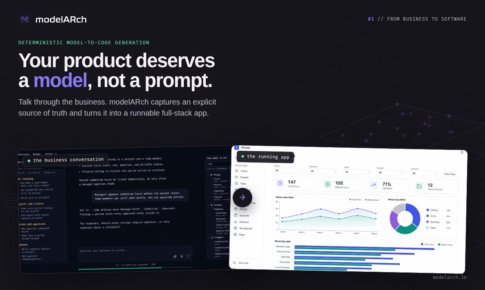
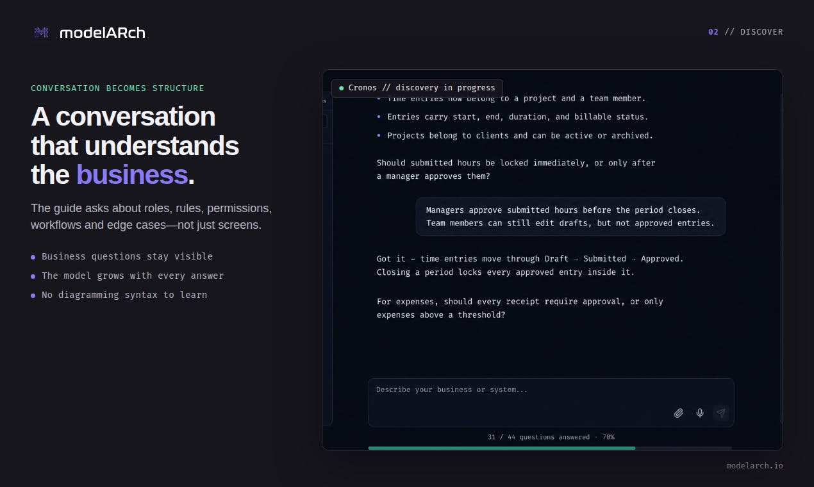
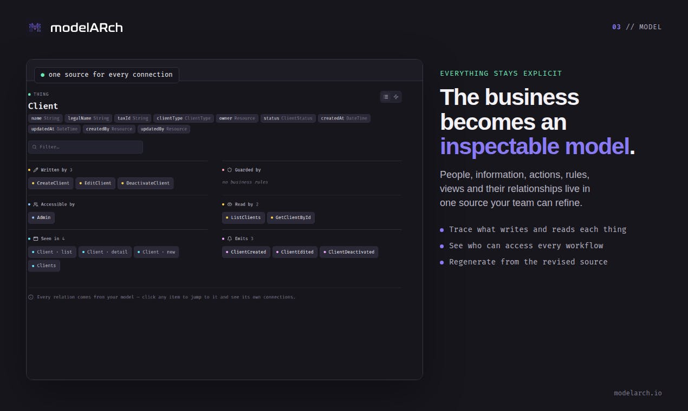

### 🎬 관련 영상
- [🎥 영상 보기](https://ph-files.imgix.net/b2eccddc-610c-4da9-9f65-56c83a387c49.jpeg?auto=format)

---

## 26. [What's my local ai?](https://www.producthunt.com/products/what-s-my-local-ai)
**Votes**: 9 | **도입 난이도**: 하 | **신뢰도**: 상
**Tagline**: Find the best local model for your machine
**서비스 링크**: https://www.producthunt.com/r/7DU5RS3EPSCLEV

**태그**: AI, LocalLLM, Hardware, Productivity, AI Tool

### 📌 이 서비스 한눈에 보기
내 컴퓨터 사양에 딱 맞는 최적의 로컬 AI 모델을 찾아주는 도구

### 🔑 주요 기능
- 브라우저 기반의 하드웨어 자동 감지 기능
- 사용자 기기 사양에 최적화된 모델 추천
- Ollama 및 LM Studio 사용자 맞춤형 가이드 제공

### 🙋 사용자에게 어떤 점이 좋은가
자신의 하드웨어 성능을 정확히 모르는 사용자도 복잡한 사양 비교 없이 즉시 실행 가능한 AI 모델을 찾을 수 있습니다.

### ✅ 지금 바로 써볼 기능
- 브라우저에서 하드웨어 감지 실행하기
- 추천된 모델 리스트 확인하기
- Ollama 또는 LM Studio에 모델 설치하기

### ⚠️ 사용 전 확인할 점
- 브라우저 권한 허용이 필요할 수 있음
- 하드웨어 감지 정확도는 브라우저 환경에 따라 다를 수 있음

### 🧭 확인이 더 필요한 정보
하드웨어 감지 방식이 구체적으로 어떤 지표를 사용하는지 명시되어 있지 않습니다.

### 📸 스크린샷 및 갤러리
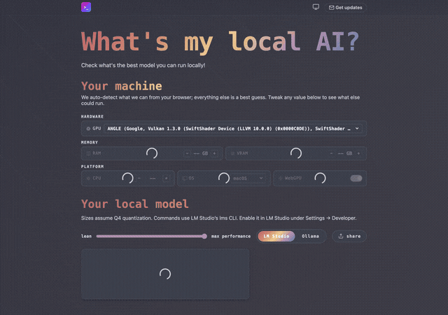
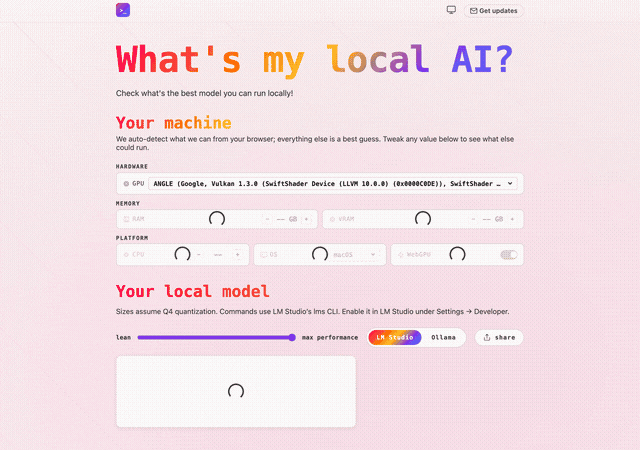

---

## 27. [Vi3ecode](https://www.producthunt.com/products/vi3ecode-2)
**Votes**: 8 | **도입 난이도**: 중 | **신뢰도**: 상
**Tagline**: Orchestrate coding agents in one maintained workspace
**서비스 링크**: https://www.producthunt.com/r/CGEM4XYOYNWHXA

**태그**: DevTool, AI-Agent, Automation, Workflow, Agent, AI Tool

### 📌 이 서비스 한눈에 보기
AI 코딩 에이전트들을 하나의 워크스페이스에서 통합 관리하고 실행할 수 있는 개발 환경

### 🔑 주요 기능
- 의존성 관리 및 리뷰 게이트가 포함된 멀티 에이전트 워크플로우 구축
- 터미널, Git, 워크트리, 프로젝트 메모리가 유지되는 통합 개발 환경 제공
- 모델 할당 및 실시간 상태 모니터링 기능

### 🙋 사용자에게 어떤 점이 좋은가
여러 AI 에이전트를 복잡한 설정 없이 하나의 환경에서 유기적으로 연결하여 코딩 자동화 워크플로우를 구축할 수 있습니다.

### ✅ 지금 바로 써볼 기능
- 멀티 에이전트 워크플로우 설계 및 실행
- 에이전트별 모델 할당 및 의존성 설정
- 통합 워크스페이스 내 Git 및 터미널 연동 테스트

### ⚠️ 사용 전 확인할 점
- 에이전트 간의 복잡한 의존성 설정 시 워크플로우 충돌 가능성
- 로컬 리소스 및 보안 환경에서의 에이전트 실행 안정성 확인 필요

### 🧭 확인이 더 필요한 정보
지원하는 프로그래밍 언어 범위와 외부 AI 모델(LLM)과의 구체적인 연동 방식에 대한 정보가 더 필요합니다.

### 📸 스크린샷 및 갤러리
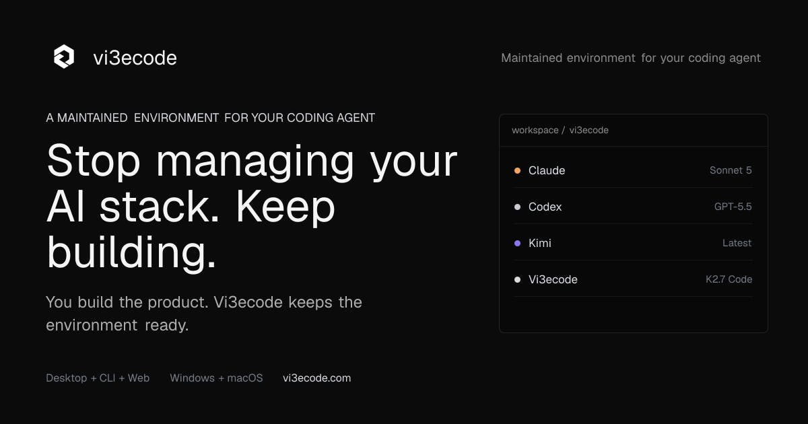
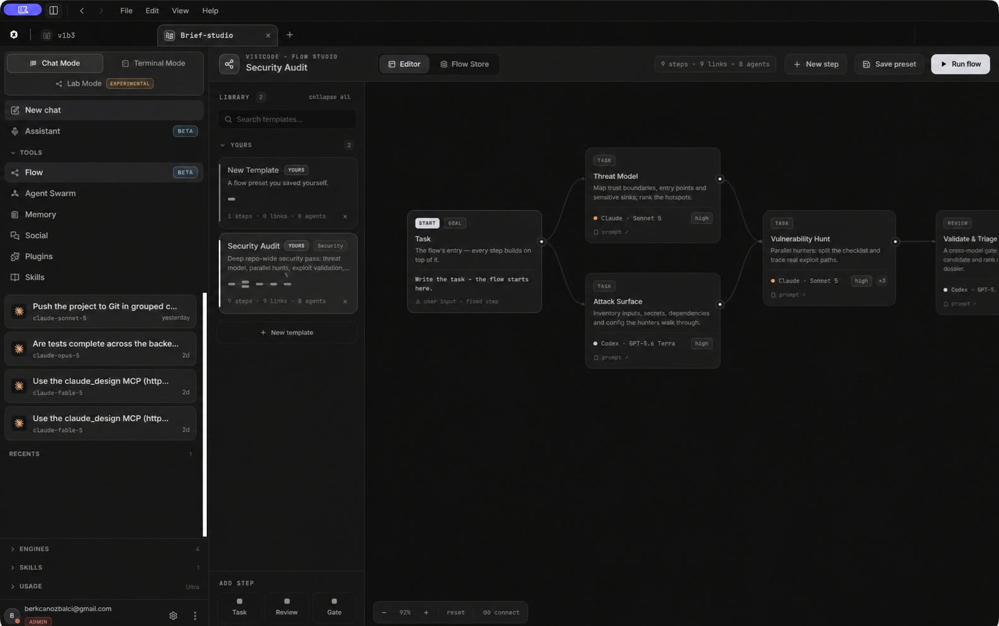
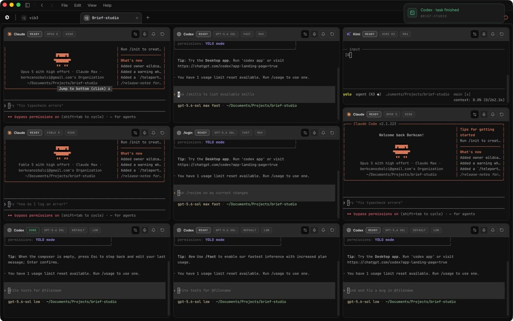

### 🎬 관련 영상
- [🎥 영상 보기](https://ph-files.imgix.net/b9595c89-6997-4091-82d1-dbef4cf35b26.jpeg?auto=format)

---

## 28. [Tenor](https://www.producthunt.com/products/tenor-3)
**Votes**: 7 | **도입 난이도**: 하 | **신뢰도**: 상
**Tagline**: A calm habit tracker built for consistency
**서비스 링크**: https://www.producthunt.com/r/7AURHQRV75ZWJS

**태그**: Productivity, Habit Tracker, Minimalism, Lifestyle, AI Tool, Design

### 📌 이 서비스 한눈에 보기
복잡함 없이 꾸준한 습관 형성을 돕는 미니멀 디자인의 습관 추적기

### 🔑 주요 기능
- 일간부터 연간까지 아우르는 다양한 기간별 뷰 제공
- 데이터 기반의 상세한 진행 상황 인사이트 모니터링
- 개인정보 보호를 우선시하는 깔끔하고 직관적인 사용자 경험

### 🙋 사용자에게 어떤 점이 좋은가
불필요한 기능에 방해받지 않고 오직 습관 형성에만 집중할 수 있는 환경을 제공합니다.

### ✅ 지금 바로 써볼 기능
- 자신만의 일간/주간 루틴 설정하기
- 위젯을 활용해 홈 화면에서 습관 체크하기
- 상세 인사이트를 통해 변화하는 패턴 확인하기

### ⚠️ 사용 전 확인할 점
- 기능이 단순하여 복잡한 목표 관리를 원하는 사용자에게는 부족할 수 있음
- 데이터 동기화 및 백업 방식에 대한 상세 정보 확인 필요

### 🧭 확인이 더 필요한 정보
플랫폼 간 동기화 지원 여부와 상세한 개인정보 보호 정책에 대한 추가 확인이 필요합니다.

### 📸 스크린샷 및 갤러리
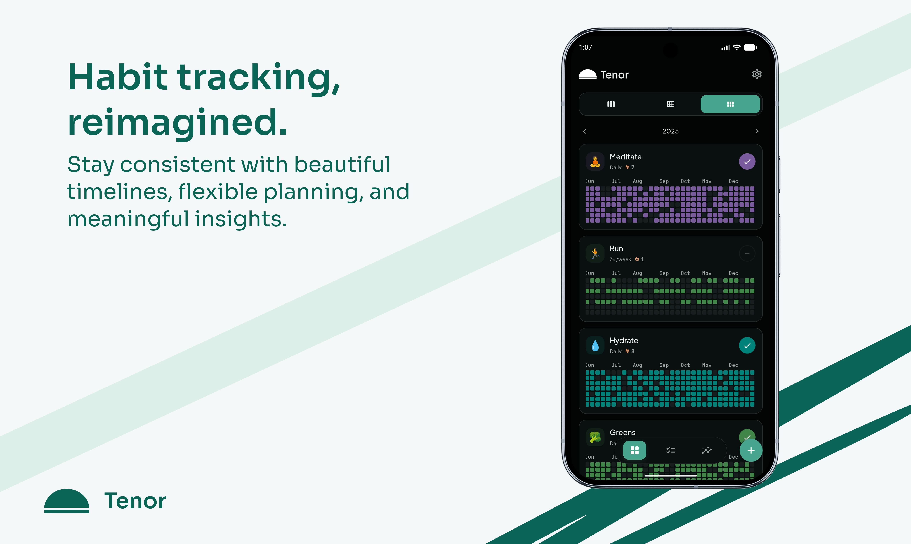
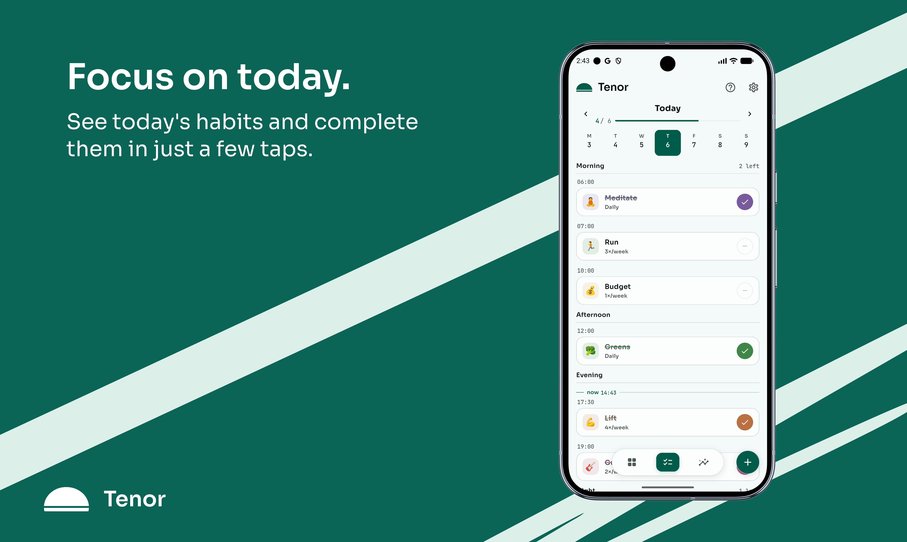
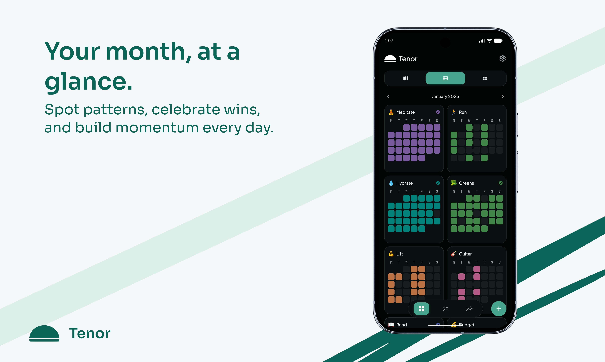

---

## 29. [apptovid.com](https://www.producthunt.com/products/apptovid-com)
**Votes**: 7 | **도입 난이도**: 하 | **신뢰도**: 상
**Tagline**: Turn your app link into high-converting video ads.
**서비스 링크**: https://www.producthunt.com/r/L6GJVKXQMC5QPV

**태그**: Marketing, Automation, VideoGen, AdTech, Video

### 📌 이 서비스 한눈에 보기
앱 스토어 링크만으로 고효율 영상 광고를 자동 생성하는 도구

### 🔑 주요 기능
- 앱 스토어/구글 플레이 링크를 통한 자동 영상 생성
- Meta, TikTok, YouTube 최적화 광고 크리에이티브 제작
- 무제한 변형 및 대량 생성(Batch generate) 기능 지원

### 🙋 사용자에게 어떤 점이 좋은가
앱 마케터가 수동으로 영상을 제작하는 시간을 획기적으로 줄이고, 다양한 플랫폼에 맞는 광고 소재를 빠르게 확보할 수 있습니다.

### ✅ 지금 바로 써볼 기능
- 앱 스토어 링크 입력하여 샘플 영상 생성하기
- 플랫폼별(TikTok, Meta 등) 최적화 레이아웃 확인하기
- 대량 생성 기능을 통한 소재 테스트 준비하기

### ⚠️ 사용 전 확인할 점
- 자동 생성된 영상의 브랜드 가이드라인 일치 여부 확인 필요
- 플랫폼별 광고 규격 및 정책 준수 여부 검토 필요

### 🧭 확인이 더 필요한 정보
제공되는 영상의 편집 자유도와 상세 커스텀 기능 범위는 명시되어 있지 않습니다.

### 📸 스크린샷 및 갤러리
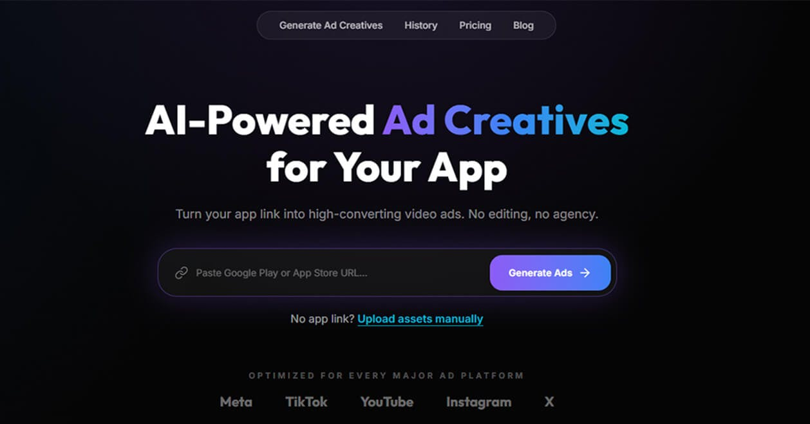

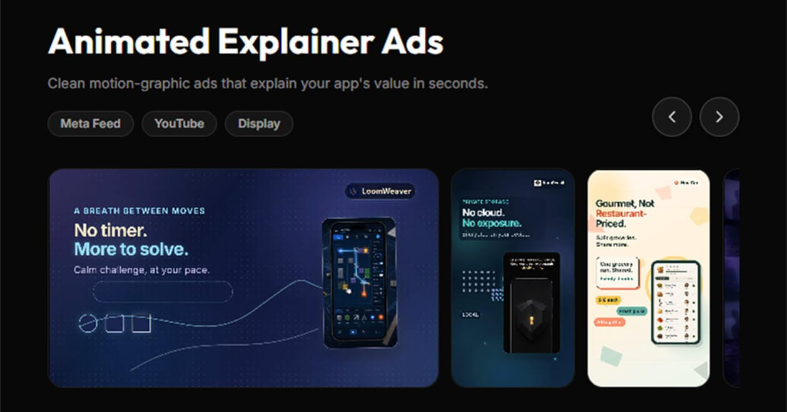

### 🎬 관련 영상
- [🎥 영상 보기](https://ph-files.imgix.net/101b75c5-a6c5-48ab-b7ee-5aadf74e5138.jpeg?auto=format)

---

## 30. [DevBox Cleaner for macOS](https://www.producthunt.com/products/devbox-cleaner-for-macos)
**Votes**: 6 | **도입 난이도**: 하 | **신뢰도**: 상
**Tagline**: Clean Xcode, node_modules & developer junk in seconds.
**서비스 링크**: https://www.producthunt.com/r/YUHUIZ4YSFJE4V

**태그**: DevTool, macOS, Productivity, Cleanup

### 📌 이 서비스 한눈에 보기
Xcode와 node_modules 등 개발용 불필요 파일을 한 번에 정리하는 macOS 전용 클리너

### 🔑 주요 기능
- Xcode, node_modules 등 개발자용 캐시 및 정크 파일 특화 관리
- 시각적인 트리맵(Treemap)을 통한 디스크 사용량 확인
- 터미널 명령어나 Finder 탐색 없이 클릭 한 번으로 수행하는 간편한 정리

### 🙋 사용자에게 어떤 점이 좋은가
개발 중 발생하는 디스크 용량 부족 문제를 직관적인 UI로 빠르게 해결하여 작업 흐름을 유지할 수 있습니다.

### ✅ 지금 바로 써볼 기능
- 트리맵 기능을 통해 어떤 파일이 용량을 차지하는지 확인하기
- Quick Actions를 사용하여 자주 사용하는 개발 캐시 삭제하기
- 7일 무료 체험을 통해 정리 효율성 테스트하기

### ⚠️ 사용 전 확인할 점
- 중요한 프로젝트 파일이나 의존성이 삭제되지 않도록 주의 필요
- 일회성 구매 모델이므로 지속적인 업데이트 정책 확인 필요

### 🧭 확인이 더 필요한 정보
삭제되는 파일의 구체적인 범위와 안전성에 대한 상세 가이드가 필요합니다.

### 📸 스크린샷 및 갤러리
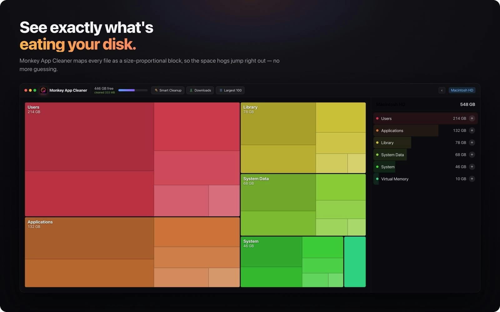
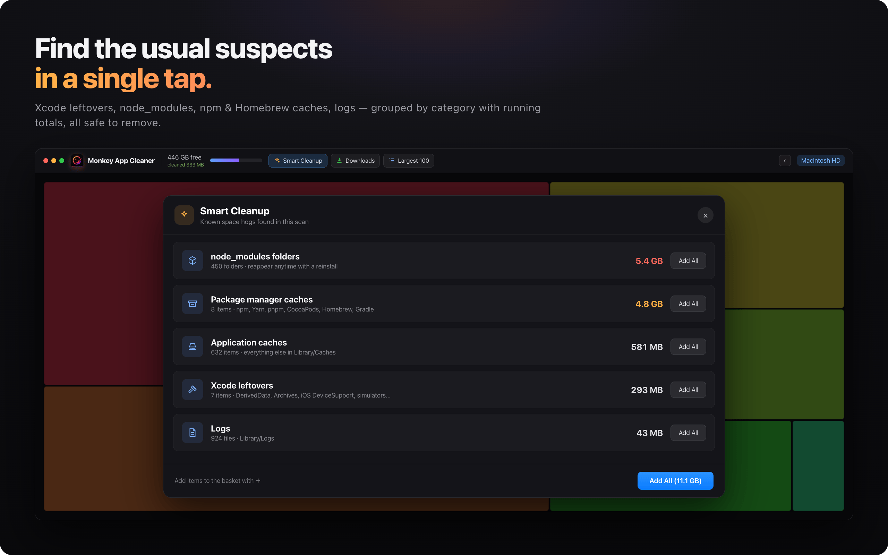
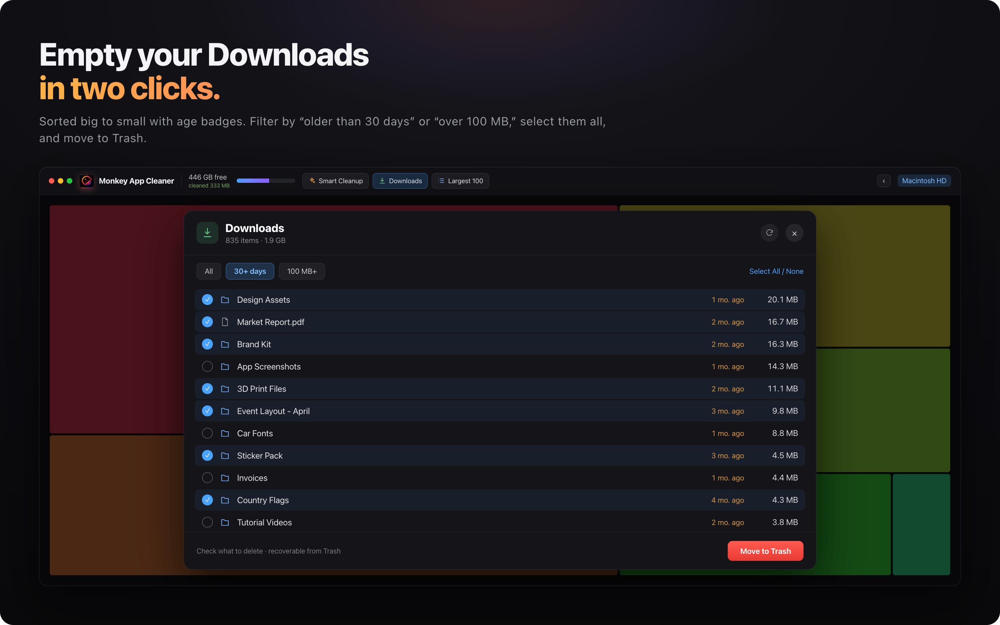

---

