# 🚀 Product Hunt Daily Top 30 (2026-08-09)

## 오늘의 요약
오늘의 제품 트렌드는 AI 에이전트의 효율적인 관리와 보안을 위한 MCP(Model Context Protocol) 기반 도구들이 두드러졌습니다. 또한, 개인의 다양한 페르소나를 관리하는 소셜 서비스와 복잡한 보안 문제를 직관적으로 해결하는 올인원 보안 센터 등 개인화된 디지털 경험과 보안 강화에 대한 요구가 동시에 나타났습니다.

### 오늘의 핵심 포인트
- AI 에이전트 간의 도구 공유와 지식 관리를 위한 MCP 기반의 게이트웨이 및 중앙 관리 플랫폼이 주목받았습니다.
- 데이터 자동 전송 및 보안 관리 등 반복적인 수동 작업을 자동화하여 생산성을 높이는 서비스들이 등장했습니다.
- AI 시각화와 멀티 페르소나 기능을 통해 개인의 신체 변화나 사회적 관계를 새롭게 정의하는 개인 맞춤형 서비스가 눈에 띄었습니다.

**오늘의 태그**: AI 에이전트, MCP, 자동화, 개인정보보호, 디지털 페르소나

## 1. [The GTM Co-Founder](https://www.producthunt.com/products/the-gtm-co-founder)
**Votes**: 286 | **도입 난이도**: 하 | **신뢰도**: 상
**Tagline**: Open-source GTM skills for technical founders
**서비스 링크**: https://www.producthunt.com/r/VPBAUGHOUKAU4E

**태그**: GTM, OpenSource, Startup, Marketing, Product-Led-Growth, AI Tool, Sales

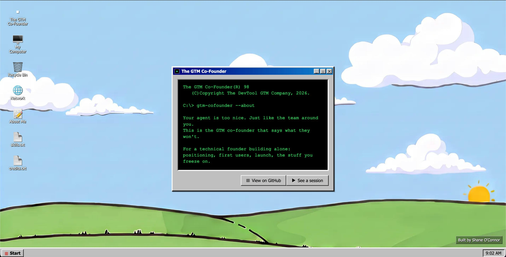

### 📌 이 서비스 한눈에 보기
기술 창업자를 위한 맞춤형 오픈소스 GTM(Go-To-Market) 전략 가이드

### 🔑 주요 기능
- 기술 중심 창업자를 위한 맞춤형 인터뷰 기반 전략 수립
- 제품과 시장을 분석하여 우선순위가 높은 GTM 로드맵 제공
- 포지셔닝, 초기 사용자 확보, 가격 책정 등 실전 플레이북 기반

### 🙋 사용자에게 어떤 점이 좋은가
일반적인 마케팅 조언 대신, 실제 제품의 특성을 반영한 구체적인 시장 진입 단계와 실행 계획을 얻을 수 있습니다.

### ✅ 지금 바로 써볼 기능
- 제품 인터뷰 세션 진행하기
- 제공되는 GTM 로드맵 검토하기
- 초기 50명 사용자 확보 전략 적용하기

### ⚠️ 사용 전 확인할 점
- 사용자의 입력 데이터 품질에 따라 전략의 유효성이 달라질 수 있음
- 실제 실행 단계에서의 운영 책임은 사용자에게 있음

### 🧭 확인이 더 필요한 정보
오픈소스 형태의 구체적인 구현 방식(웹 서비스형 또는 문서형)에 대한 상세 정보가 필요합니다.

### 📸 스크린샷 및 갤러리

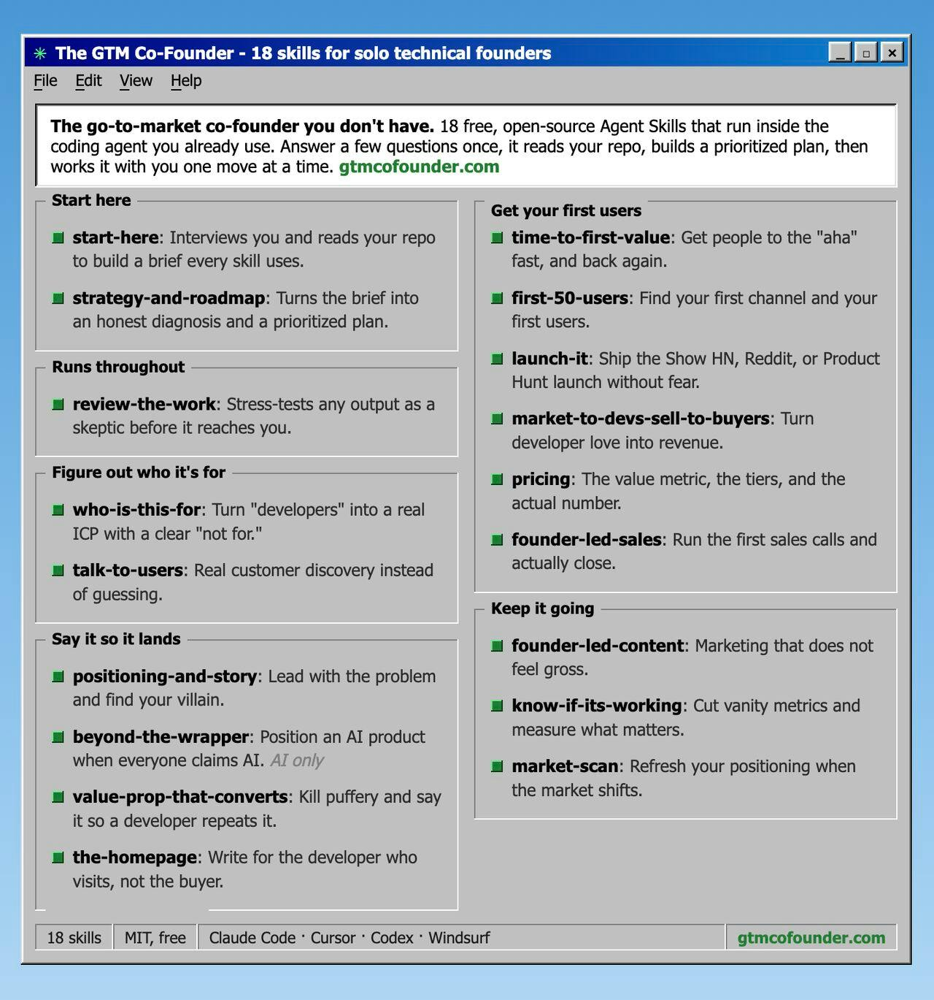
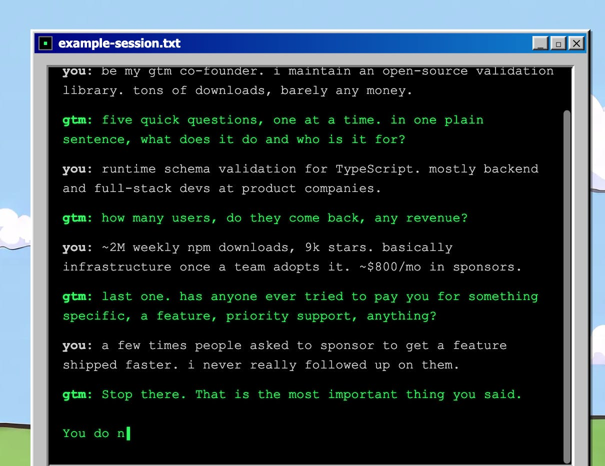

### 🎬 관련 영상
- [🎥 영상 보기](https://ph-files.imgix.net/5929b21f-017c-4423-916b-262618c13694.jpeg?auto=format)

---

## 2. [AstraPixels](https://www.producthunt.com/products/astrapixels)
**Votes**: 216 | **도입 난이도**: 하 | **신뢰도**: 상
**Tagline**: ​​A pixel-art solar system at its real current positions.​
**서비스 링크**: https://www.producthunt.com/r/6BOFNHUVVMY6Q6

**태그**: Space, Visualization, Interactive, Art, AI Tool, Design, API

### 📌 이 서비스 한눈에 보기
실시간 궤도 데이터를 반영한 예술적인 픽셀 아트 태양계 지도

### 🔑 주요 기능
- 실제 궤도 요소를 계산하여 구현한 실시간 태양계 위치
- 태양부터 카이퍼 벨트까지 아우르는 171개의 천체 탐색
- 특정 소행성을 소유하고 이름을 지정할 수 있는 디지털 소유권 기능

### 🙋 사용자에게 어떤 점이 좋은가
정교한 천체 위치 데이터를 시각적으로 즐기며, 자신만의 소행물을 소유하는 색다른 경험을 제공합니다.

### ✅ 지금 바로 써볼 기능
- 태양계의 실시간 움직임 관찰하기
- 171개 카탈로그 천체 정보 탐색하기
- 소행지 소유 및 이름 지정 기능 확인하기

### ⚠️ 사용 전 확인할 점
- 소행지 명명은 AstraPixels 내에서만 유효하며 국제천문연맹(IAU) 공식 명칭이 아님
- 실제 천체 관측용이 아닌 시각적/엔터테인먼트 목적의 서비스임

### 🧭 확인이 더 필요한 정보
소행지 소유권의 법적 효력 및 영구적 유지 조건에 대한 상세 약관 확인이 필요합니다.

### 📸 스크린샷 및 갤러리
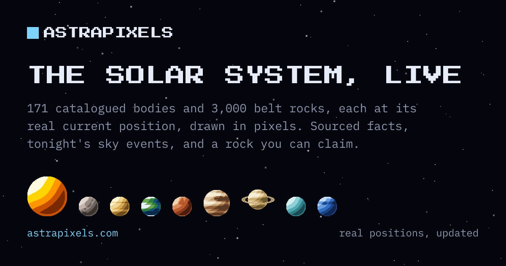
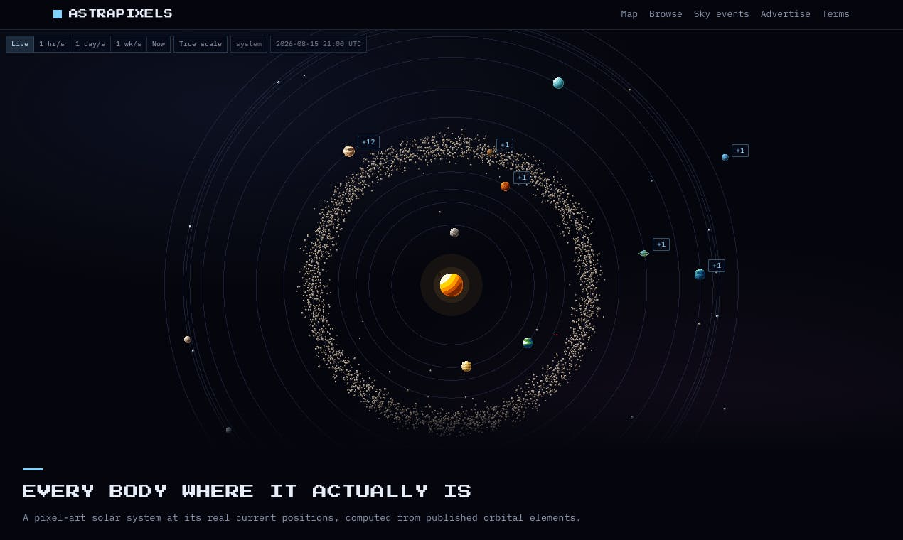
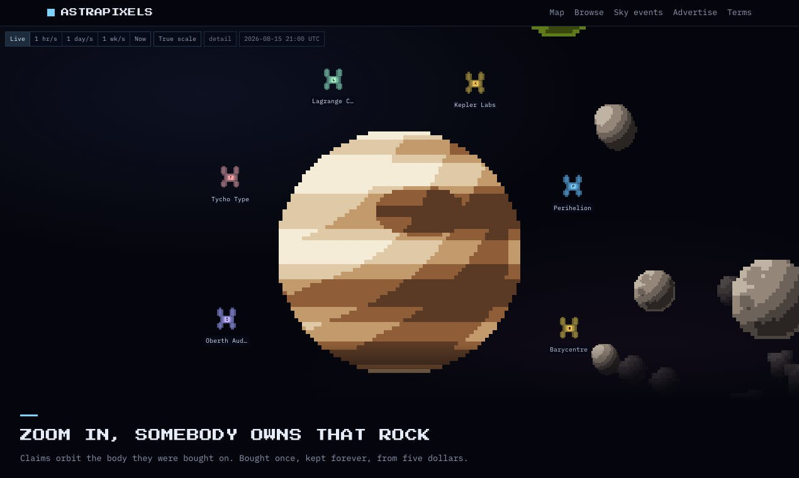

---

## 3. [Hexis](https://www.producthunt.com/products/bevel-4)
**Votes**: 150 | **도입 난이도**: 중 | **신뢰도**: 상
**Tagline**: Git-backed skills, tools & context for AI agents
**서비스 링크**: https://www.producthunt.com/r/ATYYXLA223CYM3

**태그**: AI, DevOps, KnowledgeManagement, Automation, Agent, AI Tool

### 📌 이 서비스 한눈에 보기
Git 기반의 버전 관리와 권한 제어를 통해 기업용 AI 에이전트용 스킬과 지식을 중앙 관리하는 플랫폼

### 🔑 주요 기능
- Git의 핵심 기능(버전 관리, PR)을 활용한 AI 스킬 및 도구 관리
- 중앙 집중식 관리와 세밀한 접근 제어를 통한 기업용 지식 저장소 역할
- MCP(Model Context Protocol)를 통한 다양한 AI 에이전트와의 호환성

### 🙋 사용자에게 어떤 점이 좋은가
기업 내 흩어진 AI 관련 도구와 지식을 Git처럼 체계적으로 관리하고, 보안이 유지된 상태에서 모든 AI 에이전트가 이를 즉시 활용할 수 있게 해줍니다.

### ✅ 지금 바로 써볼 기능
- 기존의 AI 스킬/도구들을 Hexis로 마이그레이션하기
- 팀별/에이전트별 접근 권한 설정 및 거버넌스 체계 구축하기
- MCP를 통해 현재 사용 중인 AI 에이전트에 Hexis 연결하기

### ⚠️ 사용 전 확인할 점
- Git 워크플로우에 익숙하지 않은 비개발자 사용자를 위한 UX 적응 필요성
- 기업 내부 데이터 보안 정책과 Hexis의 접근 제어 방식 간의 정합성 검토

### 🧭 확인이 더 필요한 정보
현재 제공되는 구체적인 UI/UX의 편의성과 다양한 AI 에이전트 프레임워크와의 호환성 수준을 확인해야 합니다.

### 📸 스크린샷 및 갤러리
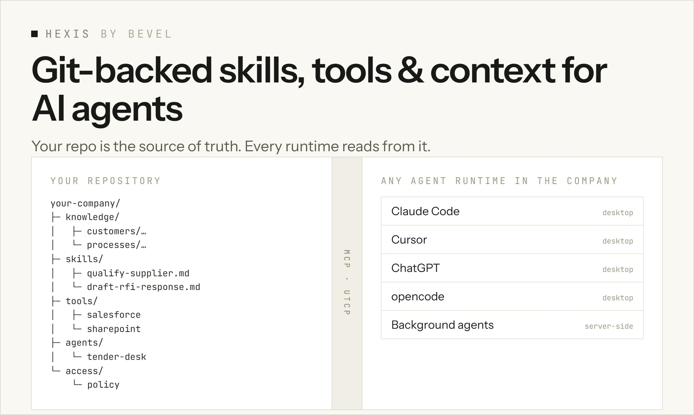
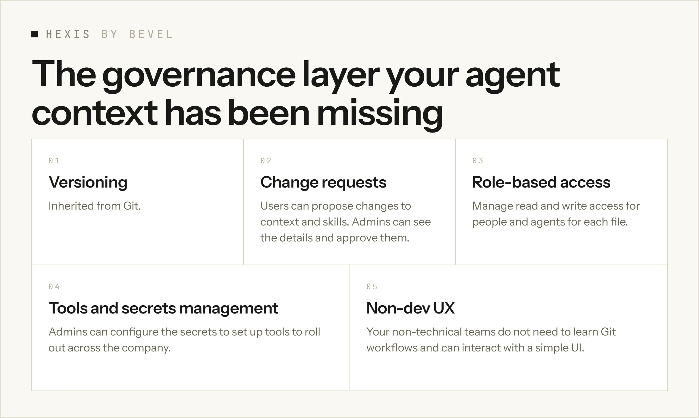

### 🎬 관련 영상
- [🎥 영상 보기](https://ph-files.imgix.net/3193c21d-9226-42f8-a4ec-b9ff6e51f699.jpeg?auto=format)

---

## 4. [Basedash Subscriptions](https://www.producthunt.com/products/basedash)
**Votes**: 134 | **도입 난이도**: 하 | **신뢰도**: 상
**Tagline**: Subscribe to any dashboard. Delivered on schedule.
**서비스 링크**: https://www.producthunt.com/r/AWQTOUN4LM6VG2
**재등장**: 최근 7일 내 재등장 (마지막 등장 6일 전)

**태그**: Automation, Analytics, Productivity, Data, AI Tool, Email

### 📌 이 서비스 한눈에 보기
원하는 대시보드 데이터를 정해진 일정에 맞춰 이메일이나 슬랙으로 자동 전송하는 서비스

### 🔑 주요 기능
- 대시보드 및 차트 스냅샷을 이메일 또는 슬랙으로 자동 배달
- 일간, 주간, 월간 등 사용자 정의 스케줄 설정 가능
- 수동 내보내기나 스크린샷 작업 없이 최신 데이터 자동 공유

### 🙋 사용자에게 어떤 점이 좋은가
매번 대시보드에 접속해 데이터를 확인하거나 팀원들에게 공유할 필요 없이, 필요한 시점에 최신 지표를 자동으로 받아볼 수 있습니다.

### ✅ 지금 바로 써볼 기능
- 주요 지표가 포함된 대시보드 구독 설정하기
- 수신 대상(팀원 또는 채널) 지정하기
- 원하는 배달 주기(매주 월요일 등) 설정하기

### ⚠️ 사용 전 확인할 점
- 실시간 데이터가 아닌 스케줄링된 시점의 스냅샷임을 인지해야 함
- 기존 Basedash 대시보드 환경이 구축되어 있어야 사용 가능

### 🧭 확인이 더 필요한 정보
상세한 배달 형식(이미지, PDF, 링크 등)과 데이터 보안 정책에 대한 구체적인 정보가 필요합니다.

### 📸 스크린샷 및 갤러리
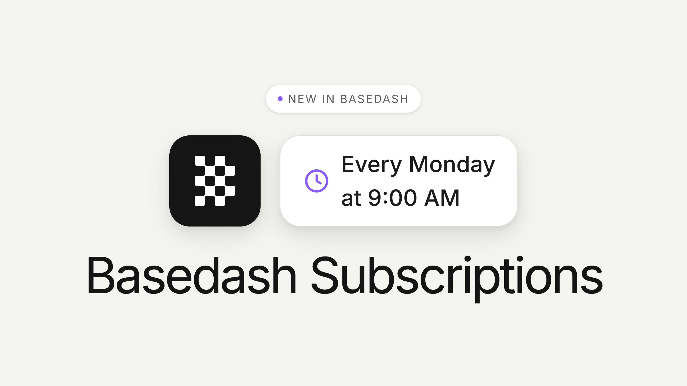
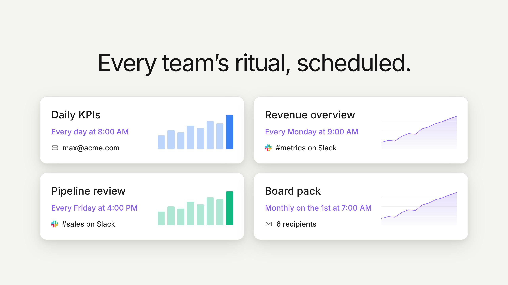
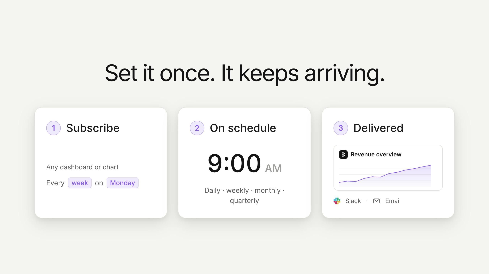

### 🎬 관련 영상
- [🎥 영상 보기](https://ph-files.imgix.net/5036f64e-9d05-46e9-b5ce-f7f5c261e9c0.jpeg?auto=format)

---

## 5. [Toolport](https://www.producthunt.com/products/conduit-12)
**Votes**: 125 | **도입 난이도**: 중 | **신뢰도**: 상
**Tagline**: Every tool, one port. One MCP setup for all your AI agents
**서비스 링크**: https://www.producthunt.com/r/5CMO6NALORXKZD

**태그**: DevTool, AI, Automation, OpenSource, Agent, AI Tool

### 📌 이 서비스 한눈에 보기
모든 AI 에이전트가 공유하는 단 하나의 로컬 MCP 게이트웨이

### 🔑 주요 기능
- 한 번의 설정으로 Claude, Cursor, VS Code 등 다양한 AI 에이전트와 도구 공유
- 메타 도구 방식을 통해 토큰 사용량을 최대 91% 절감
- OS 키체인을 활용한 보안 및 파괴적 작업에 대한 승인 절차 제공

### 🙋 사용자에게 어떤 점이 좋은가
여러 AI 도구를 사용할 때 매번 설정을 반복할 필요 없이, 하나의 게이트웨이로 효율적인 워크플로우를 구축하고 토큰 비용을 획기적으로 줄일 수 있습니다.

### ✅ 지금 바로 써볼 기능
- 로컬 환경에 MCP 서버 설정하기
- 사용 중인 AI 에이전트(Claude, Cursor 등)에 Toolport 연결하기
- 메타 도구 기능을 통한 토큰 절감 효과 테스트하기

### ⚠️ 사용 전 확인할 점
- 로컬 환경의 보안 설정 및 OS 키체인 연동 확인 필요
- 다양한 클라이언트(29개 이상)와의 호환성 검증 필요

### 🧭 확인이 더 필요한 정보
제시된 91% 토큰 절감 수치는 특정 벤치마크 결과이므로 사용자 환경에 따라 다를 수 있습니다.

### 📸 스크린샷 및 갤러리
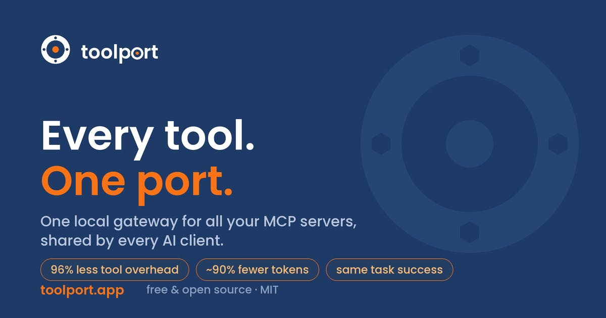
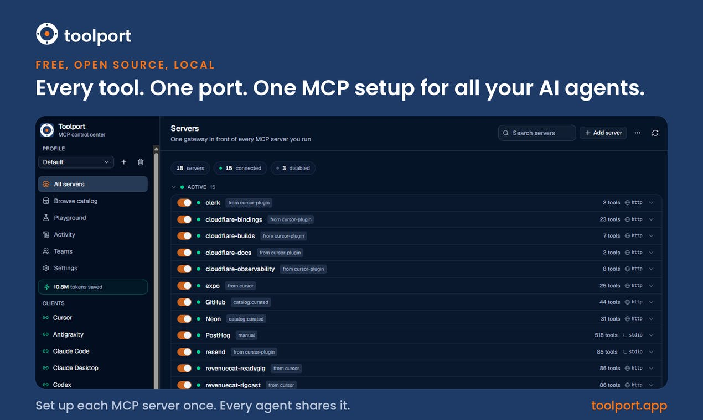
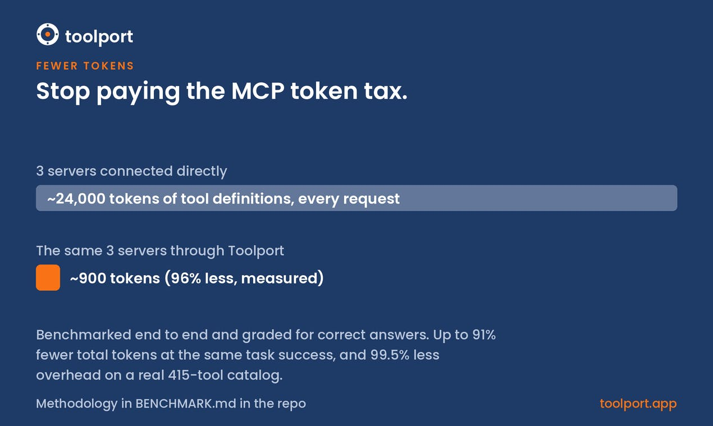

### 🎬 관련 영상
- [🎥 영상 보기](https://ph-files.imgix.net/342521e8-1165-401d-b281-30110db4f212.jpeg?auto=format)

---

## 6. [Pocket Fit](https://www.producthunt.com/products/pocket-fit)
**Votes**: 20 | **도입 난이도**: 하 | **신뢰도**: 상
**Tagline**: AI Workout & Food
**서비스 링크**: https://www.producthunt.com/r/AXPIUPDBWJ3CA4

**태그**: Fitness, AI, Health, Lifestyle, AI Tool

### 📌 이 서비스 한눈에 보기
AI 시각화 기술로 운동 동기를 부여하는 개인 맞춤형 피트니스 트래커

### 🔑 주요 기능
- AI 기반 미래 신체 변화 시뮬레이션 및 3D 아바타 시각화
- 사진 촬영을 통한 간편한 식단 기록 및 자동화된 웨이트 트레이닝 프로그램
- 근육 발달 추적, 기분 기록, 커뮤니티 요소를 결합한 습관 형성 도구

### 🙋 사용자에게 어떤 점이 좋은가
눈에 보이지 않는 신체 변화를 AI 시각화로 보여주어 운동 중도 포기를 방지하고, 식단과 운동 기록의 번거로움을 최소화합니다.

### ✅ 지금 바로 써볼 기능
- AI 미래 모습 시뮬레이션 기능 체험하기
- 사진으로 식단 기록 기능 테스트하기
- 개인 맞춤형 웨이트 루틴 설정하기

### ⚠️ 사용 전 확인할 점
- AI 시뮬레이션 결과는 실제 신체 변화와 다를 수 있음
- 정확한 식단 분석을 위해 고품질의 음식 사진이 필요할 수 있음

### 🧭 확인이 더 필요한 정보
AI 시뮬레이션의 정확도와 식단 기록 기능의 상세 분석 수준에 대한 확인이 필요합니다.

### 📸 스크린샷 및 갤러리
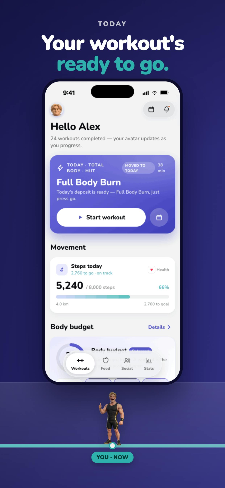
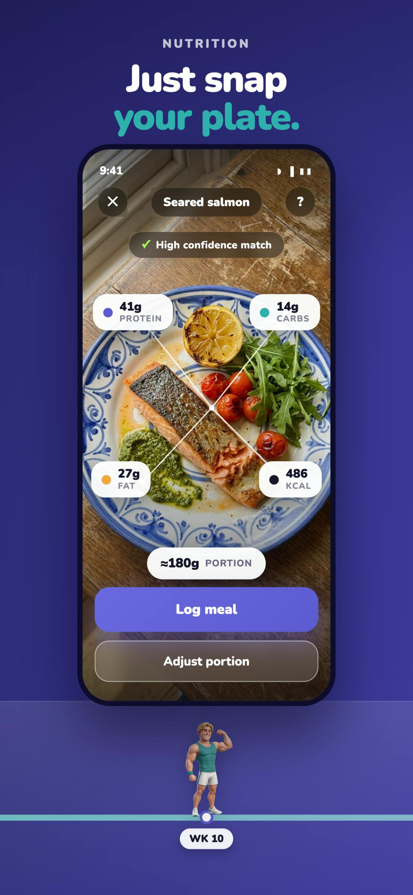
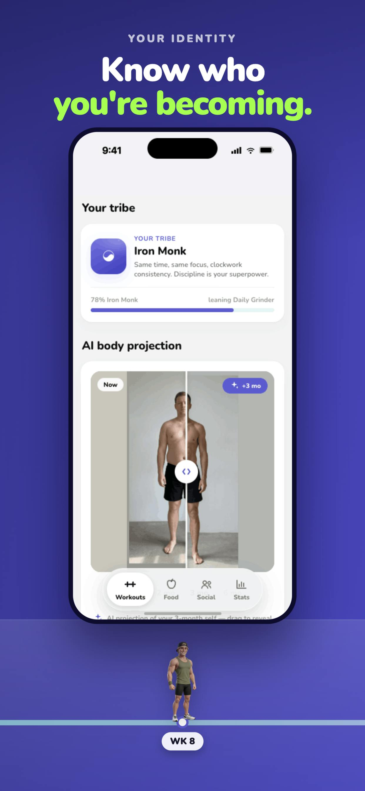

---

## 7. [Otiumz](https://www.producthunt.com/products/otiumz)
**Votes**: 14 | **도입 난이도**: 하 | **신뢰도**: 상
**Tagline**: AI-powered social app for every side of you
**서비스 링크**: https://www.producthunt.com/r/H6S6BDBHQWEM7M

**태그**: Social, AI, Personalization, Multi-Profile, AI Tool, Chat, Video

### 📌 이 서비스 한눈에 보기
다양한 페르소나를 가진 AI 디지털 자아를 통해 다면적인 소셜 관계를 형성하는 AI 소셜 앱

### 🔑 주요 기능
- 하나의 계정 아래 여러 개의 프로필(서브 계정) 생성 가능
- 공개적 소통 또는 프라이빗한 서클 내에서의 자유로운 연결
- 사용자 맞춤형 AI 캐릭터(Digital Selves)를 통한 대화 및 자동 응답 기능

### 🙋 사용자에게 어떤 점이 좋은가
단일한 정체성을 강요받는 기존 SNS와 달리, 상황에 맞는 여러 페르소나를 관리하며 더 자유롭고 개인화된 소셜 경험을 누릴 수 있습니다.

### ✅ 지금 바로 써볼 기능
- 자신의 다양한 성향을 반영한 서브 프로필 생성하기
- 나를 대신해 대화할 AI 캐릭터(Digital Selves) 학습시키기
- 프라이빗 서클을 만들어 지인들과 소통하기

### ⚠️ 사용 전 확인할 점
- AI 자동 응답 기능 사용 시 의도치 않은 답변이 나갈 수 있음
- 여러 프로필 관리로 인한 개인정보 및 계정 보안 관리 필요

### 🧭 확인이 더 필요한 정보
AI 캐릭터의 학습 데이터 범위와 개인정보 보호 정책에 대한 상세 확인이 필요합니다.

### 📸 스크린샷 및 갤러리
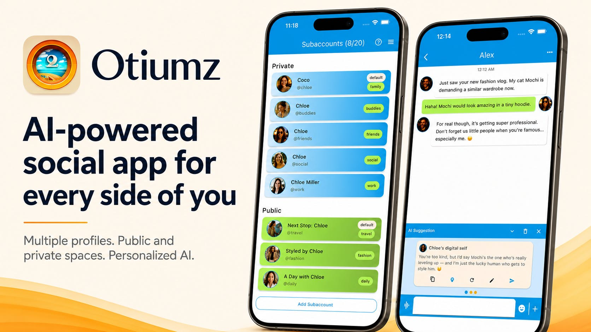
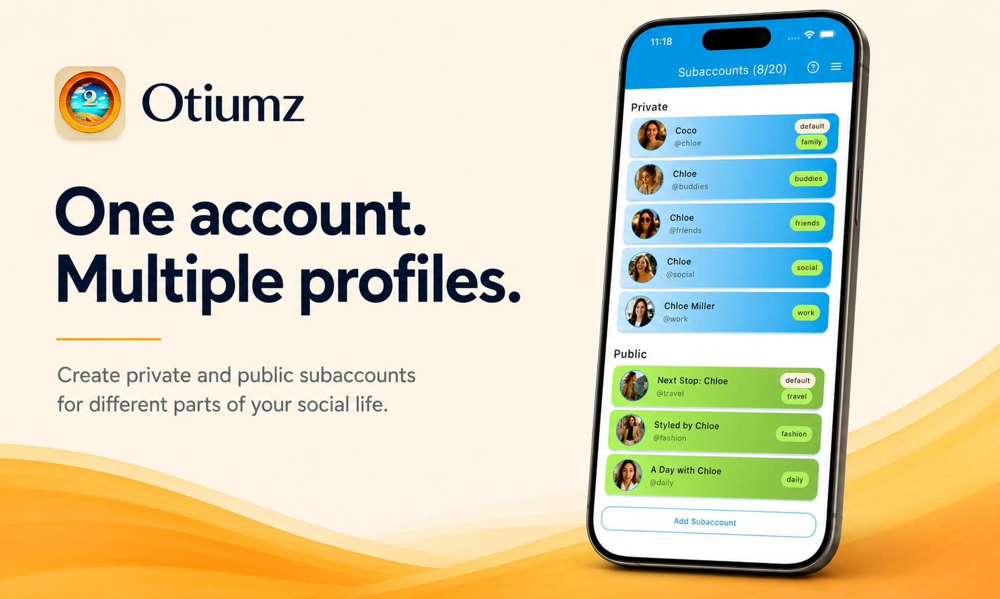
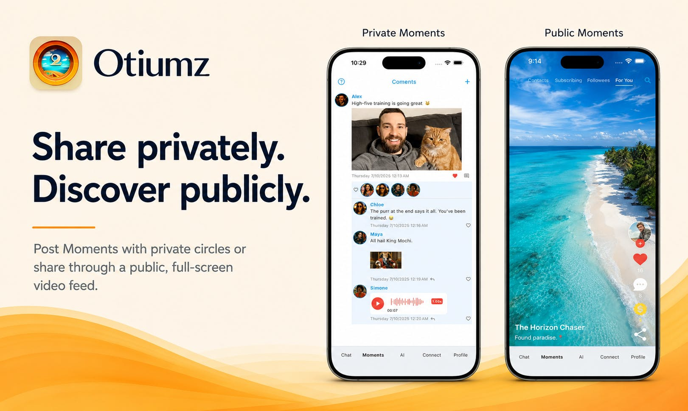

### 🎬 관련 영상
- [🎥 영상 보기](https://ph-files.imgix.net/ba21e48a-9807-437b-8bb0-c80ba2ade647.jpeg?auto=format)

---

## 8. [Patch — Your Security Center](https://www.producthunt.com/products/patch-your-security-center)
**Votes**: 9 | **도입 난이도**: 하 | **신뢰도**: 상
**Tagline**: Lock down your digital life and stay on top of it.
**서비스 링크**: https://www.producthunt.com/r/T2SLBACO5KLGWL

**태그**: Security, Privacy, Mac, iOS, PersonalFinance, Design

### 📌 이 서비스 한눈에 보기
복잡한 보안 도구 없이 한 곳에서 개인정보와 계정을 관리하는 올인원 보안 센터

### 🔑 주요 기능
- 스캠 탐지, 유출/중복 비밀번호 확인, 신용 동결 및 데이터 브로커 삭제 기능 제공
- 보안 전문가(Advisor)가 문제 해결 방법과 질문에 대한 답변 제공
- 계정 생성 불필요 및 서버에 데이터를 저장하지 않는 프라이버시 중심 설계

### 🙋 사용자에게 어떤 점이 좋은가
여러 보안 도구를 번거롭게 오갈 필요 없이, Mac과 iPhone에서 개인정보 유출과 계정 보안을 직관적으로 관리할 수 있습니다.

### ✅ 지금 바로 써볼 기능
- 유출된 비밀번호 및 중복 계정 확인하기
- 데이터 브로커 사이트에서의 정보 삭제 요청하기
- 보안 어드바이저를 통한 보안 상태 점검하기

### ⚠️ 사용 전 확인할 점
- Mac 및 iPhone 환경에 최적화되어 있어 타 OS 사용자는 제한적일 수 있음
- 서버에 데이터를 저장하지 않으므로 기기 분실 시 데이터 복구 방식 확인 필요

### 🧭 확인이 더 필요한 정보
구체적인 서비스 요금 체계와 상세 기능별 비용 발생 여부는 명시되지 않았습니다.

### 📸 스크린샷 및 갤러리
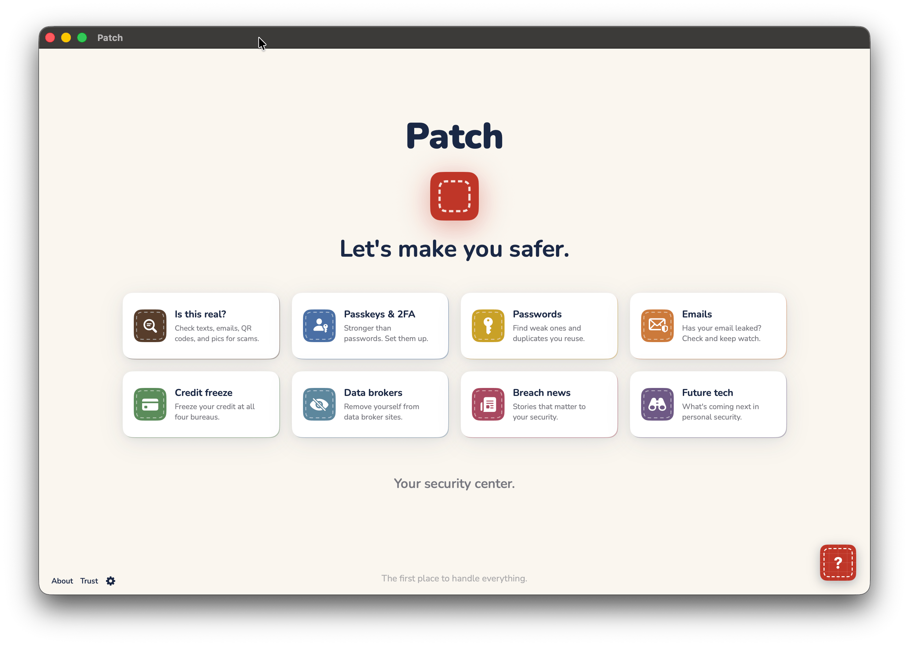
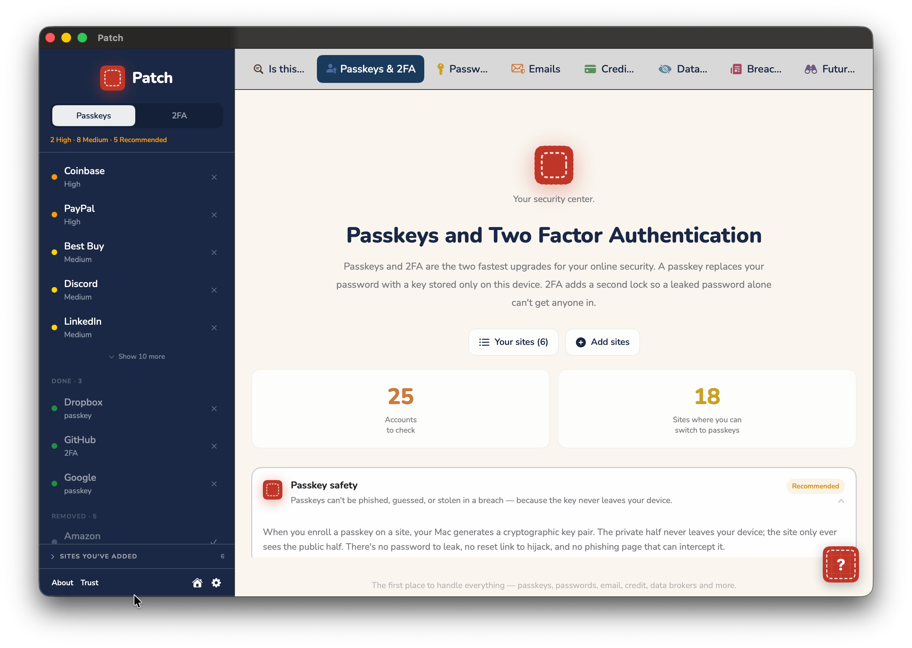
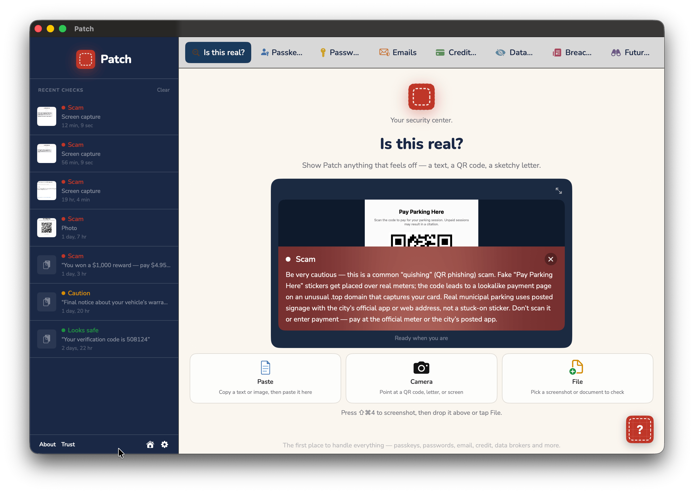

### 🎬 관련 영상
- [🎥 영상 보기](https://ph-files.imgix.net/eeae2dfb-29a9-4eaf-86e1-94732b4efcce.jpeg?auto=format)

---

## 9. [Pesterly](https://www.producthunt.com/products/pesterly)
**Votes**: 8 | **도입 난이도**: 하 | **신뢰도**: 상
**Tagline**: Automated client document collection that follows up for you
**서비스 링크**: https://www.producthunt.com/r/YMMYQKBXHZMJEK

**태그**: Automation, Productivity, GoogleWorkspace, Workflow, AI Tool, Email

### 📌 이 서비스 한눈에 보기
구글 워크스페이스 기반의 자동화된 클라이언트 문서 수집 도구

### 🔑 주요 기능
- 체크리스트를 기반으로 한 자동 이메일 요청 발송
- 미제출 서류에 대한 정기적인 자동 후속 조치(Chasing)
- 업로드된 파일을 구글 드라이브 폴더에 자동 저장

### 🙋 사용자에게 어떤 점이 좋은가
수동으로 서류를 요청하고 확인하는 번거로움을 줄여주며, 모든 문서가 사용자의 구글 드라이브에 체계적으로 정리됩니다.

### ✅ 지금 바로 써볼 기능
- 필요한 문서 체크리스트 작성하기
- 자동 후속 일정 설정하기
- 구글 드라이브 저장 폴더 연결하기

### ⚠️ 사용 전 확인할 점
- 구글 워크스페이스 환경에 의존적임
- 이메일 발송 권한 및 보안 설정 확인 필요

### 🧭 확인이 더 필요한 정보
구글 워크스페이스 외의 다른 협업 도구와의 연동 가능 여부는 명시되지 않았습니다.

### 📸 스크린샷 및 갤러리
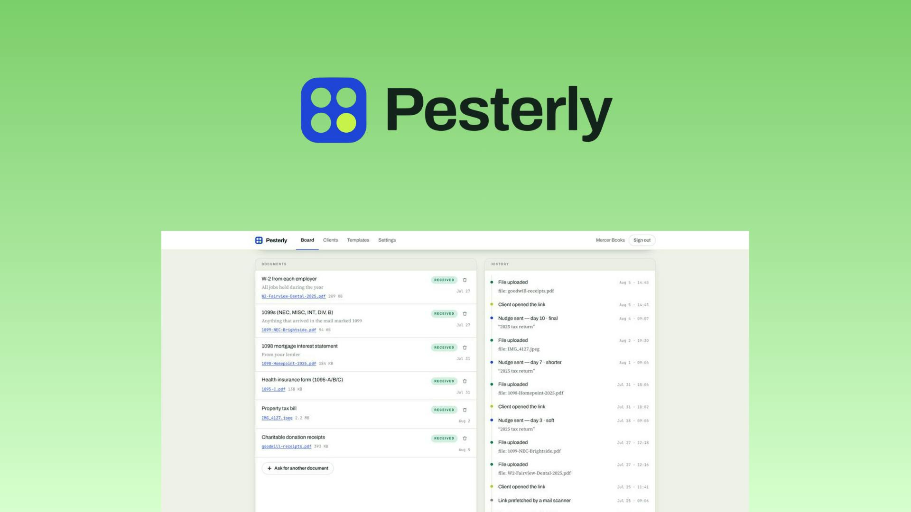
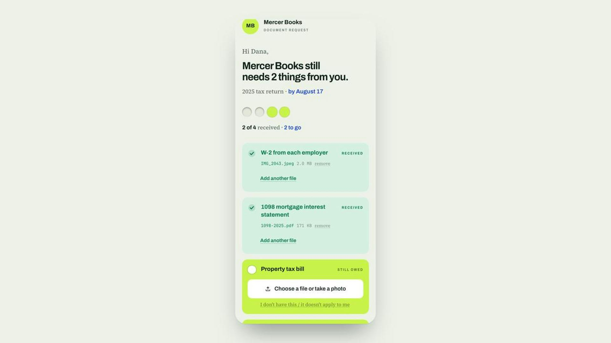
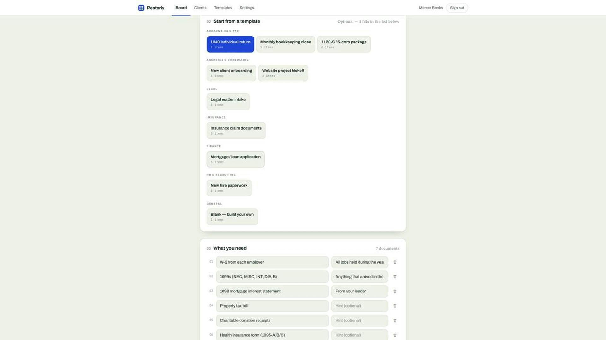

### 🎬 관련 영상
- [🎥 영상 보기](https://ph-files.imgix.net/9f6fd0bd-ae72-47e1-adb3-f35abf3d72f4.jpeg?auto=format)

---

## 10. [Rendemo](https://www.producthunt.com/products/rendemo)
**Votes**: 7 | **도입 난이도**: 하 | **신뢰도**: 상
**Tagline**: Turn any web app into a clickable demo in minutes
**서비스 링크**: https://www.producthunt.com/r/TUCLPHCY5JL65L

**태그**: NoCode, ProductDemo, Automation, AI-Agent, Agent

### 📌 이 서비스 한눈에 보기
단 한 번의 화면 녹화로 실제 웹 앱처럼 작동하는 클릭 가능한 데모를 만드는 도구

### 🔑 주요 기능
- 스크린샷이 아닌 실제 HTML을 캡처하여 실제 앱처럼 동작하는 인터랙티브 데모 생성
- Chrome 확장 프로그램을 통한 간편한 녹화 및 임베드 가능한 데코/MP4/가이드 투어 제공
- MCP 서버 지원으로 IDE 에이전트가 캡션 작성, 브랜딩, 카메라 제어 등을 자동화

### 🙋 사용자에게 어떤 점이 좋은가
제품의 실제 동작을 스크린샷 방식보다 훨씬 생생하게 전달할 수 있으며, AI 에이전트를 통해 데모 제작 및 관리 시간을 획기적으로 단축할 수 있습니다.

### ✅ 지금 바로 써볼 기능
- Chrome 확장 프로그램을 설치하여 제품 화면 녹화하기
- 생성된 데모를 웹사이트에 스크립트 태그로 임베드하기
- MCP 서버를 연결하여 AI 에이전트로 데모 편집 및 배포 자동화하기

### ⚠️ 사용 전 확인할 점
- 실제 HTML을 캡처하므로 데이터 보안 및 개인정보 노출에 유의 필요
- 웹 앱의 구조 변화에 따른 데모 유지보수 필요성 확인 필요

### 🧭 확인이 더 필요한 정보
제공되는 모든 플랜에서 MCP 서버 기능이 동일한 수준으로 제공되는지 확인이 필요합니다.

### 📸 스크린샷 및 갤러리

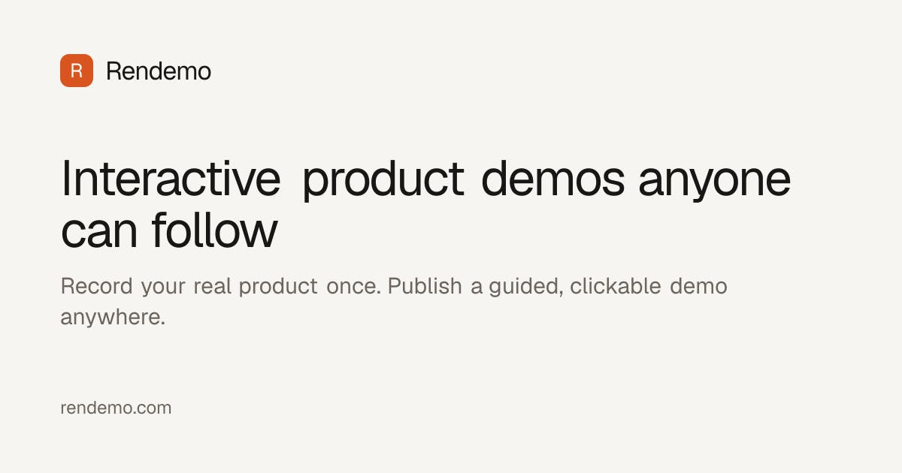

### 🎬 관련 영상
- [🎥 영상 보기](https://ph-files.imgix.net/c7c36be8-8886-4153-8396-531373e5b8b3.jpeg?auto=format)

---

## 11. [Tweet Mockup Generator by MockupTown](https://www.producthunt.com/products/tweet-mockup-generator-by-mockuptown)
**Votes**: 5 | **도입 난이도**: 하 | **신뢰도**: 상
**Tagline**: Tweet mockups with custom avatars, stats, and features
**서비스 링크**: https://www.producthunt.com/r/D33QXXNRKG3IXS

**태그**: DesignTool, Marketing, ContentCreation, AI Tool, Vision

### 📌 이 서비스 한눈에 보기
가입 없이 즉시 만드는 고해상도 트위터(X) 스타일 목업 생성기

### 🔑 주요 기능
- 프로필 정보(이름, 핸들, 배지) 및 각종 수치(조회수, 좋아요 등) 커스텀 가능
- 단일 이미지, 그리드, 투표 등 다양한 레이아웃 및 다크/라이트 테마 지원
- 로그인이나 워터마크 없이 고해상도 PNG로 즉시 내보내기 가능

### 🙋 사용자에게 어떤 점이 좋은가
광고 소재, 피치덱, 유튜브 썸네일 제작 시 실제 트윗처럼 보이는 이미지를 빠르고 프라이빗하게 만들 수 있습니다.

### ✅ 지금 바로 써볼 기능
- 원하는 테마(다크/라이트/딤) 선택하기
- 이미지 그리드 또는 투표 기능 활용해보기
- 커스텀 타임스탬프 설정 후 고해상도 PNG로 저장하기

### ⚠️ 사용 전 확인할 점
- 로컬 기반 도구이므로 복잡한 데이터 연동 기능은 없음
- 실제 트위터 데이터가 아닌 수동 입력 방식임

### 🧭 확인이 더 필요한 정보
제공되는 모든 기능이 완전 무료인지, 혹은 향ched 유료 플랜이 있는지 명시되지 않았습니다.

### 📸 스크린샷 및 갤러리

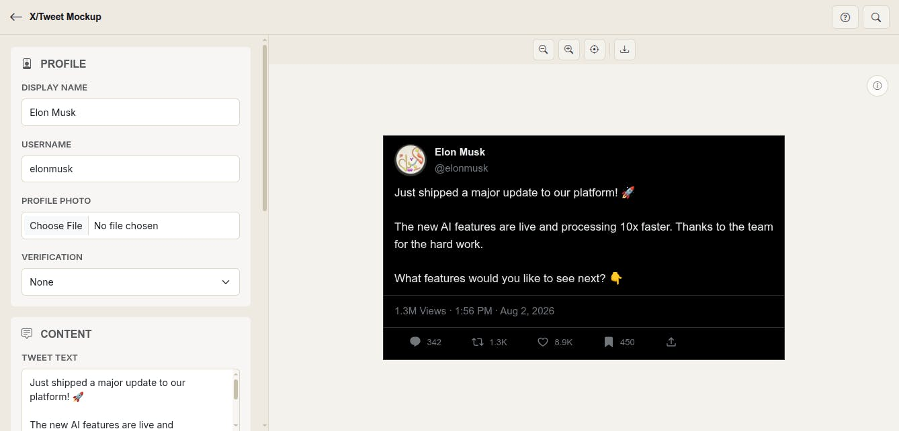

### 🎬 관련 영상
- [🎥 영상 보기](https://ph-files.imgix.net/f36d7149-3c62-4a9e-97fe-f0683606d2a8.jpeg?auto=format)

---

## 12. [Mononote](https://www.producthunt.com/products/mononote)
**Votes**: 5 | **도입 난이도**: 하 | **신뢰도**: 상
**Tagline**: Focus on one note
**서비스 링크**: https://www.producthunt.com/r/WXV2SINWJ25BO4

**태그**: Productivity, Focus, Note-taking, iOS

### 📌 이 서비스 한눈에 보기
단 하나의 메모에만 집중할 수 있도록 잠금 화면과 홈 화면에 노트를 띄워주는 생산성 도구

### 🔑 주요 기능
- 단일 노트 집중 모드 제공
- 잠금 화면(Lock Screen) 위젯 지원
- 홈 화면 및 다이내믹 아일랜드(Dynamic Island) 연동

### 🙋 사용자에게 어떤 점이 좋은가
중요한 메모를 스마트폰의 가장 눈에 띄는 곳에 배치하여, 앱을 열지 않고도 즉시 정보를 확인하고 집중력을 유지할 수 있습니다.

### ✅ 지금 바로 써볼 기능
- 가장 중요한 할 일이나 메모를 등록하기
- 잠금 화면 위젯으로 설정하여 접근성 높이기
- 다이내믹 아일랜드를 통해 실시간 확인하기

### ⚠️ 사용 전 확인할 점
- 단일 메모 중심이므로 여러 메모를 관리하기에는 부적합할 수 있음
- iOS/macOS 등 특정 OS 환경에 최적화되어 있을 가능성

### 🧭 확인이 더 필요한 정보
지원하는 운영체제(iOS, Android 등)와 상세 위젯 커스텀 기능에 대한 정보가 부족합니다.

### 📸 스크린샷 및 갤러리
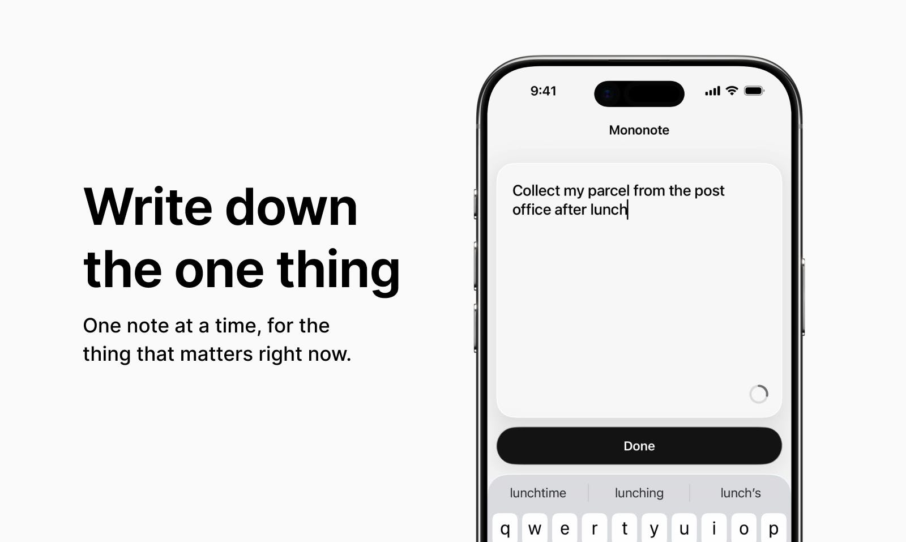
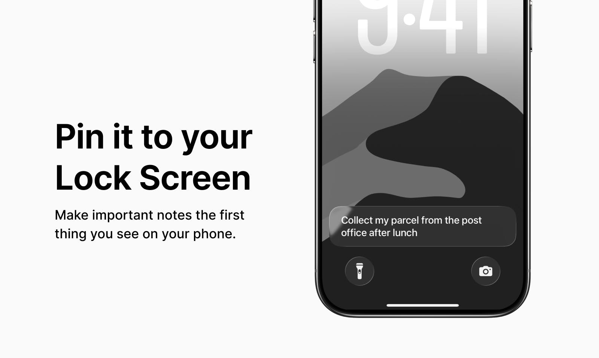
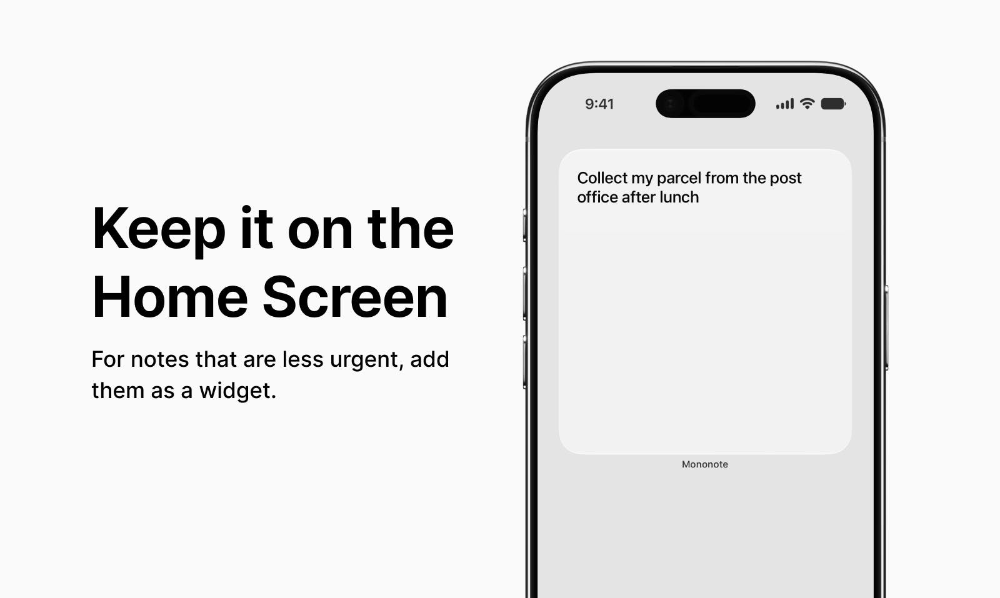

---

## 13. [TrainZilla](https://www.producthunt.com/products/trainzilla)
**Votes**: 4 | **도입 난이도**: 중 | **신뢰도**: 상
**Tagline**: Your fitness coaching business, run by an AI agent.
**서비스 링크**: https://www.producthunt.com/r/IBRAC4AUXQTWUK

**태그**: AI, Fitness, Automation, SaaS, Agent, AI Tool, Chat

### 📌 이 서비스 한눈에 보기
AI 에이전트가 코칭부터 고객 관리까지 자동화하는 피트니스 비즈니스 운영 솔루션

### 🔑 주요 기능
- 코치와 고객 양측을 지원하는 에이전트 기반 AI 레이어 탑재
- 개인 맞춤형 운동/영양/습관 계획 및 24/7 채팅을 제공하는 AI 코치 구독 모델
- 외부 에이전트(Claude 등)와 연동 가능한 23개 도구의 MCP 서버 지원

### 🙋 사용자에게 어떤 점이 좋은가
코치는 운영 부담을 줄이고, 일반 사용자는 전문 코치 없이도 24시간 밀착 관리받는 듯한 경험을 얻을 수 있습니다.

### ✅ 지금 바로 써볼 기능
- 코치용 앱을 통해 비즈니스 자동화 워크플로우 확인하기
- 클라이언트 앱의 AI 코치 구독 기능 체험하기
- MCP 서버를 통한 외부 AI 에이전트 연동 테스트하기

### ⚠️ 사용 전 확인할 점
- AI의 제안이 실제 전문가의 대면 코칭과 동일한 수준의 안전성을 보장하는지 확인 필요
- 외부 도구 연동 시 데이터 보안 및 개인정보 관리 범위 확인 필요

### 🧭 확인이 더 필요한 정보
AI 에이전트의 구체적인 비즈니스 운영 자동화 범위와 비용 구조에 대한 정보가 추가로 필요합니다.

### 📸 스크린샷 및 갤러리

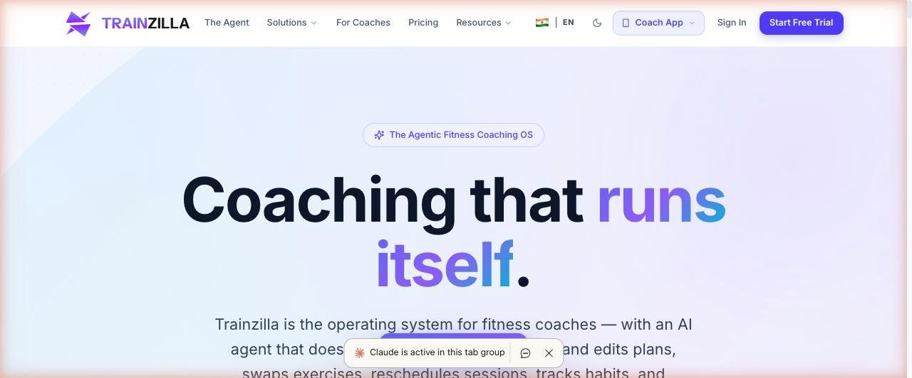
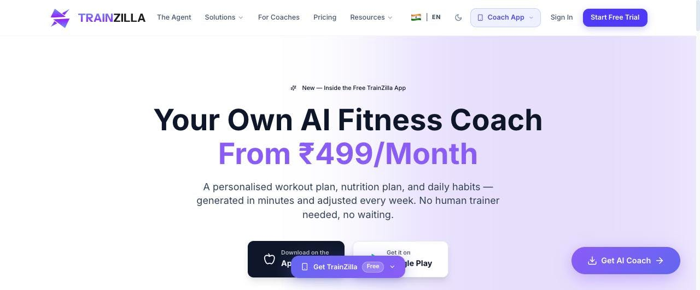

---

## 14. [SEOBeast](https://www.producthunt.com/products/seobeast)
**Votes**: 4 | **도입 난이도**: 하 | **신뢰도**: 상
**Tagline**: Fully automated AI blogging that grows your SEO
**서비스 링크**: https://www.producthunt.com/r/WEGMAH4CF34EWC

**태그**: SEO, AI, Content Automation, Marketing, Automation, AI Tool

### 📌 이 서비스 한눈에 보기
키워드 발굴부터 콘텐츠 발행까지 자동화하는 AI SEO 성장 플랫폼

### 🔑 주요 기능
- 고가치 키워드 발굴 및 경쟁사 분석 자동화
- SEO 최적화 글쓰기 및 내부 링크 생성
- 전략 수립부터 웹사이트 게시까지 엔드투엔드 워크플로우

### 🙋 사용자에게 어떤 점이 좋은가
콘텐츠 제작과 SEO 최적화에 드는 수동 작업을 자동화하여 최소한의 노력으로 유기적 트래픽을 확보할 수 있습니다.

### ✅ 지금 바로 써볼 기능
- 키워드 리서치 기능 테스트
- AI 생성 콘텐츠 품질 검토
- 자동 게시 워크플로우 설정

### ⚠️ 사용 전 확인할 점
- AI 생성 콘텐츠의 품질이 검색 엔진 가이드라인을 충족하는지 확인 필요
- 자동화된 내부 링크 및 게시 설정 시 사이트 구조 영향성 검토

### 🧭 확인이 더 필요한 정보
지원하는 CMS(WordPress 등) 종류와 구체적인 자동화 워크플로우의 세부 설정 범위 확인이 필요합니다.

### 📸 스크린샷 및 갤러리
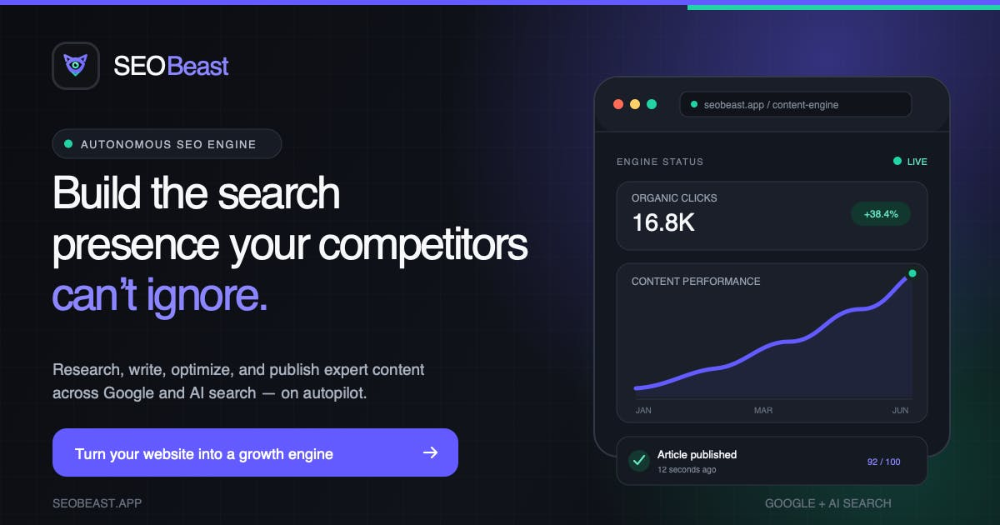
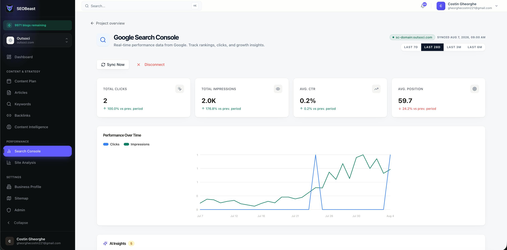
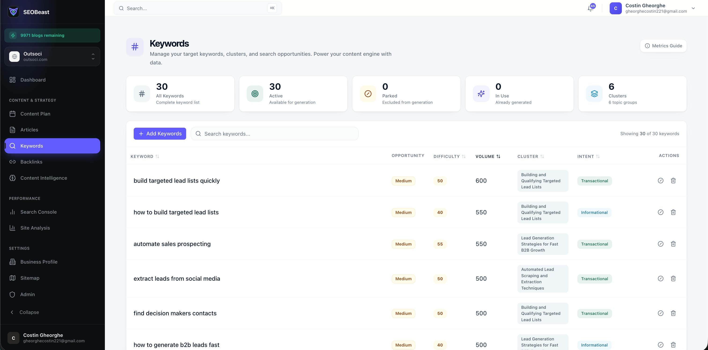

---

## 15. [Arbyn](https://www.producthunt.com/products/arbyn)
**Votes**: 4 | **도입 난이도**: 하 | **신뢰도**: 상
**Tagline**: AI support agent for Shopify that acts on your orders
**서비스 링크**: https://www.producthunt.com/r/73EUA7EQRS75R6

**태그**: Shopify, Automation, CustomerSupport, AI, Agent, AI Tool, Chat, Sales, Email

### 📌 이 서비스 한눈에 보기
쇼피파이 주문 관리와 고객 응대를 자동화하는 AI 지원 에이전트

### 🔑 주요 기능
- 쇼피파이 스토어의 톤앤매너를 반영한 이메일 및 라이브 채팅 응대
- 배송지 변경, 환불, 취소, 재배송 등 주문 관련 작업 자동화
- 티켓당 비용 없는 월 정액제 기반의 합리적인 가격 정책

### 🙋 사용자에게 어떤 점이 좋은가
고객 문의 응대와 단순 주문 변경 업무를 AI가 대신 처리하여 운영 효율을 높이고, 운영자는 최종 승인만으로 복잡한 업무를 해결할 수 있습니다.

### ✅ 지금 바로 써볼 기능
- 무료 플랜으로 150건의 AI 대화 기능 테스트하기
- 스토어의 목소리(Voice) 설정 및 학습시키기
- 한 번의 클릭으로 승인하는 워크플로우 경험하기

### ⚠️ 사용 전 확인할 점
- 모든 주문 처리는 사용자의 최종 승인(One tap)이 필요함
- 무료 플랜은 월 150건의 대화 제한이 있음

### 🧭 확인이 더 필요한 정보
AI가 처리하는 작업의 범위와 쇼피파이 앱과의 연동 깊이에 대한 상세 기술 사양 확인이 필요합니다.

### 📸 스크린샷 및 갤러리
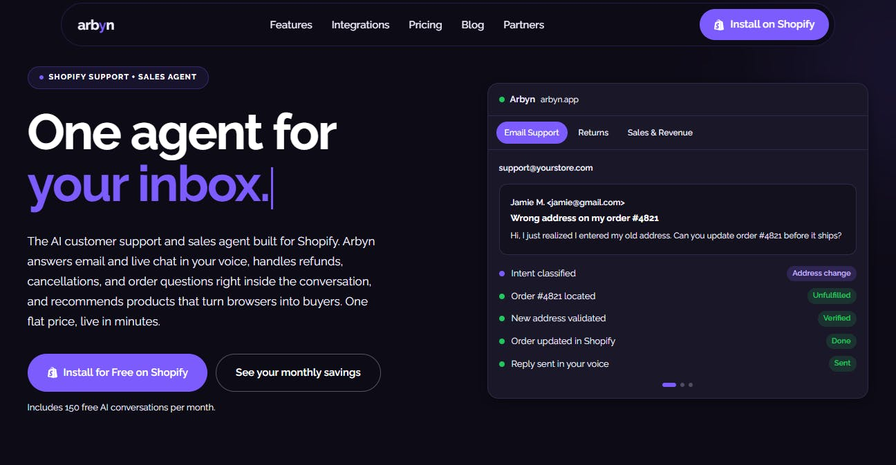
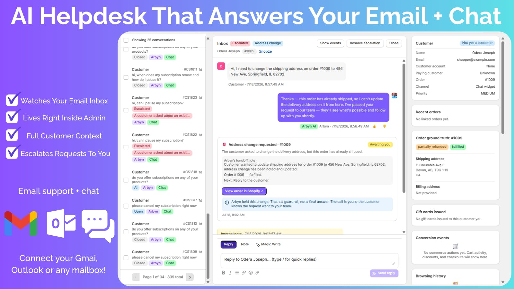
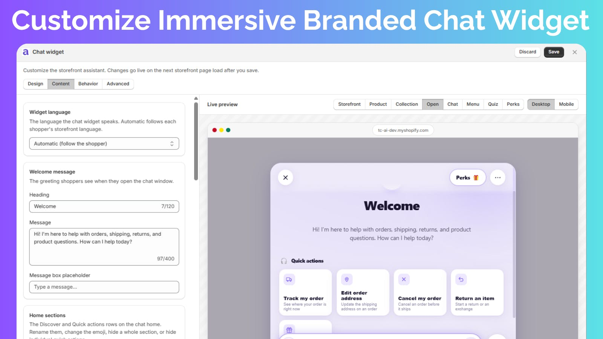

---

## 16. [ReadMyStatement](https://www.producthunt.com/products/readmystatement)
**Votes**: 3 | **도입 난이도**: 하 | **신뢰도**: 상
**Tagline**: See where the money you spent actually went
**서비스 링크**: https://www.producthunt.com/r/73RTYMNULKFMF5

**태그**: FinTech, DataAnalysis, Privacy, AI Tool

### 📌 이 서비스 한눈에 보기
은행 명세서를 업로드하면 지출 내역을 쉬운 언어로 분석해 주는 서비스

### 🔑 주요 기능
- PDF 명세서 업로드를 통한 지출 분석
- 복잡한 금융 용어 대신 쉬운 일상어로 설명
- 계좌 로그인 없이 파일만으로 작동하는 보안 중심 방식

### 🙋 사용자에게 어떤 점이 좋은가
은행 계좌를 직접 연결하는 번거로움이나 보안 걱정 없이, 기존 PDF 명세서만으로 간편하게 소비 패턴을 파악할 수 있습니다.

### ✅ 지금 바로 써볼 기능
- 최근 은행 PDF 명세서 준비하기
- 파일 업로드 후 지출 요약 확인하기
- 글로벌 은행 지원 여부 테스트하기

### ⚠️ 사용 전 확인할 점
- PDF 파일 내 개인정보 노출 주의
- 데이터 저장 여부에 대한 기술적 검증 필요

### 🧭 확인이 더 필요한 정보
데이터가 서버에 저장되지 않는다는 점에 대한 구체적인 보안 프로토콜 확인이 필요합니다.

### 📸 스크린샷 및 갤러리
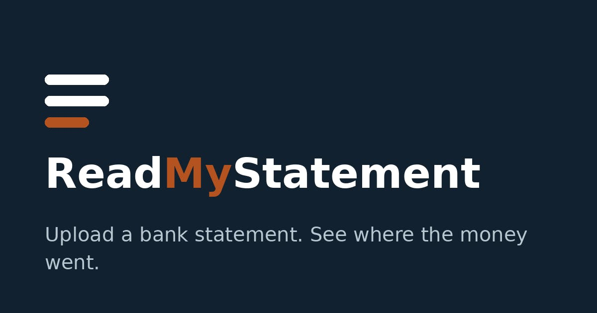

---

## 17. [Tradehand](https://www.producthunt.com/products/tradehand)
**Votes**: 3 | **도입 난이도**: 하 | **신뢰도**: 상
**Tagline**: Become your area’s go-to trade
**서비스 링크**: https://www.producthunt.com/r/ZXR2WIUO4KNAHV

**태그**: SaaS, BusinessAutomation, Marketing, CRM

### 📌 이 서비스 한눈에 보기
영국 현지 기술직(Trades)을 위한 올인원 웹사이트 및 비즈니스 운영 관리 서비스

### 🔑 주요 기능
- 웹사이트 구축 및 온라인 마케팅 대행
- 문의 응대, 견적, 예약, 송장 발행 등 사무 업무 자동화
- 현장 업무에 집중할 수 있도록 사무직 인력 대체

### 🙋 사용자에게 어떤 점이 좋은가
현장 업무 외에 발생하는 복잡한 고객 관리와 행정 업무를 외주화하여 개인 시간을 확보하고 비즈니스 성장을 도울 수 있습니다.

### ✅ 지금 바로 써볼 기능
- 서비스 제공 범위(마케팅 vs 운영) 확인
- 영국 현지 서비스 대상 여부 검토
- 업무 프로세스 위임 가능 범위 상담

### ⚠️ 사용 전 확인할 점
- 영국 시장에 특화된 서비스로 지역적 제한이 있을 수 있음
- 고객 응대 및 결제 관리를 외부 팀에 맡기는 것에 대한 운영 리스크

### 🧭 확인이 더 필요한 정보
서비스의 구체적인 비용 구조와 영국 외 지역 지원 여부에 대한 정보가 필요합니다.

### 📸 스크린샷 및 갤러리
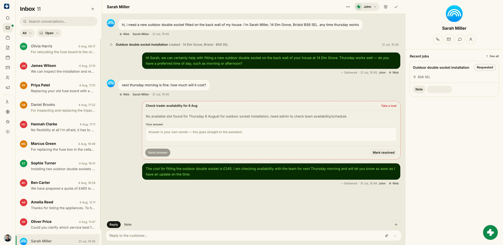
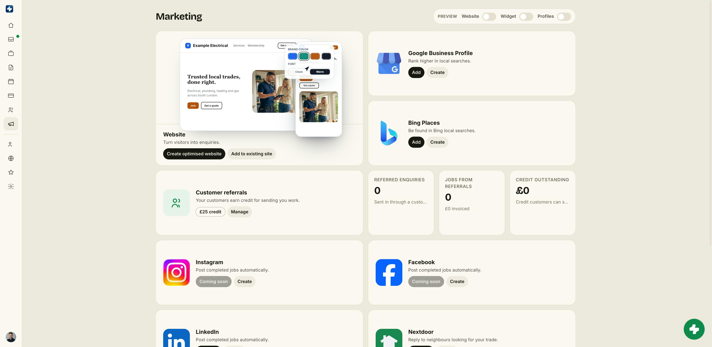
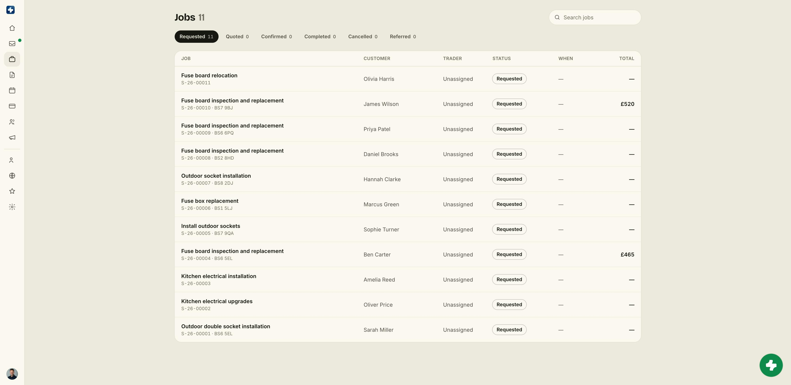

---

## 18. [Notewarp](https://www.producthunt.com/products/notewarp)
**Votes**: 3 | **도입 난이도**: 하 | **신뢰도**: 상
**Tagline**: Turn messy thoughts into clear, reusable notes with AI
**서비스 링크**: https://www.producthunt.com/r/SC7GOHYDTFGTEN

**태그**: Productivity, AI, Note-taking, Workflow, AI Tool, Email

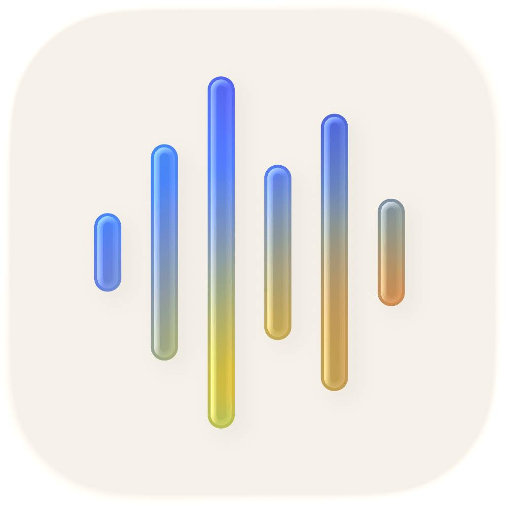

### 📌 이 서비스 한눈에 보기
AI를 통해 파편화된 아이디어를 정돈된 노트와 실행 가능한 결과물로 변환하는 생산성 도구

### 🔑 주요 기능
- 음성, 텍_스트, 파일, 링크 등 다양한 형태의 입력을 지원하는 멀티 모달 캡처
- 원본 기록을 유지하면서 요약, 할 일 목록, 이메일, 학습 노트 등으로 자동 재구성
- 태그, 폴더, 검색 기능을 통한 체계적인 정리 및 퍼블릭 페이지 공유 기능

### 🙋 사용자에게 어떤 점이 좋은가
정리되지 않은 아이디어나 긴 회의록을 일일이 정리할 필요 없이, 클릭 몇 번으로 즉시 활용 가능한 문서로 바꿀 수 있습니다.

### ✅ 지금 바로 써볼 기능
- 음성 녹음이나 파일 업로드로 아이디어 초안 만들기
- 생성된 요약본을 이메일이나 학습용 노트로 변환하기
- 정리된 노트를 퍼블릭 페이지로 공유하기

### ⚠️ 사용 전 확인할 점
- AI 생성 결과물의 정확성을 위해 원본 트랜스크립트와 대조 확인 필요
- 데이터 보안 및 개인정보가 포함된 파일 업로드 시 주의 필요

### 🧭 확인이 더 필요한 정보
구체적인 요금제 체계와 데이터 저장 용량 제한에 대한 정보가 명시되지 않았습니다.

### 📸 스크린샷 및 갤러리
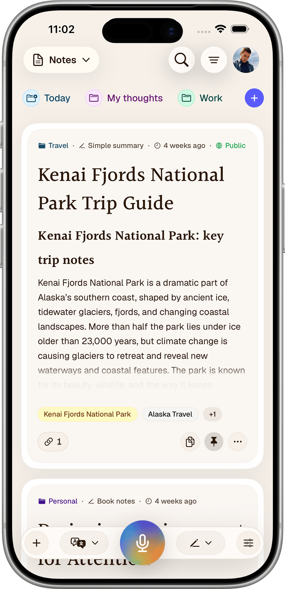
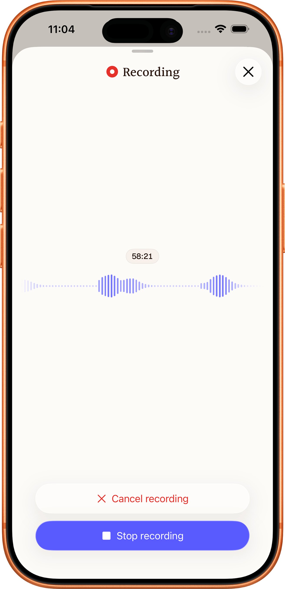
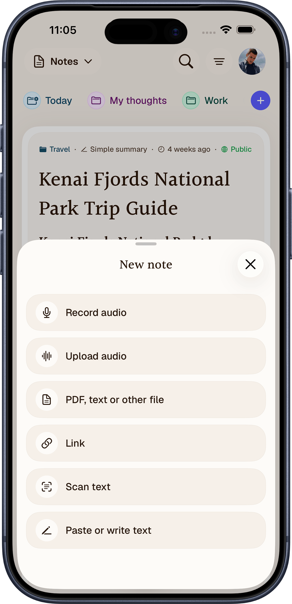

---

## 19. [TikTok Ads Alerts by AdPeekr](https://www.producthunt.com/products/adpeekr)
**Votes**: 3 | **도입 난이도**: 하 | **신뢰도**: 상
**Tagline**: Get alerted the moment a rival's TikTok ad drops
**서비스 링크**: https://www.producthunt.com/r/EK4IUPQF6WDNGE

**태그**: Marketing, Automation, AdTech, CompetitorAnalysis, AI Tool, Email

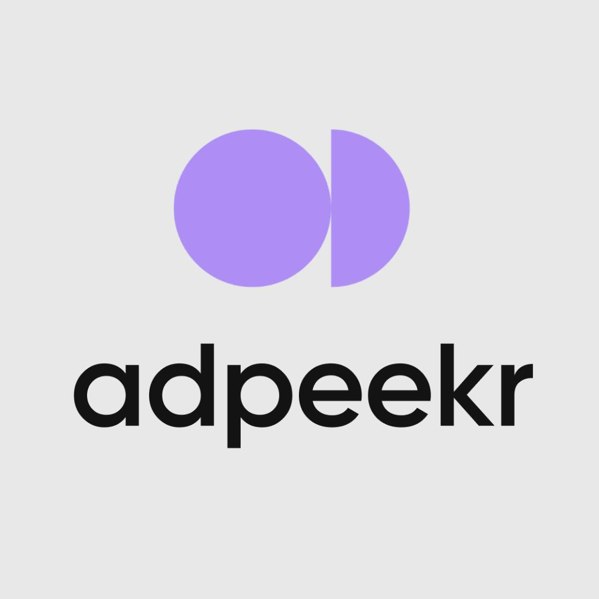

### 📌 이 서비스 한눈에 보기
경쟁사의 새로운 틱톡 광고를 실시간으로 감지하여 트렌드를 선점하는 광고 모니터링 도구

### 🔑 주요 기능
- 경쟁사가 새로운 틱톡 광고를 게시하는 즉시 이메일 및 앱 알림 제공
- 틱톡, 메타, 구글, 링크드인 등 주요 플랫폼의 광고를 하나의 대시보드에서 추적
- 수동 확인 없이 광고주 검색 및 알림 설정만으로 자동화된 모니터링 가능

### 🙋 사용자에게 어떤 점이 좋은가
경쟁사의 최신 광고 소재와 후킹 전략을 실시간으로 파악하여 마케팅 전략에 즉각 반영할 수 있습니다.

### ✅ 지금 바로 써볼 기능
- 관심 있는 경쟁사 광고주 검색하기
- 특정 광고주에 대해 'Set Alert' 설정하기
- 3개월 무료 체험 기간 활용하기

### ⚠️ 사용 전 확인할 점
- 알림 수신 방식(이메일/인앱)에 따른 확인 빈도 차이 고려 필요
- 플랫폼별 광고 데이터 업데이트 주기 확인 필요

### 🧭 확인이 더 필요한 정보
제공되는 3개월 무료 체험 이후의 구체적인 유료 플랜 가격 체계가 명시되지 않았습니다.

### 📸 스크린샷 및 갤러리

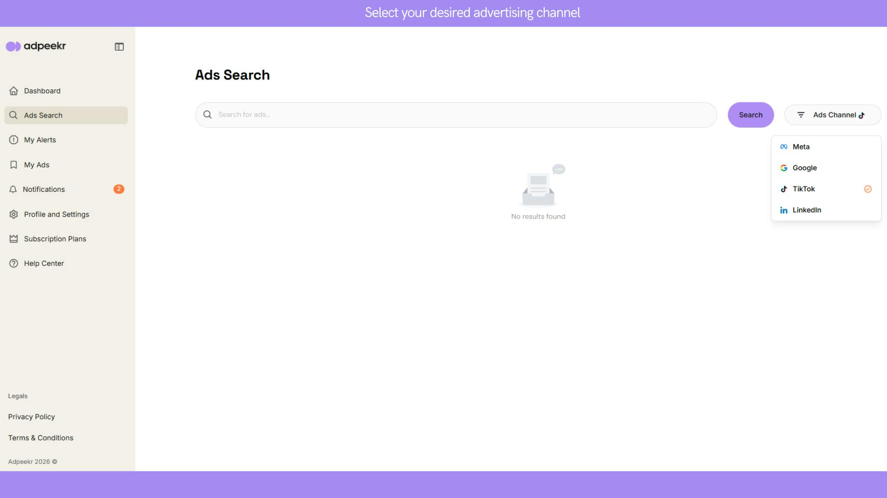
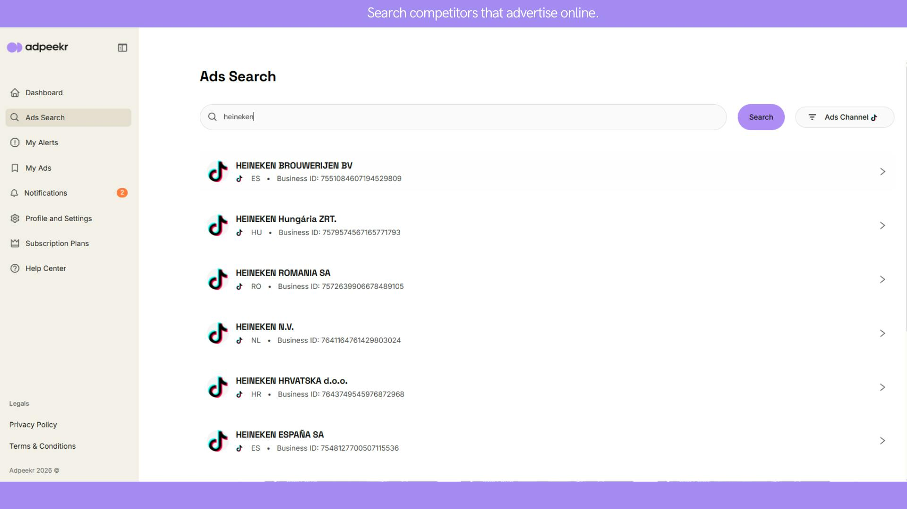

---

## 20. [Lawn care scheduler + smart watering](https://www.producthunt.com/products/lawn-care-scheduler-smart-watering)
**Votes**: 3 | **도입 난이도**: 하 | **신뢰도**: 상
**Tagline**: Fix your lawn, get notifications how much to water
**서비스 링크**: https://www.producthunt.com/r/JHLB24IEUNWDDJ

**태그**: AI, Gardening, Mobile App, Automation, AI Tool

### 📌 이 서비스 한눈에 보기
사진 한 장으로 잔디 상태를 진단하고 맞춤형 물주기 일정을 받는 스마트 가드닝 솔루션

### 🔑 주요 기능
- 사진 촬영을 통한 잔디 종류, 잡초 및 질병 식별
- 날씨를 고려한 개인 맞춤형 잔디 관리 스케줄 생성
- iOS 및 Android에서 무료로 사용 가능

### 🙋 사용자에게 어떤 점이 좋은가
전문 지식 없이도 사진 한 장으로 잔디 문제를 파악하고, 날씨에 맞춘 최적의 관리가 가능해집니다.

### ✅ 지금 바로 써볼 기능
- 잔디 사진 찍어 식별 기능 테스트하기
- 개인화된 관리 스케줄 확인하기
- 모바일 앱 설치 및 알림 설정하기

### ⚠️ 사용 전 확인할 점
- 사진 품질에 따라 식별 정확도가 달라질 수 있음
- 날씨 데이터 연동 방식에 따른 스케줄 변동 가능성

### 🧭 확인이 더 필요한 정보
사진 식별 기능의 정확도와 날씨 데이터 반영 주기에 대한 구체적인 정보가 필요합니다.

### 📸 스크린샷 및 갤러리
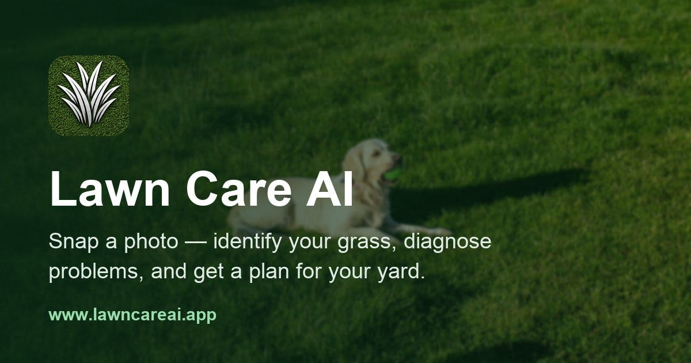

---

## 21. [Lawn care scheduler + smart watering](https://www.producthunt.com/products/lawn-care-scheduler-smart-watering)
**Votes**: 3 | **도입 난이도**: 하 | **신뢰도**: 상
**Tagline**: Fix your lawn, get notifications how much to water
**서비스 링크**: https://www.producthunt.com/r/JHLB24IEUNWDDJ

**태그**: AI, Gardening, Mobile App, Automation, AI Tool

### 📌 이 서비스 한눈에 보기
사진 한 장으로 잔디 상태를 진단하고 맞춤형 물주기 일정을 받는 스마트 가드닝 솔루션

### 🔑 주요 기능
- 사진 촬영을 통한 잔디 종류, 잡초 및 질병 식별
- 날씨를 고려한 개인 맞춤형 잔디 관리 스케줄 생성
- iOS 및 Android에서 무료로 사용 가능

### 🙋 사용자에게 어떤 점이 좋은가
전문 지식 없이도 사진 한 장으로 잔디 문제를 파악하고, 날씨에 맞춘 최적의 관리가 가능해집니다.

### ✅ 지금 바로 써볼 기능
- 잔디 사진 찍어 식별 기능 테스트하기
- 개인화된 관리 스케줄 확인하기
- 모바일 앱 설치 및 알림 설정하기

### ⚠️ 사용 전 확인할 점
- 사진 품질에 따라 식별 정확도가 달라질 수 있음
- 날씨 데이터 연동 방식에 따른 스케줄 변동 가능성

### 🧭 확인이 더 필요한 정보
사진 식별 기능의 정확도와 날씨 데이터 반영 주기에 대한 구체적인 정보가 필요합니다.

### 📸 스크린샷 및 갤러리

---

## 22. [VoiceDumps](https://www.producthunt.com/products/voicedumps)
**Votes**: 3 | **도입 난이도**: 하 | **신뢰도**: 상
**Tagline**: Hold the globe key. Talk. The words appear at your cursor.
**서비스 링크**: https://www.producthunt.com/r/THZ56O64RJ7DVL

**태그**: Productivity, macOS, AI, Transcription, OpenSource, Video

### 📌 이 서비스 한눈에 보기
어느 앱에서든 즉시 음성을 텍스트로 변환하는 macOS용 오프라인 STT 도구

### 🔑 주요 기능
- 글로브 키를 눌러 커서 위치에 즉시 텍백 입력 가능
- 오디오 및 비디오 파일을 타임스탬프가 포함된 전사본으로 변환
- 완전한 오프라인 환경 및 MIT 라이선스 기반의 무료 소프트웨어

### 🙋 사용자에게 어떤 점이 좋은가
별도의 복잡한 설정 없이 어떤 앱에서든 즉각적인 받아쓰기가 가능하며, 개인정보 유출 걱정 없이 로컬에서 안전하게 음성을 텍스트로 변환할 수 있습니다.

### ✅ 지금 바로 써볼 기능
- 글로브 키를 활용한 실시간 받아쓰기 테스트
- 기존 오디오/비디오 파일로 타임스탬프 전사 기능 확인

### ⚠️ 사용 전 확인할 점
- 로컬 모델 구동 방식이므로 하드웨어 사양에 따른 성능 차이 발생 가능
- macOS 전용 앱이므로 다른 운영체제에서는 사용 불가

### 🧭 확인이 더 필요한 정보
사용자의 Mac 하드웨어 사양에 따른 모델 구동 속도와 배터리 소모 정도를 확인해야 합니다.

### 📸 스크린샷 및 갤러리
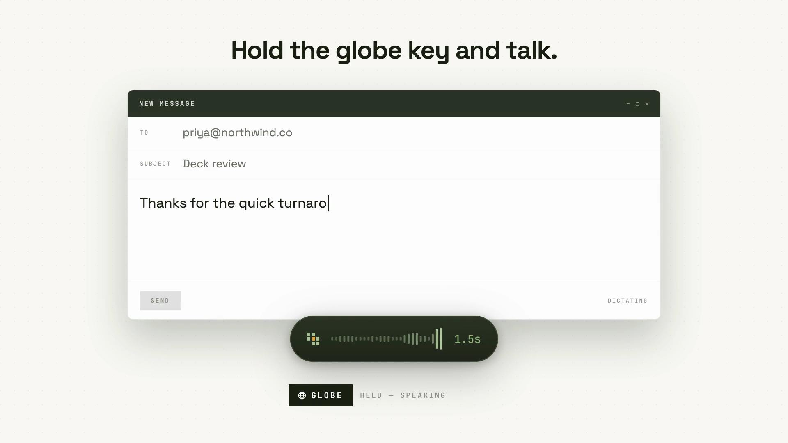
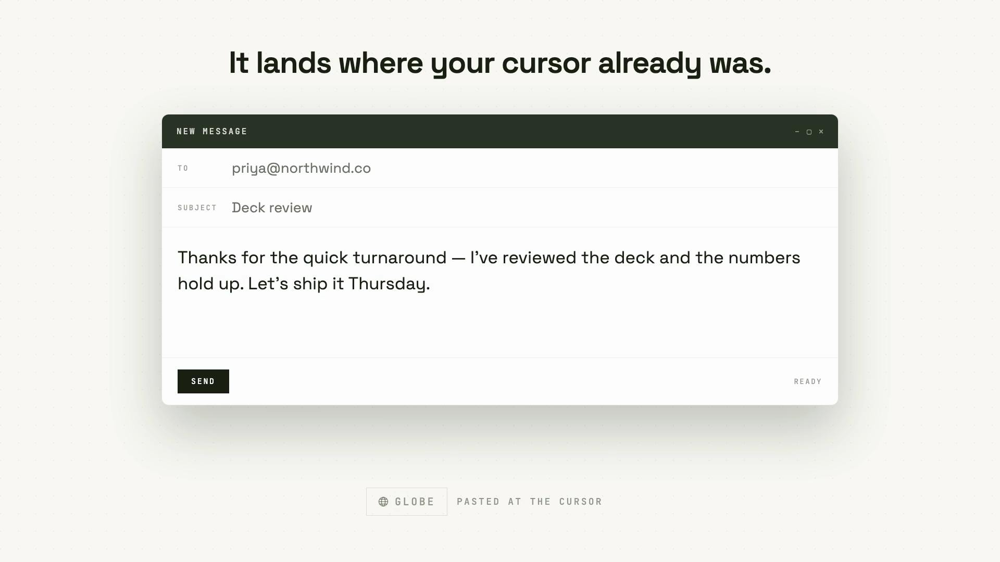
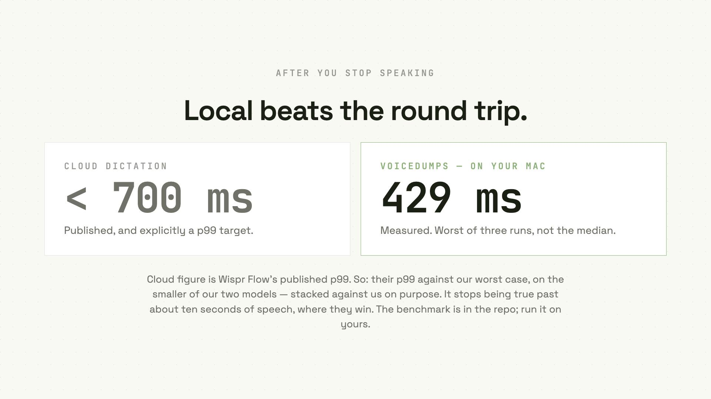

### 🎬 관련 영상
- [🎥 영상 보기](https://ph-files.imgix.net/772a9532-2e82-4e84-b683-365c94f687d7.jpeg?auto=format)

---

## 23. [AppMatrixly](https://www.producthunt.com/products/appmatrixly)
**Votes**: 3 | **도입 난이도**: 하 | **신뢰도**: 상
**Tagline**: Know exactly how any mobile app grows.
**서비스 링크**: https://www.producthunt.com/r/T66AQVK7QLM4NU

**태그**: MobileApp, MarketIntelligence, GrowthHacking, AI, Analytics, AI Tool

### 📌 이 서비스 한눈에 보기
1,000만 개 이상의 모바일 앱 데이터를 AI로 분석하여 성장 전략을 제안하는 앱 인텔리전스 플랫폼

### 🔑 주요 기능
- 1,000만 개 이상의 iOS 및 Android 앱 데이터 검색 및 분석
- 다운로드, 매출 추정, 키워드, 리뷰 등 핵심 성장 지표 제공
- 경쟁사 모니터링 및 시장 트렌드 분석을 통한 의사결정 지원

### 🙋 사용자에게 어떤 점이 좋은가
모바일 앱 기획자나 마케터가 경쟁사의 성장 전략을 파악하고 시장 트렌드에 맞춘 데이터 기반의 성장 전략을 세우는 데 유용합니다.

### ✅ 지금 바로 써볼 기능
- 경쟁 앱의 매출 및 다운로드 추이 분석하기
- 키워드 및 리뷰 분석을 통한 시장 기회 포착하기
- AI 인사이트를 활용한 시장 트렌드 리포트 생성하기

### ⚠️ 사용 전 확인할 점
- 제공되는 매출 및 다운로드 수치는 추정치이므로 실제 데이터와 차이가 있을 수 있음
- 플랫폼별(iOS/Android) 데이터 업데이트 주차 및 정확도 확인 필요

### 🧭 확인이 더 필요한 정보
실제 데이터의 정확도와 상세 리포트 기능의 유료/무료 여부에 대한 확인이 필요합니다.

### 📸 스크린샷 및 갤러리
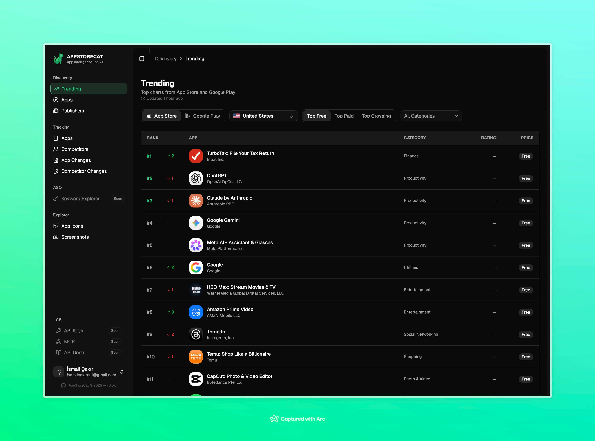
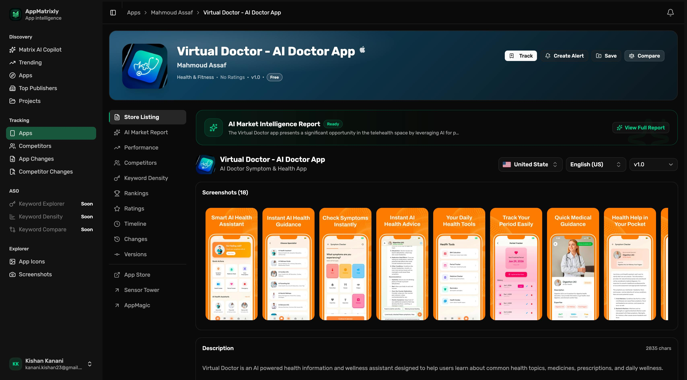
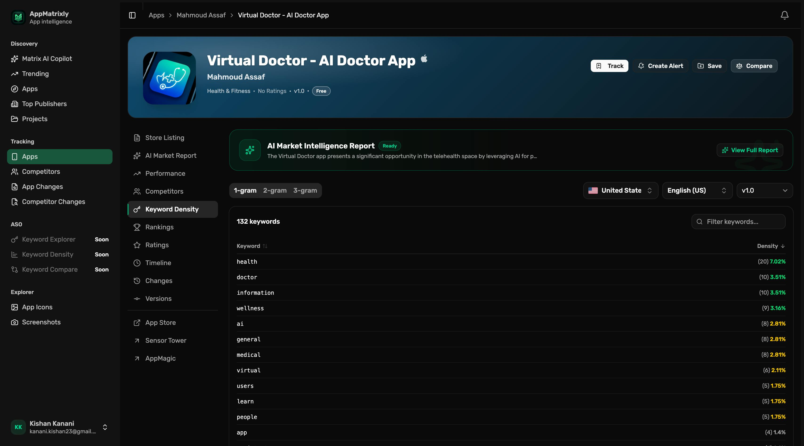

---

## 24. [ReadMyStatement](https://www.producthunt.com/products/readmystatement)
**Votes**: 3 | **도입 난이도**: 하 | **신뢰도**: 상
**Tagline**: See where the money you spent actually went
**서비스 링크**: https://www.producthunt.com/r/73RTYMNULKFMF5

**태그**: FinTech, DataAnalysis, Privacy, AI Tool

### 📌 이 서비스 한눈에 보기
은행 명세서를 업로드하면 지출 내역을 쉬운 언어로 분석해 주는 서비스

### 🔑 주요 기능
- PDF 명세서 업로드를 통한 지출 분석
- 복잡한 금융 용어 대신 쉬운 일상어로 설명
- 계좌 로그인 없이 파일만으로 작동하는 보안 중심 방식

### 🙋 사용자에게 어떤 점이 좋은가
은행 계좌를 직접 연결하는 번거로움이나 보안 걱정 없이, 기존 PDF 명세서만으로 간편하게 소비 패턴을 파악할 수 있습니다.

### ✅ 지금 바로 써볼 기능
- 최근 은행 PDF 명세서 준비하기
- 파일 업로드 후 지출 요약 확인하기
- 글로벌 은행 지원 여부 테스트하기

### ⚠️ 사용 전 확인할 점
- PDF 파일 내 개인정보 노출 주의
- 데이터 저장 여부에 대한 기술적 검증 필요

### 🧭 확인이 더 필요한 정보
데이터가 서버에 저장되지 않는다는 점에 대한 구체적인 보안 프로토콜 확인이 필요합니다.

### 📸 스크린샷 및 갤러리

---

## 25. [Pinpoint Answer Today](https://www.producthunt.com/products/pinpoint-answer-today-2)
**Votes**: 3 | **도입 난이도**: 하 | **신뢰도**: 상
**Tagline**: Practice five-clue Pinpoint puzzles without spoilers
**서비스 링크**: https://www.producthunt.com/r/UYPMQH3DDR7ES5

**태그**: Puzzle, Education, Browser-based, Word-game

### 📌 이 서비스 한눈에 보기
스포일러 없이 즐기는 5단계 단어 연상 퍼즐 연습 도구

### 🔑 주요 기능
- 스포일러를 방지하는 단계별 힌트 공개 방식
- 정답 확인 전 논리적 추론을 유도하는 학습형 구조
- 브라우저 기반의 무료 이용 및 아카이브 검색 기능

### 🙋 사용자에게 어떤 점이 좋은가
정답을 바로 확인하는 대신 단계별로 힌트를 열어보며 퍼즐 해결 능력을 키우고 싶은 사용자에게 유용합니다.

### ✅ 지금 바로 써볼 기능
- 한 번에 하나씩 힌트를 열어보며 퍼즐 풀기
- 정답 제출 후 상세 설명과 자신의 추론 비교하기
- 과거 퍼즐 아카이브 검색하여 연습하기

### ⚠️ 사용 전 확인할 점
- LinkedIn 서비스와 무관한 독립적인 도구임
- 정답을 바로 알고 싶은 사용자에게는 진행 방식이 느릴 수 있음

### 🧭 확인이 더 필요한 정보
현재 브라우저 기반 무료 서비스로 제공되나, 향후 유료화나 모바일 앱 출시 여부는 명시되지 않았습니다.

### 📸 스크린샷 및 갤러리
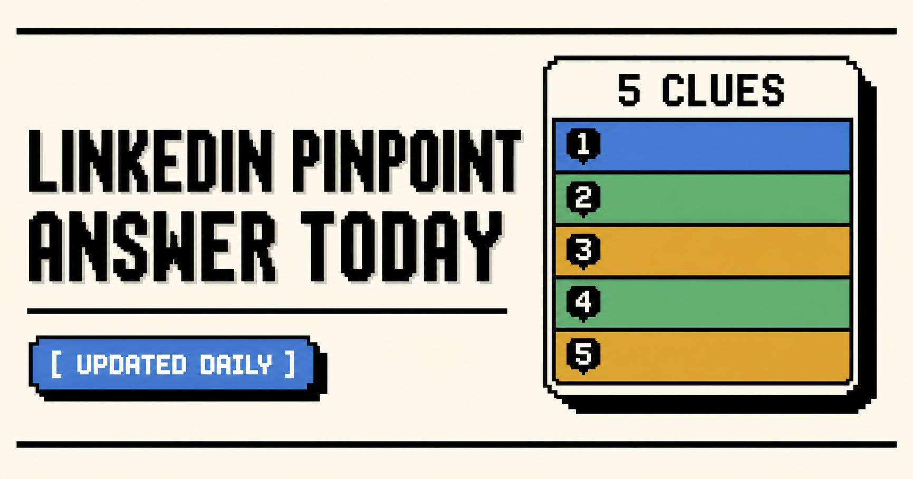

---

## 26. [Time Precision](https://www.producthunt.com/products/time-precision)
**Votes**: 3 | **도입 난이도**: 하 | **신뢰도**: 상
**Tagline**: Every timezone you care about. One glance. Zero clutter.
**서비스 링크**: https://www.producthunt.com/r/BVHVDAVWPXK4X6

**태그**: Productivity, Windows, Utility, Timezone, AI Tool

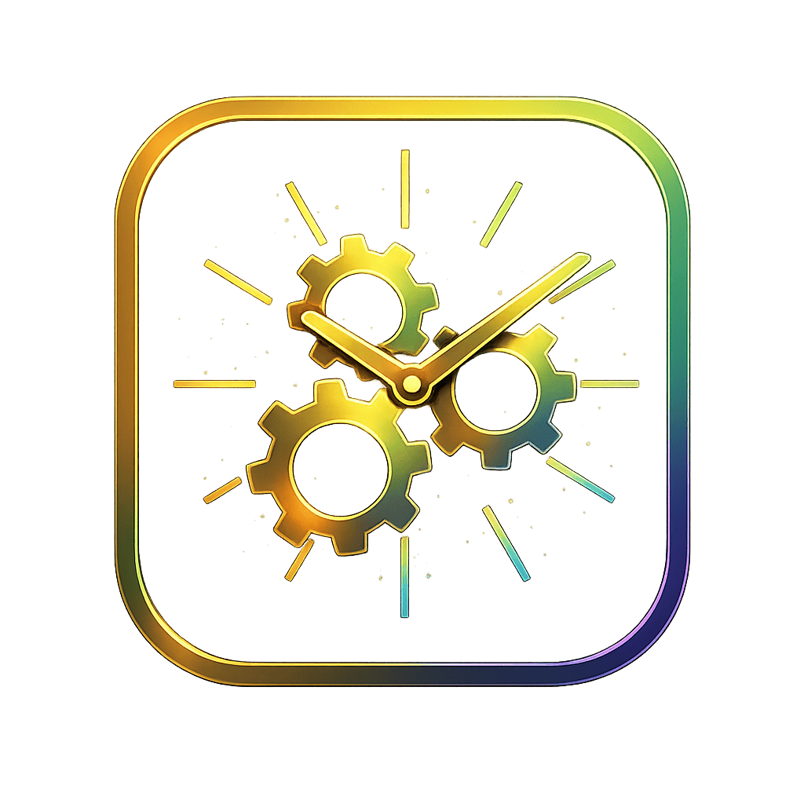

### 📌 이 서비스 한눈에 보기
데스크톱 가장자리에 고정하여 전 세계 시간대를 한눈에 확인하는 미니멀한 시계 도구

### 🔑 주요 기능
- 윈도우 데스크톱 가장자리에 슬림한 레일 형태로 고정되는 UI
- 마우스 호버 시 확장되고 평소에는 공간을 차지하지 않는 디자인
- 233개 도시 지원, 11개 언어 및 9가지 테마 제공

### 🙋 사용자에게 어떤 점이 좋은가
별도의 브라우저 탭이나 스마트폰을 확인할 필요 없이, 업무 중 데스크톱 화면에서 즉시 필요한 시간대를 확인할 수 있어 업무 흐름이 끊기지 않습니다.

### ✅ 지금 바로 써볼 기능
- 자주 확인하는 주요 도시 시간대 고정하기
- 데스크톱 환경에 맞는 테마 설정하기
- 자주 사용하는 앱을 핀(Pin)하여 퀵 런처로 활용하기

### ⚠️ 사용 전 확인할 점
- 윈도우 데스크톱 환경 전용이므로 다른 OS에서는 사용 불가
- 화면 가장자리에 상주하므로 다른 창 작업 시 간섭 여부 확인 필요

### 🧭 확인이 더 필요한 정보
윈도우 버전별 호환성 및 시스템 리소스 점유율에 대한 구체적인 정보는 명시되지 않았습니다.

### 📸 스크린샷 및 갤러리
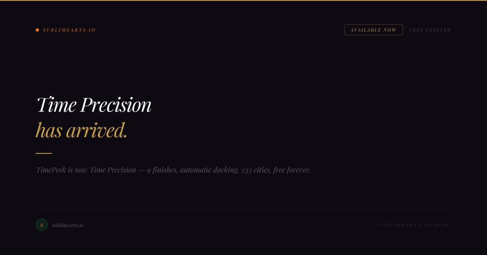
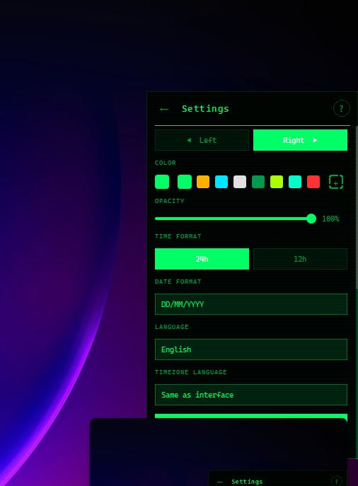
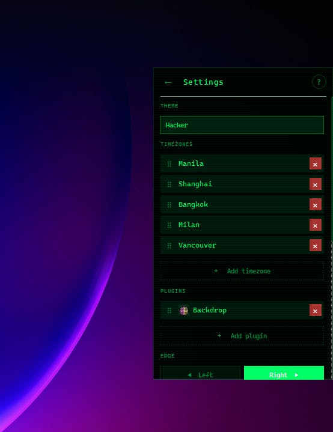

---

## 27. [GitDecode](https://www.producthunt.com/products/gitdecode)
**Votes**: 3 | **도입 난이도**: 하 | **신뢰도**: 상
**Tagline**: AI-Powered Codebase Intelligence & Graph-Native AST Engine
**서비스 링크**: https://www.producthunt.com/r/5SYOWP3WVCUQWG

**태그**: DevTool, AI, CodeAnalysis, Visualization, AI Tool

### 📌 이 서비스 한눈에 보기
AI 기반 지식 그래프로 코드베이스의 구조와 흐름을 직관적으로 파악하는 도구

### 🔑 주요 기능
- AI 기반의 코드베이스 지식 그래프 구축
- 인터랙티브 아키텍처 다이어그램 제공
- 자연어 대화를 통한 코드 탐색 및 분석

### 🙋 사용자에게 어떤 점이 좋은가
복잡한 코드베이스의 구조를 시각적으로 이해하고, 자연어 질문을 통해 코드 간의 관계를 빠르게 파악할 수 있습니다.

### ✅ 지금 바로 써볼 기능
- 저장소 연결 및 지식 그래프 생성
- 인터랙티브 다이어그램을 통한 아키텍처 탐색
- 자연어 질의를 통한 코드 로직 분석

### ⚠️ 사용 전 확인할 점
- 코드 보안 및 프라이버시 정책 확인 필요
- 대규모 저장소에서의 파싱 성능 및 정확도 검증 필요

### 🧭 확인이 더 필요한 정보
상세한 보안 정책 및 대규모 코드베이스 지원 범위에 대한 정보가 부족합니다.

### 📸 스크린샷 및 갤러리
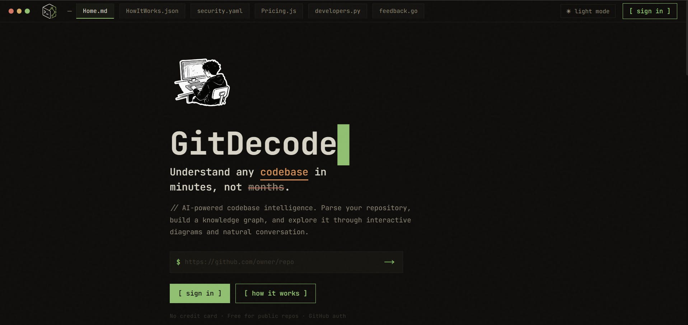

### 🎬 관련 영상
- [🎥 영상 보기](https://ph-files.imgix.net/c9461685-7ad6-4b7a-a45b-9b43c78c186e.jpeg?auto=format)

---

## 28. [Ryzio](https://www.producthunt.com/products/ryzio)
**Votes**: 3 | **도입 난이도**: 하 | **신뢰도**: 상
**Tagline**: Land more interviews.
**서비스 링크**: https://www.producthunt.com/r/AFN42BV7XZTHY7

**태그**: Career, Productivity, AI, JobSearch, AI Tool

### 📌 이 서비스 한눈에 보기
ATS 최적화 이력서 작성부터 지원 현황 관리까지 지원하는 올인원 취업 지원 도구

### 🔑 주요 기능
- ATS(채용 관리 시스템) 최적화 이력서 생성 및 미리보기
- 직무 기술서와 개인 경력 간의 적합도 비교 분석
- 지원 현황을 한눈에 파악할 수 있는 내장형 지원 트래커

### 🙋 사용자에게 어떤 점이 좋은가
이력서 최적화와 지원 관리를 한 곳에서 해결하여 구직 프로세스의 번거로움을 줄이고 면접 기회를 높일 수 있습니다.

### ✅ 지금 바로 써볼 기능
- 무료로 ATS 최적화 이력서 생성해보기
- 지원하려는 직무 기술서와 내 경력 비교해보기
- 내장된 트래커에 지원 목록 등록하기

### ⚠️ 사용 전 확인할 점
- AI 도구 사용 시 생성된 내용의 정확성 직접 검토 필요
- 무료 기능과 유료 기능 간의 범위 차이 확인 필요

### 🧭 확인이 더 필요한 정보
AI 도구의 구체적인 유료화 모델 및 기능 제한 범위를 확인해야 합니다.

### 📸 스크린샷 및 갤러리
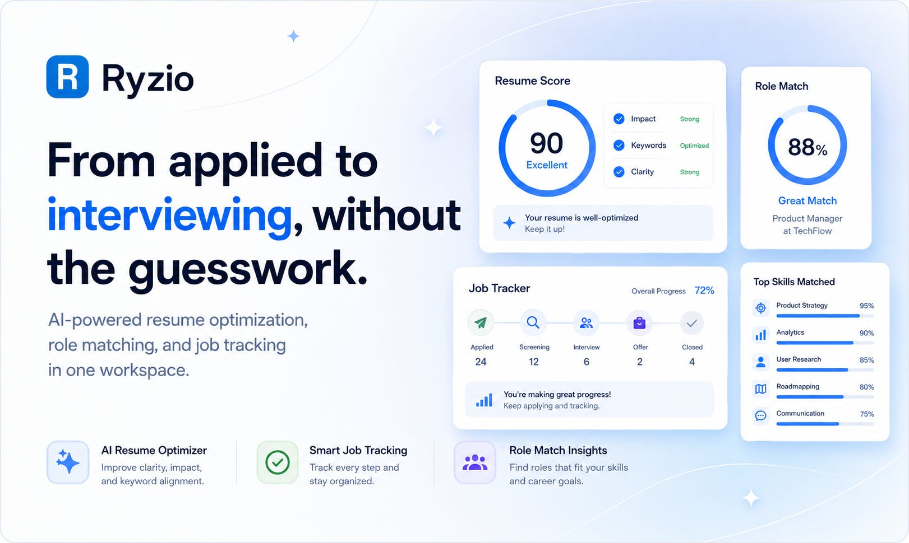
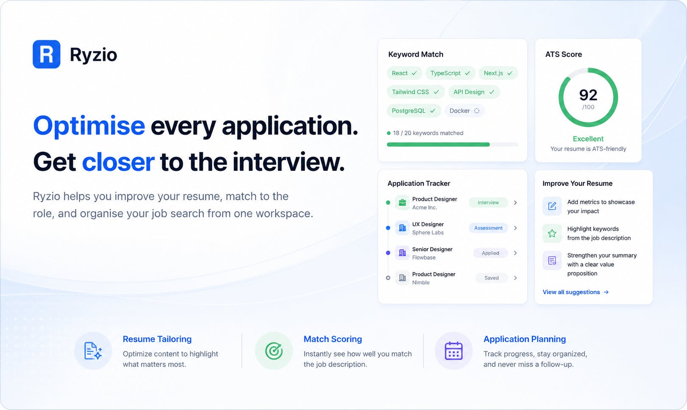

---

## 29. [PolyTake](https://www.producthunt.com/products/polytake)
**Votes**: 2 | **도입 난이도**: 하 | **신뢰도**: 상
**Tagline**: Everyone Films. One Movie.
**서비스 링크**: https://www.producthunt.com/r/4FMST5FIYQZ7OC

**태그**: VideoEditing, Collaboration, MobileApp, Automation

### 📌 이 서비스 한눈에 보기
여러 명의 촬영 각도를 모아 하나의 영화로 자동 편집해주는 협업 영상 제작 앱

### 🔑 주요 기능
- 여러 사용자가 동시에 각기 다른 각도에서 촬영 가능
- 수집된 다양한 영상 소스를 자동으로 편집하여 하나의 결과물 생성
- iPhone 환경에 최적화된 모바일 기반 워크플로우

### 🙋 사용자에게 어떤 점이 좋은가
친구들과 함께 촬영한 영상들을 일일이 편집할 필요 없이, 하나의 완성된 영화처럼 모을 수 있어 이벤트 기록이 간편해집니다.

### ✅ 지금 바로 써볼 기능
- 친구들과 함께 앱 설치 및 이벤트 참여하기
- 다양한 각도에서 영상 촬영해보기
- 자동 생성된 결과물 확인하기

### ⚠️ 사용 전 확인할 점
- iPhone 전용 앱이므로 안드로이드 사용자와의 협업 제약 가능성
- 자동 편집 기능의 결과물 품질이 사용자 취향에 따라 다를 수 있음

### 🧭 확인이 더 필요한 정보
자동 편집 알고리즘의 정교함과 다수 인원 참여 시의 데이터 처리 방식에 대한 구체적 정보가 필요합니다.

### 📸 스크린샷 및 갤러리

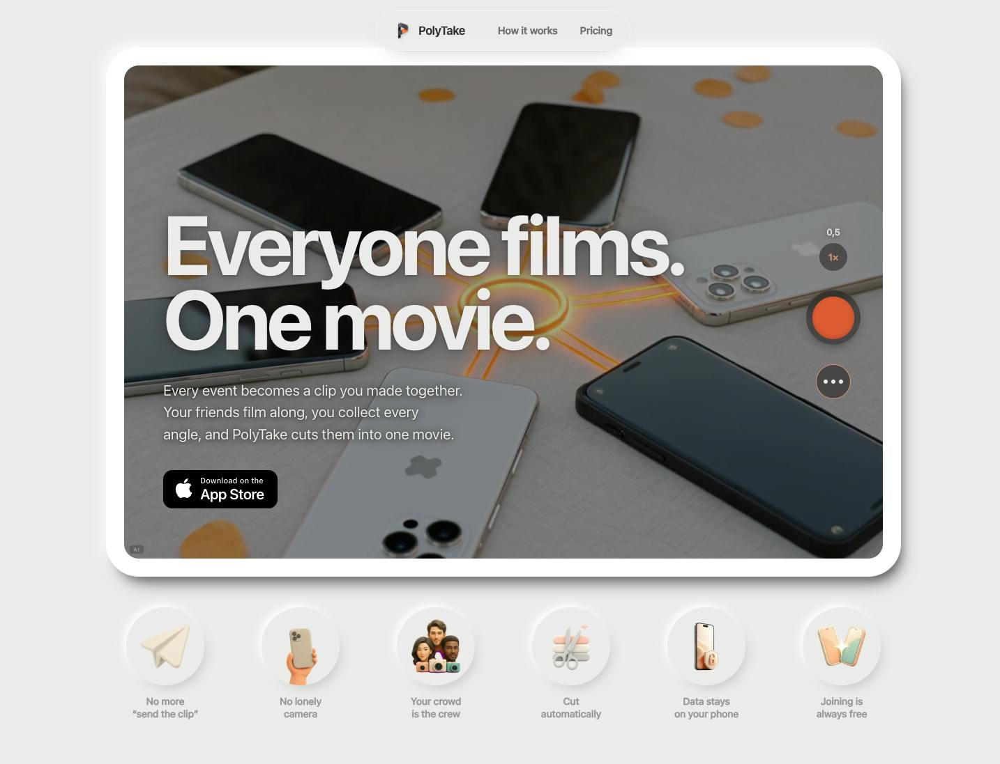
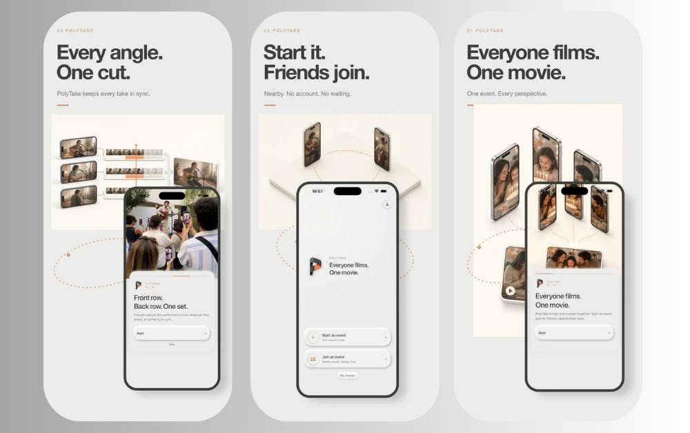

---

## 30. [Tonight](https://www.producthunt.com/products/tonight)
**Votes**: 2 | **도입 난이도**: 하 | **신뢰도**: 상
**Tagline**: Bar discovery that knows what time it is
**서비스 링크**: https://www.producthunt.com/r/SHLEKORENPN62K

**태그**: Lifestyle, LocalSearch, Discovery

### 📌 이 서비스 한눈에 보기
검색 없이 바로 결정하는 초스피드 주변 바(Bar) 탐색 서비스

### 🔑 주요 기능
- Yelp처럼 스크롤할 필요 없는 빠른 의사결정 지원
- 현재 시간에 딱 맞는 적절한 장소 추천
- 주변 위치 기반의 즉각적인 방문 가능성

### 🙋 사용자에게 어떤 점이 좋은가
장소를 고르는 데 드는 시간을 최소화하여, 즉흥적인 모임이나 빠른 외출 시 유용합니다.

### ✅ 지금 바로 써볼 기능
- 현재 위치 기반 주변 바 목록 확인하기
- 시간대별 맞춤형 딜/분위기 체크하기

### ⚠️ 사용 전 확인할 점
- 사용자 위치 정보 및 실시간 데이터 의존성
- 제공되는 장소의 데이터 업데이트 주기 확인 필요

### 🧭 확인이 더 필요한 정보
실제 서비스가 제공하는 구체적인 필터링 기준과 지역 커버리지를 확인해야 합니다.

### 📸 스크린샷 및 갤러리

---

