# 🚀 Product Hunt Daily Top 30 (2026-08-12)

## 오늘의 요약
오늘의 트렌드는 단순한 자동화를 넘어, 개발 생산성을 극대화하고 복잡한 워크플로우를 스스로 수행하는 '에이전트형(Agentic)' 서비스가 주도했습니다. 특히 코딩 에이전트, IDE, 영상 제작 등 전문적인 영역에서 맥락을 이해하고 스스로 기능을 확장하는 지능형 도구들이 주목받았습니다.

### 오늘의 핵심 포인트
- 사용자의 프롬프트에 따라 기능을 스스로 확장하거나 코드를 생성하는 에이전트 기반의 개발 환경이 등장했습니다.
- 기존의 수동적인 도구들과 달리, 작업의 맥락을 유지하며 실행 속도와 효율을 높이는 데 집중하는 제품들이 눈에 띕니다.
- 보안과 데이터 프라이버시를 유지하면서도 AI를 활용해 복잡한 업무를 자동화하는 솔루션들이 실질적인 업무 시간 단축을 목표로 하고 있습니다.

**오늘의 태그**: AI 에이전트, 개발 생산성, 자동화 워크플로우, 노코드/로우코드

## 1. [Tines 3B](https://www.producthunt.com/products/tines)
**Votes**: 332 | **도입 난이도**: 중 | **신뢰도**: 상
**Tagline**: The secure environment for agents, apps, and automations
**서비스 링크**: https://www.producthunt.com/r/YIH4E6DK7N5RLY

**태그**: Automation, AI, Security, DevOps, Agent, AI Tool, DevTool

### 📌 이 서비스 한눈에 보기
보안과 AI가 결합된 코드 중심의 안전한 자동화 워크플로우 환경

### 🔑 주요 기능
- 코드 실행 격리 및 자격 증명 보호를 통한 강력한 보안 환경 제공
- AI 네이티브 및 코드 퍼스트 방식으로 빠른 자동화 구축 가능
- 모든 작업에 대한 중앙 집중식 감사 및 모니터링 지원

### 🙋 사용자에게 어떤 점이 좋은가
중요한 앱과 에이전트를 안전하게 연결하면서도, AI를 활용해 복잡한 자동화 작업을 신속하게 배포할 수 있습니다.

### ✅ 지금 바로 써볼 기능
- Explore Edition을 통해 3개의 라이브 워크플로우 구축해보기
- AI 기반 자동화 워크플로우 설계 및 테스트
- 보안 격리 환경 내에서 코드 실행 테스트

### ⚠️ 사용 전 확인할 점
- Explore Edition은 3개의 라이브 워크플로우로 기능이 제한됨
- 코드 중심 방식이므로 기본적인 프로그래밍 이해도가 필요할 수 있음

### 🧭 확인이 더 필요한 정보
사용자 수와 커넥터는 무제한이지만, 워크플로우 개수 제한에 따른 상세 제약 사항 확인이 필요합니다.

### 📸 스크린샷 및 갤러리
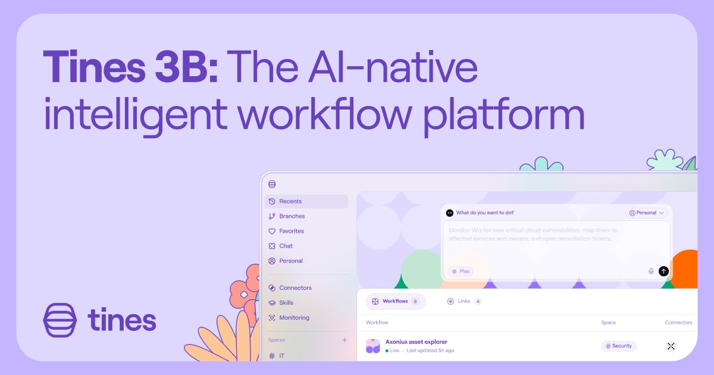
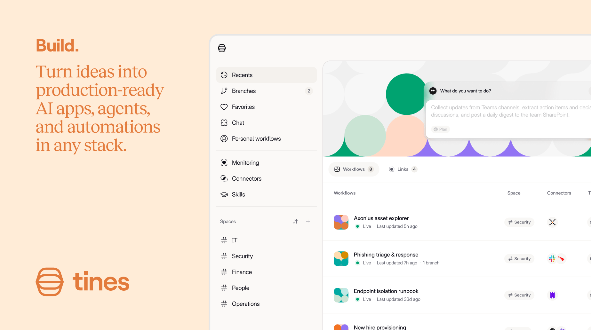
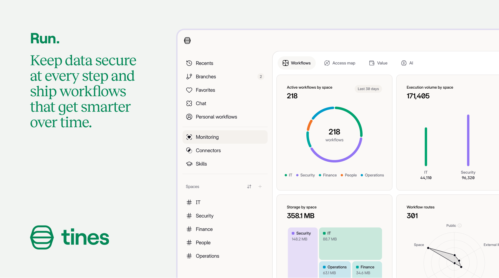

### 🎬 관련 영상
- [🎥 영상 보기](https://ph-files.imgix.net/296d5a22-570d-4864-9b51-412eb26b08c7.jpeg?auto=format)

---

## 2. [BetterClaw](https://www.producthunt.com/products/betterclaw)
**Votes**: 265 | **도입 난이도**: 하 | **신뢰도**: 상
**Tagline**: Deploy AI Agent, 60 seconds & $0 forever 
**서비스 링크**: https://www.producthunt.com/r/RSXEQOXULUOFQR

**태그**: NoCode, AI-Agent, Automation, Productivity, Agent, AI Tool, DevTool

### 📌 이 서비스 한눈에 보기
60초 만에 구축하는 무료 노코드 AI 에이전트 자동화 플랫폼

### 🔑 주요 기능
- 코딩 없이 60초 만에 스케줄 기반 AI 에이전트 구축 가능
- Gmail, Slack, Telegram 연동을 통한 자동 트리아지 및 브리핑 기능
- 사용자 본인의 AI API 키를 사용하여 지속적인 $0 비용 실현

### 🙋 사용자에게 어떤 점이 좋은가
반복적인 이메일 정리나 메시지 모니터링 업무를 자동화하여 업무 시간을 절약할 수 있습니다.

### ✅ 지금 바로 써볼 기능
- Gmail/Slack 연동을 통한 인박스 트리아지 설정
- 아침 브리핑 에이전트 생성
- 인턴 모드(승인 후 실행)를 통한 작업 검증

### ⚠️ 사용 전 확인할 점
- 사용자 본인의 AI API 키를 직접 관리해야 함
- 에이전트의 작업 범위가 연결된 서비스의 권한에 제한됨

### 🧭 확인이 더 필요한 정보
사용자 개인 API 키 사용 시 발생하는 비용 및 보안 정책을 확인해야 합니다.

### 📸 스크린샷 및 갤러리
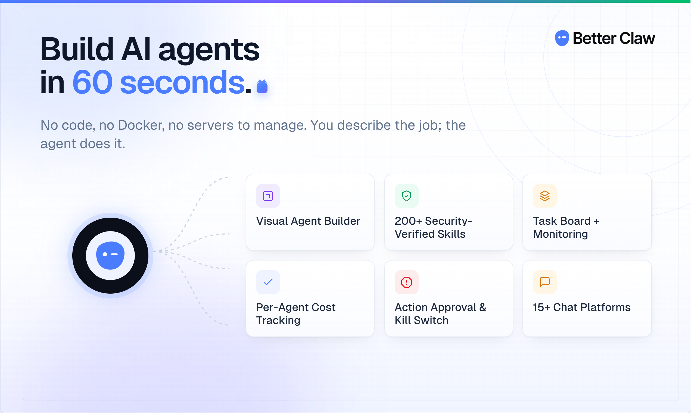
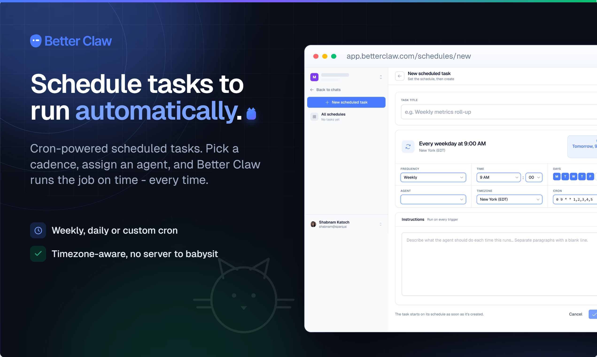
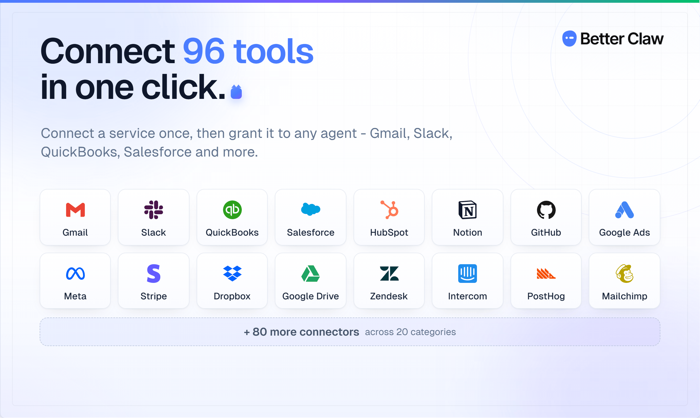

### 🎬 관련 영상
- [🎥 영상 보기](https://ph-files.imgix.net/e29cdcd9-00ef-4b3f-85b3-b7952c869902.jpeg?auto=format)

---

## 3. [Equitybee Benchmark](https://www.producthunt.com/products/equitybee)
**Votes**: 206 | **도입 난이도**: 하 | **신뢰도**: 상
**Tagline**: Compare your startup equity grant for free.
**서비스 링크**: https://www.producthunt.com/r/IP5NV4IA2YCYKO

**태그**: HR-Tech, Fintech, Analytics, Career

### 📌 이 서비스 한눈에 보기
2,500개 이상의 스타트업 데이터를 기반으로 내 스톡옵션 보상을 비교 분석하는 도구

### 🔑 주요 기능
- 2,500개 이상의 스타트업 및 9,000개 이상의 검증된 신규 입사자 보상 데이터 보유
- 부서, 직급, 회사 성장 단계별로 세분화된 벤치마크 데이터 제공
- 시장 맥락을 바탕으로 자신의 스톡옵션 부여 수준을 객관적으로 파악 가능

### 🙋 사용자에게 어떤 점이 좋은가
자신의 스톡옵션이 시장 가치에 비해 적절한지 확인하여 연봉 협상이나 이직 시 유리한 근거를 마련할 수 있습니다.

### ✅ 지금 바로 써볼 기능
- 자신의 직무 및 직급에 맞는 벤치마크 데이터 필터링하기
- 회사 성장 단계별 보상 수준 비교해보기
- 현재 제안받은 스톡옵션의 시장 경쟁력 확인하기

### ⚠️ 사용 전 확인할 점
- 제공되는 데이터는 독립적인 검증을 거치지 않았으므로 참고용으로만 활용해야 함
- 데이터는 정보 제공 목적으로만 제공되며 법적 효력이 없음

### 🧭 확인이 더 필요한 정보
제공되는 데이터의 최신성 및 실제 시장 가치와의 일치 여부를 확인해야 합니다.

### 📸 스크린샷 및 갤러리
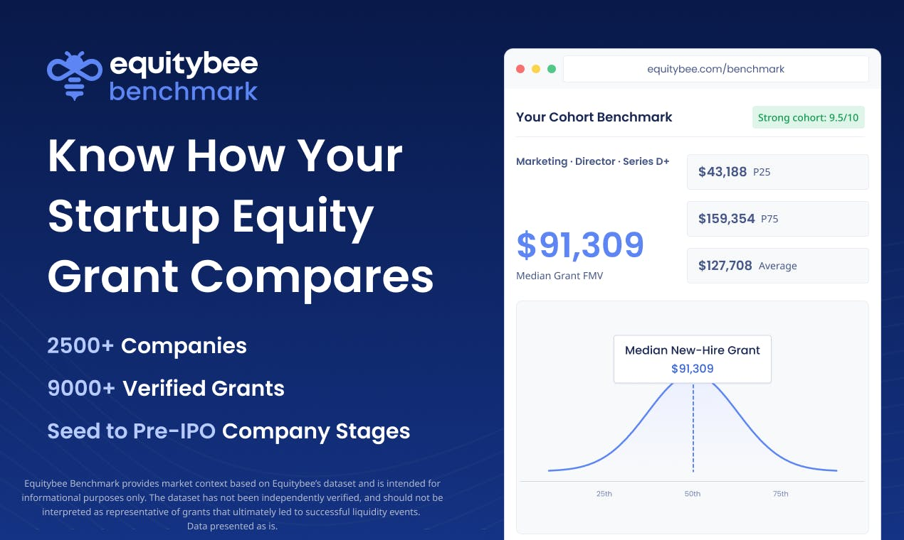
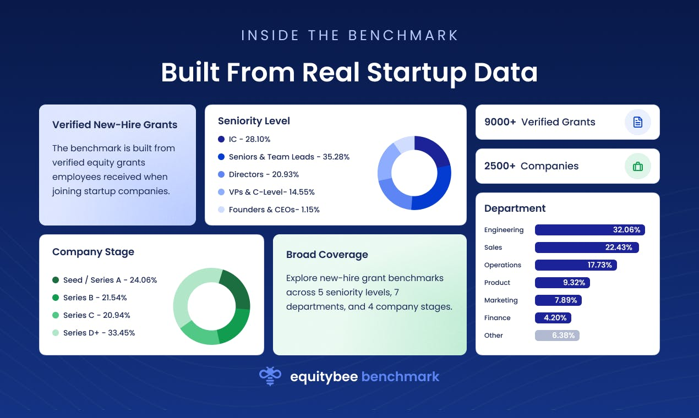
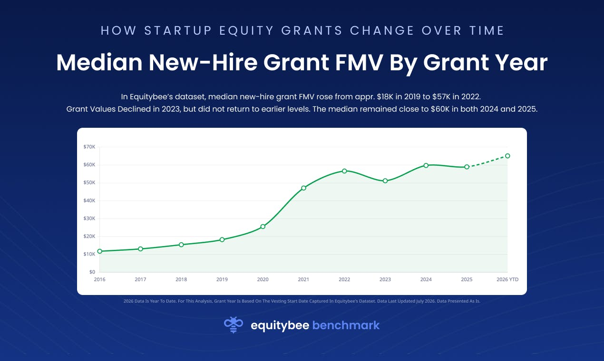

### 🎬 관련 영상
- [🎥 영상 보기](https://ph-files.imgix.net/70682237-2bb2-4e6d-aa60-dc818e8e4273.jpeg?auto=format)

---

## 4. [Xirp](https://www.producthunt.com/products/spotify)
**Votes**: 202 | **도입 난이도**: 중 | **신뢰도**: 상
**Tagline**: The agentic development environment built by Spotify
**서비스 링크**: https://www.producthunt.com/r/WHZFBNTY35M434

**태그**: DevTool, AI-Agent, Productivity, SoftwareArchitecture, Agent

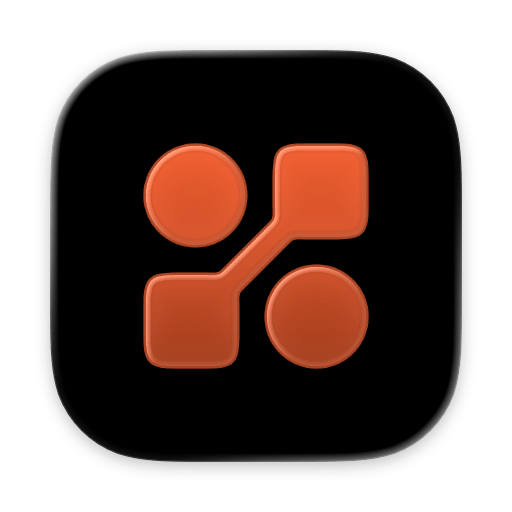

### 📌 이 서비스 한눈에 보기
Spotify의 기술력을 바탕으로 서비스 맥락과 문서를 학습하여 개발 생산성을 높이는 에이전트형 개발 환경

### 🔑 주요 기능
- Spotify Portal 기반의 에이전트형 개발 환경 제공
- 서비스, 소유권, 문서, 아키텍처 결정 사항 등 조직의 지식(Institutional Memory) 연결
- 모든 개발 세션에 실시간 맥락(Context)을 자동으로 반영

### 🙋 사용자에게 어떤 점이 좋은가
개발자가 매번 문서를 찾거나 히스토리를 파악할 필요 없이, 프로젝트의 맥락이 반영된 상태에서 즉시 개발에 집중할 수 있습니다.

### ✅ 지금 바로 써볼 기능
- 기존 서비스 및 문서 연결하기
- 아키텍처 결정 사항 데이터베이스 구축하기
- 에이전트의 맥락 파악 능력 테스트하기

### ⚠️ 사용 전 확인할 점
- 조직의 내부 데이터 및 문서 접근 권한 설정 필요
- Spotify Portal과의 연동 방식 및 보안 정책 확인 필요

### 🧭 확인이 더 필요한 정보
사용자의 개별 서비스 및 문서 데이터가 어떻게 보안 처리되고 학습되는지에 대한 상세 정보가 필요합니다.

### 📸 스크린샷 및 갤러리
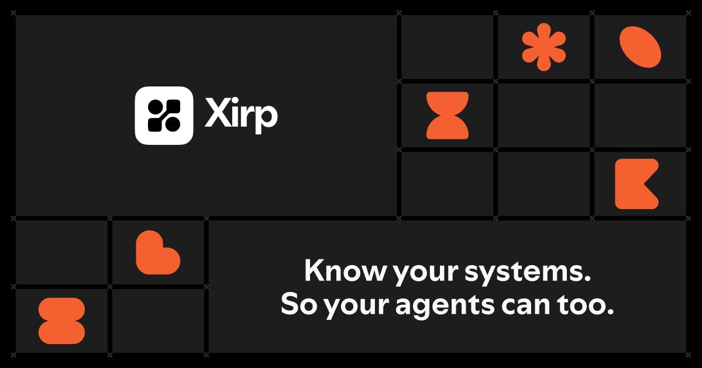
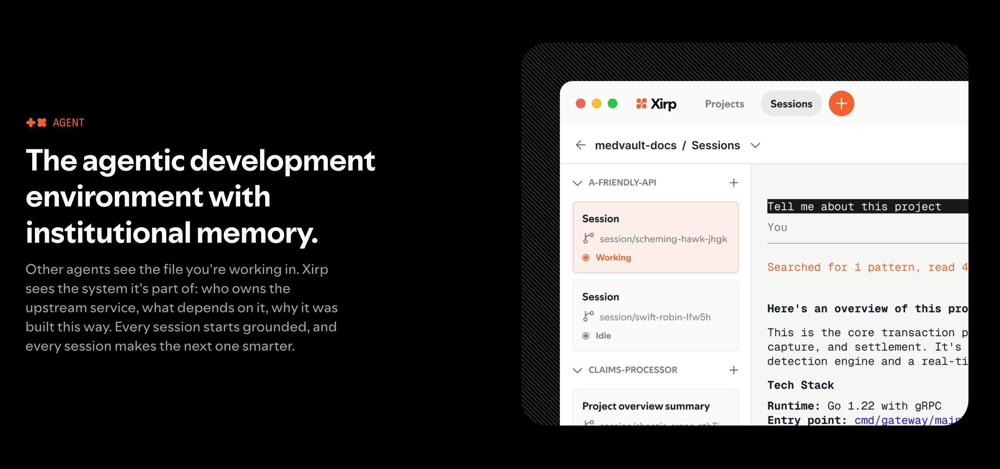
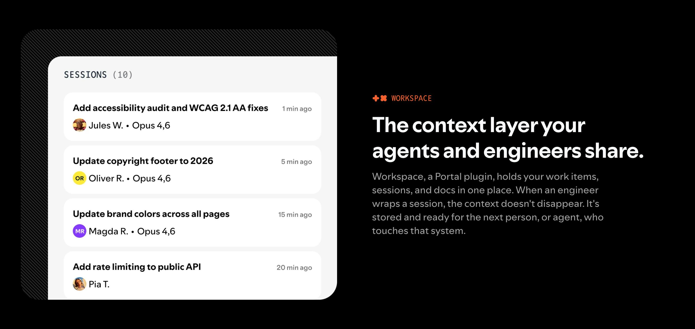

### 🎬 관련 영상
- [🎥 영상 보기](https://ph-files.imgix.net/5a38944d-4673-44ad-9696-98bfda9ccd3b.jpeg?auto=format)

---

## 5. [Bullet](https://www.producthunt.com/products/bullet-6)
**Votes**: 175 | **도입 난이도**: 하 | **신뢰도**: 상
**Tagline**: 30-60% faster than Claude Code and Codex
**서비스 링크**: https://www.producthunt.com/r/UMTDOOSFBWY54H

**태그**: DevTool, AI-Agent, Coding, Productivity, Agent, AI Tool, Prompting, API

### 📌 이 서비스 한눈에 보기
기존 코딩 에이전트보다 30-60% 더 빠른 속도를 제공하는 고성능 코딩 에이전트

### 🔑 주요 기능
- 프롬프트에 따라 최적의 모델과 추론 수준을 자동 선택
- 검색, 읽기, 명령 실행의 병렬 처리를 통한 작업 시간 단축
- 전체 저장소를 임베딩하는 대신 타겟팅된 코드 검색 방식 사용

### 🙋 사용자에게 어떤 점이 좋은가
에이전트의 실행 루프 대기 시간을 획기적으로 줄여 개발 생산성을 높일 수 있습니다.

### ✅ 지금 바로 써볼 기능
- 기존 Claude Code 또는 Codex 구독 연동하기
- 자신의 API 키 또는 온디바이스 모델 연결하기
- 병렬 처리 및 타겟팅 검색 성능 테스트하기

### ⚠️ 사용 전 확인할 점
- 사용자의 API 키나 구독을 활용하므로 비용 발생 가능성 확인 필요
- 로컬 모델 사용 시 하드웨어 사양에 따른 성능 차이 존재 가능

### 🧭 확인이 더 필요한 정보
사용자의 기존 구독 서비스 및 API 키와의 구체적인 연동 방식과 비용 구조에 대한 상세 정보가 필요합니다.

### 📸 스크린샷 및 갤러리
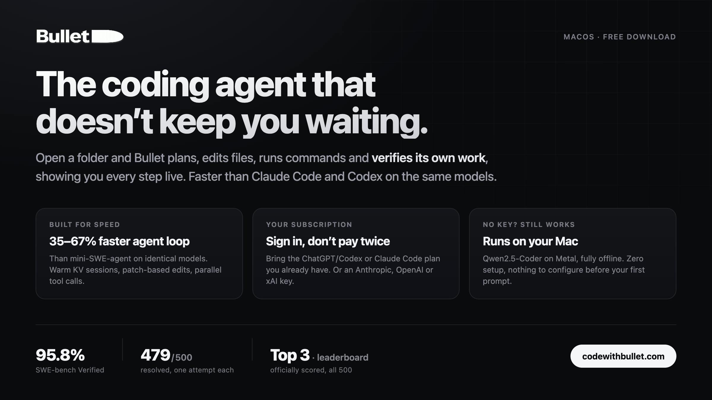
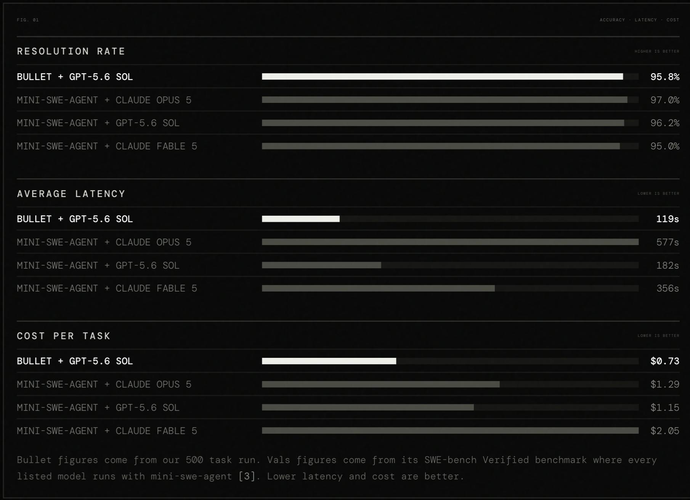
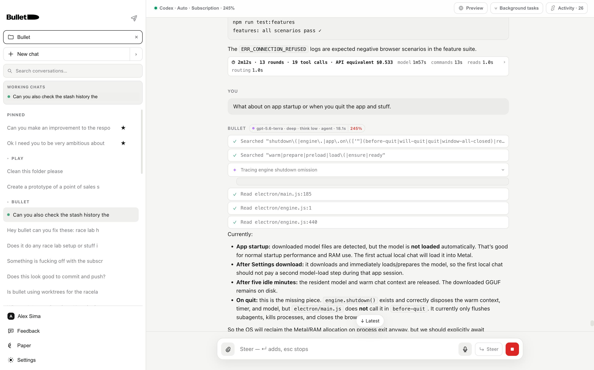

### 🎬 관련 영상
- [🎥 영상 보기](https://ph-files.imgix.net/5da7583d-288b-4d04-8bc0-e81a1b15c4bd.jpeg?auto=format)

---

## 6. [bb](https://www.producthunt.com/products/bb)
**Votes**: 158 | **도입 난이도**: 중 | **신뢰도**: 상
**Tagline**: The IDE that builds itself
**서비스 링크**: https://www.producthunt.com/r/JHAOO6HSRA3SKK

**태그**: DevTool, AI-Agent, Automation, IDE, Agent, AI Tool, Prompting

### 📌 이 서비스 한눈에 보기
사용자의 프롬프트에 따라 스스로 기능을 확장하고 커스텀하는 에이전트 기반 IDE

### 🔑 주요 기능
- Claude Code, Codex 등 다양한 AI 제공업체와 호환되는 에이전트 오케스트레이터
- 프롬프트 한 번으로 새로운 기능(예: 작업 트래커)을 즉석에서 생성 및 확장
- 새로운 스킬을 생성하여 모든 에이전트가 이를 학습하고 사용할 수 있는 구조

### 🙋 사용자에게 어떤 점이 좋은가
고정된 기능에 맞추는 대신, 필요한 기능을 직접 요청하여 워크스페이스를 실시간으로 커스텀할 수 있습니다.

### ✅ 지금 바로 써볼 기능
- 필요한 기능(예: Task Tracker)을 프롬프트로 요청해보기
- 사용 중인 AI 모델(Claude Code 등)과 연동 테스트하기
- 생성된 스킬이 에이전트들에게 어떻게 배포되는지 확인하기

### ⚠️ 사용 전 확인할 점
- 자체 확장 기능이 시스템 안정성이나 기존 워크플로우에 미칠 영향 확인 필요
- 다양한 AI 제공업체 연동 시 보안 및 권한 설정 검토 필요

### 🧭 확인이 더 필요한 정보
제공되는 다양한 AI 모델과의 구체적인 연동 방식과 보안 프로토콜에 대한 상세 정보가 필요합니다.

### 📸 스크린샷 및 갤러리
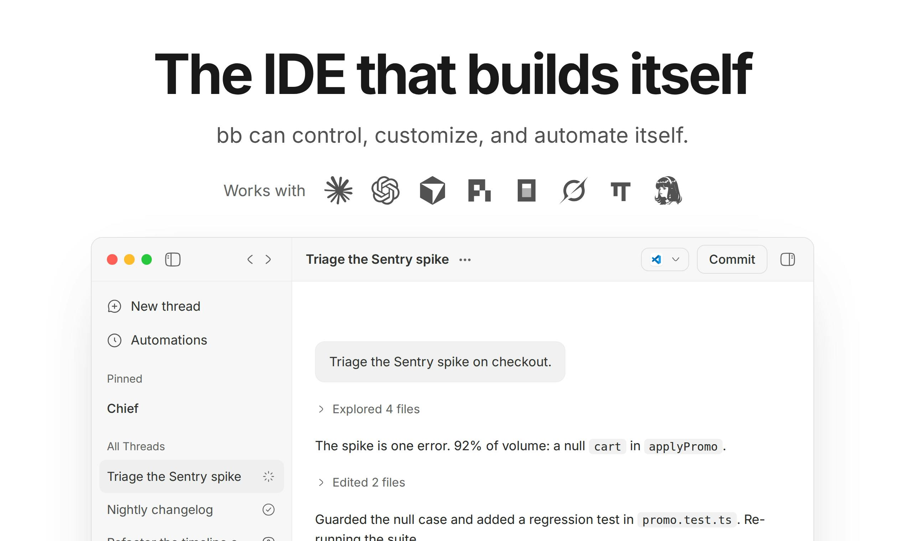
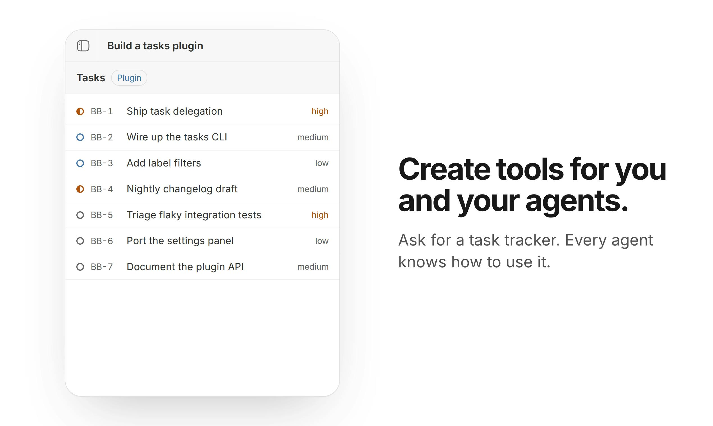
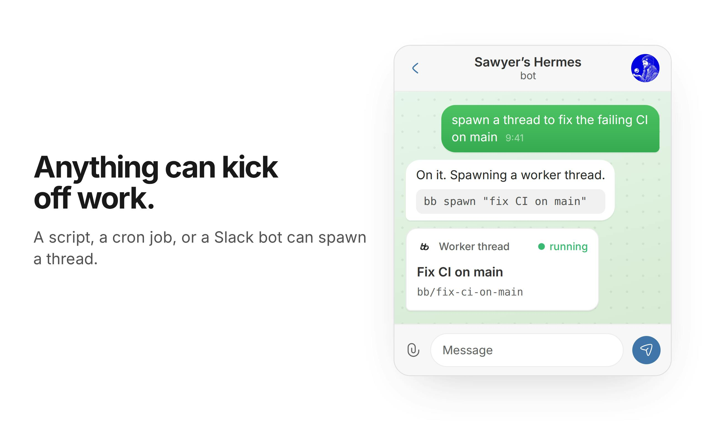

---

## 7. [Continuum](https://www.producthunt.com/products/continuum-2027)
**Votes**: 121 | **도입 난이도**: 하 | **신뢰도**: 상
**Tagline**: Remember what you know about the people you manage
**서비스 링크**: https://www.producthunt.com/r/5GRE6HVG3C23XL

**태그**: Management, Productivity, Privacy, MacApp

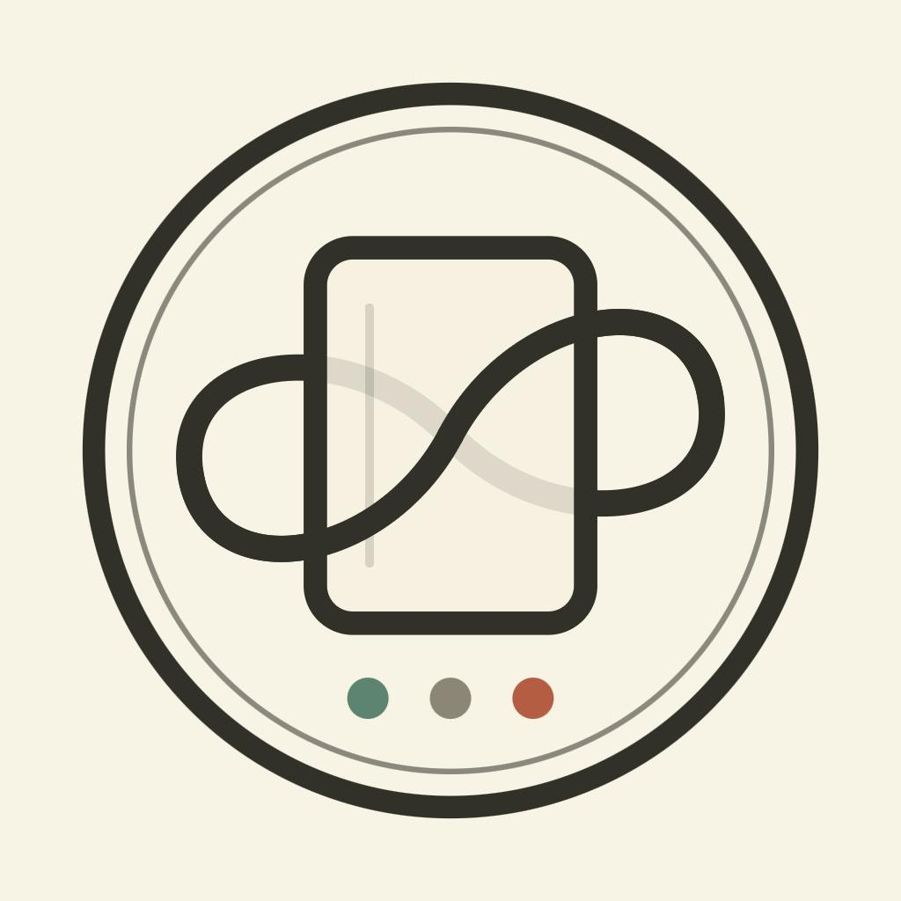

### 📌 이 서비스 한눈에 보기
매니저를 위한 프라이빗한 팀원 기록 및 관리 도구

### 🔑 주요 기능
- 팀원별 관찰 기록 및 태그 기능 제공
- 데이터가 외부로 유출되지 않는 로컬 기반 Mac 전용 앱
- 점수나 보고서 중심이 아닌 정성적 기록 중심의 관리

### 🙋 사용자에게 어떤 점이 좋은가
팀원과의 1:1 미팅이나 관찰 내용을 안전하게 기록하여 매니징의 연속성을 유지할 수 있습니다.

### ✅ 지금 바로 써볼 기능
- 팀원별 관찰 기록 작성해보기
- 1:1 미팅 시 태그 기능 활용하기
- 로컬 저장 방식 확인하기

### ⚠️ 사용 전 확인할 점
- Mac 전용 앱이므로 다른 OS 사용 시 사용 불가
- 클라우드 동기화 여부에 따라 기기 간 데이터 이동 제한 가능성 있음

### 🧭 확인이 더 필요한 정보
데이터 백업 및 다른 기기와의 동기화 방식에 대한 상세 정보가 필요합니다.

### 📸 스크린샷 및 갤러리
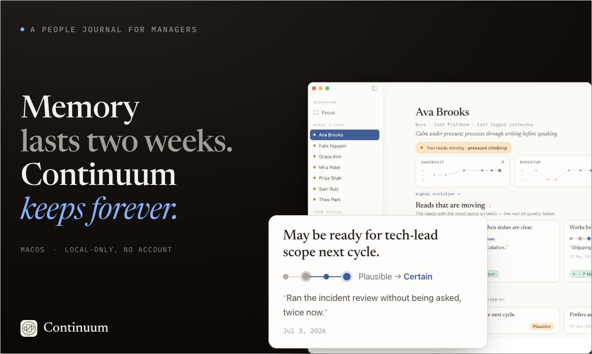
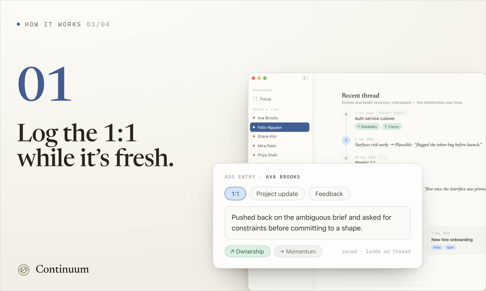
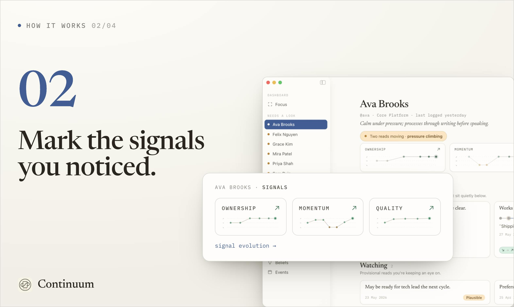

---

## 8. [Vizard Agent](https://www.producthunt.com/products/vizard-agent-the-first-video-agi)
**Votes**: 114 | **도입 난이도**: 하 | **신뢰도**: 상
**Tagline**: One AI agent for every kind of video
**서비스 링크**: https://www.producthunt.com/r/VWACZYA7FQVRD2

**태그**: VideoAI, Automation, ContentCreation, Productivity, Agent, AI Tool, Video, Vision

### 📌 이 서비스 한눈에 보기
아이디어만 입력하면 편집부터 현지화까지 알아서 수행하는 올인원 AI 영상 제작 에이전트

### 🔑 주요 기능
- 원시 푸티지, URL, 스크립트 등 다양한 소스를 활용한 영상 제작
- 편집, 생성, 재구성, 현지화 등 복잡한 워크플로우 자동화
- 개별 도구 관리 없이 결과 중심의 단일 에이전트 인터페이스 제공

### 🙋 사용자에게 어떤 점이 좋은가
영상 제작의 각 단계를 개별 툴로 관리할 필요 없이, 원하는 결과물만 말하면 AI가 전체 과정을 처리하여 작업 시간을 획기적으로 단축합니다.

### ✅ 지금 바로 써볼 기능
- 아이디어나 스크립트를 입력하여 초안 생성해보기
- 기존 영상 URL을 활용한 리퍼퍼징(Repurposing) 테스트
- 생성된 영상에 대한 피드백을 통한 수정 작업 경험하기

### ⚠️ 사용 전 확인할 점
- AI가 생성한 결과물의 세부 편집 품질 확인 필요
- 복잡한 창의적 의도가 반영되는지 검토 필요

### 🧭 확인이 더 필요한 정보
에이전트가 처리할 수 있는 영상의 최대 길이와 복잡도에 대한 구체적인 제한 사항이 명시되지 않았습니다.

### 📸 스크린샷 및 갤러리
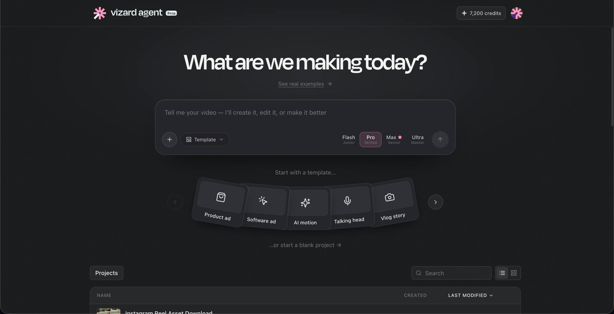

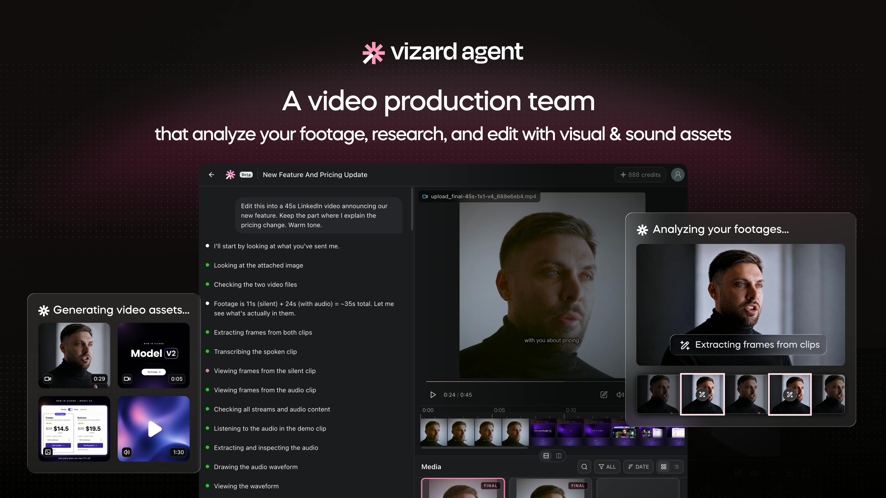

### 🎬 관련 영상
- [🎥 영상 보기](https://ph-files.imgix.net/ed88221a-7a82-4f3f-b15a-eab47beb5989.jpeg?auto=format)

---

## 9. [Product Analytics for Agents and Users](https://www.producthunt.com/products/kubit)
**Votes**: 110 | **도입 난이도**: 중 | **신뢰도**: 상
**Tagline**: Optimize Agent Actions with User Behavior.
**서비스 링크**: https://www.producthunt.com/r/HMY65PVSOJ3RX5

**태그**: AI, Analytics, DevTool, ProductOps, Agent, AI Tool, Prompting

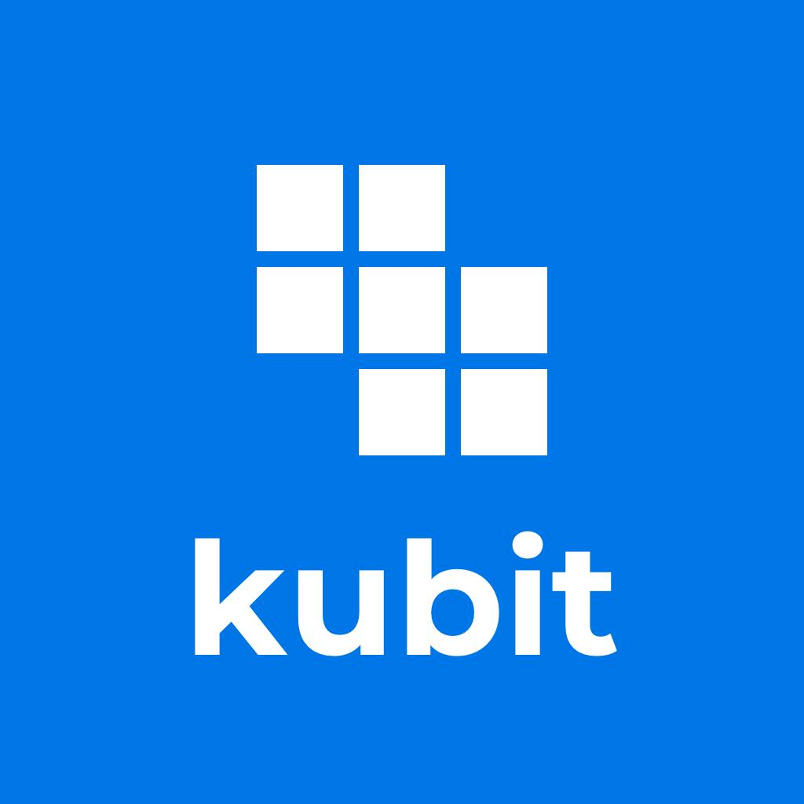

### 📌 이 서비스 한눈에 보기
사용자 행동 데이터와 AI 에이전트 트레이스를 연결하여 AI 제품의 전환율을 최적화하는 분석 도구

### 🔑 주요 기능
- 사용자 활동과 에이전트 실행 로그 간의 직접적인 연결 제공
- 재질문(re-prompt), 이탈, 전환 원인에 대한 심층 분석 가능
- OTel, CDP, BYOW(Bring Your Own Warehouse)를 통한 유연한 데이터 통합

### 🙋 사용자에게 어떤 점이 좋은가
AI 에이전트가 왜 사용자의 의도를 벗어나는지 정확히 파악하여, 제품 개선을 위한 인사이트를 코딩 에이전트에 즉시 피드백할 수 있습니다.

### ✅ 지금 바로 써볼 기능
- OTel 또는 기존 CDP를 통한 데이터 파이프라인 연결
- 사용자 행동과 에이전트 트레이스 매핑 확인
- 분석된 인사이트를 개발 워크플로우에 적용

### ⚠️ 사용 전 확인할 점
- 데이터 소스(CDP, Warehouse 등)의 기술적 준비 상태에 따라 초기 설정 난이도가 다를 수 있음
- 에이전트 트레이스 데이터의 정교함에 따라 분석 결과의 질이 결정됨

### 🧭 확인이 더 필요한 정보
사용자의 기존 데이터 스택(CDP/Warehouse)과의 구체적인 호환성 및 데이터 보안 정책 확인이 필요합니다.

### 📸 스크린샷 및 갤러리
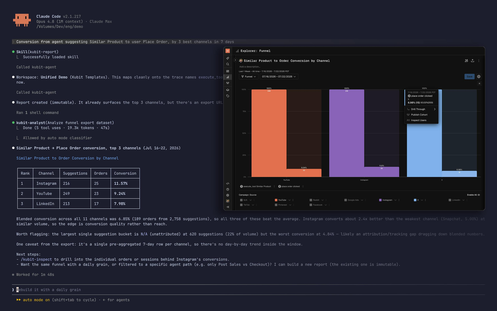
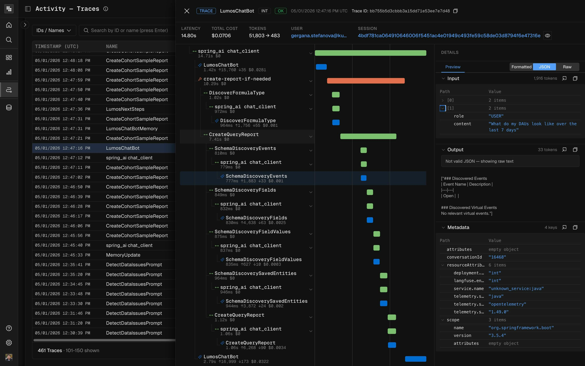
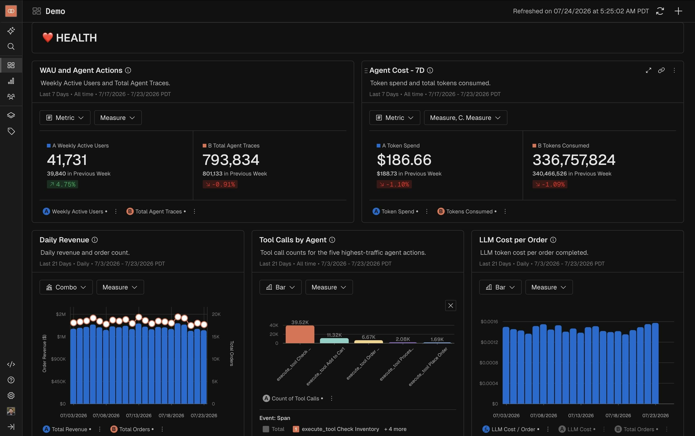

### 🎬 관련 영상
- [🎥 영상 보기](https://ph-files.imgix.net/cc210661-1fb7-424e-879b-c9dacd2cf377.jpeg?auto=format)

---

## 10. [Octomind Cloud and Hub](https://www.producthunt.com/products/octomind-plug-n-play-ai-agents)
**Votes**: 107 | **도입 난이도**: 하 | **신뢰도**: 상
**Tagline**: One login, zero API keys — cloud agents + 27 models
**서비스 링크**: https://www.producthunt.com/r/YLGBCJZ2RHQNUN

**태그**: AI-Agents, Cloud-Computing, Automation, DevTools, Agent, AI Tool, DevTool, API

### 📌 이 서비스 한눈에 보기
API 키 관리 없이 클라우드에서 AI 에이전트를 실행하고 어디서든 작업을 이어가는 도구

### 🔑 주요 기능
- API 키 설정 없이 27개 모델 즉시 사용 가능
- 클라우드 기반 세션 유지로 기기 제한 없는 작업 연속성 제공
- 초 단위 과금 방식 및 강력한 벤치마크 성능

### 🙋 사용자에게 어떤 점이 좋은가
복잡한 환경 설정이나 API 키 관리 없이도 강력한 AI 에이전트를 클라우드에서 실행하고, 작업 중 노트북을 닫아도 세션이 유지되어 업무 연속성이 확보됩니다.

### ✅ 지금 바로 써볼 기능
- 원하는 머신 사양 선택하여 에이전트 실행하기
- 내장된 21개 모델로 작업 지시하기
- 다른 기기에서 기존 세션 재개하기

### ⚠️ 사용 전 확인할 점
- 초 단위 과금 방식에 따른 비용 관리 필요
- 클라우드 환경에서의 데이터 보안 및 프라이버시 정책 확인 필요

### 🧭 확인이 더 필요한 정보
제시된 벤치마크 결과가 실제 사용자 환경의 작업 효율과 동일하게 나타날지는 검증이 필요합니다.

### 📸 스크린샷 및 갤러리
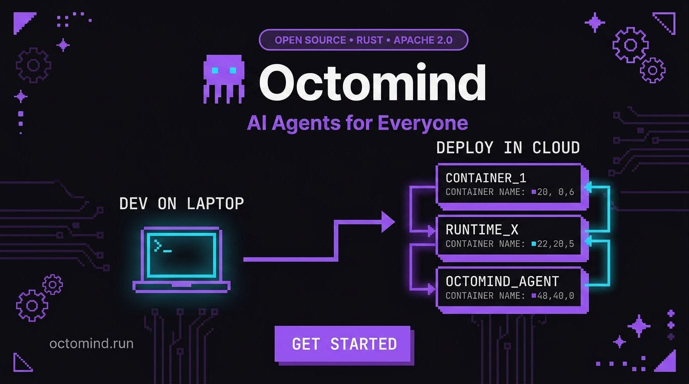
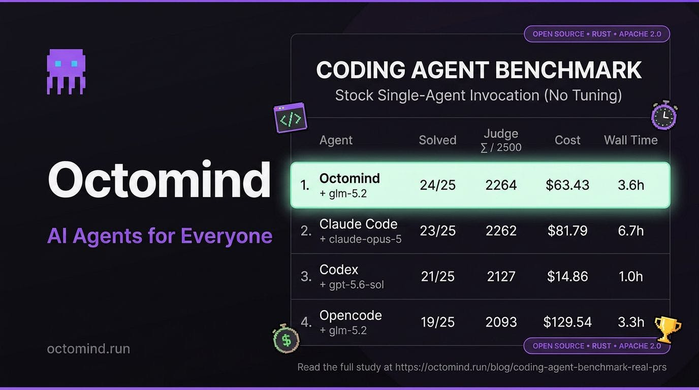
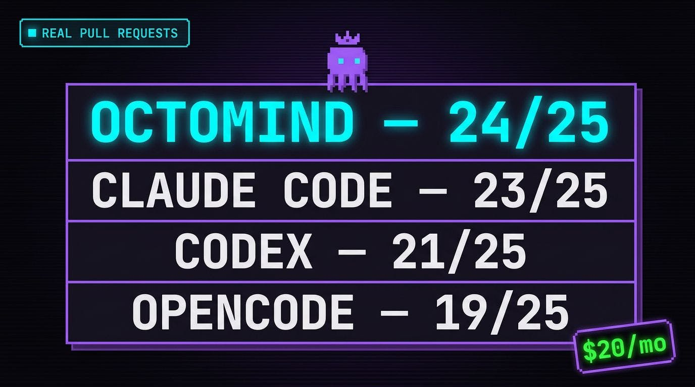

---

## 11. [Gitar](https://www.producthunt.com/products/gitar)
**Votes**: 105 | **도입 난이도**: 중 | **신뢰도**: 상
**Tagline**: AI code review that fixes what it finds
**서비스 링크**: https://www.producthunt.com/r/NSFHGHWL2JE6CW

**태그**: DevTool, AI, Automation, CI/CD, AI Tool

### 📌 이 서비스 한눈에 보기
코드 리뷰부터 버그 수정까지 자동화하는 AI 개발 워크플로우 도구

### 🔑 주요 기능
- Pull Request 리뷰 및 CI 실패 원인 진단
- 발견된 문제에 대한 자동 수정 및 파이프라인 검증
- Flaky 테스트 재시도 및 GitHub/GitLab 워크플로우 자동화

### 🙋 사용자에게 어떤 점이 좋은가
개발자가 수동으로 수행하던 코드 리뷰와 CI 오류 해결 과정을 자동화하여 개발 생산성을 높이고 반복적인 디버깅 시간을 줄여줍니다.

### ✅ 지금 바로 써볼 기능
- GitHub/GitLab 저장소 연동하기
- CI 실패 시 자동 진단 기능 활성화하기
- 자동 수정된 코드의 검증 프로세스 확인하기

### ⚠️ 사용 전 확인할 점
- AI가 생성한 수정 코드가 기존 코드베이스의 설계 철학과 일치하는지 검토 필요
- CI/CD 파이프라인에 직접적인 영향을 미치므로 권한 설정 주의

### 🧭 확인이 더 필요한 정보
Sonar로 인수된 이후의 구체적인 통합 계획 및 요금 체계에 대한 정보가 부족합니다.

### 📸 스크린샷 및 갤러리

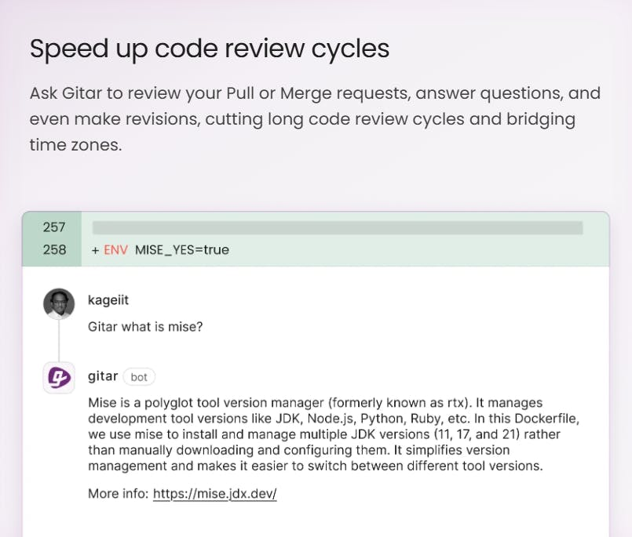
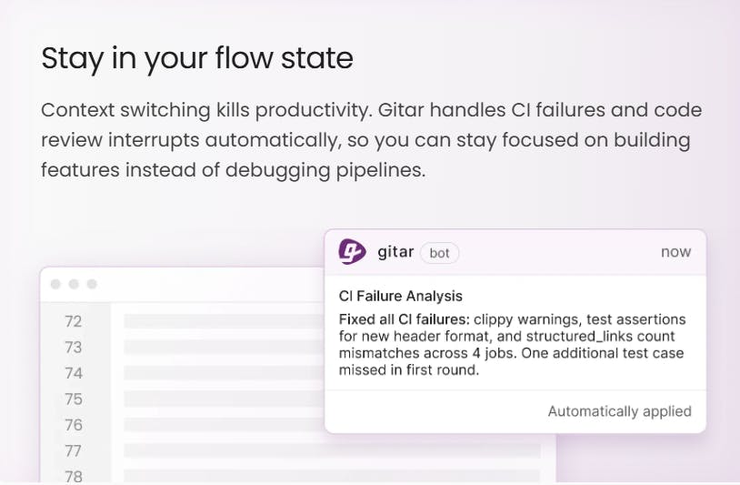

---

## 12. [agent-manager](https://www.producthunt.com/products/agent-manager)
**Votes**: 96 | **도입 난이도**: 하 | **신뢰도**: 상
**Tagline**: The fastest workflow for developing with AI
**서비스 링크**: https://www.producthunt.com/r/TYR5KARYLBAMED

**태그**: DevTool, AI, CLI, Automation, Workflow, Agent, AI Tool, Prompting

### 📌 이 서비스 한눈에 보기
다양한 AI 에이전트를 하나의 tmux 세션에서 효율적으로 관리하고 워크플로우를 자동화하는 개발 도구

### 🔑 주요 기능
- Claude Code, Gemini CLI 등 여러 AI 에이전트를 하나의 tmux 리스트에서 실시간 상태와 함께 관리
- 대화 포크(fork), 쉘 고정, 파일 전체 diff 확인 등 개발 생산성을 높이는 단축키 제공
- 세션별 Git 워크트리 생성 및 단일 Go 바이너리로 제공되는 가벼운 구조

### 🙋 사용자에게 어떤 점이 좋은가
여러 AI 에이전트를 동시에 사용하는 개발자가 복잡한 터미널 환경을 체계적으로 관리하고, 코드 리뷰 및 Git 워크플로우를 빠르게 전환할 수 있게 해줍니다.

### ✅ 지금 바로 써볼 기능
- 단축키(f, T, ctrl+r)를 활용한 에이전트 제어 및 대화 분기 테스트
- Git 워크트리 연동을 통한 세션별 독립적 개발 환경 구축
- 단일 바이너리 설치 후 기존 tmux 환경과의 호환성 확인

### ⚠️ 사용 전 확인할 점
- Windows 사용자는 WSL2 환경이 필수적임
- tmux 숙련도에 따라 초기 학습 곡선이 존재할 수 있음

### 🧭 확인이 더 필요한 정보
사용자의 기존 tmux 설정이나 복잡한 환경에서의 충돌 여부는 명시되어 있지 않습니다.

### 📸 스크린샷 및 갤러리
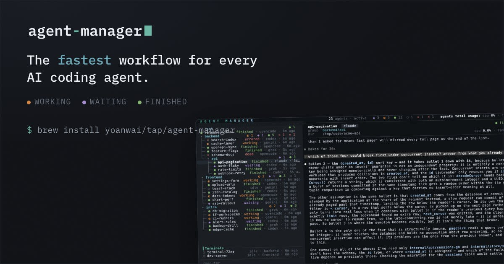
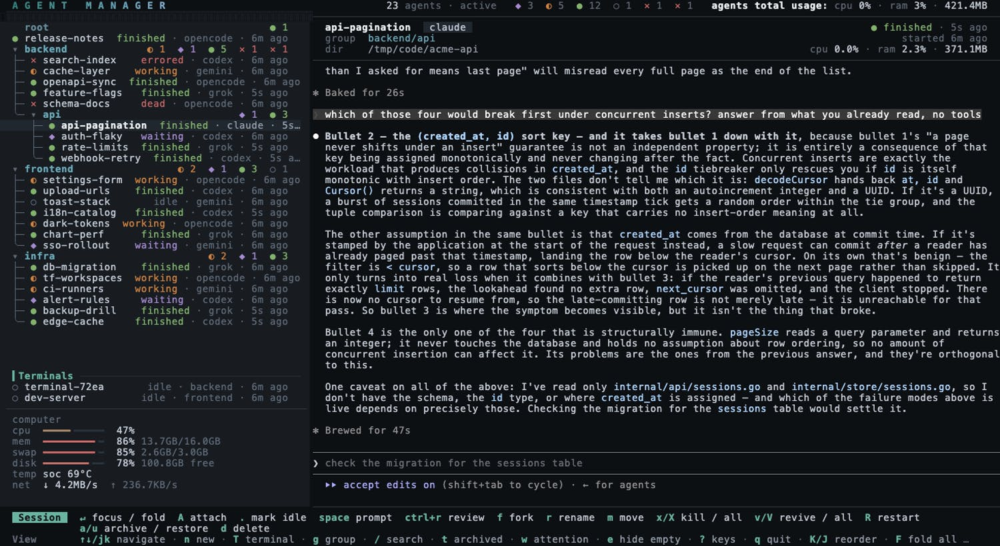
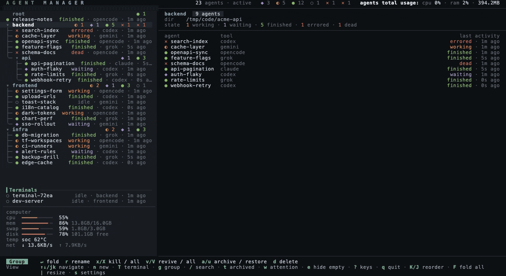

### 🎬 관련 영상
- [🎥 영상 보기](https://ph-files.imgix.net/534996f9-3d0c-418a-b8ca-ca33b13805d1.jpeg?auto=format)

---

## 13. [Cerenovus](https://www.producthunt.com/products/cerenovus)
**Votes**: 96 | **도입 난이도**: 상 | **신뢰도**: 상
**Tagline**: Proactively find the money your company is losing
**서비스 링크**: https://www.producthunt.com/r/7OXGQFTLYF2LBR

**태그**: BusinessIntelligence, WorkflowAutomation, Analytics, CostOptimization, Automation

### 📌 이 서비스 한눈에 보기
기업 내 워크플로우의 병목 현상을 찾아 실질적인 비용 절감 방안을 제시하는 자동화 분석 솔루션

### 🔑 주요 기능
- 사내 문서, 커뮤니케이션, 데이터베이스를 통합 분석하여 워크플로우 맵 생성
- 업무 프로세스 내 비효율성과 병목 구간을 자동으로 식별
- 근거가 명시된(cited) 인간 검증 기반의 실행 가능한 개선 보고서 제공

### 🙋 사용자에게 어떤 점이 좋은가
기업 운영 중 발생하는 보이지 않는 손실을 데이터 기반으로 포착하여, 즉각적인 비용 절감과 업무 효율화를 실현할 수 있습니다.

### ✅ 지금 바로 써볼 기능
- 사내 데이터 소스(문서, DB 등) 연동 가능 여부 확인
- 워크플로우 맵핑 및 병목 식별 기능 테스트
- 제공되는 리포트의 실행 가능성 및 근거 확인

### ⚠️ 사용 전 확인할 점
- 사내 민감 정보(문서, 커뮤니케이션) 접근에 따른 보안 및 개인정보 보호 이슈
- 데이터 통합 범위에 따른 분석 정확도 차이 가능성

### 🧭 확인이 더 필요한 정보
사내 데이터 보안 정책 준수 여부와 데이터 수집 방식에 대한 구체적인 정보가 필요합니다.

### 📸 스크린샷 및 갤러리

### 🎬 관련 영상
- [🎥 영상 보기](https://ph-files.imgix.net/f1030775-2296-4886-86ed-ea3c06953f71.jpeg?auto=format)

---

## 14. [AMP by CanyonTechs AI](https://www.producthunt.com/products/amp-by-canyontechs-ai)
**Votes**: 90 | **도입 난이도**: 중 | **신뢰도**: 상
**Tagline**: AI agents that act. Automation that delivers.
**서비스 링크**: https://www.producthunt.com/r/HMGS5663UJRFWY

**태그**: DevOps, AI-Agent, Automation, Software-Engineering, Agent, AI Tool, Prompting, DevTool

### 📌 이 서비스 한눈에 보기
로그 모니터링부터 코드 수정 PR 생성까지 자동으로 수행하는 AI 에이전트

### 🔑 주요 기능
- 로그 모니터링, 장애 감지, 수정 PR 생성을 자동화하는 자율형 AI 에이전트
- Java, Python, TypeScript, Node.js, Rust 언어 지원 및 80% 이상의 수정 성공률
- 직접적인 운영 환경 접근 없이 인간의 검토를 거치는 Human-in-the-loop 방식

### 🙋 사용자에게 어떤 점이 좋은가
개발자가 일일이 로그를 확인하고 수정 코드를 작성하는 번거로움을 줄여주며, 제안된 PR을 검토만 하면 되는 워크플로우를 제공합니다.

### ✅ 지금 바로 써볼 기능
- 지원하는 프로그래밍 언어 환경에 적용해보기
- PH3MOFREE 코드를 사용하여 무료 체험 기능 활용하기

### ⚠️ 사용 전 확인할 점
- AI가 생성한 PR의 품질을 사람이 직접 검토해야 하는 과정이 필수적임
- 지원되는 언어 외의 환경에서는 사용이 제한될 수 있음

### 🧭 확인이 더 필요한 정보
80% 이상의 수정 성공률이 어떤 환경과 조건에서 측정된 수치인지 확인이 필요합니다.

### 📸 스크린샷 및 갤러리

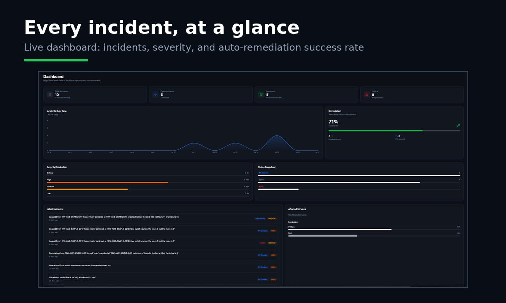
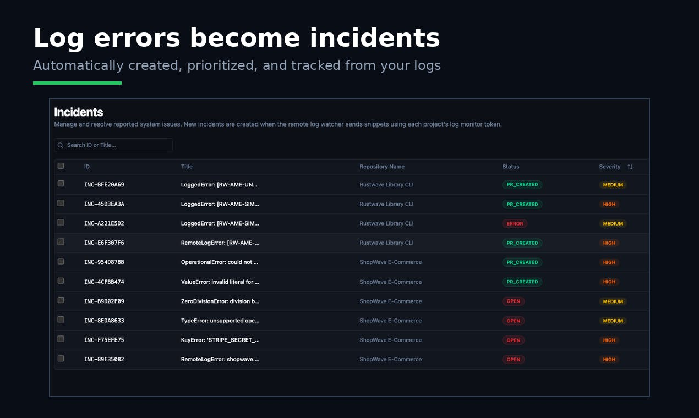

### 🎬 관련 영상
- [🎥 영상 보기](https://ph-files.imgix.net/e9dfc01d-2df7-4148-b89e-a4b690afdb19.jpeg?auto=format)

---

## 15. [Gotcha](https://www.producthunt.com/products/gotcha-5)
**Votes**: 90 | **도입 난이도**: 중 | **신뢰도**: 상
**Tagline**: World's First AI Copilot for Android. You talk. It acts.
**서비스 링크**: https://www.producthunt.com/r/KRDJGGYLWN3HKH

**태그**: AI, Android, Automation, Voice-UI, OpenSource, AI Tool, LLM

### 📌 이 서비스 한눈에 보기
말 한마디로 안드로이드 스마트폰의 모든 기능을 제어하는 AI 코파일럿

### 🔑 주요 기능
- 자연어 명령을 통한 안드로이드 기기 제어
- 100개 이상의 네이티브 디바이스 도구 탑재
- Samosa AIR 기반의 실시간 음성 통화 및 온디바이스 AI 기술

### 🙋 사용자에게 어떤 점이 좋은가
복잡한 터치 조작 없이 목소리만으로 스마트폰 기능을 실행할 수 있어 손을 쓰기 어려운 상황에서 매우 유용합니다.

### ✅ 지금 바로 써볼 기능
- 음성 명령으로 기기 기능 실행해보기
- 100여 가지 내장 도구 활용해보기
- 이중 안전 모드 설정 및 테스트하기

### ⚠️ 사용 전 확인할 점
- 기기 제어 권한 부여에 따른 보안 및 개인정보 관리 필요
- 온디바이스 AI 특성상 하드웨어 사양에 따른 성능 차이 가능성

### 🧭 확인이 더 필요한 정보
Samosa AIR 모델이 모든 안드로이드 기기 환경에서 동일한 성능을 보장하는지 확인이 필요합니다.

### 📸 스크린샷 및 갤러리
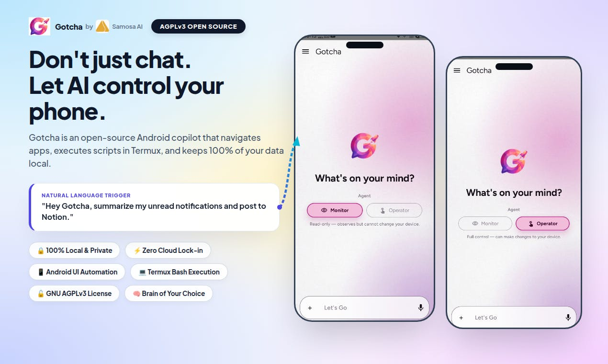
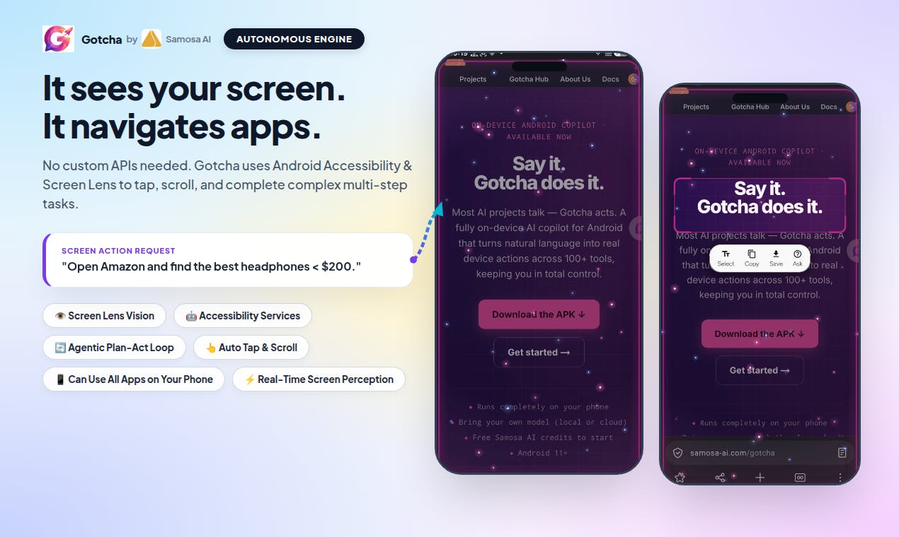
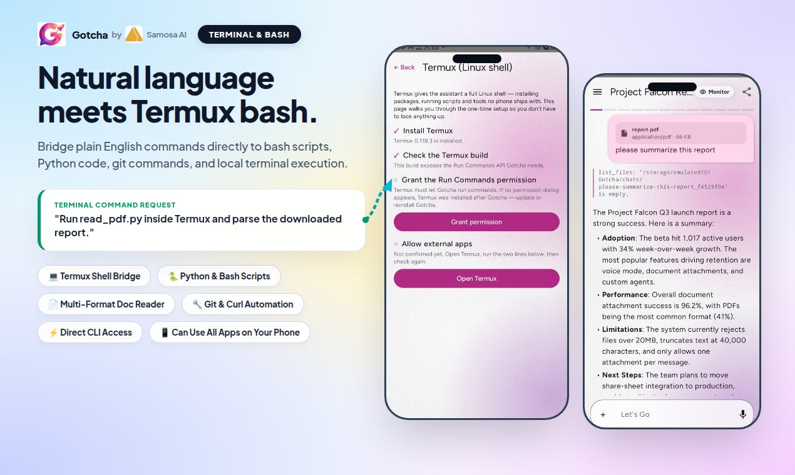

### 🎬 관련 영상
- [🎥 영상 보기](https://ph-files.imgix.net/2cc6c84d-b9fa-4daf-937d-9886278e41c6.jpeg?auto=format)

---

## 16. [Lexi](https://www.producthunt.com/products/lexi-5)
**Votes**: 88 | **도입 난이도**: 중 | **신뢰도**: 상
**Tagline**: The operating system for legal work
**서비스 링크**: https://www.producthunt.com/r/QXI7QVDHSDNXYD

**태그**: LegalTech, Productivity, Workflow, Automation

### 📌 이 서비스 한눈에 보기
법률 업무의 모든 과정을 하나로 통합 관리하는 법률 전용 운영체제

### 🔑 주요 기능
- 문서 초안 작성, 검토, 리서치 기능 통합
- 사건(Matter) 지식 조직화 및 중앙 집중식 관리
- 반복적인 업무 자동화를 통한 전략적 업무 집중 환경 제공

### 🙋 사용자에게 어떤 점이 좋은가
단순 반복적인 문서 작업과 정보 정리 시간을 줄여, 변호사가 판단, 전략, 고객 상담 등 핵심적인 법률 서비스에만 집중할 수 있게 합니다.

### ✅ 지금 바로 써볼 기능
- 문서 초안 작성 및 검토 워크플로우 테스트
- 기존 사건 데이터의 조직화 기능 확인
- 사건 추적 및 관리 대시보드 활용

### ⚠️ 사용 전 확인할 점
- 기존 법률 소프트웨어와의 데이터 호환성 확인 필요
- 보안 및 데이터 프라이버시 정책 검토 필수

### 🧭 확인이 더 필요한 정보
구체적인 보안 프로토콜과 기존 법률 시스템과의 연동 범위에 대한 정보가 부족합니다.

### 📸 스크린샷 및 갤러리
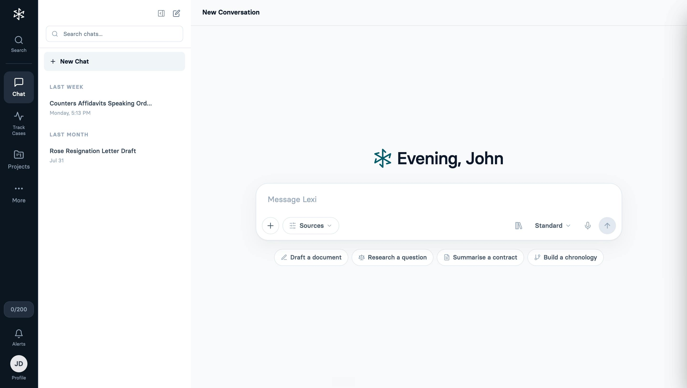
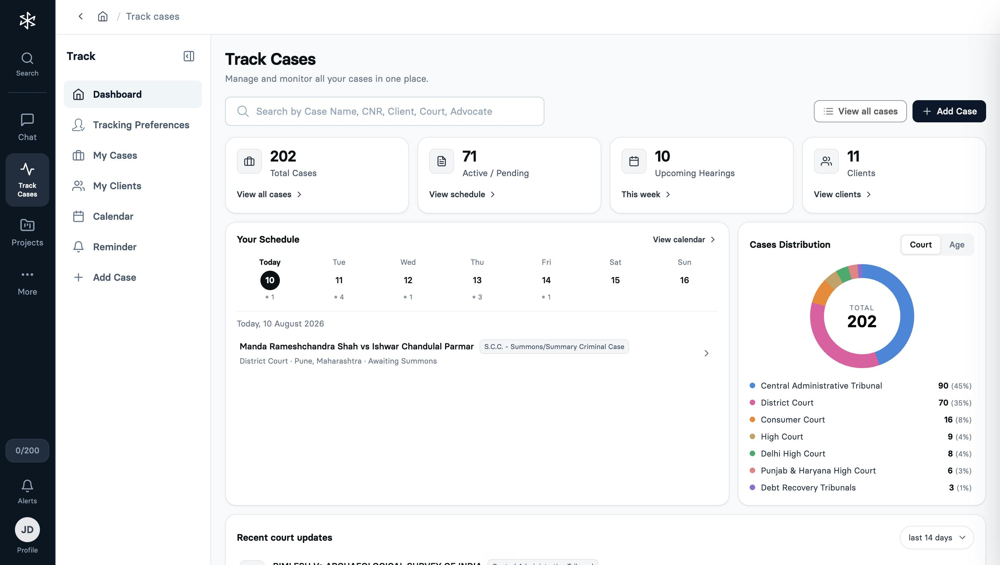
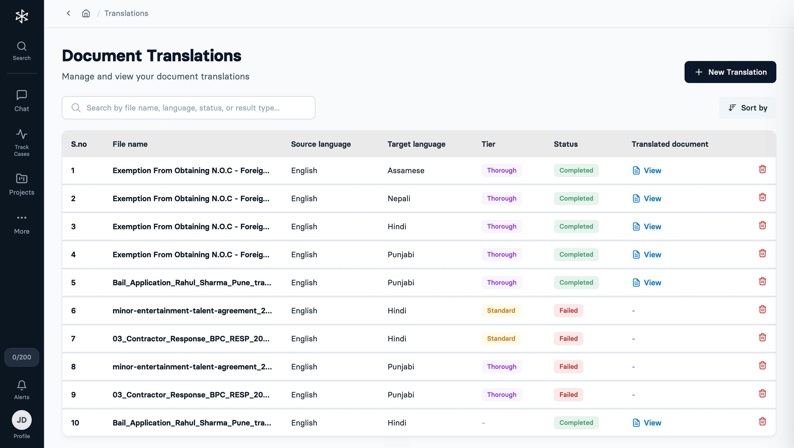

---

## 17. [VoiceGecko](https://www.producthunt.com/products/voice-gecko)
**Votes**: 84 | **도입 난이도**: 하 | **신뢰도**: 상
**Tagline**: Open source, local voice-to-text
**서비스 링크**: https://www.producthunt.com/r/YCLOOFBZKUDUZH

**태그**: Productivity, OpenSource, VoiceToText, Automation, AI Tool, Prompting, Email

### 📌 이 서비스 한눈에 보기
단축키 하나로 어디서든 즉시 텍스트를 입력하는 오픈소스 로컬 음성 인식 도구

### 🔑 주요 기능
- 오픈소스 기반의 투명한 소프트웨어
- 로컬 환경에서 작동하는 프라이버시 중심의 음성 인식
- 단축키를 통한 즉각적인 클립보드 텍스트 입력

### 🙋 사용자에게 어떤 점이 좋은가
이메일 작성, 코딩, AI 프롬프트 입력 시 키보드 타이핑 대신 말로 빠르게 내용을 전달할 수 있어 작업 흐름이 끊기지 않습니다.

### ✅ 지금 바로 써볼 기능
- 단축키 설정 후 바로 말해보기
- 클립보드로 복사된 텍스트 확인하기
- 다양한 작업 환경(코드 에디터, 브라우저 등)에서 테스트하기

### ⚠️ 사용 전 확인할 점
- 로컬 실행 환경의 하드웨어 성능에 따른 인식 속도 차이
- 음성 인식 엔진의 정확도 및 언어 지원 범위 확인 필요

### 🧭 확인이 더 필요한 정보
지원하는 프로그래밍 언어나 특정 OS(Windows/macOS/Linux)에서의 최적화 수준을 확인해야 합니다.

### 📸 스크린샷 및 갤러리
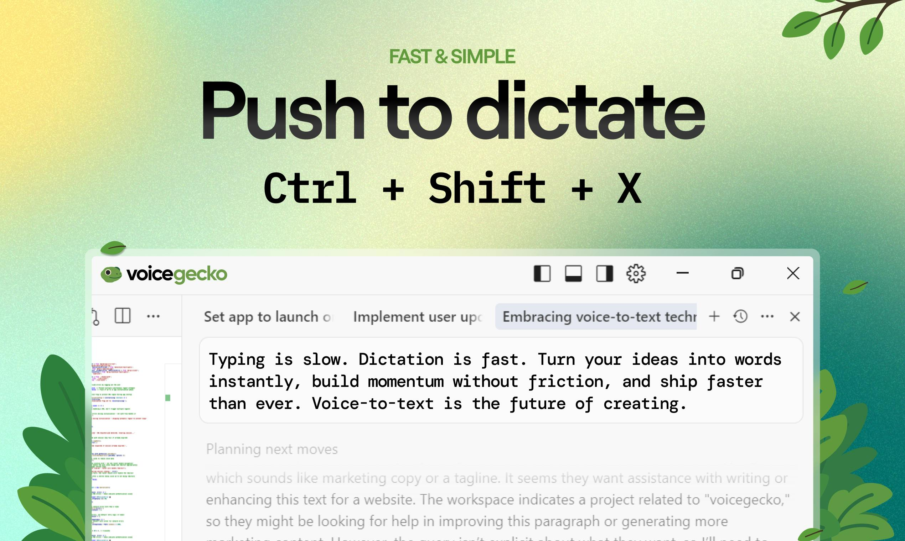
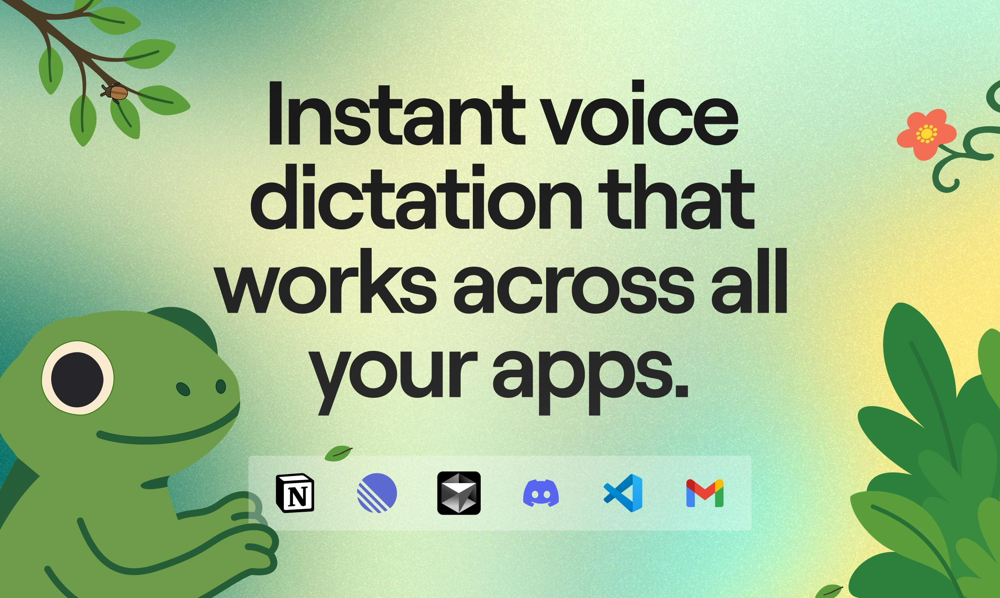
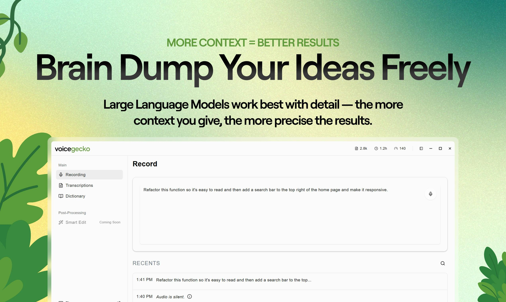

### 🎬 관련 영상
- [🎥 영상 보기](https://ph-files.imgix.net/791787eb-9c3c-4e42-8a80-7b07d6ade08e.jpeg?auto=format)

---

## 18. [Switchy for Mac](https://www.producthunt.com/products/switchy-for-mac)
**Votes**: 77 | **도입 난이도**: 하 | **신뢰도**: 상
**Tagline**: Switch your Magic Keyboard, Trackpad, and Mouse between Macs
**서비스 링크**: https://www.producthunt.com/r/DNTX55TYI5CUD3

**태그**: Productivity, macOS, Hardware-Integration

### 📌 이 서비스 한눈에 보기
여러 대의 Mac 사이에서 매직 키보드와 마우스를 간편하게 전환하는 메뉴 바 앱

### 🔑 주요 기능
- 로컬 네트워크를 통한 주변 Mac 자동 탐색
- 케이블 연결이나 수동 페어링 없이 기기 전환 가능
- 여러 대의 Mac(업무용/개인용) 사용자를 위한 최적의 워크플로우 제공

### 🙋 사용자에게 어떤 점이 좋은가
여러 대의 Mac을 사용하는 사용자가 매번 블루투스 설정을 바꿀 필요 없이 하나의 주변기기 세트를 효율적으로 공유할 수 있습니다.

### ✅ 지금 바로 써볼 기능
- 메뉴 바에서 주변 Mac 탐색 기능 확인
- 기기 간 전환 속도 테스트
- 로컬 네트워크 환경에서의 연결 안정성 확인

### ⚠️ 사용 전 확인할 점
- 모든 Mac 기기가 동일한 로컬 네트워크에 있어야 함
- 기기 간 전환 시 발생할 수 있는 연결 지연 시간 확인 필요

### 🧭 확인이 더 필요한 정보
로컬 네트워크 환경에 따른 연결 안정성과 지원되는 macOS 버전 범위에 대한 정보가 추가로 필요합니다.

### 📸 스크린샷 및 갤러리
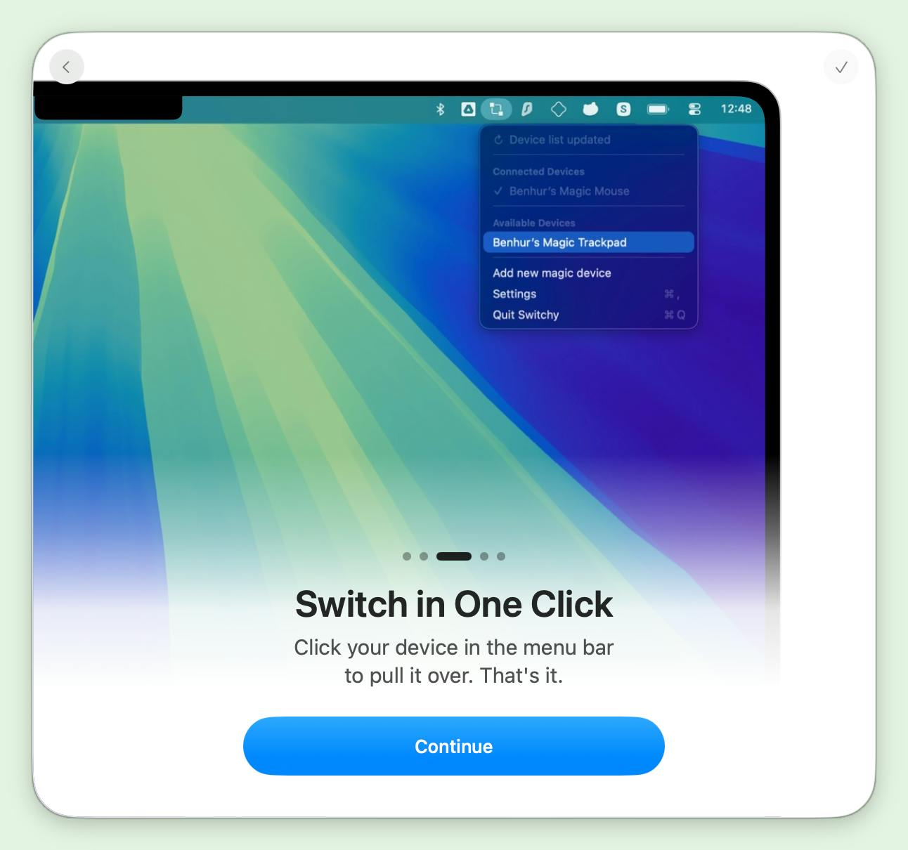
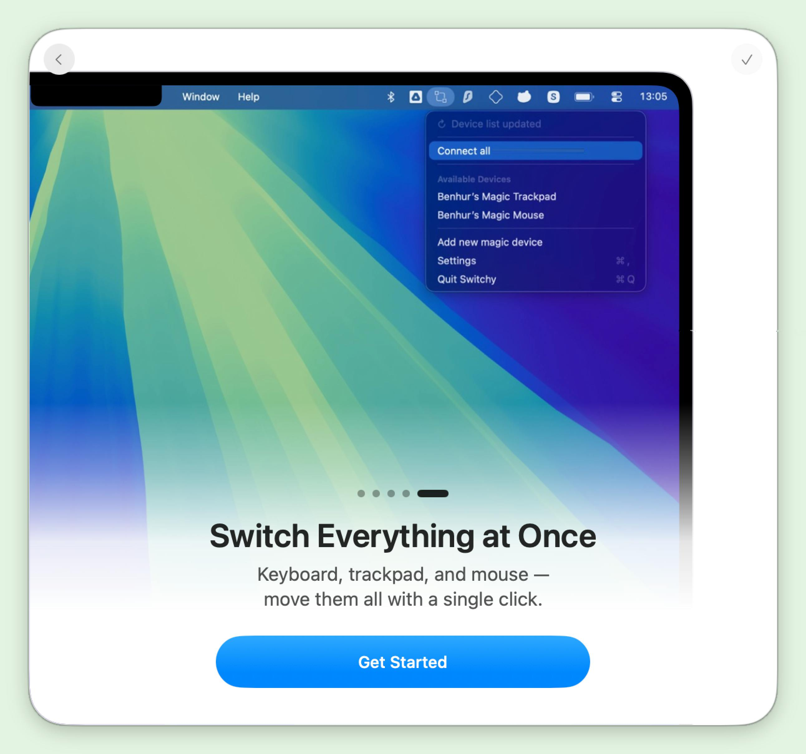
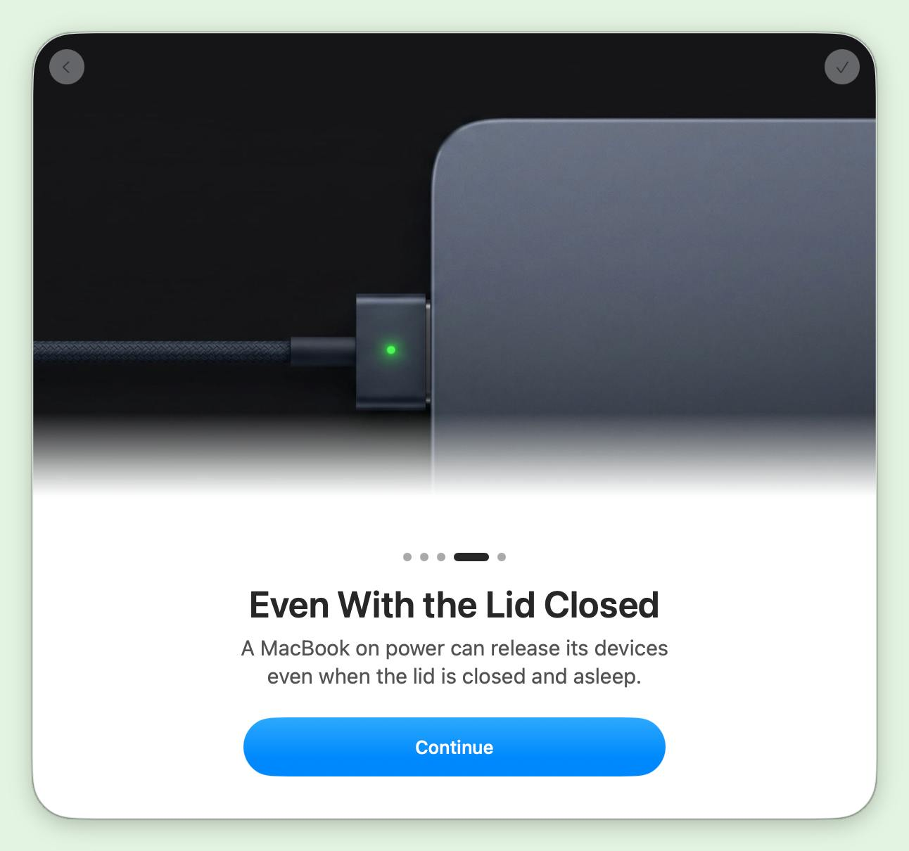

### 🎬 관련 영상
- [🎥 영상 보기](https://ph-files.imgix.net/213e7452-87ce-4ba0-9dd3-2e0a812dde0a.jpeg?auto=format)

---

## 19. [ScreenMark](https://www.producthunt.com/products/screenmark-annotation-draw)
**Votes**: 75 | **도입 난이도**: 하 | **신뢰도**: 상
**Tagline**: Menu bar app for live annotations, whiteboard overlay + more
**서비스 링크**: https://www.producthunt.com/r/Y5BIDZ33X2ZH4H

**태그**: Productivity, macOS, Presentation, RemoteControl, AI Tool, DevTool

### 📌 이 서비스 한눈에 보기
화면 공유와 발표를 위한 macOS 전용 실시간 주석 및 화이트보드 오버레이 도구

### 🔑 주요 기능
- macOS 메뉴 바에서 즉시 실행 가능한 실시간 화면 주석 및 줌 기능
- iPhone을 리모컨으로 활용하여 커서 하이라이트, 플래시라이트, 그리기 제어
- 프리젠터, 교사, 개발자를 위한 화면 녹화 및 프리즈 프레임 기능 제공

### 🙋 사용자에게 어떤 점이 좋은가
화면 공유 중 별도의 창 전환 없이 즉각적인 시각적 피드백을 줄 수 있어 발표의 몰입도를 높여줍니다.

### ✅ 지금 바로 써볼 기능
- 기본 주석 도구로 화면 위에 직접 그리기
- iPhone 앱을 연결하여 원격 제어 기능 테스트하기
- 화면 특정 영역 확대(Zoom) 기능 활용하기

### ⚠️ 사용 전 확인할 점
- 핵티브 기능(녹화, 고급 주석, 커스텀 단축키 등)은 Pro 버전 유료 결제 필요
- macOS 전용 앱이므로 Windows 환경에서는 사용 불가

### 🧭 확인이 더 필요한 정보
Pro 버전의 정확한 구독 가격 및 결제 방식에 대한 정보가 명시되지 않았습니다.

### 📸 스크린샷 및 갤러리

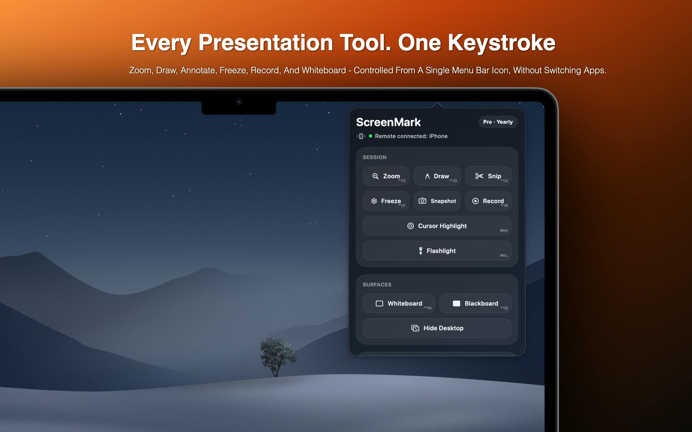
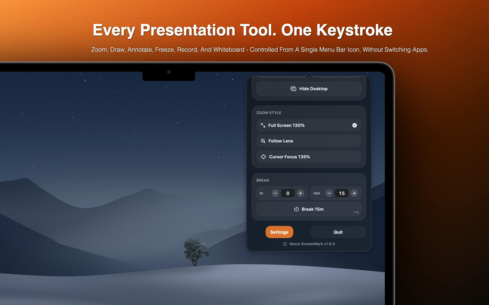

---

## 20. [AdmitRaven](https://www.producthunt.com/products/admitraven)
**Votes**: 73 | **도입 난이도**: 하 | **신뢰도**: 상
**Tagline**: Duolingo for college applications
**서비스 링크**: https://www.producthunt.com/r/FSVAASVZVZ4EZZ

**태그**: EdTech, Productivity, CollegeApplication, AI Tool

### 📌 이 서비스 한눈에 보기
매일 조금씩 학습하며 완성하는 개인 맞춤형 대학 입시 가이드

### 🔑 주요 기능
- 매일 제공되는 분량 중심의 단계별 입시 가이드
- 에세이 작성 지원 및 마감일/요구사항 관리
- 합격자 에세이 열람 및 직접 질의응답 기능

### 🙋 사용자에게 어떤 점이 좋은가
고가의 입시 컨설팅 대신 저렴한 비용으로 체계적인 입시 준비를 할 수 있으며, 학습을 완료해야 다른 앱 사용이 제한되어 집중력을 높여줍니다.

### ✅ 지금 바로 써볼 기능
- 매일 제공되는 데일리 레슨 시작하기
- 목표 대학 합격자 에세이 읽어보기
- 입시 일정 및 요구사항 등록하기

### ⚠️ 사용 전 확인할 점
- 전문 컨설턴트의 1:1 대면 코칭과는 성격이 다를 수 있음
- 사용자의 자기주도적 참여가 필수적임

### 🧭 확인이 더 필요한 정보
구체적인 서비스 이용 요금 체계와 지원 가능한 국가/대학 범위에 대한 정보가 필요합니다.

### 📸 스크린샷 및 갤러리
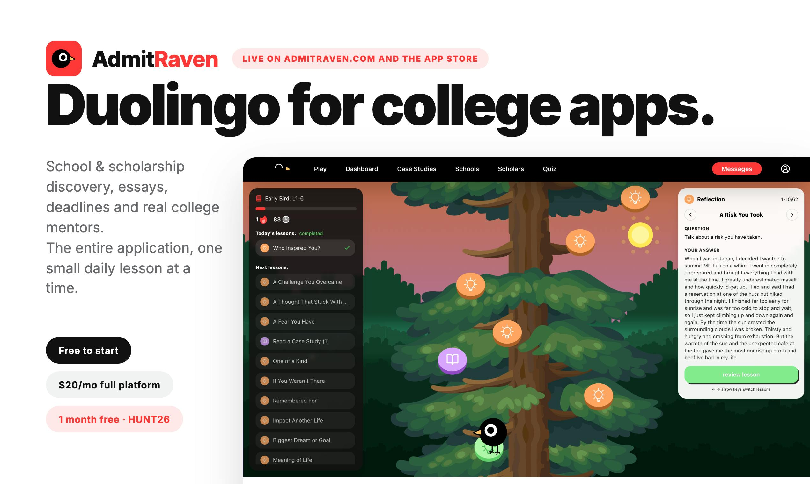
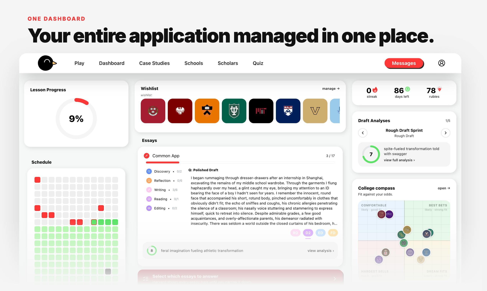
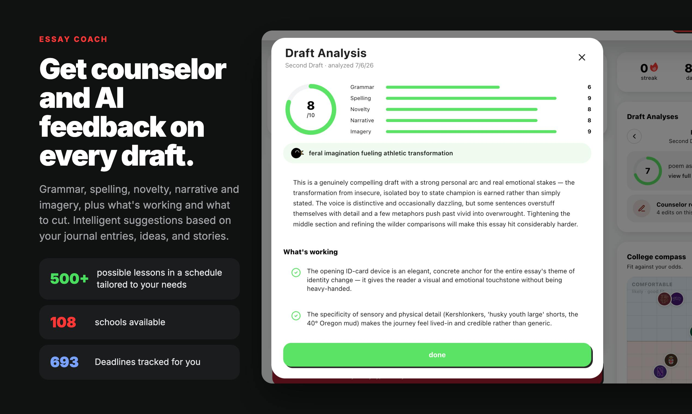

---

## 21. [Generator Website](https://www.producthunt.com/products/generator-website)
**Votes**: 57 | **도입 난이도**: 하 | **신뢰도**: 상
**Tagline**: Your ultimate library of AI-powered generators
**서비스 링크**: https://www.producthunt.com/r/AXGOXJ2ILZHPTU

**태그**: AI, Productivity, Creativity, Toolbox, AI Tool, Design

### 📌 이 서비스 한눈에 보기
다양한 작업에 최적화된 AI 생성 도구들을 한곳에서 만날 수 있는 라이브러리

### 🔑 주요 기능
- 다양한 용도의 AI 기반 생성 도구 모음
- 생산성 및 창의성 향상을 위한 특화된 도구 제공
- 사용자 목적에 맞는 맞춤형 도구 선택 가능

### 🙋 사용자에게 어떤 점이 좋은가
여러 AI 도구를 개별적으로 찾는 번거로움 없이, 필요한 기능을 모아둔 라이브러리에서 즉시 작업 효율을 높일 수 있습니다.

### ✅ 지금 바로 써볼 기능
- 제공되는 도구 카테고리 탐색하기
- 자신의 작업 흐름에 맞는 특화 도구 테스트하기
- 필요한 생성 도구 북마크하기

### ⚠️ 사용 전 확인할 점
- 제공되는 개별 도구의 전문성 및 품질 차이 확인 필요
- 특정 작업에 특화된 기능인지 범용적인지 검토 필요

### 🧭 확인이 더 필요한 정보
제공되는 개별 AI 도구들의 구체적인 기능 범위와 유료/무료 여부가 명시되지 않았습니다.

### 📸 스크린샷 및 갤러리
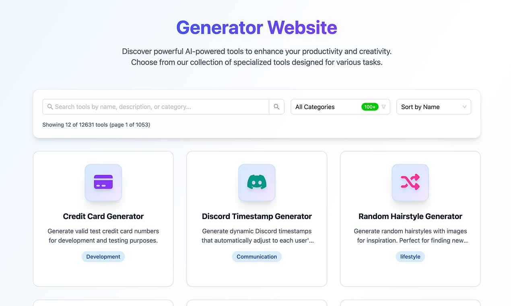
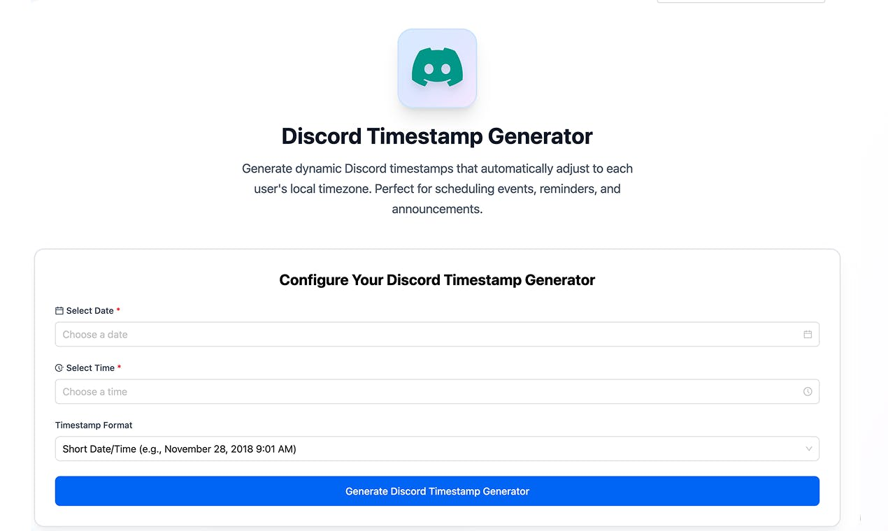
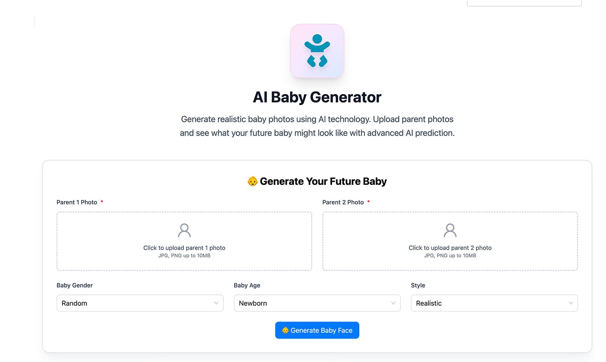

---

## 22. [Photogenix for Shopify](https://www.producthunt.com/products/photogenix-for-shopify)
**Votes**: 55 | **도입 난이도**: 하 | **신뢰도**: 상
**Tagline**: Refresh your catalog visuals and sync them to Shopify
**서비스 링크**: https://www.producthunt.com/r/ERZVW5AI5DSWCD

**태그**: Shopify, E-commerce, AI-Content, Automation, Fashion, Video

### 📌 이 서비스 한눈에 보기
쇼피파이 패션 브랜드를 위한 대규모 제품 비주얼 생성 및 자동 동기화 솔루션

### 🔑 주요 기능
- 비용이 많이 드는 반복적인 사진 촬영 없이 전체 카탈로그 비주얼 업데이트
- 일관된 브랜드 스타일을 모든 SKU에 일괄 적용
- 생성된 이미지/비디오 검토 후 쇼피파이로 직접 동기화

### 🙋 사용자에게 어떤 점이 좋은가
수주가 걸리던 제품 콘텐츠 제작 과정을 단 하루로 단축하여 운영 효율성을 극대화할 수 있습니다.

### ✅ 지금 바로 써볼 기능
- 브랜드 스타일 가이드 적용 테스트
- 대량 생성 기능 및 품질 확인
- 쇼피파이 스토어 직접 동기화 테스트

### ⚠️ 사용 전 확인할 점
- AI 생성 이미지의 실물 제품과의 일치성 확인 필요
- 대량 작업 시 쇼피파이 스토어 레이아웃과의 호환성 검토

### 🧭 확인이 더 필요한 정보
AI가 생성하는 이미지/비디오의 품질 수준과 실제 제품과의 정밀한 일치 여부를 확인해야 합니다.

### 📸 스크린샷 및 갤러리
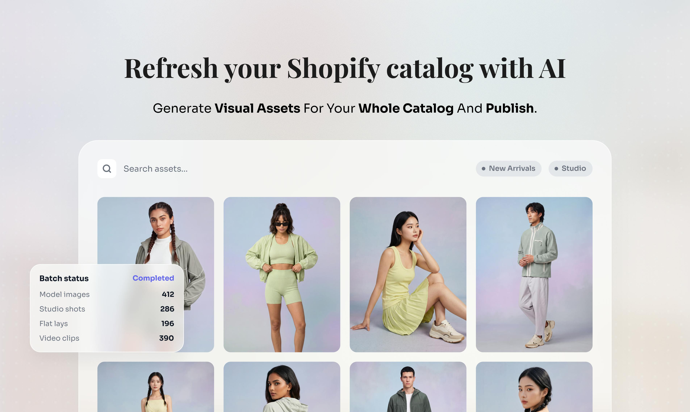
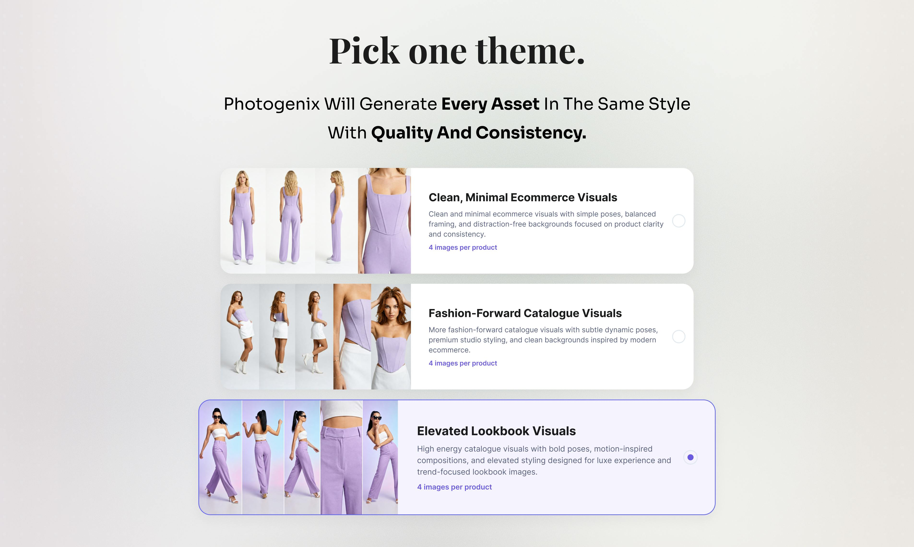
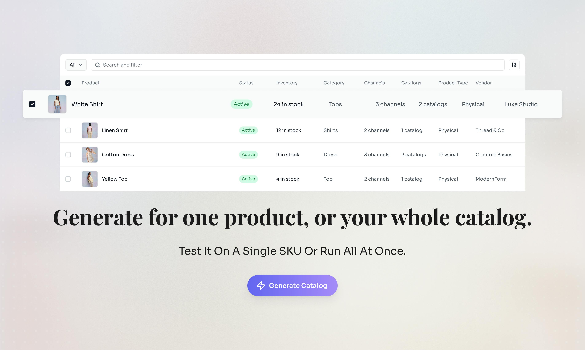

### 🎬 관련 영상
- [🎥 영상 보기](https://ph-files.imgix.net/57e7ac7c-8036-4b30-b212-93021abd92c7.jpeg?auto=format)

---

## 23. [MentionLeads](https://www.producthunt.com/products/mentionleads)
**Votes**: 26 | **도입 난이도**: 하 | **신뢰도**: 상
**Tagline**: Find customers and grow your SaaS from real market signals
**서비스 링크**: https://www.producthunt.com/r/LYMRRIMJM6FPPD

**태그**: Marketing, Growth, SaaS, LeadGeneration

### 📌 이 서비스 한눈에 보기
Reddit, X, Hacker News의 실시간 신호를 포착하여 잠재 고객을 발굴하는 SaaS 성장 시스템

### 🔑 주요 기능
- Reddit, X, Hacker News 등 주요 커뮤니티의 시장 신호 감지
- 잠재적 구매자를 식별하여 트래픽을 매출로 연결
- 합법적이고 자연스러운 백링크 확보 지원

### 🙋 사용자에게 어떤 점이 좋은가
커뮤니티 내에서 제품에 관심 있는 잠재 고객을 실시간으로 찾아내어 타겟팅된 마케팅을 할 수 있습니다.

### ✅ 지금 바로 써볼 기능
- 주요 소셜 채널 키워드 모니터링 설정
- 발견된 잠재 고객 대상 맞춤형 연결 시도
- 커뮤니티 기반의 백링크 구축 전략 실행

### ⚠️ 사용 전 확인할 점
- 커뮤니티 플랫폼의 정책에 따른 스팸 간주 위험
- 수동 대응이 필요할 수 있는 신호의 질적 차이

### 🧭 확인이 더 필요한 정보
구체적인 자동화 수준과 플랫폼별 연동 방식에 대한 상세 정보가 필요합니다.

### 📸 스크린샷 및 갤러리
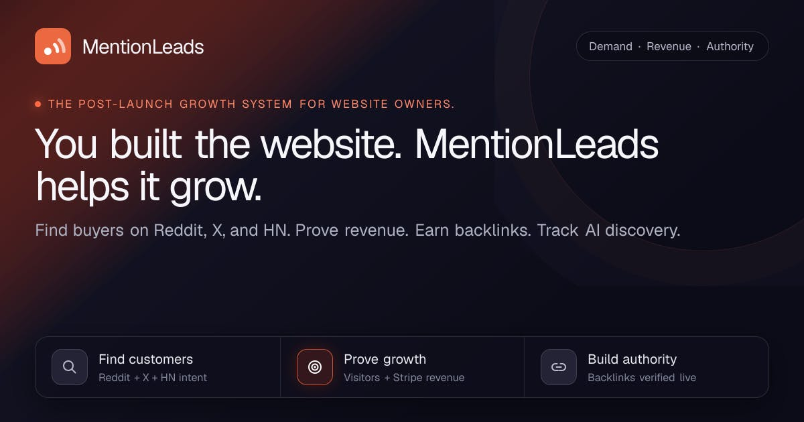
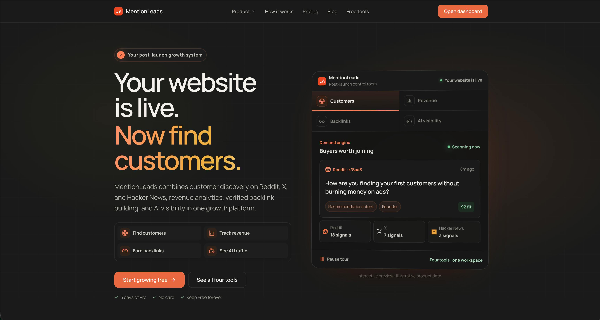
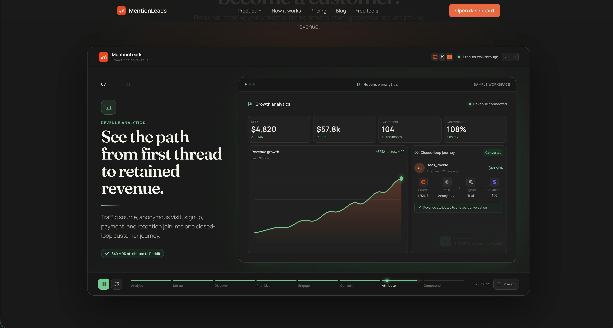

---

## 24. [Voiact - Your Trello AI Coworker ](https://www.producthunt.com/products/voiact-your-trello-ai-coworker)
**Votes**: 20 | **도입 난이도**: 하 | **신뢰도**: 상
**Tagline**: The Most Capable AI & Voice Assistant for Trello
**서비스 링크**: https://www.producthunt.com/r/UKT4NIUZ3TYYBB

**태그**: Productivity, Automation, AI, Trello, Voice-to-Action, AI Tool, Email

### 📌 이 서비스 한눈에 보기
메신저와 음성만으로 Trello 업무를 자동화하는 AI 비서

### 🔑 주요 기능
- WhatsApp, Telegram, Trello 등 익숙한 채널에서 대화형으로 업무 수행
- 음성/텍스트를 통한 카드 생성, 질문 답변, 대량 업데이트 자동화
- 이메일/캘린더 연동 및 마감 기한 관리 자동화

### 🙋 사용자에게 어떤 점이 좋은가
Trello를 일일이 클릭하며 관리할 필요 없이, 대화만으로 복잡한 카드 관리와 일정 관리를 끝낼 수 있어 업무 흐름이 끊기지 않습니다.

### ✅ 지금 바로 써볼 기능
- 메신저(WhatsApp/Telegram)를 연결하여 음성으로 카드 생성하기
- 이메일을 Trello 카드로 즉시 변환하기
- 대량의 카드 정보를 한 번에 업데이트하기

### ⚠️ 사용 전 확인할 점
- 외부 메신저 연동 시 데이터 보안 및 개인정보 관리 확인 필요
- 복잡한 워크플로우의 경우 대화만으로 완벽한 제어가 가능한지 검증 필요

### 🧭 확인이 더 필요한 정보
사용 중인 외부 메신저 플랫폼과의 보안 연동 수준과 상세한 자동화 트리거 설정 범위를 확인해야 합니다.

### 📸 스크린샷 및 갤러리

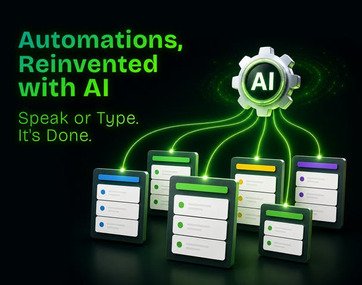

### 🎬 관련 영상
- [🎥 영상 보기](https://ph-files.imgix.net/7a6e8062-3951-4fea-9e54-788b79b893ab.jpeg?auto=format)

---

## 25. [Meerlume](https://www.producthunt.com/products/meerlume)
**Votes**: 18 | **도입 난이도**: 하 | **신뢰도**: 상
**Tagline**: Describe your business to build a bot for it
**서비스 링크**: https://www.producthunt.com/r/A3AHHUF35UMFJN

**태그**: Automation, Chatbot, NoCode, AI, Productivity, AI Tool, Chat

### 📌 이 서비스 한눈에 보기
비즈니스 설명만으로 WhatsApp/Telegram용 챗봇을 즉시 구축하는 자동화 도구

### 🔑 주요 기능
- 자연어 설명을 통한 워크플로우 자동 생성
- 드래그 앤 드롭 없는 간편한 구축 방식
- 결정론적 흐름(Deterministic flow)을 통한 예측 가능한 동작 및 비용 관리

### 🙋 사용자에게 어떤 점이 좋은가
복잡한 코딩이나 설계 과정 없이 말로 설명하는 것만으로 실무에 즉시 투입 가능한 챗봇을 만들 수 있습니다.

### ✅ 지금 바로 써볼 기능
- 비즈니스 워크플로우 설명 입력하기
- 생성된 플로우 검토 및 수정하기
- WhatsApp 또는 Telegram에 즉시 배포하기

### ⚠️ 사용 전 확인할 점
- 자연어 설명의 구체성에 따라 생성된 플로의 정확도가 달라질 수 있음
- 복잡한 로직 구현 시 수동 수정이 필요할 수 있음

### 🧭 확인이 더 필요한 정보
제공되는 워크플로우의 세부적인 커스텀 기능과 외부 서비스 연동 범위에 대한 정보가 부족합니다.

### 📸 스크린샷 및 갤러리
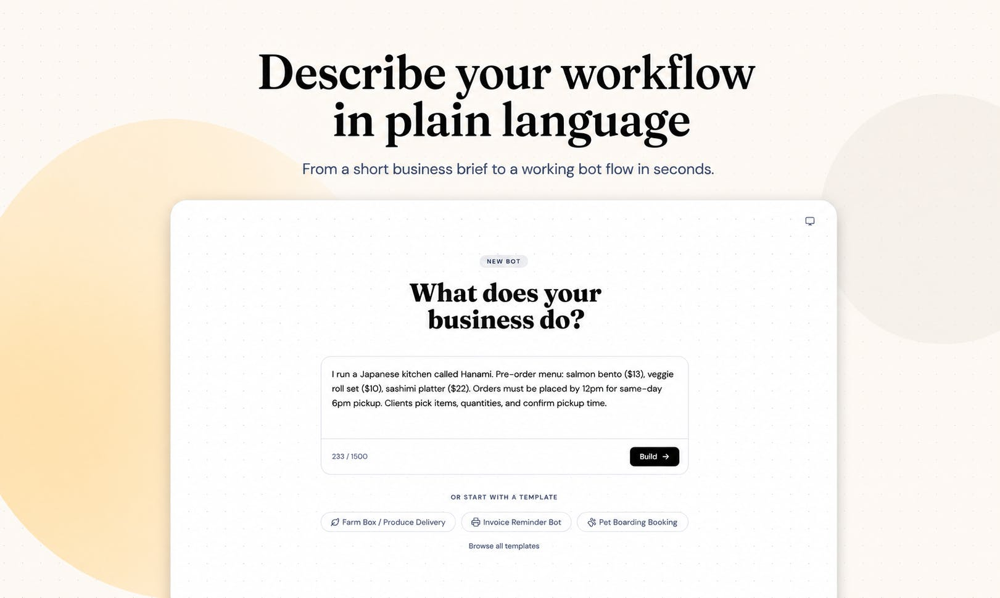
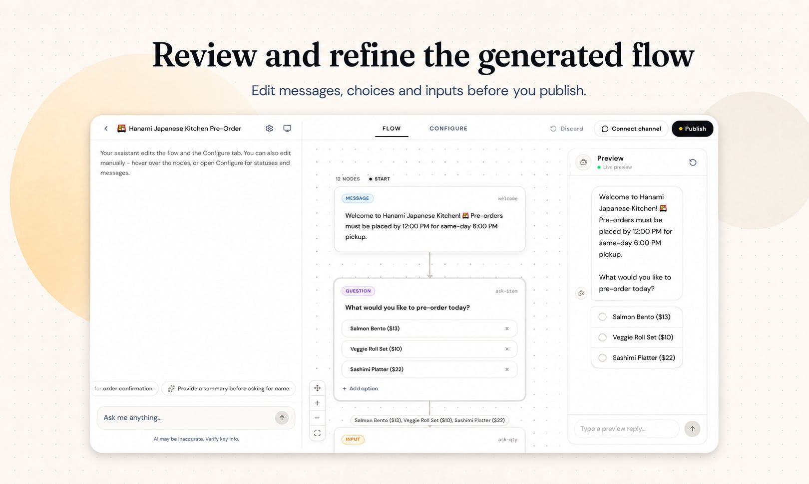
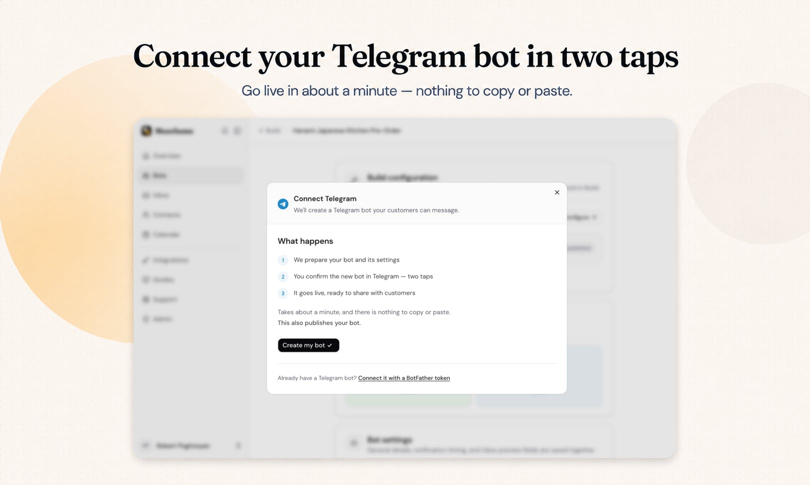

### 🎬 관련 영상
- [🎥 영상 보기](https://ph-files.imgix.net/08c81d0d-262c-4b0e-8657-bf8c26506274.jpeg?auto=format)

---

## 26. [Orion AI](https://www.producthunt.com/products/orion-ai-3)
**Votes**: 17 | **도입 난이도**: 중 | **신뢰도**: 상
**Tagline**: The open source agentic BI platform
**서비스 링크**: https://www.producthunt.com/r/VYBBPEBVFNCLWA

**태그**: BI, OpenSource, DataAnalytics, Automation, Agent, AI Tool, CRM

### 📌 이 서비스 한눈에 보기
데이터 팀 없이도 스프레드시트와 CRM 데이터를 신뢰할 수 있는 인사이트로 변환하는 오픈소스 에이전틱 BI 플랫폼

### 🔑 주요 기능
- 스프레드시트, CRM, ERP 등 다양한 데이터 소스를 통합 분석
- 데이터 수집 및 수식 수정에 드는 수동 작업 시간 단축
- 의사결정자를 위한 신뢰할 수 있는 액션 가능한 인사이트 제공

### 🙋 사용자에게 어떤 점이 좋은가
데이터 전문가를 고용하기 어려운 성장 단계의 기업이 복잡한 데이터 정리 작업 없이 빠르게 의사결정을 내릴 수 있도록 돕습니다.

### ✅ 지금 바로 써볼 기능
- 기존 스프레드시트 및 CRM 데이터 연결하기
- 데이터 소스 간의 관계 설정 및 대시보드 생성
- 에이전트 기반의 자동화된 분석 리포트 생성

### ⚠️ 사용 전 확인할 점
- 데이터 소스의 품질에 따라 분석 결과의 신뢰도가 달라질 수 있음
- 오픈소스 플랫폼으로서 사용자 환경에 따른 설치 및 설정 복잡도 존재

### 🧭 확인이 더 필요한 정보
데이터 소스별 구체적인 커넥터 지원 범위와 에이전트의 자동화 수준에 대한 상세 정보가 필요합니다.

### 📸 스크린샷 및 갤러리
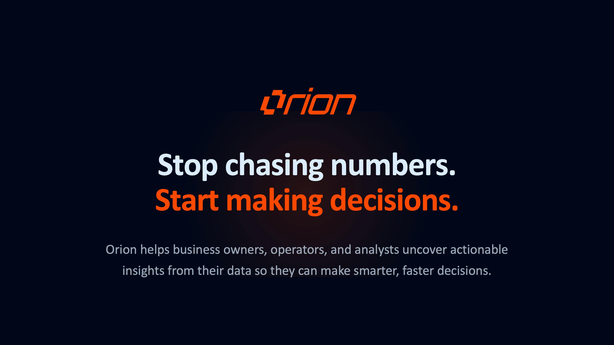
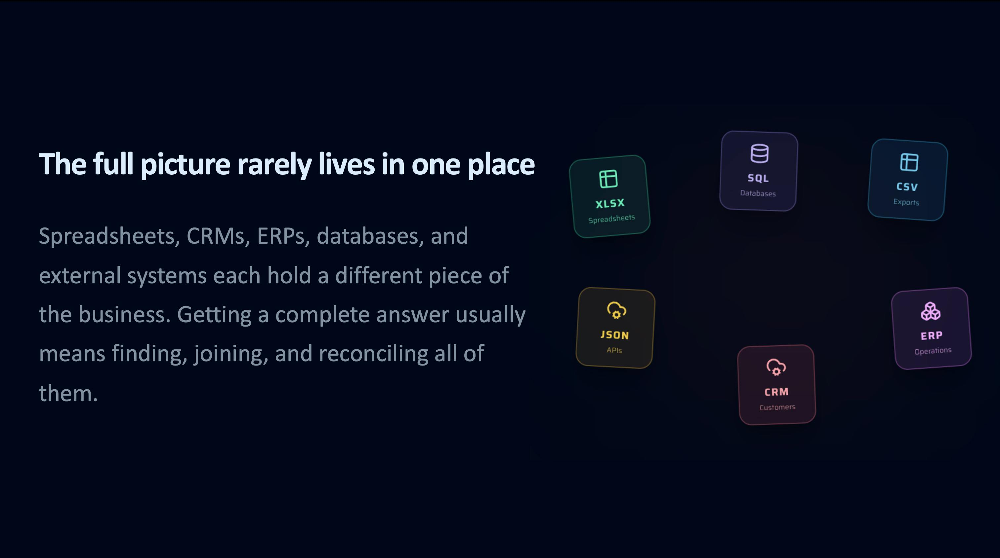
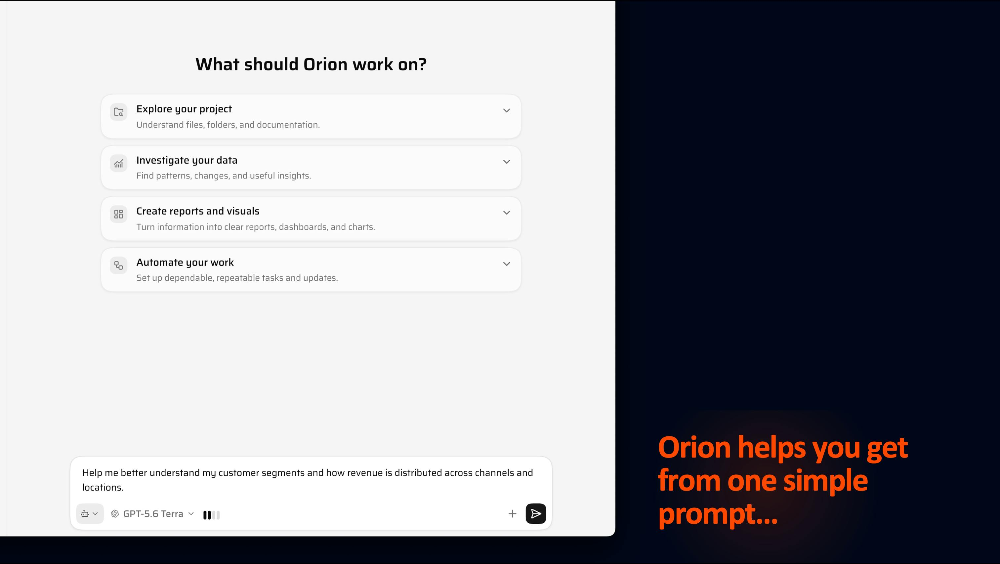

---

## 27. [globalize.now](https://www.producthunt.com/products/globalize-now)
**Votes**: 14 | **도입 난이도**: 하 | **신뢰도**: 상
**Tagline**: Localize your app from your AI agent
**서비스 링크**: https://www.producthunt.com/r/CBCCECJBSRIGJ7

**태그**: DevTool, AI, Automation, Localization, Agent, AI Tool

### 📌 이 서비스 한눈에 보기
코딩 에이전트 내에서 i18n 설정부터 번역, PR까지 자동화하는 AI 현지화 도구

### 🔑 주요 기능
- Claude Code 및 Cursor와 MCP를 통해 코딩 환경에 직접 통합
- 하드코딩된 문자열 추출, 번역, i1nemization 설정 자동화
- 대시보드 없이 코드 푸시 시 자동으로 Pull Request 생성

### 🙋 사용자에게 어떤 점이 좋은가
별도의 관리 화면을 열 필요 없이 개발 워크플로우 안에서 즉시 다국어 지원을 구현할 수 있습니다.

### ✅ 지금 바로 써볼 기능
- Claude Code 또는 Cursor에 MCP 연결하기
- 기존 프로젝트의 하드코딩된 문자열 추출 테스트하기
- 자동 생성된 번역 PR 검토하기

### ⚠️ 사용 전 확인할 점
- 별도의 대시보드가 없으므로 번역 관리 및 검수 방식에 익숙해져야 함
- AI가 추출한 문자열의 문맥이 정확한지 개발자의 최종 확인 필요

### 🧭 확인이 더 필요한 정보
지원하는 50개 이상의 언어에 대한 번역 품질과 RTL(우측에서 좌측으로 읽기) 레이아웃 대응 수준을 확인해야 합니다.

### 📸 스크린샷 및 갤러리
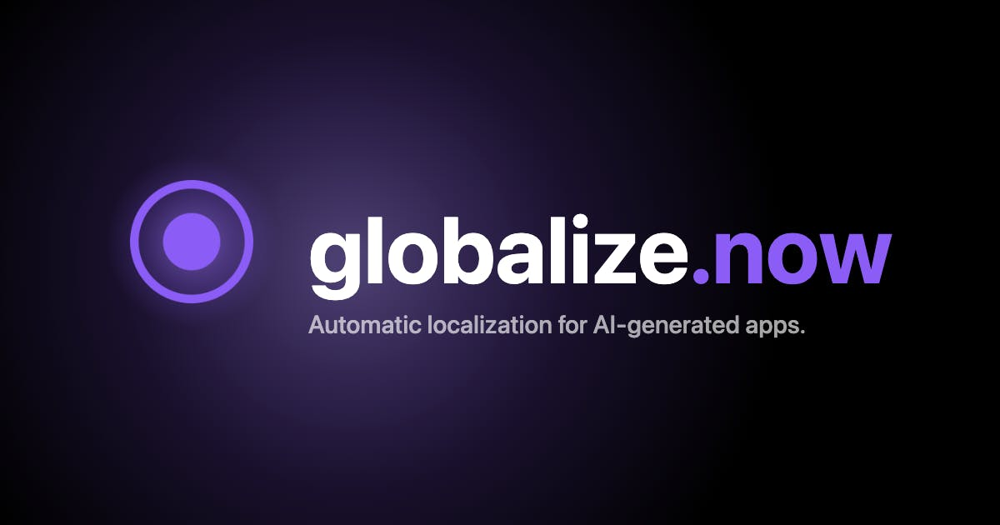

### 🎬 관련 영상
- [🎥 영상 보기](https://ph-files.imgix.net/bd6c53c2-1844-4c34-9fd3-077ffb310eea.jpeg?auto=format)

---

## 28. [ShitFast](https://www.producthunt.com/products/shitfast-2)
**Votes**: 14 | **도입 난이도**: 하 | **신뢰도**: 상
**Tagline**: An archive of landing pages that read like 1 LLM wrote them.
**서비스 링크**: https://www.producthunt.com/r/PXGEJWJBIVATI4

**태그**: Design, Marketing, AI, Satire, AI Tool, LLM

### 📌 이 서비스 한눈에 보기
AI로 찍어낸 듯한 천편일률적인 스타트업 랜딩 페이지를 풍자하고 비판하는 아카이브 서비스

### 🔑 주요 기능
- AI 생성형 랜딩 페이지의 정형화된 패턴을 수집 및 기록
- 독설적인 비평, 스코어카드, 위트 있는 풍자를 제공
- 사용자가 직접 자신의 페이지를 제출하여 'ShitScore' 점수 받기 가능

### 🙋 사용자에게 어떤 점이 좋은가
자신의 랜딩 페이지가 지나치게 AI스러운 것은 아닌지 점검하고, 차별화된 디자인과 카피라이팅에 대한 영감을 얻을 수 있습니다.

### ✅ 지금 바로 써볼 기능
- 자신의 랜딩 페이지 제출하여 Roast(풍자) 받기
- ShitScore 점수 확인하기
- 아카이브를 통해 최신 AI 랜딩 페이지 트렌드 살펴보기

### ⚠️ 사용 전 확인할 점
- 서비스의 성격이 풍자와 비판(Roast)에 특화되어 있어 감정적 타격을 입을 수 있음
- 비판 내용이 공개 아카이브에 영구적으로 남을 수 있음

### 🧭 확인이 더 필요한 정보
제출된 페이지가 아카이브에 공개되는 방식과 개인정보 노출 범위에 대한 상세 정책 확인이 필요합니다.

### 📸 스크린샷 및 갤러리

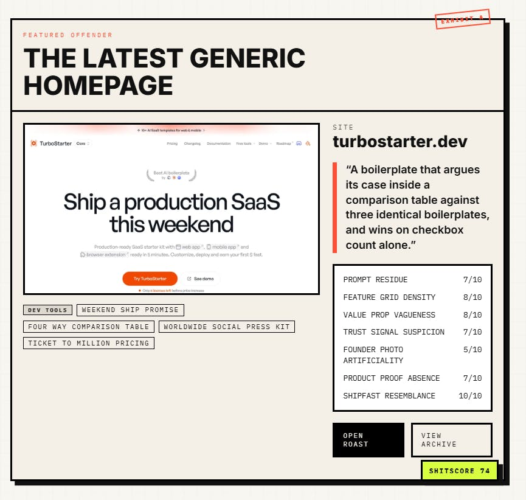
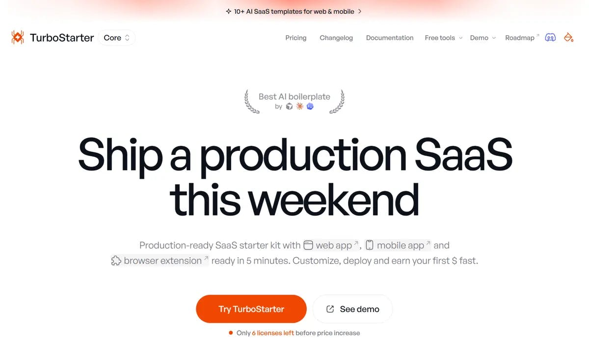

---

## 29. [Best Friend for K.O. II](https://www.producthunt.com/products/best-friend-for-k-o-ii)
**Votes**: 13 | **도입 난이도**: 하 | **신뢰도**: 상
**Tagline**: Companion app for Teenage Engineering EP-133 EP-40 EP-1320
**서비스 링크**: https://www.producthunt.com/r/YFCTZXQQCUYO3R

**태그**: MusicProduction, HardwareCompanion, Sampler, Workflow

### 📌 이 서비스 한눈에 보기
Teenage Engineering EP 시리즈 샘플러의 기능을 확장하고 관리하는 iPad/macOS용 컴패니언 앱

### 🔑 주요 기능
- EP-133, EP-40, EP-1320 시리즈를 위한 확장 디스플레이 및 기능 강화 도구
- 샘플 파일 업로드, 관리 및 정밀한 샘플 편집/프로세싱 지원
- 프로젝트 및 디바이스 백업, 추가 퍼포먼스 이펙트(개별 패드 뮤트 등) 제공

### 🙋 사용자에게 어떤 점이 좋은가
하드웨어 샘플러의 물리적 제약을 넘어 더 넓은 화면에서 편리하게 샘플을 관리하고 작업 효율을 높일 수 있습니다.

### ✅ 지금 바로 써볼 기능
- 기기 백업 및 프로젝트 관리 기능 활용
- 샘플 편집 및 프로세싱 기능 테스트
- 추가 퍼포먼스 이펙트 적용해보기

### ⚠️ 사용 전 확인할 점
- 지원되는 특정 EP 시리즈 하드웨어가 필요함
- iPad 및 macOS 환경에서의 연결성 확인 필요

### 🧭 확인이 더 필요한 정보
하드웨어와 앱 간의 구체적인 연결 방식(유선/무선)에 대한 상세 정보가 명시되지 않았습니다.

### 📸 스크린샷 및 갤러리
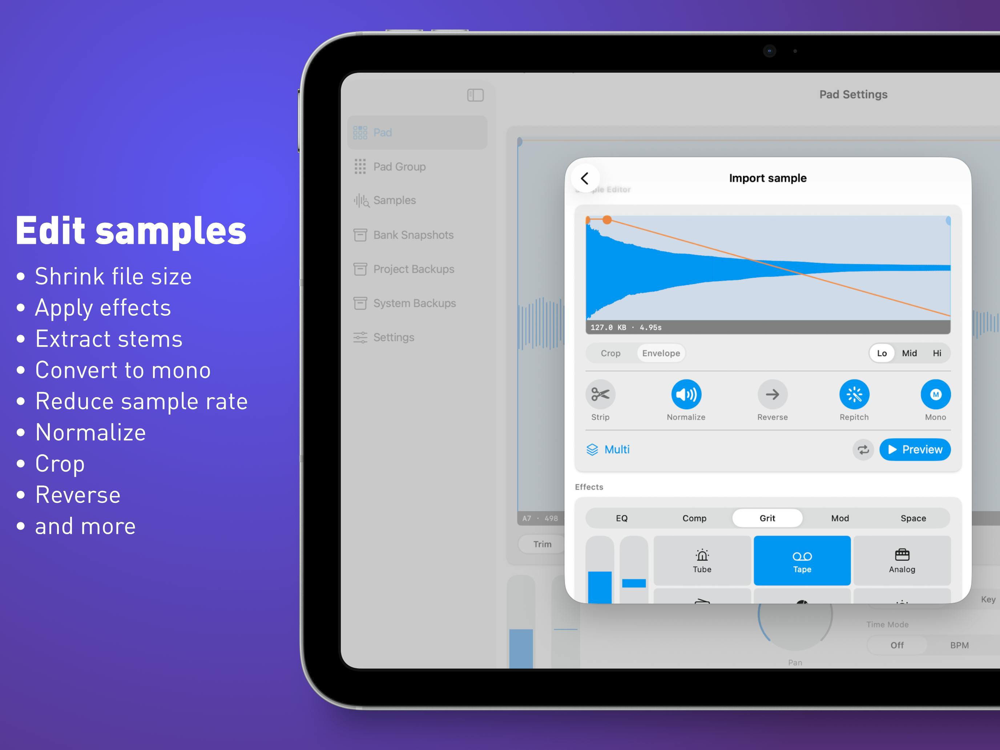
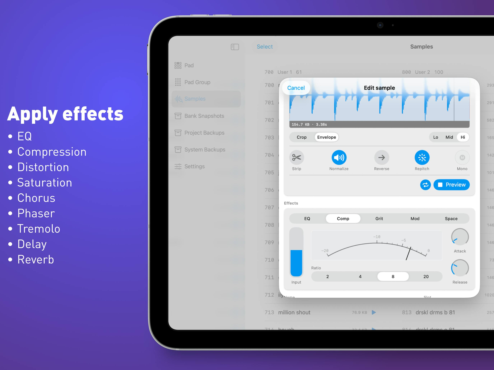
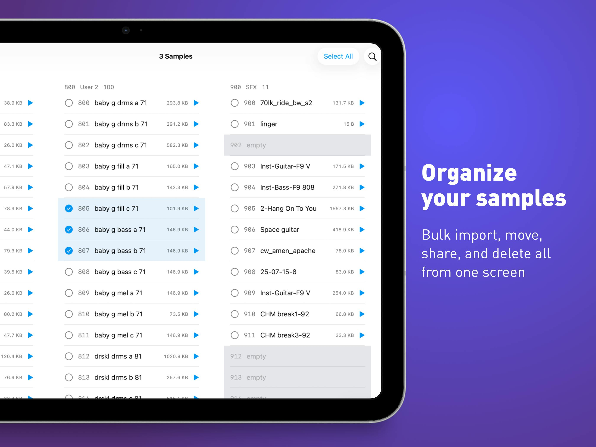

### 🎬 관련 영상
- [🎥 영상 보기](https://ph-files.imgix.net/3122a51a-917c-44d9-8af9-1171c308377d.jpeg?auto=format)

---

## 30. [Remarc](https://www.producthunt.com/products/remarc)
**Votes**: 13 | **도입 난이도**: 하 | **신뢰도**: 상
**Tagline**: Your feedback layer for AI collaboration.
**서비스 링크**: https://www.producthunt.com/r/DTO5CH625TRVQP

**태그**: DevTool, AI, Productivity, OpenSource, Agent, AI Tool

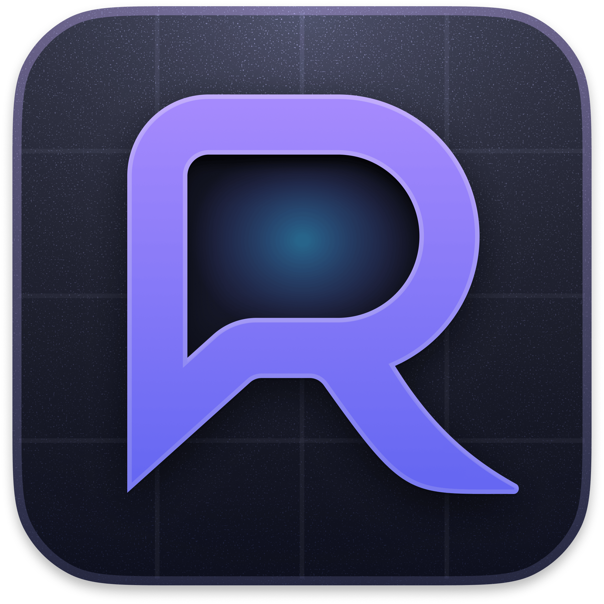

### 📌 이 서비스 한눈에 보기
맥 화면의 모든 요소를 AI 에이전트에게 즉각 전달하는 피드백 레이어

### 🔑 주요 기능
- 텍스트, 스크린샷, 웹 요소, 음성 등 다양한 입력 방식 지원
- MCP(Model Context Protocol)를 통한 AI 에이전트와의 연동
- 오픈 소스 기반의 자유로운 협업 환경 제공

### 🙋 사용자에게 어떤 점이 좋은가
코딩 에이전트와 작업할 때 별도의 복잡한 입력 없이 화면을 가리키는 것만으로 피드백을 전달하여 작업 흐름을 유지할 수 있습니다.

### ✅ 지금 바로 써볼 기능
- 화면 요소 지정 기능을 통한 피드백 전달 테스트
- MCP를 활용한 코딩 에이전트 연동 설정
- 다양한 입력 방식(음성, 스크린샷 등)의 정확도 확인

### ⚠️ 사용 전 확인할 점
- 사용 중인 코딩 에이전트와의 MCP 호환성 확인 필요
- 화면 캡처 및 요소 읽기 기능에 따른 개인정보 노출 주의

### 🧭 확인이 더 필요한 정보
지원하는 구체적인 코딩 에이전트 종류와 MCP 구현 방식에 대한 상세 정보가 필요합니다.

### 📸 스크린샷 및 갤러리
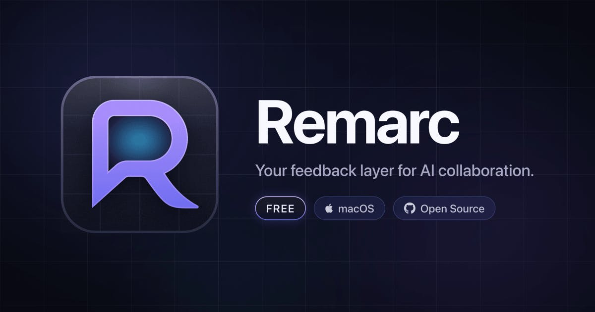

### 🎬 관련 영상
- [🎥 영상 보기](https://ph-files.imgix.net/2eaa9859-9c15-4cc5-8e7b-42732123b06a.jpeg?auto=format)

---

