# 🚀 Product Hunt Daily Top 30 (2026-08-14)

## 오늘의 요약
오늘의 트렌드는 단순한 자동화를 넘어, 인간과 AI 에이전트가 실시간으로 협업하고 상호작용하는 '에이전트 중심의 워크플로우'가 주를 이루었습니다. 특히 개발, 테스트, 운영, 분석 등 전문적인 엔지니어링 영역에서 AI가 자율적으로 문제를 해결하고 결과물을 생성하는 도구들이 주목받았습니다.

### 오늘의 핵심 포인트
- AI 에이전트가 단순 보조를 넘어 테스트, 코드 리뷰, 인프라 운영, 제품 분석 등 복잡한 업무를 자율적으로 수행하는 단계로 진화하고 있습니다.
- 인간과 AI가 실시간으로 협업할 수 있는 공유 워크스페이스와 에이전트 친화적인 데이터 전달 방식이 중요해지고 있습니다.
- AI 모델의 토큰 비용 절감과 실행 환경 자동 구축 등 에이전트 운영의 효율성과 경제성을 확보하려는 시도가 활발합니다.

**오늘의 태그**: AI Agent, DevOps, Automation, Developer Tools, Workflow Optimization

## 1. [Kane CLI](https://www.producthunt.com/products/lambdatest)
**Votes**: 338 | **도입 난이도**: 하 | **신뢰도**: 상
**Tagline**: Natural language browser & mobile app tests from terminal
**서비스 링크**: https://www.producthunt.com/r/3OE7IF5ZP7LPWJ

**태그**: DevTool, Automation, QA, AI, CLI, Agent, AI Tool

### 📌 이 서비스 한눈에 보기
자연어로 명령하면 브라우저 테스트를 자동 수행하는 에이전트형 CLI 도구

### 🔑 주요 기능
- 자연어 설명을 기반으로 한 브라우저 및 모바일 앱 테스트 자동화
- 셀렉터(Selector) 작성 없이 실제 크롬 브라우저에서 테스트 실행
- 로컬 우선(Local-first) 방식 및 테스트 결과 공유 기능 제공

### 🙋 사용자에게 어떤 점이 좋은가
복잡한 테스트 스크립트 작성 없이 말하듯 테스트를 수행할 수 있어 개발 및 AI 코딩 에이전트의 검증 시간을 획기적으로 단축합니다.

### ✅ 지금 바로 써볼 기능
- 자연어로 테스트 시나리오 작성해보기
- 로컬 환경에서 브라우저 실행 및 결과 확인하기
- 테스트 통과/실패 증빙(Proof) 공유 기능 테스트하기

### ⚠️ 사용 전 확인할 점
- 자연어 해석의 정확도에 따른 테스트 결과 변동 가능성
- 로컬 실행 환경의 브라우저 의존성 확인 필요

### 🧭 확인이 더 필요한 정보
자연어 명령의 복잡도에 따른 테스트 실행 성공률과 상세한 비용 정책에 대한 정보가 추가로 필요합니다.

### 📸 스크린샷 및 갤러리
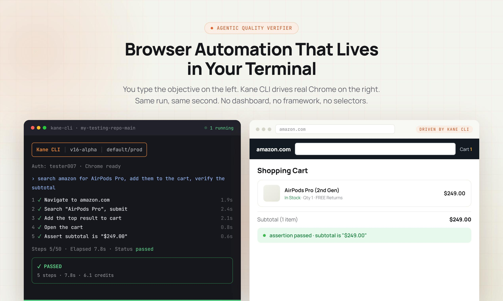
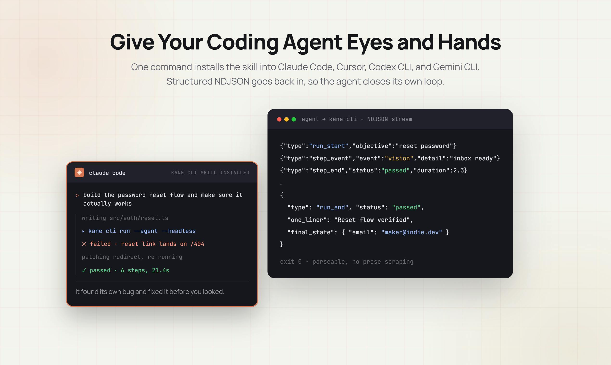
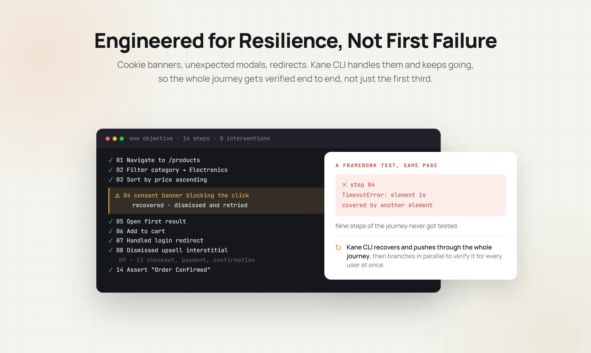

### 🎬 관련 영상
- [🎥 영상 보기](https://ph-files.imgix.net/73b07213-b530-4813-8fb6-aebbcfeae0bd.jpeg?auto=format)

---

## 2. [Ito](https://www.producthunt.com/products/ito-ai-code-review-that-runs-code)
**Votes**: 303 | **도입 난이도**: 중 | **신뢰도**: 상
**Tagline**: AI code review that runs your code
**서비스 링크**: https://www.producthunt.com/r/ZLCM32IRDVPZ5C

**태그**: DevTool, AI, CodeReview, Automation, QA, AI Tool

### 📌 이 서비스 한눈에 보기
코드 변경 사항을 실제 실행 환경에서 검증하여 런타임 버그를 잡아내는 AI 코드 리뷰 도구

### 🔑 주요 기능
- PR마다 독립적인 임시 실행 환경(ephemeral environment) 자동 구축
- 정적 분석을 넘어 실제 코드 실행을 통한 런타임 증거 제공
- 코드 변경이 실제 기능 흐름에 미치는 영향력을 시각화

### 🙋 사용자에게 어떤 점이 좋은가
단순히 코드 문법을 검사하는 것을 넘어, 실제 앱이 어떻게 동작하는지 확인해주므로 배포 전 치명적인 런타임 오류를 방지할 수 있습니다.

### ✅ 지금 바로 써볼 기능
- PR 생성 시 자동 환경 구축 기능 테스트
- 영향을 받는 기능 흐름(impacted flows) 검증 결과 확인
- 제공되는 런타임 증거를 통한 디버깅 워크플로우 점검

### ⚠️ 사용 전 확인할 점
- 코드 실행을 위한 환경 구성 시 보안 및 권한 설정 확인 필요
- 실행 환경 구축에 따른 리소스 소모 및 시간 비용 고려

### 🧭 확인이 더 필요한 정보
지원하는 프로그래밍 언어 및 프레임워크의 범위와 인프라 통합 방식에 대한 상세 정보가 필요합니다.

### 📸 스크린샷 및 갤러리
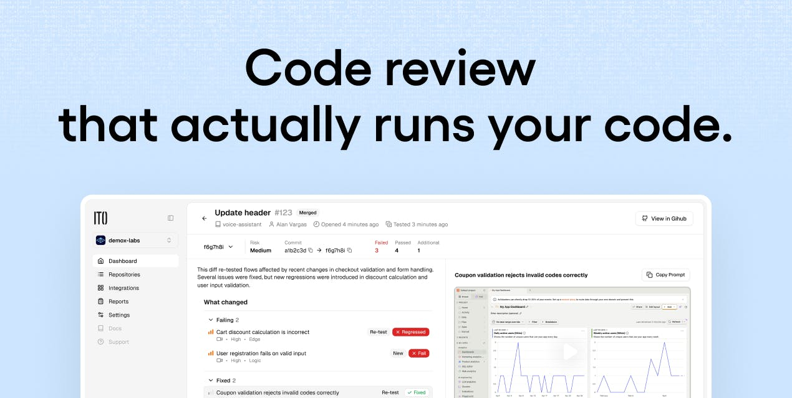
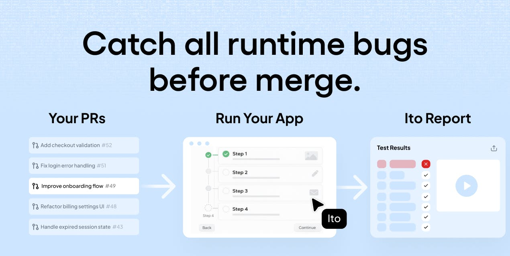
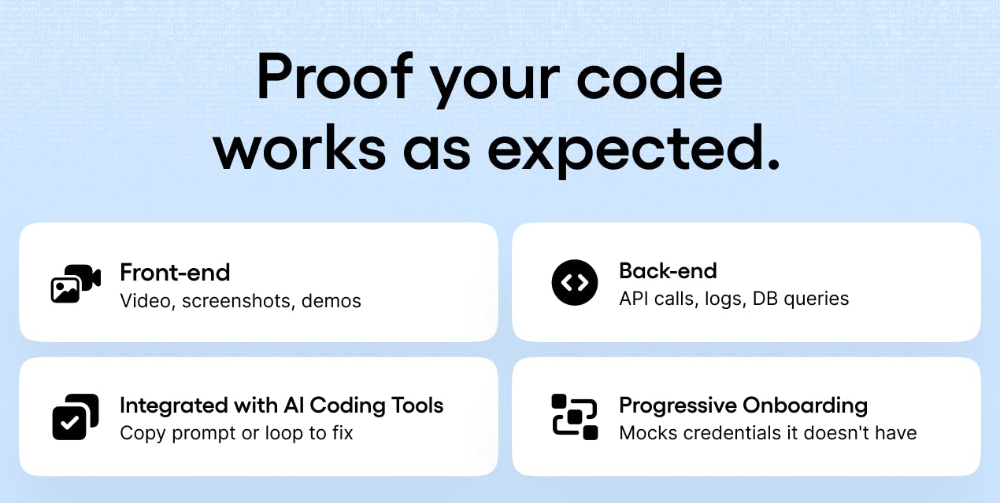

### 🎬 관련 영상
- [🎥 영상 보기](https://ph-files.imgix.net/b04f3876-b9ac-42e2-b5a8-a61ee2c36d0c.jpeg?auto=format)

---

## 3. [Nuphos](https://www.producthunt.com/products/nuphos)
**Votes**: 277 | **도입 난이도**: 상 | **신뢰도**: 중
**Tagline**: The AI-Native DevOps Workspace.
**서비스 링크**: https://www.producthunt.com/r/2TYRIPK2F3Z6W7

**태그**: DevOps, AI-Native, Infrastructure, Automation, Agent, AI Tool

### 📌 이 서비스 한눈에 보기
AI 에이전트가 인프라를 학습하고 운영을 지원하는 협업형 DevOps 워크스페이스

### 🔑 주요 기능
- AI 에이전트가 인프라 구조를 학습할 수 있는 공유 환경 제공
- 문제 조사 및 운영 시스템 작업을 수행하는 AI 에이전트 활용
- 엔지니어링 팀을 위한 AI 네이티브 DevOps 워크스페이스

### 🙋 사용자에게 어떤 점이 좋은가
AI가 팀의 인프라를 이해하고 운영 업무를 보조함으로써, 엔지니어링 팀의 문제 해결 및 운영 효율성을 높일 수 있습니다.

### ✅ 지금 바로 써볼 기능
- AI 에이전트의 인프라 학습 기능 테스트
- 문제 조사(Investigation) 워크플로우 확인
- 운영 시스템 제어 권한 및 보안 설정 검토

### ⚠️ 사용 전 확인할 점
- AI 에이전트의 운영 시스템 직접 조작에 따른 보안 및 안정성 리스크
- 기존 인프라 환경과의 통합 및 데이터 보안 정책 확인 필요

### 🧭 확인이 더 필요한 정보
AI 에이전트가 운영 시스템에 미칠 수 있는 영향력과 보안 통제 수준에 대한 구체적인 정보가 필요합니다.

### 📸 스크린샷 및 갤러리
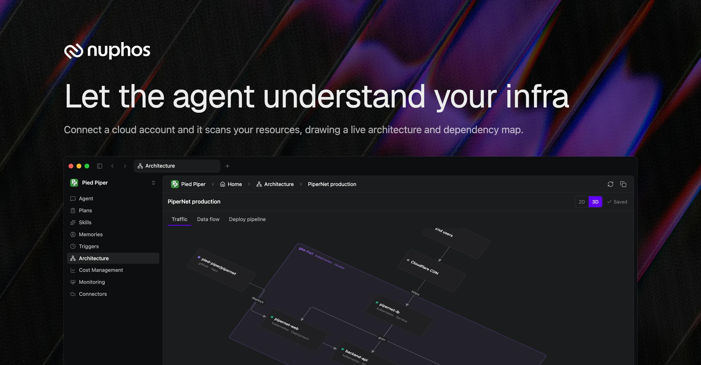
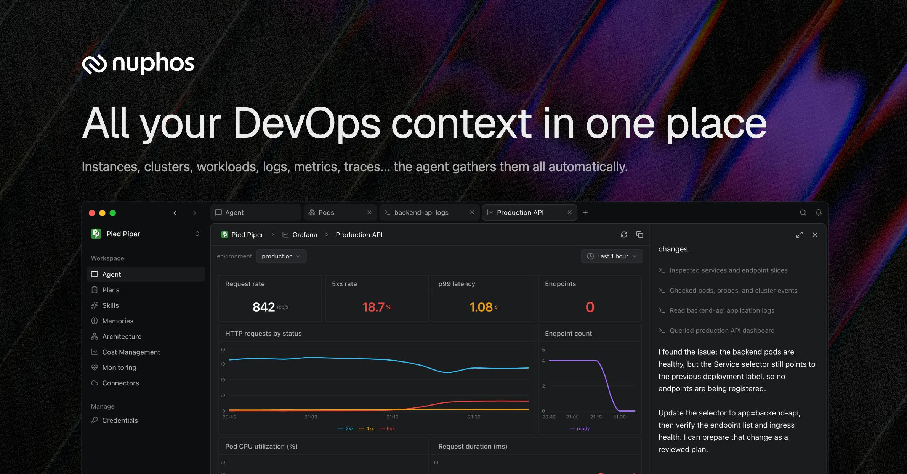
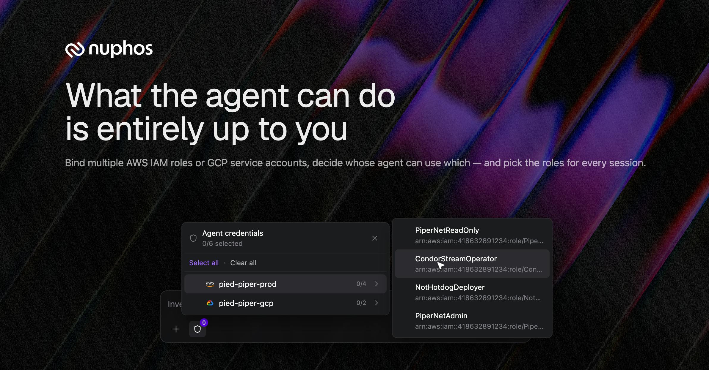

### 🎬 관련 영상
- [🎥 영상 보기](https://ph-files.imgix.net/b1c5c2fe-bde5-463f-8b83-559a1caf4311.jpeg?auto=format)

---

## 4. [Human Behavior](https://www.producthunt.com/products/human-behavior)
**Votes**: 218 | **도입 난이도**: 중 | **신뢰도**: 상
**Tagline**: Product analytics told you what happened. We handle it.
**서비스 링크**: https://www.producthunt.com/r/S5QUTH4NO57LJM

**태그**: DevTool, Automation, Analytics, AI, ProductOps, Agent, AI Tool, CRM, Email

### 📌 이 서비스 한눈에 보기
대시보드 확인 없이 AI 에이전트가 문제 해결부터 워크플로우 자동화까지 수행하는 자율형 제품 분석 도구

### 🔑 주요 기능
- SDK를 통한 이벤트, 에러, 세션 리플레이 자동 수집
- AI가 세션 리플레이를 분석하여 분노 클릭 및 이탈 지점 자동 감지
- Linear, CRM 업데이트 및 PR 생성 등 백그라운드 에이전트의 자동 액션

### 🙋 사용자에게 어떤 점이 좋은가
데이터를 분석하는 데 드는 시간을 줄이고, 발견된 문제를 티켓 생성부터 코드 수정 제안까지 자동화하여 제품 개선 사이클을 가속화합니다.

### ✅ 지금 바로 써볼 기능
- SDK 설치를 통한 이벤트 및 세션 데이터 수집
- AI 에이전트의 자동 이슈 감지 및 알림 설정
- Slack/SMS 연동을 통한 워크플로우 자동화 테스트

### ⚠️ 사용 전 확인할 점
- AI가 생성하는 PR이나 자동화된 액션에 대한 검토 프로세스 필요
- 사용자 세션 데이터 수집에 따른 개인정보 보호 및 보안 정책 확인 필요

### 🧭 확인이 더 필요한 정보
AI 에이전트가 생성하는 코드(PR)의 정확도와 기존 워크플로우와의 충돌 가능성을 확인해야 합니다.

### 📸 스크린샷 및 갤러리
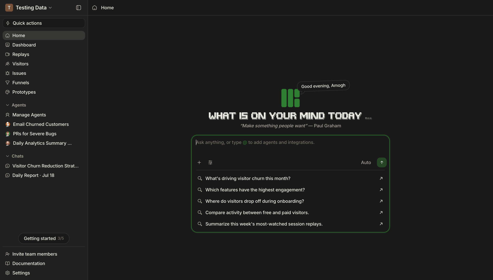
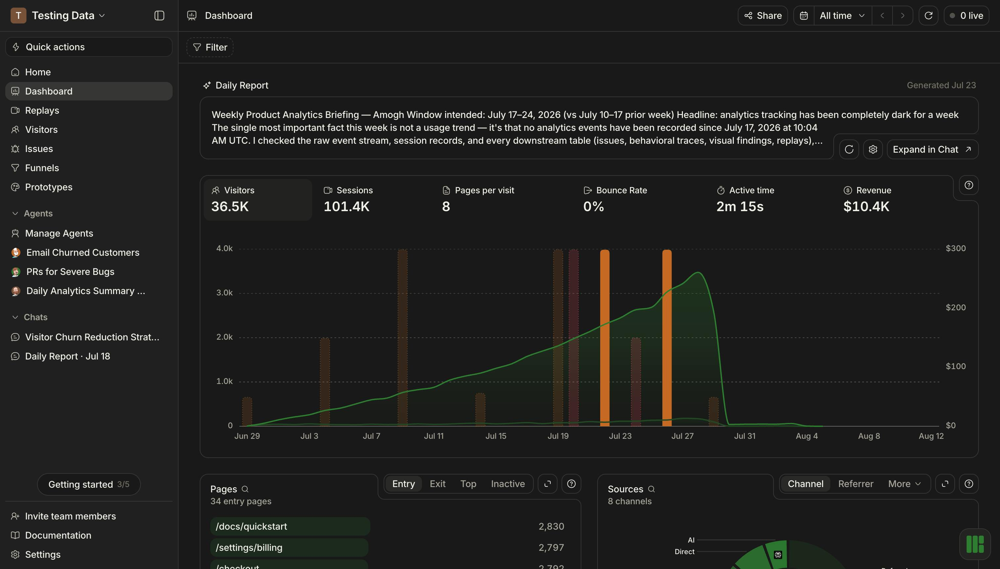
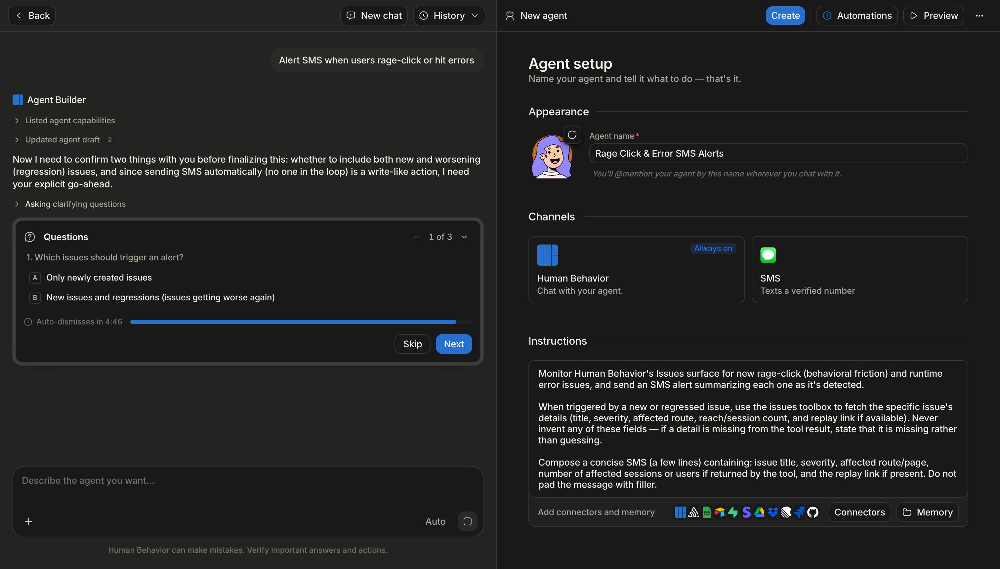

---

## 5. [Scrimba Explain](https://www.producthunt.com/products/scrimba)
**Votes**: 216 | **도입 난이도**: 하 | **신뢰도**: 상
**Tagline**: Ask any question, get a video back instantly
**서비스 링크**: https://www.producthunt.com/r/VT3DATI3BPG4AZ

**태그**: AI, EdTech, DeveloperTools, Automation, AI Tool, Chat, Video, Vision, DevTool

### 📌 이 서비스 한눈에 보기
질문만 하면 즉시 맞춤형 설명 영상을 만들어주는 AI 튜토리얼 생성 도구

### 🔑 주요 기능
- 텍스트, 코드, 파일, 링크를 기반으로 즉각적인 내레이션 영상 생성
- DOM 기반 재생 기술을 활용하여 기존 비디오 생성 모델보다 빠른 속도 제공
- 코드 워크스루, 애니메이션, 다이어그램 등 시각적 요소가 포함된 유튜브 스타일의 UX

### 🙋 사용자에게 어떤 점이 좋은가
복잡한 개념이나 코드를 글로 읽는 대신, 시각적 설명이 포함된 맞춤형 영상으로 빠르게 학습할 수 있습니다.

### ✅ 지금 바로 써볼 기능
- 이해가 안 되는 코드나 문서를 업로드하여 영상 설명 듣기
- 학습 중인 주제에 대해 시각적 다이어그램이 포함된 튜토리얼 생성하기
- 텍스트 기반 답변 대신 영상 형태의 직관적인 피드백 확인하기

### ⚠️ 사용 전 확인할 점
- DOM 기반 기술이 모든 종류의 복잡한 시각적 요구사항을 완벽히 구현하는지 확인 필요
- 입력 데이터(코드, 파일 등)의 보안 및 개인정보 보호 정책 확인 필요

### 🧭 확인이 더 필요한 정보
사용자가 입력한 파일이나 코드의 양에 따른 생성 속도 및 제한 사항에 대한 정보가 부족합니다.

### 📸 스크린샷 및 갤러리
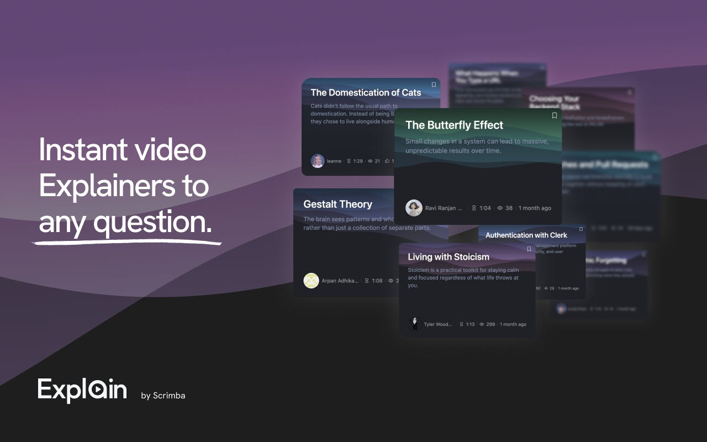
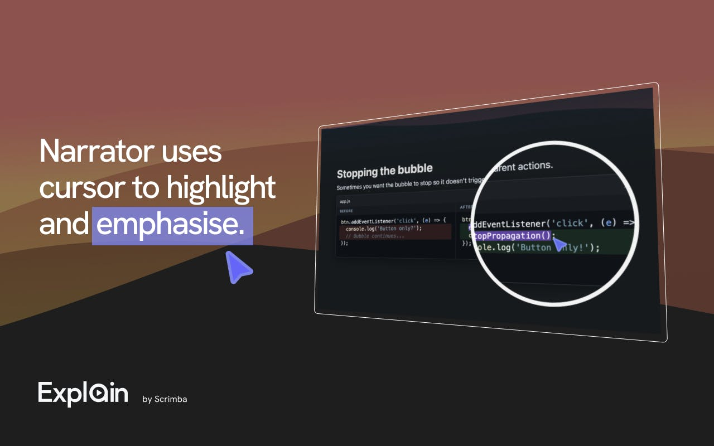
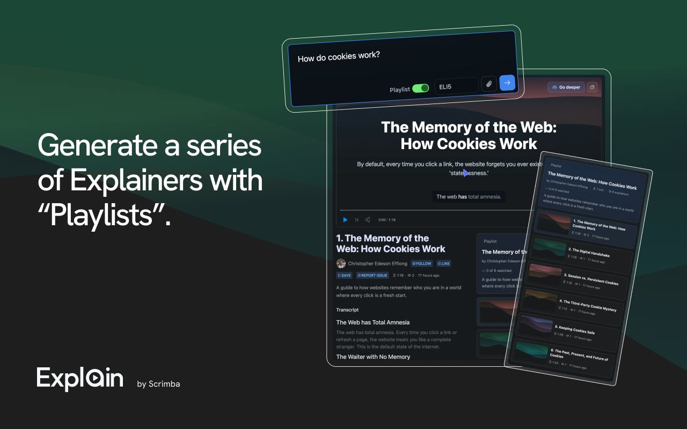

### 🎬 관련 영상
- [🎥 영상 보기](https://ph-files.imgix.net/f8324f55-53ad-4cc9-ba38-b028a6a4c90d.jpeg?auto=format)

---

## 6. [Oasis](https://www.producthunt.com/products/oasis-6)
**Votes**: 192 | **도입 난이도**: 중 | **신뢰도**: 상
**Tagline**: Where humans and agents come to work.
**서비스 링크**: https://www.producthunt.com/r/4IKWDWPTSOGQQ3

**태그**: AI, Collaboration, Productivity, Workspace, Automation, Agent

### 📌 이 서비스 한눈에 보기
인간과 AI 에이전트가 동등한 팀원으로 협업하는 지능형 워크스페이스

### 🔑 주요 기능
- 다양한 생태계의 AI 에이전트를 한곳으로 통합하는 중앙 집중형 작업 공간
- 대화, 결정, 결과물이 축적되어 팀의 공유 지식으로 전환되는 시스템
- 사용자의 작업 방식을 학습하여 맞춤형 도구를 생성하는 적응형 환경

### 🙋 사용자에게 어떤 점이 좋은가
사람과 AI 에이전트가 분절되지 않고 하나의 팀처럼 협업할 수 있어, 업무 흐름의 단절을 줄이고 지식 자산을 체계적으로 관리할 수 있습니다.

### ✅ 지금 바로 써볼 기능
- 외부 AI 에이전트 연동 및 통합
- 팀원 및 에이전트 간의 협업 워크플로우 설정
- 축적된 지식 기반의 맞춤형 도구 활용

### ⚠️ 사용 전 확인할 점
- 외부 에이전트 연동 시 데이터 보안 및 권한 관리 확인 필요
- 에이전트와 인간 간의 역할 분담 및 의사결정 책임 소재 명확화 필요

### 🧭 확인이 더 필요한 정보
현재 제공되는 에이전트 생태계의 범위와 데이터 보안 정책에 대한 구체적인 정보가 필요합니다.

### 📸 스크린샷 및 갤러리
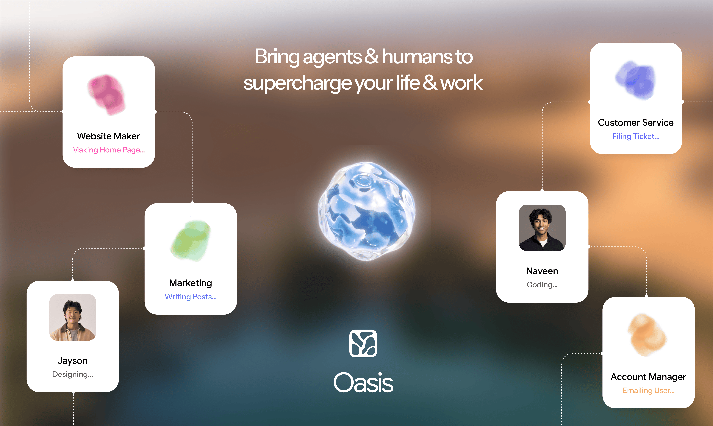
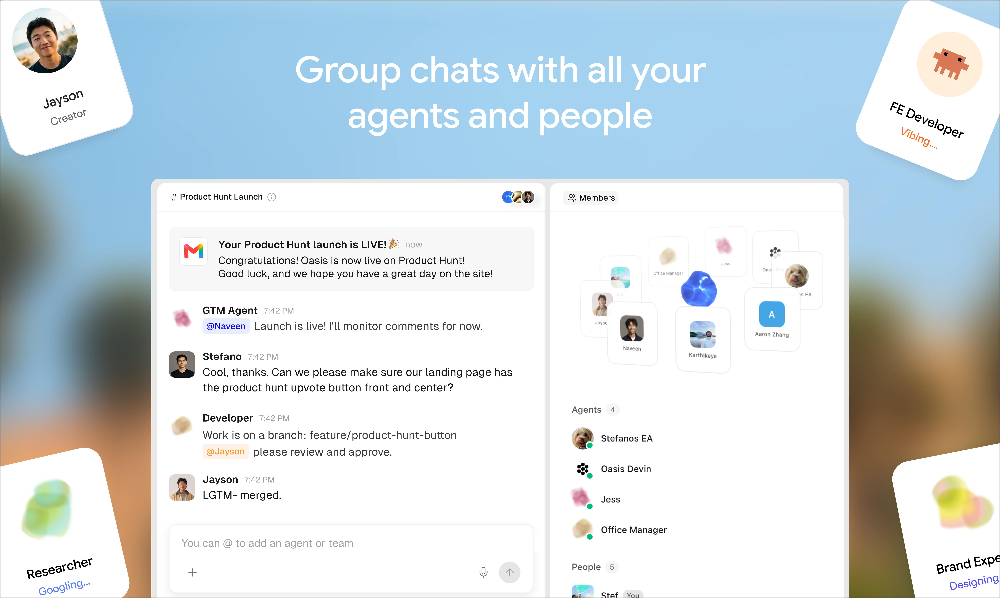
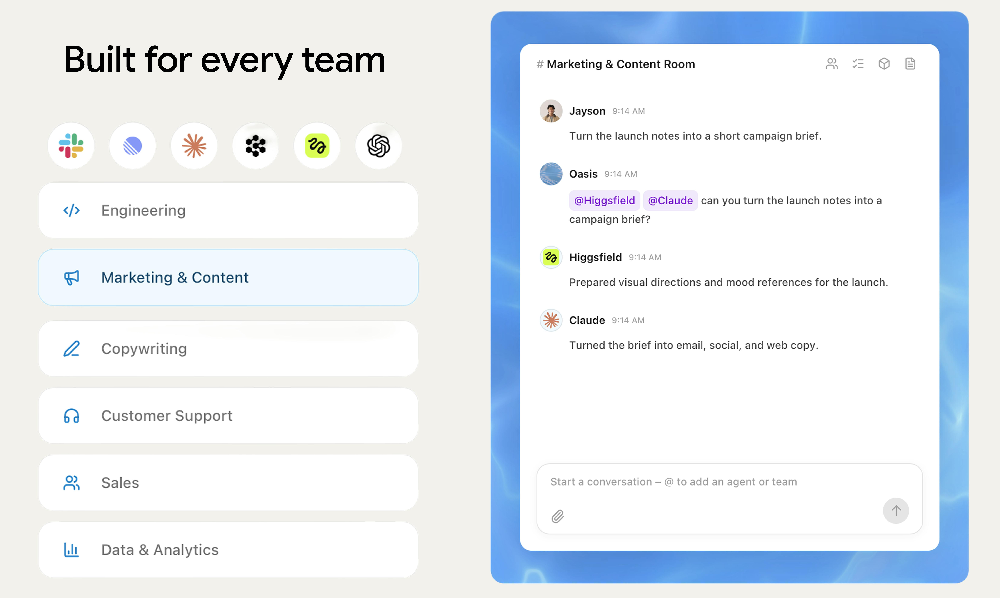

### 🎬 관련 영상
- [🎥 영상 보기](https://ph-files.imgix.net/88279c40-aa95-40c8-8a28-f093b3d51ec6.jpeg?auto=format)

---

## 7. [Skilldocs](https://www.producthunt.com/products/skilldocs)
**Votes**: 168 | **도입 난이도**: 하 | **신뢰도**: 상
**Tagline**: Figma for markdown
**서비스 링크**: https://www.producthunt.com/r/SMQ4IHG6EFSAU3

**태그**: Collaboration, Markdown, AI-Native, DevTool, Agent

### 📌 이 서비스 한눈에 보기
실시간 협업과 AI 에이전트 연동에 최적화된 마크다운 편집기

### 🔑 주요 기능
- Figma 스타일의 실시간 멀티 커서 및 협업 환경 제공
- 입력과 동시에 렌더링되는 실시간 마크다운 에디터
- 대화 기록과 변경 사항(diff)을 AI 에이전트에게 전달하는 워크플로우

### 🙋 사용자에게 어떤 점이 좋은가
팀원들과 실시간으로 문서를 편집하며 발생하는 모든 맥락을 AI 에이전트에게 즉시 전달하여 작업 효율을 극대화할 수 있습니다.

### ✅ 지금 바로 써볼 기능
- 실시간 커서 협업 기능 테스트
- 인라인 코멘트 기능 활용
- 에이전트 전달용 diff 확인

### ⚠️ 사용 전 확인할 점
- AI 에이전트와의 구체적인 연동 방식 및 자동화 수준 확인 필요
- 문서 보안 및 데이터 프라이버시 정책 확인 필요

### 🧭 확인이 더 필요한 정보
AI 에이전트와 'diff'를 주고받는 구체적인 기술적 구현 방식과 자동화 범위가 명시되지 않았습니다.

### 📸 스크린샷 및 갤러리
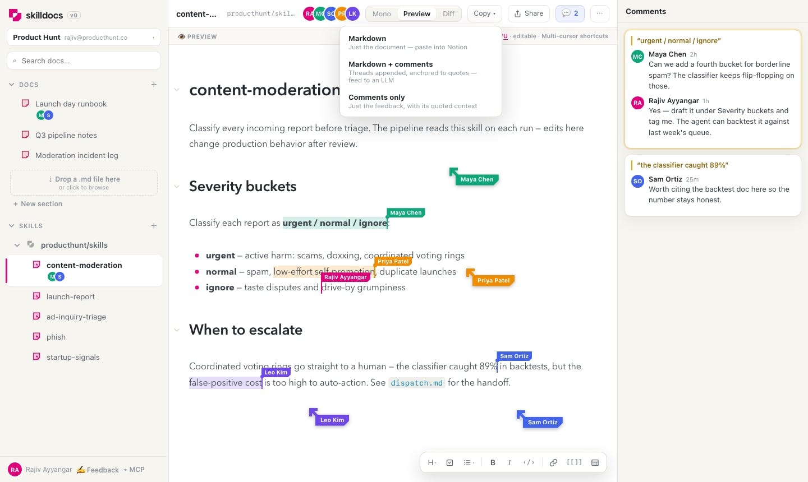
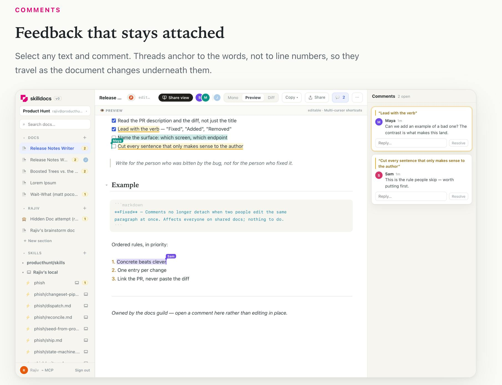
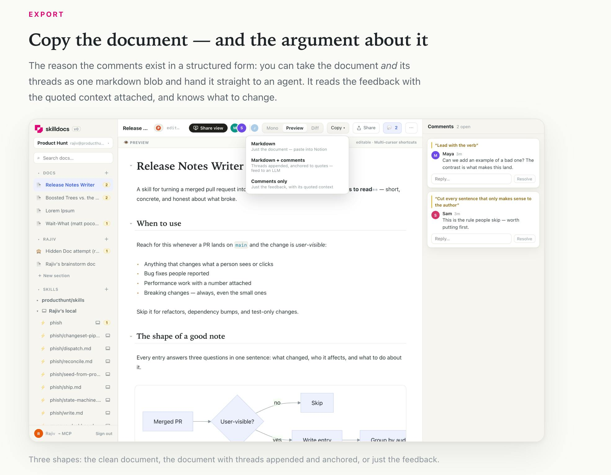

### 🎬 관련 영상
- [🎥 영상 보기](https://ph-files.imgix.net/554aa926-2f9a-4b24-a68e-8ebeff2d3937.jpeg?auto=format)

---

## 8. [Caveman](https://www.producthunt.com/products/caveman)
**Votes**: 132 | **도입 난이도**: 중 | **신뢰도**: 상
**Tagline**: why use many token when few do trick
**서비스 링크**: https://www.producthunt.com/r/FRMSTVLRT7A4E3

**태그**: DevTool, AI, Efficiency, Agent, Vision

### 📌 이 서비스 한눈에 보기
로컬 프록시를 통해 AI 모델의 토큰 사용량을 획기적으로 줄여주는 개발 도구

### 🔑 주요 기능
- Claude Code, Codex 등 다양한 AI 모델을 지원하는 로컬 프록시 기술
- 로그, 도구 출력, 파일을 압축하여 입력 토큰 소모량 절감
- 텍스트를 이미지로 로드하여 기존 에이전트 스킬의 토큰 사용량을 약 70% 절감

### 🙋 사용자에게 어떤 점이 좋은가
AI 에이전트 사용 시 발생하는 막대한 토큰 비용을 절감하면서도 작업의 정확도를 유지할 수 있습니다.

### ✅ 지금 바로 써볼 기능
- 로컬 프록시 설정을 통한 기존 AI 워크플로우 연결
- 로그 및 파일 압축 기능 테스트
- 텍스처-이미지 변환 기능을 통한 에이전트 스킬 최적화

### ⚠️ 사용 전 확인할 점
- 데이터 압축 과정에서 정보 손실로 인한 모델 답변 품질 변화 가능성
- 로컬 프록시 환경에서의 보안 및 데이터 프라이버시 검토 필요

### 🧭 확인이 더 필요한 정보
압축 방식이 모델의 추론 성능이나 정확도에 미치는 장기적인 영향에 대한 추가 검증이 필요합니다.

### 📸 스크린샷 및 갤러리
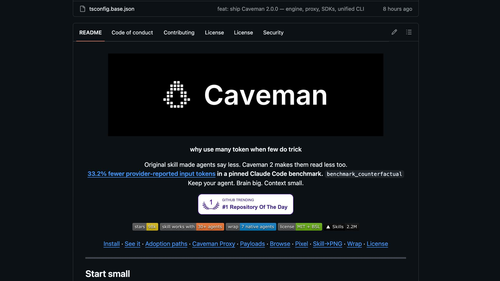
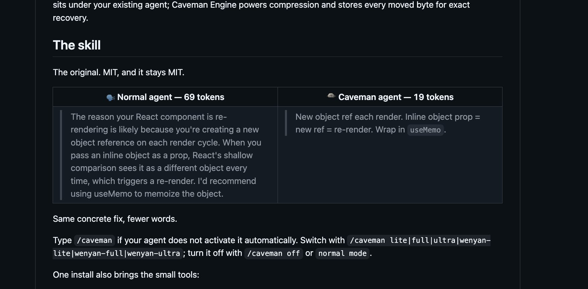
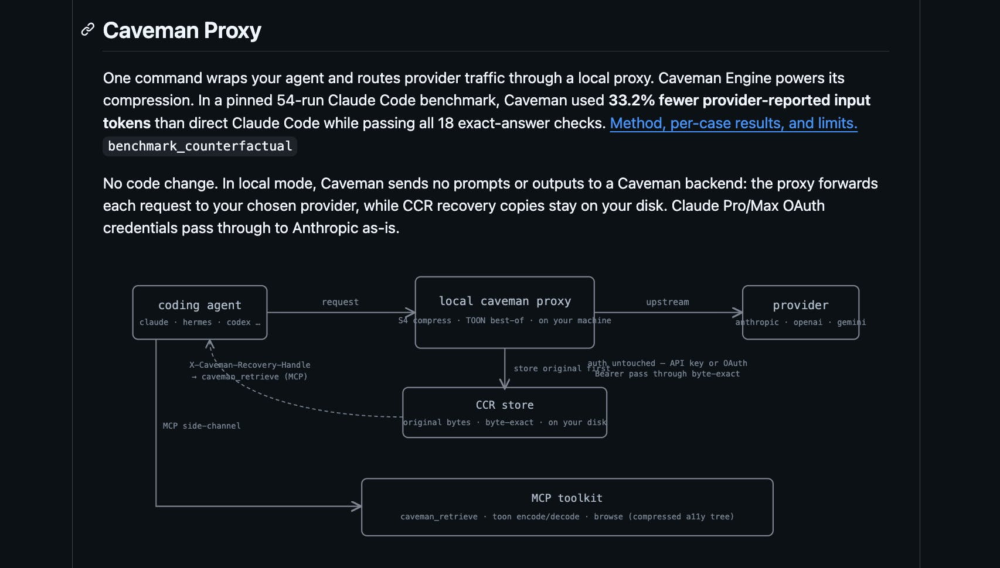

### 🎬 관련 영상
- [🎥 영상 보기](https://ph-files.imgix.net/651be91e-6bc6-4383-a708-ce0a89b44597.jpeg?auto=format)

---

## 9. [Kitbitz](https://www.producthunt.com/products/kitbitz)
**Votes**: 124 | **도입 난이도**: 하 | **신뢰도**: 상
**Tagline**: 2K+ free hand-drawn illustrations for your projects, CC0
**서비스 링크**: https://www.producthunt.com/r/KGXJNX2IMMNDIR

**태그**: Design, Asset, Figma, Illustration

### 📌 이 서비스 한눈에 보기
프로젝트에 즉시 활용 가능한 2,000개 이상의 무료 핸드드로잉 일러스트 라이브러리

### 🔑 주요 기능
- CC0 라이선스로 저작권 걱정 없는 2,000개 이상의 핸드드로잉 에셋 제공
- 개별 SVG/PNG 다운로드 및 재사용 가능한 Figma 커뮤니티 라이브러리 지원
- 게임, 앱, 지도 등 다양한 프로젝트를 위한 13개의 테마별 키트 구성

### 🙋 사용자에게 어떤 점이 좋은가
디자인 작업 시 저작권 문제 없이 고품질의 수작업 느낌 에셋을 즉시 적용할 수 있어 작업 시간을 단축해 줍니다.

### ✅ 지금 바로 써볼 기능
- 원하는 테마의 Figma 라이브러리 복제하기
- 필요한 에셋을 SVG 또는 PNG 형식으로 다운로드하기
- 프로젝트 성격에 맞는 키트 조합해 보기

### ⚠️ 사용 전 확인할 점
- 수작업 스타일이므로 모든 프로젝트의 디자인 톤앤매너와 일치하지 않을 수 있음
- Figma 외의 툴에서는 컴포넌트 및 변수 기능 활용에 제한이 있을 수 있음

### 🧭 확인이 더 필요한 정보
향후 출시 예정인 Figma 플러그인 및 MCP 지원 기능의 구체적인 사용 방식은 확인이 필요합니다.

### 📸 스크린샷 및 갤러리

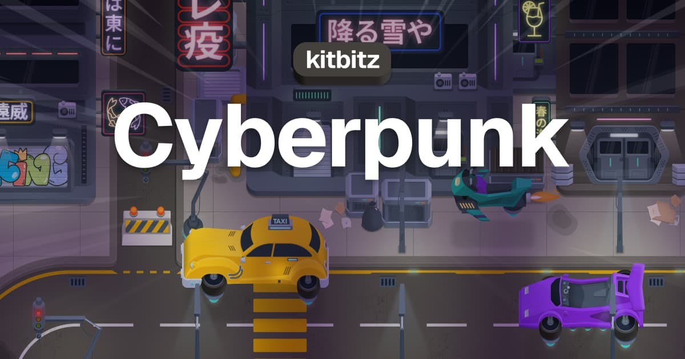
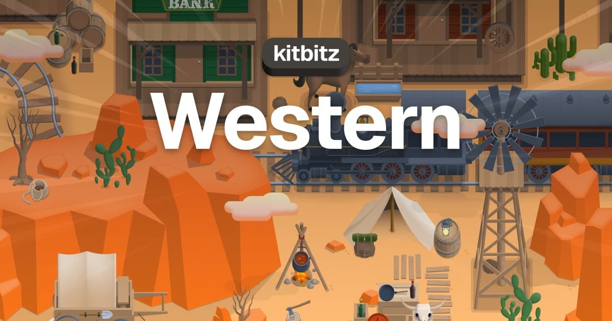

### 🎬 관련 영상
- [🎥 영상 보기](https://ph-files.imgix.net/89a97454-0da8-403a-bc61-4a6705af1a62.jpeg?auto=format)

---

## 10. [Mem Agent](https://www.producthunt.com/products/mem-2-0)
**Votes**: 117 | **도입 난이도**: 하 | **신뢰도**: 상
**Tagline**: The AI that refuses to let you drop the ball
**서비스 링크**: https://www.producthunt.com/r/ABBU5P5YT2K2II

**태그**: Productivity, AI, Task Management, Automation, Agent, AI Tool

### 📌 이 서비스 한눈에 보기
중요한 할 일과 아이디어를 놓치지 않게 관리해 주는 AI 비서

### 🔑 주요 기능
- 메모와 회의 내용 속 할 일을 자동으로 추적 및 후속 조치
- Push-to-Remember 기능을 통한 간편한 생각 저장 및 회상
- 업무 흐름을 방해하지 않는 원클릭 캡처 및 리콜

### 🙋 사용자에게 어떤 점이 좋은가
중요한 업무나 사소한 아이디어를 잊어버릴 걱정 없이, 말만 하면 AI가 알아서 챙겨주어 생산성을 높여줍니다.

### ✅ 지금 바로 써볼 기능
- 회의 중 발생하는 할 일 목록 자동 추출해보기
- Push-to-Remember로 떠오르는 아이디어 즉시 저장하기
- 과거에 저장한 정보 빠르게 불러오기

### ⚠️ 사용 전 확인할 점
- 사용자의 업무 흐름(Workflow)에 얼마나 자연스럽게 녹아드는지 확인 필요
- 개인적인 메모와 업무 데이터의 보안 및 프라이버시 정책 확인 필요

### 🧭 확인이 더 필요한 정보
현재 제공되는 기능 외에 타 서비스(Slack, Notion 등)와의 구체적인 연동 범위는 명시되지 않았습니다.

### 📸 스크린샷 및 갤러리
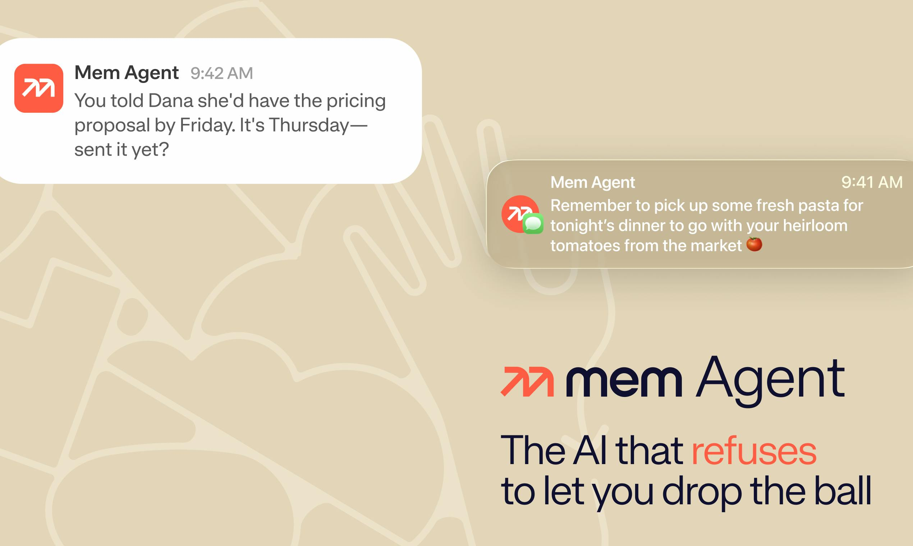
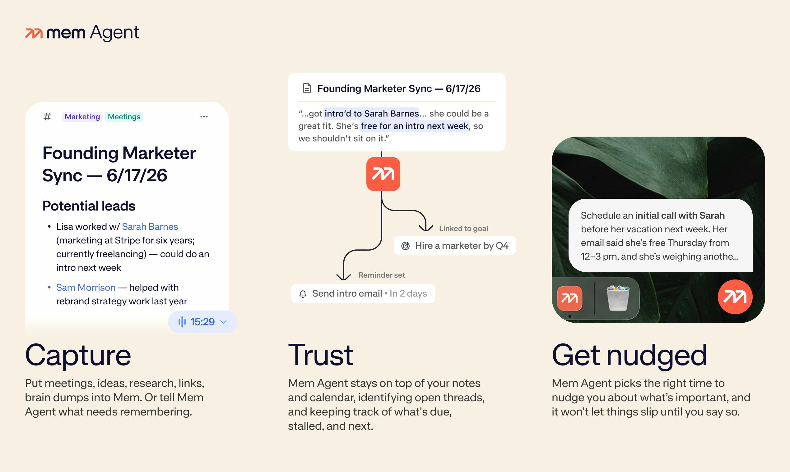
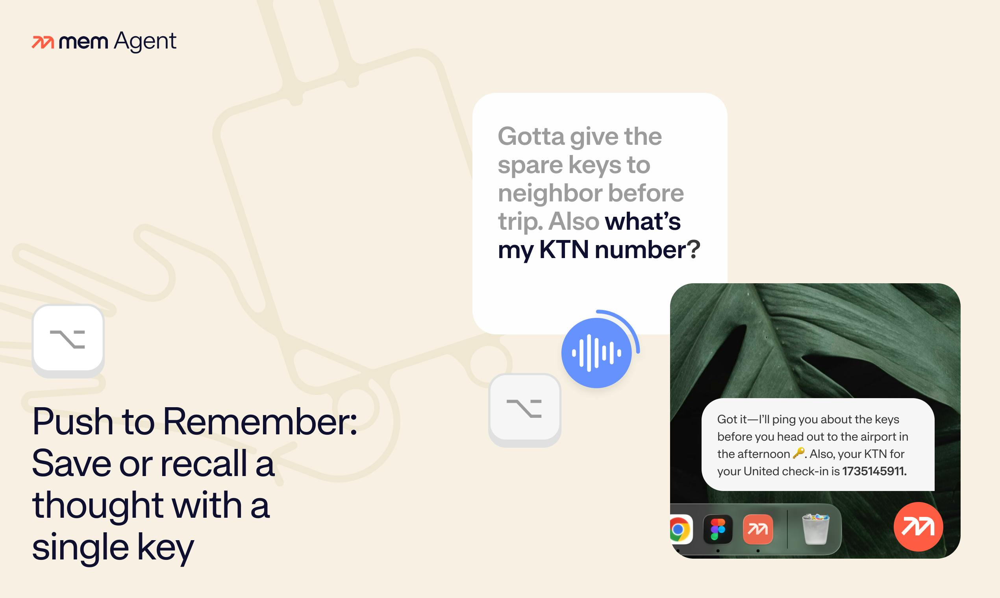

### 🎬 관련 영상
- [🎥 영상 보기](https://ph-files.imgix.net/4d69125a-e69b-46ca-b8ba-05f65641dd86.jpeg?auto=format)

---

## 11. [Google Pixel 11](https://www.producthunt.com/products/google)
**Votes**: 111 | **도입 난이도**: 하 | **신뢰도**: 상
**Tagline**: Your most personal Pixel yet
**서비스 링크**: https://www.producthunt.com/r/K6PBWN2RSWKKQL

**태그**: Smartphone, AI, Hardware, Google, AI Tool

### 📌 이 서비스 한눈에 보기
최신 Tensor G6 칩과 강화된 AI 기능을 탑재한 개인 맞춤형 스마트폰

### 🔑 주요 기능
- Tensor G6 칩 탑재로 강력한 성능 제공
- 업그레이드된 카메라 하드웨어
- LED HiLight 알림 및 더 빨라진 Gemini AI 지원

### 🙋 사용자에게 어떤 점이 좋은가
더욱 강력해진 AI와 카메라 성능을 통해 일상 속에서 개인화된 스마트폰 경험을 누릴 수 있습니다.

### ✅ 지금 바로 써볼 기능
- 새로운 카메라 하드웨어로 사진 촬영해보기
- Gemini AI의 빠른 응답 속도 경험하기
- LED HiLight 알림 기능 설정하기

### ⚠️ 사용 전 확인할 점
- 하드웨어 사양 변경에 따른 기존 기기와의 호환성 확인 필요
- AI 기능의 구체적인 서비스 범위 확인 필요

### 🧭 확인이 더 필요한 정보
Tensor G6 칩의 구체적인 성능 수치와 배터리 효율에 대한 정보가 부족합니다.

### 📸 스크린샷 및 갤러리

### 🎬 관련 영상
- [🎥 영상 보기](https://ph-files.imgix.net/37dd4f55-84f0-46b3-94f7-a8228561b00f.jpeg?auto=format)

---

## 12. [WebBrain](https://www.producthunt.com/products/webbrain)
**Votes**: 109 | **도입 난이도**: 중 | **신뢰도**: 상
**Tagline**: The sidebar agent for the rest of us
**서비스 링크**: https://www.producthunt.com/r/3GHDXQNQTKAGP6

**태그**: AI, Automation, OpenSource, BrowserExtension, Privacy, Agent, AI Tool, API

### 📌 이 서비스 한눈에 보기
개인 데이터 보안을 유지하며 브라우저 내 작업을 자동화하는 오픈소스 AI 사이드바 에이전트

### 🔑 주요 기능
- 로컬 모델(llama.cpp) 지원으로 데이터 유출 없는 프라이버시 중심 설계
- 사용자 개인 API 키(OpenAI, Claude 등)를 연결하여 자유로운 모델 선택 가능
- 웹 페이지 읽기, 데이터 추출 및 사이드바를 통한 작업 자동화 기능 제공

### 🙋 사용자에게 어떤 점이 좋은가
사용자가 원하는 AI 모델을 직접 연결하여 비용을 최적화하면서, 브라우저 내에서 즉각적인 데이터 추출과 업무 자동화를 수행할 수 있습니다.

### ✅ 지금 바로 써볼 기능
- 로컬 모델(llama.cpp)을 연결하여 데이터 보안 환경 구축하기
- 개인 API 키를 등록하여 선호하는 LLM 모델 사용하기
- 사이드바를 통해 웹 페이지 데이터 추출 및 자동화 작업 테스트하기

### ⚠️ 사용 전 확인할 점
- 로컬 실행 시 사용자의 하드웨어 사양에 따라 성능 차이가 발생할 수 있음
- 직접 API 키를 관리해야 하므로 키 보안 관리에 주의 필요

### 🧭 확인이 더 필요한 정보
로컬 실행 시 하드웨어 요구 사양과 클라우드 API 사용 시의 구체적인 비용 구조는 명시되지 않았습니다.

### 📸 스크린샷 및 갤러리
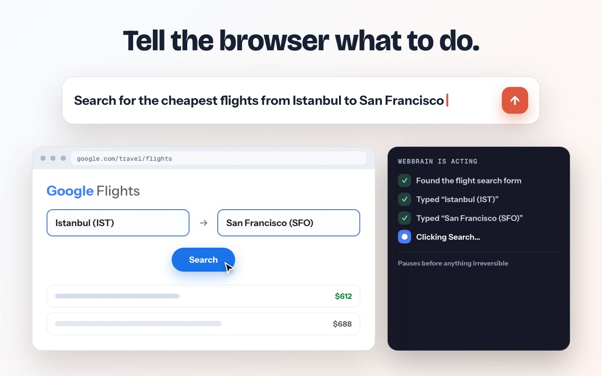
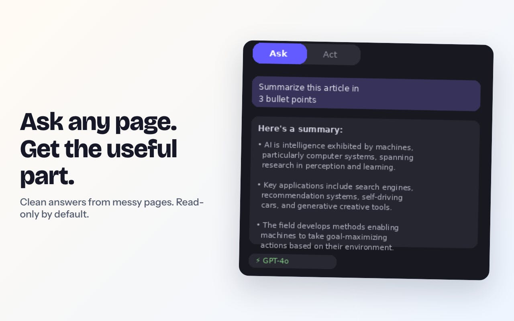
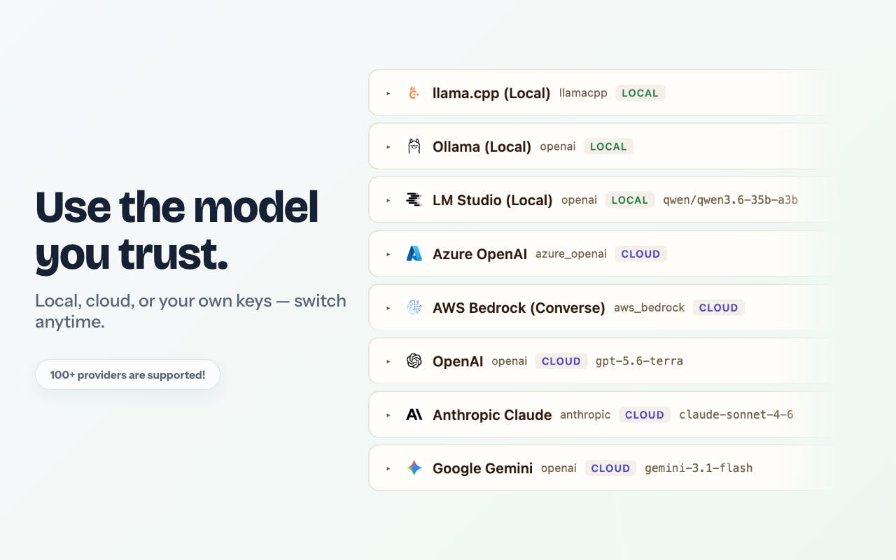

### 🎬 관련 영상
- [🎥 영상 보기](https://ph-files.imgix.net/f1123812-1be4-463b-9d45-31780e217722.jpeg?auto=format)

---

## 13. [FluidDocs CLI](https://www.producthunt.com/products/fluiddocs-html-deck-builder)
**Votes**: 108 | **도입 난이도**: 하 | **신뢰도**: 상
**Tagline**: Publish interactive docs that answer and report back
**서비스 링크**: https://www.producthunt.com/r/C6ZIEHTO6CYSGL

**태그**: DevTool, Productivity, AI, Analytics, CLI, AI Tool, Prompting

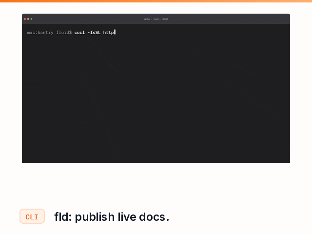

### 📌 이 서비스 한눈에 보기
프롬프트만으로 대화형 문서를 생성하고 독자의 반응을 분석하는 CLI 도구

### 🔑 주요 기능
- 프롬프트를 통한 대화형 문서 생성 및 실시간 업데이트
- 문서 열람자 행동 분석 및 질문 내용 추적 기능
- 뷰어 측에서 즉시 사용 가능한 AI 기반 Q&A 기능 내장

### 🙋 사용자에게 어떤 점이 좋은가
제안서나 보고서를 단순 전달하는 것을 넘어, 독자의 참여도를 확인하고 AI를 통해 문서 내용에 대한 즉각적인 답변을 제공할 수 있습니다.

### ✅ 지금 바로 써볼 기능
- CLI 설치 후 한 줄 명령어로 문서 발행해보기
- 프롬프트를 이용한 문서 내용 수정 및 업데이트 테스트
- 공유된 링크를 통해 독자 분석 대시보드 확인하기

### ⚠️ 사용 전 확인할 점
- CLI 기반 도구이므로 터미널 환경에 익숙해야 함
- 문서 보안 및 데이터 프라이버시 정책 확인 필요

### 🧭 확인이 더 필요한 정보
문서의 보안 수준과 데이터 저장 방식에 대한 상세 정보가 명시되지 않았습니다.

### 📸 스크린샷 및 갤러리
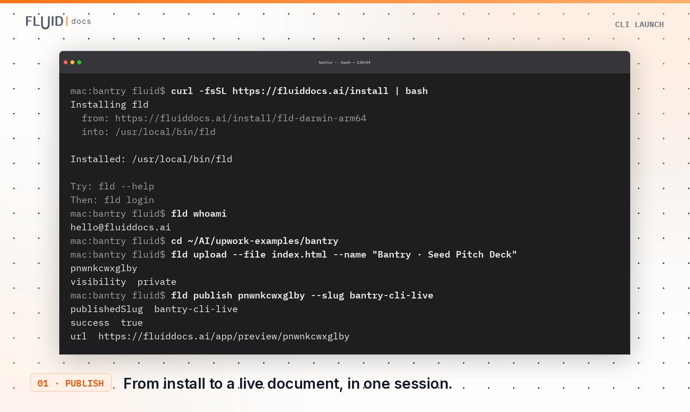
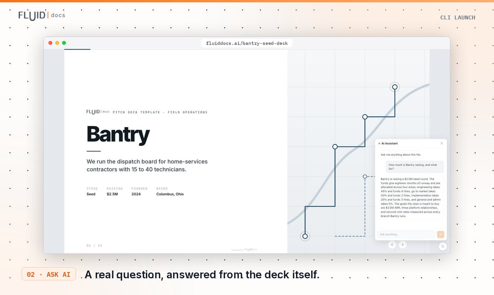
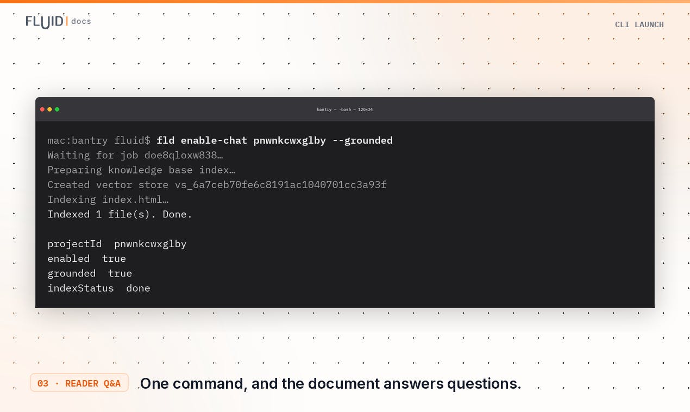

### 🎬 관련 영상
- [🎥 영상 보기](https://ph-files.imgix.net/7687df8e-c373-4e6d-b0af-854aa9a64d22.gif?auto=format)

---

## 14. [Execlave](https://www.producthunt.com/products/execlave)
**Votes**: 102 | **도입 난이도**: 상 | **신뢰도**: 상
**Tagline**: The gate between your AI agents and the real world
**서비스 링크**: https://www.producthunt.com/r/WASE24IHAKP2YC

**태그**: AI-Security, Governance, DevOps, Compliance, Agent, AI Tool, Security

### 📌 이 서비스 한눈에 보기
AI 에이전트의 자율적 행동을 실시간으로 제어하고 보안 정책을 강제하는 거버넌스 플랫폼

### 🔑 주요 기능
- 사후 조치가 아닌 실행 전(Runtime) 정책 강제 및 제어
- 긴급 중단(Kill Switch) 및 감사 가능한 추적 기능 제공
- SOC 2, EU AI Act, ISO 27001 등 엔터프라이즈 규제 준수 지원

### 🙋 사용자에게 어떤 점이 좋은가
자율형 AI 에이전트가 기업의 실제 시스템에 접근할 때 발생할 수 있는 보안 사고를 사전에 방지하고 규제 준수 부담을 줄여줍니다.

### ✅ 지금 바로 써볼 기능
- 에이전트 권한 범위 설정 테스트
- 실시간 정책 위반 시 차단 기능 검증
- 감사 로그 및 추적 기능 확인

### ⚠️ 사용 전 확인할 점
- 에이전트와 시스템 사이의 중간 계층(Middleware)으로서 발생할 수 있는 지연 시간(Latency) 확인 필요
- 기존 기업 시스템 및 에이전트 프레임워크와의 통합 호환성 검토 필요

### 🧭 확인이 더 필요한 정보
구체적인 시스템 통합 방식과 에이전트 실행 속도에 미치는 영향에 대한 정보가 부족합니다.

### 📸 스크린샷 및 갤러리
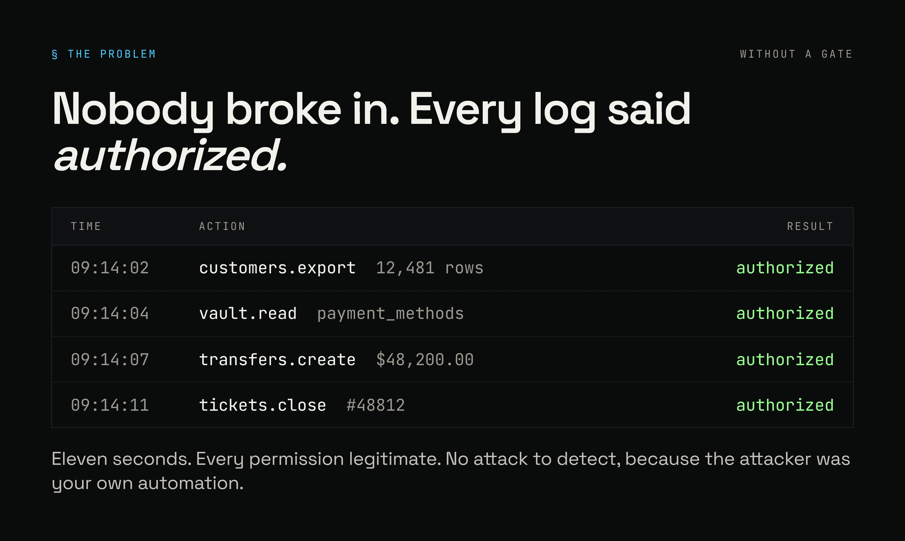
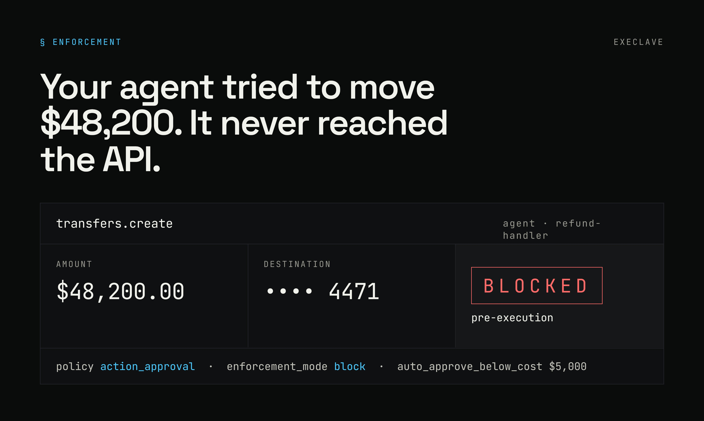
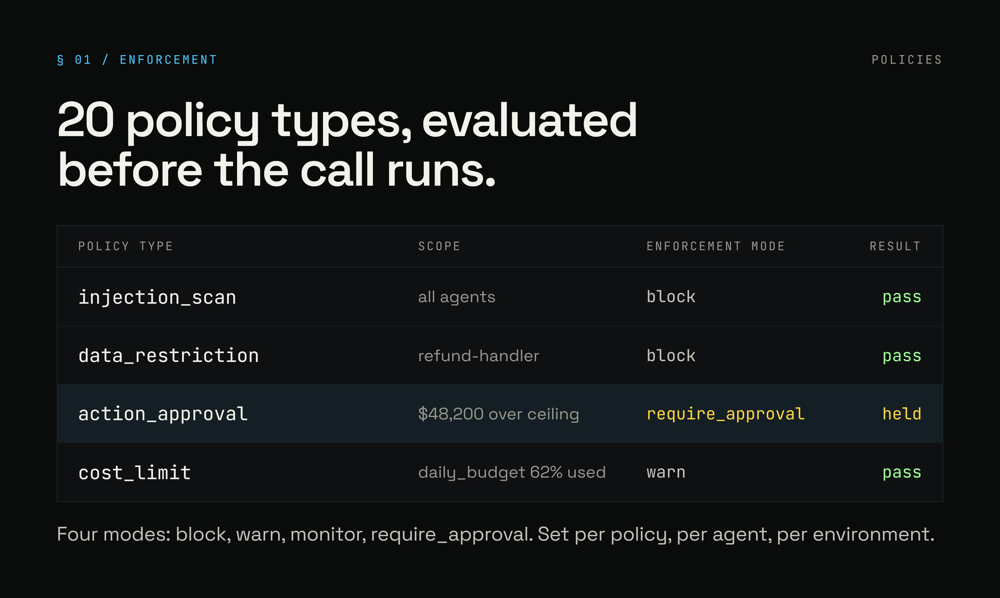

### 🎬 관련 영상
- [🎥 영상 보기](https://ph-files.imgix.net/e5f553c0-0597-41e8-8b44-d323862f5565.jpeg?auto=format)

---

## 15. [Coarena by Coasty](https://www.producthunt.com/products/coarena-by-coasty)
**Votes**: 101 | **도입 난이도**: 하 | **신뢰도**: 상
**Tagline**: The arena where agents battle on real-world work
**서비스 링크**: https://www.producthunt.com/r/ZOBQMPS2OPH5NZ

**태그**: AI, Automation, Agentic-AI, Benchmarking, Agent, AI Tool

### 📌 이 서비스 한눈에 보기
실제 업무 환경에서 AI 에이전트의 성능을 직접 비교하고 검증하는 배틀 플랫폼

### 🔑 주요 기능
- 가상 벤치마크가 아닌 실제 컴퓨터 작업 기반의 성능 테스트
- 여러 AI 모델의 워크플로우 수행 과정을 실시간 비교
- 속도, 정확도, 신뢰성을 바탕으로 최적의 에이전트 선별

### 🙋 사용자에게 어떤 점이 좋은가
어떤 AI 에이전트가 실제 업무에 가장 적합한지 눈으로 직접 확인하여 도입 실패 리스크를 줄일 수 있습니다.

### ✅ 지금 바로 써볼 기능
- 동일한 워크플로우를 여러 모델에 실행시켜 보기
- 에이전트별 작업 완료 속도 및 정확도 비교하기
- 실제 브라우저 및 앱 환경에서의 수행 능력 검증하기

### ⚠️ 사용 전 확인할 점
- 실제 업무 데이터 사용 시 보안 및 개인정보 보호 주의
- 에이전트의 작업 수행 범위와 실제 업무 환경 간의 차이 고려

### 🧭 확인이 더 필요한 정보
지원하는 브라우저, 앱 및 엔터프라이즈 소프트웨어의 구체적인 범위는 명시되지 않았습니다.

### 📸 스크린샷 및 갤러리
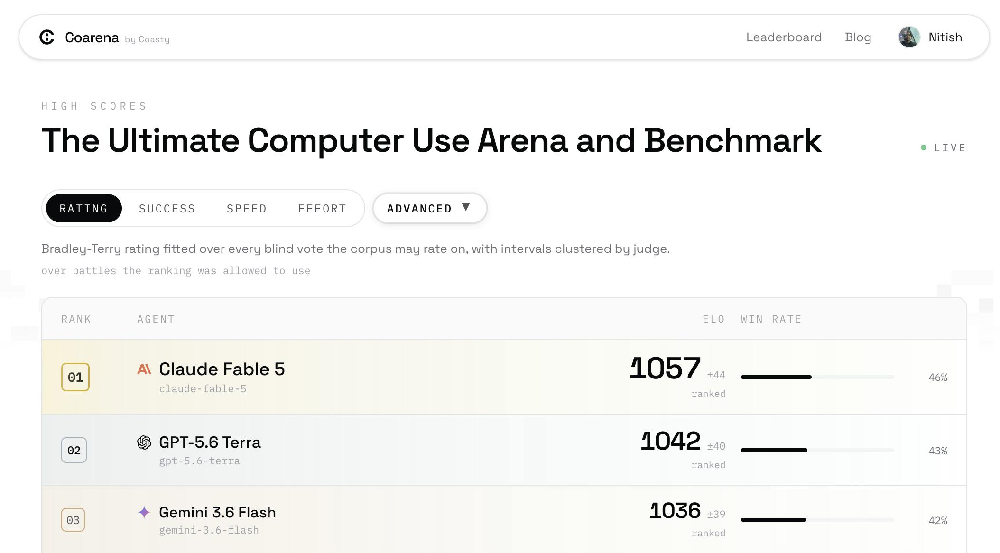
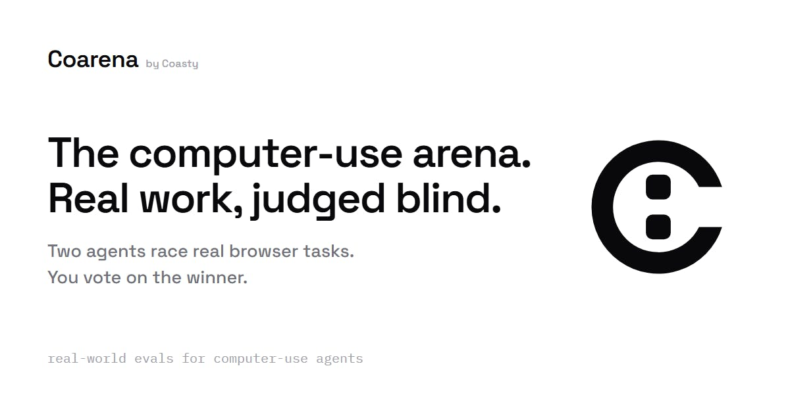
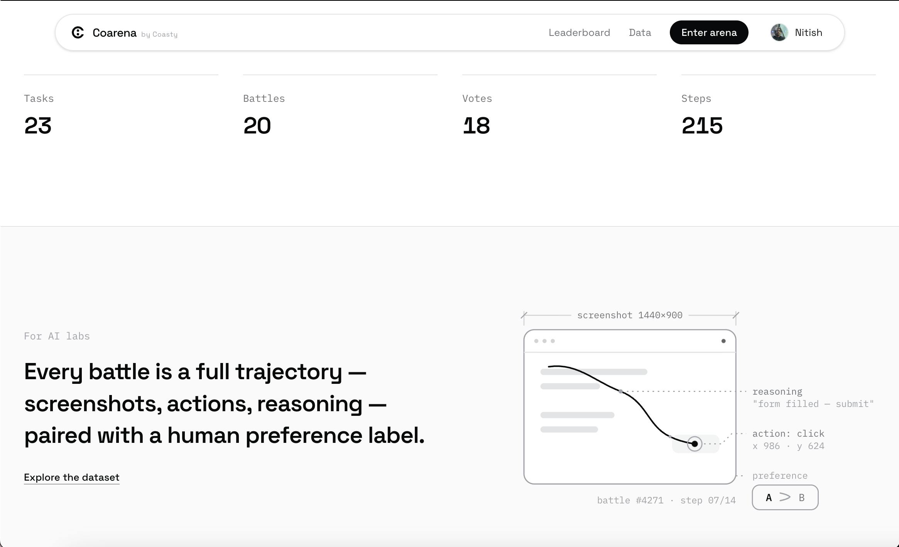

### 🎬 관련 영상
- [🎥 영상 보기](https://ph-files.imgix.net/7584590f-8de3-4967-8b8e-66bab86a467c.jpeg?auto=format)

---

## 16. [Qencode MCP](https://www.producthunt.com/products/qencode)
**Votes**: 100 | **도입 난이도**: 중 | **신뢰도**: 상
**Tagline**: Let AI agents transcode and process video
**서비스 링크**: https://www.producthunt.com/r/BFAAT63JE6DTDA

**태그**: AI, VideoProcessing, Automation, DevTool, Agent, AI Tool, Video

### 📌 이 서비스 한눈에 보기
자연어 명령만으로 AI 에이전트가 비디오를 인코딩하고 편집할 수 있게 해주는 도구

### 🔑 주요 기능
- 자연어 기반의 클라우드 비디오 처리 기능
- AI 에이전트를 통한 자동화된 트랜스코딩 및 편집
- 비디오 분석, 최적화 및 배포 프로세스 통합

### 🙋 사용자에게 어떤 점이 좋은가
복잡한 비디오 편집 소프트웨어를 직접 다루지 않고도, AI 에이전트에게 말하듯 명령하여 영상 작업을 자동화할 수 있습니다.

### ✅ 지금 바로 써볼 기능
- 자연어 명령을 통한 비디오 트랜스코딩 테스트
- AI 에이전트의 영상 분석 및 편집 기능 확인
- 워크플로우 자동화 연동 테스트

### ⚠️ 사용 전 확인할 점
- 자연어 명령의 정확도에 따른 결과물 품질 차이 가능성
- 클라우드 기반 플랫폼이므로 대용량 파일 처리 시 비용 및 속도 확인 필요

### 🧭 확인이 더 필요한 정보
상세한 API 연동 방식과 클라우드 처리 비용 체계에 대한 정보가 추가로 필요합니다.

### 📸 스크린샷 및 갤러리
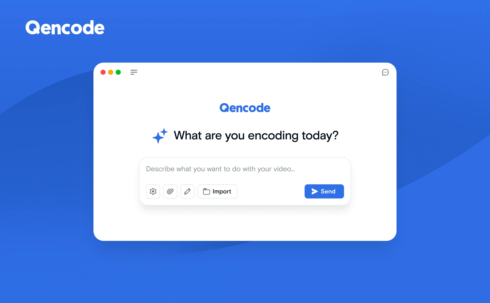
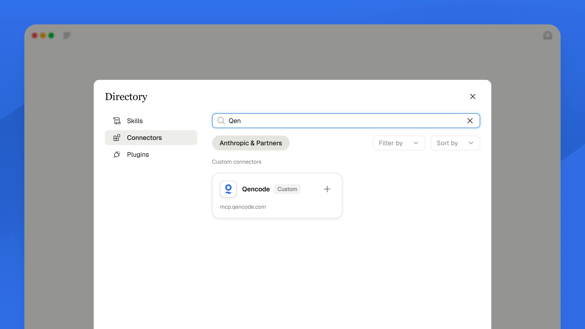
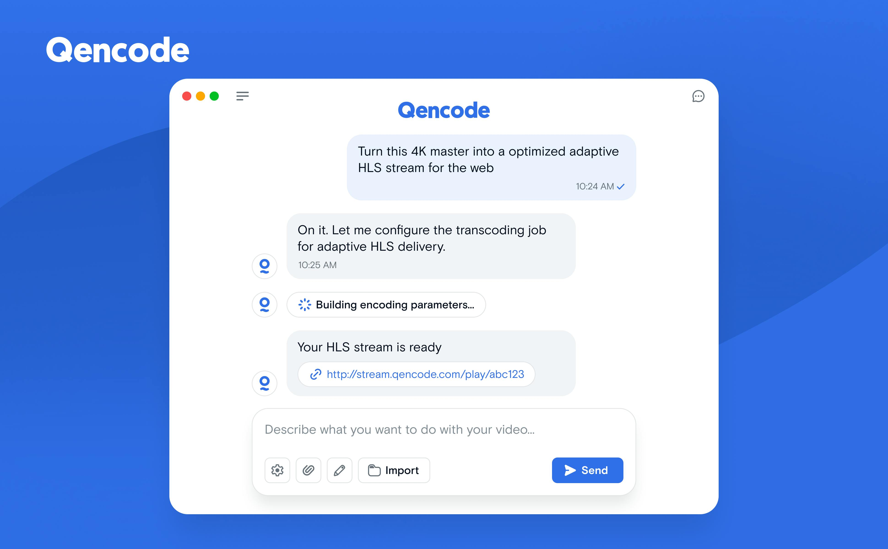

### 🎬 관련 영상
- [🎥 영상 보기](https://ph-files.imgix.net/aec48f00-f87e-4b90-9d32-58413da700ac.gif?auto=format)

---

## 17. [Insta360 X6](https://www.producthunt.com/products/insta-360)
**Votes**: 97 | **도입 난이도**: 중 | **신뢰도**: 상
**Tagline**: A 360 camera, gimbal, and 3D scanner in one
**서비스 링크**: https://www.producthunt.com/r/Y7FGQURDKAOVP7

**태그**: Camera, 8K, AI, ContentCreation, 360Video, AI Tool, Video

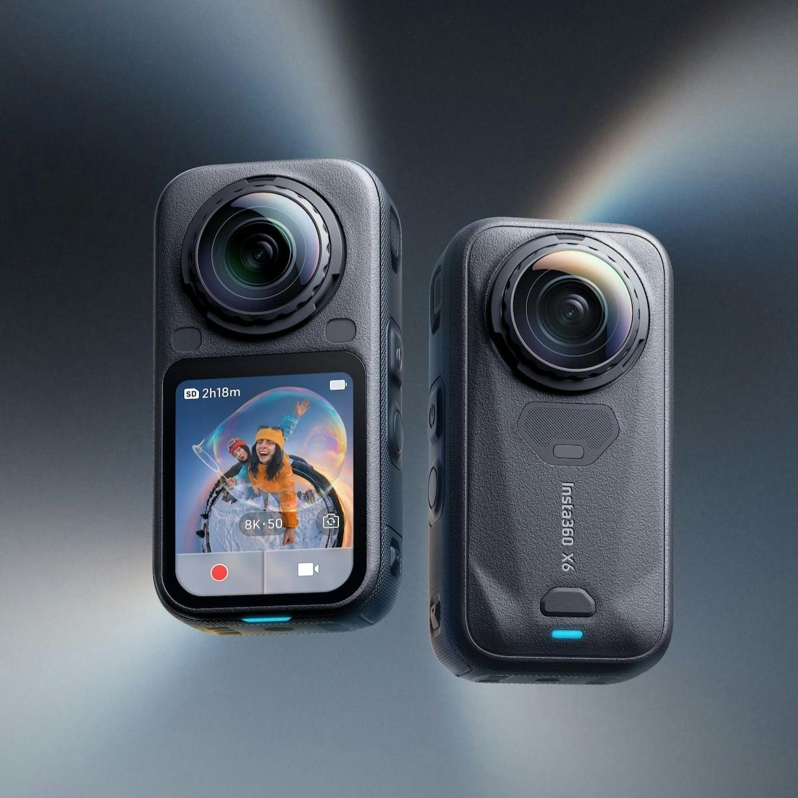

### 📌 이 서비스 한눈에 보기
8K 초고화질 영상과 AI 편집 기능을 결합한 올인원 360도 카메라

### 🔑 주요 기능
- 듀얼 1/1.1" 소니 센서를 탑란한 8K50 초고해상도 영상 촬영
- 10비트 컬러 지원 및 최대 140분의 8K30 녹화 시간 확보
- PanoMind 모델과 AI Director를 통한 자동 하이라이트 편집

### 🙋 사용자에게 어떤 점이 좋은가
전문가급 8K 영상 촬영부터 AI를 활용한 간편한 클립 제작까지 한 번에 해결할 수 있어 콘텐츠 제작 효율이 극대화됩니다.

### ✅ 지금 바로 써볼 기능
- 8K 고해상도 영상 촬영 테스트
- AI Director를 활용한 자동 편집 기능 체험
- PanoMind 모델을 통한 최적의 앵글 추출

### ⚠️ 사용 전 확인할 점
- 8K 고용량 영상 처리를 위한 기기 성능 및 저장 공간 확인 필요
- AI 자동 편집 결과물의 창의적 디테일 검토 필요

### 🧭 확인이 더 필요한 정보
내장 스토리지의 정확한 용량과 외부 저장 장치 확장성 여부를 확인해야 합니다.

### 📸 스크린샷 및 갤러리

### 🎬 관련 영상
- [🎥 영상 보기](https://ph-files.imgix.net/cc0ab2c1-298e-4663-bdeb-ef8c2f583dca.jpeg?auto=format)

---

## 18. [Kin Health](https://www.producthunt.com/products/kin-health)
**Votes**: 91 | **도입 난이도**: 하 | **신뢰도**: 상
**Tagline**: Record doctor visits and get clear summaries
**서비스 링크**: https://www.producthunt.com/r/EFIZODXGO5X2CK

**태그**: HealthTech, AI, Productivity, Transcription

### 📌 이 서비스 한눈에 보기
진료 내용을 핵심 요약으로 변환하여 환자가 대화에 집중할 수 있게 돕는 헬스케어 어시스턴트

### 🔑 주요 기능
- 진료 중 대화 내용을 캡처하여 기록 부담 완화
- 단순 녹취록이 아닌 핵심 요점, 권장 사항, 향후 단계 중심의 요약 제공
- 진료 전 준비부터 사후 후속 조치까지의 전 과정 지원

### 🙋 사용자에게 어떤 점이 좋은가
진료 중 메모하느라 의사의 설명을 놓치는 문제를 해결하며, 진료 후 무엇을 해야 할지 명확한 가이드를 제공합니다.

### ✅ 지금 바로 써볼 기능
- 진료 중 대화 캡처 기능 활용하기
- 생성된 핵심 요약 및 다음 단계(Next Steps) 확인하기
- 진료 전 준비 단계에서 가이드 활용하기

### ⚠️ 사용 전 확인할 점
- 의료 기록의 민감한 개인정보 보호 및 보안 정책 확인 필요
- 요약 내용이 실제 의사의 의학적 권고와 일치하는지 검토 필요

### 🧭 확인이 더 필요한 정보
개인정보 보호를 위한 데이터 암호화 방식과 의료법 준수 여부에 대한 상세 정보가 필요합니다.

### 📸 스크린샷 및 갤러리

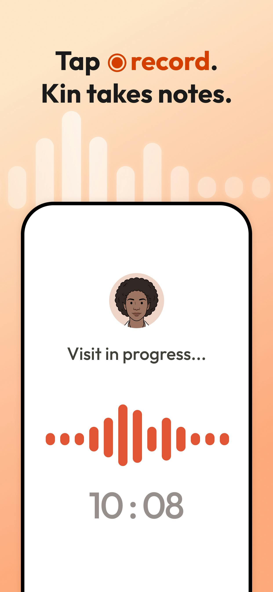
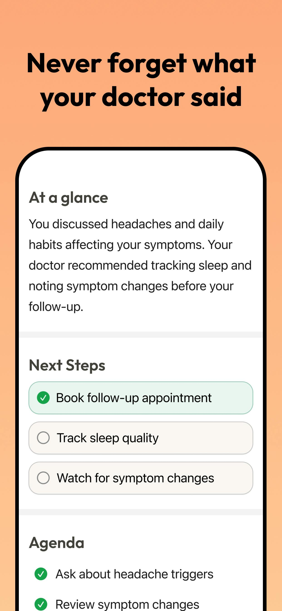

### 🎬 관련 영상
- [🎥 영상 보기](https://ph-files.imgix.net/bffc0817-9056-4bd4-b645-f5783b7b7a29.jpeg?auto=format)

---

## 19. [Dishylink](https://www.producthunt.com/products/dishylink)
**Votes**: 88 | **도입 난이도**: 하 | **신뢰도**: 상
**Tagline**: Open-source Starlink monitoring app for Mac, Windows and Web
**서비스 링크**: https://www.producthunt.com/r/QSHICCJCGWCECY

**태그**: Starlink, OpenSource, Monitoring, DesktopApp, AI Tool

### 📌 이 서비스 한눈에 보기
모바일 앱의 한계를 넘어 데스크톱에서 스타링크를 관리하는 오픈소스 모니터링 도구

### 🔑 주요 기능
- 데스크톱(macOS, Windows) 및 웹 환경 지원
- 실시간 통계, 3D 위성 뷰, 장애물 타임랩스 등 강력한 모니터링 기능
- 계정 생성이나 클라우드 없이 로컬 네트워크를 통한 데이터 읽기

### 🙋 사용자에게 어떤 점이 좋은가
스마트폰 앱 대신 PC에서 더 넓은 화면으로 스타링크 상태를 확인하고, 정밀한 위성 정렬 및 전력 사용량 관리가 가능합니다.

### ✅ 지금 바로 써볼 기능
- 3D 위성 뷰로 현재 위성 연결 상태 확인하기
- 장애물 타임랩스로 안테나 설치 위치 최적화하기
- 기기별 데이터 사용량 및 전력 소모량 모니터링하기

### ⚠️ 사용 전 확인할 점
- 사용자 로컬 네트워크 내의 디쉬 및 라우터 데이터에 의존함
- 오픈소스 소프트웨어이므로 보안 및 안정성을 직접 검토해야 함

### 🧭 확인이 더 필요한 정보
사용자의 로컬 네트워크 환경에 따라 하드웨어 인식 여부가 달라질 수 있습니다.

### 📸 스크린샷 및 갤러리
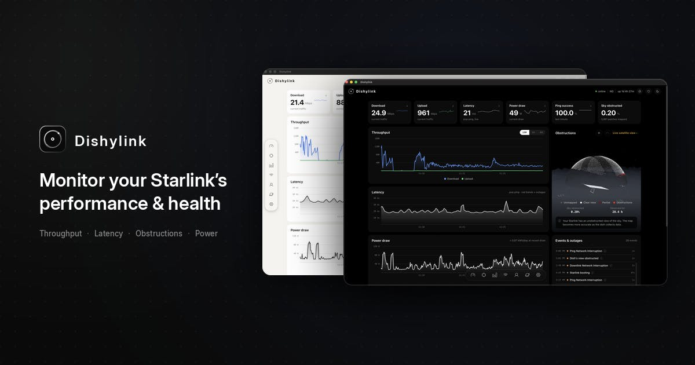
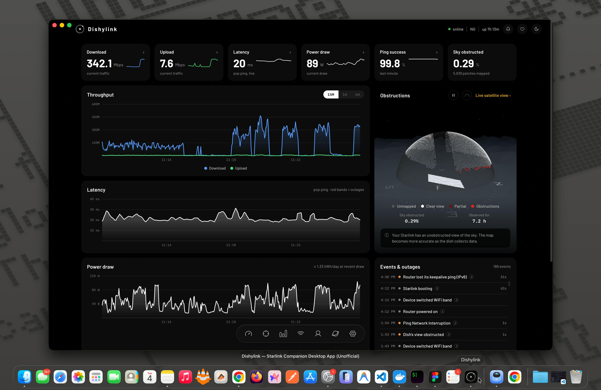
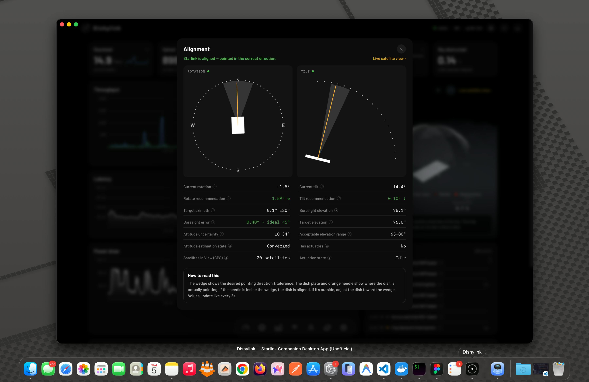

---

## 20. [Patience](https://www.producthunt.com/products/patience-2)
**Votes**: 87 | **도입 난이도**: 하 | **신뢰도**: 상
**Tagline**: The only mechanic is waiting. The only currency is time.
**서비스 링크**: https://www.producthunt.com/r/KU4GIH32QBYFHF

**태그**: Mobile Game, Minimalism, Casual Game, AI Tool

### 📌 이 서비스 한눈에 보기
기다림의 미학을 담은 미니멀리즘 타이밍 게임

### 🔑 주요 기능
- 예측 불가능한 타이밍에 나타나는 원을 터치하는 단순한 방식
- 기다림의 시간을 시각적 파티클로 변환하는 독특한 보상 체계
- 글로벌 리더보드를 통한 전 세계 사용자들과의 경쟁

### 🙋 사용자에게 어떤 점이 좋은가
짧은 대기 시간을 활용해 몰입감 있는 경험을 제공하며, 인내심과 타이밍을 시험하는 색다른 재미를 줍니다.

### ✅ 지금 바로 써볼 기능
- 순발력 테스트를 위해 게임 시작하기
- 기다린 시간이 어떻게 시각화되는지 확인하기
- 글로벌 리더보드 순위 도전하기

### ⚠️ 사용 전 확인할 점
- 게임의 핵심이 '기다림'이므로 지루함을 느낄 수 있음
- 단순한 조작 방식이 일부 사용자에게는 단조로울 수 있음

### 🧭 확인이 더 필요한 정보
게임의 난이도 곡선과 레벨별 구체적인 규칙은 플레이를 통해 확인이 필요합니다.

### 📸 스크린샷 및 갤러리

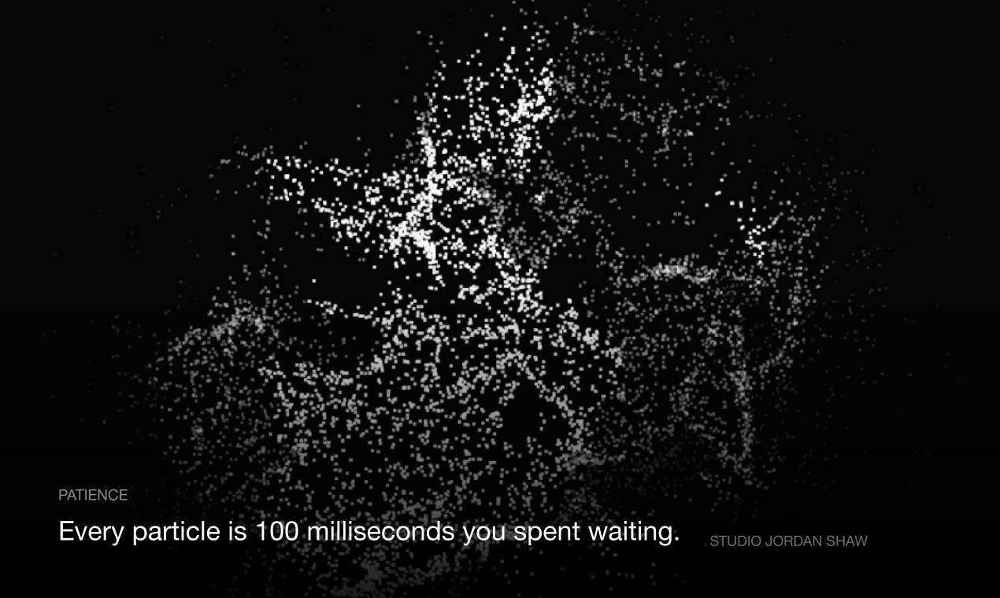

---

## 21. [Pickle Browser](https://www.producthunt.com/products/pickle-browser)
**Votes**: 85 | **도입 난이도**: 중 | **신뢰도**: 상
**Tagline**: Browser for your agent. Runs local in a window you can see
**서비스 링크**: https://www.producthunt.com/r/HV3QFDJKXWP5OH

**태그**: AI-Agent, Automation, DevTool, Efficiency, Agent, AI Tool

### 📌 이 서비스 한눈에 보기
AI 에이전트가 웹을 탐색하는 과정을 실시간으로 모니터링하고 토큰 비용을 획기적으로 절감하는 브라우저

### 🔑 주요 기능
- 로컬 실행 방식으로 실제 로그인 세션을 유지하며 에이전트의 웹 브라우징 지원
- 페이지 압축 기술을 통해 토큰 사용량을 최대 32배 절감
- Claude Desktop, Cursor, VS Code 등 주요 개발 도구와 연동 가능

### 🙋 사용자에게 어떤 점이 좋은가
에이전트의 작업 과정을 눈으로 직접 확인하며 보안 정책을 제어할 수 있고, 비용 효율적인 AI 자동화가 가능합니다.

### ✅ 지금 바로 써볼 기능
- 기존 개발 도구(Cursor, VS Code 등)에 연동하여 워크플로우 테스트
- 페이지 압축 기능이 실제 토큰 비용 절감에 미치는 영향 확인

### ⚠️ 사용 전 확인할 점
- 로컬에서 실제 로그인 정보를 사용하므로 보안 및 권한 관리 주의 필요
- 에이전트의 작업이 실시간으로 기록되므로 개인정보 노출 범위 확인 필요

### 🧭 확인이 더 필요한 정보
사용자의 로컬 환경과 에이전트 간의 구체적인 보안 정책 설정 방식에 대한 상세 정보가 필요합니다.

### 📸 스크린샷 및 갤러리
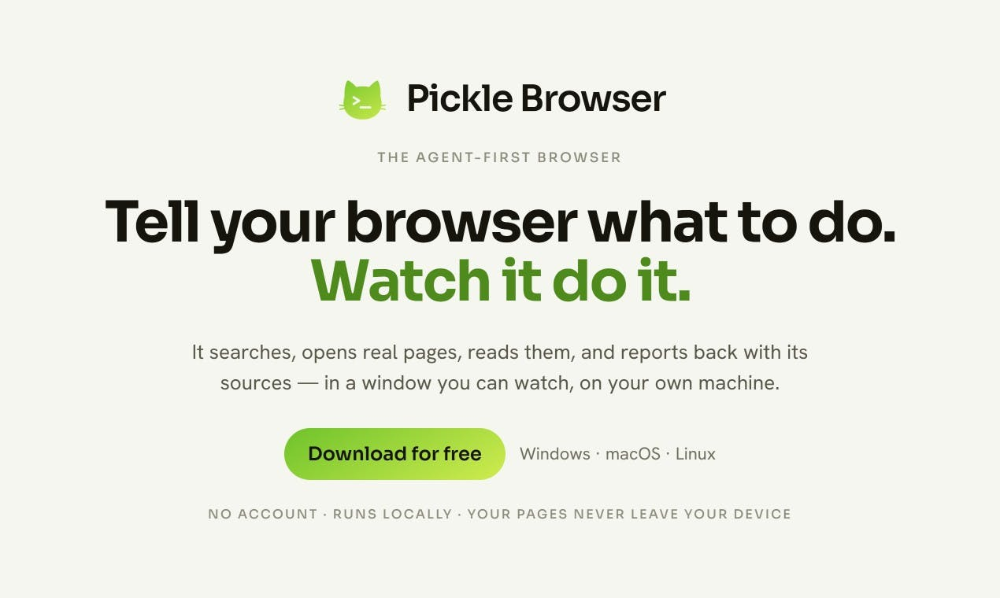
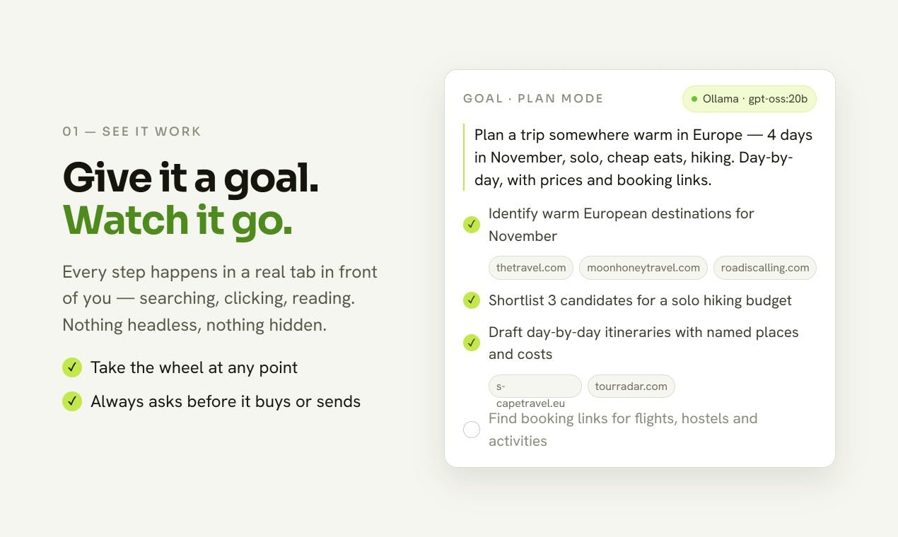
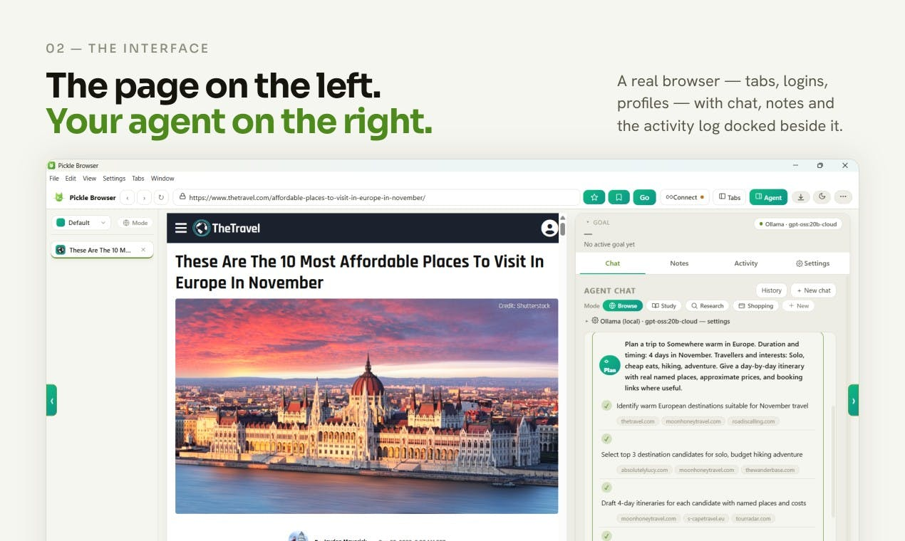

---

## 22. [apra-fleet](https://www.producthunt.com/products/apra-fleet)
**Votes**: 85 | **도입 난이도**: 상 | **신뢰도**: 상
**Tagline**: Run a fleet of AI agents across your machines
**서비스 링크**: https://www.producthunt.com/r/JTALJW7I5G67C3

**태그**: DevTool, Automation, AI-Agents, OpenSource, Agent, AI Tool

### 📌 이 서비스 한눈에 보기
기존 보유 기기를 활용해 자율적인 AI 에이전트 군단을 구축하는 오픈소스 MCP 서버

### 🔑 주요 기능
- 기존 하드웨어를 활용한 분산형 AI 에이전트 플릿 구축
- Claude, Copilot, 로컬 모델 등 다양한 모델 혼합 및 비용 기반 라우팅
- 지속 가능하고 관찰 가능한 멀티 아워 워크플로우 실행

### 🙋 사용자에게 어떤 점이 좋은가
사용자가 이미 보유한 기기들을 활용해 비용 효율적인 AI 자동화 인프라를 구축할 수 있습니다.

### ✅ 지금 바로 써볼 기능
- OpenCode를 통한 다양한 모델 연동 테스트
- 비용 계층별 작업 라우팅 설정
- 자율적 워크플로우 실행 및 모니터링

### ⚠️ 사용 전 확인할 점
- 분산된 기기 자원을 사용하므로 하드웨어 성능 및 네트워크 환경에 의존적임
- 자율적 빌드 및 실행 방식에 따른 보안 및 제어 이슈 확인 필요

### 🧭 확인이 더 필요한 정보
사용자의 하드웨어 사양에 따른 성능 최적화 수준과 보안 프로토콜에 대한 상세 정보가 필요합니다.

### 📸 스크린샷 및 갤러리
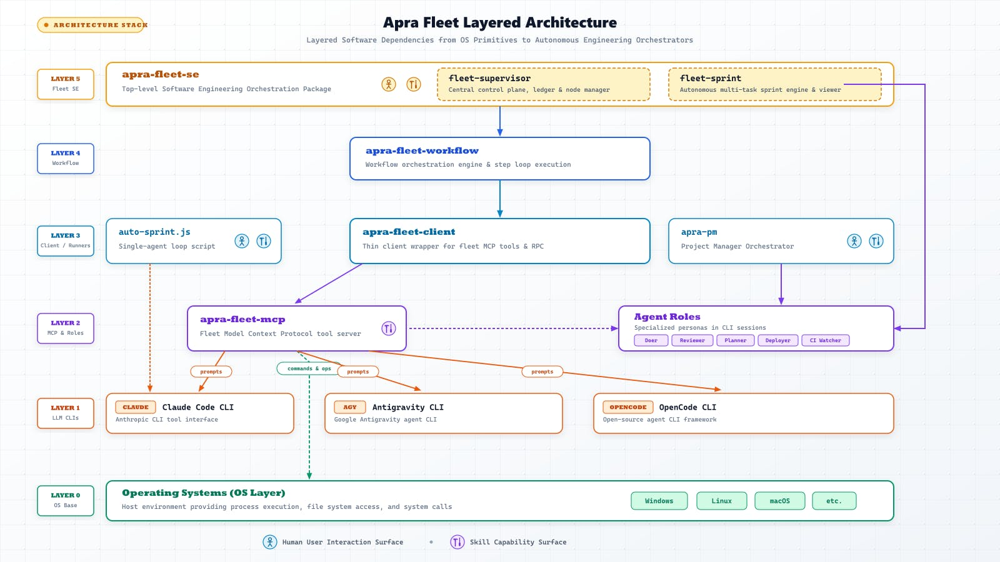
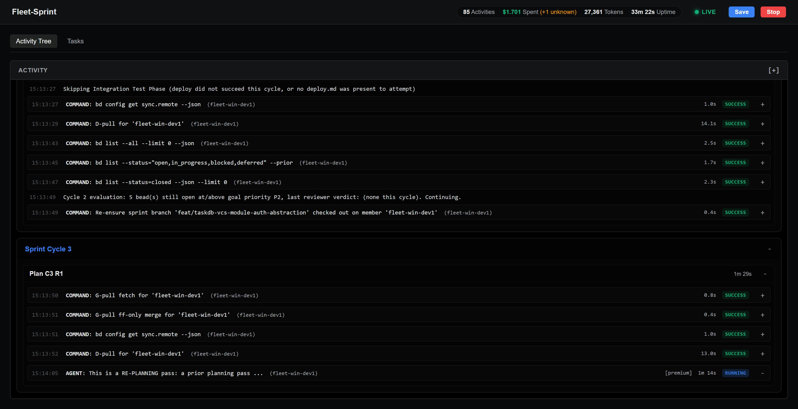
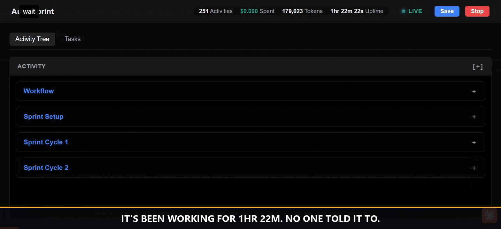

### 🎬 관련 영상
- [🎥 영상 보기](https://ph-files.imgix.net/a260817f-c452-45d5-b952-8ee0d5946c47.jpeg?auto=format)

---

## 23. [Chiplab](https://www.producthunt.com/products/chiplab)
**Votes**: 84 | **도입 난이도**: 하 | **신뢰도**: 상
**Tagline**: Test firmware on a virtual chip with no hardware needed
**서비스 링크**: https://www.producthunt.com/r/CJKKNUZSGVAG7M

**태그**: DevTool, Embedded, AI, Automation, Agent, AI Tool

### 📌 이 서비스 한눈에 보기
하드웨어 없이 AI 코딩 에이전트를 통해 펌웨어를 개발하고 테스트하는 가상 칩 환경

### 🔑 주요 기능
- 물리적 보드 없이 가상 칩 환경에서 임베디드 소프트웨어 빌드 및 실행
- Cursor, Claude Code, VS Code 등 AI 코딩 에이전트와 MCP를 통한 연동
- STM32 및 Nordic 칩 지원 및 자동화된 디버깅 피드백 제공

### 🙋 사용자에게 어떤 점이 좋은가
하드웨어 준비 과정 없이 AI 에이전트만으로 펌웨어 개발 사이클을 가속화할 수 있습니다.

### ✅ 지금 바로 써볼 기능
- MCP를 통해 선호하는 AI 코딩 에이전트에 Chiplab 연결하기
- STM32 또는 Nordic 기반 펌웨어 프로젝트 테스트해보기

### ⚠️ 사용 전 확인할 점
- 현재 베타 버전이므로 안정성 및 기능 제한이 있을 수 있음
- 지원되는 칩셋 종류가 현재 STM32와 Nordic으로 제한적임

### 🧭 확인이 더 필요한 정보
지원되는 칩셋의 확장 계획과 실제 하드웨어와의 정밀한 동작 일치 여부를 확인해야 합니다.

### 📸 스크린샷 및 갤러리
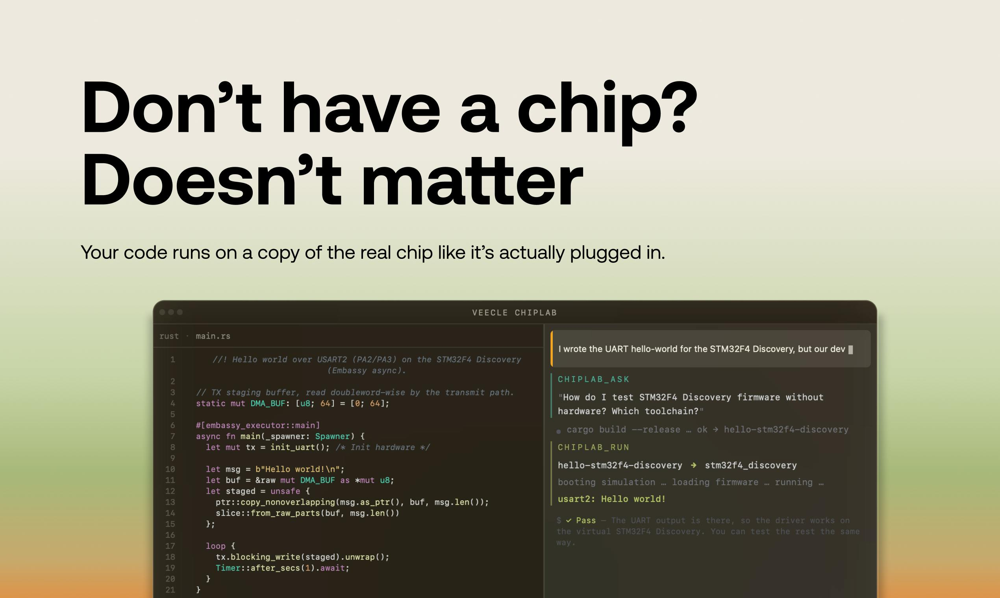
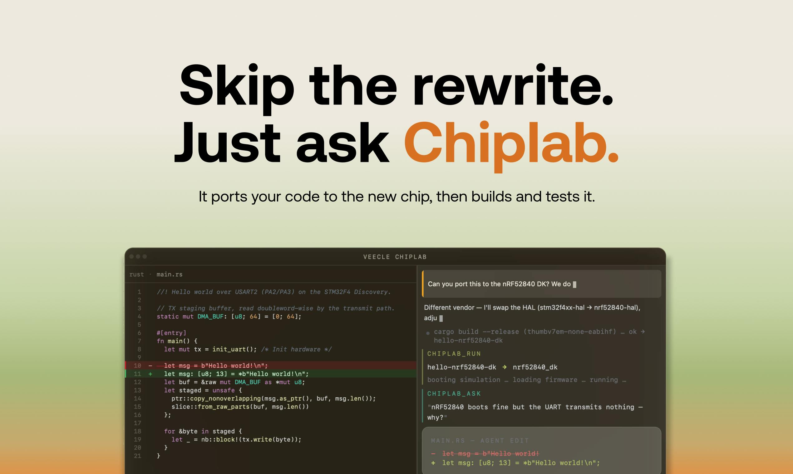
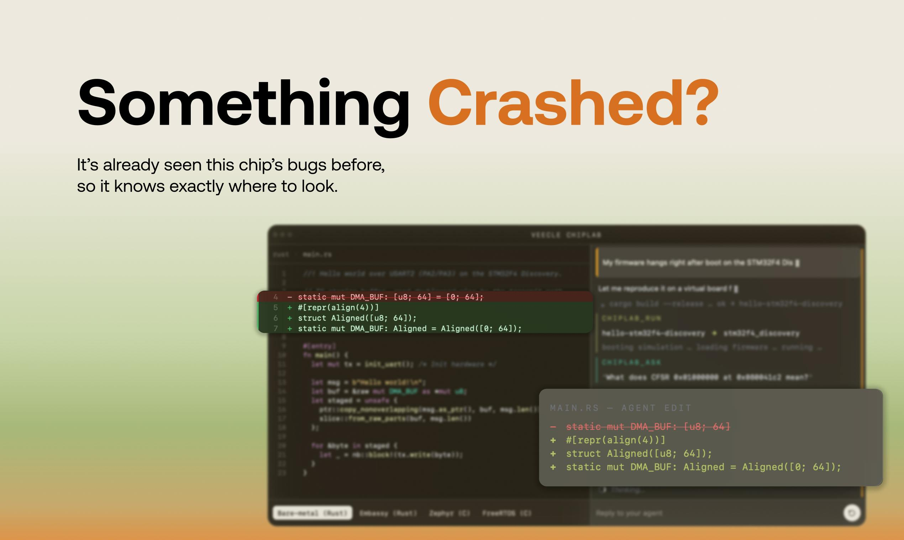

### 🎬 관련 영상
- [🎥 영상 보기](https://ph-files.imgix.net/b974476c-c9af-4e71-b876-6c1562c3e26b.jpeg?auto=format)

---

## 24. [Kivicube](https://www.producthunt.com/products/kivicube)
**Votes**: 83 | **도입 난이도**: 하 | **신뢰도**: 상
**Tagline**: Create AR experiences with AI, no code required!
**서비스 링크**: https://www.producthunt.com/r/4RM26YEKG35XYG

**태그**: NoCode, AR, AI, WebAR, DesignTool, Agent, AI Tool, Prompting, DevTool

### 📌 이 서비스 한눈에 보기
AI 프롬프트와 노코드 툴로 누구나 쉽게 몰입형 WebAR 경험을 제작할 수 있는 플랫폼

### 🔑 주요 기능
- 자연어 명령어로 AR 경험을 생성하는 'Kivicube AR Agent' 제공
- 코딩 없이 인터랙티브 요소, 애니메이션, UI를 구현하는 노코드 방식
- 템플릿 활용 및 시각적 에디터를 통한 정밀한 커스텀 제어 가능

### 🙋 사용자에게 어떤 점이 좋은가
전문적인 개발 지식 없이도 아이디어를 즉시 WebAR 콘텐츠로 시각화할 수 있어 마케팅 및 창의적 작업 시간을 획기적으로 단축해 줍니다.

### ✅ 지금 바로 써볼 기능
- AI Agent에게 자연어로 원하는 AR 장면 묘사하기
- 제공되는 템플릿을 활용해 기본 구조 잡기
- 시각적 에디터로 세부 애니메이션 및 UI 커스텀하기

### ⚠️ 사용 전 확인할 점
- AI 생성 결과물의 정밀도가 사용자의 의도와 다를 수 있음
- 복잡한 커스텀 기능을 구현할 때 시각적 에디터 숙련도 필요

### 🧭 확인이 더 필요한 정보
제공되는 에셋의 외부 파일 호환성 및 상세 가격 정책에 대한 정보가 부족합니다.

### 📸 스크린샷 및 갤러리
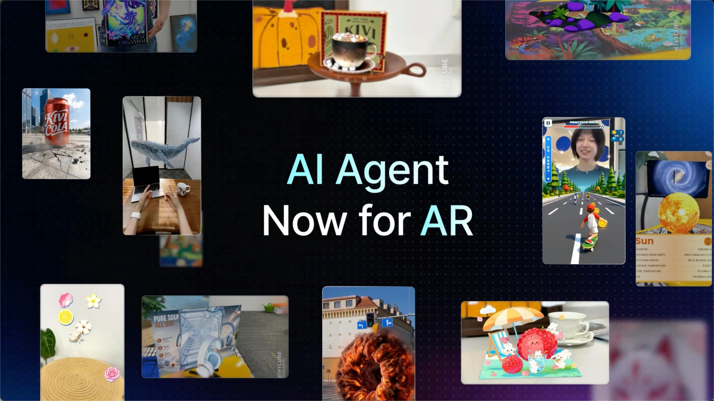
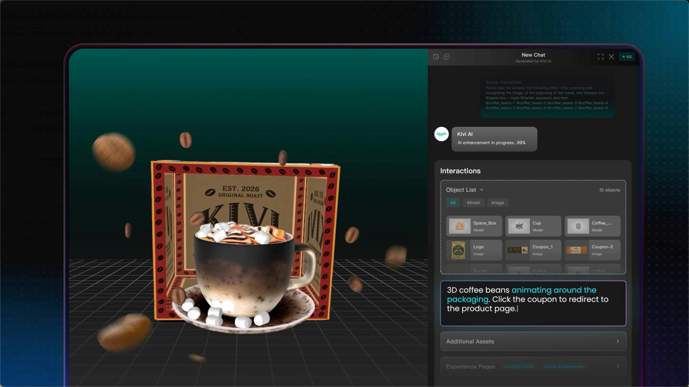
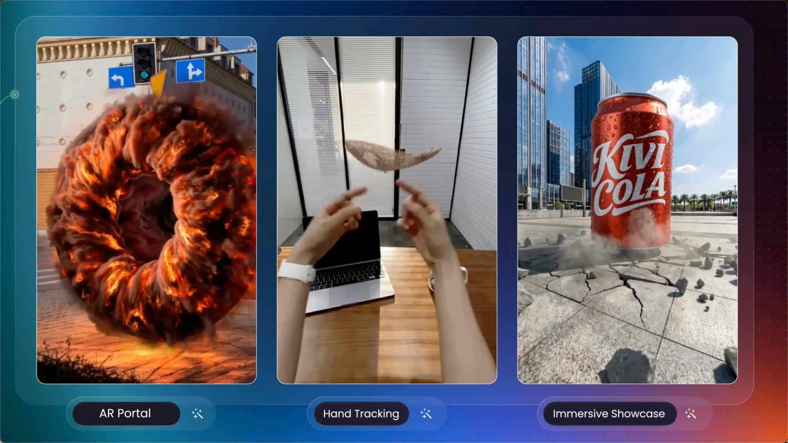

### 🎬 관련 영상
- [🎥 영상 보기](https://ph-files.imgix.net/bedc20cd-9512-43e7-895e-0fa527bd1946.jpeg?auto=format)

---

## 25. [Phinq](https://www.producthunt.com/products/phinq)
**Votes**: 82 | **도입 난이도**: 중 | **신뢰도**: 상
**Tagline**: Stops AI agents before they break something
**서비스 링크**: https://www.producthunt.com/r/YLA4TIE4BB33HT

**태그**: AI, DevTool, Security, OpenSource, Automation, Agent, AI Tool

### 📌 이 서비스 한눈에 보기
AI 에이전트의 위험한 행동을 실시간으로 제어하고 기록하는 오픈소스 거버넌스 레이어

### 🔑 주요 기능
- 에이전트의 모든 도구 호출(Tool Call)을 가로채 위험도 분류
- 안전한 작업은 즉시 실행하고, 위험한 작업은 인간의 승인 대기
- 위변조가 불가능한 해시 체인 방식의 감사 로그 기록

### 🙋 사용자에게 어떤 점이 좋은가
AI 에이전트가 예기치 않게 중요한 데이터를 삭제하거나 설정을 변경하는 사고를 방지할 수 있습니다.

### ✅ 지금 바로 써볼 기능
- 에이전트의 도구 호출(Tool Call) 인터셉트 설정
- 위험도 기반의 승인 워크플로우 구성
- 해시 체인 로그를 통한 감사 기록 확인

### ⚠️ 사용 전 확인할 점
- 실시간 가로채기 과정에서 에이전트의 응답 속도(Latency)가 저하될 수 있음
- 오픈소스이므로 직접적인 인프라 구축 및 관리 역량이 필요함

### 🧭 확인이 더 필요한 정보
현재 제공되는 구체적인 통합 가능 에이전트 프레임워크 목록과 성능 영향도에 대한 정보가 부족합니다.

### 📸 스크린샷 및 갤러리
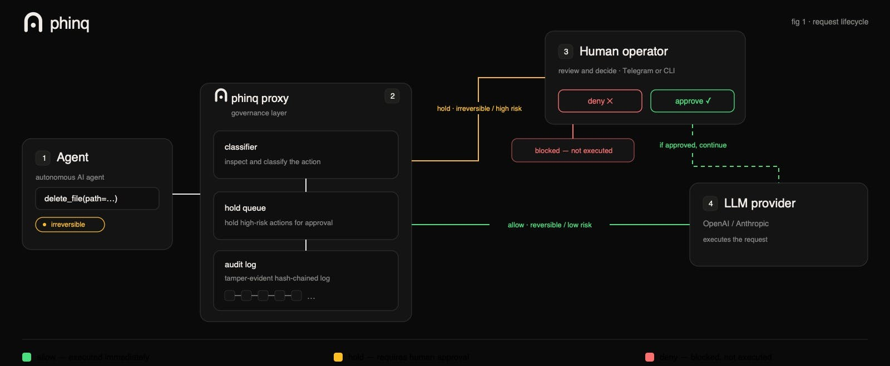

### 🎬 관련 영상
- [🎥 영상 보기](https://ph-files.imgix.net/f531ff27-1288-400d-affa-d39d61e25cbc.jpeg?auto=format)

---

## 26. [AIO.GEO Protocol](https://www.producthunt.com/products/aio-geo-protocol)
**Votes**: 82 | **도입 난이도**: 상 | **신뢰도**: 중
**Tagline**: Audit AI search structure. Dry run fixes. Receipts.
**서비스 링크**: https://www.producthunt.com/r/JDXUCAG4QFGQZS

**태그**: AI, SEO, DevTool, Automation, Agent, AI Tool

### 📌 이 서비스 한눈에 보기
AI 에이전트가 비즈니스를 수행할 수 있도록 검색 구조를 최적화하고 검증하는 프로토콜

### 🔑 주요 기능
- AI 검색 엔진 최적화(GEO) 구조 측정 및 감사
- 수정 사항에 대한 드라이런(Dry-run) 및 패치 배포
- HMAC 영수증을 통한 데이터 무결성 및 신뢰성 확보

### 🙋 사용자에게 어떤 점이 좋은가
기존 SEO가 인간을 위한 것이라면, 이 도구는 AI 에이전트가 우리 서비스를 발견하고 비즈니스를 수행할 수 있도록 기술적 기반을 마련해 줍니다.

### ✅ 지금 바로 써볼 기능
- 현재 웹 구조의 AI 검색 준비도 측정하기
- 제안된 수정 사항의 드라이런 테스트 실행하기
- 수정 후 리스코어(Rescore)를 통한 개선 효과 확인하기

### ⚠️ 사용 전 확인할 점
- 기술적 구조 변경이 기존 SEO에 미칠 영향 검토 필요
- AI 에이전트 중심의 최적화가 일반 사용자 경험에 미치는 영향 고려

### 🧭 확인이 더 필요한 정보
구체적인 구현 방식과 기존 웹 프레임워크와의 통합 방식에 대한 상세 정보가 필요합니다.

### 📸 스크린샷 및 갤러리
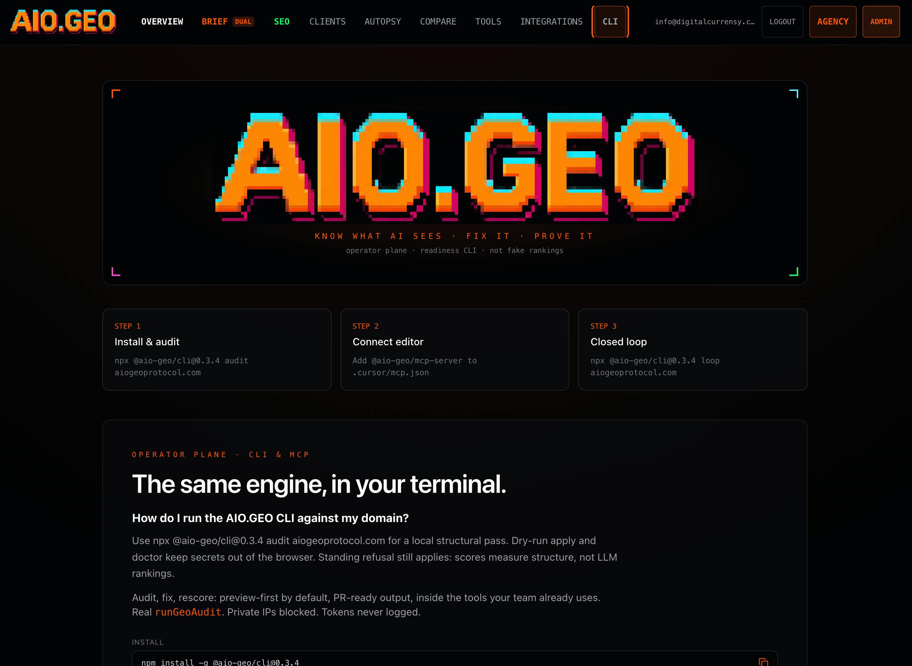
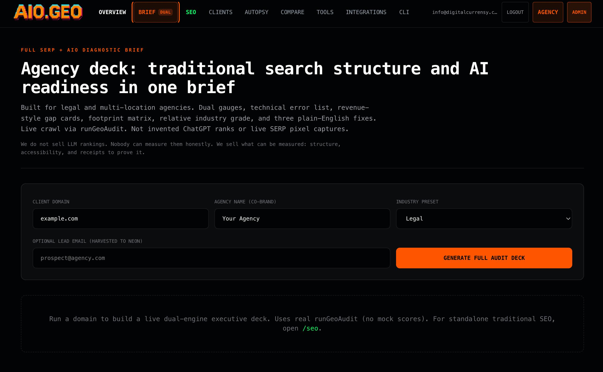
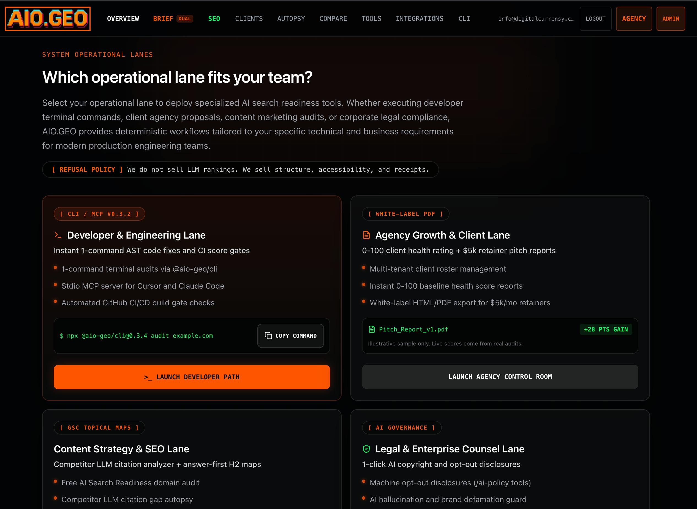

### 🎬 관련 영상
- [🎥 영상 보기](https://ph-files.imgix.net/077aaa4f-e627-4a90-add4-49aecd19d29f.jpeg?auto=format)

---

## 27. [ThreadPort](https://www.producthunt.com/products/threadport)
**Votes**: 64 | **도입 난이도**: 하 | **신뢰도**: 상
**Tagline**: Move AI chats between ChatGPT, Claude & Gemini in one click
**서비스 링크**: https://www.producthunt.com/r/AYCBU62KN42E26

**태그**: Productivity, AI, BrowserExtension, Automation, AI Tool, Chat

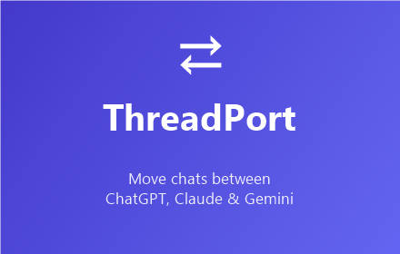

### 📌 이 서비스 한눈에 보기
현재 진행 중인 AI 채팅 맥락을 유지하며 ChatGPT, Claude, Gemini 간에 원클릭으로 이동하는 도구

### 🔑 주요 기능
- 대화 맥락(Context)을 유지한 채 다른 AI 모델로 즉시 전송
- 서버 저장이나 계정 생성 없이 브라우저 기반으로 작동
- EU 규정을 준수하는 프라이버시 중심 설계

### 🙋 사용자에게 어떤 점이 좋은가
특정 AI 모델의 답변이 만족스럽지 않을 때, 대화 내용을 다시 복사할 필요 없이 다른 모델로 즉시 넘겨 비교 분석할 수 있습니다.

### ✅ 지금 바로 써볼 기능
- Chrome 또는 Edge 브라우저에 확장 프로그램 설치하기
- 현재 진행 중인 중요한 대화를 다른 AI로 옮겨보기
- 월 10회 무료 전송 기능 테스트하기

### ⚠️ 사용 전 확인할 점
- 월 10회까지만 무료로 제공되는 사용량 제한
- 브라우저 확장 프로그램 형태이므로 브라우저 환경에 의존적임

### 🧭 확인이 더 필요한 정보
무료 사용량 초과 시 유료 플랜의 가격 정책과 기능 차이는 명시되어 있지 않습니다.

### 📸 스크린샷 및 갤러리
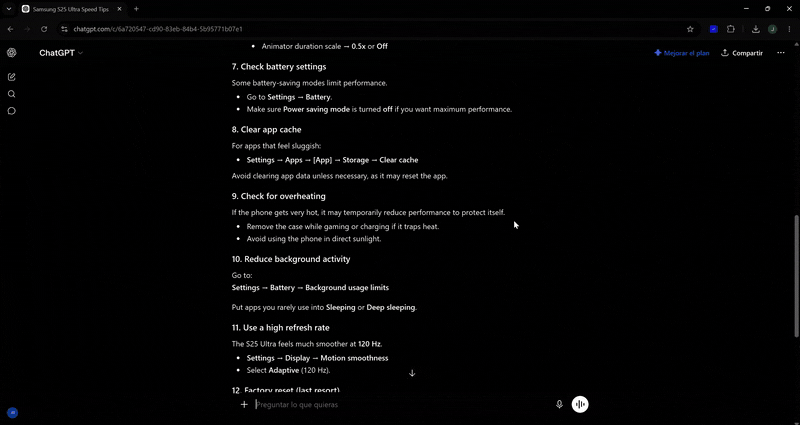
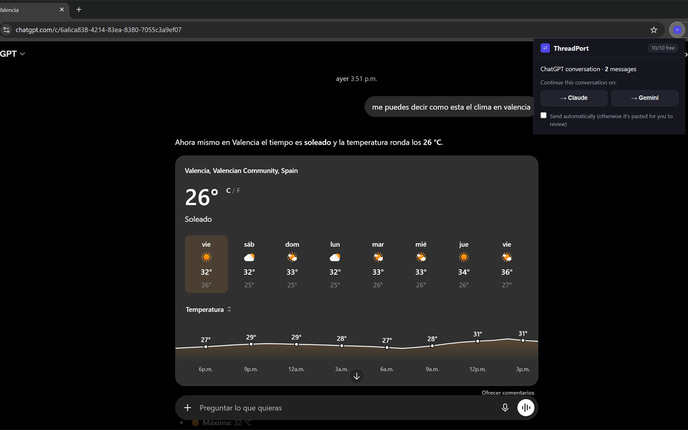
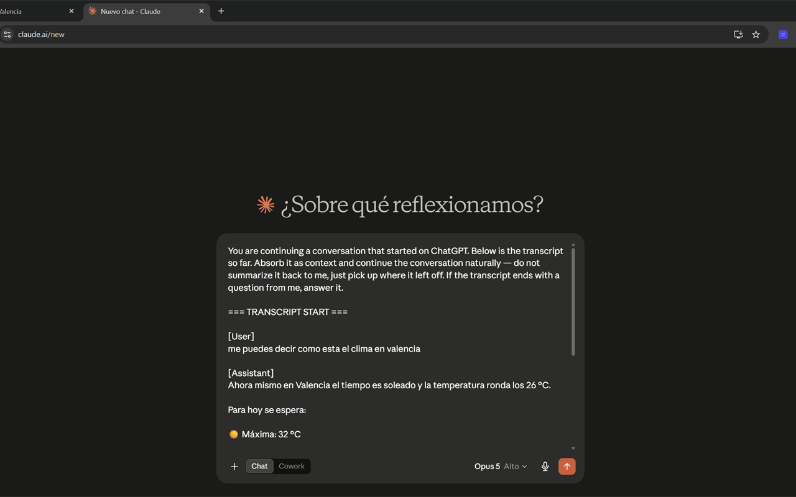

---

## 28. [Sequel](https://www.producthunt.com/products/sequel-4)
**Votes**: 23 | **도입 난이도**: 중 | **신뢰도**: 상
**Tagline**: Connect your marketing stack to Claude, Cursor or Codex
**서비스 링크**: https://www.producthunt.com/r/POEUJDWJRMZ2VB

**태그**: AI, Data, Automation, MarketingTech, Agent, AI Tool, DevTool, Marketing

### 📌 이 서비스 한눈에 보기
마케팅·제품·재무 데이터를 Claude, Cursor 등 AI 에이전트와 즉시 연결하는 데이터 커넥터

### 🔑 주요 기능
- 마케팅, 제품, 재무 데이터를 AI 에이전트와 연결
- 팀의 메트릭 정의, 예외 케이스, 관습을 학습하여 데이터 일관성 유지
- Claude, Cursor, Codex 등 주요 AI 도구와의 연동 지원

### 🙋 사용자에게 어떤 점이 좋은가
복잡한 데이터 정의 과정을 생략하고, 팀의 데이터 문법을 학습한 AI를 통해 즉각적인 데이터 분석과 의사결정이 가능해집니다.

### ✅ 지금 바로 써볼 기능
- 기존 마케팅 스택 연결하기
- 팀의 데이터 정의(Metric Definition) 학습시키기
- Claude/Cursor와 연동하여 데이터 쿼리 실행하기

### ⚠️ 사용 전 확인할 점
- 데이터 보안 및 프라이버시 정책 확인 필요
- 기존 데이터 소스와의 호환성 검토 필요

### 🧭 확인이 더 필요한 정보
지원하는 구체적인 데이터 소스(SaaS 등)의 종류와 보안 프로토콜에 대한 상세 정보가 필요합니다.

### 📸 스크린샷 및 갤러리
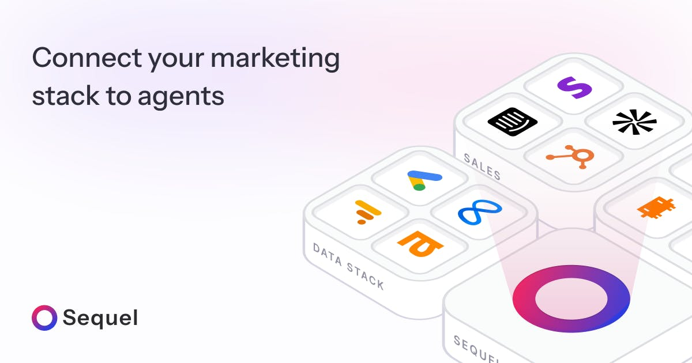
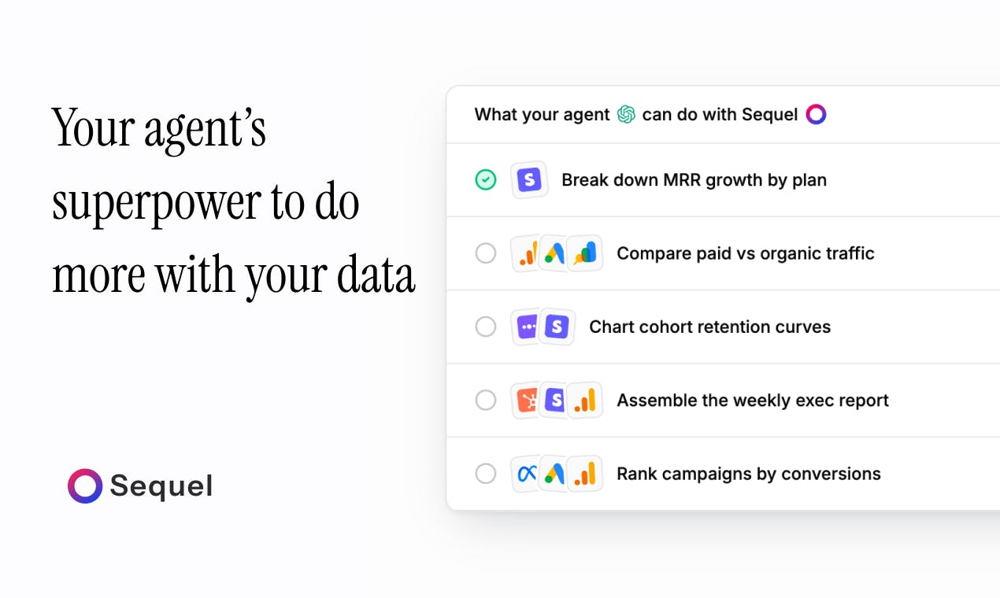
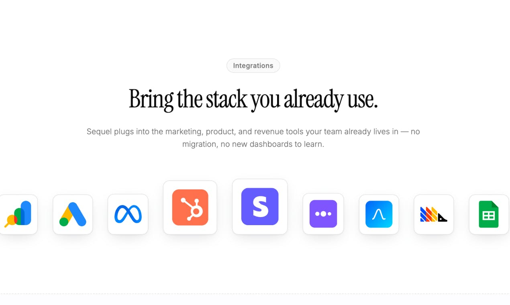

---

## 29. [Lucky Dangle](https://www.producthunt.com/products/lucky-dangle)
**Votes**: 16 | **도입 난이도**: 하 | **신뢰도**: 상
**Tagline**: A lucky charm for your Mac
**서비스 링크**: https://www.producthunt.com/r/YBFDUVNR24A63C

**태그**: Productivity, Mac, Lifestyle, Minimalist, AI Tool

### 📌 이 서비스 한눈에 보기
중요한 순간에 행운을 가져다주는 맥용 물리 엔진 기반 데스크탑 위젯

### 🔑 주요 기능
- 전 세계의 다양한 행운의 상징(나자르, 다루마 등)을 화면 상단에 배치
- 실제 로프 물리 엔진이 적용되어 자연스럽게 흔들리는 시각적 효과
- 클릭 간섭이 없어 작업 흐름을 방해하지 않는 설계

### 🙋 사용자에게 어떤 점이 좋은가
중요한 발표, 데모, 인터뷰 직전에 행운의 부적을 화면에 띄워 심리적 안정감을 얻을 수 있습니다.

### ✅ 지금 바로 써볼 기능
- 취향에 맞는 행운의 상징(Charm) 선택하기
- 단축키를 설정하여 필요한 순간에 즉시 불러오기
- 화면 상단에 배치하여 작업 환경 꾸미기

### ⚠️ 사용 전 확인할 점
- macOS 전용 소프트웨어이므로 다른 OS에서는 사용 불가
- 시각적 요소 중심의 앱이므로 기능적 생산성 도구는 아님

### 🧭 확인이 더 필요한 정보
제공되는 모든 행운의 상징이 초기 구매 가격에 포함되는지, 혹은 추가 구매가 필요한지 명확한 가격 정책 확인이 필요합니다.

### 📸 스크린샷 및 갤러리

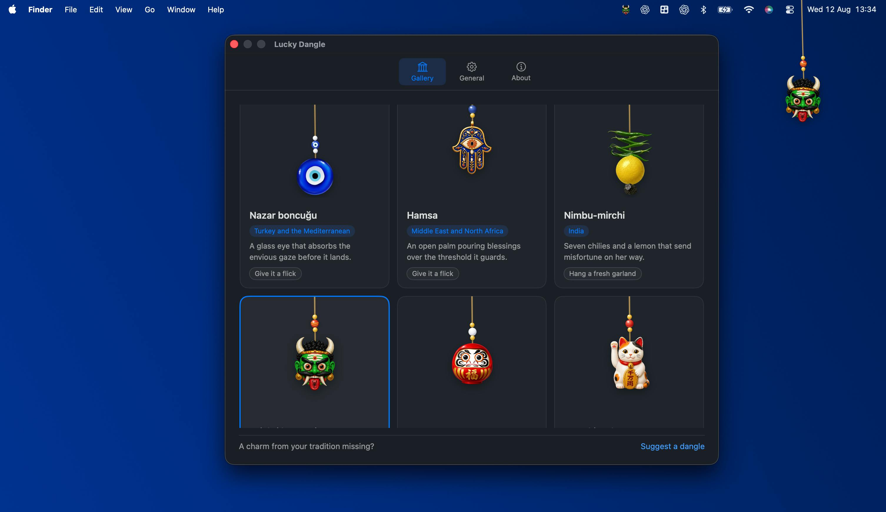

### 🎬 관련 영상
- [🎥 영상 보기](https://ph-files.imgix.net/4827b35b-2c18-4980-9a49-1014622fb435.jpeg?auto=format)

---

## 30. [CLEO AI](https://www.producthunt.com/products/cleo-ai-2)
**Votes**: 15 | **도입 난이도**: 하 | **신뢰도**: 상
**Tagline**: Launch-ready campaigns with relevant creators in 90s
**서비스 링크**: https://www.producthunt.com/r/4NKMT425BULOQV

**태그**: Marketing, Automation, Influencer, India-Market, AI Tool

### 📌 이 서비스 한눈에 보기
제품 URL만으로 90초 만에 인도 시장 맞춤형 링크드인 인플루언서 캠페인을 생성합니다.

### 🔑 주요 기능
- 제품 URL을 통한 자동화된 캠페인 기획
- 인도 시장에 최적화된 크리에이터 리스트 제공
- 스토리라인, 예상 도달 범위, 맞춤형 브리프 자동 생성

### 🙋 사용자에게 어떤 점이 좋은가
인도 시장 진출을 원하는 기업이 복잡한 리서치 과정 없이 즉각적인 인플루언서 마케팅 전략을 수립할 수 있습니다.

### ✅ 지금 바로 써볼 기능
- 제품 URL 입력하여 캠페인 초안 생성하기
- 제공된 크리에이터 리스트 검토하기
- 생성된 스토리라인 및 브리프 확인하기

### ⚠️ 사용 전 확인할 점
- 인도 시장 타겟팅에 특화되어 있어 타 지역 활용도는 제한적일 수 있음
- 생성된 크리에이터 리스트의 실제 활성도 및 적합성 검증 필요

### 🧭 확인이 더 필요한 정보
인도 외 다른 글로벌 시장에 대한 지원 범위와 크리에이터 매칭 알고리즘의 상세 로직 확인이 필요합니다.

### 📸 스크린샷 및 갤러리
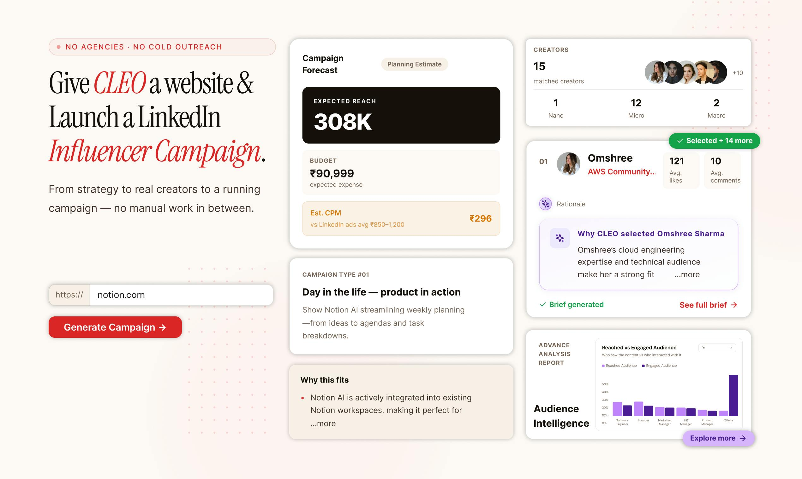
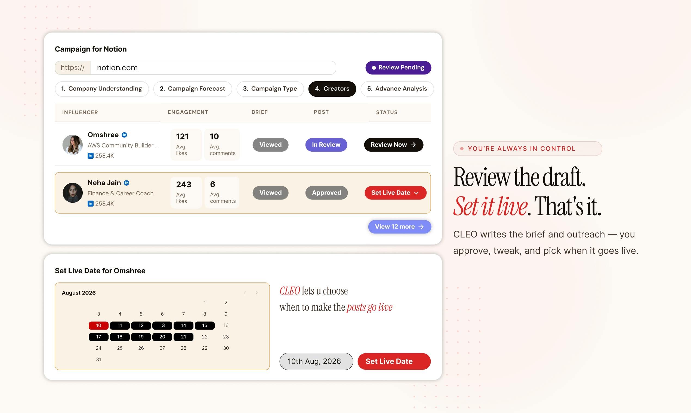
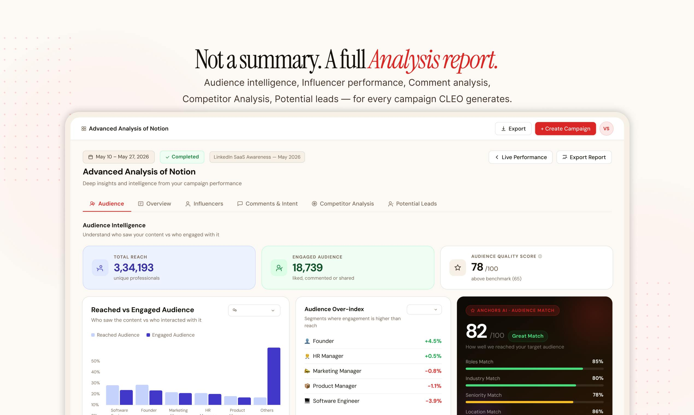

### 🎬 관련 영상
- [🎥 영상 보기](https://ph-files.imgix.net/a89dba5c-2054-4a5a-bc45-9fdb71a6ebfc.jpeg?auto=format)

---

