# 🚀 Product Hunt Daily Top 30 (2026-08-15)

## 오늘의 요약
오늘의 트렌드는 기존의 유료 코딩 에이전트와 개발 환경을 대체하거나 확장하려는 오픈소스 및 클라우드 기반의 자동화 도구들이 주도했습니다. 특히 AI 에이전트가 스스로 업무를 수행하는 가상 오피스 환경과 로컬 환경을 클라우드로 확장하는 기술적 시도들이 돋보였습니다.

### 오늘의 핵심 포인트
- Claude, Cursor 등을 대체하거나 결합하여 24시간 가동되는 멀티 에이전트 및 가상 오피스 환경 구축이 주목받았습니다.
- 로컬 개발 환경의 제약을 넘어 클라우드에서 에이전트를 병렬 실행하고 관리하는 소프트웨어 팩토리 기술이 등장했습니다.
- 단순한 정보 제공을 넘어 개인화된 결과물을 즉시 생성하는 지능형 퍼널과 맞춤형 AI 자동화 도구들이 강세를 보였습니다.

**오늘의 태그**: AI 에이전트, 오픈소스, 코딩 자동화, 클라우드 개발, 생산성 도구

## 1. [Outcome ](https://www.producthunt.com/products/contentblocks)
**Votes**: 253 | **도입 난이도**: 중 | **신뢰도**: 상
**Tagline**: Turn your content into a personal outcome for every lead
**서비스 링크**: https://www.producthunt.com/r/GBFHMSYXVPFMF7

**태그**: Marketing, Automation, LeadGeneration, Personalization

### 📌 이 서비스 한눈에 보기
콘텐츠와 전문 지식을 결합하여 리드 맞춤형 결과물을 자동 생성하는 퍼스널 퍼널 도구

### 🔑 주요 기능
- 단순한 리드 마그넷을 넘어 개인화된 액션 플랜, 감사, 로드맵 등 맞춤형 결과물 제공
- 사용자의 답변과 크리에이터의 지식을 결합한 지능형 퍼널 구축
- 획일적인 퀴즈 결과 대신 개별 리드에게 최적화된 가치 전달

### 🙋 사용자에게 어떤 점이 좋은가
리드에게 단순한 정보를 주는 대신 개인화된 솔루션을 즉시 제공함으로써 전환율과 신뢰도를 높일 수 있습니다.

### ✅ 지금 바로 써볼 기능
- 자신의 전문 지식을 반영한 맞춤형 퍼널 설계하기
- 리드 답변에 따른 자동 생성 결과물(로드맵, 스코어 등) 설정하기
- 기존 콘텐츠를 활용한 개인화된 리드 마그넷 테스트하기

### ⚠️ 사용 전 확인할 점
- 크리에이터의 지식/콘텐츠가 구체적일수록 결과물의 품질이 결정됨
- 자동 생성된 결과물의 정확성을 위한 검증 과정 필요

### 🧭 확인이 더 필요한 정보
사용자의 콘텐츠를 어떤 방식으로 학습하거나 결합하는지에 대한 기술적 세부 사항 확인이 필요합니다.

### 📸 스크린샷 및 갤러리
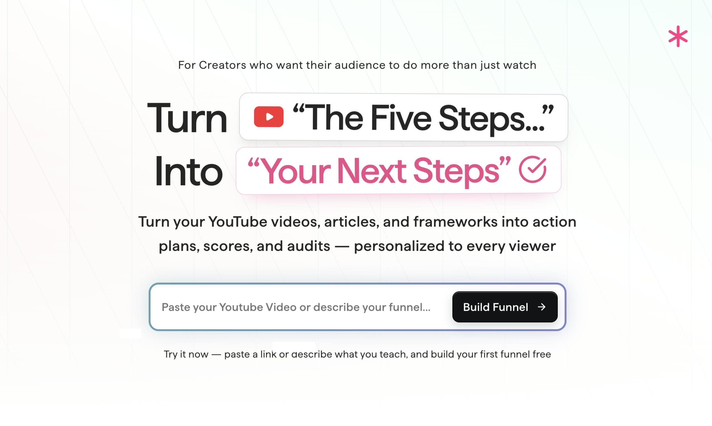
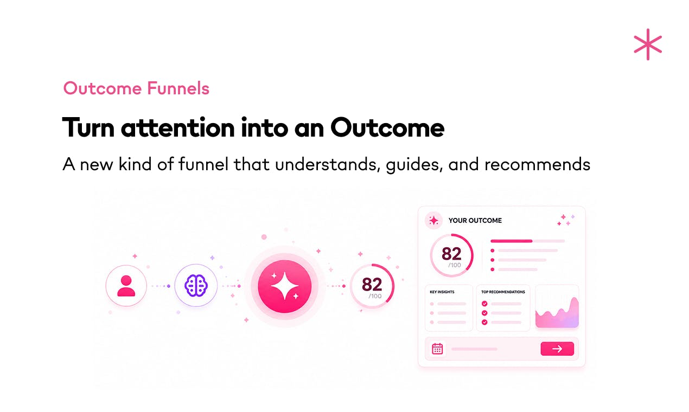
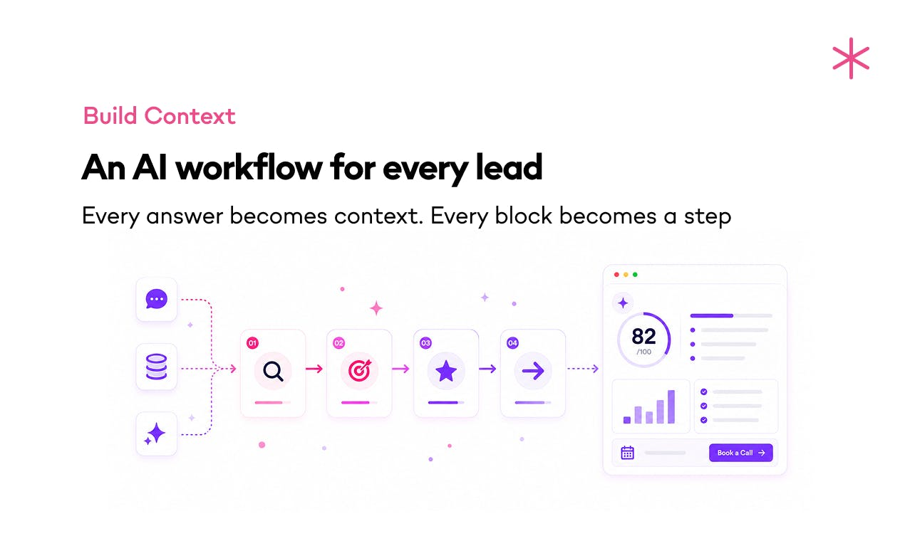

### 🎬 관련 영상
- [🎥 영상 보기](https://ph-files.imgix.net/dd4ec681-3cc1-409b-831a-ad6a9ee194f6.jpeg?auto=format)

---

## 2. [BrowserAct Cloud](https://www.producthunt.com/products/browseract)
**Votes**: 213 | **도입 난이도**: 하 | **신뢰도**: 상
**Tagline**: Scrape any data from any website with one prompt
**서비스 링크**: https://www.producthunt.com/r/N2RAF5UFRFDMHE

**태그**: Automation, AI, Data Extraction, NoCode, Agent, AI Tool, Prompting, API

### 📌 이 서비스 한눈에 보기
자연어 명령만으로 웹 스크래퍼를 구축하고 사이트 변경에도 자동으로 대응하는 AI 에이전트

### 🔑 주요 기능
- 자연어(Plain-English) 설명을 통한 AI 기반 봇 빌드
- 실제 브라우저 환경에서의 테스트 및 자동 실행
- 웹사이트 구조 변경 시에도 유지되는 안정적인 데이터 추출

### 🙋 사용자에게 어떤 점이 좋은가
복잡한 코딩이나 깨진 스크래퍼 수정 작업 없이, 말 한마디로 원하는 데이터를 구조화된 형태로 자동 수집할 수 있습니다.

### ✅ 지금 바로 써볼 기능
- 자연어 프롬프트로 원하는 데이터 추출 봇 만들기
- 추출된 데이터를 API 또는 Zapier/Make로 연결하기
- 사이트 구조 변경 시 AI가 어떻게 대응하는지 테스트하기

### ⚠️ 사용 전 확인할 점
- 복잡한 캡차(CAPTCHA)나 강력한 안티 크롤링 정책이 적용된 사이트에서의 작동 여부 확인 필요
- 대규모 데이터 추출 시 발생할 수 있는 비용 및 리소스 관리 확인 필요

### 🧭 확인이 더 필요한 정보
제공되는 프롬프트의 정교함에 따른 데이터 정확도와 대규모 작업 시의 비용 구조를 확인해야 합니다.

### 📸 스크린샷 및 갤러리
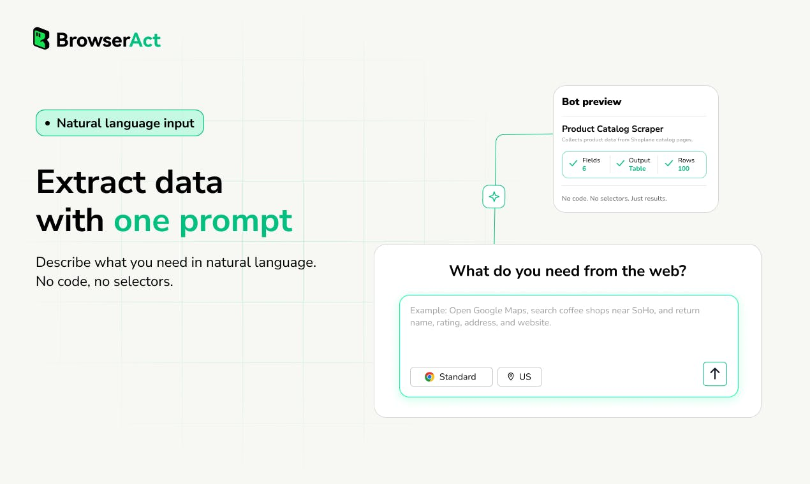
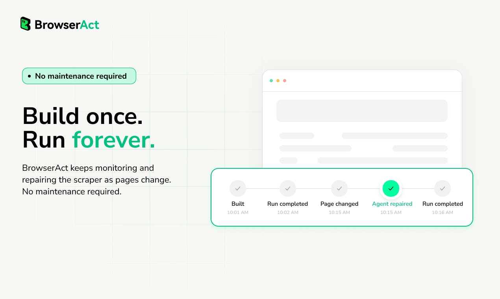
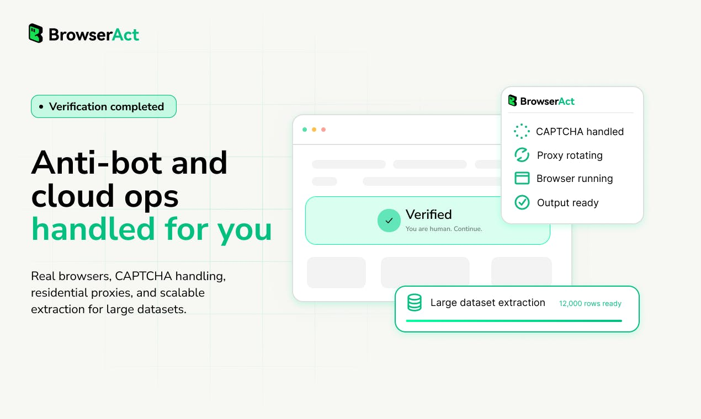

### 🎬 관련 영상
- [🎥 영상 보기](https://ph-files.imgix.net/a627ee08-6821-4616-b567-33c3c3184fb5.jpeg?auto=format)

---

## 3. [Freebuff](https://www.producthunt.com/products/freebuff-2)
**Votes**: 212 | **도입 난이도**: 중 | **신뢰도**: 상
**Tagline**: Free coding agents to kill Claude, Cursor, Replit, and Devin
**서비스 링크**: https://www.producthunt.com/r/NWQXOKBNUWYRG6

**태그**: DevTool, AI-Agent, OpenSource, Coding, Agent, API

### 📌 이 서비스 한눈에 보기
구독료 없이 오픈소스 모델로 풀스택 앱을 개발하는 무료 코딩 에이전트

### 🔑 주요 기능
- Claude, Cursor, Devin 등을 대체하기 위한 완전 무료 코딩 에이전트
- CLI, 데스크톱 앱, 웹 앱 빌더, 클라우드 에이전트 등 다양한 환경 지원
- 구독료, API 키, 벤더 락인(Lock-in) 없는 오픈소스 기반 개발 환경

### 🙋 사용자에게 어떤 점이 좋은가
기존 유료 코딩 도구의 구독 비용 부담 없이 오픈소스 모델을 활용해 풀스택 애플리케이션을 구축할 수 있습니다.

### ✅ 지금 바로 써볼 기능
- CLI를 통한 터미널 기반 코딩 환경 구축
- 데스크톱 앱을 활용한 로컬 개발 환경 설정
- 웹 앱 빌더를 통한 즉각적인 프로젝트 생성

### ⚠️ 사용 전 확인할 점
- 사용자 개인의 하드웨어 자원이나 로컬 환경에 따른 성능 차이 발생 가능성
- 유료 서비스 대비 모델 성능 및 기능 완성도 차이 확인 필요

### 🧭 확인이 더 필요한 정보
사용자 개인의 API 키 없이 어떻게 모델을 구동하는지에 대한 기술적 구현 방식 확인이 필요합니다.

### 📸 스크린샷 및 갤러리
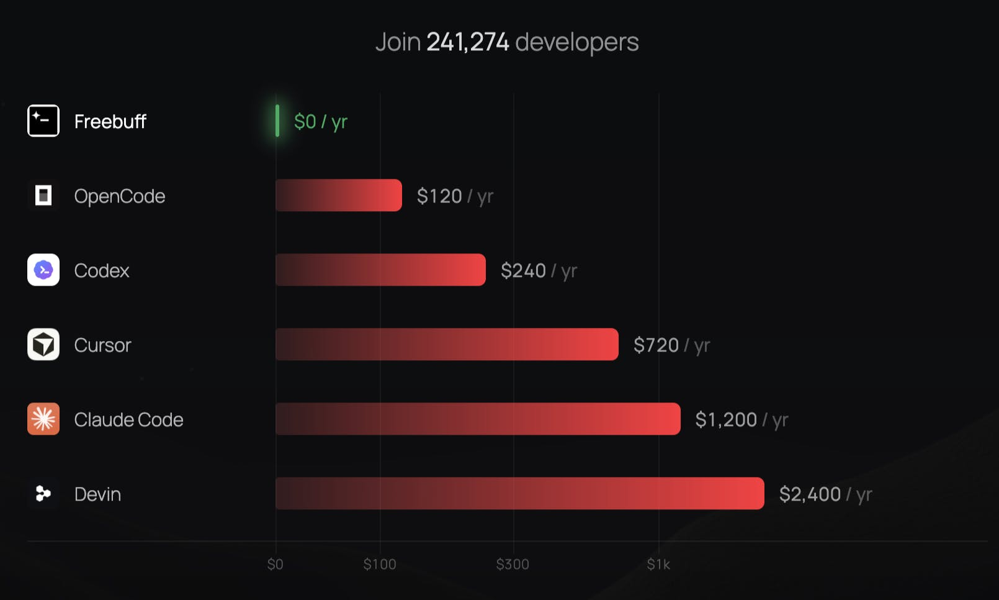
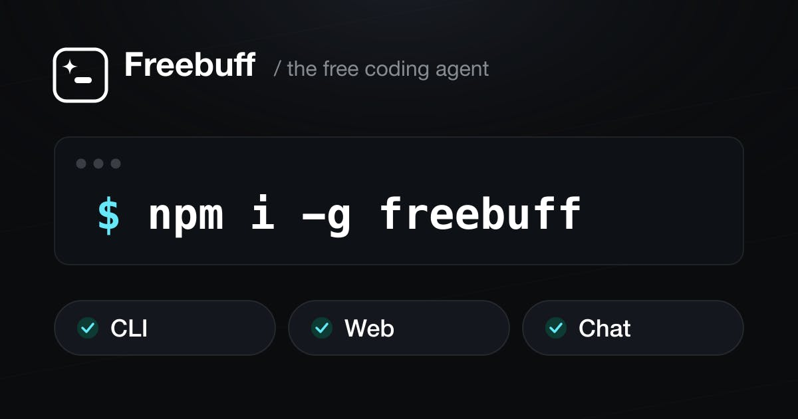

---

## 4. [Gemini 3.7 Flash](https://www.producthunt.com/products/gemini-3-7-flash)
**Votes**: 193 | **도입 난이도**: 하 | **신뢰도**: 상
**Tagline**: Google's smartest workhorse yet for coding & agents
**서비스 링크**: https://www.producthunt.com/r/KZ3XHAUAQJY7E5

**태그**: DevTool, AI, Automation, Coding, Agent

### 📌 이 서비스 한눈에 보기
코딩과 에이전트 작업에 최적화된 구글의 가장 똑똑한 플래시 모델

### 🔑 주요 기능
- Gemini Flash 시리즈의 진화된 지능형 모델
- 코딩 작업에 특화된 성능 제공
- 자율적인 에이전트 구동을 위한 워크호스 모델

### 🙋 사용자에게 어떤 점이 좋은가
개발 생산성을 높이고 자동화된 에이전트를 구축하려는 사용자에게 강력한 성능과 효율성을 제공합니다.

### ✅ 지금 바로 써볼 기능
- 코딩 보조 도구로 활용해보기
- 에이전트 워크플로우에 적용하기
- 기존 Flash 모델과 성능 비교하기

### ⚠️ 사용 전 확인할 점
- 구체적인 벤치마크 성능 수치 확인 필요
- 기존 모델 대비 비용 및 속도 변화 확인 필요

### 🧭 확인이 더 필요한 정보
상세한 기술 사양 및 구체적인 성능 지표에 대한 추가 정보가 필요합니다.

### 📸 스크린샷 및 갤러리
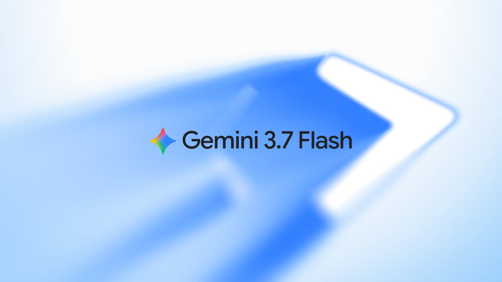
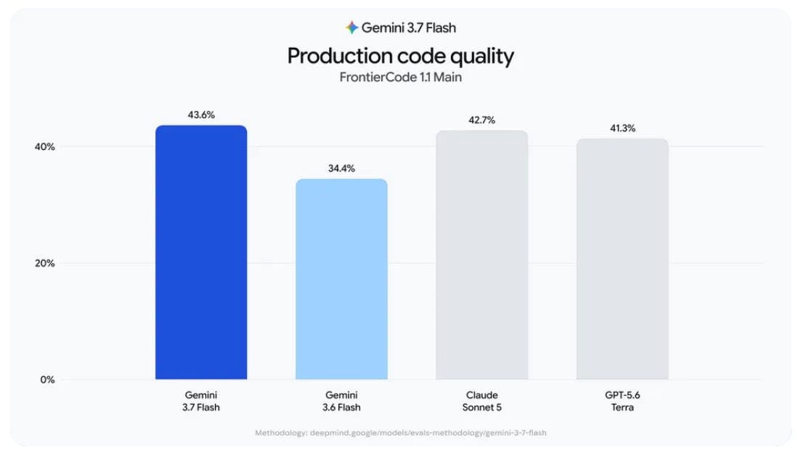
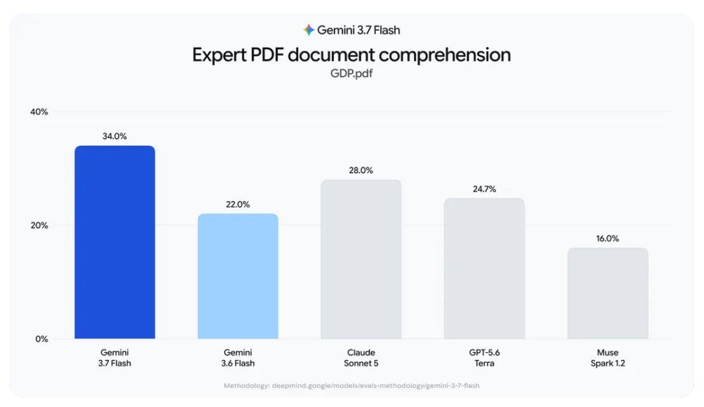

### 🎬 관련 영상
- [🎥 영상 보기](https://ph-files.imgix.net/bea67123-9198-445d-b1ab-0dc635db4356.jpeg?auto=format)

---

## 5. [Munder Difflin](https://www.producthunt.com/products/munder-difflin)
**Votes**: 150 | **도입 난이도**: 상 | **신뢰도**: 상
**Tagline**: Make clones with Claude Code and Codex to do your work
**서비스 링크**: https://www.producthunt.com/r/CEEDFBEQBAUXU2

**태그**: DevTool, Automation, AI-Agents, Open-Source, Agent, AI Tool, Design, Marketing, Sales

### 📌 이 서비스 한눈에 보기
Claude Code와 Codex를 활용해 24시간 가동되는 가상 오피스 환경의 멀티 에이전트를 구축하는 오픈소스 도구

### 🔑 주요 기능
- 기존 유료 코딩 에이전트(Claude Code, Codex 등)를 활용하는 로컬 멀티 에이전트 프레임워크
- 사용자가 부재 중일 때도 에이전트가 업무를 수행하는 '오피스 시뮬레이션' 방식
- 개발자, PM, 디자이너 등 다양한 직군을 위한 자동화 워크플로우 제공

### 🙋 사용자에게 어떤 점이 좋은가
개인이 결제한 AI 에이전트들을 하나의 가상 오피스에 모아 24시간 쉬지 않고 업무를 수행하는 클론(Clone) 팀을 만들 수 있습니다.

### ✅ 지금 바로 써볼 기능
- 로컬 환경에 오픈소스 프레임워크 설치 및 설정
- 보유 중인 Claude Code 또는 Codex API 연동
- 특정 직무(개발, 마케팅 등)를 위한 에이전트 역할 할당

### ⚠️ 사용 전 확인할 점
- 사용 중인 유료 AI 모델의 API 비용이 지속적으로 발생할 수 있음
- 로컬 환경에서 실행되므로 하드웨어 리소스 및 보안 설정 필요

### 🧭 확인이 더 필요한 정보
사용자의 로컬 환경 사양과 연동되는 외부 API 비용에 따른 운영 비용을 사전에 확인해야 합니다.

### 📸 스크린샷 및 갤러리
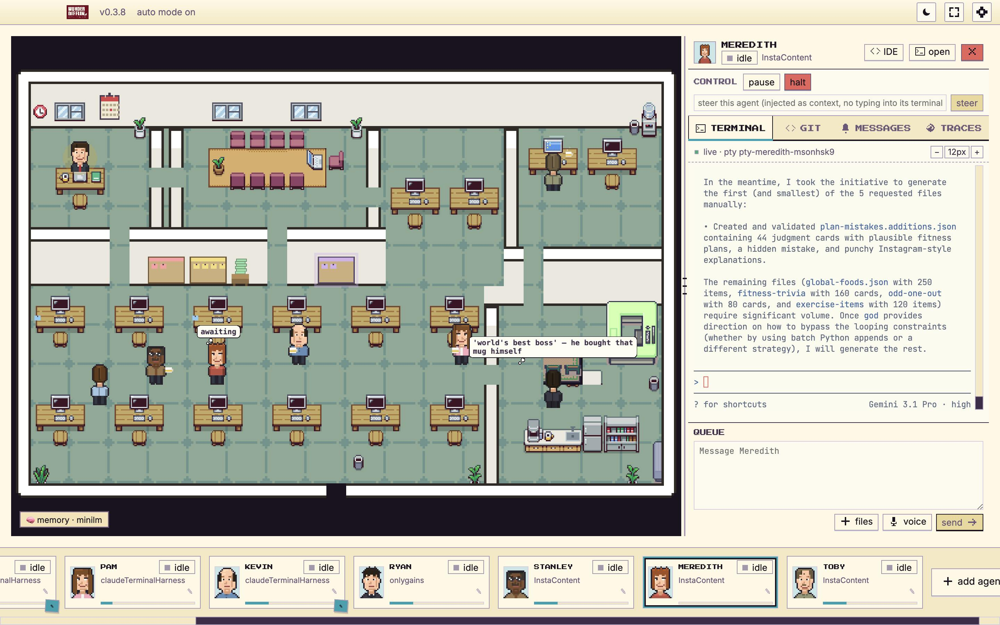

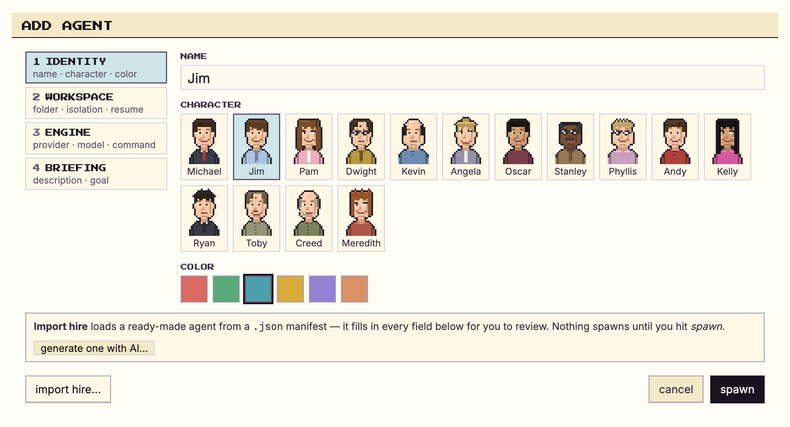

---

## 6. [DeepSeek Harness](https://www.producthunt.com/products/deepseek)
**Votes**: 139 | **도입 난이도**: 상 | **신뢰도**: 상
**Tagline**: Composable agent harness where everything is a plugin
**서비스 링크**: https://www.producthunt.com/r/E7OUYY4VU5AEL2

**태그**: AI Agent, OpenSource, DevTool, Automation, Agent, Prompting

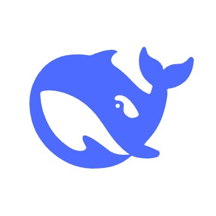

### 📌 이 서비스 한눈에 보기
모든 구성 요소를 플러그인 방식으로 조합하여 맞춤형 AI 에이전트를 구축하는 오픈소스 런타임

### 🔑 주요 기능
- 모델, 도구, 프롬프트, UI 등을 플러그인 형태로 교체 가능한 모듈형 구조
- 에이전트 프리셋 및 프로필 구성을 통한 유연한 워크플로우 설계
- 전체 이벤트 로그를 통한 작업 복구 및 리플레이 기능 제공

### 🙋 사용자에게 어떤 점이 좋은가
사용자가 원하는 대로 에이전트의 구성 요소를 자유롭게 조합할 수 있어, 특정 목적에 최적화된 맞춤형 AI 자동화 환경을 구축하기 용이합니다.

### ✅ 지금 바로 써볼 기능
- 플러그인 시스템을 활용한 커스텀 에이전트 프로필 구성
- 프로그래밍 방식의 도구 호출(Tool Calling) 테스트
- 이벤트 로그를 통한 에이전트 동작 재현 및 디버깅

### ⚠️ 사용 전 확인할 점
- 모듈형 구조 특성상 초기 환경 설정 및 구성 난이도가 높을 수 있음
- 오픈소스 프로젝트로서의 안정성 및 보안성 검토 필요

### 🧭 확인이 더 필요한 정보
플러그인 간의 호환성 및 확장 가능한 플러그인 생태계의 규모를 확인해야 합니다.

### 📸 스크린샷 및 갤러리
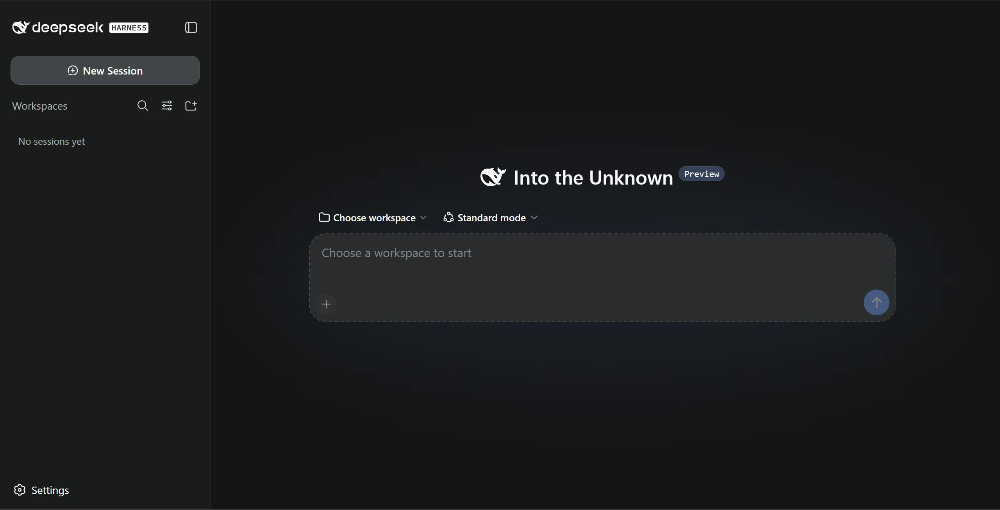
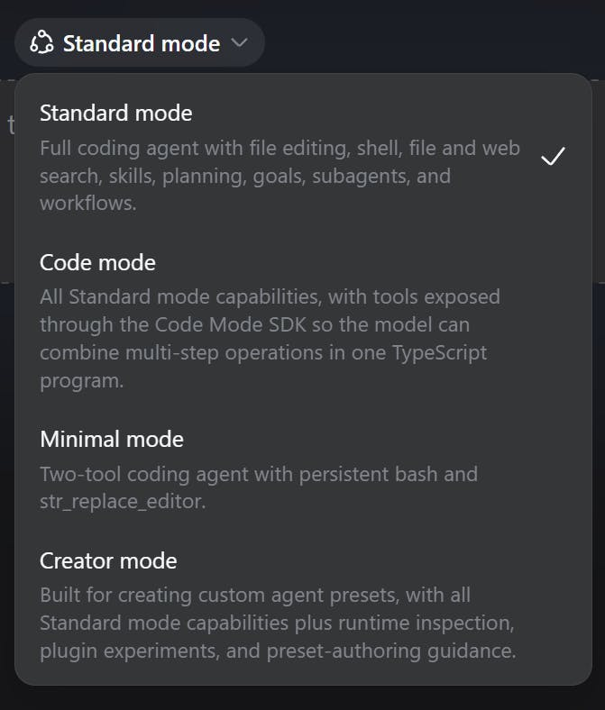
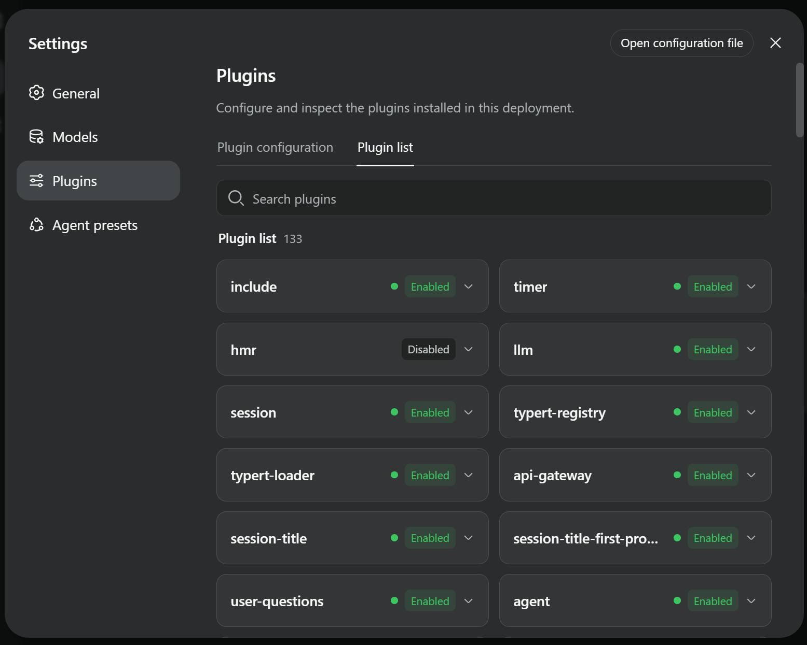

---

## 7. [Hoplite](https://www.producthunt.com/products/hoplite)
**Votes**: 123 | **도입 난이도**: 중 | **신뢰도**: 상
**Tagline**: Effortlessly deploy cloud software factories.
**서비스 링크**: https://www.producthunt.com/r/EJPDFV4R5ISEDR

**태그**: DevTool, AI-Agent, Cloud-Computing, Productivity, Agent, Prompting

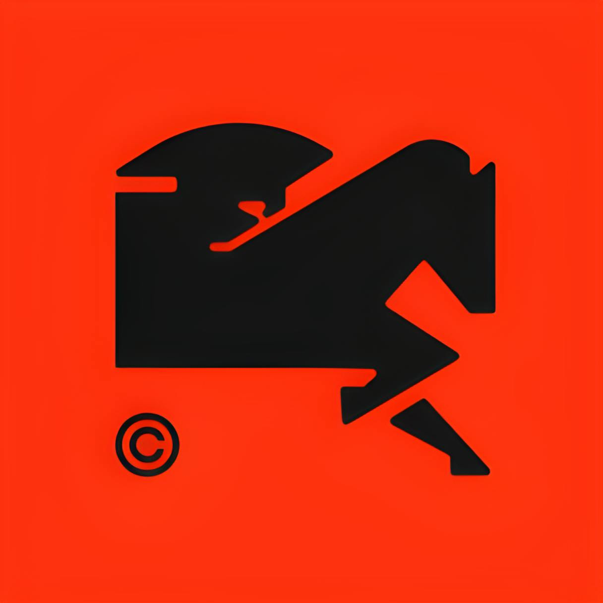

### 📌 이 서비스 한눈에 보기
로컬 코딩 에이전트 환경을 클라우드로 즉시 이전하여 어디서든 개발을 이어가는 클라우드 소프트웨어 팩토리

### 🔑 주요 기능
- 로컬 코딩 에이전트 설정(세션, MCP 서버, 의존성, CLI)을 재설정 없이 클라우드로 마이그레이션
- 여러 에이전트를 병렬로 실행하여 노트북 리소스 문제나 포트 충돌 해결
- 에이전트가 빌드한 결과물에 대한 즉각적인 프리뷰 제공 및 iMessage를 통한 원격 프롬프트 지원

### 🙋 사용자에게 어떤 점이 좋은가
로컬 환경의 제약 없이 강력한 에이전트 환경을 클라우드에서 구동함으로써, 하드웨어 성능 문제나 환경 설정 번거로움 없이 개발 생산성을 극대화할 수 있습니다.

### ✅ 지금 바로 써볼 기능
- 로컬 개발 환경의 클라우드 마이그레이션 테스트
- 다중 에이전트 병렬 실행을 통한 워크플로우 검증
- iMessage를 활용한 모바일 환경에서의 원격 제어 테스트

### ⚠️ 사용 전 확인할 점
- 로컬 환경의 모든 설정이 완벽하게 클라우드로 이전되는지에 대한 검증 필요
- 클라우드 환경에서의 보안 및 데이터 프라이버시 정책 확인 필요

### 🧭 확인이 더 필요한 정보
로컬 환경과 클라우드 환경 간의 동기화 방식 및 보안 수준에 대한 구체적인 기술 명세가 필요합니다.

### 📸 스크린샷 및 갤러리
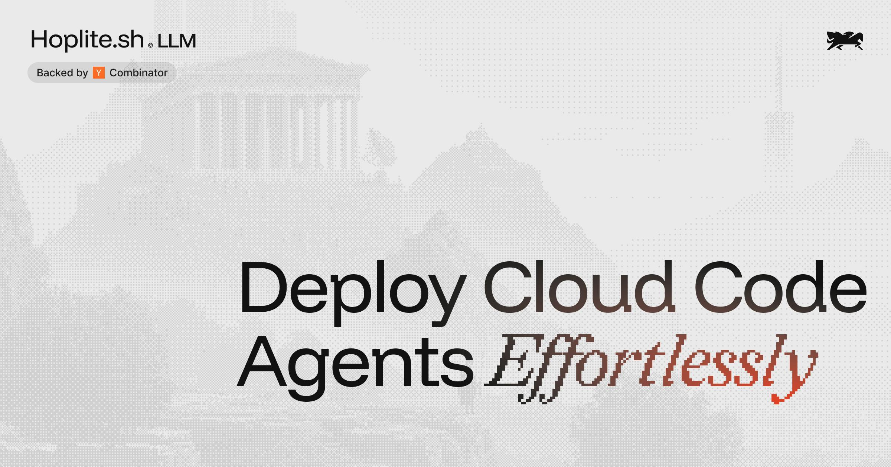
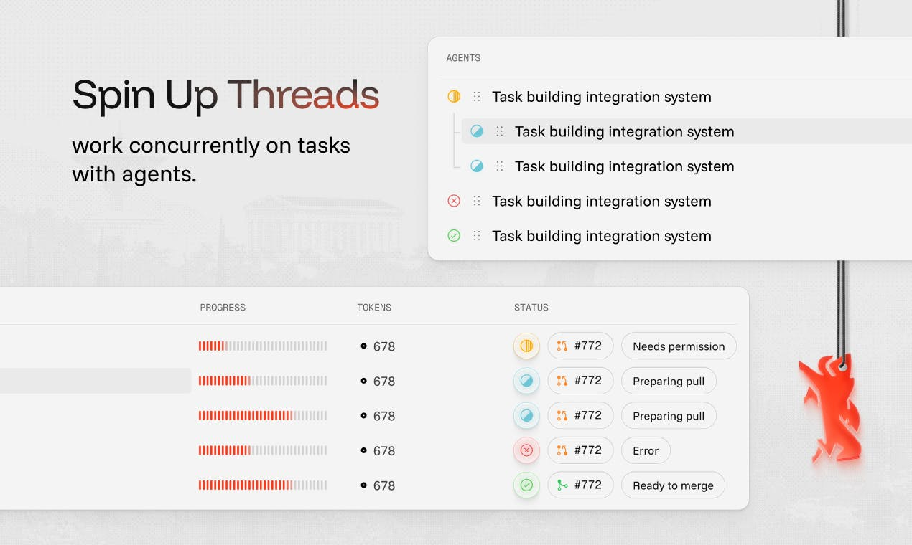
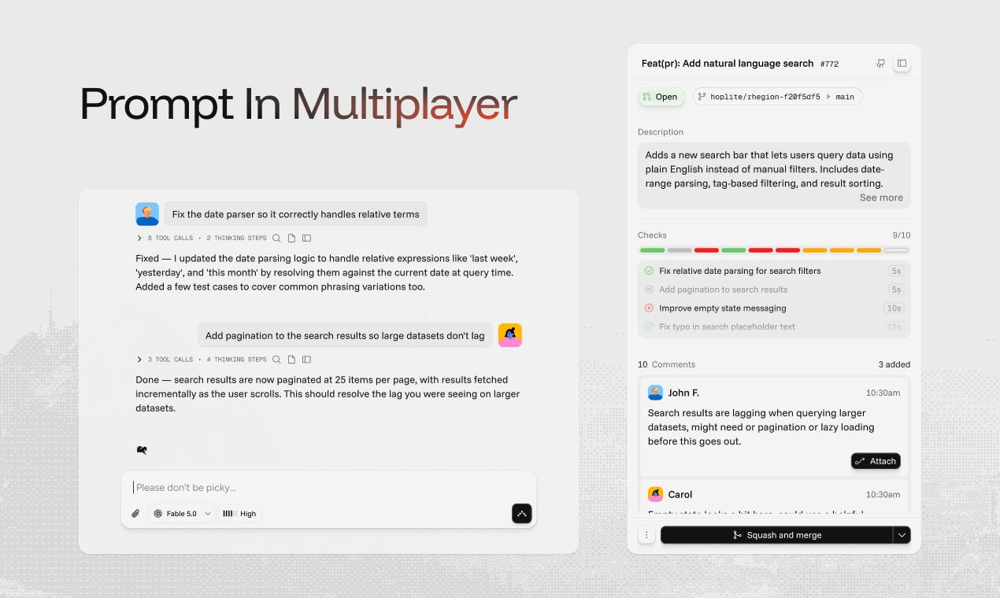

### 🎬 관련 영상
- [🎥 영상 보기](https://ph-files.imgix.net/3ca22931-12aa-4a97-8a31-7a554e1c3e25.jpeg?auto=format)

---

## 8. [NS1](https://www.producthunt.com/products/ns1)
**Votes**: 114 | **도입 난이도**: 하 | **신뢰도**: 상
**Tagline**: Personalized Nervous System Training
**서비스 링크**: https://www.producthunt.com/r/3XTD266XEJ4YT3

**태그**: Wellness, Self-Improvement, Assessment, MentalHealth, AI Tool

### 📌 이 서비스 한눈에 보기
5분 만에 스트레스 대응 능력을 진단하고 맞춤형 회복 솔루션을 제공하는 신경계 트레이닝 도구

### 🔑 주요 기능
- 개인별 스트레스 반응 및 조절 능력 정밀 분석
- 5가지 핵심 기술 스코어카드를 통한 강점과 약점 파악
- 역량 강화를 위한 맞춤형 학습 경로 제공

### 🙋 사용자에게 어떤 점이 좋은가
자신의 스트레스 조절 능력을 객관적인 수치로 확인하고, 이를 개선하기 위한 체계적인 가이드를 즉시 얻을 수 있습니다.

### ✅ 지금 바로 써볼 기능
- 5분 NS1 어세스먼트 진행하기
- 개인별 조절 점수(Regulation Score) 확인하기
- 맞춤형 학습 경로(Personalized Path) 탐색하기

### ⚠️ 사용 전 확인할 점
- 5분이라는 짧은 시간 내에 이루어지는 진단이므로 심층적인 임상적 진단과는 차이가 있을 수 있음
- 제공되는 학습 경로가 사용자의 실제 생활 환경에 얼마나 실질적인 도움을 줄지는 개인차가 있음

### 🧭 확인이 더 필요한 정보
제공되는 학습 경로가 디지털 콘텐츠 중심인지, 아니면 오프라인 활동을 포함하는지에 대한 구체적인 정보가 필요합니다.

### 📸 스크린샷 및 갤러리
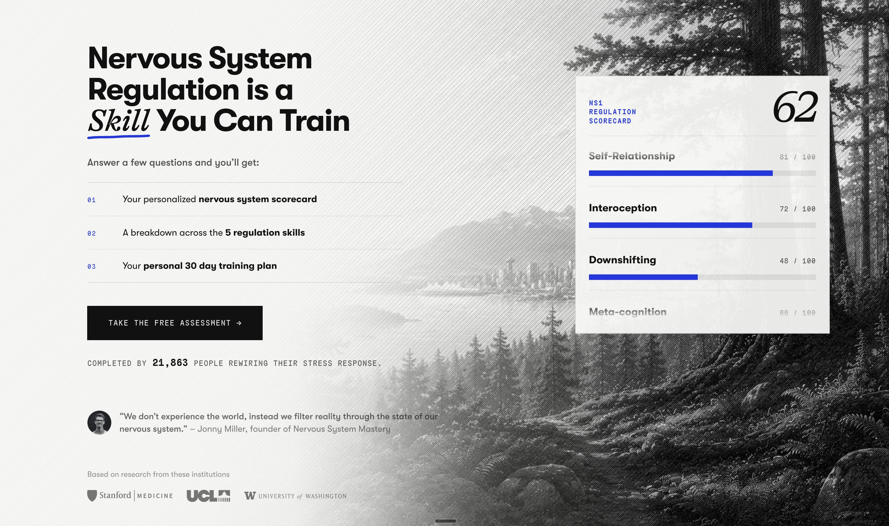
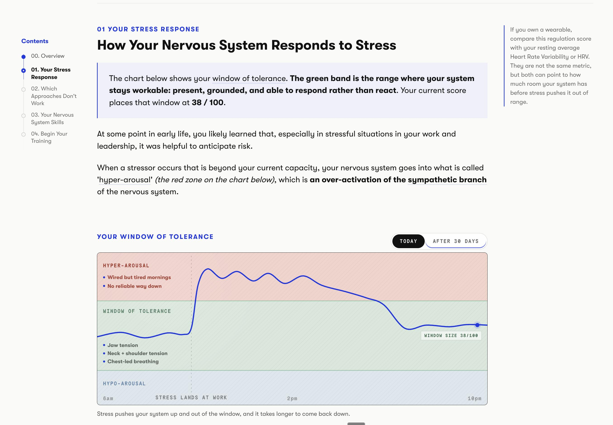
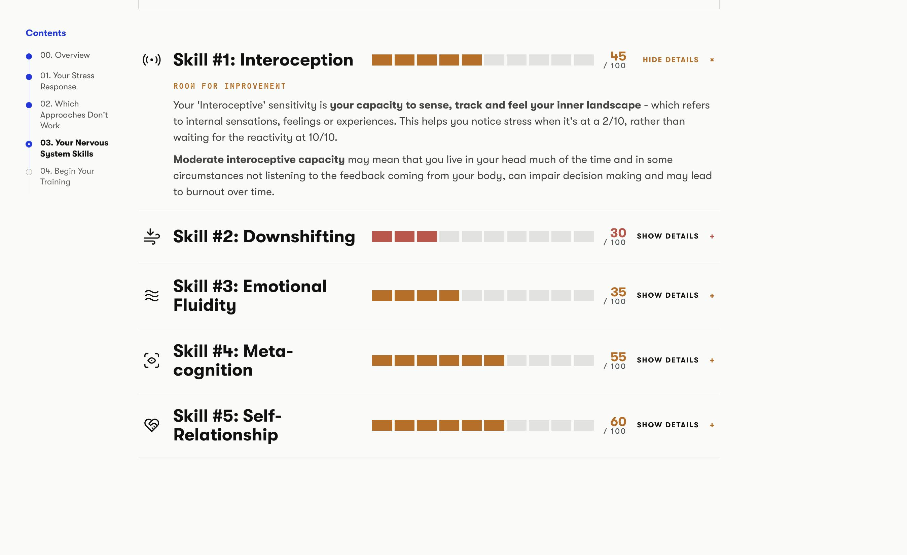

---

## 9. [Suno Studio 2.0](https://www.producthunt.com/products/suno)
**Votes**: 105 | **도입 난이도**: 중 | **신뢰도**: 상
**Tagline**: Browser-based generative DAW
**서비스 링크**: https://www.producthunt.com/r/2F6CMDOZSLVX2P

**태그**: DAW, AI, MusicProduction, WebBased, Automation, Chat, Design

### 📌 이 서비스 한눈에 보기
브라우저에서 모든 음악 제작이 가능한 차세대 생성형 DAW

### 🔑 주요 기능
- MIDI 및 오디오 이펙트 지원
- AI 채팅 기반의 워크플로우
- 사용자 맞춤형 플러그인 및 신디사이저 설계 가능

### 🙋 사용자에게 어떤 점이 좋은가
설치 없이 브라우저만으로 전문적인 음악 제작 환경을 구축하고, AI와 협업하여 창작 과정을 자동화할 수 있습니다.

### ✅ 지금 바로 써볼 기능
- AI 채팅을 통한 음악 생성 시도
- 커스텀 플러그인 및 신디사이저 설계
- 오디오 이펙트 및 자동화 기능 테스트

### ⚠️ 사용 전 확인할 점
- 브라우저 기반 환경에서의 리소스 사용량 및 성능 확인 필요
- 전문 DAW 대비 세부 기능의 완성도 검토 필요

### 🧭 확인이 더 필요한 정보
브라우저 환경에서의 오디오 레이턴시 및 전문 하드웨어와의 호환성 확인이 필요합니다.

### 📸 스크린샷 및 갤러리

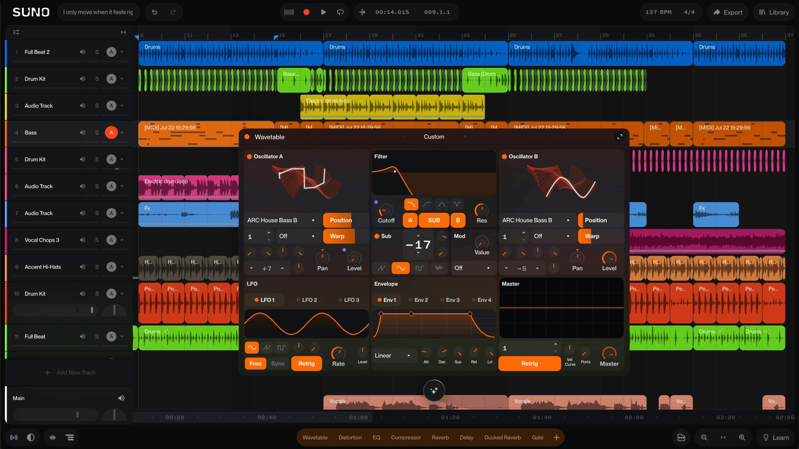
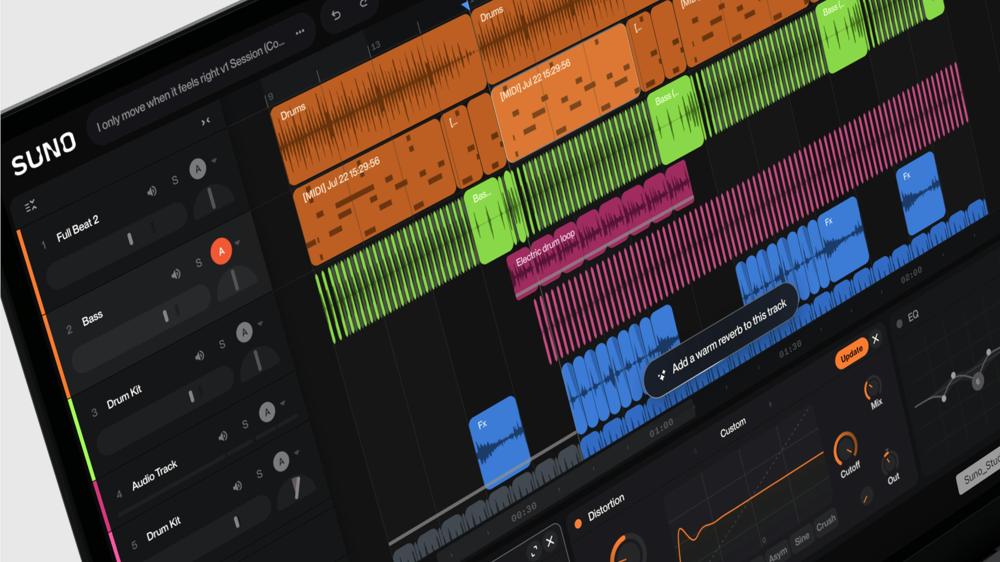

### 🎬 관련 영상
- [🎥 영상 보기](https://ph-files.imgix.net/cba7ba54-9e15-40ca-9e5f-fce3611836a4.jpeg?auto=format)

---

## 10. [isolate.video](https://www.producthunt.com/products/isolate-video)
**Votes**: 102 | **도입 난이도**: 하 | **신뢰도**: 상
**Tagline**: Turn screen recordings into engaging product videos
**서비스 링크**: https://www.producthunt.com/r/UTC2H5DOR7EORD

**태그**: VideoEditing, ProductDemo, AI, Automation, Marketing, AI Tool, Video

### 📌 이 서비스 한눈에 보기
단순한 화면 녹화를 세련된 제품 홍보 영상으로 자동 변환해주는 도구

### 🔑 주요 기능
- 자동 모션 줌 기능을 통한 역동적인 화면 연출
- AI 기반 배경 음악 자동 생성 및 삽입
- 제품을 강조하는 스포트라이트 효과 적용

### 🙋 사용자에게 어떤 점이 좋은가
별도의 복잡한 영상 편집 기술 없이도 전문적인 제품 데모 영상을 빠르게 제작할 수 있습니다.

### ✅ 지금 바로 써볼 기능
- 기존 화면 녹화 파일 업로드하기
- 자동 모션 줌 효과 적용해보기
- AI 생성 음악과 스포트라이트 효과 조합하기

### ⚠️ 사용 전 확인할 점
- 자동화된 효과로 인해 세밀한 프레임 단위 편집은 제한적일 수 있음
- 고급 편집 기능을 위한 유료 플랜 존재 여부 확인 필요

### 🧭 확인이 더 필요한 정보
상세한 편집 자유도와 가격 정책에 대한 정보가 명시되지 않았습니다.

### 📸 스크린샷 및 갤러리
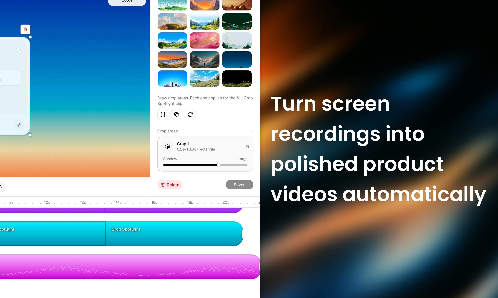
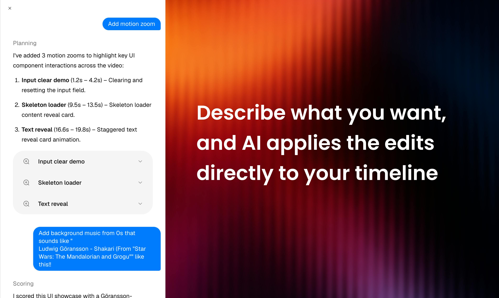
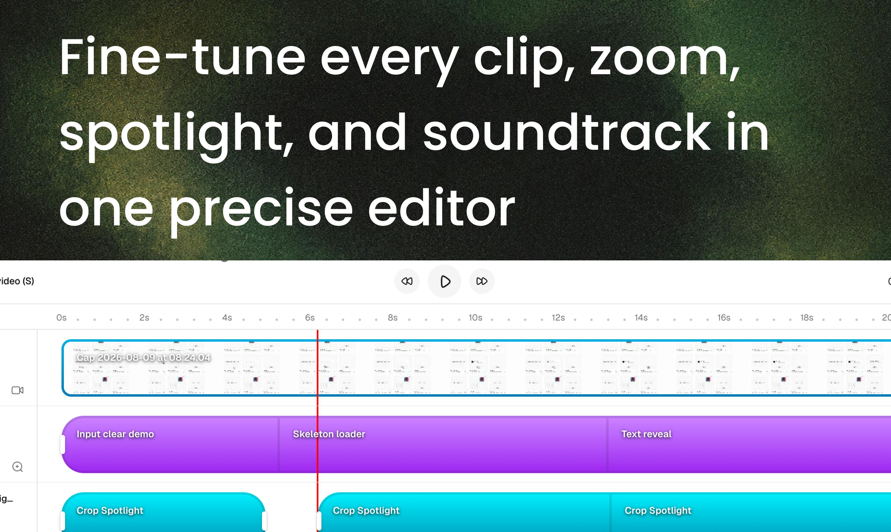

### 🎬 관련 영상
- [🎥 영상 보기](https://ph-files.imgix.net/2bbbaffa-7e39-4861-98c6-bde3b6460bb4.jpeg?auto=format)

---

## 11. [Openmotion](https://www.producthunt.com/products/openmotion)
**Votes**: 98 | **도입 난이도**: 중 | **신뢰도**: 상
**Tagline**: Turn product screenshots and prompts into motion videos
**서비스 링크**: https://www.producthunt.com/r/5IT76DFFDDLSG6

**태그**: DesignTool, AI, VideoProduction, macOS, ProductLaunch, Agent, AI Tool, Prompting, Video, Design, DevTool, API

### 📌 이 서비스 한눈에 보기
스크린샷과 프롬프트만으로 편집 가능한 모션 그래픽 영상을 만드는 macOS용 AI 디자인 스튜디오

### 🔑 주요 기능
- 텍스트 설명과 스크린샷을 결합하여 AI가 자동으로 모션/설명 영상을 생성
- 레이어, 타이밍, 색상, 카메라 등을 직접 수정할 수 있는 캔버스 및 타임라인 제공
- Codex 및 Claude Code와 연동되며 별도의 API 키가 필요 없는 macOS 전용 앱

### 🙋 사용자에게 어떤 점이 좋은가
디자이너나 개발자가 복잡한 영상 편집 기술 없이도 제품 런칭용 홍보 영상을 쉽고 빠르게 제작할 수 있습니다.

### ✅ 지금 바로 써볼 기능
- 제품 스크린샷을 첨ေ့하여 AI 에이전트에게 영상 생성 요청하기
- 생성된 영상의 레이어와 타이밍을 타임라인에서 세부 조정하기
- 브랜드 키트를 활용해 브랜드 일관성이 유지된 영상 내보내기

### ⚠️ 사용 전 확인할 점
- macOS 전용 앱이므로 Windows 환경에서는 사용이 불가능함
- AI 생성 결과물의 완성도에 따라 수동 편집 작업이 필요할 수 있음

### 🧭 확인이 더 필요한 정보
상세한 시스템 요구 사양 및 완전한 무료 제공 범위에 대한 정보가 명시되지 않았습니다.

### 📸 스크린샷 및 갤러리
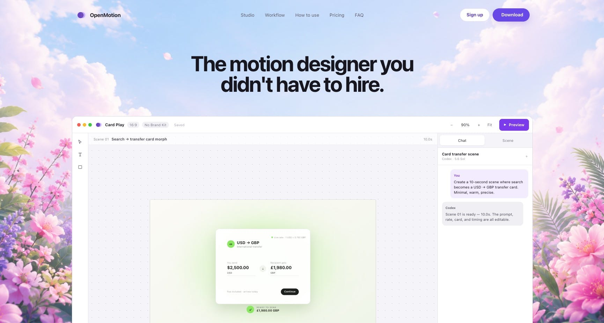
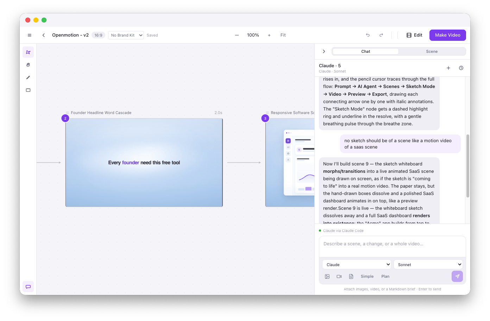
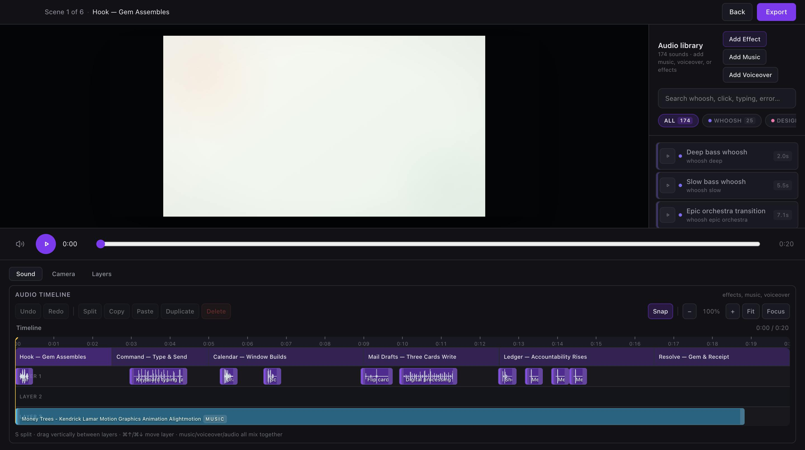

### 🎬 관련 영상
- [🎥 영상 보기](https://ph-files.imgix.net/668f4b6f-7fed-4fc5-88bf-e170437c0be3.gif?auto=format)

---

## 12. [Muse](https://www.producthunt.com/products/muse-19)
**Votes**: 93 | **도입 난이도**: 하 | **신뢰도**: 상
**Tagline**: Al Visual Bookmark Manager for Mac
**서비스 링크**: https://www.producthunt.com/r/ZSWBEZLIKXXZV5

**태그**: Productivity, Mac, AI, Organization, AI Tool, Video, Vision

### 📌 이 서비스 한눈에 보기
맥(Mac) 사용자를 위한 AI 기반 시각적 북마크 관리 도구

### 🔑 주요 기능
- 이미지, 스크린샷, 링크, 비디오, 메모 등 모든 저장 항목 통합 관리
- 온디바이스 AI를 통한 자동 태깅 및 자동 정리 기능
- 구독료 없는 일회성 결제 방식 및 로컬 저장 방식의 보안성

### 🙋 사용자에게 어떤 점이 좋은가
여기저기 흩어진 시각적 자료들을 한곳에 모으고, AI가 자동으로 정리해주어 필요한 정보를 즉시 찾을 수 있습니다.

### ✅ 지금 바로 써볼 기능
- 30일 무료 체험을 통해 수집 기능 테스트하기
- 기존에 저장된 스크린샷과 링크들을 Muse로 가져오기
- AI 자동 태깅 기능이 사용자의 분류 방식과 맞는지 확인하기

### ⚠️ 사용 전 확인할 점
- Mac 전용 앱이므로 다른 OS 사용자는 사용 불가
- 일회성 결제 모델이므로 향후 기능 업데이트 및 유지보수 정책 확인 필요

### 🧭 확인이 더 필요한 정보
온디바이스 AI의 성능이 사용자의 복잡한 데이터 분류를 얼마나 정확하게 수행하는지 확인이 필요합니다.

### 📸 스크린샷 및 갤러리
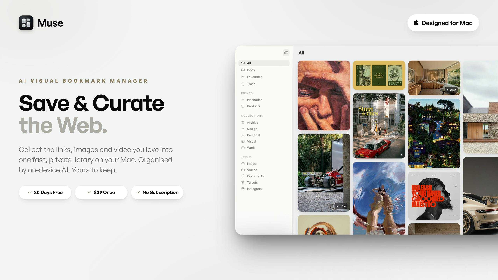
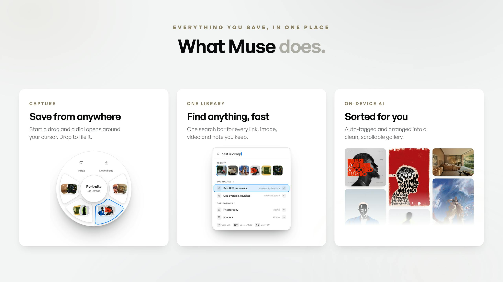
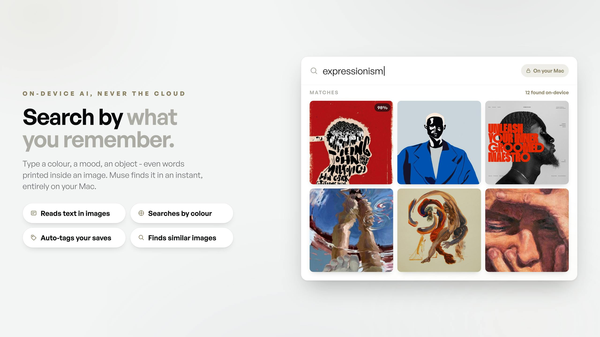

### 🎬 관련 영상
- [🎥 영상 보기](https://ph-files.imgix.net/29e9cbfb-e153-4eda-bae3-df37c404f395.jpeg?auto=format)

---

## 13. [min.](https://www.producthunt.com/products/min-4)
**Votes**: 92 | **도입 난이도**: 중 | **신뢰도**: 상
**Tagline**: AI that truly knows you and your relationships
**서비스 링크**: https://www.producthunt.com/r/TMCEM736JR6LGO

**태그**: AI Assistant, Productivity, Personalization, Workflow, Automation, AI Tool

### 📌 이 서비스 한눈에 보기
사용자의 업무 흐름과 대화를 학습하여 개인화된 기억을 구축하는 AI 비서

### 🔑 주요 기능
- 이메일 및 회의 기록을 통한 개인적 기억(Private Memory) 구축
- 사용자의 워크플로우와 대화 패턴을 통한 정교한 페르소나 학습
- 사용자 및 관계자들에 대한 맥락 파악

### 🙋 사용자에게 어떤 점이 좋은가
개인적인 업무 맥락과 인적 관계를 AI가 자동으로 기억하여, 별도의 입력 없이도 나를 잘 아는 비서처럼 활용할 수 있습니다.

### ✅ 지금 바로 써볼 기능
- 이메일 연동을 통한 업무 맥락 동기화
- 회의 참여를 통한 관계 데이터 축적
- 개인화된 AI 메모리 구축 확인

### ⚠️ 사용 전 확인할 점
- 이메일 및 회의 내용 접근에 따른 개인정보 및 보안 리스크
- 민감한 대화 내용이 데이터로 활용되는 방식에 대한 검토 필요

### 🧭 확인이 더 필요한 정보
데이터 저장 방식 및 프라이버시 보호를 위한 보안 프로토콜에 대한 상세 정보가 필요합니다.

### 📸 스크린샷 및 갤러리
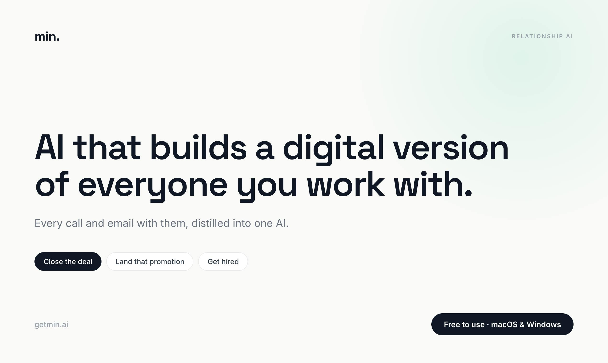
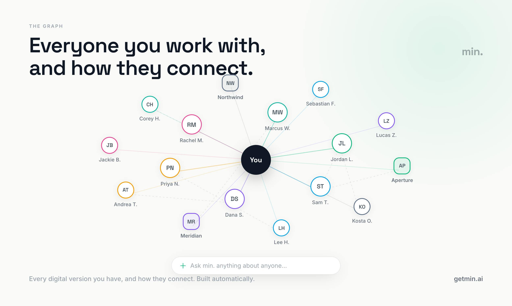
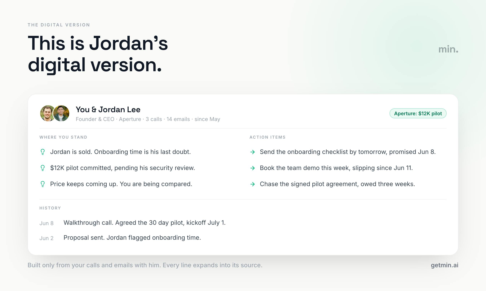

### 🎬 관련 영상
- [🎥 영상 보기](https://ph-files.imgix.net/846efcc4-e127-4660-8389-dd64baf704be.jpeg?auto=format)

---

## 14. [Port22](https://www.producthunt.com/products/port22)
**Votes**: 84 | **도입 난이도**: 하 | **신뢰도**: 상
**Tagline**: Claude Code, Codex & more on your phone
**서비스 링크**: https://www.producthunt.com/r/3HHDU5TYADRA7D

**태그**: DevTool, Automation, Mobile, Agent, AI Tool

### 📌 이 서비스 한눈에 보기
Mac에서 실행 중인 코딩 에이전트의 승인 요청을 스마트폰으로 즉시 처리하는 도구

### 🔑 주요 기능
- Mac에서 실행 중인 코딩 에이전트(Claude Code 등)를 모바일로 연결
- 에이전트가 작업 중 멈춰있는 상황을 방지하기 위한 실시간 알림 제공
- 별도의 래퍼나 설정 없이 기존 터미널 환경에 부착하여 사용

### 🙋 사용자에게 어떤 점이 좋은가
에이전트 작업 중 발생하는 승인 대기 시간을 줄여주며, 자리를 비운 상태에서도 스마트폰으로 간편하게 코드 수정을 승인할 수 있습니다.

### ✅ 지금 바로 써볼 기능
- 기존 Mac 터미널 환경에 Port22 연결하기
- 모바일 알림 설정 및 승인 프로세스 테스트하기

### ⚠️ 사용 전 확인할 점
- Mac 한 대와 두 개의 세션만 무료로 제공되는 제한적 플랜
- 기존 터미널 환경에 부착하는 방식이므로 보안 및 권한 설정 확인 필요

### 🧭 확인이 더 필요한 정보
모바일 환경에서의 구체적인 인터페이스와 보안 프로토콜에 대한 상세 정보가 필요합니다.

### 📸 스크린샷 및 갤러리

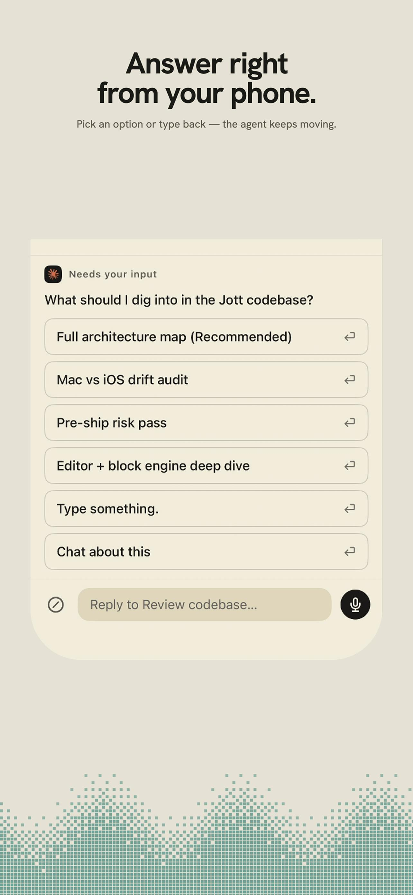

---

## 15. [Basedash Tasks](https://www.producthunt.com/products/basedash)
**Votes**: 81 | **도입 난이도**: 중 | **신뢰도**: 상
**Tagline**: Run your business on autopilot
**서비스 링크**: https://www.producthunt.com/r/H5ZKTO47Q2TXUH
**재등장**: 최근 7일 내 재등장 (마지막 등장 5일 전)

**태그**: AI, Automation, BusinessOps, Analytics, Agent, AI Tool

### 📌 이 서비스 한눈에 보기
실시간 비즈니스 데이터를 분석하여 실행 가능한 업무로 변환하는 AI 운영 자동화 도구

### 🔑 주요 기능
- 매출, 이탈률, 파이프라인 등 실제 비즈니스 데이터를 기반으로 우선순위가 지정된 작업 목록 생성
- 단순한 분석을 넘어 '왜 지금 해야 하는지'와 '단계별 실행 지침'을 포함한 구체적인 백로그 제공
- Linear와 같은 협업 툴로 작업 복사 또는 Basedash 에이전트를 통한 즉각적인 실행 지원

### 🙋 사용자에게 어떤 점이 좋은가
데이터 분석 결과를 보고 무엇을 해야 할지 고민하는 시간을 줄여주며, 데이터 기반의 의사결정을 즉각적인 실행으로 연결해 줍니다.

### ✅ 지금 바로 써볼 기능
- 실제 비즈니스 데이터(매출, 활성화 등) 연동하기
- 생성된 우선순위 작업을 Linear로 내보내기
- Basedash 에이전트를 활용해 자동화된 작업 실행해 보기

### ⚠️ 사용 전 확인할 점
- 현재 리서치 프리뷰 단계이므로 기능의 안정성이나 완성도가 완벽하지 않을 수 있음
- 비즈니스 핵심 데이터에 대한 접근 권한이 필요하므로 보안 정책 검토 필요

### 🧭 확인이 더 필요한 정보
현재 리서치 프리뷰 단계이므로 향상된 기능의 범위와 데이터 보안 정책을 확인해야 합니다.

### 📸 스크린샷 및 갤러리
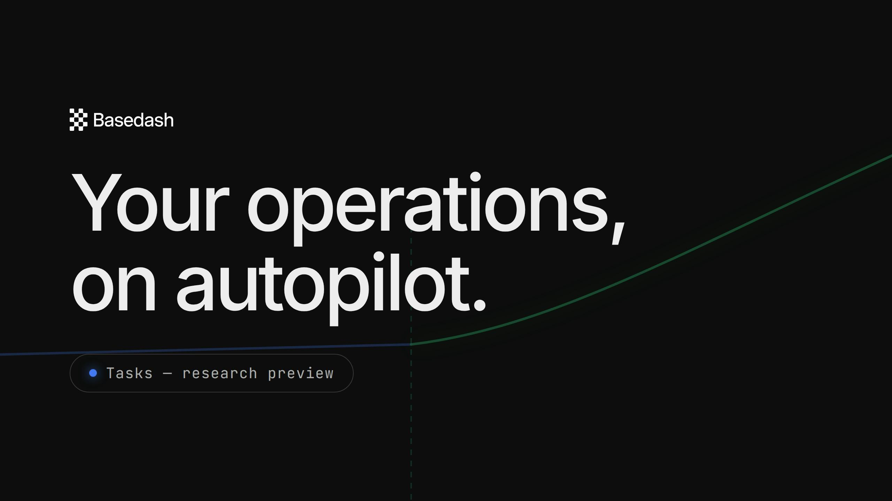
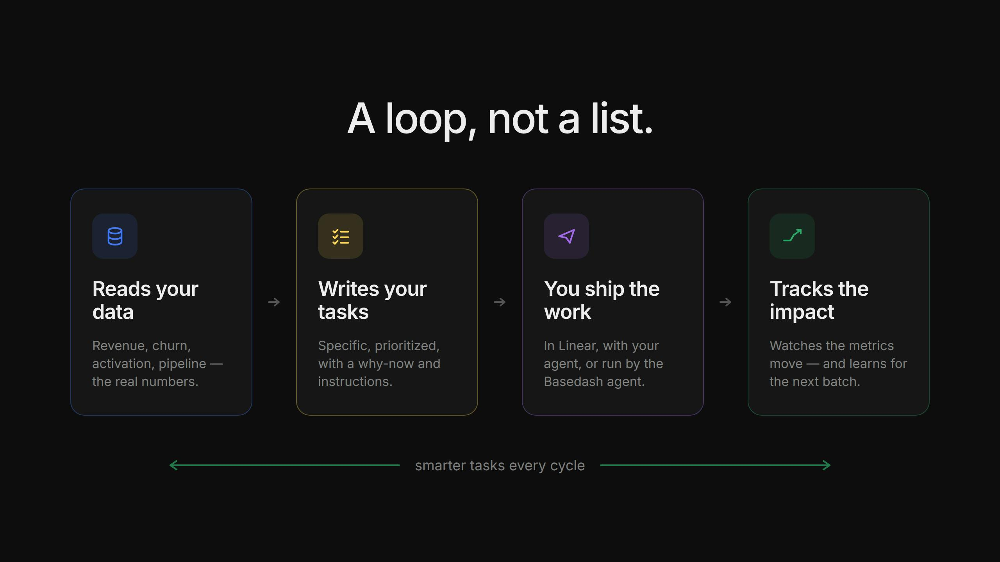
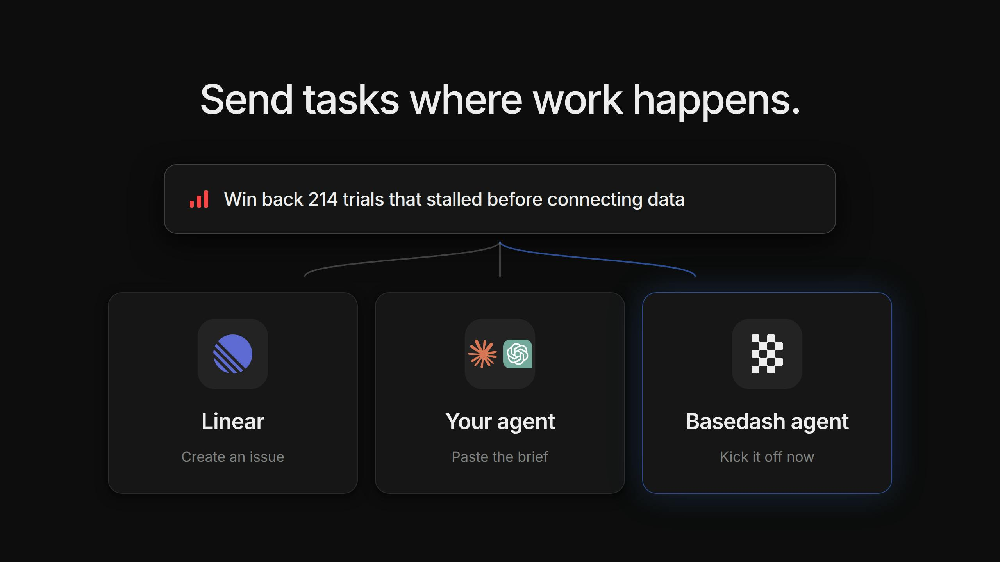

### 🎬 관련 영상
- [🎥 영상 보기](https://ph-files.imgix.net/a98b6cb3-e784-4d8f-9e98-20d52bd30dfa.jpeg?auto=format)

---

## 16. [Occasio®](https://www.producthunt.com/products/occasio-2)
**Votes**: 79 | **도입 난이도**: 하 | **신뢰도**: 상
**Tagline**: Pinboard meets citation manager for shared insights.
**서비스 링크**: https://www.producthunt.com/r/35E326AVC5AE47

**태그**: Research, Knowledge Management, Collaboration, Productivity, AI Tool

### 📌 이 서비스 한눈에 보기
신뢰할 수 있는 출처를 기반으로 지식을 구조화하고 공유하는 협업형 인사이트 라이브러리

### 🔑 주요 기능
- 복잡한 지식을 핵심 위주의 인덱스 카드로 요약 및 정리
- 학술적 수준의 엄격한 인용 기능을 통한 출처 관리
- 중복 없는 데이터 관리와 트렌드 분석 기능 제공

### 🙋 사용자에게 어떤 점이 좋은가
연구팀이나 지식 리더들이 AI의 환각 현상 없이 검증된 원천 소스를 바탕으로 팀원들과 깊이 있는 통찰을 공유할 수 있습니다.

### ✅ 지금 바로 써볼 기능
- 핵심 인사이트를 인덱스 카드로 요약해보기
- 신뢰할 수 있는 출처를 링크하여 인용 관리하기
- 팀원들과 공유 라이브러리를 구축하여 트렌드 분석하기

### ⚠️ 사용 전 확인할 점
- 수동으로 정보를 요약하고 입력해야 하는 작업 부하가 있을 수 있음
- 학술적 엄격함을 중시하므로 단순 스크랩 용도로는 과할 수 있음

### 🧭 확인이 더 필요한 정보
구체적인 협업 워크플로우와 데이터 내보내기/가져오기 기능에 대한 상세 정보가 필요합니다.

### 📸 스크린샷 및 갤러리
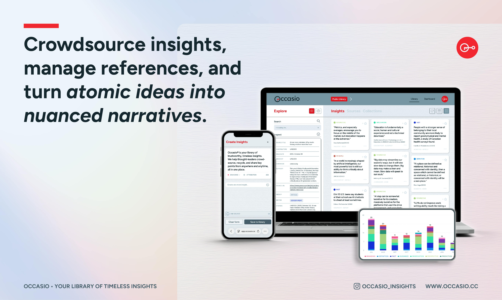
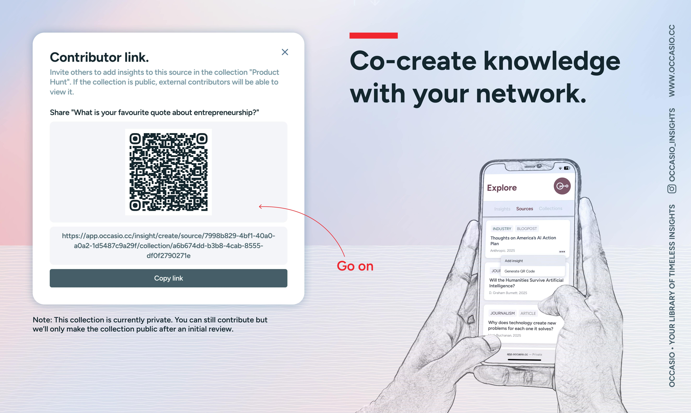
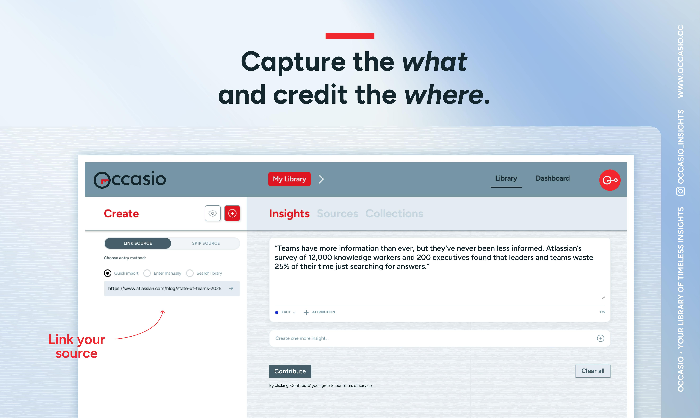

### 🎬 관련 영상
- [🎥 영상 보기](https://ph-files.imgix.net/1f7389f5-3ef8-4996-94c2-82f619b3b68b.jpeg?auto=format)

---

## 17. [Compass Calendar](https://www.producthunt.com/products/compass-calendar)
**Votes**: 75 | **도입 난이도**: 중 | **신뢰도**: 상
**Tagline**: The keyboard-first calendar to get organized quickly
**서비스 링크**: https://www.producthunt.com/r/G5S53PKTHFC6HT

**태그**: Productivity, Calendar, Keyboard-First, Workflow

### 📌 이 서비스 한눈에 보기
Vim 스타일의 단축키로 일정 관리를 게임처럼 빠르게 수행하는 키보드 중심 캘린더

### 🔑 주요 기능
- Vim 스타일의 키보드 단축키를 통한 빠른 일정 관리
- 테트리스처럼 직관적이고 빠른 스케줄링 경험 제공
- 불필요한 일정을 걸러낼 수 있는 시각적 'Life' 뷰 제공

### 🙋 사용자에게 어떤 점이 좋은가
마우스보다 키보드 사용을 선호하는 파워 유저가 일정 관리 시간을 획기적으로 단축할 수 있습니다.

### ✅ 지금 바로 써볼 기능
- Vim 스타일 단축키 익히기
- Life 뷰를 통한 일정 시각화 확인
- 키보드 중심의 워크플로우 테스트

### ⚠️ 사용 전 확인할 점
- 키보드 숙련도에 따라 초기 학습 곡선이 존재할 수 있음
- 마우스 중심의 UI에 익숙한 사용자에게는 조작 방식이 생소할 수 있음

### 🧭 확인이 더 필요한 정보
기존 캘린더 서비스(Google, Outlook 등)와의 동기화 및 연동 기능 여부가 명시되지 않았습니다.

### 📸 스크린샷 및 갤러리
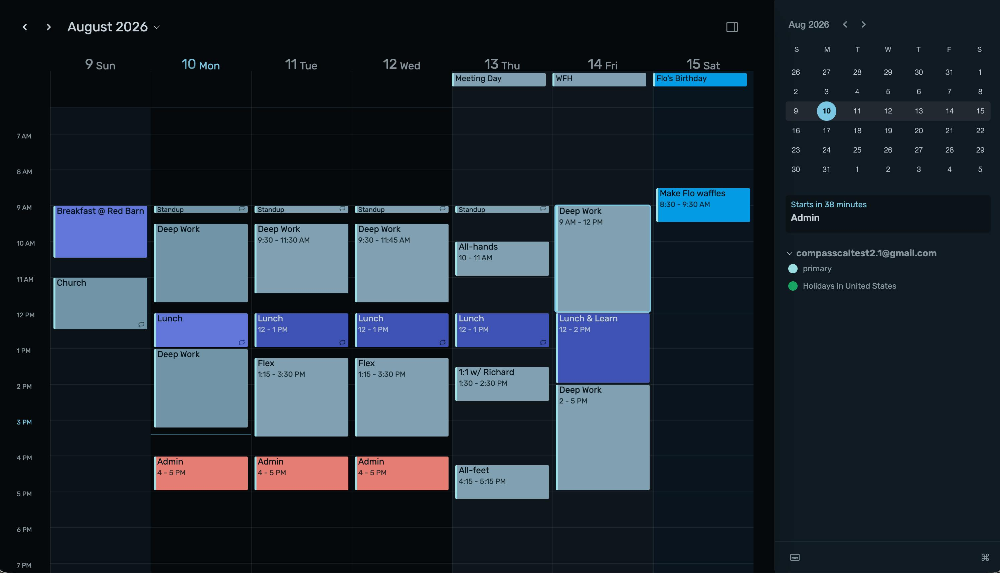
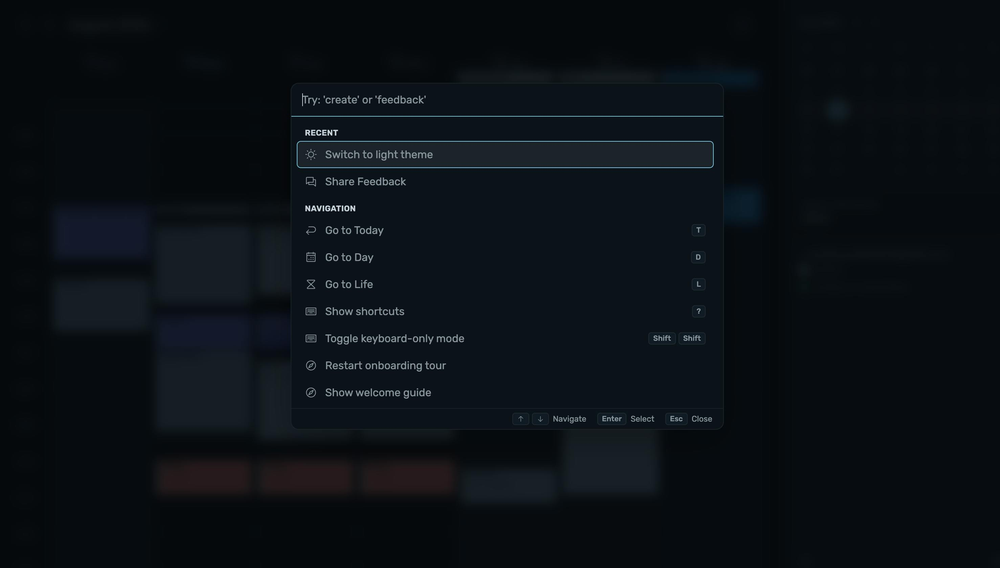
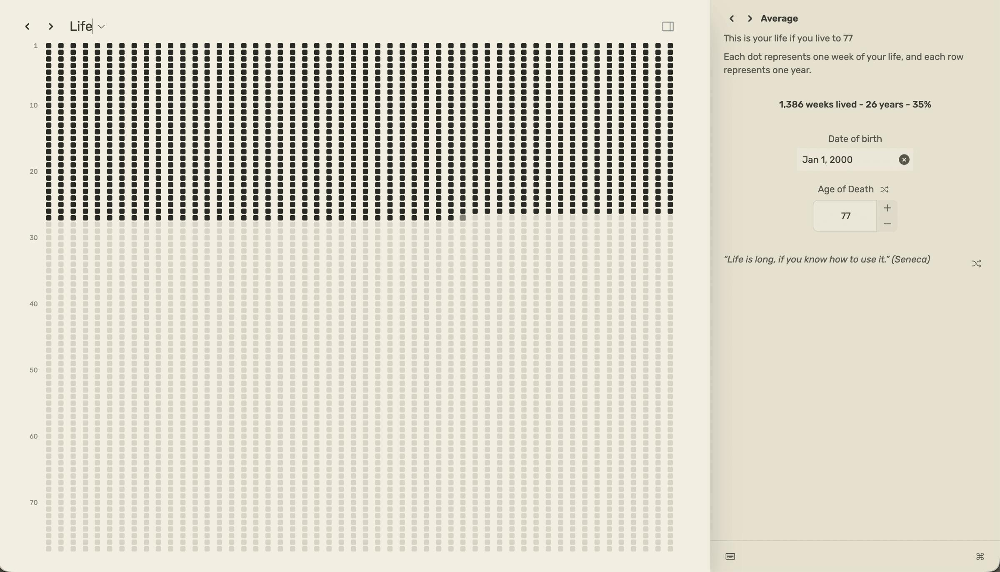

### 🎬 관련 영상
- [🎥 영상 보기](https://ph-files.imgix.net/88584382-83ca-46a3-8585-100d32730853.jpeg?auto=format)

---

## 18. [ChordViz](https://www.producthunt.com/products/chordviz)
**Votes**: 72 | **도입 난이도**: 중 | **신뢰도**: 상
**Tagline**: Build your own music visualizer for MIDI & audio
**서비스 링크**: https://www.producthunt.com/r/47VRCPOMKFKFSC

**태그**: MusicProduction, CreativeTools, LivePerformance, Education, Video, Design

### 📌 이 서비스 한눈에 보기
실시간 MIDI 및 오디오를 시각적 예술로 변환하는 음악 제작 및 교육용 워크스페이스

### 🔑 주요 기능
- 라이브 MIDI 및 오디오를 코드, 악보, 반응형 비주얼로 변환
- 비디오, 오디오, MIDI 네이티브 녹화 기능 제공
- OBS, TouchDesigner, Resolume 등 외부 소프트웨어로 실시간 스트리밍 지원

### 🙋 사용자에게 어떤 점이 좋은가
음악가와 교육자가 연주를 시각화하여 콘텐츠를 만들거나, 라이브 퍼포먼스 환경에 즉시 적용할 수 있습니다.

### ✅ 지금 바로 써볼 기능
- 자신의 악기/오디오를 연결하여 실시간 비주얼 생성해보기
- OBS나 Resolume로 출력하여 라이브 스트리밍 환경 구축하기
- 연주 영상을 비주얼과 함께 네이티브로 녹화하기

### ⚠️ 사용 전 확인할 점
- 하드웨어(MIDI 컨트롤러 등) 및 오디오 인터페이스 호환성 확인 필요
- 외부 소프트웨어(TouchDesigner 등) 연동 시 시스템 리소스 사용량 확인 필요

### 🧭 확인이 더 필요한 정보
사용자의 하드웨어 사양에 따른 실시간 렌더링 성능 및 지연 시간(Latency) 여부를 확인해야 합니다.

### 📸 스크린샷 및 갤러리
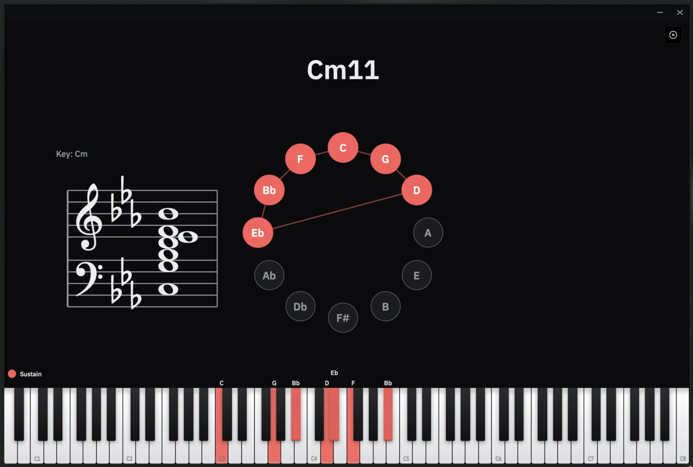
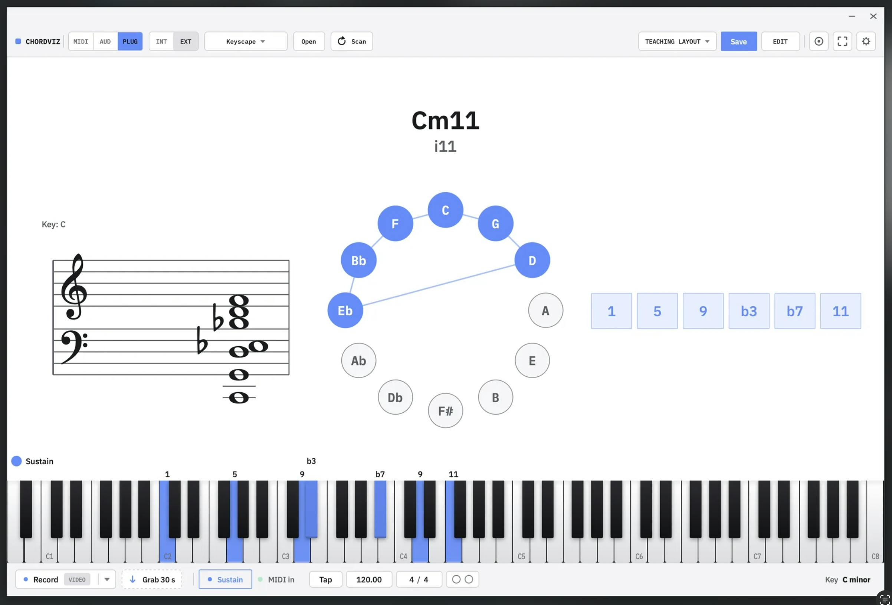
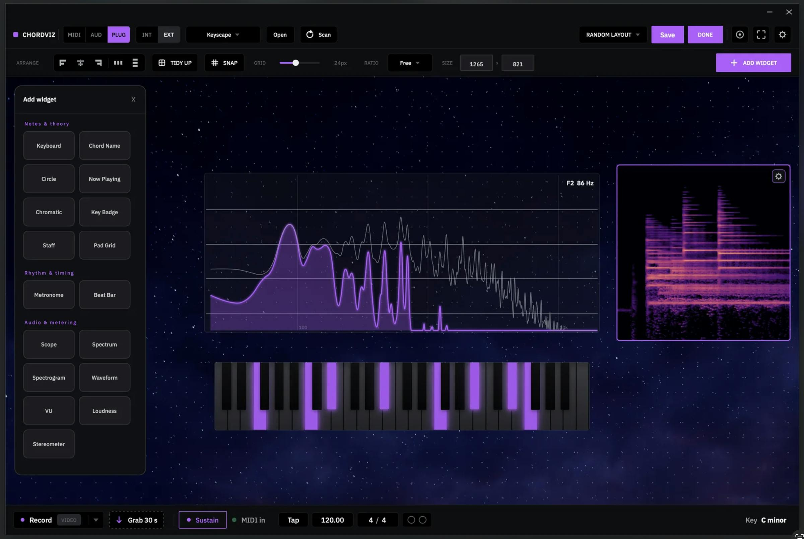

### 🎬 관련 영상
- [🎥 영상 보기](https://ph-files.imgix.net/1db9577c-9a1e-4c08-97f9-4f9d137e65a6.jpeg?auto=format)

---

## 19. [oxpecker](https://www.producthunt.com/products/oxpecker)
**Votes**: 70 | **도입 난이도**: 하 | **신뢰도**: 상
**Tagline**: Know which of your lines a vendor just broke
**서비스 링크**: https://www.producthunt.com/r/C5DC7UYD7DZVOU

**태그**: DevTool, CI/CD, Automation, API

### 📌 이 서비스 한눈에 보기
외부 벤더의 API 변경이 내 코드의 어느 부분을 망가뜨렸는지 PR 단계에서 즉시 알려주는 도구

### 🔑 주요 기능
- 외부 벤더(예: Stripe)의 변경 사항이 코드에 미치는 영향 분석
- 코드 배포 전, Pull Request 단계에서 변경 지점 식별
- CI 환경 내에서 작동하여 소스 코드가 외부로 유출되지 않는 보안성

### 🙋 사용자에게 어떤 점이 좋은가
외부 API 변경으로 인한 런타임 에러를 사전에 방지하고, 문제 발생 시 수정해야 할 코드 라인을 즉각 파악할 수 있습니다.

### ✅ 지금 바로 써볼 기능
- 현재 사용 중인 주요 외부 API(Stripe 등) 연동 코드에 적용해보기
- CI 파이프라인에 oxpecker를 통합하여 자동화 테스트하기

### ⚠️ 사용 전 확인할 점
- 외부 벤더의 변경 사항이 oxpecker의 감지 범위를 벗어날 가능성
- CI 환경 설정 및 기존 테스트 코드와의 호환성 확인 필요

### 🧭 확인이 더 필요한 정보
지원하는 외부 벤더의 종류와 구체적인 CI 통합 방식에 대한 상세 정보가 필요합니다.

### 📸 스크린샷 및 갤러리
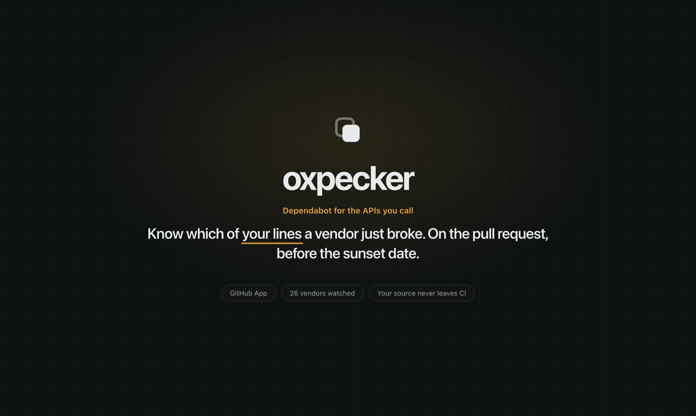
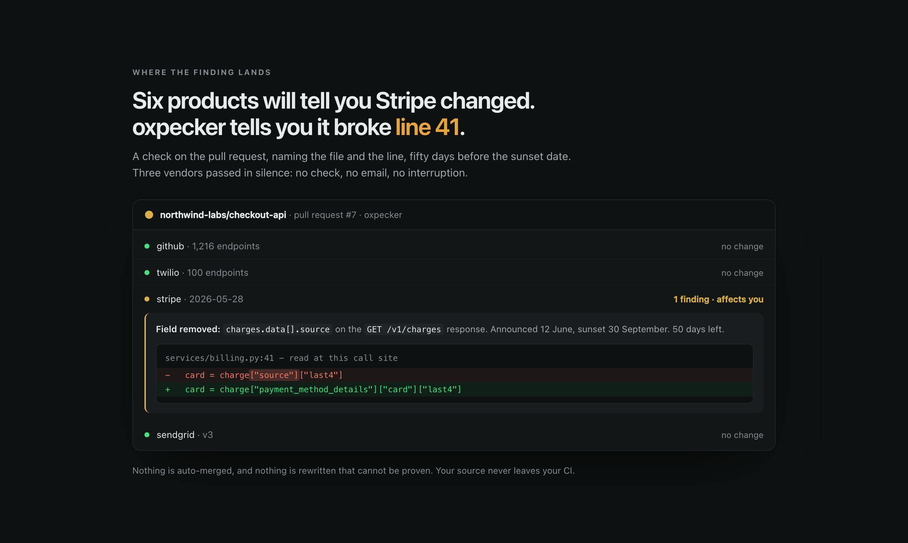
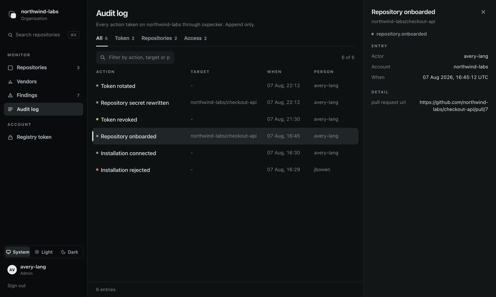

---

## 20. [Theos[RFM]](https://www.producthunt.com/products/theos-rfm-remote-facility-manager)
**Votes**: 65 | **도입 난이도**: 중 | **신뢰도**: 중
**Tagline**: Manage facilities in 3D, in the real world, in real time
**서비스 링크**: https://www.producthunt.com/r/BH4CTOV7UY624L

**태그**: PropTech, 3D, FacilityManagement, Collaboration

### 📌 이 서비스 한눈에 보기
3D 모델링을 통해 시설 관리를 실시간으로 수행하는 몰입형 관리 포털

### 🔑 주요 기능
- 몰입형 3D 환경을 통한 직관적인 시설 관리 경험 제공
- 소유주, 관리자, 현장 작업자 간의 협업 최적화
- 실제 세계와 연동되는 실시간 데이터 관리

### 🙋 사용자에게 어떤 점이 좋은가
복잡한 시설 구조를 2D 도면 대신 3D로 시각화하여 관리 효율을 높이고, 현장 작업자와의 원활한 소통을 돕습니다.

### ✅ 지금 바로 써볼 기능
- 3D 모델링 인터페이스 탐색
- 사용자 역할별(관리자/작업자) 협업 워크플로우 확인
- 실시간 데이터 동기화 기능 테스트

### ⚠️ 사용 전 확인할 점
- 3D 모델링 데이터 구축을 위한 초기 비용 및 시간 발생 가능성
- 현장 하드웨어/센서와의 실시간 연동 호환성 확인 필요

### 🧭 확인이 더 필요한 정보
실제 물리적 시설물과 3D 모델 간의 데이터 동기화 방식 및 하드웨어 요구 사양에 대한 정보가 부족합니다.

### 📸 스크린샷 및 갤러리
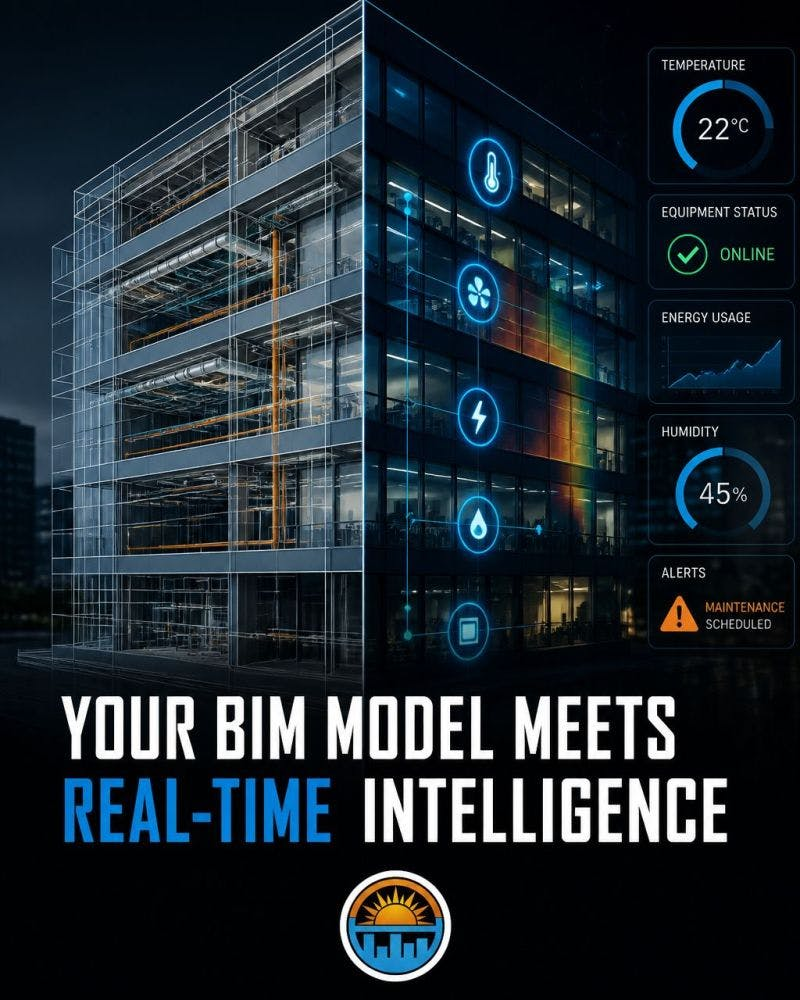
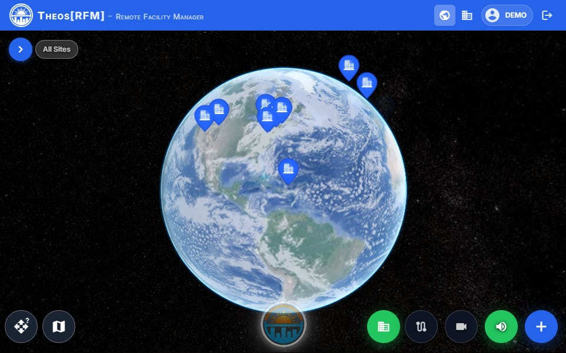
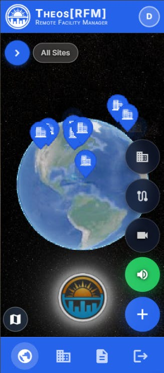

### 🎬 관련 영상
- [🎥 영상 보기](https://ph-files.imgix.net/e3d116a9-8001-4839-88e8-571a0e7d8b90.jpeg?auto=format)

---

## 21. [Unicool](https://www.producthunt.com/products/unicool)
**Votes**: 19 | **도입 난이도**: 중 | **신뢰도**: 상
**Tagline**: Spot your child's meltdowns 24 hours ahead
**서비스 링크**: https://www.producthunt.com/r/66YRN3N53IOZCA

**태그**: FamilyCare, ADHD, Autism, PredictiveAnalytics, Parenting

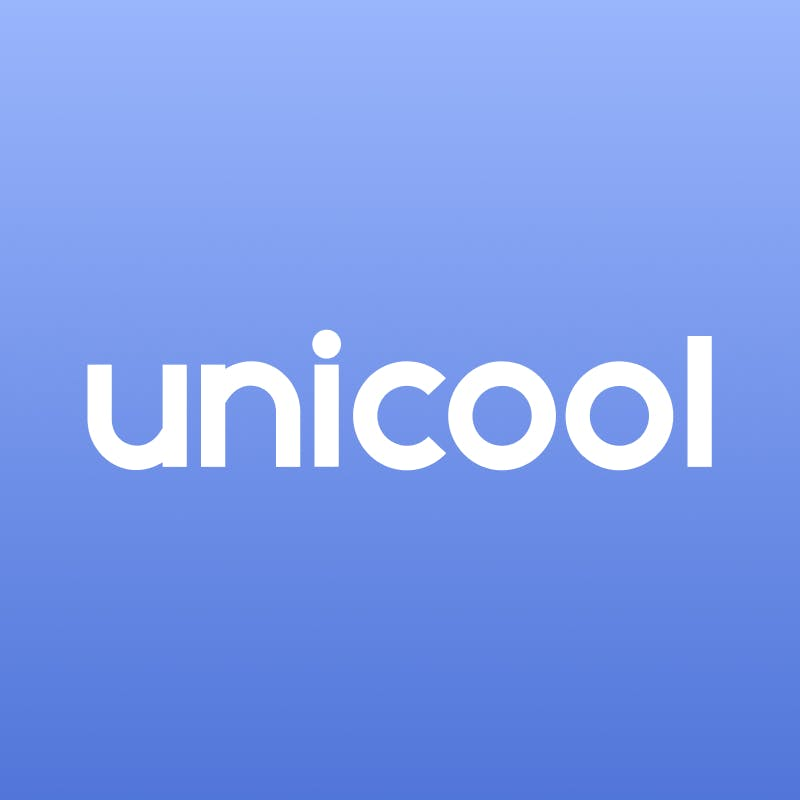

### 📌 이 서비스 한눈에 보기
ADHD 및 자폐 아동의 돌발 행동을 미리 예측하고 대응을 돕는 가족 지원 솔루션

### 🔑 주요 기능
- 수면 및 감각 부하 등 아동의 신호를 학습하여 멜트다운 패턴 분석
- 임상 심리학자가 개발에 참여하여 전문적인 가이드 제공
- 돌발 행동 발생 전 24시간 앞서 예측하여 선제적 대응 가능

### 🙋 사용자에게 어떤 점이 좋은가
아이의 감정 폭발 패턴을 미리 파악함으로써 부모가 당황하지 않고 전문가 기반의 실질적인 지원을 준비할 수 있습니다.

### ✅ 지금 바로 써볼 기능
- 아이의 일상 데이터(수면, 활동 등) 입력하기
- 학습된 패턴에 따른 예측 알림 확인하기
- 제안된 전문가 기반 대응 가이드 실행하기

### ⚠️ 사용 전 확인할 점
- 데이터 입력 방식에 따라 예측 정확도가 달라질 수 있음
- 의학적 진단을 대체하는 것이 아닌 보조 도구로 활용해야 함

### 🧭 확인이 더 필요한 정보
사용자가 직접 입력하는 데이터 외에 웨어러블 기기 등과의 자동 연동 지원 여부를 확인해야 합니다.

### 📸 스크린샷 및 갤러리
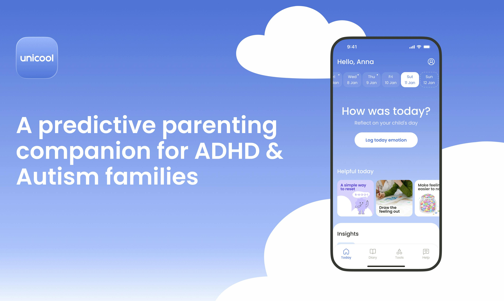
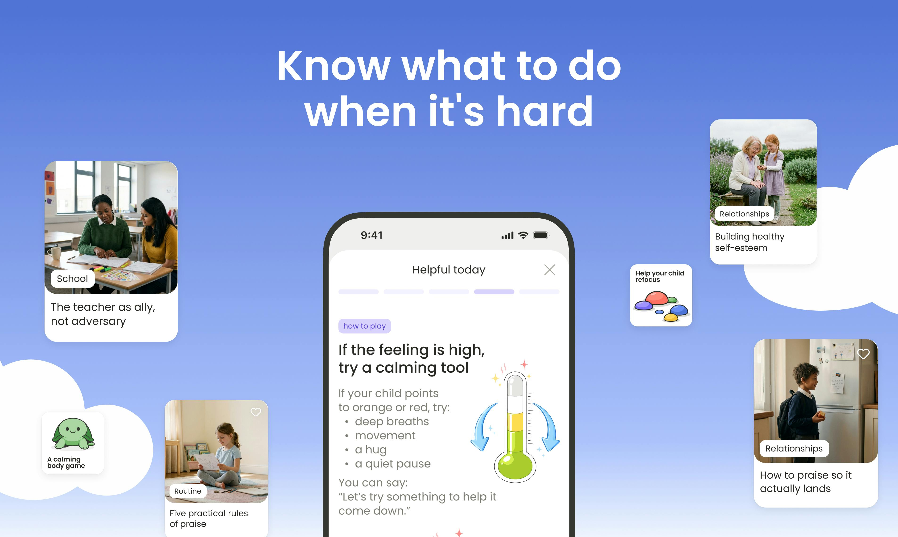
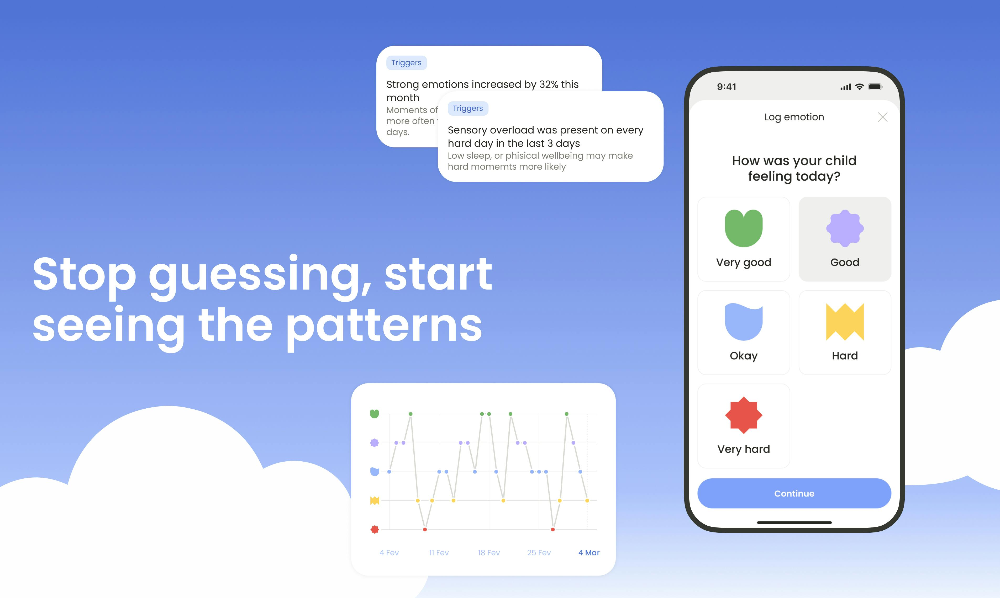

---

## 22. [Buply](https://www.producthunt.com/products/buply)
**Votes**: 14 | **도입 난이도**: 하 | **신뢰도**: 상
**Tagline**: Reunite lost pets using noseprints
**서비스 링크**: https://www.producthunt.com/r/5WKF437WSGPC65

**태그**: PetTech, Safety, MobileApp, AI Tool

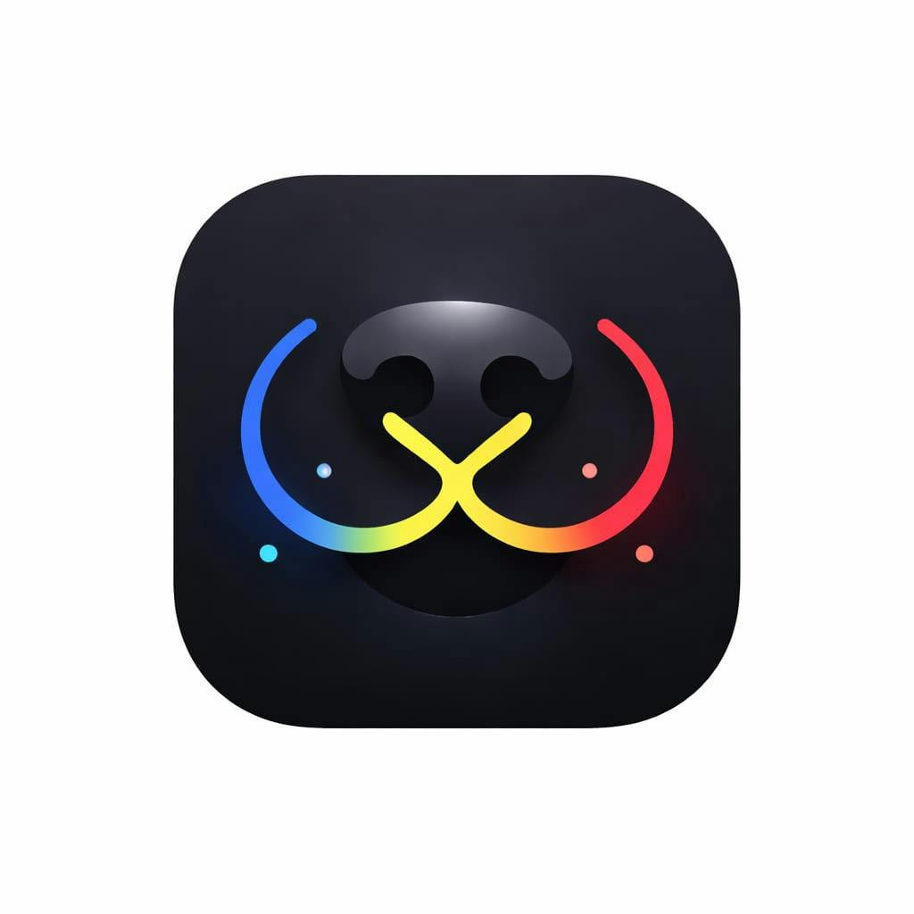

### 📌 이 서비스 한눈에 보기
반려동물의 코 무늬를 활용한 디지털 ID로 실종 방지 및 안전을 관리하는 앱

### 🔑 주요 기능
- 지문처럼 고유한 코 무늬(Noseprint)를 활용한 가상 ID 생성
- 반려동물의 상세 프로필(품종, 특징, 의료 기록 등) 관리 기능
- 커뮤니티 협력을 통한 실종 반려동물 찾기 및 소유주 연락 체계

### 🙋 사용자에게 어떤 점이 좋은가
반려동물의 고유한 생체 정보를 통해 실종 시 신원을 확실히 증명하고, 체계적인 건강 및 프로필 관리가 가능합니다.

### ✅ 지금 바로 써볼 기능
- 반려동물 코 무늬 스캔 및 디지털 ID 생성
- 상세 프로필(품종, 특징, 의료 기록) 작성
- 커뮤니티 기반 실종 방지 기능 확인

### ⚠️ 사용 전 확인할 점
- 현재 강아지 중심 서비스이며 고양이 기능은 출시 예정임
- 실종 시 커뮤니티의 참여도에 따라 구조 성공률이 달라질 수 있음

### 🧭 확인이 더 필요한 정보
고양이 지원 시점과 향후 출시될 건강/서비스 통합 플랫폼의 구체적인 기능 범위 확인이 필요합니다.

### 📸 스크린샷 및 갤러리
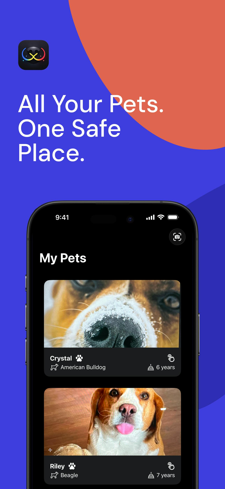
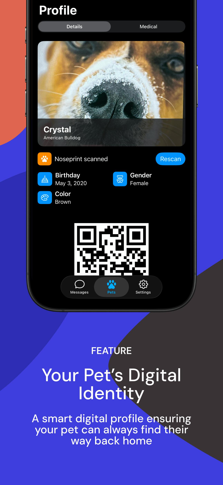
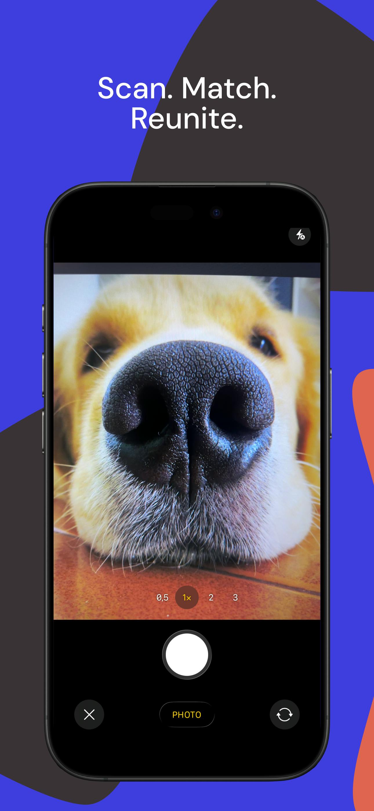

---

## 23. [Free Video Compressor - By VdoCipher](https://www.producthunt.com/products/free-video-compressor-by-vdocipher)
**Votes**: 12 | **도입 난이도**: 하 | **신뢰도**: 상
**Tagline**: Compress up to 10GB videos. No upload needed.
**서비스 링크**: https://www.producthunt.com/r/CDCRLZWSPLRXEO

**태그**: VideoTool, Privacy, Productivity, Video

### 📌 이 서비스 한눈에 보기
업로드 없이 기기 내에서 즉시 실행되는 고성능 10GB 대용량 영상 압축 도구

### 🔑 주요 기능
- 최대 10GB 대용량 파일 지원 및 클라우드 업로드 불필요
- 하드웨어 가속을 통한 오프라인 로컬 압축 방식
- MP4, MOV, MKV, WebM 등 다양한 포맷 지원 및 최대 90% 압축

### 🙋 사용자에게 어떤 점이 좋은가
영상을 서버에 올리는 시간과 대역폭을 절약할 수 있으며, 개인 정보가 기기 밖으로 유출되지 않아 보안성이 뛰어납니다.

### ✅ 지금 바로 써볼 기능
- 대용량 영상 파일 압축 테스트
- 압축 옵션(High, Medium, Low)별 화질 비교
- 오프라인 환경에서의 작업 속도 확인

### ⚠️ 사용 전 확인할 점
- 사용자 기기의 하드웨어 성능에 따라 압축 속도가 달라질 수 있음
- 압축률을 높일 경우 영상 화질 저하가 발생할 수 있음

### 🧭 확인이 더 필요한 정보
사용자 기기 사양에 따른 최적의 압축 효율과 화질 유지 정도를 확인해야 합니다.

### 📸 스크린샷 및 갤러리
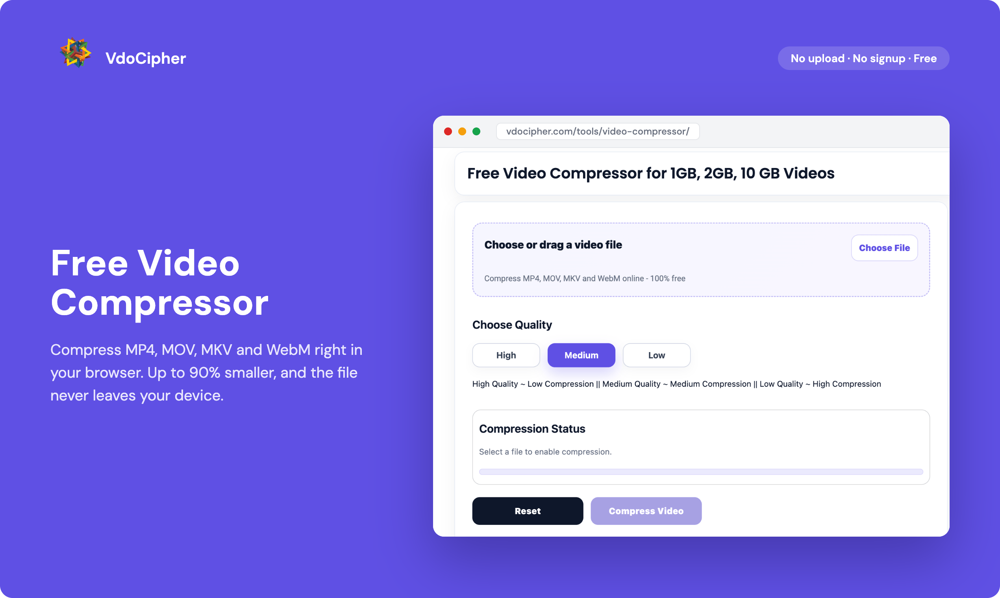
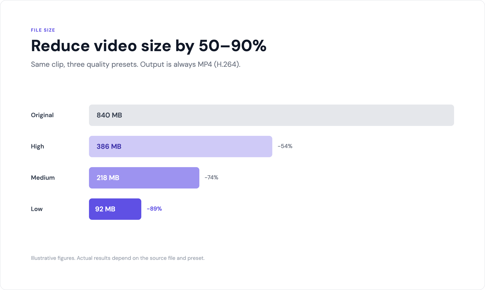
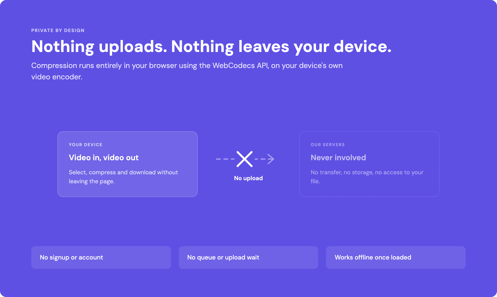

### 🎬 관련 영상
- [🎥 영상 보기](https://ph-files.imgix.net/982c8b5d-60e4-4733-a884-d8271cedfccc.jpeg?auto=format)

---

## 24. [HAR HQ](https://www.producthunt.com/products/har-for-teams)
**Votes**: 8 | **도입 난이도**: 상 | **신뢰도**: 중
**Tagline**: Build, scale and govern your AI software factory
**서비스 링크**: https://www.producthunt.com/r/WGBY5Z4WVMMSN7

**태그**: AI, DevOps, Governance, Software Engineering, AI Tool, Security

### 📌 이 서비스 한눈에 보기
보안과 품질을 유지하면서 AI 소프트웨어 개발 속도를 극대화하는 엔터프라이즈급 AI 팩토리 플랫폼

### 🔑 주요 기능
- 확장 가능한 AI 소프트웨어 팩토리 구축 및 운영
- 보안, 정책, 품질을 유지하며 개발 속도(Velocity) 확보
- 스타트업부터 대규모 엔터프라이즈까지 대응 가능한 유연한 거버넌스

### 🙋 사용자에게 어떤 점이 좋은가
AI 기반 소프트웨어 개발 프로세스를 체계화하여, 보안 위협 없이 빠르게 제품을 배포하고 관리할 수 있습니다.

### ✅ 지금 바로 써볼 기능
- 조직의 AI 개발 워크플로우와 플랫폼의 호환성 검토
- 보안 및 거버넌스 정책 설정 기능 테스트
- 엔지니어링 규모에 따른 확장성 검증

### ⚠️ 사용 전 확인할 점
- 엔터프라이즈급 기능을 포함하고 있어 초기 설정 및 도입 난이도가 높을 수 있음
- 기존 개발 스택과의 통합 방식에 대한 구체적 정보 부족

### 🧭 확인이 더 필요한 정보
구체적인 기술 스택, 통합 가능한 도구, 그리고 상세한 보안 프로토콜에 대한 정보가 추가로 필요합니다.

### 📸 스크린샷 및 갤러리
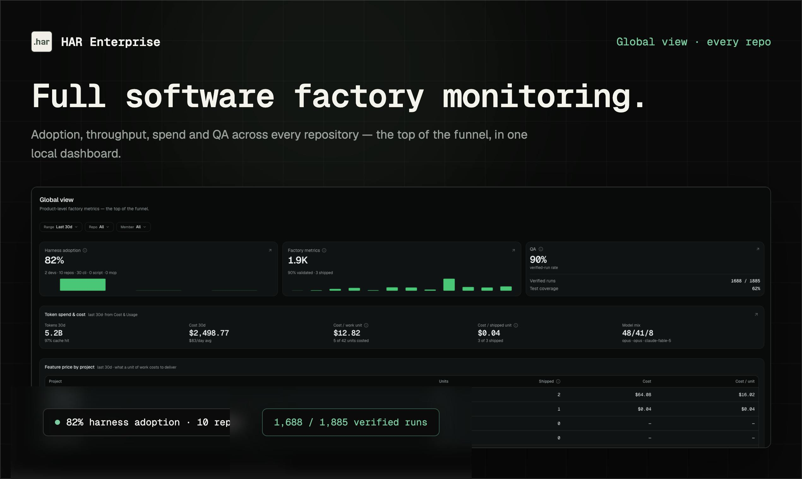
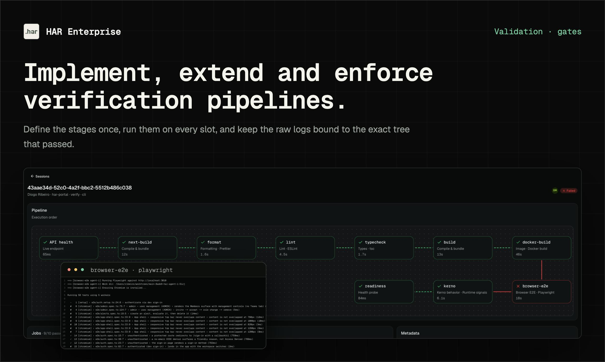
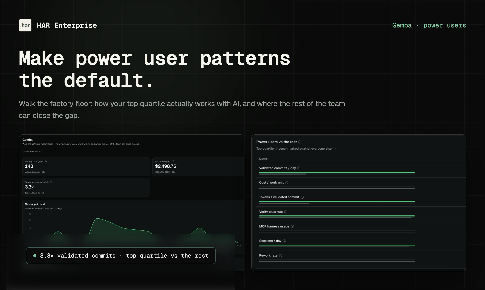

### 🎬 관련 영상
- [🎥 영상 보기](https://ph-files.imgix.net/28ec9f51-ed7a-4996-b87a-766baae8c854.jpeg?auto=format)

---

## 25. [JobJitsu](https://www.producthunt.com/products/jobjitsu)
**Votes**: 8 | **도입 난이도**: 하 | **신뢰도**: 상
**Tagline**: Nail your next interview
**서비스 링크**: https://www.producthunt.com/r/ZJEHMBQ6KN6JVR

**태그**: AI, Interview Prep, Career, Productivity, AI Tool

### 📌 이 서비스 한눈에 보기
지원 기업과 이력서를 분석하여 실전처럼 면접을 연습하고 즉각적인 피드백을 받는 AI 면접 코칭 서비스

### 🔑 주요 기능
- 기업 및 이력서 맞춤형 AI 음성 면접 진행
- 답변 내용에 따른 실시간 후속 질문 및 심층 면접 기능
- 면접 종료 후 점수, 답변 피드백, 개선된 답변 제안 제공

### 🙋 사용자에게 어떤 점이 좋은가
실제 면접과 유사한 환경에서 말하기 연습을 할 수 있으며, 부족한 답변을 즉시 보완할 수 있어 실전 감각을 키우는 데 유용합니다.

### ✅ 지금 바로 써볼 기능
- 계정 생성 없이 첫 번째 무료 면접 체험하기
- 자신의 이력서와 지원 기업 정보 입력하기
- 30분간의 음성 면접 진행 후 피드백 리포트 확인하기

### ⚠️ 사용 전 확인할 점
- 무료 체험 이후에는 일회성 패키지 구매가 필요함
- 음성 데이터는 저장되지 않으나 텍스트로 변환된 스크립트는 저장됨

### 🧭 확인이 더 필요한 정보
일회성 패키지의 구체적인 가격 체계와 제공되는 질문 개수/시간에 대한 상세 정보가 명시되지 않았습니다.

### 📸 스크린샷 및 갤러리
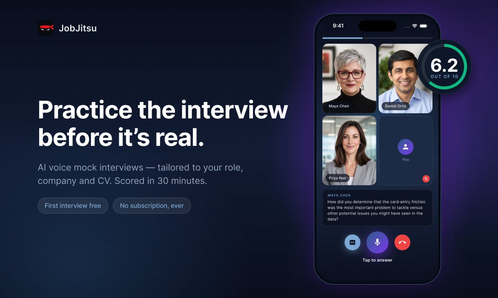
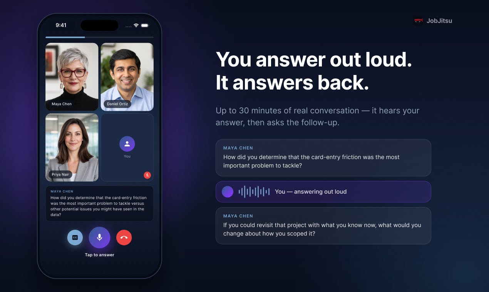
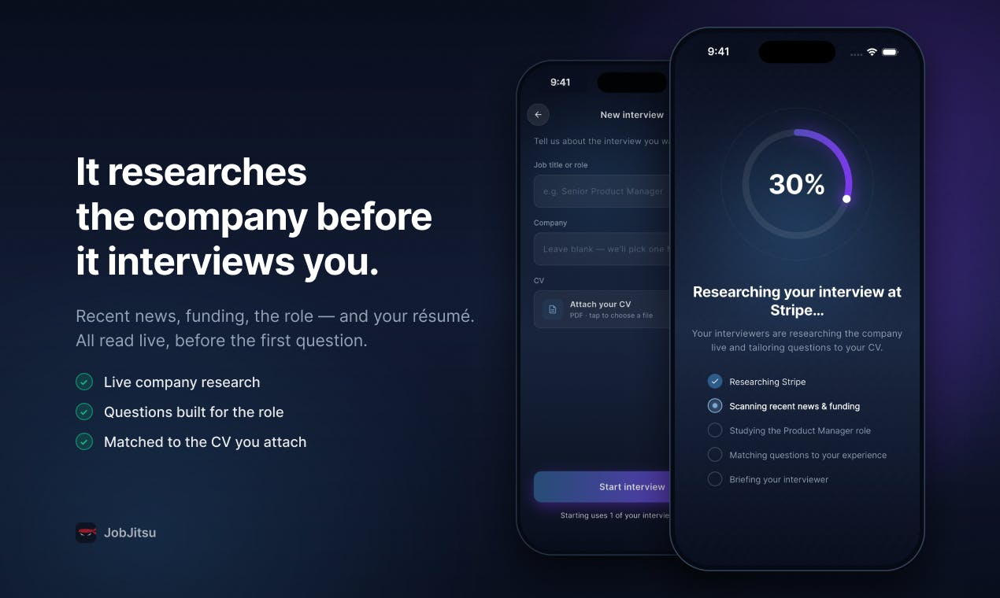

### 🎬 관련 영상
- [🎥 영상 보기](https://ph-files.imgix.net/846a9bab-4a07-4fa6-a296-3914bd5ebabe.jpeg?auto=format)

---

## 26. [Domain Reputation Checker by Truelist](https://www.producthunt.com/products/truelist-2)
**Votes**: 7 | **도입 난이도**: 하 | **신뢰도**: 상
**Tagline**: Is your domain blacklisted? Find out in seconds, free
**서비스 링크**: https://www.producthunt.com/r/KEM5IQ7PDS4FFK

**태그**: DevTool, Email, Security, Marketing, AI Tool

### 📌 이 서비스 한눈에 보기
도메인 블랙리스트 여부와 이메일 보안 설정을 즉시 확인하는 무료 리포트 도구

### 🔑 주요 기능
- 주요 블랙리스트 등록 여부 실시간 확인
- SPF 및 DMARC 설정 상태 점검
- 이메일 인프라 분석 및 개선 가이드 제공

### 🙋 사용자에게 어떤 점이 좋은가
도메인의 신뢰도를 즉시 점검하여 이메일 수신 거부나 스팸 분류 문제를 사전에 방지할 수 있습니다.

### ✅ 지금 바로 써볼 기능
- 도메인 입력 후 블랙리스트 상태 확인
- 이메일 보안 설정(SPF/DMARC) 점검
- 제공되는 레터 등급과 개선 방법 확인

### ⚠️ 사용 전 확인할 점
- 무료 도구이므로 상세 분석에 제한이 있을 수 있음
- 제공되는 해결책이 사용자의 특정 환경에 맞는지 검토 필요

### 🧭 확인이 더 필요한 정보
상세 리포트의 모든 기능이 가입 없이 완전히 제공되는지 확인이 필요합니다.

### 📸 스크린샷 및 갤러리
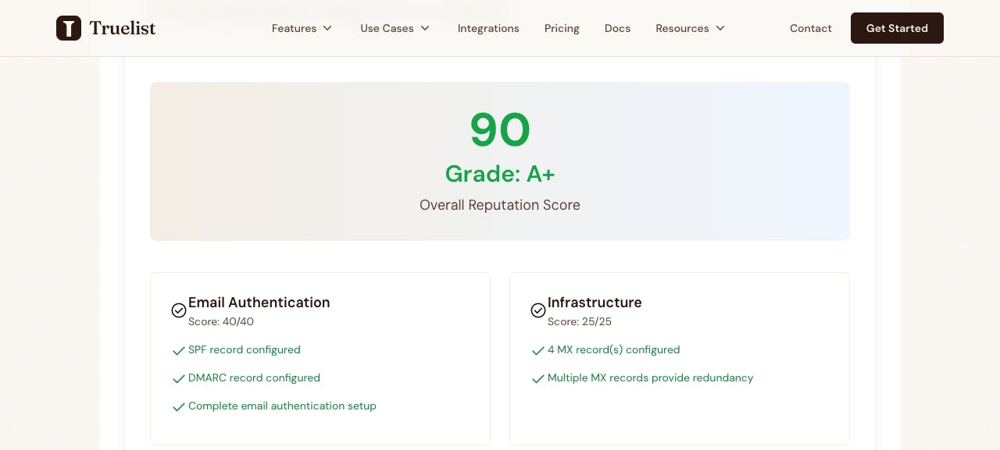
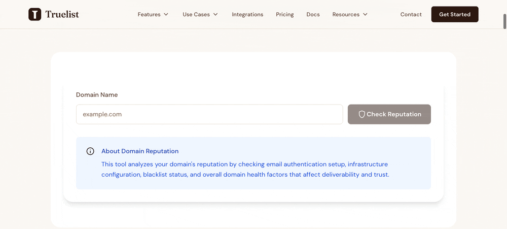
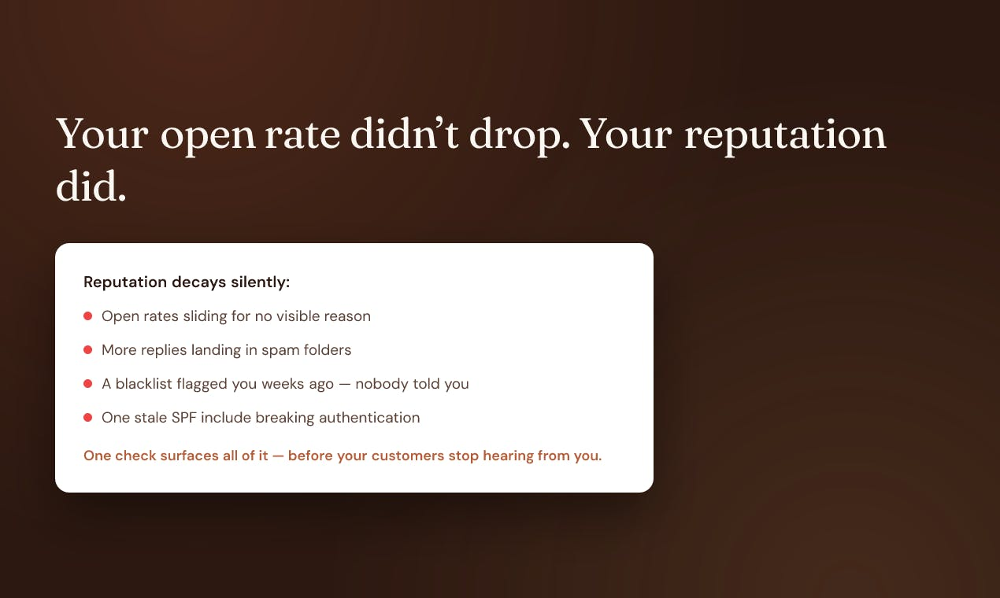

---

## 27. [Findabl](https://www.producthunt.com/products/findabl)
**Votes**: 6 | **도입 난이도**: 하 | **신뢰도**: 상
**Tagline**: Know when AI recommends your brand, using real citation data
**서비스 링크**: https://www.producthunt.com/r/HHLIOY7JHLBN63

**태그**: AI-Marketing, Analytics, Brand-Monitoring, SaaS, AI Tool, Chat, Prompting, DevTool

### 📌 이 서비스 한눈에 보기
AI 모델이 브랜드와 경쟁사를 어떻게 인용하는지 실시간 데이터로 확인하는 분석 도구

### 🔑 주요 기능
- ChatGPT, Gemini, Perplexity, Claude 등 주요 AI 모델에 직접 프롬프트 전송
- AI의 답변, 브랜드 언급, 경쟁사 인용 및 출처 도메인 캡처
- 모델링 점수가 아닌 실제 응답 기반의 직접적이고 감사 가능한 측정 방식

### 🙋 사용자에게 어떤 점이 좋은가
AI 검색 및 추천 시대에 브랜드가 어떻게 노출되는지 실질적인 데이터를 통해 마케팅 전략을 수립할 수 있습니다.

### ✅ 지금 바로 써볼 기능
- launch code 'PRODUCTHUNT'를 사용하여 무료 풀 스캔 실행하기
- 주요 AI 모델별 브랜드 인용 빈도 추이 모니터링하기
- 경쟁사가 어떤 출처를 통해 추천되는지 분석하기

### ⚠️ 사용 전 확인할 점
- 실제 프롬프트 기반이므로 모델 업데이트에 따라 결과가 수시로 변할 수 있음
- 사용 중인 특정 도메인이나 브랜드에 대한 데이터가 충분히 쌓여야 유의미한 분석 가능

### 🧭 확인이 더 필요한 정보
제공되는 무료 스캔의 상세 범위와 데이터 업데이트 주기에 대한 구체적인 정보가 필요합니다.

### 📸 스크린샷 및 갤러리

---

## 28. [Kortyx](https://www.producthunt.com/products/kortyx)
**Votes**: 6 | **도입 난이도**: 하 | **신뢰도**: 상
**Tagline**: Finds tasks to automate and connects every tool to do them
**서비스 링크**: https://www.producthunt.com/r/5NDLGD45POSMEU

**태그**: Automation, Productivity, AI, Workflow, API

### 📌 이 서비스 한눈에 보기
데스크톱 활동을 학습하여 반복 업무를 자동으로 찾아내고 실행하는 AI 자동화 도구

### 🔑 주요 기능
- 사용자의 데스크톱 작업 패턴을 학습하여 반복적인 태스크 식별
- API 및 브라우저를 통해 다양한 툴 간의 워크플로우 자동 연결
- 사용자의 승인 하에 복잡한 연결 과정 없이 자동화 수행

### 🙋 사용자에게 어떤 점이 좋은가
수동으로 반복하던 업무를 AI가 대신 제안하고 실행해주므로, 복잡한 워크플로우 설계에 드는 시간을 획기적으로 줄여줍니다.

### ✅ 지금 바로 써볼 기능
- 데스크톱 설치 후 평소 업무 패턴 학습시키기
- AI가 제안하는 자동화 작업 검토 및 승인하기
- 사용 중인 브라우저 및 앱 도구 연결하기

### ⚠️ 사용 전 확인할 점
- 데스크톱 활동을 모니터링하므로 개인정보 및 보안 정책 확인 필요
- macOS 및 Windows 환경에서만 구동 가능

### 🧭 확인이 더 필요한 정보
데스크톱 활동 데이터가 서버로 전송되는 방식과 보안 수준에 대한 상세 정보 확인이 필요합니다.

### 📸 스크린샷 및 갤러리
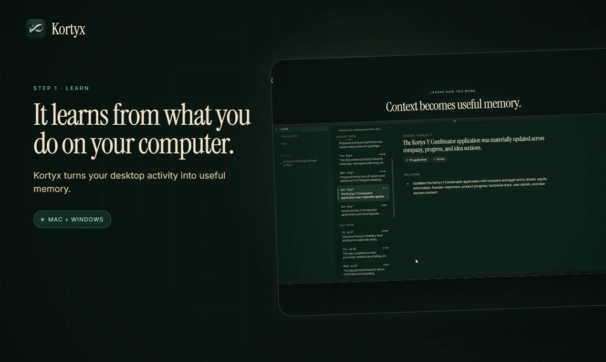
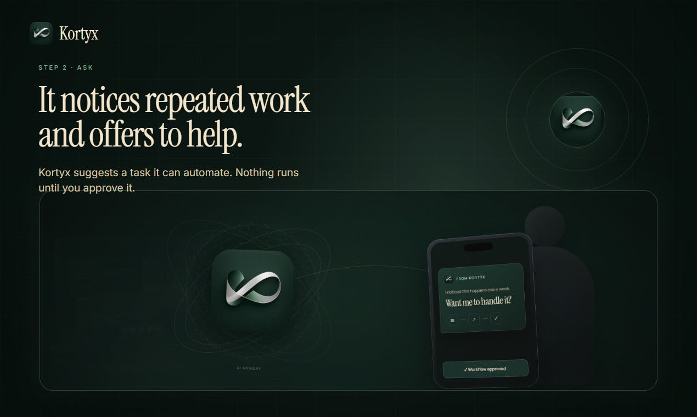
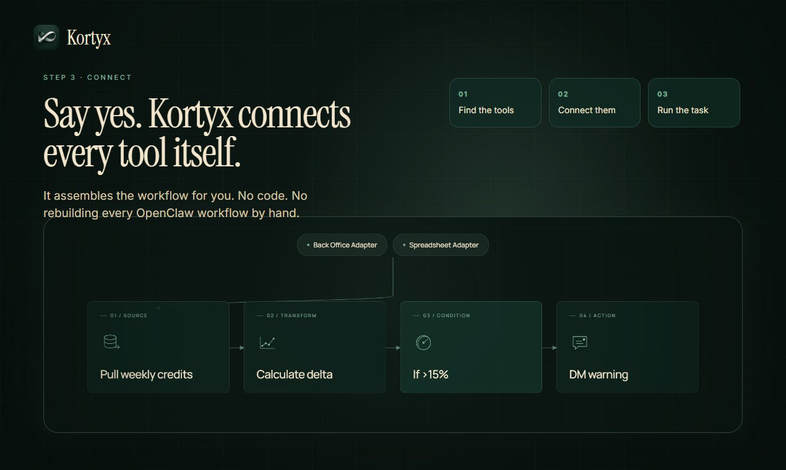

### 🎬 관련 영상
- [🎥 영상 보기](https://ph-files.imgix.net/40d68a6c-1ea8-4a6a-994d-2e04fbfed4d0.jpeg?auto=format)

---

## 29. [Famori](https://www.producthunt.com/products/famori)
**Votes**: 6 | **도입 난이도**: 하 | **신뢰도**: 상
**Tagline**: The AI companion that remembers everything for your family
**서비스 링크**: https://www.producthunt.com/r/52SKW2GYZV5KLB

**태그**: AI Companion, Family Management, Productivity, Personal Assistant, AI Tool

### 📌 이 서비스 한눈에 보기
가족의 모든 일정과 정보를 기억하고 관리해 주는 AI 비서

### 🔑 주요 기능
- 가족 운영에 필요한 정신적 부하(Mental Load) 감소
- 일정, 식단, 건강, 가족 정보를 한곳에서 통합 관리
- 복잡한 기억 대신 자연스러운 질문으로 정보 확인 가능

### 🙋 사용자에게 어떤 점이 좋은가
부모가 일일이 기억해야 했던 가족의 복잡한 스케줄과 정보를 AI가 대신 관리해주어 정신적 피로도를 낮춰줍니다.

### ✅ 지금 바로 써볼 기능
- 가족 구성원의 주요 일정 입력하기
- 식단 및 건강 정보 기록하기
- AI에게 질문하여 필요한 정보 바로 확인하기

### ⚠️ 사용 전 확인할 점
- 가족의 개인정보 및 민감한 데이터가 포함되므로 보안 정책 확인 필요
- AI의 기억 정확도 및 데이터 동기화 방식 확인 필요

### 🧭 확인이 더 필요한 정보
가족 구성원 간의 데이터 공유 범위와 보안 수준에 대한 구체적인 정보가 필요합니다.

### 📸 스크린샷 및 갤러리
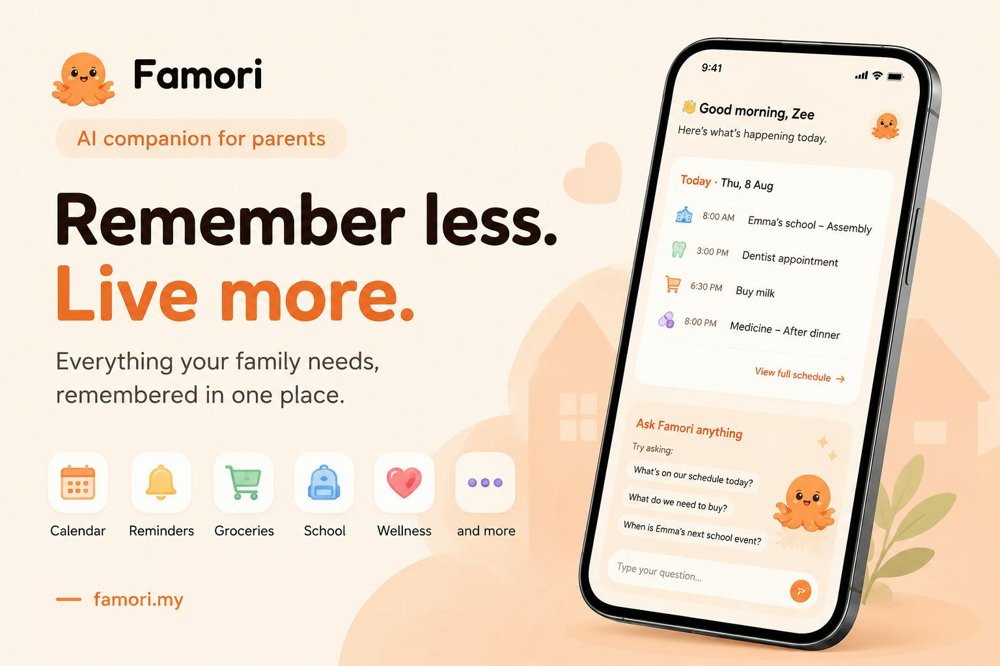
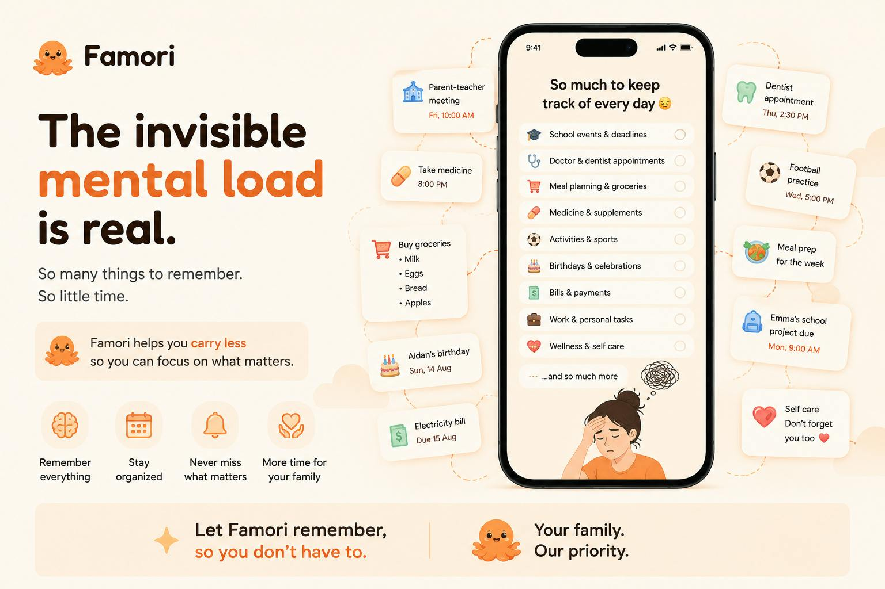
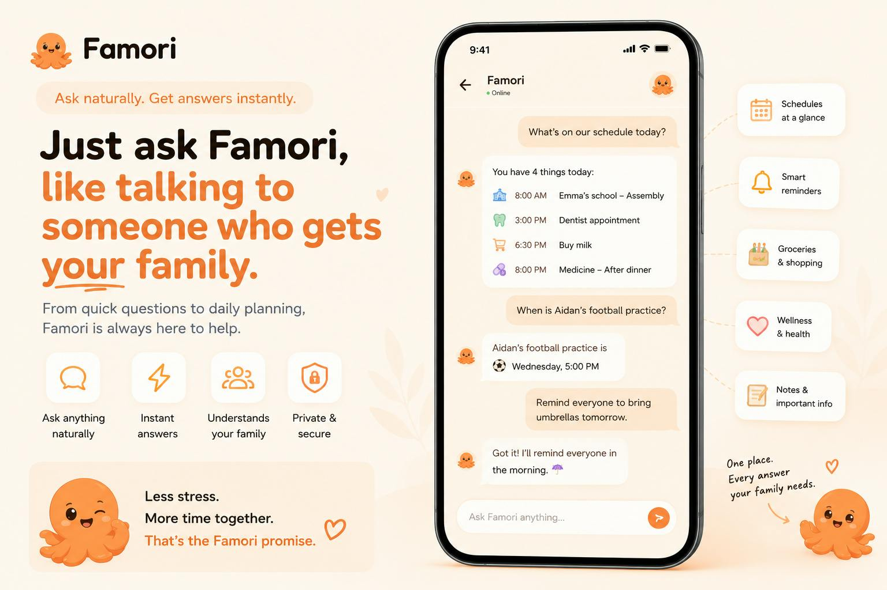

### 🎬 관련 영상
- [🎥 영상 보기](https://ph-files.imgix.net/07f09017-ade7-4913-b448-79835f7e696a.jpeg?auto=format)

---

## 30. [Superrr](https://www.producthunt.com/products/superrr)
**Votes**: 4 | **도입 난이도**: 중 | **신뢰도**: 중
**Tagline**: Superrr is an MCP server that gives taste to your agents
**서비스 링크**: https://www.producthunt.com/r/URG5TA5MNYJZQF

**태그**: AI, Agentic, DevTool, MCP, Agent

### 📌 이 서비스 한눈에 보기
AI 에이전트에게 독창적인 감각과 결과물을 부여하는 MCP 서버

### 🔑 주요 기능
- AI 에이전트와 연결 가능한 MCP 서버 제공
- 에이전트 결과물의 차별화된 품질 구현
- 랜딩 페이지 등 사용자 접점의 결과물 최적화

### 🙋 사용자에게 어떤 점이 좋은가
AI 에이전트가 생성하는 결과물이 천편일률적인 것을 방지하고, 사용자에게 더 매력적이고 독특한 경험을 제공할 수 있습니다.

### ✅ 지금 바로 써볼 기능
- 에이전트 워크플로우에 Superrr 연결하기
- 생성된 결과물의 차별성 테스트하기

### ⚠️ 사용 전 확인할 점
- 에이전트와의 구체적인 연동 방식 확인 필요
- 결과물의 '맛(taste)'이 주관적일 수 있음

### 🧭 확인이 더 필요한 정보
상세한 기술 스택과 에이전트 프레임워크와의 호환성 정보가 부족합니다.

### 📸 스크린샷 및 갤러리
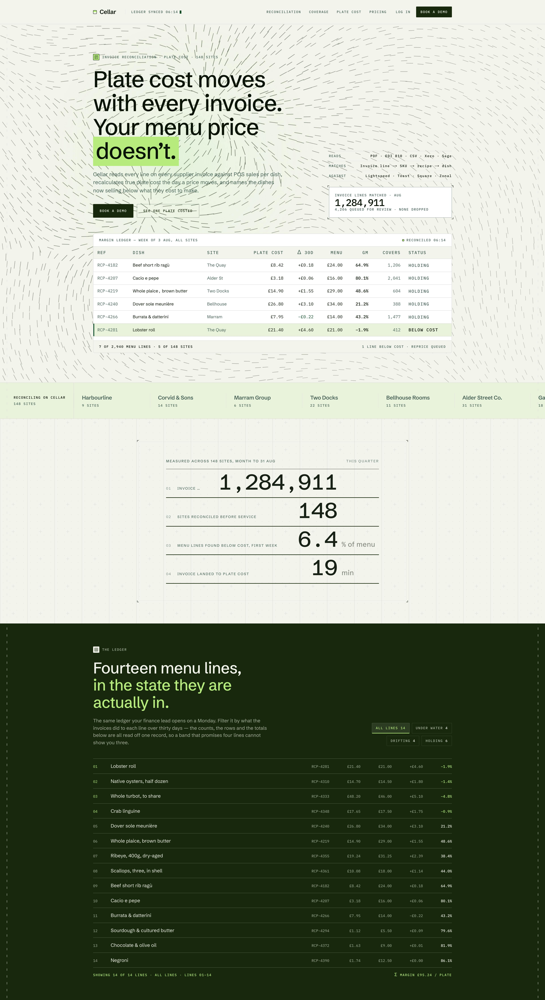
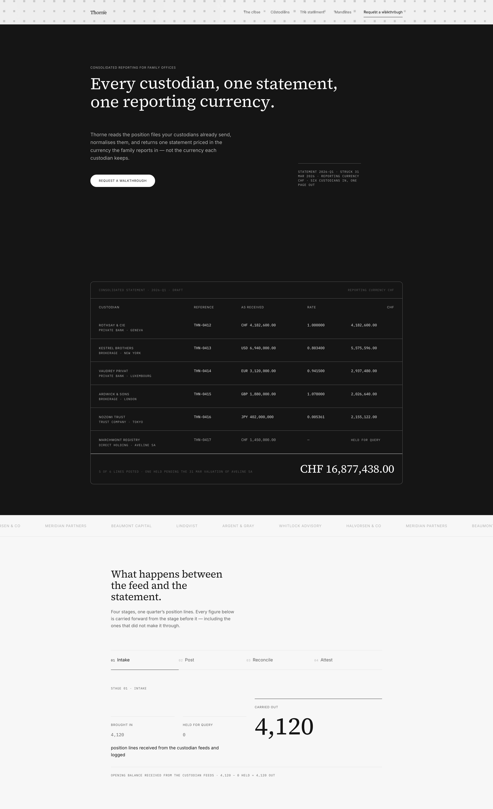
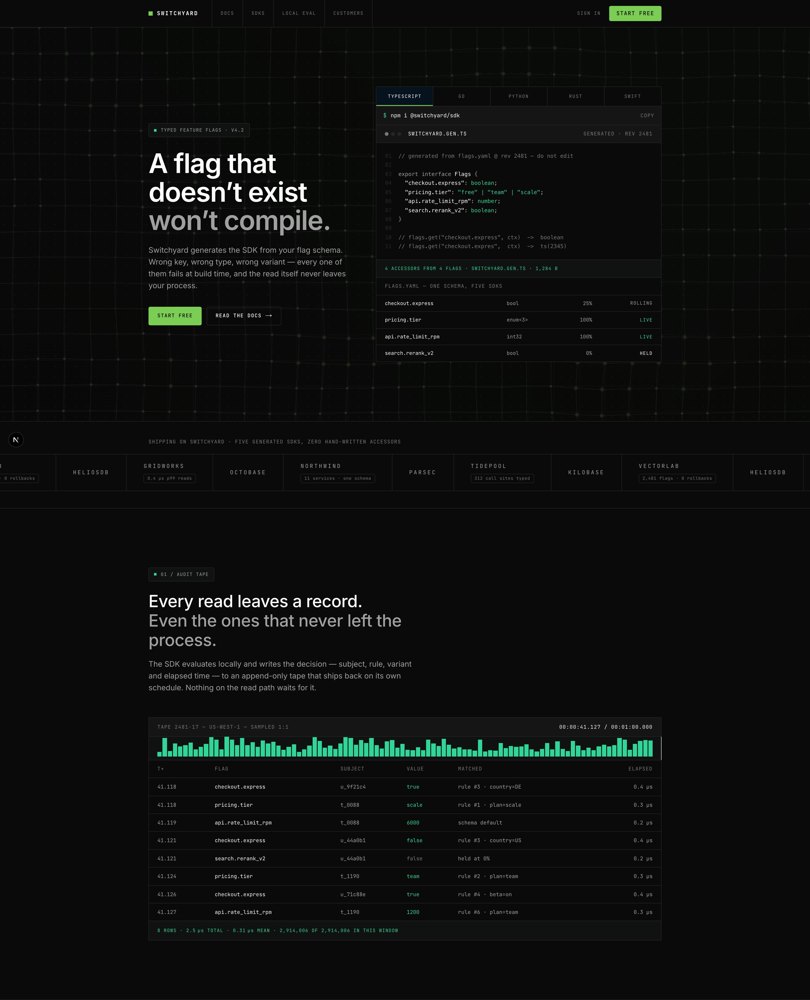

---

