# 🚀 Product Hunt Daily Top 30 (2026-08-16)

## 오늘의 요약
오늘의 제품들은 AI를 기존 작업 내용에 자연스럽게 녹여내어 생산성을 높이거나, 복잡한 정보를 개인화된 방식으로 요약·브리핑하는 데 집중되어 있습니다. 특히 개발자 및 전문가를 위한 코딩 자동화, 비용 최적화, 인지 부하 감소를 목표로 하는 실용적인 도구들이 눈에 띄었습니다.

### 오늘의 핵심 포인트
- AI 에이전트와 자동화 기술을 통해 코딩, 정보 수집, 작업 소식의 단절을 최소화하는 도구들이 주목받았습니다.
- LLM API 비용 관리나 데이터 분석처럼 복잡한 운영 문제를 직관적인 UI로 해결하려는 시도가 나타났습니다.
- 개인화된 정보 요약과 성취감 부여를 통해 사용자의 인지 능력을 확장하고 동기를 부여하는 서비스들이 등장했습니다.

**오늘의 태그**: AI Productivity, Developer Tools, Automation, Personalized Intelligence

## 1. [Inferock Bench](https://www.producthunt.com/products/inferock-bench)
**Votes**: 228 | **도입 난이도**: 중 | **신뢰도**: 상
**Tagline**: An independent receipt for every LLM API call
**서비스 링크**: https://www.producthunt.com/r/GR7NKWTUDANGUS

**태그**: DevTool, LLM, CostOptimization, Analytics, AI Tool, API

### 📌 이 서비스 한눈에 보기
LLM API 호출 비용과 사용량을 투명하게 검증하는 로컬 프록시 도구

### 🔑 주요 기능
- 애플리케이션과 LLM API(OpenAI, Anthropic 등) 사이의 로컬 프록시 역할
- 호출별 토큰 사용량, 실패 및 재시도 내역 실시간 캡처
- 실제 청구 금액과 과잉 지불 비용을 비교하는 독립적 영수증 생성

### 🙋 사용자에게 어떤 점이 좋은가
LLM API 사용 시 발생하는 비용 누수와 불필요한 재시도 비용을 정확히 파악하여 운영 비용을 최적화할 수 있습니다.

### ✅ 지금 바로 써볼 기능
- 로컬 프록시 환경 설정 및 API 엔드포인트 연결
- 실제 호출을 통한 토큰 사용량 및 실패 로그 확인
- 생성된 영수증을 통한 비용 효율성 분석

### ⚠️ 사용 전 확인할 점
- 로컬 프록시를 거치므로 네트워크 지연(Latency)이 발생할 수 있음
- 프록시를 통해 데이터가 전달되므로 보안 및 개인정보 보호 정책 확인 필요

### 🧭 확인이 더 필요한 정보
프록시 방식이 대규모 트래픽 환경에서 성능 저하 없이 안정적으로 작동하는지에 대한 정보가 부족합니다.

### 📸 스크린샷 및 갤러리
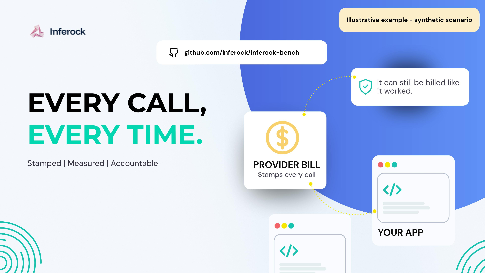
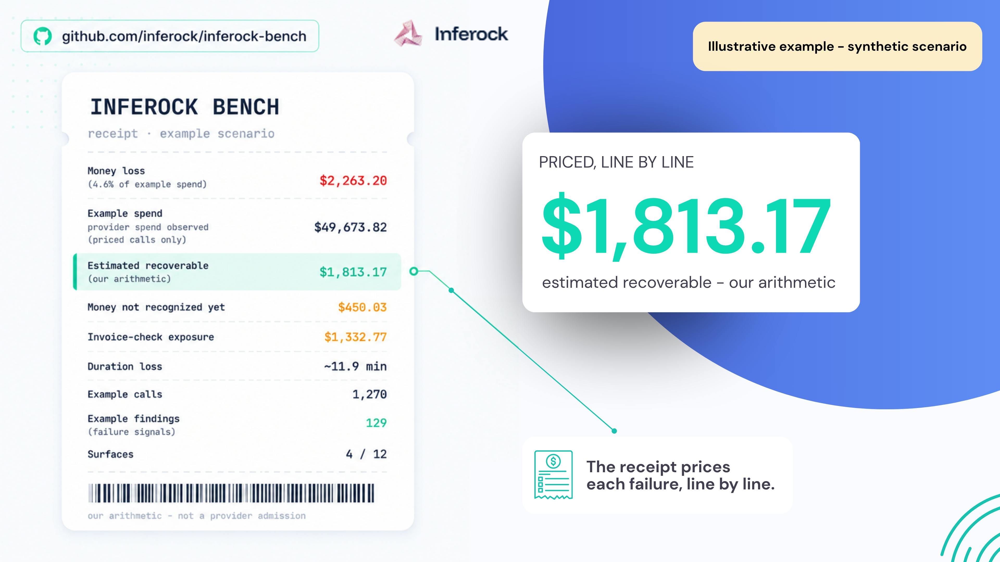
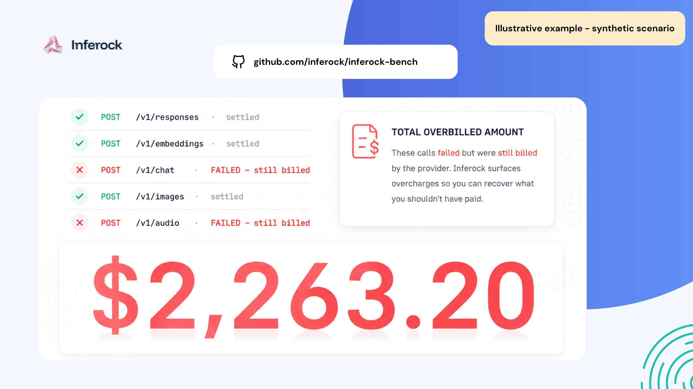

### 🎬 관련 영상
- [🎥 영상 보기](https://ph-files.imgix.net/8a102af0-723b-496d-b426-4879c35a2c5b.jpeg?auto=format)

---

## 2. [Big Mike](https://www.producthunt.com/products/big-mike)
**Votes**: 169 | **도입 난이도**: 하 | **신뢰도**: 상
**Tagline**: Your favorite uncle who knows sports & bets, on iMessage
**서비스 링크**: https://www.producthunt.com/r/2CK4OJBPPEMYKR

**태그**: Sports Betting, iMessage, Personalized Coaching, Social, AI Tool, Chat

### 📌 이 서비스 한눈에 보기
iMessage를 통해 실시간 스포츠 베팅 픽과 라인 변화를 전달하는 개인 맞춤형 스포츠 분석 서비스

### 🔑 주요 기능
- MLB, NFL, NBA 등 주요 리그의 전문적인 베팅 가이드 제공
- iMessage를 통한 직관적인 알림 및 그룹 채팅 공유 기능
- Sleeper/ESPN 리그 연동을 통한 개인 로스터 맞춤형 스타트/벤치 제안

### 🙋 사용자에게 어떤 점이 좋은가
전문적인 스포츠 분석을 마치 친한 삼촌에게 문자를 받는 것처럼 쉽고 재미있게 받아볼 수 있으며, 친구들과 함께 정보를 공유하며 즐길 수 있습니다.

### ✅ 지금 바로 써볼 기능
- iMessage를 통해 실시간 베팅 픽 수신하기
- Sleeper 또는 ESPN 리그 연동하여 로스터 관리하기
- 친구들을 그룹 채팅에 초대하여 함께 정보 공유하기

### ⚠️ 사용 전 확인할 점
- 베팅 결과는 과거 기록(7월 115-68)을 바탕으로 하며 미래 수익을 보장하지 않음
- 스포츠 베팅 특성상 금전적 손실 위험이 존재함

### 🧭 확인이 더 필요한 정보
서비스의 구체적인 구독 비용 및 유료/무료 모델에 대한 정보가 명시되지 않았습니다.

### 📸 스크린샷 및 갤러리

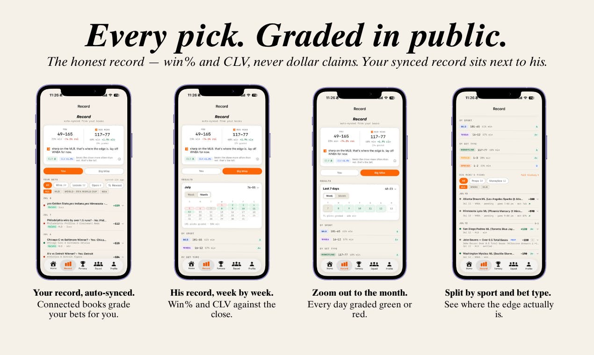

---

## 3. [GLM-5.3](https://www.producthunt.com/products/z-ai)
**Votes**: 158 | **도입 난이도**: 중 | **신뢰도**: 상
**Tagline**: Coding leap from scaled post-training on the same base
**서비스 링크**: https://www.producthunt.com/r/334UKTYFNLBOCG

**태그**: DevTool, AI, Cybersecurity, Coding, Agent, AI Tool

### 📌 이 서비스 한눈에 보기
복잡한 코딩 작업과 보안 취약점 탐지에 특화된 차세대 AI 코딩 모델

### 🔑 주요 기능
- 대규모 사후 학습(Post-training)을 통한 코딩 능력 극대화
- 에이전트 기반 코딩 작업 및 장기적 과제 수행 능력 최적화
- 보안 취약점 발견 및 사이버 방어 분야의 창발적 능력 보유

### 🙋 사용자에게 어떤 점이 좋은가
복잡한 프로그래밍 과제를 자동화하고, 코드의 보안 취약점을 식별하는 데 강력한 도움을 줍니다.

### ✅ 지금 바로 써볼 기능
- 복잡한 코딩 과제 수행 테스트
- 코드 보안 취약점 점검
- 에이전트 기반 코딩 워크플로우 적용

### ⚠️ 사용 전 확인할 점
- 모델의 구체적인 API 제공 방식 및 사용 비용 미확인
- 사후 학습 결과에 따른 특정 도메인 편향 가능성

### 🧭 확인이 더 필요한 정보
상세한 벤치마크 수치와 실제 API 사용 환경에 대한 정보가 추가로 필요합니다.

### 📸 스크린샷 및 갤러리
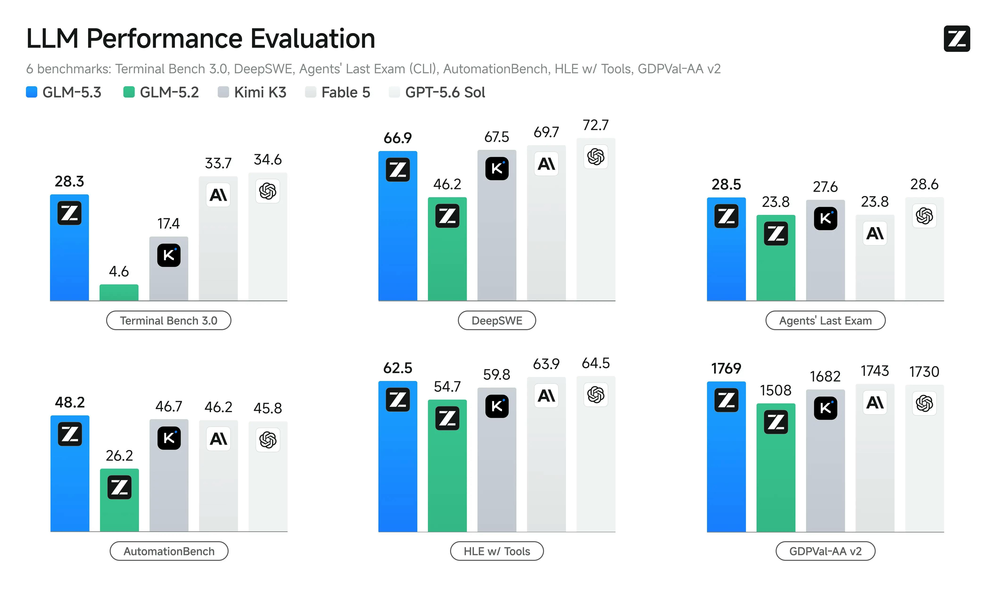
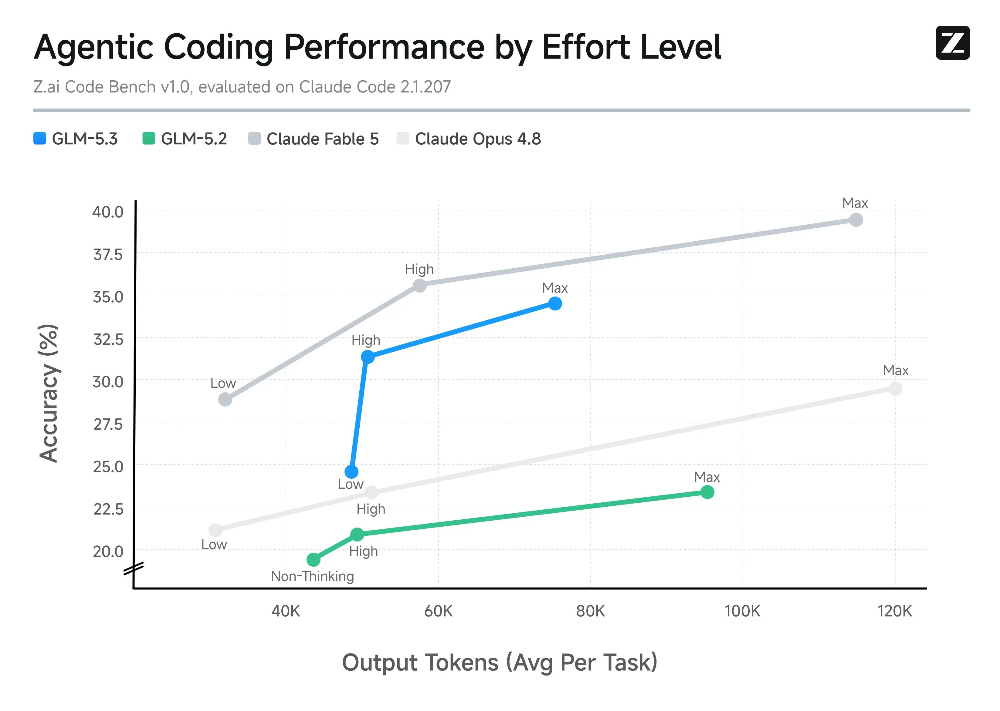
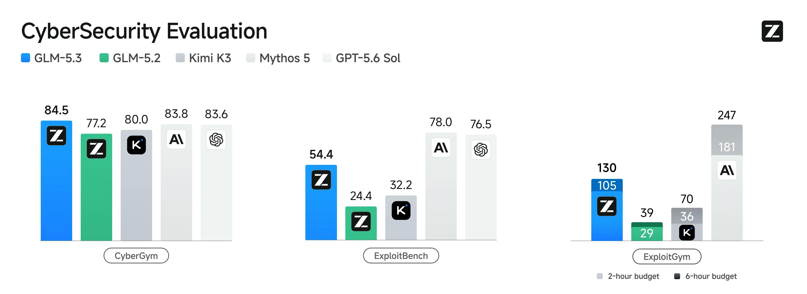

---

## 4. [Zetik](https://www.producthunt.com/products/zetik)
**Votes**: 144 | **도입 난이도**: 하 | **신뢰도**: 상
**Tagline**: A chief of staff in your pocket
**서비스 링크**: https://www.producthunt.com/r/OWYI7YOIY64MF4

**태그**: AI Agent, Information Management, Productivity, Automation, Agent, AI Tool, DevTool

### 📌 이 서비스 한눈에 보기
개인 맞춤형 AI 전략 팀이 24시간 실시간 정보를 수집하고 분석하여 브리핑해주는 서비스

### 🔑 주요 기능
- 팟캐스트, 논문, 코드, 트윗, 뉴스 등 다양한 소스에서 정보 수집
- 수집된 정보를 필터링하고 분석하여 핵심만 요약하는 지능형 사이클
- 사용자가 관심 있는 분야를 실시간에 가깝게 추적 및 브리핑

### 🙋 사용자에게 어떤 점이 좋은가
정보 과잉 시대에 불필요한 탐색 시간을 줄이고, 개인화된 핵심 인사이트만 빠르게 습득할 수 있습니다.

### ✅ 지금 바로 써볼 기능
- 관심 키워드 및 소스 설정하기
- AI가 생성한 데일리 브리핑 확인하기
- 필터링된 핵심 정보 검토하기

### ⚠️ 사용 전 확인할 점
- AI의 분석 결과이므로 원문 소스의 맥락과 다를 수 있음
- 정보 소스에 따라 실시간성 및 정확도 차이가 발생할 수 있음

### 🧭 확인이 더 필요한 정보
구체적인 정보 소스(특정 플랫폼 등)의 지원 범위와 데이터 보안 정책에 대한 확인이 필요합니다.

### 📸 스크린샷 및 갤러리
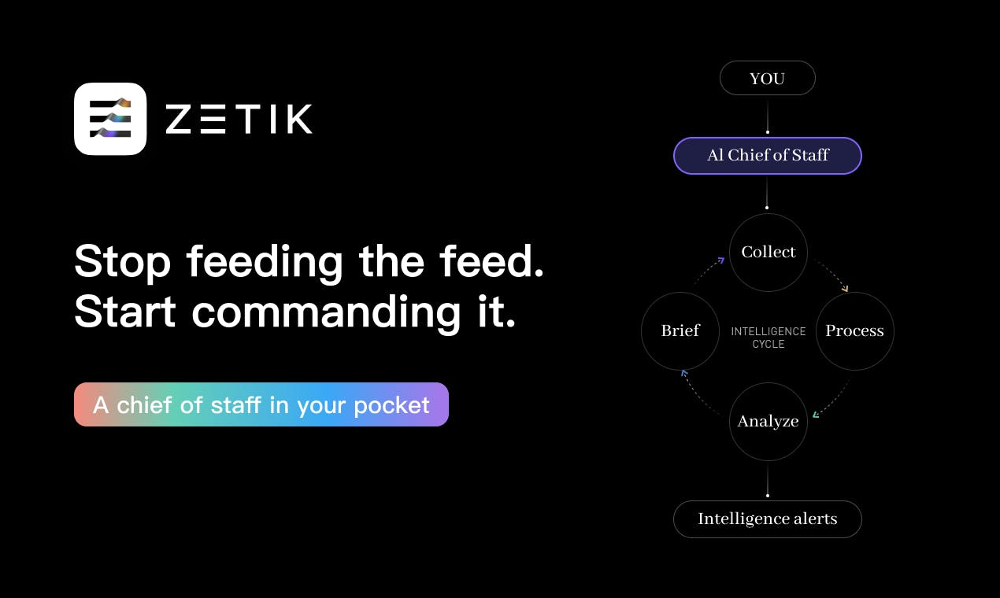
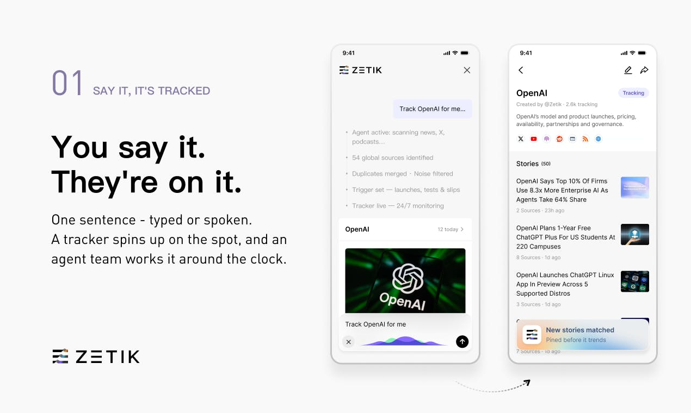
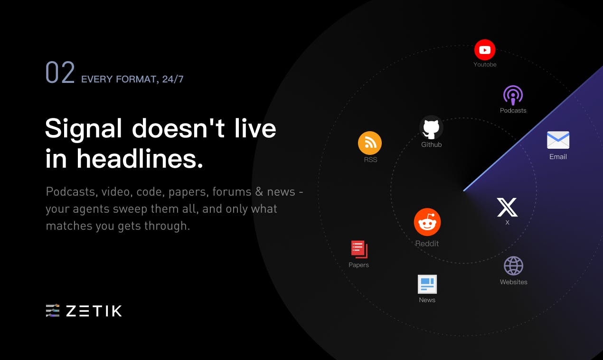

---

## 5. [Attyn](https://www.producthunt.com/products/attyn)
**Votes**: 122 | **도입 난이도**: 하 | **신뢰도**: 상
**Tagline**: Bringing intelligence to your cursor
**서비스 링크**: https://www.producthunt.com/r/JK4EMFX3J4PIJM

**태그**: Productivity, AI, macOS, Workflow, AI Tool

### 📌 이 서비스 한눈에 보기
기존 앱 작업 흐름을 방해하지 않고 커서 위치에서 즉시 AI 기능을 실행하는 지능형 어시스턴트

### 🔑 주요 기능
- 선택한 텍스트를 즉시 수정하는 Inline Assist
- 실시간 음성 입력을 지원하는 Realtime Dictation
- 화면 내용을 질문하고 시각적 설명을 듣는 Screen Assist 및 Blackboard

### 🙋 사용자에게 어떤 점이 좋은가
별도의 창을 열 필요 없이 사용 중인 앱 내에서 즉각적인 AI 피드백을 받을 수 있어 작업 흐름의 단절을 최소화합니다.

### ✅ 지금 바로 써볼 기능
- Inline Assist로 텍스트 문구 다듬기
- Realtime Dictation으로 빠른 타이핑 대체하기
- Screen Assist로 화면 정보에 대해 질문하기

### ⚠️ 사용 전 확인할 점
- 현재 macOS만 지원하며 Windows 버전은 출시 예정임
- 기본 제공 크레딧 소진 시 추가 비용 또는 모델 설정 필요

### 🧭 확인이 더 필요한 정보
사용자 모델(Local/Provider) 설정에 따른 성능 차이와 크레딧 소진 속도를 확인해야 합니다.

### 📸 스크린샷 및 갤러리
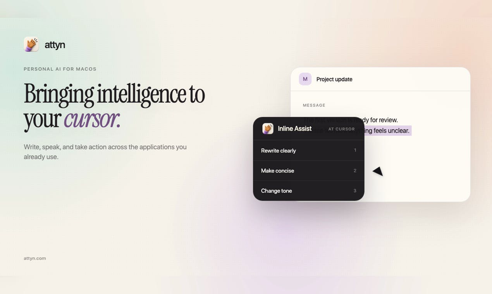
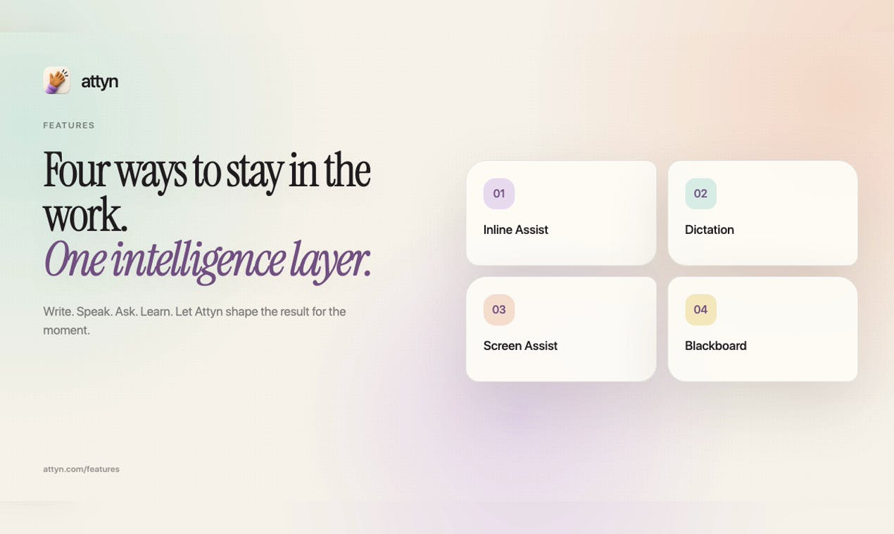
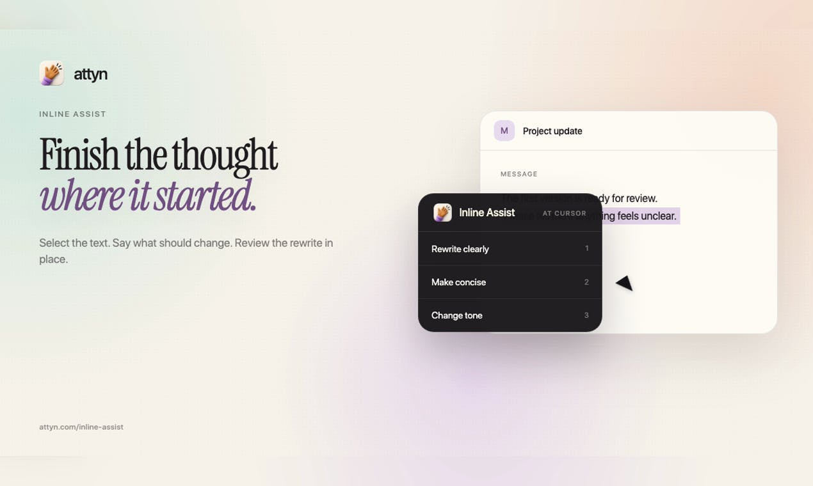

### 🎬 관련 영상
- [🎥 영상 보기](https://ph-files.imgix.net/5645d8d4-373f-4c75-bbaf-4d1868c6b253.jpeg?auto=format)

---

## 6. [nenspace](https://www.producthunt.com/products/nenspace)
**Votes**: 119 | **도입 난이도**: 하 | **신뢰도**: 상
**Tagline**: the lo-fi of LLMs: your mind, made larger
**서비스 링크**: https://www.producthunt.com/r/A3I5QRDNO2ESIA

**태그**: Productivity, AI, Note-taking, Personal Knowledge Management, AI Tool, LLM

### 📌 이 서비스 한눈에 보기
생각의 확장과 기록을 돕는 AI 기반의 개인용 워킹 메모리 공간

### 🔑 주요 기능
- 단순한 메모를 넘어 작업, 습관, 로그를 통합하는 확장된 사고 공간
- AI 기술을 자연스럽게 융합하여 사용자의 인지 부하를 줄임
- 웹과 iOS를 지원하는 멀티 플랫폼 환경

### 🙋 사용자에게 어떤 점이 좋은가
머릿속에 담아두기 힘든 복잡한 생각과 할 일들을 외부 저장소에 안전하게 보관하여 인지 능력을 극대화할 수 있습니다.

### ✅ 지금 바로 써볼 기능
- 아이디어와 메모를 기록하여 외부 기억 장치로 활용하기
- 작업 및 습관 관리 기능을 통해 일상 루틴 구축하기
- 웹과 iOS 앱을 연동하여 모바일 환경에서 생각 기록하기

### ⚠️ 사용 전 확인할 점
- AI 기능이 사용자 경험에 어느 정도 강제로 개입하는지 확인 필요
- 개인적인 생각과 데이터를 다루는 만큼 보안 및 프라이버시 정책 확인 필요

### 🧭 확인이 더 필요한 정보
상세한 AI 기능의 작동 방식과 데이터 보안 정책에 대한 구체적인 정보가 부족합니다.

### 📸 스크린샷 및 갤러리
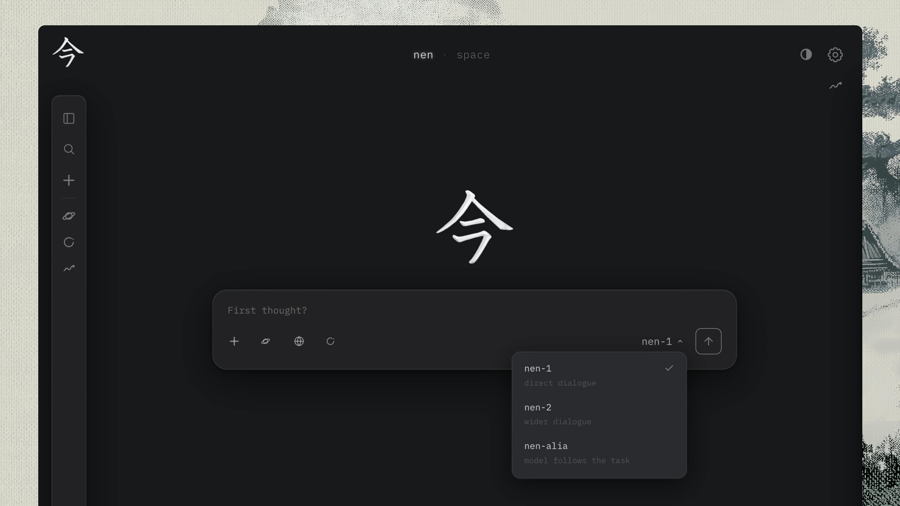
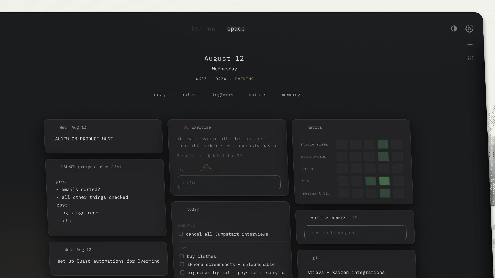
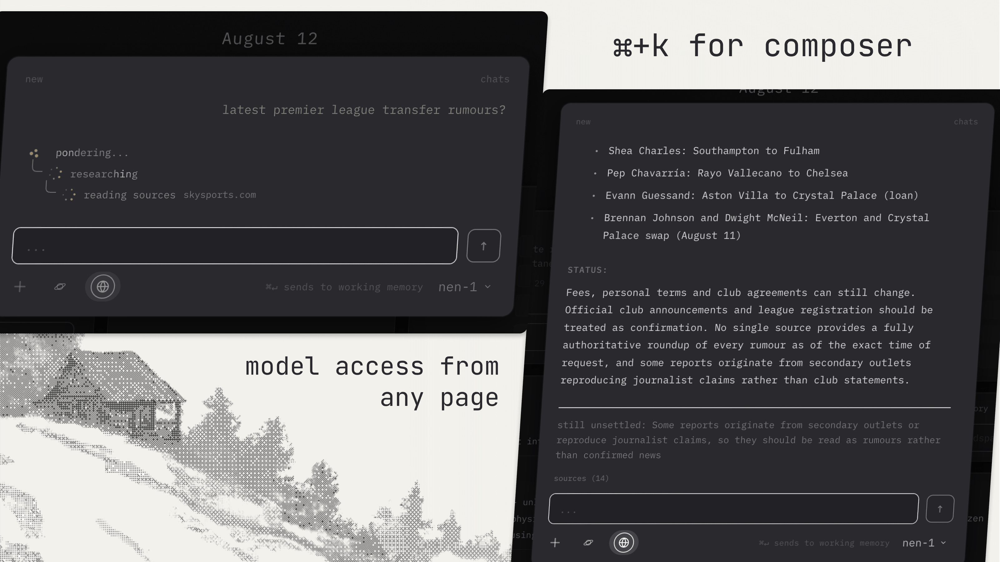

---

## 7. [Joy](https://www.producthunt.com/products/joy-celebrate-your-wins)
**Votes**: 113 | **도입 난이도**: 하 | **신뢰도**: 상
**Tagline**: A Mac menu bar app that throws confetti for your wins
**서비스 링크**: https://www.producthunt.com/r/H344PK7NRKALNU

**태그**: Productivity, DevTool, macOS, Motivation, Sales

### 📌 이 서비스 한눈에 보기
주요 성과 달성 시 맥 메뉴 바에서 축하 꽃가루를 터뜨려주는 자동 보상 앱

### 🔑 주요 기능
- GitHub 스타, Stripe 매출 등 주요 지표 달성 시 자동 알림
- macOS 메뉴 바에서 간편하게 확인 가능한 직관적인 UI
- 성취감을 즉각적으로 전달하여 동기 부여를 돕는 게이미피케이션 요소

### 🙋 사용자에게 어떤 점이 좋은가
업무 중 발생하는 작은 성공들을 시각적으로 축하받음으로써 개발자나 창업가의 성취감을 높이고 작업 동기를 유지할 수 있습니다.

### ✅ 지금 바로 써볼 기능
- 자신의 주요 성과 지표(GitHub, Stripe 등) 연동하기
- 메뉴 바에서 실시간 성과 확인하기

### ⚠️ 사용 전 확인할 점
- 외부 서비스(GitHub, Stripe 등) 계정 연동 권한 필요
- 메뉴 바에 상주하므로 시스템 리소스 점유 여부 확인 필요

### 🧭 확인이 더 필요한 정보
지원하는 외부 서비스의 종류와 구체적인 연동 방식(API 권한 범위 등)에 대한 상세 정보가 필요합니다.

### 📸 스크린샷 및 갤러리
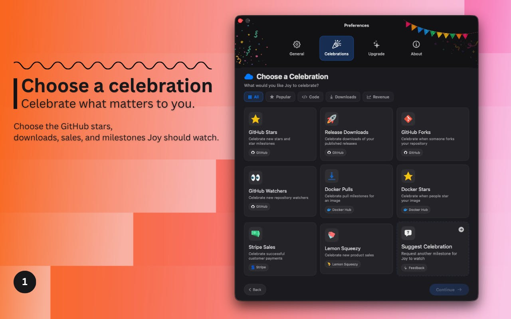
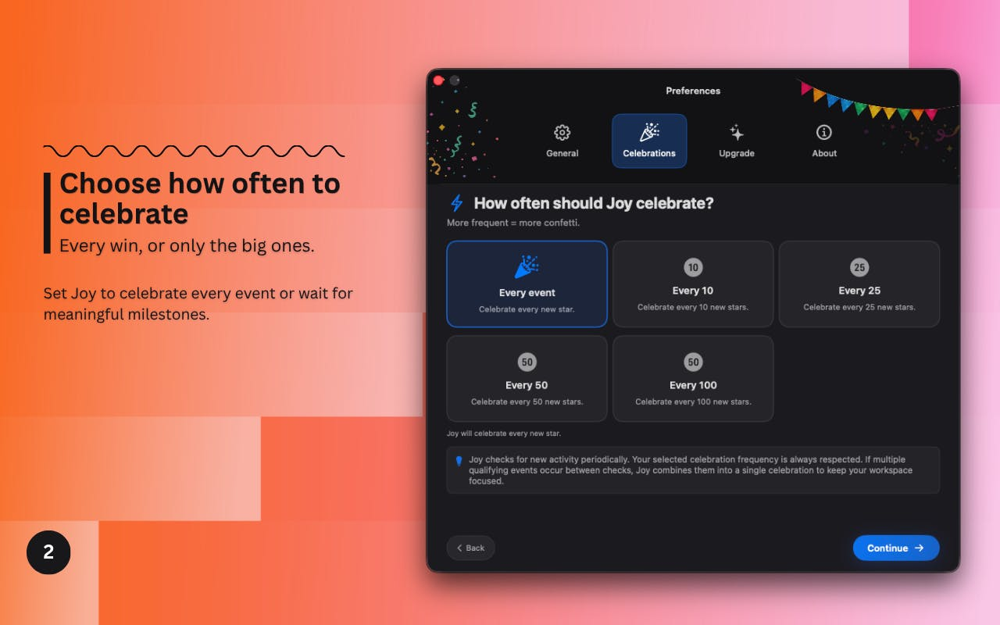
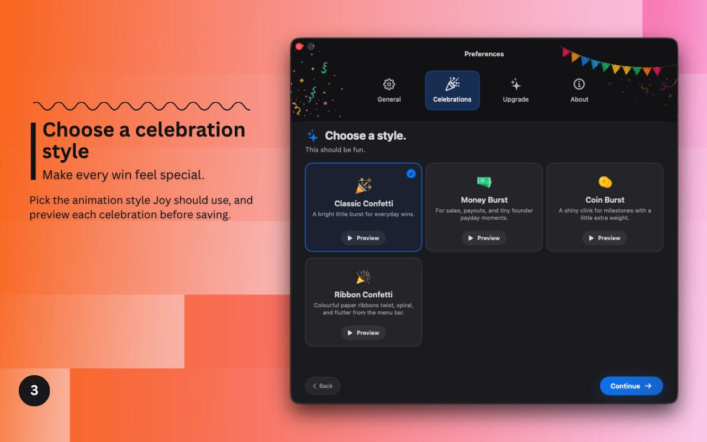

### 🎬 관련 영상
- [🎥 영상 보기](https://ph-files.imgix.net/988939dd-ccf9-4eba-a1c6-a6f6445a3024.jpeg?auto=format)

---

## 8. [FileRouter](https://www.producthunt.com/products/filerouter)
**Votes**: 104 | **도입 난이도**: 하 | **신뢰도**: 상
**Tagline**: Take control of files and editors
**서비스 링크**: https://www.producthunt.com/r/JJB7QS6OHPVJDX

**태그**: Productivity, Workflow, Automation, Utility

### 📌 이 서비스 한눈에 보기
사용자 정의 규칙과 라디얼 피커를 통해 파일별 최적의 에디터를 연결하는 파일 핸들러 도구

### 🔑 주요 기능
- 다양한 파일 형식에 대한 맞춤형 기본 핸들러 설정
- 사용자 정의 규칙을 통한 자동화된 에디터 실행
- 빠른 선택을 지원하는 라디얼 피커 인터페이스

### 🙋 사용자에게 어떤 점이 좋은가
파일을 열 때마다 매번 다른 에디터를 선택해야 하는 번거로움을 줄이고, 파일 형식에 맞는 최적의 작업 환경을 즉시 구축할 수 있습니다.

### ✅ 지금 바로 써볼 기능
- 자주 사용하는 파일 확장자와 에디터 규칙 설정하기
- 라디얼 피커를 활용한 빠른 파일 열기 테스트하기
- 기존 Velja/Choosy와 비교하여 워크플로우 최적화하기

### ⚠️ 사용 전 확인할 점
- 사용자의 운영체제(OS) 지원 여부 확인 필요
- 복잡한 규칙 설정 시 의도치 않은 에디터 실행 가능성

### 🧭 확인이 더 필요한 정보
지원하는 운영체제와 구체적인 UI 인터페이스의 호환성을 확인해야 합니다.

### 📸 스크린샷 및 갤러리
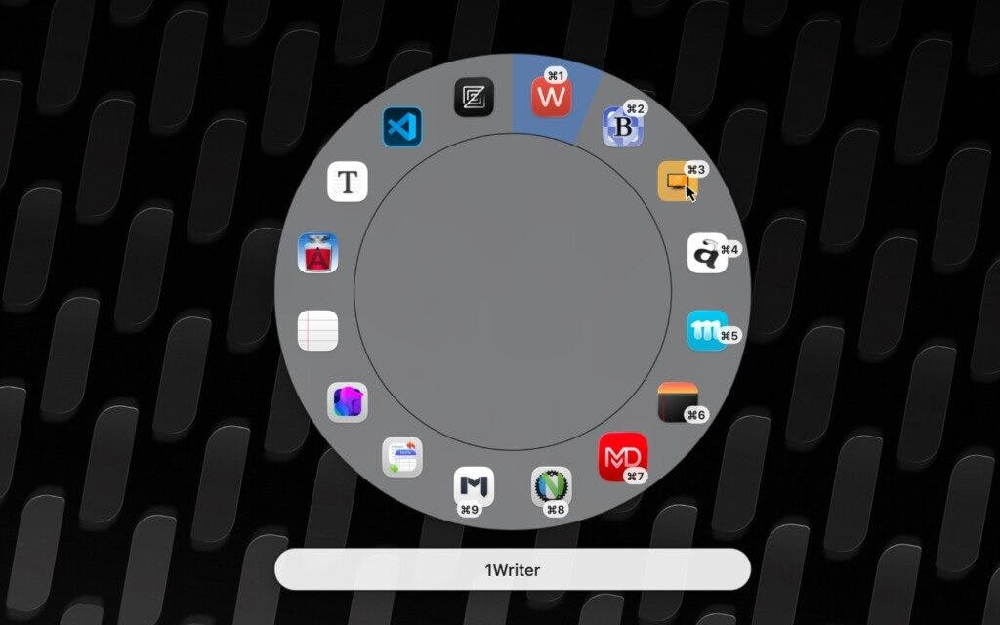
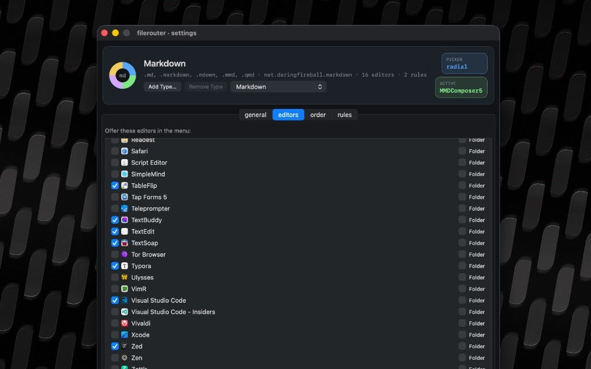
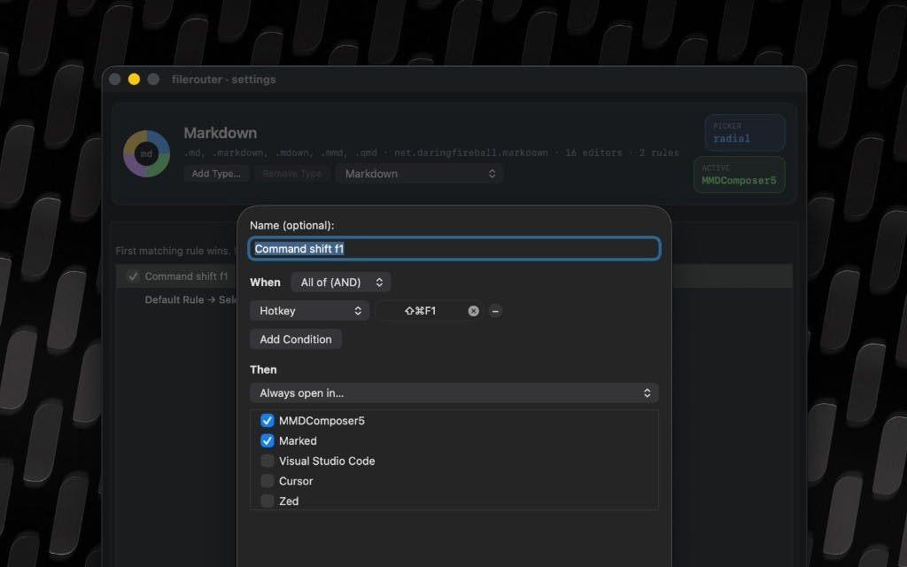

### 🎬 관련 영상
- [🎥 영상 보기](https://ph-files.imgix.net/e8acd161-53f9-4c9b-a3c9-f5e69f438cdb.jpeg?auto=format)

---

## 9. [Chronock](https://www.producthunt.com/products/chronock)
**Votes**: 95 | **도입 난이도**: 하 | **신뢰도**: 상
**Tagline**: Scheduling and calendar sync, all in one
**서비스 링크**: https://www.producthunt.com/r/APHZ3DPPTXALTZ

**태그**: Productivity, Scheduling, Automation, Calendar, AI Tool

### 📌 이 서비스 한눈에 보기
여러 개의 구글 및 아웃룩 캘린더를 하나로 통합하여 일정 충돌을 방지하는 스마트 스케줄링 도구

### 🔑 주요 기능
- 구글 및 아웃룩 캘린더 간 실시간 양방향 동기화
- 개인, 업무, 프로젝트 일정 통합 관리로 중복 예약 방지
- 사용 가능한 시간만 노출하는 간편한 예약 페이지 제공

### 🙋 사용자에게 어떤 점이 좋은가
여러 계정의 일정을 일일이 확인하지 않아도 하나의 워크스페이스에서 통합 관리할 수 있어 일정 관리의 번거로움을 획기적으로 줄여줍니다.

### ✅ 지금 바로 써볼 기능
- 기존 구글/아웃룩 계정 연결하기
- 통합 캘린더에서 일정 동기화 상태 확인하기
- 외부 공유용 예약 페이지 생성하기

### ⚠️ 사용 전 확인할 점
- 개인 정보 및 일정 데이터가 여러 플랫폼에 걸쳐 동기화되므로 보안 정책 확인 필요
- 연결된 모든 캘린더의 데이터가 통합되므로 개인 일정 노출 범위 설정 주의

### 🧭 확인이 더 필요한 정보
무료 플랜의 상세 기능 제한 및 유료 플랜의 가격 정책에 대한 정보가 명시되지 않았습니다.

### 📸 스크린샷 및 갤러리
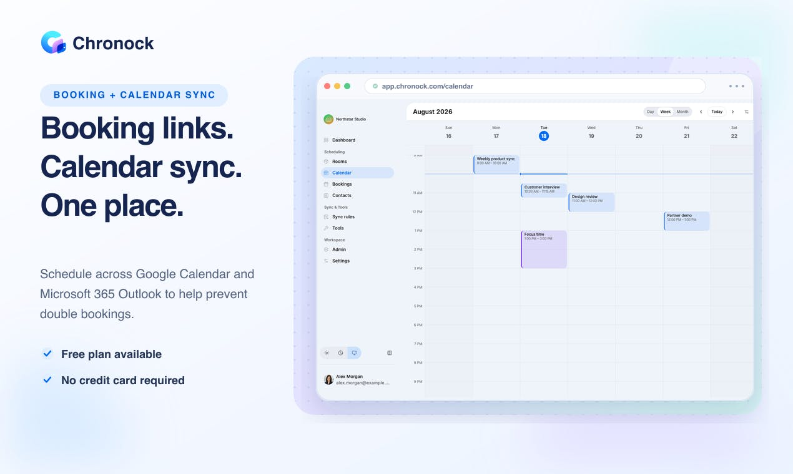
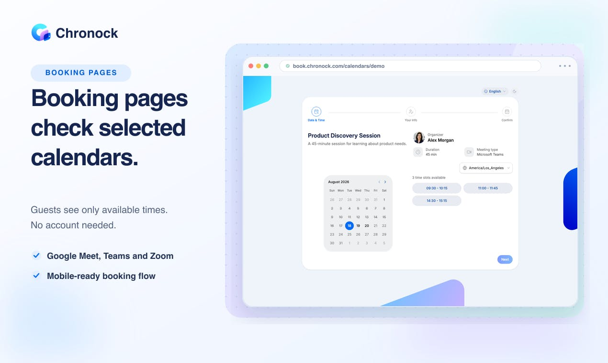
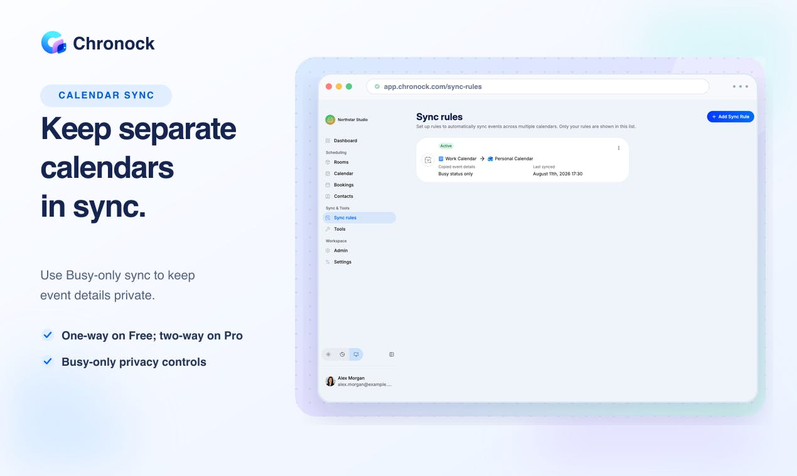

---

## 10. [Talvo](https://www.producthunt.com/products/talvo-2)
**Votes**: 85 | **도입 난이도**: 하 | **신뢰도**: 상
**Tagline**: Connect 2,500+ European banks to track your spending
**서비스 링크**: https://www.producthunt.com/r/EUUETRPPQUTW43

**태그**: FinTech, Budgeting, PersonalFinance, Automation

### 📌 이 서비스 한눈에 보기
유럽 내 2,500개 이상의 은행을 연결하여 지출과 자산을 관리하는 자동 가계부 서비스

### 🔑 주요 기능
- PSD2를 통한 2,500개 이상의 유럽 은행 계좌 연동
- 모든 거래 내역의 자동 카테고리 분류 기능
- 예산 관리 및 순자산(Net Worth) 추적 기능

### 🙋 사용자에게 어떤 점이 좋은가
유럽 거주자라면 여러 은행에 흩어진 금융 데이터를 한곳에 모아 자동으로 지출을 분류하고 자산 흐름을 한눈에 파악할 수 있습니다.

### ✅ 지금 바로 써볼 기능
- 은행 계좌 연동 및 데이터 동기화
- 자동 분류된 지출 내역 확인
- 개인별 예산 설정 및 순자산 대시보드 확인

### ⚠️ 사용 전 확인할 점
- 유럽(EU) 지역 은행 중심 서비스로 타 지역 사용자 사용 제한 가능성
- 금융 데이터 연동에 따른 보안 정책 숙지 필요

### 🧭 확인이 더 필요한 정보
유럽 외 지역에서의 서비스 지원 여부와 구체적인 보안 프로토콜에 대한 추가 확인이 필요합니다.

### 📸 스크린샷 및 갤러리
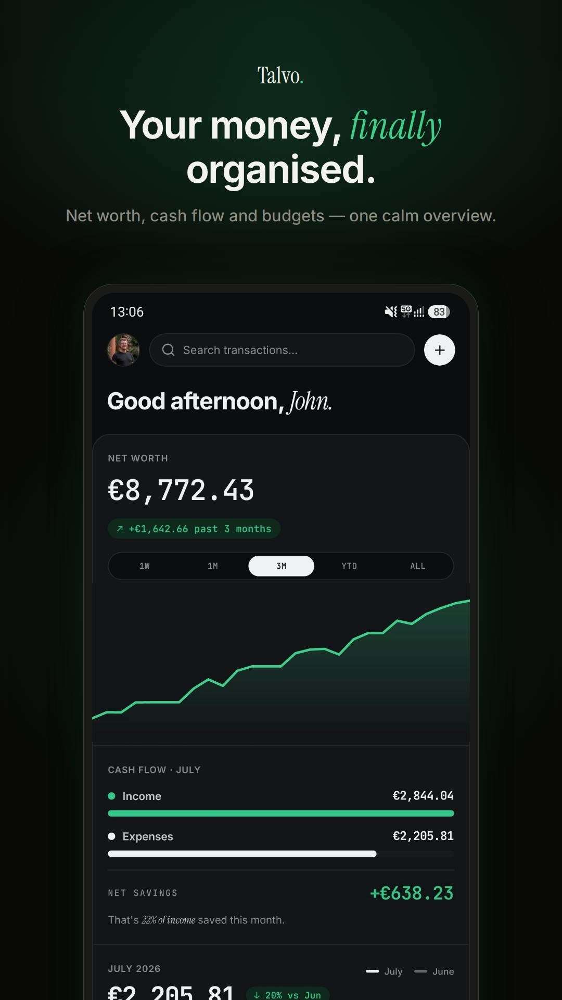

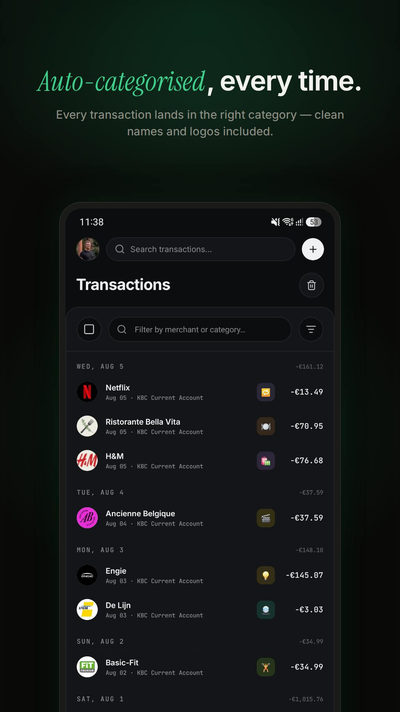

---

## 11. [Clamshell](https://www.producthunt.com/products/clamshell)
**Votes**: 82 | **도입 난이도**: 하 | **신뢰도**: 상
**Tagline**: Close your MacBook. Keep the work running.
**서비스 링크**: https://www.producthunt.com/r/SYFBWI55O2A25V

**태그**: MacBook, Productivity, Automation, DevTool, Agent

### 📌 이 서비스 한눈에 보기
맥북 덮개를 닫아도 백그라운드 작업이 중단되지 않게 해주는 도구

### 🔑 주요 기능
- 맥북 클램쉘 모드 시 작업 중단 방지
- 별도의 모니터 연결 없이도 백그라운드 프로세스 유지
- 복잡한 sudo 권한이나 관리자 설정 불필요

### 🙋 사용자에게 어떤 점이 좋은가
빌드, 다운로드, 에이전트 작업 중 맥북을 닫아야 할 때 작업이 끊기는 불편함을 즉시 해결해 줍니다.

### ✅ 지금 바로 써볼 기능
- 맥북 덮개 닫기
- 백그라운드 작업(빌드/다운로드) 실행하기

### ⚠️ 사용 전 확인할 점
- 덮개를 닫았을 때의 발열 관리 상태 확인 필요
- 배터리 소모량 변화 확인 필요

### 🧭 확인이 더 필요한 정보
맥북의 하드웨어적 절전 모드(Sleep)를 어떻게 우회하는지에 대한 기술적 상세 정보가 필요합니다.

### 📸 스크린샷 및 갤러리
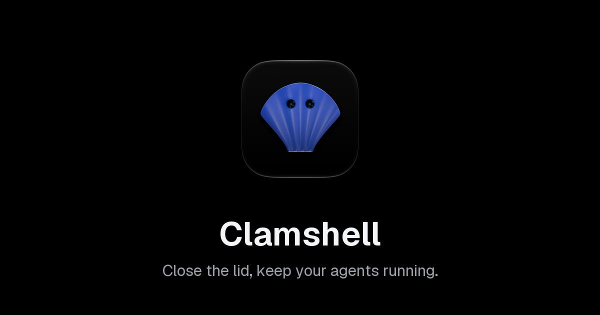

### 🎬 관련 영상
- [🎥 영상 보기](https://ph-files.imgix.net/33723612-f758-4235-9839-75ed24b6b10f.jpeg?auto=format)

---

## 12. [Agent Orchestrator](https://www.producthunt.com/products/agent-orchestrator)
**Votes**: 47 | **도입 난이도**: 중 | **신뢰도**: 상
**Tagline**: Your coding agent fleet manager
**서비스 링크**: https://www.producthunt.com/r/JWDLUETPT45KMK

**태그**: DevTool, Automation, AI-Agent, OpenSource, Agent

### 📌 이 서비스 한눈에 보기
여러 코딩 에이전트의 작업 과정을 한눈에 관리하고 자동화하는 통합 오케스트레이터

### 🔑 주요 기능
- 칸반 보드 기반의 에이전트 작업 상태 모니터링
- 태스크 분해, 에이전트 위임 및 플릿(Fleet) 관리 자동화
- 터미널 전환 없이 한 곳에서 관리하는 중앙 집중식 워크플로우

### 🙋 사용자에게 어떤 점이 좋은가
여러 코딩 에이전트를 사용할 때 발생하는 번거로운 탭 전환과 작업 추적 문제를 해결하여 개발 생산성을 높여줍니다.

### ✅ 지금 바로 써볼 기능
- 칸반 뷰를 통한 에이전트 작업 흐름 시각화
- 프로젝트별 오케스트레이터를 통한 태스크 분해 기능 테스트
- 에이전트 간 작업 위임 및 관리 프로세스 확인

### ⚠️ 사용 전 확인할 점
- 에이전트 실행 환경(Isolated agents)의 리소스 소모량 확인 필요
- 기존 개발 워크플로우와의 통합 방식 검토 필요

### 🧭 확인이 더 필요한 정보
에이전트 간의 충돌 방지 및 작업 완료 후 코드 병합(PR) 자동화의 완성도를 확인해야 합니다.

### 📸 스크린샷 및 갤러리
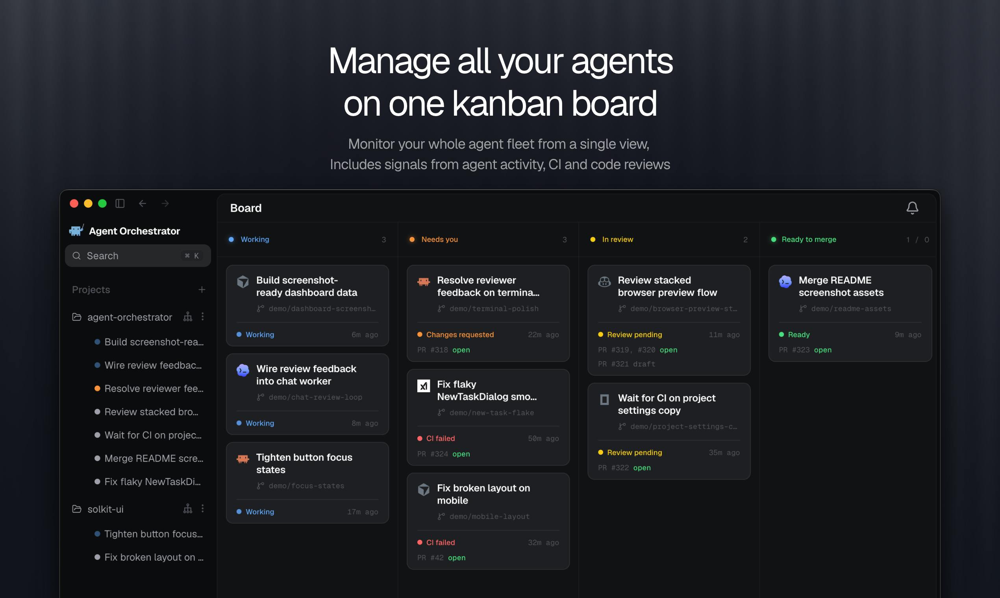
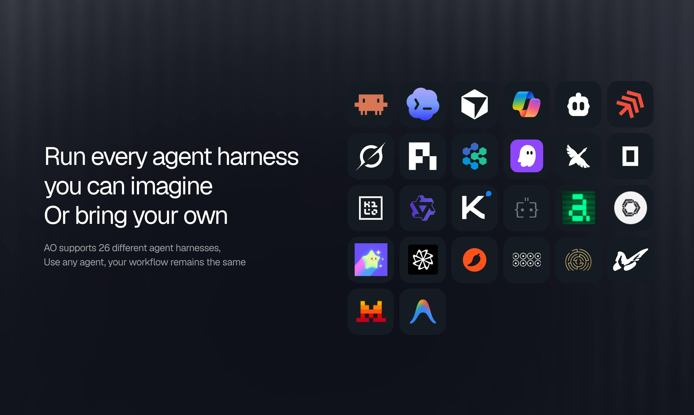
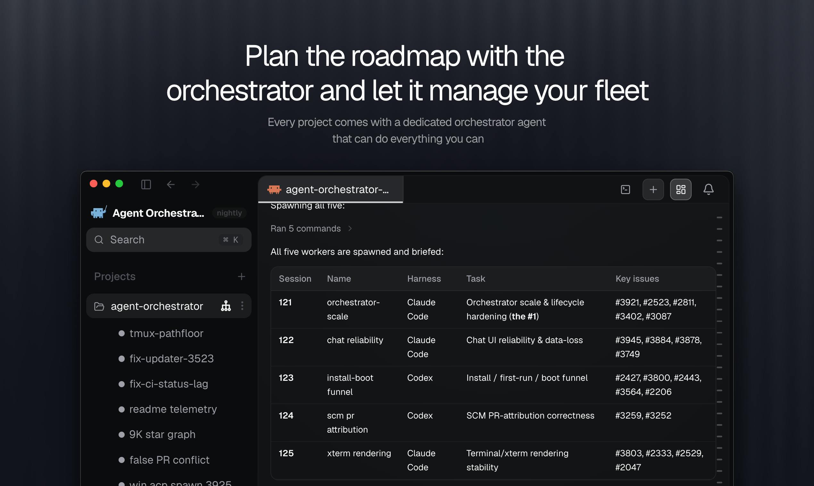

### 🎬 관련 영상
- [🎥 영상 보기](https://ph-files.imgix.net/b3c3d1a7-33c4-4b84-a455-2b32af8c0c79.jpeg?auto=format)

---

## 13. [Nick Launches](https://www.producthunt.com/products/nick-launches-2)
**Votes**: 28 | **도입 난이도**: 하 | **신뢰도**: 상
**Tagline**: Launch your product to thousands of builders.
**서비스 링크**: https://www.producthunt.com/r/3ALX2O3KSOJJDM

**태그**: AI, DevTools, ProductLaunch, Tutorials, AI Tool, DevTool

### 📌 이 서비스 한눈에 보기
AI 제품 개발부터 출시까지의 과정을 가속화하는 빌더 전용 런칭 가이드

### 🔑 주요 기능
- 실용적인 AI 제품 개발 튜토리얼 제공
- 효율적인 출시를 위한 전용 런칭 툴킷 활용
- 최신 AI 도구 리뷰 및 전략적 출시 전략 공유

### 🙋 사용자에게 어떤 점이 좋은가
AI 제품을 개발하는 개발자가 아이디어 구상부터 실제 시장 출시까지의 시행착오를 줄이고 빠르게 실행할 수 있도록 돕습니다.

### ✅ 지금 바로 써볼 기능
- 제공되는 런칭 툴킷 살펴보기
- 실용적인 AI 개발 튜토리얼 학습하기
- 최신 AI 도구 리뷰를 통한 스택 구성하기

### ⚠️ 사용 전 확인할 점
- 제공되는 전략이 특정 시장 상황에 따라 다르게 작용할 수 있음
- 툴킷의 구체적인 기능과 자동화 수준은 명시되지 않음

### 🧭 확인이 더 필요한 정보
제공되는 런칭 툴킷의 구체적인 기능과 소프트웨어 형태(SaaS, 가이드북 등)를 확인할 필요가 있습니다.

### 📸 스크린샷 및 갤러리
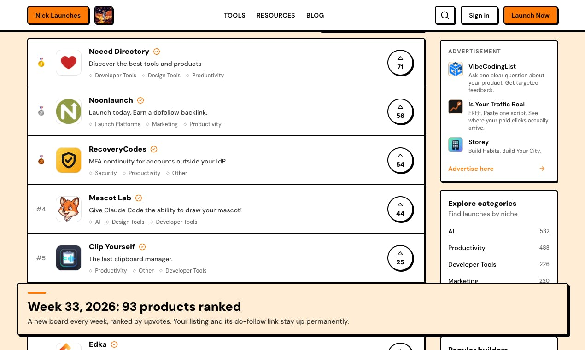
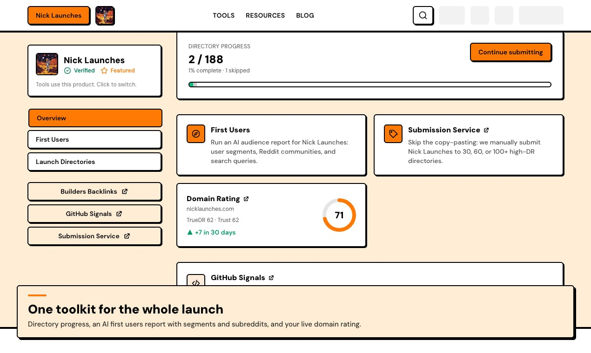
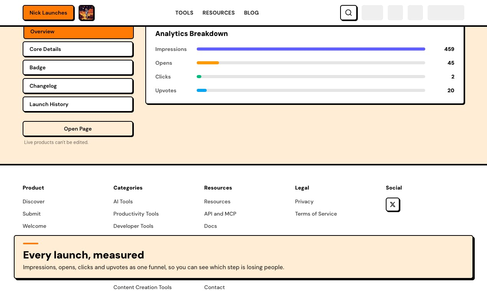

---

## 14. [Mermail](https://www.producthunt.com/products/mermail)
**Votes**: 25 | **도입 난이도**: 중 | **신뢰도**: 상
**Tagline**: Your AI can now sign up and pay
**서비스 링크**: https://www.producthunt.com/r/C2SV65J76EVEJE

**태그**: AI-Agent, Automation, DevTool, Fintech, Agent, AI Tool, Chat, Email

### 📌 이 서비스 한눈에 보기
AI 에이전트가 실제 온라인 서비스에서 계정 생성부터 결제까지 직접 수행할 수 있게 돕는 인프라

### 🔑 주요 기능
- AI 에이전트를 위한 신원, 통신, 결제 인프라 제공
- 이메일 수신, 계정 인증, 체크아웃 및 구독 관리 기능 지원
- MCP, Skills, CLI를 통한 다양한 연결 방식 지원

### 🙋 사용자에게 어떤 점이 좋은가
단순한 채팅을 넘어 AI가 실제 웹 서비스를 이용해 업무를 완결할 수 있는 실행력을 부여합니다.

### ✅ 지금 바로 써볼 기능
- CLI를 통한 에이전트 연결 테스트
- 이메일 수신 및 계정 인증 워크플로우 구축
- 결제 및 구독 관리 자동화 시나리오 적용

### ⚠️ 사용 전 확인할 점
- AI가 실제 결제 및 개인정보를 다루므로 보안 및 권한 관리 주의 필요
- 외부 서비스와의 연동 시 각 서비스의 보안 정책 준수 여부 확인 필요

### 🧭 확인이 더 필요한 정보
실제 결제 수단(카드 등)의 보안 저장 방식과 에이전트별 권한 분리 수준에 대한 상세 정보가 필요합니다.

### 📸 스크린샷 및 갤러리
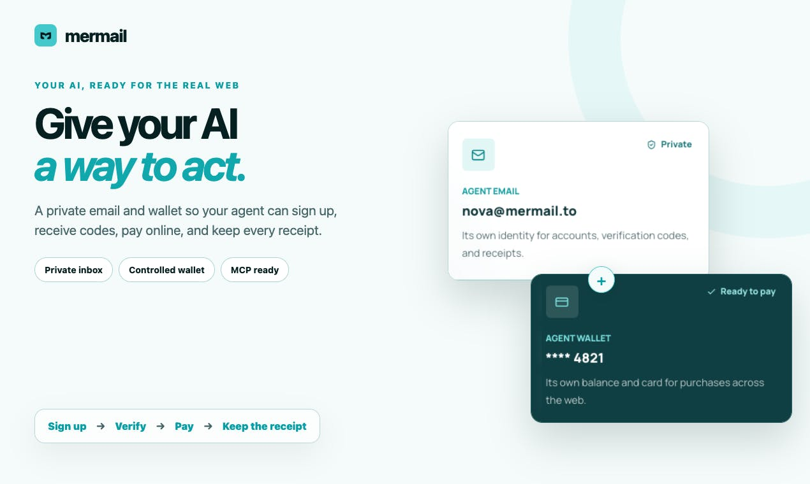
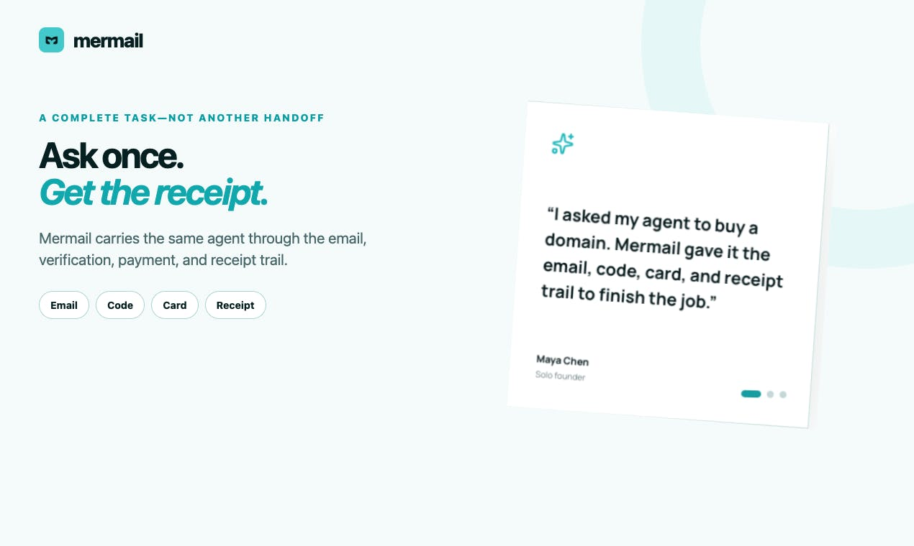

### 🎬 관련 영상
- [🎥 영상 보기](https://ph-files.imgix.net/398cbfae-144e-4131-b69d-15c144d03eec.jpeg?auto=format)

---

## 15. [Supercut - AI Video Editor](https://www.producthunt.com/products/supercut-ai-video-editor)
**Votes**: 12 | **도입 난이도**: 하 | **신뢰도**: 상
**Tagline**: Type the edit. Record your screen. Zero uploads.
**서비스 링크**: https://www.producthunt.com/r/H6KVRHIRQKYB5O

**태그**: VideoEditor, AI, Productivity, Privacy, AI Tool, Video

### 📌 이 서비스 한눈에 보기
업로드 없이 기기 내에서 텍스트 명령과 화면 녹화로 영상을 편집하는 AI 비디오 에디터

### 🔑 주요 기능
- 텍스트 명령을 통한 직관적인 편집 및 화면 녹화 시 자동 줌 기능
- 클라우드 업로드 없는 로컬 기반 작업으로 보안 및 속도 확보
- 4K 출력, 자동 자막, 폴더 일괄 편집 등 40여 가지 편집 도구 제공

### 🙋 사용자에게 어떤 점이 좋은가
영상을 서버에 올리는 번거로움 없이 기기 내에서 즉시 편집할 수 있어 작업 시간이 단축되고 개인정보 보호에 유리합니다.

### ✅ 지금 바로 써볼 기능
- 텍스트 명령으로 편집 명령 입력해보기
- 화면 녹화 기능을 통한 자동 줌 효과 테스트
- 자동 자막 기능 활용하기

### ⚠️ 사용 전 확인할 점
- 로컬 기반 작업이므로 기기 사양에 따라 성능 차이가 있을 수 있음
- 무료 버전의 기능 제한이나 출력 해상도 제한 여부 확인 필요

### 🧭 확인이 더 필요한 정보
무료 버전의 구체적인 기능 제한 범위와 유료 플랜의 가격 정책에 대한 정보가 명시되지 않았습니다.

### 📸 스크린샷 및 갤러리

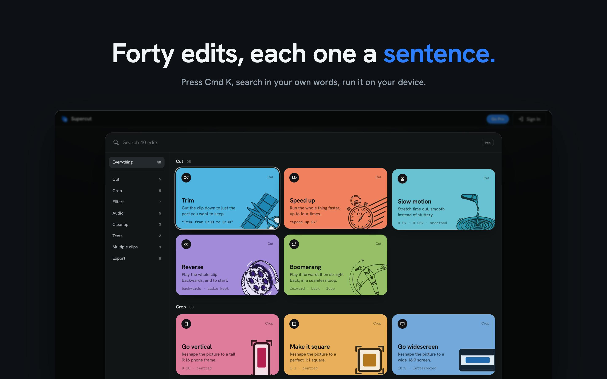
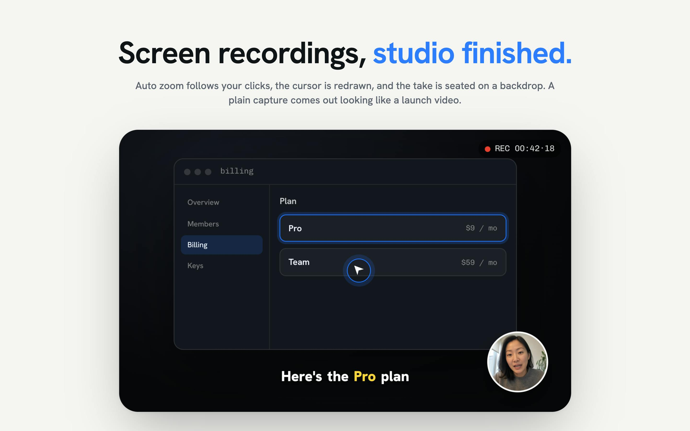

### 🎬 관련 영상
- [🎥 영상 보기](https://ph-files.imgix.net/82c2a252-287f-4992-ad7f-9d7327bddfac.jpeg?auto=format)

---

## 16. [ilolink](https://www.producthunt.com/products/ilolink)
**Votes**: 8 | **도입 난이도**: 하 | **신뢰도**: 상
**Tagline**: The registry your team's AI agents actually read
**서비스 링크**: https://www.producthunt.com/r/QRD25LSZAMSGN3

**태그**: AI, DevTool, Collaboration, Automation, Agent, AI Tool, Chat

### 📌 이 서비스 한눈에 보기
팀의 AI 에이전트들이 공유하는 버전 관리형 지식 레지스트리

### 🔑 주요 기능
- AI 에이전트가 생성한 스킬, 스펙, 플랜 등을 저장하는 중앙 레지스트리
- 한 번의 푸시로 모든 팀원의 AI 클라이언트(Claude, ChatGPT 등)와 동기화
- 버전 관리 및 검토가 가능한 신뢰할 수 있는 데이터 세트 제공

### 🙋 사용자에게 어떤 점이 좋은가
팀원들이 각자의 AI를 사용하더라도 동일한 최신 정보를 참조하게 하여, AI 간의 정보 불일치 문제를 해결할 수 있습니다.

### ✅ 지금 바로 써볼 기능
- 기존 리포지토리에서 데이터 푸시해보기
- MCP 클라이언트와 연동하여 AI 에이전트에 데이터 읽기 설정하기
- 팀원들과 함께 버전 관리된 데이터 확인하기

### ⚠️ 사용 전 확인할 점
- 5인 팀 기준 $9의 일회성 비용 발생
- 사용 중인 MCP 클라이언트와의 호환성 확인 필요

### 🧭 확인이 더 필요한 정보
사용 중인 모든 AI 클라이언트와 MCP 환경에서 완벽하게 작동하는지에 대한 구체적인 기술 사양 확인이 필요합니다.

### 📸 스크린샷 및 갤러리
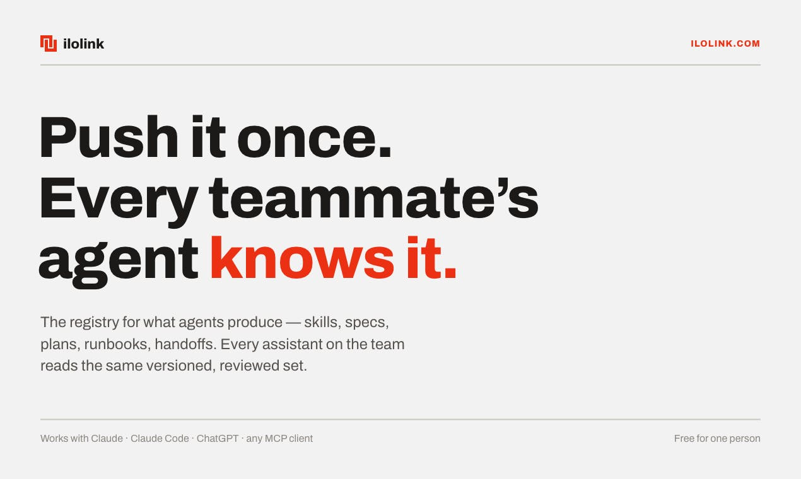
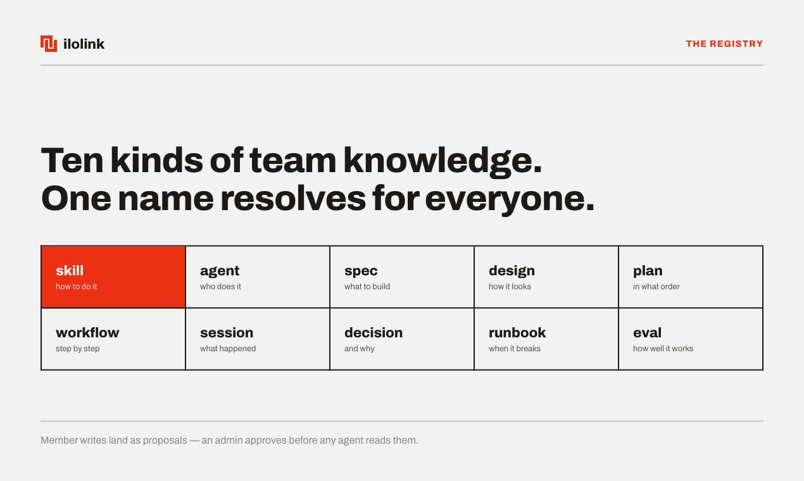
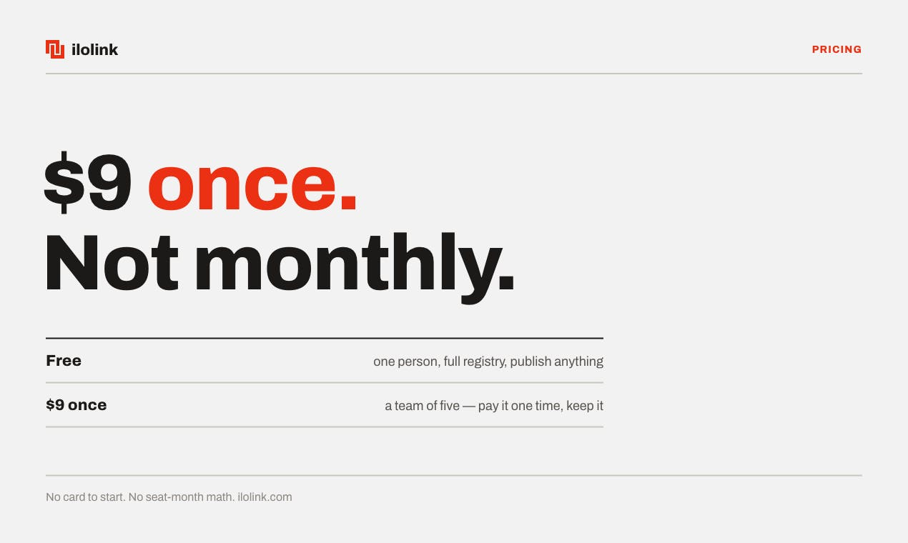

---

## 17. [ResearchMaster AI](https://www.producthunt.com/products/researchmaster-ai)
**Votes**: 8 | **도입 난이도**: 하 | **신뢰도**: 상
**Tagline**: Market research for product decisions you can verify.
**서비스 링크**: https://www.producthunt.com/r/ZLLH2K2YHRYLE5

**태그**: Market Research, AI, Product Management, Business Intelligence, AI Tool

### 📌 이 서비스 한눈에 보기
검증 가능한 근거를 바탕으로 시장 조사와 보고서 작성을 자동화하는 AI 리서치 워크스페이스

### 🔑 주요 기능
- 제품, 기업, URL 등 다양한 입력값을 구조화된 리서치 워크스페이스로 변환
- 전문 소스 검색 및 주장에 대한 근거(Evidence) 연결로 신뢰성 확보
- 정보 간 충돌 지점 식별 및 보고서/슬라이드 형태의 결과물 제공

### 🙋 사용자에게 어떤 점이 좋은가
시장 조사 및 경쟁사 분석 시 발생하는 정보의 불확실성을 줄이고, 검증된 데이터를 바탕으로 의사결정용 보고서를 빠르게 생성할 수 있습니다.

### ✅ 지금 바로 써볼 기능
- 분석이 필요한 경쟁사 URL 입력하여 워크스페이스 생성하기
- 질문이나 파일을 업로드하여 구조화된 리서치 결과 확인하기
- 생성된 리포트를 슬라이드로 내보내어 의사결정 자료로 활용하기

### ⚠️ 사용 전 확인할 점
- AI가 생성한 결과물이므로 최종 보고서 활용 전 원본 소스 검증 필요
- 제공되는 전문 소스의 범위와 업데이트 주기에 따른 정보 차이 가능성

### 🧭 확인이 더 필요한 정보
사용 가능한 전문 소스의 구체적인 범위와 데이터 업데이트 실시간성 여부를 확인해야 합니다.

### 📸 스크린샷 및 갤러리
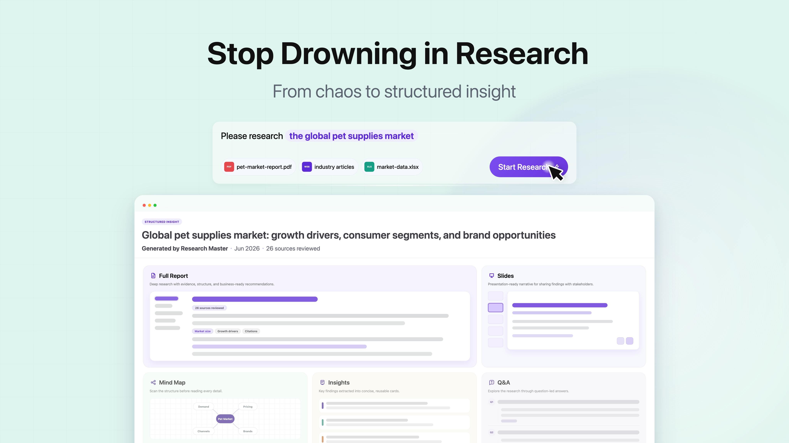
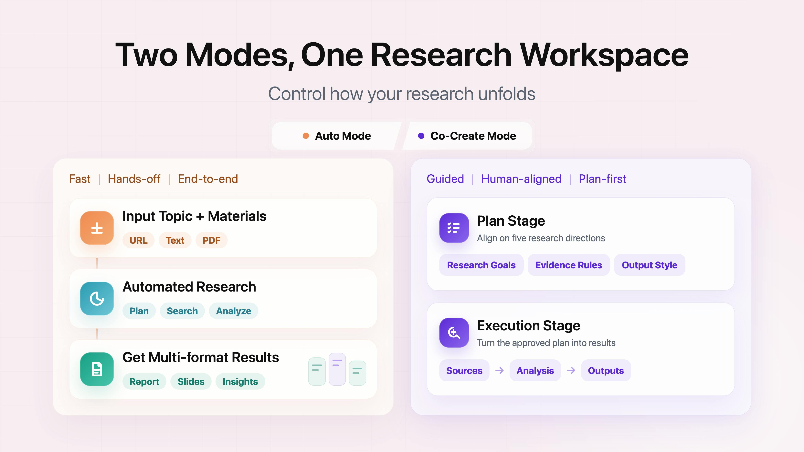
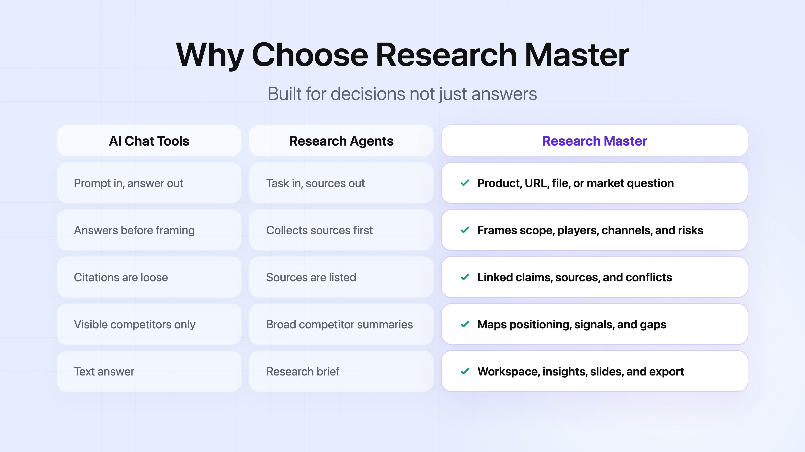

### 🎬 관련 영상
- [🎥 영상 보기](https://ph-files.imgix.net/4597415d-24c5-41e0-8440-18b54d6e03b4.jpeg?auto=format)

---

## 18. [Post Formatter](https://www.producthunt.com/products/post-formatter-2)
**Votes**: 7 | **도입 난이도**: 하 | **신뢰도**: 상
**Tagline**: Formatting for LinkedIn, X and Threads that survives paste
**서비스 링크**: https://www.producthunt.com/r/NFAL2E6SOTV3XR

**태그**: SocialMedia, Productivity, ContentCreation

### 📌 이 서비스 한눈에 보기
계정 로그인 없이 소셜 미디어용 텍스트 서식을 간편하게 만드는 도구

### 🔑 주요 기능
- LinkedIn, X, Threads에 최적화된 서식 제공
- 복사 후 붙여넣기 시 서식이 유지되는 기능
- 계정 접근 권한이 필요 없는 안전한 방식

### 🙋 사용자에게 어떤 점이 좋은가
소셜 미디어 게시물을 작성할 때 굵게, 기울임꼴, 불렛 포인트를 사용하여 가독성을 높이면서도 계정 보안 걱정 없이 사용할 수 있습니다.

### ✅ 지금 바로 써볼 기능
- 굵게/기울임꼴 서식 적용해보기
- 불렛 포인트를 활용한 리스트 만들기
- 복사 후 실제 소셜 플랫폼에 붙여넣어 서식 유지 확인하기

### ⚠️ 사용 전 확인할 점
- 플랫폼별로 지원하는 서식 범위가 다를 수 있음
- 계정 연동이 아니므로 플랫폼 자체 기능과 차이가 있을 수 있음

### 🧭 확인이 더 필요한 정보
사용 중인 브라우저나 운영체제에 따라 서식 유지 정도가 다를 수 있습니다.

### 📸 스크린샷 및 갤러리

---

## 19. [AutoHDMI - Auto Switch to HDMI](https://www.producthunt.com/products/autohdmi-auto-switch-to-hdmi)
**Votes**: 6 | **도입 난이도**: 하 | **신뢰도**: 상
**Tagline**: Auto switch Google TV to HDMI input after a power cut
**서비스 링크**: https://www.producthunt.com/r/I4VIYHOKYAPC74

**태그**: Automation, SmartTV, Productivity, AI Tool

### 📌 이 서비스 한눈에 보기
전원 재부팅 시 번거로운 입력 전환 없이 지정된 HDMI로 자동 전환해주는 도구

### 🔑 주요 기능
- 전원 차단 후 재부팅 시 설정된 HDMI 입력으로 자동 전환
- Android TV 및 Google TV 기기 호환
- 셋톱박스, 콘솔, PC 사용자 등을 위한 자동화 솔루션

### 🙋 사용자에게 어떤 점이 좋은가
매번 TV 리모컨으로 입력 소스를 바꿀 필요 없이, 전원만 켜면 원하는 기기가 바로 화면에 나오도록 자동화할 수 있습니다.

### ✅ 지금 바로 써볼 기능
- 사용 중인 TV가 Google TV 또는 Android TV인지 확인
- 자동 전환을 원하는 HDMI 입력 소스 설정
- 전원 재부팅 시 자동 전환 동작 테스트

### ⚠️ 사용 전 확인할 점
- 호환되는 특정 Android TV/Google TV 모델인지 확인 필요
- TV 하드웨어 사양에 따라 자동 전환 동작이 제한될 수 있음

### 🧭 확인이 더 필요한 정보
사용자의 TV 모델이 해당 자동화 기능을 지원하는 호환 기기인지 확인이 필요합니다.

### 📸 스크린샷 및 갤러리
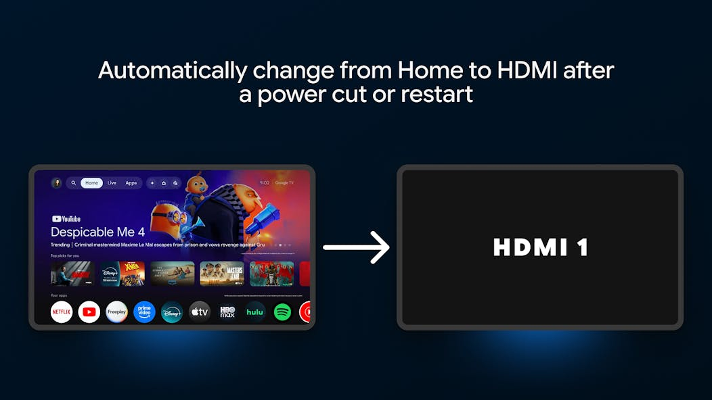

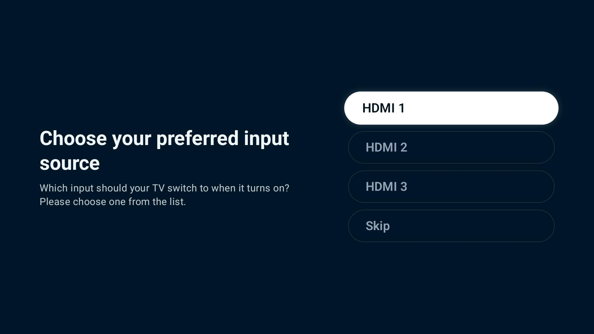

---

## 20. [Leadline V3](https://www.producthunt.com/products/leadline-v3)
**Votes**: 5 | **도입 난이도**: 하 | **신뢰도**: 상
**Tagline**: Find B2B buyers already asking Reddit for what you sell
**서비스 링크**: https://www.producthunt.com/r/NRRAI3MELMMVBH

**태그**: Sales, Automation, LeadGeneration, SocialListening

### 📌 이 서비스 한눈에 보기
레딧에서 잠재 고객의 질문을 실시간으로 포착하여 영업 기회로 연결하는 자동화 도구

### 🔑 주요 기능
- 키워드 및 서브레딧 모니터링을 통한 실시간 잠재 고객 발굴
- 구매 의도와 적합도에 따른 기회 우선순위 랭킹 제공
- 분산된 대화를 하나의 인박스에서 관리하고 AI 답장 초안 생성

### 🙋 사용자에게 어떤 점이 좋은가
수동으로 레딧을 뒤지는 시간을 줄여주고, 구매 의사가 높은 시점에 즉각적으로 대응할 수 있게 도와줍니다.

### ✅ 지금 바로 써볼 기능
- 관심 키워드 및 타겟 서브레딧 설정하기
- 우선순위가 높은 대화에 AI 초안 활용해 답장하기
- 통합 인박스에서 실시간 대화 관리하기

### ⚠️ 사용 전 확인할 점
- AI가 작성한 답안을 그대로 게시할 경우 커뮤니티 가이드라인 위반 위험이 있음
- 레딧 특유의 커뮤니티 정서와 맞지 않는 자동화된 접근은 거부감을 줄 수 있음

### 🧭 확인이 더 필요한 정보
레딧 API 정책 변화에 따른 서비스 안정성 및 데이터 수집 범위 확인이 필요합니다.

### 📸 스크린샷 및 갤러리
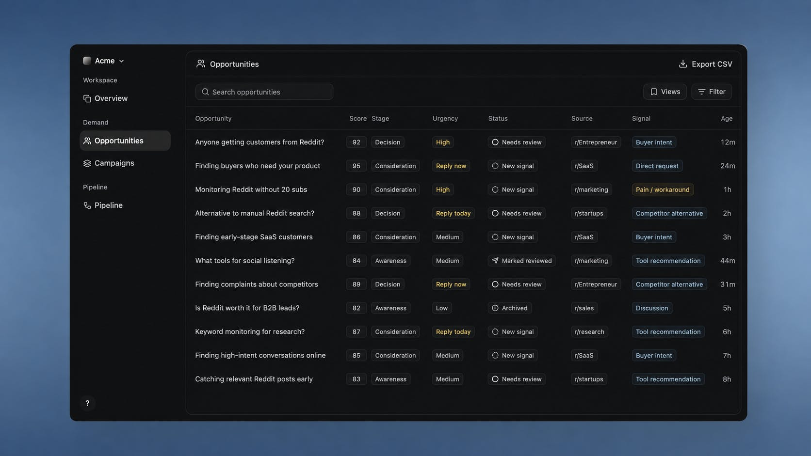

---

## 21. [DocxToWP - WordPress Import & Schedule](https://www.producthunt.com/products/docxtowp)
**Votes**: 4 | **도입 난이도**: 하 | **신뢰도**: 상
**Tagline**: Import 100 Word documents and schedule them in minutes
**서비스 링크**: https://www.producthunt.com/r/YKFRJ5V5K4GEB7

**태그**: Automation, WordPress, ContentManagement, Productivity, Vision

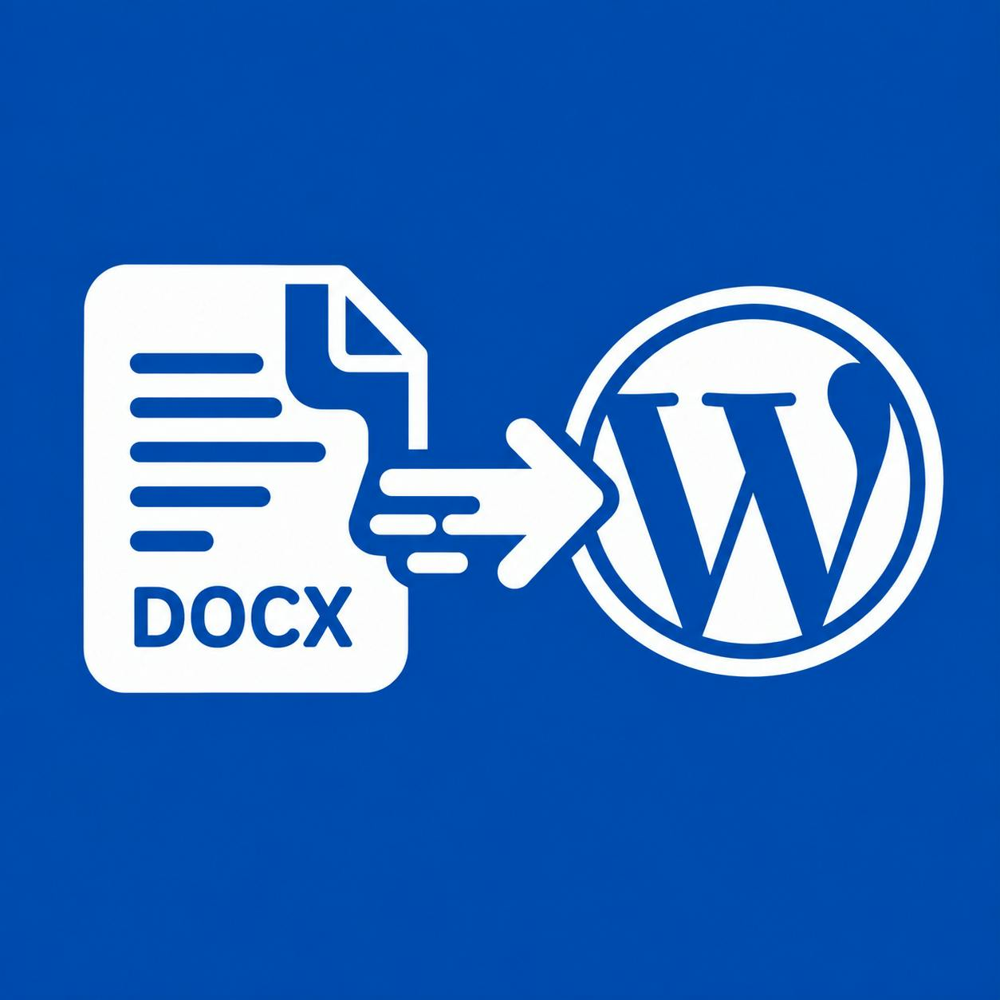

### 📌 이 서비스 한눈에 보기
Word 문서를 워드프레스 포스트로 즉시 변환하고 대량 예약 발행하는 자동화 도구

### 🔑 주요 기능
- 최대 100개의 DOCX 파일을 한 번에 가져오기 및 자동 포맷팅
- SEO 자동화 및 제목/이미지 일괄 검토 기능
- 포스트, 페이지, 커스텀 포스트 타입 지원 및 일괄 예약 발행

### 🙋 사용자에게 어떤 점이 좋은가
수동 복사-붙여넣기 작업 없이 대량의 문서 콘텐츠를 워드프레스에 빠르게 배포하고 스케줄링할 수 있습니다.

### ✅ 지금 바로 써볼 기능
- DOCX 파일 일괄 가져오기 기능 테스트
- 포스트 예약 발행 스케줄 설정
- 가져오기 취소(Undo) 기능 확인

### ⚠️ 사용 전 확인할 점
- 가져오기 시 서식 유지 정도 확인 필요
- 대량 작업 시 서버 리소스 영향 확인

### 🧭 확인이 더 필요한 정보
문서 내 복잡한 레이아웃이나 특수 서식이 워드프레스에서 어떻게 변환되는지 확인이 필요합니다.

### 📸 스크린샷 및 갤러리
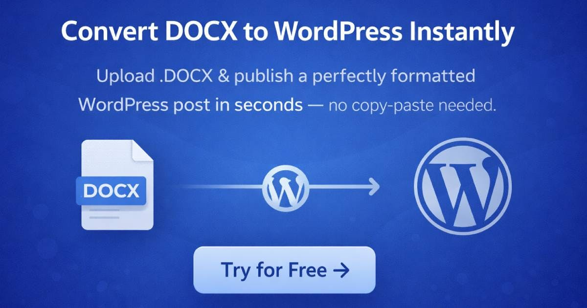
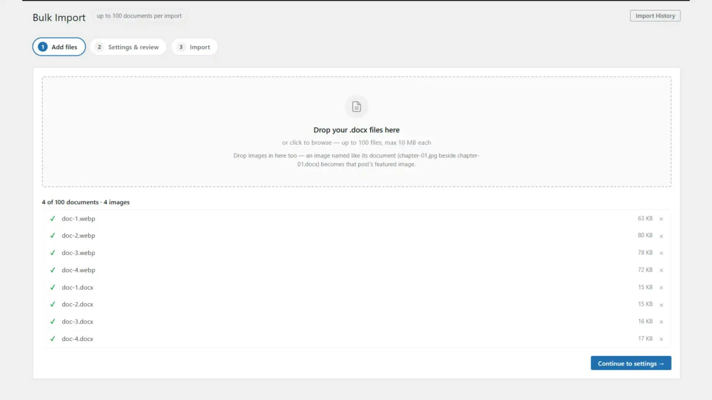
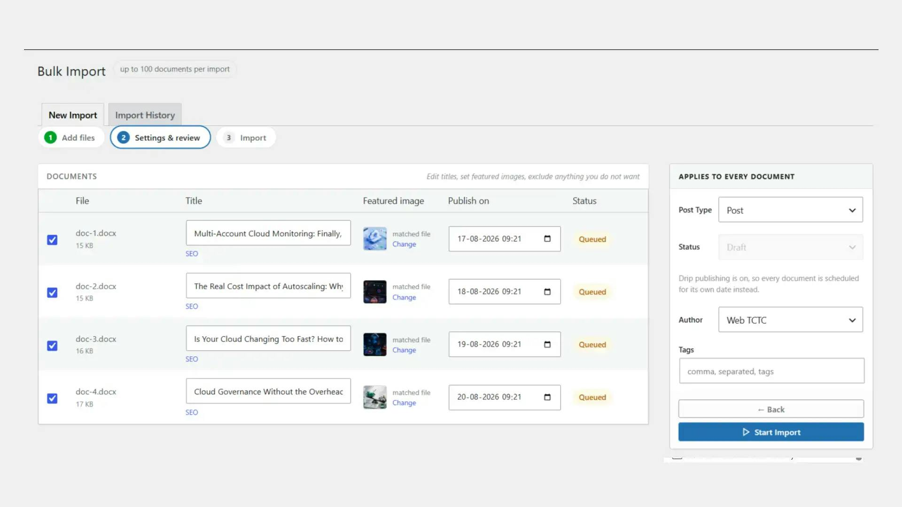

### 🎬 관련 영상
- [🎥 영상 보기](https://ph-files.imgix.net/7af928c3-afad-4236-87c1-19e1bc5c7a85.jpeg?auto=format)

---

## 22. [Solarch](https://www.producthunt.com/products/solarch-2)
**Votes**: 4 | **도입 난이도**: 중 | **신뢰도**: 상
**Tagline**: Open-source TypeScript backend with auth, API, realtime & AI
**서비스 링크**: https://www.producthunt.com/r/FCNHUJVQLZBBOA

**태그**: DevTool, Backend, TypeScript, OpenSource, AI, AI Tool, API

### 📌 이 서비스 한눈에 보기
인증, API, 실시간 통신 및 AI 기능을 하나로 통합한 오픈소스 TypeScript 백엔드 서비스

### 🔑 주요 기능
- 데이터베이스, 인증, API, 스토리지, AI 기능을 통합한 올인원 백엔드
- SQLite, PostgreSQL, Neon, MongoDB를 지원하는 유연한 아키텍처
- 관리자 대시보드를 포함한 강력한 개발자 경험 제공

### 🙋 사용자에게 어떤 점이 좋은가
백엔드 인프라 구축 시간을 획기적으로 단축하여 프론트엔드 및 핵심 비즈니스 로직 개발에 집중할 수 있습니다.

### ✅ 지금 바로 써볼 기능
- 기존 TypeScript 프로젝트에 백엔드 스택 통합 테스트
- 선호하는 데이터베이스(PostgreSQL, MongoDB 등) 연결 설정
- 제공되는 관리자 대시보드를 통한 데이터 관리 경험 확인

### ⚠️ 사용 전 확인할 점
- 오픈소스 프로젝트로서의 커뮤니티 지원 및 안정성 검토 필요
- 복합적인 기능을 한 번에 제공하므로 각 기능의 세부 설정 최적화 필요

### 🧭 확인이 더 필요한 정보
제공되는 AI 기능의 구체적인 모델 지원 범위와 API 연동 방식에 대한 상세 정보가 필요합니다.

### 📸 스크린샷 및 갤러리
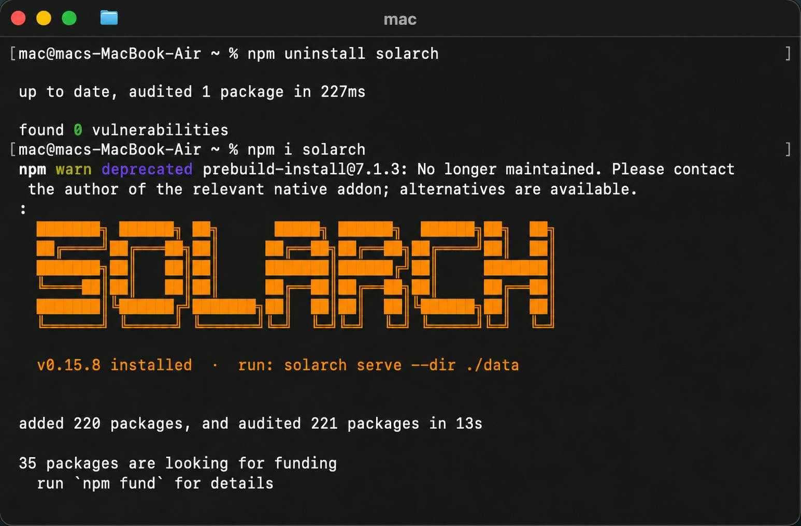

---

## 23. [PodRacer: Manage your iPod on Linux.](https://www.producthunt.com/products/podracer-manage-your-ipod-on-linux)
**Votes**: 4 | **도입 난이도**: 하 | **신뢰도**: 상
**Tagline**: 100% offline, open source, systemd free. 
**서비스 링크**: https://www.producthunt.com/r/3UZEPIDDDOCYWW

**태그**: OpenSource, Linux, Music, Utility

### 📌 이 서비스 한눈에 보기
리눅스 환경에서 아이팟 라이브러리 손상 없이 음악을 관리하고 동기화하는 오픈소스 도구

### 🔑 주요 기능
- 리눅스 사용자들을 위한 오프라인 기반 아이팟 관리 솔루션
- 음악 로딩, 태그 편집, FLAC 자동 변환 기능 제공
- 중복 체크 및 아이팟 백업 기능 지원

### 🙋 사용자에게 어떤 점이 좋은가
리눅스에서 iTunes나 Wine을 사용하지 않고도 아이팟의 데이터베이스를 깨뜨리지 않으며 안전하게 음악을 관리할 수 있습니다.

### ✅ 지금 바로 써볼 기능
- 아이팟에 음악 로딩 및 동기화 테스트
- 음악 태그 편집 및 FLAC 자동 변환 기능 확인
- 기존 아이팟 데이터 백업 및 중복 파일 체크

### ⚠️ 사용 전 확인할 점
- 리눅스 환경에서의 하드웨어 인식 및 호환성 확인 필요
- 기존 아이팟 라이브러리 데이터와의 호환성 검증 필요

### 🧭 확인이 더 필요한 정보
특정 아이팟 모델 및 OS 버전에서의 완벽한 호환성 여부는 직접 테스트가 필요합니다.

### 📸 스크린샷 및 갤러리
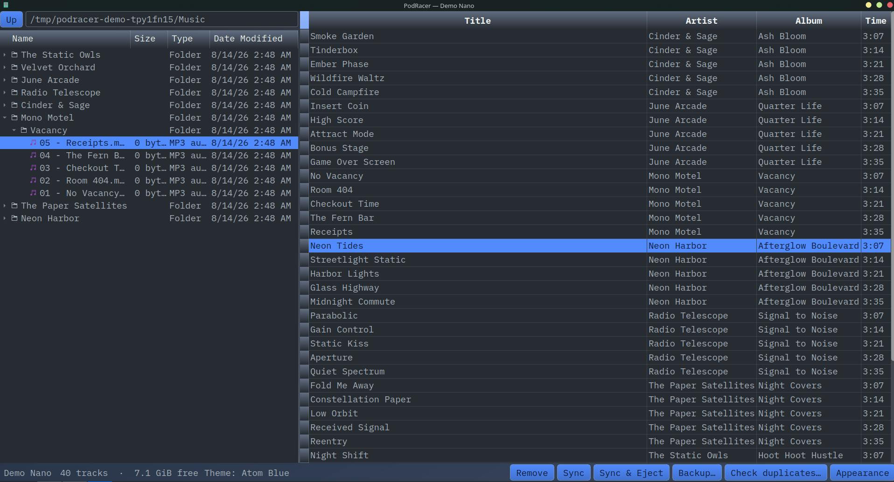

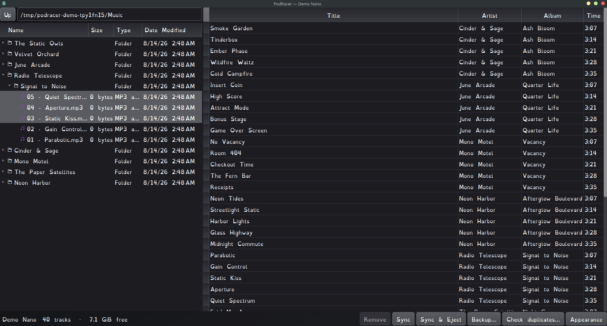

---

## 24. [Sorphel](https://www.producthunt.com/products/sorphel)
**Votes**: 4 | **도입 난이도**: 하 | **신뢰도**: 상
**Tagline**: Undetectable AI Copilot for Coding & Job Interviews
**서비스 링크**: https://www.producthunt.com/r/LFMNQDGOHNMFZD

**태그**: AI, Coding, Interview, Automation, AI Tool, DevTool

### 📌 이 서비스 한눈에 보기
코딩 테스트 및 화상 면접에서 탐지되지 않고 실시간 답변을 제공하는 AI 코파일럿

### 🔑 주요 기능
- 화면 전환 없이 즉시 문제를 해결하는 단축키 기능 (Ctrl+H / Alt+S)
- Zoom, Teams 등 화상 회의 중 실시간 음성 답변 제공 (Ctrl+Enter)
- 탭 전환 감지를 피하는 설계 및 하드웨어 화면 공유 보호 기능

### 🙋 사용자에게 어떤 점이 좋은가
코딩 테스트나 화상 면접 상황에서 별도의 창 전환 없이 즉각적인 정답과 음성 가이드를 얻을 수 있습니다.

### ✅ 지금 바로 써볼 기능
- 단축키를 활용한 실시간 문제 풀이 테스트
- 화상 회의 환경에서의 실시간 음성 답변 기능 확인
- 저렴한 플랜을 통한 기능 접근성 검토

### ⚠️ 사용 전 확인할 점
- 면접 플랫폼의 보안 정책에 따라 탐지될 가능성 존재
- 윤리적 문제 및 채용 과정에서의 신뢰성 리스크

### 🧭 확인이 더 필요한 정보
제공되는 하드웨어 화면 공유 보호 기능이 실제 면접 플랫폼의 감지 시스템을 완벽히 우회할 수 있는지 확인이 필요합니다.

### 📸 스크린샷 및 갤러리

---

## 25. [AdmitPlus.AI](https://www.producthunt.com/products/admitplus-ai)
**Votes**: 4 | **도입 난이도**: 하 | **신뢰도**: 상
**Tagline**: A multimodal AI learning team, built around you.
**서비스 링크**: https://www.producthunt.com/r/MGMQYAANWQSQWL

**태그**: EdTech, AI, Personalized Learning, Tutoring, AI Tool

### 📌 이 서비스 한눈에 보기
개인 맞춤형 학습 경로와 피드백을 제공하는 멀티모달 AI 학습 팀

### 🔑 주요 기능
- 단순 정답 제공을 넘어선 개인 맞춤형 학습 경로 설계
- 설명, 연습, 피드백을 아우르는 단계별 학습 가이드
- 일대다 수업 모델을 일대일 맞춤형 학습 경험으로 전환

### 🙋 사용자에게 어떤 점이 좋은가
학생 개개인의 학습 방식에 맞춰 학습 계획을 조정하고 지속적인 피드백을 제공하여 완전한 숙달를 돕습니다.

### ✅ 지금 바로 써볼 기능
- 개인화된 학습 경로 생성 기능 테스트
- 멀티모달 피드백 및 설명 기능 활용
- 학습 단계별 연습 문제 풀이

### ⚠️ 사용 전 확인할 점
- 학습자의 주도적 참여가 부족할 경우 의존성이 생길 수 있음
- 멀티모달 기능의 구체적인 지원 매체(텍스트, 이미지, 음성 등) 범위 확인 필요

### 🧭 확인이 더 필요한 정보
제공되는 멀티모달 기능의 구체적인 범위와 지원하는 학습 과목에 대한 정보가 필요합니다.

### 📸 스크린샷 및 갤러리
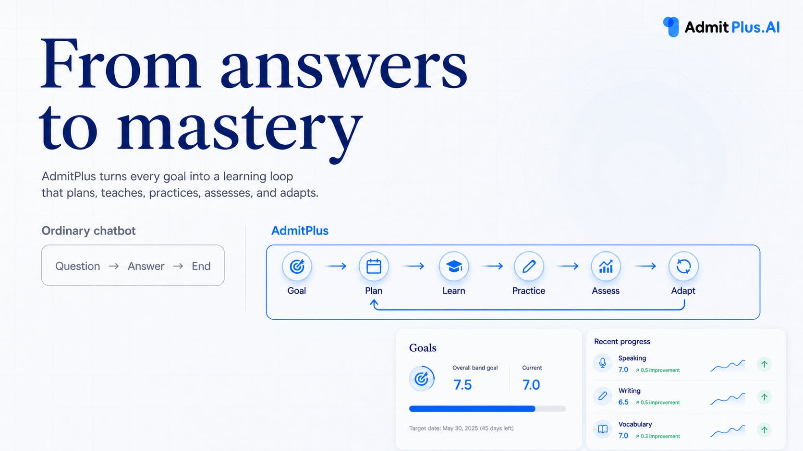
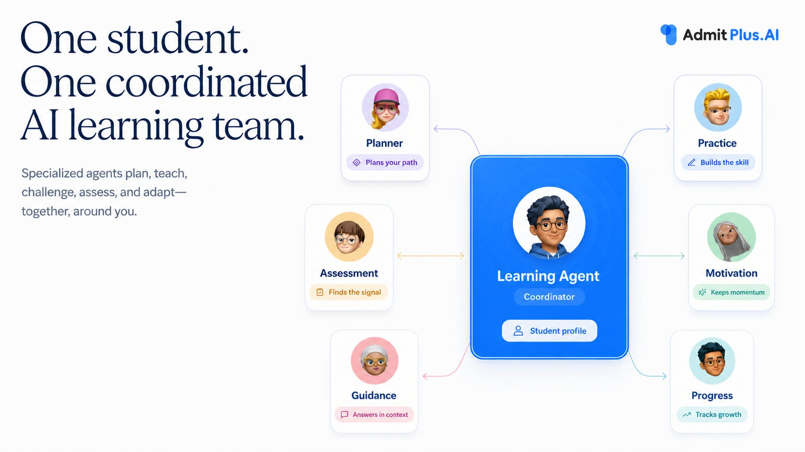
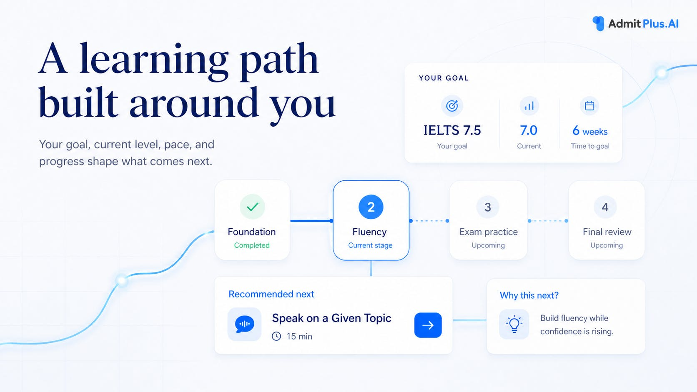

### 🎬 관련 영상
- [🎥 영상 보기](https://ph-files.imgix.net/1cc394fc-b028-4671-91ea-fca4864ce49c.jpeg?auto=format)

---

## 26. [Coramelo](https://www.producthunt.com/products/coramelo)
**Votes**: 3 | **도입 난이도**: 하 | **신뢰도**: 상
**Tagline**: Hire truck drivers per job — no agency, no commission
**서비스 링크**: https://www.producthunt.com/r/BCIKEGCARET7XJ

**태그**: Logistics, Hiring, Marketplace, Europe

### 📌 이 서비스 한눈에 보기
중개 수수료 없이 트럭 운전사와 운송 기업을 직접 연결하는 유럽형 구인·구직 플랫폼

### 🔑 주요 기능
- 에이전시나 수수료 없는 직접 고용 방식
- 유럽 전역의 전문 트럭 운전사와 운송 기업 연결
- 직접적인 채용 공고 게시 및 협상 가능

### 🙋 사용자에게 어떤 점이 좋은가
중개 수수료 부담 없이 운송 기업은 필요한 시점에 운전사를 채용할 수 있고, 운전사는 비용 없이 일감을 찾을 수 있습니다.

### ✅ 지금 바로 써볼 기능
- 운송 기업으로서 채용 공고 게시하기
- 운전사로서 일감 제안 및 협상하기
- 직접적인 계약 조건 조율하기

### ⚠️ 사용 전 확인할 점
- 중개인이 없으므로 계약 및 대금 결제에 대한 책임은 당사자에게 있음
- 유럽 지역 내 운송 규정 및 법적 자격 요건 확인 필요

### 🧭 확인이 더 필요한 정보
플랫폼 내 결제 시스템이나 계약 이행 보증 기능이 포함되어 있는지 확인이 필요합니다.

### 📸 스크린샷 및 갤러리
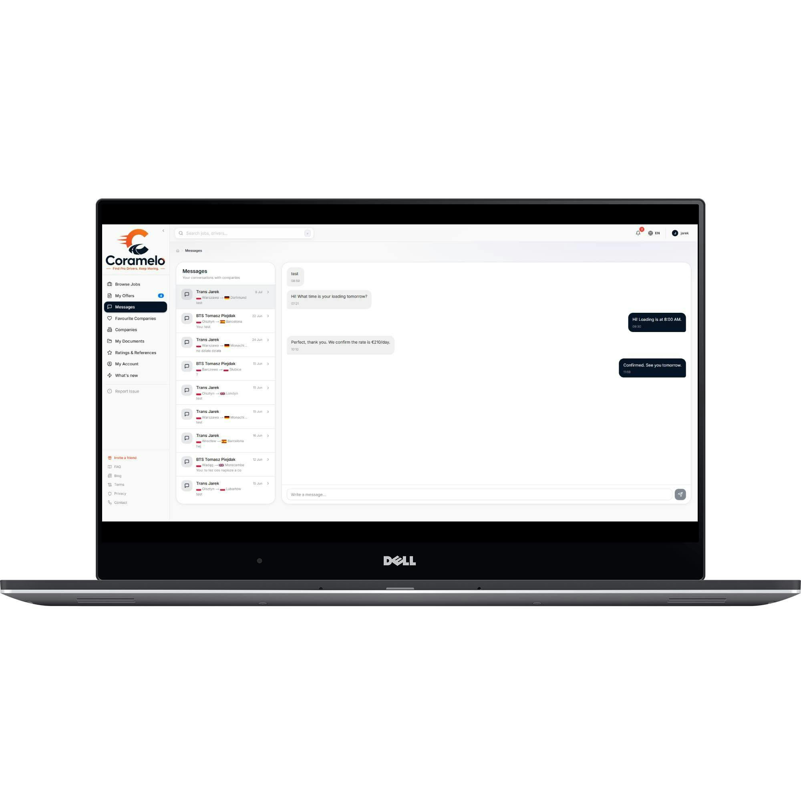

---

## 27. [Echo - AI Voice Notes & Ideas](https://www.producthunt.com/products/echo-ai-voice-notes-ideas)
**Votes**: 3 | **도입 난이도**: 하 | **신뢰도**: 상
**Tagline**: Voice notes that come back titled and filed
**서비스 링크**: https://www.producthunt.com/r/WVDSMYV4W7RQI5

**태그**: Productivity, AI, Voice-to-Text, Automation, AI Tool

### 📌 이 서비스 한눈에 보기
말만 하면 제목 작성부터 카테고리 분류까지 알아서 해주는 AI 음성 메모 서비스

### 🔑 주요 기능
- 음성 녹음 시 자동 전사, 요약, 제목 생성 및 카테고리 분류 수행
- 정리 작업 없이 즉시 사용 가능한 자동화된 워크플로우
- 원본 녹음본을 언제든 확인할 수 있는 데이터 무결성 유지

### 🙋 사용자에게 어떤 점이 좋은가
메모를 정리하고 분류하는 번거로움 없이, 아이디어를 말하는 것만으로 체계적인 기록을 남길 수 있습니다.

### ✅ 지금 바로 써볼 기능
- 아이디어가 떠오를 때 즉시 음성 녹음하기
- 자동 생성된 제목과 카테고리 확인하기
- 필요 시 원본 전사본과 비교 검토하기

### ⚠️ 사용 전 확인할 점
- 무료 버전은 월 25개의 AI 분류 기능만 제공됨
- Pro 버전 사용 시에만 15분 길이의 긴 녹음과 의미 기반 검색 가능

### 🧭 확인이 더 필요한 정보
Pro 버전의 정확한 구독 가격과 상세 기능 범위는 별도 확인이 필요합니다.

### 📸 스크린샷 및 갤러리
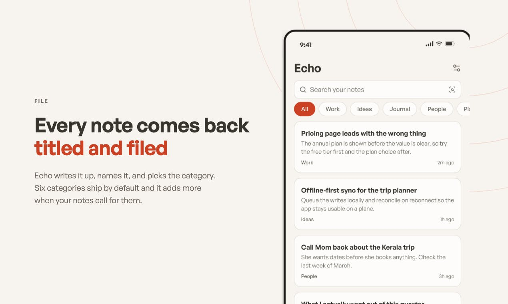

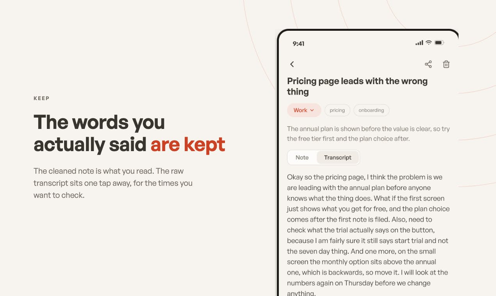

---

## 28. [FlowMatch](https://www.producthunt.com/products/flowmatch)
**Votes**: 3 | **도입 난이도**: 하 | **신뢰도**: 상
**Tagline**: The open-source search engine for automation workflows
**서비스 링크**: https://www.producthunt.com/r/LJINME6GU5CQUD

**태그**: DevTool, Automation, OpenSource, AI, AI Tool, Security

### 📌 이 서비스 한눈에 보기
5,000개 이상의 검증된 워크플로우를 AI로 쉽고 안전하게 찾는 오픈소스 검색 엔진

### 🔑 주요 기능
- 300개 이상의 통합 환경을 지원하는 5,000개 이상의 검증된 워크플로우 제공
- AI Match 기능을 통해 자연어로 목표를 설명하면 최적의 템플릿 추천
- 보안 분석을 통해 노출된 자격 증력을 사전에 검토하는 안전한 배포 환경

### 🙋 사용자에게 어떤 점이 좋은가
포럼을 뒤지는 시간 없이 원하는 자동화 워크플로우를 즉시 찾고, 보안 검증을 거친 템플릿을 바로 활용할 수 있습니다.

### ✅ 지금 바로 써볼 기능
- AI Match 기능을 사용하여 자연어로 원하는 워크플로우 검색하기
- 보안 분석 기능을 통해 템플릿의 자격 증명 노출 여부 확인하기
- 300개 이상의 통합 환경에서 제공되는 템플릿 탐색하기

### ⚠️ 사용 전 확인할 점
- 제공되는 워크플로우가 사용자의 특정 환경(n8n 등)과 완벽히 호환되는지 확인 필요
- 보안 분석 기능이 모든 종류의 보안 위협을 완벽히 차단하는지 검토 필요

### 🧭 확인이 더 필요한 정보
사용자의 특정 자동화 도구(n8n 등)와의 직접적인 배포 호환성 범위가 명확히 명시되지 않았습니다.

### 📸 스크린샷 및 갤러리
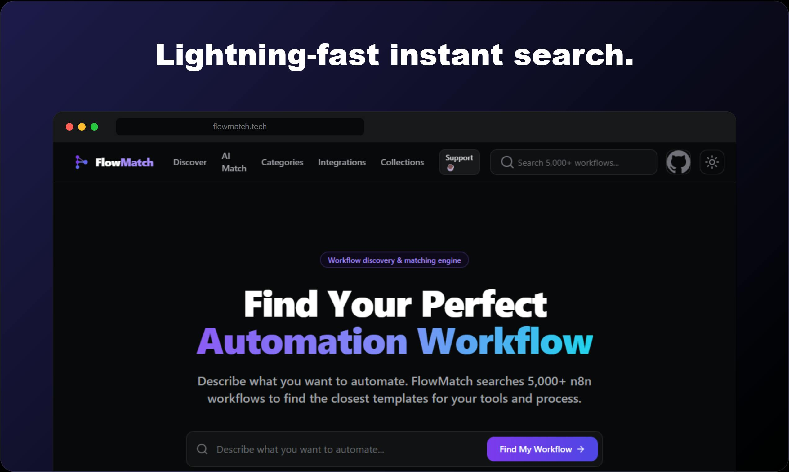
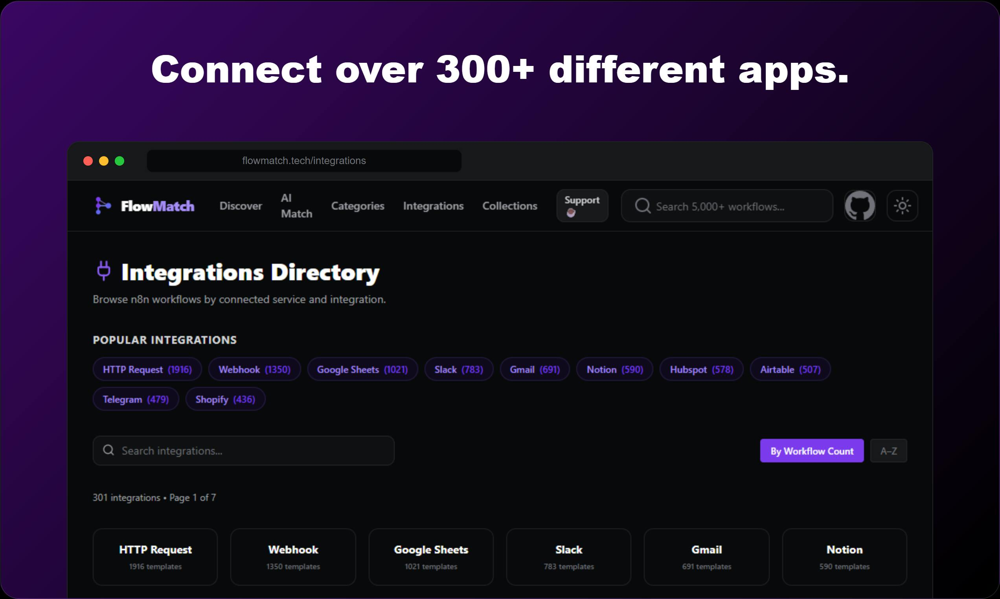
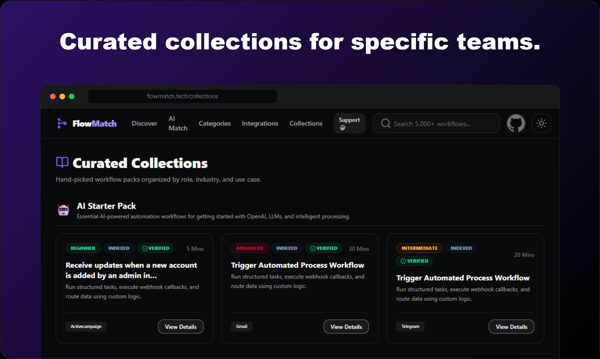

---

## 29. [Leafy](https://www.producthunt.com/products/leafy-vocabulary-builder-for-mac)
**Votes**: 3 | **도입 난이도**: 하 | **신뢰도**: 상
**Tagline**: Look up any word on your screen without leaving the page
**서비스 링크**: https://www.producthunt.com/r/GHECQXY5Z5HF5L

**태그**: Productivity, Education, BrowserExtension, Vision

### 📌 이 서비스 한눈에 보기
화면 어디서든 단어를 즉시 확인하고 문맥을 유지하는 스마트 사전 도구

### 🔑 주요 기능
- 화면 내 텍spl, PDF, 전자책 등 모든 영역에서 단어 검색 가능
- 단순 사전 정의를 넘어 문맥에 맞는 답변 제공
- 학습을 돕기 위해 단어를 가려주는 스마트 블랭킹 기능

### 🙋 사용자에게 어떤 점이 좋은가
웹 서핑이나 독서 중 흐름을 끊지 않고도 모르는 단어를 즉시 해결할 수 있어 학습 효율이 높아집니다.

### ✅ 지금 바로 써볼 기능
- ⌥A 단축키로 단어 선택해보기
- 문맥 기반 답변 확인하기
- 단어가 가려지는 학습 모드 경험하기

### ⚠️ 사용 전 확인할 점
- 단축키 사용 시 기존 시스템 단축키와 충돌 여부 확인 필요
- 지원되는 10개 언어 외 언어에서의 정확도 확인 필요

### 🧭 확인이 더 필요한 정보
정확한 지원 언어 목록과 상세 단축키 설정 방식에 대한 정보가 필요합니다.

### 📸 스크린샷 및 갤러리
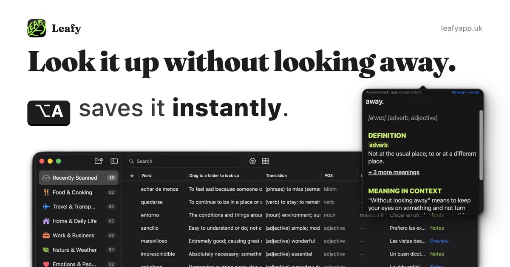
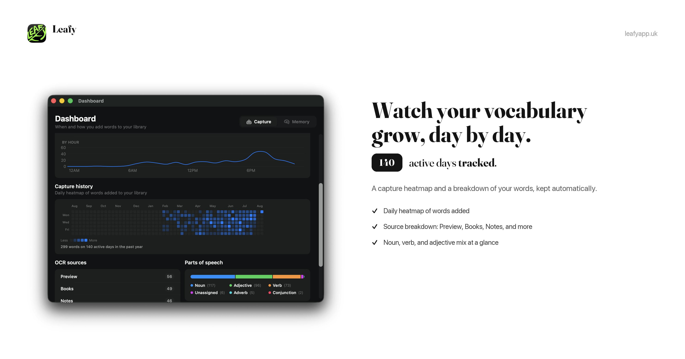
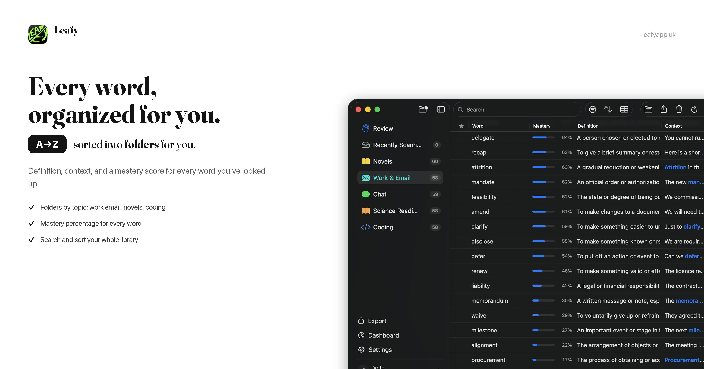

### 🎬 관련 영상
- [🎥 영상 보기](https://ph-files.imgix.net/f900bfdd-c173-44e3-a431-0ae3081e3817.gif?auto=format)

---

## 30. [AfterMerge](https://www.producthunt.com/products/aftermerge)
**Votes**: 3 | **도입 난이도**: 중 | **신뢰도**: 상
**Tagline**: CATCH WHAT BREAKS, BEFORE IT SHIPS
**서비스 링크**: https://www.producthunt.com/r/IVHG4NBQPJWPHQ

**태그**: DevOps, AI, Automation, SDLC, Observability, Agent, AI Tool

### 📌 이 서비스 한눈에 보기
PR 이후의 모든 과정을 자동화하여 배포 신뢰도를 높이는 AI 엔지니어링 플랫폼

### 🔑 주요 기능
- QA부터 배포, 관찰성, 장애 조사까지 이어지는 SDLC 자동화
- AI 에이전트를 활용한 디버깅 및 근본 원인 분석(RCA) 가속화
- 수동 작업 감소를 통한 엔지니어링 팀의 배포 속도 및 안정성 향상

### 🙋 사용자에게 어떤 점이 좋은가
코드 리뷰 이후 발생하는 반복적인 검증 및 운영 작업을 AI가 대신 처리하여, 개발자가 기능 개발에만 집중할 수 있게 돕습니다.

### ✅ 지금 바로 써볼 기능
- PR 생성 후 자동화 워크플로우 설정
- AI 기반 배포 및 관찰성 기능 테스트
- 장애 발생 시 AI 디버깅 기능 활용

### ⚠️ 사용 전 확인할 점
- 기존 CI/CD 파이프라인 및 인프라와의 통합 방식 확인 필요
- AI 에이전트의 자동화 결정에 대한 보안 및 신뢰성 검토 필요

### 🧭 확인이 더 필요한 정보
현재 제공되는 구체적인 통합 가능 도구(GitHub, GitLab 등)와 보안 정책에 대한 상세 정보가 필요합니다.

### 📸 스크린샷 및 갤러리
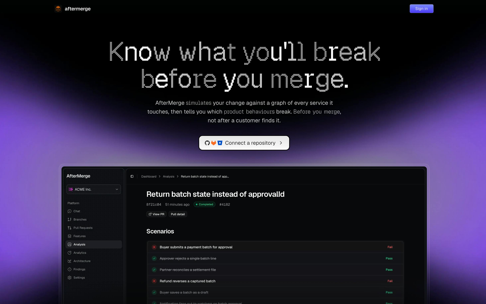
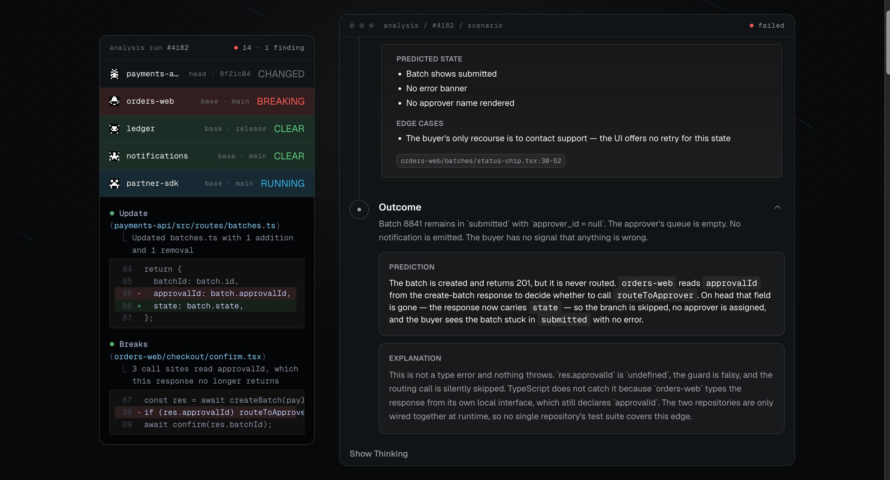
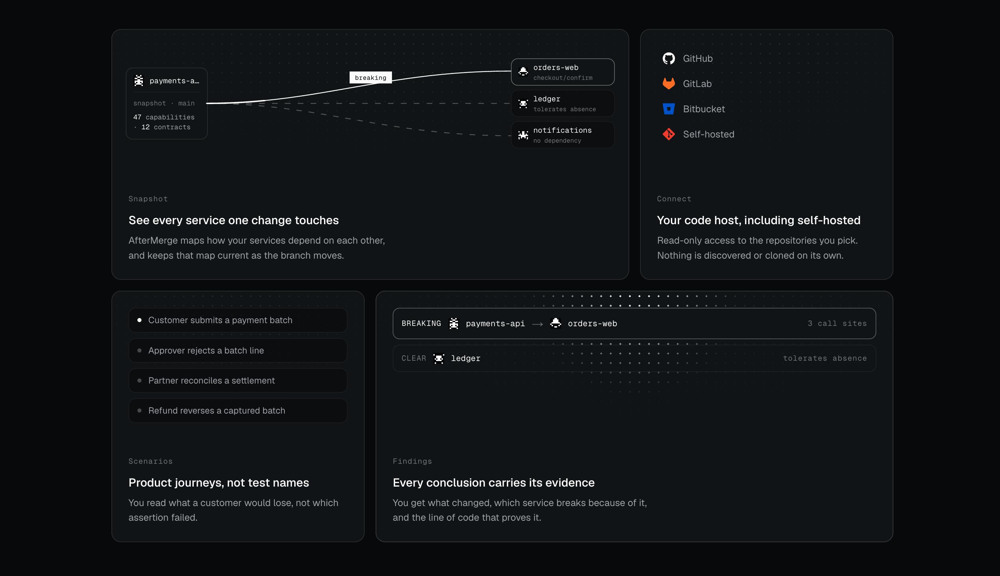

---

