# 🚀 Product Hunt Daily Top 30 (2026-08-21)

## 오늘의 요약
오늘의 트렌드는 단순한 자동화를 넘어, 회의와 개발 워크플로우에 직접 참여하여 문제를 해결하는 '에이전트 중심'의 서비스들이 주를 이루었습니다. 특히 보안과 프라이버시를 유지하면서도 복잡한 업무를 자율적으로 수행하는 AI 솔루션들이 주목받았습니다.

### 오늘의 핵심 포인트
- AI 에이전트가 회의 참여, 테스트 자동화, 영상 제작 등 실질적인 업무 워크플로우를 직접 수행하는 기술이 강화되었습니다.
- 데이터 유출 방지를 위한 온디바이스 실행 및 보안 중심의 노코드 툴 등 프라이버시와 보안이 핵심 경쟁력으로 부상했습니다.
- 단순 기록을 넘어 일정 조율, 테스트 복구, 영상 편집 등 업무 전후의 부수적인 과정을 자동화하는 통합 솔루션들이 등장했습니다.

**오늘의 태그**: AI 에이전트, 업무 자동화, 보안 및 프라이버시, 워크플로우 최적화

## 1. [HyNote for Mac](https://www.producthunt.com/products/hynote-ai)
**Votes**: 288 | **도입 난이도**: 하 | **신뢰도**: 상
**Tagline**: Free local transcription that is 100% Private
**서비스 링크**: https://www.producthunt.com/r/TFVUEICJCPZ3GD

**태그**: Productivity, Privacy, Transcription, Mac, AI Tool

### 📌 이 서비스 한눈에 보기
개인정보 유출 걱정 없이 로컬에서 안전하게 회의를 기록하는 맥용 음성 기록 도구

### 🔑 주요 기능
- 100% 온디바이스(On-device) 실행으로 데이터 외부 유출 차단
- 참석자 명단에 봇을 초대할 필요 없는 투명한 작동 방식
- Zoom, Google Meet, Teams 등 모든 화상 회의 시스템 오디오 캡처 지원

### 🙋 사용자에게 어떤 점이 좋은가
민감한 비즈니스 미팅 내용을 클라우드에 올리지 않고도 안전하게 텍스트로 변환하여 기록할 수 있습니다.

### ✅ 지금 바로 써볼 기능
- 로컬 환경에서의 음성 인식 정확도 테스트
- 화상 회의 중 시스템 오디오 캡처 기능 확인

### ⚠️ 사용 전 확인할 점
- 로컬 리소스를 사용하므로 맥 하드웨어 성능에 따른 작업 속도 차이 발생 가능
- 온디바이스 구동을 위한 최소 사양 확인 필요

### 🧭 확인이 더 필요한 정보
로컬 구동 시 하드웨어 사양(CPU/GPU)에 따른 성능 영향 범위를 확인해야 합니다.

### 📸 스크린샷 및 갤러리
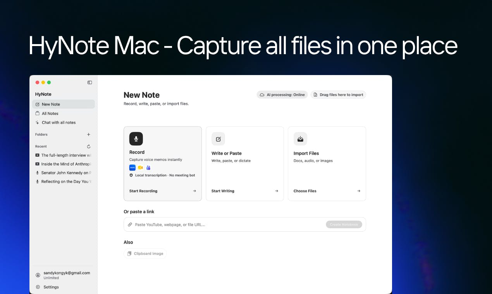
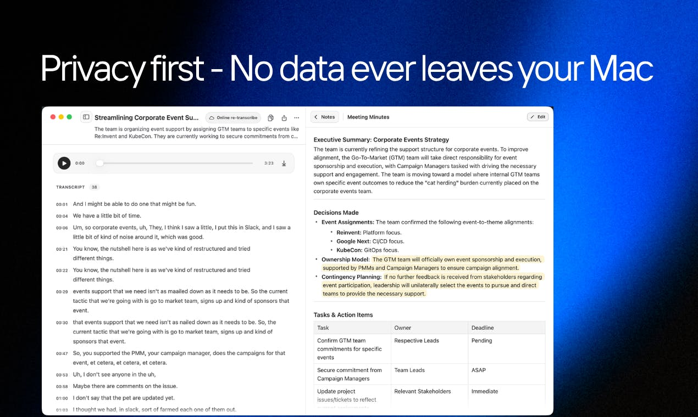
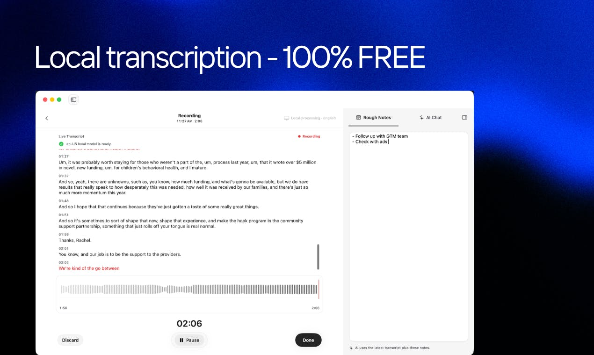

---

## 2. [Grok 4.6](https://www.producthunt.com/products/grok-4-6-7)
**Votes**: 217 | **도입 난이도**: 중 | **신뢰도**: 상
**Tagline**: Frontier Intelligence for Long-Running Agents
**서비스 링크**: https://www.producthunt.com/r/GAULWNJU36TUR3

**태그**: AI Agent, Software Engineering, Automation, DevTool, Agent, AI Tool, API

### 📌 이 서비스 한눈에 보기
장기 실행 에이전트와 복잡한 워크플로우를 위한 고성능 지능형 모델

### 🔑 주요 기능
- 지속적인 추론과 실세계 실행 능력을 결합한 에이전트 워크플로우 최적화
- 소프트웨어 엔지니어링 및 대화형 웹 애플리케이션 생성 기능 강화
- 1M 토큰당 $2 / $6의 비용 효율적인 가격 정책 유지

### 🙋 사용자에게 어떤 점이 좋은가
복잡한 코딩 작업이나 장시간 실행이 필요한 자동화 에이전트를 구축할 때 비용 부담 없이 강력한 성능을 제공합니다.

### ✅ 지금 바로 써볼 기능
- xAI API를 통한 장기 실행 에이전트 워크플로우 구축
- 소프트웨어 엔지니어링 자동화 작업 적용
- 대화형 웹 애플리케이션 생성 테스트

### ⚠️ 사용 전 확인할 점
- 에이전트의 장기 실행 시 발생할 수 있는 예외 상황 제어 필요
- 실제 워크플로우 적용 시 작업 복잡도에 따른 비용 변동성 확인

### 🧭 확인이 더 필요한 정보
구체적인 모델 성능 벤치마크와 파트너 네트워크의 상세 범위에 대한 확인이 필요합니다.

### 📸 스크린샷 및 갤러리
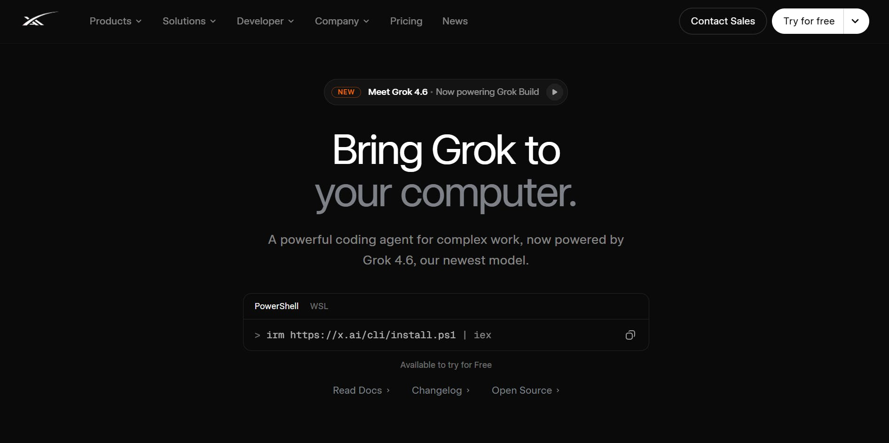
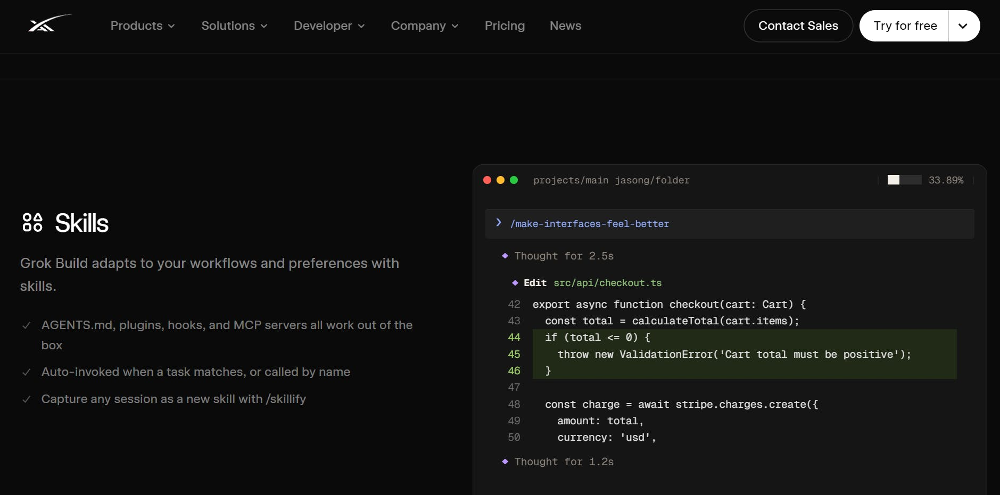
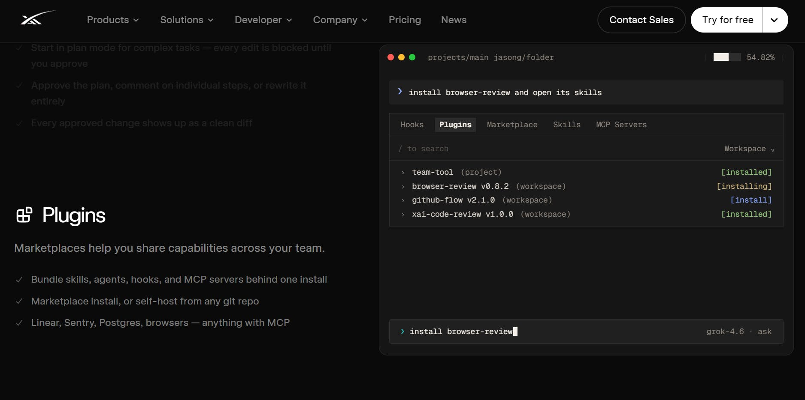

---

## 3. [Checksum AI](https://www.producthunt.com/products/checksum-ai)
**Votes**: 198 | **도입 난이도**: 중 | **신뢰도**: 상
**Tagline**: Your coding agent’s testing buddy
**서비스 링크**: https://www.producthunt.com/r/6UXTVDQE4GWO3U

**태그**: DevTool, QA, Automation, AI, Playwright, Agent, AI Tool, API

### 📌 이 서비스 한눈에 보기
코드 변경에 맞춰 테스트를 자동 생성하고 관리하는 AI 기반 지속적 테스트 플랫폼

### 🔑 주요 기능
- PR마다 E2E 및 API 테스트 자동 생성, 실행, 자동 복구
- Playwright 코드를 사용자 저장소(Repo)에 직접 생성하여 관리
- 테스트 실패 시 실제 버그와 노후된 테스트를 구분하고 자동 수정

### 🙋 사용자에게 어떤 점이 좋은가
수동 QA 속도보다 빠른 개발 사이클에서도 테스트 신뢰성을 유지하며, 테스트 유지보수 시간을 획기적으로 줄여줍니다.

### ✅ 지금 바로 써볼 기능
- 기존 Playwright 프로젝트에 Checksum 연동하기
- PR 생성 시 자동 테스트 생성 기능 활성화하기
- 테스트 실패 시 자동 복구(Auto-heal) 기능 테스트하기

### ⚠️ 사용 전 확인할 점
- 생성된 Playwright 코드가 기존 코드베이스와 충돌할 가능성 검토 필요
- AI가 판단하는 '실제 버그'와 '노후된 테스트' 구분 로직의 정확성 확인

### 🧭 확인이 더 필요한 정보
사용자 저장소에 직접 코드를 작성하는 방식이므로, 기존 테스트 프레임워크와의 호환성 및 보안 정책을 확인해야 합니다.

### 📸 스크린샷 및 갤러리
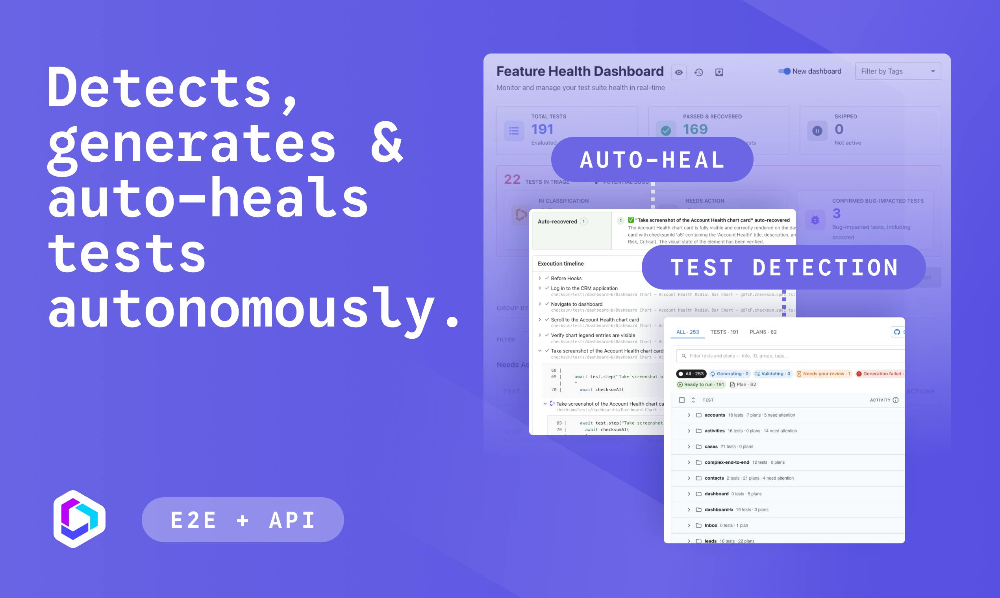
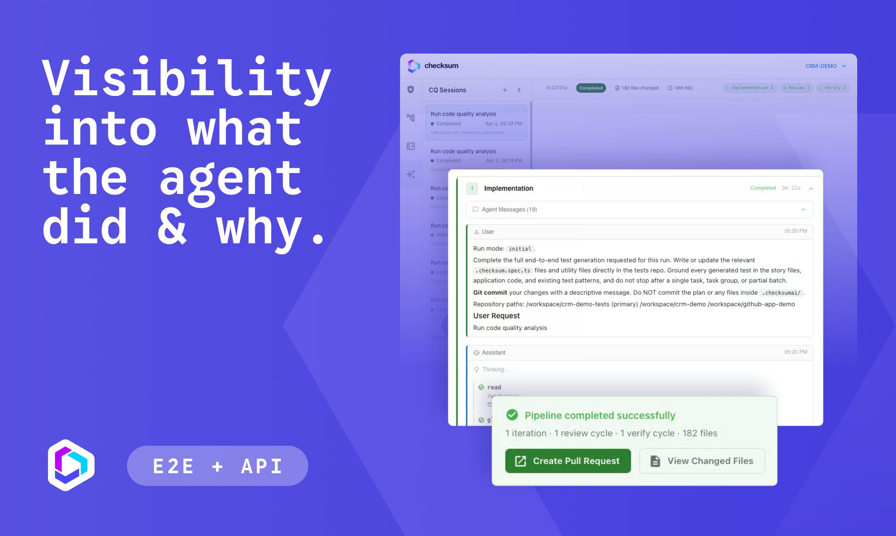
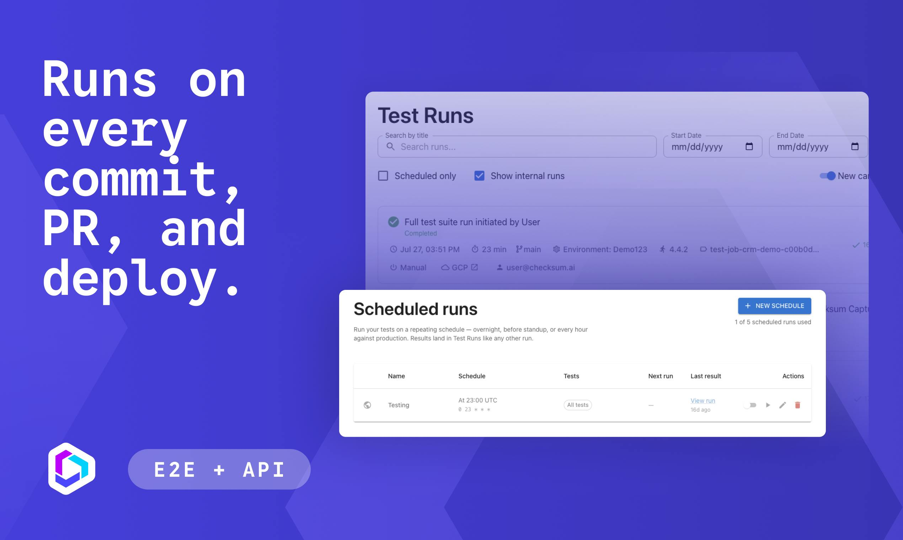

### 🎬 관련 영상
- [🎥 영상 보기](https://ph-files.imgix.net/83340304-51e7-47bf-b43d-be432f524aac.jpeg?auto=format)

---

## 4. [The New Calendly](https://www.producthunt.com/products/calendly)
**Votes**: 161 | **도입 난이도**: 하 | **신뢰도**: 상
**Tagline**: Handle all of the work before, during, and after meetings
**서비스 링크**: https://www.producthunt.com/r/LNHNJGGXMWCU24

**태그**: AI, Productivity, Automation, Scheduling, AI Tool

### 📌 이 서비스 한눈에 보기
단순 스케줄링을 넘어 회의 전후의 모든 업무를 자동화하는 AI 기반 통합 미팅 관리 솔루션

### 🔑 주요 기능
- Calendly Notetaker와 Callie AI 어시스턴트 도입
- 회의 전, 중, 후 발생하는 부수적인 업무 자동화
- 단순 일정 조율을 넘어선 미팅 워크플로우의 진화

### 🙋 사용자에게 어떤 점이 좋은가
회의 준비와 기록, 사후 정리 업무를 AI가 대신 처리하여 사용자가 핵심 업무에만 집중할 수 있게 돕습니다.

### ✅ 지금 바로 써볼 기능
- Calendly Notetaker로 회의 내용 자동 기록하기
- Callie AI 어시스턴트로 회의 전후 업무 자동화 설정하기
- 기존 Calendly 워크플로우에 새로운 AI 기능 통합하기

### ⚠️ 사용 전 확인할 점
- AI가 생성한 회의 기록의 정확성 검토 필요
- 기존 Calendly 사용자 환경에서의 기능 변화 적응

### 🧭 확인이 더 필요한 정보
새로운 AI 기능들의 구체적인 요금 체계와 기존 플랜과의 통합 방식에 대한 정보가 필요합니다.

### 📸 스크린샷 및 갤러리
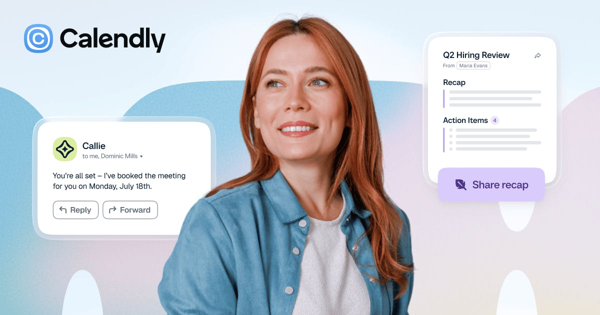

### 🎬 관련 영상
- [🎥 영상 보기](https://ph-files.imgix.net/56493a57-75f8-4102-aea9-116a87c43708.jpeg?auto=format)

---

## 5. [MeetStream AI](https://www.producthunt.com/products/meetstream-ai)
**Votes**: 136 | **도입 난이도**: 상 | **신뢰도**: 상
**Tagline**: Unified API & Infra for AI Meeting Agents
**서비스 링크**: https://www.producthunt.com/r/L7IWMBYCVNNDMY

**태그**: AI, API, Automation, SaaS, DevTool, Agent, AI Tool

### 📌 이 서비스 한눈에 보기
화상 회의에 직접 참여하여 실시간으로 소통하고 데이터를 수집하는 AI 에이전트 인프라

### 🔑 주요 기능
- Zoom, Google Meet, Teams를 지원하는 통합 API 제공
- 50개 이상의 실시간 데이터 포인트 캡처 기능
- 음성 인프라가 내장되어 에이전트가 직접 참여, 청취, 발화 가능

### 🙋 사용자에게 어떤 점이 좋은가
개발자가 복잡한 음성 인프라 구축 없이도 회의에 참여하여 행동하는 AI 에이전트를 쉽게 구현할 수 있습니다.

### ✅ 지금 바로 써볼 기능
- API를 통한 화상 회의 플랫폼 연동 테스트
- 실시간 데이터 캡처 기능 검증
- 에이전트의 음성 참여 및 상호작용 테스트

### ⚠️ 사용 전 확인할 점
- 에이전트가 직접 참여하므로 회의 참여자들에게 미칠 영향 고려 필요
- 실시간 음성 처리 및 데이터 수집에 따른 네트워크 안정성 확인 필요

### 🧭 확인이 더 필요한 정보
지원하는 화상 회의 플랫폼 외의 추가적인 환경에서의 호환성 여부를 확인해야 합니다.

### 📸 스크린샷 및 갤러리
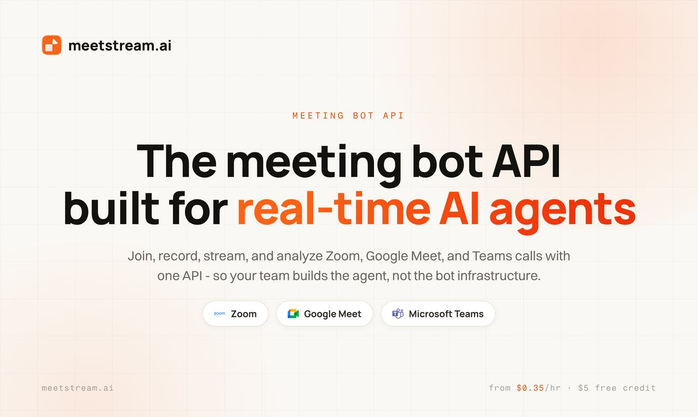
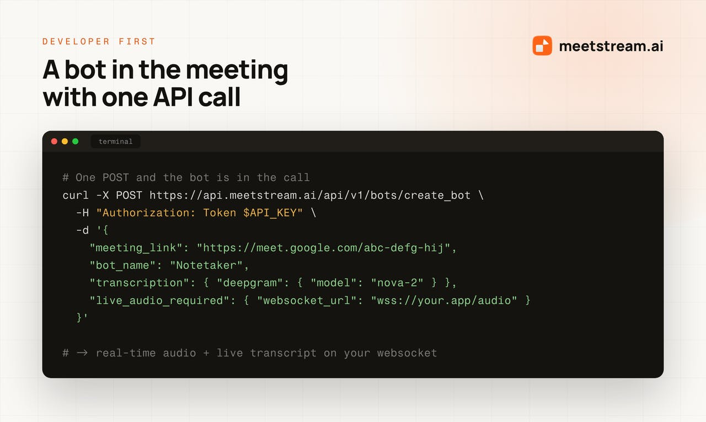
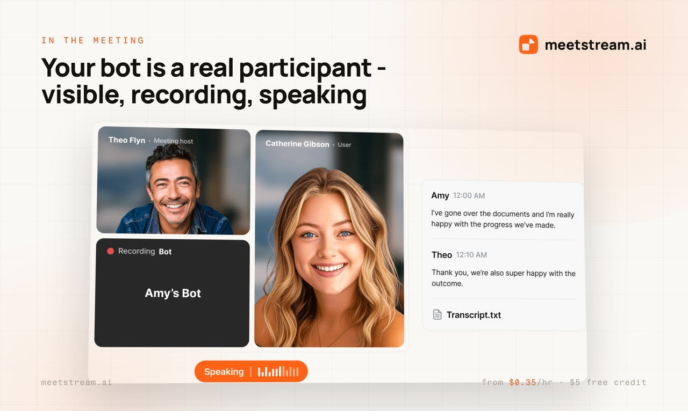

### 🎬 관련 영상
- [🎥 영상 보기](https://ph-files.imgix.net/9db22d72-be2c-4a0b-8633-d9160ccf3fe2.jpeg?auto=format)

---

## 6. [Prized](https://www.producthunt.com/products/prized)
**Votes**: 127 | **도입 난이도**: 하 | **신뢰도**: 상
**Tagline**: Let non-engineers build secure internal tools 
**서비스 링크**: https://www.producthunt.com/r/6OP6W6QAJ7SXCE

**태그**: NoCode, InternalTools, AI, Security, Productivity, AI Tool

### 📌 이 서비스 한눈에 보기
비개발자도 AI를 활용해 안전하게 사내 운영 도구를 구축할 수 있는 플랫폼

### 🔑 주요 기능
- AI 기반의 노코드/로우코드 내부 도구 빌드 환경 제공
- 데이터가 미리 연결되어 있고 권한 범위가 설정된 보안 중심 설계
- 모든 접근에 대한 감사 추적(Audit Trail) 및 원클릭 배포 지원

### 🙋 사용자에게 어떤 점이 좋은가
운영, 고객지원, 재무 팀이 개발팀의 도움 없이도 필요한 사내 툴을 직접 만들고 안전하게 배포할 수 있습니다.

### ✅ 지금 바로 써볼 기능
- AI를 활용한 내부 도구 프로토타입 제작
- 기존 회사 계정 연동을 통한 배포 테스트
- 데이터 접근 권한 및 감사 로그 기능 확인

### ⚠️ 사용 전 확인할 점
- 데이터 보안 정책이 기업의 내부 보안 규정을 충족하는지 확인 필요
- 복잡한 커스텀 로직 구현 시 개발자의 개입이 필요할 수 있음

### 🧭 확인이 더 필요한 정보
지원하는 구체적인 데이터 소스(DB, SaaS 등)의 종류와 연동 범위에 대한 정보가 부족합니다.

### 📸 스크린샷 및 갤러리
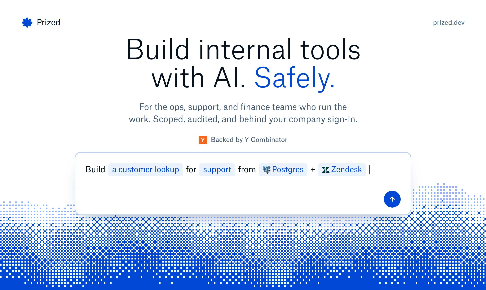
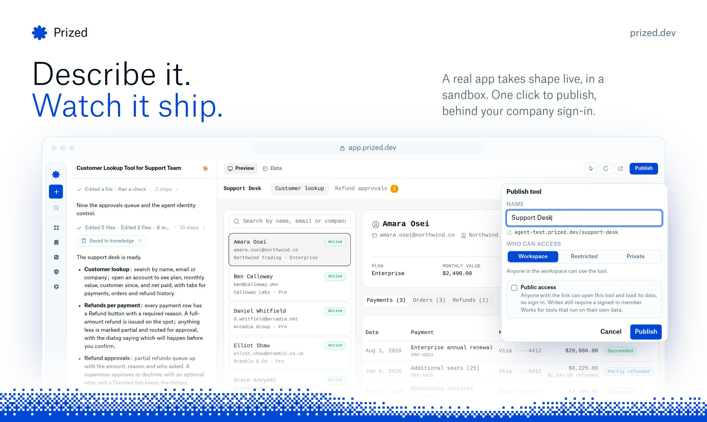
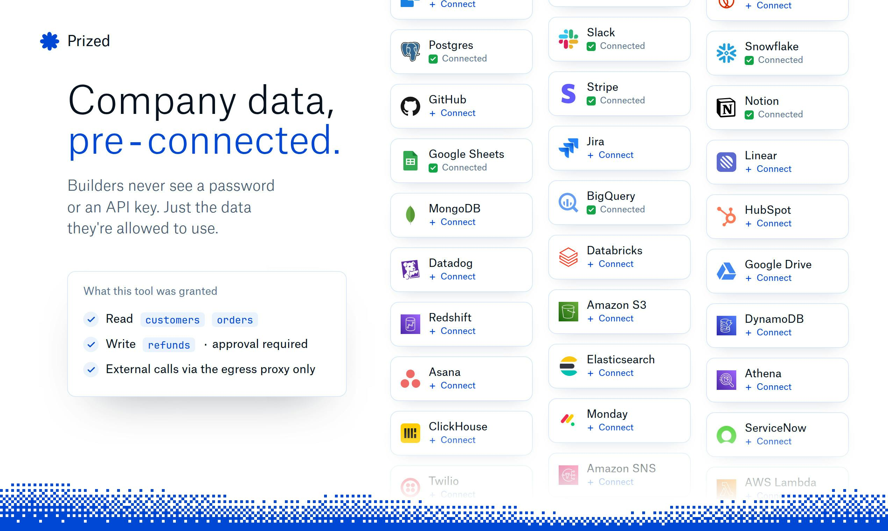

### 🎬 관련 영상
- [🎥 영상 보기](https://ph-files.imgix.net/8b2f54b7-e16f-4e86-817f-10e4d4901147.jpeg?auto=format)

---

## 7. [Lifelong](https://www.producthunt.com/products/lifelong-the-family-health-company)
**Votes**: 118 | **도입 난이도**: 하 | **신뢰도**: 상
**Tagline**: Your whole family’s health in one place.
**서비스 링크**: https://www.producthunt.com/r/EMHDXTAKNXV56T

**태그**: Health, Family, AI, iOS, AI Tool

### 📌 이 서비스 한눈에 보기
가족 구성원 모두의 건강 기록과 상태를 한곳에서 관리하는 통합 헬스케어 앱

### 🔑 주요 기능
- 개인이 아닌 가구 중심의 통합 건강 관리 시스템
- 약 복용, 증상, 예약, 활동 및 수면 기록 통합 관리
- 기존 웨어러블 기기 연동 및 AI 동반자 'Alo'를 통한 간편 기록

### 🙋 사용자에게 어떤 점이 좋은가
가족 구성원 개개인의 건강 데이터를 분산 관리할 필요 없이 하나의 앱에서 통합 관리할 수 있어 효율적입니다.

### ✅ 지금 바로 써볼 기능
- 기존에 사용 중인 웨어러블 기기 연결하기
- AI 동반자 Alo를 활용해 건강 상태 기록해보기
- 가족 구성원 초대 및 공유 설정하기

### ⚠️ 사용 전 확인할 점
- 현재 iOS에서만 사용 가능함
- 데이터 공유 범위 및 개인정보 제어 방식 확인 필요

### 🧭 확인이 더 필요한 정보
안드로이드 지원 여부와 상세 구독 요금 체계에 대한 정보가 명시되지 않았습니다.

### 📸 스크린샷 및 갤러리
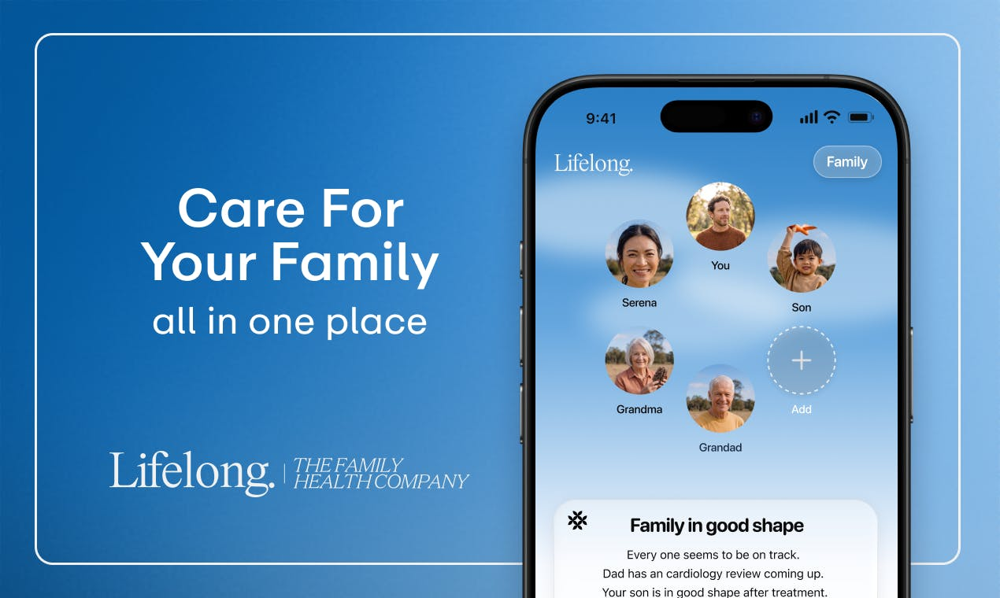
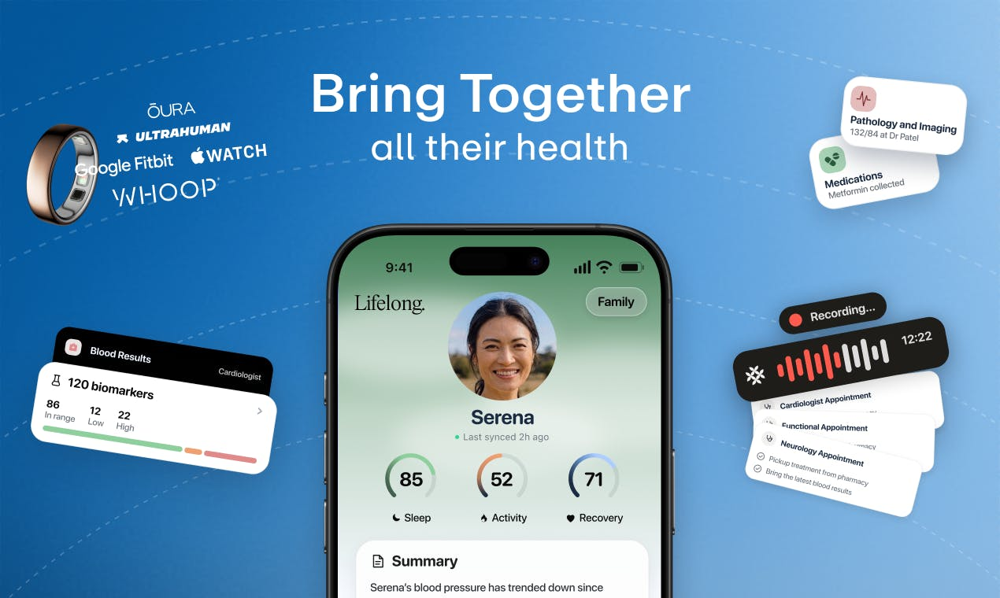
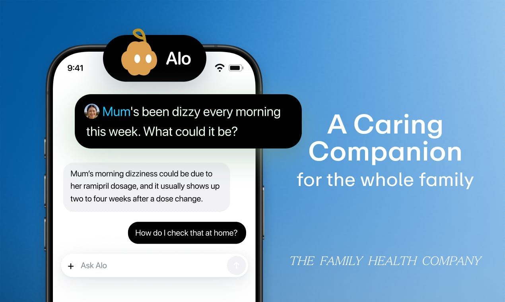

### 🎬 관련 영상
- [🎥 영상 보기](https://ph-files.imgix.net/02df3f1d-09a2-4f81-8a8b-40a12a1a81b9.jpeg?auto=format)

---

## 8. [MiniMax Design](https://www.producthunt.com/products/minimax)
**Votes**: 112 | **도입 난이도**: 중 | **신뢰도**: 상
**Tagline**: Your own agent team for open-ended creation
**서비스 링크**: https://www.producthunt.com/r/3ZDKIA2BDBRV7U

**태그**: VideoAI, Automation, CreativeTools, Workflow, Agent, Video, Design

### 📌 이 서비스 한눈에 보기
아이디어만 입력하면 영상 제작 전 과정을 자동화하는 AI 에이전트 팀

### 🔑 주요 기능
- MiniMax H3 모델 기반의 통합 영상 제작 워크플로우
- 기획부터 스틸컷, 영상 클립, 음악, 편집까지 한 번에 해결
- 3D 디렉터 스테이지 및 ComfyUI 노드를 통한 고급 제어 기능 제공

### 🙋 사용자에게 어떤 점이 좋은가
복잡한 영상 제작 과정을 에이전트에게 맡겨 작업 시간을 단축하면서도, 전문가를 위한 세밀한 컨트롤 옵션을 동시에 확보할 수 있습니다.

### ✅ 지금 바로 써볼 기능
- 텍스트 설명으로 전체 영상 제작 워크플로우 실행하기
- 3D 디렉터 스테이지를 활용한 정교한 연출 시도하기
- ComfyUI 노드를 통한 고급 편집 기능 탐색하기

### ⚠️ 사용 전 확인할 점
- 데스크톱 앱 설치 및 구동 환경 확인 필요
- 고급 기능을 위한 ComfyUI 및 3D 제어 숙련도 요구

### 🧭 확인이 더 필요한 정보
데스크톱 앱의 하드웨어 요구 사양과 구체적인 가격 정책이 명시되지 않았습니다.

### 📸 스크린샷 및 갤러리
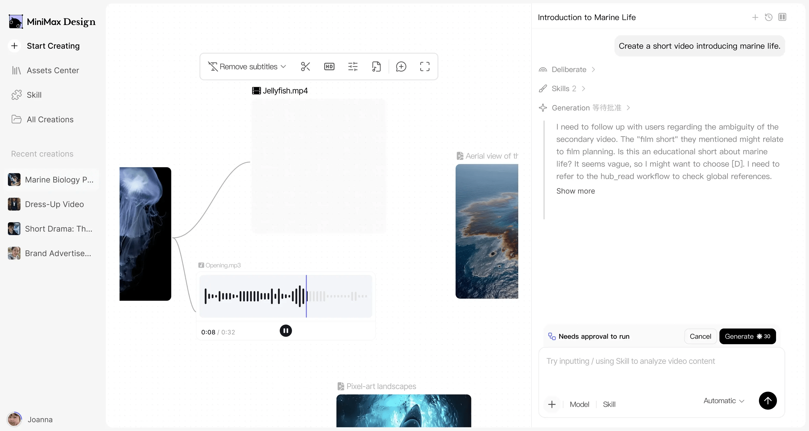
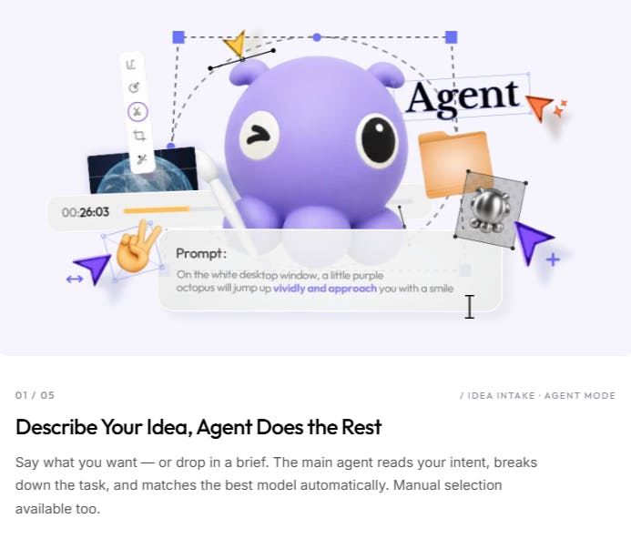
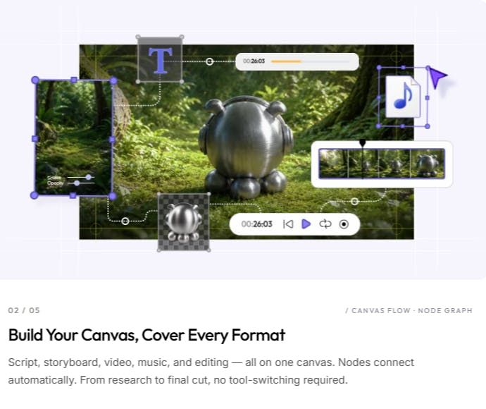

### 🎬 관련 영상
- [🎥 영상 보기](https://ph-files.imgix.net/1ab6844a-fa3b-4b18-a853-55b003e7a25a.jpeg?auto=format)

---

## 9. [Glasp for Firefox](https://www.producthunt.com/products/glasp-for-firefox)
**Votes**: 108 | **도입 난이도**: 하 | **신뢰도**: 상
**Tagline**: Highlight and summarize any page, PDF, or video in Firefox
**서비스 링크**: https://www.producthunt.com/r/YI2F675MOQJCQE

**태그**: Productivity, AI, BrowserExtension, KnowledgeManagement, Chat, Video

### 📌 이 서비스 한눈에 보기
웹 페이지, PDF, 유튜브 영상을 자유롭게 하이라이트하고 AI로 요약하는 파이어폭스 확장 프로그램

### 🔑 주요 기능
- 웹 기사, PDF, 유튜브 스크립트 하이라이트 및 메모 기능
- ChatGPT, Claude, Gemini를 활용한 페이지 및 영상 요약
- Notion, Obsidian, Markdown으로의 간편한 데이터 내보내기

### 🙋 사용자에게 어떤 점이 좋은가
웹 서핑 중 발견한 중요한 정보를 놓치지 않고 수집하며, AI를 통해 방대한 양의 콘텐츠를 빠르게 핵심만 파악할 수 있습니다.

### ✅ 지금 바로 써볼 기능
- 중요한 문구에 색상별 하이라이트 적용하기
- AI 기능을 사용하여 긴 글과 영상 요약하기
- 수집한 내용을 Notion이나 Obsidian으로 내보내기

### ⚠️ 사용 전 확인할 점
- AI 요약 기능 사용 시 각 모델(ChatGPT 등)의 계정 필요 여부 확인 필요
- 모바일 앱과의 동기화 상태 확인 필요

### 🧭 확인이 더 필요한 정보
AI 모델별로 제공되는 요약 기능의 상세 범위와 무료 사용량 제한 여부는 명시되지 않았습니다.

### 📸 스크린샷 및 갤러리
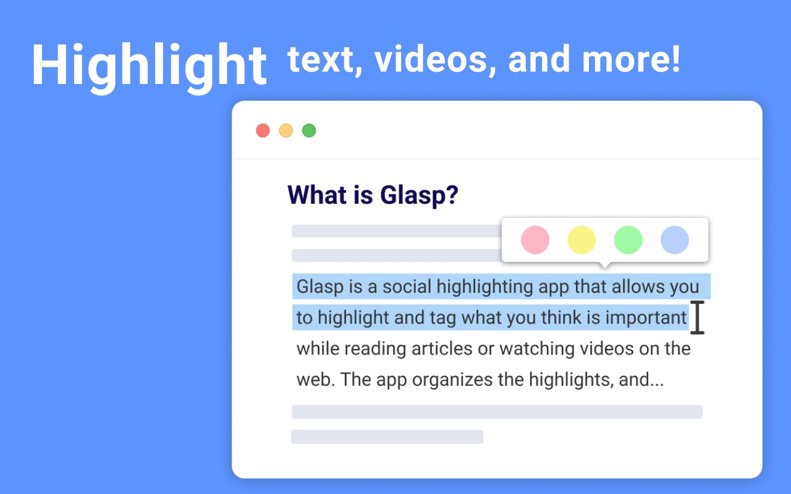

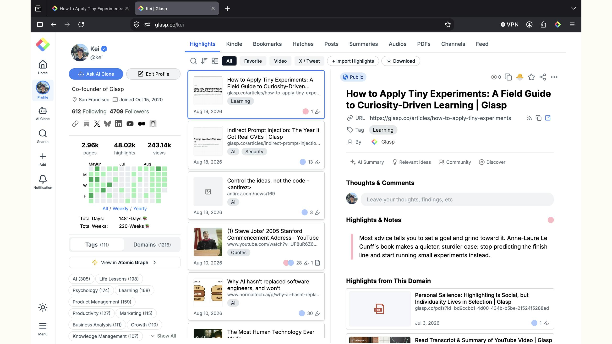

---

## 10. [Aloud](https://www.producthunt.com/products/aloud-4)
**Votes**: 107 | **도입 난이도**: 하 | **신뢰도**: 상
**Tagline**: Turn spoken feedback into tasks your coding agent can run
**서비스 링크**: https://www.producthunt.com/r/AOIGYVQTYHCPRE

**태그**: DevTool, Automation, Productivity, AI, Agent, AI Tool, Video

### 📌 이 서비스 한눈에 보기
음성 피드백을 코딩 에이전트용 실행 가능한 작업으로 자동 변환하는 도구

### 🔑 주요 기능
- 음성, 화면 녹화, 실시간 스크립트를 결합한 피드백 기록
- 모호한 표현을 정리하고 스크린샷을 추출하여 명확한 작업 단위로 변환
- Claude Code, Cursor, Codex 등 코딩 에이전트와 연동 가능한 태스크 생성

### 🙋 사용자에게 어떤 점이 좋은가
말하듯 자연스럽게 앱 피드백을 남기면, 이를 코딩 에이전트가 즉시 실행할 수 있는 정교한 작업 목록으로 바꿔주어 개발 워크플로우를 단축합니다.

### ✅ 지금 바로 써볼 기능
- 앱 사용 중 음성 피드백 녹화하기
- 생성된 태스크를 Cursor나 Claude Code에 입력하기
- On-device 보안 환경 확인하기

### ⚠️ 사용 전 확인할 점
- Mac 환경에 최적화된 도구이므로 다른 OS에서의 사용 가능 여부 확인 필요
- 생성된 태스크의 품질이 원본 음성의 명확도에 따라 달라질 수 있음

### 🧭 확인이 더 필요한 정보
현재 Mac 전용 환경에서만 작동하는 것으로 보이며, 타 OS 지원 여부는 명시되지 않았습니다.

### 📸 스크린샷 및 갤러리
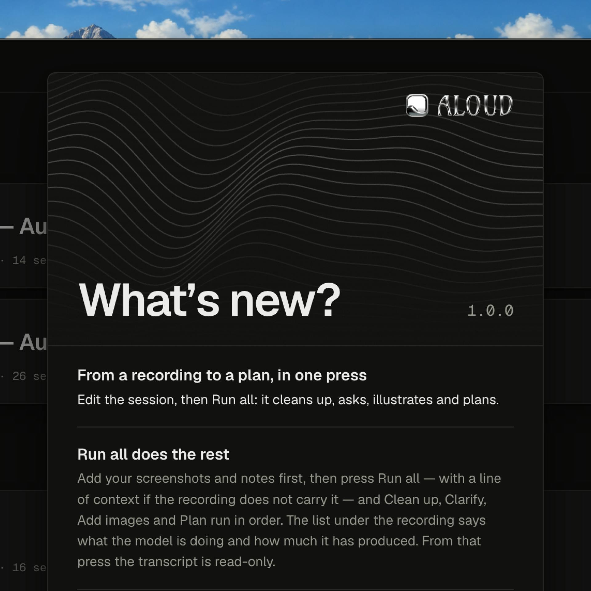
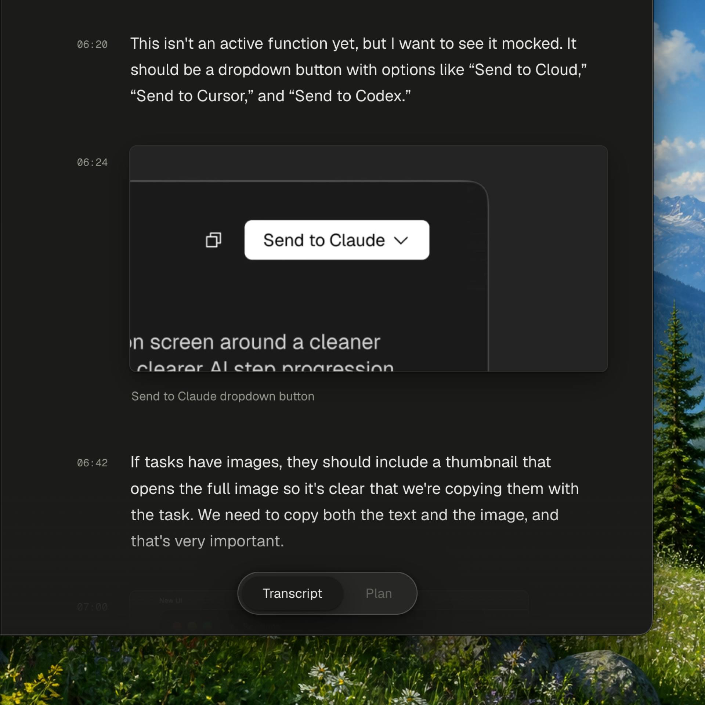
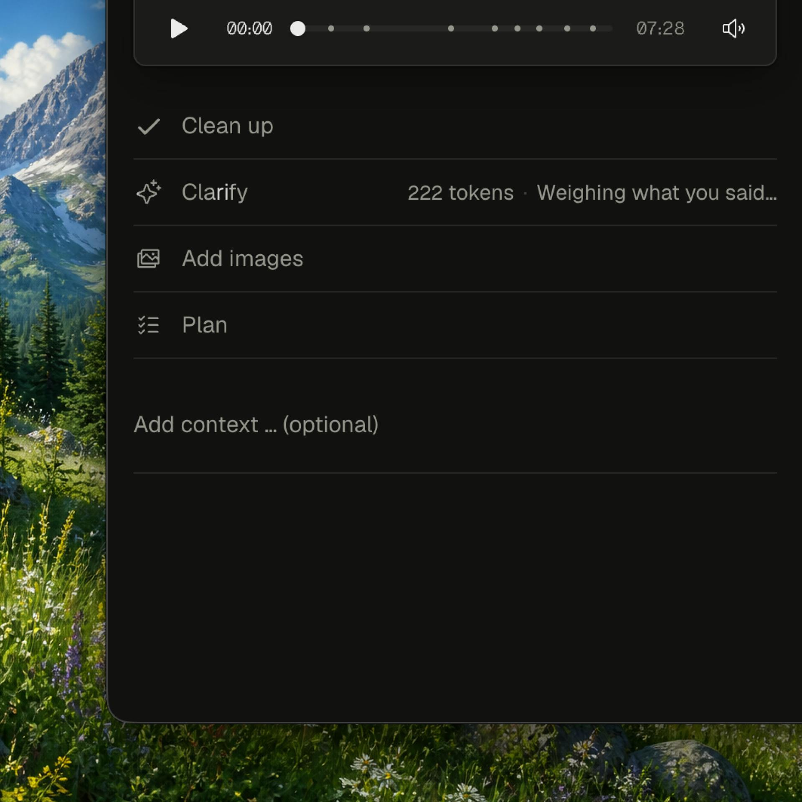

---

## 11. [Shape](https://www.producthunt.com/products/shape-5)
**Votes**: 105 | **도입 난이도**: 중 | **신뢰도**: 상
**Tagline**: The agentic IDE for designers and programmers
**서비스 링크**: https://www.producthunt.com/r/VCZNOGHAWYUJEU

**태그**: DevTool, DesignTool, AI, Productivity, Agent, AI Tool, Chat, Design

### 📌 이 서비스 한눈에 보기
디자인, 코딩, Git, AI 채팅을 하나로 통합한 에이전트 기반 IDE

### 🔑 주요 기능
- 디자인과 프로그래밍을 동시에 수행할 수 있는 통합 워크플로우
- Git 관리와 AI 채팅 기능이 내장된 데스크톱 애플리케이션
- 에이전트 중심의 지능형 개발 환경 제공

### 🙋 사용자에게 어떤 점이 좋은가
디자이너와 개발자 간의 작업 전환 비용을 줄이고, 하나의 앱에서 설계부터 코드 관리까지 완결성 있게 처리할 수 있습니다.

### ✅ 지금 바로 써볼 기능
- Windows용 데스크톱 앱 설치 및 실행
- 디자인-코드 연동 워크플로우 테스트
- AI 채팅을 통한 에이전트 기능 활용

### ⚠️ 사용 전 확인할 점
- 현재 Windows 환경만 지원하므로 macOS/Linux 사용자는 제약이 있음
- 통합 환경 특성상 기존 개별 도구와의 호환성 확인 필요

### 🧭 확인이 더 필요한 정보
상세한 에이전트 기능의 작동 방식과 타 소프트웨어와의 연동 수준은 직접 사용 전까지 확인이 필요합니다.

### 📸 스크린샷 및 갤러리
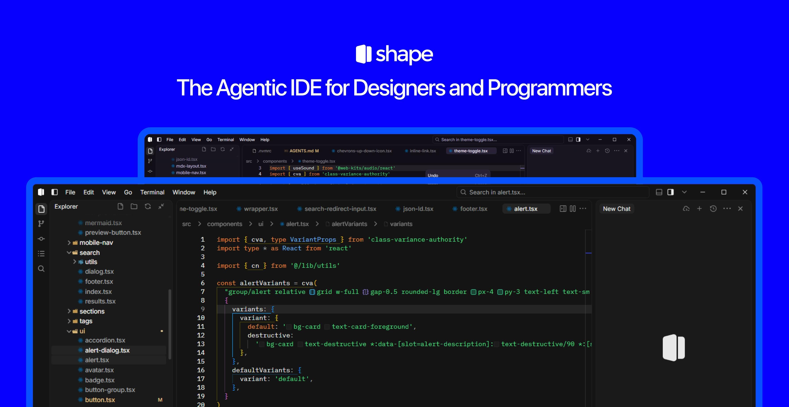
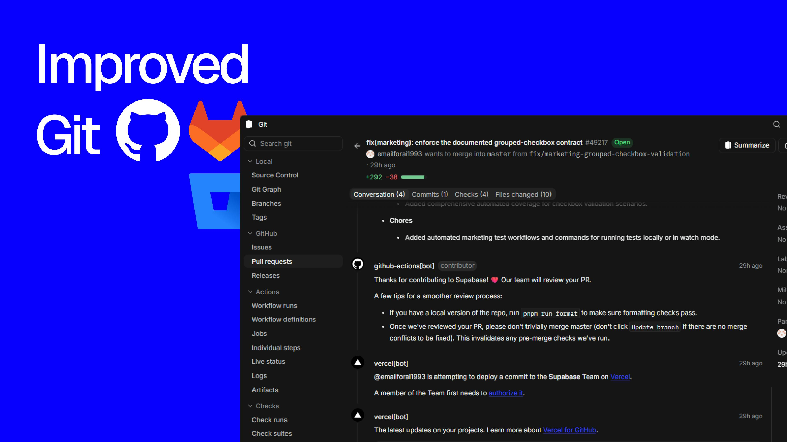
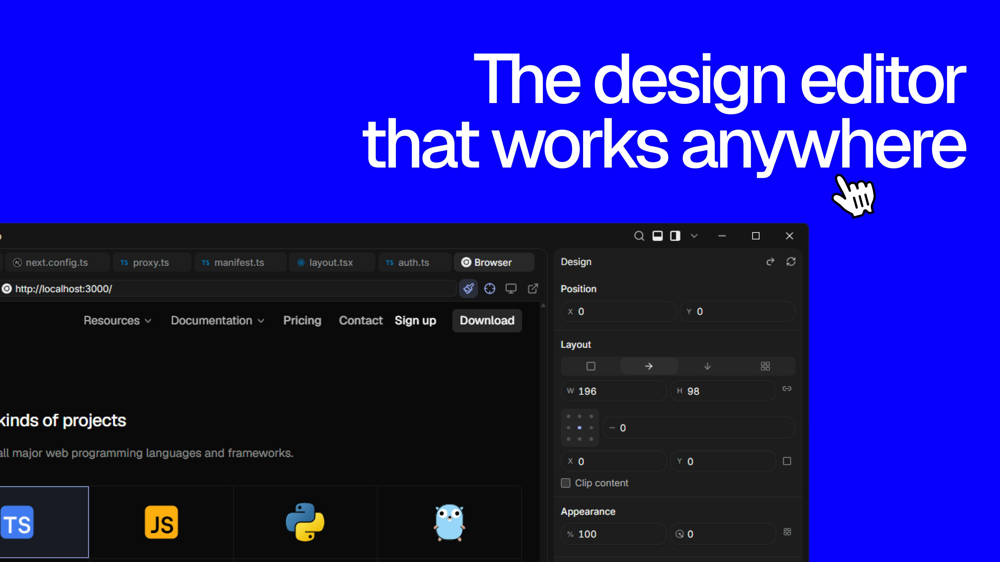

---

## 12. [bitdrift.ai](https://www.producthunt.com/products/bitdrift)
**Votes**: 101 | **도입 난이도**: 중 | **신뢰도**: 상
**Tagline**: The world’s first agentic mobile observability platform
**서비스 링크**: https://www.producthunt.com/r/UG2LC5QUB4IBYY

**태그**: Mobile, Observability, AI-Agent, DevOps, Agent, AI Tool, API

### 📌 이 서비스 한눈에 보기
AI 에이전트가 모바일 사용자 행동을 실시간으로 분석하고 자율적으로 대응하는 차세대 관측 플랫폼

### 🔑 주요 기능
- AI 에이전트가 모바일 사용자 여정과 성능 지표를 실시간으로 쿼리 가능
- 앱 업데이트 대기 없이 즉각적인 데이터 가용성 제공
- 조사 속도 향상 및 MTTR(평균 복구 시간) 10배 개선 효과

### 🙋 사용자에게 어떤 점이 좋은가
모바일 앱의 사용자 행동 변화와 성능 문제를 실시간으로 파악하여, 문제 발생 시 수동 조사 대신 AI 에이전트를 통해 즉각적인 대응이 가능합니다.

### ✅ 지금 바로 써볼 기능
- Public API를 통한 데이터 연동 테스트
- 실시간 사용자 여정 및 성능 지표 모니터링
- AI 에이전트 기반의 자동화된 문제 해결 워크플로우 설정

### ⚠️ 사용 전 확인할 점
- 에이전트의 자율적 행동에 따른 시스템 영향도 검토 필요
- 실시간 데이터 수집에 따른 모바일 앱 성능 영향 확인 필요

### 🧭 확인이 더 필요한 정보
제공되는 'bd skills'의 구체적인 기술 스택과 에이전트의 자율적 액션 범위에 대한 상세 정보가 필요합니다.

### 📸 스크린샷 및 갤러리
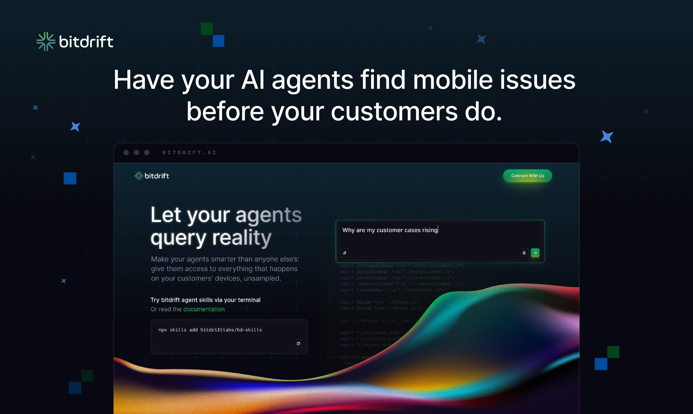
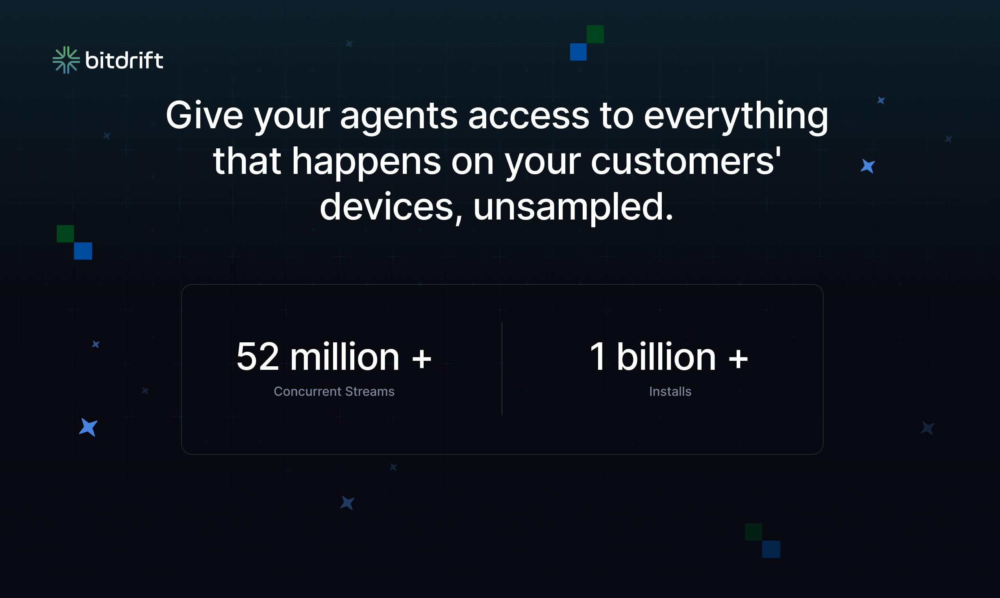
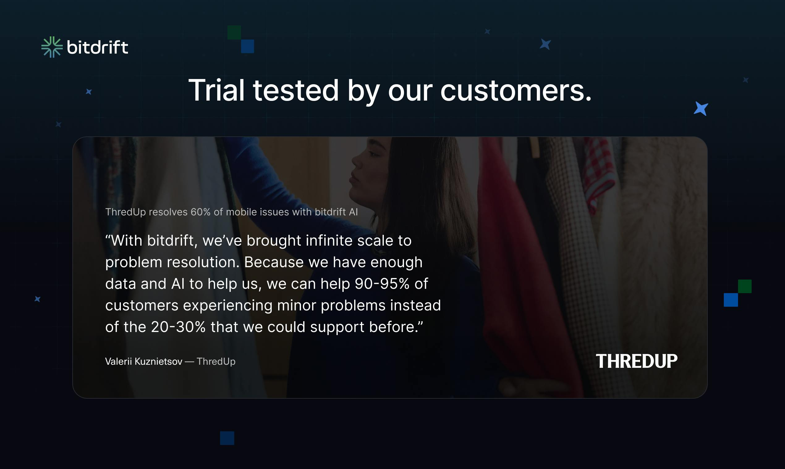

### 🎬 관련 영상
- [🎥 영상 보기](https://ph-files.imgix.net/cb0d9265-637d-440c-8058-3bb0480ae825.jpeg?auto=format)

---

## 13. [NobodyWho](https://www.producthunt.com/products/nobodywho)
**Votes**: 100 | **도입 난이도**: 중 | **신뢰도**: 상
**Tagline**: Run AI models on any device
**서비스 링크**: https://www.producthunt.com/r/FNS5GNY3Y6LMYC

**태그**: AI, OpenSource, MobileDev, EdgeComputing, LLM, AI Tool, API

### 📌 이 서비스 한눈에 보기
클라우드 없이 모든 기기에서 LLM을 실행할 수 있는 오픈소스 온디바이스 추론 엔진

### 🔑 주요 기능
- llama.cpp 기반의 완전한 온디바이스(On-device) 실행 환경 제공
- Swift, Kotlin, Flutter, React Native, Python, Godot 등 다양한 프레임워크 지원
- GPU 가속(Vulkan, Metal), 멀티모달, TTS/STT 및 타입 안전한 도구 호출 기능 포함

### 🙋 사용자에게 어떤 점이 좋은가
API 키나 클라우드 비용 걱정 없이 개인정보를 보호하며 다양한 플랫폼의 앱에 AI 기능을 직접 통합할 수 있습니다.

### ✅ 지금 바로 써볼 기능
- 지원하는 프레임워크(Swift, Python 등)에 맞춰 환경 설정하기
- Hugging Face를 통해 적절한 모델 다운로드 및 테스트하기
- GPU 가속(Metal/Vulkan)을 활용한 성능 최적화 확인하기

### ⚠️ 사용 전 확인할 점
- 기기 하드웨어 성능에 따라 모델 실행 속도 및 발열 차이가 클 수 있음
- 온디바이스 특성상 모델 크기에 따른 저장 공간 및 메모리 제약 존재

### 🧭 확인이 더 필요한 정보
사용자의 하드웨어 사양에 따른 구체적인 성능 벤치마크 데이터는 확인이 필요합니다.

### 📸 스크린샷 및 갤러리
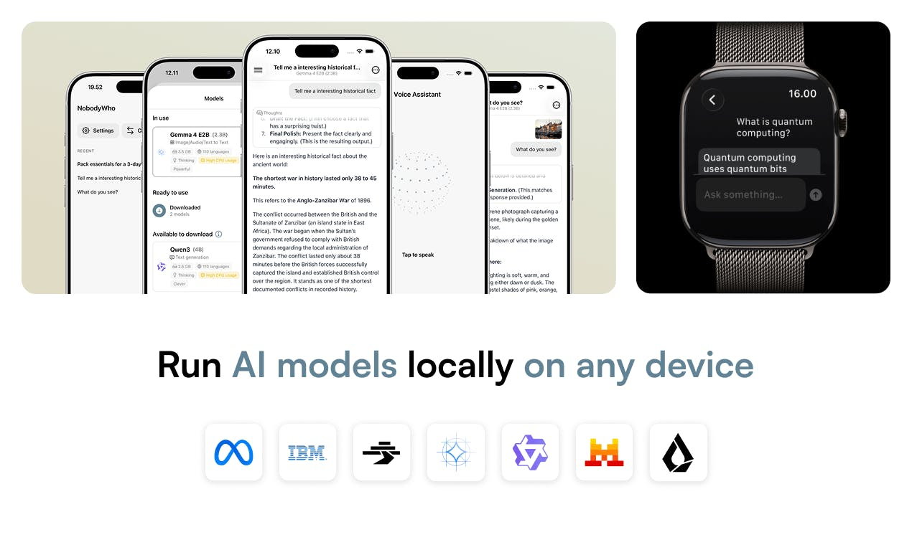
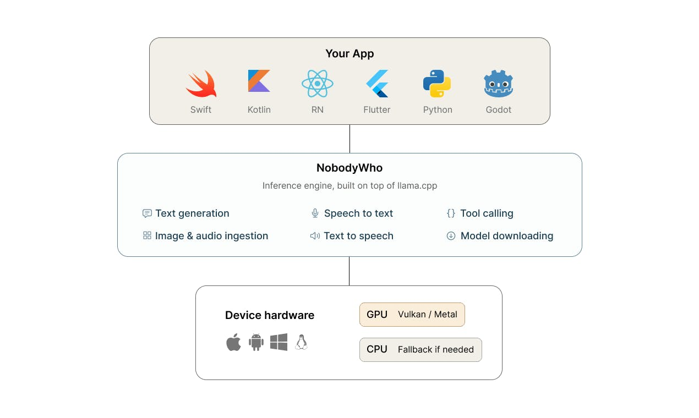
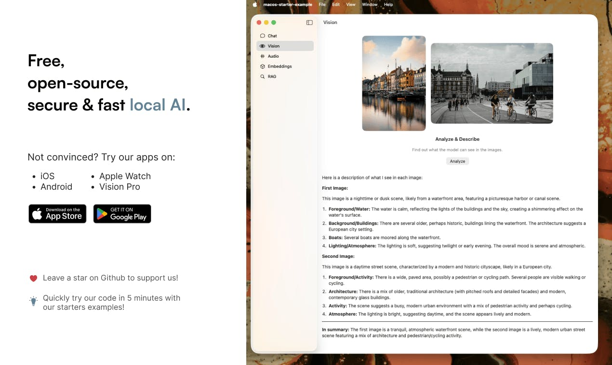

### 🎬 관련 영상
- [🎥 영상 보기](https://ph-files.imgix.net/4f6b3f78-217d-44eb-8f7c-cdb505dba879.jpeg?auto=format)

---

## 14. [Hermai Brand API](https://www.producthunt.com/products/hermai-brand-api)
**Votes**: 99 | **도입 난이도**: 하 | **신뢰도**: 상
**Tagline**: White label your B2B SaaS with every customer's brand
**서비스 링크**: https://www.producthunt.com/r/KBTDPMY6V3G6LL

**태그**: B2B, SaaS, White-label, DevTool, Automation, AI Tool, API, Email

### 📌 이 서비스 한눈에 보기
고객의 도메인 정보를 기반으로 브랜드 테마를 자동 생성하는 B2B SaaS용 화이트 라벨 API

### 🔑 주요 기능
- 고객의 이메일/도메인 기반 브랜드 자산(로고, 색상, 설명) 자동 추출
- 첫 로그인부터 고객 맞춤형 UI를 제공하는 화이트 라벨링 기능
- 월 1,000개 브랜드까지 무료로 제공되는 넉넉한 프리 티어

### 🙋 사용자에게 어떤 점이 좋은가
B2B SaaS 개발자가 별도의 디자인 작업 없이도 고객사별 맞춤형 브랜드 경험을 즉각적으로 구현할 수 있습니다.

### ✅ 지금 바로 써볼 기능
- 도메인 기반 브랜드 데이터 추출 테스트
- SaaS UI 테마 적용 워크플로우 검증
- 월 1,000개 무료 플랜 범위 확인

### ⚠️ 사용 전 확인할 점
- 추출된 브랜드 자산의 정확도 및 품질 확인 필요
- 1,000개 브랜드 초과 시의 과금 체계 확인 필요

### 🧭 확인이 더 필요한 정보
추출된 브랜드 데이터가 실제 UI 테마로 적용되는 구체적인 기술 규격(CSS, JSON 등)에 대한 정보가 부족합니다.

### 📸 스크린샷 및 갤러리
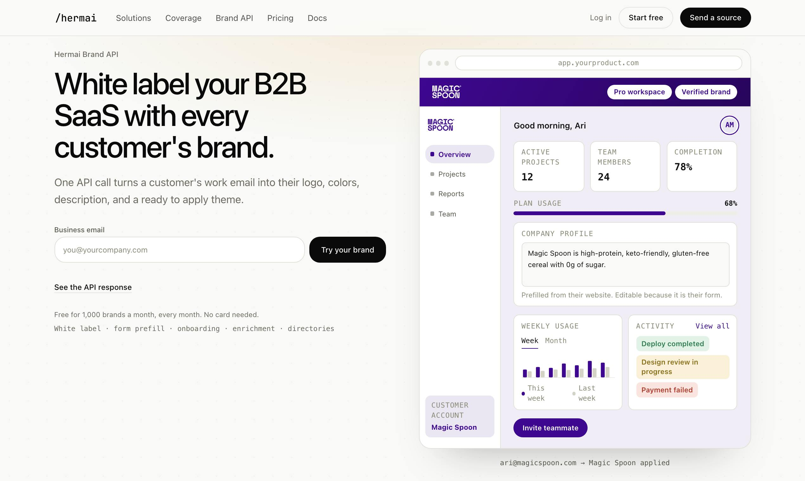
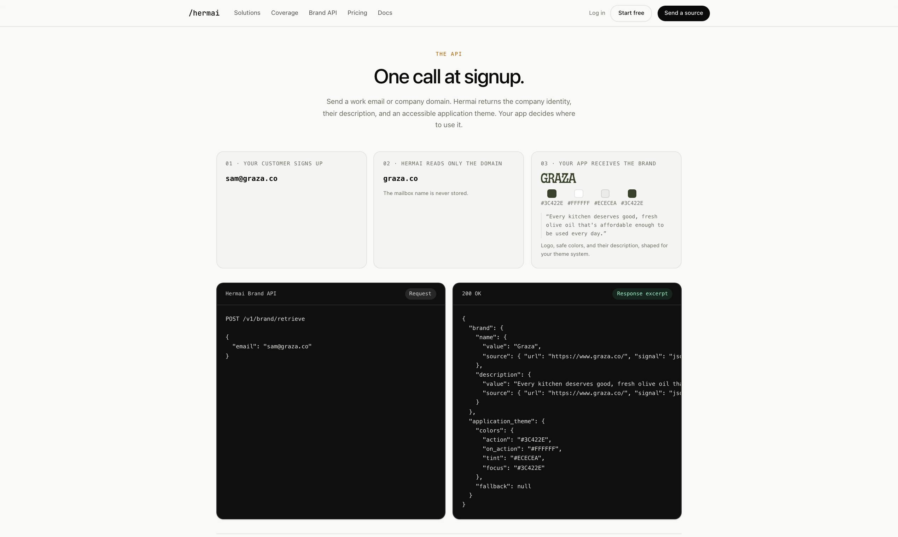
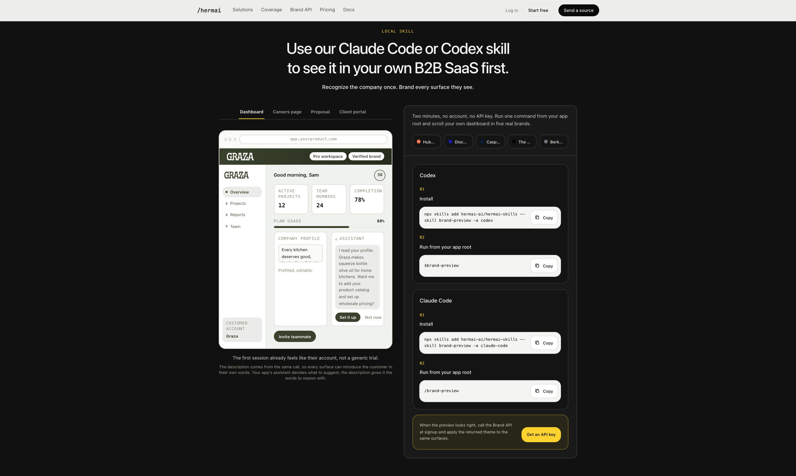

---

## 15. [Berd](https://www.producthunt.com/products/berd)
**Votes**: 98 | **도입 난이도**: 중 | **신뢰도**: 상
**Tagline**: Weird, playful desktop app for building with AI agents
**서비스 링크**: https://www.producthunt.com/r/7GXWXOPOBJJA7Y

**태그**: AI Agent, DevTool, Productivity, Automation, Desktop App, Agent, AI Tool, Chat, Design

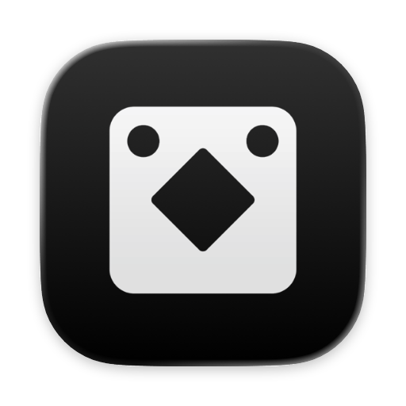

### 📌 이 서비스 한눈에 보기
엔지니어와 디자이너를 위한 로컬 컨텍스트 기반의 AI 에이전트 데스크톱 워크스페이스

### 🔑 주요 기능
- 로컬 워크스페이스 컨텍스트를 활용하는 지속적인 AI 에이전트 동반자
- 프로젝트, 스킬, 확장 기능 및 자동화를 결합한 빌더 중심의 환경
- 빠른 채팅과 정밀한 컨텍스트 선택을 지원하는 유연한 인터페이스

### 🙋 사용자에게 어떤 점이 좋은가
개인 작업 환경의 맥락을 유지하면서 아이디어 구상부터 실제 구현까지 끊김 없이 연결할 수 있습니다.

### ✅ 지금 바로 써볼 기능
- 로컬 프로젝트 파일 연결하기
- 에이전트 스킬 및 자동화 설정하기
- 모델 제공자 연동 및 워크스페이스 컨텍스트 테스트하기

### ⚠️ 사용 전 확인할 점
- 로컬 데이터 접근에 따른 보안 및 개인정보 보호 정책 확인 필요
- 데스크톱 앱의 리소스 점유율 및 로컬 환경 호환성 확인 필요

### 🧭 확인이 더 필요한 정보
로컬 워크스페이스 데이터 보안 수준과 구체적인 모델 제공자 지원 범위에 대한 정보가 더 필요합니다.

### 📸 스크린샷 및 갤러리
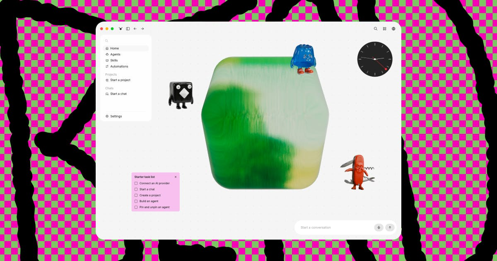
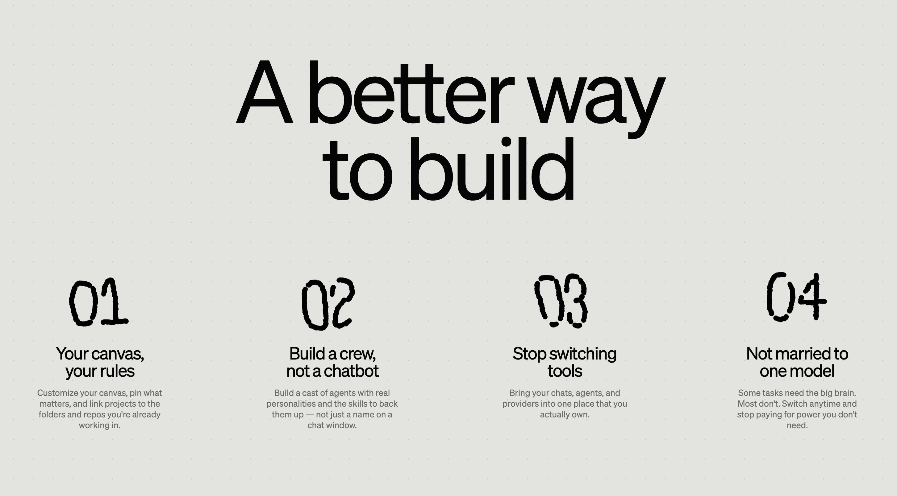
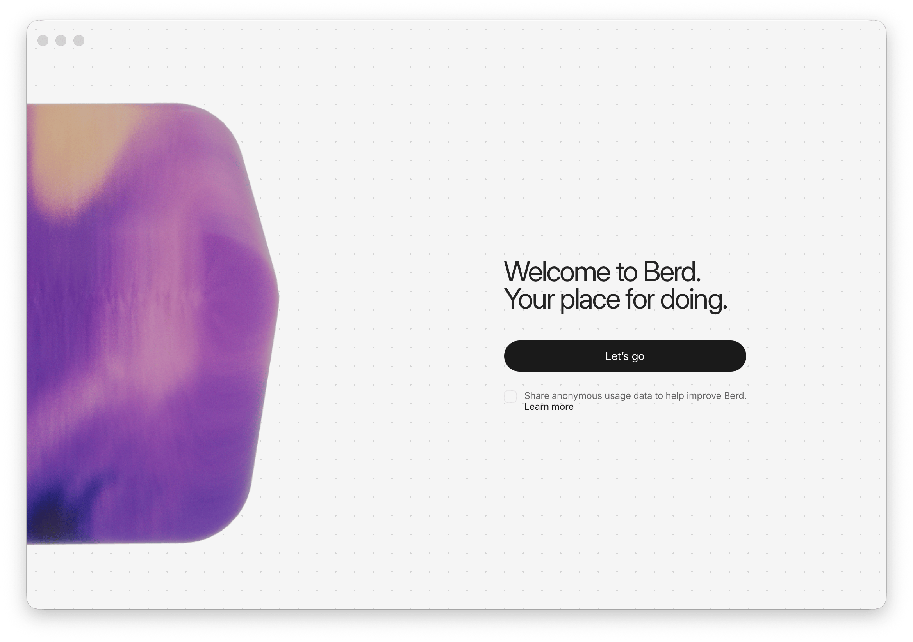

---

## 16. [Zoho Cliq 7.0](https://www.producthunt.com/products/zoho)
**Votes**: 89 | **도입 난이도**: 하 | **신뢰도**: 상
**Tagline**: Uninterrupted work
**서비스 링크**: https://www.producthunt.com/r/FMRT2TPU2NYECY

**태그**: Collaboration, Automation, AI, Accessibility, Productivity, AI Tool, DevTool

### 📌 이 서비스 한눈에 보기
AI와 자동화로 업무 흐름을 끊김 없이 이어주는 협업 플랫폼

### 🔑 주요 기능
- 노코드 봇 빌더를 통한 업무 자동화
- 수어 모드 및 WCAG 준수를 통한 포용적 협업 환경
- AI 코딩 어시스턴트 및 멀티미디어 요약 기능

### 🙋 사용자에게 어떤 점이 좋은가
반복적인 업무를 자동화하고 AI 기반의 요약 및 코딩 지원을 통해 업무 몰입도를 높일 수 있습니다.

### ✅ 지금 바로 써볼 기능
- 노코드 봇을 만들어 반복 업무 자동화하기
- AI 코딩 어시스턴트로 개발 효율 높이기
- 멀티미디어 요약 기능으로 회의 내용 빠르게 파악하기

### ⚠️ 사용 전 확인할 점
- AI 기능의 결과물에 대한 검토 필요
- 기존 워크플로우와의 호환성 확인

### 🧭 확인이 더 필요한 정보
제시된 AI 기능들의 구체적인 기술 스택과 데이터 보안 정책에 대한 확인이 필요합니다.

### 📸 스크린샷 및 갤러리
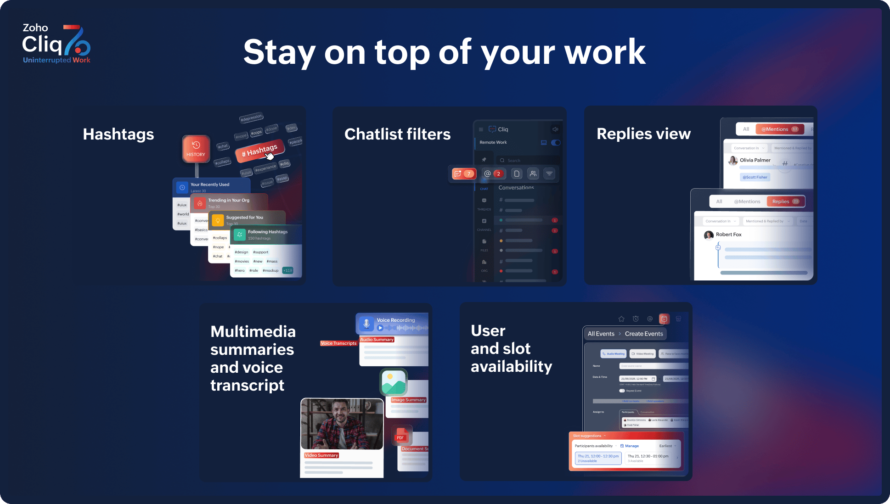
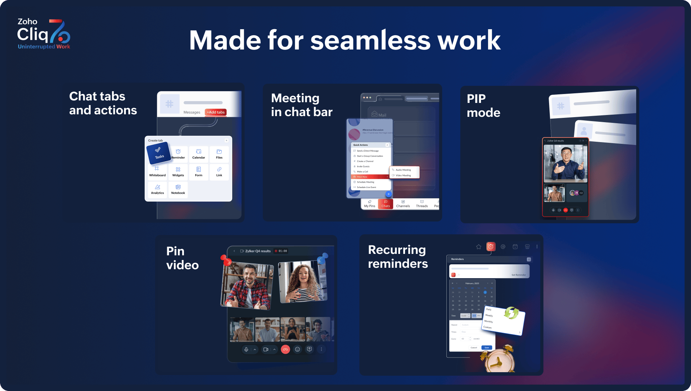
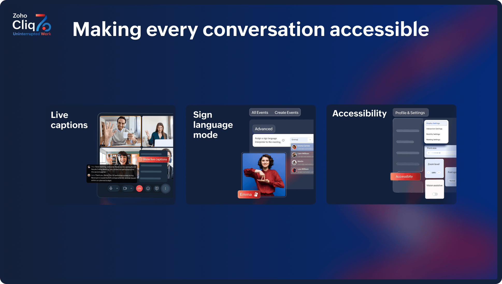

### 🎬 관련 영상
- [🎥 영상 보기](https://ph-files.imgix.net/0c915c7e-6a2d-4b25-a88b-cb32a103a059.jpeg?auto=format)

---

## 17. [Roveri](https://www.producthunt.com/products/roveri)
**Votes**: 84 | **도입 난이도**: 하 | **신뢰도**: 상
**Tagline**: A riding journal for iPhone every ride, painted on a map
**서비스 링크**: https://www.producthunt.com/r/TFWHWET6O3E2VF

**태그**: Lifestyle, iOS, Travel, Journaling, AI Tool

### 📌 이 서비스 한눈에 보기
내가 달린 경로를 지도로 기록하는 아이폰 전용 라이딩 저널

### 🔑 주요 기능
- 원터치로 경로, 속도, 고도, 날씨 자동 기록
- 라이딩 기록이 모여 시즌별 아카이브와 도로 지도(Atlas) 형성
- 내비게이션이 아닌 기록과 회상을 위한 저널링 중심 서비스

### 🙋 사용자에게 어떤 점이 좋은가
복잡한 설정 없이 한 번의 터치로 라이딩의 모든 순간을 시각적인 지도로 남길 수 있습니다.

### ✅ 지금 바로 써볼 기능
- 원터치 기록 기능 테스트
- iOS 18.6 이상 환경 확인
- 기록된 경로의 지도 시각화 확인

### ⚠️ 사용 전 확인할 점
- iOS 18.6 이상의 최신 기기 필요
- 내비게이션 기능이 없으므로 길 안내 용도로는 부적합

### 🧭 확인이 더 필요한 정보
무료 시작 이후의 구체적인 유료 구독 모델이나 과금 체계가 명시되지 않았습니다.

### 📸 스크린샷 및 갤러리
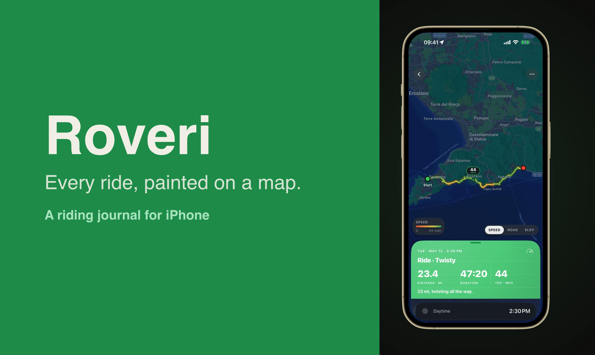
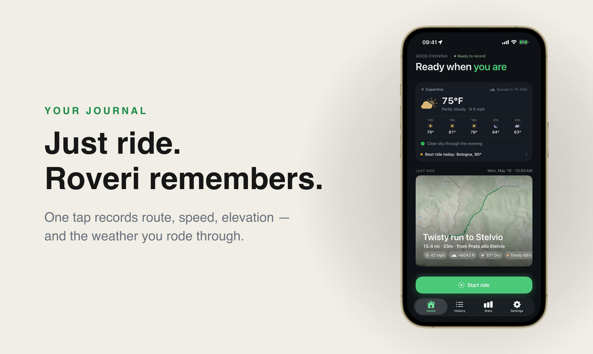

### 🎬 관련 영상
- [🎥 영상 보기](https://ph-files.imgix.net/33841199-6758-4a9c-952c-9e76a36f27b8.jpeg?auto=format)

---

## 18. [Revy](https://www.producthunt.com/products/revy-the-fashion-app)
**Votes**: 84 | **도입 난이도**: 하 | **신뢰도**: 상
**Tagline**: The ownership layer for fashion, shopping, and your wardrobe
**서비스 링크**: https://www.producthunt.com/r/VSXVHAEMH4EI7A

**태그**: Fashion, Lifestyle, Shopping, Personal Style

### 📌 이 서비스 한눈에 보기
내가 가진 옷으로 새로운 스타일을 만드는 패션 소유권 레이어

### 🔑 주요 기능
- 기존 워드롭(옷장)을 활용한 스타일 재현
- 영감, 크리에이터, 쇼핑을 연결하는 통합 플랫폼
- 개인별 퍼스널 스타일과 쇼핑의 결합

### 🙋 사용자에게 어떤 점이 좋은가
새로운 옷을 사기 전에 내가 가진 옷들을 어떻게 조합할지 고민하는 사용자에게 스타일링 영감을 제공합니다.

### ✅ 지금 바로 써볼 기능
- 자신의 옷장 데이터 등록하기
- 좋아하는 스타일 영감 탐색하기
- 기존 아이템과 새로운 쇼핑 아이템 조합해보기

### ⚠️ 사용 전 확인할 점
- 사용자가 직접 자신의 옷장 정보를 입력해야 하는 번거로움이 있을 수 있음
- 초기 데이터 구축 정도에 따라 추천 정확도가 달라질 수 있음

### 🧭 확인이 더 필요한 정보
사용자의 기존 옷장 데이터를 어떻게 자동으로 불러오거나 관리하는지에 대한 구체적인 방식이 명시되지 않았습니다.

### 📸 스크린샷 및 갤러리

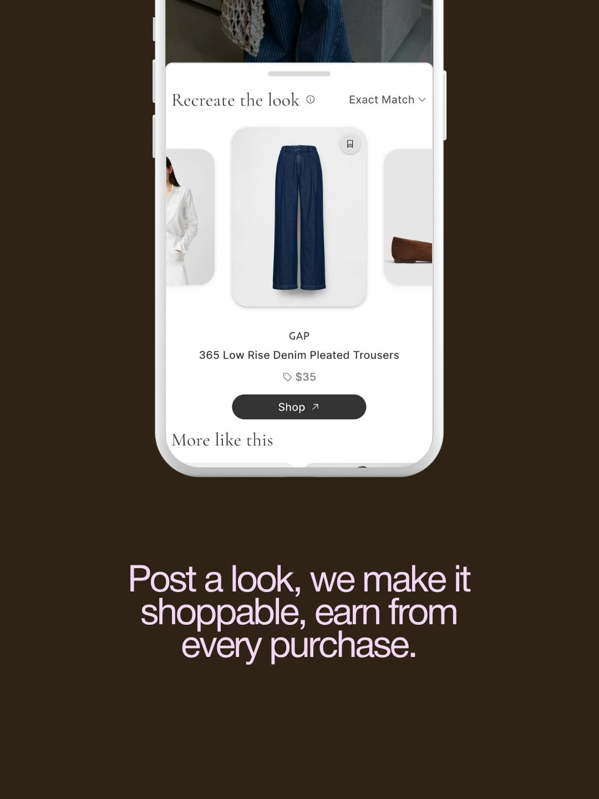
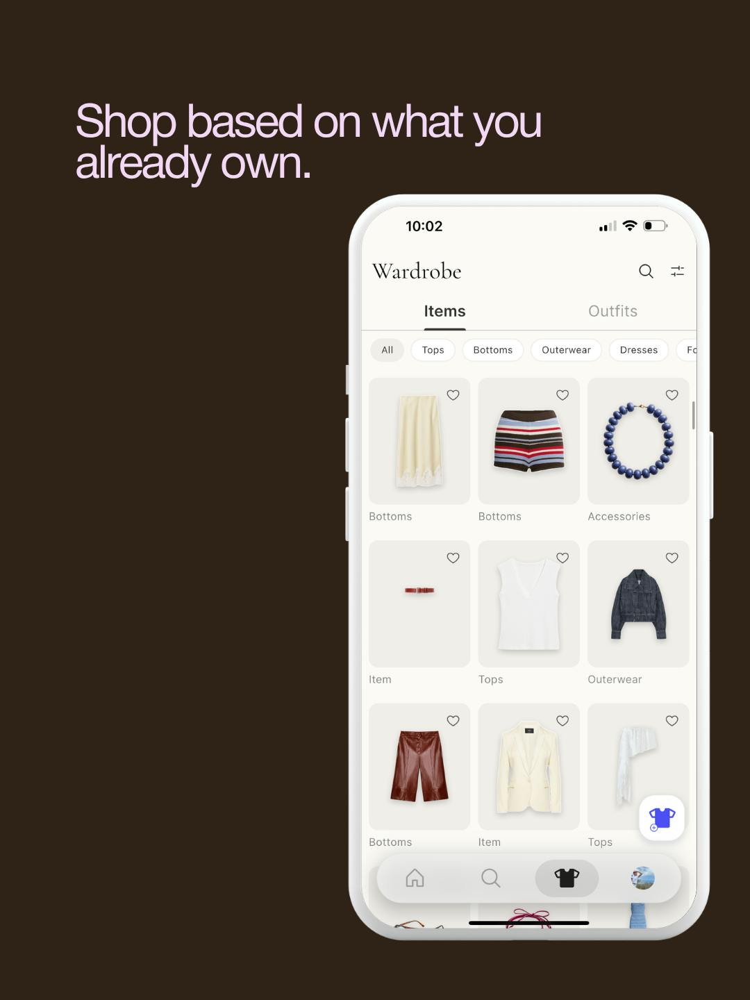

### 🎬 관련 영상
- [🎥 영상 보기](https://ph-files.imgix.net/2b0d4f58-58c0-4b5b-a205-6a3f9dbb2e53.jpeg?auto=format)

---

## 19. [Peach Co-Pilot](https://www.producthunt.com/products/peach-co-pilot)
**Votes**: 84 | **도입 난이도**: 중 | **신뢰도**: 상
**Tagline**: WhatsApp Sidekick for busy professionals
**서비스 링크**: https://www.producthunt.com/r/VW2ZGIHTYYWE4I

**태그**: Automation, AI, Productivity, Communication, Chat

### 📌 이 서비스 한눈에 보기
AI 도구를 통해 WhatsApp 메시지를 읽고 초안을 작성하는 업무 자동화 솔루션

### 🔑 주요 기능
- 표준 WhatsApp Business App 사용자를 위한 호스팅형 MCP 서버 제공
- Claude, ChatGPT, Cursor, Zed 등 주요 AI 도구와 연동 가능
- 메시지 읽기, 검색, 초안 작성을 AI 도구 내에서 직접 수행

### 🙋 사용자에게 어떤 점이 좋은가
업무용 메신저인 WhatsApp을 AI 개발 환경이나 채팅창에서 바로 제어할 수 있어, 메시지 확인과 답장 작성을 위한 화면 전환 시간을 획기적으로 줄여줍니다.

### ✅ 지금 바로 써볼 기능
- 사용 중인 AI 도구(Claude, ChatGPT 등)에 MCP 서버 연결하기
- AI를 통해 기존 WhatsApp 메시지 내용 검색해보기
- AI가 작성한 메시지 초안을 WhatsApp으로 전송하기

### ⚠️ 사용 전 확인할 점
- 메시지 데이터 접근에 따른 보안 및 개인정보 보호 정책 확인 필요
- 사용 중인 AI 도구의 MCP 프로토콜 지원 여부 확인 필요

### 🧭 확인이 더 필요한 정보
사용자의 WhatsApp 계정 데이터가 서버에 저장되는 방식과 보안 수준에 대한 상세 정보가 필요합니다.

### 📸 스크린샷 및 갤러리
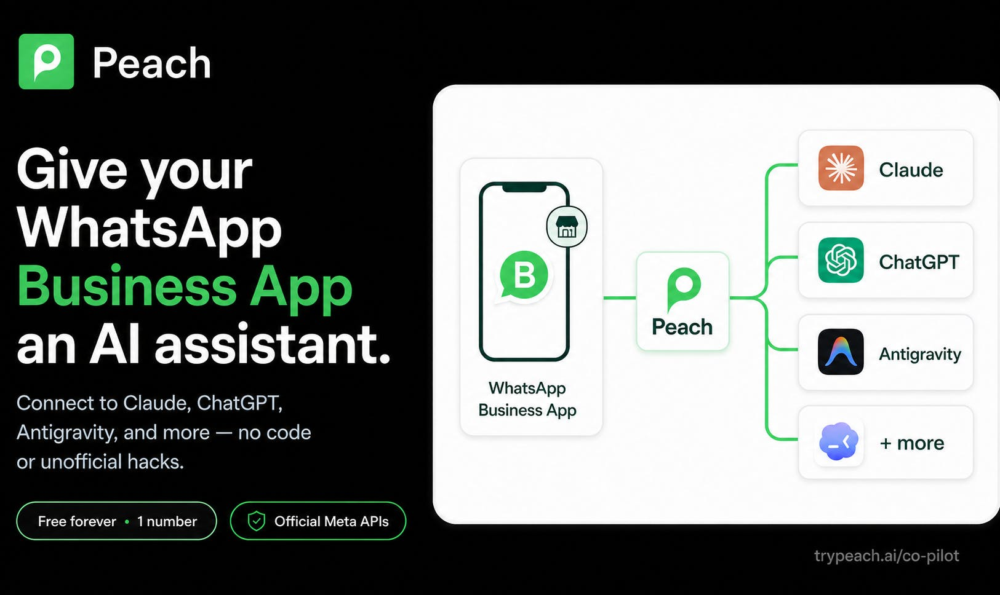
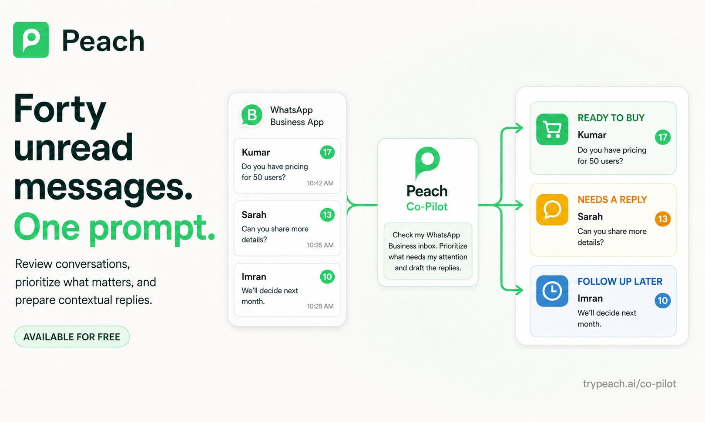
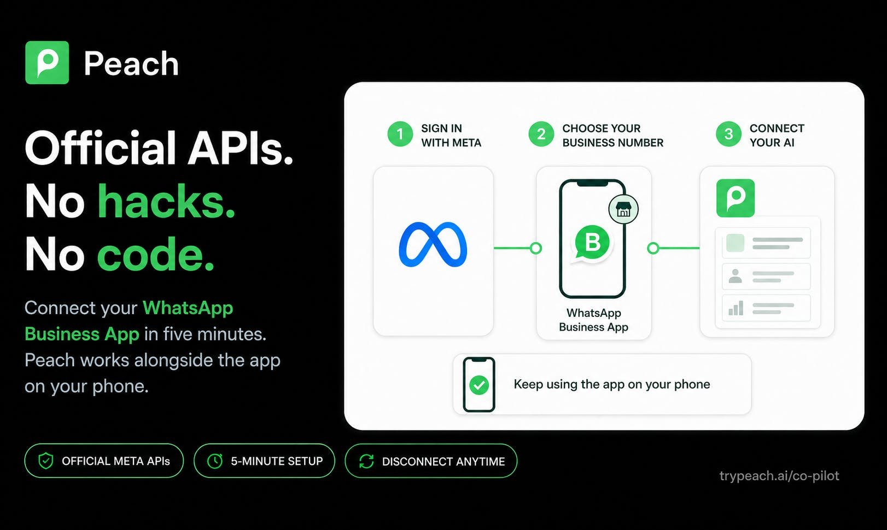

### 🎬 관련 영상
- [🎥 영상 보기](https://ph-files.imgix.net/0b4fb470-2e43-4daf-854f-485280e8565b.jpeg?auto=format)

---

## 20. [ProtoNote](https://www.producthunt.com/products/protonote)
**Votes**: 80 | **도입 난이도**: 하 | **신뢰도**: 상
**Tagline**: Share AI-built prototypes, get feedback pinned to the page
**서비스 링크**: https://www.producthunt.com/r/P26M7RDO45O2TS

**태그**: DesignTool, AI, Collaboration, Prototyping, AI Tool, Chat, Vision

### 📌 이 서비스 한눈에 보기
AI와 연동하여 프로토타입을 공유하고, 페이지 위에서 즉각적인 피드백을 주고받는 협업 도구

### 🔑 주요 기능
- HTML, 이미지, PDF를 업로드하여 즉시 공유 가능한 링크 생성
- 리뷰어가 페이지 내 특정 위치에 핀을 꽂아 직관적인 피드백 작성 가능
- Claude 커넥터를 통해 채팅창 내에서 프로토타입 생성 및 피드백 반영 자동화

### 🙋 사용자에게 어떤 점이 좋은가
별도의 계정 생성 없이 이름만으로 리뷰를 받을 수 있어 피드백 루프가 매우 빠르며, AI를 통해 수정 사항을 자동 반영할 수 있어 작업 시간을 단축합니다.

### ✅ 지금 바로 써볼 기능
- HTML/PDF 파일을 업로드하여 공유 링크 생성해보기
- Claude 커넥터를 연결하여 채팅창에서 프로토타입 관리하기
- 리뷰어로서 페이지 위 특정 위치에 피드백 핀 남겨보기

### ⚠️ 사용 전 확인할 점
- 무료 티어는 활성 프로토타입이 3개로 제한됨
- 리뷰어는 계정이 필요 없으나 작성자 측의 관리 범위 확인 필요

### 🧭 확인이 더 필요한 정보
Claude 커넥터 외에 다른 AI 모델이나 외부 툴과의 추가적인 연동 범위는 명시되지 않았습니다.

### 📸 스크린샷 및 갤러리
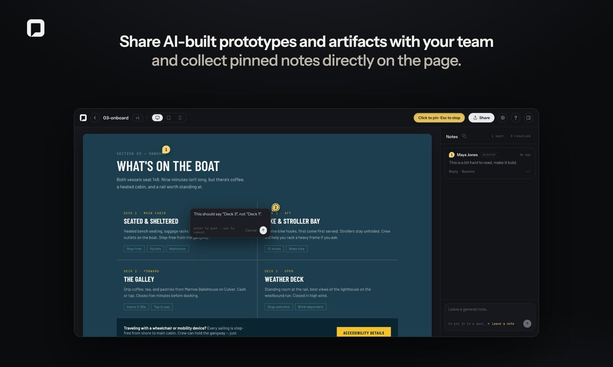
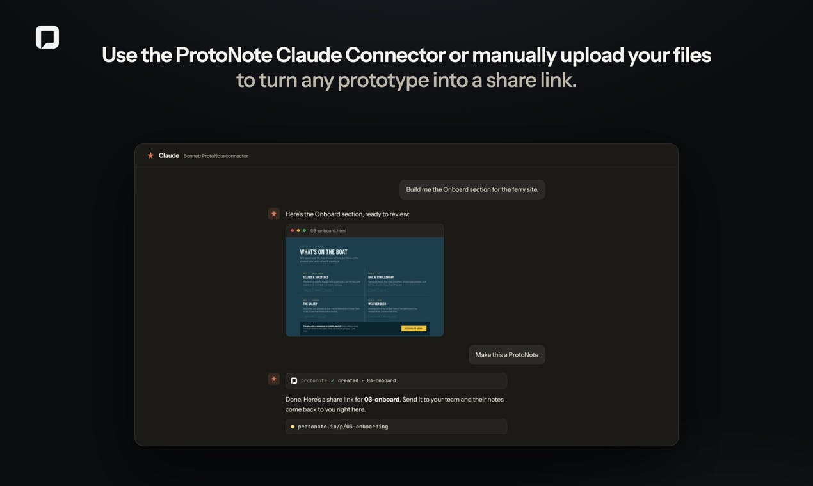
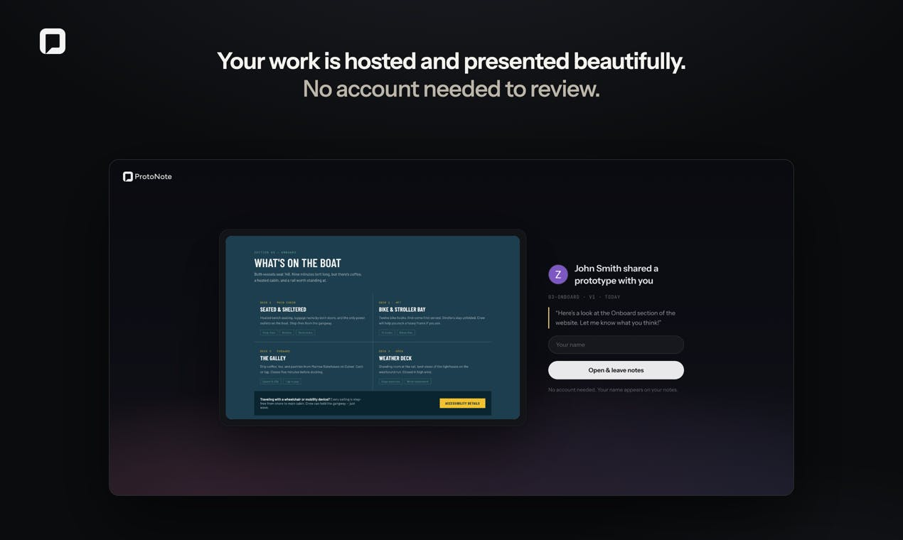

### 🎬 관련 영상
- [🎥 영상 보기](https://ph-files.imgix.net/884a5ca3-e67d-4f16-8675-783f0ec1540c.jpeg?auto=format)

---

## 21. [Cloudways Managed AI Agents](https://www.producthunt.com/products/cloudways)
**Votes**: 75 | **도입 난이도**: 하 | **신뢰도**: 상
**Tagline**: Skip the setup and run OpenClaw & Hermes, fully managed
**서비스 링크**: https://www.producthunt.com/r/75U3EXVMWEZQ3L

**태그**: AI, Cloud, Automation, DevOps, Agent, AI Tool, LLM

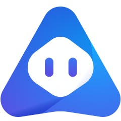

### 📌 이 서비스 한눈에 보기
복잡한 서버 설정 없이 클릭 몇 번으로 OpenClaw 및 Hermes AI 에이전트를 배포하는 관리형 서비스

### 🔑 주요 기능
- OpenClaw 및 Hermes 에이전트의 완전 관리형 호스팅
- 격리되고 보안이 강화된 인프라 제공
- 검증된 업데이트를 통한 에이전트 안정성 유지

### 🙋 사용자에게 어떤 점이 좋은가
직접 서버를 구축하고 관리하는 번거로움 없이, 자신의 LLM 키만 있으면 몇 분 만에 안정적인 AI 에이전트 환경을 구축할 수 있습니다.

### ✅ 지금 바로 써볼 기능
- 자신의 LLM API 키 준비하기
- OpenClaw 또는 Hermes 에이전트 선택 및 배포
- 격리된 인프라 환경에서 에이전트 구동 테스트

### ⚠️ 사용 전 확인할 점
- 사용자의 LLM API 키를 직접 입력해야 하므로 키 관리 보안 주의 필요
- 제공되는 특정 에이전트(OpenClaw, Hermes) 외의 커스텀 모델 지원 여부 확인 필요

### 🧭 확인이 더 필요한 정보
사용자의 LLM 키를 통한 비용 발생 구조와 지원되는 구체적인 하드웨어 사양에 대한 정보가 필요합니다.

### 📸 스크린샷 및 갤러리
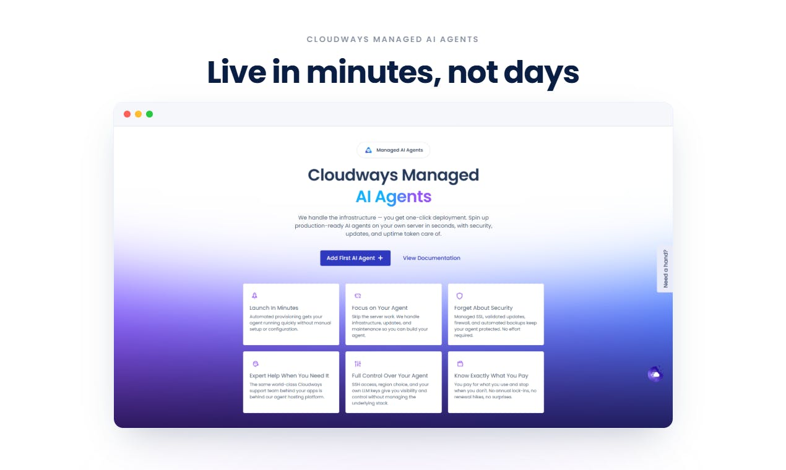
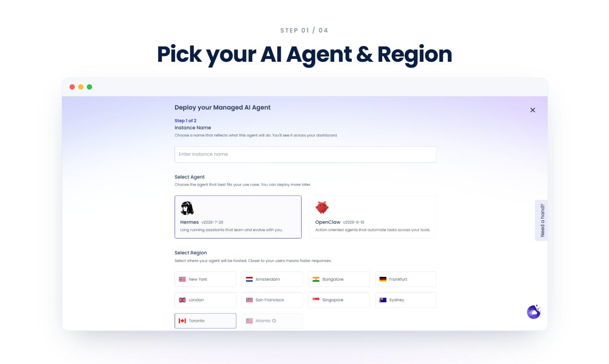
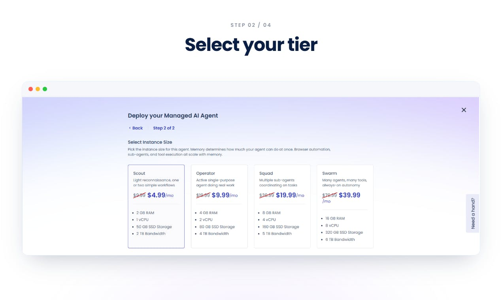

### 🎬 관련 영상
- [🎥 영상 보기](https://ph-files.imgix.net/4b9071de-2633-4da3-84f6-76e046232691.jpeg?auto=format)

---

## 22. [NXS by Aliensense](https://www.producthunt.com/products/nxs-by-aliensense)
**Votes**: 34 | **도입 난이도**: 하 | **신뢰도**: 상
**Tagline**: A sensor board that gets your robot running in minutes
**서비스 링크**: https://www.producthunt.com/r/MGWZNSQJT4L5PN

**태그**: Robotics, Hardware, ROS2, Automation, AI Tool

### 📌 이 서비스 한눈에 보기
복잡한 배선과 드라이버 설정 없이 몇 분 만에 로봇 센서를 연결하는 플러그 앤 플레이 센서 보드

### 🔑 주요 기능
- GMSL 및 CAN-FD 인터페이스 지원을 통한 고속 데이터 연결
- MikroElektronika Click 생태계 센서와 호환
- ROS 2 토픽을 즉시 제공하는 호스트 브리지 포함

### 🙋 사용자에게 어떤 점이 좋은가
센서 하드웨어 설정과 드라이버 설치에 소요되는 시간을 획기적으로 줄여 로봇 개발자가 데이터 활용에만 집중할 수 있게 합니다.

### ✅ 지금 바로 써볼 기능
- 보유 중인 센서와 MikroElektronika Click 호환성 확인
- ROS 2 환경에서의 데이터 스트리밍 테스트
- GMSL/CAN-FD 인터페이스 연결 테스트

### ⚠️ 사용 전 확인할 점
- 사용 중인 로봇 제어기와의 물리적/전기적 호환성 확인 필요
- 특정 센서 모델에 대한 드라이버 자동 지원 범위 확인

### 🧭 확인이 더 필요한 정보
지원하는 구체적인 센서 모델 리스트와 최대 데이터 전송 대역폭에 대한 상세 사양 확인이 필요합니다.

### 📸 스크린샷 및 갤러리
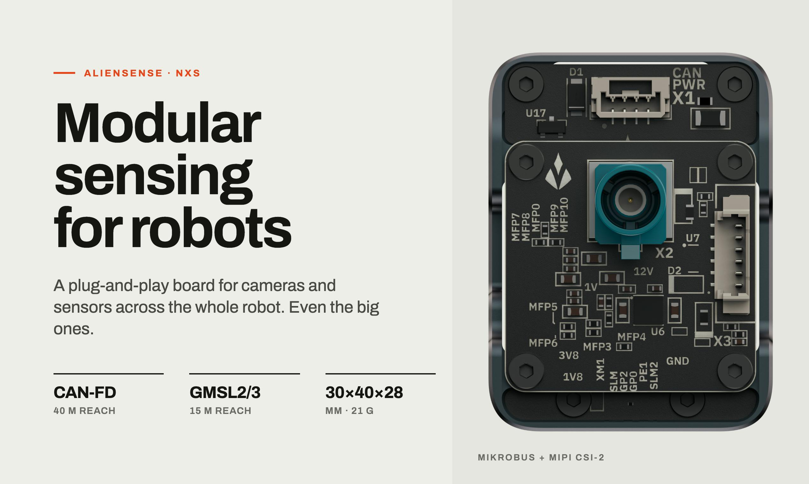
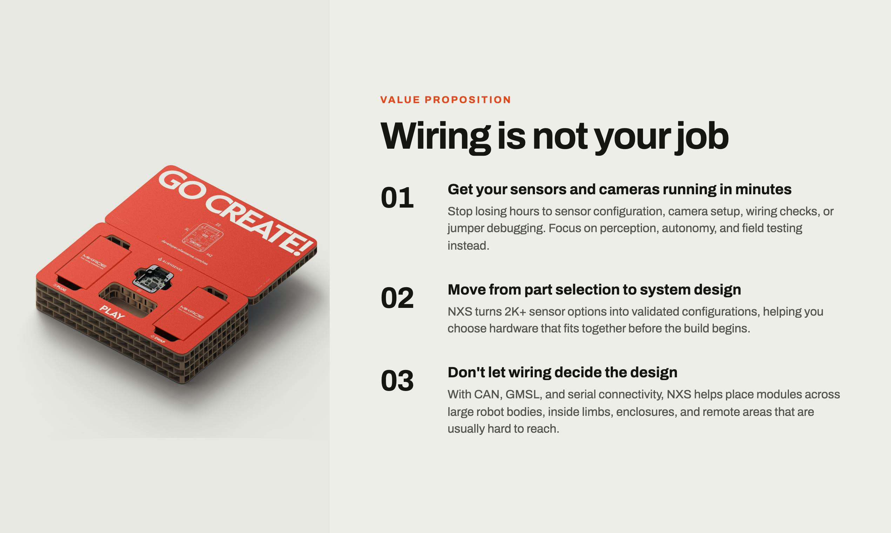
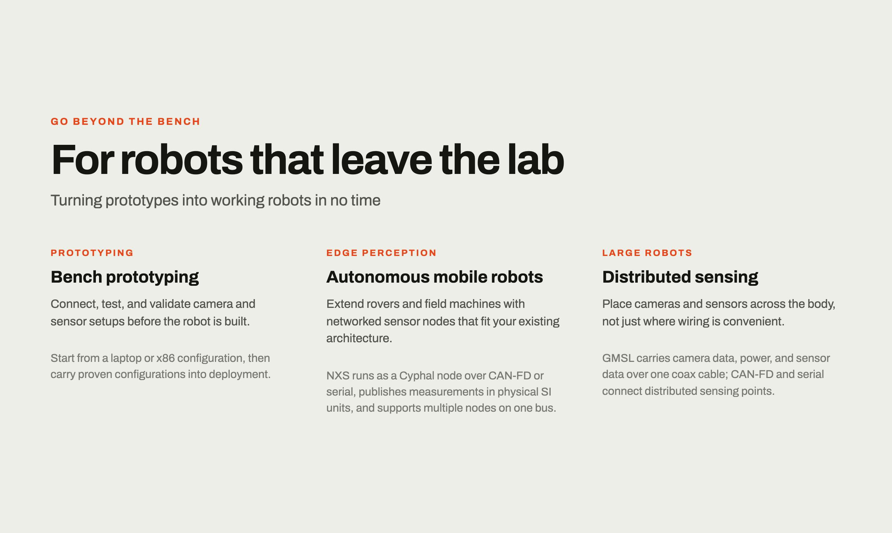

### 🎬 관련 영상
- [🎥 영상 보기](https://ph-files.imgix.net/4b73bbd8-1180-4b6c-911b-5cb4223f72ac.jpeg?auto=format)

---

## 23. [Stateshift](https://www.producthunt.com/products/stateshift)
**Votes**: 26 | **도입 난이도**: 하 | **신뢰도**: 상
**Tagline**: Rewire Your Anxiety in 15 Days
**서비스 링크**: https://www.producthunt.com/r/3TPKR4PDIZBLP3

**태그**: Mental Health, Wellness, Self-Improvement, AI Tool, Design

### 📌 이 서비스 한눈에 보기
15일간의 실천을 통해 불안의 근본 원인을 해결하고 일상을 회복하는 가이드

### 🔑 주요 기능
- 증상 완화를 넘어 불안의 근본 원인을 다루는 방식
- 15일이라는 단기 집중 프로그램을 통한 변화 유도
- 사회적 관계 및 업무 효율 회복에 초점

### 🙋 사용자에게 어떤 점이 좋은가
불안 증상 관리를 통해 가족, 친구, 직장 생활 등 일상적인 사회적 활동을 다시 즐겁게 수행할 수 있도록 돕습니다.

### ✅ 지금 바로 써볼 기능
- 15일 프로그램 시작하기
- 개인별 불안 원인 파악하기
- 감정 조절 연습하기

### ⚠️ 사용 전 확인할 점
- 개인의 심리 상태에 따라 효과가 다를 수 있음
- 전문적인 의학적 치료를 대체할 수 있는지 확인 필요

### 🧭 확인이 더 필요한 정보
구체적인 실천 방법론(명상, 인지 행동 요법 등)이 무엇인지 명시되어 있지 않습니다.

### 📸 스크린샷 및 갤러리
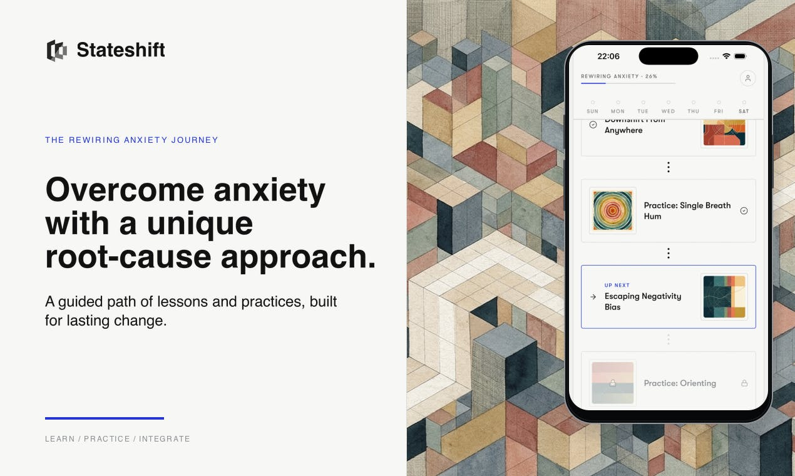
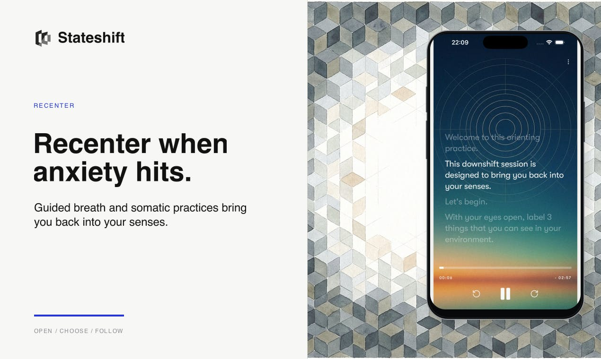
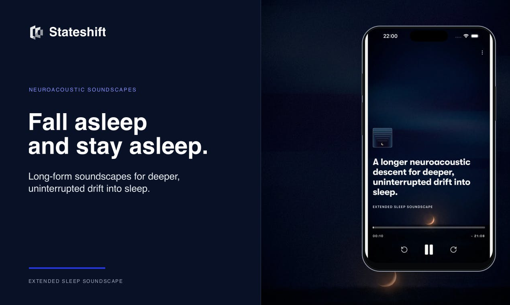

---

## 24. [Bookmarx](https://www.producthunt.com/products/bookmarx-2)
**Votes**: 21 | **도입 난이도**: 하 | **신뢰도**: 상
**Tagline**: Make your X bookmarks useful again
**서비스 링크**: https://www.producthunt.com/r/WPZZVAK53ZO2V3

**태그**: Productivity, AI, SocialMedia, Automation, AI Tool, Chat

### 📌 이 서비스 한눈에 보기
X(트위터) 북마크를 자동으로 정리하고 요약하여 다시 읽기 쉽게 만드는 도구

### 🔑 주요 기능
- X 북마크 자동 동기화 및 자동 정리 기능
- AI를 활용한 요약, 검색 및 자연어 채팅 기능
- 긴 글을 시각적인 데크(Visual Decks)로 변환

### 🙋 사용자에게 어떤 점이 좋은가
기존에 저장만 해두고 잊혀졌던 X 북마크를 다시 유용한 지식 자산으로 변환해 줍니다.

### ✅ 지금 바로 써볼 기능
- X 계정 연결하여 기존 북마크 동기화하기
- AI 요약 기능을 통해 저장된 콘텐츠 빠르게 훑어보기
- 자연어 채팅으로 필요한 정보 검색해보기

### ⚠️ 사용 전 확인할 점
- X 계정 연동 시 개인정보 및 데이터 접근 권한 확인 필요
- X 플랫폼의 API 정책 변화에 따른 서비스 영향 가능성

### 🧭 확인이 더 필요한 정보
X 계정 연동 방식과 데이터 보안 수준에 대한 구체적인 정보가 필요합니다.

### 📸 스크린샷 및 갤러리
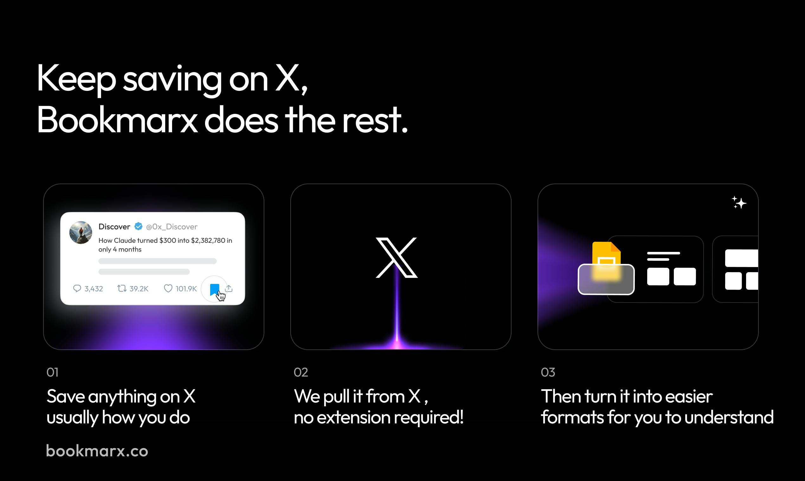
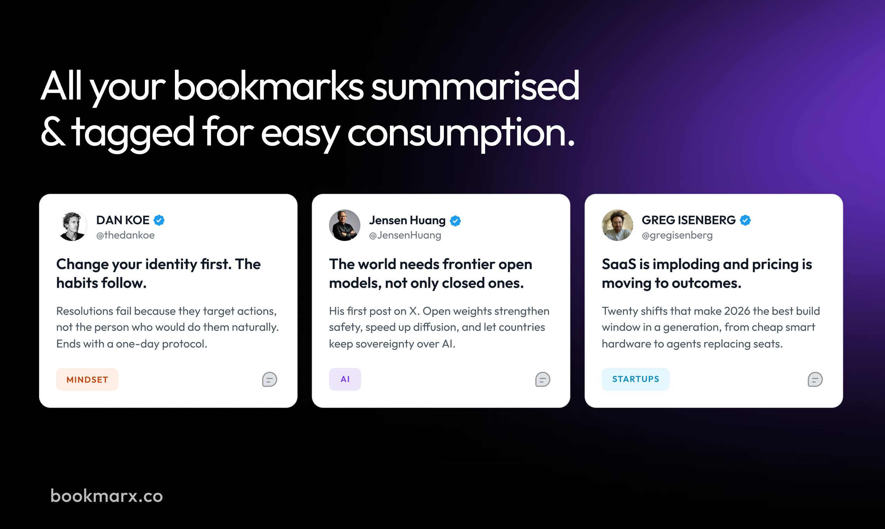
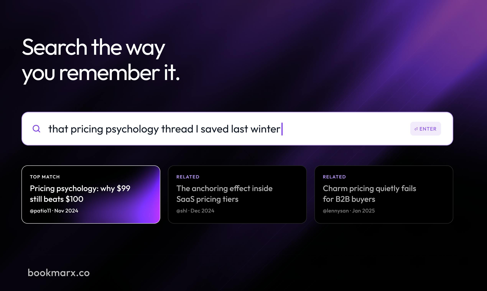

---

## 25. [Rubric](https://www.producthunt.com/products/rubric-2)
**Votes**: 17 | **도입 난이도**: 하 | **신뢰도**: 상
**Tagline**: UX expertise your agent can call
**서비스 링크**: https://www.producthunt.com/r/56QJB5FXN7UHLV

**태그**: DevTool, UX, AI-Agent, Automation, Agent, AI Tool, Design, API

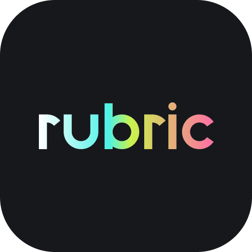

### 📌 이 서비스 한눈에 보기
AI 코딩 에이전트가 감이 아닌 검증된 UX 규칙에 따라 UI를 설계하고 검사할 수 있게 돕는 도구

### 🔑 주요 기능
- 554개의 정교한 UX 규칙 기반의 Prescriptive 가이드 제공
- MCP(Model Context Protocol)를 통한 에이전트와의 원활한 연동
- 빌드 전 설계 가이드와 빌드 후 라이브 사이트 감사(Audit) 기능 제공

### 🙋 사용자에게 어떤 점이 좋은가
AI가 생성한 UI가 단순히 '그럴듯해 보이는' 것을 넘어, 실제 전문적인 UX 원칙을 준수하도록 강제할 수 있습니다.

### ✅ 지금 바로 써볼 기능
- 사용 중인 코딩 에이전트(Cursor, Windsurf 등)에 MCP로 연결하기
- 에이전트가 코드를 작성하기 전 UX 가이드를 참조하도록 설정하기
- 배포된 사이트를 대상으로 자동 UX 감사 실행하기

### ⚠️ 사용 전 확인할 점
- 브라우저 기반 승인 방식이므로 특정 환경에서의 호환성 확인 필요
- 제공되는 554개 규칙이 사용자의 특정 디자인 시스템과 일치하는지 확인 필요

### 🧭 확인이 더 필요한 정보
사용자의 특정 프레임워크나 디자인 시스템과의 커스텀 규칙 커스터마이징 가능 여부는 명시되지 않았습니다.

### 📸 스크린샷 및 갤러리
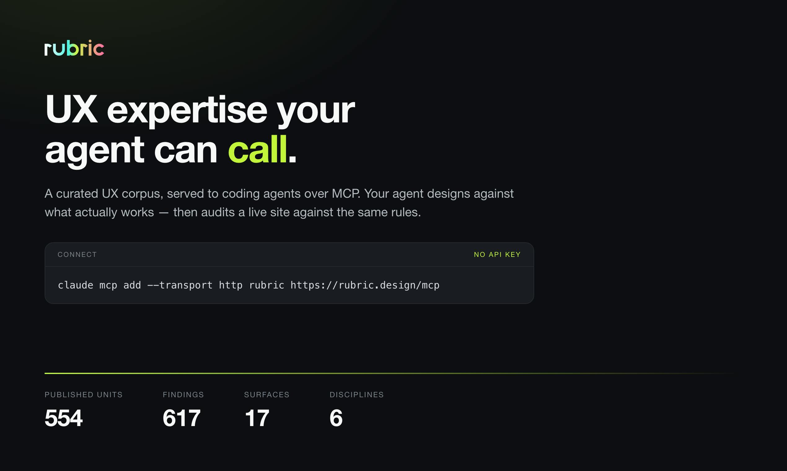
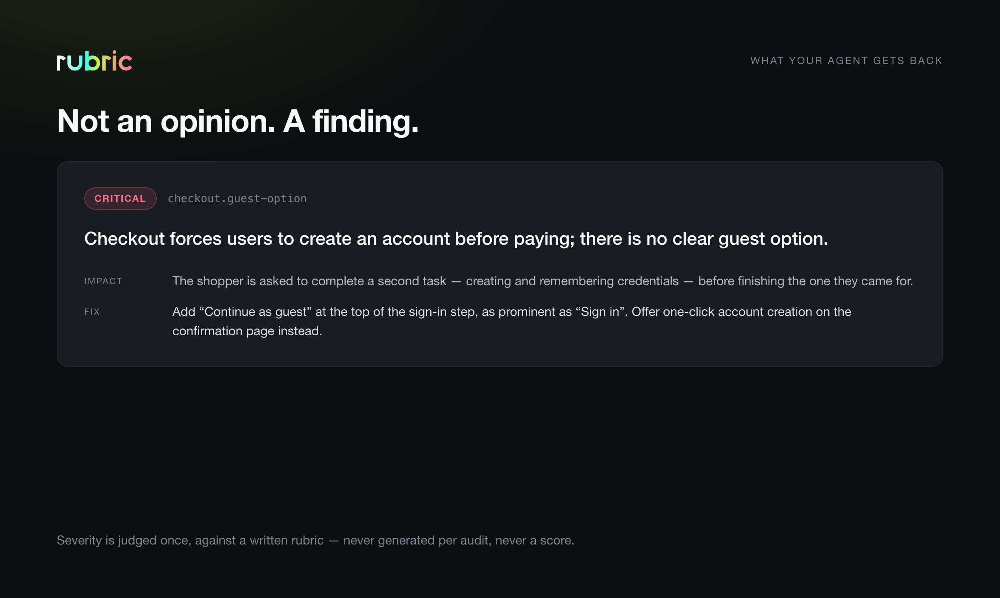
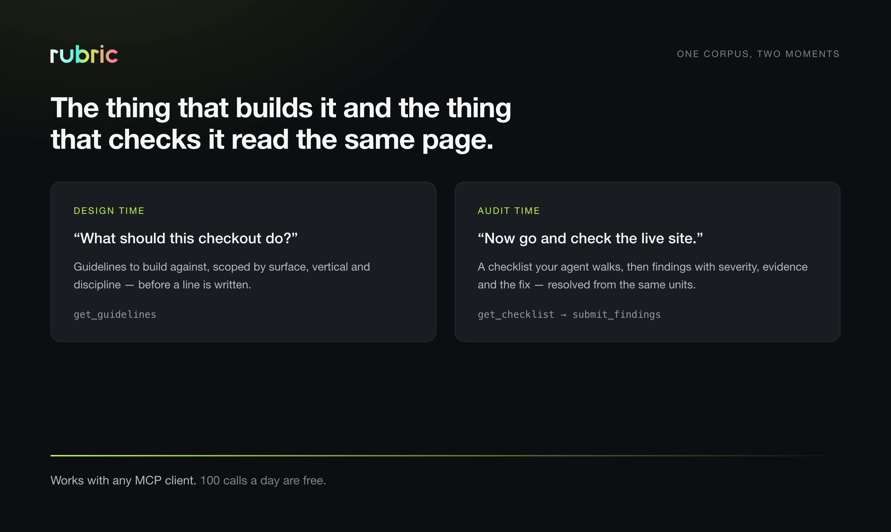

---

## 26. [Tidy Folders](https://www.producthunt.com/products/tidy-folders)
**Votes**: 14 | **도입 난이도**: 하 | **신뢰도**: 상
**Tagline**: Folders & text highlights for ChatGPT, Claude, Gemini & more
**서비스 링크**: https://www.producthunt.com/r/5I45FXXOJQFUZX

**태그**: Productivity, AI, BrowserExtension, Organization, AI Tool, Chat

### 📌 이 서비스 한눈에 보기
여러 AI 서비스의 채팅 기록을 하나의 폴더로 통합 관리하고 핵심 답변을 하이라이트하는 도구

### 🔑 주요 기능
- ChatGPT, Claude, Gemini, DeepSeek 등 다양한 AI 플랫폼의 채팅을 통합 폴더로 관리
- 긴 대화 중 핵심 답변을 하이라이트하여 해당 위치로 바로 이동하는 링크 생성
- 북마크와 채팅 기록을 동일한 폴더 구조 내에서 통합 관리 가능

### 🙋 사용자에게 어떤 점이 좋은가
여러 AI를 번갈아 사용하며 발생하는 파편화된 대화 기록을 체계적으로 정리하고, 필요한 정보를 즉시 찾아낼 수 있습니다.

### ✅ 지금 바로 써볼 기능
- 주로 사용하는 AI 서비스(ChatGPT, Claude 등)에 브라우저 확장 프로그램 설치
- 중요한 답변을 하이라이트하여 나중에 다시 볼 수 있는 링크로 저장
- 관련 자료와 AI 채팅을 하나의 폴더에 모아 정리하기

### ⚠️ 사용 전 확인할 점
- 브라우저 확장 프로그램 방식이므로 모바일 앱 환경에서의 동기화 범위 확인 필요
- 개인적인 대화 내용이 브라우저 확장 프로그램을 통해 처리되므로 보안/개인정보 정책 확인 필요

### 🧭 확인이 더 필요한 정보
모바일 앱에서 시작한 채팅이 데스크톱 확장 프로그램과 실시간으로 어떻게 동기화되는지 구체적인 범위 확인이 필요합니다.

### 📸 스크린샷 및 갤러리
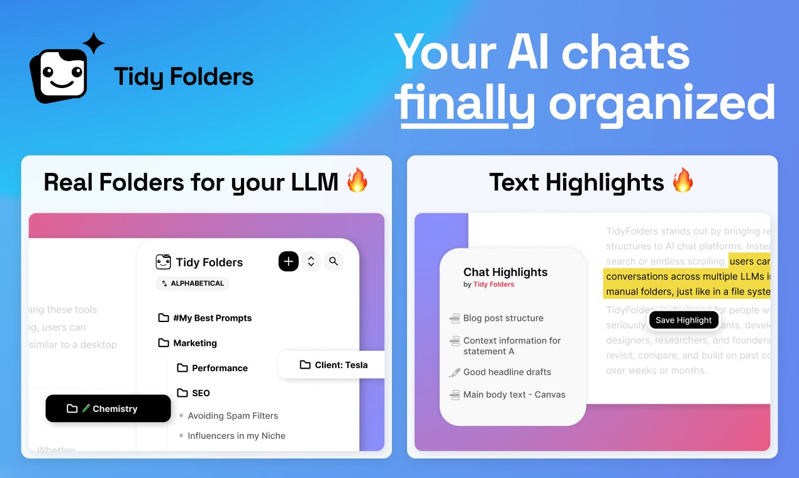
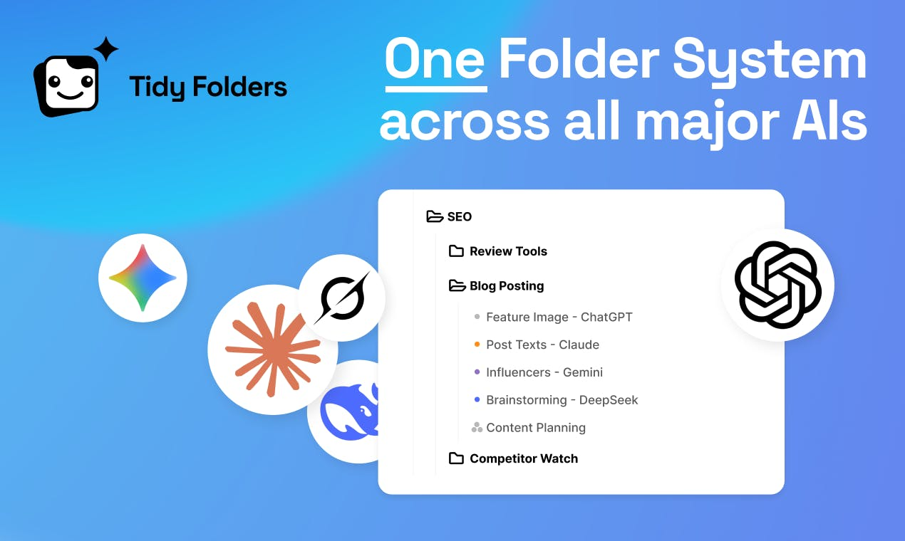
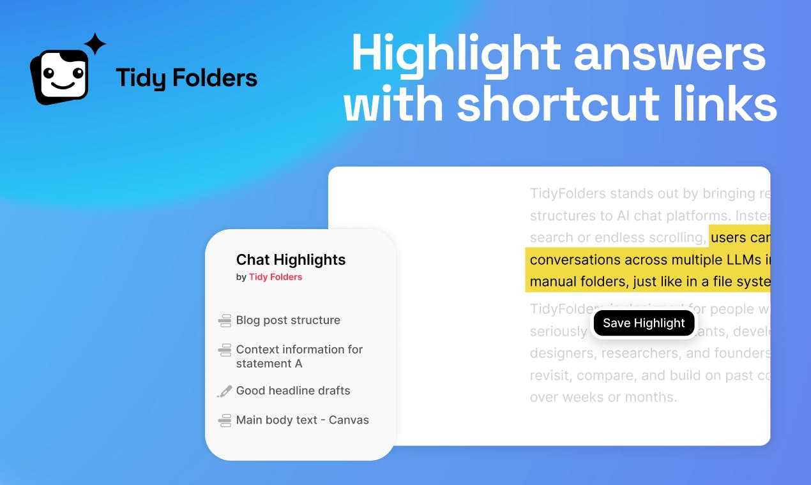

### 🎬 관련 영상
- [🎥 영상 보기](https://ph-files.imgix.net/2c0cba50-8c61-483b-810d-35d696defac4.jpeg?auto=format)

---

## 27. [Makers Page](https://www.producthunt.com/products/makers-page)
**Votes**: 13 | **도입 난이도**: 하 | **신뢰도**: 상
**Tagline**: Ranked by streak, not revenue.
**서비스 링크**: https://www.producthunt.com/r/SMQCLLCZMKY4TZ

**태그**: Marketing, SEO, Productivity, Directory, AI Tool

### 📌 이 서비스 한눈에 보기
매출이 아닌 꾸준한 활동 기록(Streak)으로 신뢰를 증명하는 메이커 전용 디렉토리

### 🔑 주요 기능
- 매출 대신 매일 접속하는 '스트릭(Streak)' 기반의 순위 시스템
- 무료 리스팅 시 공개 페이지, dofollow 백링크, 사이트맵 포함 제공
- 오픈소스 마케팅 MCP를 활용한 출시 포스트 초안 작성 기능

### 🙋 사용자에게 어떤 점이 좋은가
단순한 매출 수치 조작이 아닌 꾸준한 성실함을 통해 제품의 신뢰도를 높이고 SEO 백링크를 확보할 수 있습니다.

### ✅ 지금 바로 써볼 기능
- 무료 리스팅을 통해 제품 페이지 및 백링크 생성하기
- 매일 체크인하여 리더보드 순위 관리하기
- 제공되는 마케팅 MCP를 활용해 출시 포스트 초안 작성하기

### ⚠️ 사용 전 확인할 점
- 순위 유지를 위해 매일 접속해야 하는 운영 리소스 발생
- 스트릭 기반 순위가 실제 제품의 시장 가치를 완벽히 대변하지 않을 수 있음

### 🧭 확인이 더 필요한 정보
제공되는 오픈소스 마케팅 MCP의 구체적인 설치 및 연동 방식에 대한 상세 정보가 필요합니다.

### 📸 스크린샷 및 갤러리
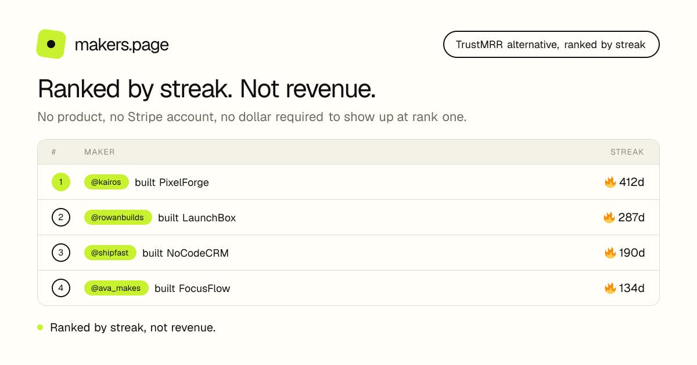

### 🎬 관련 영상
- [🎥 영상 보기](https://ph-files.imgix.net/f709b59d-5772-429d-ad85-c3692d63ce80.jpeg?auto=format)

---

## 28. [Velvet UI](https://www.producthunt.com/products/velvet-ui)
**Votes**: 12 | **도입 난이도**: 중 | **신뢰도**: 상
**Tagline**: Native-feeling sheets and toasts for React
**서비스 링크**: https://www.producthunt.com/r/RSPVCQKFNYL5OD

**태그**: React, UI-Library, Frontend, UX, Animation, API

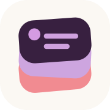

### 📌 이 서비스 한눈에 보기
모든 기기에서 네이티브 앱처럼 부드러운 사용자 경험을 제공하는 React용 헤드리스 시트 및 토스트 라이브러리

### 🔑 주요 기능
- WAAPI와 커스텀 물리 엔진을 활용한 유연한 드래깅, 스크롤, 스냅 및 터치 제스처 지원
- 스타일 제약이 없는 헤드리스(Headless) 방식으로 기존 UI 라이브러리(Radix, React Aria 등)와 완벽 호환
- 접근성을 준수하며 의존성이 적고 트리 쉐이킹이 가능한 가벼운 구조

### 🙋 사용자에게 어떤 점이 좋은가
별도의 복잡한 애니메이션 구현 없이도 모바일 앱과 같은 고품질의 인터랙션을 웹 서비스에 즉시 도입할 수 있습니다.

### ✅ 지금 바로 써볼 기능
- 기존 React 프로젝트에 시트(Sheets) 컴포넌트 적용해보기
- 토스트(Toasts) 알림의 드래그 및 스와이프 인터랙션 테스트하기
- 사용 중인 UI 프레임워크와의 스타일 호환성 확인하기

### ⚠️ 사용 전 확인할 점
- 헤드리스 라이브러리이므로 스타일링을 위한 추가 작업이 필요함
- 애니메이션 중심의 라이브러리이므로 복잡한 레이아웃 환경에서의 성능 영향 확인 필요

### 🧭 확인이 더 필요한 정보
특정 브라우저 환경에서의 애니메이션 성능 최적화 수준에 대한 상세 벤치마크 데이터가 명시되지 않았습니다.

### 📸 스크린샷 및 갤러리

---

## 29. [Tucan](https://www.producthunt.com/products/tucan)
**Votes**: 12 | **도입 난이도**: 하 | **신뢰도**: 상
**Tagline**: No streaks. A quiet dot grid for daily habits.
**서비스 링크**: https://www.producthunt.com/r/STZR3IFZEB72EI

**태그**: Productivity, Minimalism, iOS, Habit Tracker, AI Tool

### 📌 이 서비스 한눈에 보기
실패에 대한 압박 없이 기록에만 집중하는 미니멀리즘 습관 트래커

### 🔑 주요 기능
- 연속 기록(Streak)에 대한 압박을 제거한 이진 기록 방식
- 흑백 도트 그리드 중심의 직관적이고 심플한 UI
- 오프라인 지원 및 기능 제한 없는 깔끔한 사용자 경험

### 🙋 사용자에게 어떤 점이 좋은가
실패 시 기록이 초기화되는 스트레스 없이, 단순히 수행 여부만 기록하며 꾸준한 습관 형성을 돕습니다.

### ✅ 지금 바로 써볼 기능
- 도트 그리드 인터페이스 확인하기
- 7일 무료 체험을 통한 사용성 테스트
- 오프라인 모드 작동 여부 확인

### ⚠️ 사용 전 확인할 점
- iOS 전용 앱이므로 안드로이드 사용자는 이용 불가
- 연속 기록(Streak) 기능이 없어 성취감을 중시하는 사용자에게는 심심할 수 있음

### 🧭 확인이 더 필요한 정보
현재 iOS 전용이며, 데이터 백업 및 동기화 방식에 대한 상세 정보는 명시되지 않았습니다.

### 📸 스크린샷 및 갤러리
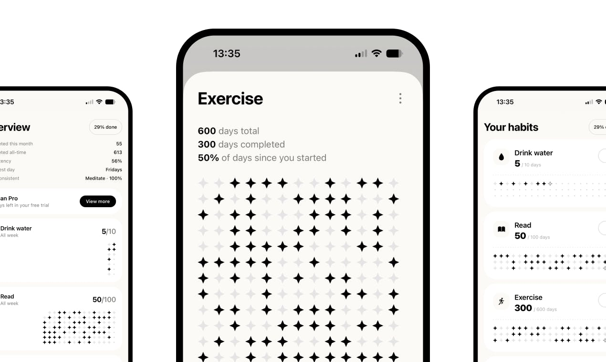
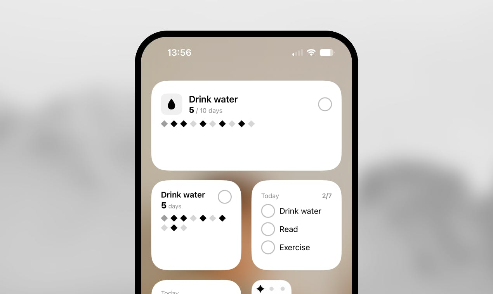
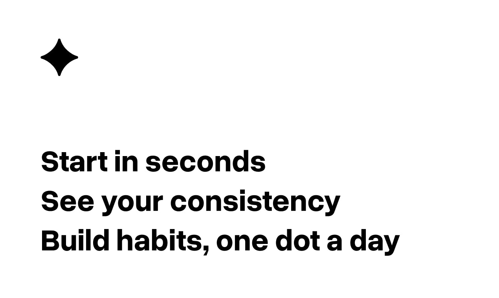

---

## 30. [Dehurdle](https://www.producthunt.com/products/dehurdle)
**Votes**: 11 | **도입 난이도**: 하 | **신뢰도**: 상
**Tagline**: Win the meeting before it starts.
**서비스 링크**: https://www.producthunt.com/r/FBCDLLD3PTAMPL

**태그**: AI, SoftSkills, Communication, Productivity, AI Tool

### 📌 이 서비스 한눈에 보기
실제 상황처럼 대화하는 AI 캐릭터와 함께 어려운 대화 기술을 연마하는 실전 연습 플랫폼

### 🔑 주요 기능
- 현실적인 AI 캐릭터와의 실시간 대화 연습 (말 끊기, 도전적 질문 등 포함)
- 말하기 속도나 횡설수설 여부를 알려주는 실시간 화면 알림
- 대화 후 어느 지점에서 설득력을 잃었는지 분석하는 정밀 트랜스크립트 피드백

### 🙋 사용자에게 어떤 점이 좋은가
연봉 협상, 클라이언트 대응, 피칭 등 중요한 대화 상황을 실제 사람 대신 AI를 대상으로 안전하게 연습하여 실전 성공률을 높일 수 있습니다.

### ✅ 지금 바로 써볼 기능
- 가장 두려운 대화 시나리오 설정하기
- AI 캐릭터와 실시간 대화 연습 진행하기
- 피드백 리포트를 통해 말하기 습관 교정하기

### ⚠️ 사용 전 확인할 점
- AI 캐릭터의 반응이 실제 사람의 복잡한 감정이나 맥락을 100% 재현하는지 확인 필요
- 음성 인식 및 분석의 정확도에 따라 피드백의 질이 달라질 수 있음

### 🧭 확인이 더 필요한 정보
현재 제공되는 AI 캐릭터의 종류와 시나리오의 다양성, 그리고 구체적인 요금 체계에 대한 정보가 부족합니다.

### 📸 스크린샷 및 갤러리

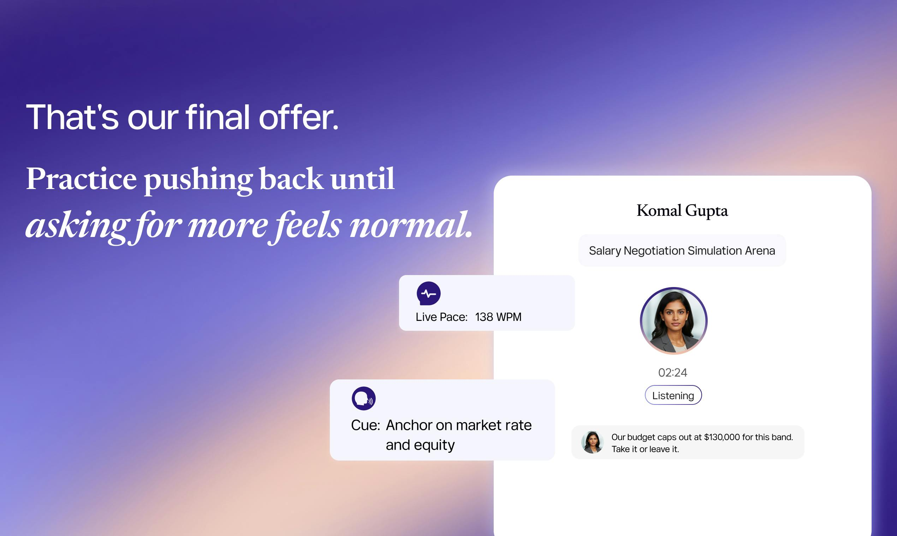
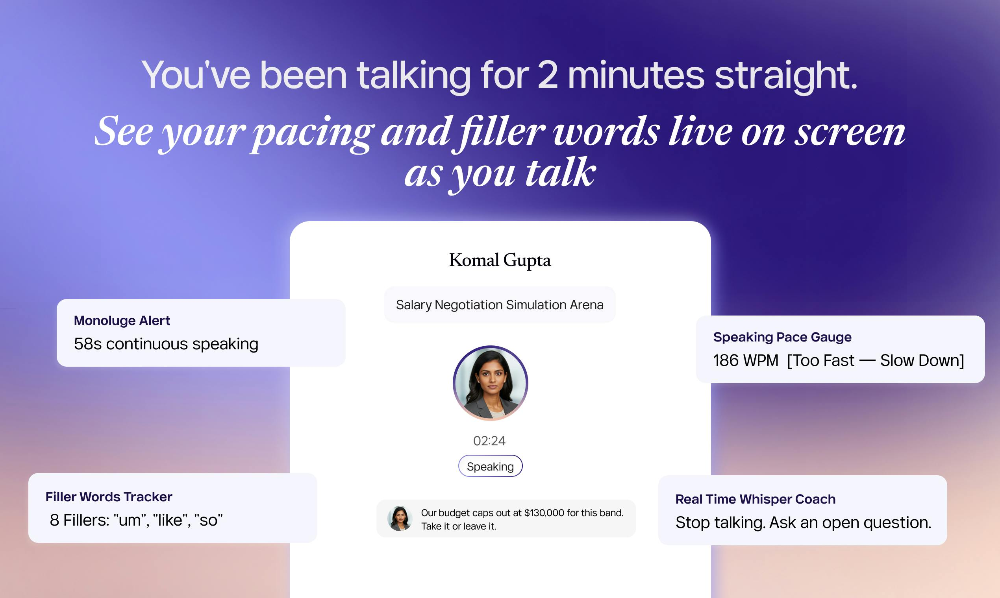

---

