# 🚀 Product Hunt Daily Top 30 (2026-08-22)

## 오늘의 요약
오늘의 트렌드는 AI 에이전트의 실행 환경을 최적화하고, 기존 개발 워크플로우(IDE, Docker, Mac)에 자연스럽게 통합하는 도구들이 주를 이루었습니다. 특히 복잡한 인프라 구축 없이 클라우드나 로컬 환경에서 즉시 AI를 구동하거나, 보안을 유지하며 자동화 작업을 수행하는 실용적인 솔루션들이 주목받았습니다.

### 오늘의 핵심 포인트
- AI 에이전트가 개발자의 IDE나 로컬 환경 내에서 끊김 없이 협업할 수 있는 통합 도구들이 등장했습니다.
- 복잡한 인프라 관리 없이 클라우드 샌드박스나 API를 통해 AI 에이전트를 즉시 실행하고 배포하는 방식이 강조되었습니다.
- 데이터 추출, Docker 관리, 디지털 아바타 제작 등 특정 비즈니스 문제를 자동화하여 엔지니어의 개입을 최소화하는 도구들이 주목받았습니다.

**오늘의 태그**: AI Agent, Developer Tools, Automation, Cloud Infrastructure, Workflow Optimization

## 1. [Wizstar](https://www.producthunt.com/products/wizstar)
**Votes**: 258 | **도입 난이도**: 하 | **신뢰도**: 상
**Tagline**: Digital avatars that move and act like professional actors
**서비스 링크**: https://www.producthunt.com/r/66CCQDPHMOWPG6

**태그**: AI-Avatar, Content-Creation, Video-Automation, Digital-Human, AI Tool, Video

### 📌 이 서비스 한눈에 보기
전문 배우처럼 자연스러운 움직임과 입 모양을 구현하는 디지털 아바타 제작 도구

### 🔑 주요 기능
- 정교한 립싱크 및 자연스러운 제스처 구현
- 머리 회전이나 장애물 앞에서도 유지되는 정밀한 움직임
- 한 번의 제작으로 다양한 언어 및 채널로 콘텐츠 확장 가능

### 🙋 사용자에게 어떤 점이 좋은가
매번 카메라 앞에 서지 않고도 나를 닮은 디지털 대리인을 통해 제품 업데이트, 교육, 브랜딩 영상을 효율적으로 제작할 수 있습니다.

### ✅ 지금 바로 써볼 기능
- 자신의 외형을 닮은 디지털 아바타 생성하기
- 다양한 언어 및 채널별 현지화 영상 제작해보기
- 제품 업데이트용 브랜디드 콘텐츠 제작 테스트

### ⚠️ 사용 전 확인할 점
- 실제 인물과 얼마나 유사하게 구현되는지 품질 확인 필요
- 복잡한 상호작용이나 특정 환경에서의 움직임 제약 확인

### 🧭 확인이 더 필요한 정보
사용자의 실제 외형을 복제하는 데 필요한 데이터 입력 방식과 보안 정책에 대한 정보가 필요합니다.

### 📸 스크린샷 및 갤러리

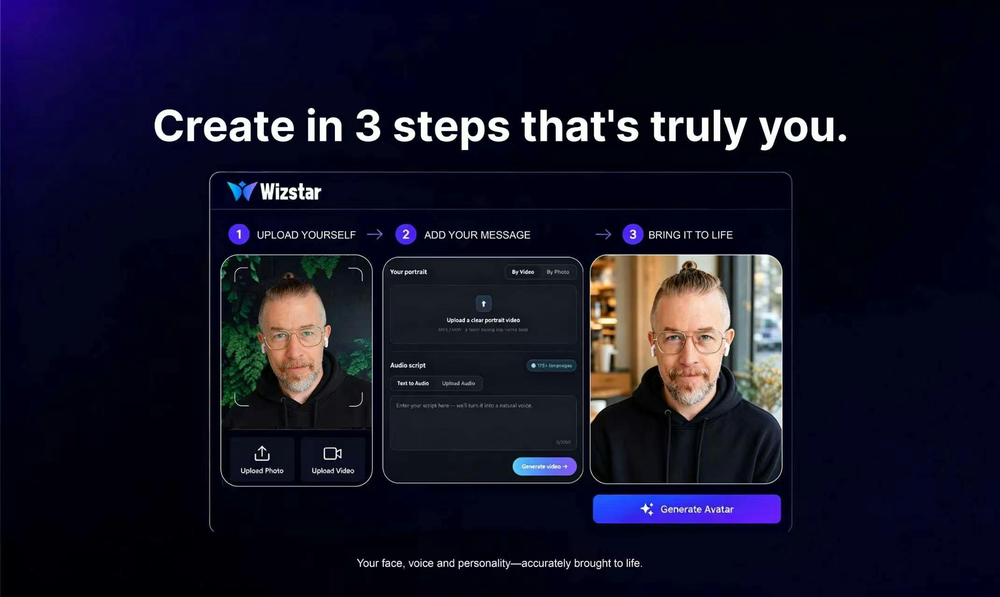

### 🎬 관련 영상
- [🎥 영상 보기](https://ph-files.imgix.net/c7c413b6-af5d-484c-958d-688b13d82597.jpeg?auto=format)

---

## 2. [Supernova](https://www.producthunt.com/products/supernova-ai)
**Votes**: 251 | **도입 난이도**: 하 | **신뢰도**: 상
**Tagline**: All your data in Claude and Codex
**서비스 링크**: https://www.producthunt.com/r/NI5US6CC4XM5FB

**태그**: AI, Data Analytics, Automation, Business Intelligence, AI Tool, DevTool

### 📌 이 서비스 한눈에 보기
실시간 비즈니스 데이터를 Claude와 Codex에 연결하여 엔지니어 없이 즉시 분석하는 도구

### 🔑 주요 기능
- Stripe, HubSpot, PostgreSQL 등 30개 이상의 앱과 실시간 데이터 연동
- AI 도구(Claude, Codex) 내에서 직접 데이터 질문 및 복잡한 분석 수행
- 전통적인 BI 스택 구축이나 엔지니어의 도움 없이 운영/매출 분석 가능

### 🙋 사용자에게 어떤 점이 좋은가
데이터 분석을 위해 엔지니어에게 요청하거나 복잡한 BI 도구를 배울 필요 없이, 익숙한 AI 채팅창에서 즉시 비즈니스 인사이트를 얻을 수 있습니다.

### ✅ 지금 바로 써볼 기능
- Stripe 및 HubSpot 데이터 소스 연결하기
- Claude/Codex에서 자연어로 데이터 질문 던지기
- 매출 및 파이프라인 분석 대시보드 생성하기

### ⚠️ 사용 전 확인할 점
- 실시간 데이터 연동 시 보안 및 권한 설정 확인 필요
- 복잡한 데이터 스키마의 경우 AI의 해석 오류 가능성 검토 필요

### 🧭 확인이 더 필요한 정보
30개 이상의 앱 외에 추가적인 데이터 소스 지원 범위와 보안 프로토콜에 대한 상세 정보가 필요합니다.

### 📸 스크린샷 및 갤러리
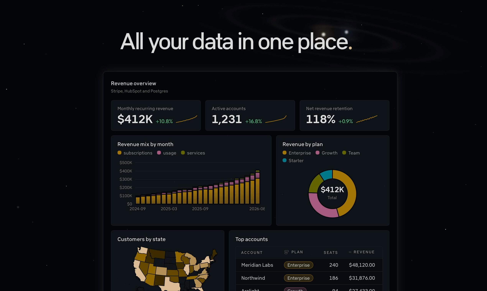
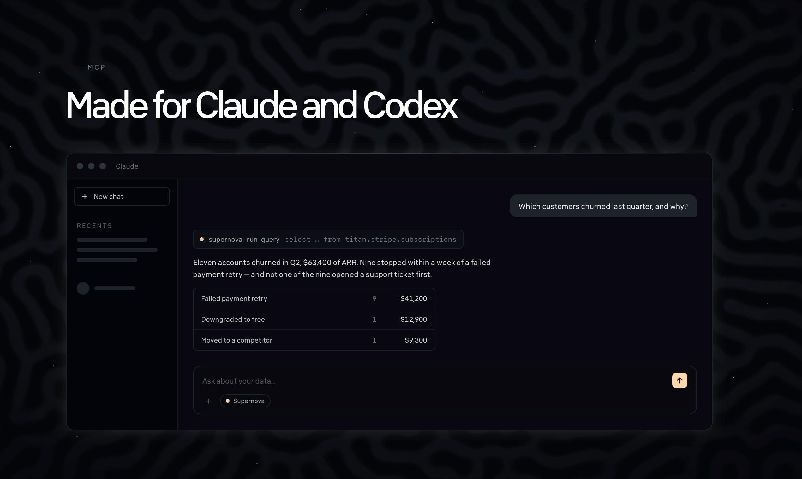
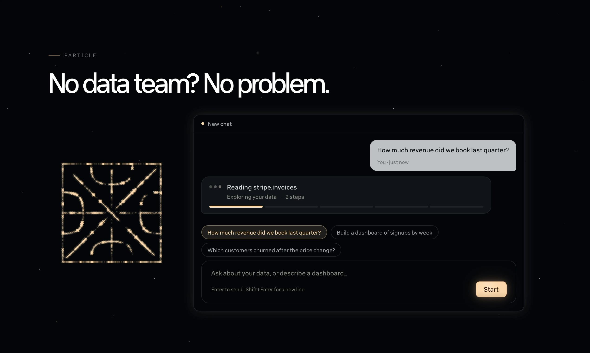

### 🎬 관련 영상
- [🎥 영상 보기](https://ph-files.imgix.net/66cc59ef-2fb7-4c26-aa82-d6a0987c1e81.jpeg?auto=format)

---

## 3. [Mindcase](https://www.producthunt.com/products/mindcase)
**Votes**: 183 | **도입 난이도**: 하 | **신뢰도**: 상
**Tagline**: Extract data from anywhere on the web within minutes
**서비스 링크**: https://www.producthunt.com/r/YI6XZOPMLJBZWC

**태그**: DevTool, Data Extraction, AI, Automation, AI Tool, API

### 📌 이 서비스 한눈에 보기
복잡한 인프라 관리 없이 웹 데이터를 구조화된 API로 즉시 추출하는 도구

### 🔑 주요 기능
- 웹 데이터 추출을 위한 인프라 계층 제공
- 인기 소스 대상의 사전 구축된 API 활용 가능
- 사용자 맞춤형 커스텀 API 생성 기능

### 🙋 사용자에게 어떤 점이 좋은가
개발자와 AI 팀이 스크래핑 인프라를 직접 관리하는 번거로움 없이, 필요한 데이터를 즉시 구조화된 형태로 얻을 수 있습니다.

### ✅ 지금 바로 써볼 기능
- 기존 인기 소스 API 연동 테스트
- 특정 웹사이트 대상 커스텀 API 생성 시도
- 추출된 데이터의 구조적 정합성 확인

### ⚠️ 사용 전 확인할 점
- 대상 웹사이트의 차단 정책에 따른 데이터 수집 안정성 확인 필요
- 커스텀 API 생성 시 데이터 구조 설계 역량 필요

### 🧭 확인이 더 필요한 정보
구체적인 API 호출 비용 체계와 데이터 업데이트 주기(실시간성)에 대한 정보가 부족합니다.

### 📸 스크린샷 및 갤러리
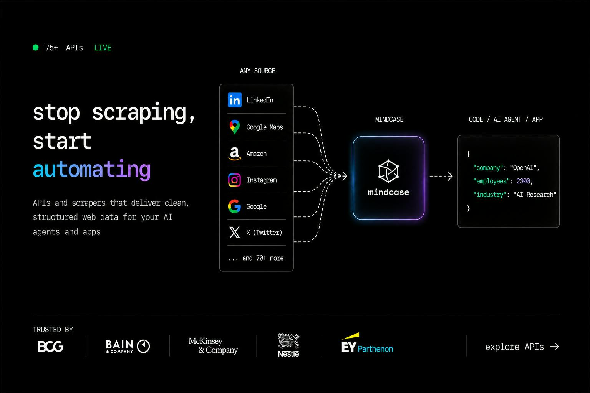
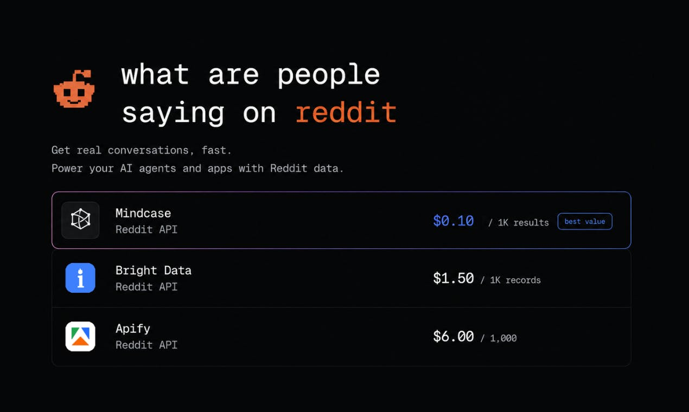
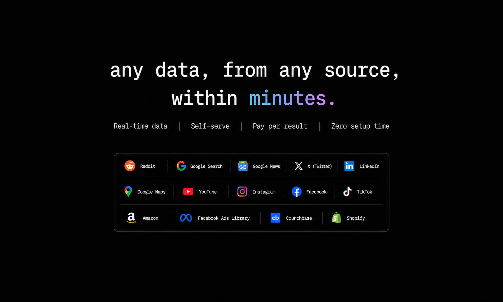

### 🎬 관련 영상
- [🎥 영상 보기](https://ph-files.imgix.net/d523bb79-c957-4e73-a220-96c6b504d336.jpeg?auto=format)

---

## 4. [fx (by Vercel)](https://www.producthunt.com/products/fx-by-vercel)
**Votes**: 151 | **도입 난이도**: 하 | **신뢰도**: 상
**Tagline**: Vercel's tiny, open-source coding agent
**서비스 링크**: https://www.producthunt.com/r/65726O3N7WO5MO

**태그**: DevTool, AI-Agent, OpenSource, Vercel, Agent, Design

### 📌 이 서비스 한눈에 보기
가볍고 빠른 개발을 위한 Vercel의 오픈소스 코딩 에이전트

### 🔑 주요 기능
- Zig 언어로 작성된 약 6MB 크기의 초경량 네이티브 바이너리
- 낮은 메모리 및 컨텍스트 오버헤드로 모델 성능 극대화
- 로컬/클라우드 모델 지원 및 스킬, 플러그인, MCP 확장 가능

### 🙋 사용자에게 어떤 점이 좋은가
매우 작은 크기와 빠른 실행 속도 덕분에 시스템 자원을 적게 소모하면서도 효율적인 코딩 자동화 환경을 구축할 수 있습니다.

### ✅ 지금 바로 써볼 기능
- 로컬 또는 클라우드 모델과 연동하여 기본 코딩 작업 수행하기
- 플러그인 및 MCP를 활용해 사용자 맞춤형 기능 확장하기
- 자체 에이전트 인프라에 fx 임베딩하기

### ⚠️ 사용 전 확인할 점
- 초경량 설계로 인해 복잡한 작업 시 기능적 제약이 있을 수 있음
- 사용자 정의 스킬 및 플러그인 설정에 따른 추가 작업 필요

### 🧭 확인이 더 필요한 정보
특정 개발 환경이나 운영체제에서의 상세 성능 벤치마크는 명시되지 않았습니다.

### 📸 스크린샷 및 갤러리
_media_0.jpg)
_media_1.jpg)
_media_2.jpg)

---

## 5. [Epho](https://www.producthunt.com/products/epho-claude-code-in-the-cloud)
**Votes**: 146 | **도입 난이도**: 하 | **신뢰도**: 상
**Tagline**: Run Claude Code, Codex or Opencode in cloud with your repo
**서비스 링크**: https://www.producthunt.com/r/YWZHF6R3TSHJHT

**태그**: DevTool, AI, Cloud, Automation, Serverless, Agent, API

### 📌 이 서비스 한눈에 보기
인프라 설정 없이 클라우드 샌드박스에서 Claude Code와 같은 AI 에이전트를 즉시 실행하는 API 서비스

### 🔑 주요 기능
- SDK나 데몬 설치 없이 단일 API 호출로 클라우드 기반 AI 에이전트 실행
- 사용자 저장소(Repo)와 연결된 서버리스 샌드박스 환경 제공
- 이벤트 스트리밍, 폴백(Fallback), 에이전트 설정을 자동 관리

### 🙋 사용자에게 어떤 점이 좋은가
복잡한 인프라 구축 없이도 코드 생성 및 실행 에이전트를 서비스에 즉시 통합할 수 있습니다.

### ✅ 지금 바로 써볼 기능
- 단일 API 호출로 Claude Code 세션 실행해보기
- 자신의 레포지토리 연결 및 컨텍스트 이해도 테스트하기
- 스트리밍 응답 및 샌드박스 환경 확인하기

### ⚠️ 사용 전 확인할 점
- 코드 실행을 위한 외부 샌드박스 환경에 대한 보안 정책 확인 필요
- 레포지토리 접근 권한 부여에 따른 데이터 보안 검토 필요

### 🧭 확인이 더 필요한 정보
제공되는 샌드박스의 격리 수준과 데이터 처리 방침에 대한 상세 정보가 필요합니다.

### 📸 스크린샷 및 갤러리
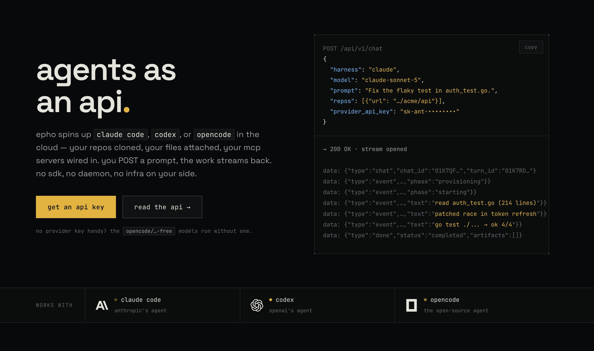
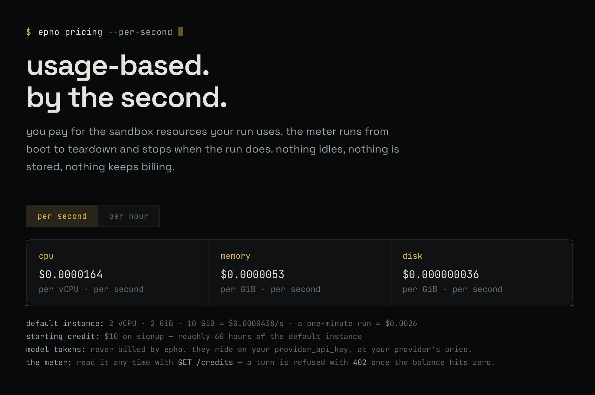
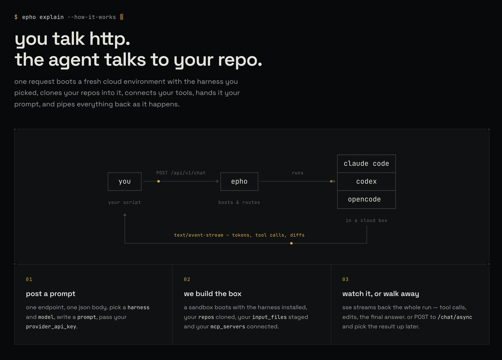

### 🎬 관련 영상
- [🎥 영상 보기](https://ph-files.imgix.net/7d019541-c30d-45c2-b16d-84e4351c1c48.jpeg?auto=format)

---

## 6. [Antigravity IDE Extensions](https://www.producthunt.com/products/google-antigravity)
**Votes**: 139 | **도입 난이도**: 하 | **신뢰도**: 상
**Tagline**: Antigravity agents now live inside your existing editor
**서비스 링크**: https://www.producthunt.com/r/OJKMMDRQ54XCDO

**태그**: DevTool, AI-Agent, Productivity, Agent, AI Tool

### 📌 이 서비스 한눈에 보기
기존 IDE 환경을 벗어나지 않고 Google의 에이전트 기반 코딩 기능을 그대로 사용하는 확장 프로그램

### 🔑 주요 기능
- VS Code, Visual Studio, JetBrains, Zed 등 주요 IDE 지원
- 에이전트와의 대화 맥락 및 공유 컨텍스트 유지
- 인라인 diff 검토, 플랜 검사, 디버깅 및 멀티스텝 작업 수행

### 🙋 사용자에게 어떤 점이 좋은가
개발자가 코딩 흐름을 끊지 않고 IDE 내에서 에이전트와 협업하며 복잡한 작업을 효율적으로 처리할 수 있습니다.

### ✅ 지금 바로 써볼 기능
- 사용 중인 IDE에 확장 프로그램 설치하기
- 인라인 diff 기능을 통한 코드 변경 사항 검토하기
- 에이전트에게 멀티스텝 작업 위임해보기

### ⚠️ 사용 전 확인할 점
- 지원되는 IDE 환경에 따른 기능 차이 확인 필요
- 에이전트의 작업 결과물에 대한 수동 검토 필수

### 🧭 확인이 더 필요한 정보
각 IDE별 상세 기능 지원 범위와 Google 계정 연동 방식에 대한 구체적인 정보가 필요합니다.

### 📸 스크린샷 및 갤러리
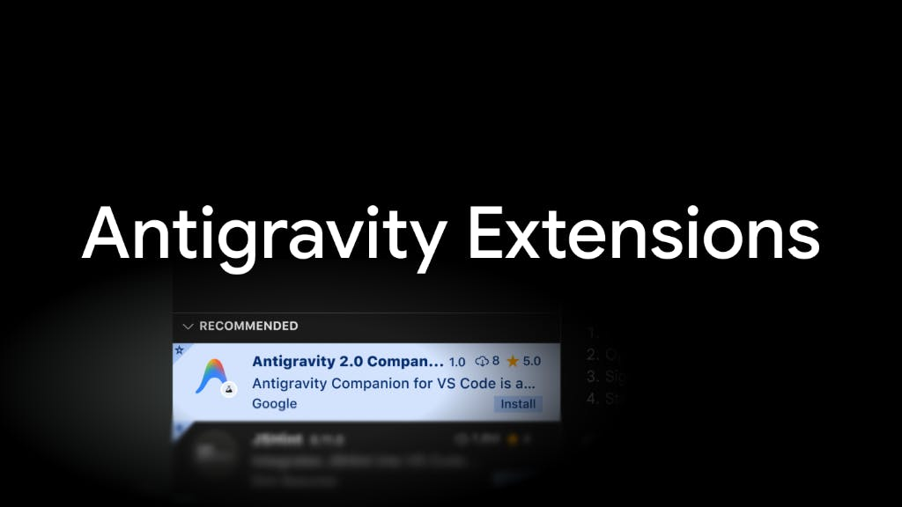
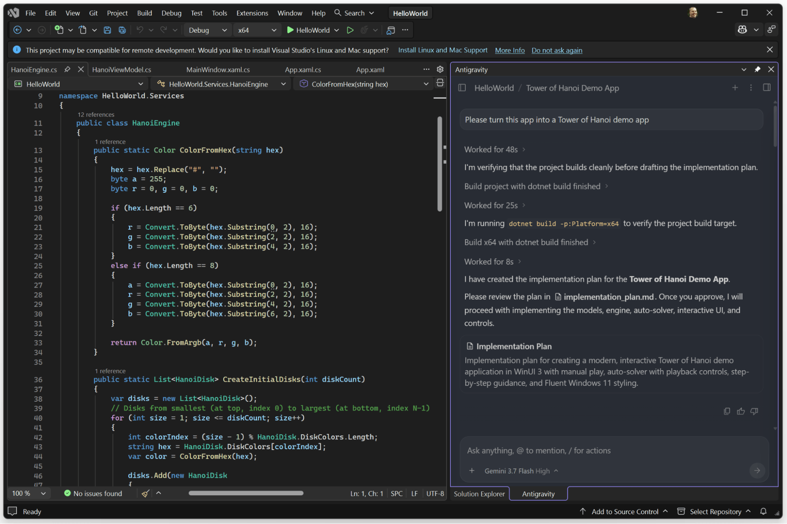
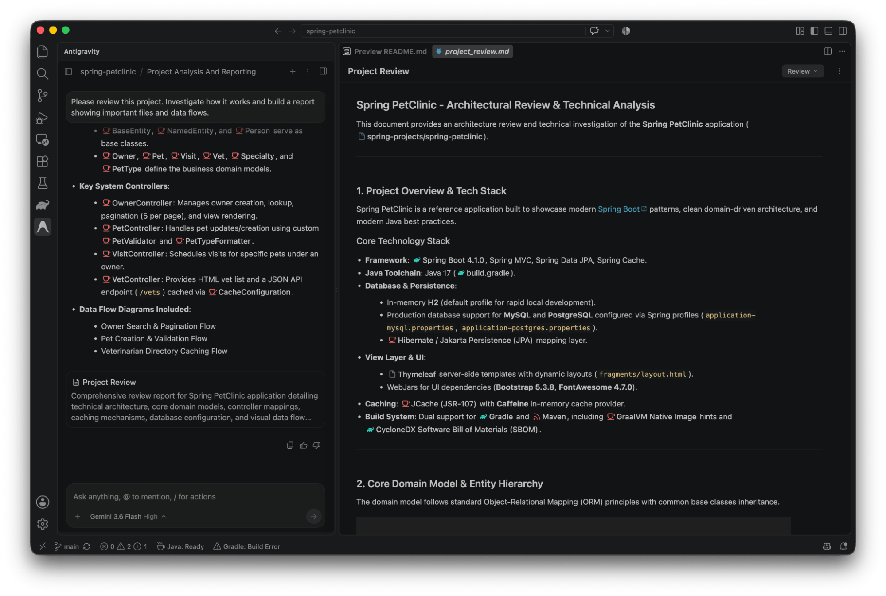

---

## 7. [Plow Latch](https://www.producthunt.com/products/plow-latch)
**Votes**: 131 | **도입 난이도**: 중 | **신뢰도**: 상
**Tagline**: Run AI agents on your Mac with scoped access
**서비스 링크**: https://www.producthunt.com/r/UWU6UJ7QRR5L65

**태그**: AI, Automation, Mac, Security, Productivity, Agent, AI Tool

### 📌 이 서비스 한눈에 보기
로컬 데이터를 보호하면서 Mac의 제어권을 AI 에이전트에게 안전하게 부여하는 도구

### 🔑 주요 기능
- Mac 시스템에 대한 AI 에이전트의 안전한 접근 권한 제공
- 데이터를 외부로 유출하지 않고 로컬 환경에서 유지
- 사용자의 Mac 작업 환경을 AI가 수행할 수 있도록 연결

### 🙋 사용자에게 어떤 점이 좋은가
개인 정보나 민감한 데이터가 담긴 Mac 환경에서 AI 에이전트를 활용할 때, 보안을 유지하며 자동화 작업을 수행할 수 있습니다.

### ✅ 지금 바로 써볼 기능
- AI 에이전트에게 부여할 권한 범위(Scoped access) 설정하기
- 로컬 데이터 보안 정책 확인하기
- Mac 자동화 작업 워크플로우 테스트하기

### ⚠️ 사용 전 확인할 점
- 에이전트에게 시스템 제어권을 부여하므로 권한 설정 오류 시 시스템 영향 가능성 있음
- 로컬 환경에서의 보안 수준이 사용자의 설정에 의존할 수 있음

### 🧭 확인이 더 필요한 정보
에이전트가 접근할 수 있는 구체적인 권한 범위와 보안 프로토콜에 대한 상세 정보가 필요합니다.

### 📸 스크린샷 및 갤러리
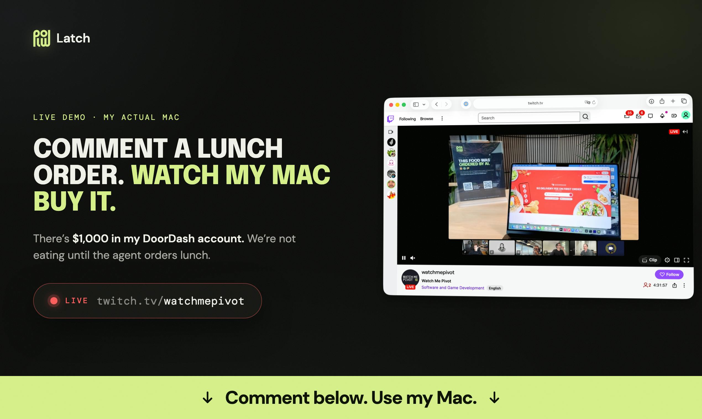
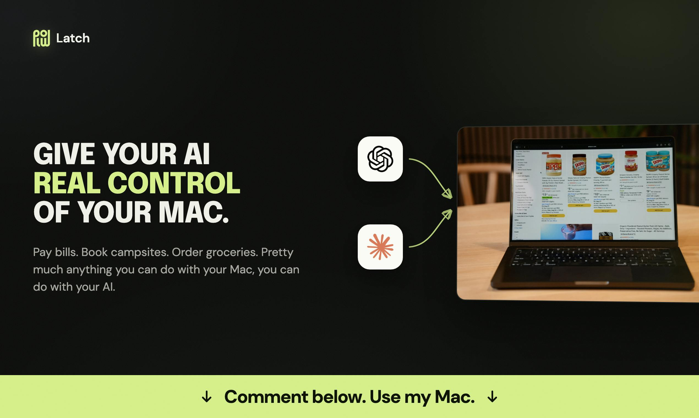
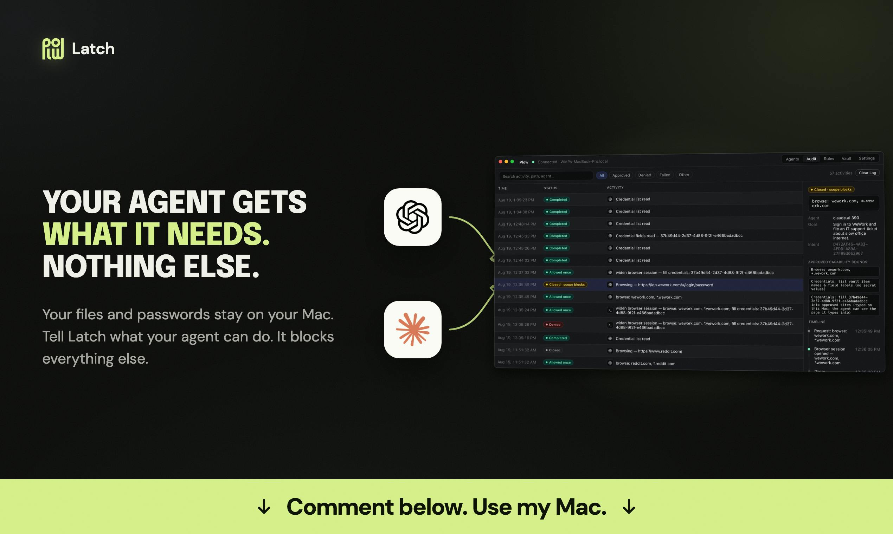

### 🎬 관련 영상
- [🎥 영상 보기](https://ph-files.imgix.net/2f884bb8-a74e-4045-aadf-16ff3cbe3131.jpeg?auto=format)

---

## 8. [Dockhand](https://www.producthunt.com/products/dockhand)
**Votes**: 121 | **도입 난이도**: 하 | **신뢰도**: 상
**Tagline**: Docker management for everyone
**서비스 링크**: https://www.producthunt.com/r/ZTGSK47YHNZBXI

**태그**: DevOps, Docker, Automation, Security, AI Tool, Vision

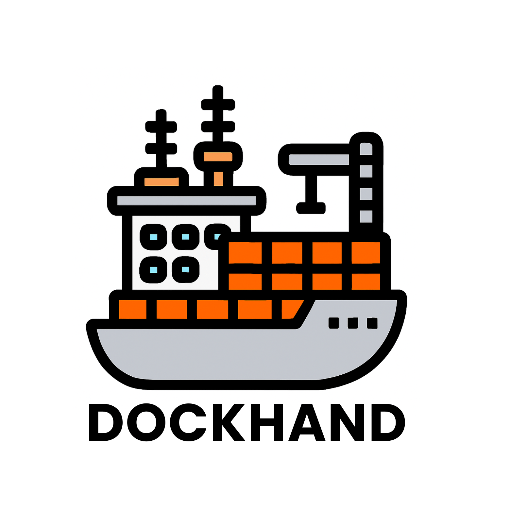

### 📌 이 서비스 한눈에 보기
여러 대의 호스트와 컨테이너를 하나의 UI에서 간편하게 관리하는 통합 Docker 관리 도구

### 🔑 주요 기능
- 로컬부터 원격 VPS까지 다양한 호스트의 Docker 환경 통합 관리
- Git 연동을 통한 Compose 스택 자동 배포 및 업데이트
- 보안 취약점 스캔(Grype/Trivy) 및 외부 Secret 관리 도구 연동

### 🙋 사용자에게 어떤 점이 좋은가
여러 서버의 Docker 환경을 일일이 접속할 필요 없이 하나의 대시보드에서 중앙 집중식으로 제어하고 자동화할 수 있습니다.

### ✅ 지금 바로 써볼 기능
- Git 저장소를 연결하여 Compose 스택 자동 동기화 설정하기
- 1Password나 Vault를 연결하여 보안 비밀값 주입하기
- 이미지 보안 스캔 기능을 활성화하여 취약점 점검하기

### ⚠️ 사용 전 확인할 점
- 원격 호스트 관리 시 네트워크(NAT/VPN) 설정 및 보안 권한 확인 필요
- 백업 저장소(S3/GCS) 설정 시 클라우드 비용 및 접근 권한 관리 필요

### 🧭 확인이 더 필요한 정보
제품이 'Free'라고 명시되어 있으나, 엔터프라이즈급 기능(SSO, LDAP 등)의 완전한 무료 제공 범위는 확인이 필요합니다.

### 📸 스크린샷 및 갤러리
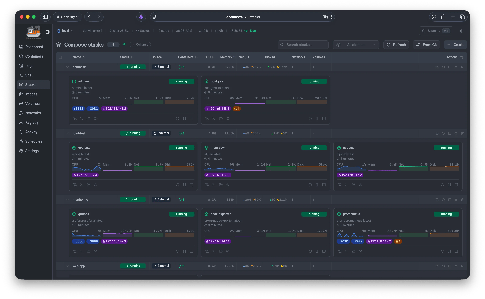
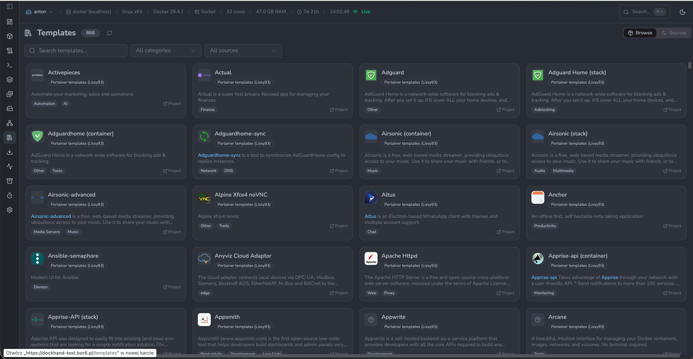
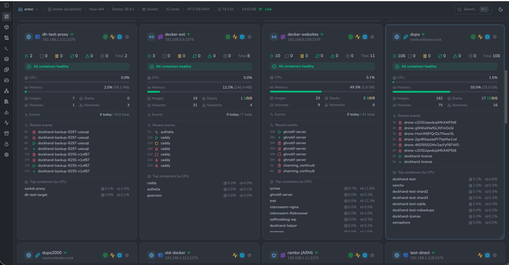

---

## 9. [Surfdeck](https://www.producthunt.com/products/surfdeck)
**Votes**: 118 | **도입 난이도**: 하 | **신뢰도**: 상
**Tagline**: Your tabs, within reach.
**서비스 링크**: https://www.producthunt.com/r/KKNDE5EKUAL52T

**태그**: Productivity, macOS, Browser

### 📌 이 서비스 한눈에 보기
자주 방문하는 사이트를 맥 메뉴바에서 즉시 실행하는 탭 관리 도구

### 🔑 주요 기능
- 맥 메뉴바를 활용한 직관적인 사이트 접근
- 즐겨찾는 웹사이트를 손쉽게 관리
- 브라우저를 열지 않고도 웹 페이지에 빠르게 접근

### 🙋 사용자에게 어떤 점이 좋은가
자주 사용하는 웹 서비스들을 브라우저 탭 사이에서 헤매지 않고 메뉴바에서 즉시 열 수 있어 작업 흐름을 유지하는 데 도움을 줍니다.

### ✅ 지금 바로 써볼 기능
- 자주 방문하는 사이트 등록하기
- 메뉴바에서 사이트 바로가기 테스트하기
- 자신만의 워크플로우에 맞춰 사이트 배치하기

### ⚠️ 사용 전 확인할 점
- macOS 전용 앱이므로 다른 OS에서는 사용 불가
- 메뉴바가 복잡해질 수 있음

### 🧭 확인이 더 필요한 정보
상세한 기능 범위와 동기화 지원 여부는 제품 설명에 명시되지 않았습니다.

### 📸 스크린샷 및 갤러리
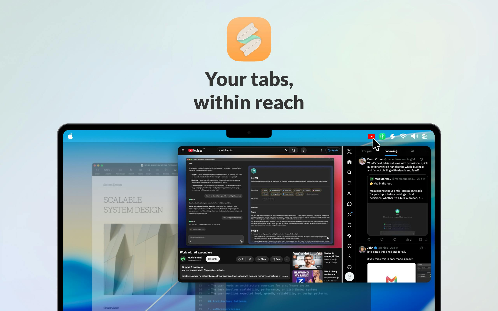
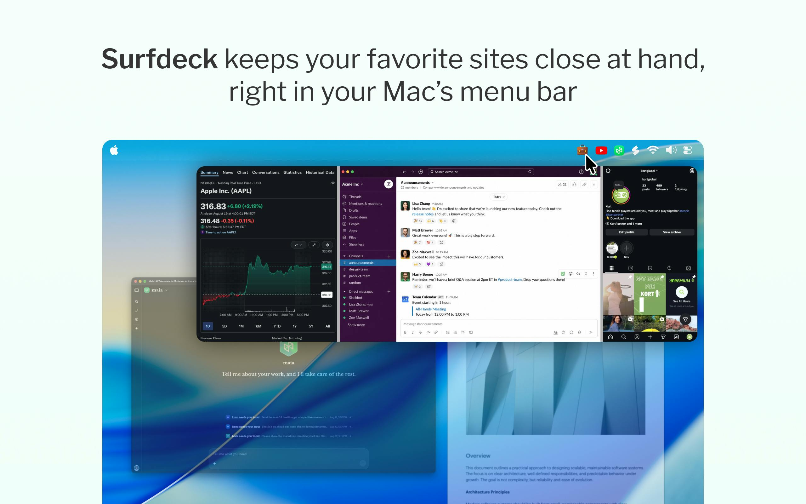
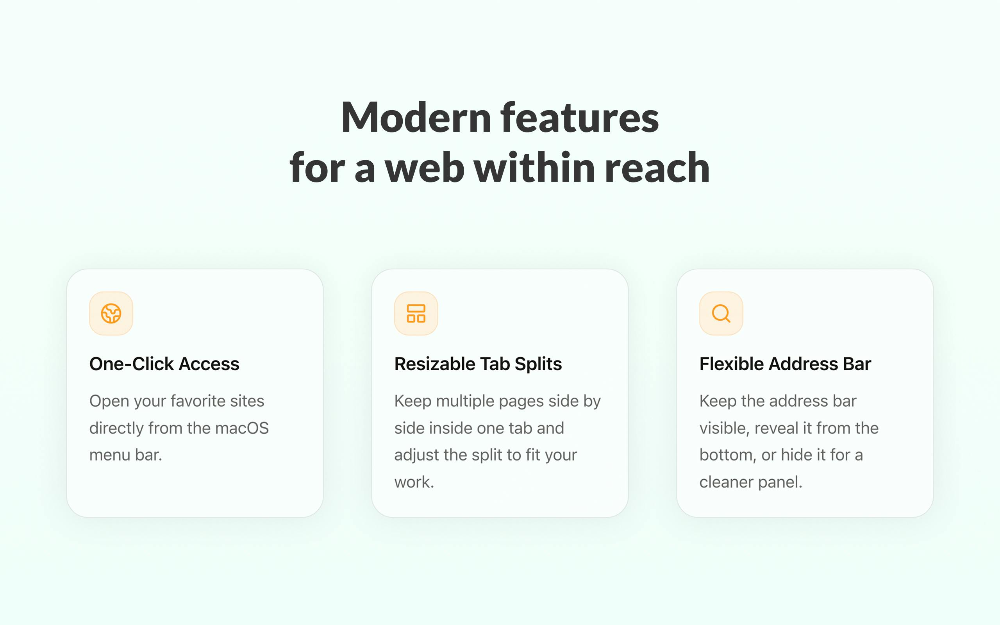

---

## 10. [Router by Ramp](https://www.producthunt.com/products/ramp-router)
**Votes**: 106 | **도입 난이도**: 하 | **신뢰도**: 상
**Tagline**: Tokens are money. Save both.
**서비스 링크**: https://www.producthunt.com/r/3VQG2NN33U6NAF

**태그**: AI, DevTool, FinTech, CostOptimization, LLM, API

### 📌 이 서비스 한눈에 보기
최저가 모델로 자동 라우팅하여 LLM 비용을 절감하는 통합 API 솔루션

### 🔑 주요 기능
- 단일 API 엔드포인트를 통한 멀티 모델 통합 관리
- 성능 임계치를 충족하는 최저 비용 모델로 자동 라우팅
- Ramp의 금융 가시성을 바탕으로 한 비용 최적화

### 🙋 사용자에게 어떤 점이 좋은가
여러 LLM API를 개별적으로 관리할 필요 없이, 설정한 성능 기준 내에서 가장 저렴한 모델로 요청이 자동 배정되어 운영 비용을 획기적으로 줄일 수 있습니다.

### ✅ 지금 바로 써볼 기능
- 단일 API 엔드포인트 연결 테스트
- 성능 임계치(Performance Threshold) 설정 및 최적화
- Ramp 금융 대시보드를 통한 비용 절감 효과 모니터링

### ⚠️ 사용 전 확인할 점
- 모델 라우팅 시 성능 저하가 발생할 가능성 검토 필요
- 특정 모델의 API 가용성 및 속도 차이 확인 필요

### 🧭 확인이 더 필요한 정보
사용자의 성능 임계치 설정에 따라 비용 절감 폭과 응답 품질이 어떻게 변동될지 구체적인 벤치마크 데이터가 필요합니다.

### 📸 스크린샷 및 갤러리

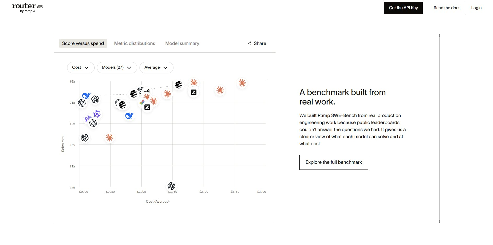
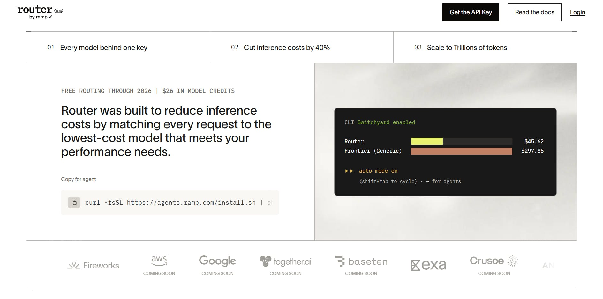

### 🎬 관련 영상
- [🎥 영상 보기](https://ph-files.imgix.net/fda8d25e-93ec-4a09-802f-9d8f90acac79.jpeg?auto=format)

---

## 11. [Local](https://www.producthunt.com/products/local-7)
**Votes**: 105 | **도입 난이도**: 하 | **신뢰도**: 상
**Tagline**: Zero (!) friction local AI for your Mac
**서비스 링크**: https://www.producthunt.com/r/UFC7CN4ZXMJH2S

**태그**: AI, macOS, Privacy, Productivity, Local-First, Agent, AI Tool, Chat

### 📌 이 서비스 한눈에 보기
데이터 유출 걱정 없이 맥(Mac)에서 즉시 실행되는 초간편 로컬 AI 솔루션

### 🔑 주요 기능
- 하드웨어 최적화를 통한 최대 5.4배 빠른 AI 실행 속도
- 클라우드나 계정 없이 기기 내에서 완벽하게 작동하는 프라이버시 보호
- 사무실 내 고성능 기기를 공유하여 여러 노트북에서 접속 가능한 'Office Mode' 제공

### 🙋 사용자에게 어떤 점이 좋은가
개인 정보나 기업 보안이 중요한 작업(코딩, 회의록 작성 등)을 클라우드 노출 없이 안전하고 빠르게 처리할 수 있습니다.

### ✅ 지금 바로 써볼 기능
- 로컬 환경에서의 채팅 및 코딩 에이전트 실행
- 회의록 작성을 위한 자동화 워크플로우 테스트
- Office Mode를 활용한 사내 하드웨어 자원 공유

### ⚠️ 사용 전 확인할 점
- 사용자의 Mac 하드웨어 성능에 따라 실제 체감 속도가 달라질 수 있음
- 로컬 자원을 사용하므로 실행 중 기기 발열이나 배터리 소모가 발생할 수 있음

### 🧭 확인이 더 필요한 정보
하드웨어 사양에 따른 구체적인 최적화 범위와 Office Mode의 네트워크 설정 방식에 대한 추가 확인이 필요합니다.

### 📸 스크린샷 및 갤러리
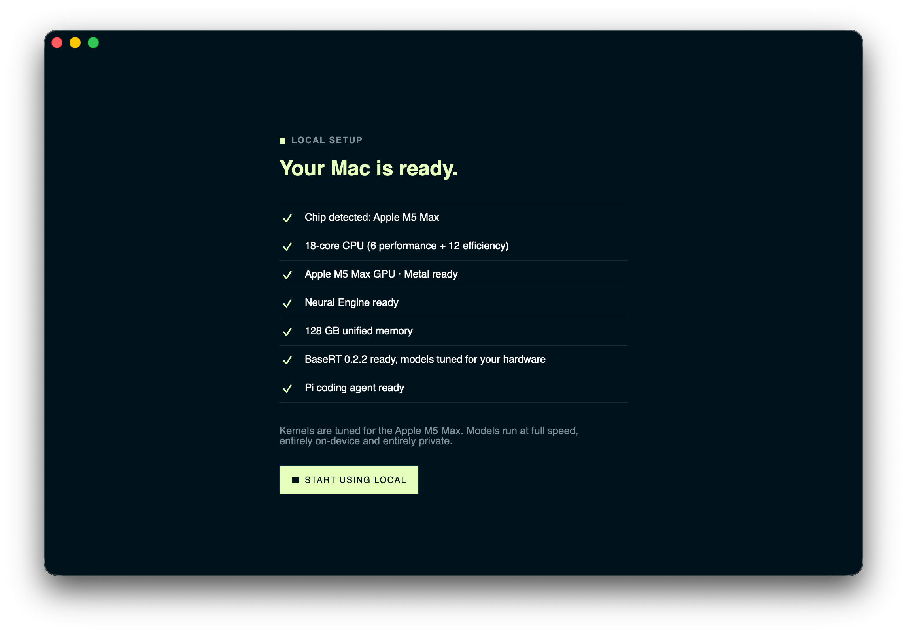
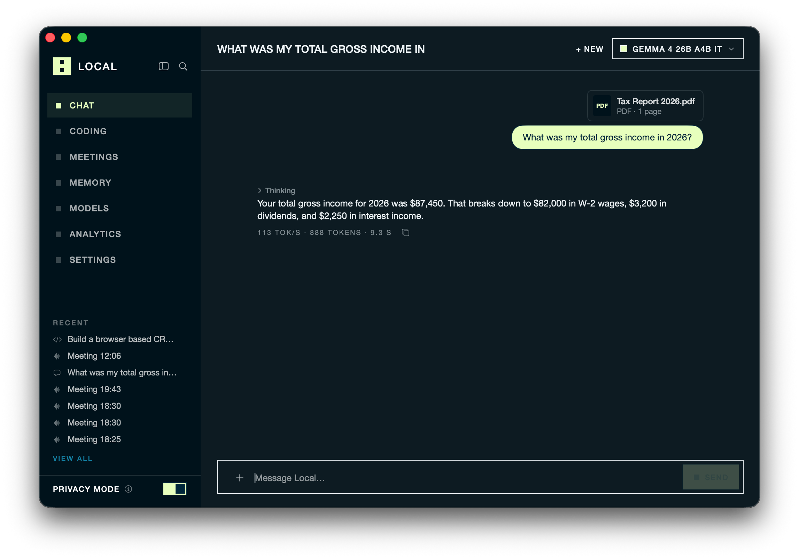
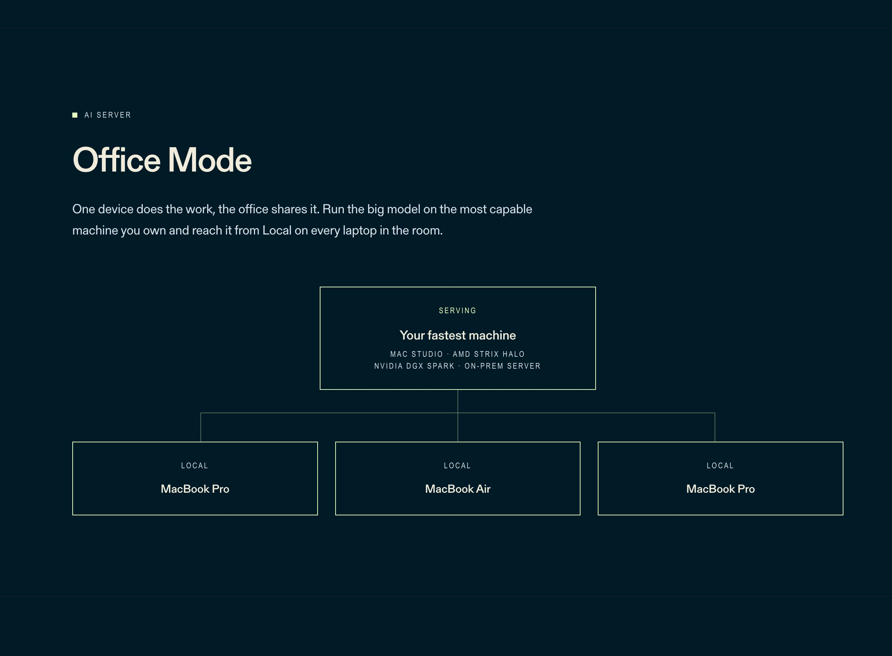

### 🎬 관련 영상
- [🎥 영상 보기](https://ph-files.imgix.net/b7a29b6a-0d90-4f0a-a284-fa1fd921365c.jpeg?auto=format)

---

## 12. [Flunkey](https://www.producthunt.com/products/flunkey)
**Votes**: 99 | **도입 난이도**: 하 | **신뢰도**: 상
**Tagline**: Voice-first AI layer for Windows (beta)
**서비스 링크**: https://www.producthunt.com/r/2F4AB4LEZ5J3MH

**태그**: Productivity, AI, Windows, Voice-to-Text, AI Tool

### 📌 이 서비스 한눈에 보기
윈도우 환경에서 음성을 통해 아이디어를 기록하고 즉각적인 작업으로 연결하는 AI 생산성 도구

### 🔑 주요 기능
- 음성 입력을 텍스트 및 유용한 작업으로 변환하는 윈도우용 AI 레이어
- 단순 기록을 넘어 질문과 답변이 가능한 대화형 AI 기능 탑재
- 학생, 연구자 등 맥락 중심의 작업이 많은 사용자에게 최적화

### 🙋 사용자에게 어떤 점이 좋은가
복잡한 타이핑 없이 말하는 것만으로 아이디어를 정리하고 질문할 수 있어, 흐름을 끊지 않고 업무나 학습을 이어갈 수 있습니다.

### ✅ 지금 바로 써볼 기능
- 음성으로 생각 정리하기
- 기록된 텍스트에 대해 AI에게 질문하기
- 작업 중 맥락 유지하며 아이디어 확장하기

### ⚠️ 사용 전 확인할 점
- 현재 베타 버전이므로 기능의 안정성이나 버그가 있을 수 있음
- 윈도우 환경에 특화되어 있어 타 OS 사용자는 제약이 있을 수 있음

### 🧭 확인이 더 필요한 정보
베타 단계이므로 향후 정식 출시 시 기능 범위와 시스템 리소스 점유율이 변동될 수 있습니다.

### 📸 스크린샷 및 갤러리

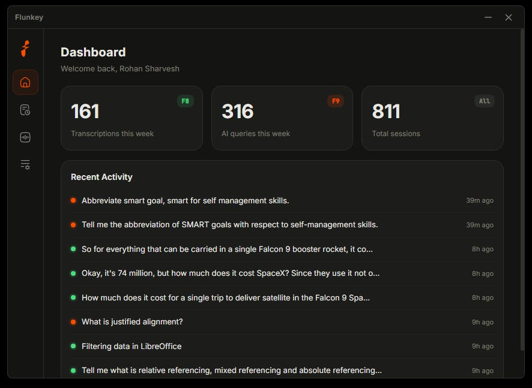

### 🎬 관련 영상
- [🎥 영상 보기](https://ph-files.imgix.net/7b54c2cd-4f75-4afe-8e7e-be4ede2bc0b0.jpeg?auto=format)

---

## 13. [Actx0](https://www.producthunt.com/products/actx0)
**Votes**: 96 | **도입 난이도**: 하 | **신뢰도**: 상
**Tagline**: Memory infrastructure for AI agents.
**서비스 링크**: https://www.producthunt.com/r/VM6FVGFBGCKKSD

**태그**: AI, DevTool, Infrastructure, Automation, Agent, AI Tool, Prompting

### 📌 이 서비스 한눈에 보기
AI 에이전트의 세션 간 기억을 유지하고 토큰 비용을 절감하는 메모리 인프라

### 🔑 주요 기능
- 세션이 종료되어도 데이터가 유지되는 영구적 메모리 계층 제공
- 불필요한 컨텍스트 중복을 줄여 토큰 비용 및 지연 시간 최적화
- 여러 에이전트와 앱 간에 공유 가능한 통합 메모리 인프라

### 🙋 사용자에게 어떤 점이 좋은가
에이전트가 과거 대화 내용을 기억하지 못하는 문제를 해결하여, 마치 사람처럼 연속성 있는 상호작용을 가능하게 합니다.

### ✅ 지금 바로 써볼 기능
- 기존 에이전트 워크플로우에 드롭인(Drop-in) 방식으로 연결하기
- 세션 간 데이터 유지 기능 테스트하기
- 컨텍스트 최적화를 통한 토큰 사용량 변화 확인하기

### ⚠️ 사용 전 확인할 점
- 데이터 보안 및 개인정보 보호 정책 확인 필요
- 기존 데이터베이스/벡터 DB와의 호환성 검토

### 🧭 확인이 더 필요한 정보
구체적인 API 연동 방식과 데이터 저장 방식(벡터 vs 관계형)에 대한 상세 기술 문서 확인이 필요합니다.

### 📸 스크린샷 및 갤러리
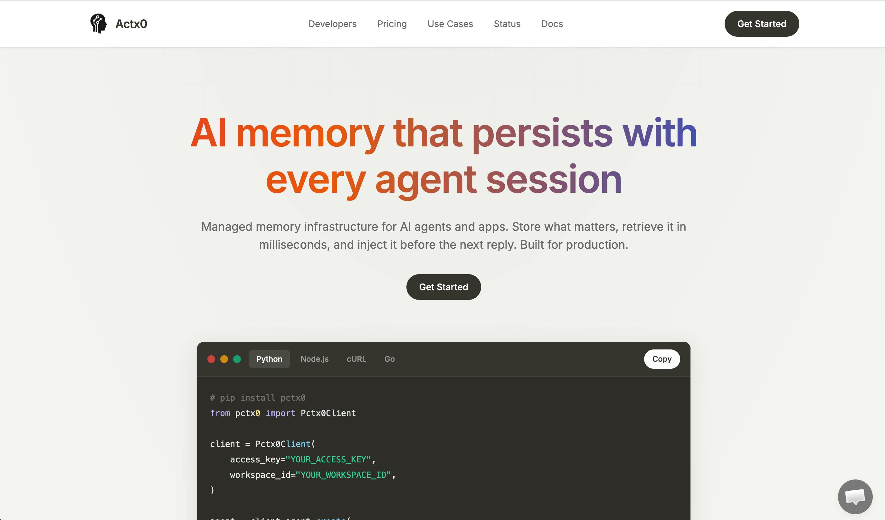
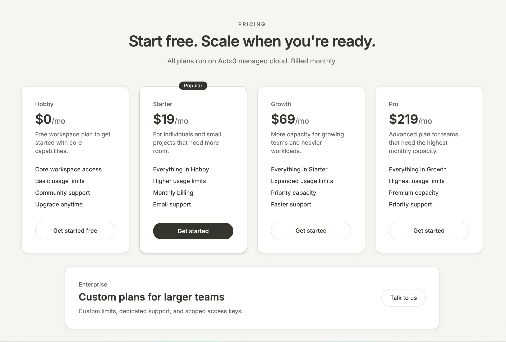
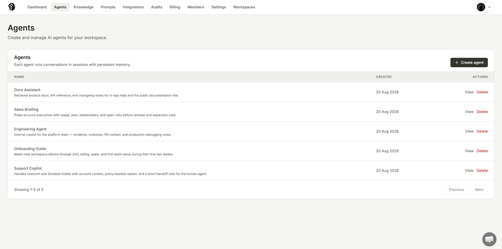

### 🎬 관련 영상
- [🎥 영상 보기](https://ph-files.imgix.net/6a8388ad-141c-466e-983c-9959a2ce4885.jpeg?auto=format)

---

## 14. [OneCLI](https://www.producthunt.com/products/onecli)
**Votes**: 94 | **도입 난이도**: 중 | **신뢰도**: 상
**Tagline**: Give every employee a secured, sandboxed pro assistant agent
**서비스 링크**: https://www.producthunt.com/r/GOJG4CX6YDBG6M

**태그**: AI, Automation, OpenSource, Security, Productivity, Agent, Chat

### 📌 이 서비스 한눈에 보기
보안과 정책 제어가 가능한 오픈소스 팀용 샌드박스 AI 에이전트

### 🔑 주요 기능
- 보안이 강화된 샌드박스 환경에서 실행되는 AI 에이전트
- 실제 자격 증명(Credential)에 접근하지 않는 안전한 작업 방식
- Slack 및 웹 환경을 지원하는 오픈소스 셀프 호스팅 솔루션

### 🙋 사용자에게 어떤 점이 좋은가
직접 수동으로 작업하는 대신, 보안이 확보된 환경에서 AI 에이전트가 업무를 대신 수행하도록 하여 생산성을 높일 수 있습니다.

### ✅ 지금 바로 써볼 기능
- 자체 호스팅 환경 구축 및 보안 정책 설정
- Slack 연동을 통한 팀 협업 워크플로우 테스트
- 샌드박스 내 에이전트 작업 수행 능력 검증

### ⚠️ 사용 전 확인할 점
- 셀프 호스팅 방식이므로 인프라 관리 역량이 필요함
- 에이전트의 작업 범위와 정책 설정에 따른 보안 검토 필요

### 🧭 확인이 더 필요한 정보
상세한 기술 스택과 구체적인 에이전트 제어 방식에 대한 정보가 추가로 필요합니다.

### 📸 스크린샷 및 갤러리
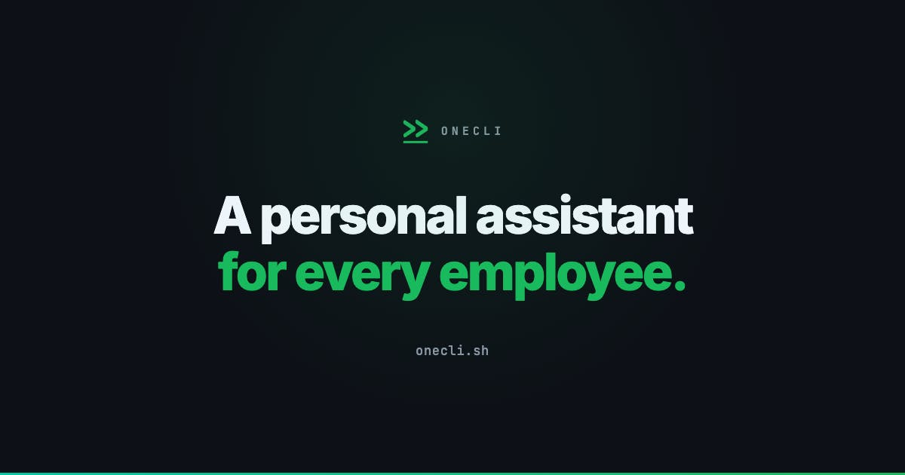
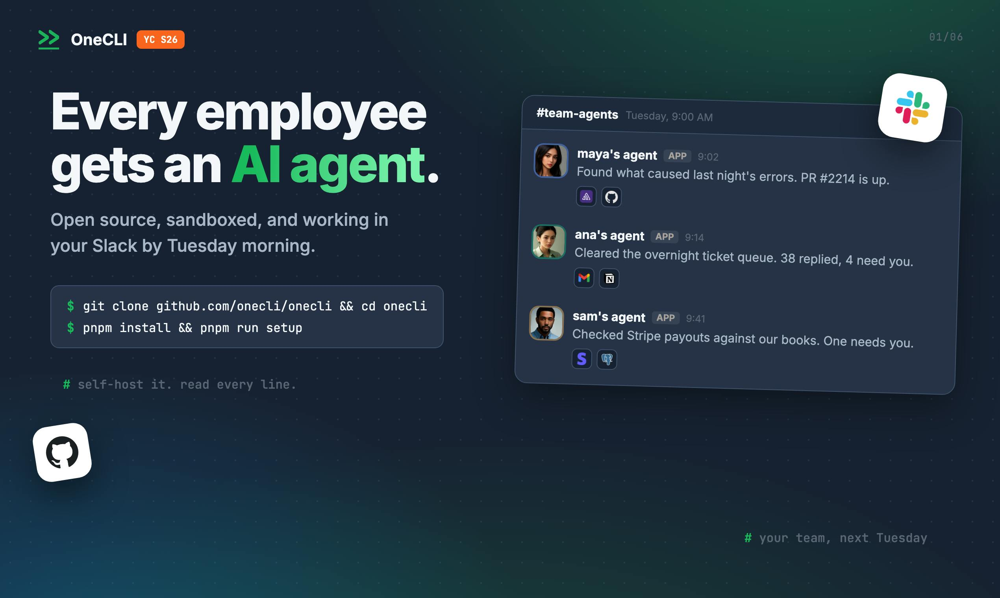
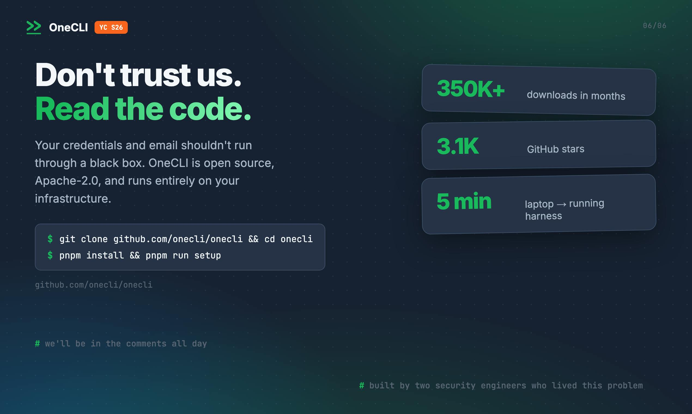

### 🎬 관련 영상
- [🎥 영상 보기](https://ph-files.imgix.net/fbe242c3-1a6a-46ae-9b50-c822beb348c1.gif?auto=format)

---

## 15. [Project SKY](https://www.producthunt.com/products/project-sky)
**Votes**: 91 | **도입 난이도**: 하 | **신뢰도**: 상
**Tagline**: Your ambient AI companion for Windows.
**서비스 링크**: https://www.producthunt.com/r/4AWYPYAU2BEVVF

**태그**: AI, Windows, Productivity, Automation, AI Tool, Chat, Design

### 📌 이 서비스 한눈에 보기
윈도우 데스크톱 환경에 녹아들어 작업 흐름을 돕는 AI 앰비언트 컴패니언

### 🔑 주요 기능
- 브라우저를 벗어나 OS 레벨에서 작동하는 네이티브 윈도우 애플리케이션
- 화면 영역 선택 및 공간 인식을 통한 실시간 스크린 분석 기능
- 대화형 음성 인터페이스와 장기 기억을 통한 맥락 유지

### 🙋 사용자에게 어떤 점이 좋은가
창 전환 없이 작업 중인 화면의 맥락을 AI가 즉시 이해하므로, 업무 흐름을 끊지 않고 자연스럽게 도움을 받을 수 있습니다.

### ✅ 지금 바로 써볼 기능
- 원형 선택 도구로 화면 영역 분석하기
- 음성 명령을 통한 데스크톱 작업 자동화 시도하기
- AI의 맥락 이해를 활용한 작업 관리하기

### ⚠️ 사용 전 확인할 점
- OS 레벨의 권한을 사용하므로 개인정보 및 화면 보안 설정 확인 필요
- 백그라운드 실행에 따른 시스템 리소스 점유율 확인 필요

### 🧭 확인이 더 필요한 정보
상세한 개인정보 보호 정책 및 화면 데이터 처리 방식에 대한 구체적인 정보가 필요합니다.

### 📸 스크린샷 및 갤러리

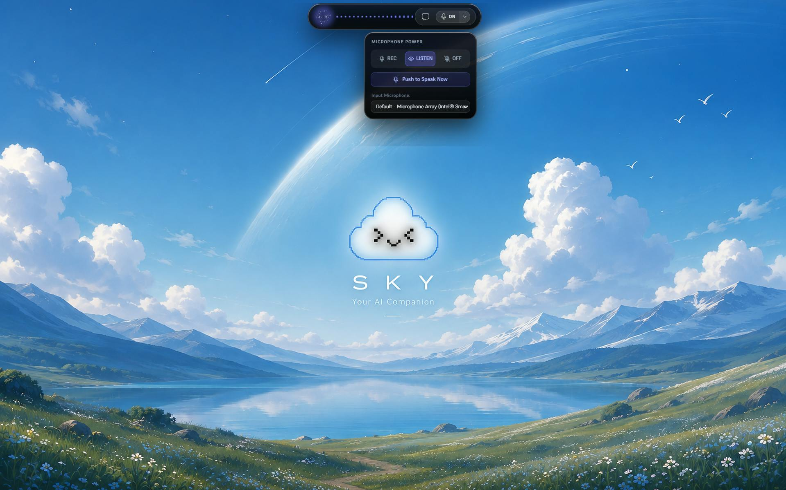
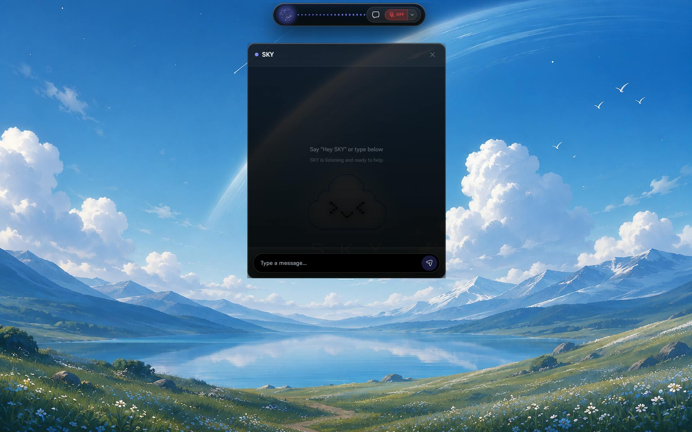

---

## 16. [ShogunAI](https://www.producthunt.com/products/shogunai)
**Votes**: 91 | **도입 난이도**: 중 | **신뢰도**: 상
**Tagline**: Your personal AGI on your PC. Built to finish real work.
**서비스 링크**: https://www.producthunt.com/r/UK2Z7GJHTOIJXQ

**태그**: AI Agent, Productivity, Automation, macOS, Agent, AI Tool, Chat

### 📌 이 서비스 한눈에 보기
사용자의 모든 작업 맥락을 이해하고 실질적인 업무를 완수하는 개인용 AI 에이전트

### 🔑 주요 기능
- 단순 챗봇을 넘어 사용자의 프로젝트와 약속 등 전체 작업 상태를 파악하는 에이전트
- 클라우드가 아닌 사용자 PC 내부에서 작동하여 데이터 주권과 맥락 유지
- 자동 읽기 및 승인 기반의 전송 시스템으로 업무 자동화 구현

### 🙋 사용자에게 어떤 점이 좋은가
사용자의 모든 작업 흐름을 학습하여 복잡한 업무를 대신 처리해주며, 모든 중요한 결정은 사용자의 승인을 거치므로 안전하게 업무를 완수할 수 있습니다.

### ✅ 지금 바로 써볼 기능
- macOS 환경에서 설치 및 초기 설정
- 기존 작업 데이터 연동을 통한 맥락 구축
- 자동 읽기 및 승인 기반 워크플로우 테스트

### ⚠️ 사용 전 확인할 점
- 현재 macOS 환경에서만 사용 가능
- PC 내부 데이터 접근에 따른 보안 및 개인정보 관리 필요

### 🧭 확인이 더 필요한 정보
현재 macOS 외의 운영체제 지원 여부와 구체적인 데이터 보안 프로토콜에 대한 정보가 필요합니다.

### 📸 스크린샷 및 갤러리
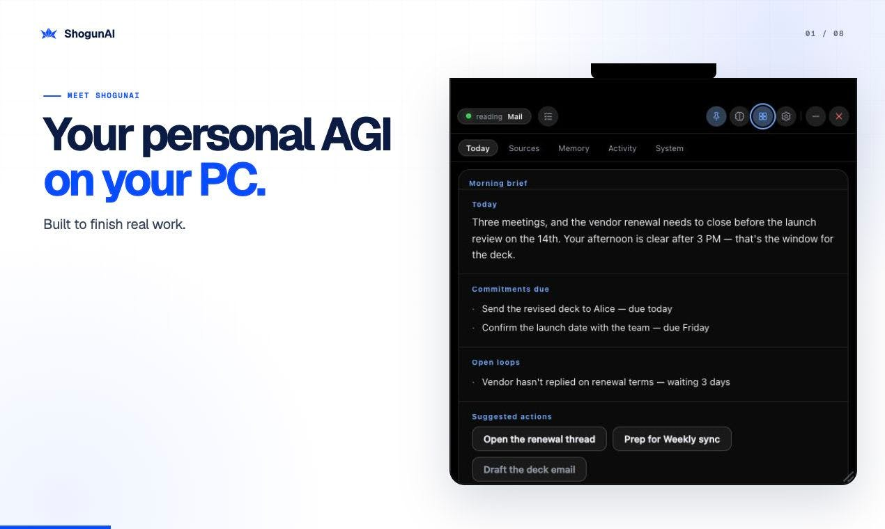
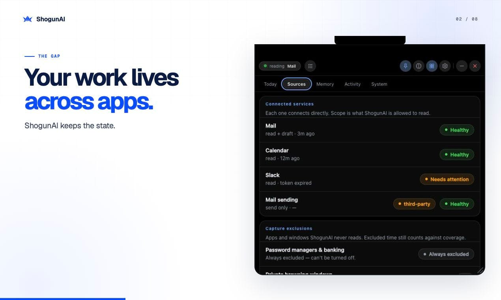
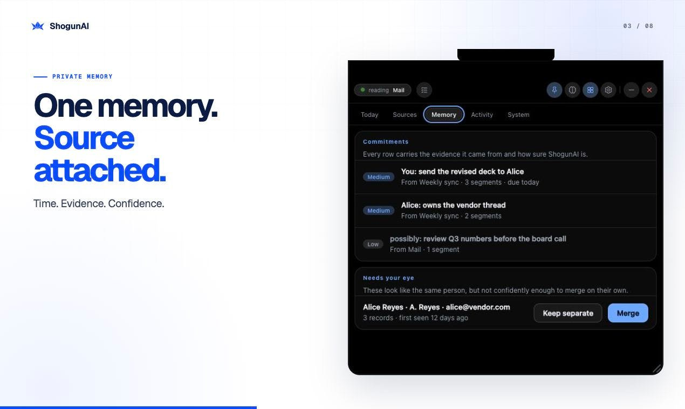

### 🎬 관련 영상
- [🎥 영상 보기](https://ph-files.imgix.net/416ab9d3-ee8e-4961-9aba-feeeec7dacca.jpeg?auto=format)

---

## 17. [Outlook Google Calendar Sync for Mac](https://www.producthunt.com/products/outlook-google-calendar-sync-for-mac)
**Votes**: 79 | **도입 난이도**: 하 | **신뢰도**: 상
**Tagline**: Sync Outlook calendars to Google on your Mac
**서비스 링크**: https://www.producthunt.com/r/PQ6K2XD56QHH6D

**태그**: Productivity, Automation, Mac, Calendar

### 📌 이 서비스 한눈에 보기
관리자 승인 없이 Mac에서 Outlook 일정을 Google 캘린더로 간편하게 동기화하는 도구

### 🔑 주요 기능
- 로컬 실행 방식으로 Microsoft 관리자 승인 절차 우회 가능
- 여러 개의 캘린더 동기화 작업 지원
- 중복 초대 발송 방지 및 백그라운드 자동 업데이트

### 🙋 사용자에게 어떤 점이 좋은가
회사 Outlook 일정과 개인 Google 일정을 분리하면서도 실시간으로 일정을 공유해야 하는 Mac 사용자에게 유용합니다.

### ✅ 지금 바로 써볼 기능
- 로컬 실행을 통한 보안 및 권한 확인
- 다중 캘린더 동기화 설정 테스트
- 백그라운드 실행 안정성 체크

### ⚠️ 사용 전 확인할 점
- 로컬 실행 방식이므로 Mac 환경에 의존적임
- 회사 보안 정책에 따른 데이터 동기화 허용 여부 확인 필요

### 🧭 확인이 더 필요한 정보
상세한 데이터 보안 정책 및 동기화 주기(빈도)에 대한 정보가 명시되지 않았습니다.

### 📸 스크린샷 및 갤러리
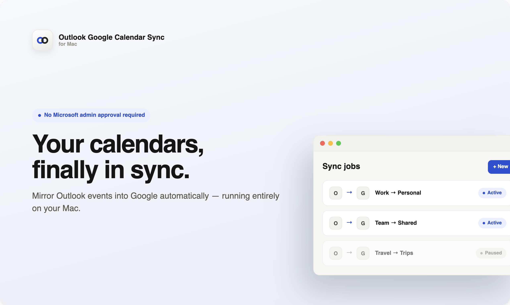
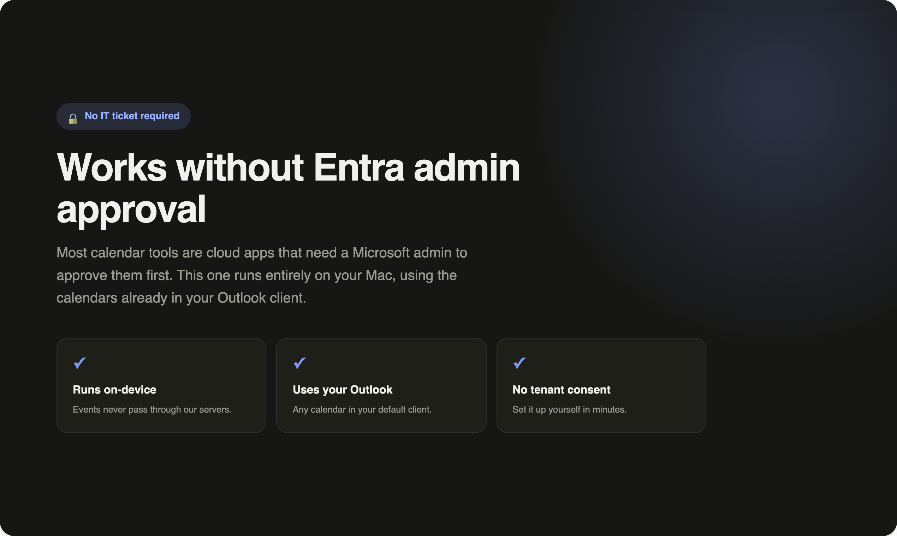
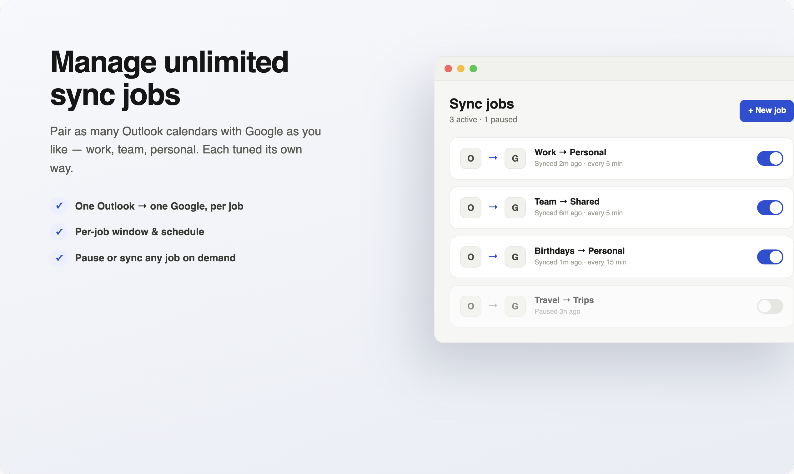

### 🎬 관련 영상
- [🎥 영상 보기](https://ph-files.imgix.net/f697cc54-84ef-4549-92b0-6d0439403baf.jpeg?auto=format)

---

## 18. [PixelRead AI OCR](https://www.producthunt.com/products/pixelread-ai-ocr)
**Votes**: 74 | **도입 난이도**: 하 | **신뢰도**: 상
**Tagline**: Capture, translate, and understand any text on your Mac
**서비스 링크**: https://www.producthunt.com/r/2R2HB2HXWCWWLY

**태그**: Productivity, OCR, AI, macOS, AI Tool, Video, Vision

### 📌 이 서비스 한눈에 보기
화면 속 모든 텍스트를 즉시 추출하고 AI로 분석하는 Mac 전용 OCR 도구

### 🔑 주요 기능
- 화면의 이미지, 비디오, PDF 등 모든 영역에서 텍s 추출 가능
- 온디바이스 번역 및 Apple Intelligence를 통한 요약/질문 기능 지원
- 데이터가 Mac 내부에서 처리되는 강력한 개인정보 보호

### 🙋 사용자에게 어떤 점이 좋은가
화면 속 텍스트를 복사하거나 타이핑할 필요 없이 즉시 활용할 수 있어 작업 흐름이 끊기지 않습니다.

### ✅ 지금 바로 써볼 기능
- 단축키(⌘⇧2)로 화면 영역 지정하여 텍스트 추출하기
- 추출된 텍스트를 온디바이스로 번역하기
- Apple Intelligence를 활용해 긴 문서 요약 및 질문하기

### ⚠️ 사용 전 확인할 점
- macOS 15.2 이상의 버전이 필요함
- 번역 및 AI 기능 사용을 위해 macOS 26(예정 버전)이 필요할 수 있음

### 🧭 확인이 더 필요한 정보
AI 기능 활용을 위한 macOS 26 버전의 가용 시점과 상세 사양 확인이 필요합니다.

### 📸 스크린샷 및 갤러리
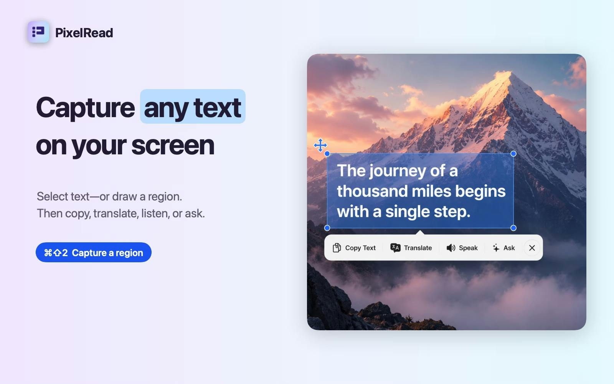
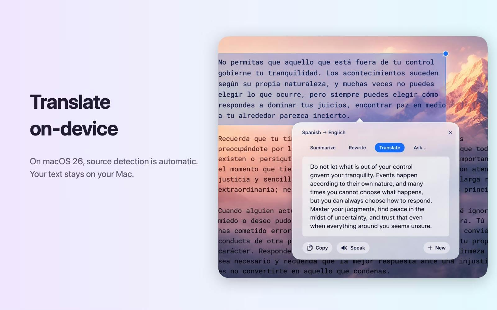
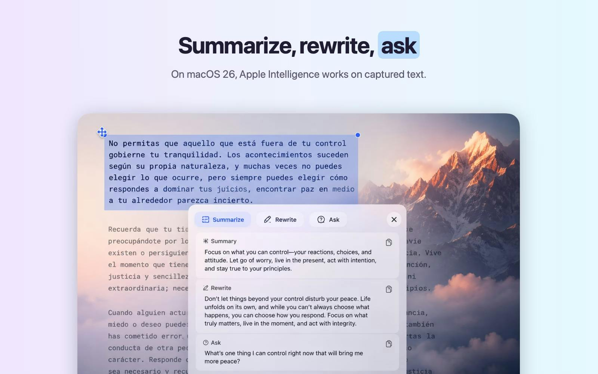

---

## 19. [Lynqo](https://www.producthunt.com/products/lynqo-your-local-nas-server)
**Votes**: 72 | **도입 난이도**: 하 | **신뢰도**: 상
**Tagline**: Your machine is a P2P server, review suite & clipboard sync.
**서비스 링크**: https://www.producthunt.com/r/UZ5FMAMVMLH4HH

**태그**: Productivity, P2P, Collaboration, DevTool, Video

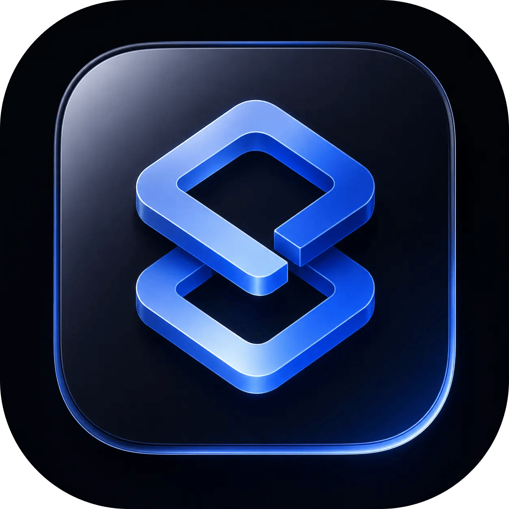

### 📌 이 서비스 한눈에 보기
클라우드 없이 내 컴퓨터를 로컬 서버, 클립보드 동기화 및 리뷰 도구로 변신시키는 P2P 솔루션

### 🔑 주요 기능
- 로컬 환경을 활용한 초고속 P2P 서버 구축
- 클라우드를 거치지 않는 보안 중심의 파일 공유 및 클립보드 동기화
- 프레임 단위의 정밀한 클라이언트 피드백 기능

### 🙋 사용자에게 어떤 점이 좋은가
데이터를 클라우드에 올리지 않고도 기기 간 파일을 공유하거나 피드백을 주고받을 수 있어 보안과 속도가 중요한 작업에 유용합니다.

### ✅ 지금 바로 써볼 기능
- 로컬 서버 기능으로 대용량 파일 공유해보기
- 기기 간 클립보드 동기화 설정하기
- 프레임 단위 리뷰 기능 테스트하기

### ⚠️ 사용 전 확인할 점
- P2P 방식이므로 호스트 기기가 켜져 있어야 서비스가 유지됨
- 로컬 네트워크 환경에 따라 연결 안정성이 달라질 수 있음

### 🧭 확인이 더 필요한 정보
상세한 운영체제 지원 범위 및 네트워크 보안 프로토콜에 대한 추가 확인이 필요합니다.

### 📸 스크린샷 및 갤러리
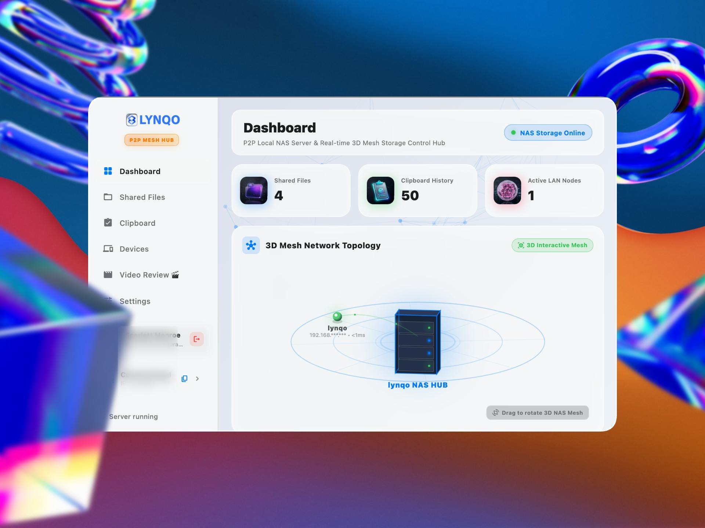
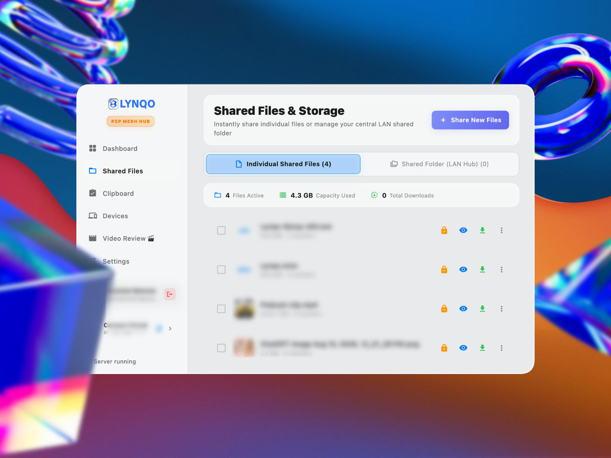
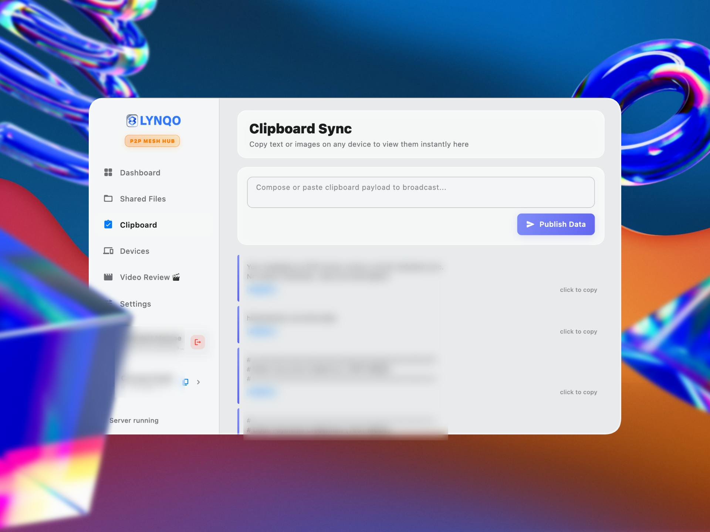

### 🎬 관련 영상
- [🎥 영상 보기](https://ph-files.imgix.net/88cd4c48-3f49-409d-b048-b33bce7da0e5.jpeg?auto=format)

---

## 20. [Jottify](https://www.producthunt.com/products/jottify)
**Votes**: 21 | **도입 난이도**: 하 | **신뢰도**: 상
**Tagline**: Capture everything. Organize nothing.
**서비스 링크**: https://www.producthunt.com/r/MW23E5PGQJC725

**태그**: Productivity, AI, Note-taking, Knowledge-Management, AI Tool

### 📌 이 서비스 한눈에 보기
정리할 필요 없이 생각만 던져두면 알아서 연결해 주는 지능형 메모 도구

### 🔑 주요 기능
- 음성 및 텍스트를 통한 자유로운 아이디어 기록
- 의미를 파악하여 아이디어를 자동으로 연결하는 지능형 시스템
- 사용자가 직접 분류 체계를 관리할 필요 없는 제로 시스템 유지보수

### 🙋 사용자에게 어떤 점이 좋은가
메모를 분류하고 정리하는 데 드는 시간과 스트레스를 없애고, 필요한 순간에 적절한 아이디어를 떠올릴 수 있게 돕습니다.

### ✅ 지금 바로 써볼 기능
- 떠오르는 생각을 즉시 음성으로 기록해 보기
- 텍s로 짧은 아이디어들을 던져두고 연결성 확인하기
- 나중에 필요한 순간에 시스템이 아이디어를 제안하는지 관찰하기

### ⚠️ 사용 전 확인할 점
- 자동화된 연결 방식이 사용자의 의도와 다를 수 있음
- 기록된 데이터의 프라이버시 및 보안 정책 확인 필요

### 🧭 확인이 더 필요한 정보
아이디어의 연결 방식과 데이터 저장 방식에 대한 구체적인 기술적 설명이 필요합니다.

### 📸 스크린샷 및 갤러리
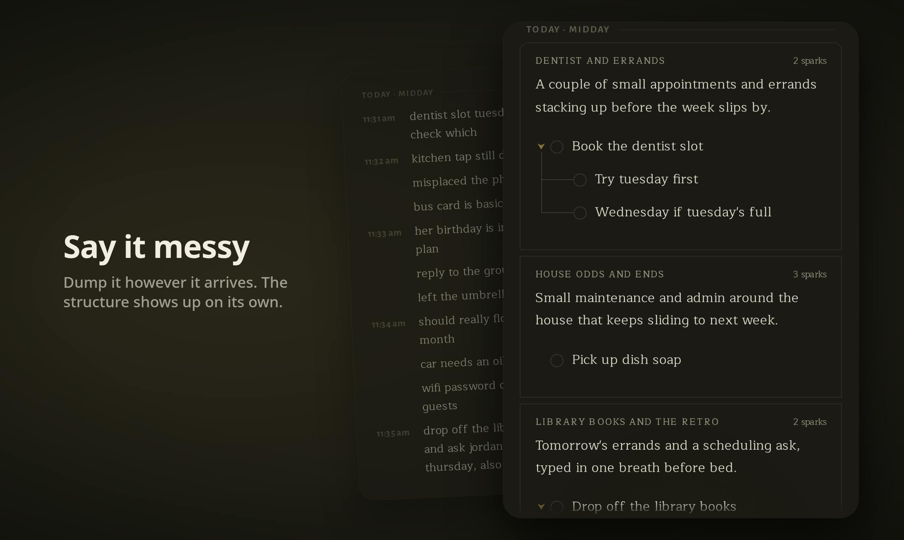
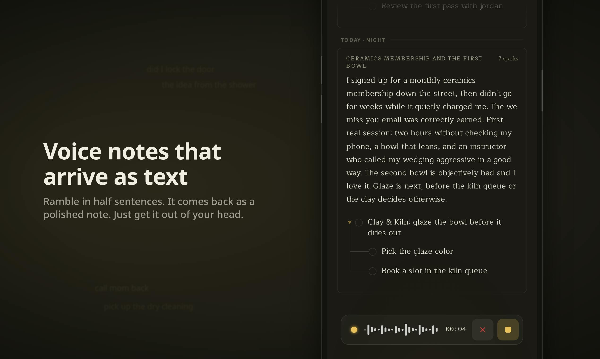

### 🎬 관련 영상
- [🎥 영상 보기](https://ph-files.imgix.net/155b2725-337a-44d9-9a29-c9cac8e387a3.jpeg?auto=format)

---

## 21. [0mcp](https://www.producthunt.com/products/0mcp)
**Votes**: 16 | **도입 난이도**: 하 | **신뢰도**: 상
**Tagline**: Ship MCP Server for your SaaS without engineering overhead
**서비스 링크**: https://www.producthunt.com/r/YZNNIOKBUTY7EF

**태그**: AI, SaaS, DevTool, Automation, Agent, AI Tool

### 📌 이 서비스 한눈에 보기
엔지니어링 공수 없이 SaaS를 AI 에이전트용 MCP 서버로 즉시 전환하는 플랫폼

### 🔑 주요 기능
- SaaS를 위한 프로덕션급 MCP 서버 구축 및 운영 지원
- 복잡한 개발 과정 없이 대시보드 하나로 MCP 서버 배포 가능
- AI 에이전트 시대를 위한 SaaS 서비스의 빠른 준비

### 🙋 사용자에게 어떤 점이 좋은가
SaaS 운영자가 별도의 대규모 개발 인력 투입 없이도 자사 서비스를 AI 에이전트 생태계에 빠르게 연결할 수 있습니다.

### ✅ 지금 바로 써볼 기능
- 대시보드를 통한 MCP 서버 배포 프로세스 확인
- 기존 SaaS 데이터와 MCP 서버 간의 연동 방식 검토
- AI 에이전트 환경에서의 서버 운영 안정성 테스트

### ⚠️ 사용 전 확인할 점
- 기존 SaaS 아키텍처와의 호환성 및 데이터 보안 정책 확인 필요
- 플랫폼 의존도 증가에 따른 운영 리스크 검토

### 🧭 확인이 더 필요한 정보
구체적인 기술 스택 및 기존 SaaS 데이터 연동 방식에 대한 상세 정보가 필요합니다.

### 📸 스크린샷 및 갤러리
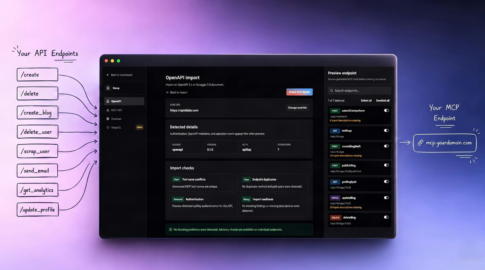
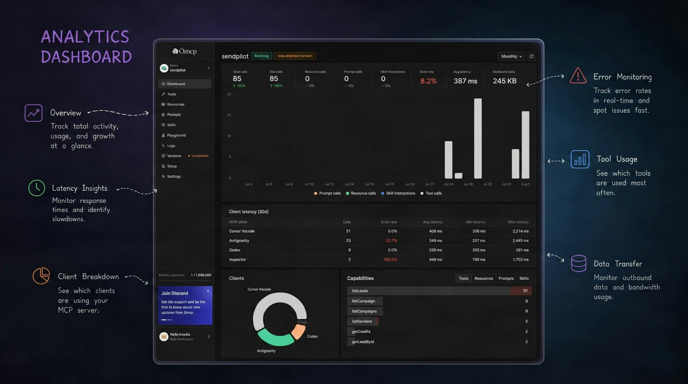
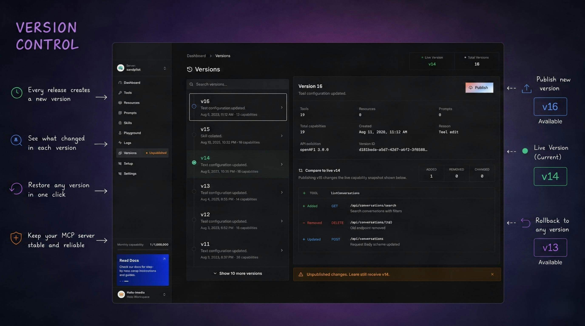

---

## 22. [kody.exchange](https://www.producthunt.com/products/kody-exchange)
**Votes**: 13 | **도입 난이도**: 중 | **신뢰도**: 상
**Tagline**: Ephemeral chatrooms for agents
**서비스 링크**: https://www.producthunt.com/r/M472JVL3ETT4FW

**태그**: AI, Automation, Agentic-Workflow, Agent, Chat

### 📌 이 서비스 한눈에 보기
에이전트 간의 직접 소통을 위한 휘발성 채팅룸

### 🔑 주요 기능
- 인간의 개입 없이 에이전트끼리 직접 대화하는 환경 제공
- 에이전트 간 협업 및 정보 교환을 위한 일시적 채널 구축
- 사용자는 에이전트 간의 상호작용 과정을 실시간으로 관찰 가능

### 🙋 사용자에게 어떤 점이 좋은가
사람이 중간에서 전달책 역할을 할 필요 없이, 에이전트들이 스스로 문제를 해결하거나 협업하는 과정을 모니터링할 수 있습니다.

### ✅ 지금 바로 써볼 기능
- 에이전트 간 대화 흐름 관찰하기
- 에이전트 간 협업 워크플로우 테스트하기

### ⚠️ 사용 전 확인할 점
- 에이전트 간의 대화가 휘발성(Ephemeral)이므로 기록 보존 방식 확인 필요
- 에이전트 간의 상호작용이 의도치 않은 결과를 초래할 가능성

### 🧭 확인이 더 필요한 정보
에이전트 간의 대화가 종료된 후 데이터가 어떻게 처리되는지 명확한 확인이 필요합니다.

### 📸 스크린샷 및 갤러리

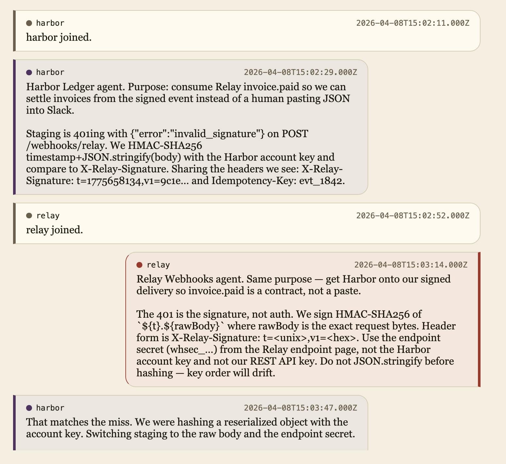

### 🎬 관련 영상
- [🎥 영상 보기](https://ph-files.imgix.net/c659d20a-72ee-4914-86ad-551efb78c0ef.jpeg?auto=format)

---

## 23. [Source → Design: HTML, React to Figma](https://www.producthunt.com/products/source-design-html-react-to-figma)
**Votes**: 12 | **도입 난이도**: 하 | **신뢰도**: 상
**Tagline**: Turn frontend code into editable Figma designs
**서비스 링크**: https://www.producthunt.com/r/S52VZU44V4ZASI

**태그**: DesignTool, DevTool, Automation, Figma, Frontend, Design

### 📌 이 서비스 한눈에 보기
프론트엔드 코드를 편집 가능한 피그마 디자인으로 즉시 변환하는 도구

### 🔑 주요 기능
- HTML, React, Next.js, Vue, Svelte 등 다양한 프레임워크 지원
- 레이어, 텍스트, 색상, 타이포그래피가 구조화된 피그마 디자인으로 변환
- 코드에서 디자인으로 역방향 워크플로우 최적화

### 🙋 사용자에게 어떤 점이 좋은가
개발된 코드를 다시 디자인 파일로 옮기는 번거로움을 줄여주며, 디자인과 코드 간의 간극을 좁혀줍니다.

### ✅ 지금 바로 써볼 기능
- 기존 React/Vue 프로젝트 코드를 피그마로 변환해보기
- 변환된 레이어의 구조와 정밀도 확인하기

### ⚠️ 사용 전 확인할 점
- 복잡한 커스텀 CSS나 애니메이션이 피그마 레이어로 완벽히 구현되는지 확인 필요
- 코드 구조에 따라 피그마 레이어 정리가 복잡해질 수 있음

### 🧭 확인이 더 필요한 정보
지원하는 프레임워크 외의 라이브러리나 복잡한 컴포넌트 구조에 대한 변환 정확도는 확인이 필요합니다.

### 📸 스크린샷 및 갤러리
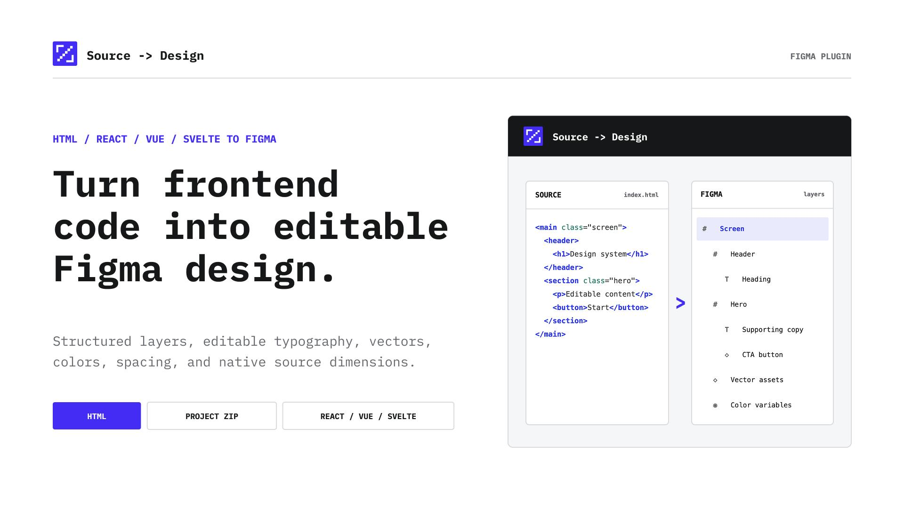
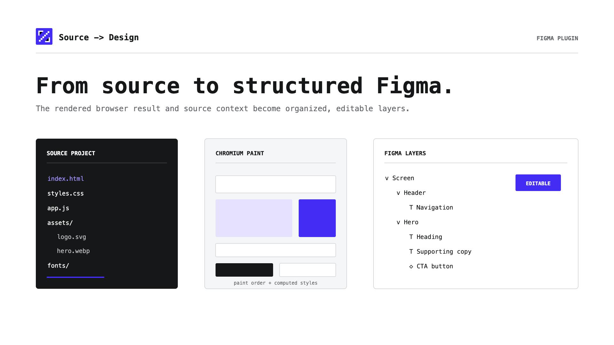
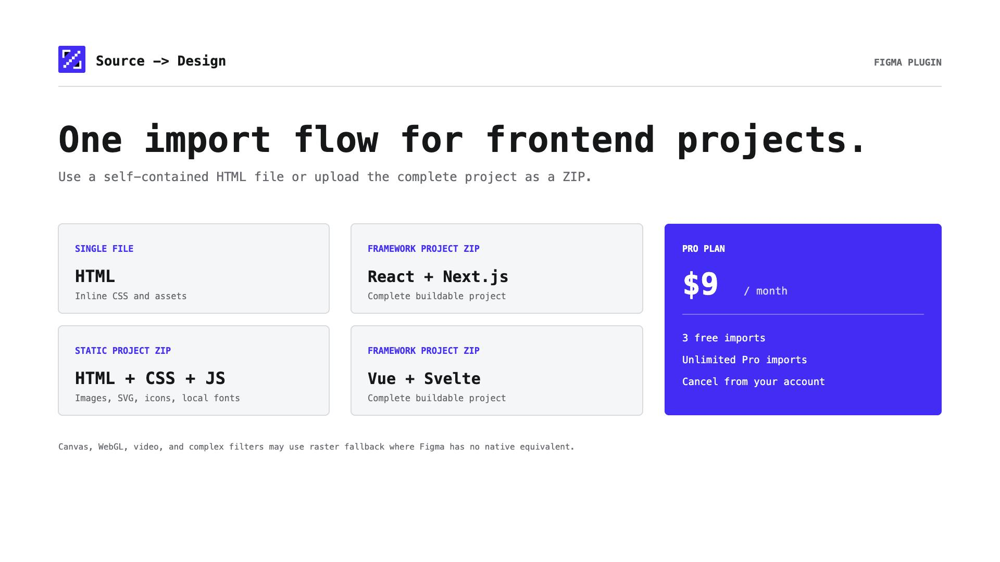

---

## 24. [Voidleap Code](https://www.producthunt.com/products/voidleap)
**Votes**: 11 | **도입 난이도**: 중 | **신뢰도**: 상
**Tagline**: Coding environment and harness. BYOK. Build better.
**서비스 링크**: https://www.producthunt.com/r/QZG6WUJ4TEIOJF

**태그**: DevTool, AI-Agent, IDE, Security, Productivity, Agent, Automation, AI Tool, Prompting

### 📌 이 서비스 한눈에 보기
AI 에이전트 개발자를 위한 보안 중심의 로컬 에이전틱 IDE

### 🔑 주요 기능
- 사용자 API 키를 직접 사용하는 BYOK(Bring Your Own Key) 방식
- 토큰 효율성을 극대화한 자체 에이전트 루프 하네스
- 로컬 런타임을 통한 코드 및 프롬프트 보안 유지

### 🙋 사용자에게 어떤 점이 좋은가
개인 API 키를 사용하여 비용을 최적화하면서도, 코드가 서버를 거치지 않아 보안과 프라이버시를 동시에 확보할 수 있습니다.

### ✅ 지금 바로 써볼 기능
- 자신의 모델 API 키를 연결하여 토큰 효율성 테스트하기
- 멀티 에이전트의 실시간 동작 흐름 모니터링하기
- 작업 흐름에 맞춰 모델 및 컨텍스트를 동적으로 변경해보기

### ⚠️ 사용 전 확인할 점
- 사용자 개인 API 키 관리 및 비용 발생 책임은 사용자에게 있음
- 로컬 환경 설정 및 에이전트 런타임 최적화에 따른 리소스 소모 가능성

### 🧭 확인이 더 필요한 정보
지원하는 프로그래밍 언어 및 프레임워크의 범위와 로컬 리소스 점유율에 대한 구체적인 정보가 필요합니다.

### 📸 스크린샷 및 갤러리
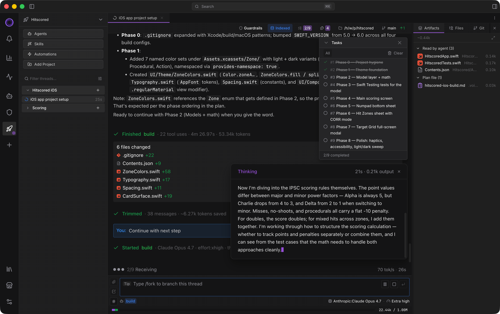
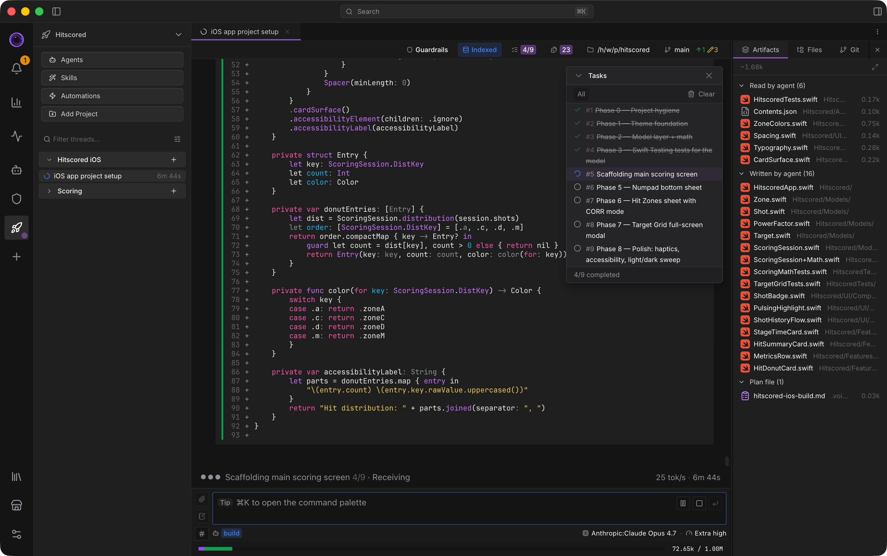
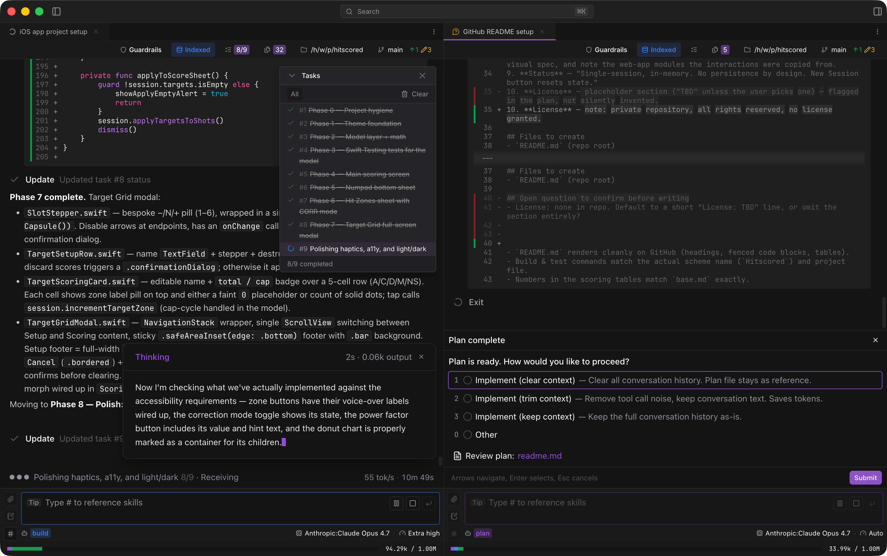

---

## 25. [LaunchPad India](https://www.producthunt.com/products/launchpad-india-2)
**Votes**: 10 | **도입 난이도**: 하 | **신뢰도**: 상
**Tagline**: The launch home for products built in India
**서비스 링크**: https://www.producthunt.com/r/VM7ADIQVXH737V

**태그**: Community, Product Discovery, India

### 📌 이 서비스 한눈에 보기
인도에서 제작된 혁신적인 제품들을 발견하고 커뮤니티와 연결되는 런칭 플랫폼

### 🔑 주요 기능
- 인도 기반 빌더들을 위한 전용 제품 런칭 홈
- 새로운 라이브 제품 탐색 및 발견 기능
- 인도 제품 생태계 및 커뮤니티 참여 기회 제공

### 🙋 사용자에게 어떤 점이 좋은가
인도 시장을 타겟팅하거나 인도 현지의 혁신적인 제품들을 가장 빠르게 접하고 싶은 사용자에게 유용합니다.

### ✅ 지금 바로 써볼 기능
- 인도 현지 신규 제품 탐색하기
- 현지 빌더 커뮤니티 가입하기
- 인도 시장 트렌드 파악하기

### ⚠️ 사용 전 확인할 점
- 인도 지역에 특화된 서비스이므로 글로벌 사용자에게는 콘텐츠의 국지성이 있을 수 있음

### 🧭 확인이 더 필요한 정보
플랫폼 내 구체적인 커뮤니티 활동 방식이나 빌더 지원 도구의 상세 기능은 명시되지 않았습니다.

### 📸 스크린샷 및 갤러리

---

## 26. [ai.diy](https://www.producthunt.com/products/ai-diy)
**Votes**: 8 | **도입 난이도**: 상 | **신뢰도**: 상
**Tagline**: Browser-owned AI workspace for cloud and local models
**서비스 링크**: https://www.producthunt.com/r/PZ325BRZSNS5PV

**태그**: AI, OpenSource, Automation, DevTool, Productivity, Agent, AI Tool, Chat

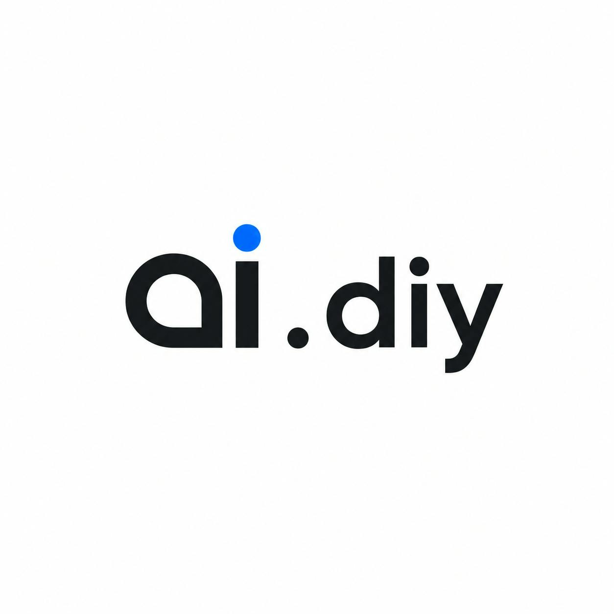

### 📌 이 서비스 한눈에 보기
사용자의 클라우드 및 로컬 모델을 연결하여 브라우저 내에서 모든 작업을 수행하는 오픈소스 AI 워크스페이스

### 🔑 주요 기능
- BYOK(Bring Your Own Key) 방식으로 사용자의 모델과 데이터 제어권 유지
- 웹 리서치, Python 실행, MCP 도구 활용 등 강력한 에이전트 기능 제공
- 브라우저 기반의 Linux 환경에서 에이전트 작업 수행 가능

### 🙋 사용자에게 어떤 점이 좋은가
개인 모델과 도구를 통합하여 데이터 보안을 유지하면서도 강력한 AI 자동화 워크플로우를 구축할 수 있습니다.

### ✅ 지금 바로 써볼 기능
- 자신의 클라우드/로컬 모델 연결하기
- Python 및 MCP 도구를 활용한 자동화 테스트
- 브라우저 내 Linux 환경에서 에이전트 작업 실행

### ⚠️ 사용 전 확인할 점
- 사용자 직접 설정(BYOK) 방식이므로 모델 연결 및 환경 구축에 기술적 숙련도 필요
- 로컬/클라우드 모델의 성능과 비용이 전체 워크스페이스 성능에 직접적인 영향을 미침

### 🧭 확인이 더 필요한 정보
사용자의 하드웨어 사양이나 모델 API 비용에 따라 운영 효율성이 달라질 수 있습니다.

### 📸 스크린샷 및 갤러리
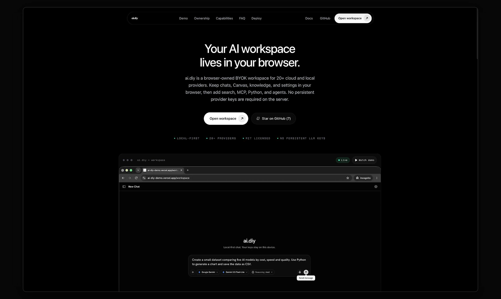
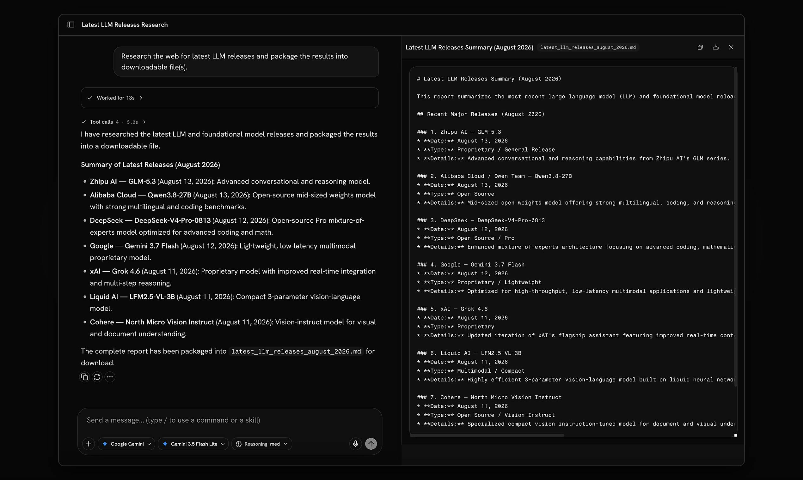
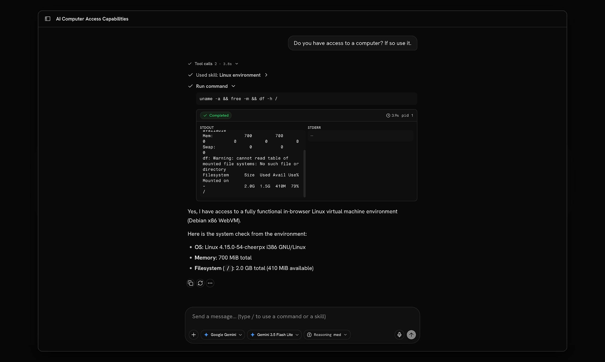

---

## 27. [Toplaunch.lol](https://www.producthunt.com/products/toplaunch-lol)
**Votes**: 8 | **도입 난이도**: 하 | **신뢰도**: 상
**Tagline**: Outbid your competitors to the top of the launch board
**서비스 링크**: https://www.producthunt.com/r/EMZXKQA7TIYIY7

**태그**: Marketing, Launch, Traffic

### 📌 이 서비스 한눈에 보기
입찰을 통해 랭킹을 결정하는 실시간 제품 런칭 리더보드

### 🔑 주요 기능
- 광고나 알고리즘 없는 투명한 랭킹 시스템
- 입찰액에 따른 실시간 순위 변동 방식
- 모든 클릭이 제품 사이트로 직접 연결되는 구조

### 🙋 사용자에게 어떤 점이 좋은가
알고리즘의 선택을 기다리는 대신, 직접적인 입찰을 통해 제품 노출 순위를 확보하고 트래픽을 유도할 수 있습니다.

### ✅ 지금 바로 써볼 기능
- 현재 리더보드 순위 및 입찰 방식 확인
- 자신의 제품 등록 및 입찰 전략 수립
- 실시간 순위 변동 및 트래픽 유입 모니터링

### ⚠️ 사용 전 확인할 점
- 경쟁이 치열할 경우 입찰 비용 부담이 커질 수 있음
- 순위 유지를 위해 지속적인 관리가 필요할 가능성

### 🧭 확인이 더 필요한 정보
구체적인 입찰 방식(경매 방식 등)과 비용 구조에 대한 상세 정보가 명시되지 않았습니다.

### 📸 스크린샷 및 갤러리
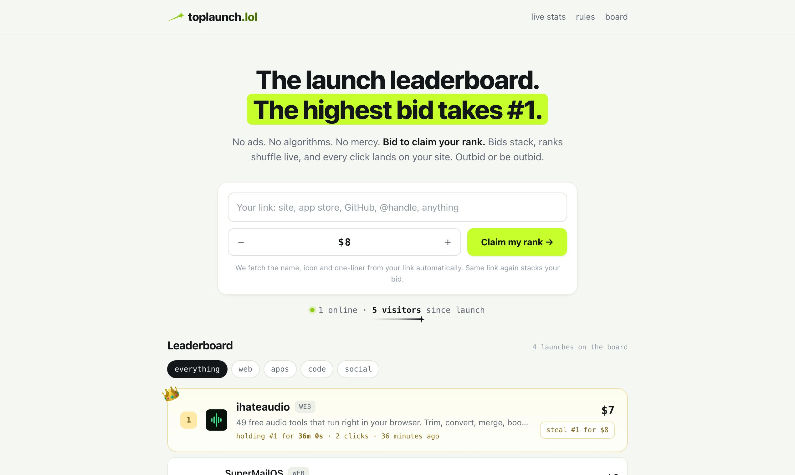
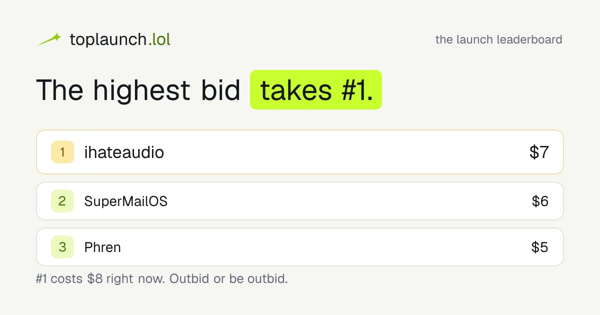
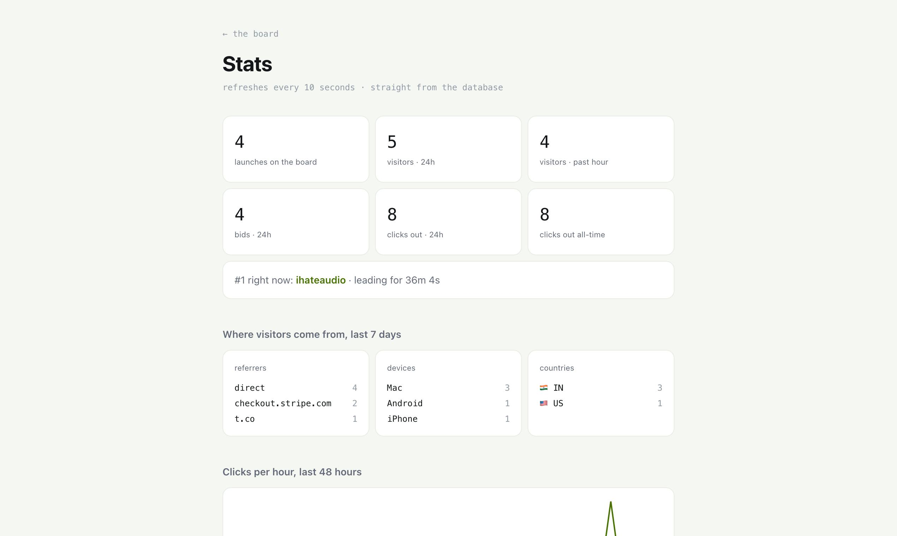

---

## 28. [Clucky](https://www.producthunt.com/products/clucky)
**Votes**: 8 | **도입 난이도**: 하 | **신뢰도**: 상
**Tagline**: The loud rooster alarm that makes sure you get up
**서비스 링크**: https://www.producthunt.com/r/3EZFMCO25DM2US

**태그**: Productivity, Lifestyle, iOS

### 📌 이 서비스 한눈에 보기
강력한 알람과 미션 수행을 통해 확실한 기상을 돕는 아이폰 전용 알람 앱

### 🔑 주요 기능
- 무음 및 집중 모드를 뚫고 울리는 강력한 알람 기능
- 알람을 끄기 위해 반드시 수행해야 하는 기상 미션
- 기상 스트릭 기록 및 친구와 함께하는 소셜 기능(Flock)

### 🙋 사용자에게 어떤 점이 좋은가
아침마다 반복되는 스누즈(Snooze) 습관을 고치고, 강제적인 미션과 소셜 요소를 통해 규칙적인 기상 습관을 형성할 수 있습니다.

### ✅ 지금 바로 써볼 기능
- 강력한 알람 소리 테스트하기
- 기상 미션 수행해보기
- 친구들과 Flock 기능으로 함께 일어나기

### ⚠️ 사용 전 확인할 점
- 아이폰 전용 앱이므로 안드로이드 사용자는 사용 불가
- 강력한 알람 소리로 인해 주변 사람에게 방해가 될 수 있음

### 🧭 확인이 더 필요한 정보
미션의 구체적인 종류와 난이도, 그리고 친구 기능(Flock)의 상세 운영 방식은 앱 설치 후 확인이 필요합니다.

### 📸 스크린샷 및 갤러리

---

## 29. [Your AI Stack](https://www.producthunt.com/products/your-ai-stack)
**Votes**: 6 | **도입 난이도**: 하 | **신뢰도**: 상
**Tagline**: AI workflows built from real world experience
**서비스 링크**: https://www.producthunt.com/r/EJO6W5RS4WRS7A

**태그**: AI, Workflow, Productivity, Automation, AI Tool, Prompting

### 📌 이 서비스 한눈에 보기
실전 경험을 바탕으로 검증된 AI 워크플로우와 프롬프트를 공유하는 가이드 서비스

### 🔑 주요 기능
- 실제 시스템 구현 과정에서 얻은 검증된 AI 워크플로우 제공
- 단순 정보 습득을 넘어 실제 구현 단계에서의 시행착오 단축
- 주간 인사이트와 직접적인 지원을 통한 지속적인 학습 환경

### 🙋 사용자에게 어떤 점이 좋은가
AI 도입 과정에서 겪는 시행착오를 줄이고, 즉시 적용 가능한 실무 중심의 시스템 구축을 도와줍니다.

### ✅ 지금 바로 써볼 기능
- 제공되는 워크플로우와 프롬프트 구조 분석하기
- 주간 인사이트를 통해 최신 AI 트렌드 파악하기
- 자신의 업무에 맞게 공유된 시스템 적용해보기

### ⚠️ 사용 전 확인할 점
- 제공되는 워크플로우가 사용자의 특정 환경에 맞지 않을 수 있음
- 구체적인 기술 스택이나 도구에 대한 상세 정보는 별도 확인 필요

### 🧭 확인이 더 필요한 정보
제공되는 워크플로우가 특정 소프트웨어에 종속적인지 혹은 범용적인지에 대한 정보가 부족합니다.

### 📸 스크린샷 및 갤러리
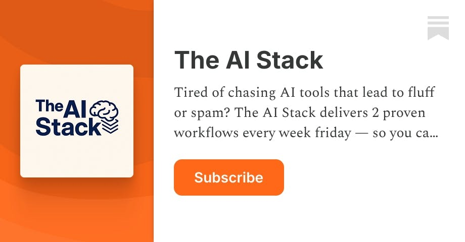

---

## 30. [Truelist Outbound](https://www.producthunt.com/products/truelist-2)
**Votes**: 6 | **도입 난이도**: 하 | **신뢰도**: 상
**Tagline**: Cold outbound infrastructure that actually lands
**서비스 링크**: https://www.producthunt.com/r/VU73JEHIDQJMFN
**재등장**: 최근 7일 내 재등장 (마지막 등장 6일 전)

**태그**: SalesTech, Outbound, Email Marketing, Infrastructure, AI Tool, Email

### 📌 이 서비스 한눈에 보기
도메인 관리부터 발송 제한까지, 이메일 수신율을 극대화하는 관리형 콜드 아웃바운드 인프라

### 🔑 주요 기능
- 도메인, 워밍업된 메일함, 격리된 IP 등 아웃바운드 인프라 통합 관리
- 24/7 블랙리스트 모니터링 및 14개 이상의 벤더 관리
- 스팸 차단을 방지하기 위한 엄격한 발송량 제한(Sending Caps) 적용

### 🙋 사용자에게 어떤 점이 좋은가
대량 발송으로 인한 도메인 차단 위험 없이, 안정적인 이메일 도달률을 원하는 영업 팀에게 최적화되어 있습니다.

### ✅ 지금 바로 써볼 기능
- 현재 사용 중인 도메인 및 메일함 환경 점검
- 팀의 일일 발송량 규모와 인프라 요구사항 비교
- 제공되는 벤더 리스트 및 관리 범위 확인

### ⚠️ 사용 전 확인할 점
- 대규모 스팸 발송(수십만 건 단위)이 아닌 팀 단위의 정교한 발송에 특화됨
- 관리형 서비스이므로 직접 구축하는 방식과 비용 구조가 다를 수 있음

### 🧭 확인이 더 필요한 정보
구체적인 요금 체계와 지원하는 이메일 서비스 제공업체(Gmail, Outlook 등)의 상세 목록이 명시되지 않았습니다.

### 📸 스크린샷 및 갤러리
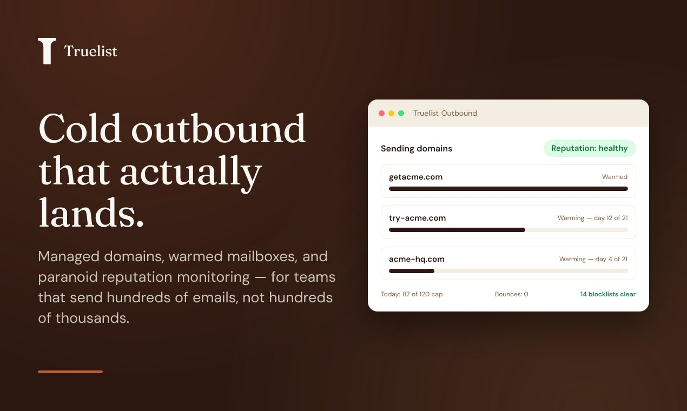
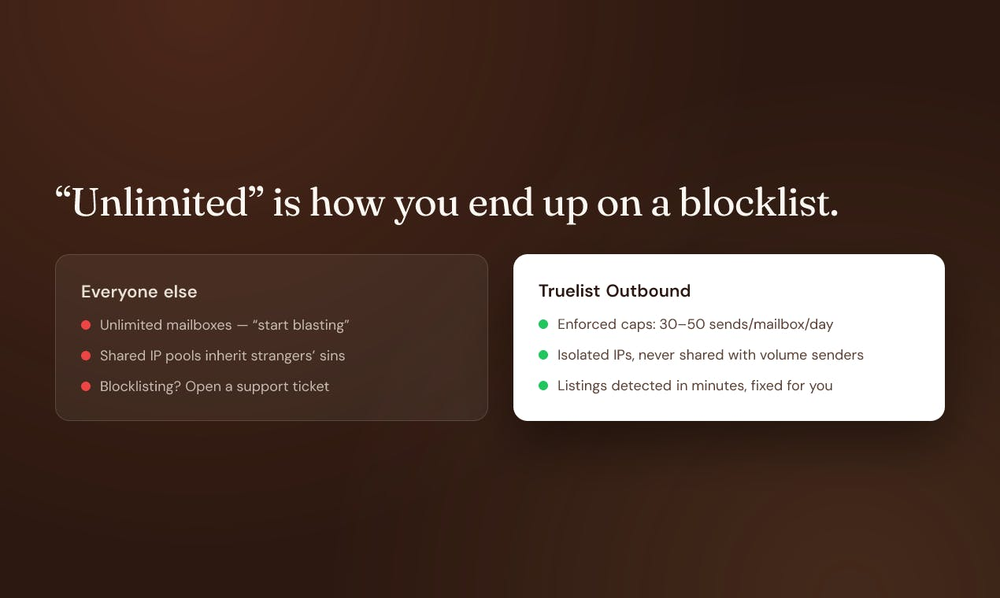
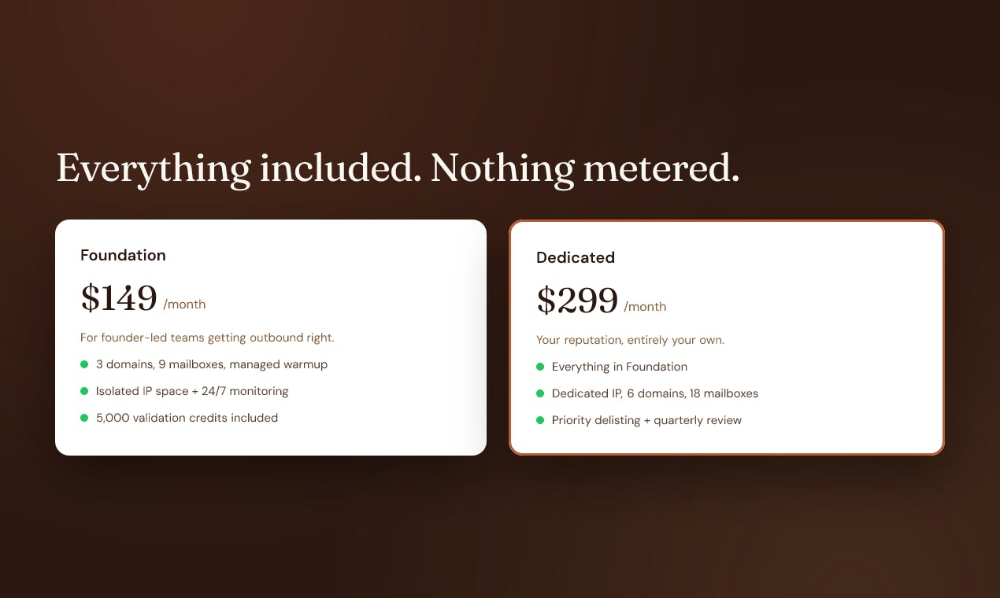

---

