# 🚀 Product Hunt Daily Top 30 (2026-08-24)

## 오늘의 요약
오늘의 트렌드는 AI 에이전트의 실질적인 업무 수행 능력과 개발 워크플로우를 최적화하는 도구들이 주도했습니다. 또한, 개인정보 보호를 중시하는 로컬 중심 소프트웨어와 사용자 경험을 개선하는 유틸리티 도구들이 주목받았습니다.

### 오늘의 핵심 포인트
- AI 에이전트가 스스로 도구를 구축하고 업무를 자동화하는 워크플로우 플랫폼이 등장했습니다.
- API 통합 검증 및 개발 환경 최적화를 통해 AI 코딩의 신뢰성을 높이는 도구들이 주목받았습니다.
- 개인정보 보호를 위해 계정 없이 작동하는 로컬 퍼스트 소프트웨어와 사용자 편의를 위한 자동화 도구들이 출시되었습니다.

**오늘의 태그**: AI 에이전트, 워크플로우 자동화, 개발자 도구, 프라이버시, 생산성

## 1. [Construct Computer](https://www.producthunt.com/products/construct-computer)
**Votes**: 256 | **도입 난이도**: 중 | **신뢰도**: 상
**Tagline**: Your AI coworker gets a computer. You get your day back.
**서비스 링크**: https://www.producthunt.com/r/WTHQ4KSPC225E6

**태그**: AI-Agent, Automation, Workflow, Productivity, Agent, AI Tool

### 📌 이 서비스 한눈에 보기
AI 에이전트가 직접 도구를 만들고 업무를 수행하는 자동화 워크플로우 플랫폼

### 🔑 주요 기능
- MCP 및 다양한 스킬을 앱처럼 설치하여 에이전트 역량 확장
- 에이전트가 스스로 필요한 도구를 구축하고 플랫폼에서 배포/관리
- 에이전트의 작업 과정을 재사용 가능한 워크플로우로 자동 전환

### 🙋 사용자에게 어떤 점이 좋은가
반복적인 업무를 AI에게 맡기고, 에이전트가 수행한 작업이 즉시 표준화된 워크플로우가 되어 팀 전체의 생산성을 높여줍니다.

### ✅ 지금 바로 써볼 기능
- 필요한 MCP/스킬 설치 및 에이전트 환경 설정
- 에이전트에게 특정 업무 수행 지시
- 성공적인 에이전트 작업을 워크플로우로 변환하여 저장

### ⚠️ 사용 전 확인할 점
- 에이전트가 생성한 도구 및 워크플로우의 보안 및 품질 검증 필요
- 초기 에이전트 설정 및 워크플로우 설계 시 기술적 이해도 요구

### 🧭 확인이 더 필요한 정보
에이전트가 생성하는 도구와 워크플로우의 구체적인 보안 정책 및 관리 인터페이스에 대한 정보가 부족합니다.

### 📸 스크린샷 및 갤러리
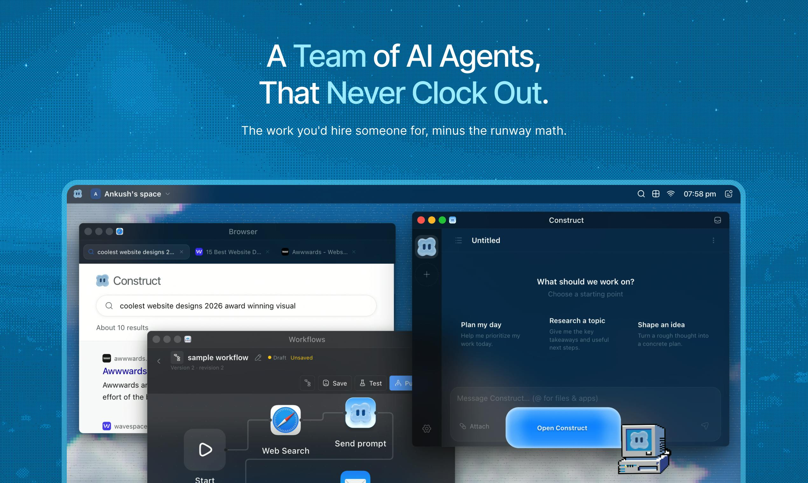
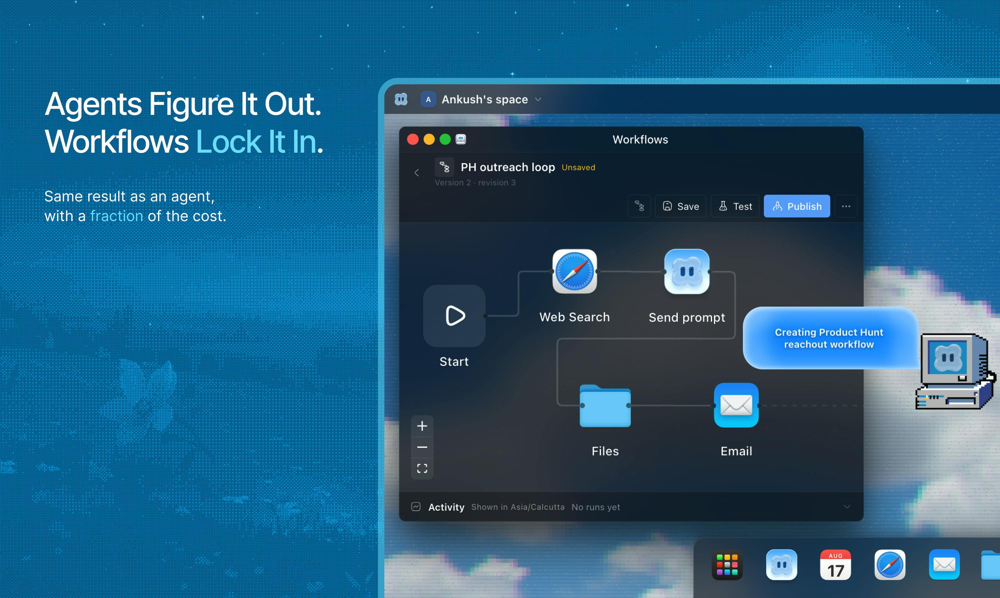
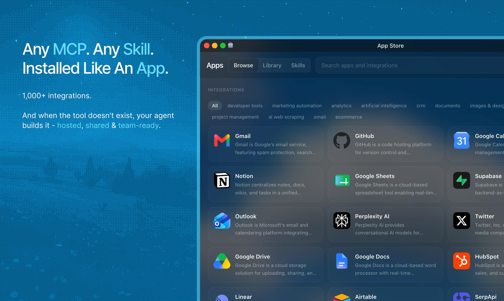

### 🎬 관련 영상
- [🎥 영상 보기](https://ph-files.imgix.net/ca544644-51f1-41d2-8e95-a1767fd2da3b.jpeg?auto=format)

---

## 2. [FetchSandbox MCP](https://www.producthunt.com/products/fetchsandbox)
**Votes**: 185 | **도입 난이도**: 하 | **신뢰도**: 상
**Tagline**: The MCP that proves your AI's integration fixes work
**서비스 링크**: https://www.producthunt.com/r/WOUOLDN26NYVUI

**태그**: DevTool, AI-Agent, Automation, API, Agent, AI Tool

### 📌 이 서비스 한눈에 보기
AI 에이전트의 API 통합 수정 사항을 실제 환경에서 검증하고 증명하는 MCP 도구

### 🔑 주요 기능
- 실제 실패 사례를 코드로 재현하여 데이터 정합성 검증
- 70개 이상의 API 샌드박스 제공
- Cursor 또는 Claude Code에 설정 한 번으로 즉시 적용 가능

### 🙋 사용자에게 어떤 점이 좋은가
AI가 작성한 코드가 단순히 CI를 통과하는 것을 넘어, 실제 API 데이터와 일치하는지 확실하게 검증할 수 있습니다.

### ✅ 지금 바로 써볼 기능
- Cursor 또는 Claude Code에 설정 블록 추가하기
- 70+ API 샌드박스 환경 테스트하기
- AI 생성 코드의 실제 데이터 정합성 검증하기

### ⚠️ 사용 전 확인할 점
- 사용 중인 IDE(Cursor, Claude Code 등)와의 호환성 확인 필요
- 샌드박스 데이터가 실제 운영 환경의 데이터와 완전히 동일한지 검토 필요

### 🧭 확인이 더 필요한 정보
제공되는 70여 개의 API 샌드박스가 사용자의 특정 워크플로우를 모두 지원하는지 확인이 필요합니다.

### 📸 스크린샷 및 갤러리
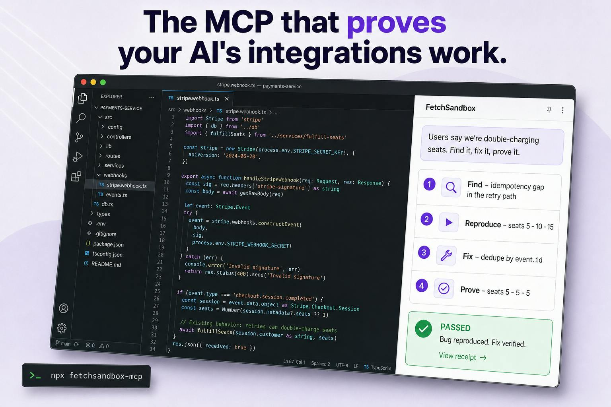
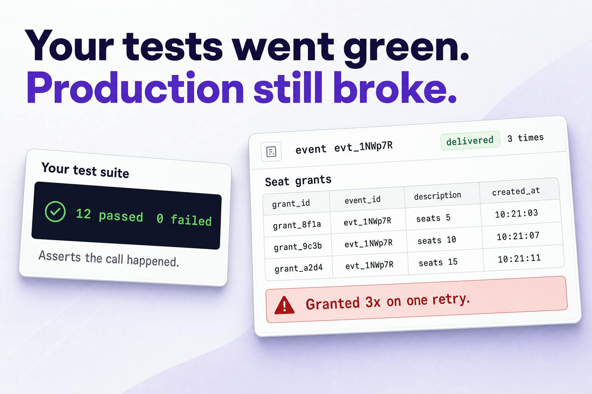
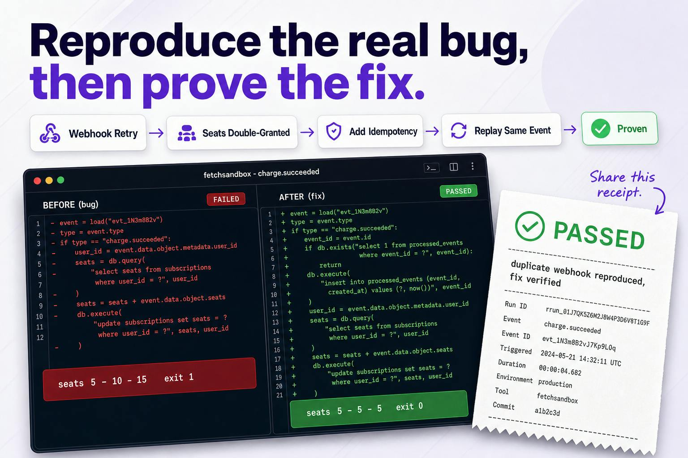

### 🎬 관련 영상
- [🎥 영상 보기](https://ph-files.imgix.net/d67647c4-7724-4812-96cc-086f7d223d06.jpeg?auto=format)

---

## 3. [Aximote](https://www.producthunt.com/products/aximote)
**Votes**: 168 | **도입 난이도**: 하 | **신뢰도**: 상
**Tagline**: Your car data, finally in your pocket
**서비스 링크**: https://www.producthunt.com/r/IK7GY4H42E2FDM

**태그**: Automotive, Data Analytics, Mobile App, Efficiency

### 📌 이 서비스 한눈에 보기
별도 장치 없이 차량 데이터를 아이폰으로 가져와 주행 효율과 비용을 관리하는 스마트 카 대시보드

### 🔑 주요 기능
- 추가 하드웨어 설치 없이 차량 데이터를 아이폰으로 자동 연동
- 주행 기록, 에너지 소비, 비용 및 주행 효율에 대한 심층 인사이트 제공
- 20개 이상의 지표로 구성된 맞춤형 대시보드 및 차량 브랜드 변경 시에도 유지되는 연속적 기록

### 🙋 사용자에게 어떤 점이 좋은가
차량의 상태와 주행 비용을 실시간으로 파악하여 효율적인 운전 습관을 만들고, 차량 교체 시에도 데이터 히스토리를 유지할 수 있습니다.

### ✅ 지금 바로 써볼 기능
- 20개 이상의 차량 지표를 활용한 맞춤형 대시보드 설정
- 주행 기록 비교를 통한 장기적인 에너지 소비 및 비용 트렌드 분석
- 여러 대의 차량을 등록하여 통합 관리하기

### ⚠️ 사용 전 확인할 점
- 하드웨어 없이 데이터를 가져오기 위한 차량 브랜드별 호환성 확인 필요
- 데이터 연동 방식에 따른 개인정보 및 차량 보안 정책 검토

### 🧭 확인이 더 필요한 정보
추가 하드웨어 없이 어떤 방식으로 차량 데이터에 접근하는지에 대한 기술적 상세 정보가 필요합니다.

### 📸 스크린샷 및 갤러리

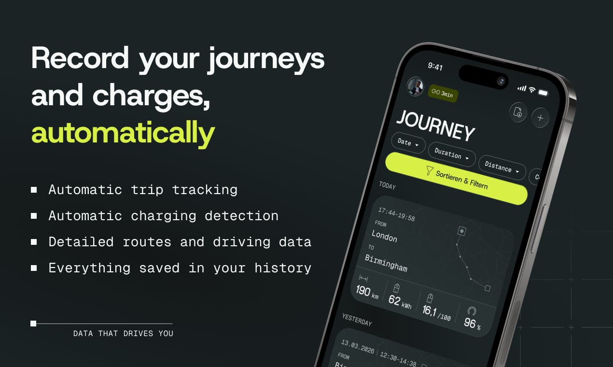
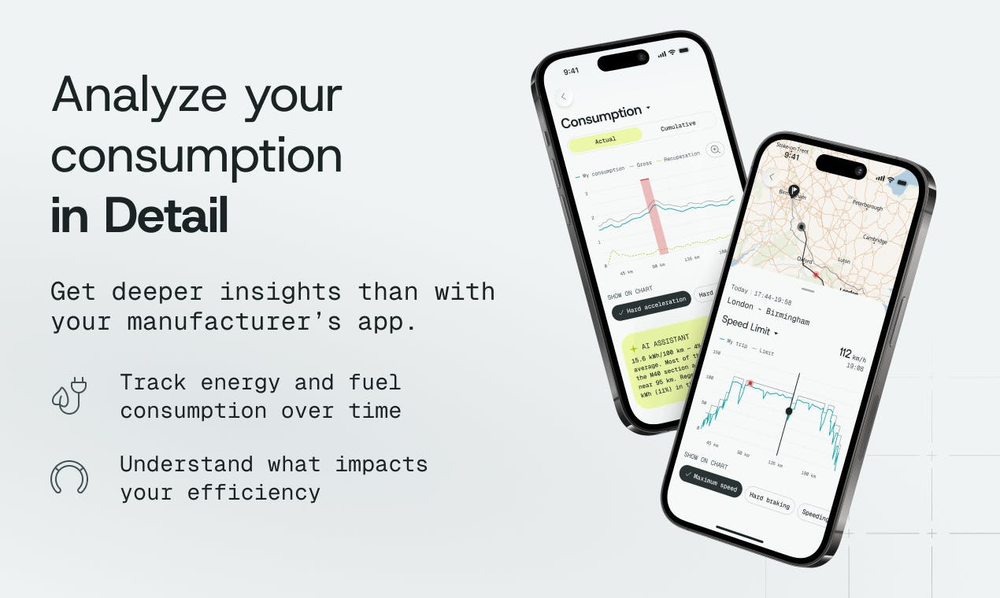

### 🎬 관련 영상
- [🎥 영상 보기](https://ph-files.imgix.net/f8639737-999a-496d-bd50-1e951f8ccfc5.jpeg?auto=format)

---

## 4. [OpenLogi](https://www.producthunt.com/products/openlogi)
**Votes**: 154 | **도입 난이도**: 하 | **신뢰도**: 상
**Tagline**: A local-first alternative to Logitech Options+
**서비스 링크**: https://www.producthunt.com/r/7MQBGZEICSBSJ5

**태그**: Productivity, Hardware, Privacy, Utility

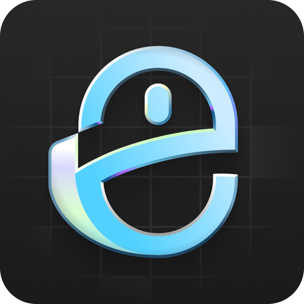

### 📌 이 서비스 한눈에 보기
계정 생성이나 데이터 수집 없이 로컬에서 작동하는 로지텍 옵션+(Logitech Options+) 대체 소프트웨어

### 🔑 주요 기능
- Rust 언어로 작성된 네이티브 로컬 퍼스트 애플리케이션
- HID++ 프로토콜을 통한 버튼 리매핑, DPI 조절, SmartShift 지원
- 계정 로그인 및 텔레메트리(원격 데이터 수집)가 없는 프라이버시 중심 설계

### 🙋 사용자에게 어떤 점이 좋은가
로지텍 하드웨어의 기능을 사용하면서도 개인정보 유출이나 불필요한 계정 로그인의 번거로움에서 벗어날 수 있습니다.

### ✅ 지금 바로 써볼 기능
- 사용 중인 로지텍 마우스의 버튼 리매핑 테스트
- DPI 및 SmartShift 설정 최적화
- 로컬 환경에서의 하드웨어 반응 속도 확인

### ⚠️ 사용 전 확인할 점
- 로지텍의 모든 하드웨어 모델이 HID++를 완벽히 지원하는지 확인 필요
- 기존 Logitech Options+의 모든 고급 기능이 대체 가능한지 검토 필요

### 🧭 확인이 더 필요한 정보
지원되는 구체적인 로지텍 하드웨어 모델 목록과 기능 호환 범위에 대한 정보가 부족합니다.

### 📸 스크린샷 및 갤러리
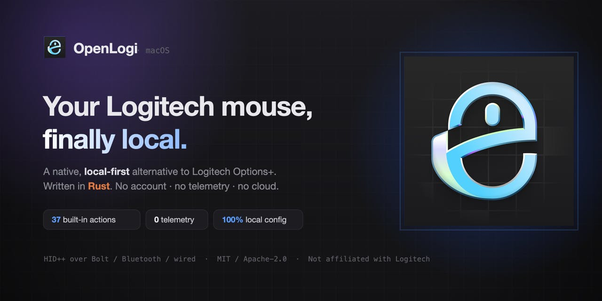
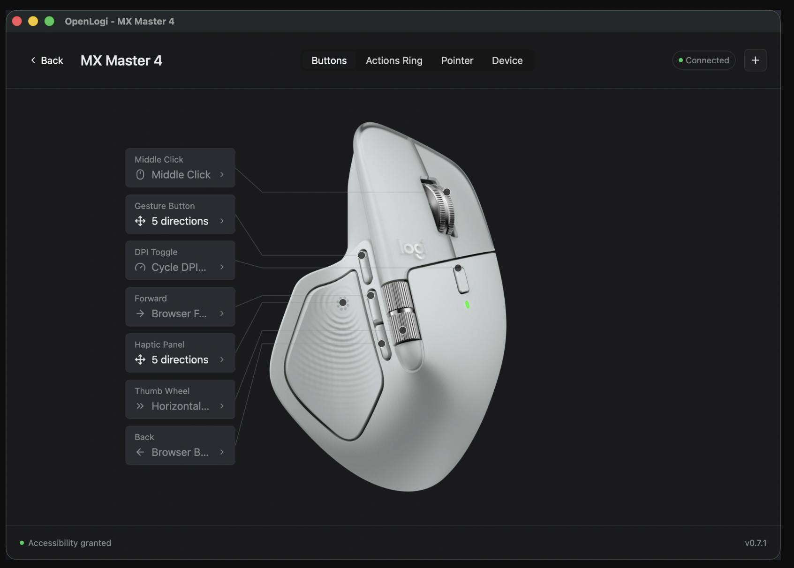
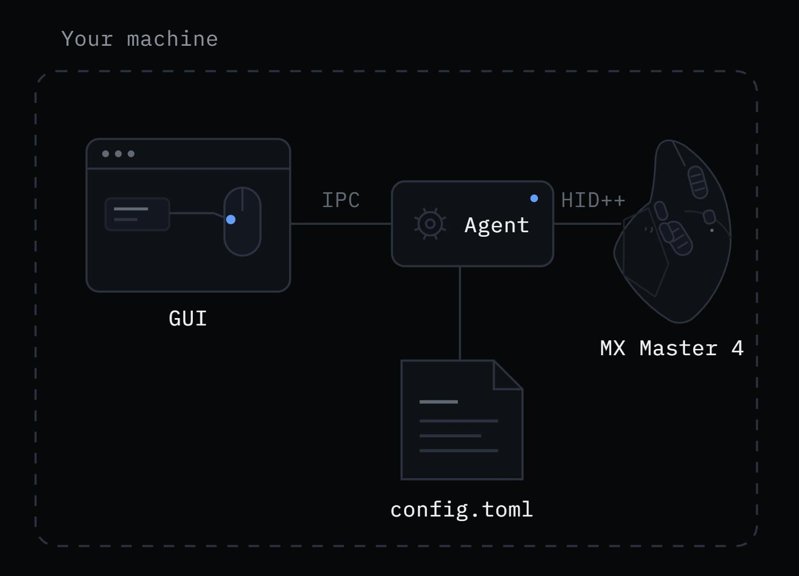

---

## 5. [Claude Academy](https://www.producthunt.com/products/claude-academy)
**Votes**: 134 | **도입 난이도**: 하 | **신뢰도**: 상
**Tagline**: The Official Learning Hub by Anthropic
**서비스 링크**: https://www.producthunt.com/r/5XZCCZGFQOKTU2

**태그**: AI, Education, DevTool, Automation, Agent, AI Tool, Prompting

### 📌 이 서비스 한눈에 보기
Anthropic이 제공하는 Claude 활용 능력 마스터를 위한 공식 학습 허브

### 🔑 주요 기능
- 기초 프롬프팅부터 복잡한 멀티 에이전트 워크플로우까지 단계별 학습 제공
- 자기 주도형 코스, 개발자 튜토리얼, 공식 인증 경로 포함
- Claude 스택 전체를 아우르는 통합 인터랙티브 학습 환경

### 🙋 사용자에게 어떤 점이 좋은가
Claude의 기능을 단순 활용하는 수준을 넘어, 개발 및 워크플로우 자동화 전문가로 성장할 수 있는 체계적인 교육을 제공합니다.

### ✅ 지금 바로 써볼 기능
- 기초 프롬프팅 코스 수강하기
- 개발자용 튜토리얼 따라하기
- 공식 인증 경로를 통한 역량 검증

### ⚠️ 사용 전 확인할 점
- 학습 내용의 난이도에 따라 학습 시간에 차이가 있을 수 있음
- 실습을 위한 별도의 Claude API 사용료나 계정이 필요할 수 있음

### 🧭 확인이 더 필요한 정보
구체적인 코스별 비용이나 인증 시험의 응시료 정책은 명시되지 않았습니다.

### 📸 스크린샷 및 갤러리

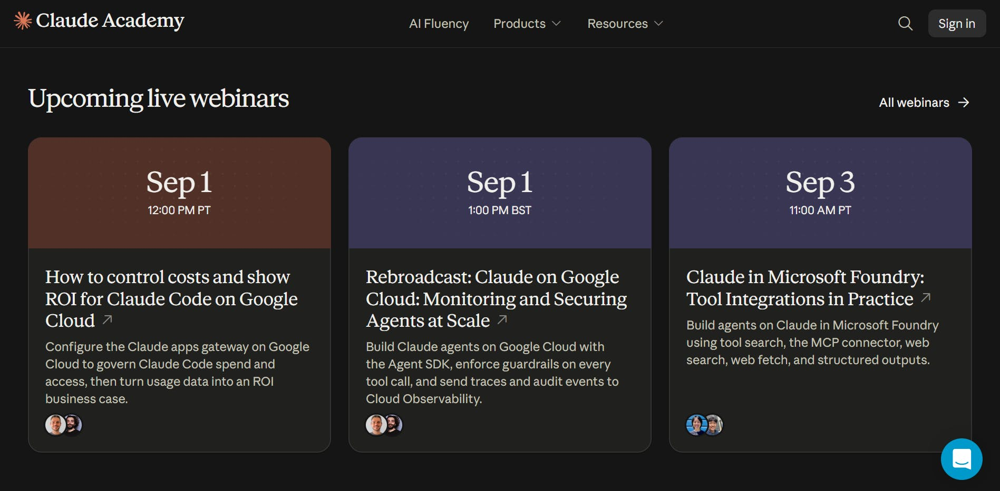
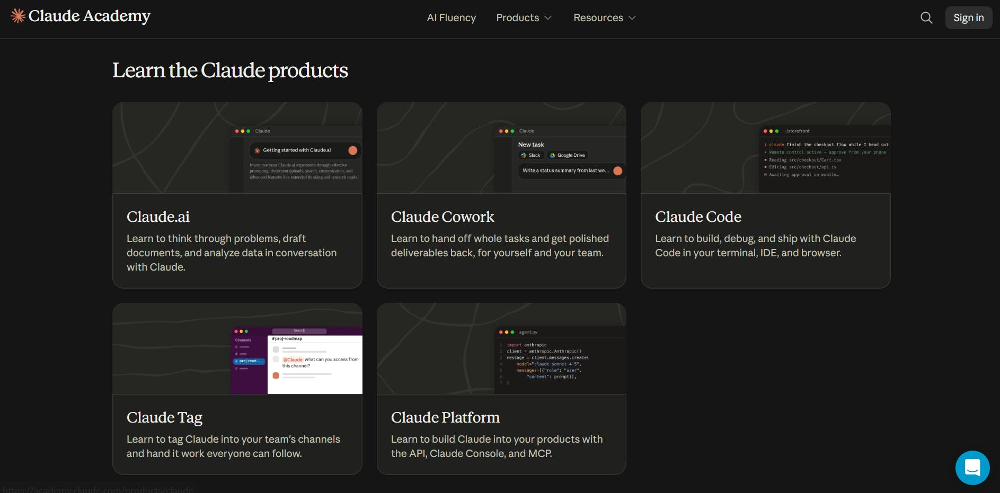

---

## 6. [Yatko](https://www.producthunt.com/products/yatko)
**Votes**: 109 | **도입 난이도**: 하 | **신뢰도**: 상
**Tagline**: The download button Github forgot to add
**서비스 링크**: https://www.producthunt.com/r/O3BHFNXR7NLXF7

**태그**: DevTool, GitHub, UX, Automation, AI Tool

### 📌 이 서비스 한눈에 보기
사용자의 OS와 아키텍처에 맞는 최적의 바이너리를 자동으로 찾아주는 GitHub 다운로드 링크 생성 도구

### 🔑 주요 기능
- 공개된 GitHub 저장소를 깔끔한 다운로드 링크로 변환
- 방문자의 운영체제(OS) 및 아키텍처를 감지하여 적절한 릴리스 에셋 제공
- 복잡한 파일 목록 대신 클릭 한 번으로 올바른 바이너리 다운로드 가능

### 🙋 사용자에게 어떤 점이 좋은가
사용자는 자신의 환경에 맞는 파일을 찾느라 헤맬 필요 없이, 단 하나의 링크로 즉시 올바른 설치 파일을 받을 수 있습니다.

### ✅ 지금 바로 써볼 기능
- 자신의 GitHub 릴리스 저장소에 적용해보기
- 사용자 친화적인 다운로드 링크 생성 기능 테스트하기

### ⚠️ 사용 전 확인할 점
- 공개된(Public) GitHub 저장소에 최적화되어 있음
- 사용자 환경 감지 로직이 모든 특수 환경을 지원하는지 확인 필요

### 🧭 확인이 더 필요한 정보
비공개(Private) 저장소 지원 여부와 상세한 도메인 커스텀 방식에 대한 정보가 부족합니다.

### 📸 스크린샷 및 갤러리
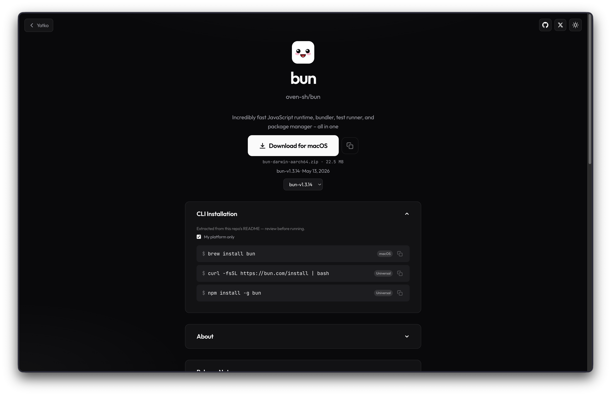
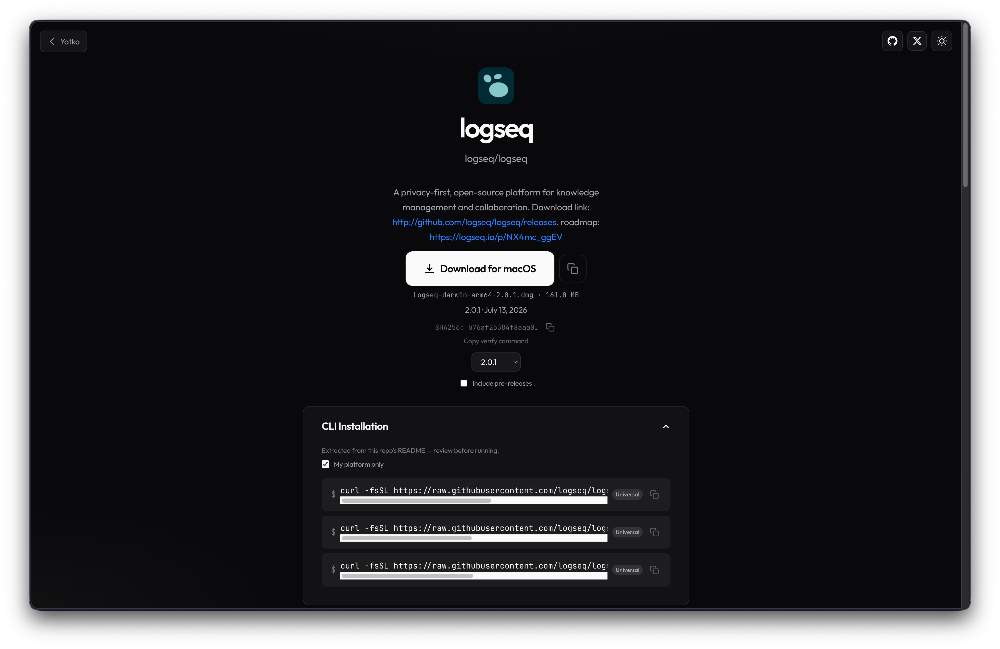
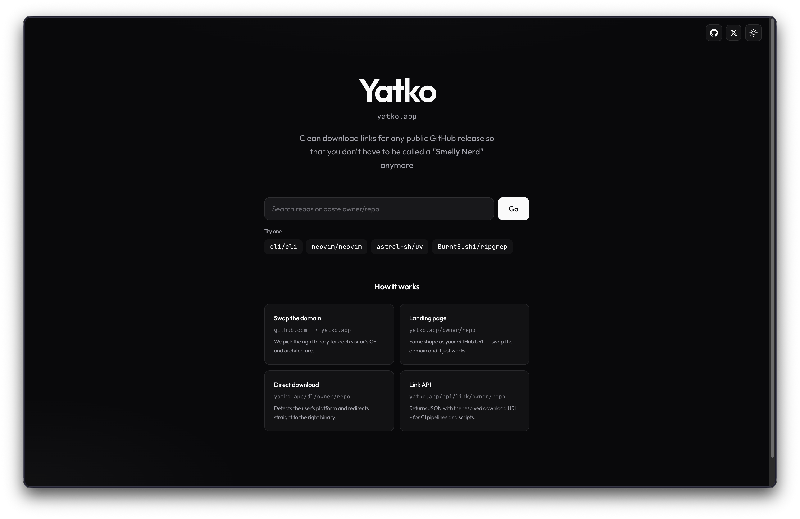

---

## 7. [KanaSensei](https://www.producthunt.com/products/kanasensei)
**Votes**: 93 | **도입 난이도**: 하 | **신뢰도**: 상
**Tagline**: Read Japanese kana in two weeks
**서비스 링크**: https://www.producthunt.com/r/DZC2H6TKFBDYCC

**태그**: Education, LanguageLearning, Productivity

### 📌 이 서비스 한눈에 보기
2주 만에 일본어 가나를 마스터하는 적응형 학습 웹 앱

### 🔑 주요 기능
- 히라가나와 가타카나를 위한 맞춤형 드릴 학습
- 기억력을 높이는 암기법(Mnemonics)과 원어민 오디오 제공
- 학습 진도 추적 및 도전 과제 기능

### 🙋 사용자에게 어떤 점이 좋은가
일본어 기초를 빠르게 잡고 싶은 학습자가 체계적이고 재미있게 문자를 익힐 수 있습니다.

### ✅ 지금 바로 써볼 기능
- 적응형 드릴로 개인 맞춤형 연습 시작하기
- 원어민 오디오를 활용한 발음 연습하기
- 학습 진도 트래킹 기능 확인하기

### ⚠️ 사용 전 확인할 점
- 기초 문자 학습에 특화되어 있어 고급 문법 학습에는 한계가 있음
- 웹 앱 형태이므로 모바일 환경에서의 사용 편의성 확인 필요

### 🧭 확인이 더 필요한 정보
학습 커리큘럼의 구체적인 난이도 조절 방식과 모바일 앱 지원 여부는 명시되지 않았습니다.

### 📸 스크린샷 및 갤러리
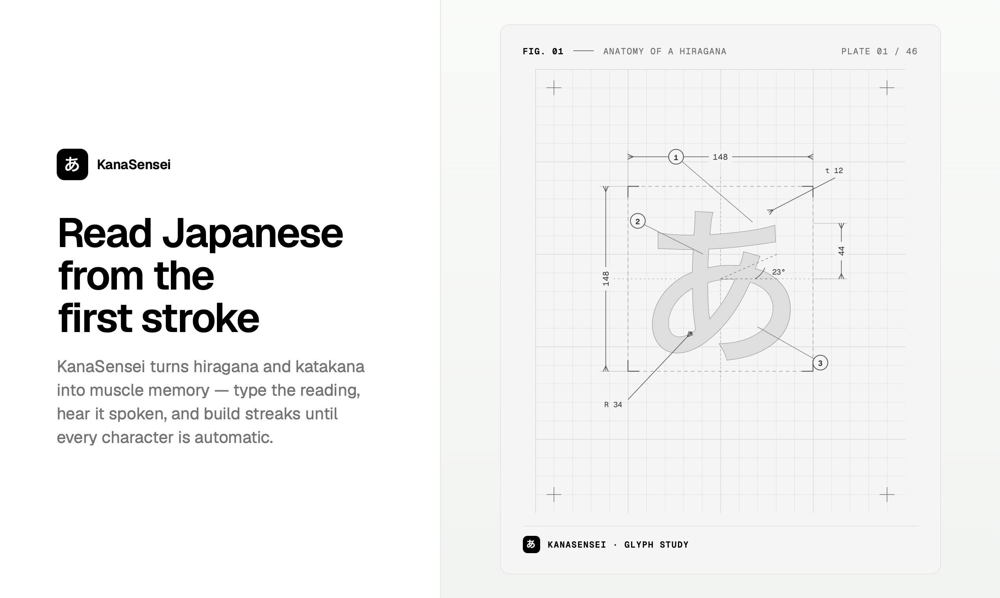
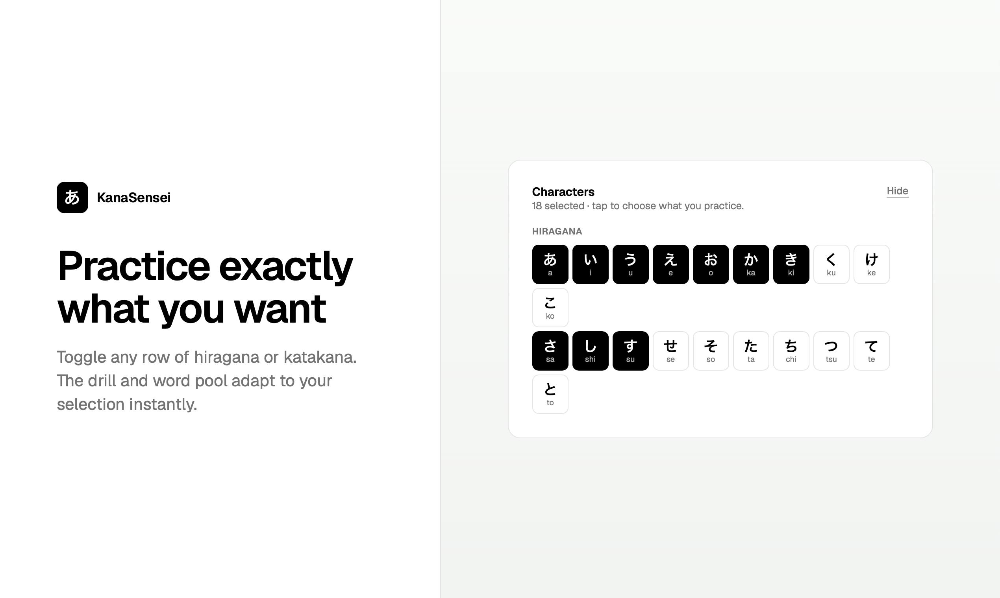
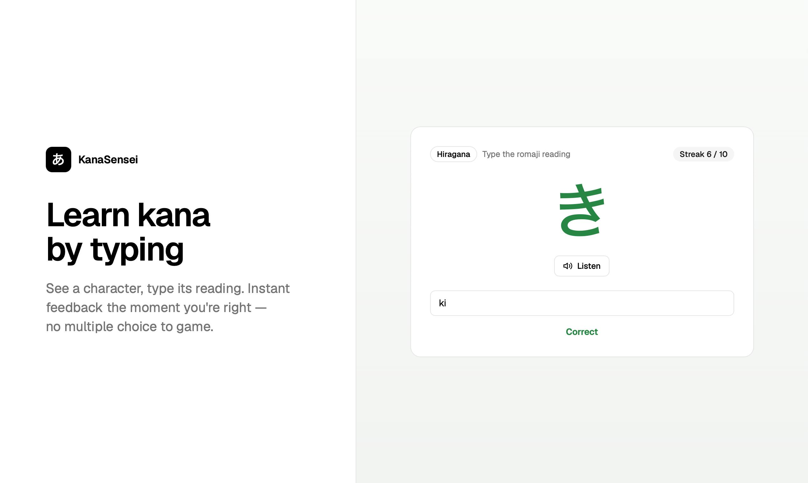

---

## 8. [Plask](https://www.producthunt.com/products/plask-3)
**Votes**: 90 | **도입 난이도**: 하 | **신뢰도**: 상
**Tagline**: Have little ducks show how deep you dive on your Apple Watch
**서비스 링크**: https://www.producthunt.com/r/2LNRTIPEFZQPWX

**태그**: Lifestyle, AppleWatch, Gamification, Diving

### 📌 이 서비스 한눈에 보기
애플 워치로 즐기는 나만의 작은 수중 픽셀 아트 극장

### 🔑 주요 기능
- 애플 워치를 활용한 픽셀 아트 스타일의 다이빙 시뮬레이션
- 사용자의 실제 다이빙 깊이를 화면에 반영하는 인터랙티브 요소
- 프리미엄 구독을 통한 상어, 네스호 괴물 등 다양한 캐릭터 제공

### 🙋 사용자에게 어떤 점이 좋은가
다이빙 활동을 시각적으로 재미있게 기록하고, 애플 워치 위에서 귀여운 캐릭터들과 함께 성취감을 느낄 수 있습니다.

### ✅ 지금 바로 써볼 기능
- 애플 워치에 앱 설치 및 동기화
- 다이빙 시 실시간 깊이 변화 확인하기
- 프리미엄 콘텐츠로 희귀 캐릭터 잠금 해제하기

### ⚠️ 사용 전 확인할 점
- 애플 워치 하드웨어 및 센서 의존도 높음
- 특수 캐릭터 사용을 위한 유료 구독 필요성

### 🧭 확인이 더 필요한 정보
애플 워치의 특정 모델이나 OS 버전에서 원활하게 작동하는지 확인이 필요합니다.

### 📸 스크린샷 및 갤러리
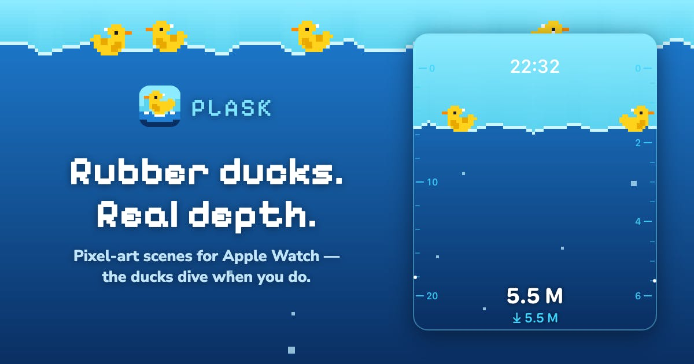
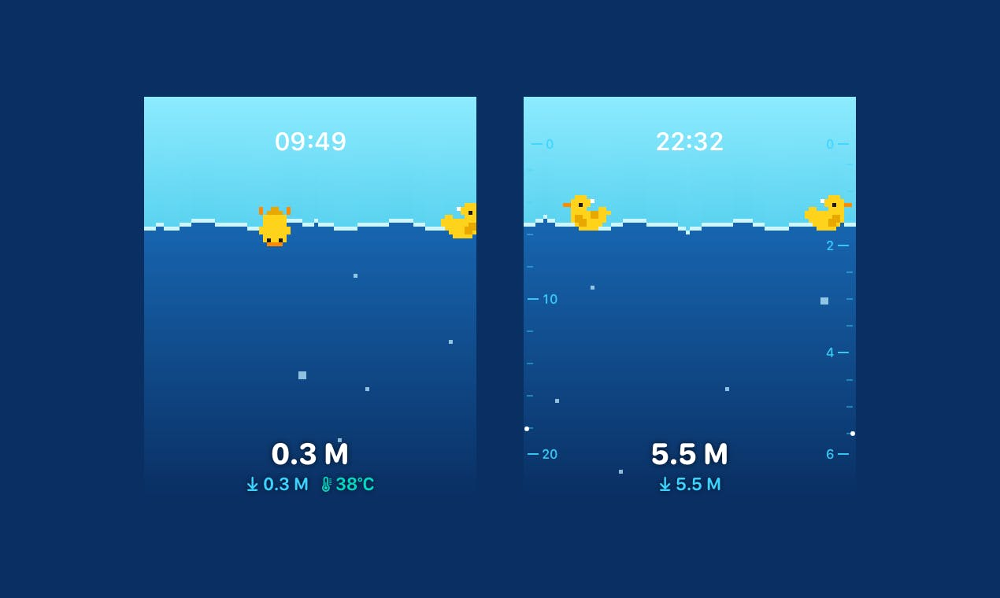
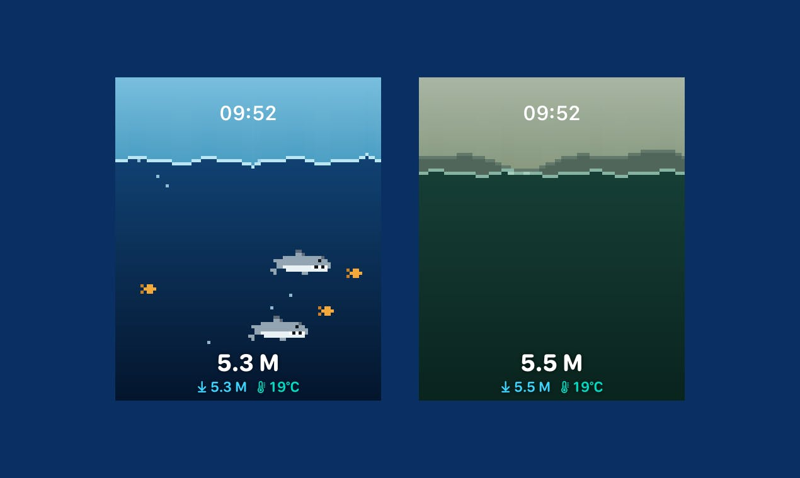

---

## 9. [Tab Notes](https://www.producthunt.com/products/tab-notes)
**Votes**: 86 | **도입 난이도**: 하 | **신뢰도**: 상
**Tagline**: Turn your browser new tab into a distraction-free notepad
**서비스 링크**: https://www.producthunt.com/r/BCSJED4WJINCHW

**태그**: Productivity, Note-taking, Browser Extension, DeveloperTools, DevTool

### 📌 이 서비스 한눈에 보기
브라우저 새 탭을 즉각적인 아이디어 기록 공간으로 바꿔주는 방해 없는 메모장

### 🔑 주요 기능
- 새 탭을 리치 텍스트, 표, 코드 블록 지원 메모장으로 변환
- 로컬 저장소 또는 개인 Google Drive를 통한 프라이빗 동기화
- 전체 화면 모드, 툴바 팝업, 텍스트/마크다운 내보내기 지원

### 🙋 사용자에게 어떤 점이 좋은가
웹 서핑 중 떠오르는 생각을 즉시 기록할 수 있으며, 서버 종속성 없이 개인 저장소를 활용해 보안과 접근성을 동시에 잡을 수 있습니다.

### ✅ 지금 바로 써볼 기능
- 새 탭을 메모장으로 설정하여 즉각적인 기록 환경 구축하기
- 코드 블록과 도형 캔버스를 활용해 아이디어 스케치해보기
- Google Drive 동기화 설정을 통해 데이터 백업 및 접근성 확보하기

### ⚠️ 사용 전 확인할 점
- 로컬 저장소 사용 시 브라우저 캐시 삭제 시 데이터 유실 가능성 확인 필요
- Google Drive 동기화 시 개인 계정 권한 설정 확인 필요

### 🧭 확인이 더 필요한 정보
데이터 동기화 방식과 오프라인 모드 간의 실시간 충돌 해결 방식에 대한 상세 정보가 필요합니다.

### 📸 스크린샷 및 갤러리
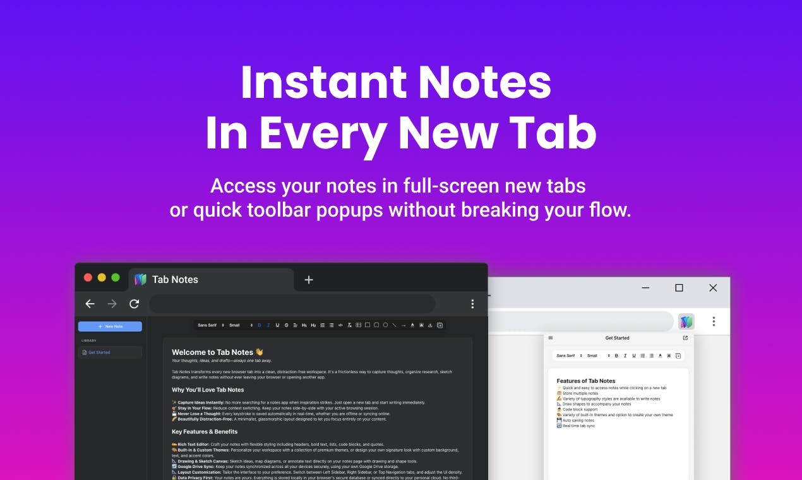
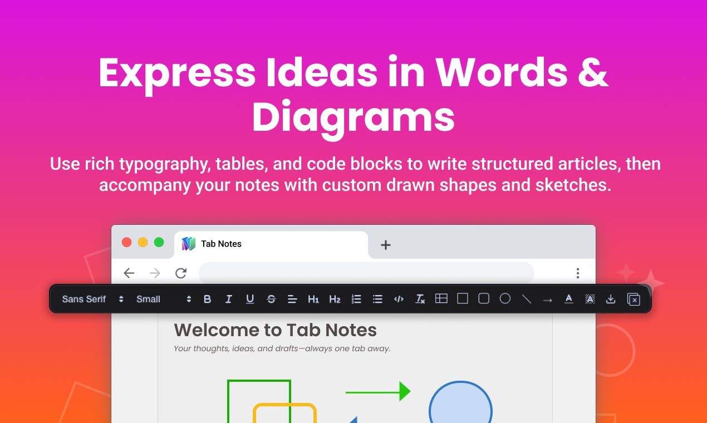
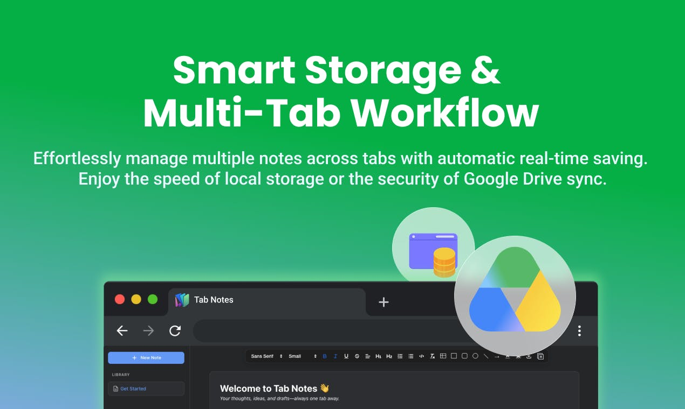

### 🎬 관련 영상
- [🎥 영상 보기](https://ph-files.imgix.net/a875176d-4082-486a-a402-7237719e7339.jpeg?auto=format)

---

## 10. [Yattayo](https://www.producthunt.com/products/yattayo)
**Votes**: 82 | **도입 난이도**: 하 | **신뢰도**: 상
**Tagline**: A physical slider to-do board, faithfully rebuilt in 3D
**서비스 링크**: https://www.producthunt.com/r/C6TYBUL6553NIO

**태그**: Productivity, iOS, Task Management, UI/UX, AI Tool

### 📌 이 서비스 한눈에 보기
실제 물리적 슬라이더의 손맛을 구현한 3D 인터랙티브 할 일 관리 보드

### 🔑 주요 기능
- 3D 슬라이더와 스탬프를 활용한 직관적이고 촉각적인 할 일 완료 경험
- 메모지 형태의 UI로 손글씨 또는 타이핑을 통한 자유로운 할 일 작성
- iPhone, Apple Watch, Mac 간의 iCloud 동기화 지원

### 🙋 사용자에게 어떤 점이 좋은가
디지털 환경에서도 물리적인 도구를 사용하는 듯한 재미를 통해 할 일 관리의 지루함을 줄이고 성취감을 높여줍니다.

### ✅ 지금 바로 써볼 기능
- 3D 슬라이더를 밀어 'OK' 스탬프 찍어보기
- 메모지를 작성하고 완료 후 스와이프로 떼어내기
- 위젯을 통해 앱을 열지 않고 슬라이더 조작하기

### ⚠️ 사용 전 확인할 점
- 무료 버전은 최대 3개의 작업(Task)까지만 사용 가능
- 물리적 피드백 중심의 UI이므로 복잡한 프로젝트 관리에는 부적합할 수 있음

### 🧭 확인이 더 필요한 정보
사용자 기기별 상세 위젯 기능 및 동기화 속도에 대한 구체적인 정보는 확인이 필요합니다.

### 📸 스크린샷 및 갤러리

---

## 11. [Local Music Organizer for Mac](https://www.producthunt.com/products/local-music-organizer-for-mac)
**Votes**: 78 | **도입 난이도**: 하 | **신뢰도**: 상
**Tagline**: Ultimate toolkit for local Apple Music library maintenance
**서비스 링크**: https://www.producthunt.com/r/WTW5AAPLCP3OUG

**태그**: macOS, Music, Productivity, Audio, AI Tool, DevTool

### 📌 이 서비스 한눈에 보기
대규모 로컬 음악 라이브러리를 관리하고 최적화하는 macOS 전용 전문 툴킷

### 🔑 주요 기능
- 중복 파일 및 누락된 파일 탐색을 통한 라이브러리 정리
- 메타데이터 검사 및 오디오 업스케일/트랜스코드 감지
- 스펙트럼/파형 보기 및 희귀 포맷의 오프라인 복구/변환

### 🙋 사용자에게 어떤 점이 좋은가
구독형 서비스 없이 로컬에 저장된 방대한 음악 파일을 체계적으로 관리하고 음질 및 데이터 무결성을 유지할 수 있습니다.

### ✅ 지금 바로 써볼 기능
- 중복 파일 및 누락 파일 찾기 기능 실행
- 음원 메타데이터 및 스펙트럼 검사
- 희귀 포맷 파일의 변환 및 복구 테스트

### ⚠️ 사용 전 확인할 점
- 3일 무료 체험 후 유료 결제가 필요함
- macOS 전용 네이티브 앱이므로 다른 OS에서는 사용 불가

### 🧭 확인이 더 필요한 정보
모든 기능을 사용하기 위한 정확한 일회성 구매 가격이 명시되지 않았습니다.

### 📸 스크린샷 및 갤러리

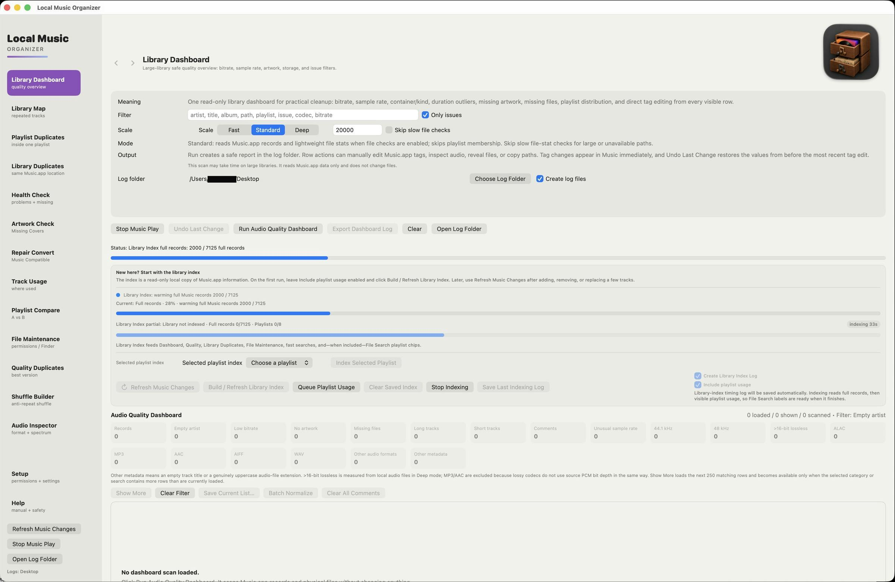
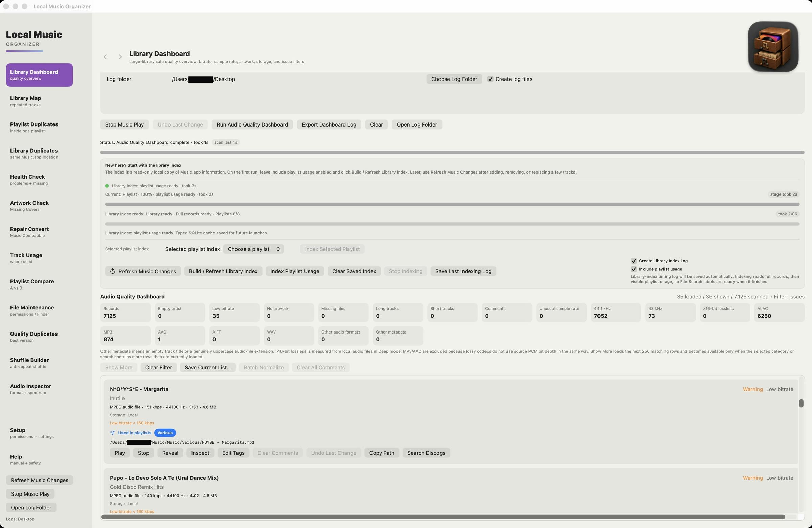

---

## 12. [ANCBuddy for Bose QC Ultra](https://www.producthunt.com/products/ancbuddy-for-bose-qc-ultra)
**Votes**: 70 | **도입 난이도**: 하 | **신뢰도**: 상
**Tagline**: Control Bose QC Ultra from your macOS menu bar
**서비스 링크**: https://www.producthunt.com/r/UKPOS6C6VKEDJT

**태그**: Productivity, macOS, Audio, Bose, Automation, AI Tool, Design

### 📌 이 서비스 한눈에 보기
macOS 메뉴 바에서 Bose QC Ultra의 노이즈 캔슬링과 배터리를 간편하게 제어하세요.

### 🔑 주요 기능
- macOS 메뉴 바를 통한 ANC 모드 간편 전환
- 실시간 배터리 상태 모니터링
- 별도의 앱을 열 필요 없는 효율적인 워크플로우 제공

### 🙋 사용자에게 어떤 점이 좋은가
Bose QC Ultra 사용자가 macOS 환경에서 앱을 일일이 열지 않고도 즉각적으로 소음 제어와 배터리 확인을 할 수 있어 작업 흐름이 끊기지 않습니다.

### ✅ 지금 바로 써볼 기능
- 메뉴 바에서 ANC 모드 전환 테스트하기
- 배터리 잔량 표시 확인하기
- 무료 체험판을 통한 macOS 호환성 확인하기

### ⚠️ 사용 전 확인할 점
- Bose QuietComfort Ultra 모델 전용 기능임
- 무료 체험 기간 이후 유료 전환 여부 확인 필요

### 🧭 확인이 더 필요한 정보
정확한 유료 구독 모델 및 기능 제한 범위에 대한 상세 정보가 명시되지 않았습니다.

### 📸 스크린샷 및 갤러리
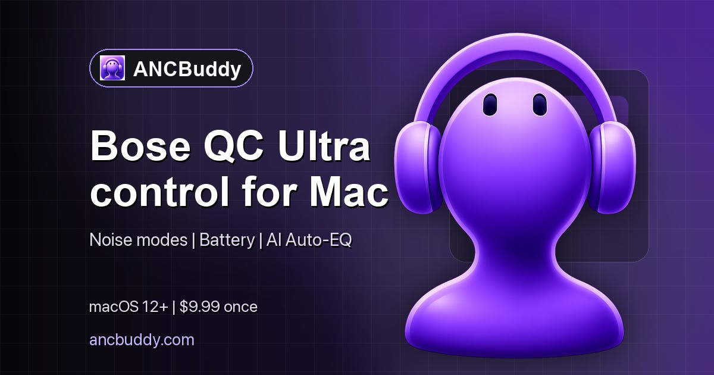
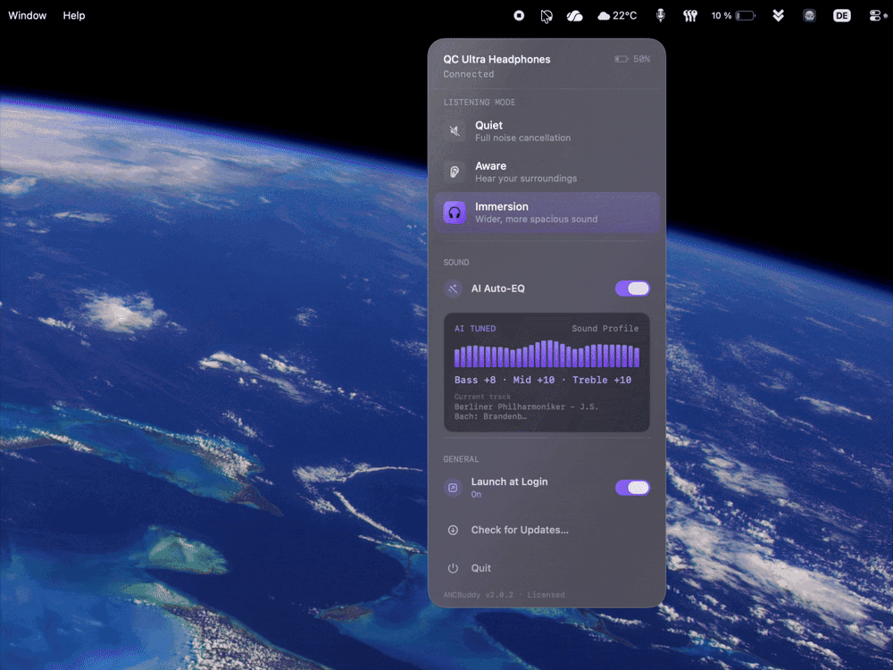

---

## 13. [Flown](https://www.producthunt.com/products/flown)
**Votes**: 68 | **도입 난이도**: 하 | **신뢰도**: 상
**Tagline**: Every flight you've ever taken, on one private map
**서비스 링크**: https://www.producthunt.com/r/TD22YJFZQZHSGR

**태그**: Travel, PersonalFinance, DataVisualization, AI Tool

### 📌 이 서비스 한눈에 보기
전 세계 비행 기록을 하나의 지도로 시각화하고 항공사 보상금까지 챙겨주는 개인용 여행 기록 서비스

### 🔑 주요 기능
- 모든 비행 기록을 하나의 프라이빗 지도로 시각화
- 국가별 방문 기록 및 여권 스탬프 수집 기능
- 지연/결항 시 항공사로부터 받을 수 있는 보상금 자동 계산

### 🙋 사용자에게 어떤 점이 좋은가
자신의 여행 경로를 직관적인 지도로 확인하는 동시에, 놓치기 쉬운 항공사 보상금 권리를 자동으로 체크할 수 있습니다.

### ✅ 지금 바로 써볼 기능
- 과거 비행 기록을 지도에 동기화하기
- 방문한 국가 스탬드 모으기
- 지연된 항공편에 대한 보상금 대상 여부 확인하기

### ⚠️ 사용 전 확인할 점
- 계정 없이 온디바이스로 작동하므로 기기 변경 시 데이터 이전 방식 확인 필요
- 보상금 청구의 경우 실제 법적 효력이나 절차는 별도로 확인해야 함

### 🧭 확인이 더 필요한 정보
데이터가 온디바이스로 저장되므로 기기 분실 시 데이터 복구 가능 여부를 확인해야 합니다.

### 📸 스크린샷 및 갤러리

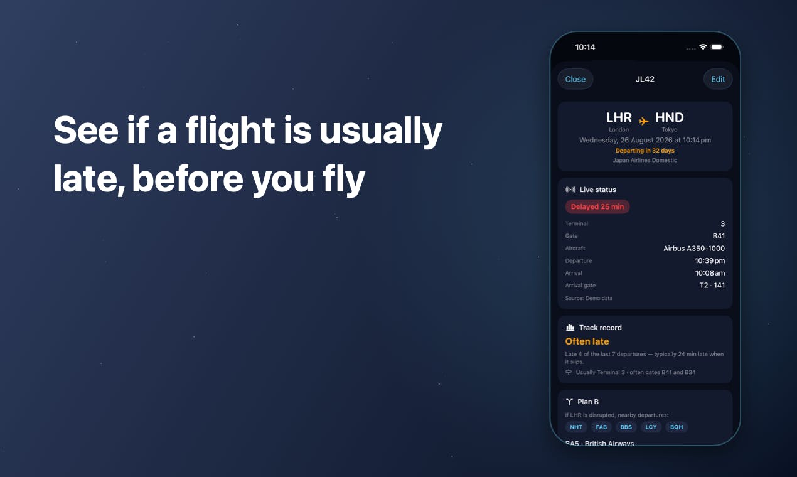
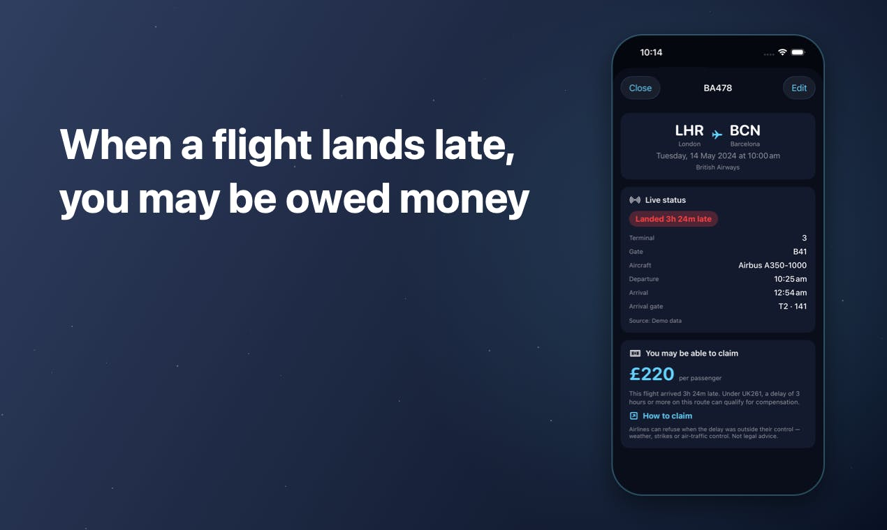

### 🎬 관련 영상
- [🎥 영상 보기](https://ph-files.imgix.net/8f4980b9-bbca-4616-8752-79f97ef1f746.jpeg?auto=format)

---

## 14. [Hyperfocus](https://www.producthunt.com/products/hyperfocus-2)
**Votes**: 33 | **도입 난이도**: 하 | **신뢰도**: 상
**Tagline**: Free, goals-first planner for Mac
**서비스 링크**: https://www.producthunt.com/r/WIPDN746ZT7D27

**태그**: Productivity, Planner, macOS

### 📌 이 서비스 한눈에 보기
중요한 목표 달성에 집중할 수 있도록 돕는 macOS 전용 플래너

### 🔑 주요 기능
- 목표 중심의 계획 수립 방식
- 주간 및 일간 계획을 통한 체계적 관리
- 집중력 있는 업무 수행을 통한 지속적인 성과 창출

### 🙋 사용자에게 어떤 점이 좋은가
가장 중요한 목표를 우선순위에 두고 일정을 관리함으로써, 불필요한 업무를 줄이고 실질적인 성과를 내는 데 도움을 줍니다.

### ✅ 지금 바로 써볼 기능
- 가장 중요한 목표 설정하기
- 주간/일간 계획 세워보기
- 집중 업무 시간 확보하기

### ⚠️ 사용 전 확인할 점
- macOS 전용 앱이므로 다른 OS 사용자는 사용 불가
- 상세한 기능(동기화, 협업 등)에 대한 정보 부족

### 🧭 확인이 더 필요한 정보
현재 제공되는 기능 외에 추가적인 유료 플랜이나 타 플랫폼과의 연동 여부는 확인이 필요합니다.

### 📸 스크린샷 및 갤러리

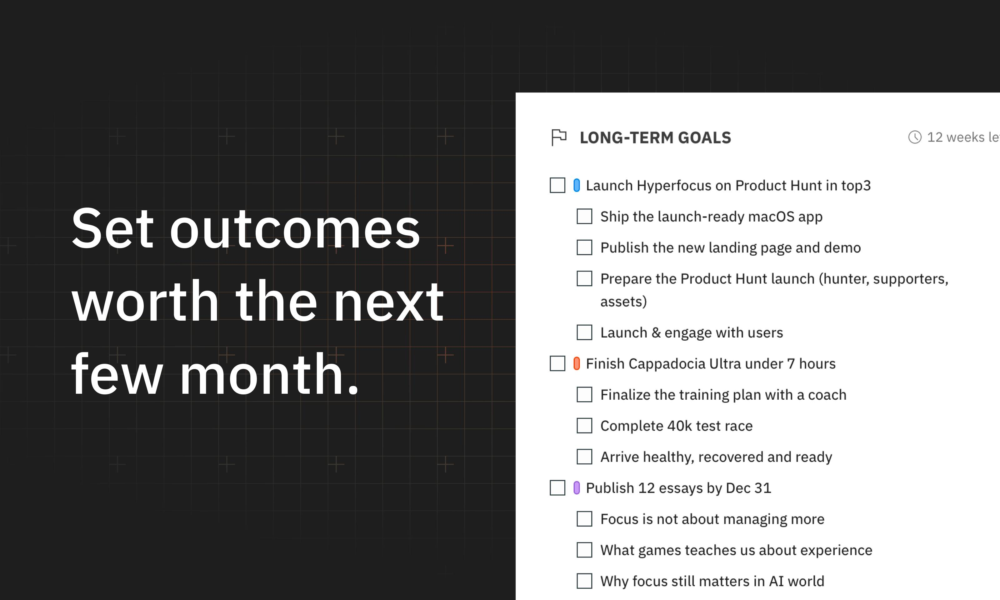

### 🎬 관련 영상
- [🎥 영상 보기](https://ph-files.imgix.net/6b915b9d-32df-4c20-b782-8942f65d898e.jpeg?auto=format)

---

## 15. [Oppora AI](https://www.producthunt.com/products/oppora)
**Votes**: 13 | **도입 난이도**: 중 | **신뢰도**: 상
**Tagline**: Find Leads, Run Outreach, and Book Meetings on Autopilot
**서비스 링크**: https://www.producthunt.com/r/FAEGWPRH6IF6KC

**태그**: Sales Automation, AI, Lead Generation, Outreach, CRM, Automation, AI Tool, Sales, Email

### 📌 이 서비스 한눈에 보기
잠재 고객 발굴부터 미팅 예약까지 전 과정을 자동화하는 AI 영업 워크플로우 시스템

### 🔑 주요 기능
- 타겟 고객(ICP) 발굴, 데이터 보강, 리드 스코어링 자동화
- 이메일 및 LinkedIn을 통한 개인화된 아웃리치 실행
- 답장 처리, 미팅 예약 및 CRM 동기화까지 이어지는 엔드투엔드 워크플로우

### 🙋 사용자에게 어떤 점이 좋은가
여러 영업 도구를 개별적으로 연결할 필요 없이, 하나의 워크플로우로 리드 발굴부터 미팅 확보까지의 과정을 자동화하여 영업 효율을 극대화할 수 있습니다.

### ✅ 지금 바로 써볼 기능
- 타겟 고객 리스트 생성 및 데이터 보강 기능 테스트
- 개인화된 아웃리치 메시지 템플릿 설정
- CRM 연동 및 자동화 워크플로우 구축

### ⚠️ 사용 전 확인할 점
- 자동화된 메시지로 인한 스팸 분류 위험 및 도메인 평판 관리 필요
- 초기 타겟 설정(ICP)이 부정확할 경우 무의미한 리드만 생성될 가능성

### 🧭 확인이 더 필요한 정보
현재 지원하는 구체적인 CRM 플랫폼 목록과 이메일/LinkedIn 계정 보안 정책에 대한 상세 정보가 필요합니다.

### 📸 스크린샷 및 갤러리
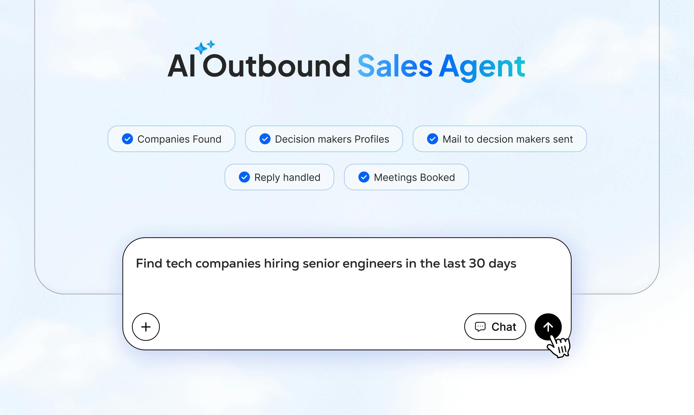
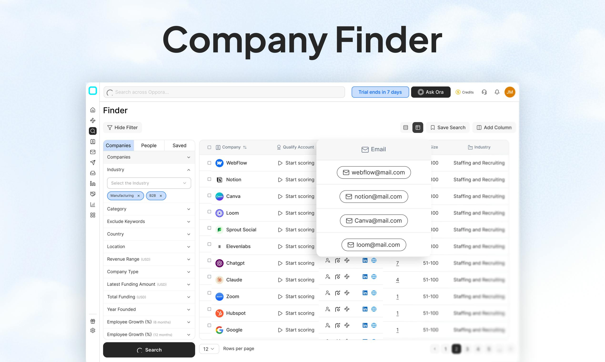
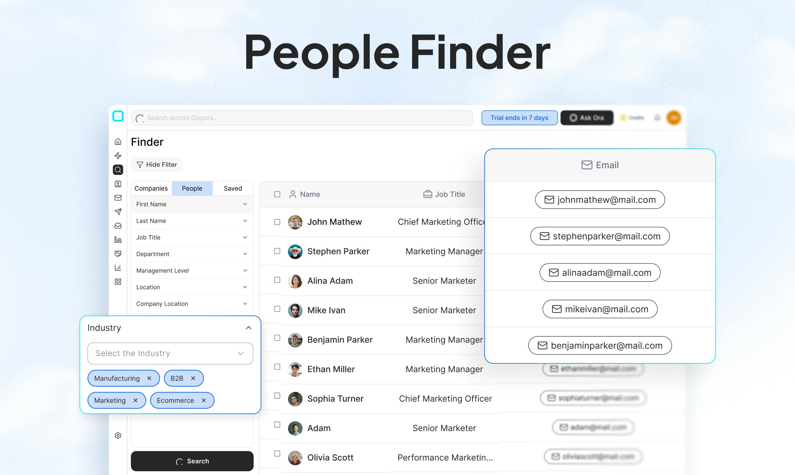

### 🎬 관련 영상
- [🎥 영상 보기](https://ph-files.imgix.net/bb8a94ad-f445-4928-844f-89c826426963.jpeg?auto=format)

---

## 16. [OPENBOT](https://www.producthunt.com/products/openbot-2)
**Votes**: 11 | **도입 난이도**: 중 | **신뢰도**: 상
**Tagline**: Opensource alternative for Grokbot
**서비스 링크**: https://www.producthunt.com/r/ITBNC3L5XN5CUC

**태그**: AI Agent, Automation, OpenSource, Productivity, Agent, Chat

### 📌 이 서비스 한눈에 보기
단순 채팅을 넘어 독립적인 메모리와 스케줄을 가진 협업형 AI 에이전트 도구

### 🔑 주요 기능
- 이름과 기억을 가진 장기 생존형 에이전트 제공
- 브라우저, 셸, 파일 시스템을 공유하는 지속적인 컴퓨터 환경
- MCP 및 브라우저를 통한 실제 도구 활용 및 인간의 승인 기반 작업 수행

### 🙋 사용자에게 어떤 점이 좋은가
단순 질의응답을 넘어, 마치 실제 동료처럼 스스로 작업을 수행하고 결과물을 가져오는 자동화 워크플로우를 구축할 수 있습니다.

### ✅ 지금 바로 써볼 기능
- 에이전트에게 특정 업무 스케줄 할당하기
- 브라우저 및 셸 환경을 통한 자동화 작업 테스트
- MCP 커넥터를 활용한 외부 도구 연동 시도

### ⚠️ 사용 전 확인할 점
- 에이전트가 공유하는 파일 시스템 및 셸 환경에 대한 보안 관리 필요
- 에이전트의 자율적 작업에 따른 리소스 소모 및 비용 발생 가능성

### 🧭 확인이 더 필요한 정보
에이전트가 사용하는 구체적인 하드웨어 리소스 점유율과 보안 격리 수준에 대한 정보가 부족합니다.

### 📸 스크린샷 및 갤러리
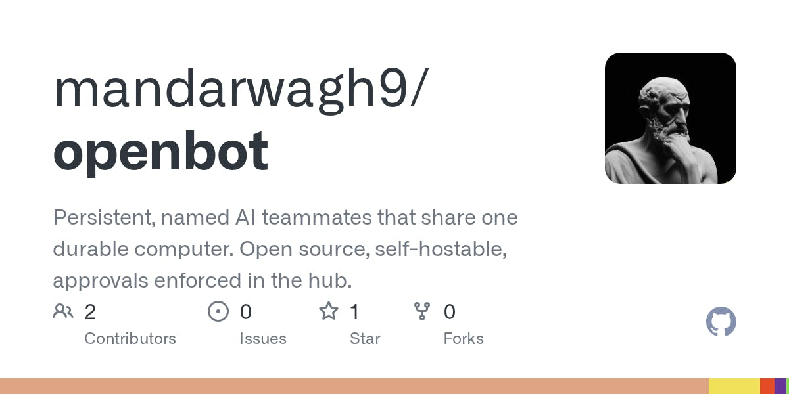
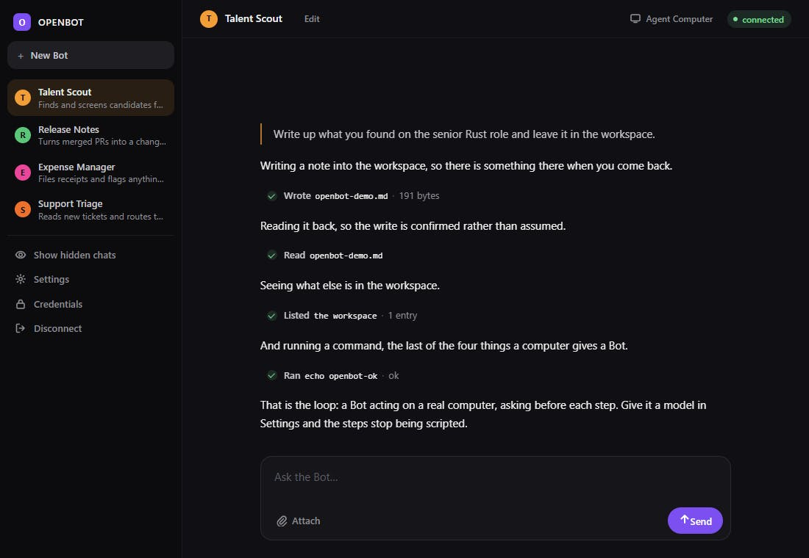

---

## 17. [asktube.xyz](https://www.producthunt.com/products/asktube-xyz)
**Votes**: 8 | **도입 난이도**: 하 | **신뢰도**: 상
**Tagline**: AI for YouTube power users
**서비스 링크**: https://www.producthunt.com/r/WVNOBLJVDNDQEG

**태그**: AI, Productivity, YouTube, KnowledgeManagement, AI Tool, Video

### 📌 이 서비스 한눈에 보기
내가 구독하고 저장한 유튜브 라이브러리 전체를 대상으로 질문하고 검색하는 AI

### 🔑 주요 기능
- 구독 채널 및 플레이리스트 전체를 대상으로 하는 통합 검색/질문 기능
- 개별 영상 단위가 아닌 사용자가 구축한 지식 저장소 기반의 답변 제공
- 유튜브 기본 AI의 한계를 넘어선 개인 맞춤형 지식 관리

### 🙋 사용자에게 어떤 점이 좋은가
수많은 구독 채널과 저장된 영상들 사이에서 원하는 정보를 일일이 찾을 필요 없이, 마치 내 개인 파일처럼 질문하여 답을 얻을 수 있습니다.

### ✅ 지금 바로 써볼 기능
- 구독 중인 채널과 플레이리스트 연결하기
- 특정 주제에 대해 내 라이브러리 내에서 질문 던지기
- 저장해둔 영상들 사이의 연관 정보 검색하기

### ⚠️ 사용 전 확인할 점
- 사용자의 구독 및 플레이리스트 데이터 접근 권한 필요
- 유튜브 데이터 양에 따른 검색 정확도 및 속도 차이 가능성

### 🧭 확인이 더 필요한 정보
사용자의 유튜브 계정 연동 방식 및 데이터 프라이버시 보호 수준에 대한 상세 정보가 필요합니다.

### 📸 스크린샷 및 갤러리

### 🎬 관련 영상
- [🎥 영상 보기](https://ph-files.imgix.net/efe03ff9-e742-4b34-b8f1-537654b2f1db.jpeg?auto=format)

---

## 18. [OverMCP](https://www.producthunt.com/products/overmcp)
**Votes**: 7 | **도입 난이도**: 하 | **신뢰도**: 상
**Tagline**: The market for builders.
**서비스 링크**: https://www.producthunt.com/r/D3GWB6G6WTTH6D

**태그**: Marketing, Analytics, Product Discovery

### 📌 이 서비스 한눈에 보기
빌더들을 위한 투명한 실시간 리더보드 기반 제품 마케팅 플랫폼

### 🔑 주요 기능
- 새로운 제품 발견 및 탐색 기능
- 실제 클릭 데이터를 기반으로 한 투명한 성과 확인
- 실시간 리더보드 상위 노출을 위한 입찰 시스템

### 🙋 사용자에게 어떤 점이 좋은가
제품 제작자가 자신의 제품을 타겟 사용자에게 노출하고, 실시간 데이터에 기반해 마케팅 성과를 관리할 수 있습니다.

### ✅ 지금 바로 써볼 기능
- 플랫폼 내 제품 등록 및 탐색
- 실시간 클릭 데이터 모니터링
- 리더보드 상위 노출을 위한 입찰 전략 수립

### ⚠️ 사용 전 확인할 점
- 입찰 방식에 따른 비용 발생 가능성
- 리더보드 순위 변동에 따른 노출 불안정성

### 🧭 확인이 더 필요한 정보
입찰 방식의 구체적인 메커니즘과 비용 구조에 대한 상세 정보가 필요합니다.

### 📸 스크린샷 및 갤러리
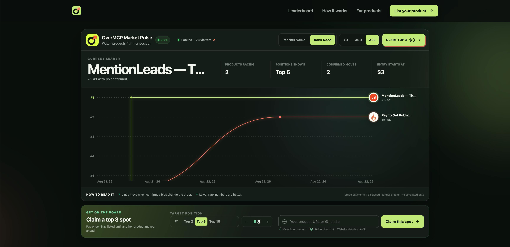
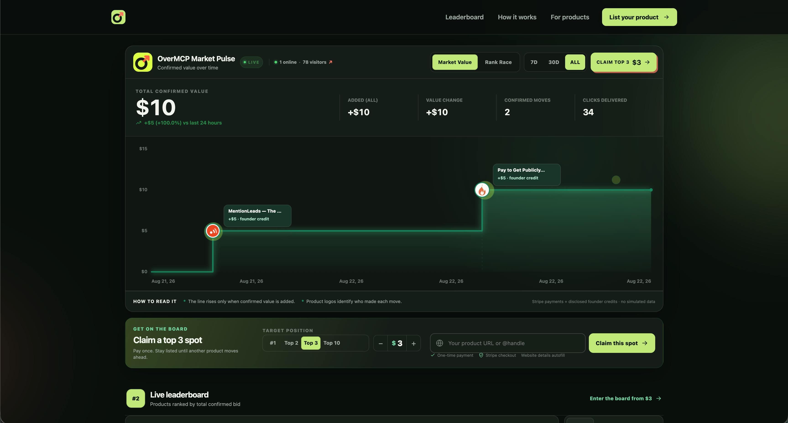
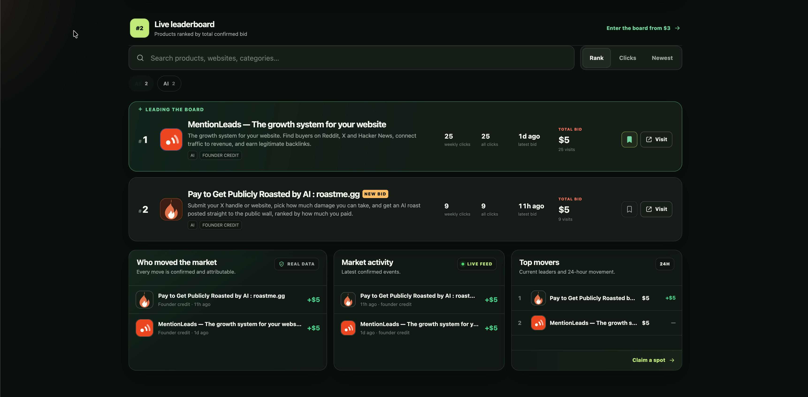

### 🎬 관련 영상
- [🎥 영상 보기](https://ph-files.imgix.net/8cd47a77-f97c-4c1a-a100-7219811115b5.jpeg?auto=format)

---

## 19. [DailyOutbid.lol](https://www.producthunt.com/products/dailyoutbid-lol)
**Votes**: 6 | **도입 난이도**: 하 | **신뢰도**: 상
**Tagline**: Another outbid.lol copycat, but leaderboard resets EVERY 24h
**서비스 링크**: https://www.producthunt.com/r/KRMJEUCVZWZYZZ

**태그**: SEO, Marketing, Leaderboard, AI Tool

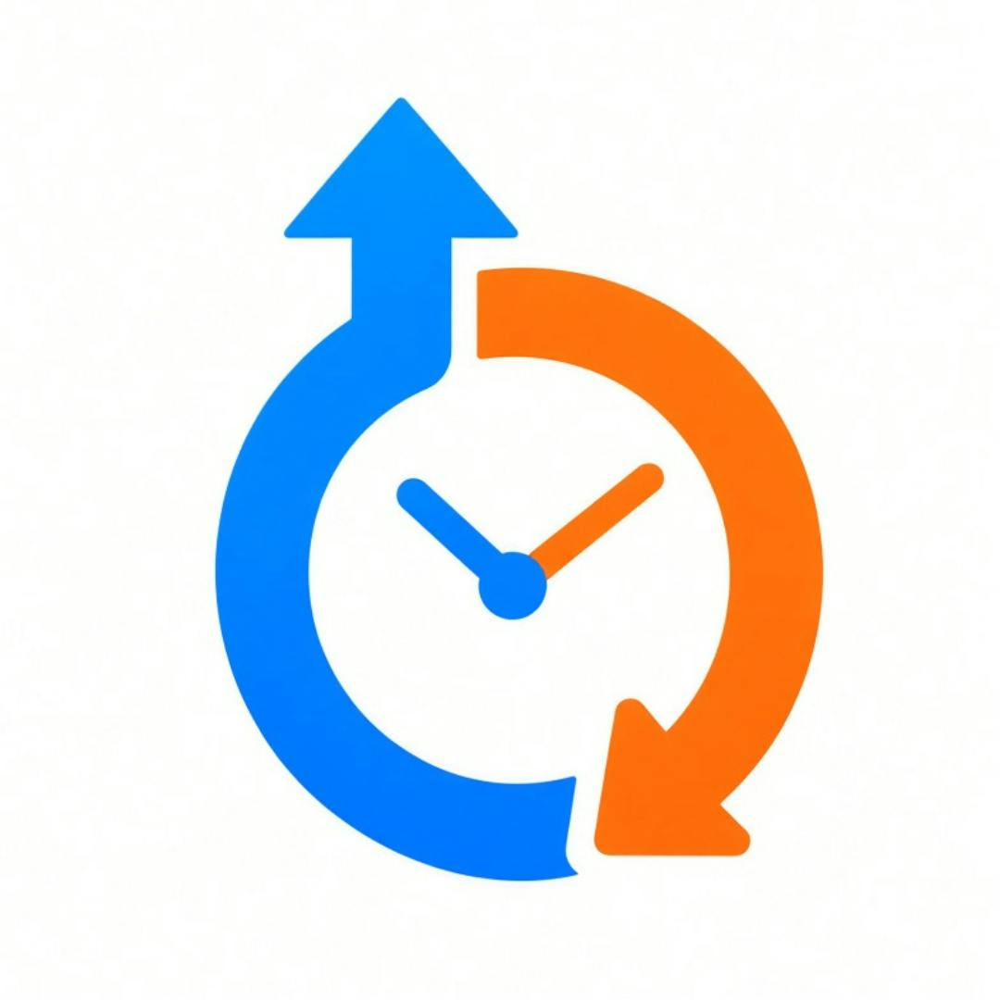

### 📌 이 서비스 한눈에 보기
매일 초기화되는 순위 경쟁을 통해 영구적인 백링크를 확보하는 데일리 페이 투 랭크 서비스

### 🔑 주요 기능
- 24시간마다 초기화되는 데일리 리더보드 시스템
- 최소 $1로 시작 가능한 간편한 순위 경쟁 방식
- 상위 랭킹 유지 시 제공되는 영구적인 dofollow 백링크

### 🙋 사용자에게 어떤 점이 좋은가
적은 비용으로 매일 새로운 순위 경쟁에 참여하며, 상위권 진입을 통해 웹사이트의 SEO에 도움을 줄 수 있는 백링크를 확보할 수 있습니다.

### ✅ 지금 바로 써볼 기능
- 1달러로 순위 경쟁 시작해보기
- 매일 자정 리더보드 초기화 타이밍 확인하기
- 제공되는 dofollow 백링크 품질 검토하기

### ⚠️ 사용 전 확인할 점
- 순위 유지를 위해 지속적인 비용 지출이 발생할 수 있음
- 백링크의 SEO 가치가 사이트 정책에 따라 변동될 수 있음

### 🧭 확인이 더 필요한 정보
백링크의 구체적인 노출 위치와 SEO 영향력에 대한 상세 정보가 명시되지 않았습니다.

### 📸 스크린샷 및 갤러리

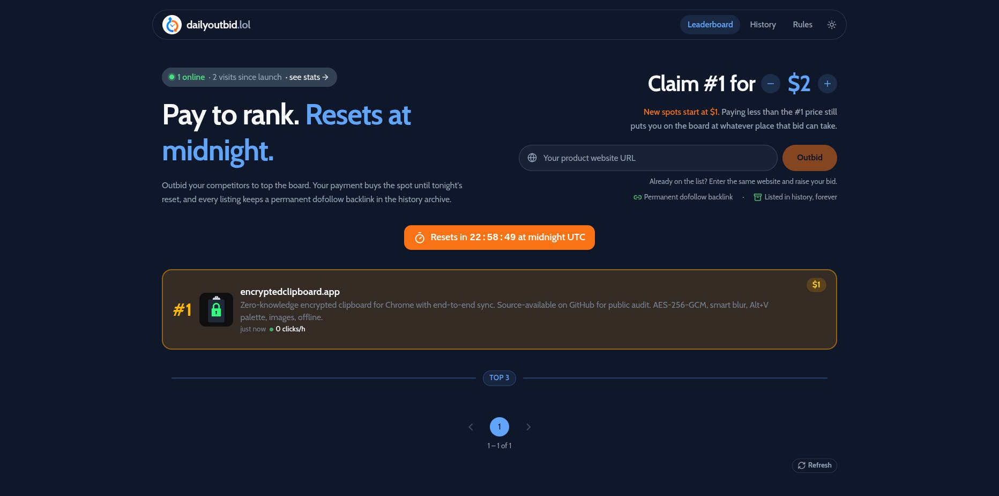
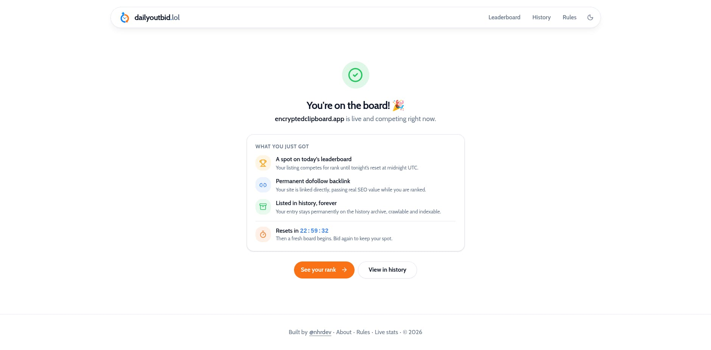

---

## 20. [Scrollytelling](https://www.producthunt.com/products/scrollytelling)
**Votes**: 5 | **도입 난이도**: 하 | **신뢰도**: 상
**Tagline**: Immersive storytelling with AI. No design skills required.
**서비스 링크**: https://www.producthunt.com/r/TOMO6S7G2OWJTV

**태그**: NoCode, Design, AI, Storytelling, WebDesign, AI Tool, Chat

### 📌 이 서비스 한눈에 보기
AI 대화만으로 전문가 수준의 몰입형 스크롤링 스토리텔링 페이지를 제작하는 도구

### 🔑 주요 기능
- AI 채팅을 통한 고퀄리티 스크롤리텔링 페이지 구축
- 디자인 기술 없이도 시네마틱하고 인터랙티브한 웹 페이지 제작 가능
- 템플릿과 위젯을 활용한 빠른 제작 및 원클릭 배포

### 🙋 사용자에게 어떤 점이 좋은가
정적인 텍스트 위주의 웹사이트에서 벗어나, 사용자의 시선을 사로잡는 시각적이고 역동적인 콘텐츠를 즉시 만들 수 있습니다.

### ✅ 지금 바로 써볼 기능
- 제공되는 템플릿을 활용해 기본 레이아웃 생성하기
- AI 채팅을 통해 디자인 요소 및 인터랙티브 위젯 조정하기
- 원클릭 배포 기능을 통해 결과물 즉시 확인하기

### ⚠️ 사용 전 확인할 점
- AI 생성 결과물의 세부적인 커스텀 자유도 확인 필요
- 복잡한 애니메이션 구현 시 로딩 속도 및 성능 최적화 여부 검토

### 🧭 확인이 더 필요한 정보
상세한 커스텀 기능의 범위와 외부 서비스와의 연동 가능 여부는 명시되지 않았습니다.

### 📸 스크린샷 및 갤러리

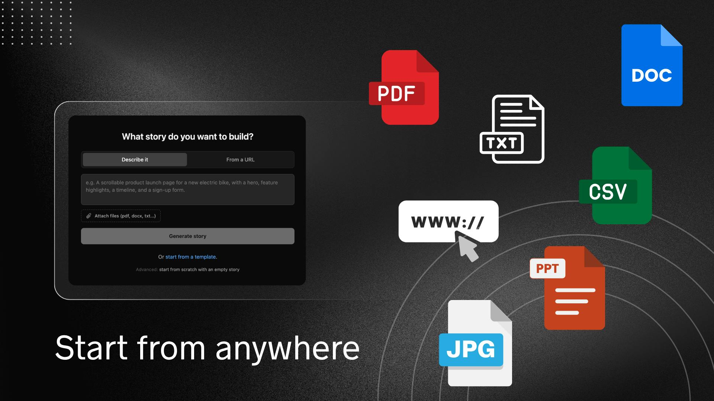
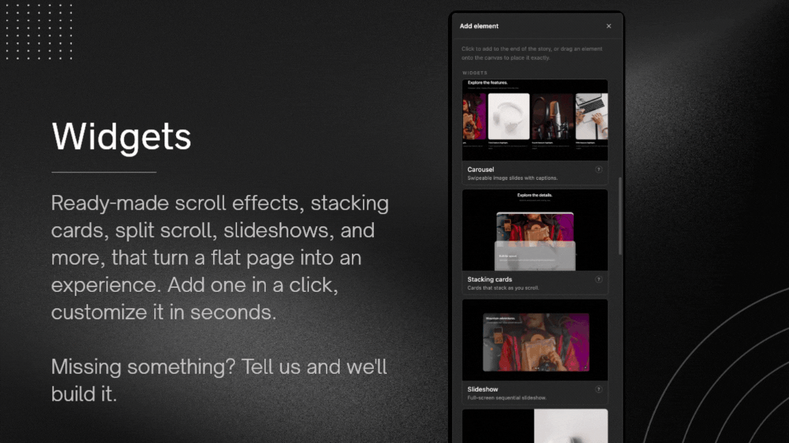

### 🎬 관련 영상
- [🎥 영상 보기](https://ph-files.imgix.net/c4c100ba-4958-4cd5-bb5d-a550591baf2f.jpeg?auto=format)

---

## 21. [Scrollytelling](https://www.producthunt.com/products/scrollytelling)
**Votes**: 5 | **도입 난이도**: 하 | **신뢰도**: 상
**Tagline**: Immersive storytelling with AI. No design skills required.
**서비스 링크**: https://www.producthunt.com/r/TOMO6S7G2OWJTV

**태그**: NoCode, Design, AI, Storytelling, WebDesign, AI Tool, Chat

### 📌 이 서비스 한눈에 보기
AI 대화만으로 전문가 수준의 몰입형 스크롤링 스토리텔링 페이지를 제작하는 도구

### 🔑 주요 기능
- AI 채팅을 통한 고퀄리티 스크롤리텔링 페이지 구축
- 디자인 기술 없이도 시네마틱하고 인터랙티브한 웹 페이지 제작 가능
- 템플릿과 위젯을 활용한 빠른 제작 및 원클릭 배포

### 🙋 사용자에게 어떤 점이 좋은가
정적인 텍스트 위주의 웹사이트에서 벗어나, 사용자의 시선을 사로잡는 시각적이고 역동적인 콘텐츠를 즉시 만들 수 있습니다.

### ✅ 지금 바로 써볼 기능
- 제공되는 템플릿을 활용해 기본 레이아웃 생성하기
- AI 채팅을 통해 디자인 요소 및 인터랙티브 위젯 조정하기
- 원클릭 배포 기능을 통해 결과물 즉시 확인하기

### ⚠️ 사용 전 확인할 점
- AI 생성 결과물의 세부적인 커스텀 자유도 확인 필요
- 복잡한 애니메이션 구현 시 로딩 속도 및 성능 최적화 여부 검토

### 🧭 확인이 더 필요한 정보
상세한 커스텀 기능의 범위와 외부 서비스와의 연동 가능 여부는 명시되지 않았습니다.

### 📸 스크린샷 및 갤러리

### 🎬 관련 영상
- [🎥 영상 보기](https://ph-files.imgix.net/c4c100ba-4958-4cd5-bb5d-a550591baf2f.jpeg?auto=format)

---

## 22. [snakebid.lol](https://www.producthunt.com/products/snakebid-lol)
**Votes**: 4 | **도입 난이도**: 하 | **신뢰도**: 상
**Tagline**: Beat today's high score. Claim #1 for your product.
**서비스 링크**: https://www.producthunt.com/r/HLLDE52YACJKCW

**태그**: Gaming, Marketing, Social, AI Tool

### 📌 이 서비스 한눈에 보기
매일 바뀌는 리더보드에서 자신의 제품이나 핸들을 홍보하는 클래식 스네이크 게임

### 🔑 주요 기능
- 매일 자정(UTC)에 초기화되는 데일리 리더보드 시스템
- 서버 측 검증을 통한 조작 불가능한 공정한 점수 산정
- 점수와 함께 제품 링크나 핸들을 연결하여 홍보 가능

### 🙋 사용자에게 어떤 점이 좋은가
게임 플레이를 통해 자신의 제품이나 브랜드를 자연스럽게 노출하고, 매일 새로운 1위를 차지하는 재미를 느낄 수 있습니다.

### ✅ 지금 바로 써볼 기능
- 자신의 제품/핸들을 연결하여 프로필 설정하기
- 매일 자정 리더보드 초기화에 맞춰 도전하기
- Hall of Fame에 기록되기 위해 최고 점수 달성하기

### ⚠️ 사용 전 확인할 점
- 점수가 매일 초기화되므로 지속적인 참여가 필요함
- 홍보 효과는 리더보드 접속자 수에 따라 달라질 수 있음

### 🧭 확인이 더 필요한 정보
사용자 유입 규모나 리더보드 노출 방식에 대한 구체적인 통계는 명시되지 않았습니다.

### 📸 스크린샷 및 갤러리

---

## 23. [BuildBid](https://www.producthunt.com/products/buildbid)
**Votes**: 4 | **도입 난이도**: 하 | **신뢰도**: 상
**Tagline**: Rank your agency or startup at the top, outbid others
**서비스 링크**: https://www.producthunt.com/r/6YLZU4QYHH4NPH

**태그**: Marketing, LeadGen, Business

### 📌 이 서비스 한눈에 보기
에이전시와 스타트업을 위한 실시간 순위 경쟁 및 홍보 플랫폼

### 🔑 주요 기능
- 실시간 리더보드를 통한 에이전시/스타트업 노출
- 경쟁 입찰 방식을 통한 순위 상승 메커니즘
- 빠르고 공개적인 방식의 브랜드 인지도 확보

### 🙋 사용자에게 어떤 점이 좋은가
자사의 역량을 경쟁력 있게 보여주고, 실시간 순위 경쟁을 통해 잠재 고객에게 빠르게 노출될 수 있습니다.

### ✅ 지금 바로 써볼 기능
- 에이전시/스타트업 프로필 등록하기
- 리더보드 순위 확인 및 경쟁 현황 파악하기
- 입찰을 통한 상위 순위 확보 시도하기

### ⚠️ 사용 전 확인할 점
- 입찰 방식에 따른 비용 발생 가능성 확인 필요
- 순위 변동에 따른 노출 불안정성 고려

### 🧭 확인이 더 필요한 정보
구체적인 입찰 방식(비용 구조)과 순위 산정 알고리즘에 대한 상세 정보가 부족합니다.

### 📸 스크린샷 및 갤러리
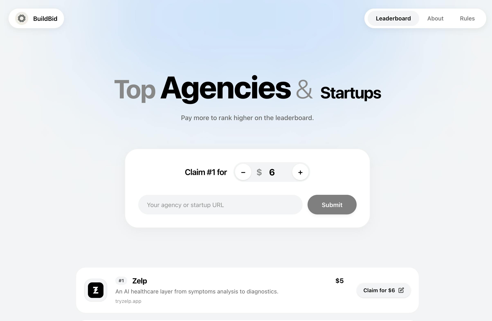

---

## 24. [Outbid Green](https://www.producthunt.com/products/outbid-green)
**Votes**: 4 | **도입 난이도**: 하 | **신뢰도**: 상
**Tagline**: Outbid, but your bid contributes to nature 🌳
**서비스 링크**: https://www.producthunt.com/r/YIDEOPBUOBHFAC

**태그**: Eco-friendly, Ranking, Social Impact

### 📌 이 서비스 한눈에 보기
입찰을 통해 앱 순위를 결정하고, 그 과정에서 실제 나무를 심는 친환경 랭킹 플랫폼

### 🔑 주요 기능
- 투표 대신 입찰 방식을 통한 앱 순위 결정
- 입찰 금액이 앱의 순위 결정 및 실제 나무 심기 기부로 연결
- 사용자의 참여가 환경 보호라는 실질적인 가치로 전환

### 🙋 사용자에게 어떤 점이 좋은가
단순한 투표를 넘어 경제적 기여를 통해 앱의 가치를 증명하고, 동시에 환경 보호에 직접 참여할 수 있습니다.

### ✅ 지금 바로 써볼 기능
- 입찰 시스템을 통한 앱 순위 확인
- 기부되는 나무 수량 및 환경 영향력 확인

### ⚠️ 사용 전 확인할 점
- 입찰 방식이므로 자본력에 따라 순위가 결정될 수 있음
- 실제 나무 심기 집행 과정의 투명성 확인 필요

### 🧭 확인이 더 필요한 정보
입찰 금액과 실제 심어지는 나무 수량 사이의 구체적인 환산 비율이 명시되지 않았습니다.

### 📸 스크린샷 및 갤러리
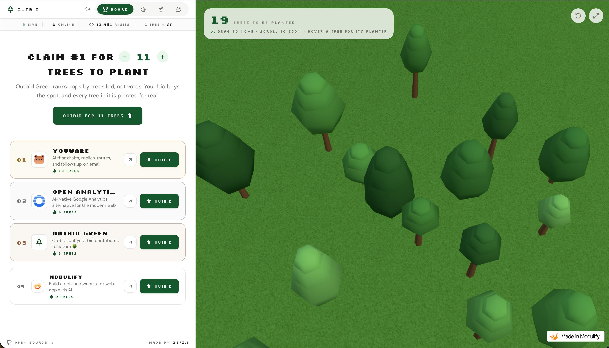

### 🎬 관련 영상
- [🎥 영상 보기](https://ph-files.imgix.net/f9b8a701-59b0-445e-a772-99d3f7738edf.jpeg?auto=format)

---

## 25. [Postlia](https://www.producthunt.com/products/postlia)
**Votes**: 3 | **도입 난이도**: 하 | **신뢰도**: 상
**Tagline**: Write once, post everywhere. 
**서비스 링크**: https://www.producthunt.com/r/PXF7KYTO4GAROA

**태그**: SocialMedia, ContentCreation, Automation, AI, AI Tool

### 📌 이 서비스 한눈에 보기
한 번의 작성으로 모든 SNS 채널에 최적화된 게시물을 배포하는 AI 기반 콘텐츠 스케줄러

### 🔑 주요 기능
- 플랫폼별 맞춤형 캡션 생성 및 멀티 채널(LinkedIn, Instagram, TikTok 등) 통합 스케줄링
- 사용자의 목소리를 유지하며 주간 계획을 세워주는 'First Draft' 기능
- AI 생성물 특유의 어색함을 검사하는 'Slop Detector' 내장

### 🙋 사용자에게 어떤 점이 좋은가
단순히 AI가 쓴 글을 뿌리는 것이 아니라, 사용자의 고유한 말투를 유지하면서 플랫폼별로 최적화된 콘텐츠를 효율적으로 관리할 수 있습니다.

### ✅ 지금 바로 써볼 기능
- First Draft 기능을 통해 주간 콘텐츠 계획 세워보기
- Slop Detector로 작성된 글의 AI 느낌 점수 확인하기
- 25개 이상의 무료 도구 활용해보기

### ⚠️ 사용 전 확인할 점
- 사용자 승인 절차가 필수적이므로 완전 자동화보다는 수동 검토 시간이 필요함
- 플랫폼별 API 연동 정책에 따라 기능 제한이 있을 수 있음

### 🧭 확인이 더 필요한 정보
구체적인 요금제 체계와 플랫폼별 상세 연동 범위는 명시되지 않았습니다.

### 📸 스크린샷 및 갤러리

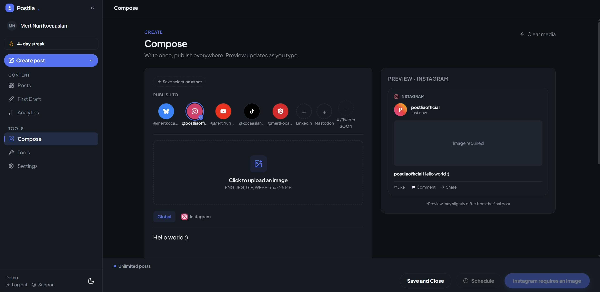
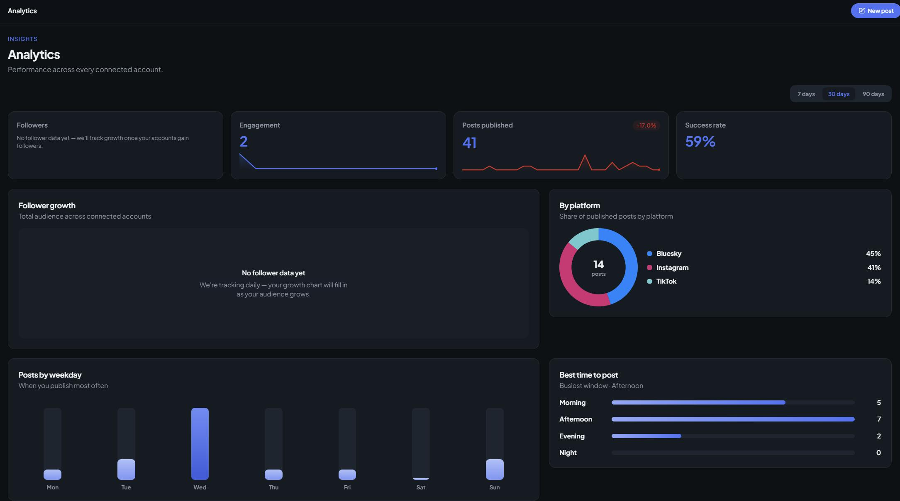

---

## 26. [skillsui](https://www.producthunt.com/products/skillsui)
**Votes**: 3 | **도입 난이도**: 하 | **신뢰도**: 상
**Tagline**: A keyboard-first TUI for managing agent skills
**서비스 링크**: https://www.producthunt.com/r/DA7AAEADV5RIWR

**태그**: DevTool, CLI, Automation, TUI, Agent

### 📌 이 서비스 한눈에 보기
터미널을 떠나지 않고 에이전트 스킬을 관리하는 키보드 중심 TUI 도구

### 🔑 주요 기능
- 별도 데이터베이스나 설정 없이 로컬 폴더와 CLI 락파일을 직접 읽어 관리
- 터미널 내에서 스킬 검색, 미리보기, 설치 및 스코프 간 이동 지원
- macOS 및 glibc Linux (ARM64/x64) 환경 지원

### 🙋 사용자에게 어떤 점이 좋은가
터미널 환경을 벗어나지 않고도 에이전트용 스킬을 효율적으로 관리하고 편집할 수 있어 개발 워크플로우의 연속성을 유지해 줍니다.

### ✅ 지금 바로 써볼 기능
- skills.sh 명령어로 스킬 검색해보기
- 기존 스킬 폴더와 연동하여 스코프 이동 테스트하기
- $EDITOR 설정을 통한 스킬 편집 기능 활용하기

### ⚠️ 사용 전 확인할 점
- 로컬 파일 시스템을 직접 읽으므로 파일 구조가 복잡할 경우 관리 난이도가 있을 수 있음
- Windows 환경 지원 여부 확인 필요

### 🧭 확인이 더 필요한 정보
사용자의 기존 에이전트 프레임워크와의 호환성 및 파일 구조 요구사항에 대한 상세 정보가 필요합니다.

### 📸 스크린샷 및 갤러리
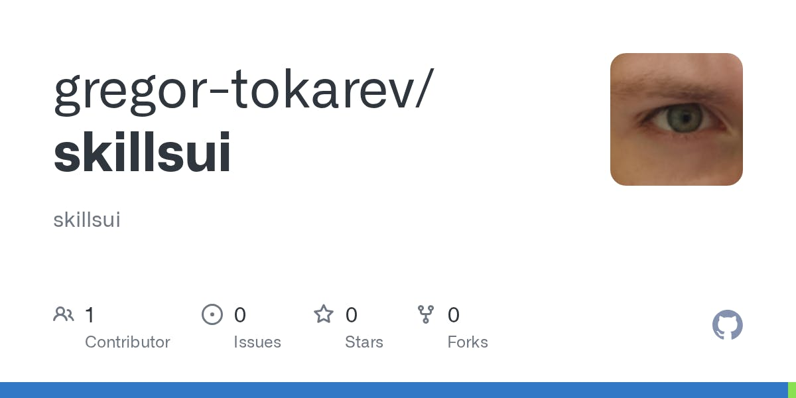
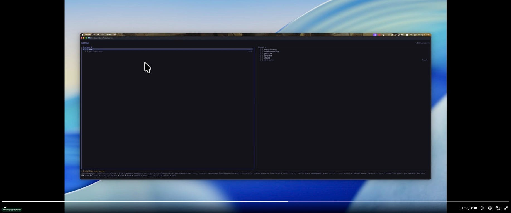
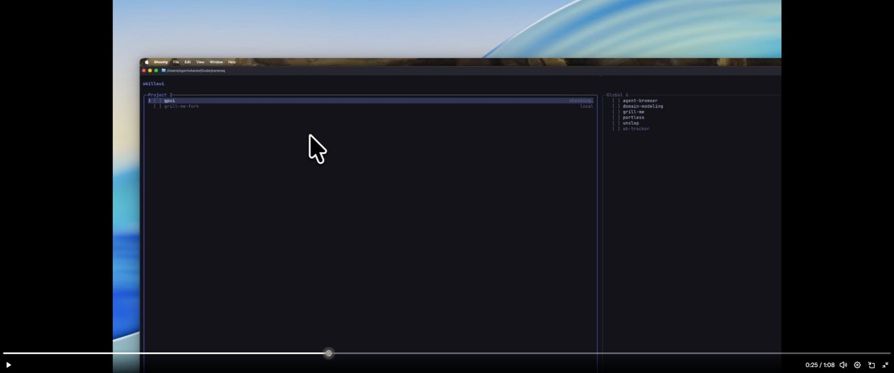

### 🎬 관련 영상
- [🎥 영상 보기](https://ph-files.imgix.net/6f1e349b-f1a1-4c26-969b-1db56a540940.jpeg?auto=format)

---

## 27. [Slack Code](https://www.producthunt.com/products/slack)
**Votes**: 3 | **도입 난이도**: 하 | **신뢰도**: 상
**Tagline**: Turn coding with AI into a team sport
**서비스 링크**: https://www.producthunt.com/r/PK3OD3UNRESDRE

**태그**: DevTool, AI, Collaboration, Slack, Agent, AI Tool, Chat

### 📌 이 서비스 한눈에 보기
AI 코딩 에이전트와 팀원들이 슬랙 채널에서 함께 협업하는 팀 중심 코딩 환경

### 🔑 주요 기능
- AI 코딩 에이전트와 팀원 간의 실시간 협업 채널 생성
- 코드 차이(diff) 리뷰, 라이브 프리뷰, 피드백 및 승인 프로세스 통합
- Claude, Devin, GitHub Copilot 등 다양한 AI 에이전트와 팀을 한곳으로 연결

### 🙋 사용자에게 어떤 점이 좋은가
개인 작업에 머물던 AI 코딩을 팀 단위의 협업으로 전환하여, 코드 리뷰와 승인 과정을 슬랙 내에서 간편하게 처리할 수 있습니다.

### ✅ 지금 바로 써볼 기능
- 슬랙 내 전용 코드 채널 생성 및 에이전트 연결
- 에이전트의 작업 과정 실시간 모니터링
- 슬랙에서 코드 diff 리뷰 및 승인 진행

### ⚠️ 사용 전 확인할 점
- 사용 중인 외부 AI 에이전트(Claude, Devin 등)와의 호환성 확인 필요
- 슬랙 내 코드 보안 및 권한 관리 정책 검토

### 🧭 확인이 더 필요한 정보
지원하는 외부 AI 에이전트 및 Vercel 등과의 구체적인 연동 방식과 보안 수준에 대한 추가 확인이 필요합니다.

### 📸 스크린샷 및 갤러리
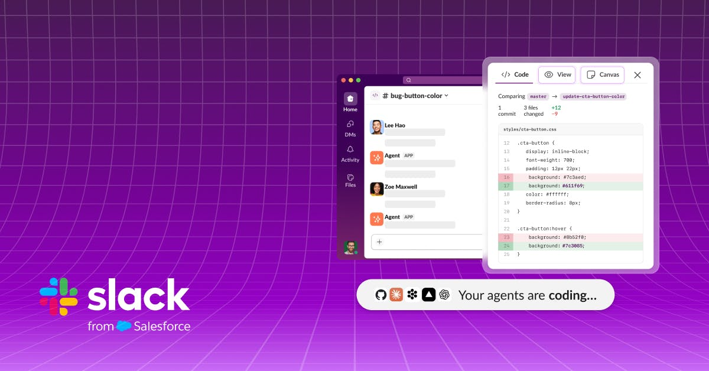

---

## 28. [The Jury](https://www.producthunt.com/products/the-jury)
**Votes**: 3 | **도입 난이도**: 하 | **신뢰도**: 상
**Tagline**: Four AI jurors rank products—never payments
**서비스 링크**: https://www.producthunt.com/r/DFEQSW74CQNPLA

**태그**: AI, Product Discovery, Leaderboard, Analytics, AI Tool, Design

### 📌 이 서비스 한눈에 보기
4개의 서로 다른 AI가 객관적인 기준으로 제품을 평가하는 독립적인 제품 리더보드

### 🔑 주요 기능
- Claude, GPT, Gemini, Grok 등 4대 AI 모델의 교차 검증 방식
- 독창성, 디자인, 명확성, 시장성, 바이럴, 신뢰도 등 다각도 점수 산출
- 광고나 스폰서십 없이 오직 데이터와 논리만으로 순위 결정

### 🙋 사용자에게 어떤 점이 좋은가
광고성 순위가 아닌, AI의 객관적인 분석을 통해 검증된 우수한 제품을 발견할 수 있습니다.

### ✅ 지금 바로 써볼 기능
- 카테고리별 제품 순위 확인하기
- AI 배심원별 개별 평가 및 근거 읽기
- 모델 간 의견 차이(Disagreement) 분석하기

### ⚠️ 사용 전 확인할 점
- AI 모델의 판단이 인간의 주관적 취향과 다를 수 있음
- 랜딩 페이지 데이터에 기반한 평가이므로 실제 제품 성능과는 차이가 있을 수 있음

### 🧭 확인이 더 필요한 정보
AI가 수집하는 랜딩 페이지 데이터의 범위와 업데이트 주기에 대한 정보가 필요합니다.

### 📸 스크린샷 및 갤러리
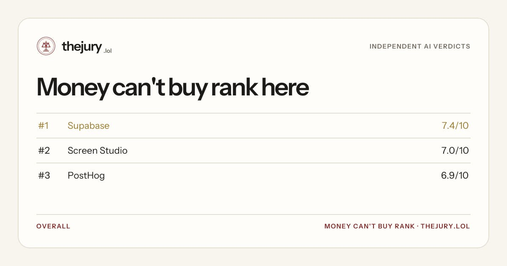
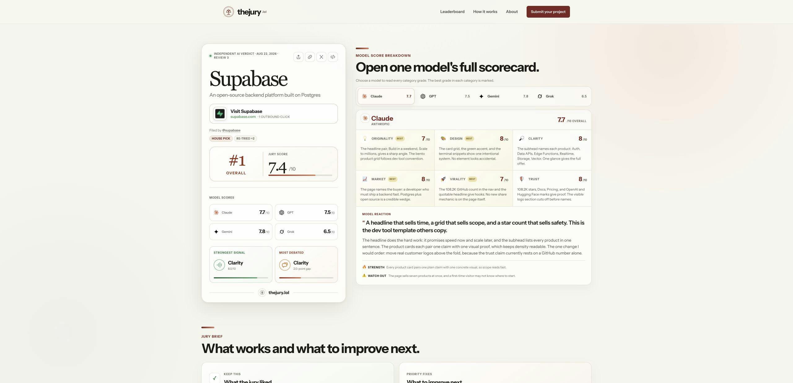
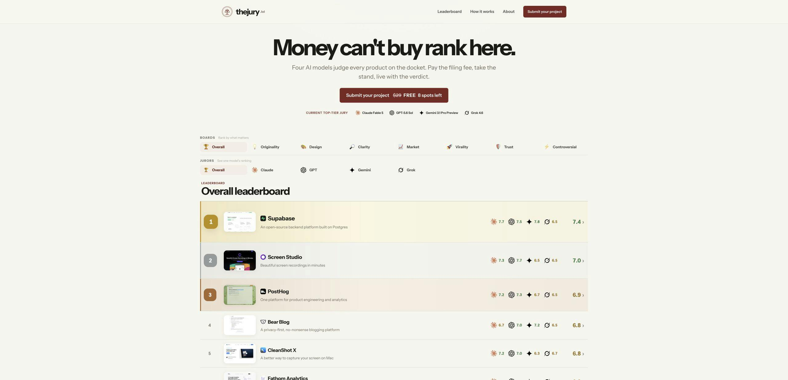

---

## 29. [Mittalmar](https://www.producthunt.com/products/mittalmar-youtube-software)
**Votes**: 3 | **도입 난이도**: 하 | **신뢰도**: 상
**Tagline**: Thumbnails in under 2 minutes
**서비스 링크**: https://www.producthunt.com/r/YZOHKD4TDJN3G6

**태그**: ContentCreation, Marketing, YouTube, Automation, AI Tool, Video

### 📌 이 서비스 한눈에 보기
창작자가 마케팅 고민 없이 2분 만에 매력적인 썸네일을 만들 수 있는 비디오 패키징 허브

### 🔑 주요 기능
- 콘텐츠 제작자가 마케팅 전문가로 변모할 수 있도록 지원
- 영상 클릭률을 결정짓는 썸네일, 제목, 각도 등 패키징 최적화
- 콘텐츠 본질을 해치지 않으면서도 시청자를 유입시키는 도구

### 🙋 사용자에게 어떤 점이 좋은가
영상 제작에만 집중하고 싶은 크리에이터가 클릭률(CTR)을 높이기 위한 번거로운 마케팅 과정을 자동화하고 효율화할 수 있습니다.

### ✅ 지금 바로 써볼 기능
- 2분 내 썸네일 생성 기능 테스트
- 영상 주제에 맞는 제목 및 각도 제안 확인
- 기존 영상의 패키징 개선 적용

### ⚠️ 사용 전 확인할 점
- 콘텐츠의 질적 향상이 아닌 외부 포장 위주의 도구임
- 사용자의 창의적 의도가 자동화 과정에서 반영되는지 확인 필요

### 🧭 확인이 더 필요한 정보
구체적인 썸네일 생성 방식(AI 기반 여부 등)과 지원하는 플랫폼/포맷에 대한 상세 정보가 필요합니다.

### 📸 스크린샷 및 갤러리
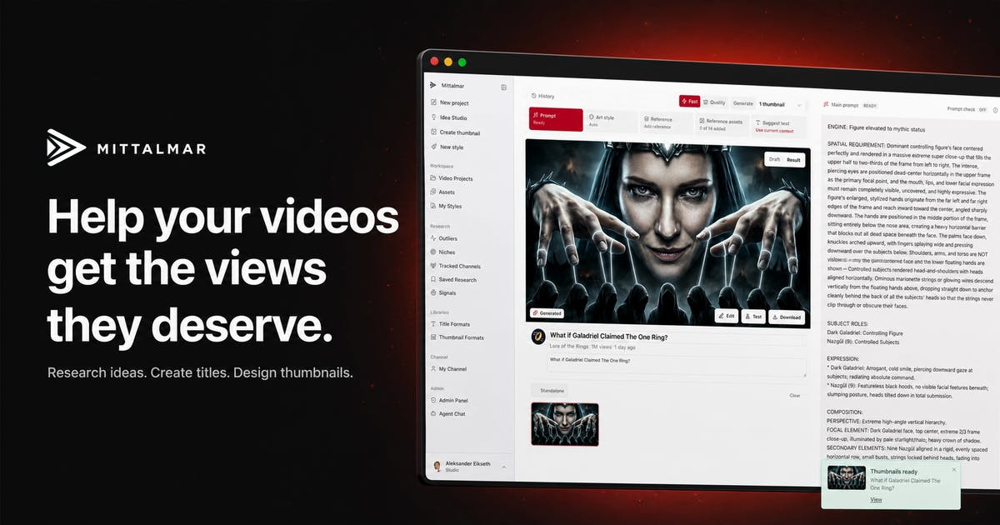

### 🎬 관련 영상
- [🎥 영상 보기](https://ph-files.imgix.net/4ea0e4c5-50f7-47b2-9640-e5e344979010.jpeg?auto=format)

---

## 30. [Inferbench](https://www.producthunt.com/products/inferbench)
**Votes**: 2 | **도입 난이도**: 하 | **신뢰도**: 상
**Tagline**: Benchmarks local LLM engines on your hardware
**서비스 링크**: https://www.producthunt.com/r/TWMWVIQSWBDF25

**태그**: DevTool, LLM, Benchmarking, CLI, Prompting

### 📌 이 서비스 한눈에 보기
내 하드웨어에서 로컬 LLM 엔진의 실제 성능을 측정하고 최적의 설정을 찾아주는 CLI 도구

### 🔑 주요 기능
- 로컬 하드웨어 기반의 실측 토큰 생성 속도(TPS) 제공
- llama.cpp, omlx 등 다양한 LLM 추론 엔진 자동 감지 및 벤치마킹
- 사용자 환경에 최적화된 가장 빠른 설정값 추천

### 🙋 사용자에게 어떤 점이 좋은가
외부 지표가 아닌 실제 내 컴퓨터에서의 성능을 직접 확인할 수 있어, 하드웨어 자원을 가장 효율적으로 사용하는 LLM 구동 방식을 결정할 수 있습니다.

### ✅ 지금 바로 써볼 기능
- CLI 설치 및 환경 설정
- 로컬 LLM 엔진 자동 감지 기능 실행
- 제공되는 프롬프트 세트를 통한 성능 테스트

### ⚠️ 사용 전 확인할 점
- CLI 기반 도구이므로 터미널 환경 숙련도 필요
- 벤치마크 실행 시 하드웨어 자원(GPU/CPU) 점유율이 높을 수 있음

### 🧭 확인이 더 필요한 정보
지원하는 구체적인 하드웨어 사양 및 엔진 종류의 전체 목록은 공식 문서를 통해 확인이 필요합니다.

### 📸 스크린샷 및 갤러리
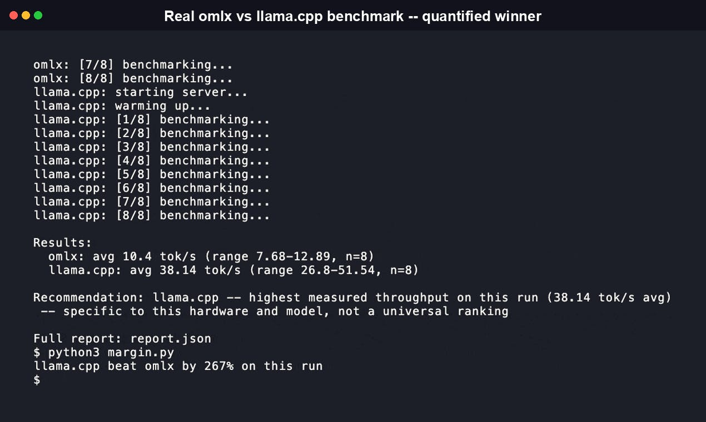
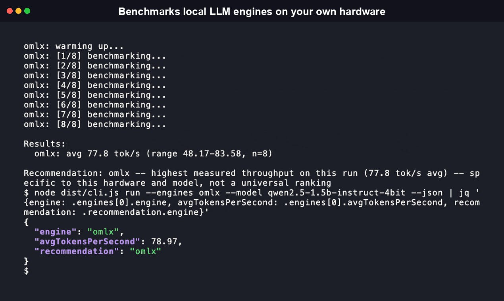
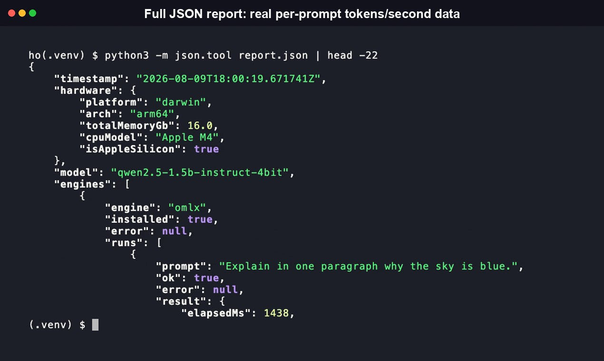

---

