# 🚀 Product Hunt Daily Top 30 (2026-08-26)

## 오늘의 요약
오늘의 트렌드는 AI 에이전트가 단순한 보조를 넘어 코딩, 온보딩, 데이터 분석 등 실무를 자율적으로 수행하는 '에이전트 경제'로의 진화가 두드러졌습니다. 또한, 클라우드 의존도를 낮춘 온디바이스 AI와 개발 생산성을 극대화하는 차세대 IDE 및 자동화 도구들이 주목받았습니다.

### 오늘의 핵심 포인트
- AI 에이전트가 코딩, 사용자 온보딩, 데이터 분석 등 복잡한 워크플로우를 스스로 수행하며 인간의 개입을 최소화하는 방향으로 발전하고 있습니다.
- LLM 사용량 제한 관리, 실시간 에이전트 실패 감지, 코드 관계 시각화 등 AI 운영의 효율성과 신뢰성을 높이는 도구들이 등장했습니다.
- 개인정보 보호를 위한 온디바이스 AI와 데이터 보안을 중시하는 로컬 중심의 개발 환경이 중요한 가치로 부각되었습니다.

**오늘의 태그**: AI Agent, Developer Tools, Automation, Data Intelligence, Privacy

## 1. [akta.pro](https://www.producthunt.com/products/akta-pro)
**Votes**: 326 | **도입 난이도**: 중 | **신뢰도**: 상
**Tagline**: Private company data and signals API for the agent economy
**서비스 링크**: https://www.producthunt.com/r/7VLENQJQZQK4EG

**태그**: Data API, FinTech, Sales Intelligence, B2B, Agent, API

### 📌 이 서비스 한눈에 보기
PitchBook보다 깊고 넓은 비상장 기업 데이터와 실시간 시그널을 제공하는 API 서비스

### 🔑 주요 기능
- PitchBook 대비 4배의 깊이와 2배의 커버리지를 제공하는 비상장 기업 데이터
- 기업, 산업, 주제별 100개 이상의 이벤트 시그널 및 뉴스 제공
- 금융 서비스 및 GTM(영업/마케팅) 팀을 위한 데이터 소싱 및 실사 지원

### 🙋 사용자에게 어떤 점이 좋은가
금융 전문가나 영업 팀이 정교한 딜 소싱, 실사, 타겟 아웃바운드 리스트를 구축할 때 강력한 데이터 기반을 제공합니다.

### ✅ 지금 바로 써볼 기능
- API를 통한 기업 데이터 추출 테스트
- 실시간 이벤트 시그널 기반의 타겟 리스트 생성
- 사용량 기반 요금제(Pay-as-you-go) 비용 시뮬레이션

### ⚠️ 사용 전 확인할 점
- 데이터의 정확성과 최신성에 대한 검증 필요
- 사용량 기반 요금제이므로 데이터 호출량에 따른 비용 급증 가능성

### 🧭 확인이 더 필요한 정보
PitchBook과의 구체적인 데이터 비교 지표와 API 연동 방식에 대한 상세 문서 확인이 필요합니다.

### 📸 스크린샷 및 갤러리
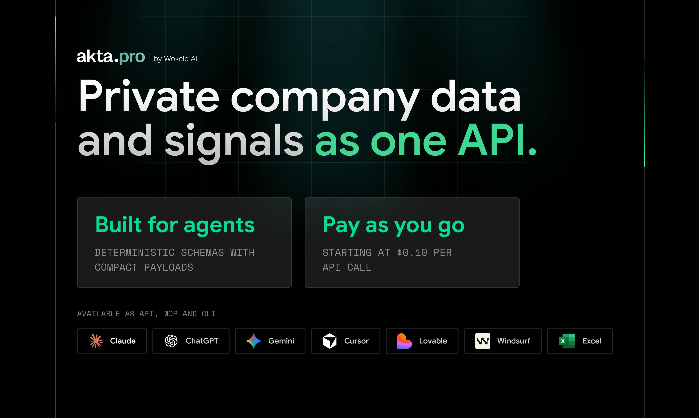
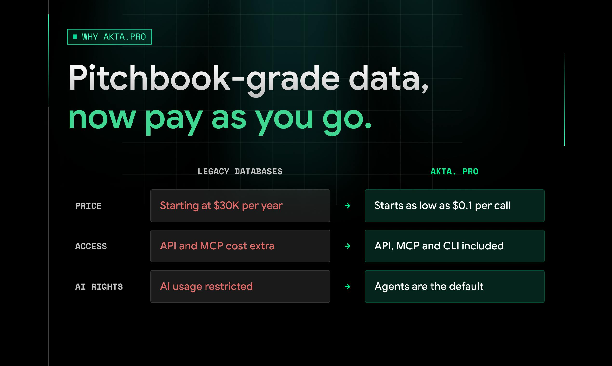
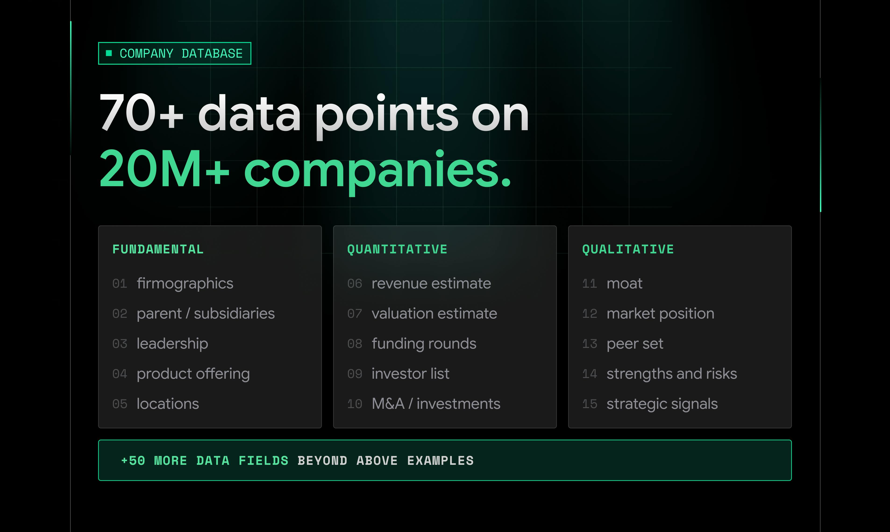

### 🎬 관련 영상
- [🎥 영상 보기](https://ph-files.imgix.net/3f5a3318-1b4c-4bf1-b3a2-a9a6eabbc08b.jpeg?auto=format)

---

## 2. [Diet Claude](https://www.producthunt.com/products/diet-claude)
**Votes**: 300 | **도입 난이도**: 하 | **신뢰도**: 상
**Tagline**: Never get blindsided by Claude's usage limits again
**서비스 링크**: https://www.producthunt.com/r/FBBFOTHWP2O4QH

**태그**: AI, Productivity, LLM, Workflow, AI Tool, Prompting

### 📌 이 서비스 한눈에 보기
Claude 사용량 제한 문제를 해결하고 작업 흐름을 끊김 없이 유지해주는 스마트 관리 도구

### 🔑 주요 기능
- 실시간 사용량 미터기를 통한 남은 시간 및 리셋 시점 확인
- 컨텍스트 트리밍 및 프롬프트 최적화를 통한 토큰 효율 극대화
- 제한 도달 시 대화 맥락을 유지하며 다른 LLM으로 자동 전환

### 🙋 사용자에게 어떤 점이 좋은가
작업 도중 갑작스러운 사용량 제한으로 흐름이 끊기는 문제를 방지하고, 효율적인 토큰 관리를 통해 더 오래 대화를 이어갈 수 있습니다.

### ✅ 지금 바로 써볼 기능
- 실시간 미터기로 남은 사용량 모니터링하기
- 제안된 최적화 기능을 통해 토큰 소모 줄이기
- 제한 발생 시 타 모델로의 컨텍스트 전환 기능 테스트하기

### ⚠️ 사용 전 확인할 점
- 타 모델로의 컨텍스 전환 시 모델 간 성능 차이가 발생할 수 있음
- 사용량 최적화 기능이 원래의 대화 품질에 미치는 영향 확인 필요

### 🧭 확인이 더 필요한 정보
제공되는 타 LLM 모델의 종류와 컨텍스트 이전 방식의 상세 메커니즘에 대한 정보가 부족합니다.

### 📸 스크린샷 및 갤러리

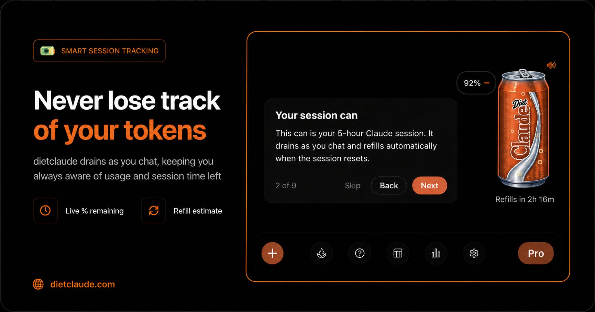
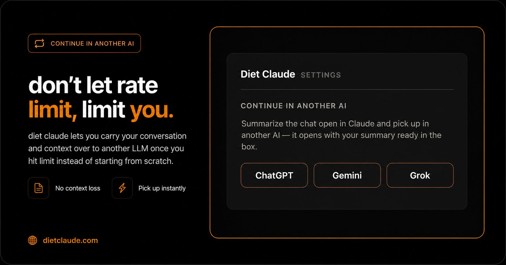

### 🎬 관련 영상
- [🎥 영상 보기](https://ph-files.imgix.net/e8560c88-c23d-42a4-8208-f98955b1f68d.jpeg?auto=format)

---

## 3. [Agnost AI](https://www.producthunt.com/products/agnost-ai)
**Votes**: 207 | **도입 난이도**: 중 | **신뢰도**: 상
**Tagline**: Catch agent failures your evals miss
**서비스 링크**: https://www.producthunt.com/r/ETAPVE6UI3URIT

**태그**: AI-Agents, Observability, Analytics, DevTools, Agent, AI Tool

### 📌 이 서비스 한눈에 보기
실제 사용자 대화를 분석하여 AI 에이전트의 숨겨진 실패와 개선점을 찾아내는 관측 도구

### 🔑 주요 기능
- 실제 운영 환경의 대화 데이터 분석을 통한 미세한 실패 및 드리프트 감지
- 환각, 사용자 불만, 숨겨진 기능 요청 등 복합적인 인사이트 도출
- 발견된 문제를 반복되는 패턴으로 그룹화하고 즉각적인 평가(evals)로 전환

### 🙋 사용자에게 어떤 점이 좋은가
기존의 정적 테스트로는 잡기 어려운 실제 사용자 환경에서의 AI 에이전트 문제를 식별하고, 이를 제품 개선과 평가 데이터로 즉시 연결할 수 있습니다.

### ✅ 지금 바로 써볼 기능
- 운영 중인 AI 에이전트 대화 로그 연동
- 패턴화된 실패 사례 및 사용자 불만 지점 확인
- 발견된 인사이트를 기반으로 한 새로운 에이전트 평가(evals) 세트 구축

### ⚠️ 사용 전 확인할 점
- 실제 사용자 대화 데이터를 분석하므로 개인정보 보호 및 보안 정책 확인 필요
- 데이터 양에 따른 분석 정확도 및 비용 구조 확인 필요

### 🧭 확인이 더 필요한 정보
데이터 연동 방식(API, 로그 업로드 등)과 보안 처리 방식에 대한 구체적인 정보가 필요합니다.

### 📸 스크린샷 및 갤러리
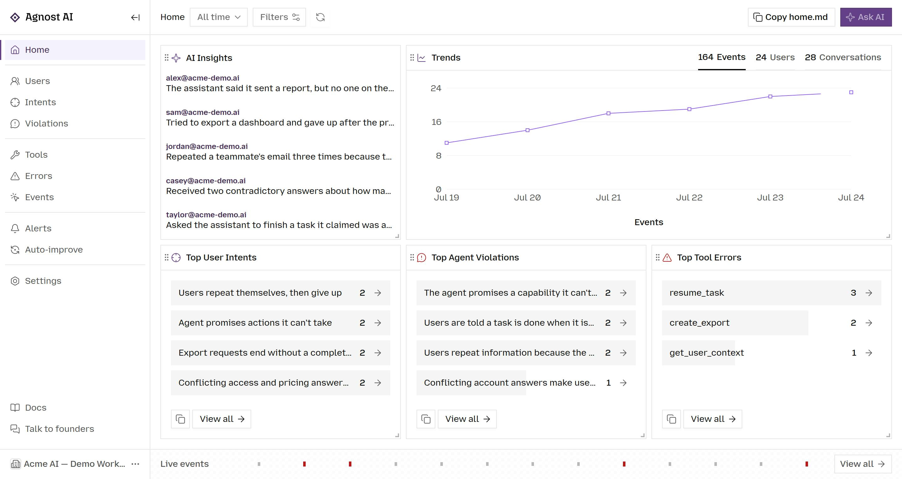
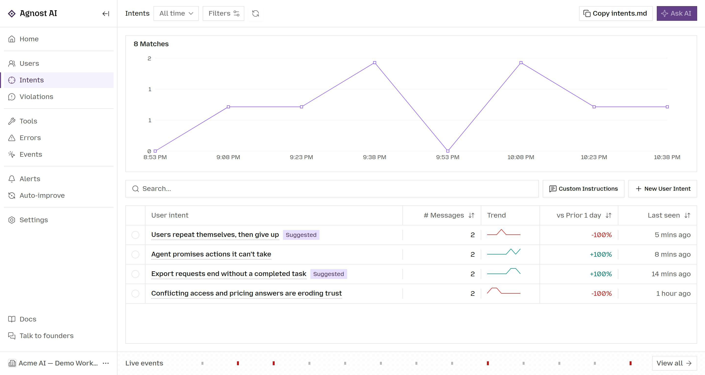
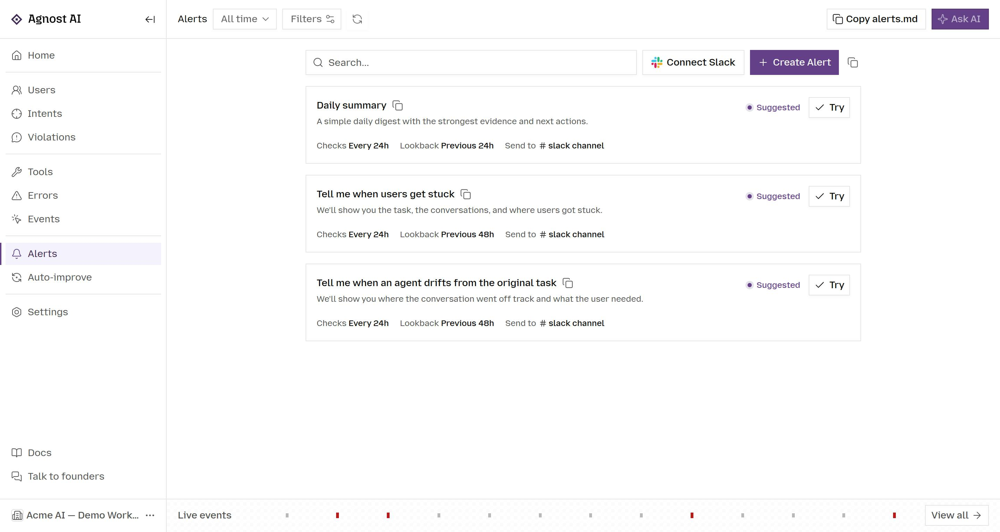

### 🎬 관련 영상
- [🎥 영상 보기](https://ph-files.imgix.net/21f7e085-f65a-4641-a00d-65b7b6801e7c.jpeg?auto=format)

---

## 4. [Jotform AI Data Assistant](https://www.producthunt.com/products/jotform)
**Votes**: 199 | **도입 난이도**: 하 | **신뢰도**: 상
**Tagline**: Turn form data into insights and action with AI
**서비스 링크**: https://www.producthunt.com/r/2IXJ3KDUVPWSJK

**태그**: AI, Automation, Data Analysis, NoCode, AI Tool

### 📌 이 서비스 한눈에 보기
복잡한 수식 없이 자연어로 폼 데이터를 분석하고 자동화하는 AI 데이터 비서

### 🔑 주요 기능
- 자연어 대화를 통한 데이터 분석, 표 생성 및 데이터 정리
- 데이터 트렌드 파악, 차트 생성 및 응답 요약 기능 제공
- Jotform Tables 및 Inbox에 내장되어 워크플로우 효율성 극대화

### 🙋 사용자에게 어떤 점이 좋은가
복잡한 필터나 수식을 배울 필요 없이 질문만으로 수집된 데이터를 즉시 인사이트로 전환할 수 있습니다.

### ✅ 지금 바로 써볼 기능
- 수집된 응답 데이터 요약 요청하기
- 자연어로 데이터 시각화(차트 생성) 시도하기
- 대량의 레코드 일괄 업데이트 및 정리하기

### ⚠️ 사용 전 확인할 점
- AI 생성 결과물의 데이터 정확성 검증 필요
- 데이터 보안 및 개인정보 처리 방침 확인 필요

### 🧭 확인이 더 필요한 정보
데이터 양에 따른 처리 속도나 고급 분석 기능의 세부 제한 사항은 명시되지 않았습니다.

### 📸 스크린샷 및 갤러리
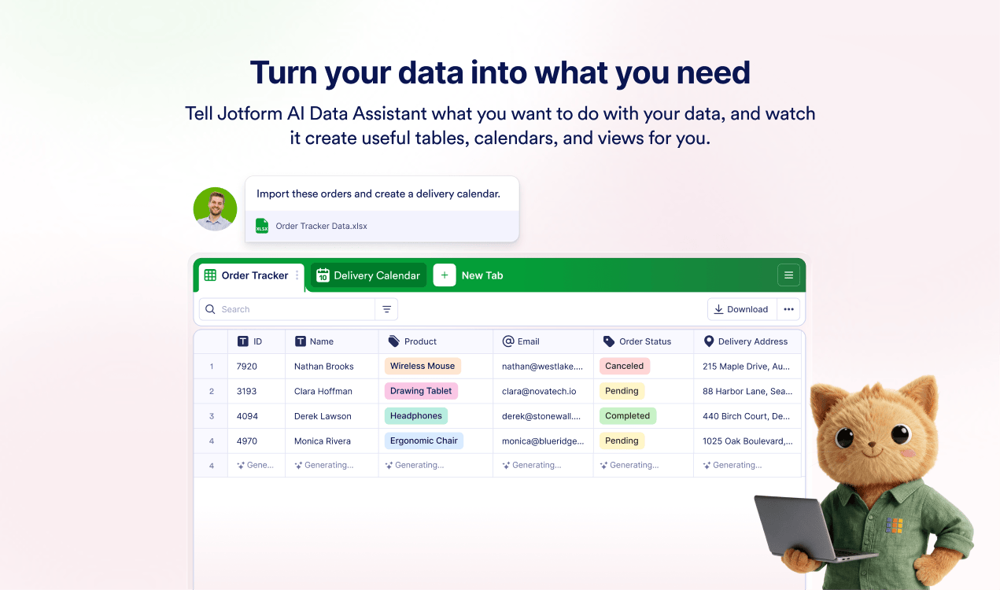
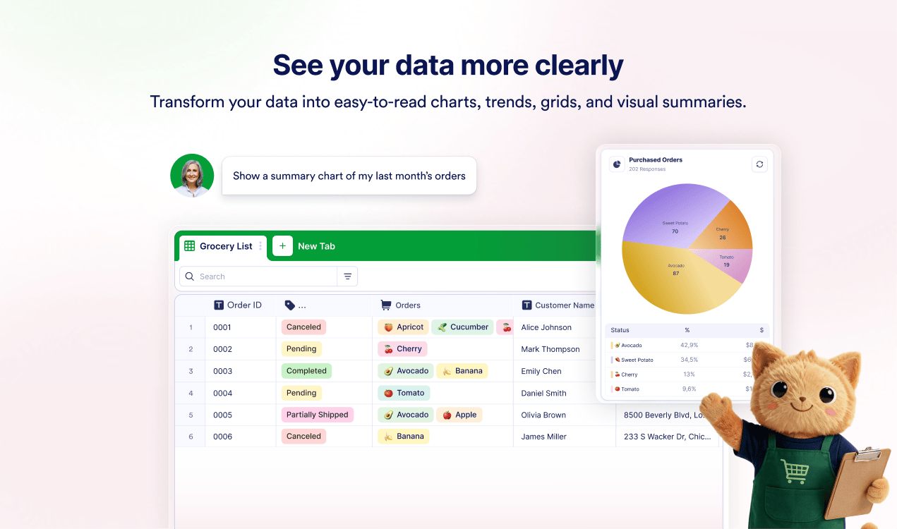
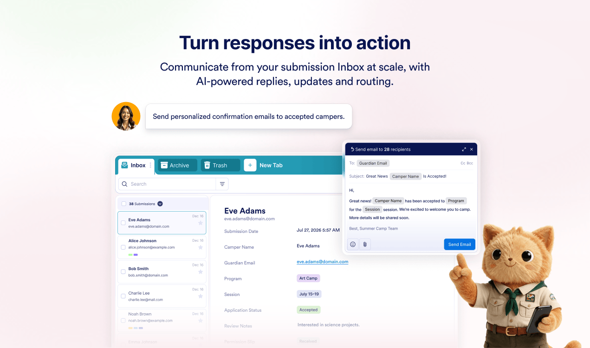

### 🎬 관련 영상
- [🎥 영상 보기](https://ph-files.imgix.net/a4a5e482-cc8a-41bf-a218-297cb5b806a0.jpeg?auto=format)

---

## 5. [Nimbia](https://www.producthunt.com/products/nimbia)
**Votes**: 148 | **도입 난이도**: 중 | **신뢰도**: 상
**Tagline**: AI screen-sharing calls for user onboarding
**서비스 링크**: https://www.producthunt.com/r/5GM7KP7RMUFRD6

**태그**: AI, Onboarding, SaaS, Automation, AI Tool

### 📌 이 서비스 한눈에 보기
사용자 온보딩과 교육을 자동화하는 AI 화면 공유 에이전트

### 🔑 주요 기능
- 사용자의 화면을 보고 듣고 직접 클릭할 수 있는 능동형 AI
- 소프트웨어 신규 사용자를 위한 실시간 온보딩 및 교육 수행
- A/B 테스트 결과, 활성화 및 유료 전환율 향상 입증

### 🙋 사용자에게 어떤 점이 좋은가
수동적인 가이드 대신 AI가 직접 화면을 제어하며 교육하므로, 사용자 온보딩 과정의 이탈을 줄이고 전환율을 높일 수 있습니다.

### ✅ 지금 바로 써볼 기능
- 기존 온보딩 프로세스와의 A/B 테스트 진행
- AI의 화면 제어 및 클릭 기능 보안성 검토
- 사용자 가이드 시나리오 설정

### ⚠️ 사용 전 확인할 점
- AI가 사용자의 화면을 직접 제어하므로 개인정보 및 보안 정책 확인 필요
- 복잡한 UI 환경에서의 클릭 정확도 및 안정성 검증 필요

### 🧭 확인이 더 필요한 정보
AI의 화면 제어 권한 부여 시 발생할 수 있는 보안 및 프라이버시 보호 수준에 대한 구체적인 정보가 필요합니다.

### 📸 스크린샷 및 갤러리
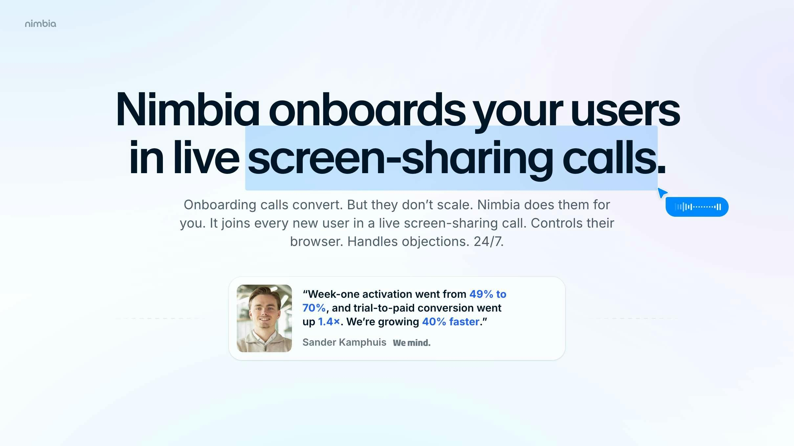
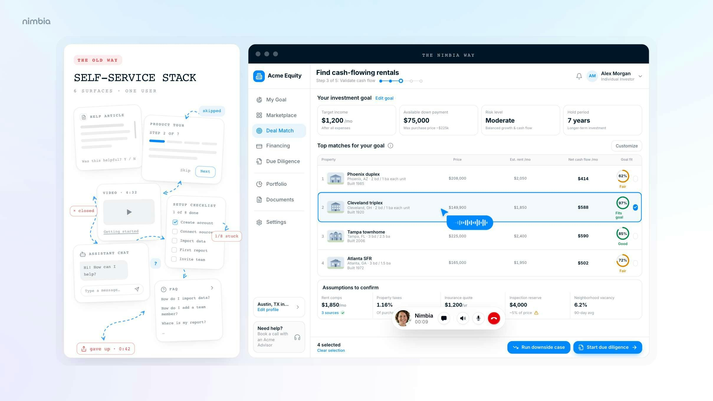
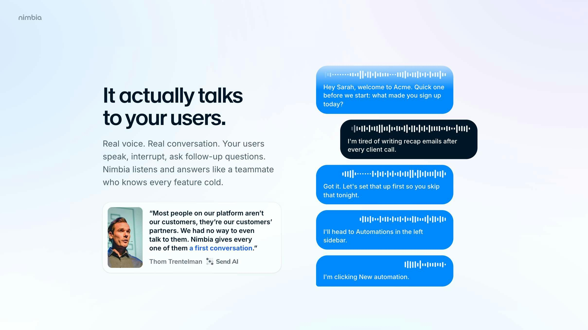

### 🎬 관련 영상
- [🎥 영상 보기](https://ph-files.imgix.net/eeb877b9-710c-4bf0-8b38-af36cea38dc2.jpeg?auto=format)

---

## 6. [Memoria](https://www.producthunt.com/products/memoria-5)
**Votes**: 131 | **도입 난이도**: 하 | **신뢰도**: 상
**Tagline**: Search photos by text, speech, object & faces. 100% offline.
**서비스 링크**: https://www.producthunt.com/r/2LUVN6DSPZLZVG

**태그**: Privacy, AI, Search, Productivity, Offline, AI Tool, Video

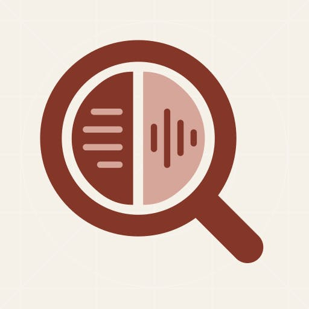

### 📌 이 서비스 한눈에 보기
클라우드 없이 내 기기 안에서 텍스트, 음성, 사물로 사진을 찾는 강력한 오프라인 검색 엔진

### 🔑 주요 기능
- 100% 온디바이스 AI를 통한 프라이버시 보호 및 오프라인 작동
- 영상 속 음성 전사 및 스크린샷 내 텍스트 인식 기능
- 얼굴 및 사물 인식을 통한 직관적인 미디어 검색

### 🙋 사용자에게 어떤 점이 좋은가
개인적인 사진과 영상이 클라우드에 업로드되지 않아 보안이 철저하며, 말이나 글자로 원하는 순간을 즉시 찾을 수 있어 탐색 시간을 획기적으로 줄여줍니다.

### ✅ 지금 바로 써볼 기능
- 과거 영상 속 대화 내용으로 특정 장면 찾기
- 스크린샷 속 텍스트 검색으로 정보 추출하기
- 얼굴 및 사물 인식을 통한 앨범 정리하기

### ⚠️ 사용 전 확인할 점
- 온디바이스 AI 구동을 위한 기기 사양(CPU/NPU) 영향 확인 필요
- 로컬 저장소 용량 사용량 확인 필요

### 🧭 확인이 더 필요한 정보
지원하는 운영체제(iOS/Android/PC) 및 구체적인 하드웨어 요구 사양에 대한 정보가 명시되지 않았습니다.

### 📸 스크린샷 및 갤러리

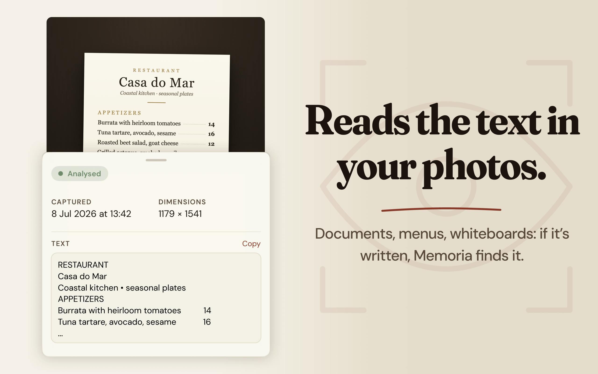

### 🎬 관련 영상
- [🎥 영상 보기](https://ph-files.imgix.net/8d291b4b-82a1-4127-bf2a-0f4f74951abc.jpeg?auto=format)

---

## 7. [coolplugz](https://www.producthunt.com/products/coolplugz)
**Votes**: 124 | **도입 난이도**: 중 | **신뢰도**: 상
**Tagline**: A Claude orchestrator that saves developers loads of time
**서비스 링크**: https://www.producthunt.com/r/YMM5QLG2OGVHU6

**태그**: DevTool, AI, Automation, Productivity, Prompting

### 📌 이 서비스 한눈에 보기
개발자의 개입 없이 코딩 작업을 완수하는 Claude 기반 자동화 오케스트레이터

### 🔑 주요 기능
- Claude Code를 가이드하여 코딩 작업을 자율적으로 수행
- Jira, GitHub, Notion, Slack의 컨텍스트 자동 수집
- 프롬프트 작성부터 작업 완료 검증까지 자동화

### 🙋 사용자에게 어떤 점이 좋은가
개발자가 일일이 프롬프트를 입력하거나 컨텍스트를 전달할 필요 없이, 도구가 알아서 맥락을 파악하고 코드를 작성하여 업무 시간을 획기적으로 단축해 줍니다.

### ✅ 지금 바로 써볼 기능
- 외부 도구(Jira, GitHub 등) 연동 설정하기
- 자동화된 코딩 작업 워크플로우 테스트하기
- 생성된 코드의 검증 결과 확인하기

### ⚠️ 사용 전 확인할 점
- 외부 플랫폼(Slack, Notion 등)에 대한 접근 권한 설정 필요
- 자동화된 코드 생성에 따른 수동 검토 필요성

### 🧭 확인이 더 필요한 정보
Claude Code와의 구체적인 연동 방식 및 보안 정책에 대한 상세 정보가 필요합니다.

### 📸 스크린샷 및 갤러리
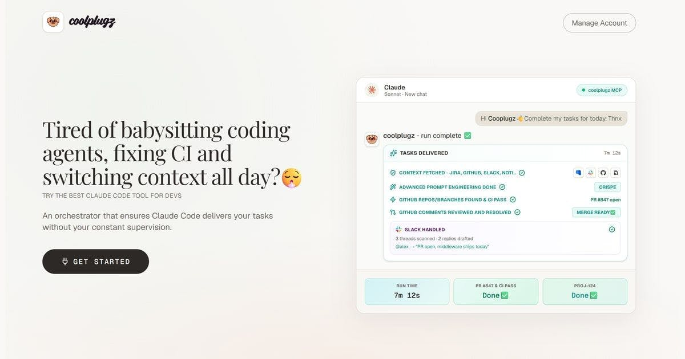
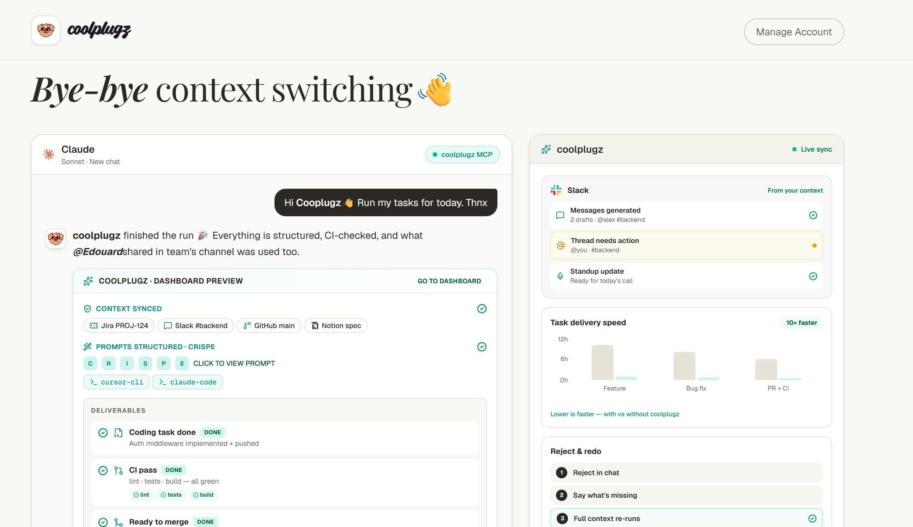
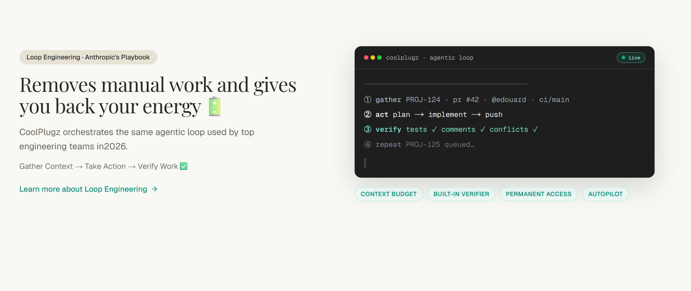

### 🎬 관련 영상
- [🎥 영상 보기](https://ph-files.imgix.net/5eab66b4-28ea-4a39-b79f-d8f87bf22b4a.jpeg?auto=format)

---

## 8. [Flare](https://www.producthunt.com/products/flare-11)
**Votes**: 113 | **도입 난이도**: 중 | **신뢰도**: 상
**Tagline**: The graph-first IDE and interactive map for agentic coding
**서비스 링크**: https://www.producthunt.com/r/Q57SMSGYJL2BXW

**태그**: DevTool, AI-Coding, OpenSource, IDE, Agent, Chat

### 📌 이 서비스 한눈에 보기
코드 간의 관계를 시각적 그래프로 관리하며 에이전트 기반 코딩을 수행하는 차세대 IDE

### 🔑 주요 기능
- 파일과 임포트 관계를 노드와 엣지로 시각화하는 그래프 중심 인터페이스
- 에이전트의 코드 수정 사항을 실시간 그래프로 반영 및 변경 사항 추적
- 로컬 환경 중심의 보안(No account) 및 MIT 라이선스 오픈소스

### 🙋 사용자에게 어떤 점이 좋은가
단순 채팅 로그가 아닌 코드 구조의 변화를 시각적으로 파악하며 에이전트와 협업할 수 있어 복잡한 코드베이스 관리가 용이합니다.

### ✅ 지금 바로 써볼 기능
- 그래프 뷰를 통한 프로젝트 구조 시각화 확인
- 에이전트 작업에 따른 실시간 그래프 업데이트 테스트
- 변경 버스트(Change bursts) 스냅샷을 통한 로컬 히스토리 비교

### ⚠️ 사용 전 확인할 점
- 그래프 기반 UI가 기존 텍스트 중심 개발 워크플로우와 상충할 수 있음
- 에이전트가 대규모 코드를 수정할 시 발생하는 영향도 파악 필요

### 🧭 확인이 더 필요한 정보
현재 제공되는 에이전트 모델(Claude, Codex 등)의 구체적인 연동 방식과 로컬 리소스 점유율에 대한 정보가 부족합니다.

### 📸 스크린샷 및 갤러리
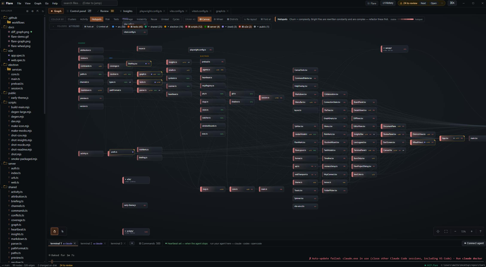
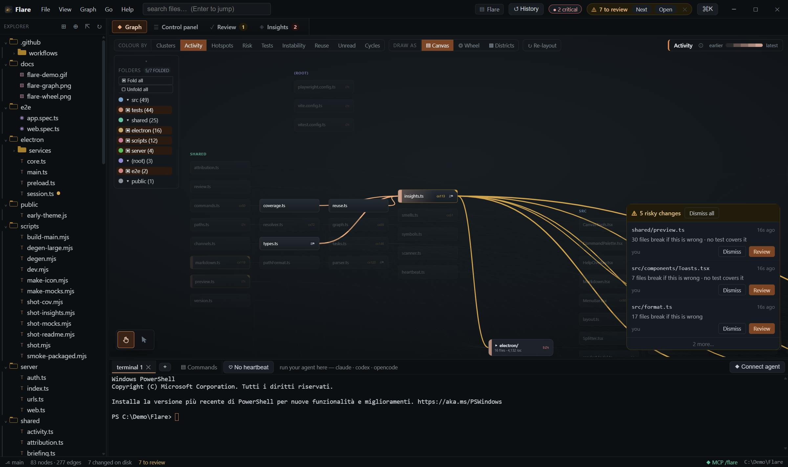
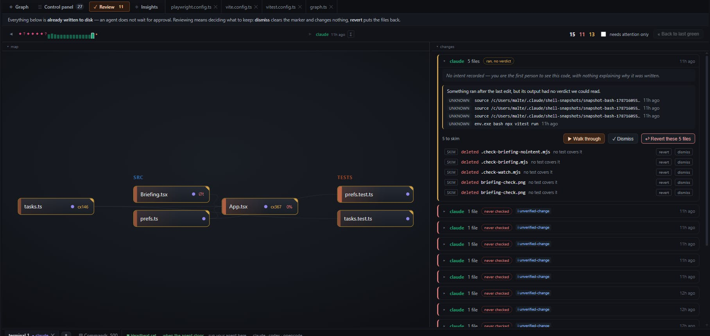

### 🎬 관련 영상
- [🎥 영상 보기](https://ph-files.imgix.net/a9232644-8d3c-4481-8b88-ba0146be44b3.jpeg?auto=format)

---

## 9. [Ninjō AI](https://www.producthunt.com/products/ninjo-ai)
**Votes**: 113 | **도입 난이도**: 하 | **신뢰도**: 상
**Tagline**: AI sales agents on any channel that runs from Claude Code
**서비스 링크**: https://www.producthunt.com/r/5OOMHTQENABQUM

**태그**: SalesAutomation, AI-Agent, NoCode, CRM, DevTool, Agent, AI Tool, Chat, Sales

### 📌 이 서비스 한눈에 보기
Claude Code와 연동하여 인스타그램, WhatsApp 등 다양한 채널에서 즉시 작동하는 AI 영업 에이전트 구축 인프라

### 🔑 주요 기능
- Claude Code, ChatGPT, MCP 등을 통한 대화형 에이전트 생성 및 테스트
- 150개 이상의 실전 사례로 검증된 템플릿 제공
- 버전 관리(Rollback), 합성 대화 테스트, 키워드 트리거 및 내장 CRM 기능 탑재

### 🙋 사용자에게 어떤 점이 좋은가
복잡한 코딩 없이 대화만으로 영업 자동화 에이전트를 구축할 수 있어, 판매 채널 운영 시간을 획기적으로 줄여줍니다.

### ✅ 지금 바로 써볼 기능
- 무료 제공되는 1,000개 메시지로 에이전트 생성 테스트하기
- 검증된 템플릿을 활용해 판매 채널에 에이전트 배포하기
- 합성 대화 테스트 기능을 통해 에이전트 응답 품질 검증하기

### ⚠️ 사용 전 확인할 점
- 사용 중인 판매 채널(Instagram, WhatsApp 등)의 API 정책 준수 여부 확인 필요
- 무료 메시지 소진 후의 과금 체계 확인 필요

### 🧭 확인이 더 필요한 정보
제공되는 템플릿이 사용자의 특정 산업군이나 판매 방식에 얼마나 최적화되어 있는지 확인이 필요합니다.

### 📸 스크린샷 및 갤러리
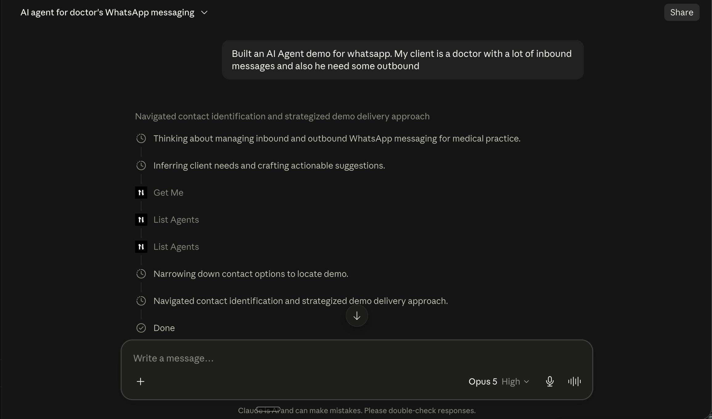
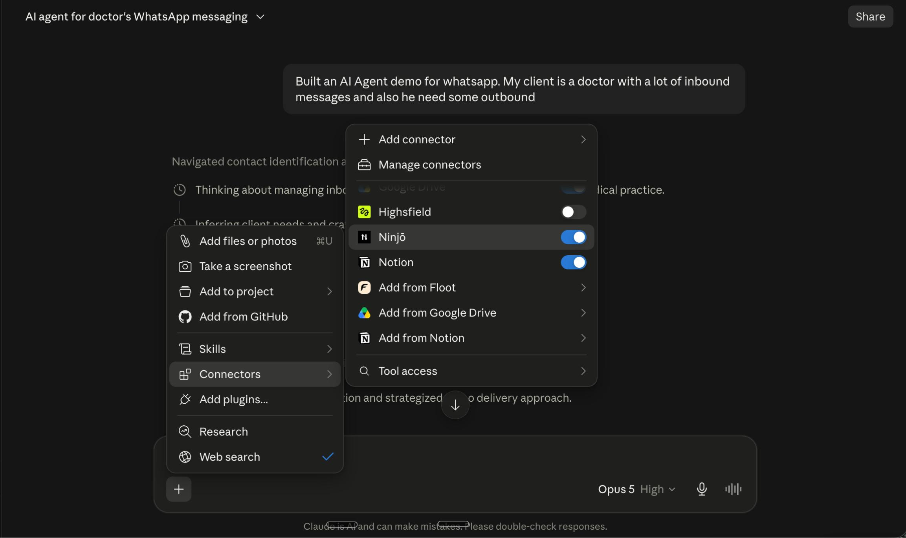
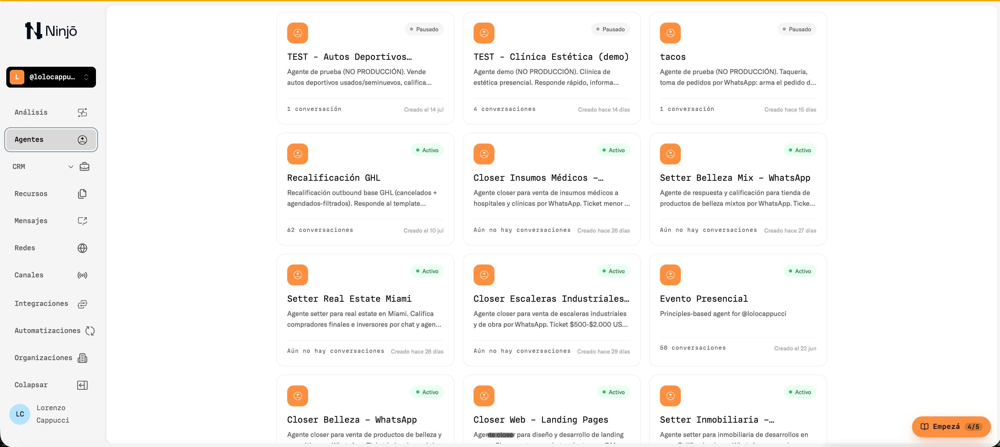

---

## 10. [Purchase API by Agentcard](https://www.producthunt.com/products/agent-card)
**Votes**: 111 | **도입 난이도**: 하 | **신뢰도**: 상
**Tagline**: one API call and your agent buys anything online
**서비스 링크**: https://www.producthunt.com/r/XZKGFALU5JJJ4O

**태그**: DevTool, Automation, AI-Agent, Fintech, Agent, API

### 📌 이 서비스 한눈에 보기
단 한 번의 API 호출로 온라인 결제와 구매를 자동화하는 에이전트용 결제 솔루션

### 🔑 주요 기능
- 단일 API 호출로 제품 검색부터 결제까지 전 과정 자동화
- 일회용 카드를 사용하여 보안 및 결제 프로세스 관리
- Amazon, DoorDash, Shopify 및 Stripe 기반 스토어와 호환

### 🙋 사용자에게 어떤 점이 좋은가
AI 에이전트가 복잡한 결제 단계 없이도 실제 온라인 쇼핑을 수행할 수 있게 하여 자동화 워크플로우를 완성해 줍니다.

### ✅ 지금 바로 써볼 기능
- agentcard.sh에서 첫 무료 주문 테스트하기
- 기존 AI 에이전트 워크플로우에 구매 API 연동하기

### ⚠️ 사용 전 확인할 점
- 지원되는 쇼핑몰 및 결제 플랫폼 범위 확인 필요
- 일회용 카드 결제 방식에 따른 환불/취소 프로세스 확인 필요

### 🧭 확인이 더 필요한 정보
현재 지원되는 모든 쇼핑몰 플랫폼과 결제 보안 정책의 상세 범위를 확인해야 합니다.

### 📸 스크린샷 및 갤러리

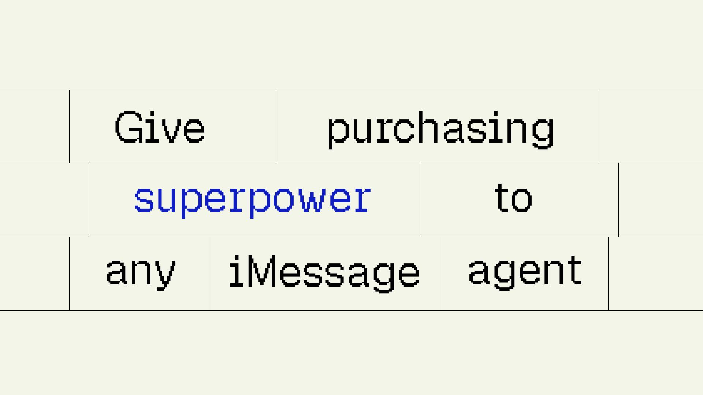

---

## 11. [Altar II](https://www.producthunt.com/products/electronic-materials-office-altar-i)
**Votes**: 108 | **도입 난이도**: 하 | **신뢰도**: 상
**Tagline**: The mechanical keyboard Apple never made
**서비스 링크**: https://www.producthunt.com/r/AJSTJ4ISNT6DBT

**태그**: Hardware, Mechanical Keyboard, Design, Productivity

### 📌 이 서비스 한눈에 보기
애플의 디자인 감성과 기계식 키보드의 타건감을 결합한 초슬림 기계식 키보드

### 🔑 주요 기능
- 애플 스타일의 미니멀하고 세련된 디자인
- 놀라울 정도로 얇은 두께의 초슬림 설계
- 기계식 키보드 특유의 탁월한 타건 경험 제공

### 🙋 사용자에게 어떤 점이 좋은가
데스크테리어의 완성도를 높이면서도, 얇은 두께와 기계식의 손맛을 동시에 원하는 사용자에게 최적의 작업 환경을 제공합니다.

### ✅ 지금 바로 써볼 기능
- 디자인과 타건감의 조화 확인
- 데스크 공간 활용도 체크
- 기계식 키보드로서의 기능성 검토

### ⚠️ 사용 전 확인할 점
- 초슬림 설계로 인한 키 스트로크 깊이(Travel distance) 제약 가능성
- 디자인 중심 설계에 따른 유지보수 및 확장성 확인 필요

### 🧭 확인이 더 필요한 정보
상세한 하드웨어 사양(스위치 종류, 연결 방식 등)에 대한 정보가 부족합니다.

### 📸 스크린샷 및 갤러리

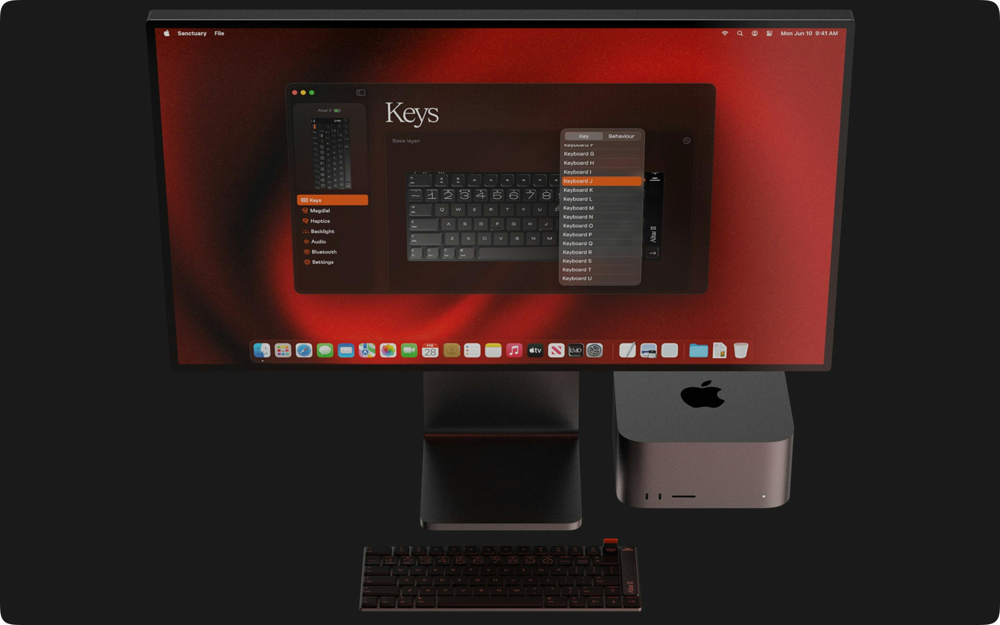

### 🎬 관련 영상
- [🎥 영상 보기](https://ph-files.imgix.net/01f0ac5d-380f-4efa-96ee-9e325ee9aa12.jpeg?auto=format)

---

## 12. [Marble MCP](https://www.producthunt.com/products/marble-7)
**Votes**: 91 | **도입 난이도**: 하 | **신뢰도**: 상
**Tagline**: Manage your CMS content from Claude, Cursor, and Codex
**서비스 링크**: https://www.producthunt.com/r/RTXOM7N7BNMKCO

**태그**: DevTool, AI, CMS, Automation, AI Tool

### 📌 이 서비스 한눈에 보기
AI 코딩 도구 내에서 CMS 콘텐츠를 직접 관리할 수 있는 MCP 서버

### 🔑 주요 기능
- Claude, Cursor, Codex 등 AI 에디터와 직접 연동
- 에디터나 터미널을 벗어나지 않고 포스트 생성 및 콘텐츠 업데이트 가능
- 미디어 관리 및 CMS 워크플로우의 효율적 통합

### 🙋 사용자에게 어떤 점이 좋은가
개발자가 코딩 흐름을 끊지 않고도 AI 도구 내에서 즉시 콘텐츠를 관리할 수 있어 작업 생산성이 극대화됩니다.

### ✅ 지금 바로 써볼 기능
- Claude/Cursor에 MCP 서버 연결하기
- AI를 통한 새로운 포스트 생성 테스트
- 기존 콘텐츠 업데이트 자동화 시도

### ⚠️ 사용 전 확인할 점
- 사용 중인 CMS 플랫폼과의 호환성 확인 필요
- AI 도구를 통한 직접적인 데이터 수정에 따른 보안 및 권한 설정 확인

### 🧭 확인이 더 필요한 정보
지원하는 구체적인 CMS 플랫폼 종류와 연동 방식에 대한 상세 정보가 필요합니다.

### 📸 스크린샷 및 갤러리
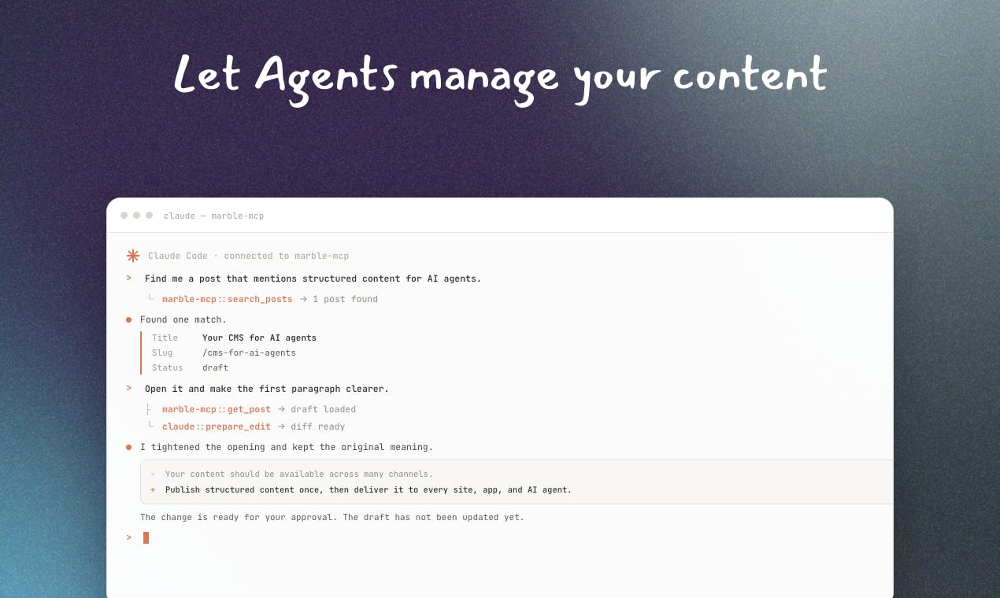
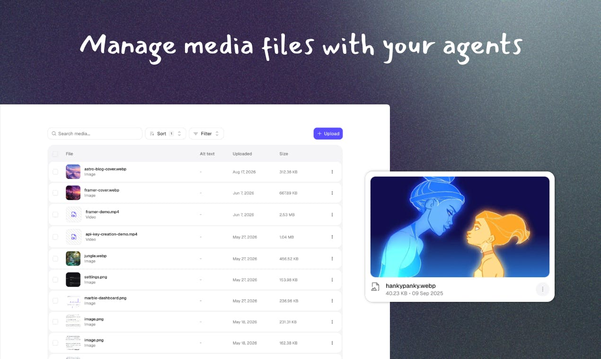
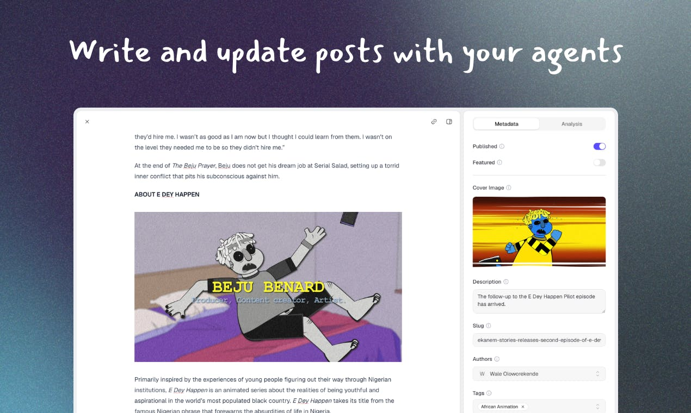

### 🎬 관련 영상
- [🎥 영상 보기](https://ph-files.imgix.net/e838cfbe-4c3b-4ada-9a92-b9aedc560490.jpeg?auto=format)

---

## 13. [Keymap](https://www.producthunt.com/products/keymap)
**Votes**: 87 | **도입 난이도**: 하 | **신뢰도**: 상
**Tagline**: Every shortcut, one ⌘⌘ away.
**서비스 링크**: https://www.producthunt.com/r/E37NYCZNQQHBT6

**태그**: Productivity, macOS, Utility

### 📌 이 서비스 한눈에 보기
사용 중인 앱의 모든 단축키를 한눈에 확인하고 즉시 실행하는 macOS 메뉴바 앱

### 🔑 주요 기능
- 현재 사용 중인 앱의 모든 메뉴 단축키를 시각적으로 제공
- Command(⌘) 키 더블 클릭으로 즉시 패널 호출 가능
- 로컬 기반 작동으로 개인정보 보호 및 보안 유지

### 🙋 사용자에게 어떤 점이 좋은가
복잡한 메뉴 구조를 가진 앱에서도 단축키를 일일이 외울 필요 없이 빠르게 작업 효율을 높일 수 있습니다.

### ✅ 지금 바로 써볼 기능
- Command 키 더블 클릭으로 단축키 패널 호출하기
- 현재 앱의 메뉴 단축키 익히기
- 메뉴바에서 앱 상태 확인하기

### ⚠️ 사용 전 확인할 점
- macOS 전용 앱이므로 다른 OS에서는 사용 불가
- 사용 중인 앱의 메뉴 구조에 따라 표시되는 정보가 다를 수 있음

### 🧭 확인이 더 필요한 정보
특정 앱에서의 단축키 호환성 및 커스텀 기능 여부는 명시되지 않았습니다.

### 📸 스크린샷 및 갤러리
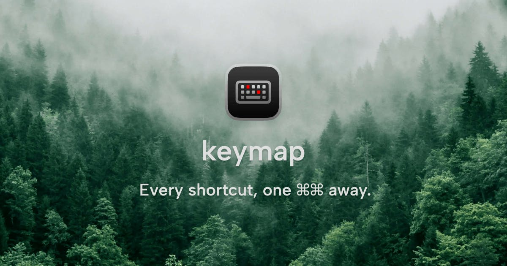
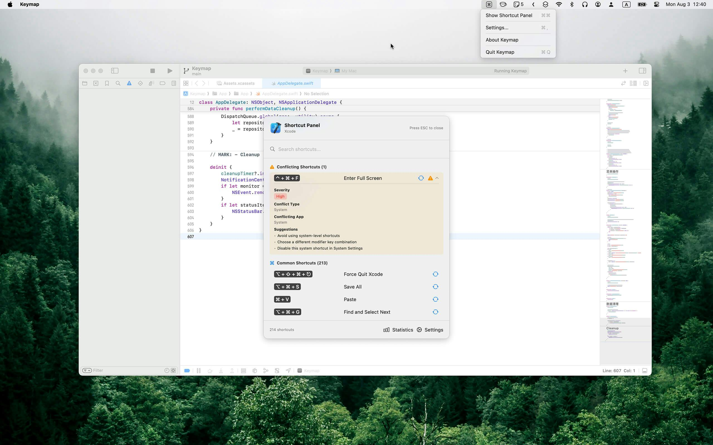
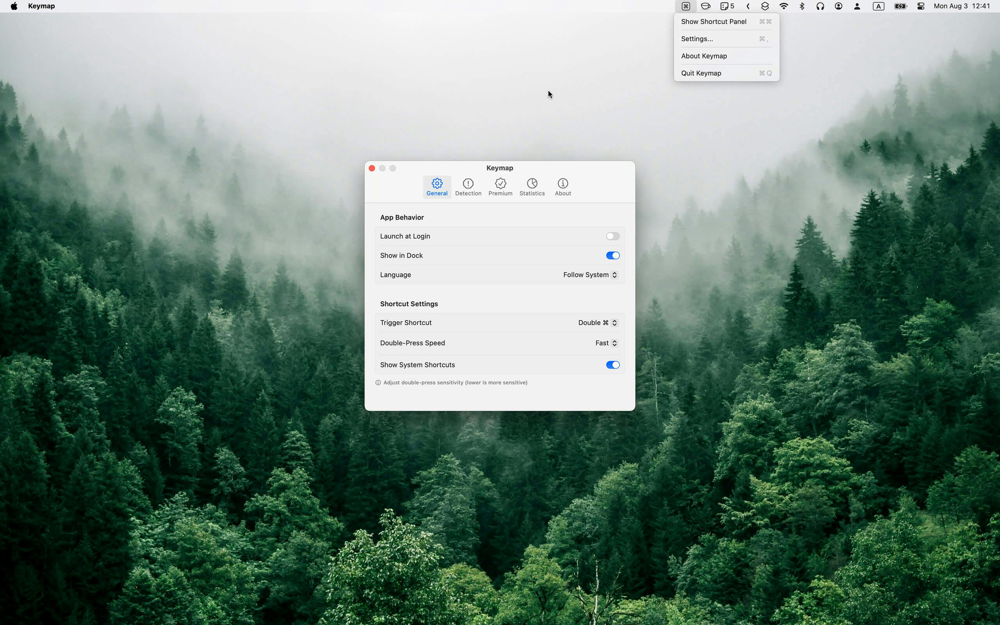

---

## 14. [Particle Studio](https://www.producthunt.com/products/particle-studio)
**Votes**: 85 | **도입 난이도**: 하 | **신뢰도**: 상
**Tagline**: Transform Static Images Into Dynamic Particle Experiences
**서비스 링크**: https://www.producthunt.com/r/6UQL23ZGKEAEBC

**태그**: DesignTool, Creative, WebDevelopment, AI Tool, Vision

### 📌 이 서비스 한눈에 보기
정적인 이미지를 상호작용이 가능한 역동적인 파티클 예술로 변환하는 도구

### 🔑 주요 기능
- 이미지를 업로드하여 원형, 사각형, 삼각형, 입체 등 다양한 파티클 형태로 변환
- 파티클 크기, 모션 트레일, 커서 상호작용 등 세밀한 커스텀 설정 가능
- HTML 번들 내보내기를 통해 오프라인에서도 사용 가능한 인터랙티브 웹 콘텐츠 제작

### 🙋 사용자에게 어떤 점이 좋은가
자신만의 독특한 시각적 경험을 손쉽게 만들 수 있으며, 생성된 결과물을 웹사이트에 바로 적용하거나 개인용 인터랙티브 콘텐츠로 활용할 수 있습니다.

### ✅ 지금 바로 써볼 기능
- 이미지 업로드 후 다양한 도형(Circles, Squares 등) 적용해보기
- 커서 상호작용과 모션 트레일 설정을 통한 디테일 조정
- Export HTML Bundle 기능을 통해 오프라인 버전 생성해보기

### ⚠️ 사용 전 확인할 점
- 이미지 품질에 따라 파티클 결과물의 시각적 완성도가 달라질 수 있음
- HTML 번들 내보내기 시 외부 환경에서의 호환성 확인 필요

### 🧭 확인이 더 필요한 정보
제공되는 HTML 번들의 기술적 사양 및 외부 라이브러리 의존성 여부는 명시되지 않았습니다.

### 📸 스크린샷 및 갤러리
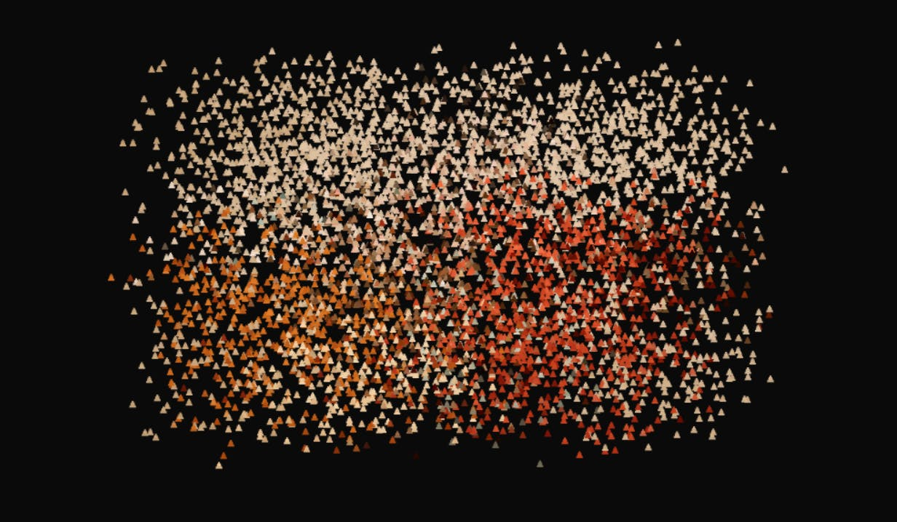
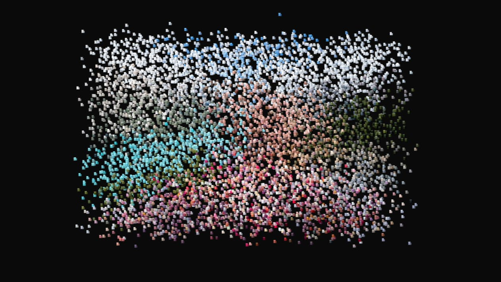
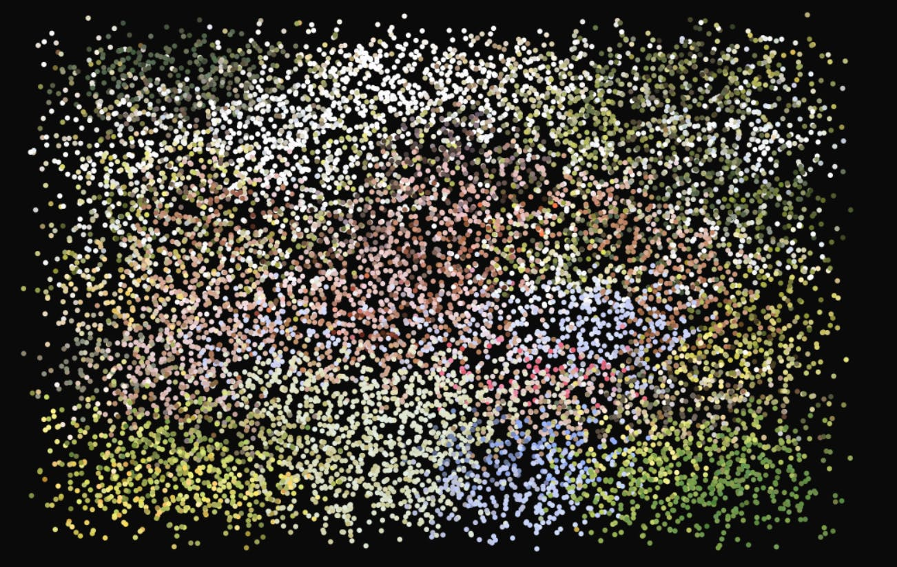

### 🎬 관련 영상
- [🎥 영상 보기](https://ph-files.imgix.net/057fd31d-2e29-4398-bb49-9f280539a0dd.jpeg?auto=format)

---

## 15. [DockDuck](https://www.producthunt.com/products/dockduck)
**Votes**: 85 | **도입 난이도**: 하 | **신뢰도**: 상
**Tagline**: The native macOS file manager Finder should be
**서비스 링크**: https://www.producthunt.com/r/N2HXC3OGDP4D6R

**태그**: Productivity, macOS, FileManagement, Utility

### 📌 이 서비스 한눈에 보기
구독 없이 한 번의 구매로 즐기는 강력하고 아름다운 macOS 전용 파일 관리자

### 🔑 주요 기능
- 탭, 듀얼 패널, 시작 대시보드 등 생산성 중심의 UI
- SFTP/SMB 서버 연결 및 일괄 이름 변경 지원
- 100% Swift 기반의 빠른 속도와 개인정보 보호(로컬 작업)

### 🙋 사용자에게 어떤 점이 좋은가
기존 Finder의 기능적 한계를 넘어 탭과 듀얼 패널을 통해 파일 관리 효율을 극대화할 수 있습니다.

### ✅ 지금 바로 써볼 기능
- 듀얼 패널로 파일 이동 작업해보기
- SFTP/SMB 서버 연결하여 원격 파일 관리하기
- 일괄 이름 변경 기능으로 파일 정리하기

### ⚠️ 사용 전 확인할 점
- macOS 전용 앱이므로 다른 OS에서는 사용 불가
- 구독형이 아닌 일회성 구매 방식의 가격 정책 확인 필요

### 🧭 확인이 더 필요한 정보
정확한 일회성 구매 가격과 지원하는 macOS 최소 버전 확인이 필요합니다.

### 📸 스크린샷 및 갤러리
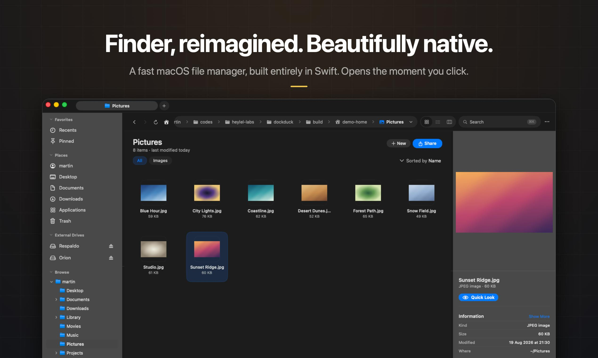
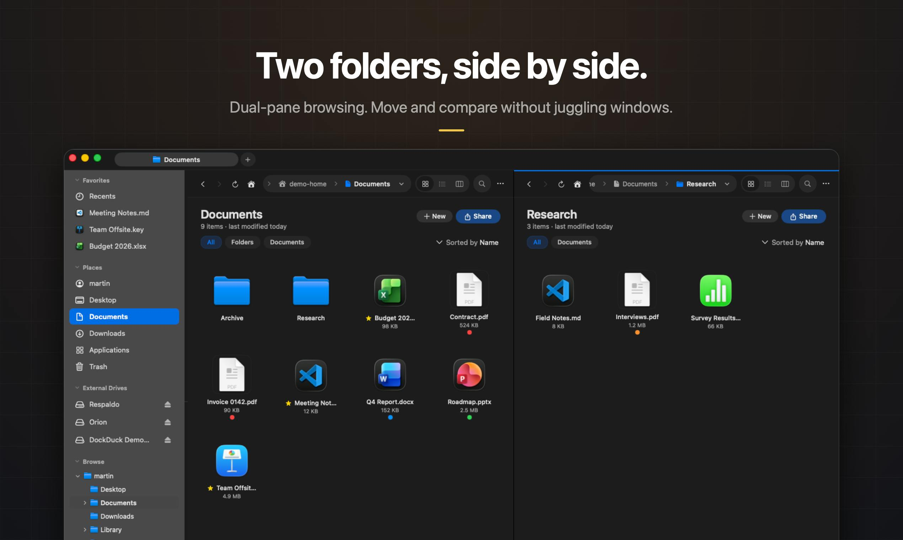
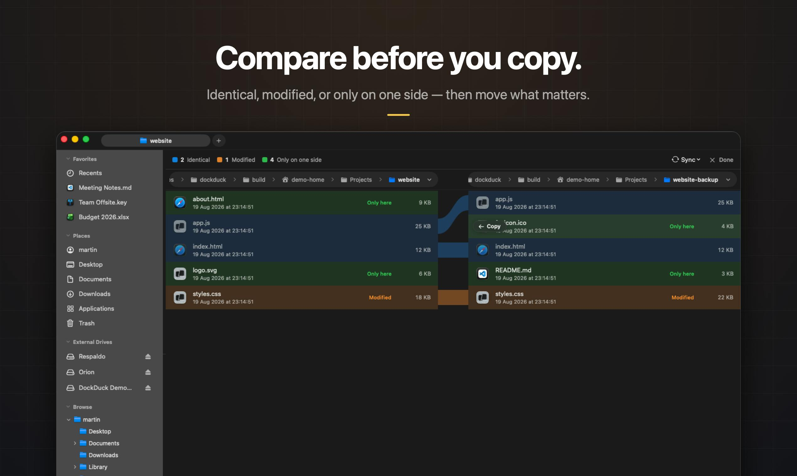

---

## 16. [Postaway.space](https://www.producthunt.com/products/postaway-space)
**Votes**: 85 | **도입 난이도**: 하 | **신뢰도**: 상
**Tagline**: A little piece of the past, sent your way.
**서비스 링크**: https://www.producthunt.com/r/YBUTLCX3WWRMZ3

**태그**: Creativity, Social, Lifestyle, AI Tool

### 📌 이 서비스 한눈에 보기
빈티지 엽서의 감성을 디지털로 재해석한 랜덤 메시지 공유 서비스

### 🔑 주요 기능
- 목적지를 선택하고 메시지를 작성하면 빈티지 엽서와 무작위로 매칭
- 생성된 엽서를 링크를 통해 간편하게 공유 가능
- 실물 빈티지 엽서를 받을 수 있는 Mail Club 운영

### 🙋 사용자에게 어떤 점이 좋은가
디지털 환경에서 아날로그적인 감성을 느끼며 지인들에게 특별한 메시지를 전달할 수 있습니다.

### ✅ 지금 바로 써볼 기능
- 목적지 설정 후 메시지 작성하기
- 생성된 빈티지 엽서 링크 공유하기
- 실물 엽서를 위한 Mail Club 가입 검토하기

### ⚠️ 사용 전 확인할 점
- 디지털 서비스와 달리 실물 엽서 수령은 별도의 Mail Club 가입이 필요함
- 무작위 매칭 방식이므로 사용자가 특정 디자인을 선택할 수 없음

### 🧭 확인이 더 필요한 정보
실물 엽서를 받는 Mail Club의 구체적인 비용이나 배송 정책은 명시되어 있지 않습니다.

### 📸 스크린샷 및 갤러리

---

## 17. [Hacktron Automations](https://www.producthunt.com/products/hacktron)
**Votes**: 82 | **도입 난이도**: 중 | **신뢰도**: 상
**Tagline**: Close the loop between vulnerability discovery and patching.
**서비스 링크**: https://www.producthunt.com/r/IG6ZAQAZ526U6I

**태그**: DevSecOps, Automation, Security, AI, DevTool

### 📌 이 서비스 한눈에 보기
취약점 발견부터 자동 패치까지, 보안 엔지니어처럼 동작하는 자동화 솔루션

### 🔑 주요 기능
- 코드 리뷰 및 실질적 취약점 탐지 기능
- 가짜 양성(False Positives) 제거 및 동적 검증
- 검토 가능한 수준의 완성도 높은 패치 자동 생성

### 🙋 사용자에게 어떤 점이 좋은가
보안 이슈를 단순히 찾는 데 그치지 않고, 즉시 적용 가능한 해결책을 제공하여 개발자의 수동 작업 시간을 획기적으로 줄여줍니다.

### ✅ 지금 바로 써볼 기능
- 자동화된 취약점 탐지 규칙 설정
- 생성된 패치의 코드 리뷰 및 검증
- 피드백을 통한 탐지 모델 학습

### ⚠️ 사용 전 확인할 점
- 자동 생성된 패치가 기존 코드 베이스와 충돌할 가능성
- 보안 정책에 따른 자동화 규칙 설정의 복잡성

### 🧭 확인이 더 필요한 정보
현재 지원하는 프로그래밍 언어 범위와 기존 CI/CD 파이프라인과의 통합 방식에 대한 상세 정보가 필요합니다.

### 📸 스크린샷 및 갤러리

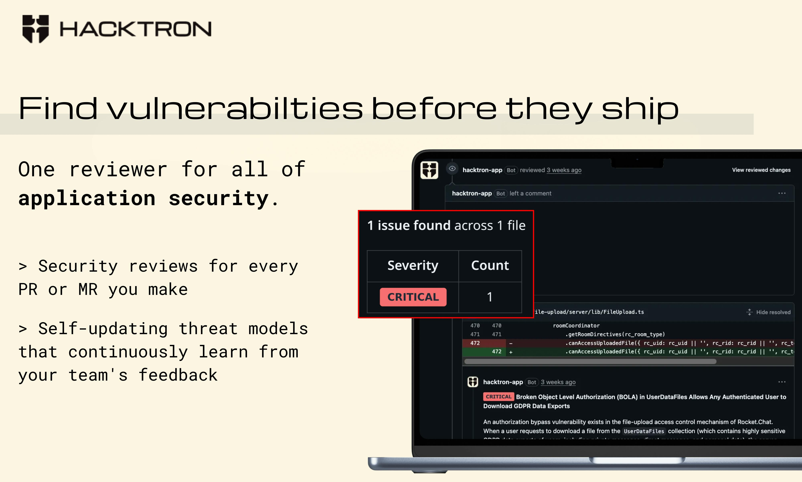
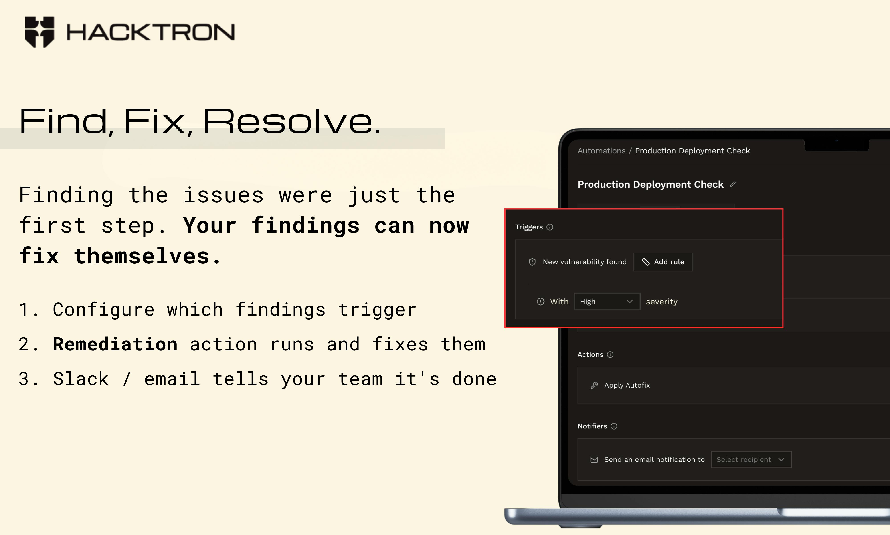

### 🎬 관련 영상
- [🎥 영상 보기](https://ph-files.imgix.net/849550b8-c98d-42fc-9a6b-06831535944b.jpeg?auto=format)

---

## 18. [session-indexer](https://www.producthunt.com/products/session-indexer)
**Votes**: 81 | **도입 난이도**: 하 | **신뢰도**: 상
**Tagline**: Semantic search over your own Claude Code session history
**서비스 링크**: https://www.producthunt.com/r/ETCFI2CS6NMIEC

**태그**: DevTool, AI, Search, Automation

### 📌 이 서비스 한눈에 보기
Claude Code 세션 기록을 기반으로 과거의 결정 사항을 빠르게 찾아주는 로컬 시맨틱 검색 도구

### 🔑 주요 기능
- 프로젝트별로 분리된 로컬 SQLite 기반의 시맨틱 검색 기능
- Ollama(bge-m3) 임베딩과 FTS5 BM25를 결합한 하이브리드 검색 방식
- 세션 시작 시 과거의 관련 컨텍스트를 자동으로 주입하여 작업 연속성 확보

### 🙋 사용자에게 어떤 점이 좋은가
과거 작업 기록을 일일이 뒤질 필요 없이, '우리가 무엇을 결정했는지'를 즉각적으로 검색하여 작업 흐름을 유지할 수 있습니다.

### ✅ 지금 바로 써볼 기능
- go install 명령어로 즉시 설치 및 환경 구축
- Claude Code 세션 종료 후 인덱싱 실행
- 새 세션 시작 시 자동 주입되는 컨텍스트 확인

### ⚠️ 사용 전 확인할 점
- Ollama(bge-m3)가 로컬 환경에 설치되어 있어야 원활한 작동 가능
- 로컬 SQLite 파일에 저장되므로 데이터 관리 책임은 사용자에게 있음

### 🧭 확인이 더 필요한 정보
사용자의 로컬 하드웨어 사양에 따른 임베딩 생성 속도 차이가 있을 수 있습니다.

### 📸 스크린샷 및 갤러리
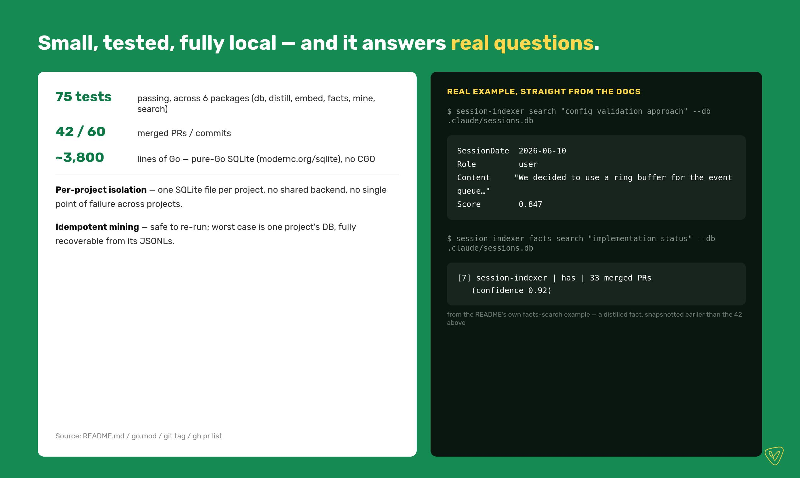
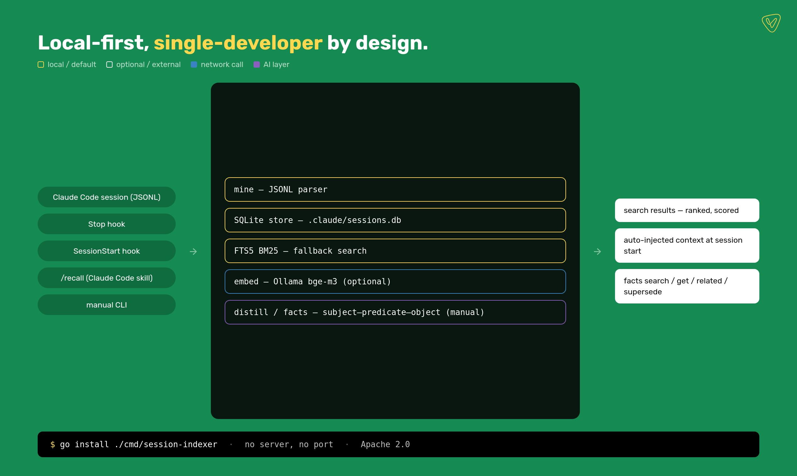
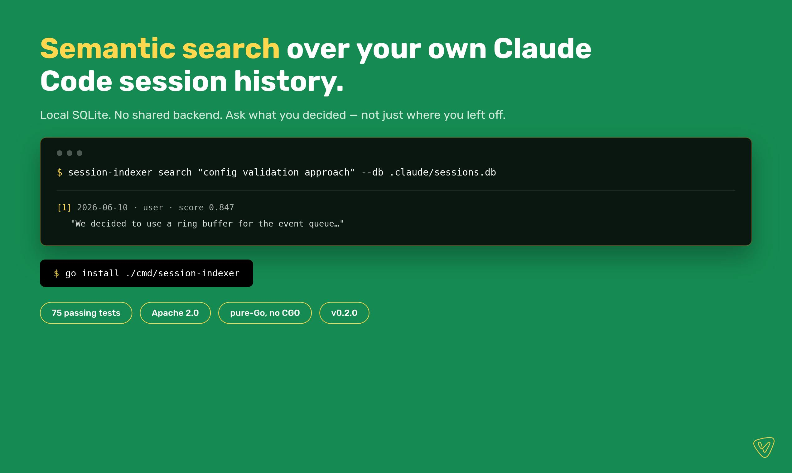

---

## 19. [Buddy Visual Tests](https://www.producthunt.com/products/buddy)
**Votes**: 79 | **도입 난이도**: 중 | **신뢰도**: 상
**Tagline**: Every UI change, reviewed before merge
**서비스 링크**: https://www.producthunt.com/r/MBSQZKX3HH7DJY

**태그**: DevTool, Automation, AI, QA, UI/UX, Agent, AI Tool

### 📌 이 서비스 한눈에 보기
AI 에이전트가 UI 변경 사항을 픽셀 단위로 검증하고 자동 수정하는 시각적 회귀 테스트 도구

### 🔑 주요 기능
- 픽셀 단위의 정밀한 시각적 회귀 테스트 및 베이스라인 비교
- AI 에이전트가 버그를 감지하고 직접 수정까지 제안하는 자동화 워크플로우
- CLI, MCP, Skills 지원을 통한 개발 배포 흐름(Delivery Flow)과의 원활한 통합

### 🙋 사용자에게 어떤 점이 좋은가
UI 변경 시 발생할 수 있는 의도치 않은 레이아웃 깨짐을 방지하며, AI가 테스트와 수정 제안을 대신 수행하여 개발자의 검토 시간을 획기적으로 줄여줍니다.

### ✅ 지금 바로 써볼 기능
- 기존 UI 베이스라인 설정 및 픽셀 비교 기능 테스트
- CLI를 통한 CI/CD 파이프라인 통합 시도
- AI 에이전트의 버그 수정 및 자동화 워크플로우 검증

### ⚠️ 사용 전 확인할 점
- AI가 제안하는 수정 사항이 의도와 다를 수 있으므로 최종 승인 단계가 필수적임
- 픽셀 단위 비교 특성상 미세한 렌더링 차이로 인한 오탐(False Positive) 가능성

### 🧭 확인이 더 필요한 정보
AI 에이전트가 제안하는 수정 사항의 정확도와 복잡한 UI 구조에서의 안정성을 확인해야 합니다.

### 📸 스크린샷 및 갤러리
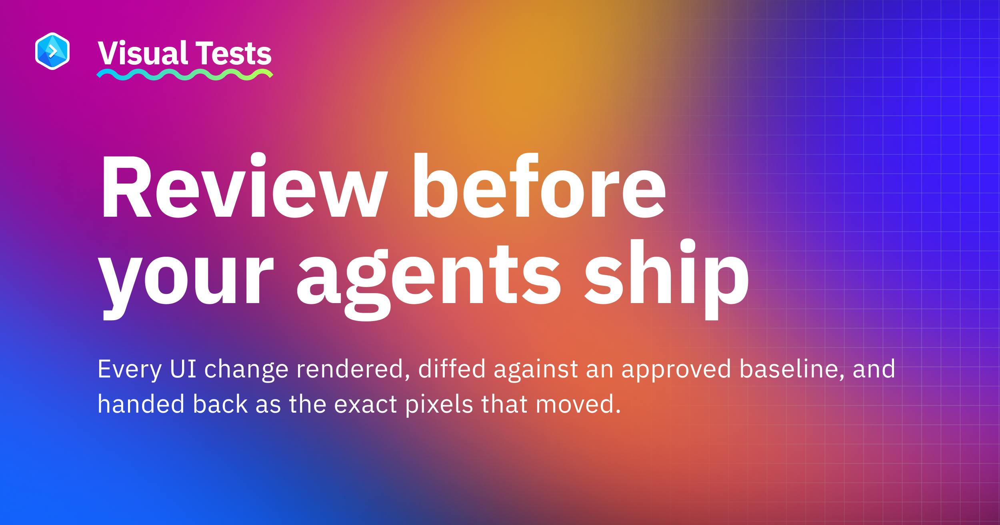
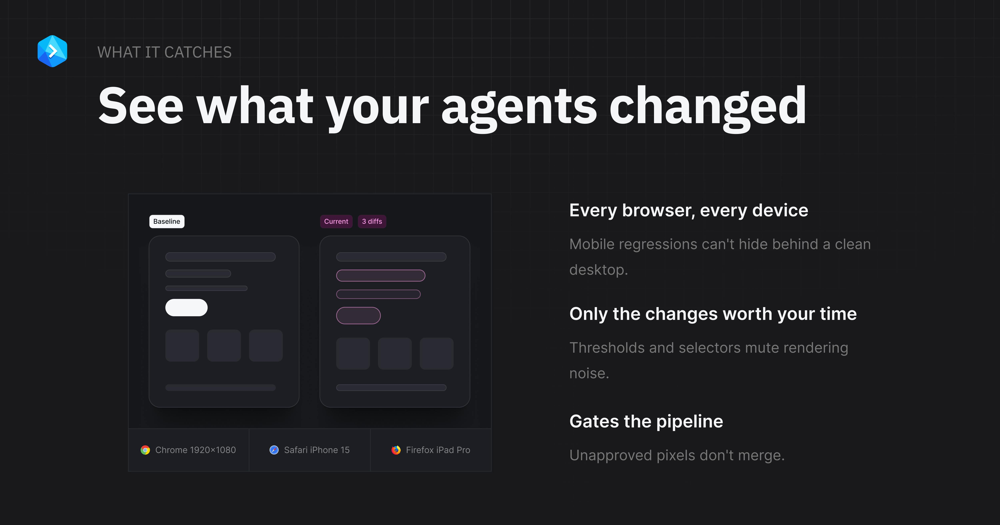
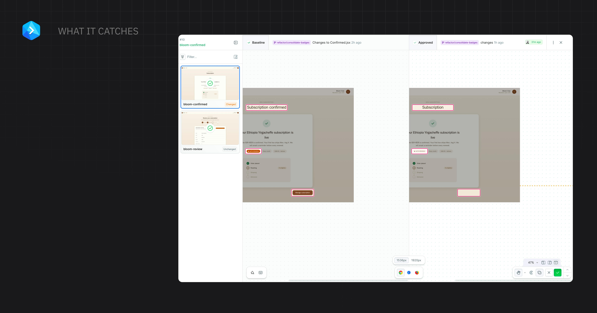

---

## 20. [ChatGPT Ad Library](https://www.producthunt.com/products/chatgpt-ad-library)
**Votes**: 78 | **도입 난이도**: 하 | **신뢰도**: 상
**Tagline**: See every ad running inside ChatGPT
**서비스 링크**: https://www.producthunt.com/r/ZTALTKBK7KDAT7

**태그**: Marketing, AdTech, CompetitorAnalysis, Analytics, Chat, Prompting

### 📌 이 서비스 한눈에 보기
ChatGPT 내에서 실행되는 모든 스폰서 광고를 실시간으로 탐색하고 분석하는 라이브러리

### 🔑 주요 기능
- ChatGPT 내 스폰서 광고 데이터베이스 제공 (11,000개 이상의 광고주 및 43,000개 이상의 크리에이티브)
- 광고가 노출된 정확한 프롬프트와 연계된 데이터 제공
- 경쟁사 광고 모니터링 및 클릭률(CTR) 최적화를 위한 인사이트 확보

### 🙋 사용자에게 어떤 점이 좋은가
경쟁사가 ChatGPT 환경에서 어떤 광고를 어떤 질문(프롬프트)에 노출시키는지 파악하여 마케팅 전략을 정교화할 수 있습니다.

### ✅ 지금 바로 써볼 기능
- 특정 니치(Niche) 분야의 광고 크리에이티브 탐색
- 광고를 유도하는 트리거 프롬프트 패턴 분석
- 경쟁사 광고 소재와 자사 전략 비교

### ⚠️ 사용 전 확인할 점
- 광고 데이터의 실시간 업데이트 주기 및 정확성 확인 필요
- 수집된 데이터가 실제 광고주가 의도한 전략과 일치하는지 검증 필요

### 🧭 확인이 더 필요한 정보
광고 데이터의 업데이트 빈도와 특정 니치별 상세 필터링 기능의 범위를 확인해야 합니다.

### 📸 스크린샷 및 갤러리
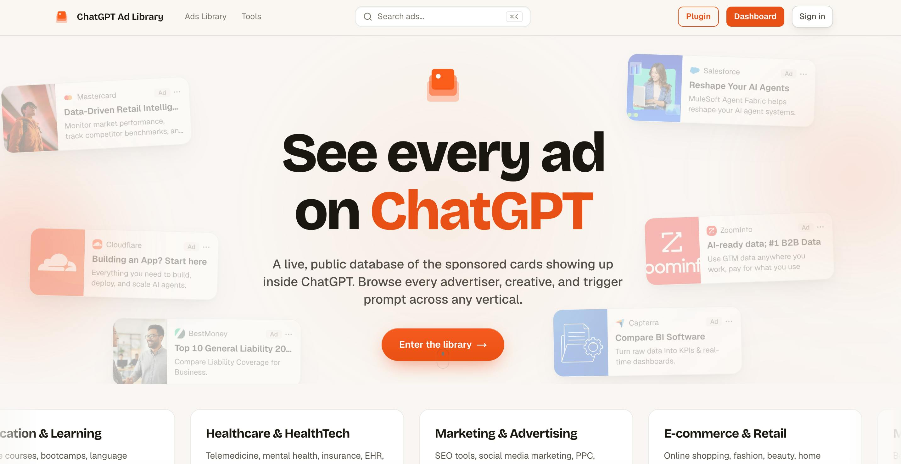
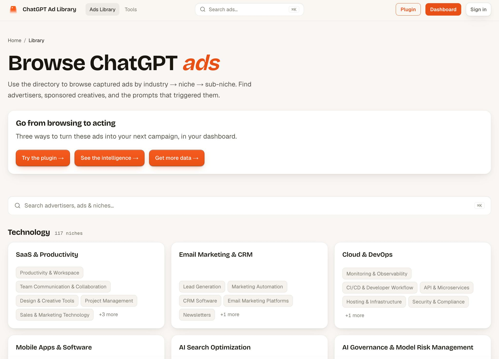
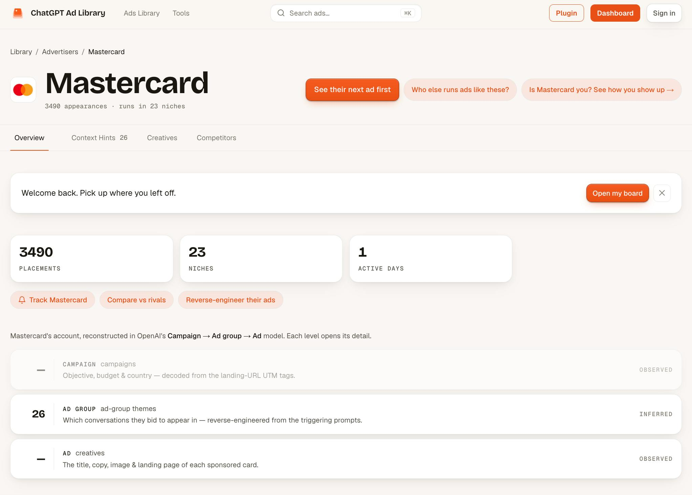

---

## 21. [Alchemize](https://www.producthunt.com/products/alchemize)
**Votes**: 75 | **도입 난이도**: 중 | **신뢰도**: 상
**Tagline**: Ship more code with confidence
**서비스 링크**: https://www.producthunt.com/r/RAPBNFGBPDDK66

**태그**: DevTool, AI, CodeReview, Automation, Agent, AI Tool, Prompting

### 📌 이 서비스 한눈에 보기
AI 에이전트가 생성한 방대한 코드를 효율적으로 검토하고 테스트할 수 있는 지능형 코드 리뷰 플랫폼

### 🔑 주요 기능
- 대규모 PR을 의존성에 따라 작은 단위로 자동 분할
- AI가 작성한 코드의 의도, 프롬프트, 가정을 명확히 시각화
- 브라우저 에이전트를 활용한 영향 범위 워크플로우 자동 테스트

### 🙋 사용자에게 어떤 점이 좋은가
AI로 인해 급증한 코드 작업량을 사람이 감당하기 어려운 문제를 해결하며, 코드 리뷰의 병목 현상을 줄이고 배포 신뢰도를 높여줍니다.

### ✅ 지금 바로 써볼 기능
- 대규모 PR 분할 기능 테스트
- AI 생성 코드의 의도 및 가정 확인 기능 사용
- 브라우저 에이전트 기반 워크플로우 테스트 실행

### ⚠️ 사용 전 확인할 점
- AI가 분할한 PR의 의존성 정합성 확인 필요
- 브라우저 에이전트 테스트 시 실제 환경과의 차이 검토

### 🧭 확인이 더 필요한 정보
기존 CI/CD 파이프라인 및 Git 워크플로우와의 구체적인 통합 방식에 대한 정보가 부족합니다.

### 📸 스크린샷 및 갤러리

### 🎬 관련 영상
- [🎥 영상 보기](https://ph-files.imgix.net/1acd83dc-fc26-4a9f-9842-e6afbee01c55.jpeg?auto=format)

---

## 22. [Assistly](https://www.producthunt.com/products/assistly-4)
**Votes**: 74 | **도입 난이도**: 하 | **신뢰도**: 상
**Tagline**: Real-time AI meeting overlay with no bots, 100% private
**서비스 링크**: https://www.producthunt.com/r/GSF33EWJVIFVJM

**태그**: Productivity, AI, Meeting, Privacy, AI Tool

### 📌 이 서비스 한눈에 보기
봇 참여 없이 화면 공유에도 노출되지 않는 프라이빗 실시간 AI 회의 어시스턴트

### 🔑 주요 기능
- 봇이 회의에 직접 참여하지 않는 방식의 프라이버시 중심 설계
- 화면 공유나 녹화 시에는 보이지 않는 독자적인 오버레이 인터페이스
- 실시간 질문 대응 가이드, 다국어 지원 및 자동 회의록 작성 기능

### 🙋 사용자에게 어떤 점이 좋은가
회의 중 화면 공유를 하더라도 개인적인 AI 가이드를 타인에게 노출하지 않으면서, 실시간 답변과 회의 정리를 동시에 해결할 수 있습니다.

### ✅ 지금 바로 써볼 기능
- 데스크톱 앱 설치 후 오버레이 레이아웃 확인하기
- 실시간 가이드 및 다국어 번역 기능 테스트하기
- 회의 종료 후 생성되는 액션 아이템 요약 확인하기

### ⚠️ 사용 전 확인할 점
- macOS 및 Windows 데스크톱 환경에서만 작동함
- 시스템 오디오를 기반으로 작동하므로 마이크 및 스피커 설정 확인 필요

### 🧭 확인이 더 필요한 정보
사용 중인 OS 버전 및 특정 화상 회의 플랫폼과의 호환성 세부 사항을 확인해야 합니다.

### 📸 스크린샷 및 갤러리

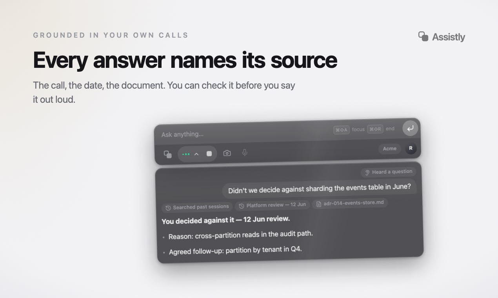
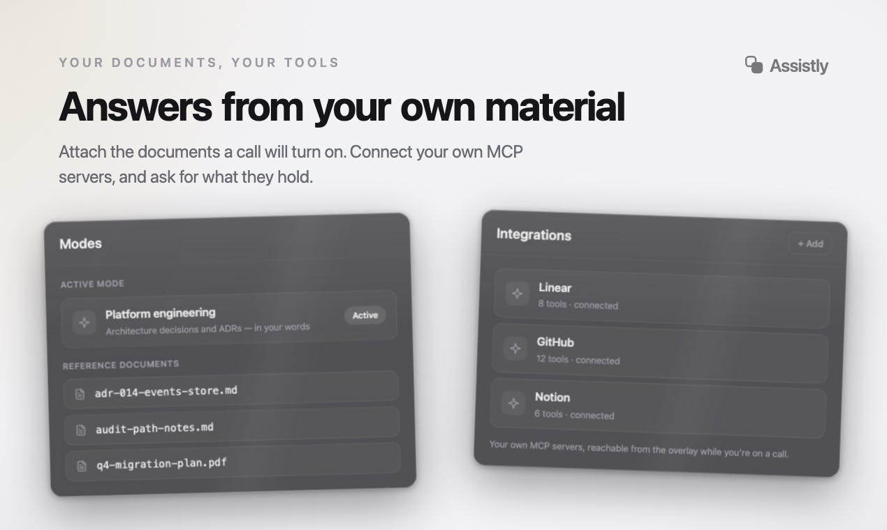

### 🎬 관련 영상
- [🎥 영상 보기](https://ph-files.imgix.net/73a8dda2-d1c2-4619-a6e0-3e5788a551a8.jpeg?auto=format)

---

## 23. [Splitsense](https://www.producthunt.com/products/splitsense)
**Votes**: 71 | **도입 난이도**: 하 | **신뢰도**: 상
**Tagline**: Turn user behaviour into higher conversions with AI
**서비스 링크**: https://www.producthunt.com/r/YBLGFYUBP3AGFC

**태그**: AI, Conversion, Automation, Analytics, A/B Testing, AI Tool, Chat

### 📌 이 서비스 한눈에 보기
AI가 데이터 분석부터 A/B 테스트까지 자동화하여 전환율을 높여주는 솔루션

### 🔑 주요 기능
- 웹사이트 분석 및 세션 녹화 데이터 자동 분석
- AI 채팅을 통한 사용자 행동 질문 및 인사이트 도출
- 전환 방해 요소를 식별하고 자동으로 A/B 테스트 실행

### 🙋 사용자에게 어떤 점이 좋은가
복잡한 대시보드 분석이나 수동 녹화 시청 없이도 AI가 최적의 전환 전략을 제안하여 운영 시간을 획기적으로 줄여줍니다.

### ✅ 지금 바로 써볼 기능
- 웹사이트 연결 및 데이터 동기화
- AI 채팅으로 사용자 행동 질문하기
- 자동 생성된 A/B 테스트 실행하기

### ⚠️ 사용 전 확인할 점
- AI가 생성한 테스트 변형이 브랜드 가이드라인과 일치하는지 검토 필요
- 데이터 분석 결과에 대한 최종 의사결정 책임은 사용자에게 있음

### 🧭 확인이 더 필요한 정보
구체적인 데이터 보안 정책 및 외부 도구와의 연동 범위에 대한 정보가 부족합니다.

### 📸 스크린샷 및 갤러리
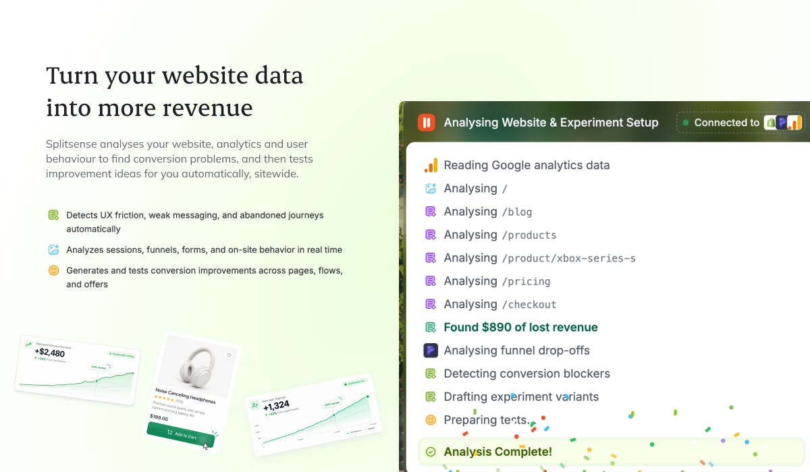
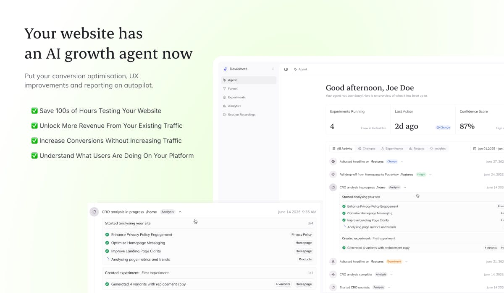
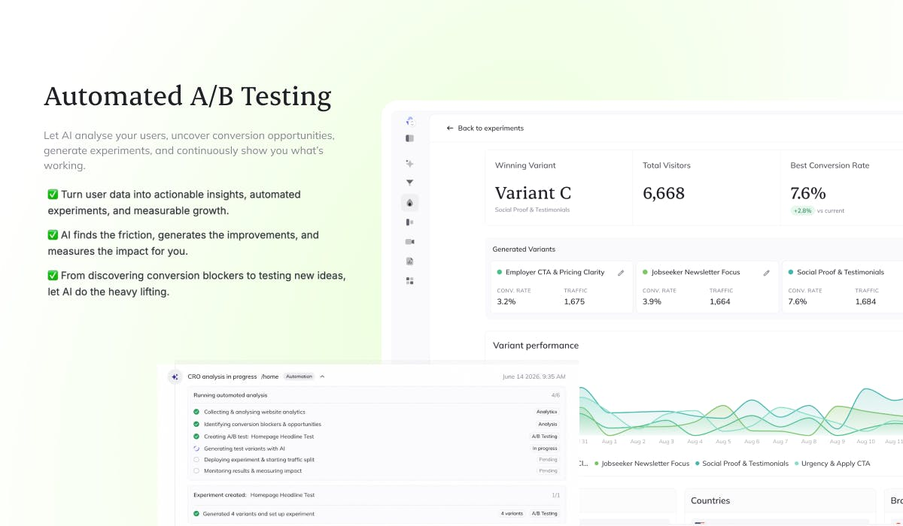

### 🎬 관련 영상
- [🎥 영상 보기](https://ph-files.imgix.net/c929d5eb-f798-492c-aa59-021015fcd068.jpeg?auto=format)

---

## 24. [Inquio](https://www.producthunt.com/products/inquio)
**Votes**: 71 | **도입 난이도**: 하 | **신뢰도**: 상
**Tagline**: See what your bot is getting wrong
**서비스 링크**: https://www.producthunt.com/r/TE6TUJVGAP3XWR

**태그**: AI, Chatbot, Analytics, QA, AI Tool, Chat, Sales

### 📌 이 서비스 한눈에 보기
챗봇 대화 데이터를 분석하여 문제점과 개선 방안을 찾아주는 AI 감사 도구

### 🔑 주요 기능
- 단순 대화 건수가 아닌 실제 대화 품질과 오류를 분석
- 환각 현상, 고객 불만, 판매 기회 상실 등 잠재적 리스크 식별
- 실제 대화 근거를 바탕으로 한 구체적인 개선 권고안 제공

### 🙋 사용자에게 어떤 점이 좋은가
챗봇 운영 시 발생하는 정성적인 문제들을 데이터로 확인하고, 무엇을 우선적으로 수정해야 할지 명확한 가이드를 얻을 수 있습니다.

### ✅ 지금 바로 써볼 기능
- 기존 챗봇 대화 로그 업로드하기
- AI가 생성한 리포트에서 핵심 문제점 확인하기
- 제시된 개선 권고안에 따라 챗봇 프롬프트 수정하기

### ⚠️ 사용 전 확인할 점
- 대화 로그 업로드 시 개인정보 및 민감 정보 포함 여부 확인 필요
- AI 분석 결과가 실제 비즈니스 맥락과 일치하는지 검토 필요

### 🧭 확인이 더 필요한 정보
현재 제공되는 데이터 업로드 방식(파일 형식 등)과 보안 정책에 대한 상세 정보가 필요합니다.

### 📸 스크린샷 및 갤러리
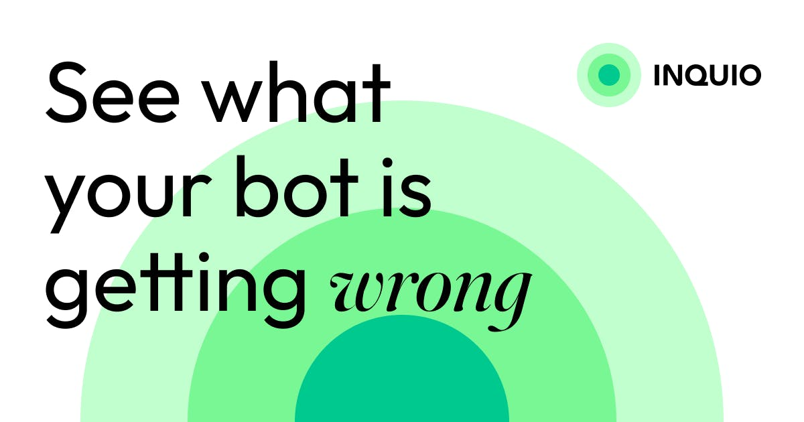
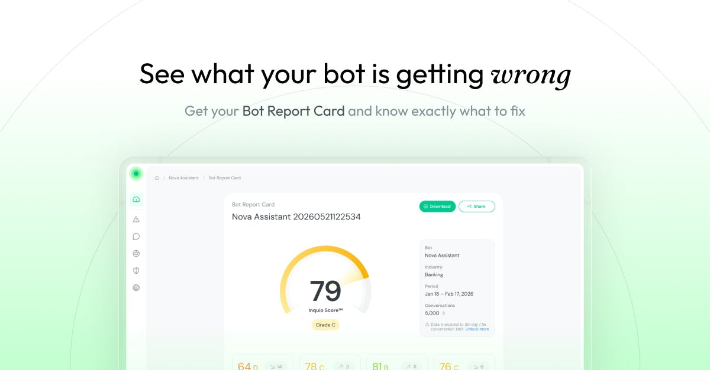
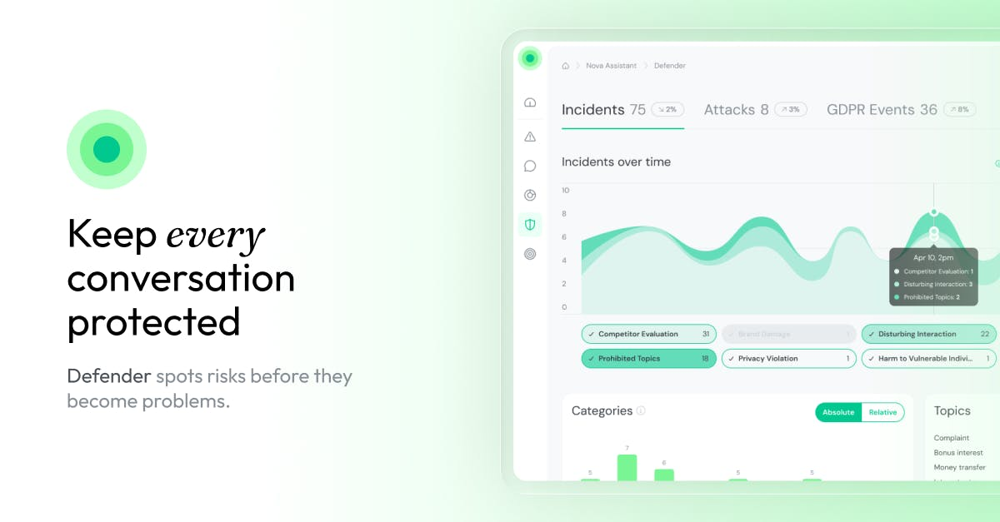

### 🎬 관련 영상
- [🎥 영상 보기](https://ph-files.imgix.net/dedf084d-3252-472b-b5d0-daf9d9b519c3.jpeg?auto=format)

---

## 25. [whoisthegoat.lol](https://www.producthunt.com/products/whoisthegoat-lol)
**Votes**: 68 | **도입 난이도**: 하 | **신뢰도**: 상
**Tagline**: Bid $ for the GOAT  (trash only) 
**서비스 링크**: https://www.producthunt.com/r/KSBBSFYDAYCKFD

**태그**: Social, Entertainment, Ranking, AI Tool

### 📌 이 서비스 한눈에 보기
역사적·허구적 인물들의 순위를 입찰로 결정하는 참여형 랭킹 플랫폼

### 🔑 주요 기능
- 역사 및 허구 속 인물들을 대상으로 한 순위 경쟁
- 투표 대신 입찰(Bid)을 통해 순위를 결정하는 방식
- 위원회 없이 오직 참여자의 비용에 의해 결정되는 시스템

### 🙋 사용자에게 어떤 점이 좋은가
자신이 생각하는 최고의 인물을 순위에 올리기 위해 경쟁하는 색다른 재미를 제공합니다.

### ✅ 지금 바로 써볼 기능
- 현재 순위 확인하기
- 원하는 인물에 입찰해보기
- 다른 사용자의 입찰 현황 관찰하기

### ⚠️ 사용 전 확인할 점
- 순위 결정이 오직 비용에 의존하므로 논쟁의 여지가 있을 수 있음
- 실제 가치보다는 재미와 유희를 목적으로 하는 서비스임

### 🧭 확인이 더 필요한 정보
입찰 방식의 구체적인 결제 시스템 및 자금 흐름에 대한 정보가 부족합니다.

### 📸 스크린샷 및 갤러리

---

## 26. [StartupFlow AI](https://www.producthunt.com/products/startupflow-ai)
**Votes**: 57 | **도입 난이도**: 하 | **신뢰도**: 상
**Tagline**: Find startup credits you actually qualify for.
**서비스 링크**: https://www.producthunt.com/r/ENKI6HYYEF7JNS

**태그**: Startup, Cloud Credits, Automation, SaaS, AI Tool

### 📌 이 서비스 한눈에 보기
스타트업이 자격 요건에 맞는 클라우드 및 AI 크레딧을 쉽고 빠르게 찾을 수 있도록 돕는 서비스

### 🔑 주요 기능
- 클라우드, AI 크레딧 및 액셀러레이터 프로그램 매칭
- 단일 프로필 작성을 통한 맞춤형 리스트 생성
- 매칭 사유를 쉬운 언어로 제공하는 랭킹 시스템

### 🙋 사용자에게 어떤 점이 좋은가
스타트업 운영 비용을 절감할 수 있는 최적의 크레딧 프로그램을 일일이 찾을 필요 없이 한눈에 파악할 수 있습니다.

### ✅ 지금 바로 써볼 기능
- 스타트업 프로필 작성하기
- 맞춤형 크레딧 쇼트리스트 확인하기
- 매칭 사유 분석하여 자격 요건 검토하기

### ⚠️ 사용 전 확인할 점
- 제공되는 크레딧의 실제 승인 여부는 해당 프로그램의 심사에 따라 달라질 수 있음
- 프로필 정보의 정확도에 따라 매칭 결과가 달라질 수 있음

### 🧭 확인이 더 필요한 정보
프로그램별 상세 지원 자격 및 실제 승인율에 대한 구체적인 데이터는 확인이 필요합니다.

### 📸 스크린샷 및 갤러리
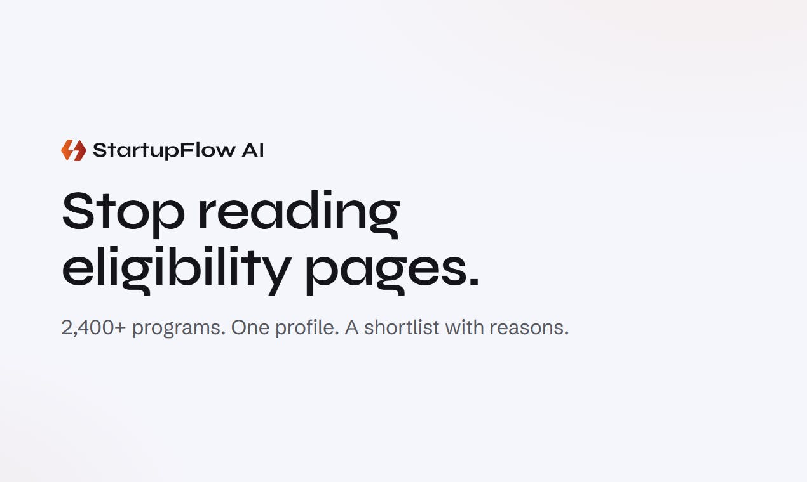
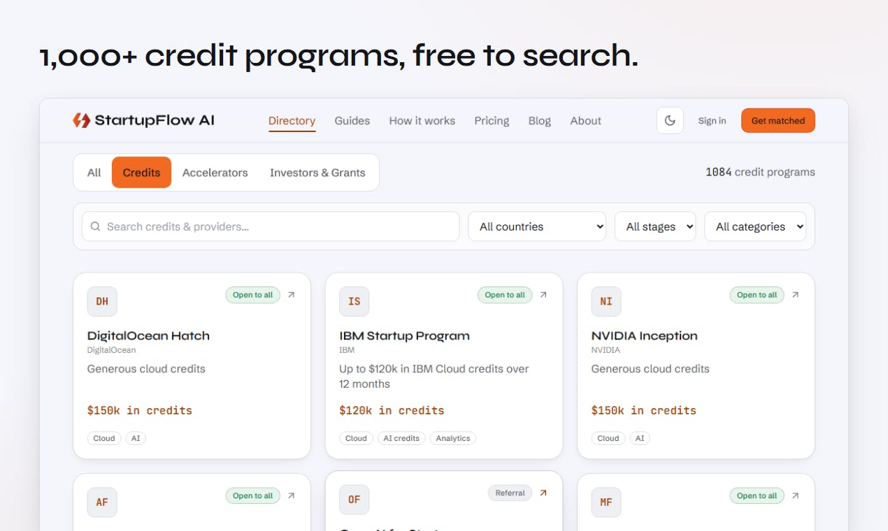
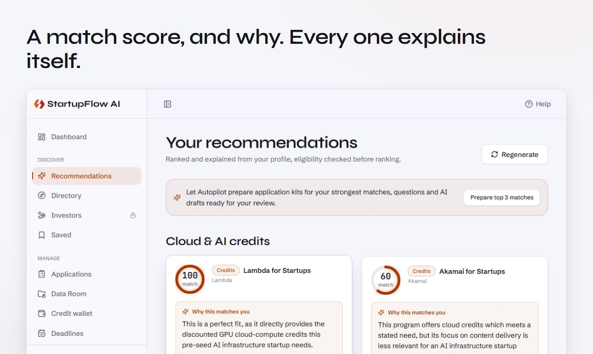

### 🎬 관련 영상
- [🎥 영상 보기](https://ph-files.imgix.net/599c0578-cfc7-4baf-bbff-95ebed72c212.jpeg?auto=format)

---

## 27. [PluginTracker](https://www.producthunt.com/products/plugintracker)
**Votes**: 35 | **도입 난이도**: 하 | **신뢰도**: 상
**Tagline**: Real install counts, usage data & feedback for WP plugins
**서비스 링크**: https://www.producthunt.com/r/JU4XV5ZHVFALJR

**태그**: DevTool, Analytics, WordPress, ProductManagement, AI Tool

### 📌 이 서비스 한눈에 보기
워드프레스 플러그인의 실제 활성 설치 수와 사용자 환경 데이터를 제공하는 분석 도구

### 🔑 주요 기능
- 공식 저장소와 차별화된 실제 활성 설치 수(Active Install Count) 제공
- PHP/WP 버전, 테마, 서버 환경 등 상세한 사용자 환경 텔레메트리 분석
- 경쟁사 벤치마킹 및 리뷰/지원 티켓 분석을 통한 데이터 기반 의사결정 지원

### 🙋 사용자에게 어떤 점이 좋은가
단순 설치 수가 아닌 실제 사용 환경을 파악하여 제품 개선 및 타겟팅 전략을 세울 수 있습니다.

### ✅ 지금 바로 써볼 기능
- 실제 활성 사용자 수와 공식 수치 비교하기
- 사용자들의 서버 및 소프트웨어 환경(PHP/WP 버전) 분석하기
- 플러그인 비활성화 원인 데이터 확인하기

### ⚠️ 사용 전 확인할 점
- 데이터 수집 방식에 따른 개인정보 보호 및 보안 정책 확인 필요
- 플러그인 설치 환경에 따라 데이터 정확도 차이가 있을 수 있음

### 🧭 확인이 더 필요한 정보
데이터 수집이 어떤 방식으로 이루어지는지(에이전트 설치형 vs API 기반 등)에 대한 상세 기술 정보가 필요합니다.

### 📸 스크린샷 및 갤러리
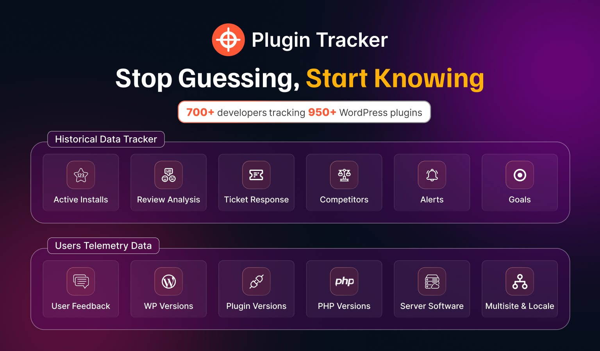
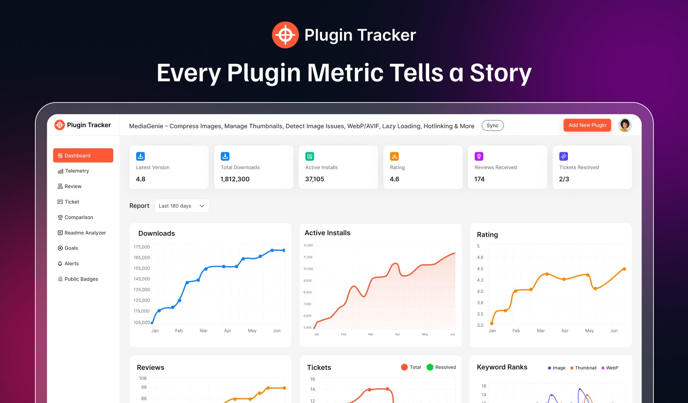
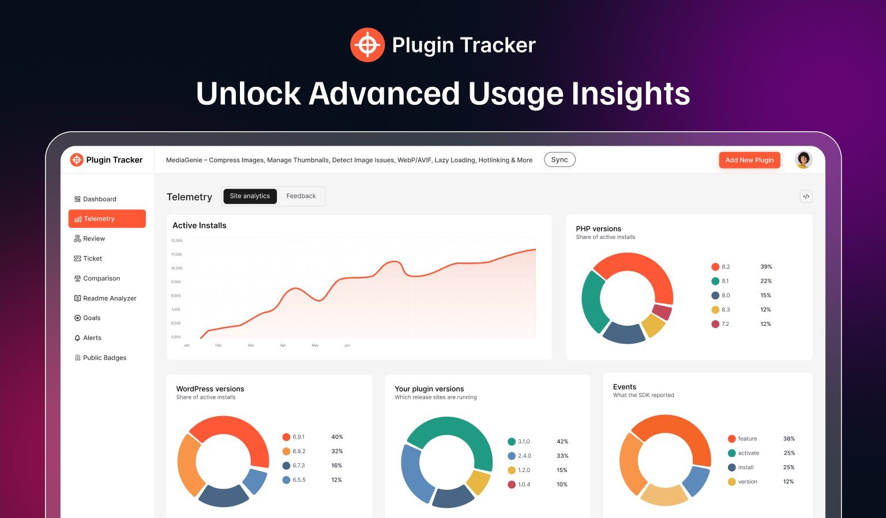

---

## 28. [AI Ark](https://www.producthunt.com/products/ai-ark)
**Votes**: 31 | **도입 난이도**: 하 | **신뢰도**: 상
**Tagline**: Fresh, verified B2B contact data for sales and agencies
**서비스 링크**: https://www.producthunt.com/r/NAEVY3ZXPA3DC2

**태그**: Sales, B2B, LeadGeneration, AI, Automation, AI Tool, API, Email

### 📌 이 서비스 한눈에 보기
실시간 검증을 통해 반송률을 최소화한 고품질 B2B 영업 리드 발굴 플랫폼

### 🔑 주요 기능
- 4억 개 이상의 연락처와 7천만 개 이상의 기업 데이터 제공
- 수출 시 실시간 SMTP 및 catch-all 체크를 통한 이메일 검증
- AI 기반 유사 타겟 검색 및 LinkedIn 프로필 키워드 검색 기능

### 🙋 사용자에게 어떤 점이 좋은가
별도의 검증 단계 없이 즉시 캠페인에 투입 가능한 깨끗한 데이터를 제공하여 영업 팀의 리드 도달률을 높여줍니다.

### ✅ 지금 바로 써볼 기능
- 4억 개의 데이터베이스에서 타겟 기업 검색하기
- AI lookalike 기능을 활용한 유사 고객군 발굴하기
- API 및 MCP 서버를 통한 워크플로우 통합하기

### ⚠️ 사용 전 확인할 점
- 데이터 업데이트 주기가 30일 단위이므로 최신성 확인 필요
- 데이터 양이 방대하므로 타겟팅 정교함에 따라 비용 효율성이 달라질 수 있음

### 🧭 확인이 더 필요한 정보
구체적인 요금제와 데이터 추출 비용 구조에 대한 정보가 명시되지 않았습니다.

### 📸 스크린샷 및 갤러리
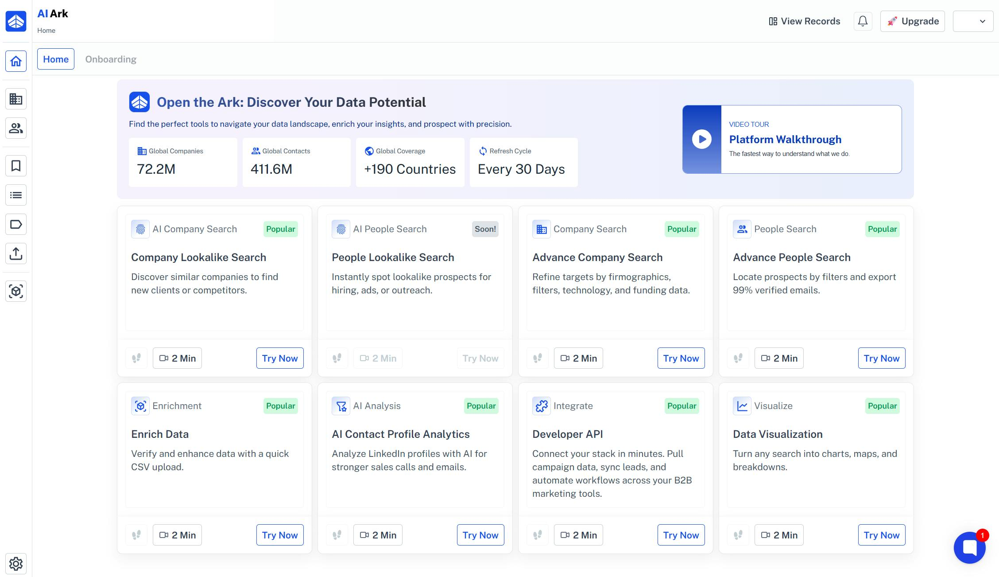
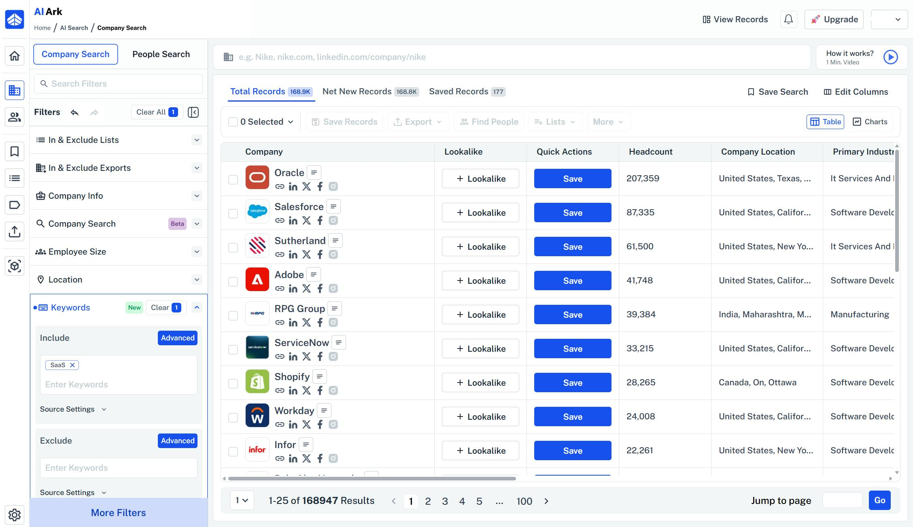
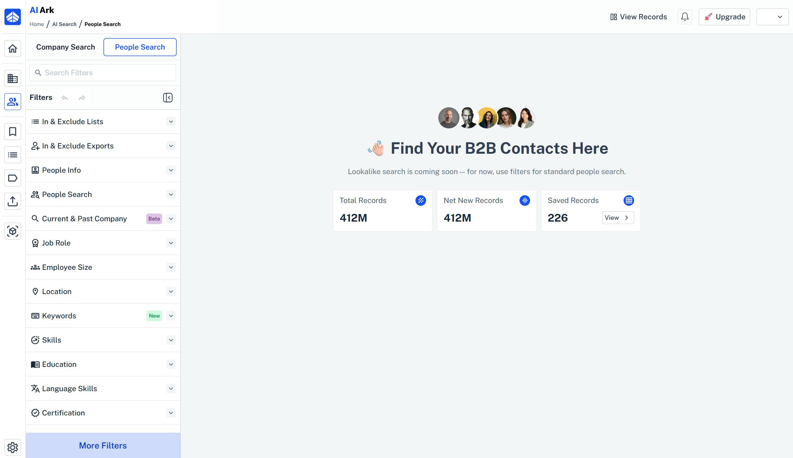

### 🎬 관련 영상
- [🎥 영상 보기](https://ph-files.imgix.net/297fb599-fcb3-425a-90ba-0e17d9bc6982.gif?auto=format)

---

## 29. [Wajo](https://www.producthunt.com/products/wajo)
**Votes**: 22 | **도입 난이도**: 중 | **신뢰도**: 상
**Tagline**: Action agents that get real-world tasks done
**서비스 링크**: https://www.producthunt.com/r/3BOV2K4WS3ID6Z

**태그**: Automation, AI Agent, Productivity, Workflow, Agent

### 📌 이 서비스 한눈에 보기
단순 추천을 넘어 실제 업무를 수행하고 예약까지 완료하는 자율형 액션 에이전트

### 🔑 주요 기능
- 단순 정보 제공을 넘어 예약, 주문, 일정 조정 등 실질적인 과업 수행
- 사용자의 개입을 최소화하는 프로액티브(Proactive) 및 자가 학습 기능
- 개인용 에이전트(Fo)와 비즈니스 운영용 에이전트 구축 기능 제공

### 🙋 사용자에게 어떤 점이 좋은가
복잡한 예약이나 번거로운 행정 업무를 에이전트에게 맡겨 시간을 절약하고 일상 업무의 자동화를 실현할 수 있습니다.

### ✅ 지금 바로 써볼 기능
- 개인 비서 에이전트 'Fo'를 통한 일정 및 예약 관리 테스트
- 비즈니스 운영을 위한 맞춤형 에이전트 빌더 탐색

### ⚠️ 사용 전 확인할 점
- 실제 결제나 외부 서비스 연동 시 발생할 수 있는 권한 및 보안 문제 확인 필요
- 에이전트의 자율적 판단에 따른 결과값 검증 필요

### 🧭 확인이 더 필요한 정보
에이전트가 외부 서비스(결제, 개인정보 등)와 연동되는 구체적인 보안 프로토콜과 권한 관리 방식에 대한 정보가 필요합니다.

### 📸 스크린샷 및 갤러리
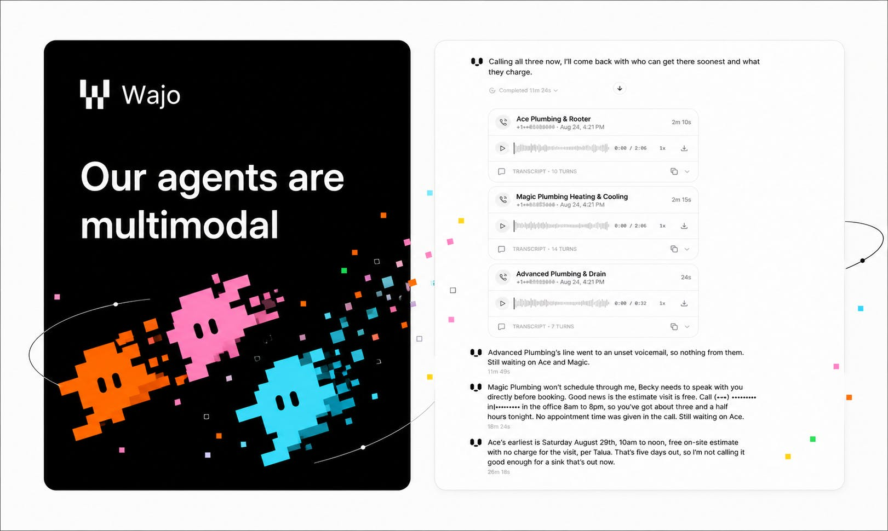
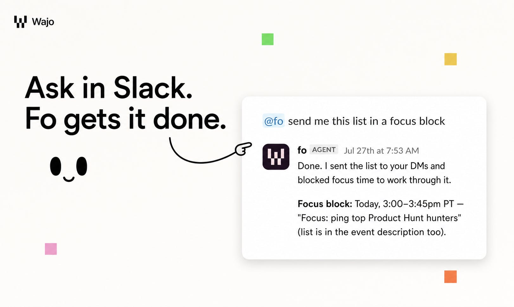

### 🎬 관련 영상
- [🎥 영상 보기](https://ph-files.imgix.net/2370a2c3-480b-441c-a04c-6180838f9085.jpeg?auto=format)

---

## 30. [SiliconCity.lol](https://www.producthunt.com/products/siliconcity-lol)
**Votes**: 22 | **도입 난이도**: 하 | **신뢰도**: 상
**Tagline**: Buy a plot, get an AI-built HQ for your brand.
**서비스 링크**: https://www.producthunt.com/r/OHCUVVZAGKKYPD

**태그**: DigitalAsset, AI, Branding, Interactive, AI Tool

### 📌 이 서비스 한눈에 보기
디지털 토지를 구매하여 브랜드만의 AI 생성 아이소메트릭 본부를 구축하는 인터랙티브 시티 플랫폼

### 🔑 주요 기능
- 디지털 토지 구매를 통한 브랜드 공간 확보
- AI를 활용한 독창적인 아이소메트릭 건물 생성
- 웹사이트 연결 및 인터랙티브 지도 참여 기능

### 🙋 사용자에게 어떤 점이 좋은가
브랜드의 디지털 정체성을 시각적인 건물 형태로 구축하고, 가상 도시 지도 내에서 브랜드의 존재감을 드러낼 수 있습니다.

### ✅ 지금 바로 써볼 기능
- 디지털 토지 구매 및 브랜드 공간 확보
- AI를 통한 브랜드 HQ 디자인 생성
- 자사 웹사이트 연결 및 지도 등록

### ⚠️ 사용 전 확인할 점
- 디지털 자산의 소유권 및 가치 유지 여부 확인 필요
- AI 생성 건물의 커스터마이징 자유도 확인 필요

### 🧭 확인이 더 필요한 정보
토지 구매 방식(NFT 여부 등)과 생성된 건물의 상세 편집 기능에 대한 구체적인 정보가 필요합니다.

### 📸 스크린샷 및 갤러리
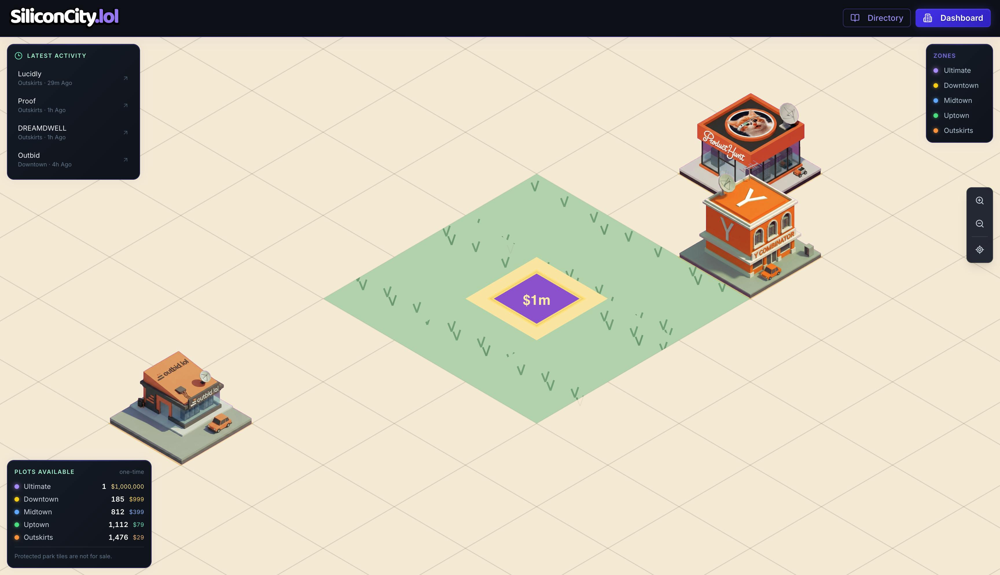
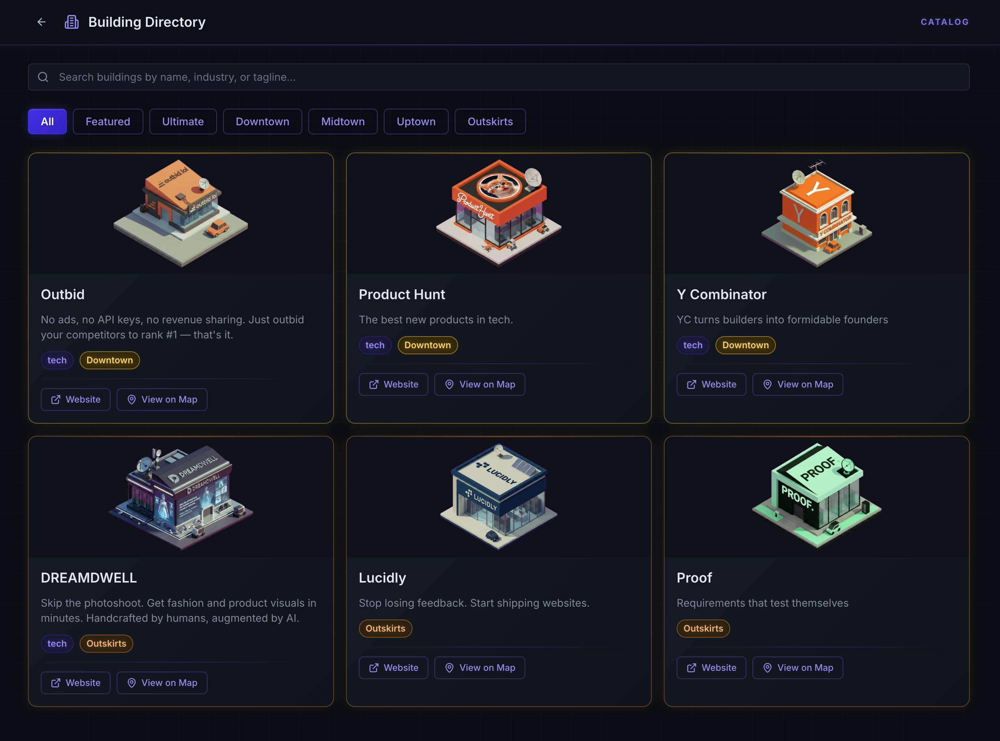

---

