# 🚀 Product Hunt Daily Top 30 (2026-08-27)

## 오늘의 요약
오늘의 트렌드는 AI 에이전트가 단순한 보조를 넘어 실제 운영 환경(OS, 서버, 데이터)과 결합하여 실질적인 작업을 수행하는 인프라 중심의 도구들이 주목받았습니다. 또한, 복잡한 전문 작업(앱 개발, 영상 편집, 데이터 연결)을 자연어 대화로 자동화하여 전문가의 생산성을 극대화하는 방향이 뚜렷하게 나타났습니다.

### 오늘의 핵심 포인트
- AI 에이전트가 독립적인 컴퓨팅 환경과 데이터 소스를 자유롭게 활용할 수 있도록 돕는 인프라 및 연결 도구들이 등장했습니다.
- 코딩이나 복잡한 편집 기술 없이도 아이디어를 실제 앱이나 영상 결과물로 구현할 수 있는 생성형 AI 워크플로우가 강화되었습니다.
- 사용자의 작업 내용을 방해하지 않으면서 실시간으로 상호작용하는 지능형 인터페이스가 개인화된 생산성 도구로 주목받았습니다.

**오늘의 태그**: AI Agent, No-Code/Low-Code, Productivity, Automation, Developer Tools

## 1. [x1](https://www.producthunt.com/products/x1-2)
**Votes**: 350 | **도입 난이도**: 하 | **신뢰도**: 상
**Tagline**: Lovable for iPhone apps. From idea to App Store
**서비스 링크**: https://www.producthunt.com/r/HRIWQ6DBNJOZ7W

**태그**: NoCode, AI, iOS, AppBuilder, Automation, AI Tool, Prompting, Design

### 📌 이 서비스 한눈에 보기
아이디어만 있으면 코딩 없이 아이폰 앱을 만들고 출시까지 완료하는 AI 앱 빌더

### 🔑 주요 기능
- 단계별 질문과 설계를 통한 체계적인 앱 구축 프로세스
- 실시간 아이폰 미리보기 및 단계별 빌드 방식
- App Store 등록을 위한 스크린샷 및 제출 준비 자동화

### 🙋 사용자에게 어떤 점이 좋은가
코딩 지식이 없어도 아이디어를 실제 작동하는 아이폰 앱으로 구현하고 스토어 출시까지 한 번에 해결할 수 있습니다.

### ✅ 지금 바로 써볼 기능
- 아이디어 구체화를 위한 단계별 질문 답변하기
- 생성된 화면 디자인 검토 및 편집하기
- 실제 아이폰에서 앱 미리보기 및 테스트하기

### ⚠️ 사용 전 확인할 점
- 복잡한 커스텀 기능 구현 가능 여부 확인 필요
- App Store 심사 통과를 위한 최종 검수 필요

### 🧭 확인이 더 필요한 정보
사용자의 아이디어가 얼마나 복잡한 기능까지 구현 가능한지에 대한 기술적 한계가 명시되지 않았습니다.

### 📸 스크린샷 및 갤러리
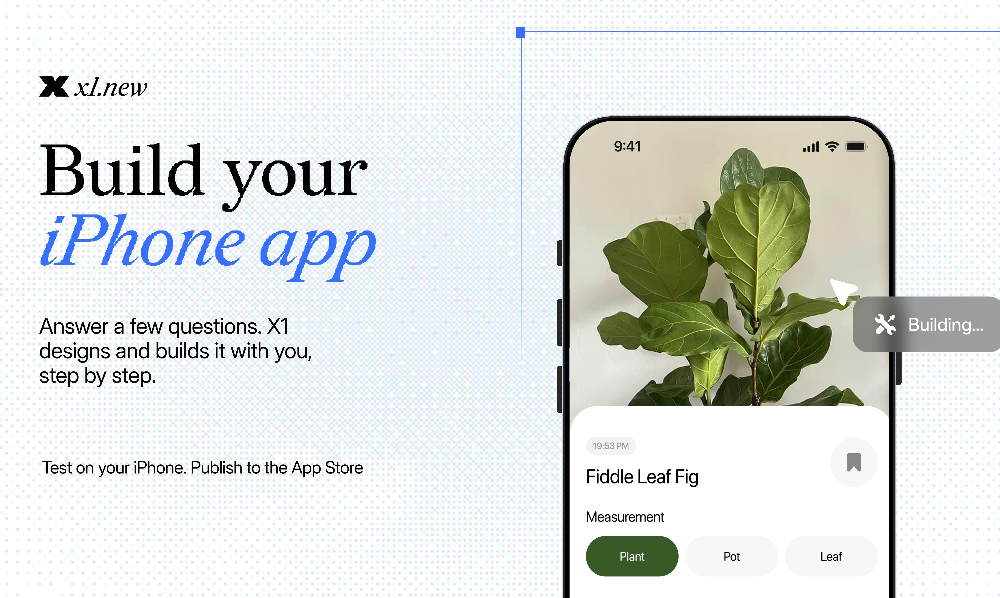
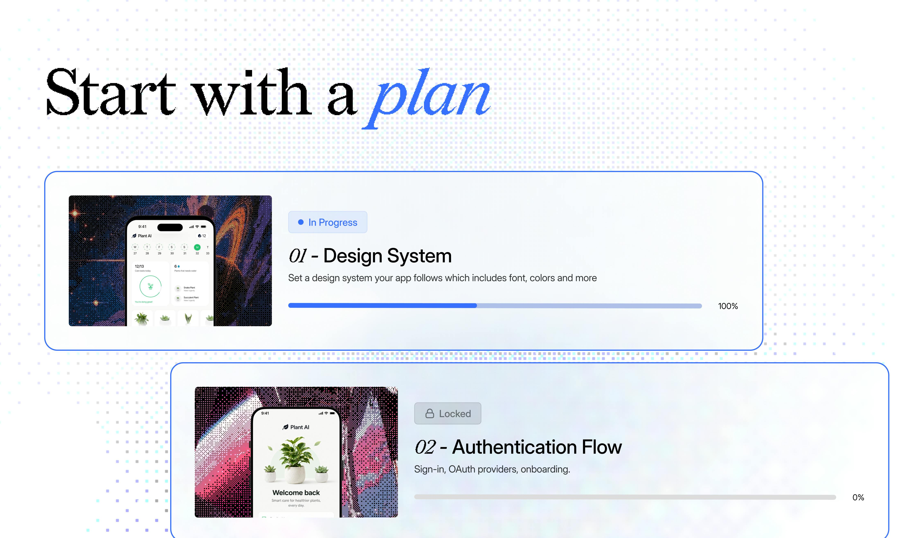
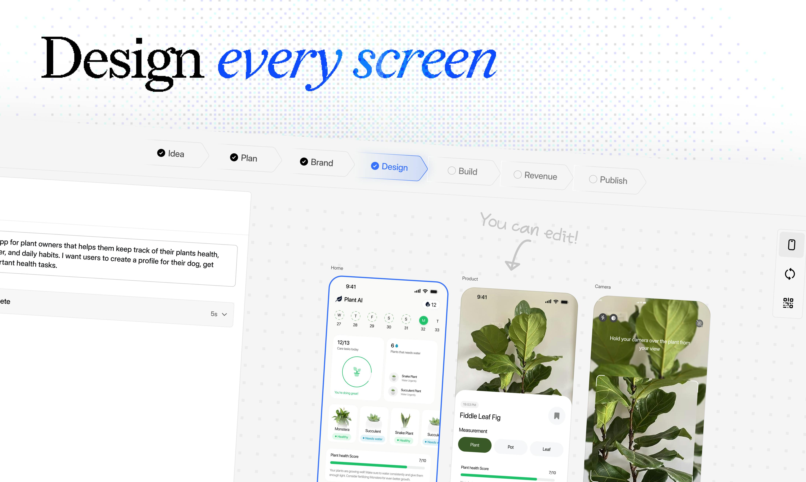

### 🎬 관련 영상
- [🎥 영상 보기](https://ph-files.imgix.net/82884020-2f6f-46b4-a20e-72755355a10f.jpeg?auto=format)

---

## 2. [Expertise AI](https://www.producthunt.com/products/expertise-ai)
**Votes**: 283 | **도입 난이도**: 중 | **신뢰도**: 상
**Tagline**: Turn your GTM skills into recurring revenue
**서비스 링크**: https://www.producthunt.com/r/UWNQIHNBEC6TSW

**태그**: SaaS, Monetization, AI, GTM, Expert Economy, AI Tool

### 📌 이 서비스 한눈에 보기
GTM 전문가의 노하우를 AI 스킬로 변환하여 수익화하는 플랫폼

### 🔑 주요 기능
- 전문가의 GTM 플레이북을 보호된 AI 스킬로 자산화
- 개별 전문가를 위한 맞춤형 스토어프론트 제공
- 구독형 설치 및 실행 기반의 수익 창출 모델

### 🙋 사용자에게 어떤 점이 좋은가
자신의 전문 지식을 디지털 자산으로 만들어 지속적인 수동 수익을 창출하고자 하는 전문가에게 유용합니다.

### ✅ 지금 바로 써볼 기능
- 자신의 GTM 플레이북을 AI 스킬로 변환 가능한지 검토
- 전문가 스토어프론트 구성 방식 확인
- 수익 배분 및 결제 모델 구조 파악

### ⚠️ 사용 전 확인할 점
- AI 스킬의 품질이 실제 비즈니스 성과로 이어지는지에 대한 검증 필요
- 플레이북의 지식재산권 보호 방식 확인 필요

### 🧭 확인이 더 필요한 정보
AI 스킬이 구체적으로 어떤 기술적 스택이나 플랫폼에 설치되는지에 대한 상세 정보가 부족합니다.

### 📸 스크린샷 및 갤러리
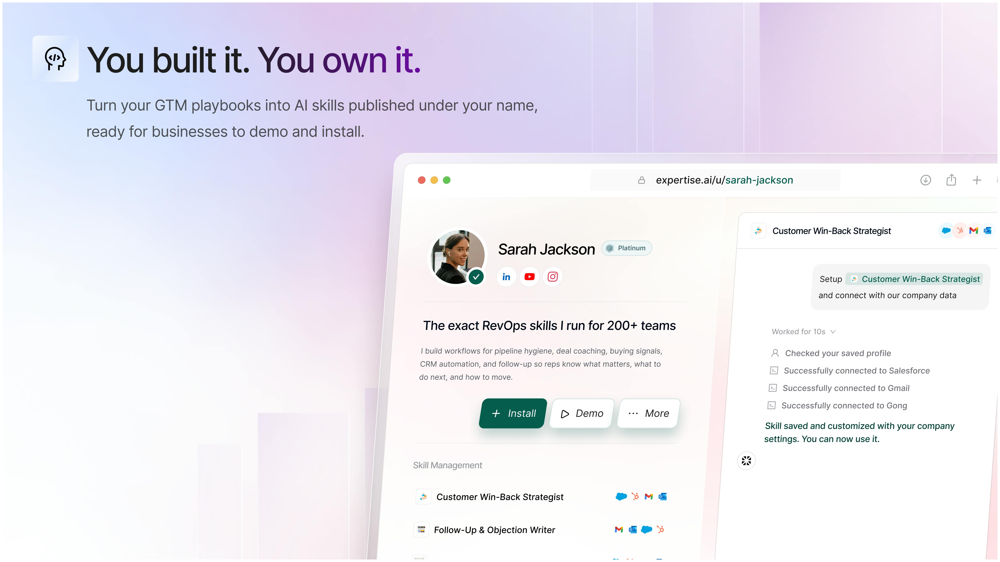
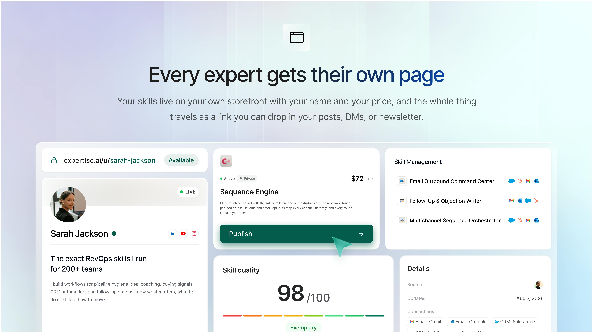
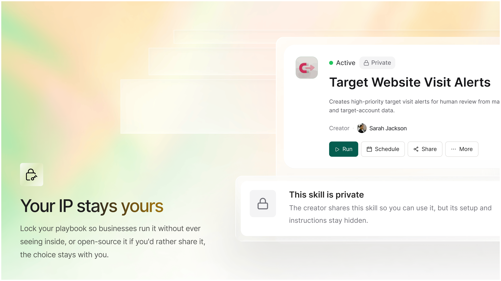

### 🎬 관련 영상
- [🎥 영상 보기](https://ph-files.imgix.net/ab8c1770-bd98-4fb7-933c-b31112713942.jpeg?auto=format)

---

## 3. [PostHog Desktop](https://www.producthunt.com/products/posthog)
**Votes**: 260 | **도입 난이도**: 중 | **신뢰도**: 상
**Tagline**: The product editor for product builders
**서비스 링크**: https://www.producthunt.com/r/2RW3QOUU4OK7XB

**태그**: DevTool, AI, ProductManagement, Automation, Agent

### 📌 이 서비스 한눈에 보기
제품 데이터와 AI 에이전트를 결합하여 제품 개발부터 배포까지 관리하는 멀티플레이어 워크스페이스

### 🔑 주요 기능
- 제품 데이터 기반의 맥락 있는 제품 편집 및 빌드 환경 제공
- 팀원 및 AI 에이전트와 협업할 수 있는 멀티플레이어 워크스페이스
- 제품 신호를 기반으로 한 자동화된 PR(Pull Request) 생성 기능

### 🙋 사용자에게 어떤 점이 좋은가
제품 데이터와 개발 도구가 통합되어 있어, 데이터 분석부터 코드 수정까지의 흐름을 하나의 워크스페이스에서 빠르게 실행할 수 있습니다.

### ✅ 지금 바로 써볼 기능
- 제품 데이터 연동 및 컨텍스트 확인
- AI 에이전트 플릿(Fleet) 설정 및 실행
- 제품 신호를 PR로 전환하는 워크플로우 테스트

### ⚠️ 사용 전 확인할 점
- 기존 PostHog 데이터 인프라와의 연동 수준 확인 필요
- AI 에이전트가 생성하는 코드/PR의 품질 검증 필요

### 🧭 확인이 더 필요한 정보
데스크톱 앱의 구체적인 로컬 환경 제어 범위와 기존 PostHog 클라우드 서비스와의 동기화 방식에 대한 상세 정보가 필요합니다.

### 📸 스크린샷 및 갤러리
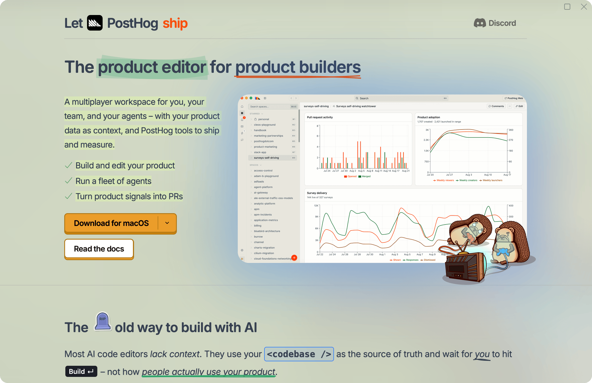
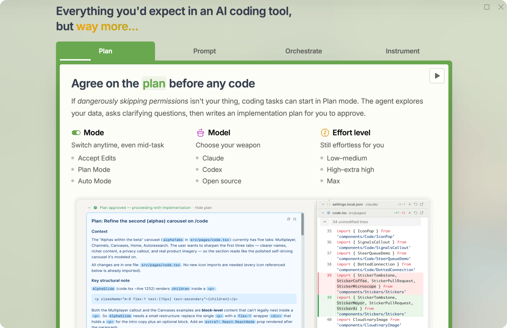
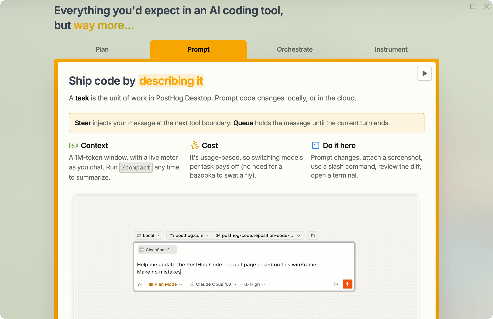

### 🎬 관련 영상
- [🎥 영상 보기](https://ph-files.imgix.net/fcc26bed-26c9-4f28-9a52-a3ab009769a7.jpeg?auto=format)

---

## 4. [ChatCut Desktop](https://www.producthunt.com/products/chatcut-ai-video-editor)
**Votes**: 229 | **도입 난이도**: 중 | **신뢰도**: 상
**Tagline**: Video editor built for humans & AI. Edit with GPT & Claude.
**서비스 링크**: https://www.producthunt.com/r/J3QOL7SBC4ULA5

**태그**: VideoEditor, AI, Automation, CreativeTool, Agent, AI Tool, Chat, Video, Vision, DevTool

### 📌 이 서비스 한눈에 보기
AI 에이전트와 대화하며 전문적인 영상 편집을 수행하는 로컬 기반 데스크톱 편집기

### 🔑 주요 기능
- GPT 및 Claude와 연동하여 자연어로 영상 편집 지시 가능
- 영상 편집, 모션 그래픽, 자막 생성 및 멀티미디어 생성 기능 통합
- 로컬 실행 방식으로 데이터 제어권 유지 및 외부 툴(Premiere, Resolve 등)로 XML 내보내기 지원

### 🙋 사용자에게 어떤 점이 좋은가
복잡한 편집 과정을 AI 에이전트에게 맡겨 작업 시간을 단축하면서도, 최종 결과물은 전문 편집 툴로 가져가 정교하게 다듬을 수 있습니다.

### ✅ 지금 바로 써볼 기능
- 자연어 명령을 통한 타임라인 편집 테스트
- AI 생성 모션 그래픽 및 자막 기능 활용
- 편집 결과물의 XML 내보내기 호환성 확인

### ⚠️ 사용 전 확인할 점
- 외부 AI 모델(GPT, Claude) 연결 시 API 비용이 발생할 수 있음
- 로컬 실행 환경의 하드웨어 사양에 따른 성능 차이 존재

### 🧭 확인이 더 필요한 정보
사용자의 하드웨어 사양에 따른 로컬 실행 성능과 외부 AI 모델 연동 시의 구체적인 비용 구조 확인이 필요합니다.

### 📸 스크린샷 및 갤러리
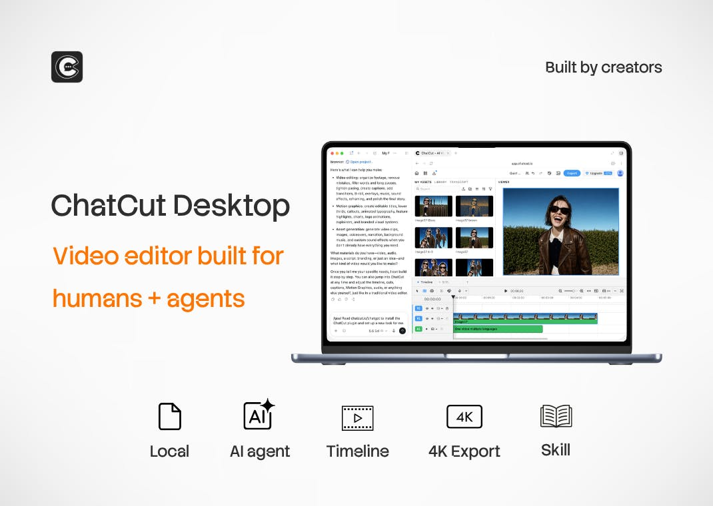
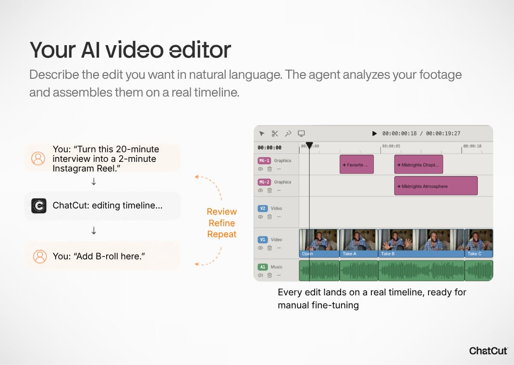
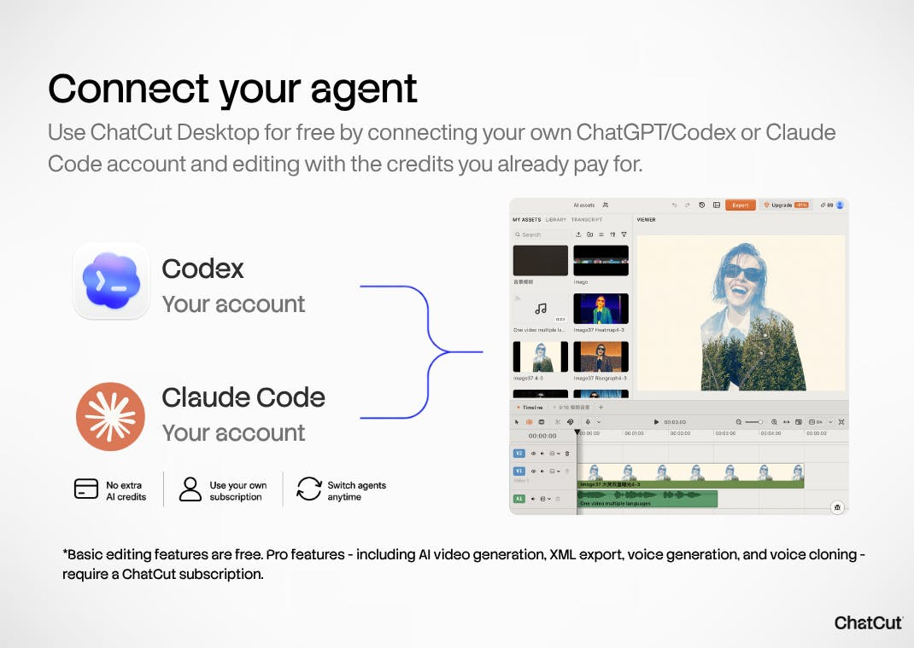

### 🎬 관련 영상
- [🎥 영상 보기](https://ph-files.imgix.net/098b84b5-c670-4de5-8bbd-38cfc7116e91.jpeg?auto=format)

---

## 5. [MCP-Builder.ai](https://www.producthunt.com/products/mcp-builder-ai)
**Votes**: 149 | **도입 난이도**: 하 | **신뢰도**: 상
**Tagline**: The fastest way to connect your data with your AI Tools. 
**서비스 링크**: https://www.producthunt.com/r/VCPNXA2NR6U5CT

**태그**: AI, DevTool, Automation, NoCode, AI Tool, Chat, API, Security

### 📌 이 서비스 한눈에 보기
복잡한 설정 없이 말만 하면 데이터와 AI를 연결하는 MCP 서버를 즉시 구축해주는 도구

### 🔑 주요 기능
- 자연어 설명을 통한 자동 MCP 서버 빌드 및 호스팅
- 데이터베이스, API, 파일 등 다양한 소스 연결 지원
- 인프라 관리나 보안 설정이 필요 없는 서버리스 환경 제공

### 🙋 사용자에게 어떤 점이 좋은가
Claude, ChatGPT, Cursor 등 AI 클라이언트에서 사용자의 개인 데이터나 외부 API를 즉시 활용할 수 있게 해줍니다.

### ✅ 지금 바로 써볼 기능
- 연결하고자 하는 데이터 소스 설명하기
- 생성된 MCP URL을 Claude나 Cursor에 등록하기
- AI 도구에서 실시간 데이터 연동 테스트하기

### ⚠️ 사용 전 확인할 점
- 데이터 보안 및 프라이버시 정책 확인 필요
- 복잡한 커스텀 로직 구현 시 제약 사항 확인 필요

### 🧭 확인이 더 필요한 정보
데이터 소스의 종류에 따른 상세 보안 수준과 호스팅 인프라의 세부 사양은 명시되지 않았습니다.

### 📸 스크린샷 및 갤러리
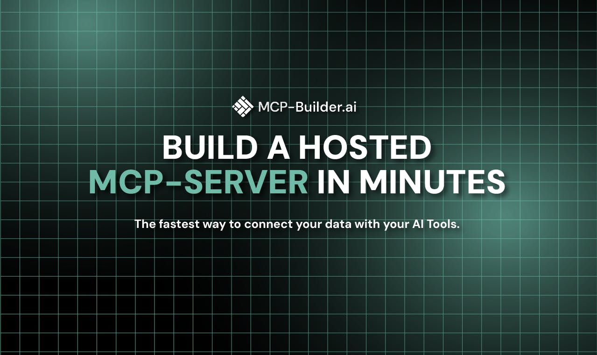
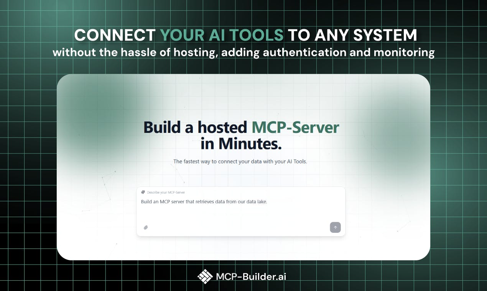
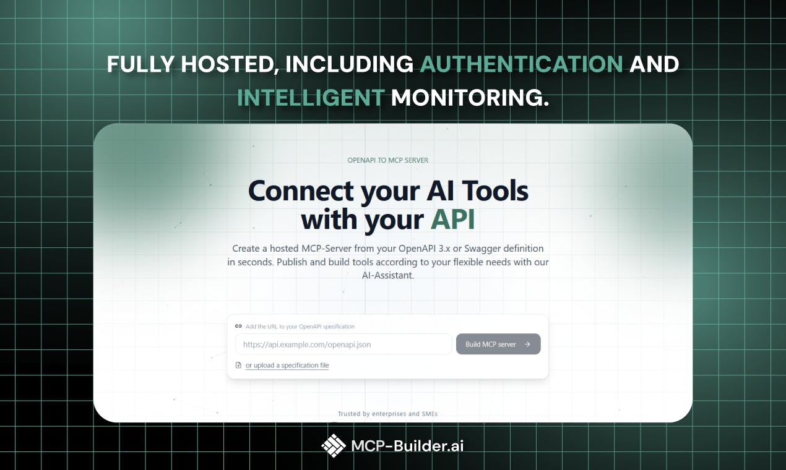

### 🎬 관련 영상
- [🎥 영상 보기](https://ph-files.imgix.net/4fb1d729-376f-4b72-ae82-953f9da5a4d5.jpeg?auto=format)

---

## 6. [Tellie Prompter 1.5](https://www.producthunt.com/products/tellie-2)
**Votes**: 124 | **도입 난이도**: 하 | **신뢰도**: 상
**Tagline**: The teleprompter that knows what you haven't said
**서비스 링크**: https://www.producthunt.com/r/KS5JFRUHBLE2PP

**태그**: Productivity, Video, MacApp, Speech, AI Tool, Prompting, DevTool

### 📌 이 서비스 한눈에 보기
사용자의 말을 실시간으로 듣고 흐름을 따라가는 지능형 텔레프롬프터

### 🔑 주요 기능
- 사용자의 음성을 인식하여 대본 속도를 실시간으로 조절하는 기능
- 중요 포인트 추적, 시간 초과 경고 및 발표 요약(debrief) 기능 제공
- 계정 생성이나 데이터 수집 없이 로컬에서 실행되는 3MB 초경량 Mac 앱

### 🙋 사용자에게 어떤 점이 좋은가
대본에 얽매이지 않고 자연스러운 발표나 영상 촬영이 가능하며, 개인정보 유출 걱정 없이 가볍게 사용할 수 있습니다.

### ✅ 지금 바로 써볼 기능
- 실시간 음성 추적 기능 테스트하기
- 발표 시간 관리 및 요약 기능 활용하기
- PRODHUNT10 코드로 할인 혜택 받기

### ⚠️ 사용 전 확인할 점
- 10일 무료 체험 기간 이후 유료 전환 필요
- Mac 전용 앱이므로 다른 OS에서는 사용 불가

### 🧭 확인이 더 필요한 정보
제공된 정보에는 Windows 등 타 OS 지원 여부와 상세 가격 정책이 명시되지 않았습니다.

### 📸 스크린샷 및 갤러리
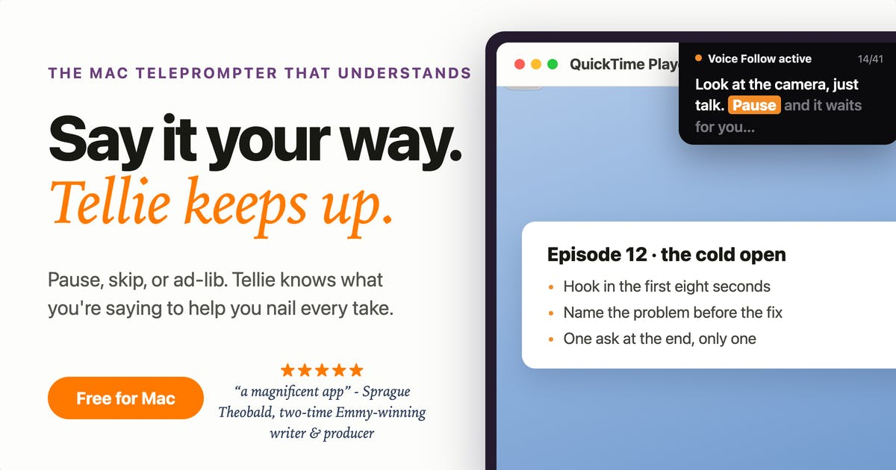
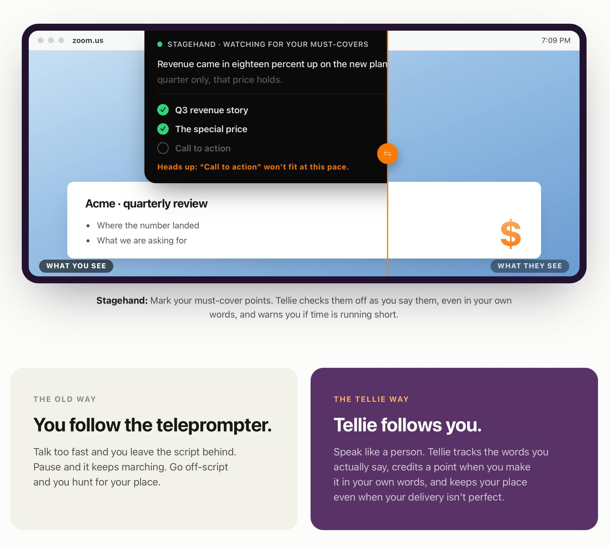
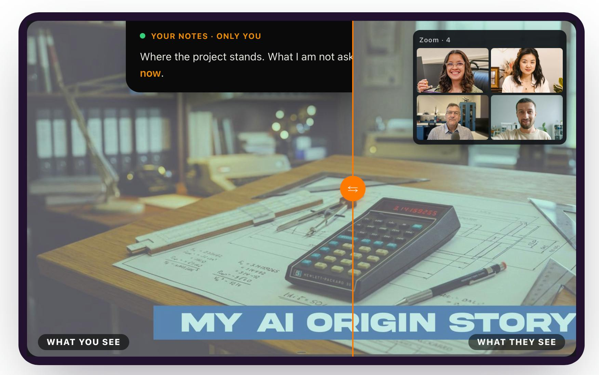

### 🎬 관련 영상
- [🎥 영상 보기](https://ph-files.imgix.net/2d3b2b10-f07a-4a56-8665-b0b31e9b25c7.jpeg?auto=format)

---

## 7. [OpenComputer](https://www.producthunt.com/products/opencomputer)
**Votes**: 121 | **도입 난이도**: 중 | **신뢰도**: 상
**Tagline**: Firebase for Agents
**서비스 링크**: https://www.producthunt.com/r/VVHZVEVKSQXPBO

**태그**: AI-Agents, Cloud-Infrastructure, DevOps, Automation, Agent

### 📌 이 서비스 한눈에 보기
AI 에이전트를 위한 클라우드 인프라: 세션별 독립된 리눅스 환경 제공

### 🔑 주요 기능
- 에이전트를 함수처럼 배포하고 전용 컴퓨터 환경 할당
- 세션별 독립적인 리눅스 머신 제공 (ffmpeg, chromium, git 등 자유로운 설치 가능)
- 상태 유지(Hibernate & Resume) 기능을 통한 내구성 확보

### 🙋 사용자에게 어떤 점이 좋은가
AI 에이전트가 단순한 API 호출을 넘어, 실제 브라우저나 OS 도구를 자유롭게 사용하는 복잡한 작업을 수행할 수 있는 환경을 제공합니다.

### ✅ 지금 바로 써볼 기능
- 에이전트용 리눅스 환경 배포 테스트
- 브라우저 자동화(Chromium) 워크플로우 구축
- 세션 중단 및 재개(Hibernate/Resume) 기능 검증

### ⚠️ 사용 전 확인할 점
- 세션별 리소스 할당량 및 비용 구조 확인 필요
- 에이전트 작업 부하에 따른 인프라 확장성 검토

### 🧭 확인이 더 필요한 정보
구체적인 가격 정책과 세션당 리소스(CPU/RAM) 사양은 명시되지 않았습니다.

### 📸 스크린샷 및 갤러리
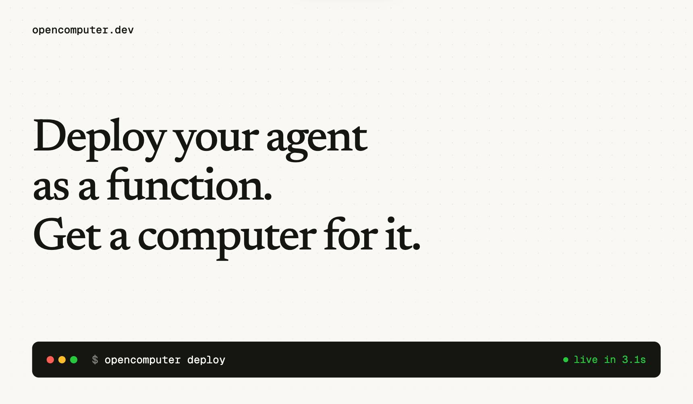
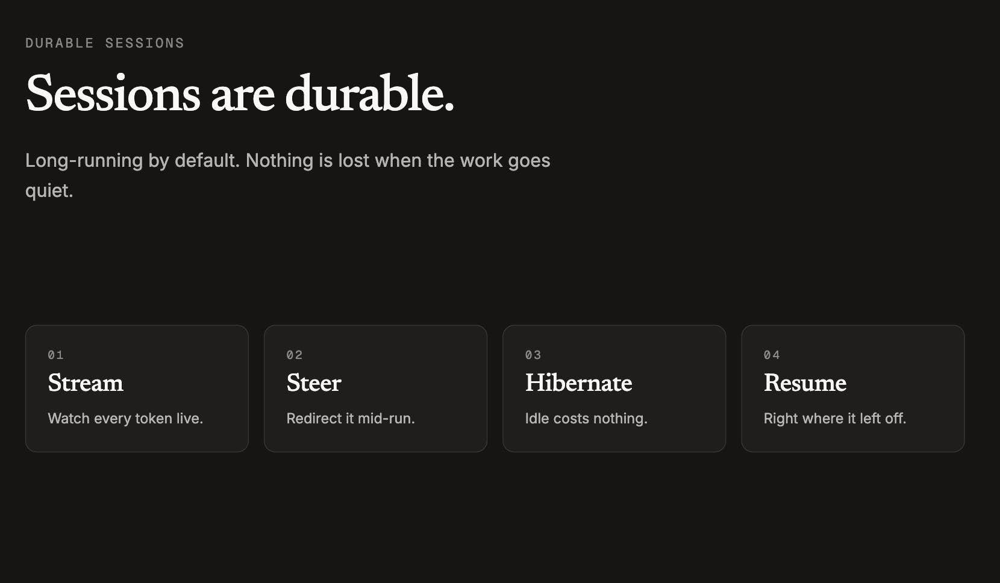
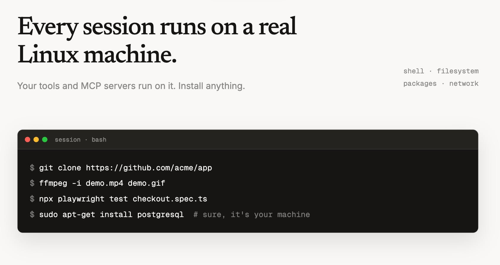

---

## 8. [Termy](https://www.producthunt.com/products/termy-language-learning)
**Votes**: 110 | **도입 난이도**: 하 | **신뢰도**: 상
**Tagline**: Learn languages from games, videos, and websites
**서비스 링크**: https://www.producthunt.com/r/SAZDUOG4HGIOQW

**태그**: LanguageLearning, Productivity, EdTech, AI Tool, Video

### 📌 이 서비스 한눈에 보기
즐기는 콘텐츠를 학습 도구로 바꾸는 몰입형 언어 학습 도구

### 🔑 주요 기능
- 게임, 영상, 웹사이트 등 화면 속 어려운 단어를 즉시 식별 및 설명
- 학습 맥락(Context)을 유지하며 흐름을 깨지 않는 단축키 방식
- 학습한 단어를 나중에 맞춤형 복습 문제로 자동 변환

### 🙋 사용자에게 어떤 점이 좋은가
콘텐츠를 즐기는 일상적인 흐름을 방해받지 않으면서도, 자연스럽게 어휘력을 확장할 수 있습니다.

### ✅ 지금 바로 써볼 기능
- 단축키를 사용하여 화면 속 모르는 단어 즉시 확인하기
- 맥락과 함께 저장된 단어들을 나중에 복습 모드로 학습하기

### ⚠️ 사용 전 확인할 점
- Windows 및 macOS 환경에서만 작동함
- 학습 데이터가 사용자의 활동 맥락에 의존하므로 초기 데이터 축적이 필요함

### 🧭 확인이 더 필요한 정보
30개 언어 지원 범위와 각 언어별 기능 완성도에 대한 구체적인 정보가 필요합니다.

### 📸 스크린샷 및 갤러리

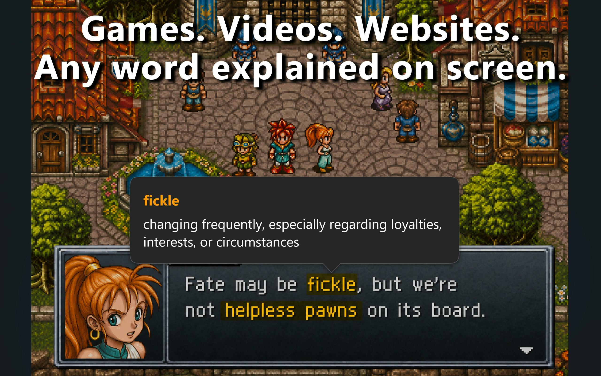
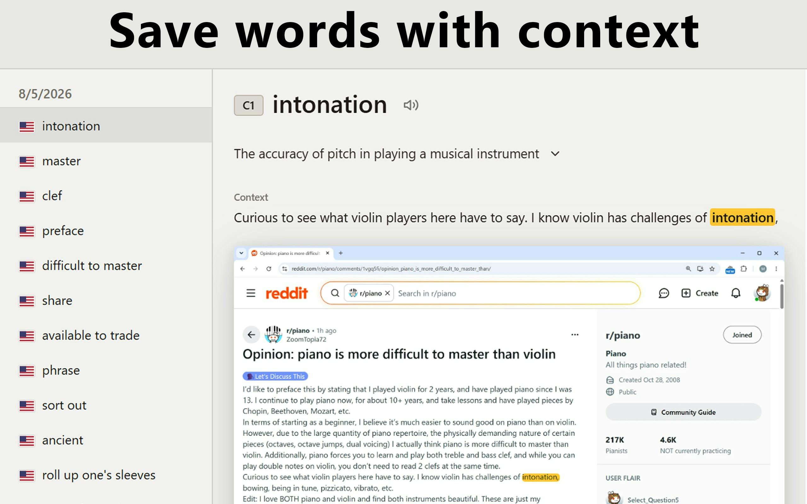

### 🎬 관련 영상
- [🎥 영상 보기](https://ph-files.imgix.net/576a4c23-0545-4e4f-ab58-233a8bc69077.jpeg?auto=format)

---

## 9. [ify](https://www.producthunt.com/products/ify-2)
**Votes**: 102 | **도입 난이도**: 하 | **신뢰도**: 상
**Tagline**: Resolution AI that works on top of your existing helpdesk
**서비스 링크**: https://www.producthunt.com/r/QV2KSOZBY2NWLU

**태그**: AI, CustomerSupport, Automation, SaaS, AI Tool, Chat, Sales, Email

### 📌 이 서비스 한눈에 보기
기존 헬프데스크를 교체하지 않고도 즉시 AI 고객 지원을 구축하는 솔루션

### 🔑 주요 기능
- Freshdesk, Zendesk, Salesforce, HubSpot 등 기존 툴 위에서 바로 작동
- 웹사이트 스크래핑 및 과거 티켓 기반의 자동 지식 베이스 구축
- 이메일, 채팅, WhatsApp, Slack 등 다양한 채널 지원

### 🙋 사용자에게 어떤 점이 좋은가
기존 시스템을 갈아엎는 번거로움 없이, 부족한 문서 작업 문제를 해결하며 즉각적인 AI 지원 도입이 가능합니다.

### ✅ 지금 바로 써볼 기능
- 기존 헬프데스크 계정 연동하기
- 웹사이트 및 문서 스크래핑 기능 실행하기
- 생성된 SOP 및 지식 베이스 검토하기

### ⚠️ 사용 전 확인할 점
- 기존 헬프데스크의 모든 기능과 완벽하게 동기화되는지 확인 필요
- 자동 생성된 지식 베이스의 정확도 검증 필요

### 🧭 확인이 더 필요한 정보
현재 제공되는 채널 외에 추가적인 외부 서비스 연동 범위는 명시되지 않았습니다.

### 📸 스크린샷 및 갤러리

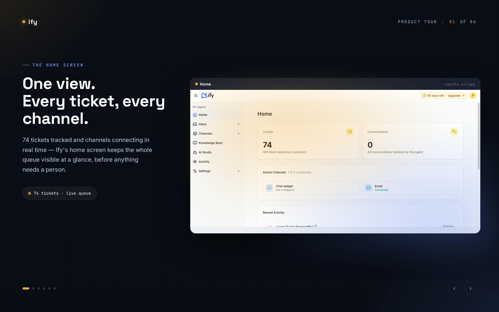
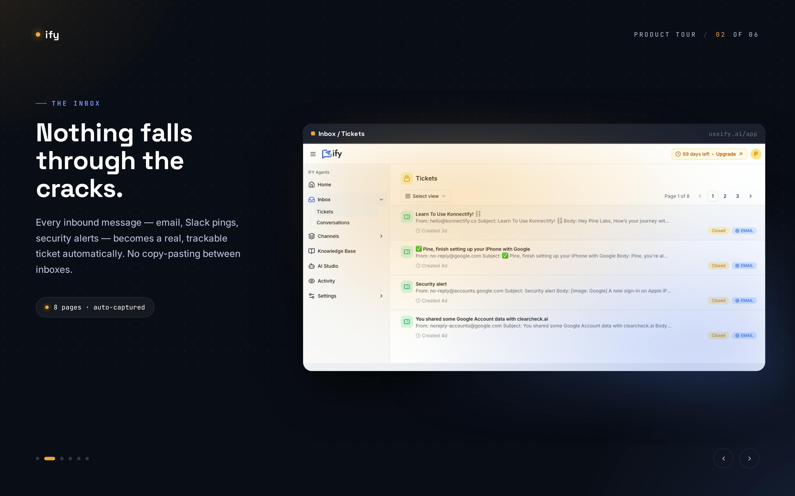

### 🎬 관련 영상
- [🎥 영상 보기](https://ph-files.imgix.net/32b66059-b71b-4008-be57-66eaf5652fff.jpeg?auto=format)

---

## 10. [Mac mini](https://www.producthunt.com/products/apple)
**Votes**: 98 | **도입 난이도**: 하 | **신뢰도**: 상
**Tagline**: Now with M6 and M5 Pro chips
**서비스 링크**: https://www.producthunt.com/r/2JZ6FLCI65LEON

**태그**: Hardware, Workstation, Apple

### 📌 이 서비스 한눈에 보기
M6 및 M5 Pro 칩 탑を 통한 압도적 성능의 차세대 Mac mini

### 🔑 주요 기능
- M6 및 M5 Pro 칩 탑재로 강력해진 퍼포먼스
- Apple Intelligence 지원 및 Wi-Fi 7 도입
- 더 빨라진 스토리지와 컴팩트한 5인치 폼팩터 유지

### 🙋 사용자에게 어떤 점이 좋은가
코딩, 콘텐츠 제작 등 고사양 작업이 필요한 전문가들에게 더 빠르고 효율적인 데스크탑 환경을 제공합니다.

### ✅ 지금 바로 써볼 기능
- M6/M5 Pro 칩의 작업 성능 체감하기
- Wi-Fi 7 지원 네트워크 환경 구축하기
- Apple Intelligence 활용 워크플로우 설계하기

### ⚠️ 사용 전 확인할 점
- 기존 주변기기와의 호환성 및 연결성 확인 필요
- 고성양 작업 시 발열 및 소음 관리 확인

### 🧭 확인이 더 필요한 정보
상세한 칩셋별 성능 차이와 스토리지 속도에 대한 구체적인 벤치마크 수치는 명시되지 않았습니다.

### 📸 스크린샷 및 갤러리
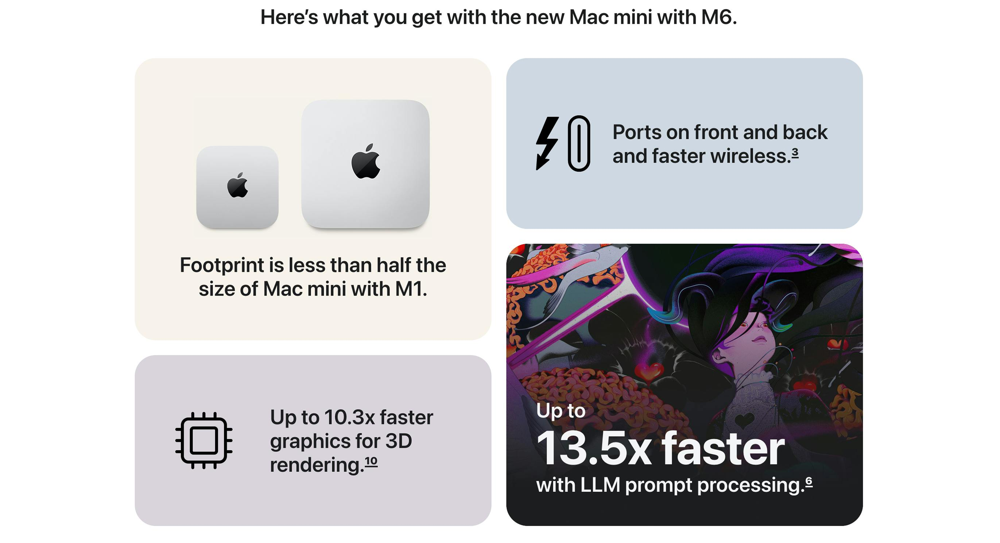

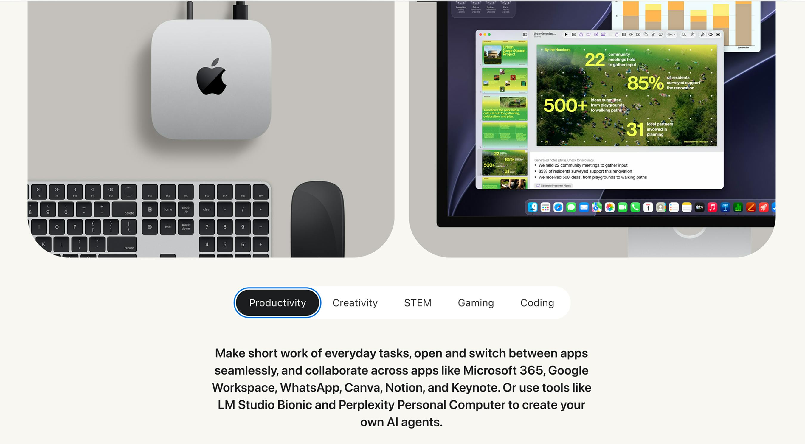

### 🎬 관련 영상
- [🎥 영상 보기](https://ph-files.imgix.net/89e44695-c4ad-42f6-a0e7-3cf200b1d697.jpeg?auto=format)

---

## 11. [Evidence Core](https://www.producthunt.com/products/evidence)
**Votes**: 98 | **도입 난이도**: 상 | **신뢰도**: 상
**Tagline**: Build live analytics with coding agents 
**서비스 링크**: https://www.producthunt.com/r/TARLW7EHGAYT22

**태그**: DevTool, Analytics, OpenSource, BI, Automation, Agent

### 📌 이 서비스 한눈에 보기
코딩 에이전트를 활용해 코드 기반으로 실시간 분석 대시보드를 구축하는 오픈소스 프레임워크

### 🔑 주요 기능
- 코드 기반의 비즈니스 인텔리전스(BI) 플랫폼 구축
- 모든 지표, 대시보드, 리포트를 파일 형태의 코드로 관리
- 오픈소스 프레임워크로 어디든 자유로운 배포 가능

### 🙋 사용자에게 어떤 점이 좋은가
데이터 분석 환경을 코드 저장소(Repo)로 관리할 수 있어 버전 관리와 검증이 용이하며, 코딩 에이전트를 통해 분석 작업 효율을 높일 수 있습니다.

### ✅ 지금 바로 써볼 기능
- Evidence CLI를 통한 로컬 환경 설정 및 미리보기
- 코드 기반의 대시보드 및 테마 정의 시도
- 기존 데이터 소스와의 연동 테스트

### ⚠️ 사용 전 확인할 점
- 코드 중심 방식이므로 개발/엔지니어링 역량이 필요함
- 데이터 소스 및 배포 환경에 따른 추가 설정 필요성

### 🧭 확인이 더 필요한 정보
코딩 에이전트가 구체적으로 어떤 방식으로 자동화를 수행하는지에 대한 상세 기술 스택 확인이 필요합니다.

### 📸 스크린샷 및 갤러리
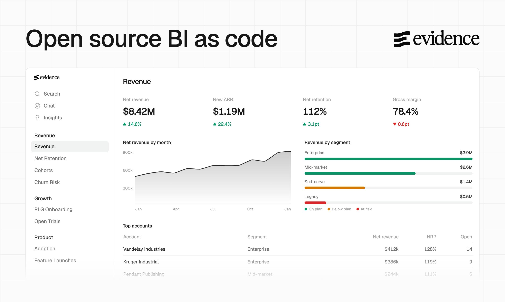
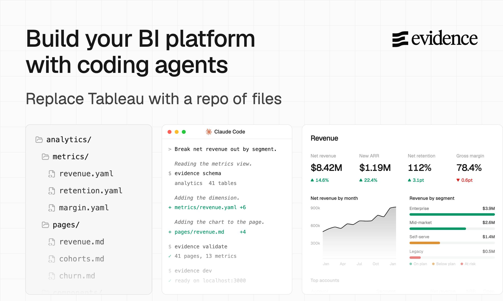
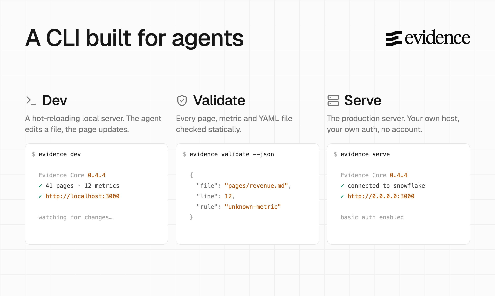

---

## 12. [HEVN U.S.](https://www.producthunt.com/products/hevn-u-s-accounts-for-non-us-companies)
**Votes**: 95 | **도입 난이도**: 상 | **신뢰도**: 상
**Tagline**: Hold USD and pay globally through U.S. sponsor banks
**서비스 링크**: https://www.producthunt.com/r/KD2XWX5TM6OXHM

**태그**: Fintech, B2B, Global Payments, USD Banking, AI Tool

### 📌 이 서비스 한눈에 보기
전 세계 기업을 위한 미국 현지 은행 계좌 기반의 USD 결제 및 관리 솔루션

### 🔑 주요 기능
- 미국 스폰서 은행을 통한 현지 USD 계좌 및 Fedwire 수취 기능 제공
- 100개국 이상의 기업이 미국 내 로컬 결제 및 SWIFT 정산 가능
- 수출입 기업 및 글로벌 무역업자를 위한 빠른 결제 체인 구축

### 🙋 사용자에게 어떤 점이 좋은가
해외 기업이 미국 현지 계좌를 가진 것처럼 USD를 직접 보유하고 결제할 수 있어, 복잡한 국제 송금 절차와 지연 시간을 줄일 수 있습니다.

### ✅ 지금 바로 써볼 기능
- 자사 국가 및 업종이 서비스 대상(eligible companies)에 포함되는지 확인
- Fedwire 및 SWIFT 결제 프로세스 호환성 검토
- 기존 비즈니스 운영 방식과 연계 가능한지 확인

### ⚠️ 사용 전 확인할 점
- 서비스 이용이 가능한 '적격 기업(eligible companies)' 기준 확인 필요
- 미국 스폰서 은행의 규제 및 컴플라이언스 준수 여부 확인

### 🧭 확인이 더 필요한 정보
서비스 이용이 가능한 국가 리스트와 기업의 자격 요건(eligibility)에 대한 구체적인 기준 확인이 필요합니다.

### 📸 스크린샷 및 갤러리

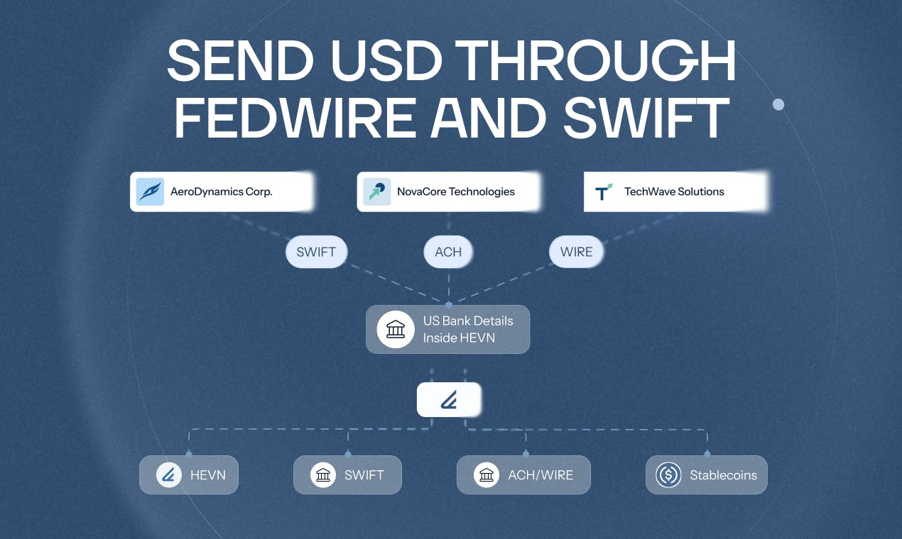

### 🎬 관련 영상
- [🎥 영상 보기](https://ph-files.imgix.net/15af2675-3e7c-4c32-8332-752e5bb496a7.jpeg?auto=format)

---

## 13. [Playcall](https://www.producthunt.com/products/playcall)
**Votes**: 94 | **도입 난이도**: 중 | **신뢰도**: 상
**Tagline**: The open-source AI alternative to Gong
**서비스 링크**: https://www.producthunt.com/r/BHXCBLZHL6PYVW

**태그**: SalesTech, OpenSource, AI, GTM, Coaching, AI Tool

### 📌 이 서비스 한눈에 보기
Gong의 고가 구독 모델을 대체하는 오픈소스 기반 AI 영업 코칭 및 성과 분석 도구

### 🔑 주요 기능
- 사용자 정의 플레이북(MEDDPICC, BANT 등) 기반의 AI 통화 점수 산정
- 누락된 순간 포착 및 데이터 기반의 맞춤형 코칭 드릴 제공
- 오픈소스 및 셀프 호스팅 지원으로 데이터 보안과 비용 효율성 확보

### 🙋 사용자에게 어떤 점이 좋은가
고가의 영업 분석 솔루션 대신 필요한 기능만 활용하여 팀의 영업 프로세스를 표준화하고 실전 코칭을 자동화할 수 있습니다.

### ✅ 지금 바로 써볼 기능
- 자체 영업 플레이북 업로드 및 AI 루브릭 생성 테스트
- 기존 영업 프레임워크(BANT, SPIN 등) 적용 및 점수 산출 확인
- 셀프 호스팅 환경 구축 및 데이터 보안성 검토

### ⚠️ 사용 전 확인할 점
- 셀프 호스팅 시 인프라 관리 및 유지보수 역량 필요
- 기존 대형 솔루션 대비 부족할 수 있는 부가 기능 확인 필요

### 🧭 확인이 더 필요한 정보
현재 제공되는 구체적인 데이터 보안 프로토콜과 셀프 호스팅 시의 기술적 요구 사양을 확인해야 합니다.

### 📸 스크린샷 및 갤러리
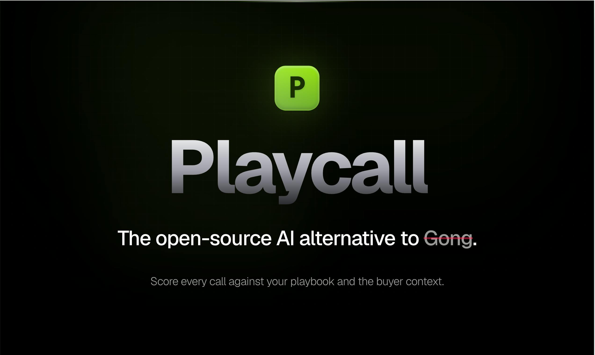
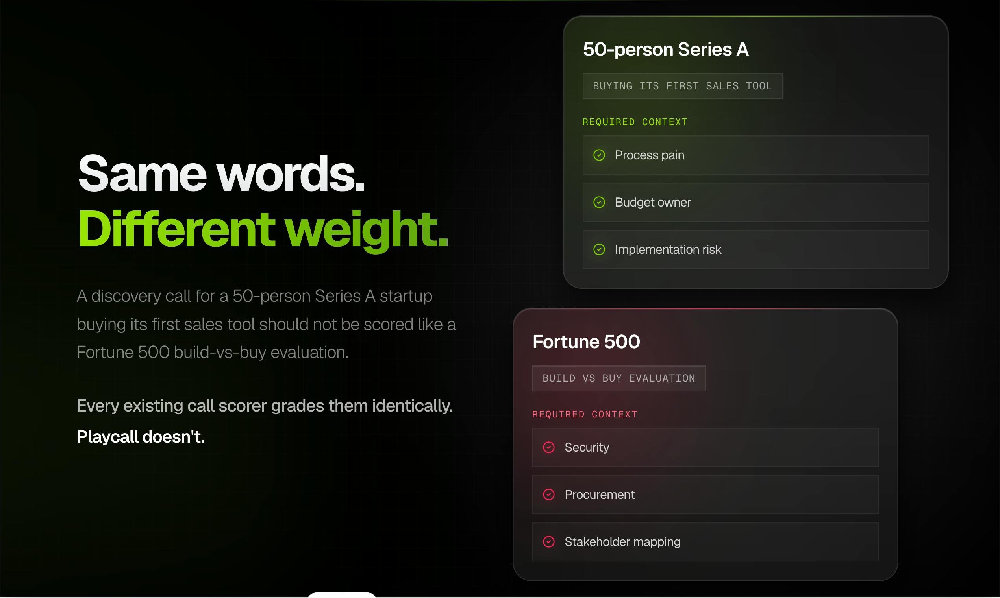
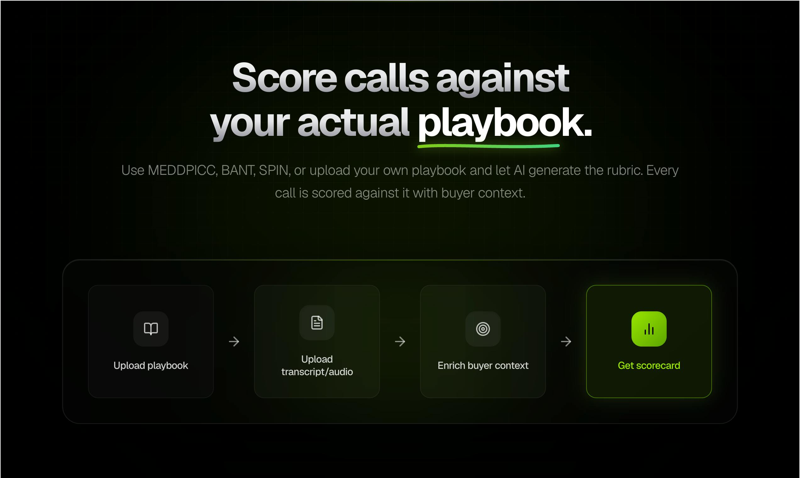

### 🎬 관련 영상
- [🎥 영상 보기](https://ph-files.imgix.net/f042d09d-61b3-4de1-8936-d1962491aaa3.jpeg?auto=format)

---

## 14. [LoupeKit](https://www.producthunt.com/products/loupekit)
**Votes**: 91 | **도입 난이도**: 하 | **신뢰도**: 상
**Tagline**: See what any page is built with and how much of it is AI
**서비스 링크**: https://www.producthunt.com/r/ZBRDLU2AEVLCXD

**태그**: DevTool, Design, WebAnalysis, AI Tool

### 📌 이 서비스 한눈에 보기
웹페이지의 기술 스택과 디자인 요소, AI 생성 비중을 즉시 분석하는 개발자용 인스펙터

### 🔑 주요 기능
- 웹페이지에 사용된 기술 스택 및 근거 식별
- 컬러 팔레트, 폰트, 에셋 추출 기능
- 페이지의 AI 생성 콘텐츠 비중 점수화

### 🙋 사용자에게 어떤 점이 좋은가
별도의 복잡한 설정 없이 현재 열려 있는 탭의 기술적 구성과 디자인 요소를 빠르게 파악할 수 있습니다.

### ✅ 지금 바로 써볼 기능
- 현재 보고 있는 페이지의 기술 스택 확인하기
- 웹 디자인 영감을 위한 팔레트 및 폰트 추출하기
- 페이지의 AI 의존도 점수 확인하기

### ⚠️ 사용 전 확인할 점
- 사용자가 요청할 때만 해당 탭을 읽는 방식이므로 수동 조작 필요
- 기술 스택 식별의 정확도는 웹사이트의 구현 방식에 따라 다를 수 있음

### 🧭 확인이 더 필요한 정보
브라우저 확장 프로그램 형태인지 혹은 별도의 데스크톱 앱인지 구체적인 설치 방식에 대한 정보가 필요합니다.

### 📸 스크린샷 및 갤러리
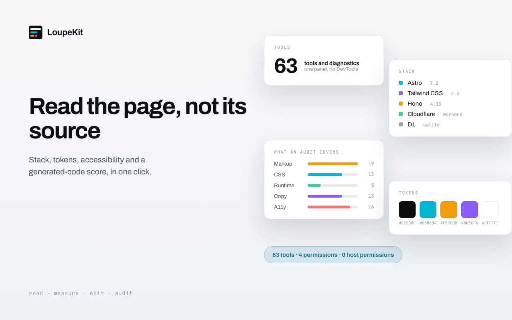
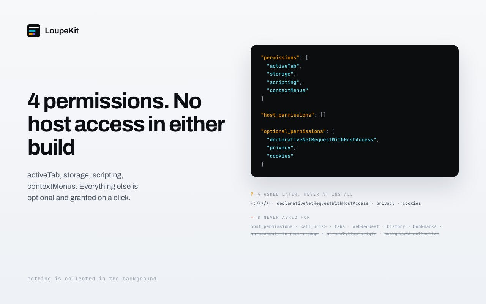
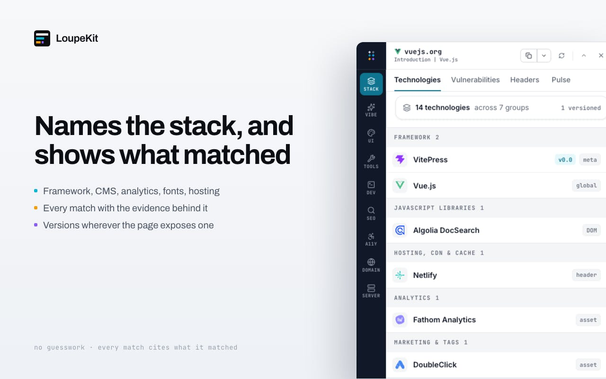

### 🎬 관련 영상
- [🎥 영상 보기](https://ph-files.imgix.net/1b9d5c9e-0ae9-401b-8d1b-18d9518b5337.jpeg?auto=format)

---

## 15. [Lore Machine](https://www.producthunt.com/products/lore-machine)
**Votes**: 91 | **도입 난이도**: 중 | **신뢰도**: 상
**Tagline**: Substack For World Builders
**서비스 링크**: https://www.producthunt.com/r/KZHSON4EXGZWUE

**태그**: Creativity, Storytelling, NoCode, ContentCreation

### 📌 이 서비스 한눈에 보기
텍스트를 몰입형 멀티미디어 세계관으로 변환하여 수익화하는 스토리텔러를 위한 플랫폼

### 🔑 주요 기능
- 텍스트 기반의 스크롤 가능한 멀티미디어 어드벤처(LORE) 생성
- 일관된 캐릭터와 서사적 물리 법칙이 적용된 세계관 구축
- 개별 스토리를 하나의 거대한 세계(World)로 직렬화 및 수익화

### 🙋 사용자에게 어떤 점이 좋은가
창작자가 텍스트를 시각적이고 상호작용 가능한 콘텐츠로 빠르게 변환하여 팬덤을 구축하고 경제적 가치를 창출할 수 있습니다.

### ✅ 지금 바로 써볼 기능
- 텍스트를 입력하여 첫 번째 LORE 생성해보기
- 캐릭터와 세계관의 일관성(Canon) 설정해보기
- 생성된 콘텐츠를 세계관 단위로 직렬화하기

### ⚠️ 사용 전 확인할 점
- 시각화 기술의 구체적인 제어 범위 확인 필요
- 수익화 모델 및 티켓 판매 시스템의 상세 구조 확인 필요

### 🧭 확인이 더 필요한 정보
텍스트에서 멀티미디어로 변환되는 구체적인 생성 AI 기술 스택과 저작권 귀속 여부를 확인해야 합니다.

### 📸 스크린샷 및 갤러리

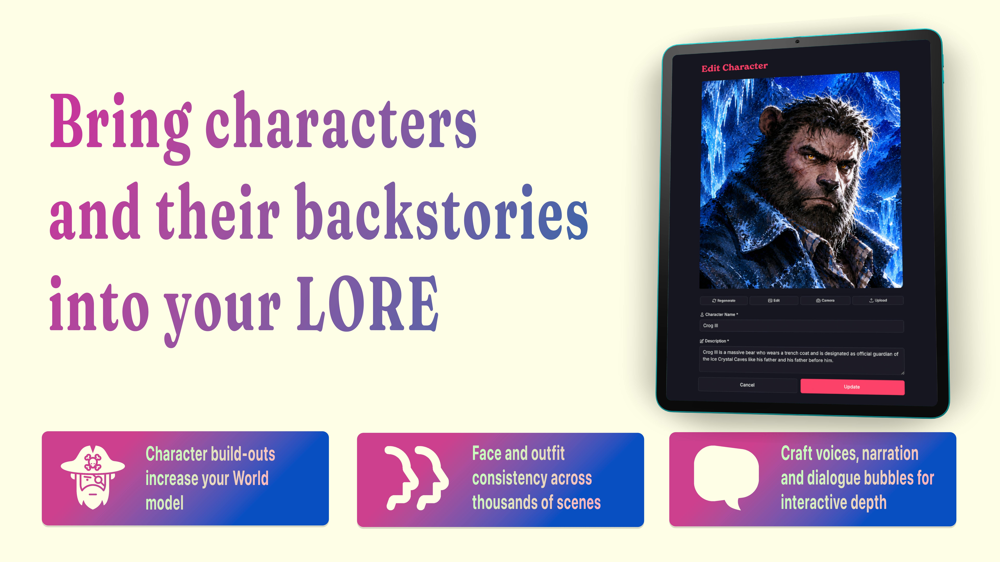

### 🎬 관련 영상
- [🎥 영상 보기](https://ph-files.imgix.net/867de902-1b65-4f39-9031-a2895d0bb4fa.jpeg?auto=format)

---

## 16. [Screenify Studio](https://www.producthunt.com/products/screenify-studio)
**Votes**: 90 | **도입 난이도**: 하 | **신뢰도**: 상
**Tagline**: Polished product demos on Mac recorded by an AI agent
**서비스 링크**: https://www.producthunt.com/r/FTJRFZECEOQRMV

**태그**: ProductDemo, AI, Mac, Automation, VideoEditing, Agent, AI Tool, DevTool

### 📌 이 서비스 한눈에 보기
AI 에이전트가 복잡한 편집 없이 고퀄리티 제품 데모 영상을 만들어주는 Mac용 화면 녹화 도구

### 🔑 주요 기능
- 자연어 명령으로 브라우저를 직접 제어하여 데모 녹화
- 3D 카메라 무빙, 스포트라이트, 콜아웃 등 시네마틱 효과 자동 적용
- 실제 기기(MacBook, iPhone 등) 프레임 및 AI 자막 기능 제공

### 🙋 사용자에게 어떤 점이 좋은가
편집에 드는 시간과 비용을 획기적으로 줄이면서, 전문가가 만든 듯한 제품 데모 영상을 빠르게 제작할 수 있습니다.

### ✅ 지금 바로 써볼 기능
- 자연어로 데모 시나리오 입력해보기
- 3D 기기 프레임에 영상 스테이징하기
- 수동 편집 모드에서 줌 키프레임 조정하기

### ⚠️ 사용 전 확인할 점
- Mac 전용 소프트웨어이므로 Windows 환경에서는 사용 불가
- AI 자동화 기능과 수동 편집 기능 사이의 숙련도 차이 발생 가능

### 🧭 확인이 더 필요한 정보
무료 플랜의 구체적인 기능 제한 및 유료 플랜의 가격 정책 확인이 필요합니다.

### 📸 스크린샷 및 갤러리
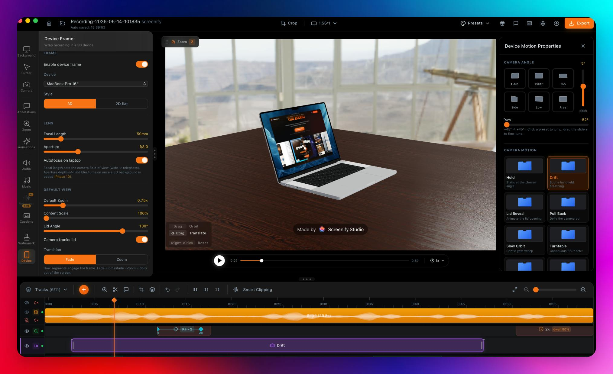
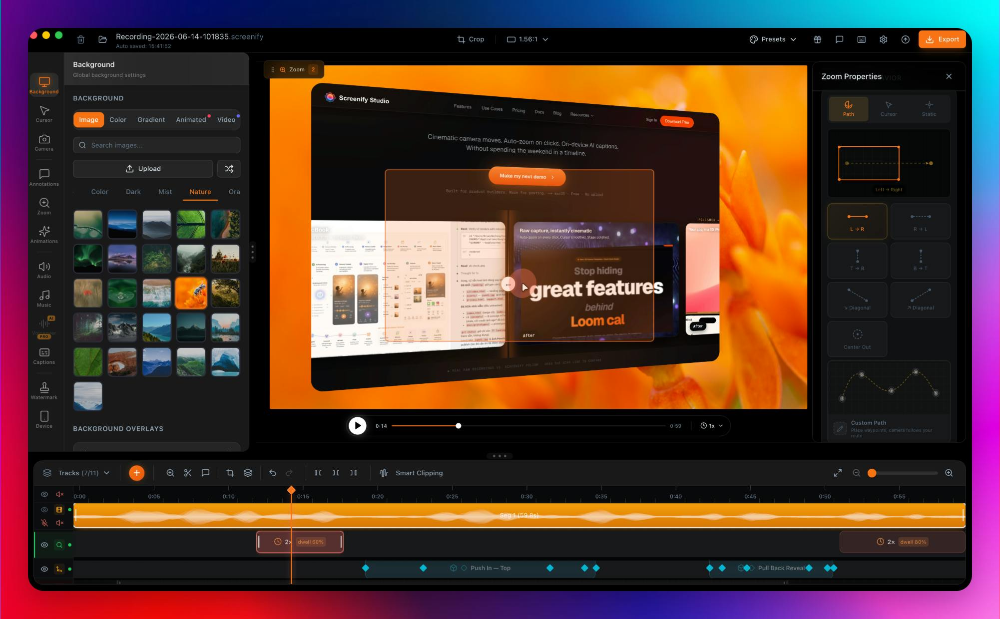
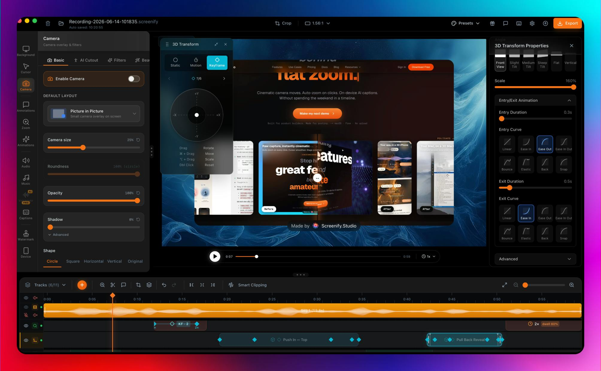

### 🎬 관련 영상
- [🎥 영상 보기](https://ph-files.imgix.net/de3b72f3-55e6-4762-9ad8-514a8268911b.jpeg?auto=format)

---

## 17. [EasySwitch](https://www.producthunt.com/products/easyswitch)
**Votes**: 87 | **도입 난이도**: 하 | **신뢰도**: 상
**Tagline**: One mouse, keyboard and second screen for all your computers
**서비스 링크**: https://www.producthunt.com/r/P3SPQFTANOEKHN

**태그**: Productivity, KVM, Remote Desktop, Workflow, Video

### 📌 이 서비스 한눈에 보기
여러 대의 컴퓨터를 하나의 마우스/키보드로 제어하며 화면 확장까지 지원하는 통합 KVM 솔루션

### 🔑 주요 기능
- KVM(입력 공유)과 화면 확장(Second-screen) 기능을 하나로 통합
- 마우스 커서 이동, 타이핑, 파일 드래그 앤 드롭 지원
- Rust 기반의 가벼운 성능 (아이들 시 RAM 점유율 19MB)

### 🙋 사용자에게 어떤 점이 좋은가
여러 대의 PC를 사용하는 환경에서 별도의 모니터나 입력 장치 없이도 마치 하나의 컴퓨터처럼 매끄럽게 작업할 수 있습니다.

### ✅ 지금 바로 써볼 기능
- 여러 대의 PC 간 커서 이동 및 타이핑 테스트
- 파일 드래그 앤 드롭 기능 확인
- 보조 모니터로의 화면 확장 기능 테스트

### ⚠️ 사용 전 확인할 점
- 하드웨어 사양에 따른 네트워크 환경 영향 확인 필요
- 운영체제 간 호환성 및 설정 방식 확인 필요

### 🧭 확인이 더 필요한 정보
다양한 운영체제(Windows, macOS, Linux) 간의 상호 호환 범위에 대한 구체적인 정보가 필요합니다.

### 📸 스크린샷 및 갤러리
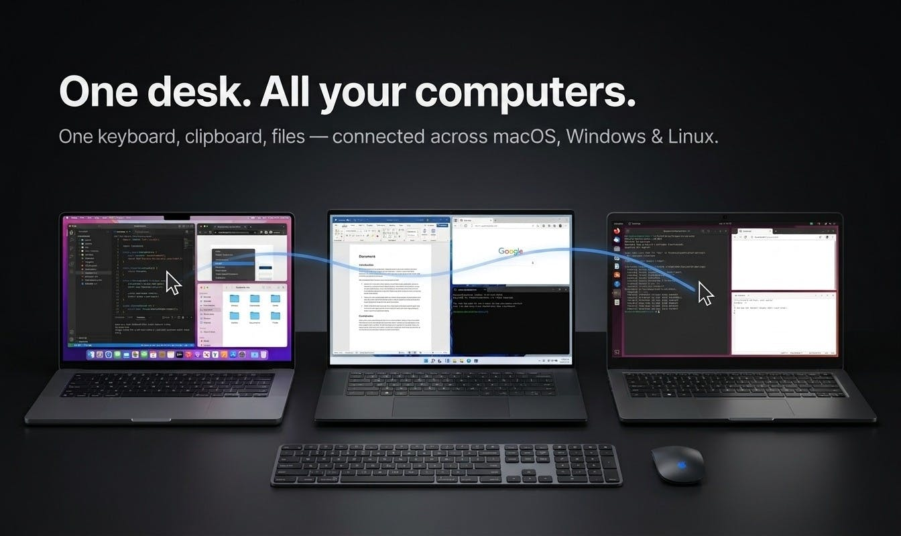
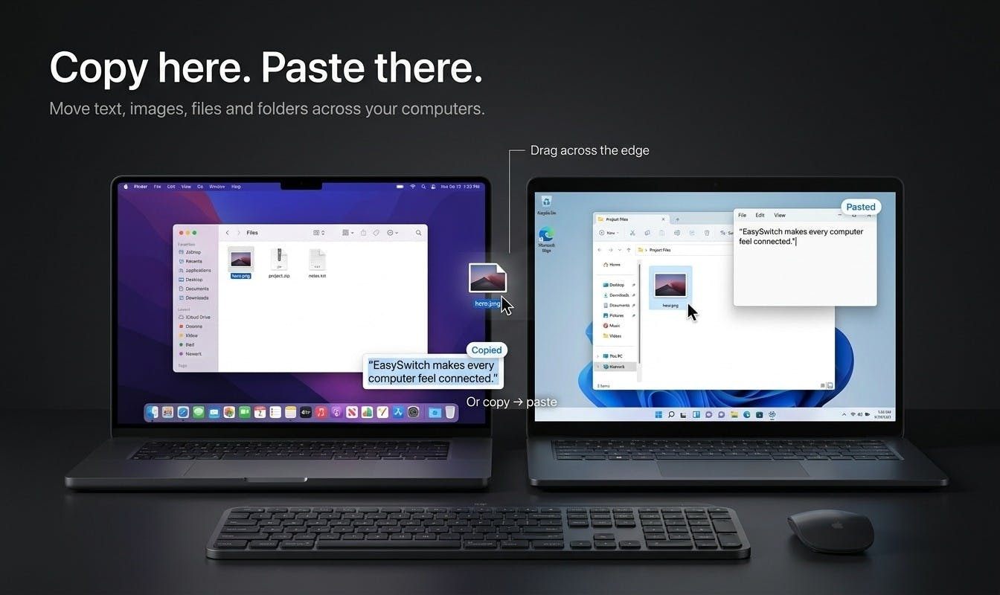
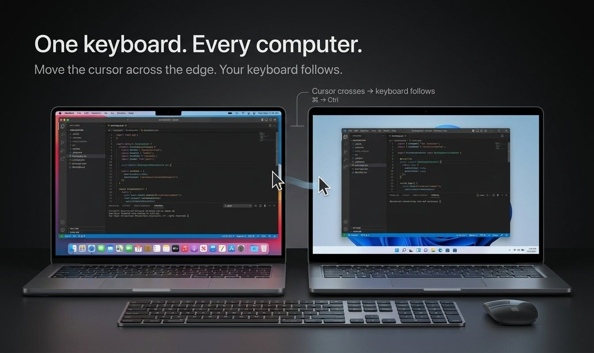

### 🎬 관련 영상
- [🎥 영상 보기](https://ph-files.imgix.net/3629dee0-c13f-48fd-b43f-d26cbb88a650.jpeg?auto=format)

---

## 18. [Arena Agent Mode with GitHub](https://www.producthunt.com/products/arena-5)
**Votes**: 87 | **도입 난이도**: 하 | **신뢰도**: 상
**Tagline**: Get real work done, moving from idea to shipping in minutes
**서비스 링크**: https://www.producthunt.com/r/RKHL3CXPRTAHC4

**태그**: DevTool, GitHub, Automation, AI-Agent, Agent

### 📌 이 서비스 한눈에 보기
GitHub 연동을 통해 브라우저를 떠나지 않고 아이디어를 즉시 코드로 구현하는 에이전트 모드

### 🔑 주요 기능
- GitHub 직접 통합을 통한 워크플로우 최적화
- 레포지토리 연결부터 작업 완료 및 푸시까지 원스톱 지원
- 기존 Agent Mode 인프라를 활용한 끊김 없는 사용자 경험

### 🙋 사용자에게 어떤 점이 좋은가
개발자가 코드를 작성하고 푸시하기 위해 환경을 전환할 필요 없이, 브라우저 내에서 즉시 코딩 작업을 완료할 수 있습니다.

### ✅ 지금 바로 써볼 기능
- GitHub 레포지토리 연결하기
- 코딩 작업 지시 및 실행하기
- 결과물 브라우저에서 확인 및 푸시하기

### ⚠️ 사용 전 확인할 점
- 에이전트의 코드 수정 권한 및 보안 정책 확인 필요
- 브라우저 기반 환경에서의 복잡한 빌드/테스트 제약 가능성

### 🧭 확인이 더 필요한 정보
GitHub 연동 시의 보안 수준과 대규모 레포지토리에서의 성능 최적화 여부를 확인해야 합니다.

### 📸 스크린샷 및 갤러리
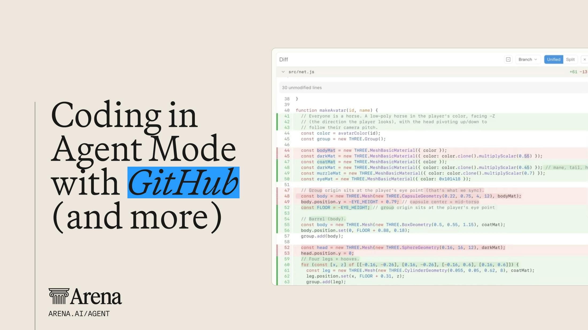

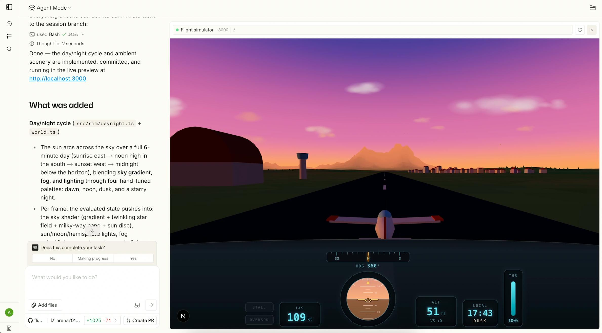

### 🎬 관련 영상
- [🎥 영상 보기](https://ph-files.imgix.net/ad40307c-3e30-4d8b-aa41-27e8a8237382.jpeg?auto=format)

---

## 19. [Warren](https://www.producthunt.com/products/warren-5)
**Votes**: 81 | **도입 난이도**: 중 | **신뢰도**: 상
**Tagline**: Infrastructure for coding-agent workloads
**서비스 링크**: https://www.producthunt.com/r/HUQCYIJPMZPTQI

**태그**: DevTool, AI-Agent, Infrastructure, Automation, Agent

### 📌 이 서비스 한눈에 보기
코딩 에이전트 워크로드를 위한 격리된 인프라 및 실행 환경 제공

### 🔑 주요 기능
- 에이전트 실행을 위한 격리된 워크스페이스 및 인프라 제공
- 실시간 이벤트 모니터링 및 워크로드 관찰 기능
- Git 기반의 배포 및 자동 복구 시스템 지원

### 🙋 사용자에게 어떤 점이 좋은가
코딩 에이전트가 사용하는 환경을 안전하게 격리하면서도, 개발자가 제어 가능한 인프라 위에서 안정적으로 실행할 수 있게 해줍니다.

### ✅ 지금 바로 써볼 기능
- 에이전트 워크스페이스 생성 및 격리 환경 테스트
- Git 연동을 통한 워크로드 배포 프로세스 확인
- 실시간 이벤트 및 관찰성 기능 검증

### ⚠️ 사용 전 확인할 점
- 사용자가 직접 제어하는 인프라 환경에 대한 사전 설정 필요성
- 에이전트 워크로드 특성에 따른 리소스 제한 설정 필요

### 🧭 확인이 더 필요한 정보
제공되는 인프라의 구체적인 클라우드 지원 범위와 확장성(Scalability)에 대한 상세 정보가 필요합니다.

### 📸 스크린샷 및 갤러리

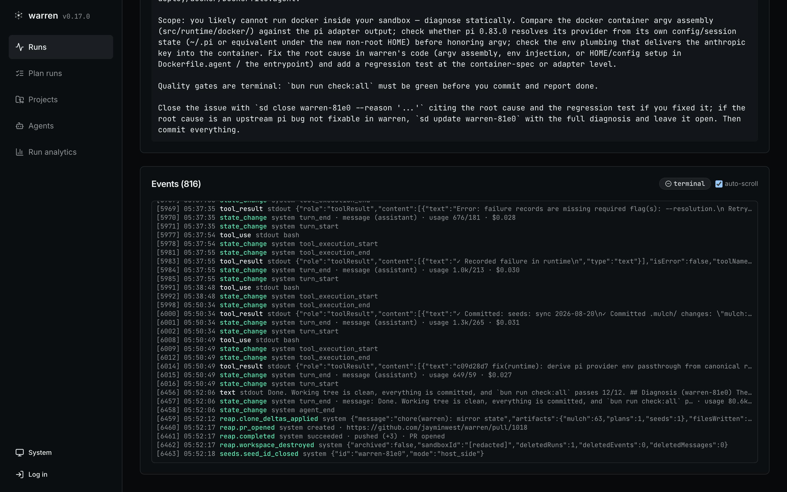
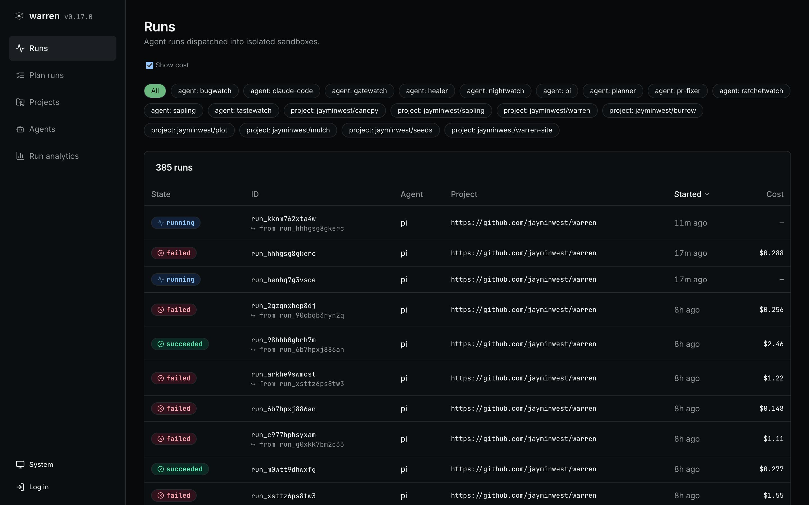

### 🎬 관련 영상
- [🎥 영상 보기](https://ph-files.imgix.net/7f3920b6-ffea-4c35-8d97-2e7825e8e4ce.jpeg?auto=format)

---

## 20. [BaudBuddy](https://www.producthunt.com/products/baudbuddy-serial-terminal)
**Votes**: 81 | **도입 난이도**: 하 | **신뢰도**: 상
**Tagline**: A native macOS serial terminal with a file server built in
**서비스 링크**: https://www.producthunt.com/r/PGGXCSSTGXQQJA

**태그**: DevTool, Hardware, macOS, Embedded, Analytics

### 📌 이 서비스 한눈에 보기
펌웨어 업데이트를 위한 파일 서버 기능이 내장된 macOS 전용 네이티브 시리얼 터미널

### 🔑 주요 기능
- Serial, Bluetooth LE, Telnet, RFC 2217 등 다양한 콘솔 프로토콜 지원
- TFTP/HTTP/HTTPS/FTP/SFTP 서버가 내장되어 펌웨어 전송 용이
- 계정 생성, 분석, 클라우드 연결이 없는 프라이버시 중심의 로컬 도구

### 🙋 사용자에게 어떤 점이 좋은가
하드웨어 개발자나 임베디드 엔지니어가 별도의 파일 서버 구축 없이 터미널 내에서 즉시 펌웨어를 배포하고 로그를 확인할 수 있습니다.

### ✅ 지금 바로 써볼 기능
- 다양한 시리얼/블루투스 연결 테스트
- 내장 서버를 통한 펌웨어 파일 전송 테스트
- 바이트 단위 로그 기록 및 분석

### ⚠️ 사용 전 확인할 점
- macOS 전용 앱이므로 Windows나 Linux 환경에서는 사용 불가
- 하드웨어 어댑터는 별도로 준비해야 함

### 🧭 확인이 더 필요한 정보
지원하는 하드웨어 어댑터의 호환 범위와 상세 사양은 별도 확인이 필요합니다.

### 📸 스크린샷 및 갤러리
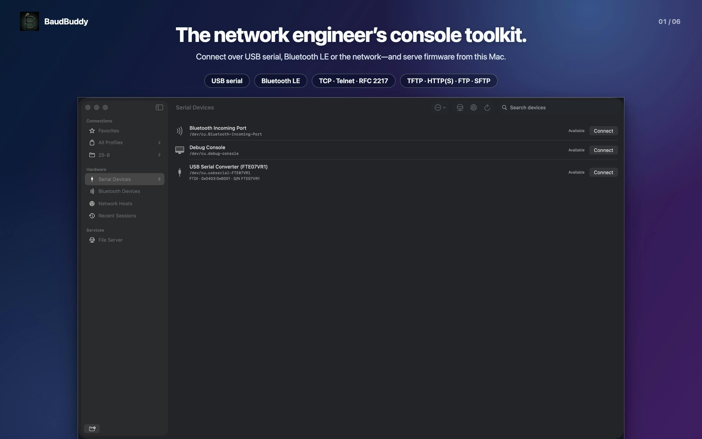
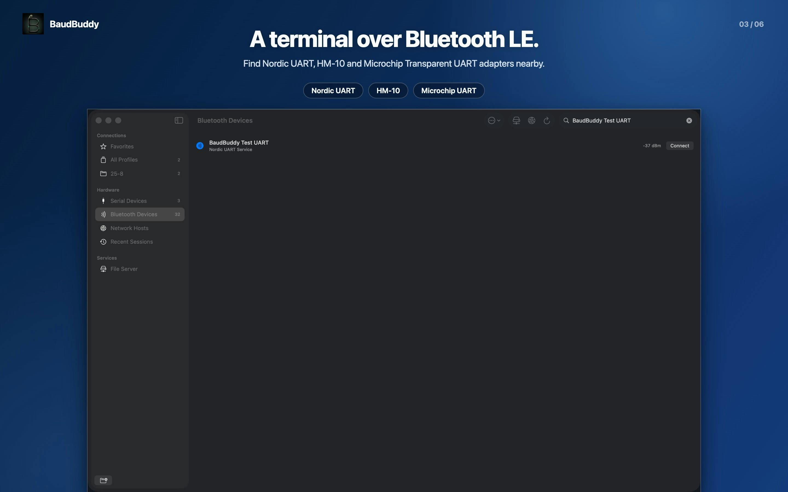
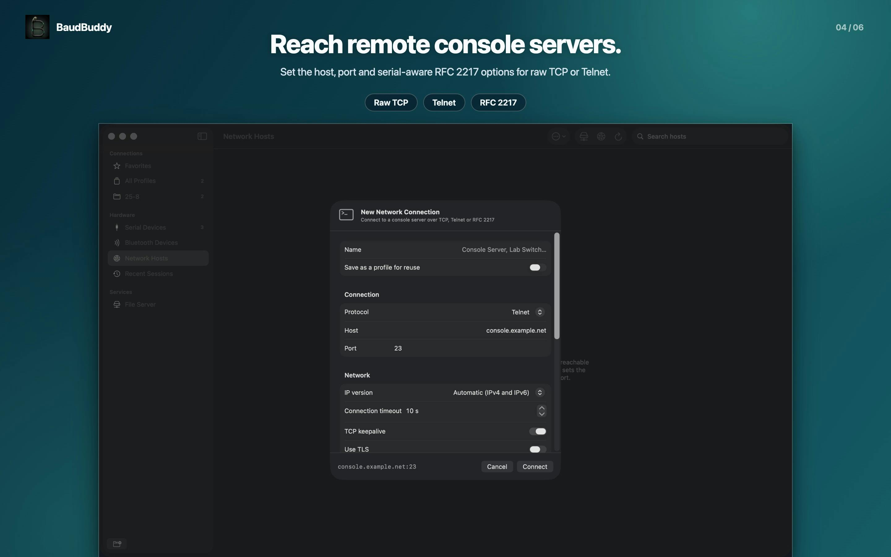

---

## 21. [Knack MCP Server](https://www.producthunt.com/products/knack)
**Votes**: 80 | **도입 난이도**: 중 | **신뢰도**: 상
**Tagline**: The HIPAA-compliant backend for AI builders
**서비스 링크**: https://www.producthunt.com/r/CDIFP6FEYGNTYR

**태그**: AI, Healthcare, Backend, Compliance, DevTool, AI Tool

### 📌 이 서비스 한눈에 보기
AI 기반 헬스케어 앱 개발자를 위한 HIPAA 준수 백엔드 솔루션

### 🔑 주요 기능
- PHI(개인건강정보) 처리를 위한 HIPAA 준수 데이터 저장 및 보안 제공
- AI 프론트엔드와 연결 가능한 규제 준수 백엔드 레이어
- 700개 이상의 통합 기능 및 BAA(비즈니스 파트너 계약) 체결 지원

### 🙋 사용자에게 어떤 점이 좋은가
AI 도구로 빠르게 만든 프로토타입을 복잡한 의료 규제 문제 없이 즉시 프로덕션 단계로 전환할 수 있습니다.

### ✅ 지금 바로 써볼 기능
- AI 프론트엔드와 Knack 백엔드 연결 테스트
- 700+ 통합 기능 활용 가능성 검토
- BAA 체결 및 규제 준수 워크플로우 확인

### ⚠️ 사용 전 확인할 점
- 최저 시작 가격($499)에 따른 비용 부담 확인 필요
- 사용자 수 및 데이터 규모에 따른 확장성 검토

### 🧭 확인이 더 필요한 정보
구체적인 기술 스택 및 API 연동 방식에 대한 상세 명세 확인이 필요합니다.

### 📸 스크린샷 및 갤러리
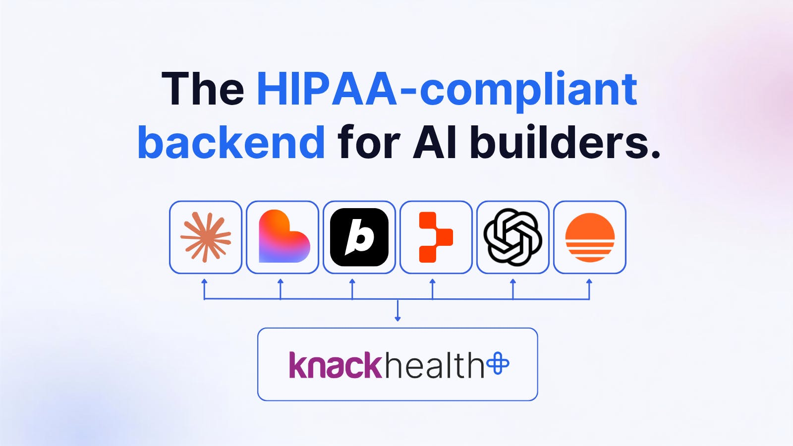
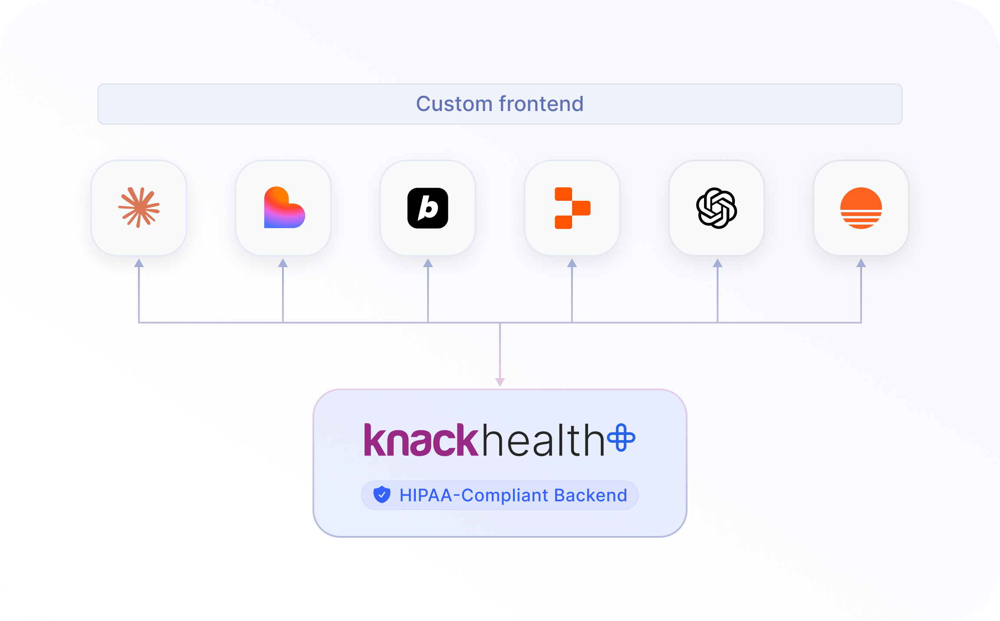
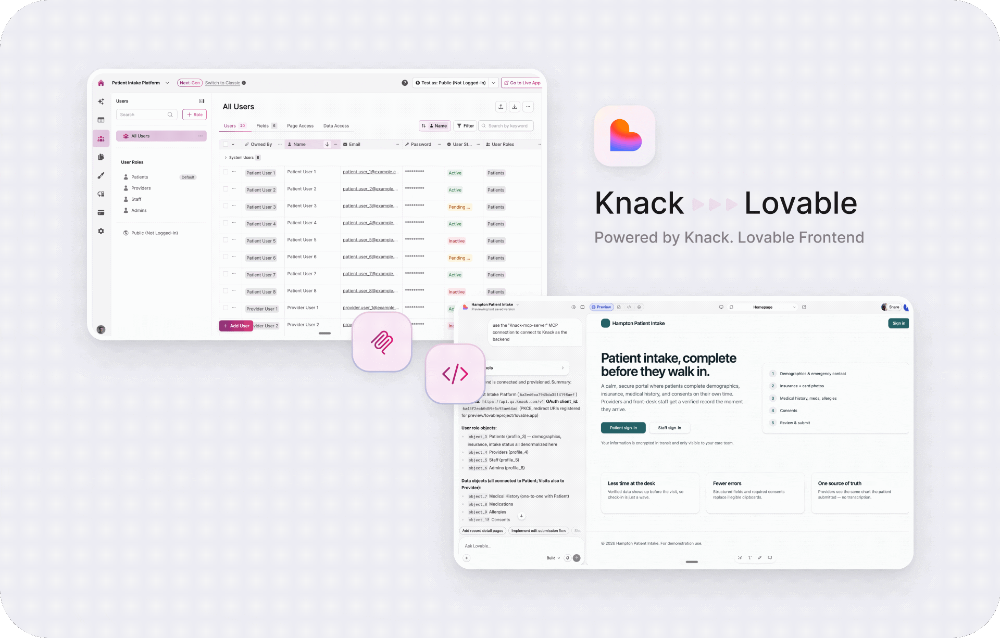

### 🎬 관련 영상
- [🎥 영상 보기](https://ph-files.imgix.net/d86cdccb-7413-41f9-b775-16d5bde05db8.jpeg?auto=format)

---

## 22. [DeployHermes](https://www.producthunt.com/products/deployhermes)
**Votes**: 78 | **도입 난이도**: 중 | **신뢰도**: 상
**Tagline**: Hire persistent Hermes agents with roles, memory + skills
**서비스 링크**: https://www.producthunt.com/r/HMEXUAHJTTZIXV

**태그**: AI Agents, Automation, DevTools, Workflow, Agent, AI Tool, DevTool

### 📌 이 서비스 한눈에 보기
역할, 메모리, 기술을 갖춘 지속 가능한 AI 에이전트 배포 플랫폼

### 🔑 주요 기능
- 역할과 메모리, 특정 기술을 보유한 맞춤형 AI 에이전트 생성
- 원클릭 프라이빗 런타임 제공으로 독립적인 작업 환경 구축
- Claude Code, Codex 등 기존 개발 도구와의 연동을 통한 워크플로우 자동화

### 🙋 사용자에게 어떤 점이 좋은가
복잡한 작업을 수행하는 AI 에이전트를 쉽게 고용하고 관리할 수 있어, 개발 및 업무 자동화 워크플로우를 효율적으로 운영할 수 있습니다.

### ✅ 지금 바로 써볼 기능
- 특정 역할을 가진 에이전트 생성 및 미션 설정
- 프라이빗 런타임 환경에서 에이전트 실행 및 결과 확인
- 기존 개발 도구(Claude Code 등)와 연동 테스트

### ⚠️ 사용 전 확인할 점
- 에이전트의 자율적 작업에 따른 리소스 소모 및 비용 발생 가능성
- 외부 도구 연동 시 보안 및 권한 설정 필요

### 🧭 확인이 더 필요한 정보
에이전트가 수행하는 구체적인 작업 범위와 외부 도구와의 상세 연동 방식에 대한 확인이 필요합니다.

### 📸 스크린샷 및 갤러리
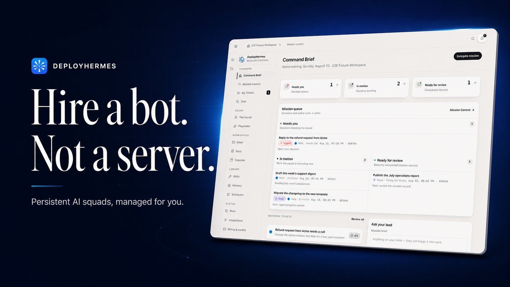
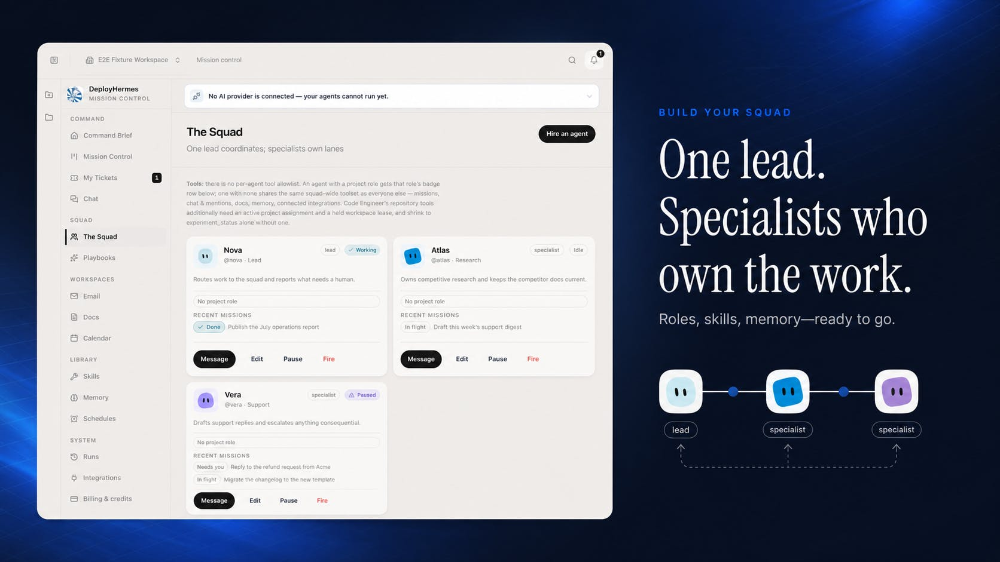
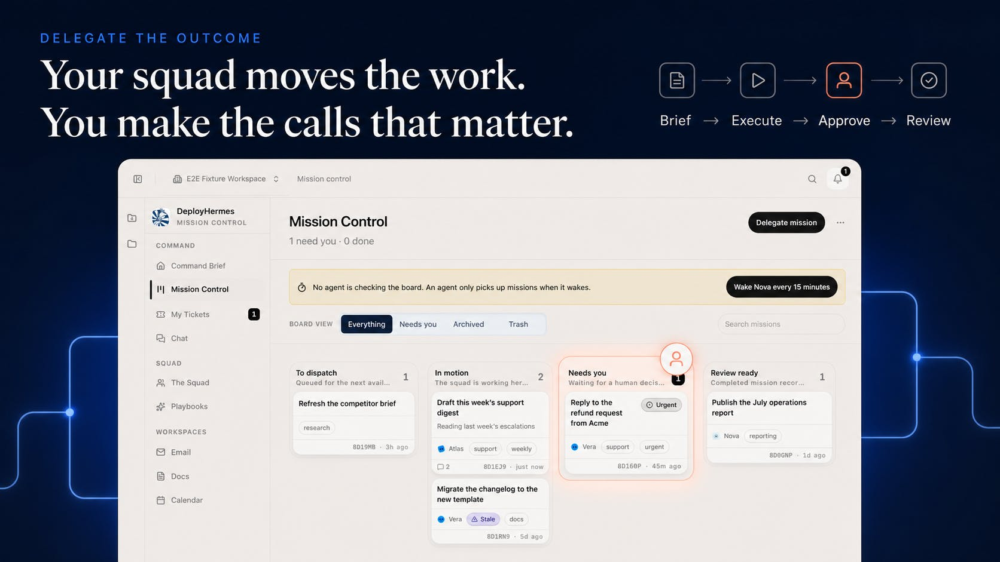

---

## 23. [TaskShell 2.0](https://www.producthunt.com/products/taskshell)
**Votes**: 75 | **도입 난이도**: 하 | **신뢰도**: 상
**Tagline**: Agent-first task management for more agentic productivity
**서비스 링크**: https://www.producthunt.com/r/2OKXPKJ656ADVP

**태그**: Productivity, AI-Agent, DevTool, Automation, MCP, Agent

### 📌 이 서비스 한눈에 보기
AI 에이전트와 실시간으로 협업하며 업무를 관리하는 MCP 기반 태스크 관리 도구

### 🔑 주요 기능
- 대화형 인터페이스를 통한 작업 추가, 계획 수립 및 우선순위 관리
- MCP(Model Context Protocol)를 통한 Claude Code, Cursor 등 최신 AI 에이전트와 동기화
- 에이전트에게 맥락(Context)을 제공하여 업무 흐름을 유지하는 기능

### 🙋 사용자에게 어떤 점이 좋은가
개발 및 업무 흐름을 끊지 않고 AI 에이전트와 대화하며 즉시 할 일을 관리할 수 있어 생산성이 극대화됩니다.

### ✅ 지금 바로 써볼 기능
- AI 에이전트 대화 중 관련 할 일(Todo) 생성해보기
- 주간 업무 계획 및 우선순위 질문하기
- MCP를 통해 사용 중인 IDE/에이전트와 연동하기

### ⚠️ 사용 전 확인할 점
- 사용 중인 특정 에이전트 환경에서의 MCP 호환성 확인 필요
- 에이전트 간 데이터 동기화 및 맥락 유지의 정확도 확인 필요

### 🧭 확인이 더 필요한 정보
지원하는 모든 MCP 호환 에이전트 리스트와 플랫폼 간 동기화 속도에 대한 구체적 정보가 필요합니다.

### 📸 스크린샷 및 갤러리
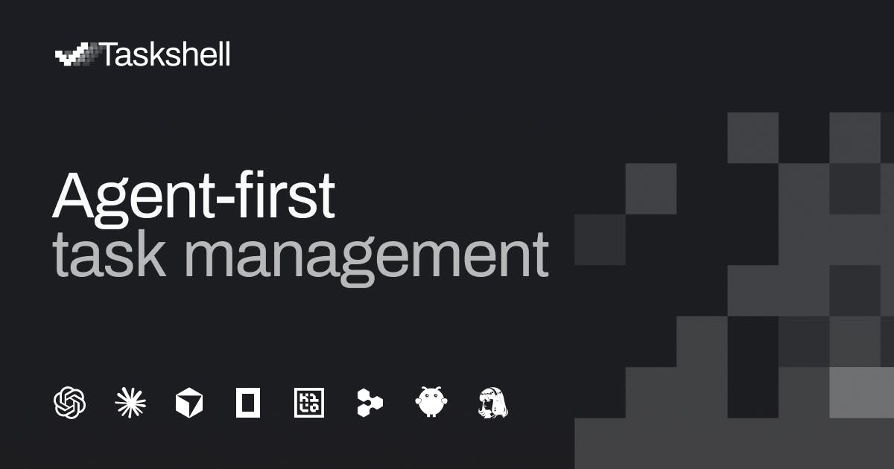
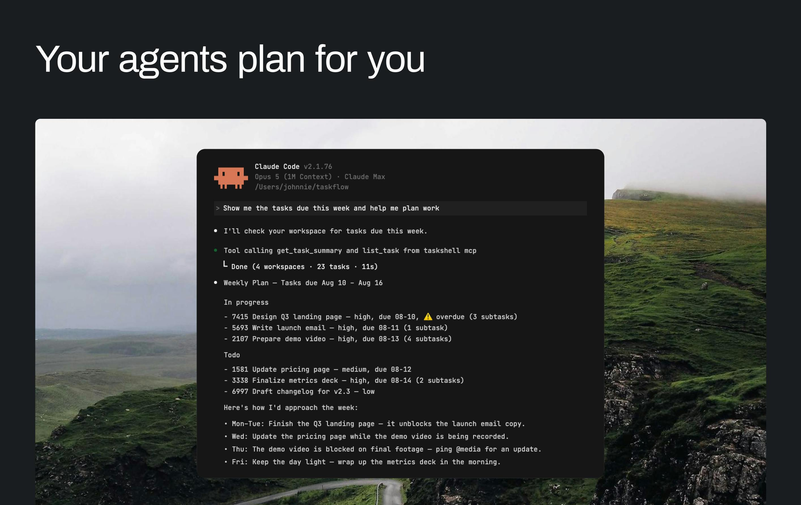

---

## 24. [choclift for iPad](https://www.producthunt.com/products/choclift-workflow-sweetener)
**Votes**: 73 | **도입 난이도**: 하 | **신뢰도**: 상
**Tagline**: A touch-bar to control your Mac from your iPad
**서비스 링크**: https://www.producthunt.com/r/JAEY3NOXXA3VLF

**태그**: Productivity, Mac, iPad, Automation, Workflow, AI Tool

### 📌 이 서비스 한눈에 보기
iPad를 Mac 제어를 위한 직관적인 터치바로 변신시켜 주는 도구

### 🔑 주요 기능
- iPad를 Mac용 터치 컨트롤러로 활용
- 앱 실행, Apple 단축어 실행, 웹사이트 열기 등 다양한 작업 지원
- 멀티 디바이스 연결 및 스와이프 제스처 지원

### 🙋 사용자에게 어떤 점이 좋은가
Mac의 키보드 위 공간을 활용해 iPad로 앱 실행이나 단축어를 즉각 실행할 수 있어 작업 흐름이 매끄러워집니다.

### ✅ 지금 바로 써볼 기능
- iPad와 Mac 연결하여 터치 타일 구성하기
- 자주 사용하는 Apple 단축어 등록하기
- 스와이프 제스처로 빠른 액션 실행하기

### ⚠️ 사용 전 확인할 점
- Mac과 iPad 간의 연결 안정성 확인 필요
- 사용 중인 Mac OS 버전과의 호환성 확인

### 🧭 확인이 더 필요한 정보
상세한 연결 방식(유선/무선) 및 구체적인 시스템 요구 사양에 대한 정보가 필요합니다.

### 📸 스크린샷 및 갤러리

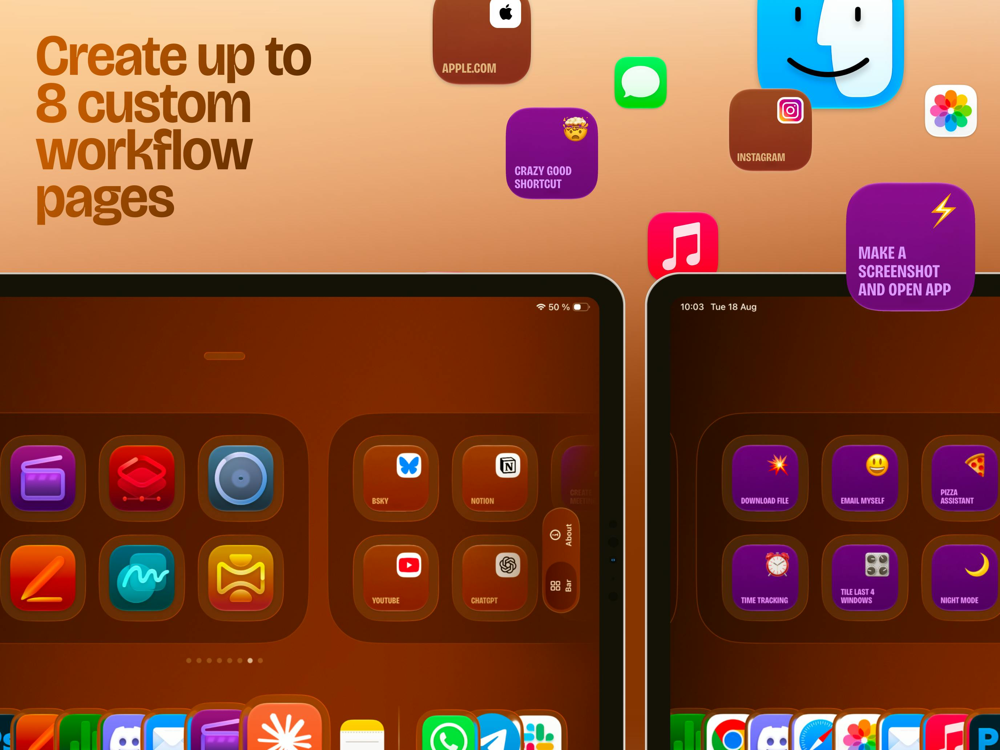

### 🎬 관련 영상
- [🎥 영상 보기](https://ph-files.imgix.net/00b7015f-3df3-4a46-bd81-bb0d5550f75c.jpeg?auto=format)

---

## 25. [Basedash for Grok Bot](https://www.producthunt.com/products/basedash)
**Votes**: 73 | **도입 난이도**: 하 | **신뢰도**: 상
**Tagline**: Company data answers, right inside Grok Bot
**서비스 링크**: https://www.producthunt.com/r/S7GWHNQKSA4FIT
**재등장**: 최근 7일 내 재등장 (마지막 등장 6일 전)

**태그**: AI, Data, Productivity, Automation, Agent, AI Tool, API

### 📌 이 서비스 한눈에 보기
Grok Bot 내에서 기업 데이터를 안전하게 조회하고 답변을 얻는 MCP 플러그인

### 🔑 주요 기능
- Grok Bot 및 Cursor 환경에서 기업 데이터 기반 답변 제공
- OAuth 기반 로그인 및 기존 Basedash 권한 제어 적용
- API 키 관리 없이 호스팅되는 MCP(Model Context Protocol) 방식

### 🙋 사용자에게 어떤 점이 좋은가
복잡한 데이터 추출 과정 없이 대화형 AI 인터페이스 내에서 즉시 기업 데이터 기반의 인사이트를 얻을 수 있습니다.

### ✅ 지금 바로 써볼 기능
- Grok Bot에서 Basedash 플러그인 추가하기
- OAuth를 통한 계정 연동 및 권한 확인
- 자연어 질문을 통한 데이터 조회 테스트

### ⚠️ 사용 전 확인할 점
- 기존 Basedash 워크스페이스의 접근 권한 설정이 정확한지 확인 필요
- Grok Bot 및 Cursor 환경에서의 원활한 작동 여부 확인

### 🧭 확인이 더 필요한 정보
사용자의 기존 Basedash 데이터 규모나 복잡한 쿼리 처리 성능에 대한 구체적인 정보는 명시되지 않았습니다.

### 📸 스크린샷 및 갤러리
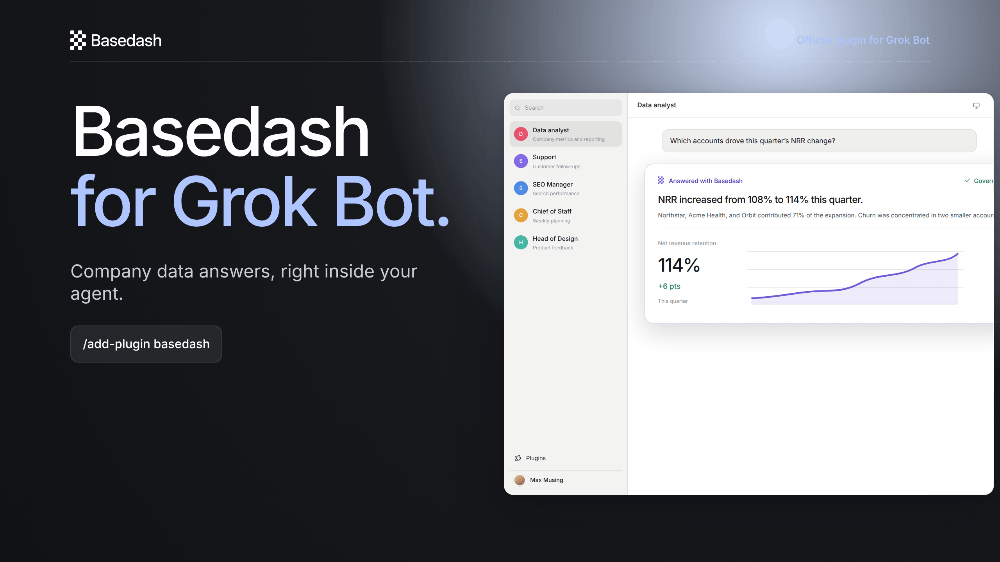
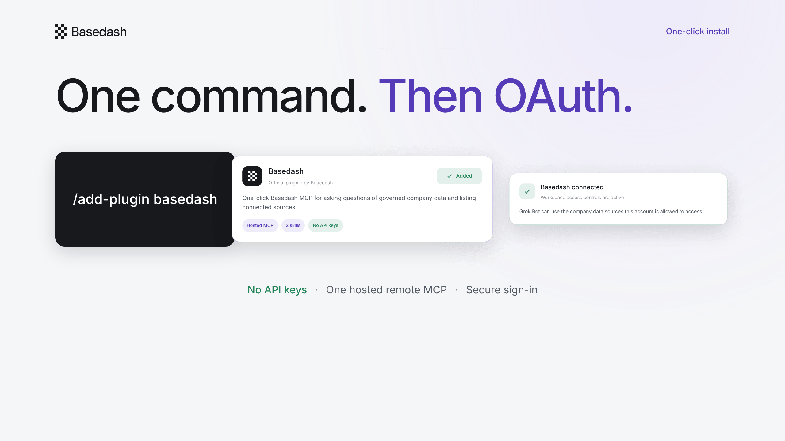
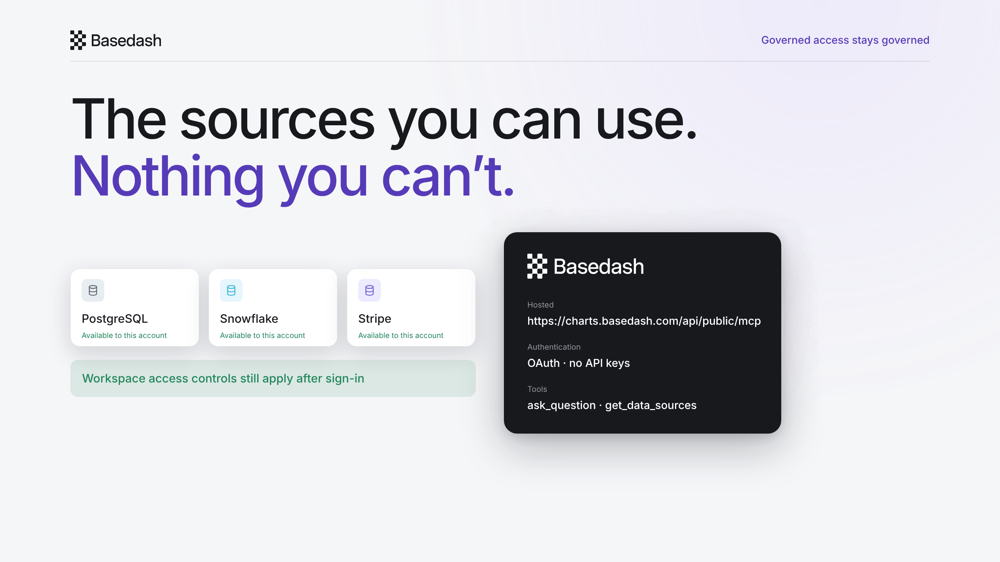

### 🎬 관련 영상
- [🎥 영상 보기](https://ph-files.imgix.net/fcf90bfd-faff-417c-b563-a9857c79e43a.jpeg?auto=format)

---

## 26. [Message Album](https://www.producthunt.com/products/message-album)
**Votes**: 66 | **도입 난이도**: 하 | **신뢰도**: 상
**Tagline**: Save one iMessage conversation as a private offline album
**서비스 링크**: https://www.producthunt.com/r/342OV6D5QWQLK3

**태그**: Productivity, Privacy, MacApp, PersonalArchive, Video

### 📌 이 서비스 한눈에 보기
소중한 iMessage 대화 내용을 개인용 오프라인 앨범으로 안전하게 보관하는 Mac 앱

### 🔑 주요 기능
- 특정 iMessage 대화 하나를 검색 가능한 오프라인 웹사이트 형태로 내보내기
- 사진, 비디오, 음성 메시지를 포함한 대화 내용 보존
- 클라우드나 계정 없이 Mac 로컬 환경에서만 작동하는 강력한 개인정보 보호

### 🙋 사용자에게 어떤 점이 좋은가
소중한 사람과의 대화 기록을 클라우드 유출 걱정 없이 개인 소장용 디지털 앨범으로 만들 수 있습니다.

### ✅ 지금 바로 써볼 기능
- 보관하고 싶은 iMessage 대화 선택하기
- 로컬 내보내기 기능을 통해 오프라인 앨범 생성하기
- 생성된 오프라인 웹사이트에서 대화 내용 검색 및 감상하기

### ⚠️ 사용 전 확인할 점
- 한 번에 하나의 대화만 내보낼 수 있는 방식임
- Mac 전용 네이티브 앱이므로 다른 OS에서는 사용 불가

### 🧭 확인이 더 필요한 정보
대화 내보내기 시 원본 메시지 데이터의 무결성 유지 방식과 저장 용량 제한 여부는 명시되지 않았습니다.

### 📸 스크린샷 및 갤러리
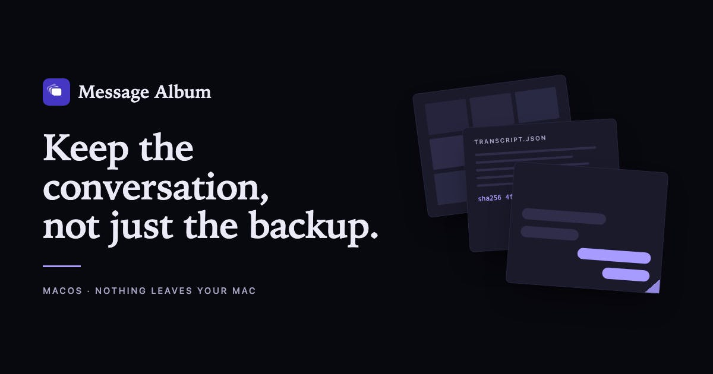

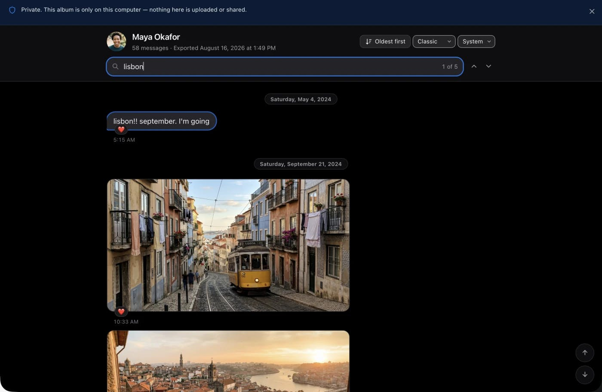

### 🎬 관련 영상
- [🎥 영상 보기](https://ph-files.imgix.net/fa2db3e8-76ae-444d-9f39-1277a041d882.jpeg?auto=format)

---

## 27. [ReWeaver AI DriftDetector](https://www.producthunt.com/products/reweaver-driftdetector)
**Votes**: 66 | **도입 난이도**: 하 | **신뢰도**: 상
**Tagline**: Drift score for any GitHub repo
**서비스 링크**: https://www.producthunt.com/r/WGDNIPBRHLOPSN

**태그**: DevTool, CodeQuality, GitHub, Analytics, AI Tool, LLM

### 📌 이 서비스 한눈에 보기
GitHub 저장소의 프로덕션 준비도를 즉시 측정하는 코드 품질 분석 도구

### 🔑 주요 기능
- GitHub 저장소 URL 입력만으로 즉각적인 Drift Score(PDR) 산출
- LLM 없이 결정론적 규칙을 사용하여 토큰 비용이 없고 결과가 일관됨
- 9가지 차원의 분석과 파일/라인 단위의 상세 추적 기능 제공

### 🙋 사용자에게 어떤 점이 좋은가
별도의 설치나 가입 없이 공개된 코드의 품질과 프로덕션 적합성을 객란적인 수치로 즉시 확인할 수 있습니다.

### ✅ 지금 바로 써볼 기능
- 분석하고 싶은 공개 GitHub 저장소 URL 붙여넣기
- 산출된 Production Drift Ratio(PDR) 점수 확인
- 상세 분석 결과에서 파일 및 라인 단위의 원인 파악

### ⚠️ 사용 전 확인할 점
- 공개된 GitHub 저장소(Public Repo)를 대상으로 하므로 비공개 코드 적용 시 제약이 있을 수 있음
- LLM을 사용하지 않으므로 복잡한 로직의 의도 파악보다는 구조적/규칙적 품질 측정에 특화됨

### 🧭 확인이 더 필요한 정보
비공개(Private) 저장소에 대한 지원 여부와 구체적인 9가지 분석 차원의 세부 항목은 명시되지 않았습니다.

### 📸 스크린샷 및 갤러리
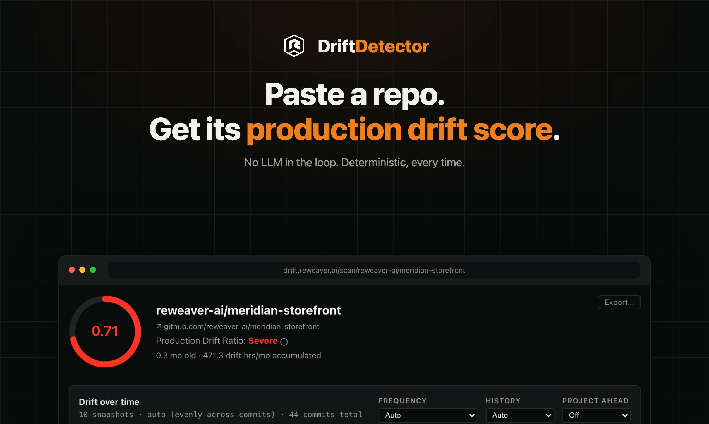
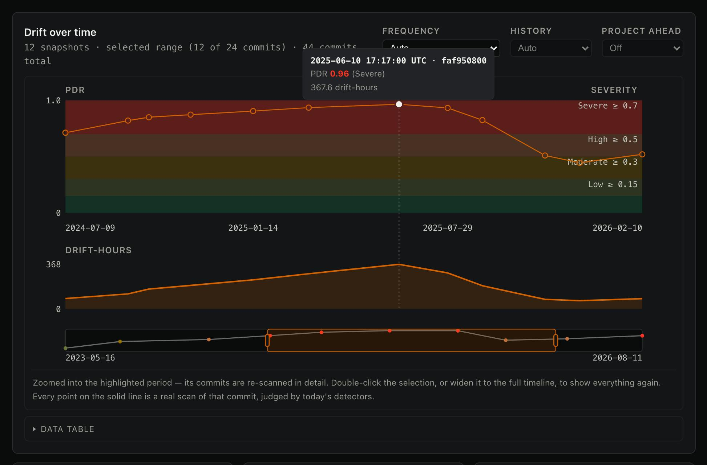
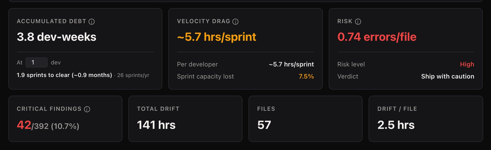

### 🎬 관련 영상
- [🎥 영상 보기](https://ph-files.imgix.net/d75b7a0f-bb06-4b25-a8e5-f5366dd1c2bf.jpeg?auto=format)

---

## 28. [macadress](https://www.producthunt.com/products/macadress)
**Votes**: 63 | **도입 난이도**: 하 | **신뢰도**: 상
**Tagline**: MAC address intelligence for apps, networks and AI agents
**서비스 링크**: https://www.producthunt.com/r/FX6KWC4R3WH5SZ

**태그**: DevTool, Network, Security, Data, Agent, AI Tool, API

### 📌 이 서비스 한눈에 보기
단순 제조사 정보를 넘어 기기 카테고리와 프라이버시 신호까지 분석하는 지능형 MAC 주소 식별 도구

### 🔑 주요 기능
- IEEE 블록 데이터 및 기기 카테고리 식별을 통한 심층 분석
- 프라이버시 무작위화 신호 감지 및 자연어 기반의 추론 제공
- API, 벌크 데이터베이스, 로그 추출기, MCP 등 다양한 배포 방식 지원

### 🙋 사용자에게 어떤 점이 좋은가
네트워크 관리자나 앱 개발자가 MAC 주소만으로 기기의 성격과 보안 상태를 더 정확하게 파악할 수 있게 도와줍니다.

### ✅ 지금 바로 써볼 기능
- 무료 조회 기능을 통한 데이터 정확도 테스트
- JSON API를 활용한 기존 애플리케이션 연동
- 로그 추출기를 통한 기존 네트워크 로그 분석

### ⚠️ 사용 전 확인할 점
- MAC 주소 무작위화(Randomization) 기술에 따른 식별 정확도 변동 가능성
- 자체 호스팅 시 인프라 관리 및 보안 설정 필요

### 🧭 확인이 더 필요한 정보
제공되는 데이터의 실시간 업데이트 주기와 대규모 트래픽 시의 API 성능 수치는 명시되지 않았습니다.

### 📸 스크린샷 및 갤러리
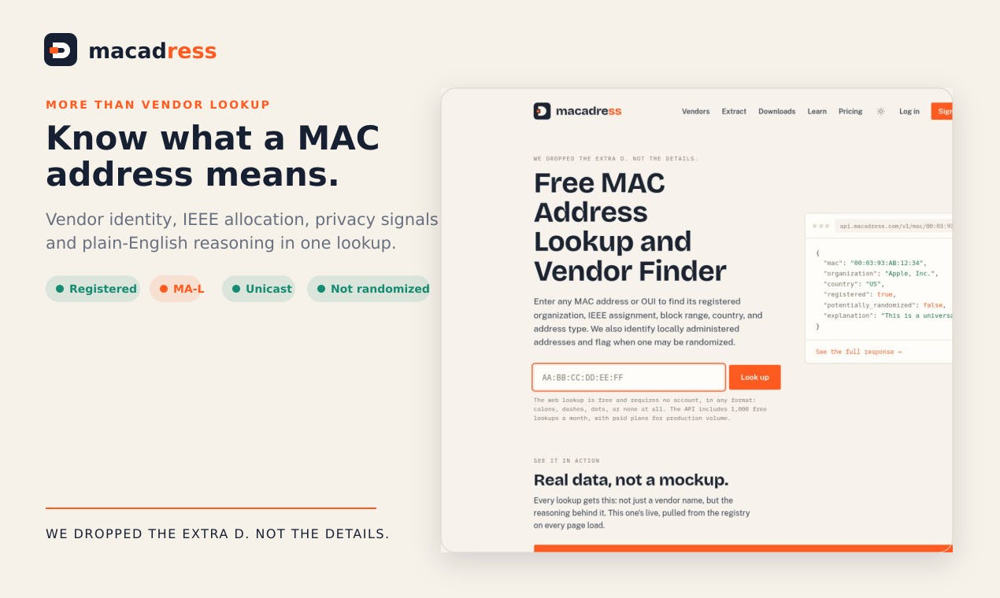
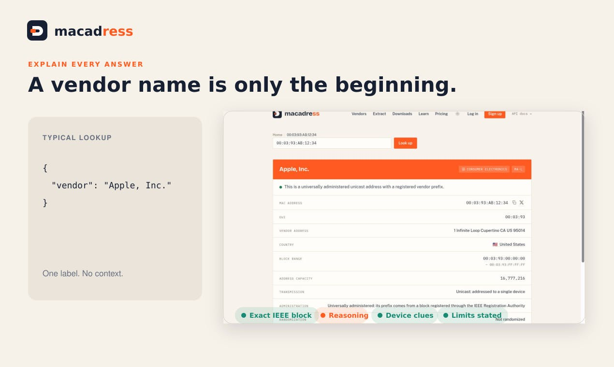
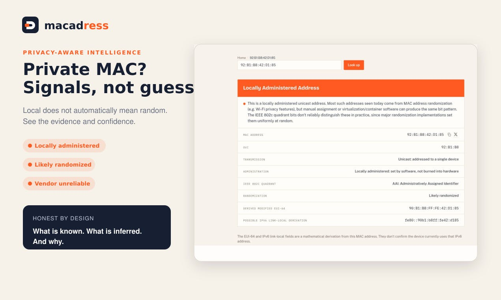

### 🎬 관련 영상
- [🎥 영상 보기](https://ph-files.imgix.net/92f2b52a-436e-403c-94a1-c8ce080b16fb.jpeg?auto=format)

---

## 29. [Creatium Coach](https://www.producthunt.com/products/creatium)
**Votes**: 51 | **도입 난이도**: 하 | **신뢰도**: 상
**Tagline**: Create your own hero's journey. Go from mid to great.
**서비스 링크**: https://www.producthunt.com/r/PCOSJ3XJC2V3JQ

**태그**: AI Coaching, EdTech, Simulation, Personal Development, Video

### 📌 이 서비스 한눈에 보기
실감형 멀티미디어 시뮬레이션을 통해 목표 달성을 돕는 AI 코칭 솔루션

### 🔑 주요 기능
- 정적인 강의를 넘어선 실감형 멀티미디어 코칭 경험 제공
- 시뮬레이션, 비디오, 롤플레이를 결합한 능동적 학습 방식
- 개인부터 기업까지 규모에 상관없이 적용 가능한 유연성

### 🙋 사용자에게 어떤 점이 좋은가
단순 시청 위주의 학습에서 벗어나 실제 상황과 유사한 훈련을 통해 실질적인 역량 향상을 기대할 수 있습니다.

### ✅ 지금 바로 써볼 기능
- 시뮬레이션 및 롤플레이 기능 체험
- 개인별 목표 설정 및 학습 경로 확인
- 멀티미디어 코칭 인터페이스 탐색

### ⚠️ 사용 전 확인할 점
- 실제 대면 코칭과 비교 시 정서적 교감의 차이 확인 필요
- 학습자의 목표 분야에 따른 콘텐츠 적합성 검토 필요

### 🧭 확인이 더 필요한 정보
구체적인 학습 콘텐츠의 범위와 지원하는 전문 분야에 대한 정보가 필요합니다.

### 📸 스크린샷 및 갤러리

### 🎬 관련 영상
- [🎥 영상 보기](https://ph-files.imgix.net/23237bbf-9a88-48e3-baf4-6077ed0a0248.jpeg?auto=format)

---

## 30. [Othor AI 2.0](https://www.producthunt.com/products/othor-ai)
**Votes**: 31 | **도입 난이도**: 하 | **신뢰도**: 상
**Tagline**: Your AI Head of Intelligence
**서비스 링크**: https://www.producthunt.com/r/RUITFCQJDAZV3X

**태그**: AI, Business Intelligence, Automation, Data Analytics, Agent, AI Tool, LLM, Chat

### 📌 이 서비스 한눈에 보기
데이터 분석가 없이도 데이터 소스 연결만으로 자동 분석과 의사결정 보고서를 생성하는 AI 지능 헤드

### 🔑 주요 기능
- 데이터 마이그레이션 없이 100개 이상의 소스에 직접 연결하는 데이터 통합 에이전트
- 데이터 분석부터 의사결정 브리프, 데일리 리포트까지 이어지는 자동화 파이프라인
- 사용자 정의 LLM을 선택할 수 있는 모델 셀렉터 및 문서 지능 기능

### 🙋 사용자에게 어떤 점이 좋은가
분석가나 데이터 웨어하우스 없이도 데이터 소스만 연결하면 AI가 스스로 분석하고 요약 보고서를 제공하여 리더의 의사결정 시간을 단축해 줍니다.

### ✅ 지금 바로 써볼 기능
- 데이터 소스 연결 및 통합 에이전트 테스트
- 자동 생성되는 데일리 Big Picture 리포트 확인
- Chat with Data 기능을 통한 데이터 질의응답

### ⚠️ 사용 전 확인할 점
- 데이터 소스 연결 시 보안 및 권한 설정 확인 필요
- AI가 생성한 분석 결과의 정확성에 대한 검증 필요

### 🧭 확인이 더 필요한 정보
100개 이상의 데이터 소스에 대한 구체적인 지원 목록과 보안 프로토콜 확인이 필요합니다.

### 📸 스크린샷 및 갤러리
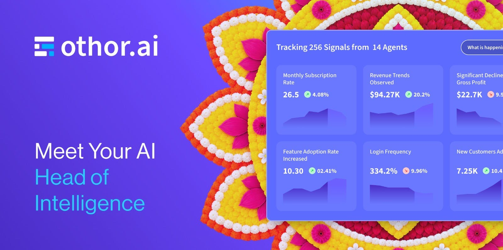
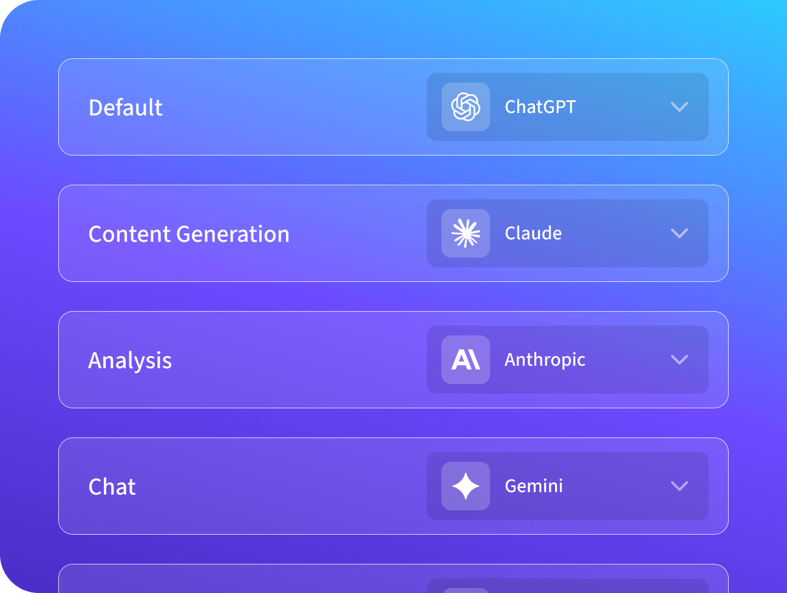
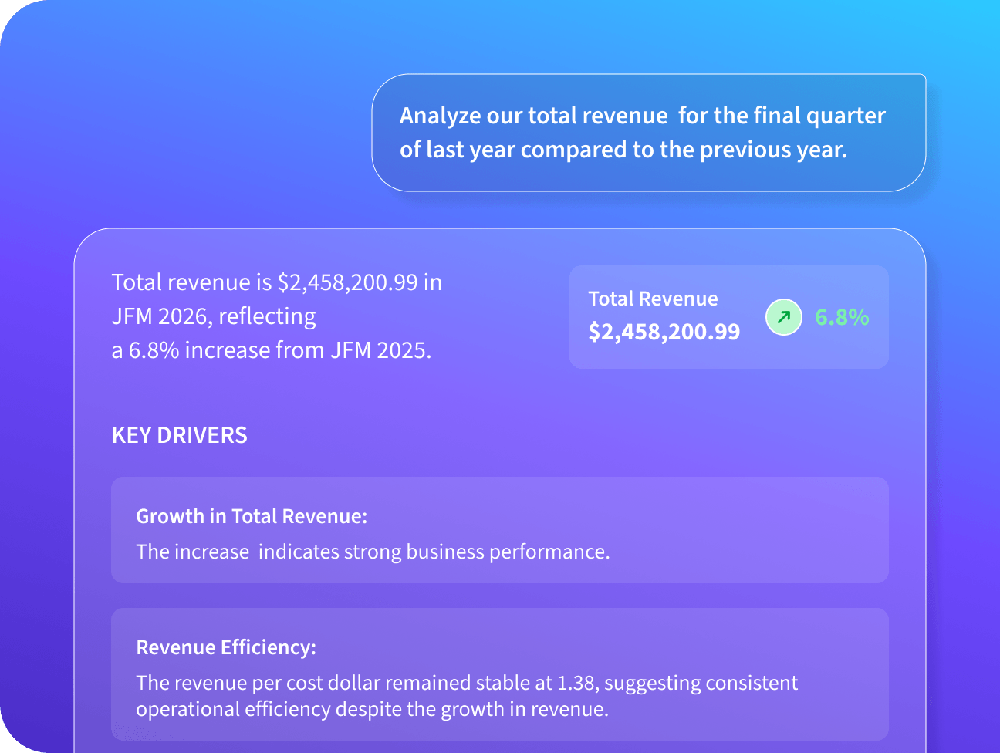

### 🎬 관련 영상
- [🎥 영상 보기](https://ph-files.imgix.net/2ddead33-69f9-45c4-b178-16ef45d1bbab.gif?auto=format)

---

