# 🚀 Product Hunt Daily Top 30 (2026-08-28)

## 오늘의 요약
오늘의 트렌드는 AI 에이전트의 개발, 운영, 그리고 신뢰성을 확보하기 위한 인프라 중심의 솔루션들이 주를 이루었습니다. 특히 단순한 챗봇을 넘어 복잡한 업무를 수행하거나, 코드 맥락을 이해하고, 환각 현상을 방지하는 등 실질적인 비즈니스 가치를 창출하는 기술들이 주목받았습니다.

### 오늘의 핵심 포인트
- 아이디어 구상부터 배포까지 지원하는 AI 네이티브 플랫폼과 노코드 에이전트 빌더가 등장하여 개발 생산성을 극대화합니다.
- AI 모델의 환각 방지, 에이전트 동작 관찰 및 제어 등 운영 단계에서의 신뢰성과 거버넌스를 확보하는 기술이 중요해졌습니다.
- 음성 인식(STT)부터 생성(TTS)까지 아우르는 통합 음성 API와 코드베이스를 지식 그래프로 통합하는 기술이 실무 효율을 높입니다.

**오늘의 태그**: AI 에이전트, LLMOps, 노코드, 음성 AI, 개발 자동화

## 1. [Enter Pro](https://www.producthunt.com/products/enter-pro)
**Votes**: 295 | **도입 난이도**: 중 | **신뢰도**: 상
**Tagline**: The AI-native platform to build and scale your apps
**서비스 링크**: https://www.producthunt.com/r/BLPV3H4S2Y7TQX

**태그**: AI, NoCode/LowCode, SaaS, DevTools, FullStack, Agent, AI Tool, DevTool, Analytics

### 📌 이 서비스 한눈에 보기
아이디어 구상부터 배포, 스케일링까지 한 곳에서 해결하는 AI 네이티브 앱 빌드 플랫폼

### 🔑 주요 기능
- 기획, 개발, 배포, 확장을 아우르는 통합 워크스페이스 제공
- 모델, 데이터베이스, 인증, 호스팅, 결제 등 비즈니스 필수 기능 내장
- 단순 프로토타입을 넘어 실제 운영 가능한 수준의 소프트웨어 구축 지원

### 🙋 사용자에게 어떤 점이 좋은가
개발 인프라 설정에 드는 시간을 줄이고, 아이디어를 실제 비즈니스 모델로 빠르게 전환할 수 있습니다.

### ✅ 지금 바로 써볼 기능
- 아이디어를 실제 작동하는 앱으로 변환해보기
- 내장된 AI 에이전트 및 데이터베이스 연동 테스트
- 결제 및 인증 기능이 포함된 엔드투엔드 워크플로우 구축

### ⚠️ 사용 전 확인할 점
- 플랫폼 종속성(Vendor Lock-in) 발생 가능성 확인 필요
- 복잡한 커스텀 로직 구현 시 자유도 범위 확인 필요

### 🧭 확인이 더 필요한 정보
상세한 기술 스택의 유연성과 외부 서비스와의 연동 범위에 대한 정보가 더 필요합니다.

### 📸 스크린샷 및 갤러리
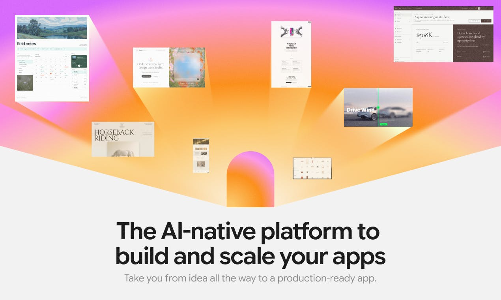
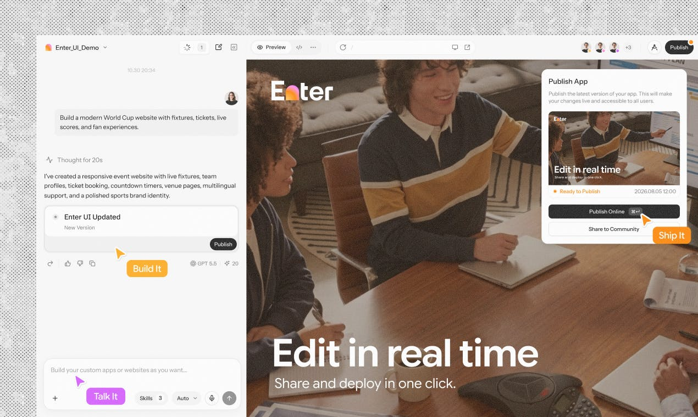
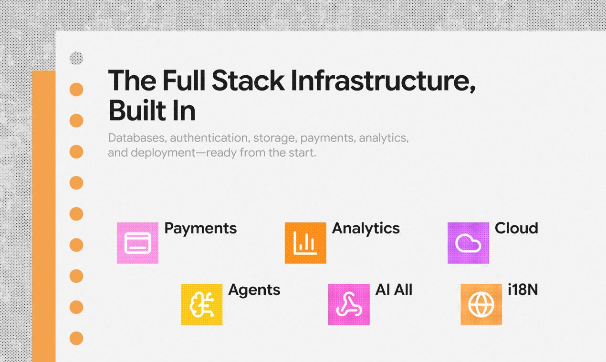

### 🎬 관련 영상
- [🎥 영상 보기](https://ph-files.imgix.net/abded0f0-58c9-4384-99d1-b6b57b8c6ad4.gif?auto=format)

---

## 2. [Skydive](https://www.producthunt.com/products/skydive)
**Votes**: 261 | **도입 난이도**: 하 | **신뢰도**: 상
**Tagline**: Build cloud agents that work across your tools
**서비스 링크**: https://www.producthunt.com/r/YLZ2MF3E6WGU67

**태그**: Automation, AI Agent, No-Code, Productivity, Agent, Prompting, DevTool

### 📌 이 서비스 한눈에 보기
코드나 복잡한 설정 없이 원하는 결과만 말하면 완성되는 클라우드 AI 에이전트 빌더

### 🔑 주요 기능
- 자연어 설명만으로 다단계 업무를 수행하는 AI 에이전트 생성
- 기존 사용 중인 소프트웨어 스택 내에서 직접 실행되는 워크플로우
- 노코드(No-code) 방식으로 프롬프트 엔지니어링이나 워크플로우 설계 불필요

### 🙋 사용자에게 어떤 점이 좋은가
반복적이고 복잡한 업무를 기존 도구들을 활용해 자동화할 수 있어, 업무 흐름을 끊지 않고도 AI 동료를 즉시 투입할 수 있습니다.

### ✅ 지금 바로 써볼 기능
- 원하는 업무 결과(Outcome)를 자연어로 설명해보기
- 현재 사용 중인 업무 도구들과의 연동성 확인하기
- 반복적인 워크플로우를 에이전트 작업으로 전환하기

### ⚠️ 사용 전 확인할 점
- 에이전트가 기존 도구에 접근할 때의 보안 및 권한 관리 확인 필요
- 복잡한 업무 단계에서 에이전트의 실행 정확도 검증 필요

### 🧭 확인이 더 필요한 정보
현재 지원하는 외부 도구(SaaS)의 종류와 구체적인 보안 정책에 대한 정보가 필요합니다.

### 📸 스크린샷 및 갤러리
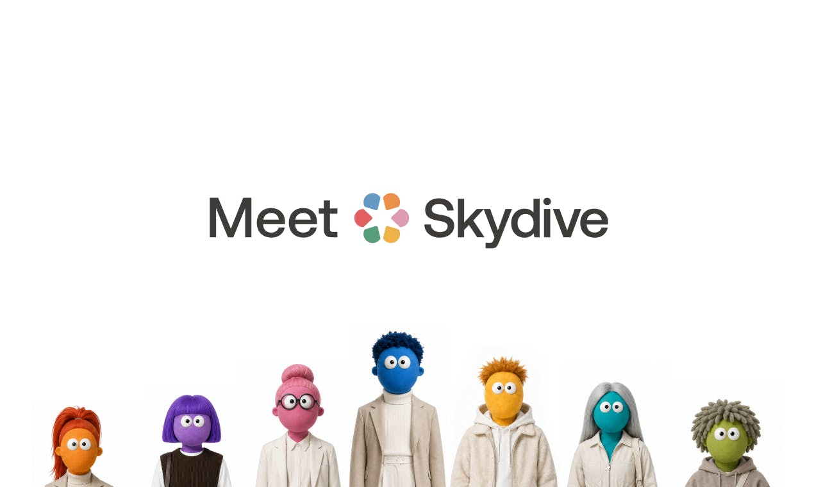
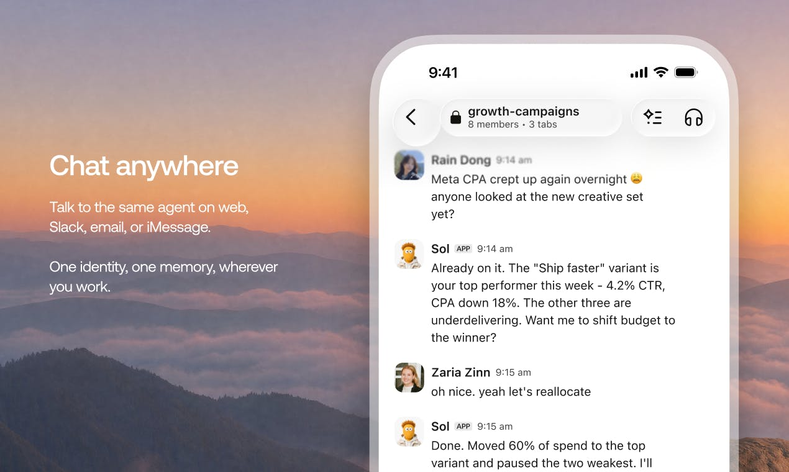
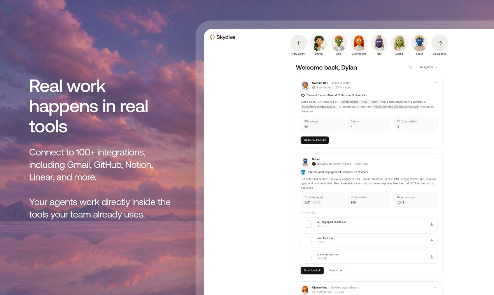

### 🎬 관련 영상
- [🎥 영상 보기](https://ph-files.imgix.net/2f10ded8-bcf5-4db2-b7bf-d7282e4bb0f9.jpeg?auto=format)

---

## 3. [Lenz](https://www.producthunt.com/products/lenz-2)
**Votes**: 181 | **도입 난이도**: 중 | **신뢰도**: 상
**Tagline**: Independent, multi-model fact-checking API for AI workflows
**서비스 링크**: https://www.producthunt.com/r/4USMUFE5GNEFA6

**태그**: AI, API, Fact-Checking, DevTool, Automation, AI Tool

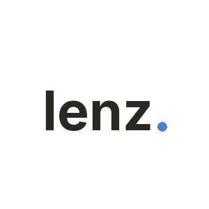

### 📌 이 서비스 한눈에 보기
AI 환각 현상을 방지하기 위해 독립적인 다중 모델 검증을 제공하는 팩트체크 API

### 🔑 주요 기능
- 텍스트 내 검증 가능한 주장을 자동으로 추출 및 분석
- 독립적 소스 검색, 다중 모델 토론, 리뷰 패널을 통한 다각도 검증
- 모든 근거와 논리 과정을 투명하게 공개하는 스코어링 시스템

### 🙋 사용자에게 어떤 점이 좋은가
AI 모델의 단일 답변에 의존하지 않고, 신뢰도가 중요한 워크플로우에서 환각(Hallucination) 문제를 해결할 수 있습니다.

### ✅ 지금 바로 써볼 기능
- API를 통한 기존 AI 워크플로우 통합 테스트
- MCP(Model Context Protocol)를 활용한 개발 환경 적용
- 무료 체험(lenz.io/ph)을 통한 검증 정확도 확인

### ⚠️ 사용 전 확인할 점
- 검증 과정의 복잡도로 인해 단일 모델 답변보다 응답 시간이 길 수 있음
- 검증 결과의 최종 책임은 사용자에게 있음

### 🧭 확인이 더 필요한 정보
구체적인 API 호출 비용 및 처리 속도(Latency)에 대한 정보는 명시되지 않았습니다.

### 📸 스크린샷 및 갤러리
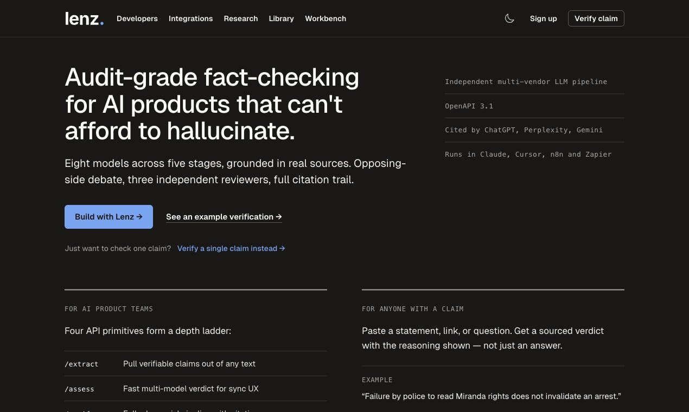
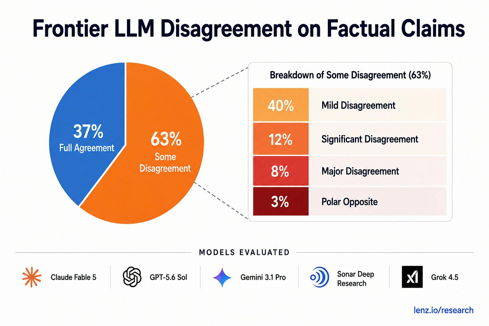
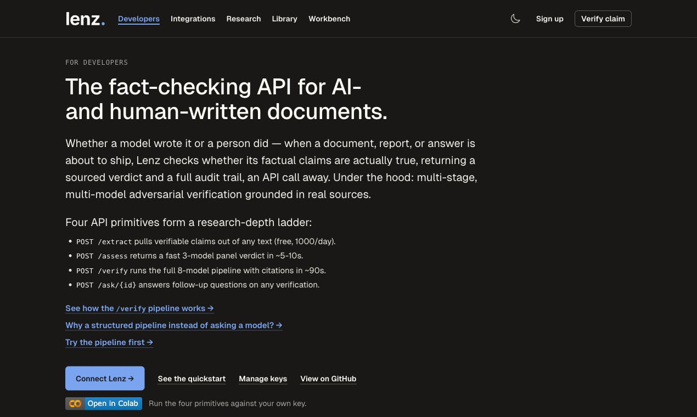

---

## 4. [Gemini 3.5 Transcribe](https://www.producthunt.com/products/gemini-3-5-transcribe)
**Votes**: 174 | **도입 난이도**: 하 | **신뢰도**: 상
**Tagline**: Our most precise speech-to-text model yet
**서비스 링크**: https://www.producthunt.com/r/JBVAAWRYCWB575

**태그**: AI, STT, Productivity, Transcription, Design

### 📌 이 서비스 한눈에 보기
정밀하고 지능적인 실시간 음성 기록을 위한 최신 STT 모델

### 🔑 주요 기능
- 가장 정밀한 성능을 갖춘 최신 음성-텍스트 변환 모델
- 지능적인 실시간 전사(Transcription) 기능 제공
- 정확도 중심의 음성 인식 설계

### 🙋 사용자에게 어떤 점이 좋은가
실시간 회의 기록이나 음성 데이터의 텍스트화가 필요한 사용자에게 높은 정확도의 결과물을 제공합니다.

### ✅ 지금 바로 써볼 기능
- 실시간 음성 입력 테스트
- 복잡한 대화 문맥 인식 확인
- 텍스트 변환 정확도 검증

### ⚠️ 사용 전 확인할 점
- 실시간 처리 시 네트워크 환경에 따른 지연 가능성
- 모델의 구체적인 지원 언어 범위 확인 필요

### 🧭 확인이 더 필요한 정보
제공되는 API의 상세 사양 및 지원 언어, 가격 정책에 대한 정보가 부족합니다.

### 📸 스크린샷 및 갤러리
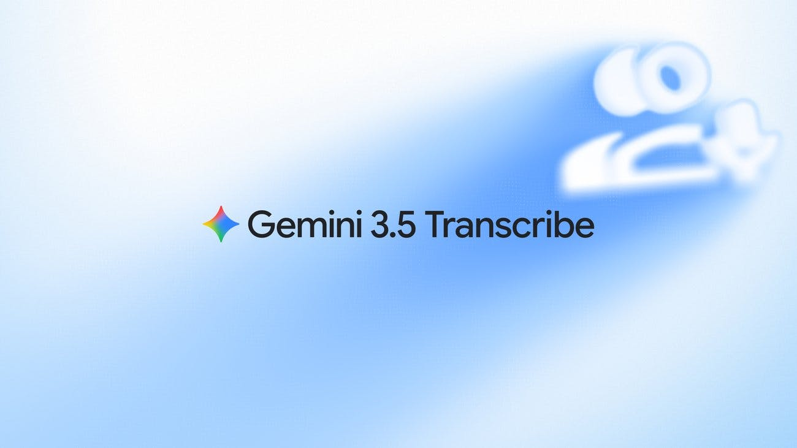

### 🎬 관련 영상
- [🎥 영상 보기](https://ph-files.imgix.net/d0fd7c2d-6955-42c6-94ce-a6ab53e5ab2e.jpeg?auto=format)
- [🎥 영상 보기](https://ph-files.imgix.net/165544e4-edb5-4122-a781-d0eae260f932.jpeg?auto=format)
- [🎥 영상 보기](https://ph-files.imgix.net/bfdd9d2f-c19b-41ee-a5ab-93c86abb5e79.jpeg?auto=format)
- [🎥 영상 보기](https://ph-files.imgix.net/10185f2f-0560-4a2b-832d-0bc2695a0224.jpeg?auto=format)

---

## 5. [Traccia](https://www.producthunt.com/products/traccia)
**Votes**: 170 | **도입 난이도**: 중 | **신뢰도**: 상
**Tagline**: Finally, a vendor-neutral AI Agent Control Plane.
**서비스 링크**: https://www.producthunt.com/r/5JRWFAAE2P7DIW

**태그**: AI, DevTool, Observability, Automation, Agent, AI Tool

### 📌 이 서비스 한눈에 보기
특정 벤더에 종속되지 않고 자율형 AI 에이전트의 동작을 관찰, 평가, 제어할 수 있는 통합 컨트롤 플레인

### 🔑 주요 기능
- 벤더 중립적 설계로 다양한 모델 및 프레임워크와 호환
- 에이전트 동작 관찰, 성능 평가, 정책 기반 거버넌스 제공
- OpenTelemetry 및 개발자 친화적 SDK를 통한 기존 스택과의 통합

### 🙋 사용자에게 어떤 점이 좋은가
여러 AI 모델을 혼합 사용하는 팀이 특정 업체에 종속되지 않으면서도, 운영 중인 에이전트의 행동을 투명하게 모니터링하고 통제할 수 있습니다.

### ✅ 지금 바로 써볼 기능
- SDK를 활용한 기존 에이전트 워크플로우 연결
- 에이전트 동작에 대한 감사 추적(Audit Trail) 기능 테스트
- 런타임 제어 정책 설정 및 적용

### ⚠️ 사용 전 확인할 점
- 에이전트의 자율적 행동에 대한 정책 설정 시 발생할 수 있는 예외 상황 검토 필요
- 기존 Observability 스택과의 세부 호환성 확인 필요

### 🧭 확인이 더 필요한 정보
현재 제공되는 SDK가 지원하는 구체적인 프레임워크 범위와 상세한 보안 정책 설정 방식에 대한 추가 확인이 필요합니다.

### 📸 스크린샷 및 갤러리
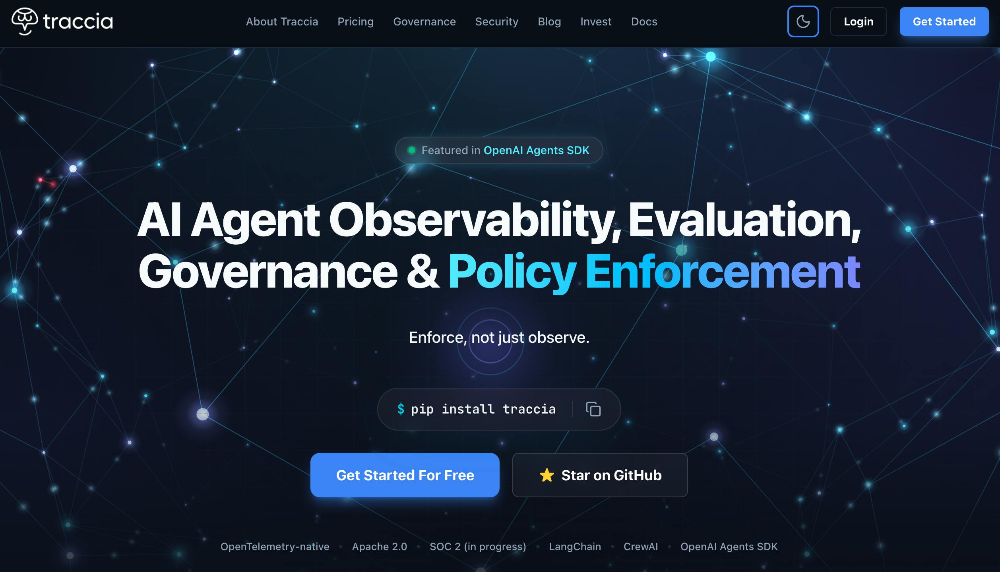
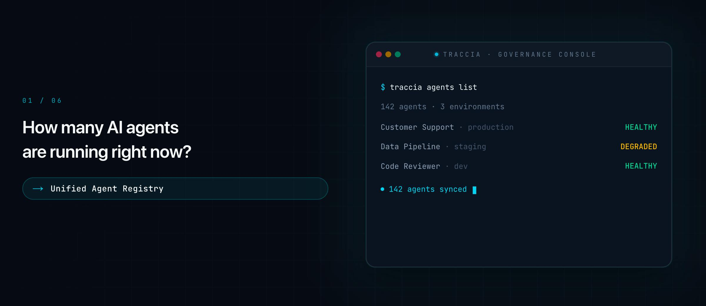
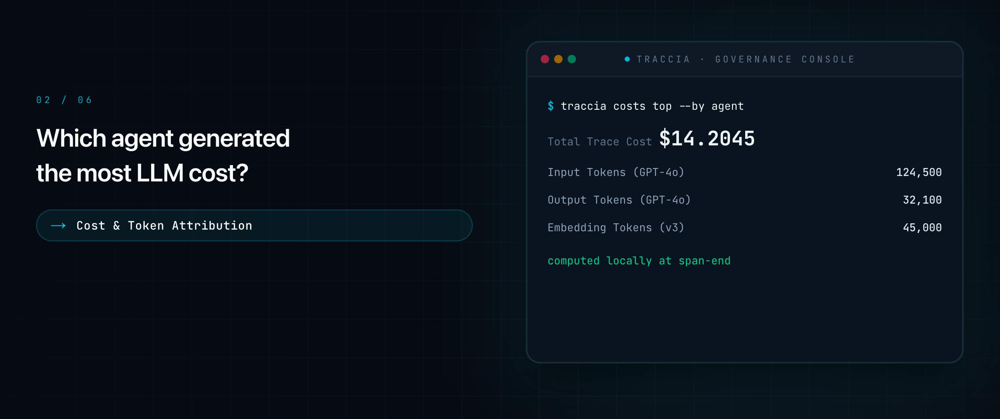

### 🎬 관련 영상
- [🎥 영상 보기](https://ph-files.imgix.net/d35ab7cf-1337-40eb-a089-dd75fba84948.jpeg?auto=format)

---

## 6. [Speko](https://www.producthunt.com/products/speko)
**Votes**: 157 | **도입 난이도**: 중 | **신뢰도**: 상
**Tagline**: OpenRouter for Voice
**서비스 링크**: https://www.producthunt.com/r/DCVFCRIIY6FU7L

**태그**: AI, Voice-AI, API, DevTool, AI Tool

### 📌 이 서비스 한눈에 보기
음성 인식부터 생성까지 하나의 API로 해결하는 통합 음성 AI 플랫폼

### 🔑 주요 기능
- STT, LLM, TTS를 하나의 API로 통합 관리
- 실시간 가용성과 공개 벤치마크 데이터 제공
- 음성 워크플로우를 위한 통합 인터페이스

### 🙋 사용자에게 어떤 점이 좋은가
여러 개의 음성 관련 API를 개별적으로 관리할 필요 없이, 하나의 인터페이스로 복합적인 음성 AI 서비스를 구축할 수 있습니다.

### ✅ 지금 바로 써볼 기능
- 통합 API를 통한 음성 워크플로우 테스트
- 제공되는 벤치마크를 통한 모델 성능 비교
- 실시간 가용성 확인 및 서비스 적용

### ⚠️ 사용 전 확인할 점
- 단일 API 의존도에 따른 서비스 리스크 고려 필요
- 상세한 모델별 성능 차이 및 비용 구조 확인 필요

### 🧭 확인이 더 필요한 정보
구체적인 API 호출 비용과 지원되는 모델의 종류는 명시되지 않았습니다.

### 📸 스크린샷 및 갤러리
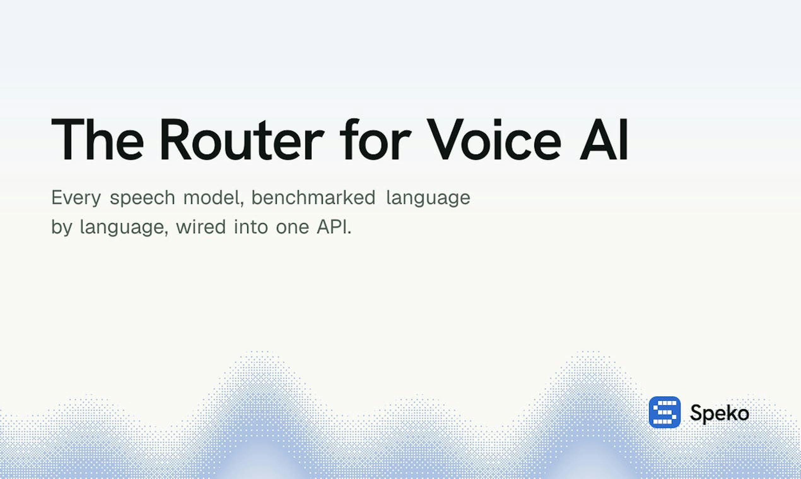
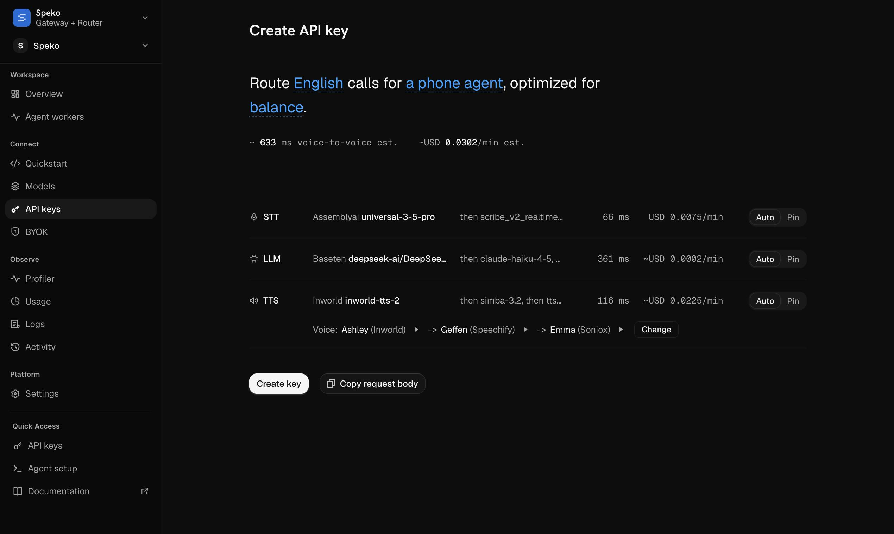
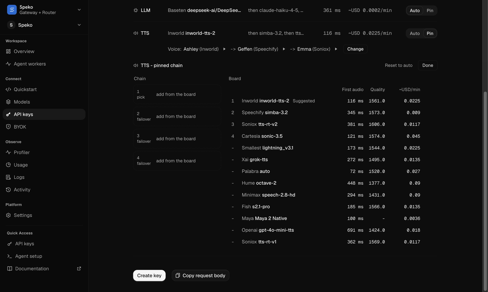

### 🎬 관련 영상
- [🎥 영상 보기](https://ph-files.imgix.net/a64f201e-6247-4a8a-906e-325549e7e313.jpeg?auto=format)

---

## 7. [Yomi](https://www.producthunt.com/products/yomi-3)
**Votes**: 129 | **도입 난이도**: 하 | **신뢰도**: 상
**Tagline**: A little cat who loves being read to
**서비스 링크**: https://www.producthunt.com/r/RC7DBOADGEXTNO

**태그**: Education, Kids, Reading, iOS

### 📌 이 서비스 한눈에 보기
아이들이 소리 내어 책을 읽으면 고양이가 먹이를 받는, 재미있는 독서 습관 형성 앱

### 🔑 주요 기능
- 음성 인식 기술을 활용한 실시간 독서 피드백
- 아이들이 직접 이야기를 만드는 스토리 위저드 기능
- 광고, 계정, 데이터 수집이 없는 프라이버시 중심 설계

### 🙋 사용자에게 어떤 점이 좋은가
아이들이 독서를 '공부'가 아닌 '놀이'로 느끼게 하여, 자연스럽게 읽기 연습을 지속할 수 있는 동기를 부여합니다.

### ✅ 지금 바로 써볼 기능
- 아이의 수준에 맞는 난이도 설정하기
- 직접 만든 이야기를 고양이에게 읽어주기
- 어려운 단어를 탭하여 발음 확인하기

### ⚠️ 사용 전 확인할 점
- 학습용 도구가 아닌 동기 부여용 도구이므로 본격적인 읽기 교육과는 차이가 있음
- 현재 영어와 핀란드어만 지원함

### 🧭 확인이 더 필요한 정보
한국어 지원 여부는 현재 명시되어 있지 않습니다.

### 📸 스크린샷 및 갤러리

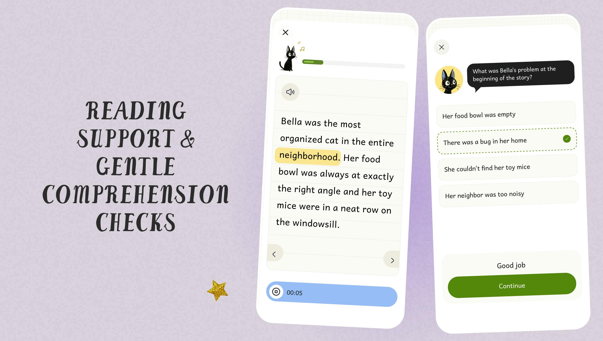

---

## 8. [GitNexus (Akon Labs)](https://www.producthunt.com/products/gitnexus-akon-labs)
**Votes**: 120 | **도입 난이도**: 중 | **신뢰도**: 상
**Tagline**: The open-source kernel for coding agents
**서비스 링크**: https://www.producthunt.com/r/RSJUDWOS6W4RS6

**태그**: DevTool, AI-Agent, KnowledgeGraph, OpenSource, Agent

### 📌 이 서비스 한눈에 보기
조직 내 모든 코드를 하나의 지식 그래프로 통합하여 코딩 에이전트의 정확도를 높이는 커널

### 🔑 주요 기능
- 조직 내 모든 코드베이스를 하나의 소스 오브 트루스(Source of Truth)로 통합
- 결정론적 그래프를 통해 호출 관계, 임포트, 영향도를 정확하게 분석
- MCP(Model Context Protocol)를 통해 모든 코딩 에이전트와 호환

### 🙋 사용자에게 어떤 점이 좋은가
에이전트가 코드의 맥락을 추측하는 대신 정확한 데이터에 기반해 작업하게 함으로써, 코딩 에이전트 운영 비용을 약 51% 절감할 수 있습니다.

### ✅ 지금 바로 써볼 기능
- 공개 벤치마크를 통한 성능 검증
- 기존 코딩 에이전트에 MCP를 통한 연결 시도
- 조직 내 코드베이스 통합 테스트

### ⚠️ 사용 전 확인할 점
- 조직 내 모든 코드를 연결할 때의 보안 및 권한 관리 필요
- 사용 중인 에이전트의 MCP 지원 여부 확인 필요

### 🧭 확인이 더 필요한 정보
조직 규모에 따른 데이터 처리 성능 및 보안 아키텍처에 대한 상세 정보 확인이 필요합니다.

### 📸 스크린샷 및 갤러리
_media_0.jpg)
_media_1.jpg)
_media_2.jpg)

### 🎬 관련 영상
- [🎥 영상 보기](https://ph-files.imgix.net/7bfc327c-906a-4b32-bd63-af45656cf454.jpeg?auto=format)

---

## 9. [SpacebarX](https://www.producthunt.com/products/spacebarx)
**Votes**: 113 | **도입 난이도**: 하 | **신뢰도**: 상
**Tagline**: A keyboard-first outliner for notes, tasks and projects
**서비스 링크**: https://www.producthunt.com/r/OL3KEVR6WNYKBT

**태그**: Productivity, Note-taking, Local-first, Writing, Task-management, AI Tool, DevTool

### 📌 이 서비스 한눈에 보기
키보드 중심의 로컬 우선 아웃라이너로 노트, 작업, 프로젝트를 하나로 관리하세요.

### 🔑 주요 기능
- 키보드 중심의 빠른 입력과 로컬 우선(Local-first) 방식의 데이터 보안
- 노트와 작업의 맥락을 유지하며 날짜를 인라인으로 추가하는 유연한 구조
- 클라우드 폴더 동기화를 통한 오프라인 작업 및 데이터 제어권 확보

### 🙋 사용자에게 어떤 점이 좋은가
마우스 없이 키보드만으로 모든 기록과 작업을 처리하고 싶은 생산성 중시 사용자에게 최적입니다. 데이터가 사용자의 클라우드에 저장되어 보안과 접근성을 동시에 잡을 수 있습니다.

### ✅ 지금 바로 써볼 기능
- 키보드 단축키를 활용한 빠른 메모 캡처
- 인라인 날짜 입력을 통한 할 일 관리
- 로컬 폴더 동기화 설정 및 오프라인 작업 테스트

### ⚠️ 사용 전 확인할 점
- Pro 버전 사용 시 시각적 뷰, 캘린더, AI 기능 등 핵심 기능에 제한이 있을 수 있음
- 로컬 파일 기반이므로 클라우드 폴더 설정 및 동기화 방식에 대한 이해 필요

### 🧭 확인이 더 필요한 정보
Pro 버전의 구체적인 가격 정책과 BYOK AI의 상세 기능 범위는 별도 확인이 필요합니다.

### 📸 스크린샷 및 갤러리
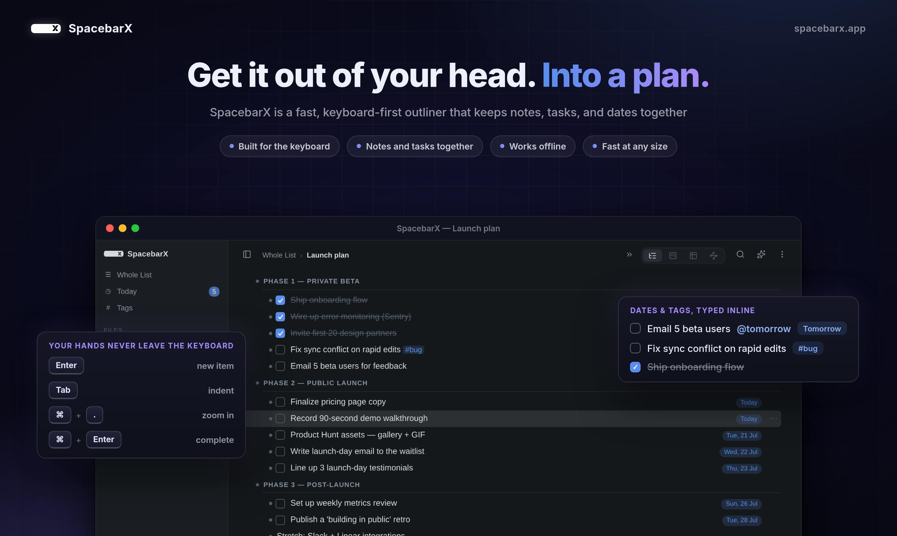
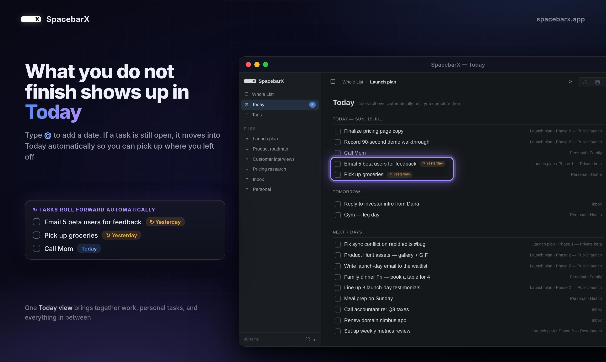
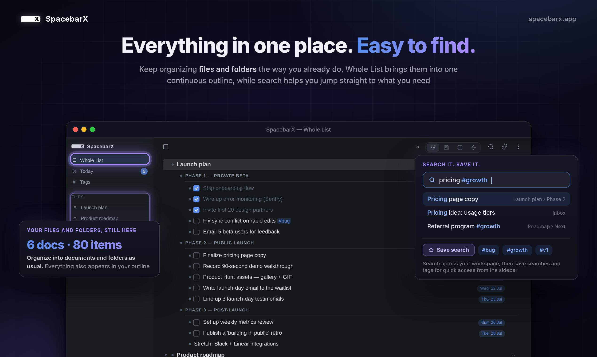

### 🎬 관련 영상
- [🎥 영상 보기](https://ph-files.imgix.net/d3e63d5d-8cc5-457b-9997-60512629de2f.jpeg?auto=format)

---

## 10. [Kira Community](https://www.producthunt.com/products/kira-art)
**Votes**: 108 | **도입 난이도**: 하 | **신뢰도**: 상
**Tagline**: Curate moments with #hashtag
**서비스 링크**: https://www.producthunt.com/r/ZI2UPV3XXIEI34

**태그**: AI, Community, Content Sharing, Creativity, AI Tool, Prompting, Video

### 📌 이 서비스 한눈에 보기
AI 생성 콘텐츠를 해시태그로 큐레이션하고 공유하는 커뮤니티 플랫폼

### 🔑 주요 기능
- AI로 생성한 이미지, 영상 등 창작물을 공유하는 공간
- 해시태그를 활용한 테마 중심의 피드 탐색
- 창작자와 취향이 맞는 사용자 간의 커뮤니티 형성

### 🙋 사용자에게 어떤 점이 좋은가
자신이 만든 AI 창작물을 단순히 저장하는 것을 넘어, 공통의 관심사를 가진 사람들에게 효과적으로 노출하고 소통할 수 있습니다.

### ✅ 지금 바로 써볼 기능
- 자신의 창작물을 해시태그와 함께 프로필에 업로드하기
- 관심 있는 테마의 해시태그를 통해 피드 탐색하기

### ⚠️ 사용 전 확인할 점
- 창작 도구에서 커뮤니티로 확장되는 단계이므로 커뮤니티 기능의 성숙도 확인 필요
- 콘텐츠 노출 알고리즘에 대한 구체적 정보 부족

### 🧭 확인이 더 필요한 정보
사용자 간의 상호작용 방식과 피드 노출 알고리즘의 상세 작동 방식은 명시되어 있지 않습니다.

### 📸 스크린샷 및 갤러리

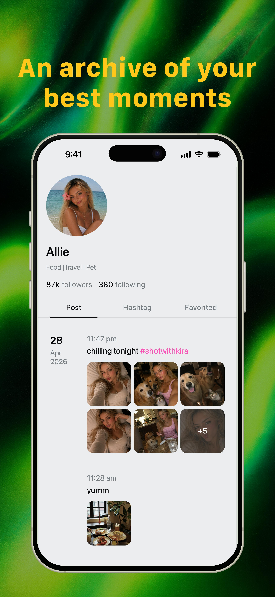

---

## 11. [Kraa 2.0](https://www.producthunt.com/products/kraa)
**Votes**: 105 | **도입 난이도**: 하 | **신뢰도**: 중
**Tagline**: Text editor and a publishing platform
**서비스 링크**: https://www.producthunt.com/r/PW6MLBRMHV5LDE

**태그**: Writing, Productivity, Publishing, Voice-to-Text

### 📌 이 서비스 한눈에 보기
강력한 편집 기능과 깔끔한 UI, 퍼블리싱 기능을 결합한 올인원 텍스트 에디터

### 🔑 주요 기능
- 클러터 없는 깔끔한 사용자 인터페이스(UI)
- 강력한 텍스트 편집 성능과 워크플로우 지원
- 작성한 글을 바로 공유할 수 있는 퍼블리싱 플랫폼 기능

### 🙋 사용자에게 어떤 점이 좋은가
글쓰기에 집중할 수 있는 깨끗한 환경에서 작업부터 발행까지 한 번에 해결할 수 있습니다.

### ✅ 지금 바로 써볼 기능
- 클린한 UI 환경에서 글쓰기 시작하기
- 음성 지원 기능을 활용한 텍스트 입력 테스트
- 작성한 콘텐츠를 플랫폼을 통해 직접 발행해보기

### ⚠️ 사용 전 확인할 점
- 퍼블리싱 플랫폼의 타 플랫폼(Medium, Substack 등)과의 연동성 확인 필요
- 음성 지원 기능의 정확도 및 한국어 지원 여부 확인 필요

### 🧭 확인이 더 필요한 정보
상세한 기능 명세와 음성 지원의 구체적인 작동 방식에 대한 정보가 더 필요합니다.

### 📸 스크린샷 및 갤러리

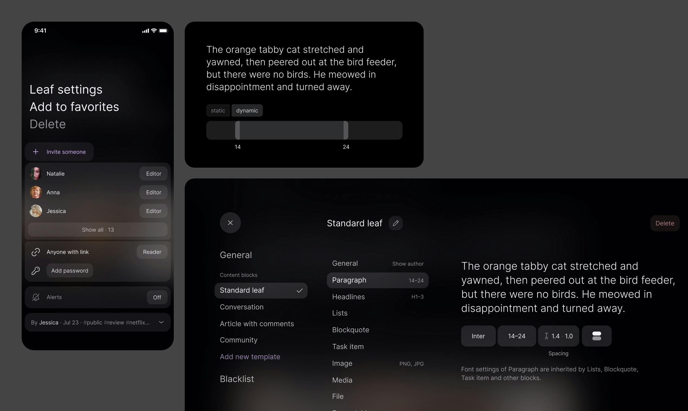
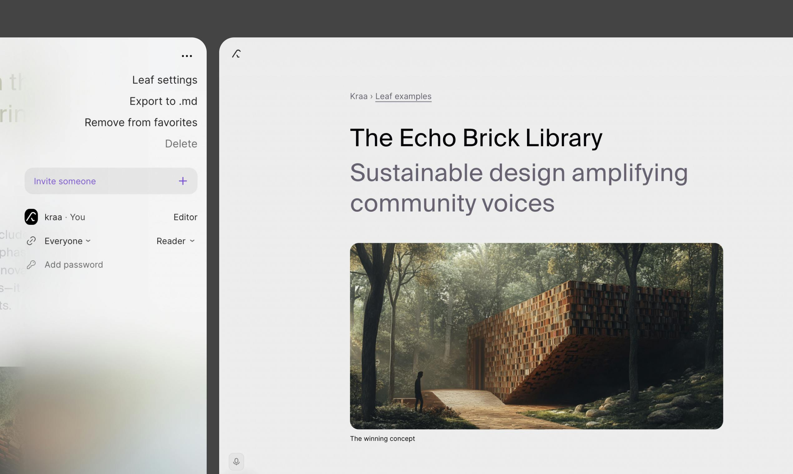

---

## 12. [Wondering Canvas](https://www.producthunt.com/products/wondering-2)
**Votes**: 102 | **도입 난이도**: 하 | **신뢰도**: 상
**Tagline**: Visual ChatGPT in Parallel
**서비스 링크**: https://www.producthunt.com/r/FJSKF3B2RRZPS4

**태그**: AI, Productivity, Visual Learning, Knowledge Management, AI Tool, Chat

### 📌 이 서비스 한눈에 보기
복잡한 개념을 시각적 캔버스와 병렬 채팅으로 구조화하여 탐구하는 AI 도구

### 🔑 주요 기능
- 텍스트 나열 대신 대화와 인터랙티브 다이어그램을 결합한 시각적 설명 제공
- 특정 키워드를 새로운 스레드로 분기하여 병렬적인 심층 탐색 가능
- 연관 질문 제안 및 캔버스 내 정리를 통한 체계적인 사고 흐름 유지

### 🙋 사용자에게 어떤 점이 좋은가
단순한 질의응답을 넘어, 복잡한 주제를 파고들 때 정보의 흐름을 시각적으로 관리하며 사고의 확장을 돕습니다.

### ✅ 지금 바로 써볼 기능
- 질문을 던져 텍스트 대신 생성되는 인터랙티브 다이어그램 확인하기
- 중요한 개념을 새로운 스레드로 분기(Spin off)하여 심화 학습하기
- 제안된 다음 질문을 따라가며 지식의 rabbit hole 탐험하기

### ⚠️ 사용 전 확인할 점
- 시각적 요소가 복잡해질 경우 정보 과부하가 발생할 수 있음
- 텍스트 중심의 단순 답변보다 시각적 구조화에 더 많은 인지 노력이 필요할 수 있음

### 🧭 확인이 더 필요한 정보
현재 제공되는 다이어그램의 편집 가능 여부와 외부 도구와의 연동 범위는 명시되지 않았습니다.

### 📸 스크린샷 및 갤러리
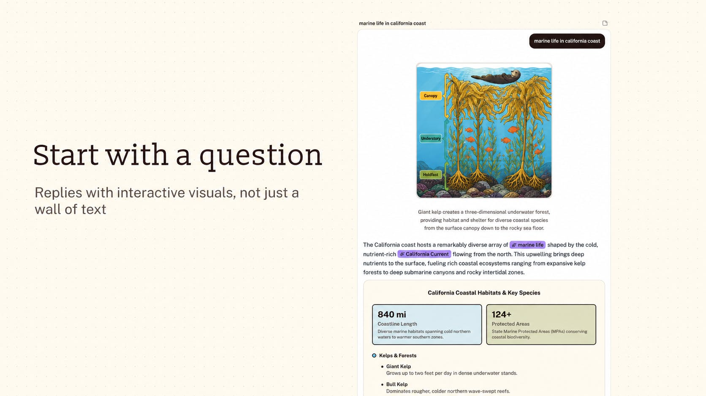
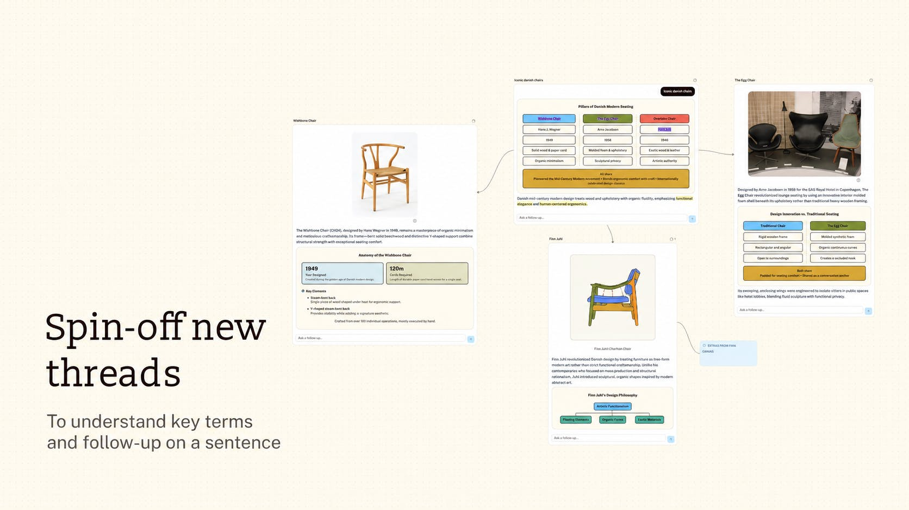
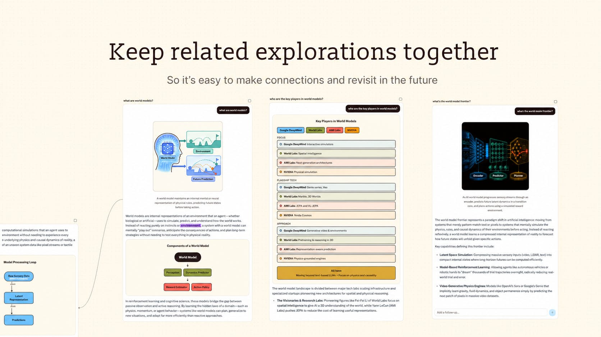

### 🎬 관련 영상
- [🎥 영상 보기](https://ph-files.imgix.net/6388cd93-38e7-4abd-8f43-38efd4483df8.jpeg?auto=format)

---

## 13. [Qwen3.8-Flash-Next](https://www.producthunt.com/products/qwen3)
**Votes**: 101 | **도입 난이도**: 상 | **신뢰도**: 상
**Tagline**: The open-weight preview of Qwen4
**서비스 링크**: https://www.producthunt.com/r/UQX25LQ64DELGC

**태그**: AI, LLM, OpenSource, Multimodal

### 📌 이 서비스 한눈에 보기
차세대 Qwen4 아키텍처를 미리 경험할 수 있는 고효율 멀티모달 MoE 모델

### 🔑 주요 기능
- 125B 규모의 MoE 구조를 갖췄으나 6B의 활성 파라미터만 사용하여 효율적 동작
- QSA, Gated Residual, N-gram embeddings, Muon 등 혁신적 신규 아키텍처 적용
- Qwen4로 향하는 기술적 방향성을 미리 확인할 수 있는 오픈 웨이트 프리뷰

### 🙋 사용자에게 어떤 점이 좋은가
차세대 모델의 구조적 특징을 미리 테스트하며 향후 고성능 모델로의 전환을 준비할 수 있습니다.

### ✅ 지금 바로 써볼 기능
- 새로운 MoE 아키텍처의 추론 효율성 테스트
- 멀티모달 기능 및 신규 임베딩 방식 검증
- Qwen4급 성능 대비 리소스 소모량 비교

### ⚠️ 사용 전 확인할 점
- 프리뷰 버전이므로 실험적인 아키텍처로 인해 안정성이 낮을 수 있음
- 125B 모델 규모로 인해 구동을 위한 하드웨어 요구 사양 확인 필요

### 🧭 확인이 더 필요한 정보
실제 추론 속도와 하드웨어 최적화 수준에 대한 구체적인 벤치마크 데이터가 필요합니다.

### 📸 스크린샷 및 갤러리
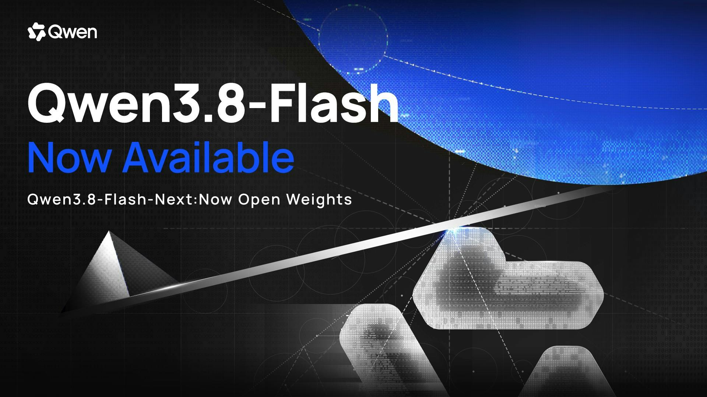
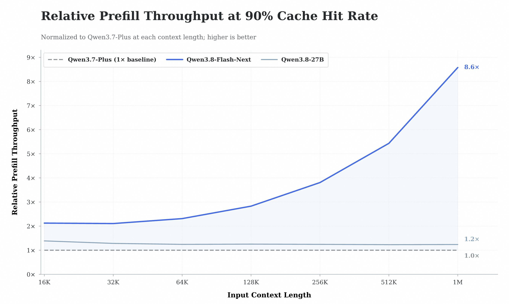
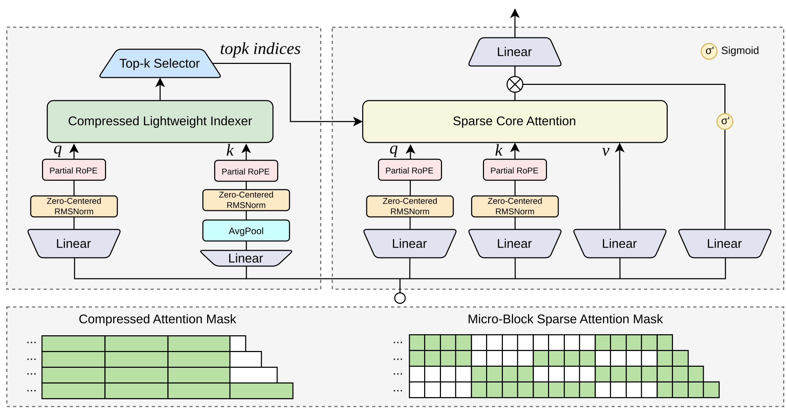

---

## 14. [Pluto](https://www.producthunt.com/products/pluto-11)
**Votes**: 101 | **도입 난이도**: 하 | **신뢰도**: 상
**Tagline**: Your professional profile is now an AI agent
**서비스 링크**: https://www.producthunt.com/r/RW2G5BAUK2RYQI

**태그**: AI, Career, PersonalBranding, Automation, Agent, AI Tool

### 📌 이 서비스 한눈에 보기
단 10분 만에 당신의 커리어 스토리를 학습하여 살아있는 프로필로 만드는 AI 에이전트

### 🔑 주요 기능
- 단순 키워드 나열을 넘어 개인의 역량과 업무 스타일을 학습하는 AI 보이스 에이전트
- 사용자의 성장과 변화에 맞춰 실시간으로 업데이트되는 살아있는 프로필 제공
- 적합한 인재와 AI 에이전트에게 사용자를 효과적으로 노출시키는 발견 가능성 증대

### 🙋 사용자에게 어떤 점이 좋은가
기존의 정적인 이력서 대신, 나의 강점과 미래 방향성을 담은 역동적인 프로필을 통해 더 나은 커리어 기회를 발견할 수 있습니다.

### ✅ 지금 바로 써볼 기능
- 10분간의 AI 인터뷰를 통해 자신의 커리어 스토리 학습시키기
- AI가 생성한 프로필이 자신의 전문성을 잘 나타내는지 검토하기
- 새로운 커리어 목표나 기술을 프로필에 반영하여 업데이트하기

### ⚠️ 사용 전 확인할 점
- 개인적인 커리어 정보와 목소리 데이터가 AI 모델에 학습되는 것에 대한 보안 검토 필요
- AI가 생성한 프로필이 실제 본인의 모습과 다르게 표현될 가능성

### 🧭 확인이 더 필요한 정보
현재 제공되는 프로필이 외부 채용 플랫폼(LinkedIn 등)과 어떻게 연동되는지에 대한 구체적인 정보가 부족합니다.

### 📸 스크린샷 및 갤러리
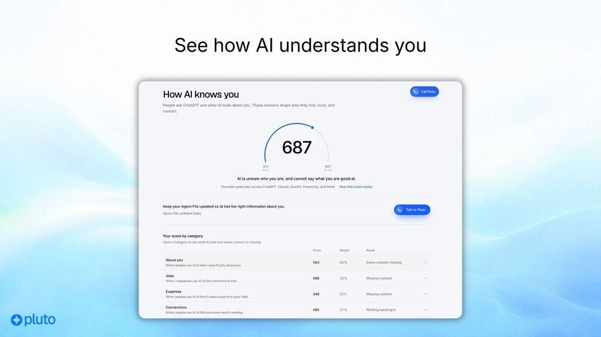
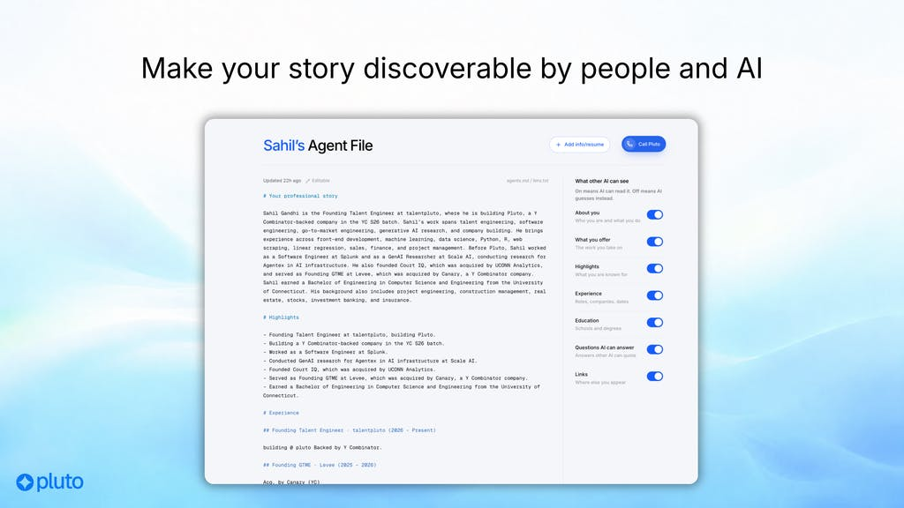
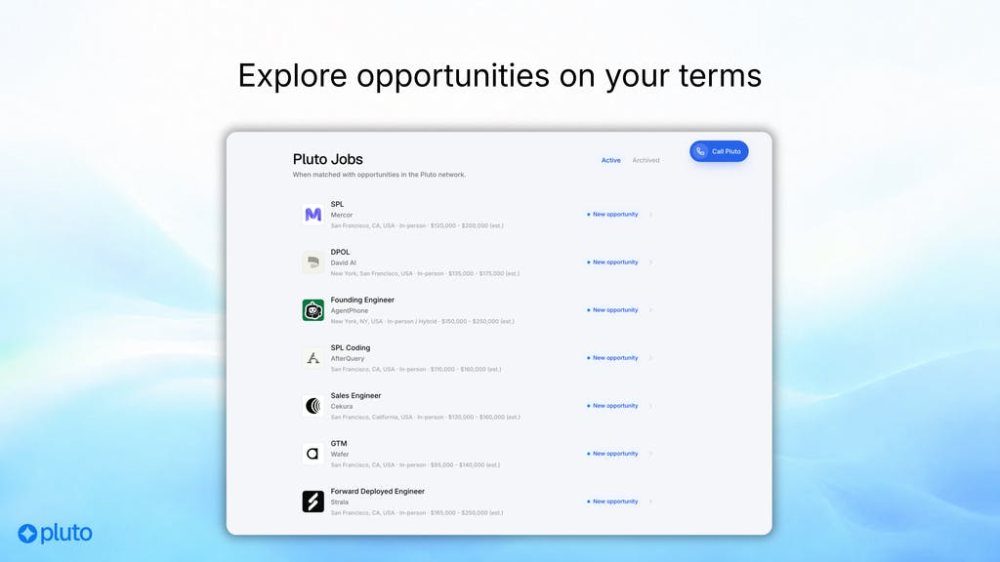

### 🎬 관련 영상
- [🎥 영상 보기](https://ph-files.imgix.net/f5ac1cf6-a82d-40cb-afb2-a825c07f3e94.jpeg?auto=format)

---

## 15. [Savvy](https://www.producthunt.com/products/savvy-12)
**Votes**: 99 | **도입 난이도**: 하 | **신뢰도**: 상
**Tagline**: An assistant that whispers what to say during a meeting
**서비스 링크**: https://www.producthunt.com/r/MSCP2DY4XMNQCD

**태그**: Productivity, AI Assistant, macOS, Meeting, Open Source

### 📌 이 서비스 한눈에 보기
내 문서 기반으로 회의 중 필요한 답변과 가이드를 실시간으로 알려주는 macOS 미팅 어시스턴트

### 🔑 주요 기능
- 사용자 개인 문서 기반의 맞춤형 브리핑 생성
- 질문 답변, 가이드라인 위반 알림, 조언 기능 제공
- 데이터 보안 중심 설계 (로컬 저장 및 최소 데이터 전송)

### 🙋 사용자에게 어떤 점이 좋은가
회의 중 질문을 받았을 때 당황하지 않도록 근거가 명확한 답변을 즉시 제공하며, 설정한 가이드라인을 벗어나는 상황을 방지해 줍니다.

### ✅ 지금 바로 써볼 기능
- 관련 문서가 담긴 폴더를 연결하여 클라이언트별 브리프 생성하기
- 회의 중 실시간 답변 및 가이드라인 위반 알림 확인하기
- 출처가 명시된 답변 카드를 통해 정보의 신뢰성 검증하기

### ⚠️ 사용 전 확인할 점
- macOS 13 이상 및 Apple Silicon 환경에서만 작동
- 외부 웹 정보가 아닌 오직 사용자가 제공한 문서에만 의존함

### 🧭 확인이 더 필요한 정보
사용자 문서의 양이나 복잡도에 따른 브리프 생성 성능 및 처리 속도는 명시되지 않았습니다.

### 📸 스크린샷 및 갤러리
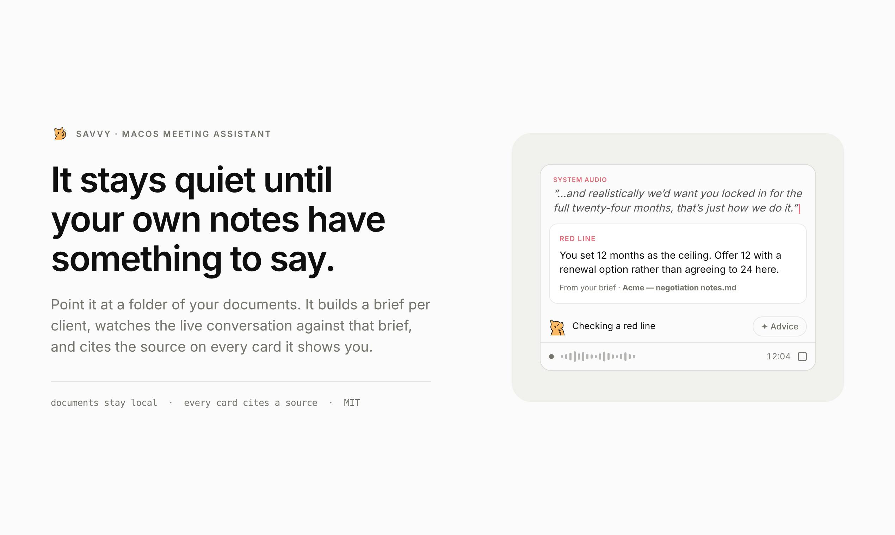
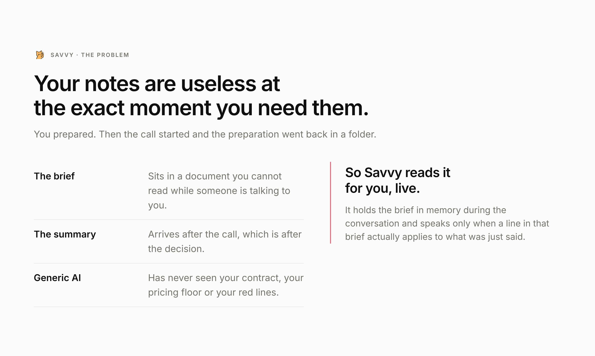
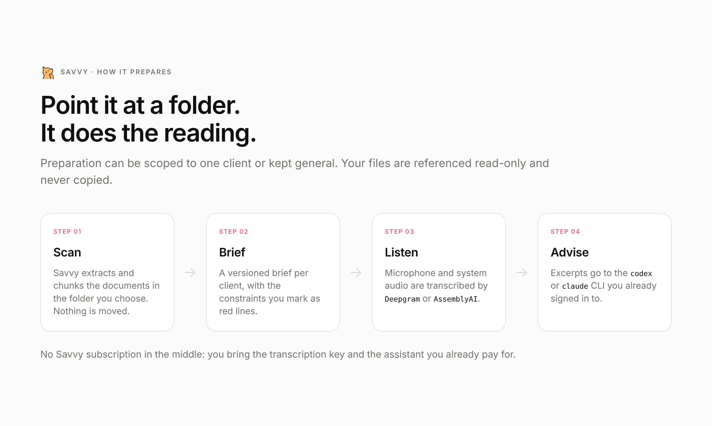

### 🎬 관련 영상
- [🎥 영상 보기](https://ph-files.imgix.net/8cd6bfc3-b517-47c8-b531-35404cca382a.jpeg?auto=format)

---

## 16. [Sendra](https://www.producthunt.com/products/sendra)
**Votes**: 97 | **도입 난이도**: 하 | **신뢰도**: 상
**Tagline**: Design emails in Figma, export HTML that works everywhere
**서비스 링크**: https://www.producthunt.com/r/I4NCFSIET2ULKJ

**태그**: DesignTool, EmailMarketing, Figma, NoCode, AI Tool, Vision, Design, Email

### 📌 이 서비스 한눈에 보기
피그마 디자인을 깨지지 않는 반응형 HTML 이메일 코드로 즉시 변환해주는 플러그인

### 🔑 주요 기능
- 피그마 프레임을 수정 없이 그대로 HTML로 내보내기 가능
- Gmail, Outlook 등 주요 메일 클라이언트 최적화 및 다크 모드 지원
- 모바일 환경을 위한 요소별 스태킹, 간격, 크기 제어 기능 제공

### 🙋 사용자에게 어떤 점이 좋은가
디자인과 개발 사이의 간극을 줄여주며, 복잡한 이메일 코딩 작업 없이도 모든 메일 앱에서 완벽하게 작동하는 결과물을 얻을 수 있습니다.

### ✅ 지금 바로 써볼 기능
- 기존 피그마 디자인 프레임 선택하여 내보내기 테스트
- 모바일 레이아웃을 위한 요소별 스태킹 설정 적용
- 이미지 호스팅 및 테스트 메일 발송 기능 확인

### ⚠️ 사용 전 확인할 점
- 기존 컴포넌트 라이브러리를 사용하지 않는 방식이므로 복잡한 디자인 시스템과의 호환성 확인 필요
- 이미지 호스팅 기능이 포함되어 있으므로 외부 저장소 관리 정책 확인 필요

### 🧭 확인이 더 필요한 정보
상세한 가격 정책 및 대량 메일 발송 시의 안정성에 대한 정보는 명시되지 않았습니다.

### 📸 스크린샷 및 갤러리
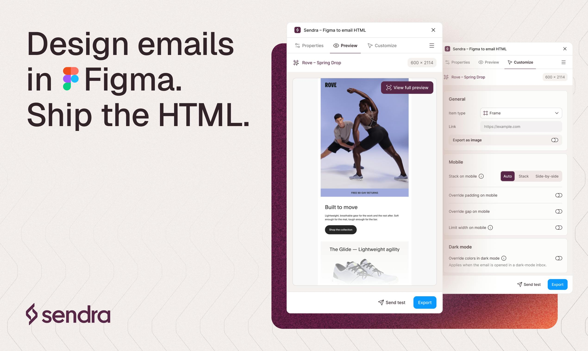

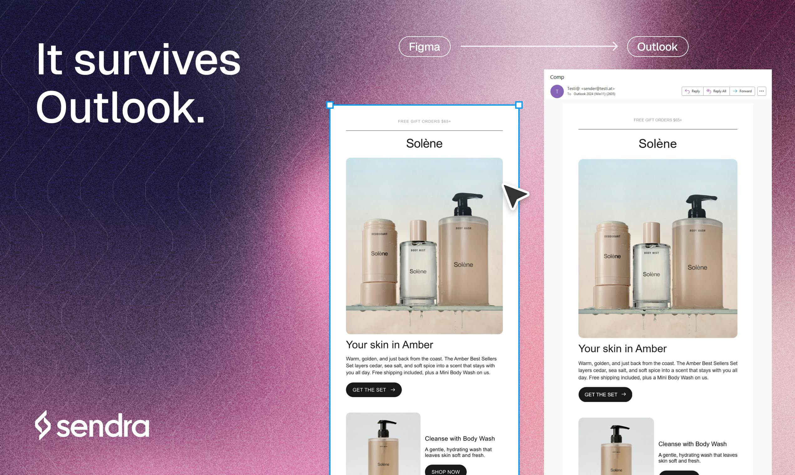

### 🎬 관련 영상
- [🎥 영상 보기](https://ph-files.imgix.net/9f7f630b-6f7c-48d5-8380-5491e2d6479a.jpeg?auto=format)

---

## 17. [Ojin](https://www.producthunt.com/products/ojin)
**Votes**: 97 | **도입 난이도**: 하 | **신뢰도**: 상
**Tagline**: Talk to an AI Agent with a real face and voice, in real time
**서비스 링크**: https://www.producthunt.com/r/YAV4JDAEVK32EV

**태그**: AI-Agent, Digital-Human, Real-time-Communication, DevTool, Agent, AI Tool, API

### 📌 이 서비스 한눈에 보기
사진 한 장으로 실시간 대화가 가능한 생생한 얼굴과 목소리를 가진 AI 에이전트

### 🔑 주요 기능
- 턴제 방식이 아닌 실시간 상호작용(말 끊기, 중단 가능) 지원
- 단 한 장의 사진과 페르소나 설정만으로 구현되는 디지털 휴먼
- Pipecat 및 LiveKit과의 원활한 통합 지원

### 🙋 사용자에게 어떤 점이 좋은가
복잡한 장비나 촬영 없이도 실제 사람처럼 반응하는 인터랙티브한 AI 에이전트를 즉시 구축할 수 있습니다.

### ✅ 지금 바로 써볼 기능
- 중간에 말을 끊으며 실시간 반응성 테스트하기
- 단 한 장의 사진으로 페르소나 설정해보기
- Pipecat/LiveKit 환경에 드롭하여 연동해보기

### ⚠️ 사용 전 확인할 점
- 단일 사진 기반 모델이므로 복잡한 움직임이나 다각도 표현의 한계가 있을 수 있음
- 실시간 대화 중 발생하는 지연 시간(Latency) 확인 필요

### 🧭 확인이 더 필요한 정보
제공되는 API의 구체적인 비용 구조와 동시 접속 처리 용량에 대한 정보가 명시되지 않았습니다.

### 📸 스크린샷 및 갤러리

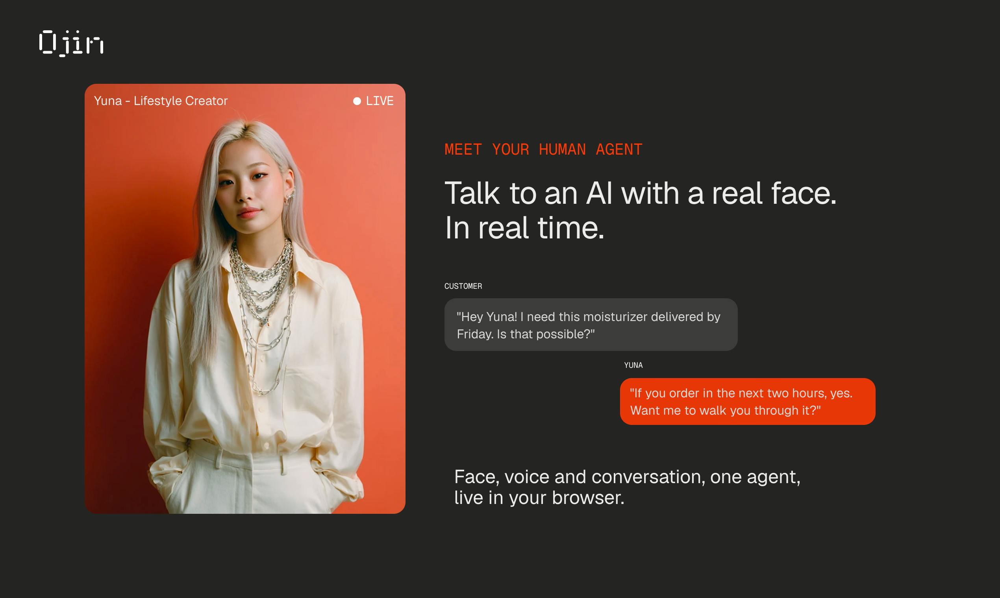
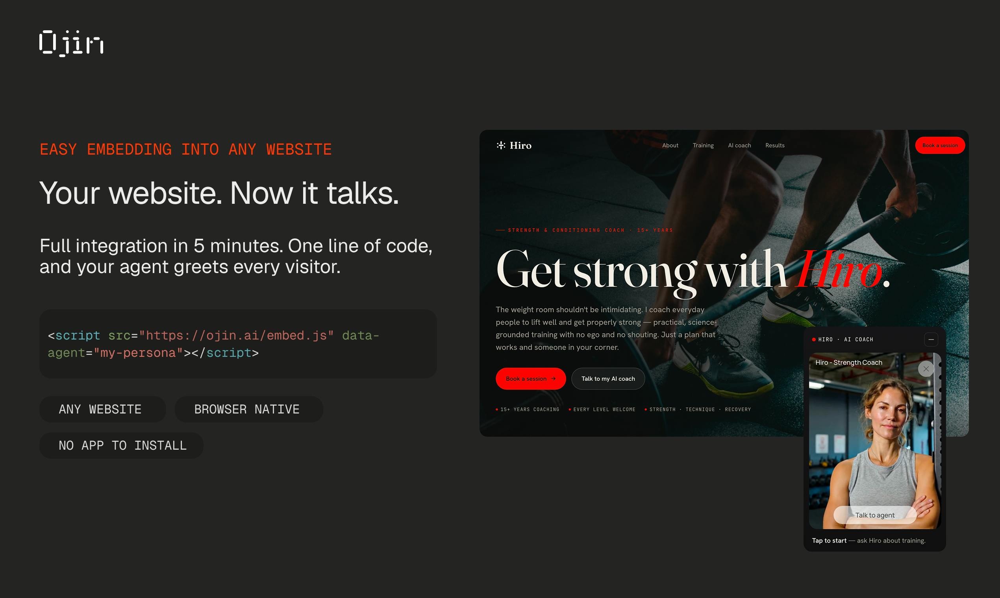

### 🎬 관련 영상
- [🎥 영상 보기](https://ph-files.imgix.net/a490b6d6-0af8-40d6-90cc-aef82357567a.jpeg?auto=format)

---

## 18. [The Million Sad Ducks](https://www.producthunt.com/products/the-million-sad-ducks)
**Votes**: 95 | **도입 난이도**: 하 | **신뢰도**: 상
**Tagline**: $1 makes one of them permanently happy
**서비스 링크**: https://www.producthunt.com/r/3G7HHTOC2PMN3D

**태그**: DigitalCollectibles, Gift, Fun

### 📌 이 서비스 한눈에 보기
1달러로 귀여운 디지털 오리를 영구적으로 행복하게 만드는 재미있는 기부형 프로젝트

### 🔑 주요 기능
- 1달러부터 1,000달러까지 선택 가능한 6가지 종류의 오리 폰드(Pond) 옵션
- 사용자가 직접 이름을 지어주는 커스텀 기능
- 공식적인 '오리 행복 증명서(Certificate of Duck Happiness)' PDF 발급

### 🙋 사용자에게 어떤 점이 좋은가
소액으로 재미있는 디지털 자산을 소유하거나, 이름을 지정해 지인에게 선물할 수 있는 유머러스한 이벤트성 서비스입니다.

### ✅ 지금 바로 써볼 기능
- 원하는 가격대의 오리 폰드 선택하기
- 오리에게 특별한 이름 부여하기
- 선물용으로 이름과 증명서 전달하기

### ⚠️ 사용 전 확인할 점
- 실질적인 기능보다는 재미와 상징적 가치에 집중된 서비스임
- 결제 시 오리의 희귀도나 가치가 달라질 수 있음

### 🧭 확인이 더 필요한 정보
결제 방식 및 디지털 자산의 영구적 보관 방식에 대한 상세 정보는 명시되어 있지 않습니다.

### 📸 스크린샷 및 갤러리
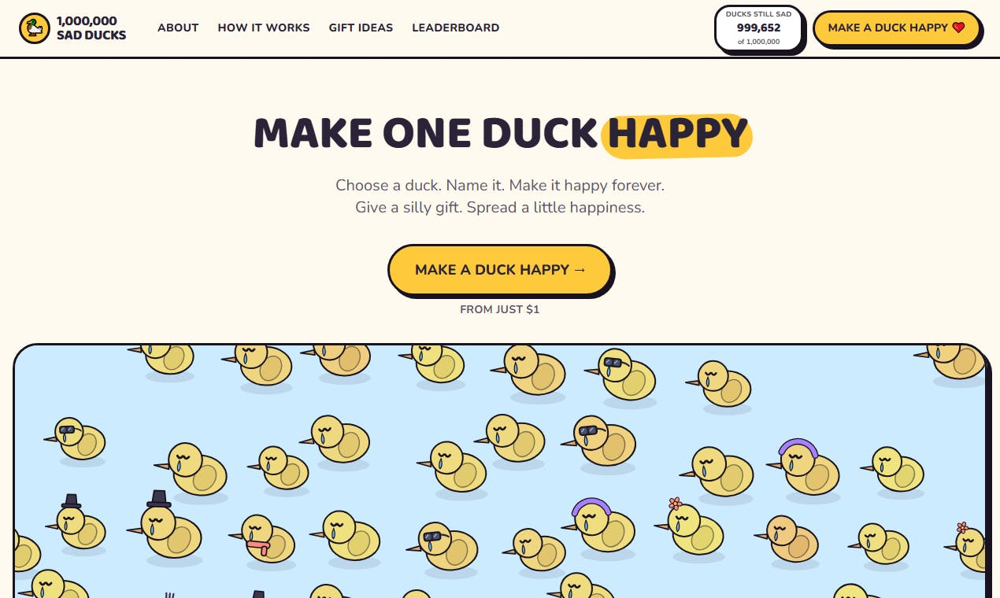
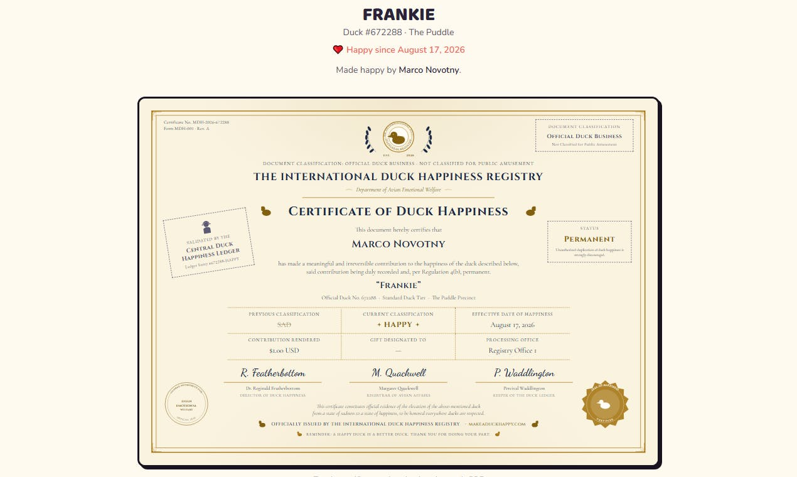
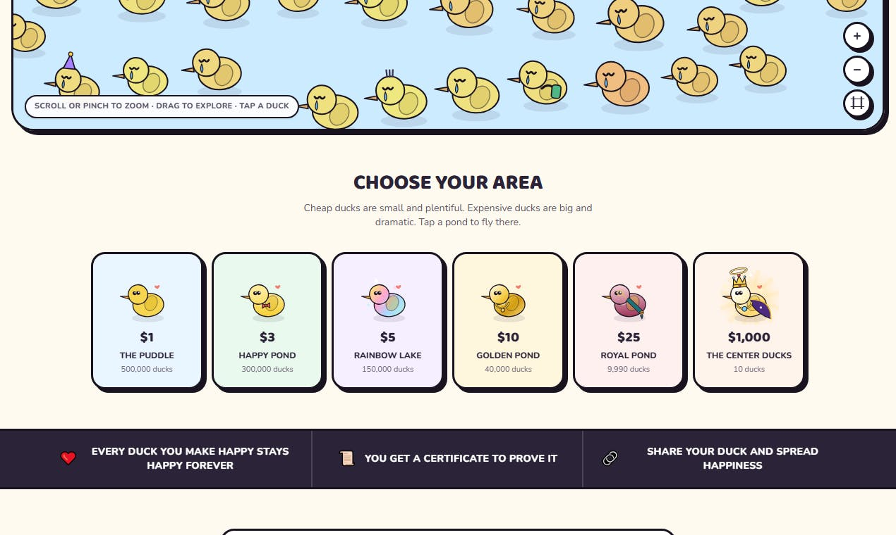

---

## 19. [IQ Routing](https://www.producthunt.com/products/iq-routing)
**Votes**: 94 | **도입 난이도**: 하 | **신뢰도**: 상
**Tagline**: Trajectory-aware LLM routing that cuts agent cost
**서비스 링크**: https://www.producthunt.com/r/N4VS2IXM6H4VCV

**태그**: AI, LLM, DevTool, CostOptimization, Automation, Agent

### 📌 이 서비스 한눈에 보기
에이전트 작업 흐름을 분석하여 최적의 비용으로 모델을 라우팅하는 지능형 게이트웨이

### 🔑 주요 기능
- 요청 성격에 따른 자동 분류 및 캐싱 기능 제공
- 작업의 맥락(Trajectory)을 파악하여 단계별 최적 모델 매칭
- 품질을 유지하면서도 모델 비용을 획기적으로 절감

### 🙋 사용자에게 어떤 점이 좋은가
단순한 API 호출을 넘어 에이전트의 전체 작업 흐름을 고려하므로, 복잡한 AI 에이전트 운영 시 비용 효율을 극대화할 수 있습니다.

### ✅ 지금 바로 써볼 기능
- 기존 LLM 워크플로우에 드롭인 게이트웨이로 연결해보기
- 작업 단계별 모델 라우팅 효율성 테스트하기
- 캐싱 기능을 통한 응답 속도 및 비용 절감 확인하기

### ⚠️ 사용 전 확인할 점
- 모델 전환 시 발생할 수 있는 문맥 유지 및 품질 저하 여부 확인 필요
- 에이전트 작업 흐름(Trajectory) 분석 로직의 정확도 검증 필요

### 🧭 확인이 더 필요한 정보
구체적인 지원 모델 목록과 기존 워크플로우와의 호환성 수준에 대한 정보가 필요합니다.

### 📸 스크린샷 및 갤러리
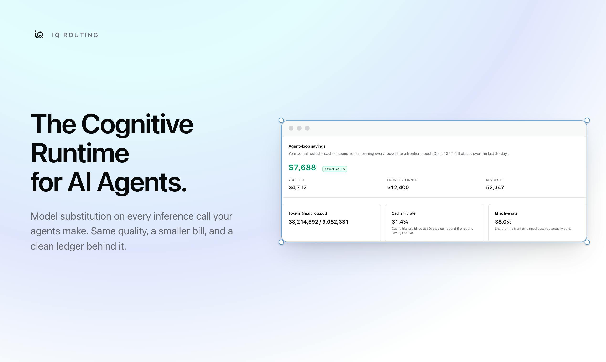
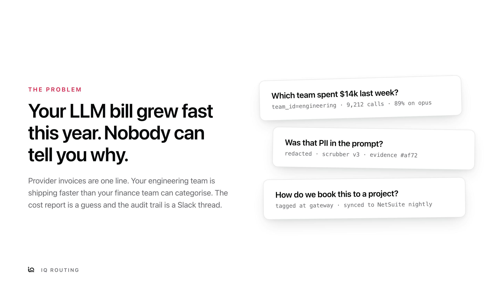
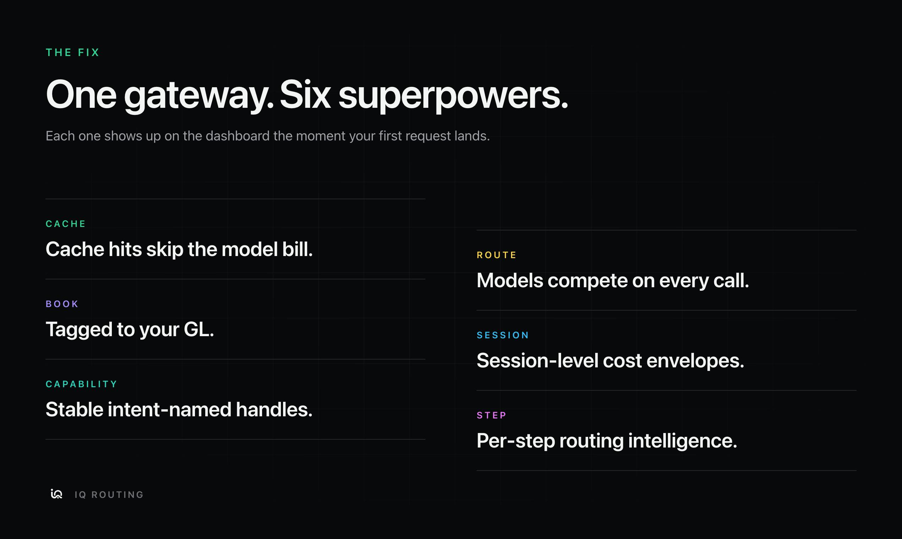

### 🎬 관련 영상
- [🎥 영상 보기](https://ph-files.imgix.net/3ff0403d-c649-4aa9-8476-a801ad125b46.jpeg?auto=format)

---

## 20. [Eventually](https://www.producthunt.com/products/eventually-3)
**Votes**: 91 | **도입 난이도**: 중 | **신뢰도**: 중
**Tagline**: Your X bookmarks, emailed back as your personal newsletter
**서비스 링크**: https://www.producthunt.com/r/W4L5JPQWTWIAXC

**태그**: AI Tool, Email

### 📌 이 서비스 한눈에 보기
제품의 상세 기능과 관련 소식은 원문 링크를 통해 확인해 주세요.

### 🔑 주요 기능
- 제품 페이지를 참고해 주세요.

### 🧭 확인이 더 필요한 정보
Product Hunt 설명(태그라인/디스크립션) 기반 정리이므로 실제 기능/가격/정책은 제품 페이지 확인이 필요합니다.

### 📸 스크린샷 및 갤러리
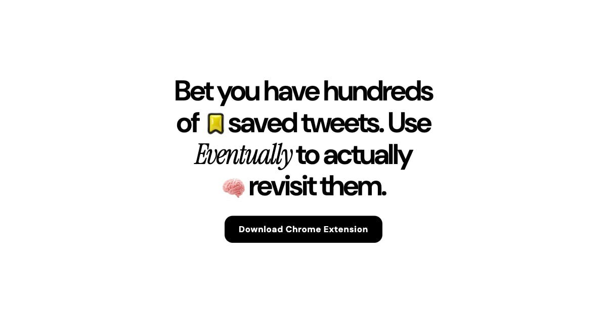
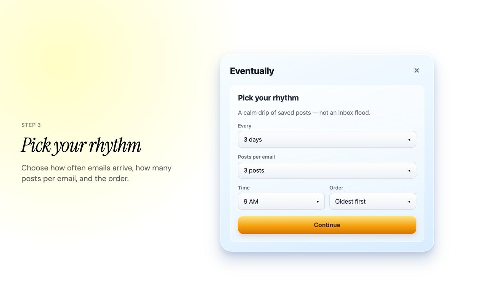
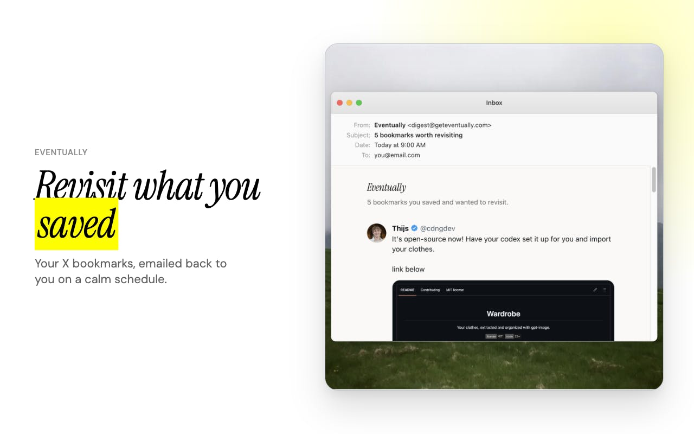

### 🎬 관련 영상
- [🎥 영상 보기](https://ph-files.imgix.net/bd00d4e4-e851-407c-bfc9-164eb2068522.jpeg?auto=format)

---

## 21. [GLM-5.3-Flash](https://www.producthunt.com/products/z-ai)
**Votes**: 90 | **도입 난이도**: 하 | **신뢰도**: 상
**Tagline**: The first natively multimodal model in GLM-5 series
**서비스 링크**: https://www.producthunt.com/r/GGCVXRCFHWTQGN
**재등장**: 최근 7일 내 재등장 (마지막 등장 4일 전)

**태그**: AI, Multimodal, LLM, Efficiency, Agent

### 📌 이 서비스 한눈에 보기
압도적인 가성비와 성능을 갖춘 GLM-5 시리즈 최초의 네이티브 멀티모달 모델

### 🔑 주요 기능
- GLM-5 시리즈 최초의 네이티브 멀티모달 모델 탑재
- 총 320B 파라미터 중 18B만 활성화하여 효율성 극대화
- 기존 GLM-5.2 대비 저렴한 비용으로 더 뛰어난 성능 제공

### 🙋 사용자에게 어떤 점이 좋은가
기존 모델 대비 1/10 수준의 비용으로 코딩 및 에이전트 작업에서 최상위급 성능을 경험할 수 있습니다.

### ✅ 지금 바로 써볼 기능
- 멀티모달 기능 테스트
- 코딩 및 에이전트 워크로드 적용
- 기존 모델과의 비용 대비 성능 비교

### ⚠️ 사용 전 확인할 점
- 활성 파라미터 수(18B)로 인한 대규모 추론 시의 제약 사항 확인 필요
- 실제 워크로드에서의 안정성 검증 필요

### 🧭 확인이 더 필요한 정보
Claude Opus 4.8과의 구체적인 벤치마크 비교 수치 및 실제 운영 비용 구조에 대한 상세 정보가 필요합니다.

### 📸 스크린샷 및 갤러리
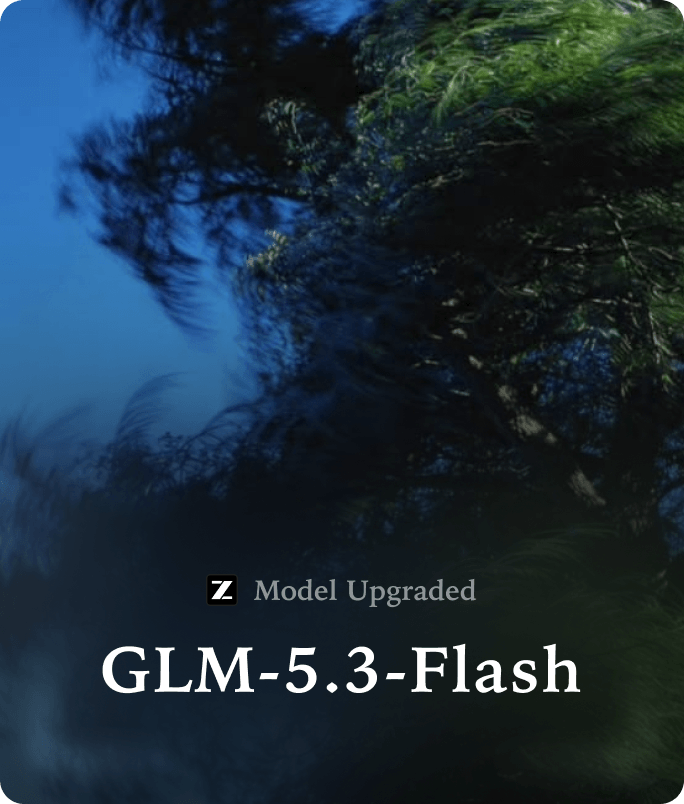
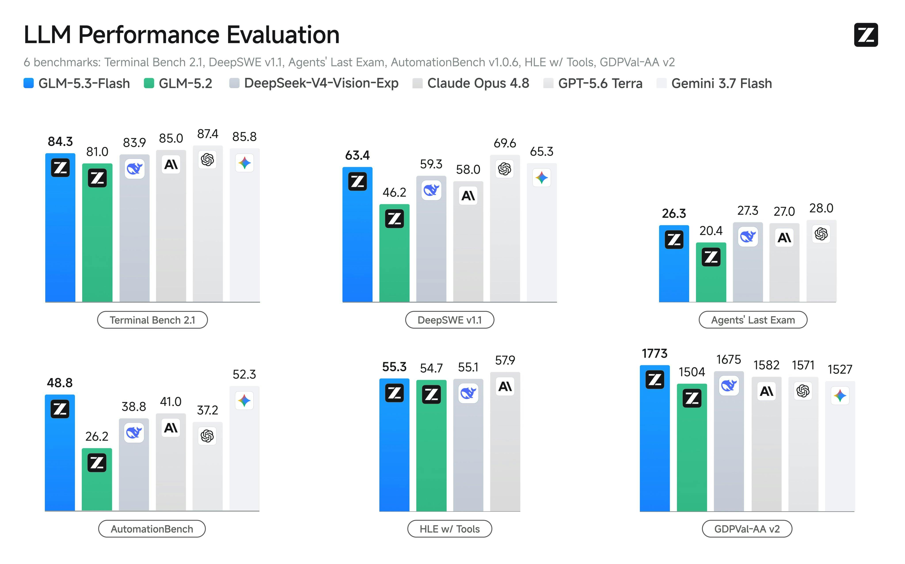
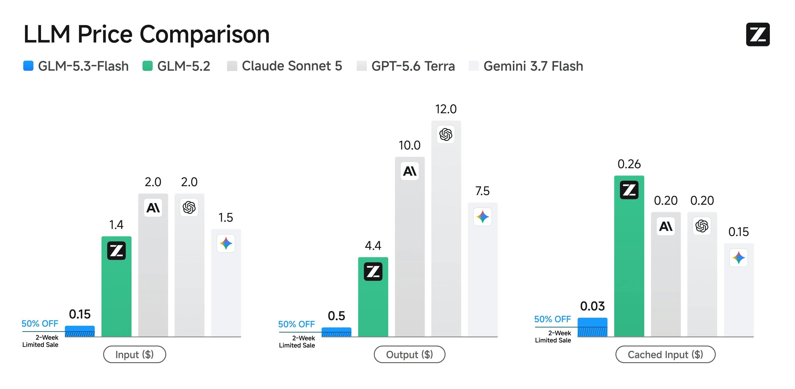

---

## 22. [Cobalt](https://www.producthunt.com/products/cobalt-10)
**Votes**: 85 | **도입 난이도**: 상 | **신뢰도**: 상
**Tagline**: Your Kobo can run apps now
**서비스 링크**: https://www.producthunt.com/r/ZWUAB6XUUHM3TX

**태그**: eReader, OpenSource, AppPlatform, Rust

### 📌 이 서비스 한눈에 보기
Kobo 전자책 단말기에서 다양한 앱을 실행할 수 있게 해주는 오픈소스 플랫폼

### 🔑 주요 기능
- Kobo 리더기용 오픈소스 앱 플랫폼
- 런처, 앱스토어, Rust SDK 및 격리된 런타임 제공
- USB로 한 번만 설치하면 이후 앱은 Wi-Fi로 간편하게 설치 가능

### 🙋 사용자에게 어떤 점이 좋은가
기존 Kobo 단말기의 기능을 확장하여 사용자 맞춤형 앱을 설치하고 사용할 수 있습니다.

### ✅ 지금 바로 써볼 기능
- USB를 통한 초기 설치 진행
- 제공되는 앱스토어 탐색
- Rust SDK를 활용한 앱 개발 시도

### ⚠️ 사용 전 확인할 점
- 초기 설치 시 USB 연결 및 수동 작업 필요
- 기기 펌웨어 환경에 따른 호환성 및 안정성 확인 필요

### 🧭 확인이 더 필요한 정보
사용자의 Kobo 기기 모델 및 펌웨어 버전별 호환성 여부를 확인해야 합니다.

### 📸 스크린샷 및 갤러리

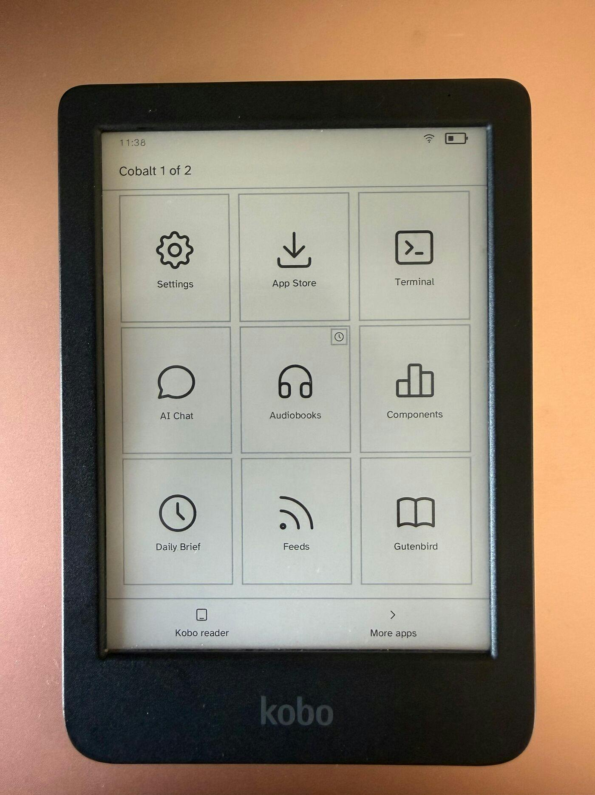

### 🎬 관련 영상
- [🎥 영상 보기](https://ph-files.imgix.net/e58406d2-7c25-48d9-b52a-125e31650620.jpeg?auto=format)

---

## 23. [HFlow](https://www.producthunt.com/products/hflow)
**Votes**: 82 | **도입 난이도**: 중 | **신뢰도**: 상
**Tagline**: Scalable multimodal data pipelines for robotics
**서비스 링크**: https://www.producthunt.com/r/JPMLIEX75SGPHP

**태그**: Robotics, AI, Data Engineering, OpenSource, MLOps, AI Tool

### 📌 이 서비스 한눈에 보기
로봇 및 물리적 AI를 위한 확장 가능한 멀티모달 데이터 파이프라인 구축 SDK

### 🔑 주요 기능
- 로봇 및 물리적 AI 특화 멀티모달 데이터 파이프라인 제공
- 데이터 변환, 검증, 라벨링, 강화 기능을 사용자 정의 가능
- 오케스트레이션, 저장, 버전 관리, 데이터 출처(Provenance) 통합 관리

### 🙋 사용자에게 어떤 점이 좋은가
데이터 품질 검사 및 데이터셋 구축 과정을 재현할 수 있어, 복잡한 로봇 학습용 데이터 관리 부담을 줄여줍니다.

### ✅ 지금 바로 써볼 기능
- 사용자 정의 트랜스폼(Transforms) 정의하기
- 데이터 검증 및 라벨링 워크플로우 설정하기
- 데이터 버전 관리 및 출처 추적 기능 테스트하기

### ⚠️ 사용 전 확인할 점
- 오픈 소스 SDK이므로 초기 환경 설정 및 학습 곡선이 존재할 수 있음
- 로봇/물리적 AI 분야에 특화되어 있어 일반적인 데이터 작업에는 과할 수 있음

### 🧭 확인이 더 필요한 정보
현재 Y Combinator 배치 단계로, 향후 확장성 및 대규모 데이터 처리 성능에 대한 실질적 벤치마크 확인이 필요합니다.

### 📸 스크린샷 및 갤러리
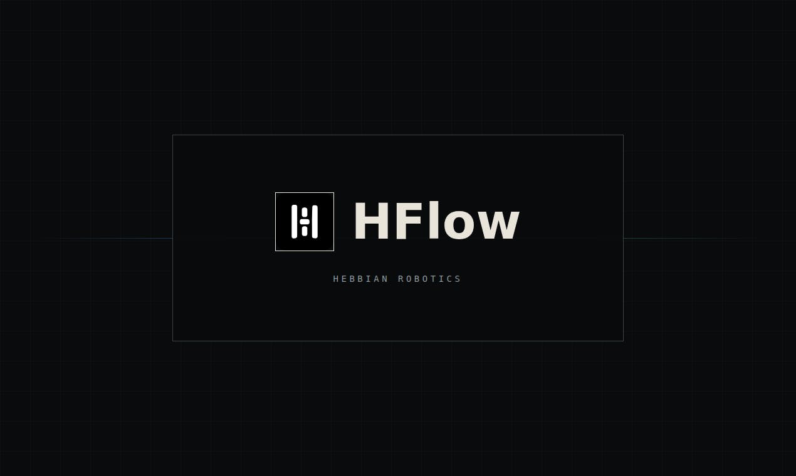
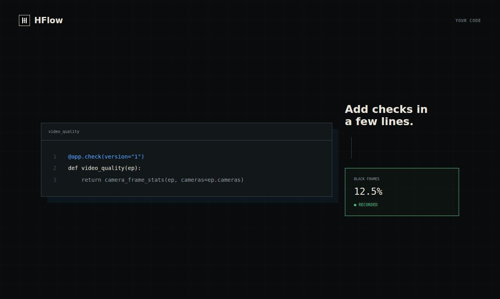
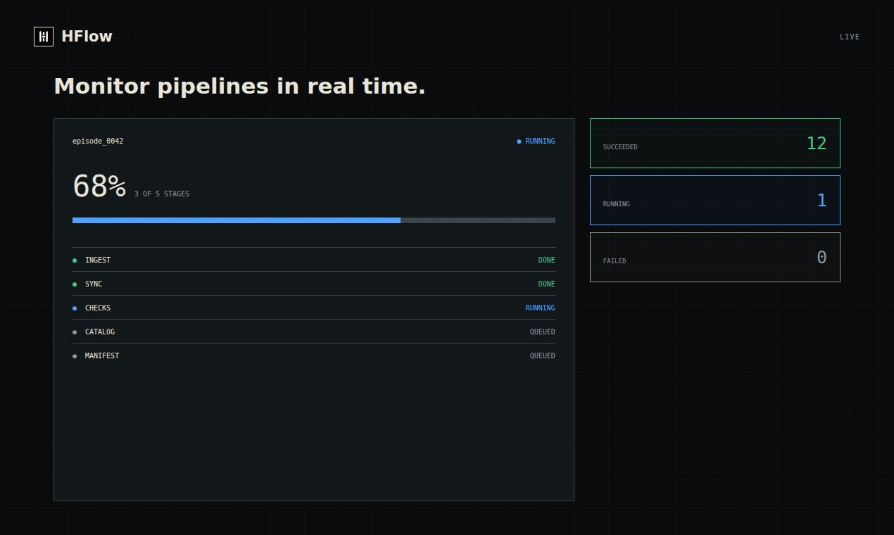

### 🎬 관련 영상
- [🎥 영상 보기](https://ph-files.imgix.net/ae2b6d96-a9ac-42f9-873c-c2e79f57c0aa.jpeg?auto=format)

---

## 24. [Ticket Fairy CLI](https://www.producthunt.com/products/the-ticket-fairy)
**Votes**: 68 | **도입 난이도**: 하 | **신뢰도**: 상
**Tagline**: Ticket Fairy event ticketing CLI & MCP server
**서비스 링크**: https://www.producthunt.com/r/PMHSZLOD7UENSH

**태그**: DevTool, Automation, CLI, Ticketing, AI Tool

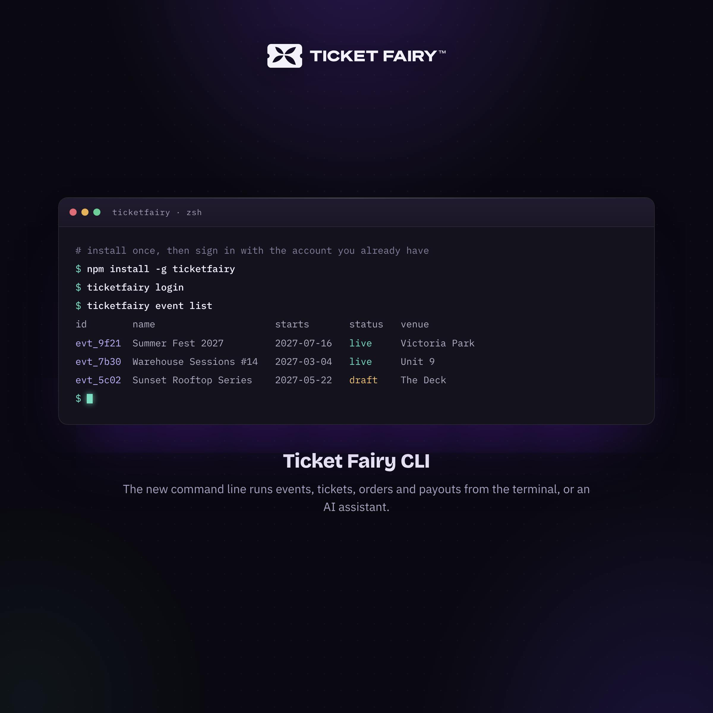

### 📌 이 서비스 한눈에 보기
이벤트 티켓팅 프로세스를 자동화하고 데이터로 관리하는 CLI 도구

### 🔑 주요 기능
- npm을 통한 간편한 설치 및 CLI 환경 지원
- 이벤트 설정, 데이터 내보내기, 리포팅 자동화
- 모든 명령 결과에 대한 안정적인 JSON 출력 제공

### 🙋 사용자에게 어떤 점이 좋은가
반복적인 이벤트 관리 작업을 스크립트로 자동화하여 업무 시간을 단축하고, 정형화된 JSON 데이터를 통해 다른 시스템과의 연동이 용이합니다.

### ✅ 지금 바로 써볼 기능
- npm을 이용한 CLI 설치 및 환경 설정
- 개인 계정 로그인을 통한 데이터 연동
- 명령어를 통한 이벤트 설정 및 리포트 생성 테스트

### ⚠️ 사용 전 확인할 점
- CLI 환경에 익숙한 사용자에게 최적화되어 있음
- 개인 계정 로그인 방식에 따른 보안 및 권한 관리 필요

### 🧭 확인이 더 필요한 정보
상세한 지원 이벤트 플랫폼 및 API 연동 범위에 대한 정보가 부족합니다.

### 📸 스크린샷 및 갤러리
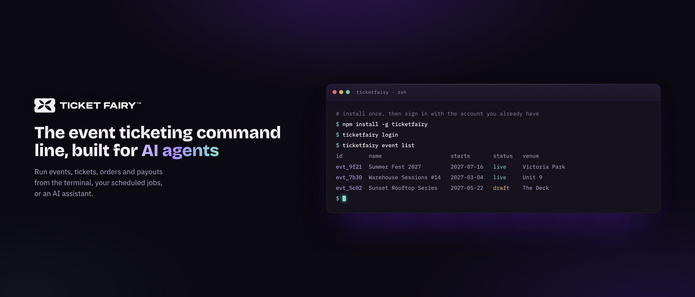
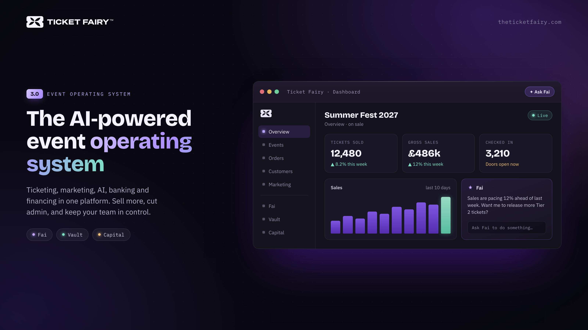
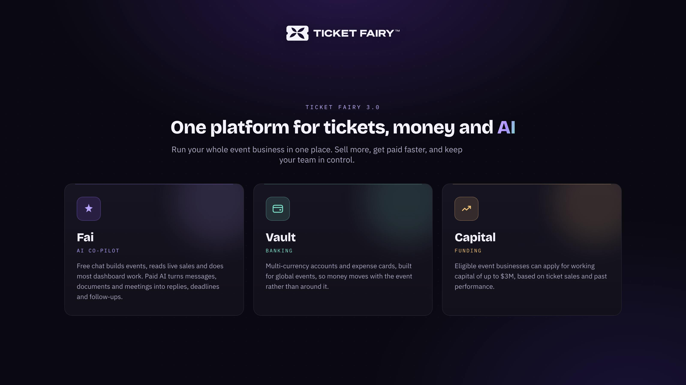

---

## 25. [DataGrout Flow ](https://www.producthunt.com/products/datagrout-ai)
**Votes**: 17 | **도입 난이도**: 중 | **신뢰도**: 상
**Tagline**: Multi-step workflow orchestration with human oversight.
**서비스 링크**: https://www.producthunt.com/r/7EAL5YJLGMTVVB

**태그**: AI, Automation, Workflow, DevTool, Agent, AI Tool

### 📌 이 서비스 한눈에 보기
AI 에이전트의 워크플로우 중간에 인간의 승인과 검토를 결합하는 오케스트레이션 도구

### 🔑 주요 기능
- AI 에이전트 실행 중 인간의 승인 및 검토 기능 제공
- 실행 중 누락된 데이터를 처리하거나 계획을 검증할 수 있는 제어권 확보
- Claude, Cursor 등 다양한 AI 에이전트 환경과 호환되는 MCP 도구 제공

### 🙋 사용자에게 어떤 점이 좋은가
AI가 자율적으로 작업을 수행할 때 발생할 수 있는 오류나 예기치 못한 결과를 방지하고, 인간이 안전하게 개입할 수 있는 통제권을 제공합니다.

### ✅ 지금 바로 써볼 기능
- MCP 도구를 활용한 Claude/Cursor 연동 테스트
- 중간 승인이 필요한 멀티스텝 워크플로우 설계
- 데이터 누락 상황에서의 에이전트 대응 시나리오 테스트

### ⚠️ 사용 전 확인할 점
- 사용 중인 AI 에이전트 프레임워크와의 호환성 확인 필요
- 인간의 개입이 워크플로우 전체 속도에 미치는 영향 고려

### 🧭 확인이 더 필요한 정보
제공되는 4가지 MCP 도구의 구체적인 기능과 각 에이전트 플랫폼별 설정 난이도를 확인해야 합니다.

### 📸 스크린샷 및 갤러리
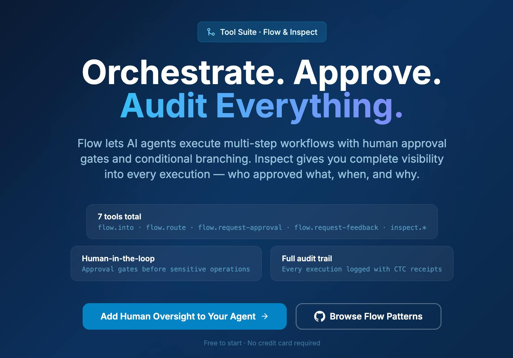
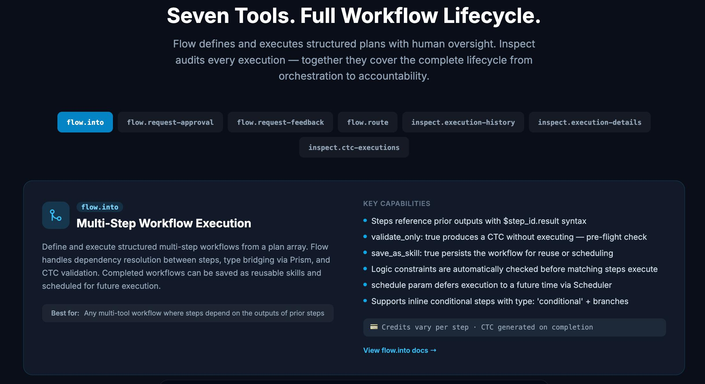
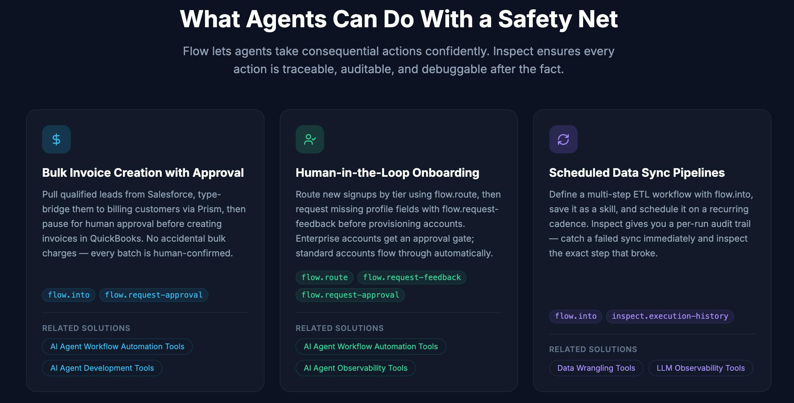

---

## 26. [TokenGod](https://www.producthunt.com/products/tokengod)
**Votes**: 14 | **도입 난이도**: 하 | **신뢰도**: 상
**Tagline**: AI builders: show what you spent, built, and earned
**서비스 링크**: https://www.producthunt.com/r/JLPL7DLZIFOLOU

**태그**: AI, Analytics, Leaderboard, BuilderTools, AI Tool

### 📌 이 서비스 한눈에 보기
AI 빌더들의 투자 대비 수익과 성과를 투명하게 공개하는 퍼블릭 리더보드

### 🔑 주요 기능
- AI 제품 개발에 투입된 비용, 구축 성과, 수익을 공개하는 대시보드 제공
- 투자 대비 수익(ROI)을 시각화하여 빌더의 역량을 증명
- 커뮤니티의 반응(Respect, Roast, Build)을 통한 투명한 피드백 루프 형성

### 🙋 사용자에게 어떤 점이 좋은가
자신의 AI 제품 성과를 데이터로 증명하고 싶은 빌더들에게 신뢰도 높은 포트폴리오 역할을 합니다.

### ✅ 지금 바로 써볼 기능
- 자신의 AI 프로젝트 성과 데이터 입력하기
- 공개용 퍼블릭 영수증(Public Receipt) 생성하기
- 다른 빌더들의 성과 지표 확인 및 피드백 남기기

### ⚠️ 사용 전 확인할 점
- 민감한 재무 데이터나 내부 비용 정보가 공개될 수 있음
- 커뮤니티의 비판(Roast)에 노출될 수 있음

### 🧭 확인이 더 필요한 정보
데이터 입력 방식과 보안 수준, 그리고 구체적인 수익 모델에 대한 정보가 명시되지 않았습니다.

### 📸 스크린샷 및 갤러리
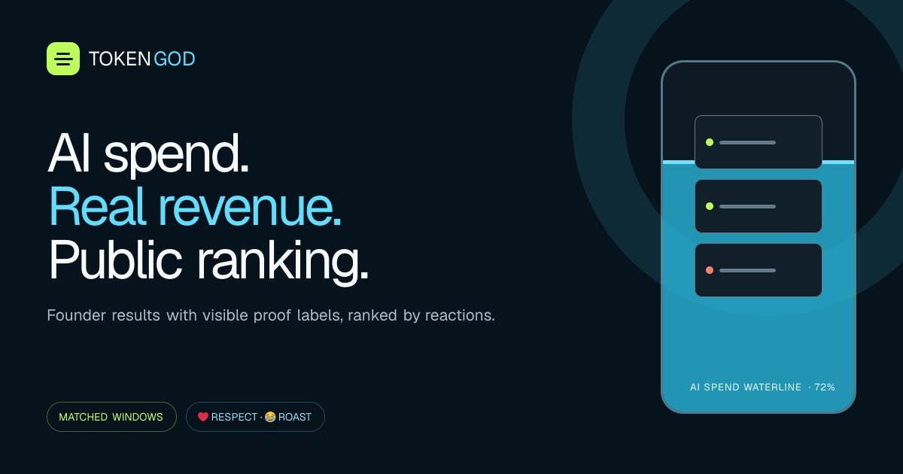
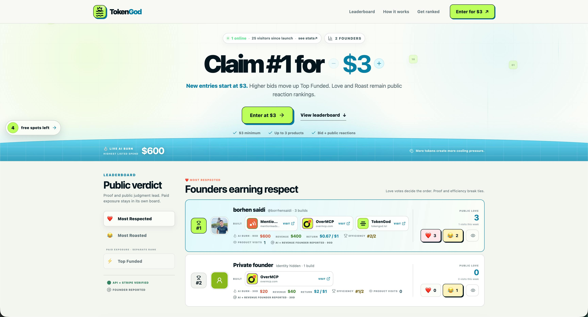
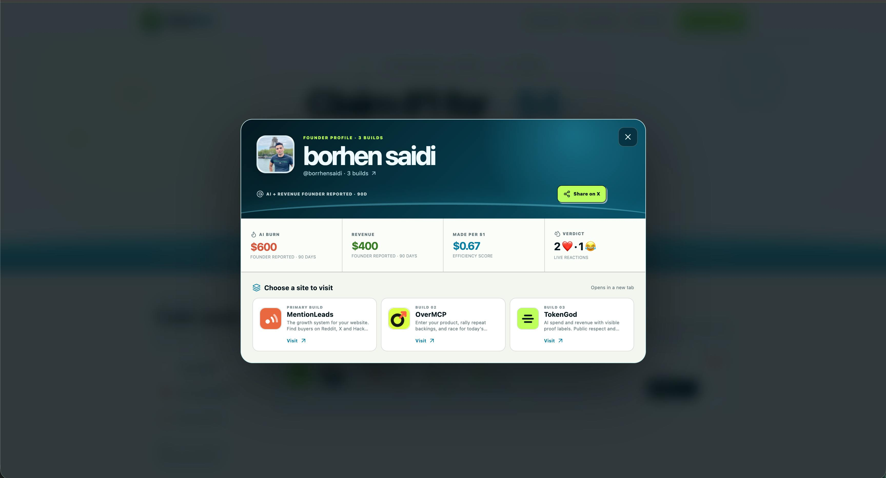

### 🎬 관련 영상
- [🎥 영상 보기](https://ph-files.imgix.net/5f79cb8a-700d-4fce-aa25-01115777810c.jpeg?auto=format)

---

## 27. [Osuite](https://www.producthunt.com/products/osuite-2)
**Votes**: 13 | **도입 난이도**: 중 | **신뢰도**: 상
**Tagline**: Root cause and a fix, in under five minutes
**서비스 링크**: https://www.producthunt.com/r/WZLQVGDTFZ54FN

**태그**: DevOps, AI, Observability, Automation, SRE, Agent, AI Tool, DevTool

### 📌 이 서비스 한눈에 보기
장애 발생부터 원인 분석 및 해결책 제시까지 5분 안에 완료하는 AI 기반 프로덕션 인텔리전스

### 🔑 주요 기능
- 텔레메트리, 코드, 배포 및 런타임 컨텍스트를 결합한 '컨텍스트 메시(Context Mesh)' 제공
- IDE 내에서 직접 작동하는 AI 조사 에이전트를 통한 신속한 문제 해결
- 전통적인 관측성(Observability)을 넘어선 자동화된 RCA(Root Cause Analysis) 워크플로우

### 🙋 사용자에게 어떤 점이 좋은가
심각한 장애(P0) 발생 시 수동 조사 시간을 획기적으로 단축하여 엔지니어가 문제 해결에만 집중할 수 있게 합니다.

### ✅ 지금 바로 써볼 기능
- IDE에 AI 조사 에이전트 설치 및 연동
- 기존 텔레메트리 데이터와 코드 컨텍스트 결합 확인
- 장애 발생 시 5분 내 해결 워크플로우 테스트

### ⚠️ 사용 전 확인할 점
- AI가 제안하는 수정 사항(Fix)에 대한 엔지니어의 검토 필수
- 기존 인프라 및 코드베이스와의 통합 난이도 확인 필요

### 🧭 확인이 더 필요한 정보
현재 제공되는 구체적인 지원 언어, 프레임워크 및 기존 모니터링 도구와의 호환성 범위는 명시되지 않았습니다.

### 📸 스크린샷 및 갤러리
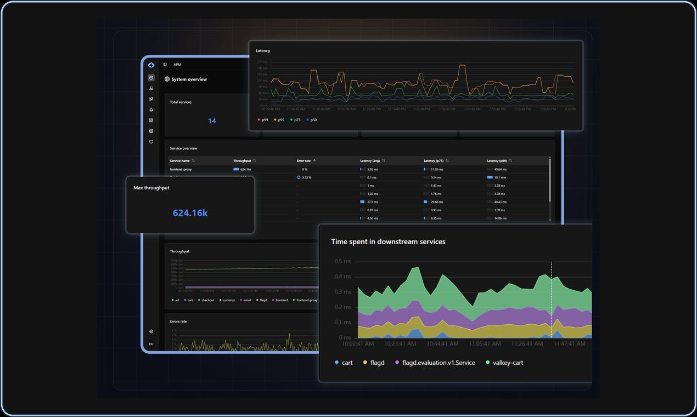
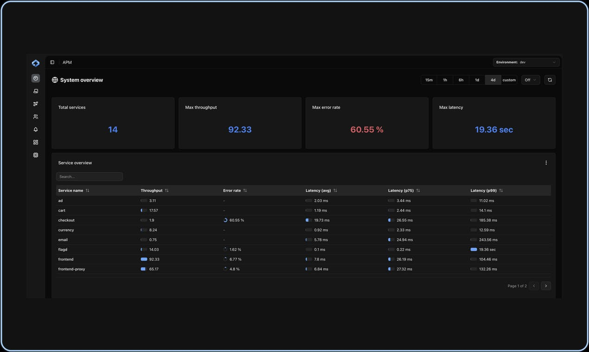
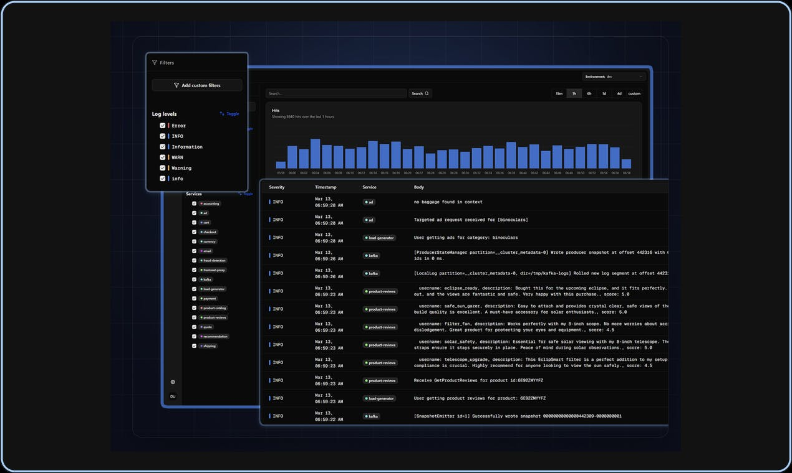

### 🎬 관련 영상
- [🎥 영상 보기](https://ph-files.imgix.net/0d1dcc02-48b8-4564-91fc-b2ae1f8c6bf5.jpeg?auto=format)

---

## 28. [Frontier Index](https://www.producthunt.com/products/frontier-index)
**Votes**: 13 | **도입 난이도**: 하 | **신뢰도**: 상
**Tagline**: The terminal for frontier AI.
**서비스 링크**: https://www.producthunt.com/r/G6NKJV4NDSKJT5

**태그**: AI, Analytics, Market Intelligence, Data, AI Tool

### 📌 이 서비스 한눈에 보기
최신 프론티어 AI 모델과 벤치마크, 시장 동향을 실시간으로 추적하는 통합 터미널

### 🔑 주요 기능
- 모든 프론티어 AI 모델의 실시간 트래킹
- 최신 벤치마크 데이터 통합 제공
- AI 시장의 움직임을 한곳에서 파악 가능

### 🙋 사용자에게 어떤 점이 좋은가
파편화된 AI 모델 정보와 벤치마크 데이터를 일일이 찾을 필요 없이, 하나의 대시보드에서 최신 기술 트렌드를 즉시 파악할 수 있습니다.

### ✅ 지금 바로 써볼 기능
- 실시간 모델 업데이트 모니터링
- 최신 벤치마크 점수 비교
- 시장 변동성 확인

### ⚠️ 사용 전 확인할 점
- 데이터 업데이트 주기가 실시간인지 검증 필요
- 제공되는 벤치마크의 신뢰도 및 출처 확인 필요

### 🧭 확인이 더 필요한 정보
구체적인 데이터 소스와 업데이트 주기에 대한 상세 정보가 명시되지 않았습니다.

### 📸 스크린샷 및 갤러리
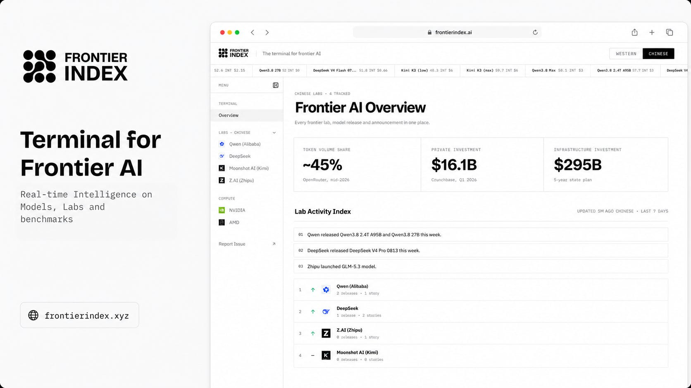
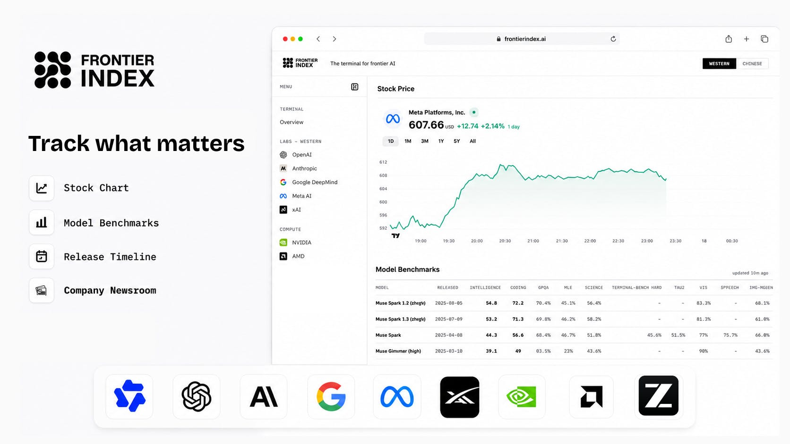
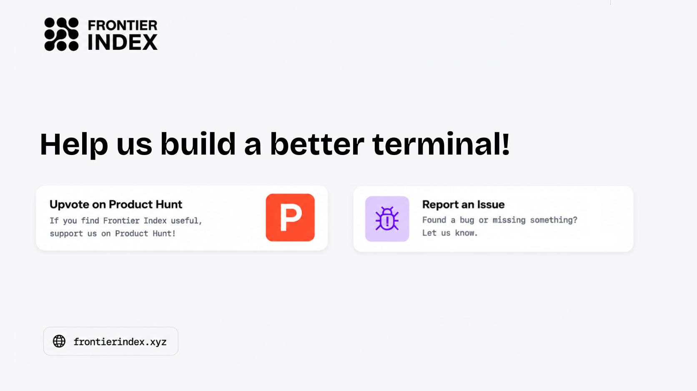

---

## 29. [Klamp.ai](https://www.producthunt.com/products/klamp-ai)
**Votes**: 13 | **도입 난이도**: 하 | **신뢰도**: 상
**Tagline**: Automate anything, instantly
**서비스 링크**: https://www.producthunt.com/r/FOKPBXC43DYPBF

**태그**: Automation, NoCode, Productivity, SaaS, AI Tool, Prompting

### 📌 이 서비스 한눈에 보기
자연어 프롬프트만으로 복잡한 업무 워크플로우를 즉시 자동화하는 도구

### 🔑 주요 기능
- 프롬프트 기반의 직관적인 워크플로우 빌더 제공
- 아이디어를 즉시 연결된 자동화 프로세스로 변환
- SaaS 환경에서의 업무 자동화 시간 단축

### 🙋 사용자에게 어떤 점이 좋은가
복잡한 코딩이나 설정 없이 말하듯 설명하는 것만으로 업무 자동화를 구축할 수 있어 생산성이 극대화됩니다.

### ✅ 지금 바로 써볼 기능
- 자연어로 워크플로우 생성 시도하기
- 기존 SaaS 서비스와 연결 테스트하기
- 생성된 워크플로우의 실행 결과 확인하기

### ⚠️ 사용 전 확인할 점
- 프롬프트의 구체성에 따라 생성되는 워크플로우의 정확도가 달라질 수 있음
- 연동 가능한 외부 SaaS 서비스 범위 확인 필요

### 🧭 확인이 더 필요한 정보
현재 제공되는 구체적인 SaaS 통합 목록과 프롬프트의 정교한 제어 가능 여부를 확인해야 합니다.

### 📸 스크린샷 및 갤러리
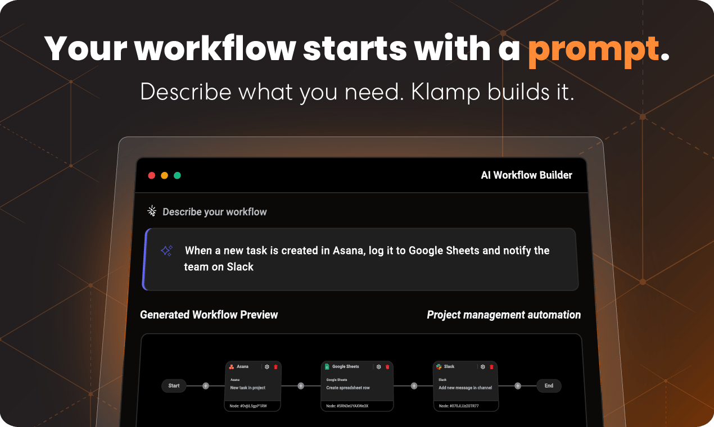
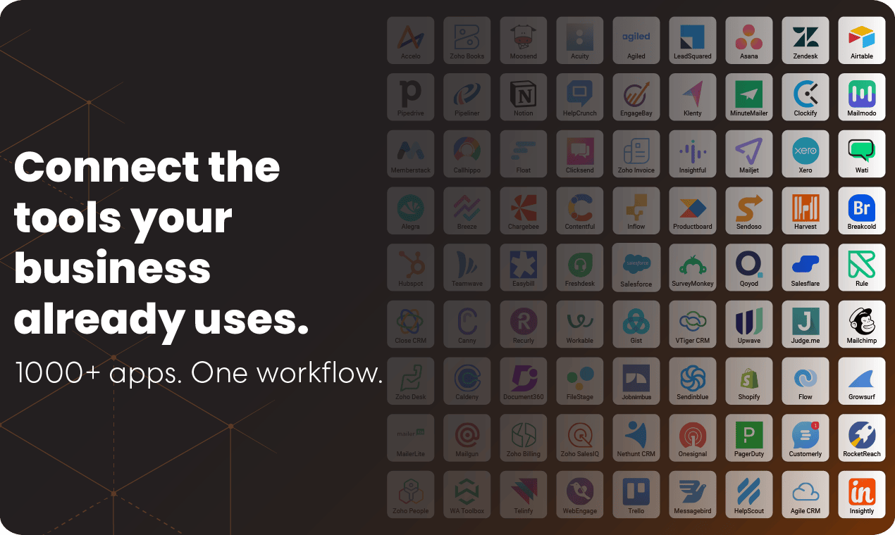

### 🎬 관련 영상
- [🎥 영상 보기](https://ph-files.imgix.net/06cb6fea-5e00-419b-bb37-99e701944b05.jpeg?auto=format)

---

## 30. [Scran](https://www.producthunt.com/products/scran)
**Votes**: 11 | **도입 난이도**: 하 | **신뢰도**: 상
**Tagline**: Take the mental load out of cooking
**서비스 링크**: https://www.producthunt.com/r/YPDLPQBVKT2BW5

**태그**: Productivity, Lifestyle, Accessibility, Mobile App

### 📌 이 서비스 한눈에 보기
신경다양성 사용자를 위해 요리 과정을 직관적이고 단순하게 관리해 주는 모바일 앱

### 🔑 주요 기능
- 외부 레시피를 시각적 라이브러리로 간편하게 수집
- 복잡한 레시피를 관리 가능한 단계별 작업으로 분해
- 사전 준비(Prep)와 재료 양을 최적화하여 인지적 부담 감소

### 🙋 사용자에게 어떤 점이 좋은가
요리 과정에서 발생하는 복잡한 정보 처리를 줄여주어, 요리 중 느끼는 정신적 피로도를 낮추고 즐거움에 집중할 수 있게 합니다.

### ✅ 지금 바로 써볼 기능
- 좋아하는 레시피를 앱의 시각적 라이브러리에 등록하기
- 복잡한 레시피를 단계별 작업으로 단순화해 보기
- 사전 준비 단계를 활용해 요리 흐름 최적화하기

### ⚠️ 사용 전 확인할 점
- 모바일 앱 기반이므로 오프라인 환경이나 큰 화면에서의 가독성 확인 필요
- 사용자의 개인적 요리 스타일과 앱의 단순화 방식 간의 적합성 확인 필요

### 🧭 확인이 더 필요한 정보
레시피를 가져올 때 모든 웹사이트의 형식을 완벽하게 지원하는지 확인이 필요합니다.

### 📸 스크린샷 및 갤러리
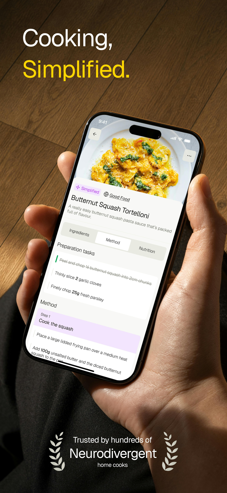
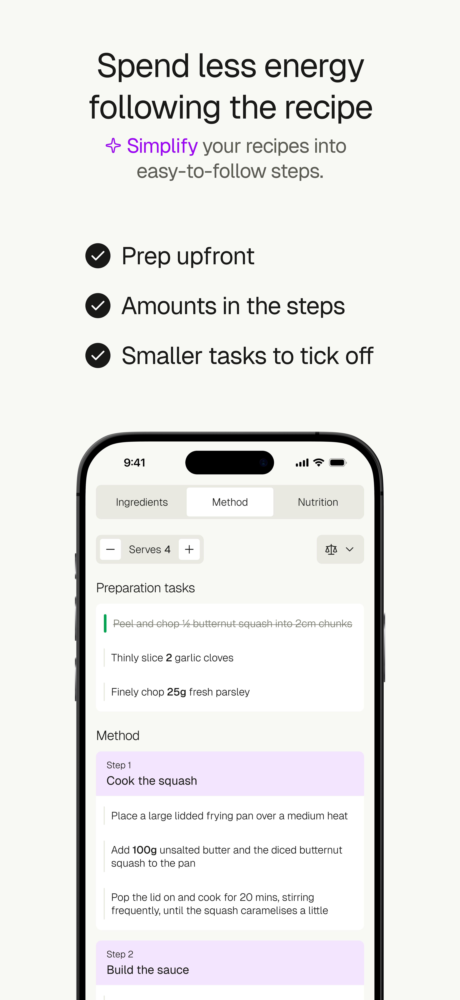

### 🎬 관련 영상
- [🎥 영상 보기](https://ph-files.imgix.net/523fff02-54d3-4fe3-9e93-5a398432105b.jpeg?auto=format)

---

