# 🚀 Product Hunt Daily Top 30 (2026-08-29)

## 오늘의 요약
오늘의 트렌드는 복잡한 코딩이나 설정 없이도 즉시 업무를 수행할 수 있는 AI 에이전트 구축 도구와, 사용자의 작업 기록을 학습하여 맥락을 복구하는 지능형 자동화 솔루션이 주를 이루었습니다. 또한, 하드웨어와 소프트웨어를 결합한 로봇 공학 및 고해상도 비디오 생성 모델 등 생성형 AI의 물리적·시각적 확장도 눈에 띄었습니다.

### 오늘의 핵심 포인트
- 단순한 화면 기록이나 자연어 명령만으로 복잡한 업무 프로세스를 자동화하는 에이전트 구축 도구들이 주목받았습니다.
- 방대한 개발 데이터 인덱싱과 기업 내부 지식 베이스 구축을 통해 AI가 실질적인 업무 맥락을 이해하도록 돕는 서비스들이 등장했습니다.
- 로봇 제어, 고품질 영상 생성, 코딩 에이전트용 데이터 제공 등 AI 기술이 전문적인 영역으로 깊게 침투하고 있습니다.

**오늘의 태그**: AI 에이전트, 업무 자동화, 생성형 AI, 로보틱스, 개발자 도구

## 1. [PageIndex](https://www.producthunt.com/products/pageindexai)
**Votes**: 292 | **도입 난이도**: 하 | **신뢰도**: 상
**Tagline**: Accurate, trustworthy answers across professional documents
**서비스 링크**: https://www.producthunt.com/r/XN6ZYWE35L5YMT

**태그**: Productivity, AI, Document Analysis, Search

### 📌 이 서비스 한눈에 보기
방대한 전문 문서를 분석하여 정확한 답변과 근거를 제공하는 문서 분석 도구

### 🔑 주요 기능
- 긴 전문 문서 세트 전체를 대상으로 질문 가능
- 답변에 대한 정확한 출처(Citation) 제공
- 클릭 한 번으로 원본 문서의 해당 문장으로 즉시 이동

### 🙋 사용자에게 어떤 점이 좋은가
복잡한 전문 문서를 일일이 읽지 않고도 필요한 정보를 빠르게 찾을 수 있으며, 제공된 근거를 통해 답변의 신뢰성을 즉시 검증할 수 있습니다.

### ✅ 지금 바로 써볼 기능
- 전체 문서 세트 업로드하기
- 가장 까다로운 질문 던져보기
- 제공된 인용구를 클릭해 원본 대조하기

### ⚠️ 사용 전 확인할 점
- 문서의 보안 및 개인정보 보호 정책 확인 필요
- AI 모델의 해석 오류 가능성 염두

### 🧭 확인이 더 필요한 정보
지원하는 파일 형식과 최대 문서 용량/개수에 대한 정보가 명시되지 않았습니다.

### 📸 스크린샷 및 갤러리
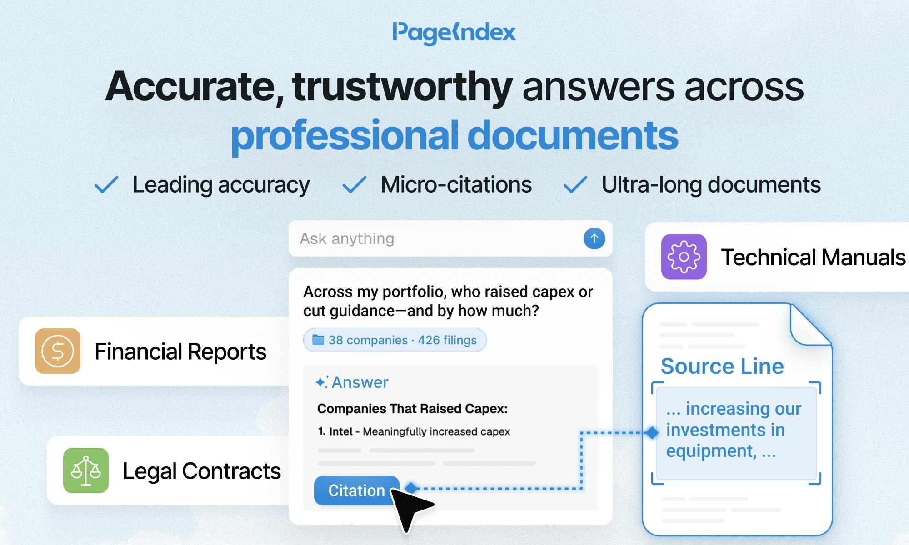

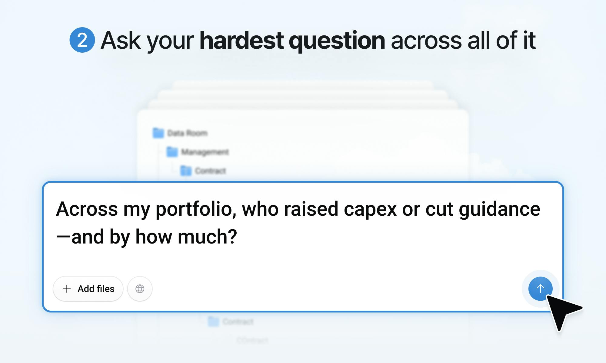

---

## 2. [Caddi](https://www.producthunt.com/products/caddi-3)
**Votes**: 215 | **도입 난이도**: 하 | **신뢰도**: 상
**Tagline**: Agent that builds agents by only showing your work only once
**서비스 링크**: https://www.producthunt.com/r/4ZZ3GDQQF3O7YE

**태그**: Automation, AI Agent, Productivity, NoCode, Agent, AI Tool, DevTool

### 📌 이 서비스 한눈에 보기
화면 녹화 한 번으로 복잡한 백오피스 업무 자동화 에이전트를 구축하는 도구

### 🔑 주요 기능
- 화면 공유 및 설명만으로 업무 프로세스 학습 및 자동화 구축
- RPA와 달리 개발자나 복잡한 스코핑 없이 자연어로 업데이트 가능
- AI 추론과 결정론적 실행을 결합하여 신뢰성 있는 업무 수행

### 🙋 사용자에게 어떤 점이 좋은가
반복적인 백오피스 업무를 위해 별도의 개발자나 복잡한 워크플로우 설정 없이도 즉시 자동화 에이전트를 만들 수 있습니다.

### ✅ 지금 바로 써볼 기능
- 반복적인 업무 과정을 화면 공유로 시연하기
- 생성된 에이전트의 권한 범위 확인하기
- 자연어로 자동화 로직 수정해보기

### ⚠️ 사용 전 확인할 점
- 화면 공유 시 민감한 개인정보나 보안 데이터 노출 주의
- 복잡한 예외 상황 처리에 대한 AI의 판단 정확도 검증 필요

### 🧭 확인이 더 필요한 정보
현재 제공되는 도구들이 어떤 외부 서비스(SaaS)들과 어느 정도 수준까지 연동되는지 구체적인 범위 확인이 필요합니다.

### 📸 스크린샷 및 갤러리
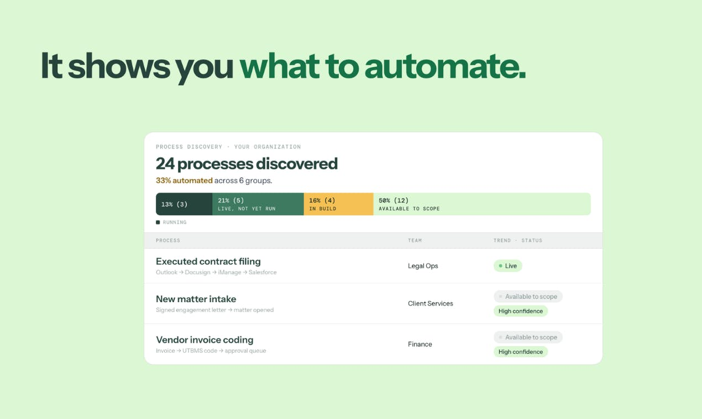
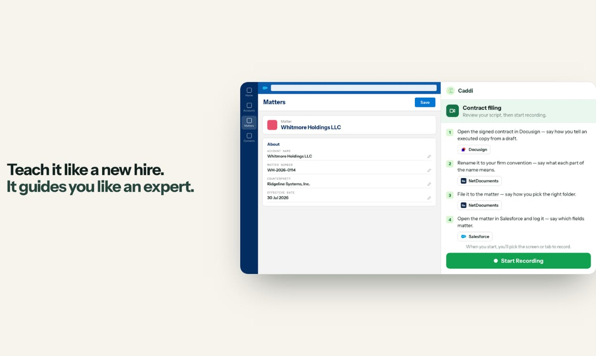
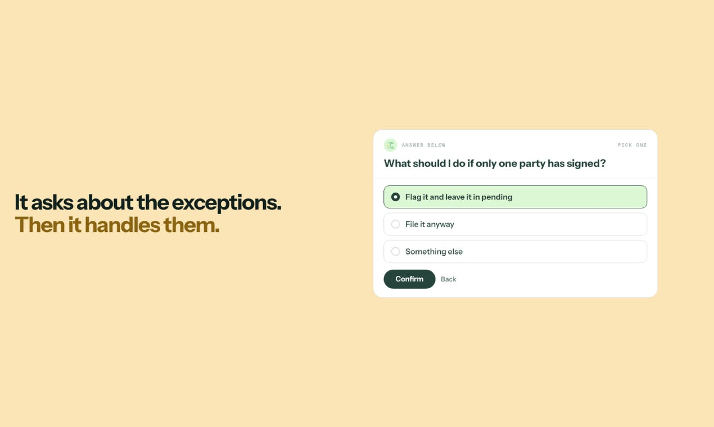

### 🎬 관련 영상
- [🎥 영상 보기](https://ph-files.imgix.net/d8679431-4054-4dd5-a2d0-e0d871cb5b92.jpeg?auto=format)

---

## 3. [Microduck](https://www.producthunt.com/products/hugging-face)
**Votes**: 200 | **도입 난이도**: 중 | **신뢰도**: 상
**Tagline**: A tiny open-source biped you can train yourself
**서비스 링크**: https://www.producthunt.com/r/DDI5YNTYTQBWQO

**태그**: Robotics, AI, OpenSource, Hardware, ReinforcementLearning, AI Tool, Design

### 📌 이 서비스 한눈에 보기
직접 학습시키고 커스텀할 수 있는 399달러 규모의 오픈소스 이족보행 로봇

### 🔑 주요 기능
- Hugging Face와 Pollen Robotics가 공동 개발한 25cm 크기의 소형 로봇
- 시뮬레이션에서 학습한 지능을 실제 로봇에 적용하는 sim-to-real 강화학습 최적화 설계
- 7가지 사전 학습된 동작과 수정 가능한 Apache 2.0 소프트웨어 스택 제공

### 🙋 사용자에게 어떤 점이 좋은가
로봇 공학 및 강화학습 연구자가 저렴한 비용으로 실제 하드웨어에 AI 모델을 배포하고 테스트할 수 있는 환경을 제공합니다.

### ✅ 지금 바로 써볼 기능
- 제공되는 7가지 사전 학습 동작 테스트하기
- Apache 2.0 소프트웨어 스택 클론 및 코드 분석하기
- 강화학습 모델을 활용한 커스텀 동작 학습 시도하기

### ⚠️ 사용 전 확인할 점
- 25cm 소형 로봇이므로 복잡한 환경에서의 물리적 한계가 있을 수 있음
- 직접 학습 및 소프트웨어 수정이 필요한 만큼 기술적 숙련도 요구

### 🧭 확인이 더 필요한 정보
하드웨어의 내구성과 구체적인 배송 가능 지역에 대한 정보가 필요합니다.

### 📸 스크린샷 및 갤러리

### 🎬 관련 영상
- [🎥 영상 보기](https://ph-files.imgix.net/9e4b28b5-0d92-40bb-b8cc-8287cdbbecda.jpeg?auto=format)

---

## 4. [Gemini Omni 1.1 Flash](https://www.producthunt.com/products/gemini-omni-1-1-flash)
**Votes**: 154 | **도입 난이도**: 중 | **신뢰도**: 상
**Tagline**: Our newest multimodal model for video generation and editing
**서비스 링크**: https://www.producthunt.com/r/A7U5SL5CKKHNAR

**태그**: VideoGeneration, AI-Video, CreativeTools, Multimodal, Video

### 📌 이 서비스 한눈에 보기
스튜디오급 영상 제작과 편집을 가능하게 하는 최신 멀티모달 비디오 생성 모델

### 🔑 주요 기능
- 스튜디오 품질의 고해상도 비디오 생성 및 편집 기능
- 장면 확장 및 첫 프레임/마지막 프레임 간의 정교한 보간 기능
- 선명한 4K 업스케일링 및 빠른 프로토타이핑 지원

### 🙋 사용자에게 어떤 점이 좋은가
전문적인 영상 편집 기술 없이도 고품질의 4K 영상을 생성하고 장면을 확장하거나 수정할 수 있어 영상 제작 워크플로우가 혁신적으로 빨라집니다.

### ✅ 지금 바로 써볼 기능
- 4K 업스케일링 기능을 통한 영상 화질 개선
- 프레임 보간 기능을 활용한 자연스러운 장면 전환 생성
- 장면 확장 기능을 이용한 영상 길이 및 구도 조정

### ⚠️ 사용 전 확인할 점
- 생성된 영상의 일관성 및 물리적 움직임의 정확도 확인 필요
- 고해상도 4K 작업 시 요구되는 컴퓨팅 자원 및 처리 시간 고려

### 🧭 확인이 더 필요한 정보
구체적인 생성 속도, 비용 정책 및 지원되는 입력 파일 형식에 대한 정보가 명시되지 않았습니다.

### 📸 스크린샷 및 갤러리

### 🎬 관련 영상
- [🎥 영상 보기](https://ph-files.imgix.net/1f3397b4-30c6-4aa7-9b40-542c255eebbd.jpeg?auto=format)
- [🎥 영상 보기](https://ph-files.imgix.net/e895495f-b9d1-468a-b5b2-b5e8a0317049.jpeg?auto=format)
- [🎥 영상 보기](https://ph-files.imgix.net/7532aee4-15d3-41b0-9aca-2a38d3b1d850.jpeg?auto=format)
- [🎥 영상 보기](https://ph-files.imgix.net/599114a0-5376-496c-9bed-b9f299410600.jpeg?auto=format)

---

## 5. [Firecrawl Developer Index](https://www.producthunt.com/products/extract-by-firecrawl)
**Votes**: 133 | **도입 난이도**: 하 | **신뢰도**: 상
**Tagline**: A curated index of 70M+ artifacts for coding agents.
**서비스 링크**: https://www.producthunt.com/r/D6DMT64DXNRKM3

**태그**: DevTool, AI-Agent, Search-Engine, OpenSource, Agent, API

### 📌 이 서비스 한눈에 보기
코딩 에이전트를 위한 7,000만 개 이상의 개발 데이터 통합 검색 인덱스

### 🔑 주요 기능
- 7,000만 개 이상의 GitHub README, 이슈, PR, 문서 데이터 포함
- 코딩 작업에 최적화된 높은 재현율(Recall) 제공
- API, CLI, MCP를 통해 코딩 에이전트와 즉시 통합 가능

### 🙋 사용자에게 어떤 점이 좋은가
개발자나 코딩 에이전트 사용자가 방대한 오픈소스 데이터를 직접 수집할 필요 없이, 단일 엔드포인트를 통해 필요한 코딩 지식을 즉각 검색할 수 있습니다.

### ✅ 지금 바로 써볼 기능
- /v2/search/developer 엔드포인트 테스트
- CLI를 통한 데이터 검색 시도
- 사용 중인 코딩 에이전트에 MCP로 연결

### ⚠️ 사용 전 확인할 점
- 데이터의 최신성 및 인덱싱 주기 확인 필요
- 대규모 데이터 검색 시 발생할 수 있는 비용 또는 속도 제한 확인

### 🧭 확인이 더 필요한 정보
API 키 없이 시작 가능하다고 명시되어 있으나, 본격적인 사용 시의 과금 체계나 속도 제한(Rate Limit)은 명시되지 않았습니다.

### 📸 스크린샷 및 갤러리
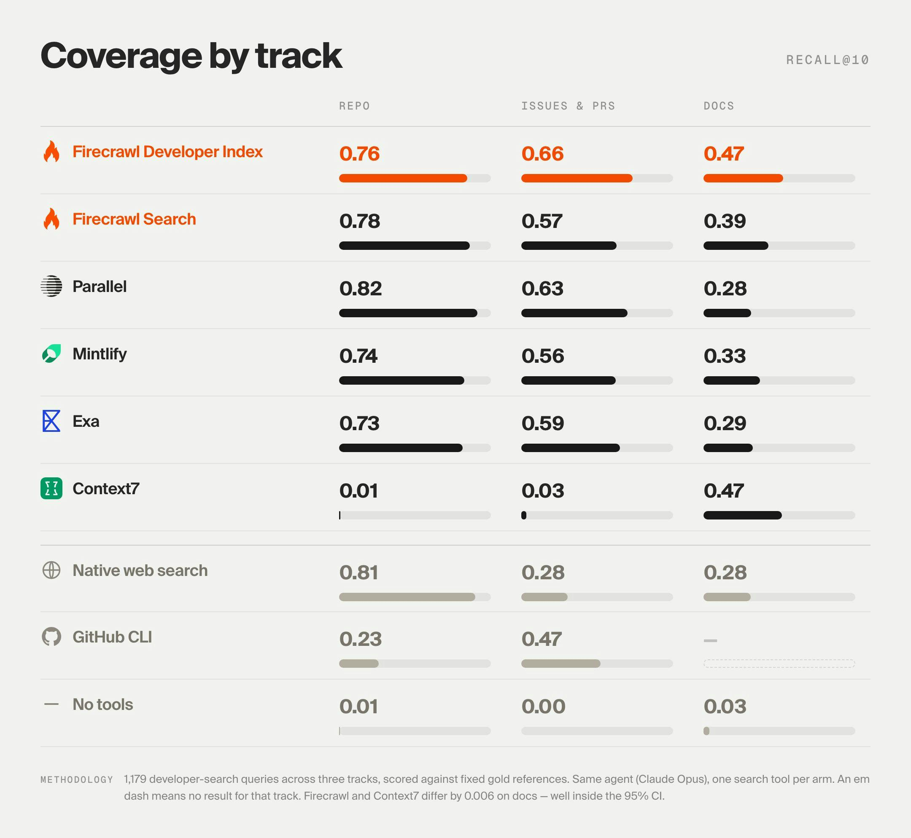
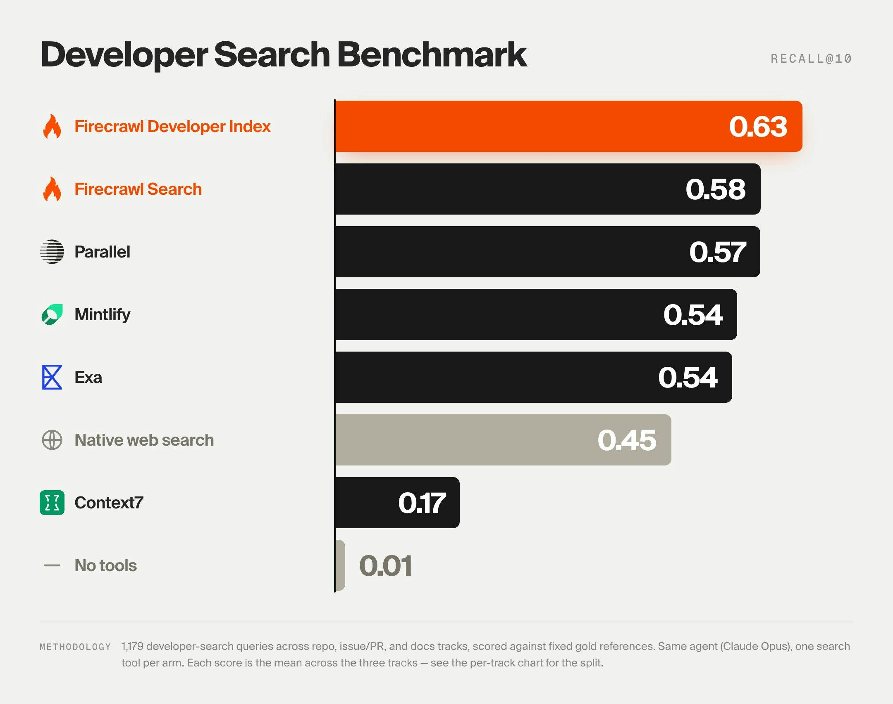

### 🎬 관련 영상
- [🎥 영상 보기](https://ph-files.imgix.net/1191b783-f473-45a0-bae9-37bb4c647717.jpeg?auto=format)

---

## 6. [Almanac](https://www.producthunt.com/products/almanac-5)
**Votes**: 123 | **도입 난이도**: 하 | **신뢰도**: 상
**Tagline**: The agent with a second brain
**서비스 링크**: https://www.producthunt.com/r/MQQFXHKTAUN25N

**태그**: AI Agent, Automation, Productivity, SaaS, Agent, AI Tool

### 📌 이 서비스 한눈에 보기
기업 내부 데이터를 학습하여 업무를 대신 수행하는 AI 에이전트

### 🔑 주요 기능
- 원클릭 계정 연동을 통한 기업 맞춤형 지식 베이스(Brain) 구축
- Slack 및 iMessage를 통한 간편한 업무 지시 및 실행
- 클라우드 기반 독립 실행 환경으로 노트북 종료 후에도 작업 지속

### 🙋 사용자에게 어떤 점이 좋은가
회사의 업무 맥락을 이해하는 AI가 메신저에 상주하며 반복적인 업무를 대신 처리해 줍니다.

### ✅ 지금 바로 써볼 기능
- 기존 업무 계정 연동하기
- Slack/iMessage 연결 설정하기
- 일상적인 업무 태스크 지시해보기

### ⚠️ 사용 전 확인할 점
- 기업 내부 데이터 접근에 따른 보안 및 개인정보 보호 정책 확인 필요
- 연동된 계정의 데이터가 실시간으로 학습되는 방식에 대한 검토 필요

### 🧭 확인이 더 필요한 정보
구체적인 데이터 보안 프로토콜과 지원하는 외부 서비스의 범위는 명시되지 않았습니다.

### 📸 스크린샷 및 갤러리
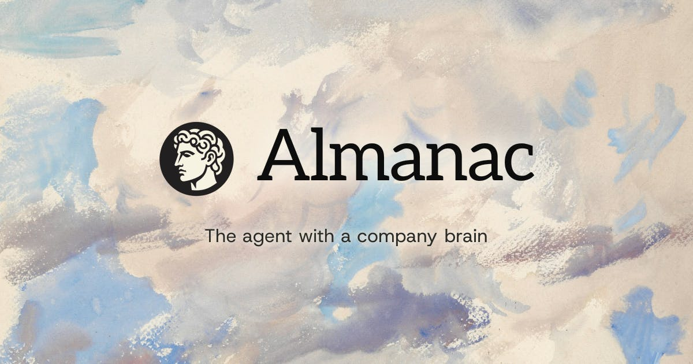
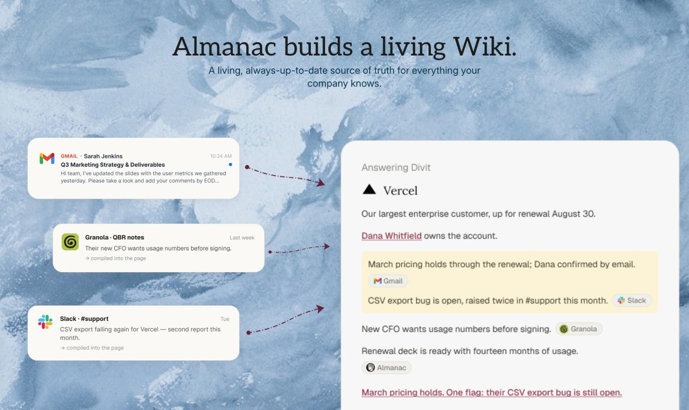
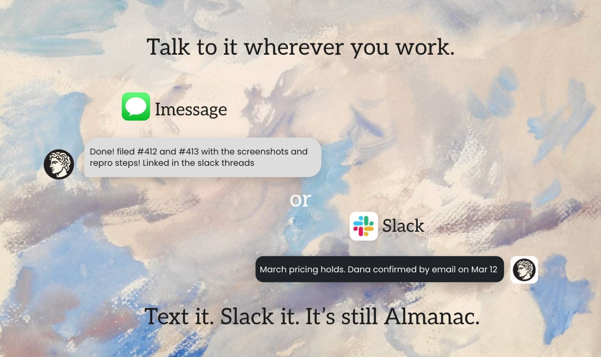

### 🎬 관련 영상
- [🎥 영상 보기](https://ph-files.imgix.net/50103491-6b71-4c3a-bd56-d2e74dde4d4b.jpeg?auto=format)

---

## 7. [Aramb](https://www.producthunt.com/products/aramb)
**Votes**: 117 | **도입 난이도**: 하 | **신뢰도**: 상
**Tagline**: Build, launch and monetize your AI agents in 20 minutes
**서비스 링크**: https://www.producthunt.com/r/D4TC4EHIKS3ZSW

**태그**: AI, DevTool, SaaS, Automation, Agent, AI Tool, API

### 📌 이 서비스 한눈에 보기
단 한 줄의 코드로 AI 에이전트를 구축하고 수익화까지 연결하는 통합 운영 체제

### 🔑 주요 기능
- npm 설치 한 번으로 시작하는 초간편 AI 에이전트 빌드 환경
- 런타임, 메모리, 브라우저, 도구, 모델, 결제를 아우르는 통합 API 제공
- 에이전트 구축부터 출시 및 수익화까지 20분 내 완료 가능한 워크플로우

### 🙋 사용자에게 어떤 점이 좋은가
복잡한 인프라 설정 없이 개발자가 즉시 비즈니스 가치를 창출할 수 있는 AI 에이전트 환경을 제공합니다.

### ✅ 지금 바로 써볼 기능
- npm install @aramb-ai/sdk 명령어로 SDK 설치하기
- 제공되는 통합 API를 활용해 에이전트 기본 기능 구현하기
- 빌드한 에이전트의 수익화 기능 활성화하기

### ⚠️ 사용 전 확인할 점
- SDK 의존도가 높으므로 플랫폼 종속성 여부 확인 필요
- 수익화 모델 및 결제 시스템의 세부 정책 확인 필요

### 🧭 확인이 더 필요한 정보
제공되는 API의 상세 기능 범위와 모델별 비용 구조에 대한 구체적인 정보가 필요합니다.

### 📸 스크린샷 및 갤러리

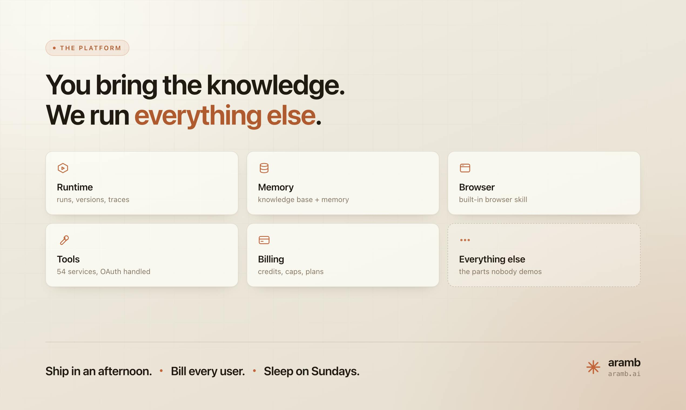
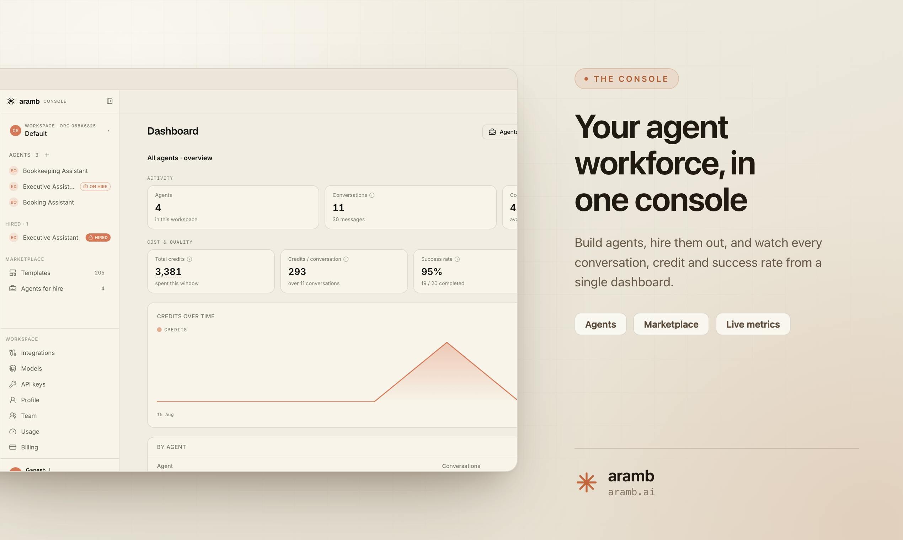

### 🎬 관련 영상
- [🎥 영상 보기](https://ph-files.imgix.net/a029ca47-2f74-4663-a03e-fb4fb3b0f2c4.jpeg?auto=format)

---

## 8. [screenpipe](https://www.producthunt.com/products/screenpipe)
**Votes**: 104 | **도입 난이도**: 하 | **신뢰도**: 상
**Tagline**: AI that records your computer work to power agents.
**서비스 링크**: https://www.producthunt.com/r/4SP35UNQXXHEE2

**태그**: Productivity, AI, Automation, DevTool, Agent, AI Tool

### 📌 이 서비스 한눈에 보기
컴퓨터 작업 기록을 AI 에이전트와 연결하여 업무 맥락을 즉시 복구하는 도구

### 🔑 주요 기능
- 화면, 오디오, 활동 기록을 통한 업무 히스토리 자동 저장
- MCP(Model Context Protocol)를 통해 AI 에이전트가 작업 기록에 접근 가능
- 로컬 우선(Local-first) 방식 및 소스 공개로 보안과 투명성 강조

### 🙋 사용자에게 어떤 점이 좋은가
과거의 통화 내용, 버그 리포트, 문서 작업 내용을 다시 찾을 필요 없이 AI에게 질문하여 즉시 답변을 얻을 수 있습니다.

### ✅ 지금 바로 써볼 기능
- 화면 및 오디오 기록 기능 활성화
- MCP를 통한 AI 에이전트 연동 테스트
- 출시 기념 할인 코드(BUSINESS20) 적용

### ⚠️ 사용 전 확인할 점
- 개인정보 및 민감한 화면 정보가 기록되므로 보안 설정 확인 필요
- 지속적인 화면/오디오 기록에 따른 시스템 리소스 사용량 확인 필요

### 🧭 확인이 더 필요한 정보
로컬 저장 방식이 구체적으로 어떤 보안 수준을 유지하는지 상세 확인이 필요합니다.

### 📸 스크린샷 및 갤러리
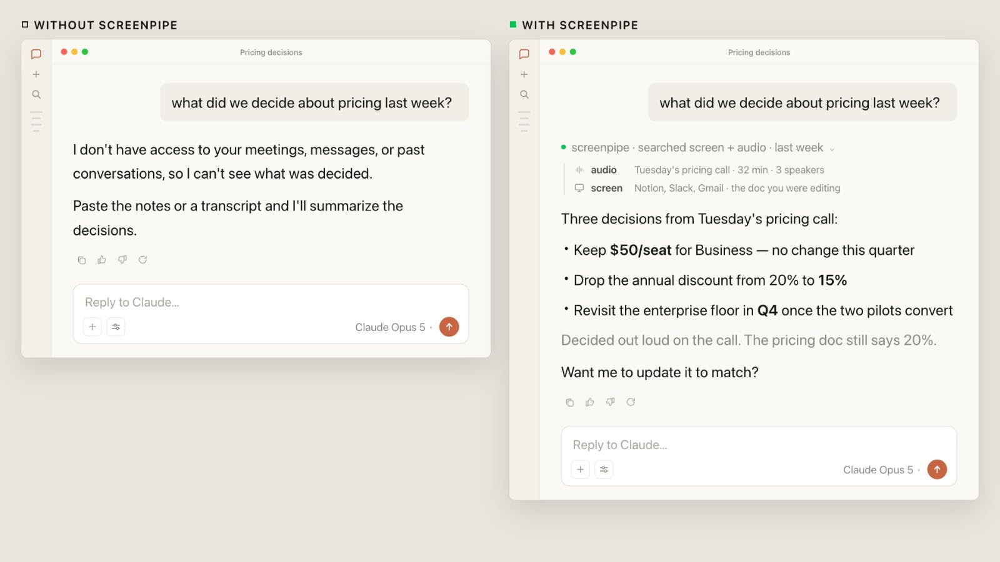

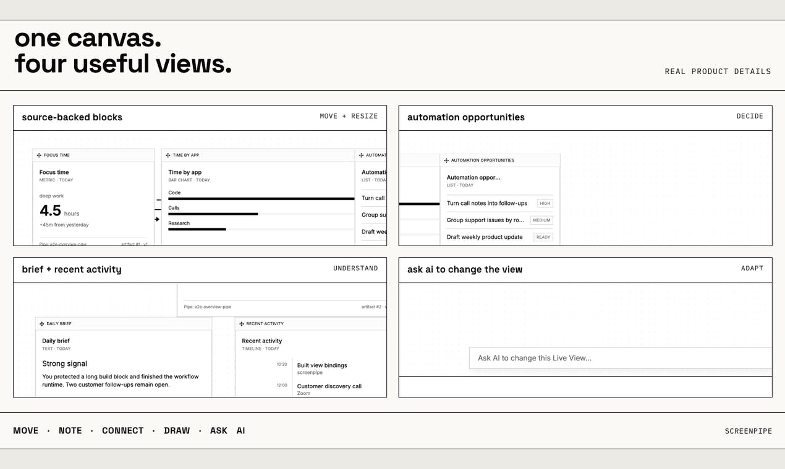

### 🎬 관련 영상
- [🎥 영상 보기](https://ph-files.imgix.net/2f76efda-f8c4-4470-ba1c-fd084bb28214.jpeg?auto=format)

---

## 9. [SuperIntern](https://www.producthunt.com/products/super-intern-4)
**Votes**: 103 | **도입 난이도**: 하 | **신뢰도**: 상
**Tagline**: Your email and meeting assistant, inside your chat apps
**서비스 링크**: https://www.producthunt.com/r/U646EPF223YNUJ

**태그**: Productivity, Automation, AI Assistant, Workflow, AI Tool, Chat, Email

### 📌 이 서비스 한눈에 보기
채팅 앱 내에서 이메일 작성과 회의 관리를 자동화하는 개인 비서 서비스

### 🔑 주요 기능
- 사용자의 글쓰기 스타일을 학습하여 맞춤형 답장 초안 작성
- 회의 일정 관리 및 회의 내용 요약 기능 제공
- 팔로업(Follow-up) 누락 방지를 통한 업무 효율 극대화

### 🙋 사용자에게 어떤 점이 좋은가
반복적인 이메일 작성과 회의 관리 시간을 줄여 고객 대응 역량을 10배로 확장할 수 있습니다.

### ✅ 지금 바로 써볼 기능
- 사용자 목소리가 반영된 이메일 초안 생성 기능 테스트
- 회의 요약 및 일정 관리 기능 활용
- 메시지 전송 전 최종 승인 프로세스 확인

### ⚠️ 사용 전 확인할 점
- 사용자의 글쓰기 스타일 학습을 위한 초기 데이터 제공 필요
- 자동화된 초안의 정확성을 위한 사용자의 최종 검토 필수

### 🧭 확인이 더 필요한 정보
지원하는 구체적인 채팅 앱 종류와 연동 가능한 이메일 서비스 범위에 대한 정보가 필요합니다.

### 📸 스크린샷 및 갤러리
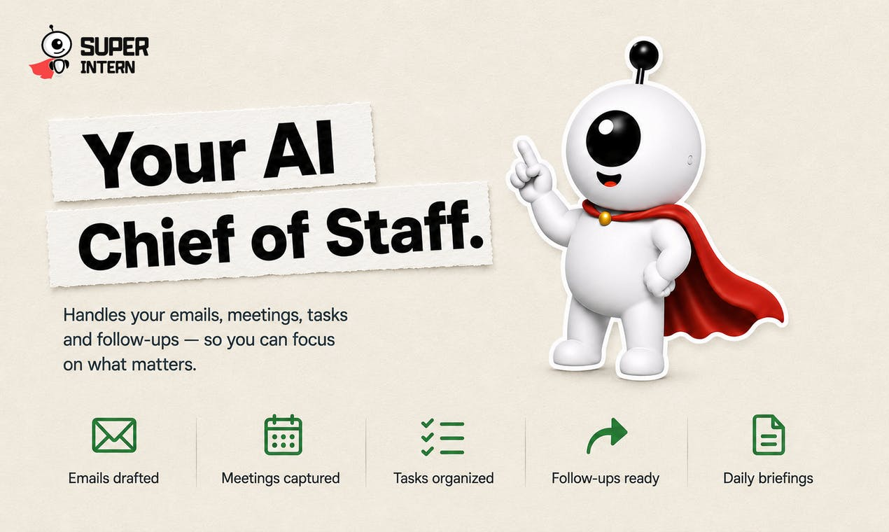
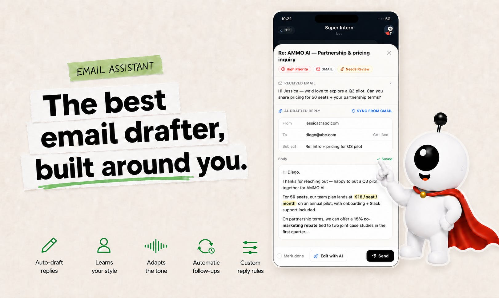
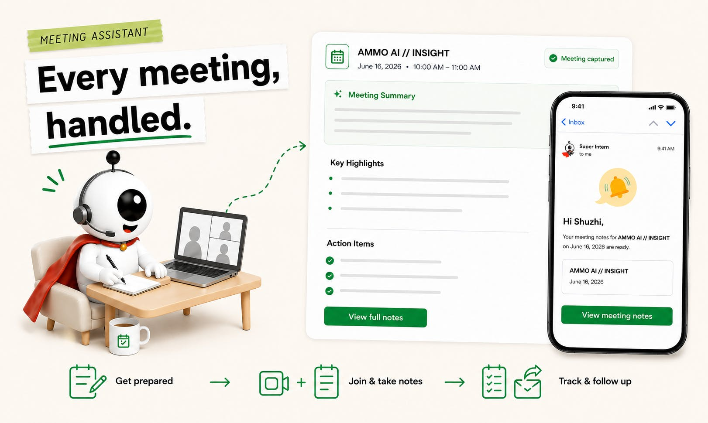

### 🎬 관련 영상
- [🎥 영상 보기](https://ph-files.imgix.net/f5d8f44d-2e83-42ff-b273-3290ce0fc7c8.jpeg?auto=format)

---

## 10. [Spline V2](https://www.producthunt.com/products/spline)
**Votes**: 100 | **도입 난이도**: 중 | **신뢰도**: 상
**Tagline**: Best 3D platform for the agentic era
**서비스 링크**: https://www.producthunt.com/r/QFFXYALVW573W2

**태그**: 3D Design, AI, WebGPU, Automation, Creative Tool, Agent, AI Tool, DevTool

### 📌 이 서비스 한눈에 보기
AI 에이전트 시대에 최적화된 차세대 3D 디자인 및 제작 플랫폼

### 🔑 주요 기능
- 완전히 새로워진 UI와 WebGPU 기반의 고성능 엔진
- AI 에이전트 모드 및 Spline MCP 지원
- PBR/HDR 워크플로우 및 커스텀 코드/스크립팅 기능 강화

### 🙋 사용자에게 어떤 점이 좋은가
더 빠르고 강력해진 3D 작업 환경을 제공하며, AI 에이전트와의 연동을 통해 디자인 자동화와 복잡한 3D 워크플로우를 효율적으로 처리할 수 있습니다.

### ✅ 지금 바로 써볼 기능
- 새로운 UI와 WebGPU 엔진의 성능 체감하기
- AI 에이전트 모드를 활용한 작업 자동화 시도하기
- PBR/HDR 워크플로우를 통한 고품질 렌더링 적용하기

### ⚠️ 사용 전 확인할 점
- 완전한 재구축(Rebuild) 버전이므로 기존 V1 워크플로우와의 호환성 확인 필요
- 고성능 WebGPU 엔진 사용에 따른 하드웨어 사양 요구사항 확인 필요

### 🧭 확인이 더 필요한 정보
기존 Spline 사용자들을 위한 데이터 마이그레이션 지원 여부와 구체적인 AI 에이전트 연동 범위 확인이 필요합니다.

### 📸 스크린샷 및 갤러리
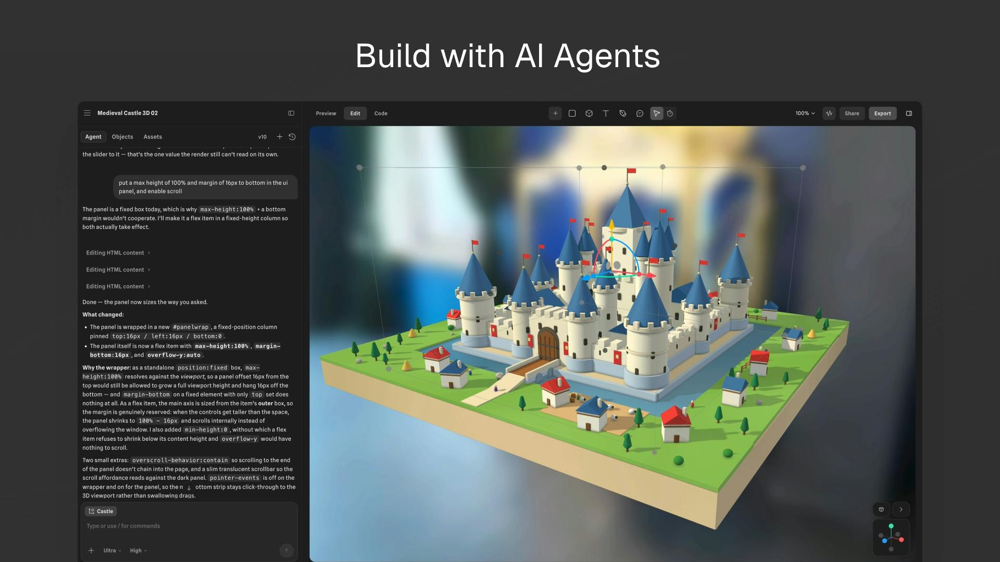
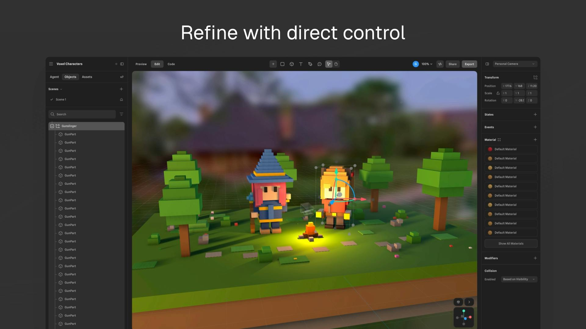
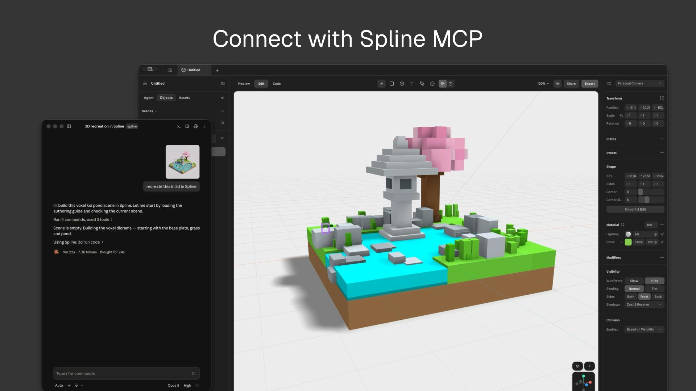

### 🎬 관련 영상
- [🎥 영상 보기](https://ph-files.imgix.net/1e67ae52-6f6a-417f-84d3-377dcf164860.jpeg?auto=format)

---

## 11. [Glisio](https://www.producthunt.com/products/glisio)
**Votes**: 98 | **도입 난이도**: 하 | **신뢰도**: 상
**Tagline**: Mac Recorder & Snap editor w/auto-zoom, audio, local MP4
**서비스 링크**: https://www.producthunt.com/r/BBRQ4XBF4J2ZA5

**태그**: Productivity, VideoEditing, MacApp, DesignTool, AI Tool

### 📌 이 서비스 한눈에 보기
클릭에 맞춰 자동 줌이 적용되는 맥 전용 시네마틱 화면 녹화 및 스냅샷 편집 도구

### 🔑 주요 기능
- 클릭 동작을 따라가는 스마트 자동 줌 기능으로 편집 시간 단축
- 화면 녹화와 스타일드 스냅샷(스크린샷) 편집 기능을 하나로 통합
- 다양한 화면 비율(16:9, 9:16, 1:1) 지원 및 로컬 MP4 내보내기

### 🙋 사용자에게 어떤 점이 좋은가
제품 데모나 튜토리얼 제작 시 복잡한 영상 편집 과정 없이도 전문적인 결과물을 빠르게 만들 수 있습니다.

### ✅ 지금 바로 써볼 기능
- 화면 녹화 시 자동 줌 기능 테스트하기
- 내장 스냅샷 에디터로 스크린샷 꾸미기
- 다양한 소셜 미디어용 화면 비율로 내보내기

### ⚠️ 사용 전 확인할 점
- 무료 버전 사용 시 워터마크가 포함됨
- 현재 Mac 전용 앱이며 Windows 버전은 대기 명단 등록 필요

### 🧭 확인이 더 필요한 정보
Pro 버전의 워터마크 제거 외에 추가적인 고급 편집 기능 포함 여부는 명시되지 않았습니다.

### 📸 스크린샷 및 갤러리
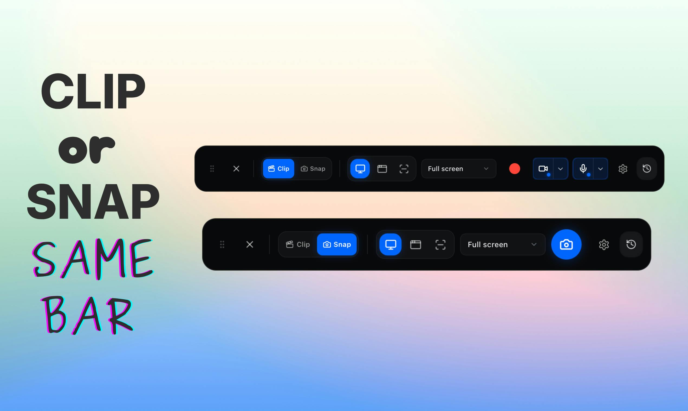
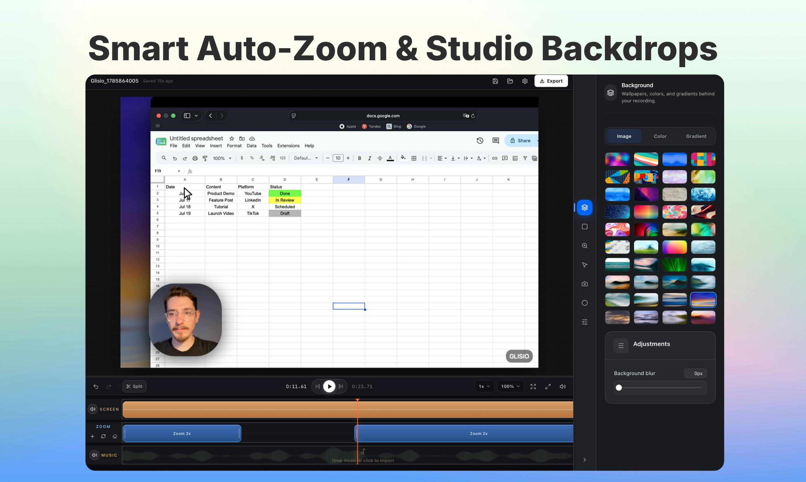
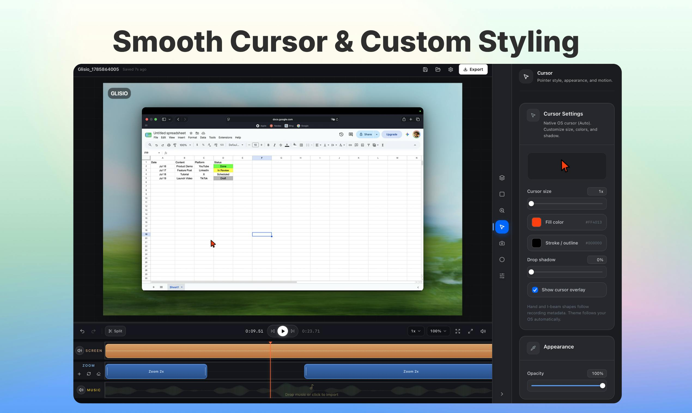

---

## 12. [Play with Putty](https://www.producthunt.com/products/google-labs)
**Votes**: 96 | **도입 난이도**: 하 | **신뢰도**: 상
**Tagline**: Simple, Collaborative Vibe Coding 
**서비스 링크**: https://www.producthunt.com/r/5MRPPFGW6AYSRV

**태그**: DevTool, Collaboration, AI, NoCode, AI Tool, Design

### 📌 이 서비스 한눈에 보기
창의적 흐름을 깨지 않는 실시간 협업형 AI 빌딩 환경

### 🔑 주요 기능
- 마찰 없는 실시간 협업 빌딩 환경 제공
- 창의적 흐름을 유지하는 AI 기반 개발 지원
- 사람들을 하나로 모으는 협업 중심의 설계

### 🙋 사용자에게 어떤 점이 좋은가
아이디어를 즉시 구현할 수 있는 환경에서 팀원들과 끊김 없이 실시간으로 함께 결과물을 만들 수 있습니다.

### ✅ 지금 바로 써볼 기능
- 실시간 협업 환경 접속하기
- AI 기반 빌딩 기능 테스트하기
- 팀원 초대하여 공동 작업 시작하기

### ⚠️ 사용 전 확인할 점
- 구체적인 기술 스택이나 지원 언어 범위 확인 필요
- 협업 시 발생할 수 있는 버전 관리 방식 확인 필요

### 🧭 확인이 더 필요한 정보
제품의 구체적인 기술적 구현 방식과 지원하는 프로그래밍 언어 범위가 명시되지 않았습니다.

### 📸 스크린샷 및 갤러리
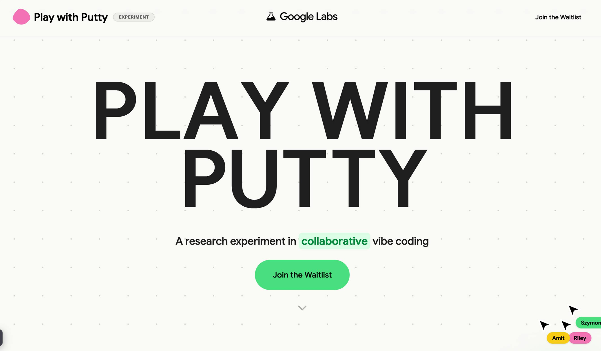
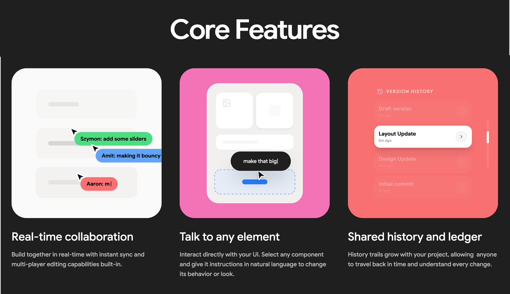
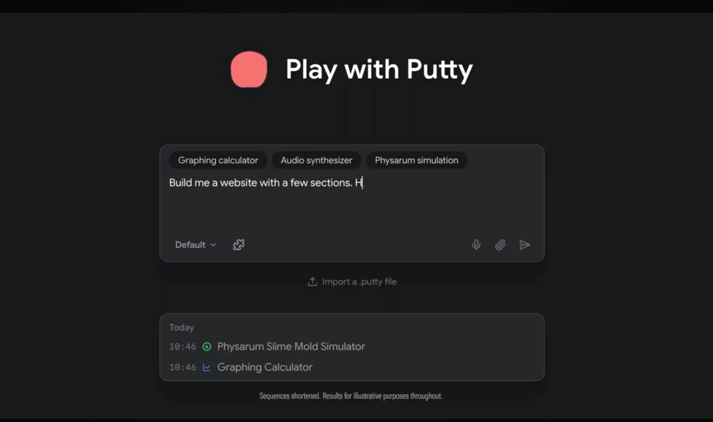

### 🎬 관련 영상
- [🎥 영상 보기](https://ph-files.imgix.net/cff7962c-c588-4e11-9c26-e8ad4d33b2c3.jpeg?auto=format)

---

## 13. [OpenTag](https://www.producthunt.com/products/opentag)
**Votes**: 91 | **도입 난이도**: 하 | **신뢰도**: 상
**Tagline**: AI coworker lives on Slack and Teams
**서비스 링크**: https://www.producthunt.com/r/ERKDF76UMITZKL

**태그**: AI, Automation, Collaboration, Productivity, AI Tool

### 📌 이 서비스 한눈에 보기
Slack과 Teams에서 팀의 맥락을 이해하고 업무를 대신 처리하는 AI 동료

### 🔑 주요 기능
- 협업 툴(Slack, Teams) 내에서 직접 작동하는 AI
- 회사 전체의 맥락(Context)을 파악하여 업무 수행
- 반복적인 실무 업무를 자동화하여 팀의 부담 경감

### 🙋 사용자에게 어떤 점이 좋은가
별도의 플랫폼 이동 없이 기존 협업 환경에서 즉시 업무 지원을 받을 수 있어 생산성이 향상됩니다.

### ✅ 지금 바로 써볼 기능
- 협업 툴에 OpenTag 연동하기
- 팀의 주요 업무 맥락 학습시키기
- 반복적인 업무 자동화 요청하기

### ⚠️ 사용 전 확인할 점
- 회사 내부 데이터 접근에 따른 보안 정책 검토 필요
- AI가 회사 맥락을 얼마나 정확하게 파악하는지 검증 필요

### 🧭 확인이 더 필요한 정보
회사의 내부 데이터 보안 및 프라이버시 보호 방식에 대한 상세 정보 확인이 필요합니다.

### 📸 스크린샷 및 갤러리
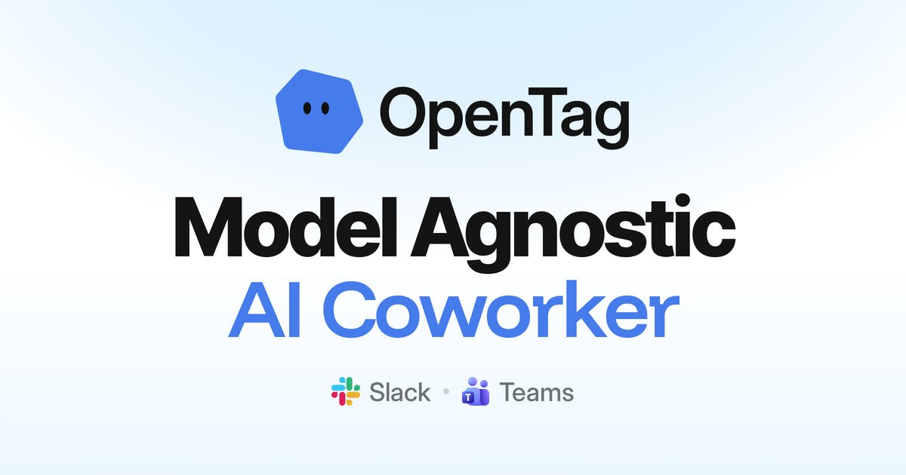
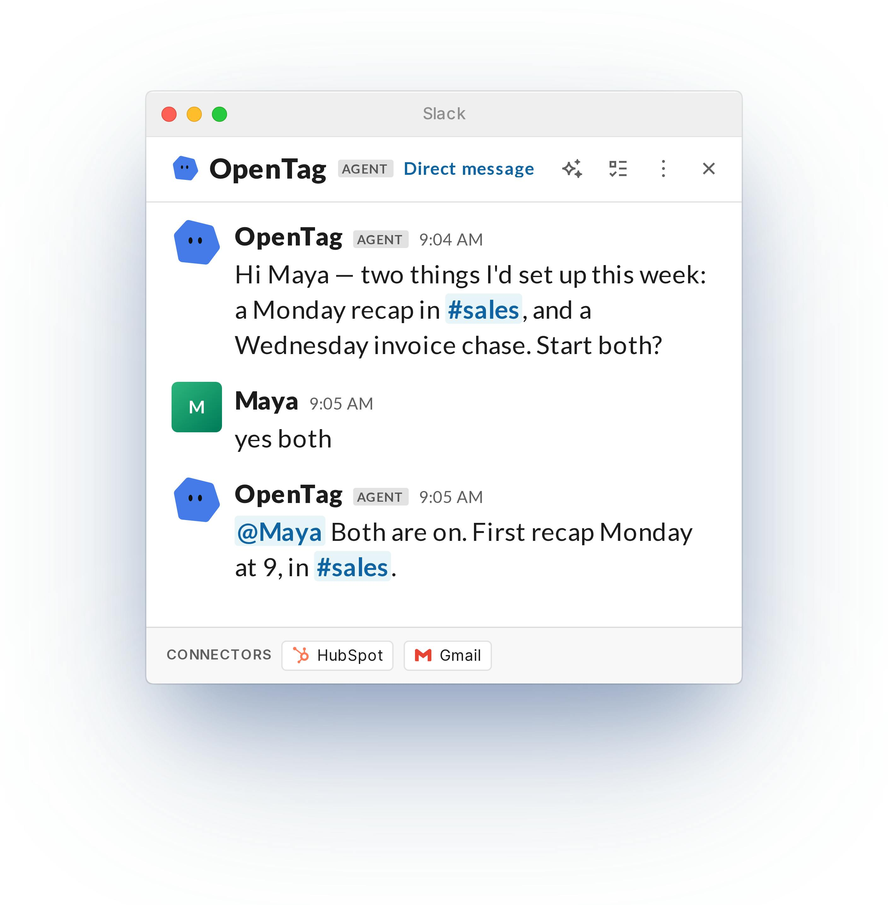
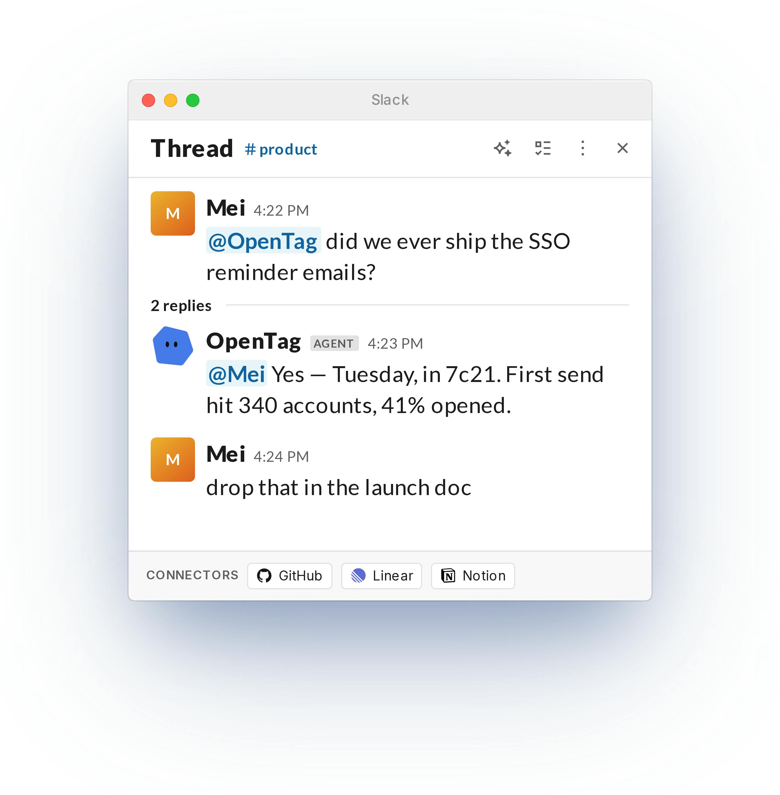

---

## 14. [CTRL Micro](https://www.producthunt.com/products/ctrl-micro)
**Votes**: 87 | **도입 난이도**: 하 | **신뢰도**: 상
**Tagline**: Haptic control deck for your Mac and AI agents
**서비스 링크**: https://www.producthunt.com/r/36M6BWZ4AFS25H

**태그**: Productivity, AI, RemoteControl, Mac, Automation, Agent, AI Tool, DevTool

### 📌 이 서비스 한눈에 보기
아이폰을 맥(Mac)과 AI 에이전트를 위한 촉각 컨트롤 데크로 변환해주는 도구

### 🔑 주요 기능
- 아이폰/아이패드의 탭틱 엔진을 활용한 촉각 피드백 기반 컨트롤
- Claude, Cursor 등 주요 AI 도구 모니터링 및 원격 제어
- 데스크톱 뷰, 트랙패드, 키보드 및 Whisper를 통한 로컬 음성 입력 지원

### 🙋 사용자에게 어떤 점이 좋은가
별도의 하드웨어를 구매하지 않고도 스마트폰을 활용해 맥과 AI 에이전트를 직관적으로 제어할 수 있습니다.

### ✅ 지금 바로 써볼 기능
- 기존 AI 도구(Claude, Cursor) 연동 테스트
- 사용자 정의 컨트롤 빌더로 커스텀 매크로 제작
- Remote Anywhere 기능을 통한 원격 제어 환경 설정

### ⚠️ 사용 전 확인할 점
- 모바일 기기의 배터리 소모 및 발열 가능성
- 네트워크 환경에 따른 원격 제어 지연 시간 발생 가능성

### 🧭 확인이 더 필요한 정보
사용 중인 특정 앱과의 호환성 및 커스텀 컨트롤의 세부 구현 난이도 확인이 필요합니다.

### 📸 스크린샷 및 갤러리

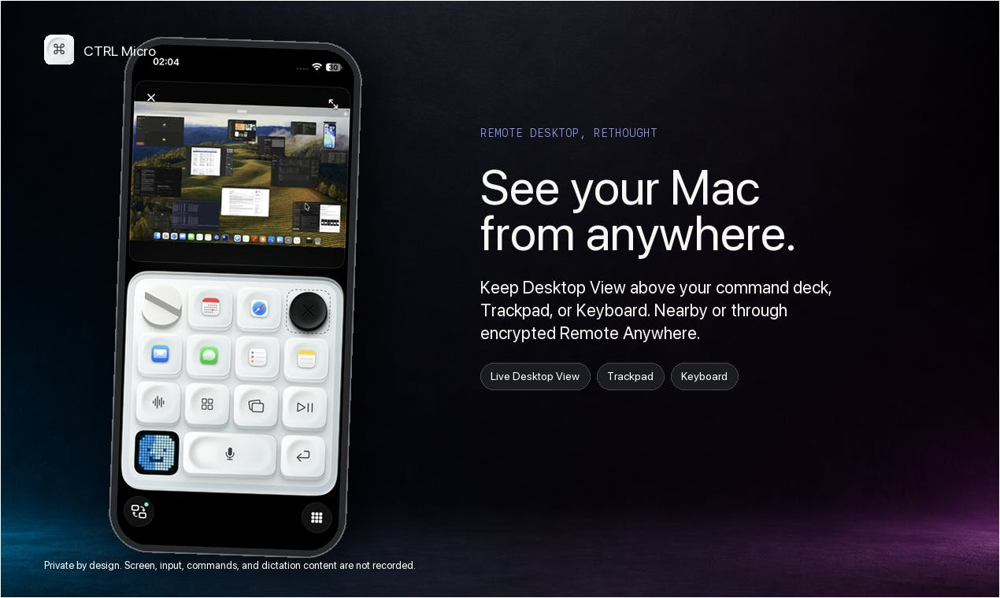
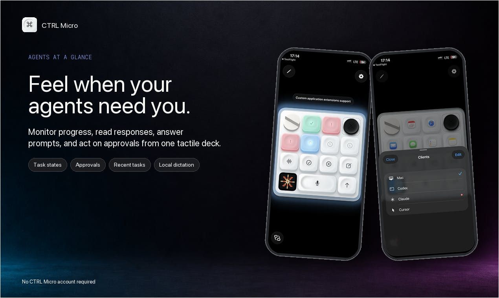

### 🎬 관련 영상
- [🎥 영상 보기](https://ph-files.imgix.net/6d67aec4-3fa5-409b-babe-82032bbb6278.jpeg?auto=format)

---

## 15. [Revalvo](https://www.producthunt.com/products/revalvo)
**Votes**: 87 | **도입 난이도**: 하 | **신뢰도**: 상
**Tagline**: Run prompts on every model at once. Score. Version. Ship.
**서비스 링크**: https://www.producthunt.com/r/J5Y5D3JHPCBUCV

**태그**: DevTool, LLM, PromptEngineering, Automation, AI Tool, Prompting, API

### 📌 이 서비스 한눈에 보기
여러 LLM 모델을 동시에 테스트하고 프롬프트를 관리하는 로컬 중심의 프롬프트 엔지니어링 워크벤치

### 🔑 주요 기능
- 다양한 모델에 대한 프롬프트 병렬 실행 및 비교 기능
- 40여 개의 내장 평가기를 통한 응답 자동 스코어링
- 코드처럼 관리하는 프롬프트 버전 관리 및 데이터셋 배치 테스트

### 🙋 사용자에게 어떤 점이 좋은가
프롬프트가 여러 모델에서 어떻게 다르게 작동하는지 한눈에 비교하고, 데이터셋 기반의 검증을 통해 프로덕션 배포 전 신뢰도를 확보할 수 있습니다.

### ✅ 지금 바로 써볼 기능
- 여러 모델에 동일한 프롬프트 실행해보기
- 내장 평가기를 활용한 응답 점수 산출하기
- 프롬프트 버전 관리 및 데이터셋 배치 테스트 진행하기

### ⚠️ 사용 전 확인할 점
- 로컬 중심 방식이므로 대규모 협업 환경에서의 데이터 공유 방식 확인 필요
- 사용자 브라우저 환경에 의존하므로 브라우저 성능 및 API 키 관리 주의

### 🧭 확인이 더 필요한 정보
로컬 중심 설계가 클라우드 기반 협업 기능과 어떻게 조화를 이루는지 확인이 필요합니다.

### 📸 스크린샷 및 갤러리
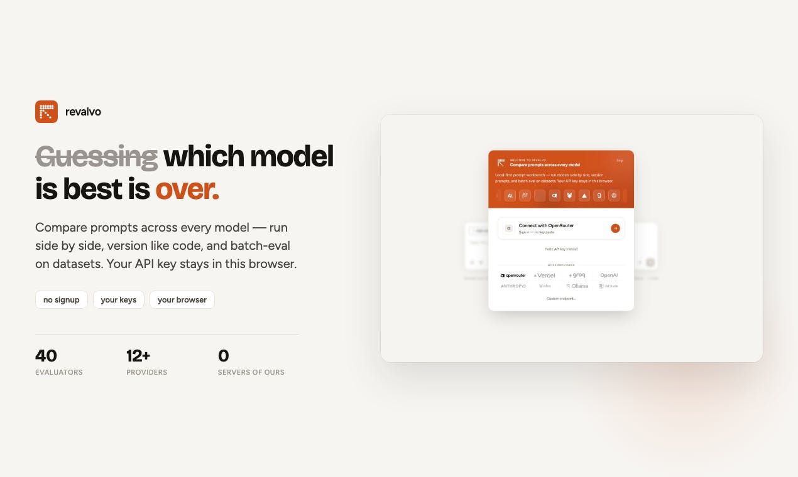
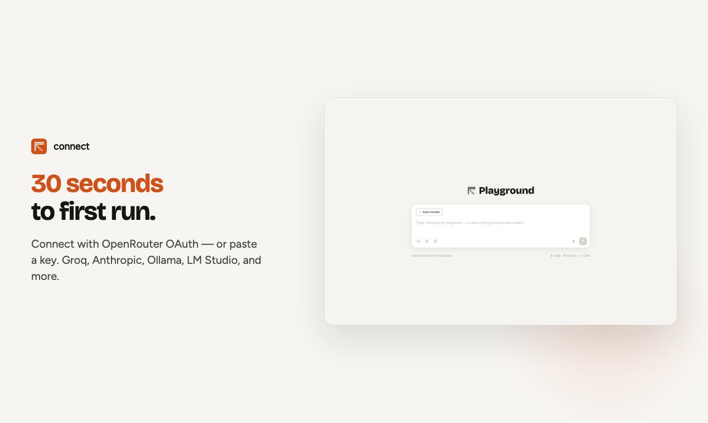
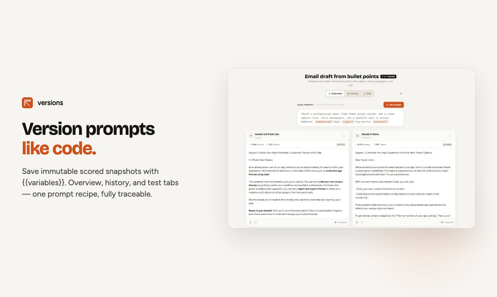

### 🎬 관련 영상
- [🎥 영상 보기](https://ph-files.imgix.net/13d4bab8-b250-4908-a2e9-d80bb277897c.jpeg?auto=format)

---

## 16. [Fide Island](https://www.producthunt.com/products/fide-island)
**Votes**: 86 | **도입 난이도**: 하 | **신뢰도**: 상
**Tagline**: Make your MacBook notch actually useful
**서비스 링크**: https://www.producthunt.com/r/GZNUCZUOCJM6A3

**태그**: Productivity, macOS, Utility

### 📌 이 서비스 한눈에 보기
맥북 노치 영역을 활용한 직관적인 미니 컨트롤 센터

### 🔑 주요 기능
- 맥북 노치 공간을 활용한 컴팩트한 명령 인터페이스 제공
- 미디어 제어, 캘린더 확인, 클립보드 관리 등 멀티태스킹 지원
- 작업 흐름을 방해하지 않는 시스템 피드백 및 빠른 계산 기능

### 🙋 사용자에게 어떤 점이 좋은가
화면의 빈 공간인 노치를 활용해 앱 전환 없이도 주요 기능을 즉시 제어할 수 있어 작업 효율이 높아집니다.

### ✅ 지금 바로 써볼 기능
- 미디어 재생 및 일시정지 제어해보기
- 클립보드 및 파일 관리 기능 활용하기
- 캘린더 일정 확인 기능 테스트하기

### ⚠️ 사용 전 확인할 점
- 노치 디자인이 적용된 맥북 모델에서만 최적의 경험 제공
- 화면 상단 영역을 점유하므로 작업 중 시각적 간섭이 발생할 수 있음

### 🧭 확인이 더 필요한 정보
상세한 시스템 리소스 점유율 및 타 앱과의 호환성 여부는 확인이 필요합니다.

### 📸 스크린샷 및 갤러리

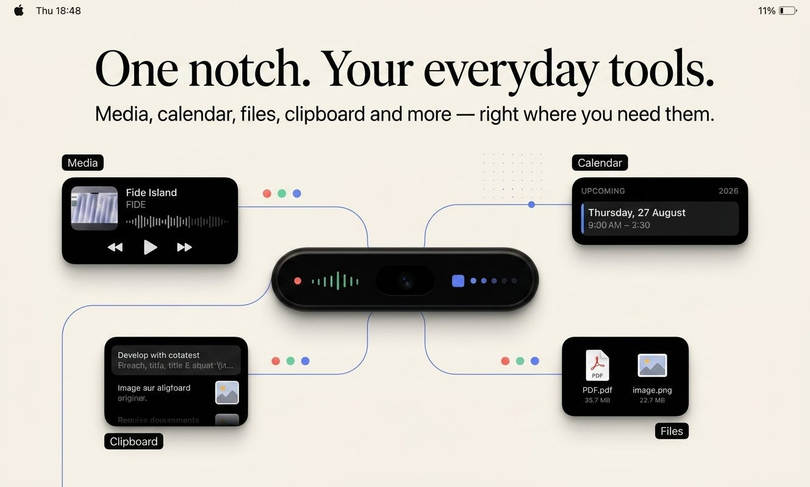

### 🎬 관련 영상
- [🎥 영상 보기](https://ph-files.imgix.net/946a34f6-eecb-40d6-abfd-9b1c24128820.jpeg?auto=format)

---

## 17. [SnakeRank](https://www.producthunt.com/products/snakerank)
**Votes**: 77 | **도입 난이도**: 하 | **신뢰도**: 상
**Tagline**: The leaderboard is a snake. Bid your way to the head.
**서비스 링크**: https://www.producthunt.com/r/IOX7BAHDDRYH5G

**태그**: Marketing, Startup, Leaderboard, Gamification, AI Tool

### 📌 이 서비스 한눈에 보기
입찰을 통해 순위를 쟁취하는 게임형 스타트업 리더보드

### 🔑 주요 기능
- 입찰 금액에 따라 순위가 결정되는 역동적인 리더보드 시스템
- 상위 순위의 차액만큼만 지불하여 순위를 탈환하는 방식
- 스타트업의 가시성을 확보하기 위한 새로운 형태의 마케팅 플랫폼

### 🙋 사용자에게 어떤 점이 좋은가
스타트업이 적은 비용으로 리더보드 상단에 노출될 수 있으며, 경쟁적인 입찰 방식을 통해 브랜드 인지도를 높일 수 있습니다.

### ✅ 지금 바로 써볼 기능
- 현재 낮은 가격대의 리더보드 선점 기회 확인
- 차액 기반 입찰 시스템의 메커니즘 이해
- 자사 스타트업의 노출 위치 및 비용 시뮬레이션

### ⚠️ 사용 전 확인할 점
- 순위 유지를 위해 지속적인 입찰 경쟁이 발생할 수 있음
- 동일 금액 입찰 시 선착순 원칙에 따른 순위 결정 방식 주의

### 🧭 확인이 더 필요한 정보
입찰 경쟁이 심화될 경우 발생하는 장기적인 유지 비용과 순위 변동 주기를 확인해야 합니다.

### 📸 스크린샷 및 갤러리

### 🎬 관련 영상
- [🎥 영상 보기](https://ph-files.imgix.net/251b4d0f-a397-4066-ae29-74d54704d07d.jpeg?auto=format)

---

## 18. [NotchDrop](https://www.producthunt.com/products/notchdrop)
**Votes**: 76 | **도입 난이도**: 하 | **신뢰도**: 상
**Tagline**: A Dynamic Island experience for your Mac notch
**서비스 링크**: https://www.producthunt.com/r/4J2CQ4JGMNEEEO

**태그**: Productivity, macOS, Utility, Workflow, AI Tool, Design

### 📌 이 서비스 한눈에 보기
맥북 노치를 활용해 생산성 도구와 시스템 상태를 한눈에 관리하는 다이내믹 아일랜드 경험

### 🔑 주요 기능
- 맥북 노치 영역을 활용한 직관적인 워크스페이스 제공
- 화면 녹화 및 편집(NotchDrop Studio), 파일 공유, 시스템 상태 확인 등 다양한 기능 통합
- 라이브 월페이퍼, 캘린더, 터미널 도구 등 사용자 맞춤형 테마 및 인터페이스 지원

### 🙋 사용자에게 어떤 점이 좋은가
별도의 창을 열지 않고도 노치 영역에서 즉각적으로 도구를 실행할 수 있어 작업 흐름을 끊지 않고 생산성을 높일 수 있습니다.

### ✅ 지금 바로 써볼 기능
- NotchDrop Studio를 통한 화면 녹화 및 편집 기능 테스트
- AirDrop 및 로컬 네트워크를 활용한 파일 공유 기능 확인
- 사용자 취향에 맞는 커스텀 테마 설정

### ⚠️ 사용 전 확인할 점
- 노치 하드웨어가 있는 맥북 모델에서만 기능 활용 가능
- 다양한 백그라운드 기능 실행에 따른 시스템 리소스 점유율 확인 필요

### 🧭 확인이 더 필요한 정보
사용자의 맥북 사양 및 macOS 버전에 따른 최적화 수준과 시스템 리소스 영향도를 확인해야 합니다.

### 📸 스크린샷 및 갤러리
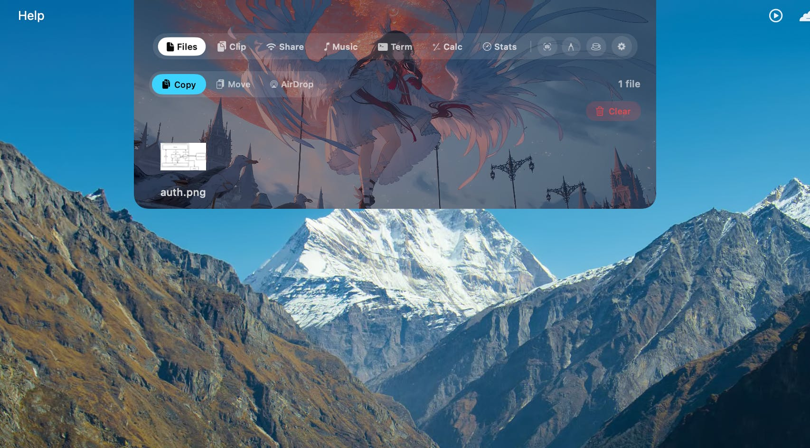
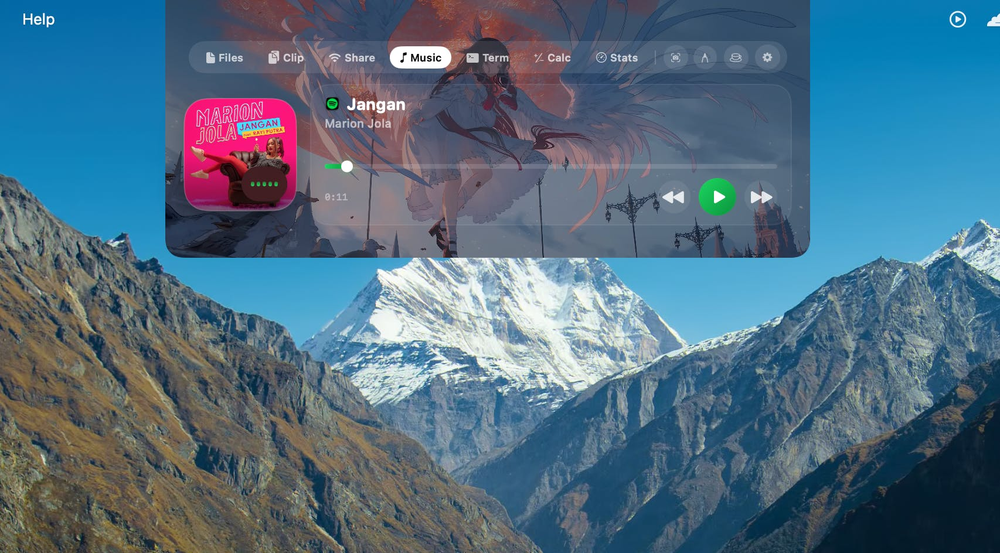
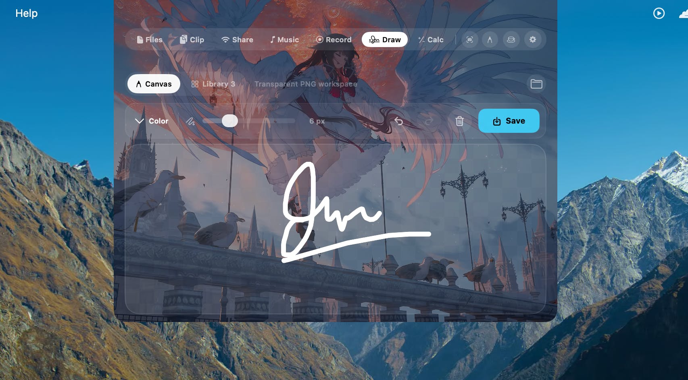

### 🎬 관련 영상
- [🎥 영상 보기](https://ph-files.imgix.net/e7eb3b12-b375-4e30-913c-beffee05e6da.jpeg?auto=format)

---

## 19. [AureaCam](https://www.producthunt.com/products/aureacam-learn-photo-composition)
**Votes**: 73 | **도입 난이도**: 하 | **신뢰도**: 상
**Tagline**: Real-time scoring to master the rule of thirds
**서비스 링크**: https://www.producthunt.com/r/TDT35PLTNWT2TH

**태그**: Photography, Education, WebTool, BeginnerFriendly, AI Tool

### 📌 이 서비스 한눈에 보기
실시간 구도 점수 산출을 통해 사진 촬영 실력을 키워주는 웹 기반 코칭 도구

### 🔑 주요 기능
- 3분할 법칙 및 황금비율 기반의 실시간 구도 점수(0-100) 제공
- 설치가 필요 없는 PWA(Progressive Web App) 방식
- 초보자를 위한 직관적인 사진 구도 학습 도구

### 🙋 사용자에게 어떤 점이 좋은가
이론 공부 대신 카메라를 통해 즉각적인 피드백을 받으며 실전 구도 감각을 익힐 수 있습니다.

### ✅ 지금 바로 써볼 기능
- 웹 브라우저를 통해 카메라 권한 허용 후 바로 사용하기
- 점수가 높아지는 지점을 찾아보며 구도 연습하기

### ⚠️ 사용 전 확인할 점
- 웹 기반 도구이므로 기기 성능이나 브라우저 환경에 따라 실시간 피드백 속도가 다를 수 있음
- 카메라 접근 권한이 필요함

### 🧭 확인이 더 필요한 정보
사용 중인 기기의 카메라 성능이나 브라우저 호환성에 따른 구도 분석 정확도는 확인이 필요합니다.

### 📸 스크린샷 및 갤러리
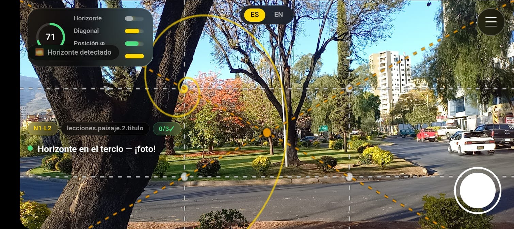
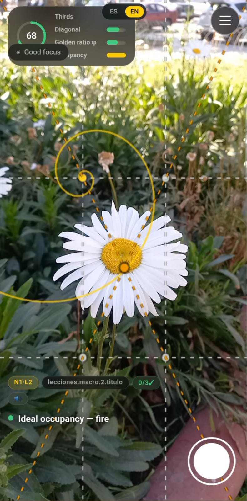
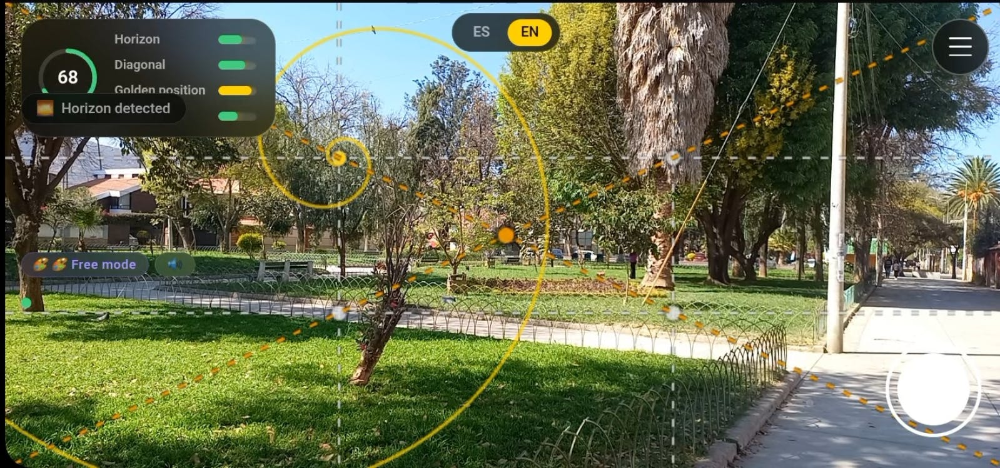

---

## 20. [CrowdVolt](https://www.producthunt.com/products/crowdvolt)
**Votes**: 72 | **도입 난이도**: 하 | **신뢰도**: 상
**Tagline**: You're coming out tonight
**서비스 링크**: https://www.producthunt.com/r/D2GGYPFXBEASAV

**태그**: Social, Events, Ticketing, Lifestyle

### 📌 이 서비스 한눈에 보기
즉흥적인 밤을 위한 소셜 파티 탐색 및 티켓 거래 플랫폼

### 🔑 주요 기능
- 트렌디한 파티와 로컬 씬(Scene) 실시간 탐색
- 아티스트 및 베뉴 팔로우를 통한 맞춤형 이벤트 알림
- 자율적인 가격 책정 및 즉각적인 티켓 재판매 기능

### 🙋 사용자에게 어떤 점이 좋은가
계획에 얽매이지 않고 즉흥적으로 외출하고 싶은 사용자에게 최적화되어 있으며, 유연한 티켓 거래로 약속 변경에 대한 부담을 줄여줍니다.

### ✅ 지금 바로 써볼 기능
- 관심 있는 아티스트와 베뉴 팔로우하기
- 주변에서 열리는 실시간 이벤트 탐색하기
- 원하는 가격으로 티켓 구매 또는 판매 시도하기

### ⚠️ 사용 전 확인할 점
- 즉흥적인 성격의 서비스이므로 계획적인 일정 관리에는 적합하지 않을 수 있음
- 사용자 기반(커뮤니티 규모)에 따라 지역별 정보 차이가 클 수 있음

### 🧭 확인이 더 필요한 정보
실제 티켓 거래 시 결제 보안 및 정산 방식에 대한 구체적인 정보가 필요합니다.

### 📸 스크린샷 및 갤러리

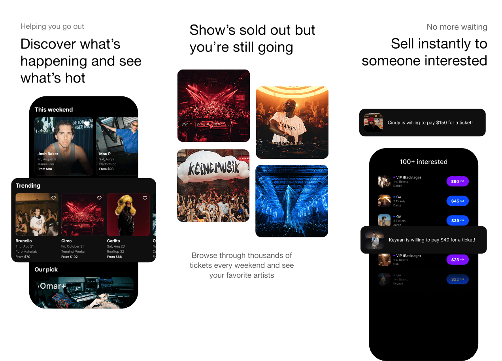
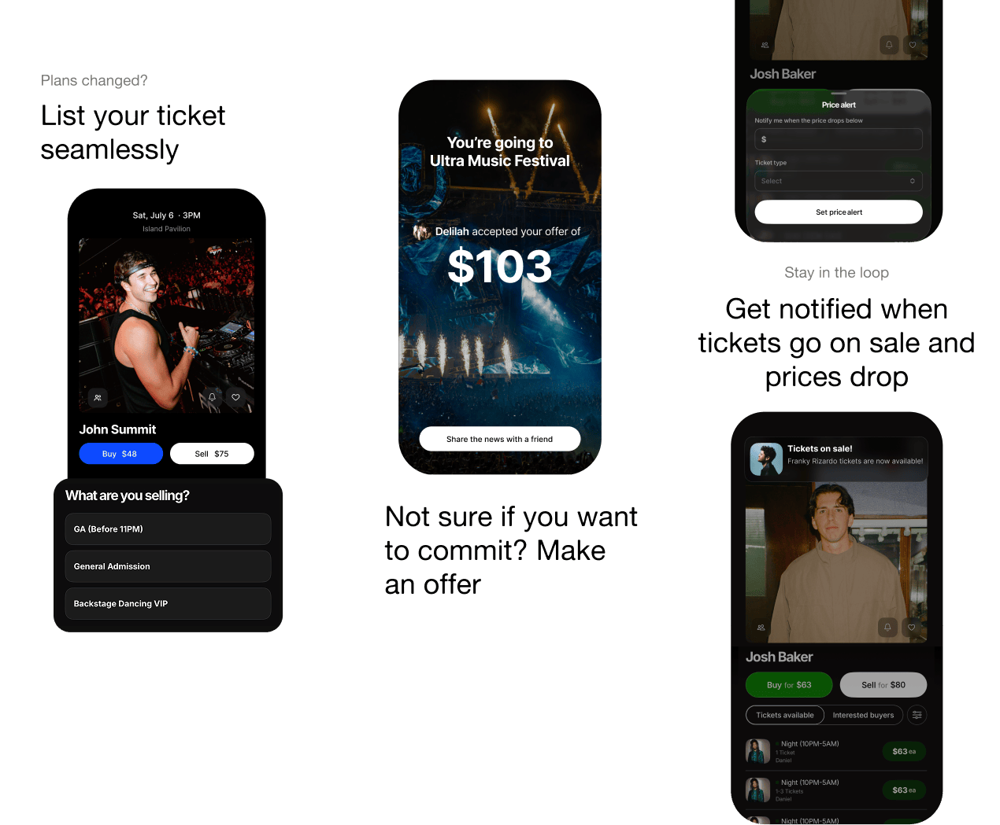

### 🎬 관련 영상
- [🎥 영상 보기](https://ph-files.imgix.net/4f958edd-b12d-4720-b3fa-ec2e6c1727ff.jpeg?auto=format)

---

## 21. [marketing.lol](https://www.producthunt.com/products/marketing-lol)
**Votes**: 16 | **도입 난이도**: 하 | **신뢰도**: 상
**Tagline**: turns out marketing isn't that hard
**서비스 링크**: https://www.producthunt.com/r/3A7O7JP32Y2YJ2

**태그**: Marketing, AI, Automation, SaaS, Agent, AI Tool

### 📌 이 서비스 한눈에 보기
URL 입력만으로 맞춤형 AI 마케팅 팀을 구축해주는 자동화 솔루션

### 🔑 주요 기능
- URL 입력 시 비즈니스 맥락을 파악하여 전문 AI 에이전트 생성
- SEO, 콘텐츠, 유료 광고, 라이프사이클 등 다양한 마케팅 영역 지원
- 가입 없이 즉시 사용 가능한 간편한 접근성

### 🙋 사용자에게 어떤 점이 좋은가
마케팅 전략 수립과 실행에 드는 시간과 비용을 획기적으로 줄여주며, 전문 인력이 부족한 초기 창업자나 개인 사업자에게 유용합니다.

### ✅ 지금 바로 써볼 기능
- 자사 웹사이트 URL 입력하여 AI 분석 결과 확인하기
- 생성된 전문 에이전트들의 작업 결과물 검토하기

### ⚠️ 사용 전 확인할 점
- AI가 생성한 콘텐츠의 품질과 정확성에 대한 최종 검토 필요
- 실제 광고 집행이나 외부 플랫폼 연동 시 추가 설정 필요 가능성

### 🧭 확인이 더 필요한 정보
무료 체험 이후의 구체적인 유료 플랜 및 기능 제한 범위는 명시되어 있지 않습니다.

### 📸 스크린샷 및 갤러리
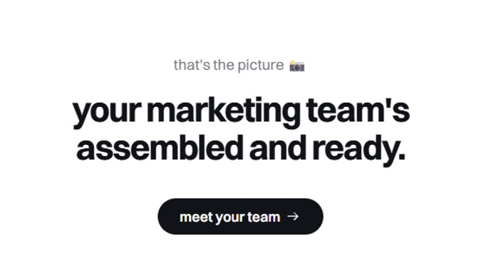
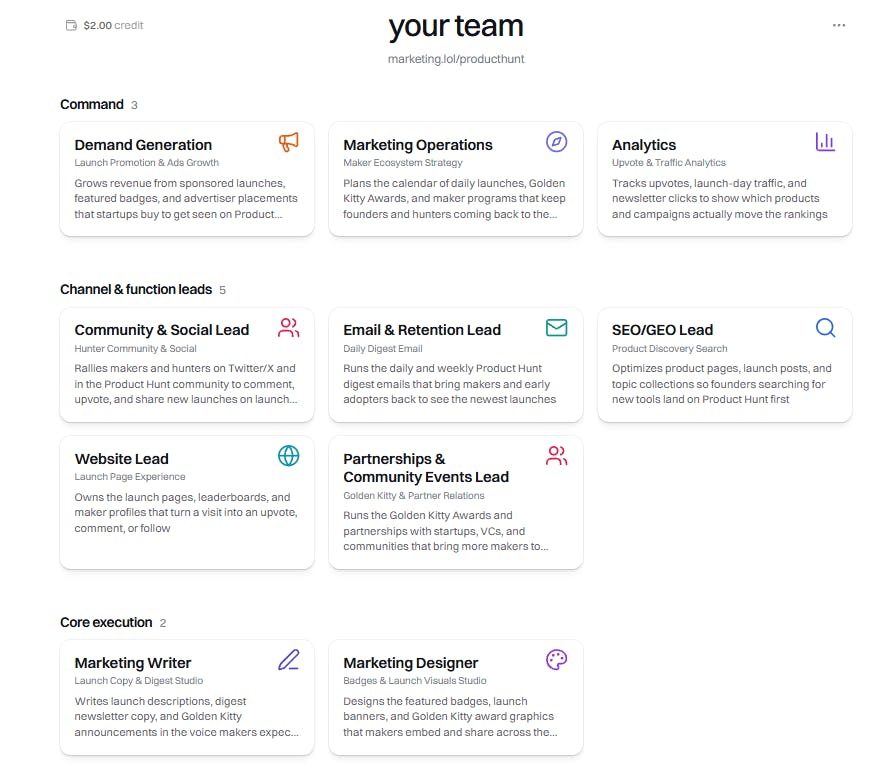

---

## 22. [Swolemates](https://www.producthunt.com/products/swolemates)
**Votes**: 14 | **도입 난이도**: 하 | **신뢰도**: 상
**Tagline**: Show up together and conquer inactivity + isolation
**서비스 링크**: https://www.producthunt.com/r/USDIAS2H3AKBD2

**태그**: Health, Social, Habit Tracker, Lifestyle

### 📌 이 서비스 한눈에 보기
소중한 사람들과 함께 건강한 습관을 형성하는 소셜 습관 형성 앱

### 🔑 주요 기능
- 스트릭(Streaks)과 포인트 시스템을 통한 재미있는 습관 형성
- 고립과 비활동을 방지하는 소셜 커뮤니티 기능
- 성과 경쟁보다는 지속 가능한 건강한 생활 방식에 집중

### 🙋 사용자에게 어떤 점이 좋은가
혼자 하는 운동이나 습관 형성이 아닌, 친구 및 가족과 함께함으로써 동기부여를 얻고 꾸준함을 유지할 수 있습니다.

### ✅ 지금 바로 써볼 기능
- 함께할 크루(친구/가족) 초대하기
- 데일리 습관 설정하고 스트릭 쌓기
- Swole Points를 통한 성취감 경험하기

### ⚠️ 사용 전 확인할 점
- 14일 무료 체험 이후 유료 구독 전환 여부 확인 필요
- 소셜 기능 중심이므로 주변 지인의 참여가 있어야 효과 극대화

### 🧭 확인이 더 필요한 정보
구체적인 유료 구독 플랜과 기능별 가격 정책이 명시되지 않았습니다.

### 📸 스크린샷 및 갤러리
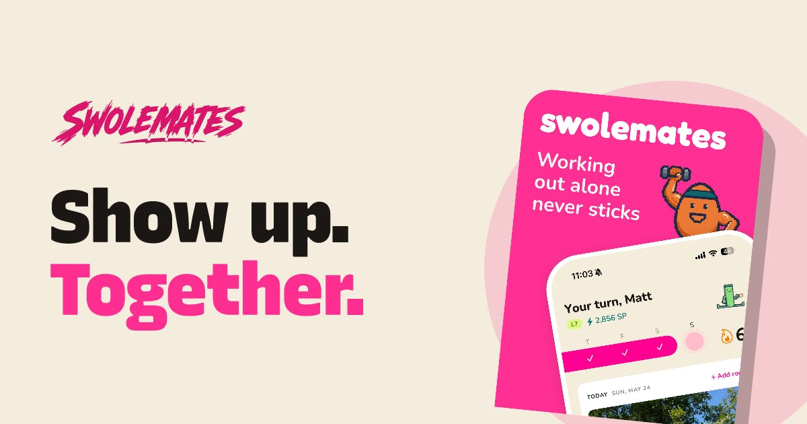
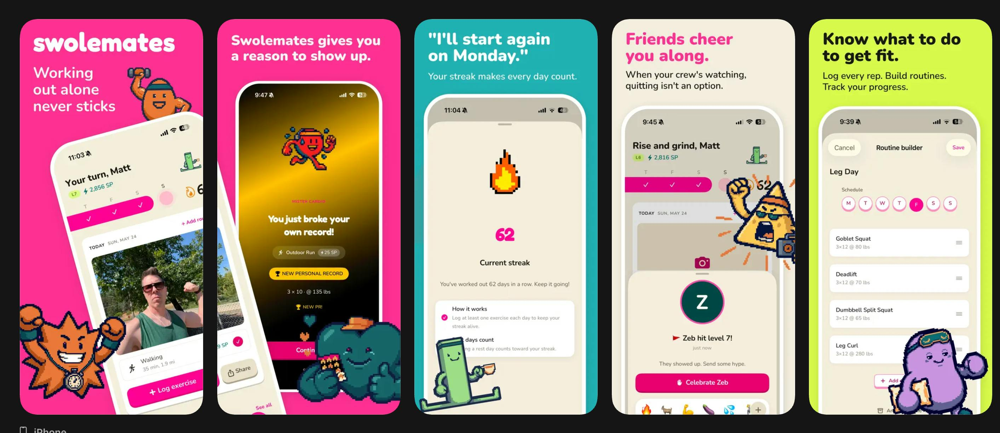
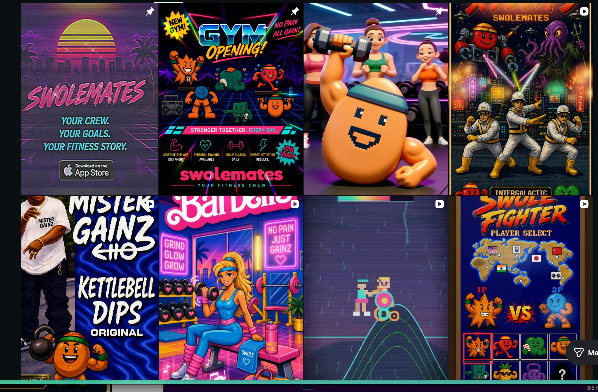

### 🎬 관련 영상
- [🎥 영상 보기](https://ph-files.imgix.net/8f39c5f0-eb93-4fcc-9da4-a89328168343.jpeg?auto=format)

---

## 23. [Promo Wong (King!)](https://www.producthunt.com/products/promo-6)
**Votes**: 13 | **도입 난이도**: 하 | **신뢰도**: 상
**Tagline**: Launch your SaaS in Hong Kong from $0.5
**서비스 링크**: https://www.producthunt.com/r/IJX3QUICJIELND

**태그**: Marketing, SaaS, Localization, GrowthHacking

### 📌 이 서비스 한눈에 보기
단돈 $0.5로 홍콩 시장의 잠재 고객에게 SaaS를 노출하는 프로모션 마켓플레이스

### 🔑 주요 기능
- 홍콩 현지 사용자 대상의 저렴한 SaaS 프로모션 서비스
- 입찰 금액에 따른 가시성 차등 제공 방식
- 현지 정서에 맞춘 구어체 광둥어 자동 번역 기능 제공

### 🙋 사용자에게 어떤 점이 좋은가
홍콩 시장 진출을 원하는 SaaS 창업자가 적은 비용으로 현지 고객에게 브랜드를 노출하고 가시성을 확보할 수 있습니다.

### ✅ 지금 바로 써볼 기능
- 최소 비용($0.5)으로 홍콩 시장 반응 테스트하기
- 광둥어 자동 번역 기능을 활용한 현지화 콘텐츠 적용하기
- 입찰 시스템을 통한 노출 순위 최적화하기

### ⚠️ 사용 전 확인할 점
- 홍콩 시장에 특화된 서비스이므로 타 지역 타겟팅에는 적합하지 않음
- 입찰 경쟁에 따라 노출 효과가 변동될 수 있음

### 🧭 확인이 더 필요한 정보
입찰 금액에 따른 구체적인 노출 알고리즘과 홍콩 외 지역 확장 계획은 명시되지 않았습니다.

### 📸 스크린샷 및 갤러리
_media_0.jpg)
_media_1.jpg)

---

## 24. [Endless Bird Jigsaw Puzzle](https://www.producthunt.com/products/endless-bird-jigsaw-puzzle)
**Votes**: 10 | **도입 난이도**: 하 | **신뢰도**: 상
**Tagline**: Every level adds a piece, and every finished picture sings.
**서비스 링크**: https://www.producthunt.com/r/CKZ3344GRVE4FZ

**태그**: Puzzle, Relaxation, Casual Game

### 📌 이 서비스 한눈에 보기
점점 커지는 퍼즐을 맞추며 아름다운 새의 노래를 완성하는 힐링 퍼즐 게임

### 🔑 주요 기능
- 레벨이 올라갈수록 퍼즐 조각이 늘어나는 무한 확장형 구조
- 각 레벨마다 서로 다른 종류의 새를 완성하는 재미
- 마지막 조각을 맞췄을 때 들리는 청각적 보상(새의 노래)

### 🙋 사용자에게 어떤 점이 좋은가
점진적으로 난이도가 높아지는 퍼즐을 통해 몰입감 있는 휴식과 성취감을 얻을 수 있습니다.

### ✅ 지금 바로 써볼 기능
- 첫 번째 레벨의 4조각 퍼즐부터 시작하기
- 완성 시 들리는 새의 노래 감상하기

### ⚠️ 사용 전 확인할 점
- 레벨이 높아질수록 퍼즐 조각이 급격히 늘어나 난이도가 높아질 수 있음

### 🧭 확인이 더 필요한 정보
게임의 구체적인 플랫폼(모바일, 웹 등)과 조작 방식에 대한 정보가 부족합니다.

### 📸 스크린샷 및 갤러리

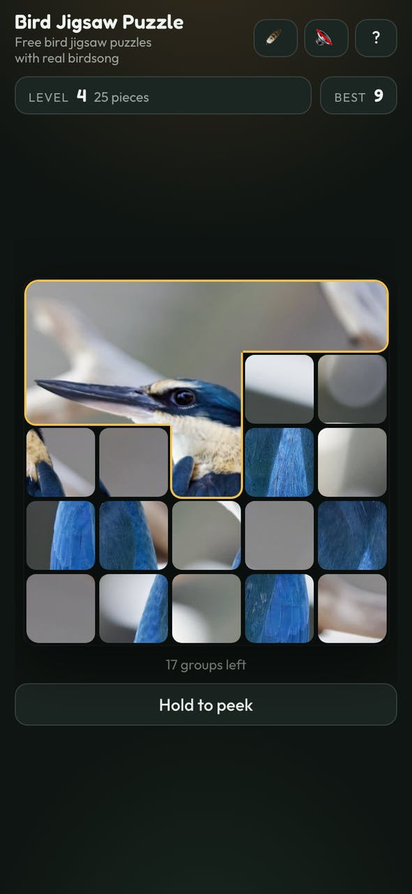

---

## 25. [Sitely iPad AI+Visual Website Builder](https://www.producthunt.com/products/sitely-ipad-ai-visual-website-builder)
**Votes**: 10 | **도입 난이도**: 하 | **신뢰도**: 상
**Tagline**: The power and simplicity of Sitely is now available on iPad!
**서비스 링크**: https://www.producthunt.com/r/E4WJI3TQQFHGET

**태그**: NoCode, DesignTool, iPadOS, AI, WebBuilder, AI Tool

### 📌 이 서비스 한눈에 보기
iPad에서도 Mac과 동일한 강력한 AI 기반 웹사이트 제작 경험을 제공하는 Sitely의 모바일 확장 버전

### 🔑 주요 기능
- Mac 버전의 모든 기능을 iPad로 완벽하게 이식
- iPadOS UI 및 Apple Pencil, 터치 인터페이스 최적화
- 장소에 구애받지 않는 이동식 웹 디자인 워크플로우 제공

### 🙋 사용자에게 어떤 점이 좋은가
Mac 없이도 iPad만으로 아이디어 구상부터 웹사이트 발행까지 모든 과정을 수행할 수 있어 이동 중에도 전문적인 작업이 가능합니다.

### ✅ 지금 바로 써볼 기능
- Apple Pencil을 활용한 직관적인 디자인 작업
- 터치 인터페이스를 통한 레이아웃 조정
- 기존 Mac 사용자라면 iPad 앱 설치 및 동기화 확인

### ⚠️ 사용 전 확인할 점
- Mac 버전과 비교 시 iPadOS 환경에서의 세부 기능 구현 차이 여부 확인 필요
- 기존 Mac 사용자 계정과의 데이터 동기화 안정성 확인

### 🧭 확인이 더 필요한 정보
iPadOS 환경에서 Mac 버전의 모든 고급 기능이 100% 동일하게 구현되는지에 대한 구체적인 명세가 필요합니다.

### 📸 스크린샷 및 갤러리
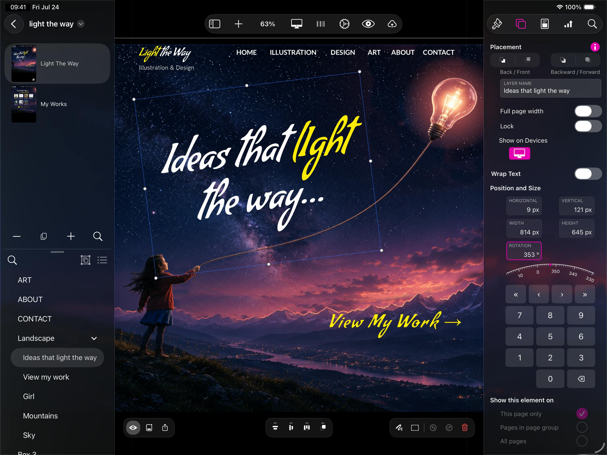
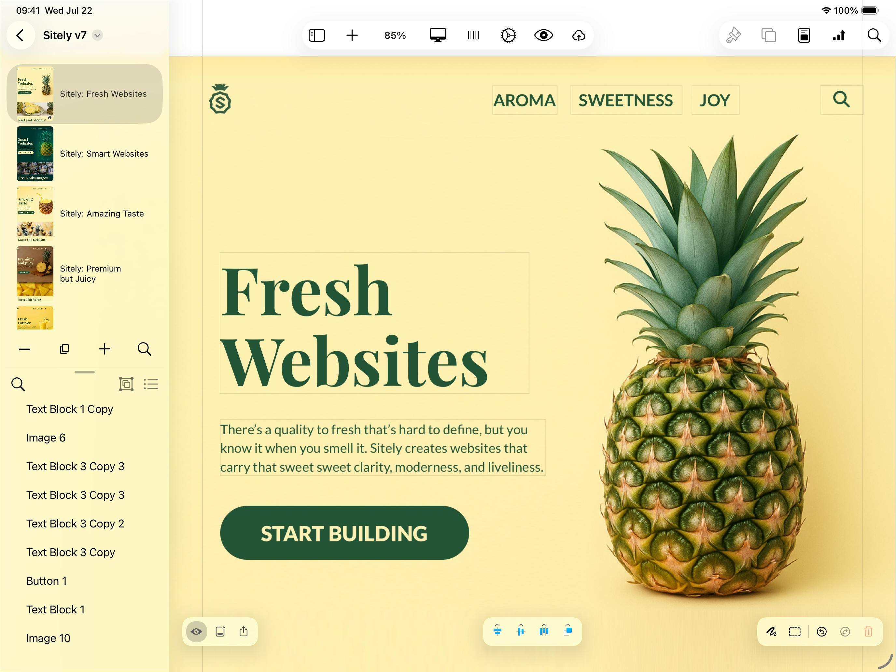
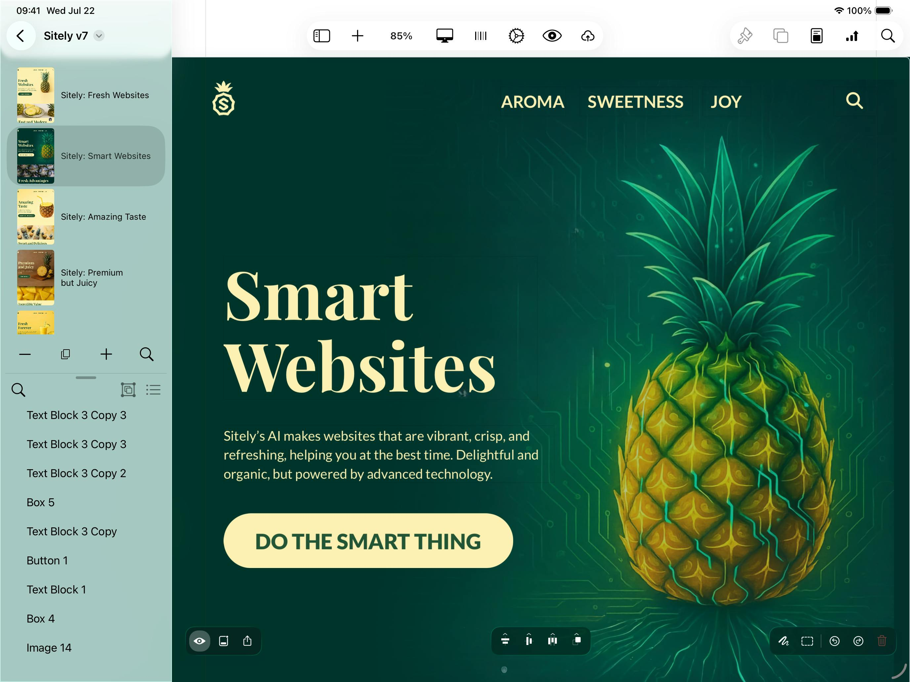

### 🎬 관련 영상
- [🎥 영상 보기](https://ph-files.imgix.net/0ea79298-4529-4f03-848f-5a5e2fc53d5c.jpeg?auto=format)

---

## 26. [UIDrop](https://www.producthunt.com/products/uidrop)
**Votes**: 10 | **도입 난이도**: 하 | **신뢰도**: 상
**Tagline**: Send your favorite design systems to the AI agents you use.
**서비스 링크**: https://www.producthunt.com/r/NKA5ZMSCM5ZTJ7

**태그**: DesignTool, AI-Agent, Frontend, Productivity, Agent, AI Tool, Chat, Prompting, Design

### 📌 이 서비스 한눈에 보기
웹사이트의 디자인 시스템을 캡처하여 AI 에이전트에게 즉시 전달하는 디자인-코드 워크플로우 도구

### 🔑 주요 기능
- 웹사이트의 디자인 시스템 및 주요 컴포넌트 즉시 캡처
- Claude, ChatGPT, Cursor 등 주요 AI 에이전트로 원클릭 전송
- 여러 스냅샷에서 원하는 요소(네비바, 버튼 등)를 선택해 하나의 마스터 프롬프트로 병합

### 🙋 사용자에게 어떤 점이 좋은가
디자인 영감을 코드로 구현하는 과정을 단축하며, 여러 웹사이트의 장점만을 모아 AI에게 완벽한 가이드를 제공할 수 있습니다.

### ✅ 지금 바로 써볼 기능
- 마음에 드는 웹사이트의 디자인 요소 캡처하기
- 여러 스냅샷에서 개별 컴포넌트 선택 및 병합하기
- 생성된 마스터 프롬프트를 AI 에이전트에 입력하여 코드 생성하기

### ⚠️ 사용 전 확인할 점
- 캡처된 디자인 요소가 실제 코드와 얼마나 일치할지 확인 필요
- 사용 중인 AI 에이전트 플랫폼과의 호환성 확인

### 🧭 확인이 더 필요한 정보
사용자의 브라우저 환경이나 특정 프레임워크와의 호환성에 대한 상세 정보가 필요합니다.

### 📸 스크린샷 및 갤러리
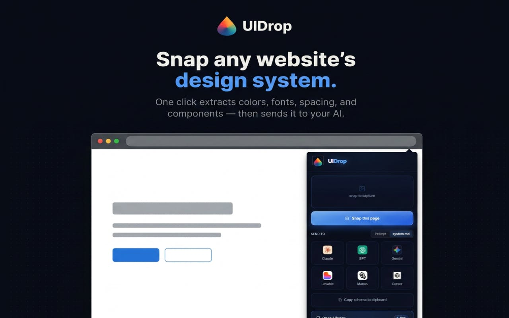
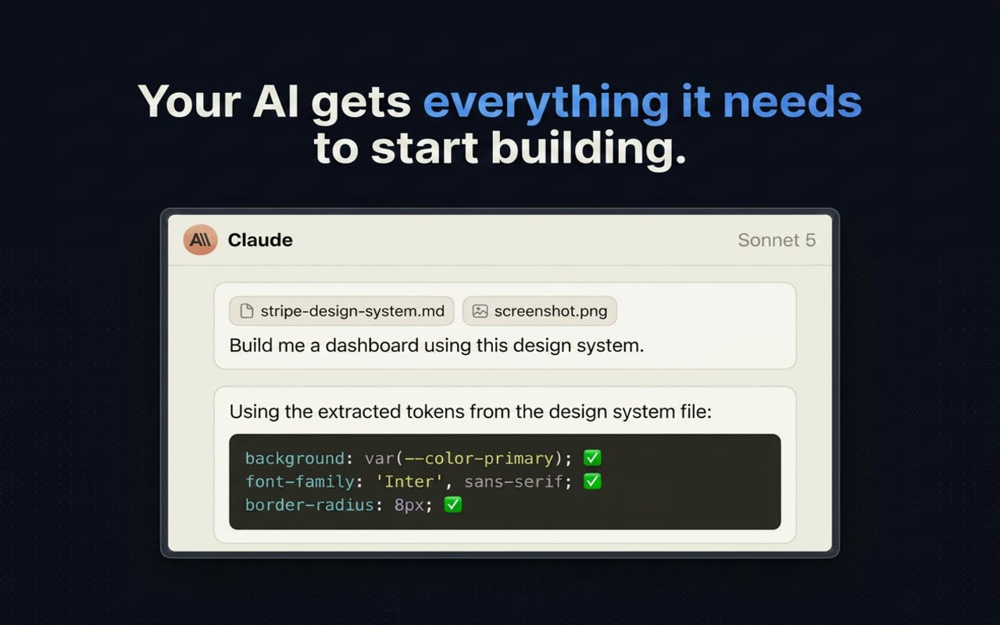
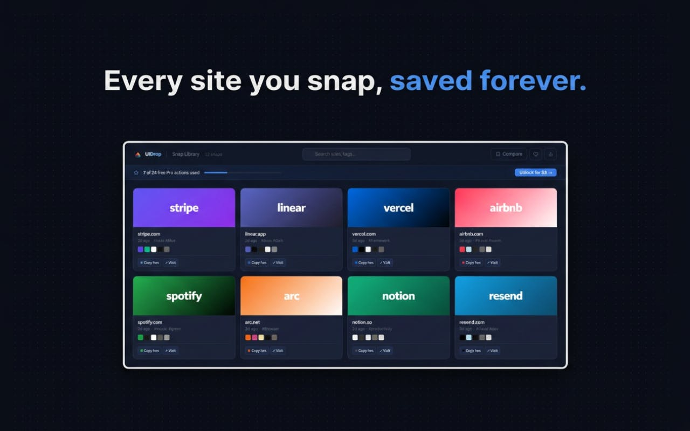

---

## 27. [Email Deliverability Toolkit](https://www.producthunt.com/products/truelist-2)
**Votes**: 9 | **도입 난이도**: 하 | **신뢰도**: 상
**Tagline**: 9 free tools to keep your email out of spam
**서비스 링크**: https://www.producthunt.com/r/H263L4IRSA5WCI
**재등장**: 최근 7일 내 재등장 (마지막 등장 6일 전)

**태그**: Email, DevTool, Marketing, AI Tool

### 📌 이 서비스 한눈에 보기
스팸함을 피하기 위한 9가지 무료 DNS 및 이메일 도달률 점검 도구 모음

### 🔑 주요 기능
- SPF, DKIM, DMARC 설정 확인 및 자동 생성 기능 제공
- DNS 설정, 블랙리스트 여부, 전체 도달률 점검 기능 포함
- 가입이나 사용량 제한(metering) 없는 완전 무료 도구

### 🙋 사용자에게 어떤 점이 좋은가
이메일 발송 시 설정 오류로 인해 메시지가 스팸으로 분류되는 문제를 즉각적으로 진단하고 해결할 수 있습니다.

### ✅ 지금 바로 써볼 기능
- 현재 사용 중인 SPF/DKIM/DMARC 설정값 검사하기
- 생성기를 사용하여 올바른 DNS 레코드 구성하기
- 도메인이 블랙리스트에 등록되어 있는지 확인하기

### ⚠️ 사용 전 확인할 점
- 설정 변경 시 실제 DNS 반영까지 시간이 소요될 수 있음
- 전문적인 DNS 관리를 위한 심화 기능은 제한적일 수 있음

### 🧭 확인이 더 필요한 정보
제공되는 도구들이 특정 이메일 서비스 제공업체(ESP)의 환경에 최적화되어 있는지 확인이 필요합니다.

### 📸 스크린샷 및 갤러리
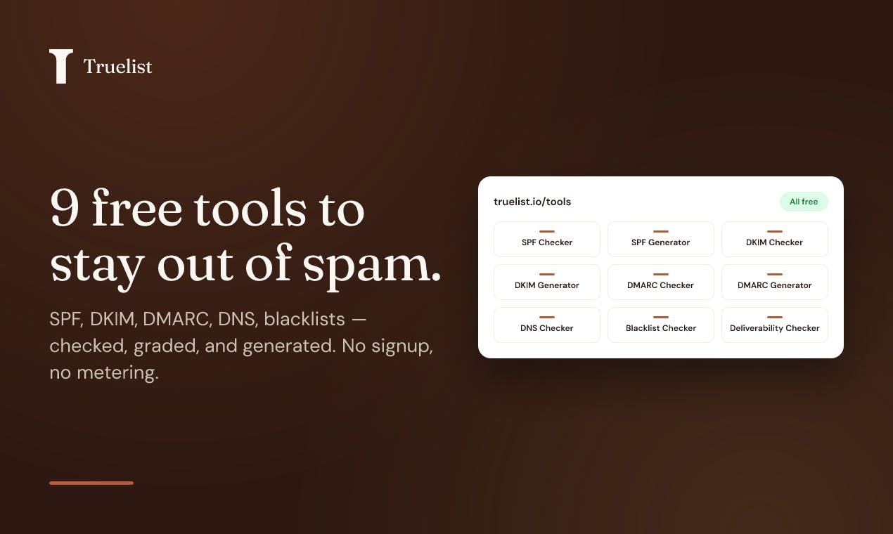
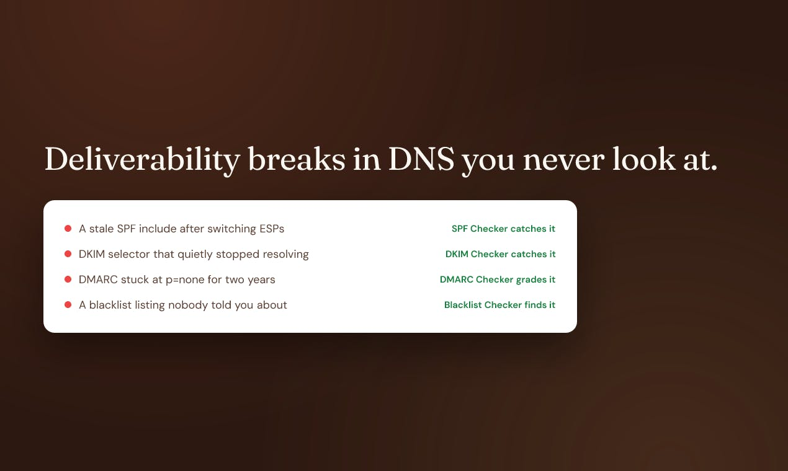
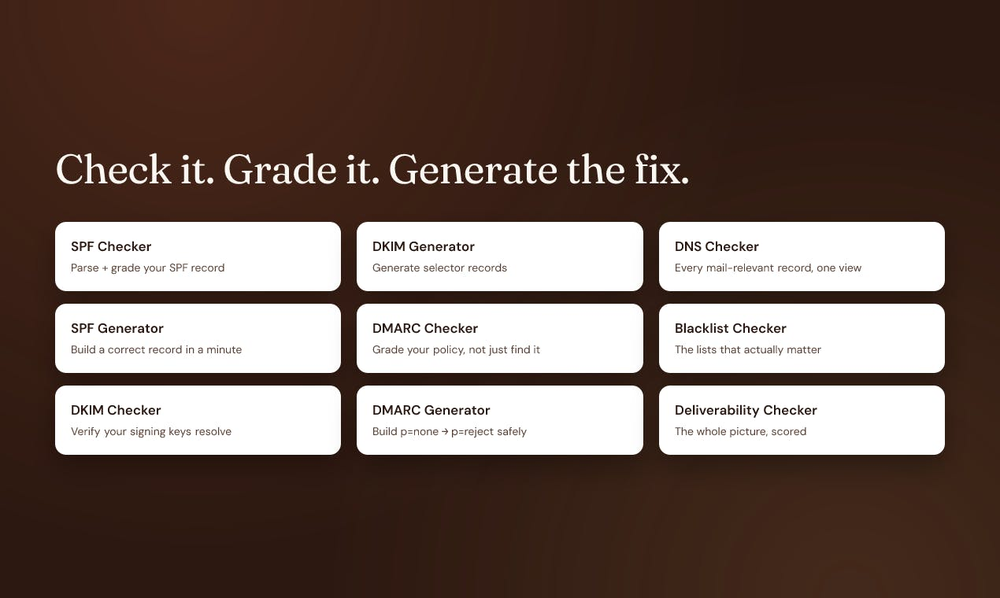

---

## 28. [Omarchy](https://www.producthunt.com/products/omarchy-2)
**Votes**: 9 | **도입 난이도**: 하 | **신뢰도**: 중
**Tagline**: Beautiful, modern & opinionated Linux — in one command
**서비스 링크**: https://www.producthunt.com/r/76JZAGV77NI3GU

**태그**: Linux, DevOps, DeveloperExperience, OS

### 📌 이 서비스 한눈에 보기
DHH가 제안하는 아름답고 현대적인 단일 명령 기반 리눅스 환경

### 🔑 주요 기능
- DHH가 설계한 현대적이고 미학적인 리눅스 경험
- 단 한 번의 명령어로 구성되는 간편한 설치 및 설정
- 사용자의 취향이 반영된 독창적인(Opinionated) 시스템 설계

### 🙋 사용자에게 어떤 점이 좋은가
복잡한 리눅스 설정 과정을 생략하고, 세련된 개발 환경을 즉시 구축하고 싶은 사용자에게 유용합니다.

### ✅ 지금 바로 써볼 기능
- 단일 명령어를 통한 설치 프로세스 경험하기
- DHH가 설계한 기본 설정 및 UI 스타일 확인하기

### ⚠️ 사용 전 확인할 점
- 특정 철학이 반영된 설정이므로 사용자 개인의 커스텀 취향과 다를 수 있음
- 상세한 시스템 요구 사양 및 지원 배포판 확인 필요

### 🧭 확인이 더 필요한 정보
상세한 기술 스택과 지원하는 리눅스 배포판 종류에 대한 정보가 부족합니다.

### 📸 스크린샷 및 갤러리
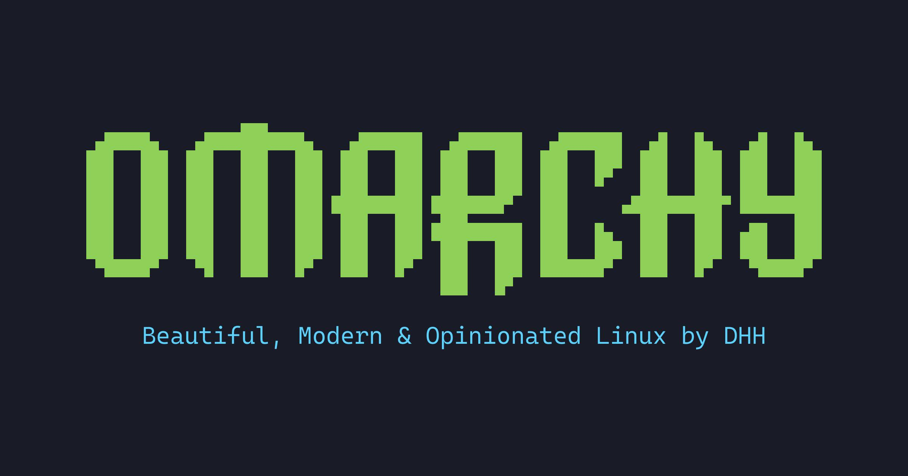
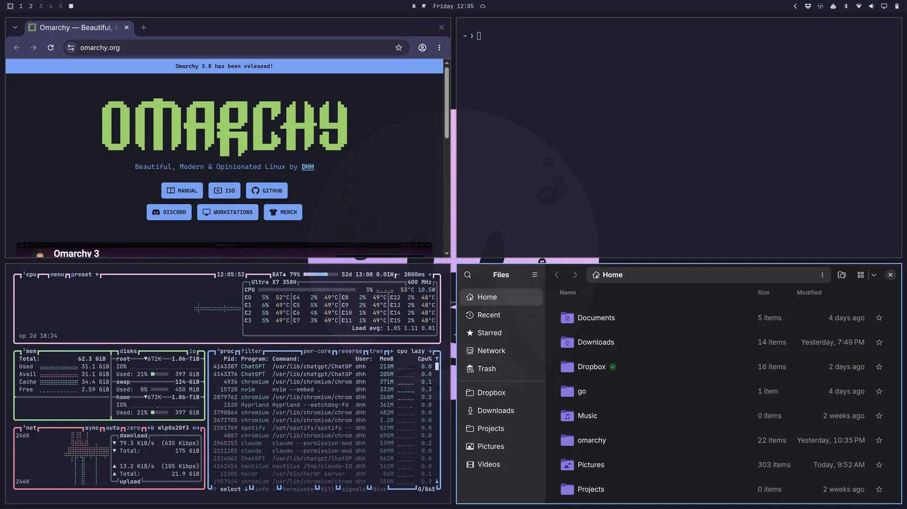
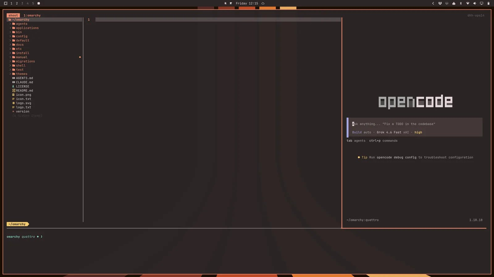

### 🎬 관련 영상
- [🎥 영상 보기](https://ph-files.imgix.net/551ba956-139e-4a7d-83b5-e67bd7ad4e3d.jpeg?auto=format)

---

## 29. [StayThere](https://www.producthunt.com/products/staythere)
**Votes**: 8 | **도입 난이도**: 하 | **신뢰도**: 상
**Tagline**: Book vacation rentals without Airbnb or OTA fees/commissions
**서비스 링크**: https://www.producthunt.com/r/FFTQ6EWLAZRVZJ

**태그**: Travel, Direct Booking, Marketplace, AI Tool

### 📌 이 서비스 한눈에 보기
에어비앤비 수수료 없이 호스트의 직거래 사이트로 바로 연결되는 숙소 검색 플랫폼

### 🔑 주요 기능
- 에어비앤비 및 OTA의 높은 수수료를 제거한 직거래 방식
- 4,500개 이상의 독립 호스트 사이트와 12.6만 개의 숙소 리스팅 확보
- URL 복사만으로 숙소 정보를 가져오는 간편한 호스트 등록 프로세스

### 🙋 사용자에게 어떤 점이 좋은가
게스트는 중간 수수료 없는 저렴한 가격으로 예약할 수 있고, 호스트는 플랫폼 수수료 없이 자신의 사이트로 고객을 유도할 수 있습니다.

### ✅ 지금 바로 써볼 기능
- 원하는 지역의 숙소 검색 및 실시간 가격 확인
- 호스트인 경우, 자신의 숙소 URL을 입력하여 리스팅 등록 테스트
- 예약 흐름이 최종 결제 페이지로 어떻게 연결되는지 확인

### ⚠️ 사용 전 확인할 점
- 예약 최종 단계가 외부 사이트에서 이루어지므로 결제 보안 및 고객 보호 정책 확인 필요
- 호스트가 직접 관리하는 사이트의 안정성에 따라 예약 성공 여부가 결정됨

### 🧭 확인이 더 필요한 정보
호스트의 개별 사이트와 연동되는 방식이므로, 각 사이트별 결제 보안 및 예약 확정 프로세스가 다를 수 있습니다.

### 📸 스크린샷 및 갤러리

---

## 30. [Voider](https://www.producthunt.com/products/voider)
**Votes**: 8 | **도입 난이도**: 하 | **신뢰도**: 상
**Tagline**: Own a piece of forever on one infinite canvas
**서비스 링크**: https://www.producthunt.com/r/CX3IVPWTOBDRUG

**태그**: Creativity, DigitalArchive, DesignTool, Storage, Vision

### 📌 이 서비스 한눈에 보기
영구 소유가 가능한 무한 캔버스 기반의 디지털 기록 공간

### 🔑 주요 기능
- 한 번의 결제로 영구 소유 가능한 무한 캔버스 공간
- 중심부에서 외곽으로 갈수록 저렴해지는 계층적 가격 구조
- 이미지 업로드 및 블록 드로잉을 통한 자유로운 기록

### 🙋 사용자에게 어떤 점이 좋은가
구독료 걱정 없이 소중한 기록(스타트업, 반려동물, 추모 등)을 영구적인 디지털 공간에 보관할 수 있습니다.

### ✅ 지금 바로 써볼 기능
- 무한 캔버스에 첫 번째 블록 그려보기
- 중심부와 외곽부의 가격 차이 확인하기
- 중요한 이미지나 기록 업로드해보기

### ⚠️ 사용 전 확인할 점
- 영구 소유에 대한 기술적/플랫폼적 지속 가능성 확인 필요
- 중심부와 외곽부의 공간 제약 및 기능 차이 확인 필요

### 🧭 확인이 더 필요한 정보
결제 방식과 영구 소유가 보장되는 구체적인 기술적 메커니즘에 대한 정보가 부족합니다.

### 📸 스크린샷 및 갤러리
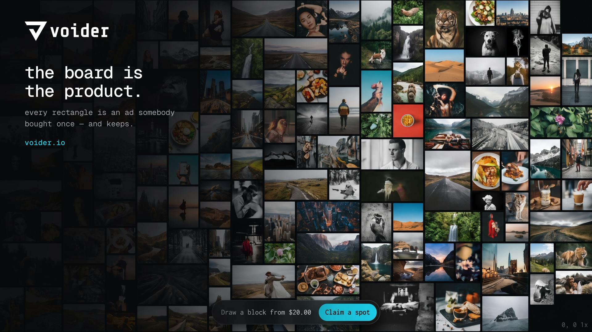
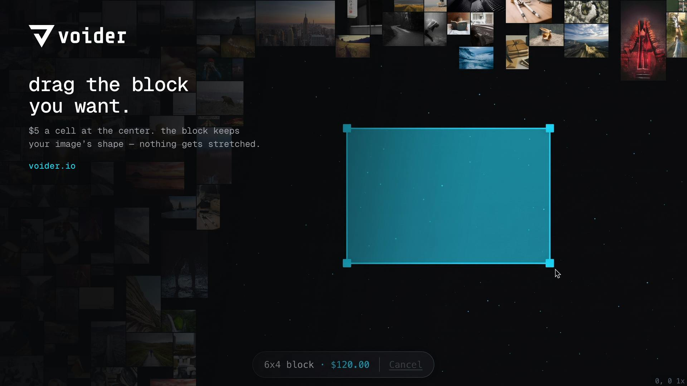
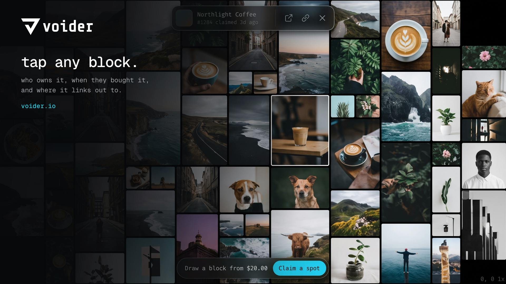

---

