# 🚀 Product Hunt Daily Top 30 (2026-08-31)

## 오늘의 요약
오늘의 트렌드는 AI 에이전트와 자동화 기술을 활용해 전문적인 작업(영상 제작, 논문 작성, 법률 운영)의 복잡도를 낮추는 도구들이 주를 이루었습니다. 또한, 단순한 기능 제공을 넘어 사용자의 워크플로우를 완전히 재설계하거나 실패의 경험을 자산화하는 등 삶과 업무의 질을 높이는 서비스들이 주목받았습니다.

### 오늘의 핵심 포인트
- AI 기술을 통해 영상 제작, 데이터 추출, 논문 작성 등 전문 영역의 작업 시간을 획기적으로 단축하는 도구들이 등장했습니다.
- 복잡한 편집이나 운영 업무를 자동화하여 사용자가 핵심 가치와 창의적인 업무에만 집중할 수 있도록 돕는 서비스가 강세를 보였습니다.
- 목표 관리부터 프로젝트의 실패 기록까지, 개인의 생산성과 심리적 성장을 지원하는 도구들이 주목받았습니다.

**오늘의 태그**: AI_Automation, Productivity, Workflow_Optimization, Creative_Tools

## 1. [Topview Motion Studio](https://www.producthunt.com/products/topview-ai)
**Votes**: 227 | **도입 난이도**: 하 | **신뢰도**: 상
**Tagline**: Create launch videos without touching After Effects
**서비스 링크**: https://www.producthunt.com/r/25TEFO4TYMRPSG

**태그**: AI-Video, Product-Launch, Motion-Design, No-Code, AI Tool, Video, Vision, Design

### 📌 이 서비스 한눈에 보기
애프터 이펙트 없이 AI로 고퀄리티 제품 출시 영상을 제작하는 모션 디자인 스튜디오

### 🔑 주요 기능
- 전문적인 모션 디자인 기술 없이도 세련된 제품 홍보 영상 제작 가능
- 텍스트 설명, 참조 이미지, 스타일 선택만으로 영상 자동 생성
- 전통적인 영상 제작 방식 대비 압도적인 속도와 비용 절감

### 🙋 사용자에게 어떤 점이 좋은가
디자인 전문가를 고용하거나 복잡한 편집 툴을 배울 필요 없이, 기획한 아이디어를 즉시 시각적인 제품 스토리텔링으로 변환할 수 있습니다.

### ✅ 지금 바로 써볼 기능
- 원하는 메시지를 담은 프롬프트 작성해보기
- 제품 참조 이미지를 업로드하여 스타일 적용하기
- 목적에 맞는 화면 비율 및 영상 길이 설정하기

### ⚠️ 사용 전 확인할 점
- AI 생성 모델 특성상 세부적인 프레임 단위 제어는 제한적일 수 있음
- 참조 이미지의 품질이 최종 영상 결과물에 영향을 미칠 수 있음

### 🧭 확인이 더 필요한 정보
구체적인 영상 생성 시간과 최종 결과물의 해상도/프레임 레이트 사양은 명시되지 않았습니다.

### 📸 스크린샷 및 갤러리
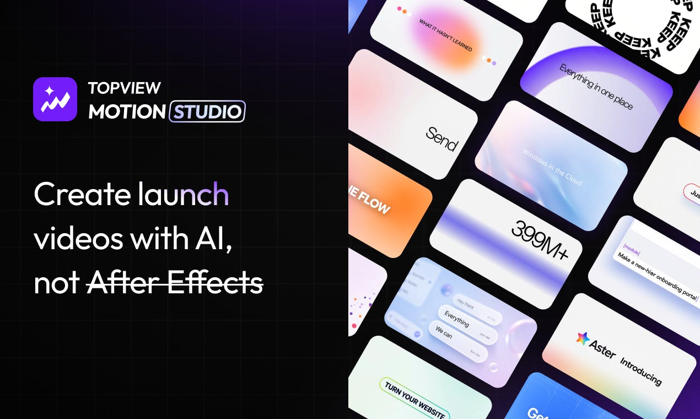
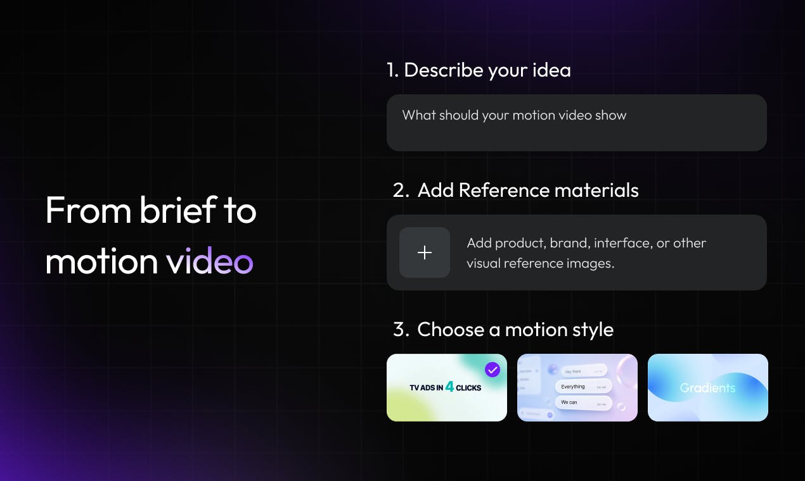
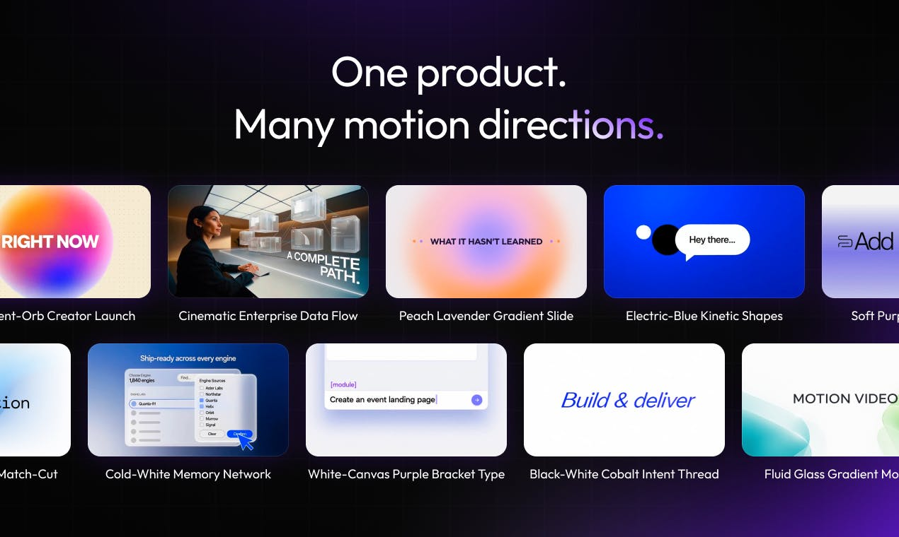

### 🎬 관련 영상
- [🎥 영상 보기](https://ph-files.imgix.net/d7605c87-ce6c-47a8-85d6-52d8cf521040.jpeg?auto=format)

---

## 2. [Hyperfocus](https://www.producthunt.com/products/hyperfocus-2)
**Votes**: 218 | **도입 난이도**: 하 | **신뢰도**: 상
**Tagline**: Planner that turns goals into daily progress
**서비스 링크**: https://www.producthunt.com/r/WIPDN746ZT7D27
**재등장**: 최근 7일 내 재등장 (마지막 등장 6일 전)

**태그**: Productivity, Planner, macOS, Goal-Setting, AI Tool

### 📌 이 서비스 한눈에 보기
중요한 목표를 일상적인 실행으로 연결하는 macOS 전용 목표 중심 플래너

### 🔑 주요 기능
- 목표 달성을 최우선으로 하는 목표 중심 설계
- 가장 중요한 결과물에 집중할 수 있는 우선순위 설정
- 주간 및 일간 계획을 통한 지속적인 실행 유도

### 🙋 사용자에게 어떤 점이 좋은가
막연한 목표를 구체적인 일일 작업으로 변환하여, 매일 무엇을 해야 할지 고민하는 시간을 줄여줍니다.

### ✅ 지금 바로 써볼 기능
- 가장 중요한 핵심 목표 설정하기
- 목표를 주간 계획으로 분해하기
- 일일 집중 작업 시간 할당하기

### ⚠️ 사용 전 확인할 점
- macOS 전용 앱이므로 다른 OS 사용자는 사용 불가
- 목표 설정 중심이라 단순 할 일 목록(To-do) 기능만 원하는 사용자에게는 과할 수 있음

### 🧭 확인이 더 필요한 정보
현재 macOS 전용이며, 타 플랫폼(iOS, Windows 등) 지원 여부는 명시되지 않았습니다.

### 📸 스크린샷 및 갤러리
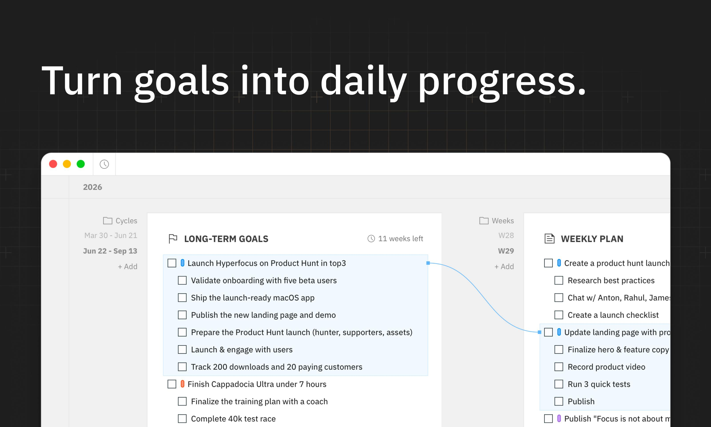

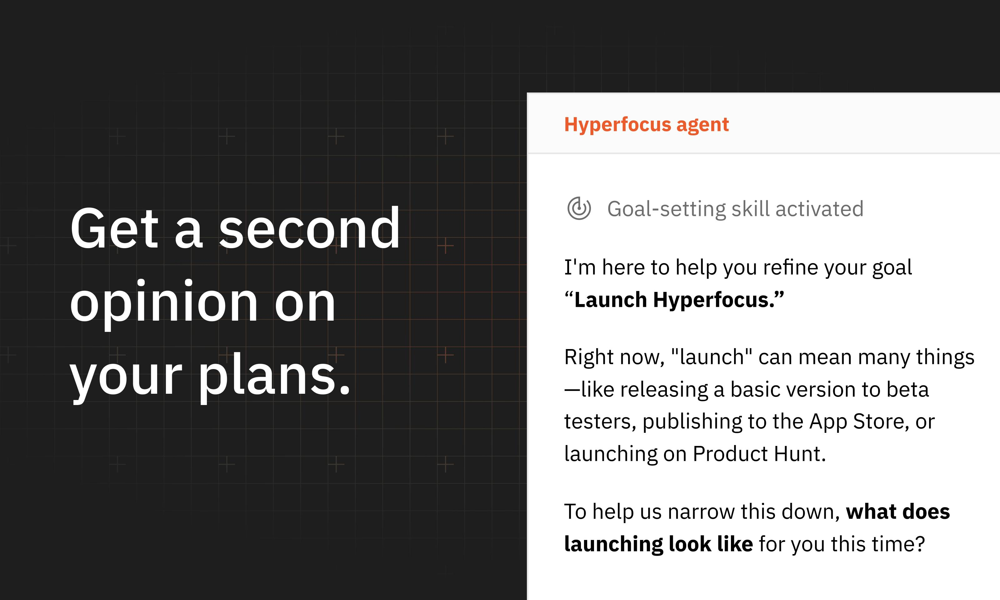

### 🎬 관련 영상
- [🎥 영상 보기](https://ph-files.imgix.net/6b915b9d-32df-4c20-b782-8942f65d898e.jpeg?auto=format)

---

## 3. [Olostep](https://www.producthunt.com/products/olostep)
**Votes**: 187 | **도입 난이도**: 하 | **신뢰도**: 상
**Tagline**: Turn the Web into Clean Data for AI
**서비스 링크**: https://www.producthunt.com/r/ULWMLW4DJVACDF

**태그**: AI, Data Extraction, DevTool, Automation, Agent, AI Tool, LLM, Design, API

### 📌 이 서비스 한눈에 보기
웹 페이지를 AI 학습 및 에이전트용 정형 데이터로 즉시 변환해주는 API 서비스

### 🔑 주요 기능
- 모든 URL을 LLM 친화적인 Markdown, JSON 또는 구조화된 데이터로 변환
- AI 에이전트의 검색 워크플로우에 최적화된 데이터 제공
- 확장 가능한 웹 데이터 API를 통한 효율적인 데이터 추출

### 🙋 사용자에게 어떤 점이 좋은가
웹 데이터를 수동으로 정제할 필요 없이, AI 모델이 즉시 읽고 활용할 수 있는 깨끗한 데이터로 변환하여 개발 시간을 단축할 수 있습니다.

### ✅ 지금 바로 써볼 기능
- URL을 입력하여 Markdown 변환 결과 확인하기
- JSON 구조화 기능 테스트하기
- 에이전트 워크플로우에 API 연동해보기

### ⚠️ 사용 전 확인할 점
- 동적 웹사이트나 복잡한 자바스크립트 렌더링 환경에서의 데이터 정확도 확인 필요
- 대량의 데이터 추출 시 API 호출 비용 및 속도 제한 확인 필요

### 🧭 확인이 더 필요한 정보
구체적인 API 호출 비용 체계와 데이터 추출 속도(Latency)에 대한 정보가 명시되지 않았습니다.

### 📸 스크린샷 및 갤러리
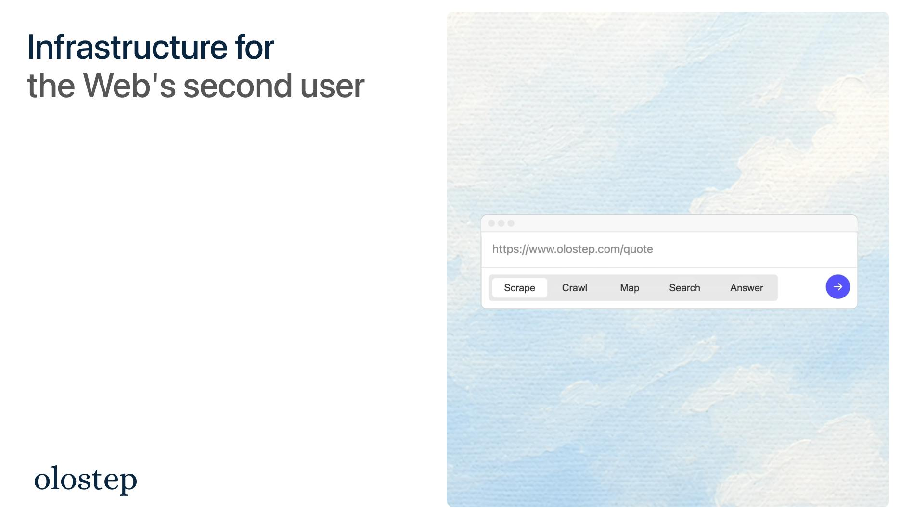
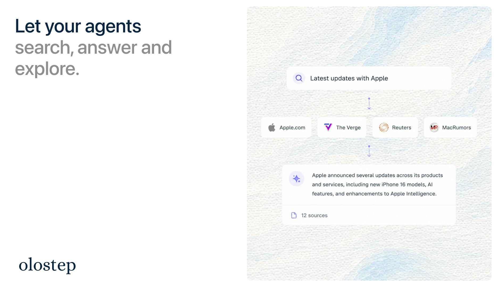
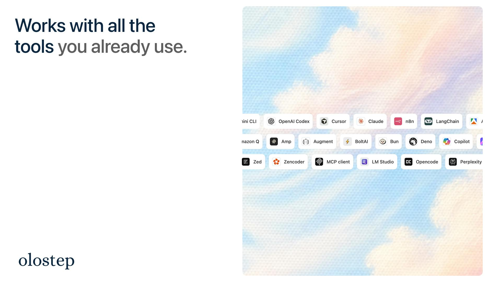

### 🎬 관련 영상
- [🎥 영상 보기](https://ph-files.imgix.net/5a4ff97f-6f2d-4fcc-91ec-c91bf0fa88fb.jpeg?auto=format)

---

## 4. [Prequel](https://www.producthunt.com/products/prequel-2)
**Votes**: 157 | **도입 난이도**: 하 | **신뢰도**: 상
**Tagline**: Create cinematic screen recordings on your Mac
**서비스 링크**: https://www.producthunt.com/r/HDEJHZVHFWZ2YT

**태그**: Productivity, Video, macOS, ScreenRecorder

### 📌 이 서비스 한눈에 보기
편집 과정 없이 바로 완성되는 고화질 시네마틱 화면 녹화 도구

### 🔑 주요 기능
- 작업 흐름을 따라가는 자동 줌 기능
- 프레임 및 배경이 적용된 완성형 비디오 제공
- Mac 미디어 엔진을 활용한 최대 4K 고화질 내보내기

### 🙋 사용자에게 어떤 점이 좋은가
별도의 영상 편집 작업 없이도 전문적인 데모 영상이나 튜토리얼을 즉시 제작할 수 있습니다.

### ✅ 지금 바로 써볼 기능
- 4K 고화질 녹화 테스트
- 자동 줌 기능의 자연스러움 확인
- 커스텀 프레임 및 배경 적용해보기

### ⚠️ 사용 전 확인할 점
- Mac 전용 소프트웨어로 macOS 환경에서만 사용 가능
- 자동 편집 기능이 사용자의 세밀한 편집 의도를 완벽히 반영하지 못할 수 있음

### 🧭 확인이 더 필요한 정보
상세한 편집 자유도와 가격 정책에 대한 정보가 명시되지 않았습니다.

### 📸 스크린샷 및 갤러리
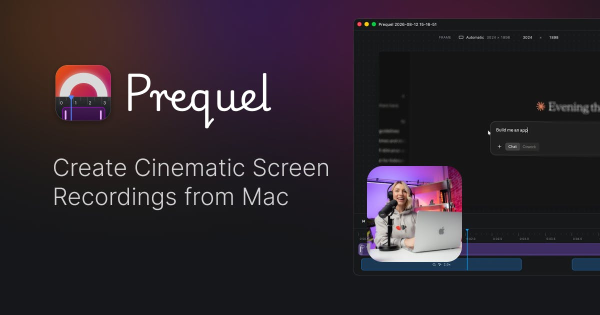
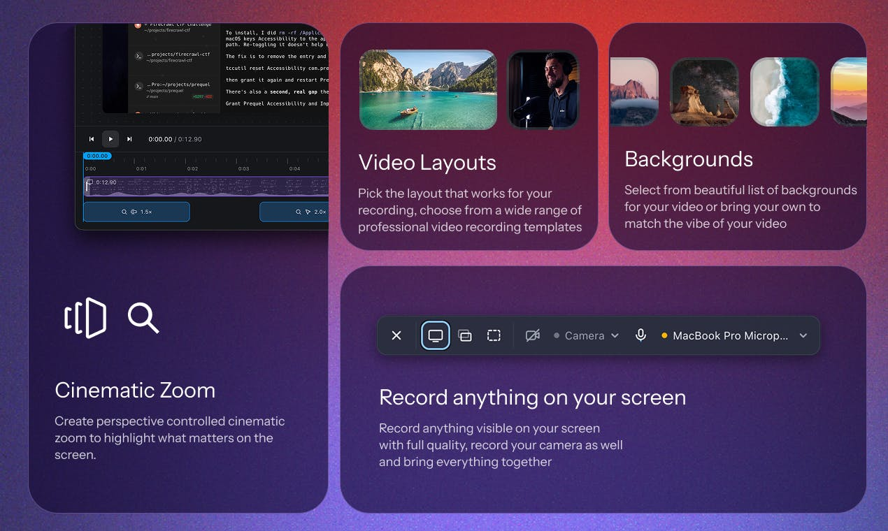
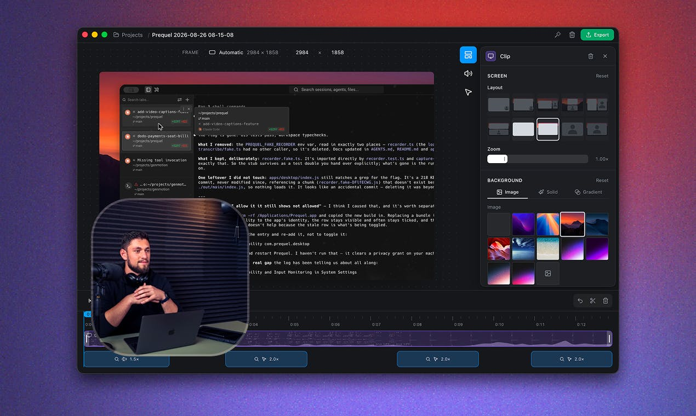

### 🎬 관련 영상
- [🎥 영상 보기](https://ph-files.imgix.net/8cd06ebb-3ed2-4175-a4a1-cc80d3be7ff0.jpeg?auto=format)

---

## 5. [Referent](https://www.producthunt.com/products/referent)
**Votes**: 157 | **도입 난이도**: 중 | **신뢰도**: 상
**Tagline**: The AI-native OS for modern law firms
**서비스 링크**: https://www.producthunt.com/r/OTBU4BBU7KUQEY

**태그**: LegalTech, AI, Automation, SaaS, Agent, AI Tool

### 📌 이 서비스 한눈에 보기
법률 업무 자동화를 통해 변호사가 고객과 성장에만 집중할 수 있게 돕는 AI 기반 운영 체제

### 🔑 주요 기능
- AI 네이티브 방식의 법률 실무 관리 소프트웨어
- AI 에이전트가 반복적인 운영 업무를 대신 처리
- 변호사의 업무 효율성을 높여 핵심 업무 집중 환경 조성

### 🙋 사용자에게 어떤 점이 좋은가
반복적인 운영 업무를 AI에게 맡기고 변호사는 고객 관리와 업무 확장 등 더 가치 있는 일에 집중할 수 있습니다.

### ✅ 지금 바로 써볼 기능
- AI 에이전트의 업무 처리 방식 확인
- 기존 법률 업무 워크플로우와의 호환성 테스트
- 운영 업무 자동화 범위 검토

### ⚠️ 사용 전 확인할 점
- AI 에이전트가 처리하는 업무의 정확도 및 법적 책임 범위 확인 필요
- 기존 법률 관리 시스템과의 데이터 이전 가능성 확인

### 🧭 확인이 더 필요한 정보
AI 에이전트가 구체적으로 어떤 운영 업무를 어느 수준까지 자동화하는지에 대한 상세 정보가 필요합니다.

### 📸 스크린샷 및 갤러리
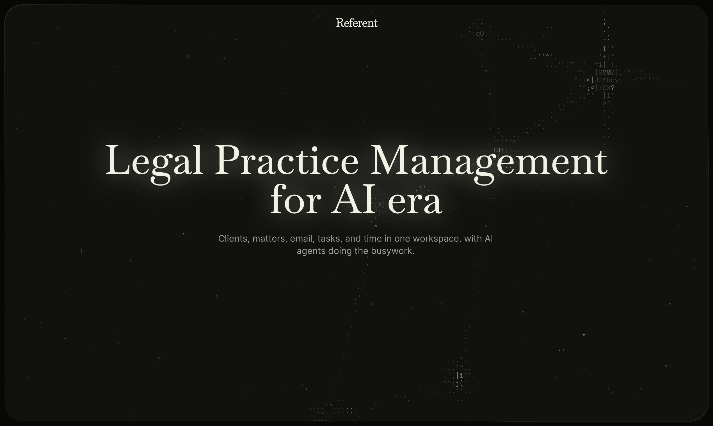
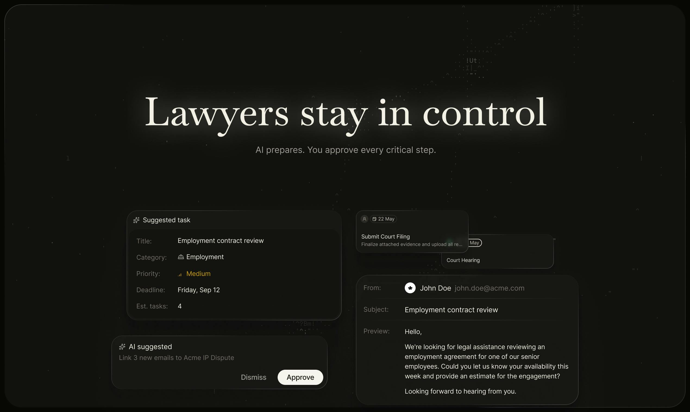
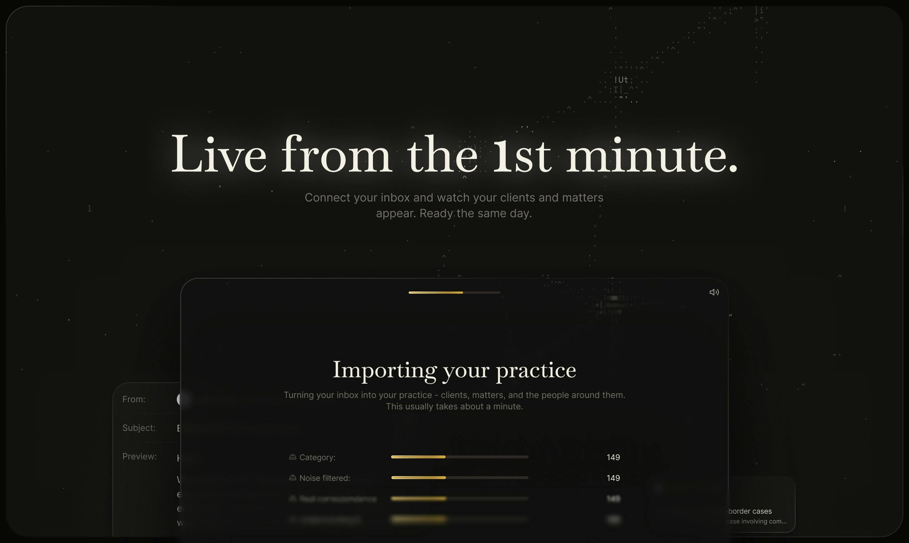

### 🎬 관련 영상
- [🎥 영상 보기](https://ph-files.imgix.net/7ab3d111-8fc6-4576-bd83-874b5cee2ef0.jpeg?auto=format)

---

## 6. [Murfy AI](https://www.producthunt.com/products/murfy)
**Votes**: 151 | **도입 난이도**: 하 | **신뢰도**: 상
**Tagline**: Write, review, and publish to arXiv 10x faster
**서비스 링크**: https://www.producthunt.com/r/MPGY4SMRHXCRMC

**태그**: AI, Research, Writing, LaTeX, Productivity, Agent, Automation, AI Tool

### 📌 이 서비스 한눈에 보기
AI 에이전트 팀을 활용해 논문 작성부터 arXiv 출판까지의 워크플로우를 혁신하는 도구

### 🔑 주요 기능
- 논문 작성, 리뷰, LaTeX 오류 수정 등 연구 워크플로우 전반 지원
- 참조 논문 검증 및 Beamer 슬라이드 자동 생성 기능 제공
- 실시간 공동 편집 및 무제한 협업 지원

### 🙋 사용자에게 어떤 점이 좋은가
연구자가 논문 작성 및 포맷팅에 소비하는 시간을 획기적으로 줄여 연구 본연의 업무에 집중할 수 있게 합니다.

### ✅ 지금 바로 써볼 기능
- LaTeX 컴파일 오류 수정 기능 테스트
- Beamer 슬라이드 자동 생성 기능 활용
- 실시간 협업 편집 환경 경험

### ⚠️ 사용 전 확인할 점
- AI 생성 콘텐츠의 학술적 정확성 및 윤리적 검토 필요
- 무료 시작 이후의 유료 플랜 과금 체계 확인 필요

### 🧭 확인이 더 필요한 정보
무료 플랜의 구체적인 사용량 제한과 유료 전환 시의 기능 차이를 확인해야 합니다.

### 📸 스크린샷 및 갤러리
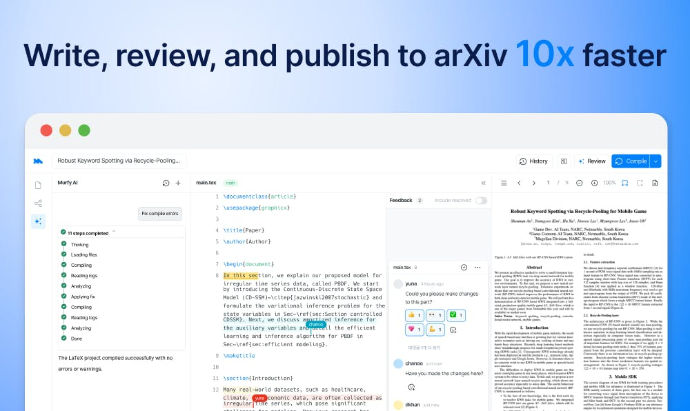
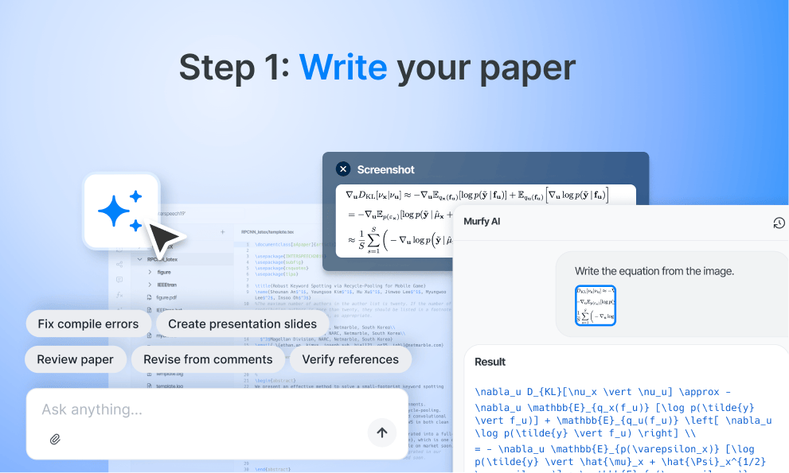
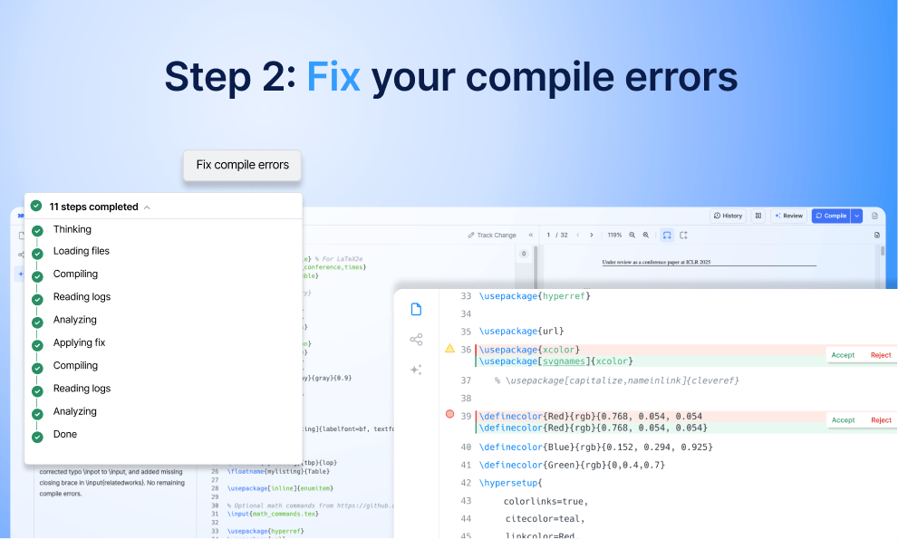

### 🎬 관련 영상
- [🎥 영상 보기](https://ph-files.imgix.net/912458dc-5872-44cc-8cda-990a4da518e9.jpeg?auto=format)

---

## 7. [Ravioli](https://www.producthunt.com/products/ravioli-2)
**Votes**: 114 | **도입 난이도**: 하 | **신뢰도**: 상
**Tagline**: Create custom stamp shapes
**서비스 링크**: https://www.producthunt.com/r/Q3HHDTI43UTONK

**태그**: DesignTool, GraphicDesign, SVG, Design

### 📌 이 서비스 한눈에 보기
나만의 커스텀 우표 모양을 간편하게 제작하는 초소형 디자인 도구

### 🔑 주요 기능
- 사용자 정의 우표 모양 선택 및 조정 기능
- 크기, 구멍, 라운드 값 등 세부 설정 가능
- 투명 PNG 및 확장 가능한 SVG 형식 지원

### 🙋 사용자에게 어떤 점이 좋은가
디자인 작업 시 복잡한 그래픽 툴 없이도 빠르고 정교한 우표 형태의 그래픽 요소를 생성할 수 있습니다.

### ✅ 지금 바로 써볼 기능
- 원하는 모양 선택하기
- 크기와 라운드 값 조절하기
- SVG 형식으로 내보내기

### ⚠️ 사용 전 확인할 점
- 단순한 형태의 우표 모양 제작에 특화되어 있음

### 🧭 확인이 더 필요한 정보
제공되는 기본 도형 외에 완전히 자유로운 커스텀 경로 입력 기능 여부는 명시되지 않았습니다.

### 📸 스크린샷 및 갤러리
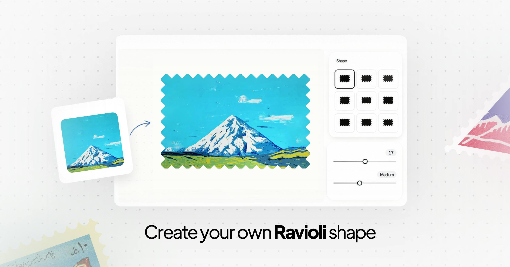
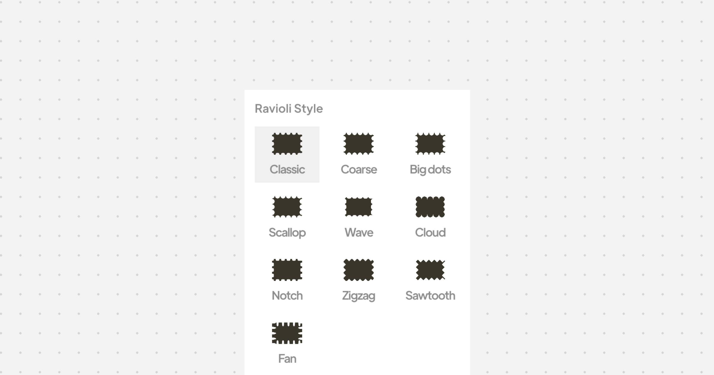
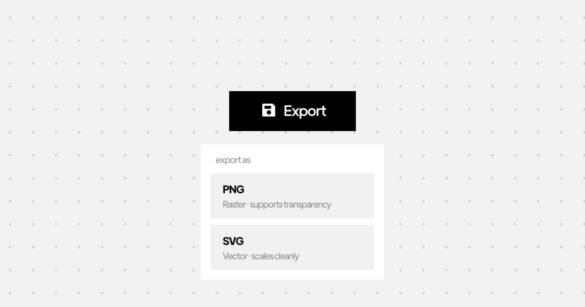

### 🎬 관련 영상
- [🎥 영상 보기](https://ph-files.imgix.net/e373950a-05a8-4675-b350-4feac0d7cc25.jpeg?auto=format)

---

## 8. [RIP MY BUILD](https://www.producthunt.com/products/rip-my-build)
**Votes**: 103 | **도입 난이도**: 하 | **신뢰도**: 상
**Tagline**: Give your abandoned side project one last launch
**서비스 링크**: https://www.producthunt.com/r/PBN7NH52G6BR3Y

**태그**: SideProject, Entrepreneurship, Community, Productivity

### 📌 이 서비스 한눈에 보기
실패한 사이드 프로젝트를 기록하고 다음 도약을 준비하는 디지털 추모 공간

### 🔑 주요 기능
- 실패한 프로젝트의 원인과 교훈을 기록하는 공개적 사후 분석(Postmortem) 플랫폼
- 원래 프로젝트 링크, 실패 원인, 배운 점 등을 포함한 영구적인 부고 페이지 생성
- 방문자들의 조화(Roses)와 주간 명예 리더보드를 통한 커뮤니티 요소 제공

### 🙋 사용자에게 어떤 점이 좋은가
프로젝트 중단에 따른 심리적 매듭을 짓고, 실패의 경험을 자산화하여 다음 창업 단계로 나아가는 발판을 마련해 줍니다.

### ✅ 지금 바로 써볼 기능
- 중단된 프로젝트의 링크와 실패 원인 작성하기
- 배운 점을 기록하여 다음 프로젝트를 위한 자산으로 만들기
- 공유 가능한 부고 페이지를 통해 커뮤니티에 피드백 받기

### ⚠️ 사용 전 확인할 점
- 부고 게시물당 $12의 비용이 발생함
- 계정 없이 브라우징은 가능하나 게시를 위해서는 비용 지불 필요

### 🧭 확인이 더 필요한 정보
결제 방식 및 게시물 관리 방식에 대한 상세한 계정 정책은 명시되어 있지 않습니다.

### 📸 스크린샷 및 갤러리
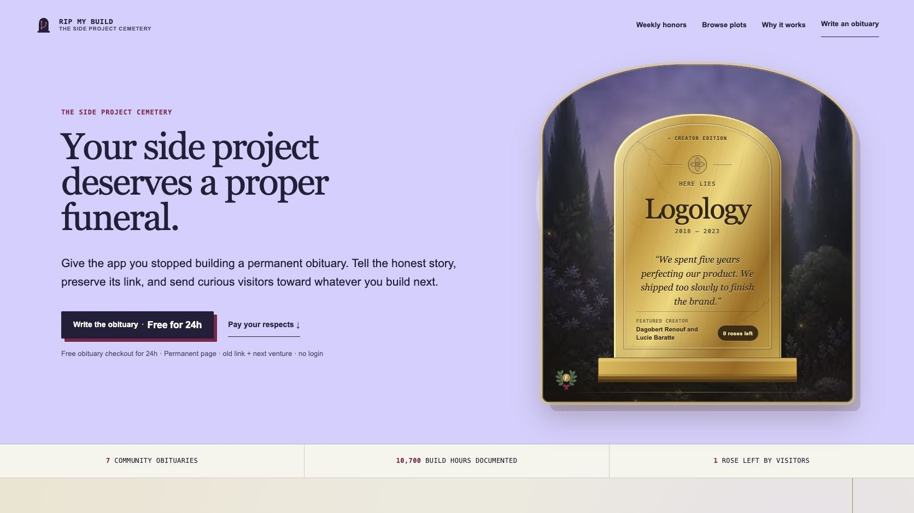
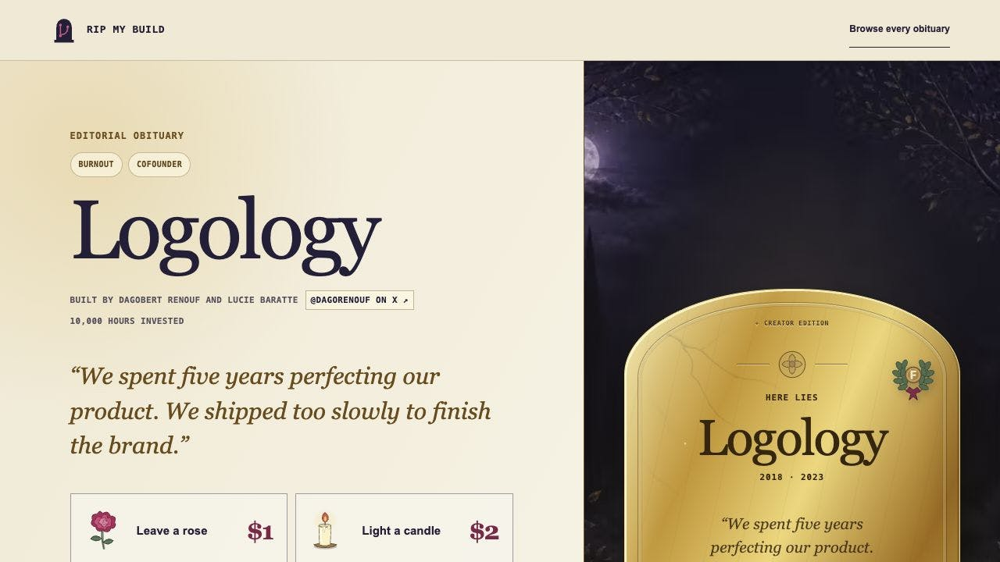
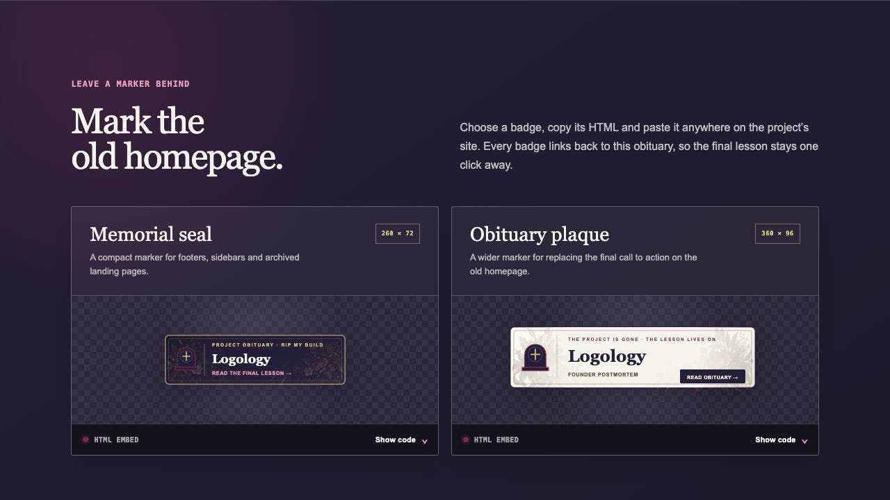

---

## 9. [Ulpaso](https://www.producthunt.com/products/ulpaso)
**Votes**: 102 | **도입 난이도**: 하 | **신뢰도**: 상
**Tagline**: Stop paying just to take meeting notes
**서비스 링크**: https://www.producthunt.com/r/YSB77QGV4KPKYR

**태그**: Productivity, Transcription, Privacy, Markdown, macOS

### 📌 이 서비스 한눈에 보기
로그인과 클라우드 없이 맥에서 즉시 실행하는 프라이빗 회의록 작성 도구

### 🔑 주요 기능
- 계정 생성이나 결제 정보 입력 없이 즉시 사용 가능
- 마이크와 시스템 오디오를 통한 실시간 전사 기능
- 로컬 환경에서 작동하여 데이터 유출 걱정 없는 보안성

### 🙋 사용자에게 어떤 점이 좋은가
개인정보 유출 걱정 없이 회의 내용을 즉시 텍스트로 변환하고, 익숙한 마크다운 형식으로 자유롭게 편집할 수 있습니다.

### ✅ 지금 바로 써볼 기능
- 맥에서 바로 녹음 버튼 눌러보기
- 생성된 마크다운 파일 편집해보기

### ⚠️ 사용 전 확인할 점
- 클라우드 저장 방식이 아니므로 기기 분실 시 데이터 관리 주의 필요
- 맥(macOS) 환경 전용 기능으로 보임

### 🧭 확인이 더 필요한 정보
정확한 시스템 요구 사양 및 지원하는 언어 범위에 대한 정보가 명시되지 않았습니다.

### 📸 스크린샷 및 갤러리
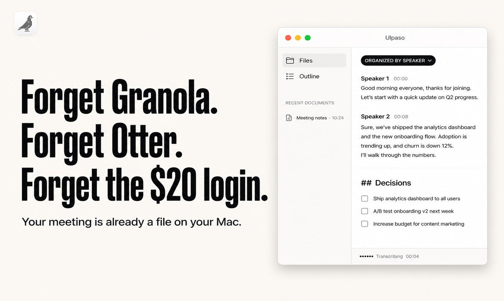
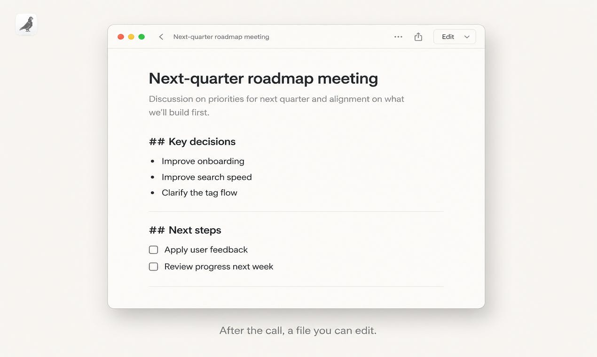
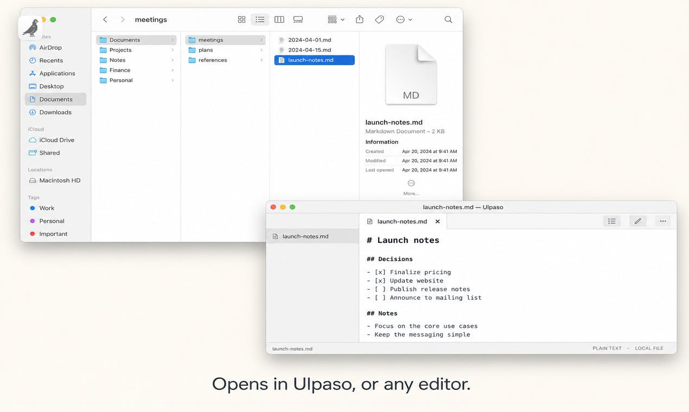

### 🎬 관련 영상
- [🎥 영상 보기](https://ph-files.imgix.net/3e201500-70dd-4e52-98d5-75c7da05f615.jpeg?auto=format)

---

## 10. [Superagent](https://www.producthunt.com/products/superagent-a-home-for-your-ai-agents)
**Votes**: 100 | **도입 난이도**: 중 | **신뢰도**: 상
**Tagline**: Claude Code for the rest of us
**서비스 링크**: https://www.producthunt.com/r/SPXFLFPPKRFQUY

**태그**: DevTool, AI-Agent, OpenSource, Productivity, Agent, AI Tool, Chat

### 📌 이 서비스 한눈에 보기
터미널을 벗어나 브라우저와 시뮬레이터를 직접 다루는 직관적인 코딩 에이전트 환경

### 🔑 주요 기능
- 브라우저 및 iOS 시뮬레이터 제어 기능을 통한 실질적인 컴퓨터 작업 수행
- Git 워크트리 기반의 독립적인 작업 환경 및 사이드바 형태의 채팅 UI
- 계정이나 서버 없이 로컬 중심의 오픈소스 방식으로 보안과 프라이버시 강화

### 🙋 사용자에게 어떤 점이 좋은가
터미널 명령어가 아닌 실제 앱을 사용하는 듯한 경험을 통해 코딩 에이전트와의 협업 효율을 높여줍니다.

### ✅ 지금 바로 써볼 기능
- 브라우저 및 iOS 시뮬레이터 연동 기능 테스트
- Git 워크트리를 활용한 독립적 작업 흐름 설정
- iPhone 페어링을 통한 모바일 환경 연동 확인

### ⚠️ 사용 전 확인할 점
- 로컬 환경 설정 및 Git 워크트리 관리에 대한 숙련도 필요
- 로컬 기반 도구이므로 하드웨어 리소스 사용량 확인 필요

### 🧭 확인이 더 필요한 정보
로컬 실행 환경의 구체적인 시스템 요구 사양과 설치 과정에 대한 정보가 필요합니다.

### 📸 스크린샷 및 갤러리
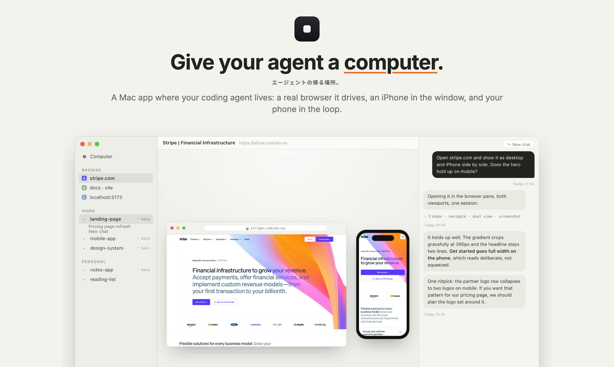
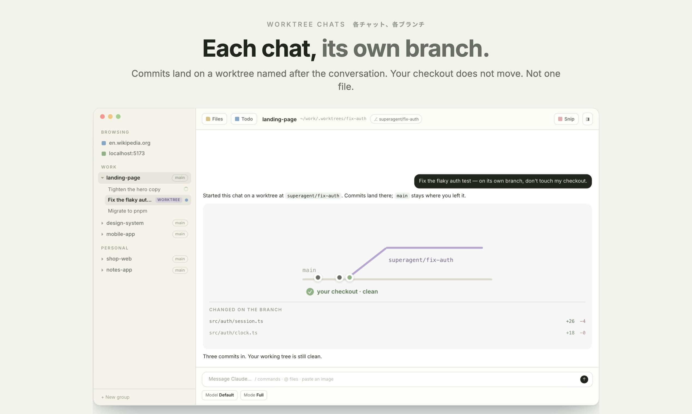
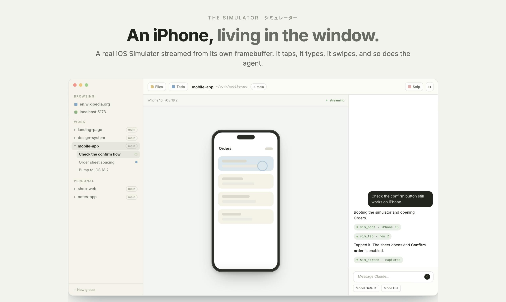

---

## 11. [Sayscroll](https://www.producthunt.com/products/sayscroll-ai-teleprompter)
**Votes**: 91 | **도입 난이도**: 하 | **신뢰도**: 상
**Tagline**: The AI Teleprompter that scrolls as you speak
**서비스 링크**: https://www.producthunt.com/r/TNCAQ5WNJCVBP5

**태그**: AI, VideoProduction, Productivity, Teleprompter, AI Tool, Prompting, Video

### 📌 이 서비스 한눈에 보기
사용자의 목소리 속도에 맞춰 자동으로 스크롤되는 AI 텔레프롬프터

### 🔑 주요 기능
- 음성 인식 기반 자동 스크롤로 자연스러운 스피치 가능
- 60개 이상의 언어 지원 및 브라우저 기반의 간편한 사용성
- 내장 비디오 레코더 및 스크립트 이탈 시 대기하는 임프로바이즈 기능

### 🙋 사용자에게 어떤 점이 좋은가
스크롤 속도를 수동으로 조절할 필요 없이 말하는 대로 화면이 움직이므로, 영상 촬영이나 발표 시 시선 처리가 훨씬 자연스러워집니다.

### ✅ 지금 바로 써볼 기능
- 내장 레코더로 직접 영상 녹화해보기
- 텍스트 크기 및 미러링 설정을 통한 스튜디오 환경 세팅
- 다양한 언어 지원 여부 테스트

### ⚠️ 사용 전 확인할 점
- 브라우저 기반이므로 네트워크 환경에 따라 음성 인식 성능이 달라질 수 있음
- 주변 소음이 심할 경우 음성 인식 기반 스크롤이 불안정할 수 있음

### 🧭 확인이 더 필요한 정보
정확한 음성 인식 지연 시간(Latency)과 모바일 브라우저에서의 최적화 수준은 확인이 필요합니다.

### 📸 스크린샷 및 갤러리
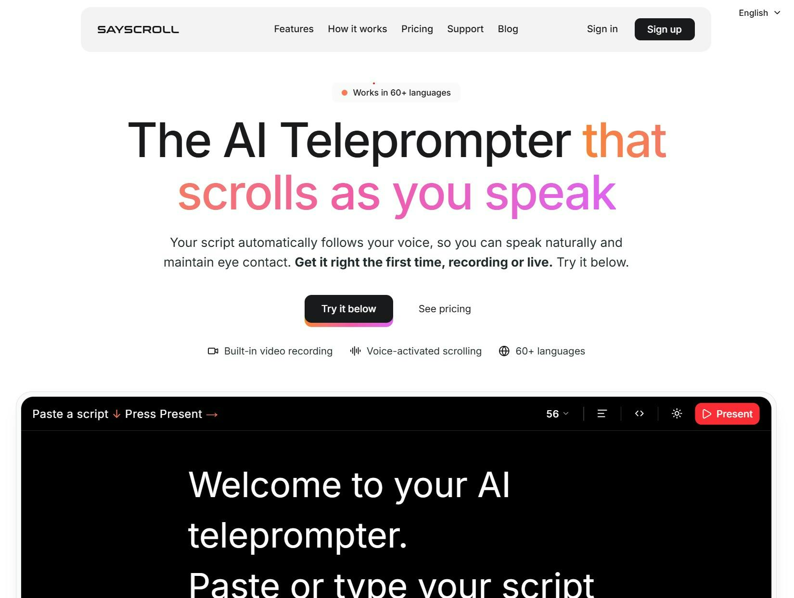
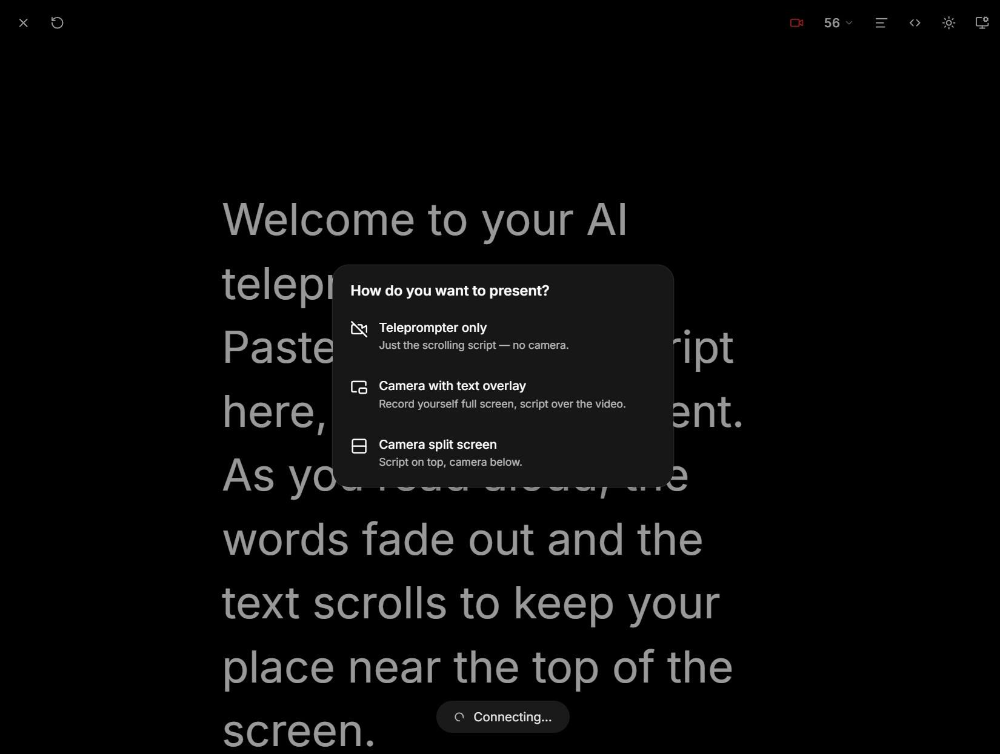
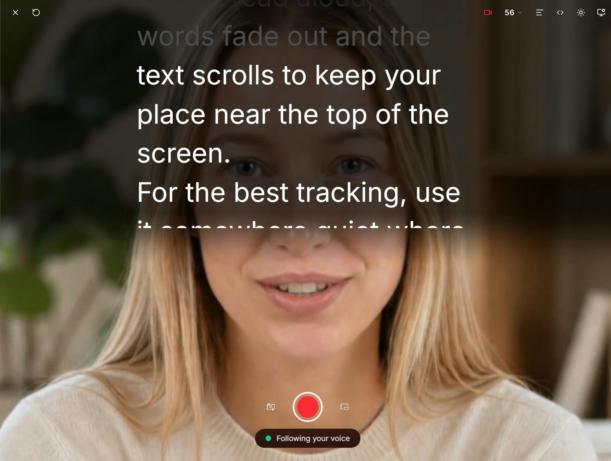

### 🎬 관련 영상
- [🎥 영상 보기](https://ph-files.imgix.net/a5b8ea76-145b-4e39-9117-35838222bc87.jpeg?auto=format)

---

## 12. [Retro Y2K Theme](https://www.producthunt.com/products/retro-y2k-theme-90s-web-aesthetic)
**Votes**: 89 | **도입 난이도**: 하 | **신뢰도**: 상
**Tagline**: Customize any website with a vintage 90s & Y2K retro theme
**서비스 링크**: https://www.producthunt.com/r/75BZYHVWCCPC6L

**태그**: Design, BrowserExtension, Retro, UI/UX

### 📌 이 서비스 한눈에 보기
어떤 웹사이트든 90년대 감성의 레트로 스타일로 변신시켜주는 브라우저 테마 커스텀 도구

### 🔑 주요 기능
- 현대적인 웹 페이지를 90년대 및 Y2K 스타일로 즉시 변환
- Windows 98 UI, 커스텀 커서, GeoCities 스타일 등 향수 자극 디자인 제공
- 클래식한 UI 디자인을 통한 독특한 웹 브라우징 경험

### 🙋 사용자에게 어떤 점이 좋은가
사용자는 익숙한 현대적 웹 환경을 과거의 창의적이고 혼란스러운 황금기 감성으로 바꾸어 색다른 시각적 즐거움을 얻을 수 있습니다.

### ✅ 지금 바로 써볼 기능
- Windows 98 스타일 UI 테마 적용해보기
- 클래식한 커스텀 커서 설정하기
- GeoCities 스타일 테마로 웹사이트 꾸미기

### ⚠️ 사용 전 확인할 점
- 레트로 테마 적용 시 웹사이트의 가독성이나 레이아웃이 깨질 수 있음
- 기존 웹사이트의 기능적 요소(버튼, 메뉴 등)가 시각적으로 가려질 가능성

### 🧭 확인이 더 필요한 정보
브라우저 확장 프로그램 형태인지 혹은 별도의 애플리케이션인지 구체적인 설치 방식에 대한 정보가 필요합니다.

### 📸 스크린샷 및 갤러리

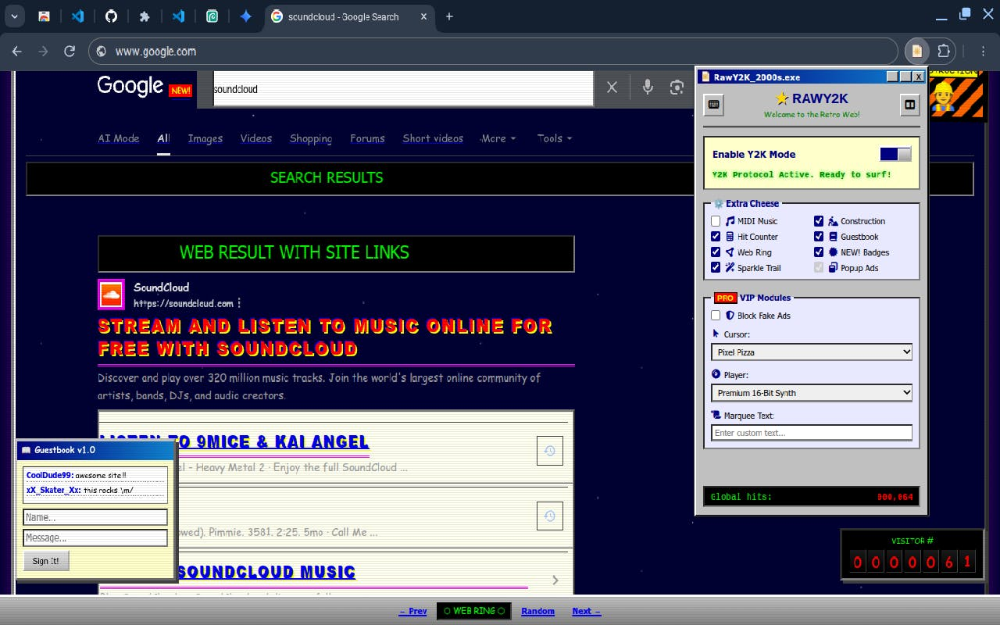
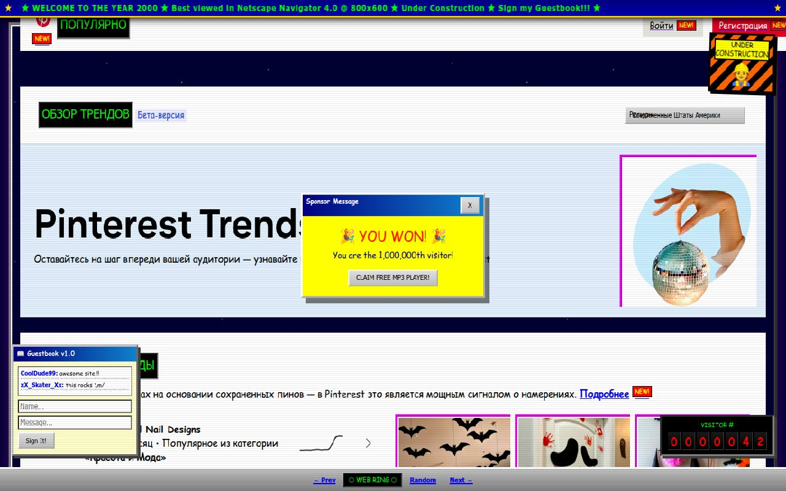

---

## 13. [oMLX](https://www.producthunt.com/products/omlx)
**Votes**: 86 | **도입 난이도**: 하 | **신뢰도**: 상
**Tagline**: Mac LLM server that cuts agent wait times from 90s to 5s
**서비스 링크**: https://www.producthunt.com/r/2ABHAOG4SSOU7B

**태그**: DevTool, AI, Mac, OpenSource, Agent, AI Tool, LLM, API

### 📌 이 서비스 한눈에 보기
Mac을 강력한 로컬 LLM 서버로 변환하여 AI 에이전트의 응답 속도를 극대화하는 도구

### 🔑 주요 기능
- Mac 전용 네이티브 Swift 기반 LLM 추론 서버
- 연속 배칭 및 RAM+SSD 계층형 KV 캐시로 응답 시간 단축 (90초 -> 5초)
- OpenAI/Anthropic 호환 API 제공으로 기존 도구와 즉시 연동 가능

### 🙋 사용자에게 어떤 점이 좋은가
Claude Code나 Cursor 같은 AI 코딩 도구를 사용할 때, 로컬 모델의 응답 대기 시간을 획기적으로 줄여 개발 워크플로우를 가속화할 수 있습니다.

### ✅ 지금 바로 써볼 기능
- 메뉴 바에서 oMLX 서버 실행하기
- Cursor 또는 Claude Code의 API 엔드포인트를 oMLX로 설정하기
- 텍스트, 비전, OCR 등 필요한 모델 로드하기

### ⚠️ 사용 전 확인할 점
- Mac 하드웨어 자원(RAM/GPU) 사용량 확인 필요
- 로컬 모델 구동에 따른 발열 및 전력 소모 고려

### 🧭 확인이 더 필요한 정보
특정 Mac 모델(Apple Silicon 등)에서의 구체적인 성능 벤치마크 수치는 추가 확인이 필요합니다.

### 📸 스크린샷 및 갤러리
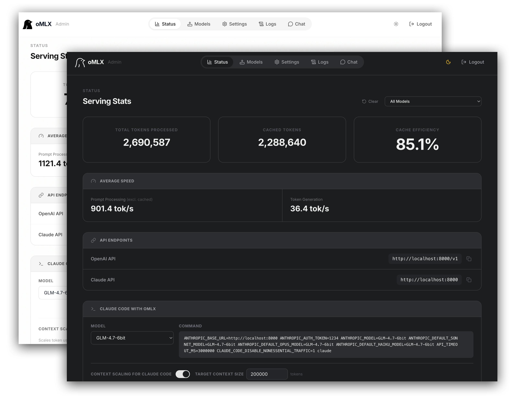
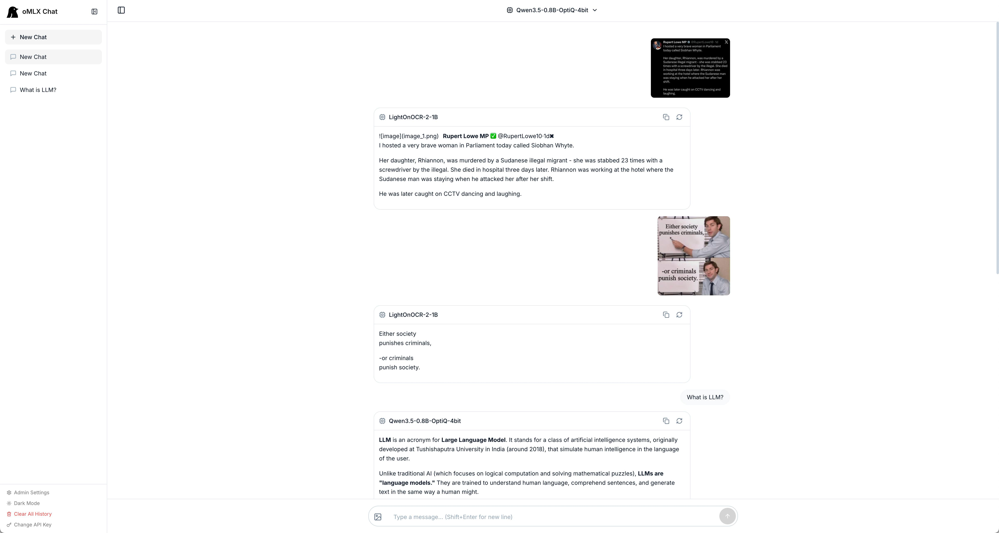
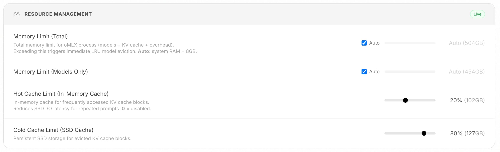

---

## 14. [ChordWeaver](https://www.producthunt.com/products/chordweaver)
**Votes**: 85 | **도입 난이도**: 하 | **신뢰도**: 상
**Tagline**: Create, learn, and explore music through theory
**서비스 링크**: https://www.producthunt.com/r/KPQCJLIFNTIBKR

**태그**: MusicTheory, Composition, Education, CreativeTool

### 📌 이 서비스 한눈에 보기
음악 이론 학습과 화성 작곡 실험을 동시에 즐길 수 있는 인터랙티브 음악 플레이그라운드

### 🔑 주요 기능
- 다양한 장르에 맞춘 멜로디 화성 작업 및 화성 진행 생성 기능
- 스토리 모드와 이론 서적을 통한 게임화된 학습 경험
- 배음(Harmonic Series) 실험 및 복잡한 음악 분석 도구 제공

### 🙋 사용자에게 어떤 점이 좋은가
음악 이론을 이론으로만 배우는 것이 아니라, 직접 소리를 만들고 실험하며 실전 작곡 역량을 키울 수 있습니다.

### ✅ 지금 바로 써볼 기능
- Story Mode를 통해 게임처럼 음악 이론 학습하기
- 생성된 화성 진행을 바탕으로 자신만의 멜로디 입혀보기
- Theory Book을 활용해 심화 음악 이론 탐구하기

### ⚠️ 사용 전 확인할 점
- 현재 알파 버전으로 영문 번역이 거의 완료된 상태임
- 공식 버전 1.1.1 출시 전이므로 기능적 불안정성이 있을 수 있음

### 🧭 확인이 더 필요한 정보
공식 버전 1.1.1 출시 이후 기능 완성도와 안정성이 어떻게 변할지 확인이 필요합니다.

### 📸 스크린샷 및 갤러리
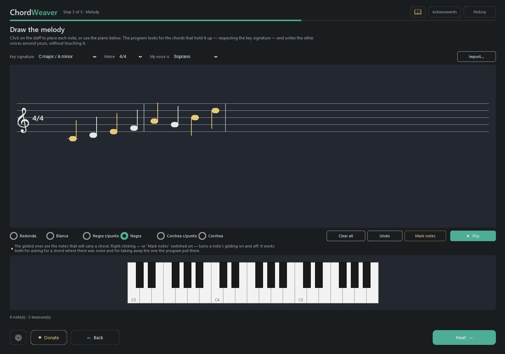
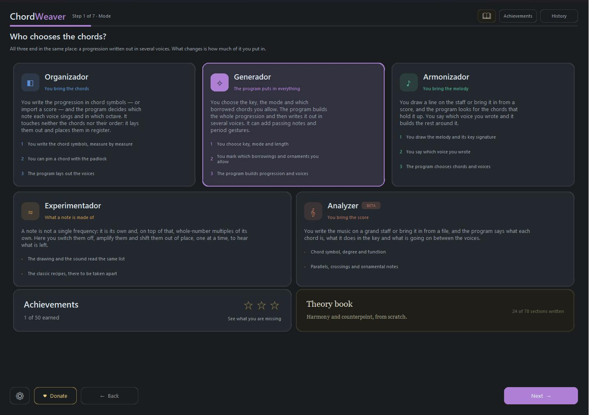
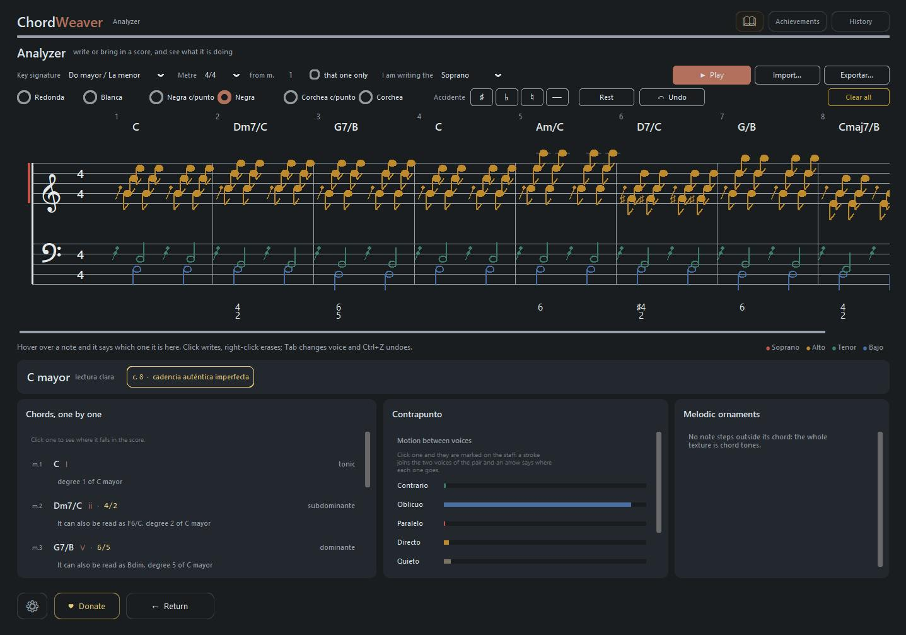

---

## 15. [Maritime](https://www.producthunt.com/products/maritime)
**Votes**: 82 | **도입 난이도**: 하 | **신뢰도**: 상
**Tagline**: Dedicated computers for AI agents, starting at $1/month
**서비스 링크**: https://www.producthunt.com/r/S7PPIRFIUY54DK

**태그**: AI, Infrastructure, Automation, Cloud, DevOps, Agent, AI Tool, DevTool

### 📌 이 서비스 한눈에 보기
AI 에이전트별 전용 가상 머신(VM) 인프라를 저렴하게 제공하는 서비스

### 🔑 주요 기능
- 에이전트별로 격리된 독립적이고 지속적인 VM 환경 제공
- 브라우저 사용, 파일 생성, 코드 실행 및 상태 유지가 가능한 환경
- 수천 개의 VM에 대한 인프라 관리, 스케일링, 자동 절전/깨우기 자동화

### 🙋 사용자에게 어떤 점이 좋은가
AI 에이전트 비즈니스를 운영할 때 복잡한 서버 인프라 구축 없이 에이전트당 월 $1라는 저렴한 비용으로 확장 가능한 환경을 확보할 수 있습니다.

### ✅ 지금 바로 써볼 기능
- 에이전트용 격리 환경 구축 테스트
- 코드 실행 및 파일 저장 기능 검증
- 대규모 에이전트 배포 시 비용 효율성 확인

### ⚠️ 사용 전 확인할 점
- 에이전트별 리소스 할당량 및 성능 제한 확인 필요
- 대규모 배포 시 보안 및 격리 수준 검토

### 🧭 확인이 더 필요한 정보
에이전트당 $1라는 가격 정책에 포함된 구체적인 리소스(CPU/RAM) 사양을 확인해야 합니다.

### 📸 스크린샷 및 갤러리
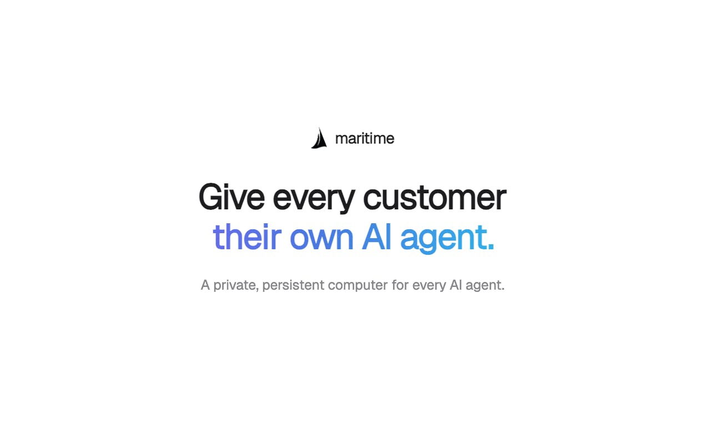
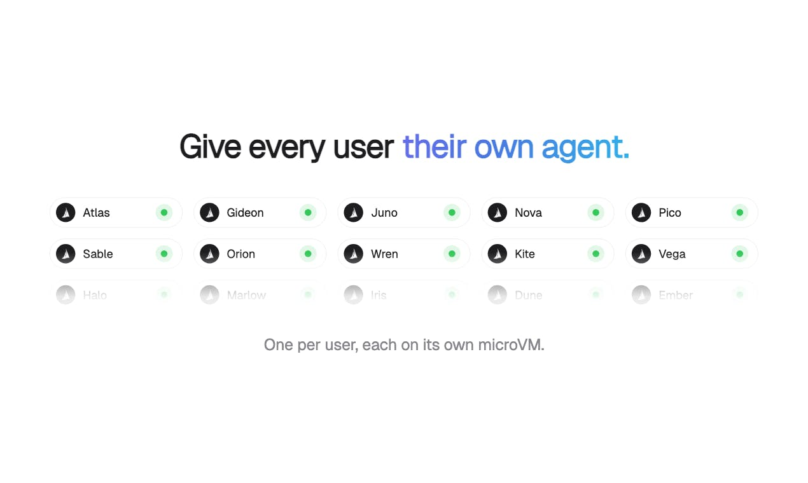
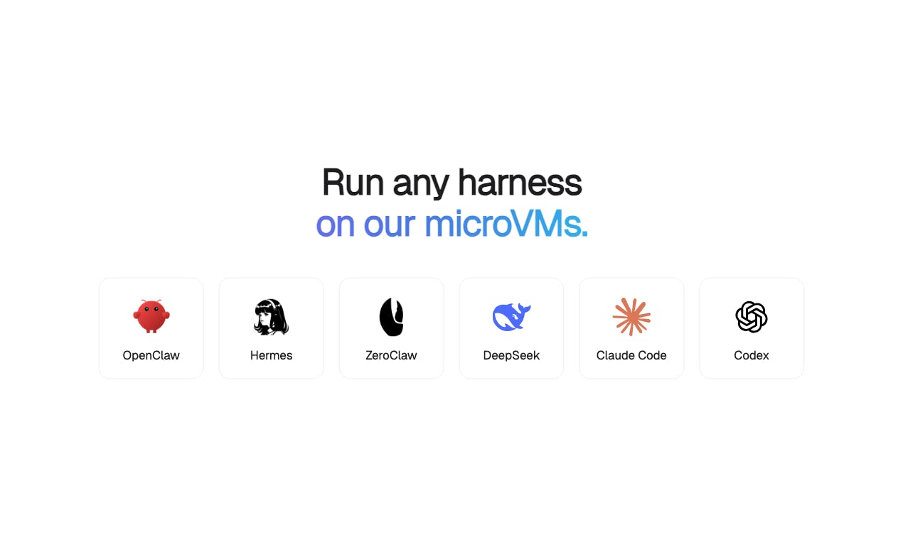

### 🎬 관련 영상
- [🎥 영상 보기](https://ph-files.imgix.net/7e0aa6ce-10dc-4cfb-a54c-dca71ce0bf02.jpeg?auto=format)

---

## 16. [Skud](https://www.producthunt.com/products/skud-drag-send-track-in-seconds)
**Votes**: 79 | **도입 난이도**: 하 | **신뢰도**: 상
**Tagline**: Menubar file delivery with your brand and tracking
**서비스 링크**: https://www.producthunt.com/r/TCOX3WVFQ7GNHX

**태그**: DesignTool, Productivity, FileSharing, Branding, Vision, Design

### 📌 이 서비스 한눈에 보기
브랜드 아이덴티티를 유지하며 파일을 간편하게 공유하고 추적하는 맥 메뉴바 도구

### 🔑 주요 기능
- 맥 메뉴바에서 즉시 실행 가능한 간편한 파일 업로드 및 링크 생성
- 로고, 색상, 커버 이미지를 활용한 맞춤형 브랜드 링크 제공
- 열람자 추적, 비밀번호 보호 및 만료 시간 설정 기능

### 🙋 사용자에게 어떤 점이 좋은가
디자이너나 스튜디오가 클라이언트에게 전문적인 브랜드 경험을 제공하면서도, 파일 공유와 열람 여부를 효율적으로 관리할 수 있습니다.

### ✅ 지금 바로 써볼 기능
- 파일을 드롭하여 브랜드 링크 생성해보기
- 비밀번호 및 만료 설정을 통한 보안 테스트
- 열람자 추적 기능 확인하기

### ⚠️ 사용 전 확인할 점
- 무료 플랜은 1GB 용량 제한이 있음
- macOS 메뉴바 전용 도구이므로 다른 OS에서는 사용 불가

### 🧭 확인이 더 필요한 정보
제공되는 1GB 용량이 총 누적 용량인지 단일 파일당 용량인지 명시되지 않았습니다.

### 📸 스크린샷 및 갤러리
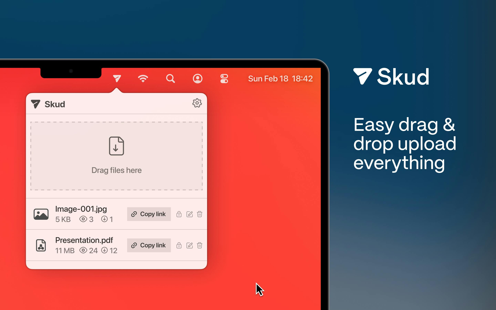
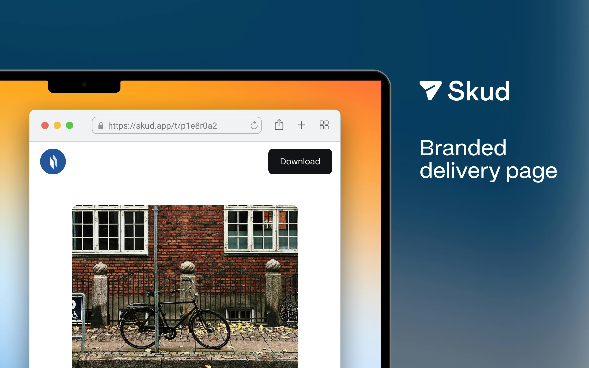
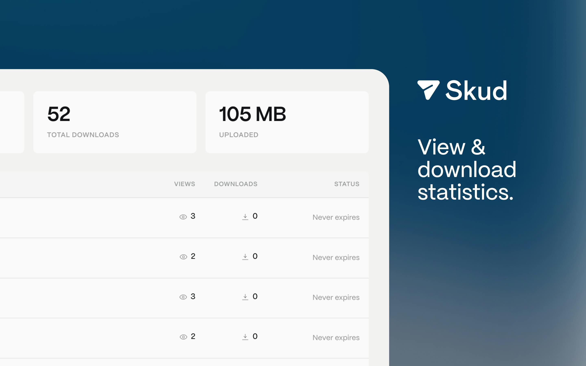

### 🎬 관련 영상
- [🎥 영상 보기](https://ph-files.imgix.net/80969790-400e-4957-af4d-3fef2102355f.jpeg?auto=format)

---

## 17. [Edge Drop](https://www.producthunt.com/products/edge-drop)
**Votes**: 79 | **도입 난이도**: 하 | **신뢰도**: 상
**Tagline**: Clipboard on your screen edge. Hover to open, drag to drop
**서비스 링크**: https://www.producthunt.com/r/WITUI4QV3ANVAI

**태그**: Productivity, Windows, Utility, OpenSource, AI Tool

### 📌 이 서비스 한눈에 보기
화면 가장자리에 숨겨진 클립보드 선반으로 작업 흐름을 끊지 않는 생산성 도구

### 🔑 주요 기능
- 화면 가장자리에 상주하며 마우스 호버 시에만 나타나는 직관적인 UI
- 텍스트, 스크린샷, 파일, 링크를 드래그 앤 드롭으로 간편하게 이동
- 계정 생성이나 트레이 아이콘 없이 로컬 PC에서 작동하는 프라이버시 중심 설계

### 🙋 사용자에게 어떤 점이 좋은가
단축키를 누르기 위해 작업 흐름을 끊을 필요 없이, 화면 가장자리에서 즉시 클립보드 항목을 관리하고 드래그할 수 있어 작업 연속성이 유지됩니다.

### ✅ 지금 바로 써볼 기능
- 마우스 호버로 클립보드 선반 열기
- 복사한 파일이나 텍스트를 원하는 앱으로 드래그 앤 드롭하기
- 자주 사용하는 항목을 핀(Pin) 기능으로 고정하기

### ⚠️ 사용 전 확인할 점
- Windows 10 및 11 환경에서만 작동함
- 화면 가장자리에 위치하므로 다른 창 작업 시 간섭이 발생할 수 있음

### 🧭 확인이 더 필요한 정보
상세한 시스템 리소스 점유율이나 하드웨어 가속 사용 여부는 명시되지 않았습니다.

### 📸 스크린샷 및 갤러리
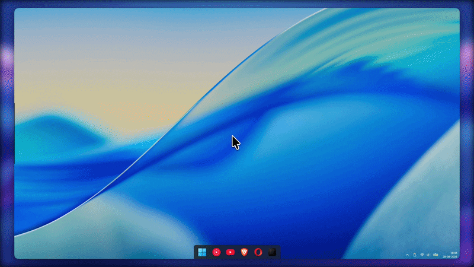
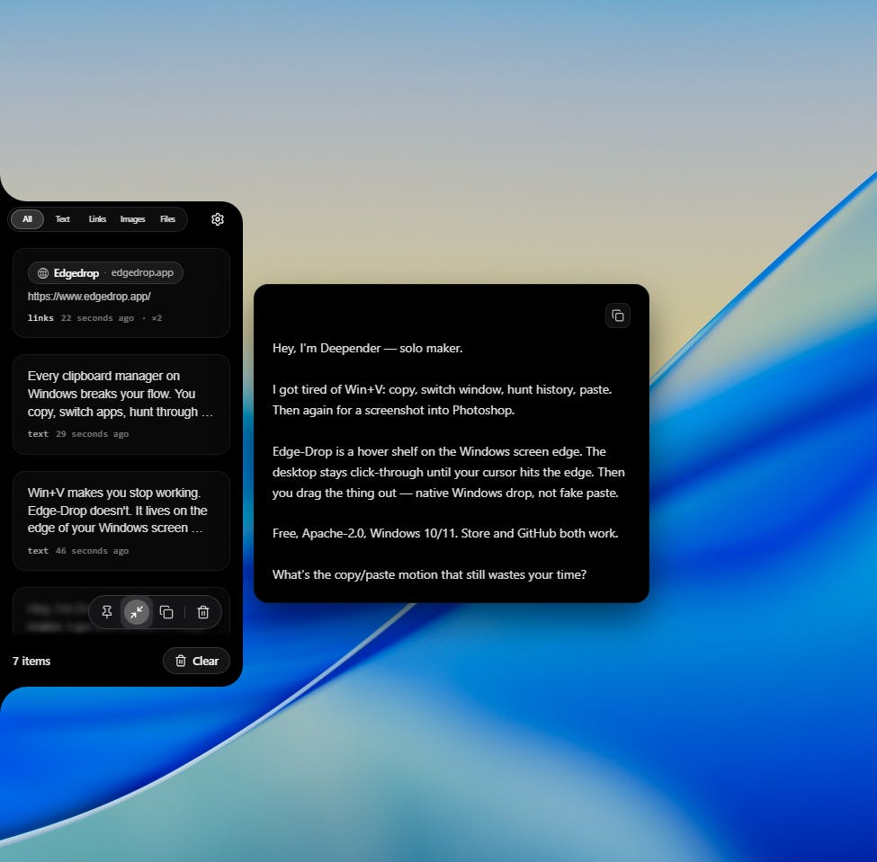
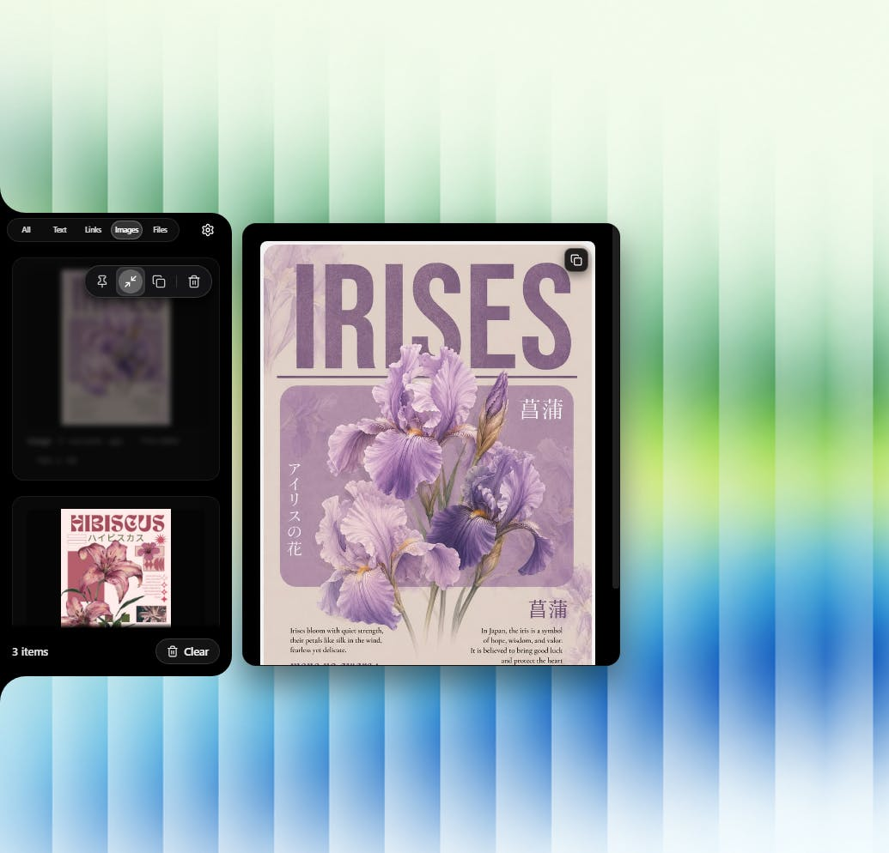

### 🎬 관련 영상
- [🎥 영상 보기](https://ph-files.imgix.net/ae65053c-40cf-4eef-ac27-8940af4ee452.jpeg?auto=format)

---

## 18. [Caplio](https://www.producthunt.com/products/caplio)
**Votes**: 72 | **도입 난이도**: 하 | **신뢰도**: 상
**Tagline**: Find, organize, and reuse every image on your Mac
**서비스 링크**: https://www.producthunt.com/r/B4IPU5VNHVZG5J

**태그**: Productivity, Mac, Asset Management, OCR, AI Tool, Vision

### 📌 이 서비스 한눈에 보기
맥에 흩어진 스크린샷과 이미지를 자동으로 정리하고 검색할 수 있는 프라이빗 자산 관리 도구

### 🔑 주요 기능
- 로컬 폴더 감시 및 자동 인덱싱을 통한 이미지 라이브러리 구축
- 온디바이스 OCR을 활용한 텍ext 추출 및 검색 기능
- 클라우드 업로드 없는 강력한 개인정보 보호 및 보안

### 🙋 사용자에게 어떤 점이 좋은가
중구난방으로 저장된 스크린샷을 일일이 찾을 필요 없이, 검색 한 번으로 필요한 이미지를 즉시 찾아 다른 앱으로 드래그할 수 있습니다.

### ✅ 지금 바로 써볼 기능
- 기존 이미지 폴더를 Caplio에 연결하기
- 키워드로 이미지 내 텍스트 검색해보기
- 타임라인 기능을 통해 과거 스크린샷 탐색하기

### ⚠️ 사용 전 확인할 점
- 로컬 저장소 용량 사용량 확인 필요
- Mac 전용 앱이므로 다른 OS에서는 사용 불가

### 🧭 확인이 더 필요한 정보
이미지 양이 매우 많을 경우 인덱싱 및 OCR 처리 시 시스템 리소스 점유율을 확인해야 합니다.

### 📸 스크린샷 및 갤러리
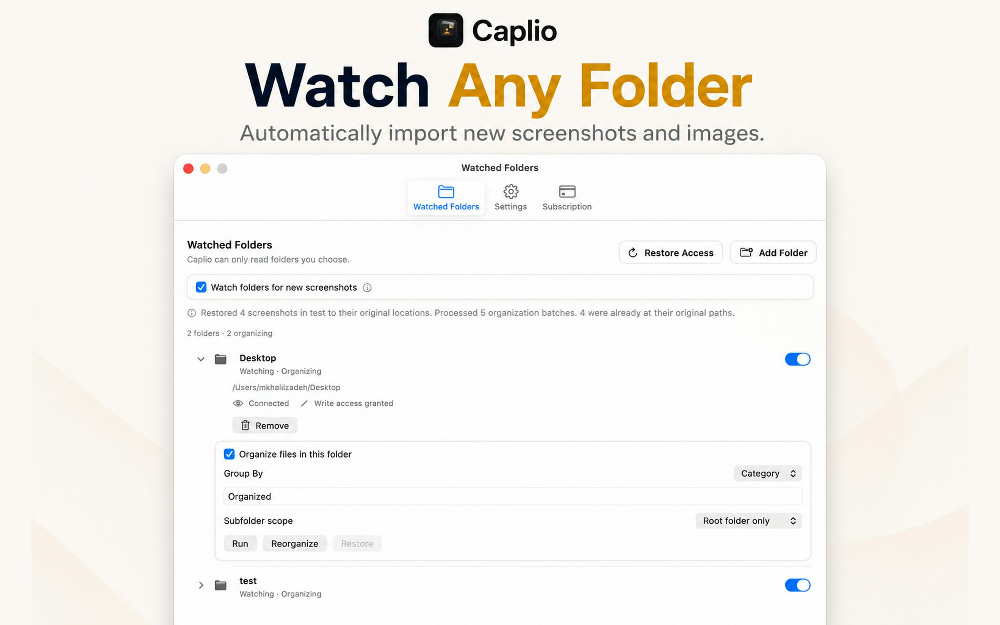
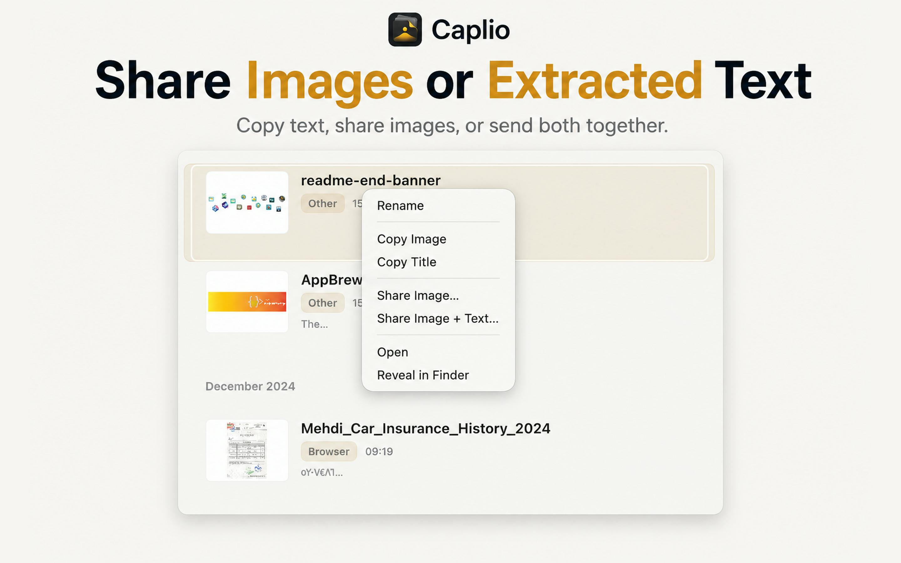
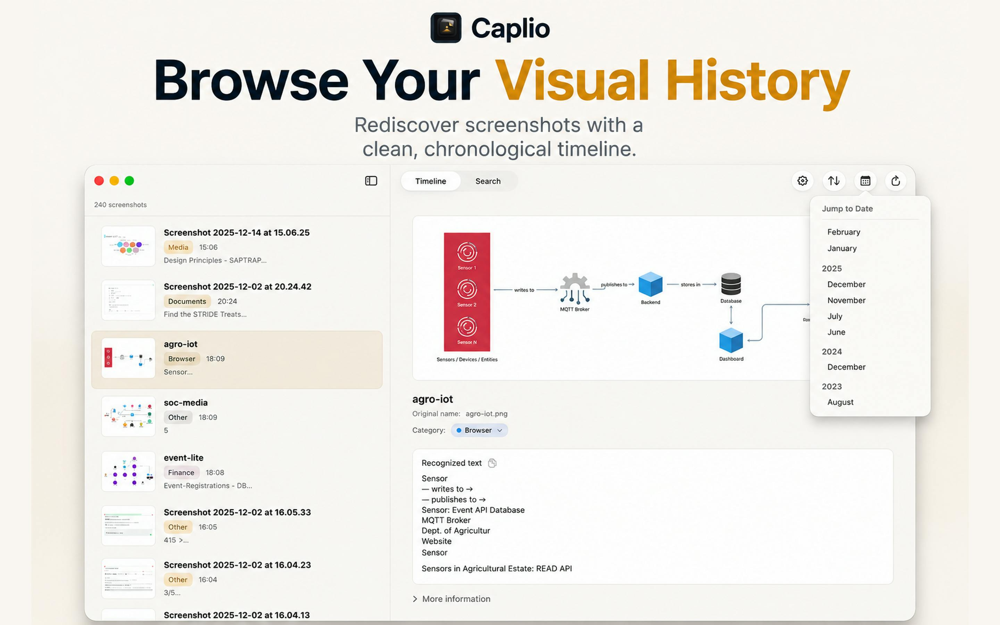

### 🎬 관련 영상
- [🎥 영상 보기](https://ph-files.imgix.net/a38d2bf7-ee78-41f9-a2a0-b23e87e956d1.jpeg?auto=format)

---

## 19. [Softorino Online Converter](https://www.producthunt.com/products/softorino)
**Votes**: 33 | **도입 난이도**: 하 | **신뢰도**: 상
**Tagline**: Free & Safe online file converter. No ads. No bs.
**서비스 링크**: https://www.producthunt.com/r/H3E75LRICOKL24

**태그**: Productivity, Privacy, Media, Free, Video

### 📌 이 서비스 한눈에 보기
개인정보 유출 걱정 없이 브라우저에서 즉시 파일을 변환하는 보안 중심 컨버터

### 🔑 주요 기능
- 로컬 기반 처리로 파일이 서버에 업로드되지 않는 강력한 프라이버시 보호
- 광고, 워터마크, 회원가입, 사용 제한 없는 완전 무료 서비스
- MP4, MOV, MP3, WAV 등 다양한 비디오 및 오디오 포맷 지원

### 🙋 사용자에게 어떤 점이 좋은가
파일을 서버에 올릴 필요가 없어 보안이 중요한 문서를 다룰 때 안전하며, 별도의 설치나 가입 없이 즉시 사용할 수 있어 매우 편리합니다.

### ✅ 지금 바로 써볼 기능
- 브라우저에서 바로 영상 포맷 변환해보기
- 음악/음성 파일을 원하는 오디오 포맷으로 변환하기
- 개인적인 파일을 안전하게 변환하는 프로세스 경험하기

### ⚠️ 사용 전 확인할 점
- 브라우저 기반이므로 하드웨어 성능에 따라 대용량 파일 변환 속도 차이가 있을 수 있음
- 로컬 처리를 위해 브라우저 리소스를 사용하므로 작업 중 브라우저를 닫으면 안 됨

### 🧭 확인이 더 필요한 정보
지원하는 파일 형식의 최대 용량 제한에 대한 구체적인 명시는 없습니다.

### 📸 스크린샷 및 갤러리
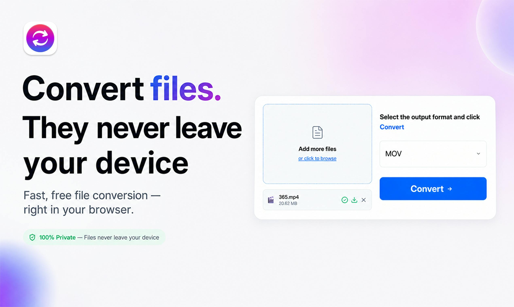
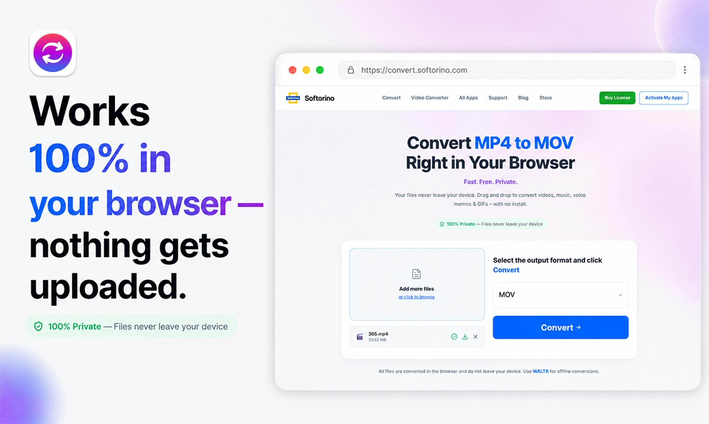
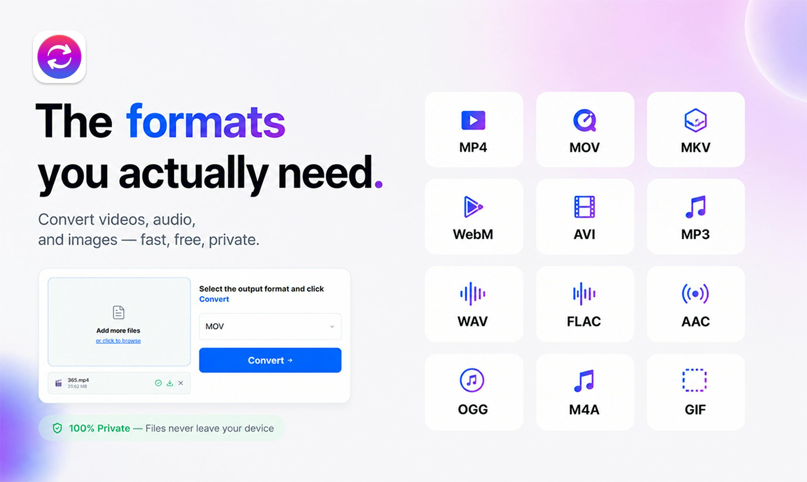

### 🎬 관련 영상
- [🎥 영상 보기](https://ph-files.imgix.net/dce5b440-f913-4ff4-bae7-57493bec22a1.jpeg?auto=format)

---

## 20. [Gemini Omni 1.1 Flash](https://www.producthunt.com/products/gemini-omni-1-1-flash)
**Votes**: 9 | **도입 난이도**: 중 | **신뢰도**: 상
**Tagline**: Controllable AI Video Generation for Developers
**서비스 링크**: https://www.producthunt.com/r/2DSSWKWWR56F2X
**재등장**: 최근 7일 내 재등장 (마지막 등장 1일 전)

**태그**: DevTool, AI-Video, Automation, Google-AI, Agent, AI Tool, Prompting, Video, API

### 📌 이 서비스 한눈에 보기
개발자를 위한 정교한 제어가 가능한 AI 비디오 생성 도구

### 🔑 주요 기능
- 장면 확장 및 키프레임 전환에 대한 세밀한 제어 기능 제공
- 빠른 초안 렌더링을 통한 신속한 작업 흐름 지원
- Google AI Studio 및 Gemini Enterprise Agent Platform과 연동

### 🙋 사용자에게 어떤 점이 좋은가
프롬프트만으로 프로덕션 수준의 영상을 제작할 수 있어, 개발자가 영상 제작 워크플로우를 자동화하고 빠르게 결과물을 검토할 수 있습니다.

### ✅ 지금 바로 써볼 기능
- Google AI Studio에서 장면 확장 기능 테스트하기
- 키프레임 전환을 활용한 영상 초안 렌더링해보기
- Gemini Enterprise Agent Platform 연동 환경 확인하기

### ⚠️ 사용 전 확인할 점
- 생성된 영상의 최종 품질이 사용자의 요구 사양을 충족하는지 확인 필요
- 플랫폼별 연동 방식 및 API 사용 권한 확인 필요

### 🧭 확인이 더 필요한 정보
상세한 API 비용 체계 및 구체적인 렌더링 속도에 대한 정보는 명시되지 않았습니다.

### 📸 스크린샷 및 갤러리

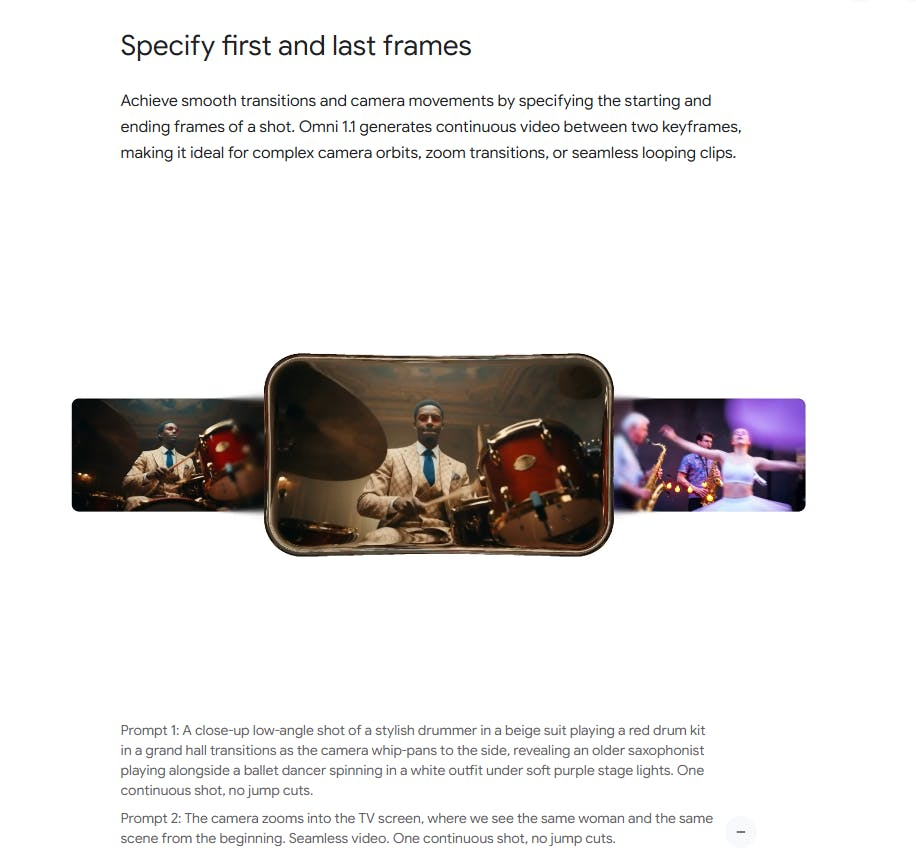

---

## 21. [Brand My Dihh](https://www.producthunt.com/products/brand-my-dihh)
**Votes**: 7 | **도입 난이도**: 하 | **신뢰도**: 상
**Tagline**: Pay to put your competitor on the dihh. Clicks go to you.
**서비스 링크**: https://www.producthunt.com/r/WXV5OIXJFAQTXO

**태그**: Marketing, Advertising, GrowthHacking, CompetitorAnalysis

### 📌 이 서비스 한눈에 보기
경쟁사 로고를 제품에 노출시켜 역으로 트래픽을 탈취하는 공격적 마케팅 플랫폼

### 🔑 주요 기능
- 경쟁사 브랜드를 제품의 특정 구역에 배치하는 역발상 광고 모델
- 입찰 시스템을 통해 원하는 위치를 점유하고 20% 보증금으로 소유권 유지
- 경쟁사 로고 클릭 시 사용자의 사이트로 리다이렉트되는 트래픽 유도 방식

### 🙋 사용자에게 어떤 점이 좋은가
경쟁사 고객의 관심을 직접적으로 가로채어 자사 사이트로 유입시키려는 공격적인 마케팅 전략을 구사할 수 있습니다.

### ✅ 지금 바로 써볼 기능
- 경쟁사 타겟팅을 위한 입찰 구역 확인
- 리다이렉트 경로 및 트래픽 유입 구조 검토
- 보증금 정책 및 로스팅(탈취) 규칙 숙지

### ⚠️ 사용 전 확인할 점
- 경쟁사 브랜드 이미지를 활용하는 방식에 따른 브랜드 평판 리스크
- 타 사용자의 입찰로 인해 점유 구역을 잃을 수 있는 변동성

### 🧭 확인이 더 필요한 정보
실제 제품의 물리적 제작 공정 및 배송, 법적 분쟁 가능성에 대한 구체적 정보가 부족합니다.

### 📸 스크린샷 및 갤러리
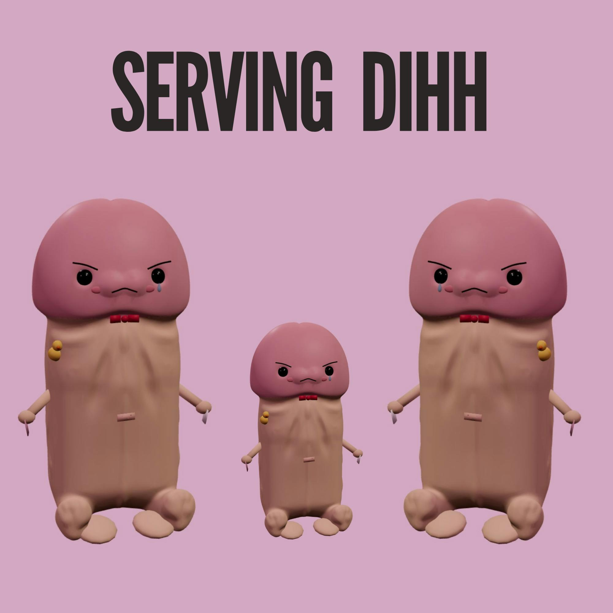
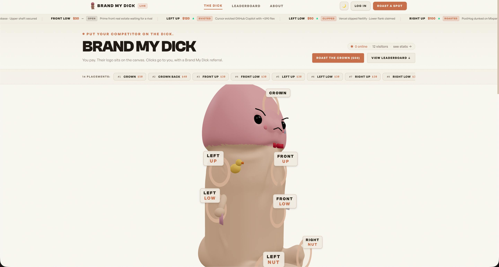
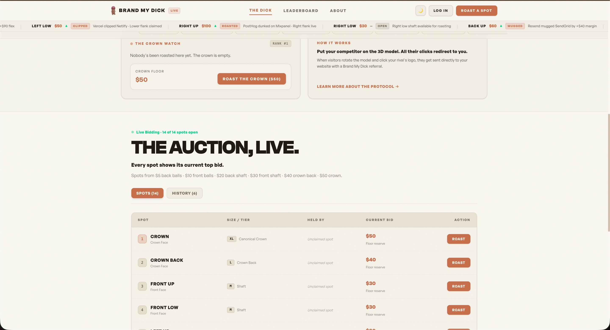

---

## 22. [Storeline](https://www.producthunt.com/products/storeline)
**Votes**: 7 | **도입 난이도**: 중 | **신뢰도**: 상
**Tagline**: Everything between “update’s ready” and “update’s live”
**서비스 링크**: https://www.producthunt.com/r/26M2EFGJBJNEV4

**태그**: DevTool, Automation, Localization, AppStore, Design

### 📌 이 서비스 한눈에 보기
앱 스토어 및 구글 플레이의 현지화와 배포 과정을 자동화하는 올인원 관리 도구

### 🔑 주요 기능
- 앱 스토어 및 구글 플레이 리스팅의 엔드 투 엔드 관리 및 배포
- 언어별 레이아웃 최적화(아랍어 미러링 등) 및 스크린샷 디자인 자동 조정
- 6개 인덱싱 필드 및 스크린샷 내 텍스트를 포함한 키워드 리서치 지원

### 🙋 사용자에게 어떤 점이 좋은가
글로벌 출시를 준비하는 개발자가 복잡한 스토어 현지화 작업과 배포 과정을 효율적으로 관리하고 오류를 줄일 수 있습니다.

### ✅ 지금 바로 써볼 기능
- 언어별 스크린샷 레이아웃 자동 조정 기능 테스트
- 지역별 키워드 리서치 및 인덱싱 최적화 기능 활용
- 필드별/언어별 개별 작업 취소(Undo) 기능 확인

### ⚠️ 사용 전 확인할 점
- 스토어 계정 권한 및 보안 정책에 따른 연동 범위 확인 필요
- 자동화된 배포 기능 사용 시 실제 스토어 반영 결과 검토 필요

### 🧭 확인이 더 필요한 정보
구체적인 요금제 체계와 스토어 계정 연동 방식에 대한 상세 정보가 명시되지 않았습니다.

### 📸 스크린샷 및 갤러리
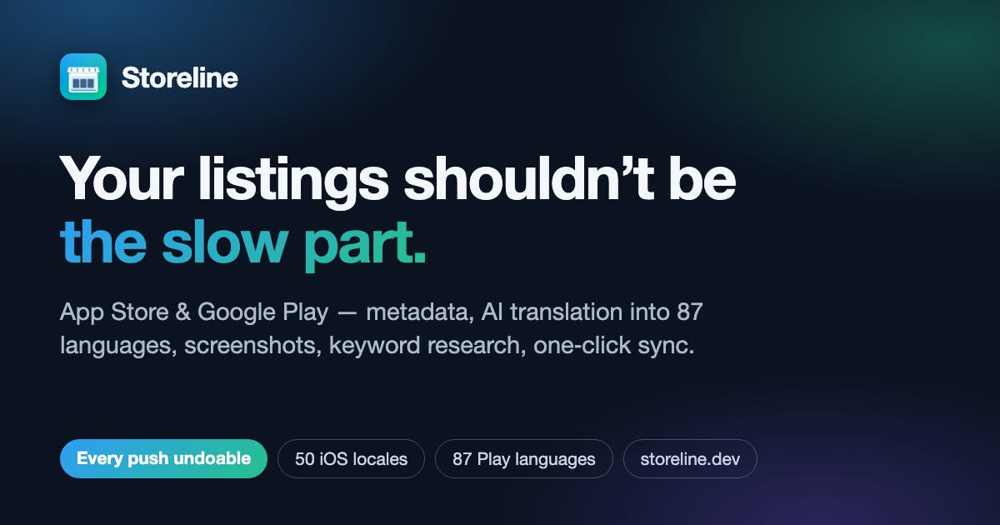

---

## 23. [Záboj](https://www.producthunt.com/products/zaboj)
**Votes**: 6 | **도입 난이도**: 하 | **신뢰도**: 상
**Tagline**: Voice AI for your car that gets things done
**서비스 링크**: https://www.producthunt.com/r/Q524GQUCJRYKYK

**태그**: AI, Productivity, Automation, Voice-AI, AI Tool, CRM, Email

### 📌 이 서비스 한눈에 보기
운전 중에도 업무와 일상을 완벽히 처리하는 차량용 AI 음성 비서

### 🔑 주요 기능
- CarPlay, iPhone, 웹을 지원하는 차량 최적화 음성 AI
- 30개 이상의 다국어 지원 및 웹 검색 기능
- MCP를 통한 캘린더, 이메일, Slack, CRM 등 업무 도구 연동

### 🙋 사용자에게 어떤 점이 좋은가
운전 중에도 손을 쓰지 않고 업무를 처리하거나 회의 내용을 정리할 수 있어 이동 시간을 생산적인 시간으로 전환해 줍니다.

### ✅ 지금 바로 써볼 기능
- CarPlay/iPhone을 통한 음성 명령 테스트
- 캘린더 및 이메일 연동을 통한 일정 관리
- 운전 중 회의 요약 및 후속 작업 자동화 기능 실행

### ⚠️ 사용 전 확인할 점
- 운전 중 사용 시 안전 규정 및 법적 주의 필요
- 외부 도구(CRM, Slack 등) 연동 시 데이터 접근 권한 설정 필요

### 🧭 확인이 더 필요한 정보
사용자의 개인정보 및 업무 데이터 보안 정책에 대한 상세 정보 확인이 필요합니다.

### 📸 스크린샷 및 갤러리
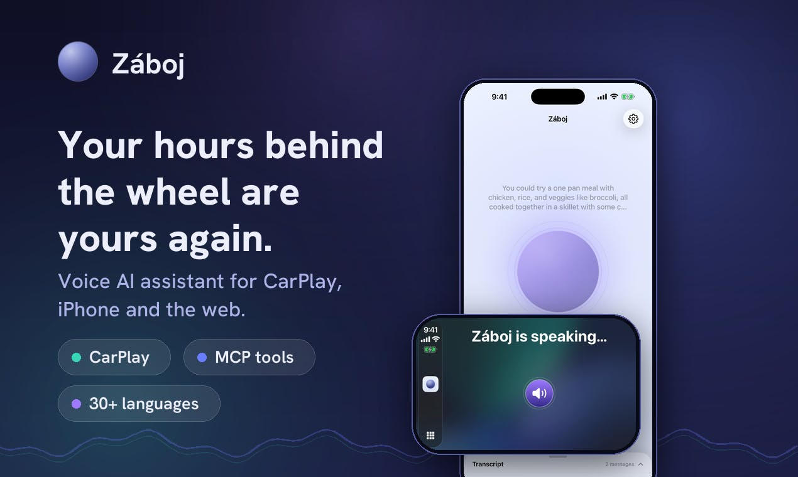
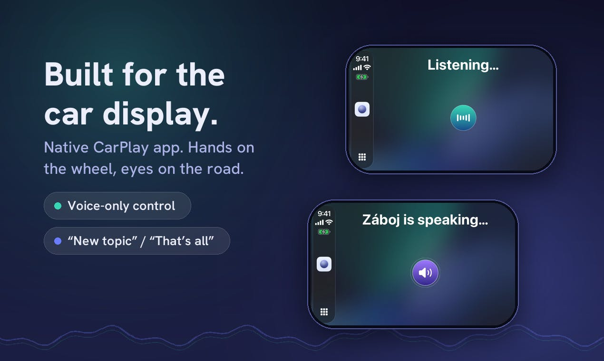
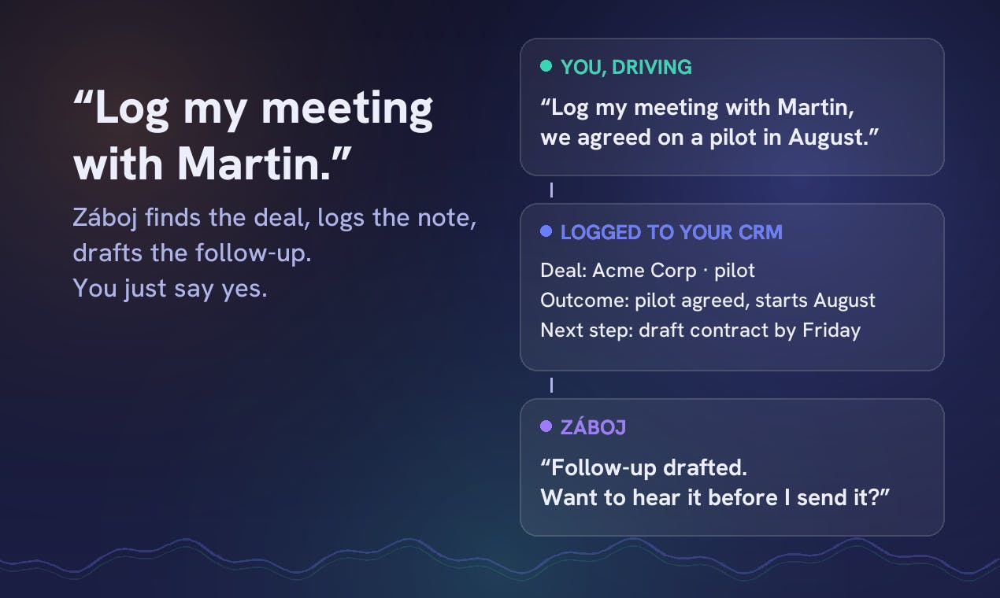

### 🎬 관련 영상
- [🎥 영상 보기](https://ph-files.imgix.net/da85cc3e-0a45-4606-96a1-f77be96b0425.jpeg?auto=format)

---

## 24. [VDF AI Networks](https://www.producthunt.com/products/vdf-ai-networks)
**Votes**: 5 | **도입 난이도**: 상 | **신뢰도**: 상
**Tagline**: Self-improving on-prem agent networks for complex work
**서비스 링크**: https://www.producthunt.com/r/LKOLXA2GAARZXL

**태그**: AI-Agents, Automation, On-Premise, Workflow-Automation, DevOps, Agent, AI Tool

### 📌 이 서비스 한눈에 보기
목표 설정만으로 복잡한 업무를 자동 수행하는 자가 학습형 온프레미스 멀티 에이전트 네트워크

### 🔑 주요 기능
- 목표 기반의 자동 작업 분해 및 멀티 에이전트 워크플로우 생성
- 실행 피드백을 통한 라우팅, 도구 선택 및 계획의 지속적 자가 개선
- 클라우드부터 100% 온프레미스까지 지원하는 강력한 데이터 보안 및 인프라 유연성

### 🙋 사용자에게 어떤 점이 좋은가
복잡한 업무 프로세스를 수동으로 설계할 필요 없이 목표만 입력하면 AI가 최적의 경로를 찾아 실행하며, 데이터 보안이 중요한 기업 환경에 최적화되어 있습니다.

### ✅ 지금 바로 써볼 기능
- 복잡한 워크플로우 목표 설정 및 에이전트 분해 기능 테스트
- 온프레미스 환경에서의 배포 및 데이터 보안성 검증
- 실행 결과에 따른 피드백 루프 및 성능 개선 지표 확인

### ⚠️ 사용 전 확인할 점
- 복잡한 작업 분해 시 발생할 수 있는 에이전트 간 충돌이나 오류 가능성
- 온프레미스 배포 시 하드웨어 리소스 확보 및 관리 부담

### 🧭 확인이 더 필요한 정보
구체적인 하드웨어 요구 사양과 지원되는 모델/도구의 범위에 대한 정보가 필요합니다.

### 📸 스크린샷 및 갤러리
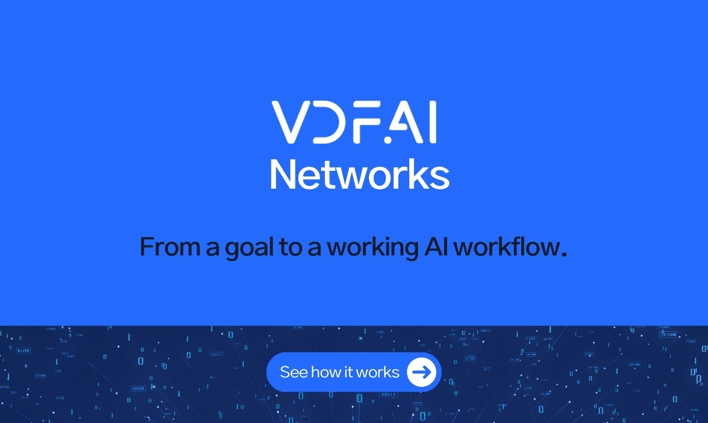
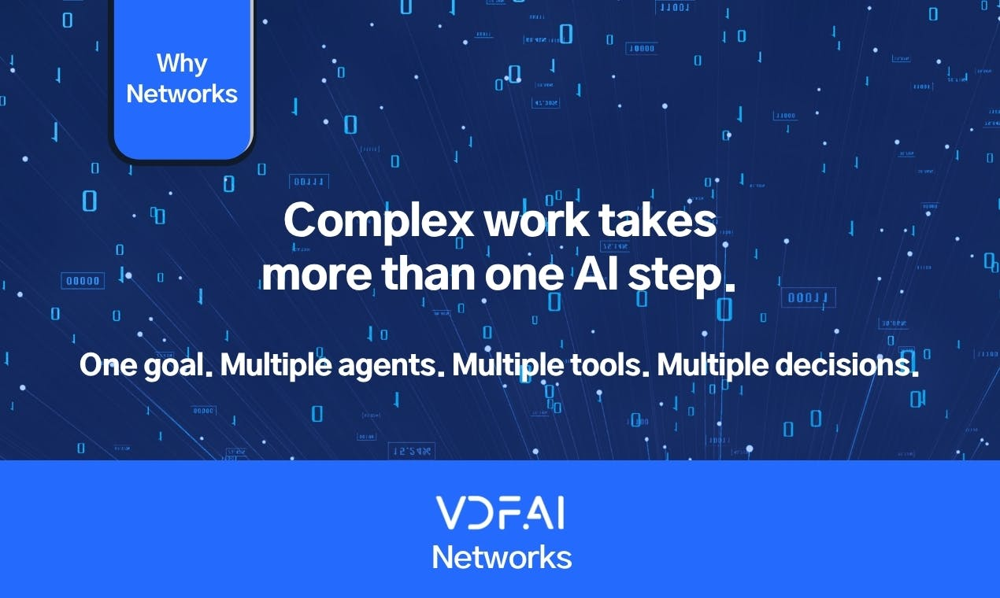
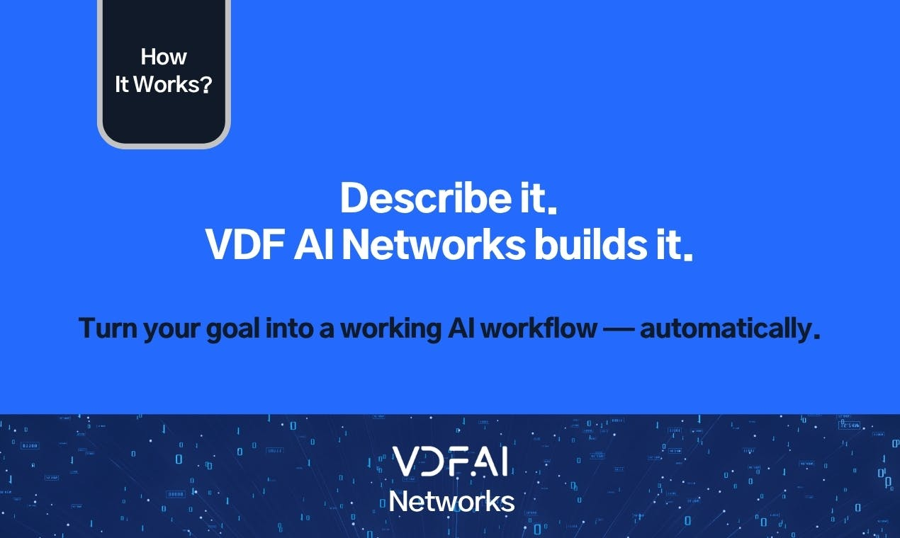

### 🎬 관련 영상
- [🎥 영상 보기](https://ph-files.imgix.net/2c11b15a-e1f0-4d1a-a0d7-af5dea9a31b8.jpeg?auto=format)

---

## 25. [Harshith's Newsletter](https://www.producthunt.com/products/harshith-s-newsletter)
**Votes**: 5 | **도입 난이도**: 하 | **신뢰도**: 상
**Tagline**: Useful AI field notes from real builds
**서비스 링크**: https://www.producthunt.com/r/THJV4PRNQCXNPR

**태그**: AI, Newsletter, Workflow, Productivity, Agent, Automation, AI Tool

### 📌 이 서비스 한눈에 보기
실제 AI 구축 과정에서 얻은 실무 중심의 인사이트를 전달하는 뉴스레터

### 🔑 주요 기능
- 이론 중심이 아닌 실제 컨설팅 및 빌드 과정에서의 경험 공유
- AI 워크플로우와 에이전트 구축 시 발생하는 문제와 해결책 제시
- 운영 결정 과정에서의 실질적인 의사결정 가이드 제공

### 🙋 사용자에게 어떤 점이 좋은가
이론적인 내용 대신 실제 현장에서 무엇이 작동하고 무엇이 실패했는지 배울 수 있어 실무 적용에 유용합니다.

### ✅ 지금 바로 써볼 기능
- 뉴스레터 구독하기
- 과거 아카이브 사례 검토하기
- 실무 워크플로우에 적용 가능한 아이디어 발굴하기

### ⚠️ 사용 전 확인할 점
- 이론적 배경보다는 실무 사례 중심이므로 기초 이론 학습에는 적합하지 않을 수 있음
- 특정 프로젝트 상황에 국한된 경험일 수 있음

### 🧭 확인이 더 필요한 정보
뉴스레터의 발행 주기와 구체적인 콘텐츠 업데이트 빈도를 확인해야 합니다.

### 📸 스크린샷 및 갤러리
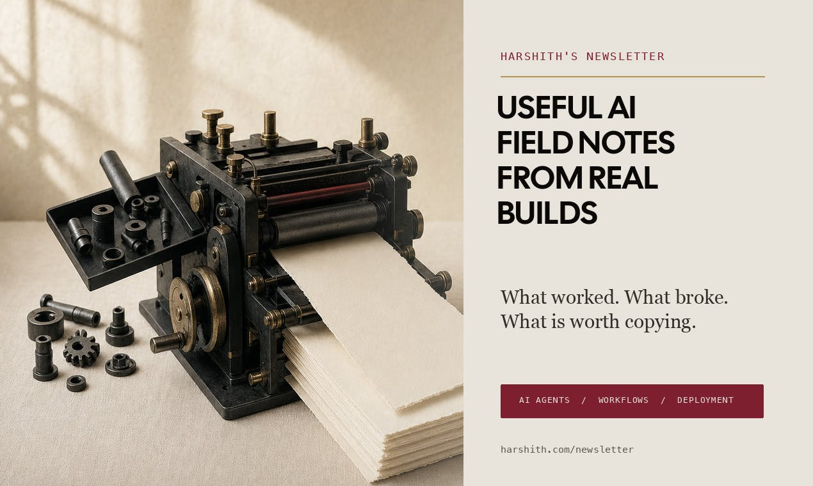
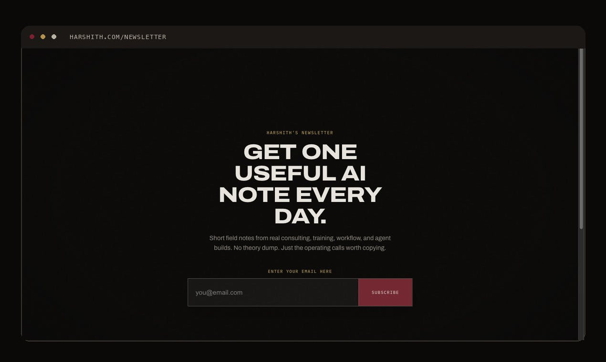
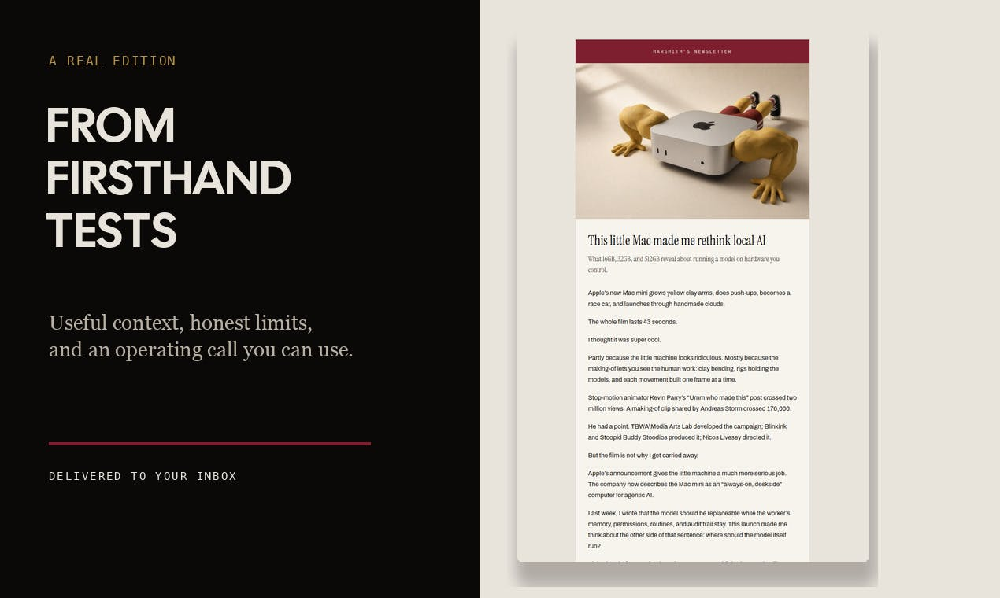

---

## 26. [Cord](https://www.producthunt.com/products/cord-4)
**Votes**: 4 | **도입 난이도**: 하 | **신뢰도**: 상
**Tagline**: From proposal to payment. All in a single link.
**서비스 링크**: https://www.producthunt.com/r/L62LH2KCKBTFSW

**태그**: SalesTech, Automation, FinTech, NoCode

### 📌 이 서비스 한눈에 보기
제안부터 결제까지, 고객의 번거로움 없이 하나의 링크로 끝내는 비즈니스 자동화 솔루션

### 🔑 주요 기능
- 제안서 작성부터 법적 승인, 인보이스 발행까지 전체 상업 사이클 통합
- 고객이 별도의 계정 생성이나 파일 다운로드 없이 링크만으로 모든 과정 수행 가능
- 마진 계산 기능이 포함된 지능형 제안서 및 자동 수금 시스템 제공

### 🙋 사용자에게 어떤 점이 좋은가
복잡한 계약 및 결제 과정을 단일 링크로 단순화하여 고객 이탈을 방지하고 업무 효율을 극대화할 수 있습니다.

### ✅ 지금 바로 써볼 기능
- 단일 링크로 제안서 생성해보기
- 고객용 인터랙티브 결제 프로세스 테스트하기
- 자동화된 인보이스 및 수금 설정하기

### ⚠️ 사용 전 확인할 점
- 고객이 계정을 만들지 않으므로, 향lı 기록 관리 방식 확인 필요
- 법적 구속력이 있는 승인 절차의 지역별 법적 유효성 검토 필요

### 🧭 확인이 더 필요한 정보
현재 제공되는 결제 게이트웨이(PG) 연동 범위와 지원되는 통화 종류를 확인해야 합니다.

### 📸 스크린샷 및 갤러리

---

## 27. [Avatar Studio ](https://www.producthunt.com/products/avatar-studio)
**Votes**: 4 | **도입 난이도**: 하 | **신뢰도**: 상
**Tagline**: Turn your ideas into videos with your Al avatar
**서비스 링크**: https://www.producthunt.com/r/ODVHNIXMGS4EHD

**태그**: AI-Video, Content-Creation, Avatar, Creator-Tools, Video

### 📌 이 서비스 한눈에 보기
자신의 목소리와 외형을 담은 AI 아바타로 카메라 없이 영상을 제작하는 크리에이터 플랫폼

### 🔑 주요 기능
- 사용자의 아이디어와 목소리를 반영한 맞춤형 AI 아바타 생성
- 매번 카메라 앞에 서지 않아도 되는 효율적인 콘텐츠 제작 환경
- 개인 고유의 정체성을 유지하며 영상 콘텐츠를 만드는 창작 도구

### 🙋 사용자에게 어떤 점이 좋은가
직접 촬영에 대한 부담 없이 자신의 페르소나를 유지하며 쉽고 빠르게 영상 콘텐츠를 제작할 수 있습니다.

### ✅ 지금 바로 써볼 기능
- 자신의 목소리와 외형을 활용한 아바타 생성하기
- 텍스트 아이디어를 영상 콘텐츠로 변환하기
- 개인 맞춤형 아바타의 표현력 테스트하기

### ⚠️ 사용 전 확인할 점
- 실제 인물과 얼마나 자연스럽게 일치하는지 표현력 확인 필요
- 사용자 고유의 정체성을 담기 위한 초기 설정 과정 필요

### 🧭 확인이 더 필요한 정보
제공되는 아바타의 감정 표현 범위와 영상 생성 품질에 대한 구체적인 정보가 필요합니다.

### 📸 스크린샷 및 갤러리

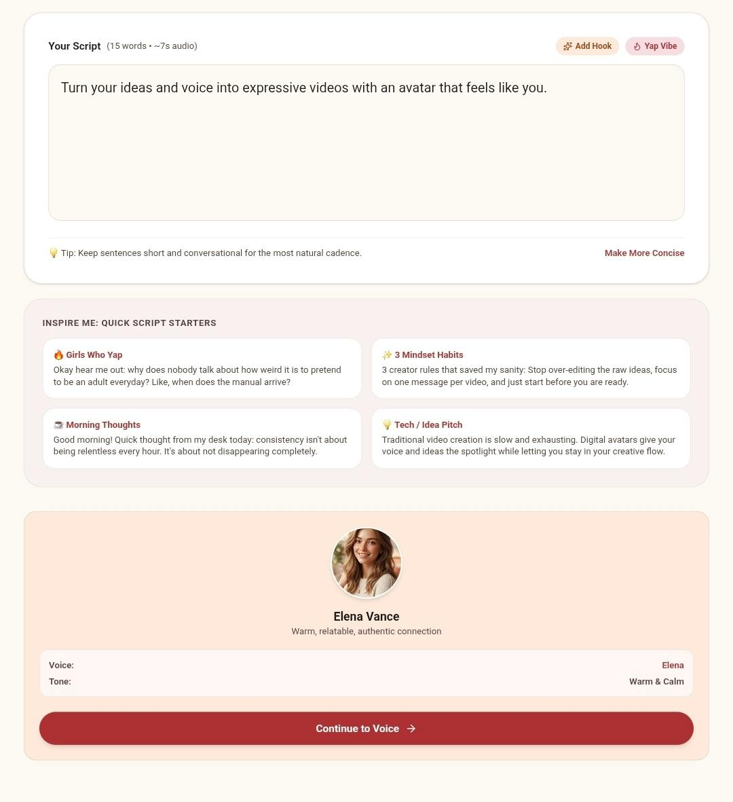
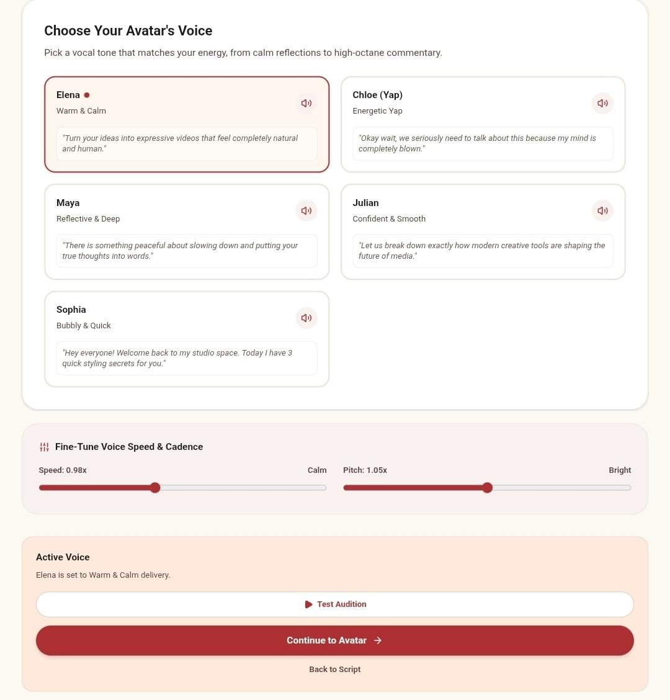

### 🎬 관련 영상
- [🎥 영상 보기](https://ph-files.imgix.net/e941342b-fa9d-4477-a739-2da54a498b38.jpeg?auto=format)

---

## 28. [skillmates](https://www.producthunt.com/products/skillmates)
**Votes**: 4 | **도입 난이도**: 하 | **신뢰도**: 상
**Tagline**: Find people who love what you love.
**서비스 링크**: https://www.producthunt.com/r/MY5HDHWOUWTKCD

**태그**: Social, AI, Community, Learning, Networking, AI Tool, LLM

### 📌 이 서비스 한눈에 보기
AI를 통해 취미와 학습 목표가 맞는 사람을 연결하고 함께 성장하는 커뮤니티 플랫폼

### 🔑 주요 기능
- AI 기반의 개인 맞춤형 매칭 시스템
- 온/오프라인을 아우르는 다양한 연결 방식
- 단순 만남을 넘어 학습 계획과 활동을 제안하는 성장 중심 모델

### 🙋 사용자에게 어떤 점이 좋은가
관심사가 비슷한 사람을 쉽게 찾고, AI가 제안하는 활동을 통해 함께 배우며 성장할 수 있습니다.

### ✅ 지금 바로 써볼 기능
- 자신의 기술과 취미 프로필 등록하기
- AI가 추천하는 맞춤형 활동 탐색하기
- 관심사가 일치하는 파트너와 연결하기

### ⚠️ 사용 전 확인할 점
- 오프라인 만남 시 안전 및 신뢰성 확인 필요
- AI 추천의 정확도 및 개인정보 활용 범위 확인

### 🧭 확인이 더 필요한 정보
온/오프라인 연결 방식의 구체적인 운영 방식과 보안 정책에 대한 정보가 더 필요합니다.

### 📸 스크린샷 및 갤러리
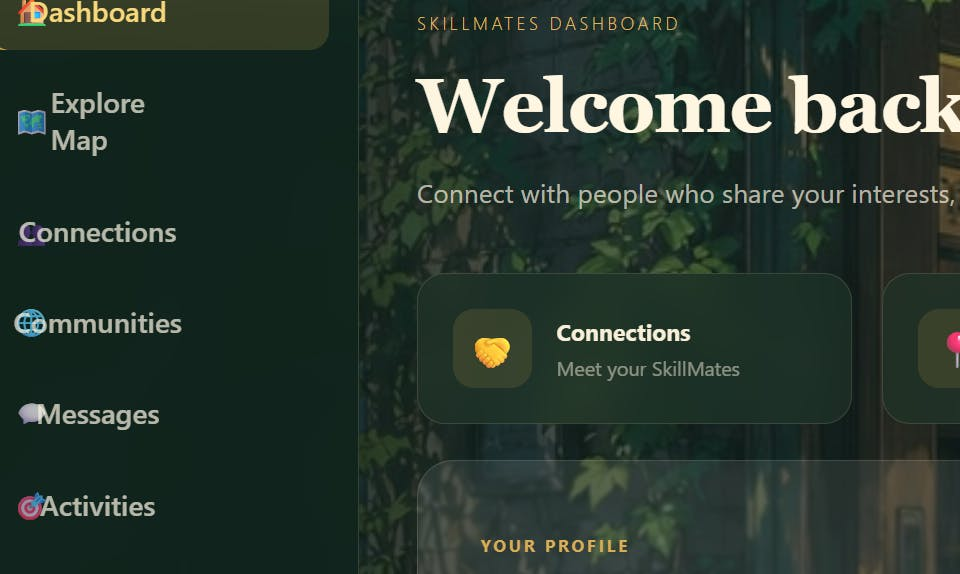
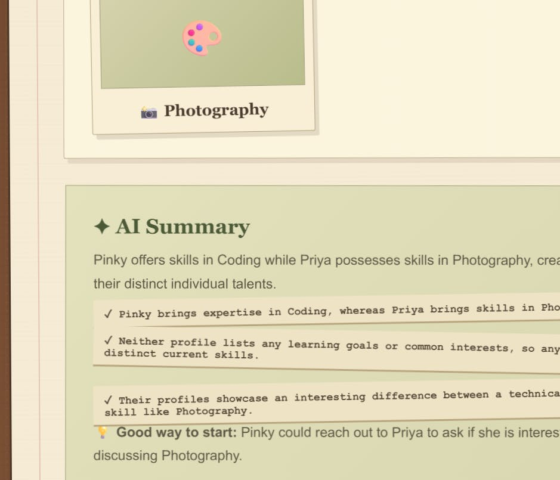
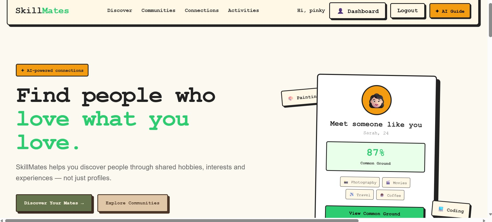

---

## 29. [SpeakoFlow Mini](https://www.producthunt.com/products/speakoflow)
**Votes**: 4 | **도입 난이도**: 하 | **신뢰도**: 상
**Tagline**:  Tiny local model that fixes dictation without rewriting it
**서비스 링크**: https://www.producthunt.com/r/RYGFS5IKHMCYCC

**태그**: AI, Productivity, LocalModel, NLP, AI Tool, API

### 📌 이 서비스 한눈에 보기
원문 훼손 없이 오타만 정교하게 교정하는 초경량 로컬 받아쓰기 모델

### 🔑 주요 기능
- 기존 문장을 재작성하지 않고 오타만 수정하는 데 특화된 0.8B 모델
- 이미 올바른 문장은 92.6%의 확률로 원문 그대로 유지
- 833MB 크기로 데스크톱 CPU에서 오프라인 실행 가능

### 🙋 사용자에게 어떤 점이 좋은가
사용자가 직접 말하거나 받아 적은 원문의 의도와 형식을 유지하면서, 오직 오타와 문법 오류만 깔끔하게 정리하고 싶을 때 유용합니다.

### ✅ 지금 바로 써볼 기능
- 로컬 환경에서 모델 구동 테스트
- 기존 받아쓰기 텍스트의 교정 정확도 검증

### ⚠️ 사용 전 확인할 점
- 모델 크기가 작아 복잡한 문맥 파악이나 창의적 글쓰기에는 부적합할 수 있음
- 데스크톱 CPU 환경에서의 구동 성능 확인 필요

### 🧭 확인이 더 필요한 정보
사용자의 데스크톱 사양에 따른 구체적인 구동 속도와 설치 방법은 명시되지 않았습니다.

### 📸 스크린샷 및 갤러리
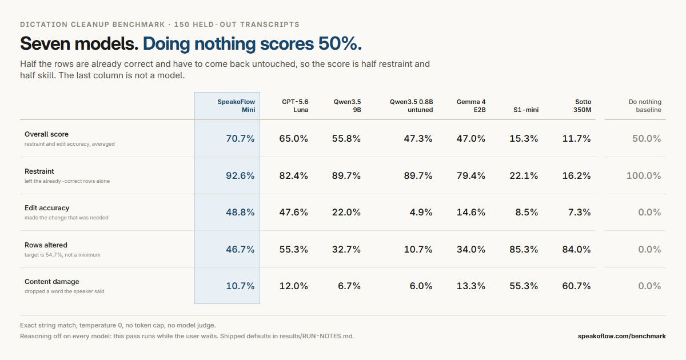
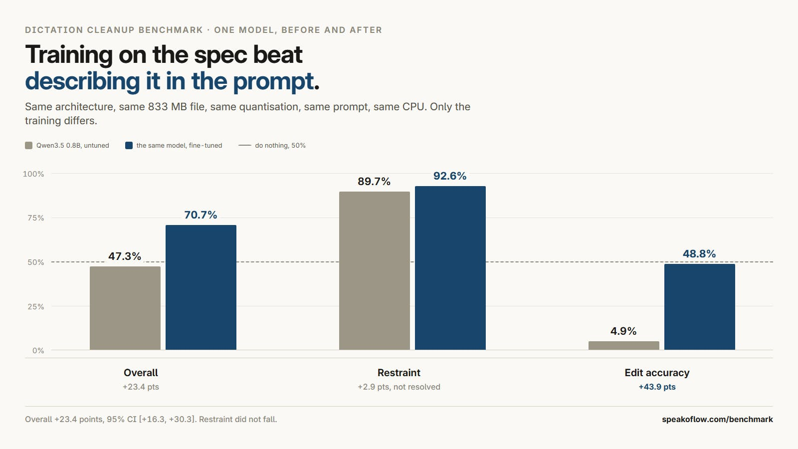
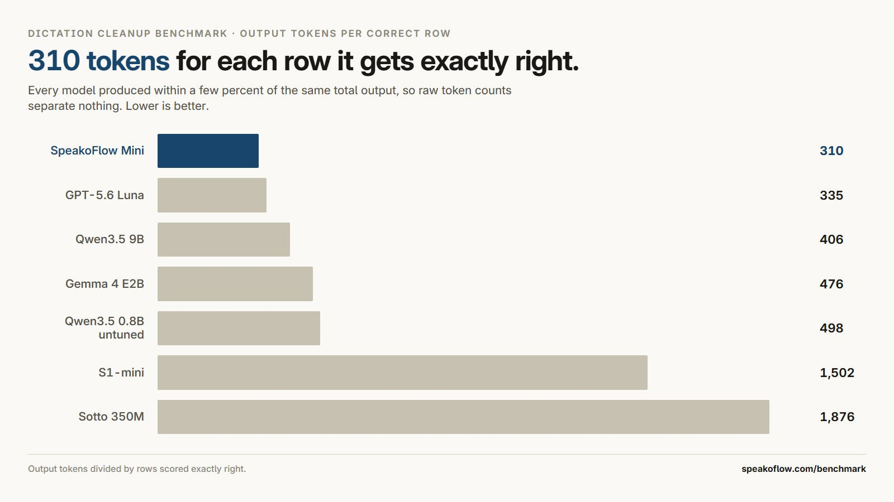

### 🎬 관련 영상
- [🎥 영상 보기](https://ph-files.imgix.net/a7910737-6d83-403d-b9c3-89c3441dcf3a.jpeg?auto=format)

---

## 30. [Choeae](https://www.producthunt.com/products/choeae)
**Votes**: 4 | **도입 난이도**: 하 | **신뢰도**: 상
**Tagline**: Collect, organize, and style K-pop bias moments in one place
**서비스 링크**: https://www.producthunt.com/r/VHOERXEGWLURYM

**태그**: K-pop, Fandom, AI, Media Organizer, Aesthetic, AI Tool, Design

### 📌 이 서비스 한눈에 보기
흩어진 K-pop 덕질 콘텐츠를 한곳에 모아 감성적인 앨범으로 만드는 팬덤 미디어 플랫폼

### 🔑 주요 기능
- SNS와 개인 저장소에 흩어진 최애의 순간들을 통합 관리
- AI 기반의 미디어 수집 및 정리 기능
- 스티커 월, 커스텀 카드 등 감성적인 스타일링 도구 제공

### 🙋 사용자에게 어떤 점이 좋은가
여러 플랫폼에 흩어진 최애의 사진과 영상을 일일이 찾을 필요 없이, 하나의 플랫폼에서 미학적인 앨범으로 정리할 수 있습니다.

### ✅ 지금 바로 써볼 기능
- 최애의 소중한 순간들을 모아 나만의 스티커 월 만들기
- AI를 활용해 흩어진 미디어들을 감성적인 카드로 변환하기

### ⚠️ 사용 전 확인할 점
- 외부 SNS(Instagram, Threads 등) 콘텐츠의 저작권 및 수집 정책 확인 필요
- 개인 저장소 미디어의 백업 및 동기화 방식 확인 필요

### 🧭 확인이 더 필요한 정보
AI가 외부 플랫폼의 콘텐츠를 자동으로 가져오는 방식과 저작권 준수 여부에 대한 구체적인 정보가 필요합니다.

### 📸 스크린샷 및 갤러리

### 🎬 관련 영상
- [🎥 영상 보기](https://ph-files.imgix.net/c22e5866-31c7-4aa2-b23d-8b892387398c.jpeg?auto=format)

---

