# 🚀 Product Hunt Daily Top 30 (2026-09-01)

## 오늘의 요약
오늘의 제품들은 AI 에이전트를 활용한 업무 자동화와 창의적 제어, 그리고 실무 기술을 게임처럼 익히는 인터랙티브 학습 트렌드를 보여주었습니다. 또한, 물리적 장치와 디지털 경험을 결합하거나 일상 속 유휴 공간을 수익화하는 등 사용자 경험의 확장과 새로운 경제 모델에 대한 시도들이 돋보였습니다.

### 오늘의 핵심 포인트
- AI 에이전트가 단순 자동화를 넘어 사용자의 세밀한 제어와 거버넌스를 지원하며 전문적인 워크플로우를 구축하고 있습니다.
- 학습과 업무의 지루함을 해소하기 위해 게임화(Gamification) 요소와 물리적 인터랙션을 결합한 새로운 형태의 도구들이 등장했습니다.
- 개인 소유의 자산이나 일상적인 활동을 디지털/물리적 가치로 전환하여 수익을 창출하는 실용적인 서비스들이 주목받았습니다.

**오늘의 태그**: AI_Agent, Automation, Gamification, Productivity, Digital_Economy

## 1. [Video Agent by Fotor](https://www.producthunt.com/products/fotor)
**Votes**: 285 | **도입 난이도**: 하 | **신뢰도**: 상
**Tagline**: Create and edit precision motion graphics & video with chat
**서비스 링크**: https://www.producthunt.com/r/KMJ6C2OCHCE4UL

**태그**: VideoEditing, AI-Automation, MarketingTool, MotionGraphics, Agent, AI Tool, Chat, Video

### 📌 이 서비스 한눈에 보기
채팅만으로 정교한 모션 그래픽과 영상을 제작하고 편집할 수 있는 AI 비디오 에이전트

### 🔑 주요 기능
- 아이디어와 스크립트를 기반으로 장면, 타이밍, 시각 효과를 자동 구성
- 멀티트랙 타임라인을 통해 텍스트, 로고, 차트 등을 렌더링 전 개별 수정 가능
- 전체 재생성 없이 마지막 순간의 수치나 타이밍을 정교하게 편집 가능

### 🙋 사용자에게 어떤 점이 좋은가
기존 AI 영상 도구의 '블랙박스(수정 불가)' 문제를 해결하여, 마케터와 창작자가 결과물을 세밀하게 제어하며 빠르게 프로모션 영상을 제작할 수 있습니다.

### ✅ 지금 바로 써볼 기능
- 스크립트를 입력하여 자동 장면 구성 기능 테스트하기
- 멀티트랙 타임라인에서 텍스트 및 데이터 수정해보기
- 키프레임 작업 없이 모션 그래픽 효과 적용해보기

### ⚠️ 사용 전 확인할 점
- 사용자의 편집 숙련도에 따른 최종 결과물 차이 가능성
- 복잡한 커스텀 애니메이션 구현 시의 제약 사항 확인 필요

### 🧭 확인이 더 필요한 정보
현재 제공되는 멀티트랙 편집 기능의 세부 제어 범위와 지원하는 에셋 형식을 확인해야 합니다.

### 📸 스크린샷 및 갤러리
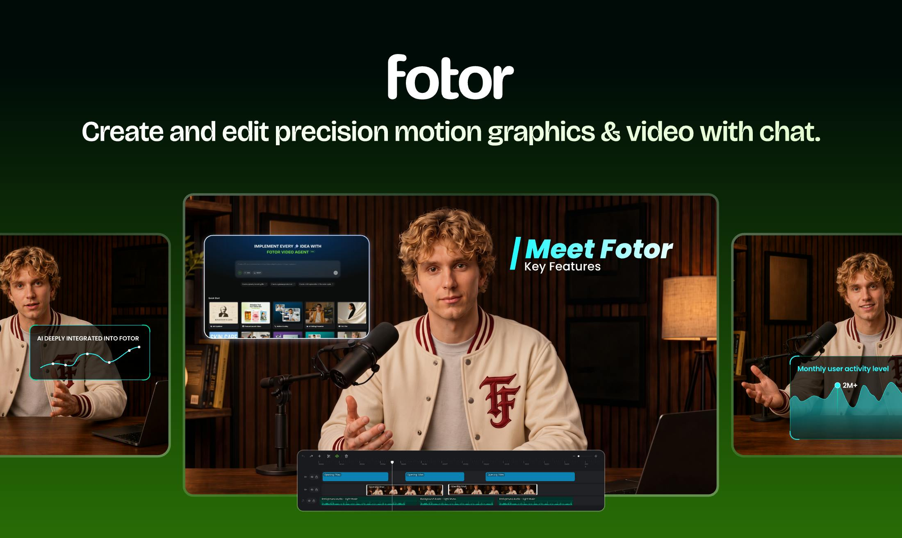
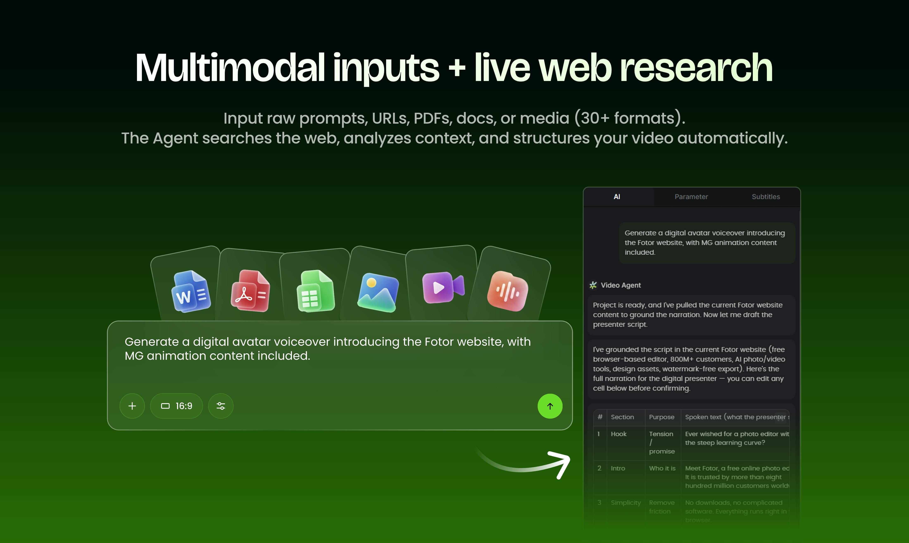
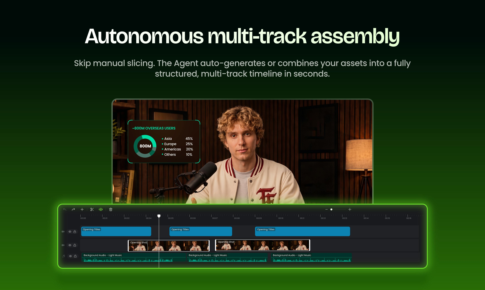

### 🎬 관련 영상
- [🎥 영상 보기](https://ph-files.imgix.net/b748d4c6-75e5-448b-b8e9-ae97dc8d8811.jpeg?auto=format)

---

## 2. [BrandJet](https://www.producthunt.com/products/brandjet-ai)
**Votes**: 210 | **도입 난이도**: 중 | **신뢰도**: 상
**Tagline**: Turn public buying signals into sales pipeline
**서비스 링크**: https://www.producthunt.com/r/NTN6BE7PSJWFWC

**태그**: SalesTech, Automation, LeadGen, AI, Agent, AI Tool, Sales, CRM

### 📌 이 서비스 한눈에 보기
소셜 미디어의 구매 신호를 실시간 리드로 전환하는 자동 영업 파이프라인 플랫폼

### 🔑 주요 기능
- X, Reddit, LinkedIn 등 웹 전반의 실시간 구매 의도 포착
- 발견된 신호를 잠재 고객 리드로 자동 변환 및 데이터 보강
- 초기 접점부터 CRM 관리 및 계약까지 통합된 영업 워크플로우 제공

### 🙋 사용자에게 어떤 점이 좋은가
잠재 고객이 문제를 제기하는 순간을 놓치지 않고 즉각적인 영업 기회로 연결할 수 있습니다.

### ✅ 지금 바로 써볼 기능
- 소셜 채널 모니터링 설정
- 리드 데이터 보강 기능 테스트
- 통합 인박스 및 CRM 워크플로우 확인

### ⚠️ 사용 전 확인할 점
- 소셜 미디어 플랫폼의 API 정책에 따른 데이터 수집 범위 제한 가능성
- 자동화된 아웃리치 메시지의 품질 관리 필요성

### 🧭 확인이 더 필요한 정보
플랫폼별 구체적인 데이터 수집 범위와 자동화된 메시지 발송의 세부 방식에 대한 확인이 필요합니다.

### 📸 스크린샷 및 갤러리
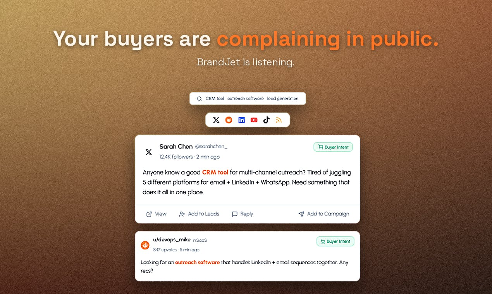
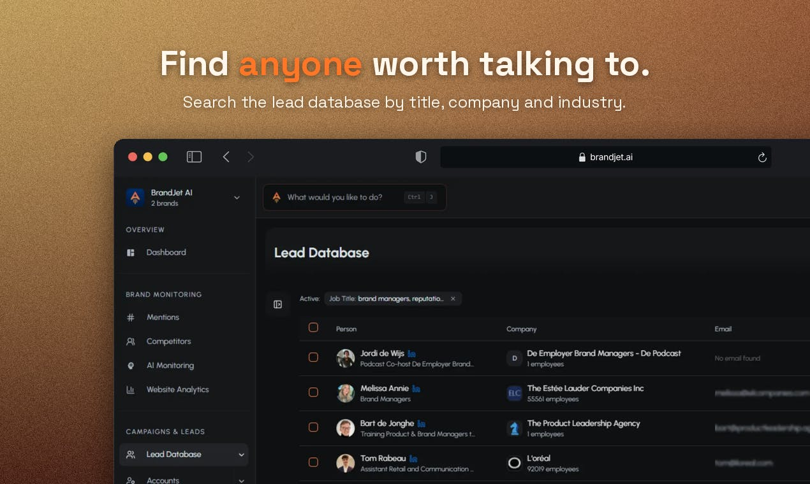
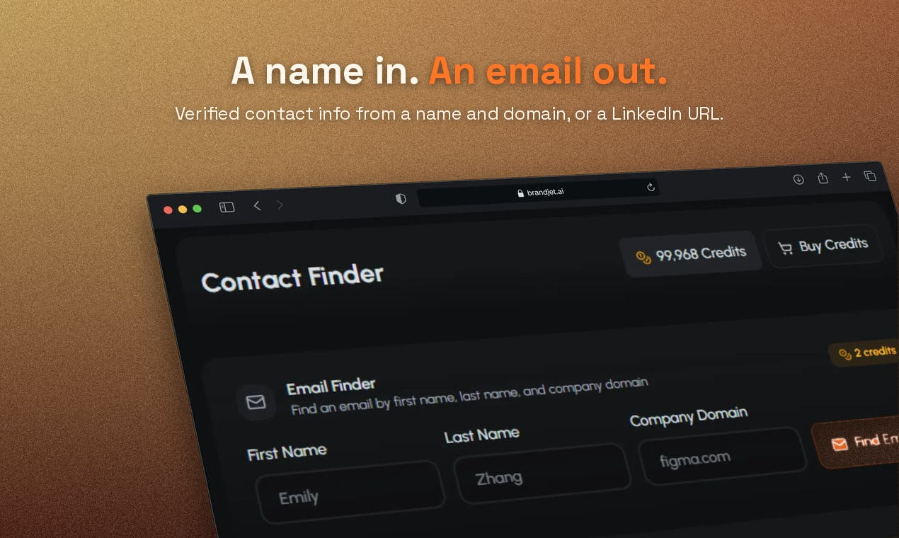

### 🎬 관련 영상
- [🎥 영상 보기](https://ph-files.imgix.net/434f5026-fb86-4bec-b11d-95e3456e1fac.gif?auto=format)

---

## 3. [Interactive Sessions](https://www.producthunt.com/products/revolte)
**Votes**: 208 | **도입 난이도**: 중 | **신뢰도**: 상
**Tagline**: Drive the full SDLC with AI agents, step by step
**서비스 링크**: https://www.producthunt.com/r/L7YVCYBWPR4HFC

**태그**: DevOps, AI-Agents, SDLC, Automation, Agent, AI Tool, DevTool

### 📌 이 서비스 한눈에 보기
AI 에이전트와 함께 SDLC 전 과정을 단계별로 제어하거나 자동화하는 워크스페이스

### 🔑 주요 기능
- 아키텍처부터 배포까지 SDLC 전 과정을 지원하는 인터랙티브 세션
- 사용자 승인 기반의 단계별 제어 또는 Jira 티켓 기반의 완전 자동화 모드 제공
- 계획 승인, 인라인 디프(diff), 비용 상한선, 감사 추적 등 강력한 거버넌스 내장

### 🙋 사용자에게 어떤 점이 좋은가
개발자가 직접 개입하여 세밀하게 제어하거나, 복잡한 작업은 AI에게 맡겨 생산성을 극대화할 수 있습니다.

### ✅ 지금 바로 써볼 기능
- 단계별 승인 기능을 통한 수동 워크플로우 테스트
- Jira 티켓 연동을 통한 엔드투엔드 자동화 모드 실행
- 설정된 비용 상한선 및 감사 추적 기능 확인

### ⚠️ 사용 전 확인할 점
- 자동화 모드 사용 시 AI가 생성한 코드 및 배포 결과물에 대한 검토 필요
- 기존 개발 워크플로우 및 CI/CD 환경과의 통합 수준 확인 필요

### 🧭 확인이 더 필요한 정보
현재 제공되는 구체적인 언어/프레임워크 지원 범위와 기존 도구(GitHub 등)와의 연동 방식에 대한 상세 정보가 필요합니다.

### 📸 스크린샷 및 갤러리
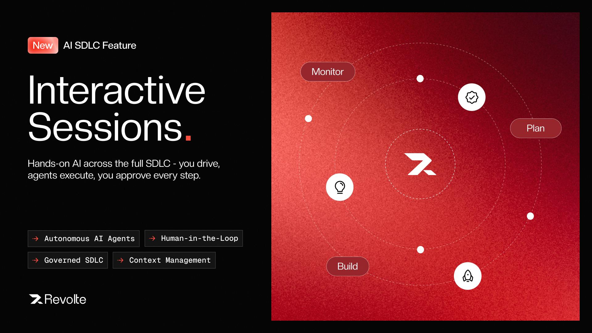
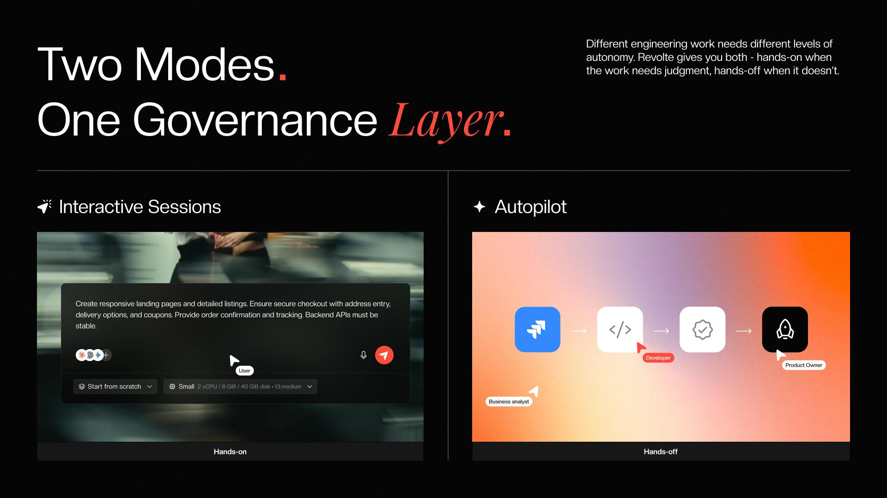
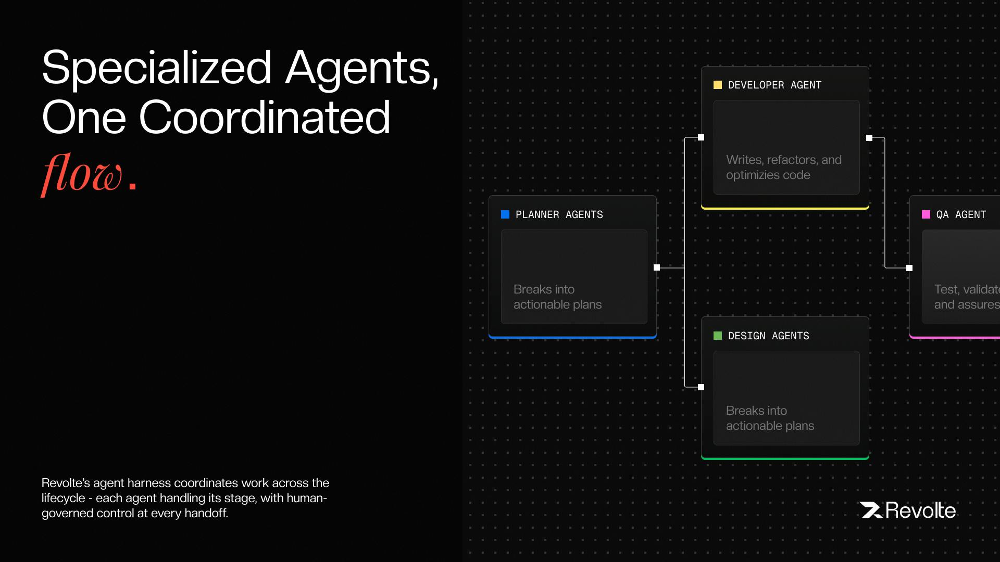

### 🎬 관련 영상
- [🎥 영상 보기](https://ph-files.imgix.net/52ae92c2-9d2d-4418-8d4f-4ddf2646ec5a.jpeg?auto=format)

---

## 4. [EP–2350 FX–MIC](https://www.producthunt.com/products/teenage-engineering)
**Votes**: 177 | **도입 난이도**: 하 | **신뢰도**: 상
**Tagline**: The programmable mic you can squeeze, shake & play
**서비스 링크**: https://www.producthunt.com/r/OOB2BZGABM6CVL

**태그**: Audio, Music Production, Hardware, Performer, AI Tool

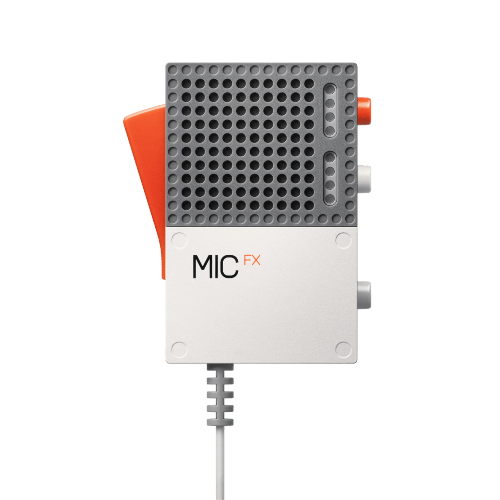

### 📌 이 서비스 한눈에 보기
직접적인 조작과 샘플링이 가능한 프로그래밍 가능한 핸드헬드 퍼포먼스 마이크

### 🔑 주요 기능
- 내장 FX 및 4개의 온보드 샘플 슬롯 탑재
- 파라미터 변조 레버를 통한 실시간 보컬 셰이핑
- JSON 파일을 이용한 사용자 정의 이펙트 프리셋 구축 가능

### 🙋 사용자에게 어떤 점이 좋은가
별도의 외부 장비 없이 마이크 하나로 샘플 트리거와 이펙트 조작이 가능하여 즉흥적인 퍼포먼스에 최적화되어 있습니다.

### ✅ 지금 바로 써볼 기능
- 자신만의 사운드를 담은 샘플 슬롯 채우기
- JSON 파일을 편집하여 커스텀 이펙트 프리셋 만들기
- K.O. II 또는 기존 오디오 시스템에 연결하여 테스트하기

### ⚠️ 사용 전 확인할 점
- 사용자 정의 프리셋 설정을 위한 기본적인 JSON 파일 편집 지식 필요
- 하드웨어 물리적 조작(squeeze, shake)에 따른 내구성 확인 필요

### 🧭 확인이 더 필요한 정보
상세한 하드웨어 사양 및 외부 기기와의 호환성 범위에 대한 추가 정보가 필요합니다.

### 📸 스크린샷 및 갤러리
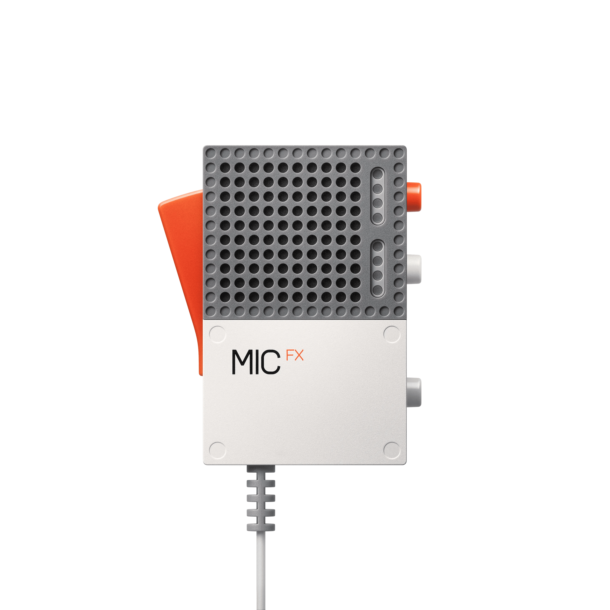
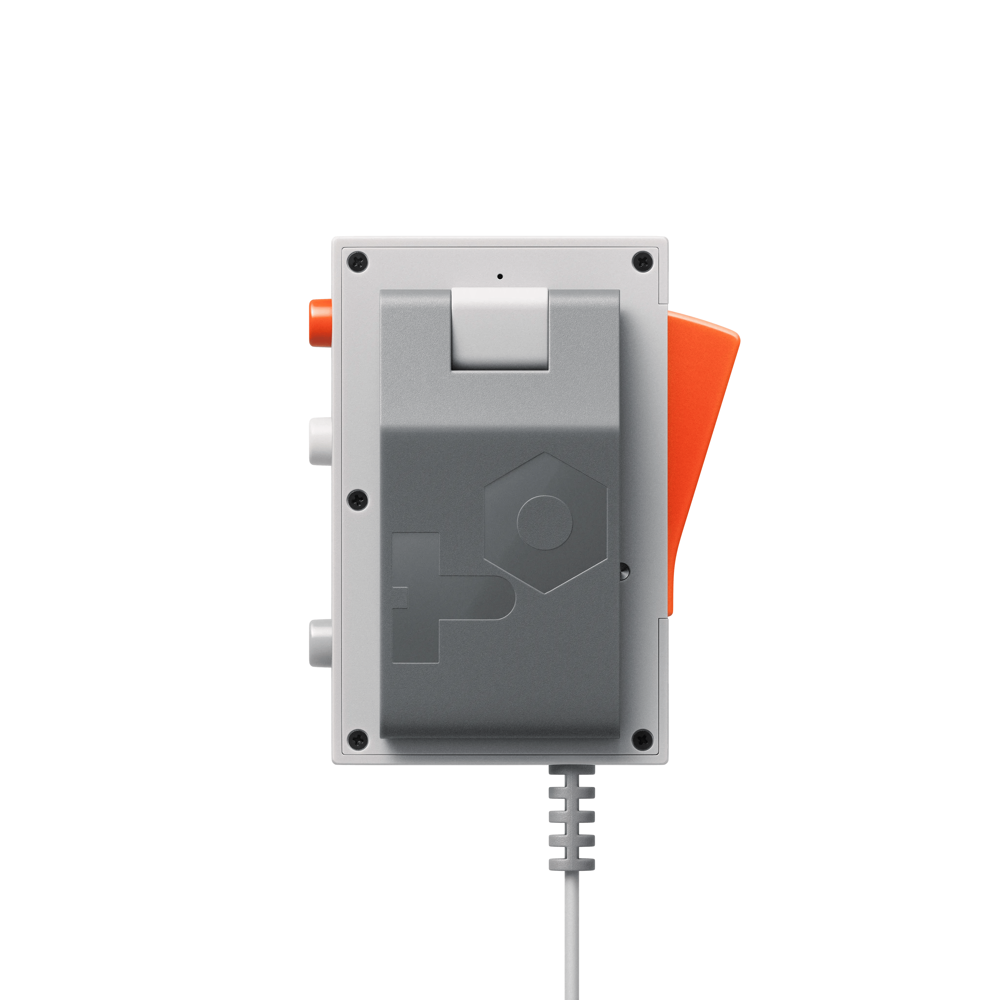

### 🎬 관련 영상
- [🎥 영상 보기](https://ph-files.imgix.net/f33568bd-96cd-457f-815e-56fc6264143d.jpeg?auto=format)

---

## 5. [Tether](https://www.producthunt.com/products/tether-a-ball-for-boring-meetings)
**Votes**: 171 | **도입 난이도**: 하 | **신뢰도**: 상
**Tagline**: A ball for boring meetings to keep you busy
**서비스 링크**: https://www.producthunt.com/r/CVBLPBKYAX7Z64

**태그**: Productivity, Mac, DesktopToy, Privacy

### 📌 이 서비스 한눈에 보기
지루한 회의 시간을 즐거운 물리 놀이로 바꿔주는 데스크톱 장난감

### 🔑 주요 기능
- 실제 물리 엔진 기반의 역동적인 공 움직임
- 앱 창과 독(Dock)을 활용하는 인터랙티브한 데스크톱 경험
- 개인정보 보호를 위한 로컬 실행 및 즉시 숨기기 기능

### 🙋 사용자에게 어떤 점이 좋은가
업무 중 발생하는 지루함을 해소하면서도, 단축키 하나로 즉시 화면에서 숨길 수 있어 보안과 재미를 동시에 제공합니다.

### ✅ 지금 바로 써볼 기능
- 메뉴 바에서 공을 드래그하여 창 사이로 던져보기
- 단축키를 설정하여 즉시 숨기기 기능 테스트하기

### ⚠️ 사용 전 확인할 점
- 업무 집중력을 분산시킬 수 있음
- 화면 위를 움직이는 물리 효과가 다른 작업에 방해가 될 수 있음

### 🧭 확인이 더 필요한 정보
Mac OS 버전별 호환성 및 시스템 리소스 점유율에 대한 정보가 명시되지 않았습니다.

### 📸 스크린샷 및 갤러리
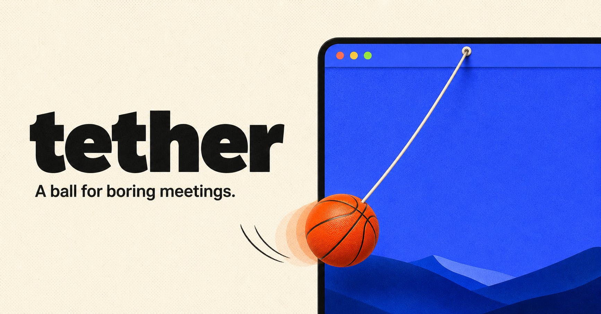
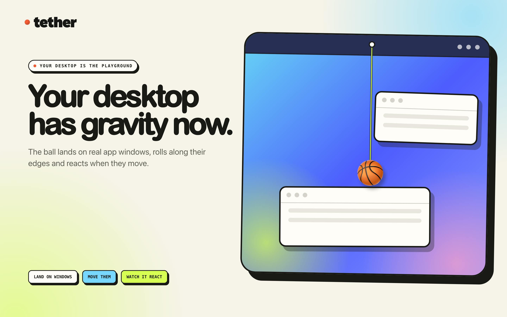
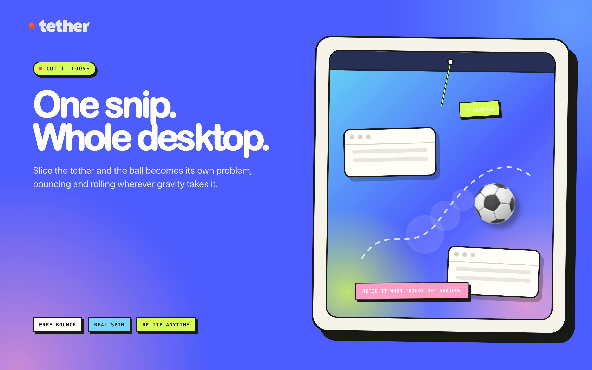

---

## 6. [Ask My Wardrobe](https://www.producthunt.com/products/ask-my-wardrobe)
**Votes**: 144 | **도입 난이도**: 하 | **신뢰도**: 상
**Tagline**: The complete digital wardrobe experience
**서비스 링크**: https://www.producthunt.com/r/N4IP643VTBHTPL

**태그**: AI, Fashion, Lifestyle, Personalization, AI Tool

### 📌 이 서비스 한눈에 보기
AI를 활용해 내 옷장 속 아이템으로 코디를 제안받고 쇼핑 실패를 줄이는 디지털 옷장 서비스

### 🔑 주요 기능
- AI 기반의 자동 코디 생성 및 일정별 착장 계획 기능
- 기존 소유 의류를 활용한 새로운 스타일 조합 제안
- 가상 피팅 기능을 통한 구매 전 스타일 확인 및 중복 소비 방지

### 🙋 사용자에게 어떤 점이 좋은가
매일 아침 무엇을 입을지 고민하는 시간을 줄여주며, 이미 가진 옷을 최대한 활용하여 현명한 쇼핑과 스타일링을 돕습니다.

### ✅ 지금 바로 써볼 기능
- 현재 가지고 있는 옷들을 디지털 옷장에 등록하기
- AI가 제안하는 새로운 코디 조합 확인하기
- 구매 예정인 아이템을 가상 피팅해보기

### ⚠️ 사용 전 확인할 점
- 사용자의 실제 옷과 디지털 데이터 간의 일치 여부
- 가상 피팅 기능의 실제 착용감 및 핏 재현도 차이

### 🧭 확인이 더 필요한 정보
사용자의 실제 체형 데이터 반영 여부와 가상 피팅의 정밀도에 대한 구체적인 정보가 필요합니다.

### 📸 스크린샷 및 갤러리

### 🎬 관련 영상
- [🎥 영상 보기](https://ph-files.imgix.net/6e09f687-9634-4233-8cff-cb31e032bb41.jpeg?auto=format)

---

## 7. [BrandMyLaptop](https://www.producthunt.com/products/brandmylaptop)
**Votes**: 139 | **도입 난이도**: 하 | **신뢰도**: 상
**Tagline**: Sell ad space on your laptop
**서비스 링크**: https://www.producthunt.com/r/RPCK6GKOGS3Q6F

**태그**: PassiveIncome, Marketplace, AdTech, Sales

### 📌 이 서비스 한눈에 보기
자신의 노트북 상판 광고 공간을 브랜드에 판매하여 수익을 창출하는 마켓플레이스

### 🔑 주요 기능
- 노트북 상판 스티커 부착형 광고 공간 거래
- 사용자가 직접 기기 설정, 가격 및 거래 조건 결정
- 개인 소유 기기 또는 회사 지급 기기 모두 활용 가능

### 🙋 사용자에게 어떤 점이 좋은가
자신의 노트북을 활용해 일상 속에서 간편하게 부가 수익을 창출할 수 있습니다.

### ✅ 지금 바로 써볼 기능
- 자신의 노트북 사양 및 상태 확인하기
- 판매 가능한 광고 공간(상판 면적) 가늠하기
- 적정 광고 단가 설정해보기

### ⚠️ 사용 전 확인할 점
- 스티커 부착으로 인한 기기 외관 손상 및 중고 가치 하락 가능성
- 광고 부착 시 기기 디자인 변경에 대한 개인적 선호도 차이

### 🧭 확인이 더 필요한 정보
스티커 부착 방식의 품질과 기기 손상 시 보상 정책에 대한 확인이 필요합니다.

### 📸 스크린샷 및 갤러리

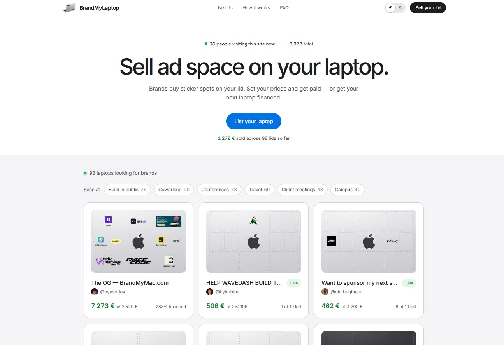
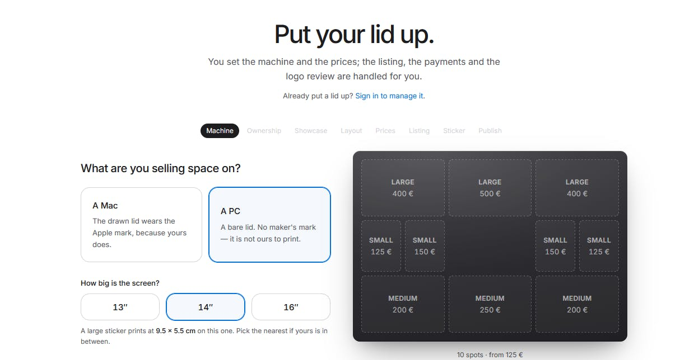

---

## 8. [WebTerm Learn](https://www.producthunt.com/products/webterm)
**Votes**: 124 | **도입 난이도**: 하 | **신뢰도**: 상
**Tagline**: Learn the terminal like a game — in a browser sandbox
**서비스 링크**: https://www.producthunt.com/r/PFRZJICVJHDLVP

**태그**: EdTech, DevTool, Terminal, Gamification

### 📌 이 서비스 한눈에 보기
게임처럼 즐기며 터미널, Git, Vim을 배우는 브라우저 기반 인터랙티브 학습 플랫폼

### 🔑 주요 기능
- 브라우저 내 실시간 샌드박스를 통한 실습 중심 학습
- 손그림 슬라이드와 3D 월드 맵을 결합한 게임화 요소
- 12개 코스, 129개 레슨으로 구성된 방대한 무료 콘텐츠

### 🙋 사용자에게 어떤 점이 좋은가
별도의 환경 설정 없이 브라우저만으로 실무 필수 기술을 게임처럼 재미있게 익힐 수 있습니다.

### ✅ 지금 바로 써볼 기능
- 브라우저 샌드박스에서 직접 명령어 입력해보기
- 3D 월드 맵을 따라 단계별 레슨 진행하기
- 제공되는 12개 코스 중 관심 분야 선택하기

### ⚠️ 사용 전 확인할 점
- 로컬 환경이 아닌 브라우저 샌드박스 환경임을 인지할 것
- 학습 내용이 실제 로컬 터미널 환경과 차이가 있을 수 있음

### 🧭 확인이 더 필요한 정보
제공되는 12개 코스의 구체적인 난이도와 심화 수준은 직접 학습을 통해 확인이 필요합니다.

### 📸 스크린샷 및 갤러리

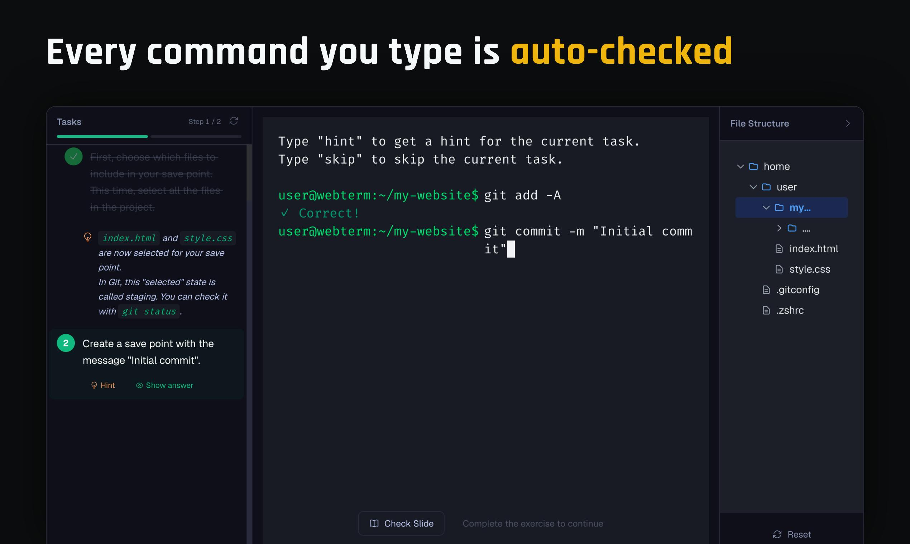

### 🎬 관련 영상
- [🎥 영상 보기](https://ph-files.imgix.net/0fe12178-b853-4c49-a17c-5ff80ce94de8.jpeg?auto=format)

---

## 9. [Orato](https://www.producthunt.com/products/orato-speech-coach)
**Votes**: 117 | **도입 난이도**: 하 | **신뢰도**: 상
**Tagline**: Practice speaking with AI.
**서비스 링크**: https://www.producthunt.com/r/HFET4EV36YRPHM

**태그**: AI, LanguageLearning, Productivity, Mobile, AI Tool

### 📌 이 서비스 한눈에 보기
AI를 통해 실시간 피드백을 받으며 말하기 실력을 향상시키는 스피킹 연습 도구

### 🔑 주요 기능
- 30~90초 분량의 다양한 스피킹 드릴 제공
- 말하기 속도, 유창성, 어휘력, 일관성 정밀 채점
- 필러(추임새) 및 긴 휴지기를 포함한 전체 대화 스크립트 제공

### 🙋 사용자에게 어떤 점이 좋은가
사용자는 자신의 말하기 습관을 데이터로 확인하며 취약점을 개선할 수 있고, 온디바이스 방식으로 보안 걱정 없이 연습할 수 있습니다.

### ✅ 지금 바로 써볼 기능
- 제공되는 스피킹 드릴 중 하나를 선택해 연습 시작하기
- 생성된 스크립트를 통해 자신의 필러와 휴지 구간 확인하기

### ⚠️ 사용 전 확인할 점
- Apple Intelligence를 지원하는 iPhone 환경이 필요함
- 온디바이스 실행 특성상 기기 성능에 따라 기능 제약이 있을 수 있음

### 🧭 확인이 더 필요한 정보
Apple Intelligence 지원 기기 외의 환경에서의 동작 여부와 상세 채점 알고리즘은 명시되지 않았습니다.

### 📸 스크린샷 및 갤러리

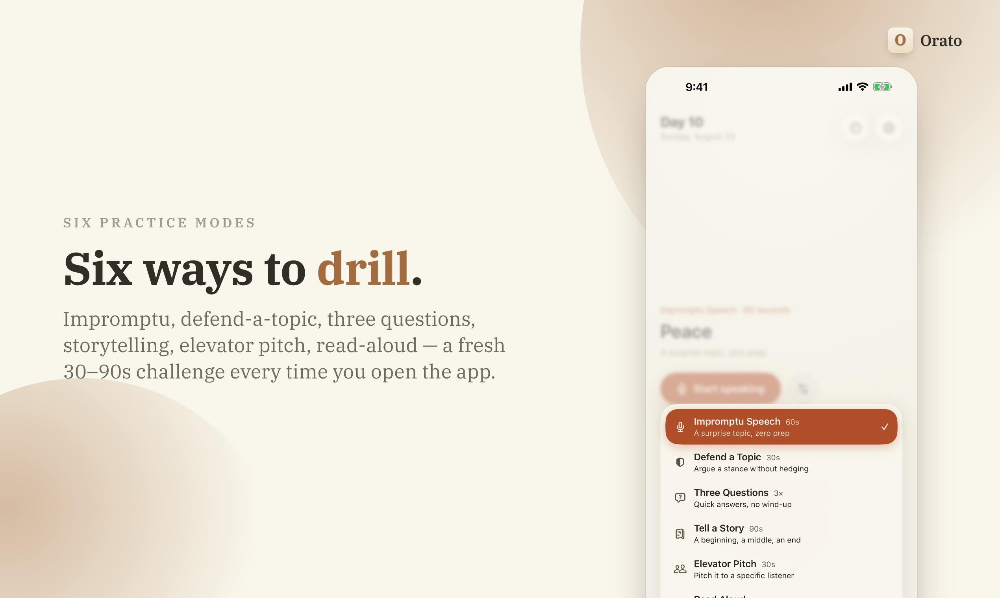

---

## 10. [FrameOS](https://www.producthunt.com/products/frameos-3)
**Votes**: 116 | **도입 난이도**: 하 | **신뢰도**: 상
**Tagline**: Record your iOS & Android screen from your Mac.
**서비스 링크**: https://www.producthunt.com/r/QVTXH4HO7PLTXS

**태그**: DesignTool, VideoEditing, MobileApp, ContentCreation, Video

### 📌 이 서비스 한눈에 보기
Mac에서 모바일 앱 데모 영상을 쉽고 전문적으로 제작하는 도구

### 🔑 주요 기능
- Mac을 통해 iOS 및 Android 화면 녹화 가능
- 카메라, 마이크, 전환 효과, 줌, 마스크 등 편집 기능 제공
- 고품질의 데모 영상 및 스크린샷 내보내기 지원

### 🙋 사용자에게 어떤 점이 좋은가
별도의 모바일 기기 조작 없이 Mac에서 편리하게 앱 시연 영상을 만들 수 있어, 마케터나 개발자가 고퀄리티 콘텐츠를 제작하기에 유용합니다.

### ✅ 지금 바로 써볼 기능
- 모바일 기기 연결 및 화면 녹화 테스트
- 줌 및 마스크 기능을 활용한 데모 영상 편집
- 제작된 영상의 내보내기 품질 확인

### ⚠️ 사용 전 확인할 점
- Mac 환경에서의 모바일 기기 연결 방식(유선/무선) 확인 필요
- 편집 기능의 세부적인 제어 범위 확인 필요

### 🧭 확인이 더 필요한 정보
모바일 기기 연결 방식과 지원하는 OS 버전 간의 호환성 확인이 필요합니다.

### 📸 스크린샷 및 갤러리
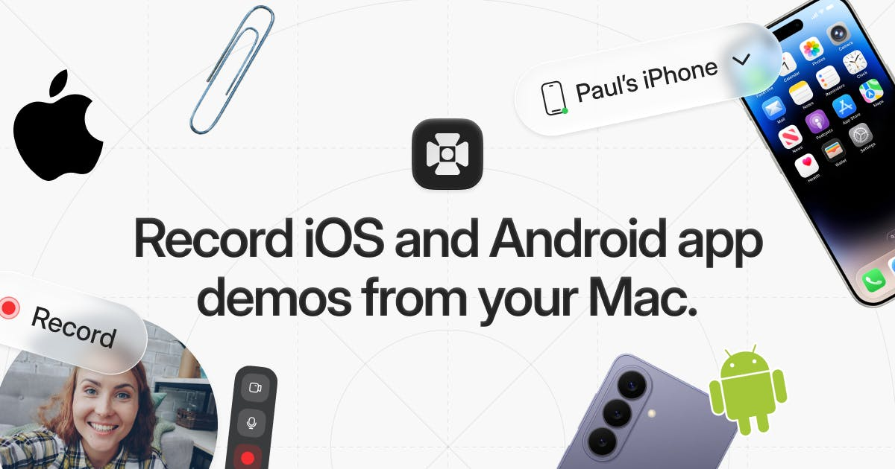
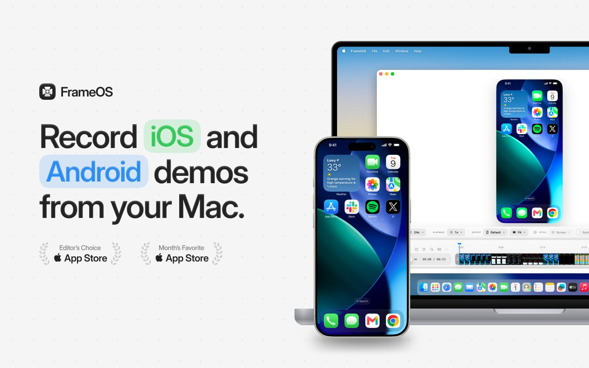
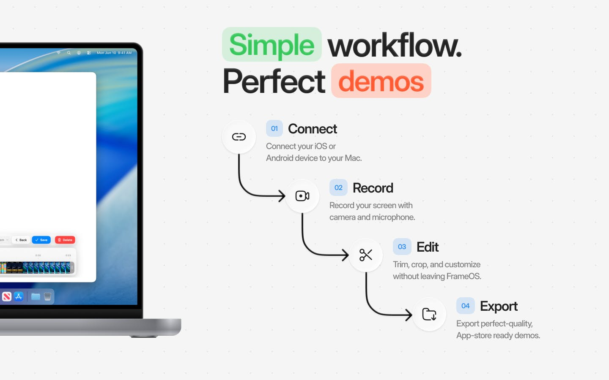

### 🎬 관련 영상
- [🎥 영상 보기](https://ph-files.imgix.net/01cbe618-3acd-4264-be6b-d2fb8633055b.jpeg?auto=format)

---

## 11. [Radar by Particle](https://www.producthunt.com/products/particle-5)
**Votes**: 115 | **도입 난이도**: 하 | **신뢰도**: 상
**Tagline**: The Podcast Search Engine
**서비스 링크**: https://www.producthunt.com/r/BLWELKQSMI42CU

**태그**: SearchEngine, AI, ContentDiscovery, API, Agent, AI Tool

### 📌 이 서비스 한눈에 보기
수만 개의 팟캐스트 에피소드 내용을 실시간으로 검색할 수 있는 팟캐스트 전용 검색 엔진

### 🔑 주요 기능
- 13만 개 이상의 전사(transcription)된 팟캐스트 데이터베이스 보유
- 매일 약 2만 개의 새로운 에피소드 업데이트 및 검색 가능
- Particle의 Podcast Intelligence API를 통한 에이전트 및 API 연동 지원

### 🙋 사용자에게 어떤 점이 좋은가
방대한 팟캐스트 콘텐츠 속에서 필요한 지식과 대화 내용을 텍스트 검색처럼 쉽고 빠르게 찾아낼 수 있습니다.

### ✅ 지금 바로 써볼 기능
- 특정 주제에 대한 심도 있는 대화 내용 검색해보기
- API/MCP를 활용한 자동화 에이전트 연동 테스트
- 최신 에피소드 데이터 업데이트 확인

### ⚠️ 사용 전 확인할 점
- 전사 데이터의 정확도에 따라 검색 결과의 질이 달라질 수 있음
- API 활용 시 기술적 구현 역량 필요

### 🧭 확인이 더 필요한 정보
사용자 인터페이스(UI)의 구체적인 기능과 API 호출 비용 체계에 대한 정보가 부족합니다.

### 📸 스크린샷 및 갤러리
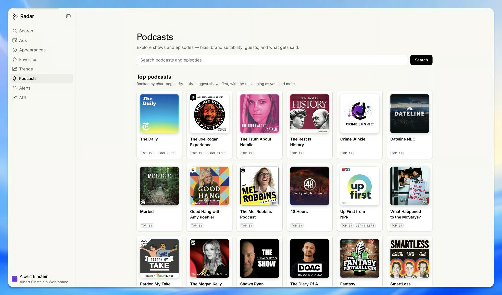
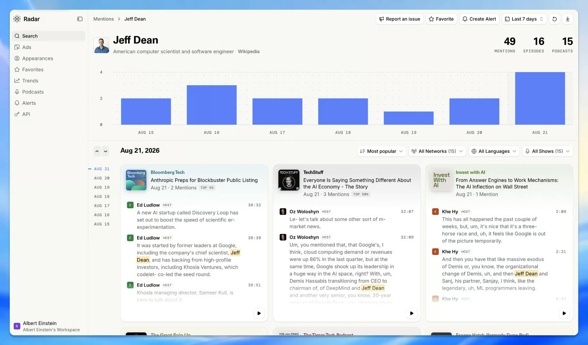
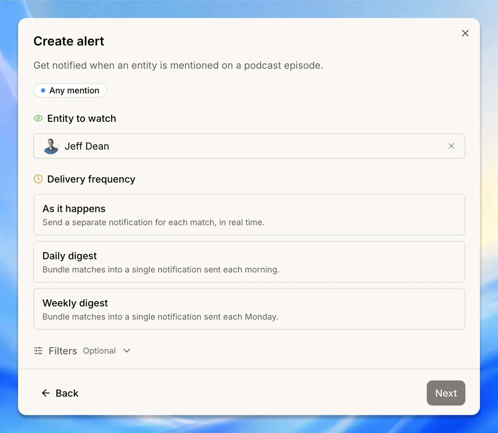

### 🎬 관련 영상
- [🎥 영상 보기](https://ph-files.imgix.net/8bf2281b-fcfe-4ffc-879a-f0b35f27836d.jpeg?auto=format)

---

## 12. [StackScope](https://www.producthunt.com/products/stackscope-dev)
**Votes**: 104 | **도입 난이도**: 하 | **신뢰도**: 상
**Tagline**: See what new sites are built with, the week they launch
**서비스 링크**: https://www.producthunt.com/r/RQ4M76SOX25LXO

**태그**: Market Intelligence, DevTool, Data Analysis, AI Tool, Chat, API

### 📌 이 서비스 한눈에 보기
새로 출시되는 웹사이트의 기술 스택 변화를 실시간으로 추적하는 기술 인텔리전스 도구

### 🔑 주요 기능
- 220만 개 이상의 사이트에서 수집되는 4만 개 이상의 기술 스택 데이터 제공
- Stripe, Shopify, Next.js 등 특정 기술 도입 여부를 통한 트렌드 파악 가능
- 공개 인프라 신호를 기반으로 제품 출시 전 미리 정보를 확보하는 선제적 탐색 기능

### 🙋 사용자에게 어떤 점이 좋은가
경쟁사나 타겟 기업이 어떤 기술을 도입하는지 실시간으로 파악하여 시장 트렌드를 읽거나 영업 기회를 발굴할 수 있습니다.

### ✅ 지금 바로 써볼 기능
- 무료 브라우징 기능을 통해 최신 사이트들의 기술 스택 탐색하기
- 관심 있는 기술 스택에 대한 변화 추이 모니터링하기
- 필요 시 API 및 MCP 서버를 통한 AI 워크플로우 연동 검토하기

### ⚠️ 사용 전 확인할 점
- 데이터 수집 방식이 공개 인프라 신호에 의존하므로 일부 비공개 환경의 변화는 포착되지 않을 수 있음
- 연락처 정보 포함된 벌크 수출 및 고급 알림 기능은 유료 플랜 필요

### 🧭 확인이 더 필요한 정보
데이터 업데이트 주기와 특정 기술 스택의 정확한 감지 오차 범위는 명시되지 않았습니다.

### 📸 스크린샷 및 갤러리
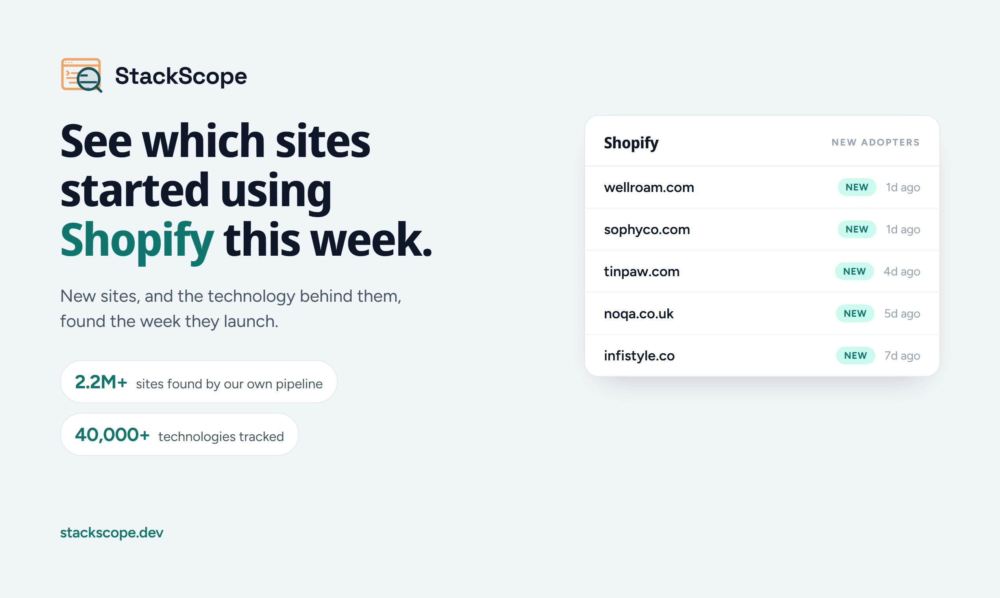
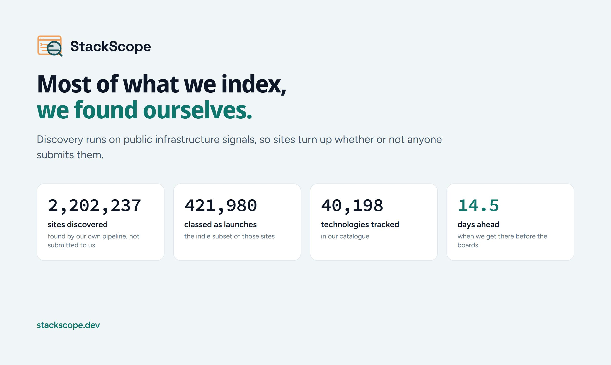
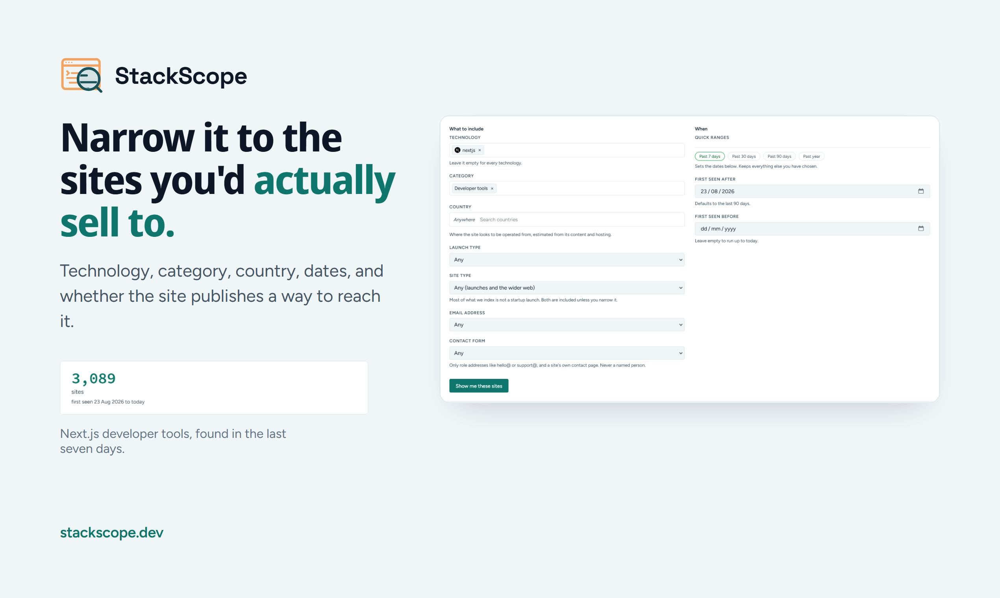

---

## 13. [Houndly](https://www.producthunt.com/products/houndly)
**Votes**: 24 | **도입 난이도**: 중 | **신뢰도**: 상
**Tagline**: Self-learning GTM copilot. Give a brain to your sales stack
**서비스 링크**: https://www.producthunt.com/r/KFF3HMDWNM2HM4

**태그**: SalesTech, AI, Automation, GTM, AI Tool, Sales

### 📌 이 서비스 한눈에 보기
영업 미팅과 피드백을 학습하여 다음 행동을 제안하는 자가 학습형 GTM 코파일럿

### 🔑 주요 기능
- 모든 회신, 미팅, 영업 통화 데이터를 통한 자가 학습 기능
- 타겟팅 전략 및 메시지 최적화 자동화
- 학습된 데이터를 바탕으로 다음 영업 단계 실행

### 🙋 사용자에게 어떤 점이 좋은가
영업 담당자가 매번 전략을 고민할 필요 없이, 축적된 데이터를 바탕으로 최적의 타겟과 메시지를 자동으로 제안받을 수 있습니다.

### ✅ 지금 바로 써볼 기능
- 기존 영업 미팅 및 통화 기록 연동하기
- 학습된 타겟팅 제안 검토하기
- 자동화된 다음 행동(Next Step) 실행하기

### ⚠️ 사용 전 확인할 점
- 데이터 보안 및 개인정보 보호 정책 확인 필요
- 초기 학습 데이터 축적 전까지는 제안의 정확도가 낮을 수 있음

### 🧭 확인이 더 필요한 정보
현재 지원하는 외부 CRM 및 영업 툴과의 구체적인 연동 범위가 명시되지 않았습니다.

### 📸 스크린샷 및 갤러리
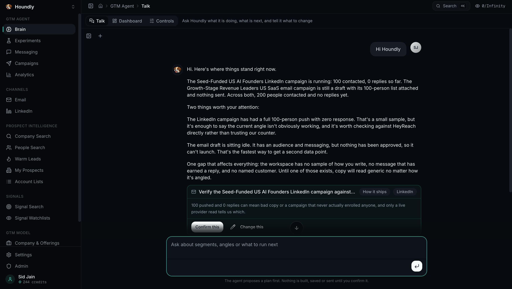
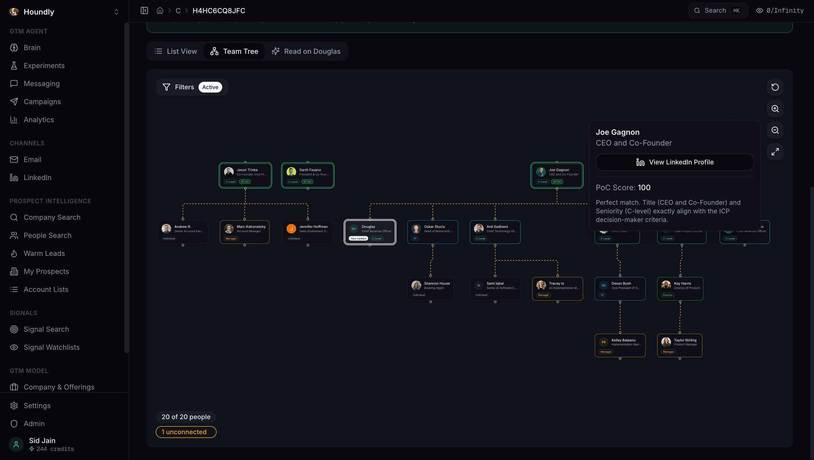
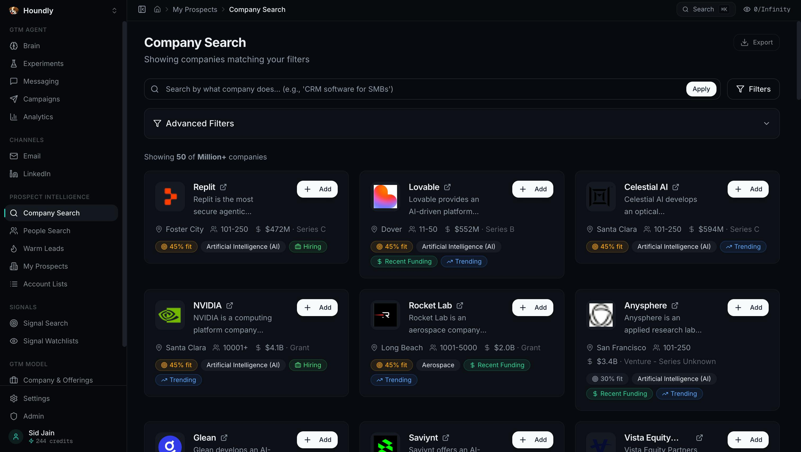

### 🎬 관련 영상
- [🎥 영상 보기](https://ph-files.imgix.net/ebfbe3ac-0a68-4c23-8495-1fc8ace4279c.jpeg?auto=format)

---

## 14. [LeaseBase](https://www.producthunt.com/products/leasebase)
**Votes**: 22 | **도입 난이도**: 하 | **신뢰도**: 상
**Tagline**: AI that tells landlords what to do, not just what happened
**서비스 링크**: https://www.producthunt.com/r/3TASADTNEXJ74P

**태그**: PropTech, Automation, Management, Compliance, AI Tool

### 📌 이 서비스 한눈에 보기
복잡한 임대 규제와 데드라인을 AI로 관리하는 스마트 임대 관리 솔루션

### 🔑 주요 기능
- 지역별로 상이한 임대료 상한 및 법적 공시 의무 자동 추적
- 임대료 결제, 유지보수, 계약 관리를 하나의 플랫폼에서 통합 관리
- 단순 기록을 넘어 규제 위반 방지를 위한 선제적 가이드 제공

### 🙋 사용자에게 어떤 점이 좋은가
변화하는 법적 규제로 인한 과태료 위험을 줄이고, 임대 관리 업무를 자동화하여 효율적인 셀프 관리를 가능하게 합니다.

### ✅ 지금 바로 써볼 기능
- 지역별 법적 규제 및 데드라인 추적 기능 확인
- 결제 및 유지보수 통합 관리 워크플로우 테스트
- 임대 계약서 관리 기능 검토

### ⚠️ 사용 전 확인할 점
- 현재 설명상 캘리포니아 지역 규제에 특화되어 있으므로 타 지역 적용 범위 확인 필요
- 법적 책임 소재가 사용자에게 있는지 서비스 제공자에게 있는지 확인 필요

### 🧭 확인이 더 필요한 정보
서비스가 지원하는 구체적인 지역 범위와 법적 가이드의 효력 범위를 확인해야 합니다.

### 📸 스크린샷 및 갤러리
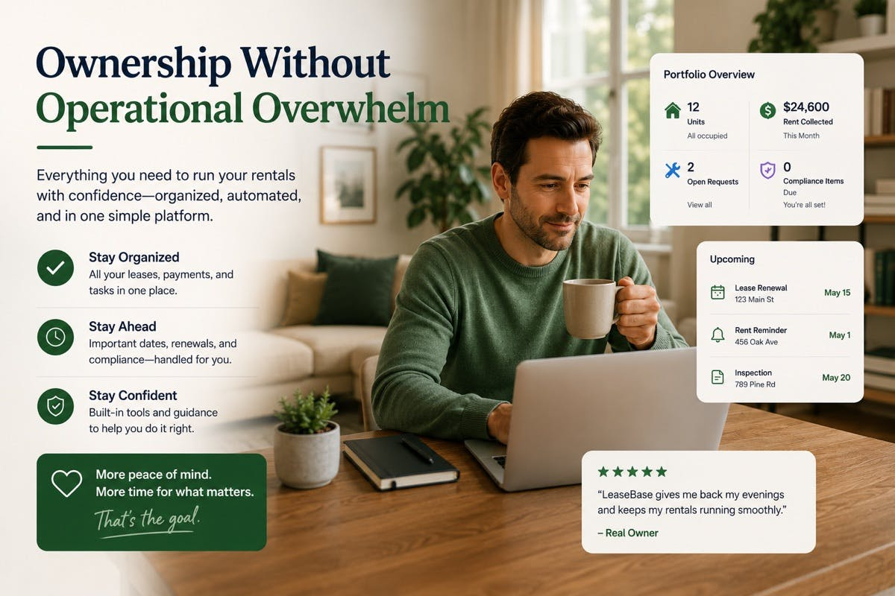
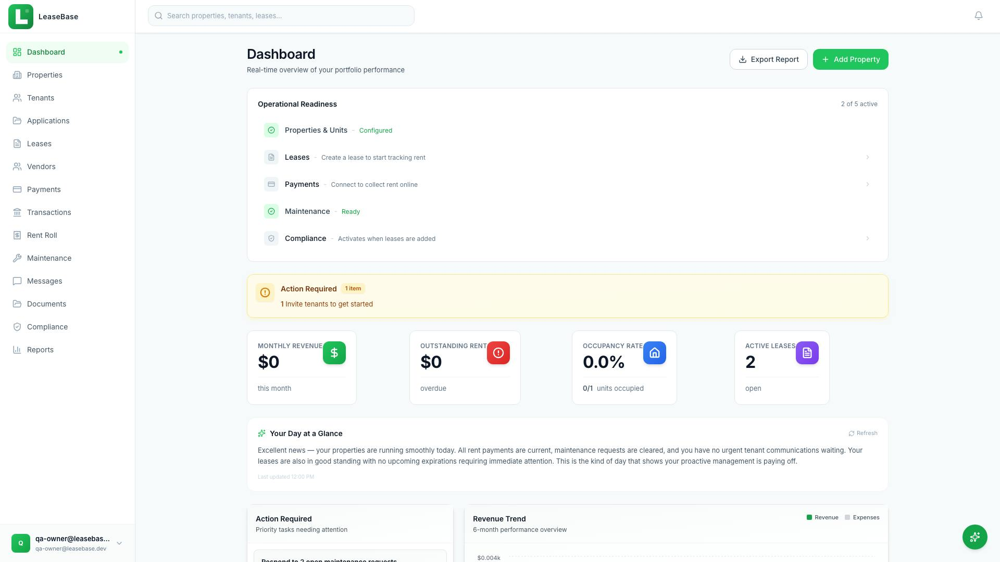
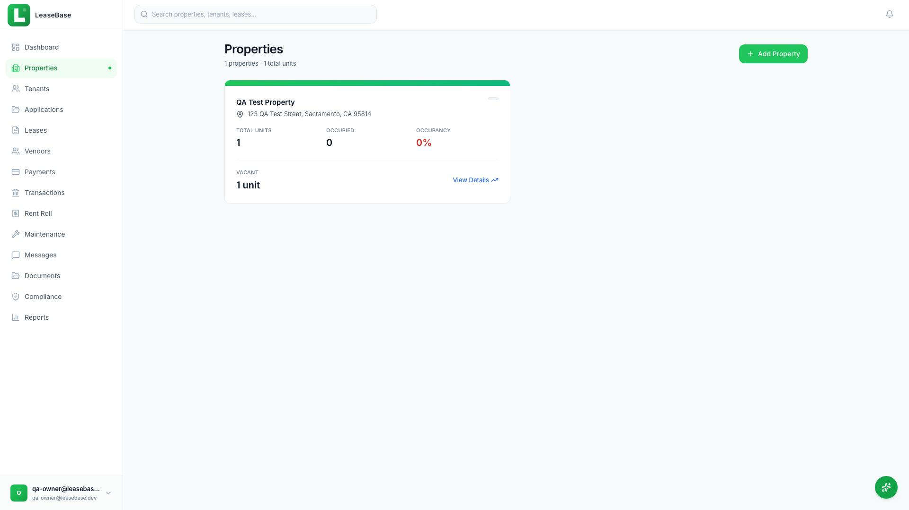

### 🎬 관련 영상
- [🎥 영상 보기](https://ph-files.imgix.net/a0ccaf3e-c292-4ada-b56f-b7f57087221f.jpeg?auto=format)

---

## 15. [Mascofast](https://www.producthunt.com/products/mascofast)
**Votes**: 16 | **도입 난이도**: 하 | **신뢰도**: 상
**Tagline**: text to animated mascot in minutes
**서비스 링크**: https://www.producthunt.com/r/FWYHFXTKTAKWWK

**태그**: DesignTool, AI, SaaS, Animation, Automation, DevTool, Marketing

### 📌 이 서비스 한눈에 보기
아이디어만으로 애니메이션 마스코트를 제작하는 개발자 친화적 워크플로우

### 🔑 주요 기능
- 텍스트 입력을 통한 독창적인 캐릭터 생성
- 포즈 및 애니메이션 생성 기능 제공
- UI/마케팅용 투명 배경 에셋 내보내기 지원

### 🙋 사용자에게 어떤 점이 좋은가
앱이나 SaaS 제품에 필요한 캐릭터를 디자인 전문가 없이도 빠르게 제작하여 제품 경험을 풍부하게 만들 수 있습니다.

### ✅ 지금 바로 써볼 기능
- 텍스트로 캐릭터 아이디어 입력해보기
- 생성된 캐릭터의 포즈 및 애니메이션 조정하기
- 투명 배경 에셋으로 내보내기 테스트하기

### ⚠️ 사용 전 확인할 점
- 생성된 캐릭터의 저작권 및 상업적 이용 범위 확인 필요
- 복잡한 커스텀 디자인 요구사항 충족 여부 확인

### 🧭 확인이 더 필요한 정보
상세한 가격 정책과 생성 가능한 애니메이션의 정교함 수준에 대한 정보가 부족합니다.

### 📸 스크린샷 및 갤러리
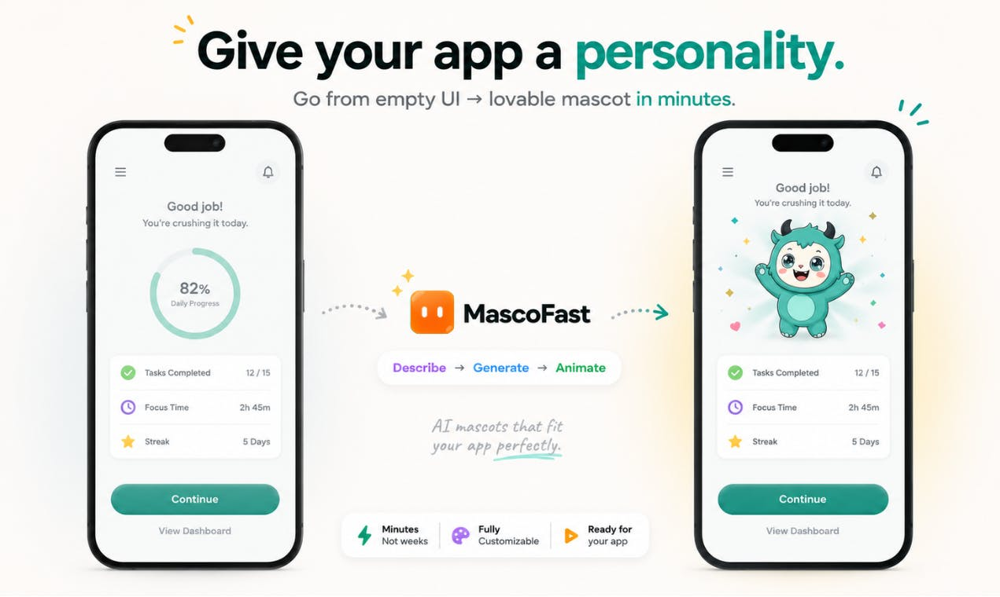
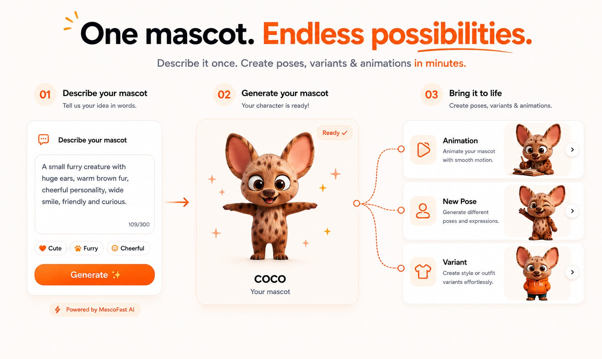
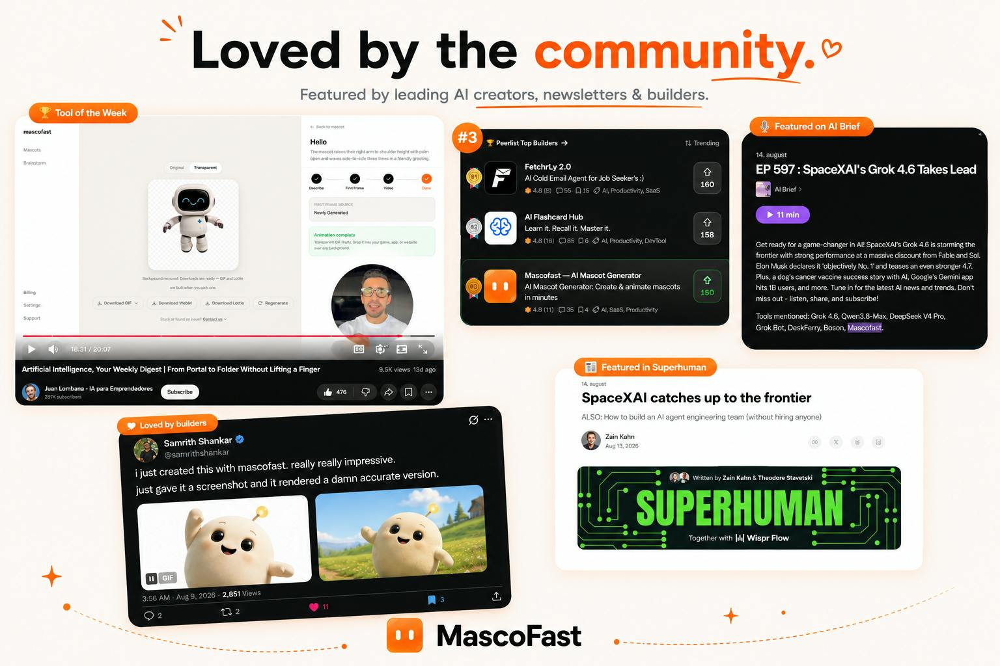

### 🎬 관련 영상
- [🎥 영상 보기](https://ph-files.imgix.net/670d786f-bdaa-455f-91aa-cd186da2af61.jpeg?auto=format)

---

## 16. [GitFig](https://www.producthunt.com/products/gitfig)
**Votes**: 13 | **도입 난이도**: 중 | **신뢰도**: 상
**Tagline**: Sync Figma with GitHub
**서비스 링크**: https://www.producthunt.com/r/DWRKWJWFO4ZCCJ

**태그**: DesignOps, DevTools, Automation, Figma, GitHub, Design

### 📌 이 서비스 한눈에 보기
피그마 디자인과 깃허브 코드를 양방향으로 동기화하는 버전 관리 플러그인

### 🔑 주요 기능
- 피그마와 깃허브 간의 양방향 동기화 지원
- 디자인 토큰, 변수, 스타일을 JSON 형태로 레포지토리에서 관리
- 피그마 내부에서 브랜치, 커밋, 풀 리퀘스트(PR) 워크플로우 실행

### 🙋 사용자에게 어떤 점이 좋은가
디자인 시스템의 변경 사항을 코드와 일치시키기 위한 수동 작업을 자동화하여 개발자와 디자이너 간의 협업 효율을 극대화합니다.

### ✅ 지금 바로 써볼 기능
- 피그마 디자인 토큰을 JSON으로 내보내기
- 깃허브 레포지토리와 피그마 변수 연결하기
- 피그마 내에서 디자인 변경사항을 PR로 생성하기

### ⚠️ 사용 전 확인할 점
- 디자인 데이터가 JSON으로 변환될 때의 구조적 정합성 확인 필요
- 깃허브 워크플로우에 익숙하지 않은 디자이너의 진입 장벽

### 🧭 확인이 더 필요한 정보
복잡한 디자인 시스템의 규모에 따른 동기화 속도 및 충돌 해결 방식에 대한 구체적인 정보가 부족합니다.

### 📸 스크린샷 및 갤러리
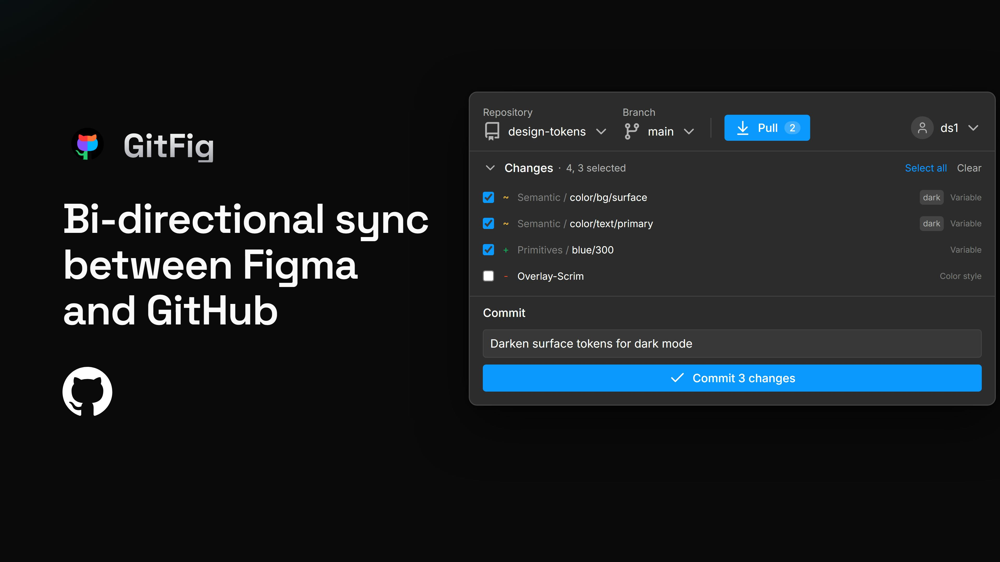
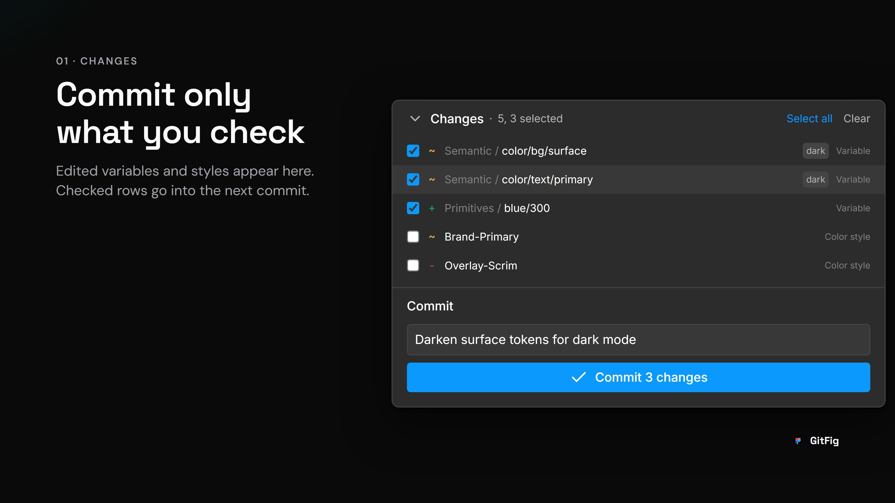
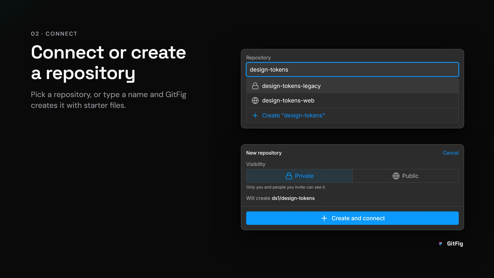

---

## 17. [ConscioussAI](https://www.producthunt.com/products/conscioussai)
**Votes**: 10 | **도입 난이도**: 중 | **신뢰도**: 상
**Tagline**: AI that runs your phone and computer
**서비스 링크**: https://www.producthunt.com/r/VXNQ5GICTMHHLU

**태그**: AI Agent, Automation, Productivity, Cross-Platform, Agent, AI Tool

### 📌 이 서비스 한눈에 보기
단순 답변을 넘어 사용자의 기기를 직접 제어하며 복잡한 업무를 수행하는 AI 에이전트

### 🔑 주요 기능
- 질문 답변을 넘어 웹 브라우징, 문서 작성, 쇼핑 등 실질적 작업 수행
- 여러 앱을 오가는 번거로움 없이 하나의 인터페이스로 워크플로우 완결
- Mac, Windows, iOS, Android 등 모든 주요 OS 지원

### 🙋 사용자에게 어떤 점이 좋은가
여러 앱을 번갈아 가며 작업할 필요 없이 말 한마디로 복잡한 업무를 자동화할 수 있어 생산성이 극대화됩니다.

### ✅ 지금 바로 써볼 기능
- 복잡한 여행 일정 계획 및 예약 시도하기
- 웹 리서치 및 문서 초안 작성 자동화하기
- 메시지 관리 및 온라인 쇼핑 작업 맡기기

### ⚠️ 사용 전 확인할 점
- 사용자 승인 기반이지만 기기 제어 권한에 따른 보안 및 개인정보 관리 필요
- 복잡한 워크플로우 수행 시 예상치 못한 동작 발생 가능성

### 🧭 확인이 더 필요한 정보
기기 제어 방식(접근성 권한 사용 여부 등)과 구체적인 보안 프로토콜에 대한 정보가 필요합니다.

### 📸 스크린샷 및 갤러리
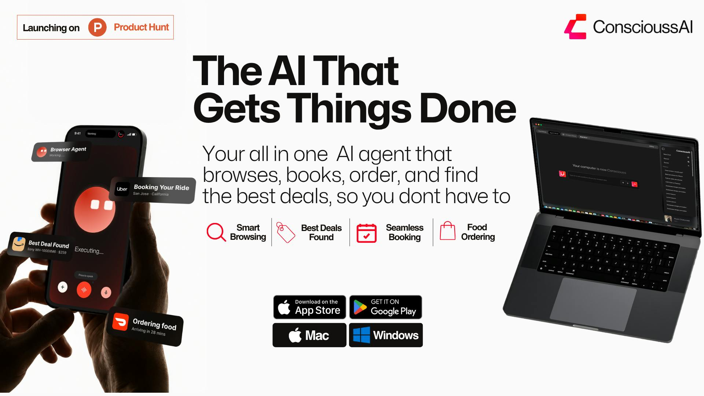

---

## 18. [Fraime](https://www.producthunt.com/products/fraime-2)
**Votes**: 10 | **도입 난이도**: 중 | **신뢰도**: 상
**Tagline**: Open source AI media generation platform
**서비스 링크**: https://www.producthunt.com/r/GGU4F2YKMF5P4D

**태그**: OpenSource, AI-Video, Automation, DevTool, Agent, AI Tool, Prompting, Video, Vision, API

### 📌 이 서비스 한눈에 보기
하드웨어 최적화부터 프롬프트 구조화까지 자동화하는 오픈소스 AI 미디어 생성 플랫폼

### 🔑 주요 기능
- 사용자 하드웨어 사양에 맞춘 최적의 오픈소스 모델 자동 선택
- 복잡한 파이프라인 관리 없이 API 또는 MCP를 통한 간편한 미디어 생성
- 라이선스 제약 없는 완전 무료 오픈소스 모델 카탈로그 제공

### 🙋 사용자에게 어떤 점이 좋은가
고가의 폐쇄형 플랫폼 대신 자신의 하드웨어를 활용해 비용 효율적으로 고품질 AI 비디오를 생성할 수 있습니다.

### ✅ 지금 바로 써볼 기능
- 자신의 하드웨어 환경에서 모델 호환성 테스트하기
- API를 통한 미디어 생성 워크플로우 구축하기
- 코딩 에이전트와 MCP를 연결하여 자동화 실험하기

### ⚠️ 사용 전 확인할 점
- 로컬 하드웨어 성능에 따라 생성 속도 및 품질 차이 발생 가능
- 현재 비디오 모델 중심이며 이미지 및 오디오 기능은 향후 업데이트 예정

### 🧭 확인이 더 필요한 정보
사용자의 하드웨어 사양에 따른 구체적인 모델 매칭 알고리즘과 최적화 수준은 직접 실행 전까지 확인이 필요합니다.

### 📸 스크린샷 및 갤러리
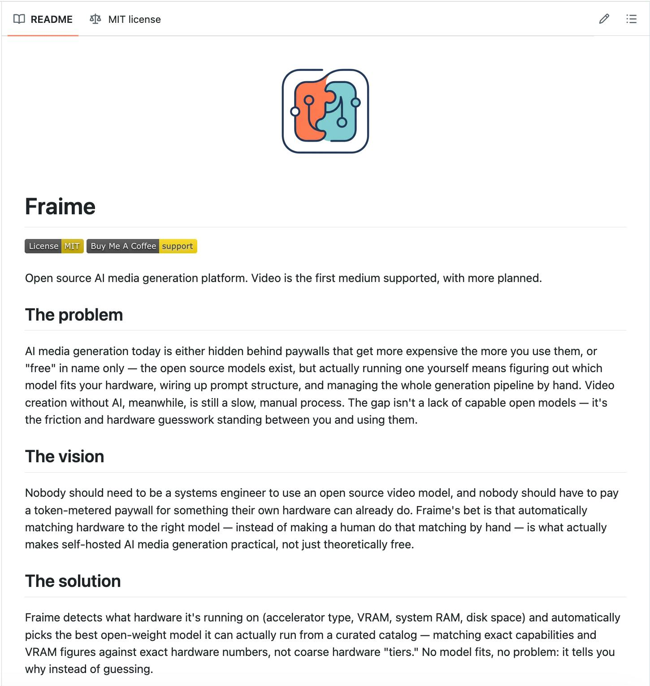
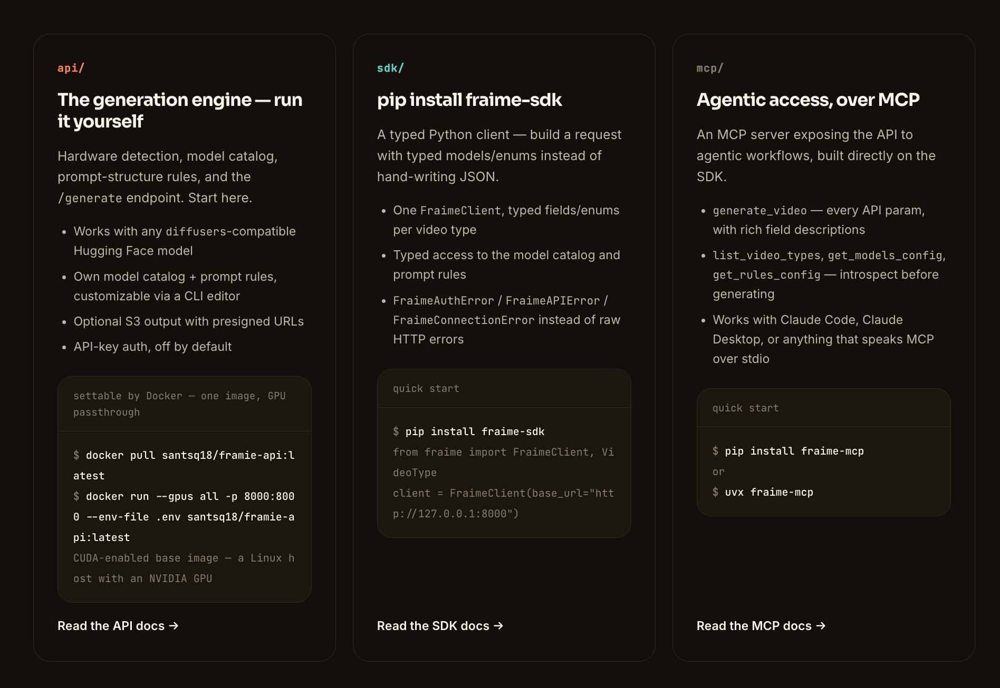
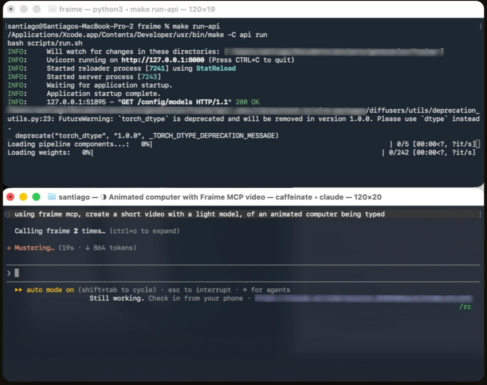

---

## 19. [Claimads.land](https://www.producthunt.com/products/claimads-land)
**Votes**: 10 | **도입 난이도**: 중 | **신뢰도**: 상
**Tagline**: The live map where startups battle for advertising territory
**서비스 링크**: https://www.producthunt.com/r/JUIFDK7YO26HGZ

**태그**: Marketing, Gamification, Advertising, Marketplace, AI Tool

### 📌 이 서비스 한눈에 보기
실시간 지도 위에서 광고 영역을 점유하고 확장하는 게임형 광고 마켓플레이스

### 🔑 주요 기능
- 실시간 인터랙티브 지도를 통한 디지털 광고 영토 점유
- 예산 할당을 통한 영토 확장 및 가시성 방어 메커니즘
- 기존 PPC 광고를 게임 요소가 결합된 몰입형 방식으로 전환

### 🙋 사용자에게 어떤 점이 좋은가
단순한 클릭 유도를 넘어, 시각적이고 경쟁적인 환경에서 브랜드 노출을 확보할 수 있는 새로운 마케팅 경험을 제공합니다.

### ✅ 지금 바로 써볼 기능
- 초기 타일 점유를 통한 영토 확보
- 예산 배분을 통한 영토 확장 전략 수립
- 경쟁자로부터의 가시성 방어 전략 실행

### ⚠️ 사용 전 확인할 점
- 경쟁이 치열할 경우 예산 소모가 급격히 발생할 가능성
- 게임적 요소가 실제 광고 전환율(ROI)로 이어지는지에 대한 검증 필요

### 🧭 확인이 더 필요한 정보
실제 광고 노출이 이루어지는 타겟 유저층과 구체적인 영토 확장 알고리즘에 대한 정보가 부족합니다.

### 📸 스크린샷 및 갤러리

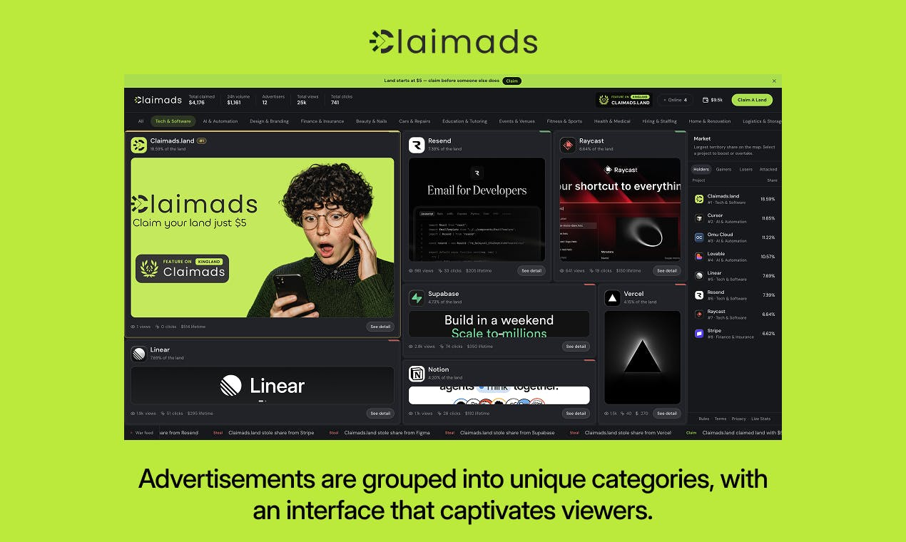
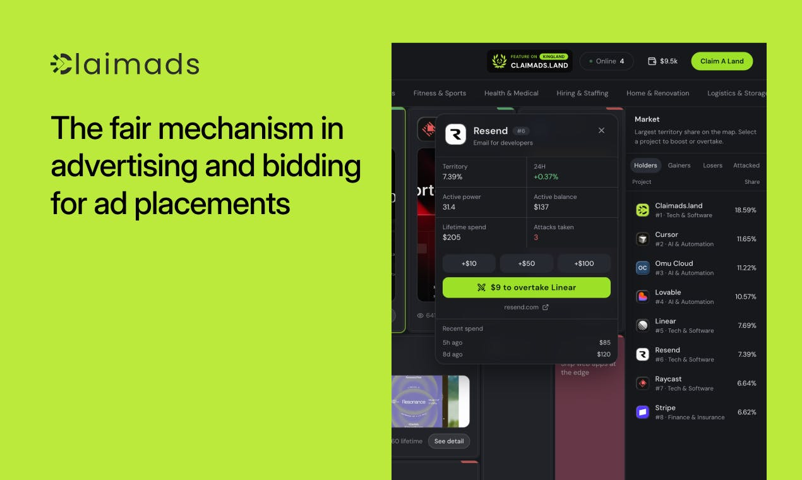

### 🎬 관련 영상
- [🎥 영상 보기](https://ph-files.imgix.net/c741f44a-a7b9-434c-8ac5-cddf493f6a83.jpeg?auto=format)

---

## 20. [Remivu](https://www.producthunt.com/products/remivu)
**Votes**: 9 | **도입 난이도**: 하 | **신뢰도**: 상
**Tagline**: Save why it mattered. Find it when it matters.
**서비스 링크**: https://www.producthunt.com/r/PIBHF5OR35CLYB

**태그**: Productivity, Personal Knowledge Management, Social Media, Search, Video

### 📌 이 서비스 한눈에 보기
SNS와 웹의 소중한 콘텐츠를 나만의 언어로 저장하고 쉽게 찾는 개인용 메모리 서비스

### 🔑 주요 기능
- Instagram, TikTok, YouTube, LinkedIn 등 다양한 플랫폼 콘텐츠 저장 가능
- 단순 저장을 넘어 '왜 저장했는지'에 대한 맥락을 함께 기록
- 원래 제목이 아닌 사용자가 기억하는 자연스러운 단어로 검색 가능

### 🙋 사용자에게 어떤 점이 좋은가
정보 과잉 시대에 흩어진 콘텐츠를 맥락 중심으로 정리하여, 나중에 다시 찾을 때 겪는 어려움을 해결해 줍니다.

### ✅ 지금 바로 써볼 기능
- 자주 보는 SNS 콘텐츠를 Remivu로 공유하기
- 저장 시 나만의 이유(Context)를 짧게 덧붙이기
- 나중에 기억날 법한 키워드로 저장된 내용 검색해보기

### ⚠️ 사용 전 확인할 점
- 플랫폼별 공유 기능 지원 여부 확인 필요
- 개인적인 메모 데이터의 보안 및 프라이버시 정책 확인 필요

### 🧭 확인이 더 필요한 정보
현재 제공되는 플랫폼 외의 웹 페이지 저장 방식과 모바일 앱 지원 여부에 대한 구체적인 정보가 필요합니다.

### 📸 스크린샷 및 갤러리
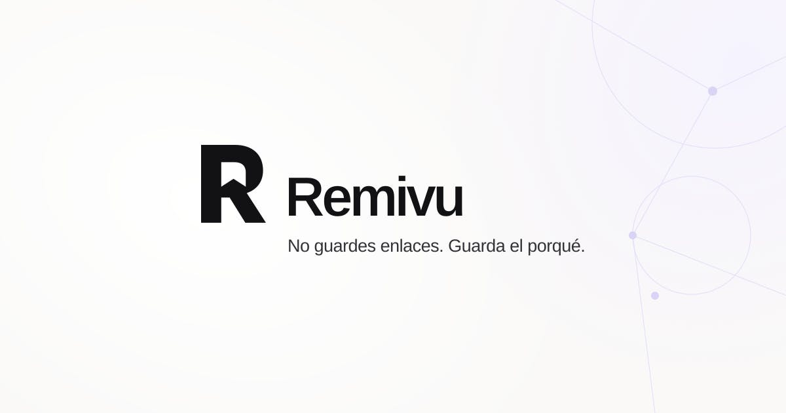
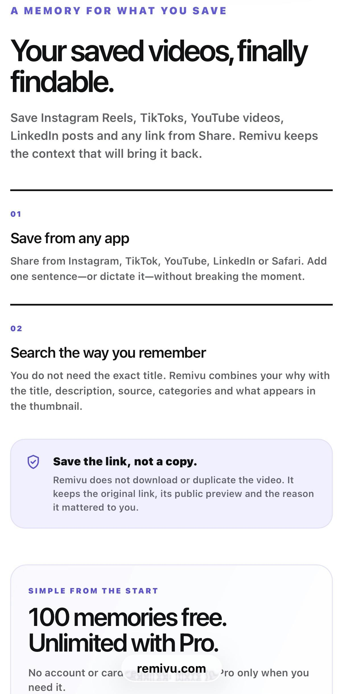

### 🎬 관련 영상
- [🎥 영상 보기](https://ph-files.imgix.net/60e733c4-7c2e-43e3-89ec-879173c0e13d.jpeg?auto=format)

---

## 21. [CreditFX](https://www.producthunt.com/products/creditfx-the-exchange-rate-for-ai)
**Votes**: 9 | **도입 난이도**: 하 | **신뢰도**: 상
**Tagline**: Stop counting credits. Start understanding them.
**서비스 링크**: https://www.producthunt.com/r/5ZM7GXGLGHTIOG

**태그**: AI, FinTech, SaaS, Analytics, Cost-Management, AI Tool

### 📌 이 서비스 한눈에 보기
복잡한 AI 크레딧 단위를 실제 비용과 사용량 가치로 변환해주는 분석 도구

### 🔑 주요 기능
- 다양한 AI 플랫폼의 크레딧, 토큰, 분 단위 비용을 달러 가치로 환산
- 크레딧이 실제 어떤 결과물을 만들어내는지 직관적인 사용량 분석 제공
- 사용자 목적에 맞춘 비용 및 플랜 예측 기능(Usage Planner) 제공

### 🙋 사용자에게 어떤 점이 좋은가
AI 서비스마다 제각각인 과금 체계 때문에 발생하는 혼란을 줄이고, 실제 지출 대비 효율성을 명확히 파악할 수 있습니다.

### ✅ 지금 바로 써볼 기능
- 현재 사용 중인 AI 서비스의 크레딧 가치 계산해보기
- Usage Planner를 통해 목표 작업에 필요한 예상 비용 산출하기

### ⚠️ 사용 전 확인할 점
- 플랫폼별 실시간 API 연동 여부에 따라 데이터 정확도가 달라질 수 있음
- 특정 플랫폼에 국한된 기능일 수 있으므로 지원 범위를 확인해야 함

### 🧭 확인이 더 필요한 정보
모든 AI 플랫폼이 실시간으로 지원되는지, 혹은 수동 입력 방식인지에 대한 구체적인 연동 범위 확인이 필요합니다.

### 📸 스크린샷 및 갤러리
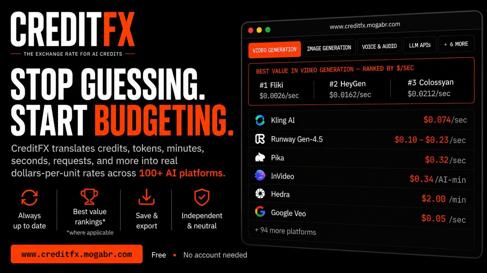
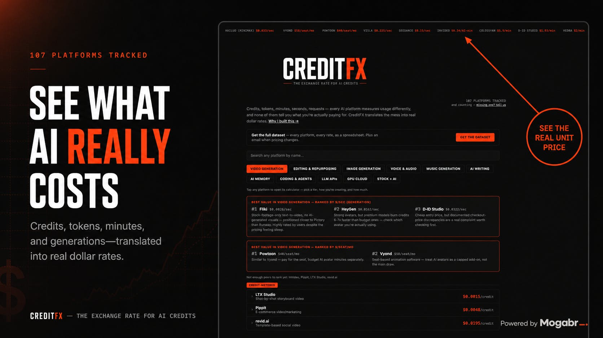
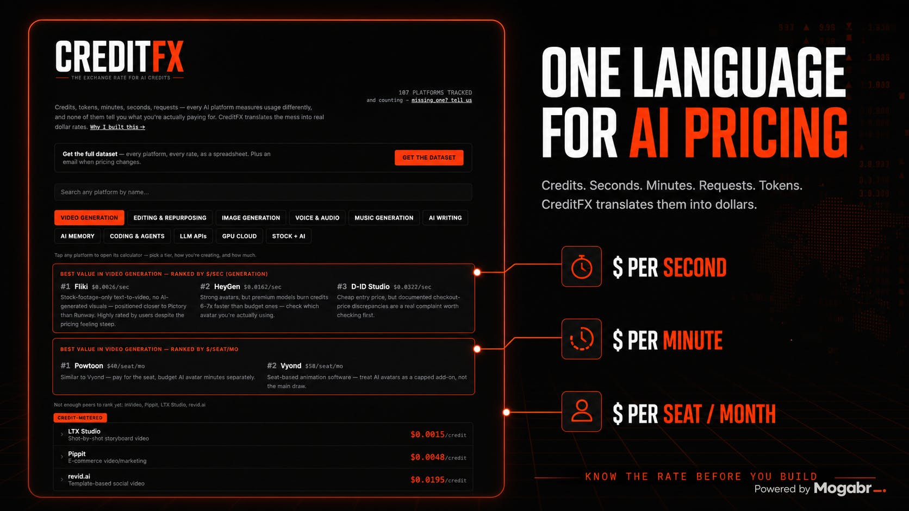

### 🎬 관련 영상
- [🎥 영상 보기](https://ph-files.imgix.net/72723740-98fd-4d17-a8ba-09030cb239b7.jpeg?auto=format)

---

## 22. [Remivu](https://www.producthunt.com/products/remivu)
**Votes**: 9 | **도입 난이도**: 하 | **신뢰도**: 상
**Tagline**: Save why it mattered. Find it when it matters.
**서비스 링크**: https://www.producthunt.com/r/PIBHF5OR35CLYB

**태그**: Productivity, Personal Knowledge Management, Social Media, Search, Video

### 📌 이 서비스 한눈에 보기
SNS와 웹의 소중한 콘텐츠를 나만의 언어로 저장하고 쉽게 찾는 개인용 메모리 서비스

### 🔑 주요 기능
- Instagram, TikTok, YouTube, LinkedIn 등 다양한 플랫폼 콘텐츠 저장 가능
- 단순 저장을 넘어 '왜 저장했는지'에 대한 맥락을 함께 기록
- 원래 제목이 아닌 사용자가 기억하는 자연스러운 단어로 검색 가능

### 🙋 사용자에게 어떤 점이 좋은가
정보 과잉 시대에 흩어진 콘텐츠를 맥락 중심으로 정리하여, 나중에 다시 찾을 때 겪는 어려움을 해결해 줍니다.

### ✅ 지금 바로 써볼 기능
- 자주 보는 SNS 콘텐츠를 Remivu로 공유하기
- 저장 시 나만의 이유(Context)를 짧게 덧붙이기
- 나중에 기억날 법한 키워드로 저장된 내용 검색해보기

### ⚠️ 사용 전 확인할 점
- 플랫폼별 공유 기능 지원 여부 확인 필요
- 개인적인 메모 데이터의 보안 및 프라이버시 정책 확인 필요

### 🧭 확인이 더 필요한 정보
현재 제공되는 플랫폼 외의 웹 페이지 저장 방식과 모바일 앱 지원 여부에 대한 구체적인 정보가 필요합니다.

### 📸 스크린샷 및 갤러리

### 🎬 관련 영상
- [🎥 영상 보기](https://ph-files.imgix.net/60e733c4-7c2e-43e3-89ec-879173c0e13d.jpeg?auto=format)

---

## 23. [WaterMe](https://www.producthunt.com/products/waterme)
**Votes**: 8 | **도입 난이도**: 하 | **신뢰도**: 상
**Tagline**: The all-in-one plant care hub
**서비스 링크**: https://www.producthunt.com/r/T3NQE5RT75QMBH

**태그**: PlantCare, Lifestyle, Productivity

### 📌 이 서비스 한눈에 보기
날씨와 사진 기록을 결합한 올인원 식물 관리 허브

### 🔑 주요 기능
- 날씨 변화를 반영한 지능형 식물 관리 트래킹
- 성장 과정을 한눈에 보는 사진 타임라인 기능
- 외국어 가이드 및 간편한 식물 관리 위탁 기능

### 🙋 사용자에게 어떤 점이 좋은가
단순 알림을 넘어 날씨와 성장 기록을 통합 관리함으로써 초보자도 실패 없는 식물 재배가 가능합니다.

### ✅ 지금 바로 써볼 기능
- 다국어 가이드를 통한 식물 관리법 학습
- 사진 타임라인에 식물 성장 기록하기
- 지인에게 식물 관리 권한 전달해보기

### ⚠️ 사용 전 확인할 점
- 브라우저 기반 서비스이므로 모바일 앱 환경과의 편의성 차이 확인 필요
- 날씨 데이터 연동 방식에 따른 정확도 차이 가능성

### 🧭 확인이 더 필요한 정보
웹 브라우저 기반 서비스로서 모바일 환경에서의 푸시 알림 지원 여부가 불분명합니다.

### 📸 스크린샷 및 갤러리
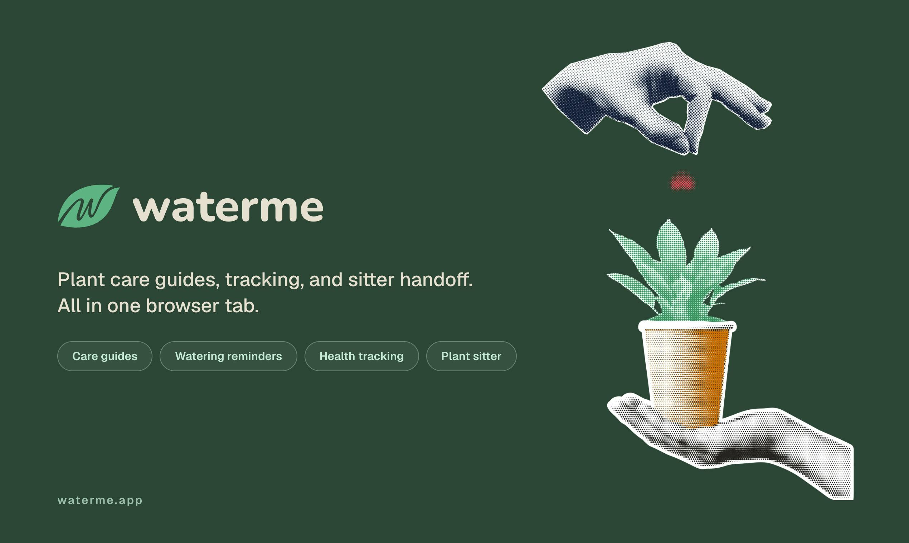
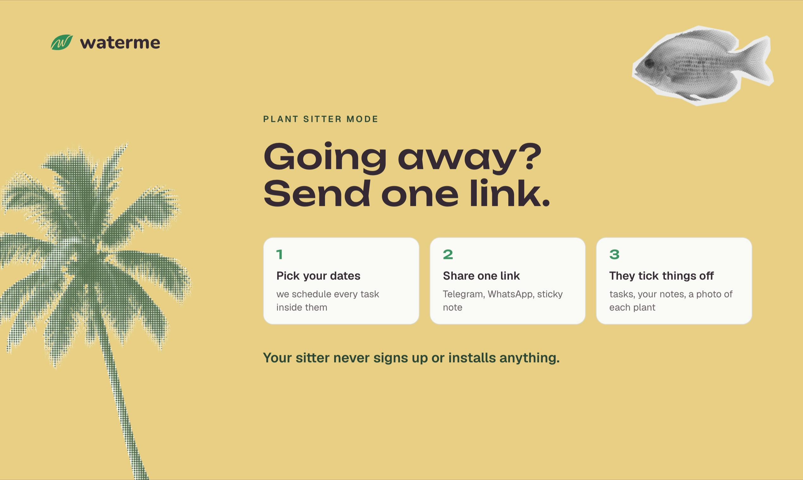
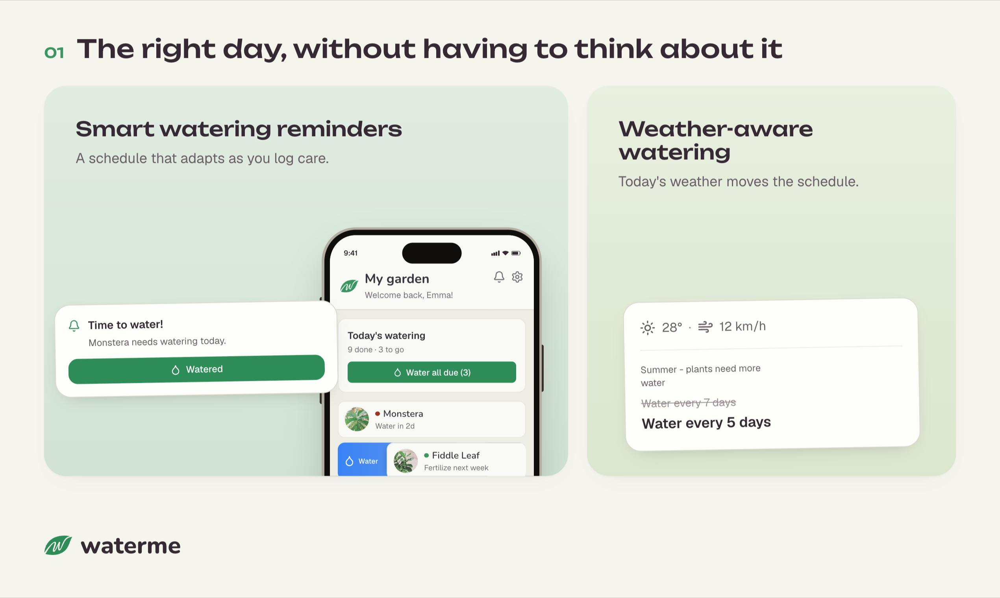

### 🎬 관련 영상
- [🎥 영상 보기](https://ph-files.imgix.net/61e2261b-17c1-4101-be14-4da5db7627b0.jpeg?auto=format)

---

## 24. [MapWars](https://www.producthunt.com/products/mapwars)
**Votes**: 8 | **도입 난이도**: 하 | **신뢰도**: 상
**Tagline**: Own a San Francisco neighborhood - Bidding starts at $10
**서비스 링크**: https://www.producthunt.com/r/GP6ZY5A2SER3MG

**태그**: Gaming, Strategy, Auction

### 📌 이 서비스 한눈에 보기
샌프란시스코의 특정 구역을 소유하고 방어하는 전략적 경매 게임

### 🔑 주요 기능
- 샌프란시스코 내 41개 지역을 대상으로 하는 구역 소유 시스템
- 최소 $10부터 시작하는 경매 방식
- 낙찰된 구역을 매주 경매일에 방어하는 게임 플레이

### 🙋 사용자에게 어떤 점이 좋은가
적은 비용으로 디지털 영토를 점유하고, 매주 경쟁자들로부터 자신의 구역을 지켜내는 전략적 재미를 제공합니다.

### ✅ 지금 바로 써볼 기능
- 최소 금액인 $10로 경매 참여해보기
- 원하는 샌프란시스코 지역 입찰하기
- 매주 열리는 경매일 일정 확인하기

### ⚠️ 사용 전 확인할 점
- 경쟁자가 있을 경우 구역 방어에 실패할 수 있음
- 경매 방식이므로 낙찰 시 비용이 발생함

### 🧭 확인이 더 필요한 정보
경쟁자 간의 구체적인 방어 규칙과 승리 조건에 대한 상세 정보가 필요합니다.

### 📸 스크린샷 및 갤러리
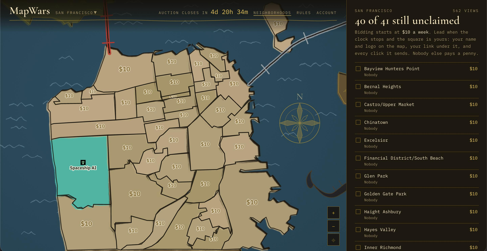

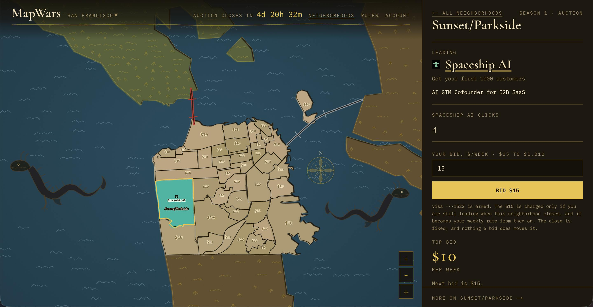

### 🎬 관련 영상
- [🎥 영상 보기](https://ph-files.imgix.net/046bc8b0-72c1-4419-8888-b947cfae4f13.jpeg?auto=format)

---

## 25. [Faurus](https://www.producthunt.com/products/faurus)
**Votes**: 8 | **도입 난이도**: 중 | **신뢰도**: 상
**Tagline**: One proctored pipeline for coding, viva & hiring exams
**서비스 링크**: https://www.producthunt.com/r/CVGBVZBVPGDOSY

**태그**: EdTech, HRTech, Assessment, Proctoring

### 📌 이 서비스 한눈에 보기
코딩 테스트부터 면접까지, 모든 기술 평가를 하나의 파이프라인으로 통합하는 감독 솔루션

### 🔑 주요 기능
- 코딩, 이론, MCQ, 구술 면접을 아우르는 통합 평가 환경 제공
- 대학, 학원, 채용 팀을 위한 맞춤형 평가 워크플로우
- 파편화된 평가 과정을 하나의 감독 가능한 파이프라인으로 통합

### 🙋 사용자에게 어떤 점이 좋은가
여러 도구를 번갈아 사용할 필요 없이 하나의 플랫폼에서 모든 기술 검증을 끝낼 수 있어 평가 운영 효율이 극대화됩니다.

### ✅ 지금 바로 써볼 기능
- 자체 평가 프로세스에 맞춘 커스텀 문제 세트 구성하기
- 코딩 및 구술 면접 통합 워크플로우 테스트하기

### ⚠️ 사용 전 확인할 점
- 사용자 환경(네트워크, 하드웨어)에 따른 감독 기능의 안정성 확인 필요
- 특정 교육 기관이나 기업의 기존 시스템과의 연동 여부 확인 필요

### 🧭 확인이 더 필요한 정보
구체적인 감독(Proctoring) 방식과 부정행위 방지 기술의 상세 수준을 확인해야 합니다.

### 📸 스크린샷 및 갤러리
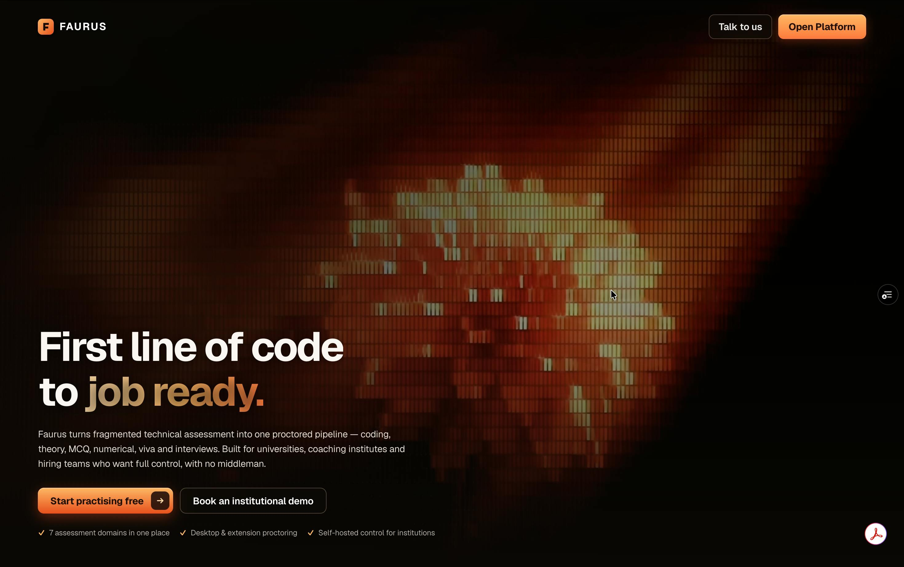
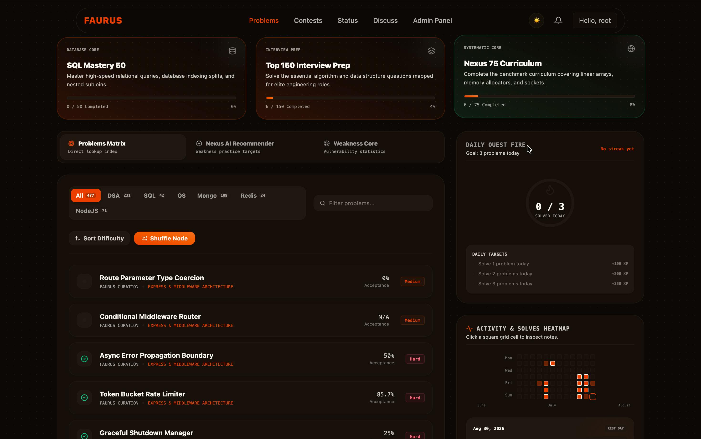
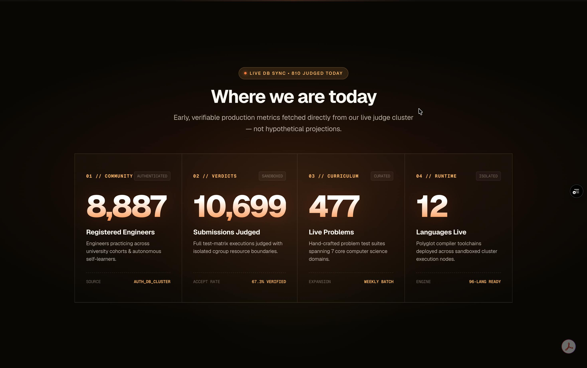

---

## 26. [Rival Radar](https://www.producthunt.com/products/rival-radar-2)
**Votes**: 7 | **도입 난이도**: 하 | **신뢰도**: 상
**Tagline**: AI-powered competitor pricing & feature tracking
**서비스 링크**: https://www.producthunt.com/r/54PMRX65IVLYWC

**태그**: AI, Competitor Intelligence, Automation, SaaS, AI Tool

### 📌 이 서비스 한눈에 보기
AI가 경쟁사의 가격과 기능 변화를 실시간으로 감지하여 핵심 요약만 전달하는 자동 모니터링 도구

### 🔑 주요 기능
- AI 기반의 자동 경쟁사 식별 및 24/7 모니터링
- 단순 변경사항이 아닌 비즈니스 가치가 있는 핵심 변화 위주의 필터링
- 복잡한 데이터 대신 이해하기 쉬운 자연어 요약 제공

### 🙋 사용자에게 어떤 점이 좋은가
수동 리서치 없이도 경쟁사의 전략 변화를 즉각 파악하여 비즈니스 의사결정 속도를 높일 수 있습니다.

### ✅ 지금 바로 써볼 기능
- 비즈니스 설명 입력하여 경쟁사 자동 탐색하기
- 3개 경쟁사 무료 모니터링 설정하기
- AI가 생성한 변화 요약 리포트 확인하기

### ⚠️ 사용 전 확인할 점
- 무료 플랜은 최대 3개의 경쟁사만 모니터링 가능
- 데이터 업데이트 주기가 일 단위로 제한됨

### 🧭 확인이 더 필요한 정보
무료 플랜 외의 유료 플랜 가격 정책 및 확장 기능에 대한 정보가 명시되지 않았습니다.

### 📸 스크린샷 및 갤러리
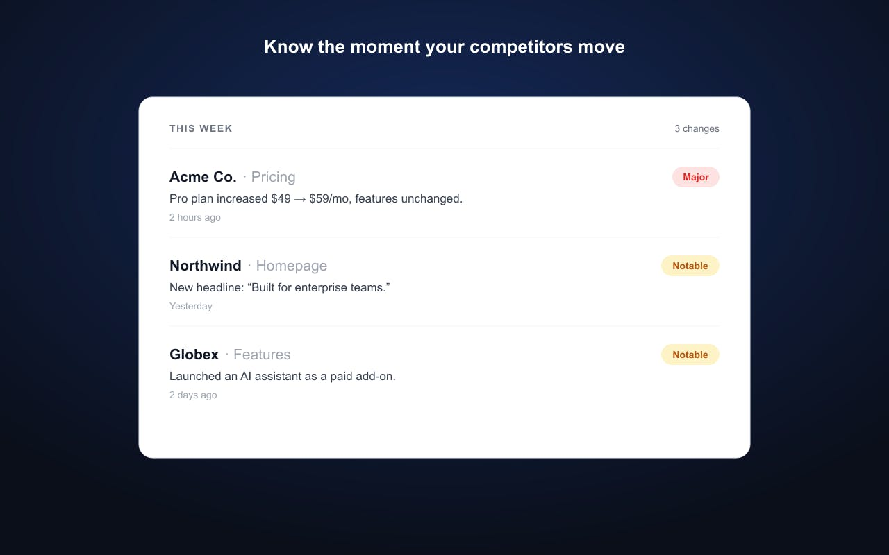
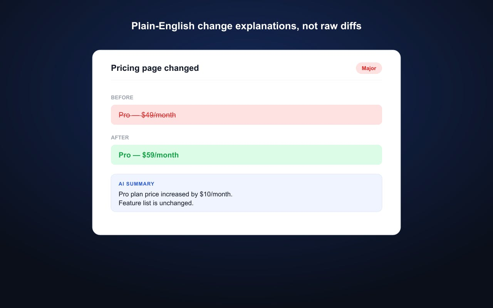
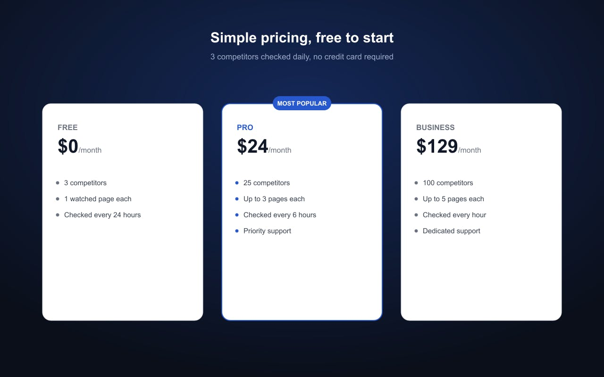

---

## 27. [Out Hood](https://www.producthunt.com/products/out-hood)
**Votes**: 6 | **도입 난이도**: 하 | **신뢰도**: 상
**Tagline**: Bid your way out of the hood to Hollywood
**서비스 링크**: https://www.producthunt.com/r/IT4TUTE4M6IGYE

**태그**: Marketing, Community, Crowdfunding, Branding, AI Tool

### 📌 이 서비스 한눈에 보기
커뮤니티의 참여형 입찰을 통해 아이디어를 홍보하고 대규모 노출 기회를 얻는 플랫폼

### 🔑 주요 기능
- 커뮤니티 기반의 참여형 입찰 시스템
- 팬과 지지자들이 입찰액을 더해 프로젝트를 지원하는 방식
- 목표 금액 달성 시 10,000명 이상의 방문자에게 프리미엄 노출 제공

### 🙋 사용자에게 어떤 점이 좋은가
자신의 브랜드나 아이디어를 홍보하고 싶은 창작자가 팬들의 지지를 모아 대규모 노출 기회를 얻을 수 있습니다.

### ✅ 지금 바로 써볼 기능
- The Hood에서 $1로 프로젝트 시작하기
- 자신의 페이지를 공유하여 커뮤니티 참여 유도하기
- 목표 금액을 달성하여 Hollywood 노출 단계로 진입하기

### ⚠️ 사용 전 확인할 점
- 목표 금액 달성 여부에 따라 노출 기회가 결정됨
- 커뮤니티의 참여와 지지가 필수적임

### 🧭 확인이 더 필요한 정보
입찰 방식의 구체적인 규칙과 최종 노출 단계인 'Hollywood'의 상세 운영 방식에 대한 확인이 필요합니다.

### 📸 스크린샷 및 갤러리

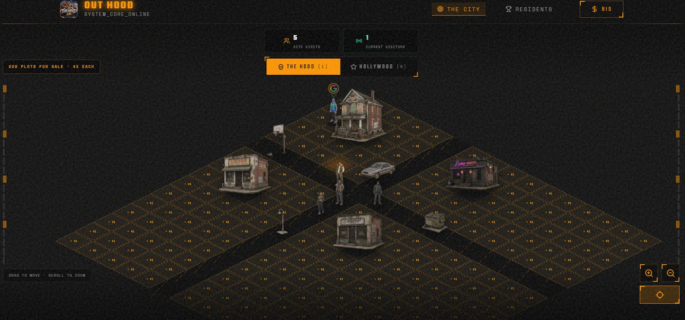

---

## 28. [Influencer Finder](https://www.producthunt.com/products/oriane)
**Votes**: 6 | **도입 난이도**: 하 | **신뢰도**: 상
**Tagline**: Find 10 influencers for free and no signup
**서비스 링크**: https://www.producthunt.com/r/UJD7FM3NPPHVTU
**재등장**: 최근 7일 내 재등장 (마지막 등장 6일 전)

**태그**: AI, Marketing, Influencer, NoCode, AI Tool

### 📌 이 서비스 한눈에 보기
웹사이트 주소만 입력하면 브랜드에 딱 맞는 인플루언서를 즉시 찾아주는 AI 도구

### 🔑 주요 기능
- 회사 웹사이트 URL을 통한 AI 기반 타겟팅
- Instagram 및 TikTok 크리에이터 매칭
- 가입 없이 무료로 10명의 인플루언서 리스트 확보 가능

### 🙋 사용자에게 어떤 점이 좋은가
별도의 가입이나 복잡한 설정 없이도 브랜드 색깔에 맞는 인플루언서를 빠르게 탐색할 수 있습니다.

### ✅ 지금 바로 써볼 기능
- 회사 웹사이트 URL 복사하기
- AI가 추천하는 10명의 크리에이터 확인하기
- 콘텐츠 적합성 검토하기

### ⚠️ 사용 전 확인할 점
- 무료 제공되는 인플루언서 수가 10명으로 제한됨
- 추가 기능을 사용하려면 가입이 필요할 수 있음

### 🧭 확인이 더 필요한 정보
무료 제공 범위 외의 추가 기능이나 유료 플랜의 상세 조건은 확인이 필요합니다.

### 📸 스크린샷 및 갤러리
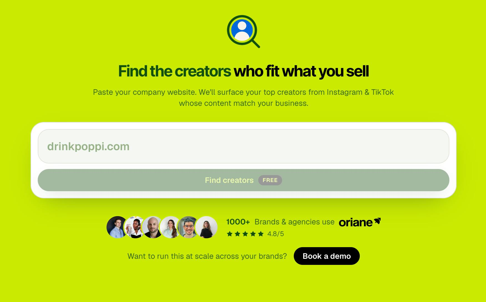

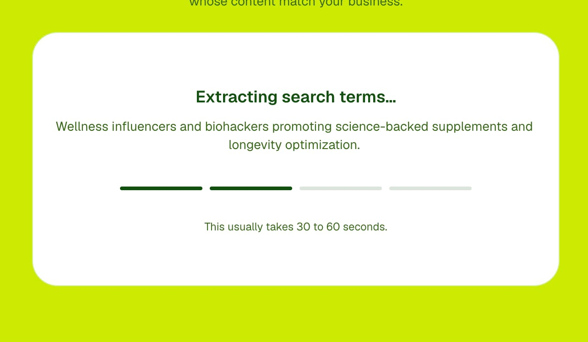

### 🎬 관련 영상
- [🎥 영상 보기](https://ph-files.imgix.net/ffedfa6f-57df-4066-9d88-6572b48710d3.jpeg?auto=format)

---

## 29. [Valentina Studio 18](https://www.producthunt.com/products/valentina-studio)
**Votes**: 5 | **도입 난이도**: 중 | **신뢰도**: 상
**Tagline**: Database Workflow Tools, AI Forms & Reports
**서비스 링크**: https://www.producthunt.com/r/KM3B5VN4OBWIXQ

**태그**: DevTool, Database, DataViz, AI, Workflow, Automation, AI Tool

### 📌 이 서비스 한눈에 보기
AI와 차세대 시각화 도구가 결합된 강력한 멀티 데이터베이스 워크플로우 관리 도구

### 🔑 주요 기능
- AI 기반 폼 생성 및 차세대 차트/그래프를 통한 리포트 시각화
- PostgreSQL, MySQL, DuckDB, SQL Server 등 다양한 DB 지원
- 쿼리 및 데이터 에디터 업그레이드를 통한 개발자 워크플로우 최적화

### 🙋 사용자에게 어떤 점이 좋은가
데이터 관리부터 시각적 리포트 생성까지 하나의 도구에서 효율적으로 처리할 수 있어 데이터 팀의 작업 속도를 높여줍니다.

### ✅ 지금 바로 써볼 기능
- AI-Enhanced Forms 기능을 통한 빠른 폼 제작
- Next-Gen Charts를 활용한 데이터 시각화 테스트
- 새로워진 쿼리 및 데이터 에디터로 작업 효율성 확인

### ⚠️ 사용 전 확인할 점
- 무료 버전(Studio FREE)과 유료 버전 간의 기능 차이 확인 필요
- 사용 중인 특정 데이터베이스 엔진과의 호환성 검토

### 🧭 확인이 더 필요한 정보
무료 버전에서 제공하는 관리 도구의 범위와 유료 기능과의 구체적인 차이점을 확인해야 합니다.

### 📸 스크린샷 및 갤러리
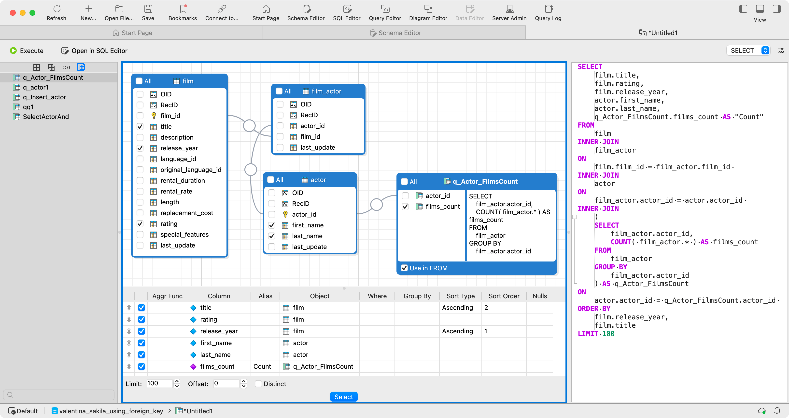
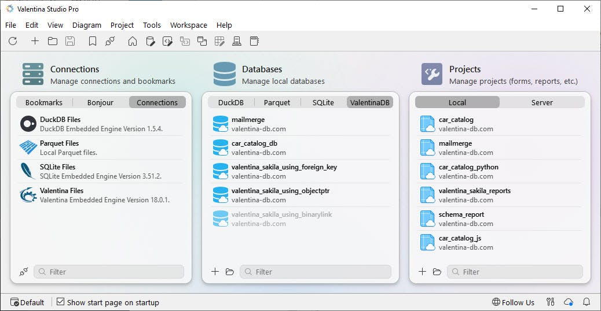

---

## 30. [SHODH — Autonomous Research Intelligence](https://www.producthunt.com/products/shodh-autonomous-research-intelligence)
**Votes**: 5 | **도입 난이도**: 중 | **신뢰도**: 상
**Tagline**: Investigate deeply. Decide confidently. Act on evidence.
**서비스 링크**: https://www.producthunt.com/r/77BK27QOWSDRCI

**태그**: AI, Research, Strategy, Decision Support, AI Tool

### 📌 이 서비스 한눈에 보기
복잡한 문제에 대해 심층 조사부터 의사결정 지원까지 수행하는 자율형 AI 리서치 플랫폼

### 🔑 주요 기능
- 다양한 소스를 통한 심층적인 문제 조사 및 데이터 수집
- 수집된 증거의 검증 및 정보 간의 모순/공백 식별
- 조사 결과를 바탕으로 실행 가능한 전략적 권고안 도출

### 🙋 사용자에게 어떤 점이 좋은가
단순 정보 검색을 넘어, 복잡한 난제에 대해 검증된 근거를 바탕으로 한 전략적 의사결정을 빠르게 내릴 수 있도록 돕습니다.

### ✅ 지금 바로 써볼 기능
- 어려운 질문을 입력하여 조사 프로세스 경험하기
- 도출된 권고안의 근거와 모순점 확인하기

### ⚠️ 사용 전 확인할 점
- AI가 생성한 권고안의 최종 책임은 사용자에게 있음
- 조사 범위와 소스에 따라 결과의 깊이가 달라질 수 있음

### 🧭 확인이 더 필요한 정보
구체적인 데이터 소스 범위와 실시간 정보 업데이트 방식에 대한 상세 정보가 필요합니다.

### 📸 스크린샷 및 갤러리
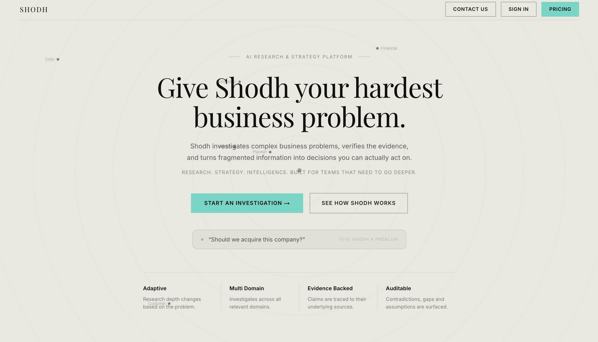

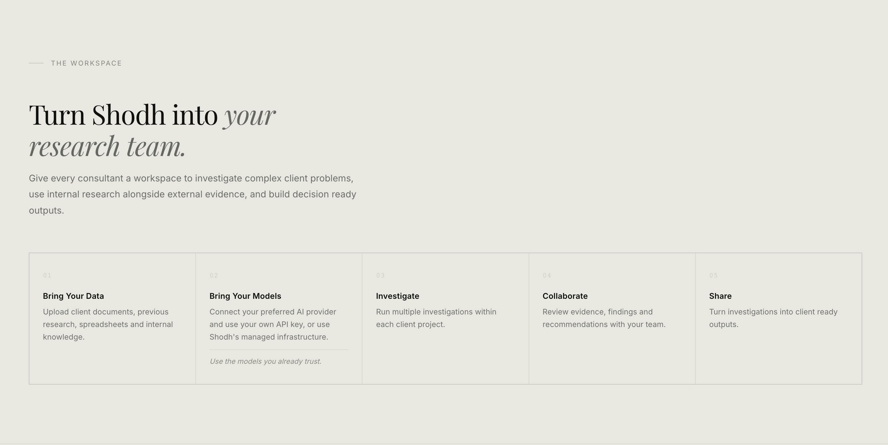

---

