# 🚀 Product Hunt Daily Top 30 (2026-09-02)

## 오늘의 요약
오늘의 제품들은 AI를 활용한 코딩 자동화, 개인 맞춤형 교육, 그리고 개발 환경의 편의성을 높이는 도구들이 주를 이루었습니다. 특히 기존의 작업 내용을 방해하지 않으면서도 강력한 기능을 제공하는 네이티브 도구와 보안이 강화된 통합 플랫폼에 대한 관심이 높았습니다.

### 오늘의 핵심 포인트
- AI 에이전트와 브라우저 확장 프로그램을 통해 코딩 및 웹 UI 수정 작업을 자연어로 간편하게 수행할 수 있는 도구들이 주목받았습니다.
- 학습자와 사용자에게 실시간 상호작용과 시뮬레이션을 제공하는 개인 맞춤형 교육 및 코칭 솔루션이 등장했습니다.
- 개발자 생산성을 높이는 IDE 통합 도구부터 보안이 강화된 API 플랫폼까지, 전문적인 작업 환경을 최적화하는 기술들이 강조되었습니다.

**오늘의 태그**: AI 에이전트, 개발 생산성, 맞춤형 교육, 오픈소스, 보안

## 1. [Kilo Code for JetBrains](https://www.producthunt.com/products/kilocode)
**Votes**: 387 | **도입 난이도**: 하 | **신뢰도**: 상
**Tagline**: Fully native, open-source coding agent built for JetBrains
**서비스 링크**: https://www.producthunt.com/r/Q57PO7OWZUJAZ5

**태그**: DevTool, AI, JetBrains, OpenSource, Agent, AI Tool, Design

### 📌 이 서비스 한눈에 보기
JetBrains IDE 환경에 최적화된 오픈소스 네이티브 코딩 에이전트

### 🔑 주요 기능
- 모든 JetBrains IDE(IntelliJ, PyCharm 등)를 지원하는 네이티브 에이전트
- 격리된 워크트리 내 병렬 에이전트 및 로컬/원격 개발 환경 지원
- 500개 이상의 모델 선택 가능 및 GitHub PR/Diff 인라인 연동

### 🙋 사용자에게 어떤 점이 좋은가
JetBrains 개발 환경을 벗어나지 않고도 강력한 AI 에이전트를 활용해 복잡한 코딩 작업을 자동화할 수 있습니다.

### ✅ 지금 바로 써볼 기능
- 사용 중인 JetBrains IDE에 플러그인 설치
- 원하는 AI 모델 연결 및 워크트리 기반 작업 테스트
- GitHub PR 연동을 통한 인라인 코드 수정 기능 확인

### ⚠️ 사용 전 확인할 점
- 오픈소스 프로젝트이므로 보안 정책에 따른 로컬/원격 환경 설정 필요
- 500개 이상의 모델 사용 시 각 모델별 비용이나 API 설정이 다를 수 있음

### 🧭 확인이 더 필요한 정보
사용하는 모델의 API 비용 및 로컬 리소스 점유율에 대한 구체적인 정보는 확인이 필요합니다.

### 📸 스크린샷 및 갤러리
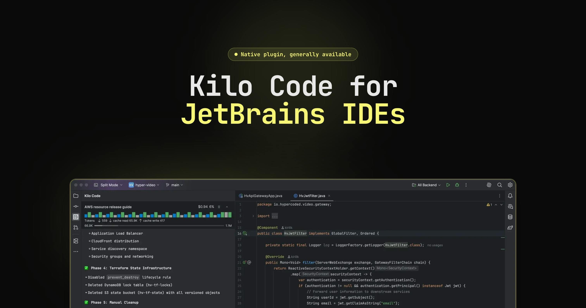
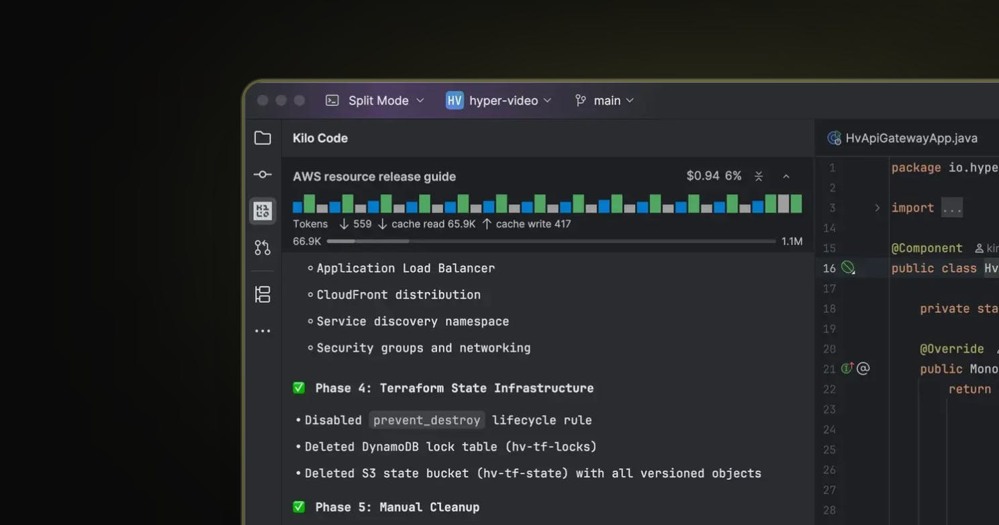
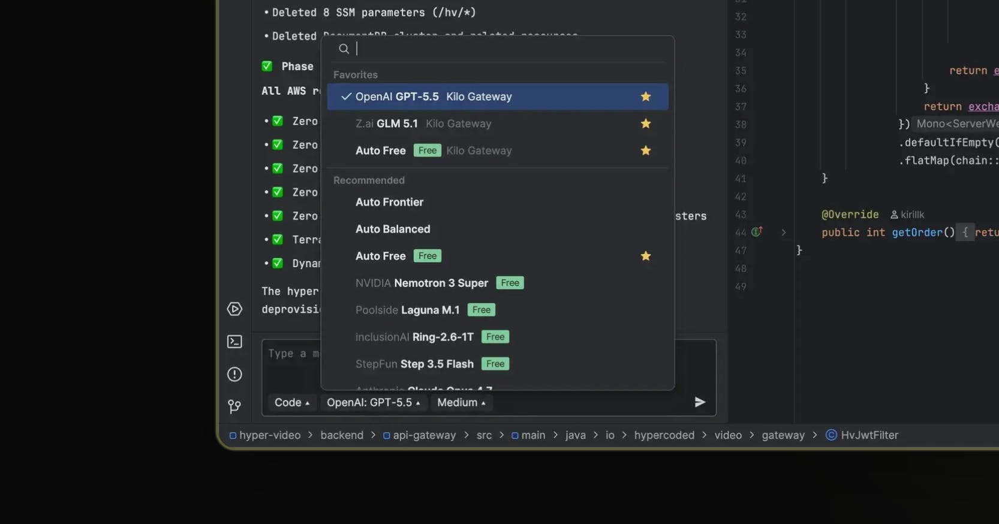

---

## 2. [Computable GPU Index (CGI)](https://www.producthunt.com/products/computable-gpu-index-cgi)
**Votes**: 284 | **도입 난이도**: 하 | **신뢰도**: 상
**Tagline**: The first open-source price index for GPU compute
**서비스 링크**: https://www.producthunt.com/r/BX544B26YNJ4H3

**태그**: Analytics, DevTool, CloudComputing, OpenSource

### 📌 이 서비스 한눈에 보기
GPU 컴퓨팅 자원 가격의 투명한 기준을 제공하는 오픈소스 가격 지수

### 🔑 주요 기능
- 고정된 제공업체 패널을 기반으로 산출된 GPU 시간당 USD 가격 지수
- 수학적으로 견고하고 검증 가능한 데이터 산출 방식
- 누구나 결과물을 확인하고 재현할 수 있는 오픈소스 방식

### 🙋 사용자에게 어떤 점이 좋은가
GPU 클라우드 자원 구매 시 시장 가격의 적정성을 판단할 수 있는 객관적인 벤치마크 지표로 활용할 수 있습니다.

### ✅ 지금 바로 써볼 기능
- 제공되는 지수 데이터 확인하기
- 산출 방법론(Methodology) 검토하기
- 자신의 구매 단가와 비교해보기

### ⚠️ 사용 전 확인할 점
- 특정 제공업체 패널에 국한된 데이터일 수 있음
- 실제 계약 조건(약정 할인 등)이 반영되지 않은 온디맨드 요금 기준임

### 🧭 확인이 더 필요한 정보
지수에 포함된 구체적인 제공업체 리스트와 데이터 업데이트 주기를 확인해야 합니다.

### 📸 스크린샷 및 갤러리
_media_0.jpg)
_media_1.jpg)
_media_2.jpg)

### 🎬 관련 영상
- [🎥 영상 보기](https://ph-files.imgix.net/bbe66d60-458a-4ab6-a7d1-2dce95be55d8.jpeg?auto=format)

---

## 3. [Creatium Coach](https://www.producthunt.com/products/creatium)
**Votes**: 222 | **도입 난이도**: 하 | **신뢰도**: 상
**Tagline**: Your multimedia mentor that takes you from mid to great
**서비스 링크**: https://www.producthunt.com/r/I5Q2WCFRUDQPOC
**재등장**: 최근 7일 내 재등장 (마지막 등장 5일 전)

**태그**: AI Coaching, EdTech, Simulation, Personal Development, Video

### 📌 이 서비스 한눈에 보기
실감 나는 멀티미디어 시뮬레이션을 통해 목표 달성을 돕는 AI 코칭 솔루션

### 🔑 주요 기능
- 정적인 강의를 넘어선 실감 나는 멀티미디어 코칭 경험 제공
- 시뮬레이션, 비디오, 역할극(Roleplay)을 통한 실전형 학습
- 개인적 목표부터 기업용 교육까지 폭넓은 확장성

### 🙋 사용자에게 어떤 점이 좋은가
단순 시청 위주의 학습에서 벗어나 실제 상황과 유사한 상호작용을 통해 학습 효과를 극대화할 수 있습니다.

### ✅ 지금 바로 써볼 기능
- 시뮬레이션 기능 체험하기
- 역할극(Roleplay) 모드 실행하기
- 개인/기업용 목표 설정하기

### ⚠️ 사용 전 확인할 점
- 실제 대면 코칭과 비교 시 정서적 교감의 차이가 있을 수 있음
- 학습자의 목표 분야에 따른 콘텐츠 적합성 확인 필요

### 🧭 확인이 더 필요한 정보
구체적인 학습 커리큘럼의 범위와 지원하는 전문 분야가 명시되지 않았습니다.

### 📸 스크린샷 및 갤러리

### 🎬 관련 영상
- [🎥 영상 보기](https://ph-files.imgix.net/4ed0acd5-d285-48a9-b23f-ba33e75e5673.jpeg?auto=format)

---

## 4. [Gauth AI Course](https://www.producthunt.com/products/gauth-ai-course)
**Votes**: 180 | **도입 난이도**: 하 | **신뢰도**: 상
**Tagline**: AI courses you can watch, quiz through, and create
**서비스 링크**: https://www.producthunt.com/r/O6RGXJTHGDQVQN

**태그**: EdTech, AI, Personalized Learning, Interactive, AI Tool

### 📌 이 서비스 한눈에 보기
어떤 주제든 대화형 학습 코스로 변환해주는 AI 맞춤형 교육 플랫폼

### 🔑 주요 기능
- 수학(대수학부터 미적분까지)을 포함한 200개 이상의 AI 코스 제공
- 시각 자료, 마인드맵, 능동적 회상 퀴즈가 결합된 인터랙티브 학습 경험
- 학습 중 즉시 질문 가능한 AI 튜터 및 사용자 맞춤형 코스 생성 기능

### 🙋 사용자에게 어떤 점이 좋은가
사용자는 자신의 학습 속도에 맞춰 개인화된 수업을 생성하고, AI 튜터의 도움을 받아 어려운 개념을 즉각적으로 해결할 수 있습니다.

### ✅ 지금 바로 써볼 기능
- 제공되는 200여 개의 수학 코스 탐색하기
- 학습 중 궁금한 점을 AI 튜터에게 질문하기
- 나만의 맞춤형 코스 생성 기능 테스트하기

### ⚠️ 사용 전 확인할 점
- 현재 제공되는 코스 외의 주제에 대한 생성 품질 확인 필요
- AI 생성 콘텐츠의 정확성 검증 필요

### 🧭 확인이 더 필요한 정보
제공되는 코스의 범위와 사용자 생성 코스의 전문성이 모든 과목에 동일하게 적용되는지 확인이 필요합니다.

### 📸 스크린샷 및 갤러리

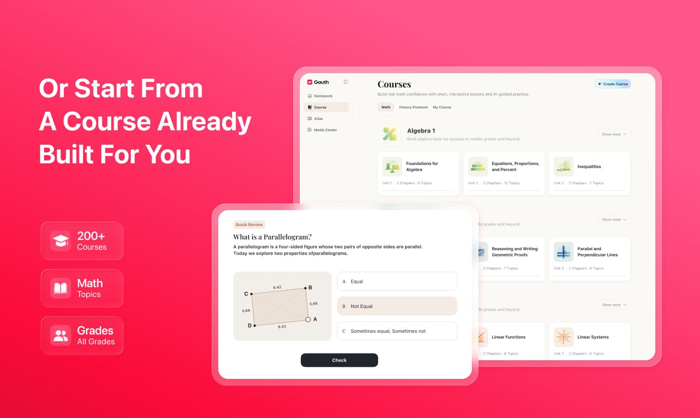
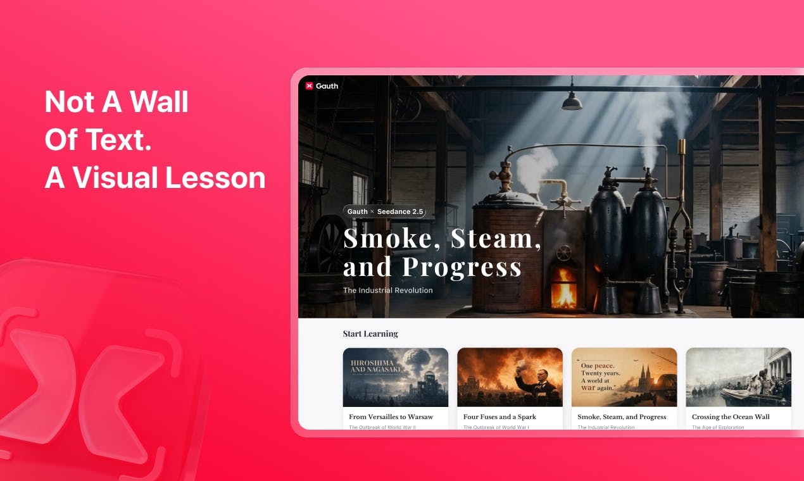

### 🎬 관련 영상
- [🎥 영상 보기](https://ph-files.imgix.net/2b5a11c9-97d4-4fdc-ab9d-55ea56188d14.jpeg?auto=format)

---

## 5. [Sider Code](https://www.producthunt.com/products/sider-code-customize-any-website)
**Votes**: 170 | **도입 난이도**: 하 | **신뢰도**: 상
**Tagline**: Reshape any website with plain words via Sider extension
**서비스 링크**: https://www.producthunt.com/r/X6K4WBNJAMQ6MK

**태그**: DevTool, Automation, Productivity, BrowserExtension, AI Tool

### 📌 이 서비스 한눈에 보기
말 한마디로 웹사이트의 UI와 기능을 내 마음대로 바꾸는 브라우저 확장 프로그램

### 🔑 주요 기능
- 자연어 명령을 통한 웹사이트 구조 및 기능 변경
- 페이지 구조를 이해하고 자동으로 코드를 작성하는 기능
- 변경 사항 저장 및 제어 기능 제공

### 🙋 사용자에게 어떤 점이 좋은가
사용자가 자주 사용하는 웹사이트의 불편한 점을 코딩 지식 없이도 즉시 수정하여 맞춤형 환경을 만들 수 있습니다.

### ✅ 지금 바로 써볼 기능
- 자주 방문하는 사이트의 레이아웃 변경 시도하기
- 특정 버튼이나 기능을 추가하는 명령 입력하기
- 변경 사항을 저장하여 지속적인 환경 유지하기

### ⚠️ 사용 전 확인할 점
- 웹사이트 업데이트 시 작성된 코드가 작동하지 않을 수 있음
- 사이트의 보안 정책에 따라 일부 기능 변경이 제한될 수 있음

### 🧭 확인이 더 필요한 정보
코드 실행이 로컬 브라우저 환경에만 국한되는지, 서버 측 변경까지 영향을 주는지 확인이 필요합니다.

### 📸 스크린샷 및 갤러리
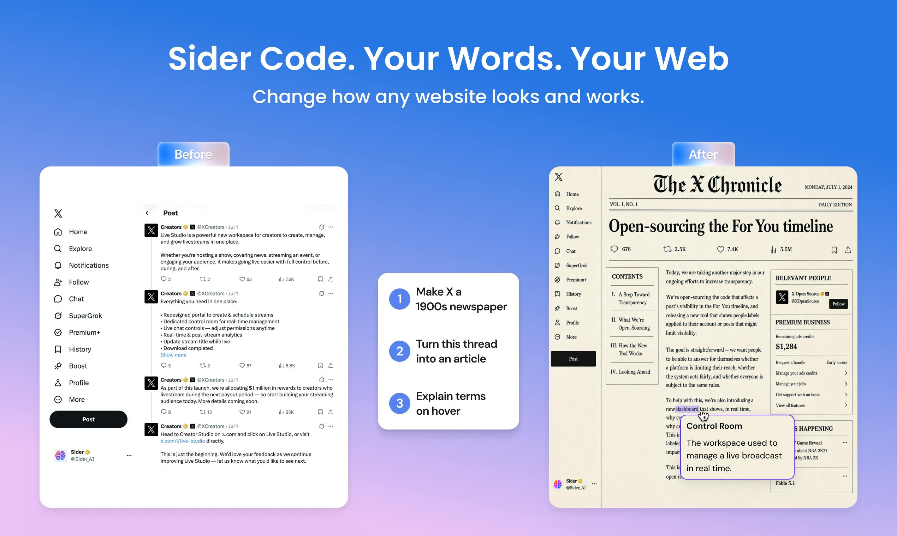

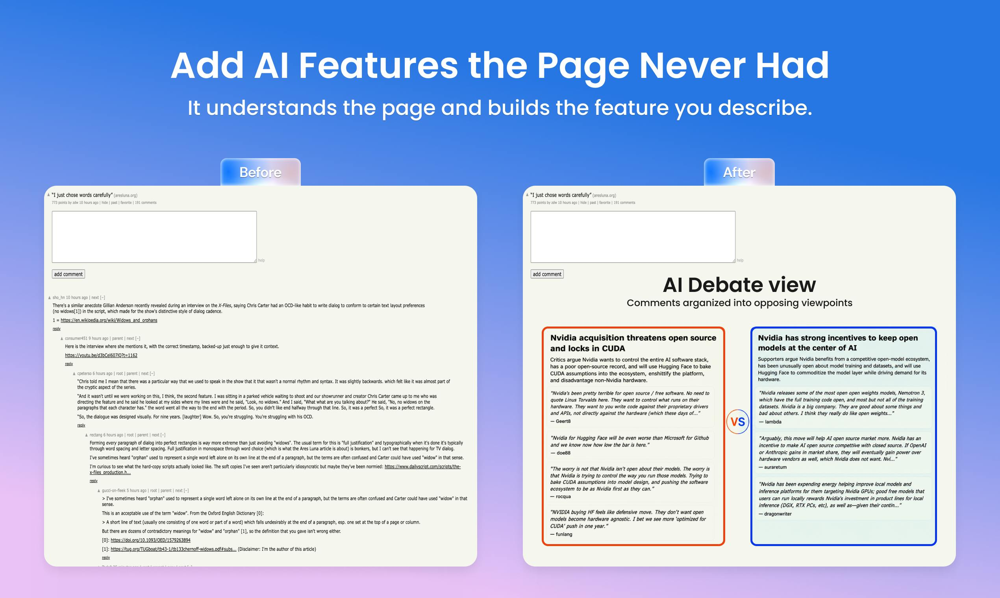

### 🎬 관련 영상
- [🎥 영상 보기](https://ph-files.imgix.net/ee20a046-5dc6-4c5f-a192-4d07824335af.jpeg?auto=format)

---

## 6. [TrustedRouter](https://www.producthunt.com/products/trustedrouter)
**Votes**: 121 | **도입 난이도**: 하 | **신뢰도**: 상
**Tagline**: Every model with a unified interface. Privacy with proof. 
**서비스 링크**: https://www.producthunt.com/r/MTRCJE5UATTVWE

**태그**: AI, DevTool, Security, API, Cloud, AI Tool, Prompting

### 📌 이 서비스 한눈에 보기
수백 개의 AI 모델을 하나의 인터페이스로 연결하는 보안 특화 통합 API 플랫폼

### 🔑 주요 기능
- OpenAI 호환 API를 통한 수백 가지 모델의 통합 관리
- 기밀 컴퓨팅(Confidential routes) 및 종단간 암호화 기반의 강력한 프라이버시
- 프롬프트 및 출력 로그를 남기지 않는 보안 설계와 제공자 장애 대비 페일오버 기능

### 🙋 사용자에게 어떤 점이 좋은가
여러 AI 모델을 사용하면서도 데이터 유출 걱정 없이 보안이 보장된 환경에서 통합된 방식으로 개발할 수 있습니다.

### ✅ 지금 바로 써볼 기능
- OpenAI 호환 API를 통한 기존 워크플로우 연결 테스트
- 보안이 중요한 데이터에 대한 Confidential routes 적용
- 서비스 안정성을 위한 Provider failover 설정

### ⚠️ 사용 전 확인할 점
- 로그가 남지 않는 환경에서의 디버깅 난이도 확인 필요
- 보안 기능 활성화 시 발생할 수 있는 성능/지연 시간 영향 검토

### 🧭 확인이 더 필요한 정보
구체적인 모델 지원 목록과 각 보안 경로(Confidential/ZDR)의 상세 기술 사양 확인이 필요합니다.

### 📸 스크린샷 및 갤러리
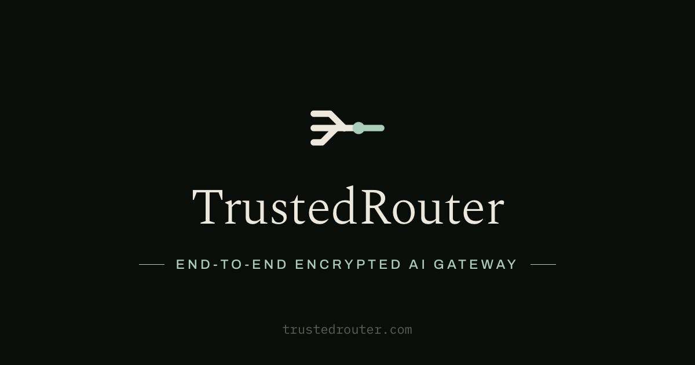

### 🎬 관련 영상
- [🎥 영상 보기](https://ph-files.imgix.net/61ae3940-bf0f-4c17-9a73-bac3966f781f.jpeg?auto=format)

---

## 7. [EAS Observe](https://www.producthunt.com/products/expo)
**Votes**: 117 | **도입 난이도**: 하 | **신뢰도**: 상
**Tagline**: Performance monitoring built for Expo and React Native
**서비스 링크**: https://www.producthunt.com/r/4QAOUAGSFJDJSE

**태그**: DevTool, Mobile, Analytics, Expo, React Native

### 📌 이 서비스 한눈에 보기
Expo 및 React Native 앱의 실제 사용자 기기 성능을 측정하는 간편한 모니터링 도구

### 🔑 주요 기능
- 실제 사용자 기기에서의 앱 시작 및 화면 전환 속도 측정
- 라이브러리 설치 및 루트 레이아웃 래핑만으로 즉시 적용 가능
- EAS Update 및 네이티브 빌드별 성능 변화 추적 기능

### 🙋 사용자에게 어떤 점이 좋은가
별도의 복잡한 계측 작업 없이도 업데이트 시 발생하는 성능 변화를 즉각 파악하여 앱 최적화 의사결정을 도울 수 있습니다.

### ✅ 지금 바로 써볼 기능
- 라이브러리 설치 및 루트 레이아웃 적용
- EAS Update 배포 후 성능 차트 확인
- 무료 플랜(월 10만 이벤트) 범위 내 테스트

### ⚠️ 사용 전 확인할 점
- 월 10만 이벤트 초과 시 비용 발생 가능성 확인 필요
- 라이브러리 래핑 방식이 기존 프로젝트 구조와 충돌하는지 확인

### 🧭 확인이 더 필요한 정보
무료 플랜 범위를 초과하는 유료 플랜의 구체적인 가격 정책은 명시되어 있지 않습니다.

### 📸 스크린샷 및 갤러리
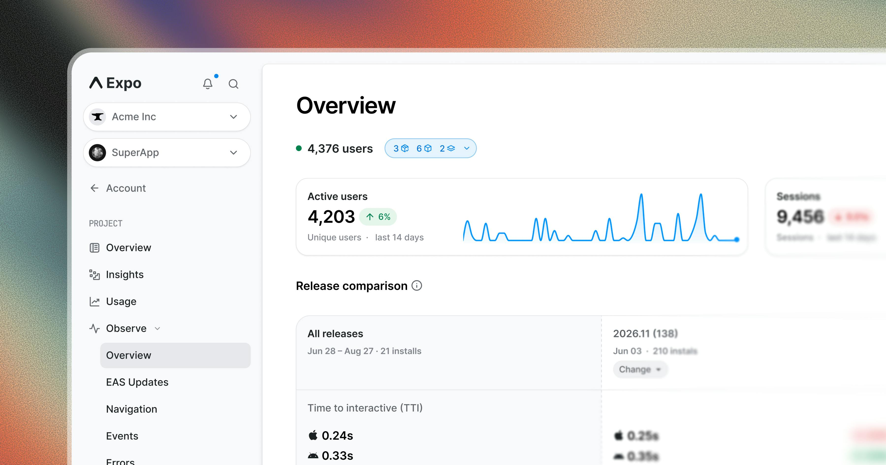
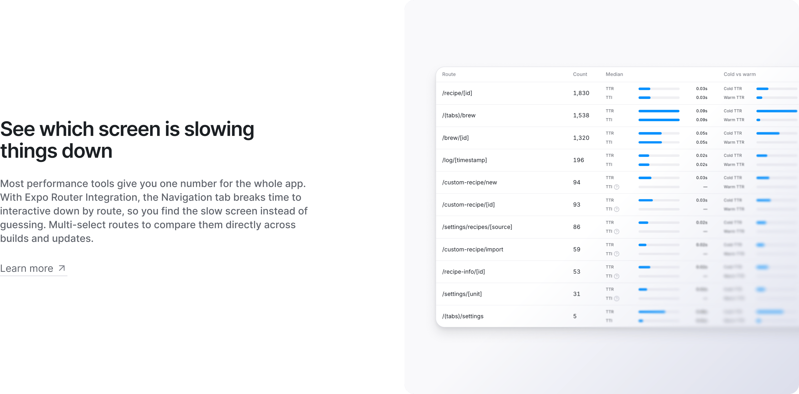
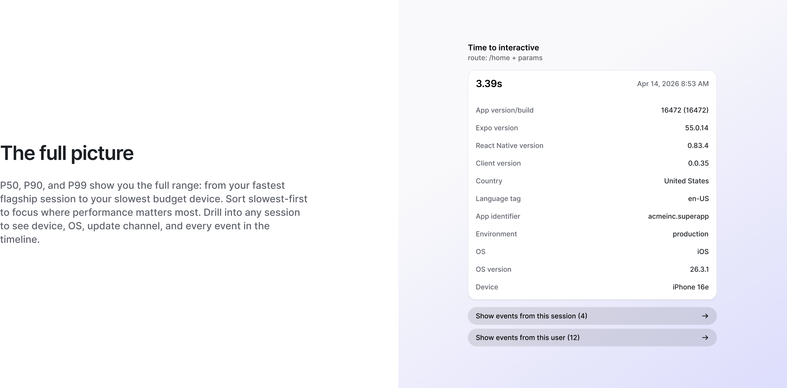

### 🎬 관련 영상
- [🎥 영상 보기](https://ph-files.imgix.net/30033aea-0eb9-456d-8b49-e37ec8897668.jpeg?auto=format)

---

## 8. [Notchling](https://www.producthunt.com/products/notchling-lives-in-your-notch)
**Votes**: 106 | **도입 난이도**: 하 | **신뢰도**: 상
**Tagline**: A little creature that lives in your MacBook notch
**서비스 링크**: https://www.producthunt.com/r/S27NIHCKHWSUUI

**태그**: MacBook, DesktopPet, Productivity, UI/UX

### 📌 이 서비스 한눈에 보기
맥북 노치 안에서 살아 움직이며 파일 이동을 돕는 귀여운 반려 생명체

### 🔑 주요 기능
- 맥북 노치 공간을 활용한 인터랙티브한 데스크탑 위젯
- 커서 움직임 감지, 휴식 모드, 배터리 상태 반영 등 생동감 있는 애니메이션
- 파일 드래그 앤 드롭 시 입을 벌려 파일을 운반하는 직관적인 인터페이스

### 🙋 사용자에게 어떤 점이 좋은가
단조로운 맥북 작업 환경에 시각적 즐거움을 더하며, 파일 이동 시 귀여운 상호작용을 통해 사용자 경험을 풍부하게 만듭니다.

### ✅ 지금 바로 써볼 기능
- 파일을 노치로 드래그하여 생명체의 반응 확인하기
- 아이들(Idle) 상태에서 생명체가 잠드는 모습 관찰하기
- 배터리 잔량에 따른 생명체의 상태 변화 살펴보기

### ⚠️ 사용 전 확인할 점
- 노치 영역을 차지하므로 화면 상단 가시 영역에 영향을 줄 수 있음
- 애니메이션 중심의 기능이므로 생산성 도구로서의 기능적 역할은 제한적임

### 🧭 확인이 더 필요한 정보
애니메이션 외에 추가적인 시스템 제어 기능이 있는지 여부는 명시되지 않았습니다.

### 📸 스크린샷 및 갤러리

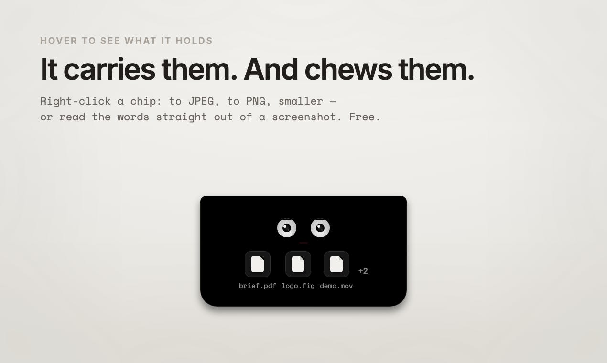

### 🎬 관련 영상
- [🎥 영상 보기](https://ph-files.imgix.net/555929c0-dc11-4796-ae0a-8ac6ebb352c9.jpeg?auto=format)

---

## 9. [HONOR Robot Phone](https://www.producthunt.com/products/honor-robot-phone)
**Votes**: 97 | **도입 난이도**: 중 | **신뢰도**: 상
**Tagline**: The phone that literally has a gimbal built in
**서비스 링크**: https://www.producthunt.com/r/UUIQIXBM5QPOE7

**태그**: Smartphone, Photography, Video, Hardware, Mobile, Automation, AI Tool

### 📌 이 서비스 한눈에 보기
물리적 짐벌이 내장되어 흔들림 없는 촬영과 자동 피사체 추적이 가능한 혁신적인 로봇 스마트폰

### 🔑 주요 기능
- 4-DoF(4축) 모터 짐벌이 내장된 플래그십 안드로이드 스마트폰
- 200MP 메인 카메라의 물리적 움직임을 통한 강력한 손떨림 방지 및 피사체 추적
- ARRI LogC3 및 전문적인 Looks가 내장된 고성능 영상 워크플로우

### 🙋 사용자에게 어떤 점이 좋은가
별도의 외부 짐벌 없이도 움직이는 피사체를 안정적으로 촬영하거나, 혼자서도 전문가 수준의 브이로그 및 영상 촬영이 가능합니다.

### ✅ 지금 바로 써볼 기능
- 200MP 카메라를 활용한 고해상도 피사체 추적 촬영
- 짐벌 모드를 활용한 움직이는 영상 촬영
- 내장된 ARRI LogC3 워크플로우를 통한 전문 영상 편집

### ⚠️ 사용 전 확인할 점
- 물리적 짐벌 구동부로 인한 기기 무게 및 내구성 확인 필요
- 모터 구동 시 발생할 수 있는 소음이나 배터리 소모량 고려

### 🧭 확인이 더 필요한 정보
물리적 짐벌 장치가 기기 전체의 무게와 두께, 배터리 효율에 미치는 구체적인 영향은 명시되지 않았습니다.

### 📸 스크린샷 및 갤러리

### 🎬 관련 영상
- [🎥 영상 보기](https://ph-files.imgix.net/a76e8c45-8149-4f6f-9146-39e5498f4559.jpeg?auto=format)

---

## 10. [Murmell](https://www.producthunt.com/products/murmell)
**Votes**: 97 | **도입 난이도**: 하 | **신뢰도**: 상
**Tagline**: Google docs for AI agents, and you can close your laptop
**서비스 링크**: https://www.producthunt.com/r/6HGGMZO37K4MRP

**태그**: AI, Collaboration, DevTool, Automation, Agent, AI Tool

### 📌 이 서비스 한눈에 보기
AI 에이전트와 협업할 수 있는 클라우드 기반의 실시간 공유 워크스페이스

### 🔑 주요 기능
- 에이전트용 구글 Docs 스타일의 통합 환경 제공
- 통합 메모리 기능을 통한 작업 상태(터미널, 파일, 대화) 유지
- 실시간 협업 및 팀원 간 작업 공유 기능

### 🙋 사용자에게 어떤 점이 좋은가
노트북을 닫아도 작업 상태가 유지되어 에이전트가 중단 없이 업무를 수행하며, 팀원과 실시간으로 동일한 환경에서 협업할 수 있습니다.

### ✅ 지금 바로 써볼 기능
- 에이전트 메모리 및 컨텍스트 유지 기능 테스트
- 실시간 협업 환경에서의 팀원 초대
- 터미널 및 파일 동기화 기능 확인

### ⚠️ 사용 전 확인할 점
- 인프라 확장성 및 안정성 검증 필요
- 에이전트와 사용자 간의 작업 충돌 가능성

### 🧭 확인이 더 필요한 정보
현재 인프라를 처음부터 재구축한 단계이므로 대규모 사용자 환경에서의 안정성을 확인해야 합니다.

### 📸 스크린샷 및 갤러리
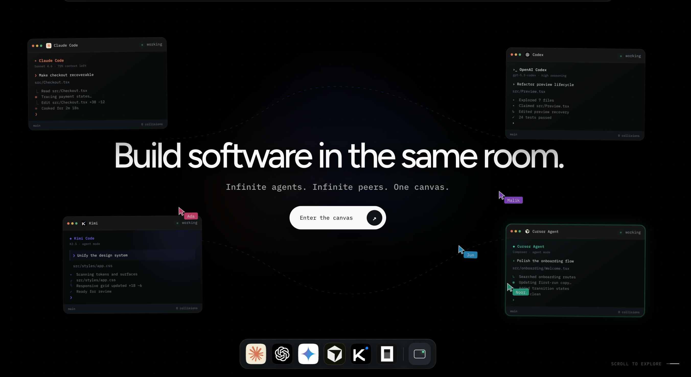
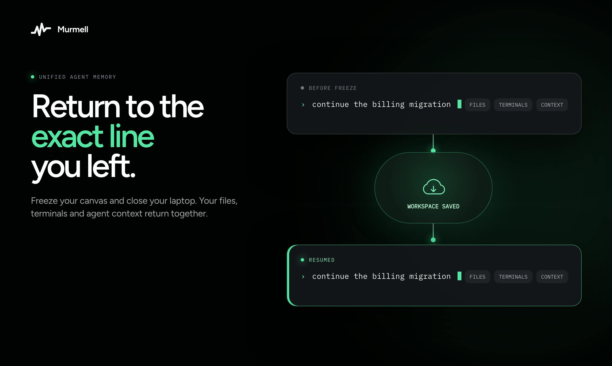
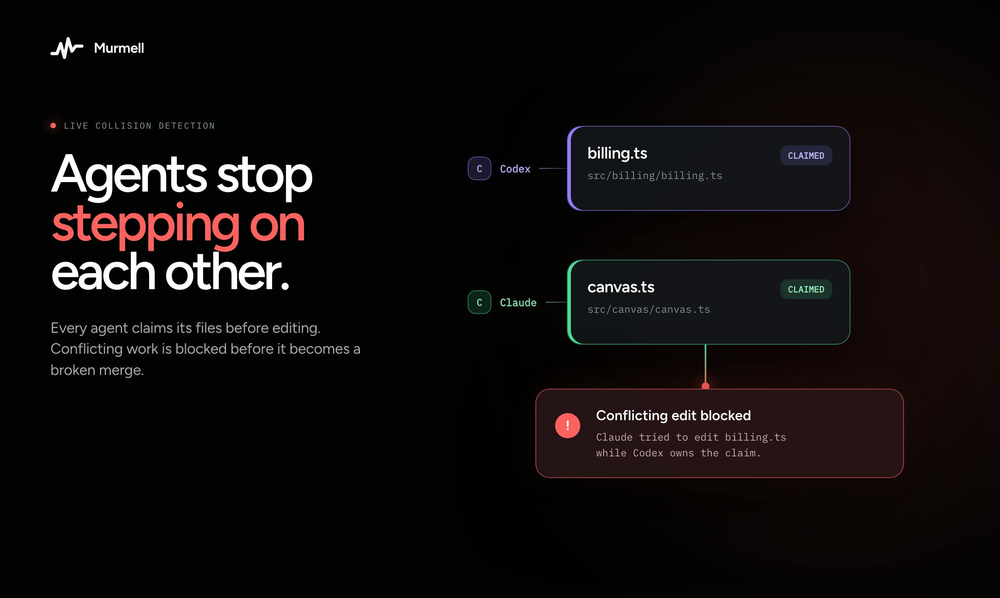

### 🎬 관련 영상
- [🎥 영상 보기](https://ph-files.imgix.net/a812f057-e152-4951-b2a1-2377085389ba.jpeg?auto=format)

---

## 11. [Sourclip 2.0](https://www.producthunt.com/products/sourclip)
**Votes**: 93 | **도입 난이도**: 하 | **신뢰도**: 상
**Tagline**: The research workspace built around Gemini Notebook
**서비스 링크**: https://www.producthunt.com/r/KEA3LZWSXGL5KU

**태그**: Research, Productivity, AI, KnowledgeManagement, Automation, AI Tool, Chat, Prompting

### 📌 이 서비스 한눈에 보기
Gemini Notebook을 기반으로 웹, 유튜브, 소셜 미디어의 정보를 수집하고 정리하는 올인원 리서치 워크스페이스

### 🔑 주요 기능
- 유튜브, Reddit, X, PDF, AI 채팅 등 다양한 소스에서 정보 수집 및 캡처
- 폴더 정리, 재사용 가능한 프롬프트, 마인드맵 편집 기능 제공
- 수집한 자료를 Markdown, HTML, PDF로 내보내기 및 오디오 오버뷰의 개인용 팟캐스트화

### 🙋 사용자에게 어떤 점이 좋은가
흩어져 있는 다양한 웹 소스와 AI 대화 기록을 한곳에 모아 체계적으로 정리하고, 연구 결과물을 다양한 형식으로 즉시 변환할 수 있습니다.

### ✅ 지금 바로 써볼 기능
- 유튜브 플레이리스트 및 채널 가져오기 기능 테스트
- 수집된 소스를 활용한 마인드맵 편집 및 정리
- 오디오 오버뷰 기능을 통한 팟캐스트형 학습 경험 확인

### ⚠️ 사용 전 확인할 점
- 외부 소스(X, Reddit 등)의 데이터 동기화 및 저작권 정책 확인 필요
- Gemini Notebook(NotebookLM)과의 연동 방식 및 데이터 처리 방식 확인 필요

### 🧭 확인이 더 필요한 정보
Gemini Notebook과의 구체적인 데이터 동기화 방식 및 외부 플랫폼 API 연동 범위에 대한 상세 정보가 필요합니다.

### 📸 스크린샷 및 갤러리
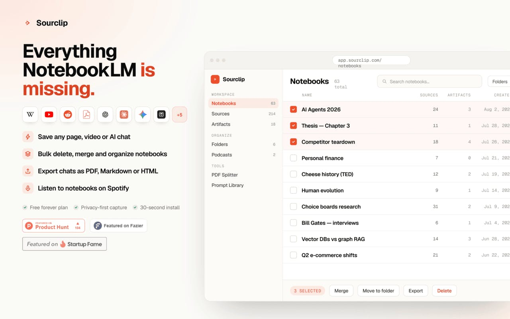
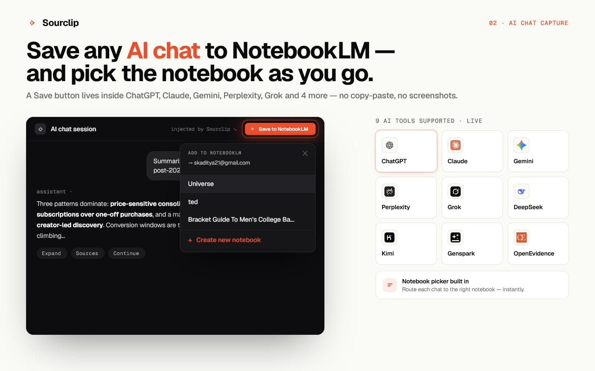
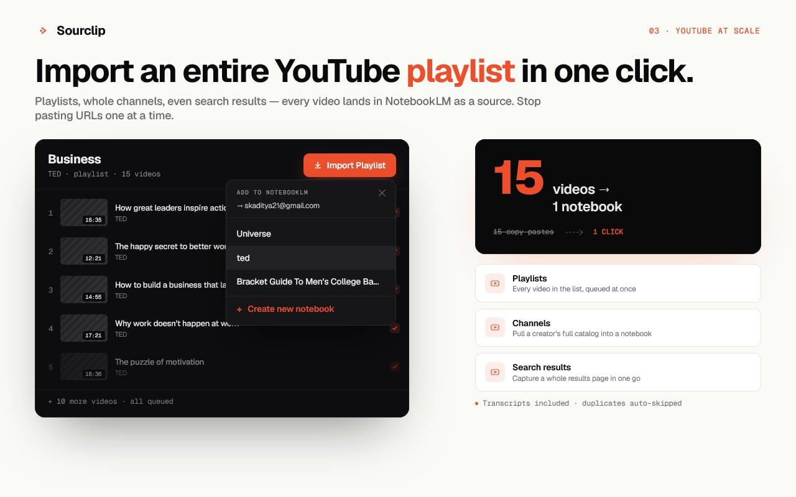

---

## 12. [ChannelOS](https://www.producthunt.com/products/channelos)
**Votes**: 91 | **도입 난이도**: 중 | **신뢰도**: 상
**Tagline**: Turn your local media library into cable-style TV
**서비스 링크**: https://www.producthunt.com/r/NARG3XF7UUYQ7S

**태그**: MediaServer, Windows, OpenSource, SelfHosted

### 📌 이 서비스 한눈에 보기
개인 소장 미디어를 실시간 케이블 TV처럼 즐길 수 있는 로컬 우선형 Windows TV 시스템

### 🔑 주요 기능
- 로컬 미디어 라이브러리를 활용한 프로그래밍 가능한 TV 채널 구축
- 클라우드 업로드나 계정 없이 작동하는 프라이버시 중심의 로컬 퍼스트 방식
- TV 가이드, 스케줄링, 온디맨드 기능을 갖춘 거실 친화적 인터페이스

### 🙋 사용자에게 어떤 점이 좋은가
기존에 보유한 영상 파일들을 마치 실제 케이블 TV처럼 편성하여 가족이나 친구들과 편리하게 시청할 수 있습니다.

### ✅ 지금 바로 써볼 기능
- 자신의 미디어 라이브러리 연결하기
- 나만의 커스텀 채널 및 편성표 만들기
- TV 가이드 인터페이스로 채널 전환해보기

### ⚠️ 사용 전 확인할 점
- 현재 알파(Alpha) 버전이므로 기능이 불안정하거나 버그가 있을 수 있음
- Windows 환경에 최적화된 시스템임

### 🧭 확인이 더 필요한 정보
현재 알파 버전의 구체적인 하드웨어 요구 사양과 미디어 포맷 지원 범위는 명시되지 않았습니다.

### 📸 스크린샷 및 갤러리
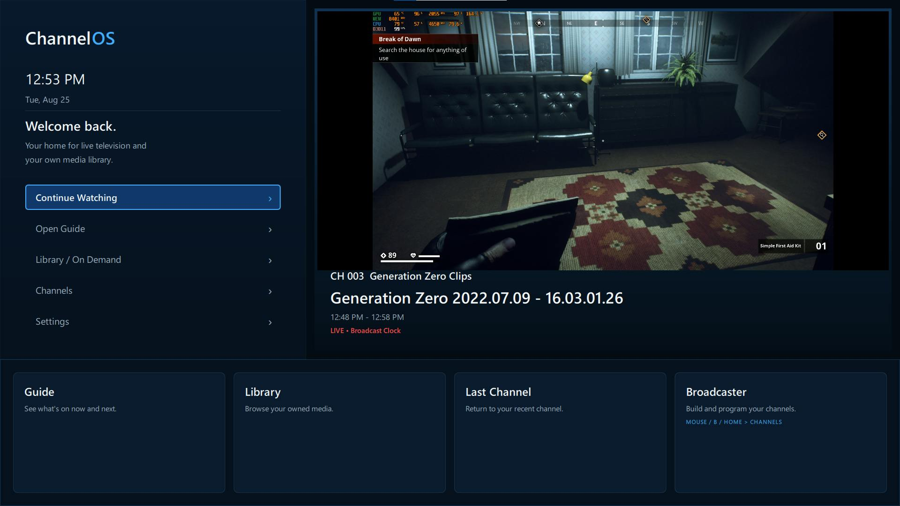
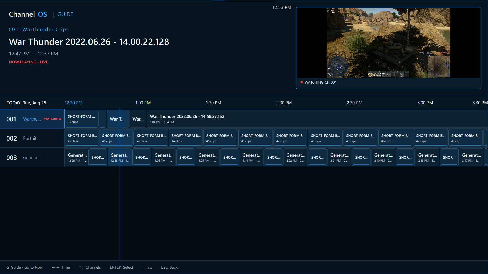

---

## 13. [ThunderPhone](https://www.producthunt.com/products/thunderphone)
**Votes**: 88 | **도입 난이도**: 중 | **신뢰도**: 상
**Tagline**: Platform for building reliable AI phone agents (from 2c/min)
**서비스 링크**: https://www.producthunt.com/r/7FVIA7U63KGEXE

**태그**: AI, Automation, Communication, DevTool, Agent, AI Tool

### 📌 이 서비스 한눈에 보기
합리적인 비용으로 고성능 AI 전화 에이전트를 구축하고 관리할 수 있는 셀프 서비스 플랫폼

### 🔑 주요 기능
- 분당 2센트부터 시작하는 모델 포함 합리적 가격 정책
- AI 호출 시뮬레이션, 실시간 모니터링 및 제어 기능 제공
- 47개 언어 지원 및 높은 오디오 벤치마크 성능(Storm 티어)

### 🙋 사용자에게 어떤 점이 좋은가
복잡한 인프라 구축 없이도 고성능 AI 전화 에이전트를 즉시 만들 수 있으며, 실시간 모니터링을 통해 운영 안정성을 확보할 수 있습니다.

### ✅ 지금 바로 써볼 기능
- Storm 티어를 통한 고성능 모델 성능 테스트
- AI-caller 시뮬레이션을 활용한 에이전트 검증
- 47개 지원 언어 환경에서의 통화 품질 테스트

### ⚠️ 사용 전 확인할 점
- 사용량에 따른 비용 변동 가능성 확인 필요
- 특정 언어나 복잡한 대화 시나리오에서의 성능 차이 확인 필요

### 🧭 확인이 더 필요한 정보
제시된 벤치마크 점수와 실제 서비스 환경에서의 성능 일치 여부를 확인해야 합니다.

### 📸 스크린샷 및 갤러리

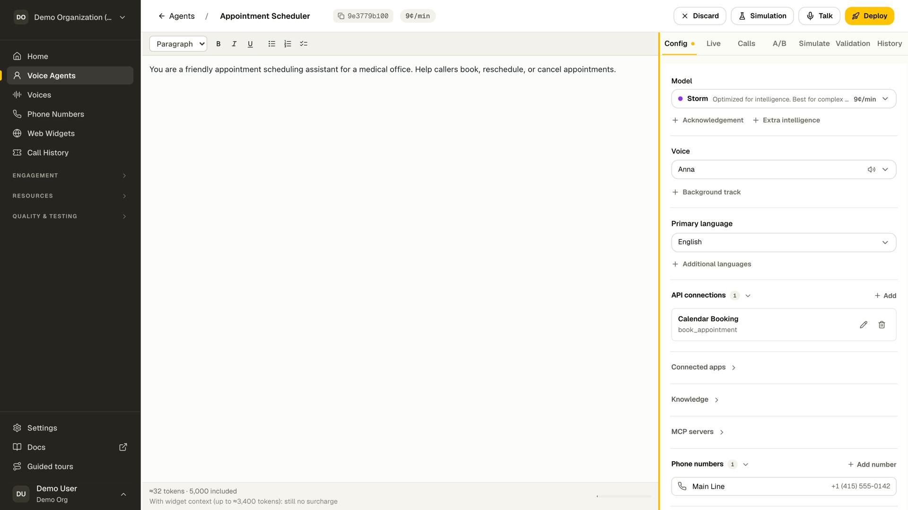
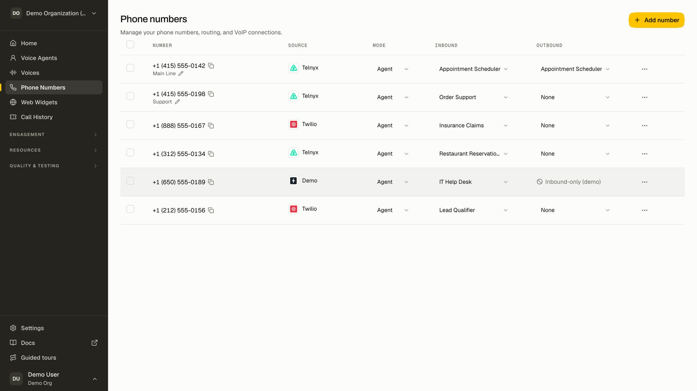

### 🎬 관련 영상
- [🎥 영상 보기](https://ph-files.imgix.net/a82221a3-d2d8-43fe-bc19-dc73df96fa39.jpeg?auto=format)

---

## 14. [Folio](https://www.producthunt.com/products/folio-e0a9e0fb-8ef8-4fcf-a558-fa5fdd41a3ba)
**Votes**: 87 | **도입 난이도**: 하 | **신뢰도**: 상
**Tagline**: A read-later app sending a typeset digest to your e-reader
**서비스 링크**: https://www.producthunt.com/r/K2ZTZ5OEFLPEP2

**태그**: Productivity, Reading, Automation, e-ink, AI Tool, Email

### 📌 이 서비스 한눈에 보기
웹의 읽을거리들을 깔끔한 전자책 형식으로 변환하여 e-reader로 보내주는 독서 집중 도구

### 🔑 주요 기능
- 웹 페이지, RSS, 뉴스레터를 깔끔한 타이포그래피로 재구성
- 광고와 메뉴를 제거한 정제된 읽기 환경 제공
- Kindle, reMarkable, Google Drive로 자동 배송되는 PDF/EPUB 형식 지원

### 🙋 사용자에게 어떤 점이 좋은가
스마트폰의 알림 방해 없이 e-ink 기기에서 오로지 독서에만 집중할 수 있는 환경을 만들어줍니다.

### ✅ 지금 바로 써볼 기능
- 뉴스레터 전용 개인 이메일 주소로 콘텐츠 수집하기
- 수집된 콘텐츠를 PDF 또는 EPUB로 변환하기
- 자신의 e-reader 기기로 자동 전송 설정하기

### ⚠️ 사용 전 확인할 점
- e-reader 기기와의 호환성 및 자동 전송 설정 방식 확인 필요
- 콘텐츠 레이아웃이 복잡한 웹페이지의 경우 변환 품질 차이 발생 가능

### 🧭 확인이 더 필요한 정보
사용자의 e-reader 기기 모델에 따른 자동 배송 지원 범위와 상세 설정 방법을 확인해야 합니다.

### 📸 스크린샷 및 갤러리

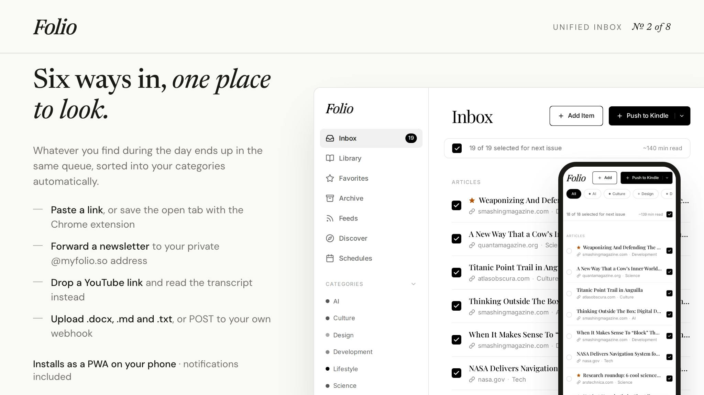

### 🎬 관련 영상
- [🎥 영상 보기](https://ph-files.imgix.net/fb600318-8dec-4852-a2ca-6648ca2f2ba2.jpeg?auto=format)

---

## 15. [Happy Shrimp](https://www.producthunt.com/products/happy-shrimp)
**Votes**: 85 | **도입 난이도**: 하 | **신뢰도**: 상
**Tagline**: Alibaba's AI music generator for turning ideas into songs
**서비스 링크**: https://www.producthunt.com/r/2DHIB64FBDFWJH

**태그**: AI, Music, CreativeTool, GenerativeAI, AI Tool

### 📌 이 서비스 한눈에 보기
아이디어만으로 가사부터 보컬까지 완성된 곡을 만드는 알리바바의 AI 음악 생성기

### 🔑 주요 기능
- 텍스트 설명만으로 가사, 멜로디, 편곡, 보컬이 포함된 완전한 곡 생성
- 사용자 직접 작사 기능 및 악기 구성/보컬 스타일 커스텀 지원
- 음악 제작 경험이 없는 초보자도 즉시 사용 가능한 직관적 인터페이스

### 🙋 사용자에게 어떤 점이 좋은가
음악 제작 지식이 없어도 상상하는 느낌이나 이야기를 고퀄리티 노래로 즉시 구현할 수 있습니다.

### ✅ 지금 바로 써볼 기능
- 간단한 스토리나 감정을 입력하여 전체 곡 생성해보기
- 직접 작성한 가사를 입력하여 맞춤형 노래 만들기
- 악기 스타일과 템포를 조절하며 원하는 분위기 구현하기

### ⚠️ 사용 전 확인할 점
- 생성된 곡의 저작권 및 상업적 이용 가능 여부 확인 필요
- 세부적인 음악적 디테일 제어의 한계 가능성

### 🧭 확인이 더 필요한 정보
상업적 이용을 위한 라이선스 정책과 구체적인 요금 체계에 대한 정보가 명시되지 않았습니다.

### 📸 스크린샷 및 갤러리

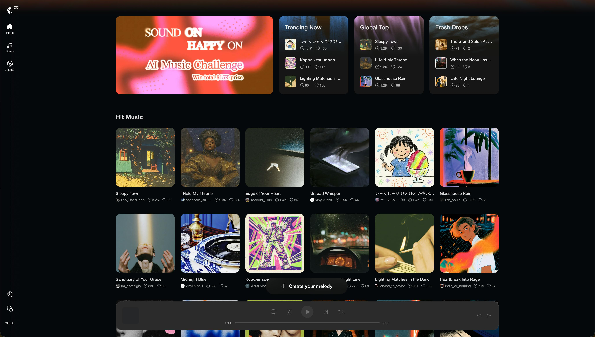

---

## 16. [WaseiGo](https://www.producthunt.com/products/waseigo)
**Votes**: 83 | **도입 난이도**: 하 | **신뢰도**: 상
**Tagline**: Learn the 1,000+ Japanese words that only look like English
**서비스 링크**: https://www.producthunt.com/r/GE5JV7ZHPGWEUN

**태그**: LanguageLearning, Japanese, Education, NoSubscription, AI Tool

### 📌 이 서비스 한눈에 보기
일본식 영어(재패니즈 잉글리시)를 재미있는 퀴즈와 대화로 배우는 학습 도구

### 🔑 주요 기능
- 일본에서 독특한 의미로 재탄생한 1,000개 이상의 외래어 학습
- 일러스트 대화, 원어민 오디오, 퀴즈를 결합한 참여형 학습 방식
- 구독 없이 한 번의 구매로 모든 콘텐츠를 이용하는 방식

### 🙋 사용자에게 어떤 점이 좋은가
일본어 학습 시 혼란을 줄 수 있는 가짜 영어 단어들을 직관적인 퀴즈와 대화로 쉽고 재미있게 익힐 수 있습니다.

### ✅ 지금 바로 써볼 기능
- 무료 버전을 통해 학습 방식 체험하기
- 그림 퀴즈를 통해 직관적인 의미 파악하기
- 검색 기능을 활용해 궁금한 단어 찾아보기

### ⚠️ 사용 전 확인할 점
- 전체 콘텐츠 이용을 위해서는 유료 구매가 필요함
- 순수 영어 학습보다는 일본 특유의 외래어 학습에 특화되어 있음

### 🧭 확인이 더 필요한 정보
전체 콘텐츠 잠금 해제를 위한 정확한 일회성 구매 가격이 명시되지 않았습니다.

### 📸 스크린샷 및 갤러리
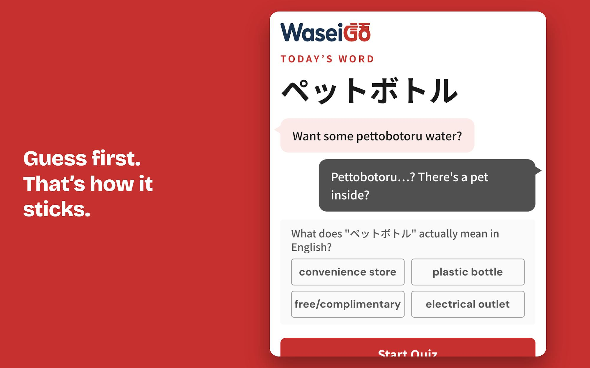

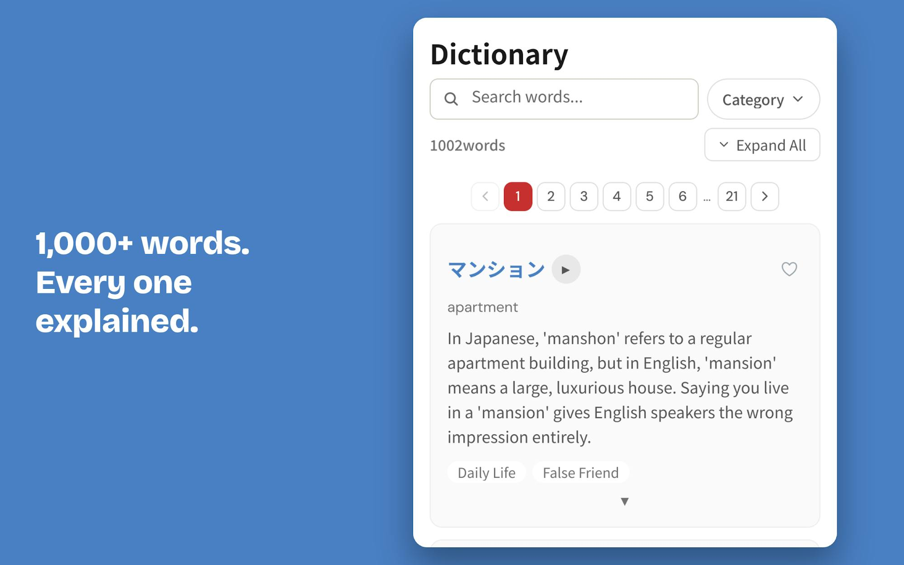

### 🎬 관련 영상
- [🎥 영상 보기](https://ph-files.imgix.net/741a284a-0a3f-4aa8-9542-b309b1186491.jpeg?auto=format)

---

## 17. [Cosmic Agent Plugins](https://www.producthunt.com/products/cosmic)
**Votes**: 80 | **도입 난이도**: 중 | **신뢰도**: 상
**Tagline**: Connect Cosmic agents to any service with an MCP server
**서비스 링크**: https://www.producthunt.com/r/3MHOQEDRR7AGG7

**태그**: Automation, AI-Agents, DevTools, Workflow, Agent, API

### 📌 이 서비스 한눈에 보기
Cosmic Agent를 외부 서비스와 직접 연결하여 실질적인 업무를 수행하게 하는 MCP 서버 플러그인

### 🔑 주요 기능
- MCP(Model Context Protocol) 서버를 통한 외부 서비스 연동
- 단순 API 호출이 아닌 벤더의 공식 스킬 및 토큰 슬롯 활용
- GitHub, Stripe, Render, PostHog, Resend 등 주요 도구 즉시 지원

### 🙋 사용자에게 어떤 점이 좋은가
에이전트가 단순히 콘텐츠를 관리하는 것을 넘어, 실제 외부 툴의 기능을 직접 실행하며 업무 자동화를 완성할 수 있습니다.

### ✅ 지금 바로 써볼 기능
- GitHub 플러그인을 통한 코드 관리 자동화 시도
- Stripe/Resend 연동을 통한 비즈니스 워크플로우 테스트
- 사용 중인 서비스의 MCP 서버 지원 여부 확인

### ⚠️ 사용 전 확인할 점
- 외부 서비스의 API 권한 및 보안 설정 필요
- 플러그인 설치 시 에이전트의 토큰 슬롯 관리 필요

### 🧭 확인이 더 필요한 정보
각 외부 서비스 연동 시 발생하는 비용이나 구체적인 권한 범위는 해당 서비스의 정책에 따라 다를 수 있습니다.

### 📸 스크린샷 및 갤러리
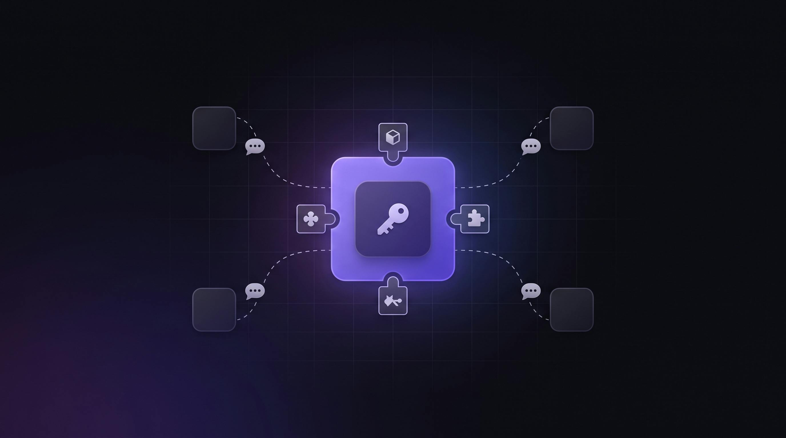
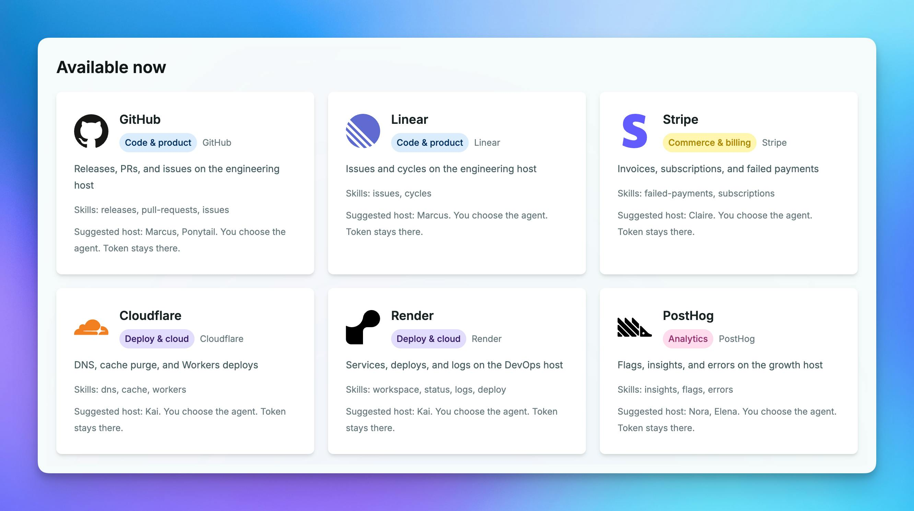

---

## 18. [Keiki](https://www.producthunt.com/products/keiki)
**Votes**: 80 | **도입 난이도**: 중 | **신뢰도**: 상
**Tagline**: Build one customer-facing AI agent and launch it everywhere
**서비스 링크**: https://www.producthunt.com/r/KE23X4OQR5I6ID

**태그**: AI, Automation, CustomerSupport, SaaS, Agent, AI Tool, Email

### 📌 이 서비스 한눈에 보기
단 하나의 AI 에이전트 구축으로 모든 메시징 채널에 즉시 배포하고 관리하는 통합 솔루션

### 🔑 주요 기능
- SMS, WhatsApp, Slack 등 다양한 채널로의 원클릭 배포 지원
- 지식, 메모리, 도구, 경계 설정을 통한 맞춤형 AI 에이전트 구축
- 통합 인프라를 통한 대화 모니터링 및 민감한 작업 승인 기능

### 🙋 사용자에게 어떤 점이 좋은가
여러 채널에 흩어진 고객 응대를 하나의 에이전트로 통합 관리하여 운영 효율을 극대화할 수 있습니다.

### ✅ 지금 바로 써볼 기능
- 비즈니스 지식 데이터 학습시키기
- 주요 메시징 채널(WhatsApp, Slack 등) 연결하기
- 에이전트의 작업 권한 및 경계 설정하기

### ⚠️ 사용 전 확인할 점
- 채널별로 상이한 API 정책에 따른 기능 제약 가능성
- 인간의 개입이 필요한 복잡한 작업에 대한 핸드오프 설정 필요

### 🧭 확인이 더 필요한 정보
각 메시징 플랫폼(WhatsApp, Slack 등)과의 구체적인 연동 방식 및 비용 구조에 대한 정보가 필요합니다.

### 📸 스크린샷 및 갤러리
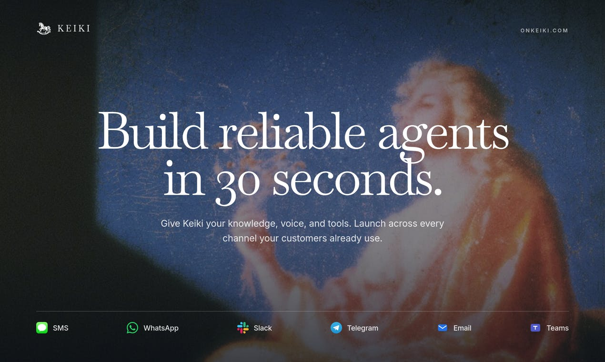
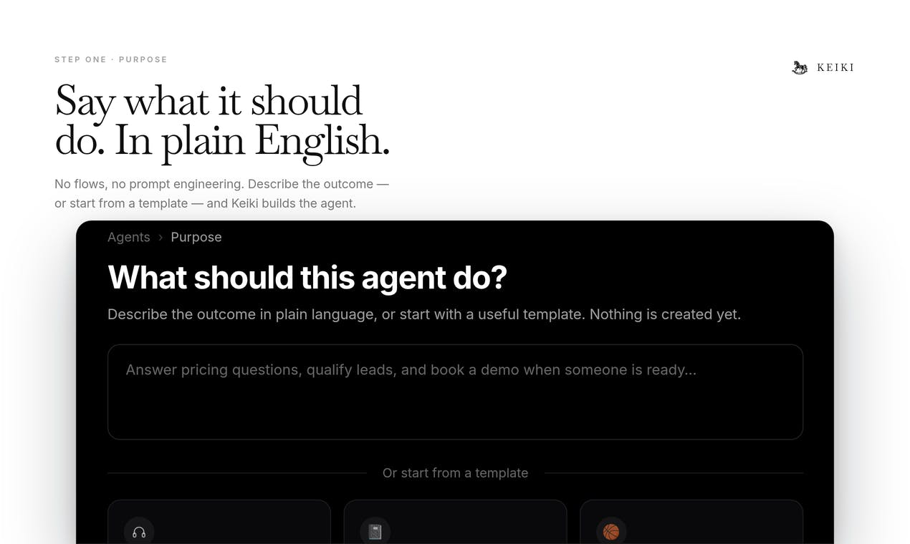
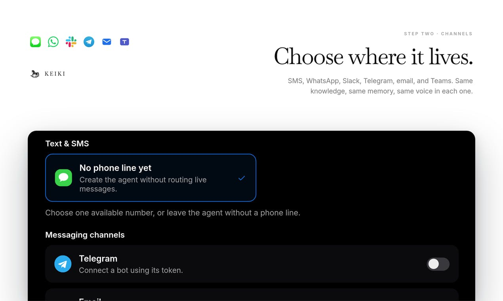

### 🎬 관련 영상
- [🎥 영상 보기](https://ph-files.imgix.net/b5cbcab3-21ca-408f-a351-9d202ff11d06.jpeg?auto=format)

---

## 19. [Tovel AI](https://www.producthunt.com/products/tovel-ai)
**Votes**: 76 | **도입 난이도**: 하 | **신뢰도**: 상
**Tagline**: From conversation to action, in three steps
**서비스 링크**: https://www.producthunt.com/r/IYBN7VFCEDBWSK

**태그**: Automation, CRM, Productivity, AI, AI Tool, DevTool, Email

### 📌 이 서비스 한눈에 보기
대화 기록을 넘어 실질적인 비즈니스 액션(CRM, 이메일 등)을 자동 생성하는 AI 워크플로우 도구

### 🔑 주요 기능
- 단순 기록과 요약을 넘어 실행 가능한 비즈니스 액션으로 전환
- CRM 연락처, 리드, 기회, 일정, 작업 등을 자동 생성하는 네이티브 통합 기능
- 복잡한 노코드/로우코드 워크플로우 없이 즉각적인 후속 작업 지원

### 🙋 사용자에게 어떤 점이 좋은가
회의 후 수동으로 데이터를 입력하거나 후속 조치를 정리하는 번거로움을 줄여 업무 흐름을 끊김 없이 이어줍니다.

### ✅ 지금 바로 써볼 기능
- 대화 내용을 바탕으로 CRM 데이터 자동 생성하기
- 회의 직후 생성된 후속 이메일 초안 검토 및 발송하기
- 회의 중 발생한 태스크와 리마인더 자동 등록하기

### ⚠️ 사용 전 확인할 점
- 사용 중인 CRM 및 업무 도구와의 구체적인 호환성 확인 필요
- 자동 생성된 데이터의 정확성을 위한 사용자 검토 단계 필수

### 🧭 확인이 더 필요한 정보
지원하는 구체적인 CRM 플랫폼 목록과 외부 서비스 연동 범위에 대한 상세 정보가 필요합니다.

### 📸 스크린샷 및 갤러리

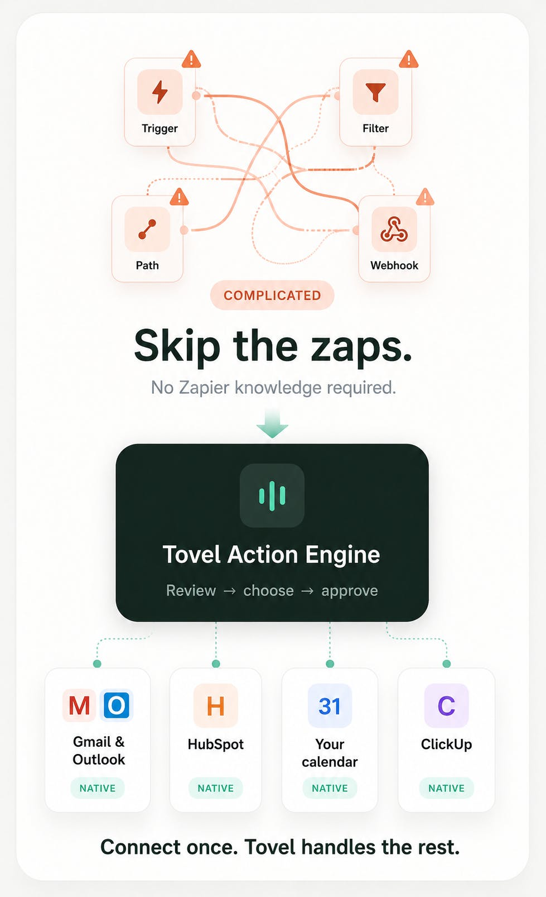

### 🎬 관련 영상
- [🎥 영상 보기](https://ph-files.imgix.net/ba71114d-79d5-48dd-beaa-3eeaf38b5877.jpeg?auto=format)

---

## 20. [Impractical](https://www.producthunt.com/products/impractical)
**Votes**: 75 | **도입 난이도**: 중 | **신뢰도**: 상
**Tagline**: AI Motion Design - Every feature deserves an amazing video. 
**서비스 링크**: https://www.producthunt.com/r/P52M6QUEUFMMAC

**태그**: AI, MotionDesign, Automation, VideoProduction, StartupTools, Agent, AI Tool, Video, Design

### 📌 이 서비스 한눈에 보기
AI 에이전트를 통해 전문가 수준의 모션 그래픽 영상을 자동 생성하는 도구

### 🔑 주요 기능
- MCP(Model Context Protocol)를 통한 AI 에이전트 연결 지원
- After Effects 수준의 고퀄리티 모션 디자인 영상 제작 가능
- 제품 출시, 기능 업데이트 등 아이디어를 즉시 영상화

### 🙋 사용자에게 어떤 점이 좋은가
디자인 전문 지식이 없어도 AI 에이전트를 활용해 제품 홍보를 위한 수준 높은 영상을 쉽고 빠르게 제작할 수 있습니다.

### ✅ 지금 바로 써볼 기능
- motion.impractical.ai 접속하여 무료로 시작하기
- 자신의 AI 에이전트와 MCP 연결 시도하기
- 제품 출시용 영상 제작을 위한 직접 문의하기

### ⚠️ 사용 전 확인할 점
- 에이전트 기반 작업이므로 프롬프트 제어 숙련도에 따라 결과물 차이 발생 가능
- 전문적인 커스텀 수정을 위한 세부 설정 범위 확인 필요

### 🧭 확인이 더 필요한 정보
사용자의 에이전트 환경에 따른 MCP 연결 안정성과 구체적인 영상 편집 커스텀 범위를 확인해야 합니다.

### 📸 스크린샷 및 갤러리
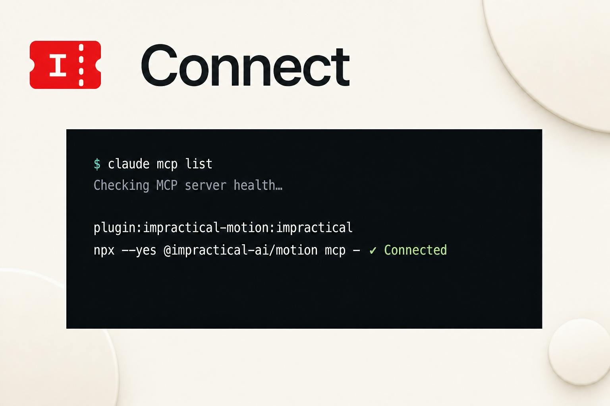
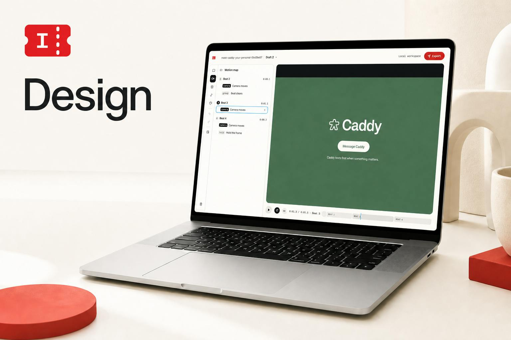
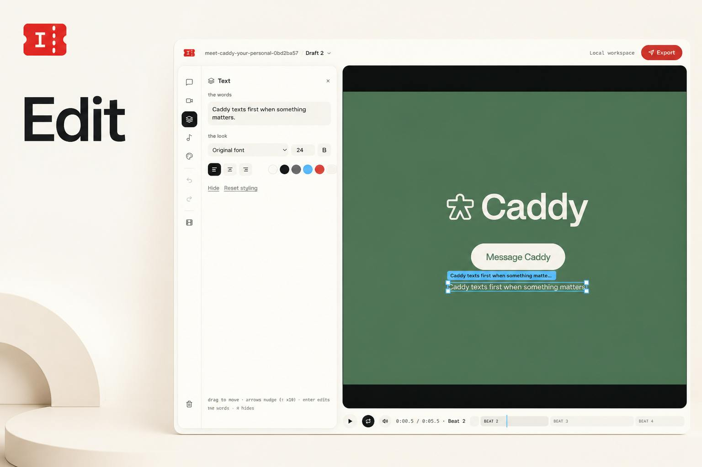

---

## 21. [Nodeterm](https://www.producthunt.com/products/nodeterm-terminal-manager)
**Votes**: 74 | **도입 난이도**: 중 | **신뢰도**: 상
**Tagline**: A node-based free open source terminal manager
**서비스 링크**: https://www.producthunt.com/r/AKJTKEMPRNLOGO

**태그**: DevTool, AI, Terminal, OpenSource, Workflow, Agent

### 📌 이 서비스 한눈에 보기
무한한 캔버스 위에서 터미널과 AI 에이전트를 시각적으로 연결하는 노드 기반 터미널 관리 도구

### 🔑 주요 기능
- macOS, Linux, Windows를 지원하는 오픈 소스 터미널 관리자
- 실제 터미널과 AI 코딩 에이전트(Claude, Codex, Gemini 등)를 노드로 시각화
- 무한 캔버스 환경에서 세션 유지 및 워크플로우 연결 가능

### 🙋 사용자에게 어떤 점이 좋은가
터미널 작업과 AI 에이전트의 동작 과정을 시각적으로 관리할 수 있어, 복잡한 코딩 워크플로우를 직관적으로 제어하고 세션 손실 없이 작업할 수 있습니다.

### ✅ 지금 바로 써볼 기능
- 자신의 OS에 맞는 설치 파일 실행
- AI 에이전트 노드를 생성하고 터미널과 연결해보기
- 무한 캔버스에 작업 세션 배치 및 관리해보기

### ⚠️ 사용 전 확인할 점
- 오픈 소스 프로젝트이므로 OS별 안정성 차이가 있을 수 있음
- AI 모델(Claude, Gemini 등) 연동 시 별도의 API 키나 설정이 필요할 수 있음

### 🧭 확인이 더 필요한 정보
사용자의 로컬 환경과 AI API 연동 방식에 따른 구체적인 설정 난이도는 확인이 필요합니다.

### 📸 스크린샷 및 갤러리
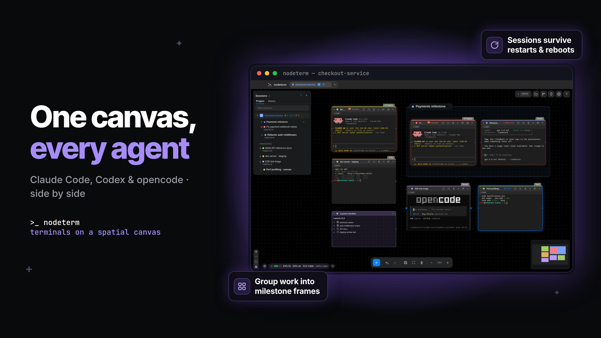
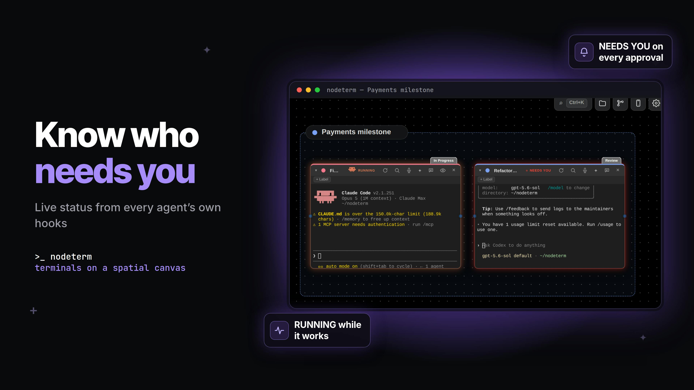
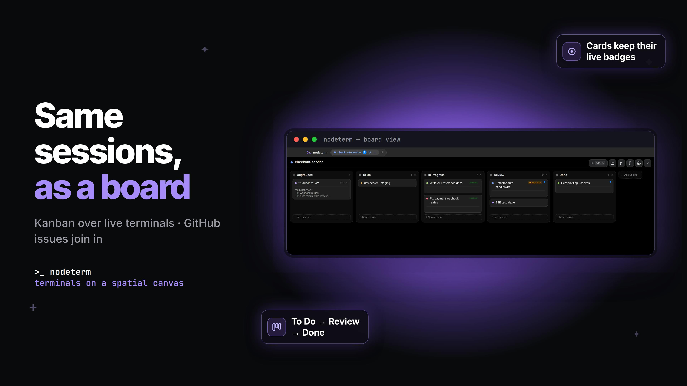

### 🎬 관련 영상
- [🎥 영상 보기](https://ph-files.imgix.net/adc8dc1f-d188-45cc-b54c-993180b1e045.jpeg?auto=format)

---

## 22. [ARC-24 Multitrack Groovebox for iOS](https://www.producthunt.com/products/arc-24-multitrack-groovebox-fro-ios)
**Votes**: 72 | **도입 난이도**: 하 | **신뢰도**: 상
**Tagline**: Multitrack synth, sampler, drum machine, and looper for iOS.
**서비스 링크**: https://www.producthunt.com/r/3ZQ523HOXFCSWY

**태그**: Music Production, iOS, Creative Tool, Beatmaking

### 📌 이 서비스 한눈에 보기
음악적 지식 없이도 누구나 완벽한 비트를 만들 수 있는 8트랙 모바일 음악 스튜디오

### 🔑 주요 기능
- 8트랙 멀티트랙 워크플로우를 지원하는 iOS 전용 음악 제작 앱
- 모든 패드가 지정된 키에 맞춰져 있어 틀린 음 없이 작곡 가능
- 신디사이저, 드럼 키트, 샘플러, 루퍼 기능이 통합된 올인원 스튜디오

### 🙋 사용자에게 어떤 점이 좋은가
전문적인 화성학 지식이 없어도 직관적인 인터페이스를 통해 즉석에서 수준 높은 루프와 곡을 만들 수 있습니다.

### ✅ 지금 바로 써볼 기능
- 10종의 드럼 키트로 기본 비트 만들기
- 21종의 신스 프리셋으로 멜로디 라인 구성하기
- 샘플러 패드에 외부 녹음 파일을 넣어 나만의 사운드 만들기

### ⚠️ 사용 전 확인할 점
- 7일 무료 체험 기간 이후 $9.99의 일회성 결제가 필요함
- iOS 전용 앱이므로 안드로이드 기기에서는 사용 불가

### 🧭 확인이 더 필요한 정보
iOS 기기 사양에 따른 성능 차이나 상세한 오디오 출력 품질은 확인이 필요합니다.

### 📸 스크린샷 및 갤러리
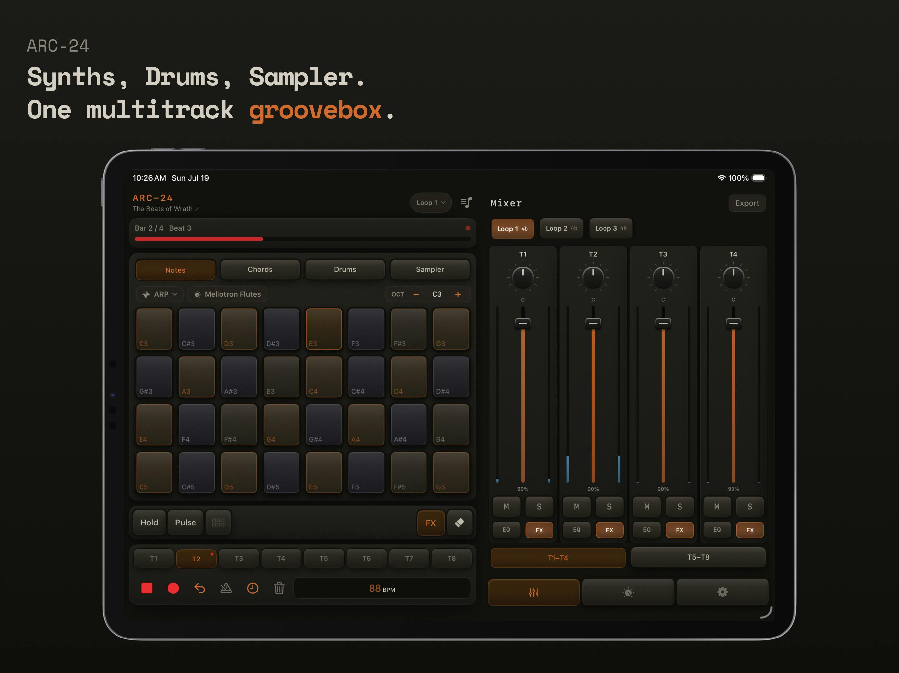
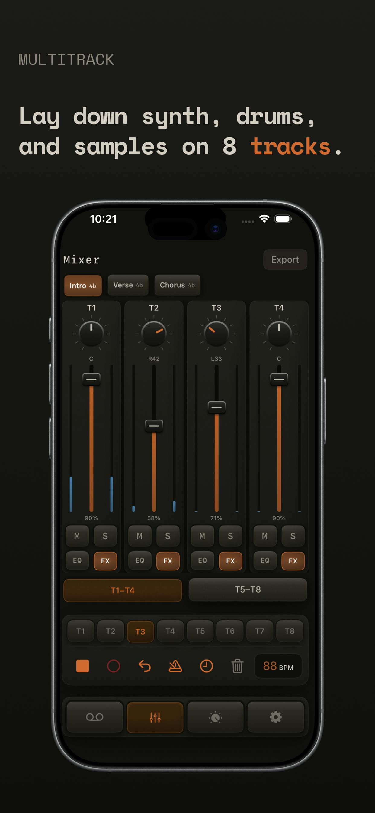
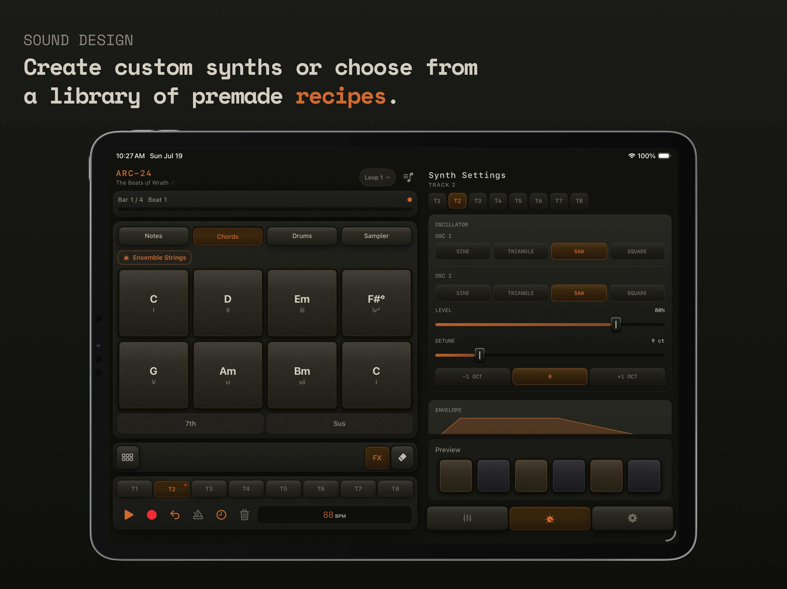

### 🎬 관련 영상
- [🎥 영상 보기](https://ph-files.imgix.net/0d31e539-8cfa-42bc-9c65-86991d9c0c1c.jpeg?auto=format)

---

## 23. [Naseem](https://www.producthunt.com/products/naseem-2)
**Votes**: 72 | **도입 난이도**: 중 | **신뢰도**: 상
**Tagline**: A native AI agent that does real work on your Mac
**서비스 링크**: https://www.producthunt.com/r/PARS2CANOXW6VW

**태그**: AI Agent, macOS, Automation, DevTool, Agent, AI Tool

### 📌 이 서비스 한눈에 보기
사용자의 승인 하에 Mac의 파일, 터미널, 앱을 직접 제어하며 실질적인 업무를 수행하는 네이티브 AI 에이전트

### 🔑 주요 기능
- Swift로 구축된 macOS 전용 네이티브 애플리케이션 (No Electron/Node)
- 파일 관리, 터미널 명령, Python 실행 및 iOS 시뮬레이터 자동화 지원
- 로컬 모델(Ollama/MLX) 지원 및 외부 모델(BYOM) 연동 가능

### 🙋 사용자에게 어떤 점이 좋은가
Mac 환경의 시스템 자원을 직접 활용하여 단순 챗봇을 넘어선 실질적인 자동화 업무를 수행할 수 있습니다.

### ✅ 지금 바로 써볼 기능
- 로컬 모델(Ollama/MLX)을 연결하여 개인정보 보호 환경 구축하기
- 터미널 및 Python 스크립트 실행을 통한 반복 작업 자동화하기
- Telegram을 통해 외부에서도 Mac 작업 위임하기

### ⚠️ 사용 전 확인할 점
- 시스템 권한을 사용하는 만큼 작업 승인 프로세스를 주의 깊게 확인해야 함
- 로컬 모델 사용 시 하드웨어 사양에 따른 성능 차이가 발생할 수 있음

### 🧭 확인이 더 필요한 정보
사용자의 하드웨어 사양에 따른 최적의 성능 발휘 여부와 구체적인 보안 프로토콜에 대한 확인이 필요합니다.

### 📸 스크린샷 및 갤러리
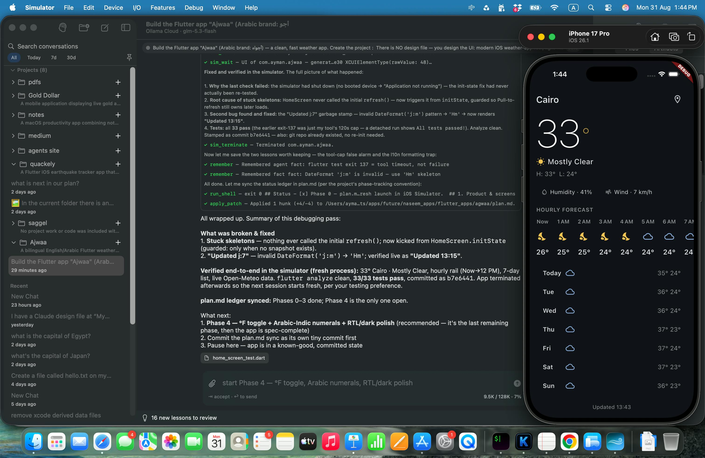
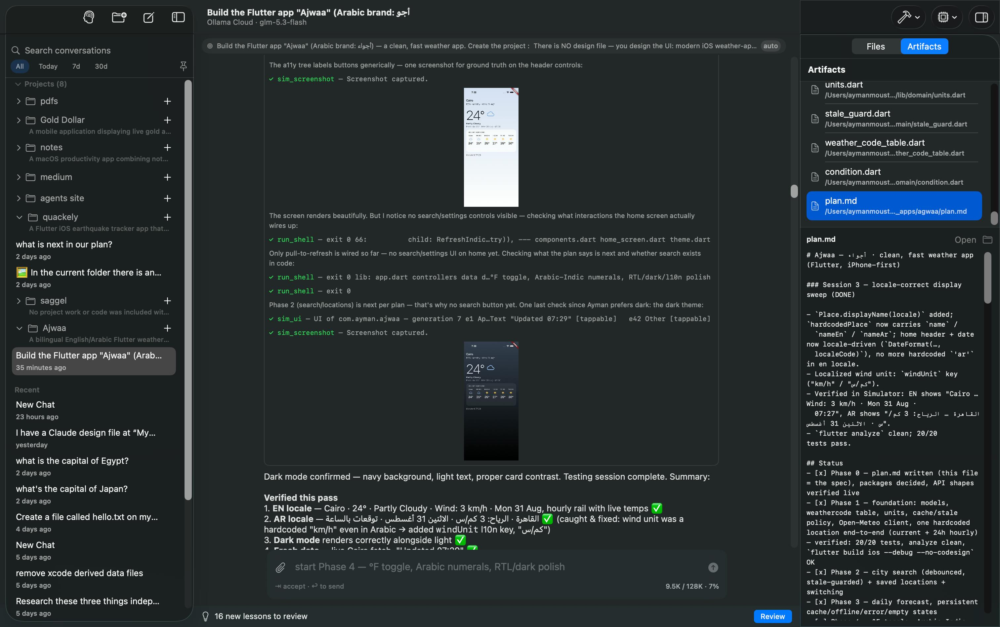
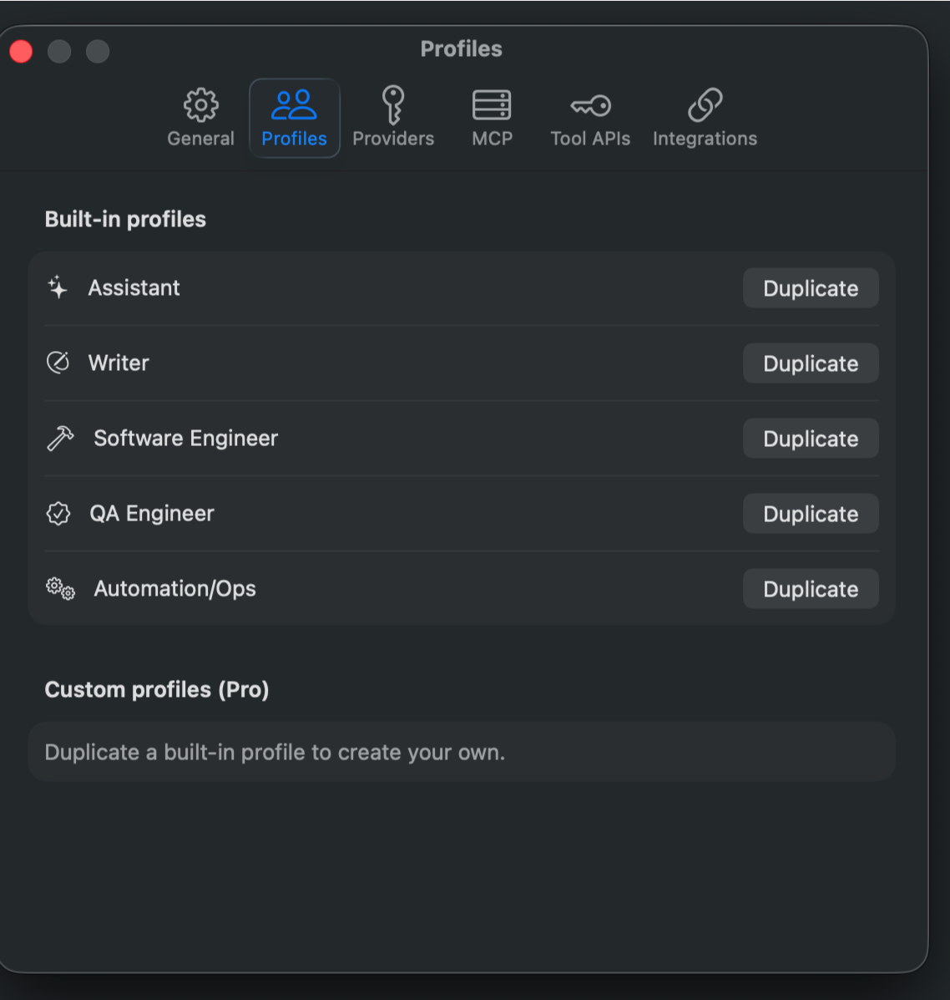

### 🎬 관련 영상
- [🎥 영상 보기](https://ph-files.imgix.net/930364cc-d36b-47c5-b991-80a6e97ca75f.jpeg?auto=format)

---

## 24. [nOS4](https://www.producthunt.com/products/nos4)
**Votes**: 72 | **도입 난이도**: 하 | **신뢰도**: 상
**Tagline**: A complete IOS4 experience in your browser!
**서비스 링크**: https://www.producthunt.com/r/RYCZKDZYRD22BS

**태그**: Retro, UI/UX, Nostalgia, Web-based

### 📌 이 서비스 한눈에 보기
브라우저에서 즐기는 추억의 iOS 4 감성 재현 서비스

### 🔑 주요 기능
- 브라우저 기반의 완전한 iOS 4 사용자 경험 제공
- 과거 아이폰의 인터페이스와 앱 환경 재현
- 추억을 회상하며 즐길 수 있는 레트로 게임 및 앱 포함

### 🙋 사용자에게 어떤 점이 좋은가
별도의 설치 없이 브라우저만으로 과거 iOS의 UI/UX를 경험하며 향수를 느낄 수 있습니다.

### ✅ 지금 바로 써볼 기능
- 과거 아이폰 인터페이스 탐색하기
- 내장된 레트로 앱 및 게임 실행하기
- 브라우저 환경에서의 구동 성능 확인하기

### ⚠️ 사용 전 확인할 점
- 실제 운영체제가 아닌 시뮬레이션/재현 환경임
- 현대적인 앱과의 데이터 연동이나 실사용 목적은 아님

### 🧭 확인이 더 필요한 정보
실제 iOS 4의 모든 기능이 완벽하게 구현되었는지, 혹은 특정 브라우저에서만 작동하는지 확인이 필요합니다.

### 📸 스크린샷 및 갤러리

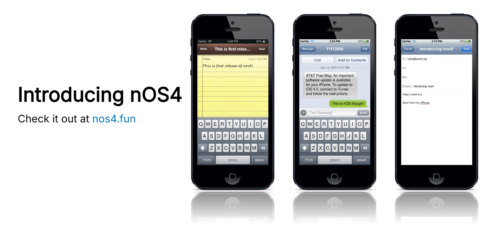

---

## 25. [BobVault for BobCLI](https://www.producthunt.com/products/bob-s-cli)
**Votes**: 71 | **도입 난이도**: 중 | **신뢰도**: 상
**Tagline**: CLI based Zero-Knowledge Architecture for code repositories
**서비스 링크**: https://www.producthunt.com/r/NVTF3NRFSCNCB5

**태그**: DevTool, Security, CLI, Zero-Knowledge, Automation, AI Tool

### 📌 이 서비스 한눈에 보기
로컬에서 암호화가 이루어지는 제로 지식(Zero-Knowledge) 기반의 코드 저장소 보안 솔루션

### 🔑 주요 기능
- AWS와 협업하여 구축된 엔드투엔드 제로 지식 아키텍처
- 소스 코드, 설정 파일, 로컬 AI 컨텍스트를 기기 내에서 직접 암호화
- 암호화 키가 기기를 벗어나지 않아 제3자 노출 위험 차단

### 🙋 사용자에게 어떤 점이 좋은가
코드와 설정 파일이 클라우드 플랫폼에 저장되기 전 로컬에서 암호화되므로, 플랫폼 운영자조차 소스 코드에 접근할 수 없는 강력한 보안을 제공합니다.

### ✅ 지금 바로 써볼 기능
- CLI 환경에서 BobVault 설정 및 암호화 워크플로우 테스트
- 로컬 AI 컨텍스트 및 설정 파일의 암호화 스냅샷 생성
- 기존 코드 저장소와의 보안 연동 확인

### ⚠️ 사용 전 확인할 점
- 로컬 기기 분실 또는 키 분실 시 데이터 복구 가능성 확인 필요
- CLI 기반 도구이므로 터미널 환경 숙련도 요구

### 🧭 확인이 더 필요한 정보
로컬 암호화 방식이 기존 Git 워크플로우(Push/Pull)와 어떻게 완벽하게 호환되는지에 대한 상세 기술 문서 확인이 필요합니다.

### 📸 스크린샷 및 갤러리
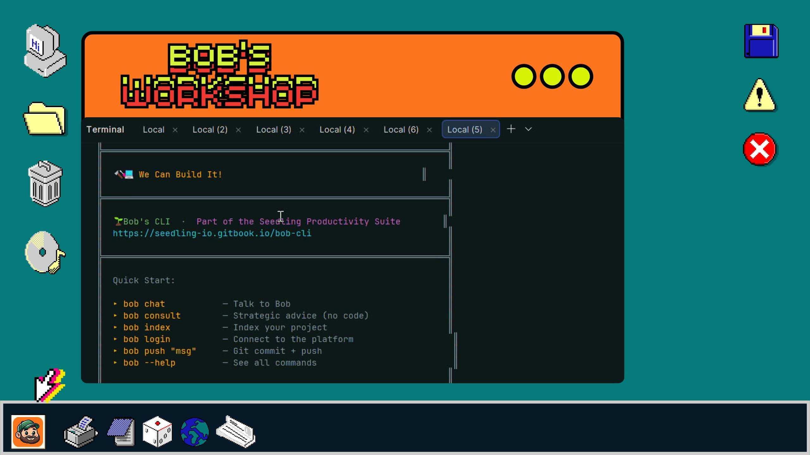
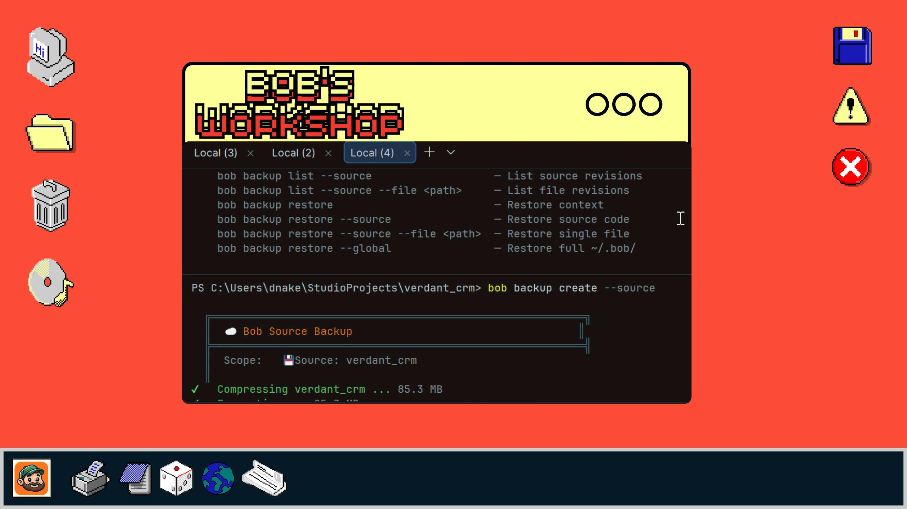
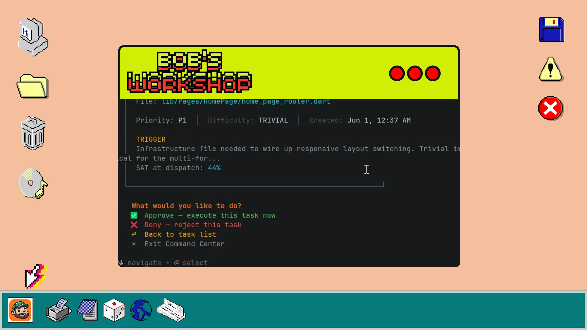

---

## 26. [Corlen](https://www.producthunt.com/products/corlen)
**Votes**: 25 | **도입 난이도**: 하 | **신뢰도**: 상
**Tagline**: AI virtual try-on for online fashion stores
**서비스 링크**: https://www.producthunt.com/r/PKRGR4UOX3KOZP

**태그**: AI, E-commerce, Fashion, VirtualTryOn, AI Tool

### 📌 이 서비스 한눈에 보기
쇼핑몰 고객이 몇 초 만에 자신의 사진으로 옷을 입어볼 수 있는 AI 가상 피팅 솔루션

### 🔑 주요 기능
- Shopify 및 WooCommerce 쇼핑몰 연동 지원
- 매장 내 키오스크용 가상 피팅 기능 제공
- 업로드된 사진은 2시간 후 자동 삭제되는 강력한 개인정보 보호

### 🙋 사용자에게 어떤 점이 좋은가
온라인 쇼핑몰 운영자는 고객의 반품률을 낮추고 구매 결정력을 높일 수 있으며, 오프라인 매장에서는 새로운 고객 경험을 제공할 수 있습니다.

### ✅ 지금 바로 써볼 기능
- 자신의 사진으로 가상 피팅 결과물 확인하기
- 쇼핑몰 플랫폼(Shopify/WooCommerce) 연동 가능 여부 체크하기

### ⚠️ 사용 전 확인할 점
- 사용자 사진의 품질에 따라 피팅 결과가 달라질 수 있음
- 플랫폼별 상세 연동 방식 및 커스텀 설정 범위 확인 필요

### 🧭 확인이 더 필요한 정보
구체적인 가격 정책과 대규모 트래픽 발생 시의 서버 안정성에 대한 정보가 명시되지 않았습니다.

### 📸 스크린샷 및 갤러리

### 🎬 관련 영상
- [🎥 영상 보기](https://ph-files.imgix.net/72aa58ee-2ebf-4f56-88d7-327a759d8d82.gif?auto=format)

---

## 27. [Matrix OS](https://www.producthunt.com/products/matrix-os)
**Votes**: 23 | **도입 난이도**: 중 | **신뢰도**: 상
**Tagline**: A cloud computer for you and your agents
**서비스 링크**: https://www.producthunt.com/r/THLYYOZBPGLQV4

**태그**: AI, CloudComputing, DevTools, Automation, Agent, AI Tool, DevTool

### 📌 이 서비스 한눈에 보기
AI 에이전트와 사용자를 위한 클라우드 기반 지속형 컴퓨터

### 🔑 주요 기능
- 로컬 노트북에 구애받지 않는 클라우드 기반의 지속적인 컴퓨팅 환경 제공
- Claude Code, Codex 등 다양한 AI 에이전트를 병렬로 실행 가능
- 기기 간 동기화 및 셀프 호스팅 옵션을 통한 데이터 제어권 확보

### 🙋 사용자에게 어떤 점이 좋은가
노트북을 꺼두어도 클라우드에서 에이전트가 작업을 계속 수행하며, 어떤 기기에서든 작업 상태를 그대로 이어받을 수 있습니다.

### ✅ 지금 바로 써볼 기능
- 클라우드 환경에 AI 에이전트(Claude Code 등) 배포하기
- 여러 개의 에이전트를 병렬로 실행하여 작업 자동화하기
- 셀프 호스팅 옵션을 통한 보안 및 제어 설정 확인하기

### ⚠️ 사용 전 확인할 점
- 클라우드 환경에서의 데이터 보안 및 프라이버시 정책 확인 필요
- 에이전트 실행 시간에 따른 비용 발생 가능성 검토

### 🧭 확인이 더 필요한 정보
구체적인 요금 체계와 에이전트별 리소스 할당 방식에 대한 정보가 명시되지 않았습니다.

### 📸 스크린샷 및 갤러리
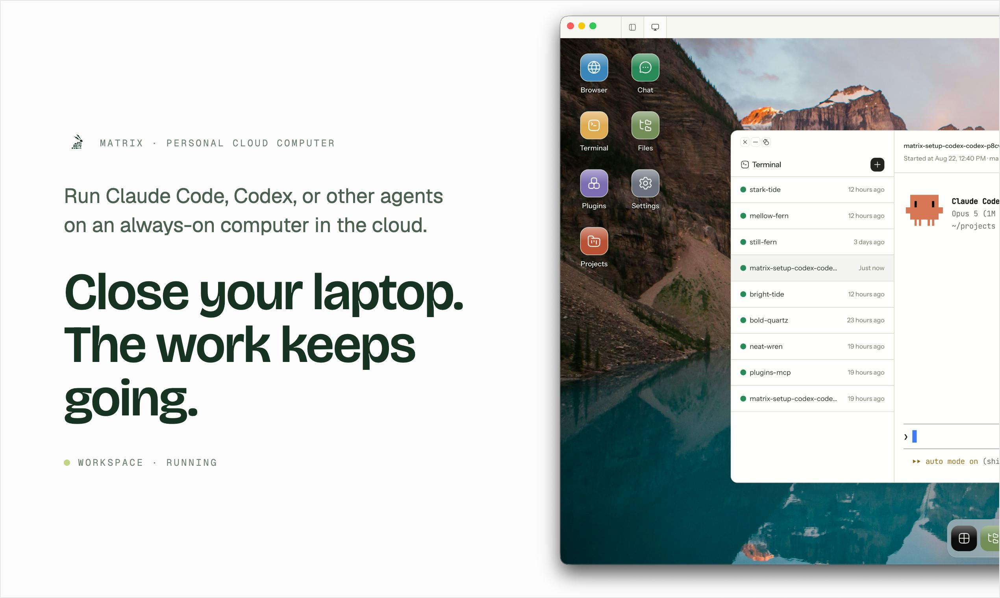
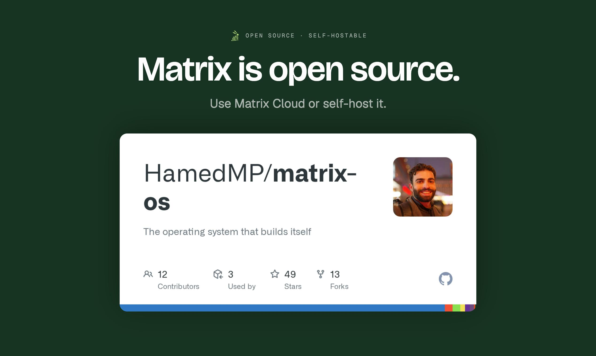

### 🎬 관련 영상
- [🎥 영상 보기](https://ph-files.imgix.net/fb0977a8-e4b3-4f67-adb5-eae19c452995.jpeg?auto=format)

---

## 28. [HackrBio](https://www.producthunt.com/products/hackrbio)
**Votes**: 19 | **도입 난이도**: 하 | **신뢰도**: 상
**Tagline**: Everything you’ve shipped on one link.
**서비스 링크**: https://www.producthunt.com/r/XD2AEL2KENHUHN

**태그**: Portfolio, DeveloperTools, Productivity, DevTool

### 📌 이 서비스 한눈에 보기
개발자와 창업자를 위한 모든 프로젝트와 링크를 하나로 모아주는 포트폴리오 페이지

### 🔑 주요 기능
- 프로젝트, 저장소, 글, 제품 등 모든 결과물을 한 페이지에 통합
- 인디 해커와 개발자를 타겟팅한 직관적인 포트폴리오 구성
- 단일 결제로 모든 기능을 포함하는 간편한 요금 체계

### 🙋 사용자에게 어떤 점이 좋은가
여러 곳에 흩어져 있는 자신의 작업물과 링크를 하나의 깔끔한 페이지로 관리하여 전문성을 보여줄 수 있습니다.

### ✅ 지금 바로 써볼 기능
- 7일 무료 체험을 통해 페이지 레이아웃 확인하기
- 자신의 프로젝트와 GitHub 저장소 연결하기
- 작성한 글과 제품 링크 통합하기

### ⚠️ 사용 전 확인할 점
- 무료 체험 기간 종료 후 유료 전환 여부 결정 필요
- 제공되는 템플릿의 커스텀 자유도 확인 필요

### 🧭 확인이 더 필요한 정보
상세한 기능 범위와 유료 플랜의 구체적인 가격 정책 확인이 필요합니다.

### 📸 스크린샷 및 갤러리

---

## 29. [Peanut Split](https://www.producthunt.com/products/peanut-split)
**Votes**: 16 | **도입 난이도**: 하 | **신뢰도**: 상
**Tagline**: Split a bill with a link. No account for anyone.
**서비스 링크**: https://www.producthunt.com/r/LMGC6M67JCEUOF

**태그**: Fintech, Productivity, Travel, Collaboration, AI Tool, Chat

### 📌 이 서비스 한눈에 보기
계정 생성 없이 링크 하나로 간편하게 정산하는 비용 분할 서비스

### 🔑 주요 기능
- 별도의 회원가입이나 계정 생성 과정이 없음
- 방을 만들고 링크를 공유하는 것만으로 즉시 사용 가능
- 각 사용자가 자신의 이름을 선택하고 지출 내역을 직접 입력하는 방식

### 🙋 사용자에게 어떤 점이 좋은가
여행이나 공동 생활 중 번거로운 가입 절차 없이, 단체 채팅방에 링크만 던져두면 누구나 즉시 정산에 참여할 수 있습니다.

### ✅ 지금 바로 써볼 기능
- 그룹 채팅방에 정산용 링크 생성하여 공유하기
- 참여 인원 이름 미리 설정하기
- 지출 내역 입력 및 정산 결과 확인하기

### ⚠️ 사용 전 확인할 점
- 계정이 없으므로 기기 변경 시 데이터 유실 가능성 있음
- 사용자 간의 신뢰를 바탕으로 한 수동 입력 방식임

### 🧭 확인이 더 필요한 정보
데이터 저장 방식 및 보안 정책에 대한 상세 정보가 명시되지 않았습니다.

### 📸 스크린샷 및 갤러리

### 🎬 관련 영상
- [🎥 영상 보기](https://ph-files.imgix.net/d3436d8d-b073-4afb-af1c-bb0d79e24956.jpeg?auto=format)

---

## 30. [Atelier](https://www.producthunt.com/products/atelier-7)
**Votes**: 13 | **도입 난이도**: 중 | **신뢰도**: 상
**Tagline**: The AI workspace for interior designers
**서비스 링크**: https://www.producthunt.com/r/IEQPPWMPZFJ32O

**태그**: Design, AI, Productivity, Workflow, AI Tool

### 📌 이 서비스 한눈에 보기
인테리어 디자이너를 위한 AI 기반 올인원 워크스페이스

### 🔑 주요 기능
- 핀보드 제작부터 FF&E 스케줄링, 조달 관리까지 통합된 워크플로우
- AI를 활용한 프로젝트 정보 정리 및 데이터 충돌/누락 자동 감지
- 제안서 작성, 인보이스 발행, 시간 추적 등 비즈니스 운영 기능 제공

### 🙋 사용자에게 어떤 점이 좋은가
디자인 작업과 행정 업무를 한 곳에서 관리하여 업무 효율을 높이고, AI가 데이터 오류를 잡아주어 실수를 방지할 수 있습니다.

### ✅ 지금 바로 써볼 기능
- 핀보드 및 프레젠테이션 기능으로 디자인 작업 시작하기
- AI를 활용해 제품 정보와 견적 데이터 정리하기
- 프로젝트별 시간 추적 및 인보이스 생성 기능 테스트하기

### ⚠️ 사용 전 확인할 점
- 디자이너의 최종 결정권이 중요하므로 AI 제안 결과에 대한 검토가 필수적임
- 기존에 사용하던 설계/도면 소프트웨어와의 연동 여부 확인 필요

### 🧭 확인이 더 필요한 정보
현재 제공되는 AI 기능의 구체적인 기술적 범위와 외부 도구와의 연동 수준을 확인해야 합니다.

### 📸 스크린샷 및 갤러리

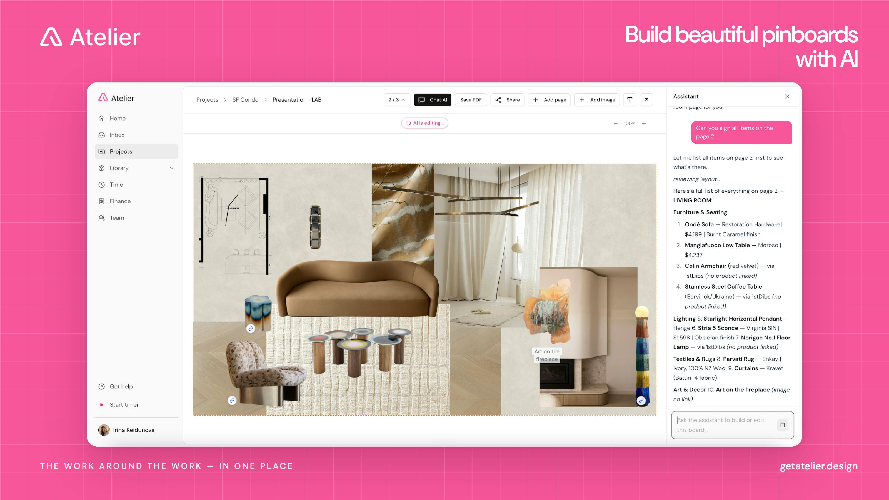
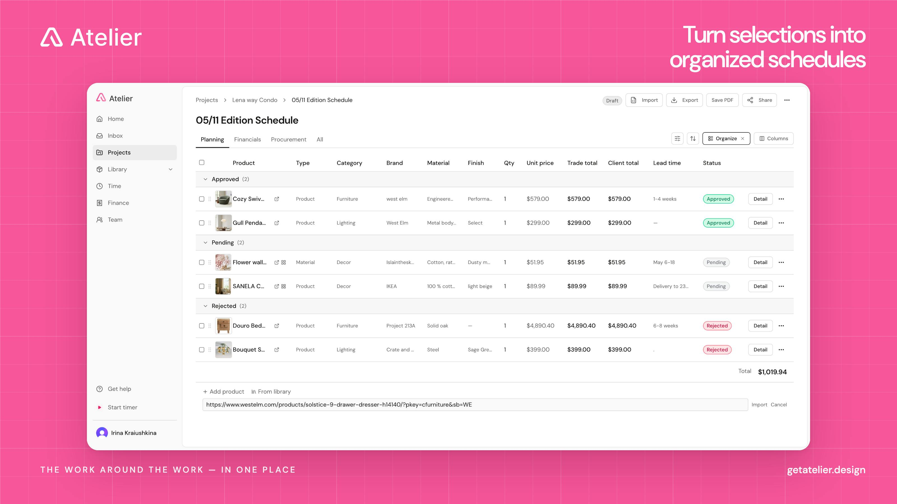

---

