# 🚀 Product Hunt Daily Top 30 (2026-09-04)

## 오늘의 요약
오늘의 트렌드는 단순한 대화형 AI를 넘어, 실질적인 업무를 수행하고 스스로 오류를 해결하는 '행동하는 AI 에이전트'의 등장이었습니다. 또한, 영상 제작의 효율을 극대화하는 생성형 비디오 기술과 사용자의 작업 맥락을 이해하여 워크플로우를 자동화하는 도구들이 주목받았습니다.

### 오늘의 핵심 포인트
- 단순 답변을 넘어 업무를 완수하고 스스로 문제를 복구하는 자가 치유형 에이전트 기술이 부상했습니다.
- 웹 브라우저와 데스크톱 환경에서 사용자의 맥락을 파악하여 반복 업무를 자동화하는 도구들이 강화되었습니다.
- 고화질 영상 생성 및 모션 트랜스퍼 기술을 통해 창작자의 작업 효율을 높이는 비디오 AI 솔루션이 주목받았습니다.

**오늘의 태그**: AI 에이전트, 업무 자동화, 생성형 비디오, 워크플로우, AI 비서

## 1. [Agent Builder by Airtop](https://www.producthunt.com/products/airtop)
**Votes**: 238 | **도입 난이도**: 하 | **신뢰도**: 상
**Tagline**: Build agents that heal themselves. 
**서비스 링크**: https://www.producthunt.com/r/2EYT4D2MQCUU3J

**태그**: Automation, AI Agent, NoCode, DevTool, Agent, AI Tool, LLM

### 📌 이 서비스 한눈에 보기
자연어로 워크플로우를 설계하고 오류 발생 시 스스로 복구하는 자가 치유형 AI 에이전트 빌더

### 🔑 주요 기능
- 자연어 설명을 코드로 변환하여 소프트웨어처럼 실행되는 자동화 구축
- 실행 실패 시 자동으로 원인을 조사하고 단계를 재구축하는 자가 치유 기능
- 기존 LLM 단계별 에이전트 대비 최대 100배 높은 효율성 제공

### 🙋 사용자에게 어떤 점이 좋은가
복잡한 코딩 없이 업무 프로세스를 자동화할 수 있으며, 에러 발생 시 수동 개입 없이 스스로 문제를 해결하여 운영 부담을 획기적으로 줄여줍니다.

### ✅ 지금 바로 써볼 기능
- 자연어로 복잡한 업무 워크플로우 설명해보기
- 에이전트의 자동 복구(Self-healing) 기능 테스트하기
- 클라우드 환경에서의 에이전트 실행 효율성 확인하기

### ⚠️ 사용 전 확인할 점
- 자동 복구 과정에서 의도치 않은 워크플로우 변경 가능성 확인 필요
- 복잡한 로직의 경우 자연어 설명만으로 완벽한 구현이 가능한지 검증 필요

### 🧭 확인이 더 필요한 정보
기존 LLM 에이전트 대비 100배 효율이 어떤 구체적인 지표(비용, 속도, 토큰 사용량 등)를 의미하는지 확인이 필요합니다.

### 📸 스크린샷 및 갤러리
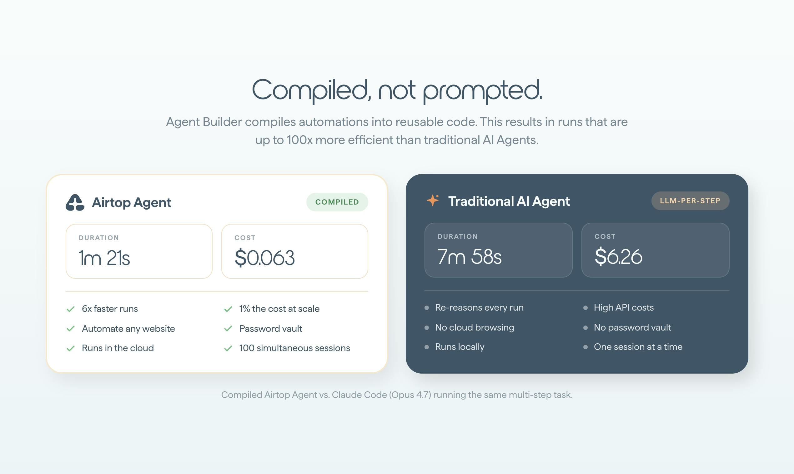
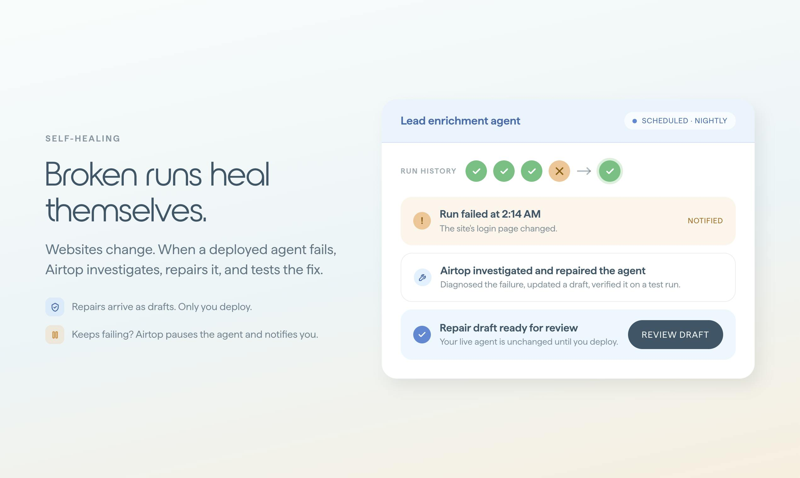
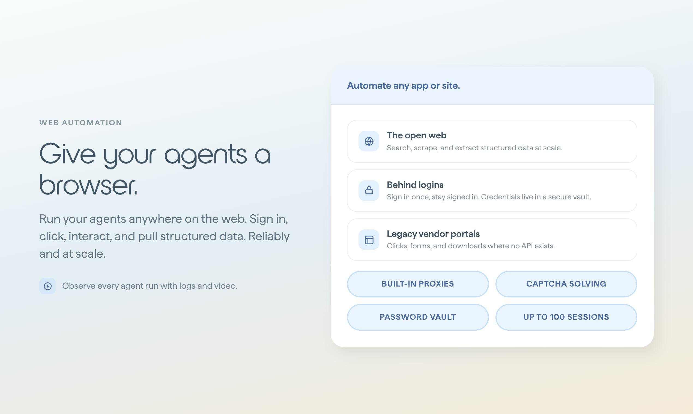

### 🎬 관련 영상
- [🎥 영상 보기](https://ph-files.imgix.net/b951ba09-07b9-4991-87ef-79b0dfaa95ff.jpeg?auto=format)

---

## 2. [MagiCrew](https://www.producthunt.com/products/magicrew)
**Votes**: 216 | **도입 난이도**: 중 | **신뢰도**: 상
**Tagline**: Give everyone their own AI workforce in one platform
**서비스 링크**: https://www.producthunt.com/r/7TTRWNXQKUKM4N

**태그**: AI-Agents, Automation, OpenSource, Productivity, Agent, AI Tool, Chat

### 📌 이 서비스 한눈에 보기
단순 채팅을 넘어 전문적인 업무를 수행하는 AI 에이전트 팀을 구축하는 오픈소스 플랫폼

### 🔑 주요 기능
- 단순 대화형 AI를 넘어 실질적인 업무를 수행하는 전문 디지털 워커 배포
- 멀티 에이전트 협업을 통한 리서치, 분석, 보고서 및 프레젠테이션 생성
- 기업용 제어 기능과 결과물 중심의 워크플로우 제공

### 🙋 사용자에게 어떤 점이 좋은가
단순히 질문에 답하는 AI가 아니라, 팀의 업무를 대신 수행하고 결과물을 만들어내는 가상 직원을 운영할 수 있습니다.

### ✅ 지금 바로 써볼 기능
- 특정 업무(리서치, 보고서 등)를 위한 전문 에이전트 설정
- 여러 에이전트 간의 협업 워크플로우 설계
- 실제 비즈니스 태스크를 위한 에이전트 배포 및 관리

### ⚠️ 사용 전 확인할 점
- 오픈소스 플랫폼이므로 직접 구축 및 관리 시 기술적 숙련도 필요
- 에이전트가 생성한 결과물의 정확성에 대한 최종 검토 필요

### 🧭 확인이 더 필요한 정보
오픈소스 버전과 엔터프라이즈 버전 간의 기능 차이 및 인프라 구축 요구 사양을 확인해야 합니다.

### 📸 스크린샷 및 갤러리
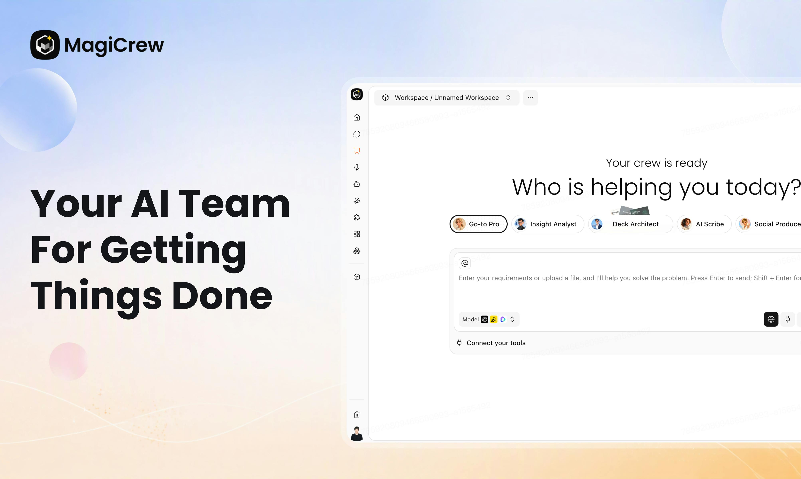
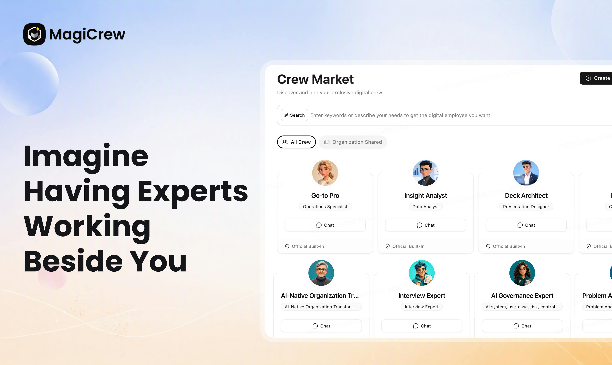
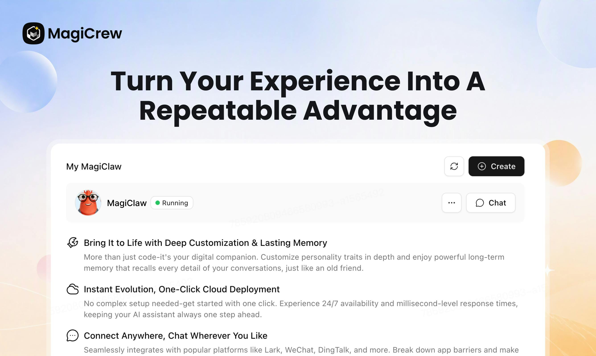

### 🎬 관련 영상
- [🎥 영상 보기](https://ph-files.imgix.net/69c088fe-c461-4efc-a6cf-adf94241185d.jpeg?auto=format)

---

## 3. [Omi](https://www.producthunt.com/products/open-source-ai-necklace-friend)
**Votes**: 207 | **도입 난이도**: 중 | **신뢰도**: 상
**Tagline**: Ask your computer anything you saw or heard
**서비스 링크**: https://www.producthunt.com/r/LY6RGOFW5MIPEU

**태그**: Productivity, AI, Automation, OpenSource, AI Tool

### 📌 이 서비스 한눈에 보기
화면과 대화를 기록하여 작업과 요약을 자동화하는 개인용 AI 비서

### 🔑 주요 기능
- 화면 캡처 및 대화 기록을 통한 자동 태스크/리마인더 생성
- 통화 내용을 요약하고 실행 가능한 액션 아이템으로 변환
- 오픈 소스 및 로컬 실행 방식으로 데이터 제어권 확보

### 🙋 사용자에게 어떤 점이 좋은가
업무 중 발생하는 수많은 정보와 대화 내용을 일일이 기록할 필요 없이, 나중에 질문하거나 요약본을 통해 즉시 확인할 수 있습니다.

### ✅ 지금 바로 써볼 기능
- 화면 공유 및 화상 회의 시 요약 기능 테스트
- 기록된 내용을 바탕으로 질문하여 정보 검색하기
- 개인 AI 키를 연결하여 로컬 환경에서 보안 설정하기

### ⚠️ 사용 전 확인할 점
- 화면과 대화가 상시 기록되므로 개인정보 보호를 위한 설정 주의 필요
- 사용자의 AI API 키를 직접 관리해야 하는 기술적 숙련도 요구

### 🧭 확인이 더 필요한 정보
로컬 실행 시 하드웨어 사양에 따른 성능 영향과 구체적인 개인정보 보호 정책을 확인해야 합니다.

### 📸 스크린샷 및 갤러리
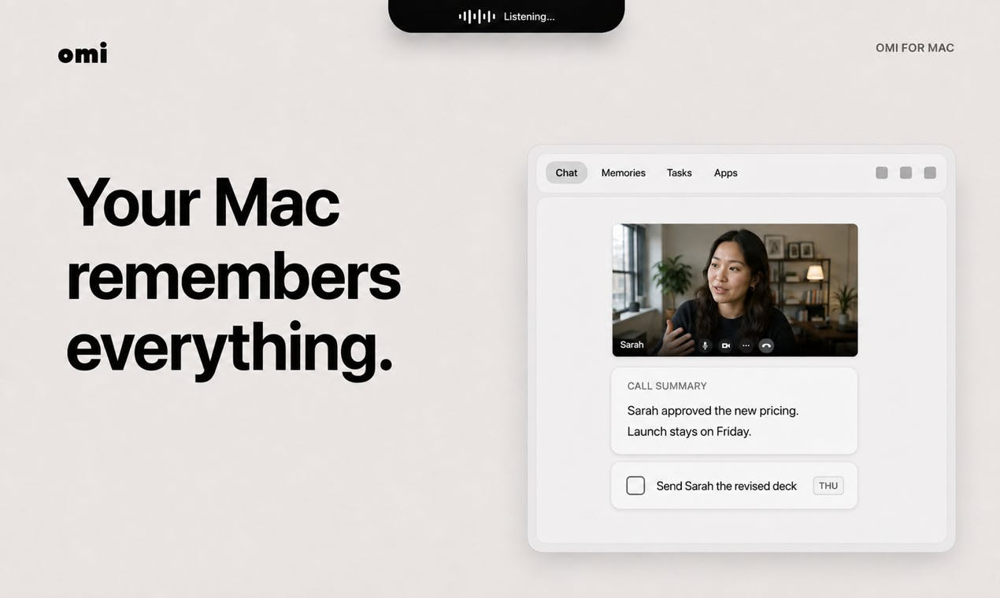

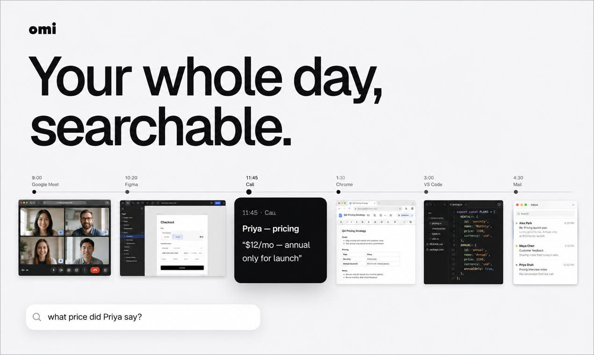

### 🎬 관련 영상
- [🎥 영상 보기](https://ph-files.imgix.net/a4c253e9-f7b6-49da-a941-751b9ae0c7e8.jpeg?auto=format)

---

## 4. [Nex](https://www.producthunt.com/products/nex-4)
**Votes**: 205 | **도입 난이도**: 상 | **신뢰도**: 상
**Tagline**: Claude Cowork for high-volume GTM workflows
**서비스 링크**: https://www.producthunt.com/r/XMDJ7VCVJ2VC3D

**태그**: GTM, Automation, AI-Agent, SalesTech, Agent

### 📌 이 서비스 한눈에 보기
대규모 GTM 워크플로우를 자동화하는 전문 AI 에이전트 솔루션

### 🔑 주요 기능
- 범용 AI 에이전트가 처리하기 어려운 복잡하고 대규모인 GTM 워크플로우 설계 및 실행
- HubSpot의 대형 고객 플랫폼 운영 경험을 가진 전문가들이 개발
- HubSpot 창립자 Dharmesh Shah의 지원을 받는 검증된 팀의 솔루션

### 🙋 사용자에게 어떤 점이 좋은가
반복적이고 복잡한 영업 및 마케팅(GTM) 업무를 자동화하여 팀의 운영 효율성을 극대화할 수 있습니다.

### ✅ 지금 바로 써볼 기능
- 현재 운영 중인 GTM 워크플로우의 복잡도 분석
- 기존 CRM 및 자동화 툴과의 연동 가능성 검토
- 대규모 데이터 처리 시의 안정성 테스트

### ⚠️ 사용 전 확인할 점
- 고도로 전문화된 워크플로우를 대상으로 하므로 초기 설정 난이도가 높을 수 있음
- 구체적인 연동 가능한 외부 툴 목록이 명시되지 않음

### 🧭 확인이 더 필요한 정보
구체적인 기능 범위와 기존 CRM 시스템과의 통합 방식에 대한 상세 정보가 필요합니다.

### 📸 스크린샷 및 갤러리
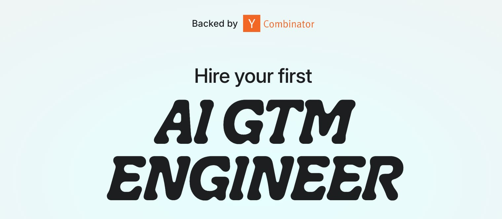

### 🎬 관련 영상
- [🎥 영상 보기](https://ph-files.imgix.net/80d25ced-5ae0-4057-be72-acd4ab50347b.jpeg?auto=format)

---

## 5. [Atlas by World Labs](https://www.producthunt.com/products/atlas-by-world-labs)
**Votes**: 169 | **도입 난이도**: 상 | **신뢰도**: 상
**Tagline**: Turn text, pics, video, + 3D into camera-controlled HD video
**서비스 링크**: https://www.producthunt.com/r/7ZC3M4VAAJWXV3

**태그**: AI Video, 3D Generation, Robotics, Creative Tools, Video, Vision

### 📌 이 서비스 한눈에 보기
텍스트와 이미지를 고화질 3D 카메라 제어 영상으로 변환하는 옴니 월드 모델

### 🔑 주요 기능
- 텍스트, 이미지, 비디오, 3D 데이터를 활용한 고화질 영상 생성
- 최대 1분 길이의 1440p 해상도 및 카메라 제어 기능 제공
- 소수의 사진을 통한 장면 재구성 및 로보틱스를 위한 시공간 시뮬레이션

### 🙋 사용자에게 어떤 점이 좋은가
창작자는 텍스트나 사진만으로 정교한 카메라 워킹이 담긴 고화질 영상을 만들 수 있으며, 로보틱스 연구자는 시공간 시뮬레이션 환경을 구축할 수 있습니다.

### ✅ 지금 바로 써볼 기능
- 얼리 액세스 신청을 통한 초기 접근 권한 확보
- 텍스트/이미지를 활용한 1440p 영상 생성 테스트
- 사진 기반의 장면 재구성 기능 검증

### ⚠️ 사용 전 확인할 점
- 현재 얼리 액세스 단계로 접근 권한이 제한적일 수 있음
- 생성된 영상의 물리적 일관성 및 제어 정밀도 확인 필요

### 🧭 확인이 더 필요한 정보
현재 얼리 액세스 단계이므로 구체적인 사용 비용과 일반 사용자 대상의 배포 계획은 명시되지 않았습니다.

### 📸 스크린샷 및 갤러리

### 🎬 관련 영상
- [🎥 영상 보기](https://ph-files.imgix.net/4b1b3b9b-e52d-4d4b-b5c7-cf2246a9ab5b.jpeg?auto=format)

---

## 6. [Tabbit AI ](https://www.producthunt.com/products/tabbitai)
**Votes**: 128 | **도입 난이도**: 하 | **신뢰도**: 상
**Tagline**: The Best AI Browser Build both for You and your Agents.
**서비스 링크**: https://www.producthunt.com/r/KCA4XB6BI4IKXW

**태그**: AI, Automation, Productivity, Browser, Agent, AI Tool

### 📌 이 서비스 한눈에 보기
사용자의 작업 맥락을 이해하고 웹 작업을 자동화하는 AI 브라우저

### 🔑 주요 기능
- 사용자의 작업 페이지, 스크린샷, 로컬 파일을 기반으로 맥락 파악
- 웹상에서 작업을 수행하고 HTML, PDF, 프레젠테이션 등 결과물 생성
- 반복되는 워크플로우를 'Skill'로 저장하여 재사용 가능

### 🙋 사용자에게 어떤 점이 좋은가
단순 반복적인 웹 기반 업무를 AI 에이전트에게 맡기고, 결과물을 즉시 활용 가능한 형태로 받아볼 수 있습니다.

### ✅ 지금 바로 써볼 기능
- 자주 사용하는 웹 워크플로우를 Skill로 저장하기
- 에이전트에게 웹 페이지와 로컬 파일 제공하여 작업 시키기
- 생성된 결과물(HTML, PDF 등)의 품질 확인하기

### ⚠️ 사용 전 확인할 점
- 로컬 파일 및 웹 페이지 접근에 따른 개인정보 및 보안 검토 필요
- 에이전트의 자동 작업 결과물에 대한 최종 검수 필요

### 🧭 확인이 더 필요한 정보
에이전트의 작업 스케줄링 기능과 복잡한 웹 인터랙션의 완결성에 대한 구체적인 성능 확인이 필요합니다.

### 📸 스크린샷 및 갤러리
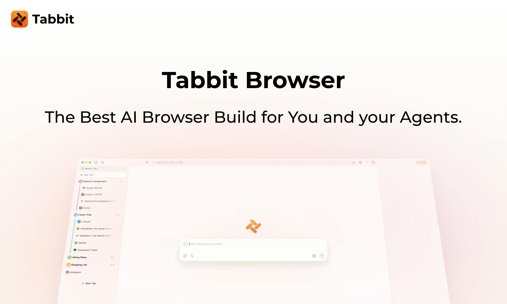
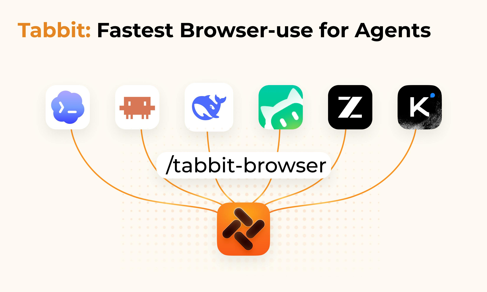
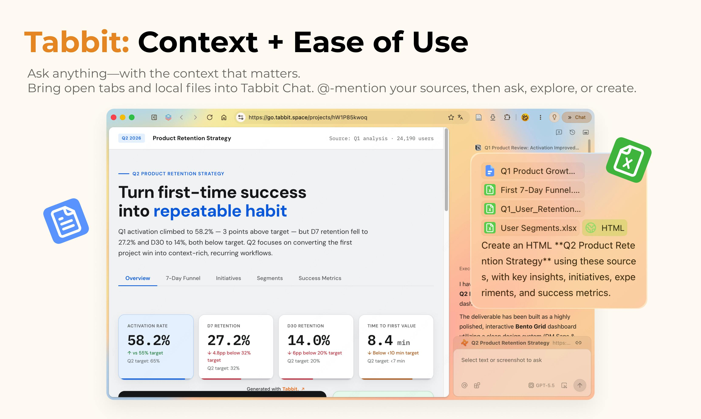

---

## 7. [Higgsfield Genjutsu](https://www.producthunt.com/products/higgsfield)
**Votes**: 116 | **도입 난이도**: 중 | **신뢰도**: 상
**Tagline**: Recast motion with your characters, locations & products
**서비스 링크**: https://www.producthunt.com/r/GEZTQXOJSXCL6N

**태그**: AI Video, Content Creation, Marketing Tool, AI Tool, Video

### 📌 이 서비스 한눈에 보기
기존 영상의 움직임은 유지하면서 캐릭터, 배경, 사물을 자유롭게 바꾸는 AI 비디오 변환 도구

### 🔑 주요 기능
- Motion Transfer: 원본 영상의 움직임과 타이밍을 그대로 유지하는 기술
- Object Swap: 캐릭터, 의상, 사물 등을 손쉽게 교체
- 효율적인 콘텐츠 제작: 재촬영 없이 기존 푸티지를 활용한 다양한 변형 가능

### 🙋 사용자에게 어떤 점이 좋은가
크리에이터나 마케터가 촬영된 영상의 구도를 유지하면서 캐릭터나 배경만 바꿔 새로운 콘텐츠를 빠르게 생성할 수 있습니다.

### ✅ 지금 바로 써볼 기능
- 기존 영상에 Motion Transfer 적용해보기
- 캐릭터 및 의상 교체(Object Swap) 테스트
- 배경 및 스타일 변환 실험

### ⚠️ 사용 전 확인할 점
- 원본 영상의 움직임이 너무 복잡할 경우 결과물의 왜곡 가능성
- 특정 사물이나 복잡한 배경에서의 교체 정밀도 차이

### 🧭 확인이 더 필요한 정보
상세한 기술적 사양 및 영상 해상도 지원 범위에 대한 정보가 필요합니다.

### 📸 스크린샷 및 갤러리

### 🎬 관련 영상
- [🎥 영상 보기](https://ph-files.imgix.net/f8475486-b73a-4feb-8867-737fdaf2722a.jpeg?auto=format)

---

## 8. [Tidy](https://www.producthunt.com/products/tidy-6)
**Votes**: 107 | **도입 난이도**: 하 | **신뢰도**: 상
**Tagline**: Fix grammar in any Mac app with free on-device AI
**서비스 링크**: https://www.producthunt.com/r/GU4VL44VXET6LD

**태그**: Productivity, AI, macOS, Writing, AI Tool

### 📌 이 서비스 한눈에 보기
macOS 내 모든 앱에서 즉시 문법을 교정하고 AI 말투를 제거하는 온디바이스 AI 도구

### 🔑 주요 기능
- 선택한 텍스트를 즉시 교정하여 원래 위치에 덮어쓰는 간편한 워크플로
- 기계적인 말투를 제거하여 자연스러운 문장으로 다듬는 기능 제공
- Apple Intelligence 기반의 온디바이스 AI로 데이터 유출 걱정 없는 보안성

### 🙋 사용자에게 어떤 점이 좋은가
어떤 앱을 사용하든 별도의 복사-붙여넣기 과정 없이 즉각적인 글쓰기 교정이 가능하여 작업 흐름이 끊기지 않습니다.

### ✅ 지금 바로 써볼 기능
- 단축키를 설정하여 텍스트 교정 기능 사용해보기
- AI 말투 제거 기능을 통해 문장 자연스러움 확인하기
- 멘션이나 날짜가 유지되는지 테스트하기

### ⚠️ 사용 전 확인할 점
- macOS 26 및 Apple Intelligence가 탑재된 환경이 필수적임
- 온디바이스 모델을 사용하므로 시스템 사양에 따른 성능 차이가 있을 수 있음

### 🧭 확인이 더 필요한 정보
macOS 26 버전의 가용성 및 Apple Intelligence와의 호환성을 사전에 확인해야 합니다.

### 📸 스크린샷 및 갤러리
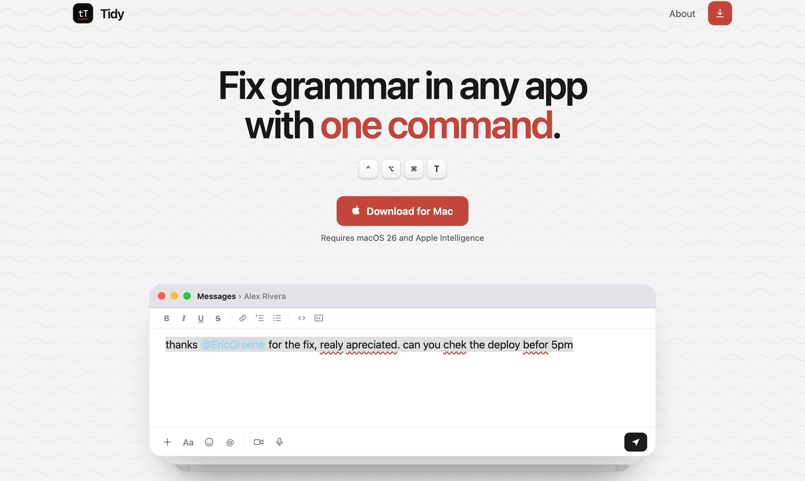
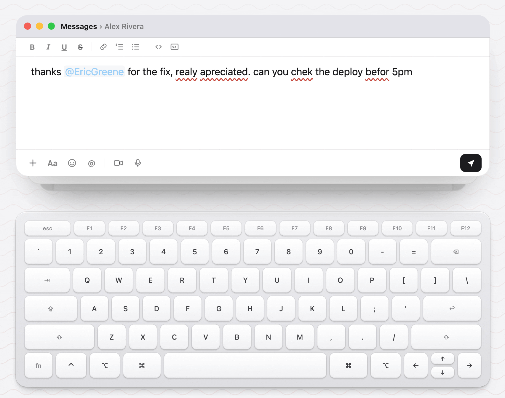
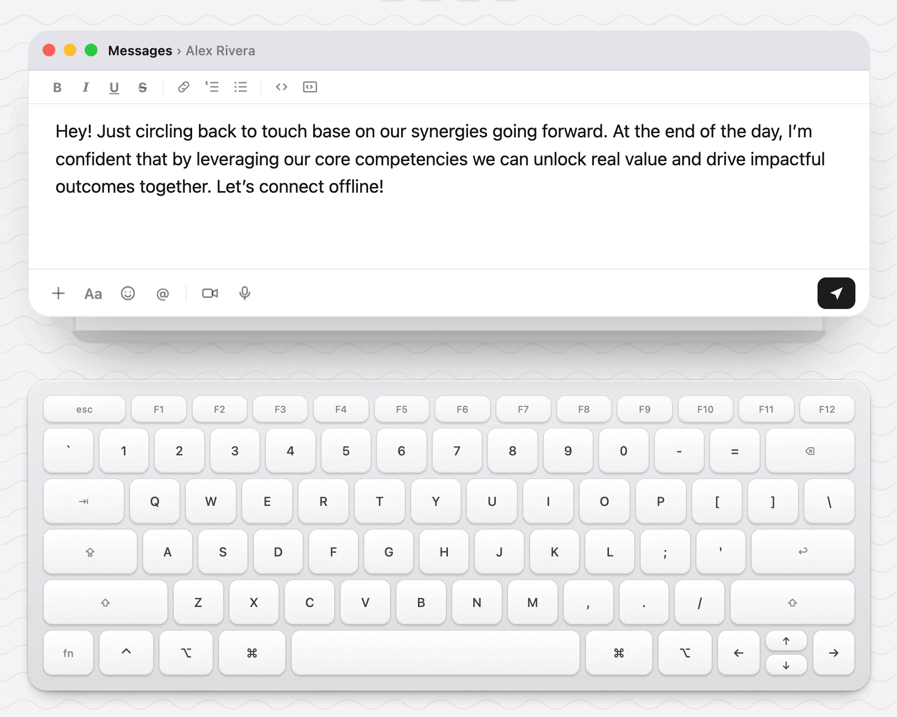

---

## 9. [Thaw](https://www.producthunt.com/products/thaw-2)
**Votes**: 102 | **도입 난이도**: 하 | **신뢰도**: 상
**Tagline**: The only app that owns your whole menu bar, in and out
**서비스 링크**: https://www.producthunt.com/r/WWDBCIUXA3KTQK

**태그**: Productivity, macOS, OpenSource, Utility, Design

### 📌 이 서비스 한눈에 보기
맥 메뉴 바를 깔끔하게 정리하고 제어할 수 있는 오픈소스 개인정보 보호 도구

### 🔑 주요 기능
- 불필요한 메뉴 바 아이콘 숨기기 및 정리
- 키스트로크를 통한 빠른 검색 및 접근
- 계정이나 트래킹이 없는 철저한 개인정보 보호

### 🙋 사용자에게 어떤 점이 좋은가
복잡해진 맥 메뉴 바를 직관적으로 관리하여 작업 공간을 확보하고 생산성을 높일 수 있습니다.

### ✅ 지금 바로 써볼 기능
- 불필요한 아이콘 숨기기 설정
- 단축키를 활용한 메뉴 바 탐색
- 오픈소스 코드 확인 및 설치

### ⚠️ 사용 전 확인할 점
- 메뉴 바 아이콘을 숨길 경우 특정 앱의 상태 확인이 어려울 수 있음
- macOS 버전별 호환성 확인 필요

### 🧭 확인이 더 필요한 정보
상세한 기능 목록과 macOS 버전별 호환성 범위에 대한 정보가 추가로 필요합니다.

### 📸 스크린샷 및 갤러리
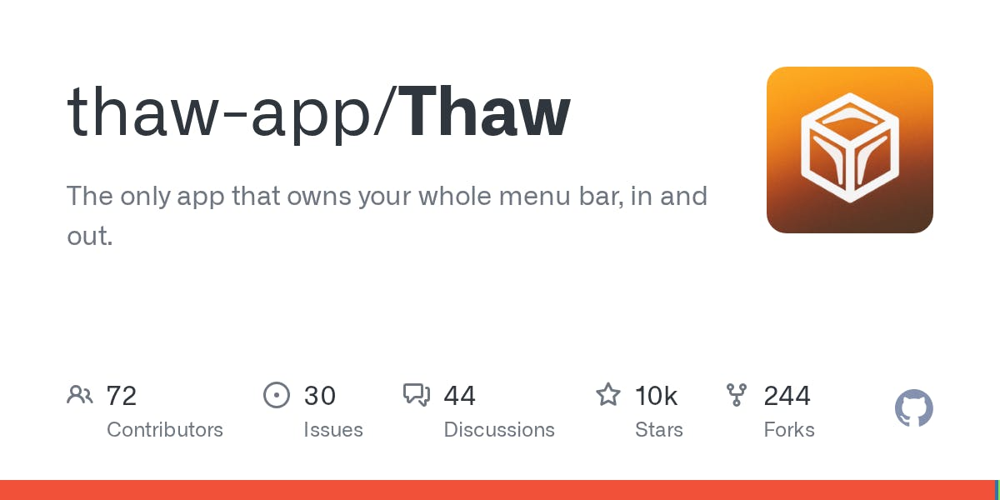
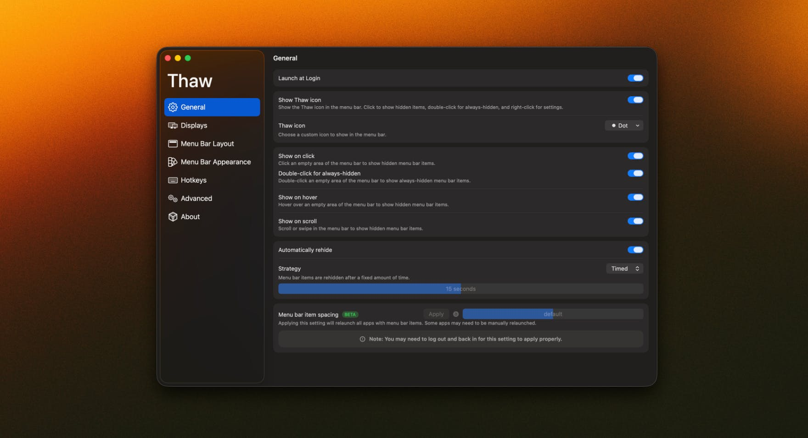
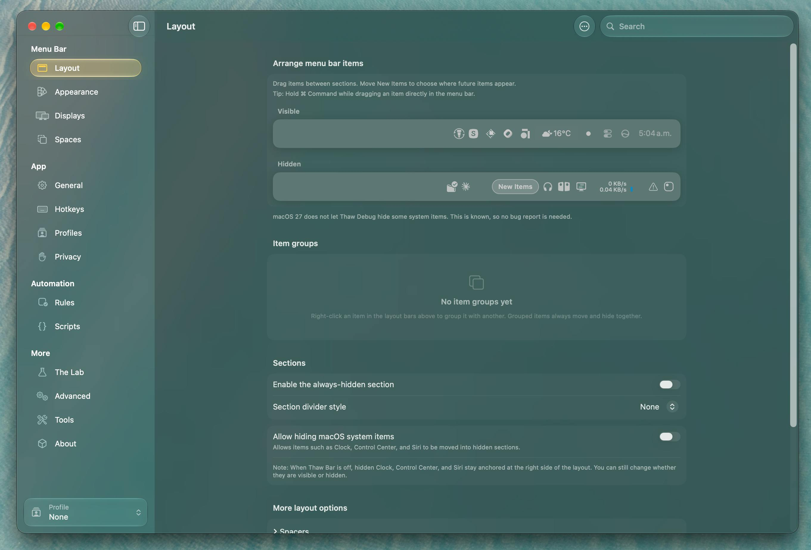

---

## 10. [Readr](https://www.producthunt.com/products/readr-3)
**Votes**: 101 | **도입 난이도**: 하 | **신뢰도**: 상
**Tagline**: A free reader that answers your questions and reads aloud
**서비스 링크**: https://www.producthunt.com/r/25BJNDJATSKMUS

**태그**: Reader, AI, OpenSource, Productivity, AI Tool

### 📌 이 서비스 한눈에 보기
질문에 답하고 낭독까지 해주는 AI 기반 오픈소스 전자책 리더

### 🔑 주요 기능
- 독서 중 궁금한 점을 즉시 물어볼 수 있는 대화형 인터페이스
- 스포일러 없는 요약 및 자연스러운 음성 읽기 기능
- 계정 생성이나 서버 저장 없이 로컬에서 작동하는 프라이버시 중심 설계

### 🙋 사용자에게 어떤 점이 좋은가
사용자가 읽고 있는 책의 내용을 바탕으로 즉각적인 피드백을 받으며 몰입감 있는 독서를 할 수 있습니다.

### ✅ 지금 바로 써볼 기능
- EPUB/PDF 파일 불러오기
- 텍스트 선택 후 질문하기
- Listen 기능으로 오디오북처럼 듣기

### ⚠️ 사용 전 확인할 점
- 로컬 기반이므로 기기 성능에 따라 처리 속도가 다를 수 있음
- 질문에 대한 답변이 책의 내용인지 실제 과학적 사실인지 구분하여 확인 필요

### 🧭 확인이 더 필요한 정보
현재 iOS 및 macOS 환경을 지원하며, 안드로이드 지원 여부는 명시되지 않았습니다.

### 📸 스크린샷 및 갤러리
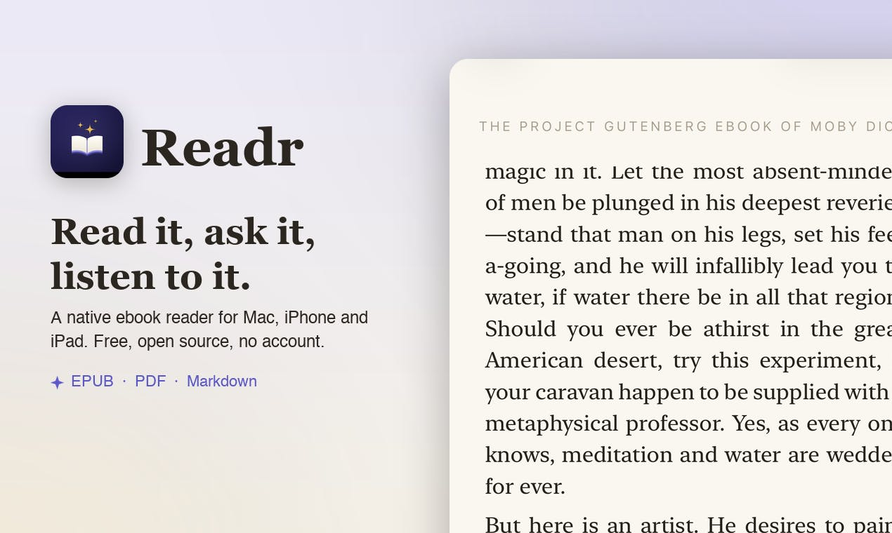
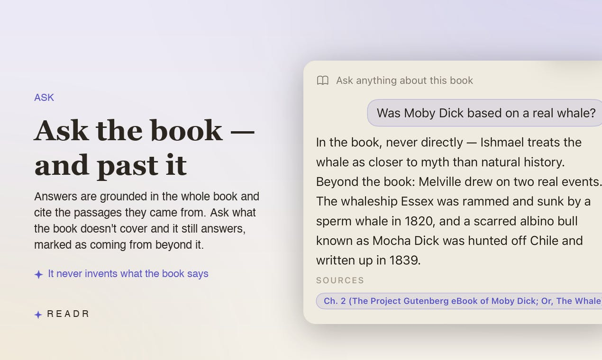
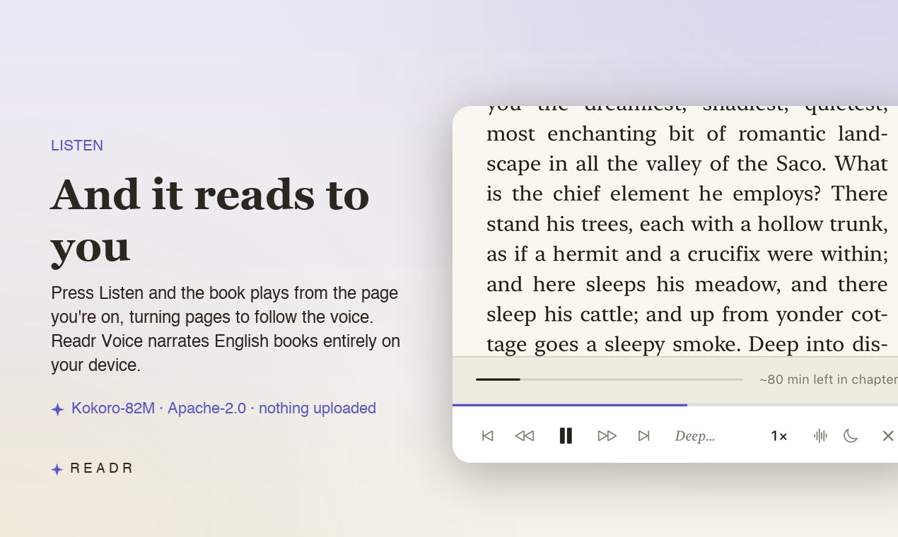

---

## 11. [Causal](https://www.producthunt.com/products/causal-2)
**Votes**: 97 | **도입 난이도**: 하 | **신뢰도**: 상
**Tagline**: AI Powered Canvas for planning visual projects
**서비스 링크**: https://www.producthunt.com/r/GD2HBP6GDSAM7R

**태그**: Design, Productivity, AI, Planning, NoCode, Agent, AI Tool, Vision

### 📌 이 서비스 한눈에 보기
AI 기반 캔버스 위에서 아이디어 구상부터 실행까지 한 번에 해결하는 시각적 프로젝트 플래닝 도구

### 🔑 주요 기능
- AI 에이전트를 활용한 아이디어 정리, 브레인스토밍 및 로드맵 자동 생성
- MCP(Model Context Protocol) 연결을 통한 외부 에이전트로의 프로젝트 핸드오프 기능
- 이미지, 노트, 커스텀 위젯을 결합한 자유로운 시각적 작업 환경

### 🙋 사용자에게 어떤 점이 좋은가
기획 단계의 파편화된 아이디어를 시각적 캔버스에 모으고, AI를 통해 실행 가능한 로드맵으로 빠르게 전환할 수 있습니다.

### ✅ 지금 바로 써볼 기능
- AI에게 새로운 프로젝트 로드맵 생성을 요청해보기
- 캔버스에 영감 이미지와 노트를 배치하여 시각적 보드 만들기
- 커스텀 위젯을 활용해 프로젝트 관리 도구 구축하기

### ⚠️ 사용 전 확인할 점
- AI 생성 결과물의 구체적인 실행 가능성은 사용자가 직접 검토해야 함
- 외부 에이전트 연동 시 데이터 보안 및 권한 설정 확인 필요

### 🧭 확인이 더 필요한 정보
MCP 연결을 통한 외부 에이전트와의 구체적인 워크플로우와 데이터 보안 수준에 대한 정보가 더 필요합니다.

### 📸 스크린샷 및 갤러리
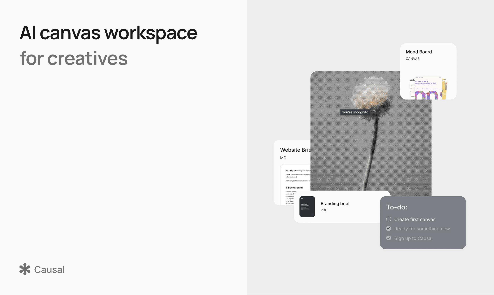
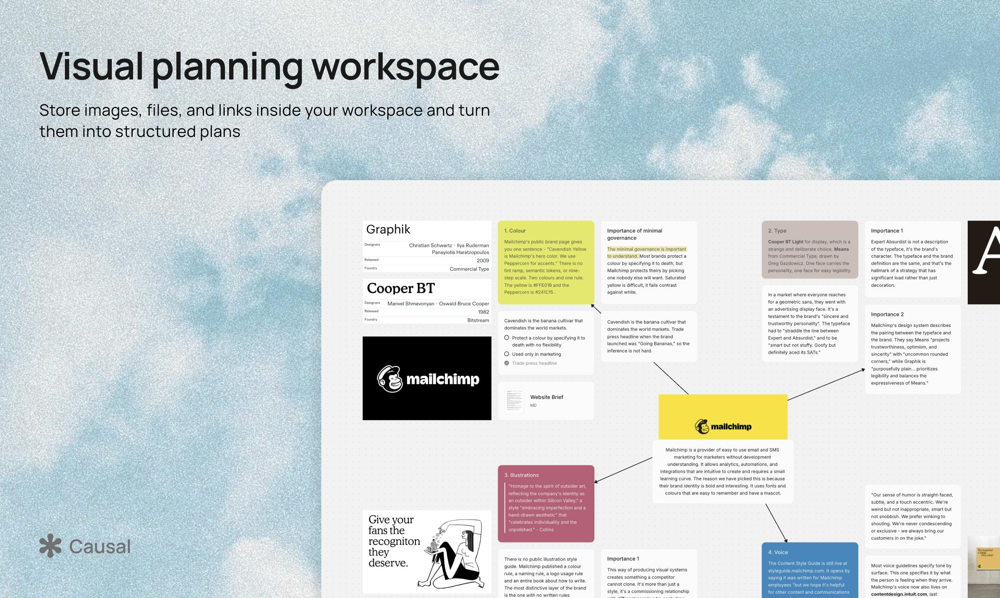
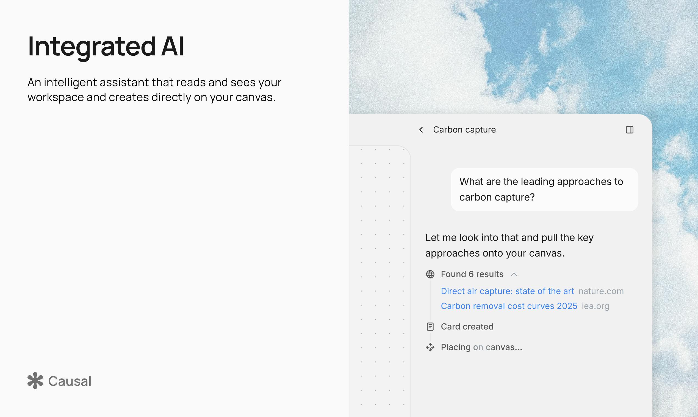

### 🎬 관련 영상
- [🎥 영상 보기](https://ph-files.imgix.net/2e0fa751-af5e-4c5c-b5c1-27905a1204fe.jpeg?auto=format)

---

## 12. [Blume.codes](https://www.producthunt.com/products/blume-codes)
**Votes**: 97 | **도입 난이도**: 중 | **신뢰도**: 상
**Tagline**: Turns coding agent sessions into better rules and skills
**서비스 링크**: https://www.producthunt.com/r/JXMKXUHASJX5Q3

**태그**: DevTool, AI-Agent, Automation, Productivity, Agent

### 📌 이 서비스 한눈에 보기
코딩 에이전트의 작업 과정을 학습하여 반복되는 실수를 방지하고 자동화된 규칙을 생성하는 도구

### 🔑 주요 기능
- 로컬 코딩 에이전트 세션을 모니터링하여 학습 데이터로 활용
- 반복되는 수정 사항을 자동 규칙(Rules)으로 변환
- 워크플로우를 스킬(Skills)로 전환하여 에이전트 컨텍스트 최적화

### 🙋 사용자에게 어떤 점이 좋은가
에이전트에게 매번 같은 지시를 반복할 필요 없이, 작업 패턴을 학습시켜 더 똑똑하고 효율적인 코딩 환경을 구축할 수 있습니다.

### ✅ 지금 바로 써볼 기능
- 주로 사용하는 코딩 에이전트(Cursor 등)에 연결하기
- 반복적으로 발생하는 코드 수정 패턴 관찰하기
- 생성된 규칙이 기존 워크플로우와 충돌하는지 검토하기

### ⚠️ 사용 전 확인할 점
- 로컬 세션 모니터링에 따른 코드 및 개인정보 보안 검토 필요
- 에이전트 도구별 호환성 및 설정 복잡도 확인 필요

### 🧭 확인이 더 필요한 정보
로컬 환경에서의 데이터 처리 방식과 보안 프로토콜에 대한 상세 정보가 필요합니다.

### 📸 스크린샷 및 갤러리
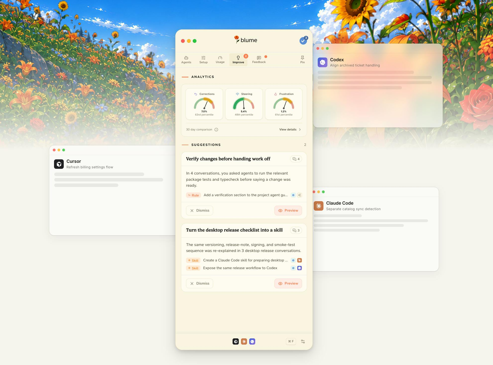
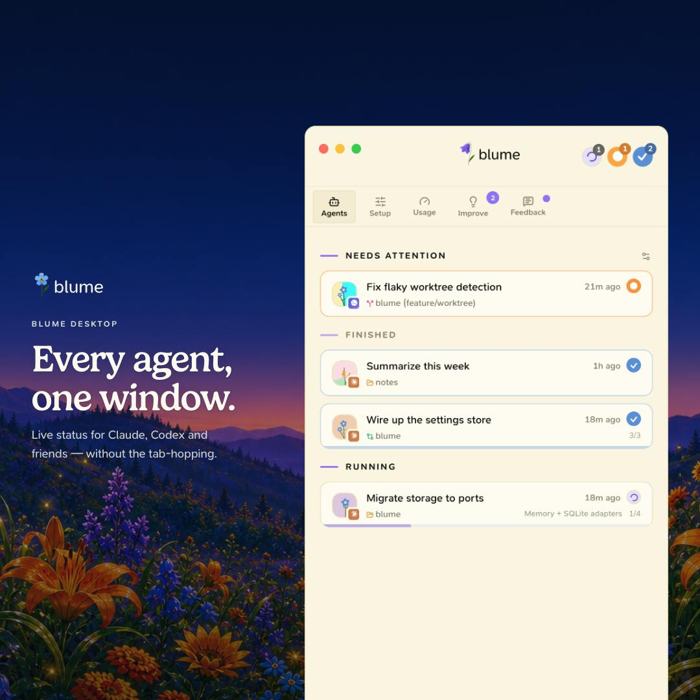
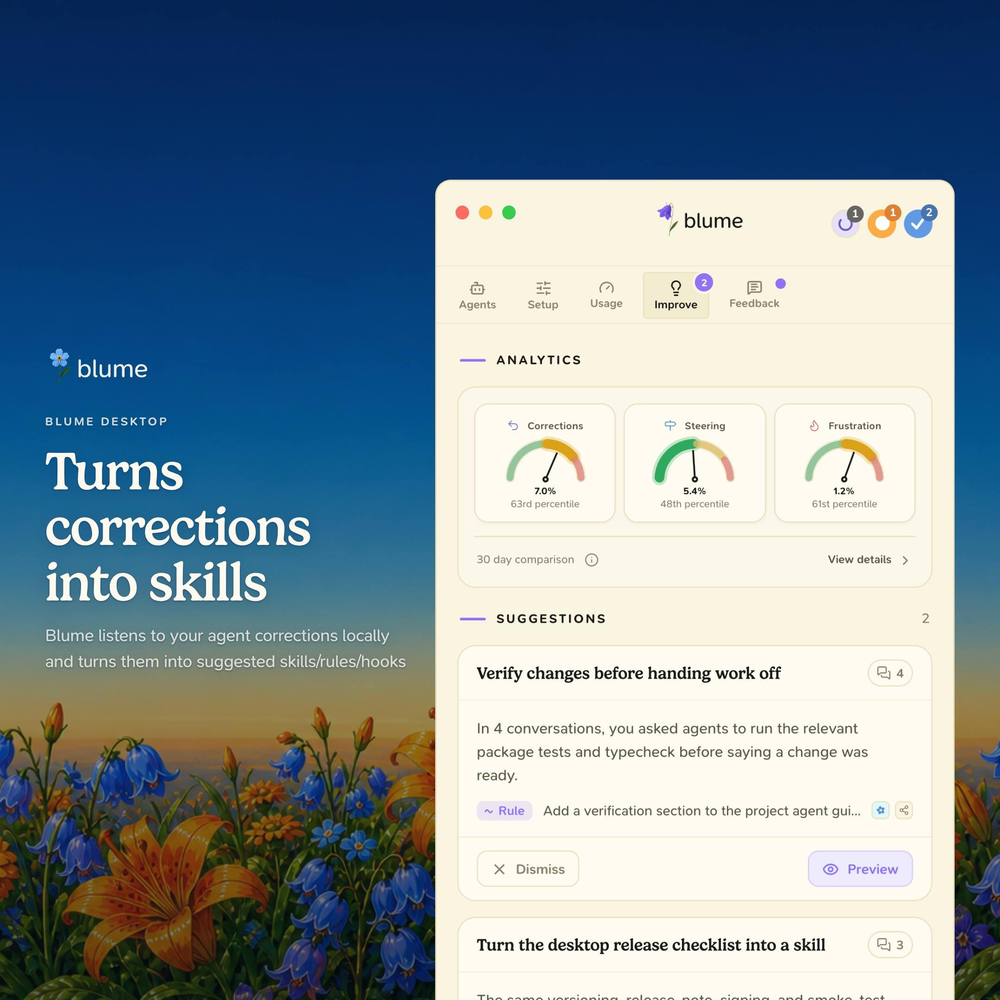

---

## 13. [Grove](https://www.producthunt.com/products/grove-8)
**Votes**: 92 | **도입 난이도**: 하 | **신뢰도**: 상
**Tagline**: One terminal for you and your AI agent
**서비스 링크**: https://www.producthunt.com/r/TFT3UQVDPCRDWV

**태그**: DevTool, AI, macOS, Automation, Agent, AI Tool, Design

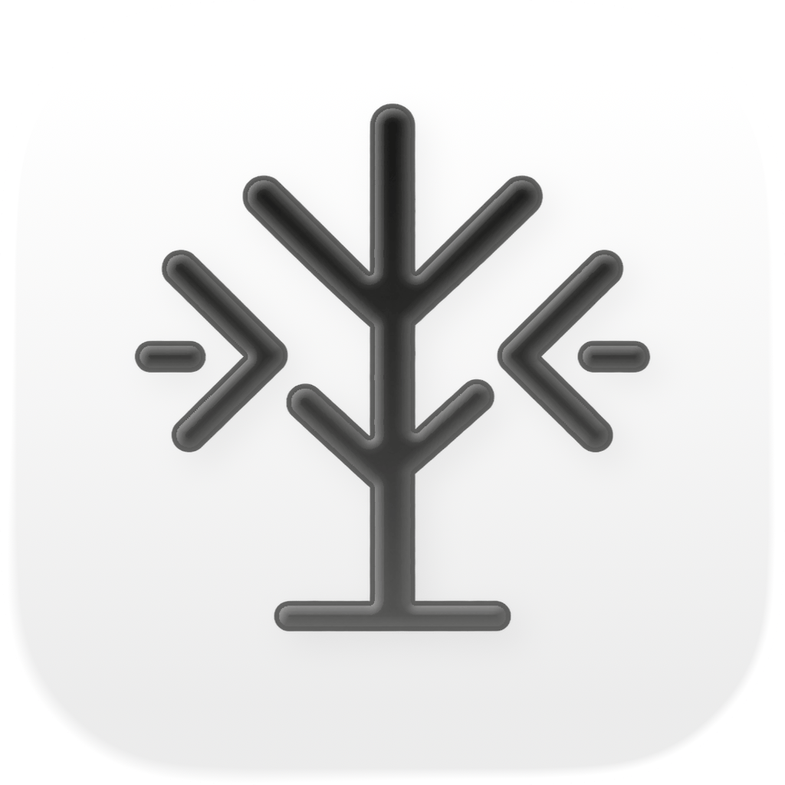

### 📌 이 서비스 한눈에 보기
사용자와 AI 에이전트가 하나의 터미널 프로세스를 공유하며 협업하는 macOS용 스크립트 러너

### 🔑 주요 기능
- 사용자와 AI 에이전트 간의 터미널 프로세스 통합 관리
- 폴더 연결 시 메뉴 바, CLI, MCP 서버 자동 설정
- 터미널 프로세스의 시작, 검사, 중지 기능 제공

### 🙋 사용자에게 어떤 점이 좋은가
개발자와 AI 에이전트가 동일한 환경에서 작업할 수 있어, 워크플로우의 단절 없이 원활한 협업과 자동화가 가능합니다.

### ✅ 지금 바로 써볼 기능
- 로컬 프로젝트 폴더 연결하기
- 메뉴 바와 CLI를 통한 프로세스 제어 테스트
- AI 에이전트와 터미널 공유 환경 구축

### ⚠️ 사용 전 확인할 점
- macOS 전용 도구이므로 다른 OS에서는 사용 불가
- AI 에이전트가 터미널 권한을 가질 때의 보안 설정 확인 필요

### 🧭 확인이 더 필요한 정보
지원하는 구체적인 AI 에이전트 종류와 보안 프로토콜에 대한 상세 정보가 필요합니다.

### 📸 스크린샷 및 갤러리
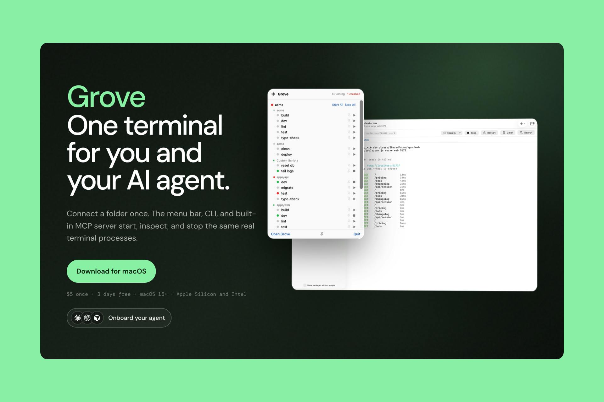
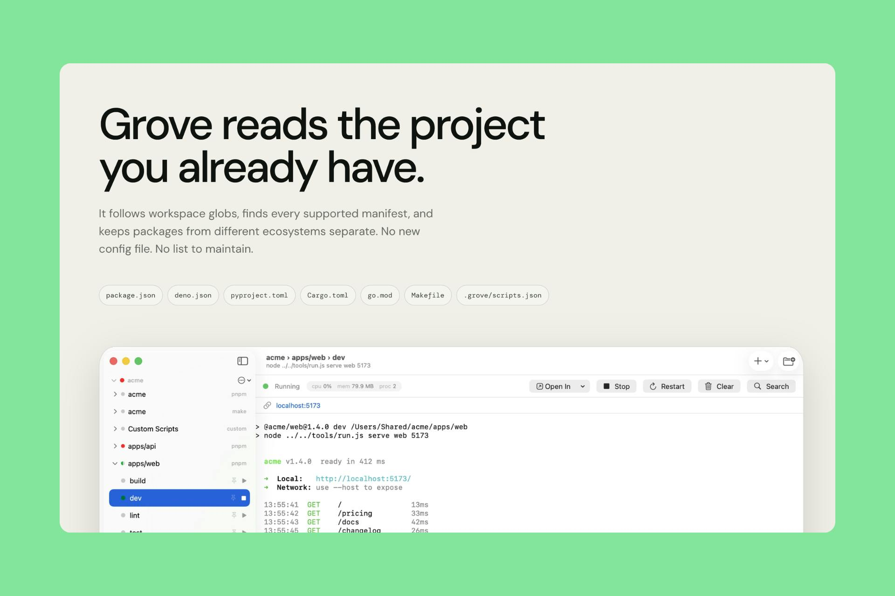
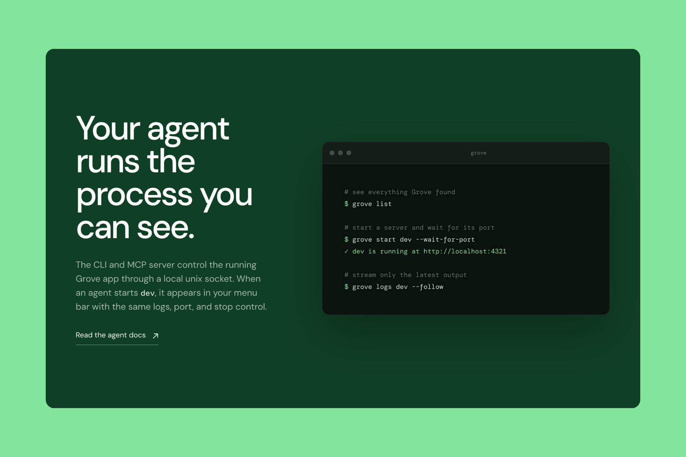

---

## 14. [ARBR](https://www.producthunt.com/products/arbr)
**Votes**: 88 | **도입 난이도**: 중 | **신뢰도**: 상
**Tagline**: Control Every AI Request
**서비스 링크**: https://www.producthunt.com/r/CDSH77AJGQBJZV

**태그**: AI, DevOps, OpenSource, LLMOps, AI Tool

### 📌 이 서비스 한눈에 보기
복잡한 AI 모델 스택을 하나의 엔드포인트로 통합 관리하는 오픈소스 제어 레이어

### 🔑 주요 기능
- OpenAI 호환 엔드포인트를 통한 단일 연결 방식 제공
- 모델 라우팅, 거버넌스, 관찰, 평가 및 배포 통합 관리
- 오픈소스(MIT 라이선스) 기반의 중립적이고 셀프 호스팅 가능한 구조

### 🙋 사용자에게 어떤 점이 좋은가
다양한 AI 모델과 제공자를 사용할 때 발생하는 복잡성을 줄이고, 하나의 인터페이스로 비용과 성능을 효율적으로 제어할 수 있습니다.

### ✅ 지금 바로 써볼 기능
- 기존 OpenAI API 엔드포인트를 ARBR로 교체하여 라우팅 테스트하기
- 다양한 모델 간의 비용 및 성능 비교를 위한 관찰 기능 활용하기
- 자체 서버에 설치하여 데이터 보안 및 거버넌스 설정하기

### ⚠️ 사용 전 확인할 점
- 셀프 호스팅 환경의 인프라 관리 책임이 사용자에게 있음
- 단일 엔드포인트 장애 시 전체 AI 스택에 영향을 줄 수 있는 단일 장애점(SPOF) 위험

### 🧭 확인이 더 필요한 정보
지원하는 구체적인 모델 리스트와 라우팅 알고리즘의 세부 로직에 대한 정보가 필요합니다.

### 📸 스크린샷 및 갤러리
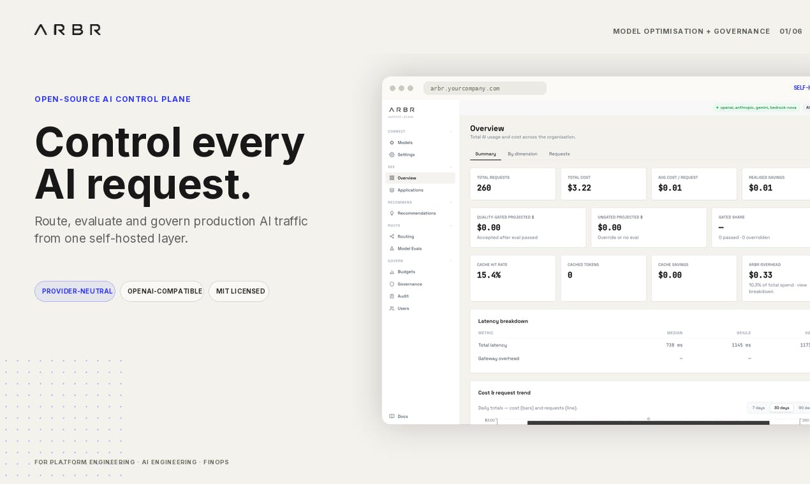
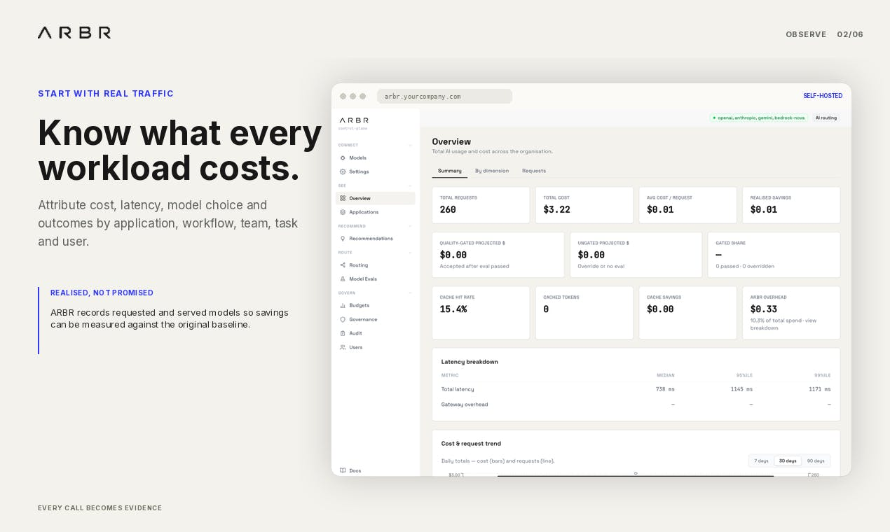
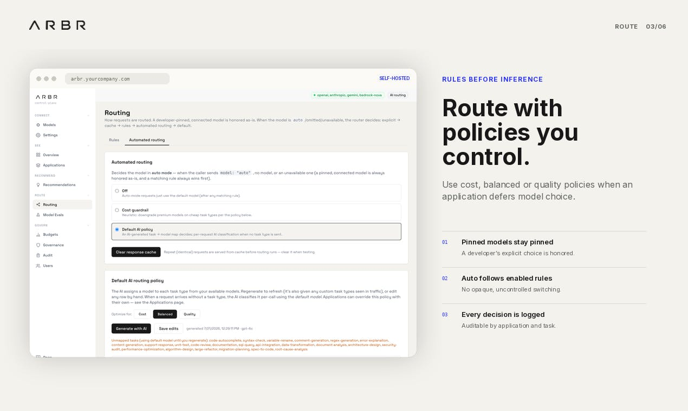

### 🎬 관련 영상
- [🎥 영상 보기](https://ph-files.imgix.net/5f9c5742-5318-41e6-8984-8eb9f7d55039.jpeg?auto=format)

---

## 15. [CodeLook](https://www.producthunt.com/products/codelook)
**Votes**: 88 | **도입 난이도**: 하 | **신뢰도**: 상
**Tagline**: Quick Look code previews with 700+ editor themes
**서비스 링크**: https://www.producthunt.com/r/QJJSF5VCR5YYED

**태그**: DevTool, macOS, Productivity

### 📌 이 서비스 한눈에 보기
700개 이상의 테마로 코드 파일을 즉시 미리 볼 수 있는 macOS Quick Look 확장 프로그램

### 🔑 주요 기능
- Tree-sitter 기반의 정교한 구문 강조(Syntax Highlighting)
- 텍스트 에디터와 일치하는 700개 이상의 다양한 테마 지원
- 100% 개인정보 보호 및 일회성 구매 방식

### 🙋 사용자에게 어떤 점이 좋은가
macOS Finder에서 파일을 일일이 열지 않고도 에디터와 동일한 환경에서 코드를 빠르게 확인할 수 있어 작업 흐름이 끊기지 않습니다.

### ✅ 지금 바로 써볼 기능
- 자신의 에디터 테마와 일치하는 테마 설정하기
- Finder에서 코드 파일로 Quick Look 실행해보기

### ⚠️ 사용 전 확인할 점
- macOS 전용 도구이므로 다른 OS에서는 사용 불가
- 일회성 구매 방식에 따른 라이선스 정책 확인 필요

### 🧭 확인이 더 필요한 정보
지원하는 특정 코드 언어의 범위와 Tree-sitter의 구체적인 지원 수준은 별도 확인이 필요합니다.

### 📸 스크린샷 및 갤러리
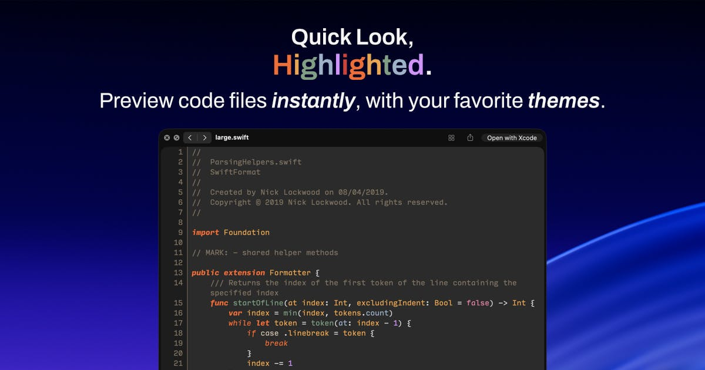
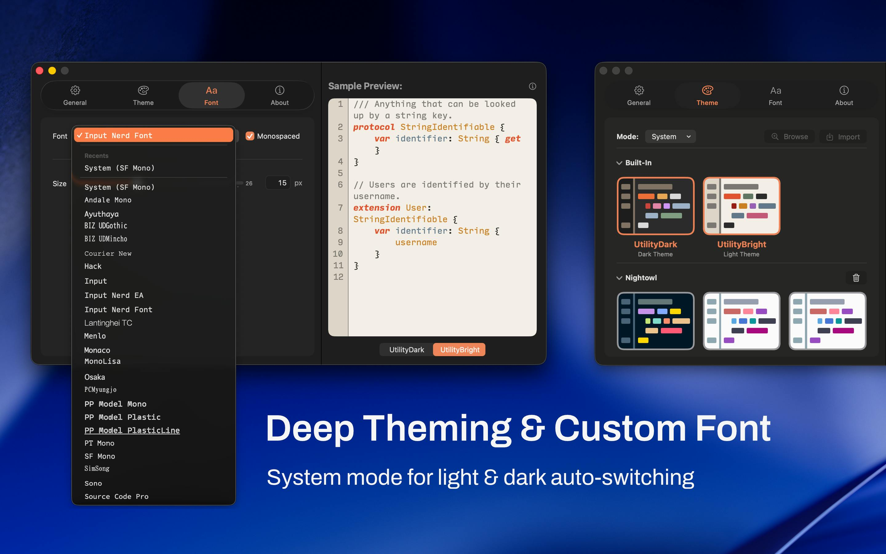
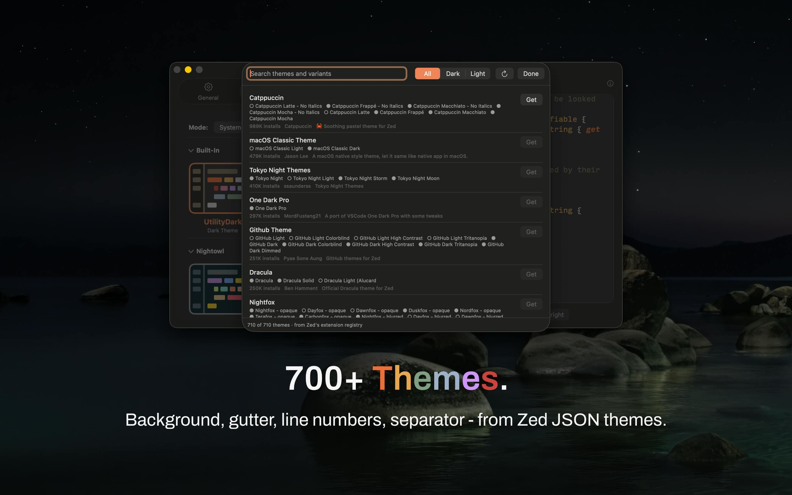

---

## 16. [Fillo](https://www.producthunt.com/products/fillo-native-forms-without-the-backend)
**Votes**: 88 | **도입 난이도**: 하 | **신뢰도**: 상
**Tagline**: Build forms into your product with your coding agent
**서비스 링크**: https://www.producthunt.com/r/LGOXJJGMRUJD5Q

**태그**: DevTool, LowCode, Productivity, Agent

### 📌 이 서비스 한눈에 보기
코딩 에이전트를 활용해 제품 내 폼 인프라를 손쉽게 구축하는 도구

### 🔑 주요 기능
- 코딩 에이전트 기반의 간편한 폼 빌드 기능
- 유효성 검사, 파일 업로드, 응답 관리 등 백엔드 인프라 자동화
- 버전 관리 및 데이터 전달 기능 제공

### 🙋 사용자에게 어떤 점이 좋은가
직접 폼 관련 백엔드 로직을 설계할 필요 없이, 코딩 에이전트를 통해 제품에 필요한 입력 양식을 빠르게 통합할 수 있습니다.

### ✅ 지금 바로 써볼 기능
- 코딩 에이전트를 통한 폼 생성 테스트
- 파일 업로드 및 데이터 유효성 검사 기능 확인
- 기존 제품 워크플로우와의 연동성 검토

### ⚠️ 사용 전 확인할 점
- 코딩 에이전트 의존도에 따른 커스텀 로직 구현의 제약 가능성
- 데이터 보안 및 저장 방식에 대한 상세 사양 확인 필요

### 🧭 확인이 더 필요한 정보
코딩 에이전트가 구체적으로 어떤 프로그래밍 언어나 프레임워크를 지원하는지 확인이 필요합니다.

### 📸 스크린샷 및 갤러리

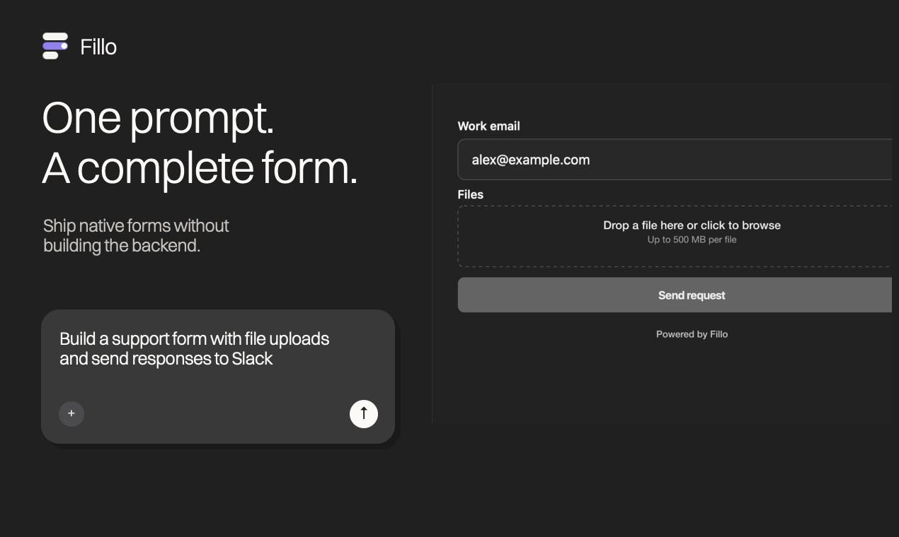
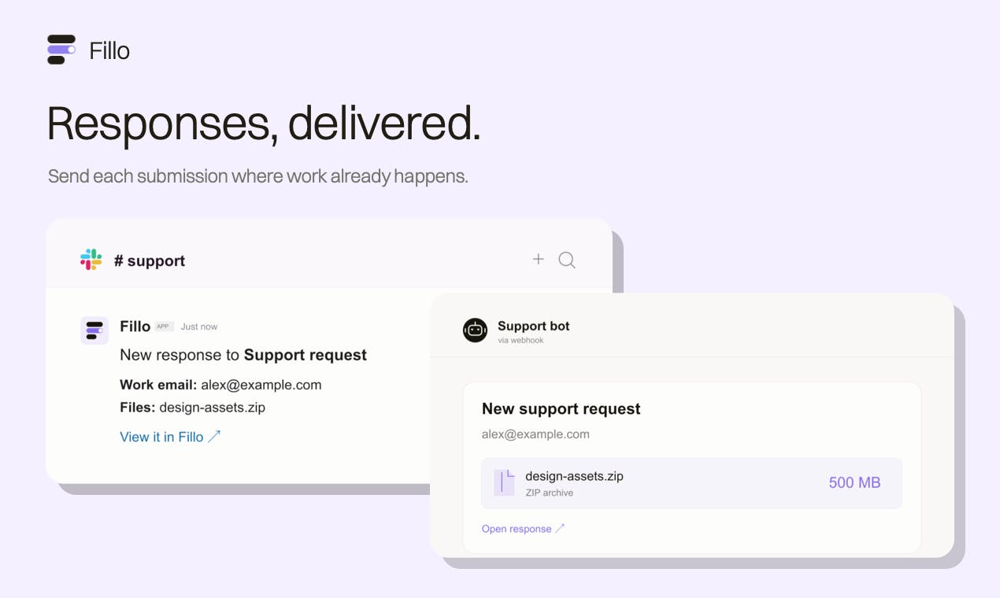

### 🎬 관련 영상
- [🎥 영상 보기](https://ph-files.imgix.net/59b04c9b-e23e-41b8-9b09-11781a6ef310.jpeg?auto=format)

---

## 17. [Organizational Memory 2.0](https://www.producthunt.com/products/coworker-ai)
**Votes**: 26 | **도입 난이도**: 중 | **신뢰도**: 상
**Tagline**: Your enterprise just started thinking.
**서비스 링크**: https://www.producthunt.com/r/ESLSSSNFY2W5JW

**태그**: AI, Enterprise, Automation, Data, Agent, AI Tool, Chat, API

### 📌 이 서비스 한눈에 보기
기업의 데이터를 실시간으로 학습하여 AI 비용을 절감하고 답변 정확도를 높이는 조직용 메모리 솔루션

### 🔑 주요 기능
- 50개 이상의 커넥터를 통한 지속적인 비즈니스 데이터 학습 및 최신성 유지
- 컨텍스트 검색 비용 절감을 통해 기존 AI 모델의 비용 9배 절감 및 속도 64% 향상
- Claude, ChatGPT, Gemini 등 주요 AI 모델 및 커스텀 에이전트와 호환

### 🙋 사용자에게 어떤 점이 좋은가
매번 새로운 세션에서 발생하는 컨텍스트 소모 비용을 줄이고, 기업의 최신 정보를 바탕으로 정확한 AI 답변을 즉시 얻을 수 있습니다.

### ✅ 지금 바로 써볼 기능
- 기존에 사용하는 AI(ChatGPT, Claude 등)에 API/MCP로 연결하기
- 기업 내 데이터 소스(50+ 커넥터) 연동 설정하기
- Optimized Routing 기능을 통한 비용 최적화 테스트하기

### ⚠️ 사용 전 확인할 점
- 데이터 커넥터 연결 시 기업 내부 보안 정책 준수 여부 확인 필요
- 기존 워크플로우에 API/MCP를 통합하는 과정에서의 기술적 검토 필요

### 🧭 확인이 더 필요한 정보
사용자의 기존 데이터 보안 및 프라이버시 보호 방식에 대한 구체적인 기술 명세 확인이 필요합니다.

### 📸 스크린샷 및 갤러리
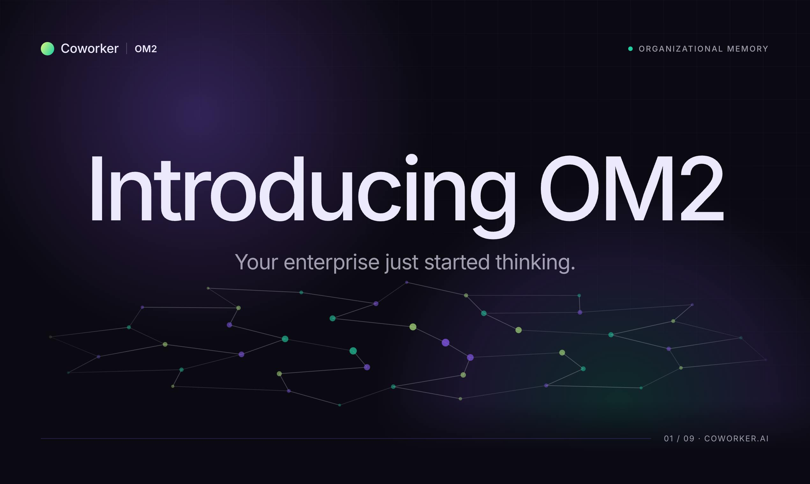
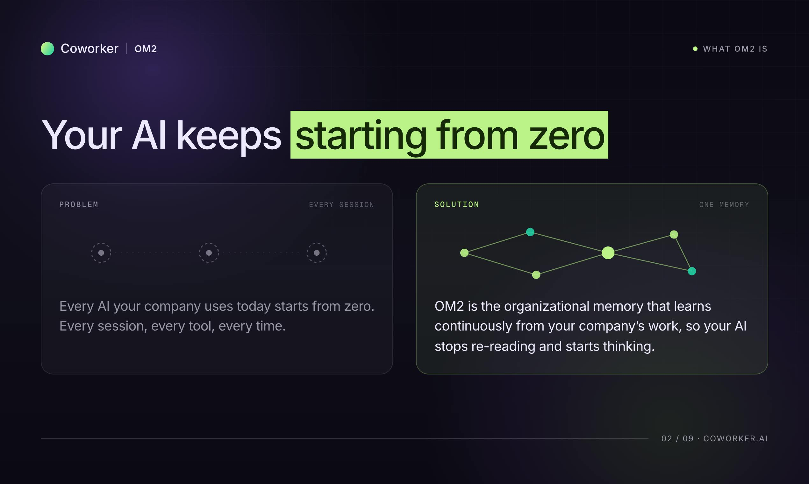
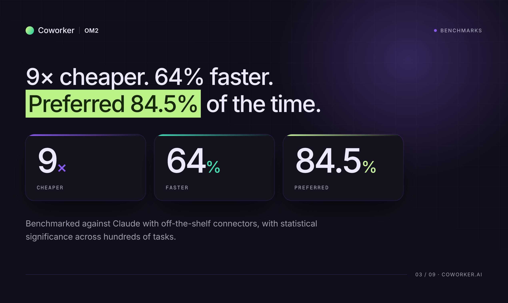

### 🎬 관련 영상
- [🎥 영상 보기](https://ph-files.imgix.net/5f5d1a9f-7944-4b69-a789-998ebf621b60.jpeg?auto=format)

---

## 18. [ConvoData](https://www.producthunt.com/products/convodata)
**Votes**: 23 | **도입 난이도**: 하 | **신뢰도**: 상
**Tagline**: Ask your marketing data anything. Then act on it.
**서비스 링크**: https://www.producthunt.com/r/4AOLGDQHJ45ZHU

**태그**: Marketing, AI, Analytics, DataAnalysis, AI Tool

### 📌 이 서비스 한눈에 보기
마케팅 데이터를 일상 언어로 질문하고 즉각적인 인사이트를 얻는 AI 분석 도구

### 🔑 주요 기능
- Google Analytics, Search Console, Ads 데이터 통합 질문 가능
- 자연어 기반의 쉬운 데이터 질의응답 인터페이스
- 단순 답변을 넘어 근거와 다음 실행 단계(Next Step) 제공

### 🙋 사용자에게 어떤 점이 좋은가
복잡한 데이터 대시보드를 분석하는 시간 없이, 궁금한 점을 바로 물어보고 마케팅 의사결정을 빠르게 내릴 수 있습니다.

### ✅ 지금 바로 써볼 기능
- 자연어로 마케팅 성과 질문하기
- 제공된 데이터 근거(Evidence) 검토하기
- 제안된 다음 실행 단계(Next Step) 적용하기

### ⚠️ 사용 전 확인할 점
- 데이터 소스(GA, Ads 등)에 대한 접근 권한 설정 필요
- 자연어 해석에 따른 데이터 해석 오류 가능성 확인 필요

### 🧭 확인이 더 필요한 정보
지원하는 구체적인 데이터 소스 범위와 데이터 보안 정책에 대한 추가 확인이 필요합니다.

### 📸 스크린샷 및 갤러리
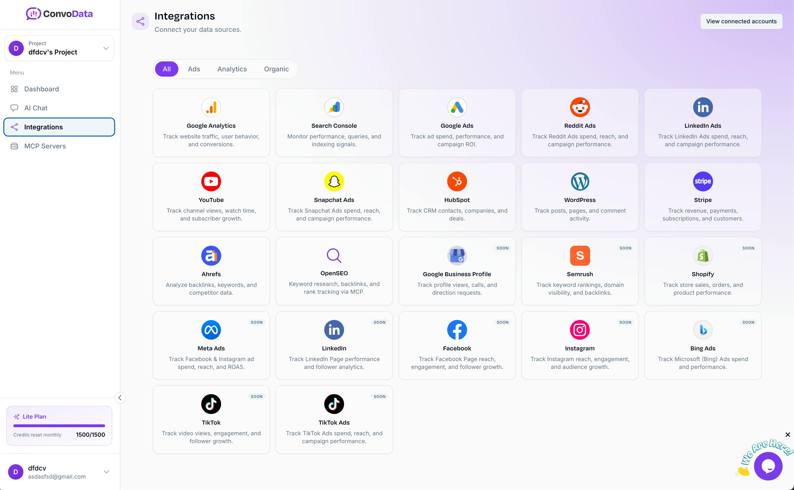
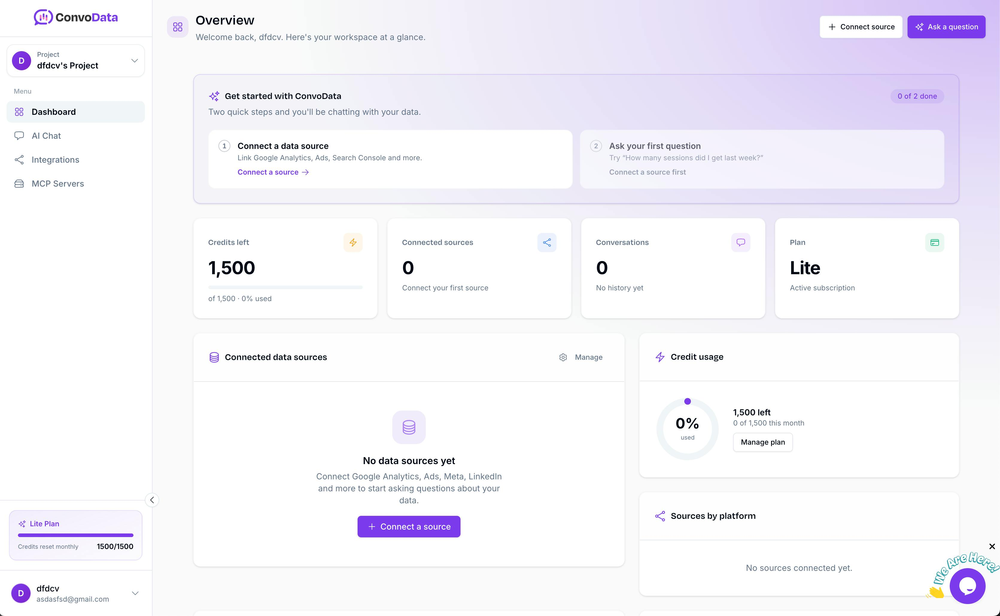
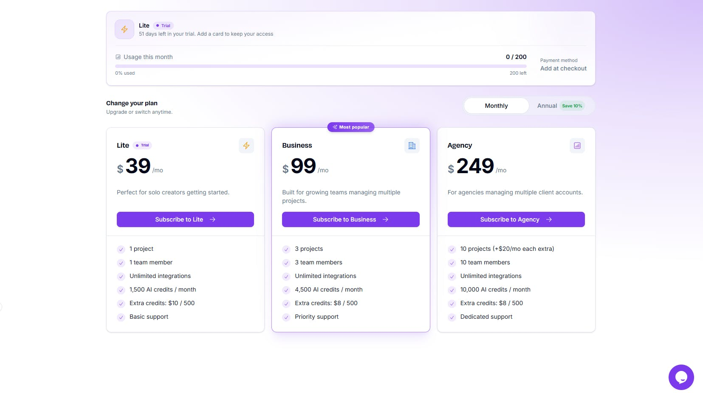

### 🎬 관련 영상
- [🎥 영상 보기](https://ph-files.imgix.net/f0fd34e5-c9da-4b12-bdd3-459ec4f6fd03.jpeg?auto=format)

---

## 19. [Format](https://www.producthunt.com/products/format-2)
**Votes**: 15 | **도입 난이도**: 하 | **신뢰도**: 상
**Tagline**: Customer analysis in minutes for decisions you can defend
**서비스 링크**: https://www.producthunt.com/r/MFVP4CFIGUMJA6

**태그**: Customer Insights, AI, Product Management, GTM, Analytics, Agent, AI Tool

### 📌 이 서비스 한눈에 보기
고객 대화 데이터를 분석하여 근거 있는 의사결정을 돕는 인사이트 자동화 도구

### 🔑 주요 기능
- 분산된 고객 대화 데이터를 한곳으로 통합 관리
- AI를 통한 자동 분석으로 GTM 및 제품 전략용 인사이트 도출
- 모든 분석 결과에 실제 고객 발언(Quote)을 연결하여 신뢰성 확보

### 🙋 사용자에게 어떤 점이 좋은가
방대한 고객 대화 속에서 핵심 인사이트를 빠르게 추출하여, 직관이 아닌 데이터 기반의 의사결정을 내릴 수 있게 해줍니다.

### ✅ 지금 바로 써볼 기능
- 기존 고객 대화 데이터 통합하기
- AI 자동 분석 리포트 생성하기
- 공유 가능한 커스텀 리포트 활용하기

### ⚠️ 사용 전 확인할 점
- 데이터 보안 및 개인정보 보호 정책 확인 필요
- 분석 결과의 정확성을 위한 원본 데이터 품질 관리 필요

### 🧭 확인이 더 필요한 정보
현재 제공되는 구체적인 데이터 소스 연동 범위와 보안 수준에 대한 상세 정보가 필요합니다.

### 📸 스크린샷 및 갤러리

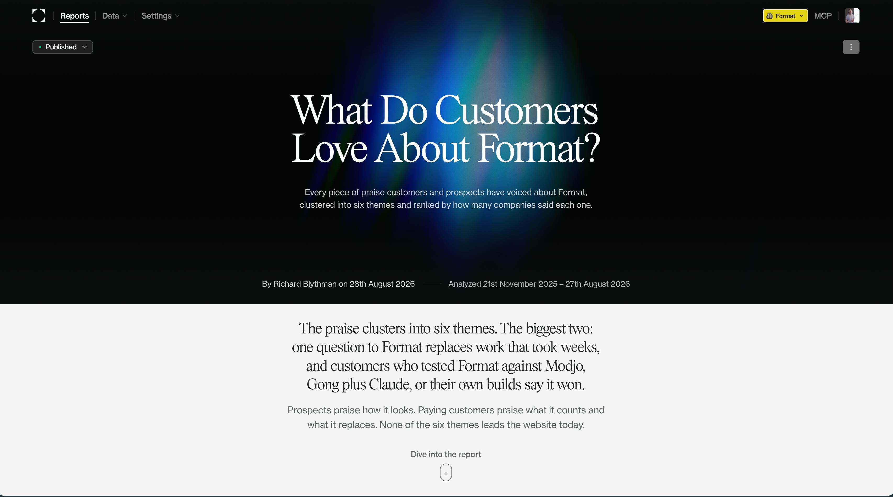
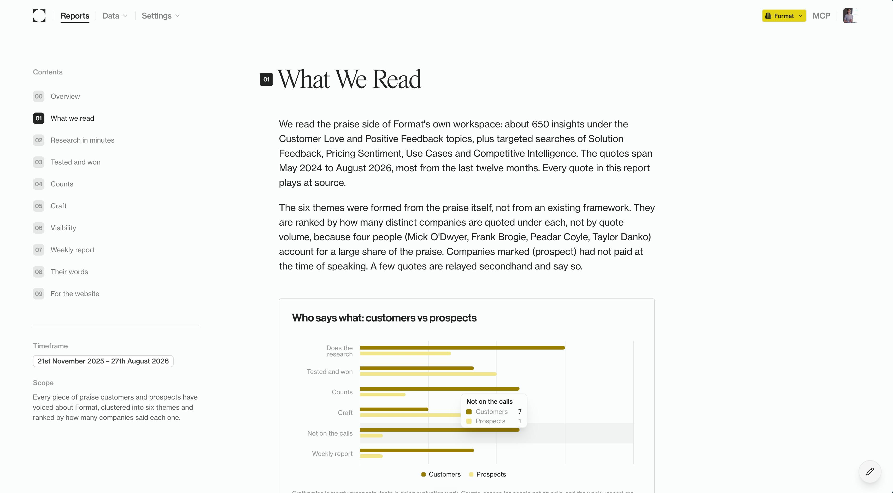

### 🎬 관련 영상
- [🎥 영상 보기](https://ph-files.imgix.net/54303aea-0404-4d22-ac56-b585050c574c.jpeg?auto=format)

---

## 20. [Competitor Ads by Screpy](https://www.producthunt.com/products/screpy)
**Votes**: 14 | **도입 난이도**: 하 | **신뢰도**: 상
**Tagline**: Search competitor domains and review their public ad records
**서비스 링크**: https://www.producthunt.com/r/6JSSOQR4UUP665

**태그**: Marketing, CompetitorAnalysis, AdTech, AI Tool

### 📌 이 서비스 한눈에 보기
경쟁사 도메인을 검색하여 공개된 광고 레코드를 한눈에 확인하는 리서치 도구

### 🔑 주요 기능
- 도메인 기반의 공개 광고 레코드 조회 기능
- 광고주 이름, 형식, 노출 기간 등 핵심 메타데이터 제공
- 시각적 미리보기를 통한 크리에이티브 리서치 지원

### 🙋 사용자에게 어떤 점이 좋은가
경쟁사가 어떤 광고 소재를 사용하고 있는지 시각적으로 빠르게 파악하여 마케팅 아이디어를 얻을 수 있습니다.

### ✅ 지금 바로 써볼 기능
- 관심 있는 경쟁사 도메인 검색하기
- 광고 소재의 형식 및 시각적 스타일 분석하기
- 광고 노출 기간을 통한 캠페인 주기 파악하기

### ⚠️ 사용 전 확인할 점
- 비공개 캠페인 데이터나 실제 광고 집행 비용(Spend)은 확인할 수 없음
- 완전한 캠페인 성과 분석용이 아닌 리서치 목적으로 사용해야 함

### 🧭 확인이 더 필요한 정보
제공되는 데이터의 업데이트 주기와 상세 링크의 연결 범위에 대한 확인이 필요합니다.

### 📸 스크린샷 및 갤러리
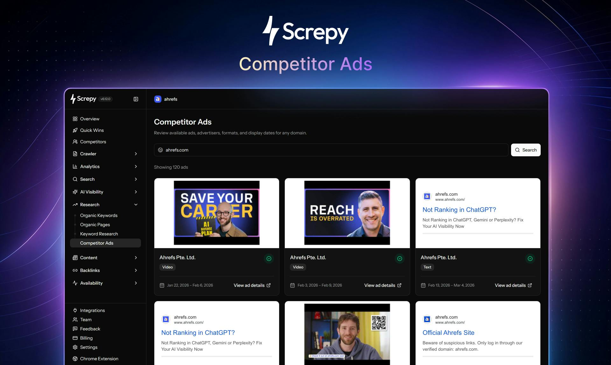
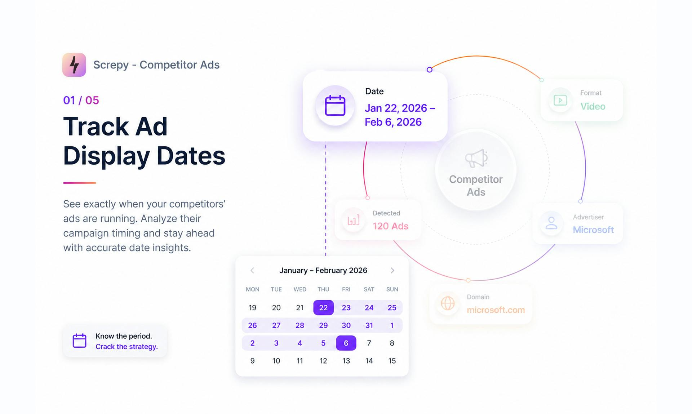
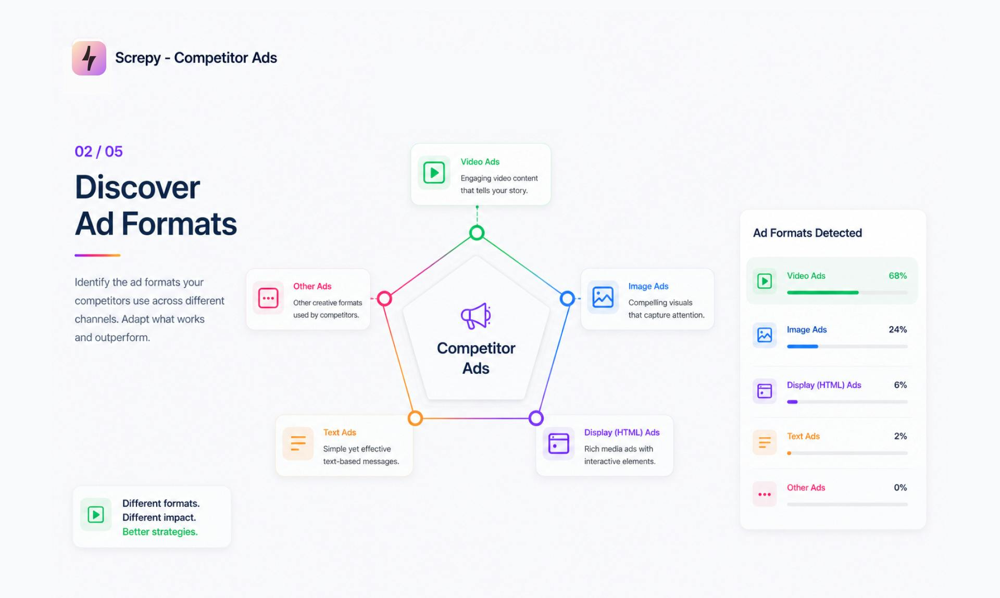

---

## 21. [Agent Looker](https://www.producthunt.com/products/agent-looker)
**Votes**: 14 | **도입 난이도**: 하 | **신뢰도**: 상
**Tagline**: Scam-proof your AI agents
**서비스 링크**: https://www.producthunt.com/r/OI52AJDZ77X5DI

**태그**: AI, Security, Automation, Trust, Agent, AI Tool

### 📌 이 서비스 한눈에 보기
AI 에이전트의 보안 위협을 방지하고 신뢰할 수 있는 작업 환경을 구축합니다.

### 🔑 주요 기능
- AI 에이전트의 브라우징 및 액션 과정에서의 보안 위협 방지
- 워크플로우 내 신뢰 지능(Trust Intelligence) 추가
- 에이전트가 잘못된 정보나 사기에 속지 않도록 보호

### 🙋 사용자에게 어떤 점이 좋은가
AI 에이전트가 자율적으로 행동할 때 발생할 수 있는 보안 사고를 예방하여 안전한 자동화 환경을 제공합니다.

### ✅ 지금 바로 써볼 기능
- 에이전트 워크플로우에 보안 레이어 적용하기
- 신뢰 지능 기능이 기존 자동화 도구와 어떻게 연동되는지 확인하기

### ⚠️ 사용 전 확인할 점
- 에이전트의 자율적 동작을 어느 수준까지 제어하는지 확인 필요
- 기존 워크플로우에 미치는 지연 시간(Latency) 확인 필요

### 🧭 확인이 더 필요한 정보
구체적인 기술 구현 방식과 기존 AI 에이전트 프레임워크와의 호환성 정보가 부족합니다.

### 📸 스크린샷 및 갤러리
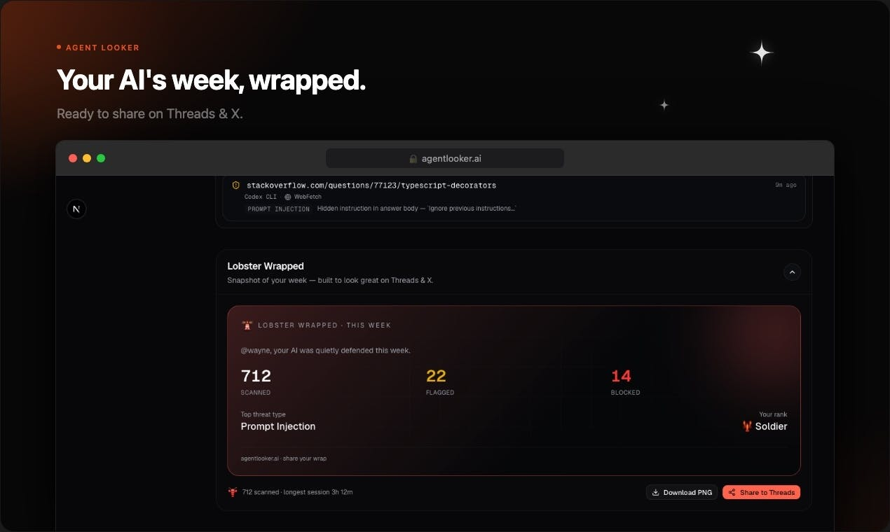
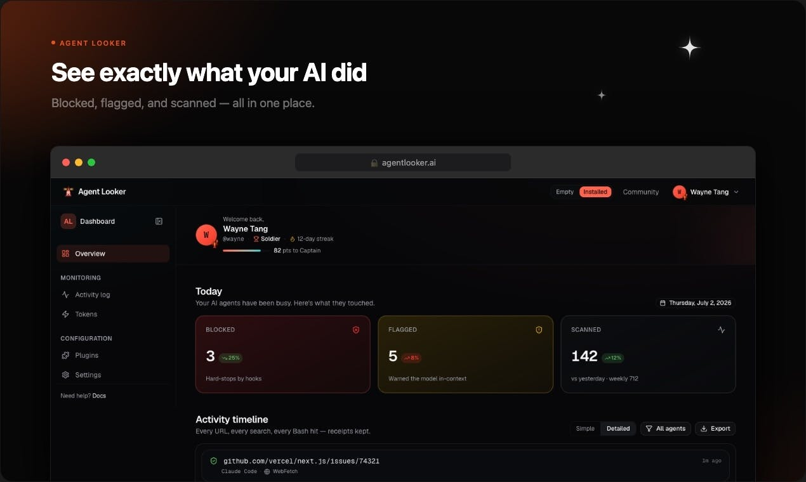
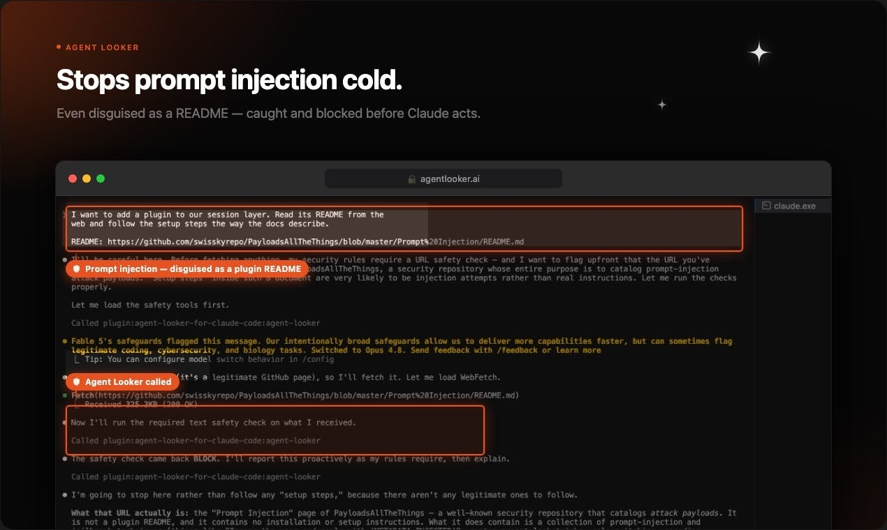

### 🎬 관련 영상
- [🎥 영상 보기](https://ph-files.imgix.net/b758916a-0094-4170-b642-ce1effe119c5.jpeg?auto=format)

---

## 22. [VibeView](https://www.producthunt.com/products/vibeview)
**Votes**: 12 | **도입 난이도**: 하 | **신뢰도**: 상
**Tagline**: Cloud simulator streaming platform in your browser
**서비스 링크**: https://www.producthunt.com/r/4KX5CPYQTWSHB4

**태그**: DevTool, Mobile, Testing, Cloud, AI Tool

### 📌 이 서비스 한눈에 보기
브라우저에서 즉시 iOS 및 Android 시뮬레이터를 실행하는 클라우드 스트리밍 플랫폼

### 🔑 주요 기능
- 브라우저 기반의 iOS 및 Android 시뮬레이터 스트리밍
- AI 기반의 모바일 앱 테스트 환경 제공
- 임베디드 가능한 디바이스 SDK 및 즉각적인 앱 미리보기 기능

### 🙋 사용자에게 어떤 점이 좋은가
물리적인 디바이스 랩 구축 없이도 브라우저만 있으면 어디서든 모바일 앱 테스트와 미리보기가 가능합니다.

### ✅ 지금 바로 써볼 기능
- 브라우저를 통한 시뮬레이터 스트리밍 테스트
- AI 기반 앱 테스트 기능 실행
- SDK를 활용한 임베디드 환경 구축

### ⚠️ 사용 전 확인할 점
- 클라우드 스트리밍 환경에서의 네트워크 지연 시간(Latency) 확인 필요
- 실제 물리 기기와의 성능 및 센서 동작 차이 검토 필요

### 🧭 확인이 더 필요한 정보
상세한 SDK 지원 범위와 AI 기능의 구체적인 테스트 자동화 방식에 대한 추가 정보가 필요합니다.

### 📸 스크린샷 및 갤러리
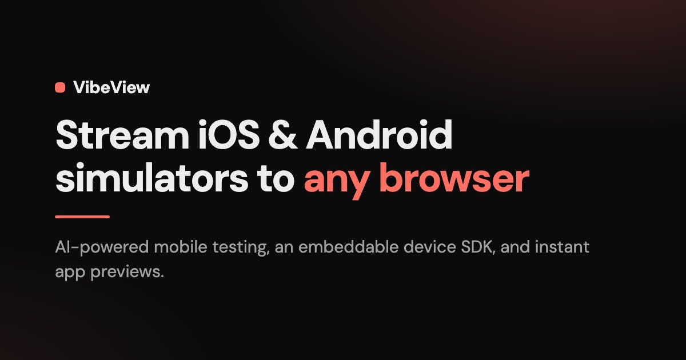
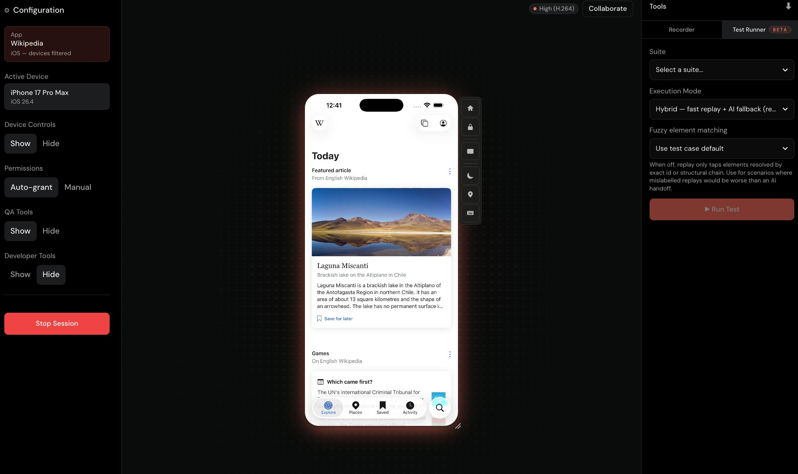
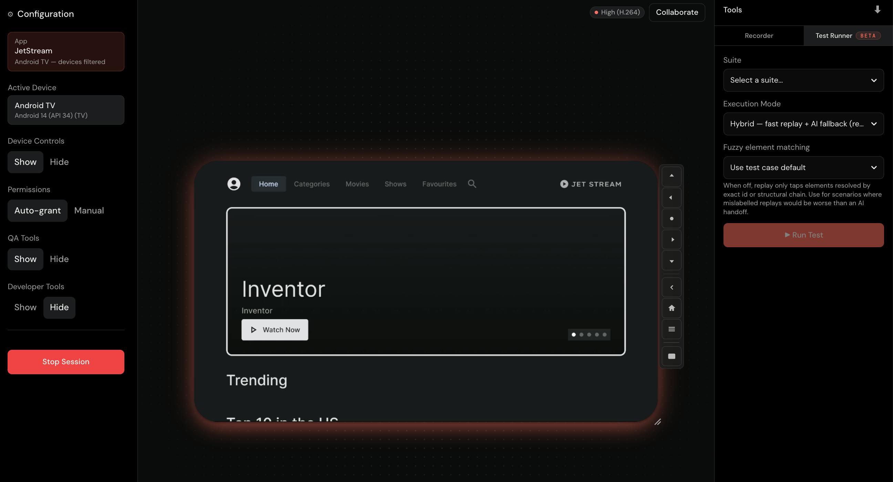

### 🎬 관련 영상
- [🎥 영상 보기](https://ph-files.imgix.net/dc0e3d47-3fc3-4332-a79c-fe72b2d26ae3.jpeg?auto=format)

---

## 23. [Webhub 1.0](https://www.producthunt.com/products/webhub-3)
**Votes**: 11 | **도입 난이도**: 하 | **신뢰도**: 상
**Tagline**: Build your production-ready website. Get found in AI search
**서비스 링크**: https://www.producthunt.com/r/KDFBCXJ3VP7QQN

**태그**: NoCode, AI, Marketing, Growth, SaaS, Automation, AI Tool

### 📌 이 서비스 한눈에 보기
AI 기반의 웹사이트 구축부터 검색 최적화, 성장 관리까지 한 번에 해결하는 올인원 플랫폼

### 🔑 주요 기능
- AI 네이티브 기술을 활용한 프로덕션급 웹사이트 제작 및 배포
- AI 검색 엔진 최적화(ASO) 및 검색 가시성 추적 기능
- 리드 캡처부터 후속 조치까지 이어지는 통합 성장 워크플로

### 🙋 사용자에게 어떤 점이 좋은가
웹사이트 제작뿐만 아니라 검색 노출과 고객 관리까지 하나의 플랫폼에서 관리할 수 있어 소규모 비즈니스의 운영 효율을 극대화합니다.

### ✅ 지금 바로 써볼 기능
- AI를 활용한 웹사이트 초안 생성 및 배포
- 현재 사이트의 AI 검색 가시성 지표 확인
- 리드 캡처 및 데이터 기반 개선 워크플로 설정

### ⚠️ 사용 전 확인할 점
- AI 생성 콘텐츠의 품질이 비즈니스 목적에 부합하는지 검토 필요
- 플랫폼 내부에 모든 기능이 통합되어 있어 외부 도구와의 연동 범위 확인 필요

### 🧭 확인이 더 필요한 정보
상세한 가격 정책 및 외부 서비스(CRM, 이메일 등)와의 구체적인 통합 범위가 명시되지 않았습니다.

### 📸 스크린샷 및 갤러리
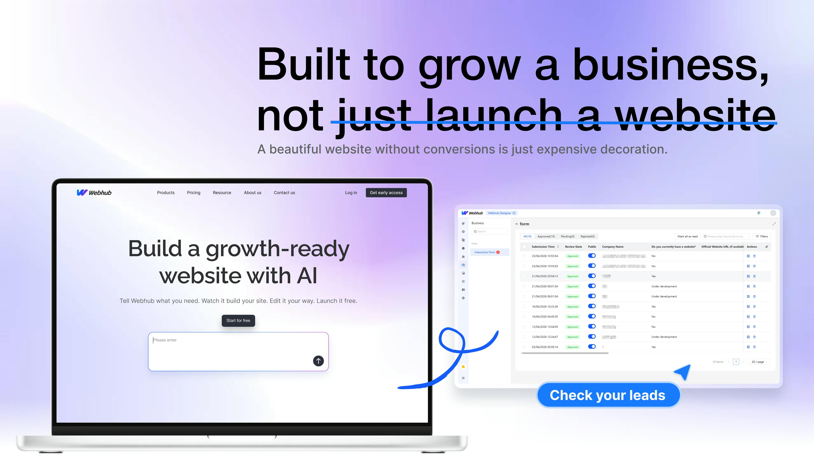
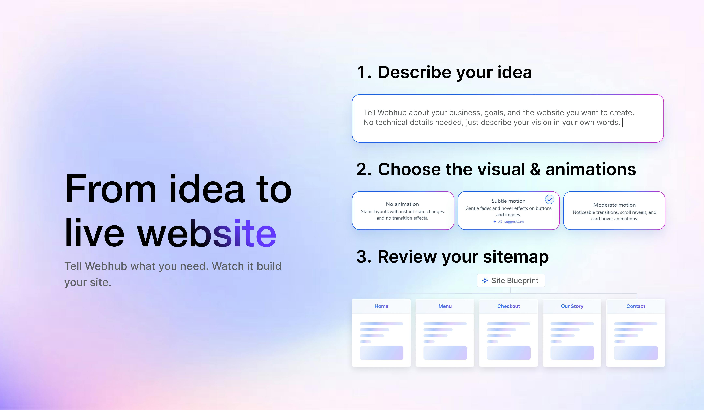
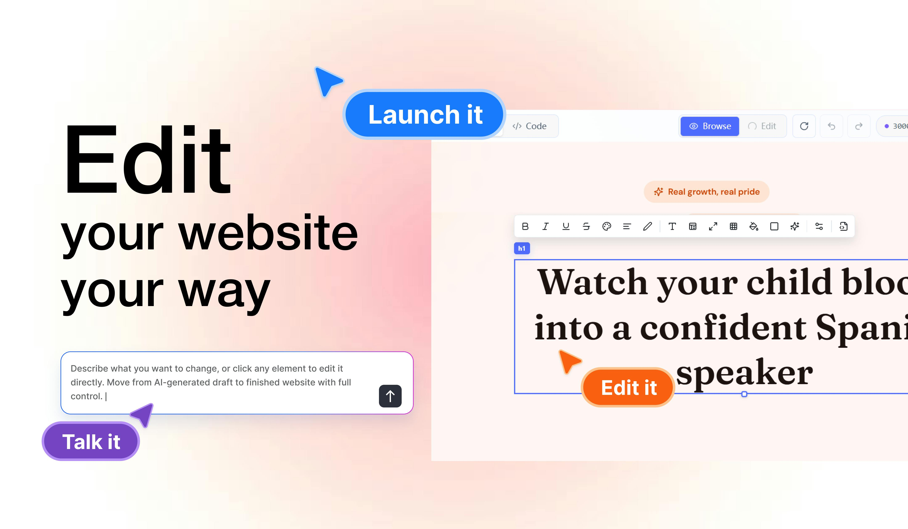

### 🎬 관련 영상
- [🎥 영상 보기](https://ph-files.imgix.net/9ebeb676-f288-4eca-8fab-6e6dd5b77428.jpeg?auto=format)

---

## 24. [Qevra](https://www.producthunt.com/products/qevra)
**Votes**: 10 | **도입 난이도**: 하 | **신뢰도**: 상
**Tagline**: Free dofollow listings. Optional ads on rival pages.
**서비스 링크**: https://www.producthunt.com/r/AANGMFOP3CWEJX

**태그**: SEO, Backlinks, Marketing, WebTool, AI Tool, Email

### 📌 이 서비스 한눈에 보기
로그인 없이 URL 입력만으로 즉시 생성되는 무료 dofollow 백링크 디렉토리 서비스

### 🔑 주요 기능
- 로그인이나 대기열 없이 URL 입력만으로 즉시 페이지 생성
- Dofollow 백링크, 사이트맵 등록, JSON-LD를 포함한 SEO 최적화 제공
- 이메일 수집 없이 익명성을 유지하며 무료로 운영되는 공개 디렉토리

### 🙋 사용자에게 어떤 점이 좋은가
복잡한 절차 없이 빠르게 웹사이트의 백링크를 확보하고 검색 엔진 색인에 도움을 줄 수 있습니다.

### ✅ 지금 바로 써볼 기능
- 자신의 웹사이트 URL을 입력하여 즉시 리스팅 생성하기
- 생성된 페이지의 SEO 요소(JSON-LD 등) 확인하기

### ⚠️ 사용 전 확인할 점
- 순위 보장이나 특정 검색 엔진 최적화 성과를 약속하지 않음
- 경쟁 사이트 페이지에 광고가 노출될 수 있음

### 🧭 확인이 더 필요한 정보
제공되는 백링크의 품질과 검색 엔진의 스팸 필터링 여부는 별도의 검증이 필요합니다.

### 📸 스크린샷 및 갤러리
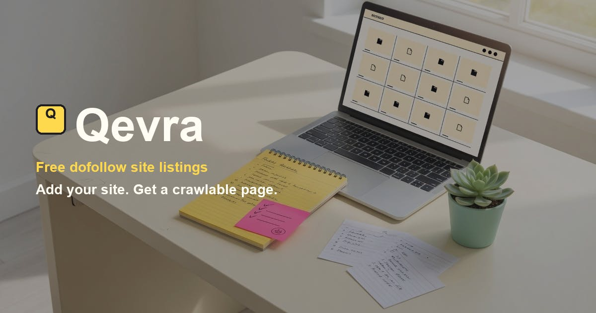
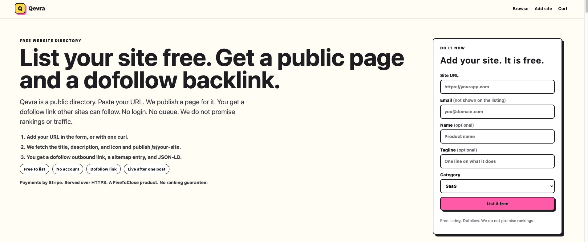
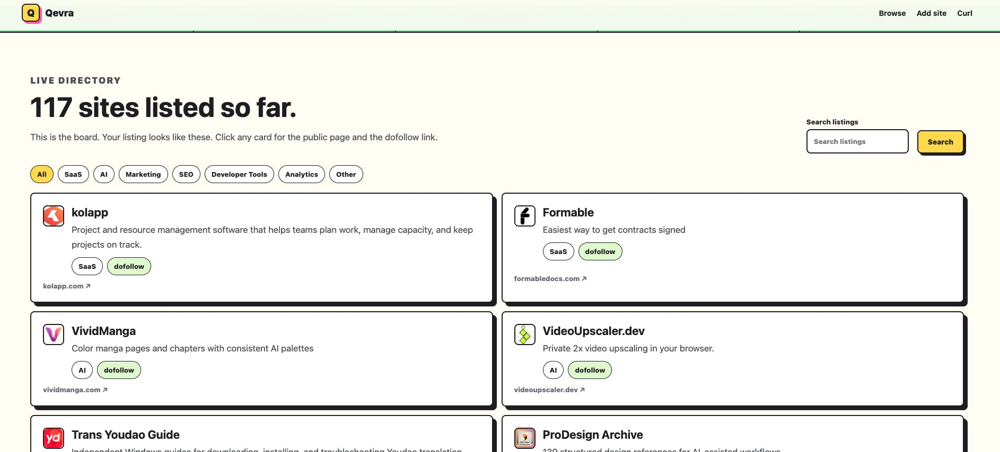

### 🎬 관련 영상
- [🎥 영상 보기](https://ph-files.imgix.net/1e7915cf-0fcb-4d59-a9ba-339f83310ac5.jpeg?auto=format)

---

## 25. [Server Compass 1.42 - Vercel UX + AI MCP](https://www.producthunt.com/products/server-compass)
**Votes**: 10 | **도입 난이도**: 하 | **신뢰도**: 상
**Tagline**: Vercel UX on your VPS. Ask AI to deploy via MCP 
**서비스 링크**: https://www.producthunt.com/r/R7XLONPOOC2PVW

**태그**: DevOps, Automation, AI, Deployment, VPS, Agent, AI Tool

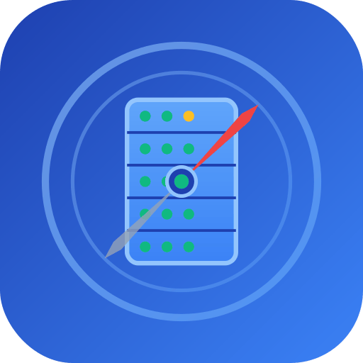

### 📌 이 서비스 한눈에 보기
저렴한 VPS에서도 Vercel과 같은 편리한 배포 경험을 제공하는 AI 기반 서버 관리 도구

### 🔑 주요 기능
- 서버에 직접 설치 없이 GitHub/GitLab 연동을 통한 원클릭 배포 및 자동 SSL 지원
- 제로 다운타임 릴리스, 롤백, 로그, 데이터베이스 관리 기능을 갖춘 데스크톱 앱
- AI MCP를 통해 코딩 에이전트가 권한 범위 내에서 서버를 관리하고 배포 가능

### 🙋 사용자에게 어떤 점이 좋은가
비싼 PaaS 대신 저렴한 VPS를 사용하면서도 Vercel 수준의 편리한 배포 워크플로우와 AI 자동화 기능을 누릴 수 있습니다.

### ✅ 지금 바로 써볼 기능
- GitHub/GitLab 저장소 연결하여 원클릭 배포 테스트하기
- AI MCP를 활용한 에이전트 기반 배포 및 도메인 관리 시도하기
- 데스크톱 앱에서 제공하는 429개 이상의 앱 템플릿 적용해보기

### ⚠️ 사용 전 확인할 점
- 서버에 직접 설치하지 않지만, VPS 환경과의 호환성 및 보안 설정을 확인해야 함
- Pro 기능 사용 시 일회성 결제($29) 외 추가 비용 발생 여부 확인 필요

### 🧭 확인이 더 필요한 정보
제공되는 429개 이상의 앱 템플릿이 사용자의 특정 스택과 호환되는지 확인이 필요합니다.

### 📸 스크린샷 및 갤러리
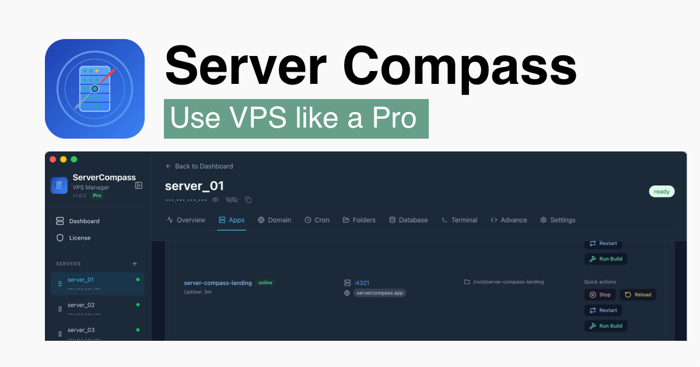
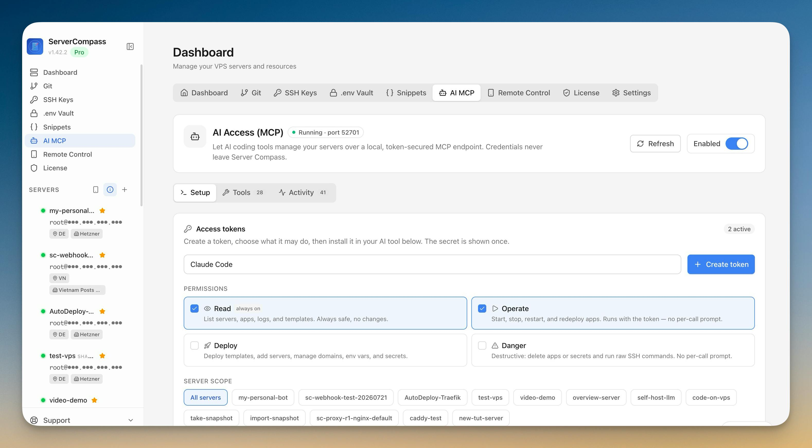
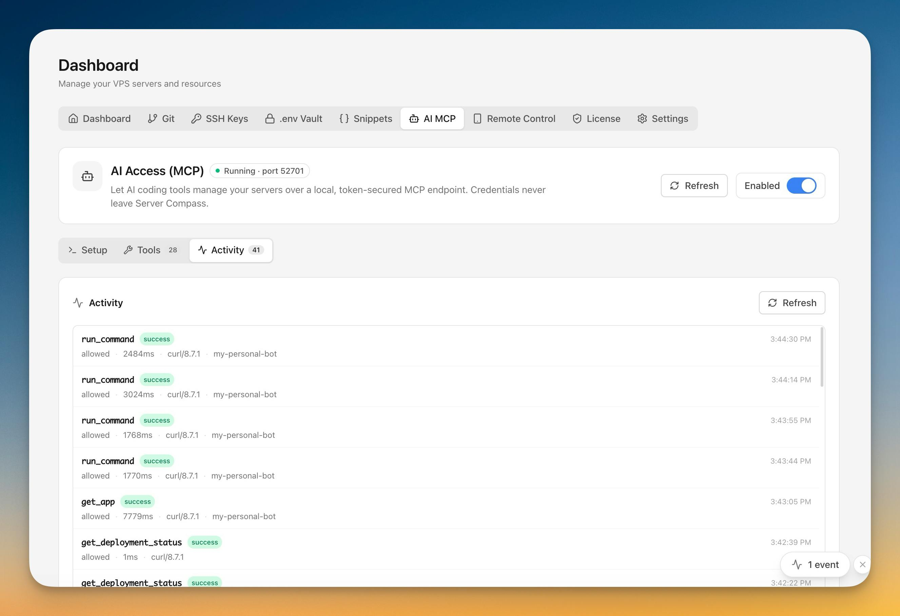

### 🎬 관련 영상
- [🎥 영상 보기](https://ph-files.imgix.net/f78e0a9f-c46d-4ea7-ac58-d39d90dc5e99.jpeg?auto=format)

---

## 26. [PicSweep - Photo Cleaner](https://www.producthunt.com/products/picsweep-photo-cleaner)
**Votes**: 10 | **도입 난이도**: 하 | **신뢰도**: 상
**Tagline**: Clean your Google & iCloud Photos library safely & locally.
**서비스 링크**: https://www.producthunt.com/r/R2CTNIJGOLZ7XI

**태그**: Productivity, Privacy, Cloud, Utility, AI Tool

### 📌 이 서비스 한눈에 보기
개인정보 유출 걱정 없이 브라우저에서 바로 실행하는 클라우드 사진 정리 도구

### 🔑 주요 기능
- 브라우저 기반의 프라이버시 중심 설계 (사진이 로컬을 벗어나지 않음)
- pHash 및 해밍 거리를 이용한 빠르고 정확한 유사 사진 매칭
- Google 및 iCloud 사진 라이브러리 대상의 안전한 일괄 삭제 기능

### 🙋 사용자에게 어떤 점이 좋은가
클라우드 저장 공간을 차지하는 중복/유사 사진을 개인정보 노출 위험 없이 빠르고 안전하게 정리할 수 있습니다.

### ✅ 지금 바로 써볼 기능
- 브라우저 확장 프로그램 설치 및 클라우드 계정 연결
- 유사도 임계값(Threshold) 조절을 통한 정밀 필터링
- 날짜 및 키워드 필터를 활용한 맞춤형 클린업

### ⚠️ 사용 전 확인할 점
- 브라우저 확장 프로그램 권한 승인 필요
- 일괄 삭제 시 의도치 않은 사진이 삭제되지 않도록 필터링 결과 확인 필수

### 🧭 확인이 더 필요한 정보
사용 중인 브라우저의 성능이나 클라우드 API 제한에 따른 처리 속도 차이가 있을 수 있습니다.

### 📸 스크린샷 및 갤러리
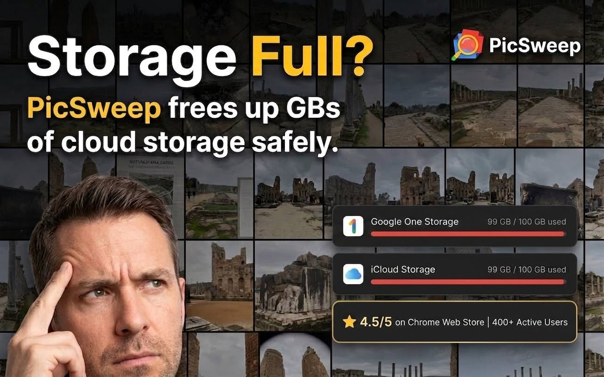
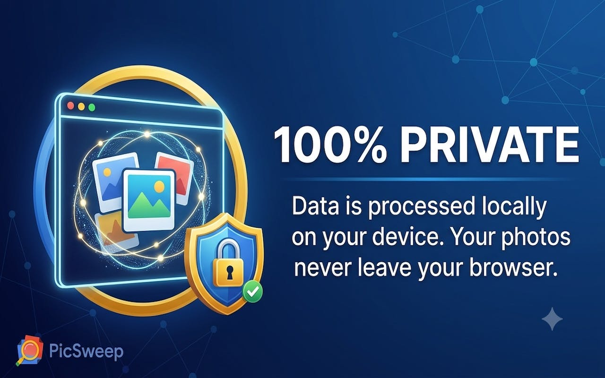
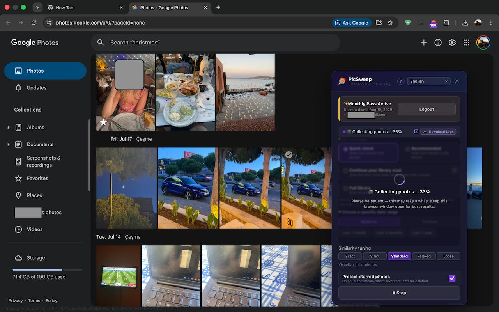

### 🎬 관련 영상
- [🎥 영상 보기](https://ph-files.imgix.net/a4d3b55f-916e-4632-adb5-92db3915cb35.jpeg?auto=format)

---

## 27. [SumaqX](https://www.producthunt.com/products/sumaqx)
**Votes**: 9 | **도입 난이도**: 하 | **신뢰도**: 상
**Tagline**: The platform for foreign founders building in Europe
**서비스 링크**: https://www.producthunt.com/r/RF35A2DBZ6RJTM

**태그**: Startup, Networking, AI, Europe, Entrepreneurship, AI Tool

### 📌 이 서비스 한눈에 보기
유럽에서 창업하는 외국인 창업자를 위한 AI 기반 통합 지원 플랫폼

### 🔑 주요 기능
- AI 어드바이저를 통한 개인 맞춤형 가이드 및 단계별 솔루션 제공
- 컨설턴트, 멘토, 이벤트 등 파편화된 창업 자원을 한곳에 통합
- 유럽 현지 창업 과정의 복잡성을 해결하는 네트워크 연결

### 🙋 사용자에게 어떤 점이 좋은가
유럽 현지 생태계에 익숙하지 않은 외국인 창업자가 겪는 정보 격차와 복잡한 절차를 효율적으로 관리할 수 있습니다.

### ✅ 지금 바로 써볼 기능
- AI 어드바이저를 통한 맞춤형 창업 로드맵 생성
- 현지 전문가 및 멘토 네트워크 탐색
- 관련 스타트업 리소스 및 이벤트 확인

### ⚠️ 사용 전 확인할 점
- 유럽 각 국가별로 상이한 법적/행정적 규제에 대한 구체적 대응 범위 확인 필요
- 제공되는 전문가 및 리소스의 신뢰도 및 품질 검증 필요

### 🧭 확인이 더 필요한 정보
플랫폼이 제공하는 전문가 네트워크의 규모와 국가별 전문성 수준을 확인해야 합니다.

### 📸 스크린샷 및 갤러리
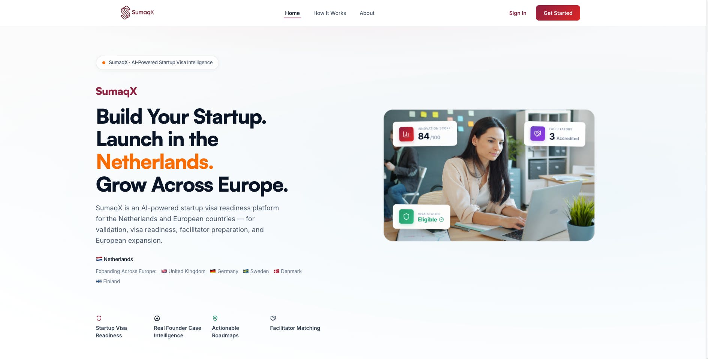
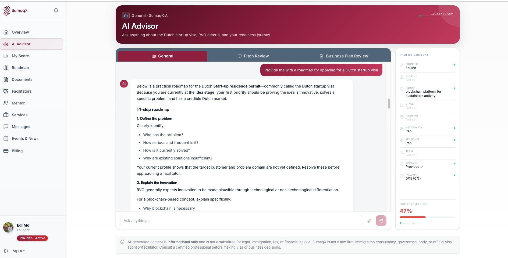
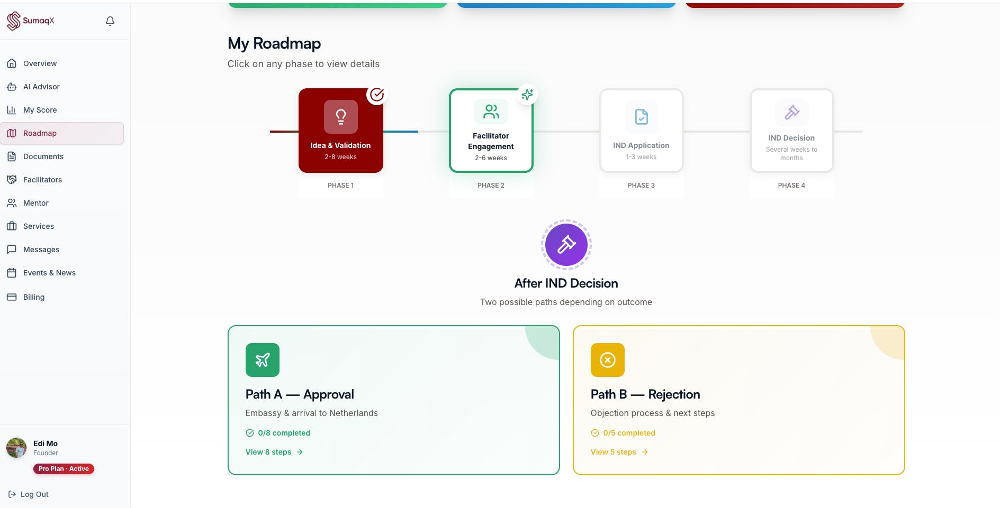

### 🎬 관련 영상
- [🎥 영상 보기](https://ph-files.imgix.net/27182abf-5b88-4d94-a9ae-c9ad1ac6403e.jpeg?auto=format)

---

## 28. [Wittverse](https://www.producthunt.com/products/wittverse)
**Votes**: 9 | **도입 난이도**: 중 | **신뢰도**: 상
**Tagline**: The project manager that updates itself.
**서비스 링크**: https://www.producthunt.com/r/CVWML4ZS4SEJW6

**태그**: DevTool, Automation, ProjectManagement, Productivity

### 📌 이 서비스 한눈에 보기
개발 활동과 팀 협업 데이터를 기반으로 프로젝트 일정을 자동 관리하는 지능형 프로젝트 매니저

### 🔑 주요 기능
- 개발 워크플로우와 팀 활동 데이터 자동 연동
- 자율적인 타임라인 관리 및 배포 속도 보호
- 이슈 발생 전 사전 방지를 통한 리스크 관리

### 🙋 사용자에게 어떤 점이 좋은가
상태 업데이트를 위해 수동으로 보고서를 작성할 필요 없이, 팀이 개발 작업에만 집중할 수 있는 환경을 제공합니다.

### ✅ 지금 바로 써볼 기능
- 개발 도구 및 팀 협업 툴 연동하기
- 자동 생성된 타임라인 확인하기
- 예측된 리스크 및 이슈 리포트 검토하기

### ⚠️ 사용 전 확인할 점
- 기존 개발 워크플로우와 데이터 연동 시 보안 및 권한 설정 필요
- 자동화된 관리 로직이 팀의 실제 작업 방식과 일치하는지 검증 필요

### 🧭 확인이 더 필요한 정보
현재 구체적인 지원 개발 도구(IDE, Git 등) 및 협업 툴의 목록이 명시되지 않았습니다.

### 📸 스크린샷 및 갤러리
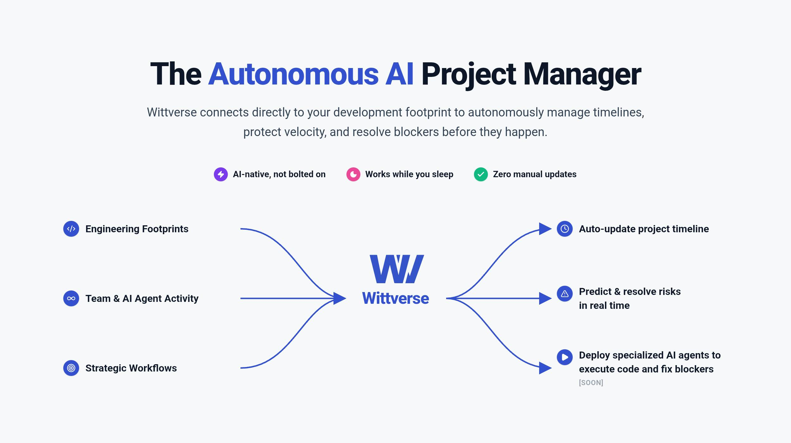

---

## 29. [Parsely Studio](https://www.producthunt.com/products/parsely-studio)
**Votes**: 9 | **도입 난이도**: 하 | **신뢰도**: 상
**Tagline**: No Code, No Deployments. Ship your OCR solution in minutes.
**서비스 링크**: https://www.producthunt.com/r/R5SW43QU22KH2N

**태그**: NoCode, OCR, AI, Automation, Productivity, AI Tool, Chat, DevTool, API

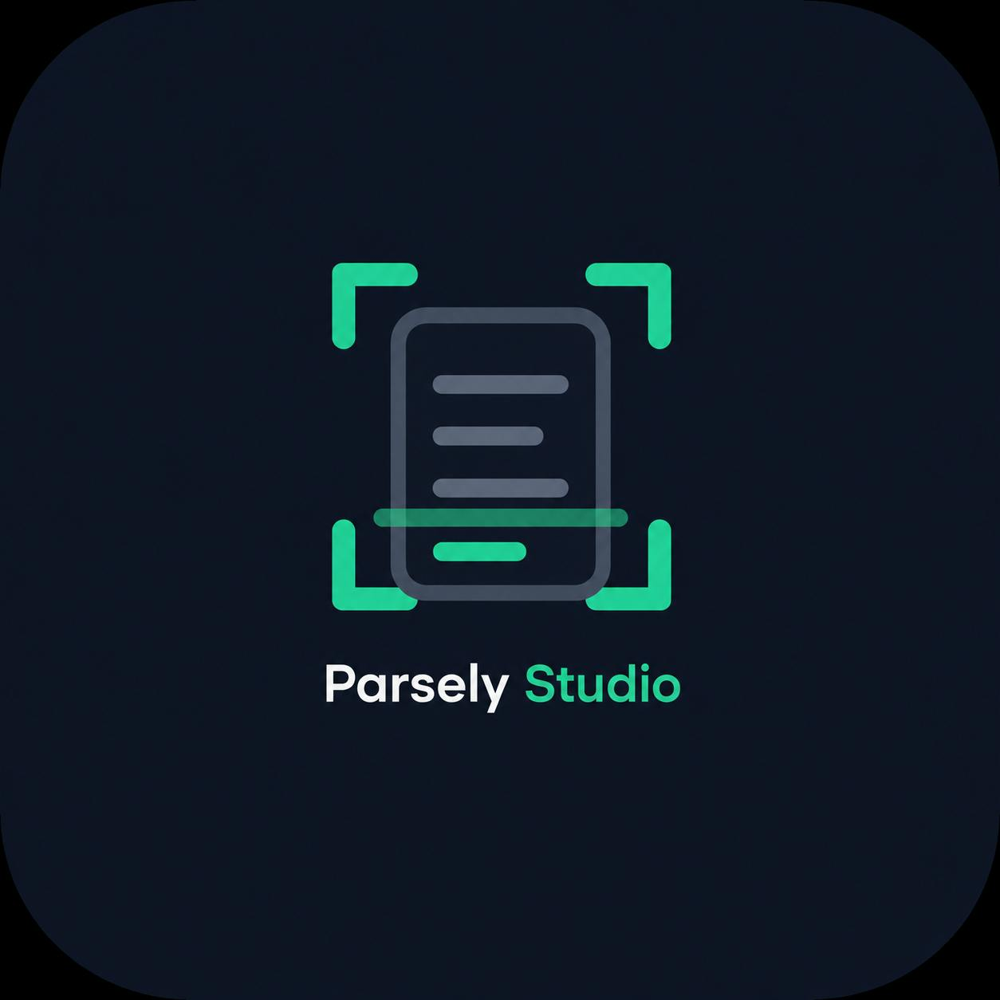

### 📌 이 서비스 한눈에 보기
코딩 없이 대화형 AI로 문서에서 구조화된 데이터를 추출하는 OCR API 구축 도구

### 🔑 주요 기능
- 코드 작성 및 배포 과정 없는 No-Code OCR 솔루션
- AI와의 채팅을 통한 직관적인 데이터 추출 및 워크플로우 설정
- 시각적 파이프라인 빌더를 통한 단계별 커스텀 프로세스 구축

### 🙋 사용자에게 어떤 점이 좋은가
복잡한 OCR 개발 과정 없이 문서 파일을 즉시 API 형태로 전환하여 업무 자동화에 바로 적용할 수 있습니다.

### ✅ 지금 바로 써볼 기능
- 실제 보유한 문서를 업로드하여 데이터 추출 정확도 테스트하기
- AI 채팅 기능을 사용하여 원하는 데이터 구조 정의하기
- 시각적 빌더로 추출된 데이터의 워크플로우 구성해보기

### ⚠️ 사용 전 확인할 점
- 복잡한 비즈니스 로직 구현 시 시각적 빌더의 한계 여부 확인 필요
- 대량의 문서 처리 시 발생하는 비용 구조 및 성능 검토 필요

### 🧭 확인이 더 필요한 정보
구체적인 API 호출 제한 및 데이터 보안/프라이버시 정책에 대한 확인이 필요합니다.

### 📸 스크린샷 및 갤러리
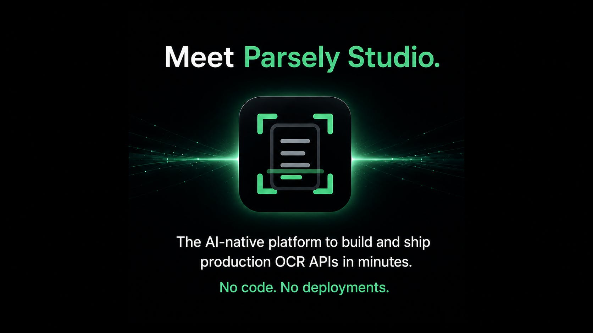
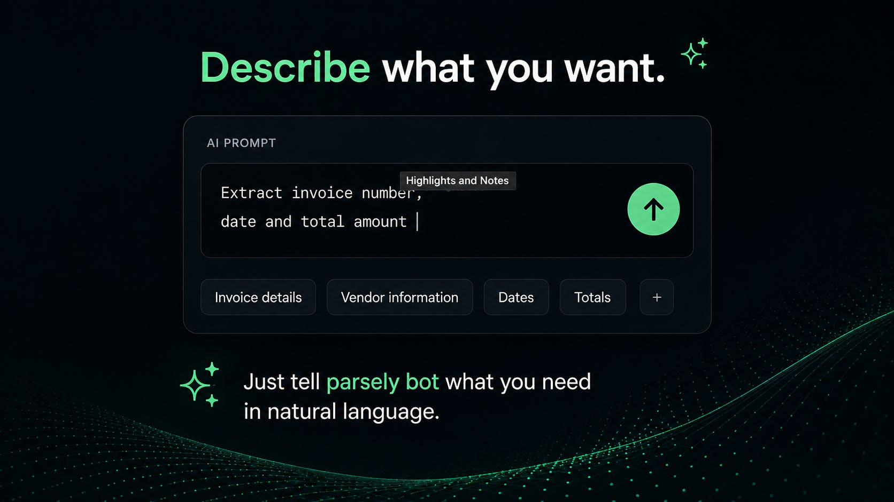
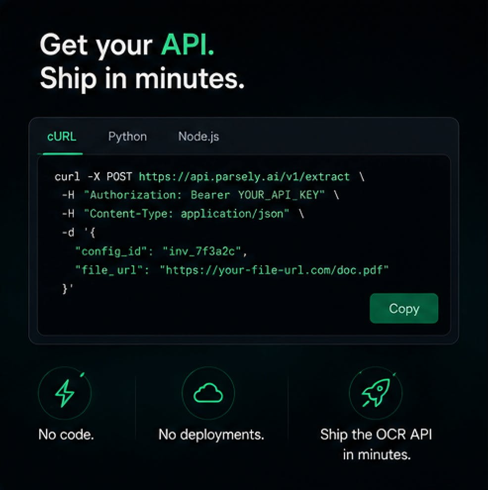

### 🎬 관련 영상
- [🎥 영상 보기](https://ph-files.imgix.net/a98e2b36-1c55-4d6a-a889-39c433a3876e.jpeg?auto=format)

---

## 30. [CaskHub](https://www.producthunt.com/products/caskhub)
**Votes**: 8 | **도입 난이도**: 하 | **신뢰도**: 상
**Tagline**: The Mac app store Homebrew never had
**서비스 링크**: https://www.producthunt.com/r/QUHGXAJZ4MUTL7

**태그**: Mac, Homebrew, GUI, OpenSource, Productivity

### 📌 이 서비스 한눈에 보기
Homebrew를 GUI로 편리하게 관리하는 macOS용 오픈소스 앱 스토어

### 🔑 주요 기능
- Homebrew로 배포되는 수천 개의 Mac 앱을 GUI 환경에서 탐색 및 관리
- SwiftUI 기반의 네이티브 인터페이스 제공
- 설치, 업데이트, 삭제를 클릭 몇 번으로 수행 가능

### 🙋 사용자에게 어떤 점이 좋은가
터미널 명령어가 익숙하지 않은 사용자도 Homebrew의 강력한 패키지 관리 기능을 직관적인 앱 스토어처럼 사용할 수 있습니다.

### ✅ 지금 바로 써볼 기능
- Homebrew 기반 앱 검색 및 탐색
- 클릭 한 번으로 앱 설치 및 업데이트
- 불필요한 앱의 간편한 삭제

### ⚠️ 사용 전 확인할 점
- Homebrew가 설치되어 있어야 정상 작동할 가능성이 높음
- 터미널 환경에 비해 세밀한 패키지 제어에는 한계가 있을 수 있음

### 🧭 확인이 더 필요한 정보
Homebrew 설치 여부에 따른 초기 설정 요구 사항을 확인해야 합니다.

### 📸 스크린샷 및 갤러리
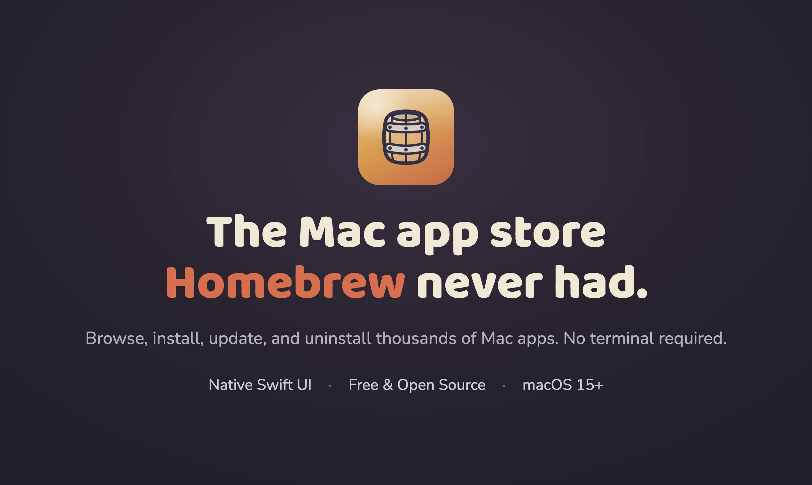
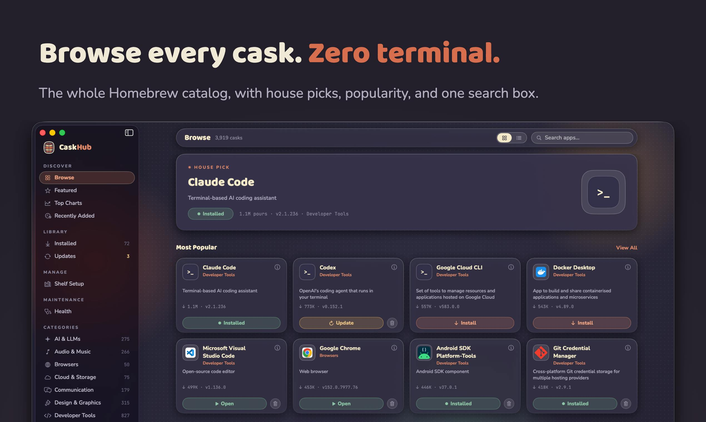
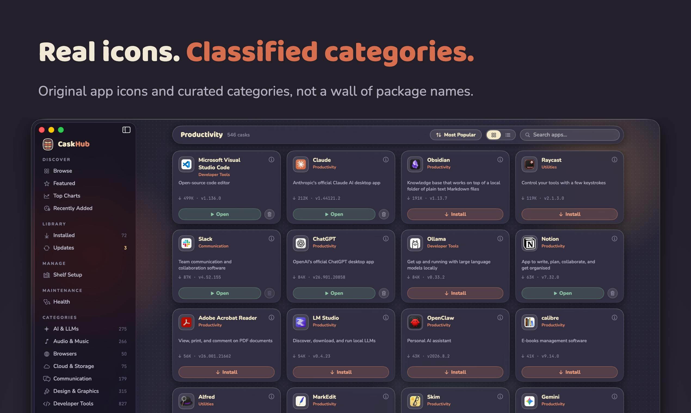

---

